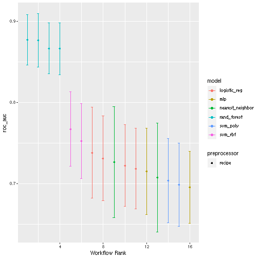
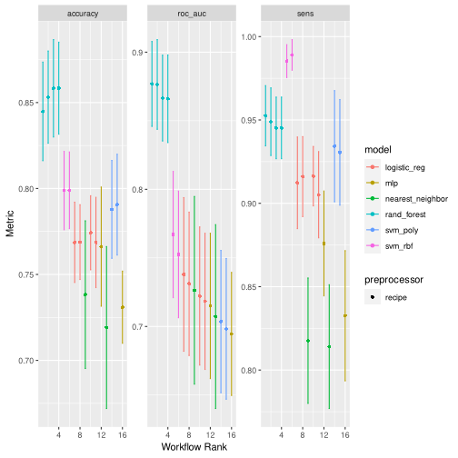
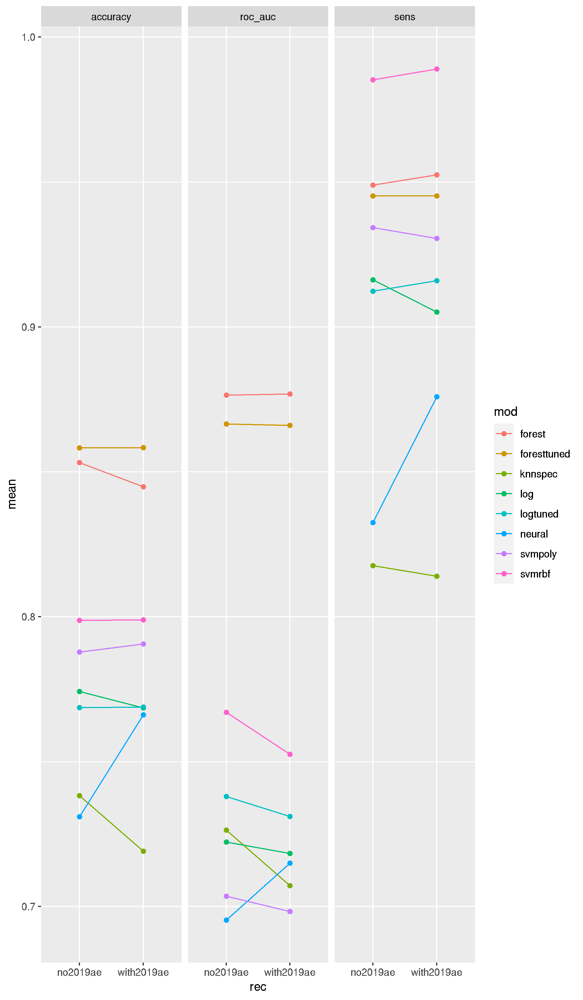
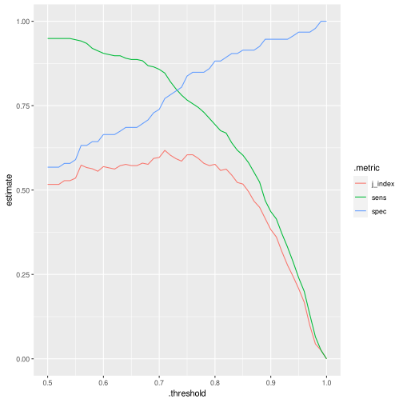
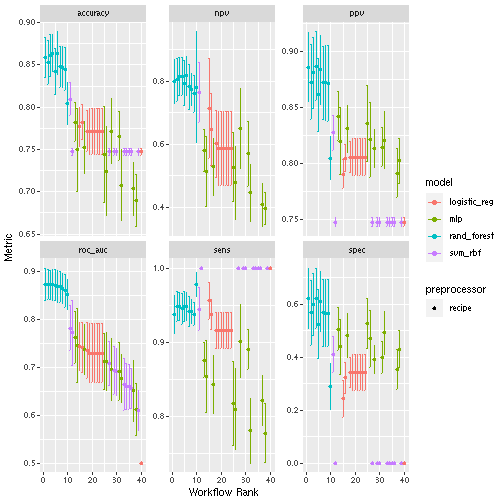
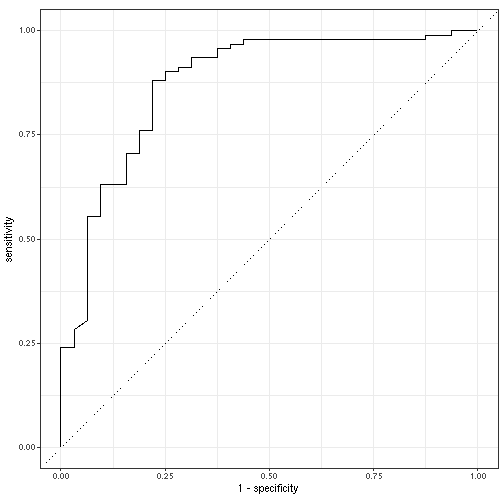

# Baseline model

The goal of this documents is to compare some tuned and untuned models on a "baseline" dataset. We want to predict whether AE in 2020 goes above 3. We are only using 2019 data here! Next steps will be adding time-dependent data (e.g. COVID deaths per week per zipcode).

## Common data

```r
library(tidyverse)
```

```
## ── Attaching packages ───────────────────────────────────────────────── tidyverse 1.3.1 ──
```

```
## ✔ ggplot2 3.3.5     ✔ purrr   0.3.4
## ✔ tibble  3.1.2     ✔ dplyr   1.0.7
## ✔ tidyr   1.1.3     ✔ stringr 1.4.0
## ✔ readr   2.0.0     ✔ forcats 0.5.1
```

```
## ── Conflicts ──────────────────────────────────────────────────── tidyverse_conflicts() ──
## ✖ dplyr::filter() masks stats::filter()
## ✖ dplyr::lag()    masks stats::lag()
```

```r
library(tidymodels)
```

```
## Registered S3 method overwritten by 'tune':
##   method                   from   
##   required_pkgs.model_spec parsnip
```

```
## ── Attaching packages ──────────────────────────────────────────────── tidymodels 0.1.3 ──
```

```
## ✔ broom        0.7.8      ✔ rsample      0.1.0 
## ✔ dials        0.0.9      ✔ tune         0.1.6 
## ✔ infer        0.5.4      ✔ workflows    0.2.3 
## ✔ modeldata    0.1.1      ✔ workflowsets 0.0.2 
## ✔ parsnip      0.1.7      ✔ yardstick    0.0.8 
## ✔ recipes      0.1.16
```

```
## ── Conflicts ─────────────────────────────────────────────────── tidymodels_conflicts() ──
## ✖ scales::discard() masks purrr::discard()
## ✖ dplyr::filter()   masks stats::filter()
## ✖ recipes::fixed()  masks stringr::fixed()
## ✖ dplyr::lag()      masks stats::lag()
## ✖ yardstick::spec() masks readr::spec()
## ✖ recipes::step()   masks stats::step()
## • Use tidymodels_prefer() to resolve common conflicts.
```

```r
library(probably)
```

```
## 
## Attaching package: 'probably'
```

```
## The following objects are masked from 'package:base':
## 
##     as.factor, as.ordered
```

```r
library(themis)
```

```
## Registered S3 methods overwritten by 'themis':
##   method                  from   
##   bake.step_downsample    recipes
##   bake.step_upsample      recipes
##   prep.step_downsample    recipes
##   prep.step_upsample      recipes
##   tidy.step_downsample    recipes
##   tidy.step_upsample      recipes
##   tunable.step_downsample recipes
##   tunable.step_upsample   recipes
```

```
## 
## Attaching package: 'themis'
```

```
## The following objects are masked from 'package:recipes':
## 
##     step_downsample, step_upsample
```

```r
library(feather)
library(magrittr)
```

```
## 
## Attaching package: 'magrittr'
```

```
## The following object is masked from 'package:purrr':
## 
##     set_names
```

```
## The following object is masked from 'package:tidyr':
## 
##     extract
```

```r
library(skimr)
library(vip)
```

```
## 
## Attaching package: 'vip'
```

```
## The following object is masked from 'package:nvimcom':
## 
##     vi
```

```
## The following object is masked from 'package:utils':
## 
##     vi
```

```r
per <- read_feather("data/simulation_data/all_persons.feather")
```

Compute some summary statistic for each client.

```r
clients <-
  per %>%
  group_by(client) %>%
  summarize(
    zip3 = first(zip3),
    size = n(),
    volume = sum(FaceAmt),
    avg_qx = mean(qx),
    avg_age = mean(Age),
    per_male = sum(Sex == "Male") / size,
    per_blue_collar = sum(collar == "blue") / size,
    expected = sum(qx * FaceAmt),
    actual_2020 = sum(FaceAmt[year == 2020], na.rm = TRUE),
    ae_2020 = actual_2020 / expected,
    actual_2019 = sum(FaceAmt[year == 2019], na.rm = TRUE),
    ae_2019 = actual_2019 / expected,
    adverse = as_factor(if_else(ae_2020 > 3, "ae > 3", "ae < 3"))
  ) %>%
  relocate(adverse, ae_2020, .after = zip3) %>%
  mutate(adverse = fct_relevel(adverse, c("ae > 3", "ae < 3")))
```

We can add some demographic information based on zip3.

```r
zip_data <-
  read_feather("data/data.feather") %>%
  mutate(
    density = POP / AREALAND,
    AREALAND = NULL,
    AREA = NULL,
    HU = NULL,
    vaccinated = NULL,
    per_lib = NULL,
    per_green = NULL,
    per_other = NULL,
    per_rep = NULL,
    unempl_2020 = NULL,
    deaths_covid = NULL,
    deaths_all = NULL
  ) %>%
  rename(
    unemp = unempl_2019,
    hes_uns = hes_unsure,
    str_hes = strong_hes,
    income = Median_Household_Income_2019
  )
```
There seems to be some clients with some zip codes that we cannot deal with. These are the ones

```r
clients %>%
  anti_join(zip_data, by = "zip3") %>%
  select(zip3)
```

```
## # A tibble: 6 x 1
##   zip3 
##   <chr>
## 1 969  
## 2 093  
## 3 732  
## 4 872  
## 5 004  
## 6 202
```
These correspond to the following areas

ZIP3 | Area       |
-----|------------|
969  | Guam, Palau, Federated States of Micronesia, Northern Mariana Islands, Marshall Islands |
093  | Military bases in Iraq and Afghanistan |
732  | Not in use |
872  | Not in use |
004  | Not in use |
202  | Washington DC, Government 1 |

We ignore clients with these zip codes. There are also two clients in DC for which we're missing election data. We will ignore those as well.

```r
clients %<>%
  inner_join(zip_data, by = "zip3") %>%
  drop_na()
```

We now have our full dataset. Behold!

```r
skim(clients)
```


Table: Data summary

|                         |        |
|:------------------------|:-------|
|Name                     |clients |
|Number of rows           |492     |
|Number of columns        |31      |
|_______________________  |        |
|Column type frequency:   |        |
|character                |2       |
|factor                   |1       |
|numeric                  |28      |
|________________________ |        |
|Group variables          |None    |


**Variable type: character**

|skim_variable | n_missing| complete_rate| min| max| empty| n_unique| whitespace|
|:-------------|---------:|-------------:|---:|---:|-----:|--------:|----------:|
|client        |         0|             1|   1|   3|     0|      492|          0|
|zip3          |         0|             1|   3|   3|     0|      222|          0|


**Variable type: factor**

|skim_variable | n_missing| complete_rate|ordered | n_unique|top_counts         |
|:-------------|---------:|-------------:|:-------|--------:|:------------------|
|adverse       |         0|             1|FALSE   |        2|ae : 367, ae : 125 |


**Variable type: numeric**

|skim_variable   | n_missing| complete_rate|         mean|           sd|         p0|          p25|          p50|          p75|         p100|hist  |
|:---------------|---------:|-------------:|------------:|------------:|----------:|------------:|------------:|------------:|------------:|:-----|
|ae_2020         |         0|             1|        15.08|        27.46|       0.00|         2.98|         6.46|        14.09| 2.329000e+02|▇▁▁▁▁ |
|size            |         0|             1|      2783.93|      2368.37|      50.00|      1026.25|      2120.50|      3969.50| 1.427000e+04|▇▃▁▁▁ |
|volume          |         0|             1| 432951568.75| 406654465.55| 6235075.00| 151797887.50| 335064812.50| 587443900.00| 4.350904e+09|▇▁▁▁▁ |
|avg_qx          |         0|             1|         0.00|         0.00|       0.00|         0.00|         0.00|         0.00| 0.000000e+00|▁▇▇▂▁ |
|avg_age         |         0|             1|        41.56|         2.05|      37.68|        40.12|        41.11|        42.49| 4.865000e+01|▃▇▃▁▁ |
|per_male        |         0|             1|         0.57|         0.10|       0.22|         0.50|         0.56|         0.64| 8.900000e-01|▁▃▇▅▁ |
|per_blue_collar |         0|             1|         1.00|         0.00|       1.00|         1.00|         1.00|         1.00| 1.000000e+00|▁▁▇▁▁ |
|expected        |         0|             1|   1076643.68|   1056824.25|   11604.50|    350329.91|    831644.68|   1439648.44| 1.189955e+07|▇▁▁▁▁ |
|actual_2020     |         0|             1|  15432043.75|  44771997.48|       0.00|   1963387.50|   4525375.00|  13923600.00| 5.232112e+08|▇▁▁▁▁ |
|actual_2019     |         0|             1|   1088745.83|   1251334.51|       0.00|    224218.75|    674962.50|   1605662.50| 1.378420e+07|▇▁▁▁▁ |
|ae_2019         |         0|             1|         0.97|         0.80|       0.00|         0.47|         0.84|         1.28| 6.290000e+00|▇▂▁▁▁ |
|nohs            |         0|             1|        11.20|         3.75|       4.00|         8.44|        10.78|        12.90| 2.165000e+01|▂▇▅▁▂ |
|hs              |         0|             1|        23.75|         7.02|      12.10|        18.90|        23.10|        27.50| 4.680000e+01|▅▇▅▂▁ |
|college         |         0|             1|        28.45|         4.83|      13.50|        25.60|        28.58|        31.56| 3.980000e+01|▁▃▇▆▂ |
|bachelor        |         0|             1|        36.62|        10.42|      14.07|        30.00|        35.36|        43.04| 6.130000e+01|▂▇▇▆▂ |
|R_birth         |         0|             1|        11.31|         1.17|       8.30|        10.50|        11.20|        12.00| 1.551000e+01|▁▇▇▂▁ |
|R_death         |         0|             1|         8.13|         1.87|       4.69|         6.80|         7.59|         9.13| 1.401000e+01|▃▇▃▂▁ |
|unemp           |         0|             1|         3.43|         0.87|       2.10|         2.80|         3.31|         3.89| 6.690000e+00|▆▇▃▁▁ |
|poverty         |         0|             1|        10.98|         3.28|       5.04|         8.73|        10.56|        13.30| 2.577000e+01|▆▇▃▁▁ |
|per_dem         |         0|             1|         0.57|         0.16|       0.16|         0.46|         0.58|         0.71| 8.600000e-01|▂▅▇▇▆ |
|hes             |         0|             1|         0.09|         0.04|       0.04|         0.06|         0.07|         0.11| 2.600000e-01|▇▃▂▁▁ |
|hes_uns         |         0|             1|         0.13|         0.05|       0.06|         0.10|         0.12|         0.17| 3.100000e-01|▇▆▅▁▁ |
|str_hes         |         0|             1|         0.05|         0.03|       0.02|         0.03|         0.04|         0.07| 1.800000e-01|▇▅▂▁▁ |
|svi             |         0|             1|         0.46|         0.19|       0.04|         0.33|         0.44|         0.59| 9.200000e-01|▂▆▇▃▂ |
|cvac            |         0|             1|         0.42|         0.21|       0.02|         0.24|         0.41|         0.53| 9.400000e-01|▃▅▇▃▁ |
|income          |         0|             1|     79056.02|     23916.16|   38621.49|     62130.76|     73570.69|     85137.47| 1.352340e+05|▃▇▅▂▂ |
|POP             |         0|             1|    785665.87|    558640.36|   33245.00|    346048.00|    771280.00|    974040.00| 2.906700e+06|▇▇▂▁▁ |
|density         |         0|             1|         0.00|         0.00|       0.00|         0.00|         0.00|         0.00| 3.000000e-02|▇▁▁▁▁ |

## Workflow set
We'll evaluate models using a workflow set. To make our life easier, we will remove some variables and use a formula instead of a recipe.

```r
clients <-
  clients %>%
  select(-client, -zip3, -ae_2020, -actual_2020, -actual_2019)
```

We now gather our recipes and models.

```r
with2019_rec <-
  recipe(adverse ~ ., data = clients) %>%
  step_zv(all_predictors()) %>%
  step_normalize(all_predictors(), -all_nominal())
no2019_rec <-
  with2019_rec %>%
  step_rm(ae_2019)

log_spec <-
  logistic_reg() %>%
  set_engine("glm") %>%
  set_mode("classification")
tuned_log_spec <-
  logistic_reg(penalty = 0.00118) %>%
  set_engine("glmnet") %>%
  set_mode("classification")
forest_spec <-
  rand_forest(trees = 1000) %>%
  set_mode("classification") %>%
  set_engine("ranger", num.threads = 8, importance = "impurity", seed = 123)
tuned_forest_spec <-
  rand_forest(trees = 1000, mtry = 12, min_n = 21) %>%
  set_mode("classification") %>%
  set_engine("ranger", num.threads = 8, importance = "impurity", seed = 123)
# Samara's models
sln_spec <-
  mlp() %>%
  set_engine("nnet") %>%
  set_mode("classification")
svm_rbf_spec <-
  svm_rbf() %>%
  set_engine("kernlab") %>%
  set_mode("classification")
svm_poly_spec <-
  svm_poly() %>%
  set_engine("kernlab") %>%
  set_mode("classification")
knn_spec <-
  nearest_neighbor() %>%
  set_engine("kknn") %>%
  set_mode("classification")

models <- list(log = log_spec,
               logtuned = tuned_log_spec,
               forest = forest_spec,
               foresttuned = tuned_forest_spec,
               neural = sln_spec,
               svmrbf = svm_rbf_spec,
               svmpoly = svm_poly_spec,
               knnspec = knn_spec)
recipes <- list("with2019ae" = with2019_rec,
                "no2019ae" = no2019_rec)
wflows <- workflow_set(recipes, models)
```

Data splitting

```r
set.seed(30308)
init <- initial_split(clients, strata = adverse)
set.seed(30308)
crossval <- vfold_cv(training(init), strata = adverse)
```

Fit all models and estimate metrics using 10-fold cross-validation. We're not performing any tuning here (although we could do that very easily!!!).

```r
fit_wflows <-
  wflows %>%
  workflow_map(fn = "fit_resamples",
               seed = 30332,
               resamples = crossval,
               control = control_resamples(save_pred = TRUE),
               metrics = metric_set(roc_auc, sens, accuracy),
               verbose = TRUE)
## i  1 of 16 resampling: with2019ae_log
## ✔  1 of 16 resampling: with2019ae_log (12.6s)
## i  2 of 16 resampling: with2019ae_logtuned
## ✔  2 of 16 resampling: with2019ae_logtuned (13.4s)
## i  3 of 16 resampling: with2019ae_forest
## ✔  3 of 16 resampling: with2019ae_forest (16.9s)
## i  4 of 16 resampling: with2019ae_foresttuned
## ✔  4 of 16 resampling: with2019ae_foresttuned (18.5s)
## i  5 of 16 resampling: with2019ae_neural
## ✔  5 of 16 resampling: with2019ae_neural (13.6s)
## i  6 of 16 resampling: with2019ae_svmrbf
## ✔  6 of 16 resampling: with2019ae_svmrbf (13.8s)
## i  7 of 16 resampling: with2019ae_svmpoly
## ✔  7 of 16 resampling: with2019ae_svmpoly (14.1s)
## i  8 of 16 resampling: with2019ae_knnspec
## ✔  8 of 16 resampling: with2019ae_knnspec (13.4s)
## i  9 of 16 resampling: no2019ae_log
## ✔  9 of 16 resampling: no2019ae_log (13.3s)
## i 10 of 16 resampling: no2019ae_logtuned
## ✔ 10 of 16 resampling: no2019ae_logtuned (14.1s)
## i 11 of 16 resampling: no2019ae_forest
## ✔ 11 of 16 resampling: no2019ae_forest (17.6s)
## i 12 of 16 resampling: no2019ae_foresttuned
## ✔ 12 of 16 resampling: no2019ae_foresttuned (19.2s)
## i 13 of 16 resampling: no2019ae_neural
## ✔ 13 of 16 resampling: no2019ae_neural (14.4s)
## i 14 of 16 resampling: no2019ae_svmrbf
## ✔ 14 of 16 resampling: no2019ae_svmrbf (14.5s)
## i 15 of 16 resampling: no2019ae_svmpoly
## ✔ 15 of 16 resampling: no2019ae_svmpoly (14.8s)
## i 16 of 16 resampling: no2019ae_knnspec
## ✔ 16 of 16 resampling: no2019ae_knnspec (14.1s)
```

Comparing our metrics for the models (unfortunately I couldn't figure out how to show which recipe was picked...)

```r
autoplot(fit_wflows, metric = "roc_auc")
```



```r
autoplot(fit_wflows)
```



```r
fit_wflows %>% collect_metrics()
```

```
## # A tibble: 48 x 9
##    wflow_id        .config       preproc model    .metric .estimator  mean     n std_err
##    <chr>           <chr>         <chr>   <chr>    <chr>   <chr>      <dbl> <int>   <dbl>
##  1 with2019ae_log  Preprocessor… recipe  logisti… accura… binary     0.769    10  0.0160
##  2 with2019ae_log  Preprocessor… recipe  logisti… roc_auc binary     0.718    10  0.0302
##  3 with2019ae_log  Preprocessor… recipe  logisti… sens    binary     0.905    10  0.0157
##  4 with2019ae_log… Preprocessor… recipe  logisti… accura… binary     0.769    10  0.0132
##  5 with2019ae_log… Preprocessor… recipe  logisti… roc_auc binary     0.731    10  0.0318
##  6 with2019ae_log… Preprocessor… recipe  logisti… sens    binary     0.916    10  0.0146
##  7 with2019ae_for… Preprocessor… recipe  rand_fo… accura… binary     0.845    10  0.0174
##  8 with2019ae_for… Preprocessor… recipe  rand_fo… roc_auc binary     0.877    10  0.0188
##  9 with2019ae_for… Preprocessor… recipe  rand_fo… sens    binary     0.953    10  0.0110
## 10 with2019ae_for… Preprocessor… recipe  rand_fo… accura… binary     0.858    10  0.0163
## # … with 38 more rows
```

This graph now shows which recipe was picked

```r
fit_wflows %>%
  collect_metrics() %>%
  separate(wflow_id, into = c("rec", "mod"), sep = "_", remove = FALSE) %>%
  ggplot(aes(x = rec, y = mean, color = mod, group = mod)) +
  geom_point() + geom_line() + facet_wrap(~ factor(.metric))
```



Looks like adding the 2019 AE didn't help much! This is evidence for our hypothesis (AE 2019 doesn't hhave much effect on the final outcome).
It's also possible that the machine learning models (svn and neural net) could benefit from some tuning.

Here are the models ranked by `roc_auc`

```r
fit_wflows %>% rank_results("roc_auc") %>% select(wflow_id) %>% unique()
```

```
## # A tibble: 16 x 1
##    wflow_id              
##    <chr>                 
##  1 with2019ae_forest     
##  2 no2019ae_forest       
##  3 no2019ae_foresttuned  
##  4 with2019ae_foresttuned
##  5 no2019ae_svmrbf       
##  6 with2019ae_svmrbf     
##  7 no2019ae_logtuned     
##  8 with2019ae_logtuned   
##  9 no2019ae_knnspec      
## 10 no2019ae_log          
## 11 with2019ae_log        
## 12 with2019ae_neural     
## 13 with2019ae_knnspec    
## 14 no2019ae_svmpoly      
## 15 with2019ae_svmpoly    
## 16 no2019ae_neural
```

We will pick `no2019ae_forest` as the "final" model.

```r
final_wflow <-
  fit_wflows %>%
  pull_workflow_set_result("no2019ae_forest")
```

Right now, given a test case, tries to find the probability that `ae > 3`. If that number is greater than 0.5, the model predicts `ae > 3`, if not, the model predicts `ae < 3`. This threshold of 0.5 can be changed, which will affect specificity and sensitivity. For the 10 models coming from the 10-fold CV, we compute specificity and sensitivity for all threshold in `seq(0.5, 1, 0.01)`, that is a grid from 0.5 to 1 with step of 0.01. We then average the estimate for the 10 models to get the following plot (could have also drawn error bars...)

```r
final_wflow <-
  final_wflow %>%
  rowwise() %>%
  mutate(thr_perf = list(threshold_perf(.predictions, adverse, `.pred_ae > 3`, thresholds = seq(0.5, 1, by = 0.01))))

final_wflow %>%
  select(thr_perf, id) %>%
  unnest(thr_perf) %>%
  group_by(.threshold, .metric) %>%
  summarize(estimate = mean(.estimate)) %>%
  filter(.metric != "distance") %>%
  ggplot(aes(x = .threshold, y = estimate, color = .metric)) + geom_line()
```

```
## `summarise()` has grouped output by '.threshold'. You can override using the `.groups` argument.
```



We can now choose the threshold based on what we need. (what do we need?)


## Tuning some models

```r
tune_log_spec <-
  logistic_reg(penalty = tune()) %>%
  set_engine("glmnet") %>%
  set_mode("classification")
tune_forest_spec <-
  rand_forest(trees = 1000, mtry = tune(), min_n = tune()) %>%
  set_mode("classification") %>%
  set_engine("ranger", num.threads = 8, importance = "impurity", seed = 123)
# Samara's models
tune_sln_spec <-
  mlp(hidden_units = tune(), penalty = tune(), epochs = tune()) %>%
  set_engine("nnet") %>%
  set_mode("classification")
tune_svm_rbf_spec <-
  svm_rbf(cost = tune(), rbf_sigma = tune(), margin = tune()) %>%
  set_engine("kernlab") %>%
  set_mode("classification")
# tune_svm_poly_spec <-
#   svm_poly() %>%
#   set_engine("kernlab") %>%
#   set_mode("classification")
# tune_knn_spec <-
#   nearest_neighbor() %>%
#   set_engine("kknn") %>%
#   set_mode("classification")

models <- list(log = tune_log_spec,
               forest = tune_forest_spec,
               sln = tune_sln_spec,
               svm = tune_svm_rbf_spec)
recipes <- list(no2019_rec)
wflows <- workflow_set(recipes, models)

# make a bigger grid!
# or use something like finetune!
results <-
  wflows %>%
  workflow_map(resamples = crossval,
               grid = 10,
               metrics = metric_set(roc_auc, accuracy, sens, spec, ppv, npv),
               control = control_grid(save_pred = TRUE),
               seed = 828282,
               verbose = TRUE)
## i 1 of 4 tuning:     recipe_log
## ✔ 1 of 4 tuning:     recipe_log (19.2s)
## i 2 of 4 tuning:     recipe_forest
## i Creating pre-processing data to finalize unknown parameter: mtry
## ✔ 2 of 4 tuning:     recipe_forest (2m 45.3s)
## i 3 of 4 tuning:     recipe_sln
## ✔ 3 of 4 tuning:     recipe_sln (2m 33.8s)
## i 4 of 4 tuning:     recipe_svm
## ✔ 4 of 4 tuning:     recipe_svm (2m 1.3s)

autoplot(results)
## Warning: Removed 10 rows containing missing values (geom_point).
```



As a example, let's look at the results for the svm.
We won't touch the prediction thresholds here.

```r
tuned_svm <-
  results %>%
  pull_workflow_set_result("recipe_svm")


best_svm <-
  tuned_svm %>%
  select_best(metric = "roc_auc")

last_svm <-
  results %>%
  pull_workflow("recipe_svm") %>%
  finalize_workflow(best_svm) %>%
  last_fit(init,
           metrics = metric_set(roc_auc, accuracy, sens, spec, ppv, npv))

last_svm %>%
  collect_metrics()
```

```
## # A tibble: 6 x 4
##   .metric  .estimator .estimate .config             
##   <chr>    <chr>          <dbl> <chr>               
## 1 accuracy binary         0.790 Preprocessor1_Model1
## 2 sens     binary         0.935 Preprocessor1_Model1
## 3 spec     binary         0.375 Preprocessor1_Model1
## 4 ppv      binary         0.811 Preprocessor1_Model1
## 5 npv      binary         0.667 Preprocessor1_Model1
## 6 roc_auc  binary         0.788 Preprocessor1_Model1
```

## Tuning a final forest
We've concluded that the forest is the best model here.
Let's tune a forest (by `roc_auc`) and send the best one to Doug.

```r
ranger_spec <-
  rand_forest(mtry = tune(),
              min_n = tune(),
              trees = 1000) %>%
  set_engine("ranger", num.threads = 8, seed = 13) %>%
  set_mode("classification")

ranger_wflow <-
  workflow() %>%
  add_recipe(no2019_rec) %>%
  add_model(ranger_spec)

ranger_params <-
  ranger_wflow %>%
  parameters() %>%
  update(mtry = mtry(c(1, 23)))

ranger_grid <-
  grid_max_entropy(ranger_params,
                   size = 100)
ranger_tune <-
  tune_grid(
    ranger_wflow,
    resamples = crossval,
    grid = ranger_grid,
    control = control_grid(verbose = TRUE, parallel_over = "everything")
  )
## i Fold01: preprocessor 1/1
## ✓ Fold01: preprocessor 1/1
## i Fold01: preprocessor 1/1, model 1/99
## ✓ Fold01: preprocessor 1/1, model 1/99
## i Fold01: preprocessor 1/1, model 1/99 (predictions)
## i Fold01: preprocessor 1/1
## ✓ Fold01: preprocessor 1/1
## i Fold01: preprocessor 1/1, model 2/99
## ✓ Fold01: preprocessor 1/1, model 2/99
## i Fold01: preprocessor 1/1, model 2/99 (predictions)
## i Fold01: preprocessor 1/1
## ✓ Fold01: preprocessor 1/1
## i Fold01: preprocessor 1/1, model 3/99
## ✓ Fold01: preprocessor 1/1, model 3/99
## i Fold01: preprocessor 1/1, model 3/99 (predictions)
## i Fold01: preprocessor 1/1
## ✓ Fold01: preprocessor 1/1
## i Fold01: preprocessor 1/1, model 4/99
## ✓ Fold01: preprocessor 1/1, model 4/99
## i Fold01: preprocessor 1/1, model 4/99 (predictions)
## i Fold01: preprocessor 1/1
## ✓ Fold01: preprocessor 1/1
## i Fold01: preprocessor 1/1, model 5/99
## ✓ Fold01: preprocessor 1/1, model 5/99
## i Fold01: preprocessor 1/1, model 5/99 (predictions)
## i Fold01: preprocessor 1/1
## ✓ Fold01: preprocessor 1/1
## i Fold01: preprocessor 1/1, model 6/99
## ✓ Fold01: preprocessor 1/1, model 6/99
## i Fold01: preprocessor 1/1, model 6/99 (predictions)
## i Fold01: preprocessor 1/1
## ✓ Fold01: preprocessor 1/1
## i Fold01: preprocessor 1/1, model 7/99
## ✓ Fold01: preprocessor 1/1, model 7/99
## i Fold01: preprocessor 1/1, model 7/99 (predictions)
## i Fold01: preprocessor 1/1
## ✓ Fold01: preprocessor 1/1
## i Fold01: preprocessor 1/1, model 8/99
## ✓ Fold01: preprocessor 1/1, model 8/99
## i Fold01: preprocessor 1/1, model 8/99 (predictions)
## i Fold01: preprocessor 1/1
## ✓ Fold01: preprocessor 1/1
## i Fold01: preprocessor 1/1, model 9/99
## ✓ Fold01: preprocessor 1/1, model 9/99
## i Fold01: preprocessor 1/1, model 9/99 (predictions)
## i Fold01: preprocessor 1/1
## ✓ Fold01: preprocessor 1/1
## i Fold01: preprocessor 1/1, model 10/99
## ✓ Fold01: preprocessor 1/1, model 10/99
## i Fold01: preprocessor 1/1, model 10/99 (predictions)
## i Fold01: preprocessor 1/1
## ✓ Fold01: preprocessor 1/1
## i Fold01: preprocessor 1/1, model 11/99
## ✓ Fold01: preprocessor 1/1, model 11/99
## i Fold01: preprocessor 1/1, model 11/99 (predictions)
## i Fold01: preprocessor 1/1
## ✓ Fold01: preprocessor 1/1
## i Fold01: preprocessor 1/1, model 12/99
## ✓ Fold01: preprocessor 1/1, model 12/99
## i Fold01: preprocessor 1/1, model 12/99 (predictions)
## i Fold01: preprocessor 1/1
## ✓ Fold01: preprocessor 1/1
## i Fold01: preprocessor 1/1, model 13/99
## ✓ Fold01: preprocessor 1/1, model 13/99
## i Fold01: preprocessor 1/1, model 13/99 (predictions)
## i Fold01: preprocessor 1/1
## ✓ Fold01: preprocessor 1/1
## i Fold01: preprocessor 1/1, model 14/99
## ✓ Fold01: preprocessor 1/1, model 14/99
## i Fold01: preprocessor 1/1, model 14/99 (predictions)
## i Fold01: preprocessor 1/1
## ✓ Fold01: preprocessor 1/1
## i Fold01: preprocessor 1/1, model 15/99
## ✓ Fold01: preprocessor 1/1, model 15/99
## i Fold01: preprocessor 1/1, model 15/99 (predictions)
## i Fold01: preprocessor 1/1
## ✓ Fold01: preprocessor 1/1
## i Fold01: preprocessor 1/1, model 16/99
## ✓ Fold01: preprocessor 1/1, model 16/99
## i Fold01: preprocessor 1/1, model 16/99 (predictions)
## i Fold01: preprocessor 1/1
## ✓ Fold01: preprocessor 1/1
## i Fold01: preprocessor 1/1, model 17/99
## ✓ Fold01: preprocessor 1/1, model 17/99
## i Fold01: preprocessor 1/1, model 17/99 (predictions)
## i Fold01: preprocessor 1/1
## ✓ Fold01: preprocessor 1/1
## i Fold01: preprocessor 1/1, model 18/99
## ✓ Fold01: preprocessor 1/1, model 18/99
## i Fold01: preprocessor 1/1, model 18/99 (predictions)
## i Fold01: preprocessor 1/1
## ✓ Fold01: preprocessor 1/1
## i Fold01: preprocessor 1/1, model 19/99
## ✓ Fold01: preprocessor 1/1, model 19/99
## i Fold01: preprocessor 1/1, model 19/99 (predictions)
## i Fold01: preprocessor 1/1
## ✓ Fold01: preprocessor 1/1
## i Fold01: preprocessor 1/1, model 20/99
## ✓ Fold01: preprocessor 1/1, model 20/99
## i Fold01: preprocessor 1/1, model 20/99 (predictions)
## i Fold01: preprocessor 1/1
## ✓ Fold01: preprocessor 1/1
## i Fold01: preprocessor 1/1, model 21/99
## ✓ Fold01: preprocessor 1/1, model 21/99
## i Fold01: preprocessor 1/1, model 21/99 (predictions)
## i Fold01: preprocessor 1/1
## ✓ Fold01: preprocessor 1/1
## i Fold01: preprocessor 1/1, model 22/99
## ✓ Fold01: preprocessor 1/1, model 22/99
## i Fold01: preprocessor 1/1, model 22/99 (predictions)
## i Fold01: preprocessor 1/1
## ✓ Fold01: preprocessor 1/1
## i Fold01: preprocessor 1/1, model 23/99
## ✓ Fold01: preprocessor 1/1, model 23/99
## i Fold01: preprocessor 1/1, model 23/99 (predictions)
## i Fold01: preprocessor 1/1
## ✓ Fold01: preprocessor 1/1
## i Fold01: preprocessor 1/1, model 24/99
## ✓ Fold01: preprocessor 1/1, model 24/99
## i Fold01: preprocessor 1/1, model 24/99 (predictions)
## i Fold01: preprocessor 1/1
## ✓ Fold01: preprocessor 1/1
## i Fold01: preprocessor 1/1, model 25/99
## ✓ Fold01: preprocessor 1/1, model 25/99
## i Fold01: preprocessor 1/1, model 25/99 (predictions)
## i Fold01: preprocessor 1/1
## ✓ Fold01: preprocessor 1/1
## i Fold01: preprocessor 1/1, model 26/99
## ✓ Fold01: preprocessor 1/1, model 26/99
## i Fold01: preprocessor 1/1, model 26/99 (predictions)
## i Fold01: preprocessor 1/1
## ✓ Fold01: preprocessor 1/1
## i Fold01: preprocessor 1/1, model 27/99
## ✓ Fold01: preprocessor 1/1, model 27/99
## i Fold01: preprocessor 1/1, model 27/99 (predictions)
## i Fold01: preprocessor 1/1
## ✓ Fold01: preprocessor 1/1
## i Fold01: preprocessor 1/1, model 28/99
## ✓ Fold01: preprocessor 1/1, model 28/99
## i Fold01: preprocessor 1/1, model 28/99 (predictions)
## i Fold01: preprocessor 1/1
## ✓ Fold01: preprocessor 1/1
## i Fold01: preprocessor 1/1, model 29/99
## ✓ Fold01: preprocessor 1/1, model 29/99
## i Fold01: preprocessor 1/1, model 29/99 (predictions)
## i Fold01: preprocessor 1/1
## ✓ Fold01: preprocessor 1/1
## i Fold01: preprocessor 1/1, model 30/99
## ✓ Fold01: preprocessor 1/1, model 30/99
## i Fold01: preprocessor 1/1, model 30/99 (predictions)
## i Fold01: preprocessor 1/1
## ✓ Fold01: preprocessor 1/1
## i Fold01: preprocessor 1/1, model 31/99
## ✓ Fold01: preprocessor 1/1, model 31/99
## i Fold01: preprocessor 1/1, model 31/99 (predictions)
## i Fold01: preprocessor 1/1
## ✓ Fold01: preprocessor 1/1
## i Fold01: preprocessor 1/1, model 32/99
## ✓ Fold01: preprocessor 1/1, model 32/99
## i Fold01: preprocessor 1/1, model 32/99 (predictions)
## i Fold01: preprocessor 1/1
## ✓ Fold01: preprocessor 1/1
## i Fold01: preprocessor 1/1, model 33/99
## ✓ Fold01: preprocessor 1/1, model 33/99
## i Fold01: preprocessor 1/1, model 33/99 (predictions)
## i Fold01: preprocessor 1/1
## ✓ Fold01: preprocessor 1/1
## i Fold01: preprocessor 1/1, model 34/99
## ✓ Fold01: preprocessor 1/1, model 34/99
## i Fold01: preprocessor 1/1, model 34/99 (predictions)
## i Fold01: preprocessor 1/1
## ✓ Fold01: preprocessor 1/1
## i Fold01: preprocessor 1/1, model 35/99
## ✓ Fold01: preprocessor 1/1, model 35/99
## i Fold01: preprocessor 1/1, model 35/99 (predictions)
## i Fold01: preprocessor 1/1
## ✓ Fold01: preprocessor 1/1
## i Fold01: preprocessor 1/1, model 36/99
## ✓ Fold01: preprocessor 1/1, model 36/99
## i Fold01: preprocessor 1/1, model 36/99 (predictions)
## i Fold01: preprocessor 1/1
## ✓ Fold01: preprocessor 1/1
## i Fold01: preprocessor 1/1, model 37/99
## ✓ Fold01: preprocessor 1/1, model 37/99
## i Fold01: preprocessor 1/1, model 37/99 (predictions)
## i Fold01: preprocessor 1/1
## ✓ Fold01: preprocessor 1/1
## i Fold01: preprocessor 1/1, model 38/99
## ✓ Fold01: preprocessor 1/1, model 38/99
## i Fold01: preprocessor 1/1, model 38/99 (predictions)
## i Fold01: preprocessor 1/1
## ✓ Fold01: preprocessor 1/1
## i Fold01: preprocessor 1/1, model 39/99
## ✓ Fold01: preprocessor 1/1, model 39/99
## i Fold01: preprocessor 1/1, model 39/99 (predictions)
## i Fold01: preprocessor 1/1
## ✓ Fold01: preprocessor 1/1
## i Fold01: preprocessor 1/1, model 40/99
## ✓ Fold01: preprocessor 1/1, model 40/99
## i Fold01: preprocessor 1/1, model 40/99 (predictions)
## i Fold01: preprocessor 1/1
## ✓ Fold01: preprocessor 1/1
## i Fold01: preprocessor 1/1, model 41/99
## ✓ Fold01: preprocessor 1/1, model 41/99
## i Fold01: preprocessor 1/1, model 41/99 (predictions)
## i Fold01: preprocessor 1/1
## ✓ Fold01: preprocessor 1/1
## i Fold01: preprocessor 1/1, model 42/99
## ✓ Fold01: preprocessor 1/1, model 42/99
## i Fold01: preprocessor 1/1, model 42/99 (predictions)
## i Fold01: preprocessor 1/1
## ✓ Fold01: preprocessor 1/1
## i Fold01: preprocessor 1/1, model 43/99
## ✓ Fold01: preprocessor 1/1, model 43/99
## i Fold01: preprocessor 1/1, model 43/99 (predictions)
## i Fold01: preprocessor 1/1
## ✓ Fold01: preprocessor 1/1
## i Fold01: preprocessor 1/1, model 44/99
## ✓ Fold01: preprocessor 1/1, model 44/99
## i Fold01: preprocessor 1/1, model 44/99 (predictions)
## i Fold01: preprocessor 1/1
## ✓ Fold01: preprocessor 1/1
## i Fold01: preprocessor 1/1, model 45/99
## ✓ Fold01: preprocessor 1/1, model 45/99
## i Fold01: preprocessor 1/1, model 45/99 (predictions)
## i Fold01: preprocessor 1/1
## ✓ Fold01: preprocessor 1/1
## i Fold01: preprocessor 1/1, model 46/99
## ✓ Fold01: preprocessor 1/1, model 46/99
## i Fold01: preprocessor 1/1, model 46/99 (predictions)
## i Fold01: preprocessor 1/1
## ✓ Fold01: preprocessor 1/1
## i Fold01: preprocessor 1/1, model 47/99
## ✓ Fold01: preprocessor 1/1, model 47/99
## i Fold01: preprocessor 1/1, model 47/99 (predictions)
## i Fold01: preprocessor 1/1
## ✓ Fold01: preprocessor 1/1
## i Fold01: preprocessor 1/1, model 48/99
## ✓ Fold01: preprocessor 1/1, model 48/99
## i Fold01: preprocessor 1/1, model 48/99 (predictions)
## i Fold01: preprocessor 1/1
## ✓ Fold01: preprocessor 1/1
## i Fold01: preprocessor 1/1, model 49/99
## ✓ Fold01: preprocessor 1/1, model 49/99
## i Fold01: preprocessor 1/1, model 49/99 (predictions)
## i Fold01: preprocessor 1/1
## ✓ Fold01: preprocessor 1/1
## i Fold01: preprocessor 1/1, model 50/99
## ✓ Fold01: preprocessor 1/1, model 50/99
## i Fold01: preprocessor 1/1, model 50/99 (predictions)
## i Fold01: preprocessor 1/1
## ✓ Fold01: preprocessor 1/1
## i Fold01: preprocessor 1/1, model 51/99
## ✓ Fold01: preprocessor 1/1, model 51/99
## i Fold01: preprocessor 1/1, model 51/99 (predictions)
## i Fold01: preprocessor 1/1
## ✓ Fold01: preprocessor 1/1
## i Fold01: preprocessor 1/1, model 52/99
## ✓ Fold01: preprocessor 1/1, model 52/99
## i Fold01: preprocessor 1/1, model 52/99 (predictions)
## i Fold01: preprocessor 1/1
## ✓ Fold01: preprocessor 1/1
## i Fold01: preprocessor 1/1, model 53/99
## ✓ Fold01: preprocessor 1/1, model 53/99
## i Fold01: preprocessor 1/1, model 53/99 (predictions)
## i Fold01: preprocessor 1/1
## ✓ Fold01: preprocessor 1/1
## i Fold01: preprocessor 1/1, model 54/99
## ✓ Fold01: preprocessor 1/1, model 54/99
## i Fold01: preprocessor 1/1, model 54/99 (predictions)
## i Fold01: preprocessor 1/1
## ✓ Fold01: preprocessor 1/1
## i Fold01: preprocessor 1/1, model 55/99
## ✓ Fold01: preprocessor 1/1, model 55/99
## i Fold01: preprocessor 1/1, model 55/99 (predictions)
## i Fold01: preprocessor 1/1
## ✓ Fold01: preprocessor 1/1
## i Fold01: preprocessor 1/1, model 56/99
## ✓ Fold01: preprocessor 1/1, model 56/99
## i Fold01: preprocessor 1/1, model 56/99 (predictions)
## i Fold01: preprocessor 1/1
## ✓ Fold01: preprocessor 1/1
## i Fold01: preprocessor 1/1, model 57/99
## ✓ Fold01: preprocessor 1/1, model 57/99
## i Fold01: preprocessor 1/1, model 57/99 (predictions)
## i Fold01: preprocessor 1/1
## ✓ Fold01: preprocessor 1/1
## i Fold01: preprocessor 1/1, model 58/99
## ✓ Fold01: preprocessor 1/1, model 58/99
## i Fold01: preprocessor 1/1, model 58/99 (predictions)
## i Fold01: preprocessor 1/1
## ✓ Fold01: preprocessor 1/1
## i Fold01: preprocessor 1/1, model 59/99
## ✓ Fold01: preprocessor 1/1, model 59/99
## i Fold01: preprocessor 1/1, model 59/99 (predictions)
## i Fold01: preprocessor 1/1
## ✓ Fold01: preprocessor 1/1
## i Fold01: preprocessor 1/1, model 60/99
## ✓ Fold01: preprocessor 1/1, model 60/99
## i Fold01: preprocessor 1/1, model 60/99 (predictions)
## i Fold01: preprocessor 1/1
## ✓ Fold01: preprocessor 1/1
## i Fold01: preprocessor 1/1, model 61/99
## ✓ Fold01: preprocessor 1/1, model 61/99
## i Fold01: preprocessor 1/1, model 61/99 (predictions)
## i Fold01: preprocessor 1/1
## ✓ Fold01: preprocessor 1/1
## i Fold01: preprocessor 1/1, model 62/99
## ✓ Fold01: preprocessor 1/1, model 62/99
## i Fold01: preprocessor 1/1, model 62/99 (predictions)
## i Fold01: preprocessor 1/1
## ✓ Fold01: preprocessor 1/1
## i Fold01: preprocessor 1/1, model 63/99
## ✓ Fold01: preprocessor 1/1, model 63/99
## i Fold01: preprocessor 1/1, model 63/99 (predictions)
## i Fold01: preprocessor 1/1
## ✓ Fold01: preprocessor 1/1
## i Fold01: preprocessor 1/1, model 64/99
## ✓ Fold01: preprocessor 1/1, model 64/99
## i Fold01: preprocessor 1/1, model 64/99 (predictions)
## i Fold01: preprocessor 1/1
## ✓ Fold01: preprocessor 1/1
## i Fold01: preprocessor 1/1, model 65/99
## ✓ Fold01: preprocessor 1/1, model 65/99
## i Fold01: preprocessor 1/1, model 65/99 (predictions)
## i Fold01: preprocessor 1/1
## ✓ Fold01: preprocessor 1/1
## i Fold01: preprocessor 1/1, model 66/99
## ✓ Fold01: preprocessor 1/1, model 66/99
## i Fold01: preprocessor 1/1, model 66/99 (predictions)
## i Fold01: preprocessor 1/1
## ✓ Fold01: preprocessor 1/1
## i Fold01: preprocessor 1/1, model 67/99
## ✓ Fold01: preprocessor 1/1, model 67/99
## i Fold01: preprocessor 1/1, model 67/99 (predictions)
## i Fold01: preprocessor 1/1
## ✓ Fold01: preprocessor 1/1
## i Fold01: preprocessor 1/1, model 68/99
## ✓ Fold01: preprocessor 1/1, model 68/99
## i Fold01: preprocessor 1/1, model 68/99 (predictions)
## i Fold01: preprocessor 1/1
## ✓ Fold01: preprocessor 1/1
## i Fold01: preprocessor 1/1, model 69/99
## ✓ Fold01: preprocessor 1/1, model 69/99
## i Fold01: preprocessor 1/1, model 69/99 (predictions)
## i Fold01: preprocessor 1/1
## ✓ Fold01: preprocessor 1/1
## i Fold01: preprocessor 1/1, model 70/99
## ✓ Fold01: preprocessor 1/1, model 70/99
## i Fold01: preprocessor 1/1, model 70/99 (predictions)
## i Fold01: preprocessor 1/1
## ✓ Fold01: preprocessor 1/1
## i Fold01: preprocessor 1/1, model 71/99
## ✓ Fold01: preprocessor 1/1, model 71/99
## i Fold01: preprocessor 1/1, model 71/99 (predictions)
## i Fold01: preprocessor 1/1
## ✓ Fold01: preprocessor 1/1
## i Fold01: preprocessor 1/1, model 72/99
## ✓ Fold01: preprocessor 1/1, model 72/99
## i Fold01: preprocessor 1/1, model 72/99 (predictions)
## i Fold01: preprocessor 1/1
## ✓ Fold01: preprocessor 1/1
## i Fold01: preprocessor 1/1, model 73/99
## ✓ Fold01: preprocessor 1/1, model 73/99
## i Fold01: preprocessor 1/1, model 73/99 (predictions)
## i Fold01: preprocessor 1/1
## ✓ Fold01: preprocessor 1/1
## i Fold01: preprocessor 1/1, model 74/99
## ✓ Fold01: preprocessor 1/1, model 74/99
## i Fold01: preprocessor 1/1, model 74/99 (predictions)
## i Fold01: preprocessor 1/1
## ✓ Fold01: preprocessor 1/1
## i Fold01: preprocessor 1/1, model 75/99
## ✓ Fold01: preprocessor 1/1, model 75/99
## i Fold01: preprocessor 1/1, model 75/99 (predictions)
## i Fold01: preprocessor 1/1
## ✓ Fold01: preprocessor 1/1
## i Fold01: preprocessor 1/1, model 76/99
## ✓ Fold01: preprocessor 1/1, model 76/99
## i Fold01: preprocessor 1/1, model 76/99 (predictions)
## i Fold01: preprocessor 1/1
## ✓ Fold01: preprocessor 1/1
## i Fold01: preprocessor 1/1, model 77/99
## ✓ Fold01: preprocessor 1/1, model 77/99
## i Fold01: preprocessor 1/1, model 77/99 (predictions)
## i Fold01: preprocessor 1/1
## ✓ Fold01: preprocessor 1/1
## i Fold01: preprocessor 1/1, model 78/99
## ✓ Fold01: preprocessor 1/1, model 78/99
## i Fold01: preprocessor 1/1, model 78/99 (predictions)
## i Fold01: preprocessor 1/1
## ✓ Fold01: preprocessor 1/1
## i Fold01: preprocessor 1/1, model 79/99
## ✓ Fold01: preprocessor 1/1, model 79/99
## i Fold01: preprocessor 1/1, model 79/99 (predictions)
## i Fold01: preprocessor 1/1
## ✓ Fold01: preprocessor 1/1
## i Fold01: preprocessor 1/1, model 80/99
## ✓ Fold01: preprocessor 1/1, model 80/99
## i Fold01: preprocessor 1/1, model 80/99 (predictions)
## i Fold01: preprocessor 1/1
## ✓ Fold01: preprocessor 1/1
## i Fold01: preprocessor 1/1, model 81/99
## ✓ Fold01: preprocessor 1/1, model 81/99
## i Fold01: preprocessor 1/1, model 81/99 (predictions)
## i Fold01: preprocessor 1/1
## ✓ Fold01: preprocessor 1/1
## i Fold01: preprocessor 1/1, model 82/99
## ✓ Fold01: preprocessor 1/1, model 82/99
## i Fold01: preprocessor 1/1, model 82/99 (predictions)
## i Fold01: preprocessor 1/1
## ✓ Fold01: preprocessor 1/1
## i Fold01: preprocessor 1/1, model 83/99
## ✓ Fold01: preprocessor 1/1, model 83/99
## i Fold01: preprocessor 1/1, model 83/99 (predictions)
## i Fold01: preprocessor 1/1
## ✓ Fold01: preprocessor 1/1
## i Fold01: preprocessor 1/1, model 84/99
## ✓ Fold01: preprocessor 1/1, model 84/99
## i Fold01: preprocessor 1/1, model 84/99 (predictions)
## i Fold01: preprocessor 1/1
## ✓ Fold01: preprocessor 1/1
## i Fold01: preprocessor 1/1, model 85/99
## ✓ Fold01: preprocessor 1/1, model 85/99
## i Fold01: preprocessor 1/1, model 85/99 (predictions)
## i Fold01: preprocessor 1/1
## ✓ Fold01: preprocessor 1/1
## i Fold01: preprocessor 1/1, model 86/99
## ✓ Fold01: preprocessor 1/1, model 86/99
## i Fold01: preprocessor 1/1, model 86/99 (predictions)
## i Fold01: preprocessor 1/1
## ✓ Fold01: preprocessor 1/1
## i Fold01: preprocessor 1/1, model 87/99
## ✓ Fold01: preprocessor 1/1, model 87/99
## i Fold01: preprocessor 1/1, model 87/99 (predictions)
## i Fold01: preprocessor 1/1
## ✓ Fold01: preprocessor 1/1
## i Fold01: preprocessor 1/1, model 88/99
## ✓ Fold01: preprocessor 1/1, model 88/99
## i Fold01: preprocessor 1/1, model 88/99 (predictions)
## i Fold01: preprocessor 1/1
## ✓ Fold01: preprocessor 1/1
## i Fold01: preprocessor 1/1, model 89/99
## ✓ Fold01: preprocessor 1/1, model 89/99
## i Fold01: preprocessor 1/1, model 89/99 (predictions)
## i Fold01: preprocessor 1/1
## ✓ Fold01: preprocessor 1/1
## i Fold01: preprocessor 1/1, model 90/99
## ✓ Fold01: preprocessor 1/1, model 90/99
## i Fold01: preprocessor 1/1, model 90/99 (predictions)
## i Fold01: preprocessor 1/1
## ✓ Fold01: preprocessor 1/1
## i Fold01: preprocessor 1/1, model 91/99
## ✓ Fold01: preprocessor 1/1, model 91/99
## i Fold01: preprocessor 1/1, model 91/99 (predictions)
## i Fold01: preprocessor 1/1
## ✓ Fold01: preprocessor 1/1
## i Fold01: preprocessor 1/1, model 92/99
## ✓ Fold01: preprocessor 1/1, model 92/99
## i Fold01: preprocessor 1/1, model 92/99 (predictions)
## i Fold01: preprocessor 1/1
## ✓ Fold01: preprocessor 1/1
## i Fold01: preprocessor 1/1, model 93/99
## ✓ Fold01: preprocessor 1/1, model 93/99
## i Fold01: preprocessor 1/1, model 93/99 (predictions)
## i Fold01: preprocessor 1/1
## ✓ Fold01: preprocessor 1/1
## i Fold01: preprocessor 1/1, model 94/99
## ✓ Fold01: preprocessor 1/1, model 94/99
## i Fold01: preprocessor 1/1, model 94/99 (predictions)
## i Fold01: preprocessor 1/1
## ✓ Fold01: preprocessor 1/1
## i Fold01: preprocessor 1/1, model 95/99
## ✓ Fold01: preprocessor 1/1, model 95/99
## i Fold01: preprocessor 1/1, model 95/99 (predictions)
## i Fold01: preprocessor 1/1
## ✓ Fold01: preprocessor 1/1
## i Fold01: preprocessor 1/1, model 96/99
## ✓ Fold01: preprocessor 1/1, model 96/99
## i Fold01: preprocessor 1/1, model 96/99 (predictions)
## i Fold01: preprocessor 1/1
## ✓ Fold01: preprocessor 1/1
## i Fold01: preprocessor 1/1, model 97/99
## ✓ Fold01: preprocessor 1/1, model 97/99
## i Fold01: preprocessor 1/1, model 97/99 (predictions)
## i Fold01: preprocessor 1/1
## ✓ Fold01: preprocessor 1/1
## i Fold01: preprocessor 1/1, model 98/99
## ✓ Fold01: preprocessor 1/1, model 98/99
## i Fold01: preprocessor 1/1, model 98/99 (predictions)
## i Fold01: preprocessor 1/1
## ✓ Fold01: preprocessor 1/1
## i Fold01: preprocessor 1/1, model 99/99
## ✓ Fold01: preprocessor 1/1, model 99/99
## i Fold01: preprocessor 1/1, model 99/99 (predictions)
## i Fold02: preprocessor 1/1
## ✓ Fold02: preprocessor 1/1
## i Fold02: preprocessor 1/1, model 1/99
## ✓ Fold02: preprocessor 1/1, model 1/99
## i Fold02: preprocessor 1/1, model 1/99 (predictions)
## i Fold02: preprocessor 1/1
## ✓ Fold02: preprocessor 1/1
## i Fold02: preprocessor 1/1, model 2/99
## ✓ Fold02: preprocessor 1/1, model 2/99
## i Fold02: preprocessor 1/1, model 2/99 (predictions)
## i Fold02: preprocessor 1/1
## ✓ Fold02: preprocessor 1/1
## i Fold02: preprocessor 1/1, model 3/99
## ✓ Fold02: preprocessor 1/1, model 3/99
## i Fold02: preprocessor 1/1, model 3/99 (predictions)
## i Fold02: preprocessor 1/1
## ✓ Fold02: preprocessor 1/1
## i Fold02: preprocessor 1/1, model 4/99
## ✓ Fold02: preprocessor 1/1, model 4/99
## i Fold02: preprocessor 1/1, model 4/99 (predictions)
## i Fold02: preprocessor 1/1
## ✓ Fold02: preprocessor 1/1
## i Fold02: preprocessor 1/1, model 5/99
## ✓ Fold02: preprocessor 1/1, model 5/99
## i Fold02: preprocessor 1/1, model 5/99 (predictions)
## i Fold02: preprocessor 1/1
## ✓ Fold02: preprocessor 1/1
## i Fold02: preprocessor 1/1, model 6/99
## ✓ Fold02: preprocessor 1/1, model 6/99
## i Fold02: preprocessor 1/1, model 6/99 (predictions)
## i Fold02: preprocessor 1/1
## ✓ Fold02: preprocessor 1/1
## i Fold02: preprocessor 1/1, model 7/99
## ✓ Fold02: preprocessor 1/1, model 7/99
## i Fold02: preprocessor 1/1, model 7/99 (predictions)
## i Fold02: preprocessor 1/1
## ✓ Fold02: preprocessor 1/1
## i Fold02: preprocessor 1/1, model 8/99
## ✓ Fold02: preprocessor 1/1, model 8/99
## i Fold02: preprocessor 1/1, model 8/99 (predictions)
## i Fold02: preprocessor 1/1
## ✓ Fold02: preprocessor 1/1
## i Fold02: preprocessor 1/1, model 9/99
## ✓ Fold02: preprocessor 1/1, model 9/99
## i Fold02: preprocessor 1/1, model 9/99 (predictions)
## i Fold02: preprocessor 1/1
## ✓ Fold02: preprocessor 1/1
## i Fold02: preprocessor 1/1, model 10/99
## ✓ Fold02: preprocessor 1/1, model 10/99
## i Fold02: preprocessor 1/1, model 10/99 (predictions)
## i Fold02: preprocessor 1/1
## ✓ Fold02: preprocessor 1/1
## i Fold02: preprocessor 1/1, model 11/99
## ✓ Fold02: preprocessor 1/1, model 11/99
## i Fold02: preprocessor 1/1, model 11/99 (predictions)
## i Fold02: preprocessor 1/1
## ✓ Fold02: preprocessor 1/1
## i Fold02: preprocessor 1/1, model 12/99
## ✓ Fold02: preprocessor 1/1, model 12/99
## i Fold02: preprocessor 1/1, model 12/99 (predictions)
## i Fold02: preprocessor 1/1
## ✓ Fold02: preprocessor 1/1
## i Fold02: preprocessor 1/1, model 13/99
## ✓ Fold02: preprocessor 1/1, model 13/99
## i Fold02: preprocessor 1/1, model 13/99 (predictions)
## i Fold02: preprocessor 1/1
## ✓ Fold02: preprocessor 1/1
## i Fold02: preprocessor 1/1, model 14/99
## ✓ Fold02: preprocessor 1/1, model 14/99
## i Fold02: preprocessor 1/1, model 14/99 (predictions)
## i Fold02: preprocessor 1/1
## ✓ Fold02: preprocessor 1/1
## i Fold02: preprocessor 1/1, model 15/99
## ✓ Fold02: preprocessor 1/1, model 15/99
## i Fold02: preprocessor 1/1, model 15/99 (predictions)
## i Fold02: preprocessor 1/1
## ✓ Fold02: preprocessor 1/1
## i Fold02: preprocessor 1/1, model 16/99
## ✓ Fold02: preprocessor 1/1, model 16/99
## i Fold02: preprocessor 1/1, model 16/99 (predictions)
## i Fold02: preprocessor 1/1
## ✓ Fold02: preprocessor 1/1
## i Fold02: preprocessor 1/1, model 17/99
## ✓ Fold02: preprocessor 1/1, model 17/99
## i Fold02: preprocessor 1/1, model 17/99 (predictions)
## i Fold02: preprocessor 1/1
## ✓ Fold02: preprocessor 1/1
## i Fold02: preprocessor 1/1, model 18/99
## ✓ Fold02: preprocessor 1/1, model 18/99
## i Fold02: preprocessor 1/1, model 18/99 (predictions)
## i Fold02: preprocessor 1/1
## ✓ Fold02: preprocessor 1/1
## i Fold02: preprocessor 1/1, model 19/99
## ✓ Fold02: preprocessor 1/1, model 19/99
## i Fold02: preprocessor 1/1, model 19/99 (predictions)
## i Fold02: preprocessor 1/1
## ✓ Fold02: preprocessor 1/1
## i Fold02: preprocessor 1/1, model 20/99
## ✓ Fold02: preprocessor 1/1, model 20/99
## i Fold02: preprocessor 1/1, model 20/99 (predictions)
## i Fold02: preprocessor 1/1
## ✓ Fold02: preprocessor 1/1
## i Fold02: preprocessor 1/1, model 21/99
## ✓ Fold02: preprocessor 1/1, model 21/99
## i Fold02: preprocessor 1/1, model 21/99 (predictions)
## i Fold02: preprocessor 1/1
## ✓ Fold02: preprocessor 1/1
## i Fold02: preprocessor 1/1, model 22/99
## ✓ Fold02: preprocessor 1/1, model 22/99
## i Fold02: preprocessor 1/1, model 22/99 (predictions)
## i Fold02: preprocessor 1/1
## ✓ Fold02: preprocessor 1/1
## i Fold02: preprocessor 1/1, model 23/99
## ✓ Fold02: preprocessor 1/1, model 23/99
## i Fold02: preprocessor 1/1, model 23/99 (predictions)
## i Fold02: preprocessor 1/1
## ✓ Fold02: preprocessor 1/1
## i Fold02: preprocessor 1/1, model 24/99
## ✓ Fold02: preprocessor 1/1, model 24/99
## i Fold02: preprocessor 1/1, model 24/99 (predictions)
## i Fold02: preprocessor 1/1
## ✓ Fold02: preprocessor 1/1
## i Fold02: preprocessor 1/1, model 25/99
## ✓ Fold02: preprocessor 1/1, model 25/99
## i Fold02: preprocessor 1/1, model 25/99 (predictions)
## i Fold02: preprocessor 1/1
## ✓ Fold02: preprocessor 1/1
## i Fold02: preprocessor 1/1, model 26/99
## ✓ Fold02: preprocessor 1/1, model 26/99
## i Fold02: preprocessor 1/1, model 26/99 (predictions)
## i Fold02: preprocessor 1/1
## ✓ Fold02: preprocessor 1/1
## i Fold02: preprocessor 1/1, model 27/99
## ✓ Fold02: preprocessor 1/1, model 27/99
## i Fold02: preprocessor 1/1, model 27/99 (predictions)
## i Fold02: preprocessor 1/1
## ✓ Fold02: preprocessor 1/1
## i Fold02: preprocessor 1/1, model 28/99
## ✓ Fold02: preprocessor 1/1, model 28/99
## i Fold02: preprocessor 1/1, model 28/99 (predictions)
## i Fold02: preprocessor 1/1
## ✓ Fold02: preprocessor 1/1
## i Fold02: preprocessor 1/1, model 29/99
## ✓ Fold02: preprocessor 1/1, model 29/99
## i Fold02: preprocessor 1/1, model 29/99 (predictions)
## i Fold02: preprocessor 1/1
## ✓ Fold02: preprocessor 1/1
## i Fold02: preprocessor 1/1, model 30/99
## ✓ Fold02: preprocessor 1/1, model 30/99
## i Fold02: preprocessor 1/1, model 30/99 (predictions)
## i Fold02: preprocessor 1/1
## ✓ Fold02: preprocessor 1/1
## i Fold02: preprocessor 1/1, model 31/99
## ✓ Fold02: preprocessor 1/1, model 31/99
## i Fold02: preprocessor 1/1, model 31/99 (predictions)
## i Fold02: preprocessor 1/1
## ✓ Fold02: preprocessor 1/1
## i Fold02: preprocessor 1/1, model 32/99
## ✓ Fold02: preprocessor 1/1, model 32/99
## i Fold02: preprocessor 1/1, model 32/99 (predictions)
## i Fold02: preprocessor 1/1
## ✓ Fold02: preprocessor 1/1
## i Fold02: preprocessor 1/1, model 33/99
## ✓ Fold02: preprocessor 1/1, model 33/99
## i Fold02: preprocessor 1/1, model 33/99 (predictions)
## i Fold02: preprocessor 1/1
## ✓ Fold02: preprocessor 1/1
## i Fold02: preprocessor 1/1, model 34/99
## ✓ Fold02: preprocessor 1/1, model 34/99
## i Fold02: preprocessor 1/1, model 34/99 (predictions)
## i Fold02: preprocessor 1/1
## ✓ Fold02: preprocessor 1/1
## i Fold02: preprocessor 1/1, model 35/99
## ✓ Fold02: preprocessor 1/1, model 35/99
## i Fold02: preprocessor 1/1, model 35/99 (predictions)
## i Fold02: preprocessor 1/1
## ✓ Fold02: preprocessor 1/1
## i Fold02: preprocessor 1/1, model 36/99
## ✓ Fold02: preprocessor 1/1, model 36/99
## i Fold02: preprocessor 1/1, model 36/99 (predictions)
## i Fold02: preprocessor 1/1
## ✓ Fold02: preprocessor 1/1
## i Fold02: preprocessor 1/1, model 37/99
## ✓ Fold02: preprocessor 1/1, model 37/99
## i Fold02: preprocessor 1/1, model 37/99 (predictions)
## i Fold02: preprocessor 1/1
## ✓ Fold02: preprocessor 1/1
## i Fold02: preprocessor 1/1, model 38/99
## ✓ Fold02: preprocessor 1/1, model 38/99
## i Fold02: preprocessor 1/1, model 38/99 (predictions)
## i Fold02: preprocessor 1/1
## ✓ Fold02: preprocessor 1/1
## i Fold02: preprocessor 1/1, model 39/99
## ✓ Fold02: preprocessor 1/1, model 39/99
## i Fold02: preprocessor 1/1, model 39/99 (predictions)
## i Fold02: preprocessor 1/1
## ✓ Fold02: preprocessor 1/1
## i Fold02: preprocessor 1/1, model 40/99
## ✓ Fold02: preprocessor 1/1, model 40/99
## i Fold02: preprocessor 1/1, model 40/99 (predictions)
## i Fold02: preprocessor 1/1
## ✓ Fold02: preprocessor 1/1
## i Fold02: preprocessor 1/1, model 41/99
## ✓ Fold02: preprocessor 1/1, model 41/99
## i Fold02: preprocessor 1/1, model 41/99 (predictions)
## i Fold02: preprocessor 1/1
## ✓ Fold02: preprocessor 1/1
## i Fold02: preprocessor 1/1, model 42/99
## ✓ Fold02: preprocessor 1/1, model 42/99
## i Fold02: preprocessor 1/1, model 42/99 (predictions)
## i Fold02: preprocessor 1/1
## ✓ Fold02: preprocessor 1/1
## i Fold02: preprocessor 1/1, model 43/99
## ✓ Fold02: preprocessor 1/1, model 43/99
## i Fold02: preprocessor 1/1, model 43/99 (predictions)
## i Fold02: preprocessor 1/1
## ✓ Fold02: preprocessor 1/1
## i Fold02: preprocessor 1/1, model 44/99
## ✓ Fold02: preprocessor 1/1, model 44/99
## i Fold02: preprocessor 1/1, model 44/99 (predictions)
## i Fold02: preprocessor 1/1
## ✓ Fold02: preprocessor 1/1
## i Fold02: preprocessor 1/1, model 45/99
## ✓ Fold02: preprocessor 1/1, model 45/99
## i Fold02: preprocessor 1/1, model 45/99 (predictions)
## i Fold02: preprocessor 1/1
## ✓ Fold02: preprocessor 1/1
## i Fold02: preprocessor 1/1, model 46/99
## ✓ Fold02: preprocessor 1/1, model 46/99
## i Fold02: preprocessor 1/1, model 46/99 (predictions)
## i Fold02: preprocessor 1/1
## ✓ Fold02: preprocessor 1/1
## i Fold02: preprocessor 1/1, model 47/99
## ✓ Fold02: preprocessor 1/1, model 47/99
## i Fold02: preprocessor 1/1, model 47/99 (predictions)
## i Fold02: preprocessor 1/1
## ✓ Fold02: preprocessor 1/1
## i Fold02: preprocessor 1/1, model 48/99
## ✓ Fold02: preprocessor 1/1, model 48/99
## i Fold02: preprocessor 1/1, model 48/99 (predictions)
## i Fold02: preprocessor 1/1
## ✓ Fold02: preprocessor 1/1
## i Fold02: preprocessor 1/1, model 49/99
## ✓ Fold02: preprocessor 1/1, model 49/99
## i Fold02: preprocessor 1/1, model 49/99 (predictions)
## i Fold02: preprocessor 1/1
## ✓ Fold02: preprocessor 1/1
## i Fold02: preprocessor 1/1, model 50/99
## ✓ Fold02: preprocessor 1/1, model 50/99
## i Fold02: preprocessor 1/1, model 50/99 (predictions)
## i Fold02: preprocessor 1/1
## ✓ Fold02: preprocessor 1/1
## i Fold02: preprocessor 1/1, model 51/99
## ✓ Fold02: preprocessor 1/1, model 51/99
## i Fold02: preprocessor 1/1, model 51/99 (predictions)
## i Fold02: preprocessor 1/1
## ✓ Fold02: preprocessor 1/1
## i Fold02: preprocessor 1/1, model 52/99
## ✓ Fold02: preprocessor 1/1, model 52/99
## i Fold02: preprocessor 1/1, model 52/99 (predictions)
## i Fold02: preprocessor 1/1
## ✓ Fold02: preprocessor 1/1
## i Fold02: preprocessor 1/1, model 53/99
## ✓ Fold02: preprocessor 1/1, model 53/99
## i Fold02: preprocessor 1/1, model 53/99 (predictions)
## i Fold02: preprocessor 1/1
## ✓ Fold02: preprocessor 1/1
## i Fold02: preprocessor 1/1, model 54/99
## ✓ Fold02: preprocessor 1/1, model 54/99
## i Fold02: preprocessor 1/1, model 54/99 (predictions)
## i Fold02: preprocessor 1/1
## ✓ Fold02: preprocessor 1/1
## i Fold02: preprocessor 1/1, model 55/99
## ✓ Fold02: preprocessor 1/1, model 55/99
## i Fold02: preprocessor 1/1, model 55/99 (predictions)
## i Fold02: preprocessor 1/1
## ✓ Fold02: preprocessor 1/1
## i Fold02: preprocessor 1/1, model 56/99
## ✓ Fold02: preprocessor 1/1, model 56/99
## i Fold02: preprocessor 1/1, model 56/99 (predictions)
## i Fold02: preprocessor 1/1
## ✓ Fold02: preprocessor 1/1
## i Fold02: preprocessor 1/1, model 57/99
## ✓ Fold02: preprocessor 1/1, model 57/99
## i Fold02: preprocessor 1/1, model 57/99 (predictions)
## i Fold02: preprocessor 1/1
## ✓ Fold02: preprocessor 1/1
## i Fold02: preprocessor 1/1, model 58/99
## ✓ Fold02: preprocessor 1/1, model 58/99
## i Fold02: preprocessor 1/1, model 58/99 (predictions)
## i Fold02: preprocessor 1/1
## ✓ Fold02: preprocessor 1/1
## i Fold02: preprocessor 1/1, model 59/99
## ✓ Fold02: preprocessor 1/1, model 59/99
## i Fold02: preprocessor 1/1, model 59/99 (predictions)
## i Fold02: preprocessor 1/1
## ✓ Fold02: preprocessor 1/1
## i Fold02: preprocessor 1/1, model 60/99
## ✓ Fold02: preprocessor 1/1, model 60/99
## i Fold02: preprocessor 1/1, model 60/99 (predictions)
## i Fold02: preprocessor 1/1
## ✓ Fold02: preprocessor 1/1
## i Fold02: preprocessor 1/1, model 61/99
## ✓ Fold02: preprocessor 1/1, model 61/99
## i Fold02: preprocessor 1/1, model 61/99 (predictions)
## i Fold02: preprocessor 1/1
## ✓ Fold02: preprocessor 1/1
## i Fold02: preprocessor 1/1, model 62/99
## ✓ Fold02: preprocessor 1/1, model 62/99
## i Fold02: preprocessor 1/1, model 62/99 (predictions)
## i Fold02: preprocessor 1/1
## ✓ Fold02: preprocessor 1/1
## i Fold02: preprocessor 1/1, model 63/99
## ✓ Fold02: preprocessor 1/1, model 63/99
## i Fold02: preprocessor 1/1, model 63/99 (predictions)
## i Fold02: preprocessor 1/1
## ✓ Fold02: preprocessor 1/1
## i Fold02: preprocessor 1/1, model 64/99
## ✓ Fold02: preprocessor 1/1, model 64/99
## i Fold02: preprocessor 1/1, model 64/99 (predictions)
## i Fold02: preprocessor 1/1
## ✓ Fold02: preprocessor 1/1
## i Fold02: preprocessor 1/1, model 65/99
## ✓ Fold02: preprocessor 1/1, model 65/99
## i Fold02: preprocessor 1/1, model 65/99 (predictions)
## i Fold02: preprocessor 1/1
## ✓ Fold02: preprocessor 1/1
## i Fold02: preprocessor 1/1, model 66/99
## ✓ Fold02: preprocessor 1/1, model 66/99
## i Fold02: preprocessor 1/1, model 66/99 (predictions)
## i Fold02: preprocessor 1/1
## ✓ Fold02: preprocessor 1/1
## i Fold02: preprocessor 1/1, model 67/99
## ✓ Fold02: preprocessor 1/1, model 67/99
## i Fold02: preprocessor 1/1, model 67/99 (predictions)
## i Fold02: preprocessor 1/1
## ✓ Fold02: preprocessor 1/1
## i Fold02: preprocessor 1/1, model 68/99
## ✓ Fold02: preprocessor 1/1, model 68/99
## i Fold02: preprocessor 1/1, model 68/99 (predictions)
## i Fold02: preprocessor 1/1
## ✓ Fold02: preprocessor 1/1
## i Fold02: preprocessor 1/1, model 69/99
## ✓ Fold02: preprocessor 1/1, model 69/99
## i Fold02: preprocessor 1/1, model 69/99 (predictions)
## i Fold02: preprocessor 1/1
## ✓ Fold02: preprocessor 1/1
## i Fold02: preprocessor 1/1, model 70/99
## ✓ Fold02: preprocessor 1/1, model 70/99
## i Fold02: preprocessor 1/1, model 70/99 (predictions)
## i Fold02: preprocessor 1/1
## ✓ Fold02: preprocessor 1/1
## i Fold02: preprocessor 1/1, model 71/99
## ✓ Fold02: preprocessor 1/1, model 71/99
## i Fold02: preprocessor 1/1, model 71/99 (predictions)
## i Fold02: preprocessor 1/1
## ✓ Fold02: preprocessor 1/1
## i Fold02: preprocessor 1/1, model 72/99
## ✓ Fold02: preprocessor 1/1, model 72/99
## i Fold02: preprocessor 1/1, model 72/99 (predictions)
## i Fold02: preprocessor 1/1
## ✓ Fold02: preprocessor 1/1
## i Fold02: preprocessor 1/1, model 73/99
## ✓ Fold02: preprocessor 1/1, model 73/99
## i Fold02: preprocessor 1/1, model 73/99 (predictions)
## i Fold02: preprocessor 1/1
## ✓ Fold02: preprocessor 1/1
## i Fold02: preprocessor 1/1, model 74/99
## ✓ Fold02: preprocessor 1/1, model 74/99
## i Fold02: preprocessor 1/1, model 74/99 (predictions)
## i Fold02: preprocessor 1/1
## ✓ Fold02: preprocessor 1/1
## i Fold02: preprocessor 1/1, model 75/99
## ✓ Fold02: preprocessor 1/1, model 75/99
## i Fold02: preprocessor 1/1, model 75/99 (predictions)
## i Fold02: preprocessor 1/1
## ✓ Fold02: preprocessor 1/1
## i Fold02: preprocessor 1/1, model 76/99
## ✓ Fold02: preprocessor 1/1, model 76/99
## i Fold02: preprocessor 1/1, model 76/99 (predictions)
## i Fold02: preprocessor 1/1
## ✓ Fold02: preprocessor 1/1
## i Fold02: preprocessor 1/1, model 77/99
## ✓ Fold02: preprocessor 1/1, model 77/99
## i Fold02: preprocessor 1/1, model 77/99 (predictions)
## i Fold02: preprocessor 1/1
## ✓ Fold02: preprocessor 1/1
## i Fold02: preprocessor 1/1, model 78/99
## ✓ Fold02: preprocessor 1/1, model 78/99
## i Fold02: preprocessor 1/1, model 78/99 (predictions)
## i Fold02: preprocessor 1/1
## ✓ Fold02: preprocessor 1/1
## i Fold02: preprocessor 1/1, model 79/99
## ✓ Fold02: preprocessor 1/1, model 79/99
## i Fold02: preprocessor 1/1, model 79/99 (predictions)
## i Fold02: preprocessor 1/1
## ✓ Fold02: preprocessor 1/1
## i Fold02: preprocessor 1/1, model 80/99
## ✓ Fold02: preprocessor 1/1, model 80/99
## i Fold02: preprocessor 1/1, model 80/99 (predictions)
## i Fold02: preprocessor 1/1
## ✓ Fold02: preprocessor 1/1
## i Fold02: preprocessor 1/1, model 81/99
## ✓ Fold02: preprocessor 1/1, model 81/99
## i Fold02: preprocessor 1/1, model 81/99 (predictions)
## i Fold02: preprocessor 1/1
## ✓ Fold02: preprocessor 1/1
## i Fold02: preprocessor 1/1, model 82/99
## ✓ Fold02: preprocessor 1/1, model 82/99
## i Fold02: preprocessor 1/1, model 82/99 (predictions)
## i Fold02: preprocessor 1/1
## ✓ Fold02: preprocessor 1/1
## i Fold02: preprocessor 1/1, model 83/99
## ✓ Fold02: preprocessor 1/1, model 83/99
## i Fold02: preprocessor 1/1, model 83/99 (predictions)
## i Fold02: preprocessor 1/1
## ✓ Fold02: preprocessor 1/1
## i Fold02: preprocessor 1/1, model 84/99
## ✓ Fold02: preprocessor 1/1, model 84/99
## i Fold02: preprocessor 1/1, model 84/99 (predictions)
## i Fold02: preprocessor 1/1
## ✓ Fold02: preprocessor 1/1
## i Fold02: preprocessor 1/1, model 85/99
## ✓ Fold02: preprocessor 1/1, model 85/99
## i Fold02: preprocessor 1/1, model 85/99 (predictions)
## i Fold02: preprocessor 1/1
## ✓ Fold02: preprocessor 1/1
## i Fold02: preprocessor 1/1, model 86/99
## ✓ Fold02: preprocessor 1/1, model 86/99
## i Fold02: preprocessor 1/1, model 86/99 (predictions)
## i Fold02: preprocessor 1/1
## ✓ Fold02: preprocessor 1/1
## i Fold02: preprocessor 1/1, model 87/99
## ✓ Fold02: preprocessor 1/1, model 87/99
## i Fold02: preprocessor 1/1, model 87/99 (predictions)
## i Fold02: preprocessor 1/1
## ✓ Fold02: preprocessor 1/1
## i Fold02: preprocessor 1/1, model 88/99
## ✓ Fold02: preprocessor 1/1, model 88/99
## i Fold02: preprocessor 1/1, model 88/99 (predictions)
## i Fold02: preprocessor 1/1
## ✓ Fold02: preprocessor 1/1
## i Fold02: preprocessor 1/1, model 89/99
## ✓ Fold02: preprocessor 1/1, model 89/99
## i Fold02: preprocessor 1/1, model 89/99 (predictions)
## i Fold02: preprocessor 1/1
## ✓ Fold02: preprocessor 1/1
## i Fold02: preprocessor 1/1, model 90/99
## ✓ Fold02: preprocessor 1/1, model 90/99
## i Fold02: preprocessor 1/1, model 90/99 (predictions)
## i Fold02: preprocessor 1/1
## ✓ Fold02: preprocessor 1/1
## i Fold02: preprocessor 1/1, model 91/99
## ✓ Fold02: preprocessor 1/1, model 91/99
## i Fold02: preprocessor 1/1, model 91/99 (predictions)
## i Fold02: preprocessor 1/1
## ✓ Fold02: preprocessor 1/1
## i Fold02: preprocessor 1/1, model 92/99
## ✓ Fold02: preprocessor 1/1, model 92/99
## i Fold02: preprocessor 1/1, model 92/99 (predictions)
## i Fold02: preprocessor 1/1
## ✓ Fold02: preprocessor 1/1
## i Fold02: preprocessor 1/1, model 93/99
## ✓ Fold02: preprocessor 1/1, model 93/99
## i Fold02: preprocessor 1/1, model 93/99 (predictions)
## i Fold02: preprocessor 1/1
## ✓ Fold02: preprocessor 1/1
## i Fold02: preprocessor 1/1, model 94/99
## ✓ Fold02: preprocessor 1/1, model 94/99
## i Fold02: preprocessor 1/1, model 94/99 (predictions)
## i Fold02: preprocessor 1/1
## ✓ Fold02: preprocessor 1/1
## i Fold02: preprocessor 1/1, model 95/99
## ✓ Fold02: preprocessor 1/1, model 95/99
## i Fold02: preprocessor 1/1, model 95/99 (predictions)
## i Fold02: preprocessor 1/1
## ✓ Fold02: preprocessor 1/1
## i Fold02: preprocessor 1/1, model 96/99
## ✓ Fold02: preprocessor 1/1, model 96/99
## i Fold02: preprocessor 1/1, model 96/99 (predictions)
## i Fold02: preprocessor 1/1
## ✓ Fold02: preprocessor 1/1
## i Fold02: preprocessor 1/1, model 97/99
## ✓ Fold02: preprocessor 1/1, model 97/99
## i Fold02: preprocessor 1/1, model 97/99 (predictions)
## i Fold02: preprocessor 1/1
## ✓ Fold02: preprocessor 1/1
## i Fold02: preprocessor 1/1, model 98/99
## ✓ Fold02: preprocessor 1/1, model 98/99
## i Fold02: preprocessor 1/1, model 98/99 (predictions)
## i Fold02: preprocessor 1/1
## ✓ Fold02: preprocessor 1/1
## i Fold02: preprocessor 1/1, model 99/99
## ✓ Fold02: preprocessor 1/1, model 99/99
## i Fold02: preprocessor 1/1, model 99/99 (predictions)
## i Fold03: preprocessor 1/1
## ✓ Fold03: preprocessor 1/1
## i Fold03: preprocessor 1/1, model 1/99
## ✓ Fold03: preprocessor 1/1, model 1/99
## i Fold03: preprocessor 1/1, model 1/99 (predictions)
## i Fold03: preprocessor 1/1
## ✓ Fold03: preprocessor 1/1
## i Fold03: preprocessor 1/1, model 2/99
## ✓ Fold03: preprocessor 1/1, model 2/99
## i Fold03: preprocessor 1/1, model 2/99 (predictions)
## i Fold03: preprocessor 1/1
## ✓ Fold03: preprocessor 1/1
## i Fold03: preprocessor 1/1, model 3/99
## ✓ Fold03: preprocessor 1/1, model 3/99
## i Fold03: preprocessor 1/1, model 3/99 (predictions)
## i Fold03: preprocessor 1/1
## ✓ Fold03: preprocessor 1/1
## i Fold03: preprocessor 1/1, model 4/99
## ✓ Fold03: preprocessor 1/1, model 4/99
## i Fold03: preprocessor 1/1, model 4/99 (predictions)
## i Fold03: preprocessor 1/1
## ✓ Fold03: preprocessor 1/1
## i Fold03: preprocessor 1/1, model 5/99
## ✓ Fold03: preprocessor 1/1, model 5/99
## i Fold03: preprocessor 1/1, model 5/99 (predictions)
## i Fold03: preprocessor 1/1
## ✓ Fold03: preprocessor 1/1
## i Fold03: preprocessor 1/1, model 6/99
## ✓ Fold03: preprocessor 1/1, model 6/99
## i Fold03: preprocessor 1/1, model 6/99 (predictions)
## i Fold03: preprocessor 1/1
## ✓ Fold03: preprocessor 1/1
## i Fold03: preprocessor 1/1, model 7/99
## ✓ Fold03: preprocessor 1/1, model 7/99
## i Fold03: preprocessor 1/1, model 7/99 (predictions)
## i Fold03: preprocessor 1/1
## ✓ Fold03: preprocessor 1/1
## i Fold03: preprocessor 1/1, model 8/99
## ✓ Fold03: preprocessor 1/1, model 8/99
## i Fold03: preprocessor 1/1, model 8/99 (predictions)
## i Fold03: preprocessor 1/1
## ✓ Fold03: preprocessor 1/1
## i Fold03: preprocessor 1/1, model 9/99
## ✓ Fold03: preprocessor 1/1, model 9/99
## i Fold03: preprocessor 1/1, model 9/99 (predictions)
## i Fold03: preprocessor 1/1
## ✓ Fold03: preprocessor 1/1
## i Fold03: preprocessor 1/1, model 10/99
## ✓ Fold03: preprocessor 1/1, model 10/99
## i Fold03: preprocessor 1/1, model 10/99 (predictions)
## i Fold03: preprocessor 1/1
## ✓ Fold03: preprocessor 1/1
## i Fold03: preprocessor 1/1, model 11/99
## ✓ Fold03: preprocessor 1/1, model 11/99
## i Fold03: preprocessor 1/1, model 11/99 (predictions)
## i Fold03: preprocessor 1/1
## ✓ Fold03: preprocessor 1/1
## i Fold03: preprocessor 1/1, model 12/99
## ✓ Fold03: preprocessor 1/1, model 12/99
## i Fold03: preprocessor 1/1, model 12/99 (predictions)
## i Fold03: preprocessor 1/1
## ✓ Fold03: preprocessor 1/1
## i Fold03: preprocessor 1/1, model 13/99
## ✓ Fold03: preprocessor 1/1, model 13/99
## i Fold03: preprocessor 1/1, model 13/99 (predictions)
## i Fold03: preprocessor 1/1
## ✓ Fold03: preprocessor 1/1
## i Fold03: preprocessor 1/1, model 14/99
## ✓ Fold03: preprocessor 1/1, model 14/99
## i Fold03: preprocessor 1/1, model 14/99 (predictions)
## i Fold03: preprocessor 1/1
## ✓ Fold03: preprocessor 1/1
## i Fold03: preprocessor 1/1, model 15/99
## ✓ Fold03: preprocessor 1/1, model 15/99
## i Fold03: preprocessor 1/1, model 15/99 (predictions)
## i Fold03: preprocessor 1/1
## ✓ Fold03: preprocessor 1/1
## i Fold03: preprocessor 1/1, model 16/99
## ✓ Fold03: preprocessor 1/1, model 16/99
## i Fold03: preprocessor 1/1, model 16/99 (predictions)
## i Fold03: preprocessor 1/1
## ✓ Fold03: preprocessor 1/1
## i Fold03: preprocessor 1/1, model 17/99
## ✓ Fold03: preprocessor 1/1, model 17/99
## i Fold03: preprocessor 1/1, model 17/99 (predictions)
## i Fold03: preprocessor 1/1
## ✓ Fold03: preprocessor 1/1
## i Fold03: preprocessor 1/1, model 18/99
## ✓ Fold03: preprocessor 1/1, model 18/99
## i Fold03: preprocessor 1/1, model 18/99 (predictions)
## i Fold03: preprocessor 1/1
## ✓ Fold03: preprocessor 1/1
## i Fold03: preprocessor 1/1, model 19/99
## ✓ Fold03: preprocessor 1/1, model 19/99
## i Fold03: preprocessor 1/1, model 19/99 (predictions)
## i Fold03: preprocessor 1/1
## ✓ Fold03: preprocessor 1/1
## i Fold03: preprocessor 1/1, model 20/99
## ✓ Fold03: preprocessor 1/1, model 20/99
## i Fold03: preprocessor 1/1, model 20/99 (predictions)
## i Fold03: preprocessor 1/1
## ✓ Fold03: preprocessor 1/1
## i Fold03: preprocessor 1/1, model 21/99
## ✓ Fold03: preprocessor 1/1, model 21/99
## i Fold03: preprocessor 1/1, model 21/99 (predictions)
## i Fold03: preprocessor 1/1
## ✓ Fold03: preprocessor 1/1
## i Fold03: preprocessor 1/1, model 22/99
## ✓ Fold03: preprocessor 1/1, model 22/99
## i Fold03: preprocessor 1/1, model 22/99 (predictions)
## i Fold03: preprocessor 1/1
## ✓ Fold03: preprocessor 1/1
## i Fold03: preprocessor 1/1, model 23/99
## ✓ Fold03: preprocessor 1/1, model 23/99
## i Fold03: preprocessor 1/1, model 23/99 (predictions)
## i Fold03: preprocessor 1/1
## ✓ Fold03: preprocessor 1/1
## i Fold03: preprocessor 1/1, model 24/99
## ✓ Fold03: preprocessor 1/1, model 24/99
## i Fold03: preprocessor 1/1, model 24/99 (predictions)
## i Fold03: preprocessor 1/1
## ✓ Fold03: preprocessor 1/1
## i Fold03: preprocessor 1/1, model 25/99
## ✓ Fold03: preprocessor 1/1, model 25/99
## i Fold03: preprocessor 1/1, model 25/99 (predictions)
## i Fold03: preprocessor 1/1
## ✓ Fold03: preprocessor 1/1
## i Fold03: preprocessor 1/1, model 26/99
## ✓ Fold03: preprocessor 1/1, model 26/99
## i Fold03: preprocessor 1/1, model 26/99 (predictions)
## i Fold03: preprocessor 1/1
## ✓ Fold03: preprocessor 1/1
## i Fold03: preprocessor 1/1, model 27/99
## ✓ Fold03: preprocessor 1/1, model 27/99
## i Fold03: preprocessor 1/1, model 27/99 (predictions)
## i Fold03: preprocessor 1/1
## ✓ Fold03: preprocessor 1/1
## i Fold03: preprocessor 1/1, model 28/99
## ✓ Fold03: preprocessor 1/1, model 28/99
## i Fold03: preprocessor 1/1, model 28/99 (predictions)
## i Fold03: preprocessor 1/1
## ✓ Fold03: preprocessor 1/1
## i Fold03: preprocessor 1/1, model 29/99
## ✓ Fold03: preprocessor 1/1, model 29/99
## i Fold03: preprocessor 1/1, model 29/99 (predictions)
## i Fold03: preprocessor 1/1
## ✓ Fold03: preprocessor 1/1
## i Fold03: preprocessor 1/1, model 30/99
## ✓ Fold03: preprocessor 1/1, model 30/99
## i Fold03: preprocessor 1/1, model 30/99 (predictions)
## i Fold03: preprocessor 1/1
## ✓ Fold03: preprocessor 1/1
## i Fold03: preprocessor 1/1, model 31/99
## ✓ Fold03: preprocessor 1/1, model 31/99
## i Fold03: preprocessor 1/1, model 31/99 (predictions)
## i Fold03: preprocessor 1/1
## ✓ Fold03: preprocessor 1/1
## i Fold03: preprocessor 1/1, model 32/99
## ✓ Fold03: preprocessor 1/1, model 32/99
## i Fold03: preprocessor 1/1, model 32/99 (predictions)
## i Fold03: preprocessor 1/1
## ✓ Fold03: preprocessor 1/1
## i Fold03: preprocessor 1/1, model 33/99
## ✓ Fold03: preprocessor 1/1, model 33/99
## i Fold03: preprocessor 1/1, model 33/99 (predictions)
## i Fold03: preprocessor 1/1
## ✓ Fold03: preprocessor 1/1
## i Fold03: preprocessor 1/1, model 34/99
## ✓ Fold03: preprocessor 1/1, model 34/99
## i Fold03: preprocessor 1/1, model 34/99 (predictions)
## i Fold03: preprocessor 1/1
## ✓ Fold03: preprocessor 1/1
## i Fold03: preprocessor 1/1, model 35/99
## ✓ Fold03: preprocessor 1/1, model 35/99
## i Fold03: preprocessor 1/1, model 35/99 (predictions)
## i Fold03: preprocessor 1/1
## ✓ Fold03: preprocessor 1/1
## i Fold03: preprocessor 1/1, model 36/99
## ✓ Fold03: preprocessor 1/1, model 36/99
## i Fold03: preprocessor 1/1, model 36/99 (predictions)
## i Fold03: preprocessor 1/1
## ✓ Fold03: preprocessor 1/1
## i Fold03: preprocessor 1/1, model 37/99
## ✓ Fold03: preprocessor 1/1, model 37/99
## i Fold03: preprocessor 1/1, model 37/99 (predictions)
## i Fold03: preprocessor 1/1
## ✓ Fold03: preprocessor 1/1
## i Fold03: preprocessor 1/1, model 38/99
## ✓ Fold03: preprocessor 1/1, model 38/99
## i Fold03: preprocessor 1/1, model 38/99 (predictions)
## i Fold03: preprocessor 1/1
## ✓ Fold03: preprocessor 1/1
## i Fold03: preprocessor 1/1, model 39/99
## ✓ Fold03: preprocessor 1/1, model 39/99
## i Fold03: preprocessor 1/1, model 39/99 (predictions)
## i Fold03: preprocessor 1/1
## ✓ Fold03: preprocessor 1/1
## i Fold03: preprocessor 1/1, model 40/99
## ✓ Fold03: preprocessor 1/1, model 40/99
## i Fold03: preprocessor 1/1, model 40/99 (predictions)
## i Fold03: preprocessor 1/1
## ✓ Fold03: preprocessor 1/1
## i Fold03: preprocessor 1/1, model 41/99
## ✓ Fold03: preprocessor 1/1, model 41/99
## i Fold03: preprocessor 1/1, model 41/99 (predictions)
## i Fold03: preprocessor 1/1
## ✓ Fold03: preprocessor 1/1
## i Fold03: preprocessor 1/1, model 42/99
## ✓ Fold03: preprocessor 1/1, model 42/99
## i Fold03: preprocessor 1/1, model 42/99 (predictions)
## i Fold03: preprocessor 1/1
## ✓ Fold03: preprocessor 1/1
## i Fold03: preprocessor 1/1, model 43/99
## ✓ Fold03: preprocessor 1/1, model 43/99
## i Fold03: preprocessor 1/1, model 43/99 (predictions)
## i Fold03: preprocessor 1/1
## ✓ Fold03: preprocessor 1/1
## i Fold03: preprocessor 1/1, model 44/99
## ✓ Fold03: preprocessor 1/1, model 44/99
## i Fold03: preprocessor 1/1, model 44/99 (predictions)
## i Fold03: preprocessor 1/1
## ✓ Fold03: preprocessor 1/1
## i Fold03: preprocessor 1/1, model 45/99
## ✓ Fold03: preprocessor 1/1, model 45/99
## i Fold03: preprocessor 1/1, model 45/99 (predictions)
## i Fold03: preprocessor 1/1
## ✓ Fold03: preprocessor 1/1
## i Fold03: preprocessor 1/1, model 46/99
## ✓ Fold03: preprocessor 1/1, model 46/99
## i Fold03: preprocessor 1/1, model 46/99 (predictions)
## i Fold03: preprocessor 1/1
## ✓ Fold03: preprocessor 1/1
## i Fold03: preprocessor 1/1, model 47/99
## ✓ Fold03: preprocessor 1/1, model 47/99
## i Fold03: preprocessor 1/1, model 47/99 (predictions)
## i Fold03: preprocessor 1/1
## ✓ Fold03: preprocessor 1/1
## i Fold03: preprocessor 1/1, model 48/99
## ✓ Fold03: preprocessor 1/1, model 48/99
## i Fold03: preprocessor 1/1, model 48/99 (predictions)
## i Fold03: preprocessor 1/1
## ✓ Fold03: preprocessor 1/1
## i Fold03: preprocessor 1/1, model 49/99
## ✓ Fold03: preprocessor 1/1, model 49/99
## i Fold03: preprocessor 1/1, model 49/99 (predictions)
## i Fold03: preprocessor 1/1
## ✓ Fold03: preprocessor 1/1
## i Fold03: preprocessor 1/1, model 50/99
## ✓ Fold03: preprocessor 1/1, model 50/99
## i Fold03: preprocessor 1/1, model 50/99 (predictions)
## i Fold03: preprocessor 1/1
## ✓ Fold03: preprocessor 1/1
## i Fold03: preprocessor 1/1, model 51/99
## ✓ Fold03: preprocessor 1/1, model 51/99
## i Fold03: preprocessor 1/1, model 51/99 (predictions)
## i Fold03: preprocessor 1/1
## ✓ Fold03: preprocessor 1/1
## i Fold03: preprocessor 1/1, model 52/99
## ✓ Fold03: preprocessor 1/1, model 52/99
## i Fold03: preprocessor 1/1, model 52/99 (predictions)
## i Fold03: preprocessor 1/1
## ✓ Fold03: preprocessor 1/1
## i Fold03: preprocessor 1/1, model 53/99
## ✓ Fold03: preprocessor 1/1, model 53/99
## i Fold03: preprocessor 1/1, model 53/99 (predictions)
## i Fold03: preprocessor 1/1
## ✓ Fold03: preprocessor 1/1
## i Fold03: preprocessor 1/1, model 54/99
## ✓ Fold03: preprocessor 1/1, model 54/99
## i Fold03: preprocessor 1/1, model 54/99 (predictions)
## i Fold03: preprocessor 1/1
## ✓ Fold03: preprocessor 1/1
## i Fold03: preprocessor 1/1, model 55/99
## ✓ Fold03: preprocessor 1/1, model 55/99
## i Fold03: preprocessor 1/1, model 55/99 (predictions)
## i Fold03: preprocessor 1/1
## ✓ Fold03: preprocessor 1/1
## i Fold03: preprocessor 1/1, model 56/99
## ✓ Fold03: preprocessor 1/1, model 56/99
## i Fold03: preprocessor 1/1, model 56/99 (predictions)
## i Fold03: preprocessor 1/1
## ✓ Fold03: preprocessor 1/1
## i Fold03: preprocessor 1/1, model 57/99
## ✓ Fold03: preprocessor 1/1, model 57/99
## i Fold03: preprocessor 1/1, model 57/99 (predictions)
## i Fold03: preprocessor 1/1
## ✓ Fold03: preprocessor 1/1
## i Fold03: preprocessor 1/1, model 58/99
## ✓ Fold03: preprocessor 1/1, model 58/99
## i Fold03: preprocessor 1/1, model 58/99 (predictions)
## i Fold03: preprocessor 1/1
## ✓ Fold03: preprocessor 1/1
## i Fold03: preprocessor 1/1, model 59/99
## ✓ Fold03: preprocessor 1/1, model 59/99
## i Fold03: preprocessor 1/1, model 59/99 (predictions)
## i Fold03: preprocessor 1/1
## ✓ Fold03: preprocessor 1/1
## i Fold03: preprocessor 1/1, model 60/99
## ✓ Fold03: preprocessor 1/1, model 60/99
## i Fold03: preprocessor 1/1, model 60/99 (predictions)
## i Fold03: preprocessor 1/1
## ✓ Fold03: preprocessor 1/1
## i Fold03: preprocessor 1/1, model 61/99
## ✓ Fold03: preprocessor 1/1, model 61/99
## i Fold03: preprocessor 1/1, model 61/99 (predictions)
## i Fold03: preprocessor 1/1
## ✓ Fold03: preprocessor 1/1
## i Fold03: preprocessor 1/1, model 62/99
## ✓ Fold03: preprocessor 1/1, model 62/99
## i Fold03: preprocessor 1/1, model 62/99 (predictions)
## i Fold03: preprocessor 1/1
## ✓ Fold03: preprocessor 1/1
## i Fold03: preprocessor 1/1, model 63/99
## ✓ Fold03: preprocessor 1/1, model 63/99
## i Fold03: preprocessor 1/1, model 63/99 (predictions)
## i Fold03: preprocessor 1/1
## ✓ Fold03: preprocessor 1/1
## i Fold03: preprocessor 1/1, model 64/99
## ✓ Fold03: preprocessor 1/1, model 64/99
## i Fold03: preprocessor 1/1, model 64/99 (predictions)
## i Fold03: preprocessor 1/1
## ✓ Fold03: preprocessor 1/1
## i Fold03: preprocessor 1/1, model 65/99
## ✓ Fold03: preprocessor 1/1, model 65/99
## i Fold03: preprocessor 1/1, model 65/99 (predictions)
## i Fold03: preprocessor 1/1
## ✓ Fold03: preprocessor 1/1
## i Fold03: preprocessor 1/1, model 66/99
## ✓ Fold03: preprocessor 1/1, model 66/99
## i Fold03: preprocessor 1/1, model 66/99 (predictions)
## i Fold03: preprocessor 1/1
## ✓ Fold03: preprocessor 1/1
## i Fold03: preprocessor 1/1, model 67/99
## ✓ Fold03: preprocessor 1/1, model 67/99
## i Fold03: preprocessor 1/1, model 67/99 (predictions)
## i Fold03: preprocessor 1/1
## ✓ Fold03: preprocessor 1/1
## i Fold03: preprocessor 1/1, model 68/99
## ✓ Fold03: preprocessor 1/1, model 68/99
## i Fold03: preprocessor 1/1, model 68/99 (predictions)
## i Fold03: preprocessor 1/1
## ✓ Fold03: preprocessor 1/1
## i Fold03: preprocessor 1/1, model 69/99
## ✓ Fold03: preprocessor 1/1, model 69/99
## i Fold03: preprocessor 1/1, model 69/99 (predictions)
## i Fold03: preprocessor 1/1
## ✓ Fold03: preprocessor 1/1
## i Fold03: preprocessor 1/1, model 70/99
## ✓ Fold03: preprocessor 1/1, model 70/99
## i Fold03: preprocessor 1/1, model 70/99 (predictions)
## i Fold03: preprocessor 1/1
## ✓ Fold03: preprocessor 1/1
## i Fold03: preprocessor 1/1, model 71/99
## ✓ Fold03: preprocessor 1/1, model 71/99
## i Fold03: preprocessor 1/1, model 71/99 (predictions)
## i Fold03: preprocessor 1/1
## ✓ Fold03: preprocessor 1/1
## i Fold03: preprocessor 1/1, model 72/99
## ✓ Fold03: preprocessor 1/1, model 72/99
## i Fold03: preprocessor 1/1, model 72/99 (predictions)
## i Fold03: preprocessor 1/1
## ✓ Fold03: preprocessor 1/1
## i Fold03: preprocessor 1/1, model 73/99
## ✓ Fold03: preprocessor 1/1, model 73/99
## i Fold03: preprocessor 1/1, model 73/99 (predictions)
## i Fold03: preprocessor 1/1
## ✓ Fold03: preprocessor 1/1
## i Fold03: preprocessor 1/1, model 74/99
## ✓ Fold03: preprocessor 1/1, model 74/99
## i Fold03: preprocessor 1/1, model 74/99 (predictions)
## i Fold03: preprocessor 1/1
## ✓ Fold03: preprocessor 1/1
## i Fold03: preprocessor 1/1, model 75/99
## ✓ Fold03: preprocessor 1/1, model 75/99
## i Fold03: preprocessor 1/1, model 75/99 (predictions)
## i Fold03: preprocessor 1/1
## ✓ Fold03: preprocessor 1/1
## i Fold03: preprocessor 1/1, model 76/99
## ✓ Fold03: preprocessor 1/1, model 76/99
## i Fold03: preprocessor 1/1, model 76/99 (predictions)
## i Fold03: preprocessor 1/1
## ✓ Fold03: preprocessor 1/1
## i Fold03: preprocessor 1/1, model 77/99
## ✓ Fold03: preprocessor 1/1, model 77/99
## i Fold03: preprocessor 1/1, model 77/99 (predictions)
## i Fold03: preprocessor 1/1
## ✓ Fold03: preprocessor 1/1
## i Fold03: preprocessor 1/1, model 78/99
## ✓ Fold03: preprocessor 1/1, model 78/99
## i Fold03: preprocessor 1/1, model 78/99 (predictions)
## i Fold03: preprocessor 1/1
## ✓ Fold03: preprocessor 1/1
## i Fold03: preprocessor 1/1, model 79/99
## ✓ Fold03: preprocessor 1/1, model 79/99
## i Fold03: preprocessor 1/1, model 79/99 (predictions)
## i Fold03: preprocessor 1/1
## ✓ Fold03: preprocessor 1/1
## i Fold03: preprocessor 1/1, model 80/99
## ✓ Fold03: preprocessor 1/1, model 80/99
## i Fold03: preprocessor 1/1, model 80/99 (predictions)
## i Fold03: preprocessor 1/1
## ✓ Fold03: preprocessor 1/1
## i Fold03: preprocessor 1/1, model 81/99
## ✓ Fold03: preprocessor 1/1, model 81/99
## i Fold03: preprocessor 1/1, model 81/99 (predictions)
## i Fold03: preprocessor 1/1
## ✓ Fold03: preprocessor 1/1
## i Fold03: preprocessor 1/1, model 82/99
## ✓ Fold03: preprocessor 1/1, model 82/99
## i Fold03: preprocessor 1/1, model 82/99 (predictions)
## i Fold03: preprocessor 1/1
## ✓ Fold03: preprocessor 1/1
## i Fold03: preprocessor 1/1, model 83/99
## ✓ Fold03: preprocessor 1/1, model 83/99
## i Fold03: preprocessor 1/1, model 83/99 (predictions)
## i Fold03: preprocessor 1/1
## ✓ Fold03: preprocessor 1/1
## i Fold03: preprocessor 1/1, model 84/99
## ✓ Fold03: preprocessor 1/1, model 84/99
## i Fold03: preprocessor 1/1, model 84/99 (predictions)
## i Fold03: preprocessor 1/1
## ✓ Fold03: preprocessor 1/1
## i Fold03: preprocessor 1/1, model 85/99
## ✓ Fold03: preprocessor 1/1, model 85/99
## i Fold03: preprocessor 1/1, model 85/99 (predictions)
## i Fold03: preprocessor 1/1
## ✓ Fold03: preprocessor 1/1
## i Fold03: preprocessor 1/1, model 86/99
## ✓ Fold03: preprocessor 1/1, model 86/99
## i Fold03: preprocessor 1/1, model 86/99 (predictions)
## i Fold03: preprocessor 1/1
## ✓ Fold03: preprocessor 1/1
## i Fold03: preprocessor 1/1, model 87/99
## ✓ Fold03: preprocessor 1/1, model 87/99
## i Fold03: preprocessor 1/1, model 87/99 (predictions)
## i Fold03: preprocessor 1/1
## ✓ Fold03: preprocessor 1/1
## i Fold03: preprocessor 1/1, model 88/99
## ✓ Fold03: preprocessor 1/1, model 88/99
## i Fold03: preprocessor 1/1, model 88/99 (predictions)
## i Fold03: preprocessor 1/1
## ✓ Fold03: preprocessor 1/1
## i Fold03: preprocessor 1/1, model 89/99
## ✓ Fold03: preprocessor 1/1, model 89/99
## i Fold03: preprocessor 1/1, model 89/99 (predictions)
## i Fold03: preprocessor 1/1
## ✓ Fold03: preprocessor 1/1
## i Fold03: preprocessor 1/1, model 90/99
## ✓ Fold03: preprocessor 1/1, model 90/99
## i Fold03: preprocessor 1/1, model 90/99 (predictions)
## i Fold03: preprocessor 1/1
## ✓ Fold03: preprocessor 1/1
## i Fold03: preprocessor 1/1, model 91/99
## ✓ Fold03: preprocessor 1/1, model 91/99
## i Fold03: preprocessor 1/1, model 91/99 (predictions)
## i Fold03: preprocessor 1/1
## ✓ Fold03: preprocessor 1/1
## i Fold03: preprocessor 1/1, model 92/99
## ✓ Fold03: preprocessor 1/1, model 92/99
## i Fold03: preprocessor 1/1, model 92/99 (predictions)
## i Fold03: preprocessor 1/1
## ✓ Fold03: preprocessor 1/1
## i Fold03: preprocessor 1/1, model 93/99
## ✓ Fold03: preprocessor 1/1, model 93/99
## i Fold03: preprocessor 1/1, model 93/99 (predictions)
## i Fold03: preprocessor 1/1
## ✓ Fold03: preprocessor 1/1
## i Fold03: preprocessor 1/1, model 94/99
## ✓ Fold03: preprocessor 1/1, model 94/99
## i Fold03: preprocessor 1/1, model 94/99 (predictions)
## i Fold03: preprocessor 1/1
## ✓ Fold03: preprocessor 1/1
## i Fold03: preprocessor 1/1, model 95/99
## ✓ Fold03: preprocessor 1/1, model 95/99
## i Fold03: preprocessor 1/1, model 95/99 (predictions)
## i Fold03: preprocessor 1/1
## ✓ Fold03: preprocessor 1/1
## i Fold03: preprocessor 1/1, model 96/99
## ✓ Fold03: preprocessor 1/1, model 96/99
## i Fold03: preprocessor 1/1, model 96/99 (predictions)
## i Fold03: preprocessor 1/1
## ✓ Fold03: preprocessor 1/1
## i Fold03: preprocessor 1/1, model 97/99
## ✓ Fold03: preprocessor 1/1, model 97/99
## i Fold03: preprocessor 1/1, model 97/99 (predictions)
## i Fold03: preprocessor 1/1
## ✓ Fold03: preprocessor 1/1
## i Fold03: preprocessor 1/1, model 98/99
## ✓ Fold03: preprocessor 1/1, model 98/99
## i Fold03: preprocessor 1/1, model 98/99 (predictions)
## i Fold03: preprocessor 1/1
## ✓ Fold03: preprocessor 1/1
## i Fold03: preprocessor 1/1, model 99/99
## ✓ Fold03: preprocessor 1/1, model 99/99
## i Fold03: preprocessor 1/1, model 99/99 (predictions)
## i Fold04: preprocessor 1/1
## ✓ Fold04: preprocessor 1/1
## i Fold04: preprocessor 1/1, model 1/99
## ✓ Fold04: preprocessor 1/1, model 1/99
## i Fold04: preprocessor 1/1, model 1/99 (predictions)
## i Fold04: preprocessor 1/1
## ✓ Fold04: preprocessor 1/1
## i Fold04: preprocessor 1/1, model 2/99
## ✓ Fold04: preprocessor 1/1, model 2/99
## i Fold04: preprocessor 1/1, model 2/99 (predictions)
## i Fold04: preprocessor 1/1
## ✓ Fold04: preprocessor 1/1
## i Fold04: preprocessor 1/1, model 3/99
## ✓ Fold04: preprocessor 1/1, model 3/99
## i Fold04: preprocessor 1/1, model 3/99 (predictions)
## i Fold04: preprocessor 1/1
## ✓ Fold04: preprocessor 1/1
## i Fold04: preprocessor 1/1, model 4/99
## ✓ Fold04: preprocessor 1/1, model 4/99
## i Fold04: preprocessor 1/1, model 4/99 (predictions)
## i Fold04: preprocessor 1/1
## ✓ Fold04: preprocessor 1/1
## i Fold04: preprocessor 1/1, model 5/99
## ✓ Fold04: preprocessor 1/1, model 5/99
## i Fold04: preprocessor 1/1, model 5/99 (predictions)
## i Fold04: preprocessor 1/1
## ✓ Fold04: preprocessor 1/1
## i Fold04: preprocessor 1/1, model 6/99
## ✓ Fold04: preprocessor 1/1, model 6/99
## i Fold04: preprocessor 1/1, model 6/99 (predictions)
## i Fold04: preprocessor 1/1
## ✓ Fold04: preprocessor 1/1
## i Fold04: preprocessor 1/1, model 7/99
## ✓ Fold04: preprocessor 1/1, model 7/99
## i Fold04: preprocessor 1/1, model 7/99 (predictions)
## i Fold04: preprocessor 1/1
## ✓ Fold04: preprocessor 1/1
## i Fold04: preprocessor 1/1, model 8/99
## ✓ Fold04: preprocessor 1/1, model 8/99
## i Fold04: preprocessor 1/1, model 8/99 (predictions)
## i Fold04: preprocessor 1/1
## ✓ Fold04: preprocessor 1/1
## i Fold04: preprocessor 1/1, model 9/99
## ✓ Fold04: preprocessor 1/1, model 9/99
## i Fold04: preprocessor 1/1, model 9/99 (predictions)
## i Fold04: preprocessor 1/1
## ✓ Fold04: preprocessor 1/1
## i Fold04: preprocessor 1/1, model 10/99
## ✓ Fold04: preprocessor 1/1, model 10/99
## i Fold04: preprocessor 1/1, model 10/99 (predictions)
## i Fold04: preprocessor 1/1
## ✓ Fold04: preprocessor 1/1
## i Fold04: preprocessor 1/1, model 11/99
## ✓ Fold04: preprocessor 1/1, model 11/99
## i Fold04: preprocessor 1/1, model 11/99 (predictions)
## i Fold04: preprocessor 1/1
## ✓ Fold04: preprocessor 1/1
## i Fold04: preprocessor 1/1, model 12/99
## ✓ Fold04: preprocessor 1/1, model 12/99
## i Fold04: preprocessor 1/1, model 12/99 (predictions)
## i Fold04: preprocessor 1/1
## ✓ Fold04: preprocessor 1/1
## i Fold04: preprocessor 1/1, model 13/99
## ✓ Fold04: preprocessor 1/1, model 13/99
## i Fold04: preprocessor 1/1, model 13/99 (predictions)
## i Fold04: preprocessor 1/1
## ✓ Fold04: preprocessor 1/1
## i Fold04: preprocessor 1/1, model 14/99
## ✓ Fold04: preprocessor 1/1, model 14/99
## i Fold04: preprocessor 1/1, model 14/99 (predictions)
## i Fold04: preprocessor 1/1
## ✓ Fold04: preprocessor 1/1
## i Fold04: preprocessor 1/1, model 15/99
## ✓ Fold04: preprocessor 1/1, model 15/99
## i Fold04: preprocessor 1/1, model 15/99 (predictions)
## i Fold04: preprocessor 1/1
## ✓ Fold04: preprocessor 1/1
## i Fold04: preprocessor 1/1, model 16/99
## ✓ Fold04: preprocessor 1/1, model 16/99
## i Fold04: preprocessor 1/1, model 16/99 (predictions)
## i Fold04: preprocessor 1/1
## ✓ Fold04: preprocessor 1/1
## i Fold04: preprocessor 1/1, model 17/99
## ✓ Fold04: preprocessor 1/1, model 17/99
## i Fold04: preprocessor 1/1, model 17/99 (predictions)
## i Fold04: preprocessor 1/1
## ✓ Fold04: preprocessor 1/1
## i Fold04: preprocessor 1/1, model 18/99
## ✓ Fold04: preprocessor 1/1, model 18/99
## i Fold04: preprocessor 1/1, model 18/99 (predictions)
## i Fold04: preprocessor 1/1
## ✓ Fold04: preprocessor 1/1
## i Fold04: preprocessor 1/1, model 19/99
## ✓ Fold04: preprocessor 1/1, model 19/99
## i Fold04: preprocessor 1/1, model 19/99 (predictions)
## i Fold04: preprocessor 1/1
## ✓ Fold04: preprocessor 1/1
## i Fold04: preprocessor 1/1, model 20/99
## ✓ Fold04: preprocessor 1/1, model 20/99
## i Fold04: preprocessor 1/1, model 20/99 (predictions)
## i Fold04: preprocessor 1/1
## ✓ Fold04: preprocessor 1/1
## i Fold04: preprocessor 1/1, model 21/99
## ✓ Fold04: preprocessor 1/1, model 21/99
## i Fold04: preprocessor 1/1, model 21/99 (predictions)
## i Fold04: preprocessor 1/1
## ✓ Fold04: preprocessor 1/1
## i Fold04: preprocessor 1/1, model 22/99
## ✓ Fold04: preprocessor 1/1, model 22/99
## i Fold04: preprocessor 1/1, model 22/99 (predictions)
## i Fold04: preprocessor 1/1
## ✓ Fold04: preprocessor 1/1
## i Fold04: preprocessor 1/1, model 23/99
## ✓ Fold04: preprocessor 1/1, model 23/99
## i Fold04: preprocessor 1/1, model 23/99 (predictions)
## i Fold04: preprocessor 1/1
## ✓ Fold04: preprocessor 1/1
## i Fold04: preprocessor 1/1, model 24/99
## ✓ Fold04: preprocessor 1/1, model 24/99
## i Fold04: preprocessor 1/1, model 24/99 (predictions)
## i Fold04: preprocessor 1/1
## ✓ Fold04: preprocessor 1/1
## i Fold04: preprocessor 1/1, model 25/99
## ✓ Fold04: preprocessor 1/1, model 25/99
## i Fold04: preprocessor 1/1, model 25/99 (predictions)
## i Fold04: preprocessor 1/1
## ✓ Fold04: preprocessor 1/1
## i Fold04: preprocessor 1/1, model 26/99
## ✓ Fold04: preprocessor 1/1, model 26/99
## i Fold04: preprocessor 1/1, model 26/99 (predictions)
## i Fold04: preprocessor 1/1
## ✓ Fold04: preprocessor 1/1
## i Fold04: preprocessor 1/1, model 27/99
## ✓ Fold04: preprocessor 1/1, model 27/99
## i Fold04: preprocessor 1/1, model 27/99 (predictions)
## i Fold04: preprocessor 1/1
## ✓ Fold04: preprocessor 1/1
## i Fold04: preprocessor 1/1, model 28/99
## ✓ Fold04: preprocessor 1/1, model 28/99
## i Fold04: preprocessor 1/1, model 28/99 (predictions)
## i Fold04: preprocessor 1/1
## ✓ Fold04: preprocessor 1/1
## i Fold04: preprocessor 1/1, model 29/99
## ✓ Fold04: preprocessor 1/1, model 29/99
## i Fold04: preprocessor 1/1, model 29/99 (predictions)
## i Fold04: preprocessor 1/1
## ✓ Fold04: preprocessor 1/1
## i Fold04: preprocessor 1/1, model 30/99
## ✓ Fold04: preprocessor 1/1, model 30/99
## i Fold04: preprocessor 1/1, model 30/99 (predictions)
## i Fold04: preprocessor 1/1
## ✓ Fold04: preprocessor 1/1
## i Fold04: preprocessor 1/1, model 31/99
## ✓ Fold04: preprocessor 1/1, model 31/99
## i Fold04: preprocessor 1/1, model 31/99 (predictions)
## i Fold04: preprocessor 1/1
## ✓ Fold04: preprocessor 1/1
## i Fold04: preprocessor 1/1, model 32/99
## ✓ Fold04: preprocessor 1/1, model 32/99
## i Fold04: preprocessor 1/1, model 32/99 (predictions)
## i Fold04: preprocessor 1/1
## ✓ Fold04: preprocessor 1/1
## i Fold04: preprocessor 1/1, model 33/99
## ✓ Fold04: preprocessor 1/1, model 33/99
## i Fold04: preprocessor 1/1, model 33/99 (predictions)
## i Fold04: preprocessor 1/1
## ✓ Fold04: preprocessor 1/1
## i Fold04: preprocessor 1/1, model 34/99
## ✓ Fold04: preprocessor 1/1, model 34/99
## i Fold04: preprocessor 1/1, model 34/99 (predictions)
## i Fold04: preprocessor 1/1
## ✓ Fold04: preprocessor 1/1
## i Fold04: preprocessor 1/1, model 35/99
## ✓ Fold04: preprocessor 1/1, model 35/99
## i Fold04: preprocessor 1/1, model 35/99 (predictions)
## i Fold04: preprocessor 1/1
## ✓ Fold04: preprocessor 1/1
## i Fold04: preprocessor 1/1, model 36/99
## ✓ Fold04: preprocessor 1/1, model 36/99
## i Fold04: preprocessor 1/1, model 36/99 (predictions)
## i Fold04: preprocessor 1/1
## ✓ Fold04: preprocessor 1/1
## i Fold04: preprocessor 1/1, model 37/99
## ✓ Fold04: preprocessor 1/1, model 37/99
## i Fold04: preprocessor 1/1, model 37/99 (predictions)
## i Fold04: preprocessor 1/1
## ✓ Fold04: preprocessor 1/1
## i Fold04: preprocessor 1/1, model 38/99
## ✓ Fold04: preprocessor 1/1, model 38/99
## i Fold04: preprocessor 1/1, model 38/99 (predictions)
## i Fold04: preprocessor 1/1
## ✓ Fold04: preprocessor 1/1
## i Fold04: preprocessor 1/1, model 39/99
## ✓ Fold04: preprocessor 1/1, model 39/99
## i Fold04: preprocessor 1/1, model 39/99 (predictions)
## i Fold04: preprocessor 1/1
## ✓ Fold04: preprocessor 1/1
## i Fold04: preprocessor 1/1, model 40/99
## ✓ Fold04: preprocessor 1/1, model 40/99
## i Fold04: preprocessor 1/1, model 40/99 (predictions)
## i Fold04: preprocessor 1/1
## ✓ Fold04: preprocessor 1/1
## i Fold04: preprocessor 1/1, model 41/99
## ✓ Fold04: preprocessor 1/1, model 41/99
## i Fold04: preprocessor 1/1, model 41/99 (predictions)
## i Fold04: preprocessor 1/1
## ✓ Fold04: preprocessor 1/1
## i Fold04: preprocessor 1/1, model 42/99
## ✓ Fold04: preprocessor 1/1, model 42/99
## i Fold04: preprocessor 1/1, model 42/99 (predictions)
## i Fold04: preprocessor 1/1
## ✓ Fold04: preprocessor 1/1
## i Fold04: preprocessor 1/1, model 43/99
## ✓ Fold04: preprocessor 1/1, model 43/99
## i Fold04: preprocessor 1/1, model 43/99 (predictions)
## i Fold04: preprocessor 1/1
## ✓ Fold04: preprocessor 1/1
## i Fold04: preprocessor 1/1, model 44/99
## ✓ Fold04: preprocessor 1/1, model 44/99
## i Fold04: preprocessor 1/1, model 44/99 (predictions)
## i Fold04: preprocessor 1/1
## ✓ Fold04: preprocessor 1/1
## i Fold04: preprocessor 1/1, model 45/99
## ✓ Fold04: preprocessor 1/1, model 45/99
## i Fold04: preprocessor 1/1, model 45/99 (predictions)
## i Fold04: preprocessor 1/1
## ✓ Fold04: preprocessor 1/1
## i Fold04: preprocessor 1/1, model 46/99
## ✓ Fold04: preprocessor 1/1, model 46/99
## i Fold04: preprocessor 1/1, model 46/99 (predictions)
## i Fold04: preprocessor 1/1
## ✓ Fold04: preprocessor 1/1
## i Fold04: preprocessor 1/1, model 47/99
## ✓ Fold04: preprocessor 1/1, model 47/99
## i Fold04: preprocessor 1/1, model 47/99 (predictions)
## i Fold04: preprocessor 1/1
## ✓ Fold04: preprocessor 1/1
## i Fold04: preprocessor 1/1, model 48/99
## ✓ Fold04: preprocessor 1/1, model 48/99
## i Fold04: preprocessor 1/1, model 48/99 (predictions)
## i Fold04: preprocessor 1/1
## ✓ Fold04: preprocessor 1/1
## i Fold04: preprocessor 1/1, model 49/99
## ✓ Fold04: preprocessor 1/1, model 49/99
## i Fold04: preprocessor 1/1, model 49/99 (predictions)
## i Fold04: preprocessor 1/1
## ✓ Fold04: preprocessor 1/1
## i Fold04: preprocessor 1/1, model 50/99
## ✓ Fold04: preprocessor 1/1, model 50/99
## i Fold04: preprocessor 1/1, model 50/99 (predictions)
## i Fold04: preprocessor 1/1
## ✓ Fold04: preprocessor 1/1
## i Fold04: preprocessor 1/1, model 51/99
## ✓ Fold04: preprocessor 1/1, model 51/99
## i Fold04: preprocessor 1/1, model 51/99 (predictions)
## i Fold04: preprocessor 1/1
## ✓ Fold04: preprocessor 1/1
## i Fold04: preprocessor 1/1, model 52/99
## ✓ Fold04: preprocessor 1/1, model 52/99
## i Fold04: preprocessor 1/1, model 52/99 (predictions)
## i Fold04: preprocessor 1/1
## ✓ Fold04: preprocessor 1/1
## i Fold04: preprocessor 1/1, model 53/99
## ✓ Fold04: preprocessor 1/1, model 53/99
## i Fold04: preprocessor 1/1, model 53/99 (predictions)
## i Fold04: preprocessor 1/1
## ✓ Fold04: preprocessor 1/1
## i Fold04: preprocessor 1/1, model 54/99
## ✓ Fold04: preprocessor 1/1, model 54/99
## i Fold04: preprocessor 1/1, model 54/99 (predictions)
## i Fold04: preprocessor 1/1
## ✓ Fold04: preprocessor 1/1
## i Fold04: preprocessor 1/1, model 55/99
## ✓ Fold04: preprocessor 1/1, model 55/99
## i Fold04: preprocessor 1/1, model 55/99 (predictions)
## i Fold04: preprocessor 1/1
## ✓ Fold04: preprocessor 1/1
## i Fold04: preprocessor 1/1, model 56/99
## ✓ Fold04: preprocessor 1/1, model 56/99
## i Fold04: preprocessor 1/1, model 56/99 (predictions)
## i Fold04: preprocessor 1/1
## ✓ Fold04: preprocessor 1/1
## i Fold04: preprocessor 1/1, model 57/99
## ✓ Fold04: preprocessor 1/1, model 57/99
## i Fold04: preprocessor 1/1, model 57/99 (predictions)
## i Fold04: preprocessor 1/1
## ✓ Fold04: preprocessor 1/1
## i Fold04: preprocessor 1/1, model 58/99
## ✓ Fold04: preprocessor 1/1, model 58/99
## i Fold04: preprocessor 1/1, model 58/99 (predictions)
## i Fold04: preprocessor 1/1
## ✓ Fold04: preprocessor 1/1
## i Fold04: preprocessor 1/1, model 59/99
## ✓ Fold04: preprocessor 1/1, model 59/99
## i Fold04: preprocessor 1/1, model 59/99 (predictions)
## i Fold04: preprocessor 1/1
## ✓ Fold04: preprocessor 1/1
## i Fold04: preprocessor 1/1, model 60/99
## ✓ Fold04: preprocessor 1/1, model 60/99
## i Fold04: preprocessor 1/1, model 60/99 (predictions)
## i Fold04: preprocessor 1/1
## ✓ Fold04: preprocessor 1/1
## i Fold04: preprocessor 1/1, model 61/99
## ✓ Fold04: preprocessor 1/1, model 61/99
## i Fold04: preprocessor 1/1, model 61/99 (predictions)
## i Fold04: preprocessor 1/1
## ✓ Fold04: preprocessor 1/1
## i Fold04: preprocessor 1/1, model 62/99
## ✓ Fold04: preprocessor 1/1, model 62/99
## i Fold04: preprocessor 1/1, model 62/99 (predictions)
## i Fold04: preprocessor 1/1
## ✓ Fold04: preprocessor 1/1
## i Fold04: preprocessor 1/1, model 63/99
## ✓ Fold04: preprocessor 1/1, model 63/99
## i Fold04: preprocessor 1/1, model 63/99 (predictions)
## i Fold04: preprocessor 1/1
## ✓ Fold04: preprocessor 1/1
## i Fold04: preprocessor 1/1, model 64/99
## ✓ Fold04: preprocessor 1/1, model 64/99
## i Fold04: preprocessor 1/1, model 64/99 (predictions)
## i Fold04: preprocessor 1/1
## ✓ Fold04: preprocessor 1/1
## i Fold04: preprocessor 1/1, model 65/99
## ✓ Fold04: preprocessor 1/1, model 65/99
## i Fold04: preprocessor 1/1, model 65/99 (predictions)
## i Fold04: preprocessor 1/1
## ✓ Fold04: preprocessor 1/1
## i Fold04: preprocessor 1/1, model 66/99
## ✓ Fold04: preprocessor 1/1, model 66/99
## i Fold04: preprocessor 1/1, model 66/99 (predictions)
## i Fold04: preprocessor 1/1
## ✓ Fold04: preprocessor 1/1
## i Fold04: preprocessor 1/1, model 67/99
## ✓ Fold04: preprocessor 1/1, model 67/99
## i Fold04: preprocessor 1/1, model 67/99 (predictions)
## i Fold04: preprocessor 1/1
## ✓ Fold04: preprocessor 1/1
## i Fold04: preprocessor 1/1, model 68/99
## ✓ Fold04: preprocessor 1/1, model 68/99
## i Fold04: preprocessor 1/1, model 68/99 (predictions)
## i Fold04: preprocessor 1/1
## ✓ Fold04: preprocessor 1/1
## i Fold04: preprocessor 1/1, model 69/99
## ✓ Fold04: preprocessor 1/1, model 69/99
## i Fold04: preprocessor 1/1, model 69/99 (predictions)
## i Fold04: preprocessor 1/1
## ✓ Fold04: preprocessor 1/1
## i Fold04: preprocessor 1/1, model 70/99
## ✓ Fold04: preprocessor 1/1, model 70/99
## i Fold04: preprocessor 1/1, model 70/99 (predictions)
## i Fold04: preprocessor 1/1
## ✓ Fold04: preprocessor 1/1
## i Fold04: preprocessor 1/1, model 71/99
## ✓ Fold04: preprocessor 1/1, model 71/99
## i Fold04: preprocessor 1/1, model 71/99 (predictions)
## i Fold04: preprocessor 1/1
## ✓ Fold04: preprocessor 1/1
## i Fold04: preprocessor 1/1, model 72/99
## ✓ Fold04: preprocessor 1/1, model 72/99
## i Fold04: preprocessor 1/1, model 72/99 (predictions)
## i Fold04: preprocessor 1/1
## ✓ Fold04: preprocessor 1/1
## i Fold04: preprocessor 1/1, model 73/99
## ✓ Fold04: preprocessor 1/1, model 73/99
## i Fold04: preprocessor 1/1, model 73/99 (predictions)
## i Fold04: preprocessor 1/1
## ✓ Fold04: preprocessor 1/1
## i Fold04: preprocessor 1/1, model 74/99
## ✓ Fold04: preprocessor 1/1, model 74/99
## i Fold04: preprocessor 1/1, model 74/99 (predictions)
## i Fold04: preprocessor 1/1
## ✓ Fold04: preprocessor 1/1
## i Fold04: preprocessor 1/1, model 75/99
## ✓ Fold04: preprocessor 1/1, model 75/99
## i Fold04: preprocessor 1/1, model 75/99 (predictions)
## i Fold04: preprocessor 1/1
## ✓ Fold04: preprocessor 1/1
## i Fold04: preprocessor 1/1, model 76/99
## ✓ Fold04: preprocessor 1/1, model 76/99
## i Fold04: preprocessor 1/1, model 76/99 (predictions)
## i Fold04: preprocessor 1/1
## ✓ Fold04: preprocessor 1/1
## i Fold04: preprocessor 1/1, model 77/99
## ✓ Fold04: preprocessor 1/1, model 77/99
## i Fold04: preprocessor 1/1, model 77/99 (predictions)
## i Fold04: preprocessor 1/1
## ✓ Fold04: preprocessor 1/1
## i Fold04: preprocessor 1/1, model 78/99
## ✓ Fold04: preprocessor 1/1, model 78/99
## i Fold04: preprocessor 1/1, model 78/99 (predictions)
## i Fold04: preprocessor 1/1
## ✓ Fold04: preprocessor 1/1
## i Fold04: preprocessor 1/1, model 79/99
## ✓ Fold04: preprocessor 1/1, model 79/99
## i Fold04: preprocessor 1/1, model 79/99 (predictions)
## i Fold04: preprocessor 1/1
## ✓ Fold04: preprocessor 1/1
## i Fold04: preprocessor 1/1, model 80/99
## ✓ Fold04: preprocessor 1/1, model 80/99
## i Fold04: preprocessor 1/1, model 80/99 (predictions)
## i Fold04: preprocessor 1/1
## ✓ Fold04: preprocessor 1/1
## i Fold04: preprocessor 1/1, model 81/99
## ✓ Fold04: preprocessor 1/1, model 81/99
## i Fold04: preprocessor 1/1, model 81/99 (predictions)
## i Fold04: preprocessor 1/1
## ✓ Fold04: preprocessor 1/1
## i Fold04: preprocessor 1/1, model 82/99
## ✓ Fold04: preprocessor 1/1, model 82/99
## i Fold04: preprocessor 1/1, model 82/99 (predictions)
## i Fold04: preprocessor 1/1
## ✓ Fold04: preprocessor 1/1
## i Fold04: preprocessor 1/1, model 83/99
## ✓ Fold04: preprocessor 1/1, model 83/99
## i Fold04: preprocessor 1/1, model 83/99 (predictions)
## i Fold04: preprocessor 1/1
## ✓ Fold04: preprocessor 1/1
## i Fold04: preprocessor 1/1, model 84/99
## ✓ Fold04: preprocessor 1/1, model 84/99
## i Fold04: preprocessor 1/1, model 84/99 (predictions)
## i Fold04: preprocessor 1/1
## ✓ Fold04: preprocessor 1/1
## i Fold04: preprocessor 1/1, model 85/99
## ✓ Fold04: preprocessor 1/1, model 85/99
## i Fold04: preprocessor 1/1, model 85/99 (predictions)
## i Fold04: preprocessor 1/1
## ✓ Fold04: preprocessor 1/1
## i Fold04: preprocessor 1/1, model 86/99
## ✓ Fold04: preprocessor 1/1, model 86/99
## i Fold04: preprocessor 1/1, model 86/99 (predictions)
## i Fold04: preprocessor 1/1
## ✓ Fold04: preprocessor 1/1
## i Fold04: preprocessor 1/1, model 87/99
## ✓ Fold04: preprocessor 1/1, model 87/99
## i Fold04: preprocessor 1/1, model 87/99 (predictions)
## i Fold04: preprocessor 1/1
## ✓ Fold04: preprocessor 1/1
## i Fold04: preprocessor 1/1, model 88/99
## ✓ Fold04: preprocessor 1/1, model 88/99
## i Fold04: preprocessor 1/1, model 88/99 (predictions)
## i Fold04: preprocessor 1/1
## ✓ Fold04: preprocessor 1/1
## i Fold04: preprocessor 1/1, model 89/99
## ✓ Fold04: preprocessor 1/1, model 89/99
## i Fold04: preprocessor 1/1, model 89/99 (predictions)
## i Fold04: preprocessor 1/1
## ✓ Fold04: preprocessor 1/1
## i Fold04: preprocessor 1/1, model 90/99
## ✓ Fold04: preprocessor 1/1, model 90/99
## i Fold04: preprocessor 1/1, model 90/99 (predictions)
## i Fold04: preprocessor 1/1
## ✓ Fold04: preprocessor 1/1
## i Fold04: preprocessor 1/1, model 91/99
## ✓ Fold04: preprocessor 1/1, model 91/99
## i Fold04: preprocessor 1/1, model 91/99 (predictions)
## i Fold04: preprocessor 1/1
## ✓ Fold04: preprocessor 1/1
## i Fold04: preprocessor 1/1, model 92/99
## ✓ Fold04: preprocessor 1/1, model 92/99
## i Fold04: preprocessor 1/1, model 92/99 (predictions)
## i Fold04: preprocessor 1/1
## ✓ Fold04: preprocessor 1/1
## i Fold04: preprocessor 1/1, model 93/99
## ✓ Fold04: preprocessor 1/1, model 93/99
## i Fold04: preprocessor 1/1, model 93/99 (predictions)
## i Fold04: preprocessor 1/1
## ✓ Fold04: preprocessor 1/1
## i Fold04: preprocessor 1/1, model 94/99
## ✓ Fold04: preprocessor 1/1, model 94/99
## i Fold04: preprocessor 1/1, model 94/99 (predictions)
## i Fold04: preprocessor 1/1
## ✓ Fold04: preprocessor 1/1
## i Fold04: preprocessor 1/1, model 95/99
## ✓ Fold04: preprocessor 1/1, model 95/99
## i Fold04: preprocessor 1/1, model 95/99 (predictions)
## i Fold04: preprocessor 1/1
## ✓ Fold04: preprocessor 1/1
## i Fold04: preprocessor 1/1, model 96/99
## ✓ Fold04: preprocessor 1/1, model 96/99
## i Fold04: preprocessor 1/1, model 96/99 (predictions)
## i Fold04: preprocessor 1/1
## ✓ Fold04: preprocessor 1/1
## i Fold04: preprocessor 1/1, model 97/99
## ✓ Fold04: preprocessor 1/1, model 97/99
## i Fold04: preprocessor 1/1, model 97/99 (predictions)
## i Fold04: preprocessor 1/1
## ✓ Fold04: preprocessor 1/1
## i Fold04: preprocessor 1/1, model 98/99
## ✓ Fold04: preprocessor 1/1, model 98/99
## i Fold04: preprocessor 1/1, model 98/99 (predictions)
## i Fold04: preprocessor 1/1
## ✓ Fold04: preprocessor 1/1
## i Fold04: preprocessor 1/1, model 99/99
## ✓ Fold04: preprocessor 1/1, model 99/99
## i Fold04: preprocessor 1/1, model 99/99 (predictions)
## i Fold05: preprocessor 1/1
## ✓ Fold05: preprocessor 1/1
## i Fold05: preprocessor 1/1, model 1/99
## ✓ Fold05: preprocessor 1/1, model 1/99
## i Fold05: preprocessor 1/1, model 1/99 (predictions)
## i Fold05: preprocessor 1/1
## ✓ Fold05: preprocessor 1/1
## i Fold05: preprocessor 1/1, model 2/99
## ✓ Fold05: preprocessor 1/1, model 2/99
## i Fold05: preprocessor 1/1, model 2/99 (predictions)
## i Fold05: preprocessor 1/1
## ✓ Fold05: preprocessor 1/1
## i Fold05: preprocessor 1/1, model 3/99
## ✓ Fold05: preprocessor 1/1, model 3/99
## i Fold05: preprocessor 1/1, model 3/99 (predictions)
## i Fold05: preprocessor 1/1
## ✓ Fold05: preprocessor 1/1
## i Fold05: preprocessor 1/1, model 4/99
## ✓ Fold05: preprocessor 1/1, model 4/99
## i Fold05: preprocessor 1/1, model 4/99 (predictions)
## i Fold05: preprocessor 1/1
## ✓ Fold05: preprocessor 1/1
## i Fold05: preprocessor 1/1, model 5/99
## ✓ Fold05: preprocessor 1/1, model 5/99
## i Fold05: preprocessor 1/1, model 5/99 (predictions)
## i Fold05: preprocessor 1/1
## ✓ Fold05: preprocessor 1/1
## i Fold05: preprocessor 1/1, model 6/99
## ✓ Fold05: preprocessor 1/1, model 6/99
## i Fold05: preprocessor 1/1, model 6/99 (predictions)
## i Fold05: preprocessor 1/1
## ✓ Fold05: preprocessor 1/1
## i Fold05: preprocessor 1/1, model 7/99
## ✓ Fold05: preprocessor 1/1, model 7/99
## i Fold05: preprocessor 1/1, model 7/99 (predictions)
## i Fold05: preprocessor 1/1
## ✓ Fold05: preprocessor 1/1
## i Fold05: preprocessor 1/1, model 8/99
## ✓ Fold05: preprocessor 1/1, model 8/99
## i Fold05: preprocessor 1/1, model 8/99 (predictions)
## i Fold05: preprocessor 1/1
## ✓ Fold05: preprocessor 1/1
## i Fold05: preprocessor 1/1, model 9/99
## ✓ Fold05: preprocessor 1/1, model 9/99
## i Fold05: preprocessor 1/1, model 9/99 (predictions)
## i Fold05: preprocessor 1/1
## ✓ Fold05: preprocessor 1/1
## i Fold05: preprocessor 1/1, model 10/99
## ✓ Fold05: preprocessor 1/1, model 10/99
## i Fold05: preprocessor 1/1, model 10/99 (predictions)
## i Fold05: preprocessor 1/1
## ✓ Fold05: preprocessor 1/1
## i Fold05: preprocessor 1/1, model 11/99
## ✓ Fold05: preprocessor 1/1, model 11/99
## i Fold05: preprocessor 1/1, model 11/99 (predictions)
## i Fold05: preprocessor 1/1
## ✓ Fold05: preprocessor 1/1
## i Fold05: preprocessor 1/1, model 12/99
## ✓ Fold05: preprocessor 1/1, model 12/99
## i Fold05: preprocessor 1/1, model 12/99 (predictions)
## i Fold05: preprocessor 1/1
## ✓ Fold05: preprocessor 1/1
## i Fold05: preprocessor 1/1, model 13/99
## ✓ Fold05: preprocessor 1/1, model 13/99
## i Fold05: preprocessor 1/1, model 13/99 (predictions)
## i Fold05: preprocessor 1/1
## ✓ Fold05: preprocessor 1/1
## i Fold05: preprocessor 1/1, model 14/99
## ✓ Fold05: preprocessor 1/1, model 14/99
## i Fold05: preprocessor 1/1, model 14/99 (predictions)
## i Fold05: preprocessor 1/1
## ✓ Fold05: preprocessor 1/1
## i Fold05: preprocessor 1/1, model 15/99
## ✓ Fold05: preprocessor 1/1, model 15/99
## i Fold05: preprocessor 1/1, model 15/99 (predictions)
## i Fold05: preprocessor 1/1
## ✓ Fold05: preprocessor 1/1
## i Fold05: preprocessor 1/1, model 16/99
## ✓ Fold05: preprocessor 1/1, model 16/99
## i Fold05: preprocessor 1/1, model 16/99 (predictions)
## i Fold05: preprocessor 1/1
## ✓ Fold05: preprocessor 1/1
## i Fold05: preprocessor 1/1, model 17/99
## ✓ Fold05: preprocessor 1/1, model 17/99
## i Fold05: preprocessor 1/1, model 17/99 (predictions)
## i Fold05: preprocessor 1/1
## ✓ Fold05: preprocessor 1/1
## i Fold05: preprocessor 1/1, model 18/99
## ✓ Fold05: preprocessor 1/1, model 18/99
## i Fold05: preprocessor 1/1, model 18/99 (predictions)
## i Fold05: preprocessor 1/1
## ✓ Fold05: preprocessor 1/1
## i Fold05: preprocessor 1/1, model 19/99
## ✓ Fold05: preprocessor 1/1, model 19/99
## i Fold05: preprocessor 1/1, model 19/99 (predictions)
## i Fold05: preprocessor 1/1
## ✓ Fold05: preprocessor 1/1
## i Fold05: preprocessor 1/1, model 20/99
## ✓ Fold05: preprocessor 1/1, model 20/99
## i Fold05: preprocessor 1/1, model 20/99 (predictions)
## i Fold05: preprocessor 1/1
## ✓ Fold05: preprocessor 1/1
## i Fold05: preprocessor 1/1, model 21/99
## ✓ Fold05: preprocessor 1/1, model 21/99
## i Fold05: preprocessor 1/1, model 21/99 (predictions)
## i Fold05: preprocessor 1/1
## ✓ Fold05: preprocessor 1/1
## i Fold05: preprocessor 1/1, model 22/99
## ✓ Fold05: preprocessor 1/1, model 22/99
## i Fold05: preprocessor 1/1, model 22/99 (predictions)
## i Fold05: preprocessor 1/1
## ✓ Fold05: preprocessor 1/1
## i Fold05: preprocessor 1/1, model 23/99
## ✓ Fold05: preprocessor 1/1, model 23/99
## i Fold05: preprocessor 1/1, model 23/99 (predictions)
## i Fold05: preprocessor 1/1
## ✓ Fold05: preprocessor 1/1
## i Fold05: preprocessor 1/1, model 24/99
## ✓ Fold05: preprocessor 1/1, model 24/99
## i Fold05: preprocessor 1/1, model 24/99 (predictions)
## i Fold05: preprocessor 1/1
## ✓ Fold05: preprocessor 1/1
## i Fold05: preprocessor 1/1, model 25/99
## ✓ Fold05: preprocessor 1/1, model 25/99
## i Fold05: preprocessor 1/1, model 25/99 (predictions)
## i Fold05: preprocessor 1/1
## ✓ Fold05: preprocessor 1/1
## i Fold05: preprocessor 1/1, model 26/99
## ✓ Fold05: preprocessor 1/1, model 26/99
## i Fold05: preprocessor 1/1, model 26/99 (predictions)
## i Fold05: preprocessor 1/1
## ✓ Fold05: preprocessor 1/1
## i Fold05: preprocessor 1/1, model 27/99
## ✓ Fold05: preprocessor 1/1, model 27/99
## i Fold05: preprocessor 1/1, model 27/99 (predictions)
## i Fold05: preprocessor 1/1
## ✓ Fold05: preprocessor 1/1
## i Fold05: preprocessor 1/1, model 28/99
## ✓ Fold05: preprocessor 1/1, model 28/99
## i Fold05: preprocessor 1/1, model 28/99 (predictions)
## i Fold05: preprocessor 1/1
## ✓ Fold05: preprocessor 1/1
## i Fold05: preprocessor 1/1, model 29/99
## ✓ Fold05: preprocessor 1/1, model 29/99
## i Fold05: preprocessor 1/1, model 29/99 (predictions)
## i Fold05: preprocessor 1/1
## ✓ Fold05: preprocessor 1/1
## i Fold05: preprocessor 1/1, model 30/99
## ✓ Fold05: preprocessor 1/1, model 30/99
## i Fold05: preprocessor 1/1, model 30/99 (predictions)
## i Fold05: preprocessor 1/1
## ✓ Fold05: preprocessor 1/1
## i Fold05: preprocessor 1/1, model 31/99
## ✓ Fold05: preprocessor 1/1, model 31/99
## i Fold05: preprocessor 1/1, model 31/99 (predictions)
## i Fold05: preprocessor 1/1
## ✓ Fold05: preprocessor 1/1
## i Fold05: preprocessor 1/1, model 32/99
## ✓ Fold05: preprocessor 1/1, model 32/99
## i Fold05: preprocessor 1/1, model 32/99 (predictions)
## i Fold05: preprocessor 1/1
## ✓ Fold05: preprocessor 1/1
## i Fold05: preprocessor 1/1, model 33/99
## ✓ Fold05: preprocessor 1/1, model 33/99
## i Fold05: preprocessor 1/1, model 33/99 (predictions)
## i Fold05: preprocessor 1/1
## ✓ Fold05: preprocessor 1/1
## i Fold05: preprocessor 1/1, model 34/99
## ✓ Fold05: preprocessor 1/1, model 34/99
## i Fold05: preprocessor 1/1, model 34/99 (predictions)
## i Fold05: preprocessor 1/1
## ✓ Fold05: preprocessor 1/1
## i Fold05: preprocessor 1/1, model 35/99
## ✓ Fold05: preprocessor 1/1, model 35/99
## i Fold05: preprocessor 1/1, model 35/99 (predictions)
## i Fold05: preprocessor 1/1
## ✓ Fold05: preprocessor 1/1
## i Fold05: preprocessor 1/1, model 36/99
## ✓ Fold05: preprocessor 1/1, model 36/99
## i Fold05: preprocessor 1/1, model 36/99 (predictions)
## i Fold05: preprocessor 1/1
## ✓ Fold05: preprocessor 1/1
## i Fold05: preprocessor 1/1, model 37/99
## ✓ Fold05: preprocessor 1/1, model 37/99
## i Fold05: preprocessor 1/1, model 37/99 (predictions)
## i Fold05: preprocessor 1/1
## ✓ Fold05: preprocessor 1/1
## i Fold05: preprocessor 1/1, model 38/99
## ✓ Fold05: preprocessor 1/1, model 38/99
## i Fold05: preprocessor 1/1, model 38/99 (predictions)
## i Fold05: preprocessor 1/1
## ✓ Fold05: preprocessor 1/1
## i Fold05: preprocessor 1/1, model 39/99
## ✓ Fold05: preprocessor 1/1, model 39/99
## i Fold05: preprocessor 1/1, model 39/99 (predictions)
## i Fold05: preprocessor 1/1
## ✓ Fold05: preprocessor 1/1
## i Fold05: preprocessor 1/1, model 40/99
## ✓ Fold05: preprocessor 1/1, model 40/99
## i Fold05: preprocessor 1/1, model 40/99 (predictions)
## i Fold05: preprocessor 1/1
## ✓ Fold05: preprocessor 1/1
## i Fold05: preprocessor 1/1, model 41/99
## ✓ Fold05: preprocessor 1/1, model 41/99
## i Fold05: preprocessor 1/1, model 41/99 (predictions)
## i Fold05: preprocessor 1/1
## ✓ Fold05: preprocessor 1/1
## i Fold05: preprocessor 1/1, model 42/99
## ✓ Fold05: preprocessor 1/1, model 42/99
## i Fold05: preprocessor 1/1, model 42/99 (predictions)
## i Fold05: preprocessor 1/1
## ✓ Fold05: preprocessor 1/1
## i Fold05: preprocessor 1/1, model 43/99
## ✓ Fold05: preprocessor 1/1, model 43/99
## i Fold05: preprocessor 1/1, model 43/99 (predictions)
## i Fold05: preprocessor 1/1
## ✓ Fold05: preprocessor 1/1
## i Fold05: preprocessor 1/1, model 44/99
## ✓ Fold05: preprocessor 1/1, model 44/99
## i Fold05: preprocessor 1/1, model 44/99 (predictions)
## i Fold05: preprocessor 1/1
## ✓ Fold05: preprocessor 1/1
## i Fold05: preprocessor 1/1, model 45/99
## ✓ Fold05: preprocessor 1/1, model 45/99
## i Fold05: preprocessor 1/1, model 45/99 (predictions)
## i Fold05: preprocessor 1/1
## ✓ Fold05: preprocessor 1/1
## i Fold05: preprocessor 1/1, model 46/99
## ✓ Fold05: preprocessor 1/1, model 46/99
## i Fold05: preprocessor 1/1, model 46/99 (predictions)
## i Fold05: preprocessor 1/1
## ✓ Fold05: preprocessor 1/1
## i Fold05: preprocessor 1/1, model 47/99
## ✓ Fold05: preprocessor 1/1, model 47/99
## i Fold05: preprocessor 1/1, model 47/99 (predictions)
## i Fold05: preprocessor 1/1
## ✓ Fold05: preprocessor 1/1
## i Fold05: preprocessor 1/1, model 48/99
## ✓ Fold05: preprocessor 1/1, model 48/99
## i Fold05: preprocessor 1/1, model 48/99 (predictions)
## i Fold05: preprocessor 1/1
## ✓ Fold05: preprocessor 1/1
## i Fold05: preprocessor 1/1, model 49/99
## ✓ Fold05: preprocessor 1/1, model 49/99
## i Fold05: preprocessor 1/1, model 49/99 (predictions)
## i Fold05: preprocessor 1/1
## ✓ Fold05: preprocessor 1/1
## i Fold05: preprocessor 1/1, model 50/99
## ✓ Fold05: preprocessor 1/1, model 50/99
## i Fold05: preprocessor 1/1, model 50/99 (predictions)
## i Fold05: preprocessor 1/1
## ✓ Fold05: preprocessor 1/1
## i Fold05: preprocessor 1/1, model 51/99
## ✓ Fold05: preprocessor 1/1, model 51/99
## i Fold05: preprocessor 1/1, model 51/99 (predictions)
## i Fold05: preprocessor 1/1
## ✓ Fold05: preprocessor 1/1
## i Fold05: preprocessor 1/1, model 52/99
## ✓ Fold05: preprocessor 1/1, model 52/99
## i Fold05: preprocessor 1/1, model 52/99 (predictions)
## i Fold05: preprocessor 1/1
## ✓ Fold05: preprocessor 1/1
## i Fold05: preprocessor 1/1, model 53/99
## ✓ Fold05: preprocessor 1/1, model 53/99
## i Fold05: preprocessor 1/1, model 53/99 (predictions)
## i Fold05: preprocessor 1/1
## ✓ Fold05: preprocessor 1/1
## i Fold05: preprocessor 1/1, model 54/99
## ✓ Fold05: preprocessor 1/1, model 54/99
## i Fold05: preprocessor 1/1, model 54/99 (predictions)
## i Fold05: preprocessor 1/1
## ✓ Fold05: preprocessor 1/1
## i Fold05: preprocessor 1/1, model 55/99
## ✓ Fold05: preprocessor 1/1, model 55/99
## i Fold05: preprocessor 1/1, model 55/99 (predictions)
## i Fold05: preprocessor 1/1
## ✓ Fold05: preprocessor 1/1
## i Fold05: preprocessor 1/1, model 56/99
## ✓ Fold05: preprocessor 1/1, model 56/99
## i Fold05: preprocessor 1/1, model 56/99 (predictions)
## i Fold05: preprocessor 1/1
## ✓ Fold05: preprocessor 1/1
## i Fold05: preprocessor 1/1, model 57/99
## ✓ Fold05: preprocessor 1/1, model 57/99
## i Fold05: preprocessor 1/1, model 57/99 (predictions)
## i Fold05: preprocessor 1/1
## ✓ Fold05: preprocessor 1/1
## i Fold05: preprocessor 1/1, model 58/99
## ✓ Fold05: preprocessor 1/1, model 58/99
## i Fold05: preprocessor 1/1, model 58/99 (predictions)
## i Fold05: preprocessor 1/1
## ✓ Fold05: preprocessor 1/1
## i Fold05: preprocessor 1/1, model 59/99
## ✓ Fold05: preprocessor 1/1, model 59/99
## i Fold05: preprocessor 1/1, model 59/99 (predictions)
## i Fold05: preprocessor 1/1
## ✓ Fold05: preprocessor 1/1
## i Fold05: preprocessor 1/1, model 60/99
## ✓ Fold05: preprocessor 1/1, model 60/99
## i Fold05: preprocessor 1/1, model 60/99 (predictions)
## i Fold05: preprocessor 1/1
## ✓ Fold05: preprocessor 1/1
## i Fold05: preprocessor 1/1, model 61/99
## ✓ Fold05: preprocessor 1/1, model 61/99
## i Fold05: preprocessor 1/1, model 61/99 (predictions)
## i Fold05: preprocessor 1/1
## ✓ Fold05: preprocessor 1/1
## i Fold05: preprocessor 1/1, model 62/99
## ✓ Fold05: preprocessor 1/1, model 62/99
## i Fold05: preprocessor 1/1, model 62/99 (predictions)
## i Fold05: preprocessor 1/1
## ✓ Fold05: preprocessor 1/1
## i Fold05: preprocessor 1/1, model 63/99
## ✓ Fold05: preprocessor 1/1, model 63/99
## i Fold05: preprocessor 1/1, model 63/99 (predictions)
## i Fold05: preprocessor 1/1
## ✓ Fold05: preprocessor 1/1
## i Fold05: preprocessor 1/1, model 64/99
## ✓ Fold05: preprocessor 1/1, model 64/99
## i Fold05: preprocessor 1/1, model 64/99 (predictions)
## i Fold05: preprocessor 1/1
## ✓ Fold05: preprocessor 1/1
## i Fold05: preprocessor 1/1, model 65/99
## ✓ Fold05: preprocessor 1/1, model 65/99
## i Fold05: preprocessor 1/1, model 65/99 (predictions)
## i Fold05: preprocessor 1/1
## ✓ Fold05: preprocessor 1/1
## i Fold05: preprocessor 1/1, model 66/99
## ✓ Fold05: preprocessor 1/1, model 66/99
## i Fold05: preprocessor 1/1, model 66/99 (predictions)
## i Fold05: preprocessor 1/1
## ✓ Fold05: preprocessor 1/1
## i Fold05: preprocessor 1/1, model 67/99
## ✓ Fold05: preprocessor 1/1, model 67/99
## i Fold05: preprocessor 1/1, model 67/99 (predictions)
## i Fold05: preprocessor 1/1
## ✓ Fold05: preprocessor 1/1
## i Fold05: preprocessor 1/1, model 68/99
## ✓ Fold05: preprocessor 1/1, model 68/99
## i Fold05: preprocessor 1/1, model 68/99 (predictions)
## i Fold05: preprocessor 1/1
## ✓ Fold05: preprocessor 1/1
## i Fold05: preprocessor 1/1, model 69/99
## ✓ Fold05: preprocessor 1/1, model 69/99
## i Fold05: preprocessor 1/1, model 69/99 (predictions)
## i Fold05: preprocessor 1/1
## ✓ Fold05: preprocessor 1/1
## i Fold05: preprocessor 1/1, model 70/99
## ✓ Fold05: preprocessor 1/1, model 70/99
## i Fold05: preprocessor 1/1, model 70/99 (predictions)
## i Fold05: preprocessor 1/1
## ✓ Fold05: preprocessor 1/1
## i Fold05: preprocessor 1/1, model 71/99
## ✓ Fold05: preprocessor 1/1, model 71/99
## i Fold05: preprocessor 1/1, model 71/99 (predictions)
## i Fold05: preprocessor 1/1
## ✓ Fold05: preprocessor 1/1
## i Fold05: preprocessor 1/1, model 72/99
## ✓ Fold05: preprocessor 1/1, model 72/99
## i Fold05: preprocessor 1/1, model 72/99 (predictions)
## i Fold05: preprocessor 1/1
## ✓ Fold05: preprocessor 1/1
## i Fold05: preprocessor 1/1, model 73/99
## ✓ Fold05: preprocessor 1/1, model 73/99
## i Fold05: preprocessor 1/1, model 73/99 (predictions)
## i Fold05: preprocessor 1/1
## ✓ Fold05: preprocessor 1/1
## i Fold05: preprocessor 1/1, model 74/99
## ✓ Fold05: preprocessor 1/1, model 74/99
## i Fold05: preprocessor 1/1, model 74/99 (predictions)
## i Fold05: preprocessor 1/1
## ✓ Fold05: preprocessor 1/1
## i Fold05: preprocessor 1/1, model 75/99
## ✓ Fold05: preprocessor 1/1, model 75/99
## i Fold05: preprocessor 1/1, model 75/99 (predictions)
## i Fold05: preprocessor 1/1
## ✓ Fold05: preprocessor 1/1
## i Fold05: preprocessor 1/1, model 76/99
## ✓ Fold05: preprocessor 1/1, model 76/99
## i Fold05: preprocessor 1/1, model 76/99 (predictions)
## i Fold05: preprocessor 1/1
## ✓ Fold05: preprocessor 1/1
## i Fold05: preprocessor 1/1, model 77/99
## ✓ Fold05: preprocessor 1/1, model 77/99
## i Fold05: preprocessor 1/1, model 77/99 (predictions)
## i Fold05: preprocessor 1/1
## ✓ Fold05: preprocessor 1/1
## i Fold05: preprocessor 1/1, model 78/99
## ✓ Fold05: preprocessor 1/1, model 78/99
## i Fold05: preprocessor 1/1, model 78/99 (predictions)
## i Fold05: preprocessor 1/1
## ✓ Fold05: preprocessor 1/1
## i Fold05: preprocessor 1/1, model 79/99
## ✓ Fold05: preprocessor 1/1, model 79/99
## i Fold05: preprocessor 1/1, model 79/99 (predictions)
## i Fold05: preprocessor 1/1
## ✓ Fold05: preprocessor 1/1
## i Fold05: preprocessor 1/1, model 80/99
## ✓ Fold05: preprocessor 1/1, model 80/99
## i Fold05: preprocessor 1/1, model 80/99 (predictions)
## i Fold05: preprocessor 1/1
## ✓ Fold05: preprocessor 1/1
## i Fold05: preprocessor 1/1, model 81/99
## ✓ Fold05: preprocessor 1/1, model 81/99
## i Fold05: preprocessor 1/1, model 81/99 (predictions)
## i Fold05: preprocessor 1/1
## ✓ Fold05: preprocessor 1/1
## i Fold05: preprocessor 1/1, model 82/99
## ✓ Fold05: preprocessor 1/1, model 82/99
## i Fold05: preprocessor 1/1, model 82/99 (predictions)
## i Fold05: preprocessor 1/1
## ✓ Fold05: preprocessor 1/1
## i Fold05: preprocessor 1/1, model 83/99
## ✓ Fold05: preprocessor 1/1, model 83/99
## i Fold05: preprocessor 1/1, model 83/99 (predictions)
## i Fold05: preprocessor 1/1
## ✓ Fold05: preprocessor 1/1
## i Fold05: preprocessor 1/1, model 84/99
## ✓ Fold05: preprocessor 1/1, model 84/99
## i Fold05: preprocessor 1/1, model 84/99 (predictions)
## i Fold05: preprocessor 1/1
## ✓ Fold05: preprocessor 1/1
## i Fold05: preprocessor 1/1, model 85/99
## ✓ Fold05: preprocessor 1/1, model 85/99
## i Fold05: preprocessor 1/1, model 85/99 (predictions)
## i Fold05: preprocessor 1/1
## ✓ Fold05: preprocessor 1/1
## i Fold05: preprocessor 1/1, model 86/99
## ✓ Fold05: preprocessor 1/1, model 86/99
## i Fold05: preprocessor 1/1, model 86/99 (predictions)
## i Fold05: preprocessor 1/1
## ✓ Fold05: preprocessor 1/1
## i Fold05: preprocessor 1/1, model 87/99
## ✓ Fold05: preprocessor 1/1, model 87/99
## i Fold05: preprocessor 1/1, model 87/99 (predictions)
## i Fold05: preprocessor 1/1
## ✓ Fold05: preprocessor 1/1
## i Fold05: preprocessor 1/1, model 88/99
## ✓ Fold05: preprocessor 1/1, model 88/99
## i Fold05: preprocessor 1/1, model 88/99 (predictions)
## i Fold05: preprocessor 1/1
## ✓ Fold05: preprocessor 1/1
## i Fold05: preprocessor 1/1, model 89/99
## ✓ Fold05: preprocessor 1/1, model 89/99
## i Fold05: preprocessor 1/1, model 89/99 (predictions)
## i Fold05: preprocessor 1/1
## ✓ Fold05: preprocessor 1/1
## i Fold05: preprocessor 1/1, model 90/99
## ✓ Fold05: preprocessor 1/1, model 90/99
## i Fold05: preprocessor 1/1, model 90/99 (predictions)
## i Fold05: preprocessor 1/1
## ✓ Fold05: preprocessor 1/1
## i Fold05: preprocessor 1/1, model 91/99
## ✓ Fold05: preprocessor 1/1, model 91/99
## i Fold05: preprocessor 1/1, model 91/99 (predictions)
## i Fold05: preprocessor 1/1
## ✓ Fold05: preprocessor 1/1
## i Fold05: preprocessor 1/1, model 92/99
## ✓ Fold05: preprocessor 1/1, model 92/99
## i Fold05: preprocessor 1/1, model 92/99 (predictions)
## i Fold05: preprocessor 1/1
## ✓ Fold05: preprocessor 1/1
## i Fold05: preprocessor 1/1, model 93/99
## ✓ Fold05: preprocessor 1/1, model 93/99
## i Fold05: preprocessor 1/1, model 93/99 (predictions)
## i Fold05: preprocessor 1/1
## ✓ Fold05: preprocessor 1/1
## i Fold05: preprocessor 1/1, model 94/99
## ✓ Fold05: preprocessor 1/1, model 94/99
## i Fold05: preprocessor 1/1, model 94/99 (predictions)
## i Fold05: preprocessor 1/1
## ✓ Fold05: preprocessor 1/1
## i Fold05: preprocessor 1/1, model 95/99
## ✓ Fold05: preprocessor 1/1, model 95/99
## i Fold05: preprocessor 1/1, model 95/99 (predictions)
## i Fold05: preprocessor 1/1
## ✓ Fold05: preprocessor 1/1
## i Fold05: preprocessor 1/1, model 96/99
## ✓ Fold05: preprocessor 1/1, model 96/99
## i Fold05: preprocessor 1/1, model 96/99 (predictions)
## i Fold05: preprocessor 1/1
## ✓ Fold05: preprocessor 1/1
## i Fold05: preprocessor 1/1, model 97/99
## ✓ Fold05: preprocessor 1/1, model 97/99
## i Fold05: preprocessor 1/1, model 97/99 (predictions)
## i Fold05: preprocessor 1/1
## ✓ Fold05: preprocessor 1/1
## i Fold05: preprocessor 1/1, model 98/99
## ✓ Fold05: preprocessor 1/1, model 98/99
## i Fold05: preprocessor 1/1, model 98/99 (predictions)
## i Fold05: preprocessor 1/1
## ✓ Fold05: preprocessor 1/1
## i Fold05: preprocessor 1/1, model 99/99
## ✓ Fold05: preprocessor 1/1, model 99/99
## i Fold05: preprocessor 1/1, model 99/99 (predictions)
## i Fold06: preprocessor 1/1
## ✓ Fold06: preprocessor 1/1
## i Fold06: preprocessor 1/1, model 1/99
## ✓ Fold06: preprocessor 1/1, model 1/99
## i Fold06: preprocessor 1/1, model 1/99 (predictions)
## i Fold06: preprocessor 1/1
## ✓ Fold06: preprocessor 1/1
## i Fold06: preprocessor 1/1, model 2/99
## ✓ Fold06: preprocessor 1/1, model 2/99
## i Fold06: preprocessor 1/1, model 2/99 (predictions)
## i Fold06: preprocessor 1/1
## ✓ Fold06: preprocessor 1/1
## i Fold06: preprocessor 1/1, model 3/99
## ✓ Fold06: preprocessor 1/1, model 3/99
## i Fold06: preprocessor 1/1, model 3/99 (predictions)
## i Fold06: preprocessor 1/1
## ✓ Fold06: preprocessor 1/1
## i Fold06: preprocessor 1/1, model 4/99
## ✓ Fold06: preprocessor 1/1, model 4/99
## i Fold06: preprocessor 1/1, model 4/99 (predictions)
## i Fold06: preprocessor 1/1
## ✓ Fold06: preprocessor 1/1
## i Fold06: preprocessor 1/1, model 5/99
## ✓ Fold06: preprocessor 1/1, model 5/99
## i Fold06: preprocessor 1/1, model 5/99 (predictions)
## i Fold06: preprocessor 1/1
## ✓ Fold06: preprocessor 1/1
## i Fold06: preprocessor 1/1, model 6/99
## ✓ Fold06: preprocessor 1/1, model 6/99
## i Fold06: preprocessor 1/1, model 6/99 (predictions)
## i Fold06: preprocessor 1/1
## ✓ Fold06: preprocessor 1/1
## i Fold06: preprocessor 1/1, model 7/99
## ✓ Fold06: preprocessor 1/1, model 7/99
## i Fold06: preprocessor 1/1, model 7/99 (predictions)
## i Fold06: preprocessor 1/1
## ✓ Fold06: preprocessor 1/1
## i Fold06: preprocessor 1/1, model 8/99
## ✓ Fold06: preprocessor 1/1, model 8/99
## i Fold06: preprocessor 1/1, model 8/99 (predictions)
## i Fold06: preprocessor 1/1
## ✓ Fold06: preprocessor 1/1
## i Fold06: preprocessor 1/1, model 9/99
## ✓ Fold06: preprocessor 1/1, model 9/99
## i Fold06: preprocessor 1/1, model 9/99 (predictions)
## i Fold06: preprocessor 1/1
## ✓ Fold06: preprocessor 1/1
## i Fold06: preprocessor 1/1, model 10/99
## ✓ Fold06: preprocessor 1/1, model 10/99
## i Fold06: preprocessor 1/1, model 10/99 (predictions)
## i Fold06: preprocessor 1/1
## ✓ Fold06: preprocessor 1/1
## i Fold06: preprocessor 1/1, model 11/99
## ✓ Fold06: preprocessor 1/1, model 11/99
## i Fold06: preprocessor 1/1, model 11/99 (predictions)
## i Fold06: preprocessor 1/1
## ✓ Fold06: preprocessor 1/1
## i Fold06: preprocessor 1/1, model 12/99
## ✓ Fold06: preprocessor 1/1, model 12/99
## i Fold06: preprocessor 1/1, model 12/99 (predictions)
## i Fold06: preprocessor 1/1
## ✓ Fold06: preprocessor 1/1
## i Fold06: preprocessor 1/1, model 13/99
## ✓ Fold06: preprocessor 1/1, model 13/99
## i Fold06: preprocessor 1/1, model 13/99 (predictions)
## i Fold06: preprocessor 1/1
## ✓ Fold06: preprocessor 1/1
## i Fold06: preprocessor 1/1, model 14/99
## ✓ Fold06: preprocessor 1/1, model 14/99
## i Fold06: preprocessor 1/1, model 14/99 (predictions)
## i Fold06: preprocessor 1/1
## ✓ Fold06: preprocessor 1/1
## i Fold06: preprocessor 1/1, model 15/99
## ✓ Fold06: preprocessor 1/1, model 15/99
## i Fold06: preprocessor 1/1, model 15/99 (predictions)
## i Fold06: preprocessor 1/1
## ✓ Fold06: preprocessor 1/1
## i Fold06: preprocessor 1/1, model 16/99
## ✓ Fold06: preprocessor 1/1, model 16/99
## i Fold06: preprocessor 1/1, model 16/99 (predictions)
## i Fold06: preprocessor 1/1
## ✓ Fold06: preprocessor 1/1
## i Fold06: preprocessor 1/1, model 17/99
## ✓ Fold06: preprocessor 1/1, model 17/99
## i Fold06: preprocessor 1/1, model 17/99 (predictions)
## i Fold06: preprocessor 1/1
## ✓ Fold06: preprocessor 1/1
## i Fold06: preprocessor 1/1, model 18/99
## ✓ Fold06: preprocessor 1/1, model 18/99
## i Fold06: preprocessor 1/1, model 18/99 (predictions)
## i Fold06: preprocessor 1/1
## ✓ Fold06: preprocessor 1/1
## i Fold06: preprocessor 1/1, model 19/99
## ✓ Fold06: preprocessor 1/1, model 19/99
## i Fold06: preprocessor 1/1, model 19/99 (predictions)
## i Fold06: preprocessor 1/1
## ✓ Fold06: preprocessor 1/1
## i Fold06: preprocessor 1/1, model 20/99
## ✓ Fold06: preprocessor 1/1, model 20/99
## i Fold06: preprocessor 1/1, model 20/99 (predictions)
## i Fold06: preprocessor 1/1
## ✓ Fold06: preprocessor 1/1
## i Fold06: preprocessor 1/1, model 21/99
## ✓ Fold06: preprocessor 1/1, model 21/99
## i Fold06: preprocessor 1/1, model 21/99 (predictions)
## i Fold06: preprocessor 1/1
## ✓ Fold06: preprocessor 1/1
## i Fold06: preprocessor 1/1, model 22/99
## ✓ Fold06: preprocessor 1/1, model 22/99
## i Fold06: preprocessor 1/1, model 22/99 (predictions)
## i Fold06: preprocessor 1/1
## ✓ Fold06: preprocessor 1/1
## i Fold06: preprocessor 1/1, model 23/99
## ✓ Fold06: preprocessor 1/1, model 23/99
## i Fold06: preprocessor 1/1, model 23/99 (predictions)
## i Fold06: preprocessor 1/1
## ✓ Fold06: preprocessor 1/1
## i Fold06: preprocessor 1/1, model 24/99
## ✓ Fold06: preprocessor 1/1, model 24/99
## i Fold06: preprocessor 1/1, model 24/99 (predictions)
## i Fold06: preprocessor 1/1
## ✓ Fold06: preprocessor 1/1
## i Fold06: preprocessor 1/1, model 25/99
## ✓ Fold06: preprocessor 1/1, model 25/99
## i Fold06: preprocessor 1/1, model 25/99 (predictions)
## i Fold06: preprocessor 1/1
## ✓ Fold06: preprocessor 1/1
## i Fold06: preprocessor 1/1, model 26/99
## ✓ Fold06: preprocessor 1/1, model 26/99
## i Fold06: preprocessor 1/1, model 26/99 (predictions)
## i Fold06: preprocessor 1/1
## ✓ Fold06: preprocessor 1/1
## i Fold06: preprocessor 1/1, model 27/99
## ✓ Fold06: preprocessor 1/1, model 27/99
## i Fold06: preprocessor 1/1, model 27/99 (predictions)
## i Fold06: preprocessor 1/1
## ✓ Fold06: preprocessor 1/1
## i Fold06: preprocessor 1/1, model 28/99
## ✓ Fold06: preprocessor 1/1, model 28/99
## i Fold06: preprocessor 1/1, model 28/99 (predictions)
## i Fold06: preprocessor 1/1
## ✓ Fold06: preprocessor 1/1
## i Fold06: preprocessor 1/1, model 29/99
## ✓ Fold06: preprocessor 1/1, model 29/99
## i Fold06: preprocessor 1/1, model 29/99 (predictions)
## i Fold06: preprocessor 1/1
## ✓ Fold06: preprocessor 1/1
## i Fold06: preprocessor 1/1, model 30/99
## ✓ Fold06: preprocessor 1/1, model 30/99
## i Fold06: preprocessor 1/1, model 30/99 (predictions)
## i Fold06: preprocessor 1/1
## ✓ Fold06: preprocessor 1/1
## i Fold06: preprocessor 1/1, model 31/99
## ✓ Fold06: preprocessor 1/1, model 31/99
## i Fold06: preprocessor 1/1, model 31/99 (predictions)
## i Fold06: preprocessor 1/1
## ✓ Fold06: preprocessor 1/1
## i Fold06: preprocessor 1/1, model 32/99
## ✓ Fold06: preprocessor 1/1, model 32/99
## i Fold06: preprocessor 1/1, model 32/99 (predictions)
## i Fold06: preprocessor 1/1
## ✓ Fold06: preprocessor 1/1
## i Fold06: preprocessor 1/1, model 33/99
## ✓ Fold06: preprocessor 1/1, model 33/99
## i Fold06: preprocessor 1/1, model 33/99 (predictions)
## i Fold06: preprocessor 1/1
## ✓ Fold06: preprocessor 1/1
## i Fold06: preprocessor 1/1, model 34/99
## ✓ Fold06: preprocessor 1/1, model 34/99
## i Fold06: preprocessor 1/1, model 34/99 (predictions)
## i Fold06: preprocessor 1/1
## ✓ Fold06: preprocessor 1/1
## i Fold06: preprocessor 1/1, model 35/99
## ✓ Fold06: preprocessor 1/1, model 35/99
## i Fold06: preprocessor 1/1, model 35/99 (predictions)
## i Fold06: preprocessor 1/1
## ✓ Fold06: preprocessor 1/1
## i Fold06: preprocessor 1/1, model 36/99
## ✓ Fold06: preprocessor 1/1, model 36/99
## i Fold06: preprocessor 1/1, model 36/99 (predictions)
## i Fold06: preprocessor 1/1
## ✓ Fold06: preprocessor 1/1
## i Fold06: preprocessor 1/1, model 37/99
## ✓ Fold06: preprocessor 1/1, model 37/99
## i Fold06: preprocessor 1/1, model 37/99 (predictions)
## i Fold06: preprocessor 1/1
## ✓ Fold06: preprocessor 1/1
## i Fold06: preprocessor 1/1, model 38/99
## ✓ Fold06: preprocessor 1/1, model 38/99
## i Fold06: preprocessor 1/1, model 38/99 (predictions)
## i Fold06: preprocessor 1/1
## ✓ Fold06: preprocessor 1/1
## i Fold06: preprocessor 1/1, model 39/99
## ✓ Fold06: preprocessor 1/1, model 39/99
## i Fold06: preprocessor 1/1, model 39/99 (predictions)
## i Fold06: preprocessor 1/1
## ✓ Fold06: preprocessor 1/1
## i Fold06: preprocessor 1/1, model 40/99
## ✓ Fold06: preprocessor 1/1, model 40/99
## i Fold06: preprocessor 1/1, model 40/99 (predictions)
## i Fold06: preprocessor 1/1
## ✓ Fold06: preprocessor 1/1
## i Fold06: preprocessor 1/1, model 41/99
## ✓ Fold06: preprocessor 1/1, model 41/99
## i Fold06: preprocessor 1/1, model 41/99 (predictions)
## i Fold06: preprocessor 1/1
## ✓ Fold06: preprocessor 1/1
## i Fold06: preprocessor 1/1, model 42/99
## ✓ Fold06: preprocessor 1/1, model 42/99
## i Fold06: preprocessor 1/1, model 42/99 (predictions)
## i Fold06: preprocessor 1/1
## ✓ Fold06: preprocessor 1/1
## i Fold06: preprocessor 1/1, model 43/99
## ✓ Fold06: preprocessor 1/1, model 43/99
## i Fold06: preprocessor 1/1, model 43/99 (predictions)
## i Fold06: preprocessor 1/1
## ✓ Fold06: preprocessor 1/1
## i Fold06: preprocessor 1/1, model 44/99
## ✓ Fold06: preprocessor 1/1, model 44/99
## i Fold06: preprocessor 1/1, model 44/99 (predictions)
## i Fold06: preprocessor 1/1
## ✓ Fold06: preprocessor 1/1
## i Fold06: preprocessor 1/1, model 45/99
## ✓ Fold06: preprocessor 1/1, model 45/99
## i Fold06: preprocessor 1/1, model 45/99 (predictions)
## i Fold06: preprocessor 1/1
## ✓ Fold06: preprocessor 1/1
## i Fold06: preprocessor 1/1, model 46/99
## ✓ Fold06: preprocessor 1/1, model 46/99
## i Fold06: preprocessor 1/1, model 46/99 (predictions)
## i Fold06: preprocessor 1/1
## ✓ Fold06: preprocessor 1/1
## i Fold06: preprocessor 1/1, model 47/99
## ✓ Fold06: preprocessor 1/1, model 47/99
## i Fold06: preprocessor 1/1, model 47/99 (predictions)
## i Fold06: preprocessor 1/1
## ✓ Fold06: preprocessor 1/1
## i Fold06: preprocessor 1/1, model 48/99
## ✓ Fold06: preprocessor 1/1, model 48/99
## i Fold06: preprocessor 1/1, model 48/99 (predictions)
## i Fold06: preprocessor 1/1
## ✓ Fold06: preprocessor 1/1
## i Fold06: preprocessor 1/1, model 49/99
## ✓ Fold06: preprocessor 1/1, model 49/99
## i Fold06: preprocessor 1/1, model 49/99 (predictions)
## i Fold06: preprocessor 1/1
## ✓ Fold06: preprocessor 1/1
## i Fold06: preprocessor 1/1, model 50/99
## ✓ Fold06: preprocessor 1/1, model 50/99
## i Fold06: preprocessor 1/1, model 50/99 (predictions)
## i Fold06: preprocessor 1/1
## ✓ Fold06: preprocessor 1/1
## i Fold06: preprocessor 1/1, model 51/99
## ✓ Fold06: preprocessor 1/1, model 51/99
## i Fold06: preprocessor 1/1, model 51/99 (predictions)
## i Fold06: preprocessor 1/1
## ✓ Fold06: preprocessor 1/1
## i Fold06: preprocessor 1/1, model 52/99
## ✓ Fold06: preprocessor 1/1, model 52/99
## i Fold06: preprocessor 1/1, model 52/99 (predictions)
## i Fold06: preprocessor 1/1
## ✓ Fold06: preprocessor 1/1
## i Fold06: preprocessor 1/1, model 53/99
## ✓ Fold06: preprocessor 1/1, model 53/99
## i Fold06: preprocessor 1/1, model 53/99 (predictions)
## i Fold06: preprocessor 1/1
## ✓ Fold06: preprocessor 1/1
## i Fold06: preprocessor 1/1, model 54/99
## ✓ Fold06: preprocessor 1/1, model 54/99
## i Fold06: preprocessor 1/1, model 54/99 (predictions)
## i Fold06: preprocessor 1/1
## ✓ Fold06: preprocessor 1/1
## i Fold06: preprocessor 1/1, model 55/99
## ✓ Fold06: preprocessor 1/1, model 55/99
## i Fold06: preprocessor 1/1, model 55/99 (predictions)
## i Fold06: preprocessor 1/1
## ✓ Fold06: preprocessor 1/1
## i Fold06: preprocessor 1/1, model 56/99
## ✓ Fold06: preprocessor 1/1, model 56/99
## i Fold06: preprocessor 1/1, model 56/99 (predictions)
## i Fold06: preprocessor 1/1
## ✓ Fold06: preprocessor 1/1
## i Fold06: preprocessor 1/1, model 57/99
## ✓ Fold06: preprocessor 1/1, model 57/99
## i Fold06: preprocessor 1/1, model 57/99 (predictions)
## i Fold06: preprocessor 1/1
## ✓ Fold06: preprocessor 1/1
## i Fold06: preprocessor 1/1, model 58/99
## ✓ Fold06: preprocessor 1/1, model 58/99
## i Fold06: preprocessor 1/1, model 58/99 (predictions)
## i Fold06: preprocessor 1/1
## ✓ Fold06: preprocessor 1/1
## i Fold06: preprocessor 1/1, model 59/99
## ✓ Fold06: preprocessor 1/1, model 59/99
## i Fold06: preprocessor 1/1, model 59/99 (predictions)
## i Fold06: preprocessor 1/1
## ✓ Fold06: preprocessor 1/1
## i Fold06: preprocessor 1/1, model 60/99
## ✓ Fold06: preprocessor 1/1, model 60/99
## i Fold06: preprocessor 1/1, model 60/99 (predictions)
## i Fold06: preprocessor 1/1
## ✓ Fold06: preprocessor 1/1
## i Fold06: preprocessor 1/1, model 61/99
## ✓ Fold06: preprocessor 1/1, model 61/99
## i Fold06: preprocessor 1/1, model 61/99 (predictions)
## i Fold06: preprocessor 1/1
## ✓ Fold06: preprocessor 1/1
## i Fold06: preprocessor 1/1, model 62/99
## ✓ Fold06: preprocessor 1/1, model 62/99
## i Fold06: preprocessor 1/1, model 62/99 (predictions)
## i Fold06: preprocessor 1/1
## ✓ Fold06: preprocessor 1/1
## i Fold06: preprocessor 1/1, model 63/99
## ✓ Fold06: preprocessor 1/1, model 63/99
## i Fold06: preprocessor 1/1, model 63/99 (predictions)
## i Fold06: preprocessor 1/1
## ✓ Fold06: preprocessor 1/1
## i Fold06: preprocessor 1/1, model 64/99
## ✓ Fold06: preprocessor 1/1, model 64/99
## i Fold06: preprocessor 1/1, model 64/99 (predictions)
## i Fold06: preprocessor 1/1
## ✓ Fold06: preprocessor 1/1
## i Fold06: preprocessor 1/1, model 65/99
## ✓ Fold06: preprocessor 1/1, model 65/99
## i Fold06: preprocessor 1/1, model 65/99 (predictions)
## i Fold06: preprocessor 1/1
## ✓ Fold06: preprocessor 1/1
## i Fold06: preprocessor 1/1, model 66/99
## ✓ Fold06: preprocessor 1/1, model 66/99
## i Fold06: preprocessor 1/1, model 66/99 (predictions)
## i Fold06: preprocessor 1/1
## ✓ Fold06: preprocessor 1/1
## i Fold06: preprocessor 1/1, model 67/99
## ✓ Fold06: preprocessor 1/1, model 67/99
## i Fold06: preprocessor 1/1, model 67/99 (predictions)
## i Fold06: preprocessor 1/1
## ✓ Fold06: preprocessor 1/1
## i Fold06: preprocessor 1/1, model 68/99
## ✓ Fold06: preprocessor 1/1, model 68/99
## i Fold06: preprocessor 1/1, model 68/99 (predictions)
## i Fold06: preprocessor 1/1
## ✓ Fold06: preprocessor 1/1
## i Fold06: preprocessor 1/1, model 69/99
## ✓ Fold06: preprocessor 1/1, model 69/99
## i Fold06: preprocessor 1/1, model 69/99 (predictions)
## i Fold06: preprocessor 1/1
## ✓ Fold06: preprocessor 1/1
## i Fold06: preprocessor 1/1, model 70/99
## ✓ Fold06: preprocessor 1/1, model 70/99
## i Fold06: preprocessor 1/1, model 70/99 (predictions)
## i Fold06: preprocessor 1/1
## ✓ Fold06: preprocessor 1/1
## i Fold06: preprocessor 1/1, model 71/99
## ✓ Fold06: preprocessor 1/1, model 71/99
## i Fold06: preprocessor 1/1, model 71/99 (predictions)
## i Fold06: preprocessor 1/1
## ✓ Fold06: preprocessor 1/1
## i Fold06: preprocessor 1/1, model 72/99
## ✓ Fold06: preprocessor 1/1, model 72/99
## i Fold06: preprocessor 1/1, model 72/99 (predictions)
## i Fold06: preprocessor 1/1
## ✓ Fold06: preprocessor 1/1
## i Fold06: preprocessor 1/1, model 73/99
## ✓ Fold06: preprocessor 1/1, model 73/99
## i Fold06: preprocessor 1/1, model 73/99 (predictions)
## i Fold06: preprocessor 1/1
## ✓ Fold06: preprocessor 1/1
## i Fold06: preprocessor 1/1, model 74/99
## ✓ Fold06: preprocessor 1/1, model 74/99
## i Fold06: preprocessor 1/1, model 74/99 (predictions)
## i Fold06: preprocessor 1/1
## ✓ Fold06: preprocessor 1/1
## i Fold06: preprocessor 1/1, model 75/99
## ✓ Fold06: preprocessor 1/1, model 75/99
## i Fold06: preprocessor 1/1, model 75/99 (predictions)
## i Fold06: preprocessor 1/1
## ✓ Fold06: preprocessor 1/1
## i Fold06: preprocessor 1/1, model 76/99
## ✓ Fold06: preprocessor 1/1, model 76/99
## i Fold06: preprocessor 1/1, model 76/99 (predictions)
## i Fold06: preprocessor 1/1
## ✓ Fold06: preprocessor 1/1
## i Fold06: preprocessor 1/1, model 77/99
## ✓ Fold06: preprocessor 1/1, model 77/99
## i Fold06: preprocessor 1/1, model 77/99 (predictions)
## i Fold06: preprocessor 1/1
## ✓ Fold06: preprocessor 1/1
## i Fold06: preprocessor 1/1, model 78/99
## ✓ Fold06: preprocessor 1/1, model 78/99
## i Fold06: preprocessor 1/1, model 78/99 (predictions)
## i Fold06: preprocessor 1/1
## ✓ Fold06: preprocessor 1/1
## i Fold06: preprocessor 1/1, model 79/99
## ✓ Fold06: preprocessor 1/1, model 79/99
## i Fold06: preprocessor 1/1, model 79/99 (predictions)
## i Fold06: preprocessor 1/1
## ✓ Fold06: preprocessor 1/1
## i Fold06: preprocessor 1/1, model 80/99
## ✓ Fold06: preprocessor 1/1, model 80/99
## i Fold06: preprocessor 1/1, model 80/99 (predictions)
## i Fold06: preprocessor 1/1
## ✓ Fold06: preprocessor 1/1
## i Fold06: preprocessor 1/1, model 81/99
## ✓ Fold06: preprocessor 1/1, model 81/99
## i Fold06: preprocessor 1/1, model 81/99 (predictions)
## i Fold06: preprocessor 1/1
## ✓ Fold06: preprocessor 1/1
## i Fold06: preprocessor 1/1, model 82/99
## ✓ Fold06: preprocessor 1/1, model 82/99
## i Fold06: preprocessor 1/1, model 82/99 (predictions)
## i Fold06: preprocessor 1/1
## ✓ Fold06: preprocessor 1/1
## i Fold06: preprocessor 1/1, model 83/99
## ✓ Fold06: preprocessor 1/1, model 83/99
## i Fold06: preprocessor 1/1, model 83/99 (predictions)
## i Fold06: preprocessor 1/1
## ✓ Fold06: preprocessor 1/1
## i Fold06: preprocessor 1/1, model 84/99
## ✓ Fold06: preprocessor 1/1, model 84/99
## i Fold06: preprocessor 1/1, model 84/99 (predictions)
## i Fold06: preprocessor 1/1
## ✓ Fold06: preprocessor 1/1
## i Fold06: preprocessor 1/1, model 85/99
## ✓ Fold06: preprocessor 1/1, model 85/99
## i Fold06: preprocessor 1/1, model 85/99 (predictions)
## i Fold06: preprocessor 1/1
## ✓ Fold06: preprocessor 1/1
## i Fold06: preprocessor 1/1, model 86/99
## ✓ Fold06: preprocessor 1/1, model 86/99
## i Fold06: preprocessor 1/1, model 86/99 (predictions)
## i Fold06: preprocessor 1/1
## ✓ Fold06: preprocessor 1/1
## i Fold06: preprocessor 1/1, model 87/99
## ✓ Fold06: preprocessor 1/1, model 87/99
## i Fold06: preprocessor 1/1, model 87/99 (predictions)
## i Fold06: preprocessor 1/1
## ✓ Fold06: preprocessor 1/1
## i Fold06: preprocessor 1/1, model 88/99
## ✓ Fold06: preprocessor 1/1, model 88/99
## i Fold06: preprocessor 1/1, model 88/99 (predictions)
## i Fold06: preprocessor 1/1
## ✓ Fold06: preprocessor 1/1
## i Fold06: preprocessor 1/1, model 89/99
## ✓ Fold06: preprocessor 1/1, model 89/99
## i Fold06: preprocessor 1/1, model 89/99 (predictions)
## i Fold06: preprocessor 1/1
## ✓ Fold06: preprocessor 1/1
## i Fold06: preprocessor 1/1, model 90/99
## ✓ Fold06: preprocessor 1/1, model 90/99
## i Fold06: preprocessor 1/1, model 90/99 (predictions)
## i Fold06: preprocessor 1/1
## ✓ Fold06: preprocessor 1/1
## i Fold06: preprocessor 1/1, model 91/99
## ✓ Fold06: preprocessor 1/1, model 91/99
## i Fold06: preprocessor 1/1, model 91/99 (predictions)
## i Fold06: preprocessor 1/1
## ✓ Fold06: preprocessor 1/1
## i Fold06: preprocessor 1/1, model 92/99
## ✓ Fold06: preprocessor 1/1, model 92/99
## i Fold06: preprocessor 1/1, model 92/99 (predictions)
## i Fold06: preprocessor 1/1
## ✓ Fold06: preprocessor 1/1
## i Fold06: preprocessor 1/1, model 93/99
## ✓ Fold06: preprocessor 1/1, model 93/99
## i Fold06: preprocessor 1/1, model 93/99 (predictions)
## i Fold06: preprocessor 1/1
## ✓ Fold06: preprocessor 1/1
## i Fold06: preprocessor 1/1, model 94/99
## ✓ Fold06: preprocessor 1/1, model 94/99
## i Fold06: preprocessor 1/1, model 94/99 (predictions)
## i Fold06: preprocessor 1/1
## ✓ Fold06: preprocessor 1/1
## i Fold06: preprocessor 1/1, model 95/99
## ✓ Fold06: preprocessor 1/1, model 95/99
## i Fold06: preprocessor 1/1, model 95/99 (predictions)
## i Fold06: preprocessor 1/1
## ✓ Fold06: preprocessor 1/1
## i Fold06: preprocessor 1/1, model 96/99
## ✓ Fold06: preprocessor 1/1, model 96/99
## i Fold06: preprocessor 1/1, model 96/99 (predictions)
## i Fold06: preprocessor 1/1
## ✓ Fold06: preprocessor 1/1
## i Fold06: preprocessor 1/1, model 97/99
## ✓ Fold06: preprocessor 1/1, model 97/99
## i Fold06: preprocessor 1/1, model 97/99 (predictions)
## i Fold06: preprocessor 1/1
## ✓ Fold06: preprocessor 1/1
## i Fold06: preprocessor 1/1, model 98/99
## ✓ Fold06: preprocessor 1/1, model 98/99
## i Fold06: preprocessor 1/1, model 98/99 (predictions)
## i Fold06: preprocessor 1/1
## ✓ Fold06: preprocessor 1/1
## i Fold06: preprocessor 1/1, model 99/99
## ✓ Fold06: preprocessor 1/1, model 99/99
## i Fold06: preprocessor 1/1, model 99/99 (predictions)
## i Fold07: preprocessor 1/1
## ✓ Fold07: preprocessor 1/1
## i Fold07: preprocessor 1/1, model 1/99
## ✓ Fold07: preprocessor 1/1, model 1/99
## i Fold07: preprocessor 1/1, model 1/99 (predictions)
## i Fold07: preprocessor 1/1
## ✓ Fold07: preprocessor 1/1
## i Fold07: preprocessor 1/1, model 2/99
## ✓ Fold07: preprocessor 1/1, model 2/99
## i Fold07: preprocessor 1/1, model 2/99 (predictions)
## i Fold07: preprocessor 1/1
## ✓ Fold07: preprocessor 1/1
## i Fold07: preprocessor 1/1, model 3/99
## ✓ Fold07: preprocessor 1/1, model 3/99
## i Fold07: preprocessor 1/1, model 3/99 (predictions)
## i Fold07: preprocessor 1/1
## ✓ Fold07: preprocessor 1/1
## i Fold07: preprocessor 1/1, model 4/99
## ✓ Fold07: preprocessor 1/1, model 4/99
## i Fold07: preprocessor 1/1, model 4/99 (predictions)
## i Fold07: preprocessor 1/1
## ✓ Fold07: preprocessor 1/1
## i Fold07: preprocessor 1/1, model 5/99
## ✓ Fold07: preprocessor 1/1, model 5/99
## i Fold07: preprocessor 1/1, model 5/99 (predictions)
## i Fold07: preprocessor 1/1
## ✓ Fold07: preprocessor 1/1
## i Fold07: preprocessor 1/1, model 6/99
## ✓ Fold07: preprocessor 1/1, model 6/99
## i Fold07: preprocessor 1/1, model 6/99 (predictions)
## i Fold07: preprocessor 1/1
## ✓ Fold07: preprocessor 1/1
## i Fold07: preprocessor 1/1, model 7/99
## ✓ Fold07: preprocessor 1/1, model 7/99
## i Fold07: preprocessor 1/1, model 7/99 (predictions)
## i Fold07: preprocessor 1/1
## ✓ Fold07: preprocessor 1/1
## i Fold07: preprocessor 1/1, model 8/99
## ✓ Fold07: preprocessor 1/1, model 8/99
## i Fold07: preprocessor 1/1, model 8/99 (predictions)
## i Fold07: preprocessor 1/1
## ✓ Fold07: preprocessor 1/1
## i Fold07: preprocessor 1/1, model 9/99
## ✓ Fold07: preprocessor 1/1, model 9/99
## i Fold07: preprocessor 1/1, model 9/99 (predictions)
## i Fold07: preprocessor 1/1
## ✓ Fold07: preprocessor 1/1
## i Fold07: preprocessor 1/1, model 10/99
## ✓ Fold07: preprocessor 1/1, model 10/99
## i Fold07: preprocessor 1/1, model 10/99 (predictions)
## i Fold07: preprocessor 1/1
## ✓ Fold07: preprocessor 1/1
## i Fold07: preprocessor 1/1, model 11/99
## ✓ Fold07: preprocessor 1/1, model 11/99
## i Fold07: preprocessor 1/1, model 11/99 (predictions)
## i Fold07: preprocessor 1/1
## ✓ Fold07: preprocessor 1/1
## i Fold07: preprocessor 1/1, model 12/99
## ✓ Fold07: preprocessor 1/1, model 12/99
## i Fold07: preprocessor 1/1, model 12/99 (predictions)
## i Fold07: preprocessor 1/1
## ✓ Fold07: preprocessor 1/1
## i Fold07: preprocessor 1/1, model 13/99
## ✓ Fold07: preprocessor 1/1, model 13/99
## i Fold07: preprocessor 1/1, model 13/99 (predictions)
## i Fold07: preprocessor 1/1
## ✓ Fold07: preprocessor 1/1
## i Fold07: preprocessor 1/1, model 14/99
## ✓ Fold07: preprocessor 1/1, model 14/99
## i Fold07: preprocessor 1/1, model 14/99 (predictions)
## i Fold07: preprocessor 1/1
## ✓ Fold07: preprocessor 1/1
## i Fold07: preprocessor 1/1, model 15/99
## ✓ Fold07: preprocessor 1/1, model 15/99
## i Fold07: preprocessor 1/1, model 15/99 (predictions)
## i Fold07: preprocessor 1/1
## ✓ Fold07: preprocessor 1/1
## i Fold07: preprocessor 1/1, model 16/99
## ✓ Fold07: preprocessor 1/1, model 16/99
## i Fold07: preprocessor 1/1, model 16/99 (predictions)
## i Fold07: preprocessor 1/1
## ✓ Fold07: preprocessor 1/1
## i Fold07: preprocessor 1/1, model 17/99
## ✓ Fold07: preprocessor 1/1, model 17/99
## i Fold07: preprocessor 1/1, model 17/99 (predictions)
## i Fold07: preprocessor 1/1
## ✓ Fold07: preprocessor 1/1
## i Fold07: preprocessor 1/1, model 18/99
## ✓ Fold07: preprocessor 1/1, model 18/99
## i Fold07: preprocessor 1/1, model 18/99 (predictions)
## i Fold07: preprocessor 1/1
## ✓ Fold07: preprocessor 1/1
## i Fold07: preprocessor 1/1, model 19/99
## ✓ Fold07: preprocessor 1/1, model 19/99
## i Fold07: preprocessor 1/1, model 19/99 (predictions)
## i Fold07: preprocessor 1/1
## ✓ Fold07: preprocessor 1/1
## i Fold07: preprocessor 1/1, model 20/99
## ✓ Fold07: preprocessor 1/1, model 20/99
## i Fold07: preprocessor 1/1, model 20/99 (predictions)
## i Fold07: preprocessor 1/1
## ✓ Fold07: preprocessor 1/1
## i Fold07: preprocessor 1/1, model 21/99
## ✓ Fold07: preprocessor 1/1, model 21/99
## i Fold07: preprocessor 1/1, model 21/99 (predictions)
## i Fold07: preprocessor 1/1
## ✓ Fold07: preprocessor 1/1
## i Fold07: preprocessor 1/1, model 22/99
## ✓ Fold07: preprocessor 1/1, model 22/99
## i Fold07: preprocessor 1/1, model 22/99 (predictions)
## i Fold07: preprocessor 1/1
## ✓ Fold07: preprocessor 1/1
## i Fold07: preprocessor 1/1, model 23/99
## ✓ Fold07: preprocessor 1/1, model 23/99
## i Fold07: preprocessor 1/1, model 23/99 (predictions)
## i Fold07: preprocessor 1/1
## ✓ Fold07: preprocessor 1/1
## i Fold07: preprocessor 1/1, model 24/99
## ✓ Fold07: preprocessor 1/1, model 24/99
## i Fold07: preprocessor 1/1, model 24/99 (predictions)
## i Fold07: preprocessor 1/1
## ✓ Fold07: preprocessor 1/1
## i Fold07: preprocessor 1/1, model 25/99
## ✓ Fold07: preprocessor 1/1, model 25/99
## i Fold07: preprocessor 1/1, model 25/99 (predictions)
## i Fold07: preprocessor 1/1
## ✓ Fold07: preprocessor 1/1
## i Fold07: preprocessor 1/1, model 26/99
## ✓ Fold07: preprocessor 1/1, model 26/99
## i Fold07: preprocessor 1/1, model 26/99 (predictions)
## i Fold07: preprocessor 1/1
## ✓ Fold07: preprocessor 1/1
## i Fold07: preprocessor 1/1, model 27/99
## ✓ Fold07: preprocessor 1/1, model 27/99
## i Fold07: preprocessor 1/1, model 27/99 (predictions)
## i Fold07: preprocessor 1/1
## ✓ Fold07: preprocessor 1/1
## i Fold07: preprocessor 1/1, model 28/99
## ✓ Fold07: preprocessor 1/1, model 28/99
## i Fold07: preprocessor 1/1, model 28/99 (predictions)
## i Fold07: preprocessor 1/1
## ✓ Fold07: preprocessor 1/1
## i Fold07: preprocessor 1/1, model 29/99
## ✓ Fold07: preprocessor 1/1, model 29/99
## i Fold07: preprocessor 1/1, model 29/99 (predictions)
## i Fold07: preprocessor 1/1
## ✓ Fold07: preprocessor 1/1
## i Fold07: preprocessor 1/1, model 30/99
## ✓ Fold07: preprocessor 1/1, model 30/99
## i Fold07: preprocessor 1/1, model 30/99 (predictions)
## i Fold07: preprocessor 1/1
## ✓ Fold07: preprocessor 1/1
## i Fold07: preprocessor 1/1, model 31/99
## ✓ Fold07: preprocessor 1/1, model 31/99
## i Fold07: preprocessor 1/1, model 31/99 (predictions)
## i Fold07: preprocessor 1/1
## ✓ Fold07: preprocessor 1/1
## i Fold07: preprocessor 1/1, model 32/99
## ✓ Fold07: preprocessor 1/1, model 32/99
## i Fold07: preprocessor 1/1, model 32/99 (predictions)
## i Fold07: preprocessor 1/1
## ✓ Fold07: preprocessor 1/1
## i Fold07: preprocessor 1/1, model 33/99
## ✓ Fold07: preprocessor 1/1, model 33/99
## i Fold07: preprocessor 1/1, model 33/99 (predictions)
## i Fold07: preprocessor 1/1
## ✓ Fold07: preprocessor 1/1
## i Fold07: preprocessor 1/1, model 34/99
## ✓ Fold07: preprocessor 1/1, model 34/99
## i Fold07: preprocessor 1/1, model 34/99 (predictions)
## i Fold07: preprocessor 1/1
## ✓ Fold07: preprocessor 1/1
## i Fold07: preprocessor 1/1, model 35/99
## ✓ Fold07: preprocessor 1/1, model 35/99
## i Fold07: preprocessor 1/1, model 35/99 (predictions)
## i Fold07: preprocessor 1/1
## ✓ Fold07: preprocessor 1/1
## i Fold07: preprocessor 1/1, model 36/99
## ✓ Fold07: preprocessor 1/1, model 36/99
## i Fold07: preprocessor 1/1, model 36/99 (predictions)
## i Fold07: preprocessor 1/1
## ✓ Fold07: preprocessor 1/1
## i Fold07: preprocessor 1/1, model 37/99
## ✓ Fold07: preprocessor 1/1, model 37/99
## i Fold07: preprocessor 1/1, model 37/99 (predictions)
## i Fold07: preprocessor 1/1
## ✓ Fold07: preprocessor 1/1
## i Fold07: preprocessor 1/1, model 38/99
## ✓ Fold07: preprocessor 1/1, model 38/99
## i Fold07: preprocessor 1/1, model 38/99 (predictions)
## i Fold07: preprocessor 1/1
## ✓ Fold07: preprocessor 1/1
## i Fold07: preprocessor 1/1, model 39/99
## ✓ Fold07: preprocessor 1/1, model 39/99
## i Fold07: preprocessor 1/1, model 39/99 (predictions)
## i Fold07: preprocessor 1/1
## ✓ Fold07: preprocessor 1/1
## i Fold07: preprocessor 1/1, model 40/99
## ✓ Fold07: preprocessor 1/1, model 40/99
## i Fold07: preprocessor 1/1, model 40/99 (predictions)
## i Fold07: preprocessor 1/1
## ✓ Fold07: preprocessor 1/1
## i Fold07: preprocessor 1/1, model 41/99
## ✓ Fold07: preprocessor 1/1, model 41/99
## i Fold07: preprocessor 1/1, model 41/99 (predictions)
## i Fold07: preprocessor 1/1
## ✓ Fold07: preprocessor 1/1
## i Fold07: preprocessor 1/1, model 42/99
## ✓ Fold07: preprocessor 1/1, model 42/99
## i Fold07: preprocessor 1/1, model 42/99 (predictions)
## i Fold07: preprocessor 1/1
## ✓ Fold07: preprocessor 1/1
## i Fold07: preprocessor 1/1, model 43/99
## ✓ Fold07: preprocessor 1/1, model 43/99
## i Fold07: preprocessor 1/1, model 43/99 (predictions)
## i Fold07: preprocessor 1/1
## ✓ Fold07: preprocessor 1/1
## i Fold07: preprocessor 1/1, model 44/99
## ✓ Fold07: preprocessor 1/1, model 44/99
## i Fold07: preprocessor 1/1, model 44/99 (predictions)
## i Fold07: preprocessor 1/1
## ✓ Fold07: preprocessor 1/1
## i Fold07: preprocessor 1/1, model 45/99
## ✓ Fold07: preprocessor 1/1, model 45/99
## i Fold07: preprocessor 1/1, model 45/99 (predictions)
## i Fold07: preprocessor 1/1
## ✓ Fold07: preprocessor 1/1
## i Fold07: preprocessor 1/1, model 46/99
## ✓ Fold07: preprocessor 1/1, model 46/99
## i Fold07: preprocessor 1/1, model 46/99 (predictions)
## i Fold07: preprocessor 1/1
## ✓ Fold07: preprocessor 1/1
## i Fold07: preprocessor 1/1, model 47/99
## ✓ Fold07: preprocessor 1/1, model 47/99
## i Fold07: preprocessor 1/1, model 47/99 (predictions)
## i Fold07: preprocessor 1/1
## ✓ Fold07: preprocessor 1/1
## i Fold07: preprocessor 1/1, model 48/99
## ✓ Fold07: preprocessor 1/1, model 48/99
## i Fold07: preprocessor 1/1, model 48/99 (predictions)
## i Fold07: preprocessor 1/1
## ✓ Fold07: preprocessor 1/1
## i Fold07: preprocessor 1/1, model 49/99
## ✓ Fold07: preprocessor 1/1, model 49/99
## i Fold07: preprocessor 1/1, model 49/99 (predictions)
## i Fold07: preprocessor 1/1
## ✓ Fold07: preprocessor 1/1
## i Fold07: preprocessor 1/1, model 50/99
## ✓ Fold07: preprocessor 1/1, model 50/99
## i Fold07: preprocessor 1/1, model 50/99 (predictions)
## i Fold07: preprocessor 1/1
## ✓ Fold07: preprocessor 1/1
## i Fold07: preprocessor 1/1, model 51/99
## ✓ Fold07: preprocessor 1/1, model 51/99
## i Fold07: preprocessor 1/1, model 51/99 (predictions)
## i Fold07: preprocessor 1/1
## ✓ Fold07: preprocessor 1/1
## i Fold07: preprocessor 1/1, model 52/99
## ✓ Fold07: preprocessor 1/1, model 52/99
## i Fold07: preprocessor 1/1, model 52/99 (predictions)
## i Fold07: preprocessor 1/1
## ✓ Fold07: preprocessor 1/1
## i Fold07: preprocessor 1/1, model 53/99
## ✓ Fold07: preprocessor 1/1, model 53/99
## i Fold07: preprocessor 1/1, model 53/99 (predictions)
## i Fold07: preprocessor 1/1
## ✓ Fold07: preprocessor 1/1
## i Fold07: preprocessor 1/1, model 54/99
## ✓ Fold07: preprocessor 1/1, model 54/99
## i Fold07: preprocessor 1/1, model 54/99 (predictions)
## i Fold07: preprocessor 1/1
## ✓ Fold07: preprocessor 1/1
## i Fold07: preprocessor 1/1, model 55/99
## ✓ Fold07: preprocessor 1/1, model 55/99
## i Fold07: preprocessor 1/1, model 55/99 (predictions)
## i Fold07: preprocessor 1/1
## ✓ Fold07: preprocessor 1/1
## i Fold07: preprocessor 1/1, model 56/99
## ✓ Fold07: preprocessor 1/1, model 56/99
## i Fold07: preprocessor 1/1, model 56/99 (predictions)
## i Fold07: preprocessor 1/1
## ✓ Fold07: preprocessor 1/1
## i Fold07: preprocessor 1/1, model 57/99
## ✓ Fold07: preprocessor 1/1, model 57/99
## i Fold07: preprocessor 1/1, model 57/99 (predictions)
## i Fold07: preprocessor 1/1
## ✓ Fold07: preprocessor 1/1
## i Fold07: preprocessor 1/1, model 58/99
## ✓ Fold07: preprocessor 1/1, model 58/99
## i Fold07: preprocessor 1/1, model 58/99 (predictions)
## i Fold07: preprocessor 1/1
## ✓ Fold07: preprocessor 1/1
## i Fold07: preprocessor 1/1, model 59/99
## ✓ Fold07: preprocessor 1/1, model 59/99
## i Fold07: preprocessor 1/1, model 59/99 (predictions)
## i Fold07: preprocessor 1/1
## ✓ Fold07: preprocessor 1/1
## i Fold07: preprocessor 1/1, model 60/99
## ✓ Fold07: preprocessor 1/1, model 60/99
## i Fold07: preprocessor 1/1, model 60/99 (predictions)
## i Fold07: preprocessor 1/1
## ✓ Fold07: preprocessor 1/1
## i Fold07: preprocessor 1/1, model 61/99
## ✓ Fold07: preprocessor 1/1, model 61/99
## i Fold07: preprocessor 1/1, model 61/99 (predictions)
## i Fold07: preprocessor 1/1
## ✓ Fold07: preprocessor 1/1
## i Fold07: preprocessor 1/1, model 62/99
## ✓ Fold07: preprocessor 1/1, model 62/99
## i Fold07: preprocessor 1/1, model 62/99 (predictions)
## i Fold07: preprocessor 1/1
## ✓ Fold07: preprocessor 1/1
## i Fold07: preprocessor 1/1, model 63/99
## ✓ Fold07: preprocessor 1/1, model 63/99
## i Fold07: preprocessor 1/1, model 63/99 (predictions)
## i Fold07: preprocessor 1/1
## ✓ Fold07: preprocessor 1/1
## i Fold07: preprocessor 1/1, model 64/99
## ✓ Fold07: preprocessor 1/1, model 64/99
## i Fold07: preprocessor 1/1, model 64/99 (predictions)
## i Fold07: preprocessor 1/1
## ✓ Fold07: preprocessor 1/1
## i Fold07: preprocessor 1/1, model 65/99
## ✓ Fold07: preprocessor 1/1, model 65/99
## i Fold07: preprocessor 1/1, model 65/99 (predictions)
## i Fold07: preprocessor 1/1
## ✓ Fold07: preprocessor 1/1
## i Fold07: preprocessor 1/1, model 66/99
## ✓ Fold07: preprocessor 1/1, model 66/99
## i Fold07: preprocessor 1/1, model 66/99 (predictions)
## i Fold07: preprocessor 1/1
## ✓ Fold07: preprocessor 1/1
## i Fold07: preprocessor 1/1, model 67/99
## ✓ Fold07: preprocessor 1/1, model 67/99
## i Fold07: preprocessor 1/1, model 67/99 (predictions)
## i Fold07: preprocessor 1/1
## ✓ Fold07: preprocessor 1/1
## i Fold07: preprocessor 1/1, model 68/99
## ✓ Fold07: preprocessor 1/1, model 68/99
## i Fold07: preprocessor 1/1, model 68/99 (predictions)
## i Fold07: preprocessor 1/1
## ✓ Fold07: preprocessor 1/1
## i Fold07: preprocessor 1/1, model 69/99
## ✓ Fold07: preprocessor 1/1, model 69/99
## i Fold07: preprocessor 1/1, model 69/99 (predictions)
## i Fold07: preprocessor 1/1
## ✓ Fold07: preprocessor 1/1
## i Fold07: preprocessor 1/1, model 70/99
## ✓ Fold07: preprocessor 1/1, model 70/99
## i Fold07: preprocessor 1/1, model 70/99 (predictions)
## i Fold07: preprocessor 1/1
## ✓ Fold07: preprocessor 1/1
## i Fold07: preprocessor 1/1, model 71/99
## ✓ Fold07: preprocessor 1/1, model 71/99
## i Fold07: preprocessor 1/1, model 71/99 (predictions)
## i Fold07: preprocessor 1/1
## ✓ Fold07: preprocessor 1/1
## i Fold07: preprocessor 1/1, model 72/99
## ✓ Fold07: preprocessor 1/1, model 72/99
## i Fold07: preprocessor 1/1, model 72/99 (predictions)
## i Fold07: preprocessor 1/1
## ✓ Fold07: preprocessor 1/1
## i Fold07: preprocessor 1/1, model 73/99
## ✓ Fold07: preprocessor 1/1, model 73/99
## i Fold07: preprocessor 1/1, model 73/99 (predictions)
## i Fold07: preprocessor 1/1
## ✓ Fold07: preprocessor 1/1
## i Fold07: preprocessor 1/1, model 74/99
## ✓ Fold07: preprocessor 1/1, model 74/99
## i Fold07: preprocessor 1/1, model 74/99 (predictions)
## i Fold07: preprocessor 1/1
## ✓ Fold07: preprocessor 1/1
## i Fold07: preprocessor 1/1, model 75/99
## ✓ Fold07: preprocessor 1/1, model 75/99
## i Fold07: preprocessor 1/1, model 75/99 (predictions)
## i Fold07: preprocessor 1/1
## ✓ Fold07: preprocessor 1/1
## i Fold07: preprocessor 1/1, model 76/99
## ✓ Fold07: preprocessor 1/1, model 76/99
## i Fold07: preprocessor 1/1, model 76/99 (predictions)
## i Fold07: preprocessor 1/1
## ✓ Fold07: preprocessor 1/1
## i Fold07: preprocessor 1/1, model 77/99
## ✓ Fold07: preprocessor 1/1, model 77/99
## i Fold07: preprocessor 1/1, model 77/99 (predictions)
## i Fold07: preprocessor 1/1
## ✓ Fold07: preprocessor 1/1
## i Fold07: preprocessor 1/1, model 78/99
## ✓ Fold07: preprocessor 1/1, model 78/99
## i Fold07: preprocessor 1/1, model 78/99 (predictions)
## i Fold07: preprocessor 1/1
## ✓ Fold07: preprocessor 1/1
## i Fold07: preprocessor 1/1, model 79/99
## ✓ Fold07: preprocessor 1/1, model 79/99
## i Fold07: preprocessor 1/1, model 79/99 (predictions)
## i Fold07: preprocessor 1/1
## ✓ Fold07: preprocessor 1/1
## i Fold07: preprocessor 1/1, model 80/99
## ✓ Fold07: preprocessor 1/1, model 80/99
## i Fold07: preprocessor 1/1, model 80/99 (predictions)
## i Fold07: preprocessor 1/1
## ✓ Fold07: preprocessor 1/1
## i Fold07: preprocessor 1/1, model 81/99
## ✓ Fold07: preprocessor 1/1, model 81/99
## i Fold07: preprocessor 1/1, model 81/99 (predictions)
## i Fold07: preprocessor 1/1
## ✓ Fold07: preprocessor 1/1
## i Fold07: preprocessor 1/1, model 82/99
## ✓ Fold07: preprocessor 1/1, model 82/99
## i Fold07: preprocessor 1/1, model 82/99 (predictions)
## i Fold07: preprocessor 1/1
## ✓ Fold07: preprocessor 1/1
## i Fold07: preprocessor 1/1, model 83/99
## ✓ Fold07: preprocessor 1/1, model 83/99
## i Fold07: preprocessor 1/1, model 83/99 (predictions)
## i Fold07: preprocessor 1/1
## ✓ Fold07: preprocessor 1/1
## i Fold07: preprocessor 1/1, model 84/99
## ✓ Fold07: preprocessor 1/1, model 84/99
## i Fold07: preprocessor 1/1, model 84/99 (predictions)
## i Fold07: preprocessor 1/1
## ✓ Fold07: preprocessor 1/1
## i Fold07: preprocessor 1/1, model 85/99
## ✓ Fold07: preprocessor 1/1, model 85/99
## i Fold07: preprocessor 1/1, model 85/99 (predictions)
## i Fold07: preprocessor 1/1
## ✓ Fold07: preprocessor 1/1
## i Fold07: preprocessor 1/1, model 86/99
## ✓ Fold07: preprocessor 1/1, model 86/99
## i Fold07: preprocessor 1/1, model 86/99 (predictions)
## i Fold07: preprocessor 1/1
## ✓ Fold07: preprocessor 1/1
## i Fold07: preprocessor 1/1, model 87/99
## ✓ Fold07: preprocessor 1/1, model 87/99
## i Fold07: preprocessor 1/1, model 87/99 (predictions)
## i Fold07: preprocessor 1/1
## ✓ Fold07: preprocessor 1/1
## i Fold07: preprocessor 1/1, model 88/99
## ✓ Fold07: preprocessor 1/1, model 88/99
## i Fold07: preprocessor 1/1, model 88/99 (predictions)
## i Fold07: preprocessor 1/1
## ✓ Fold07: preprocessor 1/1
## i Fold07: preprocessor 1/1, model 89/99
## ✓ Fold07: preprocessor 1/1, model 89/99
## i Fold07: preprocessor 1/1, model 89/99 (predictions)
## i Fold07: preprocessor 1/1
## ✓ Fold07: preprocessor 1/1
## i Fold07: preprocessor 1/1, model 90/99
## ✓ Fold07: preprocessor 1/1, model 90/99
## i Fold07: preprocessor 1/1, model 90/99 (predictions)
## i Fold07: preprocessor 1/1
## ✓ Fold07: preprocessor 1/1
## i Fold07: preprocessor 1/1, model 91/99
## ✓ Fold07: preprocessor 1/1, model 91/99
## i Fold07: preprocessor 1/1, model 91/99 (predictions)
## i Fold07: preprocessor 1/1
## ✓ Fold07: preprocessor 1/1
## i Fold07: preprocessor 1/1, model 92/99
## ✓ Fold07: preprocessor 1/1, model 92/99
## i Fold07: preprocessor 1/1, model 92/99 (predictions)
## i Fold07: preprocessor 1/1
## ✓ Fold07: preprocessor 1/1
## i Fold07: preprocessor 1/1, model 93/99
## ✓ Fold07: preprocessor 1/1, model 93/99
## i Fold07: preprocessor 1/1, model 93/99 (predictions)
## i Fold07: preprocessor 1/1
## ✓ Fold07: preprocessor 1/1
## i Fold07: preprocessor 1/1, model 94/99
## ✓ Fold07: preprocessor 1/1, model 94/99
## i Fold07: preprocessor 1/1, model 94/99 (predictions)
## i Fold07: preprocessor 1/1
## ✓ Fold07: preprocessor 1/1
## i Fold07: preprocessor 1/1, model 95/99
## ✓ Fold07: preprocessor 1/1, model 95/99
## i Fold07: preprocessor 1/1, model 95/99 (predictions)
## i Fold07: preprocessor 1/1
## ✓ Fold07: preprocessor 1/1
## i Fold07: preprocessor 1/1, model 96/99
## ✓ Fold07: preprocessor 1/1, model 96/99
## i Fold07: preprocessor 1/1, model 96/99 (predictions)
## i Fold07: preprocessor 1/1
## ✓ Fold07: preprocessor 1/1
## i Fold07: preprocessor 1/1, model 97/99
## ✓ Fold07: preprocessor 1/1, model 97/99
## i Fold07: preprocessor 1/1, model 97/99 (predictions)
## i Fold07: preprocessor 1/1
## ✓ Fold07: preprocessor 1/1
## i Fold07: preprocessor 1/1, model 98/99
## ✓ Fold07: preprocessor 1/1, model 98/99
## i Fold07: preprocessor 1/1, model 98/99 (predictions)
## i Fold07: preprocessor 1/1
## ✓ Fold07: preprocessor 1/1
## i Fold07: preprocessor 1/1, model 99/99
## ✓ Fold07: preprocessor 1/1, model 99/99
## i Fold07: preprocessor 1/1, model 99/99 (predictions)
## i Fold08: preprocessor 1/1
## ✓ Fold08: preprocessor 1/1
## i Fold08: preprocessor 1/1, model 1/99
## ✓ Fold08: preprocessor 1/1, model 1/99
## i Fold08: preprocessor 1/1, model 1/99 (predictions)
## i Fold08: preprocessor 1/1
## ✓ Fold08: preprocessor 1/1
## i Fold08: preprocessor 1/1, model 2/99
## ✓ Fold08: preprocessor 1/1, model 2/99
## i Fold08: preprocessor 1/1, model 2/99 (predictions)
## i Fold08: preprocessor 1/1
## ✓ Fold08: preprocessor 1/1
## i Fold08: preprocessor 1/1, model 3/99
## ✓ Fold08: preprocessor 1/1, model 3/99
## i Fold08: preprocessor 1/1, model 3/99 (predictions)
## i Fold08: preprocessor 1/1
## ✓ Fold08: preprocessor 1/1
## i Fold08: preprocessor 1/1, model 4/99
## ✓ Fold08: preprocessor 1/1, model 4/99
## i Fold08: preprocessor 1/1, model 4/99 (predictions)
## i Fold08: preprocessor 1/1
## ✓ Fold08: preprocessor 1/1
## i Fold08: preprocessor 1/1, model 5/99
## ✓ Fold08: preprocessor 1/1, model 5/99
## i Fold08: preprocessor 1/1, model 5/99 (predictions)
## i Fold08: preprocessor 1/1
## ✓ Fold08: preprocessor 1/1
## i Fold08: preprocessor 1/1, model 6/99
## ✓ Fold08: preprocessor 1/1, model 6/99
## i Fold08: preprocessor 1/1, model 6/99 (predictions)
## i Fold08: preprocessor 1/1
## ✓ Fold08: preprocessor 1/1
## i Fold08: preprocessor 1/1, model 7/99
## ✓ Fold08: preprocessor 1/1, model 7/99
## i Fold08: preprocessor 1/1, model 7/99 (predictions)
## i Fold08: preprocessor 1/1
## ✓ Fold08: preprocessor 1/1
## i Fold08: preprocessor 1/1, model 8/99
## ✓ Fold08: preprocessor 1/1, model 8/99
## i Fold08: preprocessor 1/1, model 8/99 (predictions)
## i Fold08: preprocessor 1/1
## ✓ Fold08: preprocessor 1/1
## i Fold08: preprocessor 1/1, model 9/99
## ✓ Fold08: preprocessor 1/1, model 9/99
## i Fold08: preprocessor 1/1, model 9/99 (predictions)
## i Fold08: preprocessor 1/1
## ✓ Fold08: preprocessor 1/1
## i Fold08: preprocessor 1/1, model 10/99
## ✓ Fold08: preprocessor 1/1, model 10/99
## i Fold08: preprocessor 1/1, model 10/99 (predictions)
## i Fold08: preprocessor 1/1
## ✓ Fold08: preprocessor 1/1
## i Fold08: preprocessor 1/1, model 11/99
## ✓ Fold08: preprocessor 1/1, model 11/99
## i Fold08: preprocessor 1/1, model 11/99 (predictions)
## i Fold08: preprocessor 1/1
## ✓ Fold08: preprocessor 1/1
## i Fold08: preprocessor 1/1, model 12/99
## ✓ Fold08: preprocessor 1/1, model 12/99
## i Fold08: preprocessor 1/1, model 12/99 (predictions)
## i Fold08: preprocessor 1/1
## ✓ Fold08: preprocessor 1/1
## i Fold08: preprocessor 1/1, model 13/99
## ✓ Fold08: preprocessor 1/1, model 13/99
## i Fold08: preprocessor 1/1, model 13/99 (predictions)
## i Fold08: preprocessor 1/1
## ✓ Fold08: preprocessor 1/1
## i Fold08: preprocessor 1/1, model 14/99
## ✓ Fold08: preprocessor 1/1, model 14/99
## i Fold08: preprocessor 1/1, model 14/99 (predictions)
## i Fold08: preprocessor 1/1
## ✓ Fold08: preprocessor 1/1
## i Fold08: preprocessor 1/1, model 15/99
## ✓ Fold08: preprocessor 1/1, model 15/99
## i Fold08: preprocessor 1/1, model 15/99 (predictions)
## i Fold08: preprocessor 1/1
## ✓ Fold08: preprocessor 1/1
## i Fold08: preprocessor 1/1, model 16/99
## ✓ Fold08: preprocessor 1/1, model 16/99
## i Fold08: preprocessor 1/1, model 16/99 (predictions)
## i Fold08: preprocessor 1/1
## ✓ Fold08: preprocessor 1/1
## i Fold08: preprocessor 1/1, model 17/99
## ✓ Fold08: preprocessor 1/1, model 17/99
## i Fold08: preprocessor 1/1, model 17/99 (predictions)
## i Fold08: preprocessor 1/1
## ✓ Fold08: preprocessor 1/1
## i Fold08: preprocessor 1/1, model 18/99
## ✓ Fold08: preprocessor 1/1, model 18/99
## i Fold08: preprocessor 1/1, model 18/99 (predictions)
## i Fold08: preprocessor 1/1
## ✓ Fold08: preprocessor 1/1
## i Fold08: preprocessor 1/1, model 19/99
## ✓ Fold08: preprocessor 1/1, model 19/99
## i Fold08: preprocessor 1/1, model 19/99 (predictions)
## i Fold08: preprocessor 1/1
## ✓ Fold08: preprocessor 1/1
## i Fold08: preprocessor 1/1, model 20/99
## ✓ Fold08: preprocessor 1/1, model 20/99
## i Fold08: preprocessor 1/1, model 20/99 (predictions)
## i Fold08: preprocessor 1/1
## ✓ Fold08: preprocessor 1/1
## i Fold08: preprocessor 1/1, model 21/99
## ✓ Fold08: preprocessor 1/1, model 21/99
## i Fold08: preprocessor 1/1, model 21/99 (predictions)
## i Fold08: preprocessor 1/1
## ✓ Fold08: preprocessor 1/1
## i Fold08: preprocessor 1/1, model 22/99
## ✓ Fold08: preprocessor 1/1, model 22/99
## i Fold08: preprocessor 1/1, model 22/99 (predictions)
## i Fold08: preprocessor 1/1
## ✓ Fold08: preprocessor 1/1
## i Fold08: preprocessor 1/1, model 23/99
## ✓ Fold08: preprocessor 1/1, model 23/99
## i Fold08: preprocessor 1/1, model 23/99 (predictions)
## i Fold08: preprocessor 1/1
## ✓ Fold08: preprocessor 1/1
## i Fold08: preprocessor 1/1, model 24/99
## ✓ Fold08: preprocessor 1/1, model 24/99
## i Fold08: preprocessor 1/1, model 24/99 (predictions)
## i Fold08: preprocessor 1/1
## ✓ Fold08: preprocessor 1/1
## i Fold08: preprocessor 1/1, model 25/99
## ✓ Fold08: preprocessor 1/1, model 25/99
## i Fold08: preprocessor 1/1, model 25/99 (predictions)
## i Fold08: preprocessor 1/1
## ✓ Fold08: preprocessor 1/1
## i Fold08: preprocessor 1/1, model 26/99
## ✓ Fold08: preprocessor 1/1, model 26/99
## i Fold08: preprocessor 1/1, model 26/99 (predictions)
## i Fold08: preprocessor 1/1
## ✓ Fold08: preprocessor 1/1
## i Fold08: preprocessor 1/1, model 27/99
## ✓ Fold08: preprocessor 1/1, model 27/99
## i Fold08: preprocessor 1/1, model 27/99 (predictions)
## i Fold08: preprocessor 1/1
## ✓ Fold08: preprocessor 1/1
## i Fold08: preprocessor 1/1, model 28/99
## ✓ Fold08: preprocessor 1/1, model 28/99
## i Fold08: preprocessor 1/1, model 28/99 (predictions)
## i Fold08: preprocessor 1/1
## ✓ Fold08: preprocessor 1/1
## i Fold08: preprocessor 1/1, model 29/99
## ✓ Fold08: preprocessor 1/1, model 29/99
## i Fold08: preprocessor 1/1, model 29/99 (predictions)
## i Fold08: preprocessor 1/1
## ✓ Fold08: preprocessor 1/1
## i Fold08: preprocessor 1/1, model 30/99
## ✓ Fold08: preprocessor 1/1, model 30/99
## i Fold08: preprocessor 1/1, model 30/99 (predictions)
## i Fold08: preprocessor 1/1
## ✓ Fold08: preprocessor 1/1
## i Fold08: preprocessor 1/1, model 31/99
## ✓ Fold08: preprocessor 1/1, model 31/99
## i Fold08: preprocessor 1/1, model 31/99 (predictions)
## i Fold08: preprocessor 1/1
## ✓ Fold08: preprocessor 1/1
## i Fold08: preprocessor 1/1, model 32/99
## ✓ Fold08: preprocessor 1/1, model 32/99
## i Fold08: preprocessor 1/1, model 32/99 (predictions)
## i Fold08: preprocessor 1/1
## ✓ Fold08: preprocessor 1/1
## i Fold08: preprocessor 1/1, model 33/99
## ✓ Fold08: preprocessor 1/1, model 33/99
## i Fold08: preprocessor 1/1, model 33/99 (predictions)
## i Fold08: preprocessor 1/1
## ✓ Fold08: preprocessor 1/1
## i Fold08: preprocessor 1/1, model 34/99
## ✓ Fold08: preprocessor 1/1, model 34/99
## i Fold08: preprocessor 1/1, model 34/99 (predictions)
## i Fold08: preprocessor 1/1
## ✓ Fold08: preprocessor 1/1
## i Fold08: preprocessor 1/1, model 35/99
## ✓ Fold08: preprocessor 1/1, model 35/99
## i Fold08: preprocessor 1/1, model 35/99 (predictions)
## i Fold08: preprocessor 1/1
## ✓ Fold08: preprocessor 1/1
## i Fold08: preprocessor 1/1, model 36/99
## ✓ Fold08: preprocessor 1/1, model 36/99
## i Fold08: preprocessor 1/1, model 36/99 (predictions)
## i Fold08: preprocessor 1/1
## ✓ Fold08: preprocessor 1/1
## i Fold08: preprocessor 1/1, model 37/99
## ✓ Fold08: preprocessor 1/1, model 37/99
## i Fold08: preprocessor 1/1, model 37/99 (predictions)
## i Fold08: preprocessor 1/1
## ✓ Fold08: preprocessor 1/1
## i Fold08: preprocessor 1/1, model 38/99
## ✓ Fold08: preprocessor 1/1, model 38/99
## i Fold08: preprocessor 1/1, model 38/99 (predictions)
## i Fold08: preprocessor 1/1
## ✓ Fold08: preprocessor 1/1
## i Fold08: preprocessor 1/1, model 39/99
## ✓ Fold08: preprocessor 1/1, model 39/99
## i Fold08: preprocessor 1/1, model 39/99 (predictions)
## i Fold08: preprocessor 1/1
## ✓ Fold08: preprocessor 1/1
## i Fold08: preprocessor 1/1, model 40/99
## ✓ Fold08: preprocessor 1/1, model 40/99
## i Fold08: preprocessor 1/1, model 40/99 (predictions)
## i Fold08: preprocessor 1/1
## ✓ Fold08: preprocessor 1/1
## i Fold08: preprocessor 1/1, model 41/99
## ✓ Fold08: preprocessor 1/1, model 41/99
## i Fold08: preprocessor 1/1, model 41/99 (predictions)
## i Fold08: preprocessor 1/1
## ✓ Fold08: preprocessor 1/1
## i Fold08: preprocessor 1/1, model 42/99
## ✓ Fold08: preprocessor 1/1, model 42/99
## i Fold08: preprocessor 1/1, model 42/99 (predictions)
## i Fold08: preprocessor 1/1
## ✓ Fold08: preprocessor 1/1
## i Fold08: preprocessor 1/1, model 43/99
## ✓ Fold08: preprocessor 1/1, model 43/99
## i Fold08: preprocessor 1/1, model 43/99 (predictions)
## i Fold08: preprocessor 1/1
## ✓ Fold08: preprocessor 1/1
## i Fold08: preprocessor 1/1, model 44/99
## ✓ Fold08: preprocessor 1/1, model 44/99
## i Fold08: preprocessor 1/1, model 44/99 (predictions)
## i Fold08: preprocessor 1/1
## ✓ Fold08: preprocessor 1/1
## i Fold08: preprocessor 1/1, model 45/99
## ✓ Fold08: preprocessor 1/1, model 45/99
## i Fold08: preprocessor 1/1, model 45/99 (predictions)
## i Fold08: preprocessor 1/1
## ✓ Fold08: preprocessor 1/1
## i Fold08: preprocessor 1/1, model 46/99
## ✓ Fold08: preprocessor 1/1, model 46/99
## i Fold08: preprocessor 1/1, model 46/99 (predictions)
## i Fold08: preprocessor 1/1
## ✓ Fold08: preprocessor 1/1
## i Fold08: preprocessor 1/1, model 47/99
## ✓ Fold08: preprocessor 1/1, model 47/99
## i Fold08: preprocessor 1/1, model 47/99 (predictions)
## i Fold08: preprocessor 1/1
## ✓ Fold08: preprocessor 1/1
## i Fold08: preprocessor 1/1, model 48/99
## ✓ Fold08: preprocessor 1/1, model 48/99
## i Fold08: preprocessor 1/1, model 48/99 (predictions)
## i Fold08: preprocessor 1/1
## ✓ Fold08: preprocessor 1/1
## i Fold08: preprocessor 1/1, model 49/99
## ✓ Fold08: preprocessor 1/1, model 49/99
## i Fold08: preprocessor 1/1, model 49/99 (predictions)
## i Fold08: preprocessor 1/1
## ✓ Fold08: preprocessor 1/1
## i Fold08: preprocessor 1/1, model 50/99
## ✓ Fold08: preprocessor 1/1, model 50/99
## i Fold08: preprocessor 1/1, model 50/99 (predictions)
## i Fold08: preprocessor 1/1
## ✓ Fold08: preprocessor 1/1
## i Fold08: preprocessor 1/1, model 51/99
## ✓ Fold08: preprocessor 1/1, model 51/99
## i Fold08: preprocessor 1/1, model 51/99 (predictions)
## i Fold08: preprocessor 1/1
## ✓ Fold08: preprocessor 1/1
## i Fold08: preprocessor 1/1, model 52/99
## ✓ Fold08: preprocessor 1/1, model 52/99
## i Fold08: preprocessor 1/1, model 52/99 (predictions)
## i Fold08: preprocessor 1/1
## ✓ Fold08: preprocessor 1/1
## i Fold08: preprocessor 1/1, model 53/99
## ✓ Fold08: preprocessor 1/1, model 53/99
## i Fold08: preprocessor 1/1, model 53/99 (predictions)
## i Fold08: preprocessor 1/1
## ✓ Fold08: preprocessor 1/1
## i Fold08: preprocessor 1/1, model 54/99
## ✓ Fold08: preprocessor 1/1, model 54/99
## i Fold08: preprocessor 1/1, model 54/99 (predictions)
## i Fold08: preprocessor 1/1
## ✓ Fold08: preprocessor 1/1
## i Fold08: preprocessor 1/1, model 55/99
## ✓ Fold08: preprocessor 1/1, model 55/99
## i Fold08: preprocessor 1/1, model 55/99 (predictions)
## i Fold08: preprocessor 1/1
## ✓ Fold08: preprocessor 1/1
## i Fold08: preprocessor 1/1, model 56/99
## ✓ Fold08: preprocessor 1/1, model 56/99
## i Fold08: preprocessor 1/1, model 56/99 (predictions)
## i Fold08: preprocessor 1/1
## ✓ Fold08: preprocessor 1/1
## i Fold08: preprocessor 1/1, model 57/99
## ✓ Fold08: preprocessor 1/1, model 57/99
## i Fold08: preprocessor 1/1, model 57/99 (predictions)
## i Fold08: preprocessor 1/1
## ✓ Fold08: preprocessor 1/1
## i Fold08: preprocessor 1/1, model 58/99
## ✓ Fold08: preprocessor 1/1, model 58/99
## i Fold08: preprocessor 1/1, model 58/99 (predictions)
## i Fold08: preprocessor 1/1
## ✓ Fold08: preprocessor 1/1
## i Fold08: preprocessor 1/1, model 59/99
## ✓ Fold08: preprocessor 1/1, model 59/99
## i Fold08: preprocessor 1/1, model 59/99 (predictions)
## i Fold08: preprocessor 1/1
## ✓ Fold08: preprocessor 1/1
## i Fold08: preprocessor 1/1, model 60/99
## ✓ Fold08: preprocessor 1/1, model 60/99
## i Fold08: preprocessor 1/1, model 60/99 (predictions)
## i Fold08: preprocessor 1/1
## ✓ Fold08: preprocessor 1/1
## i Fold08: preprocessor 1/1, model 61/99
## ✓ Fold08: preprocessor 1/1, model 61/99
## i Fold08: preprocessor 1/1, model 61/99 (predictions)
## i Fold08: preprocessor 1/1
## ✓ Fold08: preprocessor 1/1
## i Fold08: preprocessor 1/1, model 62/99
## ✓ Fold08: preprocessor 1/1, model 62/99
## i Fold08: preprocessor 1/1, model 62/99 (predictions)
## i Fold08: preprocessor 1/1
## ✓ Fold08: preprocessor 1/1
## i Fold08: preprocessor 1/1, model 63/99
## ✓ Fold08: preprocessor 1/1, model 63/99
## i Fold08: preprocessor 1/1, model 63/99 (predictions)
## i Fold08: preprocessor 1/1
## ✓ Fold08: preprocessor 1/1
## i Fold08: preprocessor 1/1, model 64/99
## ✓ Fold08: preprocessor 1/1, model 64/99
## i Fold08: preprocessor 1/1, model 64/99 (predictions)
## i Fold08: preprocessor 1/1
## ✓ Fold08: preprocessor 1/1
## i Fold08: preprocessor 1/1, model 65/99
## ✓ Fold08: preprocessor 1/1, model 65/99
## i Fold08: preprocessor 1/1, model 65/99 (predictions)
## i Fold08: preprocessor 1/1
## ✓ Fold08: preprocessor 1/1
## i Fold08: preprocessor 1/1, model 66/99
## ✓ Fold08: preprocessor 1/1, model 66/99
## i Fold08: preprocessor 1/1, model 66/99 (predictions)
## i Fold08: preprocessor 1/1
## ✓ Fold08: preprocessor 1/1
## i Fold08: preprocessor 1/1, model 67/99
## ✓ Fold08: preprocessor 1/1, model 67/99
## i Fold08: preprocessor 1/1, model 67/99 (predictions)
## i Fold08: preprocessor 1/1
## ✓ Fold08: preprocessor 1/1
## i Fold08: preprocessor 1/1, model 68/99
## ✓ Fold08: preprocessor 1/1, model 68/99
## i Fold08: preprocessor 1/1, model 68/99 (predictions)
## i Fold08: preprocessor 1/1
## ✓ Fold08: preprocessor 1/1
## i Fold08: preprocessor 1/1, model 69/99
## ✓ Fold08: preprocessor 1/1, model 69/99
## i Fold08: preprocessor 1/1, model 69/99 (predictions)
## i Fold08: preprocessor 1/1
## ✓ Fold08: preprocessor 1/1
## i Fold08: preprocessor 1/1, model 70/99
## ✓ Fold08: preprocessor 1/1, model 70/99
## i Fold08: preprocessor 1/1, model 70/99 (predictions)
## i Fold08: preprocessor 1/1
## ✓ Fold08: preprocessor 1/1
## i Fold08: preprocessor 1/1, model 71/99
## ✓ Fold08: preprocessor 1/1, model 71/99
## i Fold08: preprocessor 1/1, model 71/99 (predictions)
## i Fold08: preprocessor 1/1
## ✓ Fold08: preprocessor 1/1
## i Fold08: preprocessor 1/1, model 72/99
## ✓ Fold08: preprocessor 1/1, model 72/99
## i Fold08: preprocessor 1/1, model 72/99 (predictions)
## i Fold08: preprocessor 1/1
## ✓ Fold08: preprocessor 1/1
## i Fold08: preprocessor 1/1, model 73/99
## ✓ Fold08: preprocessor 1/1, model 73/99
## i Fold08: preprocessor 1/1, model 73/99 (predictions)
## i Fold08: preprocessor 1/1
## ✓ Fold08: preprocessor 1/1
## i Fold08: preprocessor 1/1, model 74/99
## ✓ Fold08: preprocessor 1/1, model 74/99
## i Fold08: preprocessor 1/1, model 74/99 (predictions)
## i Fold08: preprocessor 1/1
## ✓ Fold08: preprocessor 1/1
## i Fold08: preprocessor 1/1, model 75/99
## ✓ Fold08: preprocessor 1/1, model 75/99
## i Fold08: preprocessor 1/1, model 75/99 (predictions)
## i Fold08: preprocessor 1/1
## ✓ Fold08: preprocessor 1/1
## i Fold08: preprocessor 1/1, model 76/99
## ✓ Fold08: preprocessor 1/1, model 76/99
## i Fold08: preprocessor 1/1, model 76/99 (predictions)
## i Fold08: preprocessor 1/1
## ✓ Fold08: preprocessor 1/1
## i Fold08: preprocessor 1/1, model 77/99
## ✓ Fold08: preprocessor 1/1, model 77/99
## i Fold08: preprocessor 1/1, model 77/99 (predictions)
## i Fold08: preprocessor 1/1
## ✓ Fold08: preprocessor 1/1
## i Fold08: preprocessor 1/1, model 78/99
## ✓ Fold08: preprocessor 1/1, model 78/99
## i Fold08: preprocessor 1/1, model 78/99 (predictions)
## i Fold08: preprocessor 1/1
## ✓ Fold08: preprocessor 1/1
## i Fold08: preprocessor 1/1, model 79/99
## ✓ Fold08: preprocessor 1/1, model 79/99
## i Fold08: preprocessor 1/1, model 79/99 (predictions)
## i Fold08: preprocessor 1/1
## ✓ Fold08: preprocessor 1/1
## i Fold08: preprocessor 1/1, model 80/99
## ✓ Fold08: preprocessor 1/1, model 80/99
## i Fold08: preprocessor 1/1, model 80/99 (predictions)
## i Fold08: preprocessor 1/1
## ✓ Fold08: preprocessor 1/1
## i Fold08: preprocessor 1/1, model 81/99
## ✓ Fold08: preprocessor 1/1, model 81/99
## i Fold08: preprocessor 1/1, model 81/99 (predictions)
## i Fold08: preprocessor 1/1
## ✓ Fold08: preprocessor 1/1
## i Fold08: preprocessor 1/1, model 82/99
## ✓ Fold08: preprocessor 1/1, model 82/99
## i Fold08: preprocessor 1/1, model 82/99 (predictions)
## i Fold08: preprocessor 1/1
## ✓ Fold08: preprocessor 1/1
## i Fold08: preprocessor 1/1, model 83/99
## ✓ Fold08: preprocessor 1/1, model 83/99
## i Fold08: preprocessor 1/1, model 83/99 (predictions)
## i Fold08: preprocessor 1/1
## ✓ Fold08: preprocessor 1/1
## i Fold08: preprocessor 1/1, model 84/99
## ✓ Fold08: preprocessor 1/1, model 84/99
## i Fold08: preprocessor 1/1, model 84/99 (predictions)
## i Fold08: preprocessor 1/1
## ✓ Fold08: preprocessor 1/1
## i Fold08: preprocessor 1/1, model 85/99
## ✓ Fold08: preprocessor 1/1, model 85/99
## i Fold08: preprocessor 1/1, model 85/99 (predictions)
## i Fold08: preprocessor 1/1
## ✓ Fold08: preprocessor 1/1
## i Fold08: preprocessor 1/1, model 86/99
## ✓ Fold08: preprocessor 1/1, model 86/99
## i Fold08: preprocessor 1/1, model 86/99 (predictions)
## i Fold08: preprocessor 1/1
## ✓ Fold08: preprocessor 1/1
## i Fold08: preprocessor 1/1, model 87/99
## ✓ Fold08: preprocessor 1/1, model 87/99
## i Fold08: preprocessor 1/1, model 87/99 (predictions)
## i Fold08: preprocessor 1/1
## ✓ Fold08: preprocessor 1/1
## i Fold08: preprocessor 1/1, model 88/99
## ✓ Fold08: preprocessor 1/1, model 88/99
## i Fold08: preprocessor 1/1, model 88/99 (predictions)
## i Fold08: preprocessor 1/1
## ✓ Fold08: preprocessor 1/1
## i Fold08: preprocessor 1/1, model 89/99
## ✓ Fold08: preprocessor 1/1, model 89/99
## i Fold08: preprocessor 1/1, model 89/99 (predictions)
## i Fold08: preprocessor 1/1
## ✓ Fold08: preprocessor 1/1
## i Fold08: preprocessor 1/1, model 90/99
## ✓ Fold08: preprocessor 1/1, model 90/99
## i Fold08: preprocessor 1/1, model 90/99 (predictions)
## i Fold08: preprocessor 1/1
## ✓ Fold08: preprocessor 1/1
## i Fold08: preprocessor 1/1, model 91/99
## ✓ Fold08: preprocessor 1/1, model 91/99
## i Fold08: preprocessor 1/1, model 91/99 (predictions)
## i Fold08: preprocessor 1/1
## ✓ Fold08: preprocessor 1/1
## i Fold08: preprocessor 1/1, model 92/99
## ✓ Fold08: preprocessor 1/1, model 92/99
## i Fold08: preprocessor 1/1, model 92/99 (predictions)
## i Fold08: preprocessor 1/1
## ✓ Fold08: preprocessor 1/1
## i Fold08: preprocessor 1/1, model 93/99
## ✓ Fold08: preprocessor 1/1, model 93/99
## i Fold08: preprocessor 1/1, model 93/99 (predictions)
## i Fold08: preprocessor 1/1
## ✓ Fold08: preprocessor 1/1
## i Fold08: preprocessor 1/1, model 94/99
## ✓ Fold08: preprocessor 1/1, model 94/99
## i Fold08: preprocessor 1/1, model 94/99 (predictions)
## i Fold08: preprocessor 1/1
## ✓ Fold08: preprocessor 1/1
## i Fold08: preprocessor 1/1, model 95/99
## ✓ Fold08: preprocessor 1/1, model 95/99
## i Fold08: preprocessor 1/1, model 95/99 (predictions)
## i Fold08: preprocessor 1/1
## ✓ Fold08: preprocessor 1/1
## i Fold08: preprocessor 1/1, model 96/99
## ✓ Fold08: preprocessor 1/1, model 96/99
## i Fold08: preprocessor 1/1, model 96/99 (predictions)
## i Fold08: preprocessor 1/1
## ✓ Fold08: preprocessor 1/1
## i Fold08: preprocessor 1/1, model 97/99
## ✓ Fold08: preprocessor 1/1, model 97/99
## i Fold08: preprocessor 1/1, model 97/99 (predictions)
## i Fold08: preprocessor 1/1
## ✓ Fold08: preprocessor 1/1
## i Fold08: preprocessor 1/1, model 98/99
## ✓ Fold08: preprocessor 1/1, model 98/99
## i Fold08: preprocessor 1/1, model 98/99 (predictions)
## i Fold08: preprocessor 1/1
## ✓ Fold08: preprocessor 1/1
## i Fold08: preprocessor 1/1, model 99/99
## ✓ Fold08: preprocessor 1/1, model 99/99
## i Fold08: preprocessor 1/1, model 99/99 (predictions)
## i Fold09: preprocessor 1/1
## ✓ Fold09: preprocessor 1/1
## i Fold09: preprocessor 1/1, model 1/99
## ✓ Fold09: preprocessor 1/1, model 1/99
## i Fold09: preprocessor 1/1, model 1/99 (predictions)
## i Fold09: preprocessor 1/1
## ✓ Fold09: preprocessor 1/1
## i Fold09: preprocessor 1/1, model 2/99
## ✓ Fold09: preprocessor 1/1, model 2/99
## i Fold09: preprocessor 1/1, model 2/99 (predictions)
## i Fold09: preprocessor 1/1
## ✓ Fold09: preprocessor 1/1
## i Fold09: preprocessor 1/1, model 3/99
## ✓ Fold09: preprocessor 1/1, model 3/99
## i Fold09: preprocessor 1/1, model 3/99 (predictions)
## i Fold09: preprocessor 1/1
## ✓ Fold09: preprocessor 1/1
## i Fold09: preprocessor 1/1, model 4/99
## ✓ Fold09: preprocessor 1/1, model 4/99
## i Fold09: preprocessor 1/1, model 4/99 (predictions)
## i Fold09: preprocessor 1/1
## ✓ Fold09: preprocessor 1/1
## i Fold09: preprocessor 1/1, model 5/99
## ✓ Fold09: preprocessor 1/1, model 5/99
## i Fold09: preprocessor 1/1, model 5/99 (predictions)
## i Fold09: preprocessor 1/1
## ✓ Fold09: preprocessor 1/1
## i Fold09: preprocessor 1/1, model 6/99
## ✓ Fold09: preprocessor 1/1, model 6/99
## i Fold09: preprocessor 1/1, model 6/99 (predictions)
## i Fold09: preprocessor 1/1
## ✓ Fold09: preprocessor 1/1
## i Fold09: preprocessor 1/1, model 7/99
## ✓ Fold09: preprocessor 1/1, model 7/99
## i Fold09: preprocessor 1/1, model 7/99 (predictions)
## i Fold09: preprocessor 1/1
## ✓ Fold09: preprocessor 1/1
## i Fold09: preprocessor 1/1, model 8/99
## ✓ Fold09: preprocessor 1/1, model 8/99
## i Fold09: preprocessor 1/1, model 8/99 (predictions)
## i Fold09: preprocessor 1/1
## ✓ Fold09: preprocessor 1/1
## i Fold09: preprocessor 1/1, model 9/99
## ✓ Fold09: preprocessor 1/1, model 9/99
## i Fold09: preprocessor 1/1, model 9/99 (predictions)
## i Fold09: preprocessor 1/1
## ✓ Fold09: preprocessor 1/1
## i Fold09: preprocessor 1/1, model 10/99
## ✓ Fold09: preprocessor 1/1, model 10/99
## i Fold09: preprocessor 1/1, model 10/99 (predictions)
## i Fold09: preprocessor 1/1
## ✓ Fold09: preprocessor 1/1
## i Fold09: preprocessor 1/1, model 11/99
## ✓ Fold09: preprocessor 1/1, model 11/99
## i Fold09: preprocessor 1/1, model 11/99 (predictions)
## i Fold09: preprocessor 1/1
## ✓ Fold09: preprocessor 1/1
## i Fold09: preprocessor 1/1, model 12/99
## ✓ Fold09: preprocessor 1/1, model 12/99
## i Fold09: preprocessor 1/1, model 12/99 (predictions)
## i Fold09: preprocessor 1/1
## ✓ Fold09: preprocessor 1/1
## i Fold09: preprocessor 1/1, model 13/99
## ✓ Fold09: preprocessor 1/1, model 13/99
## i Fold09: preprocessor 1/1, model 13/99 (predictions)
## i Fold09: preprocessor 1/1
## ✓ Fold09: preprocessor 1/1
## i Fold09: preprocessor 1/1, model 14/99
## ✓ Fold09: preprocessor 1/1, model 14/99
## i Fold09: preprocessor 1/1, model 14/99 (predictions)
## i Fold09: preprocessor 1/1
## ✓ Fold09: preprocessor 1/1
## i Fold09: preprocessor 1/1, model 15/99
## ✓ Fold09: preprocessor 1/1, model 15/99
## i Fold09: preprocessor 1/1, model 15/99 (predictions)
## i Fold09: preprocessor 1/1
## ✓ Fold09: preprocessor 1/1
## i Fold09: preprocessor 1/1, model 16/99
## ✓ Fold09: preprocessor 1/1, model 16/99
## i Fold09: preprocessor 1/1, model 16/99 (predictions)
## i Fold09: preprocessor 1/1
## ✓ Fold09: preprocessor 1/1
## i Fold09: preprocessor 1/1, model 17/99
## ✓ Fold09: preprocessor 1/1, model 17/99
## i Fold09: preprocessor 1/1, model 17/99 (predictions)
## i Fold09: preprocessor 1/1
## ✓ Fold09: preprocessor 1/1
## i Fold09: preprocessor 1/1, model 18/99
## ✓ Fold09: preprocessor 1/1, model 18/99
## i Fold09: preprocessor 1/1, model 18/99 (predictions)
## i Fold09: preprocessor 1/1
## ✓ Fold09: preprocessor 1/1
## i Fold09: preprocessor 1/1, model 19/99
## ✓ Fold09: preprocessor 1/1, model 19/99
## i Fold09: preprocessor 1/1, model 19/99 (predictions)
## i Fold09: preprocessor 1/1
## ✓ Fold09: preprocessor 1/1
## i Fold09: preprocessor 1/1, model 20/99
## ✓ Fold09: preprocessor 1/1, model 20/99
## i Fold09: preprocessor 1/1, model 20/99 (predictions)
## i Fold09: preprocessor 1/1
## ✓ Fold09: preprocessor 1/1
## i Fold09: preprocessor 1/1, model 21/99
## ✓ Fold09: preprocessor 1/1, model 21/99
## i Fold09: preprocessor 1/1, model 21/99 (predictions)
## i Fold09: preprocessor 1/1
## ✓ Fold09: preprocessor 1/1
## i Fold09: preprocessor 1/1, model 22/99
## ✓ Fold09: preprocessor 1/1, model 22/99
## i Fold09: preprocessor 1/1, model 22/99 (predictions)
## i Fold09: preprocessor 1/1
## ✓ Fold09: preprocessor 1/1
## i Fold09: preprocessor 1/1, model 23/99
## ✓ Fold09: preprocessor 1/1, model 23/99
## i Fold09: preprocessor 1/1, model 23/99 (predictions)
## i Fold09: preprocessor 1/1
## ✓ Fold09: preprocessor 1/1
## i Fold09: preprocessor 1/1, model 24/99
## ✓ Fold09: preprocessor 1/1, model 24/99
## i Fold09: preprocessor 1/1, model 24/99 (predictions)
## i Fold09: preprocessor 1/1
## ✓ Fold09: preprocessor 1/1
## i Fold09: preprocessor 1/1, model 25/99
## ✓ Fold09: preprocessor 1/1, model 25/99
## i Fold09: preprocessor 1/1, model 25/99 (predictions)
## i Fold09: preprocessor 1/1
## ✓ Fold09: preprocessor 1/1
## i Fold09: preprocessor 1/1, model 26/99
## ✓ Fold09: preprocessor 1/1, model 26/99
## i Fold09: preprocessor 1/1, model 26/99 (predictions)
## i Fold09: preprocessor 1/1
## ✓ Fold09: preprocessor 1/1
## i Fold09: preprocessor 1/1, model 27/99
## ✓ Fold09: preprocessor 1/1, model 27/99
## i Fold09: preprocessor 1/1, model 27/99 (predictions)
## i Fold09: preprocessor 1/1
## ✓ Fold09: preprocessor 1/1
## i Fold09: preprocessor 1/1, model 28/99
## ✓ Fold09: preprocessor 1/1, model 28/99
## i Fold09: preprocessor 1/1, model 28/99 (predictions)
## i Fold09: preprocessor 1/1
## ✓ Fold09: preprocessor 1/1
## i Fold09: preprocessor 1/1, model 29/99
## ✓ Fold09: preprocessor 1/1, model 29/99
## i Fold09: preprocessor 1/1, model 29/99 (predictions)
## i Fold09: preprocessor 1/1
## ✓ Fold09: preprocessor 1/1
## i Fold09: preprocessor 1/1, model 30/99
## ✓ Fold09: preprocessor 1/1, model 30/99
## i Fold09: preprocessor 1/1, model 30/99 (predictions)
## i Fold09: preprocessor 1/1
## ✓ Fold09: preprocessor 1/1
## i Fold09: preprocessor 1/1, model 31/99
## ✓ Fold09: preprocessor 1/1, model 31/99
## i Fold09: preprocessor 1/1, model 31/99 (predictions)
## i Fold09: preprocessor 1/1
## ✓ Fold09: preprocessor 1/1
## i Fold09: preprocessor 1/1, model 32/99
## ✓ Fold09: preprocessor 1/1, model 32/99
## i Fold09: preprocessor 1/1, model 32/99 (predictions)
## i Fold09: preprocessor 1/1
## ✓ Fold09: preprocessor 1/1
## i Fold09: preprocessor 1/1, model 33/99
## ✓ Fold09: preprocessor 1/1, model 33/99
## i Fold09: preprocessor 1/1, model 33/99 (predictions)
## i Fold09: preprocessor 1/1
## ✓ Fold09: preprocessor 1/1
## i Fold09: preprocessor 1/1, model 34/99
## ✓ Fold09: preprocessor 1/1, model 34/99
## i Fold09: preprocessor 1/1, model 34/99 (predictions)
## i Fold09: preprocessor 1/1
## ✓ Fold09: preprocessor 1/1
## i Fold09: preprocessor 1/1, model 35/99
## ✓ Fold09: preprocessor 1/1, model 35/99
## i Fold09: preprocessor 1/1, model 35/99 (predictions)
## i Fold09: preprocessor 1/1
## ✓ Fold09: preprocessor 1/1
## i Fold09: preprocessor 1/1, model 36/99
## ✓ Fold09: preprocessor 1/1, model 36/99
## i Fold09: preprocessor 1/1, model 36/99 (predictions)
## i Fold09: preprocessor 1/1
## ✓ Fold09: preprocessor 1/1
## i Fold09: preprocessor 1/1, model 37/99
## ✓ Fold09: preprocessor 1/1, model 37/99
## i Fold09: preprocessor 1/1, model 37/99 (predictions)
## i Fold09: preprocessor 1/1
## ✓ Fold09: preprocessor 1/1
## i Fold09: preprocessor 1/1, model 38/99
## ✓ Fold09: preprocessor 1/1, model 38/99
## i Fold09: preprocessor 1/1, model 38/99 (predictions)
## i Fold09: preprocessor 1/1
## ✓ Fold09: preprocessor 1/1
## i Fold09: preprocessor 1/1, model 39/99
## ✓ Fold09: preprocessor 1/1, model 39/99
## i Fold09: preprocessor 1/1, model 39/99 (predictions)
## i Fold09: preprocessor 1/1
## ✓ Fold09: preprocessor 1/1
## i Fold09: preprocessor 1/1, model 40/99
## ✓ Fold09: preprocessor 1/1, model 40/99
## i Fold09: preprocessor 1/1, model 40/99 (predictions)
## i Fold09: preprocessor 1/1
## ✓ Fold09: preprocessor 1/1
## i Fold09: preprocessor 1/1, model 41/99
## ✓ Fold09: preprocessor 1/1, model 41/99
## i Fold09: preprocessor 1/1, model 41/99 (predictions)
## i Fold09: preprocessor 1/1
## ✓ Fold09: preprocessor 1/1
## i Fold09: preprocessor 1/1, model 42/99
## ✓ Fold09: preprocessor 1/1, model 42/99
## i Fold09: preprocessor 1/1, model 42/99 (predictions)
## i Fold09: preprocessor 1/1
## ✓ Fold09: preprocessor 1/1
## i Fold09: preprocessor 1/1, model 43/99
## ✓ Fold09: preprocessor 1/1, model 43/99
## i Fold09: preprocessor 1/1, model 43/99 (predictions)
## i Fold09: preprocessor 1/1
## ✓ Fold09: preprocessor 1/1
## i Fold09: preprocessor 1/1, model 44/99
## ✓ Fold09: preprocessor 1/1, model 44/99
## i Fold09: preprocessor 1/1, model 44/99 (predictions)
## i Fold09: preprocessor 1/1
## ✓ Fold09: preprocessor 1/1
## i Fold09: preprocessor 1/1, model 45/99
## ✓ Fold09: preprocessor 1/1, model 45/99
## i Fold09: preprocessor 1/1, model 45/99 (predictions)
## i Fold09: preprocessor 1/1
## ✓ Fold09: preprocessor 1/1
## i Fold09: preprocessor 1/1, model 46/99
## ✓ Fold09: preprocessor 1/1, model 46/99
## i Fold09: preprocessor 1/1, model 46/99 (predictions)
## i Fold09: preprocessor 1/1
## ✓ Fold09: preprocessor 1/1
## i Fold09: preprocessor 1/1, model 47/99
## ✓ Fold09: preprocessor 1/1, model 47/99
## i Fold09: preprocessor 1/1, model 47/99 (predictions)
## i Fold09: preprocessor 1/1
## ✓ Fold09: preprocessor 1/1
## i Fold09: preprocessor 1/1, model 48/99
## ✓ Fold09: preprocessor 1/1, model 48/99
## i Fold09: preprocessor 1/1, model 48/99 (predictions)
## i Fold09: preprocessor 1/1
## ✓ Fold09: preprocessor 1/1
## i Fold09: preprocessor 1/1, model 49/99
## ✓ Fold09: preprocessor 1/1, model 49/99
## i Fold09: preprocessor 1/1, model 49/99 (predictions)
## i Fold09: preprocessor 1/1
## ✓ Fold09: preprocessor 1/1
## i Fold09: preprocessor 1/1, model 50/99
## ✓ Fold09: preprocessor 1/1, model 50/99
## i Fold09: preprocessor 1/1, model 50/99 (predictions)
## i Fold09: preprocessor 1/1
## ✓ Fold09: preprocessor 1/1
## i Fold09: preprocessor 1/1, model 51/99
## ✓ Fold09: preprocessor 1/1, model 51/99
## i Fold09: preprocessor 1/1, model 51/99 (predictions)
## i Fold09: preprocessor 1/1
## ✓ Fold09: preprocessor 1/1
## i Fold09: preprocessor 1/1, model 52/99
## ✓ Fold09: preprocessor 1/1, model 52/99
## i Fold09: preprocessor 1/1, model 52/99 (predictions)
## i Fold09: preprocessor 1/1
## ✓ Fold09: preprocessor 1/1
## i Fold09: preprocessor 1/1, model 53/99
## ✓ Fold09: preprocessor 1/1, model 53/99
## i Fold09: preprocessor 1/1, model 53/99 (predictions)
## i Fold09: preprocessor 1/1
## ✓ Fold09: preprocessor 1/1
## i Fold09: preprocessor 1/1, model 54/99
## ✓ Fold09: preprocessor 1/1, model 54/99
## i Fold09: preprocessor 1/1, model 54/99 (predictions)
## i Fold09: preprocessor 1/1
## ✓ Fold09: preprocessor 1/1
## i Fold09: preprocessor 1/1, model 55/99
## ✓ Fold09: preprocessor 1/1, model 55/99
## i Fold09: preprocessor 1/1, model 55/99 (predictions)
## i Fold09: preprocessor 1/1
## ✓ Fold09: preprocessor 1/1
## i Fold09: preprocessor 1/1, model 56/99
## ✓ Fold09: preprocessor 1/1, model 56/99
## i Fold09: preprocessor 1/1, model 56/99 (predictions)
## i Fold09: preprocessor 1/1
## ✓ Fold09: preprocessor 1/1
## i Fold09: preprocessor 1/1, model 57/99
## ✓ Fold09: preprocessor 1/1, model 57/99
## i Fold09: preprocessor 1/1, model 57/99 (predictions)
## i Fold09: preprocessor 1/1
## ✓ Fold09: preprocessor 1/1
## i Fold09: preprocessor 1/1, model 58/99
## ✓ Fold09: preprocessor 1/1, model 58/99
## i Fold09: preprocessor 1/1, model 58/99 (predictions)
## i Fold09: preprocessor 1/1
## ✓ Fold09: preprocessor 1/1
## i Fold09: preprocessor 1/1, model 59/99
## ✓ Fold09: preprocessor 1/1, model 59/99
## i Fold09: preprocessor 1/1, model 59/99 (predictions)
## i Fold09: preprocessor 1/1
## ✓ Fold09: preprocessor 1/1
## i Fold09: preprocessor 1/1, model 60/99
## ✓ Fold09: preprocessor 1/1, model 60/99
## i Fold09: preprocessor 1/1, model 60/99 (predictions)
## i Fold09: preprocessor 1/1
## ✓ Fold09: preprocessor 1/1
## i Fold09: preprocessor 1/1, model 61/99
## ✓ Fold09: preprocessor 1/1, model 61/99
## i Fold09: preprocessor 1/1, model 61/99 (predictions)
## i Fold09: preprocessor 1/1
## ✓ Fold09: preprocessor 1/1
## i Fold09: preprocessor 1/1, model 62/99
## ✓ Fold09: preprocessor 1/1, model 62/99
## i Fold09: preprocessor 1/1, model 62/99 (predictions)
## i Fold09: preprocessor 1/1
## ✓ Fold09: preprocessor 1/1
## i Fold09: preprocessor 1/1, model 63/99
## ✓ Fold09: preprocessor 1/1, model 63/99
## i Fold09: preprocessor 1/1, model 63/99 (predictions)
## i Fold09: preprocessor 1/1
## ✓ Fold09: preprocessor 1/1
## i Fold09: preprocessor 1/1, model 64/99
## ✓ Fold09: preprocessor 1/1, model 64/99
## i Fold09: preprocessor 1/1, model 64/99 (predictions)
## i Fold09: preprocessor 1/1
## ✓ Fold09: preprocessor 1/1
## i Fold09: preprocessor 1/1, model 65/99
## ✓ Fold09: preprocessor 1/1, model 65/99
## i Fold09: preprocessor 1/1, model 65/99 (predictions)
## i Fold09: preprocessor 1/1
## ✓ Fold09: preprocessor 1/1
## i Fold09: preprocessor 1/1, model 66/99
## ✓ Fold09: preprocessor 1/1, model 66/99
## i Fold09: preprocessor 1/1, model 66/99 (predictions)
## i Fold09: preprocessor 1/1
## ✓ Fold09: preprocessor 1/1
## i Fold09: preprocessor 1/1, model 67/99
## ✓ Fold09: preprocessor 1/1, model 67/99
## i Fold09: preprocessor 1/1, model 67/99 (predictions)
## i Fold09: preprocessor 1/1
## ✓ Fold09: preprocessor 1/1
## i Fold09: preprocessor 1/1, model 68/99
## ✓ Fold09: preprocessor 1/1, model 68/99
## i Fold09: preprocessor 1/1, model 68/99 (predictions)
## i Fold09: preprocessor 1/1
## ✓ Fold09: preprocessor 1/1
## i Fold09: preprocessor 1/1, model 69/99
## ✓ Fold09: preprocessor 1/1, model 69/99
## i Fold09: preprocessor 1/1, model 69/99 (predictions)
## i Fold09: preprocessor 1/1
## ✓ Fold09: preprocessor 1/1
## i Fold09: preprocessor 1/1, model 70/99
## ✓ Fold09: preprocessor 1/1, model 70/99
## i Fold09: preprocessor 1/1, model 70/99 (predictions)
## i Fold09: preprocessor 1/1
## ✓ Fold09: preprocessor 1/1
## i Fold09: preprocessor 1/1, model 71/99
## ✓ Fold09: preprocessor 1/1, model 71/99
## i Fold09: preprocessor 1/1, model 71/99 (predictions)
## i Fold09: preprocessor 1/1
## ✓ Fold09: preprocessor 1/1
## i Fold09: preprocessor 1/1, model 72/99
## ✓ Fold09: preprocessor 1/1, model 72/99
## i Fold09: preprocessor 1/1, model 72/99 (predictions)
## i Fold09: preprocessor 1/1
## ✓ Fold09: preprocessor 1/1
## i Fold09: preprocessor 1/1, model 73/99
## ✓ Fold09: preprocessor 1/1, model 73/99
## i Fold09: preprocessor 1/1, model 73/99 (predictions)
## i Fold09: preprocessor 1/1
## ✓ Fold09: preprocessor 1/1
## i Fold09: preprocessor 1/1, model 74/99
## ✓ Fold09: preprocessor 1/1, model 74/99
## i Fold09: preprocessor 1/1, model 74/99 (predictions)
## i Fold09: preprocessor 1/1
## ✓ Fold09: preprocessor 1/1
## i Fold09: preprocessor 1/1, model 75/99
## ✓ Fold09: preprocessor 1/1, model 75/99
## i Fold09: preprocessor 1/1, model 75/99 (predictions)
## i Fold09: preprocessor 1/1
## ✓ Fold09: preprocessor 1/1
## i Fold09: preprocessor 1/1, model 76/99
## ✓ Fold09: preprocessor 1/1, model 76/99
## i Fold09: preprocessor 1/1, model 76/99 (predictions)
## i Fold09: preprocessor 1/1
## ✓ Fold09: preprocessor 1/1
## i Fold09: preprocessor 1/1, model 77/99
## ✓ Fold09: preprocessor 1/1, model 77/99
## i Fold09: preprocessor 1/1, model 77/99 (predictions)
## i Fold09: preprocessor 1/1
## ✓ Fold09: preprocessor 1/1
## i Fold09: preprocessor 1/1, model 78/99
## ✓ Fold09: preprocessor 1/1, model 78/99
## i Fold09: preprocessor 1/1, model 78/99 (predictions)
## i Fold09: preprocessor 1/1
## ✓ Fold09: preprocessor 1/1
## i Fold09: preprocessor 1/1, model 79/99
## ✓ Fold09: preprocessor 1/1, model 79/99
## i Fold09: preprocessor 1/1, model 79/99 (predictions)
## i Fold09: preprocessor 1/1
## ✓ Fold09: preprocessor 1/1
## i Fold09: preprocessor 1/1, model 80/99
## ✓ Fold09: preprocessor 1/1, model 80/99
## i Fold09: preprocessor 1/1, model 80/99 (predictions)
## i Fold09: preprocessor 1/1
## ✓ Fold09: preprocessor 1/1
## i Fold09: preprocessor 1/1, model 81/99
## ✓ Fold09: preprocessor 1/1, model 81/99
## i Fold09: preprocessor 1/1, model 81/99 (predictions)
## i Fold09: preprocessor 1/1
## ✓ Fold09: preprocessor 1/1
## i Fold09: preprocessor 1/1, model 82/99
## ✓ Fold09: preprocessor 1/1, model 82/99
## i Fold09: preprocessor 1/1, model 82/99 (predictions)
## i Fold09: preprocessor 1/1
## ✓ Fold09: preprocessor 1/1
## i Fold09: preprocessor 1/1, model 83/99
## ✓ Fold09: preprocessor 1/1, model 83/99
## i Fold09: preprocessor 1/1, model 83/99 (predictions)
## i Fold09: preprocessor 1/1
## ✓ Fold09: preprocessor 1/1
## i Fold09: preprocessor 1/1, model 84/99
## ✓ Fold09: preprocessor 1/1, model 84/99
## i Fold09: preprocessor 1/1, model 84/99 (predictions)
## i Fold09: preprocessor 1/1
## ✓ Fold09: preprocessor 1/1
## i Fold09: preprocessor 1/1, model 85/99
## ✓ Fold09: preprocessor 1/1, model 85/99
## i Fold09: preprocessor 1/1, model 85/99 (predictions)
## i Fold09: preprocessor 1/1
## ✓ Fold09: preprocessor 1/1
## i Fold09: preprocessor 1/1, model 86/99
## ✓ Fold09: preprocessor 1/1, model 86/99
## i Fold09: preprocessor 1/1, model 86/99 (predictions)
## i Fold09: preprocessor 1/1
## ✓ Fold09: preprocessor 1/1
## i Fold09: preprocessor 1/1, model 87/99
## ✓ Fold09: preprocessor 1/1, model 87/99
## i Fold09: preprocessor 1/1, model 87/99 (predictions)
## i Fold09: preprocessor 1/1
## ✓ Fold09: preprocessor 1/1
## i Fold09: preprocessor 1/1, model 88/99
## ✓ Fold09: preprocessor 1/1, model 88/99
## i Fold09: preprocessor 1/1, model 88/99 (predictions)
## i Fold09: preprocessor 1/1
## ✓ Fold09: preprocessor 1/1
## i Fold09: preprocessor 1/1, model 89/99
## ✓ Fold09: preprocessor 1/1, model 89/99
## i Fold09: preprocessor 1/1, model 89/99 (predictions)
## i Fold09: preprocessor 1/1
## ✓ Fold09: preprocessor 1/1
## i Fold09: preprocessor 1/1, model 90/99
## ✓ Fold09: preprocessor 1/1, model 90/99
## i Fold09: preprocessor 1/1, model 90/99 (predictions)
## i Fold09: preprocessor 1/1
## ✓ Fold09: preprocessor 1/1
## i Fold09: preprocessor 1/1, model 91/99
## ✓ Fold09: preprocessor 1/1, model 91/99
## i Fold09: preprocessor 1/1, model 91/99 (predictions)
## i Fold09: preprocessor 1/1
## ✓ Fold09: preprocessor 1/1
## i Fold09: preprocessor 1/1, model 92/99
## ✓ Fold09: preprocessor 1/1, model 92/99
## i Fold09: preprocessor 1/1, model 92/99 (predictions)
## i Fold09: preprocessor 1/1
## ✓ Fold09: preprocessor 1/1
## i Fold09: preprocessor 1/1, model 93/99
## ✓ Fold09: preprocessor 1/1, model 93/99
## i Fold09: preprocessor 1/1, model 93/99 (predictions)
## i Fold09: preprocessor 1/1
## ✓ Fold09: preprocessor 1/1
## i Fold09: preprocessor 1/1, model 94/99
## ✓ Fold09: preprocessor 1/1, model 94/99
## i Fold09: preprocessor 1/1, model 94/99 (predictions)
## i Fold09: preprocessor 1/1
## ✓ Fold09: preprocessor 1/1
## i Fold09: preprocessor 1/1, model 95/99
## ✓ Fold09: preprocessor 1/1, model 95/99
## i Fold09: preprocessor 1/1, model 95/99 (predictions)
## i Fold09: preprocessor 1/1
## ✓ Fold09: preprocessor 1/1
## i Fold09: preprocessor 1/1, model 96/99
## ✓ Fold09: preprocessor 1/1, model 96/99
## i Fold09: preprocessor 1/1, model 96/99 (predictions)
## i Fold09: preprocessor 1/1
## ✓ Fold09: preprocessor 1/1
## i Fold09: preprocessor 1/1, model 97/99
## ✓ Fold09: preprocessor 1/1, model 97/99
## i Fold09: preprocessor 1/1, model 97/99 (predictions)
## i Fold09: preprocessor 1/1
## ✓ Fold09: preprocessor 1/1
## i Fold09: preprocessor 1/1, model 98/99
## ✓ Fold09: preprocessor 1/1, model 98/99
## i Fold09: preprocessor 1/1, model 98/99 (predictions)
## i Fold09: preprocessor 1/1
## ✓ Fold09: preprocessor 1/1
## i Fold09: preprocessor 1/1, model 99/99
## ✓ Fold09: preprocessor 1/1, model 99/99
## i Fold09: preprocessor 1/1, model 99/99 (predictions)
## i Fold10: preprocessor 1/1
## ✓ Fold10: preprocessor 1/1
## i Fold10: preprocessor 1/1, model 1/99
## ✓ Fold10: preprocessor 1/1, model 1/99
## i Fold10: preprocessor 1/1, model 1/99 (predictions)
## i Fold10: preprocessor 1/1
## ✓ Fold10: preprocessor 1/1
## i Fold10: preprocessor 1/1, model 2/99
## ✓ Fold10: preprocessor 1/1, model 2/99
## i Fold10: preprocessor 1/1, model 2/99 (predictions)
## i Fold10: preprocessor 1/1
## ✓ Fold10: preprocessor 1/1
## i Fold10: preprocessor 1/1, model 3/99
## ✓ Fold10: preprocessor 1/1, model 3/99
## i Fold10: preprocessor 1/1, model 3/99 (predictions)
## i Fold10: preprocessor 1/1
## ✓ Fold10: preprocessor 1/1
## i Fold10: preprocessor 1/1, model 4/99
## ✓ Fold10: preprocessor 1/1, model 4/99
## i Fold10: preprocessor 1/1, model 4/99 (predictions)
## i Fold10: preprocessor 1/1
## ✓ Fold10: preprocessor 1/1
## i Fold10: preprocessor 1/1, model 5/99
## ✓ Fold10: preprocessor 1/1, model 5/99
## i Fold10: preprocessor 1/1, model 5/99 (predictions)
## i Fold10: preprocessor 1/1
## ✓ Fold10: preprocessor 1/1
## i Fold10: preprocessor 1/1, model 6/99
## ✓ Fold10: preprocessor 1/1, model 6/99
## i Fold10: preprocessor 1/1, model 6/99 (predictions)
## i Fold10: preprocessor 1/1
## ✓ Fold10: preprocessor 1/1
## i Fold10: preprocessor 1/1, model 7/99
## ✓ Fold10: preprocessor 1/1, model 7/99
## i Fold10: preprocessor 1/1, model 7/99 (predictions)
## i Fold10: preprocessor 1/1
## ✓ Fold10: preprocessor 1/1
## i Fold10: preprocessor 1/1, model 8/99
## ✓ Fold10: preprocessor 1/1, model 8/99
## i Fold10: preprocessor 1/1, model 8/99 (predictions)
## i Fold10: preprocessor 1/1
## ✓ Fold10: preprocessor 1/1
## i Fold10: preprocessor 1/1, model 9/99
## ✓ Fold10: preprocessor 1/1, model 9/99
## i Fold10: preprocessor 1/1, model 9/99 (predictions)
## i Fold10: preprocessor 1/1
## ✓ Fold10: preprocessor 1/1
## i Fold10: preprocessor 1/1, model 10/99
## ✓ Fold10: preprocessor 1/1, model 10/99
## i Fold10: preprocessor 1/1, model 10/99 (predictions)
## i Fold10: preprocessor 1/1
## ✓ Fold10: preprocessor 1/1
## i Fold10: preprocessor 1/1, model 11/99
## ✓ Fold10: preprocessor 1/1, model 11/99
## i Fold10: preprocessor 1/1, model 11/99 (predictions)
## i Fold10: preprocessor 1/1
## ✓ Fold10: preprocessor 1/1
## i Fold10: preprocessor 1/1, model 12/99
## ✓ Fold10: preprocessor 1/1, model 12/99
## i Fold10: preprocessor 1/1, model 12/99 (predictions)
## i Fold10: preprocessor 1/1
## ✓ Fold10: preprocessor 1/1
## i Fold10: preprocessor 1/1, model 13/99
## ✓ Fold10: preprocessor 1/1, model 13/99
## i Fold10: preprocessor 1/1, model 13/99 (predictions)
## i Fold10: preprocessor 1/1
## ✓ Fold10: preprocessor 1/1
## i Fold10: preprocessor 1/1, model 14/99
## ✓ Fold10: preprocessor 1/1, model 14/99
## i Fold10: preprocessor 1/1, model 14/99 (predictions)
## i Fold10: preprocessor 1/1
## ✓ Fold10: preprocessor 1/1
## i Fold10: preprocessor 1/1, model 15/99
## ✓ Fold10: preprocessor 1/1, model 15/99
## i Fold10: preprocessor 1/1, model 15/99 (predictions)
## i Fold10: preprocessor 1/1
## ✓ Fold10: preprocessor 1/1
## i Fold10: preprocessor 1/1, model 16/99
## ✓ Fold10: preprocessor 1/1, model 16/99
## i Fold10: preprocessor 1/1, model 16/99 (predictions)
## i Fold10: preprocessor 1/1
## ✓ Fold10: preprocessor 1/1
## i Fold10: preprocessor 1/1, model 17/99
## ✓ Fold10: preprocessor 1/1, model 17/99
## i Fold10: preprocessor 1/1, model 17/99 (predictions)
## i Fold10: preprocessor 1/1
## ✓ Fold10: preprocessor 1/1
## i Fold10: preprocessor 1/1, model 18/99
## ✓ Fold10: preprocessor 1/1, model 18/99
## i Fold10: preprocessor 1/1, model 18/99 (predictions)
## i Fold10: preprocessor 1/1
## ✓ Fold10: preprocessor 1/1
## i Fold10: preprocessor 1/1, model 19/99
## ✓ Fold10: preprocessor 1/1, model 19/99
## i Fold10: preprocessor 1/1, model 19/99 (predictions)
## i Fold10: preprocessor 1/1
## ✓ Fold10: preprocessor 1/1
## i Fold10: preprocessor 1/1, model 20/99
## ✓ Fold10: preprocessor 1/1, model 20/99
## i Fold10: preprocessor 1/1, model 20/99 (predictions)
## i Fold10: preprocessor 1/1
## ✓ Fold10: preprocessor 1/1
## i Fold10: preprocessor 1/1, model 21/99
## ✓ Fold10: preprocessor 1/1, model 21/99
## i Fold10: preprocessor 1/1, model 21/99 (predictions)
## i Fold10: preprocessor 1/1
## ✓ Fold10: preprocessor 1/1
## i Fold10: preprocessor 1/1, model 22/99
## ✓ Fold10: preprocessor 1/1, model 22/99
## i Fold10: preprocessor 1/1, model 22/99 (predictions)
## i Fold10: preprocessor 1/1
## ✓ Fold10: preprocessor 1/1
## i Fold10: preprocessor 1/1, model 23/99
## ✓ Fold10: preprocessor 1/1, model 23/99
## i Fold10: preprocessor 1/1, model 23/99 (predictions)
## i Fold10: preprocessor 1/1
## ✓ Fold10: preprocessor 1/1
## i Fold10: preprocessor 1/1, model 24/99
## ✓ Fold10: preprocessor 1/1, model 24/99
## i Fold10: preprocessor 1/1, model 24/99 (predictions)
## i Fold10: preprocessor 1/1
## ✓ Fold10: preprocessor 1/1
## i Fold10: preprocessor 1/1, model 25/99
## ✓ Fold10: preprocessor 1/1, model 25/99
## i Fold10: preprocessor 1/1, model 25/99 (predictions)
## i Fold10: preprocessor 1/1
## ✓ Fold10: preprocessor 1/1
## i Fold10: preprocessor 1/1, model 26/99
## ✓ Fold10: preprocessor 1/1, model 26/99
## i Fold10: preprocessor 1/1, model 26/99 (predictions)
## i Fold10: preprocessor 1/1
## ✓ Fold10: preprocessor 1/1
## i Fold10: preprocessor 1/1, model 27/99
## ✓ Fold10: preprocessor 1/1, model 27/99
## i Fold10: preprocessor 1/1, model 27/99 (predictions)
## i Fold10: preprocessor 1/1
## ✓ Fold10: preprocessor 1/1
## i Fold10: preprocessor 1/1, model 28/99
## ✓ Fold10: preprocessor 1/1, model 28/99
## i Fold10: preprocessor 1/1, model 28/99 (predictions)
## i Fold10: preprocessor 1/1
## ✓ Fold10: preprocessor 1/1
## i Fold10: preprocessor 1/1, model 29/99
## ✓ Fold10: preprocessor 1/1, model 29/99
## i Fold10: preprocessor 1/1, model 29/99 (predictions)
## i Fold10: preprocessor 1/1
## ✓ Fold10: preprocessor 1/1
## i Fold10: preprocessor 1/1, model 30/99
## ✓ Fold10: preprocessor 1/1, model 30/99
## i Fold10: preprocessor 1/1, model 30/99 (predictions)
## i Fold10: preprocessor 1/1
## ✓ Fold10: preprocessor 1/1
## i Fold10: preprocessor 1/1, model 31/99
## ✓ Fold10: preprocessor 1/1, model 31/99
## i Fold10: preprocessor 1/1, model 31/99 (predictions)
## i Fold10: preprocessor 1/1
## ✓ Fold10: preprocessor 1/1
## i Fold10: preprocessor 1/1, model 32/99
## ✓ Fold10: preprocessor 1/1, model 32/99
## i Fold10: preprocessor 1/1, model 32/99 (predictions)
## i Fold10: preprocessor 1/1
## ✓ Fold10: preprocessor 1/1
## i Fold10: preprocessor 1/1, model 33/99
## ✓ Fold10: preprocessor 1/1, model 33/99
## i Fold10: preprocessor 1/1, model 33/99 (predictions)
## i Fold10: preprocessor 1/1
## ✓ Fold10: preprocessor 1/1
## i Fold10: preprocessor 1/1, model 34/99
## ✓ Fold10: preprocessor 1/1, model 34/99
## i Fold10: preprocessor 1/1, model 34/99 (predictions)
## i Fold10: preprocessor 1/1
## ✓ Fold10: preprocessor 1/1
## i Fold10: preprocessor 1/1, model 35/99
## ✓ Fold10: preprocessor 1/1, model 35/99
## i Fold10: preprocessor 1/1, model 35/99 (predictions)
## i Fold10: preprocessor 1/1
## ✓ Fold10: preprocessor 1/1
## i Fold10: preprocessor 1/1, model 36/99
## ✓ Fold10: preprocessor 1/1, model 36/99
## i Fold10: preprocessor 1/1, model 36/99 (predictions)
## i Fold10: preprocessor 1/1
## ✓ Fold10: preprocessor 1/1
## i Fold10: preprocessor 1/1, model 37/99
## ✓ Fold10: preprocessor 1/1, model 37/99
## i Fold10: preprocessor 1/1, model 37/99 (predictions)
## i Fold10: preprocessor 1/1
## ✓ Fold10: preprocessor 1/1
## i Fold10: preprocessor 1/1, model 38/99
## ✓ Fold10: preprocessor 1/1, model 38/99
## i Fold10: preprocessor 1/1, model 38/99 (predictions)
## i Fold10: preprocessor 1/1
## ✓ Fold10: preprocessor 1/1
## i Fold10: preprocessor 1/1, model 39/99
## ✓ Fold10: preprocessor 1/1, model 39/99
## i Fold10: preprocessor 1/1, model 39/99 (predictions)
## i Fold10: preprocessor 1/1
## ✓ Fold10: preprocessor 1/1
## i Fold10: preprocessor 1/1, model 40/99
## ✓ Fold10: preprocessor 1/1, model 40/99
## i Fold10: preprocessor 1/1, model 40/99 (predictions)
## i Fold10: preprocessor 1/1
## ✓ Fold10: preprocessor 1/1
## i Fold10: preprocessor 1/1, model 41/99
## ✓ Fold10: preprocessor 1/1, model 41/99
## i Fold10: preprocessor 1/1, model 41/99 (predictions)
## i Fold10: preprocessor 1/1
## ✓ Fold10: preprocessor 1/1
## i Fold10: preprocessor 1/1, model 42/99
## ✓ Fold10: preprocessor 1/1, model 42/99
## i Fold10: preprocessor 1/1, model 42/99 (predictions)
## i Fold10: preprocessor 1/1
## ✓ Fold10: preprocessor 1/1
## i Fold10: preprocessor 1/1, model 43/99
## ✓ Fold10: preprocessor 1/1, model 43/99
## i Fold10: preprocessor 1/1, model 43/99 (predictions)
## i Fold10: preprocessor 1/1
## ✓ Fold10: preprocessor 1/1
## i Fold10: preprocessor 1/1, model 44/99
## ✓ Fold10: preprocessor 1/1, model 44/99
## i Fold10: preprocessor 1/1, model 44/99 (predictions)
## i Fold10: preprocessor 1/1
## ✓ Fold10: preprocessor 1/1
## i Fold10: preprocessor 1/1, model 45/99
## ✓ Fold10: preprocessor 1/1, model 45/99
## i Fold10: preprocessor 1/1, model 45/99 (predictions)
## i Fold10: preprocessor 1/1
## ✓ Fold10: preprocessor 1/1
## i Fold10: preprocessor 1/1, model 46/99
## ✓ Fold10: preprocessor 1/1, model 46/99
## i Fold10: preprocessor 1/1, model 46/99 (predictions)
## i Fold10: preprocessor 1/1
## ✓ Fold10: preprocessor 1/1
## i Fold10: preprocessor 1/1, model 47/99
## ✓ Fold10: preprocessor 1/1, model 47/99
## i Fold10: preprocessor 1/1, model 47/99 (predictions)
## i Fold10: preprocessor 1/1
## ✓ Fold10: preprocessor 1/1
## i Fold10: preprocessor 1/1, model 48/99
## ✓ Fold10: preprocessor 1/1, model 48/99
## i Fold10: preprocessor 1/1, model 48/99 (predictions)
## i Fold10: preprocessor 1/1
## ✓ Fold10: preprocessor 1/1
## i Fold10: preprocessor 1/1, model 49/99
## ✓ Fold10: preprocessor 1/1, model 49/99
## i Fold10: preprocessor 1/1, model 49/99 (predictions)
## i Fold10: preprocessor 1/1
## ✓ Fold10: preprocessor 1/1
## i Fold10: preprocessor 1/1, model 50/99
## ✓ Fold10: preprocessor 1/1, model 50/99
## i Fold10: preprocessor 1/1, model 50/99 (predictions)
## i Fold10: preprocessor 1/1
## ✓ Fold10: preprocessor 1/1
## i Fold10: preprocessor 1/1, model 51/99
## ✓ Fold10: preprocessor 1/1, model 51/99
## i Fold10: preprocessor 1/1, model 51/99 (predictions)
## i Fold10: preprocessor 1/1
## ✓ Fold10: preprocessor 1/1
## i Fold10: preprocessor 1/1, model 52/99
## ✓ Fold10: preprocessor 1/1, model 52/99
## i Fold10: preprocessor 1/1, model 52/99 (predictions)
## i Fold10: preprocessor 1/1
## ✓ Fold10: preprocessor 1/1
## i Fold10: preprocessor 1/1, model 53/99
## ✓ Fold10: preprocessor 1/1, model 53/99
## i Fold10: preprocessor 1/1, model 53/99 (predictions)
## i Fold10: preprocessor 1/1
## ✓ Fold10: preprocessor 1/1
## i Fold10: preprocessor 1/1, model 54/99
## ✓ Fold10: preprocessor 1/1, model 54/99
## i Fold10: preprocessor 1/1, model 54/99 (predictions)
## i Fold10: preprocessor 1/1
## ✓ Fold10: preprocessor 1/1
## i Fold10: preprocessor 1/1, model 55/99
## ✓ Fold10: preprocessor 1/1, model 55/99
## i Fold10: preprocessor 1/1, model 55/99 (predictions)
## i Fold10: preprocessor 1/1
## ✓ Fold10: preprocessor 1/1
## i Fold10: preprocessor 1/1, model 56/99
## ✓ Fold10: preprocessor 1/1, model 56/99
## i Fold10: preprocessor 1/1, model 56/99 (predictions)
## i Fold10: preprocessor 1/1
## ✓ Fold10: preprocessor 1/1
## i Fold10: preprocessor 1/1, model 57/99
## ✓ Fold10: preprocessor 1/1, model 57/99
## i Fold10: preprocessor 1/1, model 57/99 (predictions)
## i Fold10: preprocessor 1/1
## ✓ Fold10: preprocessor 1/1
## i Fold10: preprocessor 1/1, model 58/99
## ✓ Fold10: preprocessor 1/1, model 58/99
## i Fold10: preprocessor 1/1, model 58/99 (predictions)
## i Fold10: preprocessor 1/1
## ✓ Fold10: preprocessor 1/1
## i Fold10: preprocessor 1/1, model 59/99
## ✓ Fold10: preprocessor 1/1, model 59/99
## i Fold10: preprocessor 1/1, model 59/99 (predictions)
## i Fold10: preprocessor 1/1
## ✓ Fold10: preprocessor 1/1
## i Fold10: preprocessor 1/1, model 60/99
## ✓ Fold10: preprocessor 1/1, model 60/99
## i Fold10: preprocessor 1/1, model 60/99 (predictions)
## i Fold10: preprocessor 1/1
## ✓ Fold10: preprocessor 1/1
## i Fold10: preprocessor 1/1, model 61/99
## ✓ Fold10: preprocessor 1/1, model 61/99
## i Fold10: preprocessor 1/1, model 61/99 (predictions)
## i Fold10: preprocessor 1/1
## ✓ Fold10: preprocessor 1/1
## i Fold10: preprocessor 1/1, model 62/99
## ✓ Fold10: preprocessor 1/1, model 62/99
## i Fold10: preprocessor 1/1, model 62/99 (predictions)
## i Fold10: preprocessor 1/1
## ✓ Fold10: preprocessor 1/1
## i Fold10: preprocessor 1/1, model 63/99
## ✓ Fold10: preprocessor 1/1, model 63/99
## i Fold10: preprocessor 1/1, model 63/99 (predictions)
## i Fold10: preprocessor 1/1
## ✓ Fold10: preprocessor 1/1
## i Fold10: preprocessor 1/1, model 64/99
## ✓ Fold10: preprocessor 1/1, model 64/99
## i Fold10: preprocessor 1/1, model 64/99 (predictions)
## i Fold10: preprocessor 1/1
## ✓ Fold10: preprocessor 1/1
## i Fold10: preprocessor 1/1, model 65/99
## ✓ Fold10: preprocessor 1/1, model 65/99
## i Fold10: preprocessor 1/1, model 65/99 (predictions)
## i Fold10: preprocessor 1/1
## ✓ Fold10: preprocessor 1/1
## i Fold10: preprocessor 1/1, model 66/99
## ✓ Fold10: preprocessor 1/1, model 66/99
## i Fold10: preprocessor 1/1, model 66/99 (predictions)
## i Fold10: preprocessor 1/1
## ✓ Fold10: preprocessor 1/1
## i Fold10: preprocessor 1/1, model 67/99
## ✓ Fold10: preprocessor 1/1, model 67/99
## i Fold10: preprocessor 1/1, model 67/99 (predictions)
## i Fold10: preprocessor 1/1
## ✓ Fold10: preprocessor 1/1
## i Fold10: preprocessor 1/1, model 68/99
## ✓ Fold10: preprocessor 1/1, model 68/99
## i Fold10: preprocessor 1/1, model 68/99 (predictions)
## i Fold10: preprocessor 1/1
## ✓ Fold10: preprocessor 1/1
## i Fold10: preprocessor 1/1, model 69/99
## ✓ Fold10: preprocessor 1/1, model 69/99
## i Fold10: preprocessor 1/1, model 69/99 (predictions)
## i Fold10: preprocessor 1/1
## ✓ Fold10: preprocessor 1/1
## i Fold10: preprocessor 1/1, model 70/99
## ✓ Fold10: preprocessor 1/1, model 70/99
## i Fold10: preprocessor 1/1, model 70/99 (predictions)
## i Fold10: preprocessor 1/1
## ✓ Fold10: preprocessor 1/1
## i Fold10: preprocessor 1/1, model 71/99
## ✓ Fold10: preprocessor 1/1, model 71/99
## i Fold10: preprocessor 1/1, model 71/99 (predictions)
## i Fold10: preprocessor 1/1
## ✓ Fold10: preprocessor 1/1
## i Fold10: preprocessor 1/1, model 72/99
## ✓ Fold10: preprocessor 1/1, model 72/99
## i Fold10: preprocessor 1/1, model 72/99 (predictions)
## i Fold10: preprocessor 1/1
## ✓ Fold10: preprocessor 1/1
## i Fold10: preprocessor 1/1, model 73/99
## ✓ Fold10: preprocessor 1/1, model 73/99
## i Fold10: preprocessor 1/1, model 73/99 (predictions)
## i Fold10: preprocessor 1/1
## ✓ Fold10: preprocessor 1/1
## i Fold10: preprocessor 1/1, model 74/99
## ✓ Fold10: preprocessor 1/1, model 74/99
## i Fold10: preprocessor 1/1, model 74/99 (predictions)
## i Fold10: preprocessor 1/1
## ✓ Fold10: preprocessor 1/1
## i Fold10: preprocessor 1/1, model 75/99
## ✓ Fold10: preprocessor 1/1, model 75/99
## i Fold10: preprocessor 1/1, model 75/99 (predictions)
## i Fold10: preprocessor 1/1
## ✓ Fold10: preprocessor 1/1
## i Fold10: preprocessor 1/1, model 76/99
## ✓ Fold10: preprocessor 1/1, model 76/99
## i Fold10: preprocessor 1/1, model 76/99 (predictions)
## i Fold10: preprocessor 1/1
## ✓ Fold10: preprocessor 1/1
## i Fold10: preprocessor 1/1, model 77/99
## ✓ Fold10: preprocessor 1/1, model 77/99
## i Fold10: preprocessor 1/1, model 77/99 (predictions)
## i Fold10: preprocessor 1/1
## ✓ Fold10: preprocessor 1/1
## i Fold10: preprocessor 1/1, model 78/99
## ✓ Fold10: preprocessor 1/1, model 78/99
## i Fold10: preprocessor 1/1, model 78/99 (predictions)
## i Fold10: preprocessor 1/1
## ✓ Fold10: preprocessor 1/1
## i Fold10: preprocessor 1/1, model 79/99
## ✓ Fold10: preprocessor 1/1, model 79/99
## i Fold10: preprocessor 1/1, model 79/99 (predictions)
## i Fold10: preprocessor 1/1
## ✓ Fold10: preprocessor 1/1
## i Fold10: preprocessor 1/1, model 80/99
## ✓ Fold10: preprocessor 1/1, model 80/99
## i Fold10: preprocessor 1/1, model 80/99 (predictions)
## i Fold10: preprocessor 1/1
## ✓ Fold10: preprocessor 1/1
## i Fold10: preprocessor 1/1, model 81/99
## ✓ Fold10: preprocessor 1/1, model 81/99
## i Fold10: preprocessor 1/1, model 81/99 (predictions)
## i Fold10: preprocessor 1/1
## ✓ Fold10: preprocessor 1/1
## i Fold10: preprocessor 1/1, model 82/99
## ✓ Fold10: preprocessor 1/1, model 82/99
## i Fold10: preprocessor 1/1, model 82/99 (predictions)
## i Fold10: preprocessor 1/1
## ✓ Fold10: preprocessor 1/1
## i Fold10: preprocessor 1/1, model 83/99
## ✓ Fold10: preprocessor 1/1, model 83/99
## i Fold10: preprocessor 1/1, model 83/99 (predictions)
## i Fold10: preprocessor 1/1
## ✓ Fold10: preprocessor 1/1
## i Fold10: preprocessor 1/1, model 84/99
## ✓ Fold10: preprocessor 1/1, model 84/99
## i Fold10: preprocessor 1/1, model 84/99 (predictions)
## i Fold10: preprocessor 1/1
## ✓ Fold10: preprocessor 1/1
## i Fold10: preprocessor 1/1, model 85/99
## ✓ Fold10: preprocessor 1/1, model 85/99
## i Fold10: preprocessor 1/1, model 85/99 (predictions)
## i Fold10: preprocessor 1/1
## ✓ Fold10: preprocessor 1/1
## i Fold10: preprocessor 1/1, model 86/99
## ✓ Fold10: preprocessor 1/1, model 86/99
## i Fold10: preprocessor 1/1, model 86/99 (predictions)
## i Fold10: preprocessor 1/1
## ✓ Fold10: preprocessor 1/1
## i Fold10: preprocessor 1/1, model 87/99
## ✓ Fold10: preprocessor 1/1, model 87/99
## i Fold10: preprocessor 1/1, model 87/99 (predictions)
## i Fold10: preprocessor 1/1
## ✓ Fold10: preprocessor 1/1
## i Fold10: preprocessor 1/1, model 88/99
## ✓ Fold10: preprocessor 1/1, model 88/99
## i Fold10: preprocessor 1/1, model 88/99 (predictions)
## i Fold10: preprocessor 1/1
## ✓ Fold10: preprocessor 1/1
## i Fold10: preprocessor 1/1, model 89/99
## ✓ Fold10: preprocessor 1/1, model 89/99
## i Fold10: preprocessor 1/1, model 89/99 (predictions)
## i Fold10: preprocessor 1/1
## ✓ Fold10: preprocessor 1/1
## i Fold10: preprocessor 1/1, model 90/99
## ✓ Fold10: preprocessor 1/1, model 90/99
## i Fold10: preprocessor 1/1, model 90/99 (predictions)
## i Fold10: preprocessor 1/1
## ✓ Fold10: preprocessor 1/1
## i Fold10: preprocessor 1/1, model 91/99
## ✓ Fold10: preprocessor 1/1, model 91/99
## i Fold10: preprocessor 1/1, model 91/99 (predictions)
## i Fold10: preprocessor 1/1
## ✓ Fold10: preprocessor 1/1
## i Fold10: preprocessor 1/1, model 92/99
## ✓ Fold10: preprocessor 1/1, model 92/99
## i Fold10: preprocessor 1/1, model 92/99 (predictions)
## i Fold10: preprocessor 1/1
## ✓ Fold10: preprocessor 1/1
## i Fold10: preprocessor 1/1, model 93/99
## ✓ Fold10: preprocessor 1/1, model 93/99
## i Fold10: preprocessor 1/1, model 93/99 (predictions)
## i Fold10: preprocessor 1/1
## ✓ Fold10: preprocessor 1/1
## i Fold10: preprocessor 1/1, model 94/99
## ✓ Fold10: preprocessor 1/1, model 94/99
## i Fold10: preprocessor 1/1, model 94/99 (predictions)
## i Fold10: preprocessor 1/1
## ✓ Fold10: preprocessor 1/1
## i Fold10: preprocessor 1/1, model 95/99
## ✓ Fold10: preprocessor 1/1, model 95/99
## i Fold10: preprocessor 1/1, model 95/99 (predictions)
## i Fold10: preprocessor 1/1
## ✓ Fold10: preprocessor 1/1
## i Fold10: preprocessor 1/1, model 96/99
## ✓ Fold10: preprocessor 1/1, model 96/99
## i Fold10: preprocessor 1/1, model 96/99 (predictions)
## i Fold10: preprocessor 1/1
## ✓ Fold10: preprocessor 1/1
## i Fold10: preprocessor 1/1, model 97/99
## ✓ Fold10: preprocessor 1/1, model 97/99
## i Fold10: preprocessor 1/1, model 97/99 (predictions)
## i Fold10: preprocessor 1/1
## ✓ Fold10: preprocessor 1/1
## i Fold10: preprocessor 1/1, model 98/99
## ✓ Fold10: preprocessor 1/1, model 98/99
## i Fold10: preprocessor 1/1, model 98/99 (predictions)
## i Fold10: preprocessor 1/1
## ✓ Fold10: preprocessor 1/1
## i Fold10: preprocessor 1/1, model 99/99
## ✓ Fold10: preprocessor 1/1, model 99/99
## i Fold10: preprocessor 1/1, model 99/99 (predictions)

autoplot(ranger_tune)
## Warning in grid.Call.graphics(C_points, x$x, x$y, x$pch, x$size): semi-transparency is
## not supported on this device: reported only once per page
```


```r
show_best(ranger_tune, metric = "roc_auc")
## # A tibble: 5 x 8
##    mtry min_n .metric .estimator  mean     n std_err .config              
##   <int> <int> <chr>   <chr>      <dbl> <int>   <dbl> <chr>                
## 1     6     8 roc_auc binary     0.877    10  0.0183 Preprocessor1_Model76
## 2     8    11 roc_auc binary     0.876    10  0.0191 Preprocessor1_Model69
## 3     7     3 roc_auc binary     0.875    10  0.0196 Preprocessor1_Model20
## 4    11     3 roc_auc binary     0.875    10  0.0191 Preprocessor1_Model67
## 5     9    13 roc_auc binary     0.873    10  0.0191 Preprocessor1_Model78
ranger_best <- select_best(ranger_tune, metric = "roc_auc")
ranger_best <- list(mtry = 10, min_n = 2)
ranger_final <-
  ranger_wflow %>%
  finalize_workflow(ranger_best)

ranger_fit <-
  ranger_final %>%
  last_fit(init)

ranger_fit %>%
  collect_metrics()
## # A tibble: 2 x 4
##   .metric  .estimator .estimate .config             
##   <chr>    <chr>          <dbl> <chr>               
## 1 accuracy binary         0.863 Preprocessor1_Model1
## 2 roc_auc  binary         0.874 Preprocessor1_Model1

ranger_pred <-
  ranger_fit %>%
  collect_predictions()

ranger_pred %>%
  roc_curve(adverse, `.pred_ae > 3`) %>%
  autoplot()
```



```r

trained_wflow <-
  ranger_fit %>%
  extract_workflow()
  
# write_rds(trained_wflow, "ranger_wflow.RDS")

engine <-
  trained_wflow  %>%
  extract_fit_engine()

trained_wflow %>%
  extract_recipe(estimated = TRUE) %>%
  bake(testing(init))
## # A tibble: 124 x 24
##      size  volume avg_qx avg_age per_male expected    nohs     hs  college bachelor
##     <dbl>   <dbl>  <dbl>   <dbl>    <dbl>    <dbl>   <dbl>  <dbl>    <dbl>    <dbl>
##  1 -0.475 -0.438   1.42   0.401    1.07    -0.250  -0.799  -0.356 -1.69       1.30 
##  2 -0.645 -0.0969  0.369  1.22     0.683   -0.0818  0.369  -1.59  -3.16       2.35 
##  3 -0.362 -0.0534  0.136 -0.650   -0.243   -0.0257  0.0873 -1.36  -1.39       1.51 
##  4 -0.509 -0.560  -1.51  -0.407   -1.11    -0.642  -0.369   0.510  1.97      -1.10 
##  5 -0.490 -0.592  -0.517  0.0291   0.650   -0.629   0.465   1.03   0.280     -0.994
##  6  0.131 -0.155   0.105  0.379    0.608   -0.117  -0.0162  0.331  0.00450   -0.222
##  7 -0.809 -0.721  -0.639 -1.16     0.581   -0.717   1.27    1.75   0.435     -1.85 
##  8 -0.293 -0.216  -0.387 -0.658   -1.41    -0.275  -0.740  -0.406  0.920      0.133
##  9  0.132  0.0162  0.266 -0.0820   0.717    0.0304 -0.101   0.816  0.139     -0.576
## 10  0.154 -0.0711  0.372  0.551    0.0520  -0.0362 -0.655   0.327  0.760     -0.327
## # … with 114 more rows, and 14 more variables: R_birth <dbl>, R_death <dbl>,
## #   unemp <dbl>, poverty <dbl>, per_dem <dbl>, hes <dbl>, hes_uns <dbl>, str_hes <dbl>,
## #   svi <dbl>, cvac <dbl>, income <dbl>, POP <dbl>, density <dbl>, adverse <fct>

trained_wflow %>%
  predict(testing(init), type = "prob")
## # A tibble: 124 x 2
##    `.pred_ae > 3` `.pred_ae < 3`
##             <dbl>          <dbl>
##  1          0.824          0.176
##  2          0.927          0.073
##  3          0.988          0.012
##  4          0.514          0.486
##  5          0.971          0.029
##  6          0.868          0.132
##  7          0.760          0.240
##  8          0.644          0.356
##  9          0.94           0.06 
## 10          0.984          0.016
## # … with 114 more rows
```

