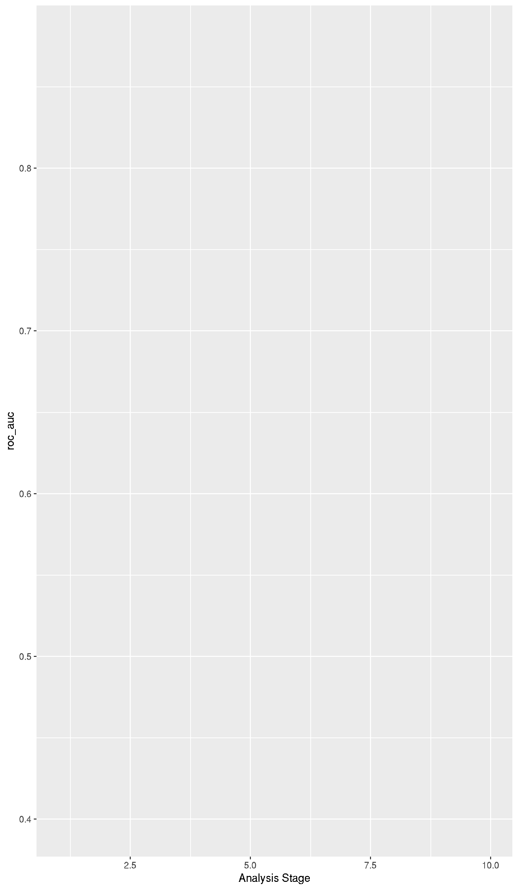

# Baseline model

The goal of this documents is to compare some tuned and untuned models on a "baseline" dataset. We want to predict whether AE in 2020 goes above 3. We are only using 2019 data here! Next steps will be adding time-dependent data (e.g. COVID deaths per week per zipcode).

## Common data

```r
library(tidyverse)
```

```
## ── Attaching packages ───────────────────────────────────────────────────── tidyverse 1.3.1 ──
```

```
## ✔ ggplot2 3.3.5     ✔ purrr   0.3.4
## ✔ tibble  3.1.2     ✔ dplyr   1.0.7
## ✔ tidyr   1.1.3     ✔ stringr 1.4.0
## ✔ readr   2.0.0     ✔ forcats 0.5.1
```

```
## ── Conflicts ──────────────────────────────────────────────────────── tidyverse_conflicts() ──
## ✖ dplyr::filter() masks stats::filter()
## ✖ dplyr::lag()    masks stats::lag()
```

```r
library(tidymodels)
```

```
## Registered S3 method overwritten by 'tune':
##   method                   from   
##   required_pkgs.model_spec parsnip
```

```
## ── Attaching packages ──────────────────────────────────────────────────── tidymodels 0.1.3 ──
```

```
## ✔ broom        0.7.8      ✔ rsample      0.1.0 
## ✔ dials        0.0.9      ✔ tune         0.1.6 
## ✔ infer        0.5.4      ✔ workflows    0.2.3 
## ✔ modeldata    0.1.1      ✔ workflowsets 0.0.2 
## ✔ parsnip      0.1.7      ✔ yardstick    0.0.8 
## ✔ recipes      0.1.16
```

```
## ── Conflicts ─────────────────────────────────────────────────────── tidymodels_conflicts() ──
## ✖ scales::discard() masks purrr::discard()
## ✖ dplyr::filter()   masks stats::filter()
## ✖ recipes::fixed()  masks stringr::fixed()
## ✖ dplyr::lag()      masks stats::lag()
## ✖ yardstick::spec() masks readr::spec()
## ✖ recipes::step()   masks stats::step()
## • Use tidymodels_prefer() to resolve common conflicts.
```

```r
library(probably)
```

```
## 
## Attaching package: 'probably'
```

```
## The following objects are masked from 'package:base':
## 
##     as.factor, as.ordered
```

```r
library(themis)
```

```
## Registered S3 methods overwritten by 'themis':
##   method                  from   
##   bake.step_downsample    recipes
##   bake.step_upsample      recipes
##   prep.step_downsample    recipes
##   prep.step_upsample      recipes
##   tidy.step_downsample    recipes
##   tidy.step_upsample      recipes
##   tunable.step_downsample recipes
##   tunable.step_upsample   recipes
```

```
## 
## Attaching package: 'themis'
```

```
## The following objects are masked from 'package:recipes':
## 
##     step_downsample, step_upsample
```

```r
library(feather)
library(magrittr)
```

```
## 
## Attaching package: 'magrittr'
```

```
## The following object is masked from 'package:purrr':
## 
##     set_names
```

```
## The following object is masked from 'package:tidyr':
## 
##     extract
```

```r
library(skimr)
library(vip)
```

```
## 
## Attaching package: 'vip'
```

```
## The following object is masked from 'package:utils':
## 
##     vi
```

```r
library(finetune)
per <- read_feather("data/simulation_data/all_persons.feather")
```

Compute some summary statistic for each client.

```r
clients <-
  per %>%
  group_by(client) %>%
  summarize(
    zip3 = first(zip3),
    size = n(),
    volume = sum(FaceAmt),
    avg_qx = mean(qx),
    avg_age = mean(Age),
    per_male = sum(Sex == "Male") / size,
    per_blue_collar = sum(collar == "blue") / size,
    expected = sum(qx * FaceAmt),
    actual_2020 = sum(FaceAmt[year == 2020], na.rm = TRUE),
    ae_2020 = actual_2020 / expected,
    actual_2019 = sum(FaceAmt[year == 2019], na.rm = TRUE),
    ae_2019 = actual_2019 / expected,
    adverse = as_factor(if_else(ae_2020 > 3, "ae > 3", "ae < 3"))
  ) %>%
  relocate(adverse, ae_2020, .after = zip3) %>%
  mutate(adverse = fct_relevel(adverse, c("ae > 3", "ae < 3")))
```

We can add some demographic information based on zip3.

```r
zip_data <-
  read_feather("data/data.feather") %>%
  mutate(
    density = POP / AREALAND,
    AREALAND = NULL,
    AREA = NULL,
    HU = NULL,
    vaccinated = NULL,
    per_lib = NULL,
    per_green = NULL,
    per_other = NULL,
    per_rep = NULL,
    unempl_2020 = NULL,
    deaths_covid = NULL,
    deaths_all = NULL
  ) %>%
  rename(
    unemp = unempl_2019,
    hes_uns = hes_unsure,
    str_hes = strong_hes,
    income = Median_Household_Income_2019
  )
```
There seems to be some clients with some zip codes that we cannot deal with. These are the ones

```r
clients %>%
  anti_join(zip_data, by = "zip3") %>%
  select(zip3)
```

```
## # A tibble: 6 x 1
##   zip3 
##   <chr>
## 1 969  
## 2 093  
## 3 732  
## 4 872  
## 5 004  
## 6 202
```
These correspond to the following areas

ZIP3 | Area       |
-----|------------|
969  | Guam, Palau, Federated States of Micronesia, Northern Mariana Islands, Marshall Islands |
093  | Military bases in Iraq and Afghanistan |
732  | Not in use |
872  | Not in use |
004  | Not in use |
202  | Washington DC, Government 1 |

We ignore clients with these zip codes. There are also two clients in DC for which we're missing election data. We will ignore those as well.

```r
clients %<>%
  inner_join(zip_data, by = "zip3") %>%
  drop_na()
```

We now have our full dataset. Behold!

```r
skim(clients)
```


Table: Data summary

|                         |        |
|:------------------------|:-------|
|Name                     |clients |
|Number of rows           |492     |
|Number of columns        |31      |
|_______________________  |        |
|Column type frequency:   |        |
|character                |2       |
|factor                   |1       |
|numeric                  |28      |
|________________________ |        |
|Group variables          |None    |


**Variable type: character**

|skim_variable | n_missing| complete_rate| min| max| empty| n_unique| whitespace|
|:-------------|---------:|-------------:|---:|---:|-----:|--------:|----------:|
|client        |         0|             1|   1|   3|     0|      492|          0|
|zip3          |         0|             1|   3|   3|     0|      222|          0|


**Variable type: factor**

|skim_variable | n_missing| complete_rate|ordered | n_unique|top_counts         |
|:-------------|---------:|-------------:|:-------|--------:|:------------------|
|adverse       |         0|             1|FALSE   |        2|ae : 367, ae : 125 |


**Variable type: numeric**

|skim_variable   | n_missing| complete_rate|         mean|           sd|         p0|          p25|          p50|          p75|         p100|hist  |
|:---------------|---------:|-------------:|------------:|------------:|----------:|------------:|------------:|------------:|------------:|:-----|
|ae_2020         |         0|             1|        15.08|        27.46|       0.00|         2.98|         6.46|        14.09| 2.329000e+02|▇▁▁▁▁ |
|size            |         0|             1|      2783.93|      2368.37|      50.00|      1026.25|      2120.50|      3969.50| 1.427000e+04|▇▃▁▁▁ |
|volume          |         0|             1| 432951568.75| 406654465.55| 6235075.00| 151797887.50| 335064812.50| 587443900.00| 4.350904e+09|▇▁▁▁▁ |
|avg_qx          |         0|             1|         0.00|         0.00|       0.00|         0.00|         0.00|         0.00| 0.000000e+00|▁▇▇▂▁ |
|avg_age         |         0|             1|        41.56|         2.05|      37.68|        40.12|        41.11|        42.49| 4.865000e+01|▃▇▃▁▁ |
|per_male        |         0|             1|         0.57|         0.10|       0.22|         0.50|         0.56|         0.64| 8.900000e-01|▁▃▇▅▁ |
|per_blue_collar |         0|             1|         1.00|         0.00|       1.00|         1.00|         1.00|         1.00| 1.000000e+00|▁▁▇▁▁ |
|expected        |         0|             1|   1076643.68|   1056824.25|   11604.50|    350329.91|    831644.68|   1439648.44| 1.189955e+07|▇▁▁▁▁ |
|actual_2020     |         0|             1|  15432043.75|  44771997.48|       0.00|   1963387.50|   4525375.00|  13923600.00| 5.232112e+08|▇▁▁▁▁ |
|actual_2019     |         0|             1|   1088745.83|   1251334.51|       0.00|    224218.75|    674962.50|   1605662.50| 1.378420e+07|▇▁▁▁▁ |
|ae_2019         |         0|             1|         0.97|         0.80|       0.00|         0.47|         0.84|         1.28| 6.290000e+00|▇▂▁▁▁ |
|nohs            |         0|             1|        11.20|         3.75|       4.00|         8.44|        10.78|        12.90| 2.165000e+01|▂▇▅▁▂ |
|hs              |         0|             1|        23.75|         7.02|      12.10|        18.90|        23.10|        27.50| 4.680000e+01|▅▇▅▂▁ |
|college         |         0|             1|        28.45|         4.83|      13.50|        25.60|        28.58|        31.56| 3.980000e+01|▁▃▇▆▂ |
|bachelor        |         0|             1|        36.62|        10.42|      14.07|        30.00|        35.36|        43.04| 6.130000e+01|▂▇▇▆▂ |
|R_birth         |         0|             1|        11.31|         1.17|       8.30|        10.50|        11.20|        12.00| 1.551000e+01|▁▇▇▂▁ |
|R_death         |         0|             1|         8.13|         1.87|       4.69|         6.80|         7.59|         9.13| 1.401000e+01|▃▇▃▂▁ |
|unemp           |         0|             1|         3.43|         0.87|       2.10|         2.80|         3.31|         3.89| 6.690000e+00|▆▇▃▁▁ |
|poverty         |         0|             1|        10.98|         3.28|       5.04|         8.73|        10.56|        13.30| 2.577000e+01|▆▇▃▁▁ |
|per_dem         |         0|             1|         0.57|         0.16|       0.16|         0.46|         0.58|         0.71| 8.600000e-01|▂▅▇▇▆ |
|hes             |         0|             1|         0.09|         0.04|       0.04|         0.06|         0.07|         0.11| 2.600000e-01|▇▃▂▁▁ |
|hes_uns         |         0|             1|         0.13|         0.05|       0.06|         0.10|         0.12|         0.17| 3.100000e-01|▇▆▅▁▁ |
|str_hes         |         0|             1|         0.05|         0.03|       0.02|         0.03|         0.04|         0.07| 1.800000e-01|▇▅▂▁▁ |
|svi             |         0|             1|         0.46|         0.19|       0.04|         0.33|         0.44|         0.59| 9.200000e-01|▂▆▇▃▂ |
|cvac            |         0|             1|         0.42|         0.21|       0.02|         0.24|         0.41|         0.53| 9.400000e-01|▃▅▇▃▁ |
|income          |         0|             1|     79056.02|     23916.16|   38621.49|     62130.76|     73570.69|     85137.47| 1.352340e+05|▃▇▅▂▂ |
|POP             |         0|             1|    785665.87|    558640.36|   33245.00|    346048.00|    771280.00|    974040.00| 2.906700e+06|▇▇▂▁▁ |
|density         |         0|             1|         0.00|         0.00|       0.00|         0.00|         0.00|         0.00| 3.000000e-02|▇▁▁▁▁ |

## Workflow set
We'll evaluate models using a workflow set. To make our life easier, we will remove some variables and use a formula instead of a recipe.

```r
clients <-
  clients %>%
  select(-client, -zip3, -ae_2020, -actual_2020, -actual_2019)
```

We now gather our recipes and models.

```r
with2019_rec <-
  recipe(adverse ~ ., data = clients) %>%
  step_zv(all_predictors()) %>%
  step_normalize(all_predictors(), -all_nominal())
no2019_rec <-
  with2019_rec %>%
  step_rm(ae_2019)

log_spec <-
  logistic_reg() %>%
  set_engine("glm") %>%
  set_mode("classification")
tuned_log_spec <-
  logistic_reg(penalty = 0.00118) %>%
  set_engine("glmnet") %>%
  set_mode("classification")
forest_spec <-
  rand_forest(trees = 1000) %>%
  set_mode("classification") %>%
  set_engine("ranger", num.threads = 8, importance = "impurity", seed = 123)
tuned_forest_spec <-
  rand_forest(trees = 1000, mtry = 12, min_n = 21) %>%
  set_mode("classification") %>%
  set_engine("ranger", num.threads = 8, importance = "impurity", seed = 123)
# Samara's models
sln_spec <-
  mlp() %>%
  set_engine("nnet") %>%
  set_mode("classification")
svm_rbf_spec <-
  svm_rbf() %>%
  set_engine("kernlab") %>%
  set_mode("classification")
svm_poly_spec <-
  svm_poly() %>%
  set_engine("kernlab") %>%
  set_mode("classification")
knn_spec <-
  nearest_neighbor() %>%
  set_engine("kknn") %>%
  set_mode("classification")

models <- list(log = log_spec,
               logtuned = tuned_log_spec,
               forest = forest_spec,
               foresttuned = tuned_forest_spec,
               neural = sln_spec,
               svmrbf = svm_rbf_spec,
               svmpoly = svm_poly_spec,
               knnspec = knn_spec)
recipes <- list("with2019ae" = with2019_rec,
                "no2019ae" = no2019_rec)
wflows <- workflow_set(recipes, models)
```

Data splitting

```r
set.seed(30308)
init <- initial_split(clients, strata = adverse)
set.seed(30308)
crossval <- vfold_cv(training(init), strata = adverse)
```

Fit all models and estimate metrics using 10-fold cross-validation. We're not performing any tuning here (although we could do that very easily!!!).

```r
fit_wflows <-
  wflows %>%
  workflow_map(fn = "fit_resamples",
               seed = 30332,
               resamples = crossval,
               control = control_resamples(save_pred = TRUE),
               metrics = metric_set(roc_auc, sens, accuracy),
               verbose = TRUE)
## i  1 of 16 resampling: with2019ae_log
## ✔  1 of 16 resampling: with2019ae_log (12.3s)
## i  2 of 16 resampling: with2019ae_logtuned
## ✔  2 of 16 resampling: with2019ae_logtuned (13.3s)
## i  3 of 16 resampling: with2019ae_forest
## ✔  3 of 16 resampling: with2019ae_forest (16.6s)
## i  4 of 16 resampling: with2019ae_foresttuned
## ✔  4 of 16 resampling: with2019ae_foresttuned (18.2s)
## i  5 of 16 resampling: with2019ae_neural
## ✔  5 of 16 resampling: with2019ae_neural (13.3s)
## i  6 of 16 resampling: with2019ae_svmrbf
## ✔  6 of 16 resampling: with2019ae_svmrbf (17.1s)
## i  7 of 16 resampling: with2019ae_svmpoly
## ✔  7 of 16 resampling: with2019ae_svmpoly (14.2s)
## i  8 of 16 resampling: with2019ae_knnspec
## ✔  8 of 16 resampling: with2019ae_knnspec (13.6s)
## i  9 of 16 resampling: no2019ae_log
## ✔  9 of 16 resampling: no2019ae_log (13.6s)
## i 10 of 16 resampling: no2019ae_logtuned
## ✔ 10 of 16 resampling: no2019ae_logtuned (14.2s)
## i 11 of 16 resampling: no2019ae_forest
## ✔ 11 of 16 resampling: no2019ae_forest (17.7s)
## i 12 of 16 resampling: no2019ae_foresttuned
## ✔ 12 of 16 resampling: no2019ae_foresttuned (19.5s)
## i 13 of 16 resampling: no2019ae_neural
## ✔ 13 of 16 resampling: no2019ae_neural (14.5s)
## i 14 of 16 resampling: no2019ae_svmrbf
## ✔ 14 of 16 resampling: no2019ae_svmrbf (14.7s)
## i 15 of 16 resampling: no2019ae_svmpoly
## ✔ 15 of 16 resampling: no2019ae_svmpoly (14.9s)
## i 16 of 16 resampling: no2019ae_knnspec
## ✔ 16 of 16 resampling: no2019ae_knnspec (14.2s)
```

Comparing our metrics for the models (unfortunately I couldn't figure out how to show which recipe was picked...)

```r
autoplot(fit_wflows, metric = "roc_auc")
```


```r
autoplot(fit_wflows)
```


```r
fit_wflows %>% collect_metrics()
```

```
## # A tibble: 48 x 9
##    wflow_id     .config    preproc model  .metric .estimator  mean     n std_err
##    <chr>        <chr>      <chr>   <chr>  <chr>   <chr>      <dbl> <int>   <dbl>
##  1 with2019ae_… Preproces… recipe  logis… accura… binary     0.769    10  0.0160
##  2 with2019ae_… Preproces… recipe  logis… roc_auc binary     0.718    10  0.0302
##  3 with2019ae_… Preproces… recipe  logis… sens    binary     0.905    10  0.0157
##  4 with2019ae_… Preproces… recipe  logis… accura… binary     0.769    10  0.0132
##  5 with2019ae_… Preproces… recipe  logis… roc_auc binary     0.731    10  0.0318
##  6 with2019ae_… Preproces… recipe  logis… sens    binary     0.916    10  0.0146
##  7 with2019ae_… Preproces… recipe  rand_… accura… binary     0.845    10  0.0174
##  8 with2019ae_… Preproces… recipe  rand_… roc_auc binary     0.877    10  0.0188
##  9 with2019ae_… Preproces… recipe  rand_… sens    binary     0.953    10  0.0110
## 10 with2019ae_… Preproces… recipe  rand_… accura… binary     0.858    10  0.0163
## # … with 38 more rows
```

This graph now shows which recipe was picked

```r
fit_wflows %>%
  collect_metrics() %>%
  separate(wflow_id, into = c("rec", "mod"), sep = "_", remove = FALSE) %>%
  ggplot(aes(x = rec, y = mean, color = mod, group = mod)) +
  geom_point() + geom_line() + facet_wrap(~ factor(.metric))
```


Looks like adding the 2019 AE didn't help much! This is evidence for our hypothesis (AE 2019 doesn't have much effect on the final outcome).
It's also possible that the machine learning models (svn and neural net) could benefit from some tuning.

Here are the models ranked by `roc_auc`

```r
fit_wflows %>% rank_results("roc_auc") %>% select(wflow_id) %>% unique()
```

```
## # A tibble: 16 x 1
##    wflow_id              
##    <chr>                 
##  1 with2019ae_forest     
##  2 no2019ae_forest       
##  3 no2019ae_foresttuned  
##  4 with2019ae_foresttuned
##  5 no2019ae_svmrbf       
##  6 with2019ae_svmrbf     
##  7 no2019ae_logtuned     
##  8 with2019ae_logtuned   
##  9 no2019ae_knnspec      
## 10 no2019ae_log          
## 11 with2019ae_log        
## 12 with2019ae_neural     
## 13 with2019ae_knnspec    
## 14 no2019ae_svmpoly      
## 15 with2019ae_svmpoly    
## 16 no2019ae_neural
```

We will pick `no2019ae_forest` as the "final" model.

```r
final_wflow <-
  fit_wflows %>%
  pull_workflow_set_result("no2019ae_forest")
```

Right now, given a test case, tries to find the probability that `ae > 3`. If that number is greater than 0.5, the model predicts `ae > 3`, if not, the model predicts `ae < 3`. This threshold of 0.5 can be changed, which will affect specificity and sensitivity. For the 10 models coming from the 10-fold CV, we compute specificity and sensitivity for all threshold in `seq(0.5, 1, 0.01)`, that is a grid from 0.5 to 1 with step of 0.01. We then average the estimate for the 10 models to get the following plot (could have also drawn error bars...)

```r
final_wflow <-
  final_wflow %>%
  rowwise() %>%
  mutate(thr_perf = list(threshold_perf(.predictions, adverse, `.pred_ae > 3`, thresholds = seq(0.5, 1, by = 0.01))))

final_wflow %>%
  select(thr_perf, id) %>%
  unnest(thr_perf) %>%
  group_by(.threshold, .metric) %>%
  summarize(estimate = mean(.estimate)) %>%
  filter(.metric != "distance") %>%
  ggplot(aes(x = .threshold, y = estimate, color = .metric)) + geom_line()
```

```
## `summarise()` has grouped output by '.threshold'. You can override using the `.groups` argument.
```


We can now choose the threshold based on what we need. (what do we need?)


## Tuning some models

```r
tune_rec <-
  recipe(adverse ~ ., data = clients) %>%
  step_rm(ae_2019) %>%
  step_zv(all_predictors()) %>%
  step_YeoJohnson(all_predictors()) %>%
  step_normalize(all_predictors())

tune_log_spec <-
  logistic_reg(penalty = tune()) %>%
  set_engine("glmnet") %>%
  set_mode("classification")
tune_forest_spec <-
  rand_forest(trees = 1000, mtry = tune(), min_n = tune()) %>%
  set_mode("classification") %>%
  set_engine("ranger", num.threads = 8, importance = "impurity", seed = 123)
# Samara's models
tune_sln_spec <-
  mlp(hidden_units = tune(), penalty = tune(), epochs = tune()) %>%
  set_engine("nnet") %>%
  set_mode("classification")
tune_svm_rbf_spec <-
  svm_rbf(cost = tune(), rbf_sigma = tune(), margin = tune()) %>%
  set_engine("kernlab") %>%
  set_mode("classification")
# tune_svm_poly_spec <-
#   svm_poly() %>%
#   set_engine("kernlab") %>%
#   set_mode("classification")
# tune_knn_spec <-
#   nearest_neighbor() %>%
#   set_engine("kknn") %>%
#   set_mode("classification")

models <- list(log = tune_log_spec,
               forest = tune_forest_spec,
               sln = tune_sln_spec,
               svm = tune_svm_rbf_spec)
recipes <- list(no2019_rec)
wflows <- workflow_set(recipes, models)

results <-
  wflows %>%
  workflow_map(resamples = crossval,
               grid = 100,
               metrics = metric_set(roc_auc, accuracy, sens, spec, ppv, npv),
               control = control_grid(save_pred = TRUE),
               seed = 828282,
               verbose = TRUE)
## i 1 of 4 tuning:     recipe_log
## ✔ 1 of 4 tuning:     recipe_log (27.1s)
## i 2 of 4 tuning:     recipe_forest
## i Creating pre-processing data to finalize unknown parameter: mtry
## ✔ 2 of 4 tuning:     recipe_forest (28m 12.3s)
## i 3 of 4 tuning:     recipe_sln
## ✔ 3 of 4 tuning:     recipe_sln (24m 15.3s)
## i 4 of 4 tuning:     recipe_svm
## ✔ 4 of 4 tuning:     recipe_svm (19m 17.1s)

autoplot(results)
## Warning: Removed 104 rows containing missing values (geom_point).
```


As a example, let's look at the results for the svm.
We won't touch the prediction thresholds here.

```r
tuned_svm <-
  results %>%
  pull_workflow_set_result("recipe_svm")


best_svm <-
  tuned_svm %>%
  select_best(metric = "roc_auc")

last_svm <-
  results %>%
  pull_workflow("recipe_svm") %>%
  finalize_workflow(best_svm) %>%
  last_fit(init,
           metrics = metric_set(roc_auc, accuracy, sens, spec, ppv, npv))

last_svm %>%
  collect_metrics()
```

```
## # A tibble: 6 x 4
##   .metric  .estimator .estimate .config             
##   <chr>    <chr>          <dbl> <chr>               
## 1 accuracy binary        0.75   Preprocessor1_Model1
## 2 sens     binary        1      Preprocessor1_Model1
## 3 spec     binary        0.0312 Preprocessor1_Model1
## 4 ppv      binary        0.748  Preprocessor1_Model1
## 5 npv      binary        1      Preprocessor1_Model1
## 6 roc_auc  binary        0.825  Preprocessor1_Model1
```

## SVM RBF
I'm kind of curious about what can be done with the SVM.
We will go with the [recommended preprocessing steps from TMWR](https://www.tmwr.org/pre-proc-table.html).


```r
svm_recipe <-
  recipe(adverse ~ ., data = clients) %>%
  step_rm(ae_2019) %>%
  step_zv(all_predictors()) %>%
  step_YeoJohnson(all_predictors()) %>%
  step_normalize(all_predictors())
  # step_kpca_rbf(all_predictors(), num_comp = tune())

svm_model <-
  svm_rbf(cost = tune(), rbf_sigma = tune(), margin = tune()) %>%
  set_engine("kernlab") %>%
  set_mode("classification")

svm_wflow <-
  workflow() %>%
  add_recipe(svm_recipe) %>%
  add_model(svm_model)

set.seed(10)
svm_grid <-
  svm_wflow %>%
  parameters() %>%
  grid_max_entropy(size = 1000)
```

We'll try an ANOVA racing tuning strategy

```r
set.seed(100)
svm_tune_anova <-
  svm_wflow %>%
  tune_race_anova(
        resamples = crossval,
        grid = svm_grid,
        metrics = metric_set(roc_auc, sens, spec, kap),
        control = control_race(verbose_elim = TRUE)
  )
## ℹ Racing will maximize the roc_auc metric.
## ℹ Resamples are analyzed in a random order.
## ℹ Fold10:  695 eliminated;  305 candidates remain.
## ℹ Fold01:    0 eliminated;  305 candidates remain.
## ℹ Fold08:    0 eliminated;  305 candidates remain.
## ℹ Fold05:    1 eliminated;  304 candidates remain.
## ℹ Fold06:   75 eliminated;  229 candidates remain.
## ℹ Fold09:    0 eliminated;  229 candidates remain.
## ℹ Fold03:    0 eliminated;  229 candidates remain.
show_best(svm_tune_anova, metric = "roc_auc")
## # A tibble: 5 x 9
##    cost rbf_sigma  margin .metric .estimator  mean     n std_err .config        
##   <dbl>     <dbl>   <dbl> <chr>   <chr>      <dbl> <int>   <dbl> <chr>          
## 1  3.85    0.0637 0.152   roc_auc binary     0.823    10  0.0234 Preprocessor1_…
## 2 10.2     0.0562 0.0903  roc_auc binary     0.819    10  0.0271 Preprocessor1_…
## 3 12.6     0.0440 0.181   roc_auc binary     0.818    10  0.0282 Preprocessor1_…
## 4  2.52    0.0824 0.0329  roc_auc binary     0.816    10  0.0226 Preprocessor1_…
## 5  2.49    0.0478 0.00818 roc_auc binary     0.814    10  0.0238 Preprocessor1_…
plot_race(svm_tune_anova)
## Warning in grid.Call.graphics(C_lines, x$x, x$y, index, x$arrow): semi-
## transparency is not supported on this device: reported only once per page
```



```r
best_anova <- select_best(svm_tune_anova, metric = "roc_auc")
```

Doesn't seem to be doing much better than random forest....
