# FINAL PRESENTATION

## Data loading and boring stuff
No need to talk about this.
Please download the latest version of `data/processed_data_20_12_23.feather` from Google Drive.

```r
library(tidyverse)
library(tidymodels)
library(probably)
library(themis)
library(feather)
library(magrittr)
library(skimr)
library(vip)
library(ggbeeswarm)
library(finetune)
library(lubridate)
library(glue)
library(slider)
library(tsibble)
library(fable)

weekly_data <-
  read_feather("data/processed_data_20_12_23.feather") %>%
  select(-ae_2021, -ae_2020, -ae_2019,
         -actual_2021, -actual_2020, -actual_2019, -adverse,
         -STATE_NAME, -shrinkage,  -dep_var) 

yearly_data <-
  read_feather("data/processed_data_20_12_23.feather") %>%
  group_by(client) %>%
  slice(1) %>%
  select(-date, -claims, -zip_deaths, -smoothed_ae, -shrunk_ae,
         -class, -smoothed_deaths,
         -hes, -hes_uns, -str_hes, -ae, -dep_var, -shrinkage, -STATE_NAME, -ihme_deaths)
```

Make figure background transparent

```r
theme_update(plot.background = element_rect(fill = "transparent", colour = NA))
```


# Introduction
AEs changing in 2019, 2020, copy paste from pres2

We explain how we choose the threshold for adverse and not

```r
weekly_data %>%
  ungroup() %>%
  group_by(date) %>%
  summarize(
      `12.5` = quantile(shrunk_ae, 0.125),
      `25` = quantile(shrunk_ae, 0.25),
      `50` = quantile(shrunk_ae, 0.50)
  ) %>%
  pivot_longer(-date, names_to = "pth", values_to = "value") %>%
  ggplot(aes(x = date, y = value, color = pth)) +
  geom_line() +
  geom_hline(yintercept = 2.5, linetype = "dashed")
```


How many clients are adverse each week?

```r
weekly_data %>%
  group_by(date) %>%
  summarize(prop_adverse = sum(class == "Adverse") / n()) %>%
  ggplot(aes(x = date, y = prop_adverse)) + geom_line()
```


# "Baseline" stuff
Can maybe also copy paste some things from pres 2.

This is trained on known COVID-19 data.

* Why? It can be used as is in a future pandemic.
* Why not? Future pandemics may have different target mortality compared to COVID19.

# Time stuff

* Why? This model is more reactive than the previous one. It's trained on current pandemic data. It can be updated with time.
* Why not? This will be very bad early on in the pandemic (lack of data) and bad when forecasting is hard.

## Boring stuff 


```r
train <-
  weekly_data %>%
  filter(date <= "2021-01-01")

test <-
  weekly_data %>%
  filter(date > "2021-01-01" & date <= "2021-06-01")
```


```r
forecast <-
  weekly_data %>%
  filter(date >= "2020-03-15" & date <= "2021-01-01") %>%
  as_tsibble(index = date, key = client) %>%
  model(arima = ARIMA(smoothed_deaths)) %>%
  forecast(h = "6 months")
```

```
## Warning in sqrt(diag(best$var.coef)): NaNs produced

## Warning in sqrt(diag(best$var.coef)): NaNs produced
```


```r
forecasted_test <-
  forecast %>%
  as_tibble() %>%
  select(client, date, .mean) %>%
  right_join(test, by = c("client", "date")) %>%
  select(-smoothed_deaths) %>%
  rename(smoothed_deaths = .mean)
```


## Model selection
Looking at performance every day for 3 months in the future. 


Creating a common recipe for all models. 


```r
common_recipe <-
  recipe(class ~ ., data = weekly_data) %>%
  step_rm(client, zip3, claims, smoothed_ae, shrunk_ae,  ae, zip_deaths, ihme_deaths, date) %>%
  step_zv(all_predictors()) %>%
  step_log(volume, POP) %>%
  step_normalize(all_predictors())
```


```r
forest_spec <-
  rand_forest(trees = 1000) %>%
  set_engine("ranger", num.threads = 8, seed = 123456789) %>%
  set_mode("classification")

log_spec <- 
  logistic_reg(
  mode = "classification",
  engine = "glm")

svm_lin_spec <-
  svm_linear() %>%
  set_engine("LiblineaR") %>%
  set_mode("classification")

knn_spec <-
  nearest_neighbor() %>%
  set_engine("kknn") %>%
  set_mode("classification")

sln_spec <-
  mlp(activation = "relu", hidden_units = 6, epochs = 100) %>%
  set_engine("keras", verbose=0) %>%
  set_mode("classification")


bt_spec <- boost_tree(
  mode = "classification",
  engine = "xgboost",
  trees = 100)
```


```r
bt_wf <-
  workflow() %>%
  add_recipe(common_recipe) %>%
  add_model(bt_spec)

log_wf <-
  workflow() %>%
  add_recipe(common_recipe) %>%
  add_model(log_spec)

forest_wf <-
  workflow() %>%
  add_recipe(common_recipe) %>%
  add_model(forest_spec)

svm_lin_wf <-
  workflow() %>%
  add_recipe(common_recipe) %>%
  add_model(svm_lin_spec)

knn_wf <-
  workflow() %>%
  add_recipe(common_recipe) %>%
  add_model(knn_spec)

sln_wf <-
  workflow() %>%
  add_recipe(common_recipe) %>%
  add_model(sln_spec)
```


```r
wflows <- tribble(~wflow ,
                  sln_wf,
                  knn_wf, log_wf, forest_wf, bt_wf)
 


wflows <-
  wflows %>%
  mutate(wflows_fit = map(wflow, ~ fit(.x, train))) 
```

```
## Error: Problem with `mutate()` column `wflows_fit`.
## ℹ `wflows_fit = map(wflow, ~fit(.x, train))`.
## ✖ ValueError: numpy.ndarray size changed, may indicate binary incompatibility. Expected 88 from C header, got 80 from PyObject
## 
## Detailed traceback:
##   File "/home/haerski/miniconda3/envs/gurobi/lib/python3.8/site-packages/tensorflow/python/keras/engine/training.py", line 1133, in fit
##     data_handler = data_adapter.get_data_handler(
##   File "/home/haerski/miniconda3/envs/gurobi/lib/python3.8/site-packages/tensorflow/python/keras/engine/data_adapter.py", line 1364, in get_data_handler
##     return DataHandler(*args, **kwargs)
##   File "/home/haerski/miniconda3/envs/gurobi/lib/python3.8/site-packages/tensorflow/python/keras/engine/data_adapter.py", line 1152, in __init__
##     adapter_cls = select_data_adapter(x, y)
##   File "/home/haerski/miniconda3/envs/gurobi/lib/python3.8/site-packages/tensorflow/python/keras/engine/data_adapter.py", line 988, in select_data_adapter
##     adapter_cls = [cls for cls in ALL_ADAPTER_CLS if cls.can_handle(x, y)]
##   File "/home/haerski/miniconda3/envs/gurobi/lib/python3.8/site-packages/tensorflow/python/keras/engine/data_adapter.py", line 988, in <listcomp>
##     adapter_cls = [cls for cls in ALL_ADAPTER_CLS if cls.can_handle(x, y)]
##   File "/home/haerski/miniconda3/envs/gurobi/lib/python3.8/site-packages/tensorflow/python/keras/engine/data_adapter.py", line 227, in can_handle
##     tensor_types = _get_tensor_types()
##   File "/home/haerski/miniconda3/envs/gurobi/lib/python3.8/site-packages/tensorflow/python/keras/engine/data_adapter.py", line 1635, in _get_tensor_types
##     import pandas as pd  # pylint: disable=g-import-not-at-top
##   File "/home/haerski/R/x86_64-pc-linux-gnu-library/4.1/reticulate/python/rpytools/loader.py", line 39, in _import_hook
##     module = _import(
##   File "/home/haerski/miniconda3/envs/gurobi/lib/python3.8/site-packages/pandas/__init__.py", line 29, in <module>
##     from pandas._libs import hashtable as _hashtable, lib as _lib, tslib as _tslib
##   File "/home/haerski/R/x86_64-pc-linux-gnu-library/4.1/reticulate/python/rpytools/loader.py", line 39, in _import_hook
##     module = _import(
##   File "/home/haerski/miniconda3/envs/gurobi/lib/python3.8/site-packages/pandas/_libs/__init__.py", line 13, in <module>
##     from pandas._libs.interval import Interval
##   File "/home/haerski/R/x86_64-pc-linux-gnu-library/4.1/reticulate/python/rpytools/loader.py", line 39, in _import_hook
##     module = _import(
##   File "pandas/_libs/interval.pyx", line 1, in init pandas._libs.interval
```

```
## Timing stopped at: 0.065 0 0.065
```

```r
wflows <-
  wflows %>%
  mutate(
    class_predict = map(wflows_fit, ~ predict(.x, forecasted_test)),  
    prob_predict = map(wflows_fit, ~ predict(.x, forecasted_test, type = "prob")))
```

```
## Error: Problem with `mutate()` column `class_predict`.
## ℹ `class_predict = map(wflows_fit, ~predict(.x, forecasted_test))`.
## ✖ object 'wflows_fit' not found
```


```r
wflows %>%
  bind_cols(tribble(~id, "sln", "knn", "log", "forest", "bt")) %>%
  select(-wflow, -wflows_fit) %>%
  mutate(prob_predict = map(prob_predict, ~ bind_cols(.x, test %>% select(date, class)))) %>%
  unnest(c(class_predict, prob_predict)) %>%
  group_by(id, date) %>%
  summarize(
            sens = sens_vec(class, .pred_class),
            spec = spec_vec(class, .pred_class),
            roc_auc = roc_auc_vec(class, .pred_Adverse), .groups = "keep") %>%
  pivot_longer(sens:roc_auc, names_to = "metric", values_to = "value") %>%
  ungroup() %>%
  ggplot(aes(x = date, y = value, color = id)) +
  geom_point() +
  geom_line() +
  facet_wrap( ~ metric)
```

```
## Error: Can't subset columns that don't exist.
## ✖ Column `wflows_fit` doesn't exist.
```

```r
wflows_cheat <-
  wflows %>%
  mutate(
    class_predict = map(wflows_fit, ~ predict(.x, test)),  
    prob_predict = map(wflows_fit, ~ predict(.x, test, type = "prob")))
```

```
## Error: Problem with `mutate()` column `class_predict`.
## ℹ `class_predict = map(wflows_fit, ~predict(.x, test))`.
## ✖ object 'wflows_fit' not found
```

```r
wflows_cheat %>%
  bind_cols(tribble(~id, "sln", "knn", "log", "forest", "bt")) %>%
  select(-wflow, -wflows_fit) %>%
  mutate(prob_predict = map(prob_predict, ~ bind_cols(.x, test %>% select(date, class)))) %>%
  unnest(c(class_predict, prob_predict)) %>%
  group_by(id, date) %>%
  summarize(
            sens = sens_vec(class, .pred_class),
            spec = spec_vec(class, .pred_class),
            roc_auc = roc_auc_vec(class, .pred_Adverse), .groups = "keep") %>%
  pivot_longer(sens:roc_auc, names_to = "metric", values_to = "value") %>%
  ungroup() %>%
  ggplot(aes(x = date, y = value, color = id)) +
  geom_point() +
  geom_line() +
  facet_wrap( ~ metric)
```

```
## Error in list2(...): object 'wflows_cheat' not found
```


## Training on part of the data (forecasted smoothed deaths + IHME)
Testing on known clients and unknown clients.

We first split our clients into testing and training.

```r
set.seed(1213)
training_clients <-
  weekly_data %>%
  nest_by(client) %>%
  ungroup() %>%
  slice_sample(prop = 3/4) %>%
  pull(client)

testing_clients <-
  weekly_data %>%
  filter(!client %in% training_clients) %>%
  pull(client) %>%
  unique()
```

The training clients are "known"; they will be what the model will be trained on.
The testing clients are "unknown"; they will represent brand new clients.

### Case study: Jan 2021

We will also define a training and testing date. For training, we use every date before Jan 1st 2021, and we test on Jan 2nd - Apr 1st.

```r
start <- ceiling_date(ymd("2021-01-01"), unit = "week")
end <- ceiling_date(ymd("2021-04-01"), unit = "week")
```

Next we tune a boosted tree model to the training clients. For tuning purposes, we divide the training dates into analysis and assessment dates. The analysis dates will be all dated before Oct 1st, and assessment will be Jan 1st.


```r
analys <- ceiling_date(ymd("2020-10-01"), unit = "week")
assess <- start
```

To assess the performance of our model, we split the training clients into analysis and assessment.
We could (should?) also do cross-validation.

```r
set.seed(123)
ana_clients <-
  training_clients %>%
  sample(length(.) * 3 / 4)

ana_idx <-
  weekly_data %>%
  rownames_to_column() %>%
  filter(client %in% ana_clients & date <= analys) %>%
  pull(rowname) %>% as.integer()

ass_idx <-
  weekly_data %>%
  rownames_to_column() %>%
  filter(client %in% training_clients) %>%
  filter(!client %in% ana_clients & date == assess) %>%
  pull(rowname) %>%
  as.integer()

spl <- make_splits(list(analysis = ana_idx, assessment = ass_idx), data = weekly_data)
resmpl <- manual_rset(list(spl), c("foo"))
```

We describe our model. We use XGBoost

```r
xgboost_recipe <-
  recipe(formula = class ~ ., data = weekly_data) %>%
  step_rm(zip3, date, client, claims, zip_deaths, smoothed_ae, shrunk_ae, ae) %>%
  step_zv(all_predictors())

xgboost_spec <-
  boost_tree(trees = tune(), tree_depth = tune(), learn_rate = tune()) %>%
  set_mode("classification") %>%
  set_engine("xgboost", nthread = 8)

xgboost_workflow <-
  workflow() %>%
  add_recipe(xgboost_recipe) %>%
  add_model(xgboost_spec)
```

Now we tune! We use simulated annealing to find a set of parameters that maximizes `roc_auc`.

```r
set.seed(98324)
res_grd <-
  xgboost_workflow %>%
  tune_grid(
    resamples = resmpl,
    grid = 10,
    metrics = metric_set(roc_auc, sens, spec, j_index, yardstick::accuracy),
    control = control_grid(verbose = TRUE))
## i foo: preprocessor 1/1
## ✓ foo: preprocessor 1/1
## i foo: preprocessor 1/1, model 1/10
## ✓ foo: preprocessor 1/1, model 1/10
## i foo: preprocessor 1/1, model 1/10 (predictions)
## i foo: preprocessor 1/1
## ✓ foo: preprocessor 1/1
## i foo: preprocessor 1/1, model 2/10
## ✓ foo: preprocessor 1/1, model 2/10
## i foo: preprocessor 1/1, model 2/10 (predictions)
## i foo: preprocessor 1/1
## ✓ foo: preprocessor 1/1
## i foo: preprocessor 1/1, model 3/10
## ✓ foo: preprocessor 1/1, model 3/10
## i foo: preprocessor 1/1, model 3/10 (predictions)
## i foo: preprocessor 1/1
## ✓ foo: preprocessor 1/1
## i foo: preprocessor 1/1, model 4/10
## ✓ foo: preprocessor 1/1, model 4/10
## i foo: preprocessor 1/1, model 4/10 (predictions)
## i foo: preprocessor 1/1
## ✓ foo: preprocessor 1/1
## i foo: preprocessor 1/1, model 5/10
## ✓ foo: preprocessor 1/1, model 5/10
## i foo: preprocessor 1/1, model 5/10 (predictions)
## i foo: preprocessor 1/1
## ✓ foo: preprocessor 1/1
## i foo: preprocessor 1/1, model 6/10
## ✓ foo: preprocessor 1/1, model 6/10
## i foo: preprocessor 1/1, model 6/10 (predictions)
## i foo: preprocessor 1/1
## ✓ foo: preprocessor 1/1
## i foo: preprocessor 1/1, model 7/10
## ✓ foo: preprocessor 1/1, model 7/10
## i foo: preprocessor 1/1, model 7/10 (predictions)
## i foo: preprocessor 1/1
## ✓ foo: preprocessor 1/1
## i foo: preprocessor 1/1, model 8/10
## ✓ foo: preprocessor 1/1, model 8/10
## i foo: preprocessor 1/1, model 8/10 (predictions)
## i foo: preprocessor 1/1
## ✓ foo: preprocessor 1/1
## i foo: preprocessor 1/1, model 9/10
## ✓ foo: preprocessor 1/1, model 9/10
## i foo: preprocessor 1/1, model 9/10 (predictions)
## i foo: preprocessor 1/1
## ✓ foo: preprocessor 1/1
## i foo: preprocessor 1/1, model 10/10
## ✓ foo: preprocessor 1/1, model 10/10
## i foo: preprocessor 1/1, model 10/10 (predictions)

res <-
  xgboost_workflow %>%
  tune_sim_anneal(
      resamples = resmpl,
      iter = 20,
      initial = res_grd,
      metrics = metric_set(roc_auc, sens, spec, j_index, yardstick::accuracy))
## Optimizing roc_auc
## Initial best: 0.78996
##  1 ◯ accept suboptimal  roc_auc=0.74385
##  2 ◯ accept suboptimal  roc_auc=0.69237
##  3 ◯ accept suboptimal  roc_auc=0.66214
##  4 + better suboptimal  roc_auc=0.67367
##  5 ◯ accept suboptimal  roc_auc=0.67188
##  6 ─ discard suboptimal roc_auc=0.6647
##  7 ◯ accept suboptimal  roc_auc=0.6583
##  8 ✖ restart from best  roc_auc=0.66342
##  9 ◯ accept suboptimal  roc_auc=0.76537
## 10 ─ discard suboptimal roc_auc=0.74129
## 11 ─ discard suboptimal roc_auc=0.71875
## 12 ◯ accept suboptimal  roc_auc=0.74027
## 13 ♥ new best           roc_auc=0.80328
## 14 ─ discard suboptimal roc_auc=0.76383
## 15 ─ discard suboptimal roc_auc=0.78151
## 16 ─ discard suboptimal roc_auc=0.771
## 17 ─ discard suboptimal roc_auc=0.76076
## 18 ─ discard suboptimal roc_auc=0.78381
## 19 ♥ new best           roc_auc=0.81916
## 20 ─ discard suboptimal roc_auc=0.7687
```

The best parameter values are

```r
res %>% show_best(metric = "roc_auc")
```

```
## # A tibble: 5 × 10
##   trees tree_depth learn_rate .metric .estimator  mean     n std_err
##   <int>      <int>      <dbl> <chr>   <chr>      <dbl> <int>   <dbl>
## 1  1939          2   0.00552  roc_auc binary     0.819     1      NA
## 2  1807          4   0.00273  roc_auc binary     0.803     1      NA
## 3  1701          7   0.000408 roc_auc binary     0.790     1      NA
## 4  1703          5   0.000617 roc_auc binary     0.784     1      NA
## 5  2000          5   0.000264 roc_auc binary     0.782     1      NA
## # … with 2 more variables: .config <chr>, .iter <int>
```

```r
best_parms <- res %>% select_best(metric = "roc_auc")

best_parms <- tribble(
        ~trees, ~tree_depth, ~learn_rate,
        517, 10, 0.001312986874346298)

best_parms <- tribble(
          ~trees, ~tree_depth, ~learn_rate,
          138, 6, 0.07662993111378884)

best_parms <- tribble(
          ~trees, ~tree_depth, ~learn_rate,
          1939,2,0.005523512626608967)
```

We apply these parameters to our workflow

```r
final_wf <- xgboost_workflow %>% finalize_workflow(best_parms)
```

We now need to forecast 3 months worth of `smoothed_deaths`.

```r
forecast <-
  weekly_data %>%
  filter(date >= "2020-03-15" & date <= start) %>%
  as_tsibble(index = date, key = client) %>%
  model(arima = ARIMA(smoothed_deaths)) %>%
  forecast(h = "4 months")
```

```
## Warning in sqrt(diag(best$var.coef)): NaNs produced

## Warning in sqrt(diag(best$var.coef)): NaNs produced

## Warning in sqrt(diag(best$var.coef)): NaNs produced

## Warning in sqrt(diag(best$var.coef)): NaNs produced

## Warning in sqrt(diag(best$var.coef)): NaNs produced
```


```r
future <-
  forecast %>%
  as_tibble() %>%
  select(client, date, .mean) %>%
  rename(smoothed_deaths = .mean)

forecast_data <-
  weekly_data %>%
  rows_update(future, by = c("date","client"))
```


We define our training 

```r
train <-
  weekly_data %>%
  filter(client %in% training_clients & date <= start)
```

We will have several version of the testing set. Some of them will be known or unknown, some will be forecasted and true.

```r
test_known_true <-
  weekly_data %>%
  filter(client %in% training_clients) %>%
  filter(date > start & date <= end)

test_unknown_true <-
  weekly_data %>%
  filter(!client %in% training_clients) %>%
  filter(date > start & date <= end)

test_known_fore <-
  forecast_data %>%
  filter(client %in% training_clients) %>%
  filter(date > start & date <= end)

test_unknown_fore <-
  forecast_data %>%
  filter(!client %in% training_clients) %>%
  filter(date > start & date <= end)
```

Train the workflow

```r
trained_wf <-
  final_wf %>%
  fit(train)
```

```
## [19:05:30] WARNING: amalgamation/../src/learner.cc:1095: Starting in XGBoost 1.3.0, the default evaluation metric used with the objective 'binary:logistic' was changed from 'error' to 'logloss'. Explicitly set eval_metric if you'd like to restore the old behavior.
```

Look at results one by one

```r
tests <-
  tribble(
    ~id, ~set,
    "known true", test_known_true,
    "unknown true", test_unknown_true,
    "known fore", test_known_fore,
    "unkown fore", test_unknown_fore)

tests %>%
  mutate(set = map(set, ~ bind_cols(.x, trained_wf %>% predict(.x)))) %>%
  unnest(set) %>%
  group_by(id, date) %>%
  summarize(Accuracy = yardstick::accuracy_vec(class, .pred_class)) %>%
  ggplot(aes(x = date, y = Accuracy, color = id)) + geom_line()
```

```
## `summarise()` has grouped output by 'id'. You can override using the `.groups` argument.
```


### Case study: June 2020

## Predicting AE as a time-series
with IHME death vs with  zip death vs without death 

Train global model for all clients.

Target: shrunk_ae (AE after shrunk).
Predictors: data before covid-19 (based on the zip code where the company is located (such as poverty, education, unemployment levels) and characteristics of the company (such as the average age of its employees).
Data pre-processing: log(POP), log(volume),log(expected) and normalize all predictors

Split: Train set(2020-03-15 - 2020-12-27), Test set (2021-01-03- 2021-06-27).
Model: random forest, tuned random forest, Radial basis function support vector machines, K-nearest neighbors, Xgboost. 
Outcome: predicting shrunk_ae, confident interval for each client every day.

Performance: 
Plot the predict result for each client, pick several to present, 
The confident interval can cover the exact shrunk_ae

Classify whether the client is adverse or not adverse: shrunk_ae > 2.5.
plot sens, spec,j_index, accuracy
Xgboost has biggest j_index. K-nearest neighbors has good sens, and worst spec while svm has bad sens and good spec.

Calculate the predicted total claim every week and every client for half year.
K-nearest neighbors catch the trend for every week total claim.

Currently, we use the predicting shrunk_ae as predicting result for each model. 
Possible future improvement: 1. use confident interval to find a better predict shrunk_ae 
2. combine different model's results to get final result. 3.Compared the result with weekly death into account, we can add predicted death data as one predictor.
 


## Common data

```r
library(tidyverse)
library(tidymodels)
library(modeltime)
library(timetk)
library(probably)
library(themis)
library(feather)
library(magrittr)
library(skimr)
library(vip)
library(dplyr)
library(lubridate)
```


Get weeklydata 

```r
clients<-read_feather("data/processed_data_20_12_23.feather")%>%
  select(-ae_2021, -ae_2020, -ae_2019,
         -actual_2021, -actual_2020, -actual_2019, -adverse,
         -STATE_NAME, -dep_var, -smoothed_ae)%>%
  filter(date >= "2020-03-15")%>%
  mutate(client = as.factor(client))%>%
  mutate(POP=log(POP))%>%
  mutate(volume = log(volume))%>%
  mutate(expected = log(expected))
```

Train global model for all clients.

Target: shrunk_ae (AE after shrunk).
Predictors: data before covid-19 (based on the zip code where the company is located (such as poverty, education, unemployment levels) and characteristics of the company (such as the average age of its employees).
Data pre-processing: log(POP), log(volume),log(expected) and normalize all predictors
Split: Train set(2020-03-15 - 2020-12-27), Test set (2021-01-03- 2021-06-27).

split

```r
#split
  split
```

```
## function (x, f, drop = FALSE, ...) 
## UseMethod("split")
## <bytecode: 0x562babce7e20>
## <environment: namespace:base>
```

```r
  set.seed = 1234
  splits <-  clients %>% time_series_split(initial = "6 months", assess = "6 months", date_var = date, cumulative = TRUE)
```

```
## Data is not ordered by the 'date_var'. Resamples will be arranged by `date`.
```

```
## Overlapping Timestamps Detected. Processing overlapping time series together using sliding windows.
```

```r
  train = training(splits)
  test = testing(splits)
  #index <- unique(train$client)
  #val <- sliding_index(training(splits), index)
  
  #crossval <- vfold_cv(training(splits), strata = zip3)
```
#window forest
It is not good 

```r
model_spec <- window_reg(
        window_size     = "6 months",
        id = "client"
    ) %>%
    # Extra parameters passed as: set_engine(...)
    set_engine(
        engine          = "window_function",
        #window_function = median,
        na.rm           = TRUE,
        window_function = ~ tail(.x, 100),
    )

# Fit Spec
model_fit <- model_spec %>%
    fit(shrunk_ae~ date + client, data = train)
```

```
## frequency = 21 observations per 6 months
```

```r
model_fit
```

```
## parsnip model object
## 
## Fit time:  372ms 
## WINDOW FUNC [21]
## --------
## Model: 
## # A tibble: 10,332 × 2
##    client value
##    <fct>  <dbl>
##  1 1      2.03 
##  2 1      1.96 
##  3 1      1.79 
##  4 1      1.52 
##  5 1      1.22 
##  6 1      0.914
##  7 1      0.644
##  8 1      0.425
##  9 1      0.264
## 10 1      0.153
## # … with 10,322 more rows
```

```r
predict(model_fit, test)
```

```
## # A tibble: 12,792 × 1
##      .pred
##      <dbl>
##  1 13.3   
##  2  4.84  
##  3  2.03  
##  4 16.1   
##  5  0.242 
##  6  0.0172
##  7  1.50  
##  8  0.469 
##  9  0.173 
## 10  0     
## # … with 12,782 more rows
```

```r
model_tbl <- modeltime_table(
    model_fit)

model_tbl %>%
    modeltime_forecast(
        new_data    = testing(splits),
        actual_data = bind_rows(training(splits), testing(splits)),
        conf_by_id  = TRUE
    ) %>%
    group_by(client) %>%
    filter(client == c( "1", "5", "7"))%>%
    plot_modeltime_forecast(
        .facet_ncol  = 3,
        .interactive = FALSE,
        .title = "Forecast Plot",
        .line_alpha = 0.6,
        .line_size = 1,
        .y_intercept = 3.0
    )
```

```
## Warning in `==.default`(client, c("1", "5", "7")): longer object length is
## not a multiple of shorter object length
```

```
## Warning in is.na(e1) | is.na(e2): longer object length is not a multiple
## of shorter object length
```

```
## Warning in `==.default`(client, c("1", "5", "7")): longer object length is
## not a multiple of shorter object length
```

```
## Warning in is.na(e1) | is.na(e2): longer object length is not a multiple
## of shorter object length
```

```
## Warning in `==.default`(client, c("1", "5", "7")): longer object length is
## not a multiple of shorter object length
```

```
## Warning in is.na(e1) | is.na(e2): longer object length is not a multiple
## of shorter object length
```

```
## Warning in `==.default`(client, c("1", "5", "7")): longer object length is
## not a multiple of shorter object length
```

```
## Warning in is.na(e1) | is.na(e2): longer object length is not a multiple
## of shorter object length
```

```
## Warning in `==.default`(client, c("1", "5", "7")): longer object length is
## not a multiple of shorter object length
```

```
## Warning in is.na(e1) | is.na(e2): longer object length is not a multiple
## of shorter object length
```

```
## Warning in `==.default`(client, c("1", "5", "7")): longer object length is
## not a multiple of shorter object length
```

```
## Warning in is.na(e1) | is.na(e2): longer object length is not a multiple
## of shorter object length
```

```
## Warning in `==.default`(client, c("1", "5", "7")): longer object length is
## not a multiple of shorter object length
```

```
## Warning in is.na(e1) | is.na(e2): longer object length is not a multiple
## of shorter object length
```

```
## Warning in `==.default`(client, c("1", "5", "7")): longer object length is
## not a multiple of shorter object length
```

```
## Warning in is.na(e1) | is.na(e2): longer object length is not a multiple
## of shorter object length
```

```
## Warning in `==.default`(client, c("1", "5", "7")): longer object length is
## not a multiple of shorter object length
```

```
## Warning in is.na(e1) | is.na(e2): longer object length is not a multiple
## of shorter object length
```

```
## Warning in `==.default`(client, c("1", "5", "7")): longer object length is
## not a multiple of shorter object length
```

```
## Warning in is.na(e1) | is.na(e2): longer object length is not a multiple
## of shorter object length
```

```
## Warning in `==.default`(client, c("1", "5", "7")): longer object length is
## not a multiple of shorter object length
```

```
## Warning in is.na(e1) | is.na(e2): longer object length is not a multiple
## of shorter object length
```

```
## Warning in `==.default`(client, c("1", "5", "7")): longer object length is
## not a multiple of shorter object length
```

```
## Warning in is.na(e1) | is.na(e2): longer object length is not a multiple
## of shorter object length
```

```
## Warning in `==.default`(client, c("1", "5", "7")): longer object length is
## not a multiple of shorter object length
```

```
## Warning in is.na(e1) | is.na(e2): longer object length is not a multiple
## of shorter object length
```

```
## Warning in `==.default`(client, c("1", "5", "7")): longer object length is
## not a multiple of shorter object length
```

```
## Warning in is.na(e1) | is.na(e2): longer object length is not a multiple
## of shorter object length
```

```
## Warning in `==.default`(client, c("1", "5", "7")): longer object length is
## not a multiple of shorter object length
```

```
## Warning in is.na(e1) | is.na(e2): longer object length is not a multiple
## of shorter object length
```

```
## Warning in `==.default`(client, c("1", "5", "7")): longer object length is
## not a multiple of shorter object length
```

```
## Warning in is.na(e1) | is.na(e2): longer object length is not a multiple
## of shorter object length
```

```
## Warning in `==.default`(client, c("1", "5", "7")): longer object length is
## not a multiple of shorter object length
```

```
## Warning in is.na(e1) | is.na(e2): longer object length is not a multiple
## of shorter object length
```

```
## Warning in `==.default`(client, c("1", "5", "7")): longer object length is
## not a multiple of shorter object length
```

```
## Warning in is.na(e1) | is.na(e2): longer object length is not a multiple
## of shorter object length
```

```
## Warning in `==.default`(client, c("1", "5", "7")): longer object length is
## not a multiple of shorter object length
```

```
## Warning in is.na(e1) | is.na(e2): longer object length is not a multiple
## of shorter object length
```

```
## Warning in `==.default`(client, c("1", "5", "7")): longer object length is
## not a multiple of shorter object length
```

```
## Warning in is.na(e1) | is.na(e2): longer object length is not a multiple
## of shorter object length
```

```
## Warning in `==.default`(client, c("1", "5", "7")): longer object length is
## not a multiple of shorter object length
```

```
## Warning in is.na(e1) | is.na(e2): longer object length is not a multiple
## of shorter object length
```

```
## Warning in `==.default`(client, c("1", "5", "7")): longer object length is
## not a multiple of shorter object length
```

```
## Warning in is.na(e1) | is.na(e2): longer object length is not a multiple
## of shorter object length
```

```
## Warning in `==.default`(client, c("1", "5", "7")): longer object length is
## not a multiple of shorter object length
```

```
## Warning in is.na(e1) | is.na(e2): longer object length is not a multiple
## of shorter object length
```

```
## Warning in `==.default`(client, c("1", "5", "7")): longer object length is
## not a multiple of shorter object length
```

```
## Warning in is.na(e1) | is.na(e2): longer object length is not a multiple
## of shorter object length
```

```
## Warning in `==.default`(client, c("1", "5", "7")): longer object length is
## not a multiple of shorter object length
```

```
## Warning in is.na(e1) | is.na(e2): longer object length is not a multiple
## of shorter object length
```

```
## Warning in `==.default`(client, c("1", "5", "7")): longer object length is
## not a multiple of shorter object length
```

```
## Warning in is.na(e1) | is.na(e2): longer object length is not a multiple
## of shorter object length
```

```
## Warning in `==.default`(client, c("1", "5", "7")): longer object length is
## not a multiple of shorter object length
```

```
## Warning in is.na(e1) | is.na(e2): longer object length is not a multiple
## of shorter object length
```

```
## Warning in `==.default`(client, c("1", "5", "7")): longer object length is
## not a multiple of shorter object length
```

```
## Warning in is.na(e1) | is.na(e2): longer object length is not a multiple
## of shorter object length
```

```
## Warning in `==.default`(client, c("1", "5", "7")): longer object length is
## not a multiple of shorter object length
```

```
## Warning in is.na(e1) | is.na(e2): longer object length is not a multiple
## of shorter object length
```

```
## Warning in `==.default`(client, c("1", "5", "7")): longer object length is
## not a multiple of shorter object length
```

```
## Warning in is.na(e1) | is.na(e2): longer object length is not a multiple
## of shorter object length
```

```
## Warning in `==.default`(client, c("1", "5", "7")): longer object length is
## not a multiple of shorter object length
```

```
## Warning in is.na(e1) | is.na(e2): longer object length is not a multiple
## of shorter object length
```

```
## Warning in `==.default`(client, c("1", "5", "7")): longer object length is
## not a multiple of shorter object length
```

```
## Warning in is.na(e1) | is.na(e2): longer object length is not a multiple
## of shorter object length
```

```
## Warning in `==.default`(client, c("1", "5", "7")): longer object length is
## not a multiple of shorter object length
```

```
## Warning in is.na(e1) | is.na(e2): longer object length is not a multiple
## of shorter object length
```

```
## Warning in `==.default`(client, c("1", "5", "7")): longer object length is
## not a multiple of shorter object length
```

```
## Warning in is.na(e1) | is.na(e2): longer object length is not a multiple
## of shorter object length
```

```
## Warning in `==.default`(client, c("1", "5", "7")): longer object length is
## not a multiple of shorter object length
```

```
## Warning in is.na(e1) | is.na(e2): longer object length is not a multiple
## of shorter object length
```

```
## Warning in `==.default`(client, c("1", "5", "7")): longer object length is
## not a multiple of shorter object length
```

```
## Warning in is.na(e1) | is.na(e2): longer object length is not a multiple
## of shorter object length
```

```
## Warning in `==.default`(client, c("1", "5", "7")): longer object length is
## not a multiple of shorter object length
```

```
## Warning in is.na(e1) | is.na(e2): longer object length is not a multiple
## of shorter object length
```

```
## Warning in `==.default`(client, c("1", "5", "7")): longer object length is
## not a multiple of shorter object length
```

```
## Warning in is.na(e1) | is.na(e2): longer object length is not a multiple
## of shorter object length
```

```
## Warning in `==.default`(client, c("1", "5", "7")): longer object length is
## not a multiple of shorter object length
```

```
## Warning in is.na(e1) | is.na(e2): longer object length is not a multiple
## of shorter object length
```

```
## Warning in `==.default`(client, c("1", "5", "7")): longer object length is
## not a multiple of shorter object length
```

```
## Warning in is.na(e1) | is.na(e2): longer object length is not a multiple
## of shorter object length
```

```
## Warning in `==.default`(client, c("1", "5", "7")): longer object length is
## not a multiple of shorter object length
```

```
## Warning in is.na(e1) | is.na(e2): longer object length is not a multiple
## of shorter object length
```

```
## Warning in `==.default`(client, c("1", "5", "7")): longer object length is
## not a multiple of shorter object length
```

```
## Warning in is.na(e1) | is.na(e2): longer object length is not a multiple
## of shorter object length
```

```
## Warning in `==.default`(client, c("1", "5", "7")): longer object length is
## not a multiple of shorter object length
```

```
## Warning in is.na(e1) | is.na(e2): longer object length is not a multiple
## of shorter object length
```

```
## Warning in `==.default`(client, c("1", "5", "7")): longer object length is
## not a multiple of shorter object length
```

```
## Warning in is.na(e1) | is.na(e2): longer object length is not a multiple
## of shorter object length
```

```
## Warning in `==.default`(client, c("1", "5", "7")): longer object length is
## not a multiple of shorter object length
```

```
## Warning in is.na(e1) | is.na(e2): longer object length is not a multiple
## of shorter object length
```

```
## Warning in `==.default`(client, c("1", "5", "7")): longer object length is
## not a multiple of shorter object length
```

```
## Warning in is.na(e1) | is.na(e2): longer object length is not a multiple
## of shorter object length
```

```
## Warning in `==.default`(client, c("1", "5", "7")): longer object length is
## not a multiple of shorter object length
```

```
## Warning in is.na(e1) | is.na(e2): longer object length is not a multiple
## of shorter object length
```

```
## Warning in `==.default`(client, c("1", "5", "7")): longer object length is
## not a multiple of shorter object length
```

```
## Warning in is.na(e1) | is.na(e2): longer object length is not a multiple
## of shorter object length
```

```
## Warning in `==.default`(client, c("1", "5", "7")): longer object length is
## not a multiple of shorter object length
```

```
## Warning in is.na(e1) | is.na(e2): longer object length is not a multiple
## of shorter object length
```

```
## Warning in `==.default`(client, c("1", "5", "7")): longer object length is
## not a multiple of shorter object length
```

```
## Warning in is.na(e1) | is.na(e2): longer object length is not a multiple
## of shorter object length
```

```
## Warning in `==.default`(client, c("1", "5", "7")): longer object length is
## not a multiple of shorter object length
```

```
## Warning in is.na(e1) | is.na(e2): longer object length is not a multiple
## of shorter object length
```

```
## Warning in `==.default`(client, c("1", "5", "7")): longer object length is
## not a multiple of shorter object length
```

```
## Warning in is.na(e1) | is.na(e2): longer object length is not a multiple
## of shorter object length
```

```
## Warning in `==.default`(client, c("1", "5", "7")): longer object length is
## not a multiple of shorter object length
```

```
## Warning in is.na(e1) | is.na(e2): longer object length is not a multiple
## of shorter object length
```

```
## Warning in `==.default`(client, c("1", "5", "7")): longer object length is
## not a multiple of shorter object length
```

```
## Warning in is.na(e1) | is.na(e2): longer object length is not a multiple
## of shorter object length
```

```
## Warning in `==.default`(client, c("1", "5", "7")): longer object length is
## not a multiple of shorter object length
```

```
## Warning in is.na(e1) | is.na(e2): longer object length is not a multiple
## of shorter object length
```

```
## Warning in `==.default`(client, c("1", "5", "7")): longer object length is
## not a multiple of shorter object length
```

```
## Warning in is.na(e1) | is.na(e2): longer object length is not a multiple
## of shorter object length
```

```
## Warning in `==.default`(client, c("1", "5", "7")): longer object length is
## not a multiple of shorter object length
```

```
## Warning in is.na(e1) | is.na(e2): longer object length is not a multiple
## of shorter object length
```

```
## Warning in `==.default`(client, c("1", "5", "7")): longer object length is
## not a multiple of shorter object length
```

```
## Warning in is.na(e1) | is.na(e2): longer object length is not a multiple
## of shorter object length
```

```
## Warning in `==.default`(client, c("1", "5", "7")): longer object length is
## not a multiple of shorter object length
```

```
## Warning in is.na(e1) | is.na(e2): longer object length is not a multiple
## of shorter object length
```

```
## Warning in `==.default`(client, c("1", "5", "7")): longer object length is
## not a multiple of shorter object length
```

```
## Warning in is.na(e1) | is.na(e2): longer object length is not a multiple
## of shorter object length
```

```
## Warning in `==.default`(client, c("1", "5", "7")): longer object length is
## not a multiple of shorter object length
```

```
## Warning in is.na(e1) | is.na(e2): longer object length is not a multiple
## of shorter object length
```

```
## Warning in `==.default`(client, c("1", "5", "7")): longer object length is
## not a multiple of shorter object length
```

```
## Warning in is.na(e1) | is.na(e2): longer object length is not a multiple
## of shorter object length
```

```
## Warning in `==.default`(client, c("1", "5", "7")): longer object length is
## not a multiple of shorter object length
```

```
## Warning in is.na(e1) | is.na(e2): longer object length is not a multiple
## of shorter object length
```

```
## Warning in `==.default`(client, c("1", "5", "7")): longer object length is
## not a multiple of shorter object length
```

```
## Warning in is.na(e1) | is.na(e2): longer object length is not a multiple
## of shorter object length
```

```
## Warning in `==.default`(client, c("1", "5", "7")): longer object length is
## not a multiple of shorter object length
```

```
## Warning in is.na(e1) | is.na(e2): longer object length is not a multiple
## of shorter object length
```

```
## Warning in `==.default`(client, c("1", "5", "7")): longer object length is
## not a multiple of shorter object length
```

```
## Warning in is.na(e1) | is.na(e2): longer object length is not a multiple
## of shorter object length
```

```
## Warning in `==.default`(client, c("1", "5", "7")): longer object length is
## not a multiple of shorter object length
```

```
## Warning in is.na(e1) | is.na(e2): longer object length is not a multiple
## of shorter object length
```

```
## Warning in `==.default`(client, c("1", "5", "7")): longer object length is
## not a multiple of shorter object length
```

```
## Warning in is.na(e1) | is.na(e2): longer object length is not a multiple
## of shorter object length
```

```
## Warning in `==.default`(client, c("1", "5", "7")): longer object length is
## not a multiple of shorter object length
```

```
## Warning in is.na(e1) | is.na(e2): longer object length is not a multiple
## of shorter object length
```

```
## Warning in `==.default`(client, c("1", "5", "7")): longer object length is
## not a multiple of shorter object length
```

```
## Warning in is.na(e1) | is.na(e2): longer object length is not a multiple
## of shorter object length
```

```
## Warning in `==.default`(client, c("1", "5", "7")): longer object length is
## not a multiple of shorter object length
```

```
## Warning in is.na(e1) | is.na(e2): longer object length is not a multiple
## of shorter object length
```

```
## Warning in `==.default`(client, c("1", "5", "7")): longer object length is
## not a multiple of shorter object length
```

```
## Warning in is.na(e1) | is.na(e2): longer object length is not a multiple
## of shorter object length
```

```
## Warning in `==.default`(client, c("1", "5", "7")): longer object length is
## not a multiple of shorter object length
```

```
## Warning in is.na(e1) | is.na(e2): longer object length is not a multiple
## of shorter object length
```

```
## Warning in `==.default`(client, c("1", "5", "7")): longer object length is
## not a multiple of shorter object length
```

```
## Warning in is.na(e1) | is.na(e2): longer object length is not a multiple
## of shorter object length
```

```
## Warning in `==.default`(client, c("1", "5", "7")): longer object length is
## not a multiple of shorter object length
```

```
## Warning in is.na(e1) | is.na(e2): longer object length is not a multiple
## of shorter object length
```

```
## Warning in `==.default`(client, c("1", "5", "7")): longer object length is
## not a multiple of shorter object length
```

```
## Warning in is.na(e1) | is.na(e2): longer object length is not a multiple
## of shorter object length
```

```
## Warning in `==.default`(client, c("1", "5", "7")): longer object length is
## not a multiple of shorter object length
```

```
## Warning in is.na(e1) | is.na(e2): longer object length is not a multiple
## of shorter object length
```

```
## Warning in `==.default`(client, c("1", "5", "7")): longer object length is
## not a multiple of shorter object length
```

```
## Warning in is.na(e1) | is.na(e2): longer object length is not a multiple
## of shorter object length
```

```
## Warning in `==.default`(client, c("1", "5", "7")): longer object length is
## not a multiple of shorter object length
```

```
## Warning in is.na(e1) | is.na(e2): longer object length is not a multiple
## of shorter object length
```

```
## Warning in `==.default`(client, c("1", "5", "7")): longer object length is
## not a multiple of shorter object length
```

```
## Warning in is.na(e1) | is.na(e2): longer object length is not a multiple
## of shorter object length
```

```
## Warning in `==.default`(client, c("1", "5", "7")): longer object length is
## not a multiple of shorter object length
```

```
## Warning in is.na(e1) | is.na(e2): longer object length is not a multiple
## of shorter object length
```

```
## Warning in `==.default`(client, c("1", "5", "7")): longer object length is
## not a multiple of shorter object length
```

```
## Warning in is.na(e1) | is.na(e2): longer object length is not a multiple
## of shorter object length
```

```
## Warning in `==.default`(client, c("1", "5", "7")): longer object length is
## not a multiple of shorter object length
```

```
## Warning in is.na(e1) | is.na(e2): longer object length is not a multiple
## of shorter object length
```

```
## Warning in `==.default`(client, c("1", "5", "7")): longer object length is
## not a multiple of shorter object length
```

```
## Warning in is.na(e1) | is.na(e2): longer object length is not a multiple
## of shorter object length
```

```
## Warning in `==.default`(client, c("1", "5", "7")): longer object length is
## not a multiple of shorter object length
```

```
## Warning in is.na(e1) | is.na(e2): longer object length is not a multiple
## of shorter object length
```

```
## Warning in `==.default`(client, c("1", "5", "7")): longer object length is
## not a multiple of shorter object length
```

```
## Warning in is.na(e1) | is.na(e2): longer object length is not a multiple
## of shorter object length
```

```
## Warning in `==.default`(client, c("1", "5", "7")): longer object length is
## not a multiple of shorter object length
```

```
## Warning in is.na(e1) | is.na(e2): longer object length is not a multiple
## of shorter object length
```

```
## Warning in `==.default`(client, c("1", "5", "7")): longer object length is
## not a multiple of shorter object length
```

```
## Warning in is.na(e1) | is.na(e2): longer object length is not a multiple
## of shorter object length
```

```
## Warning in `==.default`(client, c("1", "5", "7")): longer object length is
## not a multiple of shorter object length
```

```
## Warning in is.na(e1) | is.na(e2): longer object length is not a multiple
## of shorter object length
```

```
## Warning in `==.default`(client, c("1", "5", "7")): longer object length is
## not a multiple of shorter object length
```

```
## Warning in is.na(e1) | is.na(e2): longer object length is not a multiple
## of shorter object length
```

```
## Warning in `==.default`(client, c("1", "5", "7")): longer object length is
## not a multiple of shorter object length
```

```
## Warning in is.na(e1) | is.na(e2): longer object length is not a multiple
## of shorter object length
```

```
## Warning in `==.default`(client, c("1", "5", "7")): longer object length is
## not a multiple of shorter object length
```

```
## Warning in is.na(e1) | is.na(e2): longer object length is not a multiple
## of shorter object length
```

```
## Warning in `==.default`(client, c("1", "5", "7")): longer object length is
## not a multiple of shorter object length
```

```
## Warning in is.na(e1) | is.na(e2): longer object length is not a multiple
## of shorter object length
```

```
## Warning in `==.default`(client, c("1", "5", "7")): longer object length is
## not a multiple of shorter object length
```

```
## Warning in is.na(e1) | is.na(e2): longer object length is not a multiple
## of shorter object length
```

```
## Warning in `==.default`(client, c("1", "5", "7")): longer object length is
## not a multiple of shorter object length
```

```
## Warning in is.na(e1) | is.na(e2): longer object length is not a multiple
## of shorter object length
```

```
## Warning in `==.default`(client, c("1", "5", "7")): longer object length is
## not a multiple of shorter object length
```

```
## Warning in is.na(e1) | is.na(e2): longer object length is not a multiple
## of shorter object length
```

```
## Warning in `==.default`(client, c("1", "5", "7")): longer object length is
## not a multiple of shorter object length
```

```
## Warning in is.na(e1) | is.na(e2): longer object length is not a multiple
## of shorter object length
```

```
## Warning in `==.default`(client, c("1", "5", "7")): longer object length is
## not a multiple of shorter object length
```

```
## Warning in is.na(e1) | is.na(e2): longer object length is not a multiple
## of shorter object length
```

```
## Warning in `==.default`(client, c("1", "5", "7")): longer object length is
## not a multiple of shorter object length
```

```
## Warning in is.na(e1) | is.na(e2): longer object length is not a multiple
## of shorter object length
```

```
## Warning in `==.default`(client, c("1", "5", "7")): longer object length is
## not a multiple of shorter object length
```

```
## Warning in is.na(e1) | is.na(e2): longer object length is not a multiple
## of shorter object length
```

```
## Warning in `==.default`(client, c("1", "5", "7")): longer object length is
## not a multiple of shorter object length
```

```
## Warning in is.na(e1) | is.na(e2): longer object length is not a multiple
## of shorter object length
```

```
## Warning in `==.default`(client, c("1", "5", "7")): longer object length is
## not a multiple of shorter object length
```

```
## Warning in is.na(e1) | is.na(e2): longer object length is not a multiple
## of shorter object length
```

```
## Warning in `==.default`(client, c("1", "5", "7")): longer object length is
## not a multiple of shorter object length
```

```
## Warning in is.na(e1) | is.na(e2): longer object length is not a multiple
## of shorter object length
```

```
## Warning in `==.default`(client, c("1", "5", "7")): longer object length is
## not a multiple of shorter object length
```

```
## Warning in is.na(e1) | is.na(e2): longer object length is not a multiple
## of shorter object length
```

```
## Warning in `==.default`(client, c("1", "5", "7")): longer object length is
## not a multiple of shorter object length
```

```
## Warning in is.na(e1) | is.na(e2): longer object length is not a multiple
## of shorter object length
```

```
## Warning in `==.default`(client, c("1", "5", "7")): longer object length is
## not a multiple of shorter object length
```

```
## Warning in is.na(e1) | is.na(e2): longer object length is not a multiple
## of shorter object length
```

```
## Warning in `==.default`(client, c("1", "5", "7")): longer object length is
## not a multiple of shorter object length
```

```
## Warning in is.na(e1) | is.na(e2): longer object length is not a multiple
## of shorter object length
```

```
## Warning in `==.default`(client, c("1", "5", "7")): longer object length is
## not a multiple of shorter object length
```

```
## Warning in is.na(e1) | is.na(e2): longer object length is not a multiple
## of shorter object length
```

```
## Warning in `==.default`(client, c("1", "5", "7")): longer object length is
## not a multiple of shorter object length
```

```
## Warning in is.na(e1) | is.na(e2): longer object length is not a multiple
## of shorter object length
```

```
## Warning in `==.default`(client, c("1", "5", "7")): longer object length is
## not a multiple of shorter object length
```

```
## Warning in is.na(e1) | is.na(e2): longer object length is not a multiple
## of shorter object length
```

```
## Warning in `==.default`(client, c("1", "5", "7")): longer object length is
## not a multiple of shorter object length
```

```
## Warning in is.na(e1) | is.na(e2): longer object length is not a multiple
## of shorter object length
```

```
## Warning in `==.default`(client, c("1", "5", "7")): longer object length is
## not a multiple of shorter object length
```

```
## Warning in is.na(e1) | is.na(e2): longer object length is not a multiple
## of shorter object length
```

```
## Warning in `==.default`(client, c("1", "5", "7")): longer object length is
## not a multiple of shorter object length
```

```
## Warning in is.na(e1) | is.na(e2): longer object length is not a multiple
## of shorter object length
```

```
## Warning in `==.default`(client, c("1", "5", "7")): longer object length is
## not a multiple of shorter object length
```

```
## Warning in is.na(e1) | is.na(e2): longer object length is not a multiple
## of shorter object length
```

```
## Warning in `==.default`(client, c("1", "5", "7")): longer object length is
## not a multiple of shorter object length
```

```
## Warning in is.na(e1) | is.na(e2): longer object length is not a multiple
## of shorter object length
```

```
## Warning in `==.default`(client, c("1", "5", "7")): longer object length is
## not a multiple of shorter object length
```

```
## Warning in is.na(e1) | is.na(e2): longer object length is not a multiple
## of shorter object length
```

```
## Warning in `==.default`(client, c("1", "5", "7")): longer object length is
## not a multiple of shorter object length
```

```
## Warning in is.na(e1) | is.na(e2): longer object length is not a multiple
## of shorter object length
```

```
## Warning in `==.default`(client, c("1", "5", "7")): longer object length is
## not a multiple of shorter object length
```

```
## Warning in is.na(e1) | is.na(e2): longer object length is not a multiple
## of shorter object length
```

```
## Warning in `==.default`(client, c("1", "5", "7")): longer object length is
## not a multiple of shorter object length
```

```
## Warning in is.na(e1) | is.na(e2): longer object length is not a multiple
## of shorter object length
```

```
## Warning in `==.default`(client, c("1", "5", "7")): longer object length is
## not a multiple of shorter object length
```

```
## Warning in is.na(e1) | is.na(e2): longer object length is not a multiple
## of shorter object length
```

```
## Warning in `==.default`(client, c("1", "5", "7")): longer object length is
## not a multiple of shorter object length
```

```
## Warning in is.na(e1) | is.na(e2): longer object length is not a multiple
## of shorter object length
```

```
## Warning in `==.default`(client, c("1", "5", "7")): longer object length is
## not a multiple of shorter object length
```

```
## Warning in is.na(e1) | is.na(e2): longer object length is not a multiple
## of shorter object length
```

```
## Warning in `==.default`(client, c("1", "5", "7")): longer object length is
## not a multiple of shorter object length
```

```
## Warning in is.na(e1) | is.na(e2): longer object length is not a multiple
## of shorter object length
```

```
## Warning in `==.default`(client, c("1", "5", "7")): longer object length is
## not a multiple of shorter object length
```

```
## Warning in is.na(e1) | is.na(e2): longer object length is not a multiple
## of shorter object length
```

```
## Warning in `==.default`(client, c("1", "5", "7")): longer object length is
## not a multiple of shorter object length
```

```
## Warning in is.na(e1) | is.na(e2): longer object length is not a multiple
## of shorter object length
```

```
## Warning in `==.default`(client, c("1", "5", "7")): longer object length is
## not a multiple of shorter object length
```

```
## Warning in is.na(e1) | is.na(e2): longer object length is not a multiple
## of shorter object length
```

```
## Warning in `==.default`(client, c("1", "5", "7")): longer object length is
## not a multiple of shorter object length
```

```
## Warning in is.na(e1) | is.na(e2): longer object length is not a multiple
## of shorter object length
```

```
## Warning in `==.default`(client, c("1", "5", "7")): longer object length is
## not a multiple of shorter object length
```

```
## Warning in is.na(e1) | is.na(e2): longer object length is not a multiple
## of shorter object length
```

```
## Warning in `==.default`(client, c("1", "5", "7")): longer object length is
## not a multiple of shorter object length
```

```
## Warning in is.na(e1) | is.na(e2): longer object length is not a multiple
## of shorter object length
```

```
## Warning in `==.default`(client, c("1", "5", "7")): longer object length is
## not a multiple of shorter object length
```

```
## Warning in is.na(e1) | is.na(e2): longer object length is not a multiple
## of shorter object length
```

```
## Warning in `==.default`(client, c("1", "5", "7")): longer object length is
## not a multiple of shorter object length
```

```
## Warning in is.na(e1) | is.na(e2): longer object length is not a multiple
## of shorter object length
```

```
## Warning in `==.default`(client, c("1", "5", "7")): longer object length is
## not a multiple of shorter object length
```

```
## Warning in is.na(e1) | is.na(e2): longer object length is not a multiple
## of shorter object length
```

```
## Warning in `==.default`(client, c("1", "5", "7")): longer object length is
## not a multiple of shorter object length
```

```
## Warning in is.na(e1) | is.na(e2): longer object length is not a multiple
## of shorter object length
```

```
## Warning in `==.default`(client, c("1", "5", "7")): longer object length is
## not a multiple of shorter object length
```

```
## Warning in is.na(e1) | is.na(e2): longer object length is not a multiple
## of shorter object length
```

```
## Warning in `==.default`(client, c("1", "5", "7")): longer object length is
## not a multiple of shorter object length
```

```
## Warning in is.na(e1) | is.na(e2): longer object length is not a multiple
## of shorter object length
```

```
## Warning in `==.default`(client, c("1", "5", "7")): longer object length is
## not a multiple of shorter object length
```

```
## Warning in is.na(e1) | is.na(e2): longer object length is not a multiple
## of shorter object length
```

```
## Warning in `==.default`(client, c("1", "5", "7")): longer object length is
## not a multiple of shorter object length
```

```
## Warning in is.na(e1) | is.na(e2): longer object length is not a multiple
## of shorter object length
```

```
## Warning in `==.default`(client, c("1", "5", "7")): longer object length is
## not a multiple of shorter object length
```

```
## Warning in is.na(e1) | is.na(e2): longer object length is not a multiple
## of shorter object length
```

```
## Warning in `==.default`(client, c("1", "5", "7")): longer object length is
## not a multiple of shorter object length
```

```
## Warning in is.na(e1) | is.na(e2): longer object length is not a multiple
## of shorter object length
```

```
## Warning in `==.default`(client, c("1", "5", "7")): longer object length is
## not a multiple of shorter object length
```

```
## Warning in is.na(e1) | is.na(e2): longer object length is not a multiple
## of shorter object length
```

```
## Warning in `==.default`(client, c("1", "5", "7")): longer object length is
## not a multiple of shorter object length
```

```
## Warning in is.na(e1) | is.na(e2): longer object length is not a multiple
## of shorter object length
```

```
## Warning in `==.default`(client, c("1", "5", "7")): longer object length is
## not a multiple of shorter object length
```

```
## Warning in is.na(e1) | is.na(e2): longer object length is not a multiple
## of shorter object length
```

```
## Warning in `==.default`(client, c("1", "5", "7")): longer object length is
## not a multiple of shorter object length
```

```
## Warning in is.na(e1) | is.na(e2): longer object length is not a multiple
## of shorter object length
```

```
## Warning in `==.default`(client, c("1", "5", "7")): longer object length is
## not a multiple of shorter object length
```

```
## Warning in is.na(e1) | is.na(e2): longer object length is not a multiple
## of shorter object length
```

```
## Warning in `==.default`(client, c("1", "5", "7")): longer object length is
## not a multiple of shorter object length
```

```
## Warning in is.na(e1) | is.na(e2): longer object length is not a multiple
## of shorter object length
```

```
## Warning in `==.default`(client, c("1", "5", "7")): longer object length is
## not a multiple of shorter object length
```

```
## Warning in is.na(e1) | is.na(e2): longer object length is not a multiple
## of shorter object length
```

```
## Warning in `==.default`(client, c("1", "5", "7")): longer object length is
## not a multiple of shorter object length
```

```
## Warning in is.na(e1) | is.na(e2): longer object length is not a multiple
## of shorter object length
```

```
## Warning in `==.default`(client, c("1", "5", "7")): longer object length is
## not a multiple of shorter object length
```

```
## Warning in is.na(e1) | is.na(e2): longer object length is not a multiple
## of shorter object length
```

```
## Warning in `==.default`(client, c("1", "5", "7")): longer object length is
## not a multiple of shorter object length
```

```
## Warning in is.na(e1) | is.na(e2): longer object length is not a multiple
## of shorter object length
```

```
## Warning in `==.default`(client, c("1", "5", "7")): longer object length is
## not a multiple of shorter object length
```

```
## Warning in is.na(e1) | is.na(e2): longer object length is not a multiple
## of shorter object length
```

```
## Warning in `==.default`(client, c("1", "5", "7")): longer object length is
## not a multiple of shorter object length
```

```
## Warning in is.na(e1) | is.na(e2): longer object length is not a multiple
## of shorter object length
```

```
## Warning in `==.default`(client, c("1", "5", "7")): longer object length is
## not a multiple of shorter object length
```

```
## Warning in is.na(e1) | is.na(e2): longer object length is not a multiple
## of shorter object length
```

```
## Warning in `==.default`(client, c("1", "5", "7")): longer object length is
## not a multiple of shorter object length
```

```
## Warning in is.na(e1) | is.na(e2): longer object length is not a multiple
## of shorter object length
```

```
## Warning in `==.default`(client, c("1", "5", "7")): longer object length is
## not a multiple of shorter object length
```

```
## Warning in is.na(e1) | is.na(e2): longer object length is not a multiple
## of shorter object length
```

```
## Warning in `==.default`(client, c("1", "5", "7")): longer object length is
## not a multiple of shorter object length
```

```
## Warning in is.na(e1) | is.na(e2): longer object length is not a multiple
## of shorter object length
```

```
## Warning in `==.default`(client, c("1", "5", "7")): longer object length is
## not a multiple of shorter object length
```

```
## Warning in is.na(e1) | is.na(e2): longer object length is not a multiple
## of shorter object length
```

```
## Warning in `==.default`(client, c("1", "5", "7")): longer object length is
## not a multiple of shorter object length
```

```
## Warning in is.na(e1) | is.na(e2): longer object length is not a multiple
## of shorter object length
```

```
## Warning in `==.default`(client, c("1", "5", "7")): longer object length is
## not a multiple of shorter object length
```

```
## Warning in is.na(e1) | is.na(e2): longer object length is not a multiple
## of shorter object length
```

```
## Warning in `==.default`(client, c("1", "5", "7")): longer object length is
## not a multiple of shorter object length
```

```
## Warning in is.na(e1) | is.na(e2): longer object length is not a multiple
## of shorter object length
```

```
## Warning in `==.default`(client, c("1", "5", "7")): longer object length is
## not a multiple of shorter object length
```

```
## Warning in is.na(e1) | is.na(e2): longer object length is not a multiple
## of shorter object length
```

```
## Warning in `==.default`(client, c("1", "5", "7")): longer object length is
## not a multiple of shorter object length
```

```
## Warning in is.na(e1) | is.na(e2): longer object length is not a multiple
## of shorter object length
```

```
## Warning in `==.default`(client, c("1", "5", "7")): longer object length is
## not a multiple of shorter object length
```

```
## Warning in is.na(e1) | is.na(e2): longer object length is not a multiple
## of shorter object length
```

```
## Warning in `==.default`(client, c("1", "5", "7")): longer object length is
## not a multiple of shorter object length
```

```
## Warning in is.na(e1) | is.na(e2): longer object length is not a multiple
## of shorter object length
```

```
## Warning in `==.default`(client, c("1", "5", "7")): longer object length is
## not a multiple of shorter object length
```

```
## Warning in is.na(e1) | is.na(e2): longer object length is not a multiple
## of shorter object length
```

```
## Warning in `==.default`(client, c("1", "5", "7")): longer object length is
## not a multiple of shorter object length
```

```
## Warning in is.na(e1) | is.na(e2): longer object length is not a multiple
## of shorter object length
```

```
## Warning in `==.default`(client, c("1", "5", "7")): longer object length is
## not a multiple of shorter object length
```

```
## Warning in is.na(e1) | is.na(e2): longer object length is not a multiple
## of shorter object length
```

```
## Warning in `==.default`(client, c("1", "5", "7")): longer object length is
## not a multiple of shorter object length
```

```
## Warning in is.na(e1) | is.na(e2): longer object length is not a multiple
## of shorter object length
```

```
## Warning in `==.default`(client, c("1", "5", "7")): longer object length is
## not a multiple of shorter object length
```

```
## Warning in is.na(e1) | is.na(e2): longer object length is not a multiple
## of shorter object length
```

```
## Warning in `==.default`(client, c("1", "5", "7")): longer object length is
## not a multiple of shorter object length
```

```
## Warning in is.na(e1) | is.na(e2): longer object length is not a multiple
## of shorter object length
```

```
## Warning in `==.default`(client, c("1", "5", "7")): longer object length is
## not a multiple of shorter object length
```

```
## Warning in is.na(e1) | is.na(e2): longer object length is not a multiple
## of shorter object length
```

```
## Warning in `==.default`(client, c("1", "5", "7")): longer object length is
## not a multiple of shorter object length
```

```
## Warning in is.na(e1) | is.na(e2): longer object length is not a multiple
## of shorter object length
```

```
## Warning in `==.default`(client, c("1", "5", "7")): longer object length is
## not a multiple of shorter object length
```

```
## Warning in is.na(e1) | is.na(e2): longer object length is not a multiple
## of shorter object length
```

```
## Warning in `==.default`(client, c("1", "5", "7")): longer object length is
## not a multiple of shorter object length
```

```
## Warning in is.na(e1) | is.na(e2): longer object length is not a multiple
## of shorter object length
```

```
## Warning in `==.default`(client, c("1", "5", "7")): longer object length is
## not a multiple of shorter object length
```

```
## Warning in is.na(e1) | is.na(e2): longer object length is not a multiple
## of shorter object length
```

```
## Warning in `==.default`(client, c("1", "5", "7")): longer object length is
## not a multiple of shorter object length
```

```
## Warning in is.na(e1) | is.na(e2): longer object length is not a multiple
## of shorter object length
```

```
## Warning in `==.default`(client, c("1", "5", "7")): longer object length is
## not a multiple of shorter object length
```

```
## Warning in is.na(e1) | is.na(e2): longer object length is not a multiple
## of shorter object length
```

```
## Warning in `==.default`(client, c("1", "5", "7")): longer object length is
## not a multiple of shorter object length
```

```
## Warning in is.na(e1) | is.na(e2): longer object length is not a multiple
## of shorter object length
```

```
## Warning in `==.default`(client, c("1", "5", "7")): longer object length is
## not a multiple of shorter object length
```

```
## Warning in is.na(e1) | is.na(e2): longer object length is not a multiple
## of shorter object length
```

```
## Warning in `==.default`(client, c("1", "5", "7")): longer object length is
## not a multiple of shorter object length
```

```
## Warning in is.na(e1) | is.na(e2): longer object length is not a multiple
## of shorter object length
```

```
## Warning in `==.default`(client, c("1", "5", "7")): longer object length is
## not a multiple of shorter object length
```

```
## Warning in is.na(e1) | is.na(e2): longer object length is not a multiple
## of shorter object length
```

```
## Warning in `==.default`(client, c("1", "5", "7")): longer object length is
## not a multiple of shorter object length
```

```
## Warning in is.na(e1) | is.na(e2): longer object length is not a multiple
## of shorter object length
```

```
## Warning in `==.default`(client, c("1", "5", "7")): longer object length is
## not a multiple of shorter object length
```

```
## Warning in is.na(e1) | is.na(e2): longer object length is not a multiple
## of shorter object length
```

```
## Warning in `==.default`(client, c("1", "5", "7")): longer object length is
## not a multiple of shorter object length
```

```
## Warning in is.na(e1) | is.na(e2): longer object length is not a multiple
## of shorter object length
```

```
## Warning in `==.default`(client, c("1", "5", "7")): longer object length is
## not a multiple of shorter object length
```

```
## Warning in is.na(e1) | is.na(e2): longer object length is not a multiple
## of shorter object length
```

```
## Warning in `==.default`(client, c("1", "5", "7")): longer object length is
## not a multiple of shorter object length
```

```
## Warning in is.na(e1) | is.na(e2): longer object length is not a multiple
## of shorter object length
```

```
## Warning in `==.default`(client, c("1", "5", "7")): longer object length is
## not a multiple of shorter object length
```

```
## Warning in is.na(e1) | is.na(e2): longer object length is not a multiple
## of shorter object length
```

```
## Warning in `==.default`(client, c("1", "5", "7")): longer object length is
## not a multiple of shorter object length
```

```
## Warning in is.na(e1) | is.na(e2): longer object length is not a multiple
## of shorter object length
```

```
## Warning in `==.default`(client, c("1", "5", "7")): longer object length is
## not a multiple of shorter object length
```

```
## Warning in is.na(e1) | is.na(e2): longer object length is not a multiple
## of shorter object length
```

```
## Warning in `==.default`(client, c("1", "5", "7")): longer object length is
## not a multiple of shorter object length
```

```
## Warning in is.na(e1) | is.na(e2): longer object length is not a multiple
## of shorter object length
```

```
## Warning in `==.default`(client, c("1", "5", "7")): longer object length is
## not a multiple of shorter object length
```

```
## Warning in is.na(e1) | is.na(e2): longer object length is not a multiple
## of shorter object length
```

```
## Warning in `==.default`(client, c("1", "5", "7")): longer object length is
## not a multiple of shorter object length
```

```
## Warning in is.na(e1) | is.na(e2): longer object length is not a multiple
## of shorter object length
```

```
## Warning in `==.default`(client, c("1", "5", "7")): longer object length is
## not a multiple of shorter object length
```

```
## Warning in is.na(e1) | is.na(e2): longer object length is not a multiple
## of shorter object length
```

```
## Warning in `==.default`(client, c("1", "5", "7")): longer object length is
## not a multiple of shorter object length
```

```
## Warning in is.na(e1) | is.na(e2): longer object length is not a multiple
## of shorter object length
```

```
## Warning in `==.default`(client, c("1", "5", "7")): longer object length is
## not a multiple of shorter object length
```

```
## Warning in is.na(e1) | is.na(e2): longer object length is not a multiple
## of shorter object length
```

```
## Warning in `==.default`(client, c("1", "5", "7")): longer object length is
## not a multiple of shorter object length
```

```
## Warning in is.na(e1) | is.na(e2): longer object length is not a multiple
## of shorter object length
```

```
## Warning in `==.default`(client, c("1", "5", "7")): longer object length is
## not a multiple of shorter object length
```

```
## Warning in is.na(e1) | is.na(e2): longer object length is not a multiple
## of shorter object length
```

```
## Warning in `==.default`(client, c("1", "5", "7")): longer object length is
## not a multiple of shorter object length
```

```
## Warning in is.na(e1) | is.na(e2): longer object length is not a multiple
## of shorter object length
```

```
## Warning in `==.default`(client, c("1", "5", "7")): longer object length is
## not a multiple of shorter object length
```

```
## Warning in is.na(e1) | is.na(e2): longer object length is not a multiple
## of shorter object length
```

```
## Warning in `==.default`(client, c("1", "5", "7")): longer object length is
## not a multiple of shorter object length
```

```
## Warning in is.na(e1) | is.na(e2): longer object length is not a multiple
## of shorter object length
```

```
## Warning in `==.default`(client, c("1", "5", "7")): longer object length is
## not a multiple of shorter object length
```

```
## Warning in is.na(e1) | is.na(e2): longer object length is not a multiple
## of shorter object length
```

```
## Warning in `==.default`(client, c("1", "5", "7")): longer object length is
## not a multiple of shorter object length
```

```
## Warning in is.na(e1) | is.na(e2): longer object length is not a multiple
## of shorter object length
```

```
## Warning in `==.default`(client, c("1", "5", "7")): longer object length is
## not a multiple of shorter object length
```

```
## Warning in is.na(e1) | is.na(e2): longer object length is not a multiple
## of shorter object length
```

```
## Warning in `==.default`(client, c("1", "5", "7")): longer object length is
## not a multiple of shorter object length
```

```
## Warning in is.na(e1) | is.na(e2): longer object length is not a multiple
## of shorter object length
```

```
## Warning in `==.default`(client, c("1", "5", "7")): longer object length is
## not a multiple of shorter object length
```

```
## Warning in is.na(e1) | is.na(e2): longer object length is not a multiple
## of shorter object length
```

```
## Warning in `==.default`(client, c("1", "5", "7")): longer object length is
## not a multiple of shorter object length
```

```
## Warning in is.na(e1) | is.na(e2): longer object length is not a multiple
## of shorter object length
```

```
## Warning in `==.default`(client, c("1", "5", "7")): longer object length is
## not a multiple of shorter object length
```

```
## Warning in is.na(e1) | is.na(e2): longer object length is not a multiple
## of shorter object length
```

```
## Warning in `==.default`(client, c("1", "5", "7")): longer object length is
## not a multiple of shorter object length
```

```
## Warning in is.na(e1) | is.na(e2): longer object length is not a multiple
## of shorter object length
```

```
## Warning in `==.default`(client, c("1", "5", "7")): longer object length is
## not a multiple of shorter object length
```

```
## Warning in is.na(e1) | is.na(e2): longer object length is not a multiple
## of shorter object length
```

```
## Warning in `==.default`(client, c("1", "5", "7")): longer object length is
## not a multiple of shorter object length
```

```
## Warning in is.na(e1) | is.na(e2): longer object length is not a multiple
## of shorter object length
```

```
## Warning in `==.default`(client, c("1", "5", "7")): longer object length is
## not a multiple of shorter object length
```

```
## Warning in is.na(e1) | is.na(e2): longer object length is not a multiple
## of shorter object length
```

```
## Warning in `==.default`(client, c("1", "5", "7")): longer object length is
## not a multiple of shorter object length
```

```
## Warning in is.na(e1) | is.na(e2): longer object length is not a multiple
## of shorter object length
```

```
## Warning in `==.default`(client, c("1", "5", "7")): longer object length is
## not a multiple of shorter object length
```

```
## Warning in is.na(e1) | is.na(e2): longer object length is not a multiple
## of shorter object length
```

```
## Warning in `==.default`(client, c("1", "5", "7")): longer object length is
## not a multiple of shorter object length
```

```
## Warning in is.na(e1) | is.na(e2): longer object length is not a multiple
## of shorter object length
```

```
## Warning in `==.default`(client, c("1", "5", "7")): longer object length is
## not a multiple of shorter object length
```

```
## Warning in is.na(e1) | is.na(e2): longer object length is not a multiple
## of shorter object length
```

```
## Warning in `==.default`(client, c("1", "5", "7")): longer object length is
## not a multiple of shorter object length
```

```
## Warning in is.na(e1) | is.na(e2): longer object length is not a multiple
## of shorter object length
```

```
## Warning in `==.default`(client, c("1", "5", "7")): longer object length is
## not a multiple of shorter object length
```

```
## Warning in is.na(e1) | is.na(e2): longer object length is not a multiple
## of shorter object length
```

```
## Warning in `==.default`(client, c("1", "5", "7")): longer object length is
## not a multiple of shorter object length
```

```
## Warning in is.na(e1) | is.na(e2): longer object length is not a multiple
## of shorter object length
```

```
## Warning in `==.default`(client, c("1", "5", "7")): longer object length is
## not a multiple of shorter object length
```

```
## Warning in is.na(e1) | is.na(e2): longer object length is not a multiple
## of shorter object length
```

```
## Warning in `==.default`(client, c("1", "5", "7")): longer object length is
## not a multiple of shorter object length
```

```
## Warning in is.na(e1) | is.na(e2): longer object length is not a multiple
## of shorter object length
```

```
## Warning in `==.default`(client, c("1", "5", "7")): longer object length is
## not a multiple of shorter object length
```

```
## Warning in is.na(e1) | is.na(e2): longer object length is not a multiple
## of shorter object length
```

```
## Warning in `==.default`(client, c("1", "5", "7")): longer object length is
## not a multiple of shorter object length
```

```
## Warning in is.na(e1) | is.na(e2): longer object length is not a multiple
## of shorter object length
```

```
## Warning in `==.default`(client, c("1", "5", "7")): longer object length is
## not a multiple of shorter object length
```

```
## Warning in is.na(e1) | is.na(e2): longer object length is not a multiple
## of shorter object length
```

```
## Warning in `==.default`(client, c("1", "5", "7")): longer object length is
## not a multiple of shorter object length
```

```
## Warning in is.na(e1) | is.na(e2): longer object length is not a multiple
## of shorter object length
```

```
## Warning in `==.default`(client, c("1", "5", "7")): longer object length is
## not a multiple of shorter object length
```

```
## Warning in is.na(e1) | is.na(e2): longer object length is not a multiple
## of shorter object length
```

```
## Warning in `==.default`(client, c("1", "5", "7")): longer object length is
## not a multiple of shorter object length
```

```
## Warning in is.na(e1) | is.na(e2): longer object length is not a multiple
## of shorter object length
```

```
## Warning in `==.default`(client, c("1", "5", "7")): longer object length is
## not a multiple of shorter object length
```

```
## Warning in is.na(e1) | is.na(e2): longer object length is not a multiple
## of shorter object length
```

```
## Warning in `==.default`(client, c("1", "5", "7")): longer object length is
## not a multiple of shorter object length
```

```
## Warning in is.na(e1) | is.na(e2): longer object length is not a multiple
## of shorter object length
```

```
## Warning in `==.default`(client, c("1", "5", "7")): longer object length is
## not a multiple of shorter object length
```

```
## Warning in is.na(e1) | is.na(e2): longer object length is not a multiple
## of shorter object length
```

```
## Warning in `==.default`(client, c("1", "5", "7")): longer object length is
## not a multiple of shorter object length
```

```
## Warning in is.na(e1) | is.na(e2): longer object length is not a multiple
## of shorter object length
```

```
## Warning in `==.default`(client, c("1", "5", "7")): longer object length is
## not a multiple of shorter object length
```

```
## Warning in is.na(e1) | is.na(e2): longer object length is not a multiple
## of shorter object length
```

```
## Warning in `==.default`(client, c("1", "5", "7")): longer object length is
## not a multiple of shorter object length
```

```
## Warning in is.na(e1) | is.na(e2): longer object length is not a multiple
## of shorter object length
```

```
## Warning in `==.default`(client, c("1", "5", "7")): longer object length is
## not a multiple of shorter object length
```

```
## Warning in is.na(e1) | is.na(e2): longer object length is not a multiple
## of shorter object length
```

```
## Warning in `==.default`(client, c("1", "5", "7")): longer object length is
## not a multiple of shorter object length
```

```
## Warning in is.na(e1) | is.na(e2): longer object length is not a multiple
## of shorter object length
```

```
## Warning in `==.default`(client, c("1", "5", "7")): longer object length is
## not a multiple of shorter object length
```

```
## Warning in is.na(e1) | is.na(e2): longer object length is not a multiple
## of shorter object length
```

```
## Warning in `==.default`(client, c("1", "5", "7")): longer object length is
## not a multiple of shorter object length
```

```
## Warning in is.na(e1) | is.na(e2): longer object length is not a multiple
## of shorter object length
```

```
## Warning in `==.default`(client, c("1", "5", "7")): longer object length is
## not a multiple of shorter object length
```

```
## Warning in is.na(e1) | is.na(e2): longer object length is not a multiple
## of shorter object length
```

```
## Warning in `==.default`(client, c("1", "5", "7")): longer object length is
## not a multiple of shorter object length
```

```
## Warning in is.na(e1) | is.na(e2): longer object length is not a multiple
## of shorter object length
```

```
## Warning in `==.default`(client, c("1", "5", "7")): longer object length is
## not a multiple of shorter object length
```

```
## Warning in is.na(e1) | is.na(e2): longer object length is not a multiple
## of shorter object length
```

```
## Warning in `==.default`(client, c("1", "5", "7")): longer object length is
## not a multiple of shorter object length
```

```
## Warning in is.na(e1) | is.na(e2): longer object length is not a multiple
## of shorter object length
```

```
## Warning in `==.default`(client, c("1", "5", "7")): longer object length is
## not a multiple of shorter object length
```

```
## Warning in is.na(e1) | is.na(e2): longer object length is not a multiple
## of shorter object length
```

```
## Warning in `==.default`(client, c("1", "5", "7")): longer object length is
## not a multiple of shorter object length
```

```
## Warning in is.na(e1) | is.na(e2): longer object length is not a multiple
## of shorter object length
```

```
## Warning in `==.default`(client, c("1", "5", "7")): longer object length is
## not a multiple of shorter object length
```

```
## Warning in is.na(e1) | is.na(e2): longer object length is not a multiple
## of shorter object length
```

```
## Warning in `==.default`(client, c("1", "5", "7")): longer object length is
## not a multiple of shorter object length
```

```
## Warning in is.na(e1) | is.na(e2): longer object length is not a multiple
## of shorter object length
```

```
## Warning in `==.default`(client, c("1", "5", "7")): longer object length is
## not a multiple of shorter object length
```

```
## Warning in is.na(e1) | is.na(e2): longer object length is not a multiple
## of shorter object length
```

```
## Warning in `==.default`(client, c("1", "5", "7")): longer object length is
## not a multiple of shorter object length
```

```
## Warning in is.na(e1) | is.na(e2): longer object length is not a multiple
## of shorter object length
```

```
## Warning in `==.default`(client, c("1", "5", "7")): longer object length is
## not a multiple of shorter object length
```

```
## Warning in is.na(e1) | is.na(e2): longer object length is not a multiple
## of shorter object length
```

```
## Warning in `==.default`(client, c("1", "5", "7")): longer object length is
## not a multiple of shorter object length
```

```
## Warning in is.na(e1) | is.na(e2): longer object length is not a multiple
## of shorter object length
```

```
## Warning in `==.default`(client, c("1", "5", "7")): longer object length is
## not a multiple of shorter object length
```

```
## Warning in is.na(e1) | is.na(e2): longer object length is not a multiple
## of shorter object length
```

```
## Warning in `==.default`(client, c("1", "5", "7")): longer object length is
## not a multiple of shorter object length
```

```
## Warning in is.na(e1) | is.na(e2): longer object length is not a multiple
## of shorter object length
```

```
## Warning in `==.default`(client, c("1", "5", "7")): longer object length is
## not a multiple of shorter object length
```

```
## Warning in is.na(e1) | is.na(e2): longer object length is not a multiple
## of shorter object length
```

```
## Warning in `==.default`(client, c("1", "5", "7")): longer object length is
## not a multiple of shorter object length
```

```
## Warning in is.na(e1) | is.na(e2): longer object length is not a multiple
## of shorter object length
```

```
## Warning in `==.default`(client, c("1", "5", "7")): longer object length is
## not a multiple of shorter object length
```

```
## Warning in is.na(e1) | is.na(e2): longer object length is not a multiple
## of shorter object length
```

```
## Warning in `==.default`(client, c("1", "5", "7")): longer object length is
## not a multiple of shorter object length
```

```
## Warning in is.na(e1) | is.na(e2): longer object length is not a multiple
## of shorter object length
```

```
## Warning in `==.default`(client, c("1", "5", "7")): longer object length is
## not a multiple of shorter object length
```

```
## Warning in is.na(e1) | is.na(e2): longer object length is not a multiple
## of shorter object length
```

```
## Warning in `==.default`(client, c("1", "5", "7")): longer object length is
## not a multiple of shorter object length
```

```
## Warning in is.na(e1) | is.na(e2): longer object length is not a multiple
## of shorter object length
```

```
## Warning in `==.default`(client, c("1", "5", "7")): longer object length is
## not a multiple of shorter object length
```

```
## Warning in is.na(e1) | is.na(e2): longer object length is not a multiple
## of shorter object length
```

```
## Warning in `==.default`(client, c("1", "5", "7")): longer object length is
## not a multiple of shorter object length
```

```
## Warning in is.na(e1) | is.na(e2): longer object length is not a multiple
## of shorter object length
```

```
## Warning in `==.default`(client, c("1", "5", "7")): longer object length is
## not a multiple of shorter object length
```

```
## Warning in is.na(e1) | is.na(e2): longer object length is not a multiple
## of shorter object length
```

```
## Warning in `==.default`(client, c("1", "5", "7")): longer object length is
## not a multiple of shorter object length
```

```
## Warning in is.na(e1) | is.na(e2): longer object length is not a multiple
## of shorter object length
```

```
## Warning in `==.default`(client, c("1", "5", "7")): longer object length is
## not a multiple of shorter object length
```

```
## Warning in is.na(e1) | is.na(e2): longer object length is not a multiple
## of shorter object length
```

```
## Warning in `==.default`(client, c("1", "5", "7")): longer object length is
## not a multiple of shorter object length
```

```
## Warning in is.na(e1) | is.na(e2): longer object length is not a multiple
## of shorter object length
```

```
## Warning in `==.default`(client, c("1", "5", "7")): longer object length is
## not a multiple of shorter object length
```

```
## Warning in is.na(e1) | is.na(e2): longer object length is not a multiple
## of shorter object length
```

```
## Warning in `==.default`(client, c("1", "5", "7")): longer object length is
## not a multiple of shorter object length
```

```
## Warning in is.na(e1) | is.na(e2): longer object length is not a multiple
## of shorter object length
```

```
## Warning in `==.default`(client, c("1", "5", "7")): longer object length is
## not a multiple of shorter object length
```

```
## Warning in is.na(e1) | is.na(e2): longer object length is not a multiple
## of shorter object length
```

```
## Warning in `==.default`(client, c("1", "5", "7")): longer object length is
## not a multiple of shorter object length
```

```
## Warning in is.na(e1) | is.na(e2): longer object length is not a multiple
## of shorter object length
```

```
## Warning in `==.default`(client, c("1", "5", "7")): longer object length is
## not a multiple of shorter object length
```

```
## Warning in is.na(e1) | is.na(e2): longer object length is not a multiple
## of shorter object length
```

```
## Warning in `==.default`(client, c("1", "5", "7")): longer object length is
## not a multiple of shorter object length
```

```
## Warning in is.na(e1) | is.na(e2): longer object length is not a multiple
## of shorter object length
```

```
## Warning in `==.default`(client, c("1", "5", "7")): longer object length is
## not a multiple of shorter object length
```

```
## Warning in is.na(e1) | is.na(e2): longer object length is not a multiple
## of shorter object length
```

```
## Warning in `==.default`(client, c("1", "5", "7")): longer object length is
## not a multiple of shorter object length
```

```
## Warning in is.na(e1) | is.na(e2): longer object length is not a multiple
## of shorter object length
```

```
## Warning in `==.default`(client, c("1", "5", "7")): longer object length is
## not a multiple of shorter object length
```

```
## Warning in is.na(e1) | is.na(e2): longer object length is not a multiple
## of shorter object length
```

```
## Warning in `==.default`(client, c("1", "5", "7")): longer object length is
## not a multiple of shorter object length
```

```
## Warning in is.na(e1) | is.na(e2): longer object length is not a multiple
## of shorter object length
```

```
## Warning in `==.default`(client, c("1", "5", "7")): longer object length is
## not a multiple of shorter object length
```

```
## Warning in is.na(e1) | is.na(e2): longer object length is not a multiple
## of shorter object length
```

```
## Warning in `==.default`(client, c("1", "5", "7")): longer object length is
## not a multiple of shorter object length
```

```
## Warning in is.na(e1) | is.na(e2): longer object length is not a multiple
## of shorter object length
```

```
## Warning in `==.default`(client, c("1", "5", "7")): longer object length is
## not a multiple of shorter object length
```

```
## Warning in is.na(e1) | is.na(e2): longer object length is not a multiple
## of shorter object length
```

```
## Warning in `==.default`(client, c("1", "5", "7")): longer object length is
## not a multiple of shorter object length
```

```
## Warning in is.na(e1) | is.na(e2): longer object length is not a multiple
## of shorter object length
```

```
## Warning in `==.default`(client, c("1", "5", "7")): longer object length is
## not a multiple of shorter object length
```

```
## Warning in is.na(e1) | is.na(e2): longer object length is not a multiple
## of shorter object length
```

```
## Warning in `==.default`(client, c("1", "5", "7")): longer object length is
## not a multiple of shorter object length
```

```
## Warning in is.na(e1) | is.na(e2): longer object length is not a multiple
## of shorter object length
```

```
## Warning in `==.default`(client, c("1", "5", "7")): longer object length is
## not a multiple of shorter object length
```

```
## Warning in is.na(e1) | is.na(e2): longer object length is not a multiple
## of shorter object length
```

```
## Warning in `==.default`(client, c("1", "5", "7")): longer object length is
## not a multiple of shorter object length
```

```
## Warning in is.na(e1) | is.na(e2): longer object length is not a multiple
## of shorter object length
```

```
## Warning in `==.default`(client, c("1", "5", "7")): longer object length is
## not a multiple of shorter object length
```

```
## Warning in is.na(e1) | is.na(e2): longer object length is not a multiple
## of shorter object length
```

```
## Warning in `==.default`(client, c("1", "5", "7")): longer object length is
## not a multiple of shorter object length
```

```
## Warning in is.na(e1) | is.na(e2): longer object length is not a multiple
## of shorter object length
```

```
## Warning in `==.default`(client, c("1", "5", "7")): longer object length is
## not a multiple of shorter object length
```

```
## Warning in is.na(e1) | is.na(e2): longer object length is not a multiple
## of shorter object length
```

```
## Warning in `==.default`(client, c("1", "5", "7")): longer object length is
## not a multiple of shorter object length
```

```
## Warning in is.na(e1) | is.na(e2): longer object length is not a multiple
## of shorter object length
```

```
## Warning in `==.default`(client, c("1", "5", "7")): longer object length is
## not a multiple of shorter object length
```

```
## Warning in is.na(e1) | is.na(e2): longer object length is not a multiple
## of shorter object length
```

```
## Warning in `==.default`(client, c("1", "5", "7")): longer object length is
## not a multiple of shorter object length
```

```
## Warning in is.na(e1) | is.na(e2): longer object length is not a multiple
## of shorter object length
```

```
## Warning in `==.default`(client, c("1", "5", "7")): longer object length is
## not a multiple of shorter object length
```

```
## Warning in is.na(e1) | is.na(e2): longer object length is not a multiple
## of shorter object length
```

```
## Warning in `==.default`(client, c("1", "5", "7")): longer object length is
## not a multiple of shorter object length
```

```
## Warning in is.na(e1) | is.na(e2): longer object length is not a multiple
## of shorter object length
```

```
## Warning in `==.default`(client, c("1", "5", "7")): longer object length is
## not a multiple of shorter object length
```

```
## Warning in is.na(e1) | is.na(e2): longer object length is not a multiple
## of shorter object length
```

```
## Warning in `==.default`(client, c("1", "5", "7")): longer object length is
## not a multiple of shorter object length
```

```
## Warning in is.na(e1) | is.na(e2): longer object length is not a multiple
## of shorter object length
```

```
## Warning in `==.default`(client, c("1", "5", "7")): longer object length is
## not a multiple of shorter object length
```

```
## Warning in is.na(e1) | is.na(e2): longer object length is not a multiple
## of shorter object length
```

```
## Warning in `==.default`(client, c("1", "5", "7")): longer object length is
## not a multiple of shorter object length
```

```
## Warning in is.na(e1) | is.na(e2): longer object length is not a multiple
## of shorter object length
```

```
## Warning in `==.default`(client, c("1", "5", "7")): longer object length is
## not a multiple of shorter object length
```

```
## Warning in is.na(e1) | is.na(e2): longer object length is not a multiple
## of shorter object length
```

```
## Warning in `==.default`(client, c("1", "5", "7")): longer object length is
## not a multiple of shorter object length
```

```
## Warning in is.na(e1) | is.na(e2): longer object length is not a multiple
## of shorter object length
```

```
## Warning in `==.default`(client, c("1", "5", "7")): longer object length is
## not a multiple of shorter object length
```

```
## Warning in is.na(e1) | is.na(e2): longer object length is not a multiple
## of shorter object length
```

```
## Warning in `==.default`(client, c("1", "5", "7")): longer object length is
## not a multiple of shorter object length
```

```
## Warning in is.na(e1) | is.na(e2): longer object length is not a multiple
## of shorter object length
```

```
## Warning in `==.default`(client, c("1", "5", "7")): longer object length is
## not a multiple of shorter object length
```

```
## Warning in is.na(e1) | is.na(e2): longer object length is not a multiple
## of shorter object length
```

```
## Warning in `==.default`(client, c("1", "5", "7")): longer object length is
## not a multiple of shorter object length
```

```
## Warning in is.na(e1) | is.na(e2): longer object length is not a multiple
## of shorter object length
```

```
## Warning in `==.default`(client, c("1", "5", "7")): longer object length is
## not a multiple of shorter object length
```

```
## Warning in is.na(e1) | is.na(e2): longer object length is not a multiple
## of shorter object length
```

```
## Warning in `==.default`(client, c("1", "5", "7")): longer object length is
## not a multiple of shorter object length
```

```
## Warning in is.na(e1) | is.na(e2): longer object length is not a multiple
## of shorter object length
```

```
## Warning in `==.default`(client, c("1", "5", "7")): longer object length is
## not a multiple of shorter object length
```

```
## Warning in is.na(e1) | is.na(e2): longer object length is not a multiple
## of shorter object length
```

```
## Warning in `==.default`(client, c("1", "5", "7")): longer object length is
## not a multiple of shorter object length
```

```
## Warning in is.na(e1) | is.na(e2): longer object length is not a multiple
## of shorter object length
```

```
## Warning in `==.default`(client, c("1", "5", "7")): longer object length is
## not a multiple of shorter object length
```

```
## Warning in is.na(e1) | is.na(e2): longer object length is not a multiple
## of shorter object length
```

```
## Warning in `==.default`(client, c("1", "5", "7")): longer object length is
## not a multiple of shorter object length
```

```
## Warning in is.na(e1) | is.na(e2): longer object length is not a multiple
## of shorter object length
```

```
## Warning in `==.default`(client, c("1", "5", "7")): longer object length is
## not a multiple of shorter object length
```

```
## Warning in is.na(e1) | is.na(e2): longer object length is not a multiple
## of shorter object length
```

```
## Warning in `==.default`(client, c("1", "5", "7")): longer object length is
## not a multiple of shorter object length
```

```
## Warning in is.na(e1) | is.na(e2): longer object length is not a multiple
## of shorter object length
```

```
## Warning in `==.default`(client, c("1", "5", "7")): longer object length is
## not a multiple of shorter object length
```

```
## Warning in is.na(e1) | is.na(e2): longer object length is not a multiple
## of shorter object length
```

```
## Warning in `==.default`(client, c("1", "5", "7")): longer object length is
## not a multiple of shorter object length
```

```
## Warning in is.na(e1) | is.na(e2): longer object length is not a multiple
## of shorter object length
```

```
## Warning in `==.default`(client, c("1", "5", "7")): longer object length is
## not a multiple of shorter object length
```

```
## Warning in is.na(e1) | is.na(e2): longer object length is not a multiple
## of shorter object length
```

```
## Warning in `==.default`(client, c("1", "5", "7")): longer object length is
## not a multiple of shorter object length
```

```
## Warning in is.na(e1) | is.na(e2): longer object length is not a multiple
## of shorter object length
```

```
## Warning in `==.default`(client, c("1", "5", "7")): longer object length is
## not a multiple of shorter object length
```

```
## Warning in is.na(e1) | is.na(e2): longer object length is not a multiple
## of shorter object length
```

```
## Warning in `==.default`(client, c("1", "5", "7")): longer object length is
## not a multiple of shorter object length
```

```
## Warning in is.na(e1) | is.na(e2): longer object length is not a multiple
## of shorter object length
```

```
## Warning in `==.default`(client, c("1", "5", "7")): longer object length is
## not a multiple of shorter object length
```

```
## Warning in is.na(e1) | is.na(e2): longer object length is not a multiple
## of shorter object length
```

```
## Warning in `==.default`(client, c("1", "5", "7")): longer object length is
## not a multiple of shorter object length
```

```
## Warning in is.na(e1) | is.na(e2): longer object length is not a multiple
## of shorter object length
```

```
## Warning in `==.default`(client, c("1", "5", "7")): longer object length is
## not a multiple of shorter object length
```

```
## Warning in is.na(e1) | is.na(e2): longer object length is not a multiple
## of shorter object length
```

```
## Warning in `==.default`(client, c("1", "5", "7")): longer object length is
## not a multiple of shorter object length
```

```
## Warning in is.na(e1) | is.na(e2): longer object length is not a multiple
## of shorter object length
```

```
## Warning in `==.default`(client, c("1", "5", "7")): longer object length is
## not a multiple of shorter object length
```

```
## Warning in is.na(e1) | is.na(e2): longer object length is not a multiple
## of shorter object length
```

```
## Warning in `==.default`(client, c("1", "5", "7")): longer object length is
## not a multiple of shorter object length
```

```
## Warning in is.na(e1) | is.na(e2): longer object length is not a multiple
## of shorter object length
```

```
## Warning in `==.default`(client, c("1", "5", "7")): longer object length is
## not a multiple of shorter object length
```

```
## Warning in is.na(e1) | is.na(e2): longer object length is not a multiple
## of shorter object length
```

```
## Warning in `==.default`(client, c("1", "5", "7")): longer object length is
## not a multiple of shorter object length
```

```
## Warning in is.na(e1) | is.na(e2): longer object length is not a multiple
## of shorter object length
```

```
## Warning in `==.default`(client, c("1", "5", "7")): longer object length is
## not a multiple of shorter object length
```

```
## Warning in is.na(e1) | is.na(e2): longer object length is not a multiple
## of shorter object length
```

```
## Warning in `==.default`(client, c("1", "5", "7")): longer object length is
## not a multiple of shorter object length
```

```
## Warning in is.na(e1) | is.na(e2): longer object length is not a multiple
## of shorter object length
```

```
## Warning in `==.default`(client, c("1", "5", "7")): longer object length is
## not a multiple of shorter object length
```

```
## Warning in is.na(e1) | is.na(e2): longer object length is not a multiple
## of shorter object length
```

```
## Warning in `==.default`(client, c("1", "5", "7")): longer object length is
## not a multiple of shorter object length
```

```
## Warning in is.na(e1) | is.na(e2): longer object length is not a multiple
## of shorter object length
```

```
## Warning in `==.default`(client, c("1", "5", "7")): longer object length is
## not a multiple of shorter object length
```

```
## Warning in is.na(e1) | is.na(e2): longer object length is not a multiple
## of shorter object length
```

```
## Warning in `==.default`(client, c("1", "5", "7")): longer object length is
## not a multiple of shorter object length
```

```
## Warning in is.na(e1) | is.na(e2): longer object length is not a multiple
## of shorter object length
```

```
## Warning in `==.default`(client, c("1", "5", "7")): longer object length is
## not a multiple of shorter object length
```

```
## Warning in is.na(e1) | is.na(e2): longer object length is not a multiple
## of shorter object length
```

```
## Warning in `==.default`(client, c("1", "5", "7")): longer object length is
## not a multiple of shorter object length
```

```
## Warning in is.na(e1) | is.na(e2): longer object length is not a multiple
## of shorter object length
```

```
## Warning in `==.default`(client, c("1", "5", "7")): longer object length is
## not a multiple of shorter object length
```

```
## Warning in is.na(e1) | is.na(e2): longer object length is not a multiple
## of shorter object length
```

```
## Warning in `==.default`(client, c("1", "5", "7")): longer object length is
## not a multiple of shorter object length
```

```
## Warning in is.na(e1) | is.na(e2): longer object length is not a multiple
## of shorter object length
```

```
## Warning in `==.default`(client, c("1", "5", "7")): longer object length is
## not a multiple of shorter object length
```

```
## Warning in is.na(e1) | is.na(e2): longer object length is not a multiple
## of shorter object length
```

```
## Warning in `==.default`(client, c("1", "5", "7")): longer object length is
## not a multiple of shorter object length
```

```
## Warning in is.na(e1) | is.na(e2): longer object length is not a multiple
## of shorter object length
```

```
## Warning in `==.default`(client, c("1", "5", "7")): longer object length is
## not a multiple of shorter object length
```

```
## Warning in is.na(e1) | is.na(e2): longer object length is not a multiple
## of shorter object length
```

```
## Warning in `==.default`(client, c("1", "5", "7")): longer object length is
## not a multiple of shorter object length
```

```
## Warning in is.na(e1) | is.na(e2): longer object length is not a multiple
## of shorter object length
```

```
## Warning in `==.default`(client, c("1", "5", "7")): longer object length is
## not a multiple of shorter object length
```

```
## Warning in is.na(e1) | is.na(e2): longer object length is not a multiple
## of shorter object length
```

```
## Warning in `==.default`(client, c("1", "5", "7")): longer object length is
## not a multiple of shorter object length
```

```
## Warning in is.na(e1) | is.na(e2): longer object length is not a multiple
## of shorter object length
```

```
## Warning in `==.default`(client, c("1", "5", "7")): longer object length is
## not a multiple of shorter object length
```

```
## Warning in is.na(e1) | is.na(e2): longer object length is not a multiple
## of shorter object length
```

```
## Warning in `==.default`(client, c("1", "5", "7")): longer object length is
## not a multiple of shorter object length
```

```
## Warning in is.na(e1) | is.na(e2): longer object length is not a multiple
## of shorter object length
```

```
## Warning in `==.default`(client, c("1", "5", "7")): longer object length is
## not a multiple of shorter object length
```

```
## Warning in is.na(e1) | is.na(e2): longer object length is not a multiple
## of shorter object length
```

```
## Warning in `==.default`(client, c("1", "5", "7")): longer object length is
## not a multiple of shorter object length
```

```
## Warning in is.na(e1) | is.na(e2): longer object length is not a multiple
## of shorter object length
```

```
## Warning in `==.default`(client, c("1", "5", "7")): longer object length is
## not a multiple of shorter object length
```

```
## Warning in is.na(e1) | is.na(e2): longer object length is not a multiple
## of shorter object length
```

```
## Warning in `==.default`(client, c("1", "5", "7")): longer object length is
## not a multiple of shorter object length
```

```
## Warning in is.na(e1) | is.na(e2): longer object length is not a multiple
## of shorter object length
```

```
## Warning in `==.default`(client, c("1", "5", "7")): longer object length is
## not a multiple of shorter object length
```

```
## Warning in is.na(e1) | is.na(e2): longer object length is not a multiple
## of shorter object length
```

```
## Warning in `==.default`(client, c("1", "5", "7")): longer object length is
## not a multiple of shorter object length
```

```
## Warning in is.na(e1) | is.na(e2): longer object length is not a multiple
## of shorter object length
```

```
## Warning in `==.default`(client, c("1", "5", "7")): longer object length is
## not a multiple of shorter object length
```

```
## Warning in is.na(e1) | is.na(e2): longer object length is not a multiple
## of shorter object length
```

```
## Warning in `==.default`(client, c("1", "5", "7")): longer object length is
## not a multiple of shorter object length
```

```
## Warning in is.na(e1) | is.na(e2): longer object length is not a multiple
## of shorter object length
```

```
## Warning in `==.default`(client, c("1", "5", "7")): longer object length is
## not a multiple of shorter object length
```

```
## Warning in is.na(e1) | is.na(e2): longer object length is not a multiple
## of shorter object length
```

```
## Warning in `==.default`(client, c("1", "5", "7")): longer object length is
## not a multiple of shorter object length
```

```
## Warning in is.na(e1) | is.na(e2): longer object length is not a multiple
## of shorter object length
```

```
## Warning in `==.default`(client, c("1", "5", "7")): longer object length is
## not a multiple of shorter object length
```

```
## Warning in is.na(e1) | is.na(e2): longer object length is not a multiple
## of shorter object length
```

```
## Warning in `==.default`(client, c("1", "5", "7")): longer object length is
## not a multiple of shorter object length
```

```
## Warning in is.na(e1) | is.na(e2): longer object length is not a multiple
## of shorter object length
```

```
## Warning in `==.default`(client, c("1", "5", "7")): longer object length is
## not a multiple of shorter object length
```

```
## Warning in is.na(e1) | is.na(e2): longer object length is not a multiple
## of shorter object length
```

```
## Warning in `==.default`(client, c("1", "5", "7")): longer object length is
## not a multiple of shorter object length
```

```
## Warning in is.na(e1) | is.na(e2): longer object length is not a multiple
## of shorter object length
```

```
## Warning in `==.default`(client, c("1", "5", "7")): longer object length is
## not a multiple of shorter object length
```

```
## Warning in is.na(e1) | is.na(e2): longer object length is not a multiple
## of shorter object length
```

```
## Warning in `==.default`(client, c("1", "5", "7")): longer object length is
## not a multiple of shorter object length
```

```
## Warning in is.na(e1) | is.na(e2): longer object length is not a multiple
## of shorter object length
```

```
## Warning in `==.default`(client, c("1", "5", "7")): longer object length is
## not a multiple of shorter object length
```

```
## Warning in is.na(e1) | is.na(e2): longer object length is not a multiple
## of shorter object length
```

```
## Warning in `==.default`(client, c("1", "5", "7")): longer object length is
## not a multiple of shorter object length
```

```
## Warning in is.na(e1) | is.na(e2): longer object length is not a multiple
## of shorter object length
```

```
## Warning in `==.default`(client, c("1", "5", "7")): longer object length is
## not a multiple of shorter object length
```

```
## Warning in is.na(e1) | is.na(e2): longer object length is not a multiple
## of shorter object length
```

```
## Warning in `==.default`(client, c("1", "5", "7")): longer object length is
## not a multiple of shorter object length
```

```
## Warning in is.na(e1) | is.na(e2): longer object length is not a multiple
## of shorter object length
```

```
## Warning in `==.default`(client, c("1", "5", "7")): longer object length is
## not a multiple of shorter object length
```

```
## Warning in is.na(e1) | is.na(e2): longer object length is not a multiple
## of shorter object length
```

```
## Warning in `==.default`(client, c("1", "5", "7")): longer object length is
## not a multiple of shorter object length
```

```
## Warning in is.na(e1) | is.na(e2): longer object length is not a multiple
## of shorter object length
```

```
## Warning in `==.default`(client, c("1", "5", "7")): longer object length is
## not a multiple of shorter object length
```

```
## Warning in is.na(e1) | is.na(e2): longer object length is not a multiple
## of shorter object length
```

```
## Warning in `==.default`(client, c("1", "5", "7")): longer object length is
## not a multiple of shorter object length
```

```
## Warning in is.na(e1) | is.na(e2): longer object length is not a multiple
## of shorter object length
```

```
## Warning in `==.default`(client, c("1", "5", "7")): longer object length is
## not a multiple of shorter object length
```

```
## Warning in is.na(e1) | is.na(e2): longer object length is not a multiple
## of shorter object length
```

```
## Warning in `==.default`(client, c("1", "5", "7")): longer object length is
## not a multiple of shorter object length
```

```
## Warning in is.na(e1) | is.na(e2): longer object length is not a multiple
## of shorter object length
```

```
## Warning in `==.default`(client, c("1", "5", "7")): longer object length is
## not a multiple of shorter object length
```

```
## Warning in is.na(e1) | is.na(e2): longer object length is not a multiple
## of shorter object length
```

```
## Warning in `==.default`(client, c("1", "5", "7")): longer object length is
## not a multiple of shorter object length
```

```
## Warning in is.na(e1) | is.na(e2): longer object length is not a multiple
## of shorter object length
```

```
## Warning in `==.default`(client, c("1", "5", "7")): longer object length is
## not a multiple of shorter object length
```

```
## Warning in is.na(e1) | is.na(e2): longer object length is not a multiple
## of shorter object length
```

```
## Warning in `==.default`(client, c("1", "5", "7")): longer object length is
## not a multiple of shorter object length
```

```
## Warning in is.na(e1) | is.na(e2): longer object length is not a multiple
## of shorter object length
```

```
## Warning in `==.default`(client, c("1", "5", "7")): longer object length is
## not a multiple of shorter object length
```

```
## Warning in is.na(e1) | is.na(e2): longer object length is not a multiple
## of shorter object length
```

```
## Warning in `==.default`(client, c("1", "5", "7")): longer object length is
## not a multiple of shorter object length
```

```
## Warning in is.na(e1) | is.na(e2): longer object length is not a multiple
## of shorter object length
```

```
## Warning in `==.default`(client, c("1", "5", "7")): longer object length is
## not a multiple of shorter object length
```

```
## Warning in is.na(e1) | is.na(e2): longer object length is not a multiple
## of shorter object length
```

```
## Warning in `==.default`(client, c("1", "5", "7")): longer object length is
## not a multiple of shorter object length
```

```
## Warning in is.na(e1) | is.na(e2): longer object length is not a multiple
## of shorter object length
```

```
## Warning in `==.default`(client, c("1", "5", "7")): longer object length is
## not a multiple of shorter object length
```

```
## Warning in is.na(e1) | is.na(e2): longer object length is not a multiple
## of shorter object length
```

```
## Warning in `==.default`(client, c("1", "5", "7")): longer object length is
## not a multiple of shorter object length
```

```
## Warning in is.na(e1) | is.na(e2): longer object length is not a multiple
## of shorter object length
```

```
## Warning in `==.default`(client, c("1", "5", "7")): longer object length is
## not a multiple of shorter object length
```

```
## Warning in is.na(e1) | is.na(e2): longer object length is not a multiple
## of shorter object length
```

```
## Warning in `==.default`(client, c("1", "5", "7")): longer object length is
## not a multiple of shorter object length
```

```
## Warning in is.na(e1) | is.na(e2): longer object length is not a multiple
## of shorter object length
```

```
## Warning in `==.default`(client, c("1", "5", "7")): longer object length is
## not a multiple of shorter object length
```

```
## Warning in is.na(e1) | is.na(e2): longer object length is not a multiple
## of shorter object length
```

```
## Warning in `==.default`(client, c("1", "5", "7")): longer object length is
## not a multiple of shorter object length
```

```
## Warning in is.na(e1) | is.na(e2): longer object length is not a multiple
## of shorter object length
```

```
## Warning in `==.default`(client, c("1", "5", "7")): longer object length is
## not a multiple of shorter object length
```

```
## Warning in is.na(e1) | is.na(e2): longer object length is not a multiple
## of shorter object length
```

```
## Warning in `==.default`(client, c("1", "5", "7")): longer object length is
## not a multiple of shorter object length
```

```
## Warning in is.na(e1) | is.na(e2): longer object length is not a multiple
## of shorter object length
```

```
## Warning in `==.default`(client, c("1", "5", "7")): longer object length is
## not a multiple of shorter object length
```

```
## Warning in is.na(e1) | is.na(e2): longer object length is not a multiple
## of shorter object length
```

```
## Warning in `==.default`(client, c("1", "5", "7")): longer object length is
## not a multiple of shorter object length
```

```
## Warning in is.na(e1) | is.na(e2): longer object length is not a multiple
## of shorter object length
```

```
## Warning in `==.default`(client, c("1", "5", "7")): longer object length is
## not a multiple of shorter object length
```

```
## Warning in is.na(e1) | is.na(e2): longer object length is not a multiple
## of shorter object length
```

```
## Warning in `==.default`(client, c("1", "5", "7")): longer object length is
## not a multiple of shorter object length
```

```
## Warning in is.na(e1) | is.na(e2): longer object length is not a multiple
## of shorter object length
```

```
## Warning in `==.default`(client, c("1", "5", "7")): longer object length is
## not a multiple of shorter object length
```

```
## Warning in is.na(e1) | is.na(e2): longer object length is not a multiple
## of shorter object length
```

```
## Warning in `==.default`(client, c("1", "5", "7")): longer object length is
## not a multiple of shorter object length
```

```
## Warning in is.na(e1) | is.na(e2): longer object length is not a multiple
## of shorter object length
```

```
## Warning in `==.default`(client, c("1", "5", "7")): longer object length is
## not a multiple of shorter object length
```

```
## Warning in is.na(e1) | is.na(e2): longer object length is not a multiple
## of shorter object length
```

```
## Warning in `==.default`(client, c("1", "5", "7")): longer object length is
## not a multiple of shorter object length
```

```
## Warning in is.na(e1) | is.na(e2): longer object length is not a multiple
## of shorter object length
```

```
## Warning in `==.default`(client, c("1", "5", "7")): longer object length is
## not a multiple of shorter object length
```

```
## Warning in is.na(e1) | is.na(e2): longer object length is not a multiple
## of shorter object length
```

```
## Warning in `==.default`(client, c("1", "5", "7")): longer object length is
## not a multiple of shorter object length
```

```
## Warning in is.na(e1) | is.na(e2): longer object length is not a multiple
## of shorter object length
```

```
## Warning in `==.default`(client, c("1", "5", "7")): longer object length is
## not a multiple of shorter object length
```

```
## Warning in is.na(e1) | is.na(e2): longer object length is not a multiple
## of shorter object length
```

```
## Warning in `==.default`(client, c("1", "5", "7")): longer object length is
## not a multiple of shorter object length
```

```
## Warning in is.na(e1) | is.na(e2): longer object length is not a multiple
## of shorter object length
```

```
## Warning in `==.default`(client, c("1", "5", "7")): longer object length is
## not a multiple of shorter object length
```

```
## Warning in is.na(e1) | is.na(e2): longer object length is not a multiple
## of shorter object length
```

```
## Warning in `==.default`(client, c("1", "5", "7")): longer object length is
## not a multiple of shorter object length
```

```
## Warning in is.na(e1) | is.na(e2): longer object length is not a multiple
## of shorter object length
```

```
## Warning in `==.default`(client, c("1", "5", "7")): longer object length is
## not a multiple of shorter object length
```

```
## Warning in is.na(e1) | is.na(e2): longer object length is not a multiple
## of shorter object length
```

```
## Warning in `==.default`(client, c("1", "5", "7")): longer object length is
## not a multiple of shorter object length
```

```
## Warning in is.na(e1) | is.na(e2): longer object length is not a multiple
## of shorter object length
```

```
## Warning in `==.default`(client, c("1", "5", "7")): longer object length is
## not a multiple of shorter object length
```

```
## Warning in is.na(e1) | is.na(e2): longer object length is not a multiple
## of shorter object length
```

```
## Warning in `==.default`(client, c("1", "5", "7")): longer object length is
## not a multiple of shorter object length
```

```
## Warning in is.na(e1) | is.na(e2): longer object length is not a multiple
## of shorter object length
```

```
## Warning in `==.default`(client, c("1", "5", "7")): longer object length is
## not a multiple of shorter object length
```

```
## Warning in is.na(e1) | is.na(e2): longer object length is not a multiple
## of shorter object length
```

```
## Warning in `==.default`(client, c("1", "5", "7")): longer object length is
## not a multiple of shorter object length
```

```
## Warning in is.na(e1) | is.na(e2): longer object length is not a multiple
## of shorter object length
```

```
## Warning in `==.default`(client, c("1", "5", "7")): longer object length is
## not a multiple of shorter object length
```

```
## Warning in is.na(e1) | is.na(e2): longer object length is not a multiple
## of shorter object length
```

```
## Warning in `==.default`(client, c("1", "5", "7")): longer object length is
## not a multiple of shorter object length
```

```
## Warning in is.na(e1) | is.na(e2): longer object length is not a multiple
## of shorter object length
```

```
## Warning in `==.default`(client, c("1", "5", "7")): longer object length is
## not a multiple of shorter object length
```

```
## Warning in is.na(e1) | is.na(e2): longer object length is not a multiple
## of shorter object length
```

```
## Warning in `==.default`(client, c("1", "5", "7")): longer object length is
## not a multiple of shorter object length
```

```
## Warning in is.na(e1) | is.na(e2): longer object length is not a multiple
## of shorter object length
```

```
## Warning in `==.default`(client, c("1", "5", "7")): longer object length is
## not a multiple of shorter object length
```

```
## Warning in is.na(e1) | is.na(e2): longer object length is not a multiple
## of shorter object length
```

```
## Warning in `==.default`(client, c("1", "5", "7")): longer object length is
## not a multiple of shorter object length
```

```
## Warning in is.na(e1) | is.na(e2): longer object length is not a multiple
## of shorter object length
```

```
## Warning in `==.default`(client, c("1", "5", "7")): longer object length is
## not a multiple of shorter object length
```

```
## Warning in is.na(e1) | is.na(e2): longer object length is not a multiple
## of shorter object length
```

```
## Warning in `==.default`(client, c("1", "5", "7")): longer object length is
## not a multiple of shorter object length
```

```
## Warning in is.na(e1) | is.na(e2): longer object length is not a multiple
## of shorter object length
```

```
## Warning in `==.default`(client, c("1", "5", "7")): longer object length is
## not a multiple of shorter object length
```

```
## Warning in is.na(e1) | is.na(e2): longer object length is not a multiple
## of shorter object length
```

```
## Warning in `==.default`(client, c("1", "5", "7")): longer object length is
## not a multiple of shorter object length
```

```
## Warning in is.na(e1) | is.na(e2): longer object length is not a multiple
## of shorter object length
```

```
## Warning in `==.default`(client, c("1", "5", "7")): longer object length is
## not a multiple of shorter object length
```

```
## Warning in is.na(e1) | is.na(e2): longer object length is not a multiple
## of shorter object length
```

```
## Warning in `==.default`(client, c("1", "5", "7")): longer object length is
## not a multiple of shorter object length
```

```
## Warning in is.na(e1) | is.na(e2): longer object length is not a multiple
## of shorter object length
```

```
## Warning in `==.default`(client, c("1", "5", "7")): longer object length is
## not a multiple of shorter object length
```

```
## Warning in is.na(e1) | is.na(e2): longer object length is not a multiple
## of shorter object length
```

```
## Warning in `==.default`(client, c("1", "5", "7")): longer object length is
## not a multiple of shorter object length
```

```
## Warning in is.na(e1) | is.na(e2): longer object length is not a multiple
## of shorter object length
```

```
## Warning in `==.default`(client, c("1", "5", "7")): longer object length is
## not a multiple of shorter object length
```

```
## Warning in is.na(e1) | is.na(e2): longer object length is not a multiple
## of shorter object length
```

```
## Warning in `==.default`(client, c("1", "5", "7")): longer object length is
## not a multiple of shorter object length
```

```
## Warning in is.na(e1) | is.na(e2): longer object length is not a multiple
## of shorter object length
```

```
## Warning in `==.default`(client, c("1", "5", "7")): longer object length is
## not a multiple of shorter object length
```

```
## Warning in is.na(e1) | is.na(e2): longer object length is not a multiple
## of shorter object length
```

```
## Warning in `==.default`(client, c("1", "5", "7")): longer object length is
## not a multiple of shorter object length
```

```
## Warning in is.na(e1) | is.na(e2): longer object length is not a multiple
## of shorter object length
```

```
## Warning in `==.default`(client, c("1", "5", "7")): longer object length is
## not a multiple of shorter object length
```

```
## Warning in is.na(e1) | is.na(e2): longer object length is not a multiple
## of shorter object length
```

```
## Warning in `==.default`(client, c("1", "5", "7")): longer object length is
## not a multiple of shorter object length
```

```
## Warning in is.na(e1) | is.na(e2): longer object length is not a multiple
## of shorter object length
```

```
## Warning in `==.default`(client, c("1", "5", "7")): longer object length is
## not a multiple of shorter object length
```

```
## Warning in is.na(e1) | is.na(e2): longer object length is not a multiple
## of shorter object length
```

```
## Warning in `==.default`(client, c("1", "5", "7")): longer object length is
## not a multiple of shorter object length
```

```
## Warning in is.na(e1) | is.na(e2): longer object length is not a multiple
## of shorter object length
```

```
## Warning in `==.default`(client, c("1", "5", "7")): longer object length is
## not a multiple of shorter object length
```

```
## Warning in is.na(e1) | is.na(e2): longer object length is not a multiple
## of shorter object length
```

```
## Warning in `==.default`(client, c("1", "5", "7")): longer object length is
## not a multiple of shorter object length
```

```
## Warning in is.na(e1) | is.na(e2): longer object length is not a multiple
## of shorter object length
```

```
## Warning in `==.default`(client, c("1", "5", "7")): longer object length is
## not a multiple of shorter object length
```

```
## Warning in is.na(e1) | is.na(e2): longer object length is not a multiple
## of shorter object length
```

```
## Warning in `==.default`(client, c("1", "5", "7")): longer object length is
## not a multiple of shorter object length
```

```
## Warning in is.na(e1) | is.na(e2): longer object length is not a multiple
## of shorter object length
```

```
## Warning in `==.default`(client, c("1", "5", "7")): longer object length is
## not a multiple of shorter object length
```

```
## Warning in is.na(e1) | is.na(e2): longer object length is not a multiple
## of shorter object length
```

```
## Warning in `==.default`(client, c("1", "5", "7")): longer object length is
## not a multiple of shorter object length
```

```
## Warning in is.na(e1) | is.na(e2): longer object length is not a multiple
## of shorter object length
```

```
## Warning in `==.default`(client, c("1", "5", "7")): longer object length is
## not a multiple of shorter object length
```

```
## Warning in is.na(e1) | is.na(e2): longer object length is not a multiple
## of shorter object length
```

```
## Warning in `==.default`(client, c("1", "5", "7")): longer object length is
## not a multiple of shorter object length
```

```
## Warning in is.na(e1) | is.na(e2): longer object length is not a multiple
## of shorter object length
```

```
## Warning in `==.default`(client, c("1", "5", "7")): longer object length is
## not a multiple of shorter object length
```

```
## Warning in is.na(e1) | is.na(e2): longer object length is not a multiple
## of shorter object length
```

```
## Warning in `==.default`(client, c("1", "5", "7")): longer object length is
## not a multiple of shorter object length
```

```
## Warning in is.na(e1) | is.na(e2): longer object length is not a multiple
## of shorter object length
```

```
## Warning in `==.default`(client, c("1", "5", "7")): longer object length is
## not a multiple of shorter object length
```

```
## Warning in is.na(e1) | is.na(e2): longer object length is not a multiple
## of shorter object length
```

```
## Warning in `==.default`(client, c("1", "5", "7")): longer object length is
## not a multiple of shorter object length
```

```
## Warning in is.na(e1) | is.na(e2): longer object length is not a multiple
## of shorter object length
```

```
## Warning in `==.default`(client, c("1", "5", "7")): longer object length is
## not a multiple of shorter object length
```

```
## Warning in is.na(e1) | is.na(e2): longer object length is not a multiple
## of shorter object length
```

```
## Warning in `==.default`(client, c("1", "5", "7")): longer object length is
## not a multiple of shorter object length
```

```
## Warning in is.na(e1) | is.na(e2): longer object length is not a multiple
## of shorter object length
```

```
## Warning in `==.default`(client, c("1", "5", "7")): longer object length is
## not a multiple of shorter object length
```

```
## Warning in is.na(e1) | is.na(e2): longer object length is not a multiple
## of shorter object length
```

```
## Warning in `==.default`(client, c("1", "5", "7")): longer object length is
## not a multiple of shorter object length
```

```
## Warning in is.na(e1) | is.na(e2): longer object length is not a multiple
## of shorter object length
```

```
## Warning in `==.default`(client, c("1", "5", "7")): longer object length is
## not a multiple of shorter object length
```

```
## Warning in is.na(e1) | is.na(e2): longer object length is not a multiple
## of shorter object length
```

```
## Warning in `==.default`(client, c("1", "5", "7")): longer object length is
## not a multiple of shorter object length
```

```
## Warning in is.na(e1) | is.na(e2): longer object length is not a multiple
## of shorter object length
```

```
## Warning in `==.default`(client, c("1", "5", "7")): longer object length is
## not a multiple of shorter object length
```

```
## Warning in is.na(e1) | is.na(e2): longer object length is not a multiple
## of shorter object length
```

```
## Warning in `==.default`(client, c("1", "5", "7")): longer object length is
## not a multiple of shorter object length
```

```
## Warning in is.na(e1) | is.na(e2): longer object length is not a multiple
## of shorter object length
```

```
## Warning in `==.default`(client, c("1", "5", "7")): longer object length is
## not a multiple of shorter object length
```

```
## Warning in is.na(e1) | is.na(e2): longer object length is not a multiple
## of shorter object length
```

```
## Warning in `==.default`(client, c("1", "5", "7")): longer object length is
## not a multiple of shorter object length
```

```
## Warning in is.na(e1) | is.na(e2): longer object length is not a multiple
## of shorter object length
```

```
## Warning in `==.default`(client, c("1", "5", "7")): longer object length is
## not a multiple of shorter object length
```

```
## Warning in is.na(e1) | is.na(e2): longer object length is not a multiple
## of shorter object length
```

```
## Warning in `==.default`(client, c("1", "5", "7")): longer object length is
## not a multiple of shorter object length
```

```
## Warning in is.na(e1) | is.na(e2): longer object length is not a multiple
## of shorter object length
```

```
## Warning in `==.default`(client, c("1", "5", "7")): longer object length is
## not a multiple of shorter object length
```

```
## Warning in is.na(e1) | is.na(e2): longer object length is not a multiple
## of shorter object length
```

```
## Warning in `==.default`(client, c("1", "5", "7")): longer object length is
## not a multiple of shorter object length
```

```
## Warning in is.na(e1) | is.na(e2): longer object length is not a multiple
## of shorter object length
```

```
## Warning in `==.default`(client, c("1", "5", "7")): longer object length is
## not a multiple of shorter object length
```

```
## Warning in is.na(e1) | is.na(e2): longer object length is not a multiple
## of shorter object length
```

```
## Warning in `==.default`(client, c("1", "5", "7")): longer object length is
## not a multiple of shorter object length
```

```
## Warning in is.na(e1) | is.na(e2): longer object length is not a multiple
## of shorter object length
```

```
## Warning in `==.default`(client, c("1", "5", "7")): longer object length is
## not a multiple of shorter object length
```

```
## Warning in is.na(e1) | is.na(e2): longer object length is not a multiple
## of shorter object length
```

```
## Warning in `==.default`(client, c("1", "5", "7")): longer object length is
## not a multiple of shorter object length
```

```
## Warning in is.na(e1) | is.na(e2): longer object length is not a multiple
## of shorter object length
```

```
## Warning in `==.default`(client, c("1", "5", "7")): longer object length is
## not a multiple of shorter object length
```

```
## Warning in is.na(e1) | is.na(e2): longer object length is not a multiple
## of shorter object length
```

```
## Warning in `==.default`(client, c("1", "5", "7")): longer object length is
## not a multiple of shorter object length
```

```
## Warning in is.na(e1) | is.na(e2): longer object length is not a multiple
## of shorter object length
```

```
## Warning in `==.default`(client, c("1", "5", "7")): longer object length is
## not a multiple of shorter object length
```

```
## Warning in is.na(e1) | is.na(e2): longer object length is not a multiple
## of shorter object length
```

```
## Warning in `==.default`(client, c("1", "5", "7")): longer object length is
## not a multiple of shorter object length
```

```
## Warning in is.na(e1) | is.na(e2): longer object length is not a multiple
## of shorter object length
```

```
## Warning in `==.default`(client, c("1", "5", "7")): longer object length is
## not a multiple of shorter object length
```

```
## Warning in is.na(e1) | is.na(e2): longer object length is not a multiple
## of shorter object length
```

```
## Warning in `==.default`(client, c("1", "5", "7")): longer object length is
## not a multiple of shorter object length
```

```
## Warning in is.na(e1) | is.na(e2): longer object length is not a multiple
## of shorter object length
```

```
## Warning in `==.default`(client, c("1", "5", "7")): longer object length is
## not a multiple of shorter object length
```

```
## Warning in is.na(e1) | is.na(e2): longer object length is not a multiple
## of shorter object length
```

```
## Warning in `==.default`(client, c("1", "5", "7")): longer object length is
## not a multiple of shorter object length
```

```
## Warning in is.na(e1) | is.na(e2): longer object length is not a multiple
## of shorter object length
```

```
## Warning in `==.default`(client, c("1", "5", "7")): longer object length is
## not a multiple of shorter object length
```

```
## Warning in is.na(e1) | is.na(e2): longer object length is not a multiple
## of shorter object length
```

```
## Warning in `==.default`(client, c("1", "5", "7")): longer object length is
## not a multiple of shorter object length
```

```
## Warning in is.na(e1) | is.na(e2): longer object length is not a multiple
## of shorter object length
```

```
## Warning in `==.default`(client, c("1", "5", "7")): longer object length is
## not a multiple of shorter object length
```

```
## Warning in is.na(e1) | is.na(e2): longer object length is not a multiple
## of shorter object length
```

```
## Warning in `==.default`(client, c("1", "5", "7")): longer object length is
## not a multiple of shorter object length
```

```
## Warning in is.na(e1) | is.na(e2): longer object length is not a multiple
## of shorter object length
```

```
## Warning in `==.default`(client, c("1", "5", "7")): longer object length is
## not a multiple of shorter object length
```

```
## Warning in is.na(e1) | is.na(e2): longer object length is not a multiple
## of shorter object length
```

```
## Warning in `==.default`(client, c("1", "5", "7")): longer object length is
## not a multiple of shorter object length
```

```
## Warning in is.na(e1) | is.na(e2): longer object length is not a multiple
## of shorter object length
```

```
## Warning in `==.default`(client, c("1", "5", "7")): longer object length is
## not a multiple of shorter object length
```

```
## Warning in is.na(e1) | is.na(e2): longer object length is not a multiple
## of shorter object length
```

```
## Warning in `==.default`(client, c("1", "5", "7")): longer object length is
## not a multiple of shorter object length
```

```
## Warning in is.na(e1) | is.na(e2): longer object length is not a multiple
## of shorter object length
```

```
## Warning in `==.default`(client, c("1", "5", "7")): longer object length is
## not a multiple of shorter object length
```

```
## Warning in is.na(e1) | is.na(e2): longer object length is not a multiple
## of shorter object length
```

```
## Warning in `==.default`(client, c("1", "5", "7")): longer object length is
## not a multiple of shorter object length
```

```
## Warning in is.na(e1) | is.na(e2): longer object length is not a multiple
## of shorter object length
```

```
## Warning in `==.default`(client, c("1", "5", "7")): longer object length is
## not a multiple of shorter object length
```

```
## Warning in is.na(e1) | is.na(e2): longer object length is not a multiple
## of shorter object length
```

```
## Warning in `==.default`(client, c("1", "5", "7")): longer object length is
## not a multiple of shorter object length
```

```
## Warning in is.na(e1) | is.na(e2): longer object length is not a multiple
## of shorter object length
```

```
## Warning in `==.default`(client, c("1", "5", "7")): longer object length is
## not a multiple of shorter object length
```

```
## Warning in is.na(e1) | is.na(e2): longer object length is not a multiple
## of shorter object length
```

```
## Warning in `==.default`(client, c("1", "5", "7")): longer object length is
## not a multiple of shorter object length
```

```
## Warning in is.na(e1) | is.na(e2): longer object length is not a multiple
## of shorter object length
```

```
## Warning in `==.default`(client, c("1", "5", "7")): longer object length is
## not a multiple of shorter object length
```

```
## Warning in is.na(e1) | is.na(e2): longer object length is not a multiple
## of shorter object length
```

```
## Warning in `==.default`(client, c("1", "5", "7")): longer object length is
## not a multiple of shorter object length
```

```
## Warning in is.na(e1) | is.na(e2): longer object length is not a multiple
## of shorter object length
```

```
## Warning in `==.default`(client, c("1", "5", "7")): longer object length is
## not a multiple of shorter object length
```

```
## Warning in is.na(e1) | is.na(e2): longer object length is not a multiple
## of shorter object length
```

```
## Warning in `==.default`(client, c("1", "5", "7")): longer object length is
## not a multiple of shorter object length
```

```
## Warning in is.na(e1) | is.na(e2): longer object length is not a multiple
## of shorter object length
```

```
## Warning in `==.default`(client, c("1", "5", "7")): longer object length is
## not a multiple of shorter object length
```

```
## Warning in is.na(e1) | is.na(e2): longer object length is not a multiple
## of shorter object length
```

```
## Warning in `==.default`(client, c("1", "5", "7")): longer object length is
## not a multiple of shorter object length
```

```
## Warning in is.na(e1) | is.na(e2): longer object length is not a multiple
## of shorter object length
```

```
## Warning in `==.default`(client, c("1", "5", "7")): longer object length is
## not a multiple of shorter object length
```

```
## Warning in is.na(e1) | is.na(e2): longer object length is not a multiple
## of shorter object length
```

```
## Warning in `==.default`(client, c("1", "5", "7")): longer object length is
## not a multiple of shorter object length
```

```
## Warning in is.na(e1) | is.na(e2): longer object length is not a multiple
## of shorter object length
```

```
## Warning in `==.default`(client, c("1", "5", "7")): longer object length is
## not a multiple of shorter object length
```

```
## Warning in is.na(e1) | is.na(e2): longer object length is not a multiple
## of shorter object length
```

```
## Warning in `==.default`(client, c("1", "5", "7")): longer object length is
## not a multiple of shorter object length
```

```
## Warning in is.na(e1) | is.na(e2): longer object length is not a multiple
## of shorter object length
```

```
## Warning in `==.default`(client, c("1", "5", "7")): longer object length is
## not a multiple of shorter object length
```

```
## Warning in is.na(e1) | is.na(e2): longer object length is not a multiple
## of shorter object length
```

```
## Warning in `==.default`(client, c("1", "5", "7")): longer object length is
## not a multiple of shorter object length
```

```
## Warning in is.na(e1) | is.na(e2): longer object length is not a multiple
## of shorter object length
```

```
## Warning in `==.default`(client, c("1", "5", "7")): longer object length is
## not a multiple of shorter object length
```

```
## Warning in is.na(e1) | is.na(e2): longer object length is not a multiple
## of shorter object length
```

```
## Warning in `==.default`(client, c("1", "5", "7")): longer object length is
## not a multiple of shorter object length
```

```
## Warning in is.na(e1) | is.na(e2): longer object length is not a multiple
## of shorter object length
```

```
## Warning in `==.default`(client, c("1", "5", "7")): longer object length is
## not a multiple of shorter object length
```

```
## Warning in is.na(e1) | is.na(e2): longer object length is not a multiple
## of shorter object length
```

```
## Warning in `==.default`(client, c("1", "5", "7")): longer object length is
## not a multiple of shorter object length
```

```
## Warning in is.na(e1) | is.na(e2): longer object length is not a multiple
## of shorter object length
```

```
## Warning in `==.default`(client, c("1", "5", "7")): longer object length is
## not a multiple of shorter object length
```

```
## Warning in is.na(e1) | is.na(e2): longer object length is not a multiple
## of shorter object length
```

```
## Warning in `==.default`(client, c("1", "5", "7")): longer object length is
## not a multiple of shorter object length
```

```
## Warning in is.na(e1) | is.na(e2): longer object length is not a multiple
## of shorter object length
```

```
## Warning in `==.default`(client, c("1", "5", "7")): longer object length is
## not a multiple of shorter object length
```

```
## Warning in is.na(e1) | is.na(e2): longer object length is not a multiple
## of shorter object length
```

```
## Warning: Expecting the following names to be in the data frame: .conf_hi, .conf_lo. 
## Proceeding with '.conf_interval_show = FALSE' to visualize the forecast without confidence intervals.
## Alternatively, try using `modeltime_calibrate()` before forecasting to add confidence intervals.
```


```r
calib_tbl <- model_tbl %>%
    modeltime_calibrate(
      new_data = testing(splits), 
      id       = "client"
    )
calib_tbl %>% 
    modeltime_accuracy(acc_by_id = FALSE) %>% 
    table_modeltime_accuracy(.interactive = FALSE)
```

<!--html_preserve--><div id="jehrbjxvwf" style="overflow-x:auto;overflow-y:auto;width:auto;height:auto;">
<style>html {
  font-family: -apple-system, BlinkMacSystemFont, 'Segoe UI', Roboto, Oxygen, Ubuntu, Cantarell, 'Helvetica Neue', 'Fira Sans', 'Droid Sans', Arial, sans-serif;
}

#jehrbjxvwf .gt_table {
  display: table;
  border-collapse: collapse;
  margin-left: auto;
  margin-right: auto;
  color: #333333;
  font-size: 16px;
  font-weight: normal;
  font-style: normal;
  background-color: #FFFFFF;
  width: auto;
  border-top-style: solid;
  border-top-width: 2px;
  border-top-color: #A8A8A8;
  border-right-style: none;
  border-right-width: 2px;
  border-right-color: #D3D3D3;
  border-bottom-style: solid;
  border-bottom-width: 2px;
  border-bottom-color: #A8A8A8;
  border-left-style: none;
  border-left-width: 2px;
  border-left-color: #D3D3D3;
}

#jehrbjxvwf .gt_heading {
  background-color: #FFFFFF;
  text-align: center;
  border-bottom-color: #FFFFFF;
  border-left-style: none;
  border-left-width: 1px;
  border-left-color: #D3D3D3;
  border-right-style: none;
  border-right-width: 1px;
  border-right-color: #D3D3D3;
}

#jehrbjxvwf .gt_title {
  color: #333333;
  font-size: 125%;
  font-weight: initial;
  padding-top: 4px;
  padding-bottom: 4px;
  border-bottom-color: #FFFFFF;
  border-bottom-width: 0;
}

#jehrbjxvwf .gt_subtitle {
  color: #333333;
  font-size: 85%;
  font-weight: initial;
  padding-top: 0;
  padding-bottom: 4px;
  border-top-color: #FFFFFF;
  border-top-width: 0;
}

#jehrbjxvwf .gt_bottom_border {
  border-bottom-style: solid;
  border-bottom-width: 2px;
  border-bottom-color: #D3D3D3;
}

#jehrbjxvwf .gt_col_headings {
  border-top-style: solid;
  border-top-width: 2px;
  border-top-color: #D3D3D3;
  border-bottom-style: solid;
  border-bottom-width: 2px;
  border-bottom-color: #D3D3D3;
  border-left-style: none;
  border-left-width: 1px;
  border-left-color: #D3D3D3;
  border-right-style: none;
  border-right-width: 1px;
  border-right-color: #D3D3D3;
}

#jehrbjxvwf .gt_col_heading {
  color: #333333;
  background-color: #FFFFFF;
  font-size: 100%;
  font-weight: normal;
  text-transform: inherit;
  border-left-style: none;
  border-left-width: 1px;
  border-left-color: #D3D3D3;
  border-right-style: none;
  border-right-width: 1px;
  border-right-color: #D3D3D3;
  vertical-align: bottom;
  padding-top: 5px;
  padding-bottom: 6px;
  padding-left: 5px;
  padding-right: 5px;
  overflow-x: hidden;
}

#jehrbjxvwf .gt_column_spanner_outer {
  color: #333333;
  background-color: #FFFFFF;
  font-size: 100%;
  font-weight: normal;
  text-transform: inherit;
  padding-top: 0;
  padding-bottom: 0;
  padding-left: 4px;
  padding-right: 4px;
}

#jehrbjxvwf .gt_column_spanner_outer:first-child {
  padding-left: 0;
}

#jehrbjxvwf .gt_column_spanner_outer:last-child {
  padding-right: 0;
}

#jehrbjxvwf .gt_column_spanner {
  border-bottom-style: solid;
  border-bottom-width: 2px;
  border-bottom-color: #D3D3D3;
  vertical-align: bottom;
  padding-top: 5px;
  padding-bottom: 6px;
  overflow-x: hidden;
  display: inline-block;
  width: 100%;
}

#jehrbjxvwf .gt_group_heading {
  padding: 8px;
  color: #333333;
  background-color: #FFFFFF;
  font-size: 100%;
  font-weight: initial;
  text-transform: inherit;
  border-top-style: solid;
  border-top-width: 2px;
  border-top-color: #D3D3D3;
  border-bottom-style: solid;
  border-bottom-width: 2px;
  border-bottom-color: #D3D3D3;
  border-left-style: none;
  border-left-width: 1px;
  border-left-color: #D3D3D3;
  border-right-style: none;
  border-right-width: 1px;
  border-right-color: #D3D3D3;
  vertical-align: middle;
}

#jehrbjxvwf .gt_empty_group_heading {
  padding: 0.5px;
  color: #333333;
  background-color: #FFFFFF;
  font-size: 100%;
  font-weight: initial;
  border-top-style: solid;
  border-top-width: 2px;
  border-top-color: #D3D3D3;
  border-bottom-style: solid;
  border-bottom-width: 2px;
  border-bottom-color: #D3D3D3;
  vertical-align: middle;
}

#jehrbjxvwf .gt_from_md > :first-child {
  margin-top: 0;
}

#jehrbjxvwf .gt_from_md > :last-child {
  margin-bottom: 0;
}

#jehrbjxvwf .gt_row {
  padding-top: 8px;
  padding-bottom: 8px;
  padding-left: 5px;
  padding-right: 5px;
  margin: 10px;
  border-top-style: solid;
  border-top-width: 1px;
  border-top-color: #D3D3D3;
  border-left-style: none;
  border-left-width: 1px;
  border-left-color: #D3D3D3;
  border-right-style: none;
  border-right-width: 1px;
  border-right-color: #D3D3D3;
  vertical-align: middle;
  overflow-x: hidden;
}

#jehrbjxvwf .gt_stub {
  color: #333333;
  background-color: #FFFFFF;
  font-size: 100%;
  font-weight: initial;
  text-transform: inherit;
  border-right-style: solid;
  border-right-width: 2px;
  border-right-color: #D3D3D3;
  padding-left: 12px;
}

#jehrbjxvwf .gt_summary_row {
  color: #333333;
  background-color: #FFFFFF;
  text-transform: inherit;
  padding-top: 8px;
  padding-bottom: 8px;
  padding-left: 5px;
  padding-right: 5px;
}

#jehrbjxvwf .gt_first_summary_row {
  padding-top: 8px;
  padding-bottom: 8px;
  padding-left: 5px;
  padding-right: 5px;
  border-top-style: solid;
  border-top-width: 2px;
  border-top-color: #D3D3D3;
}

#jehrbjxvwf .gt_grand_summary_row {
  color: #333333;
  background-color: #FFFFFF;
  text-transform: inherit;
  padding-top: 8px;
  padding-bottom: 8px;
  padding-left: 5px;
  padding-right: 5px;
}

#jehrbjxvwf .gt_first_grand_summary_row {
  padding-top: 8px;
  padding-bottom: 8px;
  padding-left: 5px;
  padding-right: 5px;
  border-top-style: double;
  border-top-width: 6px;
  border-top-color: #D3D3D3;
}

#jehrbjxvwf .gt_striped {
  background-color: rgba(128, 128, 128, 0.05);
}

#jehrbjxvwf .gt_table_body {
  border-top-style: solid;
  border-top-width: 2px;
  border-top-color: #D3D3D3;
  border-bottom-style: solid;
  border-bottom-width: 2px;
  border-bottom-color: #D3D3D3;
}

#jehrbjxvwf .gt_footnotes {
  color: #333333;
  background-color: #FFFFFF;
  border-bottom-style: none;
  border-bottom-width: 2px;
  border-bottom-color: #D3D3D3;
  border-left-style: none;
  border-left-width: 2px;
  border-left-color: #D3D3D3;
  border-right-style: none;
  border-right-width: 2px;
  border-right-color: #D3D3D3;
}

#jehrbjxvwf .gt_footnote {
  margin: 0px;
  font-size: 90%;
  padding: 4px;
}

#jehrbjxvwf .gt_sourcenotes {
  color: #333333;
  background-color: #FFFFFF;
  border-bottom-style: none;
  border-bottom-width: 2px;
  border-bottom-color: #D3D3D3;
  border-left-style: none;
  border-left-width: 2px;
  border-left-color: #D3D3D3;
  border-right-style: none;
  border-right-width: 2px;
  border-right-color: #D3D3D3;
}

#jehrbjxvwf .gt_sourcenote {
  font-size: 90%;
  padding: 4px;
}

#jehrbjxvwf .gt_left {
  text-align: left;
}

#jehrbjxvwf .gt_center {
  text-align: center;
}

#jehrbjxvwf .gt_right {
  text-align: right;
  font-variant-numeric: tabular-nums;
}

#jehrbjxvwf .gt_font_normal {
  font-weight: normal;
}

#jehrbjxvwf .gt_font_bold {
  font-weight: bold;
}

#jehrbjxvwf .gt_font_italic {
  font-style: italic;
}

#jehrbjxvwf .gt_super {
  font-size: 65%;
}

#jehrbjxvwf .gt_footnote_marks {
  font-style: italic;
  font-weight: normal;
  font-size: 65%;
}
</style>
<table class="gt_table">
  <thead class="gt_header">
    <tr>
      <th colspan="9" class="gt_heading gt_title gt_font_normal gt_bottom_border" style>Accuracy Table</th>
    </tr>
    
  </thead>
  <thead class="gt_col_headings">
    <tr>
      <th class="gt_col_heading gt_columns_bottom_border gt_right" rowspan="1" colspan="1">.model_id</th>
      <th class="gt_col_heading gt_columns_bottom_border gt_left" rowspan="1" colspan="1">.model_desc</th>
      <th class="gt_col_heading gt_columns_bottom_border gt_left" rowspan="1" colspan="1">.type</th>
      <th class="gt_col_heading gt_columns_bottom_border gt_right" rowspan="1" colspan="1">mae</th>
      <th class="gt_col_heading gt_columns_bottom_border gt_right" rowspan="1" colspan="1">mape</th>
      <th class="gt_col_heading gt_columns_bottom_border gt_right" rowspan="1" colspan="1">mase</th>
      <th class="gt_col_heading gt_columns_bottom_border gt_right" rowspan="1" colspan="1">smape</th>
      <th class="gt_col_heading gt_columns_bottom_border gt_right" rowspan="1" colspan="1">rmse</th>
      <th class="gt_col_heading gt_columns_bottom_border gt_right" rowspan="1" colspan="1">rsq</th>
    </tr>
  </thead>
  <tbody class="gt_table_body">
    <tr><td class="gt_row gt_right">1</td>
<td class="gt_row gt_left">WINDOW FUNC [21]</td>
<td class="gt_row gt_left">Test</td>
<td class="gt_row gt_right">7.16</td>
<td class="gt_row gt_right">NaN</td>
<td class="gt_row gt_right">0.89</td>
<td class="gt_row gt_right">NaN</td>
<td class="gt_row gt_right">13.68</td>
<td class="gt_row gt_right">0.43</td></tr>
  </tbody>
  
  
</table>
</div><!--/html_preserve-->

```r
calib_tbl %>% 
    modeltime_accuracy(acc_by_id = TRUE) %>% 
    table_modeltime_accuracy(.interactive = FALSE)
```

```
## Warning: A correlation computation is required, but `truth` is constant
## and has 0 standard deviation, resulting in a divide by 0 error. `NA` will
## be returned.
```

```
## Warning: A correlation computation is required, but `truth` is constant
## and has 0 standard deviation, resulting in a divide by 0 error. `NA` will
## be returned.

## Warning: A correlation computation is required, but `truth` is constant
## and has 0 standard deviation, resulting in a divide by 0 error. `NA` will
## be returned.
```

```
## Warning: A correlation computation is required, but `estimate` is constant
## and has 0 standard deviation, resulting in a divide by 0 error. `NA` will
## be returned.

## Warning: A correlation computation is required, but `estimate` is constant
## and has 0 standard deviation, resulting in a divide by 0 error. `NA` will
## be returned.
```

```
## Warning: A correlation computation is required, but `truth` is constant
## and has 0 standard deviation, resulting in a divide by 0 error. `NA` will
## be returned.

## Warning: A correlation computation is required, but `truth` is constant
## and has 0 standard deviation, resulting in a divide by 0 error. `NA` will
## be returned.

## Warning: A correlation computation is required, but `truth` is constant
## and has 0 standard deviation, resulting in a divide by 0 error. `NA` will
## be returned.
```

```
## Warning: A correlation computation is required, but `estimate` is constant
## and has 0 standard deviation, resulting in a divide by 0 error. `NA` will
## be returned.
```

```
## Warning: A correlation computation is required, but `truth` is constant
## and has 0 standard deviation, resulting in a divide by 0 error. `NA` will
## be returned.

## Warning: A correlation computation is required, but `truth` is constant
## and has 0 standard deviation, resulting in a divide by 0 error. `NA` will
## be returned.

## Warning: A correlation computation is required, but `truth` is constant
## and has 0 standard deviation, resulting in a divide by 0 error. `NA` will
## be returned.
```

```
## Warning: A correlation computation is required, but `estimate` is constant
## and has 0 standard deviation, resulting in a divide by 0 error. `NA` will
## be returned.
```

```
## Warning: A correlation computation is required, but `truth` is constant
## and has 0 standard deviation, resulting in a divide by 0 error. `NA` will
## be returned.
```

```
## Warning: A correlation computation is required, but `estimate` is constant
## and has 0 standard deviation, resulting in a divide by 0 error. `NA` will
## be returned.
```

```
## Warning: A correlation computation is required, but `truth` is constant
## and has 0 standard deviation, resulting in a divide by 0 error. `NA` will
## be returned.
```

```
## Warning: A correlation computation is required, but `estimate` is constant
## and has 0 standard deviation, resulting in a divide by 0 error. `NA` will
## be returned.

## Warning: A correlation computation is required, but `estimate` is constant
## and has 0 standard deviation, resulting in a divide by 0 error. `NA` will
## be returned.
```

<!--html_preserve--><div id="vlaeetzttk" style="overflow-x:auto;overflow-y:auto;width:auto;height:auto;">
<style>html {
  font-family: -apple-system, BlinkMacSystemFont, 'Segoe UI', Roboto, Oxygen, Ubuntu, Cantarell, 'Helvetica Neue', 'Fira Sans', 'Droid Sans', Arial, sans-serif;
}

#vlaeetzttk .gt_table {
  display: table;
  border-collapse: collapse;
  margin-left: auto;
  margin-right: auto;
  color: #333333;
  font-size: 16px;
  font-weight: normal;
  font-style: normal;
  background-color: #FFFFFF;
  width: auto;
  border-top-style: solid;
  border-top-width: 2px;
  border-top-color: #A8A8A8;
  border-right-style: none;
  border-right-width: 2px;
  border-right-color: #D3D3D3;
  border-bottom-style: solid;
  border-bottom-width: 2px;
  border-bottom-color: #A8A8A8;
  border-left-style: none;
  border-left-width: 2px;
  border-left-color: #D3D3D3;
}

#vlaeetzttk .gt_heading {
  background-color: #FFFFFF;
  text-align: center;
  border-bottom-color: #FFFFFF;
  border-left-style: none;
  border-left-width: 1px;
  border-left-color: #D3D3D3;
  border-right-style: none;
  border-right-width: 1px;
  border-right-color: #D3D3D3;
}

#vlaeetzttk .gt_title {
  color: #333333;
  font-size: 125%;
  font-weight: initial;
  padding-top: 4px;
  padding-bottom: 4px;
  border-bottom-color: #FFFFFF;
  border-bottom-width: 0;
}

#vlaeetzttk .gt_subtitle {
  color: #333333;
  font-size: 85%;
  font-weight: initial;
  padding-top: 0;
  padding-bottom: 4px;
  border-top-color: #FFFFFF;
  border-top-width: 0;
}

#vlaeetzttk .gt_bottom_border {
  border-bottom-style: solid;
  border-bottom-width: 2px;
  border-bottom-color: #D3D3D3;
}

#vlaeetzttk .gt_col_headings {
  border-top-style: solid;
  border-top-width: 2px;
  border-top-color: #D3D3D3;
  border-bottom-style: solid;
  border-bottom-width: 2px;
  border-bottom-color: #D3D3D3;
  border-left-style: none;
  border-left-width: 1px;
  border-left-color: #D3D3D3;
  border-right-style: none;
  border-right-width: 1px;
  border-right-color: #D3D3D3;
}

#vlaeetzttk .gt_col_heading {
  color: #333333;
  background-color: #FFFFFF;
  font-size: 100%;
  font-weight: normal;
  text-transform: inherit;
  border-left-style: none;
  border-left-width: 1px;
  border-left-color: #D3D3D3;
  border-right-style: none;
  border-right-width: 1px;
  border-right-color: #D3D3D3;
  vertical-align: bottom;
  padding-top: 5px;
  padding-bottom: 6px;
  padding-left: 5px;
  padding-right: 5px;
  overflow-x: hidden;
}

#vlaeetzttk .gt_column_spanner_outer {
  color: #333333;
  background-color: #FFFFFF;
  font-size: 100%;
  font-weight: normal;
  text-transform: inherit;
  padding-top: 0;
  padding-bottom: 0;
  padding-left: 4px;
  padding-right: 4px;
}

#vlaeetzttk .gt_column_spanner_outer:first-child {
  padding-left: 0;
}

#vlaeetzttk .gt_column_spanner_outer:last-child {
  padding-right: 0;
}

#vlaeetzttk .gt_column_spanner {
  border-bottom-style: solid;
  border-bottom-width: 2px;
  border-bottom-color: #D3D3D3;
  vertical-align: bottom;
  padding-top: 5px;
  padding-bottom: 6px;
  overflow-x: hidden;
  display: inline-block;
  width: 100%;
}

#vlaeetzttk .gt_group_heading {
  padding: 8px;
  color: #333333;
  background-color: #FFFFFF;
  font-size: 100%;
  font-weight: initial;
  text-transform: inherit;
  border-top-style: solid;
  border-top-width: 2px;
  border-top-color: #D3D3D3;
  border-bottom-style: solid;
  border-bottom-width: 2px;
  border-bottom-color: #D3D3D3;
  border-left-style: none;
  border-left-width: 1px;
  border-left-color: #D3D3D3;
  border-right-style: none;
  border-right-width: 1px;
  border-right-color: #D3D3D3;
  vertical-align: middle;
}

#vlaeetzttk .gt_empty_group_heading {
  padding: 0.5px;
  color: #333333;
  background-color: #FFFFFF;
  font-size: 100%;
  font-weight: initial;
  border-top-style: solid;
  border-top-width: 2px;
  border-top-color: #D3D3D3;
  border-bottom-style: solid;
  border-bottom-width: 2px;
  border-bottom-color: #D3D3D3;
  vertical-align: middle;
}

#vlaeetzttk .gt_from_md > :first-child {
  margin-top: 0;
}

#vlaeetzttk .gt_from_md > :last-child {
  margin-bottom: 0;
}

#vlaeetzttk .gt_row {
  padding-top: 8px;
  padding-bottom: 8px;
  padding-left: 5px;
  padding-right: 5px;
  margin: 10px;
  border-top-style: solid;
  border-top-width: 1px;
  border-top-color: #D3D3D3;
  border-left-style: none;
  border-left-width: 1px;
  border-left-color: #D3D3D3;
  border-right-style: none;
  border-right-width: 1px;
  border-right-color: #D3D3D3;
  vertical-align: middle;
  overflow-x: hidden;
}

#vlaeetzttk .gt_stub {
  color: #333333;
  background-color: #FFFFFF;
  font-size: 100%;
  font-weight: initial;
  text-transform: inherit;
  border-right-style: solid;
  border-right-width: 2px;
  border-right-color: #D3D3D3;
  padding-left: 12px;
}

#vlaeetzttk .gt_summary_row {
  color: #333333;
  background-color: #FFFFFF;
  text-transform: inherit;
  padding-top: 8px;
  padding-bottom: 8px;
  padding-left: 5px;
  padding-right: 5px;
}

#vlaeetzttk .gt_first_summary_row {
  padding-top: 8px;
  padding-bottom: 8px;
  padding-left: 5px;
  padding-right: 5px;
  border-top-style: solid;
  border-top-width: 2px;
  border-top-color: #D3D3D3;
}

#vlaeetzttk .gt_grand_summary_row {
  color: #333333;
  background-color: #FFFFFF;
  text-transform: inherit;
  padding-top: 8px;
  padding-bottom: 8px;
  padding-left: 5px;
  padding-right: 5px;
}

#vlaeetzttk .gt_first_grand_summary_row {
  padding-top: 8px;
  padding-bottom: 8px;
  padding-left: 5px;
  padding-right: 5px;
  border-top-style: double;
  border-top-width: 6px;
  border-top-color: #D3D3D3;
}

#vlaeetzttk .gt_striped {
  background-color: rgba(128, 128, 128, 0.05);
}

#vlaeetzttk .gt_table_body {
  border-top-style: solid;
  border-top-width: 2px;
  border-top-color: #D3D3D3;
  border-bottom-style: solid;
  border-bottom-width: 2px;
  border-bottom-color: #D3D3D3;
}

#vlaeetzttk .gt_footnotes {
  color: #333333;
  background-color: #FFFFFF;
  border-bottom-style: none;
  border-bottom-width: 2px;
  border-bottom-color: #D3D3D3;
  border-left-style: none;
  border-left-width: 2px;
  border-left-color: #D3D3D3;
  border-right-style: none;
  border-right-width: 2px;
  border-right-color: #D3D3D3;
}

#vlaeetzttk .gt_footnote {
  margin: 0px;
  font-size: 90%;
  padding: 4px;
}

#vlaeetzttk .gt_sourcenotes {
  color: #333333;
  background-color: #FFFFFF;
  border-bottom-style: none;
  border-bottom-width: 2px;
  border-bottom-color: #D3D3D3;
  border-left-style: none;
  border-left-width: 2px;
  border-left-color: #D3D3D3;
  border-right-style: none;
  border-right-width: 2px;
  border-right-color: #D3D3D3;
}

#vlaeetzttk .gt_sourcenote {
  font-size: 90%;
  padding: 4px;
}

#vlaeetzttk .gt_left {
  text-align: left;
}

#vlaeetzttk .gt_center {
  text-align: center;
}

#vlaeetzttk .gt_right {
  text-align: right;
  font-variant-numeric: tabular-nums;
}

#vlaeetzttk .gt_font_normal {
  font-weight: normal;
}

#vlaeetzttk .gt_font_bold {
  font-weight: bold;
}

#vlaeetzttk .gt_font_italic {
  font-style: italic;
}

#vlaeetzttk .gt_super {
  font-size: 65%;
}

#vlaeetzttk .gt_footnote_marks {
  font-style: italic;
  font-weight: normal;
  font-size: 65%;
}
</style>
<table class="gt_table">
  <thead class="gt_header">
    <tr>
      <th colspan="10" class="gt_heading gt_title gt_font_normal gt_bottom_border" style>Accuracy Table</th>
    </tr>
    
  </thead>
  <thead class="gt_col_headings">
    <tr>
      <th class="gt_col_heading gt_columns_bottom_border gt_right" rowspan="1" colspan="1">.model_id</th>
      <th class="gt_col_heading gt_columns_bottom_border gt_left" rowspan="1" colspan="1">.model_desc</th>
      <th class="gt_col_heading gt_columns_bottom_border gt_left" rowspan="1" colspan="1">.type</th>
      <th class="gt_col_heading gt_columns_bottom_border gt_center" rowspan="1" colspan="1">client</th>
      <th class="gt_col_heading gt_columns_bottom_border gt_right" rowspan="1" colspan="1">mae</th>
      <th class="gt_col_heading gt_columns_bottom_border gt_right" rowspan="1" colspan="1">mape</th>
      <th class="gt_col_heading gt_columns_bottom_border gt_right" rowspan="1" colspan="1">mase</th>
      <th class="gt_col_heading gt_columns_bottom_border gt_right" rowspan="1" colspan="1">smape</th>
      <th class="gt_col_heading gt_columns_bottom_border gt_right" rowspan="1" colspan="1">rmse</th>
      <th class="gt_col_heading gt_columns_bottom_border gt_right" rowspan="1" colspan="1">rsq</th>
    </tr>
  </thead>
  <tbody class="gt_table_body">
    <tr><td class="gt_row gt_right">1</td>
<td class="gt_row gt_left">WINDOW FUNC [21]</td>
<td class="gt_row gt_left">Test</td>
<td class="gt_row gt_center">1</td>
<td class="gt_row gt_right">1.19</td>
<td class="gt_row gt_right">Inf</td>
<td class="gt_row gt_right">3.74</td>
<td class="gt_row gt_right">145.35</td>
<td class="gt_row gt_right">1.35</td>
<td class="gt_row gt_right">0.08</td></tr>
    <tr><td class="gt_row gt_right">1</td>
<td class="gt_row gt_left">WINDOW FUNC [21]</td>
<td class="gt_row gt_left">Test</td>
<td class="gt_row gt_center">10</td>
<td class="gt_row gt_right">18.61</td>
<td class="gt_row gt_right">67.00</td>
<td class="gt_row gt_right">5.65</td>
<td class="gt_row gt_right">98.85</td>
<td class="gt_row gt_right">22.48</td>
<td class="gt_row gt_right">0.27</td></tr>
    <tr><td class="gt_row gt_right">1</td>
<td class="gt_row gt_left">WINDOW FUNC [21]</td>
<td class="gt_row gt_left">Test</td>
<td class="gt_row gt_center">100</td>
<td class="gt_row gt_right">5.39</td>
<td class="gt_row gt_right">51.15</td>
<td class="gt_row gt_right">2.84</td>
<td class="gt_row gt_right">57.13</td>
<td class="gt_row gt_right">6.85</td>
<td class="gt_row gt_right">0.20</td></tr>
    <tr><td class="gt_row gt_right">1</td>
<td class="gt_row gt_left">WINDOW FUNC [21]</td>
<td class="gt_row gt_left">Test</td>
<td class="gt_row gt_center">101</td>
<td class="gt_row gt_right">6.82</td>
<td class="gt_row gt_right">256.41</td>
<td class="gt_row gt_right">5.27</td>
<td class="gt_row gt_right">90.62</td>
<td class="gt_row gt_right">9.09</td>
<td class="gt_row gt_right">0.04</td></tr>
    <tr><td class="gt_row gt_right">1</td>
<td class="gt_row gt_left">WINDOW FUNC [21]</td>
<td class="gt_row gt_left">Test</td>
<td class="gt_row gt_center">102</td>
<td class="gt_row gt_right">0.03</td>
<td class="gt_row gt_right">NaN</td>
<td class="gt_row gt_right">NaN</td>
<td class="gt_row gt_right">NaN</td>
<td class="gt_row gt_right">0.06</td>
<td class="gt_row gt_right">NA</td></tr>
    <tr><td class="gt_row gt_right">1</td>
<td class="gt_row gt_left">WINDOW FUNC [21]</td>
<td class="gt_row gt_left">Test</td>
<td class="gt_row gt_center">103</td>
<td class="gt_row gt_right">5.13</td>
<td class="gt_row gt_right">1076.42</td>
<td class="gt_row gt_right">5.94</td>
<td class="gt_row gt_right">106.09</td>
<td class="gt_row gt_right">7.25</td>
<td class="gt_row gt_right">0.17</td></tr>
    <tr><td class="gt_row gt_right">1</td>
<td class="gt_row gt_left">WINDOW FUNC [21]</td>
<td class="gt_row gt_left">Test</td>
<td class="gt_row gt_center">104</td>
<td class="gt_row gt_right">6.06</td>
<td class="gt_row gt_right">Inf</td>
<td class="gt_row gt_right">2.90</td>
<td class="gt_row gt_right">100.05</td>
<td class="gt_row gt_right">11.58</td>
<td class="gt_row gt_right">0.06</td></tr>
    <tr><td class="gt_row gt_right">1</td>
<td class="gt_row gt_left">WINDOW FUNC [21]</td>
<td class="gt_row gt_left">Test</td>
<td class="gt_row gt_center">105</td>
<td class="gt_row gt_right">6.12</td>
<td class="gt_row gt_right">49.54</td>
<td class="gt_row gt_right">3.28</td>
<td class="gt_row gt_right">58.47</td>
<td class="gt_row gt_right">7.81</td>
<td class="gt_row gt_right">0.00</td></tr>
    <tr><td class="gt_row gt_right">1</td>
<td class="gt_row gt_left">WINDOW FUNC [21]</td>
<td class="gt_row gt_left">Test</td>
<td class="gt_row gt_center">106</td>
<td class="gt_row gt_right">10.58</td>
<td class="gt_row gt_right">52.25</td>
<td class="gt_row gt_right">4.19</td>
<td class="gt_row gt_right">75.20</td>
<td class="gt_row gt_right">11.59</td>
<td class="gt_row gt_right">0.15</td></tr>
    <tr><td class="gt_row gt_right">1</td>
<td class="gt_row gt_left">WINDOW FUNC [21]</td>
<td class="gt_row gt_left">Test</td>
<td class="gt_row gt_center">107</td>
<td class="gt_row gt_right">3.85</td>
<td class="gt_row gt_right">70.82</td>
<td class="gt_row gt_right">2.02</td>
<td class="gt_row gt_right">99.96</td>
<td class="gt_row gt_right">4.58</td>
<td class="gt_row gt_right">0.61</td></tr>
    <tr><td class="gt_row gt_right">1</td>
<td class="gt_row gt_left">WINDOW FUNC [21]</td>
<td class="gt_row gt_left">Test</td>
<td class="gt_row gt_center">108</td>
<td class="gt_row gt_right">9.29</td>
<td class="gt_row gt_right">95.12</td>
<td class="gt_row gt_right">3.36</td>
<td class="gt_row gt_right">51.00</td>
<td class="gt_row gt_right">11.78</td>
<td class="gt_row gt_right">0.01</td></tr>
    <tr><td class="gt_row gt_right">1</td>
<td class="gt_row gt_left">WINDOW FUNC [21]</td>
<td class="gt_row gt_left">Test</td>
<td class="gt_row gt_center">109</td>
<td class="gt_row gt_right">5.54</td>
<td class="gt_row gt_right">193.68</td>
<td class="gt_row gt_right">4.15</td>
<td class="gt_row gt_right">91.26</td>
<td class="gt_row gt_right">6.07</td>
<td class="gt_row gt_right">0.05</td></tr>
    <tr><td class="gt_row gt_right">1</td>
<td class="gt_row gt_left">WINDOW FUNC [21]</td>
<td class="gt_row gt_left">Test</td>
<td class="gt_row gt_center">11</td>
<td class="gt_row gt_right">12.00</td>
<td class="gt_row gt_right">266.71</td>
<td class="gt_row gt_right">4.66</td>
<td class="gt_row gt_right">107.05</td>
<td class="gt_row gt_right">15.14</td>
<td class="gt_row gt_right">0.13</td></tr>
    <tr><td class="gt_row gt_right">1</td>
<td class="gt_row gt_left">WINDOW FUNC [21]</td>
<td class="gt_row gt_left">Test</td>
<td class="gt_row gt_center">110</td>
<td class="gt_row gt_right">5.80</td>
<td class="gt_row gt_right">74.75</td>
<td class="gt_row gt_right">5.49</td>
<td class="gt_row gt_right">123.22</td>
<td class="gt_row gt_right">6.34</td>
<td class="gt_row gt_right">0.01</td></tr>
    <tr><td class="gt_row gt_right">1</td>
<td class="gt_row gt_left">WINDOW FUNC [21]</td>
<td class="gt_row gt_left">Test</td>
<td class="gt_row gt_center">111</td>
<td class="gt_row gt_right">4.04</td>
<td class="gt_row gt_right">43.03</td>
<td class="gt_row gt_right">2.20</td>
<td class="gt_row gt_right">61.90</td>
<td class="gt_row gt_right">5.55</td>
<td class="gt_row gt_right">0.17</td></tr>
    <tr><td class="gt_row gt_right">1</td>
<td class="gt_row gt_left">WINDOW FUNC [21]</td>
<td class="gt_row gt_left">Test</td>
<td class="gt_row gt_center">112</td>
<td class="gt_row gt_right">5.65</td>
<td class="gt_row gt_right">112.07</td>
<td class="gt_row gt_right">4.05</td>
<td class="gt_row gt_right">79.94</td>
<td class="gt_row gt_right">6.88</td>
<td class="gt_row gt_right">0.26</td></tr>
    <tr><td class="gt_row gt_right">1</td>
<td class="gt_row gt_left">WINDOW FUNC [21]</td>
<td class="gt_row gt_left">Test</td>
<td class="gt_row gt_center">113</td>
<td class="gt_row gt_right">8.30</td>
<td class="gt_row gt_right">52.29</td>
<td class="gt_row gt_right">5.47</td>
<td class="gt_row gt_right">78.68</td>
<td class="gt_row gt_right">9.70</td>
<td class="gt_row gt_right">0.02</td></tr>
    <tr><td class="gt_row gt_right">1</td>
<td class="gt_row gt_left">WINDOW FUNC [21]</td>
<td class="gt_row gt_left">Test</td>
<td class="gt_row gt_center">114</td>
<td class="gt_row gt_right">9.77</td>
<td class="gt_row gt_right">30.45</td>
<td class="gt_row gt_right">1.73</td>
<td class="gt_row gt_right">38.75</td>
<td class="gt_row gt_right">12.65</td>
<td class="gt_row gt_right">0.05</td></tr>
    <tr><td class="gt_row gt_right">1</td>
<td class="gt_row gt_left">WINDOW FUNC [21]</td>
<td class="gt_row gt_left">Test</td>
<td class="gt_row gt_center">115</td>
<td class="gt_row gt_right">5.35</td>
<td class="gt_row gt_right">184.80</td>
<td class="gt_row gt_right">2.76</td>
<td class="gt_row gt_right">88.67</td>
<td class="gt_row gt_right">6.60</td>
<td class="gt_row gt_right">0.63</td></tr>
    <tr><td class="gt_row gt_right">1</td>
<td class="gt_row gt_left">WINDOW FUNC [21]</td>
<td class="gt_row gt_left">Test</td>
<td class="gt_row gt_center">116</td>
<td class="gt_row gt_right">5.90</td>
<td class="gt_row gt_right">234.52</td>
<td class="gt_row gt_right">4.57</td>
<td class="gt_row gt_right">108.22</td>
<td class="gt_row gt_right">7.80</td>
<td class="gt_row gt_right">0.04</td></tr>
    <tr><td class="gt_row gt_right">1</td>
<td class="gt_row gt_left">WINDOW FUNC [21]</td>
<td class="gt_row gt_left">Test</td>
<td class="gt_row gt_center">117</td>
<td class="gt_row gt_right">6.11</td>
<td class="gt_row gt_right">79.09</td>
<td class="gt_row gt_right">3.88</td>
<td class="gt_row gt_right">136.95</td>
<td class="gt_row gt_right">7.27</td>
<td class="gt_row gt_right">0.00</td></tr>
    <tr><td class="gt_row gt_right">1</td>
<td class="gt_row gt_left">WINDOW FUNC [21]</td>
<td class="gt_row gt_left">Test</td>
<td class="gt_row gt_center">118</td>
<td class="gt_row gt_right">4.57</td>
<td class="gt_row gt_right">68.46</td>
<td class="gt_row gt_right">3.17</td>
<td class="gt_row gt_right">60.18</td>
<td class="gt_row gt_right">5.40</td>
<td class="gt_row gt_right">0.00</td></tr>
    <tr><td class="gt_row gt_right">1</td>
<td class="gt_row gt_left">WINDOW FUNC [21]</td>
<td class="gt_row gt_left">Test</td>
<td class="gt_row gt_center">119</td>
<td class="gt_row gt_right">4.51</td>
<td class="gt_row gt_right">384.94</td>
<td class="gt_row gt_right">8.26</td>
<td class="gt_row gt_right">91.23</td>
<td class="gt_row gt_right">7.01</td>
<td class="gt_row gt_right">0.00</td></tr>
    <tr><td class="gt_row gt_right">1</td>
<td class="gt_row gt_left">WINDOW FUNC [21]</td>
<td class="gt_row gt_left">Test</td>
<td class="gt_row gt_center">12</td>
<td class="gt_row gt_right">0.12</td>
<td class="gt_row gt_right">Inf</td>
<td class="gt_row gt_right">2.04</td>
<td class="gt_row gt_right">99.42</td>
<td class="gt_row gt_right">0.16</td>
<td class="gt_row gt_right">0.28</td></tr>
    <tr><td class="gt_row gt_right">1</td>
<td class="gt_row gt_left">WINDOW FUNC [21]</td>
<td class="gt_row gt_left">Test</td>
<td class="gt_row gt_center">120</td>
<td class="gt_row gt_right">0.98</td>
<td class="gt_row gt_right">54.27</td>
<td class="gt_row gt_right">1.73</td>
<td class="gt_row gt_right">45.98</td>
<td class="gt_row gt_right">1.18</td>
<td class="gt_row gt_right">0.06</td></tr>
    <tr><td class="gt_row gt_right">1</td>
<td class="gt_row gt_left">WINDOW FUNC [21]</td>
<td class="gt_row gt_left">Test</td>
<td class="gt_row gt_center">121</td>
<td class="gt_row gt_right">7.58</td>
<td class="gt_row gt_right">61.03</td>
<td class="gt_row gt_right">4.12</td>
<td class="gt_row gt_right">72.30</td>
<td class="gt_row gt_right">8.53</td>
<td class="gt_row gt_right">0.00</td></tr>
    <tr><td class="gt_row gt_right">1</td>
<td class="gt_row gt_left">WINDOW FUNC [21]</td>
<td class="gt_row gt_left">Test</td>
<td class="gt_row gt_center">122</td>
<td class="gt_row gt_right">8.51</td>
<td class="gt_row gt_right">68.56</td>
<td class="gt_row gt_right">1.84</td>
<td class="gt_row gt_right">68.79</td>
<td class="gt_row gt_right">11.42</td>
<td class="gt_row gt_right">0.16</td></tr>
    <tr><td class="gt_row gt_right">1</td>
<td class="gt_row gt_left">WINDOW FUNC [21]</td>
<td class="gt_row gt_left">Test</td>
<td class="gt_row gt_center">123</td>
<td class="gt_row gt_right">1.92</td>
<td class="gt_row gt_right">57.13</td>
<td class="gt_row gt_right">2.11</td>
<td class="gt_row gt_right">60.91</td>
<td class="gt_row gt_right">2.36</td>
<td class="gt_row gt_right">0.16</td></tr>
    <tr><td class="gt_row gt_right">1</td>
<td class="gt_row gt_left">WINDOW FUNC [21]</td>
<td class="gt_row gt_left">Test</td>
<td class="gt_row gt_center">124</td>
<td class="gt_row gt_right">35.45</td>
<td class="gt_row gt_right">83.41</td>
<td class="gt_row gt_right">4.11</td>
<td class="gt_row gt_right">108.71</td>
<td class="gt_row gt_right">44.31</td>
<td class="gt_row gt_right">0.51</td></tr>
    <tr><td class="gt_row gt_right">1</td>
<td class="gt_row gt_left">WINDOW FUNC [21]</td>
<td class="gt_row gt_left">Test</td>
<td class="gt_row gt_center">125</td>
<td class="gt_row gt_right">0.35</td>
<td class="gt_row gt_right">NaN</td>
<td class="gt_row gt_right">NaN</td>
<td class="gt_row gt_right">NaN</td>
<td class="gt_row gt_right">0.58</td>
<td class="gt_row gt_right">NA</td></tr>
    <tr><td class="gt_row gt_right">1</td>
<td class="gt_row gt_left">WINDOW FUNC [21]</td>
<td class="gt_row gt_left">Test</td>
<td class="gt_row gt_center">126</td>
<td class="gt_row gt_right">0.00</td>
<td class="gt_row gt_right">NaN</td>
<td class="gt_row gt_right">NaN</td>
<td class="gt_row gt_right">NaN</td>
<td class="gt_row gt_right">0.00</td>
<td class="gt_row gt_right">NA</td></tr>
    <tr><td class="gt_row gt_right">1</td>
<td class="gt_row gt_left">WINDOW FUNC [21]</td>
<td class="gt_row gt_left">Test</td>
<td class="gt_row gt_center">127</td>
<td class="gt_row gt_right">4.96</td>
<td class="gt_row gt_right">95.81</td>
<td class="gt_row gt_right">3.72</td>
<td class="gt_row gt_right">94.14</td>
<td class="gt_row gt_right">6.22</td>
<td class="gt_row gt_right">0.04</td></tr>
    <tr><td class="gt_row gt_right">1</td>
<td class="gt_row gt_left">WINDOW FUNC [21]</td>
<td class="gt_row gt_left">Test</td>
<td class="gt_row gt_center">128</td>
<td class="gt_row gt_right">4.66</td>
<td class="gt_row gt_right">46.55</td>
<td class="gt_row gt_right">2.10</td>
<td class="gt_row gt_right">63.57</td>
<td class="gt_row gt_right">5.93</td>
<td class="gt_row gt_right">0.27</td></tr>
    <tr><td class="gt_row gt_right">1</td>
<td class="gt_row gt_left">WINDOW FUNC [21]</td>
<td class="gt_row gt_left">Test</td>
<td class="gt_row gt_center">129</td>
<td class="gt_row gt_right">3.15</td>
<td class="gt_row gt_right">48.55</td>
<td class="gt_row gt_right">2.06</td>
<td class="gt_row gt_right">57.33</td>
<td class="gt_row gt_right">4.24</td>
<td class="gt_row gt_right">0.00</td></tr>
    <tr><td class="gt_row gt_right">1</td>
<td class="gt_row gt_left">WINDOW FUNC [21]</td>
<td class="gt_row gt_left">Test</td>
<td class="gt_row gt_center">13</td>
<td class="gt_row gt_right">5.07</td>
<td class="gt_row gt_right">95.00</td>
<td class="gt_row gt_right">3.91</td>
<td class="gt_row gt_right">115.97</td>
<td class="gt_row gt_right">6.31</td>
<td class="gt_row gt_right">0.02</td></tr>
    <tr><td class="gt_row gt_right">1</td>
<td class="gt_row gt_left">WINDOW FUNC [21]</td>
<td class="gt_row gt_left">Test</td>
<td class="gt_row gt_center">130</td>
<td class="gt_row gt_right">3.87</td>
<td class="gt_row gt_right">68.39</td>
<td class="gt_row gt_right">2.54</td>
<td class="gt_row gt_right">89.21</td>
<td class="gt_row gt_right">4.78</td>
<td class="gt_row gt_right">0.11</td></tr>
    <tr><td class="gt_row gt_right">1</td>
<td class="gt_row gt_left">WINDOW FUNC [21]</td>
<td class="gt_row gt_left">Test</td>
<td class="gt_row gt_center">131</td>
<td class="gt_row gt_right">3.93</td>
<td class="gt_row gt_right">66.91</td>
<td class="gt_row gt_right">4.53</td>
<td class="gt_row gt_right">111.37</td>
<td class="gt_row gt_right">4.89</td>
<td class="gt_row gt_right">0.12</td></tr>
    <tr><td class="gt_row gt_right">1</td>
<td class="gt_row gt_left">WINDOW FUNC [21]</td>
<td class="gt_row gt_left">Test</td>
<td class="gt_row gt_center">132</td>
<td class="gt_row gt_right">2.99</td>
<td class="gt_row gt_right">56.37</td>
<td class="gt_row gt_right">4.09</td>
<td class="gt_row gt_right">84.56</td>
<td class="gt_row gt_right">3.36</td>
<td class="gt_row gt_right">0.05</td></tr>
    <tr><td class="gt_row gt_right">1</td>
<td class="gt_row gt_left">WINDOW FUNC [21]</td>
<td class="gt_row gt_left">Test</td>
<td class="gt_row gt_center">133</td>
<td class="gt_row gt_right">4.71</td>
<td class="gt_row gt_right">31.46</td>
<td class="gt_row gt_right">1.67</td>
<td class="gt_row gt_right">29.84</td>
<td class="gt_row gt_right">5.52</td>
<td class="gt_row gt_right">0.38</td></tr>
    <tr><td class="gt_row gt_right">1</td>
<td class="gt_row gt_left">WINDOW FUNC [21]</td>
<td class="gt_row gt_left">Test</td>
<td class="gt_row gt_center">134</td>
<td class="gt_row gt_right">1.41</td>
<td class="gt_row gt_right">Inf</td>
<td class="gt_row gt_right">3.22</td>
<td class="gt_row gt_right">135.41</td>
<td class="gt_row gt_right">1.88</td>
<td class="gt_row gt_right">0.25</td></tr>
    <tr><td class="gt_row gt_right">1</td>
<td class="gt_row gt_left">WINDOW FUNC [21]</td>
<td class="gt_row gt_left">Test</td>
<td class="gt_row gt_center">135</td>
<td class="gt_row gt_right">5.27</td>
<td class="gt_row gt_right">161.56</td>
<td class="gt_row gt_right">4.41</td>
<td class="gt_row gt_right">105.08</td>
<td class="gt_row gt_right">6.08</td>
<td class="gt_row gt_right">0.00</td></tr>
    <tr><td class="gt_row gt_right">1</td>
<td class="gt_row gt_left">WINDOW FUNC [21]</td>
<td class="gt_row gt_left">Test</td>
<td class="gt_row gt_center">136</td>
<td class="gt_row gt_right">1.13</td>
<td class="gt_row gt_right">605.52</td>
<td class="gt_row gt_right">3.48</td>
<td class="gt_row gt_right">156.10</td>
<td class="gt_row gt_right">1.35</td>
<td class="gt_row gt_right">0.19</td></tr>
    <tr><td class="gt_row gt_right">1</td>
<td class="gt_row gt_left">WINDOW FUNC [21]</td>
<td class="gt_row gt_left">Test</td>
<td class="gt_row gt_center">137</td>
<td class="gt_row gt_right">0.93</td>
<td class="gt_row gt_right">332.36</td>
<td class="gt_row gt_right">5.13</td>
<td class="gt_row gt_right">85.96</td>
<td class="gt_row gt_right">1.22</td>
<td class="gt_row gt_right">0.12</td></tr>
    <tr><td class="gt_row gt_right">1</td>
<td class="gt_row gt_left">WINDOW FUNC [21]</td>
<td class="gt_row gt_left">Test</td>
<td class="gt_row gt_center">139</td>
<td class="gt_row gt_right">11.07</td>
<td class="gt_row gt_right">122.43</td>
<td class="gt_row gt_right">3.94</td>
<td class="gt_row gt_right">98.92</td>
<td class="gt_row gt_right">14.79</td>
<td class="gt_row gt_right">0.01</td></tr>
    <tr><td class="gt_row gt_right">1</td>
<td class="gt_row gt_left">WINDOW FUNC [21]</td>
<td class="gt_row gt_left">Test</td>
<td class="gt_row gt_center">14</td>
<td class="gt_row gt_right">6.82</td>
<td class="gt_row gt_right">45.58</td>
<td class="gt_row gt_right">2.42</td>
<td class="gt_row gt_right">54.04</td>
<td class="gt_row gt_right">9.06</td>
<td class="gt_row gt_right">0.15</td></tr>
    <tr><td class="gt_row gt_right">1</td>
<td class="gt_row gt_left">WINDOW FUNC [21]</td>
<td class="gt_row gt_left">Test</td>
<td class="gt_row gt_center">140</td>
<td class="gt_row gt_right">3.14</td>
<td class="gt_row gt_right">Inf</td>
<td class="gt_row gt_right">3.20</td>
<td class="gt_row gt_right">97.16</td>
<td class="gt_row gt_right">5.05</td>
<td class="gt_row gt_right">0.33</td></tr>
    <tr><td class="gt_row gt_right">1</td>
<td class="gt_row gt_left">WINDOW FUNC [21]</td>
<td class="gt_row gt_left">Test</td>
<td class="gt_row gt_center">141</td>
<td class="gt_row gt_right">3.76</td>
<td class="gt_row gt_right">117.21</td>
<td class="gt_row gt_right">3.58</td>
<td class="gt_row gt_right">82.47</td>
<td class="gt_row gt_right">4.32</td>
<td class="gt_row gt_right">0.41</td></tr>
    <tr><td class="gt_row gt_right">1</td>
<td class="gt_row gt_left">WINDOW FUNC [21]</td>
<td class="gt_row gt_left">Test</td>
<td class="gt_row gt_center">143</td>
<td class="gt_row gt_right">0.86</td>
<td class="gt_row gt_right">NaN</td>
<td class="gt_row gt_right">70.16</td>
<td class="gt_row gt_right">NaN</td>
<td class="gt_row gt_right">1.26</td>
<td class="gt_row gt_right">0.12</td></tr>
    <tr><td class="gt_row gt_right">1</td>
<td class="gt_row gt_left">WINDOW FUNC [21]</td>
<td class="gt_row gt_left">Test</td>
<td class="gt_row gt_center">144</td>
<td class="gt_row gt_right">23.32</td>
<td class="gt_row gt_right">82.58</td>
<td class="gt_row gt_right">3.65</td>
<td class="gt_row gt_right">120.17</td>
<td class="gt_row gt_right">33.45</td>
<td class="gt_row gt_right">0.25</td></tr>
    <tr><td class="gt_row gt_right">1</td>
<td class="gt_row gt_left">WINDOW FUNC [21]</td>
<td class="gt_row gt_left">Test</td>
<td class="gt_row gt_center">145</td>
<td class="gt_row gt_right">47.69</td>
<td class="gt_row gt_right">131.05</td>
<td class="gt_row gt_right">10.41</td>
<td class="gt_row gt_right">79.50</td>
<td class="gt_row gt_right">53.43</td>
<td class="gt_row gt_right">0.42</td></tr>
    <tr><td class="gt_row gt_right">1</td>
<td class="gt_row gt_left">WINDOW FUNC [21]</td>
<td class="gt_row gt_left">Test</td>
<td class="gt_row gt_center">147</td>
<td class="gt_row gt_right">1.19</td>
<td class="gt_row gt_right">NaN</td>
<td class="gt_row gt_right">2.20</td>
<td class="gt_row gt_right">NaN</td>
<td class="gt_row gt_right">2.12</td>
<td class="gt_row gt_right">0.41</td></tr>
    <tr><td class="gt_row gt_right">1</td>
<td class="gt_row gt_left">WINDOW FUNC [21]</td>
<td class="gt_row gt_left">Test</td>
<td class="gt_row gt_center">148</td>
<td class="gt_row gt_right">2.54</td>
<td class="gt_row gt_right">94.20</td>
<td class="gt_row gt_right">3.35</td>
<td class="gt_row gt_right">163.60</td>
<td class="gt_row gt_right">2.83</td>
<td class="gt_row gt_right">0.03</td></tr>
    <tr><td class="gt_row gt_right">1</td>
<td class="gt_row gt_left">WINDOW FUNC [21]</td>
<td class="gt_row gt_left">Test</td>
<td class="gt_row gt_center">149</td>
<td class="gt_row gt_right">2.83</td>
<td class="gt_row gt_right">118.47</td>
<td class="gt_row gt_right">2.40</td>
<td class="gt_row gt_right">69.23</td>
<td class="gt_row gt_right">3.39</td>
<td class="gt_row gt_right">0.01</td></tr>
    <tr><td class="gt_row gt_right">1</td>
<td class="gt_row gt_left">WINDOW FUNC [21]</td>
<td class="gt_row gt_left">Test</td>
<td class="gt_row gt_center">15</td>
<td class="gt_row gt_right">12.02</td>
<td class="gt_row gt_right">1041.39</td>
<td class="gt_row gt_right">5.71</td>
<td class="gt_row gt_right">101.93</td>
<td class="gt_row gt_right">15.53</td>
<td class="gt_row gt_right">0.03</td></tr>
    <tr><td class="gt_row gt_right">1</td>
<td class="gt_row gt_left">WINDOW FUNC [21]</td>
<td class="gt_row gt_left">Test</td>
<td class="gt_row gt_center">150</td>
<td class="gt_row gt_right">5.71</td>
<td class="gt_row gt_right">134.10</td>
<td class="gt_row gt_right">5.49</td>
<td class="gt_row gt_right">73.08</td>
<td class="gt_row gt_right">6.29</td>
<td class="gt_row gt_right">0.04</td></tr>
    <tr><td class="gt_row gt_right">1</td>
<td class="gt_row gt_left">WINDOW FUNC [21]</td>
<td class="gt_row gt_left">Test</td>
<td class="gt_row gt_center">151</td>
<td class="gt_row gt_right">3.70</td>
<td class="gt_row gt_right">Inf</td>
<td class="gt_row gt_right">3.43</td>
<td class="gt_row gt_right">156.67</td>
<td class="gt_row gt_right">4.64</td>
<td class="gt_row gt_right">0.00</td></tr>
    <tr><td class="gt_row gt_right">1</td>
<td class="gt_row gt_left">WINDOW FUNC [21]</td>
<td class="gt_row gt_left">Test</td>
<td class="gt_row gt_center">152</td>
<td class="gt_row gt_right">6.50</td>
<td class="gt_row gt_right">172.35</td>
<td class="gt_row gt_right">4.87</td>
<td class="gt_row gt_right">77.48</td>
<td class="gt_row gt_right">7.35</td>
<td class="gt_row gt_right">0.17</td></tr>
    <tr><td class="gt_row gt_right">1</td>
<td class="gt_row gt_left">WINDOW FUNC [21]</td>
<td class="gt_row gt_left">Test</td>
<td class="gt_row gt_center">153</td>
<td class="gt_row gt_right">11.10</td>
<td class="gt_row gt_right">129.99</td>
<td class="gt_row gt_right">5.70</td>
<td class="gt_row gt_right">59.38</td>
<td class="gt_row gt_right">15.14</td>
<td class="gt_row gt_right">0.02</td></tr>
    <tr><td class="gt_row gt_right">1</td>
<td class="gt_row gt_left">WINDOW FUNC [21]</td>
<td class="gt_row gt_left">Test</td>
<td class="gt_row gt_center">154</td>
<td class="gt_row gt_right">5.18</td>
<td class="gt_row gt_right">50.87</td>
<td class="gt_row gt_right">4.05</td>
<td class="gt_row gt_right">65.71</td>
<td class="gt_row gt_right">6.52</td>
<td class="gt_row gt_right">0.04</td></tr>
    <tr><td class="gt_row gt_right">1</td>
<td class="gt_row gt_left">WINDOW FUNC [21]</td>
<td class="gt_row gt_left">Test</td>
<td class="gt_row gt_center">155</td>
<td class="gt_row gt_right">4.47</td>
<td class="gt_row gt_right">86.29</td>
<td class="gt_row gt_right">3.34</td>
<td class="gt_row gt_right">143.62</td>
<td class="gt_row gt_right">5.22</td>
<td class="gt_row gt_right">0.00</td></tr>
    <tr><td class="gt_row gt_right">1</td>
<td class="gt_row gt_left">WINDOW FUNC [21]</td>
<td class="gt_row gt_left">Test</td>
<td class="gt_row gt_center">156</td>
<td class="gt_row gt_right">63.77</td>
<td class="gt_row gt_right">3003.28</td>
<td class="gt_row gt_right">13.37</td>
<td class="gt_row gt_right">136.10</td>
<td class="gt_row gt_right">73.46</td>
<td class="gt_row gt_right">0.48</td></tr>
    <tr><td class="gt_row gt_right">1</td>
<td class="gt_row gt_left">WINDOW FUNC [21]</td>
<td class="gt_row gt_left">Test</td>
<td class="gt_row gt_center">157</td>
<td class="gt_row gt_right">4.34</td>
<td class="gt_row gt_right">54.59</td>
<td class="gt_row gt_right">3.91</td>
<td class="gt_row gt_right">77.28</td>
<td class="gt_row gt_right">4.84</td>
<td class="gt_row gt_right">0.23</td></tr>
    <tr><td class="gt_row gt_right">1</td>
<td class="gt_row gt_left">WINDOW FUNC [21]</td>
<td class="gt_row gt_left">Test</td>
<td class="gt_row gt_center">158</td>
<td class="gt_row gt_right">6.54</td>
<td class="gt_row gt_right">62.84</td>
<td class="gt_row gt_right">2.92</td>
<td class="gt_row gt_right">88.98</td>
<td class="gt_row gt_right">8.77</td>
<td class="gt_row gt_right">0.09</td></tr>
    <tr><td class="gt_row gt_right">1</td>
<td class="gt_row gt_left">WINDOW FUNC [21]</td>
<td class="gt_row gt_left">Test</td>
<td class="gt_row gt_center">159</td>
<td class="gt_row gt_right">1.45</td>
<td class="gt_row gt_right">NaN</td>
<td class="gt_row gt_right">12.75</td>
<td class="gt_row gt_right">NaN</td>
<td class="gt_row gt_right">2.45</td>
<td class="gt_row gt_right">0.04</td></tr>
    <tr><td class="gt_row gt_right">1</td>
<td class="gt_row gt_left">WINDOW FUNC [21]</td>
<td class="gt_row gt_left">Test</td>
<td class="gt_row gt_center">16</td>
<td class="gt_row gt_right">0.90</td>
<td class="gt_row gt_right">NaN</td>
<td class="gt_row gt_right">5.25</td>
<td class="gt_row gt_right">NaN</td>
<td class="gt_row gt_right">1.68</td>
<td class="gt_row gt_right">NA</td></tr>
    <tr><td class="gt_row gt_right">1</td>
<td class="gt_row gt_left">WINDOW FUNC [21]</td>
<td class="gt_row gt_left">Test</td>
<td class="gt_row gt_center">160</td>
<td class="gt_row gt_right">0.94</td>
<td class="gt_row gt_right">454.52</td>
<td class="gt_row gt_right">3.18</td>
<td class="gt_row gt_right">108.67</td>
<td class="gt_row gt_right">1.23</td>
<td class="gt_row gt_right">0.36</td></tr>
    <tr><td class="gt_row gt_right">1</td>
<td class="gt_row gt_left">WINDOW FUNC [21]</td>
<td class="gt_row gt_left">Test</td>
<td class="gt_row gt_center">161</td>
<td class="gt_row gt_right">1.60</td>
<td class="gt_row gt_right">NaN</td>
<td class="gt_row gt_right">3.24</td>
<td class="gt_row gt_right">NaN</td>
<td class="gt_row gt_right">2.65</td>
<td class="gt_row gt_right">0.01</td></tr>
    <tr><td class="gt_row gt_right">1</td>
<td class="gt_row gt_left">WINDOW FUNC [21]</td>
<td class="gt_row gt_left">Test</td>
<td class="gt_row gt_center">162</td>
<td class="gt_row gt_right">6.83</td>
<td class="gt_row gt_right">664.60</td>
<td class="gt_row gt_right">4.83</td>
<td class="gt_row gt_right">115.38</td>
<td class="gt_row gt_right">8.35</td>
<td class="gt_row gt_right">0.06</td></tr>
    <tr><td class="gt_row gt_right">1</td>
<td class="gt_row gt_left">WINDOW FUNC [21]</td>
<td class="gt_row gt_left">Test</td>
<td class="gt_row gt_center">163</td>
<td class="gt_row gt_right">0.78</td>
<td class="gt_row gt_right">NaN</td>
<td class="gt_row gt_right">517.37</td>
<td class="gt_row gt_right">NaN</td>
<td class="gt_row gt_right">1.47</td>
<td class="gt_row gt_right">0.02</td></tr>
    <tr><td class="gt_row gt_right">1</td>
<td class="gt_row gt_left">WINDOW FUNC [21]</td>
<td class="gt_row gt_left">Test</td>
<td class="gt_row gt_center">164</td>
<td class="gt_row gt_right">7.20</td>
<td class="gt_row gt_right">Inf</td>
<td class="gt_row gt_right">5.01</td>
<td class="gt_row gt_right">171.79</td>
<td class="gt_row gt_right">8.28</td>
<td class="gt_row gt_right">0.34</td></tr>
    <tr><td class="gt_row gt_right">1</td>
<td class="gt_row gt_left">WINDOW FUNC [21]</td>
<td class="gt_row gt_left">Test</td>
<td class="gt_row gt_center">165</td>
<td class="gt_row gt_right">5.74</td>
<td class="gt_row gt_right">154.31</td>
<td class="gt_row gt_right">4.25</td>
<td class="gt_row gt_right">96.92</td>
<td class="gt_row gt_right">6.58</td>
<td class="gt_row gt_right">0.04</td></tr>
    <tr><td class="gt_row gt_right">1</td>
<td class="gt_row gt_left">WINDOW FUNC [21]</td>
<td class="gt_row gt_left">Test</td>
<td class="gt_row gt_center">166</td>
<td class="gt_row gt_right">5.05</td>
<td class="gt_row gt_right">424.94</td>
<td class="gt_row gt_right">5.41</td>
<td class="gt_row gt_right">93.25</td>
<td class="gt_row gt_right">5.95</td>
<td class="gt_row gt_right">0.10</td></tr>
    <tr><td class="gt_row gt_right">1</td>
<td class="gt_row gt_left">WINDOW FUNC [21]</td>
<td class="gt_row gt_left">Test</td>
<td class="gt_row gt_center">167</td>
<td class="gt_row gt_right">5.22</td>
<td class="gt_row gt_right">90.39</td>
<td class="gt_row gt_right">2.76</td>
<td class="gt_row gt_right">125.21</td>
<td class="gt_row gt_right">6.38</td>
<td class="gt_row gt_right">0.11</td></tr>
    <tr><td class="gt_row gt_right">1</td>
<td class="gt_row gt_left">WINDOW FUNC [21]</td>
<td class="gt_row gt_left">Test</td>
<td class="gt_row gt_center">168</td>
<td class="gt_row gt_right">1.14</td>
<td class="gt_row gt_right">Inf</td>
<td class="gt_row gt_right">7.50</td>
<td class="gt_row gt_right">163.01</td>
<td class="gt_row gt_right">1.59</td>
<td class="gt_row gt_right">0.08</td></tr>
    <tr><td class="gt_row gt_right">1</td>
<td class="gt_row gt_left">WINDOW FUNC [21]</td>
<td class="gt_row gt_left">Test</td>
<td class="gt_row gt_center">169</td>
<td class="gt_row gt_right">10.41</td>
<td class="gt_row gt_right">700.23</td>
<td class="gt_row gt_right">12.71</td>
<td class="gt_row gt_right">117.79</td>
<td class="gt_row gt_right">13.27</td>
<td class="gt_row gt_right">0.20</td></tr>
    <tr><td class="gt_row gt_right">1</td>
<td class="gt_row gt_left">WINDOW FUNC [21]</td>
<td class="gt_row gt_left">Test</td>
<td class="gt_row gt_center">17</td>
<td class="gt_row gt_right">8.18</td>
<td class="gt_row gt_right">1073.92</td>
<td class="gt_row gt_right">6.88</td>
<td class="gt_row gt_right">156.72</td>
<td class="gt_row gt_right">10.70</td>
<td class="gt_row gt_right">0.21</td></tr>
    <tr><td class="gt_row gt_right">1</td>
<td class="gt_row gt_left">WINDOW FUNC [21]</td>
<td class="gt_row gt_left">Test</td>
<td class="gt_row gt_center">170</td>
<td class="gt_row gt_right">20.27</td>
<td class="gt_row gt_right">62.93</td>
<td class="gt_row gt_right">5.86</td>
<td class="gt_row gt_right">104.35</td>
<td class="gt_row gt_right">23.72</td>
<td class="gt_row gt_right">0.24</td></tr>
    <tr><td class="gt_row gt_right">1</td>
<td class="gt_row gt_left">WINDOW FUNC [21]</td>
<td class="gt_row gt_left">Test</td>
<td class="gt_row gt_center">171</td>
<td class="gt_row gt_right">4.07</td>
<td class="gt_row gt_right">326.05</td>
<td class="gt_row gt_right">3.92</td>
<td class="gt_row gt_right">102.83</td>
<td class="gt_row gt_right">5.13</td>
<td class="gt_row gt_right">0.40</td></tr>
    <tr><td class="gt_row gt_right">1</td>
<td class="gt_row gt_left">WINDOW FUNC [21]</td>
<td class="gt_row gt_left">Test</td>
<td class="gt_row gt_center">172</td>
<td class="gt_row gt_right">26.53</td>
<td class="gt_row gt_right">68.55</td>
<td class="gt_row gt_right">6.13</td>
<td class="gt_row gt_right">115.12</td>
<td class="gt_row gt_right">30.46</td>
<td class="gt_row gt_right">0.03</td></tr>
    <tr><td class="gt_row gt_right">1</td>
<td class="gt_row gt_left">WINDOW FUNC [21]</td>
<td class="gt_row gt_left">Test</td>
<td class="gt_row gt_center">173</td>
<td class="gt_row gt_right">4.62</td>
<td class="gt_row gt_right">58.29</td>
<td class="gt_row gt_right">2.47</td>
<td class="gt_row gt_right">71.11</td>
<td class="gt_row gt_right">6.09</td>
<td class="gt_row gt_right">0.03</td></tr>
    <tr><td class="gt_row gt_right">1</td>
<td class="gt_row gt_left">WINDOW FUNC [21]</td>
<td class="gt_row gt_left">Test</td>
<td class="gt_row gt_center">174</td>
<td class="gt_row gt_right">5.53</td>
<td class="gt_row gt_right">57.47</td>
<td class="gt_row gt_right">3.08</td>
<td class="gt_row gt_right">37.96</td>
<td class="gt_row gt_right">6.91</td>
<td class="gt_row gt_right">0.08</td></tr>
    <tr><td class="gt_row gt_right">1</td>
<td class="gt_row gt_left">WINDOW FUNC [21]</td>
<td class="gt_row gt_left">Test</td>
<td class="gt_row gt_center">175</td>
<td class="gt_row gt_right">1.17</td>
<td class="gt_row gt_right">206.49</td>
<td class="gt_row gt_right">5.72</td>
<td class="gt_row gt_right">82.84</td>
<td class="gt_row gt_right">1.49</td>
<td class="gt_row gt_right">0.04</td></tr>
    <tr><td class="gt_row gt_right">1</td>
<td class="gt_row gt_left">WINDOW FUNC [21]</td>
<td class="gt_row gt_left">Test</td>
<td class="gt_row gt_center">176</td>
<td class="gt_row gt_right">3.64</td>
<td class="gt_row gt_right">NaN</td>
<td class="gt_row gt_right">3.52</td>
<td class="gt_row gt_right">NaN</td>
<td class="gt_row gt_right">4.46</td>
<td class="gt_row gt_right">0.22</td></tr>
    <tr><td class="gt_row gt_right">1</td>
<td class="gt_row gt_left">WINDOW FUNC [21]</td>
<td class="gt_row gt_left">Test</td>
<td class="gt_row gt_center">177</td>
<td class="gt_row gt_right">5.45</td>
<td class="gt_row gt_right">522.69</td>
<td class="gt_row gt_right">9.08</td>
<td class="gt_row gt_right">143.33</td>
<td class="gt_row gt_right">6.65</td>
<td class="gt_row gt_right">0.26</td></tr>
    <tr><td class="gt_row gt_right">1</td>
<td class="gt_row gt_left">WINDOW FUNC [21]</td>
<td class="gt_row gt_left">Test</td>
<td class="gt_row gt_center">178</td>
<td class="gt_row gt_right">3.32</td>
<td class="gt_row gt_right">70.07</td>
<td class="gt_row gt_right">4.27</td>
<td class="gt_row gt_right">101.67</td>
<td class="gt_row gt_right">4.64</td>
<td class="gt_row gt_right">0.27</td></tr>
    <tr><td class="gt_row gt_right">1</td>
<td class="gt_row gt_left">WINDOW FUNC [21]</td>
<td class="gt_row gt_left">Test</td>
<td class="gt_row gt_center">179</td>
<td class="gt_row gt_right">6.72</td>
<td class="gt_row gt_right">157.39</td>
<td class="gt_row gt_right">7.09</td>
<td class="gt_row gt_right">81.10</td>
<td class="gt_row gt_right">9.96</td>
<td class="gt_row gt_right">0.01</td></tr>
    <tr><td class="gt_row gt_right">1</td>
<td class="gt_row gt_left">WINDOW FUNC [21]</td>
<td class="gt_row gt_left">Test</td>
<td class="gt_row gt_center">18</td>
<td class="gt_row gt_right">12.96</td>
<td class="gt_row gt_right">Inf</td>
<td class="gt_row gt_right">8.93</td>
<td class="gt_row gt_right">151.35</td>
<td class="gt_row gt_right">16.34</td>
<td class="gt_row gt_right">0.19</td></tr>
    <tr><td class="gt_row gt_right">1</td>
<td class="gt_row gt_left">WINDOW FUNC [21]</td>
<td class="gt_row gt_left">Test</td>
<td class="gt_row gt_center">180</td>
<td class="gt_row gt_right">2.40</td>
<td class="gt_row gt_right">65.02</td>
<td class="gt_row gt_right">2.44</td>
<td class="gt_row gt_right">59.41</td>
<td class="gt_row gt_right">2.72</td>
<td class="gt_row gt_right">0.06</td></tr>
    <tr><td class="gt_row gt_right">1</td>
<td class="gt_row gt_left">WINDOW FUNC [21]</td>
<td class="gt_row gt_left">Test</td>
<td class="gt_row gt_center">181</td>
<td class="gt_row gt_right">4.09</td>
<td class="gt_row gt_right">75.28</td>
<td class="gt_row gt_right">2.84</td>
<td class="gt_row gt_right">40.22</td>
<td class="gt_row gt_right">5.77</td>
<td class="gt_row gt_right">0.24</td></tr>
    <tr><td class="gt_row gt_right">1</td>
<td class="gt_row gt_left">WINDOW FUNC [21]</td>
<td class="gt_row gt_left">Test</td>
<td class="gt_row gt_center">182</td>
<td class="gt_row gt_right">7.16</td>
<td class="gt_row gt_right">82.07</td>
<td class="gt_row gt_right">3.33</td>
<td class="gt_row gt_right">148.68</td>
<td class="gt_row gt_right">8.42</td>
<td class="gt_row gt_right">0.04</td></tr>
    <tr><td class="gt_row gt_right">1</td>
<td class="gt_row gt_left">WINDOW FUNC [21]</td>
<td class="gt_row gt_left">Test</td>
<td class="gt_row gt_center">183</td>
<td class="gt_row gt_right">7.55</td>
<td class="gt_row gt_right">52.10</td>
<td class="gt_row gt_right">2.53</td>
<td class="gt_row gt_right">36.01</td>
<td class="gt_row gt_right">10.86</td>
<td class="gt_row gt_right">0.43</td></tr>
    <tr><td class="gt_row gt_right">1</td>
<td class="gt_row gt_left">WINDOW FUNC [21]</td>
<td class="gt_row gt_left">Test</td>
<td class="gt_row gt_center">184</td>
<td class="gt_row gt_right">15.71</td>
<td class="gt_row gt_right">52.33</td>
<td class="gt_row gt_right">2.19</td>
<td class="gt_row gt_right">41.82</td>
<td class="gt_row gt_right">17.40</td>
<td class="gt_row gt_right">0.55</td></tr>
    <tr><td class="gt_row gt_right">1</td>
<td class="gt_row gt_left">WINDOW FUNC [21]</td>
<td class="gt_row gt_left">Test</td>
<td class="gt_row gt_center">185</td>
<td class="gt_row gt_right">1.87</td>
<td class="gt_row gt_right">54.09</td>
<td class="gt_row gt_right">2.00</td>
<td class="gt_row gt_right">42.69</td>
<td class="gt_row gt_right">2.32</td>
<td class="gt_row gt_right">0.10</td></tr>
    <tr><td class="gt_row gt_right">1</td>
<td class="gt_row gt_left">WINDOW FUNC [21]</td>
<td class="gt_row gt_left">Test</td>
<td class="gt_row gt_center">186</td>
<td class="gt_row gt_right">6.99</td>
<td class="gt_row gt_right">62.43</td>
<td class="gt_row gt_right">5.68</td>
<td class="gt_row gt_right">49.88</td>
<td class="gt_row gt_right">8.11</td>
<td class="gt_row gt_right">0.06</td></tr>
    <tr><td class="gt_row gt_right">1</td>
<td class="gt_row gt_left">WINDOW FUNC [21]</td>
<td class="gt_row gt_left">Test</td>
<td class="gt_row gt_center">187</td>
<td class="gt_row gt_right">1.22</td>
<td class="gt_row gt_right">667.88</td>
<td class="gt_row gt_right">3.78</td>
<td class="gt_row gt_right">145.67</td>
<td class="gt_row gt_right">1.58</td>
<td class="gt_row gt_right">0.05</td></tr>
    <tr><td class="gt_row gt_right">1</td>
<td class="gt_row gt_left">WINDOW FUNC [21]</td>
<td class="gt_row gt_left">Test</td>
<td class="gt_row gt_center">188</td>
<td class="gt_row gt_right">0.76</td>
<td class="gt_row gt_right">50.28</td>
<td class="gt_row gt_right">2.41</td>
<td class="gt_row gt_right">55.48</td>
<td class="gt_row gt_right">0.96</td>
<td class="gt_row gt_right">0.01</td></tr>
    <tr><td class="gt_row gt_right">1</td>
<td class="gt_row gt_left">WINDOW FUNC [21]</td>
<td class="gt_row gt_left">Test</td>
<td class="gt_row gt_center">189</td>
<td class="gt_row gt_right">13.33</td>
<td class="gt_row gt_right">1037.32</td>
<td class="gt_row gt_right">9.79</td>
<td class="gt_row gt_right">117.10</td>
<td class="gt_row gt_right">16.69</td>
<td class="gt_row gt_right">0.34</td></tr>
    <tr><td class="gt_row gt_right">1</td>
<td class="gt_row gt_left">WINDOW FUNC [21]</td>
<td class="gt_row gt_left">Test</td>
<td class="gt_row gt_center">19</td>
<td class="gt_row gt_right">3.70</td>
<td class="gt_row gt_right">48.86</td>
<td class="gt_row gt_right">3.57</td>
<td class="gt_row gt_right">66.63</td>
<td class="gt_row gt_right">4.27</td>
<td class="gt_row gt_right">0.46</td></tr>
    <tr><td class="gt_row gt_right">1</td>
<td class="gt_row gt_left">WINDOW FUNC [21]</td>
<td class="gt_row gt_left">Test</td>
<td class="gt_row gt_center">190</td>
<td class="gt_row gt_right">5.50</td>
<td class="gt_row gt_right">123.85</td>
<td class="gt_row gt_right">4.16</td>
<td class="gt_row gt_right">89.51</td>
<td class="gt_row gt_right">6.79</td>
<td class="gt_row gt_right">0.22</td></tr>
    <tr><td class="gt_row gt_right">1</td>
<td class="gt_row gt_left">WINDOW FUNC [21]</td>
<td class="gt_row gt_left">Test</td>
<td class="gt_row gt_center">191</td>
<td class="gt_row gt_right">5.43</td>
<td class="gt_row gt_right">99.35</td>
<td class="gt_row gt_right">2.46</td>
<td class="gt_row gt_right">100.22</td>
<td class="gt_row gt_right">6.67</td>
<td class="gt_row gt_right">0.07</td></tr>
    <tr><td class="gt_row gt_right">1</td>
<td class="gt_row gt_left">WINDOW FUNC [21]</td>
<td class="gt_row gt_left">Test</td>
<td class="gt_row gt_center">192</td>
<td class="gt_row gt_right">9.50</td>
<td class="gt_row gt_right">41.77</td>
<td class="gt_row gt_right">2.94</td>
<td class="gt_row gt_right">50.97</td>
<td class="gt_row gt_right">19.06</td>
<td class="gt_row gt_right">0.02</td></tr>
    <tr><td class="gt_row gt_right">1</td>
<td class="gt_row gt_left">WINDOW FUNC [21]</td>
<td class="gt_row gt_left">Test</td>
<td class="gt_row gt_center">193</td>
<td class="gt_row gt_right">4.59</td>
<td class="gt_row gt_right">84.02</td>
<td class="gt_row gt_right">3.54</td>
<td class="gt_row gt_right">135.71</td>
<td class="gt_row gt_right">5.54</td>
<td class="gt_row gt_right">0.05</td></tr>
    <tr><td class="gt_row gt_right">1</td>
<td class="gt_row gt_left">WINDOW FUNC [21]</td>
<td class="gt_row gt_left">Test</td>
<td class="gt_row gt_center">194</td>
<td class="gt_row gt_right">14.87</td>
<td class="gt_row gt_right">31.83</td>
<td class="gt_row gt_right">2.71</td>
<td class="gt_row gt_right">30.50</td>
<td class="gt_row gt_right">17.82</td>
<td class="gt_row gt_right">0.25</td></tr>
    <tr><td class="gt_row gt_right">1</td>
<td class="gt_row gt_left">WINDOW FUNC [21]</td>
<td class="gt_row gt_left">Test</td>
<td class="gt_row gt_center">195</td>
<td class="gt_row gt_right">13.42</td>
<td class="gt_row gt_right">40.04</td>
<td class="gt_row gt_right">4.35</td>
<td class="gt_row gt_right">28.81</td>
<td class="gt_row gt_right">18.86</td>
<td class="gt_row gt_right">0.31</td></tr>
    <tr><td class="gt_row gt_right">1</td>
<td class="gt_row gt_left">WINDOW FUNC [21]</td>
<td class="gt_row gt_left">Test</td>
<td class="gt_row gt_center">196</td>
<td class="gt_row gt_right">3.80</td>
<td class="gt_row gt_right">35.86</td>
<td class="gt_row gt_right">1.98</td>
<td class="gt_row gt_right">35.18</td>
<td class="gt_row gt_right">4.99</td>
<td class="gt_row gt_right">0.22</td></tr>
    <tr><td class="gt_row gt_right">1</td>
<td class="gt_row gt_left">WINDOW FUNC [21]</td>
<td class="gt_row gt_left">Test</td>
<td class="gt_row gt_center">197</td>
<td class="gt_row gt_right">1.07</td>
<td class="gt_row gt_right">40.14</td>
<td class="gt_row gt_right">1.57</td>
<td class="gt_row gt_right">31.43</td>
<td class="gt_row gt_right">1.46</td>
<td class="gt_row gt_right">0.40</td></tr>
    <tr><td class="gt_row gt_right">1</td>
<td class="gt_row gt_left">WINDOW FUNC [21]</td>
<td class="gt_row gt_left">Test</td>
<td class="gt_row gt_center">198</td>
<td class="gt_row gt_right">0.99</td>
<td class="gt_row gt_right">NaN</td>
<td class="gt_row gt_right">1.83</td>
<td class="gt_row gt_right">NaN</td>
<td class="gt_row gt_right">1.95</td>
<td class="gt_row gt_right">0.12</td></tr>
    <tr><td class="gt_row gt_right">1</td>
<td class="gt_row gt_left">WINDOW FUNC [21]</td>
<td class="gt_row gt_left">Test</td>
<td class="gt_row gt_center">199</td>
<td class="gt_row gt_right">1.20</td>
<td class="gt_row gt_right">42.30</td>
<td class="gt_row gt_right">1.22</td>
<td class="gt_row gt_right">35.83</td>
<td class="gt_row gt_right">1.55</td>
<td class="gt_row gt_right">0.37</td></tr>
    <tr><td class="gt_row gt_right">1</td>
<td class="gt_row gt_left">WINDOW FUNC [21]</td>
<td class="gt_row gt_left">Test</td>
<td class="gt_row gt_center">2</td>
<td class="gt_row gt_right">4.89</td>
<td class="gt_row gt_right">81.39</td>
<td class="gt_row gt_right">4.20</td>
<td class="gt_row gt_right">88.37</td>
<td class="gt_row gt_right">5.84</td>
<td class="gt_row gt_right">0.10</td></tr>
    <tr><td class="gt_row gt_right">1</td>
<td class="gt_row gt_left">WINDOW FUNC [21]</td>
<td class="gt_row gt_left">Test</td>
<td class="gt_row gt_center">20</td>
<td class="gt_row gt_right">1.42</td>
<td class="gt_row gt_right">Inf</td>
<td class="gt_row gt_right">3.15</td>
<td class="gt_row gt_right">188.75</td>
<td class="gt_row gt_right">2.22</td>
<td class="gt_row gt_right">0.00</td></tr>
    <tr><td class="gt_row gt_right">1</td>
<td class="gt_row gt_left">WINDOW FUNC [21]</td>
<td class="gt_row gt_left">Test</td>
<td class="gt_row gt_center">201</td>
<td class="gt_row gt_right">17.72</td>
<td class="gt_row gt_right">163.44</td>
<td class="gt_row gt_right">8.42</td>
<td class="gt_row gt_right">79.74</td>
<td class="gt_row gt_right">23.15</td>
<td class="gt_row gt_right">0.34</td></tr>
    <tr><td class="gt_row gt_right">1</td>
<td class="gt_row gt_left">WINDOW FUNC [21]</td>
<td class="gt_row gt_left">Test</td>
<td class="gt_row gt_center">202</td>
<td class="gt_row gt_right">13.24</td>
<td class="gt_row gt_right">NaN</td>
<td class="gt_row gt_right">2.62</td>
<td class="gt_row gt_right">NaN</td>
<td class="gt_row gt_right">24.78</td>
<td class="gt_row gt_right">NA</td></tr>
    <tr><td class="gt_row gt_right">1</td>
<td class="gt_row gt_left">WINDOW FUNC [21]</td>
<td class="gt_row gt_left">Test</td>
<td class="gt_row gt_center">203</td>
<td class="gt_row gt_right">3.21</td>
<td class="gt_row gt_right">Inf</td>
<td class="gt_row gt_right">2.92</td>
<td class="gt_row gt_right">165.12</td>
<td class="gt_row gt_right">3.93</td>
<td class="gt_row gt_right">0.12</td></tr>
    <tr><td class="gt_row gt_right">1</td>
<td class="gt_row gt_left">WINDOW FUNC [21]</td>
<td class="gt_row gt_left">Test</td>
<td class="gt_row gt_center">204</td>
<td class="gt_row gt_right">2.06</td>
<td class="gt_row gt_right">1571.55</td>
<td class="gt_row gt_right">5.15</td>
<td class="gt_row gt_right">119.55</td>
<td class="gt_row gt_right">2.75</td>
<td class="gt_row gt_right">0.03</td></tr>
    <tr><td class="gt_row gt_right">1</td>
<td class="gt_row gt_left">WINDOW FUNC [21]</td>
<td class="gt_row gt_left">Test</td>
<td class="gt_row gt_center">205</td>
<td class="gt_row gt_right">4.00</td>
<td class="gt_row gt_right">56.45</td>
<td class="gt_row gt_right">2.70</td>
<td class="gt_row gt_right">76.71</td>
<td class="gt_row gt_right">5.49</td>
<td class="gt_row gt_right">0.08</td></tr>
    <tr><td class="gt_row gt_right">1</td>
<td class="gt_row gt_left">WINDOW FUNC [21]</td>
<td class="gt_row gt_left">Test</td>
<td class="gt_row gt_center">206</td>
<td class="gt_row gt_right">2.65</td>
<td class="gt_row gt_right">186.75</td>
<td class="gt_row gt_right">4.91</td>
<td class="gt_row gt_right">101.41</td>
<td class="gt_row gt_right">3.45</td>
<td class="gt_row gt_right">0.26</td></tr>
    <tr><td class="gt_row gt_right">1</td>
<td class="gt_row gt_left">WINDOW FUNC [21]</td>
<td class="gt_row gt_left">Test</td>
<td class="gt_row gt_center">207</td>
<td class="gt_row gt_right">2.88</td>
<td class="gt_row gt_right">107.86</td>
<td class="gt_row gt_right">5.67</td>
<td class="gt_row gt_right">87.60</td>
<td class="gt_row gt_right">3.83</td>
<td class="gt_row gt_right">0.37</td></tr>
    <tr><td class="gt_row gt_right">1</td>
<td class="gt_row gt_left">WINDOW FUNC [21]</td>
<td class="gt_row gt_left">Test</td>
<td class="gt_row gt_center">208</td>
<td class="gt_row gt_right">2.15</td>
<td class="gt_row gt_right">1437.15</td>
<td class="gt_row gt_right">7.26</td>
<td class="gt_row gt_right">109.94</td>
<td class="gt_row gt_right">2.47</td>
<td class="gt_row gt_right">0.42</td></tr>
    <tr><td class="gt_row gt_right">1</td>
<td class="gt_row gt_left">WINDOW FUNC [21]</td>
<td class="gt_row gt_left">Test</td>
<td class="gt_row gt_center">209</td>
<td class="gt_row gt_right">4.21</td>
<td class="gt_row gt_right">119.35</td>
<td class="gt_row gt_right">2.26</td>
<td class="gt_row gt_right">90.83</td>
<td class="gt_row gt_right">5.08</td>
<td class="gt_row gt_right">0.01</td></tr>
    <tr><td class="gt_row gt_right">1</td>
<td class="gt_row gt_left">WINDOW FUNC [21]</td>
<td class="gt_row gt_left">Test</td>
<td class="gt_row gt_center">21</td>
<td class="gt_row gt_right">10.39</td>
<td class="gt_row gt_right">2174.33</td>
<td class="gt_row gt_right">3.99</td>
<td class="gt_row gt_right">102.56</td>
<td class="gt_row gt_right">11.73</td>
<td class="gt_row gt_right">0.20</td></tr>
    <tr><td class="gt_row gt_right">1</td>
<td class="gt_row gt_left">WINDOW FUNC [21]</td>
<td class="gt_row gt_left">Test</td>
<td class="gt_row gt_center">210</td>
<td class="gt_row gt_right">6.46</td>
<td class="gt_row gt_right">272.96</td>
<td class="gt_row gt_right">3.52</td>
<td class="gt_row gt_right">121.11</td>
<td class="gt_row gt_right">7.42</td>
<td class="gt_row gt_right">0.23</td></tr>
    <tr><td class="gt_row gt_right">1</td>
<td class="gt_row gt_left">WINDOW FUNC [21]</td>
<td class="gt_row gt_left">Test</td>
<td class="gt_row gt_center">211</td>
<td class="gt_row gt_right">0.00</td>
<td class="gt_row gt_right">NaN</td>
<td class="gt_row gt_right">NaN</td>
<td class="gt_row gt_right">NaN</td>
<td class="gt_row gt_right">0.00</td>
<td class="gt_row gt_right">NA</td></tr>
    <tr><td class="gt_row gt_right">1</td>
<td class="gt_row gt_left">WINDOW FUNC [21]</td>
<td class="gt_row gt_left">Test</td>
<td class="gt_row gt_center">212</td>
<td class="gt_row gt_right">4.88</td>
<td class="gt_row gt_right">137.08</td>
<td class="gt_row gt_right">3.17</td>
<td class="gt_row gt_right">107.59</td>
<td class="gt_row gt_right">5.45</td>
<td class="gt_row gt_right">0.07</td></tr>
    <tr><td class="gt_row gt_right">1</td>
<td class="gt_row gt_left">WINDOW FUNC [21]</td>
<td class="gt_row gt_left">Test</td>
<td class="gt_row gt_center">213</td>
<td class="gt_row gt_right">3.00</td>
<td class="gt_row gt_right">55.27</td>
<td class="gt_row gt_right">2.95</td>
<td class="gt_row gt_right">75.61</td>
<td class="gt_row gt_right">4.26</td>
<td class="gt_row gt_right">0.04</td></tr>
    <tr><td class="gt_row gt_right">1</td>
<td class="gt_row gt_left">WINDOW FUNC [21]</td>
<td class="gt_row gt_left">Test</td>
<td class="gt_row gt_center">214</td>
<td class="gt_row gt_right">18.21</td>
<td class="gt_row gt_right">61.16</td>
<td class="gt_row gt_right">4.83</td>
<td class="gt_row gt_right">93.40</td>
<td class="gt_row gt_right">20.44</td>
<td class="gt_row gt_right">0.08</td></tr>
    <tr><td class="gt_row gt_right">1</td>
<td class="gt_row gt_left">WINDOW FUNC [21]</td>
<td class="gt_row gt_left">Test</td>
<td class="gt_row gt_center">215</td>
<td class="gt_row gt_right">1.00</td>
<td class="gt_row gt_right">236.40</td>
<td class="gt_row gt_right">3.21</td>
<td class="gt_row gt_right">152.21</td>
<td class="gt_row gt_right">1.17</td>
<td class="gt_row gt_right">0.03</td></tr>
    <tr><td class="gt_row gt_right">1</td>
<td class="gt_row gt_left">WINDOW FUNC [21]</td>
<td class="gt_row gt_left">Test</td>
<td class="gt_row gt_center">216</td>
<td class="gt_row gt_right">0.10</td>
<td class="gt_row gt_right">NaN</td>
<td class="gt_row gt_right">2.89</td>
<td class="gt_row gt_right">NaN</td>
<td class="gt_row gt_right">0.20</td>
<td class="gt_row gt_right">0.17</td></tr>
    <tr><td class="gt_row gt_right">1</td>
<td class="gt_row gt_left">WINDOW FUNC [21]</td>
<td class="gt_row gt_left">Test</td>
<td class="gt_row gt_center">217</td>
<td class="gt_row gt_right">8.59</td>
<td class="gt_row gt_right">222.02</td>
<td class="gt_row gt_right">4.85</td>
<td class="gt_row gt_right">98.53</td>
<td class="gt_row gt_right">10.32</td>
<td class="gt_row gt_right">0.09</td></tr>
    <tr><td class="gt_row gt_right">1</td>
<td class="gt_row gt_left">WINDOW FUNC [21]</td>
<td class="gt_row gt_left">Test</td>
<td class="gt_row gt_center">218</td>
<td class="gt_row gt_right">4.63</td>
<td class="gt_row gt_right">120.71</td>
<td class="gt_row gt_right">2.21</td>
<td class="gt_row gt_right">67.28</td>
<td class="gt_row gt_right">5.62</td>
<td class="gt_row gt_right">0.09</td></tr>
    <tr><td class="gt_row gt_right">1</td>
<td class="gt_row gt_left">WINDOW FUNC [21]</td>
<td class="gt_row gt_left">Test</td>
<td class="gt_row gt_center">219</td>
<td class="gt_row gt_right">6.62</td>
<td class="gt_row gt_right">Inf</td>
<td class="gt_row gt_right">3.20</td>
<td class="gt_row gt_right">139.54</td>
<td class="gt_row gt_right">8.62</td>
<td class="gt_row gt_right">0.01</td></tr>
    <tr><td class="gt_row gt_right">1</td>
<td class="gt_row gt_left">WINDOW FUNC [21]</td>
<td class="gt_row gt_left">Test</td>
<td class="gt_row gt_center">22</td>
<td class="gt_row gt_right">5.76</td>
<td class="gt_row gt_right">53.87</td>
<td class="gt_row gt_right">2.73</td>
<td class="gt_row gt_right">43.36</td>
<td class="gt_row gt_right">6.32</td>
<td class="gt_row gt_right">0.13</td></tr>
    <tr><td class="gt_row gt_right">1</td>
<td class="gt_row gt_left">WINDOW FUNC [21]</td>
<td class="gt_row gt_left">Test</td>
<td class="gt_row gt_center">220</td>
<td class="gt_row gt_right">13.91</td>
<td class="gt_row gt_right">176.38</td>
<td class="gt_row gt_right">13.89</td>
<td class="gt_row gt_right">78.23</td>
<td class="gt_row gt_right">17.78</td>
<td class="gt_row gt_right">0.05</td></tr>
    <tr><td class="gt_row gt_right">1</td>
<td class="gt_row gt_left">WINDOW FUNC [21]</td>
<td class="gt_row gt_left">Test</td>
<td class="gt_row gt_center">221</td>
<td class="gt_row gt_right">33.56</td>
<td class="gt_row gt_right">69.82</td>
<td class="gt_row gt_right">4.90</td>
<td class="gt_row gt_right">113.63</td>
<td class="gt_row gt_right">40.61</td>
<td class="gt_row gt_right">0.11</td></tr>
    <tr><td class="gt_row gt_right">1</td>
<td class="gt_row gt_left">WINDOW FUNC [21]</td>
<td class="gt_row gt_left">Test</td>
<td class="gt_row gt_center">222</td>
<td class="gt_row gt_right">9.98</td>
<td class="gt_row gt_right">170.33</td>
<td class="gt_row gt_right">5.07</td>
<td class="gt_row gt_right">64.67</td>
<td class="gt_row gt_right">13.05</td>
<td class="gt_row gt_right">0.18</td></tr>
    <tr><td class="gt_row gt_right">1</td>
<td class="gt_row gt_left">WINDOW FUNC [21]</td>
<td class="gt_row gt_left">Test</td>
<td class="gt_row gt_center">223</td>
<td class="gt_row gt_right">4.75</td>
<td class="gt_row gt_right">NaN</td>
<td class="gt_row gt_right">NaN</td>
<td class="gt_row gt_right">NaN</td>
<td class="gt_row gt_right">7.22</td>
<td class="gt_row gt_right">NA</td></tr>
    <tr><td class="gt_row gt_right">1</td>
<td class="gt_row gt_left">WINDOW FUNC [21]</td>
<td class="gt_row gt_left">Test</td>
<td class="gt_row gt_center">224</td>
<td class="gt_row gt_right">1.26</td>
<td class="gt_row gt_right">57.58</td>
<td class="gt_row gt_right">1.57</td>
<td class="gt_row gt_right">75.98</td>
<td class="gt_row gt_right">1.78</td>
<td class="gt_row gt_right">0.35</td></tr>
    <tr><td class="gt_row gt_right">1</td>
<td class="gt_row gt_left">WINDOW FUNC [21]</td>
<td class="gt_row gt_left">Test</td>
<td class="gt_row gt_center">225</td>
<td class="gt_row gt_right">6.11</td>
<td class="gt_row gt_right">108.63</td>
<td class="gt_row gt_right">7.21</td>
<td class="gt_row gt_right">60.88</td>
<td class="gt_row gt_right">7.78</td>
<td class="gt_row gt_right">0.47</td></tr>
    <tr><td class="gt_row gt_right">1</td>
<td class="gt_row gt_left">WINDOW FUNC [21]</td>
<td class="gt_row gt_left">Test</td>
<td class="gt_row gt_center">226</td>
<td class="gt_row gt_right">8.43</td>
<td class="gt_row gt_right">44.98</td>
<td class="gt_row gt_right">3.97</td>
<td class="gt_row gt_right">42.56</td>
<td class="gt_row gt_right">10.35</td>
<td class="gt_row gt_right">0.00</td></tr>
    <tr><td class="gt_row gt_right">1</td>
<td class="gt_row gt_left">WINDOW FUNC [21]</td>
<td class="gt_row gt_left">Test</td>
<td class="gt_row gt_center">227</td>
<td class="gt_row gt_right">7.66</td>
<td class="gt_row gt_right">49.37</td>
<td class="gt_row gt_right">3.45</td>
<td class="gt_row gt_right">61.38</td>
<td class="gt_row gt_right">9.04</td>
<td class="gt_row gt_right">0.16</td></tr>
    <tr><td class="gt_row gt_right">1</td>
<td class="gt_row gt_left">WINDOW FUNC [21]</td>
<td class="gt_row gt_left">Test</td>
<td class="gt_row gt_center">228</td>
<td class="gt_row gt_right">4.68</td>
<td class="gt_row gt_right">82.18</td>
<td class="gt_row gt_right">3.63</td>
<td class="gt_row gt_right">91.51</td>
<td class="gt_row gt_right">5.53</td>
<td class="gt_row gt_right">0.15</td></tr>
    <tr><td class="gt_row gt_right">1</td>
<td class="gt_row gt_left">WINDOW FUNC [21]</td>
<td class="gt_row gt_left">Test</td>
<td class="gt_row gt_center">229</td>
<td class="gt_row gt_right">5.80</td>
<td class="gt_row gt_right">48.64</td>
<td class="gt_row gt_right">2.60</td>
<td class="gt_row gt_right">68.10</td>
<td class="gt_row gt_right">8.04</td>
<td class="gt_row gt_right">0.01</td></tr>
    <tr><td class="gt_row gt_right">1</td>
<td class="gt_row gt_left">WINDOW FUNC [21]</td>
<td class="gt_row gt_left">Test</td>
<td class="gt_row gt_center">23</td>
<td class="gt_row gt_right">4.75</td>
<td class="gt_row gt_right">108.29</td>
<td class="gt_row gt_right">4.46</td>
<td class="gt_row gt_right">99.99</td>
<td class="gt_row gt_right">5.69</td>
<td class="gt_row gt_right">0.02</td></tr>
    <tr><td class="gt_row gt_right">1</td>
<td class="gt_row gt_left">WINDOW FUNC [21]</td>
<td class="gt_row gt_left">Test</td>
<td class="gt_row gt_center">230</td>
<td class="gt_row gt_right">2.57</td>
<td class="gt_row gt_right">56.34</td>
<td class="gt_row gt_right">3.49</td>
<td class="gt_row gt_right">65.50</td>
<td class="gt_row gt_right">3.02</td>
<td class="gt_row gt_right">0.23</td></tr>
    <tr><td class="gt_row gt_right">1</td>
<td class="gt_row gt_left">WINDOW FUNC [21]</td>
<td class="gt_row gt_left">Test</td>
<td class="gt_row gt_center">231</td>
<td class="gt_row gt_right">3.60</td>
<td class="gt_row gt_right">196.14</td>
<td class="gt_row gt_right">4.27</td>
<td class="gt_row gt_right">119.02</td>
<td class="gt_row gt_right">4.50</td>
<td class="gt_row gt_right">0.37</td></tr>
    <tr><td class="gt_row gt_right">1</td>
<td class="gt_row gt_left">WINDOW FUNC [21]</td>
<td class="gt_row gt_left">Test</td>
<td class="gt_row gt_center">232</td>
<td class="gt_row gt_right">5.83</td>
<td class="gt_row gt_right">62.16</td>
<td class="gt_row gt_right">3.50</td>
<td class="gt_row gt_right">83.40</td>
<td class="gt_row gt_right">6.64</td>
<td class="gt_row gt_right">0.04</td></tr>
    <tr><td class="gt_row gt_right">1</td>
<td class="gt_row gt_left">WINDOW FUNC [21]</td>
<td class="gt_row gt_left">Test</td>
<td class="gt_row gt_center">233</td>
<td class="gt_row gt_right">5.19</td>
<td class="gt_row gt_right">48.23</td>
<td class="gt_row gt_right">2.09</td>
<td class="gt_row gt_right">55.51</td>
<td class="gt_row gt_right">6.56</td>
<td class="gt_row gt_right">0.19</td></tr>
    <tr><td class="gt_row gt_right">1</td>
<td class="gt_row gt_left">WINDOW FUNC [21]</td>
<td class="gt_row gt_left">Test</td>
<td class="gt_row gt_center">234</td>
<td class="gt_row gt_right">3.10</td>
<td class="gt_row gt_right">462.76</td>
<td class="gt_row gt_right">2.14</td>
<td class="gt_row gt_right">99.85</td>
<td class="gt_row gt_right">4.71</td>
<td class="gt_row gt_right">0.15</td></tr>
    <tr><td class="gt_row gt_right">1</td>
<td class="gt_row gt_left">WINDOW FUNC [21]</td>
<td class="gt_row gt_left">Test</td>
<td class="gt_row gt_center">235</td>
<td class="gt_row gt_right">2.43</td>
<td class="gt_row gt_right">92.61</td>
<td class="gt_row gt_right">2.46</td>
<td class="gt_row gt_right">95.61</td>
<td class="gt_row gt_right">3.00</td>
<td class="gt_row gt_right">0.07</td></tr>
    <tr><td class="gt_row gt_right">1</td>
<td class="gt_row gt_left">WINDOW FUNC [21]</td>
<td class="gt_row gt_left">Test</td>
<td class="gt_row gt_center">236</td>
<td class="gt_row gt_right">18.66</td>
<td class="gt_row gt_right">60.37</td>
<td class="gt_row gt_right">6.60</td>
<td class="gt_row gt_right">41.43</td>
<td class="gt_row gt_right">23.55</td>
<td class="gt_row gt_right">0.13</td></tr>
    <tr><td class="gt_row gt_right">1</td>
<td class="gt_row gt_left">WINDOW FUNC [21]</td>
<td class="gt_row gt_left">Test</td>
<td class="gt_row gt_center">237</td>
<td class="gt_row gt_right">5.02</td>
<td class="gt_row gt_right">NaN</td>
<td class="gt_row gt_right">4.84</td>
<td class="gt_row gt_right">NaN</td>
<td class="gt_row gt_right">5.69</td>
<td class="gt_row gt_right">0.07</td></tr>
    <tr><td class="gt_row gt_right">1</td>
<td class="gt_row gt_left">WINDOW FUNC [21]</td>
<td class="gt_row gt_left">Test</td>
<td class="gt_row gt_center">238</td>
<td class="gt_row gt_right">13.28</td>
<td class="gt_row gt_right">Inf</td>
<td class="gt_row gt_right">2.58</td>
<td class="gt_row gt_right">108.47</td>
<td class="gt_row gt_right">18.80</td>
<td class="gt_row gt_right">0.42</td></tr>
    <tr><td class="gt_row gt_right">1</td>
<td class="gt_row gt_left">WINDOW FUNC [21]</td>
<td class="gt_row gt_left">Test</td>
<td class="gt_row gt_center">239</td>
<td class="gt_row gt_right">28.06</td>
<td class="gt_row gt_right">104.62</td>
<td class="gt_row gt_right">4.27</td>
<td class="gt_row gt_right">119.41</td>
<td class="gt_row gt_right">36.22</td>
<td class="gt_row gt_right">0.50</td></tr>
    <tr><td class="gt_row gt_right">1</td>
<td class="gt_row gt_left">WINDOW FUNC [21]</td>
<td class="gt_row gt_left">Test</td>
<td class="gt_row gt_center">24</td>
<td class="gt_row gt_right">11.71</td>
<td class="gt_row gt_right">233.57</td>
<td class="gt_row gt_right">10.33</td>
<td class="gt_row gt_right">71.66</td>
<td class="gt_row gt_right">14.84</td>
<td class="gt_row gt_right">0.00</td></tr>
    <tr><td class="gt_row gt_right">1</td>
<td class="gt_row gt_left">WINDOW FUNC [21]</td>
<td class="gt_row gt_left">Test</td>
<td class="gt_row gt_center">240</td>
<td class="gt_row gt_right">9.15</td>
<td class="gt_row gt_right">282.45</td>
<td class="gt_row gt_right">8.47</td>
<td class="gt_row gt_right">97.18</td>
<td class="gt_row gt_right">11.30</td>
<td class="gt_row gt_right">0.13</td></tr>
    <tr><td class="gt_row gt_right">1</td>
<td class="gt_row gt_left">WINDOW FUNC [21]</td>
<td class="gt_row gt_left">Test</td>
<td class="gt_row gt_center">241</td>
<td class="gt_row gt_right">1.05</td>
<td class="gt_row gt_right">Inf</td>
<td class="gt_row gt_right">126.89</td>
<td class="gt_row gt_right">194.64</td>
<td class="gt_row gt_right">1.26</td>
<td class="gt_row gt_right">0.29</td></tr>
    <tr><td class="gt_row gt_right">1</td>
<td class="gt_row gt_left">WINDOW FUNC [21]</td>
<td class="gt_row gt_left">Test</td>
<td class="gt_row gt_center">242</td>
<td class="gt_row gt_right">5.22</td>
<td class="gt_row gt_right">127.84</td>
<td class="gt_row gt_right">3.61</td>
<td class="gt_row gt_right">94.32</td>
<td class="gt_row gt_right">7.45</td>
<td class="gt_row gt_right">0.01</td></tr>
    <tr><td class="gt_row gt_right">1</td>
<td class="gt_row gt_left">WINDOW FUNC [21]</td>
<td class="gt_row gt_left">Test</td>
<td class="gt_row gt_center">243</td>
<td class="gt_row gt_right">9.07</td>
<td class="gt_row gt_right">76.16</td>
<td class="gt_row gt_right">3.25</td>
<td class="gt_row gt_right">123.00</td>
<td class="gt_row gt_right">11.12</td>
<td class="gt_row gt_right">0.36</td></tr>
    <tr><td class="gt_row gt_right">1</td>
<td class="gt_row gt_left">WINDOW FUNC [21]</td>
<td class="gt_row gt_left">Test</td>
<td class="gt_row gt_center">244</td>
<td class="gt_row gt_right">1.93</td>
<td class="gt_row gt_right">51.69</td>
<td class="gt_row gt_right">2.02</td>
<td class="gt_row gt_right">53.87</td>
<td class="gt_row gt_right">2.35</td>
<td class="gt_row gt_right">0.52</td></tr>
    <tr><td class="gt_row gt_right">1</td>
<td class="gt_row gt_left">WINDOW FUNC [21]</td>
<td class="gt_row gt_left">Test</td>
<td class="gt_row gt_center">245</td>
<td class="gt_row gt_right">2.51</td>
<td class="gt_row gt_right">Inf</td>
<td class="gt_row gt_right">4.70</td>
<td class="gt_row gt_right">169.02</td>
<td class="gt_row gt_right">3.00</td>
<td class="gt_row gt_right">0.06</td></tr>
    <tr><td class="gt_row gt_right">1</td>
<td class="gt_row gt_left">WINDOW FUNC [21]</td>
<td class="gt_row gt_left">Test</td>
<td class="gt_row gt_center">246</td>
<td class="gt_row gt_right">10.91</td>
<td class="gt_row gt_right">53.63</td>
<td class="gt_row gt_right">3.55</td>
<td class="gt_row gt_right">60.59</td>
<td class="gt_row gt_right">12.73</td>
<td class="gt_row gt_right">0.00</td></tr>
    <tr><td class="gt_row gt_right">1</td>
<td class="gt_row gt_left">WINDOW FUNC [21]</td>
<td class="gt_row gt_left">Test</td>
<td class="gt_row gt_center">247</td>
<td class="gt_row gt_right">10.29</td>
<td class="gt_row gt_right">27.12</td>
<td class="gt_row gt_right">2.71</td>
<td class="gt_row gt_right">33.95</td>
<td class="gt_row gt_right">13.23</td>
<td class="gt_row gt_right">0.01</td></tr>
    <tr><td class="gt_row gt_right">1</td>
<td class="gt_row gt_left">WINDOW FUNC [21]</td>
<td class="gt_row gt_left">Test</td>
<td class="gt_row gt_center">248</td>
<td class="gt_row gt_right">3.45</td>
<td class="gt_row gt_right">31.76</td>
<td class="gt_row gt_right">2.21</td>
<td class="gt_row gt_right">33.26</td>
<td class="gt_row gt_right">4.00</td>
<td class="gt_row gt_right">0.05</td></tr>
    <tr><td class="gt_row gt_right">1</td>
<td class="gt_row gt_left">WINDOW FUNC [21]</td>
<td class="gt_row gt_left">Test</td>
<td class="gt_row gt_center">249</td>
<td class="gt_row gt_right">13.17</td>
<td class="gt_row gt_right">1564.21</td>
<td class="gt_row gt_right">4.37</td>
<td class="gt_row gt_right">103.66</td>
<td class="gt_row gt_right">14.94</td>
<td class="gt_row gt_right">0.13</td></tr>
    <tr><td class="gt_row gt_right">1</td>
<td class="gt_row gt_left">WINDOW FUNC [21]</td>
<td class="gt_row gt_left">Test</td>
<td class="gt_row gt_center">25</td>
<td class="gt_row gt_right">1.79</td>
<td class="gt_row gt_right">3039.71</td>
<td class="gt_row gt_right">5.71</td>
<td class="gt_row gt_right">162.02</td>
<td class="gt_row gt_right">2.12</td>
<td class="gt_row gt_right">0.24</td></tr>
    <tr><td class="gt_row gt_right">1</td>
<td class="gt_row gt_left">WINDOW FUNC [21]</td>
<td class="gt_row gt_left">Test</td>
<td class="gt_row gt_center">250</td>
<td class="gt_row gt_right">2.84</td>
<td class="gt_row gt_right">86.82</td>
<td class="gt_row gt_right">3.11</td>
<td class="gt_row gt_right">45.90</td>
<td class="gt_row gt_right">3.55</td>
<td class="gt_row gt_right">0.02</td></tr>
    <tr><td class="gt_row gt_right">1</td>
<td class="gt_row gt_left">WINDOW FUNC [21]</td>
<td class="gt_row gt_left">Test</td>
<td class="gt_row gt_center">251</td>
<td class="gt_row gt_right">2.67</td>
<td class="gt_row gt_right">50.95</td>
<td class="gt_row gt_right">2.01</td>
<td class="gt_row gt_right">67.06</td>
<td class="gt_row gt_right">4.12</td>
<td class="gt_row gt_right">0.02</td></tr>
    <tr><td class="gt_row gt_right">1</td>
<td class="gt_row gt_left">WINDOW FUNC [21]</td>
<td class="gt_row gt_left">Test</td>
<td class="gt_row gt_center">252</td>
<td class="gt_row gt_right">2.66</td>
<td class="gt_row gt_right">76.95</td>
<td class="gt_row gt_right">2.98</td>
<td class="gt_row gt_right">59.03</td>
<td class="gt_row gt_right">3.52</td>
<td class="gt_row gt_right">0.39</td></tr>
    <tr><td class="gt_row gt_right">1</td>
<td class="gt_row gt_left">WINDOW FUNC [21]</td>
<td class="gt_row gt_left">Test</td>
<td class="gt_row gt_center">253</td>
<td class="gt_row gt_right">1.87</td>
<td class="gt_row gt_right">58.12</td>
<td class="gt_row gt_right">1.96</td>
<td class="gt_row gt_right">47.70</td>
<td class="gt_row gt_right">2.14</td>
<td class="gt_row gt_right">0.25</td></tr>
    <tr><td class="gt_row gt_right">1</td>
<td class="gt_row gt_left">WINDOW FUNC [21]</td>
<td class="gt_row gt_left">Test</td>
<td class="gt_row gt_center">254</td>
<td class="gt_row gt_right">1.47</td>
<td class="gt_row gt_right">41.61</td>
<td class="gt_row gt_right">1.44</td>
<td class="gt_row gt_right">42.45</td>
<td class="gt_row gt_right">1.96</td>
<td class="gt_row gt_right">0.64</td></tr>
    <tr><td class="gt_row gt_right">1</td>
<td class="gt_row gt_left">WINDOW FUNC [21]</td>
<td class="gt_row gt_left">Test</td>
<td class="gt_row gt_center">255</td>
<td class="gt_row gt_right">26.04</td>
<td class="gt_row gt_right">227.00</td>
<td class="gt_row gt_right">6.44</td>
<td class="gt_row gt_right">102.37</td>
<td class="gt_row gt_right">27.94</td>
<td class="gt_row gt_right">0.46</td></tr>
    <tr><td class="gt_row gt_right">1</td>
<td class="gt_row gt_left">WINDOW FUNC [21]</td>
<td class="gt_row gt_left">Test</td>
<td class="gt_row gt_center">256</td>
<td class="gt_row gt_right">4.65</td>
<td class="gt_row gt_right">155.69</td>
<td class="gt_row gt_right">5.79</td>
<td class="gt_row gt_right">73.67</td>
<td class="gt_row gt_right">5.58</td>
<td class="gt_row gt_right">0.23</td></tr>
    <tr><td class="gt_row gt_right">1</td>
<td class="gt_row gt_left">WINDOW FUNC [21]</td>
<td class="gt_row gt_left">Test</td>
<td class="gt_row gt_center">257</td>
<td class="gt_row gt_right">10.67</td>
<td class="gt_row gt_right">62.33</td>
<td class="gt_row gt_right">6.65</td>
<td class="gt_row gt_right">94.94</td>
<td class="gt_row gt_right">12.89</td>
<td class="gt_row gt_right">0.13</td></tr>
    <tr><td class="gt_row gt_right">1</td>
<td class="gt_row gt_left">WINDOW FUNC [21]</td>
<td class="gt_row gt_left">Test</td>
<td class="gt_row gt_center">258</td>
<td class="gt_row gt_right">7.54</td>
<td class="gt_row gt_right">45.18</td>
<td class="gt_row gt_right">2.98</td>
<td class="gt_row gt_right">37.47</td>
<td class="gt_row gt_right">8.97</td>
<td class="gt_row gt_right">0.10</td></tr>
    <tr><td class="gt_row gt_right">1</td>
<td class="gt_row gt_left">WINDOW FUNC [21]</td>
<td class="gt_row gt_left">Test</td>
<td class="gt_row gt_center">259</td>
<td class="gt_row gt_right">3.15</td>
<td class="gt_row gt_right">126.80</td>
<td class="gt_row gt_right">2.18</td>
<td class="gt_row gt_right">60.31</td>
<td class="gt_row gt_right">3.69</td>
<td class="gt_row gt_right">0.43</td></tr>
    <tr><td class="gt_row gt_right">1</td>
<td class="gt_row gt_left">WINDOW FUNC [21]</td>
<td class="gt_row gt_left">Test</td>
<td class="gt_row gt_center">26</td>
<td class="gt_row gt_right">4.08</td>
<td class="gt_row gt_right">63.23</td>
<td class="gt_row gt_right">3.97</td>
<td class="gt_row gt_right">95.86</td>
<td class="gt_row gt_right">4.67</td>
<td class="gt_row gt_right">0.04</td></tr>
    <tr><td class="gt_row gt_right">1</td>
<td class="gt_row gt_left">WINDOW FUNC [21]</td>
<td class="gt_row gt_left">Test</td>
<td class="gt_row gt_center">260</td>
<td class="gt_row gt_right">6.41</td>
<td class="gt_row gt_right">2767.44</td>
<td class="gt_row gt_right">2.75</td>
<td class="gt_row gt_right">83.70</td>
<td class="gt_row gt_right">9.19</td>
<td class="gt_row gt_right">0.56</td></tr>
    <tr><td class="gt_row gt_right">1</td>
<td class="gt_row gt_left">WINDOW FUNC [21]</td>
<td class="gt_row gt_left">Test</td>
<td class="gt_row gt_center">261</td>
<td class="gt_row gt_right">9.66</td>
<td class="gt_row gt_right">Inf</td>
<td class="gt_row gt_right">12.61</td>
<td class="gt_row gt_right">170.97</td>
<td class="gt_row gt_right">12.84</td>
<td class="gt_row gt_right">0.40</td></tr>
    <tr><td class="gt_row gt_right">1</td>
<td class="gt_row gt_left">WINDOW FUNC [21]</td>
<td class="gt_row gt_left">Test</td>
<td class="gt_row gt_center">262</td>
<td class="gt_row gt_right">3.77</td>
<td class="gt_row gt_right">95.28</td>
<td class="gt_row gt_right">3.06</td>
<td class="gt_row gt_right">58.86</td>
<td class="gt_row gt_right">5.07</td>
<td class="gt_row gt_right">0.34</td></tr>
    <tr><td class="gt_row gt_right">1</td>
<td class="gt_row gt_left">WINDOW FUNC [21]</td>
<td class="gt_row gt_left">Test</td>
<td class="gt_row gt_center">263</td>
<td class="gt_row gt_right">12.62</td>
<td class="gt_row gt_right">Inf</td>
<td class="gt_row gt_right">3.81</td>
<td class="gt_row gt_right">124.42</td>
<td class="gt_row gt_right">14.59</td>
<td class="gt_row gt_right">0.00</td></tr>
    <tr><td class="gt_row gt_right">1</td>
<td class="gt_row gt_left">WINDOW FUNC [21]</td>
<td class="gt_row gt_left">Test</td>
<td class="gt_row gt_center">264</td>
<td class="gt_row gt_right">1.73</td>
<td class="gt_row gt_right">211.57</td>
<td class="gt_row gt_right">4.43</td>
<td class="gt_row gt_right">79.37</td>
<td class="gt_row gt_right">2.40</td>
<td class="gt_row gt_right">0.12</td></tr>
    <tr><td class="gt_row gt_right">1</td>
<td class="gt_row gt_left">WINDOW FUNC [21]</td>
<td class="gt_row gt_left">Test</td>
<td class="gt_row gt_center">265</td>
<td class="gt_row gt_right">1.66</td>
<td class="gt_row gt_right">Inf</td>
<td class="gt_row gt_right">3.10</td>
<td class="gt_row gt_right">164.62</td>
<td class="gt_row gt_right">1.96</td>
<td class="gt_row gt_right">0.11</td></tr>
    <tr><td class="gt_row gt_right">1</td>
<td class="gt_row gt_left">WINDOW FUNC [21]</td>
<td class="gt_row gt_left">Test</td>
<td class="gt_row gt_center">266</td>
<td class="gt_row gt_right">1.25</td>
<td class="gt_row gt_right">4143.60</td>
<td class="gt_row gt_right">7.60</td>
<td class="gt_row gt_right">125.52</td>
<td class="gt_row gt_right">1.54</td>
<td class="gt_row gt_right">0.22</td></tr>
    <tr><td class="gt_row gt_right">1</td>
<td class="gt_row gt_left">WINDOW FUNC [21]</td>
<td class="gt_row gt_left">Test</td>
<td class="gt_row gt_center">267</td>
<td class="gt_row gt_right">3.93</td>
<td class="gt_row gt_right">63.34</td>
<td class="gt_row gt_right">2.81</td>
<td class="gt_row gt_right">90.07</td>
<td class="gt_row gt_right">5.85</td>
<td class="gt_row gt_right">0.01</td></tr>
    <tr><td class="gt_row gt_right">1</td>
<td class="gt_row gt_left">WINDOW FUNC [21]</td>
<td class="gt_row gt_left">Test</td>
<td class="gt_row gt_center">268</td>
<td class="gt_row gt_right">6.22</td>
<td class="gt_row gt_right">246.27</td>
<td class="gt_row gt_right">4.29</td>
<td class="gt_row gt_right">73.68</td>
<td class="gt_row gt_right">8.02</td>
<td class="gt_row gt_right">0.02</td></tr>
    <tr><td class="gt_row gt_right">1</td>
<td class="gt_row gt_left">WINDOW FUNC [21]</td>
<td class="gt_row gt_left">Test</td>
<td class="gt_row gt_center">269</td>
<td class="gt_row gt_right">1.60</td>
<td class="gt_row gt_right">42.71</td>
<td class="gt_row gt_right">1.84</td>
<td class="gt_row gt_right">37.46</td>
<td class="gt_row gt_right">1.99</td>
<td class="gt_row gt_right">0.11</td></tr>
    <tr><td class="gt_row gt_right">1</td>
<td class="gt_row gt_left">WINDOW FUNC [21]</td>
<td class="gt_row gt_left">Test</td>
<td class="gt_row gt_center">27</td>
<td class="gt_row gt_right">0.11</td>
<td class="gt_row gt_right">NaN</td>
<td class="gt_row gt_right">NaN</td>
<td class="gt_row gt_right">NaN</td>
<td class="gt_row gt_right">0.26</td>
<td class="gt_row gt_right">NA</td></tr>
    <tr><td class="gt_row gt_right">1</td>
<td class="gt_row gt_left">WINDOW FUNC [21]</td>
<td class="gt_row gt_left">Test</td>
<td class="gt_row gt_center">270</td>
<td class="gt_row gt_right">3.59</td>
<td class="gt_row gt_right">NaN</td>
<td class="gt_row gt_right">14.28</td>
<td class="gt_row gt_right">NaN</td>
<td class="gt_row gt_right">4.97</td>
<td class="gt_row gt_right">0.11</td></tr>
    <tr><td class="gt_row gt_right">1</td>
<td class="gt_row gt_left">WINDOW FUNC [21]</td>
<td class="gt_row gt_left">Test</td>
<td class="gt_row gt_center">271</td>
<td class="gt_row gt_right">7.22</td>
<td class="gt_row gt_right">164.69</td>
<td class="gt_row gt_right">3.38</td>
<td class="gt_row gt_right">69.05</td>
<td class="gt_row gt_right">9.81</td>
<td class="gt_row gt_right">0.11</td></tr>
    <tr><td class="gt_row gt_right">1</td>
<td class="gt_row gt_left">WINDOW FUNC [21]</td>
<td class="gt_row gt_left">Test</td>
<td class="gt_row gt_center">272</td>
<td class="gt_row gt_right">11.75</td>
<td class="gt_row gt_right">65.50</td>
<td class="gt_row gt_right">3.44</td>
<td class="gt_row gt_right">91.37</td>
<td class="gt_row gt_right">13.30</td>
<td class="gt_row gt_right">0.10</td></tr>
    <tr><td class="gt_row gt_right">1</td>
<td class="gt_row gt_left">WINDOW FUNC [21]</td>
<td class="gt_row gt_left">Test</td>
<td class="gt_row gt_center">273</td>
<td class="gt_row gt_right">1.22</td>
<td class="gt_row gt_right">NaN</td>
<td class="gt_row gt_right">5.42</td>
<td class="gt_row gt_right">NaN</td>
<td class="gt_row gt_right">2.28</td>
<td class="gt_row gt_right">0.01</td></tr>
    <tr><td class="gt_row gt_right">1</td>
<td class="gt_row gt_left">WINDOW FUNC [21]</td>
<td class="gt_row gt_left">Test</td>
<td class="gt_row gt_center">274</td>
<td class="gt_row gt_right">1.89</td>
<td class="gt_row gt_right">58.31</td>
<td class="gt_row gt_right">2.49</td>
<td class="gt_row gt_right">62.84</td>
<td class="gt_row gt_right">2.45</td>
<td class="gt_row gt_right">0.00</td></tr>
    <tr><td class="gt_row gt_right">1</td>
<td class="gt_row gt_left">WINDOW FUNC [21]</td>
<td class="gt_row gt_left">Test</td>
<td class="gt_row gt_center">275</td>
<td class="gt_row gt_right">1.39</td>
<td class="gt_row gt_right">1133.08</td>
<td class="gt_row gt_right">4.31</td>
<td class="gt_row gt_right">91.29</td>
<td class="gt_row gt_right">1.80</td>
<td class="gt_row gt_right">0.00</td></tr>
    <tr><td class="gt_row gt_right">1</td>
<td class="gt_row gt_left">WINDOW FUNC [21]</td>
<td class="gt_row gt_left">Test</td>
<td class="gt_row gt_center">276</td>
<td class="gt_row gt_right">5.65</td>
<td class="gt_row gt_right">37.11</td>
<td class="gt_row gt_right">3.04</td>
<td class="gt_row gt_right">34.86</td>
<td class="gt_row gt_right">6.49</td>
<td class="gt_row gt_right">0.02</td></tr>
    <tr><td class="gt_row gt_right">1</td>
<td class="gt_row gt_left">WINDOW FUNC [21]</td>
<td class="gt_row gt_left">Test</td>
<td class="gt_row gt_center">277</td>
<td class="gt_row gt_right">10.62</td>
<td class="gt_row gt_right">185.76</td>
<td class="gt_row gt_right">3.07</td>
<td class="gt_row gt_right">68.83</td>
<td class="gt_row gt_right">14.31</td>
<td class="gt_row gt_right">0.02</td></tr>
    <tr><td class="gt_row gt_right">1</td>
<td class="gt_row gt_left">WINDOW FUNC [21]</td>
<td class="gt_row gt_left">Test</td>
<td class="gt_row gt_center">278</td>
<td class="gt_row gt_right">54.04</td>
<td class="gt_row gt_right">82.83</td>
<td class="gt_row gt_right">5.77</td>
<td class="gt_row gt_right">52.41</td>
<td class="gt_row gt_right">67.22</td>
<td class="gt_row gt_right">0.01</td></tr>
    <tr><td class="gt_row gt_right">1</td>
<td class="gt_row gt_left">WINDOW FUNC [21]</td>
<td class="gt_row gt_left">Test</td>
<td class="gt_row gt_center">279</td>
<td class="gt_row gt_right">0.46</td>
<td class="gt_row gt_right">859.26</td>
<td class="gt_row gt_right">2.34</td>
<td class="gt_row gt_right">67.96</td>
<td class="gt_row gt_right">0.73</td>
<td class="gt_row gt_right">0.27</td></tr>
    <tr><td class="gt_row gt_right">1</td>
<td class="gt_row gt_left">WINDOW FUNC [21]</td>
<td class="gt_row gt_left">Test</td>
<td class="gt_row gt_center">28</td>
<td class="gt_row gt_right">4.75</td>
<td class="gt_row gt_right">79.11</td>
<td class="gt_row gt_right">2.25</td>
<td class="gt_row gt_right">55.96</td>
<td class="gt_row gt_right">5.96</td>
<td class="gt_row gt_right">0.00</td></tr>
    <tr><td class="gt_row gt_right">1</td>
<td class="gt_row gt_left">WINDOW FUNC [21]</td>
<td class="gt_row gt_left">Test</td>
<td class="gt_row gt_center">280</td>
<td class="gt_row gt_right">5.82</td>
<td class="gt_row gt_right">57.56</td>
<td class="gt_row gt_right">2.40</td>
<td class="gt_row gt_right">76.94</td>
<td class="gt_row gt_right">6.51</td>
<td class="gt_row gt_right">0.13</td></tr>
    <tr><td class="gt_row gt_right">1</td>
<td class="gt_row gt_left">WINDOW FUNC [21]</td>
<td class="gt_row gt_left">Test</td>
<td class="gt_row gt_center">281</td>
<td class="gt_row gt_right">2.19</td>
<td class="gt_row gt_right">54.88</td>
<td class="gt_row gt_right">2.85</td>
<td class="gt_row gt_right">55.09</td>
<td class="gt_row gt_right">2.83</td>
<td class="gt_row gt_right">0.03</td></tr>
    <tr><td class="gt_row gt_right">1</td>
<td class="gt_row gt_left">WINDOW FUNC [21]</td>
<td class="gt_row gt_left">Test</td>
<td class="gt_row gt_center">282</td>
<td class="gt_row gt_right">5.35</td>
<td class="gt_row gt_right">73.97</td>
<td class="gt_row gt_right">3.68</td>
<td class="gt_row gt_right">53.78</td>
<td class="gt_row gt_right">6.56</td>
<td class="gt_row gt_right">0.05</td></tr>
    <tr><td class="gt_row gt_right">1</td>
<td class="gt_row gt_left">WINDOW FUNC [21]</td>
<td class="gt_row gt_left">Test</td>
<td class="gt_row gt_center">283</td>
<td class="gt_row gt_right">5.60</td>
<td class="gt_row gt_right">65.41</td>
<td class="gt_row gt_right">2.51</td>
<td class="gt_row gt_right">70.35</td>
<td class="gt_row gt_right">6.79</td>
<td class="gt_row gt_right">0.03</td></tr>
    <tr><td class="gt_row gt_right">1</td>
<td class="gt_row gt_left">WINDOW FUNC [21]</td>
<td class="gt_row gt_left">Test</td>
<td class="gt_row gt_center">284</td>
<td class="gt_row gt_right">6.16</td>
<td class="gt_row gt_right">40.10</td>
<td class="gt_row gt_right">1.94</td>
<td class="gt_row gt_right">49.51</td>
<td class="gt_row gt_right">8.23</td>
<td class="gt_row gt_right">0.40</td></tr>
    <tr><td class="gt_row gt_right">1</td>
<td class="gt_row gt_left">WINDOW FUNC [21]</td>
<td class="gt_row gt_left">Test</td>
<td class="gt_row gt_center">285</td>
<td class="gt_row gt_right">4.18</td>
<td class="gt_row gt_right">56.25</td>
<td class="gt_row gt_right">2.57</td>
<td class="gt_row gt_right">60.24</td>
<td class="gt_row gt_right">5.14</td>
<td class="gt_row gt_right">0.04</td></tr>
    <tr><td class="gt_row gt_right">1</td>
<td class="gt_row gt_left">WINDOW FUNC [21]</td>
<td class="gt_row gt_left">Test</td>
<td class="gt_row gt_center">286</td>
<td class="gt_row gt_right">2.29</td>
<td class="gt_row gt_right">52.48</td>
<td class="gt_row gt_right">2.54</td>
<td class="gt_row gt_right">69.90</td>
<td class="gt_row gt_right">2.90</td>
<td class="gt_row gt_right">0.07</td></tr>
    <tr><td class="gt_row gt_right">1</td>
<td class="gt_row gt_left">WINDOW FUNC [21]</td>
<td class="gt_row gt_left">Test</td>
<td class="gt_row gt_center">287</td>
<td class="gt_row gt_right">2.72</td>
<td class="gt_row gt_right">NaN</td>
<td class="gt_row gt_right">8.50</td>
<td class="gt_row gt_right">NaN</td>
<td class="gt_row gt_right">4.43</td>
<td class="gt_row gt_right">0.06</td></tr>
    <tr><td class="gt_row gt_right">1</td>
<td class="gt_row gt_left">WINDOW FUNC [21]</td>
<td class="gt_row gt_left">Test</td>
<td class="gt_row gt_center">288</td>
<td class="gt_row gt_right">2.18</td>
<td class="gt_row gt_right">109.84</td>
<td class="gt_row gt_right">3.75</td>
<td class="gt_row gt_right">51.93</td>
<td class="gt_row gt_right">2.83</td>
<td class="gt_row gt_right">0.29</td></tr>
    <tr><td class="gt_row gt_right">1</td>
<td class="gt_row gt_left">WINDOW FUNC [21]</td>
<td class="gt_row gt_left">Test</td>
<td class="gt_row gt_center">289</td>
<td class="gt_row gt_right">4.03</td>
<td class="gt_row gt_right">37.25</td>
<td class="gt_row gt_right">3.00</td>
<td class="gt_row gt_right">40.22</td>
<td class="gt_row gt_right">4.79</td>
<td class="gt_row gt_right">0.20</td></tr>
    <tr><td class="gt_row gt_right">1</td>
<td class="gt_row gt_left">WINDOW FUNC [21]</td>
<td class="gt_row gt_left">Test</td>
<td class="gt_row gt_center">29</td>
<td class="gt_row gt_right">6.83</td>
<td class="gt_row gt_right">Inf</td>
<td class="gt_row gt_right">10.26</td>
<td class="gt_row gt_right">116.48</td>
<td class="gt_row gt_right">7.95</td>
<td class="gt_row gt_right">0.00</td></tr>
    <tr><td class="gt_row gt_right">1</td>
<td class="gt_row gt_left">WINDOW FUNC [21]</td>
<td class="gt_row gt_left">Test</td>
<td class="gt_row gt_center">290</td>
<td class="gt_row gt_right">6.42</td>
<td class="gt_row gt_right">86.25</td>
<td class="gt_row gt_right">5.32</td>
<td class="gt_row gt_right">71.83</td>
<td class="gt_row gt_right">7.82</td>
<td class="gt_row gt_right">0.07</td></tr>
    <tr><td class="gt_row gt_right">1</td>
<td class="gt_row gt_left">WINDOW FUNC [21]</td>
<td class="gt_row gt_left">Test</td>
<td class="gt_row gt_center">291</td>
<td class="gt_row gt_right">11.17</td>
<td class="gt_row gt_right">Inf</td>
<td class="gt_row gt_right">2.13</td>
<td class="gt_row gt_right">102.50</td>
<td class="gt_row gt_right">14.57</td>
<td class="gt_row gt_right">0.24</td></tr>
    <tr><td class="gt_row gt_right">1</td>
<td class="gt_row gt_left">WINDOW FUNC [21]</td>
<td class="gt_row gt_left">Test</td>
<td class="gt_row gt_center">292</td>
<td class="gt_row gt_right">2.83</td>
<td class="gt_row gt_right">111.48</td>
<td class="gt_row gt_right">2.99</td>
<td class="gt_row gt_right">101.80</td>
<td class="gt_row gt_right">3.37</td>
<td class="gt_row gt_right">0.00</td></tr>
    <tr><td class="gt_row gt_right">1</td>
<td class="gt_row gt_left">WINDOW FUNC [21]</td>
<td class="gt_row gt_left">Test</td>
<td class="gt_row gt_center">293</td>
<td class="gt_row gt_right">14.75</td>
<td class="gt_row gt_right">64.62</td>
<td class="gt_row gt_right">2.11</td>
<td class="gt_row gt_right">84.32</td>
<td class="gt_row gt_right">19.44</td>
<td class="gt_row gt_right">0.21</td></tr>
    <tr><td class="gt_row gt_right">1</td>
<td class="gt_row gt_left">WINDOW FUNC [21]</td>
<td class="gt_row gt_left">Test</td>
<td class="gt_row gt_center">294</td>
<td class="gt_row gt_right">1.30</td>
<td class="gt_row gt_right">Inf</td>
<td class="gt_row gt_right">18.37</td>
<td class="gt_row gt_right">188.59</td>
<td class="gt_row gt_right">1.93</td>
<td class="gt_row gt_right">0.10</td></tr>
    <tr><td class="gt_row gt_right">1</td>
<td class="gt_row gt_left">WINDOW FUNC [21]</td>
<td class="gt_row gt_left">Test</td>
<td class="gt_row gt_center">295</td>
<td class="gt_row gt_right">3.48</td>
<td class="gt_row gt_right">NaN</td>
<td class="gt_row gt_right">2.90</td>
<td class="gt_row gt_right">NaN</td>
<td class="gt_row gt_right">4.93</td>
<td class="gt_row gt_right">NA</td></tr>
    <tr><td class="gt_row gt_right">1</td>
<td class="gt_row gt_left">WINDOW FUNC [21]</td>
<td class="gt_row gt_left">Test</td>
<td class="gt_row gt_center">296</td>
<td class="gt_row gt_right">1.25</td>
<td class="gt_row gt_right">Inf</td>
<td class="gt_row gt_right">8.86</td>
<td class="gt_row gt_right">118.14</td>
<td class="gt_row gt_right">2.07</td>
<td class="gt_row gt_right">0.12</td></tr>
    <tr><td class="gt_row gt_right">1</td>
<td class="gt_row gt_left">WINDOW FUNC [21]</td>
<td class="gt_row gt_left">Test</td>
<td class="gt_row gt_center">297</td>
<td class="gt_row gt_right">15.43</td>
<td class="gt_row gt_right">72.66</td>
<td class="gt_row gt_right">3.87</td>
<td class="gt_row gt_right">77.20</td>
<td class="gt_row gt_right">16.45</td>
<td class="gt_row gt_right">0.06</td></tr>
    <tr><td class="gt_row gt_right">1</td>
<td class="gt_row gt_left">WINDOW FUNC [21]</td>
<td class="gt_row gt_left">Test</td>
<td class="gt_row gt_center">298</td>
<td class="gt_row gt_right">45.94</td>
<td class="gt_row gt_right">45.48</td>
<td class="gt_row gt_right">3.69</td>
<td class="gt_row gt_right">65.39</td>
<td class="gt_row gt_right">60.61</td>
<td class="gt_row gt_right">0.08</td></tr>
    <tr><td class="gt_row gt_right">1</td>
<td class="gt_row gt_left">WINDOW FUNC [21]</td>
<td class="gt_row gt_left">Test</td>
<td class="gt_row gt_center">299</td>
<td class="gt_row gt_right">2.56</td>
<td class="gt_row gt_right">139.35</td>
<td class="gt_row gt_right">4.97</td>
<td class="gt_row gt_right">114.96</td>
<td class="gt_row gt_right">3.24</td>
<td class="gt_row gt_right">0.01</td></tr>
    <tr><td class="gt_row gt_right">1</td>
<td class="gt_row gt_left">WINDOW FUNC [21]</td>
<td class="gt_row gt_left">Test</td>
<td class="gt_row gt_center">3</td>
<td class="gt_row gt_right">1.70</td>
<td class="gt_row gt_right">960.53</td>
<td class="gt_row gt_right">2.87</td>
<td class="gt_row gt_right">85.58</td>
<td class="gt_row gt_right">2.18</td>
<td class="gt_row gt_right">0.14</td></tr>
    <tr><td class="gt_row gt_right">1</td>
<td class="gt_row gt_left">WINDOW FUNC [21]</td>
<td class="gt_row gt_left">Test</td>
<td class="gt_row gt_center">30</td>
<td class="gt_row gt_right">2.38</td>
<td class="gt_row gt_right">78.36</td>
<td class="gt_row gt_right">2.86</td>
<td class="gt_row gt_right">73.20</td>
<td class="gt_row gt_right">2.81</td>
<td class="gt_row gt_right">0.04</td></tr>
    <tr><td class="gt_row gt_right">1</td>
<td class="gt_row gt_left">WINDOW FUNC [21]</td>
<td class="gt_row gt_left">Test</td>
<td class="gt_row gt_center">300</td>
<td class="gt_row gt_right">5.21</td>
<td class="gt_row gt_right">37.36</td>
<td class="gt_row gt_right">1.93</td>
<td class="gt_row gt_right">32.45</td>
<td class="gt_row gt_right">6.04</td>
<td class="gt_row gt_right">0.05</td></tr>
    <tr><td class="gt_row gt_right">1</td>
<td class="gt_row gt_left">WINDOW FUNC [21]</td>
<td class="gt_row gt_left">Test</td>
<td class="gt_row gt_center">301</td>
<td class="gt_row gt_right">0.91</td>
<td class="gt_row gt_right">NaN</td>
<td class="gt_row gt_right">5.42</td>
<td class="gt_row gt_right">NaN</td>
<td class="gt_row gt_right">1.70</td>
<td class="gt_row gt_right">0.01</td></tr>
    <tr><td class="gt_row gt_right">1</td>
<td class="gt_row gt_left">WINDOW FUNC [21]</td>
<td class="gt_row gt_left">Test</td>
<td class="gt_row gt_center">302</td>
<td class="gt_row gt_right">2.58</td>
<td class="gt_row gt_right">83.64</td>
<td class="gt_row gt_right">2.25</td>
<td class="gt_row gt_right">81.10</td>
<td class="gt_row gt_right">3.34</td>
<td class="gt_row gt_right">0.23</td></tr>
    <tr><td class="gt_row gt_right">1</td>
<td class="gt_row gt_left">WINDOW FUNC [21]</td>
<td class="gt_row gt_left">Test</td>
<td class="gt_row gt_center">303</td>
<td class="gt_row gt_right">23.75</td>
<td class="gt_row gt_right">56.64</td>
<td class="gt_row gt_right">3.80</td>
<td class="gt_row gt_right">57.18</td>
<td class="gt_row gt_right">28.66</td>
<td class="gt_row gt_right">0.00</td></tr>
    <tr><td class="gt_row gt_right">1</td>
<td class="gt_row gt_left">WINDOW FUNC [21]</td>
<td class="gt_row gt_left">Test</td>
<td class="gt_row gt_center">304</td>
<td class="gt_row gt_right">5.47</td>
<td class="gt_row gt_right">48.39</td>
<td class="gt_row gt_right">2.73</td>
<td class="gt_row gt_right">65.98</td>
<td class="gt_row gt_right">7.04</td>
<td class="gt_row gt_right">0.70</td></tr>
    <tr><td class="gt_row gt_right">1</td>
<td class="gt_row gt_left">WINDOW FUNC [21]</td>
<td class="gt_row gt_left">Test</td>
<td class="gt_row gt_center">305</td>
<td class="gt_row gt_right">2.82</td>
<td class="gt_row gt_right">243.92</td>
<td class="gt_row gt_right">1.84</td>
<td class="gt_row gt_right">71.99</td>
<td class="gt_row gt_right">4.18</td>
<td class="gt_row gt_right">0.47</td></tr>
    <tr><td class="gt_row gt_right">1</td>
<td class="gt_row gt_left">WINDOW FUNC [21]</td>
<td class="gt_row gt_left">Test</td>
<td class="gt_row gt_center">306</td>
<td class="gt_row gt_right">8.77</td>
<td class="gt_row gt_right">121.53</td>
<td class="gt_row gt_right">5.00</td>
<td class="gt_row gt_right">73.09</td>
<td class="gt_row gt_right">10.48</td>
<td class="gt_row gt_right">0.18</td></tr>
    <tr><td class="gt_row gt_right">1</td>
<td class="gt_row gt_left">WINDOW FUNC [21]</td>
<td class="gt_row gt_left">Test</td>
<td class="gt_row gt_center">307</td>
<td class="gt_row gt_right">9.27</td>
<td class="gt_row gt_right">144.81</td>
<td class="gt_row gt_right">5.91</td>
<td class="gt_row gt_right">90.75</td>
<td class="gt_row gt_right">10.66</td>
<td class="gt_row gt_right">0.13</td></tr>
    <tr><td class="gt_row gt_right">1</td>
<td class="gt_row gt_left">WINDOW FUNC [21]</td>
<td class="gt_row gt_left">Test</td>
<td class="gt_row gt_center">308</td>
<td class="gt_row gt_right">5.40</td>
<td class="gt_row gt_right">130.68</td>
<td class="gt_row gt_right">5.98</td>
<td class="gt_row gt_right">52.74</td>
<td class="gt_row gt_right">7.69</td>
<td class="gt_row gt_right">0.19</td></tr>
    <tr><td class="gt_row gt_right">1</td>
<td class="gt_row gt_left">WINDOW FUNC [21]</td>
<td class="gt_row gt_left">Test</td>
<td class="gt_row gt_center">309</td>
<td class="gt_row gt_right">11.44</td>
<td class="gt_row gt_right">238.63</td>
<td class="gt_row gt_right">3.28</td>
<td class="gt_row gt_right">151.79</td>
<td class="gt_row gt_right">17.45</td>
<td class="gt_row gt_right">0.12</td></tr>
    <tr><td class="gt_row gt_right">1</td>
<td class="gt_row gt_left">WINDOW FUNC [21]</td>
<td class="gt_row gt_left">Test</td>
<td class="gt_row gt_center">31</td>
<td class="gt_row gt_right">3.78</td>
<td class="gt_row gt_right">45.21</td>
<td class="gt_row gt_right">3.04</td>
<td class="gt_row gt_right">61.11</td>
<td class="gt_row gt_right">4.58</td>
<td class="gt_row gt_right">0.00</td></tr>
    <tr><td class="gt_row gt_right">1</td>
<td class="gt_row gt_left">WINDOW FUNC [21]</td>
<td class="gt_row gt_left">Test</td>
<td class="gt_row gt_center">310</td>
<td class="gt_row gt_right">5.40</td>
<td class="gt_row gt_right">57.16</td>
<td class="gt_row gt_right">3.06</td>
<td class="gt_row gt_right">90.88</td>
<td class="gt_row gt_right">6.90</td>
<td class="gt_row gt_right">0.04</td></tr>
    <tr><td class="gt_row gt_right">1</td>
<td class="gt_row gt_left">WINDOW FUNC [21]</td>
<td class="gt_row gt_left">Test</td>
<td class="gt_row gt_center">312</td>
<td class="gt_row gt_right">22.94</td>
<td class="gt_row gt_right">49.91</td>
<td class="gt_row gt_right">3.96</td>
<td class="gt_row gt_right">46.22</td>
<td class="gt_row gt_right">26.25</td>
<td class="gt_row gt_right">0.00</td></tr>
    <tr><td class="gt_row gt_right">1</td>
<td class="gt_row gt_left">WINDOW FUNC [21]</td>
<td class="gt_row gt_left">Test</td>
<td class="gt_row gt_center">313</td>
<td class="gt_row gt_right">1.67</td>
<td class="gt_row gt_right">82.45</td>
<td class="gt_row gt_right">2.97</td>
<td class="gt_row gt_right">54.80</td>
<td class="gt_row gt_right">2.05</td>
<td class="gt_row gt_right">0.13</td></tr>
    <tr><td class="gt_row gt_right">1</td>
<td class="gt_row gt_left">WINDOW FUNC [21]</td>
<td class="gt_row gt_left">Test</td>
<td class="gt_row gt_center">314</td>
<td class="gt_row gt_right">16.47</td>
<td class="gt_row gt_right">65.41</td>
<td class="gt_row gt_right">4.97</td>
<td class="gt_row gt_right">104.55</td>
<td class="gt_row gt_right">19.00</td>
<td class="gt_row gt_right">0.28</td></tr>
    <tr><td class="gt_row gt_right">1</td>
<td class="gt_row gt_left">WINDOW FUNC [21]</td>
<td class="gt_row gt_left">Test</td>
<td class="gt_row gt_center">315</td>
<td class="gt_row gt_right">2.84</td>
<td class="gt_row gt_right">NaN</td>
<td class="gt_row gt_right">2.89</td>
<td class="gt_row gt_right">NaN</td>
<td class="gt_row gt_right">6.08</td>
<td class="gt_row gt_right">0.16</td></tr>
    <tr><td class="gt_row gt_right">1</td>
<td class="gt_row gt_left">WINDOW FUNC [21]</td>
<td class="gt_row gt_left">Test</td>
<td class="gt_row gt_center">316</td>
<td class="gt_row gt_right">2.91</td>
<td class="gt_row gt_right">59.03</td>
<td class="gt_row gt_right">2.04</td>
<td class="gt_row gt_right">57.25</td>
<td class="gt_row gt_right">3.84</td>
<td class="gt_row gt_right">0.02</td></tr>
    <tr><td class="gt_row gt_right">1</td>
<td class="gt_row gt_left">WINDOW FUNC [21]</td>
<td class="gt_row gt_left">Test</td>
<td class="gt_row gt_center">317</td>
<td class="gt_row gt_right">1.15</td>
<td class="gt_row gt_right">Inf</td>
<td class="gt_row gt_right">3.05</td>
<td class="gt_row gt_right">154.49</td>
<td class="gt_row gt_right">1.48</td>
<td class="gt_row gt_right">0.03</td></tr>
    <tr><td class="gt_row gt_right">1</td>
<td class="gt_row gt_left">WINDOW FUNC [21]</td>
<td class="gt_row gt_left">Test</td>
<td class="gt_row gt_center">318</td>
<td class="gt_row gt_right">34.58</td>
<td class="gt_row gt_right">173.42</td>
<td class="gt_row gt_right">14.57</td>
<td class="gt_row gt_right">92.60</td>
<td class="gt_row gt_right">41.04</td>
<td class="gt_row gt_right">0.54</td></tr>
    <tr><td class="gt_row gt_right">1</td>
<td class="gt_row gt_left">WINDOW FUNC [21]</td>
<td class="gt_row gt_left">Test</td>
<td class="gt_row gt_center">319</td>
<td class="gt_row gt_right">4.23</td>
<td class="gt_row gt_right">29.85</td>
<td class="gt_row gt_right">2.01</td>
<td class="gt_row gt_right">27.58</td>
<td class="gt_row gt_right">5.20</td>
<td class="gt_row gt_right">0.36</td></tr>
    <tr><td class="gt_row gt_right">1</td>
<td class="gt_row gt_left">WINDOW FUNC [21]</td>
<td class="gt_row gt_left">Test</td>
<td class="gt_row gt_center">32</td>
<td class="gt_row gt_right">1.48</td>
<td class="gt_row gt_right">281.63</td>
<td class="gt_row gt_right">3.83</td>
<td class="gt_row gt_right">73.42</td>
<td class="gt_row gt_right">2.14</td>
<td class="gt_row gt_right">0.23</td></tr>
    <tr><td class="gt_row gt_right">1</td>
<td class="gt_row gt_left">WINDOW FUNC [21]</td>
<td class="gt_row gt_left">Test</td>
<td class="gt_row gt_center">320</td>
<td class="gt_row gt_right">8.40</td>
<td class="gt_row gt_right">44.03</td>
<td class="gt_row gt_right">4.02</td>
<td class="gt_row gt_right">61.10</td>
<td class="gt_row gt_right">9.45</td>
<td class="gt_row gt_right">0.03</td></tr>
    <tr><td class="gt_row gt_right">1</td>
<td class="gt_row gt_left">WINDOW FUNC [21]</td>
<td class="gt_row gt_left">Test</td>
<td class="gt_row gt_center">321</td>
<td class="gt_row gt_right">0.50</td>
<td class="gt_row gt_right">NaN</td>
<td class="gt_row gt_right">2.15</td>
<td class="gt_row gt_right">NaN</td>
<td class="gt_row gt_right">0.80</td>
<td class="gt_row gt_right">0.10</td></tr>
    <tr><td class="gt_row gt_right">1</td>
<td class="gt_row gt_left">WINDOW FUNC [21]</td>
<td class="gt_row gt_left">Test</td>
<td class="gt_row gt_center">322</td>
<td class="gt_row gt_right">2.66</td>
<td class="gt_row gt_right">85.95</td>
<td class="gt_row gt_right">2.87</td>
<td class="gt_row gt_right">112.59</td>
<td class="gt_row gt_right">3.10</td>
<td class="gt_row gt_right">0.02</td></tr>
    <tr><td class="gt_row gt_right">1</td>
<td class="gt_row gt_left">WINDOW FUNC [21]</td>
<td class="gt_row gt_left">Test</td>
<td class="gt_row gt_center">323</td>
<td class="gt_row gt_right">4.97</td>
<td class="gt_row gt_right">50.01</td>
<td class="gt_row gt_right">2.75</td>
<td class="gt_row gt_right">72.96</td>
<td class="gt_row gt_right">6.15</td>
<td class="gt_row gt_right">0.02</td></tr>
    <tr><td class="gt_row gt_right">1</td>
<td class="gt_row gt_left">WINDOW FUNC [21]</td>
<td class="gt_row gt_left">Test</td>
<td class="gt_row gt_center">324</td>
<td class="gt_row gt_right">4.78</td>
<td class="gt_row gt_right">259.92</td>
<td class="gt_row gt_right">3.08</td>
<td class="gt_row gt_right">73.46</td>
<td class="gt_row gt_right">6.27</td>
<td class="gt_row gt_right">0.23</td></tr>
    <tr><td class="gt_row gt_right">1</td>
<td class="gt_row gt_left">WINDOW FUNC [21]</td>
<td class="gt_row gt_left">Test</td>
<td class="gt_row gt_center">325</td>
<td class="gt_row gt_right">4.30</td>
<td class="gt_row gt_right">NaN</td>
<td class="gt_row gt_right">464.83</td>
<td class="gt_row gt_right">NaN</td>
<td class="gt_row gt_right">6.30</td>
<td class="gt_row gt_right">0.37</td></tr>
    <tr><td class="gt_row gt_right">1</td>
<td class="gt_row gt_left">WINDOW FUNC [21]</td>
<td class="gt_row gt_left">Test</td>
<td class="gt_row gt_center">326</td>
<td class="gt_row gt_right">8.16</td>
<td class="gt_row gt_right">169.23</td>
<td class="gt_row gt_right">6.02</td>
<td class="gt_row gt_right">56.79</td>
<td class="gt_row gt_right">12.28</td>
<td class="gt_row gt_right">0.07</td></tr>
    <tr><td class="gt_row gt_right">1</td>
<td class="gt_row gt_left">WINDOW FUNC [21]</td>
<td class="gt_row gt_left">Test</td>
<td class="gt_row gt_center">327</td>
<td class="gt_row gt_right">7.25</td>
<td class="gt_row gt_right">175.84</td>
<td class="gt_row gt_right">5.98</td>
<td class="gt_row gt_right">83.10</td>
<td class="gt_row gt_right">8.24</td>
<td class="gt_row gt_right">0.21</td></tr>
    <tr><td class="gt_row gt_right">1</td>
<td class="gt_row gt_left">WINDOW FUNC [21]</td>
<td class="gt_row gt_left">Test</td>
<td class="gt_row gt_center">328</td>
<td class="gt_row gt_right">3.92</td>
<td class="gt_row gt_right">71.98</td>
<td class="gt_row gt_right">3.21</td>
<td class="gt_row gt_right">44.50</td>
<td class="gt_row gt_right">5.90</td>
<td class="gt_row gt_right">0.05</td></tr>
    <tr><td class="gt_row gt_right">1</td>
<td class="gt_row gt_left">WINDOW FUNC [21]</td>
<td class="gt_row gt_left">Test</td>
<td class="gt_row gt_center">329</td>
<td class="gt_row gt_right">4.60</td>
<td class="gt_row gt_right">60.80</td>
<td class="gt_row gt_right">2.67</td>
<td class="gt_row gt_right">94.07</td>
<td class="gt_row gt_right">5.40</td>
<td class="gt_row gt_right">0.00</td></tr>
    <tr><td class="gt_row gt_right">1</td>
<td class="gt_row gt_left">WINDOW FUNC [21]</td>
<td class="gt_row gt_left">Test</td>
<td class="gt_row gt_center">33</td>
<td class="gt_row gt_right">3.75</td>
<td class="gt_row gt_right">67.98</td>
<td class="gt_row gt_right">3.98</td>
<td class="gt_row gt_right">109.49</td>
<td class="gt_row gt_right">4.83</td>
<td class="gt_row gt_right">0.12</td></tr>
    <tr><td class="gt_row gt_right">1</td>
<td class="gt_row gt_left">WINDOW FUNC [21]</td>
<td class="gt_row gt_left">Test</td>
<td class="gt_row gt_center">330</td>
<td class="gt_row gt_right">0.00</td>
<td class="gt_row gt_right">NaN</td>
<td class="gt_row gt_right">NaN</td>
<td class="gt_row gt_right">NaN</td>
<td class="gt_row gt_right">0.00</td>
<td class="gt_row gt_right">NA</td></tr>
    <tr><td class="gt_row gt_right">1</td>
<td class="gt_row gt_left">WINDOW FUNC [21]</td>
<td class="gt_row gt_left">Test</td>
<td class="gt_row gt_center">331</td>
<td class="gt_row gt_right">5.06</td>
<td class="gt_row gt_right">169.23</td>
<td class="gt_row gt_right">3.93</td>
<td class="gt_row gt_right">80.49</td>
<td class="gt_row gt_right">5.63</td>
<td class="gt_row gt_right">0.35</td></tr>
    <tr><td class="gt_row gt_right">1</td>
<td class="gt_row gt_left">WINDOW FUNC [21]</td>
<td class="gt_row gt_left">Test</td>
<td class="gt_row gt_center">332</td>
<td class="gt_row gt_right">9.92</td>
<td class="gt_row gt_right">104.10</td>
<td class="gt_row gt_right">4.32</td>
<td class="gt_row gt_right">102.87</td>
<td class="gt_row gt_right">11.08</td>
<td class="gt_row gt_right">0.07</td></tr>
    <tr><td class="gt_row gt_right">1</td>
<td class="gt_row gt_left">WINDOW FUNC [21]</td>
<td class="gt_row gt_left">Test</td>
<td class="gt_row gt_center">333</td>
<td class="gt_row gt_right">3.21</td>
<td class="gt_row gt_right">62.79</td>
<td class="gt_row gt_right">2.73</td>
<td class="gt_row gt_right">77.70</td>
<td class="gt_row gt_right">3.71</td>
<td class="gt_row gt_right">0.08</td></tr>
    <tr><td class="gt_row gt_right">1</td>
<td class="gt_row gt_left">WINDOW FUNC [21]</td>
<td class="gt_row gt_left">Test</td>
<td class="gt_row gt_center">334</td>
<td class="gt_row gt_right">33.56</td>
<td class="gt_row gt_right">68.08</td>
<td class="gt_row gt_right">8.45</td>
<td class="gt_row gt_right">106.90</td>
<td class="gt_row gt_right">37.62</td>
<td class="gt_row gt_right">0.01</td></tr>
    <tr><td class="gt_row gt_right">1</td>
<td class="gt_row gt_left">WINDOW FUNC [21]</td>
<td class="gt_row gt_left">Test</td>
<td class="gt_row gt_center">335</td>
<td class="gt_row gt_right">5.65</td>
<td class="gt_row gt_right">161.07</td>
<td class="gt_row gt_right">5.16</td>
<td class="gt_row gt_right">77.93</td>
<td class="gt_row gt_right">6.22</td>
<td class="gt_row gt_right">0.32</td></tr>
    <tr><td class="gt_row gt_right">1</td>
<td class="gt_row gt_left">WINDOW FUNC [21]</td>
<td class="gt_row gt_left">Test</td>
<td class="gt_row gt_center">336</td>
<td class="gt_row gt_right">1.87</td>
<td class="gt_row gt_right">1554.29</td>
<td class="gt_row gt_right">22.19</td>
<td class="gt_row gt_right">150.35</td>
<td class="gt_row gt_right">2.20</td>
<td class="gt_row gt_right">0.04</td></tr>
    <tr><td class="gt_row gt_right">1</td>
<td class="gt_row gt_left">WINDOW FUNC [21]</td>
<td class="gt_row gt_left">Test</td>
<td class="gt_row gt_center">337</td>
<td class="gt_row gt_right">45.32</td>
<td class="gt_row gt_right">122.37</td>
<td class="gt_row gt_right">5.67</td>
<td class="gt_row gt_right">76.23</td>
<td class="gt_row gt_right">50.36</td>
<td class="gt_row gt_right">0.38</td></tr>
    <tr><td class="gt_row gt_right">1</td>
<td class="gt_row gt_left">WINDOW FUNC [21]</td>
<td class="gt_row gt_left">Test</td>
<td class="gt_row gt_center">338</td>
<td class="gt_row gt_right">7.08</td>
<td class="gt_row gt_right">455.12</td>
<td class="gt_row gt_right">5.08</td>
<td class="gt_row gt_right">123.40</td>
<td class="gt_row gt_right">8.42</td>
<td class="gt_row gt_right">0.03</td></tr>
    <tr><td class="gt_row gt_right">1</td>
<td class="gt_row gt_left">WINDOW FUNC [21]</td>
<td class="gt_row gt_left">Test</td>
<td class="gt_row gt_center">339</td>
<td class="gt_row gt_right">2.13</td>
<td class="gt_row gt_right">52.72</td>
<td class="gt_row gt_right">2.37</td>
<td class="gt_row gt_right">40.88</td>
<td class="gt_row gt_right">2.97</td>
<td class="gt_row gt_right">0.00</td></tr>
    <tr><td class="gt_row gt_right">1</td>
<td class="gt_row gt_left">WINDOW FUNC [21]</td>
<td class="gt_row gt_left">Test</td>
<td class="gt_row gt_center">34</td>
<td class="gt_row gt_right">5.88</td>
<td class="gt_row gt_right">94.65</td>
<td class="gt_row gt_right">6.23</td>
<td class="gt_row gt_right">105.66</td>
<td class="gt_row gt_right">7.55</td>
<td class="gt_row gt_right">0.00</td></tr>
    <tr><td class="gt_row gt_right">1</td>
<td class="gt_row gt_left">WINDOW FUNC [21]</td>
<td class="gt_row gt_left">Test</td>
<td class="gt_row gt_center">340</td>
<td class="gt_row gt_right">8.53</td>
<td class="gt_row gt_right">57.25</td>
<td class="gt_row gt_right">2.35</td>
<td class="gt_row gt_right">52.83</td>
<td class="gt_row gt_right">9.50</td>
<td class="gt_row gt_right">0.00</td></tr>
    <tr><td class="gt_row gt_right">1</td>
<td class="gt_row gt_left">WINDOW FUNC [21]</td>
<td class="gt_row gt_left">Test</td>
<td class="gt_row gt_center">341</td>
<td class="gt_row gt_right">4.20</td>
<td class="gt_row gt_right">60.56</td>
<td class="gt_row gt_right">3.92</td>
<td class="gt_row gt_right">98.72</td>
<td class="gt_row gt_right">5.27</td>
<td class="gt_row gt_right">0.26</td></tr>
    <tr><td class="gt_row gt_right">1</td>
<td class="gt_row gt_left">WINDOW FUNC [21]</td>
<td class="gt_row gt_left">Test</td>
<td class="gt_row gt_center">342</td>
<td class="gt_row gt_right">5.75</td>
<td class="gt_row gt_right">158.86</td>
<td class="gt_row gt_right">4.97</td>
<td class="gt_row gt_right">65.07</td>
<td class="gt_row gt_right">8.62</td>
<td class="gt_row gt_right">0.00</td></tr>
    <tr><td class="gt_row gt_right">1</td>
<td class="gt_row gt_left">WINDOW FUNC [21]</td>
<td class="gt_row gt_left">Test</td>
<td class="gt_row gt_center">343</td>
<td class="gt_row gt_right">2.64</td>
<td class="gt_row gt_right">41.02</td>
<td class="gt_row gt_right">2.27</td>
<td class="gt_row gt_right">50.55</td>
<td class="gt_row gt_right">4.20</td>
<td class="gt_row gt_right">0.01</td></tr>
    <tr><td class="gt_row gt_right">1</td>
<td class="gt_row gt_left">WINDOW FUNC [21]</td>
<td class="gt_row gt_left">Test</td>
<td class="gt_row gt_center">344</td>
<td class="gt_row gt_right">3.31</td>
<td class="gt_row gt_right">86.66</td>
<td class="gt_row gt_right">2.99</td>
<td class="gt_row gt_right">157.79</td>
<td class="gt_row gt_right">4.00</td>
<td class="gt_row gt_right">0.67</td></tr>
    <tr><td class="gt_row gt_right">1</td>
<td class="gt_row gt_left">WINDOW FUNC [21]</td>
<td class="gt_row gt_left">Test</td>
<td class="gt_row gt_center">345</td>
<td class="gt_row gt_right">5.57</td>
<td class="gt_row gt_right">242.08</td>
<td class="gt_row gt_right">2.67</td>
<td class="gt_row gt_right">90.75</td>
<td class="gt_row gt_right">6.56</td>
<td class="gt_row gt_right">0.00</td></tr>
    <tr><td class="gt_row gt_right">1</td>
<td class="gt_row gt_left">WINDOW FUNC [21]</td>
<td class="gt_row gt_left">Test</td>
<td class="gt_row gt_center">346</td>
<td class="gt_row gt_right">6.66</td>
<td class="gt_row gt_right">419.63</td>
<td class="gt_row gt_right">12.60</td>
<td class="gt_row gt_right">121.31</td>
<td class="gt_row gt_right">7.93</td>
<td class="gt_row gt_right">0.18</td></tr>
    <tr><td class="gt_row gt_right">1</td>
<td class="gt_row gt_left">WINDOW FUNC [21]</td>
<td class="gt_row gt_left">Test</td>
<td class="gt_row gt_center">347</td>
<td class="gt_row gt_right">7.90</td>
<td class="gt_row gt_right">52.15</td>
<td class="gt_row gt_right">4.47</td>
<td class="gt_row gt_right">84.21</td>
<td class="gt_row gt_right">10.47</td>
<td class="gt_row gt_right">0.03</td></tr>
    <tr><td class="gt_row gt_right">1</td>
<td class="gt_row gt_left">WINDOW FUNC [21]</td>
<td class="gt_row gt_left">Test</td>
<td class="gt_row gt_center">348</td>
<td class="gt_row gt_right">4.27</td>
<td class="gt_row gt_right">86.94</td>
<td class="gt_row gt_right">3.01</td>
<td class="gt_row gt_right">129.71</td>
<td class="gt_row gt_right">5.17</td>
<td class="gt_row gt_right">0.01</td></tr>
    <tr><td class="gt_row gt_right">1</td>
<td class="gt_row gt_left">WINDOW FUNC [21]</td>
<td class="gt_row gt_left">Test</td>
<td class="gt_row gt_center">349</td>
<td class="gt_row gt_right">2.17</td>
<td class="gt_row gt_right">77.12</td>
<td class="gt_row gt_right">2.37</td>
<td class="gt_row gt_right">55.04</td>
<td class="gt_row gt_right">3.00</td>
<td class="gt_row gt_right">0.03</td></tr>
    <tr><td class="gt_row gt_right">1</td>
<td class="gt_row gt_left">WINDOW FUNC [21]</td>
<td class="gt_row gt_left">Test</td>
<td class="gt_row gt_center">35</td>
<td class="gt_row gt_right">3.60</td>
<td class="gt_row gt_right">83.67</td>
<td class="gt_row gt_right">3.10</td>
<td class="gt_row gt_right">67.36</td>
<td class="gt_row gt_right">4.39</td>
<td class="gt_row gt_right">0.35</td></tr>
    <tr><td class="gt_row gt_right">1</td>
<td class="gt_row gt_left">WINDOW FUNC [21]</td>
<td class="gt_row gt_left">Test</td>
<td class="gt_row gt_center">350</td>
<td class="gt_row gt_right">3.52</td>
<td class="gt_row gt_right">414.33</td>
<td class="gt_row gt_right">4.35</td>
<td class="gt_row gt_right">128.53</td>
<td class="gt_row gt_right">4.98</td>
<td class="gt_row gt_right">0.04</td></tr>
    <tr><td class="gt_row gt_right">1</td>
<td class="gt_row gt_left">WINDOW FUNC [21]</td>
<td class="gt_row gt_left">Test</td>
<td class="gt_row gt_center">351</td>
<td class="gt_row gt_right">13.57</td>
<td class="gt_row gt_right">99.33</td>
<td class="gt_row gt_right">6.06</td>
<td class="gt_row gt_right">107.97</td>
<td class="gt_row gt_right">15.24</td>
<td class="gt_row gt_right">0.06</td></tr>
    <tr><td class="gt_row gt_right">1</td>
<td class="gt_row gt_left">WINDOW FUNC [21]</td>
<td class="gt_row gt_left">Test</td>
<td class="gt_row gt_center">352</td>
<td class="gt_row gt_right">3.38</td>
<td class="gt_row gt_right">798.04</td>
<td class="gt_row gt_right">3.61</td>
<td class="gt_row gt_right">162.86</td>
<td class="gt_row gt_right">4.45</td>
<td class="gt_row gt_right">0.05</td></tr>
    <tr><td class="gt_row gt_right">1</td>
<td class="gt_row gt_left">WINDOW FUNC [21]</td>
<td class="gt_row gt_left">Test</td>
<td class="gt_row gt_center">353</td>
<td class="gt_row gt_right">0.63</td>
<td class="gt_row gt_right">96.84</td>
<td class="gt_row gt_right">2.68</td>
<td class="gt_row gt_right">81.83</td>
<td class="gt_row gt_right">0.75</td>
<td class="gt_row gt_right">0.20</td></tr>
    <tr><td class="gt_row gt_right">1</td>
<td class="gt_row gt_left">WINDOW FUNC [21]</td>
<td class="gt_row gt_left">Test</td>
<td class="gt_row gt_center">354</td>
<td class="gt_row gt_right">8.21</td>
<td class="gt_row gt_right">48.98</td>
<td class="gt_row gt_right">2.56</td>
<td class="gt_row gt_right">44.59</td>
<td class="gt_row gt_right">10.28</td>
<td class="gt_row gt_right">0.04</td></tr>
    <tr><td class="gt_row gt_right">1</td>
<td class="gt_row gt_left">WINDOW FUNC [21]</td>
<td class="gt_row gt_left">Test</td>
<td class="gt_row gt_center">355</td>
<td class="gt_row gt_right">6.03</td>
<td class="gt_row gt_right">88.06</td>
<td class="gt_row gt_right">2.72</td>
<td class="gt_row gt_right">124.48</td>
<td class="gt_row gt_right">8.60</td>
<td class="gt_row gt_right">0.28</td></tr>
    <tr><td class="gt_row gt_right">1</td>
<td class="gt_row gt_left">WINDOW FUNC [21]</td>
<td class="gt_row gt_left">Test</td>
<td class="gt_row gt_center">356</td>
<td class="gt_row gt_right">6.95</td>
<td class="gt_row gt_right">190.09</td>
<td class="gt_row gt_right">3.93</td>
<td class="gt_row gt_right">114.32</td>
<td class="gt_row gt_right">8.72</td>
<td class="gt_row gt_right">0.43</td></tr>
    <tr><td class="gt_row gt_right">1</td>
<td class="gt_row gt_left">WINDOW FUNC [21]</td>
<td class="gt_row gt_left">Test</td>
<td class="gt_row gt_center">357</td>
<td class="gt_row gt_right">1.00</td>
<td class="gt_row gt_right">NaN</td>
<td class="gt_row gt_right">3.82</td>
<td class="gt_row gt_right">NaN</td>
<td class="gt_row gt_right">1.94</td>
<td class="gt_row gt_right">0.00</td></tr>
    <tr><td class="gt_row gt_right">1</td>
<td class="gt_row gt_left">WINDOW FUNC [21]</td>
<td class="gt_row gt_left">Test</td>
<td class="gt_row gt_center">358</td>
<td class="gt_row gt_right">7.30</td>
<td class="gt_row gt_right">45.28</td>
<td class="gt_row gt_right">2.69</td>
<td class="gt_row gt_right">40.16</td>
<td class="gt_row gt_right">8.96</td>
<td class="gt_row gt_right">0.19</td></tr>
    <tr><td class="gt_row gt_right">1</td>
<td class="gt_row gt_left">WINDOW FUNC [21]</td>
<td class="gt_row gt_left">Test</td>
<td class="gt_row gt_center">359</td>
<td class="gt_row gt_right">1.82</td>
<td class="gt_row gt_right">Inf</td>
<td class="gt_row gt_right">2.56</td>
<td class="gt_row gt_right">172.49</td>
<td class="gt_row gt_right">2.59</td>
<td class="gt_row gt_right">0.01</td></tr>
    <tr><td class="gt_row gt_right">1</td>
<td class="gt_row gt_left">WINDOW FUNC [21]</td>
<td class="gt_row gt_left">Test</td>
<td class="gt_row gt_center">36</td>
<td class="gt_row gt_right">1.15</td>
<td class="gt_row gt_right">39.38</td>
<td class="gt_row gt_right">1.38</td>
<td class="gt_row gt_right">34.22</td>
<td class="gt_row gt_right">1.28</td>
<td class="gt_row gt_right">0.11</td></tr>
    <tr><td class="gt_row gt_right">1</td>
<td class="gt_row gt_left">WINDOW FUNC [21]</td>
<td class="gt_row gt_left">Test</td>
<td class="gt_row gt_center">360</td>
<td class="gt_row gt_right">0.45</td>
<td class="gt_row gt_right">56.74</td>
<td class="gt_row gt_right">2.35</td>
<td class="gt_row gt_right">50.23</td>
<td class="gt_row gt_right">0.61</td>
<td class="gt_row gt_right">0.59</td></tr>
    <tr><td class="gt_row gt_right">1</td>
<td class="gt_row gt_left">WINDOW FUNC [21]</td>
<td class="gt_row gt_left">Test</td>
<td class="gt_row gt_center">361</td>
<td class="gt_row gt_right">9.32</td>
<td class="gt_row gt_right">209.08</td>
<td class="gt_row gt_right">4.42</td>
<td class="gt_row gt_right">92.10</td>
<td class="gt_row gt_right">10.12</td>
<td class="gt_row gt_right">0.01</td></tr>
    <tr><td class="gt_row gt_right">1</td>
<td class="gt_row gt_left">WINDOW FUNC [21]</td>
<td class="gt_row gt_left">Test</td>
<td class="gt_row gt_center">362</td>
<td class="gt_row gt_right">1.82</td>
<td class="gt_row gt_right">80.06</td>
<td class="gt_row gt_right">1.96</td>
<td class="gt_row gt_right">135.93</td>
<td class="gt_row gt_right">2.21</td>
<td class="gt_row gt_right">0.38</td></tr>
    <tr><td class="gt_row gt_right">1</td>
<td class="gt_row gt_left">WINDOW FUNC [21]</td>
<td class="gt_row gt_left">Test</td>
<td class="gt_row gt_center">363</td>
<td class="gt_row gt_right">12.64</td>
<td class="gt_row gt_right">91.10</td>
<td class="gt_row gt_right">2.89</td>
<td class="gt_row gt_right">173.67</td>
<td class="gt_row gt_right">17.63</td>
<td class="gt_row gt_right">0.00</td></tr>
    <tr><td class="gt_row gt_right">1</td>
<td class="gt_row gt_left">WINDOW FUNC [21]</td>
<td class="gt_row gt_left">Test</td>
<td class="gt_row gt_center">364</td>
<td class="gt_row gt_right">3.01</td>
<td class="gt_row gt_right">135.35</td>
<td class="gt_row gt_right">2.33</td>
<td class="gt_row gt_right">84.32</td>
<td class="gt_row gt_right">3.88</td>
<td class="gt_row gt_right">0.24</td></tr>
    <tr><td class="gt_row gt_right">1</td>
<td class="gt_row gt_left">WINDOW FUNC [21]</td>
<td class="gt_row gt_left">Test</td>
<td class="gt_row gt_center">365</td>
<td class="gt_row gt_right">2.63</td>
<td class="gt_row gt_right">63.32</td>
<td class="gt_row gt_right">2.06</td>
<td class="gt_row gt_right">68.39</td>
<td class="gt_row gt_right">3.40</td>
<td class="gt_row gt_right">0.23</td></tr>
    <tr><td class="gt_row gt_right">1</td>
<td class="gt_row gt_left">WINDOW FUNC [21]</td>
<td class="gt_row gt_left">Test</td>
<td class="gt_row gt_center">366</td>
<td class="gt_row gt_right">2.19</td>
<td class="gt_row gt_right">43.80</td>
<td class="gt_row gt_right">2.08</td>
<td class="gt_row gt_right">41.02</td>
<td class="gt_row gt_right">2.55</td>
<td class="gt_row gt_right">0.60</td></tr>
    <tr><td class="gt_row gt_right">1</td>
<td class="gt_row gt_left">WINDOW FUNC [21]</td>
<td class="gt_row gt_left">Test</td>
<td class="gt_row gt_center">367</td>
<td class="gt_row gt_right">1.83</td>
<td class="gt_row gt_right">Inf</td>
<td class="gt_row gt_right">3.66</td>
<td class="gt_row gt_right">125.02</td>
<td class="gt_row gt_right">2.20</td>
<td class="gt_row gt_right">0.10</td></tr>
    <tr><td class="gt_row gt_right">1</td>
<td class="gt_row gt_left">WINDOW FUNC [21]</td>
<td class="gt_row gt_left">Test</td>
<td class="gt_row gt_center">368</td>
<td class="gt_row gt_right">9.60</td>
<td class="gt_row gt_right">95.83</td>
<td class="gt_row gt_right">4.86</td>
<td class="gt_row gt_right">95.09</td>
<td class="gt_row gt_right">11.07</td>
<td class="gt_row gt_right">0.35</td></tr>
    <tr><td class="gt_row gt_right">1</td>
<td class="gt_row gt_left">WINDOW FUNC [21]</td>
<td class="gt_row gt_left">Test</td>
<td class="gt_row gt_center">369</td>
<td class="gt_row gt_right">20.44</td>
<td class="gt_row gt_right">41.17</td>
<td class="gt_row gt_right">4.13</td>
<td class="gt_row gt_right">35.94</td>
<td class="gt_row gt_right">25.49</td>
<td class="gt_row gt_right">0.06</td></tr>
    <tr><td class="gt_row gt_right">1</td>
<td class="gt_row gt_left">WINDOW FUNC [21]</td>
<td class="gt_row gt_left">Test</td>
<td class="gt_row gt_center">37</td>
<td class="gt_row gt_right">2.28</td>
<td class="gt_row gt_right">95.08</td>
<td class="gt_row gt_right">3.30</td>
<td class="gt_row gt_right">95.17</td>
<td class="gt_row gt_right">2.70</td>
<td class="gt_row gt_right">0.05</td></tr>
    <tr><td class="gt_row gt_right">1</td>
<td class="gt_row gt_left">WINDOW FUNC [21]</td>
<td class="gt_row gt_left">Test</td>
<td class="gt_row gt_center">370</td>
<td class="gt_row gt_right">7.09</td>
<td class="gt_row gt_right">761.91</td>
<td class="gt_row gt_right">4.25</td>
<td class="gt_row gt_right">91.91</td>
<td class="gt_row gt_right">7.56</td>
<td class="gt_row gt_right">0.00</td></tr>
    <tr><td class="gt_row gt_right">1</td>
<td class="gt_row gt_left">WINDOW FUNC [21]</td>
<td class="gt_row gt_left">Test</td>
<td class="gt_row gt_center">371</td>
<td class="gt_row gt_right">2.63</td>
<td class="gt_row gt_right">74.30</td>
<td class="gt_row gt_right">3.40</td>
<td class="gt_row gt_right">52.78</td>
<td class="gt_row gt_right">3.08</td>
<td class="gt_row gt_right">0.07</td></tr>
    <tr><td class="gt_row gt_right">1</td>
<td class="gt_row gt_left">WINDOW FUNC [21]</td>
<td class="gt_row gt_left">Test</td>
<td class="gt_row gt_center">372</td>
<td class="gt_row gt_right">6.13</td>
<td class="gt_row gt_right">Inf</td>
<td class="gt_row gt_right">2.76</td>
<td class="gt_row gt_right">150.22</td>
<td class="gt_row gt_right">9.44</td>
<td class="gt_row gt_right">0.04</td></tr>
    <tr><td class="gt_row gt_right">1</td>
<td class="gt_row gt_left">WINDOW FUNC [21]</td>
<td class="gt_row gt_left">Test</td>
<td class="gt_row gt_center">373</td>
<td class="gt_row gt_right">2.93</td>
<td class="gt_row gt_right">49.61</td>
<td class="gt_row gt_right">3.22</td>
<td class="gt_row gt_right">51.93</td>
<td class="gt_row gt_right">3.56</td>
<td class="gt_row gt_right">0.03</td></tr>
    <tr><td class="gt_row gt_right">1</td>
<td class="gt_row gt_left">WINDOW FUNC [21]</td>
<td class="gt_row gt_left">Test</td>
<td class="gt_row gt_center">374</td>
<td class="gt_row gt_right">1.63</td>
<td class="gt_row gt_right">Inf</td>
<td class="gt_row gt_right">5.56</td>
<td class="gt_row gt_right">159.11</td>
<td class="gt_row gt_right">2.11</td>
<td class="gt_row gt_right">0.10</td></tr>
    <tr><td class="gt_row gt_right">1</td>
<td class="gt_row gt_left">WINDOW FUNC [21]</td>
<td class="gt_row gt_left">Test</td>
<td class="gt_row gt_center">375</td>
<td class="gt_row gt_right">5.04</td>
<td class="gt_row gt_right">161.16</td>
<td class="gt_row gt_right">3.26</td>
<td class="gt_row gt_right">100.80</td>
<td class="gt_row gt_right">6.19</td>
<td class="gt_row gt_right">0.16</td></tr>
    <tr><td class="gt_row gt_right">1</td>
<td class="gt_row gt_left">WINDOW FUNC [21]</td>
<td class="gt_row gt_left">Test</td>
<td class="gt_row gt_center">376</td>
<td class="gt_row gt_right">5.32</td>
<td class="gt_row gt_right">67.56</td>
<td class="gt_row gt_right">3.71</td>
<td class="gt_row gt_right">106.78</td>
<td class="gt_row gt_right">6.23</td>
<td class="gt_row gt_right">0.20</td></tr>
    <tr><td class="gt_row gt_right">1</td>
<td class="gt_row gt_left">WINDOW FUNC [21]</td>
<td class="gt_row gt_left">Test</td>
<td class="gt_row gt_center">377</td>
<td class="gt_row gt_right">7.79</td>
<td class="gt_row gt_right">95.17</td>
<td class="gt_row gt_right">5.53</td>
<td class="gt_row gt_right">183.33</td>
<td class="gt_row gt_right">9.19</td>
<td class="gt_row gt_right">0.03</td></tr>
    <tr><td class="gt_row gt_right">1</td>
<td class="gt_row gt_left">WINDOW FUNC [21]</td>
<td class="gt_row gt_left">Test</td>
<td class="gt_row gt_center">378</td>
<td class="gt_row gt_right">7.03</td>
<td class="gt_row gt_right">91.81</td>
<td class="gt_row gt_right">3.65</td>
<td class="gt_row gt_right">52.55</td>
<td class="gt_row gt_right">8.68</td>
<td class="gt_row gt_right">0.16</td></tr>
    <tr><td class="gt_row gt_right">1</td>
<td class="gt_row gt_left">WINDOW FUNC [21]</td>
<td class="gt_row gt_left">Test</td>
<td class="gt_row gt_center">379</td>
<td class="gt_row gt_right">10.98</td>
<td class="gt_row gt_right">38.57</td>
<td class="gt_row gt_right">4.32</td>
<td class="gt_row gt_right">49.88</td>
<td class="gt_row gt_right">12.67</td>
<td class="gt_row gt_right">0.15</td></tr>
    <tr><td class="gt_row gt_right">1</td>
<td class="gt_row gt_left">WINDOW FUNC [21]</td>
<td class="gt_row gt_left">Test</td>
<td class="gt_row gt_center">38</td>
<td class="gt_row gt_right">4.95</td>
<td class="gt_row gt_right">97.89</td>
<td class="gt_row gt_right">2.82</td>
<td class="gt_row gt_right">47.34</td>
<td class="gt_row gt_right">7.00</td>
<td class="gt_row gt_right">0.01</td></tr>
    <tr><td class="gt_row gt_right">1</td>
<td class="gt_row gt_left">WINDOW FUNC [21]</td>
<td class="gt_row gt_left">Test</td>
<td class="gt_row gt_center">380</td>
<td class="gt_row gt_right">4.02</td>
<td class="gt_row gt_right">98.08</td>
<td class="gt_row gt_right">3.17</td>
<td class="gt_row gt_right">193.85</td>
<td class="gt_row gt_right">5.47</td>
<td class="gt_row gt_right">0.01</td></tr>
    <tr><td class="gt_row gt_right">1</td>
<td class="gt_row gt_left">WINDOW FUNC [21]</td>
<td class="gt_row gt_left">Test</td>
<td class="gt_row gt_center">381</td>
<td class="gt_row gt_right">11.50</td>
<td class="gt_row gt_right">48.04</td>
<td class="gt_row gt_right">3.85</td>
<td class="gt_row gt_right">43.87</td>
<td class="gt_row gt_right">14.51</td>
<td class="gt_row gt_right">0.06</td></tr>
    <tr><td class="gt_row gt_right">1</td>
<td class="gt_row gt_left">WINDOW FUNC [21]</td>
<td class="gt_row gt_left">Test</td>
<td class="gt_row gt_center">382</td>
<td class="gt_row gt_right">11.30</td>
<td class="gt_row gt_right">1264.58</td>
<td class="gt_row gt_right">4.96</td>
<td class="gt_row gt_right">94.54</td>
<td class="gt_row gt_right">16.74</td>
<td class="gt_row gt_right">0.02</td></tr>
    <tr><td class="gt_row gt_right">1</td>
<td class="gt_row gt_left">WINDOW FUNC [21]</td>
<td class="gt_row gt_left">Test</td>
<td class="gt_row gt_center">383</td>
<td class="gt_row gt_right">1.96</td>
<td class="gt_row gt_right">95.72</td>
<td class="gt_row gt_right">3.09</td>
<td class="gt_row gt_right">52.24</td>
<td class="gt_row gt_right">2.61</td>
<td class="gt_row gt_right">0.02</td></tr>
    <tr><td class="gt_row gt_right">1</td>
<td class="gt_row gt_left">WINDOW FUNC [21]</td>
<td class="gt_row gt_left">Test</td>
<td class="gt_row gt_center">384</td>
<td class="gt_row gt_right">5.11</td>
<td class="gt_row gt_right">93.85</td>
<td class="gt_row gt_right">3.08</td>
<td class="gt_row gt_right">134.76</td>
<td class="gt_row gt_right">6.05</td>
<td class="gt_row gt_right">0.08</td></tr>
    <tr><td class="gt_row gt_right">1</td>
<td class="gt_row gt_left">WINDOW FUNC [21]</td>
<td class="gt_row gt_left">Test</td>
<td class="gt_row gt_center">385</td>
<td class="gt_row gt_right">3.47</td>
<td class="gt_row gt_right">41.38</td>
<td class="gt_row gt_right">2.34</td>
<td class="gt_row gt_right">43.31</td>
<td class="gt_row gt_right">4.14</td>
<td class="gt_row gt_right">0.34</td></tr>
    <tr><td class="gt_row gt_right">1</td>
<td class="gt_row gt_left">WINDOW FUNC [21]</td>
<td class="gt_row gt_left">Test</td>
<td class="gt_row gt_center">386</td>
<td class="gt_row gt_right">7.41</td>
<td class="gt_row gt_right">40.76</td>
<td class="gt_row gt_right">2.81</td>
<td class="gt_row gt_right">36.88</td>
<td class="gt_row gt_right">9.28</td>
<td class="gt_row gt_right">0.25</td></tr>
    <tr><td class="gt_row gt_right">1</td>
<td class="gt_row gt_left">WINDOW FUNC [21]</td>
<td class="gt_row gt_left">Test</td>
<td class="gt_row gt_center">387</td>
<td class="gt_row gt_right">4.29</td>
<td class="gt_row gt_right">305.34</td>
<td class="gt_row gt_right">3.28</td>
<td class="gt_row gt_right">125.28</td>
<td class="gt_row gt_right">5.24</td>
<td class="gt_row gt_right">0.16</td></tr>
    <tr><td class="gt_row gt_right">1</td>
<td class="gt_row gt_left">WINDOW FUNC [21]</td>
<td class="gt_row gt_left">Test</td>
<td class="gt_row gt_center">388</td>
<td class="gt_row gt_right">6.22</td>
<td class="gt_row gt_right">54.63</td>
<td class="gt_row gt_right">2.97</td>
<td class="gt_row gt_right">86.69</td>
<td class="gt_row gt_right">7.88</td>
<td class="gt_row gt_right">0.17</td></tr>
    <tr><td class="gt_row gt_right">1</td>
<td class="gt_row gt_left">WINDOW FUNC [21]</td>
<td class="gt_row gt_left">Test</td>
<td class="gt_row gt_center">389</td>
<td class="gt_row gt_right">11.24</td>
<td class="gt_row gt_right">101.25</td>
<td class="gt_row gt_right">3.48</td>
<td class="gt_row gt_right">47.21</td>
<td class="gt_row gt_right">18.55</td>
<td class="gt_row gt_right">0.07</td></tr>
    <tr><td class="gt_row gt_right">1</td>
<td class="gt_row gt_left">WINDOW FUNC [21]</td>
<td class="gt_row gt_left">Test</td>
<td class="gt_row gt_center">39</td>
<td class="gt_row gt_right">0.43</td>
<td class="gt_row gt_right">Inf</td>
<td class="gt_row gt_right">2.53</td>
<td class="gt_row gt_right">141.36</td>
<td class="gt_row gt_right">0.50</td>
<td class="gt_row gt_right">0.00</td></tr>
    <tr><td class="gt_row gt_right">1</td>
<td class="gt_row gt_left">WINDOW FUNC [21]</td>
<td class="gt_row gt_left">Test</td>
<td class="gt_row gt_center">390</td>
<td class="gt_row gt_right">19.39</td>
<td class="gt_row gt_right">33.73</td>
<td class="gt_row gt_right">3.25</td>
<td class="gt_row gt_right">41.61</td>
<td class="gt_row gt_right">25.55</td>
<td class="gt_row gt_right">0.14</td></tr>
    <tr><td class="gt_row gt_right">1</td>
<td class="gt_row gt_left">WINDOW FUNC [21]</td>
<td class="gt_row gt_left">Test</td>
<td class="gt_row gt_center">391</td>
<td class="gt_row gt_right">0.00</td>
<td class="gt_row gt_right">NaN</td>
<td class="gt_row gt_right">NaN</td>
<td class="gt_row gt_right">NaN</td>
<td class="gt_row gt_right">0.00</td>
<td class="gt_row gt_right">NA</td></tr>
    <tr><td class="gt_row gt_right">1</td>
<td class="gt_row gt_left">WINDOW FUNC [21]</td>
<td class="gt_row gt_left">Test</td>
<td class="gt_row gt_center">392</td>
<td class="gt_row gt_right">1.95</td>
<td class="gt_row gt_right">2301.93</td>
<td class="gt_row gt_right">5.90</td>
<td class="gt_row gt_right">111.29</td>
<td class="gt_row gt_right">2.67</td>
<td class="gt_row gt_right">0.36</td></tr>
    <tr><td class="gt_row gt_right">1</td>
<td class="gt_row gt_left">WINDOW FUNC [21]</td>
<td class="gt_row gt_left">Test</td>
<td class="gt_row gt_center">393</td>
<td class="gt_row gt_right">3.73</td>
<td class="gt_row gt_right">64.34</td>
<td class="gt_row gt_right">2.97</td>
<td class="gt_row gt_right">66.44</td>
<td class="gt_row gt_right">4.70</td>
<td class="gt_row gt_right">0.01</td></tr>
    <tr><td class="gt_row gt_right">1</td>
<td class="gt_row gt_left">WINDOW FUNC [21]</td>
<td class="gt_row gt_left">Test</td>
<td class="gt_row gt_center">394</td>
<td class="gt_row gt_right">1.50</td>
<td class="gt_row gt_right">77.33</td>
<td class="gt_row gt_right">2.63</td>
<td class="gt_row gt_right">55.28</td>
<td class="gt_row gt_right">1.83</td>
<td class="gt_row gt_right">0.01</td></tr>
    <tr><td class="gt_row gt_right">1</td>
<td class="gt_row gt_left">WINDOW FUNC [21]</td>
<td class="gt_row gt_left">Test</td>
<td class="gt_row gt_center">395</td>
<td class="gt_row gt_right">4.39</td>
<td class="gt_row gt_right">Inf</td>
<td class="gt_row gt_right">3.88</td>
<td class="gt_row gt_right">106.97</td>
<td class="gt_row gt_right">5.19</td>
<td class="gt_row gt_right">0.38</td></tr>
    <tr><td class="gt_row gt_right">1</td>
<td class="gt_row gt_left">WINDOW FUNC [21]</td>
<td class="gt_row gt_left">Test</td>
<td class="gt_row gt_center">396</td>
<td class="gt_row gt_right">6.25</td>
<td class="gt_row gt_right">Inf</td>
<td class="gt_row gt_right">3.34</td>
<td class="gt_row gt_right">149.75</td>
<td class="gt_row gt_right">9.33</td>
<td class="gt_row gt_right">0.03</td></tr>
    <tr><td class="gt_row gt_right">1</td>
<td class="gt_row gt_left">WINDOW FUNC [21]</td>
<td class="gt_row gt_left">Test</td>
<td class="gt_row gt_center">397</td>
<td class="gt_row gt_right">5.05</td>
<td class="gt_row gt_right">27.90</td>
<td class="gt_row gt_right">2.89</td>
<td class="gt_row gt_right">33.81</td>
<td class="gt_row gt_right">6.50</td>
<td class="gt_row gt_right">0.01</td></tr>
    <tr><td class="gt_row gt_right">1</td>
<td class="gt_row gt_left">WINDOW FUNC [21]</td>
<td class="gt_row gt_left">Test</td>
<td class="gt_row gt_center">398</td>
<td class="gt_row gt_right">6.79</td>
<td class="gt_row gt_right">NaN</td>
<td class="gt_row gt_right">15.23</td>
<td class="gt_row gt_right">NaN</td>
<td class="gt_row gt_right">8.49</td>
<td class="gt_row gt_right">0.08</td></tr>
    <tr><td class="gt_row gt_right">1</td>
<td class="gt_row gt_left">WINDOW FUNC [21]</td>
<td class="gt_row gt_left">Test</td>
<td class="gt_row gt_center">399</td>
<td class="gt_row gt_right">2.66</td>
<td class="gt_row gt_right">NaN</td>
<td class="gt_row gt_right">NaN</td>
<td class="gt_row gt_right">NaN</td>
<td class="gt_row gt_right">3.95</td>
<td class="gt_row gt_right">NA</td></tr>
    <tr><td class="gt_row gt_right">1</td>
<td class="gt_row gt_left">WINDOW FUNC [21]</td>
<td class="gt_row gt_left">Test</td>
<td class="gt_row gt_center">4</td>
<td class="gt_row gt_right">7.27</td>
<td class="gt_row gt_right">4499.16</td>
<td class="gt_row gt_right">9.51</td>
<td class="gt_row gt_right">174.84</td>
<td class="gt_row gt_right">10.03</td>
<td class="gt_row gt_right">0.36</td></tr>
    <tr><td class="gt_row gt_right">1</td>
<td class="gt_row gt_left">WINDOW FUNC [21]</td>
<td class="gt_row gt_left">Test</td>
<td class="gt_row gt_center">40</td>
<td class="gt_row gt_right">40.95</td>
<td class="gt_row gt_right">154.30</td>
<td class="gt_row gt_right">17.15</td>
<td class="gt_row gt_right">89.98</td>
<td class="gt_row gt_right">47.23</td>
<td class="gt_row gt_right">0.55</td></tr>
    <tr><td class="gt_row gt_right">1</td>
<td class="gt_row gt_left">WINDOW FUNC [21]</td>
<td class="gt_row gt_left">Test</td>
<td class="gt_row gt_center">400</td>
<td class="gt_row gt_right">4.47</td>
<td class="gt_row gt_right">42.80</td>
<td class="gt_row gt_right">3.53</td>
<td class="gt_row gt_right">52.54</td>
<td class="gt_row gt_right">5.65</td>
<td class="gt_row gt_right">0.01</td></tr>
    <tr><td class="gt_row gt_right">1</td>
<td class="gt_row gt_left">WINDOW FUNC [21]</td>
<td class="gt_row gt_left">Test</td>
<td class="gt_row gt_center">401</td>
<td class="gt_row gt_right">4.31</td>
<td class="gt_row gt_right">Inf</td>
<td class="gt_row gt_right">3.75</td>
<td class="gt_row gt_right">152.25</td>
<td class="gt_row gt_right">5.79</td>
<td class="gt_row gt_right">0.10</td></tr>
    <tr><td class="gt_row gt_right">1</td>
<td class="gt_row gt_left">WINDOW FUNC [21]</td>
<td class="gt_row gt_left">Test</td>
<td class="gt_row gt_center">402</td>
<td class="gt_row gt_right">1.54</td>
<td class="gt_row gt_right">Inf</td>
<td class="gt_row gt_right">4.35</td>
<td class="gt_row gt_right">127.44</td>
<td class="gt_row gt_right">1.69</td>
<td class="gt_row gt_right">0.02</td></tr>
    <tr><td class="gt_row gt_right">1</td>
<td class="gt_row gt_left">WINDOW FUNC [21]</td>
<td class="gt_row gt_left">Test</td>
<td class="gt_row gt_center">403</td>
<td class="gt_row gt_right">0.93</td>
<td class="gt_row gt_right">40.40</td>
<td class="gt_row gt_right">1.61</td>
<td class="gt_row gt_right">45.43</td>
<td class="gt_row gt_right">1.32</td>
<td class="gt_row gt_right">0.00</td></tr>
    <tr><td class="gt_row gt_right">1</td>
<td class="gt_row gt_left">WINDOW FUNC [21]</td>
<td class="gt_row gt_left">Test</td>
<td class="gt_row gt_center">404</td>
<td class="gt_row gt_right">3.15</td>
<td class="gt_row gt_right">60.78</td>
<td class="gt_row gt_right">3.63</td>
<td class="gt_row gt_right">88.42</td>
<td class="gt_row gt_right">3.68</td>
<td class="gt_row gt_right">0.01</td></tr>
    <tr><td class="gt_row gt_right">1</td>
<td class="gt_row gt_left">WINDOW FUNC [21]</td>
<td class="gt_row gt_left">Test</td>
<td class="gt_row gt_center">405</td>
<td class="gt_row gt_right">7.03</td>
<td class="gt_row gt_right">86.93</td>
<td class="gt_row gt_right">3.64</td>
<td class="gt_row gt_right">154.82</td>
<td class="gt_row gt_right">10.31</td>
<td class="gt_row gt_right">0.17</td></tr>
    <tr><td class="gt_row gt_right">1</td>
<td class="gt_row gt_left">WINDOW FUNC [21]</td>
<td class="gt_row gt_left">Test</td>
<td class="gt_row gt_center">406</td>
<td class="gt_row gt_right">17.34</td>
<td class="gt_row gt_right">54.73</td>
<td class="gt_row gt_right">4.02</td>
<td class="gt_row gt_right">45.51</td>
<td class="gt_row gt_right">20.26</td>
<td class="gt_row gt_right">0.06</td></tr>
    <tr><td class="gt_row gt_right">1</td>
<td class="gt_row gt_left">WINDOW FUNC [21]</td>
<td class="gt_row gt_left">Test</td>
<td class="gt_row gt_center">407</td>
<td class="gt_row gt_right">2.92</td>
<td class="gt_row gt_right">220.19</td>
<td class="gt_row gt_right">4.21</td>
<td class="gt_row gt_right">68.73</td>
<td class="gt_row gt_right">3.77</td>
<td class="gt_row gt_right">0.10</td></tr>
    <tr><td class="gt_row gt_right">1</td>
<td class="gt_row gt_left">WINDOW FUNC [21]</td>
<td class="gt_row gt_left">Test</td>
<td class="gt_row gt_center">408</td>
<td class="gt_row gt_right">7.25</td>
<td class="gt_row gt_right">32.47</td>
<td class="gt_row gt_right">2.03</td>
<td class="gt_row gt_right">39.51</td>
<td class="gt_row gt_right">8.37</td>
<td class="gt_row gt_right">0.31</td></tr>
    <tr><td class="gt_row gt_right">1</td>
<td class="gt_row gt_left">WINDOW FUNC [21]</td>
<td class="gt_row gt_left">Test</td>
<td class="gt_row gt_center">409</td>
<td class="gt_row gt_right">3.03</td>
<td class="gt_row gt_right">28.88</td>
<td class="gt_row gt_right">1.95</td>
<td class="gt_row gt_right">27.40</td>
<td class="gt_row gt_right">3.59</td>
<td class="gt_row gt_right">0.01</td></tr>
    <tr><td class="gt_row gt_right">1</td>
<td class="gt_row gt_left">WINDOW FUNC [21]</td>
<td class="gt_row gt_left">Test</td>
<td class="gt_row gt_center">41</td>
<td class="gt_row gt_right">9.37</td>
<td class="gt_row gt_right">115.56</td>
<td class="gt_row gt_right">4.85</td>
<td class="gt_row gt_right">98.45</td>
<td class="gt_row gt_right">10.83</td>
<td class="gt_row gt_right">0.00</td></tr>
    <tr><td class="gt_row gt_right">1</td>
<td class="gt_row gt_left">WINDOW FUNC [21]</td>
<td class="gt_row gt_left">Test</td>
<td class="gt_row gt_center">410</td>
<td class="gt_row gt_right">10.98</td>
<td class="gt_row gt_right">104.21</td>
<td class="gt_row gt_right">5.91</td>
<td class="gt_row gt_right">76.33</td>
<td class="gt_row gt_right">13.25</td>
<td class="gt_row gt_right">0.04</td></tr>
    <tr><td class="gt_row gt_right">1</td>
<td class="gt_row gt_left">WINDOW FUNC [21]</td>
<td class="gt_row gt_left">Test</td>
<td class="gt_row gt_center">411</td>
<td class="gt_row gt_right">9.54</td>
<td class="gt_row gt_right">2046.53</td>
<td class="gt_row gt_right">10.34</td>
<td class="gt_row gt_right">110.71</td>
<td class="gt_row gt_right">11.98</td>
<td class="gt_row gt_right">0.28</td></tr>
    <tr><td class="gt_row gt_right">1</td>
<td class="gt_row gt_left">WINDOW FUNC [21]</td>
<td class="gt_row gt_left">Test</td>
<td class="gt_row gt_center">412</td>
<td class="gt_row gt_right">0.19</td>
<td class="gt_row gt_right">NaN</td>
<td class="gt_row gt_right">2.62</td>
<td class="gt_row gt_right">NaN</td>
<td class="gt_row gt_right">0.36</td>
<td class="gt_row gt_right">NA</td></tr>
    <tr><td class="gt_row gt_right">1</td>
<td class="gt_row gt_left">WINDOW FUNC [21]</td>
<td class="gt_row gt_left">Test</td>
<td class="gt_row gt_center">413</td>
<td class="gt_row gt_right">13.90</td>
<td class="gt_row gt_right">190.36</td>
<td class="gt_row gt_right">5.69</td>
<td class="gt_row gt_right">78.24</td>
<td class="gt_row gt_right">17.97</td>
<td class="gt_row gt_right">0.41</td></tr>
    <tr><td class="gt_row gt_right">1</td>
<td class="gt_row gt_left">WINDOW FUNC [21]</td>
<td class="gt_row gt_left">Test</td>
<td class="gt_row gt_center">414</td>
<td class="gt_row gt_right">4.18</td>
<td class="gt_row gt_right">41.70</td>
<td class="gt_row gt_right">3.59</td>
<td class="gt_row gt_right">35.54</td>
<td class="gt_row gt_right">4.88</td>
<td class="gt_row gt_right">0.00</td></tr>
    <tr><td class="gt_row gt_right">1</td>
<td class="gt_row gt_left">WINDOW FUNC [21]</td>
<td class="gt_row gt_left">Test</td>
<td class="gt_row gt_center">415</td>
<td class="gt_row gt_right">8.79</td>
<td class="gt_row gt_right">254.97</td>
<td class="gt_row gt_right">8.27</td>
<td class="gt_row gt_right">95.96</td>
<td class="gt_row gt_right">11.25</td>
<td class="gt_row gt_right">0.00</td></tr>
    <tr><td class="gt_row gt_right">1</td>
<td class="gt_row gt_left">WINDOW FUNC [21]</td>
<td class="gt_row gt_left">Test</td>
<td class="gt_row gt_center">416</td>
<td class="gt_row gt_right">0.00</td>
<td class="gt_row gt_right">NaN</td>
<td class="gt_row gt_right">NaN</td>
<td class="gt_row gt_right">NaN</td>
<td class="gt_row gt_right">0.00</td>
<td class="gt_row gt_right">NA</td></tr>
    <tr><td class="gt_row gt_right">1</td>
<td class="gt_row gt_left">WINDOW FUNC [21]</td>
<td class="gt_row gt_left">Test</td>
<td class="gt_row gt_center">417</td>
<td class="gt_row gt_right">10.27</td>
<td class="gt_row gt_right">77.42</td>
<td class="gt_row gt_right">5.68</td>
<td class="gt_row gt_right">58.01</td>
<td class="gt_row gt_right">11.58</td>
<td class="gt_row gt_right">0.48</td></tr>
    <tr><td class="gt_row gt_right">1</td>
<td class="gt_row gt_left">WINDOW FUNC [21]</td>
<td class="gt_row gt_left">Test</td>
<td class="gt_row gt_center">418</td>
<td class="gt_row gt_right">21.77</td>
<td class="gt_row gt_right">Inf</td>
<td class="gt_row gt_right">3.06</td>
<td class="gt_row gt_right">194.39</td>
<td class="gt_row gt_right">34.94</td>
<td class="gt_row gt_right">0.35</td></tr>
    <tr><td class="gt_row gt_right">1</td>
<td class="gt_row gt_left">WINDOW FUNC [21]</td>
<td class="gt_row gt_left">Test</td>
<td class="gt_row gt_center">419</td>
<td class="gt_row gt_right">2.51</td>
<td class="gt_row gt_right">194.65</td>
<td class="gt_row gt_right">4.94</td>
<td class="gt_row gt_right">92.36</td>
<td class="gt_row gt_right">3.19</td>
<td class="gt_row gt_right">0.02</td></tr>
    <tr><td class="gt_row gt_right">1</td>
<td class="gt_row gt_left">WINDOW FUNC [21]</td>
<td class="gt_row gt_left">Test</td>
<td class="gt_row gt_center">42</td>
<td class="gt_row gt_right">19.98</td>
<td class="gt_row gt_right">721.12</td>
<td class="gt_row gt_right">3.76</td>
<td class="gt_row gt_right">99.34</td>
<td class="gt_row gt_right">34.89</td>
<td class="gt_row gt_right">0.05</td></tr>
    <tr><td class="gt_row gt_right">1</td>
<td class="gt_row gt_left">WINDOW FUNC [21]</td>
<td class="gt_row gt_left">Test</td>
<td class="gt_row gt_center">420</td>
<td class="gt_row gt_right">3.74</td>
<td class="gt_row gt_right">76.67</td>
<td class="gt_row gt_right">2.95</td>
<td class="gt_row gt_right">49.41</td>
<td class="gt_row gt_right">4.32</td>
<td class="gt_row gt_right">0.02</td></tr>
    <tr><td class="gt_row gt_right">1</td>
<td class="gt_row gt_left">WINDOW FUNC [21]</td>
<td class="gt_row gt_left">Test</td>
<td class="gt_row gt_center">421</td>
<td class="gt_row gt_right">12.74</td>
<td class="gt_row gt_right">43.81</td>
<td class="gt_row gt_right">2.10</td>
<td class="gt_row gt_right">56.04</td>
<td class="gt_row gt_right">14.75</td>
<td class="gt_row gt_right">0.23</td></tr>
    <tr><td class="gt_row gt_right">1</td>
<td class="gt_row gt_left">WINDOW FUNC [21]</td>
<td class="gt_row gt_left">Test</td>
<td class="gt_row gt_center">422</td>
<td class="gt_row gt_right">1.56</td>
<td class="gt_row gt_right">346.63</td>
<td class="gt_row gt_right">5.99</td>
<td class="gt_row gt_right">163.14</td>
<td class="gt_row gt_right">2.05</td>
<td class="gt_row gt_right">0.18</td></tr>
    <tr><td class="gt_row gt_right">1</td>
<td class="gt_row gt_left">WINDOW FUNC [21]</td>
<td class="gt_row gt_left">Test</td>
<td class="gt_row gt_center">423</td>
<td class="gt_row gt_right">16.05</td>
<td class="gt_row gt_right">661.69</td>
<td class="gt_row gt_right">16.49</td>
<td class="gt_row gt_right">134.76</td>
<td class="gt_row gt_right">20.01</td>
<td class="gt_row gt_right">0.33</td></tr>
    <tr><td class="gt_row gt_right">1</td>
<td class="gt_row gt_left">WINDOW FUNC [21]</td>
<td class="gt_row gt_left">Test</td>
<td class="gt_row gt_center">424</td>
<td class="gt_row gt_right">2.21</td>
<td class="gt_row gt_right">37.69</td>
<td class="gt_row gt_right">3.16</td>
<td class="gt_row gt_right">36.49</td>
<td class="gt_row gt_right">2.54</td>
<td class="gt_row gt_right">0.02</td></tr>
    <tr><td class="gt_row gt_right">1</td>
<td class="gt_row gt_left">WINDOW FUNC [21]</td>
<td class="gt_row gt_left">Test</td>
<td class="gt_row gt_center">425</td>
<td class="gt_row gt_right">4.91</td>
<td class="gt_row gt_right">67.91</td>
<td class="gt_row gt_right">5.05</td>
<td class="gt_row gt_right">120.41</td>
<td class="gt_row gt_right">5.95</td>
<td class="gt_row gt_right">0.01</td></tr>
    <tr><td class="gt_row gt_right">1</td>
<td class="gt_row gt_left">WINDOW FUNC [21]</td>
<td class="gt_row gt_left">Test</td>
<td class="gt_row gt_center">426</td>
<td class="gt_row gt_right">6.46</td>
<td class="gt_row gt_right">NaN</td>
<td class="gt_row gt_right">2.81</td>
<td class="gt_row gt_right">NaN</td>
<td class="gt_row gt_right">7.89</td>
<td class="gt_row gt_right">0.14</td></tr>
    <tr><td class="gt_row gt_right">1</td>
<td class="gt_row gt_left">WINDOW FUNC [21]</td>
<td class="gt_row gt_left">Test</td>
<td class="gt_row gt_center">427</td>
<td class="gt_row gt_right">4.51</td>
<td class="gt_row gt_right">Inf</td>
<td class="gt_row gt_right">3.06</td>
<td class="gt_row gt_right">87.86</td>
<td class="gt_row gt_right">5.81</td>
<td class="gt_row gt_right">0.04</td></tr>
    <tr><td class="gt_row gt_right">1</td>
<td class="gt_row gt_left">WINDOW FUNC [21]</td>
<td class="gt_row gt_left">Test</td>
<td class="gt_row gt_center">428</td>
<td class="gt_row gt_right">3.90</td>
<td class="gt_row gt_right">71.78</td>
<td class="gt_row gt_right">2.52</td>
<td class="gt_row gt_right">88.18</td>
<td class="gt_row gt_right">5.29</td>
<td class="gt_row gt_right">0.01</td></tr>
    <tr><td class="gt_row gt_right">1</td>
<td class="gt_row gt_left">WINDOW FUNC [21]</td>
<td class="gt_row gt_left">Test</td>
<td class="gt_row gt_center">429</td>
<td class="gt_row gt_right">3.81</td>
<td class="gt_row gt_right">Inf</td>
<td class="gt_row gt_right">3.72</td>
<td class="gt_row gt_right">167.65</td>
<td class="gt_row gt_right">5.02</td>
<td class="gt_row gt_right">0.06</td></tr>
    <tr><td class="gt_row gt_right">1</td>
<td class="gt_row gt_left">WINDOW FUNC [21]</td>
<td class="gt_row gt_left">Test</td>
<td class="gt_row gt_center">43</td>
<td class="gt_row gt_right">7.13</td>
<td class="gt_row gt_right">191.50</td>
<td class="gt_row gt_right">6.59</td>
<td class="gt_row gt_right">88.11</td>
<td class="gt_row gt_right">8.31</td>
<td class="gt_row gt_right">0.04</td></tr>
    <tr><td class="gt_row gt_right">1</td>
<td class="gt_row gt_left">WINDOW FUNC [21]</td>
<td class="gt_row gt_left">Test</td>
<td class="gt_row gt_center">430</td>
<td class="gt_row gt_right">3.52</td>
<td class="gt_row gt_right">104.70</td>
<td class="gt_row gt_right">3.75</td>
<td class="gt_row gt_right">74.68</td>
<td class="gt_row gt_right">4.22</td>
<td class="gt_row gt_right">0.32</td></tr>
    <tr><td class="gt_row gt_right">1</td>
<td class="gt_row gt_left">WINDOW FUNC [21]</td>
<td class="gt_row gt_left">Test</td>
<td class="gt_row gt_center">431</td>
<td class="gt_row gt_right">5.12</td>
<td class="gt_row gt_right">66.34</td>
<td class="gt_row gt_right">2.83</td>
<td class="gt_row gt_right">88.77</td>
<td class="gt_row gt_right">6.18</td>
<td class="gt_row gt_right">0.09</td></tr>
    <tr><td class="gt_row gt_right">1</td>
<td class="gt_row gt_left">WINDOW FUNC [21]</td>
<td class="gt_row gt_left">Test</td>
<td class="gt_row gt_center">432</td>
<td class="gt_row gt_right">1.59</td>
<td class="gt_row gt_right">53.95</td>
<td class="gt_row gt_right">1.76</td>
<td class="gt_row gt_right">47.41</td>
<td class="gt_row gt_right">1.99</td>
<td class="gt_row gt_right">0.01</td></tr>
    <tr><td class="gt_row gt_right">1</td>
<td class="gt_row gt_left">WINDOW FUNC [21]</td>
<td class="gt_row gt_left">Test</td>
<td class="gt_row gt_center">433</td>
<td class="gt_row gt_right">0.29</td>
<td class="gt_row gt_right">189.56</td>
<td class="gt_row gt_right">2.01</td>
<td class="gt_row gt_right">70.23</td>
<td class="gt_row gt_right">0.36</td>
<td class="gt_row gt_right">0.00</td></tr>
    <tr><td class="gt_row gt_right">1</td>
<td class="gt_row gt_left">WINDOW FUNC [21]</td>
<td class="gt_row gt_left">Test</td>
<td class="gt_row gt_center">434</td>
<td class="gt_row gt_right">12.63</td>
<td class="gt_row gt_right">185.67</td>
<td class="gt_row gt_right">5.16</td>
<td class="gt_row gt_right">108.62</td>
<td class="gt_row gt_right">14.19</td>
<td class="gt_row gt_right">0.09</td></tr>
    <tr><td class="gt_row gt_right">1</td>
<td class="gt_row gt_left">WINDOW FUNC [21]</td>
<td class="gt_row gt_left">Test</td>
<td class="gt_row gt_center">435</td>
<td class="gt_row gt_right">10.28</td>
<td class="gt_row gt_right">44.72</td>
<td class="gt_row gt_right">3.42</td>
<td class="gt_row gt_right">58.10</td>
<td class="gt_row gt_right">14.09</td>
<td class="gt_row gt_right">0.04</td></tr>
    <tr><td class="gt_row gt_right">1</td>
<td class="gt_row gt_left">WINDOW FUNC [21]</td>
<td class="gt_row gt_left">Test</td>
<td class="gt_row gt_center">436</td>
<td class="gt_row gt_right">3.06</td>
<td class="gt_row gt_right">Inf</td>
<td class="gt_row gt_right">2.18</td>
<td class="gt_row gt_right">103.23</td>
<td class="gt_row gt_right">3.63</td>
<td class="gt_row gt_right">0.60</td></tr>
    <tr><td class="gt_row gt_right">1</td>
<td class="gt_row gt_left">WINDOW FUNC [21]</td>
<td class="gt_row gt_left">Test</td>
<td class="gt_row gt_center">438</td>
<td class="gt_row gt_right">7.89</td>
<td class="gt_row gt_right">95.72</td>
<td class="gt_row gt_right">3.66</td>
<td class="gt_row gt_right">81.81</td>
<td class="gt_row gt_right">9.34</td>
<td class="gt_row gt_right">0.31</td></tr>
    <tr><td class="gt_row gt_right">1</td>
<td class="gt_row gt_left">WINDOW FUNC [21]</td>
<td class="gt_row gt_left">Test</td>
<td class="gt_row gt_center">439</td>
<td class="gt_row gt_right">10.19</td>
<td class="gt_row gt_right">314.96</td>
<td class="gt_row gt_right">7.08</td>
<td class="gt_row gt_right">80.03</td>
<td class="gt_row gt_right">17.82</td>
<td class="gt_row gt_right">0.00</td></tr>
    <tr><td class="gt_row gt_right">1</td>
<td class="gt_row gt_left">WINDOW FUNC [21]</td>
<td class="gt_row gt_left">Test</td>
<td class="gt_row gt_center">44</td>
<td class="gt_row gt_right">9.69</td>
<td class="gt_row gt_right">Inf</td>
<td class="gt_row gt_right">7.51</td>
<td class="gt_row gt_right">143.93</td>
<td class="gt_row gt_right">14.74</td>
<td class="gt_row gt_right">0.16</td></tr>
    <tr><td class="gt_row gt_right">1</td>
<td class="gt_row gt_left">WINDOW FUNC [21]</td>
<td class="gt_row gt_left">Test</td>
<td class="gt_row gt_center">440</td>
<td class="gt_row gt_right">59.84</td>
<td class="gt_row gt_right">64.20</td>
<td class="gt_row gt_right">5.40</td>
<td class="gt_row gt_right">44.63</td>
<td class="gt_row gt_right">73.47</td>
<td class="gt_row gt_right">0.05</td></tr>
    <tr><td class="gt_row gt_right">1</td>
<td class="gt_row gt_left">WINDOW FUNC [21]</td>
<td class="gt_row gt_left">Test</td>
<td class="gt_row gt_center">441</td>
<td class="gt_row gt_right">2.98</td>
<td class="gt_row gt_right">35.37</td>
<td class="gt_row gt_right">2.87</td>
<td class="gt_row gt_right">43.16</td>
<td class="gt_row gt_right">4.08</td>
<td class="gt_row gt_right">0.00</td></tr>
    <tr><td class="gt_row gt_right">1</td>
<td class="gt_row gt_left">WINDOW FUNC [21]</td>
<td class="gt_row gt_left">Test</td>
<td class="gt_row gt_center">442</td>
<td class="gt_row gt_right">4.10</td>
<td class="gt_row gt_right">68.52</td>
<td class="gt_row gt_right">3.26</td>
<td class="gt_row gt_right">54.29</td>
<td class="gt_row gt_right">5.03</td>
<td class="gt_row gt_right">0.03</td></tr>
    <tr><td class="gt_row gt_right">1</td>
<td class="gt_row gt_left">WINDOW FUNC [21]</td>
<td class="gt_row gt_left">Test</td>
<td class="gt_row gt_center">443</td>
<td class="gt_row gt_right">17.80</td>
<td class="gt_row gt_right">56.16</td>
<td class="gt_row gt_right">2.53</td>
<td class="gt_row gt_right">46.92</td>
<td class="gt_row gt_right">21.16</td>
<td class="gt_row gt_right">0.24</td></tr>
    <tr><td class="gt_row gt_right">1</td>
<td class="gt_row gt_left">WINDOW FUNC [21]</td>
<td class="gt_row gt_left">Test</td>
<td class="gt_row gt_center">444</td>
<td class="gt_row gt_right">2.21</td>
<td class="gt_row gt_right">64.38</td>
<td class="gt_row gt_right">3.84</td>
<td class="gt_row gt_right">73.78</td>
<td class="gt_row gt_right">2.68</td>
<td class="gt_row gt_right">0.01</td></tr>
    <tr><td class="gt_row gt_right">1</td>
<td class="gt_row gt_left">WINDOW FUNC [21]</td>
<td class="gt_row gt_left">Test</td>
<td class="gt_row gt_center">445</td>
<td class="gt_row gt_right">4.82</td>
<td class="gt_row gt_right">19.10</td>
<td class="gt_row gt_right">1.57</td>
<td class="gt_row gt_right">21.40</td>
<td class="gt_row gt_right">5.94</td>
<td class="gt_row gt_right">0.00</td></tr>
    <tr><td class="gt_row gt_right">1</td>
<td class="gt_row gt_left">WINDOW FUNC [21]</td>
<td class="gt_row gt_left">Test</td>
<td class="gt_row gt_center">447</td>
<td class="gt_row gt_right">50.63</td>
<td class="gt_row gt_right">59.47</td>
<td class="gt_row gt_right">5.34</td>
<td class="gt_row gt_right">40.40</td>
<td class="gt_row gt_right">62.82</td>
<td class="gt_row gt_right">0.08</td></tr>
    <tr><td class="gt_row gt_right">1</td>
<td class="gt_row gt_left">WINDOW FUNC [21]</td>
<td class="gt_row gt_left">Test</td>
<td class="gt_row gt_center">448</td>
<td class="gt_row gt_right">2.72</td>
<td class="gt_row gt_right">NaN</td>
<td class="gt_row gt_right">3.01</td>
<td class="gt_row gt_right">NaN</td>
<td class="gt_row gt_right">3.94</td>
<td class="gt_row gt_right">NA</td></tr>
    <tr><td class="gt_row gt_right">1</td>
<td class="gt_row gt_left">WINDOW FUNC [21]</td>
<td class="gt_row gt_left">Test</td>
<td class="gt_row gt_center">449</td>
<td class="gt_row gt_right">0.57</td>
<td class="gt_row gt_right">105.34</td>
<td class="gt_row gt_right">4.22</td>
<td class="gt_row gt_right">67.14</td>
<td class="gt_row gt_right">0.75</td>
<td class="gt_row gt_right">0.60</td></tr>
    <tr><td class="gt_row gt_right">1</td>
<td class="gt_row gt_left">WINDOW FUNC [21]</td>
<td class="gt_row gt_left">Test</td>
<td class="gt_row gt_center">45</td>
<td class="gt_row gt_right">5.26</td>
<td class="gt_row gt_right">174.53</td>
<td class="gt_row gt_right">4.31</td>
<td class="gt_row gt_right">90.72</td>
<td class="gt_row gt_right">5.88</td>
<td class="gt_row gt_right">0.38</td></tr>
    <tr><td class="gt_row gt_right">1</td>
<td class="gt_row gt_left">WINDOW FUNC [21]</td>
<td class="gt_row gt_left">Test</td>
<td class="gt_row gt_center">450</td>
<td class="gt_row gt_right">4.03</td>
<td class="gt_row gt_right">557.48</td>
<td class="gt_row gt_right">7.22</td>
<td class="gt_row gt_right">99.84</td>
<td class="gt_row gt_right">5.84</td>
<td class="gt_row gt_right">0.41</td></tr>
    <tr><td class="gt_row gt_right">1</td>
<td class="gt_row gt_left">WINDOW FUNC [21]</td>
<td class="gt_row gt_left">Test</td>
<td class="gt_row gt_center">451</td>
<td class="gt_row gt_right">9.36</td>
<td class="gt_row gt_right">36.15</td>
<td class="gt_row gt_right">4.37</td>
<td class="gt_row gt_right">40.68</td>
<td class="gt_row gt_right">10.87</td>
<td class="gt_row gt_right">0.00</td></tr>
    <tr><td class="gt_row gt_right">1</td>
<td class="gt_row gt_left">WINDOW FUNC [21]</td>
<td class="gt_row gt_left">Test</td>
<td class="gt_row gt_center">452</td>
<td class="gt_row gt_right">5.84</td>
<td class="gt_row gt_right">92.77</td>
<td class="gt_row gt_right">3.74</td>
<td class="gt_row gt_right">178.38</td>
<td class="gt_row gt_right">6.38</td>
<td class="gt_row gt_right">0.26</td></tr>
    <tr><td class="gt_row gt_right">1</td>
<td class="gt_row gt_left">WINDOW FUNC [21]</td>
<td class="gt_row gt_left">Test</td>
<td class="gt_row gt_center">453</td>
<td class="gt_row gt_right">3.81</td>
<td class="gt_row gt_right">119.39</td>
<td class="gt_row gt_right">4.00</td>
<td class="gt_row gt_right">91.66</td>
<td class="gt_row gt_right">4.57</td>
<td class="gt_row gt_right">0.09</td></tr>
    <tr><td class="gt_row gt_right">1</td>
<td class="gt_row gt_left">WINDOW FUNC [21]</td>
<td class="gt_row gt_left">Test</td>
<td class="gt_row gt_center">454</td>
<td class="gt_row gt_right">30.60</td>
<td class="gt_row gt_right">84.48</td>
<td class="gt_row gt_right">7.27</td>
<td class="gt_row gt_right">116.57</td>
<td class="gt_row gt_right">35.25</td>
<td class="gt_row gt_right">0.17</td></tr>
    <tr><td class="gt_row gt_right">1</td>
<td class="gt_row gt_left">WINDOW FUNC [21]</td>
<td class="gt_row gt_left">Test</td>
<td class="gt_row gt_center">455</td>
<td class="gt_row gt_right">11.23</td>
<td class="gt_row gt_right">58.95</td>
<td class="gt_row gt_right">4.56</td>
<td class="gt_row gt_right">94.75</td>
<td class="gt_row gt_right">13.07</td>
<td class="gt_row gt_right">0.00</td></tr>
    <tr><td class="gt_row gt_right">1</td>
<td class="gt_row gt_left">WINDOW FUNC [21]</td>
<td class="gt_row gt_left">Test</td>
<td class="gt_row gt_center">456</td>
<td class="gt_row gt_right">4.41</td>
<td class="gt_row gt_right">228.92</td>
<td class="gt_row gt_right">2.17</td>
<td class="gt_row gt_right">71.85</td>
<td class="gt_row gt_right">5.90</td>
<td class="gt_row gt_right">0.03</td></tr>
    <tr><td class="gt_row gt_right">1</td>
<td class="gt_row gt_left">WINDOW FUNC [21]</td>
<td class="gt_row gt_left">Test</td>
<td class="gt_row gt_center">457</td>
<td class="gt_row gt_right">2.49</td>
<td class="gt_row gt_right">50.45</td>
<td class="gt_row gt_right">2.40</td>
<td class="gt_row gt_right">68.45</td>
<td class="gt_row gt_right">2.96</td>
<td class="gt_row gt_right">0.07</td></tr>
    <tr><td class="gt_row gt_right">1</td>
<td class="gt_row gt_left">WINDOW FUNC [21]</td>
<td class="gt_row gt_left">Test</td>
<td class="gt_row gt_center">458</td>
<td class="gt_row gt_right">7.18</td>
<td class="gt_row gt_right">74.44</td>
<td class="gt_row gt_right">3.13</td>
<td class="gt_row gt_right">78.05</td>
<td class="gt_row gt_right">8.92</td>
<td class="gt_row gt_right">0.15</td></tr>
    <tr><td class="gt_row gt_right">1</td>
<td class="gt_row gt_left">WINDOW FUNC [21]</td>
<td class="gt_row gt_left">Test</td>
<td class="gt_row gt_center">459</td>
<td class="gt_row gt_right">14.88</td>
<td class="gt_row gt_right">76.00</td>
<td class="gt_row gt_right">4.49</td>
<td class="gt_row gt_right">98.39</td>
<td class="gt_row gt_right">18.25</td>
<td class="gt_row gt_right">0.33</td></tr>
    <tr><td class="gt_row gt_right">1</td>
<td class="gt_row gt_left">WINDOW FUNC [21]</td>
<td class="gt_row gt_left">Test</td>
<td class="gt_row gt_center">46</td>
<td class="gt_row gt_right">0.83</td>
<td class="gt_row gt_right">NaN</td>
<td class="gt_row gt_right">1.97</td>
<td class="gt_row gt_right">NaN</td>
<td class="gt_row gt_right">1.26</td>
<td class="gt_row gt_right">0.46</td></tr>
    <tr><td class="gt_row gt_right">1</td>
<td class="gt_row gt_left">WINDOW FUNC [21]</td>
<td class="gt_row gt_left">Test</td>
<td class="gt_row gt_center">460</td>
<td class="gt_row gt_right">3.88</td>
<td class="gt_row gt_right">99.67</td>
<td class="gt_row gt_right">3.42</td>
<td class="gt_row gt_right">64.74</td>
<td class="gt_row gt_right">4.41</td>
<td class="gt_row gt_right">0.33</td></tr>
    <tr><td class="gt_row gt_right">1</td>
<td class="gt_row gt_left">WINDOW FUNC [21]</td>
<td class="gt_row gt_left">Test</td>
<td class="gt_row gt_center">461</td>
<td class="gt_row gt_right">5.48</td>
<td class="gt_row gt_right">178.87</td>
<td class="gt_row gt_right">4.76</td>
<td class="gt_row gt_right">111.18</td>
<td class="gt_row gt_right">8.03</td>
<td class="gt_row gt_right">0.08</td></tr>
    <tr><td class="gt_row gt_right">1</td>
<td class="gt_row gt_left">WINDOW FUNC [21]</td>
<td class="gt_row gt_left">Test</td>
<td class="gt_row gt_center">462</td>
<td class="gt_row gt_right">26.41</td>
<td class="gt_row gt_right">163.32</td>
<td class="gt_row gt_right">4.13</td>
<td class="gt_row gt_right">65.73</td>
<td class="gt_row gt_right">34.07</td>
<td class="gt_row gt_right">0.02</td></tr>
    <tr><td class="gt_row gt_right">1</td>
<td class="gt_row gt_left">WINDOW FUNC [21]</td>
<td class="gt_row gt_left">Test</td>
<td class="gt_row gt_center">463</td>
<td class="gt_row gt_right">2.77</td>
<td class="gt_row gt_right">57.56</td>
<td class="gt_row gt_right">2.21</td>
<td class="gt_row gt_right">37.80</td>
<td class="gt_row gt_right">3.68</td>
<td class="gt_row gt_right">0.40</td></tr>
    <tr><td class="gt_row gt_right">1</td>
<td class="gt_row gt_left">WINDOW FUNC [21]</td>
<td class="gt_row gt_left">Test</td>
<td class="gt_row gt_center">464</td>
<td class="gt_row gt_right">25.06</td>
<td class="gt_row gt_right">87.51</td>
<td class="gt_row gt_right">3.79</td>
<td class="gt_row gt_right">58.47</td>
<td class="gt_row gt_right">31.28</td>
<td class="gt_row gt_right">0.09</td></tr>
    <tr><td class="gt_row gt_right">1</td>
<td class="gt_row gt_left">WINDOW FUNC [21]</td>
<td class="gt_row gt_left">Test</td>
<td class="gt_row gt_center">465</td>
<td class="gt_row gt_right">20.20</td>
<td class="gt_row gt_right">NaN</td>
<td class="gt_row gt_right">13.69</td>
<td class="gt_row gt_right">NaN</td>
<td class="gt_row gt_right">30.99</td>
<td class="gt_row gt_right">0.17</td></tr>
    <tr><td class="gt_row gt_right">1</td>
<td class="gt_row gt_left">WINDOW FUNC [21]</td>
<td class="gt_row gt_left">Test</td>
<td class="gt_row gt_center">466</td>
<td class="gt_row gt_right">3.26</td>
<td class="gt_row gt_right">51.90</td>
<td class="gt_row gt_right">3.48</td>
<td class="gt_row gt_right">76.62</td>
<td class="gt_row gt_right">4.16</td>
<td class="gt_row gt_right">0.03</td></tr>
    <tr><td class="gt_row gt_right">1</td>
<td class="gt_row gt_left">WINDOW FUNC [21]</td>
<td class="gt_row gt_left">Test</td>
<td class="gt_row gt_center">467</td>
<td class="gt_row gt_right">17.07</td>
<td class="gt_row gt_right">169.63</td>
<td class="gt_row gt_right">7.93</td>
<td class="gt_row gt_right">80.60</td>
<td class="gt_row gt_right">19.86</td>
<td class="gt_row gt_right">0.43</td></tr>
    <tr><td class="gt_row gt_right">1</td>
<td class="gt_row gt_left">WINDOW FUNC [21]</td>
<td class="gt_row gt_left">Test</td>
<td class="gt_row gt_center">468</td>
<td class="gt_row gt_right">2.24</td>
<td class="gt_row gt_right">53.39</td>
<td class="gt_row gt_right">2.43</td>
<td class="gt_row gt_right">35.18</td>
<td class="gt_row gt_right">2.97</td>
<td class="gt_row gt_right">0.23</td></tr>
    <tr><td class="gt_row gt_right">1</td>
<td class="gt_row gt_left">WINDOW FUNC [21]</td>
<td class="gt_row gt_left">Test</td>
<td class="gt_row gt_center">469</td>
<td class="gt_row gt_right">10.80</td>
<td class="gt_row gt_right">210.26</td>
<td class="gt_row gt_right">3.52</td>
<td class="gt_row gt_right">104.30</td>
<td class="gt_row gt_right">12.85</td>
<td class="gt_row gt_right">0.61</td></tr>
    <tr><td class="gt_row gt_right">1</td>
<td class="gt_row gt_left">WINDOW FUNC [21]</td>
<td class="gt_row gt_left">Test</td>
<td class="gt_row gt_center">47</td>
<td class="gt_row gt_right">6.48</td>
<td class="gt_row gt_right">59.72</td>
<td class="gt_row gt_right">4.13</td>
<td class="gt_row gt_right">64.24</td>
<td class="gt_row gt_right">7.98</td>
<td class="gt_row gt_right">0.24</td></tr>
    <tr><td class="gt_row gt_right">1</td>
<td class="gt_row gt_left">WINDOW FUNC [21]</td>
<td class="gt_row gt_left">Test</td>
<td class="gt_row gt_center">470</td>
<td class="gt_row gt_right">7.19</td>
<td class="gt_row gt_right">143.24</td>
<td class="gt_row gt_right">4.48</td>
<td class="gt_row gt_right">72.40</td>
<td class="gt_row gt_right">8.97</td>
<td class="gt_row gt_right">0.01</td></tr>
    <tr><td class="gt_row gt_right">1</td>
<td class="gt_row gt_left">WINDOW FUNC [21]</td>
<td class="gt_row gt_left">Test</td>
<td class="gt_row gt_center">471</td>
<td class="gt_row gt_right">61.30</td>
<td class="gt_row gt_right">134.76</td>
<td class="gt_row gt_right">10.44</td>
<td class="gt_row gt_right">85.49</td>
<td class="gt_row gt_right">66.13</td>
<td class="gt_row gt_right">0.69</td></tr>
    <tr><td class="gt_row gt_right">1</td>
<td class="gt_row gt_left">WINDOW FUNC [21]</td>
<td class="gt_row gt_left">Test</td>
<td class="gt_row gt_center">472</td>
<td class="gt_row gt_right">0.70</td>
<td class="gt_row gt_right">72.08</td>
<td class="gt_row gt_right">2.30</td>
<td class="gt_row gt_right">81.10</td>
<td class="gt_row gt_right">0.89</td>
<td class="gt_row gt_right">0.00</td></tr>
    <tr><td class="gt_row gt_right">1</td>
<td class="gt_row gt_left">WINDOW FUNC [21]</td>
<td class="gt_row gt_left">Test</td>
<td class="gt_row gt_center">473</td>
<td class="gt_row gt_right">5.58</td>
<td class="gt_row gt_right">61.18</td>
<td class="gt_row gt_right">1.75</td>
<td class="gt_row gt_right">38.44</td>
<td class="gt_row gt_right">6.99</td>
<td class="gt_row gt_right">0.17</td></tr>
    <tr><td class="gt_row gt_right">1</td>
<td class="gt_row gt_left">WINDOW FUNC [21]</td>
<td class="gt_row gt_left">Test</td>
<td class="gt_row gt_center">474</td>
<td class="gt_row gt_right">15.41</td>
<td class="gt_row gt_right">81.70</td>
<td class="gt_row gt_right">3.62</td>
<td class="gt_row gt_right">65.66</td>
<td class="gt_row gt_right">18.54</td>
<td class="gt_row gt_right">0.53</td></tr>
    <tr><td class="gt_row gt_right">1</td>
<td class="gt_row gt_left">WINDOW FUNC [21]</td>
<td class="gt_row gt_left">Test</td>
<td class="gt_row gt_center">475</td>
<td class="gt_row gt_right">1.51</td>
<td class="gt_row gt_right">104.07</td>
<td class="gt_row gt_right">3.00</td>
<td class="gt_row gt_right">49.16</td>
<td class="gt_row gt_right">2.10</td>
<td class="gt_row gt_right">0.02</td></tr>
    <tr><td class="gt_row gt_right">1</td>
<td class="gt_row gt_left">WINDOW FUNC [21]</td>
<td class="gt_row gt_left">Test</td>
<td class="gt_row gt_center">476</td>
<td class="gt_row gt_right">0.00</td>
<td class="gt_row gt_right">NaN</td>
<td class="gt_row gt_right">NaN</td>
<td class="gt_row gt_right">NaN</td>
<td class="gt_row gt_right">0.00</td>
<td class="gt_row gt_right">NA</td></tr>
    <tr><td class="gt_row gt_right">1</td>
<td class="gt_row gt_left">WINDOW FUNC [21]</td>
<td class="gt_row gt_left">Test</td>
<td class="gt_row gt_center">477</td>
<td class="gt_row gt_right">2.70</td>
<td class="gt_row gt_right">39.73</td>
<td class="gt_row gt_right">1.86</td>
<td class="gt_row gt_right">42.70</td>
<td class="gt_row gt_right">3.33</td>
<td class="gt_row gt_right">0.51</td></tr>
    <tr><td class="gt_row gt_right">1</td>
<td class="gt_row gt_left">WINDOW FUNC [21]</td>
<td class="gt_row gt_left">Test</td>
<td class="gt_row gt_center">478</td>
<td class="gt_row gt_right">5.04</td>
<td class="gt_row gt_right">Inf</td>
<td class="gt_row gt_right">3.07</td>
<td class="gt_row gt_right">135.25</td>
<td class="gt_row gt_right">6.12</td>
<td class="gt_row gt_right">0.11</td></tr>
    <tr><td class="gt_row gt_right">1</td>
<td class="gt_row gt_left">WINDOW FUNC [21]</td>
<td class="gt_row gt_left">Test</td>
<td class="gt_row gt_center">479</td>
<td class="gt_row gt_right">5.78</td>
<td class="gt_row gt_right">Inf</td>
<td class="gt_row gt_right">2.59</td>
<td class="gt_row gt_right">99.11</td>
<td class="gt_row gt_right">8.54</td>
<td class="gt_row gt_right">0.35</td></tr>
    <tr><td class="gt_row gt_right">1</td>
<td class="gt_row gt_left">WINDOW FUNC [21]</td>
<td class="gt_row gt_left">Test</td>
<td class="gt_row gt_center">48</td>
<td class="gt_row gt_right">0.73</td>
<td class="gt_row gt_right">NaN</td>
<td class="gt_row gt_right">5.42</td>
<td class="gt_row gt_right">NaN</td>
<td class="gt_row gt_right">1.36</td>
<td class="gt_row gt_right">0.01</td></tr>
    <tr><td class="gt_row gt_right">1</td>
<td class="gt_row gt_left">WINDOW FUNC [21]</td>
<td class="gt_row gt_left">Test</td>
<td class="gt_row gt_center">480</td>
<td class="gt_row gt_right">2.64</td>
<td class="gt_row gt_right">35.18</td>
<td class="gt_row gt_right">3.58</td>
<td class="gt_row gt_right">43.58</td>
<td class="gt_row gt_right">3.50</td>
<td class="gt_row gt_right">0.01</td></tr>
    <tr><td class="gt_row gt_right">1</td>
<td class="gt_row gt_left">WINDOW FUNC [21]</td>
<td class="gt_row gt_left">Test</td>
<td class="gt_row gt_center">481</td>
<td class="gt_row gt_right">7.03</td>
<td class="gt_row gt_right">376.72</td>
<td class="gt_row gt_right">3.56</td>
<td class="gt_row gt_right">137.08</td>
<td class="gt_row gt_right">8.47</td>
<td class="gt_row gt_right">0.12</td></tr>
    <tr><td class="gt_row gt_right">1</td>
<td class="gt_row gt_left">WINDOW FUNC [21]</td>
<td class="gt_row gt_left">Test</td>
<td class="gt_row gt_center">482</td>
<td class="gt_row gt_right">1.07</td>
<td class="gt_row gt_right">NaN</td>
<td class="gt_row gt_right">3.32</td>
<td class="gt_row gt_right">NaN</td>
<td class="gt_row gt_right">1.35</td>
<td class="gt_row gt_right">0.04</td></tr>
    <tr><td class="gt_row gt_right">1</td>
<td class="gt_row gt_left">WINDOW FUNC [21]</td>
<td class="gt_row gt_left">Test</td>
<td class="gt_row gt_center">483</td>
<td class="gt_row gt_right">0.51</td>
<td class="gt_row gt_right">262.46</td>
<td class="gt_row gt_right">3.57</td>
<td class="gt_row gt_right">113.62</td>
<td class="gt_row gt_right">0.59</td>
<td class="gt_row gt_right">0.01</td></tr>
    <tr><td class="gt_row gt_right">1</td>
<td class="gt_row gt_left">WINDOW FUNC [21]</td>
<td class="gt_row gt_left">Test</td>
<td class="gt_row gt_center">484</td>
<td class="gt_row gt_right">2.77</td>
<td class="gt_row gt_right">110.95</td>
<td class="gt_row gt_right">2.84</td>
<td class="gt_row gt_right">70.21</td>
<td class="gt_row gt_right">3.04</td>
<td class="gt_row gt_right">0.00</td></tr>
    <tr><td class="gt_row gt_right">1</td>
<td class="gt_row gt_left">WINDOW FUNC [21]</td>
<td class="gt_row gt_left">Test</td>
<td class="gt_row gt_center">485</td>
<td class="gt_row gt_right">7.16</td>
<td class="gt_row gt_right">1177.17</td>
<td class="gt_row gt_right">9.77</td>
<td class="gt_row gt_right">115.57</td>
<td class="gt_row gt_right">8.10</td>
<td class="gt_row gt_right">0.00</td></tr>
    <tr><td class="gt_row gt_right">1</td>
<td class="gt_row gt_left">WINDOW FUNC [21]</td>
<td class="gt_row gt_left">Test</td>
<td class="gt_row gt_center">486</td>
<td class="gt_row gt_right">24.50</td>
<td class="gt_row gt_right">101.99</td>
<td class="gt_row gt_right">4.31</td>
<td class="gt_row gt_right">69.68</td>
<td class="gt_row gt_right">26.96</td>
<td class="gt_row gt_right">0.20</td></tr>
    <tr><td class="gt_row gt_right">1</td>
<td class="gt_row gt_left">WINDOW FUNC [21]</td>
<td class="gt_row gt_left">Test</td>
<td class="gt_row gt_center">487</td>
<td class="gt_row gt_right">9.56</td>
<td class="gt_row gt_right">322.68</td>
<td class="gt_row gt_right">5.94</td>
<td class="gt_row gt_right">88.49</td>
<td class="gt_row gt_right">10.85</td>
<td class="gt_row gt_right">0.36</td></tr>
    <tr><td class="gt_row gt_right">1</td>
<td class="gt_row gt_left">WINDOW FUNC [21]</td>
<td class="gt_row gt_left">Test</td>
<td class="gt_row gt_center">488</td>
<td class="gt_row gt_right">13.97</td>
<td class="gt_row gt_right">78.70</td>
<td class="gt_row gt_right">7.36</td>
<td class="gt_row gt_right">123.51</td>
<td class="gt_row gt_right">15.45</td>
<td class="gt_row gt_right">0.42</td></tr>
    <tr><td class="gt_row gt_right">1</td>
<td class="gt_row gt_left">WINDOW FUNC [21]</td>
<td class="gt_row gt_left">Test</td>
<td class="gt_row gt_center">489</td>
<td class="gt_row gt_right">2.38</td>
<td class="gt_row gt_right">65.89</td>
<td class="gt_row gt_right">2.30</td>
<td class="gt_row gt_right">48.58</td>
<td class="gt_row gt_right">3.10</td>
<td class="gt_row gt_right">0.11</td></tr>
    <tr><td class="gt_row gt_right">1</td>
<td class="gt_row gt_left">WINDOW FUNC [21]</td>
<td class="gt_row gt_left">Test</td>
<td class="gt_row gt_center">49</td>
<td class="gt_row gt_right">2.76</td>
<td class="gt_row gt_right">273.20</td>
<td class="gt_row gt_right">3.59</td>
<td class="gt_row gt_right">98.89</td>
<td class="gt_row gt_right">3.36</td>
<td class="gt_row gt_right">0.42</td></tr>
    <tr><td class="gt_row gt_right">1</td>
<td class="gt_row gt_left">WINDOW FUNC [21]</td>
<td class="gt_row gt_left">Test</td>
<td class="gt_row gt_center">490</td>
<td class="gt_row gt_right">1.47</td>
<td class="gt_row gt_right">Inf</td>
<td class="gt_row gt_right">6.44</td>
<td class="gt_row gt_right">116.99</td>
<td class="gt_row gt_right">2.11</td>
<td class="gt_row gt_right">0.01</td></tr>
    <tr><td class="gt_row gt_right">1</td>
<td class="gt_row gt_left">WINDOW FUNC [21]</td>
<td class="gt_row gt_left">Test</td>
<td class="gt_row gt_center">491</td>
<td class="gt_row gt_right">3.60</td>
<td class="gt_row gt_right">51.56</td>
<td class="gt_row gt_right">2.65</td>
<td class="gt_row gt_right">76.46</td>
<td class="gt_row gt_right">4.79</td>
<td class="gt_row gt_right">0.05</td></tr>
    <tr><td class="gt_row gt_right">1</td>
<td class="gt_row gt_left">WINDOW FUNC [21]</td>
<td class="gt_row gt_left">Test</td>
<td class="gt_row gt_center">492</td>
<td class="gt_row gt_right">7.76</td>
<td class="gt_row gt_right">28.72</td>
<td class="gt_row gt_right">3.07</td>
<td class="gt_row gt_right">35.85</td>
<td class="gt_row gt_right">10.80</td>
<td class="gt_row gt_right">0.01</td></tr>
    <tr><td class="gt_row gt_right">1</td>
<td class="gt_row gt_left">WINDOW FUNC [21]</td>
<td class="gt_row gt_left">Test</td>
<td class="gt_row gt_center">493</td>
<td class="gt_row gt_right">2.60</td>
<td class="gt_row gt_right">104.13</td>
<td class="gt_row gt_right">2.99</td>
<td class="gt_row gt_right">64.69</td>
<td class="gt_row gt_right">3.46</td>
<td class="gt_row gt_right">0.00</td></tr>
    <tr><td class="gt_row gt_right">1</td>
<td class="gt_row gt_left">WINDOW FUNC [21]</td>
<td class="gt_row gt_left">Test</td>
<td class="gt_row gt_center">494</td>
<td class="gt_row gt_right">2.37</td>
<td class="gt_row gt_right">38.42</td>
<td class="gt_row gt_right">2.05</td>
<td class="gt_row gt_right">34.00</td>
<td class="gt_row gt_right">2.73</td>
<td class="gt_row gt_right">0.00</td></tr>
    <tr><td class="gt_row gt_right">1</td>
<td class="gt_row gt_left">WINDOW FUNC [21]</td>
<td class="gt_row gt_left">Test</td>
<td class="gt_row gt_center">495</td>
<td class="gt_row gt_right">1.98</td>
<td class="gt_row gt_right">Inf</td>
<td class="gt_row gt_right">3.15</td>
<td class="gt_row gt_right">102.63</td>
<td class="gt_row gt_right">2.32</td>
<td class="gt_row gt_right">0.00</td></tr>
    <tr><td class="gt_row gt_right">1</td>
<td class="gt_row gt_left">WINDOW FUNC [21]</td>
<td class="gt_row gt_left">Test</td>
<td class="gt_row gt_center">496</td>
<td class="gt_row gt_right">2.09</td>
<td class="gt_row gt_right">NaN</td>
<td class="gt_row gt_right">10.93</td>
<td class="gt_row gt_right">NaN</td>
<td class="gt_row gt_right">3.54</td>
<td class="gt_row gt_right">0.06</td></tr>
    <tr><td class="gt_row gt_right">1</td>
<td class="gt_row gt_left">WINDOW FUNC [21]</td>
<td class="gt_row gt_left">Test</td>
<td class="gt_row gt_center">497</td>
<td class="gt_row gt_right">7.36</td>
<td class="gt_row gt_right">266.74</td>
<td class="gt_row gt_right">2.76</td>
<td class="gt_row gt_right">113.32</td>
<td class="gt_row gt_right">10.02</td>
<td class="gt_row gt_right">0.01</td></tr>
    <tr><td class="gt_row gt_right">1</td>
<td class="gt_row gt_left">WINDOW FUNC [21]</td>
<td class="gt_row gt_left">Test</td>
<td class="gt_row gt_center">498</td>
<td class="gt_row gt_right">0.13</td>
<td class="gt_row gt_right">NaN</td>
<td class="gt_row gt_right">2.89</td>
<td class="gt_row gt_right">NaN</td>
<td class="gt_row gt_right">0.28</td>
<td class="gt_row gt_right">0.07</td></tr>
    <tr><td class="gt_row gt_right">1</td>
<td class="gt_row gt_left">WINDOW FUNC [21]</td>
<td class="gt_row gt_left">Test</td>
<td class="gt_row gt_center">499</td>
<td class="gt_row gt_right">8.66</td>
<td class="gt_row gt_right">1092.58</td>
<td class="gt_row gt_right">8.70</td>
<td class="gt_row gt_right">135.17</td>
<td class="gt_row gt_right">10.46</td>
<td class="gt_row gt_right">0.13</td></tr>
    <tr><td class="gt_row gt_right">1</td>
<td class="gt_row gt_left">WINDOW FUNC [21]</td>
<td class="gt_row gt_left">Test</td>
<td class="gt_row gt_center">5</td>
<td class="gt_row gt_right">4.92</td>
<td class="gt_row gt_right">Inf</td>
<td class="gt_row gt_right">2.91</td>
<td class="gt_row gt_right">150.72</td>
<td class="gt_row gt_right">8.20</td>
<td class="gt_row gt_right">0.10</td></tr>
    <tr><td class="gt_row gt_right">1</td>
<td class="gt_row gt_left">WINDOW FUNC [21]</td>
<td class="gt_row gt_left">Test</td>
<td class="gt_row gt_center">50</td>
<td class="gt_row gt_right">3.72</td>
<td class="gt_row gt_right">NaN</td>
<td class="gt_row gt_right">4.04</td>
<td class="gt_row gt_right">NaN</td>
<td class="gt_row gt_right">5.59</td>
<td class="gt_row gt_right">0.00</td></tr>
    <tr><td class="gt_row gt_right">1</td>
<td class="gt_row gt_left">WINDOW FUNC [21]</td>
<td class="gt_row gt_left">Test</td>
<td class="gt_row gt_center">500</td>
<td class="gt_row gt_right">2.20</td>
<td class="gt_row gt_right">22.16</td>
<td class="gt_row gt_right">1.84</td>
<td class="gt_row gt_right">26.51</td>
<td class="gt_row gt_right">2.92</td>
<td class="gt_row gt_right">0.08</td></tr>
    <tr><td class="gt_row gt_right">1</td>
<td class="gt_row gt_left">WINDOW FUNC [21]</td>
<td class="gt_row gt_left">Test</td>
<td class="gt_row gt_center">51</td>
<td class="gt_row gt_right">3.99</td>
<td class="gt_row gt_right">97.43</td>
<td class="gt_row gt_right">3.53</td>
<td class="gt_row gt_right">60.88</td>
<td class="gt_row gt_right">4.77</td>
<td class="gt_row gt_right">0.09</td></tr>
    <tr><td class="gt_row gt_right">1</td>
<td class="gt_row gt_left">WINDOW FUNC [21]</td>
<td class="gt_row gt_left">Test</td>
<td class="gt_row gt_center">52</td>
<td class="gt_row gt_right">5.01</td>
<td class="gt_row gt_right">52.15</td>
<td class="gt_row gt_right">2.57</td>
<td class="gt_row gt_right">65.59</td>
<td class="gt_row gt_right">6.05</td>
<td class="gt_row gt_right">0.06</td></tr>
    <tr><td class="gt_row gt_right">1</td>
<td class="gt_row gt_left">WINDOW FUNC [21]</td>
<td class="gt_row gt_left">Test</td>
<td class="gt_row gt_center">53</td>
<td class="gt_row gt_right">15.81</td>
<td class="gt_row gt_right">58.18</td>
<td class="gt_row gt_right">3.10</td>
<td class="gt_row gt_right">90.83</td>
<td class="gt_row gt_right">18.47</td>
<td class="gt_row gt_right">0.00</td></tr>
    <tr><td class="gt_row gt_right">1</td>
<td class="gt_row gt_left">WINDOW FUNC [21]</td>
<td class="gt_row gt_left">Test</td>
<td class="gt_row gt_center">54</td>
<td class="gt_row gt_right">13.08</td>
<td class="gt_row gt_right">187.50</td>
<td class="gt_row gt_right">11.20</td>
<td class="gt_row gt_right">84.80</td>
<td class="gt_row gt_right">15.52</td>
<td class="gt_row gt_right">0.14</td></tr>
    <tr><td class="gt_row gt_right">1</td>
<td class="gt_row gt_left">WINDOW FUNC [21]</td>
<td class="gt_row gt_left">Test</td>
<td class="gt_row gt_center">55</td>
<td class="gt_row gt_right">3.41</td>
<td class="gt_row gt_right">149.20</td>
<td class="gt_row gt_right">3.79</td>
<td class="gt_row gt_right">79.31</td>
<td class="gt_row gt_right">3.91</td>
<td class="gt_row gt_right">0.16</td></tr>
    <tr><td class="gt_row gt_right">1</td>
<td class="gt_row gt_left">WINDOW FUNC [21]</td>
<td class="gt_row gt_left">Test</td>
<td class="gt_row gt_center">56</td>
<td class="gt_row gt_right">3.59</td>
<td class="gt_row gt_right">57.17</td>
<td class="gt_row gt_right">2.28</td>
<td class="gt_row gt_right">61.30</td>
<td class="gt_row gt_right">4.25</td>
<td class="gt_row gt_right">0.20</td></tr>
    <tr><td class="gt_row gt_right">1</td>
<td class="gt_row gt_left">WINDOW FUNC [21]</td>
<td class="gt_row gt_left">Test</td>
<td class="gt_row gt_center">57</td>
<td class="gt_row gt_right">3.30</td>
<td class="gt_row gt_right">82.91</td>
<td class="gt_row gt_right">2.63</td>
<td class="gt_row gt_right">52.04</td>
<td class="gt_row gt_right">3.83</td>
<td class="gt_row gt_right">0.39</td></tr>
    <tr><td class="gt_row gt_right">1</td>
<td class="gt_row gt_left">WINDOW FUNC [21]</td>
<td class="gt_row gt_left">Test</td>
<td class="gt_row gt_center">58</td>
<td class="gt_row gt_right">31.64</td>
<td class="gt_row gt_right">67.08</td>
<td class="gt_row gt_right">9.04</td>
<td class="gt_row gt_right">105.18</td>
<td class="gt_row gt_right">35.84</td>
<td class="gt_row gt_right">0.29</td></tr>
    <tr><td class="gt_row gt_right">1</td>
<td class="gt_row gt_left">WINDOW FUNC [21]</td>
<td class="gt_row gt_left">Test</td>
<td class="gt_row gt_center">59</td>
<td class="gt_row gt_right">15.14</td>
<td class="gt_row gt_right">62.77</td>
<td class="gt_row gt_right">3.62</td>
<td class="gt_row gt_right">86.23</td>
<td class="gt_row gt_right">19.50</td>
<td class="gt_row gt_right">0.02</td></tr>
    <tr><td class="gt_row gt_right">1</td>
<td class="gt_row gt_left">WINDOW FUNC [21]</td>
<td class="gt_row gt_left">Test</td>
<td class="gt_row gt_center">6</td>
<td class="gt_row gt_right">30.53</td>
<td class="gt_row gt_right">57.57</td>
<td class="gt_row gt_right">3.95</td>
<td class="gt_row gt_right">85.35</td>
<td class="gt_row gt_right">36.52</td>
<td class="gt_row gt_right">0.00</td></tr>
    <tr><td class="gt_row gt_right">1</td>
<td class="gt_row gt_left">WINDOW FUNC [21]</td>
<td class="gt_row gt_left">Test</td>
<td class="gt_row gt_center">60</td>
<td class="gt_row gt_right">9.18</td>
<td class="gt_row gt_right">1050.02</td>
<td class="gt_row gt_right">3.05</td>
<td class="gt_row gt_right">116.47</td>
<td class="gt_row gt_right">11.07</td>
<td class="gt_row gt_right">0.19</td></tr>
    <tr><td class="gt_row gt_right">1</td>
<td class="gt_row gt_left">WINDOW FUNC [21]</td>
<td class="gt_row gt_left">Test</td>
<td class="gt_row gt_center">61</td>
<td class="gt_row gt_right">6.97</td>
<td class="gt_row gt_right">38.15</td>
<td class="gt_row gt_right">2.58</td>
<td class="gt_row gt_right">39.18</td>
<td class="gt_row gt_right">8.35</td>
<td class="gt_row gt_right">0.22</td></tr>
    <tr><td class="gt_row gt_right">1</td>
<td class="gt_row gt_left">WINDOW FUNC [21]</td>
<td class="gt_row gt_left">Test</td>
<td class="gt_row gt_center">62</td>
<td class="gt_row gt_right">0.29</td>
<td class="gt_row gt_right">NaN</td>
<td class="gt_row gt_right">2.62</td>
<td class="gt_row gt_right">NaN</td>
<td class="gt_row gt_right">0.54</td>
<td class="gt_row gt_right">NA</td></tr>
    <tr><td class="gt_row gt_right">1</td>
<td class="gt_row gt_left">WINDOW FUNC [21]</td>
<td class="gt_row gt_left">Test</td>
<td class="gt_row gt_center">63</td>
<td class="gt_row gt_right">9.89</td>
<td class="gt_row gt_right">32.57</td>
<td class="gt_row gt_right">2.39</td>
<td class="gt_row gt_right">42.51</td>
<td class="gt_row gt_right">13.08</td>
<td class="gt_row gt_right">0.15</td></tr>
    <tr><td class="gt_row gt_right">1</td>
<td class="gt_row gt_left">WINDOW FUNC [21]</td>
<td class="gt_row gt_left">Test</td>
<td class="gt_row gt_center">64</td>
<td class="gt_row gt_right">10.18</td>
<td class="gt_row gt_right">139.14</td>
<td class="gt_row gt_right">5.73</td>
<td class="gt_row gt_right">79.94</td>
<td class="gt_row gt_right">12.70</td>
<td class="gt_row gt_right">0.20</td></tr>
    <tr><td class="gt_row gt_right">1</td>
<td class="gt_row gt_left">WINDOW FUNC [21]</td>
<td class="gt_row gt_left">Test</td>
<td class="gt_row gt_center">65</td>
<td class="gt_row gt_right">3.30</td>
<td class="gt_row gt_right">NaN</td>
<td class="gt_row gt_right">6.92</td>
<td class="gt_row gt_right">NaN</td>
<td class="gt_row gt_right">4.76</td>
<td class="gt_row gt_right">0.12</td></tr>
    <tr><td class="gt_row gt_right">1</td>
<td class="gt_row gt_left">WINDOW FUNC [21]</td>
<td class="gt_row gt_left">Test</td>
<td class="gt_row gt_center">66</td>
<td class="gt_row gt_right">7.81</td>
<td class="gt_row gt_right">169.20</td>
<td class="gt_row gt_right">4.72</td>
<td class="gt_row gt_right">81.10</td>
<td class="gt_row gt_right">9.53</td>
<td class="gt_row gt_right">0.16</td></tr>
    <tr><td class="gt_row gt_right">1</td>
<td class="gt_row gt_left">WINDOW FUNC [21]</td>
<td class="gt_row gt_left">Test</td>
<td class="gt_row gt_center">67</td>
<td class="gt_row gt_right">1.61</td>
<td class="gt_row gt_right">NaN</td>
<td class="gt_row gt_right">3.47</td>
<td class="gt_row gt_right">NaN</td>
<td class="gt_row gt_right">1.99</td>
<td class="gt_row gt_right">0.04</td></tr>
    <tr><td class="gt_row gt_right">1</td>
<td class="gt_row gt_left">WINDOW FUNC [21]</td>
<td class="gt_row gt_left">Test</td>
<td class="gt_row gt_center">68</td>
<td class="gt_row gt_right">4.06</td>
<td class="gt_row gt_right">49.17</td>
<td class="gt_row gt_right">1.69</td>
<td class="gt_row gt_right">44.37</td>
<td class="gt_row gt_right">4.54</td>
<td class="gt_row gt_right">0.29</td></tr>
    <tr><td class="gt_row gt_right">1</td>
<td class="gt_row gt_left">WINDOW FUNC [21]</td>
<td class="gt_row gt_left">Test</td>
<td class="gt_row gt_center">69</td>
<td class="gt_row gt_right">4.98</td>
<td class="gt_row gt_right">199.46</td>
<td class="gt_row gt_right">3.14</td>
<td class="gt_row gt_right">174.75</td>
<td class="gt_row gt_right">6.91</td>
<td class="gt_row gt_right">0.04</td></tr>
    <tr><td class="gt_row gt_right">1</td>
<td class="gt_row gt_left">WINDOW FUNC [21]</td>
<td class="gt_row gt_left">Test</td>
<td class="gt_row gt_center">7</td>
<td class="gt_row gt_right">7.16</td>
<td class="gt_row gt_right">569.03</td>
<td class="gt_row gt_right">6.06</td>
<td class="gt_row gt_right">87.46</td>
<td class="gt_row gt_right">9.70</td>
<td class="gt_row gt_right">0.06</td></tr>
    <tr><td class="gt_row gt_right">1</td>
<td class="gt_row gt_left">WINDOW FUNC [21]</td>
<td class="gt_row gt_left">Test</td>
<td class="gt_row gt_center">70</td>
<td class="gt_row gt_right">3.65</td>
<td class="gt_row gt_right">66.80</td>
<td class="gt_row gt_right">3.97</td>
<td class="gt_row gt_right">109.83</td>
<td class="gt_row gt_right">4.36</td>
<td class="gt_row gt_right">0.00</td></tr>
    <tr><td class="gt_row gt_right">1</td>
<td class="gt_row gt_left">WINDOW FUNC [21]</td>
<td class="gt_row gt_left">Test</td>
<td class="gt_row gt_center">71</td>
<td class="gt_row gt_right">5.28</td>
<td class="gt_row gt_right">80.74</td>
<td class="gt_row gt_right">3.42</td>
<td class="gt_row gt_right">59.72</td>
<td class="gt_row gt_right">5.86</td>
<td class="gt_row gt_right">0.23</td></tr>
    <tr><td class="gt_row gt_right">1</td>
<td class="gt_row gt_left">WINDOW FUNC [21]</td>
<td class="gt_row gt_left">Test</td>
<td class="gt_row gt_center">73</td>
<td class="gt_row gt_right">13.98</td>
<td class="gt_row gt_right">306.45</td>
<td class="gt_row gt_right">11.87</td>
<td class="gt_row gt_right">91.62</td>
<td class="gt_row gt_right">19.02</td>
<td class="gt_row gt_right">0.08</td></tr>
    <tr><td class="gt_row gt_right">1</td>
<td class="gt_row gt_left">WINDOW FUNC [21]</td>
<td class="gt_row gt_left">Test</td>
<td class="gt_row gt_center">74</td>
<td class="gt_row gt_right">5.82</td>
<td class="gt_row gt_right">76.55</td>
<td class="gt_row gt_right">2.44</td>
<td class="gt_row gt_right">104.14</td>
<td class="gt_row gt_right">7.28</td>
<td class="gt_row gt_right">0.00</td></tr>
    <tr><td class="gt_row gt_right">1</td>
<td class="gt_row gt_left">WINDOW FUNC [21]</td>
<td class="gt_row gt_left">Test</td>
<td class="gt_row gt_center">75</td>
<td class="gt_row gt_right">9.12</td>
<td class="gt_row gt_right">30.27</td>
<td class="gt_row gt_right">2.48</td>
<td class="gt_row gt_right">37.81</td>
<td class="gt_row gt_right">10.71</td>
<td class="gt_row gt_right">0.42</td></tr>
    <tr><td class="gt_row gt_right">1</td>
<td class="gt_row gt_left">WINDOW FUNC [21]</td>
<td class="gt_row gt_left">Test</td>
<td class="gt_row gt_center">76</td>
<td class="gt_row gt_right">6.31</td>
<td class="gt_row gt_right">135.51</td>
<td class="gt_row gt_right">5.76</td>
<td class="gt_row gt_right">66.87</td>
<td class="gt_row gt_right">8.83</td>
<td class="gt_row gt_right">0.17</td></tr>
    <tr><td class="gt_row gt_right">1</td>
<td class="gt_row gt_left">WINDOW FUNC [21]</td>
<td class="gt_row gt_left">Test</td>
<td class="gt_row gt_center">77</td>
<td class="gt_row gt_right">12.50</td>
<td class="gt_row gt_right">43.66</td>
<td class="gt_row gt_right">2.98</td>
<td class="gt_row gt_right">59.76</td>
<td class="gt_row gt_right">15.98</td>
<td class="gt_row gt_right">0.01</td></tr>
    <tr><td class="gt_row gt_right">1</td>
<td class="gt_row gt_left">WINDOW FUNC [21]</td>
<td class="gt_row gt_left">Test</td>
<td class="gt_row gt_center">78</td>
<td class="gt_row gt_right">1.56</td>
<td class="gt_row gt_right">NaN</td>
<td class="gt_row gt_right">1.81</td>
<td class="gt_row gt_right">NaN</td>
<td class="gt_row gt_right">3.76</td>
<td class="gt_row gt_right">0.34</td></tr>
    <tr><td class="gt_row gt_right">1</td>
<td class="gt_row gt_left">WINDOW FUNC [21]</td>
<td class="gt_row gt_left">Test</td>
<td class="gt_row gt_center">79</td>
<td class="gt_row gt_right">0.92</td>
<td class="gt_row gt_right">Inf</td>
<td class="gt_row gt_right">9.10</td>
<td class="gt_row gt_right">198.22</td>
<td class="gt_row gt_right">1.10</td>
<td class="gt_row gt_right">0.29</td></tr>
    <tr><td class="gt_row gt_right">1</td>
<td class="gt_row gt_left">WINDOW FUNC [21]</td>
<td class="gt_row gt_left">Test</td>
<td class="gt_row gt_center">8</td>
<td class="gt_row gt_right">4.04</td>
<td class="gt_row gt_right">NaN</td>
<td class="gt_row gt_right">3.40</td>
<td class="gt_row gt_right">NaN</td>
<td class="gt_row gt_right">5.45</td>
<td class="gt_row gt_right">NA</td></tr>
    <tr><td class="gt_row gt_right">1</td>
<td class="gt_row gt_left">WINDOW FUNC [21]</td>
<td class="gt_row gt_left">Test</td>
<td class="gt_row gt_center">80</td>
<td class="gt_row gt_right">9.08</td>
<td class="gt_row gt_right">Inf</td>
<td class="gt_row gt_right">14.31</td>
<td class="gt_row gt_right">152.78</td>
<td class="gt_row gt_right">10.44</td>
<td class="gt_row gt_right">0.13</td></tr>
    <tr><td class="gt_row gt_right">1</td>
<td class="gt_row gt_left">WINDOW FUNC [21]</td>
<td class="gt_row gt_left">Test</td>
<td class="gt_row gt_center">81</td>
<td class="gt_row gt_right">11.74</td>
<td class="gt_row gt_right">52.21</td>
<td class="gt_row gt_right">4.61</td>
<td class="gt_row gt_right">76.51</td>
<td class="gt_row gt_right">13.01</td>
<td class="gt_row gt_right">0.04</td></tr>
    <tr><td class="gt_row gt_right">1</td>
<td class="gt_row gt_left">WINDOW FUNC [21]</td>
<td class="gt_row gt_left">Test</td>
<td class="gt_row gt_center">82</td>
<td class="gt_row gt_right">3.75</td>
<td class="gt_row gt_right">114.65</td>
<td class="gt_row gt_right">4.02</td>
<td class="gt_row gt_right">75.47</td>
<td class="gt_row gt_right">4.40</td>
<td class="gt_row gt_right">0.39</td></tr>
    <tr><td class="gt_row gt_right">1</td>
<td class="gt_row gt_left">WINDOW FUNC [21]</td>
<td class="gt_row gt_left">Test</td>
<td class="gt_row gt_center">83</td>
<td class="gt_row gt_right">0.98</td>
<td class="gt_row gt_right">Inf</td>
<td class="gt_row gt_right">2.80</td>
<td class="gt_row gt_right">162.10</td>
<td class="gt_row gt_right">1.56</td>
<td class="gt_row gt_right">0.22</td></tr>
    <tr><td class="gt_row gt_right">1</td>
<td class="gt_row gt_left">WINDOW FUNC [21]</td>
<td class="gt_row gt_left">Test</td>
<td class="gt_row gt_center">84</td>
<td class="gt_row gt_right">0.45</td>
<td class="gt_row gt_right">NaN</td>
<td class="gt_row gt_right">5.96</td>
<td class="gt_row gt_right">NaN</td>
<td class="gt_row gt_right">0.84</td>
<td class="gt_row gt_right">0.02</td></tr>
    <tr><td class="gt_row gt_right">1</td>
<td class="gt_row gt_left">WINDOW FUNC [21]</td>
<td class="gt_row gt_left">Test</td>
<td class="gt_row gt_center">85</td>
<td class="gt_row gt_right">1.48</td>
<td class="gt_row gt_right">Inf</td>
<td class="gt_row gt_right">6.87</td>
<td class="gt_row gt_right">110.23</td>
<td class="gt_row gt_right">2.27</td>
<td class="gt_row gt_right">0.31</td></tr>
    <tr><td class="gt_row gt_right">1</td>
<td class="gt_row gt_left">WINDOW FUNC [21]</td>
<td class="gt_row gt_left">Test</td>
<td class="gt_row gt_center">86</td>
<td class="gt_row gt_right">4.55</td>
<td class="gt_row gt_right">246.34</td>
<td class="gt_row gt_right">8.66</td>
<td class="gt_row gt_right">85.37</td>
<td class="gt_row gt_right">5.59</td>
<td class="gt_row gt_right">0.17</td></tr>
    <tr><td class="gt_row gt_right">1</td>
<td class="gt_row gt_left">WINDOW FUNC [21]</td>
<td class="gt_row gt_left">Test</td>
<td class="gt_row gt_center">87</td>
<td class="gt_row gt_right">6.49</td>
<td class="gt_row gt_right">182.26</td>
<td class="gt_row gt_right">6.07</td>
<td class="gt_row gt_right">82.11</td>
<td class="gt_row gt_right">7.43</td>
<td class="gt_row gt_right">0.21</td></tr>
    <tr><td class="gt_row gt_right">1</td>
<td class="gt_row gt_left">WINDOW FUNC [21]</td>
<td class="gt_row gt_left">Test</td>
<td class="gt_row gt_center">88</td>
<td class="gt_row gt_right">0.53</td>
<td class="gt_row gt_right">85.90</td>
<td class="gt_row gt_right">2.02</td>
<td class="gt_row gt_right">59.87</td>
<td class="gt_row gt_right">0.64</td>
<td class="gt_row gt_right">0.07</td></tr>
    <tr><td class="gt_row gt_right">1</td>
<td class="gt_row gt_left">WINDOW FUNC [21]</td>
<td class="gt_row gt_left">Test</td>
<td class="gt_row gt_center">89</td>
<td class="gt_row gt_right">6.00</td>
<td class="gt_row gt_right">91.03</td>
<td class="gt_row gt_right">7.31</td>
<td class="gt_row gt_right">50.16</td>
<td class="gt_row gt_right">8.87</td>
<td class="gt_row gt_right">0.50</td></tr>
    <tr><td class="gt_row gt_right">1</td>
<td class="gt_row gt_left">WINDOW FUNC [21]</td>
<td class="gt_row gt_left">Test</td>
<td class="gt_row gt_center">9</td>
<td class="gt_row gt_right">7.23</td>
<td class="gt_row gt_right">359.61</td>
<td class="gt_row gt_right">9.51</td>
<td class="gt_row gt_right">85.48</td>
<td class="gt_row gt_right">10.76</td>
<td class="gt_row gt_right">0.07</td></tr>
    <tr><td class="gt_row gt_right">1</td>
<td class="gt_row gt_left">WINDOW FUNC [21]</td>
<td class="gt_row gt_left">Test</td>
<td class="gt_row gt_center">90</td>
<td class="gt_row gt_right">12.64</td>
<td class="gt_row gt_right">94.94</td>
<td class="gt_row gt_right">5.15</td>
<td class="gt_row gt_right">84.62</td>
<td class="gt_row gt_right">15.20</td>
<td class="gt_row gt_right">0.01</td></tr>
    <tr><td class="gt_row gt_right">1</td>
<td class="gt_row gt_left">WINDOW FUNC [21]</td>
<td class="gt_row gt_left">Test</td>
<td class="gt_row gt_center">91</td>
<td class="gt_row gt_right">3.42</td>
<td class="gt_row gt_right">NaN</td>
<td class="gt_row gt_right">2.84</td>
<td class="gt_row gt_right">NaN</td>
<td class="gt_row gt_right">5.00</td>
<td class="gt_row gt_right">0.00</td></tr>
    <tr><td class="gt_row gt_right">1</td>
<td class="gt_row gt_left">WINDOW FUNC [21]</td>
<td class="gt_row gt_left">Test</td>
<td class="gt_row gt_center">92</td>
<td class="gt_row gt_right">3.95</td>
<td class="gt_row gt_right">125.94</td>
<td class="gt_row gt_right">3.58</td>
<td class="gt_row gt_right">65.98</td>
<td class="gt_row gt_right">4.83</td>
<td class="gt_row gt_right">0.47</td></tr>
    <tr><td class="gt_row gt_right">1</td>
<td class="gt_row gt_left">WINDOW FUNC [21]</td>
<td class="gt_row gt_left">Test</td>
<td class="gt_row gt_center">93</td>
<td class="gt_row gt_right">6.29</td>
<td class="gt_row gt_right">96.57</td>
<td class="gt_row gt_right">5.48</td>
<td class="gt_row gt_right">68.58</td>
<td class="gt_row gt_right">7.50</td>
<td class="gt_row gt_right">0.00</td></tr>
    <tr><td class="gt_row gt_right">1</td>
<td class="gt_row gt_left">WINDOW FUNC [21]</td>
<td class="gt_row gt_left">Test</td>
<td class="gt_row gt_center">94</td>
<td class="gt_row gt_right">1.75</td>
<td class="gt_row gt_right">58.54</td>
<td class="gt_row gt_right">3.35</td>
<td class="gt_row gt_right">75.48</td>
<td class="gt_row gt_right">2.30</td>
<td class="gt_row gt_right">0.27</td></tr>
    <tr><td class="gt_row gt_right">1</td>
<td class="gt_row gt_left">WINDOW FUNC [21]</td>
<td class="gt_row gt_left">Test</td>
<td class="gt_row gt_center">95</td>
<td class="gt_row gt_right">14.99</td>
<td class="gt_row gt_right">45.52</td>
<td class="gt_row gt_right">2.69</td>
<td class="gt_row gt_right">57.58</td>
<td class="gt_row gt_right">20.24</td>
<td class="gt_row gt_right">0.00</td></tr>
    <tr><td class="gt_row gt_right">1</td>
<td class="gt_row gt_left">WINDOW FUNC [21]</td>
<td class="gt_row gt_left">Test</td>
<td class="gt_row gt_center">96</td>
<td class="gt_row gt_right">1.10</td>
<td class="gt_row gt_right">58.75</td>
<td class="gt_row gt_right">2.04</td>
<td class="gt_row gt_right">101.14</td>
<td class="gt_row gt_right">1.34</td>
<td class="gt_row gt_right">0.60</td></tr>
    <tr><td class="gt_row gt_right">1</td>
<td class="gt_row gt_left">WINDOW FUNC [21]</td>
<td class="gt_row gt_left">Test</td>
<td class="gt_row gt_center">97</td>
<td class="gt_row gt_right">1.06</td>
<td class="gt_row gt_right">250.84</td>
<td class="gt_row gt_right">4.28</td>
<td class="gt_row gt_right">94.26</td>
<td class="gt_row gt_right">1.17</td>
<td class="gt_row gt_right">0.08</td></tr>
    <tr><td class="gt_row gt_right">1</td>
<td class="gt_row gt_left">WINDOW FUNC [21]</td>
<td class="gt_row gt_left">Test</td>
<td class="gt_row gt_center">98</td>
<td class="gt_row gt_right">7.47</td>
<td class="gt_row gt_right">248.68</td>
<td class="gt_row gt_right">3.99</td>
<td class="gt_row gt_right">89.69</td>
<td class="gt_row gt_right">9.47</td>
<td class="gt_row gt_right">0.03</td></tr>
    <tr><td class="gt_row gt_right">1</td>
<td class="gt_row gt_left">WINDOW FUNC [21]</td>
<td class="gt_row gt_left">Test</td>
<td class="gt_row gt_center">99</td>
<td class="gt_row gt_right">1.36</td>
<td class="gt_row gt_right">Inf</td>
<td class="gt_row gt_right">14.41</td>
<td class="gt_row gt_right">181.76</td>
<td class="gt_row gt_right">1.86</td>
<td class="gt_row gt_right">0.12</td></tr>
  </tbody>
  
  
</table>
</div><!--/html_preserve-->


```r
result0 <- calib_tbl %>%
    modeltime_forecast(
        new_data    = testing(splits),
        actual_data = bind_rows(training(splits), testing(splits)),
        conf_by_id  = TRUE
    ) 
result0
```

```
## # A tibble: 46,248 × 8
##    .model_id .model_desc .key   .index     .value .conf_lo .conf_hi client
##        <int> <chr>       <fct>  <date>      <dbl>    <dbl>    <dbl> <fct> 
##  1        NA ACTUAL      actual 2020-03-15 0.703        NA       NA 397   
##  2        NA ACTUAL      actual 2020-03-15 2.57         NA       NA 275   
##  3        NA ACTUAL      actual 2020-03-15 0.773        NA       NA 1     
##  4        NA ACTUAL      actual 2020-03-15 0.238        NA       NA 248   
##  5        NA ACTUAL      actual 2020-03-15 0            NA       NA 359   
##  6        NA ACTUAL      actual 2020-03-15 0.0724       NA       NA 125   
##  7        NA ACTUAL      actual 2020-03-15 1.42         NA       NA 322   
##  8        NA ACTUAL      actual 2020-03-15 0            NA       NA 148   
##  9        NA ACTUAL      actual 2020-03-15 0.0687       NA       NA 102   
## 10        NA ACTUAL      actual 2020-03-15 0            NA       NA 8     
## # … with 46,238 more rows
```

```r
predresult0 <- result0 %>%
  select(-.model_desc, -.conf_lo, -.conf_hi, -.key) %>%
  rename(model = .model_id, value = .value, date= .index)%>%
  relocate(model, value, .after = client)%>%
  pivot_wider(names_from = model, values_from =value)%>%
  rename(actual = "NA", windows = "1" )%>%
  drop_na()%>%
  mutate(obs =  ifelse(actual > 2.5, TRUE, FALSE))%>%
  mutate(windows_pred=  ifelse(windows > 2.5,TRUE, FALSE))%>%
  mutate(obs = as.factor(obs), windows_pred = as.factor(windows_pred))

conf0<-predresult0%>%
  group_by(date) %>%
  summarize(sens_windows = sens_vec(obs, windows_pred),
            spec_windows = spec_vec(obs, windows_pred), 
            jinex_window = j_index_vec(obs,windows_pred),
            acc_windows = accuracy_vec(obs, windows_pred))

conf0%>%
  pivot_longer(sens_windows, names_to = "metric", values_to = "value")%>%
  ggplot(aes(x = date, y = value, color = metric)) + geom_line()
```

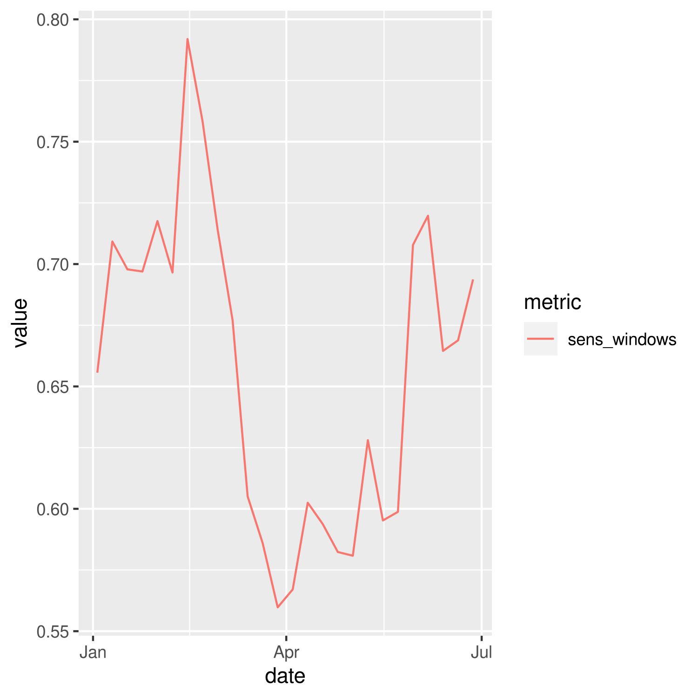

```r
conf0%>%
  pivot_longer(spec_windows, names_to = "metric", values_to = "value")%>%
  ggplot(aes(x = date, y = value, color = metric)) + geom_line()
```

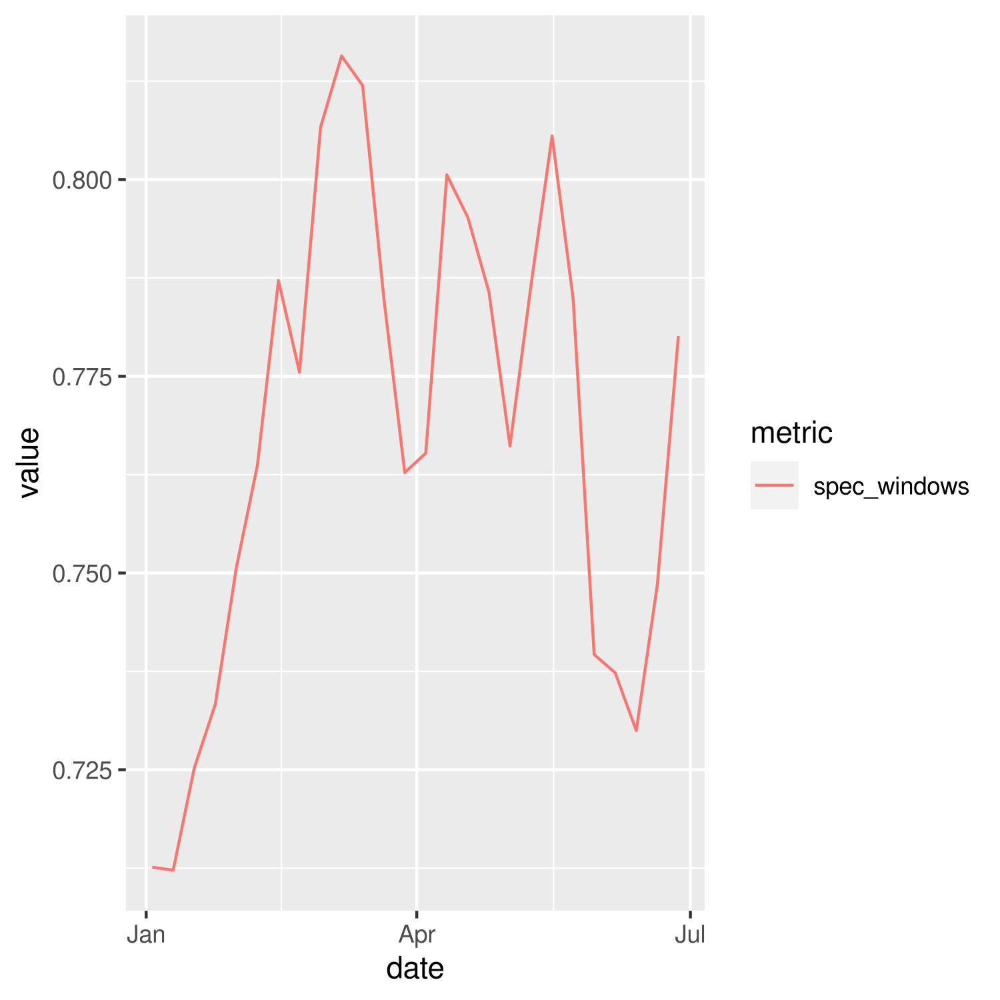

```r
conf0%>%
  pivot_longer(jinex_window, names_to = "metric", values_to = "value")%>%
  ggplot(aes(x = date, y = value, color = metric)) + geom_line()
```

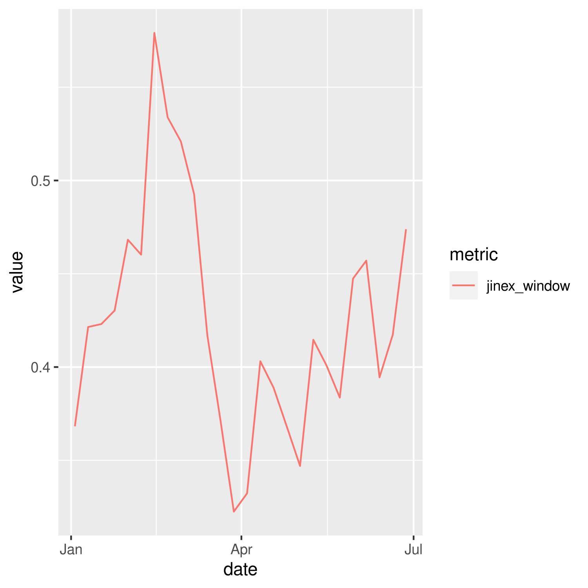

```r
conf0%>%
  pivot_longer(acc_windows, names_to = "metric", values_to = "value")%>%
  ggplot(aes(x = date, y = value, color = metric)) + geom_line()
```

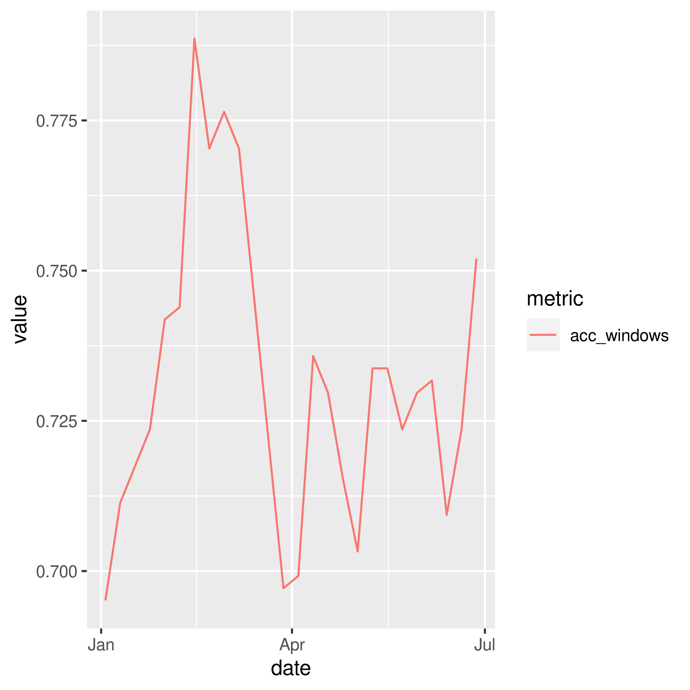


We now gather our recipes and models.
Model: random forest, tuned random forest, Radial basis function support vector machines, K-nearest neighbors, Xgboost. 
Outcome: predicting shrunk_ae, confident interval for each client every day.


#recipe with ihme death data

```r
rec_obj <-
    recipe(shrunk_ae ~ ., data = training(splits)) %>%
    #step_rm(year,month,day)%>%
    step_rm(zip3)%>%
    step_rm( claims , class, shrinkage, ae,zip_deaths, smoothed_deaths)%>%
    #step_rm(adverse)%>%
    step_mutate(client = droplevels(client)) %>%
    step_timeseries_signature(date) %>%
    step_rm(date)%>%
    step_dummy(all_nominal_predictors(), one_hot = TRUE)%>%
     step_zv(all_predictors()) %>%
    step_normalize(all_predictors(), -all_nominal())

summary(prep(rec_obj))
```

```
## # A tibble: 543 × 4
##    variable type    role      source  
##    <chr>    <chr>   <chr>     <chr>   
##  1 size     numeric predictor original
##  2 volume   numeric predictor original
##  3 avg_qx   numeric predictor original
##  4 avg_age  numeric predictor original
##  5 per_male numeric predictor original
##  6 expected numeric predictor original
##  7 nohs     numeric predictor original
##  8 hs       numeric predictor original
##  9 college  numeric predictor original
## 10 bachelor numeric predictor original
## # … with 533 more rows
```

```r
bake(prep(rec_obj),training(splits))
```

```
## # A tibble: 20,664 × 543
##      size  volume  avg_qx avg_age per_male expected   nohs     hs college
##     <dbl>   <dbl>   <dbl>   <dbl>    <dbl>    <dbl>  <dbl>  <dbl>   <dbl>
##  1  2.90   1.72    0.678   -0.381   1.02     1.77   -0.497  0.580 -0.381 
##  2  0.413  0.510  -0.0730   0.258   0.0165   0.534  -0.506  0.578 -0.383 
##  3 -0.467 -0.0758  1.53     0.476   1.10     0.193  -0.816 -0.351 -1.65  
##  4  0.985  1.07   -0.318   -1.15    0.689    1.01   -0.232 -0.435 -2.03  
##  5 -0.263  0.259  -0.329    0.466   0.620    0.149  -1.24  -0.663 -1.97  
##  6 -0.636  0.477   0.320    1.64   -1.34     0.481   0.801  1.03  -0.548 
##  7  0.708  0.873  -0.549   -0.895  -0.797    0.781  -1.41   0.416 -0.0875
##  8 -0.361  0.469  -0.577    0.553  -0.118    0.360  -0.602  1.85   0.580 
##  9 -0.623 -0.0567  0.885   -0.329   0.656    0.0470 -1.22   0.485 -0.511 
## 10 -0.995 -1.60   -0.442    0.177   1.29    -1.59   -0.618  0.983  0.122 
## # … with 20,654 more rows, and 534 more variables: bachelor <dbl>,
## #   R_birth <dbl>, R_death <dbl>, unemp <dbl>, poverty <dbl>,
## #   per_dem <dbl>, hes <dbl>, hes_uns <dbl>, str_hes <dbl>, svi <dbl>,
## #   cvac <dbl>, income <dbl>, POP <dbl>, density <dbl>,
## #   ihme_deaths <dbl>, shrunk_ae <dbl>, date_index.num <dbl>,
## #   date_half <dbl>, date_quarter <dbl>, date_month <dbl>,
## #   date_month.xts <dbl>, date_day <dbl>, date_mday <dbl>,
## #   date_qday <dbl>, date_yday <dbl>, date_mweek <dbl>, date_week <dbl>,
## #   date_week.iso <dbl>, date_week2 <dbl>, date_week3 <dbl>,
## #   date_week4 <dbl>, date_mday7 <dbl>, client_X1 <dbl>,
## #   client_X10 <dbl>, client_X100 <dbl>, client_X101 <dbl>,
## #   client_X102 <dbl>, client_X103 <dbl>, client_X104 <dbl>,
## #   client_X105 <dbl>, client_X106 <dbl>, client_X107 <dbl>,
## #   client_X108 <dbl>, client_X109 <dbl>, client_X11 <dbl>,
## #   client_X110 <dbl>, client_X111 <dbl>, client_X112 <dbl>,
## #   client_X113 <dbl>, client_X114 <dbl>, client_X115 <dbl>,
## #   client_X116 <dbl>, client_X117 <dbl>, client_X118 <dbl>,
## #   client_X119 <dbl>, client_X12 <dbl>, client_X120 <dbl>,
## #   client_X121 <dbl>, client_X122 <dbl>, client_X123 <dbl>,
## #   client_X124 <dbl>, client_X125 <dbl>, client_X126 <dbl>,
## #   client_X127 <dbl>, client_X128 <dbl>, client_X129 <dbl>,
## #   client_X13 <dbl>, client_X130 <dbl>, client_X131 <dbl>,
## #   client_X132 <dbl>, client_X133 <dbl>, client_X134 <dbl>,
## #   client_X135 <dbl>, client_X136 <dbl>, client_X137 <dbl>,
## #   client_X139 <dbl>, client_X14 <dbl>, client_X140 <dbl>,
## #   client_X141 <dbl>, client_X143 <dbl>, client_X144 <dbl>,
## #   client_X145 <dbl>, client_X147 <dbl>, client_X148 <dbl>,
## #   client_X149 <dbl>, client_X15 <dbl>, client_X150 <dbl>,
## #   client_X151 <dbl>, client_X152 <dbl>, client_X153 <dbl>,
## #   client_X154 <dbl>, client_X155 <dbl>, client_X156 <dbl>,
## #   client_X157 <dbl>, client_X158 <dbl>, client_X159 <dbl>,
## #   client_X16 <dbl>, client_X160 <dbl>, client_X161 <dbl>,
## #   client_X162 <dbl>, …
```

#engine

```r
forest_spec <-
  rand_forest(trees = 1000) %>%
  set_engine("ranger", num.threads = 8, seed = 123456789) %>%
  #set_mode("classification") %>%
  set_mode("regression")%>%
  set_engine("ranger", num.threads = 8, importance = "impurity", seed = 123)
tuned_forest_spec <-
  rand_forest(trees = 1000, mtry = 12, min_n = 21) %>%
  #set_mode("classification") %>%
  set_mode("regression")%>%
  set_engine("ranger", num.threads = 8, importance = "impurity", seed = 123)
svm_rbf_spec <-
  svm_rbf() %>%
  set_engine("kernlab") %>%
  #set_mode("classification")
  set_mode("regression")
knn_spec <-
  nearest_neighbor() %>%
  set_engine("kknn") %>%
  #set_mode("classification")
  set_mode("regression")
xgboost_spec <-
  boost_tree(trees = 100) %>%
  set_engine("xgboost") %>%
  #set_mode("classification")
  set_mode("regression")
```

# workflow with ihme death data

```r
wflw_rf <- workflow() %>%
    add_model(
        forest_spec
    ) %>%
    add_recipe(rec_obj) %>%
    fit(data = training(splits))

wflw_tunedrf <- workflow() %>%
    add_model(
        tuned_forest_spec
    ) %>%
    add_recipe(rec_obj) %>%
    fit(data = training(splits))

wflw_svmrbf <- workflow() %>%
    add_model(
        svm_rbf_spec
    ) %>%
    add_recipe(rec_obj) %>%
    fit(data = training(splits))

wflw_knnspec <- workflow() %>%
    add_model(
        knn_spec
    ) %>%
    add_recipe(rec_obj) %>%
    fit(data = training(splits))  

wflw_xgboost <- workflow() %>%
    add_model(
        xgboost_spec
    ) %>%
    add_recipe(rec_obj) %>%
    fit(data = training(splits))  
```
Create a Modeltime Table

```r
model_tbl <- modeltime_table(
    wflw_rf,
    wflw_tunedrf,
    wflw_svmrbf,
    wflw_knnspec,
    wflw_xgboost
)
model_tbl
```

```
## # Modeltime Table
## # A tibble: 5 × 3
##   .model_id .model     .model_desc
##       <int> <list>     <chr>      
## 1         1 <workflow> RANGER     
## 2         2 <workflow> RANGER     
## 3         3 <workflow> KERNLAB    
## 4         4 <workflow> KKNN       
## 5         5 <workflow> XGBOOST
```

#Calibrate by client

```r
calib_tbl <- model_tbl %>%
    modeltime_calibrate(
      new_data = testing(splits), 
      id       = "client"
    )

calib_tbl
```

```
## # Modeltime Table
## # A tibble: 5 × 5
##   .model_id .model     .model_desc .type .calibration_data    
##       <int> <list>     <chr>       <chr> <list>               
## 1         1 <workflow> RANGER      Test  <tibble [12,792 × 5]>
## 2         2 <workflow> RANGER      Test  <tibble [12,792 × 5]>
## 3         3 <workflow> KERNLAB     Test  <tibble [12,792 × 5]>
## 4         4 <workflow> KKNN        Test  <tibble [12,792 × 5]>
## 5         5 <workflow> XGBOOST     Test  <tibble [12,792 × 5]>
```

Measure Accuracy on validation data

```r
#global error
calib_tbl %>% 
    modeltime_accuracy(acc_by_id = FALSE) %>% 
    table_modeltime_accuracy(.interactive = FALSE)
```

<!--html_preserve--><div id="lkhzvdcapl" style="overflow-x:auto;overflow-y:auto;width:auto;height:auto;">
<style>html {
  font-family: -apple-system, BlinkMacSystemFont, 'Segoe UI', Roboto, Oxygen, Ubuntu, Cantarell, 'Helvetica Neue', 'Fira Sans', 'Droid Sans', Arial, sans-serif;
}

#lkhzvdcapl .gt_table {
  display: table;
  border-collapse: collapse;
  margin-left: auto;
  margin-right: auto;
  color: #333333;
  font-size: 16px;
  font-weight: normal;
  font-style: normal;
  background-color: #FFFFFF;
  width: auto;
  border-top-style: solid;
  border-top-width: 2px;
  border-top-color: #A8A8A8;
  border-right-style: none;
  border-right-width: 2px;
  border-right-color: #D3D3D3;
  border-bottom-style: solid;
  border-bottom-width: 2px;
  border-bottom-color: #A8A8A8;
  border-left-style: none;
  border-left-width: 2px;
  border-left-color: #D3D3D3;
}

#lkhzvdcapl .gt_heading {
  background-color: #FFFFFF;
  text-align: center;
  border-bottom-color: #FFFFFF;
  border-left-style: none;
  border-left-width: 1px;
  border-left-color: #D3D3D3;
  border-right-style: none;
  border-right-width: 1px;
  border-right-color: #D3D3D3;
}

#lkhzvdcapl .gt_title {
  color: #333333;
  font-size: 125%;
  font-weight: initial;
  padding-top: 4px;
  padding-bottom: 4px;
  border-bottom-color: #FFFFFF;
  border-bottom-width: 0;
}

#lkhzvdcapl .gt_subtitle {
  color: #333333;
  font-size: 85%;
  font-weight: initial;
  padding-top: 0;
  padding-bottom: 4px;
  border-top-color: #FFFFFF;
  border-top-width: 0;
}

#lkhzvdcapl .gt_bottom_border {
  border-bottom-style: solid;
  border-bottom-width: 2px;
  border-bottom-color: #D3D3D3;
}

#lkhzvdcapl .gt_col_headings {
  border-top-style: solid;
  border-top-width: 2px;
  border-top-color: #D3D3D3;
  border-bottom-style: solid;
  border-bottom-width: 2px;
  border-bottom-color: #D3D3D3;
  border-left-style: none;
  border-left-width: 1px;
  border-left-color: #D3D3D3;
  border-right-style: none;
  border-right-width: 1px;
  border-right-color: #D3D3D3;
}

#lkhzvdcapl .gt_col_heading {
  color: #333333;
  background-color: #FFFFFF;
  font-size: 100%;
  font-weight: normal;
  text-transform: inherit;
  border-left-style: none;
  border-left-width: 1px;
  border-left-color: #D3D3D3;
  border-right-style: none;
  border-right-width: 1px;
  border-right-color: #D3D3D3;
  vertical-align: bottom;
  padding-top: 5px;
  padding-bottom: 6px;
  padding-left: 5px;
  padding-right: 5px;
  overflow-x: hidden;
}

#lkhzvdcapl .gt_column_spanner_outer {
  color: #333333;
  background-color: #FFFFFF;
  font-size: 100%;
  font-weight: normal;
  text-transform: inherit;
  padding-top: 0;
  padding-bottom: 0;
  padding-left: 4px;
  padding-right: 4px;
}

#lkhzvdcapl .gt_column_spanner_outer:first-child {
  padding-left: 0;
}

#lkhzvdcapl .gt_column_spanner_outer:last-child {
  padding-right: 0;
}

#lkhzvdcapl .gt_column_spanner {
  border-bottom-style: solid;
  border-bottom-width: 2px;
  border-bottom-color: #D3D3D3;
  vertical-align: bottom;
  padding-top: 5px;
  padding-bottom: 6px;
  overflow-x: hidden;
  display: inline-block;
  width: 100%;
}

#lkhzvdcapl .gt_group_heading {
  padding: 8px;
  color: #333333;
  background-color: #FFFFFF;
  font-size: 100%;
  font-weight: initial;
  text-transform: inherit;
  border-top-style: solid;
  border-top-width: 2px;
  border-top-color: #D3D3D3;
  border-bottom-style: solid;
  border-bottom-width: 2px;
  border-bottom-color: #D3D3D3;
  border-left-style: none;
  border-left-width: 1px;
  border-left-color: #D3D3D3;
  border-right-style: none;
  border-right-width: 1px;
  border-right-color: #D3D3D3;
  vertical-align: middle;
}

#lkhzvdcapl .gt_empty_group_heading {
  padding: 0.5px;
  color: #333333;
  background-color: #FFFFFF;
  font-size: 100%;
  font-weight: initial;
  border-top-style: solid;
  border-top-width: 2px;
  border-top-color: #D3D3D3;
  border-bottom-style: solid;
  border-bottom-width: 2px;
  border-bottom-color: #D3D3D3;
  vertical-align: middle;
}

#lkhzvdcapl .gt_from_md > :first-child {
  margin-top: 0;
}

#lkhzvdcapl .gt_from_md > :last-child {
  margin-bottom: 0;
}

#lkhzvdcapl .gt_row {
  padding-top: 8px;
  padding-bottom: 8px;
  padding-left: 5px;
  padding-right: 5px;
  margin: 10px;
  border-top-style: solid;
  border-top-width: 1px;
  border-top-color: #D3D3D3;
  border-left-style: none;
  border-left-width: 1px;
  border-left-color: #D3D3D3;
  border-right-style: none;
  border-right-width: 1px;
  border-right-color: #D3D3D3;
  vertical-align: middle;
  overflow-x: hidden;
}

#lkhzvdcapl .gt_stub {
  color: #333333;
  background-color: #FFFFFF;
  font-size: 100%;
  font-weight: initial;
  text-transform: inherit;
  border-right-style: solid;
  border-right-width: 2px;
  border-right-color: #D3D3D3;
  padding-left: 12px;
}

#lkhzvdcapl .gt_summary_row {
  color: #333333;
  background-color: #FFFFFF;
  text-transform: inherit;
  padding-top: 8px;
  padding-bottom: 8px;
  padding-left: 5px;
  padding-right: 5px;
}

#lkhzvdcapl .gt_first_summary_row {
  padding-top: 8px;
  padding-bottom: 8px;
  padding-left: 5px;
  padding-right: 5px;
  border-top-style: solid;
  border-top-width: 2px;
  border-top-color: #D3D3D3;
}

#lkhzvdcapl .gt_grand_summary_row {
  color: #333333;
  background-color: #FFFFFF;
  text-transform: inherit;
  padding-top: 8px;
  padding-bottom: 8px;
  padding-left: 5px;
  padding-right: 5px;
}

#lkhzvdcapl .gt_first_grand_summary_row {
  padding-top: 8px;
  padding-bottom: 8px;
  padding-left: 5px;
  padding-right: 5px;
  border-top-style: double;
  border-top-width: 6px;
  border-top-color: #D3D3D3;
}

#lkhzvdcapl .gt_striped {
  background-color: rgba(128, 128, 128, 0.05);
}

#lkhzvdcapl .gt_table_body {
  border-top-style: solid;
  border-top-width: 2px;
  border-top-color: #D3D3D3;
  border-bottom-style: solid;
  border-bottom-width: 2px;
  border-bottom-color: #D3D3D3;
}

#lkhzvdcapl .gt_footnotes {
  color: #333333;
  background-color: #FFFFFF;
  border-bottom-style: none;
  border-bottom-width: 2px;
  border-bottom-color: #D3D3D3;
  border-left-style: none;
  border-left-width: 2px;
  border-left-color: #D3D3D3;
  border-right-style: none;
  border-right-width: 2px;
  border-right-color: #D3D3D3;
}

#lkhzvdcapl .gt_footnote {
  margin: 0px;
  font-size: 90%;
  padding: 4px;
}

#lkhzvdcapl .gt_sourcenotes {
  color: #333333;
  background-color: #FFFFFF;
  border-bottom-style: none;
  border-bottom-width: 2px;
  border-bottom-color: #D3D3D3;
  border-left-style: none;
  border-left-width: 2px;
  border-left-color: #D3D3D3;
  border-right-style: none;
  border-right-width: 2px;
  border-right-color: #D3D3D3;
}

#lkhzvdcapl .gt_sourcenote {
  font-size: 90%;
  padding: 4px;
}

#lkhzvdcapl .gt_left {
  text-align: left;
}

#lkhzvdcapl .gt_center {
  text-align: center;
}

#lkhzvdcapl .gt_right {
  text-align: right;
  font-variant-numeric: tabular-nums;
}

#lkhzvdcapl .gt_font_normal {
  font-weight: normal;
}

#lkhzvdcapl .gt_font_bold {
  font-weight: bold;
}

#lkhzvdcapl .gt_font_italic {
  font-style: italic;
}

#lkhzvdcapl .gt_super {
  font-size: 65%;
}

#lkhzvdcapl .gt_footnote_marks {
  font-style: italic;
  font-weight: normal;
  font-size: 65%;
}
</style>
<table class="gt_table">
  <thead class="gt_header">
    <tr>
      <th colspan="9" class="gt_heading gt_title gt_font_normal gt_bottom_border" style>Accuracy Table</th>
    </tr>
    
  </thead>
  <thead class="gt_col_headings">
    <tr>
      <th class="gt_col_heading gt_columns_bottom_border gt_right" rowspan="1" colspan="1">.model_id</th>
      <th class="gt_col_heading gt_columns_bottom_border gt_left" rowspan="1" colspan="1">.model_desc</th>
      <th class="gt_col_heading gt_columns_bottom_border gt_left" rowspan="1" colspan="1">.type</th>
      <th class="gt_col_heading gt_columns_bottom_border gt_right" rowspan="1" colspan="1">mae</th>
      <th class="gt_col_heading gt_columns_bottom_border gt_right" rowspan="1" colspan="1">mape</th>
      <th class="gt_col_heading gt_columns_bottom_border gt_right" rowspan="1" colspan="1">mase</th>
      <th class="gt_col_heading gt_columns_bottom_border gt_right" rowspan="1" colspan="1">smape</th>
      <th class="gt_col_heading gt_columns_bottom_border gt_right" rowspan="1" colspan="1">rmse</th>
      <th class="gt_col_heading gt_columns_bottom_border gt_right" rowspan="1" colspan="1">rsq</th>
    </tr>
  </thead>
  <tbody class="gt_table_body">
    <tr><td class="gt_row gt_right">1</td>
<td class="gt_row gt_left">RANGER</td>
<td class="gt_row gt_left">Test</td>
<td class="gt_row gt_right">11.56</td>
<td class="gt_row gt_right">Inf</td>
<td class="gt_row gt_right">1.44</td>
<td class="gt_row gt_right">88.70</td>
<td class="gt_row gt_right">31.54</td>
<td class="gt_row gt_right">0.11</td></tr>
    <tr><td class="gt_row gt_right">2</td>
<td class="gt_row gt_left">RANGER</td>
<td class="gt_row gt_left">Test</td>
<td class="gt_row gt_right">10.32</td>
<td class="gt_row gt_right">Inf</td>
<td class="gt_row gt_right">1.29</td>
<td class="gt_row gt_right">88.38</td>
<td class="gt_row gt_right">20.78</td>
<td class="gt_row gt_right">0.18</td></tr>
    <tr><td class="gt_row gt_right">3</td>
<td class="gt_row gt_left">KERNLAB</td>
<td class="gt_row gt_left">Test</td>
<td class="gt_row gt_right">7.41</td>
<td class="gt_row gt_right">Inf</td>
<td class="gt_row gt_right">0.93</td>
<td class="gt_row gt_right">95.05</td>
<td class="gt_row gt_right">12.44</td>
<td class="gt_row gt_right">0.47</td></tr>
    <tr><td class="gt_row gt_right">4</td>
<td class="gt_row gt_left">KKNN</td>
<td class="gt_row gt_left">Test</td>
<td class="gt_row gt_right">12.40</td>
<td class="gt_row gt_right">NaN</td>
<td class="gt_row gt_right">1.55</td>
<td class="gt_row gt_right">NaN</td>
<td class="gt_row gt_right">39.42</td>
<td class="gt_row gt_right">0.08</td></tr>
    <tr><td class="gt_row gt_right">5</td>
<td class="gt_row gt_left">XGBOOST</td>
<td class="gt_row gt_left">Test</td>
<td class="gt_row gt_right">7.13</td>
<td class="gt_row gt_right">Inf</td>
<td class="gt_row gt_right">0.89</td>
<td class="gt_row gt_right">85.91</td>
<td class="gt_row gt_right">15.30</td>
<td class="gt_row gt_right">0.55</td></tr>
  </tbody>
  
  
</table>
</div><!--/html_preserve-->

```r
#local error for each client
calib_tbl %>% 
    modeltime_accuracy(acc_by_id = TRUE) %>% 
    table_modeltime_accuracy(.interactive = FALSE)
```

```
## Warning: A correlation computation is required, but `truth` is constant
## and has 0 standard deviation, resulting in a divide by 0 error. `NA` will
## be returned.

## Warning: A correlation computation is required, but `truth` is constant
## and has 0 standard deviation, resulting in a divide by 0 error. `NA` will
## be returned.

## Warning: A correlation computation is required, but `truth` is constant
## and has 0 standard deviation, resulting in a divide by 0 error. `NA` will
## be returned.

## Warning: A correlation computation is required, but `truth` is constant
## and has 0 standard deviation, resulting in a divide by 0 error. `NA` will
## be returned.

## Warning: A correlation computation is required, but `truth` is constant
## and has 0 standard deviation, resulting in a divide by 0 error. `NA` will
## be returned.

## Warning: A correlation computation is required, but `truth` is constant
## and has 0 standard deviation, resulting in a divide by 0 error. `NA` will
## be returned.

## Warning: A correlation computation is required, but `truth` is constant
## and has 0 standard deviation, resulting in a divide by 0 error. `NA` will
## be returned.

## Warning: A correlation computation is required, but `truth` is constant
## and has 0 standard deviation, resulting in a divide by 0 error. `NA` will
## be returned.

## Warning: A correlation computation is required, but `truth` is constant
## and has 0 standard deviation, resulting in a divide by 0 error. `NA` will
## be returned.

## Warning: A correlation computation is required, but `truth` is constant
## and has 0 standard deviation, resulting in a divide by 0 error. `NA` will
## be returned.

## Warning: A correlation computation is required, but `truth` is constant
## and has 0 standard deviation, resulting in a divide by 0 error. `NA` will
## be returned.

## Warning: A correlation computation is required, but `truth` is constant
## and has 0 standard deviation, resulting in a divide by 0 error. `NA` will
## be returned.

## Warning: A correlation computation is required, but `truth` is constant
## and has 0 standard deviation, resulting in a divide by 0 error. `NA` will
## be returned.

## Warning: A correlation computation is required, but `truth` is constant
## and has 0 standard deviation, resulting in a divide by 0 error. `NA` will
## be returned.

## Warning: A correlation computation is required, but `truth` is constant
## and has 0 standard deviation, resulting in a divide by 0 error. `NA` will
## be returned.

## Warning: A correlation computation is required, but `truth` is constant
## and has 0 standard deviation, resulting in a divide by 0 error. `NA` will
## be returned.

## Warning: A correlation computation is required, but `truth` is constant
## and has 0 standard deviation, resulting in a divide by 0 error. `NA` will
## be returned.

## Warning: A correlation computation is required, but `truth` is constant
## and has 0 standard deviation, resulting in a divide by 0 error. `NA` will
## be returned.

## Warning: A correlation computation is required, but `truth` is constant
## and has 0 standard deviation, resulting in a divide by 0 error. `NA` will
## be returned.

## Warning: A correlation computation is required, but `truth` is constant
## and has 0 standard deviation, resulting in a divide by 0 error. `NA` will
## be returned.

## Warning: A correlation computation is required, but `truth` is constant
## and has 0 standard deviation, resulting in a divide by 0 error. `NA` will
## be returned.

## Warning: A correlation computation is required, but `truth` is constant
## and has 0 standard deviation, resulting in a divide by 0 error. `NA` will
## be returned.

## Warning: A correlation computation is required, but `truth` is constant
## and has 0 standard deviation, resulting in a divide by 0 error. `NA` will
## be returned.

## Warning: A correlation computation is required, but `truth` is constant
## and has 0 standard deviation, resulting in a divide by 0 error. `NA` will
## be returned.

## Warning: A correlation computation is required, but `truth` is constant
## and has 0 standard deviation, resulting in a divide by 0 error. `NA` will
## be returned.

## Warning: A correlation computation is required, but `truth` is constant
## and has 0 standard deviation, resulting in a divide by 0 error. `NA` will
## be returned.

## Warning: A correlation computation is required, but `truth` is constant
## and has 0 standard deviation, resulting in a divide by 0 error. `NA` will
## be returned.

## Warning: A correlation computation is required, but `truth` is constant
## and has 0 standard deviation, resulting in a divide by 0 error. `NA` will
## be returned.

## Warning: A correlation computation is required, but `truth` is constant
## and has 0 standard deviation, resulting in a divide by 0 error. `NA` will
## be returned.

## Warning: A correlation computation is required, but `truth` is constant
## and has 0 standard deviation, resulting in a divide by 0 error. `NA` will
## be returned.

## Warning: A correlation computation is required, but `truth` is constant
## and has 0 standard deviation, resulting in a divide by 0 error. `NA` will
## be returned.

## Warning: A correlation computation is required, but `truth` is constant
## and has 0 standard deviation, resulting in a divide by 0 error. `NA` will
## be returned.

## Warning: A correlation computation is required, but `truth` is constant
## and has 0 standard deviation, resulting in a divide by 0 error. `NA` will
## be returned.

## Warning: A correlation computation is required, but `truth` is constant
## and has 0 standard deviation, resulting in a divide by 0 error. `NA` will
## be returned.

## Warning: A correlation computation is required, but `truth` is constant
## and has 0 standard deviation, resulting in a divide by 0 error. `NA` will
## be returned.

## Warning: A correlation computation is required, but `truth` is constant
## and has 0 standard deviation, resulting in a divide by 0 error. `NA` will
## be returned.
```

```
## Warning: A correlation computation is required, but `estimate` is constant
## and has 0 standard deviation, resulting in a divide by 0 error. `NA` will
## be returned.

## Warning: A correlation computation is required, but `estimate` is constant
## and has 0 standard deviation, resulting in a divide by 0 error. `NA` will
## be returned.

## Warning: A correlation computation is required, but `estimate` is constant
## and has 0 standard deviation, resulting in a divide by 0 error. `NA` will
## be returned.

## Warning: A correlation computation is required, but `estimate` is constant
## and has 0 standard deviation, resulting in a divide by 0 error. `NA` will
## be returned.

## Warning: A correlation computation is required, but `estimate` is constant
## and has 0 standard deviation, resulting in a divide by 0 error. `NA` will
## be returned.
```

```
## Warning: A correlation computation is required, but `truth` is constant
## and has 0 standard deviation, resulting in a divide by 0 error. `NA` will
## be returned.

## Warning: A correlation computation is required, but `truth` is constant
## and has 0 standard deviation, resulting in a divide by 0 error. `NA` will
## be returned.
```

```
## Warning: A correlation computation is required, but `estimate` is constant
## and has 0 standard deviation, resulting in a divide by 0 error. `NA` will
## be returned.
```

```
## Warning: A correlation computation is required, but `truth` is constant
## and has 0 standard deviation, resulting in a divide by 0 error. `NA` will
## be returned.
```

```
## Warning: A correlation computation is required, but `estimate` is constant
## and has 0 standard deviation, resulting in a divide by 0 error. `NA` will
## be returned.

## Warning: A correlation computation is required, but `estimate` is constant
## and has 0 standard deviation, resulting in a divide by 0 error. `NA` will
## be returned.

## Warning: A correlation computation is required, but `estimate` is constant
## and has 0 standard deviation, resulting in a divide by 0 error. `NA` will
## be returned.
```

```
## Warning: A correlation computation is required, but `truth` is constant
## and has 0 standard deviation, resulting in a divide by 0 error. `NA` will
## be returned.

## Warning: A correlation computation is required, but `truth` is constant
## and has 0 standard deviation, resulting in a divide by 0 error. `NA` will
## be returned.

## Warning: A correlation computation is required, but `truth` is constant
## and has 0 standard deviation, resulting in a divide by 0 error. `NA` will
## be returned.
```

```
## Warning: A correlation computation is required, but `estimate` is constant
## and has 0 standard deviation, resulting in a divide by 0 error. `NA` will
## be returned.
```

```
## Warning: A correlation computation is required, but `truth` is constant
## and has 0 standard deviation, resulting in a divide by 0 error. `NA` will
## be returned.
```

```
## Warning: A correlation computation is required, but `estimate` is constant
## and has 0 standard deviation, resulting in a divide by 0 error. `NA` will
## be returned.

## Warning: A correlation computation is required, but `estimate` is constant
## and has 0 standard deviation, resulting in a divide by 0 error. `NA` will
## be returned.
```

```
## Warning: A correlation computation is required, but `truth` is constant
## and has 0 standard deviation, resulting in a divide by 0 error. `NA` will
## be returned.
```

```
## Warning: A correlation computation is required, but `estimate` is constant
## and has 0 standard deviation, resulting in a divide by 0 error. `NA` will
## be returned.

## Warning: A correlation computation is required, but `estimate` is constant
## and has 0 standard deviation, resulting in a divide by 0 error. `NA` will
## be returned.

## Warning: A correlation computation is required, but `estimate` is constant
## and has 0 standard deviation, resulting in a divide by 0 error. `NA` will
## be returned.

## Warning: A correlation computation is required, but `estimate` is constant
## and has 0 standard deviation, resulting in a divide by 0 error. `NA` will
## be returned.
```

```
## Warning: A correlation computation is required, but `truth` is constant
## and has 0 standard deviation, resulting in a divide by 0 error. `NA` will
## be returned.

## Warning: A correlation computation is required, but `truth` is constant
## and has 0 standard deviation, resulting in a divide by 0 error. `NA` will
## be returned.

## Warning: A correlation computation is required, but `truth` is constant
## and has 0 standard deviation, resulting in a divide by 0 error. `NA` will
## be returned.

## Warning: A correlation computation is required, but `truth` is constant
## and has 0 standard deviation, resulting in a divide by 0 error. `NA` will
## be returned.

## Warning: A correlation computation is required, but `truth` is constant
## and has 0 standard deviation, resulting in a divide by 0 error. `NA` will
## be returned.

## Warning: A correlation computation is required, but `truth` is constant
## and has 0 standard deviation, resulting in a divide by 0 error. `NA` will
## be returned.

## Warning: A correlation computation is required, but `truth` is constant
## and has 0 standard deviation, resulting in a divide by 0 error. `NA` will
## be returned.

## Warning: A correlation computation is required, but `truth` is constant
## and has 0 standard deviation, resulting in a divide by 0 error. `NA` will
## be returned.

## Warning: A correlation computation is required, but `truth` is constant
## and has 0 standard deviation, resulting in a divide by 0 error. `NA` will
## be returned.

## Warning: A correlation computation is required, but `truth` is constant
## and has 0 standard deviation, resulting in a divide by 0 error. `NA` will
## be returned.

## Warning: A correlation computation is required, but `truth` is constant
## and has 0 standard deviation, resulting in a divide by 0 error. `NA` will
## be returned.
```

<!--html_preserve--><div id="lparuptcxc" style="overflow-x:auto;overflow-y:auto;width:auto;height:auto;">
<style>html {
  font-family: -apple-system, BlinkMacSystemFont, 'Segoe UI', Roboto, Oxygen, Ubuntu, Cantarell, 'Helvetica Neue', 'Fira Sans', 'Droid Sans', Arial, sans-serif;
}

#lparuptcxc .gt_table {
  display: table;
  border-collapse: collapse;
  margin-left: auto;
  margin-right: auto;
  color: #333333;
  font-size: 16px;
  font-weight: normal;
  font-style: normal;
  background-color: #FFFFFF;
  width: auto;
  border-top-style: solid;
  border-top-width: 2px;
  border-top-color: #A8A8A8;
  border-right-style: none;
  border-right-width: 2px;
  border-right-color: #D3D3D3;
  border-bottom-style: solid;
  border-bottom-width: 2px;
  border-bottom-color: #A8A8A8;
  border-left-style: none;
  border-left-width: 2px;
  border-left-color: #D3D3D3;
}

#lparuptcxc .gt_heading {
  background-color: #FFFFFF;
  text-align: center;
  border-bottom-color: #FFFFFF;
  border-left-style: none;
  border-left-width: 1px;
  border-left-color: #D3D3D3;
  border-right-style: none;
  border-right-width: 1px;
  border-right-color: #D3D3D3;
}

#lparuptcxc .gt_title {
  color: #333333;
  font-size: 125%;
  font-weight: initial;
  padding-top: 4px;
  padding-bottom: 4px;
  border-bottom-color: #FFFFFF;
  border-bottom-width: 0;
}

#lparuptcxc .gt_subtitle {
  color: #333333;
  font-size: 85%;
  font-weight: initial;
  padding-top: 0;
  padding-bottom: 4px;
  border-top-color: #FFFFFF;
  border-top-width: 0;
}

#lparuptcxc .gt_bottom_border {
  border-bottom-style: solid;
  border-bottom-width: 2px;
  border-bottom-color: #D3D3D3;
}

#lparuptcxc .gt_col_headings {
  border-top-style: solid;
  border-top-width: 2px;
  border-top-color: #D3D3D3;
  border-bottom-style: solid;
  border-bottom-width: 2px;
  border-bottom-color: #D3D3D3;
  border-left-style: none;
  border-left-width: 1px;
  border-left-color: #D3D3D3;
  border-right-style: none;
  border-right-width: 1px;
  border-right-color: #D3D3D3;
}

#lparuptcxc .gt_col_heading {
  color: #333333;
  background-color: #FFFFFF;
  font-size: 100%;
  font-weight: normal;
  text-transform: inherit;
  border-left-style: none;
  border-left-width: 1px;
  border-left-color: #D3D3D3;
  border-right-style: none;
  border-right-width: 1px;
  border-right-color: #D3D3D3;
  vertical-align: bottom;
  padding-top: 5px;
  padding-bottom: 6px;
  padding-left: 5px;
  padding-right: 5px;
  overflow-x: hidden;
}

#lparuptcxc .gt_column_spanner_outer {
  color: #333333;
  background-color: #FFFFFF;
  font-size: 100%;
  font-weight: normal;
  text-transform: inherit;
  padding-top: 0;
  padding-bottom: 0;
  padding-left: 4px;
  padding-right: 4px;
}

#lparuptcxc .gt_column_spanner_outer:first-child {
  padding-left: 0;
}

#lparuptcxc .gt_column_spanner_outer:last-child {
  padding-right: 0;
}

#lparuptcxc .gt_column_spanner {
  border-bottom-style: solid;
  border-bottom-width: 2px;
  border-bottom-color: #D3D3D3;
  vertical-align: bottom;
  padding-top: 5px;
  padding-bottom: 6px;
  overflow-x: hidden;
  display: inline-block;
  width: 100%;
}

#lparuptcxc .gt_group_heading {
  padding: 8px;
  color: #333333;
  background-color: #FFFFFF;
  font-size: 100%;
  font-weight: initial;
  text-transform: inherit;
  border-top-style: solid;
  border-top-width: 2px;
  border-top-color: #D3D3D3;
  border-bottom-style: solid;
  border-bottom-width: 2px;
  border-bottom-color: #D3D3D3;
  border-left-style: none;
  border-left-width: 1px;
  border-left-color: #D3D3D3;
  border-right-style: none;
  border-right-width: 1px;
  border-right-color: #D3D3D3;
  vertical-align: middle;
}

#lparuptcxc .gt_empty_group_heading {
  padding: 0.5px;
  color: #333333;
  background-color: #FFFFFF;
  font-size: 100%;
  font-weight: initial;
  border-top-style: solid;
  border-top-width: 2px;
  border-top-color: #D3D3D3;
  border-bottom-style: solid;
  border-bottom-width: 2px;
  border-bottom-color: #D3D3D3;
  vertical-align: middle;
}

#lparuptcxc .gt_from_md > :first-child {
  margin-top: 0;
}

#lparuptcxc .gt_from_md > :last-child {
  margin-bottom: 0;
}

#lparuptcxc .gt_row {
  padding-top: 8px;
  padding-bottom: 8px;
  padding-left: 5px;
  padding-right: 5px;
  margin: 10px;
  border-top-style: solid;
  border-top-width: 1px;
  border-top-color: #D3D3D3;
  border-left-style: none;
  border-left-width: 1px;
  border-left-color: #D3D3D3;
  border-right-style: none;
  border-right-width: 1px;
  border-right-color: #D3D3D3;
  vertical-align: middle;
  overflow-x: hidden;
}

#lparuptcxc .gt_stub {
  color: #333333;
  background-color: #FFFFFF;
  font-size: 100%;
  font-weight: initial;
  text-transform: inherit;
  border-right-style: solid;
  border-right-width: 2px;
  border-right-color: #D3D3D3;
  padding-left: 12px;
}

#lparuptcxc .gt_summary_row {
  color: #333333;
  background-color: #FFFFFF;
  text-transform: inherit;
  padding-top: 8px;
  padding-bottom: 8px;
  padding-left: 5px;
  padding-right: 5px;
}

#lparuptcxc .gt_first_summary_row {
  padding-top: 8px;
  padding-bottom: 8px;
  padding-left: 5px;
  padding-right: 5px;
  border-top-style: solid;
  border-top-width: 2px;
  border-top-color: #D3D3D3;
}

#lparuptcxc .gt_grand_summary_row {
  color: #333333;
  background-color: #FFFFFF;
  text-transform: inherit;
  padding-top: 8px;
  padding-bottom: 8px;
  padding-left: 5px;
  padding-right: 5px;
}

#lparuptcxc .gt_first_grand_summary_row {
  padding-top: 8px;
  padding-bottom: 8px;
  padding-left: 5px;
  padding-right: 5px;
  border-top-style: double;
  border-top-width: 6px;
  border-top-color: #D3D3D3;
}

#lparuptcxc .gt_striped {
  background-color: rgba(128, 128, 128, 0.05);
}

#lparuptcxc .gt_table_body {
  border-top-style: solid;
  border-top-width: 2px;
  border-top-color: #D3D3D3;
  border-bottom-style: solid;
  border-bottom-width: 2px;
  border-bottom-color: #D3D3D3;
}

#lparuptcxc .gt_footnotes {
  color: #333333;
  background-color: #FFFFFF;
  border-bottom-style: none;
  border-bottom-width: 2px;
  border-bottom-color: #D3D3D3;
  border-left-style: none;
  border-left-width: 2px;
  border-left-color: #D3D3D3;
  border-right-style: none;
  border-right-width: 2px;
  border-right-color: #D3D3D3;
}

#lparuptcxc .gt_footnote {
  margin: 0px;
  font-size: 90%;
  padding: 4px;
}

#lparuptcxc .gt_sourcenotes {
  color: #333333;
  background-color: #FFFFFF;
  border-bottom-style: none;
  border-bottom-width: 2px;
  border-bottom-color: #D3D3D3;
  border-left-style: none;
  border-left-width: 2px;
  border-left-color: #D3D3D3;
  border-right-style: none;
  border-right-width: 2px;
  border-right-color: #D3D3D3;
}

#lparuptcxc .gt_sourcenote {
  font-size: 90%;
  padding: 4px;
}

#lparuptcxc .gt_left {
  text-align: left;
}

#lparuptcxc .gt_center {
  text-align: center;
}

#lparuptcxc .gt_right {
  text-align: right;
  font-variant-numeric: tabular-nums;
}

#lparuptcxc .gt_font_normal {
  font-weight: normal;
}

#lparuptcxc .gt_font_bold {
  font-weight: bold;
}

#lparuptcxc .gt_font_italic {
  font-style: italic;
}

#lparuptcxc .gt_super {
  font-size: 65%;
}

#lparuptcxc .gt_footnote_marks {
  font-style: italic;
  font-weight: normal;
  font-size: 65%;
}
</style>
<table class="gt_table">
  <thead class="gt_header">
    <tr>
      <th colspan="10" class="gt_heading gt_title gt_font_normal gt_bottom_border" style>Accuracy Table</th>
    </tr>
    
  </thead>
  <thead class="gt_col_headings">
    <tr>
      <th class="gt_col_heading gt_columns_bottom_border gt_right" rowspan="1" colspan="1">.model_id</th>
      <th class="gt_col_heading gt_columns_bottom_border gt_left" rowspan="1" colspan="1">.model_desc</th>
      <th class="gt_col_heading gt_columns_bottom_border gt_left" rowspan="1" colspan="1">.type</th>
      <th class="gt_col_heading gt_columns_bottom_border gt_center" rowspan="1" colspan="1">client</th>
      <th class="gt_col_heading gt_columns_bottom_border gt_right" rowspan="1" colspan="1">mae</th>
      <th class="gt_col_heading gt_columns_bottom_border gt_right" rowspan="1" colspan="1">mape</th>
      <th class="gt_col_heading gt_columns_bottom_border gt_right" rowspan="1" colspan="1">mase</th>
      <th class="gt_col_heading gt_columns_bottom_border gt_right" rowspan="1" colspan="1">smape</th>
      <th class="gt_col_heading gt_columns_bottom_border gt_right" rowspan="1" colspan="1">rmse</th>
      <th class="gt_col_heading gt_columns_bottom_border gt_right" rowspan="1" colspan="1">rsq</th>
    </tr>
  </thead>
  <tbody class="gt_table_body">
    <tr><td class="gt_row gt_right">1</td>
<td class="gt_row gt_left">RANGER</td>
<td class="gt_row gt_left">Test</td>
<td class="gt_row gt_center">1</td>
<td class="gt_row gt_right">3.14</td>
<td class="gt_row gt_right">Inf</td>
<td class="gt_row gt_right">9.87</td>
<td class="gt_row gt_right">141.23</td>
<td class="gt_row gt_right">3.25</td>
<td class="gt_row gt_right">0.35</td></tr>
    <tr><td class="gt_row gt_right">1</td>
<td class="gt_row gt_left">RANGER</td>
<td class="gt_row gt_left">Test</td>
<td class="gt_row gt_center">10</td>
<td class="gt_row gt_right">56.49</td>
<td class="gt_row gt_right">329.76</td>
<td class="gt_row gt_right">17.15</td>
<td class="gt_row gt_right">107.62</td>
<td class="gt_row gt_right">57.82</td>
<td class="gt_row gt_right">0.13</td></tr>
    <tr><td class="gt_row gt_right">1</td>
<td class="gt_row gt_left">RANGER</td>
<td class="gt_row gt_left">Test</td>
<td class="gt_row gt_center">100</td>
<td class="gt_row gt_right">5.06</td>
<td class="gt_row gt_right">41.52</td>
<td class="gt_row gt_right">2.67</td>
<td class="gt_row gt_right">56.02</td>
<td class="gt_row gt_right">6.67</td>
<td class="gt_row gt_right">0.54</td></tr>
    <tr><td class="gt_row gt_right">1</td>
<td class="gt_row gt_left">RANGER</td>
<td class="gt_row gt_left">Test</td>
<td class="gt_row gt_center">101</td>
<td class="gt_row gt_right">3.98</td>
<td class="gt_row gt_right">166.71</td>
<td class="gt_row gt_right">3.08</td>
<td class="gt_row gt_right">78.45</td>
<td class="gt_row gt_right">4.45</td>
<td class="gt_row gt_right">0.25</td></tr>
    <tr><td class="gt_row gt_right">1</td>
<td class="gt_row gt_left">RANGER</td>
<td class="gt_row gt_left">Test</td>
<td class="gt_row gt_center">102</td>
<td class="gt_row gt_right">2.46</td>
<td class="gt_row gt_right">Inf</td>
<td class="gt_row gt_right">Inf</td>
<td class="gt_row gt_right">200.00</td>
<td class="gt_row gt_right">2.51</td>
<td class="gt_row gt_right">NA</td></tr>
    <tr><td class="gt_row gt_right">1</td>
<td class="gt_row gt_left">RANGER</td>
<td class="gt_row gt_left">Test</td>
<td class="gt_row gt_center">103</td>
<td class="gt_row gt_right">1.34</td>
<td class="gt_row gt_right">157.19</td>
<td class="gt_row gt_right">1.55</td>
<td class="gt_row gt_right">65.94</td>
<td class="gt_row gt_right">1.78</td>
<td class="gt_row gt_right">0.48</td></tr>
    <tr><td class="gt_row gt_right">1</td>
<td class="gt_row gt_left">RANGER</td>
<td class="gt_row gt_left">Test</td>
<td class="gt_row gt_center">104</td>
<td class="gt_row gt_right">258.80</td>
<td class="gt_row gt_right">Inf</td>
<td class="gt_row gt_right">123.84</td>
<td class="gt_row gt_right">176.15</td>
<td class="gt_row gt_right">301.82</td>
<td class="gt_row gt_right">0.39</td></tr>
    <tr><td class="gt_row gt_right">1</td>
<td class="gt_row gt_left">RANGER</td>
<td class="gt_row gt_left">Test</td>
<td class="gt_row gt_center">105</td>
<td class="gt_row gt_right">27.27</td>
<td class="gt_row gt_right">283.44</td>
<td class="gt_row gt_right">14.62</td>
<td class="gt_row gt_right">106.04</td>
<td class="gt_row gt_right">30.48</td>
<td class="gt_row gt_right">0.08</td></tr>
    <tr><td class="gt_row gt_right">1</td>
<td class="gt_row gt_left">RANGER</td>
<td class="gt_row gt_left">Test</td>
<td class="gt_row gt_center">106</td>
<td class="gt_row gt_right">17.27</td>
<td class="gt_row gt_right">83.98</td>
<td class="gt_row gt_right">6.83</td>
<td class="gt_row gt_right">54.49</td>
<td class="gt_row gt_right">20.91</td>
<td class="gt_row gt_right">0.11</td></tr>
    <tr><td class="gt_row gt_right">1</td>
<td class="gt_row gt_left">RANGER</td>
<td class="gt_row gt_left">Test</td>
<td class="gt_row gt_center">107</td>
<td class="gt_row gt_right">4.16</td>
<td class="gt_row gt_right">50.24</td>
<td class="gt_row gt_right">2.18</td>
<td class="gt_row gt_right">72.89</td>
<td class="gt_row gt_right">6.52</td>
<td class="gt_row gt_right">0.09</td></tr>
    <tr><td class="gt_row gt_right">1</td>
<td class="gt_row gt_left">RANGER</td>
<td class="gt_row gt_left">Test</td>
<td class="gt_row gt_center">108</td>
<td class="gt_row gt_right">9.53</td>
<td class="gt_row gt_right">50.09</td>
<td class="gt_row gt_right">3.45</td>
<td class="gt_row gt_right">61.79</td>
<td class="gt_row gt_right">11.92</td>
<td class="gt_row gt_right">0.67</td></tr>
    <tr><td class="gt_row gt_right">1</td>
<td class="gt_row gt_left">RANGER</td>
<td class="gt_row gt_left">Test</td>
<td class="gt_row gt_center">109</td>
<td class="gt_row gt_right">3.06</td>
<td class="gt_row gt_right">61.74</td>
<td class="gt_row gt_right">2.30</td>
<td class="gt_row gt_right">59.94</td>
<td class="gt_row gt_right">4.31</td>
<td class="gt_row gt_right">0.27</td></tr>
    <tr><td class="gt_row gt_right">1</td>
<td class="gt_row gt_left">RANGER</td>
<td class="gt_row gt_left">Test</td>
<td class="gt_row gt_center">11</td>
<td class="gt_row gt_right">5.28</td>
<td class="gt_row gt_right">85.18</td>
<td class="gt_row gt_right">2.05</td>
<td class="gt_row gt_right">60.54</td>
<td class="gt_row gt_right">8.23</td>
<td class="gt_row gt_right">0.57</td></tr>
    <tr><td class="gt_row gt_right">1</td>
<td class="gt_row gt_left">RANGER</td>
<td class="gt_row gt_left">Test</td>
<td class="gt_row gt_center">110</td>
<td class="gt_row gt_right">3.03</td>
<td class="gt_row gt_right">36.62</td>
<td class="gt_row gt_right">2.87</td>
<td class="gt_row gt_right">43.36</td>
<td class="gt_row gt_right">3.86</td>
<td class="gt_row gt_right">0.16</td></tr>
    <tr><td class="gt_row gt_right">1</td>
<td class="gt_row gt_left">RANGER</td>
<td class="gt_row gt_left">Test</td>
<td class="gt_row gt_center">111</td>
<td class="gt_row gt_right">2.64</td>
<td class="gt_row gt_right">35.23</td>
<td class="gt_row gt_right">1.44</td>
<td class="gt_row gt_right">31.05</td>
<td class="gt_row gt_right">3.40</td>
<td class="gt_row gt_right">0.51</td></tr>
    <tr><td class="gt_row gt_right">1</td>
<td class="gt_row gt_left">RANGER</td>
<td class="gt_row gt_left">Test</td>
<td class="gt_row gt_center">112</td>
<td class="gt_row gt_right">4.11</td>
<td class="gt_row gt_right">48.12</td>
<td class="gt_row gt_right">2.95</td>
<td class="gt_row gt_right">70.38</td>
<td class="gt_row gt_right">5.51</td>
<td class="gt_row gt_right">0.04</td></tr>
    <tr><td class="gt_row gt_right">1</td>
<td class="gt_row gt_left">RANGER</td>
<td class="gt_row gt_left">Test</td>
<td class="gt_row gt_center">113</td>
<td class="gt_row gt_right">8.05</td>
<td class="gt_row gt_right">58.02</td>
<td class="gt_row gt_right">5.31</td>
<td class="gt_row gt_right">41.36</td>
<td class="gt_row gt_right">9.58</td>
<td class="gt_row gt_right">0.07</td></tr>
    <tr><td class="gt_row gt_right">1</td>
<td class="gt_row gt_left">RANGER</td>
<td class="gt_row gt_left">Test</td>
<td class="gt_row gt_center">114</td>
<td class="gt_row gt_right">11.95</td>
<td class="gt_row gt_right">36.27</td>
<td class="gt_row gt_right">2.12</td>
<td class="gt_row gt_right">44.51</td>
<td class="gt_row gt_right">14.89</td>
<td class="gt_row gt_right">0.02</td></tr>
    <tr><td class="gt_row gt_right">1</td>
<td class="gt_row gt_left">RANGER</td>
<td class="gt_row gt_left">Test</td>
<td class="gt_row gt_center">115</td>
<td class="gt_row gt_right">4.47</td>
<td class="gt_row gt_right">146.07</td>
<td class="gt_row gt_right">2.31</td>
<td class="gt_row gt_right">89.48</td>
<td class="gt_row gt_right">6.02</td>
<td class="gt_row gt_right">0.18</td></tr>
    <tr><td class="gt_row gt_right">1</td>
<td class="gt_row gt_left">RANGER</td>
<td class="gt_row gt_left">Test</td>
<td class="gt_row gt_center">116</td>
<td class="gt_row gt_right">2.36</td>
<td class="gt_row gt_right">45.20</td>
<td class="gt_row gt_right">1.83</td>
<td class="gt_row gt_right">61.58</td>
<td class="gt_row gt_right">3.18</td>
<td class="gt_row gt_right">0.06</td></tr>
    <tr><td class="gt_row gt_right">1</td>
<td class="gt_row gt_left">RANGER</td>
<td class="gt_row gt_left">Test</td>
<td class="gt_row gt_center">117</td>
<td class="gt_row gt_right">8.06</td>
<td class="gt_row gt_right">109.93</td>
<td class="gt_row gt_right">5.12</td>
<td class="gt_row gt_right">63.54</td>
<td class="gt_row gt_right">10.79</td>
<td class="gt_row gt_right">0.48</td></tr>
    <tr><td class="gt_row gt_right">1</td>
<td class="gt_row gt_left">RANGER</td>
<td class="gt_row gt_left">Test</td>
<td class="gt_row gt_center">118</td>
<td class="gt_row gt_right">4.44</td>
<td class="gt_row gt_right">58.45</td>
<td class="gt_row gt_right">3.09</td>
<td class="gt_row gt_right">57.79</td>
<td class="gt_row gt_right">6.09</td>
<td class="gt_row gt_right">0.09</td></tr>
    <tr><td class="gt_row gt_right">1</td>
<td class="gt_row gt_left">RANGER</td>
<td class="gt_row gt_left">Test</td>
<td class="gt_row gt_center">119</td>
<td class="gt_row gt_right">1.50</td>
<td class="gt_row gt_right">231.93</td>
<td class="gt_row gt_right">2.74</td>
<td class="gt_row gt_right">67.64</td>
<td class="gt_row gt_right">1.78</td>
<td class="gt_row gt_right">0.49</td></tr>
    <tr><td class="gt_row gt_right">1</td>
<td class="gt_row gt_left">RANGER</td>
<td class="gt_row gt_left">Test</td>
<td class="gt_row gt_center">12</td>
<td class="gt_row gt_right">3.19</td>
<td class="gt_row gt_right">Inf</td>
<td class="gt_row gt_right">55.56</td>
<td class="gt_row gt_right">182.53</td>
<td class="gt_row gt_right">3.49</td>
<td class="gt_row gt_right">0.03</td></tr>
    <tr><td class="gt_row gt_right">1</td>
<td class="gt_row gt_left">RANGER</td>
<td class="gt_row gt_left">Test</td>
<td class="gt_row gt_center">120</td>
<td class="gt_row gt_right">1.99</td>
<td class="gt_row gt_right">122.26</td>
<td class="gt_row gt_right">3.52</td>
<td class="gt_row gt_right">63.31</td>
<td class="gt_row gt_right">2.40</td>
<td class="gt_row gt_right">0.34</td></tr>
    <tr><td class="gt_row gt_right">1</td>
<td class="gt_row gt_left">RANGER</td>
<td class="gt_row gt_left">Test</td>
<td class="gt_row gt_center">121</td>
<td class="gt_row gt_right">7.01</td>
<td class="gt_row gt_right">47.96</td>
<td class="gt_row gt_right">3.81</td>
<td class="gt_row gt_right">66.73</td>
<td class="gt_row gt_right">8.42</td>
<td class="gt_row gt_right">0.04</td></tr>
    <tr><td class="gt_row gt_right">1</td>
<td class="gt_row gt_left">RANGER</td>
<td class="gt_row gt_left">Test</td>
<td class="gt_row gt_center">122</td>
<td class="gt_row gt_right">7.24</td>
<td class="gt_row gt_right">84.77</td>
<td class="gt_row gt_right">1.57</td>
<td class="gt_row gt_right">49.36</td>
<td class="gt_row gt_right">9.03</td>
<td class="gt_row gt_right">0.14</td></tr>
    <tr><td class="gt_row gt_right">1</td>
<td class="gt_row gt_left">RANGER</td>
<td class="gt_row gt_left">Test</td>
<td class="gt_row gt_center">123</td>
<td class="gt_row gt_right">2.04</td>
<td class="gt_row gt_right">62.00</td>
<td class="gt_row gt_right">2.23</td>
<td class="gt_row gt_right">60.72</td>
<td class="gt_row gt_right">2.55</td>
<td class="gt_row gt_right">0.00</td></tr>
    <tr><td class="gt_row gt_right">1</td>
<td class="gt_row gt_left">RANGER</td>
<td class="gt_row gt_left">Test</td>
<td class="gt_row gt_center">124</td>
<td class="gt_row gt_right">27.56</td>
<td class="gt_row gt_right">58.77</td>
<td class="gt_row gt_right">3.19</td>
<td class="gt_row gt_right">77.76</td>
<td class="gt_row gt_right">36.54</td>
<td class="gt_row gt_right">0.01</td></tr>
    <tr><td class="gt_row gt_right">1</td>
<td class="gt_row gt_left">RANGER</td>
<td class="gt_row gt_left">Test</td>
<td class="gt_row gt_center">125</td>
<td class="gt_row gt_right">3.23</td>
<td class="gt_row gt_right">Inf</td>
<td class="gt_row gt_right">Inf</td>
<td class="gt_row gt_right">200.00</td>
<td class="gt_row gt_right">3.39</td>
<td class="gt_row gt_right">NA</td></tr>
    <tr><td class="gt_row gt_right">1</td>
<td class="gt_row gt_left">RANGER</td>
<td class="gt_row gt_left">Test</td>
<td class="gt_row gt_center">126</td>
<td class="gt_row gt_right">5.77</td>
<td class="gt_row gt_right">Inf</td>
<td class="gt_row gt_right">Inf</td>
<td class="gt_row gt_right">200.00</td>
<td class="gt_row gt_right">5.83</td>
<td class="gt_row gt_right">NA</td></tr>
    <tr><td class="gt_row gt_right">1</td>
<td class="gt_row gt_left">RANGER</td>
<td class="gt_row gt_left">Test</td>
<td class="gt_row gt_center">127</td>
<td class="gt_row gt_right">3.02</td>
<td class="gt_row gt_right">70.72</td>
<td class="gt_row gt_right">2.27</td>
<td class="gt_row gt_right">66.16</td>
<td class="gt_row gt_right">3.56</td>
<td class="gt_row gt_right">0.19</td></tr>
    <tr><td class="gt_row gt_right">1</td>
<td class="gt_row gt_left">RANGER</td>
<td class="gt_row gt_left">Test</td>
<td class="gt_row gt_center">128</td>
<td class="gt_row gt_right">6.91</td>
<td class="gt_row gt_right">60.09</td>
<td class="gt_row gt_right">3.12</td>
<td class="gt_row gt_right">92.37</td>
<td class="gt_row gt_right">8.66</td>
<td class="gt_row gt_right">0.03</td></tr>
    <tr><td class="gt_row gt_right">1</td>
<td class="gt_row gt_left">RANGER</td>
<td class="gt_row gt_left">Test</td>
<td class="gt_row gt_center">129</td>
<td class="gt_row gt_right">12.69</td>
<td class="gt_row gt_right">351.24</td>
<td class="gt_row gt_right">8.29</td>
<td class="gt_row gt_right">97.94</td>
<td class="gt_row gt_right">15.70</td>
<td class="gt_row gt_right">0.36</td></tr>
    <tr><td class="gt_row gt_right">1</td>
<td class="gt_row gt_left">RANGER</td>
<td class="gt_row gt_left">Test</td>
<td class="gt_row gt_center">13</td>
<td class="gt_row gt_right">8.56</td>
<td class="gt_row gt_right">153.41</td>
<td class="gt_row gt_right">6.59</td>
<td class="gt_row gt_right">81.83</td>
<td class="gt_row gt_right">10.71</td>
<td class="gt_row gt_right">0.82</td></tr>
    <tr><td class="gt_row gt_right">1</td>
<td class="gt_row gt_left">RANGER</td>
<td class="gt_row gt_left">Test</td>
<td class="gt_row gt_center">130</td>
<td class="gt_row gt_right">3.10</td>
<td class="gt_row gt_right">46.37</td>
<td class="gt_row gt_right">2.04</td>
<td class="gt_row gt_right">60.71</td>
<td class="gt_row gt_right">3.74</td>
<td class="gt_row gt_right">0.00</td></tr>
    <tr><td class="gt_row gt_right">1</td>
<td class="gt_row gt_left">RANGER</td>
<td class="gt_row gt_left">Test</td>
<td class="gt_row gt_center">131</td>
<td class="gt_row gt_right">2.19</td>
<td class="gt_row gt_right">67.57</td>
<td class="gt_row gt_right">2.53</td>
<td class="gt_row gt_right">46.05</td>
<td class="gt_row gt_right">2.70</td>
<td class="gt_row gt_right">0.02</td></tr>
    <tr><td class="gt_row gt_right">1</td>
<td class="gt_row gt_left">RANGER</td>
<td class="gt_row gt_left">Test</td>
<td class="gt_row gt_center">132</td>
<td class="gt_row gt_right">2.18</td>
<td class="gt_row gt_right">41.06</td>
<td class="gt_row gt_right">2.97</td>
<td class="gt_row gt_right">56.15</td>
<td class="gt_row gt_right">2.64</td>
<td class="gt_row gt_right">0.10</td></tr>
    <tr><td class="gt_row gt_right">1</td>
<td class="gt_row gt_left">RANGER</td>
<td class="gt_row gt_left">Test</td>
<td class="gt_row gt_center">133</td>
<td class="gt_row gt_right">9.57</td>
<td class="gt_row gt_right">47.95</td>
<td class="gt_row gt_right">3.38</td>
<td class="gt_row gt_right">67.15</td>
<td class="gt_row gt_right">11.20</td>
<td class="gt_row gt_right">0.09</td></tr>
    <tr><td class="gt_row gt_right">1</td>
<td class="gt_row gt_left">RANGER</td>
<td class="gt_row gt_left">Test</td>
<td class="gt_row gt_center">134</td>
<td class="gt_row gt_right">9.87</td>
<td class="gt_row gt_right">Inf</td>
<td class="gt_row gt_right">22.54</td>
<td class="gt_row gt_right">115.02</td>
<td class="gt_row gt_right">13.52</td>
<td class="gt_row gt_right">0.14</td></tr>
    <tr><td class="gt_row gt_right">1</td>
<td class="gt_row gt_left">RANGER</td>
<td class="gt_row gt_left">Test</td>
<td class="gt_row gt_center">135</td>
<td class="gt_row gt_right">5.01</td>
<td class="gt_row gt_right">219.61</td>
<td class="gt_row gt_right">4.19</td>
<td class="gt_row gt_right">95.50</td>
<td class="gt_row gt_right">5.36</td>
<td class="gt_row gt_right">0.06</td></tr>
    <tr><td class="gt_row gt_right">1</td>
<td class="gt_row gt_left">RANGER</td>
<td class="gt_row gt_left">Test</td>
<td class="gt_row gt_center">136</td>
<td class="gt_row gt_right">8.44</td>
<td class="gt_row gt_right">2519.32</td>
<td class="gt_row gt_right">25.97</td>
<td class="gt_row gt_right">145.15</td>
<td class="gt_row gt_right">11.14</td>
<td class="gt_row gt_right">0.02</td></tr>
    <tr><td class="gt_row gt_right">1</td>
<td class="gt_row gt_left">RANGER</td>
<td class="gt_row gt_left">Test</td>
<td class="gt_row gt_center">137</td>
<td class="gt_row gt_right">10.95</td>
<td class="gt_row gt_right">2519.36</td>
<td class="gt_row gt_right">60.77</td>
<td class="gt_row gt_right">156.17</td>
<td class="gt_row gt_right">15.03</td>
<td class="gt_row gt_right">0.11</td></tr>
    <tr><td class="gt_row gt_right">1</td>
<td class="gt_row gt_left">RANGER</td>
<td class="gt_row gt_left">Test</td>
<td class="gt_row gt_center">139</td>
<td class="gt_row gt_right">10.26</td>
<td class="gt_row gt_right">105.80</td>
<td class="gt_row gt_right">3.65</td>
<td class="gt_row gt_right">87.28</td>
<td class="gt_row gt_right">14.32</td>
<td class="gt_row gt_right">0.01</td></tr>
    <tr><td class="gt_row gt_right">1</td>
<td class="gt_row gt_left">RANGER</td>
<td class="gt_row gt_left">Test</td>
<td class="gt_row gt_center">14</td>
<td class="gt_row gt_right">4.76</td>
<td class="gt_row gt_right">59.87</td>
<td class="gt_row gt_right">1.69</td>
<td class="gt_row gt_right">36.52</td>
<td class="gt_row gt_right">5.83</td>
<td class="gt_row gt_right">0.43</td></tr>
    <tr><td class="gt_row gt_right">1</td>
<td class="gt_row gt_left">RANGER</td>
<td class="gt_row gt_left">Test</td>
<td class="gt_row gt_center">140</td>
<td class="gt_row gt_right">4.41</td>
<td class="gt_row gt_right">Inf</td>
<td class="gt_row gt_right">4.49</td>
<td class="gt_row gt_right">123.61</td>
<td class="gt_row gt_right">4.84</td>
<td class="gt_row gt_right">0.01</td></tr>
    <tr><td class="gt_row gt_right">1</td>
<td class="gt_row gt_left">RANGER</td>
<td class="gt_row gt_left">Test</td>
<td class="gt_row gt_center">141</td>
<td class="gt_row gt_right">1.95</td>
<td class="gt_row gt_right">40.88</td>
<td class="gt_row gt_right">1.86</td>
<td class="gt_row gt_right">45.36</td>
<td class="gt_row gt_right">2.42</td>
<td class="gt_row gt_right">0.05</td></tr>
    <tr><td class="gt_row gt_right">1</td>
<td class="gt_row gt_left">RANGER</td>
<td class="gt_row gt_left">Test</td>
<td class="gt_row gt_center">143</td>
<td class="gt_row gt_right">13.73</td>
<td class="gt_row gt_right">Inf</td>
<td class="gt_row gt_right">1125.94</td>
<td class="gt_row gt_right">199.46</td>
<td class="gt_row gt_right">17.64</td>
<td class="gt_row gt_right">0.08</td></tr>
    <tr><td class="gt_row gt_right">1</td>
<td class="gt_row gt_left">RANGER</td>
<td class="gt_row gt_left">Test</td>
<td class="gt_row gt_center">144</td>
<td class="gt_row gt_right">23.17</td>
<td class="gt_row gt_right">72.34</td>
<td class="gt_row gt_right">3.63</td>
<td class="gt_row gt_right">121.46</td>
<td class="gt_row gt_right">33.23</td>
<td class="gt_row gt_right">0.35</td></tr>
    <tr><td class="gt_row gt_right">1</td>
<td class="gt_row gt_left">RANGER</td>
<td class="gt_row gt_left">Test</td>
<td class="gt_row gt_center">145</td>
<td class="gt_row gt_right">23.87</td>
<td class="gt_row gt_right">50.89</td>
<td class="gt_row gt_right">5.21</td>
<td class="gt_row gt_right">54.28</td>
<td class="gt_row gt_right">27.11</td>
<td class="gt_row gt_right">0.84</td></tr>
    <tr><td class="gt_row gt_right">1</td>
<td class="gt_row gt_left">RANGER</td>
<td class="gt_row gt_left">Test</td>
<td class="gt_row gt_center">147</td>
<td class="gt_row gt_right">2.46</td>
<td class="gt_row gt_right">Inf</td>
<td class="gt_row gt_right">4.56</td>
<td class="gt_row gt_right">136.91</td>
<td class="gt_row gt_right">2.93</td>
<td class="gt_row gt_right">0.05</td></tr>
    <tr><td class="gt_row gt_right">1</td>
<td class="gt_row gt_left">RANGER</td>
<td class="gt_row gt_left">Test</td>
<td class="gt_row gt_center">148</td>
<td class="gt_row gt_right">1.28</td>
<td class="gt_row gt_right">43.40</td>
<td class="gt_row gt_right">1.69</td>
<td class="gt_row gt_right">53.07</td>
<td class="gt_row gt_right">1.52</td>
<td class="gt_row gt_right">0.44</td></tr>
    <tr><td class="gt_row gt_right">1</td>
<td class="gt_row gt_left">RANGER</td>
<td class="gt_row gt_left">Test</td>
<td class="gt_row gt_center">149</td>
<td class="gt_row gt_right">3.04</td>
<td class="gt_row gt_right">135.87</td>
<td class="gt_row gt_right">2.57</td>
<td class="gt_row gt_right">71.86</td>
<td class="gt_row gt_right">3.45</td>
<td class="gt_row gt_right">0.04</td></tr>
    <tr><td class="gt_row gt_right">1</td>
<td class="gt_row gt_left">RANGER</td>
<td class="gt_row gt_left">Test</td>
<td class="gt_row gt_center">15</td>
<td class="gt_row gt_right">5.86</td>
<td class="gt_row gt_right">242.36</td>
<td class="gt_row gt_right">2.78</td>
<td class="gt_row gt_right">87.93</td>
<td class="gt_row gt_right">7.98</td>
<td class="gt_row gt_right">0.80</td></tr>
    <tr><td class="gt_row gt_right">1</td>
<td class="gt_row gt_left">RANGER</td>
<td class="gt_row gt_left">Test</td>
<td class="gt_row gt_center">150</td>
<td class="gt_row gt_right">3.07</td>
<td class="gt_row gt_right">64.43</td>
<td class="gt_row gt_right">2.95</td>
<td class="gt_row gt_right">45.38</td>
<td class="gt_row gt_right">3.73</td>
<td class="gt_row gt_right">0.05</td></tr>
    <tr><td class="gt_row gt_right">1</td>
<td class="gt_row gt_left">RANGER</td>
<td class="gt_row gt_left">Test</td>
<td class="gt_row gt_center">151</td>
<td class="gt_row gt_right">4.85</td>
<td class="gt_row gt_right">Inf</td>
<td class="gt_row gt_right">4.51</td>
<td class="gt_row gt_right">162.15</td>
<td class="gt_row gt_right">5.30</td>
<td class="gt_row gt_right">0.66</td></tr>
    <tr><td class="gt_row gt_right">1</td>
<td class="gt_row gt_left">RANGER</td>
<td class="gt_row gt_left">Test</td>
<td class="gt_row gt_center">152</td>
<td class="gt_row gt_right">1.70</td>
<td class="gt_row gt_right">35.25</td>
<td class="gt_row gt_right">1.27</td>
<td class="gt_row gt_right">33.18</td>
<td class="gt_row gt_right">2.13</td>
<td class="gt_row gt_right">0.19</td></tr>
    <tr><td class="gt_row gt_right">1</td>
<td class="gt_row gt_left">RANGER</td>
<td class="gt_row gt_left">Test</td>
<td class="gt_row gt_center">153</td>
<td class="gt_row gt_right">3.73</td>
<td class="gt_row gt_right">47.97</td>
<td class="gt_row gt_right">1.92</td>
<td class="gt_row gt_right">32.99</td>
<td class="gt_row gt_right">4.21</td>
<td class="gt_row gt_right">0.86</td></tr>
    <tr><td class="gt_row gt_right">1</td>
<td class="gt_row gt_left">RANGER</td>
<td class="gt_row gt_left">Test</td>
<td class="gt_row gt_center">154</td>
<td class="gt_row gt_right">6.08</td>
<td class="gt_row gt_right">60.63</td>
<td class="gt_row gt_right">4.76</td>
<td class="gt_row gt_right">89.95</td>
<td class="gt_row gt_right">7.13</td>
<td class="gt_row gt_right">0.78</td></tr>
    <tr><td class="gt_row gt_right">1</td>
<td class="gt_row gt_left">RANGER</td>
<td class="gt_row gt_left">Test</td>
<td class="gt_row gt_center">155</td>
<td class="gt_row gt_right">2.98</td>
<td class="gt_row gt_right">54.86</td>
<td class="gt_row gt_right">2.23</td>
<td class="gt_row gt_right">67.57</td>
<td class="gt_row gt_right">3.76</td>
<td class="gt_row gt_right">0.11</td></tr>
    <tr><td class="gt_row gt_right">1</td>
<td class="gt_row gt_left">RANGER</td>
<td class="gt_row gt_left">Test</td>
<td class="gt_row gt_center">156</td>
<td class="gt_row gt_right">18.58</td>
<td class="gt_row gt_right">1473.18</td>
<td class="gt_row gt_right">3.89</td>
<td class="gt_row gt_right">78.21</td>
<td class="gt_row gt_right">22.82</td>
<td class="gt_row gt_right">0.54</td></tr>
    <tr><td class="gt_row gt_right">1</td>
<td class="gt_row gt_left">RANGER</td>
<td class="gt_row gt_left">Test</td>
<td class="gt_row gt_center">157</td>
<td class="gt_row gt_right">3.06</td>
<td class="gt_row gt_right">35.27</td>
<td class="gt_row gt_right">2.76</td>
<td class="gt_row gt_right">45.32</td>
<td class="gt_row gt_right">3.76</td>
<td class="gt_row gt_right">0.43</td></tr>
    <tr><td class="gt_row gt_right">1</td>
<td class="gt_row gt_left">RANGER</td>
<td class="gt_row gt_left">Test</td>
<td class="gt_row gt_center">158</td>
<td class="gt_row gt_right">6.55</td>
<td class="gt_row gt_right">147.01</td>
<td class="gt_row gt_right">2.92</td>
<td class="gt_row gt_right">62.89</td>
<td class="gt_row gt_right">8.74</td>
<td class="gt_row gt_right">0.31</td></tr>
    <tr><td class="gt_row gt_right">1</td>
<td class="gt_row gt_left">RANGER</td>
<td class="gt_row gt_left">Test</td>
<td class="gt_row gt_center">159</td>
<td class="gt_row gt_right">3.06</td>
<td class="gt_row gt_right">Inf</td>
<td class="gt_row gt_right">26.94</td>
<td class="gt_row gt_right">187.68</td>
<td class="gt_row gt_right">3.46</td>
<td class="gt_row gt_right">0.08</td></tr>
    <tr><td class="gt_row gt_right">1</td>
<td class="gt_row gt_left">RANGER</td>
<td class="gt_row gt_left">Test</td>
<td class="gt_row gt_center">16</td>
<td class="gt_row gt_right">2.02</td>
<td class="gt_row gt_right">Inf</td>
<td class="gt_row gt_right">11.83</td>
<td class="gt_row gt_right">146.06</td>
<td class="gt_row gt_right">2.17</td>
<td class="gt_row gt_right">0.17</td></tr>
    <tr><td class="gt_row gt_right">1</td>
<td class="gt_row gt_left">RANGER</td>
<td class="gt_row gt_left">Test</td>
<td class="gt_row gt_center">160</td>
<td class="gt_row gt_right">6.63</td>
<td class="gt_row gt_right">6126.14</td>
<td class="gt_row gt_right">22.49</td>
<td class="gt_row gt_right">125.48</td>
<td class="gt_row gt_right">8.64</td>
<td class="gt_row gt_right">0.28</td></tr>
    <tr><td class="gt_row gt_right">1</td>
<td class="gt_row gt_left">RANGER</td>
<td class="gt_row gt_left">Test</td>
<td class="gt_row gt_center">161</td>
<td class="gt_row gt_right">9.25</td>
<td class="gt_row gt_right">Inf</td>
<td class="gt_row gt_right">18.71</td>
<td class="gt_row gt_right">173.18</td>
<td class="gt_row gt_right">11.93</td>
<td class="gt_row gt_right">0.59</td></tr>
    <tr><td class="gt_row gt_right">1</td>
<td class="gt_row gt_left">RANGER</td>
<td class="gt_row gt_left">Test</td>
<td class="gt_row gt_center">162</td>
<td class="gt_row gt_right">8.90</td>
<td class="gt_row gt_right">764.05</td>
<td class="gt_row gt_right">6.29</td>
<td class="gt_row gt_right">94.62</td>
<td class="gt_row gt_right">11.98</td>
<td class="gt_row gt_right">0.09</td></tr>
    <tr><td class="gt_row gt_right">1</td>
<td class="gt_row gt_left">RANGER</td>
<td class="gt_row gt_left">Test</td>
<td class="gt_row gt_center">163</td>
<td class="gt_row gt_right">14.47</td>
<td class="gt_row gt_right">Inf</td>
<td class="gt_row gt_right">9556.37</td>
<td class="gt_row gt_right">199.96</td>
<td class="gt_row gt_right">17.78</td>
<td class="gt_row gt_right">0.00</td></tr>
    <tr><td class="gt_row gt_right">1</td>
<td class="gt_row gt_left">RANGER</td>
<td class="gt_row gt_left">Test</td>
<td class="gt_row gt_center">164</td>
<td class="gt_row gt_right">3.82</td>
<td class="gt_row gt_right">Inf</td>
<td class="gt_row gt_right">2.66</td>
<td class="gt_row gt_right">91.96</td>
<td class="gt_row gt_right">4.72</td>
<td class="gt_row gt_right">0.25</td></tr>
    <tr><td class="gt_row gt_right">1</td>
<td class="gt_row gt_left">RANGER</td>
<td class="gt_row gt_left">Test</td>
<td class="gt_row gt_center">165</td>
<td class="gt_row gt_right">4.62</td>
<td class="gt_row gt_right">63.61</td>
<td class="gt_row gt_right">3.42</td>
<td class="gt_row gt_right">90.01</td>
<td class="gt_row gt_right">5.99</td>
<td class="gt_row gt_right">0.44</td></tr>
    <tr><td class="gt_row gt_right">1</td>
<td class="gt_row gt_left">RANGER</td>
<td class="gt_row gt_left">Test</td>
<td class="gt_row gt_center">166</td>
<td class="gt_row gt_right">3.06</td>
<td class="gt_row gt_right">179.02</td>
<td class="gt_row gt_right">3.28</td>
<td class="gt_row gt_right">73.53</td>
<td class="gt_row gt_right">3.81</td>
<td class="gt_row gt_right">0.53</td></tr>
    <tr><td class="gt_row gt_right">1</td>
<td class="gt_row gt_left">RANGER</td>
<td class="gt_row gt_left">Test</td>
<td class="gt_row gt_center">167</td>
<td class="gt_row gt_right">10.00</td>
<td class="gt_row gt_right">241.30</td>
<td class="gt_row gt_right">5.28</td>
<td class="gt_row gt_right">99.60</td>
<td class="gt_row gt_right">11.53</td>
<td class="gt_row gt_right">0.21</td></tr>
    <tr><td class="gt_row gt_right">1</td>
<td class="gt_row gt_left">RANGER</td>
<td class="gt_row gt_left">Test</td>
<td class="gt_row gt_center">168</td>
<td class="gt_row gt_right">11.03</td>
<td class="gt_row gt_right">Inf</td>
<td class="gt_row gt_right">72.48</td>
<td class="gt_row gt_right">182.41</td>
<td class="gt_row gt_right">14.98</td>
<td class="gt_row gt_right">0.08</td></tr>
    <tr><td class="gt_row gt_right">1</td>
<td class="gt_row gt_left">RANGER</td>
<td class="gt_row gt_left">Test</td>
<td class="gt_row gt_center">169</td>
<td class="gt_row gt_right">2.60</td>
<td class="gt_row gt_right">155.00</td>
<td class="gt_row gt_right">3.17</td>
<td class="gt_row gt_right">70.81</td>
<td class="gt_row gt_right">3.12</td>
<td class="gt_row gt_right">0.79</td></tr>
    <tr><td class="gt_row gt_right">1</td>
<td class="gt_row gt_left">RANGER</td>
<td class="gt_row gt_left">Test</td>
<td class="gt_row gt_center">17</td>
<td class="gt_row gt_right">4.25</td>
<td class="gt_row gt_right">588.04</td>
<td class="gt_row gt_right">3.58</td>
<td class="gt_row gt_right">100.24</td>
<td class="gt_row gt_right">5.09</td>
<td class="gt_row gt_right">0.64</td></tr>
    <tr><td class="gt_row gt_right">1</td>
<td class="gt_row gt_left">RANGER</td>
<td class="gt_row gt_left">Test</td>
<td class="gt_row gt_center">170</td>
<td class="gt_row gt_right">17.83</td>
<td class="gt_row gt_right">63.72</td>
<td class="gt_row gt_right">5.16</td>
<td class="gt_row gt_right">47.13</td>
<td class="gt_row gt_right">21.15</td>
<td class="gt_row gt_right">0.13</td></tr>
    <tr><td class="gt_row gt_right">1</td>
<td class="gt_row gt_left">RANGER</td>
<td class="gt_row gt_left">Test</td>
<td class="gt_row gt_center">171</td>
<td class="gt_row gt_right">2.62</td>
<td class="gt_row gt_right">209.25</td>
<td class="gt_row gt_right">2.52</td>
<td class="gt_row gt_right">82.78</td>
<td class="gt_row gt_right">3.52</td>
<td class="gt_row gt_right">0.11</td></tr>
    <tr><td class="gt_row gt_right">1</td>
<td class="gt_row gt_left">RANGER</td>
<td class="gt_row gt_left">Test</td>
<td class="gt_row gt_center">172</td>
<td class="gt_row gt_right">10.37</td>
<td class="gt_row gt_right">29.13</td>
<td class="gt_row gt_right">2.40</td>
<td class="gt_row gt_right">29.25</td>
<td class="gt_row gt_right">12.51</td>
<td class="gt_row gt_right">0.58</td></tr>
    <tr><td class="gt_row gt_right">1</td>
<td class="gt_row gt_left">RANGER</td>
<td class="gt_row gt_left">Test</td>
<td class="gt_row gt_center">173</td>
<td class="gt_row gt_right">4.17</td>
<td class="gt_row gt_right">42.65</td>
<td class="gt_row gt_right">2.23</td>
<td class="gt_row gt_right">57.92</td>
<td class="gt_row gt_right">5.96</td>
<td class="gt_row gt_right">0.05</td></tr>
    <tr><td class="gt_row gt_right">1</td>
<td class="gt_row gt_left">RANGER</td>
<td class="gt_row gt_left">Test</td>
<td class="gt_row gt_center">174</td>
<td class="gt_row gt_right">7.38</td>
<td class="gt_row gt_right">50.70</td>
<td class="gt_row gt_right">4.12</td>
<td class="gt_row gt_right">71.31</td>
<td class="gt_row gt_right">8.53</td>
<td class="gt_row gt_right">0.05</td></tr>
    <tr><td class="gt_row gt_right">1</td>
<td class="gt_row gt_left">RANGER</td>
<td class="gt_row gt_left">Test</td>
<td class="gt_row gt_center">175</td>
<td class="gt_row gt_right">2.53</td>
<td class="gt_row gt_right">409.88</td>
<td class="gt_row gt_right">12.33</td>
<td class="gt_row gt_right">114.65</td>
<td class="gt_row gt_right">3.01</td>
<td class="gt_row gt_right">0.00</td></tr>
    <tr><td class="gt_row gt_right">1</td>
<td class="gt_row gt_left">RANGER</td>
<td class="gt_row gt_left">Test</td>
<td class="gt_row gt_center">176</td>
<td class="gt_row gt_right">2.00</td>
<td class="gt_row gt_right">Inf</td>
<td class="gt_row gt_right">1.93</td>
<td class="gt_row gt_right">83.83</td>
<td class="gt_row gt_right">2.65</td>
<td class="gt_row gt_right">0.22</td></tr>
    <tr><td class="gt_row gt_right">1</td>
<td class="gt_row gt_left">RANGER</td>
<td class="gt_row gt_left">Test</td>
<td class="gt_row gt_center">177</td>
<td class="gt_row gt_right">1.55</td>
<td class="gt_row gt_right">123.93</td>
<td class="gt_row gt_right">2.59</td>
<td class="gt_row gt_right">65.39</td>
<td class="gt_row gt_right">2.23</td>
<td class="gt_row gt_right">0.45</td></tr>
    <tr><td class="gt_row gt_right">1</td>
<td class="gt_row gt_left">RANGER</td>
<td class="gt_row gt_left">Test</td>
<td class="gt_row gt_center">178</td>
<td class="gt_row gt_right">2.53</td>
<td class="gt_row gt_right">51.89</td>
<td class="gt_row gt_right">3.26</td>
<td class="gt_row gt_right">58.06</td>
<td class="gt_row gt_right">3.48</td>
<td class="gt_row gt_right">0.31</td></tr>
    <tr><td class="gt_row gt_right">1</td>
<td class="gt_row gt_left">RANGER</td>
<td class="gt_row gt_left">Test</td>
<td class="gt_row gt_center">179</td>
<td class="gt_row gt_right">1.87</td>
<td class="gt_row gt_right">73.92</td>
<td class="gt_row gt_right">1.97</td>
<td class="gt_row gt_right">49.81</td>
<td class="gt_row gt_right">2.24</td>
<td class="gt_row gt_right">0.16</td></tr>
    <tr><td class="gt_row gt_right">1</td>
<td class="gt_row gt_left">RANGER</td>
<td class="gt_row gt_left">Test</td>
<td class="gt_row gt_center">18</td>
<td class="gt_row gt_right">5.74</td>
<td class="gt_row gt_right">Inf</td>
<td class="gt_row gt_right">3.96</td>
<td class="gt_row gt_right">107.81</td>
<td class="gt_row gt_right">7.45</td>
<td class="gt_row gt_right">0.75</td></tr>
    <tr><td class="gt_row gt_right">1</td>
<td class="gt_row gt_left">RANGER</td>
<td class="gt_row gt_left">Test</td>
<td class="gt_row gt_center">180</td>
<td class="gt_row gt_right">2.35</td>
<td class="gt_row gt_right">54.03</td>
<td class="gt_row gt_right">2.39</td>
<td class="gt_row gt_right">56.92</td>
<td class="gt_row gt_right">2.84</td>
<td class="gt_row gt_right">0.13</td></tr>
    <tr><td class="gt_row gt_right">1</td>
<td class="gt_row gt_left">RANGER</td>
<td class="gt_row gt_left">Test</td>
<td class="gt_row gt_center">181</td>
<td class="gt_row gt_right">4.42</td>
<td class="gt_row gt_right">62.08</td>
<td class="gt_row gt_right">3.06</td>
<td class="gt_row gt_right">47.54</td>
<td class="gt_row gt_right">5.39</td>
<td class="gt_row gt_right">0.04</td></tr>
    <tr><td class="gt_row gt_right">1</td>
<td class="gt_row gt_left">RANGER</td>
<td class="gt_row gt_left">Test</td>
<td class="gt_row gt_center">182</td>
<td class="gt_row gt_right">16.16</td>
<td class="gt_row gt_right">367.03</td>
<td class="gt_row gt_right">7.50</td>
<td class="gt_row gt_right">105.04</td>
<td class="gt_row gt_right">16.68</td>
<td class="gt_row gt_right">0.13</td></tr>
    <tr><td class="gt_row gt_right">1</td>
<td class="gt_row gt_left">RANGER</td>
<td class="gt_row gt_left">Test</td>
<td class="gt_row gt_center">183</td>
<td class="gt_row gt_right">10.10</td>
<td class="gt_row gt_right">41.55</td>
<td class="gt_row gt_right">3.39</td>
<td class="gt_row gt_right">50.77</td>
<td class="gt_row gt_right">13.87</td>
<td class="gt_row gt_right">0.01</td></tr>
    <tr><td class="gt_row gt_right">1</td>
<td class="gt_row gt_left">RANGER</td>
<td class="gt_row gt_left">Test</td>
<td class="gt_row gt_center">184</td>
<td class="gt_row gt_right">25.85</td>
<td class="gt_row gt_right">50.51</td>
<td class="gt_row gt_right">3.61</td>
<td class="gt_row gt_right">69.18</td>
<td class="gt_row gt_right">31.75</td>
<td class="gt_row gt_right">0.28</td></tr>
    <tr><td class="gt_row gt_right">1</td>
<td class="gt_row gt_left">RANGER</td>
<td class="gt_row gt_left">Test</td>
<td class="gt_row gt_center">185</td>
<td class="gt_row gt_right">1.74</td>
<td class="gt_row gt_right">56.30</td>
<td class="gt_row gt_right">1.86</td>
<td class="gt_row gt_right">39.59</td>
<td class="gt_row gt_right">2.00</td>
<td class="gt_row gt_right">0.03</td></tr>
    <tr><td class="gt_row gt_right">1</td>
<td class="gt_row gt_left">RANGER</td>
<td class="gt_row gt_left">Test</td>
<td class="gt_row gt_center">186</td>
<td class="gt_row gt_right">8.05</td>
<td class="gt_row gt_right">54.40</td>
<td class="gt_row gt_right">6.54</td>
<td class="gt_row gt_right">77.80</td>
<td class="gt_row gt_right">9.84</td>
<td class="gt_row gt_right">0.61</td></tr>
    <tr><td class="gt_row gt_right">1</td>
<td class="gt_row gt_left">RANGER</td>
<td class="gt_row gt_left">Test</td>
<td class="gt_row gt_center">187</td>
<td class="gt_row gt_right">1.84</td>
<td class="gt_row gt_right">1759.49</td>
<td class="gt_row gt_right">5.69</td>
<td class="gt_row gt_right">92.94</td>
<td class="gt_row gt_right">2.25</td>
<td class="gt_row gt_right">0.23</td></tr>
    <tr><td class="gt_row gt_right">1</td>
<td class="gt_row gt_left">RANGER</td>
<td class="gt_row gt_left">Test</td>
<td class="gt_row gt_center">188</td>
<td class="gt_row gt_right">1.17</td>
<td class="gt_row gt_right">110.71</td>
<td class="gt_row gt_right">3.70</td>
<td class="gt_row gt_right">60.96</td>
<td class="gt_row gt_right">1.28</td>
<td class="gt_row gt_right">0.08</td></tr>
    <tr><td class="gt_row gt_right">1</td>
<td class="gt_row gt_left">RANGER</td>
<td class="gt_row gt_left">Test</td>
<td class="gt_row gt_center">189</td>
<td class="gt_row gt_right">3.95</td>
<td class="gt_row gt_right">456.14</td>
<td class="gt_row gt_right">2.90</td>
<td class="gt_row gt_right">62.60</td>
<td class="gt_row gt_right">5.17</td>
<td class="gt_row gt_right">0.32</td></tr>
    <tr><td class="gt_row gt_right">1</td>
<td class="gt_row gt_left">RANGER</td>
<td class="gt_row gt_left">Test</td>
<td class="gt_row gt_center">19</td>
<td class="gt_row gt_right">7.50</td>
<td class="gt_row gt_right">104.52</td>
<td class="gt_row gt_right">7.23</td>
<td class="gt_row gt_right">65.60</td>
<td class="gt_row gt_right">9.13</td>
<td class="gt_row gt_right">0.52</td></tr>
    <tr><td class="gt_row gt_right">1</td>
<td class="gt_row gt_left">RANGER</td>
<td class="gt_row gt_left">Test</td>
<td class="gt_row gt_center">190</td>
<td class="gt_row gt_right">2.46</td>
<td class="gt_row gt_right">32.93</td>
<td class="gt_row gt_right">1.87</td>
<td class="gt_row gt_right">41.80</td>
<td class="gt_row gt_right">3.86</td>
<td class="gt_row gt_right">0.56</td></tr>
    <tr><td class="gt_row gt_right">1</td>
<td class="gt_row gt_left">RANGER</td>
<td class="gt_row gt_left">Test</td>
<td class="gt_row gt_center">191</td>
<td class="gt_row gt_right">5.02</td>
<td class="gt_row gt_right">78.94</td>
<td class="gt_row gt_right">2.28</td>
<td class="gt_row gt_right">74.40</td>
<td class="gt_row gt_right">6.20</td>
<td class="gt_row gt_right">0.01</td></tr>
    <tr><td class="gt_row gt_right">1</td>
<td class="gt_row gt_left">RANGER</td>
<td class="gt_row gt_left">Test</td>
<td class="gt_row gt_center">192</td>
<td class="gt_row gt_right">11.15</td>
<td class="gt_row gt_right">51.49</td>
<td class="gt_row gt_right">3.45</td>
<td class="gt_row gt_right">74.97</td>
<td class="gt_row gt_right">20.20</td>
<td class="gt_row gt_right">0.01</td></tr>
    <tr><td class="gt_row gt_right">1</td>
<td class="gt_row gt_left">RANGER</td>
<td class="gt_row gt_left">Test</td>
<td class="gt_row gt_center">193</td>
<td class="gt_row gt_right">7.69</td>
<td class="gt_row gt_right">182.76</td>
<td class="gt_row gt_right">5.93</td>
<td class="gt_row gt_right">85.70</td>
<td class="gt_row gt_right">9.38</td>
<td class="gt_row gt_right">0.52</td></tr>
    <tr><td class="gt_row gt_right">1</td>
<td class="gt_row gt_left">RANGER</td>
<td class="gt_row gt_left">Test</td>
<td class="gt_row gt_center">194</td>
<td class="gt_row gt_right">32.11</td>
<td class="gt_row gt_right">75.58</td>
<td class="gt_row gt_right">5.84</td>
<td class="gt_row gt_right">52.05</td>
<td class="gt_row gt_right">33.82</td>
<td class="gt_row gt_right">0.66</td></tr>
    <tr><td class="gt_row gt_right">1</td>
<td class="gt_row gt_left">RANGER</td>
<td class="gt_row gt_left">Test</td>
<td class="gt_row gt_center">195</td>
<td class="gt_row gt_right">16.79</td>
<td class="gt_row gt_right">39.53</td>
<td class="gt_row gt_right">5.44</td>
<td class="gt_row gt_right">52.42</td>
<td class="gt_row gt_right">20.55</td>
<td class="gt_row gt_right">0.05</td></tr>
    <tr><td class="gt_row gt_right">1</td>
<td class="gt_row gt_left">RANGER</td>
<td class="gt_row gt_left">Test</td>
<td class="gt_row gt_center">196</td>
<td class="gt_row gt_right">3.75</td>
<td class="gt_row gt_right">52.59</td>
<td class="gt_row gt_right">1.96</td>
<td class="gt_row gt_right">36.55</td>
<td class="gt_row gt_right">4.41</td>
<td class="gt_row gt_right">0.44</td></tr>
    <tr><td class="gt_row gt_right">1</td>
<td class="gt_row gt_left">RANGER</td>
<td class="gt_row gt_left">Test</td>
<td class="gt_row gt_center">197</td>
<td class="gt_row gt_right">2.06</td>
<td class="gt_row gt_right">74.83</td>
<td class="gt_row gt_right">3.02</td>
<td class="gt_row gt_right">58.12</td>
<td class="gt_row gt_right">2.43</td>
<td class="gt_row gt_right">0.00</td></tr>
    <tr><td class="gt_row gt_right">1</td>
<td class="gt_row gt_left">RANGER</td>
<td class="gt_row gt_left">Test</td>
<td class="gt_row gt_center">198</td>
<td class="gt_row gt_right">1.92</td>
<td class="gt_row gt_right">Inf</td>
<td class="gt_row gt_right">3.52</td>
<td class="gt_row gt_right">121.54</td>
<td class="gt_row gt_right">2.47</td>
<td class="gt_row gt_right">0.06</td></tr>
    <tr><td class="gt_row gt_right">1</td>
<td class="gt_row gt_left">RANGER</td>
<td class="gt_row gt_left">Test</td>
<td class="gt_row gt_center">199</td>
<td class="gt_row gt_right">9.02</td>
<td class="gt_row gt_right">265.68</td>
<td class="gt_row gt_right">9.19</td>
<td class="gt_row gt_right">90.53</td>
<td class="gt_row gt_right">12.11</td>
<td class="gt_row gt_right">0.01</td></tr>
    <tr><td class="gt_row gt_right">1</td>
<td class="gt_row gt_left">RANGER</td>
<td class="gt_row gt_left">Test</td>
<td class="gt_row gt_center">2</td>
<td class="gt_row gt_right">3.33</td>
<td class="gt_row gt_right">65.94</td>
<td class="gt_row gt_right">2.87</td>
<td class="gt_row gt_right">46.50</td>
<td class="gt_row gt_right">3.94</td>
<td class="gt_row gt_right">0.06</td></tr>
    <tr><td class="gt_row gt_right">1</td>
<td class="gt_row gt_left">RANGER</td>
<td class="gt_row gt_left">Test</td>
<td class="gt_row gt_center">20</td>
<td class="gt_row gt_right">10.15</td>
<td class="gt_row gt_right">Inf</td>
<td class="gt_row gt_right">22.50</td>
<td class="gt_row gt_right">142.17</td>
<td class="gt_row gt_right">13.18</td>
<td class="gt_row gt_right">0.58</td></tr>
    <tr><td class="gt_row gt_right">1</td>
<td class="gt_row gt_left">RANGER</td>
<td class="gt_row gt_left">Test</td>
<td class="gt_row gt_center">201</td>
<td class="gt_row gt_right">4.27</td>
<td class="gt_row gt_right">36.36</td>
<td class="gt_row gt_right">2.03</td>
<td class="gt_row gt_right">43.67</td>
<td class="gt_row gt_right">5.36</td>
<td class="gt_row gt_right">0.12</td></tr>
    <tr><td class="gt_row gt_right">1</td>
<td class="gt_row gt_left">RANGER</td>
<td class="gt_row gt_left">Test</td>
<td class="gt_row gt_center">202</td>
<td class="gt_row gt_right">15.87</td>
<td class="gt_row gt_right">Inf</td>
<td class="gt_row gt_right">3.14</td>
<td class="gt_row gt_right">162.22</td>
<td class="gt_row gt_right">23.24</td>
<td class="gt_row gt_right">0.12</td></tr>
    <tr><td class="gt_row gt_right">1</td>
<td class="gt_row gt_left">RANGER</td>
<td class="gt_row gt_left">Test</td>
<td class="gt_row gt_center">203</td>
<td class="gt_row gt_right">3.09</td>
<td class="gt_row gt_right">Inf</td>
<td class="gt_row gt_right">2.80</td>
<td class="gt_row gt_right">118.78</td>
<td class="gt_row gt_right">3.84</td>
<td class="gt_row gt_right">0.01</td></tr>
    <tr><td class="gt_row gt_right">1</td>
<td class="gt_row gt_left">RANGER</td>
<td class="gt_row gt_left">Test</td>
<td class="gt_row gt_center">204</td>
<td class="gt_row gt_right">3.67</td>
<td class="gt_row gt_right">2825.53</td>
<td class="gt_row gt_right">9.17</td>
<td class="gt_row gt_right">126.75</td>
<td class="gt_row gt_right">4.34</td>
<td class="gt_row gt_right">0.07</td></tr>
    <tr><td class="gt_row gt_right">1</td>
<td class="gt_row gt_left">RANGER</td>
<td class="gt_row gt_left">Test</td>
<td class="gt_row gt_center">205</td>
<td class="gt_row gt_right">3.77</td>
<td class="gt_row gt_right">49.27</td>
<td class="gt_row gt_right">2.55</td>
<td class="gt_row gt_right">65.77</td>
<td class="gt_row gt_right">5.49</td>
<td class="gt_row gt_right">0.57</td></tr>
    <tr><td class="gt_row gt_right">1</td>
<td class="gt_row gt_left">RANGER</td>
<td class="gt_row gt_left">Test</td>
<td class="gt_row gt_center">206</td>
<td class="gt_row gt_right">1.18</td>
<td class="gt_row gt_right">103.33</td>
<td class="gt_row gt_right">2.19</td>
<td class="gt_row gt_right">55.00</td>
<td class="gt_row gt_right">1.51</td>
<td class="gt_row gt_right">0.64</td></tr>
    <tr><td class="gt_row gt_right">1</td>
<td class="gt_row gt_left">RANGER</td>
<td class="gt_row gt_left">Test</td>
<td class="gt_row gt_center">207</td>
<td class="gt_row gt_right">1.66</td>
<td class="gt_row gt_right">50.63</td>
<td class="gt_row gt_right">3.26</td>
<td class="gt_row gt_right">46.70</td>
<td class="gt_row gt_right">2.37</td>
<td class="gt_row gt_right">0.79</td></tr>
    <tr><td class="gt_row gt_right">1</td>
<td class="gt_row gt_left">RANGER</td>
<td class="gt_row gt_left">Test</td>
<td class="gt_row gt_center">208</td>
<td class="gt_row gt_right">2.34</td>
<td class="gt_row gt_right">972.65</td>
<td class="gt_row gt_right">7.89</td>
<td class="gt_row gt_right">118.81</td>
<td class="gt_row gt_right">2.70</td>
<td class="gt_row gt_right">0.09</td></tr>
    <tr><td class="gt_row gt_right">1</td>
<td class="gt_row gt_left">RANGER</td>
<td class="gt_row gt_left">Test</td>
<td class="gt_row gt_center">209</td>
<td class="gt_row gt_right">10.65</td>
<td class="gt_row gt_right">947.71</td>
<td class="gt_row gt_right">5.71</td>
<td class="gt_row gt_right">88.27</td>
<td class="gt_row gt_right">13.75</td>
<td class="gt_row gt_right">0.29</td></tr>
    <tr><td class="gt_row gt_right">1</td>
<td class="gt_row gt_left">RANGER</td>
<td class="gt_row gt_left">Test</td>
<td class="gt_row gt_center">21</td>
<td class="gt_row gt_right">6.32</td>
<td class="gt_row gt_right">2403.73</td>
<td class="gt_row gt_right">2.43</td>
<td class="gt_row gt_right">72.93</td>
<td class="gt_row gt_right">8.32</td>
<td class="gt_row gt_right">0.02</td></tr>
    <tr><td class="gt_row gt_right">1</td>
<td class="gt_row gt_left">RANGER</td>
<td class="gt_row gt_left">Test</td>
<td class="gt_row gt_center">210</td>
<td class="gt_row gt_right">23.71</td>
<td class="gt_row gt_right">1028.12</td>
<td class="gt_row gt_right">12.91</td>
<td class="gt_row gt_right">143.47</td>
<td class="gt_row gt_right">26.76</td>
<td class="gt_row gt_right">0.81</td></tr>
    <tr><td class="gt_row gt_right">1</td>
<td class="gt_row gt_left">RANGER</td>
<td class="gt_row gt_left">Test</td>
<td class="gt_row gt_center">211</td>
<td class="gt_row gt_right">13.74</td>
<td class="gt_row gt_right">Inf</td>
<td class="gt_row gt_right">Inf</td>
<td class="gt_row gt_right">200.00</td>
<td class="gt_row gt_right">17.69</td>
<td class="gt_row gt_right">NA</td></tr>
    <tr><td class="gt_row gt_right">1</td>
<td class="gt_row gt_left">RANGER</td>
<td class="gt_row gt_left">Test</td>
<td class="gt_row gt_center">212</td>
<td class="gt_row gt_right">8.22</td>
<td class="gt_row gt_right">149.57</td>
<td class="gt_row gt_right">5.34</td>
<td class="gt_row gt_right">73.29</td>
<td class="gt_row gt_right">10.71</td>
<td class="gt_row gt_right">0.43</td></tr>
    <tr><td class="gt_row gt_right">1</td>
<td class="gt_row gt_left">RANGER</td>
<td class="gt_row gt_left">Test</td>
<td class="gt_row gt_center">213</td>
<td class="gt_row gt_right">8.61</td>
<td class="gt_row gt_right">195.06</td>
<td class="gt_row gt_right">8.47</td>
<td class="gt_row gt_right">77.13</td>
<td class="gt_row gt_right">11.73</td>
<td class="gt_row gt_right">0.31</td></tr>
    <tr><td class="gt_row gt_right">1</td>
<td class="gt_row gt_left">RANGER</td>
<td class="gt_row gt_left">Test</td>
<td class="gt_row gt_center">214</td>
<td class="gt_row gt_right">23.01</td>
<td class="gt_row gt_right">86.71</td>
<td class="gt_row gt_right">6.10</td>
<td class="gt_row gt_right">61.70</td>
<td class="gt_row gt_right">25.73</td>
<td class="gt_row gt_right">0.00</td></tr>
    <tr><td class="gt_row gt_right">1</td>
<td class="gt_row gt_left">RANGER</td>
<td class="gt_row gt_left">Test</td>
<td class="gt_row gt_center">215</td>
<td class="gt_row gt_right">0.94</td>
<td class="gt_row gt_right">223.94</td>
<td class="gt_row gt_right">3.04</td>
<td class="gt_row gt_right">75.08</td>
<td class="gt_row gt_right">1.06</td>
<td class="gt_row gt_right">0.37</td></tr>
    <tr><td class="gt_row gt_right">1</td>
<td class="gt_row gt_left">RANGER</td>
<td class="gt_row gt_left">Test</td>
<td class="gt_row gt_center">216</td>
<td class="gt_row gt_right">9.44</td>
<td class="gt_row gt_right">Inf</td>
<td class="gt_row gt_right">262.60</td>
<td class="gt_row gt_right">185.53</td>
<td class="gt_row gt_right">12.09</td>
<td class="gt_row gt_right">0.25</td></tr>
    <tr><td class="gt_row gt_right">1</td>
<td class="gt_row gt_left">RANGER</td>
<td class="gt_row gt_left">Test</td>
<td class="gt_row gt_center">217</td>
<td class="gt_row gt_right">8.72</td>
<td class="gt_row gt_right">94.62</td>
<td class="gt_row gt_right">4.93</td>
<td class="gt_row gt_right">105.86</td>
<td class="gt_row gt_right">11.27</td>
<td class="gt_row gt_right">0.62</td></tr>
    <tr><td class="gt_row gt_right">1</td>
<td class="gt_row gt_left">RANGER</td>
<td class="gt_row gt_left">Test</td>
<td class="gt_row gt_center">218</td>
<td class="gt_row gt_right">5.24</td>
<td class="gt_row gt_right">112.95</td>
<td class="gt_row gt_right">2.51</td>
<td class="gt_row gt_right">77.82</td>
<td class="gt_row gt_right">5.91</td>
<td class="gt_row gt_right">0.07</td></tr>
    <tr><td class="gt_row gt_right">1</td>
<td class="gt_row gt_left">RANGER</td>
<td class="gt_row gt_left">Test</td>
<td class="gt_row gt_center">219</td>
<td class="gt_row gt_right">5.93</td>
<td class="gt_row gt_right">Inf</td>
<td class="gt_row gt_right">2.86</td>
<td class="gt_row gt_right">114.88</td>
<td class="gt_row gt_right">7.39</td>
<td class="gt_row gt_right">0.19</td></tr>
    <tr><td class="gt_row gt_right">1</td>
<td class="gt_row gt_left">RANGER</td>
<td class="gt_row gt_left">Test</td>
<td class="gt_row gt_center">22</td>
<td class="gt_row gt_right">8.61</td>
<td class="gt_row gt_right">59.12</td>
<td class="gt_row gt_right">4.09</td>
<td class="gt_row gt_right">85.39</td>
<td class="gt_row gt_right">9.75</td>
<td class="gt_row gt_right">0.77</td></tr>
    <tr><td class="gt_row gt_right">1</td>
<td class="gt_row gt_left">RANGER</td>
<td class="gt_row gt_left">Test</td>
<td class="gt_row gt_center">220</td>
<td class="gt_row gt_right">2.84</td>
<td class="gt_row gt_right">35.76</td>
<td class="gt_row gt_right">2.83</td>
<td class="gt_row gt_right">30.33</td>
<td class="gt_row gt_right">3.46</td>
<td class="gt_row gt_right">0.11</td></tr>
    <tr><td class="gt_row gt_right">1</td>
<td class="gt_row gt_left">RANGER</td>
<td class="gt_row gt_left">Test</td>
<td class="gt_row gt_center">221</td>
<td class="gt_row gt_right">95.77</td>
<td class="gt_row gt_right">375.43</td>
<td class="gt_row gt_right">13.99</td>
<td class="gt_row gt_right">109.19</td>
<td class="gt_row gt_right">99.68</td>
<td class="gt_row gt_right">0.04</td></tr>
    <tr><td class="gt_row gt_right">1</td>
<td class="gt_row gt_left">RANGER</td>
<td class="gt_row gt_left">Test</td>
<td class="gt_row gt_center">222</td>
<td class="gt_row gt_right">4.27</td>
<td class="gt_row gt_right">65.53</td>
<td class="gt_row gt_right">2.17</td>
<td class="gt_row gt_right">41.66</td>
<td class="gt_row gt_right">4.99</td>
<td class="gt_row gt_right">0.38</td></tr>
    <tr><td class="gt_row gt_right">1</td>
<td class="gt_row gt_left">RANGER</td>
<td class="gt_row gt_left">Test</td>
<td class="gt_row gt_center">223</td>
<td class="gt_row gt_right">6.33</td>
<td class="gt_row gt_right">Inf</td>
<td class="gt_row gt_right">Inf</td>
<td class="gt_row gt_right">200.00</td>
<td class="gt_row gt_right">7.11</td>
<td class="gt_row gt_right">NA</td></tr>
    <tr><td class="gt_row gt_right">1</td>
<td class="gt_row gt_left">RANGER</td>
<td class="gt_row gt_left">Test</td>
<td class="gt_row gt_center">224</td>
<td class="gt_row gt_right">8.96</td>
<td class="gt_row gt_right">740.67</td>
<td class="gt_row gt_right">11.19</td>
<td class="gt_row gt_right">104.35</td>
<td class="gt_row gt_right">12.05</td>
<td class="gt_row gt_right">0.22</td></tr>
    <tr><td class="gt_row gt_right">1</td>
<td class="gt_row gt_left">RANGER</td>
<td class="gt_row gt_left">Test</td>
<td class="gt_row gt_center">225</td>
<td class="gt_row gt_right">2.26</td>
<td class="gt_row gt_right">46.84</td>
<td class="gt_row gt_right">2.67</td>
<td class="gt_row gt_right">36.07</td>
<td class="gt_row gt_right">2.72</td>
<td class="gt_row gt_right">0.69</td></tr>
    <tr><td class="gt_row gt_right">1</td>
<td class="gt_row gt_left">RANGER</td>
<td class="gt_row gt_left">Test</td>
<td class="gt_row gt_center">226</td>
<td class="gt_row gt_right">7.24</td>
<td class="gt_row gt_right">42.23</td>
<td class="gt_row gt_right">3.41</td>
<td class="gt_row gt_right">36.93</td>
<td class="gt_row gt_right">8.03</td>
<td class="gt_row gt_right">0.09</td></tr>
    <tr><td class="gt_row gt_right">1</td>
<td class="gt_row gt_left">RANGER</td>
<td class="gt_row gt_left">Test</td>
<td class="gt_row gt_center">227</td>
<td class="gt_row gt_right">3.84</td>
<td class="gt_row gt_right">26.97</td>
<td class="gt_row gt_right">1.73</td>
<td class="gt_row gt_right">25.97</td>
<td class="gt_row gt_right">4.65</td>
<td class="gt_row gt_right">0.52</td></tr>
    <tr><td class="gt_row gt_right">1</td>
<td class="gt_row gt_left">RANGER</td>
<td class="gt_row gt_left">Test</td>
<td class="gt_row gt_center">228</td>
<td class="gt_row gt_right">6.19</td>
<td class="gt_row gt_right">103.79</td>
<td class="gt_row gt_right">4.81</td>
<td class="gt_row gt_right">56.38</td>
<td class="gt_row gt_right">8.70</td>
<td class="gt_row gt_right">0.34</td></tr>
    <tr><td class="gt_row gt_right">1</td>
<td class="gt_row gt_left">RANGER</td>
<td class="gt_row gt_left">Test</td>
<td class="gt_row gt_center">229</td>
<td class="gt_row gt_right">5.02</td>
<td class="gt_row gt_right">59.17</td>
<td class="gt_row gt_right">2.25</td>
<td class="gt_row gt_right">52.22</td>
<td class="gt_row gt_right">7.71</td>
<td class="gt_row gt_right">0.15</td></tr>
    <tr><td class="gt_row gt_right">1</td>
<td class="gt_row gt_left">RANGER</td>
<td class="gt_row gt_left">Test</td>
<td class="gt_row gt_center">23</td>
<td class="gt_row gt_right">3.29</td>
<td class="gt_row gt_right">38.74</td>
<td class="gt_row gt_right">3.09</td>
<td class="gt_row gt_right">49.85</td>
<td class="gt_row gt_right">4.53</td>
<td class="gt_row gt_right">0.78</td></tr>
    <tr><td class="gt_row gt_right">1</td>
<td class="gt_row gt_left">RANGER</td>
<td class="gt_row gt_left">Test</td>
<td class="gt_row gt_center">230</td>
<td class="gt_row gt_right">1.81</td>
<td class="gt_row gt_right">40.17</td>
<td class="gt_row gt_right">2.45</td>
<td class="gt_row gt_right">42.43</td>
<td class="gt_row gt_right">2.23</td>
<td class="gt_row gt_right">0.12</td></tr>
    <tr><td class="gt_row gt_right">1</td>
<td class="gt_row gt_left">RANGER</td>
<td class="gt_row gt_left">Test</td>
<td class="gt_row gt_center">231</td>
<td class="gt_row gt_right">1.72</td>
<td class="gt_row gt_right">97.77</td>
<td class="gt_row gt_right">2.04</td>
<td class="gt_row gt_right">57.43</td>
<td class="gt_row gt_right">2.13</td>
<td class="gt_row gt_right">0.70</td></tr>
    <tr><td class="gt_row gt_right">1</td>
<td class="gt_row gt_left">RANGER</td>
<td class="gt_row gt_left">Test</td>
<td class="gt_row gt_center">232</td>
<td class="gt_row gt_right">5.05</td>
<td class="gt_row gt_right">72.08</td>
<td class="gt_row gt_right">3.03</td>
<td class="gt_row gt_right">66.94</td>
<td class="gt_row gt_right">5.42</td>
<td class="gt_row gt_right">0.08</td></tr>
    <tr><td class="gt_row gt_right">1</td>
<td class="gt_row gt_left">RANGER</td>
<td class="gt_row gt_left">Test</td>
<td class="gt_row gt_center">233</td>
<td class="gt_row gt_right">9.24</td>
<td class="gt_row gt_right">102.18</td>
<td class="gt_row gt_right">3.71</td>
<td class="gt_row gt_right">63.64</td>
<td class="gt_row gt_right">10.75</td>
<td class="gt_row gt_right">0.00</td></tr>
    <tr><td class="gt_row gt_right">1</td>
<td class="gt_row gt_left">RANGER</td>
<td class="gt_row gt_left">Test</td>
<td class="gt_row gt_center">234</td>
<td class="gt_row gt_right">3.71</td>
<td class="gt_row gt_right">1420.24</td>
<td class="gt_row gt_right">2.56</td>
<td class="gt_row gt_right">94.19</td>
<td class="gt_row gt_right">4.50</td>
<td class="gt_row gt_right">0.00</td></tr>
    <tr><td class="gt_row gt_right">1</td>
<td class="gt_row gt_left">RANGER</td>
<td class="gt_row gt_left">Test</td>
<td class="gt_row gt_center">235</td>
<td class="gt_row gt_right">1.75</td>
<td class="gt_row gt_right">75.90</td>
<td class="gt_row gt_right">1.77</td>
<td class="gt_row gt_right">51.71</td>
<td class="gt_row gt_right">2.06</td>
<td class="gt_row gt_right">0.30</td></tr>
    <tr><td class="gt_row gt_right">1</td>
<td class="gt_row gt_left">RANGER</td>
<td class="gt_row gt_left">Test</td>
<td class="gt_row gt_center">236</td>
<td class="gt_row gt_right">12.07</td>
<td class="gt_row gt_right">36.55</td>
<td class="gt_row gt_right">4.27</td>
<td class="gt_row gt_right">45.85</td>
<td class="gt_row gt_right">13.26</td>
<td class="gt_row gt_right">0.00</td></tr>
    <tr><td class="gt_row gt_right">1</td>
<td class="gt_row gt_left">RANGER</td>
<td class="gt_row gt_left">Test</td>
<td class="gt_row gt_center">237</td>
<td class="gt_row gt_right">28.43</td>
<td class="gt_row gt_right">Inf</td>
<td class="gt_row gt_right">27.37</td>
<td class="gt_row gt_right">169.14</td>
<td class="gt_row gt_right">32.73</td>
<td class="gt_row gt_right">0.01</td></tr>
    <tr><td class="gt_row gt_right">1</td>
<td class="gt_row gt_left">RANGER</td>
<td class="gt_row gt_left">Test</td>
<td class="gt_row gt_center">238</td>
<td class="gt_row gt_right">15.05</td>
<td class="gt_row gt_right">Inf</td>
<td class="gt_row gt_right">2.93</td>
<td class="gt_row gt_right">109.65</td>
<td class="gt_row gt_right">21.26</td>
<td class="gt_row gt_right">0.24</td></tr>
    <tr><td class="gt_row gt_right">1</td>
<td class="gt_row gt_left">RANGER</td>
<td class="gt_row gt_left">Test</td>
<td class="gt_row gt_center">239</td>
<td class="gt_row gt_right">27.27</td>
<td class="gt_row gt_right">165.48</td>
<td class="gt_row gt_right">4.16</td>
<td class="gt_row gt_right">90.32</td>
<td class="gt_row gt_right">33.54</td>
<td class="gt_row gt_right">0.31</td></tr>
    <tr><td class="gt_row gt_right">1</td>
<td class="gt_row gt_left">RANGER</td>
<td class="gt_row gt_left">Test</td>
<td class="gt_row gt_center">24</td>
<td class="gt_row gt_right">3.10</td>
<td class="gt_row gt_right">54.56</td>
<td class="gt_row gt_right">2.74</td>
<td class="gt_row gt_right">35.60</td>
<td class="gt_row gt_right">3.49</td>
<td class="gt_row gt_right">0.83</td></tr>
    <tr><td class="gt_row gt_right">1</td>
<td class="gt_row gt_left">RANGER</td>
<td class="gt_row gt_left">Test</td>
<td class="gt_row gt_center">240</td>
<td class="gt_row gt_right">1.57</td>
<td class="gt_row gt_right">57.76</td>
<td class="gt_row gt_right">1.45</td>
<td class="gt_row gt_right">39.50</td>
<td class="gt_row gt_right">2.23</td>
<td class="gt_row gt_right">0.17</td></tr>
    <tr><td class="gt_row gt_right">1</td>
<td class="gt_row gt_left">RANGER</td>
<td class="gt_row gt_left">Test</td>
<td class="gt_row gt_center">241</td>
<td class="gt_row gt_right">10.94</td>
<td class="gt_row gt_right">Inf</td>
<td class="gt_row gt_right">1320.87</td>
<td class="gt_row gt_right">199.54</td>
<td class="gt_row gt_right">13.56</td>
<td class="gt_row gt_right">0.12</td></tr>
    <tr><td class="gt_row gt_right">1</td>
<td class="gt_row gt_left">RANGER</td>
<td class="gt_row gt_left">Test</td>
<td class="gt_row gt_center">242</td>
<td class="gt_row gt_right">2.95</td>
<td class="gt_row gt_right">51.01</td>
<td class="gt_row gt_right">2.04</td>
<td class="gt_row gt_right">47.15</td>
<td class="gt_row gt_right">4.64</td>
<td class="gt_row gt_right">0.03</td></tr>
    <tr><td class="gt_row gt_right">1</td>
<td class="gt_row gt_left">RANGER</td>
<td class="gt_row gt_left">Test</td>
<td class="gt_row gt_center">243</td>
<td class="gt_row gt_right">4.19</td>
<td class="gt_row gt_right">70.89</td>
<td class="gt_row gt_right">1.50</td>
<td class="gt_row gt_right">42.63</td>
<td class="gt_row gt_right">6.17</td>
<td class="gt_row gt_right">0.53</td></tr>
    <tr><td class="gt_row gt_right">1</td>
<td class="gt_row gt_left">RANGER</td>
<td class="gt_row gt_left">Test</td>
<td class="gt_row gt_center">244</td>
<td class="gt_row gt_right">12.31</td>
<td class="gt_row gt_right">291.49</td>
<td class="gt_row gt_right">12.92</td>
<td class="gt_row gt_right">106.37</td>
<td class="gt_row gt_right">15.05</td>
<td class="gt_row gt_right">0.37</td></tr>
    <tr><td class="gt_row gt_right">1</td>
<td class="gt_row gt_left">RANGER</td>
<td class="gt_row gt_left">Test</td>
<td class="gt_row gt_center">245</td>
<td class="gt_row gt_right">1.12</td>
<td class="gt_row gt_right">Inf</td>
<td class="gt_row gt_right">2.10</td>
<td class="gt_row gt_right">86.72</td>
<td class="gt_row gt_right">1.35</td>
<td class="gt_row gt_right">0.31</td></tr>
    <tr><td class="gt_row gt_right">1</td>
<td class="gt_row gt_left">RANGER</td>
<td class="gt_row gt_left">Test</td>
<td class="gt_row gt_center">246</td>
<td class="gt_row gt_right">5.63</td>
<td class="gt_row gt_right">35.57</td>
<td class="gt_row gt_right">1.83</td>
<td class="gt_row gt_right">28.94</td>
<td class="gt_row gt_right">6.89</td>
<td class="gt_row gt_right">0.51</td></tr>
    <tr><td class="gt_row gt_right">1</td>
<td class="gt_row gt_left">RANGER</td>
<td class="gt_row gt_left">Test</td>
<td class="gt_row gt_center">247</td>
<td class="gt_row gt_right">12.98</td>
<td class="gt_row gt_right">33.37</td>
<td class="gt_row gt_right">3.42</td>
<td class="gt_row gt_right">41.23</td>
<td class="gt_row gt_right">14.22</td>
<td class="gt_row gt_right">0.00</td></tr>
    <tr><td class="gt_row gt_right">1</td>
<td class="gt_row gt_left">RANGER</td>
<td class="gt_row gt_left">Test</td>
<td class="gt_row gt_center">248</td>
<td class="gt_row gt_right">5.20</td>
<td class="gt_row gt_right">54.34</td>
<td class="gt_row gt_right">3.32</td>
<td class="gt_row gt_right">37.16</td>
<td class="gt_row gt_right">6.61</td>
<td class="gt_row gt_right">0.41</td></tr>
    <tr><td class="gt_row gt_right">1</td>
<td class="gt_row gt_left">RANGER</td>
<td class="gt_row gt_left">Test</td>
<td class="gt_row gt_center">249</td>
<td class="gt_row gt_right">9.45</td>
<td class="gt_row gt_right">1011.40</td>
<td class="gt_row gt_right">3.14</td>
<td class="gt_row gt_right">81.83</td>
<td class="gt_row gt_right">10.84</td>
<td class="gt_row gt_right">0.55</td></tr>
    <tr><td class="gt_row gt_right">1</td>
<td class="gt_row gt_left">RANGER</td>
<td class="gt_row gt_left">Test</td>
<td class="gt_row gt_center">25</td>
<td class="gt_row gt_right">1.31</td>
<td class="gt_row gt_right">1222.16</td>
<td class="gt_row gt_right">4.20</td>
<td class="gt_row gt_right">99.95</td>
<td class="gt_row gt_right">1.45</td>
<td class="gt_row gt_right">0.43</td></tr>
    <tr><td class="gt_row gt_right">1</td>
<td class="gt_row gt_left">RANGER</td>
<td class="gt_row gt_left">Test</td>
<td class="gt_row gt_center">250</td>
<td class="gt_row gt_right">24.90</td>
<td class="gt_row gt_right">471.73</td>
<td class="gt_row gt_right">27.27</td>
<td class="gt_row gt_right">125.74</td>
<td class="gt_row gt_right">29.49</td>
<td class="gt_row gt_right">0.21</td></tr>
    <tr><td class="gt_row gt_right">1</td>
<td class="gt_row gt_left">RANGER</td>
<td class="gt_row gt_left">Test</td>
<td class="gt_row gt_center">251</td>
<td class="gt_row gt_right">9.38</td>
<td class="gt_row gt_right">500.56</td>
<td class="gt_row gt_right">7.08</td>
<td class="gt_row gt_right">89.82</td>
<td class="gt_row gt_right">12.17</td>
<td class="gt_row gt_right">0.17</td></tr>
    <tr><td class="gt_row gt_right">1</td>
<td class="gt_row gt_left">RANGER</td>
<td class="gt_row gt_left">Test</td>
<td class="gt_row gt_center">252</td>
<td class="gt_row gt_right">7.46</td>
<td class="gt_row gt_right">250.54</td>
<td class="gt_row gt_right">8.36</td>
<td class="gt_row gt_right">93.55</td>
<td class="gt_row gt_right">8.24</td>
<td class="gt_row gt_right">0.14</td></tr>
    <tr><td class="gt_row gt_right">1</td>
<td class="gt_row gt_left">RANGER</td>
<td class="gt_row gt_left">Test</td>
<td class="gt_row gt_center">253</td>
<td class="gt_row gt_right">1.45</td>
<td class="gt_row gt_right">40.44</td>
<td class="gt_row gt_right">1.51</td>
<td class="gt_row gt_right">40.81</td>
<td class="gt_row gt_right">1.98</td>
<td class="gt_row gt_right">0.09</td></tr>
    <tr><td class="gt_row gt_right">1</td>
<td class="gt_row gt_left">RANGER</td>
<td class="gt_row gt_left">Test</td>
<td class="gt_row gt_center">254</td>
<td class="gt_row gt_right">2.70</td>
<td class="gt_row gt_right">88.62</td>
<td class="gt_row gt_right">2.65</td>
<td class="gt_row gt_right">69.22</td>
<td class="gt_row gt_right">3.36</td>
<td class="gt_row gt_right">0.29</td></tr>
    <tr><td class="gt_row gt_right">1</td>
<td class="gt_row gt_left">RANGER</td>
<td class="gt_row gt_left">Test</td>
<td class="gt_row gt_center">255</td>
<td class="gt_row gt_right">11.19</td>
<td class="gt_row gt_right">49.65</td>
<td class="gt_row gt_right">2.77</td>
<td class="gt_row gt_right">65.86</td>
<td class="gt_row gt_right">16.75</td>
<td class="gt_row gt_right">0.21</td></tr>
    <tr><td class="gt_row gt_right">1</td>
<td class="gt_row gt_left">RANGER</td>
<td class="gt_row gt_left">Test</td>
<td class="gt_row gt_center">256</td>
<td class="gt_row gt_right">9.35</td>
<td class="gt_row gt_right">222.27</td>
<td class="gt_row gt_right">11.65</td>
<td class="gt_row gt_right">81.28</td>
<td class="gt_row gt_right">12.65</td>
<td class="gt_row gt_right">0.06</td></tr>
    <tr><td class="gt_row gt_right">1</td>
<td class="gt_row gt_left">RANGER</td>
<td class="gt_row gt_left">Test</td>
<td class="gt_row gt_center">257</td>
<td class="gt_row gt_right">17.84</td>
<td class="gt_row gt_right">169.06</td>
<td class="gt_row gt_right">11.11</td>
<td class="gt_row gt_right">76.70</td>
<td class="gt_row gt_right">19.31</td>
<td class="gt_row gt_right">0.01</td></tr>
    <tr><td class="gt_row gt_right">1</td>
<td class="gt_row gt_left">RANGER</td>
<td class="gt_row gt_left">Test</td>
<td class="gt_row gt_center">258</td>
<td class="gt_row gt_right">10.93</td>
<td class="gt_row gt_right">49.85</td>
<td class="gt_row gt_right">4.33</td>
<td class="gt_row gt_right">71.10</td>
<td class="gt_row gt_right">12.68</td>
<td class="gt_row gt_right">0.33</td></tr>
    <tr><td class="gt_row gt_right">1</td>
<td class="gt_row gt_left">RANGER</td>
<td class="gt_row gt_left">Test</td>
<td class="gt_row gt_center">259</td>
<td class="gt_row gt_right">2.93</td>
<td class="gt_row gt_right">62.00</td>
<td class="gt_row gt_right">2.02</td>
<td class="gt_row gt_right">50.56</td>
<td class="gt_row gt_right">4.70</td>
<td class="gt_row gt_right">0.21</td></tr>
    <tr><td class="gt_row gt_right">1</td>
<td class="gt_row gt_left">RANGER</td>
<td class="gt_row gt_left">Test</td>
<td class="gt_row gt_center">26</td>
<td class="gt_row gt_right">8.22</td>
<td class="gt_row gt_right">142.18</td>
<td class="gt_row gt_right">8.00</td>
<td class="gt_row gt_right">67.08</td>
<td class="gt_row gt_right">10.74</td>
<td class="gt_row gt_right">0.28</td></tr>
    <tr><td class="gt_row gt_right">1</td>
<td class="gt_row gt_left">RANGER</td>
<td class="gt_row gt_left">Test</td>
<td class="gt_row gt_center">260</td>
<td class="gt_row gt_right">7.12</td>
<td class="gt_row gt_right">3570.08</td>
<td class="gt_row gt_right">3.06</td>
<td class="gt_row gt_right">91.13</td>
<td class="gt_row gt_right">8.40</td>
<td class="gt_row gt_right">0.00</td></tr>
    <tr><td class="gt_row gt_right">1</td>
<td class="gt_row gt_left">RANGER</td>
<td class="gt_row gt_left">Test</td>
<td class="gt_row gt_center">261</td>
<td class="gt_row gt_right">4.08</td>
<td class="gt_row gt_right">Inf</td>
<td class="gt_row gt_right">5.33</td>
<td class="gt_row gt_right">102.81</td>
<td class="gt_row gt_right">5.10</td>
<td class="gt_row gt_right">0.03</td></tr>
    <tr><td class="gt_row gt_right">1</td>
<td class="gt_row gt_left">RANGER</td>
<td class="gt_row gt_left">Test</td>
<td class="gt_row gt_center">262</td>
<td class="gt_row gt_right">8.65</td>
<td class="gt_row gt_right">299.79</td>
<td class="gt_row gt_right">7.01</td>
<td class="gt_row gt_right">95.24</td>
<td class="gt_row gt_right">9.49</td>
<td class="gt_row gt_right">0.01</td></tr>
    <tr><td class="gt_row gt_right">1</td>
<td class="gt_row gt_left">RANGER</td>
<td class="gt_row gt_left">Test</td>
<td class="gt_row gt_center">263</td>
<td class="gt_row gt_right">14.76</td>
<td class="gt_row gt_right">Inf</td>
<td class="gt_row gt_right">4.46</td>
<td class="gt_row gt_right">97.53</td>
<td class="gt_row gt_right">18.25</td>
<td class="gt_row gt_right">0.52</td></tr>
    <tr><td class="gt_row gt_right">1</td>
<td class="gt_row gt_left">RANGER</td>
<td class="gt_row gt_left">Test</td>
<td class="gt_row gt_center">264</td>
<td class="gt_row gt_right">1.15</td>
<td class="gt_row gt_right">144.20</td>
<td class="gt_row gt_right">2.95</td>
<td class="gt_row gt_right">67.38</td>
<td class="gt_row gt_right">1.38</td>
<td class="gt_row gt_right">0.02</td></tr>
    <tr><td class="gt_row gt_right">1</td>
<td class="gt_row gt_left">RANGER</td>
<td class="gt_row gt_left">Test</td>
<td class="gt_row gt_center">265</td>
<td class="gt_row gt_right">1.33</td>
<td class="gt_row gt_right">Inf</td>
<td class="gt_row gt_right">2.49</td>
<td class="gt_row gt_right">90.80</td>
<td class="gt_row gt_right">1.53</td>
<td class="gt_row gt_right">0.09</td></tr>
    <tr><td class="gt_row gt_right">1</td>
<td class="gt_row gt_left">RANGER</td>
<td class="gt_row gt_left">Test</td>
<td class="gt_row gt_center">266</td>
<td class="gt_row gt_right">1.41</td>
<td class="gt_row gt_right">7541.32</td>
<td class="gt_row gt_right">8.58</td>
<td class="gt_row gt_right">111.43</td>
<td class="gt_row gt_right">1.75</td>
<td class="gt_row gt_right">0.49</td></tr>
    <tr><td class="gt_row gt_right">1</td>
<td class="gt_row gt_left">RANGER</td>
<td class="gt_row gt_left">Test</td>
<td class="gt_row gt_center">267</td>
<td class="gt_row gt_right">3.89</td>
<td class="gt_row gt_right">74.10</td>
<td class="gt_row gt_right">2.78</td>
<td class="gt_row gt_right">73.97</td>
<td class="gt_row gt_right">5.76</td>
<td class="gt_row gt_right">0.27</td></tr>
    <tr><td class="gt_row gt_right">1</td>
<td class="gt_row gt_left">RANGER</td>
<td class="gt_row gt_left">Test</td>
<td class="gt_row gt_center">268</td>
<td class="gt_row gt_right">7.17</td>
<td class="gt_row gt_right">226.19</td>
<td class="gt_row gt_right">4.95</td>
<td class="gt_row gt_right">87.26</td>
<td class="gt_row gt_right">7.99</td>
<td class="gt_row gt_right">0.00</td></tr>
    <tr><td class="gt_row gt_right">1</td>
<td class="gt_row gt_left">RANGER</td>
<td class="gt_row gt_left">Test</td>
<td class="gt_row gt_center">269</td>
<td class="gt_row gt_right">1.56</td>
<td class="gt_row gt_right">39.26</td>
<td class="gt_row gt_right">1.80</td>
<td class="gt_row gt_right">36.60</td>
<td class="gt_row gt_right">1.97</td>
<td class="gt_row gt_right">0.00</td></tr>
    <tr><td class="gt_row gt_right">1</td>
<td class="gt_row gt_left">RANGER</td>
<td class="gt_row gt_left">Test</td>
<td class="gt_row gt_center">27</td>
<td class="gt_row gt_right">12.14</td>
<td class="gt_row gt_right">Inf</td>
<td class="gt_row gt_right">Inf</td>
<td class="gt_row gt_right">200.00</td>
<td class="gt_row gt_right">13.57</td>
<td class="gt_row gt_right">NA</td></tr>
    <tr><td class="gt_row gt_right">1</td>
<td class="gt_row gt_left">RANGER</td>
<td class="gt_row gt_left">Test</td>
<td class="gt_row gt_center">270</td>
<td class="gt_row gt_right">1.80</td>
<td class="gt_row gt_right">Inf</td>
<td class="gt_row gt_right">7.17</td>
<td class="gt_row gt_right">138.33</td>
<td class="gt_row gt_right">1.95</td>
<td class="gt_row gt_right">0.60</td></tr>
    <tr><td class="gt_row gt_right">1</td>
<td class="gt_row gt_left">RANGER</td>
<td class="gt_row gt_left">Test</td>
<td class="gt_row gt_center">271</td>
<td class="gt_row gt_right">5.51</td>
<td class="gt_row gt_right">227.82</td>
<td class="gt_row gt_right">2.58</td>
<td class="gt_row gt_right">81.47</td>
<td class="gt_row gt_right">6.01</td>
<td class="gt_row gt_right">0.03</td></tr>
    <tr><td class="gt_row gt_right">1</td>
<td class="gt_row gt_left">RANGER</td>
<td class="gt_row gt_left">Test</td>
<td class="gt_row gt_center">272</td>
<td class="gt_row gt_right">12.44</td>
<td class="gt_row gt_right">84.36</td>
<td class="gt_row gt_right">3.64</td>
<td class="gt_row gt_right">53.13</td>
<td class="gt_row gt_right">14.26</td>
<td class="gt_row gt_right">0.01</td></tr>
    <tr><td class="gt_row gt_right">1</td>
<td class="gt_row gt_left">RANGER</td>
<td class="gt_row gt_left">Test</td>
<td class="gt_row gt_center">273</td>
<td class="gt_row gt_right">10.22</td>
<td class="gt_row gt_right">Inf</td>
<td class="gt_row gt_right">45.39</td>
<td class="gt_row gt_right">183.33</td>
<td class="gt_row gt_right">13.52</td>
<td class="gt_row gt_right">0.31</td></tr>
    <tr><td class="gt_row gt_right">1</td>
<td class="gt_row gt_left">RANGER</td>
<td class="gt_row gt_left">Test</td>
<td class="gt_row gt_center">274</td>
<td class="gt_row gt_right">2.43</td>
<td class="gt_row gt_right">144.44</td>
<td class="gt_row gt_right">3.20</td>
<td class="gt_row gt_right">97.87</td>
<td class="gt_row gt_right">2.63</td>
<td class="gt_row gt_right">0.27</td></tr>
    <tr><td class="gt_row gt_right">1</td>
<td class="gt_row gt_left">RANGER</td>
<td class="gt_row gt_left">Test</td>
<td class="gt_row gt_center">275</td>
<td class="gt_row gt_right">3.41</td>
<td class="gt_row gt_right">2039.35</td>
<td class="gt_row gt_right">10.55</td>
<td class="gt_row gt_right">128.43</td>
<td class="gt_row gt_right">3.62</td>
<td class="gt_row gt_right">0.47</td></tr>
    <tr><td class="gt_row gt_right">1</td>
<td class="gt_row gt_left">RANGER</td>
<td class="gt_row gt_left">Test</td>
<td class="gt_row gt_center">276</td>
<td class="gt_row gt_right">8.00</td>
<td class="gt_row gt_right">55.02</td>
<td class="gt_row gt_right">4.31</td>
<td class="gt_row gt_right">39.89</td>
<td class="gt_row gt_right">9.84</td>
<td class="gt_row gt_right">0.06</td></tr>
    <tr><td class="gt_row gt_right">1</td>
<td class="gt_row gt_left">RANGER</td>
<td class="gt_row gt_left">Test</td>
<td class="gt_row gt_center">277</td>
<td class="gt_row gt_right">7.03</td>
<td class="gt_row gt_right">68.87</td>
<td class="gt_row gt_right">2.03</td>
<td class="gt_row gt_right">65.29</td>
<td class="gt_row gt_right">9.38</td>
<td class="gt_row gt_right">0.18</td></tr>
    <tr><td class="gt_row gt_right">1</td>
<td class="gt_row gt_left">RANGER</td>
<td class="gt_row gt_left">Test</td>
<td class="gt_row gt_center">278</td>
<td class="gt_row gt_right">58.47</td>
<td class="gt_row gt_right">64.03</td>
<td class="gt_row gt_right">6.24</td>
<td class="gt_row gt_right">57.03</td>
<td class="gt_row gt_right">62.67</td>
<td class="gt_row gt_right">0.15</td></tr>
    <tr><td class="gt_row gt_right">1</td>
<td class="gt_row gt_left">RANGER</td>
<td class="gt_row gt_left">Test</td>
<td class="gt_row gt_center">279</td>
<td class="gt_row gt_right">9.59</td>
<td class="gt_row gt_right">16011.13</td>
<td class="gt_row gt_right">48.80</td>
<td class="gt_row gt_right">161.11</td>
<td class="gt_row gt_right">12.98</td>
<td class="gt_row gt_right">0.14</td></tr>
    <tr><td class="gt_row gt_right">1</td>
<td class="gt_row gt_left">RANGER</td>
<td class="gt_row gt_left">Test</td>
<td class="gt_row gt_center">28</td>
<td class="gt_row gt_right">5.92</td>
<td class="gt_row gt_right">135.49</td>
<td class="gt_row gt_right">2.81</td>
<td class="gt_row gt_right">61.20</td>
<td class="gt_row gt_right">6.81</td>
<td class="gt_row gt_right">0.28</td></tr>
    <tr><td class="gt_row gt_right">1</td>
<td class="gt_row gt_left">RANGER</td>
<td class="gt_row gt_left">Test</td>
<td class="gt_row gt_center">280</td>
<td class="gt_row gt_right">6.70</td>
<td class="gt_row gt_right">58.84</td>
<td class="gt_row gt_right">2.76</td>
<td class="gt_row gt_right">88.84</td>
<td class="gt_row gt_right">7.93</td>
<td class="gt_row gt_right">0.05</td></tr>
    <tr><td class="gt_row gt_right">1</td>
<td class="gt_row gt_left">RANGER</td>
<td class="gt_row gt_left">Test</td>
<td class="gt_row gt_center">281</td>
<td class="gt_row gt_right">10.83</td>
<td class="gt_row gt_right">458.31</td>
<td class="gt_row gt_right">14.10</td>
<td class="gt_row gt_right">102.36</td>
<td class="gt_row gt_right">14.00</td>
<td class="gt_row gt_right">0.33</td></tr>
    <tr><td class="gt_row gt_right">1</td>
<td class="gt_row gt_left">RANGER</td>
<td class="gt_row gt_left">Test</td>
<td class="gt_row gt_center">282</td>
<td class="gt_row gt_right">4.59</td>
<td class="gt_row gt_right">42.36</td>
<td class="gt_row gt_right">3.16</td>
<td class="gt_row gt_right">61.02</td>
<td class="gt_row gt_right">6.25</td>
<td class="gt_row gt_right">0.65</td></tr>
    <tr><td class="gt_row gt_right">1</td>
<td class="gt_row gt_left">RANGER</td>
<td class="gt_row gt_left">Test</td>
<td class="gt_row gt_center">283</td>
<td class="gt_row gt_right">5.61</td>
<td class="gt_row gt_right">55.55</td>
<td class="gt_row gt_right">2.52</td>
<td class="gt_row gt_right">79.72</td>
<td class="gt_row gt_right">6.67</td>
<td class="gt_row gt_right">0.37</td></tr>
    <tr><td class="gt_row gt_right">1</td>
<td class="gt_row gt_left">RANGER</td>
<td class="gt_row gt_left">Test</td>
<td class="gt_row gt_center">284</td>
<td class="gt_row gt_right">10.59</td>
<td class="gt_row gt_right">72.60</td>
<td class="gt_row gt_right">3.33</td>
<td class="gt_row gt_right">119.36</td>
<td class="gt_row gt_right">12.98</td>
<td class="gt_row gt_right">0.03</td></tr>
    <tr><td class="gt_row gt_right">1</td>
<td class="gt_row gt_left">RANGER</td>
<td class="gt_row gt_left">Test</td>
<td class="gt_row gt_center">285</td>
<td class="gt_row gt_right">5.28</td>
<td class="gt_row gt_right">91.99</td>
<td class="gt_row gt_right">3.24</td>
<td class="gt_row gt_right">81.21</td>
<td class="gt_row gt_right">6.03</td>
<td class="gt_row gt_right">0.27</td></tr>
    <tr><td class="gt_row gt_right">1</td>
<td class="gt_row gt_left">RANGER</td>
<td class="gt_row gt_left">Test</td>
<td class="gt_row gt_center">286</td>
<td class="gt_row gt_right">1.44</td>
<td class="gt_row gt_right">28.86</td>
<td class="gt_row gt_right">1.59</td>
<td class="gt_row gt_right">34.78</td>
<td class="gt_row gt_right">1.81</td>
<td class="gt_row gt_right">0.27</td></tr>
    <tr><td class="gt_row gt_right">1</td>
<td class="gt_row gt_left">RANGER</td>
<td class="gt_row gt_left">Test</td>
<td class="gt_row gt_center">287</td>
<td class="gt_row gt_right">9.92</td>
<td class="gt_row gt_right">Inf</td>
<td class="gt_row gt_right">30.95</td>
<td class="gt_row gt_right">182.18</td>
<td class="gt_row gt_right">12.57</td>
<td class="gt_row gt_right">0.20</td></tr>
    <tr><td class="gt_row gt_right">1</td>
<td class="gt_row gt_left">RANGER</td>
<td class="gt_row gt_left">Test</td>
<td class="gt_row gt_center">288</td>
<td class="gt_row gt_right">9.28</td>
<td class="gt_row gt_right">223.11</td>
<td class="gt_row gt_right">15.95</td>
<td class="gt_row gt_right">102.60</td>
<td class="gt_row gt_right">10.76</td>
<td class="gt_row gt_right">0.87</td></tr>
    <tr><td class="gt_row gt_right">1</td>
<td class="gt_row gt_left">RANGER</td>
<td class="gt_row gt_left">Test</td>
<td class="gt_row gt_center">289</td>
<td class="gt_row gt_right">6.60</td>
<td class="gt_row gt_right">56.73</td>
<td class="gt_row gt_right">4.91</td>
<td class="gt_row gt_right">78.50</td>
<td class="gt_row gt_right">7.46</td>
<td class="gt_row gt_right">0.50</td></tr>
    <tr><td class="gt_row gt_right">1</td>
<td class="gt_row gt_left">RANGER</td>
<td class="gt_row gt_left">Test</td>
<td class="gt_row gt_center">29</td>
<td class="gt_row gt_right">2.46</td>
<td class="gt_row gt_right">Inf</td>
<td class="gt_row gt_right">3.70</td>
<td class="gt_row gt_right">84.43</td>
<td class="gt_row gt_right">2.80</td>
<td class="gt_row gt_right">0.56</td></tr>
    <tr><td class="gt_row gt_right">1</td>
<td class="gt_row gt_left">RANGER</td>
<td class="gt_row gt_left">Test</td>
<td class="gt_row gt_center">290</td>
<td class="gt_row gt_right">4.96</td>
<td class="gt_row gt_right">57.97</td>
<td class="gt_row gt_right">4.11</td>
<td class="gt_row gt_right">83.99</td>
<td class="gt_row gt_right">5.75</td>
<td class="gt_row gt_right">0.62</td></tr>
    <tr><td class="gt_row gt_right">1</td>
<td class="gt_row gt_left">RANGER</td>
<td class="gt_row gt_left">Test</td>
<td class="gt_row gt_center">291</td>
<td class="gt_row gt_right">12.00</td>
<td class="gt_row gt_right">Inf</td>
<td class="gt_row gt_right">2.29</td>
<td class="gt_row gt_right">87.17</td>
<td class="gt_row gt_right">16.40</td>
<td class="gt_row gt_right">0.02</td></tr>
    <tr><td class="gt_row gt_right">1</td>
<td class="gt_row gt_left">RANGER</td>
<td class="gt_row gt_left">Test</td>
<td class="gt_row gt_center">292</td>
<td class="gt_row gt_right">1.99</td>
<td class="gt_row gt_right">43.62</td>
<td class="gt_row gt_right">2.10</td>
<td class="gt_row gt_right">60.41</td>
<td class="gt_row gt_right">2.54</td>
<td class="gt_row gt_right">0.00</td></tr>
    <tr><td class="gt_row gt_right">1</td>
<td class="gt_row gt_left">RANGER</td>
<td class="gt_row gt_left">Test</td>
<td class="gt_row gt_center">293</td>
<td class="gt_row gt_right">19.86</td>
<td class="gt_row gt_right">220.52</td>
<td class="gt_row gt_right">2.84</td>
<td class="gt_row gt_right">82.42</td>
<td class="gt_row gt_right">23.35</td>
<td class="gt_row gt_right">0.00</td></tr>
    <tr><td class="gt_row gt_right">1</td>
<td class="gt_row gt_left">RANGER</td>
<td class="gt_row gt_left">Test</td>
<td class="gt_row gt_center">294</td>
<td class="gt_row gt_right">10.93</td>
<td class="gt_row gt_right">Inf</td>
<td class="gt_row gt_right">154.73</td>
<td class="gt_row gt_right">195.90</td>
<td class="gt_row gt_right">14.71</td>
<td class="gt_row gt_right">0.11</td></tr>
    <tr><td class="gt_row gt_right">1</td>
<td class="gt_row gt_left">RANGER</td>
<td class="gt_row gt_left">Test</td>
<td class="gt_row gt_center">295</td>
<td class="gt_row gt_right">3.06</td>
<td class="gt_row gt_right">Inf</td>
<td class="gt_row gt_right">2.55</td>
<td class="gt_row gt_right">98.75</td>
<td class="gt_row gt_right">3.91</td>
<td class="gt_row gt_right">0.00</td></tr>
    <tr><td class="gt_row gt_right">1</td>
<td class="gt_row gt_left">RANGER</td>
<td class="gt_row gt_left">Test</td>
<td class="gt_row gt_center">296</td>
<td class="gt_row gt_right">13.56</td>
<td class="gt_row gt_right">Inf</td>
<td class="gt_row gt_right">95.80</td>
<td class="gt_row gt_right">181.08</td>
<td class="gt_row gt_right">16.65</td>
<td class="gt_row gt_right">0.04</td></tr>
    <tr><td class="gt_row gt_right">1</td>
<td class="gt_row gt_left">RANGER</td>
<td class="gt_row gt_left">Test</td>
<td class="gt_row gt_center">297</td>
<td class="gt_row gt_right">17.07</td>
<td class="gt_row gt_right">105.93</td>
<td class="gt_row gt_right">4.29</td>
<td class="gt_row gt_right">76.29</td>
<td class="gt_row gt_right">18.42</td>
<td class="gt_row gt_right">0.04</td></tr>
    <tr><td class="gt_row gt_right">1</td>
<td class="gt_row gt_left">RANGER</td>
<td class="gt_row gt_left">Test</td>
<td class="gt_row gt_center">298</td>
<td class="gt_row gt_right">60.00</td>
<td class="gt_row gt_right">61.99</td>
<td class="gt_row gt_right">4.82</td>
<td class="gt_row gt_right">99.47</td>
<td class="gt_row gt_right">72.91</td>
<td class="gt_row gt_right">0.16</td></tr>
    <tr><td class="gt_row gt_right">1</td>
<td class="gt_row gt_left">RANGER</td>
<td class="gt_row gt_left">Test</td>
<td class="gt_row gt_center">299</td>
<td class="gt_row gt_right">1.46</td>
<td class="gt_row gt_right">89.26</td>
<td class="gt_row gt_right">2.83</td>
<td class="gt_row gt_right">59.12</td>
<td class="gt_row gt_right">2.10</td>
<td class="gt_row gt_right">0.71</td></tr>
    <tr><td class="gt_row gt_right">1</td>
<td class="gt_row gt_left">RANGER</td>
<td class="gt_row gt_left">Test</td>
<td class="gt_row gt_center">3</td>
<td class="gt_row gt_right">9.27</td>
<td class="gt_row gt_right">1691.19</td>
<td class="gt_row gt_right">15.68</td>
<td class="gt_row gt_right">122.93</td>
<td class="gt_row gt_right">12.82</td>
<td class="gt_row gt_right">0.46</td></tr>
    <tr><td class="gt_row gt_right">1</td>
<td class="gt_row gt_left">RANGER</td>
<td class="gt_row gt_left">Test</td>
<td class="gt_row gt_center">30</td>
<td class="gt_row gt_right">1.85</td>
<td class="gt_row gt_right">66.21</td>
<td class="gt_row gt_right">2.22</td>
<td class="gt_row gt_right">49.41</td>
<td class="gt_row gt_right">2.18</td>
<td class="gt_row gt_right">0.00</td></tr>
    <tr><td class="gt_row gt_right">1</td>
<td class="gt_row gt_left">RANGER</td>
<td class="gt_row gt_left">Test</td>
<td class="gt_row gt_center">300</td>
<td class="gt_row gt_right">11.72</td>
<td class="gt_row gt_right">64.53</td>
<td class="gt_row gt_right">4.33</td>
<td class="gt_row gt_right">98.53</td>
<td class="gt_row gt_right">12.91</td>
<td class="gt_row gt_right">0.12</td></tr>
    <tr><td class="gt_row gt_right">1</td>
<td class="gt_row gt_left">RANGER</td>
<td class="gt_row gt_left">Test</td>
<td class="gt_row gt_center">301</td>
<td class="gt_row gt_right">1.13</td>
<td class="gt_row gt_right">Inf</td>
<td class="gt_row gt_right">6.71</td>
<td class="gt_row gt_right">151.45</td>
<td class="gt_row gt_right">1.26</td>
<td class="gt_row gt_right">0.44</td></tr>
    <tr><td class="gt_row gt_right">1</td>
<td class="gt_row gt_left">RANGER</td>
<td class="gt_row gt_left">Test</td>
<td class="gt_row gt_center">302</td>
<td class="gt_row gt_right">9.78</td>
<td class="gt_row gt_right">1524.29</td>
<td class="gt_row gt_right">8.51</td>
<td class="gt_row gt_right">108.48</td>
<td class="gt_row gt_right">12.17</td>
<td class="gt_row gt_right">0.00</td></tr>
    <tr><td class="gt_row gt_right">1</td>
<td class="gt_row gt_left">RANGER</td>
<td class="gt_row gt_left">Test</td>
<td class="gt_row gt_center">303</td>
<td class="gt_row gt_right">27.06</td>
<td class="gt_row gt_right">45.57</td>
<td class="gt_row gt_right">4.33</td>
<td class="gt_row gt_right">66.46</td>
<td class="gt_row gt_right">35.31</td>
<td class="gt_row gt_right">0.03</td></tr>
    <tr><td class="gt_row gt_right">1</td>
<td class="gt_row gt_left">RANGER</td>
<td class="gt_row gt_left">Test</td>
<td class="gt_row gt_center">304</td>
<td class="gt_row gt_right">5.16</td>
<td class="gt_row gt_right">46.09</td>
<td class="gt_row gt_right">2.57</td>
<td class="gt_row gt_right">52.74</td>
<td class="gt_row gt_right">7.57</td>
<td class="gt_row gt_right">0.31</td></tr>
    <tr><td class="gt_row gt_right">1</td>
<td class="gt_row gt_left">RANGER</td>
<td class="gt_row gt_left">Test</td>
<td class="gt_row gt_center">305</td>
<td class="gt_row gt_right">11.30</td>
<td class="gt_row gt_right">766.53</td>
<td class="gt_row gt_right">7.40</td>
<td class="gt_row gt_right">125.83</td>
<td class="gt_row gt_right">13.44</td>
<td class="gt_row gt_right">0.44</td></tr>
    <tr><td class="gt_row gt_right">1</td>
<td class="gt_row gt_left">RANGER</td>
<td class="gt_row gt_left">Test</td>
<td class="gt_row gt_center">306</td>
<td class="gt_row gt_right">4.68</td>
<td class="gt_row gt_right">43.65</td>
<td class="gt_row gt_right">2.67</td>
<td class="gt_row gt_right">50.39</td>
<td class="gt_row gt_right">6.29</td>
<td class="gt_row gt_right">0.27</td></tr>
    <tr><td class="gt_row gt_right">1</td>
<td class="gt_row gt_left">RANGER</td>
<td class="gt_row gt_left">Test</td>
<td class="gt_row gt_center">307</td>
<td class="gt_row gt_right">3.93</td>
<td class="gt_row gt_right">50.74</td>
<td class="gt_row gt_right">2.51</td>
<td class="gt_row gt_right">44.85</td>
<td class="gt_row gt_right">4.84</td>
<td class="gt_row gt_right">0.05</td></tr>
    <tr><td class="gt_row gt_right">1</td>
<td class="gt_row gt_left">RANGER</td>
<td class="gt_row gt_left">Test</td>
<td class="gt_row gt_center">308</td>
<td class="gt_row gt_right">2.69</td>
<td class="gt_row gt_right">46.85</td>
<td class="gt_row gt_right">2.97</td>
<td class="gt_row gt_right">37.22</td>
<td class="gt_row gt_right">3.16</td>
<td class="gt_row gt_right">0.79</td></tr>
    <tr><td class="gt_row gt_right">1</td>
<td class="gt_row gt_left">RANGER</td>
<td class="gt_row gt_left">Test</td>
<td class="gt_row gt_center">309</td>
<td class="gt_row gt_right">8.43</td>
<td class="gt_row gt_right">58.65</td>
<td class="gt_row gt_right">2.42</td>
<td class="gt_row gt_right">78.57</td>
<td class="gt_row gt_right">15.16</td>
<td class="gt_row gt_right">0.23</td></tr>
    <tr><td class="gt_row gt_right">1</td>
<td class="gt_row gt_left">RANGER</td>
<td class="gt_row gt_left">Test</td>
<td class="gt_row gt_center">31</td>
<td class="gt_row gt_right">7.23</td>
<td class="gt_row gt_right">90.72</td>
<td class="gt_row gt_right">5.82</td>
<td class="gt_row gt_right">54.30</td>
<td class="gt_row gt_right">9.34</td>
<td class="gt_row gt_right">0.51</td></tr>
    <tr><td class="gt_row gt_right">1</td>
<td class="gt_row gt_left">RANGER</td>
<td class="gt_row gt_left">Test</td>
<td class="gt_row gt_center">310</td>
<td class="gt_row gt_right">41.72</td>
<td class="gt_row gt_right">641.46</td>
<td class="gt_row gt_right">23.67</td>
<td class="gt_row gt_right">122.03</td>
<td class="gt_row gt_right">49.51</td>
<td class="gt_row gt_right">0.34</td></tr>
    <tr><td class="gt_row gt_right">1</td>
<td class="gt_row gt_left">RANGER</td>
<td class="gt_row gt_left">Test</td>
<td class="gt_row gt_center">312</td>
<td class="gt_row gt_right">34.23</td>
<td class="gt_row gt_right">88.64</td>
<td class="gt_row gt_right">5.90</td>
<td class="gt_row gt_right">57.49</td>
<td class="gt_row gt_right">36.26</td>
<td class="gt_row gt_right">0.56</td></tr>
    <tr><td class="gt_row gt_right">1</td>
<td class="gt_row gt_left">RANGER</td>
<td class="gt_row gt_left">Test</td>
<td class="gt_row gt_center">313</td>
<td class="gt_row gt_right">12.02</td>
<td class="gt_row gt_right">498.11</td>
<td class="gt_row gt_right">21.43</td>
<td class="gt_row gt_right">118.55</td>
<td class="gt_row gt_right">15.58</td>
<td class="gt_row gt_right">0.30</td></tr>
    <tr><td class="gt_row gt_right">1</td>
<td class="gt_row gt_left">RANGER</td>
<td class="gt_row gt_left">Test</td>
<td class="gt_row gt_center">314</td>
<td class="gt_row gt_right">66.23</td>
<td class="gt_row gt_right">327.84</td>
<td class="gt_row gt_right">19.98</td>
<td class="gt_row gt_right">118.11</td>
<td class="gt_row gt_right">67.43</td>
<td class="gt_row gt_right">0.03</td></tr>
    <tr><td class="gt_row gt_right">1</td>
<td class="gt_row gt_left">RANGER</td>
<td class="gt_row gt_left">Test</td>
<td class="gt_row gt_center">315</td>
<td class="gt_row gt_right">12.72</td>
<td class="gt_row gt_right">Inf</td>
<td class="gt_row gt_right">12.95</td>
<td class="gt_row gt_right">187.66</td>
<td class="gt_row gt_right">15.19</td>
<td class="gt_row gt_right">0.25</td></tr>
    <tr><td class="gt_row gt_right">1</td>
<td class="gt_row gt_left">RANGER</td>
<td class="gt_row gt_left">Test</td>
<td class="gt_row gt_center">316</td>
<td class="gt_row gt_right">8.49</td>
<td class="gt_row gt_right">267.47</td>
<td class="gt_row gt_right">5.94</td>
<td class="gt_row gt_right">68.37</td>
<td class="gt_row gt_right">11.45</td>
<td class="gt_row gt_right">0.17</td></tr>
    <tr><td class="gt_row gt_right">1</td>
<td class="gt_row gt_left">RANGER</td>
<td class="gt_row gt_left">Test</td>
<td class="gt_row gt_center">317</td>
<td class="gt_row gt_right">10.46</td>
<td class="gt_row gt_right">Inf</td>
<td class="gt_row gt_right">27.79</td>
<td class="gt_row gt_right">130.71</td>
<td class="gt_row gt_right">14.06</td>
<td class="gt_row gt_right">0.38</td></tr>
    <tr><td class="gt_row gt_right">1</td>
<td class="gt_row gt_left">RANGER</td>
<td class="gt_row gt_left">Test</td>
<td class="gt_row gt_center">318</td>
<td class="gt_row gt_right">13.07</td>
<td class="gt_row gt_right">47.21</td>
<td class="gt_row gt_right">5.51</td>
<td class="gt_row gt_right">58.16</td>
<td class="gt_row gt_right">14.97</td>
<td class="gt_row gt_right">0.47</td></tr>
    <tr><td class="gt_row gt_right">1</td>
<td class="gt_row gt_left">RANGER</td>
<td class="gt_row gt_left">Test</td>
<td class="gt_row gt_center">319</td>
<td class="gt_row gt_right">2.92</td>
<td class="gt_row gt_right">19.89</td>
<td class="gt_row gt_right">1.38</td>
<td class="gt_row gt_right">19.69</td>
<td class="gt_row gt_right">3.60</td>
<td class="gt_row gt_right">0.70</td></tr>
    <tr><td class="gt_row gt_right">1</td>
<td class="gt_row gt_left">RANGER</td>
<td class="gt_row gt_left">Test</td>
<td class="gt_row gt_center">32</td>
<td class="gt_row gt_right">2.96</td>
<td class="gt_row gt_right">424.73</td>
<td class="gt_row gt_right">7.63</td>
<td class="gt_row gt_right">108.77</td>
<td class="gt_row gt_right">3.35</td>
<td class="gt_row gt_right">0.33</td></tr>
    <tr><td class="gt_row gt_right">1</td>
<td class="gt_row gt_left">RANGER</td>
<td class="gt_row gt_left">Test</td>
<td class="gt_row gt_center">320</td>
<td class="gt_row gt_right">10.85</td>
<td class="gt_row gt_right">58.26</td>
<td class="gt_row gt_right">5.19</td>
<td class="gt_row gt_right">82.78</td>
<td class="gt_row gt_right">11.20</td>
<td class="gt_row gt_right">0.67</td></tr>
    <tr><td class="gt_row gt_right">1</td>
<td class="gt_row gt_left">RANGER</td>
<td class="gt_row gt_left">Test</td>
<td class="gt_row gt_center">321</td>
<td class="gt_row gt_right">13.28</td>
<td class="gt_row gt_right">Inf</td>
<td class="gt_row gt_right">57.28</td>
<td class="gt_row gt_right">176.31</td>
<td class="gt_row gt_right">16.47</td>
<td class="gt_row gt_right">0.00</td></tr>
    <tr><td class="gt_row gt_right">1</td>
<td class="gt_row gt_left">RANGER</td>
<td class="gt_row gt_left">Test</td>
<td class="gt_row gt_center">322</td>
<td class="gt_row gt_right">1.81</td>
<td class="gt_row gt_right">79.00</td>
<td class="gt_row gt_right">1.96</td>
<td class="gt_row gt_right">53.50</td>
<td class="gt_row gt_right">2.23</td>
<td class="gt_row gt_right">0.01</td></tr>
    <tr><td class="gt_row gt_right">1</td>
<td class="gt_row gt_left">RANGER</td>
<td class="gt_row gt_left">Test</td>
<td class="gt_row gt_center">323</td>
<td class="gt_row gt_right">6.28</td>
<td class="gt_row gt_right">69.11</td>
<td class="gt_row gt_right">3.47</td>
<td class="gt_row gt_right">108.45</td>
<td class="gt_row gt_right">7.27</td>
<td class="gt_row gt_right">0.34</td></tr>
    <tr><td class="gt_row gt_right">1</td>
<td class="gt_row gt_left">RANGER</td>
<td class="gt_row gt_left">Test</td>
<td class="gt_row gt_center">324</td>
<td class="gt_row gt_right">5.72</td>
<td class="gt_row gt_right">842.60</td>
<td class="gt_row gt_right">3.69</td>
<td class="gt_row gt_right">83.85</td>
<td class="gt_row gt_right">6.62</td>
<td class="gt_row gt_right">0.66</td></tr>
    <tr><td class="gt_row gt_right">1</td>
<td class="gt_row gt_left">RANGER</td>
<td class="gt_row gt_left">Test</td>
<td class="gt_row gt_center">325</td>
<td class="gt_row gt_right">12.09</td>
<td class="gt_row gt_right">Inf</td>
<td class="gt_row gt_right">1305.76</td>
<td class="gt_row gt_right">199.57</td>
<td class="gt_row gt_right">16.19</td>
<td class="gt_row gt_right">0.06</td></tr>
    <tr><td class="gt_row gt_right">1</td>
<td class="gt_row gt_left">RANGER</td>
<td class="gt_row gt_left">Test</td>
<td class="gt_row gt_center">326</td>
<td class="gt_row gt_right">5.11</td>
<td class="gt_row gt_right">51.11</td>
<td class="gt_row gt_right">3.77</td>
<td class="gt_row gt_right">61.08</td>
<td class="gt_row gt_right">6.39</td>
<td class="gt_row gt_right">0.04</td></tr>
    <tr><td class="gt_row gt_right">1</td>
<td class="gt_row gt_left">RANGER</td>
<td class="gt_row gt_left">Test</td>
<td class="gt_row gt_center">327</td>
<td class="gt_row gt_right">2.73</td>
<td class="gt_row gt_right">30.94</td>
<td class="gt_row gt_right">2.25</td>
<td class="gt_row gt_right">37.16</td>
<td class="gt_row gt_right">4.65</td>
<td class="gt_row gt_right">0.43</td></tr>
    <tr><td class="gt_row gt_right">1</td>
<td class="gt_row gt_left">RANGER</td>
<td class="gt_row gt_left">Test</td>
<td class="gt_row gt_center">328</td>
<td class="gt_row gt_right">10.11</td>
<td class="gt_row gt_right">203.52</td>
<td class="gt_row gt_right">8.27</td>
<td class="gt_row gt_right">85.98</td>
<td class="gt_row gt_right">12.91</td>
<td class="gt_row gt_right">0.16</td></tr>
    <tr><td class="gt_row gt_right">1</td>
<td class="gt_row gt_left">RANGER</td>
<td class="gt_row gt_left">Test</td>
<td class="gt_row gt_center">329</td>
<td class="gt_row gt_right">3.79</td>
<td class="gt_row gt_right">55.43</td>
<td class="gt_row gt_right">2.20</td>
<td class="gt_row gt_right">71.39</td>
<td class="gt_row gt_right">4.34</td>
<td class="gt_row gt_right">0.01</td></tr>
    <tr><td class="gt_row gt_right">1</td>
<td class="gt_row gt_left">RANGER</td>
<td class="gt_row gt_left">Test</td>
<td class="gt_row gt_center">33</td>
<td class="gt_row gt_right">7.79</td>
<td class="gt_row gt_right">158.45</td>
<td class="gt_row gt_right">8.28</td>
<td class="gt_row gt_right">81.83</td>
<td class="gt_row gt_right">9.79</td>
<td class="gt_row gt_right">0.73</td></tr>
    <tr><td class="gt_row gt_right">1</td>
<td class="gt_row gt_left">RANGER</td>
<td class="gt_row gt_left">Test</td>
<td class="gt_row gt_center">330</td>
<td class="gt_row gt_right">11.77</td>
<td class="gt_row gt_right">Inf</td>
<td class="gt_row gt_right">Inf</td>
<td class="gt_row gt_right">200.00</td>
<td class="gt_row gt_right">14.71</td>
<td class="gt_row gt_right">NA</td></tr>
    <tr><td class="gt_row gt_right">1</td>
<td class="gt_row gt_left">RANGER</td>
<td class="gt_row gt_left">Test</td>
<td class="gt_row gt_center">331</td>
<td class="gt_row gt_right">3.61</td>
<td class="gt_row gt_right">104.51</td>
<td class="gt_row gt_right">2.81</td>
<td class="gt_row gt_right">66.32</td>
<td class="gt_row gt_right">4.27</td>
<td class="gt_row gt_right">0.09</td></tr>
    <tr><td class="gt_row gt_right">1</td>
<td class="gt_row gt_left">RANGER</td>
<td class="gt_row gt_left">Test</td>
<td class="gt_row gt_center">332</td>
<td class="gt_row gt_right">6.01</td>
<td class="gt_row gt_right">108.76</td>
<td class="gt_row gt_right">2.62</td>
<td class="gt_row gt_right">61.39</td>
<td class="gt_row gt_right">6.89</td>
<td class="gt_row gt_right">0.01</td></tr>
    <tr><td class="gt_row gt_right">1</td>
<td class="gt_row gt_left">RANGER</td>
<td class="gt_row gt_left">Test</td>
<td class="gt_row gt_center">333</td>
<td class="gt_row gt_right">3.03</td>
<td class="gt_row gt_right">46.39</td>
<td class="gt_row gt_right">2.58</td>
<td class="gt_row gt_right">63.89</td>
<td class="gt_row gt_right">3.91</td>
<td class="gt_row gt_right">0.01</td></tr>
    <tr><td class="gt_row gt_right">1</td>
<td class="gt_row gt_left">RANGER</td>
<td class="gt_row gt_left">Test</td>
<td class="gt_row gt_center">334</td>
<td class="gt_row gt_right">140.01</td>
<td class="gt_row gt_right">398.01</td>
<td class="gt_row gt_right">35.24</td>
<td class="gt_row gt_right">121.70</td>
<td class="gt_row gt_right">142.91</td>
<td class="gt_row gt_right">0.01</td></tr>
    <tr><td class="gt_row gt_right">1</td>
<td class="gt_row gt_left">RANGER</td>
<td class="gt_row gt_left">Test</td>
<td class="gt_row gt_center">335</td>
<td class="gt_row gt_right">3.56</td>
<td class="gt_row gt_right">110.15</td>
<td class="gt_row gt_right">3.24</td>
<td class="gt_row gt_right">58.67</td>
<td class="gt_row gt_right">4.61</td>
<td class="gt_row gt_right">0.01</td></tr>
    <tr><td class="gt_row gt_right">1</td>
<td class="gt_row gt_left">RANGER</td>
<td class="gt_row gt_left">Test</td>
<td class="gt_row gt_center">336</td>
<td class="gt_row gt_right">3.03</td>
<td class="gt_row gt_right">2176.93</td>
<td class="gt_row gt_right">35.86</td>
<td class="gt_row gt_right">171.69</td>
<td class="gt_row gt_right">3.36</td>
<td class="gt_row gt_right">0.19</td></tr>
    <tr><td class="gt_row gt_right">1</td>
<td class="gt_row gt_left">RANGER</td>
<td class="gt_row gt_left">Test</td>
<td class="gt_row gt_center">337</td>
<td class="gt_row gt_right">29.07</td>
<td class="gt_row gt_right">54.82</td>
<td class="gt_row gt_right">3.64</td>
<td class="gt_row gt_right">62.38</td>
<td class="gt_row gt_right">33.40</td>
<td class="gt_row gt_right">0.71</td></tr>
    <tr><td class="gt_row gt_right">1</td>
<td class="gt_row gt_left">RANGER</td>
<td class="gt_row gt_left">Test</td>
<td class="gt_row gt_center">338</td>
<td class="gt_row gt_right">6.30</td>
<td class="gt_row gt_right">427.68</td>
<td class="gt_row gt_right">4.52</td>
<td class="gt_row gt_right">111.89</td>
<td class="gt_row gt_right">7.04</td>
<td class="gt_row gt_right">0.10</td></tr>
    <tr><td class="gt_row gt_right">1</td>
<td class="gt_row gt_left">RANGER</td>
<td class="gt_row gt_left">Test</td>
<td class="gt_row gt_center">339</td>
<td class="gt_row gt_right">1.70</td>
<td class="gt_row gt_right">31.13</td>
<td class="gt_row gt_right">1.90</td>
<td class="gt_row gt_right">40.18</td>
<td class="gt_row gt_right">2.49</td>
<td class="gt_row gt_right">0.00</td></tr>
    <tr><td class="gt_row gt_right">1</td>
<td class="gt_row gt_left">RANGER</td>
<td class="gt_row gt_left">Test</td>
<td class="gt_row gt_center">34</td>
<td class="gt_row gt_right">4.45</td>
<td class="gt_row gt_right">91.15</td>
<td class="gt_row gt_right">4.72</td>
<td class="gt_row gt_right">65.72</td>
<td class="gt_row gt_right">5.68</td>
<td class="gt_row gt_right">0.01</td></tr>
    <tr><td class="gt_row gt_right">1</td>
<td class="gt_row gt_left">RANGER</td>
<td class="gt_row gt_left">Test</td>
<td class="gt_row gt_center">340</td>
<td class="gt_row gt_right">10.94</td>
<td class="gt_row gt_right">55.43</td>
<td class="gt_row gt_right">3.02</td>
<td class="gt_row gt_right">81.76</td>
<td class="gt_row gt_right">13.42</td>
<td class="gt_row gt_right">0.01</td></tr>
    <tr><td class="gt_row gt_right">1</td>
<td class="gt_row gt_left">RANGER</td>
<td class="gt_row gt_left">Test</td>
<td class="gt_row gt_center">341</td>
<td class="gt_row gt_right">8.02</td>
<td class="gt_row gt_right">161.82</td>
<td class="gt_row gt_right">7.49</td>
<td class="gt_row gt_right">70.40</td>
<td class="gt_row gt_right">10.58</td>
<td class="gt_row gt_right">0.25</td></tr>
    <tr><td class="gt_row gt_right">1</td>
<td class="gt_row gt_left">RANGER</td>
<td class="gt_row gt_left">Test</td>
<td class="gt_row gt_center">342</td>
<td class="gt_row gt_right">2.03</td>
<td class="gt_row gt_right">63.28</td>
<td class="gt_row gt_right">1.75</td>
<td class="gt_row gt_right">43.91</td>
<td class="gt_row gt_right">2.37</td>
<td class="gt_row gt_right">0.02</td></tr>
    <tr><td class="gt_row gt_right">1</td>
<td class="gt_row gt_left">RANGER</td>
<td class="gt_row gt_left">Test</td>
<td class="gt_row gt_center">343</td>
<td class="gt_row gt_right">3.20</td>
<td class="gt_row gt_right">45.16</td>
<td class="gt_row gt_right">2.75</td>
<td class="gt_row gt_right">66.54</td>
<td class="gt_row gt_right">4.65</td>
<td class="gt_row gt_right">0.00</td></tr>
    <tr><td class="gt_row gt_right">1</td>
<td class="gt_row gt_left">RANGER</td>
<td class="gt_row gt_left">Test</td>
<td class="gt_row gt_center">344</td>
<td class="gt_row gt_right">2.41</td>
<td class="gt_row gt_right">62.01</td>
<td class="gt_row gt_right">2.18</td>
<td class="gt_row gt_right">68.48</td>
<td class="gt_row gt_right">3.61</td>
<td class="gt_row gt_right">0.24</td></tr>
    <tr><td class="gt_row gt_right">1</td>
<td class="gt_row gt_left">RANGER</td>
<td class="gt_row gt_left">Test</td>
<td class="gt_row gt_center">345</td>
<td class="gt_row gt_right">4.94</td>
<td class="gt_row gt_right">366.30</td>
<td class="gt_row gt_right">2.36</td>
<td class="gt_row gt_right">71.84</td>
<td class="gt_row gt_right">6.15</td>
<td class="gt_row gt_right">0.03</td></tr>
    <tr><td class="gt_row gt_right">1</td>
<td class="gt_row gt_left">RANGER</td>
<td class="gt_row gt_left">Test</td>
<td class="gt_row gt_center">346</td>
<td class="gt_row gt_right">1.37</td>
<td class="gt_row gt_right">100.87</td>
<td class="gt_row gt_right">2.60</td>
<td class="gt_row gt_right">52.26</td>
<td class="gt_row gt_right">1.68</td>
<td class="gt_row gt_right">0.25</td></tr>
    <tr><td class="gt_row gt_right">1</td>
<td class="gt_row gt_left">RANGER</td>
<td class="gt_row gt_left">Test</td>
<td class="gt_row gt_center">347</td>
<td class="gt_row gt_right">5.57</td>
<td class="gt_row gt_right">52.19</td>
<td class="gt_row gt_right">3.15</td>
<td class="gt_row gt_right">50.34</td>
<td class="gt_row gt_right">6.50</td>
<td class="gt_row gt_right">0.03</td></tr>
    <tr><td class="gt_row gt_right">1</td>
<td class="gt_row gt_left">RANGER</td>
<td class="gt_row gt_left">Test</td>
<td class="gt_row gt_center">348</td>
<td class="gt_row gt_right">3.31</td>
<td class="gt_row gt_right">58.57</td>
<td class="gt_row gt_right">2.33</td>
<td class="gt_row gt_right">76.65</td>
<td class="gt_row gt_right">4.40</td>
<td class="gt_row gt_right">0.00</td></tr>
    <tr><td class="gt_row gt_right">1</td>
<td class="gt_row gt_left">RANGER</td>
<td class="gt_row gt_left">Test</td>
<td class="gt_row gt_center">349</td>
<td class="gt_row gt_right">5.75</td>
<td class="gt_row gt_right">245.64</td>
<td class="gt_row gt_right">6.28</td>
<td class="gt_row gt_right">89.97</td>
<td class="gt_row gt_right">6.48</td>
<td class="gt_row gt_right">0.23</td></tr>
    <tr><td class="gt_row gt_right">1</td>
<td class="gt_row gt_left">RANGER</td>
<td class="gt_row gt_left">Test</td>
<td class="gt_row gt_center">35</td>
<td class="gt_row gt_right">2.83</td>
<td class="gt_row gt_right">48.98</td>
<td class="gt_row gt_right">2.44</td>
<td class="gt_row gt_right">54.11</td>
<td class="gt_row gt_right">4.22</td>
<td class="gt_row gt_right">0.18</td></tr>
    <tr><td class="gt_row gt_right">1</td>
<td class="gt_row gt_left">RANGER</td>
<td class="gt_row gt_left">Test</td>
<td class="gt_row gt_center">350</td>
<td class="gt_row gt_right">2.33</td>
<td class="gt_row gt_right">814.59</td>
<td class="gt_row gt_right">2.89</td>
<td class="gt_row gt_right">91.53</td>
<td class="gt_row gt_right">3.02</td>
<td class="gt_row gt_right">0.19</td></tr>
    <tr><td class="gt_row gt_right">1</td>
<td class="gt_row gt_left">RANGER</td>
<td class="gt_row gt_left">Test</td>
<td class="gt_row gt_center">351</td>
<td class="gt_row gt_right">9.76</td>
<td class="gt_row gt_right">66.31</td>
<td class="gt_row gt_right">4.36</td>
<td class="gt_row gt_right">101.10</td>
<td class="gt_row gt_right">10.94</td>
<td class="gt_row gt_right">0.71</td></tr>
    <tr><td class="gt_row gt_right">1</td>
<td class="gt_row gt_left">RANGER</td>
<td class="gt_row gt_left">Test</td>
<td class="gt_row gt_center">352</td>
<td class="gt_row gt_right">13.53</td>
<td class="gt_row gt_right">16485.93</td>
<td class="gt_row gt_right">14.47</td>
<td class="gt_row gt_right">144.14</td>
<td class="gt_row gt_right">16.28</td>
<td class="gt_row gt_right">0.33</td></tr>
    <tr><td class="gt_row gt_right">1</td>
<td class="gt_row gt_left">RANGER</td>
<td class="gt_row gt_left">Test</td>
<td class="gt_row gt_center">353</td>
<td class="gt_row gt_right">1.46</td>
<td class="gt_row gt_right">267.25</td>
<td class="gt_row gt_right">6.19</td>
<td class="gt_row gt_right">90.27</td>
<td class="gt_row gt_right">1.65</td>
<td class="gt_row gt_right">0.16</td></tr>
    <tr><td class="gt_row gt_right">1</td>
<td class="gt_row gt_left">RANGER</td>
<td class="gt_row gt_left">Test</td>
<td class="gt_row gt_center">354</td>
<td class="gt_row gt_right">8.29</td>
<td class="gt_row gt_right">58.76</td>
<td class="gt_row gt_right">2.58</td>
<td class="gt_row gt_right">38.58</td>
<td class="gt_row gt_right">10.21</td>
<td class="gt_row gt_right">0.17</td></tr>
    <tr><td class="gt_row gt_right">1</td>
<td class="gt_row gt_left">RANGER</td>
<td class="gt_row gt_left">Test</td>
<td class="gt_row gt_center">355</td>
<td class="gt_row gt_right">8.29</td>
<td class="gt_row gt_right">281.62</td>
<td class="gt_row gt_right">3.74</td>
<td class="gt_row gt_right">76.41</td>
<td class="gt_row gt_right">11.19</td>
<td class="gt_row gt_right">0.34</td></tr>
    <tr><td class="gt_row gt_right">1</td>
<td class="gt_row gt_left">RANGER</td>
<td class="gt_row gt_left">Test</td>
<td class="gt_row gt_center">356</td>
<td class="gt_row gt_right">14.99</td>
<td class="gt_row gt_right">685.16</td>
<td class="gt_row gt_right">8.47</td>
<td class="gt_row gt_right">134.89</td>
<td class="gt_row gt_right">16.94</td>
<td class="gt_row gt_right">0.54</td></tr>
    <tr><td class="gt_row gt_right">1</td>
<td class="gt_row gt_left">RANGER</td>
<td class="gt_row gt_left">Test</td>
<td class="gt_row gt_center">357</td>
<td class="gt_row gt_right">188.19</td>
<td class="gt_row gt_right">Inf</td>
<td class="gt_row gt_right">716.88</td>
<td class="gt_row gt_right">196.12</td>
<td class="gt_row gt_right">218.24</td>
<td class="gt_row gt_right">0.15</td></tr>
    <tr><td class="gt_row gt_right">1</td>
<td class="gt_row gt_left">RANGER</td>
<td class="gt_row gt_left">Test</td>
<td class="gt_row gt_center">358</td>
<td class="gt_row gt_right">7.20</td>
<td class="gt_row gt_right">33.19</td>
<td class="gt_row gt_right">2.66</td>
<td class="gt_row gt_right">41.60</td>
<td class="gt_row gt_right">8.74</td>
<td class="gt_row gt_right">0.03</td></tr>
    <tr><td class="gt_row gt_right">1</td>
<td class="gt_row gt_left">RANGER</td>
<td class="gt_row gt_left">Test</td>
<td class="gt_row gt_center">359</td>
<td class="gt_row gt_right">2.77</td>
<td class="gt_row gt_right">Inf</td>
<td class="gt_row gt_right">3.91</td>
<td class="gt_row gt_right">104.94</td>
<td class="gt_row gt_right">3.23</td>
<td class="gt_row gt_right">0.09</td></tr>
    <tr><td class="gt_row gt_right">1</td>
<td class="gt_row gt_left">RANGER</td>
<td class="gt_row gt_left">Test</td>
<td class="gt_row gt_center">36</td>
<td class="gt_row gt_right">0.93</td>
<td class="gt_row gt_right">28.76</td>
<td class="gt_row gt_right">1.11</td>
<td class="gt_row gt_right">27.02</td>
<td class="gt_row gt_right">1.16</td>
<td class="gt_row gt_right">0.14</td></tr>
    <tr><td class="gt_row gt_right">1</td>
<td class="gt_row gt_left">RANGER</td>
<td class="gt_row gt_left">Test</td>
<td class="gt_row gt_center">360</td>
<td class="gt_row gt_right">1.46</td>
<td class="gt_row gt_right">305.76</td>
<td class="gt_row gt_right">7.60</td>
<td class="gt_row gt_right">100.17</td>
<td class="gt_row gt_right">1.55</td>
<td class="gt_row gt_right">0.01</td></tr>
    <tr><td class="gt_row gt_right">1</td>
<td class="gt_row gt_left">RANGER</td>
<td class="gt_row gt_left">Test</td>
<td class="gt_row gt_center">361</td>
<td class="gt_row gt_right">5.67</td>
<td class="gt_row gt_right">46.69</td>
<td class="gt_row gt_right">2.69</td>
<td class="gt_row gt_right">56.84</td>
<td class="gt_row gt_right">8.69</td>
<td class="gt_row gt_right">0.71</td></tr>
    <tr><td class="gt_row gt_right">1</td>
<td class="gt_row gt_left">RANGER</td>
<td class="gt_row gt_left">Test</td>
<td class="gt_row gt_center">362</td>
<td class="gt_row gt_right">1.69</td>
<td class="gt_row gt_right">92.71</td>
<td class="gt_row gt_right">1.83</td>
<td class="gt_row gt_right">68.33</td>
<td class="gt_row gt_right">2.25</td>
<td class="gt_row gt_right">0.09</td></tr>
    <tr><td class="gt_row gt_right">1</td>
<td class="gt_row gt_left">RANGER</td>
<td class="gt_row gt_left">Test</td>
<td class="gt_row gt_center">363</td>
<td class="gt_row gt_right">12.92</td>
<td class="gt_row gt_right">264.25</td>
<td class="gt_row gt_right">2.96</td>
<td class="gt_row gt_right">152.72</td>
<td class="gt_row gt_right">16.72</td>
<td class="gt_row gt_right">0.02</td></tr>
    <tr><td class="gt_row gt_right">1</td>
<td class="gt_row gt_left">RANGER</td>
<td class="gt_row gt_left">Test</td>
<td class="gt_row gt_center">364</td>
<td class="gt_row gt_right">2.48</td>
<td class="gt_row gt_right">82.65</td>
<td class="gt_row gt_right">1.93</td>
<td class="gt_row gt_right">69.59</td>
<td class="gt_row gt_right">3.06</td>
<td class="gt_row gt_right">0.02</td></tr>
    <tr><td class="gt_row gt_right">1</td>
<td class="gt_row gt_left">RANGER</td>
<td class="gt_row gt_left">Test</td>
<td class="gt_row gt_center">365</td>
<td class="gt_row gt_right">267.60</td>
<td class="gt_row gt_right">6891.28</td>
<td class="gt_row gt_right">209.37</td>
<td class="gt_row gt_right">190.41</td>
<td class="gt_row gt_right">310.12</td>
<td class="gt_row gt_right">0.04</td></tr>
    <tr><td class="gt_row gt_right">1</td>
<td class="gt_row gt_left">RANGER</td>
<td class="gt_row gt_left">Test</td>
<td class="gt_row gt_center">366</td>
<td class="gt_row gt_right">8.87</td>
<td class="gt_row gt_right">135.86</td>
<td class="gt_row gt_right">8.41</td>
<td class="gt_row gt_right">73.83</td>
<td class="gt_row gt_right">11.25</td>
<td class="gt_row gt_right">0.06</td></tr>
    <tr><td class="gt_row gt_right">1</td>
<td class="gt_row gt_left">RANGER</td>
<td class="gt_row gt_left">Test</td>
<td class="gt_row gt_center">367</td>
<td class="gt_row gt_right">7.35</td>
<td class="gt_row gt_right">Inf</td>
<td class="gt_row gt_right">14.72</td>
<td class="gt_row gt_right">156.49</td>
<td class="gt_row gt_right">7.73</td>
<td class="gt_row gt_right">0.03</td></tr>
    <tr><td class="gt_row gt_right">1</td>
<td class="gt_row gt_left">RANGER</td>
<td class="gt_row gt_left">Test</td>
<td class="gt_row gt_center">368</td>
<td class="gt_row gt_right">5.95</td>
<td class="gt_row gt_right">42.68</td>
<td class="gt_row gt_right">3.02</td>
<td class="gt_row gt_right">57.97</td>
<td class="gt_row gt_right">8.25</td>
<td class="gt_row gt_right">0.20</td></tr>
    <tr><td class="gt_row gt_right">1</td>
<td class="gt_row gt_left">RANGER</td>
<td class="gt_row gt_left">Test</td>
<td class="gt_row gt_center">369</td>
<td class="gt_row gt_right">34.85</td>
<td class="gt_row gt_right">76.98</td>
<td class="gt_row gt_right">7.05</td>
<td class="gt_row gt_right">53.02</td>
<td class="gt_row gt_right">38.02</td>
<td class="gt_row gt_right">0.24</td></tr>
    <tr><td class="gt_row gt_right">1</td>
<td class="gt_row gt_left">RANGER</td>
<td class="gt_row gt_left">Test</td>
<td class="gt_row gt_center">37</td>
<td class="gt_row gt_right">8.03</td>
<td class="gt_row gt_right">365.32</td>
<td class="gt_row gt_right">11.62</td>
<td class="gt_row gt_right">100.38</td>
<td class="gt_row gt_right">10.86</td>
<td class="gt_row gt_right">0.09</td></tr>
    <tr><td class="gt_row gt_right">1</td>
<td class="gt_row gt_left">RANGER</td>
<td class="gt_row gt_left">Test</td>
<td class="gt_row gt_center">370</td>
<td class="gt_row gt_right">4.33</td>
<td class="gt_row gt_right">399.39</td>
<td class="gt_row gt_right">2.60</td>
<td class="gt_row gt_right">73.54</td>
<td class="gt_row gt_right">4.91</td>
<td class="gt_row gt_right">0.67</td></tr>
    <tr><td class="gt_row gt_right">1</td>
<td class="gt_row gt_left">RANGER</td>
<td class="gt_row gt_left">Test</td>
<td class="gt_row gt_center">371</td>
<td class="gt_row gt_right">3.01</td>
<td class="gt_row gt_right">92.07</td>
<td class="gt_row gt_right">3.88</td>
<td class="gt_row gt_right">59.46</td>
<td class="gt_row gt_right">3.17</td>
<td class="gt_row gt_right">0.68</td></tr>
    <tr><td class="gt_row gt_right">1</td>
<td class="gt_row gt_left">RANGER</td>
<td class="gt_row gt_left">Test</td>
<td class="gt_row gt_center">372</td>
<td class="gt_row gt_right">5.48</td>
<td class="gt_row gt_right">Inf</td>
<td class="gt_row gt_right">2.46</td>
<td class="gt_row gt_right">140.77</td>
<td class="gt_row gt_right">8.79</td>
<td class="gt_row gt_right">0.19</td></tr>
    <tr><td class="gt_row gt_right">1</td>
<td class="gt_row gt_left">RANGER</td>
<td class="gt_row gt_left">Test</td>
<td class="gt_row gt_center">373</td>
<td class="gt_row gt_right">9.70</td>
<td class="gt_row gt_right">243.74</td>
<td class="gt_row gt_right">10.65</td>
<td class="gt_row gt_right">86.82</td>
<td class="gt_row gt_right">12.25</td>
<td class="gt_row gt_right">0.16</td></tr>
    <tr><td class="gt_row gt_right">1</td>
<td class="gt_row gt_left">RANGER</td>
<td class="gt_row gt_left">Test</td>
<td class="gt_row gt_center">374</td>
<td class="gt_row gt_right">3.23</td>
<td class="gt_row gt_right">Inf</td>
<td class="gt_row gt_right">11.00</td>
<td class="gt_row gt_right">138.99</td>
<td class="gt_row gt_right">3.67</td>
<td class="gt_row gt_right">0.18</td></tr>
    <tr><td class="gt_row gt_right">1</td>
<td class="gt_row gt_left">RANGER</td>
<td class="gt_row gt_left">Test</td>
<td class="gt_row gt_center">375</td>
<td class="gt_row gt_right">2.02</td>
<td class="gt_row gt_right">64.77</td>
<td class="gt_row gt_right">1.31</td>
<td class="gt_row gt_right">44.58</td>
<td class="gt_row gt_right">2.52</td>
<td class="gt_row gt_right">0.77</td></tr>
    <tr><td class="gt_row gt_right">1</td>
<td class="gt_row gt_left">RANGER</td>
<td class="gt_row gt_left">Test</td>
<td class="gt_row gt_center">376</td>
<td class="gt_row gt_right">7.40</td>
<td class="gt_row gt_right">115.65</td>
<td class="gt_row gt_right">5.17</td>
<td class="gt_row gt_right">53.09</td>
<td class="gt_row gt_right">10.39</td>
<td class="gt_row gt_right">0.25</td></tr>
    <tr><td class="gt_row gt_right">1</td>
<td class="gt_row gt_left">RANGER</td>
<td class="gt_row gt_left">Test</td>
<td class="gt_row gt_center">377</td>
<td class="gt_row gt_right">7.98</td>
<td class="gt_row gt_right">233.81</td>
<td class="gt_row gt_right">5.67</td>
<td class="gt_row gt_right">75.50</td>
<td class="gt_row gt_right">10.10</td>
<td class="gt_row gt_right">0.38</td></tr>
    <tr><td class="gt_row gt_right">1</td>
<td class="gt_row gt_left">RANGER</td>
<td class="gt_row gt_left">Test</td>
<td class="gt_row gt_center">378</td>
<td class="gt_row gt_right">9.20</td>
<td class="gt_row gt_right">99.30</td>
<td class="gt_row gt_right">4.77</td>
<td class="gt_row gt_right">60.96</td>
<td class="gt_row gt_right">10.46</td>
<td class="gt_row gt_right">0.27</td></tr>
    <tr><td class="gt_row gt_right">1</td>
<td class="gt_row gt_left">RANGER</td>
<td class="gt_row gt_left">Test</td>
<td class="gt_row gt_center">379</td>
<td class="gt_row gt_right">7.27</td>
<td class="gt_row gt_right">24.64</td>
<td class="gt_row gt_right">2.86</td>
<td class="gt_row gt_right">26.94</td>
<td class="gt_row gt_right">8.66</td>
<td class="gt_row gt_right">0.02</td></tr>
    <tr><td class="gt_row gt_right">1</td>
<td class="gt_row gt_left">RANGER</td>
<td class="gt_row gt_left">Test</td>
<td class="gt_row gt_center">38</td>
<td class="gt_row gt_right">2.78</td>
<td class="gt_row gt_right">34.62</td>
<td class="gt_row gt_right">1.59</td>
<td class="gt_row gt_right">42.05</td>
<td class="gt_row gt_right">3.64</td>
<td class="gt_row gt_right">0.17</td></tr>
    <tr><td class="gt_row gt_right">1</td>
<td class="gt_row gt_left">RANGER</td>
<td class="gt_row gt_left">Test</td>
<td class="gt_row gt_center">380</td>
<td class="gt_row gt_right">9.84</td>
<td class="gt_row gt_right">827.36</td>
<td class="gt_row gt_right">7.76</td>
<td class="gt_row gt_right">108.39</td>
<td class="gt_row gt_right">13.29</td>
<td class="gt_row gt_right">0.00</td></tr>
    <tr><td class="gt_row gt_right">1</td>
<td class="gt_row gt_left">RANGER</td>
<td class="gt_row gt_left">Test</td>
<td class="gt_row gt_center">381</td>
<td class="gt_row gt_right">12.50</td>
<td class="gt_row gt_right">46.82</td>
<td class="gt_row gt_right">4.19</td>
<td class="gt_row gt_right">53.11</td>
<td class="gt_row gt_right">14.25</td>
<td class="gt_row gt_right">0.66</td></tr>
    <tr><td class="gt_row gt_right">1</td>
<td class="gt_row gt_left">RANGER</td>
<td class="gt_row gt_left">Test</td>
<td class="gt_row gt_center">382</td>
<td class="gt_row gt_right">63.93</td>
<td class="gt_row gt_right">4249.17</td>
<td class="gt_row gt_right">28.05</td>
<td class="gt_row gt_right">160.09</td>
<td class="gt_row gt_right">65.94</td>
<td class="gt_row gt_right">0.23</td></tr>
    <tr><td class="gt_row gt_right">1</td>
<td class="gt_row gt_left">RANGER</td>
<td class="gt_row gt_left">Test</td>
<td class="gt_row gt_center">383</td>
<td class="gt_row gt_right">6.53</td>
<td class="gt_row gt_right">170.22</td>
<td class="gt_row gt_right">10.26</td>
<td class="gt_row gt_right">80.89</td>
<td class="gt_row gt_right">8.63</td>
<td class="gt_row gt_right">0.81</td></tr>
    <tr><td class="gt_row gt_right">1</td>
<td class="gt_row gt_left">RANGER</td>
<td class="gt_row gt_left">Test</td>
<td class="gt_row gt_center">384</td>
<td class="gt_row gt_right">9.80</td>
<td class="gt_row gt_right">1221.42</td>
<td class="gt_row gt_right">5.90</td>
<td class="gt_row gt_right">80.64</td>
<td class="gt_row gt_right">13.37</td>
<td class="gt_row gt_right">0.02</td></tr>
    <tr><td class="gt_row gt_right">1</td>
<td class="gt_row gt_left">RANGER</td>
<td class="gt_row gt_left">Test</td>
<td class="gt_row gt_center">385</td>
<td class="gt_row gt_right">5.95</td>
<td class="gt_row gt_right">53.36</td>
<td class="gt_row gt_right">4.02</td>
<td class="gt_row gt_right">78.77</td>
<td class="gt_row gt_right">7.09</td>
<td class="gt_row gt_right">0.46</td></tr>
    <tr><td class="gt_row gt_right">1</td>
<td class="gt_row gt_left">RANGER</td>
<td class="gt_row gt_left">Test</td>
<td class="gt_row gt_center">386</td>
<td class="gt_row gt_right">7.49</td>
<td class="gt_row gt_right">45.04</td>
<td class="gt_row gt_right">2.84</td>
<td class="gt_row gt_right">37.62</td>
<td class="gt_row gt_right">8.20</td>
<td class="gt_row gt_right">0.61</td></tr>
    <tr><td class="gt_row gt_right">1</td>
<td class="gt_row gt_left">RANGER</td>
<td class="gt_row gt_left">Test</td>
<td class="gt_row gt_center">387</td>
<td class="gt_row gt_right">4.05</td>
<td class="gt_row gt_right">263.90</td>
<td class="gt_row gt_right">3.10</td>
<td class="gt_row gt_right">87.71</td>
<td class="gt_row gt_right">5.10</td>
<td class="gt_row gt_right">0.03</td></tr>
    <tr><td class="gt_row gt_right">1</td>
<td class="gt_row gt_left">RANGER</td>
<td class="gt_row gt_left">Test</td>
<td class="gt_row gt_center">388</td>
<td class="gt_row gt_right">5.02</td>
<td class="gt_row gt_right">47.78</td>
<td class="gt_row gt_right">2.39</td>
<td class="gt_row gt_right">57.83</td>
<td class="gt_row gt_right">6.25</td>
<td class="gt_row gt_right">0.48</td></tr>
    <tr><td class="gt_row gt_right">1</td>
<td class="gt_row gt_left">RANGER</td>
<td class="gt_row gt_left">Test</td>
<td class="gt_row gt_center">389</td>
<td class="gt_row gt_right">47.89</td>
<td class="gt_row gt_right">413.26</td>
<td class="gt_row gt_right">14.83</td>
<td class="gt_row gt_right">127.69</td>
<td class="gt_row gt_right">48.71</td>
<td class="gt_row gt_right">0.38</td></tr>
    <tr><td class="gt_row gt_right">1</td>
<td class="gt_row gt_left">RANGER</td>
<td class="gt_row gt_left">Test</td>
<td class="gt_row gt_center">39</td>
<td class="gt_row gt_right">2.74</td>
<td class="gt_row gt_right">Inf</td>
<td class="gt_row gt_right">16.05</td>
<td class="gt_row gt_right">139.28</td>
<td class="gt_row gt_right">3.12</td>
<td class="gt_row gt_right">0.13</td></tr>
    <tr><td class="gt_row gt_right">1</td>
<td class="gt_row gt_left">RANGER</td>
<td class="gt_row gt_left">Test</td>
<td class="gt_row gt_center">390</td>
<td class="gt_row gt_right">24.35</td>
<td class="gt_row gt_right">59.99</td>
<td class="gt_row gt_right">4.08</td>
<td class="gt_row gt_right">43.13</td>
<td class="gt_row gt_right">26.15</td>
<td class="gt_row gt_right">0.83</td></tr>
    <tr><td class="gt_row gt_right">1</td>
<td class="gt_row gt_left">RANGER</td>
<td class="gt_row gt_left">Test</td>
<td class="gt_row gt_center">391</td>
<td class="gt_row gt_right">8.19</td>
<td class="gt_row gt_right">Inf</td>
<td class="gt_row gt_right">Inf</td>
<td class="gt_row gt_right">200.00</td>
<td class="gt_row gt_right">9.51</td>
<td class="gt_row gt_right">NA</td></tr>
    <tr><td class="gt_row gt_right">1</td>
<td class="gt_row gt_left">RANGER</td>
<td class="gt_row gt_left">Test</td>
<td class="gt_row gt_center">392</td>
<td class="gt_row gt_right">6.50</td>
<td class="gt_row gt_right">6274.05</td>
<td class="gt_row gt_right">19.70</td>
<td class="gt_row gt_right">156.39</td>
<td class="gt_row gt_right">6.57</td>
<td class="gt_row gt_right">0.45</td></tr>
    <tr><td class="gt_row gt_right">1</td>
<td class="gt_row gt_left">RANGER</td>
<td class="gt_row gt_left">Test</td>
<td class="gt_row gt_center">393</td>
<td class="gt_row gt_right">11.57</td>
<td class="gt_row gt_right">359.27</td>
<td class="gt_row gt_right">9.21</td>
<td class="gt_row gt_right">110.52</td>
<td class="gt_row gt_right">13.54</td>
<td class="gt_row gt_right">0.56</td></tr>
    <tr><td class="gt_row gt_right">1</td>
<td class="gt_row gt_left">RANGER</td>
<td class="gt_row gt_left">Test</td>
<td class="gt_row gt_center">394</td>
<td class="gt_row gt_right">11.45</td>
<td class="gt_row gt_right">529.58</td>
<td class="gt_row gt_right">20.13</td>
<td class="gt_row gt_right">120.50</td>
<td class="gt_row gt_right">14.53</td>
<td class="gt_row gt_right">0.03</td></tr>
    <tr><td class="gt_row gt_right">1</td>
<td class="gt_row gt_left">RANGER</td>
<td class="gt_row gt_left">Test</td>
<td class="gt_row gt_center">395</td>
<td class="gt_row gt_right">12.17</td>
<td class="gt_row gt_right">Inf</td>
<td class="gt_row gt_right">10.75</td>
<td class="gt_row gt_right">112.27</td>
<td class="gt_row gt_right">15.32</td>
<td class="gt_row gt_right">0.61</td></tr>
    <tr><td class="gt_row gt_right">1</td>
<td class="gt_row gt_left">RANGER</td>
<td class="gt_row gt_left">Test</td>
<td class="gt_row gt_center">396</td>
<td class="gt_row gt_right">6.80</td>
<td class="gt_row gt_right">Inf</td>
<td class="gt_row gt_right">3.63</td>
<td class="gt_row gt_right">161.43</td>
<td class="gt_row gt_right">9.21</td>
<td class="gt_row gt_right">0.31</td></tr>
    <tr><td class="gt_row gt_right">1</td>
<td class="gt_row gt_left">RANGER</td>
<td class="gt_row gt_left">Test</td>
<td class="gt_row gt_center">397</td>
<td class="gt_row gt_right">7.17</td>
<td class="gt_row gt_right">52.14</td>
<td class="gt_row gt_right">4.10</td>
<td class="gt_row gt_right">42.68</td>
<td class="gt_row gt_right">8.08</td>
<td class="gt_row gt_right">0.31</td></tr>
    <tr><td class="gt_row gt_right">1</td>
<td class="gt_row gt_left">RANGER</td>
<td class="gt_row gt_left">Test</td>
<td class="gt_row gt_center">398</td>
<td class="gt_row gt_right">2.62</td>
<td class="gt_row gt_right">Inf</td>
<td class="gt_row gt_right">5.88</td>
<td class="gt_row gt_right">131.57</td>
<td class="gt_row gt_right">2.97</td>
<td class="gt_row gt_right">0.53</td></tr>
    <tr><td class="gt_row gt_right">1</td>
<td class="gt_row gt_left">RANGER</td>
<td class="gt_row gt_left">Test</td>
<td class="gt_row gt_center">399</td>
<td class="gt_row gt_right">6.37</td>
<td class="gt_row gt_right">Inf</td>
<td class="gt_row gt_right">Inf</td>
<td class="gt_row gt_right">200.00</td>
<td class="gt_row gt_right">6.41</td>
<td class="gt_row gt_right">NA</td></tr>
    <tr><td class="gt_row gt_right">1</td>
<td class="gt_row gt_left">RANGER</td>
<td class="gt_row gt_left">Test</td>
<td class="gt_row gt_center">4</td>
<td class="gt_row gt_right">1.72</td>
<td class="gt_row gt_right">419.82</td>
<td class="gt_row gt_right">2.25</td>
<td class="gt_row gt_right">79.64</td>
<td class="gt_row gt_right">2.20</td>
<td class="gt_row gt_right">0.08</td></tr>
    <tr><td class="gt_row gt_right">1</td>
<td class="gt_row gt_left">RANGER</td>
<td class="gt_row gt_left">Test</td>
<td class="gt_row gt_center">40</td>
<td class="gt_row gt_right">16.98</td>
<td class="gt_row gt_right">49.13</td>
<td class="gt_row gt_right">7.11</td>
<td class="gt_row gt_right">66.10</td>
<td class="gt_row gt_right">19.32</td>
<td class="gt_row gt_right">0.53</td></tr>
    <tr><td class="gt_row gt_right">1</td>
<td class="gt_row gt_left">RANGER</td>
<td class="gt_row gt_left">Test</td>
<td class="gt_row gt_center">400</td>
<td class="gt_row gt_right">4.80</td>
<td class="gt_row gt_right">38.69</td>
<td class="gt_row gt_right">3.79</td>
<td class="gt_row gt_right">52.14</td>
<td class="gt_row gt_right">5.90</td>
<td class="gt_row gt_right">0.00</td></tr>
    <tr><td class="gt_row gt_right">1</td>
<td class="gt_row gt_left">RANGER</td>
<td class="gt_row gt_left">Test</td>
<td class="gt_row gt_center">401</td>
<td class="gt_row gt_right">9.48</td>
<td class="gt_row gt_right">Inf</td>
<td class="gt_row gt_right">8.24</td>
<td class="gt_row gt_right">116.56</td>
<td class="gt_row gt_right">12.10</td>
<td class="gt_row gt_right">0.13</td></tr>
    <tr><td class="gt_row gt_right">1</td>
<td class="gt_row gt_left">RANGER</td>
<td class="gt_row gt_left">Test</td>
<td class="gt_row gt_center">402</td>
<td class="gt_row gt_right">14.98</td>
<td class="gt_row gt_right">Inf</td>
<td class="gt_row gt_right">42.26</td>
<td class="gt_row gt_right">166.05</td>
<td class="gt_row gt_right">17.79</td>
<td class="gt_row gt_right">0.02</td></tr>
    <tr><td class="gt_row gt_right">1</td>
<td class="gt_row gt_left">RANGER</td>
<td class="gt_row gt_left">Test</td>
<td class="gt_row gt_center">403</td>
<td class="gt_row gt_right">1.86</td>
<td class="gt_row gt_right">147.85</td>
<td class="gt_row gt_right">3.25</td>
<td class="gt_row gt_right">69.32</td>
<td class="gt_row gt_right">2.14</td>
<td class="gt_row gt_right">0.32</td></tr>
    <tr><td class="gt_row gt_right">1</td>
<td class="gt_row gt_left">RANGER</td>
<td class="gt_row gt_left">Test</td>
<td class="gt_row gt_center">404</td>
<td class="gt_row gt_right">7.83</td>
<td class="gt_row gt_right">166.06</td>
<td class="gt_row gt_right">9.04</td>
<td class="gt_row gt_right">85.47</td>
<td class="gt_row gt_right">9.91</td>
<td class="gt_row gt_right">0.13</td></tr>
    <tr><td class="gt_row gt_right">1</td>
<td class="gt_row gt_left">RANGER</td>
<td class="gt_row gt_left">Test</td>
<td class="gt_row gt_center">405</td>
<td class="gt_row gt_right">8.81</td>
<td class="gt_row gt_right">341.17</td>
<td class="gt_row gt_right">4.56</td>
<td class="gt_row gt_right">123.79</td>
<td class="gt_row gt_right">9.86</td>
<td class="gt_row gt_right">0.84</td></tr>
    <tr><td class="gt_row gt_right">1</td>
<td class="gt_row gt_left">RANGER</td>
<td class="gt_row gt_left">Test</td>
<td class="gt_row gt_center">406</td>
<td class="gt_row gt_right">23.58</td>
<td class="gt_row gt_right">58.28</td>
<td class="gt_row gt_right">5.47</td>
<td class="gt_row gt_right">87.81</td>
<td class="gt_row gt_right">27.56</td>
<td class="gt_row gt_right">0.19</td></tr>
    <tr><td class="gt_row gt_right">1</td>
<td class="gt_row gt_left">RANGER</td>
<td class="gt_row gt_left">Test</td>
<td class="gt_row gt_center">407</td>
<td class="gt_row gt_right">4.82</td>
<td class="gt_row gt_right">322.84</td>
<td class="gt_row gt_right">6.95</td>
<td class="gt_row gt_right">91.20</td>
<td class="gt_row gt_right">5.36</td>
<td class="gt_row gt_right">0.49</td></tr>
    <tr><td class="gt_row gt_right">1</td>
<td class="gt_row gt_left">RANGER</td>
<td class="gt_row gt_left">Test</td>
<td class="gt_row gt_center">408</td>
<td class="gt_row gt_right">7.03</td>
<td class="gt_row gt_right">30.67</td>
<td class="gt_row gt_right">1.97</td>
<td class="gt_row gt_right">34.56</td>
<td class="gt_row gt_right">8.89</td>
<td class="gt_row gt_right">0.10</td></tr>
    <tr><td class="gt_row gt_right">1</td>
<td class="gt_row gt_left">RANGER</td>
<td class="gt_row gt_left">Test</td>
<td class="gt_row gt_center">409</td>
<td class="gt_row gt_right">5.70</td>
<td class="gt_row gt_right">51.59</td>
<td class="gt_row gt_right">3.68</td>
<td class="gt_row gt_right">71.89</td>
<td class="gt_row gt_right">6.08</td>
<td class="gt_row gt_right">0.15</td></tr>
    <tr><td class="gt_row gt_right">1</td>
<td class="gt_row gt_left">RANGER</td>
<td class="gt_row gt_left">Test</td>
<td class="gt_row gt_center">41</td>
<td class="gt_row gt_right">7.03</td>
<td class="gt_row gt_right">78.30</td>
<td class="gt_row gt_right">3.64</td>
<td class="gt_row gt_right">83.09</td>
<td class="gt_row gt_right">8.55</td>
<td class="gt_row gt_right">0.14</td></tr>
    <tr><td class="gt_row gt_right">1</td>
<td class="gt_row gt_left">RANGER</td>
<td class="gt_row gt_left">Test</td>
<td class="gt_row gt_center">410</td>
<td class="gt_row gt_right">19.51</td>
<td class="gt_row gt_right">209.50</td>
<td class="gt_row gt_right">10.50</td>
<td class="gt_row gt_right">90.75</td>
<td class="gt_row gt_right">21.25</td>
<td class="gt_row gt_right">0.29</td></tr>
    <tr><td class="gt_row gt_right">1</td>
<td class="gt_row gt_left">RANGER</td>
<td class="gt_row gt_left">Test</td>
<td class="gt_row gt_center">411</td>
<td class="gt_row gt_right">3.85</td>
<td class="gt_row gt_right">748.02</td>
<td class="gt_row gt_right">4.18</td>
<td class="gt_row gt_right">93.59</td>
<td class="gt_row gt_right">4.07</td>
<td class="gt_row gt_right">0.76</td></tr>
    <tr><td class="gt_row gt_right">1</td>
<td class="gt_row gt_left">RANGER</td>
<td class="gt_row gt_left">Test</td>
<td class="gt_row gt_center">412</td>
<td class="gt_row gt_right">0.61</td>
<td class="gt_row gt_right">Inf</td>
<td class="gt_row gt_right">8.38</td>
<td class="gt_row gt_right">153.60</td>
<td class="gt_row gt_right">0.63</td>
<td class="gt_row gt_right">0.69</td></tr>
    <tr><td class="gt_row gt_right">1</td>
<td class="gt_row gt_left">RANGER</td>
<td class="gt_row gt_left">Test</td>
<td class="gt_row gt_center">413</td>
<td class="gt_row gt_right">4.07</td>
<td class="gt_row gt_right">35.62</td>
<td class="gt_row gt_right">1.66</td>
<td class="gt_row gt_right">42.45</td>
<td class="gt_row gt_right">5.15</td>
<td class="gt_row gt_right">0.44</td></tr>
    <tr><td class="gt_row gt_right">1</td>
<td class="gt_row gt_left">RANGER</td>
<td class="gt_row gt_left">Test</td>
<td class="gt_row gt_center">414</td>
<td class="gt_row gt_right">5.84</td>
<td class="gt_row gt_right">48.72</td>
<td class="gt_row gt_right">5.02</td>
<td class="gt_row gt_right">66.57</td>
<td class="gt_row gt_right">6.53</td>
<td class="gt_row gt_right">0.45</td></tr>
    <tr><td class="gt_row gt_right">1</td>
<td class="gt_row gt_left">RANGER</td>
<td class="gt_row gt_left">Test</td>
<td class="gt_row gt_center">415</td>
<td class="gt_row gt_right">2.42</td>
<td class="gt_row gt_right">62.96</td>
<td class="gt_row gt_right">2.28</td>
<td class="gt_row gt_right">50.46</td>
<td class="gt_row gt_right">2.65</td>
<td class="gt_row gt_right">0.05</td></tr>
    <tr><td class="gt_row gt_right">1</td>
<td class="gt_row gt_left">RANGER</td>
<td class="gt_row gt_left">Test</td>
<td class="gt_row gt_center">416</td>
<td class="gt_row gt_right">6.05</td>
<td class="gt_row gt_right">Inf</td>
<td class="gt_row gt_right">Inf</td>
<td class="gt_row gt_right">200.00</td>
<td class="gt_row gt_right">6.24</td>
<td class="gt_row gt_right">NA</td></tr>
    <tr><td class="gt_row gt_right">1</td>
<td class="gt_row gt_left">RANGER</td>
<td class="gt_row gt_left">Test</td>
<td class="gt_row gt_center">417</td>
<td class="gt_row gt_right">8.72</td>
<td class="gt_row gt_right">45.72</td>
<td class="gt_row gt_right">4.82</td>
<td class="gt_row gt_right">64.66</td>
<td class="gt_row gt_right">10.82</td>
<td class="gt_row gt_right">0.58</td></tr>
    <tr><td class="gt_row gt_right">1</td>
<td class="gt_row gt_left">RANGER</td>
<td class="gt_row gt_left">Test</td>
<td class="gt_row gt_center">418</td>
<td class="gt_row gt_right">20.66</td>
<td class="gt_row gt_right">Inf</td>
<td class="gt_row gt_right">2.91</td>
<td class="gt_row gt_right">165.62</td>
<td class="gt_row gt_right">32.54</td>
<td class="gt_row gt_right">0.01</td></tr>
    <tr><td class="gt_row gt_right">1</td>
<td class="gt_row gt_left">RANGER</td>
<td class="gt_row gt_left">Test</td>
<td class="gt_row gt_center">419</td>
<td class="gt_row gt_right">1.13</td>
<td class="gt_row gt_right">85.53</td>
<td class="gt_row gt_right">2.23</td>
<td class="gt_row gt_right">56.28</td>
<td class="gt_row gt_right">1.27</td>
<td class="gt_row gt_right">0.24</td></tr>
    <tr><td class="gt_row gt_right">1</td>
<td class="gt_row gt_left">RANGER</td>
<td class="gt_row gt_left">Test</td>
<td class="gt_row gt_center">42</td>
<td class="gt_row gt_right">25.63</td>
<td class="gt_row gt_right">1981.33</td>
<td class="gt_row gt_right">4.82</td>
<td class="gt_row gt_right">136.62</td>
<td class="gt_row gt_right">33.25</td>
<td class="gt_row gt_right">0.82</td></tr>
    <tr><td class="gt_row gt_right">1</td>
<td class="gt_row gt_left">RANGER</td>
<td class="gt_row gt_left">Test</td>
<td class="gt_row gt_center">420</td>
<td class="gt_row gt_right">3.07</td>
<td class="gt_row gt_right">57.86</td>
<td class="gt_row gt_right">2.43</td>
<td class="gt_row gt_right">41.25</td>
<td class="gt_row gt_right">3.54</td>
<td class="gt_row gt_right">0.23</td></tr>
    <tr><td class="gt_row gt_right">1</td>
<td class="gt_row gt_left">RANGER</td>
<td class="gt_row gt_left">Test</td>
<td class="gt_row gt_center">421</td>
<td class="gt_row gt_right">10.58</td>
<td class="gt_row gt_right">34.81</td>
<td class="gt_row gt_right">1.74</td>
<td class="gt_row gt_right">40.69</td>
<td class="gt_row gt_right">12.57</td>
<td class="gt_row gt_right">0.28</td></tr>
    <tr><td class="gt_row gt_right">1</td>
<td class="gt_row gt_left">RANGER</td>
<td class="gt_row gt_left">Test</td>
<td class="gt_row gt_center">422</td>
<td class="gt_row gt_right">9.55</td>
<td class="gt_row gt_right">3505.29</td>
<td class="gt_row gt_right">36.61</td>
<td class="gt_row gt_right">142.83</td>
<td class="gt_row gt_right">12.64</td>
<td class="gt_row gt_right">0.07</td></tr>
    <tr><td class="gt_row gt_right">1</td>
<td class="gt_row gt_left">RANGER</td>
<td class="gt_row gt_left">Test</td>
<td class="gt_row gt_center">423</td>
<td class="gt_row gt_right">6.83</td>
<td class="gt_row gt_right">690.39</td>
<td class="gt_row gt_right">7.02</td>
<td class="gt_row gt_right">105.82</td>
<td class="gt_row gt_right">6.96</td>
<td class="gt_row gt_right">0.75</td></tr>
    <tr><td class="gt_row gt_right">1</td>
<td class="gt_row gt_left">RANGER</td>
<td class="gt_row gt_left">Test</td>
<td class="gt_row gt_center">424</td>
<td class="gt_row gt_right">2.93</td>
<td class="gt_row gt_right">46.94</td>
<td class="gt_row gt_right">4.19</td>
<td class="gt_row gt_right">64.83</td>
<td class="gt_row gt_right">3.31</td>
<td class="gt_row gt_right">0.02</td></tr>
    <tr><td class="gt_row gt_right">1</td>
<td class="gt_row gt_left">RANGER</td>
<td class="gt_row gt_left">Test</td>
<td class="gt_row gt_center">425</td>
<td class="gt_row gt_right">3.30</td>
<td class="gt_row gt_right">43.92</td>
<td class="gt_row gt_right">3.39</td>
<td class="gt_row gt_right">54.96</td>
<td class="gt_row gt_right">4.08</td>
<td class="gt_row gt_right">0.21</td></tr>
    <tr><td class="gt_row gt_right">1</td>
<td class="gt_row gt_left">RANGER</td>
<td class="gt_row gt_left">Test</td>
<td class="gt_row gt_center">426</td>
<td class="gt_row gt_right">5.10</td>
<td class="gt_row gt_right">Inf</td>
<td class="gt_row gt_right">2.22</td>
<td class="gt_row gt_right">106.84</td>
<td class="gt_row gt_right">6.81</td>
<td class="gt_row gt_right">0.37</td></tr>
    <tr><td class="gt_row gt_right">1</td>
<td class="gt_row gt_left">RANGER</td>
<td class="gt_row gt_left">Test</td>
<td class="gt_row gt_center">427</td>
<td class="gt_row gt_right">3.97</td>
<td class="gt_row gt_right">Inf</td>
<td class="gt_row gt_right">2.70</td>
<td class="gt_row gt_right">101.48</td>
<td class="gt_row gt_right">4.35</td>
<td class="gt_row gt_right">0.60</td></tr>
    <tr><td class="gt_row gt_right">1</td>
<td class="gt_row gt_left">RANGER</td>
<td class="gt_row gt_left">Test</td>
<td class="gt_row gt_center">428</td>
<td class="gt_row gt_right">9.00</td>
<td class="gt_row gt_right">264.91</td>
<td class="gt_row gt_right">5.81</td>
<td class="gt_row gt_right">88.92</td>
<td class="gt_row gt_right">11.09</td>
<td class="gt_row gt_right">0.29</td></tr>
    <tr><td class="gt_row gt_right">1</td>
<td class="gt_row gt_left">RANGER</td>
<td class="gt_row gt_left">Test</td>
<td class="gt_row gt_center">429</td>
<td class="gt_row gt_right">11.81</td>
<td class="gt_row gt_right">Inf</td>
<td class="gt_row gt_right">11.55</td>
<td class="gt_row gt_right">155.05</td>
<td class="gt_row gt_right">13.26</td>
<td class="gt_row gt_right">0.70</td></tr>
    <tr><td class="gt_row gt_right">1</td>
<td class="gt_row gt_left">RANGER</td>
<td class="gt_row gt_left">Test</td>
<td class="gt_row gt_center">43</td>
<td class="gt_row gt_right">5.20</td>
<td class="gt_row gt_right">142.91</td>
<td class="gt_row gt_right">4.80</td>
<td class="gt_row gt_right">72.65</td>
<td class="gt_row gt_right">6.19</td>
<td class="gt_row gt_right">0.01</td></tr>
    <tr><td class="gt_row gt_right">1</td>
<td class="gt_row gt_left">RANGER</td>
<td class="gt_row gt_left">Test</td>
<td class="gt_row gt_center">430</td>
<td class="gt_row gt_right">2.77</td>
<td class="gt_row gt_right">73.62</td>
<td class="gt_row gt_right">2.95</td>
<td class="gt_row gt_right">61.62</td>
<td class="gt_row gt_right">3.64</td>
<td class="gt_row gt_right">0.24</td></tr>
    <tr><td class="gt_row gt_right">1</td>
<td class="gt_row gt_left">RANGER</td>
<td class="gt_row gt_left">Test</td>
<td class="gt_row gt_center">431</td>
<td class="gt_row gt_right">5.24</td>
<td class="gt_row gt_right">59.81</td>
<td class="gt_row gt_right">2.90</td>
<td class="gt_row gt_right">91.51</td>
<td class="gt_row gt_right">6.54</td>
<td class="gt_row gt_right">0.01</td></tr>
    <tr><td class="gt_row gt_right">1</td>
<td class="gt_row gt_left">RANGER</td>
<td class="gt_row gt_left">Test</td>
<td class="gt_row gt_center">432</td>
<td class="gt_row gt_right">1.36</td>
<td class="gt_row gt_right">45.85</td>
<td class="gt_row gt_right">1.51</td>
<td class="gt_row gt_right">42.70</td>
<td class="gt_row gt_right">1.60</td>
<td class="gt_row gt_right">0.17</td></tr>
    <tr><td class="gt_row gt_right">1</td>
<td class="gt_row gt_left">RANGER</td>
<td class="gt_row gt_left">Test</td>
<td class="gt_row gt_center">433</td>
<td class="gt_row gt_right">14.02</td>
<td class="gt_row gt_right">4629.54</td>
<td class="gt_row gt_right">96.57</td>
<td class="gt_row gt_right">180.58</td>
<td class="gt_row gt_right">17.15</td>
<td class="gt_row gt_right">0.01</td></tr>
    <tr><td class="gt_row gt_right">1</td>
<td class="gt_row gt_left">RANGER</td>
<td class="gt_row gt_left">Test</td>
<td class="gt_row gt_center">434</td>
<td class="gt_row gt_right">7.04</td>
<td class="gt_row gt_right">94.47</td>
<td class="gt_row gt_right">2.88</td>
<td class="gt_row gt_right">64.30</td>
<td class="gt_row gt_right">7.79</td>
<td class="gt_row gt_right">0.16</td></tr>
    <tr><td class="gt_row gt_right">1</td>
<td class="gt_row gt_left">RANGER</td>
<td class="gt_row gt_left">Test</td>
<td class="gt_row gt_center">435</td>
<td class="gt_row gt_right">7.35</td>
<td class="gt_row gt_right">30.93</td>
<td class="gt_row gt_right">2.44</td>
<td class="gt_row gt_right">34.15</td>
<td class="gt_row gt_right">9.09</td>
<td class="gt_row gt_right">0.73</td></tr>
    <tr><td class="gt_row gt_right">1</td>
<td class="gt_row gt_left">RANGER</td>
<td class="gt_row gt_left">Test</td>
<td class="gt_row gt_center">436</td>
<td class="gt_row gt_right">3.50</td>
<td class="gt_row gt_right">Inf</td>
<td class="gt_row gt_right">2.49</td>
<td class="gt_row gt_right">79.61</td>
<td class="gt_row gt_right">4.34</td>
<td class="gt_row gt_right">0.18</td></tr>
    <tr><td class="gt_row gt_right">1</td>
<td class="gt_row gt_left">RANGER</td>
<td class="gt_row gt_left">Test</td>
<td class="gt_row gt_center">438</td>
<td class="gt_row gt_right">6.05</td>
<td class="gt_row gt_right">49.86</td>
<td class="gt_row gt_right">2.81</td>
<td class="gt_row gt_right">72.67</td>
<td class="gt_row gt_right">8.52</td>
<td class="gt_row gt_right">0.14</td></tr>
    <tr><td class="gt_row gt_right">1</td>
<td class="gt_row gt_left">RANGER</td>
<td class="gt_row gt_left">Test</td>
<td class="gt_row gt_center">439</td>
<td class="gt_row gt_right">9.19</td>
<td class="gt_row gt_right">1741.82</td>
<td class="gt_row gt_right">6.39</td>
<td class="gt_row gt_right">117.56</td>
<td class="gt_row gt_right">9.83</td>
<td class="gt_row gt_right">0.07</td></tr>
    <tr><td class="gt_row gt_right">1</td>
<td class="gt_row gt_left">RANGER</td>
<td class="gt_row gt_left">Test</td>
<td class="gt_row gt_center">44</td>
<td class="gt_row gt_right">8.56</td>
<td class="gt_row gt_right">Inf</td>
<td class="gt_row gt_right">6.63</td>
<td class="gt_row gt_right">146.96</td>
<td class="gt_row gt_right">8.82</td>
<td class="gt_row gt_right">0.01</td></tr>
    <tr><td class="gt_row gt_right">1</td>
<td class="gt_row gt_left">RANGER</td>
<td class="gt_row gt_left">Test</td>
<td class="gt_row gt_center">440</td>
<td class="gt_row gt_right">67.11</td>
<td class="gt_row gt_right">56.26</td>
<td class="gt_row gt_right">6.06</td>
<td class="gt_row gt_right">51.23</td>
<td class="gt_row gt_right">74.32</td>
<td class="gt_row gt_right">0.08</td></tr>
    <tr><td class="gt_row gt_right">1</td>
<td class="gt_row gt_left">RANGER</td>
<td class="gt_row gt_left">Test</td>
<td class="gt_row gt_center">441</td>
<td class="gt_row gt_right">10.50</td>
<td class="gt_row gt_right">149.70</td>
<td class="gt_row gt_right">10.11</td>
<td class="gt_row gt_right">80.35</td>
<td class="gt_row gt_right">12.27</td>
<td class="gt_row gt_right">0.64</td></tr>
    <tr><td class="gt_row gt_right">1</td>
<td class="gt_row gt_left">RANGER</td>
<td class="gt_row gt_left">Test</td>
<td class="gt_row gt_center">442</td>
<td class="gt_row gt_right">2.96</td>
<td class="gt_row gt_right">38.17</td>
<td class="gt_row gt_right">2.36</td>
<td class="gt_row gt_right">44.36</td>
<td class="gt_row gt_right">3.85</td>
<td class="gt_row gt_right">0.08</td></tr>
    <tr><td class="gt_row gt_right">1</td>
<td class="gt_row gt_left">RANGER</td>
<td class="gt_row gt_left">Test</td>
<td class="gt_row gt_center">443</td>
<td class="gt_row gt_right">37.24</td>
<td class="gt_row gt_right">165.46</td>
<td class="gt_row gt_right">5.30</td>
<td class="gt_row gt_right">76.25</td>
<td class="gt_row gt_right">38.98</td>
<td class="gt_row gt_right">0.57</td></tr>
    <tr><td class="gt_row gt_right">1</td>
<td class="gt_row gt_left">RANGER</td>
<td class="gt_row gt_left">Test</td>
<td class="gt_row gt_center">444</td>
<td class="gt_row gt_right">1.76</td>
<td class="gt_row gt_right">46.96</td>
<td class="gt_row gt_right">3.07</td>
<td class="gt_row gt_right">62.56</td>
<td class="gt_row gt_right">2.21</td>
<td class="gt_row gt_right">0.37</td></tr>
    <tr><td class="gt_row gt_right">1</td>
<td class="gt_row gt_left">RANGER</td>
<td class="gt_row gt_left">Test</td>
<td class="gt_row gt_center">445</td>
<td class="gt_row gt_right">5.45</td>
<td class="gt_row gt_right">22.10</td>
<td class="gt_row gt_right">1.77</td>
<td class="gt_row gt_right">25.82</td>
<td class="gt_row gt_right">6.42</td>
<td class="gt_row gt_right">0.28</td></tr>
    <tr><td class="gt_row gt_right">1</td>
<td class="gt_row gt_left">RANGER</td>
<td class="gt_row gt_left">Test</td>
<td class="gt_row gt_center">447</td>
<td class="gt_row gt_right">61.99</td>
<td class="gt_row gt_right">55.18</td>
<td class="gt_row gt_right">6.54</td>
<td class="gt_row gt_right">49.85</td>
<td class="gt_row gt_right">69.09</td>
<td class="gt_row gt_right">0.13</td></tr>
    <tr><td class="gt_row gt_right">1</td>
<td class="gt_row gt_left">RANGER</td>
<td class="gt_row gt_left">Test</td>
<td class="gt_row gt_center">448</td>
<td class="gt_row gt_right">2.47</td>
<td class="gt_row gt_right">Inf</td>
<td class="gt_row gt_right">2.73</td>
<td class="gt_row gt_right">124.20</td>
<td class="gt_row gt_right">2.95</td>
<td class="gt_row gt_right">0.00</td></tr>
    <tr><td class="gt_row gt_right">1</td>
<td class="gt_row gt_left">RANGER</td>
<td class="gt_row gt_left">Test</td>
<td class="gt_row gt_center">449</td>
<td class="gt_row gt_right">5.60</td>
<td class="gt_row gt_right">1323.05</td>
<td class="gt_row gt_right">41.46</td>
<td class="gt_row gt_right">164.13</td>
<td class="gt_row gt_right">6.03</td>
<td class="gt_row gt_right">0.02</td></tr>
    <tr><td class="gt_row gt_right">1</td>
<td class="gt_row gt_left">RANGER</td>
<td class="gt_row gt_left">Test</td>
<td class="gt_row gt_center">45</td>
<td class="gt_row gt_right">2.40</td>
<td class="gt_row gt_right">64.68</td>
<td class="gt_row gt_right">1.97</td>
<td class="gt_row gt_right">50.56</td>
<td class="gt_row gt_right">3.08</td>
<td class="gt_row gt_right">0.09</td></tr>
    <tr><td class="gt_row gt_right">1</td>
<td class="gt_row gt_left">RANGER</td>
<td class="gt_row gt_left">Test</td>
<td class="gt_row gt_center">450</td>
<td class="gt_row gt_right">0.94</td>
<td class="gt_row gt_right">107.12</td>
<td class="gt_row gt_right">1.68</td>
<td class="gt_row gt_right">43.04</td>
<td class="gt_row gt_right">1.19</td>
<td class="gt_row gt_right">0.65</td></tr>
    <tr><td class="gt_row gt_right">1</td>
<td class="gt_row gt_left">RANGER</td>
<td class="gt_row gt_left">Test</td>
<td class="gt_row gt_center">451</td>
<td class="gt_row gt_right">13.87</td>
<td class="gt_row gt_right">54.69</td>
<td class="gt_row gt_right">6.47</td>
<td class="gt_row gt_right">59.56</td>
<td class="gt_row gt_right">15.22</td>
<td class="gt_row gt_right">0.32</td></tr>
    <tr><td class="gt_row gt_right">1</td>
<td class="gt_row gt_left">RANGER</td>
<td class="gt_row gt_left">Test</td>
<td class="gt_row gt_center">452</td>
<td class="gt_row gt_right">5.00</td>
<td class="gt_row gt_right">68.57</td>
<td class="gt_row gt_right">3.21</td>
<td class="gt_row gt_right">109.95</td>
<td class="gt_row gt_right">5.96</td>
<td class="gt_row gt_right">0.58</td></tr>
    <tr><td class="gt_row gt_right">1</td>
<td class="gt_row gt_left">RANGER</td>
<td class="gt_row gt_left">Test</td>
<td class="gt_row gt_center">453</td>
<td class="gt_row gt_right">2.42</td>
<td class="gt_row gt_right">43.11</td>
<td class="gt_row gt_right">2.54</td>
<td class="gt_row gt_right">63.15</td>
<td class="gt_row gt_right">3.35</td>
<td class="gt_row gt_right">0.31</td></tr>
    <tr><td class="gt_row gt_right">1</td>
<td class="gt_row gt_left">RANGER</td>
<td class="gt_row gt_left">Test</td>
<td class="gt_row gt_center">454</td>
<td class="gt_row gt_right">110.68</td>
<td class="gt_row gt_right">477.71</td>
<td class="gt_row gt_right">26.29</td>
<td class="gt_row gt_right">119.63</td>
<td class="gt_row gt_right">113.76</td>
<td class="gt_row gt_right">0.00</td></tr>
    <tr><td class="gt_row gt_right">1</td>
<td class="gt_row gt_left">RANGER</td>
<td class="gt_row gt_left">Test</td>
<td class="gt_row gt_center">455</td>
<td class="gt_row gt_right">5.85</td>
<td class="gt_row gt_right">41.66</td>
<td class="gt_row gt_right">2.38</td>
<td class="gt_row gt_right">29.96</td>
<td class="gt_row gt_right">7.57</td>
<td class="gt_row gt_right">0.08</td></tr>
    <tr><td class="gt_row gt_right">1</td>
<td class="gt_row gt_left">RANGER</td>
<td class="gt_row gt_left">Test</td>
<td class="gt_row gt_center">456</td>
<td class="gt_row gt_right">9.70</td>
<td class="gt_row gt_right">259.16</td>
<td class="gt_row gt_right">4.78</td>
<td class="gt_row gt_right">88.91</td>
<td class="gt_row gt_right">11.72</td>
<td class="gt_row gt_right">0.05</td></tr>
    <tr><td class="gt_row gt_right">1</td>
<td class="gt_row gt_left">RANGER</td>
<td class="gt_row gt_left">Test</td>
<td class="gt_row gt_center">457</td>
<td class="gt_row gt_right">9.94</td>
<td class="gt_row gt_right">247.81</td>
<td class="gt_row gt_right">9.57</td>
<td class="gt_row gt_right">83.21</td>
<td class="gt_row gt_right">13.03</td>
<td class="gt_row gt_right">0.17</td></tr>
    <tr><td class="gt_row gt_right">1</td>
<td class="gt_row gt_left">RANGER</td>
<td class="gt_row gt_left">Test</td>
<td class="gt_row gt_center">458</td>
<td class="gt_row gt_right">4.32</td>
<td class="gt_row gt_right">50.70</td>
<td class="gt_row gt_right">1.88</td>
<td class="gt_row gt_right">41.85</td>
<td class="gt_row gt_right">5.02</td>
<td class="gt_row gt_right">0.07</td></tr>
    <tr><td class="gt_row gt_right">1</td>
<td class="gt_row gt_left">RANGER</td>
<td class="gt_row gt_left">Test</td>
<td class="gt_row gt_center">459</td>
<td class="gt_row gt_right">59.81</td>
<td class="gt_row gt_right">484.68</td>
<td class="gt_row gt_right">18.04</td>
<td class="gt_row gt_right">118.87</td>
<td class="gt_row gt_right">61.24</td>
<td class="gt_row gt_right">0.02</td></tr>
    <tr><td class="gt_row gt_right">1</td>
<td class="gt_row gt_left">RANGER</td>
<td class="gt_row gt_left">Test</td>
<td class="gt_row gt_center">46</td>
<td class="gt_row gt_right">2.08</td>
<td class="gt_row gt_right">Inf</td>
<td class="gt_row gt_right">4.98</td>
<td class="gt_row gt_right">142.76</td>
<td class="gt_row gt_right">2.58</td>
<td class="gt_row gt_right">0.01</td></tr>
    <tr><td class="gt_row gt_right">1</td>
<td class="gt_row gt_left">RANGER</td>
<td class="gt_row gt_left">Test</td>
<td class="gt_row gt_center">460</td>
<td class="gt_row gt_right">3.53</td>
<td class="gt_row gt_right">115.03</td>
<td class="gt_row gt_right">3.11</td>
<td class="gt_row gt_right">56.79</td>
<td class="gt_row gt_right">4.23</td>
<td class="gt_row gt_right">0.10</td></tr>
    <tr><td class="gt_row gt_right">1</td>
<td class="gt_row gt_left">RANGER</td>
<td class="gt_row gt_left">Test</td>
<td class="gt_row gt_center">461</td>
<td class="gt_row gt_right">9.06</td>
<td class="gt_row gt_right">567.34</td>
<td class="gt_row gt_right">7.87</td>
<td class="gt_row gt_right">102.91</td>
<td class="gt_row gt_right">11.42</td>
<td class="gt_row gt_right">0.43</td></tr>
    <tr><td class="gt_row gt_right">1</td>
<td class="gt_row gt_left">RANGER</td>
<td class="gt_row gt_left">Test</td>
<td class="gt_row gt_center">462</td>
<td class="gt_row gt_right">15.01</td>
<td class="gt_row gt_right">45.85</td>
<td class="gt_row gt_right">2.35</td>
<td class="gt_row gt_right">54.78</td>
<td class="gt_row gt_right">21.61</td>
<td class="gt_row gt_right">0.07</td></tr>
    <tr><td class="gt_row gt_right">1</td>
<td class="gt_row gt_left">RANGER</td>
<td class="gt_row gt_left">Test</td>
<td class="gt_row gt_center">463</td>
<td class="gt_row gt_right">3.56</td>
<td class="gt_row gt_right">45.45</td>
<td class="gt_row gt_right">2.83</td>
<td class="gt_row gt_right">63.92</td>
<td class="gt_row gt_right">4.67</td>
<td class="gt_row gt_right">0.66</td></tr>
    <tr><td class="gt_row gt_right">1</td>
<td class="gt_row gt_left">RANGER</td>
<td class="gt_row gt_left">Test</td>
<td class="gt_row gt_center">464</td>
<td class="gt_row gt_right">20.13</td>
<td class="gt_row gt_right">48.16</td>
<td class="gt_row gt_right">3.04</td>
<td class="gt_row gt_right">46.94</td>
<td class="gt_row gt_right">23.41</td>
<td class="gt_row gt_right">0.22</td></tr>
    <tr><td class="gt_row gt_right">1</td>
<td class="gt_row gt_left">RANGER</td>
<td class="gt_row gt_left">Test</td>
<td class="gt_row gt_center">465</td>
<td class="gt_row gt_right">13.68</td>
<td class="gt_row gt_right">Inf</td>
<td class="gt_row gt_right">9.27</td>
<td class="gt_row gt_right">151.56</td>
<td class="gt_row gt_right">14.70</td>
<td class="gt_row gt_right">0.07</td></tr>
    <tr><td class="gt_row gt_right">1</td>
<td class="gt_row gt_left">RANGER</td>
<td class="gt_row gt_left">Test</td>
<td class="gt_row gt_center">466</td>
<td class="gt_row gt_right">3.77</td>
<td class="gt_row gt_right">53.70</td>
<td class="gt_row gt_right">4.03</td>
<td class="gt_row gt_right">79.20</td>
<td class="gt_row gt_right">4.62</td>
<td class="gt_row gt_right">0.62</td></tr>
    <tr><td class="gt_row gt_right">1</td>
<td class="gt_row gt_left">RANGER</td>
<td class="gt_row gt_left">Test</td>
<td class="gt_row gt_center">467</td>
<td class="gt_row gt_right">4.92</td>
<td class="gt_row gt_right">32.86</td>
<td class="gt_row gt_right">2.29</td>
<td class="gt_row gt_right">38.75</td>
<td class="gt_row gt_right">6.82</td>
<td class="gt_row gt_right">0.25</td></tr>
    <tr><td class="gt_row gt_right">1</td>
<td class="gt_row gt_left">RANGER</td>
<td class="gt_row gt_left">Test</td>
<td class="gt_row gt_center">468</td>
<td class="gt_row gt_right">8.92</td>
<td class="gt_row gt_right">206.26</td>
<td class="gt_row gt_right">9.64</td>
<td class="gt_row gt_right">89.54</td>
<td class="gt_row gt_right">9.44</td>
<td class="gt_row gt_right">0.08</td></tr>
    <tr><td class="gt_row gt_right">1</td>
<td class="gt_row gt_left">RANGER</td>
<td class="gt_row gt_left">Test</td>
<td class="gt_row gt_center">469</td>
<td class="gt_row gt_right">7.55</td>
<td class="gt_row gt_right">125.51</td>
<td class="gt_row gt_right">2.46</td>
<td class="gt_row gt_right">72.67</td>
<td class="gt_row gt_right">9.67</td>
<td class="gt_row gt_right">0.27</td></tr>
    <tr><td class="gt_row gt_right">1</td>
<td class="gt_row gt_left">RANGER</td>
<td class="gt_row gt_left">Test</td>
<td class="gt_row gt_center">47</td>
<td class="gt_row gt_right">2.42</td>
<td class="gt_row gt_right">22.93</td>
<td class="gt_row gt_right">1.54</td>
<td class="gt_row gt_right">22.36</td>
<td class="gt_row gt_right">2.89</td>
<td class="gt_row gt_right">0.50</td></tr>
    <tr><td class="gt_row gt_right">1</td>
<td class="gt_row gt_left">RANGER</td>
<td class="gt_row gt_left">Test</td>
<td class="gt_row gt_center">470</td>
<td class="gt_row gt_right">3.12</td>
<td class="gt_row gt_right">46.18</td>
<td class="gt_row gt_right">1.94</td>
<td class="gt_row gt_right">50.88</td>
<td class="gt_row gt_right">4.08</td>
<td class="gt_row gt_right">0.38</td></tr>
    <tr><td class="gt_row gt_right">1</td>
<td class="gt_row gt_left">RANGER</td>
<td class="gt_row gt_left">Test</td>
<td class="gt_row gt_center">471</td>
<td class="gt_row gt_right">32.79</td>
<td class="gt_row gt_right">49.24</td>
<td class="gt_row gt_right">5.58</td>
<td class="gt_row gt_right">60.19</td>
<td class="gt_row gt_right">40.83</td>
<td class="gt_row gt_right">0.85</td></tr>
    <tr><td class="gt_row gt_right">1</td>
<td class="gt_row gt_left">RANGER</td>
<td class="gt_row gt_left">Test</td>
<td class="gt_row gt_center">472</td>
<td class="gt_row gt_right">2.49</td>
<td class="gt_row gt_right">363.56</td>
<td class="gt_row gt_right">8.17</td>
<td class="gt_row gt_right">113.21</td>
<td class="gt_row gt_right">2.66</td>
<td class="gt_row gt_right">0.01</td></tr>
    <tr><td class="gt_row gt_right">1</td>
<td class="gt_row gt_left">RANGER</td>
<td class="gt_row gt_left">Test</td>
<td class="gt_row gt_center">473</td>
<td class="gt_row gt_right">7.53</td>
<td class="gt_row gt_right">49.98</td>
<td class="gt_row gt_right">2.37</td>
<td class="gt_row gt_right">65.65</td>
<td class="gt_row gt_right">9.15</td>
<td class="gt_row gt_right">0.10</td></tr>
    <tr><td class="gt_row gt_right">1</td>
<td class="gt_row gt_left">RANGER</td>
<td class="gt_row gt_left">Test</td>
<td class="gt_row gt_center">474</td>
<td class="gt_row gt_right">13.37</td>
<td class="gt_row gt_right">50.76</td>
<td class="gt_row gt_right">3.14</td>
<td class="gt_row gt_right">75.07</td>
<td class="gt_row gt_right">17.63</td>
<td class="gt_row gt_right">0.11</td></tr>
    <tr><td class="gt_row gt_right">1</td>
<td class="gt_row gt_left">RANGER</td>
<td class="gt_row gt_left">Test</td>
<td class="gt_row gt_center">475</td>
<td class="gt_row gt_right">7.85</td>
<td class="gt_row gt_right">211.24</td>
<td class="gt_row gt_right">15.58</td>
<td class="gt_row gt_right">92.13</td>
<td class="gt_row gt_right">10.57</td>
<td class="gt_row gt_right">0.88</td></tr>
    <tr><td class="gt_row gt_right">1</td>
<td class="gt_row gt_left">RANGER</td>
<td class="gt_row gt_left">Test</td>
<td class="gt_row gt_center">476</td>
<td class="gt_row gt_right">2.12</td>
<td class="gt_row gt_right">Inf</td>
<td class="gt_row gt_right">Inf</td>
<td class="gt_row gt_right">200.00</td>
<td class="gt_row gt_right">2.34</td>
<td class="gt_row gt_right">NA</td></tr>
    <tr><td class="gt_row gt_right">1</td>
<td class="gt_row gt_left">RANGER</td>
<td class="gt_row gt_left">Test</td>
<td class="gt_row gt_center">477</td>
<td class="gt_row gt_right">3.18</td>
<td class="gt_row gt_right">35.54</td>
<td class="gt_row gt_right">2.19</td>
<td class="gt_row gt_right">46.01</td>
<td class="gt_row gt_right">4.13</td>
<td class="gt_row gt_right">0.09</td></tr>
    <tr><td class="gt_row gt_right">1</td>
<td class="gt_row gt_left">RANGER</td>
<td class="gt_row gt_left">Test</td>
<td class="gt_row gt_center">478</td>
<td class="gt_row gt_right">4.76</td>
<td class="gt_row gt_right">Inf</td>
<td class="gt_row gt_right">2.90</td>
<td class="gt_row gt_right">104.91</td>
<td class="gt_row gt_right">6.90</td>
<td class="gt_row gt_right">0.67</td></tr>
    <tr><td class="gt_row gt_right">1</td>
<td class="gt_row gt_left">RANGER</td>
<td class="gt_row gt_left">Test</td>
<td class="gt_row gt_center">479</td>
<td class="gt_row gt_right">8.54</td>
<td class="gt_row gt_right">Inf</td>
<td class="gt_row gt_right">3.82</td>
<td class="gt_row gt_right">123.38</td>
<td class="gt_row gt_right">10.38</td>
<td class="gt_row gt_right">0.28</td></tr>
    <tr><td class="gt_row gt_right">1</td>
<td class="gt_row gt_left">RANGER</td>
<td class="gt_row gt_left">Test</td>
<td class="gt_row gt_center">48</td>
<td class="gt_row gt_right">1.94</td>
<td class="gt_row gt_right">Inf</td>
<td class="gt_row gt_right">14.37</td>
<td class="gt_row gt_right">154.79</td>
<td class="gt_row gt_right">2.12</td>
<td class="gt_row gt_right">0.26</td></tr>
    <tr><td class="gt_row gt_right">1</td>
<td class="gt_row gt_left">RANGER</td>
<td class="gt_row gt_left">Test</td>
<td class="gt_row gt_center">480</td>
<td class="gt_row gt_right">3.02</td>
<td class="gt_row gt_right">51.70</td>
<td class="gt_row gt_right">4.10</td>
<td class="gt_row gt_right">50.55</td>
<td class="gt_row gt_right">3.48</td>
<td class="gt_row gt_right">0.24</td></tr>
    <tr><td class="gt_row gt_right">1</td>
<td class="gt_row gt_left">RANGER</td>
<td class="gt_row gt_left">Test</td>
<td class="gt_row gt_center">481</td>
<td class="gt_row gt_right">7.42</td>
<td class="gt_row gt_right">638.48</td>
<td class="gt_row gt_right">3.76</td>
<td class="gt_row gt_right">77.54</td>
<td class="gt_row gt_right">9.11</td>
<td class="gt_row gt_right">0.46</td></tr>
    <tr><td class="gt_row gt_right">1</td>
<td class="gt_row gt_left">RANGER</td>
<td class="gt_row gt_left">Test</td>
<td class="gt_row gt_center">482</td>
<td class="gt_row gt_right">12.40</td>
<td class="gt_row gt_right">Inf</td>
<td class="gt_row gt_right">38.59</td>
<td class="gt_row gt_right">175.75</td>
<td class="gt_row gt_right">12.57</td>
<td class="gt_row gt_right">0.26</td></tr>
    <tr><td class="gt_row gt_right">1</td>
<td class="gt_row gt_left">RANGER</td>
<td class="gt_row gt_left">Test</td>
<td class="gt_row gt_center">483</td>
<td class="gt_row gt_right">3.50</td>
<td class="gt_row gt_right">1818.05</td>
<td class="gt_row gt_right">24.36</td>
<td class="gt_row gt_right">155.71</td>
<td class="gt_row gt_right">3.79</td>
<td class="gt_row gt_right">0.37</td></tr>
    <tr><td class="gt_row gt_right">1</td>
<td class="gt_row gt_left">RANGER</td>
<td class="gt_row gt_left">Test</td>
<td class="gt_row gt_center">484</td>
<td class="gt_row gt_right">3.02</td>
<td class="gt_row gt_right">99.60</td>
<td class="gt_row gt_right">3.10</td>
<td class="gt_row gt_right">71.08</td>
<td class="gt_row gt_right">3.42</td>
<td class="gt_row gt_right">0.01</td></tr>
    <tr><td class="gt_row gt_right">1</td>
<td class="gt_row gt_left">RANGER</td>
<td class="gt_row gt_left">Test</td>
<td class="gt_row gt_center">485</td>
<td class="gt_row gt_right">7.90</td>
<td class="gt_row gt_right">646.92</td>
<td class="gt_row gt_right">10.78</td>
<td class="gt_row gt_right">116.38</td>
<td class="gt_row gt_right">9.63</td>
<td class="gt_row gt_right">0.05</td></tr>
    <tr><td class="gt_row gt_right">1</td>
<td class="gt_row gt_left">RANGER</td>
<td class="gt_row gt_left">Test</td>
<td class="gt_row gt_center">486</td>
<td class="gt_row gt_right">35.90</td>
<td class="gt_row gt_right">161.43</td>
<td class="gt_row gt_right">6.31</td>
<td class="gt_row gt_right">74.36</td>
<td class="gt_row gt_right">38.21</td>
<td class="gt_row gt_right">0.45</td></tr>
    <tr><td class="gt_row gt_right">1</td>
<td class="gt_row gt_left">RANGER</td>
<td class="gt_row gt_left">Test</td>
<td class="gt_row gt_center">487</td>
<td class="gt_row gt_right">8.88</td>
<td class="gt_row gt_right">288.27</td>
<td class="gt_row gt_right">5.51</td>
<td class="gt_row gt_right">84.28</td>
<td class="gt_row gt_right">9.55</td>
<td class="gt_row gt_right">0.40</td></tr>
    <tr><td class="gt_row gt_right">1</td>
<td class="gt_row gt_left">RANGER</td>
<td class="gt_row gt_left">Test</td>
<td class="gt_row gt_center">488</td>
<td class="gt_row gt_right">59.12</td>
<td class="gt_row gt_right">479.73</td>
<td class="gt_row gt_right">31.16</td>
<td class="gt_row gt_right">126.16</td>
<td class="gt_row gt_right">60.37</td>
<td class="gt_row gt_right">0.00</td></tr>
    <tr><td class="gt_row gt_right">1</td>
<td class="gt_row gt_left">RANGER</td>
<td class="gt_row gt_left">Test</td>
<td class="gt_row gt_center">489</td>
<td class="gt_row gt_right">12.46</td>
<td class="gt_row gt_right">356.39</td>
<td class="gt_row gt_right">12.05</td>
<td class="gt_row gt_right">99.44</td>
<td class="gt_row gt_right">16.00</td>
<td class="gt_row gt_right">0.08</td></tr>
    <tr><td class="gt_row gt_right">1</td>
<td class="gt_row gt_left">RANGER</td>
<td class="gt_row gt_left">Test</td>
<td class="gt_row gt_center">49</td>
<td class="gt_row gt_right">1.62</td>
<td class="gt_row gt_right">89.86</td>
<td class="gt_row gt_right">2.11</td>
<td class="gt_row gt_right">71.21</td>
<td class="gt_row gt_right">2.04</td>
<td class="gt_row gt_right">0.00</td></tr>
    <tr><td class="gt_row gt_right">1</td>
<td class="gt_row gt_left">RANGER</td>
<td class="gt_row gt_left">Test</td>
<td class="gt_row gt_center">490</td>
<td class="gt_row gt_right">2.68</td>
<td class="gt_row gt_right">Inf</td>
<td class="gt_row gt_right">11.77</td>
<td class="gt_row gt_right">146.61</td>
<td class="gt_row gt_right">2.75</td>
<td class="gt_row gt_right">0.39</td></tr>
    <tr><td class="gt_row gt_right">1</td>
<td class="gt_row gt_left">RANGER</td>
<td class="gt_row gt_left">Test</td>
<td class="gt_row gt_center">491</td>
<td class="gt_row gt_right">11.47</td>
<td class="gt_row gt_right">255.59</td>
<td class="gt_row gt_right">8.46</td>
<td class="gt_row gt_right">88.12</td>
<td class="gt_row gt_right">14.68</td>
<td class="gt_row gt_right">0.28</td></tr>
    <tr><td class="gt_row gt_right">1</td>
<td class="gt_row gt_left">RANGER</td>
<td class="gt_row gt_left">Test</td>
<td class="gt_row gt_center">492</td>
<td class="gt_row gt_right">4.60</td>
<td class="gt_row gt_right">26.27</td>
<td class="gt_row gt_right">1.81</td>
<td class="gt_row gt_right">22.13</td>
<td class="gt_row gt_right">5.73</td>
<td class="gt_row gt_right">0.48</td></tr>
    <tr><td class="gt_row gt_right">1</td>
<td class="gt_row gt_left">RANGER</td>
<td class="gt_row gt_left">Test</td>
<td class="gt_row gt_center">493</td>
<td class="gt_row gt_right">3.74</td>
<td class="gt_row gt_right">137.21</td>
<td class="gt_row gt_right">4.30</td>
<td class="gt_row gt_right">88.34</td>
<td class="gt_row gt_right">4.15</td>
<td class="gt_row gt_right">0.44</td></tr>
    <tr><td class="gt_row gt_right">1</td>
<td class="gt_row gt_left">RANGER</td>
<td class="gt_row gt_left">Test</td>
<td class="gt_row gt_center">494</td>
<td class="gt_row gt_right">3.60</td>
<td class="gt_row gt_right">47.43</td>
<td class="gt_row gt_right">3.11</td>
<td class="gt_row gt_right">65.68</td>
<td class="gt_row gt_right">4.13</td>
<td class="gt_row gt_right">0.00</td></tr>
    <tr><td class="gt_row gt_right">1</td>
<td class="gt_row gt_left">RANGER</td>
<td class="gt_row gt_left">Test</td>
<td class="gt_row gt_center">495</td>
<td class="gt_row gt_right">1.66</td>
<td class="gt_row gt_right">Inf</td>
<td class="gt_row gt_right">2.63</td>
<td class="gt_row gt_right">98.66</td>
<td class="gt_row gt_right">1.95</td>
<td class="gt_row gt_right">0.00</td></tr>
    <tr><td class="gt_row gt_right">1</td>
<td class="gt_row gt_left">RANGER</td>
<td class="gt_row gt_left">Test</td>
<td class="gt_row gt_center">496</td>
<td class="gt_row gt_right">11.20</td>
<td class="gt_row gt_right">Inf</td>
<td class="gt_row gt_right">58.69</td>
<td class="gt_row gt_right">186.63</td>
<td class="gt_row gt_right">11.30</td>
<td class="gt_row gt_right">0.21</td></tr>
    <tr><td class="gt_row gt_right">1</td>
<td class="gt_row gt_left">RANGER</td>
<td class="gt_row gt_left">Test</td>
<td class="gt_row gt_center">497</td>
<td class="gt_row gt_right">7.87</td>
<td class="gt_row gt_right">672.62</td>
<td class="gt_row gt_right">2.96</td>
<td class="gt_row gt_right">96.22</td>
<td class="gt_row gt_right">9.16</td>
<td class="gt_row gt_right">0.07</td></tr>
    <tr><td class="gt_row gt_right">1</td>
<td class="gt_row gt_left">RANGER</td>
<td class="gt_row gt_left">Test</td>
<td class="gt_row gt_center">498</td>
<td class="gt_row gt_right">11.57</td>
<td class="gt_row gt_right">Inf</td>
<td class="gt_row gt_right">251.75</td>
<td class="gt_row gt_right">179.91</td>
<td class="gt_row gt_right">15.23</td>
<td class="gt_row gt_right">0.27</td></tr>
    <tr><td class="gt_row gt_right">1</td>
<td class="gt_row gt_left">RANGER</td>
<td class="gt_row gt_left">Test</td>
<td class="gt_row gt_center">499</td>
<td class="gt_row gt_right">25.75</td>
<td class="gt_row gt_right">4204.88</td>
<td class="gt_row gt_right">25.86</td>
<td class="gt_row gt_right">160.34</td>
<td class="gt_row gt_right">29.89</td>
<td class="gt_row gt_right">0.14</td></tr>
    <tr><td class="gt_row gt_right">1</td>
<td class="gt_row gt_left">RANGER</td>
<td class="gt_row gt_left">Test</td>
<td class="gt_row gt_center">5</td>
<td class="gt_row gt_right">246.48</td>
<td class="gt_row gt_right">Inf</td>
<td class="gt_row gt_right">145.88</td>
<td class="gt_row gt_right">178.84</td>
<td class="gt_row gt_right">288.15</td>
<td class="gt_row gt_right">0.43</td></tr>
    <tr><td class="gt_row gt_right">1</td>
<td class="gt_row gt_left">RANGER</td>
<td class="gt_row gt_left">Test</td>
<td class="gt_row gt_center">50</td>
<td class="gt_row gt_right">8.86</td>
<td class="gt_row gt_right">Inf</td>
<td class="gt_row gt_right">9.61</td>
<td class="gt_row gt_right">159.74</td>
<td class="gt_row gt_right">9.11</td>
<td class="gt_row gt_right">0.05</td></tr>
    <tr><td class="gt_row gt_right">1</td>
<td class="gt_row gt_left">RANGER</td>
<td class="gt_row gt_left">Test</td>
<td class="gt_row gt_center">500</td>
<td class="gt_row gt_right">8.18</td>
<td class="gt_row gt_right">94.17</td>
<td class="gt_row gt_right">6.85</td>
<td class="gt_row gt_right">53.86</td>
<td class="gt_row gt_right">10.66</td>
<td class="gt_row gt_right">0.17</td></tr>
    <tr><td class="gt_row gt_right">1</td>
<td class="gt_row gt_left">RANGER</td>
<td class="gt_row gt_left">Test</td>
<td class="gt_row gt_center">51</td>
<td class="gt_row gt_right">38.61</td>
<td class="gt_row gt_right">1233.51</td>
<td class="gt_row gt_right">34.18</td>
<td class="gt_row gt_right">136.12</td>
<td class="gt_row gt_right">45.69</td>
<td class="gt_row gt_right">0.50</td></tr>
    <tr><td class="gt_row gt_right">1</td>
<td class="gt_row gt_left">RANGER</td>
<td class="gt_row gt_left">Test</td>
<td class="gt_row gt_center">52</td>
<td class="gt_row gt_right">1.72</td>
<td class="gt_row gt_right">16.21</td>
<td class="gt_row gt_right">0.88</td>
<td class="gt_row gt_right">17.54</td>
<td class="gt_row gt_right">2.77</td>
<td class="gt_row gt_right">0.44</td></tr>
    <tr><td class="gt_row gt_right">1</td>
<td class="gt_row gt_left">RANGER</td>
<td class="gt_row gt_left">Test</td>
<td class="gt_row gt_center">53</td>
<td class="gt_row gt_right">14.01</td>
<td class="gt_row gt_right">65.44</td>
<td class="gt_row gt_right">2.75</td>
<td class="gt_row gt_right">56.97</td>
<td class="gt_row gt_right">16.76</td>
<td class="gt_row gt_right">0.10</td></tr>
    <tr><td class="gt_row gt_right">1</td>
<td class="gt_row gt_left">RANGER</td>
<td class="gt_row gt_left">Test</td>
<td class="gt_row gt_center">54</td>
<td class="gt_row gt_right">2.42</td>
<td class="gt_row gt_right">43.53</td>
<td class="gt_row gt_right">2.07</td>
<td class="gt_row gt_right">31.13</td>
<td class="gt_row gt_right">2.84</td>
<td class="gt_row gt_right">0.59</td></tr>
    <tr><td class="gt_row gt_right">1</td>
<td class="gt_row gt_left">RANGER</td>
<td class="gt_row gt_left">Test</td>
<td class="gt_row gt_center">55</td>
<td class="gt_row gt_right">3.20</td>
<td class="gt_row gt_right">130.29</td>
<td class="gt_row gt_right">3.56</td>
<td class="gt_row gt_right">78.76</td>
<td class="gt_row gt_right">3.61</td>
<td class="gt_row gt_right">0.67</td></tr>
    <tr><td class="gt_row gt_right">1</td>
<td class="gt_row gt_left">RANGER</td>
<td class="gt_row gt_left">Test</td>
<td class="gt_row gt_center">56</td>
<td class="gt_row gt_right">11.57</td>
<td class="gt_row gt_right">295.62</td>
<td class="gt_row gt_right">7.33</td>
<td class="gt_row gt_right">95.77</td>
<td class="gt_row gt_right">14.18</td>
<td class="gt_row gt_right">0.23</td></tr>
    <tr><td class="gt_row gt_right">1</td>
<td class="gt_row gt_left">RANGER</td>
<td class="gt_row gt_left">Test</td>
<td class="gt_row gt_center">57</td>
<td class="gt_row gt_right">2.55</td>
<td class="gt_row gt_right">59.40</td>
<td class="gt_row gt_right">2.03</td>
<td class="gt_row gt_right">47.75</td>
<td class="gt_row gt_right">2.86</td>
<td class="gt_row gt_right">0.06</td></tr>
    <tr><td class="gt_row gt_right">1</td>
<td class="gt_row gt_left">RANGER</td>
<td class="gt_row gt_left">Test</td>
<td class="gt_row gt_center">58</td>
<td class="gt_row gt_right">104.88</td>
<td class="gt_row gt_right">368.25</td>
<td class="gt_row gt_right">29.98</td>
<td class="gt_row gt_right">111.90</td>
<td class="gt_row gt_right">107.78</td>
<td class="gt_row gt_right">0.00</td></tr>
    <tr><td class="gt_row gt_right">1</td>
<td class="gt_row gt_left">RANGER</td>
<td class="gt_row gt_left">Test</td>
<td class="gt_row gt_center">59</td>
<td class="gt_row gt_right">62.31</td>
<td class="gt_row gt_right">476.74</td>
<td class="gt_row gt_right">14.88</td>
<td class="gt_row gt_right">120.32</td>
<td class="gt_row gt_right">64.74</td>
<td class="gt_row gt_right">0.01</td></tr>
    <tr><td class="gt_row gt_right">1</td>
<td class="gt_row gt_left">RANGER</td>
<td class="gt_row gt_left">Test</td>
<td class="gt_row gt_center">6</td>
<td class="gt_row gt_right">29.08</td>
<td class="gt_row gt_right">55.57</td>
<td class="gt_row gt_right">3.77</td>
<td class="gt_row gt_right">81.16</td>
<td class="gt_row gt_right">32.94</td>
<td class="gt_row gt_right">0.49</td></tr>
    <tr><td class="gt_row gt_right">1</td>
<td class="gt_row gt_left">RANGER</td>
<td class="gt_row gt_left">Test</td>
<td class="gt_row gt_center">60</td>
<td class="gt_row gt_right">6.03</td>
<td class="gt_row gt_right">578.33</td>
<td class="gt_row gt_right">2.00</td>
<td class="gt_row gt_right">82.50</td>
<td class="gt_row gt_right">8.00</td>
<td class="gt_row gt_right">0.03</td></tr>
    <tr><td class="gt_row gt_right">1</td>
<td class="gt_row gt_left">RANGER</td>
<td class="gt_row gt_left">Test</td>
<td class="gt_row gt_center">61</td>
<td class="gt_row gt_right">8.39</td>
<td class="gt_row gt_right">44.41</td>
<td class="gt_row gt_right">3.10</td>
<td class="gt_row gt_right">59.35</td>
<td class="gt_row gt_right">9.72</td>
<td class="gt_row gt_right">0.00</td></tr>
    <tr><td class="gt_row gt_right">1</td>
<td class="gt_row gt_left">RANGER</td>
<td class="gt_row gt_left">Test</td>
<td class="gt_row gt_center">62</td>
<td class="gt_row gt_right">12.15</td>
<td class="gt_row gt_right">Inf</td>
<td class="gt_row gt_right">109.91</td>
<td class="gt_row gt_right">194.47</td>
<td class="gt_row gt_right">15.48</td>
<td class="gt_row gt_right">0.46</td></tr>
    <tr><td class="gt_row gt_right">1</td>
<td class="gt_row gt_left">RANGER</td>
<td class="gt_row gt_left">Test</td>
<td class="gt_row gt_center">63</td>
<td class="gt_row gt_right">35.46</td>
<td class="gt_row gt_right">151.06</td>
<td class="gt_row gt_right">8.57</td>
<td class="gt_row gt_right">78.55</td>
<td class="gt_row gt_right">37.34</td>
<td class="gt_row gt_right">0.16</td></tr>
    <tr><td class="gt_row gt_right">1</td>
<td class="gt_row gt_left">RANGER</td>
<td class="gt_row gt_left">Test</td>
<td class="gt_row gt_center">64</td>
<td class="gt_row gt_right">4.55</td>
<td class="gt_row gt_right">37.97</td>
<td class="gt_row gt_right">2.56</td>
<td class="gt_row gt_right">49.26</td>
<td class="gt_row gt_right">6.55</td>
<td class="gt_row gt_right">0.83</td></tr>
    <tr><td class="gt_row gt_right">1</td>
<td class="gt_row gt_left">RANGER</td>
<td class="gt_row gt_left">Test</td>
<td class="gt_row gt_center">65</td>
<td class="gt_row gt_right">4.37</td>
<td class="gt_row gt_right">Inf</td>
<td class="gt_row gt_right">9.17</td>
<td class="gt_row gt_right">143.53</td>
<td class="gt_row gt_right">4.82</td>
<td class="gt_row gt_right">0.48</td></tr>
    <tr><td class="gt_row gt_right">1</td>
<td class="gt_row gt_left">RANGER</td>
<td class="gt_row gt_left">Test</td>
<td class="gt_row gt_center">66</td>
<td class="gt_row gt_right">4.87</td>
<td class="gt_row gt_right">84.81</td>
<td class="gt_row gt_right">2.95</td>
<td class="gt_row gt_right">57.68</td>
<td class="gt_row gt_right">6.25</td>
<td class="gt_row gt_right">0.01</td></tr>
    <tr><td class="gt_row gt_right">1</td>
<td class="gt_row gt_left">RANGER</td>
<td class="gt_row gt_left">Test</td>
<td class="gt_row gt_center">67</td>
<td class="gt_row gt_right">2.58</td>
<td class="gt_row gt_right">Inf</td>
<td class="gt_row gt_right">5.57</td>
<td class="gt_row gt_right">110.26</td>
<td class="gt_row gt_right">2.79</td>
<td class="gt_row gt_right">0.22</td></tr>
    <tr><td class="gt_row gt_right">1</td>
<td class="gt_row gt_left">RANGER</td>
<td class="gt_row gt_left">Test</td>
<td class="gt_row gt_center">68</td>
<td class="gt_row gt_right">7.69</td>
<td class="gt_row gt_right">71.31</td>
<td class="gt_row gt_right">3.21</td>
<td class="gt_row gt_right">89.39</td>
<td class="gt_row gt_right">8.40</td>
<td class="gt_row gt_right">0.04</td></tr>
    <tr><td class="gt_row gt_right">1</td>
<td class="gt_row gt_left">RANGER</td>
<td class="gt_row gt_left">Test</td>
<td class="gt_row gt_center">69</td>
<td class="gt_row gt_right">3.48</td>
<td class="gt_row gt_right">206.61</td>
<td class="gt_row gt_right">2.19</td>
<td class="gt_row gt_right">95.18</td>
<td class="gt_row gt_right">5.11</td>
<td class="gt_row gt_right">0.04</td></tr>
    <tr><td class="gt_row gt_right">1</td>
<td class="gt_row gt_left">RANGER</td>
<td class="gt_row gt_left">Test</td>
<td class="gt_row gt_center">7</td>
<td class="gt_row gt_right">14.03</td>
<td class="gt_row gt_right">914.07</td>
<td class="gt_row gt_right">11.88</td>
<td class="gt_row gt_right">117.56</td>
<td class="gt_row gt_right">14.89</td>
<td class="gt_row gt_right">0.10</td></tr>
    <tr><td class="gt_row gt_right">1</td>
<td class="gt_row gt_left">RANGER</td>
<td class="gt_row gt_left">Test</td>
<td class="gt_row gt_center">70</td>
<td class="gt_row gt_right">2.18</td>
<td class="gt_row gt_right">48.40</td>
<td class="gt_row gt_right">2.38</td>
<td class="gt_row gt_right">42.42</td>
<td class="gt_row gt_right">2.52</td>
<td class="gt_row gt_right">0.02</td></tr>
    <tr><td class="gt_row gt_right">1</td>
<td class="gt_row gt_left">RANGER</td>
<td class="gt_row gt_left">Test</td>
<td class="gt_row gt_center">71</td>
<td class="gt_row gt_right">3.19</td>
<td class="gt_row gt_right">52.05</td>
<td class="gt_row gt_right">2.06</td>
<td class="gt_row gt_right">36.98</td>
<td class="gt_row gt_right">3.69</td>
<td class="gt_row gt_right">0.16</td></tr>
    <tr><td class="gt_row gt_right">1</td>
<td class="gt_row gt_left">RANGER</td>
<td class="gt_row gt_left">Test</td>
<td class="gt_row gt_center">73</td>
<td class="gt_row gt_right">4.55</td>
<td class="gt_row gt_right">102.57</td>
<td class="gt_row gt_right">3.87</td>
<td class="gt_row gt_right">52.98</td>
<td class="gt_row gt_right">5.85</td>
<td class="gt_row gt_right">0.00</td></tr>
    <tr><td class="gt_row gt_right">1</td>
<td class="gt_row gt_left">RANGER</td>
<td class="gt_row gt_left">Test</td>
<td class="gt_row gt_center">74</td>
<td class="gt_row gt_right">3.44</td>
<td class="gt_row gt_right">40.02</td>
<td class="gt_row gt_right">1.44</td>
<td class="gt_row gt_right">42.48</td>
<td class="gt_row gt_right">4.83</td>
<td class="gt_row gt_right">0.00</td></tr>
    <tr><td class="gt_row gt_right">1</td>
<td class="gt_row gt_left">RANGER</td>
<td class="gt_row gt_left">Test</td>
<td class="gt_row gt_center">75</td>
<td class="gt_row gt_right">8.35</td>
<td class="gt_row gt_right">29.94</td>
<td class="gt_row gt_right">2.27</td>
<td class="gt_row gt_right">35.47</td>
<td class="gt_row gt_right">9.66</td>
<td class="gt_row gt_right">0.36</td></tr>
    <tr><td class="gt_row gt_right">1</td>
<td class="gt_row gt_left">RANGER</td>
<td class="gt_row gt_left">Test</td>
<td class="gt_row gt_center">76</td>
<td class="gt_row gt_right">7.65</td>
<td class="gt_row gt_right">149.92</td>
<td class="gt_row gt_right">6.98</td>
<td class="gt_row gt_right">76.03</td>
<td class="gt_row gt_right">8.69</td>
<td class="gt_row gt_right">0.02</td></tr>
    <tr><td class="gt_row gt_right">1</td>
<td class="gt_row gt_left">RANGER</td>
<td class="gt_row gt_left">Test</td>
<td class="gt_row gt_center">77</td>
<td class="gt_row gt_right">19.53</td>
<td class="gt_row gt_right">100.56</td>
<td class="gt_row gt_right">4.66</td>
<td class="gt_row gt_right">60.56</td>
<td class="gt_row gt_right">22.85</td>
<td class="gt_row gt_right">0.00</td></tr>
    <tr><td class="gt_row gt_right">1</td>
<td class="gt_row gt_left">RANGER</td>
<td class="gt_row gt_left">Test</td>
<td class="gt_row gt_center">78</td>
<td class="gt_row gt_right">3.29</td>
<td class="gt_row gt_right">Inf</td>
<td class="gt_row gt_right">3.80</td>
<td class="gt_row gt_right">152.12</td>
<td class="gt_row gt_right">3.95</td>
<td class="gt_row gt_right">0.18</td></tr>
    <tr><td class="gt_row gt_right">1</td>
<td class="gt_row gt_left">RANGER</td>
<td class="gt_row gt_left">Test</td>
<td class="gt_row gt_center">79</td>
<td class="gt_row gt_right">2.64</td>
<td class="gt_row gt_right">Inf</td>
<td class="gt_row gt_right">26.02</td>
<td class="gt_row gt_right">161.87</td>
<td class="gt_row gt_right">3.09</td>
<td class="gt_row gt_right">0.07</td></tr>
    <tr><td class="gt_row gt_right">1</td>
<td class="gt_row gt_left">RANGER</td>
<td class="gt_row gt_left">Test</td>
<td class="gt_row gt_center">8</td>
<td class="gt_row gt_right">2.60</td>
<td class="gt_row gt_right">Inf</td>
<td class="gt_row gt_right">2.18</td>
<td class="gt_row gt_right">72.01</td>
<td class="gt_row gt_right">3.42</td>
<td class="gt_row gt_right">0.15</td></tr>
    <tr><td class="gt_row gt_right">1</td>
<td class="gt_row gt_left">RANGER</td>
<td class="gt_row gt_left">Test</td>
<td class="gt_row gt_center">80</td>
<td class="gt_row gt_right">2.23</td>
<td class="gt_row gt_right">Inf</td>
<td class="gt_row gt_right">3.52</td>
<td class="gt_row gt_right">116.94</td>
<td class="gt_row gt_right">2.55</td>
<td class="gt_row gt_right">0.85</td></tr>
    <tr><td class="gt_row gt_right">1</td>
<td class="gt_row gt_left">RANGER</td>
<td class="gt_row gt_left">Test</td>
<td class="gt_row gt_center">81</td>
<td class="gt_row gt_right">17.55</td>
<td class="gt_row gt_right">83.92</td>
<td class="gt_row gt_right">6.89</td>
<td class="gt_row gt_right">56.73</td>
<td class="gt_row gt_right">20.15</td>
<td class="gt_row gt_right">0.02</td></tr>
    <tr><td class="gt_row gt_right">1</td>
<td class="gt_row gt_left">RANGER</td>
<td class="gt_row gt_left">Test</td>
<td class="gt_row gt_center">82</td>
<td class="gt_row gt_right">2.78</td>
<td class="gt_row gt_right">93.57</td>
<td class="gt_row gt_right">2.98</td>
<td class="gt_row gt_right">52.88</td>
<td class="gt_row gt_right">3.35</td>
<td class="gt_row gt_right">0.25</td></tr>
    <tr><td class="gt_row gt_right">1</td>
<td class="gt_row gt_left">RANGER</td>
<td class="gt_row gt_left">Test</td>
<td class="gt_row gt_center">83</td>
<td class="gt_row gt_right">11.06</td>
<td class="gt_row gt_right">Inf</td>
<td class="gt_row gt_right">31.69</td>
<td class="gt_row gt_right">138.75</td>
<td class="gt_row gt_right">15.16</td>
<td class="gt_row gt_right">0.36</td></tr>
    <tr><td class="gt_row gt_right">1</td>
<td class="gt_row gt_left">RANGER</td>
<td class="gt_row gt_left">Test</td>
<td class="gt_row gt_center">84</td>
<td class="gt_row gt_right">12.41</td>
<td class="gt_row gt_right">Inf</td>
<td class="gt_row gt_right">163.97</td>
<td class="gt_row gt_right">195.05</td>
<td class="gt_row gt_right">16.70</td>
<td class="gt_row gt_right">0.24</td></tr>
    <tr><td class="gt_row gt_right">1</td>
<td class="gt_row gt_left">RANGER</td>
<td class="gt_row gt_left">Test</td>
<td class="gt_row gt_center">85</td>
<td class="gt_row gt_right">9.71</td>
<td class="gt_row gt_right">Inf</td>
<td class="gt_row gt_right">45.01</td>
<td class="gt_row gt_right">172.13</td>
<td class="gt_row gt_right">12.25</td>
<td class="gt_row gt_right">0.48</td></tr>
    <tr><td class="gt_row gt_right">1</td>
<td class="gt_row gt_left">RANGER</td>
<td class="gt_row gt_left">Test</td>
<td class="gt_row gt_center">86</td>
<td class="gt_row gt_right">1.55</td>
<td class="gt_row gt_right">84.81</td>
<td class="gt_row gt_right">2.96</td>
<td class="gt_row gt_right">51.33</td>
<td class="gt_row gt_right">1.89</td>
<td class="gt_row gt_right">0.07</td></tr>
    <tr><td class="gt_row gt_right">1</td>
<td class="gt_row gt_left">RANGER</td>
<td class="gt_row gt_left">Test</td>
<td class="gt_row gt_center">87</td>
<td class="gt_row gt_right">4.28</td>
<td class="gt_row gt_right">130.75</td>
<td class="gt_row gt_right">4.00</td>
<td class="gt_row gt_right">66.18</td>
<td class="gt_row gt_right">4.87</td>
<td class="gt_row gt_right">0.14</td></tr>
    <tr><td class="gt_row gt_right">1</td>
<td class="gt_row gt_left">RANGER</td>
<td class="gt_row gt_left">Test</td>
<td class="gt_row gt_center">88</td>
<td class="gt_row gt_right">2.55</td>
<td class="gt_row gt_right">429.26</td>
<td class="gt_row gt_right">9.71</td>
<td class="gt_row gt_right">114.82</td>
<td class="gt_row gt_right">2.93</td>
<td class="gt_row gt_right">0.00</td></tr>
    <tr><td class="gt_row gt_right">1</td>
<td class="gt_row gt_left">RANGER</td>
<td class="gt_row gt_left">Test</td>
<td class="gt_row gt_center">89</td>
<td class="gt_row gt_right">1.99</td>
<td class="gt_row gt_right">42.59</td>
<td class="gt_row gt_right">2.43</td>
<td class="gt_row gt_right">32.38</td>
<td class="gt_row gt_right">2.25</td>
<td class="gt_row gt_right">0.77</td></tr>
    <tr><td class="gt_row gt_right">1</td>
<td class="gt_row gt_left">RANGER</td>
<td class="gt_row gt_left">Test</td>
<td class="gt_row gt_center">9</td>
<td class="gt_row gt_right">0.86</td>
<td class="gt_row gt_right">36.49</td>
<td class="gt_row gt_right">1.13</td>
<td class="gt_row gt_right">30.10</td>
<td class="gt_row gt_right">1.08</td>
<td class="gt_row gt_right">0.25</td></tr>
    <tr><td class="gt_row gt_right">1</td>
<td class="gt_row gt_left">RANGER</td>
<td class="gt_row gt_left">Test</td>
<td class="gt_row gt_center">90</td>
<td class="gt_row gt_right">7.34</td>
<td class="gt_row gt_right">74.18</td>
<td class="gt_row gt_right">2.99</td>
<td class="gt_row gt_right">50.21</td>
<td class="gt_row gt_right">8.09</td>
<td class="gt_row gt_right">0.84</td></tr>
    <tr><td class="gt_row gt_right">1</td>
<td class="gt_row gt_left">RANGER</td>
<td class="gt_row gt_left">Test</td>
<td class="gt_row gt_center">91</td>
<td class="gt_row gt_right">4.58</td>
<td class="gt_row gt_right">Inf</td>
<td class="gt_row gt_right">3.80</td>
<td class="gt_row gt_right">118.93</td>
<td class="gt_row gt_right">5.66</td>
<td class="gt_row gt_right">0.36</td></tr>
    <tr><td class="gt_row gt_right">1</td>
<td class="gt_row gt_left">RANGER</td>
<td class="gt_row gt_left">Test</td>
<td class="gt_row gt_center">92</td>
<td class="gt_row gt_right">2.21</td>
<td class="gt_row gt_right">71.59</td>
<td class="gt_row gt_right">2.01</td>
<td class="gt_row gt_right">38.31</td>
<td class="gt_row gt_right">2.81</td>
<td class="gt_row gt_right">0.40</td></tr>
    <tr><td class="gt_row gt_right">1</td>
<td class="gt_row gt_left">RANGER</td>
<td class="gt_row gt_left">Test</td>
<td class="gt_row gt_center">93</td>
<td class="gt_row gt_right">5.39</td>
<td class="gt_row gt_right">83.75</td>
<td class="gt_row gt_right">4.69</td>
<td class="gt_row gt_right">62.49</td>
<td class="gt_row gt_right">6.36</td>
<td class="gt_row gt_right">0.36</td></tr>
    <tr><td class="gt_row gt_right">1</td>
<td class="gt_row gt_left">RANGER</td>
<td class="gt_row gt_left">Test</td>
<td class="gt_row gt_center">94</td>
<td class="gt_row gt_right">8.35</td>
<td class="gt_row gt_right">268.06</td>
<td class="gt_row gt_right">15.99</td>
<td class="gt_row gt_right">87.12</td>
<td class="gt_row gt_right">11.58</td>
<td class="gt_row gt_right">0.56</td></tr>
    <tr><td class="gt_row gt_right">1</td>
<td class="gt_row gt_left">RANGER</td>
<td class="gt_row gt_left">Test</td>
<td class="gt_row gt_center">95</td>
<td class="gt_row gt_right">13.48</td>
<td class="gt_row gt_right">37.66</td>
<td class="gt_row gt_right">2.42</td>
<td class="gt_row gt_right">49.45</td>
<td class="gt_row gt_right">18.31</td>
<td class="gt_row gt_right">0.58</td></tr>
    <tr><td class="gt_row gt_right">1</td>
<td class="gt_row gt_left">RANGER</td>
<td class="gt_row gt_left">Test</td>
<td class="gt_row gt_center">96</td>
<td class="gt_row gt_right">8.49</td>
<td class="gt_row gt_right">503.61</td>
<td class="gt_row gt_right">15.76</td>
<td class="gt_row gt_right">93.58</td>
<td class="gt_row gt_right">11.95</td>
<td class="gt_row gt_right">0.03</td></tr>
    <tr><td class="gt_row gt_right">1</td>
<td class="gt_row gt_left">RANGER</td>
<td class="gt_row gt_left">Test</td>
<td class="gt_row gt_center">97</td>
<td class="gt_row gt_right">1.12</td>
<td class="gt_row gt_right">310.28</td>
<td class="gt_row gt_right">4.51</td>
<td class="gt_row gt_right">93.52</td>
<td class="gt_row gt_right">1.22</td>
<td class="gt_row gt_right">0.57</td></tr>
    <tr><td class="gt_row gt_right">1</td>
<td class="gt_row gt_left">RANGER</td>
<td class="gt_row gt_left">Test</td>
<td class="gt_row gt_center">98</td>
<td class="gt_row gt_right">4.02</td>
<td class="gt_row gt_right">60.08</td>
<td class="gt_row gt_right">2.15</td>
<td class="gt_row gt_right">54.62</td>
<td class="gt_row gt_right">4.95</td>
<td class="gt_row gt_right">0.78</td></tr>
    <tr><td class="gt_row gt_right">1</td>
<td class="gt_row gt_left">RANGER</td>
<td class="gt_row gt_left">Test</td>
<td class="gt_row gt_center">99</td>
<td class="gt_row gt_right">6.09</td>
<td class="gt_row gt_right">Inf</td>
<td class="gt_row gt_right">64.35</td>
<td class="gt_row gt_right">185.20</td>
<td class="gt_row gt_right">6.15</td>
<td class="gt_row gt_right">0.00</td></tr>
    <tr><td class="gt_row gt_right">2</td>
<td class="gt_row gt_left">RANGER</td>
<td class="gt_row gt_left">Test</td>
<td class="gt_row gt_center">1</td>
<td class="gt_row gt_right">9.39</td>
<td class="gt_row gt_right">Inf</td>
<td class="gt_row gt_right">29.47</td>
<td class="gt_row gt_right">171.93</td>
<td class="gt_row gt_right">9.47</td>
<td class="gt_row gt_right">0.15</td></tr>
    <tr><td class="gt_row gt_right">2</td>
<td class="gt_row gt_left">RANGER</td>
<td class="gt_row gt_left">Test</td>
<td class="gt_row gt_center">10</td>
<td class="gt_row gt_right">42.39</td>
<td class="gt_row gt_right">254.76</td>
<td class="gt_row gt_right">12.87</td>
<td class="gt_row gt_right">94.65</td>
<td class="gt_row gt_right">43.66</td>
<td class="gt_row gt_right">0.20</td></tr>
    <tr><td class="gt_row gt_right">2</td>
<td class="gt_row gt_left">RANGER</td>
<td class="gt_row gt_left">Test</td>
<td class="gt_row gt_center">100</td>
<td class="gt_row gt_right">4.23</td>
<td class="gt_row gt_right">36.66</td>
<td class="gt_row gt_right">2.23</td>
<td class="gt_row gt_right">42.95</td>
<td class="gt_row gt_right">5.77</td>
<td class="gt_row gt_right">0.34</td></tr>
    <tr><td class="gt_row gt_right">2</td>
<td class="gt_row gt_left">RANGER</td>
<td class="gt_row gt_left">Test</td>
<td class="gt_row gt_center">101</td>
<td class="gt_row gt_right">5.45</td>
<td class="gt_row gt_right">261.26</td>
<td class="gt_row gt_right">4.21</td>
<td class="gt_row gt_right">93.62</td>
<td class="gt_row gt_right">5.85</td>
<td class="gt_row gt_right">0.28</td></tr>
    <tr><td class="gt_row gt_right">2</td>
<td class="gt_row gt_left">RANGER</td>
<td class="gt_row gt_left">Test</td>
<td class="gt_row gt_center">102</td>
<td class="gt_row gt_right">6.36</td>
<td class="gt_row gt_right">Inf</td>
<td class="gt_row gt_right">Inf</td>
<td class="gt_row gt_right">200.00</td>
<td class="gt_row gt_right">6.40</td>
<td class="gt_row gt_right">NA</td></tr>
    <tr><td class="gt_row gt_right">2</td>
<td class="gt_row gt_left">RANGER</td>
<td class="gt_row gt_left">Test</td>
<td class="gt_row gt_center">103</td>
<td class="gt_row gt_right">2.05</td>
<td class="gt_row gt_right">330.51</td>
<td class="gt_row gt_right">2.38</td>
<td class="gt_row gt_right">85.32</td>
<td class="gt_row gt_right">2.27</td>
<td class="gt_row gt_right">0.34</td></tr>
    <tr><td class="gt_row gt_right">2</td>
<td class="gt_row gt_left">RANGER</td>
<td class="gt_row gt_left">Test</td>
<td class="gt_row gt_center">104</td>
<td class="gt_row gt_right">143.89</td>
<td class="gt_row gt_right">Inf</td>
<td class="gt_row gt_right">68.85</td>
<td class="gt_row gt_right">172.03</td>
<td class="gt_row gt_right">163.01</td>
<td class="gt_row gt_right">0.39</td></tr>
    <tr><td class="gt_row gt_right">2</td>
<td class="gt_row gt_left">RANGER</td>
<td class="gt_row gt_left">Test</td>
<td class="gt_row gt_center">105</td>
<td class="gt_row gt_right">19.58</td>
<td class="gt_row gt_right">200.47</td>
<td class="gt_row gt_right">10.49</td>
<td class="gt_row gt_right">92.60</td>
<td class="gt_row gt_right">21.66</td>
<td class="gt_row gt_right">0.04</td></tr>
    <tr><td class="gt_row gt_right">2</td>
<td class="gt_row gt_left">RANGER</td>
<td class="gt_row gt_left">Test</td>
<td class="gt_row gt_center">106</td>
<td class="gt_row gt_right">11.22</td>
<td class="gt_row gt_right">54.69</td>
<td class="gt_row gt_right">4.44</td>
<td class="gt_row gt_right">42.20</td>
<td class="gt_row gt_right">13.27</td>
<td class="gt_row gt_right">0.06</td></tr>
    <tr><td class="gt_row gt_right">2</td>
<td class="gt_row gt_left">RANGER</td>
<td class="gt_row gt_left">Test</td>
<td class="gt_row gt_center">107</td>
<td class="gt_row gt_right">3.42</td>
<td class="gt_row gt_right">43.99</td>
<td class="gt_row gt_right">1.79</td>
<td class="gt_row gt_right">50.18</td>
<td class="gt_row gt_right">5.90</td>
<td class="gt_row gt_right">0.13</td></tr>
    <tr><td class="gt_row gt_right">2</td>
<td class="gt_row gt_left">RANGER</td>
<td class="gt_row gt_left">Test</td>
<td class="gt_row gt_center">108</td>
<td class="gt_row gt_right">7.56</td>
<td class="gt_row gt_right">48.30</td>
<td class="gt_row gt_right">2.73</td>
<td class="gt_row gt_right">45.57</td>
<td class="gt_row gt_right">10.13</td>
<td class="gt_row gt_right">0.63</td></tr>
    <tr><td class="gt_row gt_right">2</td>
<td class="gt_row gt_left">RANGER</td>
<td class="gt_row gt_left">Test</td>
<td class="gt_row gt_center">109</td>
<td class="gt_row gt_right">3.18</td>
<td class="gt_row gt_right">90.38</td>
<td class="gt_row gt_right">2.39</td>
<td class="gt_row gt_right">59.97</td>
<td class="gt_row gt_right">3.83</td>
<td class="gt_row gt_right">0.11</td></tr>
    <tr><td class="gt_row gt_right">2</td>
<td class="gt_row gt_left">RANGER</td>
<td class="gt_row gt_left">Test</td>
<td class="gt_row gt_center">11</td>
<td class="gt_row gt_right">5.70</td>
<td class="gt_row gt_right">108.66</td>
<td class="gt_row gt_right">2.21</td>
<td class="gt_row gt_right">65.88</td>
<td class="gt_row gt_right">8.33</td>
<td class="gt_row gt_right">0.23</td></tr>
    <tr><td class="gt_row gt_right">2</td>
<td class="gt_row gt_left">RANGER</td>
<td class="gt_row gt_left">Test</td>
<td class="gt_row gt_center">110</td>
<td class="gt_row gt_right">3.09</td>
<td class="gt_row gt_right">42.81</td>
<td class="gt_row gt_right">2.92</td>
<td class="gt_row gt_right">36.86</td>
<td class="gt_row gt_right">3.56</td>
<td class="gt_row gt_right">0.21</td></tr>
    <tr><td class="gt_row gt_right">2</td>
<td class="gt_row gt_left">RANGER</td>
<td class="gt_row gt_left">Test</td>
<td class="gt_row gt_center">111</td>
<td class="gt_row gt_right">3.36</td>
<td class="gt_row gt_right">32.94</td>
<td class="gt_row gt_right">1.83</td>
<td class="gt_row gt_right">39.64</td>
<td class="gt_row gt_right">4.64</td>
<td class="gt_row gt_right">0.56</td></tr>
    <tr><td class="gt_row gt_right">2</td>
<td class="gt_row gt_left">RANGER</td>
<td class="gt_row gt_left">Test</td>
<td class="gt_row gt_center">112</td>
<td class="gt_row gt_right">3.38</td>
<td class="gt_row gt_right">42.11</td>
<td class="gt_row gt_right">2.43</td>
<td class="gt_row gt_right">52.65</td>
<td class="gt_row gt_right">4.61</td>
<td class="gt_row gt_right">0.00</td></tr>
    <tr><td class="gt_row gt_right">2</td>
<td class="gt_row gt_left">RANGER</td>
<td class="gt_row gt_left">Test</td>
<td class="gt_row gt_center">113</td>
<td class="gt_row gt_right">3.29</td>
<td class="gt_row gt_right">24.98</td>
<td class="gt_row gt_right">2.17</td>
<td class="gt_row gt_right">21.01</td>
<td class="gt_row gt_right">4.06</td>
<td class="gt_row gt_right">0.07</td></tr>
    <tr><td class="gt_row gt_right">2</td>
<td class="gt_row gt_left">RANGER</td>
<td class="gt_row gt_left">Test</td>
<td class="gt_row gt_center">114</td>
<td class="gt_row gt_right">10.76</td>
<td class="gt_row gt_right">31.96</td>
<td class="gt_row gt_right">1.91</td>
<td class="gt_row gt_right">41.22</td>
<td class="gt_row gt_right">14.44</td>
<td class="gt_row gt_right">0.02</td></tr>
    <tr><td class="gt_row gt_right">2</td>
<td class="gt_row gt_left">RANGER</td>
<td class="gt_row gt_left">Test</td>
<td class="gt_row gt_center">115</td>
<td class="gt_row gt_right">4.37</td>
<td class="gt_row gt_right">219.22</td>
<td class="gt_row gt_right">2.25</td>
<td class="gt_row gt_right">82.62</td>
<td class="gt_row gt_right">5.29</td>
<td class="gt_row gt_right">0.12</td></tr>
    <tr><td class="gt_row gt_right">2</td>
<td class="gt_row gt_left">RANGER</td>
<td class="gt_row gt_left">Test</td>
<td class="gt_row gt_center">116</td>
<td class="gt_row gt_right">1.94</td>
<td class="gt_row gt_right">57.11</td>
<td class="gt_row gt_right">1.50</td>
<td class="gt_row gt_right">46.65</td>
<td class="gt_row gt_right">2.39</td>
<td class="gt_row gt_right">0.00</td></tr>
    <tr><td class="gt_row gt_right">2</td>
<td class="gt_row gt_left">RANGER</td>
<td class="gt_row gt_left">Test</td>
<td class="gt_row gt_center">117</td>
<td class="gt_row gt_right">8.30</td>
<td class="gt_row gt_right">143.50</td>
<td class="gt_row gt_right">5.27</td>
<td class="gt_row gt_right">71.13</td>
<td class="gt_row gt_right">10.69</td>
<td class="gt_row gt_right">0.52</td></tr>
    <tr><td class="gt_row gt_right">2</td>
<td class="gt_row gt_left">RANGER</td>
<td class="gt_row gt_left">Test</td>
<td class="gt_row gt_center">118</td>
<td class="gt_row gt_right">4.39</td>
<td class="gt_row gt_right">80.88</td>
<td class="gt_row gt_right">3.05</td>
<td class="gt_row gt_right">56.09</td>
<td class="gt_row gt_right">5.28</td>
<td class="gt_row gt_right">0.29</td></tr>
    <tr><td class="gt_row gt_right">2</td>
<td class="gt_row gt_left">RANGER</td>
<td class="gt_row gt_left">Test</td>
<td class="gt_row gt_center">119</td>
<td class="gt_row gt_right">1.91</td>
<td class="gt_row gt_right">295.50</td>
<td class="gt_row gt_right">3.50</td>
<td class="gt_row gt_right">75.01</td>
<td class="gt_row gt_right">2.23</td>
<td class="gt_row gt_right">0.54</td></tr>
    <tr><td class="gt_row gt_right">2</td>
<td class="gt_row gt_left">RANGER</td>
<td class="gt_row gt_left">Test</td>
<td class="gt_row gt_center">12</td>
<td class="gt_row gt_right">5.78</td>
<td class="gt_row gt_right">Inf</td>
<td class="gt_row gt_right">100.66</td>
<td class="gt_row gt_right">190.58</td>
<td class="gt_row gt_right">5.83</td>
<td class="gt_row gt_right">0.04</td></tr>
    <tr><td class="gt_row gt_right">2</td>
<td class="gt_row gt_left">RANGER</td>
<td class="gt_row gt_left">Test</td>
<td class="gt_row gt_center">120</td>
<td class="gt_row gt_right">2.34</td>
<td class="gt_row gt_right">148.37</td>
<td class="gt_row gt_right">4.14</td>
<td class="gt_row gt_right">66.75</td>
<td class="gt_row gt_right">2.87</td>
<td class="gt_row gt_right">0.35</td></tr>
    <tr><td class="gt_row gt_right">2</td>
<td class="gt_row gt_left">RANGER</td>
<td class="gt_row gt_left">Test</td>
<td class="gt_row gt_center">121</td>
<td class="gt_row gt_right">6.07</td>
<td class="gt_row gt_right">39.61</td>
<td class="gt_row gt_right">3.29</td>
<td class="gt_row gt_right">53.71</td>
<td class="gt_row gt_right">7.71</td>
<td class="gt_row gt_right">0.14</td></tr>
    <tr><td class="gt_row gt_right">2</td>
<td class="gt_row gt_left">RANGER</td>
<td class="gt_row gt_left">Test</td>
<td class="gt_row gt_center">122</td>
<td class="gt_row gt_right">7.59</td>
<td class="gt_row gt_right">86.29</td>
<td class="gt_row gt_right">1.64</td>
<td class="gt_row gt_right">51.80</td>
<td class="gt_row gt_right">9.50</td>
<td class="gt_row gt_right">0.09</td></tr>
    <tr><td class="gt_row gt_right">2</td>
<td class="gt_row gt_left">RANGER</td>
<td class="gt_row gt_left">Test</td>
<td class="gt_row gt_center">123</td>
<td class="gt_row gt_right">1.53</td>
<td class="gt_row gt_right">68.83</td>
<td class="gt_row gt_right">1.67</td>
<td class="gt_row gt_right">39.77</td>
<td class="gt_row gt_right">1.93</td>
<td class="gt_row gt_right">0.00</td></tr>
    <tr><td class="gt_row gt_right">2</td>
<td class="gt_row gt_left">RANGER</td>
<td class="gt_row gt_left">Test</td>
<td class="gt_row gt_center">124</td>
<td class="gt_row gt_right">25.77</td>
<td class="gt_row gt_right">56.01</td>
<td class="gt_row gt_right">2.98</td>
<td class="gt_row gt_right">68.96</td>
<td class="gt_row gt_right">34.41</td>
<td class="gt_row gt_right">0.00</td></tr>
    <tr><td class="gt_row gt_right">2</td>
<td class="gt_row gt_left">RANGER</td>
<td class="gt_row gt_left">Test</td>
<td class="gt_row gt_center">125</td>
<td class="gt_row gt_right">7.01</td>
<td class="gt_row gt_right">Inf</td>
<td class="gt_row gt_right">Inf</td>
<td class="gt_row gt_right">200.00</td>
<td class="gt_row gt_right">7.03</td>
<td class="gt_row gt_right">NA</td></tr>
    <tr><td class="gt_row gt_right">2</td>
<td class="gt_row gt_left">RANGER</td>
<td class="gt_row gt_left">Test</td>
<td class="gt_row gt_center">126</td>
<td class="gt_row gt_right">16.49</td>
<td class="gt_row gt_right">Inf</td>
<td class="gt_row gt_right">Inf</td>
<td class="gt_row gt_right">200.00</td>
<td class="gt_row gt_right">16.50</td>
<td class="gt_row gt_right">NA</td></tr>
    <tr><td class="gt_row gt_right">2</td>
<td class="gt_row gt_left">RANGER</td>
<td class="gt_row gt_left">Test</td>
<td class="gt_row gt_center">127</td>
<td class="gt_row gt_right">2.50</td>
<td class="gt_row gt_right">68.53</td>
<td class="gt_row gt_right">1.87</td>
<td class="gt_row gt_right">50.33</td>
<td class="gt_row gt_right">3.02</td>
<td class="gt_row gt_right">0.26</td></tr>
    <tr><td class="gt_row gt_right">2</td>
<td class="gt_row gt_left">RANGER</td>
<td class="gt_row gt_left">Test</td>
<td class="gt_row gt_center">128</td>
<td class="gt_row gt_right">5.80</td>
<td class="gt_row gt_right">47.86</td>
<td class="gt_row gt_right">2.62</td>
<td class="gt_row gt_right">68.41</td>
<td class="gt_row gt_right">7.73</td>
<td class="gt_row gt_right">0.04</td></tr>
    <tr><td class="gt_row gt_right">2</td>
<td class="gt_row gt_left">RANGER</td>
<td class="gt_row gt_left">Test</td>
<td class="gt_row gt_center">129</td>
<td class="gt_row gt_right">10.99</td>
<td class="gt_row gt_right">305.91</td>
<td class="gt_row gt_right">7.18</td>
<td class="gt_row gt_right">93.47</td>
<td class="gt_row gt_right">13.52</td>
<td class="gt_row gt_right">0.35</td></tr>
    <tr><td class="gt_row gt_right">2</td>
<td class="gt_row gt_left">RANGER</td>
<td class="gt_row gt_left">Test</td>
<td class="gt_row gt_center">13</td>
<td class="gt_row gt_right">9.01</td>
<td class="gt_row gt_right">199.93</td>
<td class="gt_row gt_right">6.94</td>
<td class="gt_row gt_right">92.93</td>
<td class="gt_row gt_right">10.42</td>
<td class="gt_row gt_right">0.82</td></tr>
    <tr><td class="gt_row gt_right">2</td>
<td class="gt_row gt_left">RANGER</td>
<td class="gt_row gt_left">Test</td>
<td class="gt_row gt_center">130</td>
<td class="gt_row gt_right">2.51</td>
<td class="gt_row gt_right">43.90</td>
<td class="gt_row gt_right">1.65</td>
<td class="gt_row gt_right">46.42</td>
<td class="gt_row gt_right">2.97</td>
<td class="gt_row gt_right">0.00</td></tr>
    <tr><td class="gt_row gt_right">2</td>
<td class="gt_row gt_left">RANGER</td>
<td class="gt_row gt_left">Test</td>
<td class="gt_row gt_center">131</td>
<td class="gt_row gt_right">3.29</td>
<td class="gt_row gt_right">123.65</td>
<td class="gt_row gt_right">3.80</td>
<td class="gt_row gt_right">50.90</td>
<td class="gt_row gt_right">4.48</td>
<td class="gt_row gt_right">0.02</td></tr>
    <tr><td class="gt_row gt_right">2</td>
<td class="gt_row gt_left">RANGER</td>
<td class="gt_row gt_left">Test</td>
<td class="gt_row gt_center">132</td>
<td class="gt_row gt_right">1.32</td>
<td class="gt_row gt_right">23.35</td>
<td class="gt_row gt_right">1.81</td>
<td class="gt_row gt_right">27.55</td>
<td class="gt_row gt_right">1.82</td>
<td class="gt_row gt_right">0.05</td></tr>
    <tr><td class="gt_row gt_right">2</td>
<td class="gt_row gt_left">RANGER</td>
<td class="gt_row gt_left">Test</td>
<td class="gt_row gt_center">133</td>
<td class="gt_row gt_right">9.80</td>
<td class="gt_row gt_right">49.52</td>
<td class="gt_row gt_right">3.47</td>
<td class="gt_row gt_right">69.65</td>
<td class="gt_row gt_right">11.28</td>
<td class="gt_row gt_right">0.04</td></tr>
    <tr><td class="gt_row gt_right">2</td>
<td class="gt_row gt_left">RANGER</td>
<td class="gt_row gt_left">Test</td>
<td class="gt_row gt_center">134</td>
<td class="gt_row gt_right">13.62</td>
<td class="gt_row gt_right">Inf</td>
<td class="gt_row gt_right">31.09</td>
<td class="gt_row gt_right">155.30</td>
<td class="gt_row gt_right">15.26</td>
<td class="gt_row gt_right">0.11</td></tr>
    <tr><td class="gt_row gt_right">2</td>
<td class="gt_row gt_left">RANGER</td>
<td class="gt_row gt_left">Test</td>
<td class="gt_row gt_center">135</td>
<td class="gt_row gt_right">4.70</td>
<td class="gt_row gt_right">292.15</td>
<td class="gt_row gt_right">3.94</td>
<td class="gt_row gt_right">84.57</td>
<td class="gt_row gt_right">4.89</td>
<td class="gt_row gt_right">0.42</td></tr>
    <tr><td class="gt_row gt_right">2</td>
<td class="gt_row gt_left">RANGER</td>
<td class="gt_row gt_left">Test</td>
<td class="gt_row gt_center">136</td>
<td class="gt_row gt_right">11.34</td>
<td class="gt_row gt_right">4987.99</td>
<td class="gt_row gt_right">34.91</td>
<td class="gt_row gt_right">162.67</td>
<td class="gt_row gt_right">13.47</td>
<td class="gt_row gt_right">0.02</td></tr>
    <tr><td class="gt_row gt_right">2</td>
<td class="gt_row gt_left">RANGER</td>
<td class="gt_row gt_left">Test</td>
<td class="gt_row gt_center">137</td>
<td class="gt_row gt_right">11.72</td>
<td class="gt_row gt_right">3051.58</td>
<td class="gt_row gt_right">65.02</td>
<td class="gt_row gt_right">177.89</td>
<td class="gt_row gt_right">14.22</td>
<td class="gt_row gt_right">0.10</td></tr>
    <tr><td class="gt_row gt_right">2</td>
<td class="gt_row gt_left">RANGER</td>
<td class="gt_row gt_left">Test</td>
<td class="gt_row gt_center">139</td>
<td class="gt_row gt_right">10.04</td>
<td class="gt_row gt_right">99.21</td>
<td class="gt_row gt_right">3.57</td>
<td class="gt_row gt_right">84.21</td>
<td class="gt_row gt_right">14.39</td>
<td class="gt_row gt_right">0.11</td></tr>
    <tr><td class="gt_row gt_right">2</td>
<td class="gt_row gt_left">RANGER</td>
<td class="gt_row gt_left">Test</td>
<td class="gt_row gt_center">14</td>
<td class="gt_row gt_right">5.52</td>
<td class="gt_row gt_right">67.24</td>
<td class="gt_row gt_right">1.96</td>
<td class="gt_row gt_right">40.98</td>
<td class="gt_row gt_right">6.64</td>
<td class="gt_row gt_right">0.42</td></tr>
    <tr><td class="gt_row gt_right">2</td>
<td class="gt_row gt_left">RANGER</td>
<td class="gt_row gt_left">Test</td>
<td class="gt_row gt_center">140</td>
<td class="gt_row gt_right">5.18</td>
<td class="gt_row gt_right">Inf</td>
<td class="gt_row gt_right">5.27</td>
<td class="gt_row gt_right">120.70</td>
<td class="gt_row gt_right">5.86</td>
<td class="gt_row gt_right">0.00</td></tr>
    <tr><td class="gt_row gt_right">2</td>
<td class="gt_row gt_left">RANGER</td>
<td class="gt_row gt_left">Test</td>
<td class="gt_row gt_center">141</td>
<td class="gt_row gt_right">1.82</td>
<td class="gt_row gt_right">45.84</td>
<td class="gt_row gt_right">1.74</td>
<td class="gt_row gt_right">41.78</td>
<td class="gt_row gt_right">2.14</td>
<td class="gt_row gt_right">0.01</td></tr>
    <tr><td class="gt_row gt_right">2</td>
<td class="gt_row gt_left">RANGER</td>
<td class="gt_row gt_left">Test</td>
<td class="gt_row gt_center">143</td>
<td class="gt_row gt_right">14.40</td>
<td class="gt_row gt_right">Inf</td>
<td class="gt_row gt_right">1181.40</td>
<td class="gt_row gt_right">199.46</td>
<td class="gt_row gt_right">16.91</td>
<td class="gt_row gt_right">0.09</td></tr>
    <tr><td class="gt_row gt_right">2</td>
<td class="gt_row gt_left">RANGER</td>
<td class="gt_row gt_left">Test</td>
<td class="gt_row gt_center">144</td>
<td class="gt_row gt_right">20.95</td>
<td class="gt_row gt_right">60.44</td>
<td class="gt_row gt_right">3.28</td>
<td class="gt_row gt_right">92.48</td>
<td class="gt_row gt_right">31.71</td>
<td class="gt_row gt_right">0.44</td></tr>
    <tr><td class="gt_row gt_right">2</td>
<td class="gt_row gt_left">RANGER</td>
<td class="gt_row gt_left">Test</td>
<td class="gt_row gt_center">145</td>
<td class="gt_row gt_right">21.47</td>
<td class="gt_row gt_right">45.65</td>
<td class="gt_row gt_right">4.69</td>
<td class="gt_row gt_right">47.88</td>
<td class="gt_row gt_right">24.19</td>
<td class="gt_row gt_right">0.84</td></tr>
    <tr><td class="gt_row gt_right">2</td>
<td class="gt_row gt_left">RANGER</td>
<td class="gt_row gt_left">Test</td>
<td class="gt_row gt_center">147</td>
<td class="gt_row gt_right">3.10</td>
<td class="gt_row gt_right">Inf</td>
<td class="gt_row gt_right">5.76</td>
<td class="gt_row gt_right">127.64</td>
<td class="gt_row gt_right">3.72</td>
<td class="gt_row gt_right">0.00</td></tr>
    <tr><td class="gt_row gt_right">2</td>
<td class="gt_row gt_left">RANGER</td>
<td class="gt_row gt_left">Test</td>
<td class="gt_row gt_center">148</td>
<td class="gt_row gt_right">0.93</td>
<td class="gt_row gt_right">47.13</td>
<td class="gt_row gt_right">1.23</td>
<td class="gt_row gt_right">36.19</td>
<td class="gt_row gt_right">1.13</td>
<td class="gt_row gt_right">0.45</td></tr>
    <tr><td class="gt_row gt_right">2</td>
<td class="gt_row gt_left">RANGER</td>
<td class="gt_row gt_left">Test</td>
<td class="gt_row gt_center">149</td>
<td class="gt_row gt_right">2.57</td>
<td class="gt_row gt_right">128.34</td>
<td class="gt_row gt_right">2.18</td>
<td class="gt_row gt_right">59.55</td>
<td class="gt_row gt_right">3.05</td>
<td class="gt_row gt_right">0.00</td></tr>
    <tr><td class="gt_row gt_right">2</td>
<td class="gt_row gt_left">RANGER</td>
<td class="gt_row gt_left">Test</td>
<td class="gt_row gt_center">15</td>
<td class="gt_row gt_right">6.20</td>
<td class="gt_row gt_right">328.45</td>
<td class="gt_row gt_right">2.95</td>
<td class="gt_row gt_right">91.85</td>
<td class="gt_row gt_right">7.96</td>
<td class="gt_row gt_right">0.77</td></tr>
    <tr><td class="gt_row gt_right">2</td>
<td class="gt_row gt_left">RANGER</td>
<td class="gt_row gt_left">Test</td>
<td class="gt_row gt_center">150</td>
<td class="gt_row gt_right">3.96</td>
<td class="gt_row gt_right">96.02</td>
<td class="gt_row gt_right">3.80</td>
<td class="gt_row gt_right">58.69</td>
<td class="gt_row gt_right">4.29</td>
<td class="gt_row gt_right">0.13</td></tr>
    <tr><td class="gt_row gt_right">2</td>
<td class="gt_row gt_left">RANGER</td>
<td class="gt_row gt_left">Test</td>
<td class="gt_row gt_center">151</td>
<td class="gt_row gt_right">4.48</td>
<td class="gt_row gt_right">Inf</td>
<td class="gt_row gt_right">4.16</td>
<td class="gt_row gt_right">130.37</td>
<td class="gt_row gt_right">4.96</td>
<td class="gt_row gt_right">0.64</td></tr>
    <tr><td class="gt_row gt_right">2</td>
<td class="gt_row gt_left">RANGER</td>
<td class="gt_row gt_left">Test</td>
<td class="gt_row gt_center">152</td>
<td class="gt_row gt_right">1.82</td>
<td class="gt_row gt_right">53.13</td>
<td class="gt_row gt_right">1.37</td>
<td class="gt_row gt_right">34.44</td>
<td class="gt_row gt_right">2.24</td>
<td class="gt_row gt_right">0.29</td></tr>
    <tr><td class="gt_row gt_right">2</td>
<td class="gt_row gt_left">RANGER</td>
<td class="gt_row gt_left">Test</td>
<td class="gt_row gt_center">153</td>
<td class="gt_row gt_right">4.22</td>
<td class="gt_row gt_right">37.60</td>
<td class="gt_row gt_right">2.17</td>
<td class="gt_row gt_right">34.84</td>
<td class="gt_row gt_right">5.07</td>
<td class="gt_row gt_right">0.83</td></tr>
    <tr><td class="gt_row gt_right">2</td>
<td class="gt_row gt_left">RANGER</td>
<td class="gt_row gt_left">Test</td>
<td class="gt_row gt_center">154</td>
<td class="gt_row gt_right">4.69</td>
<td class="gt_row gt_right">42.41</td>
<td class="gt_row gt_right">3.67</td>
<td class="gt_row gt_right">57.30</td>
<td class="gt_row gt_right">5.95</td>
<td class="gt_row gt_right">0.80</td></tr>
    <tr><td class="gt_row gt_right">2</td>
<td class="gt_row gt_left">RANGER</td>
<td class="gt_row gt_left">Test</td>
<td class="gt_row gt_center">155</td>
<td class="gt_row gt_right">2.39</td>
<td class="gt_row gt_right">70.13</td>
<td class="gt_row gt_right">1.78</td>
<td class="gt_row gt_right">53.51</td>
<td class="gt_row gt_right">2.85</td>
<td class="gt_row gt_right">0.23</td></tr>
    <tr><td class="gt_row gt_right">2</td>
<td class="gt_row gt_left">RANGER</td>
<td class="gt_row gt_left">Test</td>
<td class="gt_row gt_center">156</td>
<td class="gt_row gt_right">17.41</td>
<td class="gt_row gt_right">1359.66</td>
<td class="gt_row gt_right">3.65</td>
<td class="gt_row gt_right">76.26</td>
<td class="gt_row gt_right">21.50</td>
<td class="gt_row gt_right">0.63</td></tr>
    <tr><td class="gt_row gt_right">2</td>
<td class="gt_row gt_left">RANGER</td>
<td class="gt_row gt_left">Test</td>
<td class="gt_row gt_center">157</td>
<td class="gt_row gt_right">1.75</td>
<td class="gt_row gt_right">23.88</td>
<td class="gt_row gt_right">1.57</td>
<td class="gt_row gt_right">23.31</td>
<td class="gt_row gt_right">2.17</td>
<td class="gt_row gt_right">0.47</td></tr>
    <tr><td class="gt_row gt_right">2</td>
<td class="gt_row gt_left">RANGER</td>
<td class="gt_row gt_left">Test</td>
<td class="gt_row gt_center">158</td>
<td class="gt_row gt_right">6.39</td>
<td class="gt_row gt_right">150.42</td>
<td class="gt_row gt_right">2.85</td>
<td class="gt_row gt_right">63.45</td>
<td class="gt_row gt_right">8.39</td>
<td class="gt_row gt_right">0.34</td></tr>
    <tr><td class="gt_row gt_right">2</td>
<td class="gt_row gt_left">RANGER</td>
<td class="gt_row gt_left">Test</td>
<td class="gt_row gt_center">159</td>
<td class="gt_row gt_right">5.84</td>
<td class="gt_row gt_right">Inf</td>
<td class="gt_row gt_right">51.37</td>
<td class="gt_row gt_right">188.93</td>
<td class="gt_row gt_right">6.08</td>
<td class="gt_row gt_right">0.06</td></tr>
    <tr><td class="gt_row gt_right">2</td>
<td class="gt_row gt_left">RANGER</td>
<td class="gt_row gt_left">Test</td>
<td class="gt_row gt_center">16</td>
<td class="gt_row gt_right">2.81</td>
<td class="gt_row gt_right">Inf</td>
<td class="gt_row gt_right">16.42</td>
<td class="gt_row gt_right">149.82</td>
<td class="gt_row gt_right">3.03</td>
<td class="gt_row gt_right">0.27</td></tr>
    <tr><td class="gt_row gt_right">2</td>
<td class="gt_row gt_left">RANGER</td>
<td class="gt_row gt_left">Test</td>
<td class="gt_row gt_center">160</td>
<td class="gt_row gt_right">8.67</td>
<td class="gt_row gt_right">7219.28</td>
<td class="gt_row gt_right">29.41</td>
<td class="gt_row gt_right">146.90</td>
<td class="gt_row gt_right">10.21</td>
<td class="gt_row gt_right">0.28</td></tr>
    <tr><td class="gt_row gt_right">2</td>
<td class="gt_row gt_left">RANGER</td>
<td class="gt_row gt_left">Test</td>
<td class="gt_row gt_center">161</td>
<td class="gt_row gt_right">12.22</td>
<td class="gt_row gt_right">Inf</td>
<td class="gt_row gt_right">24.72</td>
<td class="gt_row gt_right">175.34</td>
<td class="gt_row gt_right">13.68</td>
<td class="gt_row gt_right">0.56</td></tr>
    <tr><td class="gt_row gt_right">2</td>
<td class="gt_row gt_left">RANGER</td>
<td class="gt_row gt_left">Test</td>
<td class="gt_row gt_center">162</td>
<td class="gt_row gt_right">9.81</td>
<td class="gt_row gt_right">861.72</td>
<td class="gt_row gt_right">6.93</td>
<td class="gt_row gt_right">96.97</td>
<td class="gt_row gt_right">12.97</td>
<td class="gt_row gt_right">0.11</td></tr>
    <tr><td class="gt_row gt_right">2</td>
<td class="gt_row gt_left">RANGER</td>
<td class="gt_row gt_left">Test</td>
<td class="gt_row gt_center">163</td>
<td class="gt_row gt_right">21.23</td>
<td class="gt_row gt_right">Inf</td>
<td class="gt_row gt_right">14021.65</td>
<td class="gt_row gt_right">199.97</td>
<td class="gt_row gt_right">22.96</td>
<td class="gt_row gt_right">0.00</td></tr>
    <tr><td class="gt_row gt_right">2</td>
<td class="gt_row gt_left">RANGER</td>
<td class="gt_row gt_left">Test</td>
<td class="gt_row gt_center">164</td>
<td class="gt_row gt_right">5.58</td>
<td class="gt_row gt_right">Inf</td>
<td class="gt_row gt_right">3.88</td>
<td class="gt_row gt_right">107.38</td>
<td class="gt_row gt_right">6.24</td>
<td class="gt_row gt_right">0.37</td></tr>
    <tr><td class="gt_row gt_right">2</td>
<td class="gt_row gt_left">RANGER</td>
<td class="gt_row gt_left">Test</td>
<td class="gt_row gt_center">165</td>
<td class="gt_row gt_right">3.73</td>
<td class="gt_row gt_right">58.07</td>
<td class="gt_row gt_right">2.76</td>
<td class="gt_row gt_right">61.96</td>
<td class="gt_row gt_right">5.17</td>
<td class="gt_row gt_right">0.24</td></tr>
    <tr><td class="gt_row gt_right">2</td>
<td class="gt_row gt_left">RANGER</td>
<td class="gt_row gt_left">Test</td>
<td class="gt_row gt_center">166</td>
<td class="gt_row gt_right">3.32</td>
<td class="gt_row gt_right">221.11</td>
<td class="gt_row gt_right">3.56</td>
<td class="gt_row gt_right">78.21</td>
<td class="gt_row gt_right">3.81</td>
<td class="gt_row gt_right">0.71</td></tr>
    <tr><td class="gt_row gt_right">2</td>
<td class="gt_row gt_left">RANGER</td>
<td class="gt_row gt_left">Test</td>
<td class="gt_row gt_center">167</td>
<td class="gt_row gt_right">9.87</td>
<td class="gt_row gt_right">238.14</td>
<td class="gt_row gt_right">5.21</td>
<td class="gt_row gt_right">99.71</td>
<td class="gt_row gt_right">11.35</td>
<td class="gt_row gt_right">0.20</td></tr>
    <tr><td class="gt_row gt_right">2</td>
<td class="gt_row gt_left">RANGER</td>
<td class="gt_row gt_left">Test</td>
<td class="gt_row gt_center">168</td>
<td class="gt_row gt_right">11.95</td>
<td class="gt_row gt_right">Inf</td>
<td class="gt_row gt_right">78.51</td>
<td class="gt_row gt_right">181.30</td>
<td class="gt_row gt_right">14.64</td>
<td class="gt_row gt_right">0.07</td></tr>
    <tr><td class="gt_row gt_right">2</td>
<td class="gt_row gt_left">RANGER</td>
<td class="gt_row gt_left">Test</td>
<td class="gt_row gt_center">169</td>
<td class="gt_row gt_right">3.71</td>
<td class="gt_row gt_right">224.08</td>
<td class="gt_row gt_right">4.54</td>
<td class="gt_row gt_right">86.08</td>
<td class="gt_row gt_right">4.16</td>
<td class="gt_row gt_right">0.71</td></tr>
    <tr><td class="gt_row gt_right">2</td>
<td class="gt_row gt_left">RANGER</td>
<td class="gt_row gt_left">Test</td>
<td class="gt_row gt_center">17</td>
<td class="gt_row gt_right">4.47</td>
<td class="gt_row gt_right">548.68</td>
<td class="gt_row gt_right">3.76</td>
<td class="gt_row gt_right">105.15</td>
<td class="gt_row gt_right">5.33</td>
<td class="gt_row gt_right">0.85</td></tr>
    <tr><td class="gt_row gt_right">2</td>
<td class="gt_row gt_left">RANGER</td>
<td class="gt_row gt_left">Test</td>
<td class="gt_row gt_center">170</td>
<td class="gt_row gt_right">9.79</td>
<td class="gt_row gt_right">36.59</td>
<td class="gt_row gt_right">2.83</td>
<td class="gt_row gt_right">33.24</td>
<td class="gt_row gt_right">11.99</td>
<td class="gt_row gt_right">0.14</td></tr>
    <tr><td class="gt_row gt_right">2</td>
<td class="gt_row gt_left">RANGER</td>
<td class="gt_row gt_left">Test</td>
<td class="gt_row gt_center">171</td>
<td class="gt_row gt_right">2.39</td>
<td class="gt_row gt_right">319.12</td>
<td class="gt_row gt_right">2.30</td>
<td class="gt_row gt_right">68.19</td>
<td class="gt_row gt_right">3.27</td>
<td class="gt_row gt_right">0.36</td></tr>
    <tr><td class="gt_row gt_right">2</td>
<td class="gt_row gt_left">RANGER</td>
<td class="gt_row gt_left">Test</td>
<td class="gt_row gt_center">172</td>
<td class="gt_row gt_right">7.25</td>
<td class="gt_row gt_right">18.60</td>
<td class="gt_row gt_right">1.68</td>
<td class="gt_row gt_right">22.70</td>
<td class="gt_row gt_right">10.28</td>
<td class="gt_row gt_right">0.65</td></tr>
    <tr><td class="gt_row gt_right">2</td>
<td class="gt_row gt_left">RANGER</td>
<td class="gt_row gt_left">Test</td>
<td class="gt_row gt_center">173</td>
<td class="gt_row gt_right">3.97</td>
<td class="gt_row gt_right">43.74</td>
<td class="gt_row gt_right">2.12</td>
<td class="gt_row gt_right">53.30</td>
<td class="gt_row gt_right">5.65</td>
<td class="gt_row gt_right">0.23</td></tr>
    <tr><td class="gt_row gt_right">2</td>
<td class="gt_row gt_left">RANGER</td>
<td class="gt_row gt_left">Test</td>
<td class="gt_row gt_center">174</td>
<td class="gt_row gt_right">6.56</td>
<td class="gt_row gt_right">44.16</td>
<td class="gt_row gt_right">3.66</td>
<td class="gt_row gt_right">59.70</td>
<td class="gt_row gt_right">7.77</td>
<td class="gt_row gt_right">0.13</td></tr>
    <tr><td class="gt_row gt_right">2</td>
<td class="gt_row gt_left">RANGER</td>
<td class="gt_row gt_left">Test</td>
<td class="gt_row gt_center">175</td>
<td class="gt_row gt_right">5.10</td>
<td class="gt_row gt_right">822.47</td>
<td class="gt_row gt_right">24.84</td>
<td class="gt_row gt_right">153.22</td>
<td class="gt_row gt_right">5.25</td>
<td class="gt_row gt_right">0.01</td></tr>
    <tr><td class="gt_row gt_right">2</td>
<td class="gt_row gt_left">RANGER</td>
<td class="gt_row gt_left">Test</td>
<td class="gt_row gt_center">176</td>
<td class="gt_row gt_right">2.14</td>
<td class="gt_row gt_right">Inf</td>
<td class="gt_row gt_right">2.07</td>
<td class="gt_row gt_right">78.71</td>
<td class="gt_row gt_right">2.67</td>
<td class="gt_row gt_right">0.12</td></tr>
    <tr><td class="gt_row gt_right">2</td>
<td class="gt_row gt_left">RANGER</td>
<td class="gt_row gt_left">Test</td>
<td class="gt_row gt_center">177</td>
<td class="gt_row gt_right">2.76</td>
<td class="gt_row gt_right">277.39</td>
<td class="gt_row gt_right">4.60</td>
<td class="gt_row gt_right">94.61</td>
<td class="gt_row gt_right">2.94</td>
<td class="gt_row gt_right">0.54</td></tr>
    <tr><td class="gt_row gt_right">2</td>
<td class="gt_row gt_left">RANGER</td>
<td class="gt_row gt_left">Test</td>
<td class="gt_row gt_center">178</td>
<td class="gt_row gt_right">3.07</td>
<td class="gt_row gt_right">92.18</td>
<td class="gt_row gt_right">3.95</td>
<td class="gt_row gt_right">57.89</td>
<td class="gt_row gt_right">3.58</td>
<td class="gt_row gt_right">0.32</td></tr>
    <tr><td class="gt_row gt_right">2</td>
<td class="gt_row gt_left">RANGER</td>
<td class="gt_row gt_left">Test</td>
<td class="gt_row gt_center">179</td>
<td class="gt_row gt_right">2.23</td>
<td class="gt_row gt_right">112.19</td>
<td class="gt_row gt_right">2.36</td>
<td class="gt_row gt_right">53.76</td>
<td class="gt_row gt_right">2.71</td>
<td class="gt_row gt_right">0.00</td></tr>
    <tr><td class="gt_row gt_right">2</td>
<td class="gt_row gt_left">RANGER</td>
<td class="gt_row gt_left">Test</td>
<td class="gt_row gt_center">18</td>
<td class="gt_row gt_right">6.25</td>
<td class="gt_row gt_right">Inf</td>
<td class="gt_row gt_right">4.31</td>
<td class="gt_row gt_right">111.68</td>
<td class="gt_row gt_right">7.78</td>
<td class="gt_row gt_right">0.78</td></tr>
    <tr><td class="gt_row gt_right">2</td>
<td class="gt_row gt_left">RANGER</td>
<td class="gt_row gt_left">Test</td>
<td class="gt_row gt_center">180</td>
<td class="gt_row gt_right">2.37</td>
<td class="gt_row gt_right">69.92</td>
<td class="gt_row gt_right">2.41</td>
<td class="gt_row gt_right">57.66</td>
<td class="gt_row gt_right">2.65</td>
<td class="gt_row gt_right">0.06</td></tr>
    <tr><td class="gt_row gt_right">2</td>
<td class="gt_row gt_left">RANGER</td>
<td class="gt_row gt_left">Test</td>
<td class="gt_row gt_center">181</td>
<td class="gt_row gt_right">4.10</td>
<td class="gt_row gt_right">59.98</td>
<td class="gt_row gt_right">2.85</td>
<td class="gt_row gt_right">44.91</td>
<td class="gt_row gt_right">4.83</td>
<td class="gt_row gt_right">0.41</td></tr>
    <tr><td class="gt_row gt_right">2</td>
<td class="gt_row gt_left">RANGER</td>
<td class="gt_row gt_left">Test</td>
<td class="gt_row gt_center">182</td>
<td class="gt_row gt_right">15.92</td>
<td class="gt_row gt_right">370.17</td>
<td class="gt_row gt_right">7.39</td>
<td class="gt_row gt_right">104.03</td>
<td class="gt_row gt_right">16.54</td>
<td class="gt_row gt_right">0.04</td></tr>
    <tr><td class="gt_row gt_right">2</td>
<td class="gt_row gt_left">RANGER</td>
<td class="gt_row gt_left">Test</td>
<td class="gt_row gt_center">183</td>
<td class="gt_row gt_right">9.94</td>
<td class="gt_row gt_right">38.60</td>
<td class="gt_row gt_right">3.33</td>
<td class="gt_row gt_right">49.39</td>
<td class="gt_row gt_right">13.87</td>
<td class="gt_row gt_right">0.28</td></tr>
    <tr><td class="gt_row gt_right">2</td>
<td class="gt_row gt_left">RANGER</td>
<td class="gt_row gt_left">Test</td>
<td class="gt_row gt_center">184</td>
<td class="gt_row gt_right">25.89</td>
<td class="gt_row gt_right">48.43</td>
<td class="gt_row gt_right">3.62</td>
<td class="gt_row gt_right">68.03</td>
<td class="gt_row gt_right">32.17</td>
<td class="gt_row gt_right">0.43</td></tr>
    <tr><td class="gt_row gt_right">2</td>
<td class="gt_row gt_left">RANGER</td>
<td class="gt_row gt_left">Test</td>
<td class="gt_row gt_center">185</td>
<td class="gt_row gt_right">1.12</td>
<td class="gt_row gt_right">37.52</td>
<td class="gt_row gt_right">1.19</td>
<td class="gt_row gt_right">27.88</td>
<td class="gt_row gt_right">1.38</td>
<td class="gt_row gt_right">0.04</td></tr>
    <tr><td class="gt_row gt_right">2</td>
<td class="gt_row gt_left">RANGER</td>
<td class="gt_row gt_left">Test</td>
<td class="gt_row gt_center">186</td>
<td class="gt_row gt_right">7.22</td>
<td class="gt_row gt_right">45.71</td>
<td class="gt_row gt_right">5.86</td>
<td class="gt_row gt_right">63.98</td>
<td class="gt_row gt_right">9.32</td>
<td class="gt_row gt_right">0.30</td></tr>
    <tr><td class="gt_row gt_right">2</td>
<td class="gt_row gt_left">RANGER</td>
<td class="gt_row gt_left">Test</td>
<td class="gt_row gt_center">187</td>
<td class="gt_row gt_right">6.75</td>
<td class="gt_row gt_right">5211.57</td>
<td class="gt_row gt_right">20.88</td>
<td class="gt_row gt_right">144.49</td>
<td class="gt_row gt_right">7.13</td>
<td class="gt_row gt_right">0.08</td></tr>
    <tr><td class="gt_row gt_right">2</td>
<td class="gt_row gt_left">RANGER</td>
<td class="gt_row gt_left">Test</td>
<td class="gt_row gt_center">188</td>
<td class="gt_row gt_right">3.49</td>
<td class="gt_row gt_right">298.71</td>
<td class="gt_row gt_right">11.07</td>
<td class="gt_row gt_right">108.93</td>
<td class="gt_row gt_right">3.59</td>
<td class="gt_row gt_right">0.10</td></tr>
    <tr><td class="gt_row gt_right">2</td>
<td class="gt_row gt_left">RANGER</td>
<td class="gt_row gt_left">Test</td>
<td class="gt_row gt_center">189</td>
<td class="gt_row gt_right">4.02</td>
<td class="gt_row gt_right">479.55</td>
<td class="gt_row gt_right">2.95</td>
<td class="gt_row gt_right">61.30</td>
<td class="gt_row gt_right">5.35</td>
<td class="gt_row gt_right">0.38</td></tr>
    <tr><td class="gt_row gt_right">2</td>
<td class="gt_row gt_left">RANGER</td>
<td class="gt_row gt_left">Test</td>
<td class="gt_row gt_center">19</td>
<td class="gt_row gt_right">7.35</td>
<td class="gt_row gt_right">111.06</td>
<td class="gt_row gt_right">7.09</td>
<td class="gt_row gt_right">67.31</td>
<td class="gt_row gt_right">8.64</td>
<td class="gt_row gt_right">0.53</td></tr>
    <tr><td class="gt_row gt_right">2</td>
<td class="gt_row gt_left">RANGER</td>
<td class="gt_row gt_left">Test</td>
<td class="gt_row gt_center">190</td>
<td class="gt_row gt_right">2.32</td>
<td class="gt_row gt_right">35.69</td>
<td class="gt_row gt_right">1.76</td>
<td class="gt_row gt_right">38.69</td>
<td class="gt_row gt_right">3.59</td>
<td class="gt_row gt_right">0.62</td></tr>
    <tr><td class="gt_row gt_right">2</td>
<td class="gt_row gt_left">RANGER</td>
<td class="gt_row gt_left">Test</td>
<td class="gt_row gt_center">191</td>
<td class="gt_row gt_right">4.33</td>
<td class="gt_row gt_right">107.59</td>
<td class="gt_row gt_right">1.97</td>
<td class="gt_row gt_right">61.81</td>
<td class="gt_row gt_right">5.23</td>
<td class="gt_row gt_right">0.00</td></tr>
    <tr><td class="gt_row gt_right">2</td>
<td class="gt_row gt_left">RANGER</td>
<td class="gt_row gt_left">Test</td>
<td class="gt_row gt_center">192</td>
<td class="gt_row gt_right">10.46</td>
<td class="gt_row gt_right">45.70</td>
<td class="gt_row gt_right">3.24</td>
<td class="gt_row gt_right">63.51</td>
<td class="gt_row gt_right">19.81</td>
<td class="gt_row gt_right">0.05</td></tr>
    <tr><td class="gt_row gt_right">2</td>
<td class="gt_row gt_left">RANGER</td>
<td class="gt_row gt_left">Test</td>
<td class="gt_row gt_center">193</td>
<td class="gt_row gt_right">8.22</td>
<td class="gt_row gt_right">204.24</td>
<td class="gt_row gt_right">6.34</td>
<td class="gt_row gt_right">88.86</td>
<td class="gt_row gt_right">9.92</td>
<td class="gt_row gt_right">0.54</td></tr>
    <tr><td class="gt_row gt_right">2</td>
<td class="gt_row gt_left">RANGER</td>
<td class="gt_row gt_left">Test</td>
<td class="gt_row gt_center">194</td>
<td class="gt_row gt_right">20.24</td>
<td class="gt_row gt_right">54.65</td>
<td class="gt_row gt_right">3.68</td>
<td class="gt_row gt_right">38.65</td>
<td class="gt_row gt_right">23.57</td>
<td class="gt_row gt_right">0.60</td></tr>
    <tr><td class="gt_row gt_right">2</td>
<td class="gt_row gt_left">RANGER</td>
<td class="gt_row gt_left">Test</td>
<td class="gt_row gt_center">195</td>
<td class="gt_row gt_right">19.47</td>
<td class="gt_row gt_right">47.40</td>
<td class="gt_row gt_right">6.30</td>
<td class="gt_row gt_right">64.51</td>
<td class="gt_row gt_right">22.61</td>
<td class="gt_row gt_right">0.05</td></tr>
    <tr><td class="gt_row gt_right">2</td>
<td class="gt_row gt_left">RANGER</td>
<td class="gt_row gt_left">Test</td>
<td class="gt_row gt_center">196</td>
<td class="gt_row gt_right">4.33</td>
<td class="gt_row gt_right">63.48</td>
<td class="gt_row gt_right">2.26</td>
<td class="gt_row gt_right">41.46</td>
<td class="gt_row gt_right">4.84</td>
<td class="gt_row gt_right">0.44</td></tr>
    <tr><td class="gt_row gt_right">2</td>
<td class="gt_row gt_left">RANGER</td>
<td class="gt_row gt_left">Test</td>
<td class="gt_row gt_center">197</td>
<td class="gt_row gt_right">2.10</td>
<td class="gt_row gt_right">90.26</td>
<td class="gt_row gt_right">3.08</td>
<td class="gt_row gt_right">57.83</td>
<td class="gt_row gt_right">2.36</td>
<td class="gt_row gt_right">0.00</td></tr>
    <tr><td class="gt_row gt_right">2</td>
<td class="gt_row gt_left">RANGER</td>
<td class="gt_row gt_left">Test</td>
<td class="gt_row gt_center">198</td>
<td class="gt_row gt_right">4.25</td>
<td class="gt_row gt_right">Inf</td>
<td class="gt_row gt_right">7.80</td>
<td class="gt_row gt_right">140.95</td>
<td class="gt_row gt_right">4.53</td>
<td class="gt_row gt_right">0.10</td></tr>
    <tr><td class="gt_row gt_right">2</td>
<td class="gt_row gt_left">RANGER</td>
<td class="gt_row gt_left">Test</td>
<td class="gt_row gt_center">199</td>
<td class="gt_row gt_right">10.74</td>
<td class="gt_row gt_right">338.69</td>
<td class="gt_row gt_right">10.95</td>
<td class="gt_row gt_right">99.09</td>
<td class="gt_row gt_right">13.87</td>
<td class="gt_row gt_right">0.01</td></tr>
    <tr><td class="gt_row gt_right">2</td>
<td class="gt_row gt_left">RANGER</td>
<td class="gt_row gt_left">Test</td>
<td class="gt_row gt_center">2</td>
<td class="gt_row gt_right">3.24</td>
<td class="gt_row gt_right">65.60</td>
<td class="gt_row gt_right">2.79</td>
<td class="gt_row gt_right">45.50</td>
<td class="gt_row gt_right">3.77</td>
<td class="gt_row gt_right">0.11</td></tr>
    <tr><td class="gt_row gt_right">2</td>
<td class="gt_row gt_left">RANGER</td>
<td class="gt_row gt_left">Test</td>
<td class="gt_row gt_center">20</td>
<td class="gt_row gt_right">12.74</td>
<td class="gt_row gt_right">Inf</td>
<td class="gt_row gt_right">28.24</td>
<td class="gt_row gt_right">131.65</td>
<td class="gt_row gt_right">16.69</td>
<td class="gt_row gt_right">0.58</td></tr>
    <tr><td class="gt_row gt_right">2</td>
<td class="gt_row gt_left">RANGER</td>
<td class="gt_row gt_left">Test</td>
<td class="gt_row gt_center">201</td>
<td class="gt_row gt_right">4.64</td>
<td class="gt_row gt_right">39.39</td>
<td class="gt_row gt_right">2.21</td>
<td class="gt_row gt_right">47.69</td>
<td class="gt_row gt_right">5.68</td>
<td class="gt_row gt_right">0.12</td></tr>
    <tr><td class="gt_row gt_right">2</td>
<td class="gt_row gt_left">RANGER</td>
<td class="gt_row gt_left">Test</td>
<td class="gt_row gt_center">202</td>
<td class="gt_row gt_right">18.55</td>
<td class="gt_row gt_right">Inf</td>
<td class="gt_row gt_right">3.67</td>
<td class="gt_row gt_right">150.38</td>
<td class="gt_row gt_right">22.23</td>
<td class="gt_row gt_right">0.06</td></tr>
    <tr><td class="gt_row gt_right">2</td>
<td class="gt_row gt_left">RANGER</td>
<td class="gt_row gt_left">Test</td>
<td class="gt_row gt_center">203</td>
<td class="gt_row gt_right">3.14</td>
<td class="gt_row gt_right">Inf</td>
<td class="gt_row gt_right">2.85</td>
<td class="gt_row gt_right">108.48</td>
<td class="gt_row gt_right">3.59</td>
<td class="gt_row gt_right">0.02</td></tr>
    <tr><td class="gt_row gt_right">2</td>
<td class="gt_row gt_left">RANGER</td>
<td class="gt_row gt_left">Test</td>
<td class="gt_row gt_center">204</td>
<td class="gt_row gt_right">8.32</td>
<td class="gt_row gt_right">6005.31</td>
<td class="gt_row gt_right">20.80</td>
<td class="gt_row gt_right">156.30</td>
<td class="gt_row gt_right">8.88</td>
<td class="gt_row gt_right">0.13</td></tr>
    <tr><td class="gt_row gt_right">2</td>
<td class="gt_row gt_left">RANGER</td>
<td class="gt_row gt_left">Test</td>
<td class="gt_row gt_center">205</td>
<td class="gt_row gt_right">3.35</td>
<td class="gt_row gt_right">61.48</td>
<td class="gt_row gt_right">2.27</td>
<td class="gt_row gt_right">56.99</td>
<td class="gt_row gt_right">4.61</td>
<td class="gt_row gt_right">0.58</td></tr>
    <tr><td class="gt_row gt_right">2</td>
<td class="gt_row gt_left">RANGER</td>
<td class="gt_row gt_left">Test</td>
<td class="gt_row gt_center">206</td>
<td class="gt_row gt_right">2.54</td>
<td class="gt_row gt_right">250.61</td>
<td class="gt_row gt_right">4.71</td>
<td class="gt_row gt_right">87.04</td>
<td class="gt_row gt_right">2.70</td>
<td class="gt_row gt_right">0.50</td></tr>
    <tr><td class="gt_row gt_right">2</td>
<td class="gt_row gt_left">RANGER</td>
<td class="gt_row gt_left">Test</td>
<td class="gt_row gt_center">207</td>
<td class="gt_row gt_right">2.32</td>
<td class="gt_row gt_right">133.30</td>
<td class="gt_row gt_right">4.56</td>
<td class="gt_row gt_right">67.59</td>
<td class="gt_row gt_right">2.47</td>
<td class="gt_row gt_right">0.74</td></tr>
    <tr><td class="gt_row gt_right">2</td>
<td class="gt_row gt_left">RANGER</td>
<td class="gt_row gt_left">Test</td>
<td class="gt_row gt_center">208</td>
<td class="gt_row gt_right">3.38</td>
<td class="gt_row gt_right">1743.60</td>
<td class="gt_row gt_right">11.42</td>
<td class="gt_row gt_right">134.59</td>
<td class="gt_row gt_right">3.60</td>
<td class="gt_row gt_right">0.06</td></tr>
    <tr><td class="gt_row gt_right">2</td>
<td class="gt_row gt_left">RANGER</td>
<td class="gt_row gt_left">Test</td>
<td class="gt_row gt_center">209</td>
<td class="gt_row gt_right">10.45</td>
<td class="gt_row gt_right">895.19</td>
<td class="gt_row gt_right">5.60</td>
<td class="gt_row gt_right">91.30</td>
<td class="gt_row gt_right">13.18</td>
<td class="gt_row gt_right">0.29</td></tr>
    <tr><td class="gt_row gt_right">2</td>
<td class="gt_row gt_left">RANGER</td>
<td class="gt_row gt_left">Test</td>
<td class="gt_row gt_center">21</td>
<td class="gt_row gt_right">5.91</td>
<td class="gt_row gt_right">2357.69</td>
<td class="gt_row gt_right">2.27</td>
<td class="gt_row gt_right">68.74</td>
<td class="gt_row gt_right">7.97</td>
<td class="gt_row gt_right">0.01</td></tr>
    <tr><td class="gt_row gt_right">2</td>
<td class="gt_row gt_left">RANGER</td>
<td class="gt_row gt_left">Test</td>
<td class="gt_row gt_center">210</td>
<td class="gt_row gt_right">10.96</td>
<td class="gt_row gt_right">878.59</td>
<td class="gt_row gt_right">5.97</td>
<td class="gt_row gt_right">114.16</td>
<td class="gt_row gt_right">11.29</td>
<td class="gt_row gt_right">0.77</td></tr>
    <tr><td class="gt_row gt_right">2</td>
<td class="gt_row gt_left">RANGER</td>
<td class="gt_row gt_left">Test</td>
<td class="gt_row gt_center">211</td>
<td class="gt_row gt_right">20.38</td>
<td class="gt_row gt_right">Inf</td>
<td class="gt_row gt_right">Inf</td>
<td class="gt_row gt_right">200.00</td>
<td class="gt_row gt_right">24.06</td>
<td class="gt_row gt_right">NA</td></tr>
    <tr><td class="gt_row gt_right">2</td>
<td class="gt_row gt_left">RANGER</td>
<td class="gt_row gt_left">Test</td>
<td class="gt_row gt_center">212</td>
<td class="gt_row gt_right">9.30</td>
<td class="gt_row gt_right">192.64</td>
<td class="gt_row gt_right">6.05</td>
<td class="gt_row gt_right">83.18</td>
<td class="gt_row gt_right">11.70</td>
<td class="gt_row gt_right">0.43</td></tr>
    <tr><td class="gt_row gt_right">2</td>
<td class="gt_row gt_left">RANGER</td>
<td class="gt_row gt_left">Test</td>
<td class="gt_row gt_center">213</td>
<td class="gt_row gt_right">10.54</td>
<td class="gt_row gt_right">253.75</td>
<td class="gt_row gt_right">10.38</td>
<td class="gt_row gt_right">93.13</td>
<td class="gt_row gt_right">13.21</td>
<td class="gt_row gt_right">0.30</td></tr>
    <tr><td class="gt_row gt_right">2</td>
<td class="gt_row gt_left">RANGER</td>
<td class="gt_row gt_left">Test</td>
<td class="gt_row gt_center">214</td>
<td class="gt_row gt_right">13.00</td>
<td class="gt_row gt_right">48.54</td>
<td class="gt_row gt_right">3.45</td>
<td class="gt_row gt_right">42.95</td>
<td class="gt_row gt_right">15.82</td>
<td class="gt_row gt_right">0.00</td></tr>
    <tr><td class="gt_row gt_right">2</td>
<td class="gt_row gt_left">RANGER</td>
<td class="gt_row gt_left">Test</td>
<td class="gt_row gt_center">215</td>
<td class="gt_row gt_right">2.55</td>
<td class="gt_row gt_right">564.86</td>
<td class="gt_row gt_right">8.21</td>
<td class="gt_row gt_right">116.42</td>
<td class="gt_row gt_right">2.63</td>
<td class="gt_row gt_right">0.26</td></tr>
    <tr><td class="gt_row gt_right">2</td>
<td class="gt_row gt_left">RANGER</td>
<td class="gt_row gt_left">Test</td>
<td class="gt_row gt_center">216</td>
<td class="gt_row gt_right">12.14</td>
<td class="gt_row gt_right">Inf</td>
<td class="gt_row gt_right">337.57</td>
<td class="gt_row gt_right">193.27</td>
<td class="gt_row gt_right">14.03</td>
<td class="gt_row gt_right">0.24</td></tr>
    <tr><td class="gt_row gt_right">2</td>
<td class="gt_row gt_left">RANGER</td>
<td class="gt_row gt_left">Test</td>
<td class="gt_row gt_center">217</td>
<td class="gt_row gt_right">8.46</td>
<td class="gt_row gt_right">142.94</td>
<td class="gt_row gt_right">4.78</td>
<td class="gt_row gt_right">100.06</td>
<td class="gt_row gt_right">10.77</td>
<td class="gt_row gt_right">0.43</td></tr>
    <tr><td class="gt_row gt_right">2</td>
<td class="gt_row gt_left">RANGER</td>
<td class="gt_row gt_left">Test</td>
<td class="gt_row gt_center">218</td>
<td class="gt_row gt_right">5.06</td>
<td class="gt_row gt_right">168.21</td>
<td class="gt_row gt_right">2.42</td>
<td class="gt_row gt_right">62.68</td>
<td class="gt_row gt_right">5.96</td>
<td class="gt_row gt_right">0.18</td></tr>
    <tr><td class="gt_row gt_right">2</td>
<td class="gt_row gt_left">RANGER</td>
<td class="gt_row gt_left">Test</td>
<td class="gt_row gt_center">219</td>
<td class="gt_row gt_right">5.39</td>
<td class="gt_row gt_right">Inf</td>
<td class="gt_row gt_right">2.60</td>
<td class="gt_row gt_right">92.73</td>
<td class="gt_row gt_right">6.65</td>
<td class="gt_row gt_right">0.18</td></tr>
    <tr><td class="gt_row gt_right">2</td>
<td class="gt_row gt_left">RANGER</td>
<td class="gt_row gt_left">Test</td>
<td class="gt_row gt_center">22</td>
<td class="gt_row gt_right">7.69</td>
<td class="gt_row gt_right">49.69</td>
<td class="gt_row gt_right">3.65</td>
<td class="gt_row gt_right">68.96</td>
<td class="gt_row gt_right">9.15</td>
<td class="gt_row gt_right">0.61</td></tr>
    <tr><td class="gt_row gt_right">2</td>
<td class="gt_row gt_left">RANGER</td>
<td class="gt_row gt_left">Test</td>
<td class="gt_row gt_center">220</td>
<td class="gt_row gt_right">3.74</td>
<td class="gt_row gt_right">48.23</td>
<td class="gt_row gt_right">3.73</td>
<td class="gt_row gt_right">34.89</td>
<td class="gt_row gt_right">4.69</td>
<td class="gt_row gt_right">0.01</td></tr>
    <tr><td class="gt_row gt_right">2</td>
<td class="gt_row gt_left">RANGER</td>
<td class="gt_row gt_left">Test</td>
<td class="gt_row gt_center">221</td>
<td class="gt_row gt_right">65.66</td>
<td class="gt_row gt_right">266.05</td>
<td class="gt_row gt_right">9.59</td>
<td class="gt_row gt_right">93.16</td>
<td class="gt_row gt_right">68.92</td>
<td class="gt_row gt_right">0.13</td></tr>
    <tr><td class="gt_row gt_right">2</td>
<td class="gt_row gt_left">RANGER</td>
<td class="gt_row gt_left">Test</td>
<td class="gt_row gt_center">222</td>
<td class="gt_row gt_right">3.78</td>
<td class="gt_row gt_right">56.61</td>
<td class="gt_row gt_right">1.92</td>
<td class="gt_row gt_right">38.30</td>
<td class="gt_row gt_right">4.49</td>
<td class="gt_row gt_right">0.28</td></tr>
    <tr><td class="gt_row gt_right">2</td>
<td class="gt_row gt_left">RANGER</td>
<td class="gt_row gt_left">Test</td>
<td class="gt_row gt_center">223</td>
<td class="gt_row gt_right">7.05</td>
<td class="gt_row gt_right">Inf</td>
<td class="gt_row gt_right">Inf</td>
<td class="gt_row gt_right">200.00</td>
<td class="gt_row gt_right">7.36</td>
<td class="gt_row gt_right">NA</td></tr>
    <tr><td class="gt_row gt_right">2</td>
<td class="gt_row gt_left">RANGER</td>
<td class="gt_row gt_left">Test</td>
<td class="gt_row gt_center">224</td>
<td class="gt_row gt_right">11.00</td>
<td class="gt_row gt_right">918.22</td>
<td class="gt_row gt_right">13.74</td>
<td class="gt_row gt_right">113.22</td>
<td class="gt_row gt_right">14.42</td>
<td class="gt_row gt_right">0.24</td></tr>
    <tr><td class="gt_row gt_right">2</td>
<td class="gt_row gt_left">RANGER</td>
<td class="gt_row gt_left">Test</td>
<td class="gt_row gt_center">225</td>
<td class="gt_row gt_right">3.37</td>
<td class="gt_row gt_right">73.44</td>
<td class="gt_row gt_right">3.98</td>
<td class="gt_row gt_right">51.64</td>
<td class="gt_row gt_right">3.63</td>
<td class="gt_row gt_right">0.60</td></tr>
    <tr><td class="gt_row gt_right">2</td>
<td class="gt_row gt_left">RANGER</td>
<td class="gt_row gt_left">Test</td>
<td class="gt_row gt_center">226</td>
<td class="gt_row gt_right">5.91</td>
<td class="gt_row gt_right">37.91</td>
<td class="gt_row gt_right">2.78</td>
<td class="gt_row gt_right">32.17</td>
<td class="gt_row gt_right">7.02</td>
<td class="gt_row gt_right">0.38</td></tr>
    <tr><td class="gt_row gt_right">2</td>
<td class="gt_row gt_left">RANGER</td>
<td class="gt_row gt_left">Test</td>
<td class="gt_row gt_center">227</td>
<td class="gt_row gt_right">5.56</td>
<td class="gt_row gt_right">35.98</td>
<td class="gt_row gt_right">2.50</td>
<td class="gt_row gt_right">36.21</td>
<td class="gt_row gt_right">6.30</td>
<td class="gt_row gt_right">0.36</td></tr>
    <tr><td class="gt_row gt_right">2</td>
<td class="gt_row gt_left">RANGER</td>
<td class="gt_row gt_left">Test</td>
<td class="gt_row gt_center">228</td>
<td class="gt_row gt_right">7.85</td>
<td class="gt_row gt_right">141.16</td>
<td class="gt_row gt_right">6.10</td>
<td class="gt_row gt_right">67.75</td>
<td class="gt_row gt_right">10.65</td>
<td class="gt_row gt_right">0.33</td></tr>
    <tr><td class="gt_row gt_right">2</td>
<td class="gt_row gt_left">RANGER</td>
<td class="gt_row gt_left">Test</td>
<td class="gt_row gt_center">229</td>
<td class="gt_row gt_right">5.07</td>
<td class="gt_row gt_right">48.57</td>
<td class="gt_row gt_right">2.27</td>
<td class="gt_row gt_right">54.22</td>
<td class="gt_row gt_right">7.37</td>
<td class="gt_row gt_right">0.09</td></tr>
    <tr><td class="gt_row gt_right">2</td>
<td class="gt_row gt_left">RANGER</td>
<td class="gt_row gt_left">Test</td>
<td class="gt_row gt_center">23</td>
<td class="gt_row gt_right">3.24</td>
<td class="gt_row gt_right">51.59</td>
<td class="gt_row gt_right">3.04</td>
<td class="gt_row gt_right">51.63</td>
<td class="gt_row gt_right">4.18</td>
<td class="gt_row gt_right">0.79</td></tr>
    <tr><td class="gt_row gt_right">2</td>
<td class="gt_row gt_left">RANGER</td>
<td class="gt_row gt_left">Test</td>
<td class="gt_row gt_center">230</td>
<td class="gt_row gt_right">1.67</td>
<td class="gt_row gt_right">41.11</td>
<td class="gt_row gt_right">2.27</td>
<td class="gt_row gt_right">33.21</td>
<td class="gt_row gt_right">2.00</td>
<td class="gt_row gt_right">0.15</td></tr>
    <tr><td class="gt_row gt_right">2</td>
<td class="gt_row gt_left">RANGER</td>
<td class="gt_row gt_left">Test</td>
<td class="gt_row gt_center">231</td>
<td class="gt_row gt_right">1.77</td>
<td class="gt_row gt_right">132.58</td>
<td class="gt_row gt_right">2.10</td>
<td class="gt_row gt_right">57.53</td>
<td class="gt_row gt_right">2.16</td>
<td class="gt_row gt_right">0.80</td></tr>
    <tr><td class="gt_row gt_right">2</td>
<td class="gt_row gt_left">RANGER</td>
<td class="gt_row gt_left">Test</td>
<td class="gt_row gt_center">232</td>
<td class="gt_row gt_right">4.25</td>
<td class="gt_row gt_right">80.28</td>
<td class="gt_row gt_right">2.55</td>
<td class="gt_row gt_right">50.83</td>
<td class="gt_row gt_right">4.82</td>
<td class="gt_row gt_right">0.06</td></tr>
    <tr><td class="gt_row gt_right">2</td>
<td class="gt_row gt_left">RANGER</td>
<td class="gt_row gt_left">Test</td>
<td class="gt_row gt_center">233</td>
<td class="gt_row gt_right">6.59</td>
<td class="gt_row gt_right">74.78</td>
<td class="gt_row gt_right">2.65</td>
<td class="gt_row gt_right">50.46</td>
<td class="gt_row gt_right">7.90</td>
<td class="gt_row gt_right">0.00</td></tr>
    <tr><td class="gt_row gt_right">2</td>
<td class="gt_row gt_left">RANGER</td>
<td class="gt_row gt_left">Test</td>
<td class="gt_row gt_center">234</td>
<td class="gt_row gt_right">5.24</td>
<td class="gt_row gt_right">2282.59</td>
<td class="gt_row gt_right">3.61</td>
<td class="gt_row gt_right">105.86</td>
<td class="gt_row gt_right">5.75</td>
<td class="gt_row gt_right">0.03</td></tr>
    <tr><td class="gt_row gt_right">2</td>
<td class="gt_row gt_left">RANGER</td>
<td class="gt_row gt_left">Test</td>
<td class="gt_row gt_center">235</td>
<td class="gt_row gt_right">3.09</td>
<td class="gt_row gt_right">149.81</td>
<td class="gt_row gt_right">3.13</td>
<td class="gt_row gt_right">71.72</td>
<td class="gt_row gt_right">3.53</td>
<td class="gt_row gt_right">0.31</td></tr>
    <tr><td class="gt_row gt_right">2</td>
<td class="gt_row gt_left">RANGER</td>
<td class="gt_row gt_left">Test</td>
<td class="gt_row gt_center">236</td>
<td class="gt_row gt_right">13.29</td>
<td class="gt_row gt_right">40.66</td>
<td class="gt_row gt_right">4.70</td>
<td class="gt_row gt_right">51.87</td>
<td class="gt_row gt_right">14.27</td>
<td class="gt_row gt_right">0.10</td></tr>
    <tr><td class="gt_row gt_right">2</td>
<td class="gt_row gt_left">RANGER</td>
<td class="gt_row gt_left">Test</td>
<td class="gt_row gt_center">237</td>
<td class="gt_row gt_right">27.81</td>
<td class="gt_row gt_right">Inf</td>
<td class="gt_row gt_right">26.77</td>
<td class="gt_row gt_right">168.37</td>
<td class="gt_row gt_right">31.44</td>
<td class="gt_row gt_right">0.00</td></tr>
    <tr><td class="gt_row gt_right">2</td>
<td class="gt_row gt_left">RANGER</td>
<td class="gt_row gt_left">Test</td>
<td class="gt_row gt_center">238</td>
<td class="gt_row gt_right">15.02</td>
<td class="gt_row gt_right">Inf</td>
<td class="gt_row gt_right">2.92</td>
<td class="gt_row gt_right">107.80</td>
<td class="gt_row gt_right">20.18</td>
<td class="gt_row gt_right">0.29</td></tr>
    <tr><td class="gt_row gt_right">2</td>
<td class="gt_row gt_left">RANGER</td>
<td class="gt_row gt_left">Test</td>
<td class="gt_row gt_center">239</td>
<td class="gt_row gt_right">25.94</td>
<td class="gt_row gt_right">154.06</td>
<td class="gt_row gt_right">3.95</td>
<td class="gt_row gt_right">85.77</td>
<td class="gt_row gt_right">32.28</td>
<td class="gt_row gt_right">0.24</td></tr>
    <tr><td class="gt_row gt_right">2</td>
<td class="gt_row gt_left">RANGER</td>
<td class="gt_row gt_left">Test</td>
<td class="gt_row gt_center">24</td>
<td class="gt_row gt_right">2.37</td>
<td class="gt_row gt_right">37.83</td>
<td class="gt_row gt_right">2.09</td>
<td class="gt_row gt_right">28.91</td>
<td class="gt_row gt_right">2.97</td>
<td class="gt_row gt_right">0.77</td></tr>
    <tr><td class="gt_row gt_right">2</td>
<td class="gt_row gt_left">RANGER</td>
<td class="gt_row gt_left">Test</td>
<td class="gt_row gt_center">240</td>
<td class="gt_row gt_right">2.32</td>
<td class="gt_row gt_right">101.84</td>
<td class="gt_row gt_right">2.15</td>
<td class="gt_row gt_right">52.12</td>
<td class="gt_row gt_right">2.74</td>
<td class="gt_row gt_right">0.08</td></tr>
    <tr><td class="gt_row gt_right">2</td>
<td class="gt_row gt_left">RANGER</td>
<td class="gt_row gt_left">Test</td>
<td class="gt_row gt_center">241</td>
<td class="gt_row gt_right">13.94</td>
<td class="gt_row gt_right">Inf</td>
<td class="gt_row gt_right">1683.39</td>
<td class="gt_row gt_right">199.59</td>
<td class="gt_row gt_right">15.75</td>
<td class="gt_row gt_right">0.11</td></tr>
    <tr><td class="gt_row gt_right">2</td>
<td class="gt_row gt_left">RANGER</td>
<td class="gt_row gt_left">Test</td>
<td class="gt_row gt_center">242</td>
<td class="gt_row gt_right">2.84</td>
<td class="gt_row gt_right">48.43</td>
<td class="gt_row gt_right">1.96</td>
<td class="gt_row gt_right">45.22</td>
<td class="gt_row gt_right">4.61</td>
<td class="gt_row gt_right">0.19</td></tr>
    <tr><td class="gt_row gt_right">2</td>
<td class="gt_row gt_left">RANGER</td>
<td class="gt_row gt_left">Test</td>
<td class="gt_row gt_center">243</td>
<td class="gt_row gt_right">4.21</td>
<td class="gt_row gt_right">74.17</td>
<td class="gt_row gt_right">1.51</td>
<td class="gt_row gt_right">43.04</td>
<td class="gt_row gt_right">6.05</td>
<td class="gt_row gt_right">0.55</td></tr>
    <tr><td class="gt_row gt_right">2</td>
<td class="gt_row gt_left">RANGER</td>
<td class="gt_row gt_left">Test</td>
<td class="gt_row gt_center">244</td>
<td class="gt_row gt_right">11.59</td>
<td class="gt_row gt_right">277.56</td>
<td class="gt_row gt_right">12.17</td>
<td class="gt_row gt_right">105.04</td>
<td class="gt_row gt_right">14.00</td>
<td class="gt_row gt_right">0.36</td></tr>
    <tr><td class="gt_row gt_right">2</td>
<td class="gt_row gt_left">RANGER</td>
<td class="gt_row gt_left">Test</td>
<td class="gt_row gt_center">245</td>
<td class="gt_row gt_right">2.33</td>
<td class="gt_row gt_right">Inf</td>
<td class="gt_row gt_right">4.35</td>
<td class="gt_row gt_right">99.26</td>
<td class="gt_row gt_right">2.58</td>
<td class="gt_row gt_right">0.38</td></tr>
    <tr><td class="gt_row gt_right">2</td>
<td class="gt_row gt_left">RANGER</td>
<td class="gt_row gt_left">Test</td>
<td class="gt_row gt_center">246</td>
<td class="gt_row gt_right">7.16</td>
<td class="gt_row gt_right">42.34</td>
<td class="gt_row gt_right">2.33</td>
<td class="gt_row gt_right">35.69</td>
<td class="gt_row gt_right">7.98</td>
<td class="gt_row gt_right">0.38</td></tr>
    <tr><td class="gt_row gt_right">2</td>
<td class="gt_row gt_left">RANGER</td>
<td class="gt_row gt_left">Test</td>
<td class="gt_row gt_center">247</td>
<td class="gt_row gt_right">18.54</td>
<td class="gt_row gt_right">48.90</td>
<td class="gt_row gt_right">4.88</td>
<td class="gt_row gt_right">65.51</td>
<td class="gt_row gt_right">19.33</td>
<td class="gt_row gt_right">0.05</td></tr>
    <tr><td class="gt_row gt_right">2</td>
<td class="gt_row gt_left">RANGER</td>
<td class="gt_row gt_left">Test</td>
<td class="gt_row gt_center">248</td>
<td class="gt_row gt_right">6.75</td>
<td class="gt_row gt_right">65.33</td>
<td class="gt_row gt_right">4.31</td>
<td class="gt_row gt_right">47.29</td>
<td class="gt_row gt_right">7.02</td>
<td class="gt_row gt_right">0.06</td></tr>
    <tr><td class="gt_row gt_right">2</td>
<td class="gt_row gt_left">RANGER</td>
<td class="gt_row gt_left">Test</td>
<td class="gt_row gt_center">249</td>
<td class="gt_row gt_right">8.73</td>
<td class="gt_row gt_right">1296.28</td>
<td class="gt_row gt_right">2.90</td>
<td class="gt_row gt_right">76.67</td>
<td class="gt_row gt_right">10.93</td>
<td class="gt_row gt_right">0.16</td></tr>
    <tr><td class="gt_row gt_right">2</td>
<td class="gt_row gt_left">RANGER</td>
<td class="gt_row gt_left">Test</td>
<td class="gt_row gt_center">25</td>
<td class="gt_row gt_right">2.69</td>
<td class="gt_row gt_right">2567.02</td>
<td class="gt_row gt_right">8.59</td>
<td class="gt_row gt_right">127.47</td>
<td class="gt_row gt_right">2.77</td>
<td class="gt_row gt_right">0.25</td></tr>
    <tr><td class="gt_row gt_right">2</td>
<td class="gt_row gt_left">RANGER</td>
<td class="gt_row gt_left">Test</td>
<td class="gt_row gt_center">250</td>
<td class="gt_row gt_right">12.52</td>
<td class="gt_row gt_right">282.85</td>
<td class="gt_row gt_right">13.71</td>
<td class="gt_row gt_right">102.44</td>
<td class="gt_row gt_right">13.64</td>
<td class="gt_row gt_right">0.13</td></tr>
    <tr><td class="gt_row gt_right">2</td>
<td class="gt_row gt_left">RANGER</td>
<td class="gt_row gt_left">Test</td>
<td class="gt_row gt_center">251</td>
<td class="gt_row gt_right">9.52</td>
<td class="gt_row gt_right">497.86</td>
<td class="gt_row gt_right">7.18</td>
<td class="gt_row gt_right">92.32</td>
<td class="gt_row gt_right">12.19</td>
<td class="gt_row gt_right">0.19</td></tr>
    <tr><td class="gt_row gt_right">2</td>
<td class="gt_row gt_left">RANGER</td>
<td class="gt_row gt_left">Test</td>
<td class="gt_row gt_center">252</td>
<td class="gt_row gt_right">10.30</td>
<td class="gt_row gt_right">342.54</td>
<td class="gt_row gt_right">11.54</td>
<td class="gt_row gt_right">109.43</td>
<td class="gt_row gt_right">10.54</td>
<td class="gt_row gt_right">0.66</td></tr>
    <tr><td class="gt_row gt_right">2</td>
<td class="gt_row gt_left">RANGER</td>
<td class="gt_row gt_left">Test</td>
<td class="gt_row gt_center">253</td>
<td class="gt_row gt_right">1.38</td>
<td class="gt_row gt_right">45.73</td>
<td class="gt_row gt_right">1.44</td>
<td class="gt_row gt_right">37.36</td>
<td class="gt_row gt_right">1.79</td>
<td class="gt_row gt_right">0.06</td></tr>
    <tr><td class="gt_row gt_right">2</td>
<td class="gt_row gt_left">RANGER</td>
<td class="gt_row gt_left">Test</td>
<td class="gt_row gt_center">254</td>
<td class="gt_row gt_right">2.42</td>
<td class="gt_row gt_right">101.28</td>
<td class="gt_row gt_right">2.38</td>
<td class="gt_row gt_right">59.46</td>
<td class="gt_row gt_right">2.91</td>
<td class="gt_row gt_right">0.20</td></tr>
    <tr><td class="gt_row gt_right">2</td>
<td class="gt_row gt_left">RANGER</td>
<td class="gt_row gt_left">Test</td>
<td class="gt_row gt_center">255</td>
<td class="gt_row gt_right">10.57</td>
<td class="gt_row gt_right">47.67</td>
<td class="gt_row gt_right">2.62</td>
<td class="gt_row gt_right">59.46</td>
<td class="gt_row gt_right">16.12</td>
<td class="gt_row gt_right">0.37</td></tr>
    <tr><td class="gt_row gt_right">2</td>
<td class="gt_row gt_left">RANGER</td>
<td class="gt_row gt_left">Test</td>
<td class="gt_row gt_center">256</td>
<td class="gt_row gt_right">10.71</td>
<td class="gt_row gt_right">269.90</td>
<td class="gt_row gt_right">13.34</td>
<td class="gt_row gt_right">91.27</td>
<td class="gt_row gt_right">13.91</td>
<td class="gt_row gt_right">0.08</td></tr>
    <tr><td class="gt_row gt_right">2</td>
<td class="gt_row gt_left">RANGER</td>
<td class="gt_row gt_left">Test</td>
<td class="gt_row gt_center">257</td>
<td class="gt_row gt_right">8.81</td>
<td class="gt_row gt_right">97.65</td>
<td class="gt_row gt_right">5.49</td>
<td class="gt_row gt_right">50.44</td>
<td class="gt_row gt_right">10.99</td>
<td class="gt_row gt_right">0.00</td></tr>
    <tr><td class="gt_row gt_right">2</td>
<td class="gt_row gt_left">RANGER</td>
<td class="gt_row gt_left">Test</td>
<td class="gt_row gt_center">258</td>
<td class="gt_row gt_right">11.04</td>
<td class="gt_row gt_right">51.16</td>
<td class="gt_row gt_right">4.37</td>
<td class="gt_row gt_right">72.43</td>
<td class="gt_row gt_right">12.57</td>
<td class="gt_row gt_right">0.09</td></tr>
    <tr><td class="gt_row gt_right">2</td>
<td class="gt_row gt_left">RANGER</td>
<td class="gt_row gt_left">Test</td>
<td class="gt_row gt_center">259</td>
<td class="gt_row gt_right">3.02</td>
<td class="gt_row gt_right">103.38</td>
<td class="gt_row gt_right">2.09</td>
<td class="gt_row gt_right">54.93</td>
<td class="gt_row gt_right">4.35</td>
<td class="gt_row gt_right">0.22</td></tr>
    <tr><td class="gt_row gt_right">2</td>
<td class="gt_row gt_left">RANGER</td>
<td class="gt_row gt_left">Test</td>
<td class="gt_row gt_center">26</td>
<td class="gt_row gt_right">7.68</td>
<td class="gt_row gt_right">133.19</td>
<td class="gt_row gt_right">7.47</td>
<td class="gt_row gt_right">64.71</td>
<td class="gt_row gt_right">10.05</td>
<td class="gt_row gt_right">0.29</td></tr>
    <tr><td class="gt_row gt_right">2</td>
<td class="gt_row gt_left">RANGER</td>
<td class="gt_row gt_left">Test</td>
<td class="gt_row gt_center">260</td>
<td class="gt_row gt_right">6.74</td>
<td class="gt_row gt_right">4168.95</td>
<td class="gt_row gt_right">2.89</td>
<td class="gt_row gt_right">82.54</td>
<td class="gt_row gt_right">8.13</td>
<td class="gt_row gt_right">0.02</td></tr>
    <tr><td class="gt_row gt_right">2</td>
<td class="gt_row gt_left">RANGER</td>
<td class="gt_row gt_left">Test</td>
<td class="gt_row gt_center">261</td>
<td class="gt_row gt_right">5.86</td>
<td class="gt_row gt_right">Inf</td>
<td class="gt_row gt_right">7.64</td>
<td class="gt_row gt_right">112.01</td>
<td class="gt_row gt_right">6.94</td>
<td class="gt_row gt_right">0.02</td></tr>
    <tr><td class="gt_row gt_right">2</td>
<td class="gt_row gt_left">RANGER</td>
<td class="gt_row gt_left">Test</td>
<td class="gt_row gt_center">262</td>
<td class="gt_row gt_right">10.59</td>
<td class="gt_row gt_right">382.64</td>
<td class="gt_row gt_right">8.58</td>
<td class="gt_row gt_right">104.61</td>
<td class="gt_row gt_right">11.17</td>
<td class="gt_row gt_right">0.09</td></tr>
    <tr><td class="gt_row gt_right">2</td>
<td class="gt_row gt_left">RANGER</td>
<td class="gt_row gt_left">Test</td>
<td class="gt_row gt_center">263</td>
<td class="gt_row gt_right">15.16</td>
<td class="gt_row gt_right">Inf</td>
<td class="gt_row gt_right">4.58</td>
<td class="gt_row gt_right">94.74</td>
<td class="gt_row gt_right">19.06</td>
<td class="gt_row gt_right">0.50</td></tr>
    <tr><td class="gt_row gt_right">2</td>
<td class="gt_row gt_left">RANGER</td>
<td class="gt_row gt_left">Test</td>
<td class="gt_row gt_center">264</td>
<td class="gt_row gt_right">2.11</td>
<td class="gt_row gt_right">255.31</td>
<td class="gt_row gt_right">5.40</td>
<td class="gt_row gt_right">94.23</td>
<td class="gt_row gt_right">2.24</td>
<td class="gt_row gt_right">0.01</td></tr>
    <tr><td class="gt_row gt_right">2</td>
<td class="gt_row gt_left">RANGER</td>
<td class="gt_row gt_left">Test</td>
<td class="gt_row gt_center">265</td>
<td class="gt_row gt_right">2.04</td>
<td class="gt_row gt_right">Inf</td>
<td class="gt_row gt_right">3.82</td>
<td class="gt_row gt_right">90.46</td>
<td class="gt_row gt_right">2.52</td>
<td class="gt_row gt_right">0.10</td></tr>
    <tr><td class="gt_row gt_right">2</td>
<td class="gt_row gt_left">RANGER</td>
<td class="gt_row gt_left">Test</td>
<td class="gt_row gt_center">266</td>
<td class="gt_row gt_right">3.30</td>
<td class="gt_row gt_right">13558.86</td>
<td class="gt_row gt_right">20.11</td>
<td class="gt_row gt_right">153.09</td>
<td class="gt_row gt_right">3.47</td>
<td class="gt_row gt_right">0.33</td></tr>
    <tr><td class="gt_row gt_right">2</td>
<td class="gt_row gt_left">RANGER</td>
<td class="gt_row gt_left">Test</td>
<td class="gt_row gt_center">267</td>
<td class="gt_row gt_right">4.08</td>
<td class="gt_row gt_right">97.42</td>
<td class="gt_row gt_right">2.92</td>
<td class="gt_row gt_right">75.48</td>
<td class="gt_row gt_right">5.37</td>
<td class="gt_row gt_right">0.24</td></tr>
    <tr><td class="gt_row gt_right">2</td>
<td class="gt_row gt_left">RANGER</td>
<td class="gt_row gt_left">Test</td>
<td class="gt_row gt_center">268</td>
<td class="gt_row gt_right">11.25</td>
<td class="gt_row gt_right">317.30</td>
<td class="gt_row gt_right">7.77</td>
<td class="gt_row gt_right">109.04</td>
<td class="gt_row gt_right">11.45</td>
<td class="gt_row gt_right">0.52</td></tr>
    <tr><td class="gt_row gt_right">2</td>
<td class="gt_row gt_left">RANGER</td>
<td class="gt_row gt_left">Test</td>
<td class="gt_row gt_center">269</td>
<td class="gt_row gt_right">1.40</td>
<td class="gt_row gt_right">37.71</td>
<td class="gt_row gt_right">1.61</td>
<td class="gt_row gt_right">32.62</td>
<td class="gt_row gt_right">1.69</td>
<td class="gt_row gt_right">0.08</td></tr>
    <tr><td class="gt_row gt_right">2</td>
<td class="gt_row gt_left">RANGER</td>
<td class="gt_row gt_left">Test</td>
<td class="gt_row gt_center">27</td>
<td class="gt_row gt_right">16.44</td>
<td class="gt_row gt_right">Inf</td>
<td class="gt_row gt_right">Inf</td>
<td class="gt_row gt_right">200.00</td>
<td class="gt_row gt_right">17.56</td>
<td class="gt_row gt_right">NA</td></tr>
    <tr><td class="gt_row gt_right">2</td>
<td class="gt_row gt_left">RANGER</td>
<td class="gt_row gt_left">Test</td>
<td class="gt_row gt_center">270</td>
<td class="gt_row gt_right">2.36</td>
<td class="gt_row gt_right">Inf</td>
<td class="gt_row gt_right">9.40</td>
<td class="gt_row gt_right">141.84</td>
<td class="gt_row gt_right">2.54</td>
<td class="gt_row gt_right">0.69</td></tr>
    <tr><td class="gt_row gt_right">2</td>
<td class="gt_row gt_left">RANGER</td>
<td class="gt_row gt_left">Test</td>
<td class="gt_row gt_center">271</td>
<td class="gt_row gt_right">4.19</td>
<td class="gt_row gt_right">256.68</td>
<td class="gt_row gt_right">1.96</td>
<td class="gt_row gt_right">55.68</td>
<td class="gt_row gt_right">5.11</td>
<td class="gt_row gt_right">0.02</td></tr>
    <tr><td class="gt_row gt_right">2</td>
<td class="gt_row gt_left">RANGER</td>
<td class="gt_row gt_left">Test</td>
<td class="gt_row gt_center">272</td>
<td class="gt_row gt_right">7.61</td>
<td class="gt_row gt_right">52.40</td>
<td class="gt_row gt_right">2.23</td>
<td class="gt_row gt_right">38.12</td>
<td class="gt_row gt_right">8.72</td>
<td class="gt_row gt_right">0.01</td></tr>
    <tr><td class="gt_row gt_right">2</td>
<td class="gt_row gt_left">RANGER</td>
<td class="gt_row gt_left">Test</td>
<td class="gt_row gt_center">273</td>
<td class="gt_row gt_right">12.70</td>
<td class="gt_row gt_right">Inf</td>
<td class="gt_row gt_right">56.42</td>
<td class="gt_row gt_right">184.08</td>
<td class="gt_row gt_right">14.68</td>
<td class="gt_row gt_right">0.30</td></tr>
    <tr><td class="gt_row gt_right">2</td>
<td class="gt_row gt_left">RANGER</td>
<td class="gt_row gt_left">Test</td>
<td class="gt_row gt_center">274</td>
<td class="gt_row gt_right">2.00</td>
<td class="gt_row gt_right">184.59</td>
<td class="gt_row gt_right">2.62</td>
<td class="gt_row gt_right">67.88</td>
<td class="gt_row gt_right">2.33</td>
<td class="gt_row gt_right">0.12</td></tr>
    <tr><td class="gt_row gt_right">2</td>
<td class="gt_row gt_left">RANGER</td>
<td class="gt_row gt_left">Test</td>
<td class="gt_row gt_center">275</td>
<td class="gt_row gt_right">6.17</td>
<td class="gt_row gt_right">3038.58</td>
<td class="gt_row gt_right">19.10</td>
<td class="gt_row gt_right">153.26</td>
<td class="gt_row gt_right">6.24</td>
<td class="gt_row gt_right">0.18</td></tr>
    <tr><td class="gt_row gt_right">2</td>
<td class="gt_row gt_left">RANGER</td>
<td class="gt_row gt_left">Test</td>
<td class="gt_row gt_center">276</td>
<td class="gt_row gt_right">5.02</td>
<td class="gt_row gt_right">36.59</td>
<td class="gt_row gt_right">2.70</td>
<td class="gt_row gt_right">30.14</td>
<td class="gt_row gt_right">5.58</td>
<td class="gt_row gt_right">0.04</td></tr>
    <tr><td class="gt_row gt_right">2</td>
<td class="gt_row gt_left">RANGER</td>
<td class="gt_row gt_left">Test</td>
<td class="gt_row gt_center">277</td>
<td class="gt_row gt_right">6.69</td>
<td class="gt_row gt_right">70.70</td>
<td class="gt_row gt_right">1.94</td>
<td class="gt_row gt_right">60.99</td>
<td class="gt_row gt_right">9.00</td>
<td class="gt_row gt_right">0.19</td></tr>
    <tr><td class="gt_row gt_right">2</td>
<td class="gt_row gt_left">RANGER</td>
<td class="gt_row gt_left">Test</td>
<td class="gt_row gt_center">278</td>
<td class="gt_row gt_right">58.82</td>
<td class="gt_row gt_right">53.14</td>
<td class="gt_row gt_right">6.28</td>
<td class="gt_row gt_right">58.32</td>
<td class="gt_row gt_right">66.05</td>
<td class="gt_row gt_right">0.04</td></tr>
    <tr><td class="gt_row gt_right">2</td>
<td class="gt_row gt_left">RANGER</td>
<td class="gt_row gt_left">Test</td>
<td class="gt_row gt_center">279</td>
<td class="gt_row gt_right">11.74</td>
<td class="gt_row gt_right">19512.90</td>
<td class="gt_row gt_right">59.75</td>
<td class="gt_row gt_right">173.63</td>
<td class="gt_row gt_right">14.21</td>
<td class="gt_row gt_right">0.14</td></tr>
    <tr><td class="gt_row gt_right">2</td>
<td class="gt_row gt_left">RANGER</td>
<td class="gt_row gt_left">Test</td>
<td class="gt_row gt_center">28</td>
<td class="gt_row gt_right">4.08</td>
<td class="gt_row gt_right">80.34</td>
<td class="gt_row gt_right">1.93</td>
<td class="gt_row gt_right">48.31</td>
<td class="gt_row gt_right">5.07</td>
<td class="gt_row gt_right">0.14</td></tr>
    <tr><td class="gt_row gt_right">2</td>
<td class="gt_row gt_left">RANGER</td>
<td class="gt_row gt_left">Test</td>
<td class="gt_row gt_center">280</td>
<td class="gt_row gt_right">5.73</td>
<td class="gt_row gt_right">49.34</td>
<td class="gt_row gt_right">2.37</td>
<td class="gt_row gt_right">69.37</td>
<td class="gt_row gt_right">7.04</td>
<td class="gt_row gt_right">0.05</td></tr>
    <tr><td class="gt_row gt_right">2</td>
<td class="gt_row gt_left">RANGER</td>
<td class="gt_row gt_left">Test</td>
<td class="gt_row gt_center">281</td>
<td class="gt_row gt_right">11.63</td>
<td class="gt_row gt_right">508.40</td>
<td class="gt_row gt_right">15.14</td>
<td class="gt_row gt_right">97.26</td>
<td class="gt_row gt_right">15.33</td>
<td class="gt_row gt_right">0.32</td></tr>
    <tr><td class="gt_row gt_right">2</td>
<td class="gt_row gt_left">RANGER</td>
<td class="gt_row gt_left">Test</td>
<td class="gt_row gt_center">282</td>
<td class="gt_row gt_right">4.05</td>
<td class="gt_row gt_right">37.17</td>
<td class="gt_row gt_right">2.79</td>
<td class="gt_row gt_right">50.69</td>
<td class="gt_row gt_right">5.56</td>
<td class="gt_row gt_right">0.50</td></tr>
    <tr><td class="gt_row gt_right">2</td>
<td class="gt_row gt_left">RANGER</td>
<td class="gt_row gt_left">Test</td>
<td class="gt_row gt_center">283</td>
<td class="gt_row gt_right">5.16</td>
<td class="gt_row gt_right">49.69</td>
<td class="gt_row gt_right">2.31</td>
<td class="gt_row gt_right">66.50</td>
<td class="gt_row gt_right">6.34</td>
<td class="gt_row gt_right">0.23</td></tr>
    <tr><td class="gt_row gt_right">2</td>
<td class="gt_row gt_left">RANGER</td>
<td class="gt_row gt_left">Test</td>
<td class="gt_row gt_center">284</td>
<td class="gt_row gt_right">9.58</td>
<td class="gt_row gt_right">61.38</td>
<td class="gt_row gt_right">3.01</td>
<td class="gt_row gt_right">95.83</td>
<td class="gt_row gt_right">12.19</td>
<td class="gt_row gt_right">0.03</td></tr>
    <tr><td class="gt_row gt_right">2</td>
<td class="gt_row gt_left">RANGER</td>
<td class="gt_row gt_left">Test</td>
<td class="gt_row gt_center">285</td>
<td class="gt_row gt_right">4.48</td>
<td class="gt_row gt_right">107.31</td>
<td class="gt_row gt_right">2.75</td>
<td class="gt_row gt_right">58.91</td>
<td class="gt_row gt_right">5.15</td>
<td class="gt_row gt_right">0.37</td></tr>
    <tr><td class="gt_row gt_right">2</td>
<td class="gt_row gt_left">RANGER</td>
<td class="gt_row gt_left">Test</td>
<td class="gt_row gt_center">286</td>
<td class="gt_row gt_right">1.20</td>
<td class="gt_row gt_right">27.79</td>
<td class="gt_row gt_right">1.33</td>
<td class="gt_row gt_right">28.36</td>
<td class="gt_row gt_right">1.46</td>
<td class="gt_row gt_right">0.10</td></tr>
    <tr><td class="gt_row gt_right">2</td>
<td class="gt_row gt_left">RANGER</td>
<td class="gt_row gt_left">Test</td>
<td class="gt_row gt_center">287</td>
<td class="gt_row gt_right">14.07</td>
<td class="gt_row gt_right">Inf</td>
<td class="gt_row gt_right">43.87</td>
<td class="gt_row gt_right">184.54</td>
<td class="gt_row gt_right">16.12</td>
<td class="gt_row gt_right">0.17</td></tr>
    <tr><td class="gt_row gt_right">2</td>
<td class="gt_row gt_left">RANGER</td>
<td class="gt_row gt_left">Test</td>
<td class="gt_row gt_center">288</td>
<td class="gt_row gt_right">9.00</td>
<td class="gt_row gt_right">220.14</td>
<td class="gt_row gt_right">15.47</td>
<td class="gt_row gt_right">101.65</td>
<td class="gt_row gt_right">10.41</td>
<td class="gt_row gt_right">0.86</td></tr>
    <tr><td class="gt_row gt_right">2</td>
<td class="gt_row gt_left">RANGER</td>
<td class="gt_row gt_left">Test</td>
<td class="gt_row gt_center">289</td>
<td class="gt_row gt_right">4.93</td>
<td class="gt_row gt_right">43.83</td>
<td class="gt_row gt_right">3.67</td>
<td class="gt_row gt_right">50.77</td>
<td class="gt_row gt_right">5.79</td>
<td class="gt_row gt_right">0.59</td></tr>
    <tr><td class="gt_row gt_right">2</td>
<td class="gt_row gt_left">RANGER</td>
<td class="gt_row gt_left">Test</td>
<td class="gt_row gt_center">29</td>
<td class="gt_row gt_right">3.37</td>
<td class="gt_row gt_right">Inf</td>
<td class="gt_row gt_right">5.06</td>
<td class="gt_row gt_right">97.05</td>
<td class="gt_row gt_right">3.62</td>
<td class="gt_row gt_right">0.52</td></tr>
    <tr><td class="gt_row gt_right">2</td>
<td class="gt_row gt_left">RANGER</td>
<td class="gt_row gt_left">Test</td>
<td class="gt_row gt_center">290</td>
<td class="gt_row gt_right">3.96</td>
<td class="gt_row gt_right">41.72</td>
<td class="gt_row gt_right">3.28</td>
<td class="gt_row gt_right">56.97</td>
<td class="gt_row gt_right">5.05</td>
<td class="gt_row gt_right">0.53</td></tr>
    <tr><td class="gt_row gt_right">2</td>
<td class="gt_row gt_left">RANGER</td>
<td class="gt_row gt_left">Test</td>
<td class="gt_row gt_center">291</td>
<td class="gt_row gt_right">11.32</td>
<td class="gt_row gt_right">Inf</td>
<td class="gt_row gt_right">2.16</td>
<td class="gt_row gt_right">79.40</td>
<td class="gt_row gt_right">15.62</td>
<td class="gt_row gt_right">0.17</td></tr>
    <tr><td class="gt_row gt_right">2</td>
<td class="gt_row gt_left">RANGER</td>
<td class="gt_row gt_left">Test</td>
<td class="gt_row gt_center">292</td>
<td class="gt_row gt_right">1.45</td>
<td class="gt_row gt_right">50.61</td>
<td class="gt_row gt_right">1.53</td>
<td class="gt_row gt_right">41.54</td>
<td class="gt_row gt_right">1.66</td>
<td class="gt_row gt_right">0.01</td></tr>
    <tr><td class="gt_row gt_right">2</td>
<td class="gt_row gt_left">RANGER</td>
<td class="gt_row gt_left">Test</td>
<td class="gt_row gt_center">293</td>
<td class="gt_row gt_right">21.01</td>
<td class="gt_row gt_right">232.37</td>
<td class="gt_row gt_right">3.00</td>
<td class="gt_row gt_right">85.34</td>
<td class="gt_row gt_right">24.43</td>
<td class="gt_row gt_right">0.02</td></tr>
    <tr><td class="gt_row gt_right">2</td>
<td class="gt_row gt_left">RANGER</td>
<td class="gt_row gt_left">Test</td>
<td class="gt_row gt_center">294</td>
<td class="gt_row gt_right">12.29</td>
<td class="gt_row gt_right">Inf</td>
<td class="gt_row gt_right">174.08</td>
<td class="gt_row gt_right">196.17</td>
<td class="gt_row gt_right">14.79</td>
<td class="gt_row gt_right">0.12</td></tr>
    <tr><td class="gt_row gt_right">2</td>
<td class="gt_row gt_left">RANGER</td>
<td class="gt_row gt_left">Test</td>
<td class="gt_row gt_center">295</td>
<td class="gt_row gt_right">3.02</td>
<td class="gt_row gt_right">Inf</td>
<td class="gt_row gt_right">2.51</td>
<td class="gt_row gt_right">94.38</td>
<td class="gt_row gt_right">3.67</td>
<td class="gt_row gt_right">0.01</td></tr>
    <tr><td class="gt_row gt_right">2</td>
<td class="gt_row gt_left">RANGER</td>
<td class="gt_row gt_left">Test</td>
<td class="gt_row gt_center">296</td>
<td class="gt_row gt_right">19.74</td>
<td class="gt_row gt_right">Inf</td>
<td class="gt_row gt_right">139.52</td>
<td class="gt_row gt_right">191.15</td>
<td class="gt_row gt_right">21.13</td>
<td class="gt_row gt_right">0.04</td></tr>
    <tr><td class="gt_row gt_right">2</td>
<td class="gt_row gt_left">RANGER</td>
<td class="gt_row gt_left">Test</td>
<td class="gt_row gt_center">297</td>
<td class="gt_row gt_right">16.11</td>
<td class="gt_row gt_right">96.61</td>
<td class="gt_row gt_right">4.05</td>
<td class="gt_row gt_right">71.31</td>
<td class="gt_row gt_right">17.19</td>
<td class="gt_row gt_right">0.03</td></tr>
    <tr><td class="gt_row gt_right">2</td>
<td class="gt_row gt_left">RANGER</td>
<td class="gt_row gt_left">Test</td>
<td class="gt_row gt_center">298</td>
<td class="gt_row gt_right">59.15</td>
<td class="gt_row gt_right">61.24</td>
<td class="gt_row gt_right">4.75</td>
<td class="gt_row gt_right">97.21</td>
<td class="gt_row gt_right">71.74</td>
<td class="gt_row gt_right">0.11</td></tr>
    <tr><td class="gt_row gt_right">2</td>
<td class="gt_row gt_left">RANGER</td>
<td class="gt_row gt_left">Test</td>
<td class="gt_row gt_center">299</td>
<td class="gt_row gt_right">2.00</td>
<td class="gt_row gt_right">199.92</td>
<td class="gt_row gt_right">3.87</td>
<td class="gt_row gt_right">79.22</td>
<td class="gt_row gt_right">2.16</td>
<td class="gt_row gt_right">0.67</td></tr>
    <tr><td class="gt_row gt_right">2</td>
<td class="gt_row gt_left">RANGER</td>
<td class="gt_row gt_left">Test</td>
<td class="gt_row gt_center">3</td>
<td class="gt_row gt_right">10.34</td>
<td class="gt_row gt_right">2787.82</td>
<td class="gt_row gt_right">17.48</td>
<td class="gt_row gt_right">145.45</td>
<td class="gt_row gt_right">12.59</td>
<td class="gt_row gt_right">0.45</td></tr>
    <tr><td class="gt_row gt_right">2</td>
<td class="gt_row gt_left">RANGER</td>
<td class="gt_row gt_left">Test</td>
<td class="gt_row gt_center">30</td>
<td class="gt_row gt_right">2.02</td>
<td class="gt_row gt_right">83.50</td>
<td class="gt_row gt_right">2.43</td>
<td class="gt_row gt_right">52.83</td>
<td class="gt_row gt_right">2.30</td>
<td class="gt_row gt_right">0.00</td></tr>
    <tr><td class="gt_row gt_right">2</td>
<td class="gt_row gt_left">RANGER</td>
<td class="gt_row gt_left">Test</td>
<td class="gt_row gt_center">300</td>
<td class="gt_row gt_right">11.50</td>
<td class="gt_row gt_right">63.16</td>
<td class="gt_row gt_right">4.25</td>
<td class="gt_row gt_right">95.31</td>
<td class="gt_row gt_right">12.69</td>
<td class="gt_row gt_right">0.20</td></tr>
    <tr><td class="gt_row gt_right">2</td>
<td class="gt_row gt_left">RANGER</td>
<td class="gt_row gt_left">Test</td>
<td class="gt_row gt_center">301</td>
<td class="gt_row gt_right">2.44</td>
<td class="gt_row gt_right">Inf</td>
<td class="gt_row gt_right">14.50</td>
<td class="gt_row gt_right">153.91</td>
<td class="gt_row gt_right">2.60</td>
<td class="gt_row gt_right">0.45</td></tr>
    <tr><td class="gt_row gt_right">2</td>
<td class="gt_row gt_left">RANGER</td>
<td class="gt_row gt_left">Test</td>
<td class="gt_row gt_center">302</td>
<td class="gt_row gt_right">10.07</td>
<td class="gt_row gt_right">1533.82</td>
<td class="gt_row gt_right">8.77</td>
<td class="gt_row gt_right">107.33</td>
<td class="gt_row gt_right">12.57</td>
<td class="gt_row gt_right">0.01</td></tr>
    <tr><td class="gt_row gt_right">2</td>
<td class="gt_row gt_left">RANGER</td>
<td class="gt_row gt_left">Test</td>
<td class="gt_row gt_center">303</td>
<td class="gt_row gt_right">27.79</td>
<td class="gt_row gt_right">49.01</td>
<td class="gt_row gt_right">4.45</td>
<td class="gt_row gt_right">70.16</td>
<td class="gt_row gt_right">35.12</td>
<td class="gt_row gt_right">0.11</td></tr>
    <tr><td class="gt_row gt_right">2</td>
<td class="gt_row gt_left">RANGER</td>
<td class="gt_row gt_left">Test</td>
<td class="gt_row gt_center">304</td>
<td class="gt_row gt_right">4.90</td>
<td class="gt_row gt_right">56.77</td>
<td class="gt_row gt_right">2.45</td>
<td class="gt_row gt_right">48.95</td>
<td class="gt_row gt_right">6.48</td>
<td class="gt_row gt_right">0.10</td></tr>
    <tr><td class="gt_row gt_right">2</td>
<td class="gt_row gt_left">RANGER</td>
<td class="gt_row gt_left">Test</td>
<td class="gt_row gt_center">305</td>
<td class="gt_row gt_right">10.40</td>
<td class="gt_row gt_right">731.42</td>
<td class="gt_row gt_right">6.81</td>
<td class="gt_row gt_right">123.91</td>
<td class="gt_row gt_right">12.22</td>
<td class="gt_row gt_right">0.46</td></tr>
    <tr><td class="gt_row gt_right">2</td>
<td class="gt_row gt_left">RANGER</td>
<td class="gt_row gt_left">Test</td>
<td class="gt_row gt_center">306</td>
<td class="gt_row gt_right">4.61</td>
<td class="gt_row gt_right">40.72</td>
<td class="gt_row gt_right">2.62</td>
<td class="gt_row gt_right">47.92</td>
<td class="gt_row gt_right">6.51</td>
<td class="gt_row gt_right">0.41</td></tr>
    <tr><td class="gt_row gt_right">2</td>
<td class="gt_row gt_left">RANGER</td>
<td class="gt_row gt_left">Test</td>
<td class="gt_row gt_center">307</td>
<td class="gt_row gt_right">3.53</td>
<td class="gt_row gt_right">59.96</td>
<td class="gt_row gt_right">2.25</td>
<td class="gt_row gt_right">41.00</td>
<td class="gt_row gt_right">4.37</td>
<td class="gt_row gt_right">0.12</td></tr>
    <tr><td class="gt_row gt_right">2</td>
<td class="gt_row gt_left">RANGER</td>
<td class="gt_row gt_left">Test</td>
<td class="gt_row gt_center">308</td>
<td class="gt_row gt_right">3.61</td>
<td class="gt_row gt_right">73.23</td>
<td class="gt_row gt_right">3.99</td>
<td class="gt_row gt_right">49.91</td>
<td class="gt_row gt_right">3.92</td>
<td class="gt_row gt_right">0.57</td></tr>
    <tr><td class="gt_row gt_right">2</td>
<td class="gt_row gt_left">RANGER</td>
<td class="gt_row gt_left">Test</td>
<td class="gt_row gt_center">309</td>
<td class="gt_row gt_right">8.38</td>
<td class="gt_row gt_right">76.58</td>
<td class="gt_row gt_right">2.40</td>
<td class="gt_row gt_right">78.70</td>
<td class="gt_row gt_right">14.93</td>
<td class="gt_row gt_right">0.05</td></tr>
    <tr><td class="gt_row gt_right">2</td>
<td class="gt_row gt_left">RANGER</td>
<td class="gt_row gt_left">Test</td>
<td class="gt_row gt_center">31</td>
<td class="gt_row gt_right">6.56</td>
<td class="gt_row gt_right">82.53</td>
<td class="gt_row gt_right">5.28</td>
<td class="gt_row gt_right">50.23</td>
<td class="gt_row gt_right">8.52</td>
<td class="gt_row gt_right">0.54</td></tr>
    <tr><td class="gt_row gt_right">2</td>
<td class="gt_row gt_left">RANGER</td>
<td class="gt_row gt_left">Test</td>
<td class="gt_row gt_center">310</td>
<td class="gt_row gt_right">21.81</td>
<td class="gt_row gt_right">336.34</td>
<td class="gt_row gt_right">12.38</td>
<td class="gt_row gt_right">103.40</td>
<td class="gt_row gt_right">24.98</td>
<td class="gt_row gt_right">0.37</td></tr>
    <tr><td class="gt_row gt_right">2</td>
<td class="gt_row gt_left">RANGER</td>
<td class="gt_row gt_left">Test</td>
<td class="gt_row gt_center">312</td>
<td class="gt_row gt_right">23.47</td>
<td class="gt_row gt_right">67.06</td>
<td class="gt_row gt_right">4.05</td>
<td class="gt_row gt_right">45.42</td>
<td class="gt_row gt_right">26.29</td>
<td class="gt_row gt_right">0.53</td></tr>
    <tr><td class="gt_row gt_right">2</td>
<td class="gt_row gt_left">RANGER</td>
<td class="gt_row gt_left">Test</td>
<td class="gt_row gt_center">313</td>
<td class="gt_row gt_right">16.41</td>
<td class="gt_row gt_right">725.36</td>
<td class="gt_row gt_right">29.25</td>
<td class="gt_row gt_right">149.95</td>
<td class="gt_row gt_right">18.18</td>
<td class="gt_row gt_right">0.28</td></tr>
    <tr><td class="gt_row gt_right">2</td>
<td class="gt_row gt_left">RANGER</td>
<td class="gt_row gt_left">Test</td>
<td class="gt_row gt_center">314</td>
<td class="gt_row gt_right">49.62</td>
<td class="gt_row gt_right">247.61</td>
<td class="gt_row gt_right">14.97</td>
<td class="gt_row gt_right">104.86</td>
<td class="gt_row gt_right">50.34</td>
<td class="gt_row gt_right">0.06</td></tr>
    <tr><td class="gt_row gt_right">2</td>
<td class="gt_row gt_left">RANGER</td>
<td class="gt_row gt_left">Test</td>
<td class="gt_row gt_center">315</td>
<td class="gt_row gt_right">13.53</td>
<td class="gt_row gt_right">Inf</td>
<td class="gt_row gt_right">13.77</td>
<td class="gt_row gt_right">172.16</td>
<td class="gt_row gt_right">15.75</td>
<td class="gt_row gt_right">0.25</td></tr>
    <tr><td class="gt_row gt_right">2</td>
<td class="gt_row gt_left">RANGER</td>
<td class="gt_row gt_left">Test</td>
<td class="gt_row gt_center">316</td>
<td class="gt_row gt_right">9.05</td>
<td class="gt_row gt_right">284.91</td>
<td class="gt_row gt_right">6.33</td>
<td class="gt_row gt_right">67.55</td>
<td class="gt_row gt_right">12.23</td>
<td class="gt_row gt_right">0.19</td></tr>
    <tr><td class="gt_row gt_right">2</td>
<td class="gt_row gt_left">RANGER</td>
<td class="gt_row gt_left">Test</td>
<td class="gt_row gt_center">317</td>
<td class="gt_row gt_right">12.37</td>
<td class="gt_row gt_right">Inf</td>
<td class="gt_row gt_right">32.88</td>
<td class="gt_row gt_right">155.70</td>
<td class="gt_row gt_right">14.65</td>
<td class="gt_row gt_right">0.34</td></tr>
    <tr><td class="gt_row gt_right">2</td>
<td class="gt_row gt_left">RANGER</td>
<td class="gt_row gt_left">Test</td>
<td class="gt_row gt_center">318</td>
<td class="gt_row gt_right">11.55</td>
<td class="gt_row gt_right">41.19</td>
<td class="gt_row gt_right">4.87</td>
<td class="gt_row gt_right">49.47</td>
<td class="gt_row gt_right">13.33</td>
<td class="gt_row gt_right">0.43</td></tr>
    <tr><td class="gt_row gt_right">2</td>
<td class="gt_row gt_left">RANGER</td>
<td class="gt_row gt_left">Test</td>
<td class="gt_row gt_center">319</td>
<td class="gt_row gt_right">3.12</td>
<td class="gt_row gt_right">21.92</td>
<td class="gt_row gt_right">1.48</td>
<td class="gt_row gt_right">21.26</td>
<td class="gt_row gt_right">3.67</td>
<td class="gt_row gt_right">0.67</td></tr>
    <tr><td class="gt_row gt_right">2</td>
<td class="gt_row gt_left">RANGER</td>
<td class="gt_row gt_left">Test</td>
<td class="gt_row gt_center">32</td>
<td class="gt_row gt_right">6.11</td>
<td class="gt_row gt_right">853.53</td>
<td class="gt_row gt_right">15.76</td>
<td class="gt_row gt_right">138.03</td>
<td class="gt_row gt_right">6.42</td>
<td class="gt_row gt_right">0.14</td></tr>
    <tr><td class="gt_row gt_right">2</td>
<td class="gt_row gt_left">RANGER</td>
<td class="gt_row gt_left">Test</td>
<td class="gt_row gt_center">320</td>
<td class="gt_row gt_right">9.15</td>
<td class="gt_row gt_right">48.77</td>
<td class="gt_row gt_right">4.37</td>
<td class="gt_row gt_right">65.02</td>
<td class="gt_row gt_right">9.54</td>
<td class="gt_row gt_right">0.73</td></tr>
    <tr><td class="gt_row gt_right">2</td>
<td class="gt_row gt_left">RANGER</td>
<td class="gt_row gt_left">Test</td>
<td class="gt_row gt_center">321</td>
<td class="gt_row gt_right">19.40</td>
<td class="gt_row gt_right">Inf</td>
<td class="gt_row gt_right">83.71</td>
<td class="gt_row gt_right">187.32</td>
<td class="gt_row gt_right">20.84</td>
<td class="gt_row gt_right">0.00</td></tr>
    <tr><td class="gt_row gt_right">2</td>
<td class="gt_row gt_left">RANGER</td>
<td class="gt_row gt_left">Test</td>
<td class="gt_row gt_center">322</td>
<td class="gt_row gt_right">3.36</td>
<td class="gt_row gt_right">171.21</td>
<td class="gt_row gt_right">3.63</td>
<td class="gt_row gt_right">73.64</td>
<td class="gt_row gt_right">3.75</td>
<td class="gt_row gt_right">0.03</td></tr>
    <tr><td class="gt_row gt_right">2</td>
<td class="gt_row gt_left">RANGER</td>
<td class="gt_row gt_left">Test</td>
<td class="gt_row gt_center">323</td>
<td class="gt_row gt_right">4.87</td>
<td class="gt_row gt_right">48.29</td>
<td class="gt_row gt_right">2.69</td>
<td class="gt_row gt_right">69.11</td>
<td class="gt_row gt_right">6.07</td>
<td class="gt_row gt_right">0.19</td></tr>
    <tr><td class="gt_row gt_right">2</td>
<td class="gt_row gt_left">RANGER</td>
<td class="gt_row gt_left">Test</td>
<td class="gt_row gt_center">324</td>
<td class="gt_row gt_right">9.00</td>
<td class="gt_row gt_right">1292.46</td>
<td class="gt_row gt_right">5.80</td>
<td class="gt_row gt_right">98.23</td>
<td class="gt_row gt_right">10.28</td>
<td class="gt_row gt_right">0.00</td></tr>
    <tr><td class="gt_row gt_right">2</td>
<td class="gt_row gt_left">RANGER</td>
<td class="gt_row gt_left">Test</td>
<td class="gt_row gt_center">325</td>
<td class="gt_row gt_right">12.53</td>
<td class="gt_row gt_right">Inf</td>
<td class="gt_row gt_right">1353.44</td>
<td class="gt_row gt_right">199.56</td>
<td class="gt_row gt_right">15.10</td>
<td class="gt_row gt_right">0.06</td></tr>
    <tr><td class="gt_row gt_right">2</td>
<td class="gt_row gt_left">RANGER</td>
<td class="gt_row gt_left">Test</td>
<td class="gt_row gt_center">326</td>
<td class="gt_row gt_right">4.51</td>
<td class="gt_row gt_right">48.73</td>
<td class="gt_row gt_right">3.33</td>
<td class="gt_row gt_right">51.93</td>
<td class="gt_row gt_right">5.59</td>
<td class="gt_row gt_right">0.03</td></tr>
    <tr><td class="gt_row gt_right">2</td>
<td class="gt_row gt_left">RANGER</td>
<td class="gt_row gt_left">Test</td>
<td class="gt_row gt_center">327</td>
<td class="gt_row gt_right">2.85</td>
<td class="gt_row gt_right">38.28</td>
<td class="gt_row gt_right">2.35</td>
<td class="gt_row gt_right">39.02</td>
<td class="gt_row gt_right">4.65</td>
<td class="gt_row gt_right">0.51</td></tr>
    <tr><td class="gt_row gt_right">2</td>
<td class="gt_row gt_left">RANGER</td>
<td class="gt_row gt_left">Test</td>
<td class="gt_row gt_center">328</td>
<td class="gt_row gt_right">10.41</td>
<td class="gt_row gt_right">218.24</td>
<td class="gt_row gt_right">8.51</td>
<td class="gt_row gt_right">79.48</td>
<td class="gt_row gt_right">13.74</td>
<td class="gt_row gt_right">0.15</td></tr>
    <tr><td class="gt_row gt_right">2</td>
<td class="gt_row gt_left">RANGER</td>
<td class="gt_row gt_left">Test</td>
<td class="gt_row gt_center">329</td>
<td class="gt_row gt_right">3.33</td>
<td class="gt_row gt_right">50.86</td>
<td class="gt_row gt_right">1.93</td>
<td class="gt_row gt_right">56.58</td>
<td class="gt_row gt_right">3.90</td>
<td class="gt_row gt_right">0.03</td></tr>
    <tr><td class="gt_row gt_right">2</td>
<td class="gt_row gt_left">RANGER</td>
<td class="gt_row gt_left">Test</td>
<td class="gt_row gt_center">33</td>
<td class="gt_row gt_right">8.31</td>
<td class="gt_row gt_right">180.34</td>
<td class="gt_row gt_right">8.83</td>
<td class="gt_row gt_right">89.04</td>
<td class="gt_row gt_right">10.05</td>
<td class="gt_row gt_right">0.74</td></tr>
    <tr><td class="gt_row gt_right">2</td>
<td class="gt_row gt_left">RANGER</td>
<td class="gt_row gt_left">Test</td>
<td class="gt_row gt_center">330</td>
<td class="gt_row gt_right">15.78</td>
<td class="gt_row gt_right">Inf</td>
<td class="gt_row gt_right">Inf</td>
<td class="gt_row gt_right">200.00</td>
<td class="gt_row gt_right">17.64</td>
<td class="gt_row gt_right">NA</td></tr>
    <tr><td class="gt_row gt_right">2</td>
<td class="gt_row gt_left">RANGER</td>
<td class="gt_row gt_left">Test</td>
<td class="gt_row gt_center">331</td>
<td class="gt_row gt_right">3.25</td>
<td class="gt_row gt_right">128.61</td>
<td class="gt_row gt_right">2.52</td>
<td class="gt_row gt_right">54.62</td>
<td class="gt_row gt_right">4.09</td>
<td class="gt_row gt_right">0.00</td></tr>
    <tr><td class="gt_row gt_right">2</td>
<td class="gt_row gt_left">RANGER</td>
<td class="gt_row gt_left">Test</td>
<td class="gt_row gt_center">332</td>
<td class="gt_row gt_right">5.45</td>
<td class="gt_row gt_right">133.61</td>
<td class="gt_row gt_right">2.38</td>
<td class="gt_row gt_right">54.56</td>
<td class="gt_row gt_right">6.49</td>
<td class="gt_row gt_right">0.00</td></tr>
    <tr><td class="gt_row gt_right">2</td>
<td class="gt_row gt_left">RANGER</td>
<td class="gt_row gt_left">Test</td>
<td class="gt_row gt_center">333</td>
<td class="gt_row gt_right">2.35</td>
<td class="gt_row gt_right">42.51</td>
<td class="gt_row gt_right">2.00</td>
<td class="gt_row gt_right">44.30</td>
<td class="gt_row gt_right">2.98</td>
<td class="gt_row gt_right">0.01</td></tr>
    <tr><td class="gt_row gt_right">2</td>
<td class="gt_row gt_left">RANGER</td>
<td class="gt_row gt_left">Test</td>
<td class="gt_row gt_center">334</td>
<td class="gt_row gt_right">84.21</td>
<td class="gt_row gt_right">245.91</td>
<td class="gt_row gt_right">21.20</td>
<td class="gt_row gt_right">98.48</td>
<td class="gt_row gt_right">86.23</td>
<td class="gt_row gt_right">0.05</td></tr>
    <tr><td class="gt_row gt_right">2</td>
<td class="gt_row gt_left">RANGER</td>
<td class="gt_row gt_left">Test</td>
<td class="gt_row gt_center">335</td>
<td class="gt_row gt_right">4.71</td>
<td class="gt_row gt_right">153.82</td>
<td class="gt_row gt_right">4.30</td>
<td class="gt_row gt_right">72.82</td>
<td class="gt_row gt_right">5.33</td>
<td class="gt_row gt_right">0.02</td></tr>
    <tr><td class="gt_row gt_right">2</td>
<td class="gt_row gt_left">RANGER</td>
<td class="gt_row gt_left">Test</td>
<td class="gt_row gt_center">336</td>
<td class="gt_row gt_right">5.54</td>
<td class="gt_row gt_right">4115.60</td>
<td class="gt_row gt_right">65.67</td>
<td class="gt_row gt_right">184.83</td>
<td class="gt_row gt_right">5.64</td>
<td class="gt_row gt_right">0.25</td></tr>
    <tr><td class="gt_row gt_right">2</td>
<td class="gt_row gt_left">RANGER</td>
<td class="gt_row gt_left">Test</td>
<td class="gt_row gt_center">337</td>
<td class="gt_row gt_right">26.93</td>
<td class="gt_row gt_right">50.47</td>
<td class="gt_row gt_right">3.37</td>
<td class="gt_row gt_right">56.72</td>
<td class="gt_row gt_right">30.96</td>
<td class="gt_row gt_right">0.59</td></tr>
    <tr><td class="gt_row gt_right">2</td>
<td class="gt_row gt_left">RANGER</td>
<td class="gt_row gt_left">Test</td>
<td class="gt_row gt_center">338</td>
<td class="gt_row gt_right">7.13</td>
<td class="gt_row gt_right">655.32</td>
<td class="gt_row gt_right">5.12</td>
<td class="gt_row gt_right">107.74</td>
<td class="gt_row gt_right">7.76</td>
<td class="gt_row gt_right">0.24</td></tr>
    <tr><td class="gt_row gt_right">2</td>
<td class="gt_row gt_left">RANGER</td>
<td class="gt_row gt_left">Test</td>
<td class="gt_row gt_center">339</td>
<td class="gt_row gt_right">1.95</td>
<td class="gt_row gt_right">53.22</td>
<td class="gt_row gt_right">2.18</td>
<td class="gt_row gt_right">41.51</td>
<td class="gt_row gt_right">2.19</td>
<td class="gt_row gt_right">0.02</td></tr>
    <tr><td class="gt_row gt_right">2</td>
<td class="gt_row gt_left">RANGER</td>
<td class="gt_row gt_left">Test</td>
<td class="gt_row gt_center">34</td>
<td class="gt_row gt_right">4.88</td>
<td class="gt_row gt_right">129.29</td>
<td class="gt_row gt_right">5.17</td>
<td class="gt_row gt_right">72.50</td>
<td class="gt_row gt_right">5.20</td>
<td class="gt_row gt_right">0.70</td></tr>
    <tr><td class="gt_row gt_right">2</td>
<td class="gt_row gt_left">RANGER</td>
<td class="gt_row gt_left">Test</td>
<td class="gt_row gt_center">340</td>
<td class="gt_row gt_right">9.79</td>
<td class="gt_row gt_right">49.62</td>
<td class="gt_row gt_right">2.70</td>
<td class="gt_row gt_right">68.50</td>
<td class="gt_row gt_right">12.33</td>
<td class="gt_row gt_right">0.01</td></tr>
    <tr><td class="gt_row gt_right">2</td>
<td class="gt_row gt_left">RANGER</td>
<td class="gt_row gt_left">Test</td>
<td class="gt_row gt_center">341</td>
<td class="gt_row gt_right">8.32</td>
<td class="gt_row gt_right">169.87</td>
<td class="gt_row gt_right">7.77</td>
<td class="gt_row gt_right">73.43</td>
<td class="gt_row gt_right">10.81</td>
<td class="gt_row gt_right">0.26</td></tr>
    <tr><td class="gt_row gt_right">2</td>
<td class="gt_row gt_left">RANGER</td>
<td class="gt_row gt_left">Test</td>
<td class="gt_row gt_center">342</td>
<td class="gt_row gt_right">3.19</td>
<td class="gt_row gt_right">105.51</td>
<td class="gt_row gt_right">2.75</td>
<td class="gt_row gt_right">59.13</td>
<td class="gt_row gt_right">3.64</td>
<td class="gt_row gt_right">0.02</td></tr>
    <tr><td class="gt_row gt_right">2</td>
<td class="gt_row gt_left">RANGER</td>
<td class="gt_row gt_left">Test</td>
<td class="gt_row gt_center">343</td>
<td class="gt_row gt_right">2.64</td>
<td class="gt_row gt_right">40.67</td>
<td class="gt_row gt_right">2.28</td>
<td class="gt_row gt_right">48.74</td>
<td class="gt_row gt_right">3.90</td>
<td class="gt_row gt_right">0.00</td></tr>
    <tr><td class="gt_row gt_right">2</td>
<td class="gt_row gt_left">RANGER</td>
<td class="gt_row gt_left">Test</td>
<td class="gt_row gt_center">344</td>
<td class="gt_row gt_right">2.14</td>
<td class="gt_row gt_right">105.39</td>
<td class="gt_row gt_right">1.94</td>
<td class="gt_row gt_right">54.05</td>
<td class="gt_row gt_right">2.81</td>
<td class="gt_row gt_right">0.03</td></tr>
    <tr><td class="gt_row gt_right">2</td>
<td class="gt_row gt_left">RANGER</td>
<td class="gt_row gt_left">Test</td>
<td class="gt_row gt_center">345</td>
<td class="gt_row gt_right">6.16</td>
<td class="gt_row gt_right">513.14</td>
<td class="gt_row gt_right">2.95</td>
<td class="gt_row gt_right">74.31</td>
<td class="gt_row gt_right">8.17</td>
<td class="gt_row gt_right">0.08</td></tr>
    <tr><td class="gt_row gt_right">2</td>
<td class="gt_row gt_left">RANGER</td>
<td class="gt_row gt_left">Test</td>
<td class="gt_row gt_center">346</td>
<td class="gt_row gt_right">1.91</td>
<td class="gt_row gt_right">132.91</td>
<td class="gt_row gt_right">3.61</td>
<td class="gt_row gt_right">64.87</td>
<td class="gt_row gt_right">2.14</td>
<td class="gt_row gt_right">0.22</td></tr>
    <tr><td class="gt_row gt_right">2</td>
<td class="gt_row gt_left">RANGER</td>
<td class="gt_row gt_left">Test</td>
<td class="gt_row gt_center">347</td>
<td class="gt_row gt_right">5.34</td>
<td class="gt_row gt_right">49.72</td>
<td class="gt_row gt_right">3.02</td>
<td class="gt_row gt_right">48.12</td>
<td class="gt_row gt_right">6.27</td>
<td class="gt_row gt_right">0.12</td></tr>
    <tr><td class="gt_row gt_right">2</td>
<td class="gt_row gt_left">RANGER</td>
<td class="gt_row gt_left">Test</td>
<td class="gt_row gt_center">348</td>
<td class="gt_row gt_right">2.81</td>
<td class="gt_row gt_right">75.08</td>
<td class="gt_row gt_right">1.98</td>
<td class="gt_row gt_right">59.35</td>
<td class="gt_row gt_right">3.40</td>
<td class="gt_row gt_right">0.03</td></tr>
    <tr><td class="gt_row gt_right">2</td>
<td class="gt_row gt_left">RANGER</td>
<td class="gt_row gt_left">Test</td>
<td class="gt_row gt_center">349</td>
<td class="gt_row gt_right">5.00</td>
<td class="gt_row gt_right">220.99</td>
<td class="gt_row gt_right">5.45</td>
<td class="gt_row gt_right">87.27</td>
<td class="gt_row gt_right">5.44</td>
<td class="gt_row gt_right">0.29</td></tr>
    <tr><td class="gt_row gt_right">2</td>
<td class="gt_row gt_left">RANGER</td>
<td class="gt_row gt_left">Test</td>
<td class="gt_row gt_center">35</td>
<td class="gt_row gt_right">2.71</td>
<td class="gt_row gt_right">56.43</td>
<td class="gt_row gt_right">2.33</td>
<td class="gt_row gt_right">51.18</td>
<td class="gt_row gt_right">3.72</td>
<td class="gt_row gt_right">0.11</td></tr>
    <tr><td class="gt_row gt_right">2</td>
<td class="gt_row gt_left">RANGER</td>
<td class="gt_row gt_left">Test</td>
<td class="gt_row gt_center">350</td>
<td class="gt_row gt_right">2.45</td>
<td class="gt_row gt_right">1036.19</td>
<td class="gt_row gt_right">3.02</td>
<td class="gt_row gt_right">89.38</td>
<td class="gt_row gt_right">3.09</td>
<td class="gt_row gt_right">0.19</td></tr>
    <tr><td class="gt_row gt_right">2</td>
<td class="gt_row gt_left">RANGER</td>
<td class="gt_row gt_left">Test</td>
<td class="gt_row gt_center">351</td>
<td class="gt_row gt_right">8.35</td>
<td class="gt_row gt_right">55.33</td>
<td class="gt_row gt_right">3.73</td>
<td class="gt_row gt_right">78.76</td>
<td class="gt_row gt_right">9.66</td>
<td class="gt_row gt_right">0.61</td></tr>
    <tr><td class="gt_row gt_right">2</td>
<td class="gt_row gt_left">RANGER</td>
<td class="gt_row gt_left">Test</td>
<td class="gt_row gt_center">352</td>
<td class="gt_row gt_right">13.50</td>
<td class="gt_row gt_right">16771.00</td>
<td class="gt_row gt_right">14.44</td>
<td class="gt_row gt_right">141.17</td>
<td class="gt_row gt_right">16.38</td>
<td class="gt_row gt_right">0.30</td></tr>
    <tr><td class="gt_row gt_right">2</td>
<td class="gt_row gt_left">RANGER</td>
<td class="gt_row gt_left">Test</td>
<td class="gt_row gt_center">353</td>
<td class="gt_row gt_right">2.76</td>
<td class="gt_row gt_right">466.98</td>
<td class="gt_row gt_right">11.69</td>
<td class="gt_row gt_right">120.91</td>
<td class="gt_row gt_right">2.85</td>
<td class="gt_row gt_right">0.13</td></tr>
    <tr><td class="gt_row gt_right">2</td>
<td class="gt_row gt_left">RANGER</td>
<td class="gt_row gt_left">Test</td>
<td class="gt_row gt_center">354</td>
<td class="gt_row gt_right">6.18</td>
<td class="gt_row gt_right">43.87</td>
<td class="gt_row gt_right">1.93</td>
<td class="gt_row gt_right">31.70</td>
<td class="gt_row gt_right">7.69</td>
<td class="gt_row gt_right">0.07</td></tr>
    <tr><td class="gt_row gt_right">2</td>
<td class="gt_row gt_left">RANGER</td>
<td class="gt_row gt_left">Test</td>
<td class="gt_row gt_center">355</td>
<td class="gt_row gt_right">10.96</td>
<td class="gt_row gt_right">346.05</td>
<td class="gt_row gt_right">4.94</td>
<td class="gt_row gt_right">91.37</td>
<td class="gt_row gt_right">13.80</td>
<td class="gt_row gt_right">0.35</td></tr>
    <tr><td class="gt_row gt_right">2</td>
<td class="gt_row gt_left">RANGER</td>
<td class="gt_row gt_left">Test</td>
<td class="gt_row gt_center">356</td>
<td class="gt_row gt_right">14.51</td>
<td class="gt_row gt_right">723.61</td>
<td class="gt_row gt_right">8.21</td>
<td class="gt_row gt_right">117.85</td>
<td class="gt_row gt_right">17.08</td>
<td class="gt_row gt_right">0.56</td></tr>
    <tr><td class="gt_row gt_right">2</td>
<td class="gt_row gt_left">RANGER</td>
<td class="gt_row gt_left">Test</td>
<td class="gt_row gt_center">357</td>
<td class="gt_row gt_right">107.68</td>
<td class="gt_row gt_right">Inf</td>
<td class="gt_row gt_right">410.18</td>
<td class="gt_row gt_right">196.07</td>
<td class="gt_row gt_right">118.91</td>
<td class="gt_row gt_right">0.14</td></tr>
    <tr><td class="gt_row gt_right">2</td>
<td class="gt_row gt_left">RANGER</td>
<td class="gt_row gt_left">Test</td>
<td class="gt_row gt_center">358</td>
<td class="gt_row gt_right">7.66</td>
<td class="gt_row gt_right">36.34</td>
<td class="gt_row gt_right">2.83</td>
<td class="gt_row gt_right">44.71</td>
<td class="gt_row gt_right">8.80</td>
<td class="gt_row gt_right">0.10</td></tr>
    <tr><td class="gt_row gt_right">2</td>
<td class="gt_row gt_left">RANGER</td>
<td class="gt_row gt_left">Test</td>
<td class="gt_row gt_center">359</td>
<td class="gt_row gt_right">8.64</td>
<td class="gt_row gt_right">Inf</td>
<td class="gt_row gt_right">12.19</td>
<td class="gt_row gt_right">145.32</td>
<td class="gt_row gt_right">9.35</td>
<td class="gt_row gt_right">0.16</td></tr>
    <tr><td class="gt_row gt_right">2</td>
<td class="gt_row gt_left">RANGER</td>
<td class="gt_row gt_left">Test</td>
<td class="gt_row gt_center">36</td>
<td class="gt_row gt_right">2.40</td>
<td class="gt_row gt_right">79.56</td>
<td class="gt_row gt_right">2.88</td>
<td class="gt_row gt_right">52.75</td>
<td class="gt_row gt_right">2.78</td>
<td class="gt_row gt_right">0.08</td></tr>
    <tr><td class="gt_row gt_right">2</td>
<td class="gt_row gt_left">RANGER</td>
<td class="gt_row gt_left">Test</td>
<td class="gt_row gt_center">360</td>
<td class="gt_row gt_right">3.34</td>
<td class="gt_row gt_right">642.63</td>
<td class="gt_row gt_right">17.35</td>
<td class="gt_row gt_right">138.28</td>
<td class="gt_row gt_right">3.38</td>
<td class="gt_row gt_right">0.01</td></tr>
    <tr><td class="gt_row gt_right">2</td>
<td class="gt_row gt_left">RANGER</td>
<td class="gt_row gt_left">Test</td>
<td class="gt_row gt_center">361</td>
<td class="gt_row gt_right">5.87</td>
<td class="gt_row gt_right">81.68</td>
<td class="gt_row gt_right">2.78</td>
<td class="gt_row gt_right">65.11</td>
<td class="gt_row gt_right">8.00</td>
<td class="gt_row gt_right">0.63</td></tr>
    <tr><td class="gt_row gt_right">2</td>
<td class="gt_row gt_left">RANGER</td>
<td class="gt_row gt_left">Test</td>
<td class="gt_row gt_center">362</td>
<td class="gt_row gt_right">1.74</td>
<td class="gt_row gt_right">191.39</td>
<td class="gt_row gt_right">1.88</td>
<td class="gt_row gt_right">67.33</td>
<td class="gt_row gt_right">1.98</td>
<td class="gt_row gt_right">0.10</td></tr>
    <tr><td class="gt_row gt_right">2</td>
<td class="gt_row gt_left">RANGER</td>
<td class="gt_row gt_left">Test</td>
<td class="gt_row gt_center">363</td>
<td class="gt_row gt_right">12.26</td>
<td class="gt_row gt_right">370.99</td>
<td class="gt_row gt_right">2.81</td>
<td class="gt_row gt_right">131.54</td>
<td class="gt_row gt_right">15.72</td>
<td class="gt_row gt_right">0.02</td></tr>
    <tr><td class="gt_row gt_right">2</td>
<td class="gt_row gt_left">RANGER</td>
<td class="gt_row gt_left">Test</td>
<td class="gt_row gt_center">364</td>
<td class="gt_row gt_right">2.10</td>
<td class="gt_row gt_right">114.90</td>
<td class="gt_row gt_right">1.63</td>
<td class="gt_row gt_right">56.80</td>
<td class="gt_row gt_right">2.48</td>
<td class="gt_row gt_right">0.16</td></tr>
    <tr><td class="gt_row gt_right">2</td>
<td class="gt_row gt_left">RANGER</td>
<td class="gt_row gt_left">Test</td>
<td class="gt_row gt_center">365</td>
<td class="gt_row gt_right">147.36</td>
<td class="gt_row gt_right">3853.90</td>
<td class="gt_row gt_right">115.29</td>
<td class="gt_row gt_right">186.39</td>
<td class="gt_row gt_right">162.52</td>
<td class="gt_row gt_right">0.04</td></tr>
    <tr><td class="gt_row gt_right">2</td>
<td class="gt_row gt_left">RANGER</td>
<td class="gt_row gt_left">Test</td>
<td class="gt_row gt_center">366</td>
<td class="gt_row gt_right">8.91</td>
<td class="gt_row gt_right">151.01</td>
<td class="gt_row gt_right">8.45</td>
<td class="gt_row gt_right">72.26</td>
<td class="gt_row gt_right">11.46</td>
<td class="gt_row gt_right">0.08</td></tr>
    <tr><td class="gt_row gt_right">2</td>
<td class="gt_row gt_left">RANGER</td>
<td class="gt_row gt_left">Test</td>
<td class="gt_row gt_center">367</td>
<td class="gt_row gt_right">10.68</td>
<td class="gt_row gt_right">Inf</td>
<td class="gt_row gt_right">21.39</td>
<td class="gt_row gt_right">166.04</td>
<td class="gt_row gt_right">10.92</td>
<td class="gt_row gt_right">0.20</td></tr>
    <tr><td class="gt_row gt_right">2</td>
<td class="gt_row gt_left">RANGER</td>
<td class="gt_row gt_left">Test</td>
<td class="gt_row gt_center">368</td>
<td class="gt_row gt_right">6.39</td>
<td class="gt_row gt_right">45.59</td>
<td class="gt_row gt_right">3.24</td>
<td class="gt_row gt_right">64.07</td>
<td class="gt_row gt_right">8.51</td>
<td class="gt_row gt_right">0.18</td></tr>
    <tr><td class="gt_row gt_right">2</td>
<td class="gt_row gt_left">RANGER</td>
<td class="gt_row gt_left">Test</td>
<td class="gt_row gt_center">369</td>
<td class="gt_row gt_right">24.56</td>
<td class="gt_row gt_right">57.56</td>
<td class="gt_row gt_right">4.96</td>
<td class="gt_row gt_right">42.45</td>
<td class="gt_row gt_right">25.87</td>
<td class="gt_row gt_right">0.20</td></tr>
    <tr><td class="gt_row gt_right">2</td>
<td class="gt_row gt_left">RANGER</td>
<td class="gt_row gt_left">Test</td>
<td class="gt_row gt_center">37</td>
<td class="gt_row gt_right">10.19</td>
<td class="gt_row gt_right">564.12</td>
<td class="gt_row gt_right">14.75</td>
<td class="gt_row gt_right">112.65</td>
<td class="gt_row gt_right">13.19</td>
<td class="gt_row gt_right">0.10</td></tr>
    <tr><td class="gt_row gt_right">2</td>
<td class="gt_row gt_left">RANGER</td>
<td class="gt_row gt_left">Test</td>
<td class="gt_row gt_center">370</td>
<td class="gt_row gt_right">4.80</td>
<td class="gt_row gt_right">454.65</td>
<td class="gt_row gt_right">2.88</td>
<td class="gt_row gt_right">79.46</td>
<td class="gt_row gt_right">5.31</td>
<td class="gt_row gt_right">0.52</td></tr>
    <tr><td class="gt_row gt_right">2</td>
<td class="gt_row gt_left">RANGER</td>
<td class="gt_row gt_left">Test</td>
<td class="gt_row gt_center">371</td>
<td class="gt_row gt_right">4.60</td>
<td class="gt_row gt_right">149.07</td>
<td class="gt_row gt_right">5.93</td>
<td class="gt_row gt_right">77.61</td>
<td class="gt_row gt_right">4.78</td>
<td class="gt_row gt_right">0.14</td></tr>
    <tr><td class="gt_row gt_right">2</td>
<td class="gt_row gt_left">RANGER</td>
<td class="gt_row gt_left">Test</td>
<td class="gt_row gt_center">372</td>
<td class="gt_row gt_right">5.53</td>
<td class="gt_row gt_right">Inf</td>
<td class="gt_row gt_right">2.49</td>
<td class="gt_row gt_right">135.87</td>
<td class="gt_row gt_right">8.02</td>
<td class="gt_row gt_right">0.07</td></tr>
    <tr><td class="gt_row gt_right">2</td>
<td class="gt_row gt_left">RANGER</td>
<td class="gt_row gt_left">Test</td>
<td class="gt_row gt_center">373</td>
<td class="gt_row gt_right">9.99</td>
<td class="gt_row gt_right">263.25</td>
<td class="gt_row gt_right">10.98</td>
<td class="gt_row gt_right">78.12</td>
<td class="gt_row gt_right">13.19</td>
<td class="gt_row gt_right">0.13</td></tr>
    <tr><td class="gt_row gt_right">2</td>
<td class="gt_row gt_left">RANGER</td>
<td class="gt_row gt_left">Test</td>
<td class="gt_row gt_center">374</td>
<td class="gt_row gt_right">8.89</td>
<td class="gt_row gt_right">Inf</td>
<td class="gt_row gt_right">30.25</td>
<td class="gt_row gt_right">171.98</td>
<td class="gt_row gt_right">9.27</td>
<td class="gt_row gt_right">0.10</td></tr>
    <tr><td class="gt_row gt_right">2</td>
<td class="gt_row gt_left">RANGER</td>
<td class="gt_row gt_left">Test</td>
<td class="gt_row gt_center">375</td>
<td class="gt_row gt_right">2.58</td>
<td class="gt_row gt_right">107.23</td>
<td class="gt_row gt_right">1.67</td>
<td class="gt_row gt_right">54.37</td>
<td class="gt_row gt_right">3.01</td>
<td class="gt_row gt_right">0.74</td></tr>
    <tr><td class="gt_row gt_right">2</td>
<td class="gt_row gt_left">RANGER</td>
<td class="gt_row gt_left">Test</td>
<td class="gt_row gt_center">376</td>
<td class="gt_row gt_right">6.81</td>
<td class="gt_row gt_right">107.41</td>
<td class="gt_row gt_right">4.75</td>
<td class="gt_row gt_right">50.15</td>
<td class="gt_row gt_right">9.68</td>
<td class="gt_row gt_right">0.26</td></tr>
    <tr><td class="gt_row gt_right">2</td>
<td class="gt_row gt_left">RANGER</td>
<td class="gt_row gt_left">Test</td>
<td class="gt_row gt_center">377</td>
<td class="gt_row gt_right">8.06</td>
<td class="gt_row gt_right">298.15</td>
<td class="gt_row gt_right">5.72</td>
<td class="gt_row gt_right">74.91</td>
<td class="gt_row gt_right">10.23</td>
<td class="gt_row gt_right">0.38</td></tr>
    <tr><td class="gt_row gt_right">2</td>
<td class="gt_row gt_left">RANGER</td>
<td class="gt_row gt_left">Test</td>
<td class="gt_row gt_center">378</td>
<td class="gt_row gt_right">6.83</td>
<td class="gt_row gt_right">82.53</td>
<td class="gt_row gt_right">3.54</td>
<td class="gt_row gt_right">52.72</td>
<td class="gt_row gt_right">7.46</td>
<td class="gt_row gt_right">0.28</td></tr>
    <tr><td class="gt_row gt_right">2</td>
<td class="gt_row gt_left">RANGER</td>
<td class="gt_row gt_left">Test</td>
<td class="gt_row gt_center">379</td>
<td class="gt_row gt_right">9.00</td>
<td class="gt_row gt_right">28.99</td>
<td class="gt_row gt_right">3.54</td>
<td class="gt_row gt_right">36.10</td>
<td class="gt_row gt_right">11.18</td>
<td class="gt_row gt_right">0.00</td></tr>
    <tr><td class="gt_row gt_right">2</td>
<td class="gt_row gt_left">RANGER</td>
<td class="gt_row gt_left">Test</td>
<td class="gt_row gt_center">38</td>
<td class="gt_row gt_right">2.30</td>
<td class="gt_row gt_right">34.21</td>
<td class="gt_row gt_right">1.31</td>
<td class="gt_row gt_right">32.31</td>
<td class="gt_row gt_right">3.02</td>
<td class="gt_row gt_right">0.10</td></tr>
    <tr><td class="gt_row gt_right">2</td>
<td class="gt_row gt_left">RANGER</td>
<td class="gt_row gt_left">Test</td>
<td class="gt_row gt_center">380</td>
<td class="gt_row gt_right">12.46</td>
<td class="gt_row gt_right">1150.67</td>
<td class="gt_row gt_right">9.83</td>
<td class="gt_row gt_right">115.30</td>
<td class="gt_row gt_right">16.22</td>
<td class="gt_row gt_right">0.01</td></tr>
    <tr><td class="gt_row gt_right">2</td>
<td class="gt_row gt_left">RANGER</td>
<td class="gt_row gt_left">Test</td>
<td class="gt_row gt_center">381</td>
<td class="gt_row gt_right">12.07</td>
<td class="gt_row gt_right">41.86</td>
<td class="gt_row gt_right">4.05</td>
<td class="gt_row gt_right">50.66</td>
<td class="gt_row gt_right">14.10</td>
<td class="gt_row gt_right">0.76</td></tr>
    <tr><td class="gt_row gt_right">2</td>
<td class="gt_row gt_left">RANGER</td>
<td class="gt_row gt_left">Test</td>
<td class="gt_row gt_center">382</td>
<td class="gt_row gt_right">46.96</td>
<td class="gt_row gt_right">3031.50</td>
<td class="gt_row gt_right">20.60</td>
<td class="gt_row gt_right">151.80</td>
<td class="gt_row gt_right">47.83</td>
<td class="gt_row gt_right">0.27</td></tr>
    <tr><td class="gt_row gt_right">2</td>
<td class="gt_row gt_left">RANGER</td>
<td class="gt_row gt_left">Test</td>
<td class="gt_row gt_center">383</td>
<td class="gt_row gt_right">9.22</td>
<td class="gt_row gt_right">326.04</td>
<td class="gt_row gt_right">14.50</td>
<td class="gt_row gt_right">115.20</td>
<td class="gt_row gt_right">10.39</td>
<td class="gt_row gt_right">0.82</td></tr>
    <tr><td class="gt_row gt_right">2</td>
<td class="gt_row gt_left">RANGER</td>
<td class="gt_row gt_left">Test</td>
<td class="gt_row gt_center">384</td>
<td class="gt_row gt_right">10.22</td>
<td class="gt_row gt_right">1266.95</td>
<td class="gt_row gt_right">6.16</td>
<td class="gt_row gt_right">82.28</td>
<td class="gt_row gt_right">13.79</td>
<td class="gt_row gt_right">0.01</td></tr>
    <tr><td class="gt_row gt_right">2</td>
<td class="gt_row gt_left">RANGER</td>
<td class="gt_row gt_left">Test</td>
<td class="gt_row gt_center">385</td>
<td class="gt_row gt_right">4.33</td>
<td class="gt_row gt_right">37.78</td>
<td class="gt_row gt_right">2.93</td>
<td class="gt_row gt_right">49.22</td>
<td class="gt_row gt_right">5.42</td>
<td class="gt_row gt_right">0.47</td></tr>
    <tr><td class="gt_row gt_right">2</td>
<td class="gt_row gt_left">RANGER</td>
<td class="gt_row gt_left">Test</td>
<td class="gt_row gt_center">386</td>
<td class="gt_row gt_right">7.91</td>
<td class="gt_row gt_right">41.47</td>
<td class="gt_row gt_right">3.00</td>
<td class="gt_row gt_right">39.01</td>
<td class="gt_row gt_right">9.45</td>
<td class="gt_row gt_right">0.57</td></tr>
    <tr><td class="gt_row gt_right">2</td>
<td class="gt_row gt_left">RANGER</td>
<td class="gt_row gt_left">Test</td>
<td class="gt_row gt_center">387</td>
<td class="gt_row gt_right">4.59</td>
<td class="gt_row gt_right">316.15</td>
<td class="gt_row gt_right">3.51</td>
<td class="gt_row gt_right">94.44</td>
<td class="gt_row gt_right">5.44</td>
<td class="gt_row gt_right">0.23</td></tr>
    <tr><td class="gt_row gt_right">2</td>
<td class="gt_row gt_left">RANGER</td>
<td class="gt_row gt_left">Test</td>
<td class="gt_row gt_center">388</td>
<td class="gt_row gt_right">4.27</td>
<td class="gt_row gt_right">38.97</td>
<td class="gt_row gt_right">2.04</td>
<td class="gt_row gt_right">47.23</td>
<td class="gt_row gt_right">5.57</td>
<td class="gt_row gt_right">0.53</td></tr>
    <tr><td class="gt_row gt_right">2</td>
<td class="gt_row gt_left">RANGER</td>
<td class="gt_row gt_left">Test</td>
<td class="gt_row gt_center">389</td>
<td class="gt_row gt_right">34.41</td>
<td class="gt_row gt_right">310.70</td>
<td class="gt_row gt_right">10.66</td>
<td class="gt_row gt_right">112.99</td>
<td class="gt_row gt_right">34.89</td>
<td class="gt_row gt_right">0.38</td></tr>
    <tr><td class="gt_row gt_right">2</td>
<td class="gt_row gt_left">RANGER</td>
<td class="gt_row gt_left">Test</td>
<td class="gt_row gt_center">39</td>
<td class="gt_row gt_right">5.28</td>
<td class="gt_row gt_right">Inf</td>
<td class="gt_row gt_right">31.00</td>
<td class="gt_row gt_right">167.74</td>
<td class="gt_row gt_right">5.43</td>
<td class="gt_row gt_right">0.19</td></tr>
    <tr><td class="gt_row gt_right">2</td>
<td class="gt_row gt_left">RANGER</td>
<td class="gt_row gt_left">Test</td>
<td class="gt_row gt_center">390</td>
<td class="gt_row gt_right">18.99</td>
<td class="gt_row gt_right">48.84</td>
<td class="gt_row gt_right">3.18</td>
<td class="gt_row gt_right">36.46</td>
<td class="gt_row gt_right">21.10</td>
<td class="gt_row gt_right">0.79</td></tr>
    <tr><td class="gt_row gt_right">2</td>
<td class="gt_row gt_left">RANGER</td>
<td class="gt_row gt_left">Test</td>
<td class="gt_row gt_center">391</td>
<td class="gt_row gt_right">16.36</td>
<td class="gt_row gt_right">Inf</td>
<td class="gt_row gt_right">Inf</td>
<td class="gt_row gt_right">200.00</td>
<td class="gt_row gt_right">17.89</td>
<td class="gt_row gt_right">NA</td></tr>
    <tr><td class="gt_row gt_right">2</td>
<td class="gt_row gt_left">RANGER</td>
<td class="gt_row gt_left">Test</td>
<td class="gt_row gt_center">392</td>
<td class="gt_row gt_right">11.24</td>
<td class="gt_row gt_right">10131.15</td>
<td class="gt_row gt_right">34.06</td>
<td class="gt_row gt_right">170.50</td>
<td class="gt_row gt_right">11.36</td>
<td class="gt_row gt_right">0.23</td></tr>
    <tr><td class="gt_row gt_right">2</td>
<td class="gt_row gt_left">RANGER</td>
<td class="gt_row gt_left">Test</td>
<td class="gt_row gt_center">393</td>
<td class="gt_row gt_right">11.09</td>
<td class="gt_row gt_right">373.51</td>
<td class="gt_row gt_right">8.83</td>
<td class="gt_row gt_right">86.90</td>
<td class="gt_row gt_right">14.32</td>
<td class="gt_row gt_right">0.52</td></tr>
    <tr><td class="gt_row gt_right">2</td>
<td class="gt_row gt_left">RANGER</td>
<td class="gt_row gt_left">Test</td>
<td class="gt_row gt_center">394</td>
<td class="gt_row gt_right">11.42</td>
<td class="gt_row gt_right">533.31</td>
<td class="gt_row gt_right">20.07</td>
<td class="gt_row gt_right">124.10</td>
<td class="gt_row gt_right">14.17</td>
<td class="gt_row gt_right">0.04</td></tr>
    <tr><td class="gt_row gt_right">2</td>
<td class="gt_row gt_left">RANGER</td>
<td class="gt_row gt_left">Test</td>
<td class="gt_row gt_center">395</td>
<td class="gt_row gt_right">12.07</td>
<td class="gt_row gt_right">Inf</td>
<td class="gt_row gt_right">10.67</td>
<td class="gt_row gt_right">96.41</td>
<td class="gt_row gt_right">16.18</td>
<td class="gt_row gt_right">0.59</td></tr>
    <tr><td class="gt_row gt_right">2</td>
<td class="gt_row gt_left">RANGER</td>
<td class="gt_row gt_left">Test</td>
<td class="gt_row gt_center">396</td>
<td class="gt_row gt_right">6.24</td>
<td class="gt_row gt_right">Inf</td>
<td class="gt_row gt_right">3.33</td>
<td class="gt_row gt_right">132.42</td>
<td class="gt_row gt_right">8.34</td>
<td class="gt_row gt_right">0.19</td></tr>
    <tr><td class="gt_row gt_right">2</td>
<td class="gt_row gt_left">RANGER</td>
<td class="gt_row gt_left">Test</td>
<td class="gt_row gt_center">397</td>
<td class="gt_row gt_right">5.47</td>
<td class="gt_row gt_right">34.69</td>
<td class="gt_row gt_right">3.12</td>
<td class="gt_row gt_right">36.03</td>
<td class="gt_row gt_right">6.18</td>
<td class="gt_row gt_right">0.29</td></tr>
    <tr><td class="gt_row gt_right">2</td>
<td class="gt_row gt_left">RANGER</td>
<td class="gt_row gt_left">Test</td>
<td class="gt_row gt_center">398</td>
<td class="gt_row gt_right">3.45</td>
<td class="gt_row gt_right">Inf</td>
<td class="gt_row gt_right">7.73</td>
<td class="gt_row gt_right">134.79</td>
<td class="gt_row gt_right">3.76</td>
<td class="gt_row gt_right">0.49</td></tr>
    <tr><td class="gt_row gt_right">2</td>
<td class="gt_row gt_left">RANGER</td>
<td class="gt_row gt_left">Test</td>
<td class="gt_row gt_center">399</td>
<td class="gt_row gt_right">16.53</td>
<td class="gt_row gt_right">Inf</td>
<td class="gt_row gt_right">Inf</td>
<td class="gt_row gt_right">200.00</td>
<td class="gt_row gt_right">16.54</td>
<td class="gt_row gt_right">NA</td></tr>
    <tr><td class="gt_row gt_right">2</td>
<td class="gt_row gt_left">RANGER</td>
<td class="gt_row gt_left">Test</td>
<td class="gt_row gt_center">4</td>
<td class="gt_row gt_right">1.89</td>
<td class="gt_row gt_right">708.00</td>
<td class="gt_row gt_right">2.47</td>
<td class="gt_row gt_right">76.73</td>
<td class="gt_row gt_right">2.22</td>
<td class="gt_row gt_right">0.04</td></tr>
    <tr><td class="gt_row gt_right">2</td>
<td class="gt_row gt_left">RANGER</td>
<td class="gt_row gt_left">Test</td>
<td class="gt_row gt_center">40</td>
<td class="gt_row gt_right">15.49</td>
<td class="gt_row gt_right">44.30</td>
<td class="gt_row gt_right">6.49</td>
<td class="gt_row gt_right">58.22</td>
<td class="gt_row gt_right">17.67</td>
<td class="gt_row gt_right">0.57</td></tr>
    <tr><td class="gt_row gt_right">2</td>
<td class="gt_row gt_left">RANGER</td>
<td class="gt_row gt_left">Test</td>
<td class="gt_row gt_center">400</td>
<td class="gt_row gt_right">4.57</td>
<td class="gt_row gt_right">41.60</td>
<td class="gt_row gt_right">3.60</td>
<td class="gt_row gt_right">49.20</td>
<td class="gt_row gt_right">5.35</td>
<td class="gt_row gt_right">0.18</td></tr>
    <tr><td class="gt_row gt_right">2</td>
<td class="gt_row gt_left">RANGER</td>
<td class="gt_row gt_left">Test</td>
<td class="gt_row gt_center">401</td>
<td class="gt_row gt_right">10.90</td>
<td class="gt_row gt_right">Inf</td>
<td class="gt_row gt_right">9.47</td>
<td class="gt_row gt_right">118.15</td>
<td class="gt_row gt_right">13.81</td>
<td class="gt_row gt_right">0.10</td></tr>
    <tr><td class="gt_row gt_right">2</td>
<td class="gt_row gt_left">RANGER</td>
<td class="gt_row gt_left">Test</td>
<td class="gt_row gt_center">402</td>
<td class="gt_row gt_right">13.84</td>
<td class="gt_row gt_right">Inf</td>
<td class="gt_row gt_right">39.05</td>
<td class="gt_row gt_right">166.22</td>
<td class="gt_row gt_right">16.33</td>
<td class="gt_row gt_right">0.03</td></tr>
    <tr><td class="gt_row gt_right">2</td>
<td class="gt_row gt_left">RANGER</td>
<td class="gt_row gt_left">Test</td>
<td class="gt_row gt_center">403</td>
<td class="gt_row gt_right">3.96</td>
<td class="gt_row gt_right">298.87</td>
<td class="gt_row gt_right">6.90</td>
<td class="gt_row gt_right">99.81</td>
<td class="gt_row gt_right">4.33</td>
<td class="gt_row gt_right">0.35</td></tr>
    <tr><td class="gt_row gt_right">2</td>
<td class="gt_row gt_left">RANGER</td>
<td class="gt_row gt_left">Test</td>
<td class="gt_row gt_center">404</td>
<td class="gt_row gt_right">8.22</td>
<td class="gt_row gt_right">197.28</td>
<td class="gt_row gt_right">9.50</td>
<td class="gt_row gt_right">81.27</td>
<td class="gt_row gt_right">10.68</td>
<td class="gt_row gt_right">0.14</td></tr>
    <tr><td class="gt_row gt_right">2</td>
<td class="gt_row gt_left">RANGER</td>
<td class="gt_row gt_left">Test</td>
<td class="gt_row gt_center">405</td>
<td class="gt_row gt_right">7.58</td>
<td class="gt_row gt_right">244.63</td>
<td class="gt_row gt_right">3.92</td>
<td class="gt_row gt_right">114.25</td>
<td class="gt_row gt_right">9.18</td>
<td class="gt_row gt_right">0.75</td></tr>
    <tr><td class="gt_row gt_right">2</td>
<td class="gt_row gt_left">RANGER</td>
<td class="gt_row gt_left">Test</td>
<td class="gt_row gt_center">406</td>
<td class="gt_row gt_right">24.70</td>
<td class="gt_row gt_right">62.12</td>
<td class="gt_row gt_right">5.73</td>
<td class="gt_row gt_right">94.90</td>
<td class="gt_row gt_right">28.30</td>
<td class="gt_row gt_right">0.12</td></tr>
    <tr><td class="gt_row gt_right">2</td>
<td class="gt_row gt_left">RANGER</td>
<td class="gt_row gt_left">Test</td>
<td class="gt_row gt_center">407</td>
<td class="gt_row gt_right">4.79</td>
<td class="gt_row gt_right">311.72</td>
<td class="gt_row gt_right">6.90</td>
<td class="gt_row gt_right">92.05</td>
<td class="gt_row gt_right">5.19</td>
<td class="gt_row gt_right">0.27</td></tr>
    <tr><td class="gt_row gt_right">2</td>
<td class="gt_row gt_left">RANGER</td>
<td class="gt_row gt_left">Test</td>
<td class="gt_row gt_center">408</td>
<td class="gt_row gt_right">7.35</td>
<td class="gt_row gt_right">30.25</td>
<td class="gt_row gt_right">2.06</td>
<td class="gt_row gt_right">37.13</td>
<td class="gt_row gt_right">9.31</td>
<td class="gt_row gt_right">0.01</td></tr>
    <tr><td class="gt_row gt_right">2</td>
<td class="gt_row gt_left">RANGER</td>
<td class="gt_row gt_left">Test</td>
<td class="gt_row gt_center">409</td>
<td class="gt_row gt_right">3.51</td>
<td class="gt_row gt_right">30.77</td>
<td class="gt_row gt_right">2.27</td>
<td class="gt_row gt_right">38.01</td>
<td class="gt_row gt_right">4.07</td>
<td class="gt_row gt_right">0.11</td></tr>
    <tr><td class="gt_row gt_right">2</td>
<td class="gt_row gt_left">RANGER</td>
<td class="gt_row gt_left">Test</td>
<td class="gt_row gt_center">41</td>
<td class="gt_row gt_right">7.08</td>
<td class="gt_row gt_right">79.25</td>
<td class="gt_row gt_right">3.66</td>
<td class="gt_row gt_right">83.59</td>
<td class="gt_row gt_right">8.64</td>
<td class="gt_row gt_right">0.02</td></tr>
    <tr><td class="gt_row gt_right">2</td>
<td class="gt_row gt_left">RANGER</td>
<td class="gt_row gt_left">Test</td>
<td class="gt_row gt_center">410</td>
<td class="gt_row gt_right">13.94</td>
<td class="gt_row gt_right">149.07</td>
<td class="gt_row gt_right">7.50</td>
<td class="gt_row gt_right">77.21</td>
<td class="gt_row gt_right">15.08</td>
<td class="gt_row gt_right">0.17</td></tr>
    <tr><td class="gt_row gt_right">2</td>
<td class="gt_row gt_left">RANGER</td>
<td class="gt_row gt_left">Test</td>
<td class="gt_row gt_center">411</td>
<td class="gt_row gt_right">5.68</td>
<td class="gt_row gt_right">1138.99</td>
<td class="gt_row gt_right">6.15</td>
<td class="gt_row gt_right">107.69</td>
<td class="gt_row gt_right">5.95</td>
<td class="gt_row gt_right">0.68</td></tr>
    <tr><td class="gt_row gt_right">2</td>
<td class="gt_row gt_left">RANGER</td>
<td class="gt_row gt_left">Test</td>
<td class="gt_row gt_center">412</td>
<td class="gt_row gt_right">2.48</td>
<td class="gt_row gt_right">Inf</td>
<td class="gt_row gt_right">34.16</td>
<td class="gt_row gt_right">179.78</td>
<td class="gt_row gt_right">2.50</td>
<td class="gt_row gt_right">0.51</td></tr>
    <tr><td class="gt_row gt_right">2</td>
<td class="gt_row gt_left">RANGER</td>
<td class="gt_row gt_left">Test</td>
<td class="gt_row gt_center">413</td>
<td class="gt_row gt_right">4.74</td>
<td class="gt_row gt_right">40.54</td>
<td class="gt_row gt_right">1.94</td>
<td class="gt_row gt_right">51.67</td>
<td class="gt_row gt_right">5.92</td>
<td class="gt_row gt_right">0.33</td></tr>
    <tr><td class="gt_row gt_right">2</td>
<td class="gt_row gt_left">RANGER</td>
<td class="gt_row gt_left">Test</td>
<td class="gt_row gt_center">414</td>
<td class="gt_row gt_right">3.93</td>
<td class="gt_row gt_right">33.06</td>
<td class="gt_row gt_right">3.38</td>
<td class="gt_row gt_right">38.96</td>
<td class="gt_row gt_right">4.55</td>
<td class="gt_row gt_right">0.37</td></tr>
    <tr><td class="gt_row gt_right">2</td>
<td class="gt_row gt_left">RANGER</td>
<td class="gt_row gt_left">Test</td>
<td class="gt_row gt_center">415</td>
<td class="gt_row gt_right">2.11</td>
<td class="gt_row gt_right">75.19</td>
<td class="gt_row gt_right">1.99</td>
<td class="gt_row gt_right">43.45</td>
<td class="gt_row gt_right">2.44</td>
<td class="gt_row gt_right">0.08</td></tr>
    <tr><td class="gt_row gt_right">2</td>
<td class="gt_row gt_left">RANGER</td>
<td class="gt_row gt_left">Test</td>
<td class="gt_row gt_center">416</td>
<td class="gt_row gt_right">13.92</td>
<td class="gt_row gt_right">Inf</td>
<td class="gt_row gt_right">Inf</td>
<td class="gt_row gt_right">200.00</td>
<td class="gt_row gt_right">14.01</td>
<td class="gt_row gt_right">NA</td></tr>
    <tr><td class="gt_row gt_right">2</td>
<td class="gt_row gt_left">RANGER</td>
<td class="gt_row gt_left">Test</td>
<td class="gt_row gt_center">417</td>
<td class="gt_row gt_right">8.62</td>
<td class="gt_row gt_right">45.45</td>
<td class="gt_row gt_right">4.76</td>
<td class="gt_row gt_right">63.87</td>
<td class="gt_row gt_right">10.60</td>
<td class="gt_row gt_right">0.19</td></tr>
    <tr><td class="gt_row gt_right">2</td>
<td class="gt_row gt_left">RANGER</td>
<td class="gt_row gt_left">Test</td>
<td class="gt_row gt_center">418</td>
<td class="gt_row gt_right">21.19</td>
<td class="gt_row gt_right">Inf</td>
<td class="gt_row gt_right">2.98</td>
<td class="gt_row gt_right">155.41</td>
<td class="gt_row gt_right">30.17</td>
<td class="gt_row gt_right">0.03</td></tr>
    <tr><td class="gt_row gt_right">2</td>
<td class="gt_row gt_left">RANGER</td>
<td class="gt_row gt_left">Test</td>
<td class="gt_row gt_center">419</td>
<td class="gt_row gt_right">1.90</td>
<td class="gt_row gt_right">191.74</td>
<td class="gt_row gt_right">3.73</td>
<td class="gt_row gt_right">70.43</td>
<td class="gt_row gt_right">2.19</td>
<td class="gt_row gt_right">0.20</td></tr>
    <tr><td class="gt_row gt_right">2</td>
<td class="gt_row gt_left">RANGER</td>
<td class="gt_row gt_left">Test</td>
<td class="gt_row gt_center">42</td>
<td class="gt_row gt_right">24.56</td>
<td class="gt_row gt_right">1879.32</td>
<td class="gt_row gt_right">4.62</td>
<td class="gt_row gt_right">133.53</td>
<td class="gt_row gt_right">33.00</td>
<td class="gt_row gt_right">0.65</td></tr>
    <tr><td class="gt_row gt_right">2</td>
<td class="gt_row gt_left">RANGER</td>
<td class="gt_row gt_left">Test</td>
<td class="gt_row gt_center">420</td>
<td class="gt_row gt_right">4.02</td>
<td class="gt_row gt_right">87.35</td>
<td class="gt_row gt_right">3.17</td>
<td class="gt_row gt_right">51.70</td>
<td class="gt_row gt_right">4.43</td>
<td class="gt_row gt_right">0.25</td></tr>
    <tr><td class="gt_row gt_right">2</td>
<td class="gt_row gt_left">RANGER</td>
<td class="gt_row gt_left">Test</td>
<td class="gt_row gt_center">421</td>
<td class="gt_row gt_right">10.95</td>
<td class="gt_row gt_right">33.85</td>
<td class="gt_row gt_right">1.80</td>
<td class="gt_row gt_right">40.89</td>
<td class="gt_row gt_right">12.84</td>
<td class="gt_row gt_right">0.30</td></tr>
    <tr><td class="gt_row gt_right">2</td>
<td class="gt_row gt_left">RANGER</td>
<td class="gt_row gt_left">Test</td>
<td class="gt_row gt_center">422</td>
<td class="gt_row gt_right">13.19</td>
<td class="gt_row gt_right">4478.64</td>
<td class="gt_row gt_right">50.58</td>
<td class="gt_row gt_right">169.93</td>
<td class="gt_row gt_right">15.41</td>
<td class="gt_row gt_right">0.06</td></tr>
    <tr><td class="gt_row gt_right">2</td>
<td class="gt_row gt_left">RANGER</td>
<td class="gt_row gt_left">Test</td>
<td class="gt_row gt_center">423</td>
<td class="gt_row gt_right">9.60</td>
<td class="gt_row gt_right">858.64</td>
<td class="gt_row gt_right">9.87</td>
<td class="gt_row gt_right">118.43</td>
<td class="gt_row gt_right">10.02</td>
<td class="gt_row gt_right">0.37</td></tr>
    <tr><td class="gt_row gt_right">2</td>
<td class="gt_row gt_left">RANGER</td>
<td class="gt_row gt_left">Test</td>
<td class="gt_row gt_center">424</td>
<td class="gt_row gt_right">1.20</td>
<td class="gt_row gt_right">21.51</td>
<td class="gt_row gt_right">1.72</td>
<td class="gt_row gt_right">20.80</td>
<td class="gt_row gt_right">1.47</td>
<td class="gt_row gt_right">0.00</td></tr>
    <tr><td class="gt_row gt_right">2</td>
<td class="gt_row gt_left">RANGER</td>
<td class="gt_row gt_left">Test</td>
<td class="gt_row gt_center">425</td>
<td class="gt_row gt_right">3.41</td>
<td class="gt_row gt_right">57.56</td>
<td class="gt_row gt_right">3.50</td>
<td class="gt_row gt_right">44.23</td>
<td class="gt_row gt_right">3.95</td>
<td class="gt_row gt_right">0.29</td></tr>
    <tr><td class="gt_row gt_right">2</td>
<td class="gt_row gt_left">RANGER</td>
<td class="gt_row gt_left">Test</td>
<td class="gt_row gt_center">426</td>
<td class="gt_row gt_right">4.35</td>
<td class="gt_row gt_right">Inf</td>
<td class="gt_row gt_right">1.90</td>
<td class="gt_row gt_right">74.22</td>
<td class="gt_row gt_right">5.70</td>
<td class="gt_row gt_right">0.42</td></tr>
    <tr><td class="gt_row gt_right">2</td>
<td class="gt_row gt_left">RANGER</td>
<td class="gt_row gt_left">Test</td>
<td class="gt_row gt_center">427</td>
<td class="gt_row gt_right">5.55</td>
<td class="gt_row gt_right">Inf</td>
<td class="gt_row gt_right">3.78</td>
<td class="gt_row gt_right">110.66</td>
<td class="gt_row gt_right">6.08</td>
<td class="gt_row gt_right">0.69</td></tr>
    <tr><td class="gt_row gt_right">2</td>
<td class="gt_row gt_left">RANGER</td>
<td class="gt_row gt_left">Test</td>
<td class="gt_row gt_center">428</td>
<td class="gt_row gt_right">8.81</td>
<td class="gt_row gt_right">274.04</td>
<td class="gt_row gt_right">5.68</td>
<td class="gt_row gt_right">87.04</td>
<td class="gt_row gt_right">10.86</td>
<td class="gt_row gt_right">0.29</td></tr>
    <tr><td class="gt_row gt_right">2</td>
<td class="gt_row gt_left">RANGER</td>
<td class="gt_row gt_left">Test</td>
<td class="gt_row gt_center">429</td>
<td class="gt_row gt_right">11.22</td>
<td class="gt_row gt_right">Inf</td>
<td class="gt_row gt_right">10.97</td>
<td class="gt_row gt_right">153.50</td>
<td class="gt_row gt_right">12.56</td>
<td class="gt_row gt_right">0.72</td></tr>
    <tr><td class="gt_row gt_right">2</td>
<td class="gt_row gt_left">RANGER</td>
<td class="gt_row gt_left">Test</td>
<td class="gt_row gt_center">43</td>
<td class="gt_row gt_right">5.73</td>
<td class="gt_row gt_right">168.37</td>
<td class="gt_row gt_right">5.29</td>
<td class="gt_row gt_right">80.30</td>
<td class="gt_row gt_right">6.20</td>
<td class="gt_row gt_right">0.01</td></tr>
    <tr><td class="gt_row gt_right">2</td>
<td class="gt_row gt_left">RANGER</td>
<td class="gt_row gt_left">Test</td>
<td class="gt_row gt_center">430</td>
<td class="gt_row gt_right">2.66</td>
<td class="gt_row gt_right">80.22</td>
<td class="gt_row gt_right">2.84</td>
<td class="gt_row gt_right">56.33</td>
<td class="gt_row gt_right">3.44</td>
<td class="gt_row gt_right">0.22</td></tr>
    <tr><td class="gt_row gt_right">2</td>
<td class="gt_row gt_left">RANGER</td>
<td class="gt_row gt_left">Test</td>
<td class="gt_row gt_center">431</td>
<td class="gt_row gt_right">4.43</td>
<td class="gt_row gt_right">49.42</td>
<td class="gt_row gt_right">2.45</td>
<td class="gt_row gt_right">67.89</td>
<td class="gt_row gt_right">5.74</td>
<td class="gt_row gt_right">0.07</td></tr>
    <tr><td class="gt_row gt_right">2</td>
<td class="gt_row gt_left">RANGER</td>
<td class="gt_row gt_left">Test</td>
<td class="gt_row gt_center">432</td>
<td class="gt_row gt_right">1.80</td>
<td class="gt_row gt_right">84.12</td>
<td class="gt_row gt_right">1.98</td>
<td class="gt_row gt_right">49.37</td>
<td class="gt_row gt_right">2.11</td>
<td class="gt_row gt_right">0.06</td></tr>
    <tr><td class="gt_row gt_right">2</td>
<td class="gt_row gt_left">RANGER</td>
<td class="gt_row gt_left">Test</td>
<td class="gt_row gt_center">433</td>
<td class="gt_row gt_right">20.06</td>
<td class="gt_row gt_right">7828.22</td>
<td class="gt_row gt_right">138.19</td>
<td class="gt_row gt_right">190.08</td>
<td class="gt_row gt_right">21.53</td>
<td class="gt_row gt_right">0.00</td></tr>
    <tr><td class="gt_row gt_right">2</td>
<td class="gt_row gt_left">RANGER</td>
<td class="gt_row gt_left">Test</td>
<td class="gt_row gt_center">434</td>
<td class="gt_row gt_right">7.81</td>
<td class="gt_row gt_right">111.50</td>
<td class="gt_row gt_right">3.19</td>
<td class="gt_row gt_right">68.16</td>
<td class="gt_row gt_right">8.39</td>
<td class="gt_row gt_right">0.50</td></tr>
    <tr><td class="gt_row gt_right">2</td>
<td class="gt_row gt_left">RANGER</td>
<td class="gt_row gt_left">Test</td>
<td class="gt_row gt_center">435</td>
<td class="gt_row gt_right">9.74</td>
<td class="gt_row gt_right">37.94</td>
<td class="gt_row gt_right">3.24</td>
<td class="gt_row gt_right">46.31</td>
<td class="gt_row gt_right">12.43</td>
<td class="gt_row gt_right">0.37</td></tr>
    <tr><td class="gt_row gt_right">2</td>
<td class="gt_row gt_left">RANGER</td>
<td class="gt_row gt_left">Test</td>
<td class="gt_row gt_center">436</td>
<td class="gt_row gt_right">3.09</td>
<td class="gt_row gt_right">Inf</td>
<td class="gt_row gt_right">2.21</td>
<td class="gt_row gt_right">63.43</td>
<td class="gt_row gt_right">4.09</td>
<td class="gt_row gt_right">0.19</td></tr>
    <tr><td class="gt_row gt_right">2</td>
<td class="gt_row gt_left">RANGER</td>
<td class="gt_row gt_left">Test</td>
<td class="gt_row gt_center">438</td>
<td class="gt_row gt_right">5.24</td>
<td class="gt_row gt_right">43.97</td>
<td class="gt_row gt_right">2.43</td>
<td class="gt_row gt_right">57.32</td>
<td class="gt_row gt_right">7.64</td>
<td class="gt_row gt_right">0.02</td></tr>
    <tr><td class="gt_row gt_right">2</td>
<td class="gt_row gt_left">RANGER</td>
<td class="gt_row gt_left">Test</td>
<td class="gt_row gt_center">439</td>
<td class="gt_row gt_right">10.32</td>
<td class="gt_row gt_right">2314.36</td>
<td class="gt_row gt_right">7.17</td>
<td class="gt_row gt_right">121.23</td>
<td class="gt_row gt_right">11.07</td>
<td class="gt_row gt_right">0.03</td></tr>
    <tr><td class="gt_row gt_right">2</td>
<td class="gt_row gt_left">RANGER</td>
<td class="gt_row gt_left">Test</td>
<td class="gt_row gt_center">44</td>
<td class="gt_row gt_right">12.88</td>
<td class="gt_row gt_right">Inf</td>
<td class="gt_row gt_right">9.98</td>
<td class="gt_row gt_right">158.04</td>
<td class="gt_row gt_right">13.32</td>
<td class="gt_row gt_right">0.00</td></tr>
    <tr><td class="gt_row gt_right">2</td>
<td class="gt_row gt_left">RANGER</td>
<td class="gt_row gt_left">Test</td>
<td class="gt_row gt_center">440</td>
<td class="gt_row gt_right">69.65</td>
<td class="gt_row gt_right">46.83</td>
<td class="gt_row gt_right">6.29</td>
<td class="gt_row gt_right">54.17</td>
<td class="gt_row gt_right">83.60</td>
<td class="gt_row gt_right">0.05</td></tr>
    <tr><td class="gt_row gt_right">2</td>
<td class="gt_row gt_left">RANGER</td>
<td class="gt_row gt_left">Test</td>
<td class="gt_row gt_center">441</td>
<td class="gt_row gt_right">7.86</td>
<td class="gt_row gt_right">118.83</td>
<td class="gt_row gt_right">7.57</td>
<td class="gt_row gt_right">70.78</td>
<td class="gt_row gt_right">8.91</td>
<td class="gt_row gt_right">0.64</td></tr>
    <tr><td class="gt_row gt_right">2</td>
<td class="gt_row gt_left">RANGER</td>
<td class="gt_row gt_left">Test</td>
<td class="gt_row gt_center">442</td>
<td class="gt_row gt_right">3.11</td>
<td class="gt_row gt_right">42.78</td>
<td class="gt_row gt_right">2.48</td>
<td class="gt_row gt_right">45.95</td>
<td class="gt_row gt_right">3.91</td>
<td class="gt_row gt_right">0.26</td></tr>
    <tr><td class="gt_row gt_right">2</td>
<td class="gt_row gt_left">RANGER</td>
<td class="gt_row gt_left">Test</td>
<td class="gt_row gt_center">443</td>
<td class="gt_row gt_right">27.86</td>
<td class="gt_row gt_right">144.46</td>
<td class="gt_row gt_right">3.96</td>
<td class="gt_row gt_right">64.93</td>
<td class="gt_row gt_right">30.75</td>
<td class="gt_row gt_right">0.49</td></tr>
    <tr><td class="gt_row gt_right">2</td>
<td class="gt_row gt_left">RANGER</td>
<td class="gt_row gt_left">Test</td>
<td class="gt_row gt_center">444</td>
<td class="gt_row gt_right">1.18</td>
<td class="gt_row gt_right">36.72</td>
<td class="gt_row gt_right">2.06</td>
<td class="gt_row gt_right">35.38</td>
<td class="gt_row gt_right">1.48</td>
<td class="gt_row gt_right">0.20</td></tr>
    <tr><td class="gt_row gt_right">2</td>
<td class="gt_row gt_left">RANGER</td>
<td class="gt_row gt_left">Test</td>
<td class="gt_row gt_center">445</td>
<td class="gt_row gt_right">7.99</td>
<td class="gt_row gt_right">32.19</td>
<td class="gt_row gt_right">2.60</td>
<td class="gt_row gt_right">39.13</td>
<td class="gt_row gt_right">8.73</td>
<td class="gt_row gt_right">0.44</td></tr>
    <tr><td class="gt_row gt_right">2</td>
<td class="gt_row gt_left">RANGER</td>
<td class="gt_row gt_left">Test</td>
<td class="gt_row gt_center">447</td>
<td class="gt_row gt_right">64.30</td>
<td class="gt_row gt_right">46.04</td>
<td class="gt_row gt_right">6.78</td>
<td class="gt_row gt_right">52.98</td>
<td class="gt_row gt_right">76.72</td>
<td class="gt_row gt_right">0.02</td></tr>
    <tr><td class="gt_row gt_right">2</td>
<td class="gt_row gt_left">RANGER</td>
<td class="gt_row gt_left">Test</td>
<td class="gt_row gt_center">448</td>
<td class="gt_row gt_right">2.95</td>
<td class="gt_row gt_right">Inf</td>
<td class="gt_row gt_right">3.25</td>
<td class="gt_row gt_right">107.79</td>
<td class="gt_row gt_right">3.44</td>
<td class="gt_row gt_right">0.18</td></tr>
    <tr><td class="gt_row gt_right">2</td>
<td class="gt_row gt_left">RANGER</td>
<td class="gt_row gt_left">Test</td>
<td class="gt_row gt_center">449</td>
<td class="gt_row gt_right">10.62</td>
<td class="gt_row gt_right">2707.83</td>
<td class="gt_row gt_right">78.60</td>
<td class="gt_row gt_right">180.56</td>
<td class="gt_row gt_right">10.68</td>
<td class="gt_row gt_right">0.02</td></tr>
    <tr><td class="gt_row gt_right">2</td>
<td class="gt_row gt_left">RANGER</td>
<td class="gt_row gt_left">Test</td>
<td class="gt_row gt_center">45</td>
<td class="gt_row gt_right">2.33</td>
<td class="gt_row gt_right">62.91</td>
<td class="gt_row gt_right">1.91</td>
<td class="gt_row gt_right">49.18</td>
<td class="gt_row gt_right">3.07</td>
<td class="gt_row gt_right">0.34</td></tr>
    <tr><td class="gt_row gt_right">2</td>
<td class="gt_row gt_left">RANGER</td>
<td class="gt_row gt_left">Test</td>
<td class="gt_row gt_center">450</td>
<td class="gt_row gt_right">1.30</td>
<td class="gt_row gt_right">150.27</td>
<td class="gt_row gt_right">2.33</td>
<td class="gt_row gt_right">52.17</td>
<td class="gt_row gt_right">1.60</td>
<td class="gt_row gt_right">0.60</td></tr>
    <tr><td class="gt_row gt_right">2</td>
<td class="gt_row gt_left">RANGER</td>
<td class="gt_row gt_left">Test</td>
<td class="gt_row gt_center">451</td>
<td class="gt_row gt_right">12.30</td>
<td class="gt_row gt_right">47.30</td>
<td class="gt_row gt_right">5.74</td>
<td class="gt_row gt_right">53.19</td>
<td class="gt_row gt_right">14.11</td>
<td class="gt_row gt_right">0.34</td></tr>
    <tr><td class="gt_row gt_right">2</td>
<td class="gt_row gt_left">RANGER</td>
<td class="gt_row gt_left">Test</td>
<td class="gt_row gt_center">452</td>
<td class="gt_row gt_right">3.84</td>
<td class="gt_row gt_right">52.51</td>
<td class="gt_row gt_right">2.46</td>
<td class="gt_row gt_right">71.48</td>
<td class="gt_row gt_right">4.78</td>
<td class="gt_row gt_right">0.37</td></tr>
    <tr><td class="gt_row gt_right">2</td>
<td class="gt_row gt_left">RANGER</td>
<td class="gt_row gt_left">Test</td>
<td class="gt_row gt_center">453</td>
<td class="gt_row gt_right">2.02</td>
<td class="gt_row gt_right">42.34</td>
<td class="gt_row gt_right">2.12</td>
<td class="gt_row gt_right">48.09</td>
<td class="gt_row gt_right">2.59</td>
<td class="gt_row gt_right">0.24</td></tr>
    <tr><td class="gt_row gt_right">2</td>
<td class="gt_row gt_left">RANGER</td>
<td class="gt_row gt_left">Test</td>
<td class="gt_row gt_center">454</td>
<td class="gt_row gt_right">75.32</td>
<td class="gt_row gt_right">331.27</td>
<td class="gt_row gt_right">17.89</td>
<td class="gt_row gt_right">103.05</td>
<td class="gt_row gt_right">77.32</td>
<td class="gt_row gt_right">0.09</td></tr>
    <tr><td class="gt_row gt_right">2</td>
<td class="gt_row gt_left">RANGER</td>
<td class="gt_row gt_left">Test</td>
<td class="gt_row gt_center">455</td>
<td class="gt_row gt_right">4.18</td>
<td class="gt_row gt_right">25.45</td>
<td class="gt_row gt_right">1.70</td>
<td class="gt_row gt_right">23.27</td>
<td class="gt_row gt_right">5.56</td>
<td class="gt_row gt_right">0.12</td></tr>
    <tr><td class="gt_row gt_right">2</td>
<td class="gt_row gt_left">RANGER</td>
<td class="gt_row gt_left">Test</td>
<td class="gt_row gt_center">456</td>
<td class="gt_row gt_right">10.40</td>
<td class="gt_row gt_right">300.41</td>
<td class="gt_row gt_right">5.12</td>
<td class="gt_row gt_right">93.70</td>
<td class="gt_row gt_right">12.16</td>
<td class="gt_row gt_right">0.04</td></tr>
    <tr><td class="gt_row gt_right">2</td>
<td class="gt_row gt_left">RANGER</td>
<td class="gt_row gt_left">Test</td>
<td class="gt_row gt_center">457</td>
<td class="gt_row gt_right">9.73</td>
<td class="gt_row gt_right">241.87</td>
<td class="gt_row gt_right">9.37</td>
<td class="gt_row gt_right">85.16</td>
<td class="gt_row gt_right">12.54</td>
<td class="gt_row gt_right">0.20</td></tr>
    <tr><td class="gt_row gt_right">2</td>
<td class="gt_row gt_left">RANGER</td>
<td class="gt_row gt_left">Test</td>
<td class="gt_row gt_center">458</td>
<td class="gt_row gt_right">4.56</td>
<td class="gt_row gt_right">59.31</td>
<td class="gt_row gt_right">1.99</td>
<td class="gt_row gt_right">43.69</td>
<td class="gt_row gt_right">5.21</td>
<td class="gt_row gt_right">0.07</td></tr>
    <tr><td class="gt_row gt_right">2</td>
<td class="gt_row gt_left">RANGER</td>
<td class="gt_row gt_left">Test</td>
<td class="gt_row gt_center">459</td>
<td class="gt_row gt_right">46.40</td>
<td class="gt_row gt_right">383.09</td>
<td class="gt_row gt_right">14.00</td>
<td class="gt_row gt_right">107.74</td>
<td class="gt_row gt_right">47.45</td>
<td class="gt_row gt_right">0.03</td></tr>
    <tr><td class="gt_row gt_right">2</td>
<td class="gt_row gt_left">RANGER</td>
<td class="gt_row gt_left">Test</td>
<td class="gt_row gt_center">46</td>
<td class="gt_row gt_right">3.92</td>
<td class="gt_row gt_right">Inf</td>
<td class="gt_row gt_right">9.36</td>
<td class="gt_row gt_right">141.02</td>
<td class="gt_row gt_right">4.51</td>
<td class="gt_row gt_right">0.06</td></tr>
    <tr><td class="gt_row gt_right">2</td>
<td class="gt_row gt_left">RANGER</td>
<td class="gt_row gt_left">Test</td>
<td class="gt_row gt_center">460</td>
<td class="gt_row gt_right">3.62</td>
<td class="gt_row gt_right">121.33</td>
<td class="gt_row gt_right">3.19</td>
<td class="gt_row gt_right">56.75</td>
<td class="gt_row gt_right">4.34</td>
<td class="gt_row gt_right">0.07</td></tr>
    <tr><td class="gt_row gt_right">2</td>
<td class="gt_row gt_left">RANGER</td>
<td class="gt_row gt_left">Test</td>
<td class="gt_row gt_center">461</td>
<td class="gt_row gt_right">8.47</td>
<td class="gt_row gt_right">548.16</td>
<td class="gt_row gt_right">7.36</td>
<td class="gt_row gt_right">102.03</td>
<td class="gt_row gt_right">10.65</td>
<td class="gt_row gt_right">0.41</td></tr>
    <tr><td class="gt_row gt_right">2</td>
<td class="gt_row gt_left">RANGER</td>
<td class="gt_row gt_left">Test</td>
<td class="gt_row gt_center">462</td>
<td class="gt_row gt_right">14.35</td>
<td class="gt_row gt_right">44.24</td>
<td class="gt_row gt_right">2.24</td>
<td class="gt_row gt_right">51.62</td>
<td class="gt_row gt_right">20.40</td>
<td class="gt_row gt_right">0.02</td></tr>
    <tr><td class="gt_row gt_right">2</td>
<td class="gt_row gt_left">RANGER</td>
<td class="gt_row gt_left">Test</td>
<td class="gt_row gt_center">463</td>
<td class="gt_row gt_right">2.94</td>
<td class="gt_row gt_right">41.26</td>
<td class="gt_row gt_right">2.34</td>
<td class="gt_row gt_right">49.12</td>
<td class="gt_row gt_right">3.91</td>
<td class="gt_row gt_right">0.32</td></tr>
    <tr><td class="gt_row gt_right">2</td>
<td class="gt_row gt_left">RANGER</td>
<td class="gt_row gt_left">Test</td>
<td class="gt_row gt_center">464</td>
<td class="gt_row gt_right">23.18</td>
<td class="gt_row gt_right">47.34</td>
<td class="gt_row gt_right">3.50</td>
<td class="gt_row gt_right">54.60</td>
<td class="gt_row gt_right">27.32</td>
<td class="gt_row gt_right">0.18</td></tr>
    <tr><td class="gt_row gt_right">2</td>
<td class="gt_row gt_left">RANGER</td>
<td class="gt_row gt_left">Test</td>
<td class="gt_row gt_center">465</td>
<td class="gt_row gt_right">13.13</td>
<td class="gt_row gt_right">Inf</td>
<td class="gt_row gt_right">8.90</td>
<td class="gt_row gt_right">148.76</td>
<td class="gt_row gt_right">14.51</td>
<td class="gt_row gt_right">0.09</td></tr>
    <tr><td class="gt_row gt_right">2</td>
<td class="gt_row gt_left">RANGER</td>
<td class="gt_row gt_left">Test</td>
<td class="gt_row gt_center">466</td>
<td class="gt_row gt_right">2.78</td>
<td class="gt_row gt_right">45.03</td>
<td class="gt_row gt_right">2.97</td>
<td class="gt_row gt_right">51.40</td>
<td class="gt_row gt_right">3.49</td>
<td class="gt_row gt_right">0.52</td></tr>
    <tr><td class="gt_row gt_right">2</td>
<td class="gt_row gt_left">RANGER</td>
<td class="gt_row gt_left">Test</td>
<td class="gt_row gt_center">467</td>
<td class="gt_row gt_right">5.42</td>
<td class="gt_row gt_right">34.63</td>
<td class="gt_row gt_right">2.51</td>
<td class="gt_row gt_right">44.21</td>
<td class="gt_row gt_right">7.40</td>
<td class="gt_row gt_right">0.38</td></tr>
    <tr><td class="gt_row gt_right">2</td>
<td class="gt_row gt_left">RANGER</td>
<td class="gt_row gt_left">Test</td>
<td class="gt_row gt_center">468</td>
<td class="gt_row gt_right">4.54</td>
<td class="gt_row gt_right">113.53</td>
<td class="gt_row gt_right">4.91</td>
<td class="gt_row gt_right">61.07</td>
<td class="gt_row gt_right">5.15</td>
<td class="gt_row gt_right">0.12</td></tr>
    <tr><td class="gt_row gt_right">2</td>
<td class="gt_row gt_left">RANGER</td>
<td class="gt_row gt_left">Test</td>
<td class="gt_row gt_center">469</td>
<td class="gt_row gt_right">7.16</td>
<td class="gt_row gt_right">201.21</td>
<td class="gt_row gt_right">2.34</td>
<td class="gt_row gt_right">68.22</td>
<td class="gt_row gt_right">8.45</td>
<td class="gt_row gt_right">0.17</td></tr>
    <tr><td class="gt_row gt_right">2</td>
<td class="gt_row gt_left">RANGER</td>
<td class="gt_row gt_left">Test</td>
<td class="gt_row gt_center">47</td>
<td class="gt_row gt_right">3.05</td>
<td class="gt_row gt_right">31.54</td>
<td class="gt_row gt_right">1.94</td>
<td class="gt_row gt_right">25.58</td>
<td class="gt_row gt_right">4.02</td>
<td class="gt_row gt_right">0.26</td></tr>
    <tr><td class="gt_row gt_right">2</td>
<td class="gt_row gt_left">RANGER</td>
<td class="gt_row gt_left">Test</td>
<td class="gt_row gt_center">470</td>
<td class="gt_row gt_right">2.85</td>
<td class="gt_row gt_right">45.07</td>
<td class="gt_row gt_right">1.78</td>
<td class="gt_row gt_right">45.47</td>
<td class="gt_row gt_right">3.76</td>
<td class="gt_row gt_right">0.41</td></tr>
    <tr><td class="gt_row gt_right">2</td>
<td class="gt_row gt_left">RANGER</td>
<td class="gt_row gt_left">Test</td>
<td class="gt_row gt_center">471</td>
<td class="gt_row gt_right">31.37</td>
<td class="gt_row gt_right">46.72</td>
<td class="gt_row gt_right">5.34</td>
<td class="gt_row gt_right">56.97</td>
<td class="gt_row gt_right">38.41</td>
<td class="gt_row gt_right">0.77</td></tr>
    <tr><td class="gt_row gt_right">2</td>
<td class="gt_row gt_left">RANGER</td>
<td class="gt_row gt_left">Test</td>
<td class="gt_row gt_center">472</td>
<td class="gt_row gt_right">5.90</td>
<td class="gt_row gt_right">813.43</td>
<td class="gt_row gt_right">19.40</td>
<td class="gt_row gt_right">149.92</td>
<td class="gt_row gt_right">6.02</td>
<td class="gt_row gt_right">0.02</td></tr>
    <tr><td class="gt_row gt_right">2</td>
<td class="gt_row gt_left">RANGER</td>
<td class="gt_row gt_left">Test</td>
<td class="gt_row gt_center">473</td>
<td class="gt_row gt_right">6.81</td>
<td class="gt_row gt_right">46.82</td>
<td class="gt_row gt_right">2.14</td>
<td class="gt_row gt_right">56.55</td>
<td class="gt_row gt_right">8.28</td>
<td class="gt_row gt_right">0.15</td></tr>
    <tr><td class="gt_row gt_right">2</td>
<td class="gt_row gt_left">RANGER</td>
<td class="gt_row gt_left">Test</td>
<td class="gt_row gt_center">474</td>
<td class="gt_row gt_right">12.47</td>
<td class="gt_row gt_right">45.69</td>
<td class="gt_row gt_right">2.93</td>
<td class="gt_row gt_right">66.24</td>
<td class="gt_row gt_right">17.09</td>
<td class="gt_row gt_right">0.44</td></tr>
    <tr><td class="gt_row gt_right">2</td>
<td class="gt_row gt_left">RANGER</td>
<td class="gt_row gt_left">Test</td>
<td class="gt_row gt_center">475</td>
<td class="gt_row gt_right">10.40</td>
<td class="gt_row gt_right">364.78</td>
<td class="gt_row gt_right">20.64</td>
<td class="gt_row gt_right">125.46</td>
<td class="gt_row gt_right">12.28</td>
<td class="gt_row gt_right">0.89</td></tr>
    <tr><td class="gt_row gt_right">2</td>
<td class="gt_row gt_left">RANGER</td>
<td class="gt_row gt_left">Test</td>
<td class="gt_row gt_center">476</td>
<td class="gt_row gt_right">4.68</td>
<td class="gt_row gt_right">Inf</td>
<td class="gt_row gt_right">Inf</td>
<td class="gt_row gt_right">200.00</td>
<td class="gt_row gt_right">4.78</td>
<td class="gt_row gt_right">NA</td></tr>
    <tr><td class="gt_row gt_right">2</td>
<td class="gt_row gt_left">RANGER</td>
<td class="gt_row gt_left">Test</td>
<td class="gt_row gt_center">477</td>
<td class="gt_row gt_right">3.02</td>
<td class="gt_row gt_right">33.98</td>
<td class="gt_row gt_right">2.08</td>
<td class="gt_row gt_right">43.53</td>
<td class="gt_row gt_right">3.96</td>
<td class="gt_row gt_right">0.12</td></tr>
    <tr><td class="gt_row gt_right">2</td>
<td class="gt_row gt_left">RANGER</td>
<td class="gt_row gt_left">Test</td>
<td class="gt_row gt_center">478</td>
<td class="gt_row gt_right">5.11</td>
<td class="gt_row gt_right">Inf</td>
<td class="gt_row gt_right">3.12</td>
<td class="gt_row gt_right">110.31</td>
<td class="gt_row gt_right">6.44</td>
<td class="gt_row gt_right">0.57</td></tr>
    <tr><td class="gt_row gt_right">2</td>
<td class="gt_row gt_left">RANGER</td>
<td class="gt_row gt_left">Test</td>
<td class="gt_row gt_center">479</td>
<td class="gt_row gt_right">8.92</td>
<td class="gt_row gt_right">Inf</td>
<td class="gt_row gt_right">3.99</td>
<td class="gt_row gt_right">123.45</td>
<td class="gt_row gt_right">10.52</td>
<td class="gt_row gt_right">0.28</td></tr>
    <tr><td class="gt_row gt_right">2</td>
<td class="gt_row gt_left">RANGER</td>
<td class="gt_row gt_left">Test</td>
<td class="gt_row gt_center">48</td>
<td class="gt_row gt_right">2.97</td>
<td class="gt_row gt_right">Inf</td>
<td class="gt_row gt_right">21.99</td>
<td class="gt_row gt_right">162.66</td>
<td class="gt_row gt_right">3.09</td>
<td class="gt_row gt_right">0.33</td></tr>
    <tr><td class="gt_row gt_right">2</td>
<td class="gt_row gt_left">RANGER</td>
<td class="gt_row gt_left">Test</td>
<td class="gt_row gt_center">480</td>
<td class="gt_row gt_right">3.63</td>
<td class="gt_row gt_right">77.93</td>
<td class="gt_row gt_right">4.93</td>
<td class="gt_row gt_right">48.01</td>
<td class="gt_row gt_right">4.31</td>
<td class="gt_row gt_right">0.35</td></tr>
    <tr><td class="gt_row gt_right">2</td>
<td class="gt_row gt_left">RANGER</td>
<td class="gt_row gt_left">Test</td>
<td class="gt_row gt_center">481</td>
<td class="gt_row gt_right">7.39</td>
<td class="gt_row gt_right">550.55</td>
<td class="gt_row gt_right">3.74</td>
<td class="gt_row gt_right">78.72</td>
<td class="gt_row gt_right">9.03</td>
<td class="gt_row gt_right">0.49</td></tr>
    <tr><td class="gt_row gt_right">2</td>
<td class="gt_row gt_left">RANGER</td>
<td class="gt_row gt_left">Test</td>
<td class="gt_row gt_center">482</td>
<td class="gt_row gt_right">23.00</td>
<td class="gt_row gt_right">Inf</td>
<td class="gt_row gt_right">71.60</td>
<td class="gt_row gt_right">186.28</td>
<td class="gt_row gt_right">23.07</td>
<td class="gt_row gt_right">0.12</td></tr>
    <tr><td class="gt_row gt_right">2</td>
<td class="gt_row gt_left">RANGER</td>
<td class="gt_row gt_left">Test</td>
<td class="gt_row gt_center">483</td>
<td class="gt_row gt_right">8.52</td>
<td class="gt_row gt_right">3950.71</td>
<td class="gt_row gt_right">59.30</td>
<td class="gt_row gt_right">180.43</td>
<td class="gt_row gt_right">8.74</td>
<td class="gt_row gt_right">0.23</td></tr>
    <tr><td class="gt_row gt_right">2</td>
<td class="gt_row gt_left">RANGER</td>
<td class="gt_row gt_left">Test</td>
<td class="gt_row gt_center">484</td>
<td class="gt_row gt_right">3.06</td>
<td class="gt_row gt_right">114.45</td>
<td class="gt_row gt_right">3.15</td>
<td class="gt_row gt_right">72.43</td>
<td class="gt_row gt_right">3.33</td>
<td class="gt_row gt_right">0.04</td></tr>
    <tr><td class="gt_row gt_right">2</td>
<td class="gt_row gt_left">RANGER</td>
<td class="gt_row gt_left">Test</td>
<td class="gt_row gt_center">485</td>
<td class="gt_row gt_right">9.05</td>
<td class="gt_row gt_right">835.89</td>
<td class="gt_row gt_right">12.35</td>
<td class="gt_row gt_right">124.62</td>
<td class="gt_row gt_right">10.62</td>
<td class="gt_row gt_right">0.02</td></tr>
    <tr><td class="gt_row gt_right">2</td>
<td class="gt_row gt_left">RANGER</td>
<td class="gt_row gt_left">Test</td>
<td class="gt_row gt_center">486</td>
<td class="gt_row gt_right">26.23</td>
<td class="gt_row gt_right">136.43</td>
<td class="gt_row gt_right">4.61</td>
<td class="gt_row gt_right">62.58</td>
<td class="gt_row gt_right">29.82</td>
<td class="gt_row gt_right">0.35</td></tr>
    <tr><td class="gt_row gt_right">2</td>
<td class="gt_row gt_left">RANGER</td>
<td class="gt_row gt_left">Test</td>
<td class="gt_row gt_center">487</td>
<td class="gt_row gt_right">7.66</td>
<td class="gt_row gt_right">242.27</td>
<td class="gt_row gt_right">4.76</td>
<td class="gt_row gt_right">78.66</td>
<td class="gt_row gt_right">8.35</td>
<td class="gt_row gt_right">0.23</td></tr>
    <tr><td class="gt_row gt_right">2</td>
<td class="gt_row gt_left">RANGER</td>
<td class="gt_row gt_left">Test</td>
<td class="gt_row gt_center">488</td>
<td class="gt_row gt_right">47.37</td>
<td class="gt_row gt_right">385.47</td>
<td class="gt_row gt_right">24.97</td>
<td class="gt_row gt_right">116.80</td>
<td class="gt_row gt_right">48.06</td>
<td class="gt_row gt_right">0.00</td></tr>
    <tr><td class="gt_row gt_right">2</td>
<td class="gt_row gt_left">RANGER</td>
<td class="gt_row gt_left">Test</td>
<td class="gt_row gt_center">489</td>
<td class="gt_row gt_right">11.02</td>
<td class="gt_row gt_right">317.31</td>
<td class="gt_row gt_right">10.65</td>
<td class="gt_row gt_right">95.61</td>
<td class="gt_row gt_right">14.11</td>
<td class="gt_row gt_right">0.09</td></tr>
    <tr><td class="gt_row gt_right">2</td>
<td class="gt_row gt_left">RANGER</td>
<td class="gt_row gt_left">Test</td>
<td class="gt_row gt_center">49</td>
<td class="gt_row gt_right">1.59</td>
<td class="gt_row gt_right">161.91</td>
<td class="gt_row gt_right">2.07</td>
<td class="gt_row gt_right">66.30</td>
<td class="gt_row gt_right">1.76</td>
<td class="gt_row gt_right">0.02</td></tr>
    <tr><td class="gt_row gt_right">2</td>
<td class="gt_row gt_left">RANGER</td>
<td class="gt_row gt_left">Test</td>
<td class="gt_row gt_center">490</td>
<td class="gt_row gt_right">4.15</td>
<td class="gt_row gt_right">Inf</td>
<td class="gt_row gt_right">18.21</td>
<td class="gt_row gt_right">157.95</td>
<td class="gt_row gt_right">4.22</td>
<td class="gt_row gt_right">0.20</td></tr>
    <tr><td class="gt_row gt_right">2</td>
<td class="gt_row gt_left">RANGER</td>
<td class="gt_row gt_left">Test</td>
<td class="gt_row gt_center">491</td>
<td class="gt_row gt_right">10.45</td>
<td class="gt_row gt_right">240.96</td>
<td class="gt_row gt_right">7.71</td>
<td class="gt_row gt_right">88.35</td>
<td class="gt_row gt_right">13.01</td>
<td class="gt_row gt_right">0.28</td></tr>
    <tr><td class="gt_row gt_right">2</td>
<td class="gt_row gt_left">RANGER</td>
<td class="gt_row gt_left">Test</td>
<td class="gt_row gt_center">492</td>
<td class="gt_row gt_right">5.67</td>
<td class="gt_row gt_right">25.24</td>
<td class="gt_row gt_right">2.24</td>
<td class="gt_row gt_right">25.05</td>
<td class="gt_row gt_right">6.76</td>
<td class="gt_row gt_right">0.49</td></tr>
    <tr><td class="gt_row gt_right">2</td>
<td class="gt_row gt_left">RANGER</td>
<td class="gt_row gt_left">Test</td>
<td class="gt_row gt_center">493</td>
<td class="gt_row gt_right">3.43</td>
<td class="gt_row gt_right">145.59</td>
<td class="gt_row gt_right">3.95</td>
<td class="gt_row gt_right">79.86</td>
<td class="gt_row gt_right">3.72</td>
<td class="gt_row gt_right">0.47</td></tr>
    <tr><td class="gt_row gt_right">2</td>
<td class="gt_row gt_left">RANGER</td>
<td class="gt_row gt_left">Test</td>
<td class="gt_row gt_center">494</td>
<td class="gt_row gt_right">3.08</td>
<td class="gt_row gt_right">39.85</td>
<td class="gt_row gt_right">2.66</td>
<td class="gt_row gt_right">52.27</td>
<td class="gt_row gt_right">3.61</td>
<td class="gt_row gt_right">0.01</td></tr>
    <tr><td class="gt_row gt_right">2</td>
<td class="gt_row gt_left">RANGER</td>
<td class="gt_row gt_left">Test</td>
<td class="gt_row gt_center">495</td>
<td class="gt_row gt_right">2.53</td>
<td class="gt_row gt_right">Inf</td>
<td class="gt_row gt_right">4.02</td>
<td class="gt_row gt_right">105.39</td>
<td class="gt_row gt_right">2.87</td>
<td class="gt_row gt_right">0.01</td></tr>
    <tr><td class="gt_row gt_right">2</td>
<td class="gt_row gt_left">RANGER</td>
<td class="gt_row gt_left">Test</td>
<td class="gt_row gt_center">496</td>
<td class="gt_row gt_right">21.58</td>
<td class="gt_row gt_right">Inf</td>
<td class="gt_row gt_right">113.01</td>
<td class="gt_row gt_right">191.63</td>
<td class="gt_row gt_right">21.64</td>
<td class="gt_row gt_right">0.05</td></tr>
    <tr><td class="gt_row gt_right">2</td>
<td class="gt_row gt_left">RANGER</td>
<td class="gt_row gt_left">Test</td>
<td class="gt_row gt_center">497</td>
<td class="gt_row gt_right">8.28</td>
<td class="gt_row gt_right">863.55</td>
<td class="gt_row gt_right">3.11</td>
<td class="gt_row gt_right">94.17</td>
<td class="gt_row gt_right">9.91</td>
<td class="gt_row gt_right">0.22</td></tr>
    <tr><td class="gt_row gt_right">2</td>
<td class="gt_row gt_left">RANGER</td>
<td class="gt_row gt_left">Test</td>
<td class="gt_row gt_center">498</td>
<td class="gt_row gt_right">13.69</td>
<td class="gt_row gt_right">Inf</td>
<td class="gt_row gt_right">297.95</td>
<td class="gt_row gt_right">191.70</td>
<td class="gt_row gt_right">16.00</td>
<td class="gt_row gt_right">0.27</td></tr>
    <tr><td class="gt_row gt_right">2</td>
<td class="gt_row gt_left">RANGER</td>
<td class="gt_row gt_left">Test</td>
<td class="gt_row gt_center">499</td>
<td class="gt_row gt_right">13.39</td>
<td class="gt_row gt_right">2442.27</td>
<td class="gt_row gt_right">13.45</td>
<td class="gt_row gt_right">143.52</td>
<td class="gt_row gt_right">14.63</td>
<td class="gt_row gt_right">0.10</td></tr>
    <tr><td class="gt_row gt_right">2</td>
<td class="gt_row gt_left">RANGER</td>
<td class="gt_row gt_left">Test</td>
<td class="gt_row gt_center">5</td>
<td class="gt_row gt_right">133.08</td>
<td class="gt_row gt_right">Inf</td>
<td class="gt_row gt_right">78.77</td>
<td class="gt_row gt_right">175.65</td>
<td class="gt_row gt_right">149.19</td>
<td class="gt_row gt_right">0.42</td></tr>
    <tr><td class="gt_row gt_right">2</td>
<td class="gt_row gt_left">RANGER</td>
<td class="gt_row gt_left">Test</td>
<td class="gt_row gt_center">50</td>
<td class="gt_row gt_right">8.54</td>
<td class="gt_row gt_right">Inf</td>
<td class="gt_row gt_right">9.27</td>
<td class="gt_row gt_right">160.80</td>
<td class="gt_row gt_right">8.70</td>
<td class="gt_row gt_right">0.07</td></tr>
    <tr><td class="gt_row gt_right">2</td>
<td class="gt_row gt_left">RANGER</td>
<td class="gt_row gt_left">Test</td>
<td class="gt_row gt_center">500</td>
<td class="gt_row gt_right">7.04</td>
<td class="gt_row gt_right">80.65</td>
<td class="gt_row gt_right">5.90</td>
<td class="gt_row gt_right">51.04</td>
<td class="gt_row gt_right">8.89</td>
<td class="gt_row gt_right">0.17</td></tr>
    <tr><td class="gt_row gt_right">2</td>
<td class="gt_row gt_left">RANGER</td>
<td class="gt_row gt_left">Test</td>
<td class="gt_row gt_center">51</td>
<td class="gt_row gt_right">20.75</td>
<td class="gt_row gt_right">651.44</td>
<td class="gt_row gt_right">18.36</td>
<td class="gt_row gt_right">123.77</td>
<td class="gt_row gt_right">23.49</td>
<td class="gt_row gt_right">0.54</td></tr>
    <tr><td class="gt_row gt_right">2</td>
<td class="gt_row gt_left">RANGER</td>
<td class="gt_row gt_left">Test</td>
<td class="gt_row gt_center">52</td>
<td class="gt_row gt_right">1.83</td>
<td class="gt_row gt_right">20.50</td>
<td class="gt_row gt_right">0.94</td>
<td class="gt_row gt_right">19.25</td>
<td class="gt_row gt_right">2.67</td>
<td class="gt_row gt_right">0.38</td></tr>
    <tr><td class="gt_row gt_right">2</td>
<td class="gt_row gt_left">RANGER</td>
<td class="gt_row gt_left">Test</td>
<td class="gt_row gt_center">53</td>
<td class="gt_row gt_right">12.09</td>
<td class="gt_row gt_right">55.37</td>
<td class="gt_row gt_right">2.37</td>
<td class="gt_row gt_right">50.14</td>
<td class="gt_row gt_right">14.81</td>
<td class="gt_row gt_right">0.08</td></tr>
    <tr><td class="gt_row gt_right">2</td>
<td class="gt_row gt_left">RANGER</td>
<td class="gt_row gt_left">Test</td>
<td class="gt_row gt_center">54</td>
<td class="gt_row gt_right">1.67</td>
<td class="gt_row gt_right">30.03</td>
<td class="gt_row gt_right">1.43</td>
<td class="gt_row gt_right">22.92</td>
<td class="gt_row gt_right">2.22</td>
<td class="gt_row gt_right">0.33</td></tr>
    <tr><td class="gt_row gt_right">2</td>
<td class="gt_row gt_left">RANGER</td>
<td class="gt_row gt_left">Test</td>
<td class="gt_row gt_center">55</td>
<td class="gt_row gt_right">2.90</td>
<td class="gt_row gt_right">129.63</td>
<td class="gt_row gt_right">3.22</td>
<td class="gt_row gt_right">68.53</td>
<td class="gt_row gt_right">3.30</td>
<td class="gt_row gt_right">0.55</td></tr>
    <tr><td class="gt_row gt_right">2</td>
<td class="gt_row gt_left">RANGER</td>
<td class="gt_row gt_left">Test</td>
<td class="gt_row gt_center">56</td>
<td class="gt_row gt_right">11.80</td>
<td class="gt_row gt_right">321.30</td>
<td class="gt_row gt_right">7.48</td>
<td class="gt_row gt_right">86.30</td>
<td class="gt_row gt_right">15.06</td>
<td class="gt_row gt_right">0.21</td></tr>
    <tr><td class="gt_row gt_right">2</td>
<td class="gt_row gt_left">RANGER</td>
<td class="gt_row gt_left">Test</td>
<td class="gt_row gt_center">57</td>
<td class="gt_row gt_right">3.45</td>
<td class="gt_row gt_right">99.85</td>
<td class="gt_row gt_right">2.74</td>
<td class="gt_row gt_right">57.16</td>
<td class="gt_row gt_right">3.92</td>
<td class="gt_row gt_right">0.04</td></tr>
    <tr><td class="gt_row gt_right">2</td>
<td class="gt_row gt_left">RANGER</td>
<td class="gt_row gt_left">Test</td>
<td class="gt_row gt_center">58</td>
<td class="gt_row gt_right">69.27</td>
<td class="gt_row gt_right">251.19</td>
<td class="gt_row gt_right">19.80</td>
<td class="gt_row gt_right">93.20</td>
<td class="gt_row gt_right">71.41</td>
<td class="gt_row gt_right">0.03</td></tr>
    <tr><td class="gt_row gt_right">2</td>
<td class="gt_row gt_left">RANGER</td>
<td class="gt_row gt_left">Test</td>
<td class="gt_row gt_center">59</td>
<td class="gt_row gt_right">47.16</td>
<td class="gt_row gt_right">366.82</td>
<td class="gt_row gt_right">11.26</td>
<td class="gt_row gt_right">108.76</td>
<td class="gt_row gt_right">49.29</td>
<td class="gt_row gt_right">0.00</td></tr>
    <tr><td class="gt_row gt_right">2</td>
<td class="gt_row gt_left">RANGER</td>
<td class="gt_row gt_left">Test</td>
<td class="gt_row gt_center">6</td>
<td class="gt_row gt_right">26.98</td>
<td class="gt_row gt_right">50.14</td>
<td class="gt_row gt_right">3.49</td>
<td class="gt_row gt_right">70.52</td>
<td class="gt_row gt_right">31.02</td>
<td class="gt_row gt_right">0.55</td></tr>
    <tr><td class="gt_row gt_right">2</td>
<td class="gt_row gt_left">RANGER</td>
<td class="gt_row gt_left">Test</td>
<td class="gt_row gt_center">60</td>
<td class="gt_row gt_right">6.12</td>
<td class="gt_row gt_right">736.24</td>
<td class="gt_row gt_right">2.03</td>
<td class="gt_row gt_right">79.39</td>
<td class="gt_row gt_right">8.01</td>
<td class="gt_row gt_right">0.16</td></tr>
    <tr><td class="gt_row gt_right">2</td>
<td class="gt_row gt_left">RANGER</td>
<td class="gt_row gt_left">Test</td>
<td class="gt_row gt_center">61</td>
<td class="gt_row gt_right">7.47</td>
<td class="gt_row gt_right">39.82</td>
<td class="gt_row gt_right">2.76</td>
<td class="gt_row gt_right">42.50</td>
<td class="gt_row gt_right">7.97</td>
<td class="gt_row gt_right">0.00</td></tr>
    <tr><td class="gt_row gt_right">2</td>
<td class="gt_row gt_left">RANGER</td>
<td class="gt_row gt_left">Test</td>
<td class="gt_row gt_center">62</td>
<td class="gt_row gt_right">12.88</td>
<td class="gt_row gt_right">Inf</td>
<td class="gt_row gt_right">116.56</td>
<td class="gt_row gt_right">194.60</td>
<td class="gt_row gt_right">15.29</td>
<td class="gt_row gt_right">0.45</td></tr>
    <tr><td class="gt_row gt_right">2</td>
<td class="gt_row gt_left">RANGER</td>
<td class="gt_row gt_left">Test</td>
<td class="gt_row gt_center">63</td>
<td class="gt_row gt_right">21.05</td>
<td class="gt_row gt_right">96.90</td>
<td class="gt_row gt_right">5.09</td>
<td class="gt_row gt_right">57.62</td>
<td class="gt_row gt_right">22.54</td>
<td class="gt_row gt_right">0.23</td></tr>
    <tr><td class="gt_row gt_right">2</td>
<td class="gt_row gt_left">RANGER</td>
<td class="gt_row gt_left">Test</td>
<td class="gt_row gt_center">64</td>
<td class="gt_row gt_right">4.04</td>
<td class="gt_row gt_right">32.80</td>
<td class="gt_row gt_right">2.27</td>
<td class="gt_row gt_right">38.66</td>
<td class="gt_row gt_right">6.45</td>
<td class="gt_row gt_right">0.65</td></tr>
    <tr><td class="gt_row gt_right">2</td>
<td class="gt_row gt_left">RANGER</td>
<td class="gt_row gt_left">Test</td>
<td class="gt_row gt_center">65</td>
<td class="gt_row gt_right">4.65</td>
<td class="gt_row gt_right">Inf</td>
<td class="gt_row gt_right">9.75</td>
<td class="gt_row gt_right">145.50</td>
<td class="gt_row gt_right">5.04</td>
<td class="gt_row gt_right">0.67</td></tr>
    <tr><td class="gt_row gt_right">2</td>
<td class="gt_row gt_left">RANGER</td>
<td class="gt_row gt_left">Test</td>
<td class="gt_row gt_center">66</td>
<td class="gt_row gt_right">4.53</td>
<td class="gt_row gt_right">89.14</td>
<td class="gt_row gt_right">2.74</td>
<td class="gt_row gt_right">54.33</td>
<td class="gt_row gt_right">5.71</td>
<td class="gt_row gt_right">0.01</td></tr>
    <tr><td class="gt_row gt_right">2</td>
<td class="gt_row gt_left">RANGER</td>
<td class="gt_row gt_left">Test</td>
<td class="gt_row gt_center">67</td>
<td class="gt_row gt_right">7.58</td>
<td class="gt_row gt_right">Inf</td>
<td class="gt_row gt_right">16.36</td>
<td class="gt_row gt_right">150.29</td>
<td class="gt_row gt_right">7.65</td>
<td class="gt_row gt_right">0.18</td></tr>
    <tr><td class="gt_row gt_right">2</td>
<td class="gt_row gt_left">RANGER</td>
<td class="gt_row gt_left">Test</td>
<td class="gt_row gt_center">68</td>
<td class="gt_row gt_right">6.87</td>
<td class="gt_row gt_right">65.25</td>
<td class="gt_row gt_right">2.87</td>
<td class="gt_row gt_right">74.50</td>
<td class="gt_row gt_right">7.58</td>
<td class="gt_row gt_right">0.06</td></tr>
    <tr><td class="gt_row gt_right">2</td>
<td class="gt_row gt_left">RANGER</td>
<td class="gt_row gt_left">Test</td>
<td class="gt_row gt_center">69</td>
<td class="gt_row gt_right">3.53</td>
<td class="gt_row gt_right">387.84</td>
<td class="gt_row gt_right">2.23</td>
<td class="gt_row gt_right">94.57</td>
<td class="gt_row gt_right">4.48</td>
<td class="gt_row gt_right">0.09</td></tr>
    <tr><td class="gt_row gt_right">2</td>
<td class="gt_row gt_left">RANGER</td>
<td class="gt_row gt_left">Test</td>
<td class="gt_row gt_center">7</td>
<td class="gt_row gt_right">10.32</td>
<td class="gt_row gt_right">694.63</td>
<td class="gt_row gt_right">8.73</td>
<td class="gt_row gt_right">106.08</td>
<td class="gt_row gt_right">11.10</td>
<td class="gt_row gt_right">0.12</td></tr>
    <tr><td class="gt_row gt_right">2</td>
<td class="gt_row gt_left">RANGER</td>
<td class="gt_row gt_left">Test</td>
<td class="gt_row gt_center">70</td>
<td class="gt_row gt_right">3.71</td>
<td class="gt_row gt_right">96.08</td>
<td class="gt_row gt_right">4.03</td>
<td class="gt_row gt_right">49.34</td>
<td class="gt_row gt_right">4.96</td>
<td class="gt_row gt_right">0.00</td></tr>
    <tr><td class="gt_row gt_right">2</td>
<td class="gt_row gt_left">RANGER</td>
<td class="gt_row gt_left">Test</td>
<td class="gt_row gt_center">71</td>
<td class="gt_row gt_right">4.63</td>
<td class="gt_row gt_right">79.14</td>
<td class="gt_row gt_right">3.00</td>
<td class="gt_row gt_right">46.49</td>
<td class="gt_row gt_right">5.69</td>
<td class="gt_row gt_right">0.01</td></tr>
    <tr><td class="gt_row gt_right">2</td>
<td class="gt_row gt_left">RANGER</td>
<td class="gt_row gt_left">Test</td>
<td class="gt_row gt_center">73</td>
<td class="gt_row gt_right">5.56</td>
<td class="gt_row gt_right">120.11</td>
<td class="gt_row gt_right">4.72</td>
<td class="gt_row gt_right">62.39</td>
<td class="gt_row gt_right">6.59</td>
<td class="gt_row gt_right">0.01</td></tr>
    <tr><td class="gt_row gt_right">2</td>
<td class="gt_row gt_left">RANGER</td>
<td class="gt_row gt_left">Test</td>
<td class="gt_row gt_center">74</td>
<td class="gt_row gt_right">3.52</td>
<td class="gt_row gt_right">48.62</td>
<td class="gt_row gt_right">1.48</td>
<td class="gt_row gt_right">42.35</td>
<td class="gt_row gt_right">4.52</td>
<td class="gt_row gt_right">0.00</td></tr>
    <tr><td class="gt_row gt_right">2</td>
<td class="gt_row gt_left">RANGER</td>
<td class="gt_row gt_left">Test</td>
<td class="gt_row gt_center">75</td>
<td class="gt_row gt_right">8.42</td>
<td class="gt_row gt_right">29.24</td>
<td class="gt_row gt_right">2.29</td>
<td class="gt_row gt_right">35.87</td>
<td class="gt_row gt_right">10.00</td>
<td class="gt_row gt_right">0.37</td></tr>
    <tr><td class="gt_row gt_right">2</td>
<td class="gt_row gt_left">RANGER</td>
<td class="gt_row gt_left">Test</td>
<td class="gt_row gt_center">76</td>
<td class="gt_row gt_right">9.71</td>
<td class="gt_row gt_right">187.71</td>
<td class="gt_row gt_right">8.87</td>
<td class="gt_row gt_right">90.13</td>
<td class="gt_row gt_right">9.88</td>
<td class="gt_row gt_right">0.49</td></tr>
    <tr><td class="gt_row gt_right">2</td>
<td class="gt_row gt_left">RANGER</td>
<td class="gt_row gt_left">Test</td>
<td class="gt_row gt_center">77</td>
<td class="gt_row gt_right">13.98</td>
<td class="gt_row gt_right">70.08</td>
<td class="gt_row gt_right">3.34</td>
<td class="gt_row gt_right">50.64</td>
<td class="gt_row gt_right">16.75</td>
<td class="gt_row gt_right">0.00</td></tr>
    <tr><td class="gt_row gt_right">2</td>
<td class="gt_row gt_left">RANGER</td>
<td class="gt_row gt_left">Test</td>
<td class="gt_row gt_center">78</td>
<td class="gt_row gt_right">4.76</td>
<td class="gt_row gt_right">Inf</td>
<td class="gt_row gt_right">5.49</td>
<td class="gt_row gt_right">144.49</td>
<td class="gt_row gt_right">5.05</td>
<td class="gt_row gt_right">0.11</td></tr>
    <tr><td class="gt_row gt_right">2</td>
<td class="gt_row gt_left">RANGER</td>
<td class="gt_row gt_left">Test</td>
<td class="gt_row gt_center">79</td>
<td class="gt_row gt_right">7.45</td>
<td class="gt_row gt_right">Inf</td>
<td class="gt_row gt_right">73.31</td>
<td class="gt_row gt_right">186.44</td>
<td class="gt_row gt_right">7.75</td>
<td class="gt_row gt_right">0.01</td></tr>
    <tr><td class="gt_row gt_right">2</td>
<td class="gt_row gt_left">RANGER</td>
<td class="gt_row gt_left">Test</td>
<td class="gt_row gt_center">8</td>
<td class="gt_row gt_right">3.26</td>
<td class="gt_row gt_right">Inf</td>
<td class="gt_row gt_right">2.74</td>
<td class="gt_row gt_right">81.63</td>
<td class="gt_row gt_right">4.07</td>
<td class="gt_row gt_right">0.29</td></tr>
    <tr><td class="gt_row gt_right">2</td>
<td class="gt_row gt_left">RANGER</td>
<td class="gt_row gt_left">Test</td>
<td class="gt_row gt_center">80</td>
<td class="gt_row gt_right">4.14</td>
<td class="gt_row gt_right">Inf</td>
<td class="gt_row gt_right">6.53</td>
<td class="gt_row gt_right">132.25</td>
<td class="gt_row gt_right">4.39</td>
<td class="gt_row gt_right">0.87</td></tr>
    <tr><td class="gt_row gt_right">2</td>
<td class="gt_row gt_left">RANGER</td>
<td class="gt_row gt_left">Test</td>
<td class="gt_row gt_center">81</td>
<td class="gt_row gt_right">10.94</td>
<td class="gt_row gt_right">52.60</td>
<td class="gt_row gt_right">4.29</td>
<td class="gt_row gt_right">42.69</td>
<td class="gt_row gt_right">12.41</td>
<td class="gt_row gt_right">0.02</td></tr>
    <tr><td class="gt_row gt_right">2</td>
<td class="gt_row gt_left">RANGER</td>
<td class="gt_row gt_left">Test</td>
<td class="gt_row gt_center">82</td>
<td class="gt_row gt_right">3.32</td>
<td class="gt_row gt_right">109.40</td>
<td class="gt_row gt_right">3.56</td>
<td class="gt_row gt_right">60.07</td>
<td class="gt_row gt_right">3.81</td>
<td class="gt_row gt_right">0.37</td></tr>
    <tr><td class="gt_row gt_right">2</td>
<td class="gt_row gt_left">RANGER</td>
<td class="gt_row gt_left">Test</td>
<td class="gt_row gt_center">83</td>
<td class="gt_row gt_right">11.30</td>
<td class="gt_row gt_right">Inf</td>
<td class="gt_row gt_right">32.38</td>
<td class="gt_row gt_right">147.67</td>
<td class="gt_row gt_right">14.46</td>
<td class="gt_row gt_right">0.37</td></tr>
    <tr><td class="gt_row gt_right">2</td>
<td class="gt_row gt_left">RANGER</td>
<td class="gt_row gt_left">Test</td>
<td class="gt_row gt_center">84</td>
<td class="gt_row gt_right">13.05</td>
<td class="gt_row gt_right">Inf</td>
<td class="gt_row gt_right">172.44</td>
<td class="gt_row gt_right">194.68</td>
<td class="gt_row gt_right">15.53</td>
<td class="gt_row gt_right">0.23</td></tr>
    <tr><td class="gt_row gt_right">2</td>
<td class="gt_row gt_left">RANGER</td>
<td class="gt_row gt_left">Test</td>
<td class="gt_row gt_center">85</td>
<td class="gt_row gt_right">13.20</td>
<td class="gt_row gt_right">Inf</td>
<td class="gt_row gt_right">61.17</td>
<td class="gt_row gt_right">182.62</td>
<td class="gt_row gt_right">15.03</td>
<td class="gt_row gt_right">0.48</td></tr>
    <tr><td class="gt_row gt_right">2</td>
<td class="gt_row gt_left">RANGER</td>
<td class="gt_row gt_left">Test</td>
<td class="gt_row gt_center">86</td>
<td class="gt_row gt_right">1.84</td>
<td class="gt_row gt_right">102.90</td>
<td class="gt_row gt_right">3.50</td>
<td class="gt_row gt_right">53.89</td>
<td class="gt_row gt_right">2.28</td>
<td class="gt_row gt_right">0.05</td></tr>
    <tr><td class="gt_row gt_right">2</td>
<td class="gt_row gt_left">RANGER</td>
<td class="gt_row gt_left">Test</td>
<td class="gt_row gt_center">87</td>
<td class="gt_row gt_right">4.07</td>
<td class="gt_row gt_right">129.35</td>
<td class="gt_row gt_right">3.81</td>
<td class="gt_row gt_right">62.25</td>
<td class="gt_row gt_right">4.74</td>
<td class="gt_row gt_right">0.05</td></tr>
    <tr><td class="gt_row gt_right">2</td>
<td class="gt_row gt_left">RANGER</td>
<td class="gt_row gt_left">Test</td>
<td class="gt_row gt_center">88</td>
<td class="gt_row gt_right">5.02</td>
<td class="gt_row gt_right">832.13</td>
<td class="gt_row gt_right">19.12</td>
<td class="gt_row gt_right">148.81</td>
<td class="gt_row gt_right">5.13</td>
<td class="gt_row gt_right">0.01</td></tr>
    <tr><td class="gt_row gt_right">2</td>
<td class="gt_row gt_left">RANGER</td>
<td class="gt_row gt_left">Test</td>
<td class="gt_row gt_center">89</td>
<td class="gt_row gt_right">2.98</td>
<td class="gt_row gt_right">66.55</td>
<td class="gt_row gt_right">3.63</td>
<td class="gt_row gt_right">45.20</td>
<td class="gt_row gt_right">3.31</td>
<td class="gt_row gt_right">0.71</td></tr>
    <tr><td class="gt_row gt_right">2</td>
<td class="gt_row gt_left">RANGER</td>
<td class="gt_row gt_left">Test</td>
<td class="gt_row gt_center">9</td>
<td class="gt_row gt_right">1.20</td>
<td class="gt_row gt_right">57.36</td>
<td class="gt_row gt_right">1.58</td>
<td class="gt_row gt_right">38.57</td>
<td class="gt_row gt_right">1.39</td>
<td class="gt_row gt_right">0.08</td></tr>
    <tr><td class="gt_row gt_right">2</td>
<td class="gt_row gt_left">RANGER</td>
<td class="gt_row gt_left">Test</td>
<td class="gt_row gt_center">90</td>
<td class="gt_row gt_right">8.49</td>
<td class="gt_row gt_right">70.69</td>
<td class="gt_row gt_right">3.46</td>
<td class="gt_row gt_right">55.52</td>
<td class="gt_row gt_right">9.98</td>
<td class="gt_row gt_right">0.41</td></tr>
    <tr><td class="gt_row gt_right">2</td>
<td class="gt_row gt_left">RANGER</td>
<td class="gt_row gt_left">Test</td>
<td class="gt_row gt_center">91</td>
<td class="gt_row gt_right">4.67</td>
<td class="gt_row gt_right">Inf</td>
<td class="gt_row gt_right">3.88</td>
<td class="gt_row gt_right">118.96</td>
<td class="gt_row gt_right">5.75</td>
<td class="gt_row gt_right">0.34</td></tr>
    <tr><td class="gt_row gt_right">2</td>
<td class="gt_row gt_left">RANGER</td>
<td class="gt_row gt_left">Test</td>
<td class="gt_row gt_center">92</td>
<td class="gt_row gt_right">2.45</td>
<td class="gt_row gt_right">79.53</td>
<td class="gt_row gt_right">2.22</td>
<td class="gt_row gt_right">43.03</td>
<td class="gt_row gt_right">2.89</td>
<td class="gt_row gt_right">0.50</td></tr>
    <tr><td class="gt_row gt_right">2</td>
<td class="gt_row gt_left">RANGER</td>
<td class="gt_row gt_left">Test</td>
<td class="gt_row gt_center">93</td>
<td class="gt_row gt_right">4.57</td>
<td class="gt_row gt_right">50.59</td>
<td class="gt_row gt_right">3.98</td>
<td class="gt_row gt_right">50.90</td>
<td class="gt_row gt_right">6.82</td>
<td class="gt_row gt_right">0.26</td></tr>
    <tr><td class="gt_row gt_right">2</td>
<td class="gt_row gt_left">RANGER</td>
<td class="gt_row gt_left">Test</td>
<td class="gt_row gt_center">94</td>
<td class="gt_row gt_right">10.11</td>
<td class="gt_row gt_right">369.58</td>
<td class="gt_row gt_right">19.36</td>
<td class="gt_row gt_right">119.89</td>
<td class="gt_row gt_right">12.42</td>
<td class="gt_row gt_right">0.56</td></tr>
    <tr><td class="gt_row gt_right">2</td>
<td class="gt_row gt_left">RANGER</td>
<td class="gt_row gt_left">Test</td>
<td class="gt_row gt_center">95</td>
<td class="gt_row gt_right">13.49</td>
<td class="gt_row gt_right">36.39</td>
<td class="gt_row gt_right">2.42</td>
<td class="gt_row gt_right">47.98</td>
<td class="gt_row gt_right">18.99</td>
<td class="gt_row gt_right">0.62</td></tr>
    <tr><td class="gt_row gt_right">2</td>
<td class="gt_row gt_left">RANGER</td>
<td class="gt_row gt_left">Test</td>
<td class="gt_row gt_center">96</td>
<td class="gt_row gt_right">10.82</td>
<td class="gt_row gt_right">648.82</td>
<td class="gt_row gt_right">20.07</td>
<td class="gt_row gt_right">126.12</td>
<td class="gt_row gt_right">13.62</td>
<td class="gt_row gt_right">0.04</td></tr>
    <tr><td class="gt_row gt_right">2</td>
<td class="gt_row gt_left">RANGER</td>
<td class="gt_row gt_left">Test</td>
<td class="gt_row gt_center">97</td>
<td class="gt_row gt_right">3.92</td>
<td class="gt_row gt_right">901.96</td>
<td class="gt_row gt_right">15.76</td>
<td class="gt_row gt_right">143.09</td>
<td class="gt_row gt_right">3.96</td>
<td class="gt_row gt_right">0.56</td></tr>
    <tr><td class="gt_row gt_right">2</td>
<td class="gt_row gt_left">RANGER</td>
<td class="gt_row gt_left">Test</td>
<td class="gt_row gt_center">98</td>
<td class="gt_row gt_right">3.89</td>
<td class="gt_row gt_right">77.02</td>
<td class="gt_row gt_right">2.08</td>
<td class="gt_row gt_right">52.87</td>
<td class="gt_row gt_right">4.79</td>
<td class="gt_row gt_right">0.65</td></tr>
    <tr><td class="gt_row gt_right">2</td>
<td class="gt_row gt_left">RANGER</td>
<td class="gt_row gt_left">Test</td>
<td class="gt_row gt_center">99</td>
<td class="gt_row gt_right">12.87</td>
<td class="gt_row gt_right">Inf</td>
<td class="gt_row gt_right">136.08</td>
<td class="gt_row gt_right">192.76</td>
<td class="gt_row gt_right">12.91</td>
<td class="gt_row gt_right">0.04</td></tr>
    <tr><td class="gt_row gt_right">3</td>
<td class="gt_row gt_left">KERNLAB</td>
<td class="gt_row gt_left">Test</td>
<td class="gt_row gt_center">1</td>
<td class="gt_row gt_right">1.72</td>
<td class="gt_row gt_right">Inf</td>
<td class="gt_row gt_right">5.40</td>
<td class="gt_row gt_right">170.31</td>
<td class="gt_row gt_right">1.90</td>
<td class="gt_row gt_right">0.06</td></tr>
    <tr><td class="gt_row gt_right">3</td>
<td class="gt_row gt_left">KERNLAB</td>
<td class="gt_row gt_left">Test</td>
<td class="gt_row gt_center">10</td>
<td class="gt_row gt_right">20.83</td>
<td class="gt_row gt_right">162.12</td>
<td class="gt_row gt_right">6.32</td>
<td class="gt_row gt_right">59.83</td>
<td class="gt_row gt_right">27.53</td>
<td class="gt_row gt_right">0.29</td></tr>
    <tr><td class="gt_row gt_right">3</td>
<td class="gt_row gt_left">KERNLAB</td>
<td class="gt_row gt_left">Test</td>
<td class="gt_row gt_center">100</td>
<td class="gt_row gt_right">5.00</td>
<td class="gt_row gt_right">42.67</td>
<td class="gt_row gt_right">2.64</td>
<td class="gt_row gt_right">56.81</td>
<td class="gt_row gt_right">6.40</td>
<td class="gt_row gt_right">0.58</td></tr>
    <tr><td class="gt_row gt_right">3</td>
<td class="gt_row gt_left">KERNLAB</td>
<td class="gt_row gt_left">Test</td>
<td class="gt_row gt_center">101</td>
<td class="gt_row gt_right">2.99</td>
<td class="gt_row gt_right">136.92</td>
<td class="gt_row gt_right">2.31</td>
<td class="gt_row gt_right">68.06</td>
<td class="gt_row gt_right">3.51</td>
<td class="gt_row gt_right">0.42</td></tr>
    <tr><td class="gt_row gt_right">3</td>
<td class="gt_row gt_left">KERNLAB</td>
<td class="gt_row gt_left">Test</td>
<td class="gt_row gt_center">102</td>
<td class="gt_row gt_right">0.51</td>
<td class="gt_row gt_right">Inf</td>
<td class="gt_row gt_right">Inf</td>
<td class="gt_row gt_right">200.00</td>
<td class="gt_row gt_right">0.69</td>
<td class="gt_row gt_right">NA</td></tr>
    <tr><td class="gt_row gt_right">3</td>
<td class="gt_row gt_left">KERNLAB</td>
<td class="gt_row gt_left">Test</td>
<td class="gt_row gt_center">103</td>
<td class="gt_row gt_right">2.31</td>
<td class="gt_row gt_right">212.85</td>
<td class="gt_row gt_right">2.68</td>
<td class="gt_row gt_right">126.23</td>
<td class="gt_row gt_right">2.89</td>
<td class="gt_row gt_right">0.00</td></tr>
    <tr><td class="gt_row gt_right">3</td>
<td class="gt_row gt_left">KERNLAB</td>
<td class="gt_row gt_left">Test</td>
<td class="gt_row gt_center">104</td>
<td class="gt_row gt_right">17.43</td>
<td class="gt_row gt_right">Inf</td>
<td class="gt_row gt_right">8.34</td>
<td class="gt_row gt_right">151.21</td>
<td class="gt_row gt_right">18.03</td>
<td class="gt_row gt_right">0.47</td></tr>
    <tr><td class="gt_row gt_right">3</td>
<td class="gt_row gt_left">KERNLAB</td>
<td class="gt_row gt_left">Test</td>
<td class="gt_row gt_center">105</td>
<td class="gt_row gt_right">13.15</td>
<td class="gt_row gt_right">122.30</td>
<td class="gt_row gt_right">7.05</td>
<td class="gt_row gt_right">75.88</td>
<td class="gt_row gt_right">14.55</td>
<td class="gt_row gt_right">0.00</td></tr>
    <tr><td class="gt_row gt_right">3</td>
<td class="gt_row gt_left">KERNLAB</td>
<td class="gt_row gt_left">Test</td>
<td class="gt_row gt_center">106</td>
<td class="gt_row gt_right">8.06</td>
<td class="gt_row gt_right">38.36</td>
<td class="gt_row gt_right">3.19</td>
<td class="gt_row gt_right">45.87</td>
<td class="gt_row gt_right">9.16</td>
<td class="gt_row gt_right">0.03</td></tr>
    <tr><td class="gt_row gt_right">3</td>
<td class="gt_row gt_left">KERNLAB</td>
<td class="gt_row gt_left">Test</td>
<td class="gt_row gt_center">107</td>
<td class="gt_row gt_right">4.14</td>
<td class="gt_row gt_right">56.02</td>
<td class="gt_row gt_right">2.17</td>
<td class="gt_row gt_right">73.37</td>
<td class="gt_row gt_right">6.46</td>
<td class="gt_row gt_right">0.03</td></tr>
    <tr><td class="gt_row gt_right">3</td>
<td class="gt_row gt_left">KERNLAB</td>
<td class="gt_row gt_left">Test</td>
<td class="gt_row gt_center">108</td>
<td class="gt_row gt_right">10.31</td>
<td class="gt_row gt_right">55.34</td>
<td class="gt_row gt_right">3.73</td>
<td class="gt_row gt_right">70.93</td>
<td class="gt_row gt_right">12.33</td>
<td class="gt_row gt_right">0.64</td></tr>
    <tr><td class="gt_row gt_right">3</td>
<td class="gt_row gt_left">KERNLAB</td>
<td class="gt_row gt_left">Test</td>
<td class="gt_row gt_center">109</td>
<td class="gt_row gt_right">3.57</td>
<td class="gt_row gt_right">84.66</td>
<td class="gt_row gt_right">2.68</td>
<td class="gt_row gt_right">69.50</td>
<td class="gt_row gt_right">4.61</td>
<td class="gt_row gt_right">0.38</td></tr>
    <tr><td class="gt_row gt_right">3</td>
<td class="gt_row gt_left">KERNLAB</td>
<td class="gt_row gt_left">Test</td>
<td class="gt_row gt_center">11</td>
<td class="gt_row gt_right">5.59</td>
<td class="gt_row gt_right">79.12</td>
<td class="gt_row gt_right">2.17</td>
<td class="gt_row gt_right">63.33</td>
<td class="gt_row gt_right">8.89</td>
<td class="gt_row gt_right">0.07</td></tr>
    <tr><td class="gt_row gt_right">3</td>
<td class="gt_row gt_left">KERNLAB</td>
<td class="gt_row gt_left">Test</td>
<td class="gt_row gt_center">110</td>
<td class="gt_row gt_right">4.64</td>
<td class="gt_row gt_right">57.85</td>
<td class="gt_row gt_right">4.39</td>
<td class="gt_row gt_right">86.35</td>
<td class="gt_row gt_right">5.27</td>
<td class="gt_row gt_right">0.01</td></tr>
    <tr><td class="gt_row gt_right">3</td>
<td class="gt_row gt_left">KERNLAB</td>
<td class="gt_row gt_left">Test</td>
<td class="gt_row gt_center">111</td>
<td class="gt_row gt_right">2.44</td>
<td class="gt_row gt_right">35.89</td>
<td class="gt_row gt_right">1.33</td>
<td class="gt_row gt_right">29.17</td>
<td class="gt_row gt_right">3.21</td>
<td class="gt_row gt_right">0.54</td></tr>
    <tr><td class="gt_row gt_right">3</td>
<td class="gt_row gt_left">KERNLAB</td>
<td class="gt_row gt_left">Test</td>
<td class="gt_row gt_center">112</td>
<td class="gt_row gt_right">4.51</td>
<td class="gt_row gt_right">60.19</td>
<td class="gt_row gt_right">3.23</td>
<td class="gt_row gt_right">90.92</td>
<td class="gt_row gt_right">5.37</td>
<td class="gt_row gt_right">0.48</td></tr>
    <tr><td class="gt_row gt_right">3</td>
<td class="gt_row gt_left">KERNLAB</td>
<td class="gt_row gt_left">Test</td>
<td class="gt_row gt_center">113</td>
<td class="gt_row gt_right">2.14</td>
<td class="gt_row gt_right">16.66</td>
<td class="gt_row gt_right">1.41</td>
<td class="gt_row gt_right">14.65</td>
<td class="gt_row gt_right">2.70</td>
<td class="gt_row gt_right">0.56</td></tr>
    <tr><td class="gt_row gt_right">3</td>
<td class="gt_row gt_left">KERNLAB</td>
<td class="gt_row gt_left">Test</td>
<td class="gt_row gt_center">114</td>
<td class="gt_row gt_right">11.14</td>
<td class="gt_row gt_right">33.05</td>
<td class="gt_row gt_right">1.97</td>
<td class="gt_row gt_right">42.68</td>
<td class="gt_row gt_right">14.88</td>
<td class="gt_row gt_right">0.02</td></tr>
    <tr><td class="gt_row gt_right">3</td>
<td class="gt_row gt_left">KERNLAB</td>
<td class="gt_row gt_left">Test</td>
<td class="gt_row gt_center">115</td>
<td class="gt_row gt_right">5.13</td>
<td class="gt_row gt_right">84.47</td>
<td class="gt_row gt_right">2.65</td>
<td class="gt_row gt_right">118.95</td>
<td class="gt_row gt_right">7.69</td>
<td class="gt_row gt_right">0.22</td></tr>
    <tr><td class="gt_row gt_right">3</td>
<td class="gt_row gt_left">KERNLAB</td>
<td class="gt_row gt_left">Test</td>
<td class="gt_row gt_center">116</td>
<td class="gt_row gt_right">2.56</td>
<td class="gt_row gt_right">59.60</td>
<td class="gt_row gt_right">1.98</td>
<td class="gt_row gt_right">73.47</td>
<td class="gt_row gt_right">3.22</td>
<td class="gt_row gt_right">0.02</td></tr>
    <tr><td class="gt_row gt_right">3</td>
<td class="gt_row gt_left">KERNLAB</td>
<td class="gt_row gt_left">Test</td>
<td class="gt_row gt_center">117</td>
<td class="gt_row gt_right">7.13</td>
<td class="gt_row gt_right">99.05</td>
<td class="gt_row gt_right">4.53</td>
<td class="gt_row gt_right">105.40</td>
<td class="gt_row gt_right">8.63</td>
<td class="gt_row gt_right">0.43</td></tr>
    <tr><td class="gt_row gt_right">3</td>
<td class="gt_row gt_left">KERNLAB</td>
<td class="gt_row gt_left">Test</td>
<td class="gt_row gt_center">118</td>
<td class="gt_row gt_right">5.15</td>
<td class="gt_row gt_right">66.01</td>
<td class="gt_row gt_right">3.58</td>
<td class="gt_row gt_right">73.21</td>
<td class="gt_row gt_right">6.71</td>
<td class="gt_row gt_right">0.06</td></tr>
    <tr><td class="gt_row gt_right">3</td>
<td class="gt_row gt_left">KERNLAB</td>
<td class="gt_row gt_left">Test</td>
<td class="gt_row gt_center">119</td>
<td class="gt_row gt_right">1.94</td>
<td class="gt_row gt_right">310.71</td>
<td class="gt_row gt_right">3.55</td>
<td class="gt_row gt_right">76.04</td>
<td class="gt_row gt_right">2.30</td>
<td class="gt_row gt_right">0.50</td></tr>
    <tr><td class="gt_row gt_right">3</td>
<td class="gt_row gt_left">KERNLAB</td>
<td class="gt_row gt_left">Test</td>
<td class="gt_row gt_center">12</td>
<td class="gt_row gt_right">1.53</td>
<td class="gt_row gt_right">Inf</td>
<td class="gt_row gt_right">26.60</td>
<td class="gt_row gt_right">174.73</td>
<td class="gt_row gt_right">2.06</td>
<td class="gt_row gt_right">0.05</td></tr>
    <tr><td class="gt_row gt_right">3</td>
<td class="gt_row gt_left">KERNLAB</td>
<td class="gt_row gt_left">Test</td>
<td class="gt_row gt_center">120</td>
<td class="gt_row gt_right">1.79</td>
<td class="gt_row gt_right">107.96</td>
<td class="gt_row gt_right">3.17</td>
<td class="gt_row gt_right">59.97</td>
<td class="gt_row gt_right">2.06</td>
<td class="gt_row gt_right">0.19</td></tr>
    <tr><td class="gt_row gt_right">3</td>
<td class="gt_row gt_left">KERNLAB</td>
<td class="gt_row gt_left">Test</td>
<td class="gt_row gt_center">121</td>
<td class="gt_row gt_right">7.18</td>
<td class="gt_row gt_right">50.85</td>
<td class="gt_row gt_right">3.90</td>
<td class="gt_row gt_right">70.56</td>
<td class="gt_row gt_right">8.26</td>
<td class="gt_row gt_right">0.09</td></tr>
    <tr><td class="gt_row gt_right">3</td>
<td class="gt_row gt_left">KERNLAB</td>
<td class="gt_row gt_left">Test</td>
<td class="gt_row gt_center">122</td>
<td class="gt_row gt_right">7.51</td>
<td class="gt_row gt_right">87.84</td>
<td class="gt_row gt_right">1.63</td>
<td class="gt_row gt_right">50.66</td>
<td class="gt_row gt_right">9.68</td>
<td class="gt_row gt_right">0.03</td></tr>
    <tr><td class="gt_row gt_right">3</td>
<td class="gt_row gt_left">KERNLAB</td>
<td class="gt_row gt_left">Test</td>
<td class="gt_row gt_center">123</td>
<td class="gt_row gt_right">4.36</td>
<td class="gt_row gt_right">127.62</td>
<td class="gt_row gt_right">4.78</td>
<td class="gt_row gt_right">155.23</td>
<td class="gt_row gt_right">4.78</td>
<td class="gt_row gt_right">0.01</td></tr>
    <tr><td class="gt_row gt_right">3</td>
<td class="gt_row gt_left">KERNLAB</td>
<td class="gt_row gt_left">Test</td>
<td class="gt_row gt_center">124</td>
<td class="gt_row gt_right">29.36</td>
<td class="gt_row gt_right">63.97</td>
<td class="gt_row gt_right">3.40</td>
<td class="gt_row gt_right">89.79</td>
<td class="gt_row gt_right">38.43</td>
<td class="gt_row gt_right">0.01</td></tr>
    <tr><td class="gt_row gt_right">3</td>
<td class="gt_row gt_left">KERNLAB</td>
<td class="gt_row gt_left">Test</td>
<td class="gt_row gt_center">125</td>
<td class="gt_row gt_right">2.49</td>
<td class="gt_row gt_right">Inf</td>
<td class="gt_row gt_right">Inf</td>
<td class="gt_row gt_right">200.00</td>
<td class="gt_row gt_right">2.66</td>
<td class="gt_row gt_right">NA</td></tr>
    <tr><td class="gt_row gt_right">3</td>
<td class="gt_row gt_left">KERNLAB</td>
<td class="gt_row gt_left">Test</td>
<td class="gt_row gt_center">126</td>
<td class="gt_row gt_right">2.40</td>
<td class="gt_row gt_right">Inf</td>
<td class="gt_row gt_right">Inf</td>
<td class="gt_row gt_right">200.00</td>
<td class="gt_row gt_right">2.99</td>
<td class="gt_row gt_right">NA</td></tr>
    <tr><td class="gt_row gt_right">3</td>
<td class="gt_row gt_left">KERNLAB</td>
<td class="gt_row gt_left">Test</td>
<td class="gt_row gt_center">127</td>
<td class="gt_row gt_right">3.80</td>
<td class="gt_row gt_right">74.93</td>
<td class="gt_row gt_right">2.85</td>
<td class="gt_row gt_right">84.81</td>
<td class="gt_row gt_right">4.71</td>
<td class="gt_row gt_right">0.26</td></tr>
    <tr><td class="gt_row gt_right">3</td>
<td class="gt_row gt_left">KERNLAB</td>
<td class="gt_row gt_left">Test</td>
<td class="gt_row gt_center">128</td>
<td class="gt_row gt_right">6.13</td>
<td class="gt_row gt_right">50.63</td>
<td class="gt_row gt_right">2.76</td>
<td class="gt_row gt_right">75.66</td>
<td class="gt_row gt_right">8.26</td>
<td class="gt_row gt_right">0.14</td></tr>
    <tr><td class="gt_row gt_right">3</td>
<td class="gt_row gt_left">KERNLAB</td>
<td class="gt_row gt_left">Test</td>
<td class="gt_row gt_center">129</td>
<td class="gt_row gt_right">12.14</td>
<td class="gt_row gt_right">305.44</td>
<td class="gt_row gt_right">7.93</td>
<td class="gt_row gt_right">108.06</td>
<td class="gt_row gt_right">14.58</td>
<td class="gt_row gt_right">0.30</td></tr>
    <tr><td class="gt_row gt_right">3</td>
<td class="gt_row gt_left">KERNLAB</td>
<td class="gt_row gt_left">Test</td>
<td class="gt_row gt_center">13</td>
<td class="gt_row gt_right">6.18</td>
<td class="gt_row gt_right">79.56</td>
<td class="gt_row gt_right">4.76</td>
<td class="gt_row gt_right">56.16</td>
<td class="gt_row gt_right">8.66</td>
<td class="gt_row gt_right">0.82</td></tr>
    <tr><td class="gt_row gt_right">3</td>
<td class="gt_row gt_left">KERNLAB</td>
<td class="gt_row gt_left">Test</td>
<td class="gt_row gt_center">130</td>
<td class="gt_row gt_right">3.83</td>
<td class="gt_row gt_right">60.10</td>
<td class="gt_row gt_right">2.52</td>
<td class="gt_row gt_right">95.19</td>
<td class="gt_row gt_right">4.48</td>
<td class="gt_row gt_right">0.07</td></tr>
    <tr><td class="gt_row gt_right">3</td>
<td class="gt_row gt_left">KERNLAB</td>
<td class="gt_row gt_left">Test</td>
<td class="gt_row gt_center">131</td>
<td class="gt_row gt_right">1.69</td>
<td class="gt_row gt_right">38.33</td>
<td class="gt_row gt_right">1.95</td>
<td class="gt_row gt_right">37.27</td>
<td class="gt_row gt_right">1.99</td>
<td class="gt_row gt_right">0.55</td></tr>
    <tr><td class="gt_row gt_right">3</td>
<td class="gt_row gt_left">KERNLAB</td>
<td class="gt_row gt_left">Test</td>
<td class="gt_row gt_center">132</td>
<td class="gt_row gt_right">3.88</td>
<td class="gt_row gt_right">79.04</td>
<td class="gt_row gt_right">5.30</td>
<td class="gt_row gt_right">118.36</td>
<td class="gt_row gt_right">4.30</td>
<td class="gt_row gt_right">0.07</td></tr>
    <tr><td class="gt_row gt_right">3</td>
<td class="gt_row gt_left">KERNLAB</td>
<td class="gt_row gt_left">Test</td>
<td class="gt_row gt_center">133</td>
<td class="gt_row gt_right">8.05</td>
<td class="gt_row gt_right">40.22</td>
<td class="gt_row gt_right">2.84</td>
<td class="gt_row gt_right">52.70</td>
<td class="gt_row gt_right">9.79</td>
<td class="gt_row gt_right">0.09</td></tr>
    <tr><td class="gt_row gt_right">3</td>
<td class="gt_row gt_left">KERNLAB</td>
<td class="gt_row gt_left">Test</td>
<td class="gt_row gt_center">134</td>
<td class="gt_row gt_right">10.38</td>
<td class="gt_row gt_right">Inf</td>
<td class="gt_row gt_right">23.68</td>
<td class="gt_row gt_right">171.75</td>
<td class="gt_row gt_right">13.80</td>
<td class="gt_row gt_right">0.20</td></tr>
    <tr><td class="gt_row gt_right">3</td>
<td class="gt_row gt_left">KERNLAB</td>
<td class="gt_row gt_left">Test</td>
<td class="gt_row gt_center">135</td>
<td class="gt_row gt_right">5.36</td>
<td class="gt_row gt_right">352.93</td>
<td class="gt_row gt_right">4.49</td>
<td class="gt_row gt_right">92.67</td>
<td class="gt_row gt_right">5.64</td>
<td class="gt_row gt_right">0.58</td></tr>
    <tr><td class="gt_row gt_right">3</td>
<td class="gt_row gt_left">KERNLAB</td>
<td class="gt_row gt_left">Test</td>
<td class="gt_row gt_center">136</td>
<td class="gt_row gt_right">10.05</td>
<td class="gt_row gt_right">2413.35</td>
<td class="gt_row gt_right">30.92</td>
<td class="gt_row gt_right">191.02</td>
<td class="gt_row gt_right">13.01</td>
<td class="gt_row gt_right">0.01</td></tr>
    <tr><td class="gt_row gt_right">3</td>
<td class="gt_row gt_left">KERNLAB</td>
<td class="gt_row gt_left">Test</td>
<td class="gt_row gt_center">137</td>
<td class="gt_row gt_right">10.33</td>
<td class="gt_row gt_right">2273.93</td>
<td class="gt_row gt_right">57.28</td>
<td class="gt_row gt_right">192.59</td>
<td class="gt_row gt_right">13.97</td>
<td class="gt_row gt_right">0.12</td></tr>
    <tr><td class="gt_row gt_right">3</td>
<td class="gt_row gt_left">KERNLAB</td>
<td class="gt_row gt_left">Test</td>
<td class="gt_row gt_center">139</td>
<td class="gt_row gt_right">10.18</td>
<td class="gt_row gt_right">88.28</td>
<td class="gt_row gt_right">3.62</td>
<td class="gt_row gt_right">88.21</td>
<td class="gt_row gt_right">14.31</td>
<td class="gt_row gt_right">0.25</td></tr>
    <tr><td class="gt_row gt_right">3</td>
<td class="gt_row gt_left">KERNLAB</td>
<td class="gt_row gt_left">Test</td>
<td class="gt_row gt_center">14</td>
<td class="gt_row gt_right">5.95</td>
<td class="gt_row gt_right">71.16</td>
<td class="gt_row gt_right">2.11</td>
<td class="gt_row gt_right">43.05</td>
<td class="gt_row gt_right">7.18</td>
<td class="gt_row gt_right">0.10</td></tr>
    <tr><td class="gt_row gt_right">3</td>
<td class="gt_row gt_left">KERNLAB</td>
<td class="gt_row gt_left">Test</td>
<td class="gt_row gt_center">140</td>
<td class="gt_row gt_right">3.47</td>
<td class="gt_row gt_right">Inf</td>
<td class="gt_row gt_right">3.53</td>
<td class="gt_row gt_right">122.76</td>
<td class="gt_row gt_right">3.90</td>
<td class="gt_row gt_right">0.07</td></tr>
    <tr><td class="gt_row gt_right">3</td>
<td class="gt_row gt_left">KERNLAB</td>
<td class="gt_row gt_left">Test</td>
<td class="gt_row gt_center">141</td>
<td class="gt_row gt_right">1.91</td>
<td class="gt_row gt_right">33.71</td>
<td class="gt_row gt_right">1.82</td>
<td class="gt_row gt_right">44.70</td>
<td class="gt_row gt_right">2.59</td>
<td class="gt_row gt_right">0.14</td></tr>
    <tr><td class="gt_row gt_right">3</td>
<td class="gt_row gt_left">KERNLAB</td>
<td class="gt_row gt_left">Test</td>
<td class="gt_row gt_center">143</td>
<td class="gt_row gt_right">11.08</td>
<td class="gt_row gt_right">Inf</td>
<td class="gt_row gt_right">909.00</td>
<td class="gt_row gt_right">199.36</td>
<td class="gt_row gt_right">15.32</td>
<td class="gt_row gt_right">0.07</td></tr>
    <tr><td class="gt_row gt_right">3</td>
<td class="gt_row gt_left">KERNLAB</td>
<td class="gt_row gt_left">Test</td>
<td class="gt_row gt_center">144</td>
<td class="gt_row gt_right">23.63</td>
<td class="gt_row gt_right">80.43</td>
<td class="gt_row gt_right">3.70</td>
<td class="gt_row gt_right">138.25</td>
<td class="gt_row gt_right">32.72</td>
<td class="gt_row gt_right">0.60</td></tr>
    <tr><td class="gt_row gt_right">3</td>
<td class="gt_row gt_left">KERNLAB</td>
<td class="gt_row gt_left">Test</td>
<td class="gt_row gt_center">145</td>
<td class="gt_row gt_right">27.90</td>
<td class="gt_row gt_right">55.17</td>
<td class="gt_row gt_right">6.09</td>
<td class="gt_row gt_right">67.25</td>
<td class="gt_row gt_right">31.15</td>
<td class="gt_row gt_right">0.87</td></tr>
    <tr><td class="gt_row gt_right">3</td>
<td class="gt_row gt_left">KERNLAB</td>
<td class="gt_row gt_left">Test</td>
<td class="gt_row gt_center">147</td>
<td class="gt_row gt_right">2.32</td>
<td class="gt_row gt_right">Inf</td>
<td class="gt_row gt_right">4.30</td>
<td class="gt_row gt_right">172.42</td>
<td class="gt_row gt_right">2.92</td>
<td class="gt_row gt_right">0.69</td></tr>
    <tr><td class="gt_row gt_right">3</td>
<td class="gt_row gt_left">KERNLAB</td>
<td class="gt_row gt_left">Test</td>
<td class="gt_row gt_center">148</td>
<td class="gt_row gt_right">2.63</td>
<td class="gt_row gt_right">106.72</td>
<td class="gt_row gt_right">3.47</td>
<td class="gt_row gt_right">162.99</td>
<td class="gt_row gt_right">2.77</td>
<td class="gt_row gt_right">0.52</td></tr>
    <tr><td class="gt_row gt_right">3</td>
<td class="gt_row gt_left">KERNLAB</td>
<td class="gt_row gt_left">Test</td>
<td class="gt_row gt_center">149</td>
<td class="gt_row gt_right">2.50</td>
<td class="gt_row gt_right">105.01</td>
<td class="gt_row gt_right">2.12</td>
<td class="gt_row gt_right">60.48</td>
<td class="gt_row gt_right">3.12</td>
<td class="gt_row gt_right">0.11</td></tr>
    <tr><td class="gt_row gt_right">3</td>
<td class="gt_row gt_left">KERNLAB</td>
<td class="gt_row gt_left">Test</td>
<td class="gt_row gt_center">15</td>
<td class="gt_row gt_right">7.49</td>
<td class="gt_row gt_right">334.02</td>
<td class="gt_row gt_right">3.56</td>
<td class="gt_row gt_right">112.03</td>
<td class="gt_row gt_right">9.56</td>
<td class="gt_row gt_right">0.05</td></tr>
    <tr><td class="gt_row gt_right">3</td>
<td class="gt_row gt_left">KERNLAB</td>
<td class="gt_row gt_left">Test</td>
<td class="gt_row gt_center">150</td>
<td class="gt_row gt_right">2.22</td>
<td class="gt_row gt_right">49.13</td>
<td class="gt_row gt_right">2.14</td>
<td class="gt_row gt_right">35.56</td>
<td class="gt_row gt_right">2.78</td>
<td class="gt_row gt_right">0.17</td></tr>
    <tr><td class="gt_row gt_right">3</td>
<td class="gt_row gt_left">KERNLAB</td>
<td class="gt_row gt_left">Test</td>
<td class="gt_row gt_center">151</td>
<td class="gt_row gt_right">3.36</td>
<td class="gt_row gt_right">Inf</td>
<td class="gt_row gt_right">3.12</td>
<td class="gt_row gt_right">148.98</td>
<td class="gt_row gt_right">4.10</td>
<td class="gt_row gt_right">0.00</td></tr>
    <tr><td class="gt_row gt_right">3</td>
<td class="gt_row gt_left">KERNLAB</td>
<td class="gt_row gt_left">Test</td>
<td class="gt_row gt_center">152</td>
<td class="gt_row gt_right">2.68</td>
<td class="gt_row gt_right">54.60</td>
<td class="gt_row gt_right">2.01</td>
<td class="gt_row gt_right">60.94</td>
<td class="gt_row gt_right">3.09</td>
<td class="gt_row gt_right">0.02</td></tr>
    <tr><td class="gt_row gt_right">3</td>
<td class="gt_row gt_left">KERNLAB</td>
<td class="gt_row gt_left">Test</td>
<td class="gt_row gt_center">153</td>
<td class="gt_row gt_right">3.95</td>
<td class="gt_row gt_right">43.44</td>
<td class="gt_row gt_right">2.03</td>
<td class="gt_row gt_right">33.89</td>
<td class="gt_row gt_right">4.52</td>
<td class="gt_row gt_right">0.51</td></tr>
    <tr><td class="gt_row gt_right">3</td>
<td class="gt_row gt_left">KERNLAB</td>
<td class="gt_row gt_left">Test</td>
<td class="gt_row gt_center">154</td>
<td class="gt_row gt_right">6.40</td>
<td class="gt_row gt_right">62.79</td>
<td class="gt_row gt_right">5.01</td>
<td class="gt_row gt_right">99.81</td>
<td class="gt_row gt_right">7.73</td>
<td class="gt_row gt_right">0.02</td></tr>
    <tr><td class="gt_row gt_right">3</td>
<td class="gt_row gt_left">KERNLAB</td>
<td class="gt_row gt_left">Test</td>
<td class="gt_row gt_center">155</td>
<td class="gt_row gt_right">5.00</td>
<td class="gt_row gt_right">133.35</td>
<td class="gt_row gt_right">3.73</td>
<td class="gt_row gt_right">152.21</td>
<td class="gt_row gt_right">5.59</td>
<td class="gt_row gt_right">0.17</td></tr>
    <tr><td class="gt_row gt_right">3</td>
<td class="gt_row gt_left">KERNLAB</td>
<td class="gt_row gt_left">Test</td>
<td class="gt_row gt_center">156</td>
<td class="gt_row gt_right">15.31</td>
<td class="gt_row gt_right">997.15</td>
<td class="gt_row gt_right">3.21</td>
<td class="gt_row gt_right">82.27</td>
<td class="gt_row gt_right">17.09</td>
<td class="gt_row gt_right">0.53</td></tr>
    <tr><td class="gt_row gt_right">3</td>
<td class="gt_row gt_left">KERNLAB</td>
<td class="gt_row gt_left">Test</td>
<td class="gt_row gt_center">157</td>
<td class="gt_row gt_right">3.97</td>
<td class="gt_row gt_right">46.53</td>
<td class="gt_row gt_right">3.58</td>
<td class="gt_row gt_right">64.79</td>
<td class="gt_row gt_right">4.83</td>
<td class="gt_row gt_right">0.00</td></tr>
    <tr><td class="gt_row gt_right">3</td>
<td class="gt_row gt_left">KERNLAB</td>
<td class="gt_row gt_left">Test</td>
<td class="gt_row gt_center">158</td>
<td class="gt_row gt_right">6.96</td>
<td class="gt_row gt_right">124.07</td>
<td class="gt_row gt_right">3.10</td>
<td class="gt_row gt_right">76.31</td>
<td class="gt_row gt_right">8.97</td>
<td class="gt_row gt_right">0.30</td></tr>
    <tr><td class="gt_row gt_right">3</td>
<td class="gt_row gt_left">KERNLAB</td>
<td class="gt_row gt_left">Test</td>
<td class="gt_row gt_center">159</td>
<td class="gt_row gt_right">1.57</td>
<td class="gt_row gt_right">Inf</td>
<td class="gt_row gt_right">13.84</td>
<td class="gt_row gt_right">195.07</td>
<td class="gt_row gt_right">1.84</td>
<td class="gt_row gt_right">0.00</td></tr>
    <tr><td class="gt_row gt_right">3</td>
<td class="gt_row gt_left">KERNLAB</td>
<td class="gt_row gt_left">Test</td>
<td class="gt_row gt_center">16</td>
<td class="gt_row gt_right">1.70</td>
<td class="gt_row gt_right">Inf</td>
<td class="gt_row gt_right">9.93</td>
<td class="gt_row gt_right">140.05</td>
<td class="gt_row gt_right">1.89</td>
<td class="gt_row gt_right">0.00</td></tr>
    <tr><td class="gt_row gt_right">3</td>
<td class="gt_row gt_left">KERNLAB</td>
<td class="gt_row gt_left">Test</td>
<td class="gt_row gt_center">160</td>
<td class="gt_row gt_right">8.98</td>
<td class="gt_row gt_right">5844.10</td>
<td class="gt_row gt_right">30.45</td>
<td class="gt_row gt_right">189.02</td>
<td class="gt_row gt_right">11.08</td>
<td class="gt_row gt_right">0.24</td></tr>
    <tr><td class="gt_row gt_right">3</td>
<td class="gt_row gt_left">KERNLAB</td>
<td class="gt_row gt_left">Test</td>
<td class="gt_row gt_center">161</td>
<td class="gt_row gt_right">8.61</td>
<td class="gt_row gt_right">Inf</td>
<td class="gt_row gt_right">17.43</td>
<td class="gt_row gt_right">173.94</td>
<td class="gt_row gt_right">11.56</td>
<td class="gt_row gt_right">0.69</td></tr>
    <tr><td class="gt_row gt_right">3</td>
<td class="gt_row gt_left">KERNLAB</td>
<td class="gt_row gt_left">Test</td>
<td class="gt_row gt_center">162</td>
<td class="gt_row gt_right">9.49</td>
<td class="gt_row gt_right">795.38</td>
<td class="gt_row gt_right">6.71</td>
<td class="gt_row gt_right">100.60</td>
<td class="gt_row gt_right">12.99</td>
<td class="gt_row gt_right">0.10</td></tr>
    <tr><td class="gt_row gt_right">3</td>
<td class="gt_row gt_left">KERNLAB</td>
<td class="gt_row gt_left">Test</td>
<td class="gt_row gt_center">163</td>
<td class="gt_row gt_right">10.59</td>
<td class="gt_row gt_right">Inf</td>
<td class="gt_row gt_right">6991.11</td>
<td class="gt_row gt_right">199.95</td>
<td class="gt_row gt_right">14.47</td>
<td class="gt_row gt_right">0.00</td></tr>
    <tr><td class="gt_row gt_right">3</td>
<td class="gt_row gt_left">KERNLAB</td>
<td class="gt_row gt_left">Test</td>
<td class="gt_row gt_center">164</td>
<td class="gt_row gt_right">3.51</td>
<td class="gt_row gt_right">Inf</td>
<td class="gt_row gt_right">2.44</td>
<td class="gt_row gt_right">93.55</td>
<td class="gt_row gt_right">4.18</td>
<td class="gt_row gt_right">0.35</td></tr>
    <tr><td class="gt_row gt_right">3</td>
<td class="gt_row gt_left">KERNLAB</td>
<td class="gt_row gt_left">Test</td>
<td class="gt_row gt_center">165</td>
<td class="gt_row gt_right">5.17</td>
<td class="gt_row gt_right">87.14</td>
<td class="gt_row gt_right">3.83</td>
<td class="gt_row gt_right">106.69</td>
<td class="gt_row gt_right">6.46</td>
<td class="gt_row gt_right">0.09</td></tr>
    <tr><td class="gt_row gt_right">3</td>
<td class="gt_row gt_left">KERNLAB</td>
<td class="gt_row gt_left">Test</td>
<td class="gt_row gt_center">166</td>
<td class="gt_row gt_right">2.70</td>
<td class="gt_row gt_right">192.92</td>
<td class="gt_row gt_right">2.90</td>
<td class="gt_row gt_right">68.20</td>
<td class="gt_row gt_right">3.08</td>
<td class="gt_row gt_right">0.73</td></tr>
    <tr><td class="gt_row gt_right">3</td>
<td class="gt_row gt_left">KERNLAB</td>
<td class="gt_row gt_left">Test</td>
<td class="gt_row gt_center">167</td>
<td class="gt_row gt_right">10.16</td>
<td class="gt_row gt_right">218.02</td>
<td class="gt_row gt_right">5.37</td>
<td class="gt_row gt_right">95.61</td>
<td class="gt_row gt_right">12.31</td>
<td class="gt_row gt_right">0.23</td></tr>
    <tr><td class="gt_row gt_right">3</td>
<td class="gt_row gt_left">KERNLAB</td>
<td class="gt_row gt_left">Test</td>
<td class="gt_row gt_center">168</td>
<td class="gt_row gt_right">10.07</td>
<td class="gt_row gt_right">Inf</td>
<td class="gt_row gt_right">66.19</td>
<td class="gt_row gt_right">196.05</td>
<td class="gt_row gt_right">13.45</td>
<td class="gt_row gt_right">0.06</td></tr>
    <tr><td class="gt_row gt_right">3</td>
<td class="gt_row gt_left">KERNLAB</td>
<td class="gt_row gt_left">Test</td>
<td class="gt_row gt_center">169</td>
<td class="gt_row gt_right">1.62</td>
<td class="gt_row gt_right">75.13</td>
<td class="gt_row gt_right">1.98</td>
<td class="gt_row gt_right">47.42</td>
<td class="gt_row gt_right">2.32</td>
<td class="gt_row gt_right">0.76</td></tr>
    <tr><td class="gt_row gt_right">3</td>
<td class="gt_row gt_left">KERNLAB</td>
<td class="gt_row gt_left">Test</td>
<td class="gt_row gt_center">17</td>
<td class="gt_row gt_right">3.23</td>
<td class="gt_row gt_right">382.51</td>
<td class="gt_row gt_right">2.72</td>
<td class="gt_row gt_right">88.15</td>
<td class="gt_row gt_right">3.83</td>
<td class="gt_row gt_right">0.87</td></tr>
    <tr><td class="gt_row gt_right">3</td>
<td class="gt_row gt_left">KERNLAB</td>
<td class="gt_row gt_left">Test</td>
<td class="gt_row gt_center">170</td>
<td class="gt_row gt_right">9.63</td>
<td class="gt_row gt_right">33.00</td>
<td class="gt_row gt_right">2.79</td>
<td class="gt_row gt_right">40.04</td>
<td class="gt_row gt_right">10.96</td>
<td class="gt_row gt_right">0.26</td></tr>
    <tr><td class="gt_row gt_right">3</td>
<td class="gt_row gt_left">KERNLAB</td>
<td class="gt_row gt_left">Test</td>
<td class="gt_row gt_center">171</td>
<td class="gt_row gt_right">2.24</td>
<td class="gt_row gt_right">131.62</td>
<td class="gt_row gt_right">2.16</td>
<td class="gt_row gt_right">73.76</td>
<td class="gt_row gt_right">3.01</td>
<td class="gt_row gt_right">0.24</td></tr>
    <tr><td class="gt_row gt_right">3</td>
<td class="gt_row gt_left">KERNLAB</td>
<td class="gt_row gt_left">Test</td>
<td class="gt_row gt_center">172</td>
<td class="gt_row gt_right">18.57</td>
<td class="gt_row gt_right">50.20</td>
<td class="gt_row gt_right">4.29</td>
<td class="gt_row gt_right">68.75</td>
<td class="gt_row gt_right">19.74</td>
<td class="gt_row gt_right">0.79</td></tr>
    <tr><td class="gt_row gt_right">3</td>
<td class="gt_row gt_left">KERNLAB</td>
<td class="gt_row gt_left">Test</td>
<td class="gt_row gt_center">173</td>
<td class="gt_row gt_right">3.80</td>
<td class="gt_row gt_right">39.77</td>
<td class="gt_row gt_right">2.03</td>
<td class="gt_row gt_right">51.65</td>
<td class="gt_row gt_right">5.35</td>
<td class="gt_row gt_right">0.12</td></tr>
    <tr><td class="gt_row gt_right">3</td>
<td class="gt_row gt_left">KERNLAB</td>
<td class="gt_row gt_left">Test</td>
<td class="gt_row gt_center">174</td>
<td class="gt_row gt_right">6.40</td>
<td class="gt_row gt_right">43.64</td>
<td class="gt_row gt_right">3.57</td>
<td class="gt_row gt_right">57.50</td>
<td class="gt_row gt_right">7.80</td>
<td class="gt_row gt_right">0.27</td></tr>
    <tr><td class="gt_row gt_right">3</td>
<td class="gt_row gt_left">KERNLAB</td>
<td class="gt_row gt_left">Test</td>
<td class="gt_row gt_center">175</td>
<td class="gt_row gt_right">1.53</td>
<td class="gt_row gt_right">217.72</td>
<td class="gt_row gt_right">7.47</td>
<td class="gt_row gt_right">146.95</td>
<td class="gt_row gt_right">1.73</td>
<td class="gt_row gt_right">0.00</td></tr>
    <tr><td class="gt_row gt_right">3</td>
<td class="gt_row gt_left">KERNLAB</td>
<td class="gt_row gt_left">Test</td>
<td class="gt_row gt_center">176</td>
<td class="gt_row gt_right">3.59</td>
<td class="gt_row gt_right">Inf</td>
<td class="gt_row gt_right">3.47</td>
<td class="gt_row gt_right">153.86</td>
<td class="gt_row gt_right">4.06</td>
<td class="gt_row gt_right">0.13</td></tr>
    <tr><td class="gt_row gt_right">3</td>
<td class="gt_row gt_left">KERNLAB</td>
<td class="gt_row gt_left">Test</td>
<td class="gt_row gt_center">177</td>
<td class="gt_row gt_right">1.41</td>
<td class="gt_row gt_right">63.47</td>
<td class="gt_row gt_right">2.36</td>
<td class="gt_row gt_right">70.49</td>
<td class="gt_row gt_right">2.13</td>
<td class="gt_row gt_right">0.32</td></tr>
    <tr><td class="gt_row gt_right">3</td>
<td class="gt_row gt_left">KERNLAB</td>
<td class="gt_row gt_left">Test</td>
<td class="gt_row gt_center">178</td>
<td class="gt_row gt_right">4.05</td>
<td class="gt_row gt_right">86.25</td>
<td class="gt_row gt_right">5.21</td>
<td class="gt_row gt_right">134.45</td>
<td class="gt_row gt_right">4.80</td>
<td class="gt_row gt_right">0.01</td></tr>
    <tr><td class="gt_row gt_right">3</td>
<td class="gt_row gt_left">KERNLAB</td>
<td class="gt_row gt_left">Test</td>
<td class="gt_row gt_center">179</td>
<td class="gt_row gt_right">2.01</td>
<td class="gt_row gt_right">49.95</td>
<td class="gt_row gt_right">2.12</td>
<td class="gt_row gt_right">61.18</td>
<td class="gt_row gt_right">2.92</td>
<td class="gt_row gt_right">0.07</td></tr>
    <tr><td class="gt_row gt_right">3</td>
<td class="gt_row gt_left">KERNLAB</td>
<td class="gt_row gt_left">Test</td>
<td class="gt_row gt_center">18</td>
<td class="gt_row gt_right">4.96</td>
<td class="gt_row gt_right">Inf</td>
<td class="gt_row gt_right">3.42</td>
<td class="gt_row gt_right">103.91</td>
<td class="gt_row gt_right">6.94</td>
<td class="gt_row gt_right">0.75</td></tr>
    <tr><td class="gt_row gt_right">3</td>
<td class="gt_row gt_left">KERNLAB</td>
<td class="gt_row gt_left">Test</td>
<td class="gt_row gt_center">180</td>
<td class="gt_row gt_right">2.72</td>
<td class="gt_row gt_right">55.38</td>
<td class="gt_row gt_right">2.76</td>
<td class="gt_row gt_right">80.27</td>
<td class="gt_row gt_right">3.41</td>
<td class="gt_row gt_right">0.09</td></tr>
    <tr><td class="gt_row gt_right">3</td>
<td class="gt_row gt_left">KERNLAB</td>
<td class="gt_row gt_left">Test</td>
<td class="gt_row gt_center">181</td>
<td class="gt_row gt_right">4.16</td>
<td class="gt_row gt_right">61.81</td>
<td class="gt_row gt_right">2.89</td>
<td class="gt_row gt_right">45.66</td>
<td class="gt_row gt_right">4.92</td>
<td class="gt_row gt_right">0.23</td></tr>
    <tr><td class="gt_row gt_right">3</td>
<td class="gt_row gt_left">KERNLAB</td>
<td class="gt_row gt_left">Test</td>
<td class="gt_row gt_center">182</td>
<td class="gt_row gt_right">8.08</td>
<td class="gt_row gt_right">198.16</td>
<td class="gt_row gt_right">3.75</td>
<td class="gt_row gt_right">71.30</td>
<td class="gt_row gt_right">9.42</td>
<td class="gt_row gt_right">0.12</td></tr>
    <tr><td class="gt_row gt_right">3</td>
<td class="gt_row gt_left">KERNLAB</td>
<td class="gt_row gt_left">Test</td>
<td class="gt_row gt_center">183</td>
<td class="gt_row gt_right">8.55</td>
<td class="gt_row gt_right">38.61</td>
<td class="gt_row gt_right">2.87</td>
<td class="gt_row gt_right">41.77</td>
<td class="gt_row gt_right">11.29</td>
<td class="gt_row gt_right">0.43</td></tr>
    <tr><td class="gt_row gt_right">3</td>
<td class="gt_row gt_left">KERNLAB</td>
<td class="gt_row gt_left">Test</td>
<td class="gt_row gt_center">184</td>
<td class="gt_row gt_right">21.07</td>
<td class="gt_row gt_right">46.82</td>
<td class="gt_row gt_right">2.94</td>
<td class="gt_row gt_right">53.23</td>
<td class="gt_row gt_right">25.53</td>
<td class="gt_row gt_right">0.43</td></tr>
    <tr><td class="gt_row gt_right">3</td>
<td class="gt_row gt_left">KERNLAB</td>
<td class="gt_row gt_left">Test</td>
<td class="gt_row gt_center">185</td>
<td class="gt_row gt_right">2.70</td>
<td class="gt_row gt_right">86.95</td>
<td class="gt_row gt_right">2.89</td>
<td class="gt_row gt_right">50.62</td>
<td class="gt_row gt_right">3.24</td>
<td class="gt_row gt_right">0.01</td></tr>
    <tr><td class="gt_row gt_right">3</td>
<td class="gt_row gt_left">KERNLAB</td>
<td class="gt_row gt_left">Test</td>
<td class="gt_row gt_center">186</td>
<td class="gt_row gt_right">6.54</td>
<td class="gt_row gt_right">39.31</td>
<td class="gt_row gt_right">5.31</td>
<td class="gt_row gt_right">55.07</td>
<td class="gt_row gt_right">8.89</td>
<td class="gt_row gt_right">0.01</td></tr>
    <tr><td class="gt_row gt_right">3</td>
<td class="gt_row gt_left">KERNLAB</td>
<td class="gt_row gt_left">Test</td>
<td class="gt_row gt_center">187</td>
<td class="gt_row gt_right">2.35</td>
<td class="gt_row gt_right">2026.96</td>
<td class="gt_row gt_right">7.27</td>
<td class="gt_row gt_right">109.08</td>
<td class="gt_row gt_right">2.55</td>
<td class="gt_row gt_right">0.43</td></tr>
    <tr><td class="gt_row gt_right">3</td>
<td class="gt_row gt_left">KERNLAB</td>
<td class="gt_row gt_left">Test</td>
<td class="gt_row gt_center">188</td>
<td class="gt_row gt_right">3.30</td>
<td class="gt_row gt_right">299.04</td>
<td class="gt_row gt_right">10.46</td>
<td class="gt_row gt_right">183.35</td>
<td class="gt_row gt_right">3.70</td>
<td class="gt_row gt_right">0.30</td></tr>
    <tr><td class="gt_row gt_right">3</td>
<td class="gt_row gt_left">KERNLAB</td>
<td class="gt_row gt_left">Test</td>
<td class="gt_row gt_center">189</td>
<td class="gt_row gt_right">4.47</td>
<td class="gt_row gt_right">497.64</td>
<td class="gt_row gt_right">3.28</td>
<td class="gt_row gt_right">76.61</td>
<td class="gt_row gt_right">5.99</td>
<td class="gt_row gt_right">0.40</td></tr>
    <tr><td class="gt_row gt_right">3</td>
<td class="gt_row gt_left">KERNLAB</td>
<td class="gt_row gt_left">Test</td>
<td class="gt_row gt_center">19</td>
<td class="gt_row gt_right">7.58</td>
<td class="gt_row gt_right">94.14</td>
<td class="gt_row gt_right">7.30</td>
<td class="gt_row gt_right">59.05</td>
<td class="gt_row gt_right">9.91</td>
<td class="gt_row gt_right">0.62</td></tr>
    <tr><td class="gt_row gt_right">3</td>
<td class="gt_row gt_left">KERNLAB</td>
<td class="gt_row gt_left">Test</td>
<td class="gt_row gt_center">190</td>
<td class="gt_row gt_right">2.13</td>
<td class="gt_row gt_right">46.42</td>
<td class="gt_row gt_right">1.61</td>
<td class="gt_row gt_right">66.34</td>
<td class="gt_row gt_right">2.86</td>
<td class="gt_row gt_right">0.65</td></tr>
    <tr><td class="gt_row gt_right">3</td>
<td class="gt_row gt_left">KERNLAB</td>
<td class="gt_row gt_left">Test</td>
<td class="gt_row gt_center">191</td>
<td class="gt_row gt_right">5.66</td>
<td class="gt_row gt_right">78.05</td>
<td class="gt_row gt_right">2.57</td>
<td class="gt_row gt_right">90.06</td>
<td class="gt_row gt_right">6.93</td>
<td class="gt_row gt_right">0.00</td></tr>
    <tr><td class="gt_row gt_right">3</td>
<td class="gt_row gt_left">KERNLAB</td>
<td class="gt_row gt_left">Test</td>
<td class="gt_row gt_center">192</td>
<td class="gt_row gt_right">10.46</td>
<td class="gt_row gt_right">46.46</td>
<td class="gt_row gt_right">3.24</td>
<td class="gt_row gt_right">66.37</td>
<td class="gt_row gt_right">19.20</td>
<td class="gt_row gt_right">0.53</td></tr>
    <tr><td class="gt_row gt_right">3</td>
<td class="gt_row gt_left">KERNLAB</td>
<td class="gt_row gt_left">Test</td>
<td class="gt_row gt_center">193</td>
<td class="gt_row gt_right">6.91</td>
<td class="gt_row gt_right">114.76</td>
<td class="gt_row gt_right">5.33</td>
<td class="gt_row gt_right">78.02</td>
<td class="gt_row gt_right">9.10</td>
<td class="gt_row gt_right">0.60</td></tr>
    <tr><td class="gt_row gt_right">3</td>
<td class="gt_row gt_left">KERNLAB</td>
<td class="gt_row gt_left">Test</td>
<td class="gt_row gt_center">194</td>
<td class="gt_row gt_right">20.64</td>
<td class="gt_row gt_right">55.54</td>
<td class="gt_row gt_right">3.76</td>
<td class="gt_row gt_right">39.29</td>
<td class="gt_row gt_right">23.91</td>
<td class="gt_row gt_right">0.16</td></tr>
    <tr><td class="gt_row gt_right">3</td>
<td class="gt_row gt_left">KERNLAB</td>
<td class="gt_row gt_left">Test</td>
<td class="gt_row gt_center">195</td>
<td class="gt_row gt_right">16.17</td>
<td class="gt_row gt_right">37.64</td>
<td class="gt_row gt_right">5.23</td>
<td class="gt_row gt_right">49.89</td>
<td class="gt_row gt_right">20.21</td>
<td class="gt_row gt_right">0.06</td></tr>
    <tr><td class="gt_row gt_right">3</td>
<td class="gt_row gt_left">KERNLAB</td>
<td class="gt_row gt_left">Test</td>
<td class="gt_row gt_center">196</td>
<td class="gt_row gt_right">3.58</td>
<td class="gt_row gt_right">49.42</td>
<td class="gt_row gt_right">1.87</td>
<td class="gt_row gt_right">34.50</td>
<td class="gt_row gt_right">4.48</td>
<td class="gt_row gt_right">0.37</td></tr>
    <tr><td class="gt_row gt_right">3</td>
<td class="gt_row gt_left">KERNLAB</td>
<td class="gt_row gt_left">Test</td>
<td class="gt_row gt_center">197</td>
<td class="gt_row gt_right">1.05</td>
<td class="gt_row gt_right">35.43</td>
<td class="gt_row gt_right">1.54</td>
<td class="gt_row gt_right">30.84</td>
<td class="gt_row gt_right">1.52</td>
<td class="gt_row gt_right">0.50</td></tr>
    <tr><td class="gt_row gt_right">3</td>
<td class="gt_row gt_left">KERNLAB</td>
<td class="gt_row gt_left">Test</td>
<td class="gt_row gt_center">198</td>
<td class="gt_row gt_right">1.79</td>
<td class="gt_row gt_right">Inf</td>
<td class="gt_row gt_right">3.30</td>
<td class="gt_row gt_right">122.11</td>
<td class="gt_row gt_right">2.29</td>
<td class="gt_row gt_right">0.02</td></tr>
    <tr><td class="gt_row gt_right">3</td>
<td class="gt_row gt_left">KERNLAB</td>
<td class="gt_row gt_left">Test</td>
<td class="gt_row gt_center">199</td>
<td class="gt_row gt_right">8.89</td>
<td class="gt_row gt_right">265.25</td>
<td class="gt_row gt_right">9.06</td>
<td class="gt_row gt_right">123.72</td>
<td class="gt_row gt_right">11.61</td>
<td class="gt_row gt_right">0.00</td></tr>
    <tr><td class="gt_row gt_right">3</td>
<td class="gt_row gt_left">KERNLAB</td>
<td class="gt_row gt_left">Test</td>
<td class="gt_row gt_center">2</td>
<td class="gt_row gt_right">2.75</td>
<td class="gt_row gt_right">50.90</td>
<td class="gt_row gt_right">2.37</td>
<td class="gt_row gt_right">39.97</td>
<td class="gt_row gt_right">3.48</td>
<td class="gt_row gt_right">0.09</td></tr>
    <tr><td class="gt_row gt_right">3</td>
<td class="gt_row gt_left">KERNLAB</td>
<td class="gt_row gt_left">Test</td>
<td class="gt_row gt_center">20</td>
<td class="gt_row gt_right">10.91</td>
<td class="gt_row gt_right">Inf</td>
<td class="gt_row gt_right">24.18</td>
<td class="gt_row gt_right">180.25</td>
<td class="gt_row gt_right">13.99</td>
<td class="gt_row gt_right">0.53</td></tr>
    <tr><td class="gt_row gt_right">3</td>
<td class="gt_row gt_left">KERNLAB</td>
<td class="gt_row gt_left">Test</td>
<td class="gt_row gt_center">201</td>
<td class="gt_row gt_right">4.28</td>
<td class="gt_row gt_right">39.48</td>
<td class="gt_row gt_right">2.03</td>
<td class="gt_row gt_right">44.27</td>
<td class="gt_row gt_right">5.12</td>
<td class="gt_row gt_right">0.07</td></tr>
    <tr><td class="gt_row gt_right">3</td>
<td class="gt_row gt_left">KERNLAB</td>
<td class="gt_row gt_left">Test</td>
<td class="gt_row gt_center">202</td>
<td class="gt_row gt_right">13.49</td>
<td class="gt_row gt_right">Inf</td>
<td class="gt_row gt_right">2.67</td>
<td class="gt_row gt_right">172.74</td>
<td class="gt_row gt_right">24.30</td>
<td class="gt_row gt_right">0.25</td></tr>
    <tr><td class="gt_row gt_right">3</td>
<td class="gt_row gt_left">KERNLAB</td>
<td class="gt_row gt_left">Test</td>
<td class="gt_row gt_center">203</td>
<td class="gt_row gt_right">2.63</td>
<td class="gt_row gt_right">Inf</td>
<td class="gt_row gt_right">2.39</td>
<td class="gt_row gt_right">115.38</td>
<td class="gt_row gt_right">3.73</td>
<td class="gt_row gt_right">0.08</td></tr>
    <tr><td class="gt_row gt_right">3</td>
<td class="gt_row gt_left">KERNLAB</td>
<td class="gt_row gt_left">Test</td>
<td class="gt_row gt_center">204</td>
<td class="gt_row gt_right">2.62</td>
<td class="gt_row gt_right">2349.72</td>
<td class="gt_row gt_right">6.55</td>
<td class="gt_row gt_right">120.22</td>
<td class="gt_row gt_right">2.98</td>
<td class="gt_row gt_right">0.00</td></tr>
    <tr><td class="gt_row gt_right">3</td>
<td class="gt_row gt_left">KERNLAB</td>
<td class="gt_row gt_left">Test</td>
<td class="gt_row gt_center">205</td>
<td class="gt_row gt_right">4.43</td>
<td class="gt_row gt_right">69.40</td>
<td class="gt_row gt_right">2.99</td>
<td class="gt_row gt_right">111.19</td>
<td class="gt_row gt_right">5.80</td>
<td class="gt_row gt_right">0.43</td></tr>
    <tr><td class="gt_row gt_right">3</td>
<td class="gt_row gt_left">KERNLAB</td>
<td class="gt_row gt_left">Test</td>
<td class="gt_row gt_center">206</td>
<td class="gt_row gt_right">1.80</td>
<td class="gt_row gt_right">127.09</td>
<td class="gt_row gt_right">3.34</td>
<td class="gt_row gt_right">99.71</td>
<td class="gt_row gt_right">2.15</td>
<td class="gt_row gt_right">0.03</td></tr>
    <tr><td class="gt_row gt_right">3</td>
<td class="gt_row gt_left">KERNLAB</td>
<td class="gt_row gt_left">Test</td>
<td class="gt_row gt_center">207</td>
<td class="gt_row gt_right">2.00</td>
<td class="gt_row gt_right">51.03</td>
<td class="gt_row gt_right">3.93</td>
<td class="gt_row gt_right">54.77</td>
<td class="gt_row gt_right">2.81</td>
<td class="gt_row gt_right">0.24</td></tr>
    <tr><td class="gt_row gt_right">3</td>
<td class="gt_row gt_left">KERNLAB</td>
<td class="gt_row gt_left">Test</td>
<td class="gt_row gt_center">208</td>
<td class="gt_row gt_right">1.74</td>
<td class="gt_row gt_right">1277.23</td>
<td class="gt_row gt_right">5.86</td>
<td class="gt_row gt_right">107.09</td>
<td class="gt_row gt_right">1.85</td>
<td class="gt_row gt_right">0.34</td></tr>
    <tr><td class="gt_row gt_right">3</td>
<td class="gt_row gt_left">KERNLAB</td>
<td class="gt_row gt_left">Test</td>
<td class="gt_row gt_center">209</td>
<td class="gt_row gt_right">11.56</td>
<td class="gt_row gt_right">997.61</td>
<td class="gt_row gt_right">6.20</td>
<td class="gt_row gt_right">90.40</td>
<td class="gt_row gt_right">14.93</td>
<td class="gt_row gt_right">0.20</td></tr>
    <tr><td class="gt_row gt_right">3</td>
<td class="gt_row gt_left">KERNLAB</td>
<td class="gt_row gt_left">Test</td>
<td class="gt_row gt_center">21</td>
<td class="gt_row gt_right">7.93</td>
<td class="gt_row gt_right">2072.78</td>
<td class="gt_row gt_right">3.05</td>
<td class="gt_row gt_right">94.39</td>
<td class="gt_row gt_right">9.43</td>
<td class="gt_row gt_right">0.20</td></tr>
    <tr><td class="gt_row gt_right">3</td>
<td class="gt_row gt_left">KERNLAB</td>
<td class="gt_row gt_left">Test</td>
<td class="gt_row gt_center">210</td>
<td class="gt_row gt_right">3.47</td>
<td class="gt_row gt_right">192.09</td>
<td class="gt_row gt_right">1.89</td>
<td class="gt_row gt_right">72.03</td>
<td class="gt_row gt_right">4.39</td>
<td class="gt_row gt_right">0.66</td></tr>
    <tr><td class="gt_row gt_right">3</td>
<td class="gt_row gt_left">KERNLAB</td>
<td class="gt_row gt_left">Test</td>
<td class="gt_row gt_center">211</td>
<td class="gt_row gt_right">10.21</td>
<td class="gt_row gt_right">Inf</td>
<td class="gt_row gt_right">Inf</td>
<td class="gt_row gt_right">200.00</td>
<td class="gt_row gt_right">14.36</td>
<td class="gt_row gt_right">NA</td></tr>
    <tr><td class="gt_row gt_right">3</td>
<td class="gt_row gt_left">KERNLAB</td>
<td class="gt_row gt_left">Test</td>
<td class="gt_row gt_center">212</td>
<td class="gt_row gt_right">8.25</td>
<td class="gt_row gt_right">128.79</td>
<td class="gt_row gt_right">5.37</td>
<td class="gt_row gt_right">93.40</td>
<td class="gt_row gt_right">10.27</td>
<td class="gt_row gt_right">0.43</td></tr>
    <tr><td class="gt_row gt_right">3</td>
<td class="gt_row gt_left">KERNLAB</td>
<td class="gt_row gt_left">Test</td>
<td class="gt_row gt_center">213</td>
<td class="gt_row gt_right">9.05</td>
<td class="gt_row gt_right">186.26</td>
<td class="gt_row gt_right">8.91</td>
<td class="gt_row gt_right">84.04</td>
<td class="gt_row gt_right">12.41</td>
<td class="gt_row gt_right">0.30</td></tr>
    <tr><td class="gt_row gt_right">3</td>
<td class="gt_row gt_left">KERNLAB</td>
<td class="gt_row gt_left">Test</td>
<td class="gt_row gt_center">214</td>
<td class="gt_row gt_right">11.54</td>
<td class="gt_row gt_right">40.65</td>
<td class="gt_row gt_right">3.06</td>
<td class="gt_row gt_right">49.84</td>
<td class="gt_row gt_right">14.88</td>
<td class="gt_row gt_right">0.01</td></tr>
    <tr><td class="gt_row gt_right">3</td>
<td class="gt_row gt_left">KERNLAB</td>
<td class="gt_row gt_left">Test</td>
<td class="gt_row gt_center">215</td>
<td class="gt_row gt_right">0.87</td>
<td class="gt_row gt_right">181.76</td>
<td class="gt_row gt_right">2.80</td>
<td class="gt_row gt_right">77.42</td>
<td class="gt_row gt_right">1.01</td>
<td class="gt_row gt_right">0.52</td></tr>
    <tr><td class="gt_row gt_right">3</td>
<td class="gt_row gt_left">KERNLAB</td>
<td class="gt_row gt_left">Test</td>
<td class="gt_row gt_center">216</td>
<td class="gt_row gt_right">9.91</td>
<td class="gt_row gt_right">Inf</td>
<td class="gt_row gt_right">275.70</td>
<td class="gt_row gt_right">200.00</td>
<td class="gt_row gt_right">13.33</td>
<td class="gt_row gt_right">0.24</td></tr>
    <tr><td class="gt_row gt_right">3</td>
<td class="gt_row gt_left">KERNLAB</td>
<td class="gt_row gt_left">Test</td>
<td class="gt_row gt_center">217</td>
<td class="gt_row gt_right">9.53</td>
<td class="gt_row gt_right">126.52</td>
<td class="gt_row gt_right">5.38</td>
<td class="gt_row gt_right">128.68</td>
<td class="gt_row gt_right">12.15</td>
<td class="gt_row gt_right">0.03</td></tr>
    <tr><td class="gt_row gt_right">3</td>
<td class="gt_row gt_left">KERNLAB</td>
<td class="gt_row gt_left">Test</td>
<td class="gt_row gt_center">218</td>
<td class="gt_row gt_right">5.21</td>
<td class="gt_row gt_right">62.16</td>
<td class="gt_row gt_right">2.49</td>
<td class="gt_row gt_right">82.11</td>
<td class="gt_row gt_right">6.24</td>
<td class="gt_row gt_right">0.39</td></tr>
    <tr><td class="gt_row gt_right">3</td>
<td class="gt_row gt_left">KERNLAB</td>
<td class="gt_row gt_left">Test</td>
<td class="gt_row gt_center">219</td>
<td class="gt_row gt_right">5.51</td>
<td class="gt_row gt_right">Inf</td>
<td class="gt_row gt_right">2.66</td>
<td class="gt_row gt_right">112.54</td>
<td class="gt_row gt_right">7.06</td>
<td class="gt_row gt_right">0.01</td></tr>
    <tr><td class="gt_row gt_right">3</td>
<td class="gt_row gt_left">KERNLAB</td>
<td class="gt_row gt_left">Test</td>
<td class="gt_row gt_center">22</td>
<td class="gt_row gt_right">7.38</td>
<td class="gt_row gt_right">52.15</td>
<td class="gt_row gt_right">3.51</td>
<td class="gt_row gt_right">72.58</td>
<td class="gt_row gt_right">8.23</td>
<td class="gt_row gt_right">0.76</td></tr>
    <tr><td class="gt_row gt_right">3</td>
<td class="gt_row gt_left">KERNLAB</td>
<td class="gt_row gt_left">Test</td>
<td class="gt_row gt_center">220</td>
<td class="gt_row gt_right">4.24</td>
<td class="gt_row gt_right">50.34</td>
<td class="gt_row gt_right">4.23</td>
<td class="gt_row gt_right">48.78</td>
<td class="gt_row gt_right">4.98</td>
<td class="gt_row gt_right">0.14</td></tr>
    <tr><td class="gt_row gt_right">3</td>
<td class="gt_row gt_left">KERNLAB</td>
<td class="gt_row gt_left">Test</td>
<td class="gt_row gt_center">221</td>
<td class="gt_row gt_right">26.96</td>
<td class="gt_row gt_right">103.84</td>
<td class="gt_row gt_right">3.94</td>
<td class="gt_row gt_right">63.21</td>
<td class="gt_row gt_right">31.42</td>
<td class="gt_row gt_right">0.53</td></tr>
    <tr><td class="gt_row gt_right">3</td>
<td class="gt_row gt_left">KERNLAB</td>
<td class="gt_row gt_left">Test</td>
<td class="gt_row gt_center">222</td>
<td class="gt_row gt_right">4.50</td>
<td class="gt_row gt_right">66.39</td>
<td class="gt_row gt_right">2.29</td>
<td class="gt_row gt_right">42.81</td>
<td class="gt_row gt_right">5.05</td>
<td class="gt_row gt_right">0.46</td></tr>
    <tr><td class="gt_row gt_right">3</td>
<td class="gt_row gt_left">KERNLAB</td>
<td class="gt_row gt_left">Test</td>
<td class="gt_row gt_center">223</td>
<td class="gt_row gt_right">4.18</td>
<td class="gt_row gt_right">Inf</td>
<td class="gt_row gt_right">Inf</td>
<td class="gt_row gt_right">200.00</td>
<td class="gt_row gt_right">4.45</td>
<td class="gt_row gt_right">NA</td></tr>
    <tr><td class="gt_row gt_right">3</td>
<td class="gt_row gt_left">KERNLAB</td>
<td class="gt_row gt_left">Test</td>
<td class="gt_row gt_center">224</td>
<td class="gt_row gt_right">10.62</td>
<td class="gt_row gt_right">808.20</td>
<td class="gt_row gt_right">13.26</td>
<td class="gt_row gt_right">140.33</td>
<td class="gt_row gt_right">13.85</td>
<td class="gt_row gt_right">0.19</td></tr>
    <tr><td class="gt_row gt_right">3</td>
<td class="gt_row gt_left">KERNLAB</td>
<td class="gt_row gt_left">Test</td>
<td class="gt_row gt_center">225</td>
<td class="gt_row gt_right">2.10</td>
<td class="gt_row gt_right">44.98</td>
<td class="gt_row gt_right">2.48</td>
<td class="gt_row gt_right">34.75</td>
<td class="gt_row gt_right">2.41</td>
<td class="gt_row gt_right">0.77</td></tr>
    <tr><td class="gt_row gt_right">3</td>
<td class="gt_row gt_left">KERNLAB</td>
<td class="gt_row gt_left">Test</td>
<td class="gt_row gt_center">226</td>
<td class="gt_row gt_right">4.17</td>
<td class="gt_row gt_right">23.78</td>
<td class="gt_row gt_right">1.96</td>
<td class="gt_row gt_right">22.43</td>
<td class="gt_row gt_right">5.26</td>
<td class="gt_row gt_right">0.79</td></tr>
    <tr><td class="gt_row gt_right">3</td>
<td class="gt_row gt_left">KERNLAB</td>
<td class="gt_row gt_left">Test</td>
<td class="gt_row gt_center">227</td>
<td class="gt_row gt_right">4.80</td>
<td class="gt_row gt_right">41.52</td>
<td class="gt_row gt_right">2.16</td>
<td class="gt_row gt_right">30.57</td>
<td class="gt_row gt_right">5.78</td>
<td class="gt_row gt_right">0.12</td></tr>
    <tr><td class="gt_row gt_right">3</td>
<td class="gt_row gt_left">KERNLAB</td>
<td class="gt_row gt_left">Test</td>
<td class="gt_row gt_center">228</td>
<td class="gt_row gt_right">7.04</td>
<td class="gt_row gt_right">129.34</td>
<td class="gt_row gt_right">5.46</td>
<td class="gt_row gt_right">81.57</td>
<td class="gt_row gt_right">9.93</td>
<td class="gt_row gt_right">0.22</td></tr>
    <tr><td class="gt_row gt_right">3</td>
<td class="gt_row gt_left">KERNLAB</td>
<td class="gt_row gt_left">Test</td>
<td class="gt_row gt_center">229</td>
<td class="gt_row gt_right">5.41</td>
<td class="gt_row gt_right">52.89</td>
<td class="gt_row gt_right">2.42</td>
<td class="gt_row gt_right">59.09</td>
<td class="gt_row gt_right">7.78</td>
<td class="gt_row gt_right">0.19</td></tr>
    <tr><td class="gt_row gt_right">3</td>
<td class="gt_row gt_left">KERNLAB</td>
<td class="gt_row gt_left">Test</td>
<td class="gt_row gt_center">23</td>
<td class="gt_row gt_right">2.81</td>
<td class="gt_row gt_right">51.98</td>
<td class="gt_row gt_right">2.64</td>
<td class="gt_row gt_right">77.94</td>
<td class="gt_row gt_right">3.23</td>
<td class="gt_row gt_right">0.90</td></tr>
    <tr><td class="gt_row gt_right">3</td>
<td class="gt_row gt_left">KERNLAB</td>
<td class="gt_row gt_left">Test</td>
<td class="gt_row gt_center">230</td>
<td class="gt_row gt_right">1.83</td>
<td class="gt_row gt_right">38.46</td>
<td class="gt_row gt_right">2.48</td>
<td class="gt_row gt_right">50.84</td>
<td class="gt_row gt_right">2.12</td>
<td class="gt_row gt_right">0.34</td></tr>
    <tr><td class="gt_row gt_right">3</td>
<td class="gt_row gt_left">KERNLAB</td>
<td class="gt_row gt_left">Test</td>
<td class="gt_row gt_center">231</td>
<td class="gt_row gt_right">2.10</td>
<td class="gt_row gt_right">83.12</td>
<td class="gt_row gt_right">2.50</td>
<td class="gt_row gt_right">74.51</td>
<td class="gt_row gt_right">2.65</td>
<td class="gt_row gt_right">0.38</td></tr>
    <tr><td class="gt_row gt_right">3</td>
<td class="gt_row gt_left">KERNLAB</td>
<td class="gt_row gt_left">Test</td>
<td class="gt_row gt_center">232</td>
<td class="gt_row gt_right">5.37</td>
<td class="gt_row gt_right">69.71</td>
<td class="gt_row gt_right">3.22</td>
<td class="gt_row gt_right">73.74</td>
<td class="gt_row gt_right">5.93</td>
<td class="gt_row gt_right">0.10</td></tr>
    <tr><td class="gt_row gt_right">3</td>
<td class="gt_row gt_left">KERNLAB</td>
<td class="gt_row gt_left">Test</td>
<td class="gt_row gt_center">233</td>
<td class="gt_row gt_right">9.23</td>
<td class="gt_row gt_right">92.44</td>
<td class="gt_row gt_right">3.71</td>
<td class="gt_row gt_right">80.90</td>
<td class="gt_row gt_right">9.74</td>
<td class="gt_row gt_right">0.04</td></tr>
    <tr><td class="gt_row gt_right">3</td>
<td class="gt_row gt_left">KERNLAB</td>
<td class="gt_row gt_left">Test</td>
<td class="gt_row gt_center">234</td>
<td class="gt_row gt_right">3.75</td>
<td class="gt_row gt_right">999.40</td>
<td class="gt_row gt_right">2.58</td>
<td class="gt_row gt_right">103.26</td>
<td class="gt_row gt_right">4.71</td>
<td class="gt_row gt_right">0.00</td></tr>
    <tr><td class="gt_row gt_right">3</td>
<td class="gt_row gt_left">KERNLAB</td>
<td class="gt_row gt_left">Test</td>
<td class="gt_row gt_center">235</td>
<td class="gt_row gt_right">3.20</td>
<td class="gt_row gt_right">124.57</td>
<td class="gt_row gt_right">3.24</td>
<td class="gt_row gt_right">144.90</td>
<td class="gt_row gt_right">3.66</td>
<td class="gt_row gt_right">0.36</td></tr>
    <tr><td class="gt_row gt_right">3</td>
<td class="gt_row gt_left">KERNLAB</td>
<td class="gt_row gt_left">Test</td>
<td class="gt_row gt_center">236</td>
<td class="gt_row gt_right">10.94</td>
<td class="gt_row gt_right">32.52</td>
<td class="gt_row gt_right">3.87</td>
<td class="gt_row gt_right">40.60</td>
<td class="gt_row gt_right">12.60</td>
<td class="gt_row gt_right">0.10</td></tr>
    <tr><td class="gt_row gt_right">3</td>
<td class="gt_row gt_left">KERNLAB</td>
<td class="gt_row gt_left">Test</td>
<td class="gt_row gt_center">237</td>
<td class="gt_row gt_right">10.99</td>
<td class="gt_row gt_right">Inf</td>
<td class="gt_row gt_right">10.58</td>
<td class="gt_row gt_right">129.65</td>
<td class="gt_row gt_right">15.75</td>
<td class="gt_row gt_right">0.06</td></tr>
    <tr><td class="gt_row gt_right">3</td>
<td class="gt_row gt_left">KERNLAB</td>
<td class="gt_row gt_left">Test</td>
<td class="gt_row gt_center">238</td>
<td class="gt_row gt_right">15.49</td>
<td class="gt_row gt_right">Inf</td>
<td class="gt_row gt_right">3.01</td>
<td class="gt_row gt_right">113.51</td>
<td class="gt_row gt_right">22.44</td>
<td class="gt_row gt_right">0.59</td></tr>
    <tr><td class="gt_row gt_right">3</td>
<td class="gt_row gt_left">KERNLAB</td>
<td class="gt_row gt_left">Test</td>
<td class="gt_row gt_center">239</td>
<td class="gt_row gt_right">21.05</td>
<td class="gt_row gt_right">72.89</td>
<td class="gt_row gt_right">3.21</td>
<td class="gt_row gt_right">80.14</td>
<td class="gt_row gt_right">30.96</td>
<td class="gt_row gt_right">0.09</td></tr>
    <tr><td class="gt_row gt_right">3</td>
<td class="gt_row gt_left">KERNLAB</td>
<td class="gt_row gt_left">Test</td>
<td class="gt_row gt_center">24</td>
<td class="gt_row gt_right">2.19</td>
<td class="gt_row gt_right">39.17</td>
<td class="gt_row gt_right">1.94</td>
<td class="gt_row gt_right">27.72</td>
<td class="gt_row gt_right">2.77</td>
<td class="gt_row gt_right">0.59</td></tr>
    <tr><td class="gt_row gt_right">3</td>
<td class="gt_row gt_left">KERNLAB</td>
<td class="gt_row gt_left">Test</td>
<td class="gt_row gt_center">240</td>
<td class="gt_row gt_right">1.69</td>
<td class="gt_row gt_right">65.19</td>
<td class="gt_row gt_right">1.56</td>
<td class="gt_row gt_right">44.09</td>
<td class="gt_row gt_right">2.13</td>
<td class="gt_row gt_right">0.32</td></tr>
    <tr><td class="gt_row gt_right">3</td>
<td class="gt_row gt_left">KERNLAB</td>
<td class="gt_row gt_left">Test</td>
<td class="gt_row gt_center">241</td>
<td class="gt_row gt_right">10.38</td>
<td class="gt_row gt_right">Inf</td>
<td class="gt_row gt_right">1254.23</td>
<td class="gt_row gt_right">199.52</td>
<td class="gt_row gt_right">14.59</td>
<td class="gt_row gt_right">0.09</td></tr>
    <tr><td class="gt_row gt_right">3</td>
<td class="gt_row gt_left">KERNLAB</td>
<td class="gt_row gt_left">Test</td>
<td class="gt_row gt_center">242</td>
<td class="gt_row gt_right">2.62</td>
<td class="gt_row gt_right">54.60</td>
<td class="gt_row gt_right">1.82</td>
<td class="gt_row gt_right">42.89</td>
<td class="gt_row gt_right">3.97</td>
<td class="gt_row gt_right">0.25</td></tr>
    <tr><td class="gt_row gt_right">3</td>
<td class="gt_row gt_left">KERNLAB</td>
<td class="gt_row gt_left">Test</td>
<td class="gt_row gt_center">243</td>
<td class="gt_row gt_right">4.82</td>
<td class="gt_row gt_right">71.21</td>
<td class="gt_row gt_right">1.73</td>
<td class="gt_row gt_right">59.63</td>
<td class="gt_row gt_right">6.22</td>
<td class="gt_row gt_right">0.62</td></tr>
    <tr><td class="gt_row gt_right">3</td>
<td class="gt_row gt_left">KERNLAB</td>
<td class="gt_row gt_left">Test</td>
<td class="gt_row gt_center">244</td>
<td class="gt_row gt_right">11.22</td>
<td class="gt_row gt_right">266.17</td>
<td class="gt_row gt_right">11.79</td>
<td class="gt_row gt_right">101.78</td>
<td class="gt_row gt_right">13.84</td>
<td class="gt_row gt_right">0.41</td></tr>
    <tr><td class="gt_row gt_right">3</td>
<td class="gt_row gt_left">KERNLAB</td>
<td class="gt_row gt_left">Test</td>
<td class="gt_row gt_center">245</td>
<td class="gt_row gt_right">0.87</td>
<td class="gt_row gt_right">Inf</td>
<td class="gt_row gt_right">1.63</td>
<td class="gt_row gt_right">82.69</td>
<td class="gt_row gt_right">1.16</td>
<td class="gt_row gt_right">0.45</td></tr>
    <tr><td class="gt_row gt_right">3</td>
<td class="gt_row gt_left">KERNLAB</td>
<td class="gt_row gt_left">Test</td>
<td class="gt_row gt_center">246</td>
<td class="gt_row gt_right">5.50</td>
<td class="gt_row gt_right">28.73</td>
<td class="gt_row gt_right">1.79</td>
<td class="gt_row gt_right">27.30</td>
<td class="gt_row gt_right">6.54</td>
<td class="gt_row gt_right">0.73</td></tr>
    <tr><td class="gt_row gt_right">3</td>
<td class="gt_row gt_left">KERNLAB</td>
<td class="gt_row gt_left">Test</td>
<td class="gt_row gt_center">247</td>
<td class="gt_row gt_right">10.65</td>
<td class="gt_row gt_right">27.09</td>
<td class="gt_row gt_right">2.80</td>
<td class="gt_row gt_right">32.46</td>
<td class="gt_row gt_right">12.07</td>
<td class="gt_row gt_right">0.00</td></tr>
    <tr><td class="gt_row gt_right">3</td>
<td class="gt_row gt_left">KERNLAB</td>
<td class="gt_row gt_left">Test</td>
<td class="gt_row gt_center">248</td>
<td class="gt_row gt_right">6.08</td>
<td class="gt_row gt_right">58.26</td>
<td class="gt_row gt_right">3.88</td>
<td class="gt_row gt_right">42.77</td>
<td class="gt_row gt_right">6.57</td>
<td class="gt_row gt_right">0.14</td></tr>
    <tr><td class="gt_row gt_right">3</td>
<td class="gt_row gt_left">KERNLAB</td>
<td class="gt_row gt_left">Test</td>
<td class="gt_row gt_center">249</td>
<td class="gt_row gt_right">8.22</td>
<td class="gt_row gt_right">1120.73</td>
<td class="gt_row gt_right">2.73</td>
<td class="gt_row gt_right">76.42</td>
<td class="gt_row gt_right">10.11</td>
<td class="gt_row gt_right">0.46</td></tr>
    <tr><td class="gt_row gt_right">3</td>
<td class="gt_row gt_left">KERNLAB</td>
<td class="gt_row gt_left">Test</td>
<td class="gt_row gt_center">25</td>
<td class="gt_row gt_right">1.10</td>
<td class="gt_row gt_right">876.08</td>
<td class="gt_row gt_right">3.53</td>
<td class="gt_row gt_right">133.17</td>
<td class="gt_row gt_right">1.20</td>
<td class="gt_row gt_right">0.23</td></tr>
    <tr><td class="gt_row gt_right">3</td>
<td class="gt_row gt_left">KERNLAB</td>
<td class="gt_row gt_left">Test</td>
<td class="gt_row gt_center">250</td>
<td class="gt_row gt_right">2.01</td>
<td class="gt_row gt_right">59.82</td>
<td class="gt_row gt_right">2.21</td>
<td class="gt_row gt_right">35.95</td>
<td class="gt_row gt_right">2.45</td>
<td class="gt_row gt_right">0.48</td></tr>
    <tr><td class="gt_row gt_right">3</td>
<td class="gt_row gt_left">KERNLAB</td>
<td class="gt_row gt_left">Test</td>
<td class="gt_row gt_center">251</td>
<td class="gt_row gt_right">8.96</td>
<td class="gt_row gt_right">459.99</td>
<td class="gt_row gt_right">6.76</td>
<td class="gt_row gt_right">87.10</td>
<td class="gt_row gt_right">11.75</td>
<td class="gt_row gt_right">0.23</td></tr>
    <tr><td class="gt_row gt_right">3</td>
<td class="gt_row gt_left">KERNLAB</td>
<td class="gt_row gt_left">Test</td>
<td class="gt_row gt_center">252</td>
<td class="gt_row gt_right">3.60</td>
<td class="gt_row gt_right">110.59</td>
<td class="gt_row gt_right">4.04</td>
<td class="gt_row gt_right">62.23</td>
<td class="gt_row gt_right">3.80</td>
<td class="gt_row gt_right">0.87</td></tr>
    <tr><td class="gt_row gt_right">3</td>
<td class="gt_row gt_left">KERNLAB</td>
<td class="gt_row gt_left">Test</td>
<td class="gt_row gt_center">253</td>
<td class="gt_row gt_right">1.38</td>
<td class="gt_row gt_right">46.76</td>
<td class="gt_row gt_right">1.44</td>
<td class="gt_row gt_right">37.75</td>
<td class="gt_row gt_right">1.69</td>
<td class="gt_row gt_right">0.06</td></tr>
    <tr><td class="gt_row gt_right">3</td>
<td class="gt_row gt_left">KERNLAB</td>
<td class="gt_row gt_left">Test</td>
<td class="gt_row gt_center">254</td>
<td class="gt_row gt_right">3.20</td>
<td class="gt_row gt_right">90.66</td>
<td class="gt_row gt_right">3.15</td>
<td class="gt_row gt_right">90.77</td>
<td class="gt_row gt_right">4.13</td>
<td class="gt_row gt_right">0.30</td></tr>
    <tr><td class="gt_row gt_right">3</td>
<td class="gt_row gt_left">KERNLAB</td>
<td class="gt_row gt_left">Test</td>
<td class="gt_row gt_center">255</td>
<td class="gt_row gt_right">11.28</td>
<td class="gt_row gt_right">53.66</td>
<td class="gt_row gt_right">2.79</td>
<td class="gt_row gt_right">67.35</td>
<td class="gt_row gt_right">16.56</td>
<td class="gt_row gt_right">0.11</td></tr>
    <tr><td class="gt_row gt_right">3</td>
<td class="gt_row gt_left">KERNLAB</td>
<td class="gt_row gt_left">Test</td>
<td class="gt_row gt_center">256</td>
<td class="gt_row gt_right">9.79</td>
<td class="gt_row gt_right">232.82</td>
<td class="gt_row gt_right">12.19</td>
<td class="gt_row gt_right">90.63</td>
<td class="gt_row gt_right">13.37</td>
<td class="gt_row gt_right">0.04</td></tr>
    <tr><td class="gt_row gt_right">3</td>
<td class="gt_row gt_left">KERNLAB</td>
<td class="gt_row gt_left">Test</td>
<td class="gt_row gt_center">257</td>
<td class="gt_row gt_right">4.24</td>
<td class="gt_row gt_right">39.21</td>
<td class="gt_row gt_right">2.64</td>
<td class="gt_row gt_right">31.48</td>
<td class="gt_row gt_right">4.83</td>
<td class="gt_row gt_right">0.46</td></tr>
    <tr><td class="gt_row gt_right">3</td>
<td class="gt_row gt_left">KERNLAB</td>
<td class="gt_row gt_left">Test</td>
<td class="gt_row gt_center">258</td>
<td class="gt_row gt_right">9.58</td>
<td class="gt_row gt_right">42.90</td>
<td class="gt_row gt_right">3.79</td>
<td class="gt_row gt_right">59.25</td>
<td class="gt_row gt_right">11.65</td>
<td class="gt_row gt_right">0.26</td></tr>
    <tr><td class="gt_row gt_right">3</td>
<td class="gt_row gt_left">KERNLAB</td>
<td class="gt_row gt_left">Test</td>
<td class="gt_row gt_center">259</td>
<td class="gt_row gt_right">2.98</td>
<td class="gt_row gt_right">57.11</td>
<td class="gt_row gt_right">2.06</td>
<td class="gt_row gt_right">54.70</td>
<td class="gt_row gt_right">4.49</td>
<td class="gt_row gt_right">0.42</td></tr>
    <tr><td class="gt_row gt_right">3</td>
<td class="gt_row gt_left">KERNLAB</td>
<td class="gt_row gt_left">Test</td>
<td class="gt_row gt_center">26</td>
<td class="gt_row gt_right">8.85</td>
<td class="gt_row gt_right">148.08</td>
<td class="gt_row gt_right">8.61</td>
<td class="gt_row gt_right">66.64</td>
<td class="gt_row gt_right">11.99</td>
<td class="gt_row gt_right">0.30</td></tr>
    <tr><td class="gt_row gt_right">3</td>
<td class="gt_row gt_left">KERNLAB</td>
<td class="gt_row gt_left">Test</td>
<td class="gt_row gt_center">260</td>
<td class="gt_row gt_right">6.88</td>
<td class="gt_row gt_right">1588.85</td>
<td class="gt_row gt_right">2.95</td>
<td class="gt_row gt_right">106.10</td>
<td class="gt_row gt_right">9.38</td>
<td class="gt_row gt_right">0.50</td></tr>
    <tr><td class="gt_row gt_right">3</td>
<td class="gt_row gt_left">KERNLAB</td>
<td class="gt_row gt_left">Test</td>
<td class="gt_row gt_center">261</td>
<td class="gt_row gt_right">2.55</td>
<td class="gt_row gt_right">Inf</td>
<td class="gt_row gt_right">3.32</td>
<td class="gt_row gt_right">108.26</td>
<td class="gt_row gt_right">2.88</td>
<td class="gt_row gt_right">0.00</td></tr>
    <tr><td class="gt_row gt_right">3</td>
<td class="gt_row gt_left">KERNLAB</td>
<td class="gt_row gt_left">Test</td>
<td class="gt_row gt_center">262</td>
<td class="gt_row gt_right">6.09</td>
<td class="gt_row gt_right">209.02</td>
<td class="gt_row gt_right">4.93</td>
<td class="gt_row gt_right">81.08</td>
<td class="gt_row gt_right">6.68</td>
<td class="gt_row gt_right">0.00</td></tr>
    <tr><td class="gt_row gt_right">3</td>
<td class="gt_row gt_left">KERNLAB</td>
<td class="gt_row gt_left">Test</td>
<td class="gt_row gt_center">263</td>
<td class="gt_row gt_right">15.83</td>
<td class="gt_row gt_right">Inf</td>
<td class="gt_row gt_right">4.78</td>
<td class="gt_row gt_right">121.90</td>
<td class="gt_row gt_right">17.99</td>
<td class="gt_row gt_right">0.58</td></tr>
    <tr><td class="gt_row gt_right">3</td>
<td class="gt_row gt_left">KERNLAB</td>
<td class="gt_row gt_left">Test</td>
<td class="gt_row gt_center">264</td>
<td class="gt_row gt_right">1.69</td>
<td class="gt_row gt_right">187.71</td>
<td class="gt_row gt_right">4.34</td>
<td class="gt_row gt_right">137.71</td>
<td class="gt_row gt_right">1.92</td>
<td class="gt_row gt_right">0.00</td></tr>
    <tr><td class="gt_row gt_right">3</td>
<td class="gt_row gt_left">KERNLAB</td>
<td class="gt_row gt_left">Test</td>
<td class="gt_row gt_center">265</td>
<td class="gt_row gt_right">1.76</td>
<td class="gt_row gt_right">Inf</td>
<td class="gt_row gt_right">3.30</td>
<td class="gt_row gt_right">115.84</td>
<td class="gt_row gt_right">1.97</td>
<td class="gt_row gt_right">0.12</td></tr>
    <tr><td class="gt_row gt_right">3</td>
<td class="gt_row gt_left">KERNLAB</td>
<td class="gt_row gt_left">Test</td>
<td class="gt_row gt_center">266</td>
<td class="gt_row gt_right">1.16</td>
<td class="gt_row gt_right">2962.31</td>
<td class="gt_row gt_right">7.08</td>
<td class="gt_row gt_right">143.32</td>
<td class="gt_row gt_right">1.32</td>
<td class="gt_row gt_right">0.25</td></tr>
    <tr><td class="gt_row gt_right">3</td>
<td class="gt_row gt_left">KERNLAB</td>
<td class="gt_row gt_left">Test</td>
<td class="gt_row gt_center">267</td>
<td class="gt_row gt_right">3.61</td>
<td class="gt_row gt_right">57.87</td>
<td class="gt_row gt_right">2.58</td>
<td class="gt_row gt_right">73.36</td>
<td class="gt_row gt_right">5.39</td>
<td class="gt_row gt_right">0.05</td></tr>
    <tr><td class="gt_row gt_right">3</td>
<td class="gt_row gt_left">KERNLAB</td>
<td class="gt_row gt_left">Test</td>
<td class="gt_row gt_center">268</td>
<td class="gt_row gt_right">3.41</td>
<td class="gt_row gt_right">92.35</td>
<td class="gt_row gt_right">2.35</td>
<td class="gt_row gt_right">57.12</td>
<td class="gt_row gt_right">3.85</td>
<td class="gt_row gt_right">0.08</td></tr>
    <tr><td class="gt_row gt_right">3</td>
<td class="gt_row gt_left">KERNLAB</td>
<td class="gt_row gt_left">Test</td>
<td class="gt_row gt_center">269</td>
<td class="gt_row gt_right">2.86</td>
<td class="gt_row gt_right">63.07</td>
<td class="gt_row gt_right">3.30</td>
<td class="gt_row gt_right">94.45</td>
<td class="gt_row gt_right">3.33</td>
<td class="gt_row gt_right">0.04</td></tr>
    <tr><td class="gt_row gt_right">3</td>
<td class="gt_row gt_left">KERNLAB</td>
<td class="gt_row gt_left">Test</td>
<td class="gt_row gt_center">27</td>
<td class="gt_row gt_right">4.13</td>
<td class="gt_row gt_right">Inf</td>
<td class="gt_row gt_right">Inf</td>
<td class="gt_row gt_right">200.00</td>
<td class="gt_row gt_right">4.34</td>
<td class="gt_row gt_right">NA</td></tr>
    <tr><td class="gt_row gt_right">3</td>
<td class="gt_row gt_left">KERNLAB</td>
<td class="gt_row gt_left">Test</td>
<td class="gt_row gt_center">270</td>
<td class="gt_row gt_right">1.76</td>
<td class="gt_row gt_right">Inf</td>
<td class="gt_row gt_right">7.02</td>
<td class="gt_row gt_right">137.25</td>
<td class="gt_row gt_right">1.94</td>
<td class="gt_row gt_right">0.69</td></tr>
    <tr><td class="gt_row gt_right">3</td>
<td class="gt_row gt_left">KERNLAB</td>
<td class="gt_row gt_left">Test</td>
<td class="gt_row gt_center">271</td>
<td class="gt_row gt_right">5.83</td>
<td class="gt_row gt_right">82.34</td>
<td class="gt_row gt_right">2.73</td>
<td class="gt_row gt_right">93.05</td>
<td class="gt_row gt_right">7.12</td>
<td class="gt_row gt_right">0.03</td></tr>
    <tr><td class="gt_row gt_right">3</td>
<td class="gt_row gt_left">KERNLAB</td>
<td class="gt_row gt_left">Test</td>
<td class="gt_row gt_center">272</td>
<td class="gt_row gt_right">5.75</td>
<td class="gt_row gt_right">34.94</td>
<td class="gt_row gt_right">1.68</td>
<td class="gt_row gt_right">30.33</td>
<td class="gt_row gt_right">6.71</td>
<td class="gt_row gt_right">0.03</td></tr>
    <tr><td class="gt_row gt_right">3</td>
<td class="gt_row gt_left">KERNLAB</td>
<td class="gt_row gt_left">Test</td>
<td class="gt_row gt_center">273</td>
<td class="gt_row gt_right">9.53</td>
<td class="gt_row gt_right">Inf</td>
<td class="gt_row gt_right">42.33</td>
<td class="gt_row gt_right">182.31</td>
<td class="gt_row gt_right">12.87</td>
<td class="gt_row gt_right">0.30</td></tr>
    <tr><td class="gt_row gt_right">3</td>
<td class="gt_row gt_left">KERNLAB</td>
<td class="gt_row gt_left">Test</td>
<td class="gt_row gt_center">274</td>
<td class="gt_row gt_right">3.08</td>
<td class="gt_row gt_right">115.75</td>
<td class="gt_row gt_right">4.05</td>
<td class="gt_row gt_right">177.16</td>
<td class="gt_row gt_right">3.63</td>
<td class="gt_row gt_right">0.03</td></tr>
    <tr><td class="gt_row gt_right">3</td>
<td class="gt_row gt_left">KERNLAB</td>
<td class="gt_row gt_left">Test</td>
<td class="gt_row gt_center">275</td>
<td class="gt_row gt_right">1.46</td>
<td class="gt_row gt_right">1138.07</td>
<td class="gt_row gt_right">4.52</td>
<td class="gt_row gt_right">114.90</td>
<td class="gt_row gt_right">1.77</td>
<td class="gt_row gt_right">0.32</td></tr>
    <tr><td class="gt_row gt_right">3</td>
<td class="gt_row gt_left">KERNLAB</td>
<td class="gt_row gt_left">Test</td>
<td class="gt_row gt_center">276</td>
<td class="gt_row gt_right">4.34</td>
<td class="gt_row gt_right">32.92</td>
<td class="gt_row gt_right">2.34</td>
<td class="gt_row gt_right">26.73</td>
<td class="gt_row gt_right">4.92</td>
<td class="gt_row gt_right">0.39</td></tr>
    <tr><td class="gt_row gt_right">3</td>
<td class="gt_row gt_left">KERNLAB</td>
<td class="gt_row gt_left">Test</td>
<td class="gt_row gt_center">277</td>
<td class="gt_row gt_right">7.65</td>
<td class="gt_row gt_right">71.06</td>
<td class="gt_row gt_right">2.21</td>
<td class="gt_row gt_right">73.20</td>
<td class="gt_row gt_right">9.88</td>
<td class="gt_row gt_right">0.08</td></tr>
    <tr><td class="gt_row gt_right">3</td>
<td class="gt_row gt_left">KERNLAB</td>
<td class="gt_row gt_left">Test</td>
<td class="gt_row gt_center">278</td>
<td class="gt_row gt_right">45.64</td>
<td class="gt_row gt_right">48.79</td>
<td class="gt_row gt_right">4.87</td>
<td class="gt_row gt_right">44.47</td>
<td class="gt_row gt_right">49.23</td>
<td class="gt_row gt_right">0.67</td></tr>
    <tr><td class="gt_row gt_right">3</td>
<td class="gt_row gt_left">KERNLAB</td>
<td class="gt_row gt_left">Test</td>
<td class="gt_row gt_center">279</td>
<td class="gt_row gt_right">10.51</td>
<td class="gt_row gt_right">15306.48</td>
<td class="gt_row gt_right">53.50</td>
<td class="gt_row gt_right">195.92</td>
<td class="gt_row gt_right">13.83</td>
<td class="gt_row gt_right">0.11</td></tr>
    <tr><td class="gt_row gt_right">3</td>
<td class="gt_row gt_left">KERNLAB</td>
<td class="gt_row gt_left">Test</td>
<td class="gt_row gt_center">28</td>
<td class="gt_row gt_right">4.46</td>
<td class="gt_row gt_right">98.18</td>
<td class="gt_row gt_right">2.12</td>
<td class="gt_row gt_right">51.59</td>
<td class="gt_row gt_right">5.19</td>
<td class="gt_row gt_right">0.47</td></tr>
    <tr><td class="gt_row gt_right">3</td>
<td class="gt_row gt_left">KERNLAB</td>
<td class="gt_row gt_left">Test</td>
<td class="gt_row gt_center">280</td>
<td class="gt_row gt_right">6.02</td>
<td class="gt_row gt_right">53.10</td>
<td class="gt_row gt_right">2.48</td>
<td class="gt_row gt_right">74.50</td>
<td class="gt_row gt_right">7.05</td>
<td class="gt_row gt_right">0.02</td></tr>
    <tr><td class="gt_row gt_right">3</td>
<td class="gt_row gt_left">KERNLAB</td>
<td class="gt_row gt_left">Test</td>
<td class="gt_row gt_center">281</td>
<td class="gt_row gt_right">11.57</td>
<td class="gt_row gt_right">462.35</td>
<td class="gt_row gt_right">15.07</td>
<td class="gt_row gt_right">156.23</td>
<td class="gt_row gt_right">13.90</td>
<td class="gt_row gt_right">0.37</td></tr>
    <tr><td class="gt_row gt_right">3</td>
<td class="gt_row gt_left">KERNLAB</td>
<td class="gt_row gt_left">Test</td>
<td class="gt_row gt_center">282</td>
<td class="gt_row gt_right">4.60</td>
<td class="gt_row gt_right">45.23</td>
<td class="gt_row gt_right">3.16</td>
<td class="gt_row gt_right">63.55</td>
<td class="gt_row gt_right">5.98</td>
<td class="gt_row gt_right">0.01</td></tr>
    <tr><td class="gt_row gt_right">3</td>
<td class="gt_row gt_left">KERNLAB</td>
<td class="gt_row gt_left">Test</td>
<td class="gt_row gt_center">283</td>
<td class="gt_row gt_right">6.20</td>
<td class="gt_row gt_right">56.21</td>
<td class="gt_row gt_right">2.78</td>
<td class="gt_row gt_right">85.85</td>
<td class="gt_row gt_right">7.82</td>
<td class="gt_row gt_right">0.14</td></tr>
    <tr><td class="gt_row gt_right">3</td>
<td class="gt_row gt_left">KERNLAB</td>
<td class="gt_row gt_left">Test</td>
<td class="gt_row gt_center">284</td>
<td class="gt_row gt_right">10.41</td>
<td class="gt_row gt_right">71.39</td>
<td class="gt_row gt_right">3.27</td>
<td class="gt_row gt_right">117.50</td>
<td class="gt_row gt_right">12.80</td>
<td class="gt_row gt_right">0.04</td></tr>
    <tr><td class="gt_row gt_right">3</td>
<td class="gt_row gt_left">KERNLAB</td>
<td class="gt_row gt_left">Test</td>
<td class="gt_row gt_center">285</td>
<td class="gt_row gt_right">5.58</td>
<td class="gt_row gt_right">65.92</td>
<td class="gt_row gt_right">3.42</td>
<td class="gt_row gt_right">97.14</td>
<td class="gt_row gt_right">6.43</td>
<td class="gt_row gt_right">0.42</td></tr>
    <tr><td class="gt_row gt_right">3</td>
<td class="gt_row gt_left">KERNLAB</td>
<td class="gt_row gt_left">Test</td>
<td class="gt_row gt_center">286</td>
<td class="gt_row gt_right">2.89</td>
<td class="gt_row gt_right">68.48</td>
<td class="gt_row gt_right">3.21</td>
<td class="gt_row gt_right">113.08</td>
<td class="gt_row gt_right">3.06</td>
<td class="gt_row gt_right">0.49</td></tr>
    <tr><td class="gt_row gt_right">3</td>
<td class="gt_row gt_left">KERNLAB</td>
<td class="gt_row gt_left">Test</td>
<td class="gt_row gt_center">287</td>
<td class="gt_row gt_right">9.18</td>
<td class="gt_row gt_right">Inf</td>
<td class="gt_row gt_right">28.63</td>
<td class="gt_row gt_right">181.62</td>
<td class="gt_row gt_right">12.97</td>
<td class="gt_row gt_right">0.16</td></tr>
    <tr><td class="gt_row gt_right">3</td>
<td class="gt_row gt_left">KERNLAB</td>
<td class="gt_row gt_left">Test</td>
<td class="gt_row gt_center">288</td>
<td class="gt_row gt_right">10.47</td>
<td class="gt_row gt_right">231.08</td>
<td class="gt_row gt_right">18.00</td>
<td class="gt_row gt_right">103.70</td>
<td class="gt_row gt_right">12.69</td>
<td class="gt_row gt_right">0.93</td></tr>
    <tr><td class="gt_row gt_right">3</td>
<td class="gt_row gt_left">KERNLAB</td>
<td class="gt_row gt_left">Test</td>
<td class="gt_row gt_center">289</td>
<td class="gt_row gt_right">8.05</td>
<td class="gt_row gt_right">72.05</td>
<td class="gt_row gt_right">5.99</td>
<td class="gt_row gt_right">101.61</td>
<td class="gt_row gt_right">8.96</td>
<td class="gt_row gt_right">0.65</td></tr>
    <tr><td class="gt_row gt_right">3</td>
<td class="gt_row gt_left">KERNLAB</td>
<td class="gt_row gt_left">Test</td>
<td class="gt_row gt_center">29</td>
<td class="gt_row gt_right">2.03</td>
<td class="gt_row gt_right">Inf</td>
<td class="gt_row gt_right">3.04</td>
<td class="gt_row gt_right">97.05</td>
<td class="gt_row gt_right">2.32</td>
<td class="gt_row gt_right">0.60</td></tr>
    <tr><td class="gt_row gt_right">3</td>
<td class="gt_row gt_left">KERNLAB</td>
<td class="gt_row gt_left">Test</td>
<td class="gt_row gt_center">290</td>
<td class="gt_row gt_right">4.91</td>
<td class="gt_row gt_right">58.07</td>
<td class="gt_row gt_right">4.07</td>
<td class="gt_row gt_right">87.89</td>
<td class="gt_row gt_right">5.69</td>
<td class="gt_row gt_right">0.15</td></tr>
    <tr><td class="gt_row gt_right">3</td>
<td class="gt_row gt_left">KERNLAB</td>
<td class="gt_row gt_left">Test</td>
<td class="gt_row gt_center">291</td>
<td class="gt_row gt_right">12.41</td>
<td class="gt_row gt_right">Inf</td>
<td class="gt_row gt_right">2.37</td>
<td class="gt_row gt_right">92.81</td>
<td class="gt_row gt_right">16.92</td>
<td class="gt_row gt_right">0.01</td></tr>
    <tr><td class="gt_row gt_right">3</td>
<td class="gt_row gt_left">KERNLAB</td>
<td class="gt_row gt_left">Test</td>
<td class="gt_row gt_center">292</td>
<td class="gt_row gt_right">2.67</td>
<td class="gt_row gt_right">75.20</td>
<td class="gt_row gt_right">2.82</td>
<td class="gt_row gt_right">124.15</td>
<td class="gt_row gt_right">2.91</td>
<td class="gt_row gt_right">0.51</td></tr>
    <tr><td class="gt_row gt_right">3</td>
<td class="gt_row gt_left">KERNLAB</td>
<td class="gt_row gt_left">Test</td>
<td class="gt_row gt_center">293</td>
<td class="gt_row gt_right">18.41</td>
<td class="gt_row gt_right">149.88</td>
<td class="gt_row gt_right">2.63</td>
<td class="gt_row gt_right">90.02</td>
<td class="gt_row gt_right">21.54</td>
<td class="gt_row gt_right">0.11</td></tr>
    <tr><td class="gt_row gt_right">3</td>
<td class="gt_row gt_left">KERNLAB</td>
<td class="gt_row gt_left">Test</td>
<td class="gt_row gt_center">294</td>
<td class="gt_row gt_right">9.79</td>
<td class="gt_row gt_right">Inf</td>
<td class="gt_row gt_right">138.56</td>
<td class="gt_row gt_right">195.57</td>
<td class="gt_row gt_right">13.53</td>
<td class="gt_row gt_right">0.10</td></tr>
    <tr><td class="gt_row gt_right">3</td>
<td class="gt_row gt_left">KERNLAB</td>
<td class="gt_row gt_left">Test</td>
<td class="gt_row gt_center">295</td>
<td class="gt_row gt_right">5.28</td>
<td class="gt_row gt_right">Inf</td>
<td class="gt_row gt_right">4.39</td>
<td class="gt_row gt_right">183.72</td>
<td class="gt_row gt_right">5.77</td>
<td class="gt_row gt_right">0.01</td></tr>
    <tr><td class="gt_row gt_right">3</td>
<td class="gt_row gt_left">KERNLAB</td>
<td class="gt_row gt_left">Test</td>
<td class="gt_row gt_center">296</td>
<td class="gt_row gt_right">10.07</td>
<td class="gt_row gt_right">Inf</td>
<td class="gt_row gt_right">71.12</td>
<td class="gt_row gt_right">184.12</td>
<td class="gt_row gt_right">13.87</td>
<td class="gt_row gt_right">0.04</td></tr>
    <tr><td class="gt_row gt_right">3</td>
<td class="gt_row gt_left">KERNLAB</td>
<td class="gt_row gt_left">Test</td>
<td class="gt_row gt_center">297</td>
<td class="gt_row gt_right">19.86</td>
<td class="gt_row gt_right">102.88</td>
<td class="gt_row gt_right">4.99</td>
<td class="gt_row gt_right">98.17</td>
<td class="gt_row gt_right">20.64</td>
<td class="gt_row gt_right">0.06</td></tr>
    <tr><td class="gt_row gt_right">3</td>
<td class="gt_row gt_left">KERNLAB</td>
<td class="gt_row gt_left">Test</td>
<td class="gt_row gt_center">298</td>
<td class="gt_row gt_right">58.21</td>
<td class="gt_row gt_right">59.73</td>
<td class="gt_row gt_right">4.68</td>
<td class="gt_row gt_right">94.77</td>
<td class="gt_row gt_right">71.49</td>
<td class="gt_row gt_right">0.14</td></tr>
    <tr><td class="gt_row gt_right">3</td>
<td class="gt_row gt_left">KERNLAB</td>
<td class="gt_row gt_left">Test</td>
<td class="gt_row gt_center">299</td>
<td class="gt_row gt_right">2.37</td>
<td class="gt_row gt_right">150.30</td>
<td class="gt_row gt_right">4.59</td>
<td class="gt_row gt_right">140.42</td>
<td class="gt_row gt_right">2.72</td>
<td class="gt_row gt_right">0.51</td></tr>
    <tr><td class="gt_row gt_right">3</td>
<td class="gt_row gt_left">KERNLAB</td>
<td class="gt_row gt_left">Test</td>
<td class="gt_row gt_center">3</td>
<td class="gt_row gt_right">9.28</td>
<td class="gt_row gt_right">1259.11</td>
<td class="gt_row gt_right">15.70</td>
<td class="gt_row gt_right">160.67</td>
<td class="gt_row gt_right">12.45</td>
<td class="gt_row gt_right">0.50</td></tr>
    <tr><td class="gt_row gt_right">3</td>
<td class="gt_row gt_left">KERNLAB</td>
<td class="gt_row gt_left">Test</td>
<td class="gt_row gt_center">30</td>
<td class="gt_row gt_right">1.77</td>
<td class="gt_row gt_right">74.25</td>
<td class="gt_row gt_right">2.12</td>
<td class="gt_row gt_right">49.84</td>
<td class="gt_row gt_right">2.03</td>
<td class="gt_row gt_right">0.02</td></tr>
    <tr><td class="gt_row gt_right">3</td>
<td class="gt_row gt_left">KERNLAB</td>
<td class="gt_row gt_left">Test</td>
<td class="gt_row gt_center">300</td>
<td class="gt_row gt_right">9.74</td>
<td class="gt_row gt_right">51.02</td>
<td class="gt_row gt_right">3.60</td>
<td class="gt_row gt_right">74.71</td>
<td class="gt_row gt_right">11.47</td>
<td class="gt_row gt_right">0.17</td></tr>
    <tr><td class="gt_row gt_right">3</td>
<td class="gt_row gt_left">KERNLAB</td>
<td class="gt_row gt_left">Test</td>
<td class="gt_row gt_center">301</td>
<td class="gt_row gt_right">1.27</td>
<td class="gt_row gt_right">Inf</td>
<td class="gt_row gt_right">7.52</td>
<td class="gt_row gt_right">180.39</td>
<td class="gt_row gt_right">1.61</td>
<td class="gt_row gt_right">0.00</td></tr>
    <tr><td class="gt_row gt_right">3</td>
<td class="gt_row gt_left">KERNLAB</td>
<td class="gt_row gt_left">Test</td>
<td class="gt_row gt_center">302</td>
<td class="gt_row gt_right">9.25</td>
<td class="gt_row gt_right">1264.93</td>
<td class="gt_row gt_right">8.05</td>
<td class="gt_row gt_right">139.76</td>
<td class="gt_row gt_right">11.57</td>
<td class="gt_row gt_right">0.02</td></tr>
    <tr><td class="gt_row gt_right">3</td>
<td class="gt_row gt_left">KERNLAB</td>
<td class="gt_row gt_left">Test</td>
<td class="gt_row gt_center">303</td>
<td class="gt_row gt_right">21.94</td>
<td class="gt_row gt_right">37.69</td>
<td class="gt_row gt_right">3.51</td>
<td class="gt_row gt_right">50.34</td>
<td class="gt_row gt_right">30.17</td>
<td class="gt_row gt_right">0.10</td></tr>
    <tr><td class="gt_row gt_right">3</td>
<td class="gt_row gt_left">KERNLAB</td>
<td class="gt_row gt_left">Test</td>
<td class="gt_row gt_center">304</td>
<td class="gt_row gt_right">5.42</td>
<td class="gt_row gt_right">52.81</td>
<td class="gt_row gt_right">2.70</td>
<td class="gt_row gt_right">55.47</td>
<td class="gt_row gt_right">7.65</td>
<td class="gt_row gt_right">0.22</td></tr>
    <tr><td class="gt_row gt_right">3</td>
<td class="gt_row gt_left">KERNLAB</td>
<td class="gt_row gt_left">Test</td>
<td class="gt_row gt_center">305</td>
<td class="gt_row gt_right">11.22</td>
<td class="gt_row gt_right">764.82</td>
<td class="gt_row gt_right">7.34</td>
<td class="gt_row gt_right">125.86</td>
<td class="gt_row gt_right">13.20</td>
<td class="gt_row gt_right">0.47</td></tr>
    <tr><td class="gt_row gt_right">3</td>
<td class="gt_row gt_left">KERNLAB</td>
<td class="gt_row gt_left">Test</td>
<td class="gt_row gt_center">306</td>
<td class="gt_row gt_right">4.03</td>
<td class="gt_row gt_right">36.52</td>
<td class="gt_row gt_right">2.30</td>
<td class="gt_row gt_right">40.36</td>
<td class="gt_row gt_right">5.88</td>
<td class="gt_row gt_right">0.44</td></tr>
    <tr><td class="gt_row gt_right">3</td>
<td class="gt_row gt_left">KERNLAB</td>
<td class="gt_row gt_left">Test</td>
<td class="gt_row gt_center">307</td>
<td class="gt_row gt_right">3.98</td>
<td class="gt_row gt_right">49.16</td>
<td class="gt_row gt_right">2.54</td>
<td class="gt_row gt_right">46.60</td>
<td class="gt_row gt_right">5.00</td>
<td class="gt_row gt_right">0.04</td></tr>
    <tr><td class="gt_row gt_right">3</td>
<td class="gt_row gt_left">KERNLAB</td>
<td class="gt_row gt_left">Test</td>
<td class="gt_row gt_center">308</td>
<td class="gt_row gt_right">2.73</td>
<td class="gt_row gt_right">43.98</td>
<td class="gt_row gt_right">3.02</td>
<td class="gt_row gt_right">37.87</td>
<td class="gt_row gt_right">3.20</td>
<td class="gt_row gt_right">0.70</td></tr>
    <tr><td class="gt_row gt_right">3</td>
<td class="gt_row gt_left">KERNLAB</td>
<td class="gt_row gt_left">Test</td>
<td class="gt_row gt_center">309</td>
<td class="gt_row gt_right">8.76</td>
<td class="gt_row gt_right">76.74</td>
<td class="gt_row gt_right">2.51</td>
<td class="gt_row gt_right">88.79</td>
<td class="gt_row gt_right">15.30</td>
<td class="gt_row gt_right">0.00</td></tr>
    <tr><td class="gt_row gt_right">3</td>
<td class="gt_row gt_left">KERNLAB</td>
<td class="gt_row gt_left">Test</td>
<td class="gt_row gt_center">31</td>
<td class="gt_row gt_right">7.98</td>
<td class="gt_row gt_right">97.44</td>
<td class="gt_row gt_right">6.42</td>
<td class="gt_row gt_right">63.54</td>
<td class="gt_row gt_right">10.03</td>
<td class="gt_row gt_right">0.61</td></tr>
    <tr><td class="gt_row gt_right">3</td>
<td class="gt_row gt_left">KERNLAB</td>
<td class="gt_row gt_left">Test</td>
<td class="gt_row gt_center">310</td>
<td class="gt_row gt_right">6.34</td>
<td class="gt_row gt_right">92.09</td>
<td class="gt_row gt_right">3.60</td>
<td class="gt_row gt_right">56.30</td>
<td class="gt_row gt_right">7.15</td>
<td class="gt_row gt_right">0.18</td></tr>
    <tr><td class="gt_row gt_right">3</td>
<td class="gt_row gt_left">KERNLAB</td>
<td class="gt_row gt_left">Test</td>
<td class="gt_row gt_center">312</td>
<td class="gt_row gt_right">23.67</td>
<td class="gt_row gt_right">67.08</td>
<td class="gt_row gt_right">4.08</td>
<td class="gt_row gt_right">45.62</td>
<td class="gt_row gt_right">26.12</td>
<td class="gt_row gt_right">0.15</td></tr>
    <tr><td class="gt_row gt_right">3</td>
<td class="gt_row gt_left">KERNLAB</td>
<td class="gt_row gt_left">Test</td>
<td class="gt_row gt_center">313</td>
<td class="gt_row gt_right">9.46</td>
<td class="gt_row gt_right">373.49</td>
<td class="gt_row gt_right">16.86</td>
<td class="gt_row gt_right">152.61</td>
<td class="gt_row gt_right">12.21</td>
<td class="gt_row gt_right">0.37</td></tr>
    <tr><td class="gt_row gt_right">3</td>
<td class="gt_row gt_left">KERNLAB</td>
<td class="gt_row gt_left">Test</td>
<td class="gt_row gt_center">314</td>
<td class="gt_row gt_right">16.85</td>
<td class="gt_row gt_right">103.75</td>
<td class="gt_row gt_right">5.09</td>
<td class="gt_row gt_right">51.15</td>
<td class="gt_row gt_right">23.49</td>
<td class="gt_row gt_right">0.43</td></tr>
    <tr><td class="gt_row gt_right">3</td>
<td class="gt_row gt_left">KERNLAB</td>
<td class="gt_row gt_left">Test</td>
<td class="gt_row gt_center">315</td>
<td class="gt_row gt_right">13.33</td>
<td class="gt_row gt_right">Inf</td>
<td class="gt_row gt_right">13.56</td>
<td class="gt_row gt_right">200.00</td>
<td class="gt_row gt_right">15.65</td>
<td class="gt_row gt_right">0.23</td></tr>
    <tr><td class="gt_row gt_right">3</td>
<td class="gt_row gt_left">KERNLAB</td>
<td class="gt_row gt_left">Test</td>
<td class="gt_row gt_center">316</td>
<td class="gt_row gt_right">9.01</td>
<td class="gt_row gt_right">260.96</td>
<td class="gt_row gt_right">6.31</td>
<td class="gt_row gt_right">83.81</td>
<td class="gt_row gt_right">11.51</td>
<td class="gt_row gt_right">0.21</td></tr>
    <tr><td class="gt_row gt_right">3</td>
<td class="gt_row gt_left">KERNLAB</td>
<td class="gt_row gt_left">Test</td>
<td class="gt_row gt_center">317</td>
<td class="gt_row gt_right">11.03</td>
<td class="gt_row gt_right">Inf</td>
<td class="gt_row gt_right">29.30</td>
<td class="gt_row gt_right">192.35</td>
<td class="gt_row gt_right">14.03</td>
<td class="gt_row gt_right">0.37</td></tr>
    <tr><td class="gt_row gt_right">3</td>
<td class="gt_row gt_left">KERNLAB</td>
<td class="gt_row gt_left">Test</td>
<td class="gt_row gt_center">318</td>
<td class="gt_row gt_right">16.84</td>
<td class="gt_row gt_right">60.76</td>
<td class="gt_row gt_right">7.10</td>
<td class="gt_row gt_right">84.38</td>
<td class="gt_row gt_right">18.65</td>
<td class="gt_row gt_right">0.40</td></tr>
    <tr><td class="gt_row gt_right">3</td>
<td class="gt_row gt_left">KERNLAB</td>
<td class="gt_row gt_left">Test</td>
<td class="gt_row gt_center">319</td>
<td class="gt_row gt_right">4.26</td>
<td class="gt_row gt_right">25.19</td>
<td class="gt_row gt_right">2.02</td>
<td class="gt_row gt_right">25.80</td>
<td class="gt_row gt_right">5.16</td>
<td class="gt_row gt_right">0.75</td></tr>
    <tr><td class="gt_row gt_right">3</td>
<td class="gt_row gt_left">KERNLAB</td>
<td class="gt_row gt_left">Test</td>
<td class="gt_row gt_center">32</td>
<td class="gt_row gt_right">2.06</td>
<td class="gt_row gt_right">315.41</td>
<td class="gt_row gt_right">5.31</td>
<td class="gt_row gt_right">97.36</td>
<td class="gt_row gt_right">2.23</td>
<td class="gt_row gt_right">0.66</td></tr>
    <tr><td class="gt_row gt_right">3</td>
<td class="gt_row gt_left">KERNLAB</td>
<td class="gt_row gt_left">Test</td>
<td class="gt_row gt_center">320</td>
<td class="gt_row gt_right">10.47</td>
<td class="gt_row gt_right">57.67</td>
<td class="gt_row gt_right">5.01</td>
<td class="gt_row gt_right">82.89</td>
<td class="gt_row gt_right">10.72</td>
<td class="gt_row gt_right">0.70</td></tr>
    <tr><td class="gt_row gt_right">3</td>
<td class="gt_row gt_left">KERNLAB</td>
<td class="gt_row gt_left">Test</td>
<td class="gt_row gt_center">321</td>
<td class="gt_row gt_right">10.18</td>
<td class="gt_row gt_right">Inf</td>
<td class="gt_row gt_right">43.92</td>
<td class="gt_row gt_right">192.76</td>
<td class="gt_row gt_right">13.40</td>
<td class="gt_row gt_right">0.00</td></tr>
    <tr><td class="gt_row gt_right">3</td>
<td class="gt_row gt_left">KERNLAB</td>
<td class="gt_row gt_left">Test</td>
<td class="gt_row gt_center">322</td>
<td class="gt_row gt_right">2.00</td>
<td class="gt_row gt_right">61.14</td>
<td class="gt_row gt_right">2.16</td>
<td class="gt_row gt_right">71.57</td>
<td class="gt_row gt_right">2.40</td>
<td class="gt_row gt_right">0.40</td></tr>
    <tr><td class="gt_row gt_right">3</td>
<td class="gt_row gt_left">KERNLAB</td>
<td class="gt_row gt_left">Test</td>
<td class="gt_row gt_center">323</td>
<td class="gt_row gt_right">6.76</td>
<td class="gt_row gt_right">78.22</td>
<td class="gt_row gt_right">3.74</td>
<td class="gt_row gt_right">131.37</td>
<td class="gt_row gt_right">7.57</td>
<td class="gt_row gt_right">0.35</td></tr>
    <tr><td class="gt_row gt_right">3</td>
<td class="gt_row gt_left">KERNLAB</td>
<td class="gt_row gt_left">Test</td>
<td class="gt_row gt_center">324</td>
<td class="gt_row gt_right">5.08</td>
<td class="gt_row gt_right">551.36</td>
<td class="gt_row gt_right">3.28</td>
<td class="gt_row gt_right">79.83</td>
<td class="gt_row gt_right">5.89</td>
<td class="gt_row gt_right">0.04</td></tr>
    <tr><td class="gt_row gt_right">3</td>
<td class="gt_row gt_left">KERNLAB</td>
<td class="gt_row gt_left">Test</td>
<td class="gt_row gt_center">325</td>
<td class="gt_row gt_right">10.96</td>
<td class="gt_row gt_right">Inf</td>
<td class="gt_row gt_right">1183.76</td>
<td class="gt_row gt_right">199.56</td>
<td class="gt_row gt_right">15.49</td>
<td class="gt_row gt_right">0.06</td></tr>
    <tr><td class="gt_row gt_right">3</td>
<td class="gt_row gt_left">KERNLAB</td>
<td class="gt_row gt_left">Test</td>
<td class="gt_row gt_center">326</td>
<td class="gt_row gt_right">4.92</td>
<td class="gt_row gt_right">59.76</td>
<td class="gt_row gt_right">3.63</td>
<td class="gt_row gt_right">56.68</td>
<td class="gt_row gt_right">5.94</td>
<td class="gt_row gt_right">0.12</td></tr>
    <tr><td class="gt_row gt_right">3</td>
<td class="gt_row gt_left">KERNLAB</td>
<td class="gt_row gt_left">Test</td>
<td class="gt_row gt_center">327</td>
<td class="gt_row gt_right">3.69</td>
<td class="gt_row gt_right">51.11</td>
<td class="gt_row gt_right">3.04</td>
<td class="gt_row gt_right">57.92</td>
<td class="gt_row gt_right">5.30</td>
<td class="gt_row gt_right">0.22</td></tr>
    <tr><td class="gt_row gt_right">3</td>
<td class="gt_row gt_left">KERNLAB</td>
<td class="gt_row gt_left">Test</td>
<td class="gt_row gt_center">328</td>
<td class="gt_row gt_right">10.00</td>
<td class="gt_row gt_right">196.28</td>
<td class="gt_row gt_right">8.18</td>
<td class="gt_row gt_right">97.58</td>
<td class="gt_row gt_right">12.33</td>
<td class="gt_row gt_right">0.17</td></tr>
    <tr><td class="gt_row gt_right">3</td>
<td class="gt_row gt_left">KERNLAB</td>
<td class="gt_row gt_left">Test</td>
<td class="gt_row gt_center">329</td>
<td class="gt_row gt_right">3.37</td>
<td class="gt_row gt_right">47.29</td>
<td class="gt_row gt_right">1.95</td>
<td class="gt_row gt_right">57.63</td>
<td class="gt_row gt_right">4.06</td>
<td class="gt_row gt_right">0.01</td></tr>
    <tr><td class="gt_row gt_right">3</td>
<td class="gt_row gt_left">KERNLAB</td>
<td class="gt_row gt_left">Test</td>
<td class="gt_row gt_center">33</td>
<td class="gt_row gt_right">6.82</td>
<td class="gt_row gt_right">112.04</td>
<td class="gt_row gt_right">7.25</td>
<td class="gt_row gt_right">86.26</td>
<td class="gt_row gt_right">8.88</td>
<td class="gt_row gt_right">0.80</td></tr>
    <tr><td class="gt_row gt_right">3</td>
<td class="gt_row gt_left">KERNLAB</td>
<td class="gt_row gt_left">Test</td>
<td class="gt_row gt_center">330</td>
<td class="gt_row gt_right">10.31</td>
<td class="gt_row gt_right">Inf</td>
<td class="gt_row gt_right">Inf</td>
<td class="gt_row gt_right">200.00</td>
<td class="gt_row gt_right">14.06</td>
<td class="gt_row gt_right">NA</td></tr>
    <tr><td class="gt_row gt_right">3</td>
<td class="gt_row gt_left">KERNLAB</td>
<td class="gt_row gt_left">Test</td>
<td class="gt_row gt_center">331</td>
<td class="gt_row gt_right">3.79</td>
<td class="gt_row gt_right">109.46</td>
<td class="gt_row gt_right">2.94</td>
<td class="gt_row gt_right">67.54</td>
<td class="gt_row gt_right">4.54</td>
<td class="gt_row gt_right">0.50</td></tr>
    <tr><td class="gt_row gt_right">3</td>
<td class="gt_row gt_left">KERNLAB</td>
<td class="gt_row gt_left">Test</td>
<td class="gt_row gt_center">332</td>
<td class="gt_row gt_right">6.69</td>
<td class="gt_row gt_right">87.07</td>
<td class="gt_row gt_right">2.91</td>
<td class="gt_row gt_right">72.19</td>
<td class="gt_row gt_right">8.18</td>
<td class="gt_row gt_right">0.24</td></tr>
    <tr><td class="gt_row gt_right">3</td>
<td class="gt_row gt_left">KERNLAB</td>
<td class="gt_row gt_left">Test</td>
<td class="gt_row gt_center">333</td>
<td class="gt_row gt_right">3.42</td>
<td class="gt_row gt_right">55.52</td>
<td class="gt_row gt_right">2.91</td>
<td class="gt_row gt_right">77.57</td>
<td class="gt_row gt_right">4.29</td>
<td class="gt_row gt_right">0.21</td></tr>
    <tr><td class="gt_row gt_right">3</td>
<td class="gt_row gt_left">KERNLAB</td>
<td class="gt_row gt_left">Test</td>
<td class="gt_row gt_center">334</td>
<td class="gt_row gt_right">23.62</td>
<td class="gt_row gt_right">74.61</td>
<td class="gt_row gt_right">5.95</td>
<td class="gt_row gt_right">50.37</td>
<td class="gt_row gt_right">27.65</td>
<td class="gt_row gt_right">0.62</td></tr>
    <tr><td class="gt_row gt_right">3</td>
<td class="gt_row gt_left">KERNLAB</td>
<td class="gt_row gt_left">Test</td>
<td class="gt_row gt_center">335</td>
<td class="gt_row gt_right">3.52</td>
<td class="gt_row gt_right">118.75</td>
<td class="gt_row gt_right">3.21</td>
<td class="gt_row gt_right">59.98</td>
<td class="gt_row gt_right">4.31</td>
<td class="gt_row gt_right">0.07</td></tr>
    <tr><td class="gt_row gt_right">3</td>
<td class="gt_row gt_left">KERNLAB</td>
<td class="gt_row gt_left">Test</td>
<td class="gt_row gt_center">336</td>
<td class="gt_row gt_right">1.45</td>
<td class="gt_row gt_right">887.09</td>
<td class="gt_row gt_right">17.23</td>
<td class="gt_row gt_right">169.71</td>
<td class="gt_row gt_right">1.80</td>
<td class="gt_row gt_right">0.09</td></tr>
    <tr><td class="gt_row gt_right">3</td>
<td class="gt_row gt_left">KERNLAB</td>
<td class="gt_row gt_left">Test</td>
<td class="gt_row gt_center">337</td>
<td class="gt_row gt_right">34.63</td>
<td class="gt_row gt_right">59.35</td>
<td class="gt_row gt_right">4.34</td>
<td class="gt_row gt_right">80.87</td>
<td class="gt_row gt_right">39.84</td>
<td class="gt_row gt_right">0.66</td></tr>
    <tr><td class="gt_row gt_right">3</td>
<td class="gt_row gt_left">KERNLAB</td>
<td class="gt_row gt_left">Test</td>
<td class="gt_row gt_center">338</td>
<td class="gt_row gt_right">4.37</td>
<td class="gt_row gt_right">134.34</td>
<td class="gt_row gt_right">3.14</td>
<td class="gt_row gt_right">89.95</td>
<td class="gt_row gt_right">5.66</td>
<td class="gt_row gt_right">0.78</td></tr>
    <tr><td class="gt_row gt_right">3</td>
<td class="gt_row gt_left">KERNLAB</td>
<td class="gt_row gt_left">Test</td>
<td class="gt_row gt_center">339</td>
<td class="gt_row gt_right">1.86</td>
<td class="gt_row gt_right">39.02</td>
<td class="gt_row gt_right">2.07</td>
<td class="gt_row gt_right">48.00</td>
<td class="gt_row gt_right">2.37</td>
<td class="gt_row gt_right">0.04</td></tr>
    <tr><td class="gt_row gt_right">3</td>
<td class="gt_row gt_left">KERNLAB</td>
<td class="gt_row gt_left">Test</td>
<td class="gt_row gt_center">34</td>
<td class="gt_row gt_right">5.03</td>
<td class="gt_row gt_right">85.42</td>
<td class="gt_row gt_right">5.33</td>
<td class="gt_row gt_right">98.77</td>
<td class="gt_row gt_right">6.71</td>
<td class="gt_row gt_right">0.09</td></tr>
    <tr><td class="gt_row gt_right">3</td>
<td class="gt_row gt_left">KERNLAB</td>
<td class="gt_row gt_left">Test</td>
<td class="gt_row gt_center">340</td>
<td class="gt_row gt_right">10.63</td>
<td class="gt_row gt_right">53.33</td>
<td class="gt_row gt_right">2.93</td>
<td class="gt_row gt_right">79.42</td>
<td class="gt_row gt_right">13.43</td>
<td class="gt_row gt_right">0.02</td></tr>
    <tr><td class="gt_row gt_right">3</td>
<td class="gt_row gt_left">KERNLAB</td>
<td class="gt_row gt_left">Test</td>
<td class="gt_row gt_center">341</td>
<td class="gt_row gt_right">8.63</td>
<td class="gt_row gt_right">155.05</td>
<td class="gt_row gt_right">8.06</td>
<td class="gt_row gt_right">84.67</td>
<td class="gt_row gt_right">10.99</td>
<td class="gt_row gt_right">0.25</td></tr>
    <tr><td class="gt_row gt_right">3</td>
<td class="gt_row gt_left">KERNLAB</td>
<td class="gt_row gt_left">Test</td>
<td class="gt_row gt_center">342</td>
<td class="gt_row gt_right">1.88</td>
<td class="gt_row gt_right">55.29</td>
<td class="gt_row gt_right">1.62</td>
<td class="gt_row gt_right">41.34</td>
<td class="gt_row gt_right">2.24</td>
<td class="gt_row gt_right">0.02</td></tr>
    <tr><td class="gt_row gt_right">3</td>
<td class="gt_row gt_left">KERNLAB</td>
<td class="gt_row gt_left">Test</td>
<td class="gt_row gt_center">343</td>
<td class="gt_row gt_right">3.29</td>
<td class="gt_row gt_right">57.11</td>
<td class="gt_row gt_right">2.83</td>
<td class="gt_row gt_right">82.85</td>
<td class="gt_row gt_right">4.16</td>
<td class="gt_row gt_right">0.73</td></tr>
    <tr><td class="gt_row gt_right">3</td>
<td class="gt_row gt_left">KERNLAB</td>
<td class="gt_row gt_left">Test</td>
<td class="gt_row gt_center">344</td>
<td class="gt_row gt_right">4.62</td>
<td class="gt_row gt_right">114.74</td>
<td class="gt_row gt_right">4.17</td>
<td class="gt_row gt_right">176.64</td>
<td class="gt_row gt_right">5.71</td>
<td class="gt_row gt_right">0.37</td></tr>
    <tr><td class="gt_row gt_right">3</td>
<td class="gt_row gt_left">KERNLAB</td>
<td class="gt_row gt_left">Test</td>
<td class="gt_row gt_center">345</td>
<td class="gt_row gt_right">5.49</td>
<td class="gt_row gt_right">254.07</td>
<td class="gt_row gt_right">2.63</td>
<td class="gt_row gt_right">85.67</td>
<td class="gt_row gt_right">6.54</td>
<td class="gt_row gt_right">0.11</td></tr>
    <tr><td class="gt_row gt_right">3</td>
<td class="gt_row gt_left">KERNLAB</td>
<td class="gt_row gt_left">Test</td>
<td class="gt_row gt_center">346</td>
<td class="gt_row gt_right">1.71</td>
<td class="gt_row gt_right">126.91</td>
<td class="gt_row gt_right">3.23</td>
<td class="gt_row gt_right">58.11</td>
<td class="gt_row gt_right">2.12</td>
<td class="gt_row gt_right">0.06</td></tr>
    <tr><td class="gt_row gt_right">3</td>
<td class="gt_row gt_left">KERNLAB</td>
<td class="gt_row gt_left">Test</td>
<td class="gt_row gt_center">347</td>
<td class="gt_row gt_right">5.74</td>
<td class="gt_row gt_right">42.31</td>
<td class="gt_row gt_right">3.25</td>
<td class="gt_row gt_right">54.83</td>
<td class="gt_row gt_right">7.41</td>
<td class="gt_row gt_right">0.27</td></tr>
    <tr><td class="gt_row gt_right">3</td>
<td class="gt_row gt_left">KERNLAB</td>
<td class="gt_row gt_left">Test</td>
<td class="gt_row gt_center">348</td>
<td class="gt_row gt_right">3.78</td>
<td class="gt_row gt_right">61.36</td>
<td class="gt_row gt_right">2.66</td>
<td class="gt_row gt_right">99.53</td>
<td class="gt_row gt_right">5.18</td>
<td class="gt_row gt_right">0.09</td></tr>
    <tr><td class="gt_row gt_right">3</td>
<td class="gt_row gt_left">KERNLAB</td>
<td class="gt_row gt_left">Test</td>
<td class="gt_row gt_center">349</td>
<td class="gt_row gt_right">4.56</td>
<td class="gt_row gt_right">205.57</td>
<td class="gt_row gt_right">4.97</td>
<td class="gt_row gt_right">83.63</td>
<td class="gt_row gt_right">4.91</td>
<td class="gt_row gt_right">0.40</td></tr>
    <tr><td class="gt_row gt_right">3</td>
<td class="gt_row gt_left">KERNLAB</td>
<td class="gt_row gt_left">Test</td>
<td class="gt_row gt_center">35</td>
<td class="gt_row gt_right">2.46</td>
<td class="gt_row gt_right">46.54</td>
<td class="gt_row gt_right">2.11</td>
<td class="gt_row gt_right">45.56</td>
<td class="gt_row gt_right">3.51</td>
<td class="gt_row gt_right">0.03</td></tr>
    <tr><td class="gt_row gt_right">3</td>
<td class="gt_row gt_left">KERNLAB</td>
<td class="gt_row gt_left">Test</td>
<td class="gt_row gt_center">350</td>
<td class="gt_row gt_right">2.71</td>
<td class="gt_row gt_right">726.24</td>
<td class="gt_row gt_right">3.35</td>
<td class="gt_row gt_right">117.28</td>
<td class="gt_row gt_right">3.74</td>
<td class="gt_row gt_right">0.01</td></tr>
    <tr><td class="gt_row gt_right">3</td>
<td class="gt_row gt_left">KERNLAB</td>
<td class="gt_row gt_left">Test</td>
<td class="gt_row gt_center">351</td>
<td class="gt_row gt_right">9.78</td>
<td class="gt_row gt_right">66.48</td>
<td class="gt_row gt_right">4.37</td>
<td class="gt_row gt_right">106.68</td>
<td class="gt_row gt_right">10.93</td>
<td class="gt_row gt_right">0.34</td></tr>
    <tr><td class="gt_row gt_right">3</td>
<td class="gt_row gt_left">KERNLAB</td>
<td class="gt_row gt_left">Test</td>
<td class="gt_row gt_center">352</td>
<td class="gt_row gt_right">12.79</td>
<td class="gt_row gt_right">16119.25</td>
<td class="gt_row gt_right">13.69</td>
<td class="gt_row gt_right">154.53</td>
<td class="gt_row gt_right">15.45</td>
<td class="gt_row gt_right">0.28</td></tr>
    <tr><td class="gt_row gt_right">3</td>
<td class="gt_row gt_left">KERNLAB</td>
<td class="gt_row gt_left">Test</td>
<td class="gt_row gt_center">353</td>
<td class="gt_row gt_right">1.40</td>
<td class="gt_row gt_right">225.20</td>
<td class="gt_row gt_right">5.95</td>
<td class="gt_row gt_right">99.66</td>
<td class="gt_row gt_right">1.74</td>
<td class="gt_row gt_right">0.00</td></tr>
    <tr><td class="gt_row gt_right">3</td>
<td class="gt_row gt_left">KERNLAB</td>
<td class="gt_row gt_left">Test</td>
<td class="gt_row gt_center">354</td>
<td class="gt_row gt_right">7.94</td>
<td class="gt_row gt_right">54.74</td>
<td class="gt_row gt_right">2.48</td>
<td class="gt_row gt_right">38.14</td>
<td class="gt_row gt_right">9.59</td>
<td class="gt_row gt_right">0.00</td></tr>
    <tr><td class="gt_row gt_right">3</td>
<td class="gt_row gt_left">KERNLAB</td>
<td class="gt_row gt_left">Test</td>
<td class="gt_row gt_center">355</td>
<td class="gt_row gt_right">6.23</td>
<td class="gt_row gt_right">202.85</td>
<td class="gt_row gt_right">2.81</td>
<td class="gt_row gt_right">77.69</td>
<td class="gt_row gt_right">8.32</td>
<td class="gt_row gt_right">0.47</td></tr>
    <tr><td class="gt_row gt_right">3</td>
<td class="gt_row gt_left">KERNLAB</td>
<td class="gt_row gt_left">Test</td>
<td class="gt_row gt_center">356</td>
<td class="gt_row gt_right">15.48</td>
<td class="gt_row gt_right">636.82</td>
<td class="gt_row gt_right">8.75</td>
<td class="gt_row gt_right">158.38</td>
<td class="gt_row gt_right">16.93</td>
<td class="gt_row gt_right">0.54</td></tr>
    <tr><td class="gt_row gt_right">3</td>
<td class="gt_row gt_left">KERNLAB</td>
<td class="gt_row gt_left">Test</td>
<td class="gt_row gt_center">357</td>
<td class="gt_row gt_right">11.32</td>
<td class="gt_row gt_right">Inf</td>
<td class="gt_row gt_right">43.11</td>
<td class="gt_row gt_right">185.03</td>
<td class="gt_row gt_right">12.03</td>
<td class="gt_row gt_right">0.25</td></tr>
    <tr><td class="gt_row gt_right">3</td>
<td class="gt_row gt_left">KERNLAB</td>
<td class="gt_row gt_left">Test</td>
<td class="gt_row gt_center">358</td>
<td class="gt_row gt_right">9.37</td>
<td class="gt_row gt_right">44.17</td>
<td class="gt_row gt_right">3.46</td>
<td class="gt_row gt_right">59.45</td>
<td class="gt_row gt_right">10.67</td>
<td class="gt_row gt_right">0.12</td></tr>
    <tr><td class="gt_row gt_right">3</td>
<td class="gt_row gt_left">KERNLAB</td>
<td class="gt_row gt_left">Test</td>
<td class="gt_row gt_center">359</td>
<td class="gt_row gt_right">3.03</td>
<td class="gt_row gt_right">Inf</td>
<td class="gt_row gt_right">4.27</td>
<td class="gt_row gt_right">199.17</td>
<td class="gt_row gt_right">3.72</td>
<td class="gt_row gt_right">0.10</td></tr>
    <tr><td class="gt_row gt_right">3</td>
<td class="gt_row gt_left">KERNLAB</td>
<td class="gt_row gt_left">Test</td>
<td class="gt_row gt_center">36</td>
<td class="gt_row gt_right">1.53</td>
<td class="gt_row gt_right">45.05</td>
<td class="gt_row gt_right">1.83</td>
<td class="gt_row gt_right">49.62</td>
<td class="gt_row gt_right">1.80</td>
<td class="gt_row gt_right">0.01</td></tr>
    <tr><td class="gt_row gt_right">3</td>
<td class="gt_row gt_left">KERNLAB</td>
<td class="gt_row gt_left">Test</td>
<td class="gt_row gt_center">360</td>
<td class="gt_row gt_right">1.90</td>
<td class="gt_row gt_right">278.74</td>
<td class="gt_row gt_right">9.84</td>
<td class="gt_row gt_right">122.30</td>
<td class="gt_row gt_right">2.20</td>
<td class="gt_row gt_right">0.15</td></tr>
    <tr><td class="gt_row gt_right">3</td>
<td class="gt_row gt_left">KERNLAB</td>
<td class="gt_row gt_left">Test</td>
<td class="gt_row gt_center">361</td>
<td class="gt_row gt_right">6.56</td>
<td class="gt_row gt_right">66.50</td>
<td class="gt_row gt_right">3.11</td>
<td class="gt_row gt_right">97.19</td>
<td class="gt_row gt_right">8.92</td>
<td class="gt_row gt_right">0.64</td></tr>
    <tr><td class="gt_row gt_right">3</td>
<td class="gt_row gt_left">KERNLAB</td>
<td class="gt_row gt_left">Test</td>
<td class="gt_row gt_center">362</td>
<td class="gt_row gt_right">3.23</td>
<td class="gt_row gt_right">146.94</td>
<td class="gt_row gt_right">3.49</td>
<td class="gt_row gt_right">159.99</td>
<td class="gt_row gt_right">4.05</td>
<td class="gt_row gt_right">0.45</td></tr>
    <tr><td class="gt_row gt_right">3</td>
<td class="gt_row gt_left">KERNLAB</td>
<td class="gt_row gt_left">Test</td>
<td class="gt_row gt_center">363</td>
<td class="gt_row gt_right">14.37</td>
<td class="gt_row gt_right">464.89</td>
<td class="gt_row gt_right">3.29</td>
<td class="gt_row gt_right">172.02</td>
<td class="gt_row gt_right">17.25</td>
<td class="gt_row gt_right">0.09</td></tr>
    <tr><td class="gt_row gt_right">3</td>
<td class="gt_row gt_left">KERNLAB</td>
<td class="gt_row gt_left">Test</td>
<td class="gt_row gt_center">364</td>
<td class="gt_row gt_right">3.56</td>
<td class="gt_row gt_right">83.76</td>
<td class="gt_row gt_right">2.76</td>
<td class="gt_row gt_right">119.89</td>
<td class="gt_row gt_right">4.50</td>
<td class="gt_row gt_right">0.06</td></tr>
    <tr><td class="gt_row gt_right">3</td>
<td class="gt_row gt_left">KERNLAB</td>
<td class="gt_row gt_left">Test</td>
<td class="gt_row gt_center">365</td>
<td class="gt_row gt_right">7.61</td>
<td class="gt_row gt_right">214.69</td>
<td class="gt_row gt_right">5.96</td>
<td class="gt_row gt_right">93.92</td>
<td class="gt_row gt_right">8.12</td>
<td class="gt_row gt_right">0.09</td></tr>
    <tr><td class="gt_row gt_right">3</td>
<td class="gt_row gt_left">KERNLAB</td>
<td class="gt_row gt_left">Test</td>
<td class="gt_row gt_center">366</td>
<td class="gt_row gt_right">8.70</td>
<td class="gt_row gt_right">132.70</td>
<td class="gt_row gt_right">8.25</td>
<td class="gt_row gt_right">75.57</td>
<td class="gt_row gt_right">11.45</td>
<td class="gt_row gt_right">0.03</td></tr>
    <tr><td class="gt_row gt_right">3</td>
<td class="gt_row gt_left">KERNLAB</td>
<td class="gt_row gt_left">Test</td>
<td class="gt_row gt_center">367</td>
<td class="gt_row gt_right">5.70</td>
<td class="gt_row gt_right">Inf</td>
<td class="gt_row gt_right">11.42</td>
<td class="gt_row gt_right">143.01</td>
<td class="gt_row gt_right">6.24</td>
<td class="gt_row gt_right">0.12</td></tr>
    <tr><td class="gt_row gt_right">3</td>
<td class="gt_row gt_left">KERNLAB</td>
<td class="gt_row gt_left">Test</td>
<td class="gt_row gt_center">368</td>
<td class="gt_row gt_right">5.69</td>
<td class="gt_row gt_right">42.63</td>
<td class="gt_row gt_right">2.88</td>
<td class="gt_row gt_right">55.62</td>
<td class="gt_row gt_right">7.30</td>
<td class="gt_row gt_right">0.74</td></tr>
    <tr><td class="gt_row gt_right">3</td>
<td class="gt_row gt_left">KERNLAB</td>
<td class="gt_row gt_left">Test</td>
<td class="gt_row gt_center">369</td>
<td class="gt_row gt_right">23.26</td>
<td class="gt_row gt_right">57.31</td>
<td class="gt_row gt_right">4.70</td>
<td class="gt_row gt_right">40.85</td>
<td class="gt_row gt_right">25.65</td>
<td class="gt_row gt_right">0.29</td></tr>
    <tr><td class="gt_row gt_right">3</td>
<td class="gt_row gt_left">KERNLAB</td>
<td class="gt_row gt_left">Test</td>
<td class="gt_row gt_center">37</td>
<td class="gt_row gt_right">8.31</td>
<td class="gt_row gt_right">327.67</td>
<td class="gt_row gt_right">12.02</td>
<td class="gt_row gt_right">135.20</td>
<td class="gt_row gt_right">11.18</td>
<td class="gt_row gt_right">0.04</td></tr>
    <tr><td class="gt_row gt_right">3</td>
<td class="gt_row gt_left">KERNLAB</td>
<td class="gt_row gt_left">Test</td>
<td class="gt_row gt_center">370</td>
<td class="gt_row gt_right">4.84</td>
<td class="gt_row gt_right">513.59</td>
<td class="gt_row gt_right">2.91</td>
<td class="gt_row gt_right">79.52</td>
<td class="gt_row gt_right">5.37</td>
<td class="gt_row gt_right">0.12</td></tr>
    <tr><td class="gt_row gt_right">3</td>
<td class="gt_row gt_left">KERNLAB</td>
<td class="gt_row gt_left">Test</td>
<td class="gt_row gt_center">371</td>
<td class="gt_row gt_right">1.83</td>
<td class="gt_row gt_right">47.14</td>
<td class="gt_row gt_right">2.36</td>
<td class="gt_row gt_right">36.67</td>
<td class="gt_row gt_right">2.53</td>
<td class="gt_row gt_right">0.21</td></tr>
    <tr><td class="gt_row gt_right">3</td>
<td class="gt_row gt_left">KERNLAB</td>
<td class="gt_row gt_left">Test</td>
<td class="gt_row gt_center">372</td>
<td class="gt_row gt_right">7.21</td>
<td class="gt_row gt_right">Inf</td>
<td class="gt_row gt_right">3.24</td>
<td class="gt_row gt_right">198.46</td>
<td class="gt_row gt_right">10.24</td>
<td class="gt_row gt_right">0.08</td></tr>
    <tr><td class="gt_row gt_right">3</td>
<td class="gt_row gt_left">KERNLAB</td>
<td class="gt_row gt_left">Test</td>
<td class="gt_row gt_center">373</td>
<td class="gt_row gt_right">10.76</td>
<td class="gt_row gt_right">265.91</td>
<td class="gt_row gt_right">11.82</td>
<td class="gt_row gt_right">115.46</td>
<td class="gt_row gt_right">13.08</td>
<td class="gt_row gt_right">0.21</td></tr>
    <tr><td class="gt_row gt_right">3</td>
<td class="gt_row gt_left">KERNLAB</td>
<td class="gt_row gt_left">Test</td>
<td class="gt_row gt_center">374</td>
<td class="gt_row gt_right">2.67</td>
<td class="gt_row gt_right">Inf</td>
<td class="gt_row gt_right">9.07</td>
<td class="gt_row gt_right">134.02</td>
<td class="gt_row gt_right">2.87</td>
<td class="gt_row gt_right">0.22</td></tr>
    <tr><td class="gt_row gt_right">3</td>
<td class="gt_row gt_left">KERNLAB</td>
<td class="gt_row gt_left">Test</td>
<td class="gt_row gt_center">375</td>
<td class="gt_row gt_right">2.69</td>
<td class="gt_row gt_right">58.48</td>
<td class="gt_row gt_right">1.74</td>
<td class="gt_row gt_right">93.03</td>
<td class="gt_row gt_right">3.11</td>
<td class="gt_row gt_right">0.79</td></tr>
    <tr><td class="gt_row gt_right">3</td>
<td class="gt_row gt_left">KERNLAB</td>
<td class="gt_row gt_left">Test</td>
<td class="gt_row gt_center">376</td>
<td class="gt_row gt_right">8.15</td>
<td class="gt_row gt_right">127.69</td>
<td class="gt_row gt_right">5.69</td>
<td class="gt_row gt_right">74.43</td>
<td class="gt_row gt_right">10.56</td>
<td class="gt_row gt_right">0.24</td></tr>
    <tr><td class="gt_row gt_right">3</td>
<td class="gt_row gt_left">KERNLAB</td>
<td class="gt_row gt_left">Test</td>
<td class="gt_row gt_center">377</td>
<td class="gt_row gt_right">6.68</td>
<td class="gt_row gt_right">86.33</td>
<td class="gt_row gt_right">4.74</td>
<td class="gt_row gt_right">98.79</td>
<td class="gt_row gt_right">8.45</td>
<td class="gt_row gt_right">0.36</td></tr>
    <tr><td class="gt_row gt_right">3</td>
<td class="gt_row gt_left">KERNLAB</td>
<td class="gt_row gt_left">Test</td>
<td class="gt_row gt_center">378</td>
<td class="gt_row gt_right">6.99</td>
<td class="gt_row gt_right">85.05</td>
<td class="gt_row gt_right">3.62</td>
<td class="gt_row gt_right">53.47</td>
<td class="gt_row gt_right">7.66</td>
<td class="gt_row gt_right">0.34</td></tr>
    <tr><td class="gt_row gt_right">3</td>
<td class="gt_row gt_left">KERNLAB</td>
<td class="gt_row gt_left">Test</td>
<td class="gt_row gt_center">379</td>
<td class="gt_row gt_right">10.56</td>
<td class="gt_row gt_right">34.48</td>
<td class="gt_row gt_right">4.15</td>
<td class="gt_row gt_right">44.52</td>
<td class="gt_row gt_right">12.79</td>
<td class="gt_row gt_right">0.03</td></tr>
    <tr><td class="gt_row gt_right">3</td>
<td class="gt_row gt_left">KERNLAB</td>
<td class="gt_row gt_left">Test</td>
<td class="gt_row gt_center">38</td>
<td class="gt_row gt_right">4.13</td>
<td class="gt_row gt_right">51.46</td>
<td class="gt_row gt_right">2.35</td>
<td class="gt_row gt_right">78.23</td>
<td class="gt_row gt_right">5.22</td>
<td class="gt_row gt_right">0.07</td></tr>
    <tr><td class="gt_row gt_right">3</td>
<td class="gt_row gt_left">KERNLAB</td>
<td class="gt_row gt_left">Test</td>
<td class="gt_row gt_center">380</td>
<td class="gt_row gt_right">10.21</td>
<td class="gt_row gt_right">821.44</td>
<td class="gt_row gt_right">8.06</td>
<td class="gt_row gt_right">155.64</td>
<td class="gt_row gt_right">13.89</td>
<td class="gt_row gt_right">0.00</td></tr>
    <tr><td class="gt_row gt_right">3</td>
<td class="gt_row gt_left">KERNLAB</td>
<td class="gt_row gt_left">Test</td>
<td class="gt_row gt_center">381</td>
<td class="gt_row gt_right">11.17</td>
<td class="gt_row gt_right">43.88</td>
<td class="gt_row gt_right">3.74</td>
<td class="gt_row gt_right">48.15</td>
<td class="gt_row gt_right">12.38</td>
<td class="gt_row gt_right">0.74</td></tr>
    <tr><td class="gt_row gt_right">3</td>
<td class="gt_row gt_left">KERNLAB</td>
<td class="gt_row gt_left">Test</td>
<td class="gt_row gt_center">382</td>
<td class="gt_row gt_right">25.69</td>
<td class="gt_row gt_right">1559.93</td>
<td class="gt_row gt_right">11.27</td>
<td class="gt_row gt_right">131.93</td>
<td class="gt_row gt_right">26.13</td>
<td class="gt_row gt_right">0.37</td></tr>
    <tr><td class="gt_row gt_right">3</td>
<td class="gt_row gt_left">KERNLAB</td>
<td class="gt_row gt_left">Test</td>
<td class="gt_row gt_center">383</td>
<td class="gt_row gt_right">6.95</td>
<td class="gt_row gt_right">149.02</td>
<td class="gt_row gt_right">10.92</td>
<td class="gt_row gt_right">93.45</td>
<td class="gt_row gt_right">9.45</td>
<td class="gt_row gt_right">0.92</td></tr>
    <tr><td class="gt_row gt_right">3</td>
<td class="gt_row gt_left">KERNLAB</td>
<td class="gt_row gt_left">Test</td>
<td class="gt_row gt_center">384</td>
<td class="gt_row gt_right">10.19</td>
<td class="gt_row gt_right">1270.90</td>
<td class="gt_row gt_right">6.14</td>
<td class="gt_row gt_right">99.16</td>
<td class="gt_row gt_right">13.51</td>
<td class="gt_row gt_right">0.03</td></tr>
    <tr><td class="gt_row gt_right">3</td>
<td class="gt_row gt_left">KERNLAB</td>
<td class="gt_row gt_left">Test</td>
<td class="gt_row gt_center">385</td>
<td class="gt_row gt_right">5.25</td>
<td class="gt_row gt_right">45.05</td>
<td class="gt_row gt_right">3.54</td>
<td class="gt_row gt_right">66.05</td>
<td class="gt_row gt_right">6.59</td>
<td class="gt_row gt_right">0.14</td></tr>
    <tr><td class="gt_row gt_right">3</td>
<td class="gt_row gt_left">KERNLAB</td>
<td class="gt_row gt_left">Test</td>
<td class="gt_row gt_center">386</td>
<td class="gt_row gt_right">9.15</td>
<td class="gt_row gt_right">58.94</td>
<td class="gt_row gt_right">3.47</td>
<td class="gt_row gt_right">44.82</td>
<td class="gt_row gt_right">9.98</td>
<td class="gt_row gt_right">0.27</td></tr>
    <tr><td class="gt_row gt_right">3</td>
<td class="gt_row gt_left">KERNLAB</td>
<td class="gt_row gt_left">Test</td>
<td class="gt_row gt_center">387</td>
<td class="gt_row gt_right">4.37</td>
<td class="gt_row gt_right">276.73</td>
<td class="gt_row gt_right">3.34</td>
<td class="gt_row gt_right">94.67</td>
<td class="gt_row gt_right">5.43</td>
<td class="gt_row gt_right">0.08</td></tr>
    <tr><td class="gt_row gt_right">3</td>
<td class="gt_row gt_left">KERNLAB</td>
<td class="gt_row gt_left">Test</td>
<td class="gt_row gt_center">388</td>
<td class="gt_row gt_right">4.98</td>
<td class="gt_row gt_right">47.68</td>
<td class="gt_row gt_right">2.38</td>
<td class="gt_row gt_right">57.83</td>
<td class="gt_row gt_right">6.27</td>
<td class="gt_row gt_right">0.53</td></tr>
    <tr><td class="gt_row gt_right">3</td>
<td class="gt_row gt_left">KERNLAB</td>
<td class="gt_row gt_left">Test</td>
<td class="gt_row gt_center">389</td>
<td class="gt_row gt_right">20.97</td>
<td class="gt_row gt_right">216.53</td>
<td class="gt_row gt_right">6.49</td>
<td class="gt_row gt_right">87.57</td>
<td class="gt_row gt_right">23.41</td>
<td class="gt_row gt_right">0.38</td></tr>
    <tr><td class="gt_row gt_right">3</td>
<td class="gt_row gt_left">KERNLAB</td>
<td class="gt_row gt_left">Test</td>
<td class="gt_row gt_center">39</td>
<td class="gt_row gt_right">1.82</td>
<td class="gt_row gt_right">Inf</td>
<td class="gt_row gt_right">10.66</td>
<td class="gt_row gt_right">169.85</td>
<td class="gt_row gt_right">2.15</td>
<td class="gt_row gt_right">0.35</td></tr>
    <tr><td class="gt_row gt_right">3</td>
<td class="gt_row gt_left">KERNLAB</td>
<td class="gt_row gt_left">Test</td>
<td class="gt_row gt_center">390</td>
<td class="gt_row gt_right">18.01</td>
<td class="gt_row gt_right">36.17</td>
<td class="gt_row gt_right">3.02</td>
<td class="gt_row gt_right">34.23</td>
<td class="gt_row gt_right">21.16</td>
<td class="gt_row gt_right">0.02</td></tr>
    <tr><td class="gt_row gt_right">3</td>
<td class="gt_row gt_left">KERNLAB</td>
<td class="gt_row gt_left">Test</td>
<td class="gt_row gt_center">391</td>
<td class="gt_row gt_right">3.54</td>
<td class="gt_row gt_right">Inf</td>
<td class="gt_row gt_right">Inf</td>
<td class="gt_row gt_right">200.00</td>
<td class="gt_row gt_right">3.75</td>
<td class="gt_row gt_right">NA</td></tr>
    <tr><td class="gt_row gt_right">3</td>
<td class="gt_row gt_left">KERNLAB</td>
<td class="gt_row gt_left">Test</td>
<td class="gt_row gt_center">392</td>
<td class="gt_row gt_right">1.75</td>
<td class="gt_row gt_right">921.95</td>
<td class="gt_row gt_right">5.29</td>
<td class="gt_row gt_right">89.95</td>
<td class="gt_row gt_right">2.63</td>
<td class="gt_row gt_right">0.56</td></tr>
    <tr><td class="gt_row gt_right">3</td>
<td class="gt_row gt_left">KERNLAB</td>
<td class="gt_row gt_left">Test</td>
<td class="gt_row gt_center">393</td>
<td class="gt_row gt_right">12.08</td>
<td class="gt_row gt_right">366.50</td>
<td class="gt_row gt_right">9.62</td>
<td class="gt_row gt_right">129.56</td>
<td class="gt_row gt_right">14.05</td>
<td class="gt_row gt_right">0.54</td></tr>
    <tr><td class="gt_row gt_right">3</td>
<td class="gt_row gt_left">KERNLAB</td>
<td class="gt_row gt_left">Test</td>
<td class="gt_row gt_center">394</td>
<td class="gt_row gt_right">10.07</td>
<td class="gt_row gt_right">455.65</td>
<td class="gt_row gt_right">17.71</td>
<td class="gt_row gt_right">91.69</td>
<td class="gt_row gt_right">14.17</td>
<td class="gt_row gt_right">0.01</td></tr>
    <tr><td class="gt_row gt_right">3</td>
<td class="gt_row gt_left">KERNLAB</td>
<td class="gt_row gt_left">Test</td>
<td class="gt_row gt_center">395</td>
<td class="gt_row gt_right">13.03</td>
<td class="gt_row gt_right">Inf</td>
<td class="gt_row gt_right">11.51</td>
<td class="gt_row gt_right">136.64</td>
<td class="gt_row gt_right">15.82</td>
<td class="gt_row gt_right">0.58</td></tr>
    <tr><td class="gt_row gt_right">3</td>
<td class="gt_row gt_left">KERNLAB</td>
<td class="gt_row gt_left">Test</td>
<td class="gt_row gt_center">396</td>
<td class="gt_row gt_right">6.76</td>
<td class="gt_row gt_right">Inf</td>
<td class="gt_row gt_right">3.61</td>
<td class="gt_row gt_right">173.84</td>
<td class="gt_row gt_right">9.03</td>
<td class="gt_row gt_right">0.18</td></tr>
    <tr><td class="gt_row gt_right">3</td>
<td class="gt_row gt_left">KERNLAB</td>
<td class="gt_row gt_left">Test</td>
<td class="gt_row gt_center">397</td>
<td class="gt_row gt_right">4.27</td>
<td class="gt_row gt_right">29.41</td>
<td class="gt_row gt_right">2.44</td>
<td class="gt_row gt_right">27.94</td>
<td class="gt_row gt_right">4.73</td>
<td class="gt_row gt_right">0.03</td></tr>
    <tr><td class="gt_row gt_right">3</td>
<td class="gt_row gt_left">KERNLAB</td>
<td class="gt_row gt_left">Test</td>
<td class="gt_row gt_center">398</td>
<td class="gt_row gt_right">1.70</td>
<td class="gt_row gt_right">Inf</td>
<td class="gt_row gt_right">3.83</td>
<td class="gt_row gt_right">110.76</td>
<td class="gt_row gt_right">2.09</td>
<td class="gt_row gt_right">0.26</td></tr>
    <tr><td class="gt_row gt_right">3</td>
<td class="gt_row gt_left">KERNLAB</td>
<td class="gt_row gt_left">Test</td>
<td class="gt_row gt_center">399</td>
<td class="gt_row gt_right">1.50</td>
<td class="gt_row gt_right">Inf</td>
<td class="gt_row gt_right">Inf</td>
<td class="gt_row gt_right">200.00</td>
<td class="gt_row gt_right">1.68</td>
<td class="gt_row gt_right">NA</td></tr>
    <tr><td class="gt_row gt_right">3</td>
<td class="gt_row gt_left">KERNLAB</td>
<td class="gt_row gt_left">Test</td>
<td class="gt_row gt_center">4</td>
<td class="gt_row gt_right">1.34</td>
<td class="gt_row gt_right">76.11</td>
<td class="gt_row gt_right">1.75</td>
<td class="gt_row gt_right">62.40</td>
<td class="gt_row gt_right">2.35</td>
<td class="gt_row gt_right">0.14</td></tr>
    <tr><td class="gt_row gt_right">3</td>
<td class="gt_row gt_left">KERNLAB</td>
<td class="gt_row gt_left">Test</td>
<td class="gt_row gt_center">40</td>
<td class="gt_row gt_right">20.83</td>
<td class="gt_row gt_right">59.67</td>
<td class="gt_row gt_right">8.73</td>
<td class="gt_row gt_right">90.16</td>
<td class="gt_row gt_right">23.50</td>
<td class="gt_row gt_right">0.56</td></tr>
    <tr><td class="gt_row gt_right">3</td>
<td class="gt_row gt_left">KERNLAB</td>
<td class="gt_row gt_left">Test</td>
<td class="gt_row gt_center">400</td>
<td class="gt_row gt_right">4.99</td>
<td class="gt_row gt_right">41.26</td>
<td class="gt_row gt_right">3.94</td>
<td class="gt_row gt_right">55.55</td>
<td class="gt_row gt_right">5.91</td>
<td class="gt_row gt_right">0.33</td></tr>
    <tr><td class="gt_row gt_right">3</td>
<td class="gt_row gt_left">KERNLAB</td>
<td class="gt_row gt_left">Test</td>
<td class="gt_row gt_center">401</td>
<td class="gt_row gt_right">10.28</td>
<td class="gt_row gt_right">Inf</td>
<td class="gt_row gt_right">8.94</td>
<td class="gt_row gt_right">173.09</td>
<td class="gt_row gt_right">12.56</td>
<td class="gt_row gt_right">0.20</td></tr>
    <tr><td class="gt_row gt_right">3</td>
<td class="gt_row gt_left">KERNLAB</td>
<td class="gt_row gt_left">Test</td>
<td class="gt_row gt_center">402</td>
<td class="gt_row gt_right">13.82</td>
<td class="gt_row gt_right">Inf</td>
<td class="gt_row gt_right">39.00</td>
<td class="gt_row gt_right">159.87</td>
<td class="gt_row gt_right">17.19</td>
<td class="gt_row gt_right">0.04</td></tr>
    <tr><td class="gt_row gt_right">3</td>
<td class="gt_row gt_left">KERNLAB</td>
<td class="gt_row gt_left">Test</td>
<td class="gt_row gt_center">403</td>
<td class="gt_row gt_right">2.51</td>
<td class="gt_row gt_right">101.16</td>
<td class="gt_row gt_right">4.37</td>
<td class="gt_row gt_right">120.12</td>
<td class="gt_row gt_right">3.58</td>
<td class="gt_row gt_right">0.30</td></tr>
    <tr><td class="gt_row gt_right">3</td>
<td class="gt_row gt_left">KERNLAB</td>
<td class="gt_row gt_left">Test</td>
<td class="gt_row gt_center">404</td>
<td class="gt_row gt_right">8.59</td>
<td class="gt_row gt_right">173.31</td>
<td class="gt_row gt_right">9.92</td>
<td class="gt_row gt_right">135.40</td>
<td class="gt_row gt_right">10.06</td>
<td class="gt_row gt_right">0.18</td></tr>
    <tr><td class="gt_row gt_right">3</td>
<td class="gt_row gt_left">KERNLAB</td>
<td class="gt_row gt_left">Test</td>
<td class="gt_row gt_center">405</td>
<td class="gt_row gt_right">8.29</td>
<td class="gt_row gt_right">283.84</td>
<td class="gt_row gt_right">4.29</td>
<td class="gt_row gt_right">121.38</td>
<td class="gt_row gt_right">9.57</td>
<td class="gt_row gt_right">0.62</td></tr>
    <tr><td class="gt_row gt_right">3</td>
<td class="gt_row gt_left">KERNLAB</td>
<td class="gt_row gt_left">Test</td>
<td class="gt_row gt_center">406</td>
<td class="gt_row gt_right">23.13</td>
<td class="gt_row gt_right">56.83</td>
<td class="gt_row gt_right">5.36</td>
<td class="gt_row gt_right">85.10</td>
<td class="gt_row gt_right">27.49</td>
<td class="gt_row gt_right">0.29</td></tr>
    <tr><td class="gt_row gt_right">3</td>
<td class="gt_row gt_left">KERNLAB</td>
<td class="gt_row gt_left">Test</td>
<td class="gt_row gt_center">407</td>
<td class="gt_row gt_right">4.30</td>
<td class="gt_row gt_right">302.86</td>
<td class="gt_row gt_right">6.20</td>
<td class="gt_row gt_right">84.44</td>
<td class="gt_row gt_right">5.06</td>
<td class="gt_row gt_right">0.31</td></tr>
    <tr><td class="gt_row gt_right">3</td>
<td class="gt_row gt_left">KERNLAB</td>
<td class="gt_row gt_left">Test</td>
<td class="gt_row gt_center">408</td>
<td class="gt_row gt_right">6.55</td>
<td class="gt_row gt_right">27.94</td>
<td class="gt_row gt_right">1.83</td>
<td class="gt_row gt_right">31.86</td>
<td class="gt_row gt_right">8.70</td>
<td class="gt_row gt_right">0.27</td></tr>
    <tr><td class="gt_row gt_right">3</td>
<td class="gt_row gt_left">KERNLAB</td>
<td class="gt_row gt_left">Test</td>
<td class="gt_row gt_center">409</td>
<td class="gt_row gt_right">4.95</td>
<td class="gt_row gt_right">45.32</td>
<td class="gt_row gt_right">3.20</td>
<td class="gt_row gt_right">62.69</td>
<td class="gt_row gt_right">5.56</td>
<td class="gt_row gt_right">0.13</td></tr>
    <tr><td class="gt_row gt_right">3</td>
<td class="gt_row gt_left">KERNLAB</td>
<td class="gt_row gt_left">Test</td>
<td class="gt_row gt_center">41</td>
<td class="gt_row gt_right">6.75</td>
<td class="gt_row gt_right">70.01</td>
<td class="gt_row gt_right">3.49</td>
<td class="gt_row gt_right">83.48</td>
<td class="gt_row gt_right">8.03</td>
<td class="gt_row gt_right">0.55</td></tr>
    <tr><td class="gt_row gt_right">3</td>
<td class="gt_row gt_left">KERNLAB</td>
<td class="gt_row gt_left">Test</td>
<td class="gt_row gt_center">410</td>
<td class="gt_row gt_right">13.77</td>
<td class="gt_row gt_right">139.54</td>
<td class="gt_row gt_right">7.41</td>
<td class="gt_row gt_right">76.85</td>
<td class="gt_row gt_right">14.46</td>
<td class="gt_row gt_right">0.29</td></tr>
    <tr><td class="gt_row gt_right">3</td>
<td class="gt_row gt_left">KERNLAB</td>
<td class="gt_row gt_left">Test</td>
<td class="gt_row gt_center">411</td>
<td class="gt_row gt_right">3.82</td>
<td class="gt_row gt_right">782.02</td>
<td class="gt_row gt_right">4.14</td>
<td class="gt_row gt_right">93.69</td>
<td class="gt_row gt_right">4.14</td>
<td class="gt_row gt_right">0.78</td></tr>
    <tr><td class="gt_row gt_right">3</td>
<td class="gt_row gt_left">KERNLAB</td>
<td class="gt_row gt_left">Test</td>
<td class="gt_row gt_center">412</td>
<td class="gt_row gt_right">1.88</td>
<td class="gt_row gt_right">Inf</td>
<td class="gt_row gt_right">25.96</td>
<td class="gt_row gt_right">200.00</td>
<td class="gt_row gt_right">2.17</td>
<td class="gt_row gt_right">0.43</td></tr>
    <tr><td class="gt_row gt_right">3</td>
<td class="gt_row gt_left">KERNLAB</td>
<td class="gt_row gt_left">Test</td>
<td class="gt_row gt_center">413</td>
<td class="gt_row gt_right">3.89</td>
<td class="gt_row gt_right">37.58</td>
<td class="gt_row gt_right">1.59</td>
<td class="gt_row gt_right">41.78</td>
<td class="gt_row gt_right">5.06</td>
<td class="gt_row gt_right">0.09</td></tr>
    <tr><td class="gt_row gt_right">3</td>
<td class="gt_row gt_left">KERNLAB</td>
<td class="gt_row gt_left">Test</td>
<td class="gt_row gt_center">414</td>
<td class="gt_row gt_right">6.43</td>
<td class="gt_row gt_right">55.11</td>
<td class="gt_row gt_right">5.52</td>
<td class="gt_row gt_right">74.17</td>
<td class="gt_row gt_right">7.22</td>
<td class="gt_row gt_right">0.42</td></tr>
    <tr><td class="gt_row gt_right">3</td>
<td class="gt_row gt_left">KERNLAB</td>
<td class="gt_row gt_left">Test</td>
<td class="gt_row gt_center">415</td>
<td class="gt_row gt_right">3.59</td>
<td class="gt_row gt_right">65.83</td>
<td class="gt_row gt_right">3.38</td>
<td class="gt_row gt_right">75.51</td>
<td class="gt_row gt_right">4.20</td>
<td class="gt_row gt_right">0.08</td></tr>
    <tr><td class="gt_row gt_right">3</td>
<td class="gt_row gt_left">KERNLAB</td>
<td class="gt_row gt_left">Test</td>
<td class="gt_row gt_center">416</td>
<td class="gt_row gt_right">2.43</td>
<td class="gt_row gt_right">Inf</td>
<td class="gt_row gt_right">Inf</td>
<td class="gt_row gt_right">200.00</td>
<td class="gt_row gt_right">3.09</td>
<td class="gt_row gt_right">NA</td></tr>
    <tr><td class="gt_row gt_right">3</td>
<td class="gt_row gt_left">KERNLAB</td>
<td class="gt_row gt_left">Test</td>
<td class="gt_row gt_center">417</td>
<td class="gt_row gt_right">7.87</td>
<td class="gt_row gt_right">42.43</td>
<td class="gt_row gt_right">4.35</td>
<td class="gt_row gt_right">55.56</td>
<td class="gt_row gt_right">9.95</td>
<td class="gt_row gt_right">0.66</td></tr>
    <tr><td class="gt_row gt_right">3</td>
<td class="gt_row gt_left">KERNLAB</td>
<td class="gt_row gt_left">Test</td>
<td class="gt_row gt_center">418</td>
<td class="gt_row gt_right">19.83</td>
<td class="gt_row gt_right">Inf</td>
<td class="gt_row gt_right">2.79</td>
<td class="gt_row gt_right">170.10</td>
<td class="gt_row gt_right">33.66</td>
<td class="gt_row gt_right">0.19</td></tr>
    <tr><td class="gt_row gt_right">3</td>
<td class="gt_row gt_left">KERNLAB</td>
<td class="gt_row gt_left">Test</td>
<td class="gt_row gt_center">419</td>
<td class="gt_row gt_right">1.49</td>
<td class="gt_row gt_right">106.82</td>
<td class="gt_row gt_right">2.93</td>
<td class="gt_row gt_right">101.58</td>
<td class="gt_row gt_right">1.92</td>
<td class="gt_row gt_right">0.22</td></tr>
    <tr><td class="gt_row gt_right">3</td>
<td class="gt_row gt_left">KERNLAB</td>
<td class="gt_row gt_left">Test</td>
<td class="gt_row gt_center">42</td>
<td class="gt_row gt_right">23.91</td>
<td class="gt_row gt_right">1453.71</td>
<td class="gt_row gt_right">4.50</td>
<td class="gt_row gt_right">132.32</td>
<td class="gt_row gt_right">33.16</td>
<td class="gt_row gt_right">0.41</td></tr>
    <tr><td class="gt_row gt_right">3</td>
<td class="gt_row gt_left">KERNLAB</td>
<td class="gt_row gt_left">Test</td>
<td class="gt_row gt_center">420</td>
<td class="gt_row gt_right">3.07</td>
<td class="gt_row gt_right">68.18</td>
<td class="gt_row gt_right">2.42</td>
<td class="gt_row gt_right">42.44</td>
<td class="gt_row gt_right">3.53</td>
<td class="gt_row gt_right">0.29</td></tr>
    <tr><td class="gt_row gt_right">3</td>
<td class="gt_row gt_left">KERNLAB</td>
<td class="gt_row gt_left">Test</td>
<td class="gt_row gt_center">421</td>
<td class="gt_row gt_right">12.77</td>
<td class="gt_row gt_right">39.00</td>
<td class="gt_row gt_right">2.11</td>
<td class="gt_row gt_right">50.89</td>
<td class="gt_row gt_right">15.09</td>
<td class="gt_row gt_right">0.31</td></tr>
    <tr><td class="gt_row gt_right">3</td>
<td class="gt_row gt_left">KERNLAB</td>
<td class="gt_row gt_left">Test</td>
<td class="gt_row gt_center">422</td>
<td class="gt_row gt_right">9.98</td>
<td class="gt_row gt_right">3396.21</td>
<td class="gt_row gt_right">38.28</td>
<td class="gt_row gt_right">192.32</td>
<td class="gt_row gt_right">13.27</td>
<td class="gt_row gt_right">0.04</td></tr>
    <tr><td class="gt_row gt_right">3</td>
<td class="gt_row gt_left">KERNLAB</td>
<td class="gt_row gt_left">Test</td>
<td class="gt_row gt_center">423</td>
<td class="gt_row gt_right">5.28</td>
<td class="gt_row gt_right">459.75</td>
<td class="gt_row gt_right">5.42</td>
<td class="gt_row gt_right">90.05</td>
<td class="gt_row gt_right">6.02</td>
<td class="gt_row gt_right">0.75</td></tr>
    <tr><td class="gt_row gt_right">3</td>
<td class="gt_row gt_left">KERNLAB</td>
<td class="gt_row gt_left">Test</td>
<td class="gt_row gt_center">424</td>
<td class="gt_row gt_right">3.71</td>
<td class="gt_row gt_right">61.22</td>
<td class="gt_row gt_right">5.31</td>
<td class="gt_row gt_right">97.71</td>
<td class="gt_row gt_right">4.09</td>
<td class="gt_row gt_right">0.02</td></tr>
    <tr><td class="gt_row gt_right">3</td>
<td class="gt_row gt_left">KERNLAB</td>
<td class="gt_row gt_left">Test</td>
<td class="gt_row gt_center">425</td>
<td class="gt_row gt_right">3.41</td>
<td class="gt_row gt_right">44.32</td>
<td class="gt_row gt_right">3.50</td>
<td class="gt_row gt_right">60.17</td>
<td class="gt_row gt_right">3.94</td>
<td class="gt_row gt_right">0.12</td></tr>
    <tr><td class="gt_row gt_right">3</td>
<td class="gt_row gt_left">KERNLAB</td>
<td class="gt_row gt_left">Test</td>
<td class="gt_row gt_center">426</td>
<td class="gt_row gt_right">5.12</td>
<td class="gt_row gt_right">Inf</td>
<td class="gt_row gt_right">2.23</td>
<td class="gt_row gt_right">108.15</td>
<td class="gt_row gt_right">6.74</td>
<td class="gt_row gt_right">0.27</td></tr>
    <tr><td class="gt_row gt_right">3</td>
<td class="gt_row gt_left">KERNLAB</td>
<td class="gt_row gt_left">Test</td>
<td class="gt_row gt_center">427</td>
<td class="gt_row gt_right">3.71</td>
<td class="gt_row gt_right">Inf</td>
<td class="gt_row gt_right">2.52</td>
<td class="gt_row gt_right">101.45</td>
<td class="gt_row gt_right">4.30</td>
<td class="gt_row gt_right">0.46</td></tr>
    <tr><td class="gt_row gt_right">3</td>
<td class="gt_row gt_left">KERNLAB</td>
<td class="gt_row gt_left">Test</td>
<td class="gt_row gt_center">428</td>
<td class="gt_row gt_right">8.82</td>
<td class="gt_row gt_right">207.71</td>
<td class="gt_row gt_right">5.69</td>
<td class="gt_row gt_right">92.06</td>
<td class="gt_row gt_right">10.92</td>
<td class="gt_row gt_right">0.38</td></tr>
    <tr><td class="gt_row gt_right">3</td>
<td class="gt_row gt_left">KERNLAB</td>
<td class="gt_row gt_left">Test</td>
<td class="gt_row gt_center">429</td>
<td class="gt_row gt_right">11.74</td>
<td class="gt_row gt_right">Inf</td>
<td class="gt_row gt_right">11.48</td>
<td class="gt_row gt_right">155.63</td>
<td class="gt_row gt_right">13.70</td>
<td class="gt_row gt_right">0.79</td></tr>
    <tr><td class="gt_row gt_right">3</td>
<td class="gt_row gt_left">KERNLAB</td>
<td class="gt_row gt_left">Test</td>
<td class="gt_row gt_center">43</td>
<td class="gt_row gt_right">4.45</td>
<td class="gt_row gt_right">126.75</td>
<td class="gt_row gt_right">4.11</td>
<td class="gt_row gt_right">68.07</td>
<td class="gt_row gt_right">5.01</td>
<td class="gt_row gt_right">0.08</td></tr>
    <tr><td class="gt_row gt_right">3</td>
<td class="gt_row gt_left">KERNLAB</td>
<td class="gt_row gt_left">Test</td>
<td class="gt_row gt_center">430</td>
<td class="gt_row gt_right">2.21</td>
<td class="gt_row gt_right">47.87</td>
<td class="gt_row gt_right">2.35</td>
<td class="gt_row gt_right">50.32</td>
<td class="gt_row gt_right">2.97</td>
<td class="gt_row gt_right">0.24</td></tr>
    <tr><td class="gt_row gt_right">3</td>
<td class="gt_row gt_left">KERNLAB</td>
<td class="gt_row gt_left">Test</td>
<td class="gt_row gt_center">431</td>
<td class="gt_row gt_right">4.70</td>
<td class="gt_row gt_right">51.64</td>
<td class="gt_row gt_right">2.60</td>
<td class="gt_row gt_right">74.87</td>
<td class="gt_row gt_right">6.25</td>
<td class="gt_row gt_right">0.01</td></tr>
    <tr><td class="gt_row gt_right">3</td>
<td class="gt_row gt_left">KERNLAB</td>
<td class="gt_row gt_left">Test</td>
<td class="gt_row gt_center">432</td>
<td class="gt_row gt_right">1.91</td>
<td class="gt_row gt_right">50.40</td>
<td class="gt_row gt_right">2.11</td>
<td class="gt_row gt_right">66.78</td>
<td class="gt_row gt_right">2.49</td>
<td class="gt_row gt_right">0.00</td></tr>
    <tr><td class="gt_row gt_right">3</td>
<td class="gt_row gt_left">KERNLAB</td>
<td class="gt_row gt_left">Test</td>
<td class="gt_row gt_center">433</td>
<td class="gt_row gt_right">10.48</td>
<td class="gt_row gt_right">2681.92</td>
<td class="gt_row gt_right">72.21</td>
<td class="gt_row gt_right">184.26</td>
<td class="gt_row gt_right">14.28</td>
<td class="gt_row gt_right">0.01</td></tr>
    <tr><td class="gt_row gt_right">3</td>
<td class="gt_row gt_left">KERNLAB</td>
<td class="gt_row gt_left">Test</td>
<td class="gt_row gt_center">434</td>
<td class="gt_row gt_right">9.51</td>
<td class="gt_row gt_right">128.02</td>
<td class="gt_row gt_right">3.88</td>
<td class="gt_row gt_right">82.90</td>
<td class="gt_row gt_right">10.41</td>
<td class="gt_row gt_right">0.40</td></tr>
    <tr><td class="gt_row gt_right">3</td>
<td class="gt_row gt_left">KERNLAB</td>
<td class="gt_row gt_left">Test</td>
<td class="gt_row gt_center">435</td>
<td class="gt_row gt_right">8.41</td>
<td class="gt_row gt_right">37.65</td>
<td class="gt_row gt_right">2.80</td>
<td class="gt_row gt_right">39.53</td>
<td class="gt_row gt_right">10.13</td>
<td class="gt_row gt_right">0.53</td></tr>
    <tr><td class="gt_row gt_right">3</td>
<td class="gt_row gt_left">KERNLAB</td>
<td class="gt_row gt_left">Test</td>
<td class="gt_row gt_center">436</td>
<td class="gt_row gt_right">3.46</td>
<td class="gt_row gt_right">Inf</td>
<td class="gt_row gt_right">2.46</td>
<td class="gt_row gt_right">75.09</td>
<td class="gt_row gt_right">4.60</td>
<td class="gt_row gt_right">0.06</td></tr>
    <tr><td class="gt_row gt_right">3</td>
<td class="gt_row gt_left">KERNLAB</td>
<td class="gt_row gt_left">Test</td>
<td class="gt_row gt_center">438</td>
<td class="gt_row gt_right">5.57</td>
<td class="gt_row gt_right">51.08</td>
<td class="gt_row gt_right">2.58</td>
<td class="gt_row gt_right">62.43</td>
<td class="gt_row gt_right">7.93</td>
<td class="gt_row gt_right">0.24</td></tr>
    <tr><td class="gt_row gt_right">3</td>
<td class="gt_row gt_left">KERNLAB</td>
<td class="gt_row gt_left">Test</td>
<td class="gt_row gt_center">439</td>
<td class="gt_row gt_right">4.09</td>
<td class="gt_row gt_right">703.89</td>
<td class="gt_row gt_right">2.84</td>
<td class="gt_row gt_right">85.48</td>
<td class="gt_row gt_right">5.28</td>
<td class="gt_row gt_right">0.02</td></tr>
    <tr><td class="gt_row gt_right">3</td>
<td class="gt_row gt_left">KERNLAB</td>
<td class="gt_row gt_left">Test</td>
<td class="gt_row gt_center">44</td>
<td class="gt_row gt_right">4.84</td>
<td class="gt_row gt_right">Inf</td>
<td class="gt_row gt_right">3.75</td>
<td class="gt_row gt_right">116.32</td>
<td class="gt_row gt_right">7.05</td>
<td class="gt_row gt_right">0.03</td></tr>
    <tr><td class="gt_row gt_right">3</td>
<td class="gt_row gt_left">KERNLAB</td>
<td class="gt_row gt_left">Test</td>
<td class="gt_row gt_center">440</td>
<td class="gt_row gt_right">55.52</td>
<td class="gt_row gt_right">41.98</td>
<td class="gt_row gt_right">5.01</td>
<td class="gt_row gt_right">42.02</td>
<td class="gt_row gt_right">63.62</td>
<td class="gt_row gt_right">0.86</td></tr>
    <tr><td class="gt_row gt_right">3</td>
<td class="gt_row gt_left">KERNLAB</td>
<td class="gt_row gt_left">Test</td>
<td class="gt_row gt_center">441</td>
<td class="gt_row gt_right">6.97</td>
<td class="gt_row gt_right">87.97</td>
<td class="gt_row gt_right">6.71</td>
<td class="gt_row gt_right">52.70</td>
<td class="gt_row gt_right">9.46</td>
<td class="gt_row gt_right">0.69</td></tr>
    <tr><td class="gt_row gt_right">3</td>
<td class="gt_row gt_left">KERNLAB</td>
<td class="gt_row gt_left">Test</td>
<td class="gt_row gt_center">442</td>
<td class="gt_row gt_right">2.47</td>
<td class="gt_row gt_right">29.33</td>
<td class="gt_row gt_right">1.97</td>
<td class="gt_row gt_right">36.16</td>
<td class="gt_row gt_right">3.35</td>
<td class="gt_row gt_right">0.42</td></tr>
    <tr><td class="gt_row gt_right">3</td>
<td class="gt_row gt_left">KERNLAB</td>
<td class="gt_row gt_left">Test</td>
<td class="gt_row gt_center">443</td>
<td class="gt_row gt_right">15.98</td>
<td class="gt_row gt_right">96.26</td>
<td class="gt_row gt_right">2.27</td>
<td class="gt_row gt_right">46.84</td>
<td class="gt_row gt_right">20.33</td>
<td class="gt_row gt_right">0.17</td></tr>
    <tr><td class="gt_row gt_right">3</td>
<td class="gt_row gt_left">KERNLAB</td>
<td class="gt_row gt_left">Test</td>
<td class="gt_row gt_center">444</td>
<td class="gt_row gt_right">3.17</td>
<td class="gt_row gt_right">94.63</td>
<td class="gt_row gt_right">5.52</td>
<td class="gt_row gt_right">151.61</td>
<td class="gt_row gt_right">3.53</td>
<td class="gt_row gt_right">0.03</td></tr>
    <tr><td class="gt_row gt_right">3</td>
<td class="gt_row gt_left">KERNLAB</td>
<td class="gt_row gt_left">Test</td>
<td class="gt_row gt_center">445</td>
<td class="gt_row gt_right">3.28</td>
<td class="gt_row gt_right">13.34</td>
<td class="gt_row gt_right">1.07</td>
<td class="gt_row gt_right">14.11</td>
<td class="gt_row gt_right">4.10</td>
<td class="gt_row gt_right">0.25</td></tr>
    <tr><td class="gt_row gt_right">3</td>
<td class="gt_row gt_left">KERNLAB</td>
<td class="gt_row gt_left">Test</td>
<td class="gt_row gt_center">447</td>
<td class="gt_row gt_right">46.45</td>
<td class="gt_row gt_right">43.03</td>
<td class="gt_row gt_right">4.90</td>
<td class="gt_row gt_right">37.36</td>
<td class="gt_row gt_right">52.37</td>
<td class="gt_row gt_right">0.84</td></tr>
    <tr><td class="gt_row gt_right">3</td>
<td class="gt_row gt_left">KERNLAB</td>
<td class="gt_row gt_left">Test</td>
<td class="gt_row gt_center">448</td>
<td class="gt_row gt_right">2.98</td>
<td class="gt_row gt_right">Inf</td>
<td class="gt_row gt_right">3.29</td>
<td class="gt_row gt_right">139.73</td>
<td class="gt_row gt_right">3.44</td>
<td class="gt_row gt_right">0.40</td></tr>
    <tr><td class="gt_row gt_right">3</td>
<td class="gt_row gt_left">KERNLAB</td>
<td class="gt_row gt_left">Test</td>
<td class="gt_row gt_center">449</td>
<td class="gt_row gt_right">2.11</td>
<td class="gt_row gt_right">389.59</td>
<td class="gt_row gt_right">15.66</td>
<td class="gt_row gt_right">182.85</td>
<td class="gt_row gt_right">2.80</td>
<td class="gt_row gt_right">0.13</td></tr>
    <tr><td class="gt_row gt_right">3</td>
<td class="gt_row gt_left">KERNLAB</td>
<td class="gt_row gt_left">Test</td>
<td class="gt_row gt_center">45</td>
<td class="gt_row gt_right">2.18</td>
<td class="gt_row gt_right">71.05</td>
<td class="gt_row gt_right">1.78</td>
<td class="gt_row gt_right">46.82</td>
<td class="gt_row gt_right">2.66</td>
<td class="gt_row gt_right">0.31</td></tr>
    <tr><td class="gt_row gt_right">3</td>
<td class="gt_row gt_left">KERNLAB</td>
<td class="gt_row gt_left">Test</td>
<td class="gt_row gt_center">450</td>
<td class="gt_row gt_right">1.24</td>
<td class="gt_row gt_right">72.51</td>
<td class="gt_row gt_right">2.21</td>
<td class="gt_row gt_right">75.63</td>
<td class="gt_row gt_right">1.51</td>
<td class="gt_row gt_right">0.50</td></tr>
    <tr><td class="gt_row gt_right">3</td>
<td class="gt_row gt_left">KERNLAB</td>
<td class="gt_row gt_left">Test</td>
<td class="gt_row gt_center">451</td>
<td class="gt_row gt_right">14.28</td>
<td class="gt_row gt_right">55.00</td>
<td class="gt_row gt_right">6.66</td>
<td class="gt_row gt_right">65.63</td>
<td class="gt_row gt_right">15.97</td>
<td class="gt_row gt_right">0.30</td></tr>
    <tr><td class="gt_row gt_right">3</td>
<td class="gt_row gt_left">KERNLAB</td>
<td class="gt_row gt_left">Test</td>
<td class="gt_row gt_center">452</td>
<td class="gt_row gt_right">5.83</td>
<td class="gt_row gt_right">82.71</td>
<td class="gt_row gt_right">3.74</td>
<td class="gt_row gt_right">146.61</td>
<td class="gt_row gt_right">6.76</td>
<td class="gt_row gt_right">0.27</td></tr>
    <tr><td class="gt_row gt_right">3</td>
<td class="gt_row gt_left">KERNLAB</td>
<td class="gt_row gt_left">Test</td>
<td class="gt_row gt_center">453</td>
<td class="gt_row gt_right">2.92</td>
<td class="gt_row gt_right">64.15</td>
<td class="gt_row gt_right">3.07</td>
<td class="gt_row gt_right">103.08</td>
<td class="gt_row gt_right">3.69</td>
<td class="gt_row gt_right">0.01</td></tr>
    <tr><td class="gt_row gt_right">3</td>
<td class="gt_row gt_left">KERNLAB</td>
<td class="gt_row gt_left">Test</td>
<td class="gt_row gt_center">454</td>
<td class="gt_row gt_right">25.07</td>
<td class="gt_row gt_right">134.82</td>
<td class="gt_row gt_right">5.95</td>
<td class="gt_row gt_right">59.68</td>
<td class="gt_row gt_right">29.91</td>
<td class="gt_row gt_right">0.68</td></tr>
    <tr><td class="gt_row gt_right">3</td>
<td class="gt_row gt_left">KERNLAB</td>
<td class="gt_row gt_left">Test</td>
<td class="gt_row gt_center">455</td>
<td class="gt_row gt_right">4.73</td>
<td class="gt_row gt_right">26.39</td>
<td class="gt_row gt_right">1.92</td>
<td class="gt_row gt_right">26.60</td>
<td class="gt_row gt_right">6.05</td>
<td class="gt_row gt_right">0.01</td></tr>
    <tr><td class="gt_row gt_right">3</td>
<td class="gt_row gt_left">KERNLAB</td>
<td class="gt_row gt_left">Test</td>
<td class="gt_row gt_center">456</td>
<td class="gt_row gt_right">7.73</td>
<td class="gt_row gt_right">164.13</td>
<td class="gt_row gt_right">3.81</td>
<td class="gt_row gt_right">84.78</td>
<td class="gt_row gt_right">9.29</td>
<td class="gt_row gt_right">0.09</td></tr>
    <tr><td class="gt_row gt_right">3</td>
<td class="gt_row gt_left">KERNLAB</td>
<td class="gt_row gt_left">Test</td>
<td class="gt_row gt_center">457</td>
<td class="gt_row gt_right">9.70</td>
<td class="gt_row gt_right">229.04</td>
<td class="gt_row gt_right">9.34</td>
<td class="gt_row gt_right">88.51</td>
<td class="gt_row gt_right">12.75</td>
<td class="gt_row gt_right">0.24</td></tr>
    <tr><td class="gt_row gt_right">3</td>
<td class="gt_row gt_left">KERNLAB</td>
<td class="gt_row gt_left">Test</td>
<td class="gt_row gt_center">458</td>
<td class="gt_row gt_right">3.91</td>
<td class="gt_row gt_right">33.03</td>
<td class="gt_row gt_right">1.70</td>
<td class="gt_row gt_right">40.51</td>
<td class="gt_row gt_right">5.44</td>
<td class="gt_row gt_right">0.28</td></tr>
    <tr><td class="gt_row gt_right">3</td>
<td class="gt_row gt_left">KERNLAB</td>
<td class="gt_row gt_left">Test</td>
<td class="gt_row gt_center">459</td>
<td class="gt_row gt_right">20.36</td>
<td class="gt_row gt_right">239.28</td>
<td class="gt_row gt_right">6.14</td>
<td class="gt_row gt_right">63.71</td>
<td class="gt_row gt_right">27.89</td>
<td class="gt_row gt_right">0.56</td></tr>
    <tr><td class="gt_row gt_right">3</td>
<td class="gt_row gt_left">KERNLAB</td>
<td class="gt_row gt_left">Test</td>
<td class="gt_row gt_center">46</td>
<td class="gt_row gt_right">3.15</td>
<td class="gt_row gt_right">Inf</td>
<td class="gt_row gt_right">7.53</td>
<td class="gt_row gt_right">183.11</td>
<td class="gt_row gt_right">3.74</td>
<td class="gt_row gt_right">0.04</td></tr>
    <tr><td class="gt_row gt_right">3</td>
<td class="gt_row gt_left">KERNLAB</td>
<td class="gt_row gt_left">Test</td>
<td class="gt_row gt_center">460</td>
<td class="gt_row gt_right">2.65</td>
<td class="gt_row gt_right">71.58</td>
<td class="gt_row gt_right">2.34</td>
<td class="gt_row gt_right">47.12</td>
<td class="gt_row gt_right">3.18</td>
<td class="gt_row gt_right">0.01</td></tr>
    <tr><td class="gt_row gt_right">3</td>
<td class="gt_row gt_left">KERNLAB</td>
<td class="gt_row gt_left">Test</td>
<td class="gt_row gt_center">461</td>
<td class="gt_row gt_right">7.72</td>
<td class="gt_row gt_right">425.09</td>
<td class="gt_row gt_right">6.71</td>
<td class="gt_row gt_right">85.44</td>
<td class="gt_row gt_right">10.66</td>
<td class="gt_row gt_right">0.45</td></tr>
    <tr><td class="gt_row gt_right">3</td>
<td class="gt_row gt_left">KERNLAB</td>
<td class="gt_row gt_left">Test</td>
<td class="gt_row gt_center">462</td>
<td class="gt_row gt_right">16.40</td>
<td class="gt_row gt_right">48.12</td>
<td class="gt_row gt_right">2.56</td>
<td class="gt_row gt_right">62.19</td>
<td class="gt_row gt_right">23.40</td>
<td class="gt_row gt_right">0.15</td></tr>
    <tr><td class="gt_row gt_right">3</td>
<td class="gt_row gt_left">KERNLAB</td>
<td class="gt_row gt_left">Test</td>
<td class="gt_row gt_center">463</td>
<td class="gt_row gt_right">2.42</td>
<td class="gt_row gt_right">41.10</td>
<td class="gt_row gt_right">1.93</td>
<td class="gt_row gt_right">40.84</td>
<td class="gt_row gt_right">3.11</td>
<td class="gt_row gt_right">0.48</td></tr>
    <tr><td class="gt_row gt_right">3</td>
<td class="gt_row gt_left">KERNLAB</td>
<td class="gt_row gt_left">Test</td>
<td class="gt_row gt_center">464</td>
<td class="gt_row gt_right">16.70</td>
<td class="gt_row gt_right">42.33</td>
<td class="gt_row gt_right">2.52</td>
<td class="gt_row gt_right">39.94</td>
<td class="gt_row gt_right">21.03</td>
<td class="gt_row gt_right">0.21</td></tr>
    <tr><td class="gt_row gt_right">3</td>
<td class="gt_row gt_left">KERNLAB</td>
<td class="gt_row gt_left">Test</td>
<td class="gt_row gt_center">465</td>
<td class="gt_row gt_right">8.60</td>
<td class="gt_row gt_right">Inf</td>
<td class="gt_row gt_right">5.83</td>
<td class="gt_row gt_right">144.15</td>
<td class="gt_row gt_right">9.49</td>
<td class="gt_row gt_right">0.33</td></tr>
    <tr><td class="gt_row gt_right">3</td>
<td class="gt_row gt_left">KERNLAB</td>
<td class="gt_row gt_left">Test</td>
<td class="gt_row gt_center">466</td>
<td class="gt_row gt_right">3.97</td>
<td class="gt_row gt_right">60.58</td>
<td class="gt_row gt_right">4.24</td>
<td class="gt_row gt_right">91.74</td>
<td class="gt_row gt_right">4.65</td>
<td class="gt_row gt_right">0.00</td></tr>
    <tr><td class="gt_row gt_right">3</td>
<td class="gt_row gt_left">KERNLAB</td>
<td class="gt_row gt_left">Test</td>
<td class="gt_row gt_center">467</td>
<td class="gt_row gt_right">5.85</td>
<td class="gt_row gt_right">42.55</td>
<td class="gt_row gt_right">2.72</td>
<td class="gt_row gt_right">46.45</td>
<td class="gt_row gt_right">7.18</td>
<td class="gt_row gt_right">0.23</td></tr>
    <tr><td class="gt_row gt_right">3</td>
<td class="gt_row gt_left">KERNLAB</td>
<td class="gt_row gt_left">Test</td>
<td class="gt_row gt_center">468</td>
<td class="gt_row gt_right">8.80</td>
<td class="gt_row gt_right">196.71</td>
<td class="gt_row gt_right">9.52</td>
<td class="gt_row gt_right">89.74</td>
<td class="gt_row gt_right">9.14</td>
<td class="gt_row gt_right">0.05</td></tr>
    <tr><td class="gt_row gt_right">3</td>
<td class="gt_row gt_left">KERNLAB</td>
<td class="gt_row gt_left">Test</td>
<td class="gt_row gt_center">469</td>
<td class="gt_row gt_right">9.26</td>
<td class="gt_row gt_right">80.65</td>
<td class="gt_row gt_right">3.02</td>
<td class="gt_row gt_right">101.98</td>
<td class="gt_row gt_right">11.76</td>
<td class="gt_row gt_right">0.30</td></tr>
    <tr><td class="gt_row gt_right">3</td>
<td class="gt_row gt_left">KERNLAB</td>
<td class="gt_row gt_left">Test</td>
<td class="gt_row gt_center">47</td>
<td class="gt_row gt_right">4.57</td>
<td class="gt_row gt_right">35.09</td>
<td class="gt_row gt_right">2.92</td>
<td class="gt_row gt_right">45.30</td>
<td class="gt_row gt_right">5.94</td>
<td class="gt_row gt_right">0.01</td></tr>
    <tr><td class="gt_row gt_right">3</td>
<td class="gt_row gt_left">KERNLAB</td>
<td class="gt_row gt_left">Test</td>
<td class="gt_row gt_center">470</td>
<td class="gt_row gt_right">2.76</td>
<td class="gt_row gt_right">50.07</td>
<td class="gt_row gt_right">1.72</td>
<td class="gt_row gt_right">48.17</td>
<td class="gt_row gt_right">3.37</td>
<td class="gt_row gt_right">0.38</td></tr>
    <tr><td class="gt_row gt_right">3</td>
<td class="gt_row gt_left">KERNLAB</td>
<td class="gt_row gt_left">Test</td>
<td class="gt_row gt_center">471</td>
<td class="gt_row gt_right">34.23</td>
<td class="gt_row gt_right">51.43</td>
<td class="gt_row gt_right">5.83</td>
<td class="gt_row gt_right">64.16</td>
<td class="gt_row gt_right">41.20</td>
<td class="gt_row gt_right">0.71</td></tr>
    <tr><td class="gt_row gt_right">3</td>
<td class="gt_row gt_left">KERNLAB</td>
<td class="gt_row gt_left">Test</td>
<td class="gt_row gt_center">472</td>
<td class="gt_row gt_right">2.80</td>
<td class="gt_row gt_right">298.82</td>
<td class="gt_row gt_right">9.19</td>
<td class="gt_row gt_right">183.54</td>
<td class="gt_row gt_right">3.43</td>
<td class="gt_row gt_right">0.04</td></tr>
    <tr><td class="gt_row gt_right">3</td>
<td class="gt_row gt_left">KERNLAB</td>
<td class="gt_row gt_left">Test</td>
<td class="gt_row gt_center">473</td>
<td class="gt_row gt_right">5.96</td>
<td class="gt_row gt_right">41.55</td>
<td class="gt_row gt_right">1.87</td>
<td class="gt_row gt_right">51.04</td>
<td class="gt_row gt_right">8.10</td>
<td class="gt_row gt_right">0.08</td></tr>
    <tr><td class="gt_row gt_right">3</td>
<td class="gt_row gt_left">KERNLAB</td>
<td class="gt_row gt_left">Test</td>
<td class="gt_row gt_center">474</td>
<td class="gt_row gt_right">12.09</td>
<td class="gt_row gt_right">44.55</td>
<td class="gt_row gt_right">2.84</td>
<td class="gt_row gt_right">63.40</td>
<td class="gt_row gt_right">16.66</td>
<td class="gt_row gt_right">0.21</td></tr>
    <tr><td class="gt_row gt_right">3</td>
<td class="gt_row gt_left">KERNLAB</td>
<td class="gt_row gt_left">Test</td>
<td class="gt_row gt_center">475</td>
<td class="gt_row gt_right">8.00</td>
<td class="gt_row gt_right">197.77</td>
<td class="gt_row gt_right">15.88</td>
<td class="gt_row gt_right">120.50</td>
<td class="gt_row gt_right">11.03</td>
<td class="gt_row gt_right">0.86</td></tr>
    <tr><td class="gt_row gt_right">3</td>
<td class="gt_row gt_left">KERNLAB</td>
<td class="gt_row gt_left">Test</td>
<td class="gt_row gt_center">476</td>
<td class="gt_row gt_right">0.69</td>
<td class="gt_row gt_right">Inf</td>
<td class="gt_row gt_right">Inf</td>
<td class="gt_row gt_right">200.00</td>
<td class="gt_row gt_right">0.92</td>
<td class="gt_row gt_right">NA</td></tr>
    <tr><td class="gt_row gt_right">3</td>
<td class="gt_row gt_left">KERNLAB</td>
<td class="gt_row gt_left">Test</td>
<td class="gt_row gt_center">477</td>
<td class="gt_row gt_right">3.43</td>
<td class="gt_row gt_right">43.12</td>
<td class="gt_row gt_right">2.36</td>
<td class="gt_row gt_right">51.47</td>
<td class="gt_row gt_right">4.25</td>
<td class="gt_row gt_right">0.00</td></tr>
    <tr><td class="gt_row gt_right">3</td>
<td class="gt_row gt_left">KERNLAB</td>
<td class="gt_row gt_left">Test</td>
<td class="gt_row gt_center">478</td>
<td class="gt_row gt_right">4.72</td>
<td class="gt_row gt_right">Inf</td>
<td class="gt_row gt_right">2.88</td>
<td class="gt_row gt_right">107.07</td>
<td class="gt_row gt_right">6.86</td>
<td class="gt_row gt_right">0.05</td></tr>
    <tr><td class="gt_row gt_right">3</td>
<td class="gt_row gt_left">KERNLAB</td>
<td class="gt_row gt_left">Test</td>
<td class="gt_row gt_center">479</td>
<td class="gt_row gt_right">7.96</td>
<td class="gt_row gt_right">Inf</td>
<td class="gt_row gt_right">3.56</td>
<td class="gt_row gt_right">121.71</td>
<td class="gt_row gt_right">9.68</td>
<td class="gt_row gt_right">0.01</td></tr>
    <tr><td class="gt_row gt_right">3</td>
<td class="gt_row gt_left">KERNLAB</td>
<td class="gt_row gt_left">Test</td>
<td class="gt_row gt_center">48</td>
<td class="gt_row gt_right">0.89</td>
<td class="gt_row gt_right">Inf</td>
<td class="gt_row gt_right">6.57</td>
<td class="gt_row gt_right">144.78</td>
<td class="gt_row gt_right">1.09</td>
<td class="gt_row gt_right">0.55</td></tr>
    <tr><td class="gt_row gt_right">3</td>
<td class="gt_row gt_left">KERNLAB</td>
<td class="gt_row gt_left">Test</td>
<td class="gt_row gt_center">480</td>
<td class="gt_row gt_right">2.32</td>
<td class="gt_row gt_right">34.97</td>
<td class="gt_row gt_right">3.15</td>
<td class="gt_row gt_right">40.55</td>
<td class="gt_row gt_right">2.65</td>
<td class="gt_row gt_right">0.39</td></tr>
    <tr><td class="gt_row gt_right">3</td>
<td class="gt_row gt_left">KERNLAB</td>
<td class="gt_row gt_left">Test</td>
<td class="gt_row gt_center">481</td>
<td class="gt_row gt_right">7.96</td>
<td class="gt_row gt_right">571.68</td>
<td class="gt_row gt_right">4.03</td>
<td class="gt_row gt_right">78.46</td>
<td class="gt_row gt_right">10.15</td>
<td class="gt_row gt_right">0.38</td></tr>
    <tr><td class="gt_row gt_right">3</td>
<td class="gt_row gt_left">KERNLAB</td>
<td class="gt_row gt_left">Test</td>
<td class="gt_row gt_center">482</td>
<td class="gt_row gt_right">3.09</td>
<td class="gt_row gt_right">Inf</td>
<td class="gt_row gt_right">9.63</td>
<td class="gt_row gt_right">200.00</td>
<td class="gt_row gt_right">3.58</td>
<td class="gt_row gt_right">0.29</td></tr>
    <tr><td class="gt_row gt_right">3</td>
<td class="gt_row gt_left">KERNLAB</td>
<td class="gt_row gt_left">Test</td>
<td class="gt_row gt_center">483</td>
<td class="gt_row gt_right">3.76</td>
<td class="gt_row gt_right">1924.53</td>
<td class="gt_row gt_right">26.17</td>
<td class="gt_row gt_right">159.16</td>
<td class="gt_row gt_right">3.98</td>
<td class="gt_row gt_right">0.28</td></tr>
    <tr><td class="gt_row gt_right">3</td>
<td class="gt_row gt_left">KERNLAB</td>
<td class="gt_row gt_left">Test</td>
<td class="gt_row gt_center">484</td>
<td class="gt_row gt_right">2.16</td>
<td class="gt_row gt_right">82.98</td>
<td class="gt_row gt_right">2.21</td>
<td class="gt_row gt_right">56.15</td>
<td class="gt_row gt_right">2.43</td>
<td class="gt_row gt_right">0.34</td></tr>
    <tr><td class="gt_row gt_right">3</td>
<td class="gt_row gt_left">KERNLAB</td>
<td class="gt_row gt_left">Test</td>
<td class="gt_row gt_center">485</td>
<td class="gt_row gt_right">9.25</td>
<td class="gt_row gt_right">592.61</td>
<td class="gt_row gt_right">12.62</td>
<td class="gt_row gt_right">115.36</td>
<td class="gt_row gt_right">12.10</td>
<td class="gt_row gt_right">0.04</td></tr>
    <tr><td class="gt_row gt_right">3</td>
<td class="gt_row gt_left">KERNLAB</td>
<td class="gt_row gt_left">Test</td>
<td class="gt_row gt_center">486</td>
<td class="gt_row gt_right">19.00</td>
<td class="gt_row gt_right">104.91</td>
<td class="gt_row gt_right">3.34</td>
<td class="gt_row gt_right">52.06</td>
<td class="gt_row gt_right">22.73</td>
<td class="gt_row gt_right">0.39</td></tr>
    <tr><td class="gt_row gt_right">3</td>
<td class="gt_row gt_left">KERNLAB</td>
<td class="gt_row gt_left">Test</td>
<td class="gt_row gt_center">487</td>
<td class="gt_row gt_right">7.40</td>
<td class="gt_row gt_right">240.05</td>
<td class="gt_row gt_right">4.59</td>
<td class="gt_row gt_right">77.20</td>
<td class="gt_row gt_right">7.92</td>
<td class="gt_row gt_right">0.64</td></tr>
    <tr><td class="gt_row gt_right">3</td>
<td class="gt_row gt_left">KERNLAB</td>
<td class="gt_row gt_left">Test</td>
<td class="gt_row gt_center">488</td>
<td class="gt_row gt_right">20.54</td>
<td class="gt_row gt_right">221.93</td>
<td class="gt_row gt_right">10.83</td>
<td class="gt_row gt_right">69.69</td>
<td class="gt_row gt_right">26.26</td>
<td class="gt_row gt_right">0.51</td></tr>
    <tr><td class="gt_row gt_right">3</td>
<td class="gt_row gt_left">KERNLAB</td>
<td class="gt_row gt_left">Test</td>
<td class="gt_row gt_center">489</td>
<td class="gt_row gt_right">11.81</td>
<td class="gt_row gt_right">335.51</td>
<td class="gt_row gt_right">11.42</td>
<td class="gt_row gt_right">96.53</td>
<td class="gt_row gt_right">15.48</td>
<td class="gt_row gt_right">0.08</td></tr>
    <tr><td class="gt_row gt_right">3</td>
<td class="gt_row gt_left">KERNLAB</td>
<td class="gt_row gt_left">Test</td>
<td class="gt_row gt_center">49</td>
<td class="gt_row gt_right">2.00</td>
<td class="gt_row gt_right">87.41</td>
<td class="gt_row gt_right">2.60</td>
<td class="gt_row gt_right">131.51</td>
<td class="gt_row gt_right">2.39</td>
<td class="gt_row gt_right">0.38</td></tr>
    <tr><td class="gt_row gt_right">3</td>
<td class="gt_row gt_left">KERNLAB</td>
<td class="gt_row gt_left">Test</td>
<td class="gt_row gt_center">490</td>
<td class="gt_row gt_right">1.84</td>
<td class="gt_row gt_right">Inf</td>
<td class="gt_row gt_right">8.07</td>
<td class="gt_row gt_right">134.01</td>
<td class="gt_row gt_right">2.04</td>
<td class="gt_row gt_right">0.00</td></tr>
    <tr><td class="gt_row gt_right">3</td>
<td class="gt_row gt_left">KERNLAB</td>
<td class="gt_row gt_left">Test</td>
<td class="gt_row gt_center">491</td>
<td class="gt_row gt_right">10.44</td>
<td class="gt_row gt_right">223.35</td>
<td class="gt_row gt_right">7.70</td>
<td class="gt_row gt_right">81.41</td>
<td class="gt_row gt_right">13.66</td>
<td class="gt_row gt_right">0.36</td></tr>
    <tr><td class="gt_row gt_right">3</td>
<td class="gt_row gt_left">KERNLAB</td>
<td class="gt_row gt_left">Test</td>
<td class="gt_row gt_center">492</td>
<td class="gt_row gt_right">5.52</td>
<td class="gt_row gt_right">27.60</td>
<td class="gt_row gt_right">2.18</td>
<td class="gt_row gt_right">24.08</td>
<td class="gt_row gt_right">6.84</td>
<td class="gt_row gt_right">0.23</td></tr>
    <tr><td class="gt_row gt_right">3</td>
<td class="gt_row gt_left">KERNLAB</td>
<td class="gt_row gt_left">Test</td>
<td class="gt_row gt_center">493</td>
<td class="gt_row gt_right">2.14</td>
<td class="gt_row gt_right">65.62</td>
<td class="gt_row gt_right">2.46</td>
<td class="gt_row gt_right">53.73</td>
<td class="gt_row gt_right">2.83</td>
<td class="gt_row gt_right">0.04</td></tr>
    <tr><td class="gt_row gt_right">3</td>
<td class="gt_row gt_left">KERNLAB</td>
<td class="gt_row gt_left">Test</td>
<td class="gt_row gt_center">494</td>
<td class="gt_row gt_right">3.44</td>
<td class="gt_row gt_right">47.55</td>
<td class="gt_row gt_right">2.97</td>
<td class="gt_row gt_right">62.11</td>
<td class="gt_row gt_right">3.84</td>
<td class="gt_row gt_right">0.02</td></tr>
    <tr><td class="gt_row gt_right">3</td>
<td class="gt_row gt_left">KERNLAB</td>
<td class="gt_row gt_left">Test</td>
<td class="gt_row gt_center">495</td>
<td class="gt_row gt_right">1.16</td>
<td class="gt_row gt_right">Inf</td>
<td class="gt_row gt_right">1.84</td>
<td class="gt_row gt_right">92.66</td>
<td class="gt_row gt_right">1.48</td>
<td class="gt_row gt_right">0.20</td></tr>
    <tr><td class="gt_row gt_right">3</td>
<td class="gt_row gt_left">KERNLAB</td>
<td class="gt_row gt_left">Test</td>
<td class="gt_row gt_center">496</td>
<td class="gt_row gt_right">1.25</td>
<td class="gt_row gt_right">Inf</td>
<td class="gt_row gt_right">6.57</td>
<td class="gt_row gt_right">169.54</td>
<td class="gt_row gt_right">1.53</td>
<td class="gt_row gt_right">0.79</td></tr>
    <tr><td class="gt_row gt_right">3</td>
<td class="gt_row gt_left">KERNLAB</td>
<td class="gt_row gt_left">Test</td>
<td class="gt_row gt_center">497</td>
<td class="gt_row gt_right">7.69</td>
<td class="gt_row gt_right">402.81</td>
<td class="gt_row gt_right">2.89</td>
<td class="gt_row gt_right">104.56</td>
<td class="gt_row gt_right">10.29</td>
<td class="gt_row gt_right">0.15</td></tr>
    <tr><td class="gt_row gt_right">3</td>
<td class="gt_row gt_left">KERNLAB</td>
<td class="gt_row gt_left">Test</td>
<td class="gt_row gt_center">498</td>
<td class="gt_row gt_right">10.78</td>
<td class="gt_row gt_right">Inf</td>
<td class="gt_row gt_right">234.66</td>
<td class="gt_row gt_right">194.76</td>
<td class="gt_row gt_right">14.82</td>
<td class="gt_row gt_right">0.23</td></tr>
    <tr><td class="gt_row gt_right">3</td>
<td class="gt_row gt_left">KERNLAB</td>
<td class="gt_row gt_left">Test</td>
<td class="gt_row gt_center">499</td>
<td class="gt_row gt_right">4.14</td>
<td class="gt_row gt_right">645.70</td>
<td class="gt_row gt_right">4.16</td>
<td class="gt_row gt_right">106.19</td>
<td class="gt_row gt_right">4.86</td>
<td class="gt_row gt_right">0.49</td></tr>
    <tr><td class="gt_row gt_right">3</td>
<td class="gt_row gt_left">KERNLAB</td>
<td class="gt_row gt_left">Test</td>
<td class="gt_row gt_center">5</td>
<td class="gt_row gt_right">10.65</td>
<td class="gt_row gt_right">Inf</td>
<td class="gt_row gt_right">6.30</td>
<td class="gt_row gt_right">130.71</td>
<td class="gt_row gt_right">12.10</td>
<td class="gt_row gt_right">0.64</td></tr>
    <tr><td class="gt_row gt_right">3</td>
<td class="gt_row gt_left">KERNLAB</td>
<td class="gt_row gt_left">Test</td>
<td class="gt_row gt_center">50</td>
<td class="gt_row gt_right">5.61</td>
<td class="gt_row gt_right">Inf</td>
<td class="gt_row gt_right">6.09</td>
<td class="gt_row gt_right">152.46</td>
<td class="gt_row gt_right">5.94</td>
<td class="gt_row gt_right">0.02</td></tr>
    <tr><td class="gt_row gt_right">3</td>
<td class="gt_row gt_left">KERNLAB</td>
<td class="gt_row gt_left">Test</td>
<td class="gt_row gt_center">500</td>
<td class="gt_row gt_right">8.69</td>
<td class="gt_row gt_right">95.87</td>
<td class="gt_row gt_right">7.28</td>
<td class="gt_row gt_right">73.92</td>
<td class="gt_row gt_right">10.30</td>
<td class="gt_row gt_right">0.19</td></tr>
    <tr><td class="gt_row gt_right">3</td>
<td class="gt_row gt_left">KERNLAB</td>
<td class="gt_row gt_left">Test</td>
<td class="gt_row gt_center">51</td>
<td class="gt_row gt_right">7.90</td>
<td class="gt_row gt_right">229.62</td>
<td class="gt_row gt_right">6.99</td>
<td class="gt_row gt_right">92.38</td>
<td class="gt_row gt_right">8.33</td>
<td class="gt_row gt_right">0.49</td></tr>
    <tr><td class="gt_row gt_right">3</td>
<td class="gt_row gt_left">KERNLAB</td>
<td class="gt_row gt_left">Test</td>
<td class="gt_row gt_center">52</td>
<td class="gt_row gt_right">3.34</td>
<td class="gt_row gt_right">32.11</td>
<td class="gt_row gt_right">1.72</td>
<td class="gt_row gt_right">38.64</td>
<td class="gt_row gt_right">4.26</td>
<td class="gt_row gt_right">0.22</td></tr>
    <tr><td class="gt_row gt_right">3</td>
<td class="gt_row gt_left">KERNLAB</td>
<td class="gt_row gt_left">Test</td>
<td class="gt_row gt_center">53</td>
<td class="gt_row gt_right">15.08</td>
<td class="gt_row gt_right">64.24</td>
<td class="gt_row gt_right">2.96</td>
<td class="gt_row gt_right">73.20</td>
<td class="gt_row gt_right">17.27</td>
<td class="gt_row gt_right">0.12</td></tr>
    <tr><td class="gt_row gt_right">3</td>
<td class="gt_row gt_left">KERNLAB</td>
<td class="gt_row gt_left">Test</td>
<td class="gt_row gt_center">54</td>
<td class="gt_row gt_right">3.92</td>
<td class="gt_row gt_right">64.91</td>
<td class="gt_row gt_right">3.36</td>
<td class="gt_row gt_right">44.24</td>
<td class="gt_row gt_right">4.23</td>
<td class="gt_row gt_right">0.68</td></tr>
    <tr><td class="gt_row gt_right">3</td>
<td class="gt_row gt_left">KERNLAB</td>
<td class="gt_row gt_left">Test</td>
<td class="gt_row gt_center">55</td>
<td class="gt_row gt_right">2.04</td>
<td class="gt_row gt_right">69.52</td>
<td class="gt_row gt_right">2.27</td>
<td class="gt_row gt_right">57.30</td>
<td class="gt_row gt_right">2.49</td>
<td class="gt_row gt_right">0.07</td></tr>
    <tr><td class="gt_row gt_right">3</td>
<td class="gt_row gt_left">KERNLAB</td>
<td class="gt_row gt_left">Test</td>
<td class="gt_row gt_center">56</td>
<td class="gt_row gt_right">10.68</td>
<td class="gt_row gt_right">253.58</td>
<td class="gt_row gt_right">6.76</td>
<td class="gt_row gt_right">109.34</td>
<td class="gt_row gt_right">12.61</td>
<td class="gt_row gt_right">0.24</td></tr>
    <tr><td class="gt_row gt_right">3</td>
<td class="gt_row gt_left">KERNLAB</td>
<td class="gt_row gt_left">Test</td>
<td class="gt_row gt_center">57</td>
<td class="gt_row gt_right">2.39</td>
<td class="gt_row gt_right">39.41</td>
<td class="gt_row gt_right">1.90</td>
<td class="gt_row gt_right">44.82</td>
<td class="gt_row gt_right">3.32</td>
<td class="gt_row gt_right">0.01</td></tr>
    <tr><td class="gt_row gt_right">3</td>
<td class="gt_row gt_left">KERNLAB</td>
<td class="gt_row gt_left">Test</td>
<td class="gt_row gt_center">58</td>
<td class="gt_row gt_right">20.27</td>
<td class="gt_row gt_right">92.68</td>
<td class="gt_row gt_right">5.79</td>
<td class="gt_row gt_right">48.06</td>
<td class="gt_row gt_right">25.82</td>
<td class="gt_row gt_right">0.44</td></tr>
    <tr><td class="gt_row gt_right">3</td>
<td class="gt_row gt_left">KERNLAB</td>
<td class="gt_row gt_left">Test</td>
<td class="gt_row gt_center">59</td>
<td class="gt_row gt_right">23.38</td>
<td class="gt_row gt_right">225.27</td>
<td class="gt_row gt_right">5.58</td>
<td class="gt_row gt_right">74.46</td>
<td class="gt_row gt_right">29.48</td>
<td class="gt_row gt_right">0.66</td></tr>
    <tr><td class="gt_row gt_right">3</td>
<td class="gt_row gt_left">KERNLAB</td>
<td class="gt_row gt_left">Test</td>
<td class="gt_row gt_center">6</td>
<td class="gt_row gt_right">30.57</td>
<td class="gt_row gt_right">61.72</td>
<td class="gt_row gt_right">3.96</td>
<td class="gt_row gt_right">94.08</td>
<td class="gt_row gt_right">33.86</td>
<td class="gt_row gt_right">0.51</td></tr>
    <tr><td class="gt_row gt_right">3</td>
<td class="gt_row gt_left">KERNLAB</td>
<td class="gt_row gt_left">Test</td>
<td class="gt_row gt_center">60</td>
<td class="gt_row gt_right">6.49</td>
<td class="gt_row gt_right">602.85</td>
<td class="gt_row gt_right">2.15</td>
<td class="gt_row gt_right">89.61</td>
<td class="gt_row gt_right">8.40</td>
<td class="gt_row gt_right">0.07</td></tr>
    <tr><td class="gt_row gt_right">3</td>
<td class="gt_row gt_left">KERNLAB</td>
<td class="gt_row gt_left">Test</td>
<td class="gt_row gt_center">61</td>
<td class="gt_row gt_right">10.37</td>
<td class="gt_row gt_right">54.73</td>
<td class="gt_row gt_right">3.83</td>
<td class="gt_row gt_right">79.83</td>
<td class="gt_row gt_right">11.84</td>
<td class="gt_row gt_right">0.01</td></tr>
    <tr><td class="gt_row gt_right">3</td>
<td class="gt_row gt_left">KERNLAB</td>
<td class="gt_row gt_left">Test</td>
<td class="gt_row gt_center">62</td>
<td class="gt_row gt_right">11.21</td>
<td class="gt_row gt_right">Inf</td>
<td class="gt_row gt_right">101.47</td>
<td class="gt_row gt_right">193.66</td>
<td class="gt_row gt_right">15.41</td>
<td class="gt_row gt_right">0.56</td></tr>
    <tr><td class="gt_row gt_right">3</td>
<td class="gt_row gt_left">KERNLAB</td>
<td class="gt_row gt_left">Test</td>
<td class="gt_row gt_center">63</td>
<td class="gt_row gt_right">14.65</td>
<td class="gt_row gt_right">78.75</td>
<td class="gt_row gt_right">3.54</td>
<td class="gt_row gt_right">44.32</td>
<td class="gt_row gt_right">18.75</td>
<td class="gt_row gt_right">0.40</td></tr>
    <tr><td class="gt_row gt_right">3</td>
<td class="gt_row gt_left">KERNLAB</td>
<td class="gt_row gt_left">Test</td>
<td class="gt_row gt_center">64</td>
<td class="gt_row gt_right">5.20</td>
<td class="gt_row gt_right">48.54</td>
<td class="gt_row gt_right">2.92</td>
<td class="gt_row gt_right">70.37</td>
<td class="gt_row gt_right">6.75</td>
<td class="gt_row gt_right">0.69</td></tr>
    <tr><td class="gt_row gt_right">3</td>
<td class="gt_row gt_left">KERNLAB</td>
<td class="gt_row gt_left">Test</td>
<td class="gt_row gt_center">65</td>
<td class="gt_row gt_right">1.49</td>
<td class="gt_row gt_right">Inf</td>
<td class="gt_row gt_right">3.12</td>
<td class="gt_row gt_right">131.90</td>
<td class="gt_row gt_right">1.72</td>
<td class="gt_row gt_right">0.88</td></tr>
    <tr><td class="gt_row gt_right">3</td>
<td class="gt_row gt_left">KERNLAB</td>
<td class="gt_row gt_left">Test</td>
<td class="gt_row gt_center">66</td>
<td class="gt_row gt_right">4.54</td>
<td class="gt_row gt_right">84.83</td>
<td class="gt_row gt_right">2.75</td>
<td class="gt_row gt_right">54.77</td>
<td class="gt_row gt_right">5.77</td>
<td class="gt_row gt_right">0.00</td></tr>
    <tr><td class="gt_row gt_right">3</td>
<td class="gt_row gt_left">KERNLAB</td>
<td class="gt_row gt_left">Test</td>
<td class="gt_row gt_center">67</td>
<td class="gt_row gt_right">1.38</td>
<td class="gt_row gt_right">Inf</td>
<td class="gt_row gt_right">2.99</td>
<td class="gt_row gt_right">117.65</td>
<td class="gt_row gt_right">1.64</td>
<td class="gt_row gt_right">0.03</td></tr>
    <tr><td class="gt_row gt_right">3</td>
<td class="gt_row gt_left">KERNLAB</td>
<td class="gt_row gt_left">Test</td>
<td class="gt_row gt_center">68</td>
<td class="gt_row gt_right">7.77</td>
<td class="gt_row gt_right">79.53</td>
<td class="gt_row gt_right">3.24</td>
<td class="gt_row gt_right">89.30</td>
<td class="gt_row gt_right">8.92</td>
<td class="gt_row gt_right">0.16</td></tr>
    <tr><td class="gt_row gt_right">3</td>
<td class="gt_row gt_left">KERNLAB</td>
<td class="gt_row gt_left">Test</td>
<td class="gt_row gt_center">69</td>
<td class="gt_row gt_right">4.68</td>
<td class="gt_row gt_right">158.39</td>
<td class="gt_row gt_right">2.95</td>
<td class="gt_row gt_right">160.10</td>
<td class="gt_row gt_right">6.67</td>
<td class="gt_row gt_right">0.22</td></tr>
    <tr><td class="gt_row gt_right">3</td>
<td class="gt_row gt_left">KERNLAB</td>
<td class="gt_row gt_left">Test</td>
<td class="gt_row gt_center">7</td>
<td class="gt_row gt_right">12.85</td>
<td class="gt_row gt_right">786.50</td>
<td class="gt_row gt_right">10.88</td>
<td class="gt_row gt_right">115.74</td>
<td class="gt_row gt_right">13.36</td>
<td class="gt_row gt_right">0.56</td></tr>
    <tr><td class="gt_row gt_right">3</td>
<td class="gt_row gt_left">KERNLAB</td>
<td class="gt_row gt_left">Test</td>
<td class="gt_row gt_center">70</td>
<td class="gt_row gt_right">2.04</td>
<td class="gt_row gt_right">36.76</td>
<td class="gt_row gt_right">2.22</td>
<td class="gt_row gt_right">43.34</td>
<td class="gt_row gt_right">2.54</td>
<td class="gt_row gt_right">0.20</td></tr>
    <tr><td class="gt_row gt_right">3</td>
<td class="gt_row gt_left">KERNLAB</td>
<td class="gt_row gt_left">Test</td>
<td class="gt_row gt_center">71</td>
<td class="gt_row gt_right">2.71</td>
<td class="gt_row gt_right">29.09</td>
<td class="gt_row gt_right">1.76</td>
<td class="gt_row gt_right">30.22</td>
<td class="gt_row gt_right">3.51</td>
<td class="gt_row gt_right">0.24</td></tr>
    <tr><td class="gt_row gt_right">3</td>
<td class="gt_row gt_left">KERNLAB</td>
<td class="gt_row gt_left">Test</td>
<td class="gt_row gt_center">73</td>
<td class="gt_row gt_right">3.72</td>
<td class="gt_row gt_right">84.39</td>
<td class="gt_row gt_right">3.16</td>
<td class="gt_row gt_right">40.94</td>
<td class="gt_row gt_right">6.04</td>
<td class="gt_row gt_right">0.01</td></tr>
    <tr><td class="gt_row gt_right">3</td>
<td class="gt_row gt_left">KERNLAB</td>
<td class="gt_row gt_left">Test</td>
<td class="gt_row gt_center">74</td>
<td class="gt_row gt_right">3.56</td>
<td class="gt_row gt_right">37.83</td>
<td class="gt_row gt_right">1.49</td>
<td class="gt_row gt_right">43.71</td>
<td class="gt_row gt_right">4.97</td>
<td class="gt_row gt_right">0.02</td></tr>
    <tr><td class="gt_row gt_right">3</td>
<td class="gt_row gt_left">KERNLAB</td>
<td class="gt_row gt_left">Test</td>
<td class="gt_row gt_center">75</td>
<td class="gt_row gt_right">8.98</td>
<td class="gt_row gt_right">32.42</td>
<td class="gt_row gt_right">2.44</td>
<td class="gt_row gt_right">39.22</td>
<td class="gt_row gt_right">10.20</td>
<td class="gt_row gt_right">0.38</td></tr>
    <tr><td class="gt_row gt_right">3</td>
<td class="gt_row gt_left">KERNLAB</td>
<td class="gt_row gt_left">Test</td>
<td class="gt_row gt_center">76</td>
<td class="gt_row gt_right">4.94</td>
<td class="gt_row gt_right">94.61</td>
<td class="gt_row gt_right">4.51</td>
<td class="gt_row gt_right">57.80</td>
<td class="gt_row gt_right">5.40</td>
<td class="gt_row gt_right">0.51</td></tr>
    <tr><td class="gt_row gt_right">3</td>
<td class="gt_row gt_left">KERNLAB</td>
<td class="gt_row gt_left">Test</td>
<td class="gt_row gt_center">77</td>
<td class="gt_row gt_right">11.68</td>
<td class="gt_row gt_right">48.63</td>
<td class="gt_row gt_right">2.79</td>
<td class="gt_row gt_right">51.91</td>
<td class="gt_row gt_right">14.51</td>
<td class="gt_row gt_right">0.01</td></tr>
    <tr><td class="gt_row gt_right">3</td>
<td class="gt_row gt_left">KERNLAB</td>
<td class="gt_row gt_left">Test</td>
<td class="gt_row gt_center">78</td>
<td class="gt_row gt_right">2.92</td>
<td class="gt_row gt_right">Inf</td>
<td class="gt_row gt_right">3.37</td>
<td class="gt_row gt_right">171.21</td>
<td class="gt_row gt_right">4.46</td>
<td class="gt_row gt_right">0.36</td></tr>
    <tr><td class="gt_row gt_right">3</td>
<td class="gt_row gt_left">KERNLAB</td>
<td class="gt_row gt_left">Test</td>
<td class="gt_row gt_center">79</td>
<td class="gt_row gt_right">3.08</td>
<td class="gt_row gt_right">Inf</td>
<td class="gt_row gt_right">30.31</td>
<td class="gt_row gt_right">165.23</td>
<td class="gt_row gt_right">3.41</td>
<td class="gt_row gt_right">0.36</td></tr>
    <tr><td class="gt_row gt_right">3</td>
<td class="gt_row gt_left">KERNLAB</td>
<td class="gt_row gt_left">Test</td>
<td class="gt_row gt_center">8</td>
<td class="gt_row gt_right">3.58</td>
<td class="gt_row gt_right">Inf</td>
<td class="gt_row gt_right">3.01</td>
<td class="gt_row gt_right">126.18</td>
<td class="gt_row gt_right">4.86</td>
<td class="gt_row gt_right">0.11</td></tr>
    <tr><td class="gt_row gt_right">3</td>
<td class="gt_row gt_left">KERNLAB</td>
<td class="gt_row gt_left">Test</td>
<td class="gt_row gt_center">80</td>
<td class="gt_row gt_right">1.64</td>
<td class="gt_row gt_right">Inf</td>
<td class="gt_row gt_right">2.58</td>
<td class="gt_row gt_right">129.86</td>
<td class="gt_row gt_right">2.16</td>
<td class="gt_row gt_right">0.64</td></tr>
    <tr><td class="gt_row gt_right">3</td>
<td class="gt_row gt_left">KERNLAB</td>
<td class="gt_row gt_left">Test</td>
<td class="gt_row gt_center">81</td>
<td class="gt_row gt_right">9.16</td>
<td class="gt_row gt_right">43.33</td>
<td class="gt_row gt_right">3.60</td>
<td class="gt_row gt_right">48.37</td>
<td class="gt_row gt_right">9.95</td>
<td class="gt_row gt_right">0.01</td></tr>
    <tr><td class="gt_row gt_right">3</td>
<td class="gt_row gt_left">KERNLAB</td>
<td class="gt_row gt_left">Test</td>
<td class="gt_row gt_center">82</td>
<td class="gt_row gt_right">2.20</td>
<td class="gt_row gt_right">71.12</td>
<td class="gt_row gt_right">2.36</td>
<td class="gt_row gt_right">47.22</td>
<td class="gt_row gt_right">2.46</td>
<td class="gt_row gt_right">0.34</td></tr>
    <tr><td class="gt_row gt_right">3</td>
<td class="gt_row gt_left">KERNLAB</td>
<td class="gt_row gt_left">Test</td>
<td class="gt_row gt_center">83</td>
<td class="gt_row gt_right">11.39</td>
<td class="gt_row gt_right">Inf</td>
<td class="gt_row gt_right">32.63</td>
<td class="gt_row gt_right">194.78</td>
<td class="gt_row gt_right">14.47</td>
<td class="gt_row gt_right">0.39</td></tr>
    <tr><td class="gt_row gt_right">3</td>
<td class="gt_row gt_left">KERNLAB</td>
<td class="gt_row gt_left">Test</td>
<td class="gt_row gt_center">84</td>
<td class="gt_row gt_right">10.44</td>
<td class="gt_row gt_right">Inf</td>
<td class="gt_row gt_right">137.98</td>
<td class="gt_row gt_right">194.09</td>
<td class="gt_row gt_right">14.20</td>
<td class="gt_row gt_right">0.23</td></tr>
    <tr><td class="gt_row gt_right">3</td>
<td class="gt_row gt_left">KERNLAB</td>
<td class="gt_row gt_left">Test</td>
<td class="gt_row gt_center">85</td>
<td class="gt_row gt_right">9.24</td>
<td class="gt_row gt_right">Inf</td>
<td class="gt_row gt_right">42.81</td>
<td class="gt_row gt_right">166.00</td>
<td class="gt_row gt_right">12.96</td>
<td class="gt_row gt_right">0.52</td></tr>
    <tr><td class="gt_row gt_right">3</td>
<td class="gt_row gt_left">KERNLAB</td>
<td class="gt_row gt_left">Test</td>
<td class="gt_row gt_center">86</td>
<td class="gt_row gt_right">1.26</td>
<td class="gt_row gt_right">63.20</td>
<td class="gt_row gt_right">2.40</td>
<td class="gt_row gt_right">43.37</td>
<td class="gt_row gt_right">1.49</td>
<td class="gt_row gt_right">0.01</td></tr>
    <tr><td class="gt_row gt_right">3</td>
<td class="gt_row gt_left">KERNLAB</td>
<td class="gt_row gt_left">Test</td>
<td class="gt_row gt_center">87</td>
<td class="gt_row gt_right">3.47</td>
<td class="gt_row gt_right">101.17</td>
<td class="gt_row gt_right">3.24</td>
<td class="gt_row gt_right">57.21</td>
<td class="gt_row gt_right">3.99</td>
<td class="gt_row gt_right">0.08</td></tr>
    <tr><td class="gt_row gt_right">3</td>
<td class="gt_row gt_left">KERNLAB</td>
<td class="gt_row gt_left">Test</td>
<td class="gt_row gt_center">88</td>
<td class="gt_row gt_right">1.69</td>
<td class="gt_row gt_right">276.78</td>
<td class="gt_row gt_right">6.43</td>
<td class="gt_row gt_right">116.71</td>
<td class="gt_row gt_right">2.15</td>
<td class="gt_row gt_right">0.07</td></tr>
    <tr><td class="gt_row gt_right">3</td>
<td class="gt_row gt_left">KERNLAB</td>
<td class="gt_row gt_left">Test</td>
<td class="gt_row gt_center">89</td>
<td class="gt_row gt_right">1.64</td>
<td class="gt_row gt_right">33.32</td>
<td class="gt_row gt_right">2.00</td>
<td class="gt_row gt_right">27.01</td>
<td class="gt_row gt_right">1.80</td>
<td class="gt_row gt_right">0.86</td></tr>
    <tr><td class="gt_row gt_right">3</td>
<td class="gt_row gt_left">KERNLAB</td>
<td class="gt_row gt_left">Test</td>
<td class="gt_row gt_center">9</td>
<td class="gt_row gt_right">1.46</td>
<td class="gt_row gt_right">54.57</td>
<td class="gt_row gt_right">1.92</td>
<td class="gt_row gt_right">43.54</td>
<td class="gt_row gt_right">1.77</td>
<td class="gt_row gt_right">0.00</td></tr>
    <tr><td class="gt_row gt_right">3</td>
<td class="gt_row gt_left">KERNLAB</td>
<td class="gt_row gt_left">Test</td>
<td class="gt_row gt_center">90</td>
<td class="gt_row gt_right">9.62</td>
<td class="gt_row gt_right">103.34</td>
<td class="gt_row gt_right">3.92</td>
<td class="gt_row gt_right">61.44</td>
<td class="gt_row gt_right">10.34</td>
<td class="gt_row gt_right">0.37</td></tr>
    <tr><td class="gt_row gt_right">3</td>
<td class="gt_row gt_left">KERNLAB</td>
<td class="gt_row gt_left">Test</td>
<td class="gt_row gt_center">91</td>
<td class="gt_row gt_right">4.12</td>
<td class="gt_row gt_right">Inf</td>
<td class="gt_row gt_right">3.42</td>
<td class="gt_row gt_right">119.91</td>
<td class="gt_row gt_right">5.06</td>
<td class="gt_row gt_right">0.44</td></tr>
    <tr><td class="gt_row gt_right">3</td>
<td class="gt_row gt_left">KERNLAB</td>
<td class="gt_row gt_left">Test</td>
<td class="gt_row gt_center">92</td>
<td class="gt_row gt_right">2.30</td>
<td class="gt_row gt_right">75.09</td>
<td class="gt_row gt_right">2.09</td>
<td class="gt_row gt_right">41.97</td>
<td class="gt_row gt_right">2.68</td>
<td class="gt_row gt_right">0.54</td></tr>
    <tr><td class="gt_row gt_right">3</td>
<td class="gt_row gt_left">KERNLAB</td>
<td class="gt_row gt_left">Test</td>
<td class="gt_row gt_center">93</td>
<td class="gt_row gt_right">5.11</td>
<td class="gt_row gt_right">85.55</td>
<td class="gt_row gt_right">4.45</td>
<td class="gt_row gt_right">59.78</td>
<td class="gt_row gt_right">5.84</td>
<td class="gt_row gt_right">0.42</td></tr>
    <tr><td class="gt_row gt_right">3</td>
<td class="gt_row gt_left">KERNLAB</td>
<td class="gt_row gt_left">Test</td>
<td class="gt_row gt_center">94</td>
<td class="gt_row gt_right">8.54</td>
<td class="gt_row gt_right">259.28</td>
<td class="gt_row gt_right">16.36</td>
<td class="gt_row gt_right">115.03</td>
<td class="gt_row gt_right">11.69</td>
<td class="gt_row gt_right">0.67</td></tr>
    <tr><td class="gt_row gt_right">3</td>
<td class="gt_row gt_left">KERNLAB</td>
<td class="gt_row gt_left">Test</td>
<td class="gt_row gt_center">95</td>
<td class="gt_row gt_right">13.38</td>
<td class="gt_row gt_right">37.05</td>
<td class="gt_row gt_right">2.40</td>
<td class="gt_row gt_right">48.24</td>
<td class="gt_row gt_right">18.50</td>
<td class="gt_row gt_right">0.45</td></tr>
    <tr><td class="gt_row gt_right">3</td>
<td class="gt_row gt_left">KERNLAB</td>
<td class="gt_row gt_left">Test</td>
<td class="gt_row gt_center">96</td>
<td class="gt_row gt_right">8.82</td>
<td class="gt_row gt_right">520.38</td>
<td class="gt_row gt_right">16.37</td>
<td class="gt_row gt_right">144.32</td>
<td class="gt_row gt_right">12.03</td>
<td class="gt_row gt_right">0.00</td></tr>
    <tr><td class="gt_row gt_right">3</td>
<td class="gt_row gt_left">KERNLAB</td>
<td class="gt_row gt_left">Test</td>
<td class="gt_row gt_center">97</td>
<td class="gt_row gt_right">1.10</td>
<td class="gt_row gt_right">335.02</td>
<td class="gt_row gt_right">4.42</td>
<td class="gt_row gt_right">106.62</td>
<td class="gt_row gt_right">1.35</td>
<td class="gt_row gt_right">0.01</td></tr>
    <tr><td class="gt_row gt_right">3</td>
<td class="gt_row gt_left">KERNLAB</td>
<td class="gt_row gt_left">Test</td>
<td class="gt_row gt_center">98</td>
<td class="gt_row gt_right">3.61</td>
<td class="gt_row gt_right">48.91</td>
<td class="gt_row gt_right">1.93</td>
<td class="gt_row gt_right">57.28</td>
<td class="gt_row gt_right">4.41</td>
<td class="gt_row gt_right">0.72</td></tr>
    <tr><td class="gt_row gt_right">3</td>
<td class="gt_row gt_left">KERNLAB</td>
<td class="gt_row gt_left">Test</td>
<td class="gt_row gt_center">99</td>
<td class="gt_row gt_right">1.78</td>
<td class="gt_row gt_right">Inf</td>
<td class="gt_row gt_right">18.84</td>
<td class="gt_row gt_right">162.07</td>
<td class="gt_row gt_right">2.33</td>
<td class="gt_row gt_right">0.07</td></tr>
    <tr><td class="gt_row gt_right">4</td>
<td class="gt_row gt_left">KKNN</td>
<td class="gt_row gt_left">Test</td>
<td class="gt_row gt_center">1</td>
<td class="gt_row gt_right">0.72</td>
<td class="gt_row gt_right">Inf</td>
<td class="gt_row gt_right">2.25</td>
<td class="gt_row gt_right">124.43</td>
<td class="gt_row gt_right">1.14</td>
<td class="gt_row gt_right">0.05</td></tr>
    <tr><td class="gt_row gt_right">4</td>
<td class="gt_row gt_left">KKNN</td>
<td class="gt_row gt_left">Test</td>
<td class="gt_row gt_center">10</td>
<td class="gt_row gt_right">77.89</td>
<td class="gt_row gt_right">489.10</td>
<td class="gt_row gt_right">23.64</td>
<td class="gt_row gt_right">115.66</td>
<td class="gt_row gt_right">86.09</td>
<td class="gt_row gt_right">0.17</td></tr>
    <tr><td class="gt_row gt_right">4</td>
<td class="gt_row gt_left">KKNN</td>
<td class="gt_row gt_left">Test</td>
<td class="gt_row gt_center">100</td>
<td class="gt_row gt_right">6.82</td>
<td class="gt_row gt_right">66.94</td>
<td class="gt_row gt_right">3.60</td>
<td class="gt_row gt_right">106.46</td>
<td class="gt_row gt_right">7.74</td>
<td class="gt_row gt_right">0.40</td></tr>
    <tr><td class="gt_row gt_right">4</td>
<td class="gt_row gt_left">KKNN</td>
<td class="gt_row gt_left">Test</td>
<td class="gt_row gt_center">101</td>
<td class="gt_row gt_right">4.26</td>
<td class="gt_row gt_right">100.48</td>
<td class="gt_row gt_right">3.29</td>
<td class="gt_row gt_right">103.59</td>
<td class="gt_row gt_right">6.08</td>
<td class="gt_row gt_right">0.13</td></tr>
    <tr><td class="gt_row gt_right">4</td>
<td class="gt_row gt_left">KKNN</td>
<td class="gt_row gt_left">Test</td>
<td class="gt_row gt_center">102</td>
<td class="gt_row gt_right">0.53</td>
<td class="gt_row gt_right">NaN</td>
<td class="gt_row gt_right">NaN</td>
<td class="gt_row gt_right">NaN</td>
<td class="gt_row gt_right">0.96</td>
<td class="gt_row gt_right">NA</td></tr>
    <tr><td class="gt_row gt_right">4</td>
<td class="gt_row gt_left">KKNN</td>
<td class="gt_row gt_left">Test</td>
<td class="gt_row gt_center">103</td>
<td class="gt_row gt_right">2.39</td>
<td class="gt_row gt_right">98.94</td>
<td class="gt_row gt_right">2.77</td>
<td class="gt_row gt_right">196.08</td>
<td class="gt_row gt_right">3.26</td>
<td class="gt_row gt_right">0.02</td></tr>
    <tr><td class="gt_row gt_right">4</td>
<td class="gt_row gt_left">KKNN</td>
<td class="gt_row gt_left">Test</td>
<td class="gt_row gt_center">104</td>
<td class="gt_row gt_right">281.89</td>
<td class="gt_row gt_right">Inf</td>
<td class="gt_row gt_right">134.89</td>
<td class="gt_row gt_right">170.66</td>
<td class="gt_row gt_right">386.34</td>
<td class="gt_row gt_right">0.26</td></tr>
    <tr><td class="gt_row gt_right">4</td>
<td class="gt_row gt_left">KKNN</td>
<td class="gt_row gt_left">Test</td>
<td class="gt_row gt_center">105</td>
<td class="gt_row gt_right">27.28</td>
<td class="gt_row gt_right">316.78</td>
<td class="gt_row gt_right">14.62</td>
<td class="gt_row gt_right">105.80</td>
<td class="gt_row gt_right">34.23</td>
<td class="gt_row gt_right">0.40</td></tr>
    <tr><td class="gt_row gt_right">4</td>
<td class="gt_row gt_left">KKNN</td>
<td class="gt_row gt_left">Test</td>
<td class="gt_row gt_center">106</td>
<td class="gt_row gt_right">11.79</td>
<td class="gt_row gt_right">59.56</td>
<td class="gt_row gt_right">4.66</td>
<td class="gt_row gt_right">64.42</td>
<td class="gt_row gt_right">14.09</td>
<td class="gt_row gt_right">0.18</td></tr>
    <tr><td class="gt_row gt_right">4</td>
<td class="gt_row gt_left">KKNN</td>
<td class="gt_row gt_left">Test</td>
<td class="gt_row gt_center">107</td>
<td class="gt_row gt_right">4.50</td>
<td class="gt_row gt_right">65.75</td>
<td class="gt_row gt_right">2.36</td>
<td class="gt_row gt_right">103.35</td>
<td class="gt_row gt_right">6.27</td>
<td class="gt_row gt_right">0.25</td></tr>
    <tr><td class="gt_row gt_right">4</td>
<td class="gt_row gt_left">KKNN</td>
<td class="gt_row gt_left">Test</td>
<td class="gt_row gt_center">108</td>
<td class="gt_row gt_right">14.29</td>
<td class="gt_row gt_right">67.45</td>
<td class="gt_row gt_right">5.16</td>
<td class="gt_row gt_right">112.05</td>
<td class="gt_row gt_right">17.84</td>
<td class="gt_row gt_right">0.01</td></tr>
    <tr><td class="gt_row gt_right">4</td>
<td class="gt_row gt_left">KKNN</td>
<td class="gt_row gt_left">Test</td>
<td class="gt_row gt_center">109</td>
<td class="gt_row gt_right">4.02</td>
<td class="gt_row gt_right">61.93</td>
<td class="gt_row gt_right">3.02</td>
<td class="gt_row gt_right">99.84</td>
<td class="gt_row gt_right">5.59</td>
<td class="gt_row gt_right">0.15</td></tr>
    <tr><td class="gt_row gt_right">4</td>
<td class="gt_row gt_left">KKNN</td>
<td class="gt_row gt_left">Test</td>
<td class="gt_row gt_center">11</td>
<td class="gt_row gt_right">5.47</td>
<td class="gt_row gt_right">63.89</td>
<td class="gt_row gt_right">2.12</td>
<td class="gt_row gt_right">72.28</td>
<td class="gt_row gt_right">9.35</td>
<td class="gt_row gt_right">0.11</td></tr>
    <tr><td class="gt_row gt_right">4</td>
<td class="gt_row gt_left">KKNN</td>
<td class="gt_row gt_left">Test</td>
<td class="gt_row gt_center">110</td>
<td class="gt_row gt_right">4.90</td>
<td class="gt_row gt_right">66.05</td>
<td class="gt_row gt_right">4.64</td>
<td class="gt_row gt_right">102.11</td>
<td class="gt_row gt_right">5.11</td>
<td class="gt_row gt_right">0.64</td></tr>
    <tr><td class="gt_row gt_right">4</td>
<td class="gt_row gt_left">KKNN</td>
<td class="gt_row gt_left">Test</td>
<td class="gt_row gt_center">111</td>
<td class="gt_row gt_right">4.84</td>
<td class="gt_row gt_right">66.66</td>
<td class="gt_row gt_right">2.64</td>
<td class="gt_row gt_right">48.23</td>
<td class="gt_row gt_right">5.43</td>
<td class="gt_row gt_right">0.13</td></tr>
    <tr><td class="gt_row gt_right">4</td>
<td class="gt_row gt_left">KKNN</td>
<td class="gt_row gt_left">Test</td>
<td class="gt_row gt_center">112</td>
<td class="gt_row gt_right">6.21</td>
<td class="gt_row gt_right">84.91</td>
<td class="gt_row gt_right">4.45</td>
<td class="gt_row gt_right">151.78</td>
<td class="gt_row gt_right">7.24</td>
<td class="gt_row gt_right">0.14</td></tr>
    <tr><td class="gt_row gt_right">4</td>
<td class="gt_row gt_left">KKNN</td>
<td class="gt_row gt_left">Test</td>
<td class="gt_row gt_center">113</td>
<td class="gt_row gt_right">22.81</td>
<td class="gt_row gt_right">151.62</td>
<td class="gt_row gt_right">15.03</td>
<td class="gt_row gt_right">85.84</td>
<td class="gt_row gt_right">25.56</td>
<td class="gt_row gt_right">0.25</td></tr>
    <tr><td class="gt_row gt_right">4</td>
<td class="gt_row gt_left">KKNN</td>
<td class="gt_row gt_left">Test</td>
<td class="gt_row gt_center">114</td>
<td class="gt_row gt_right">16.22</td>
<td class="gt_row gt_right">48.84</td>
<td class="gt_row gt_right">2.87</td>
<td class="gt_row gt_right">67.54</td>
<td class="gt_row gt_right">18.09</td>
<td class="gt_row gt_right">0.01</td></tr>
    <tr><td class="gt_row gt_right">4</td>
<td class="gt_row gt_left">KKNN</td>
<td class="gt_row gt_left">Test</td>
<td class="gt_row gt_center">115</td>
<td class="gt_row gt_right">5.56</td>
<td class="gt_row gt_right">94.97</td>
<td class="gt_row gt_right">2.87</td>
<td class="gt_row gt_right">184.67</td>
<td class="gt_row gt_right">7.65</td>
<td class="gt_row gt_right">0.02</td></tr>
    <tr><td class="gt_row gt_right">4</td>
<td class="gt_row gt_left">KKNN</td>
<td class="gt_row gt_left">Test</td>
<td class="gt_row gt_center">116</td>
<td class="gt_row gt_right">4.26</td>
<td class="gt_row gt_right">96.43</td>
<td class="gt_row gt_right">3.30</td>
<td class="gt_row gt_right">189.01</td>
<td class="gt_row gt_right">4.88</td>
<td class="gt_row gt_right">0.11</td></tr>
    <tr><td class="gt_row gt_right">4</td>
<td class="gt_row gt_left">KKNN</td>
<td class="gt_row gt_left">Test</td>
<td class="gt_row gt_center">117</td>
<td class="gt_row gt_right">6.56</td>
<td class="gt_row gt_right">91.64</td>
<td class="gt_row gt_right">4.16</td>
<td class="gt_row gt_right">170.30</td>
<td class="gt_row gt_right">7.46</td>
<td class="gt_row gt_right">0.44</td></tr>
    <tr><td class="gt_row gt_right">4</td>
<td class="gt_row gt_left">KKNN</td>
<td class="gt_row gt_left">Test</td>
<td class="gt_row gt_center">118</td>
<td class="gt_row gt_right">5.75</td>
<td class="gt_row gt_right">62.08</td>
<td class="gt_row gt_right">3.99</td>
<td class="gt_row gt_right">100.36</td>
<td class="gt_row gt_right">7.76</td>
<td class="gt_row gt_right">0.02</td></tr>
    <tr><td class="gt_row gt_right">4</td>
<td class="gt_row gt_left">KKNN</td>
<td class="gt_row gt_left">Test</td>
<td class="gt_row gt_center">119</td>
<td class="gt_row gt_right">2.05</td>
<td class="gt_row gt_right">120.25</td>
<td class="gt_row gt_right">3.76</td>
<td class="gt_row gt_right">167.03</td>
<td class="gt_row gt_right">2.41</td>
<td class="gt_row gt_right">0.03</td></tr>
    <tr><td class="gt_row gt_right">4</td>
<td class="gt_row gt_left">KKNN</td>
<td class="gt_row gt_left">Test</td>
<td class="gt_row gt_center">12</td>
<td class="gt_row gt_right">0.89</td>
<td class="gt_row gt_right">Inf</td>
<td class="gt_row gt_right">15.44</td>
<td class="gt_row gt_right">145.24</td>
<td class="gt_row gt_right">1.01</td>
<td class="gt_row gt_right">0.07</td></tr>
    <tr><td class="gt_row gt_right">4</td>
<td class="gt_row gt_left">KKNN</td>
<td class="gt_row gt_left">Test</td>
<td class="gt_row gt_center">120</td>
<td class="gt_row gt_right">1.67</td>
<td class="gt_row gt_right">70.32</td>
<td class="gt_row gt_right">2.95</td>
<td class="gt_row gt_right">88.00</td>
<td class="gt_row gt_right">2.03</td>
<td class="gt_row gt_right">0.03</td></tr>
    <tr><td class="gt_row gt_right">4</td>
<td class="gt_row gt_left">KKNN</td>
<td class="gt_row gt_left">Test</td>
<td class="gt_row gt_center">121</td>
<td class="gt_row gt_right">10.08</td>
<td class="gt_row gt_right">74.78</td>
<td class="gt_row gt_right">5.47</td>
<td class="gt_row gt_right">127.10</td>
<td class="gt_row gt_right">11.20</td>
<td class="gt_row gt_right">0.01</td></tr>
    <tr><td class="gt_row gt_right">4</td>
<td class="gt_row gt_left">KKNN</td>
<td class="gt_row gt_left">Test</td>
<td class="gt_row gt_center">122</td>
<td class="gt_row gt_right">10.15</td>
<td class="gt_row gt_right">159.11</td>
<td class="gt_row gt_right">2.20</td>
<td class="gt_row gt_right">69.47</td>
<td class="gt_row gt_right">11.92</td>
<td class="gt_row gt_right">0.03</td></tr>
    <tr><td class="gt_row gt_right">4</td>
<td class="gt_row gt_left">KKNN</td>
<td class="gt_row gt_left">Test</td>
<td class="gt_row gt_center">123</td>
<td class="gt_row gt_right">3.88</td>
<td class="gt_row gt_right">97.07</td>
<td class="gt_row gt_right">4.25</td>
<td class="gt_row gt_right">189.09</td>
<td class="gt_row gt_right">4.31</td>
<td class="gt_row gt_right">0.02</td></tr>
    <tr><td class="gt_row gt_right">4</td>
<td class="gt_row gt_left">KKNN</td>
<td class="gt_row gt_left">Test</td>
<td class="gt_row gt_center">124</td>
<td class="gt_row gt_right">35.94</td>
<td class="gt_row gt_right">70.80</td>
<td class="gt_row gt_right">4.16</td>
<td class="gt_row gt_right">115.96</td>
<td class="gt_row gt_right">44.88</td>
<td class="gt_row gt_right">0.50</td></tr>
    <tr><td class="gt_row gt_right">4</td>
<td class="gt_row gt_left">KKNN</td>
<td class="gt_row gt_left">Test</td>
<td class="gt_row gt_center">125</td>
<td class="gt_row gt_right">0.51</td>
<td class="gt_row gt_right">Inf</td>
<td class="gt_row gt_right">Inf</td>
<td class="gt_row gt_right">200.00</td>
<td class="gt_row gt_right">0.72</td>
<td class="gt_row gt_right">NA</td></tr>
    <tr><td class="gt_row gt_right">4</td>
<td class="gt_row gt_left">KKNN</td>
<td class="gt_row gt_left">Test</td>
<td class="gt_row gt_center">126</td>
<td class="gt_row gt_right">0.01</td>
<td class="gt_row gt_right">NaN</td>
<td class="gt_row gt_right">NaN</td>
<td class="gt_row gt_right">NaN</td>
<td class="gt_row gt_right">0.02</td>
<td class="gt_row gt_right">NA</td></tr>
    <tr><td class="gt_row gt_right">4</td>
<td class="gt_row gt_left">KKNN</td>
<td class="gt_row gt_left">Test</td>
<td class="gt_row gt_center">127</td>
<td class="gt_row gt_right">4.73</td>
<td class="gt_row gt_right">74.00</td>
<td class="gt_row gt_right">3.55</td>
<td class="gt_row gt_right">128.35</td>
<td class="gt_row gt_right">5.83</td>
<td class="gt_row gt_right">0.33</td></tr>
    <tr><td class="gt_row gt_right">4</td>
<td class="gt_row gt_left">KKNN</td>
<td class="gt_row gt_left">Test</td>
<td class="gt_row gt_center">128</td>
<td class="gt_row gt_right">7.86</td>
<td class="gt_row gt_right">73.36</td>
<td class="gt_row gt_right">3.54</td>
<td class="gt_row gt_right">118.68</td>
<td class="gt_row gt_right">9.37</td>
<td class="gt_row gt_right">0.01</td></tr>
    <tr><td class="gt_row gt_right">4</td>
<td class="gt_row gt_left">KKNN</td>
<td class="gt_row gt_left">Test</td>
<td class="gt_row gt_center">129</td>
<td class="gt_row gt_right">5.72</td>
<td class="gt_row gt_right">166.21</td>
<td class="gt_row gt_right">3.73</td>
<td class="gt_row gt_right">68.41</td>
<td class="gt_row gt_right">7.88</td>
<td class="gt_row gt_right">0.13</td></tr>
    <tr><td class="gt_row gt_right">4</td>
<td class="gt_row gt_left">KKNN</td>
<td class="gt_row gt_left">Test</td>
<td class="gt_row gt_center">13</td>
<td class="gt_row gt_right">3.67</td>
<td class="gt_row gt_right">53.15</td>
<td class="gt_row gt_right">2.83</td>
<td class="gt_row gt_right">64.29</td>
<td class="gt_row gt_right">5.20</td>
<td class="gt_row gt_right">0.07</td></tr>
    <tr><td class="gt_row gt_right">4</td>
<td class="gt_row gt_left">KKNN</td>
<td class="gt_row gt_left">Test</td>
<td class="gt_row gt_center">130</td>
<td class="gt_row gt_right">4.38</td>
<td class="gt_row gt_right">68.54</td>
<td class="gt_row gt_right">2.87</td>
<td class="gt_row gt_right">110.41</td>
<td class="gt_row gt_right">5.01</td>
<td class="gt_row gt_right">0.05</td></tr>
    <tr><td class="gt_row gt_right">4</td>
<td class="gt_row gt_left">KKNN</td>
<td class="gt_row gt_left">Test</td>
<td class="gt_row gt_center">131</td>
<td class="gt_row gt_right">2.23</td>
<td class="gt_row gt_right">40.50</td>
<td class="gt_row gt_right">2.57</td>
<td class="gt_row gt_right">49.60</td>
<td class="gt_row gt_right">2.99</td>
<td class="gt_row gt_right">0.00</td></tr>
    <tr><td class="gt_row gt_right">4</td>
<td class="gt_row gt_left">KKNN</td>
<td class="gt_row gt_left">Test</td>
<td class="gt_row gt_center">132</td>
<td class="gt_row gt_right">4.26</td>
<td class="gt_row gt_right">83.04</td>
<td class="gt_row gt_right">5.81</td>
<td class="gt_row gt_right">142.89</td>
<td class="gt_row gt_right">4.47</td>
<td class="gt_row gt_right">0.09</td></tr>
    <tr><td class="gt_row gt_right">4</td>
<td class="gt_row gt_left">KKNN</td>
<td class="gt_row gt_left">Test</td>
<td class="gt_row gt_center">133</td>
<td class="gt_row gt_right">11.80</td>
<td class="gt_row gt_right">59.63</td>
<td class="gt_row gt_right">4.17</td>
<td class="gt_row gt_right">95.35</td>
<td class="gt_row gt_right">13.97</td>
<td class="gt_row gt_right">0.21</td></tr>
    <tr><td class="gt_row gt_right">4</td>
<td class="gt_row gt_left">KKNN</td>
<td class="gt_row gt_left">Test</td>
<td class="gt_row gt_center">134</td>
<td class="gt_row gt_right">1.07</td>
<td class="gt_row gt_right">Inf</td>
<td class="gt_row gt_right">2.44</td>
<td class="gt_row gt_right">87.28</td>
<td class="gt_row gt_right">1.32</td>
<td class="gt_row gt_right">0.25</td></tr>
    <tr><td class="gt_row gt_right">4</td>
<td class="gt_row gt_left">KKNN</td>
<td class="gt_row gt_left">Test</td>
<td class="gt_row gt_center">135</td>
<td class="gt_row gt_right">4.35</td>
<td class="gt_row gt_right">131.23</td>
<td class="gt_row gt_right">3.64</td>
<td class="gt_row gt_right">92.42</td>
<td class="gt_row gt_right">5.67</td>
<td class="gt_row gt_right">0.04</td></tr>
    <tr><td class="gt_row gt_right">4</td>
<td class="gt_row gt_left">KKNN</td>
<td class="gt_row gt_left">Test</td>
<td class="gt_row gt_center">136</td>
<td class="gt_row gt_right">0.77</td>
<td class="gt_row gt_right">243.34</td>
<td class="gt_row gt_right">2.38</td>
<td class="gt_row gt_right">97.61</td>
<td class="gt_row gt_right">1.15</td>
<td class="gt_row gt_right">0.01</td></tr>
    <tr><td class="gt_row gt_right">4</td>
<td class="gt_row gt_left">KKNN</td>
<td class="gt_row gt_left">Test</td>
<td class="gt_row gt_center">137</td>
<td class="gt_row gt_right">0.39</td>
<td class="gt_row gt_right">63.75</td>
<td class="gt_row gt_right">2.15</td>
<td class="gt_row gt_right">85.91</td>
<td class="gt_row gt_right">0.54</td>
<td class="gt_row gt_right">0.12</td></tr>
    <tr><td class="gt_row gt_right">4</td>
<td class="gt_row gt_left">KKNN</td>
<td class="gt_row gt_left">Test</td>
<td class="gt_row gt_center">139</td>
<td class="gt_row gt_right">9.64</td>
<td class="gt_row gt_right">68.78</td>
<td class="gt_row gt_right">3.43</td>
<td class="gt_row gt_right">86.22</td>
<td class="gt_row gt_right">13.66</td>
<td class="gt_row gt_right">0.53</td></tr>
    <tr><td class="gt_row gt_right">4</td>
<td class="gt_row gt_left">KKNN</td>
<td class="gt_row gt_left">Test</td>
<td class="gt_row gt_center">14</td>
<td class="gt_row gt_right">10.92</td>
<td class="gt_row gt_right">119.61</td>
<td class="gt_row gt_right">3.87</td>
<td class="gt_row gt_right">54.39</td>
<td class="gt_row gt_right">14.39</td>
<td class="gt_row gt_right">0.20</td></tr>
    <tr><td class="gt_row gt_right">4</td>
<td class="gt_row gt_left">KKNN</td>
<td class="gt_row gt_left">Test</td>
<td class="gt_row gt_center">140</td>
<td class="gt_row gt_right">3.24</td>
<td class="gt_row gt_right">Inf</td>
<td class="gt_row gt_right">3.29</td>
<td class="gt_row gt_right">139.96</td>
<td class="gt_row gt_right">4.49</td>
<td class="gt_row gt_right">0.01</td></tr>
    <tr><td class="gt_row gt_right">4</td>
<td class="gt_row gt_left">KKNN</td>
<td class="gt_row gt_left">Test</td>
<td class="gt_row gt_center">141</td>
<td class="gt_row gt_right">3.01</td>
<td class="gt_row gt_right">61.28</td>
<td class="gt_row gt_right">2.87</td>
<td class="gt_row gt_right">94.88</td>
<td class="gt_row gt_right">3.61</td>
<td class="gt_row gt_right">0.03</td></tr>
    <tr><td class="gt_row gt_right">4</td>
<td class="gt_row gt_left">KKNN</td>
<td class="gt_row gt_left">Test</td>
<td class="gt_row gt_center">143</td>
<td class="gt_row gt_right">4.66</td>
<td class="gt_row gt_right">NaN</td>
<td class="gt_row gt_right">382.63</td>
<td class="gt_row gt_right">NaN</td>
<td class="gt_row gt_right">5.67</td>
<td class="gt_row gt_right">0.01</td></tr>
    <tr><td class="gt_row gt_right">4</td>
<td class="gt_row gt_left">KKNN</td>
<td class="gt_row gt_left">Test</td>
<td class="gt_row gt_center">144</td>
<td class="gt_row gt_right">26.52</td>
<td class="gt_row gt_right">99.64</td>
<td class="gt_row gt_right">4.16</td>
<td class="gt_row gt_right">198.58</td>
<td class="gt_row gt_right">35.15</td>
<td class="gt_row gt_right">0.56</td></tr>
    <tr><td class="gt_row gt_right">4</td>
<td class="gt_row gt_left">KKNN</td>
<td class="gt_row gt_left">Test</td>
<td class="gt_row gt_center">145</td>
<td class="gt_row gt_right">40.05</td>
<td class="gt_row gt_right">74.71</td>
<td class="gt_row gt_right">8.74</td>
<td class="gt_row gt_right">122.99</td>
<td class="gt_row gt_right">43.42</td>
<td class="gt_row gt_right">0.00</td></tr>
    <tr><td class="gt_row gt_right">4</td>
<td class="gt_row gt_left">KKNN</td>
<td class="gt_row gt_left">Test</td>
<td class="gt_row gt_center">147</td>
<td class="gt_row gt_right">1.55</td>
<td class="gt_row gt_right">NaN</td>
<td class="gt_row gt_right">2.88</td>
<td class="gt_row gt_right">NaN</td>
<td class="gt_row gt_right">2.60</td>
<td class="gt_row gt_right">NA</td></tr>
    <tr><td class="gt_row gt_right">4</td>
<td class="gt_row gt_left">KKNN</td>
<td class="gt_row gt_left">Test</td>
<td class="gt_row gt_center">148</td>
<td class="gt_row gt_right">1.88</td>
<td class="gt_row gt_right">68.85</td>
<td class="gt_row gt_right">2.49</td>
<td class="gt_row gt_right">116.61</td>
<td class="gt_row gt_right">2.15</td>
<td class="gt_row gt_right">0.36</td></tr>
    <tr><td class="gt_row gt_right">4</td>
<td class="gt_row gt_left">KKNN</td>
<td class="gt_row gt_left">Test</td>
<td class="gt_row gt_center">149</td>
<td class="gt_row gt_right">2.72</td>
<td class="gt_row gt_right">61.69</td>
<td class="gt_row gt_right">2.31</td>
<td class="gt_row gt_right">71.07</td>
<td class="gt_row gt_right">3.65</td>
<td class="gt_row gt_right">0.00</td></tr>
    <tr><td class="gt_row gt_right">4</td>
<td class="gt_row gt_left">KKNN</td>
<td class="gt_row gt_left">Test</td>
<td class="gt_row gt_center">15</td>
<td class="gt_row gt_right">8.30</td>
<td class="gt_row gt_right">96.46</td>
<td class="gt_row gt_right">3.94</td>
<td class="gt_row gt_right">180.76</td>
<td class="gt_row gt_right">11.65</td>
<td class="gt_row gt_right">0.21</td></tr>
    <tr><td class="gt_row gt_right">4</td>
<td class="gt_row gt_left">KKNN</td>
<td class="gt_row gt_left">Test</td>
<td class="gt_row gt_center">150</td>
<td class="gt_row gt_right">4.61</td>
<td class="gt_row gt_right">81.78</td>
<td class="gt_row gt_right">4.43</td>
<td class="gt_row gt_right">107.58</td>
<td class="gt_row gt_right">5.55</td>
<td class="gt_row gt_right">0.01</td></tr>
    <tr><td class="gt_row gt_right">4</td>
<td class="gt_row gt_left">KKNN</td>
<td class="gt_row gt_left">Test</td>
<td class="gt_row gt_center">151</td>
<td class="gt_row gt_right">3.23</td>
<td class="gt_row gt_right">NaN</td>
<td class="gt_row gt_right">3.00</td>
<td class="gt_row gt_right">NaN</td>
<td class="gt_row gt_right">4.94</td>
<td class="gt_row gt_right">0.19</td></tr>
    <tr><td class="gt_row gt_right">4</td>
<td class="gt_row gt_left">KKNN</td>
<td class="gt_row gt_left">Test</td>
<td class="gt_row gt_center">152</td>
<td class="gt_row gt_right">3.39</td>
<td class="gt_row gt_right">53.83</td>
<td class="gt_row gt_right">2.53</td>
<td class="gt_row gt_right">82.28</td>
<td class="gt_row gt_right">4.27</td>
<td class="gt_row gt_right">0.16</td></tr>
    <tr><td class="gt_row gt_right">4</td>
<td class="gt_row gt_left">KKNN</td>
<td class="gt_row gt_left">Test</td>
<td class="gt_row gt_center">153</td>
<td class="gt_row gt_right">7.42</td>
<td class="gt_row gt_right">54.42</td>
<td class="gt_row gt_right">3.81</td>
<td class="gt_row gt_right">51.44</td>
<td class="gt_row gt_right">9.86</td>
<td class="gt_row gt_right">0.49</td></tr>
    <tr><td class="gt_row gt_right">4</td>
<td class="gt_row gt_left">KKNN</td>
<td class="gt_row gt_left">Test</td>
<td class="gt_row gt_center">154</td>
<td class="gt_row gt_right">8.53</td>
<td class="gt_row gt_right">92.08</td>
<td class="gt_row gt_right">6.67</td>
<td class="gt_row gt_right">172.70</td>
<td class="gt_row gt_right">9.58</td>
<td class="gt_row gt_right">0.00</td></tr>
    <tr><td class="gt_row gt_right">4</td>
<td class="gt_row gt_left">KKNN</td>
<td class="gt_row gt_left">Test</td>
<td class="gt_row gt_center">155</td>
<td class="gt_row gt_right">4.21</td>
<td class="gt_row gt_right">110.62</td>
<td class="gt_row gt_right">3.15</td>
<td class="gt_row gt_right">109.37</td>
<td class="gt_row gt_right">4.89</td>
<td class="gt_row gt_right">0.17</td></tr>
    <tr><td class="gt_row gt_right">4</td>
<td class="gt_row gt_left">KKNN</td>
<td class="gt_row gt_left">Test</td>
<td class="gt_row gt_center">156</td>
<td class="gt_row gt_right">15.88</td>
<td class="gt_row gt_right">331.87</td>
<td class="gt_row gt_right">3.33</td>
<td class="gt_row gt_right">116.92</td>
<td class="gt_row gt_right">19.23</td>
<td class="gt_row gt_right">0.02</td></tr>
    <tr><td class="gt_row gt_right">4</td>
<td class="gt_row gt_left">KKNN</td>
<td class="gt_row gt_left">Test</td>
<td class="gt_row gt_center">157</td>
<td class="gt_row gt_right">4.90</td>
<td class="gt_row gt_right">56.94</td>
<td class="gt_row gt_right">4.42</td>
<td class="gt_row gt_right">85.81</td>
<td class="gt_row gt_right">5.83</td>
<td class="gt_row gt_right">0.15</td></tr>
    <tr><td class="gt_row gt_right">4</td>
<td class="gt_row gt_left">KKNN</td>
<td class="gt_row gt_left">Test</td>
<td class="gt_row gt_center">158</td>
<td class="gt_row gt_right">7.37</td>
<td class="gt_row gt_right">87.99</td>
<td class="gt_row gt_right">3.29</td>
<td class="gt_row gt_right">106.19</td>
<td class="gt_row gt_right">9.54</td>
<td class="gt_row gt_right">0.42</td></tr>
    <tr><td class="gt_row gt_right">4</td>
<td class="gt_row gt_left">KKNN</td>
<td class="gt_row gt_left">Test</td>
<td class="gt_row gt_center">159</td>
<td class="gt_row gt_right">0.21</td>
<td class="gt_row gt_right">NaN</td>
<td class="gt_row gt_right">1.82</td>
<td class="gt_row gt_right">NaN</td>
<td class="gt_row gt_right">0.72</td>
<td class="gt_row gt_right">NA</td></tr>
    <tr><td class="gt_row gt_right">4</td>
<td class="gt_row gt_left">KKNN</td>
<td class="gt_row gt_left">Test</td>
<td class="gt_row gt_center">16</td>
<td class="gt_row gt_right">2.48</td>
<td class="gt_row gt_right">Inf</td>
<td class="gt_row gt_right">14.46</td>
<td class="gt_row gt_right">140.94</td>
<td class="gt_row gt_right">3.16</td>
<td class="gt_row gt_right">0.09</td></tr>
    <tr><td class="gt_row gt_right">4</td>
<td class="gt_row gt_left">KKNN</td>
<td class="gt_row gt_left">Test</td>
<td class="gt_row gt_center">160</td>
<td class="gt_row gt_right">0.80</td>
<td class="gt_row gt_right">267.07</td>
<td class="gt_row gt_right">2.73</td>
<td class="gt_row gt_right">101.73</td>
<td class="gt_row gt_right">1.05</td>
<td class="gt_row gt_right">0.09</td></tr>
    <tr><td class="gt_row gt_right">4</td>
<td class="gt_row gt_left">KKNN</td>
<td class="gt_row gt_left">Test</td>
<td class="gt_row gt_center">161</td>
<td class="gt_row gt_right">1.64</td>
<td class="gt_row gt_right">Inf</td>
<td class="gt_row gt_right">3.31</td>
<td class="gt_row gt_right">167.56</td>
<td class="gt_row gt_right">2.66</td>
<td class="gt_row gt_right">0.00</td></tr>
    <tr><td class="gt_row gt_right">4</td>
<td class="gt_row gt_left">KKNN</td>
<td class="gt_row gt_left">Test</td>
<td class="gt_row gt_center">162</td>
<td class="gt_row gt_right">4.50</td>
<td class="gt_row gt_right">229.09</td>
<td class="gt_row gt_right">3.18</td>
<td class="gt_row gt_right">99.14</td>
<td class="gt_row gt_right">5.64</td>
<td class="gt_row gt_right">0.09</td></tr>
    <tr><td class="gt_row gt_right">4</td>
<td class="gt_row gt_left">KKNN</td>
<td class="gt_row gt_left">Test</td>
<td class="gt_row gt_center">163</td>
<td class="gt_row gt_right">0.00</td>
<td class="gt_row gt_right">NaN</td>
<td class="gt_row gt_right">0.96</td>
<td class="gt_row gt_right">NaN</td>
<td class="gt_row gt_right">0.01</td>
<td class="gt_row gt_right">NA</td></tr>
    <tr><td class="gt_row gt_right">4</td>
<td class="gt_row gt_left">KKNN</td>
<td class="gt_row gt_left">Test</td>
<td class="gt_row gt_center">164</td>
<td class="gt_row gt_right">4.01</td>
<td class="gt_row gt_right">Inf</td>
<td class="gt_row gt_right">2.79</td>
<td class="gt_row gt_right">119.05</td>
<td class="gt_row gt_right">5.67</td>
<td class="gt_row gt_right">0.16</td></tr>
    <tr><td class="gt_row gt_right">4</td>
<td class="gt_row gt_left">KKNN</td>
<td class="gt_row gt_left">Test</td>
<td class="gt_row gt_center">165</td>
<td class="gt_row gt_right">6.29</td>
<td class="gt_row gt_right">87.07</td>
<td class="gt_row gt_right">4.65</td>
<td class="gt_row gt_right">165.86</td>
<td class="gt_row gt_right">7.69</td>
<td class="gt_row gt_right">0.18</td></tr>
    <tr><td class="gt_row gt_right">4</td>
<td class="gt_row gt_left">KKNN</td>
<td class="gt_row gt_left">Test</td>
<td class="gt_row gt_center">166</td>
<td class="gt_row gt_right">3.55</td>
<td class="gt_row gt_right">171.77</td>
<td class="gt_row gt_right">3.81</td>
<td class="gt_row gt_right">83.33</td>
<td class="gt_row gt_right">4.77</td>
<td class="gt_row gt_right">0.00</td></tr>
    <tr><td class="gt_row gt_right">4</td>
<td class="gt_row gt_left">KKNN</td>
<td class="gt_row gt_left">Test</td>
<td class="gt_row gt_center">167</td>
<td class="gt_row gt_right">3.79</td>
<td class="gt_row gt_right">170.64</td>
<td class="gt_row gt_right">2.00</td>
<td class="gt_row gt_right">66.21</td>
<td class="gt_row gt_right">4.36</td>
<td class="gt_row gt_right">0.14</td></tr>
    <tr><td class="gt_row gt_right">4</td>
<td class="gt_row gt_left">KKNN</td>
<td class="gt_row gt_left">Test</td>
<td class="gt_row gt_center">168</td>
<td class="gt_row gt_right">0.47</td>
<td class="gt_row gt_right">Inf</td>
<td class="gt_row gt_right">3.10</td>
<td class="gt_row gt_right">170.46</td>
<td class="gt_row gt_right">0.93</td>
<td class="gt_row gt_right">0.00</td></tr>
    <tr><td class="gt_row gt_right">4</td>
<td class="gt_row gt_left">KKNN</td>
<td class="gt_row gt_left">Test</td>
<td class="gt_row gt_center">169</td>
<td class="gt_row gt_right">2.98</td>
<td class="gt_row gt_right">122.29</td>
<td class="gt_row gt_right">3.65</td>
<td class="gt_row gt_right">68.36</td>
<td class="gt_row gt_right">4.16</td>
<td class="gt_row gt_right">0.12</td></tr>
    <tr><td class="gt_row gt_right">4</td>
<td class="gt_row gt_left">KKNN</td>
<td class="gt_row gt_left">Test</td>
<td class="gt_row gt_center">17</td>
<td class="gt_row gt_right">4.86</td>
<td class="gt_row gt_right">1304.44</td>
<td class="gt_row gt_right">4.09</td>
<td class="gt_row gt_right">96.51</td>
<td class="gt_row gt_right">6.55</td>
<td class="gt_row gt_right">0.15</td></tr>
    <tr><td class="gt_row gt_right">4</td>
<td class="gt_row gt_left">KKNN</td>
<td class="gt_row gt_left">Test</td>
<td class="gt_row gt_center">170</td>
<td class="gt_row gt_right">20.43</td>
<td class="gt_row gt_right">77.10</td>
<td class="gt_row gt_right">5.91</td>
<td class="gt_row gt_right">53.20</td>
<td class="gt_row gt_right">28.00</td>
<td class="gt_row gt_right">0.02</td></tr>
    <tr><td class="gt_row gt_right">4</td>
<td class="gt_row gt_left">KKNN</td>
<td class="gt_row gt_left">Test</td>
<td class="gt_row gt_center">171</td>
<td class="gt_row gt_right">3.81</td>
<td class="gt_row gt_right">98.68</td>
<td class="gt_row gt_right">3.68</td>
<td class="gt_row gt_right">195.14</td>
<td class="gt_row gt_right">4.70</td>
<td class="gt_row gt_right">0.41</td></tr>
    <tr><td class="gt_row gt_right">4</td>
<td class="gt_row gt_left">KKNN</td>
<td class="gt_row gt_left">Test</td>
<td class="gt_row gt_center">172</td>
<td class="gt_row gt_right">22.45</td>
<td class="gt_row gt_right">59.93</td>
<td class="gt_row gt_right">5.19</td>
<td class="gt_row gt_right">68.36</td>
<td class="gt_row gt_right">26.13</td>
<td class="gt_row gt_right">0.02</td></tr>
    <tr><td class="gt_row gt_right">4</td>
<td class="gt_row gt_left">KKNN</td>
<td class="gt_row gt_left">Test</td>
<td class="gt_row gt_center">173</td>
<td class="gt_row gt_right">5.45</td>
<td class="gt_row gt_right">67.50</td>
<td class="gt_row gt_right">2.91</td>
<td class="gt_row gt_right">109.53</td>
<td class="gt_row gt_right">6.79</td>
<td class="gt_row gt_right">0.15</td></tr>
    <tr><td class="gt_row gt_right">4</td>
<td class="gt_row gt_left">KKNN</td>
<td class="gt_row gt_left">Test</td>
<td class="gt_row gt_center">174</td>
<td class="gt_row gt_right">11.04</td>
<td class="gt_row gt_right">80.03</td>
<td class="gt_row gt_right">6.15</td>
<td class="gt_row gt_right">137.84</td>
<td class="gt_row gt_right">12.06</td>
<td class="gt_row gt_right">0.12</td></tr>
    <tr><td class="gt_row gt_right">4</td>
<td class="gt_row gt_left">KKNN</td>
<td class="gt_row gt_left">Test</td>
<td class="gt_row gt_center">175</td>
<td class="gt_row gt_right">0.21</td>
<td class="gt_row gt_right">37.87</td>
<td class="gt_row gt_right">1.01</td>
<td class="gt_row gt_right">30.37</td>
<td class="gt_row gt_right">0.26</td>
<td class="gt_row gt_right">0.27</td></tr>
    <tr><td class="gt_row gt_right">4</td>
<td class="gt_row gt_left">KKNN</td>
<td class="gt_row gt_left">Test</td>
<td class="gt_row gt_center">176</td>
<td class="gt_row gt_right">3.13</td>
<td class="gt_row gt_right">NaN</td>
<td class="gt_row gt_right">3.02</td>
<td class="gt_row gt_right">NaN</td>
<td class="gt_row gt_right">4.23</td>
<td class="gt_row gt_right">NA</td></tr>
    <tr><td class="gt_row gt_right">4</td>
<td class="gt_row gt_left">KKNN</td>
<td class="gt_row gt_left">Test</td>
<td class="gt_row gt_center">177</td>
<td class="gt_row gt_right">1.73</td>
<td class="gt_row gt_right">62.42</td>
<td class="gt_row gt_right">2.88</td>
<td class="gt_row gt_right">78.24</td>
<td class="gt_row gt_right">2.89</td>
<td class="gt_row gt_right">0.03</td></tr>
    <tr><td class="gt_row gt_right">4</td>
<td class="gt_row gt_left">KKNN</td>
<td class="gt_row gt_left">Test</td>
<td class="gt_row gt_center">178</td>
<td class="gt_row gt_right">3.41</td>
<td class="gt_row gt_right">64.10</td>
<td class="gt_row gt_right">4.39</td>
<td class="gt_row gt_right">100.70</td>
<td class="gt_row gt_right">4.28</td>
<td class="gt_row gt_right">0.05</td></tr>
    <tr><td class="gt_row gt_right">4</td>
<td class="gt_row gt_left">KKNN</td>
<td class="gt_row gt_left">Test</td>
<td class="gt_row gt_center">179</td>
<td class="gt_row gt_right">2.53</td>
<td class="gt_row gt_right">81.00</td>
<td class="gt_row gt_right">2.67</td>
<td class="gt_row gt_right">73.25</td>
<td class="gt_row gt_right">3.16</td>
<td class="gt_row gt_right">0.00</td></tr>
    <tr><td class="gt_row gt_right">4</td>
<td class="gt_row gt_left">KKNN</td>
<td class="gt_row gt_left">Test</td>
<td class="gt_row gt_center">18</td>
<td class="gt_row gt_right">7.36</td>
<td class="gt_row gt_right">Inf</td>
<td class="gt_row gt_right">5.07</td>
<td class="gt_row gt_right">126.16</td>
<td class="gt_row gt_right">10.36</td>
<td class="gt_row gt_right">0.08</td></tr>
    <tr><td class="gt_row gt_right">4</td>
<td class="gt_row gt_left">KKNN</td>
<td class="gt_row gt_left">Test</td>
<td class="gt_row gt_center">180</td>
<td class="gt_row gt_right">2.52</td>
<td class="gt_row gt_right">53.36</td>
<td class="gt_row gt_right">2.56</td>
<td class="gt_row gt_right">77.09</td>
<td class="gt_row gt_right">3.15</td>
<td class="gt_row gt_right">0.53</td></tr>
    <tr><td class="gt_row gt_right">4</td>
<td class="gt_row gt_left">KKNN</td>
<td class="gt_row gt_left">Test</td>
<td class="gt_row gt_center">181</td>
<td class="gt_row gt_right">6.73</td>
<td class="gt_row gt_right">93.54</td>
<td class="gt_row gt_right">4.67</td>
<td class="gt_row gt_right">80.01</td>
<td class="gt_row gt_right">7.63</td>
<td class="gt_row gt_right">0.09</td></tr>
    <tr><td class="gt_row gt_right">4</td>
<td class="gt_row gt_left">KKNN</td>
<td class="gt_row gt_left">Test</td>
<td class="gt_row gt_center">182</td>
<td class="gt_row gt_right">20.98</td>
<td class="gt_row gt_right">398.00</td>
<td class="gt_row gt_right">9.74</td>
<td class="gt_row gt_right">116.40</td>
<td class="gt_row gt_right">22.01</td>
<td class="gt_row gt_right">0.21</td></tr>
    <tr><td class="gt_row gt_right">4</td>
<td class="gt_row gt_left">KKNN</td>
<td class="gt_row gt_left">Test</td>
<td class="gt_row gt_center">183</td>
<td class="gt_row gt_right">13.40</td>
<td class="gt_row gt_right">58.41</td>
<td class="gt_row gt_right">4.49</td>
<td class="gt_row gt_right">80.87</td>
<td class="gt_row gt_right">16.95</td>
<td class="gt_row gt_right">0.04</td></tr>
    <tr><td class="gt_row gt_right">4</td>
<td class="gt_row gt_left">KKNN</td>
<td class="gt_row gt_left">Test</td>
<td class="gt_row gt_center">184</td>
<td class="gt_row gt_right">40.32</td>
<td class="gt_row gt_right">79.41</td>
<td class="gt_row gt_right">5.63</td>
<td class="gt_row gt_right">140.54</td>
<td class="gt_row gt_right">48.11</td>
<td class="gt_row gt_right">0.29</td></tr>
    <tr><td class="gt_row gt_right">4</td>
<td class="gt_row gt_left">KKNN</td>
<td class="gt_row gt_left">Test</td>
<td class="gt_row gt_center">185</td>
<td class="gt_row gt_right">5.76</td>
<td class="gt_row gt_right">169.97</td>
<td class="gt_row gt_right">6.15</td>
<td class="gt_row gt_right">84.65</td>
<td class="gt_row gt_right">6.59</td>
<td class="gt_row gt_right">0.02</td></tr>
    <tr><td class="gt_row gt_right">4</td>
<td class="gt_row gt_left">KKNN</td>
<td class="gt_row gt_left">Test</td>
<td class="gt_row gt_center">186</td>
<td class="gt_row gt_right">10.40</td>
<td class="gt_row gt_right">73.88</td>
<td class="gt_row gt_right">8.45</td>
<td class="gt_row gt_right">121.48</td>
<td class="gt_row gt_right">12.15</td>
<td class="gt_row gt_right">0.02</td></tr>
    <tr><td class="gt_row gt_right">4</td>
<td class="gt_row gt_left">KKNN</td>
<td class="gt_row gt_left">Test</td>
<td class="gt_row gt_center">187</td>
<td class="gt_row gt_right">0.76</td>
<td class="gt_row gt_right">1211.83</td>
<td class="gt_row gt_right">2.34</td>
<td class="gt_row gt_right">63.78</td>
<td class="gt_row gt_right">1.10</td>
<td class="gt_row gt_right">0.24</td></tr>
    <tr><td class="gt_row gt_right">4</td>
<td class="gt_row gt_left">KKNN</td>
<td class="gt_row gt_left">Test</td>
<td class="gt_row gt_center">188</td>
<td class="gt_row gt_right">0.65</td>
<td class="gt_row gt_right">40.31</td>
<td class="gt_row gt_right">2.07</td>
<td class="gt_row gt_right">44.20</td>
<td class="gt_row gt_right">0.83</td>
<td class="gt_row gt_right">0.05</td></tr>
    <tr><td class="gt_row gt_right">4</td>
<td class="gt_row gt_left">KKNN</td>
<td class="gt_row gt_left">Test</td>
<td class="gt_row gt_center">189</td>
<td class="gt_row gt_right">3.36</td>
<td class="gt_row gt_right">131.41</td>
<td class="gt_row gt_right">2.47</td>
<td class="gt_row gt_right">90.59</td>
<td class="gt_row gt_right">3.88</td>
<td class="gt_row gt_right">0.00</td></tr>
    <tr><td class="gt_row gt_right">4</td>
<td class="gt_row gt_left">KKNN</td>
<td class="gt_row gt_left">Test</td>
<td class="gt_row gt_center">19</td>
<td class="gt_row gt_right">2.61</td>
<td class="gt_row gt_right">50.91</td>
<td class="gt_row gt_right">2.52</td>
<td class="gt_row gt_right">39.74</td>
<td class="gt_row gt_right">2.97</td>
<td class="gt_row gt_right">0.01</td></tr>
    <tr><td class="gt_row gt_right">4</td>
<td class="gt_row gt_left">KKNN</td>
<td class="gt_row gt_left">Test</td>
<td class="gt_row gt_center">190</td>
<td class="gt_row gt_right">4.47</td>
<td class="gt_row gt_right">71.13</td>
<td class="gt_row gt_right">3.38</td>
<td class="gt_row gt_right">117.97</td>
<td class="gt_row gt_right">5.90</td>
<td class="gt_row gt_right">0.01</td></tr>
    <tr><td class="gt_row gt_right">4</td>
<td class="gt_row gt_left">KKNN</td>
<td class="gt_row gt_left">Test</td>
<td class="gt_row gt_center">191</td>
<td class="gt_row gt_right">6.49</td>
<td class="gt_row gt_right">71.96</td>
<td class="gt_row gt_right">2.95</td>
<td class="gt_row gt_right">121.62</td>
<td class="gt_row gt_right">8.13</td>
<td class="gt_row gt_right">0.04</td></tr>
    <tr><td class="gt_row gt_right">4</td>
<td class="gt_row gt_left">KKNN</td>
<td class="gt_row gt_left">Test</td>
<td class="gt_row gt_center">192</td>
<td class="gt_row gt_right">13.57</td>
<td class="gt_row gt_right">81.38</td>
<td class="gt_row gt_right">4.20</td>
<td class="gt_row gt_right">138.67</td>
<td class="gt_row gt_right">20.98</td>
<td class="gt_row gt_right">0.84</td></tr>
    <tr><td class="gt_row gt_right">4</td>
<td class="gt_row gt_left">KKNN</td>
<td class="gt_row gt_left">Test</td>
<td class="gt_row gt_center">193</td>
<td class="gt_row gt_right">2.73</td>
<td class="gt_row gt_right">59.44</td>
<td class="gt_row gt_right">2.11</td>
<td class="gt_row gt_right">57.42</td>
<td class="gt_row gt_right">4.00</td>
<td class="gt_row gt_right">0.00</td></tr>
    <tr><td class="gt_row gt_right">4</td>
<td class="gt_row gt_left">KKNN</td>
<td class="gt_row gt_left">Test</td>
<td class="gt_row gt_center">194</td>
<td class="gt_row gt_right">62.02</td>
<td class="gt_row gt_right">124.84</td>
<td class="gt_row gt_right">11.29</td>
<td class="gt_row gt_right">70.20</td>
<td class="gt_row gt_right">71.27</td>
<td class="gt_row gt_right">0.58</td></tr>
    <tr><td class="gt_row gt_right">4</td>
<td class="gt_row gt_left">KKNN</td>
<td class="gt_row gt_left">Test</td>
<td class="gt_row gt_center">195</td>
<td class="gt_row gt_right">21.45</td>
<td class="gt_row gt_right">52.41</td>
<td class="gt_row gt_right">6.94</td>
<td class="gt_row gt_right">77.24</td>
<td class="gt_row gt_right">25.30</td>
<td class="gt_row gt_right">0.04</td></tr>
    <tr><td class="gt_row gt_right">4</td>
<td class="gt_row gt_left">KKNN</td>
<td class="gt_row gt_left">Test</td>
<td class="gt_row gt_center">196</td>
<td class="gt_row gt_right">5.72</td>
<td class="gt_row gt_right">73.18</td>
<td class="gt_row gt_right">2.99</td>
<td class="gt_row gt_right">51.31</td>
<td class="gt_row gt_right">7.15</td>
<td class="gt_row gt_right">0.32</td></tr>
    <tr><td class="gt_row gt_right">4</td>
<td class="gt_row gt_left">KKNN</td>
<td class="gt_row gt_left">Test</td>
<td class="gt_row gt_center">197</td>
<td class="gt_row gt_right">1.88</td>
<td class="gt_row gt_right">52.04</td>
<td class="gt_row gt_right">2.75</td>
<td class="gt_row gt_right">69.60</td>
<td class="gt_row gt_right">2.31</td>
<td class="gt_row gt_right">0.42</td></tr>
    <tr><td class="gt_row gt_right">4</td>
<td class="gt_row gt_left">KKNN</td>
<td class="gt_row gt_left">Test</td>
<td class="gt_row gt_center">198</td>
<td class="gt_row gt_right">1.35</td>
<td class="gt_row gt_right">NaN</td>
<td class="gt_row gt_right">2.47</td>
<td class="gt_row gt_right">NaN</td>
<td class="gt_row gt_right">2.40</td>
<td class="gt_row gt_right">0.36</td></tr>
    <tr><td class="gt_row gt_right">4</td>
<td class="gt_row gt_left">KKNN</td>
<td class="gt_row gt_left">Test</td>
<td class="gt_row gt_center">199</td>
<td class="gt_row gt_right">2.88</td>
<td class="gt_row gt_right">65.84</td>
<td class="gt_row gt_right">2.94</td>
<td class="gt_row gt_right">108.62</td>
<td class="gt_row gt_right">3.40</td>
<td class="gt_row gt_right">0.06</td></tr>
    <tr><td class="gt_row gt_right">4</td>
<td class="gt_row gt_left">KKNN</td>
<td class="gt_row gt_left">Test</td>
<td class="gt_row gt_center">2</td>
<td class="gt_row gt_right">4.76</td>
<td class="gt_row gt_right">101.00</td>
<td class="gt_row gt_right">4.09</td>
<td class="gt_row gt_right">63.86</td>
<td class="gt_row gt_right">5.81</td>
<td class="gt_row gt_right">0.00</td></tr>
    <tr><td class="gt_row gt_right">4</td>
<td class="gt_row gt_left">KKNN</td>
<td class="gt_row gt_left">Test</td>
<td class="gt_row gt_center">20</td>
<td class="gt_row gt_right">1.38</td>
<td class="gt_row gt_right">Inf</td>
<td class="gt_row gt_right">3.06</td>
<td class="gt_row gt_right">136.71</td>
<td class="gt_row gt_right">1.87</td>
<td class="gt_row gt_right">0.00</td></tr>
    <tr><td class="gt_row gt_right">4</td>
<td class="gt_row gt_left">KKNN</td>
<td class="gt_row gt_left">Test</td>
<td class="gt_row gt_center">201</td>
<td class="gt_row gt_right">7.12</td>
<td class="gt_row gt_right">62.64</td>
<td class="gt_row gt_right">3.38</td>
<td class="gt_row gt_right">97.88</td>
<td class="gt_row gt_right">8.17</td>
<td class="gt_row gt_right">0.11</td></tr>
    <tr><td class="gt_row gt_right">4</td>
<td class="gt_row gt_left">KKNN</td>
<td class="gt_row gt_left">Test</td>
<td class="gt_row gt_center">202</td>
<td class="gt_row gt_right">13.24</td>
<td class="gt_row gt_right">NaN</td>
<td class="gt_row gt_right">2.62</td>
<td class="gt_row gt_right">NaN</td>
<td class="gt_row gt_right">24.78</td>
<td class="gt_row gt_right">NA</td></tr>
    <tr><td class="gt_row gt_right">4</td>
<td class="gt_row gt_left">KKNN</td>
<td class="gt_row gt_left">Test</td>
<td class="gt_row gt_center">203</td>
<td class="gt_row gt_right">3.25</td>
<td class="gt_row gt_right">NaN</td>
<td class="gt_row gt_right">2.95</td>
<td class="gt_row gt_right">NaN</td>
<td class="gt_row gt_right">4.65</td>
<td class="gt_row gt_right">0.06</td></tr>
    <tr><td class="gt_row gt_right">4</td>
<td class="gt_row gt_left">KKNN</td>
<td class="gt_row gt_left">Test</td>
<td class="gt_row gt_center">204</td>
<td class="gt_row gt_right">0.99</td>
<td class="gt_row gt_right">78.76</td>
<td class="gt_row gt_right">2.48</td>
<td class="gt_row gt_right">139.66</td>
<td class="gt_row gt_right">1.42</td>
<td class="gt_row gt_right">0.01</td></tr>
    <tr><td class="gt_row gt_right">4</td>
<td class="gt_row gt_left">KKNN</td>
<td class="gt_row gt_left">Test</td>
<td class="gt_row gt_center">205</td>
<td class="gt_row gt_right">4.29</td>
<td class="gt_row gt_right">64.82</td>
<td class="gt_row gt_right">2.90</td>
<td class="gt_row gt_right">100.78</td>
<td class="gt_row gt_right">5.69</td>
<td class="gt_row gt_right">0.39</td></tr>
    <tr><td class="gt_row gt_right">4</td>
<td class="gt_row gt_left">KKNN</td>
<td class="gt_row gt_left">Test</td>
<td class="gt_row gt_center">206</td>
<td class="gt_row gt_right">1.96</td>
<td class="gt_row gt_right">87.37</td>
<td class="gt_row gt_right">3.63</td>
<td class="gt_row gt_right">113.85</td>
<td class="gt_row gt_right">2.65</td>
<td class="gt_row gt_right">0.14</td></tr>
    <tr><td class="gt_row gt_right">4</td>
<td class="gt_row gt_left">KKNN</td>
<td class="gt_row gt_left">Test</td>
<td class="gt_row gt_center">207</td>
<td class="gt_row gt_right">3.12</td>
<td class="gt_row gt_right">77.94</td>
<td class="gt_row gt_right">6.13</td>
<td class="gt_row gt_right">133.69</td>
<td class="gt_row gt_right">4.22</td>
<td class="gt_row gt_right">0.00</td></tr>
    <tr><td class="gt_row gt_right">4</td>
<td class="gt_row gt_left">KKNN</td>
<td class="gt_row gt_left">Test</td>
<td class="gt_row gt_center">208</td>
<td class="gt_row gt_right">0.61</td>
<td class="gt_row gt_right">123.04</td>
<td class="gt_row gt_right">2.07</td>
<td class="gt_row gt_right">98.48</td>
<td class="gt_row gt_right">0.80</td>
<td class="gt_row gt_right">0.39</td></tr>
    <tr><td class="gt_row gt_right">4</td>
<td class="gt_row gt_left">KKNN</td>
<td class="gt_row gt_left">Test</td>
<td class="gt_row gt_center">209</td>
<td class="gt_row gt_right">6.30</td>
<td class="gt_row gt_right">559.72</td>
<td class="gt_row gt_right">3.38</td>
<td class="gt_row gt_right">77.54</td>
<td class="gt_row gt_right">7.31</td>
<td class="gt_row gt_right">0.02</td></tr>
    <tr><td class="gt_row gt_right">4</td>
<td class="gt_row gt_left">KKNN</td>
<td class="gt_row gt_left">Test</td>
<td class="gt_row gt_center">21</td>
<td class="gt_row gt_right">7.02</td>
<td class="gt_row gt_right">1049.20</td>
<td class="gt_row gt_right">2.70</td>
<td class="gt_row gt_right">115.80</td>
<td class="gt_row gt_right">8.29</td>
<td class="gt_row gt_right">0.02</td></tr>
    <tr><td class="gt_row gt_right">4</td>
<td class="gt_row gt_left">KKNN</td>
<td class="gt_row gt_left">Test</td>
<td class="gt_row gt_center">210</td>
<td class="gt_row gt_right">19.34</td>
<td class="gt_row gt_right">240.83</td>
<td class="gt_row gt_right">10.53</td>
<td class="gt_row gt_right">108.91</td>
<td class="gt_row gt_right">38.37</td>
<td class="gt_row gt_right">0.22</td></tr>
    <tr><td class="gt_row gt_right">4</td>
<td class="gt_row gt_left">KKNN</td>
<td class="gt_row gt_left">Test</td>
<td class="gt_row gt_center">211</td>
<td class="gt_row gt_right">0.00</td>
<td class="gt_row gt_right">NaN</td>
<td class="gt_row gt_right">NaN</td>
<td class="gt_row gt_right">NaN</td>
<td class="gt_row gt_right">0.00</td>
<td class="gt_row gt_right">NA</td></tr>
    <tr><td class="gt_row gt_right">4</td>
<td class="gt_row gt_left">KKNN</td>
<td class="gt_row gt_left">Test</td>
<td class="gt_row gt_center">212</td>
<td class="gt_row gt_right">3.91</td>
<td class="gt_row gt_right">61.77</td>
<td class="gt_row gt_right">2.54</td>
<td class="gt_row gt_right">95.74</td>
<td class="gt_row gt_right">4.71</td>
<td class="gt_row gt_right">0.22</td></tr>
    <tr><td class="gt_row gt_right">4</td>
<td class="gt_row gt_left">KKNN</td>
<td class="gt_row gt_left">Test</td>
<td class="gt_row gt_center">213</td>
<td class="gt_row gt_right">4.80</td>
<td class="gt_row gt_right">128.96</td>
<td class="gt_row gt_right">4.72</td>
<td class="gt_row gt_right">89.14</td>
<td class="gt_row gt_right">6.02</td>
<td class="gt_row gt_right">0.05</td></tr>
    <tr><td class="gt_row gt_right">4</td>
<td class="gt_row gt_left">KKNN</td>
<td class="gt_row gt_left">Test</td>
<td class="gt_row gt_center">214</td>
<td class="gt_row gt_right">27.14</td>
<td class="gt_row gt_right">97.00</td>
<td class="gt_row gt_right">7.20</td>
<td class="gt_row gt_right">83.12</td>
<td class="gt_row gt_right">32.17</td>
<td class="gt_row gt_right">0.07</td></tr>
    <tr><td class="gt_row gt_right">4</td>
<td class="gt_row gt_left">KKNN</td>
<td class="gt_row gt_left">Test</td>
<td class="gt_row gt_center">215</td>
<td class="gt_row gt_right">1.02</td>
<td class="gt_row gt_right">174.20</td>
<td class="gt_row gt_right">3.28</td>
<td class="gt_row gt_right">104.17</td>
<td class="gt_row gt_right">1.13</td>
<td class="gt_row gt_right">0.01</td></tr>
    <tr><td class="gt_row gt_right">4</td>
<td class="gt_row gt_left">KKNN</td>
<td class="gt_row gt_left">Test</td>
<td class="gt_row gt_center">216</td>
<td class="gt_row gt_right">0.55</td>
<td class="gt_row gt_right">Inf</td>
<td class="gt_row gt_right">15.42</td>
<td class="gt_row gt_right">176.81</td>
<td class="gt_row gt_right">0.66</td>
<td class="gt_row gt_right">0.55</td></tr>
    <tr><td class="gt_row gt_right">4</td>
<td class="gt_row gt_left">KKNN</td>
<td class="gt_row gt_left">Test</td>
<td class="gt_row gt_center">217</td>
<td class="gt_row gt_right">10.54</td>
<td class="gt_row gt_right">81.22</td>
<td class="gt_row gt_right">5.95</td>
<td class="gt_row gt_right">146.74</td>
<td class="gt_row gt_right">13.49</td>
<td class="gt_row gt_right">0.09</td></tr>
    <tr><td class="gt_row gt_right">4</td>
<td class="gt_row gt_left">KKNN</td>
<td class="gt_row gt_left">Test</td>
<td class="gt_row gt_center">218</td>
<td class="gt_row gt_right">7.31</td>
<td class="gt_row gt_right">88.46</td>
<td class="gt_row gt_right">3.50</td>
<td class="gt_row gt_right">161.23</td>
<td class="gt_row gt_right">8.25</td>
<td class="gt_row gt_right">0.20</td></tr>
    <tr><td class="gt_row gt_right">4</td>
<td class="gt_row gt_left">KKNN</td>
<td class="gt_row gt_left">Test</td>
<td class="gt_row gt_center">219</td>
<td class="gt_row gt_right">6.84</td>
<td class="gt_row gt_right">NaN</td>
<td class="gt_row gt_right">3.30</td>
<td class="gt_row gt_right">NaN</td>
<td class="gt_row gt_right">8.86</td>
<td class="gt_row gt_right">0.03</td></tr>
    <tr><td class="gt_row gt_right">4</td>
<td class="gt_row gt_left">KKNN</td>
<td class="gt_row gt_left">Test</td>
<td class="gt_row gt_center">22</td>
<td class="gt_row gt_right">12.61</td>
<td class="gt_row gt_right">88.27</td>
<td class="gt_row gt_right">5.98</td>
<td class="gt_row gt_right">162.69</td>
<td class="gt_row gt_right">14.23</td>
<td class="gt_row gt_right">0.00</td></tr>
    <tr><td class="gt_row gt_right">4</td>
<td class="gt_row gt_left">KKNN</td>
<td class="gt_row gt_left">Test</td>
<td class="gt_row gt_center">220</td>
<td class="gt_row gt_right">6.20</td>
<td class="gt_row gt_right">70.73</td>
<td class="gt_row gt_right">6.19</td>
<td class="gt_row gt_right">115.90</td>
<td class="gt_row gt_right">6.71</td>
<td class="gt_row gt_right">0.23</td></tr>
    <tr><td class="gt_row gt_right">4</td>
<td class="gt_row gt_left">KKNN</td>
<td class="gt_row gt_left">Test</td>
<td class="gt_row gt_center">221</td>
<td class="gt_row gt_right">98.77</td>
<td class="gt_row gt_right">447.59</td>
<td class="gt_row gt_right">14.43</td>
<td class="gt_row gt_right">100.38</td>
<td class="gt_row gt_right">118.81</td>
<td class="gt_row gt_right">0.24</td></tr>
    <tr><td class="gt_row gt_right">4</td>
<td class="gt_row gt_left">KKNN</td>
<td class="gt_row gt_left">Test</td>
<td class="gt_row gt_center">222</td>
<td class="gt_row gt_right">4.82</td>
<td class="gt_row gt_right">51.04</td>
<td class="gt_row gt_right">2.45</td>
<td class="gt_row gt_right">40.83</td>
<td class="gt_row gt_right">5.48</td>
<td class="gt_row gt_right">0.41</td></tr>
    <tr><td class="gt_row gt_right">4</td>
<td class="gt_row gt_left">KKNN</td>
<td class="gt_row gt_left">Test</td>
<td class="gt_row gt_center">223</td>
<td class="gt_row gt_right">3.67</td>
<td class="gt_row gt_right">Inf</td>
<td class="gt_row gt_right">Inf</td>
<td class="gt_row gt_right">200.00</td>
<td class="gt_row gt_right">5.44</td>
<td class="gt_row gt_right">NA</td></tr>
    <tr><td class="gt_row gt_right">4</td>
<td class="gt_row gt_left">KKNN</td>
<td class="gt_row gt_left">Test</td>
<td class="gt_row gt_center">224</td>
<td class="gt_row gt_right">1.51</td>
<td class="gt_row gt_right">52.62</td>
<td class="gt_row gt_right">1.88</td>
<td class="gt_row gt_right">84.24</td>
<td class="gt_row gt_right">1.97</td>
<td class="gt_row gt_right">0.25</td></tr>
    <tr><td class="gt_row gt_right">4</td>
<td class="gt_row gt_left">KKNN</td>
<td class="gt_row gt_left">Test</td>
<td class="gt_row gt_center">225</td>
<td class="gt_row gt_right">3.97</td>
<td class="gt_row gt_right">55.69</td>
<td class="gt_row gt_right">4.69</td>
<td class="gt_row gt_right">85.80</td>
<td class="gt_row gt_right">5.61</td>
<td class="gt_row gt_right">0.00</td></tr>
    <tr><td class="gt_row gt_right">4</td>
<td class="gt_row gt_left">KKNN</td>
<td class="gt_row gt_left">Test</td>
<td class="gt_row gt_center">226</td>
<td class="gt_row gt_right">9.72</td>
<td class="gt_row gt_right">51.83</td>
<td class="gt_row gt_right">4.58</td>
<td class="gt_row gt_right">51.59</td>
<td class="gt_row gt_right">11.61</td>
<td class="gt_row gt_right">0.08</td></tr>
    <tr><td class="gt_row gt_right">4</td>
<td class="gt_row gt_left">KKNN</td>
<td class="gt_row gt_left">Test</td>
<td class="gt_row gt_center">227</td>
<td class="gt_row gt_right">7.14</td>
<td class="gt_row gt_right">52.10</td>
<td class="gt_row gt_right">3.21</td>
<td class="gt_row gt_right">38.86</td>
<td class="gt_row gt_right">8.94</td>
<td class="gt_row gt_right">0.38</td></tr>
    <tr><td class="gt_row gt_right">4</td>
<td class="gt_row gt_left">KKNN</td>
<td class="gt_row gt_left">Test</td>
<td class="gt_row gt_center">228</td>
<td class="gt_row gt_right">3.69</td>
<td class="gt_row gt_right">58.97</td>
<td class="gt_row gt_right">2.87</td>
<td class="gt_row gt_right">84.45</td>
<td class="gt_row gt_right">4.48</td>
<td class="gt_row gt_right">0.17</td></tr>
    <tr><td class="gt_row gt_right">4</td>
<td class="gt_row gt_left">KKNN</td>
<td class="gt_row gt_left">Test</td>
<td class="gt_row gt_center">229</td>
<td class="gt_row gt_right">7.32</td>
<td class="gt_row gt_right">75.63</td>
<td class="gt_row gt_right">3.28</td>
<td class="gt_row gt_right">76.01</td>
<td class="gt_row gt_right">9.74</td>
<td class="gt_row gt_right">0.04</td></tr>
    <tr><td class="gt_row gt_right">4</td>
<td class="gt_row gt_left">KKNN</td>
<td class="gt_row gt_left">Test</td>
<td class="gt_row gt_center">23</td>
<td class="gt_row gt_right">5.73</td>
<td class="gt_row gt_right">76.55</td>
<td class="gt_row gt_right">5.38</td>
<td class="gt_row gt_right">128.72</td>
<td class="gt_row gt_right">7.34</td>
<td class="gt_row gt_right">0.03</td></tr>
    <tr><td class="gt_row gt_right">4</td>
<td class="gt_row gt_left">KKNN</td>
<td class="gt_row gt_left">Test</td>
<td class="gt_row gt_center">230</td>
<td class="gt_row gt_right">2.58</td>
<td class="gt_row gt_right">53.90</td>
<td class="gt_row gt_right">3.50</td>
<td class="gt_row gt_right">76.76</td>
<td class="gt_row gt_right">2.89</td>
<td class="gt_row gt_right">0.01</td></tr>
    <tr><td class="gt_row gt_right">4</td>
<td class="gt_row gt_left">KKNN</td>
<td class="gt_row gt_left">Test</td>
<td class="gt_row gt_center">231</td>
<td class="gt_row gt_right">2.79</td>
<td class="gt_row gt_right">114.36</td>
<td class="gt_row gt_right">3.31</td>
<td class="gt_row gt_right">100.97</td>
<td class="gt_row gt_right">3.33</td>
<td class="gt_row gt_right">0.00</td></tr>
    <tr><td class="gt_row gt_right">4</td>
<td class="gt_row gt_left">KKNN</td>
<td class="gt_row gt_left">Test</td>
<td class="gt_row gt_center">232</td>
<td class="gt_row gt_right">5.18</td>
<td class="gt_row gt_right">62.12</td>
<td class="gt_row gt_right">3.11</td>
<td class="gt_row gt_right">81.51</td>
<td class="gt_row gt_right">5.80</td>
<td class="gt_row gt_right">0.14</td></tr>
    <tr><td class="gt_row gt_right">4</td>
<td class="gt_row gt_left">KKNN</td>
<td class="gt_row gt_left">Test</td>
<td class="gt_row gt_center">233</td>
<td class="gt_row gt_right">8.76</td>
<td class="gt_row gt_right">73.43</td>
<td class="gt_row gt_right">3.52</td>
<td class="gt_row gt_right">99.14</td>
<td class="gt_row gt_right">9.69</td>
<td class="gt_row gt_right">0.25</td></tr>
    <tr><td class="gt_row gt_right">4</td>
<td class="gt_row gt_left">KKNN</td>
<td class="gt_row gt_left">Test</td>
<td class="gt_row gt_center">234</td>
<td class="gt_row gt_right">3.60</td>
<td class="gt_row gt_right">99.96</td>
<td class="gt_row gt_right">2.48</td>
<td class="gt_row gt_right">154.13</td>
<td class="gt_row gt_right">5.29</td>
<td class="gt_row gt_right">0.65</td></tr>
    <tr><td class="gt_row gt_right">4</td>
<td class="gt_row gt_left">KKNN</td>
<td class="gt_row gt_left">Test</td>
<td class="gt_row gt_center">235</td>
<td class="gt_row gt_right">2.59</td>
<td class="gt_row gt_right">73.39</td>
<td class="gt_row gt_right">2.62</td>
<td class="gt_row gt_right">125.78</td>
<td class="gt_row gt_right">3.21</td>
<td class="gt_row gt_right">0.10</td></tr>
    <tr><td class="gt_row gt_right">4</td>
<td class="gt_row gt_left">KKNN</td>
<td class="gt_row gt_left">Test</td>
<td class="gt_row gt_center">236</td>
<td class="gt_row gt_right">17.36</td>
<td class="gt_row gt_right">54.13</td>
<td class="gt_row gt_right">6.14</td>
<td class="gt_row gt_right">75.25</td>
<td class="gt_row gt_right">18.10</td>
<td class="gt_row gt_right">0.10</td></tr>
    <tr><td class="gt_row gt_right">4</td>
<td class="gt_row gt_left">KKNN</td>
<td class="gt_row gt_left">Test</td>
<td class="gt_row gt_center">237</td>
<td class="gt_row gt_right">11.74</td>
<td class="gt_row gt_right">Inf</td>
<td class="gt_row gt_right">11.30</td>
<td class="gt_row gt_right">155.69</td>
<td class="gt_row gt_right">14.26</td>
<td class="gt_row gt_right">0.71</td></tr>
    <tr><td class="gt_row gt_right">4</td>
<td class="gt_row gt_left">KKNN</td>
<td class="gt_row gt_left">Test</td>
<td class="gt_row gt_center">238</td>
<td class="gt_row gt_right">17.03</td>
<td class="gt_row gt_right">Inf</td>
<td class="gt_row gt_right">3.31</td>
<td class="gt_row gt_right">129.43</td>
<td class="gt_row gt_right">24.24</td>
<td class="gt_row gt_right">0.32</td></tr>
    <tr><td class="gt_row gt_right">4</td>
<td class="gt_row gt_left">KKNN</td>
<td class="gt_row gt_left">Test</td>
<td class="gt_row gt_center">239</td>
<td class="gt_row gt_right">27.42</td>
<td class="gt_row gt_right">119.70</td>
<td class="gt_row gt_right">4.18</td>
<td class="gt_row gt_right">110.70</td>
<td class="gt_row gt_right">34.83</td>
<td class="gt_row gt_right">0.54</td></tr>
    <tr><td class="gt_row gt_right">4</td>
<td class="gt_row gt_left">KKNN</td>
<td class="gt_row gt_left">Test</td>
<td class="gt_row gt_center">24</td>
<td class="gt_row gt_right">5.58</td>
<td class="gt_row gt_right">55.77</td>
<td class="gt_row gt_right">4.93</td>
<td class="gt_row gt_right">58.26</td>
<td class="gt_row gt_right">7.11</td>
<td class="gt_row gt_right">0.22</td></tr>
    <tr><td class="gt_row gt_right">4</td>
<td class="gt_row gt_left">KKNN</td>
<td class="gt_row gt_left">Test</td>
<td class="gt_row gt_center">240</td>
<td class="gt_row gt_right">3.85</td>
<td class="gt_row gt_right">81.38</td>
<td class="gt_row gt_right">3.56</td>
<td class="gt_row gt_right">143.04</td>
<td class="gt_row gt_right">4.52</td>
<td class="gt_row gt_right">0.01</td></tr>
    <tr><td class="gt_row gt_right">4</td>
<td class="gt_row gt_left">KKNN</td>
<td class="gt_row gt_left">Test</td>
<td class="gt_row gt_center">241</td>
<td class="gt_row gt_right">0.09</td>
<td class="gt_row gt_right">NaN</td>
<td class="gt_row gt_right">10.34</td>
<td class="gt_row gt_right">NaN</td>
<td class="gt_row gt_right">0.14</td>
<td class="gt_row gt_right">0.14</td></tr>
    <tr><td class="gt_row gt_right">4</td>
<td class="gt_row gt_left">KKNN</td>
<td class="gt_row gt_left">Test</td>
<td class="gt_row gt_center">242</td>
<td class="gt_row gt_right">3.88</td>
<td class="gt_row gt_right">78.17</td>
<td class="gt_row gt_right">2.69</td>
<td class="gt_row gt_right">63.29</td>
<td class="gt_row gt_right">5.38</td>
<td class="gt_row gt_right">0.00</td></tr>
    <tr><td class="gt_row gt_right">4</td>
<td class="gt_row gt_left">KKNN</td>
<td class="gt_row gt_left">Test</td>
<td class="gt_row gt_center">243</td>
<td class="gt_row gt_right">7.68</td>
<td class="gt_row gt_right">52.42</td>
<td class="gt_row gt_right">2.76</td>
<td class="gt_row gt_right">78.14</td>
<td class="gt_row gt_right">10.55</td>
<td class="gt_row gt_right">0.03</td></tr>
    <tr><td class="gt_row gt_right">4</td>
<td class="gt_row gt_left">KKNN</td>
<td class="gt_row gt_left">Test</td>
<td class="gt_row gt_center">244</td>
<td class="gt_row gt_right">5.41</td>
<td class="gt_row gt_right">226.10</td>
<td class="gt_row gt_right">5.68</td>
<td class="gt_row gt_right">78.77</td>
<td class="gt_row gt_right">6.03</td>
<td class="gt_row gt_right">0.02</td></tr>
    <tr><td class="gt_row gt_right">4</td>
<td class="gt_row gt_left">KKNN</td>
<td class="gt_row gt_left">Test</td>
<td class="gt_row gt_center">245</td>
<td class="gt_row gt_right">1.75</td>
<td class="gt_row gt_right">NaN</td>
<td class="gt_row gt_right">3.28</td>
<td class="gt_row gt_right">NaN</td>
<td class="gt_row gt_right">2.30</td>
<td class="gt_row gt_right">NA</td></tr>
    <tr><td class="gt_row gt_right">4</td>
<td class="gt_row gt_left">KKNN</td>
<td class="gt_row gt_left">Test</td>
<td class="gt_row gt_center">246</td>
<td class="gt_row gt_right">10.82</td>
<td class="gt_row gt_right">54.90</td>
<td class="gt_row gt_right">3.52</td>
<td class="gt_row gt_right">49.40</td>
<td class="gt_row gt_right">12.46</td>
<td class="gt_row gt_right">0.32</td></tr>
    <tr><td class="gt_row gt_right">4</td>
<td class="gt_row gt_left">KKNN</td>
<td class="gt_row gt_left">Test</td>
<td class="gt_row gt_center">247</td>
<td class="gt_row gt_right">11.50</td>
<td class="gt_row gt_right">28.92</td>
<td class="gt_row gt_right">3.03</td>
<td class="gt_row gt_right">35.79</td>
<td class="gt_row gt_right">13.65</td>
<td class="gt_row gt_right">0.38</td></tr>
    <tr><td class="gt_row gt_right">4</td>
<td class="gt_row gt_left">KKNN</td>
<td class="gt_row gt_left">Test</td>
<td class="gt_row gt_center">248</td>
<td class="gt_row gt_right">12.10</td>
<td class="gt_row gt_right">118.71</td>
<td class="gt_row gt_right">7.73</td>
<td class="gt_row gt_right">76.27</td>
<td class="gt_row gt_right">13.62</td>
<td class="gt_row gt_right">0.14</td></tr>
    <tr><td class="gt_row gt_right">4</td>
<td class="gt_row gt_left">KKNN</td>
<td class="gt_row gt_left">Test</td>
<td class="gt_row gt_center">249</td>
<td class="gt_row gt_right">9.58</td>
<td class="gt_row gt_right">504.17</td>
<td class="gt_row gt_right">3.18</td>
<td class="gt_row gt_right">79.40</td>
<td class="gt_row gt_right">13.46</td>
<td class="gt_row gt_right">0.46</td></tr>
    <tr><td class="gt_row gt_right">4</td>
<td class="gt_row gt_left">KKNN</td>
<td class="gt_row gt_left">Test</td>
<td class="gt_row gt_center">25</td>
<td class="gt_row gt_right">1.04</td>
<td class="gt_row gt_right">151.91</td>
<td class="gt_row gt_right">3.32</td>
<td class="gt_row gt_right">172.64</td>
<td class="gt_row gt_right">1.27</td>
<td class="gt_row gt_right">0.11</td></tr>
    <tr><td class="gt_row gt_right">4</td>
<td class="gt_row gt_left">KKNN</td>
<td class="gt_row gt_left">Test</td>
<td class="gt_row gt_center">250</td>
<td class="gt_row gt_right">19.88</td>
<td class="gt_row gt_right">434.00</td>
<td class="gt_row gt_right">21.77</td>
<td class="gt_row gt_right">68.17</td>
<td class="gt_row gt_right">40.35</td>
<td class="gt_row gt_right">0.02</td></tr>
    <tr><td class="gt_row gt_right">4</td>
<td class="gt_row gt_left">KKNN</td>
<td class="gt_row gt_left">Test</td>
<td class="gt_row gt_center">251</td>
<td class="gt_row gt_right">4.46</td>
<td class="gt_row gt_right">229.30</td>
<td class="gt_row gt_right">3.37</td>
<td class="gt_row gt_right">75.75</td>
<td class="gt_row gt_right">5.62</td>
<td class="gt_row gt_right">0.06</td></tr>
    <tr><td class="gt_row gt_right">4</td>
<td class="gt_row gt_left">KKNN</td>
<td class="gt_row gt_left">Test</td>
<td class="gt_row gt_center">252</td>
<td class="gt_row gt_right">8.16</td>
<td class="gt_row gt_right">230.27</td>
<td class="gt_row gt_right">9.15</td>
<td class="gt_row gt_right">82.80</td>
<td class="gt_row gt_right">11.04</td>
<td class="gt_row gt_right">0.01</td></tr>
    <tr><td class="gt_row gt_right">4</td>
<td class="gt_row gt_left">KKNN</td>
<td class="gt_row gt_left">Test</td>
<td class="gt_row gt_center">253</td>
<td class="gt_row gt_right">2.16</td>
<td class="gt_row gt_right">60.77</td>
<td class="gt_row gt_right">2.26</td>
<td class="gt_row gt_right">63.76</td>
<td class="gt_row gt_right">2.74</td>
<td class="gt_row gt_right">0.25</td></tr>
    <tr><td class="gt_row gt_right">4</td>
<td class="gt_row gt_left">KKNN</td>
<td class="gt_row gt_left">Test</td>
<td class="gt_row gt_center">254</td>
<td class="gt_row gt_right">3.15</td>
<td class="gt_row gt_right">67.51</td>
<td class="gt_row gt_right">3.09</td>
<td class="gt_row gt_right">85.93</td>
<td class="gt_row gt_right">4.32</td>
<td class="gt_row gt_right">0.16</td></tr>
    <tr><td class="gt_row gt_right">4</td>
<td class="gt_row gt_left">KKNN</td>
<td class="gt_row gt_left">Test</td>
<td class="gt_row gt_center">255</td>
<td class="gt_row gt_right">17.35</td>
<td class="gt_row gt_right">95.65</td>
<td class="gt_row gt_right">4.29</td>
<td class="gt_row gt_right">184.44</td>
<td class="gt_row gt_right">21.61</td>
<td class="gt_row gt_right">0.09</td></tr>
    <tr><td class="gt_row gt_right">4</td>
<td class="gt_row gt_left">KKNN</td>
<td class="gt_row gt_left">Test</td>
<td class="gt_row gt_center">256</td>
<td class="gt_row gt_right">3.55</td>
<td class="gt_row gt_right">65.73</td>
<td class="gt_row gt_right">4.42</td>
<td class="gt_row gt_right">104.62</td>
<td class="gt_row gt_right">4.31</td>
<td class="gt_row gt_right">0.05</td></tr>
    <tr><td class="gt_row gt_right">4</td>
<td class="gt_row gt_left">KKNN</td>
<td class="gt_row gt_left">Test</td>
<td class="gt_row gt_center">257</td>
<td class="gt_row gt_right">39.40</td>
<td class="gt_row gt_right">329.18</td>
<td class="gt_row gt_right">24.54</td>
<td class="gt_row gt_right">110.77</td>
<td class="gt_row gt_right">45.70</td>
<td class="gt_row gt_right">0.01</td></tr>
    <tr><td class="gt_row gt_right">4</td>
<td class="gt_row gt_left">KKNN</td>
<td class="gt_row gt_left">Test</td>
<td class="gt_row gt_center">258</td>
<td class="gt_row gt_right">13.99</td>
<td class="gt_row gt_right">65.32</td>
<td class="gt_row gt_right">5.54</td>
<td class="gt_row gt_right">108.48</td>
<td class="gt_row gt_right">16.29</td>
<td class="gt_row gt_right">0.23</td></tr>
    <tr><td class="gt_row gt_right">4</td>
<td class="gt_row gt_left">KKNN</td>
<td class="gt_row gt_left">Test</td>
<td class="gt_row gt_center">259</td>
<td class="gt_row gt_right">5.32</td>
<td class="gt_row gt_right">84.92</td>
<td class="gt_row gt_right">3.67</td>
<td class="gt_row gt_right">153.47</td>
<td class="gt_row gt_right">6.38</td>
<td class="gt_row gt_right">0.69</td></tr>
    <tr><td class="gt_row gt_right">4</td>
<td class="gt_row gt_left">KKNN</td>
<td class="gt_row gt_left">Test</td>
<td class="gt_row gt_center">26</td>
<td class="gt_row gt_right">3.85</td>
<td class="gt_row gt_right">71.54</td>
<td class="gt_row gt_right">3.75</td>
<td class="gt_row gt_right">50.73</td>
<td class="gt_row gt_right">4.42</td>
<td class="gt_row gt_right">0.04</td></tr>
    <tr><td class="gt_row gt_right">4</td>
<td class="gt_row gt_left">KKNN</td>
<td class="gt_row gt_left">Test</td>
<td class="gt_row gt_center">260</td>
<td class="gt_row gt_right">7.75</td>
<td class="gt_row gt_right">626.78</td>
<td class="gt_row gt_right">3.33</td>
<td class="gt_row gt_right">147.79</td>
<td class="gt_row gt_right">10.46</td>
<td class="gt_row gt_right">0.00</td></tr>
    <tr><td class="gt_row gt_right">4</td>
<td class="gt_row gt_left">KKNN</td>
<td class="gt_row gt_left">Test</td>
<td class="gt_row gt_center">261</td>
<td class="gt_row gt_right">3.19</td>
<td class="gt_row gt_right">Inf</td>
<td class="gt_row gt_right">4.15</td>
<td class="gt_row gt_right">154.97</td>
<td class="gt_row gt_right">3.68</td>
<td class="gt_row gt_right">0.18</td></tr>
    <tr><td class="gt_row gt_right">4</td>
<td class="gt_row gt_left">KKNN</td>
<td class="gt_row gt_left">Test</td>
<td class="gt_row gt_center">262</td>
<td class="gt_row gt_right">8.78</td>
<td class="gt_row gt_right">265.04</td>
<td class="gt_row gt_right">7.12</td>
<td class="gt_row gt_right">89.19</td>
<td class="gt_row gt_right">11.10</td>
<td class="gt_row gt_right">0.01</td></tr>
    <tr><td class="gt_row gt_right">4</td>
<td class="gt_row gt_left">KKNN</td>
<td class="gt_row gt_left">Test</td>
<td class="gt_row gt_center">263</td>
<td class="gt_row gt_right">9.28</td>
<td class="gt_row gt_right">NaN</td>
<td class="gt_row gt_right">2.80</td>
<td class="gt_row gt_right">NaN</td>
<td class="gt_row gt_right">11.95</td>
<td class="gt_row gt_right">0.07</td></tr>
    <tr><td class="gt_row gt_right">4</td>
<td class="gt_row gt_left">KKNN</td>
<td class="gt_row gt_left">Test</td>
<td class="gt_row gt_center">264</td>
<td class="gt_row gt_right">0.76</td>
<td class="gt_row gt_right">54.36</td>
<td class="gt_row gt_right">1.94</td>
<td class="gt_row gt_right">65.78</td>
<td class="gt_row gt_right">0.97</td>
<td class="gt_row gt_right">0.11</td></tr>
    <tr><td class="gt_row gt_right">4</td>
<td class="gt_row gt_left">KKNN</td>
<td class="gt_row gt_left">Test</td>
<td class="gt_row gt_center">265</td>
<td class="gt_row gt_right">1.66</td>
<td class="gt_row gt_right">NaN</td>
<td class="gt_row gt_right">3.10</td>
<td class="gt_row gt_right">NaN</td>
<td class="gt_row gt_right">2.16</td>
<td class="gt_row gt_right">0.04</td></tr>
    <tr><td class="gt_row gt_right">4</td>
<td class="gt_row gt_left">KKNN</td>
<td class="gt_row gt_left">Test</td>
<td class="gt_row gt_center">266</td>
<td class="gt_row gt_right">0.46</td>
<td class="gt_row gt_right">2864.79</td>
<td class="gt_row gt_right">2.80</td>
<td class="gt_row gt_right">118.92</td>
<td class="gt_row gt_right">0.59</td>
<td class="gt_row gt_right">0.00</td></tr>
    <tr><td class="gt_row gt_right">4</td>
<td class="gt_row gt_left">KKNN</td>
<td class="gt_row gt_left">Test</td>
<td class="gt_row gt_center">267</td>
<td class="gt_row gt_right">4.37</td>
<td class="gt_row gt_right">73.03</td>
<td class="gt_row gt_right">3.12</td>
<td class="gt_row gt_right">118.91</td>
<td class="gt_row gt_right">6.12</td>
<td class="gt_row gt_right">0.37</td></tr>
    <tr><td class="gt_row gt_right">4</td>
<td class="gt_row gt_left">KKNN</td>
<td class="gt_row gt_left">Test</td>
<td class="gt_row gt_center">268</td>
<td class="gt_row gt_right">5.62</td>
<td class="gt_row gt_right">135.45</td>
<td class="gt_row gt_right">3.88</td>
<td class="gt_row gt_right">90.65</td>
<td class="gt_row gt_right">7.61</td>
<td class="gt_row gt_right">0.08</td></tr>
    <tr><td class="gt_row gt_right">4</td>
<td class="gt_row gt_left">KKNN</td>
<td class="gt_row gt_left">Test</td>
<td class="gt_row gt_center">269</td>
<td class="gt_row gt_right">2.93</td>
<td class="gt_row gt_right">85.71</td>
<td class="gt_row gt_right">3.38</td>
<td class="gt_row gt_right">73.47</td>
<td class="gt_row gt_right">3.41</td>
<td class="gt_row gt_right">0.21</td></tr>
    <tr><td class="gt_row gt_right">4</td>
<td class="gt_row gt_left">KKNN</td>
<td class="gt_row gt_left">Test</td>
<td class="gt_row gt_center">27</td>
<td class="gt_row gt_right">3.80</td>
<td class="gt_row gt_right">Inf</td>
<td class="gt_row gt_right">Inf</td>
<td class="gt_row gt_right">200.00</td>
<td class="gt_row gt_right">6.63</td>
<td class="gt_row gt_right">NA</td></tr>
    <tr><td class="gt_row gt_right">4</td>
<td class="gt_row gt_left">KKNN</td>
<td class="gt_row gt_left">Test</td>
<td class="gt_row gt_center">270</td>
<td class="gt_row gt_right">1.50</td>
<td class="gt_row gt_right">Inf</td>
<td class="gt_row gt_right">5.98</td>
<td class="gt_row gt_right">136.73</td>
<td class="gt_row gt_right">2.05</td>
<td class="gt_row gt_right">0.11</td></tr>
    <tr><td class="gt_row gt_right">4</td>
<td class="gt_row gt_left">KKNN</td>
<td class="gt_row gt_left">Test</td>
<td class="gt_row gt_center">271</td>
<td class="gt_row gt_right">8.09</td>
<td class="gt_row gt_right">105.01</td>
<td class="gt_row gt_right">3.78</td>
<td class="gt_row gt_right">168.85</td>
<td class="gt_row gt_right">9.14</td>
<td class="gt_row gt_right">0.02</td></tr>
    <tr><td class="gt_row gt_right">4</td>
<td class="gt_row gt_left">KKNN</td>
<td class="gt_row gt_left">Test</td>
<td class="gt_row gt_center">272</td>
<td class="gt_row gt_right">24.04</td>
<td class="gt_row gt_right">151.70</td>
<td class="gt_row gt_right">7.03</td>
<td class="gt_row gt_right">81.77</td>
<td class="gt_row gt_right">27.08</td>
<td class="gt_row gt_right">0.02</td></tr>
    <tr><td class="gt_row gt_right">4</td>
<td class="gt_row gt_left">KKNN</td>
<td class="gt_row gt_left">Test</td>
<td class="gt_row gt_center">273</td>
<td class="gt_row gt_right">1.00</td>
<td class="gt_row gt_right">NaN</td>
<td class="gt_row gt_right">4.42</td>
<td class="gt_row gt_right">NaN</td>
<td class="gt_row gt_right">1.98</td>
<td class="gt_row gt_right">NA</td></tr>
    <tr><td class="gt_row gt_right">4</td>
<td class="gt_row gt_left">KKNN</td>
<td class="gt_row gt_left">Test</td>
<td class="gt_row gt_center">274</td>
<td class="gt_row gt_right">2.55</td>
<td class="gt_row gt_right">82.29</td>
<td class="gt_row gt_right">3.36</td>
<td class="gt_row gt_right">131.28</td>
<td class="gt_row gt_right">3.11</td>
<td class="gt_row gt_right">0.10</td></tr>
    <tr><td class="gt_row gt_right">4</td>
<td class="gt_row gt_left">KKNN</td>
<td class="gt_row gt_left">Test</td>
<td class="gt_row gt_center">275</td>
<td class="gt_row gt_right">1.21</td>
<td class="gt_row gt_right">795.08</td>
<td class="gt_row gt_right">3.74</td>
<td class="gt_row gt_right">106.38</td>
<td class="gt_row gt_right">1.36</td>
<td class="gt_row gt_right">0.00</td></tr>
    <tr><td class="gt_row gt_right">4</td>
<td class="gt_row gt_left">KKNN</td>
<td class="gt_row gt_left">Test</td>
<td class="gt_row gt_center">276</td>
<td class="gt_row gt_right">15.99</td>
<td class="gt_row gt_right">109.13</td>
<td class="gt_row gt_right">8.61</td>
<td class="gt_row gt_right">65.05</td>
<td class="gt_row gt_right">20.95</td>
<td class="gt_row gt_right">0.04</td></tr>
    <tr><td class="gt_row gt_right">4</td>
<td class="gt_row gt_left">KKNN</td>
<td class="gt_row gt_left">Test</td>
<td class="gt_row gt_center">277</td>
<td class="gt_row gt_right">9.77</td>
<td class="gt_row gt_right">82.37</td>
<td class="gt_row gt_right">2.83</td>
<td class="gt_row gt_right">114.25</td>
<td class="gt_row gt_right">12.28</td>
<td class="gt_row gt_right">0.21</td></tr>
    <tr><td class="gt_row gt_right">4</td>
<td class="gt_row gt_left">KKNN</td>
<td class="gt_row gt_left">Test</td>
<td class="gt_row gt_center">278</td>
<td class="gt_row gt_right">82.67</td>
<td class="gt_row gt_right">94.66</td>
<td class="gt_row gt_right">8.82</td>
<td class="gt_row gt_right">84.17</td>
<td class="gt_row gt_right">90.10</td>
<td class="gt_row gt_right">0.43</td></tr>
    <tr><td class="gt_row gt_right">4</td>
<td class="gt_row gt_left">KKNN</td>
<td class="gt_row gt_left">Test</td>
<td class="gt_row gt_center">279</td>
<td class="gt_row gt_right">0.46</td>
<td class="gt_row gt_right">137.68</td>
<td class="gt_row gt_right">2.36</td>
<td class="gt_row gt_right">123.80</td>
<td class="gt_row gt_right">0.88</td>
<td class="gt_row gt_right">0.37</td></tr>
    <tr><td class="gt_row gt_right">4</td>
<td class="gt_row gt_left">KKNN</td>
<td class="gt_row gt_left">Test</td>
<td class="gt_row gt_center">28</td>
<td class="gt_row gt_right">13.95</td>
<td class="gt_row gt_right">273.09</td>
<td class="gt_row gt_right">6.61</td>
<td class="gt_row gt_right">87.06</td>
<td class="gt_row gt_right">16.47</td>
<td class="gt_row gt_right">0.20</td></tr>
    <tr><td class="gt_row gt_right">4</td>
<td class="gt_row gt_left">KKNN</td>
<td class="gt_row gt_left">Test</td>
<td class="gt_row gt_center">280</td>
<td class="gt_row gt_right">8.31</td>
<td class="gt_row gt_right">74.98</td>
<td class="gt_row gt_right">3.43</td>
<td class="gt_row gt_right">126.46</td>
<td class="gt_row gt_right">9.36</td>
<td class="gt_row gt_right">0.12</td></tr>
    <tr><td class="gt_row gt_right">4</td>
<td class="gt_row gt_left">KKNN</td>
<td class="gt_row gt_left">Test</td>
<td class="gt_row gt_center">281</td>
<td class="gt_row gt_right">3.68</td>
<td class="gt_row gt_right">81.61</td>
<td class="gt_row gt_right">4.79</td>
<td class="gt_row gt_right">145.07</td>
<td class="gt_row gt_right">4.31</td>
<td class="gt_row gt_right">0.00</td></tr>
    <tr><td class="gt_row gt_right">4</td>
<td class="gt_row gt_left">KKNN</td>
<td class="gt_row gt_left">Test</td>
<td class="gt_row gt_center">282</td>
<td class="gt_row gt_right">7.37</td>
<td class="gt_row gt_right">81.98</td>
<td class="gt_row gt_right">5.07</td>
<td class="gt_row gt_right">140.26</td>
<td class="gt_row gt_right">8.26</td>
<td class="gt_row gt_right">0.04</td></tr>
    <tr><td class="gt_row gt_right">4</td>
<td class="gt_row gt_left">KKNN</td>
<td class="gt_row gt_left">Test</td>
<td class="gt_row gt_center">283</td>
<td class="gt_row gt_right">7.70</td>
<td class="gt_row gt_right">77.23</td>
<td class="gt_row gt_right">3.45</td>
<td class="gt_row gt_right">132.71</td>
<td class="gt_row gt_right">8.99</td>
<td class="gt_row gt_right">0.00</td></tr>
    <tr><td class="gt_row gt_right">4</td>
<td class="gt_row gt_left">KKNN</td>
<td class="gt_row gt_left">Test</td>
<td class="gt_row gt_center">284</td>
<td class="gt_row gt_right">12.55</td>
<td class="gt_row gt_right">93.15</td>
<td class="gt_row gt_right">3.94</td>
<td class="gt_row gt_right">175.16</td>
<td class="gt_row gt_right">14.67</td>
<td class="gt_row gt_right">0.00</td></tr>
    <tr><td class="gt_row gt_right">4</td>
<td class="gt_row gt_left">KKNN</td>
<td class="gt_row gt_left">Test</td>
<td class="gt_row gt_center">285</td>
<td class="gt_row gt_right">7.46</td>
<td class="gt_row gt_right">89.08</td>
<td class="gt_row gt_right">4.58</td>
<td class="gt_row gt_right">163.05</td>
<td class="gt_row gt_right">8.41</td>
<td class="gt_row gt_right">0.02</td></tr>
    <tr><td class="gt_row gt_right">4</td>
<td class="gt_row gt_left">KKNN</td>
<td class="gt_row gt_left">Test</td>
<td class="gt_row gt_center">286</td>
<td class="gt_row gt_right">2.69</td>
<td class="gt_row gt_right">56.72</td>
<td class="gt_row gt_right">2.99</td>
<td class="gt_row gt_right">83.17</td>
<td class="gt_row gt_right">2.99</td>
<td class="gt_row gt_right">0.16</td></tr>
    <tr><td class="gt_row gt_right">4</td>
<td class="gt_row gt_left">KKNN</td>
<td class="gt_row gt_left">Test</td>
<td class="gt_row gt_center">287</td>
<td class="gt_row gt_right">1.05</td>
<td class="gt_row gt_right">NaN</td>
<td class="gt_row gt_right">3.28</td>
<td class="gt_row gt_right">NaN</td>
<td class="gt_row gt_right">2.36</td>
<td class="gt_row gt_right">NA</td></tr>
    <tr><td class="gt_row gt_right">4</td>
<td class="gt_row gt_left">KKNN</td>
<td class="gt_row gt_left">Test</td>
<td class="gt_row gt_center">288</td>
<td class="gt_row gt_right">3.62</td>
<td class="gt_row gt_right">154.25</td>
<td class="gt_row gt_right">6.22</td>
<td class="gt_row gt_right">72.74</td>
<td class="gt_row gt_right">4.02</td>
<td class="gt_row gt_right">0.01</td></tr>
    <tr><td class="gt_row gt_right">4</td>
<td class="gt_row gt_left">KKNN</td>
<td class="gt_row gt_left">Test</td>
<td class="gt_row gt_center">289</td>
<td class="gt_row gt_right">9.10</td>
<td class="gt_row gt_right">81.69</td>
<td class="gt_row gt_right">6.77</td>
<td class="gt_row gt_right">140.51</td>
<td class="gt_row gt_right">9.65</td>
<td class="gt_row gt_right">0.01</td></tr>
    <tr><td class="gt_row gt_right">4</td>
<td class="gt_row gt_left">KKNN</td>
<td class="gt_row gt_left">Test</td>
<td class="gt_row gt_center">29</td>
<td class="gt_row gt_right">2.22</td>
<td class="gt_row gt_right">Inf</td>
<td class="gt_row gt_right">3.34</td>
<td class="gt_row gt_right">106.49</td>
<td class="gt_row gt_right">2.68</td>
<td class="gt_row gt_right">0.00</td></tr>
    <tr><td class="gt_row gt_right">4</td>
<td class="gt_row gt_left">KKNN</td>
<td class="gt_row gt_left">Test</td>
<td class="gt_row gt_center">290</td>
<td class="gt_row gt_right">7.10</td>
<td class="gt_row gt_right">85.71</td>
<td class="gt_row gt_right">5.88</td>
<td class="gt_row gt_right">152.27</td>
<td class="gt_row gt_right">7.99</td>
<td class="gt_row gt_right">0.12</td></tr>
    <tr><td class="gt_row gt_right">4</td>
<td class="gt_row gt_left">KKNN</td>
<td class="gt_row gt_left">Test</td>
<td class="gt_row gt_center">291</td>
<td class="gt_row gt_right">15.02</td>
<td class="gt_row gt_right">Inf</td>
<td class="gt_row gt_right">2.87</td>
<td class="gt_row gt_right">134.03</td>
<td class="gt_row gt_right">20.11</td>
<td class="gt_row gt_right">0.20</td></tr>
    <tr><td class="gt_row gt_right">4</td>
<td class="gt_row gt_left">KKNN</td>
<td class="gt_row gt_left">Test</td>
<td class="gt_row gt_center">292</td>
<td class="gt_row gt_right">3.26</td>
<td class="gt_row gt_right">78.15</td>
<td class="gt_row gt_right">3.44</td>
<td class="gt_row gt_right">134.50</td>
<td class="gt_row gt_right">3.70</td>
<td class="gt_row gt_right">0.35</td></tr>
    <tr><td class="gt_row gt_right">4</td>
<td class="gt_row gt_left">KKNN</td>
<td class="gt_row gt_left">Test</td>
<td class="gt_row gt_center">293</td>
<td class="gt_row gt_right">12.73</td>
<td class="gt_row gt_right">71.75</td>
<td class="gt_row gt_right">1.82</td>
<td class="gt_row gt_right">73.75</td>
<td class="gt_row gt_right">16.29</td>
<td class="gt_row gt_right">0.28</td></tr>
    <tr><td class="gt_row gt_right">4</td>
<td class="gt_row gt_left">KKNN</td>
<td class="gt_row gt_left">Test</td>
<td class="gt_row gt_center">294</td>
<td class="gt_row gt_right">0.62</td>
<td class="gt_row gt_right">Inf</td>
<td class="gt_row gt_right">8.82</td>
<td class="gt_row gt_right">167.73</td>
<td class="gt_row gt_right">0.68</td>
<td class="gt_row gt_right">0.00</td></tr>
    <tr><td class="gt_row gt_right">4</td>
<td class="gt_row gt_left">KKNN</td>
<td class="gt_row gt_left">Test</td>
<td class="gt_row gt_center">295</td>
<td class="gt_row gt_right">3.27</td>
<td class="gt_row gt_right">Inf</td>
<td class="gt_row gt_right">2.72</td>
<td class="gt_row gt_right">149.67</td>
<td class="gt_row gt_right">4.62</td>
<td class="gt_row gt_right">0.02</td></tr>
    <tr><td class="gt_row gt_right">4</td>
<td class="gt_row gt_left">KKNN</td>
<td class="gt_row gt_left">Test</td>
<td class="gt_row gt_center">296</td>
<td class="gt_row gt_right">0.41</td>
<td class="gt_row gt_right">Inf</td>
<td class="gt_row gt_right">2.90</td>
<td class="gt_row gt_right">164.69</td>
<td class="gt_row gt_right">0.55</td>
<td class="gt_row gt_right">0.02</td></tr>
    <tr><td class="gt_row gt_right">4</td>
<td class="gt_row gt_left">KKNN</td>
<td class="gt_row gt_left">Test</td>
<td class="gt_row gt_center">297</td>
<td class="gt_row gt_right">22.40</td>
<td class="gt_row gt_right">75.95</td>
<td class="gt_row gt_right">5.63</td>
<td class="gt_row gt_right">128.68</td>
<td class="gt_row gt_right">25.69</td>
<td class="gt_row gt_right">0.01</td></tr>
    <tr><td class="gt_row gt_right">4</td>
<td class="gt_row gt_left">KKNN</td>
<td class="gt_row gt_left">Test</td>
<td class="gt_row gt_center">298</td>
<td class="gt_row gt_right">72.34</td>
<td class="gt_row gt_right">81.66</td>
<td class="gt_row gt_right">5.81</td>
<td class="gt_row gt_right">141.27</td>
<td class="gt_row gt_right">82.97</td>
<td class="gt_row gt_right">0.32</td></tr>
    <tr><td class="gt_row gt_right">4</td>
<td class="gt_row gt_left">KKNN</td>
<td class="gt_row gt_left">Test</td>
<td class="gt_row gt_center">299</td>
<td class="gt_row gt_right">2.42</td>
<td class="gt_row gt_right">102.20</td>
<td class="gt_row gt_right">4.70</td>
<td class="gt_row gt_right">131.92</td>
<td class="gt_row gt_right">3.31</td>
<td class="gt_row gt_right">0.09</td></tr>
    <tr><td class="gt_row gt_right">4</td>
<td class="gt_row gt_left">KKNN</td>
<td class="gt_row gt_left">Test</td>
<td class="gt_row gt_center">3</td>
<td class="gt_row gt_right">1.33</td>
<td class="gt_row gt_right">138.57</td>
<td class="gt_row gt_right">2.24</td>
<td class="gt_row gt_right">92.65</td>
<td class="gt_row gt_right">1.82</td>
<td class="gt_row gt_right">0.21</td></tr>
    <tr><td class="gt_row gt_right">4</td>
<td class="gt_row gt_left">KKNN</td>
<td class="gt_row gt_left">Test</td>
<td class="gt_row gt_center">30</td>
<td class="gt_row gt_right">0.65</td>
<td class="gt_row gt_right">17.83</td>
<td class="gt_row gt_right">0.78</td>
<td class="gt_row gt_right">19.98</td>
<td class="gt_row gt_right">1.23</td>
<td class="gt_row gt_right">0.50</td></tr>
    <tr><td class="gt_row gt_right">4</td>
<td class="gt_row gt_left">KKNN</td>
<td class="gt_row gt_left">Test</td>
<td class="gt_row gt_center">300</td>
<td class="gt_row gt_right">14.49</td>
<td class="gt_row gt_right">82.06</td>
<td class="gt_row gt_right">5.36</td>
<td class="gt_row gt_right">141.69</td>
<td class="gt_row gt_right">15.55</td>
<td class="gt_row gt_right">0.17</td></tr>
    <tr><td class="gt_row gt_right">4</td>
<td class="gt_row gt_left">KKNN</td>
<td class="gt_row gt_left">Test</td>
<td class="gt_row gt_center">301</td>
<td class="gt_row gt_right">0.74</td>
<td class="gt_row gt_right">NaN</td>
<td class="gt_row gt_right">4.42</td>
<td class="gt_row gt_right">NaN</td>
<td class="gt_row gt_right">1.48</td>
<td class="gt_row gt_right">NA</td></tr>
    <tr><td class="gt_row gt_right">4</td>
<td class="gt_row gt_left">KKNN</td>
<td class="gt_row gt_left">Test</td>
<td class="gt_row gt_center">302</td>
<td class="gt_row gt_right">3.19</td>
<td class="gt_row gt_right">243.00</td>
<td class="gt_row gt_right">2.78</td>
<td class="gt_row gt_right">95.02</td>
<td class="gt_row gt_right">3.66</td>
<td class="gt_row gt_right">0.27</td></tr>
    <tr><td class="gt_row gt_right">4</td>
<td class="gt_row gt_left">KKNN</td>
<td class="gt_row gt_left">Test</td>
<td class="gt_row gt_center">303</td>
<td class="gt_row gt_right">41.12</td>
<td class="gt_row gt_right">74.01</td>
<td class="gt_row gt_right">6.58</td>
<td class="gt_row gt_right">133.76</td>
<td class="gt_row gt_right">49.72</td>
<td class="gt_row gt_right">0.33</td></tr>
    <tr><td class="gt_row gt_right">4</td>
<td class="gt_row gt_left">KKNN</td>
<td class="gt_row gt_left">Test</td>
<td class="gt_row gt_center">304</td>
<td class="gt_row gt_right">6.03</td>
<td class="gt_row gt_right">53.16</td>
<td class="gt_row gt_right">3.01</td>
<td class="gt_row gt_right">66.19</td>
<td class="gt_row gt_right">9.01</td>
<td class="gt_row gt_right">0.47</td></tr>
    <tr><td class="gt_row gt_right">4</td>
<td class="gt_row gt_left">KKNN</td>
<td class="gt_row gt_left">Test</td>
<td class="gt_row gt_center">305</td>
<td class="gt_row gt_right">8.17</td>
<td class="gt_row gt_right">608.41</td>
<td class="gt_row gt_right">5.35</td>
<td class="gt_row gt_right">123.24</td>
<td class="gt_row gt_right">8.69</td>
<td class="gt_row gt_right">0.05</td></tr>
    <tr><td class="gt_row gt_right">4</td>
<td class="gt_row gt_left">KKNN</td>
<td class="gt_row gt_left">Test</td>
<td class="gt_row gt_center">306</td>
<td class="gt_row gt_right">6.49</td>
<td class="gt_row gt_right">59.73</td>
<td class="gt_row gt_right">3.70</td>
<td class="gt_row gt_right">83.68</td>
<td class="gt_row gt_right">8.14</td>
<td class="gt_row gt_right">0.01</td></tr>
    <tr><td class="gt_row gt_right">4</td>
<td class="gt_row gt_left">KKNN</td>
<td class="gt_row gt_left">Test</td>
<td class="gt_row gt_center">307</td>
<td class="gt_row gt_right">7.13</td>
<td class="gt_row gt_right">72.20</td>
<td class="gt_row gt_right">4.55</td>
<td class="gt_row gt_right">88.71</td>
<td class="gt_row gt_right">8.58</td>
<td class="gt_row gt_right">0.01</td></tr>
    <tr><td class="gt_row gt_right">4</td>
<td class="gt_row gt_left">KKNN</td>
<td class="gt_row gt_left">Test</td>
<td class="gt_row gt_center">308</td>
<td class="gt_row gt_right">6.75</td>
<td class="gt_row gt_right">76.34</td>
<td class="gt_row gt_right">7.48</td>
<td class="gt_row gt_right">126.72</td>
<td class="gt_row gt_right">8.29</td>
<td class="gt_row gt_right">0.06</td></tr>
    <tr><td class="gt_row gt_right">4</td>
<td class="gt_row gt_left">KKNN</td>
<td class="gt_row gt_left">Test</td>
<td class="gt_row gt_center">309</td>
<td class="gt_row gt_right">8.62</td>
<td class="gt_row gt_right">65.89</td>
<td class="gt_row gt_right">2.47</td>
<td class="gt_row gt_right">98.74</td>
<td class="gt_row gt_right">15.26</td>
<td class="gt_row gt_right">0.03</td></tr>
    <tr><td class="gt_row gt_right">4</td>
<td class="gt_row gt_left">KKNN</td>
<td class="gt_row gt_left">Test</td>
<td class="gt_row gt_center">31</td>
<td class="gt_row gt_right">3.37</td>
<td class="gt_row gt_right">43.00</td>
<td class="gt_row gt_right">2.71</td>
<td class="gt_row gt_right">44.53</td>
<td class="gt_row gt_right">4.08</td>
<td class="gt_row gt_right">0.00</td></tr>
    <tr><td class="gt_row gt_right">4</td>
<td class="gt_row gt_left">KKNN</td>
<td class="gt_row gt_left">Test</td>
<td class="gt_row gt_center">310</td>
<td class="gt_row gt_right">51.85</td>
<td class="gt_row gt_right">910.35</td>
<td class="gt_row gt_right">29.42</td>
<td class="gt_row gt_right">120.25</td>
<td class="gt_row gt_right">70.34</td>
<td class="gt_row gt_right">0.47</td></tr>
    <tr><td class="gt_row gt_right">4</td>
<td class="gt_row gt_left">KKNN</td>
<td class="gt_row gt_left">Test</td>
<td class="gt_row gt_center">312</td>
<td class="gt_row gt_right">60.91</td>
<td class="gt_row gt_right">136.04</td>
<td class="gt_row gt_right">10.51</td>
<td class="gt_row gt_right">71.72</td>
<td class="gt_row gt_right">71.23</td>
<td class="gt_row gt_right">0.44</td></tr>
    <tr><td class="gt_row gt_right">4</td>
<td class="gt_row gt_left">KKNN</td>
<td class="gt_row gt_left">Test</td>
<td class="gt_row gt_center">313</td>
<td class="gt_row gt_right">1.58</td>
<td class="gt_row gt_right">60.89</td>
<td class="gt_row gt_right">2.82</td>
<td class="gt_row gt_right">91.31</td>
<td class="gt_row gt_right">1.87</td>
<td class="gt_row gt_right">0.05</td></tr>
    <tr><td class="gt_row gt_right">4</td>
<td class="gt_row gt_left">KKNN</td>
<td class="gt_row gt_left">Test</td>
<td class="gt_row gt_center">314</td>
<td class="gt_row gt_right">89.03</td>
<td class="gt_row gt_right">467.79</td>
<td class="gt_row gt_right">26.86</td>
<td class="gt_row gt_right">124.33</td>
<td class="gt_row gt_right">97.99</td>
<td class="gt_row gt_right">0.21</td></tr>
    <tr><td class="gt_row gt_right">4</td>
<td class="gt_row gt_left">KKNN</td>
<td class="gt_row gt_left">Test</td>
<td class="gt_row gt_center">315</td>
<td class="gt_row gt_right">2.71</td>
<td class="gt_row gt_right">NaN</td>
<td class="gt_row gt_right">2.76</td>
<td class="gt_row gt_right">NaN</td>
<td class="gt_row gt_right">5.84</td>
<td class="gt_row gt_right">0.39</td></tr>
    <tr><td class="gt_row gt_right">4</td>
<td class="gt_row gt_left">KKNN</td>
<td class="gt_row gt_left">Test</td>
<td class="gt_row gt_center">316</td>
<td class="gt_row gt_right">3.52</td>
<td class="gt_row gt_right">67.15</td>
<td class="gt_row gt_right">2.46</td>
<td class="gt_row gt_right">78.20</td>
<td class="gt_row gt_right">4.20</td>
<td class="gt_row gt_right">0.03</td></tr>
    <tr><td class="gt_row gt_right">4</td>
<td class="gt_row gt_left">KKNN</td>
<td class="gt_row gt_left">Test</td>
<td class="gt_row gt_center">317</td>
<td class="gt_row gt_right">1.12</td>
<td class="gt_row gt_right">NaN</td>
<td class="gt_row gt_right">2.98</td>
<td class="gt_row gt_right">NaN</td>
<td class="gt_row gt_right">1.63</td>
<td class="gt_row gt_right">0.05</td></tr>
    <tr><td class="gt_row gt_right">4</td>
<td class="gt_row gt_left">KKNN</td>
<td class="gt_row gt_left">Test</td>
<td class="gt_row gt_center">318</td>
<td class="gt_row gt_right">20.68</td>
<td class="gt_row gt_right">73.82</td>
<td class="gt_row gt_right">8.72</td>
<td class="gt_row gt_right">119.84</td>
<td class="gt_row gt_right">22.57</td>
<td class="gt_row gt_right">0.32</td></tr>
    <tr><td class="gt_row gt_right">4</td>
<td class="gt_row gt_left">KKNN</td>
<td class="gt_row gt_left">Test</td>
<td class="gt_row gt_center">319</td>
<td class="gt_row gt_right">8.52</td>
<td class="gt_row gt_right">48.96</td>
<td class="gt_row gt_right">4.04</td>
<td class="gt_row gt_right">70.86</td>
<td class="gt_row gt_right">10.50</td>
<td class="gt_row gt_right">0.07</td></tr>
    <tr><td class="gt_row gt_right">4</td>
<td class="gt_row gt_left">KKNN</td>
<td class="gt_row gt_left">Test</td>
<td class="gt_row gt_center">32</td>
<td class="gt_row gt_right">1.39</td>
<td class="gt_row gt_right">93.18</td>
<td class="gt_row gt_right">3.59</td>
<td class="gt_row gt_right">81.22</td>
<td class="gt_row gt_right">2.19</td>
<td class="gt_row gt_right">0.13</td></tr>
    <tr><td class="gt_row gt_right">4</td>
<td class="gt_row gt_left">KKNN</td>
<td class="gt_row gt_left">Test</td>
<td class="gt_row gt_center">320</td>
<td class="gt_row gt_right">14.55</td>
<td class="gt_row gt_right">77.19</td>
<td class="gt_row gt_right">6.96</td>
<td class="gt_row gt_right">128.50</td>
<td class="gt_row gt_right">15.22</td>
<td class="gt_row gt_right">0.00</td></tr>
    <tr><td class="gt_row gt_right">4</td>
<td class="gt_row gt_left">KKNN</td>
<td class="gt_row gt_left">Test</td>
<td class="gt_row gt_center">321</td>
<td class="gt_row gt_right">0.63</td>
<td class="gt_row gt_right">NaN</td>
<td class="gt_row gt_right">2.70</td>
<td class="gt_row gt_right">NaN</td>
<td class="gt_row gt_right">0.99</td>
<td class="gt_row gt_right">0.00</td></tr>
    <tr><td class="gt_row gt_right">4</td>
<td class="gt_row gt_left">KKNN</td>
<td class="gt_row gt_left">Test</td>
<td class="gt_row gt_center">322</td>
<td class="gt_row gt_right">2.02</td>
<td class="gt_row gt_right">55.31</td>
<td class="gt_row gt_right">2.18</td>
<td class="gt_row gt_right">67.18</td>
<td class="gt_row gt_right">2.59</td>
<td class="gt_row gt_right">0.05</td></tr>
    <tr><td class="gt_row gt_right">4</td>
<td class="gt_row gt_left">KKNN</td>
<td class="gt_row gt_left">Test</td>
<td class="gt_row gt_center">323</td>
<td class="gt_row gt_right">7.72</td>
<td class="gt_row gt_right">89.52</td>
<td class="gt_row gt_right">4.27</td>
<td class="gt_row gt_right">163.76</td>
<td class="gt_row gt_right">8.62</td>
<td class="gt_row gt_right">0.01</td></tr>
    <tr><td class="gt_row gt_right">4</td>
<td class="gt_row gt_left">KKNN</td>
<td class="gt_row gt_left">Test</td>
<td class="gt_row gt_center">324</td>
<td class="gt_row gt_right">3.55</td>
<td class="gt_row gt_right">320.15</td>
<td class="gt_row gt_right">2.29</td>
<td class="gt_row gt_right">69.86</td>
<td class="gt_row gt_right">4.55</td>
<td class="gt_row gt_right">0.60</td></tr>
    <tr><td class="gt_row gt_right">4</td>
<td class="gt_row gt_left">KKNN</td>
<td class="gt_row gt_left">Test</td>
<td class="gt_row gt_center">325</td>
<td class="gt_row gt_right">0.31</td>
<td class="gt_row gt_right">NaN</td>
<td class="gt_row gt_right">33.00</td>
<td class="gt_row gt_right">NaN</td>
<td class="gt_row gt_right">0.67</td>
<td class="gt_row gt_right">0.17</td></tr>
    <tr><td class="gt_row gt_right">4</td>
<td class="gt_row gt_left">KKNN</td>
<td class="gt_row gt_left">Test</td>
<td class="gt_row gt_center">326</td>
<td class="gt_row gt_right">7.90</td>
<td class="gt_row gt_right">79.87</td>
<td class="gt_row gt_right">5.83</td>
<td class="gt_row gt_right">119.60</td>
<td class="gt_row gt_right">9.19</td>
<td class="gt_row gt_right">0.30</td></tr>
    <tr><td class="gt_row gt_right">4</td>
<td class="gt_row gt_left">KKNN</td>
<td class="gt_row gt_left">Test</td>
<td class="gt_row gt_center">327</td>
<td class="gt_row gt_right">5.99</td>
<td class="gt_row gt_right">80.80</td>
<td class="gt_row gt_right">4.94</td>
<td class="gt_row gt_right">142.83</td>
<td class="gt_row gt_right">7.85</td>
<td class="gt_row gt_right">0.07</td></tr>
    <tr><td class="gt_row gt_right">4</td>
<td class="gt_row gt_left">KKNN</td>
<td class="gt_row gt_left">Test</td>
<td class="gt_row gt_center">328</td>
<td class="gt_row gt_right">3.39</td>
<td class="gt_row gt_right">53.36</td>
<td class="gt_row gt_right">2.78</td>
<td class="gt_row gt_right">76.21</td>
<td class="gt_row gt_right">3.94</td>
<td class="gt_row gt_right">0.05</td></tr>
    <tr><td class="gt_row gt_right">4</td>
<td class="gt_row gt_left">KKNN</td>
<td class="gt_row gt_left">Test</td>
<td class="gt_row gt_center">329</td>
<td class="gt_row gt_right">3.80</td>
<td class="gt_row gt_right">60.61</td>
<td class="gt_row gt_right">2.20</td>
<td class="gt_row gt_right">85.75</td>
<td class="gt_row gt_right">4.16</td>
<td class="gt_row gt_right">0.26</td></tr>
    <tr><td class="gt_row gt_right">4</td>
<td class="gt_row gt_left">KKNN</td>
<td class="gt_row gt_left">Test</td>
<td class="gt_row gt_center">33</td>
<td class="gt_row gt_right">2.72</td>
<td class="gt_row gt_right">54.93</td>
<td class="gt_row gt_right">2.89</td>
<td class="gt_row gt_right">57.98</td>
<td class="gt_row gt_right">3.68</td>
<td class="gt_row gt_right">0.03</td></tr>
    <tr><td class="gt_row gt_right">4</td>
<td class="gt_row gt_left">KKNN</td>
<td class="gt_row gt_left">Test</td>
<td class="gt_row gt_center">330</td>
<td class="gt_row gt_right">0.00</td>
<td class="gt_row gt_right">NaN</td>
<td class="gt_row gt_right">NaN</td>
<td class="gt_row gt_right">NaN</td>
<td class="gt_row gt_right">0.00</td>
<td class="gt_row gt_right">NA</td></tr>
    <tr><td class="gt_row gt_right">4</td>
<td class="gt_row gt_left">KKNN</td>
<td class="gt_row gt_left">Test</td>
<td class="gt_row gt_center">331</td>
<td class="gt_row gt_right">4.03</td>
<td class="gt_row gt_right">51.46</td>
<td class="gt_row gt_right">3.13</td>
<td class="gt_row gt_right">80.31</td>
<td class="gt_row gt_right">5.49</td>
<td class="gt_row gt_right">0.05</td></tr>
    <tr><td class="gt_row gt_right">4</td>
<td class="gt_row gt_left">KKNN</td>
<td class="gt_row gt_left">Test</td>
<td class="gt_row gt_center">332</td>
<td class="gt_row gt_right">9.58</td>
<td class="gt_row gt_right">110.27</td>
<td class="gt_row gt_right">4.18</td>
<td class="gt_row gt_right">102.51</td>
<td class="gt_row gt_right">11.17</td>
<td class="gt_row gt_right">0.02</td></tr>
    <tr><td class="gt_row gt_right">4</td>
<td class="gt_row gt_left">KKNN</td>
<td class="gt_row gt_left">Test</td>
<td class="gt_row gt_center">333</td>
<td class="gt_row gt_right">4.71</td>
<td class="gt_row gt_right">82.28</td>
<td class="gt_row gt_right">4.01</td>
<td class="gt_row gt_right">142.47</td>
<td class="gt_row gt_right">5.34</td>
<td class="gt_row gt_right">0.11</td></tr>
    <tr><td class="gt_row gt_right">4</td>
<td class="gt_row gt_left">KKNN</td>
<td class="gt_row gt_left">Test</td>
<td class="gt_row gt_center">334</td>
<td class="gt_row gt_right">202.95</td>
<td class="gt_row gt_right">622.55</td>
<td class="gt_row gt_right">51.09</td>
<td class="gt_row gt_right">130.65</td>
<td class="gt_row gt_right">222.51</td>
<td class="gt_row gt_right">0.34</td></tr>
    <tr><td class="gt_row gt_right">4</td>
<td class="gt_row gt_left">KKNN</td>
<td class="gt_row gt_left">Test</td>
<td class="gt_row gt_center">335</td>
<td class="gt_row gt_right">4.56</td>
<td class="gt_row gt_right">122.09</td>
<td class="gt_row gt_right">4.16</td>
<td class="gt_row gt_right">68.99</td>
<td class="gt_row gt_right">6.32</td>
<td class="gt_row gt_right">0.01</td></tr>
    <tr><td class="gt_row gt_right">4</td>
<td class="gt_row gt_left">KKNN</td>
<td class="gt_row gt_left">Test</td>
<td class="gt_row gt_center">336</td>
<td class="gt_row gt_right">0.41</td>
<td class="gt_row gt_right">439.82</td>
<td class="gt_row gt_right">4.90</td>
<td class="gt_row gt_right">97.44</td>
<td class="gt_row gt_right">0.47</td>
<td class="gt_row gt_right">0.04</td></tr>
    <tr><td class="gt_row gt_right">4</td>
<td class="gt_row gt_left">KKNN</td>
<td class="gt_row gt_left">Test</td>
<td class="gt_row gt_center">337</td>
<td class="gt_row gt_right">41.17</td>
<td class="gt_row gt_right">69.45</td>
<td class="gt_row gt_right">5.16</td>
<td class="gt_row gt_right">115.11</td>
<td class="gt_row gt_right">47.34</td>
<td class="gt_row gt_right">0.00</td></tr>
    <tr><td class="gt_row gt_right">4</td>
<td class="gt_row gt_left">KKNN</td>
<td class="gt_row gt_left">Test</td>
<td class="gt_row gt_center">338</td>
<td class="gt_row gt_right">5.36</td>
<td class="gt_row gt_right">89.39</td>
<td class="gt_row gt_right">3.85</td>
<td class="gt_row gt_right">102.49</td>
<td class="gt_row gt_right">7.56</td>
<td class="gt_row gt_right">0.08</td></tr>
    <tr><td class="gt_row gt_right">4</td>
<td class="gt_row gt_left">KKNN</td>
<td class="gt_row gt_left">Test</td>
<td class="gt_row gt_center">339</td>
<td class="gt_row gt_right">3.80</td>
<td class="gt_row gt_right">86.51</td>
<td class="gt_row gt_right">4.23</td>
<td class="gt_row gt_right">158.25</td>
<td class="gt_row gt_right">4.20</td>
<td class="gt_row gt_right">0.13</td></tr>
    <tr><td class="gt_row gt_right">4</td>
<td class="gt_row gt_left">KKNN</td>
<td class="gt_row gt_left">Test</td>
<td class="gt_row gt_center">34</td>
<td class="gt_row gt_right">6.11</td>
<td class="gt_row gt_right">148.98</td>
<td class="gt_row gt_right">6.47</td>
<td class="gt_row gt_right">87.43</td>
<td class="gt_row gt_right">7.10</td>
<td class="gt_row gt_right">0.16</td></tr>
    <tr><td class="gt_row gt_right">4</td>
<td class="gt_row gt_left">KKNN</td>
<td class="gt_row gt_left">Test</td>
<td class="gt_row gt_center">340</td>
<td class="gt_row gt_right">13.92</td>
<td class="gt_row gt_right">78.96</td>
<td class="gt_row gt_right">3.84</td>
<td class="gt_row gt_right">136.72</td>
<td class="gt_row gt_right">15.50</td>
<td class="gt_row gt_right">0.33</td></tr>
    <tr><td class="gt_row gt_right">4</td>
<td class="gt_row gt_left">KKNN</td>
<td class="gt_row gt_left">Test</td>
<td class="gt_row gt_center">341</td>
<td class="gt_row gt_right">2.62</td>
<td class="gt_row gt_right">65.30</td>
<td class="gt_row gt_right">2.45</td>
<td class="gt_row gt_right">47.97</td>
<td class="gt_row gt_right">3.14</td>
<td class="gt_row gt_right">0.08</td></tr>
    <tr><td class="gt_row gt_right">4</td>
<td class="gt_row gt_left">KKNN</td>
<td class="gt_row gt_left">Test</td>
<td class="gt_row gt_center">342</td>
<td class="gt_row gt_right">2.55</td>
<td class="gt_row gt_right">51.04</td>
<td class="gt_row gt_right">2.20</td>
<td class="gt_row gt_right">73.04</td>
<td class="gt_row gt_right">3.19</td>
<td class="gt_row gt_right">0.06</td></tr>
    <tr><td class="gt_row gt_right">4</td>
<td class="gt_row gt_left">KKNN</td>
<td class="gt_row gt_left">Test</td>
<td class="gt_row gt_center">343</td>
<td class="gt_row gt_right">4.06</td>
<td class="gt_row gt_right">72.07</td>
<td class="gt_row gt_right">3.50</td>
<td class="gt_row gt_right">117.36</td>
<td class="gt_row gt_right">5.13</td>
<td class="gt_row gt_right">0.21</td></tr>
    <tr><td class="gt_row gt_right">4</td>
<td class="gt_row gt_left">KKNN</td>
<td class="gt_row gt_left">Test</td>
<td class="gt_row gt_center">344</td>
<td class="gt_row gt_right">3.18</td>
<td class="gt_row gt_right">74.29</td>
<td class="gt_row gt_right">2.87</td>
<td class="gt_row gt_right">115.27</td>
<td class="gt_row gt_right">4.25</td>
<td class="gt_row gt_right">0.09</td></tr>
    <tr><td class="gt_row gt_right">4</td>
<td class="gt_row gt_left">KKNN</td>
<td class="gt_row gt_left">Test</td>
<td class="gt_row gt_center">345</td>
<td class="gt_row gt_right">5.80</td>
<td class="gt_row gt_right">110.54</td>
<td class="gt_row gt_right">2.77</td>
<td class="gt_row gt_right">98.95</td>
<td class="gt_row gt_right">7.75</td>
<td class="gt_row gt_right">0.01</td></tr>
    <tr><td class="gt_row gt_right">4</td>
<td class="gt_row gt_left">KKNN</td>
<td class="gt_row gt_left">Test</td>
<td class="gt_row gt_center">346</td>
<td class="gt_row gt_right">1.86</td>
<td class="gt_row gt_right">113.07</td>
<td class="gt_row gt_right">3.51</td>
<td class="gt_row gt_right">77.29</td>
<td class="gt_row gt_right">2.01</td>
<td class="gt_row gt_right">0.00</td></tr>
    <tr><td class="gt_row gt_right">4</td>
<td class="gt_row gt_left">KKNN</td>
<td class="gt_row gt_left">Test</td>
<td class="gt_row gt_center">347</td>
<td class="gt_row gt_right">6.77</td>
<td class="gt_row gt_right">66.63</td>
<td class="gt_row gt_right">3.83</td>
<td class="gt_row gt_right">61.16</td>
<td class="gt_row gt_right">7.82</td>
<td class="gt_row gt_right">0.19</td></tr>
    <tr><td class="gt_row gt_right">4</td>
<td class="gt_row gt_left">KKNN</td>
<td class="gt_row gt_left">Test</td>
<td class="gt_row gt_center">348</td>
<td class="gt_row gt_right">4.49</td>
<td class="gt_row gt_right">79.94</td>
<td class="gt_row gt_right">3.17</td>
<td class="gt_row gt_right">139.50</td>
<td class="gt_row gt_right">5.67</td>
<td class="gt_row gt_right">0.32</td></tr>
    <tr><td class="gt_row gt_right">4</td>
<td class="gt_row gt_left">KKNN</td>
<td class="gt_row gt_left">Test</td>
<td class="gt_row gt_center">349</td>
<td class="gt_row gt_right">8.40</td>
<td class="gt_row gt_right">381.81</td>
<td class="gt_row gt_right">9.17</td>
<td class="gt_row gt_right">92.79</td>
<td class="gt_row gt_right">11.57</td>
<td class="gt_row gt_right">0.00</td></tr>
    <tr><td class="gt_row gt_right">4</td>
<td class="gt_row gt_left">KKNN</td>
<td class="gt_row gt_left">Test</td>
<td class="gt_row gt_center">35</td>
<td class="gt_row gt_right">3.70</td>
<td class="gt_row gt_right">62.84</td>
<td class="gt_row gt_right">3.18</td>
<td class="gt_row gt_right">82.10</td>
<td class="gt_row gt_right">5.14</td>
<td class="gt_row gt_right">0.28</td></tr>
    <tr><td class="gt_row gt_right">4</td>
<td class="gt_row gt_left">KKNN</td>
<td class="gt_row gt_left">Test</td>
<td class="gt_row gt_center">350</td>
<td class="gt_row gt_right">2.68</td>
<td class="gt_row gt_right">885.00</td>
<td class="gt_row gt_right">3.31</td>
<td class="gt_row gt_right">102.80</td>
<td class="gt_row gt_right">3.41</td>
<td class="gt_row gt_right">0.09</td></tr>
    <tr><td class="gt_row gt_right">4</td>
<td class="gt_row gt_left">KKNN</td>
<td class="gt_row gt_left">Test</td>
<td class="gt_row gt_center">351</td>
<td class="gt_row gt_right">12.81</td>
<td class="gt_row gt_right">90.68</td>
<td class="gt_row gt_right">5.72</td>
<td class="gt_row gt_right">166.61</td>
<td class="gt_row gt_right">13.98</td>
<td class="gt_row gt_right">0.24</td></tr>
    <tr><td class="gt_row gt_right">4</td>
<td class="gt_row gt_left">KKNN</td>
<td class="gt_row gt_left">Test</td>
<td class="gt_row gt_center">352</td>
<td class="gt_row gt_right">6.76</td>
<td class="gt_row gt_right">5938.44</td>
<td class="gt_row gt_right">7.24</td>
<td class="gt_row gt_right">132.20</td>
<td class="gt_row gt_right">7.97</td>
<td class="gt_row gt_right">0.36</td></tr>
    <tr><td class="gt_row gt_right">4</td>
<td class="gt_row gt_left">KKNN</td>
<td class="gt_row gt_left">Test</td>
<td class="gt_row gt_center">353</td>
<td class="gt_row gt_right">0.65</td>
<td class="gt_row gt_right">130.85</td>
<td class="gt_row gt_right">2.77</td>
<td class="gt_row gt_right">62.48</td>
<td class="gt_row gt_right">0.76</td>
<td class="gt_row gt_right">0.26</td></tr>
    <tr><td class="gt_row gt_right">4</td>
<td class="gt_row gt_left">KKNN</td>
<td class="gt_row gt_left">Test</td>
<td class="gt_row gt_center">354</td>
<td class="gt_row gt_right">22.85</td>
<td class="gt_row gt_right">144.38</td>
<td class="gt_row gt_right">7.12</td>
<td class="gt_row gt_right">75.64</td>
<td class="gt_row gt_right">26.70</td>
<td class="gt_row gt_right">0.06</td></tr>
    <tr><td class="gt_row gt_right">4</td>
<td class="gt_row gt_left">KKNN</td>
<td class="gt_row gt_left">Test</td>
<td class="gt_row gt_center">355</td>
<td class="gt_row gt_right">4.05</td>
<td class="gt_row gt_right">48.74</td>
<td class="gt_row gt_right">1.83</td>
<td class="gt_row gt_right">60.71</td>
<td class="gt_row gt_right">7.06</td>
<td class="gt_row gt_right">0.00</td></tr>
    <tr><td class="gt_row gt_right">4</td>
<td class="gt_row gt_left">KKNN</td>
<td class="gt_row gt_left">Test</td>
<td class="gt_row gt_center">356</td>
<td class="gt_row gt_right">5.01</td>
<td class="gt_row gt_right">71.06</td>
<td class="gt_row gt_right">2.83</td>
<td class="gt_row gt_right">76.39</td>
<td class="gt_row gt_right">7.79</td>
<td class="gt_row gt_right">0.00</td></tr>
    <tr><td class="gt_row gt_right">4</td>
<td class="gt_row gt_left">KKNN</td>
<td class="gt_row gt_left">Test</td>
<td class="gt_row gt_center">357</td>
<td class="gt_row gt_right">141.97</td>
<td class="gt_row gt_right">Inf</td>
<td class="gt_row gt_right">540.79</td>
<td class="gt_row gt_right">189.82</td>
<td class="gt_row gt_right">197.77</td>
<td class="gt_row gt_right">0.08</td></tr>
    <tr><td class="gt_row gt_right">4</td>
<td class="gt_row gt_left">KKNN</td>
<td class="gt_row gt_left">Test</td>
<td class="gt_row gt_center">358</td>
<td class="gt_row gt_right">11.46</td>
<td class="gt_row gt_right">58.95</td>
<td class="gt_row gt_right">4.23</td>
<td class="gt_row gt_right">89.69</td>
<td class="gt_row gt_right">12.61</td>
<td class="gt_row gt_right">0.20</td></tr>
    <tr><td class="gt_row gt_right">4</td>
<td class="gt_row gt_left">KKNN</td>
<td class="gt_row gt_left">Test</td>
<td class="gt_row gt_center">359</td>
<td class="gt_row gt_right">1.67</td>
<td class="gt_row gt_right">NaN</td>
<td class="gt_row gt_right">2.36</td>
<td class="gt_row gt_right">NaN</td>
<td class="gt_row gt_right">2.42</td>
<td class="gt_row gt_right">0.40</td></tr>
    <tr><td class="gt_row gt_right">4</td>
<td class="gt_row gt_left">KKNN</td>
<td class="gt_row gt_left">Test</td>
<td class="gt_row gt_center">36</td>
<td class="gt_row gt_right">1.78</td>
<td class="gt_row gt_right">45.89</td>
<td class="gt_row gt_right">2.14</td>
<td class="gt_row gt_right">68.08</td>
<td class="gt_row gt_right">2.22</td>
<td class="gt_row gt_right">0.04</td></tr>
    <tr><td class="gt_row gt_right">4</td>
<td class="gt_row gt_left">KKNN</td>
<td class="gt_row gt_left">Test</td>
<td class="gt_row gt_center">360</td>
<td class="gt_row gt_right">0.66</td>
<td class="gt_row gt_right">162.31</td>
<td class="gt_row gt_right">3.45</td>
<td class="gt_row gt_right">79.25</td>
<td class="gt_row gt_right">0.89</td>
<td class="gt_row gt_right">0.23</td></tr>
    <tr><td class="gt_row gt_right">4</td>
<td class="gt_row gt_left">KKNN</td>
<td class="gt_row gt_left">Test</td>
<td class="gt_row gt_center">361</td>
<td class="gt_row gt_right">9.69</td>
<td class="gt_row gt_right">99.38</td>
<td class="gt_row gt_right">4.59</td>
<td class="gt_row gt_right">197.73</td>
<td class="gt_row gt_right">13.01</td>
<td class="gt_row gt_right">0.06</td></tr>
    <tr><td class="gt_row gt_right">4</td>
<td class="gt_row gt_left">KKNN</td>
<td class="gt_row gt_left">Test</td>
<td class="gt_row gt_center">362</td>
<td class="gt_row gt_right">2.47</td>
<td class="gt_row gt_right">77.30</td>
<td class="gt_row gt_right">2.67</td>
<td class="gt_row gt_right">133.06</td>
<td class="gt_row gt_right">3.19</td>
<td class="gt_row gt_right">0.00</td></tr>
    <tr><td class="gt_row gt_right">4</td>
<td class="gt_row gt_left">KKNN</td>
<td class="gt_row gt_left">Test</td>
<td class="gt_row gt_center">363</td>
<td class="gt_row gt_right">12.77</td>
<td class="gt_row gt_right">94.61</td>
<td class="gt_row gt_right">2.92</td>
<td class="gt_row gt_right">150.10</td>
<td class="gt_row gt_right">17.42</td>
<td class="gt_row gt_right">0.16</td></tr>
    <tr><td class="gt_row gt_right">4</td>
<td class="gt_row gt_left">KKNN</td>
<td class="gt_row gt_left">Test</td>
<td class="gt_row gt_center">364</td>
<td class="gt_row gt_right">3.28</td>
<td class="gt_row gt_right">74.32</td>
<td class="gt_row gt_right">2.54</td>
<td class="gt_row gt_right">129.29</td>
<td class="gt_row gt_right">4.15</td>
<td class="gt_row gt_right">0.08</td></tr>
    <tr><td class="gt_row gt_right">4</td>
<td class="gt_row gt_left">KKNN</td>
<td class="gt_row gt_left">Test</td>
<td class="gt_row gt_center">365</td>
<td class="gt_row gt_right">279.32</td>
<td class="gt_row gt_right">7570.51</td>
<td class="gt_row gt_right">218.54</td>
<td class="gt_row gt_right">168.96</td>
<td class="gt_row gt_right">390.49</td>
<td class="gt_row gt_right">0.00</td></tr>
    <tr><td class="gt_row gt_right">4</td>
<td class="gt_row gt_left">KKNN</td>
<td class="gt_row gt_left">Test</td>
<td class="gt_row gt_center">366</td>
<td class="gt_row gt_right">4.12</td>
<td class="gt_row gt_right">55.21</td>
<td class="gt_row gt_right">3.91</td>
<td class="gt_row gt_right">69.97</td>
<td class="gt_row gt_right">5.03</td>
<td class="gt_row gt_right">0.03</td></tr>
    <tr><td class="gt_row gt_right">4</td>
<td class="gt_row gt_left">KKNN</td>
<td class="gt_row gt_left">Test</td>
<td class="gt_row gt_center">367</td>
<td class="gt_row gt_right">11.49</td>
<td class="gt_row gt_right">Inf</td>
<td class="gt_row gt_right">23.02</td>
<td class="gt_row gt_right">145.81</td>
<td class="gt_row gt_right">14.18</td>
<td class="gt_row gt_right">0.01</td></tr>
    <tr><td class="gt_row gt_right">4</td>
<td class="gt_row gt_left">KKNN</td>
<td class="gt_row gt_left">Test</td>
<td class="gt_row gt_center">368</td>
<td class="gt_row gt_right">7.51</td>
<td class="gt_row gt_right">59.72</td>
<td class="gt_row gt_right">3.80</td>
<td class="gt_row gt_right">83.17</td>
<td class="gt_row gt_right">9.38</td>
<td class="gt_row gt_right">0.23</td></tr>
    <tr><td class="gt_row gt_right">4</td>
<td class="gt_row gt_left">KKNN</td>
<td class="gt_row gt_left">Test</td>
<td class="gt_row gt_center">369</td>
<td class="gt_row gt_right">65.76</td>
<td class="gt_row gt_right">138.13</td>
<td class="gt_row gt_right">13.30</td>
<td class="gt_row gt_right">69.10</td>
<td class="gt_row gt_right">83.25</td>
<td class="gt_row gt_right">0.14</td></tr>
    <tr><td class="gt_row gt_right">4</td>
<td class="gt_row gt_left">KKNN</td>
<td class="gt_row gt_left">Test</td>
<td class="gt_row gt_center">37</td>
<td class="gt_row gt_right">2.58</td>
<td class="gt_row gt_right">71.58</td>
<td class="gt_row gt_right">3.73</td>
<td class="gt_row gt_right">114.00</td>
<td class="gt_row gt_right">3.15</td>
<td class="gt_row gt_right">0.79</td></tr>
    <tr><td class="gt_row gt_right">4</td>
<td class="gt_row gt_left">KKNN</td>
<td class="gt_row gt_left">Test</td>
<td class="gt_row gt_center">370</td>
<td class="gt_row gt_right">4.05</td>
<td class="gt_row gt_right">210.03</td>
<td class="gt_row gt_right">2.43</td>
<td class="gt_row gt_right">69.69</td>
<td class="gt_row gt_right">5.35</td>
<td class="gt_row gt_right">0.32</td></tr>
    <tr><td class="gt_row gt_right">4</td>
<td class="gt_row gt_left">KKNN</td>
<td class="gt_row gt_left">Test</td>
<td class="gt_row gt_center">371</td>
<td class="gt_row gt_right">2.53</td>
<td class="gt_row gt_right">73.70</td>
<td class="gt_row gt_right">3.26</td>
<td class="gt_row gt_right">50.70</td>
<td class="gt_row gt_right">2.72</td>
<td class="gt_row gt_right">0.53</td></tr>
    <tr><td class="gt_row gt_right">4</td>
<td class="gt_row gt_left">KKNN</td>
<td class="gt_row gt_left">Test</td>
<td class="gt_row gt_center">372</td>
<td class="gt_row gt_right">6.16</td>
<td class="gt_row gt_right">NaN</td>
<td class="gt_row gt_right">2.77</td>
<td class="gt_row gt_right">NaN</td>
<td class="gt_row gt_right">9.78</td>
<td class="gt_row gt_right">0.00</td></tr>
    <tr><td class="gt_row gt_right">4</td>
<td class="gt_row gt_left">KKNN</td>
<td class="gt_row gt_left">Test</td>
<td class="gt_row gt_center">373</td>
<td class="gt_row gt_right">4.24</td>
<td class="gt_row gt_right">57.29</td>
<td class="gt_row gt_right">4.65</td>
<td class="gt_row gt_right">88.13</td>
<td class="gt_row gt_right">5.10</td>
<td class="gt_row gt_right">0.02</td></tr>
    <tr><td class="gt_row gt_right">4</td>
<td class="gt_row gt_left">KKNN</td>
<td class="gt_row gt_left">Test</td>
<td class="gt_row gt_center">374</td>
<td class="gt_row gt_right">0.75</td>
<td class="gt_row gt_right">Inf</td>
<td class="gt_row gt_right">2.56</td>
<td class="gt_row gt_right">112.81</td>
<td class="gt_row gt_right">0.94</td>
<td class="gt_row gt_right">0.00</td></tr>
    <tr><td class="gt_row gt_right">4</td>
<td class="gt_row gt_left">KKNN</td>
<td class="gt_row gt_left">Test</td>
<td class="gt_row gt_center">375</td>
<td class="gt_row gt_right">3.17</td>
<td class="gt_row gt_right">59.64</td>
<td class="gt_row gt_right">2.05</td>
<td class="gt_row gt_right">75.78</td>
<td class="gt_row gt_right">4.73</td>
<td class="gt_row gt_right">0.13</td></tr>
    <tr><td class="gt_row gt_right">4</td>
<td class="gt_row gt_left">KKNN</td>
<td class="gt_row gt_left">Test</td>
<td class="gt_row gt_center">376</td>
<td class="gt_row gt_right">3.27</td>
<td class="gt_row gt_right">41.64</td>
<td class="gt_row gt_right">2.28</td>
<td class="gt_row gt_right">43.77</td>
<td class="gt_row gt_right">4.35</td>
<td class="gt_row gt_right">0.05</td></tr>
    <tr><td class="gt_row gt_right">4</td>
<td class="gt_row gt_left">KKNN</td>
<td class="gt_row gt_left">Test</td>
<td class="gt_row gt_center">377</td>
<td class="gt_row gt_right">5.68</td>
<td class="gt_row gt_right">74.11</td>
<td class="gt_row gt_right">4.03</td>
<td class="gt_row gt_right">90.36</td>
<td class="gt_row gt_right">7.14</td>
<td class="gt_row gt_right">0.25</td></tr>
    <tr><td class="gt_row gt_right">4</td>
<td class="gt_row gt_left">KKNN</td>
<td class="gt_row gt_left">Test</td>
<td class="gt_row gt_center">378</td>
<td class="gt_row gt_right">11.10</td>
<td class="gt_row gt_right">110.36</td>
<td class="gt_row gt_right">5.76</td>
<td class="gt_row gt_right">58.95</td>
<td class="gt_row gt_right">16.22</td>
<td class="gt_row gt_right">0.13</td></tr>
    <tr><td class="gt_row gt_right">4</td>
<td class="gt_row gt_left">KKNN</td>
<td class="gt_row gt_left">Test</td>
<td class="gt_row gt_center">379</td>
<td class="gt_row gt_right">14.67</td>
<td class="gt_row gt_right">57.61</td>
<td class="gt_row gt_right">5.77</td>
<td class="gt_row gt_right">53.67</td>
<td class="gt_row gt_right">17.39</td>
<td class="gt_row gt_right">0.00</td></tr>
    <tr><td class="gt_row gt_right">4</td>
<td class="gt_row gt_left">KKNN</td>
<td class="gt_row gt_left">Test</td>
<td class="gt_row gt_center">38</td>
<td class="gt_row gt_right">5.54</td>
<td class="gt_row gt_right">70.13</td>
<td class="gt_row gt_right">3.16</td>
<td class="gt_row gt_right">111.27</td>
<td class="gt_row gt_right">6.15</td>
<td class="gt_row gt_right">0.27</td></tr>
    <tr><td class="gt_row gt_right">4</td>
<td class="gt_row gt_left">KKNN</td>
<td class="gt_row gt_left">Test</td>
<td class="gt_row gt_center">380</td>
<td class="gt_row gt_right">4.05</td>
<td class="gt_row gt_right">99.83</td>
<td class="gt_row gt_right">3.19</td>
<td class="gt_row gt_right">199.33</td>
<td class="gt_row gt_right">5.46</td>
<td class="gt_row gt_right">0.46</td></tr>
    <tr><td class="gt_row gt_right">4</td>
<td class="gt_row gt_left">KKNN</td>
<td class="gt_row gt_left">Test</td>
<td class="gt_row gt_center">381</td>
<td class="gt_row gt_right">23.18</td>
<td class="gt_row gt_right">81.34</td>
<td class="gt_row gt_right">7.77</td>
<td class="gt_row gt_right">118.03</td>
<td class="gt_row gt_right">26.59</td>
<td class="gt_row gt_right">0.24</td></tr>
    <tr><td class="gt_row gt_right">4</td>
<td class="gt_row gt_left">KKNN</td>
<td class="gt_row gt_left">Test</td>
<td class="gt_row gt_center">382</td>
<td class="gt_row gt_right">98.93</td>
<td class="gt_row gt_right">6513.60</td>
<td class="gt_row gt_right">43.40</td>
<td class="gt_row gt_right">160.02</td>
<td class="gt_row gt_right">112.55</td>
<td class="gt_row gt_right">0.11</td></tr>
    <tr><td class="gt_row gt_right">4</td>
<td class="gt_row gt_left">KKNN</td>
<td class="gt_row gt_left">Test</td>
<td class="gt_row gt_center">383</td>
<td class="gt_row gt_right">2.32</td>
<td class="gt_row gt_right">52.59</td>
<td class="gt_row gt_right">3.64</td>
<td class="gt_row gt_right">69.51</td>
<td class="gt_row gt_right">3.34</td>
<td class="gt_row gt_right">0.09</td></tr>
    <tr><td class="gt_row gt_right">4</td>
<td class="gt_row gt_left">KKNN</td>
<td class="gt_row gt_left">Test</td>
<td class="gt_row gt_center">384</td>
<td class="gt_row gt_right">4.16</td>
<td class="gt_row gt_right">254.56</td>
<td class="gt_row gt_right">2.51</td>
<td class="gt_row gt_right">83.40</td>
<td class="gt_row gt_right">4.77</td>
<td class="gt_row gt_right">0.00</td></tr>
    <tr><td class="gt_row gt_right">4</td>
<td class="gt_row gt_left">KKNN</td>
<td class="gt_row gt_left">Test</td>
<td class="gt_row gt_center">385</td>
<td class="gt_row gt_right">7.55</td>
<td class="gt_row gt_right">72.95</td>
<td class="gt_row gt_right">5.10</td>
<td class="gt_row gt_right">118.46</td>
<td class="gt_row gt_right">8.43</td>
<td class="gt_row gt_right">0.11</td></tr>
    <tr><td class="gt_row gt_right">4</td>
<td class="gt_row gt_left">KKNN</td>
<td class="gt_row gt_left">Test</td>
<td class="gt_row gt_center">386</td>
<td class="gt_row gt_right">7.65</td>
<td class="gt_row gt_right">57.58</td>
<td class="gt_row gt_right">2.90</td>
<td class="gt_row gt_right">45.29</td>
<td class="gt_row gt_right">9.58</td>
<td class="gt_row gt_right">0.41</td></tr>
    <tr><td class="gt_row gt_right">4</td>
<td class="gt_row gt_left">KKNN</td>
<td class="gt_row gt_left">Test</td>
<td class="gt_row gt_center">387</td>
<td class="gt_row gt_right">3.13</td>
<td class="gt_row gt_right">82.43</td>
<td class="gt_row gt_right">2.39</td>
<td class="gt_row gt_right">150.81</td>
<td class="gt_row gt_right">4.68</td>
<td class="gt_row gt_right">0.45</td></tr>
    <tr><td class="gt_row gt_right">4</td>
<td class="gt_row gt_left">KKNN</td>
<td class="gt_row gt_left">Test</td>
<td class="gt_row gt_center">388</td>
<td class="gt_row gt_right">8.82</td>
<td class="gt_row gt_right">99.62</td>
<td class="gt_row gt_right">4.21</td>
<td class="gt_row gt_right">117.40</td>
<td class="gt_row gt_right">9.78</td>
<td class="gt_row gt_right">0.24</td></tr>
    <tr><td class="gt_row gt_right">4</td>
<td class="gt_row gt_left">KKNN</td>
<td class="gt_row gt_left">Test</td>
<td class="gt_row gt_center">389</td>
<td class="gt_row gt_right">64.72</td>
<td class="gt_row gt_right">565.20</td>
<td class="gt_row gt_right">20.04</td>
<td class="gt_row gt_right">125.88</td>
<td class="gt_row gt_right">71.94</td>
<td class="gt_row gt_right">0.07</td></tr>
    <tr><td class="gt_row gt_right">4</td>
<td class="gt_row gt_left">KKNN</td>
<td class="gt_row gt_left">Test</td>
<td class="gt_row gt_center">39</td>
<td class="gt_row gt_right">0.99</td>
<td class="gt_row gt_right">Inf</td>
<td class="gt_row gt_right">5.79</td>
<td class="gt_row gt_right">114.75</td>
<td class="gt_row gt_right">1.75</td>
<td class="gt_row gt_right">0.01</td></tr>
    <tr><td class="gt_row gt_right">4</td>
<td class="gt_row gt_left">KKNN</td>
<td class="gt_row gt_left">Test</td>
<td class="gt_row gt_center">390</td>
<td class="gt_row gt_right">44.60</td>
<td class="gt_row gt_right">85.95</td>
<td class="gt_row gt_right">7.47</td>
<td class="gt_row gt_right">57.05</td>
<td class="gt_row gt_right">51.22</td>
<td class="gt_row gt_right">0.74</td></tr>
    <tr><td class="gt_row gt_right">4</td>
<td class="gt_row gt_left">KKNN</td>
<td class="gt_row gt_left">Test</td>
<td class="gt_row gt_center">391</td>
<td class="gt_row gt_right">0.00</td>
<td class="gt_row gt_right">NaN</td>
<td class="gt_row gt_right">NaN</td>
<td class="gt_row gt_right">NaN</td>
<td class="gt_row gt_right">0.00</td>
<td class="gt_row gt_right">NA</td></tr>
    <tr><td class="gt_row gt_right">4</td>
<td class="gt_row gt_left">KKNN</td>
<td class="gt_row gt_left">Test</td>
<td class="gt_row gt_center">392</td>
<td class="gt_row gt_right">2.11</td>
<td class="gt_row gt_right">3633.34</td>
<td class="gt_row gt_right">6.39</td>
<td class="gt_row gt_right">91.94</td>
<td class="gt_row gt_right">2.76</td>
<td class="gt_row gt_right">0.04</td></tr>
    <tr><td class="gt_row gt_right">4</td>
<td class="gt_row gt_left">KKNN</td>
<td class="gt_row gt_left">Test</td>
<td class="gt_row gt_center">393</td>
<td class="gt_row gt_right">5.16</td>
<td class="gt_row gt_right">68.00</td>
<td class="gt_row gt_right">4.11</td>
<td class="gt_row gt_right">105.43</td>
<td class="gt_row gt_right">6.15</td>
<td class="gt_row gt_right">0.04</td></tr>
    <tr><td class="gt_row gt_right">4</td>
<td class="gt_row gt_left">KKNN</td>
<td class="gt_row gt_left">Test</td>
<td class="gt_row gt_center">394</td>
<td class="gt_row gt_right">1.13</td>
<td class="gt_row gt_right">42.54</td>
<td class="gt_row gt_right">1.99</td>
<td class="gt_row gt_right">33.76</td>
<td class="gt_row gt_right">1.54</td>
<td class="gt_row gt_right">0.79</td></tr>
    <tr><td class="gt_row gt_right">4</td>
<td class="gt_row gt_left">KKNN</td>
<td class="gt_row gt_left">Test</td>
<td class="gt_row gt_center">395</td>
<td class="gt_row gt_right">3.10</td>
<td class="gt_row gt_right">Inf</td>
<td class="gt_row gt_right">2.74</td>
<td class="gt_row gt_right">89.88</td>
<td class="gt_row gt_right">3.75</td>
<td class="gt_row gt_right">0.14</td></tr>
    <tr><td class="gt_row gt_right">4</td>
<td class="gt_row gt_left">KKNN</td>
<td class="gt_row gt_left">Test</td>
<td class="gt_row gt_center">396</td>
<td class="gt_row gt_right">6.86</td>
<td class="gt_row gt_right">Inf</td>
<td class="gt_row gt_right">3.66</td>
<td class="gt_row gt_right">175.35</td>
<td class="gt_row gt_right">9.86</td>
<td class="gt_row gt_right">0.02</td></tr>
    <tr><td class="gt_row gt_right">4</td>
<td class="gt_row gt_left">KKNN</td>
<td class="gt_row gt_left">Test</td>
<td class="gt_row gt_center">397</td>
<td class="gt_row gt_right">14.51</td>
<td class="gt_row gt_right">109.33</td>
<td class="gt_row gt_right">8.29</td>
<td class="gt_row gt_right">74.80</td>
<td class="gt_row gt_right">18.09</td>
<td class="gt_row gt_right">0.19</td></tr>
    <tr><td class="gt_row gt_right">4</td>
<td class="gt_row gt_left">KKNN</td>
<td class="gt_row gt_left">Test</td>
<td class="gt_row gt_center">398</td>
<td class="gt_row gt_right">1.68</td>
<td class="gt_row gt_right">NaN</td>
<td class="gt_row gt_right">3.77</td>
<td class="gt_row gt_right">NaN</td>
<td class="gt_row gt_right">2.69</td>
<td class="gt_row gt_right">0.03</td></tr>
    <tr><td class="gt_row gt_right">4</td>
<td class="gt_row gt_left">KKNN</td>
<td class="gt_row gt_left">Test</td>
<td class="gt_row gt_center">399</td>
<td class="gt_row gt_right">0.14</td>
<td class="gt_row gt_right">NaN</td>
<td class="gt_row gt_right">NaN</td>
<td class="gt_row gt_right">NaN</td>
<td class="gt_row gt_right">0.26</td>
<td class="gt_row gt_right">NA</td></tr>
    <tr><td class="gt_row gt_right">4</td>
<td class="gt_row gt_left">KKNN</td>
<td class="gt_row gt_left">Test</td>
<td class="gt_row gt_center">4</td>
<td class="gt_row gt_right">2.45</td>
<td class="gt_row gt_right">252.91</td>
<td class="gt_row gt_right">3.20</td>
<td class="gt_row gt_right">150.28</td>
<td class="gt_row gt_right">3.16</td>
<td class="gt_row gt_right">0.01</td></tr>
    <tr><td class="gt_row gt_right">4</td>
<td class="gt_row gt_left">KKNN</td>
<td class="gt_row gt_left">Test</td>
<td class="gt_row gt_center">40</td>
<td class="gt_row gt_right">26.54</td>
<td class="gt_row gt_right">78.54</td>
<td class="gt_row gt_right">11.12</td>
<td class="gt_row gt_right">134.33</td>
<td class="gt_row gt_right">28.40</td>
<td class="gt_row gt_right">0.31</td></tr>
    <tr><td class="gt_row gt_right">4</td>
<td class="gt_row gt_left">KKNN</td>
<td class="gt_row gt_left">Test</td>
<td class="gt_row gt_center">400</td>
<td class="gt_row gt_right">6.65</td>
<td class="gt_row gt_right">62.45</td>
<td class="gt_row gt_right">5.24</td>
<td class="gt_row gt_right">95.95</td>
<td class="gt_row gt_right">7.39</td>
<td class="gt_row gt_right">0.25</td></tr>
    <tr><td class="gt_row gt_right">4</td>
<td class="gt_row gt_left">KKNN</td>
<td class="gt_row gt_left">Test</td>
<td class="gt_row gt_center">401</td>
<td class="gt_row gt_right">3.88</td>
<td class="gt_row gt_right">Inf</td>
<td class="gt_row gt_right">3.37</td>
<td class="gt_row gt_right">148.77</td>
<td class="gt_row gt_right">5.61</td>
<td class="gt_row gt_right">0.06</td></tr>
    <tr><td class="gt_row gt_right">4</td>
<td class="gt_row gt_left">KKNN</td>
<td class="gt_row gt_left">Test</td>
<td class="gt_row gt_center">402</td>
<td class="gt_row gt_right">8.92</td>
<td class="gt_row gt_right">Inf</td>
<td class="gt_row gt_right">25.15</td>
<td class="gt_row gt_right">155.69</td>
<td class="gt_row gt_right">10.44</td>
<td class="gt_row gt_right">0.04</td></tr>
    <tr><td class="gt_row gt_right">4</td>
<td class="gt_row gt_left">KKNN</td>
<td class="gt_row gt_left">Test</td>
<td class="gt_row gt_center">403</td>
<td class="gt_row gt_right">1.31</td>
<td class="gt_row gt_right">67.62</td>
<td class="gt_row gt_right">2.28</td>
<td class="gt_row gt_right">69.91</td>
<td class="gt_row gt_right">1.62</td>
<td class="gt_row gt_right">0.21</td></tr>
    <tr><td class="gt_row gt_right">4</td>
<td class="gt_row gt_left">KKNN</td>
<td class="gt_row gt_left">Test</td>
<td class="gt_row gt_center">404</td>
<td class="gt_row gt_right">3.03</td>
<td class="gt_row gt_right">62.87</td>
<td class="gt_row gt_right">3.50</td>
<td class="gt_row gt_right">92.81</td>
<td class="gt_row gt_right">3.34</td>
<td class="gt_row gt_right">0.75</td></tr>
    <tr><td class="gt_row gt_right">4</td>
<td class="gt_row gt_left">KKNN</td>
<td class="gt_row gt_left">Test</td>
<td class="gt_row gt_center">405</td>
<td class="gt_row gt_right">9.49</td>
<td class="gt_row gt_right">451.30</td>
<td class="gt_row gt_right">4.91</td>
<td class="gt_row gt_right">121.57</td>
<td class="gt_row gt_right">11.03</td>
<td class="gt_row gt_right">0.54</td></tr>
    <tr><td class="gt_row gt_right">4</td>
<td class="gt_row gt_left">KKNN</td>
<td class="gt_row gt_left">Test</td>
<td class="gt_row gt_center">406</td>
<td class="gt_row gt_right">30.06</td>
<td class="gt_row gt_right">78.85</td>
<td class="gt_row gt_right">6.97</td>
<td class="gt_row gt_right">135.73</td>
<td class="gt_row gt_right">33.54</td>
<td class="gt_row gt_right">0.07</td></tr>
    <tr><td class="gt_row gt_right">4</td>
<td class="gt_row gt_left">KKNN</td>
<td class="gt_row gt_left">Test</td>
<td class="gt_row gt_center">407</td>
<td class="gt_row gt_right">6.97</td>
<td class="gt_row gt_right">464.98</td>
<td class="gt_row gt_right">10.06</td>
<td class="gt_row gt_right">102.54</td>
<td class="gt_row gt_right">7.97</td>
<td class="gt_row gt_right">0.32</td></tr>
    <tr><td class="gt_row gt_right">4</td>
<td class="gt_row gt_left">KKNN</td>
<td class="gt_row gt_left">Test</td>
<td class="gt_row gt_center">408</td>
<td class="gt_row gt_right">11.53</td>
<td class="gt_row gt_right">61.08</td>
<td class="gt_row gt_right">3.23</td>
<td class="gt_row gt_right">50.32</td>
<td class="gt_row gt_right">14.07</td>
<td class="gt_row gt_right">0.29</td></tr>
    <tr><td class="gt_row gt_right">4</td>
<td class="gt_row gt_left">KKNN</td>
<td class="gt_row gt_left">Test</td>
<td class="gt_row gt_center">409</td>
<td class="gt_row gt_right">9.15</td>
<td class="gt_row gt_right">82.76</td>
<td class="gt_row gt_right">5.90</td>
<td class="gt_row gt_right">143.61</td>
<td class="gt_row gt_right">9.38</td>
<td class="gt_row gt_right">0.01</td></tr>
    <tr><td class="gt_row gt_right">4</td>
<td class="gt_row gt_left">KKNN</td>
<td class="gt_row gt_left">Test</td>
<td class="gt_row gt_center">41</td>
<td class="gt_row gt_right">7.17</td>
<td class="gt_row gt_right">72.52</td>
<td class="gt_row gt_right">3.71</td>
<td class="gt_row gt_right">86.08</td>
<td class="gt_row gt_right">8.73</td>
<td class="gt_row gt_right">0.33</td></tr>
    <tr><td class="gt_row gt_right">4</td>
<td class="gt_row gt_left">KKNN</td>
<td class="gt_row gt_left">Test</td>
<td class="gt_row gt_center">410</td>
<td class="gt_row gt_right">30.74</td>
<td class="gt_row gt_right">320.54</td>
<td class="gt_row gt_right">16.54</td>
<td class="gt_row gt_right">109.30</td>
<td class="gt_row gt_right">34.22</td>
<td class="gt_row gt_right">0.03</td></tr>
    <tr><td class="gt_row gt_right">4</td>
<td class="gt_row gt_left">KKNN</td>
<td class="gt_row gt_left">Test</td>
<td class="gt_row gt_center">411</td>
<td class="gt_row gt_right">2.45</td>
<td class="gt_row gt_right">418.57</td>
<td class="gt_row gt_right">2.65</td>
<td class="gt_row gt_right">70.30</td>
<td class="gt_row gt_right">3.26</td>
<td class="gt_row gt_right">0.52</td></tr>
    <tr><td class="gt_row gt_right">4</td>
<td class="gt_row gt_left">KKNN</td>
<td class="gt_row gt_left">Test</td>
<td class="gt_row gt_center">412</td>
<td class="gt_row gt_right">0.19</td>
<td class="gt_row gt_right">NaN</td>
<td class="gt_row gt_right">2.62</td>
<td class="gt_row gt_right">NaN</td>
<td class="gt_row gt_right">0.36</td>
<td class="gt_row gt_right">NA</td></tr>
    <tr><td class="gt_row gt_right">4</td>
<td class="gt_row gt_left">KKNN</td>
<td class="gt_row gt_left">Test</td>
<td class="gt_row gt_center">413</td>
<td class="gt_row gt_right">5.54</td>
<td class="gt_row gt_right">51.55</td>
<td class="gt_row gt_right">2.27</td>
<td class="gt_row gt_right">72.59</td>
<td class="gt_row gt_right">6.74</td>
<td class="gt_row gt_right">0.08</td></tr>
    <tr><td class="gt_row gt_right">4</td>
<td class="gt_row gt_left">KKNN</td>
<td class="gt_row gt_left">Test</td>
<td class="gt_row gt_center">414</td>
<td class="gt_row gt_right">9.20</td>
<td class="gt_row gt_right">81.42</td>
<td class="gt_row gt_right">7.90</td>
<td class="gt_row gt_right">139.72</td>
<td class="gt_row gt_right">9.47</td>
<td class="gt_row gt_right">0.12</td></tr>
    <tr><td class="gt_row gt_right">4</td>
<td class="gt_row gt_left">KKNN</td>
<td class="gt_row gt_left">Test</td>
<td class="gt_row gt_center">415</td>
<td class="gt_row gt_right">3.33</td>
<td class="gt_row gt_right">61.80</td>
<td class="gt_row gt_right">3.13</td>
<td class="gt_row gt_right">82.09</td>
<td class="gt_row gt_right">3.88</td>
<td class="gt_row gt_right">0.01</td></tr>
    <tr><td class="gt_row gt_right">4</td>
<td class="gt_row gt_left">KKNN</td>
<td class="gt_row gt_left">Test</td>
<td class="gt_row gt_center">416</td>
<td class="gt_row gt_right">0.00</td>
<td class="gt_row gt_right">NaN</td>
<td class="gt_row gt_right">NaN</td>
<td class="gt_row gt_right">NaN</td>
<td class="gt_row gt_right">0.00</td>
<td class="gt_row gt_right">NA</td></tr>
    <tr><td class="gt_row gt_right">4</td>
<td class="gt_row gt_left">KKNN</td>
<td class="gt_row gt_left">Test</td>
<td class="gt_row gt_center">417</td>
<td class="gt_row gt_right">11.86</td>
<td class="gt_row gt_right">64.66</td>
<td class="gt_row gt_right">6.56</td>
<td class="gt_row gt_right">104.82</td>
<td class="gt_row gt_right">14.09</td>
<td class="gt_row gt_right">0.67</td></tr>
    <tr><td class="gt_row gt_right">4</td>
<td class="gt_row gt_left">KKNN</td>
<td class="gt_row gt_left">Test</td>
<td class="gt_row gt_center">418</td>
<td class="gt_row gt_right">18.62</td>
<td class="gt_row gt_right">NaN</td>
<td class="gt_row gt_right">2.62</td>
<td class="gt_row gt_right">NaN</td>
<td class="gt_row gt_right">34.88</td>
<td class="gt_row gt_right">0.04</td></tr>
    <tr><td class="gt_row gt_right">4</td>
<td class="gt_row gt_left">KKNN</td>
<td class="gt_row gt_left">Test</td>
<td class="gt_row gt_center">419</td>
<td class="gt_row gt_right">2.19</td>
<td class="gt_row gt_right">95.14</td>
<td class="gt_row gt_right">4.31</td>
<td class="gt_row gt_right">183.21</td>
<td class="gt_row gt_right">2.55</td>
<td class="gt_row gt_right">0.11</td></tr>
    <tr><td class="gt_row gt_right">4</td>
<td class="gt_row gt_left">KKNN</td>
<td class="gt_row gt_left">Test</td>
<td class="gt_row gt_center">42</td>
<td class="gt_row gt_right">31.05</td>
<td class="gt_row gt_right">1816.09</td>
<td class="gt_row gt_right">5.84</td>
<td class="gt_row gt_right">148.74</td>
<td class="gt_row gt_right">35.87</td>
<td class="gt_row gt_right">0.44</td></tr>
    <tr><td class="gt_row gt_right">4</td>
<td class="gt_row gt_left">KKNN</td>
<td class="gt_row gt_left">Test</td>
<td class="gt_row gt_center">420</td>
<td class="gt_row gt_right">4.05</td>
<td class="gt_row gt_right">53.06</td>
<td class="gt_row gt_right">3.19</td>
<td class="gt_row gt_right">50.31</td>
<td class="gt_row gt_right">5.52</td>
<td class="gt_row gt_right">0.05</td></tr>
    <tr><td class="gt_row gt_right">4</td>
<td class="gt_row gt_left">KKNN</td>
<td class="gt_row gt_left">Test</td>
<td class="gt_row gt_center">421</td>
<td class="gt_row gt_right">21.35</td>
<td class="gt_row gt_right">63.24</td>
<td class="gt_row gt_right">3.52</td>
<td class="gt_row gt_right">96.10</td>
<td class="gt_row gt_right">24.25</td>
<td class="gt_row gt_right">0.03</td></tr>
    <tr><td class="gt_row gt_right">4</td>
<td class="gt_row gt_left">KKNN</td>
<td class="gt_row gt_left">Test</td>
<td class="gt_row gt_center">422</td>
<td class="gt_row gt_right">0.47</td>
<td class="gt_row gt_right">116.50</td>
<td class="gt_row gt_right">1.82</td>
<td class="gt_row gt_right">67.75</td>
<td class="gt_row gt_right">0.62</td>
<td class="gt_row gt_right">0.08</td></tr>
    <tr><td class="gt_row gt_right">4</td>
<td class="gt_row gt_left">KKNN</td>
<td class="gt_row gt_left">Test</td>
<td class="gt_row gt_center">423</td>
<td class="gt_row gt_right">2.31</td>
<td class="gt_row gt_right">341.71</td>
<td class="gt_row gt_right">2.37</td>
<td class="gt_row gt_right">71.74</td>
<td class="gt_row gt_right">2.82</td>
<td class="gt_row gt_right">0.13</td></tr>
    <tr><td class="gt_row gt_right">4</td>
<td class="gt_row gt_left">KKNN</td>
<td class="gt_row gt_left">Test</td>
<td class="gt_row gt_center">424</td>
<td class="gt_row gt_right">5.04</td>
<td class="gt_row gt_right">84.59</td>
<td class="gt_row gt_right">7.20</td>
<td class="gt_row gt_right">147.41</td>
<td class="gt_row gt_right">5.21</td>
<td class="gt_row gt_right">0.02</td></tr>
    <tr><td class="gt_row gt_right">4</td>
<td class="gt_row gt_left">KKNN</td>
<td class="gt_row gt_left">Test</td>
<td class="gt_row gt_center">425</td>
<td class="gt_row gt_right">4.89</td>
<td class="gt_row gt_right">66.57</td>
<td class="gt_row gt_right">5.03</td>
<td class="gt_row gt_right">104.44</td>
<td class="gt_row gt_right">5.35</td>
<td class="gt_row gt_right">0.12</td></tr>
    <tr><td class="gt_row gt_right">4</td>
<td class="gt_row gt_left">KKNN</td>
<td class="gt_row gt_left">Test</td>
<td class="gt_row gt_center">426</td>
<td class="gt_row gt_right">6.53</td>
<td class="gt_row gt_right">NaN</td>
<td class="gt_row gt_right">2.84</td>
<td class="gt_row gt_right">NaN</td>
<td class="gt_row gt_right">7.99</td>
<td class="gt_row gt_right">NA</td></tr>
    <tr><td class="gt_row gt_right">4</td>
<td class="gt_row gt_left">KKNN</td>
<td class="gt_row gt_left">Test</td>
<td class="gt_row gt_center">427</td>
<td class="gt_row gt_right">5.56</td>
<td class="gt_row gt_right">Inf</td>
<td class="gt_row gt_right">3.78</td>
<td class="gt_row gt_right">181.30</td>
<td class="gt_row gt_right">7.03</td>
<td class="gt_row gt_right">0.12</td></tr>
    <tr><td class="gt_row gt_right">4</td>
<td class="gt_row gt_left">KKNN</td>
<td class="gt_row gt_left">Test</td>
<td class="gt_row gt_center">428</td>
<td class="gt_row gt_right">4.26</td>
<td class="gt_row gt_right">132.18</td>
<td class="gt_row gt_right">2.75</td>
<td class="gt_row gt_right">82.45</td>
<td class="gt_row gt_right">5.13</td>
<td class="gt_row gt_right">0.12</td></tr>
    <tr><td class="gt_row gt_right">4</td>
<td class="gt_row gt_left">KKNN</td>
<td class="gt_row gt_left">Test</td>
<td class="gt_row gt_center">429</td>
<td class="gt_row gt_right">6.96</td>
<td class="gt_row gt_right">Inf</td>
<td class="gt_row gt_right">6.81</td>
<td class="gt_row gt_right">124.26</td>
<td class="gt_row gt_right">8.35</td>
<td class="gt_row gt_right">0.03</td></tr>
    <tr><td class="gt_row gt_right">4</td>
<td class="gt_row gt_left">KKNN</td>
<td class="gt_row gt_left">Test</td>
<td class="gt_row gt_center">43</td>
<td class="gt_row gt_right">6.52</td>
<td class="gt_row gt_right">170.66</td>
<td class="gt_row gt_right">6.02</td>
<td class="gt_row gt_right">69.85</td>
<td class="gt_row gt_right">9.25</td>
<td class="gt_row gt_right">0.01</td></tr>
    <tr><td class="gt_row gt_right">4</td>
<td class="gt_row gt_left">KKNN</td>
<td class="gt_row gt_left">Test</td>
<td class="gt_row gt_center">430</td>
<td class="gt_row gt_right">2.63</td>
<td class="gt_row gt_right">49.23</td>
<td class="gt_row gt_right">2.80</td>
<td class="gt_row gt_right">69.02</td>
<td class="gt_row gt_right">3.54</td>
<td class="gt_row gt_right">0.55</td></tr>
    <tr><td class="gt_row gt_right">4</td>
<td class="gt_row gt_left">KKNN</td>
<td class="gt_row gt_left">Test</td>
<td class="gt_row gt_center">431</td>
<td class="gt_row gt_right">7.59</td>
<td class="gt_row gt_right">98.74</td>
<td class="gt_row gt_right">4.20</td>
<td class="gt_row gt_right">195.27</td>
<td class="gt_row gt_right">8.61</td>
<td class="gt_row gt_right">0.02</td></tr>
    <tr><td class="gt_row gt_right">4</td>
<td class="gt_row gt_left">KKNN</td>
<td class="gt_row gt_left">Test</td>
<td class="gt_row gt_center">432</td>
<td class="gt_row gt_right">2.40</td>
<td class="gt_row gt_right">57.64</td>
<td class="gt_row gt_right">2.65</td>
<td class="gt_row gt_right">91.62</td>
<td class="gt_row gt_right">3.03</td>
<td class="gt_row gt_right">0.13</td></tr>
    <tr><td class="gt_row gt_right">4</td>
<td class="gt_row gt_left">KKNN</td>
<td class="gt_row gt_left">Test</td>
<td class="gt_row gt_center">433</td>
<td class="gt_row gt_right">0.72</td>
<td class="gt_row gt_right">264.27</td>
<td class="gt_row gt_right">4.96</td>
<td class="gt_row gt_right">94.11</td>
<td class="gt_row gt_right">0.80</td>
<td class="gt_row gt_right">0.42</td></tr>
    <tr><td class="gt_row gt_right">4</td>
<td class="gt_row gt_left">KKNN</td>
<td class="gt_row gt_left">Test</td>
<td class="gt_row gt_center">434</td>
<td class="gt_row gt_right">6.95</td>
<td class="gt_row gt_right">102.86</td>
<td class="gt_row gt_right">2.84</td>
<td class="gt_row gt_right">70.13</td>
<td class="gt_row gt_right">8.61</td>
<td class="gt_row gt_right">0.00</td></tr>
    <tr><td class="gt_row gt_right">4</td>
<td class="gt_row gt_left">KKNN</td>
<td class="gt_row gt_left">Test</td>
<td class="gt_row gt_center">435</td>
<td class="gt_row gt_right">7.19</td>
<td class="gt_row gt_right">43.46</td>
<td class="gt_row gt_right">2.39</td>
<td class="gt_row gt_right">43.40</td>
<td class="gt_row gt_right">8.25</td>
<td class="gt_row gt_right">0.51</td></tr>
    <tr><td class="gt_row gt_right">4</td>
<td class="gt_row gt_left">KKNN</td>
<td class="gt_row gt_left">Test</td>
<td class="gt_row gt_center">436</td>
<td class="gt_row gt_right">4.91</td>
<td class="gt_row gt_right">NaN</td>
<td class="gt_row gt_right">3.50</td>
<td class="gt_row gt_right">NaN</td>
<td class="gt_row gt_right">6.73</td>
<td class="gt_row gt_right">0.08</td></tr>
    <tr><td class="gt_row gt_right">4</td>
<td class="gt_row gt_left">KKNN</td>
<td class="gt_row gt_left">Test</td>
<td class="gt_row gt_center">438</td>
<td class="gt_row gt_right">7.65</td>
<td class="gt_row gt_right">68.82</td>
<td class="gt_row gt_right">3.55</td>
<td class="gt_row gt_right">112.87</td>
<td class="gt_row gt_right">10.10</td>
<td class="gt_row gt_right">0.36</td></tr>
    <tr><td class="gt_row gt_right">4</td>
<td class="gt_row gt_left">KKNN</td>
<td class="gt_row gt_left">Test</td>
<td class="gt_row gt_center">439</td>
<td class="gt_row gt_right">6.05</td>
<td class="gt_row gt_right">324.23</td>
<td class="gt_row gt_right">4.21</td>
<td class="gt_row gt_right">124.36</td>
<td class="gt_row gt_right">8.26</td>
<td class="gt_row gt_right">0.03</td></tr>
    <tr><td class="gt_row gt_right">4</td>
<td class="gt_row gt_left">KKNN</td>
<td class="gt_row gt_left">Test</td>
<td class="gt_row gt_center">44</td>
<td class="gt_row gt_right">2.96</td>
<td class="gt_row gt_right">Inf</td>
<td class="gt_row gt_right">2.29</td>
<td class="gt_row gt_right">183.26</td>
<td class="gt_row gt_right">5.52</td>
<td class="gt_row gt_right">0.32</td></tr>
    <tr><td class="gt_row gt_right">4</td>
<td class="gt_row gt_left">KKNN</td>
<td class="gt_row gt_left">Test</td>
<td class="gt_row gt_center">440</td>
<td class="gt_row gt_right">92.70</td>
<td class="gt_row gt_right">86.07</td>
<td class="gt_row gt_right">8.37</td>
<td class="gt_row gt_right">71.77</td>
<td class="gt_row gt_right">102.87</td>
<td class="gt_row gt_right">0.25</td></tr>
    <tr><td class="gt_row gt_right">4</td>
<td class="gt_row gt_left">KKNN</td>
<td class="gt_row gt_left">Test</td>
<td class="gt_row gt_center">441</td>
<td class="gt_row gt_right">6.74</td>
<td class="gt_row gt_right">85.55</td>
<td class="gt_row gt_right">6.49</td>
<td class="gt_row gt_right">53.24</td>
<td class="gt_row gt_right">10.06</td>
<td class="gt_row gt_right">0.08</td></tr>
    <tr><td class="gt_row gt_right">4</td>
<td class="gt_row gt_left">KKNN</td>
<td class="gt_row gt_left">Test</td>
<td class="gt_row gt_center">442</td>
<td class="gt_row gt_right">3.85</td>
<td class="gt_row gt_right">52.83</td>
<td class="gt_row gt_right">3.07</td>
<td class="gt_row gt_right">76.40</td>
<td class="gt_row gt_right">4.32</td>
<td class="gt_row gt_right">0.56</td></tr>
    <tr><td class="gt_row gt_right">4</td>
<td class="gt_row gt_left">KKNN</td>
<td class="gt_row gt_left">Test</td>
<td class="gt_row gt_center">443</td>
<td class="gt_row gt_right">47.48</td>
<td class="gt_row gt_right">167.89</td>
<td class="gt_row gt_right">6.76</td>
<td class="gt_row gt_right">74.45</td>
<td class="gt_row gt_right">60.60</td>
<td class="gt_row gt_right">0.35</td></tr>
    <tr><td class="gt_row gt_right">4</td>
<td class="gt_row gt_left">KKNN</td>
<td class="gt_row gt_left">Test</td>
<td class="gt_row gt_center">444</td>
<td class="gt_row gt_right">2.83</td>
<td class="gt_row gt_right">82.58</td>
<td class="gt_row gt_right">4.91</td>
<td class="gt_row gt_right">142.47</td>
<td class="gt_row gt_right">3.13</td>
<td class="gt_row gt_right">0.13</td></tr>
    <tr><td class="gt_row gt_right">4</td>
<td class="gt_row gt_left">KKNN</td>
<td class="gt_row gt_left">Test</td>
<td class="gt_row gt_center">445</td>
<td class="gt_row gt_right">7.14</td>
<td class="gt_row gt_right">30.33</td>
<td class="gt_row gt_right">2.33</td>
<td class="gt_row gt_right">31.92</td>
<td class="gt_row gt_right">8.59</td>
<td class="gt_row gt_right">0.23</td></tr>
    <tr><td class="gt_row gt_right">4</td>
<td class="gt_row gt_left">KKNN</td>
<td class="gt_row gt_left">Test</td>
<td class="gt_row gt_center">447</td>
<td class="gt_row gt_right">87.43</td>
<td class="gt_row gt_right">87.14</td>
<td class="gt_row gt_right">9.23</td>
<td class="gt_row gt_right">72.10</td>
<td class="gt_row gt_right">95.88</td>
<td class="gt_row gt_right">0.24</td></tr>
    <tr><td class="gt_row gt_right">4</td>
<td class="gt_row gt_left">KKNN</td>
<td class="gt_row gt_left">Test</td>
<td class="gt_row gt_center">448</td>
<td class="gt_row gt_right">2.74</td>
<td class="gt_row gt_right">Inf</td>
<td class="gt_row gt_right">3.02</td>
<td class="gt_row gt_right">124.55</td>
<td class="gt_row gt_right">3.38</td>
<td class="gt_row gt_right">0.00</td></tr>
    <tr><td class="gt_row gt_right">4</td>
<td class="gt_row gt_left">KKNN</td>
<td class="gt_row gt_left">Test</td>
<td class="gt_row gt_center">449</td>
<td class="gt_row gt_right">0.44</td>
<td class="gt_row gt_right">167.45</td>
<td class="gt_row gt_right">3.28</td>
<td class="gt_row gt_right">63.04</td>
<td class="gt_row gt_right">0.54</td>
<td class="gt_row gt_right">0.35</td></tr>
    <tr><td class="gt_row gt_right">4</td>
<td class="gt_row gt_left">KKNN</td>
<td class="gt_row gt_left">Test</td>
<td class="gt_row gt_center">45</td>
<td class="gt_row gt_right">2.91</td>
<td class="gt_row gt_right">85.43</td>
<td class="gt_row gt_right">2.39</td>
<td class="gt_row gt_right">61.59</td>
<td class="gt_row gt_right">3.82</td>
<td class="gt_row gt_right">0.07</td></tr>
    <tr><td class="gt_row gt_right">4</td>
<td class="gt_row gt_left">KKNN</td>
<td class="gt_row gt_left">Test</td>
<td class="gt_row gt_center">450</td>
<td class="gt_row gt_right">1.47</td>
<td class="gt_row gt_right">137.37</td>
<td class="gt_row gt_right">2.63</td>
<td class="gt_row gt_right">68.31</td>
<td class="gt_row gt_right">1.79</td>
<td class="gt_row gt_right">0.06</td></tr>
    <tr><td class="gt_row gt_right">4</td>
<td class="gt_row gt_left">KKNN</td>
<td class="gt_row gt_left">Test</td>
<td class="gt_row gt_center">451</td>
<td class="gt_row gt_right">18.02</td>
<td class="gt_row gt_right">68.89</td>
<td class="gt_row gt_right">8.41</td>
<td class="gt_row gt_right">108.44</td>
<td class="gt_row gt_right">19.09</td>
<td class="gt_row gt_right">0.26</td></tr>
    <tr><td class="gt_row gt_right">4</td>
<td class="gt_row gt_left">KKNN</td>
<td class="gt_row gt_left">Test</td>
<td class="gt_row gt_center">452</td>
<td class="gt_row gt_right">6.31</td>
<td class="gt_row gt_right">95.43</td>
<td class="gt_row gt_right">4.05</td>
<td class="gt_row gt_right">184.08</td>
<td class="gt_row gt_right">7.02</td>
<td class="gt_row gt_right">0.08</td></tr>
    <tr><td class="gt_row gt_right">4</td>
<td class="gt_row gt_left">KKNN</td>
<td class="gt_row gt_left">Test</td>
<td class="gt_row gt_center">453</td>
<td class="gt_row gt_right">3.53</td>
<td class="gt_row gt_right">78.17</td>
<td class="gt_row gt_right">3.70</td>
<td class="gt_row gt_right">130.77</td>
<td class="gt_row gt_right">4.13</td>
<td class="gt_row gt_right">0.02</td></tr>
    <tr><td class="gt_row gt_right">4</td>
<td class="gt_row gt_left">KKNN</td>
<td class="gt_row gt_left">Test</td>
<td class="gt_row gt_center">454</td>
<td class="gt_row gt_right">150.77</td>
<td class="gt_row gt_right">706.50</td>
<td class="gt_row gt_right">35.81</td>
<td class="gt_row gt_right">126.76</td>
<td class="gt_row gt_right">165.56</td>
<td class="gt_row gt_right">0.25</td></tr>
    <tr><td class="gt_row gt_right">4</td>
<td class="gt_row gt_left">KKNN</td>
<td class="gt_row gt_left">Test</td>
<td class="gt_row gt_center">455</td>
<td class="gt_row gt_right">16.42</td>
<td class="gt_row gt_right">108.04</td>
<td class="gt_row gt_right">6.67</td>
<td class="gt_row gt_right">60.16</td>
<td class="gt_row gt_right">19.46</td>
<td class="gt_row gt_right">0.00</td></tr>
    <tr><td class="gt_row gt_right">4</td>
<td class="gt_row gt_left">KKNN</td>
<td class="gt_row gt_left">Test</td>
<td class="gt_row gt_center">456</td>
<td class="gt_row gt_right">4.90</td>
<td class="gt_row gt_right">74.74</td>
<td class="gt_row gt_right">2.41</td>
<td class="gt_row gt_right">84.34</td>
<td class="gt_row gt_right">6.83</td>
<td class="gt_row gt_right">0.26</td></tr>
    <tr><td class="gt_row gt_right">4</td>
<td class="gt_row gt_left">KKNN</td>
<td class="gt_row gt_left">Test</td>
<td class="gt_row gt_center">457</td>
<td class="gt_row gt_right">2.87</td>
<td class="gt_row gt_right">90.73</td>
<td class="gt_row gt_right">2.76</td>
<td class="gt_row gt_right">52.74</td>
<td class="gt_row gt_right">3.78</td>
<td class="gt_row gt_right">0.02</td></tr>
    <tr><td class="gt_row gt_right">4</td>
<td class="gt_row gt_left">KKNN</td>
<td class="gt_row gt_left">Test</td>
<td class="gt_row gt_center">458</td>
<td class="gt_row gt_right">5.74</td>
<td class="gt_row gt_right">59.73</td>
<td class="gt_row gt_right">2.50</td>
<td class="gt_row gt_right">74.43</td>
<td class="gt_row gt_right">6.72</td>
<td class="gt_row gt_right">0.01</td></tr>
    <tr><td class="gt_row gt_right">4</td>
<td class="gt_row gt_left">KKNN</td>
<td class="gt_row gt_left">Test</td>
<td class="gt_row gt_center">459</td>
<td class="gt_row gt_right">65.04</td>
<td class="gt_row gt_right">595.49</td>
<td class="gt_row gt_right">19.62</td>
<td class="gt_row gt_right">113.89</td>
<td class="gt_row gt_right">73.89</td>
<td class="gt_row gt_right">0.15</td></tr>
    <tr><td class="gt_row gt_right">4</td>
<td class="gt_row gt_left">KKNN</td>
<td class="gt_row gt_left">Test</td>
<td class="gt_row gt_center">46</td>
<td class="gt_row gt_right">1.14</td>
<td class="gt_row gt_right">NaN</td>
<td class="gt_row gt_right">2.72</td>
<td class="gt_row gt_right">NaN</td>
<td class="gt_row gt_right">1.90</td>
<td class="gt_row gt_right">NA</td></tr>
    <tr><td class="gt_row gt_right">4</td>
<td class="gt_row gt_left">KKNN</td>
<td class="gt_row gt_left">Test</td>
<td class="gt_row gt_center">460</td>
<td class="gt_row gt_right">3.21</td>
<td class="gt_row gt_right">87.10</td>
<td class="gt_row gt_right">2.83</td>
<td class="gt_row gt_right">58.67</td>
<td class="gt_row gt_right">3.54</td>
<td class="gt_row gt_right">0.02</td></tr>
    <tr><td class="gt_row gt_right">4</td>
<td class="gt_row gt_left">KKNN</td>
<td class="gt_row gt_left">Test</td>
<td class="gt_row gt_center">461</td>
<td class="gt_row gt_right">8.20</td>
<td class="gt_row gt_right">581.79</td>
<td class="gt_row gt_right">7.13</td>
<td class="gt_row gt_right">105.87</td>
<td class="gt_row gt_right">10.08</td>
<td class="gt_row gt_right">0.07</td></tr>
    <tr><td class="gt_row gt_right">4</td>
<td class="gt_row gt_left">KKNN</td>
<td class="gt_row gt_left">Test</td>
<td class="gt_row gt_center">462</td>
<td class="gt_row gt_right">23.14</td>
<td class="gt_row gt_right">73.94</td>
<td class="gt_row gt_right">3.62</td>
<td class="gt_row gt_right">122.92</td>
<td class="gt_row gt_right">28.59</td>
<td class="gt_row gt_right">0.00</td></tr>
    <tr><td class="gt_row gt_right">4</td>
<td class="gt_row gt_left">KKNN</td>
<td class="gt_row gt_left">Test</td>
<td class="gt_row gt_center">463</td>
<td class="gt_row gt_right">4.41</td>
<td class="gt_row gt_right">62.23</td>
<td class="gt_row gt_right">3.51</td>
<td class="gt_row gt_right">100.12</td>
<td class="gt_row gt_right">5.50</td>
<td class="gt_row gt_right">0.04</td></tr>
    <tr><td class="gt_row gt_right">4</td>
<td class="gt_row gt_left">KKNN</td>
<td class="gt_row gt_left">Test</td>
<td class="gt_row gt_center">464</td>
<td class="gt_row gt_right">26.26</td>
<td class="gt_row gt_right">58.92</td>
<td class="gt_row gt_right">3.97</td>
<td class="gt_row gt_right">63.20</td>
<td class="gt_row gt_right">29.34</td>
<td class="gt_row gt_right">0.00</td></tr>
    <tr><td class="gt_row gt_right">4</td>
<td class="gt_row gt_left">KKNN</td>
<td class="gt_row gt_left">Test</td>
<td class="gt_row gt_center">465</td>
<td class="gt_row gt_right">15.30</td>
<td class="gt_row gt_right">Inf</td>
<td class="gt_row gt_right">10.37</td>
<td class="gt_row gt_right">153.34</td>
<td class="gt_row gt_right">18.27</td>
<td class="gt_row gt_right">0.00</td></tr>
    <tr><td class="gt_row gt_right">4</td>
<td class="gt_row gt_left">KKNN</td>
<td class="gt_row gt_left">Test</td>
<td class="gt_row gt_center">466</td>
<td class="gt_row gt_right">4.81</td>
<td class="gt_row gt_right">73.54</td>
<td class="gt_row gt_right">5.14</td>
<td class="gt_row gt_right">122.47</td>
<td class="gt_row gt_right">5.50</td>
<td class="gt_row gt_right">0.07</td></tr>
    <tr><td class="gt_row gt_right">4</td>
<td class="gt_row gt_left">KKNN</td>
<td class="gt_row gt_left">Test</td>
<td class="gt_row gt_center">467</td>
<td class="gt_row gt_right">8.96</td>
<td class="gt_row gt_right">66.39</td>
<td class="gt_row gt_right">4.16</td>
<td class="gt_row gt_right">101.41</td>
<td class="gt_row gt_right">10.07</td>
<td class="gt_row gt_right">0.01</td></tr>
    <tr><td class="gt_row gt_right">4</td>
<td class="gt_row gt_left">KKNN</td>
<td class="gt_row gt_left">Test</td>
<td class="gt_row gt_center">468</td>
<td class="gt_row gt_right">18.26</td>
<td class="gt_row gt_right">406.72</td>
<td class="gt_row gt_right">19.74</td>
<td class="gt_row gt_right">115.41</td>
<td class="gt_row gt_right">20.39</td>
<td class="gt_row gt_right">0.06</td></tr>
    <tr><td class="gt_row gt_right">4</td>
<td class="gt_row gt_left">KKNN</td>
<td class="gt_row gt_left">Test</td>
<td class="gt_row gt_center">469</td>
<td class="gt_row gt_right">12.32</td>
<td class="gt_row gt_right">125.12</td>
<td class="gt_row gt_right">4.02</td>
<td class="gt_row gt_right">160.12</td>
<td class="gt_row gt_right">14.70</td>
<td class="gt_row gt_right">0.01</td></tr>
    <tr><td class="gt_row gt_right">4</td>
<td class="gt_row gt_left">KKNN</td>
<td class="gt_row gt_left">Test</td>
<td class="gt_row gt_center">47</td>
<td class="gt_row gt_right">5.92</td>
<td class="gt_row gt_right">50.98</td>
<td class="gt_row gt_right">3.78</td>
<td class="gt_row gt_right">71.38</td>
<td class="gt_row gt_right">6.85</td>
<td class="gt_row gt_right">0.06</td></tr>
    <tr><td class="gt_row gt_right">4</td>
<td class="gt_row gt_left">KKNN</td>
<td class="gt_row gt_left">Test</td>
<td class="gt_row gt_center">470</td>
<td class="gt_row gt_right">4.54</td>
<td class="gt_row gt_right">62.68</td>
<td class="gt_row gt_right">2.83</td>
<td class="gt_row gt_right">95.20</td>
<td class="gt_row gt_right">5.71</td>
<td class="gt_row gt_right">0.01</td></tr>
    <tr><td class="gt_row gt_right">4</td>
<td class="gt_row gt_left">KKNN</td>
<td class="gt_row gt_left">Test</td>
<td class="gt_row gt_center">471</td>
<td class="gt_row gt_right">49.33</td>
<td class="gt_row gt_right">71.99</td>
<td class="gt_row gt_right">8.40</td>
<td class="gt_row gt_right">123.68</td>
<td class="gt_row gt_right">57.89</td>
<td class="gt_row gt_right">0.07</td></tr>
    <tr><td class="gt_row gt_right">4</td>
<td class="gt_row gt_left">KKNN</td>
<td class="gt_row gt_left">Test</td>
<td class="gt_row gt_center">472</td>
<td class="gt_row gt_right">0.50</td>
<td class="gt_row gt_right">44.11</td>
<td class="gt_row gt_right">1.65</td>
<td class="gt_row gt_right">46.20</td>
<td class="gt_row gt_right">0.79</td>
<td class="gt_row gt_right">0.16</td></tr>
    <tr><td class="gt_row gt_right">4</td>
<td class="gt_row gt_left">KKNN</td>
<td class="gt_row gt_left">Test</td>
<td class="gt_row gt_center">473</td>
<td class="gt_row gt_right">10.78</td>
<td class="gt_row gt_right">71.34</td>
<td class="gt_row gt_right">3.39</td>
<td class="gt_row gt_right">120.49</td>
<td class="gt_row gt_right">12.89</td>
<td class="gt_row gt_right">0.02</td></tr>
    <tr><td class="gt_row gt_right">4</td>
<td class="gt_row gt_left">KKNN</td>
<td class="gt_row gt_left">Test</td>
<td class="gt_row gt_center">474</td>
<td class="gt_row gt_right">18.20</td>
<td class="gt_row gt_right">81.02</td>
<td class="gt_row gt_right">4.28</td>
<td class="gt_row gt_right">144.60</td>
<td class="gt_row gt_right">20.96</td>
<td class="gt_row gt_right">0.11</td></tr>
    <tr><td class="gt_row gt_right">4</td>
<td class="gt_row gt_left">KKNN</td>
<td class="gt_row gt_left">Test</td>
<td class="gt_row gt_center">475</td>
<td class="gt_row gt_right">2.53</td>
<td class="gt_row gt_right">74.26</td>
<td class="gt_row gt_right">5.02</td>
<td class="gt_row gt_right">124.43</td>
<td class="gt_row gt_right">3.10</td>
<td class="gt_row gt_right">0.00</td></tr>
    <tr><td class="gt_row gt_right">4</td>
<td class="gt_row gt_left">KKNN</td>
<td class="gt_row gt_left">Test</td>
<td class="gt_row gt_center">476</td>
<td class="gt_row gt_right">0.00</td>
<td class="gt_row gt_right">NaN</td>
<td class="gt_row gt_right">NaN</td>
<td class="gt_row gt_right">NaN</td>
<td class="gt_row gt_right">0.00</td>
<td class="gt_row gt_right">NA</td></tr>
    <tr><td class="gt_row gt_right">4</td>
<td class="gt_row gt_left">KKNN</td>
<td class="gt_row gt_left">Test</td>
<td class="gt_row gt_center">477</td>
<td class="gt_row gt_right">3.41</td>
<td class="gt_row gt_right">38.95</td>
<td class="gt_row gt_right">2.35</td>
<td class="gt_row gt_right">50.94</td>
<td class="gt_row gt_right">4.53</td>
<td class="gt_row gt_right">0.09</td></tr>
    <tr><td class="gt_row gt_right">4</td>
<td class="gt_row gt_left">KKNN</td>
<td class="gt_row gt_left">Test</td>
<td class="gt_row gt_center">478</td>
<td class="gt_row gt_right">4.78</td>
<td class="gt_row gt_right">Inf</td>
<td class="gt_row gt_right">2.91</td>
<td class="gt_row gt_right">111.24</td>
<td class="gt_row gt_right">7.24</td>
<td class="gt_row gt_right">0.05</td></tr>
    <tr><td class="gt_row gt_right">4</td>
<td class="gt_row gt_left">KKNN</td>
<td class="gt_row gt_left">Test</td>
<td class="gt_row gt_center">479</td>
<td class="gt_row gt_right">7.63</td>
<td class="gt_row gt_right">Inf</td>
<td class="gt_row gt_right">3.41</td>
<td class="gt_row gt_right">117.10</td>
<td class="gt_row gt_right">9.17</td>
<td class="gt_row gt_right">0.32</td></tr>
    <tr><td class="gt_row gt_right">4</td>
<td class="gt_row gt_left">KKNN</td>
<td class="gt_row gt_left">Test</td>
<td class="gt_row gt_center">48</td>
<td class="gt_row gt_right">1.75</td>
<td class="gt_row gt_right">Inf</td>
<td class="gt_row gt_right">12.93</td>
<td class="gt_row gt_right">155.23</td>
<td class="gt_row gt_right">2.10</td>
<td class="gt_row gt_right">0.03</td></tr>
    <tr><td class="gt_row gt_right">4</td>
<td class="gt_row gt_left">KKNN</td>
<td class="gt_row gt_left">Test</td>
<td class="gt_row gt_center">480</td>
<td class="gt_row gt_right">4.72</td>
<td class="gt_row gt_right">70.54</td>
<td class="gt_row gt_right">6.41</td>
<td class="gt_row gt_right">112.06</td>
<td class="gt_row gt_right">5.06</td>
<td class="gt_row gt_right">0.46</td></tr>
    <tr><td class="gt_row gt_right">4</td>
<td class="gt_row gt_left">KKNN</td>
<td class="gt_row gt_left">Test</td>
<td class="gt_row gt_center">481</td>
<td class="gt_row gt_right">5.67</td>
<td class="gt_row gt_right">1312.65</td>
<td class="gt_row gt_right">2.87</td>
<td class="gt_row gt_right">75.77</td>
<td class="gt_row gt_right">7.61</td>
<td class="gt_row gt_right">0.00</td></tr>
    <tr><td class="gt_row gt_right">4</td>
<td class="gt_row gt_left">KKNN</td>
<td class="gt_row gt_left">Test</td>
<td class="gt_row gt_center">482</td>
<td class="gt_row gt_right">0.87</td>
<td class="gt_row gt_right">NaN</td>
<td class="gt_row gt_right">2.71</td>
<td class="gt_row gt_right">NaN</td>
<td class="gt_row gt_right">1.32</td>
<td class="gt_row gt_right">NA</td></tr>
    <tr><td class="gt_row gt_right">4</td>
<td class="gt_row gt_left">KKNN</td>
<td class="gt_row gt_left">Test</td>
<td class="gt_row gt_center">483</td>
<td class="gt_row gt_right">1.42</td>
<td class="gt_row gt_right">636.06</td>
<td class="gt_row gt_right">9.85</td>
<td class="gt_row gt_right">126.01</td>
<td class="gt_row gt_right">1.54</td>
<td class="gt_row gt_right">0.01</td></tr>
    <tr><td class="gt_row gt_right">4</td>
<td class="gt_row gt_left">KKNN</td>
<td class="gt_row gt_left">Test</td>
<td class="gt_row gt_center">484</td>
<td class="gt_row gt_right">2.08</td>
<td class="gt_row gt_right">66.13</td>
<td class="gt_row gt_right">2.14</td>
<td class="gt_row gt_right">58.87</td>
<td class="gt_row gt_right">2.71</td>
<td class="gt_row gt_right">0.17</td></tr>
    <tr><td class="gt_row gt_right">4</td>
<td class="gt_row gt_left">KKNN</td>
<td class="gt_row gt_left">Test</td>
<td class="gt_row gt_center">485</td>
<td class="gt_row gt_right">1.16</td>
<td class="gt_row gt_right">47.96</td>
<td class="gt_row gt_right">1.59</td>
<td class="gt_row gt_right">72.87</td>
<td class="gt_row gt_right">1.63</td>
<td class="gt_row gt_right">0.53</td></tr>
    <tr><td class="gt_row gt_right">4</td>
<td class="gt_row gt_left">KKNN</td>
<td class="gt_row gt_left">Test</td>
<td class="gt_row gt_center">486</td>
<td class="gt_row gt_right">50.95</td>
<td class="gt_row gt_right">166.02</td>
<td class="gt_row gt_right">8.96</td>
<td class="gt_row gt_right">79.42</td>
<td class="gt_row gt_right">60.64</td>
<td class="gt_row gt_right">0.41</td></tr>
    <tr><td class="gt_row gt_right">4</td>
<td class="gt_row gt_left">KKNN</td>
<td class="gt_row gt_left">Test</td>
<td class="gt_row gt_center">487</td>
<td class="gt_row gt_right">7.11</td>
<td class="gt_row gt_right">230.48</td>
<td class="gt_row gt_right">4.42</td>
<td class="gt_row gt_right">74.16</td>
<td class="gt_row gt_right">8.10</td>
<td class="gt_row gt_right">0.00</td></tr>
    <tr><td class="gt_row gt_right">4</td>
<td class="gt_row gt_left">KKNN</td>
<td class="gt_row gt_left">Test</td>
<td class="gt_row gt_center">488</td>
<td class="gt_row gt_right">54.14</td>
<td class="gt_row gt_right">493.77</td>
<td class="gt_row gt_right">28.53</td>
<td class="gt_row gt_right">114.56</td>
<td class="gt_row gt_right">60.65</td>
<td class="gt_row gt_right">0.34</td></tr>
    <tr><td class="gt_row gt_right">4</td>
<td class="gt_row gt_left">KKNN</td>
<td class="gt_row gt_left">Test</td>
<td class="gt_row gt_center">489</td>
<td class="gt_row gt_right">8.21</td>
<td class="gt_row gt_right">224.55</td>
<td class="gt_row gt_right">7.94</td>
<td class="gt_row gt_right">91.90</td>
<td class="gt_row gt_right">9.94</td>
<td class="gt_row gt_right">0.02</td></tr>
    <tr><td class="gt_row gt_right">4</td>
<td class="gt_row gt_left">KKNN</td>
<td class="gt_row gt_left">Test</td>
<td class="gt_row gt_center">49</td>
<td class="gt_row gt_right">2.36</td>
<td class="gt_row gt_right">79.75</td>
<td class="gt_row gt_right">3.07</td>
<td class="gt_row gt_right">140.37</td>
<td class="gt_row gt_right">2.91</td>
<td class="gt_row gt_right">0.05</td></tr>
    <tr><td class="gt_row gt_right">4</td>
<td class="gt_row gt_left">KKNN</td>
<td class="gt_row gt_left">Test</td>
<td class="gt_row gt_center">490</td>
<td class="gt_row gt_right">2.74</td>
<td class="gt_row gt_right">Inf</td>
<td class="gt_row gt_right">12.01</td>
<td class="gt_row gt_right">149.80</td>
<td class="gt_row gt_right">3.08</td>
<td class="gt_row gt_right">0.04</td></tr>
    <tr><td class="gt_row gt_right">4</td>
<td class="gt_row gt_left">KKNN</td>
<td class="gt_row gt_left">Test</td>
<td class="gt_row gt_center">491</td>
<td class="gt_row gt_right">5.50</td>
<td class="gt_row gt_right">144.63</td>
<td class="gt_row gt_right">4.05</td>
<td class="gt_row gt_right">69.02</td>
<td class="gt_row gt_right">6.78</td>
<td class="gt_row gt_right">0.10</td></tr>
    <tr><td class="gt_row gt_right">4</td>
<td class="gt_row gt_left">KKNN</td>
<td class="gt_row gt_left">Test</td>
<td class="gt_row gt_center">492</td>
<td class="gt_row gt_right">15.02</td>
<td class="gt_row gt_right">75.31</td>
<td class="gt_row gt_right">5.93</td>
<td class="gt_row gt_right">57.81</td>
<td class="gt_row gt_right">16.90</td>
<td class="gt_row gt_right">0.33</td></tr>
    <tr><td class="gt_row gt_right">4</td>
<td class="gt_row gt_left">KKNN</td>
<td class="gt_row gt_left">Test</td>
<td class="gt_row gt_center">493</td>
<td class="gt_row gt_right">2.37</td>
<td class="gt_row gt_right">45.99</td>
<td class="gt_row gt_right">2.73</td>
<td class="gt_row gt_right">62.64</td>
<td class="gt_row gt_right">3.66</td>
<td class="gt_row gt_right">0.05</td></tr>
    <tr><td class="gt_row gt_right">4</td>
<td class="gt_row gt_left">KKNN</td>
<td class="gt_row gt_left">Test</td>
<td class="gt_row gt_center">494</td>
<td class="gt_row gt_right">5.27</td>
<td class="gt_row gt_right">72.08</td>
<td class="gt_row gt_right">4.56</td>
<td class="gt_row gt_right">120.18</td>
<td class="gt_row gt_right">5.77</td>
<td class="gt_row gt_right">0.14</td></tr>
    <tr><td class="gt_row gt_right">4</td>
<td class="gt_row gt_left">KKNN</td>
<td class="gt_row gt_left">Test</td>
<td class="gt_row gt_center">495</td>
<td class="gt_row gt_right">1.42</td>
<td class="gt_row gt_right">NaN</td>
<td class="gt_row gt_right">2.26</td>
<td class="gt_row gt_right">NaN</td>
<td class="gt_row gt_right">1.98</td>
<td class="gt_row gt_right">0.37</td></tr>
    <tr><td class="gt_row gt_right">4</td>
<td class="gt_row gt_left">KKNN</td>
<td class="gt_row gt_left">Test</td>
<td class="gt_row gt_center">496</td>
<td class="gt_row gt_right">0.54</td>
<td class="gt_row gt_right">NaN</td>
<td class="gt_row gt_right">2.83</td>
<td class="gt_row gt_right">NaN</td>
<td class="gt_row gt_right">1.30</td>
<td class="gt_row gt_right">NA</td></tr>
    <tr><td class="gt_row gt_right">4</td>
<td class="gt_row gt_left">KKNN</td>
<td class="gt_row gt_left">Test</td>
<td class="gt_row gt_center">497</td>
<td class="gt_row gt_right">7.72</td>
<td class="gt_row gt_right">175.33</td>
<td class="gt_row gt_right">2.90</td>
<td class="gt_row gt_right">114.41</td>
<td class="gt_row gt_right">11.60</td>
<td class="gt_row gt_right">0.15</td></tr>
    <tr><td class="gt_row gt_right">4</td>
<td class="gt_row gt_left">KKNN</td>
<td class="gt_row gt_left">Test</td>
<td class="gt_row gt_center">498</td>
<td class="gt_row gt_right">1.30</td>
<td class="gt_row gt_right">Inf</td>
<td class="gt_row gt_right">28.20</td>
<td class="gt_row gt_right">163.26</td>
<td class="gt_row gt_right">1.48</td>
<td class="gt_row gt_right">0.18</td></tr>
    <tr><td class="gt_row gt_right">4</td>
<td class="gt_row gt_left">KKNN</td>
<td class="gt_row gt_left">Test</td>
<td class="gt_row gt_center">499</td>
<td class="gt_row gt_right">20.64</td>
<td class="gt_row gt_right">6417.46</td>
<td class="gt_row gt_right">20.73</td>
<td class="gt_row gt_right">103.85</td>
<td class="gt_row gt_right">41.24</td>
<td class="gt_row gt_right">0.04</td></tr>
    <tr><td class="gt_row gt_right">4</td>
<td class="gt_row gt_left">KKNN</td>
<td class="gt_row gt_left">Test</td>
<td class="gt_row gt_center">5</td>
<td class="gt_row gt_right">242.56</td>
<td class="gt_row gt_right">Inf</td>
<td class="gt_row gt_right">143.57</td>
<td class="gt_row gt_right">179.19</td>
<td class="gt_row gt_right">333.19</td>
<td class="gt_row gt_right">0.18</td></tr>
    <tr><td class="gt_row gt_right">4</td>
<td class="gt_row gt_left">KKNN</td>
<td class="gt_row gt_left">Test</td>
<td class="gt_row gt_center">50</td>
<td class="gt_row gt_right">10.61</td>
<td class="gt_row gt_right">Inf</td>
<td class="gt_row gt_right">11.52</td>
<td class="gt_row gt_right">150.71</td>
<td class="gt_row gt_right">12.59</td>
<td class="gt_row gt_right">0.06</td></tr>
    <tr><td class="gt_row gt_right">4</td>
<td class="gt_row gt_left">KKNN</td>
<td class="gt_row gt_left">Test</td>
<td class="gt_row gt_center">500</td>
<td class="gt_row gt_right">6.97</td>
<td class="gt_row gt_right">89.60</td>
<td class="gt_row gt_right">5.84</td>
<td class="gt_row gt_right">78.69</td>
<td class="gt_row gt_right">8.79</td>
<td class="gt_row gt_right">0.02</td></tr>
    <tr><td class="gt_row gt_right">4</td>
<td class="gt_row gt_left">KKNN</td>
<td class="gt_row gt_left">Test</td>
<td class="gt_row gt_center">51</td>
<td class="gt_row gt_right">42.60</td>
<td class="gt_row gt_right">1563.16</td>
<td class="gt_row gt_right">37.71</td>
<td class="gt_row gt_right">145.30</td>
<td class="gt_row gt_right">55.83</td>
<td class="gt_row gt_right">0.52</td></tr>
    <tr><td class="gt_row gt_right">4</td>
<td class="gt_row gt_left">KKNN</td>
<td class="gt_row gt_left">Test</td>
<td class="gt_row gt_center">52</td>
<td class="gt_row gt_right">2.83</td>
<td class="gt_row gt_right">26.05</td>
<td class="gt_row gt_right">1.45</td>
<td class="gt_row gt_right">30.09</td>
<td class="gt_row gt_right">3.95</td>
<td class="gt_row gt_right">0.04</td></tr>
    <tr><td class="gt_row gt_right">4</td>
<td class="gt_row gt_left">KKNN</td>
<td class="gt_row gt_left">Test</td>
<td class="gt_row gt_center">53</td>
<td class="gt_row gt_right">13.86</td>
<td class="gt_row gt_right">49.63</td>
<td class="gt_row gt_right">2.72</td>
<td class="gt_row gt_right">74.89</td>
<td class="gt_row gt_right">17.16</td>
<td class="gt_row gt_right">0.00</td></tr>
    <tr><td class="gt_row gt_right">4</td>
<td class="gt_row gt_left">KKNN</td>
<td class="gt_row gt_left">Test</td>
<td class="gt_row gt_center">54</td>
<td class="gt_row gt_right">2.68</td>
<td class="gt_row gt_right">35.81</td>
<td class="gt_row gt_right">2.29</td>
<td class="gt_row gt_right">28.92</td>
<td class="gt_row gt_right">3.33</td>
<td class="gt_row gt_right">0.43</td></tr>
    <tr><td class="gt_row gt_right">4</td>
<td class="gt_row gt_left">KKNN</td>
<td class="gt_row gt_left">Test</td>
<td class="gt_row gt_center">55</td>
<td class="gt_row gt_right">2.13</td>
<td class="gt_row gt_right">59.89</td>
<td class="gt_row gt_right">2.37</td>
<td class="gt_row gt_right">58.41</td>
<td class="gt_row gt_right">3.11</td>
<td class="gt_row gt_right">0.29</td></tr>
    <tr><td class="gt_row gt_right">4</td>
<td class="gt_row gt_left">KKNN</td>
<td class="gt_row gt_left">Test</td>
<td class="gt_row gt_center">56</td>
<td class="gt_row gt_right">5.76</td>
<td class="gt_row gt_right">73.71</td>
<td class="gt_row gt_right">3.65</td>
<td class="gt_row gt_right">124.36</td>
<td class="gt_row gt_right">7.16</td>
<td class="gt_row gt_right">0.16</td></tr>
    <tr><td class="gt_row gt_right">4</td>
<td class="gt_row gt_left">KKNN</td>
<td class="gt_row gt_left">Test</td>
<td class="gt_row gt_center">57</td>
<td class="gt_row gt_right">3.66</td>
<td class="gt_row gt_right">59.91</td>
<td class="gt_row gt_right">2.91</td>
<td class="gt_row gt_right">85.19</td>
<td class="gt_row gt_right">4.66</td>
<td class="gt_row gt_right">0.12</td></tr>
    <tr><td class="gt_row gt_right">4</td>
<td class="gt_row gt_left">KKNN</td>
<td class="gt_row gt_left">Test</td>
<td class="gt_row gt_center">58</td>
<td class="gt_row gt_right">133.92</td>
<td class="gt_row gt_right">509.85</td>
<td class="gt_row gt_right">38.28</td>
<td class="gt_row gt_right">116.54</td>
<td class="gt_row gt_right">148.03</td>
<td class="gt_row gt_right">0.20</td></tr>
    <tr><td class="gt_row gt_right">4</td>
<td class="gt_row gt_left">KKNN</td>
<td class="gt_row gt_left">Test</td>
<td class="gt_row gt_center">59</td>
<td class="gt_row gt_right">81.58</td>
<td class="gt_row gt_right">674.11</td>
<td class="gt_row gt_right">19.48</td>
<td class="gt_row gt_right">124.96</td>
<td class="gt_row gt_right">90.46</td>
<td class="gt_row gt_right">0.11</td></tr>
    <tr><td class="gt_row gt_right">4</td>
<td class="gt_row gt_left">KKNN</td>
<td class="gt_row gt_left">Test</td>
<td class="gt_row gt_center">6</td>
<td class="gt_row gt_right">39.67</td>
<td class="gt_row gt_right">73.19</td>
<td class="gt_row gt_right">5.14</td>
<td class="gt_row gt_right">125.49</td>
<td class="gt_row gt_right">45.85</td>
<td class="gt_row gt_right">0.05</td></tr>
    <tr><td class="gt_row gt_right">4</td>
<td class="gt_row gt_left">KKNN</td>
<td class="gt_row gt_left">Test</td>
<td class="gt_row gt_center">60</td>
<td class="gt_row gt_right">6.75</td>
<td class="gt_row gt_right">213.76</td>
<td class="gt_row gt_right">2.24</td>
<td class="gt_row gt_right">126.36</td>
<td class="gt_row gt_right">8.56</td>
<td class="gt_row gt_right">0.31</td></tr>
    <tr><td class="gt_row gt_right">4</td>
<td class="gt_row gt_left">KKNN</td>
<td class="gt_row gt_left">Test</td>
<td class="gt_row gt_center">61</td>
<td class="gt_row gt_right">16.81</td>
<td class="gt_row gt_right">88.90</td>
<td class="gt_row gt_right">6.21</td>
<td class="gt_row gt_right">160.97</td>
<td class="gt_row gt_right">17.12</td>
<td class="gt_row gt_right">0.03</td></tr>
    <tr><td class="gt_row gt_right">4</td>
<td class="gt_row gt_left">KKNN</td>
<td class="gt_row gt_left">Test</td>
<td class="gt_row gt_center">62</td>
<td class="gt_row gt_right">5.87</td>
<td class="gt_row gt_right">Inf</td>
<td class="gt_row gt_right">53.14</td>
<td class="gt_row gt_right">175.77</td>
<td class="gt_row gt_right">6.88</td>
<td class="gt_row gt_right">0.01</td></tr>
    <tr><td class="gt_row gt_right">4</td>
<td class="gt_row gt_left">KKNN</td>
<td class="gt_row gt_left">Test</td>
<td class="gt_row gt_center">63</td>
<td class="gt_row gt_right">68.22</td>
<td class="gt_row gt_right">293.03</td>
<td class="gt_row gt_right">16.50</td>
<td class="gt_row gt_right">104.08</td>
<td class="gt_row gt_right">75.47</td>
<td class="gt_row gt_right">0.00</td></tr>
    <tr><td class="gt_row gt_right">4</td>
<td class="gt_row gt_left">KKNN</td>
<td class="gt_row gt_left">Test</td>
<td class="gt_row gt_center">64</td>
<td class="gt_row gt_right">7.31</td>
<td class="gt_row gt_right">67.34</td>
<td class="gt_row gt_right">4.11</td>
<td class="gt_row gt_right">109.82</td>
<td class="gt_row gt_right">9.62</td>
<td class="gt_row gt_right">0.06</td></tr>
    <tr><td class="gt_row gt_right">4</td>
<td class="gt_row gt_left">KKNN</td>
<td class="gt_row gt_left">Test</td>
<td class="gt_row gt_center">65</td>
<td class="gt_row gt_right">7.50</td>
<td class="gt_row gt_right">Inf</td>
<td class="gt_row gt_right">15.72</td>
<td class="gt_row gt_right">145.99</td>
<td class="gt_row gt_right">10.10</td>
<td class="gt_row gt_right">0.04</td></tr>
    <tr><td class="gt_row gt_right">4</td>
<td class="gt_row gt_left">KKNN</td>
<td class="gt_row gt_left">Test</td>
<td class="gt_row gt_center">66</td>
<td class="gt_row gt_right">6.12</td>
<td class="gt_row gt_right">91.31</td>
<td class="gt_row gt_right">3.70</td>
<td class="gt_row gt_right">72.22</td>
<td class="gt_row gt_right">8.08</td>
<td class="gt_row gt_right">0.04</td></tr>
    <tr><td class="gt_row gt_right">4</td>
<td class="gt_row gt_left">KKNN</td>
<td class="gt_row gt_left">Test</td>
<td class="gt_row gt_center">67</td>
<td class="gt_row gt_right">1.26</td>
<td class="gt_row gt_right">Inf</td>
<td class="gt_row gt_right">2.71</td>
<td class="gt_row gt_right">135.32</td>
<td class="gt_row gt_right">1.61</td>
<td class="gt_row gt_right">0.00</td></tr>
    <tr><td class="gt_row gt_right">4</td>
<td class="gt_row gt_left">KKNN</td>
<td class="gt_row gt_left">Test</td>
<td class="gt_row gt_center">68</td>
<td class="gt_row gt_right">10.14</td>
<td class="gt_row gt_right">80.71</td>
<td class="gt_row gt_right">4.23</td>
<td class="gt_row gt_right">138.80</td>
<td class="gt_row gt_right">11.01</td>
<td class="gt_row gt_right">0.22</td></tr>
    <tr><td class="gt_row gt_right">4</td>
<td class="gt_row gt_left">KKNN</td>
<td class="gt_row gt_left">Test</td>
<td class="gt_row gt_center">69</td>
<td class="gt_row gt_right">4.42</td>
<td class="gt_row gt_right">100.00</td>
<td class="gt_row gt_right">2.79</td>
<td class="gt_row gt_right">200.00</td>
<td class="gt_row gt_right">6.36</td>
<td class="gt_row gt_right">NA</td></tr>
    <tr><td class="gt_row gt_right">4</td>
<td class="gt_row gt_left">KKNN</td>
<td class="gt_row gt_left">Test</td>
<td class="gt_row gt_center">7</td>
<td class="gt_row gt_right">19.91</td>
<td class="gt_row gt_right">1414.17</td>
<td class="gt_row gt_right">16.85</td>
<td class="gt_row gt_right">128.13</td>
<td class="gt_row gt_right">21.30</td>
<td class="gt_row gt_right">0.01</td></tr>
    <tr><td class="gt_row gt_right">4</td>
<td class="gt_row gt_left">KKNN</td>
<td class="gt_row gt_left">Test</td>
<td class="gt_row gt_center">70</td>
<td class="gt_row gt_right">2.67</td>
<td class="gt_row gt_right">45.10</td>
<td class="gt_row gt_right">2.90</td>
<td class="gt_row gt_right">58.86</td>
<td class="gt_row gt_right">3.36</td>
<td class="gt_row gt_right">0.02</td></tr>
    <tr><td class="gt_row gt_right">4</td>
<td class="gt_row gt_left">KKNN</td>
<td class="gt_row gt_left">Test</td>
<td class="gt_row gt_center">71</td>
<td class="gt_row gt_right">2.57</td>
<td class="gt_row gt_right">32.61</td>
<td class="gt_row gt_right">1.67</td>
<td class="gt_row gt_right">32.09</td>
<td class="gt_row gt_right">3.03</td>
<td class="gt_row gt_right">0.46</td></tr>
    <tr><td class="gt_row gt_right">4</td>
<td class="gt_row gt_left">KKNN</td>
<td class="gt_row gt_left">Test</td>
<td class="gt_row gt_center">73</td>
<td class="gt_row gt_right">4.05</td>
<td class="gt_row gt_right">76.70</td>
<td class="gt_row gt_right">3.44</td>
<td class="gt_row gt_right">72.97</td>
<td class="gt_row gt_right">4.50</td>
<td class="gt_row gt_right">0.01</td></tr>
    <tr><td class="gt_row gt_right">4</td>
<td class="gt_row gt_left">KKNN</td>
<td class="gt_row gt_left">Test</td>
<td class="gt_row gt_center">74</td>
<td class="gt_row gt_right">4.30</td>
<td class="gt_row gt_right">44.71</td>
<td class="gt_row gt_right">1.80</td>
<td class="gt_row gt_right">60.82</td>
<td class="gt_row gt_right">5.87</td>
<td class="gt_row gt_right">0.03</td></tr>
    <tr><td class="gt_row gt_right">4</td>
<td class="gt_row gt_left">KKNN</td>
<td class="gt_row gt_left">Test</td>
<td class="gt_row gt_center">75</td>
<td class="gt_row gt_right">15.80</td>
<td class="gt_row gt_right">50.94</td>
<td class="gt_row gt_right">4.30</td>
<td class="gt_row gt_right">72.65</td>
<td class="gt_row gt_right">18.12</td>
<td class="gt_row gt_right">0.05</td></tr>
    <tr><td class="gt_row gt_right">4</td>
<td class="gt_row gt_left">KKNN</td>
<td class="gt_row gt_left">Test</td>
<td class="gt_row gt_center">76</td>
<td class="gt_row gt_right">11.53</td>
<td class="gt_row gt_right">225.03</td>
<td class="gt_row gt_right">10.52</td>
<td class="gt_row gt_right">86.51</td>
<td class="gt_row gt_right">15.87</td>
<td class="gt_row gt_right">0.01</td></tr>
    <tr><td class="gt_row gt_right">4</td>
<td class="gt_row gt_left">KKNN</td>
<td class="gt_row gt_left">Test</td>
<td class="gt_row gt_center">77</td>
<td class="gt_row gt_right">20.17</td>
<td class="gt_row gt_right">121.77</td>
<td class="gt_row gt_right">4.81</td>
<td class="gt_row gt_right">81.50</td>
<td class="gt_row gt_right">26.69</td>
<td class="gt_row gt_right">0.05</td></tr>
    <tr><td class="gt_row gt_right">4</td>
<td class="gt_row gt_left">KKNN</td>
<td class="gt_row gt_left">Test</td>
<td class="gt_row gt_center">78</td>
<td class="gt_row gt_right">2.26</td>
<td class="gt_row gt_right">NaN</td>
<td class="gt_row gt_right">2.61</td>
<td class="gt_row gt_right">NaN</td>
<td class="gt_row gt_right">4.22</td>
<td class="gt_row gt_right">NA</td></tr>
    <tr><td class="gt_row gt_right">4</td>
<td class="gt_row gt_left">KKNN</td>
<td class="gt_row gt_left">Test</td>
<td class="gt_row gt_center">79</td>
<td class="gt_row gt_right">0.28</td>
<td class="gt_row gt_right">NaN</td>
<td class="gt_row gt_right">2.79</td>
<td class="gt_row gt_right">NaN</td>
<td class="gt_row gt_right">0.50</td>
<td class="gt_row gt_right">0.04</td></tr>
    <tr><td class="gt_row gt_right">4</td>
<td class="gt_row gt_left">KKNN</td>
<td class="gt_row gt_left">Test</td>
<td class="gt_row gt_center">8</td>
<td class="gt_row gt_right">3.36</td>
<td class="gt_row gt_right">Inf</td>
<td class="gt_row gt_right">2.83</td>
<td class="gt_row gt_right">124.02</td>
<td class="gt_row gt_right">4.60</td>
<td class="gt_row gt_right">0.00</td></tr>
    <tr><td class="gt_row gt_right">4</td>
<td class="gt_row gt_left">KKNN</td>
<td class="gt_row gt_left">Test</td>
<td class="gt_row gt_center">80</td>
<td class="gt_row gt_right">2.33</td>
<td class="gt_row gt_right">NaN</td>
<td class="gt_row gt_right">3.67</td>
<td class="gt_row gt_right">NaN</td>
<td class="gt_row gt_right">4.23</td>
<td class="gt_row gt_right">0.36</td></tr>
    <tr><td class="gt_row gt_right">4</td>
<td class="gt_row gt_left">KKNN</td>
<td class="gt_row gt_left">Test</td>
<td class="gt_row gt_center">81</td>
<td class="gt_row gt_right">14.59</td>
<td class="gt_row gt_right">68.84</td>
<td class="gt_row gt_right">5.73</td>
<td class="gt_row gt_right">60.48</td>
<td class="gt_row gt_right">17.68</td>
<td class="gt_row gt_right">0.06</td></tr>
    <tr><td class="gt_row gt_right">4</td>
<td class="gt_row gt_left">KKNN</td>
<td class="gt_row gt_left">Test</td>
<td class="gt_row gt_center">82</td>
<td class="gt_row gt_right">2.89</td>
<td class="gt_row gt_right">101.00</td>
<td class="gt_row gt_right">3.09</td>
<td class="gt_row gt_right">56.52</td>
<td class="gt_row gt_right">3.38</td>
<td class="gt_row gt_right">0.01</td></tr>
    <tr><td class="gt_row gt_right">4</td>
<td class="gt_row gt_left">KKNN</td>
<td class="gt_row gt_left">Test</td>
<td class="gt_row gt_center">83</td>
<td class="gt_row gt_right">0.97</td>
<td class="gt_row gt_right">NaN</td>
<td class="gt_row gt_right">2.79</td>
<td class="gt_row gt_right">NaN</td>
<td class="gt_row gt_right">1.58</td>
<td class="gt_row gt_right">0.09</td></tr>
    <tr><td class="gt_row gt_right">4</td>
<td class="gt_row gt_left">KKNN</td>
<td class="gt_row gt_left">Test</td>
<td class="gt_row gt_center">84</td>
<td class="gt_row gt_right">1.00</td>
<td class="gt_row gt_right">Inf</td>
<td class="gt_row gt_right">13.20</td>
<td class="gt_row gt_right">160.30</td>
<td class="gt_row gt_right">1.16</td>
<td class="gt_row gt_right">0.07</td></tr>
    <tr><td class="gt_row gt_right">4</td>
<td class="gt_row gt_left">KKNN</td>
<td class="gt_row gt_left">Test</td>
<td class="gt_row gt_center">85</td>
<td class="gt_row gt_right">0.82</td>
<td class="gt_row gt_right">Inf</td>
<td class="gt_row gt_right">3.80</td>
<td class="gt_row gt_right">91.97</td>
<td class="gt_row gt_right">1.08</td>
<td class="gt_row gt_right">0.00</td></tr>
    <tr><td class="gt_row gt_right">4</td>
<td class="gt_row gt_left">KKNN</td>
<td class="gt_row gt_left">Test</td>
<td class="gt_row gt_center">86</td>
<td class="gt_row gt_right">1.81</td>
<td class="gt_row gt_right">83.60</td>
<td class="gt_row gt_right">3.46</td>
<td class="gt_row gt_right">77.68</td>
<td class="gt_row gt_right">2.02</td>
<td class="gt_row gt_right">0.36</td></tr>
    <tr><td class="gt_row gt_right">4</td>
<td class="gt_row gt_left">KKNN</td>
<td class="gt_row gt_left">Test</td>
<td class="gt_row gt_center">87</td>
<td class="gt_row gt_right">4.68</td>
<td class="gt_row gt_right">129.87</td>
<td class="gt_row gt_right">4.38</td>
<td class="gt_row gt_right">76.39</td>
<td class="gt_row gt_right">5.28</td>
<td class="gt_row gt_right">0.28</td></tr>
    <tr><td class="gt_row gt_right">4</td>
<td class="gt_row gt_left">KKNN</td>
<td class="gt_row gt_left">Test</td>
<td class="gt_row gt_center">88</td>
<td class="gt_row gt_right">1.27</td>
<td class="gt_row gt_right">253.67</td>
<td class="gt_row gt_right">4.84</td>
<td class="gt_row gt_right">93.78</td>
<td class="gt_row gt_right">1.46</td>
<td class="gt_row gt_right">0.39</td></tr>
    <tr><td class="gt_row gt_right">4</td>
<td class="gt_row gt_left">KKNN</td>
<td class="gt_row gt_left">Test</td>
<td class="gt_row gt_center">89</td>
<td class="gt_row gt_right">3.12</td>
<td class="gt_row gt_right">41.01</td>
<td class="gt_row gt_right">3.81</td>
<td class="gt_row gt_right">52.64</td>
<td class="gt_row gt_right">4.36</td>
<td class="gt_row gt_right">0.02</td></tr>
    <tr><td class="gt_row gt_right">4</td>
<td class="gt_row gt_left">KKNN</td>
<td class="gt_row gt_left">Test</td>
<td class="gt_row gt_center">9</td>
<td class="gt_row gt_right">2.17</td>
<td class="gt_row gt_right">63.02</td>
<td class="gt_row gt_right">2.85</td>
<td class="gt_row gt_right">104.06</td>
<td class="gt_row gt_right">2.62</td>
<td class="gt_row gt_right">0.14</td></tr>
    <tr><td class="gt_row gt_right">4</td>
<td class="gt_row gt_left">KKNN</td>
<td class="gt_row gt_left">Test</td>
<td class="gt_row gt_center">90</td>
<td class="gt_row gt_right">7.75</td>
<td class="gt_row gt_right">97.96</td>
<td class="gt_row gt_right">3.16</td>
<td class="gt_row gt_right">48.93</td>
<td class="gt_row gt_right">10.55</td>
<td class="gt_row gt_right">0.43</td></tr>
    <tr><td class="gt_row gt_right">4</td>
<td class="gt_row gt_left">KKNN</td>
<td class="gt_row gt_left">Test</td>
<td class="gt_row gt_center">91</td>
<td class="gt_row gt_right">3.62</td>
<td class="gt_row gt_right">Inf</td>
<td class="gt_row gt_right">3.00</td>
<td class="gt_row gt_right">154.84</td>
<td class="gt_row gt_right">4.80</td>
<td class="gt_row gt_right">0.07</td></tr>
    <tr><td class="gt_row gt_right">4</td>
<td class="gt_row gt_left">KKNN</td>
<td class="gt_row gt_left">Test</td>
<td class="gt_row gt_center">92</td>
<td class="gt_row gt_right">2.67</td>
<td class="gt_row gt_right">77.39</td>
<td class="gt_row gt_right">2.43</td>
<td class="gt_row gt_right">47.05</td>
<td class="gt_row gt_right">3.48</td>
<td class="gt_row gt_right">0.08</td></tr>
    <tr><td class="gt_row gt_right">4</td>
<td class="gt_row gt_left">KKNN</td>
<td class="gt_row gt_left">Test</td>
<td class="gt_row gt_center">93</td>
<td class="gt_row gt_right">6.37</td>
<td class="gt_row gt_right">118.13</td>
<td class="gt_row gt_right">5.54</td>
<td class="gt_row gt_right">65.17</td>
<td class="gt_row gt_right">7.47</td>
<td class="gt_row gt_right">0.05</td></tr>
    <tr><td class="gt_row gt_right">4</td>
<td class="gt_row gt_left">KKNN</td>
<td class="gt_row gt_left">Test</td>
<td class="gt_row gt_center">94</td>
<td class="gt_row gt_right">1.97</td>
<td class="gt_row gt_right">74.96</td>
<td class="gt_row gt_right">3.77</td>
<td class="gt_row gt_right">88.71</td>
<td class="gt_row gt_right">2.33</td>
<td class="gt_row gt_right">0.06</td></tr>
    <tr><td class="gt_row gt_right">4</td>
<td class="gt_row gt_left">KKNN</td>
<td class="gt_row gt_left">Test</td>
<td class="gt_row gt_center">95</td>
<td class="gt_row gt_right">13.96</td>
<td class="gt_row gt_right">47.58</td>
<td class="gt_row gt_right">2.51</td>
<td class="gt_row gt_right">68.84</td>
<td class="gt_row gt_right">16.94</td>
<td class="gt_row gt_right">0.55</td></tr>
    <tr><td class="gt_row gt_right">4</td>
<td class="gt_row gt_left">KKNN</td>
<td class="gt_row gt_left">Test</td>
<td class="gt_row gt_center">96</td>
<td class="gt_row gt_right">1.85</td>
<td class="gt_row gt_right">81.80</td>
<td class="gt_row gt_right">3.42</td>
<td class="gt_row gt_right">143.04</td>
<td class="gt_row gt_right">2.15</td>
<td class="gt_row gt_right">0.58</td></tr>
    <tr><td class="gt_row gt_right">4</td>
<td class="gt_row gt_left">KKNN</td>
<td class="gt_row gt_left">Test</td>
<td class="gt_row gt_center">97</td>
<td class="gt_row gt_right">0.92</td>
<td class="gt_row gt_right">139.55</td>
<td class="gt_row gt_right">3.71</td>
<td class="gt_row gt_right">126.99</td>
<td class="gt_row gt_right">1.15</td>
<td class="gt_row gt_right">0.11</td></tr>
    <tr><td class="gt_row gt_right">4</td>
<td class="gt_row gt_left">KKNN</td>
<td class="gt_row gt_left">Test</td>
<td class="gt_row gt_center">98</td>
<td class="gt_row gt_right">7.05</td>
<td class="gt_row gt_right">75.32</td>
<td class="gt_row gt_right">3.77</td>
<td class="gt_row gt_right">125.19</td>
<td class="gt_row gt_right">8.85</td>
<td class="gt_row gt_right">0.09</td></tr>
    <tr><td class="gt_row gt_right">4</td>
<td class="gt_row gt_left">KKNN</td>
<td class="gt_row gt_left">Test</td>
<td class="gt_row gt_center">99</td>
<td class="gt_row gt_right">1.59</td>
<td class="gt_row gt_right">Inf</td>
<td class="gt_row gt_right">16.77</td>
<td class="gt_row gt_right">148.61</td>
<td class="gt_row gt_right">1.77</td>
<td class="gt_row gt_right">0.01</td></tr>
    <tr><td class="gt_row gt_right">5</td>
<td class="gt_row gt_left">XGBOOST</td>
<td class="gt_row gt_left">Test</td>
<td class="gt_row gt_center">1</td>
<td class="gt_row gt_right">1.51</td>
<td class="gt_row gt_right">Inf</td>
<td class="gt_row gt_right">4.74</td>
<td class="gt_row gt_right">156.45</td>
<td class="gt_row gt_right">1.80</td>
<td class="gt_row gt_right">0.11</td></tr>
    <tr><td class="gt_row gt_right">5</td>
<td class="gt_row gt_left">XGBOOST</td>
<td class="gt_row gt_left">Test</td>
<td class="gt_row gt_center">10</td>
<td class="gt_row gt_right">20.65</td>
<td class="gt_row gt_right">76.01</td>
<td class="gt_row gt_right">6.27</td>
<td class="gt_row gt_right">128.25</td>
<td class="gt_row gt_right">23.39</td>
<td class="gt_row gt_right">0.12</td></tr>
    <tr><td class="gt_row gt_right">5</td>
<td class="gt_row gt_left">XGBOOST</td>
<td class="gt_row gt_left">Test</td>
<td class="gt_row gt_center">100</td>
<td class="gt_row gt_right">3.74</td>
<td class="gt_row gt_right">35.64</td>
<td class="gt_row gt_right">1.98</td>
<td class="gt_row gt_right">37.47</td>
<td class="gt_row gt_right">4.92</td>
<td class="gt_row gt_right">0.36</td></tr>
    <tr><td class="gt_row gt_right">5</td>
<td class="gt_row gt_left">XGBOOST</td>
<td class="gt_row gt_left">Test</td>
<td class="gt_row gt_center">101</td>
<td class="gt_row gt_right">6.35</td>
<td class="gt_row gt_right">294.41</td>
<td class="gt_row gt_right">4.90</td>
<td class="gt_row gt_right">99.71</td>
<td class="gt_row gt_right">6.78</td>
<td class="gt_row gt_right">0.43</td></tr>
    <tr><td class="gt_row gt_right">5</td>
<td class="gt_row gt_left">XGBOOST</td>
<td class="gt_row gt_left">Test</td>
<td class="gt_row gt_center">102</td>
<td class="gt_row gt_right">0.79</td>
<td class="gt_row gt_right">Inf</td>
<td class="gt_row gt_right">Inf</td>
<td class="gt_row gt_right">200.00</td>
<td class="gt_row gt_right">1.27</td>
<td class="gt_row gt_right">NA</td></tr>
    <tr><td class="gt_row gt_right">5</td>
<td class="gt_row gt_left">XGBOOST</td>
<td class="gt_row gt_left">Test</td>
<td class="gt_row gt_center">103</td>
<td class="gt_row gt_right">3.51</td>
<td class="gt_row gt_right">603.89</td>
<td class="gt_row gt_right">4.06</td>
<td class="gt_row gt_right">103.07</td>
<td class="gt_row gt_right">3.87</td>
<td class="gt_row gt_right">0.16</td></tr>
    <tr><td class="gt_row gt_right">5</td>
<td class="gt_row gt_left">XGBOOST</td>
<td class="gt_row gt_left">Test</td>
<td class="gt_row gt_center">104</td>
<td class="gt_row gt_right">14.28</td>
<td class="gt_row gt_right">Inf</td>
<td class="gt_row gt_right">6.83</td>
<td class="gt_row gt_right">139.04</td>
<td class="gt_row gt_right">16.33</td>
<td class="gt_row gt_right">0.24</td></tr>
    <tr><td class="gt_row gt_right">5</td>
<td class="gt_row gt_left">XGBOOST</td>
<td class="gt_row gt_left">Test</td>
<td class="gt_row gt_center">105</td>
<td class="gt_row gt_right">8.43</td>
<td class="gt_row gt_right">87.41</td>
<td class="gt_row gt_right">4.52</td>
<td class="gt_row gt_right">59.40</td>
<td class="gt_row gt_right">9.18</td>
<td class="gt_row gt_right">0.14</td></tr>
    <tr><td class="gt_row gt_right">5</td>
<td class="gt_row gt_left">XGBOOST</td>
<td class="gt_row gt_left">Test</td>
<td class="gt_row gt_center">106</td>
<td class="gt_row gt_right">7.21</td>
<td class="gt_row gt_right">34.81</td>
<td class="gt_row gt_right">2.85</td>
<td class="gt_row gt_right">35.08</td>
<td class="gt_row gt_right">8.20</td>
<td class="gt_row gt_right">0.01</td></tr>
    <tr><td class="gt_row gt_right">5</td>
<td class="gt_row gt_left">XGBOOST</td>
<td class="gt_row gt_left">Test</td>
<td class="gt_row gt_center">107</td>
<td class="gt_row gt_right">3.35</td>
<td class="gt_row gt_right">43.45</td>
<td class="gt_row gt_right">1.76</td>
<td class="gt_row gt_right">49.35</td>
<td class="gt_row gt_right">5.68</td>
<td class="gt_row gt_right">0.17</td></tr>
    <tr><td class="gt_row gt_right">5</td>
<td class="gt_row gt_left">XGBOOST</td>
<td class="gt_row gt_left">Test</td>
<td class="gt_row gt_center">108</td>
<td class="gt_row gt_right">8.71</td>
<td class="gt_row gt_right">49.75</td>
<td class="gt_row gt_right">3.15</td>
<td class="gt_row gt_right">55.84</td>
<td class="gt_row gt_right">12.43</td>
<td class="gt_row gt_right">0.12</td></tr>
    <tr><td class="gt_row gt_right">5</td>
<td class="gt_row gt_left">XGBOOST</td>
<td class="gt_row gt_left">Test</td>
<td class="gt_row gt_center">109</td>
<td class="gt_row gt_right">3.25</td>
<td class="gt_row gt_right">95.84</td>
<td class="gt_row gt_right">2.44</td>
<td class="gt_row gt_right">59.70</td>
<td class="gt_row gt_right">4.05</td>
<td class="gt_row gt_right">0.08</td></tr>
    <tr><td class="gt_row gt_right">5</td>
<td class="gt_row gt_left">XGBOOST</td>
<td class="gt_row gt_left">Test</td>
<td class="gt_row gt_center">11</td>
<td class="gt_row gt_right">12.43</td>
<td class="gt_row gt_right">386.29</td>
<td class="gt_row gt_right">4.82</td>
<td class="gt_row gt_right">104.40</td>
<td class="gt_row gt_right">13.42</td>
<td class="gt_row gt_right">0.34</td></tr>
    <tr><td class="gt_row gt_right">5</td>
<td class="gt_row gt_left">XGBOOST</td>
<td class="gt_row gt_left">Test</td>
<td class="gt_row gt_center">110</td>
<td class="gt_row gt_right">2.41</td>
<td class="gt_row gt_right">29.39</td>
<td class="gt_row gt_right">2.28</td>
<td class="gt_row gt_right">34.02</td>
<td class="gt_row gt_right">2.96</td>
<td class="gt_row gt_right">0.10</td></tr>
    <tr><td class="gt_row gt_right">5</td>
<td class="gt_row gt_left">XGBOOST</td>
<td class="gt_row gt_left">Test</td>
<td class="gt_row gt_center">111</td>
<td class="gt_row gt_right">3.34</td>
<td class="gt_row gt_right">32.80</td>
<td class="gt_row gt_right">1.82</td>
<td class="gt_row gt_right">39.40</td>
<td class="gt_row gt_right">4.74</td>
<td class="gt_row gt_right">0.13</td></tr>
    <tr><td class="gt_row gt_right">5</td>
<td class="gt_row gt_left">XGBOOST</td>
<td class="gt_row gt_left">Test</td>
<td class="gt_row gt_center">112</td>
<td class="gt_row gt_right">3.19</td>
<td class="gt_row gt_right">50.05</td>
<td class="gt_row gt_right">2.29</td>
<td class="gt_row gt_right">48.53</td>
<td class="gt_row gt_right">4.17</td>
<td class="gt_row gt_right">0.05</td></tr>
    <tr><td class="gt_row gt_right">5</td>
<td class="gt_row gt_left">XGBOOST</td>
<td class="gt_row gt_left">Test</td>
<td class="gt_row gt_center">113</td>
<td class="gt_row gt_right">6.84</td>
<td class="gt_row gt_right">46.10</td>
<td class="gt_row gt_right">4.51</td>
<td class="gt_row gt_right">34.69</td>
<td class="gt_row gt_right">8.55</td>
<td class="gt_row gt_right">0.29</td></tr>
    <tr><td class="gt_row gt_right">5</td>
<td class="gt_row gt_left">XGBOOST</td>
<td class="gt_row gt_left">Test</td>
<td class="gt_row gt_center">114</td>
<td class="gt_row gt_right">14.04</td>
<td class="gt_row gt_right">42.74</td>
<td class="gt_row gt_right">2.49</td>
<td class="gt_row gt_right">49.83</td>
<td class="gt_row gt_right">16.48</td>
<td class="gt_row gt_right">0.04</td></tr>
    <tr><td class="gt_row gt_right">5</td>
<td class="gt_row gt_left">XGBOOST</td>
<td class="gt_row gt_left">Test</td>
<td class="gt_row gt_center">115</td>
<td class="gt_row gt_right">5.31</td>
<td class="gt_row gt_right">335.51</td>
<td class="gt_row gt_right">2.74</td>
<td class="gt_row gt_right">87.58</td>
<td class="gt_row gt_right">6.28</td>
<td class="gt_row gt_right">0.12</td></tr>
    <tr><td class="gt_row gt_right">5</td>
<td class="gt_row gt_left">XGBOOST</td>
<td class="gt_row gt_left">Test</td>
<td class="gt_row gt_center">116</td>
<td class="gt_row gt_right">5.02</td>
<td class="gt_row gt_right">194.70</td>
<td class="gt_row gt_right">3.89</td>
<td class="gt_row gt_right">80.69</td>
<td class="gt_row gt_right">5.57</td>
<td class="gt_row gt_right">0.01</td></tr>
    <tr><td class="gt_row gt_right">5</td>
<td class="gt_row gt_left">XGBOOST</td>
<td class="gt_row gt_left">Test</td>
<td class="gt_row gt_center">117</td>
<td class="gt_row gt_right">4.26</td>
<td class="gt_row gt_right">57.12</td>
<td class="gt_row gt_right">2.70</td>
<td class="gt_row gt_right">60.67</td>
<td class="gt_row gt_right">5.38</td>
<td class="gt_row gt_right">0.38</td></tr>
    <tr><td class="gt_row gt_right">5</td>
<td class="gt_row gt_left">XGBOOST</td>
<td class="gt_row gt_left">Test</td>
<td class="gt_row gt_center">118</td>
<td class="gt_row gt_right">4.24</td>
<td class="gt_row gt_right">80.53</td>
<td class="gt_row gt_right">2.94</td>
<td class="gt_row gt_right">54.22</td>
<td class="gt_row gt_right">5.00</td>
<td class="gt_row gt_right">0.00</td></tr>
    <tr><td class="gt_row gt_right">5</td>
<td class="gt_row gt_left">XGBOOST</td>
<td class="gt_row gt_left">Test</td>
<td class="gt_row gt_center">119</td>
<td class="gt_row gt_right">2.51</td>
<td class="gt_row gt_right">322.16</td>
<td class="gt_row gt_right">4.60</td>
<td class="gt_row gt_right">88.29</td>
<td class="gt_row gt_right">2.67</td>
<td class="gt_row gt_right">0.16</td></tr>
    <tr><td class="gt_row gt_right">5</td>
<td class="gt_row gt_left">XGBOOST</td>
<td class="gt_row gt_left">Test</td>
<td class="gt_row gt_center">12</td>
<td class="gt_row gt_right">2.86</td>
<td class="gt_row gt_right">Inf</td>
<td class="gt_row gt_right">49.82</td>
<td class="gt_row gt_right">171.97</td>
<td class="gt_row gt_right">3.29</td>
<td class="gt_row gt_right">0.17</td></tr>
    <tr><td class="gt_row gt_right">5</td>
<td class="gt_row gt_left">XGBOOST</td>
<td class="gt_row gt_left">Test</td>
<td class="gt_row gt_center">120</td>
<td class="gt_row gt_right">2.81</td>
<td class="gt_row gt_right">161.53</td>
<td class="gt_row gt_right">4.96</td>
<td class="gt_row gt_right">77.31</td>
<td class="gt_row gt_right">3.14</td>
<td class="gt_row gt_right">0.04</td></tr>
    <tr><td class="gt_row gt_right">5</td>
<td class="gt_row gt_left">XGBOOST</td>
<td class="gt_row gt_left">Test</td>
<td class="gt_row gt_center">121</td>
<td class="gt_row gt_right">3.71</td>
<td class="gt_row gt_right">24.33</td>
<td class="gt_row gt_right">2.01</td>
<td class="gt_row gt_right">27.76</td>
<td class="gt_row gt_right">5.42</td>
<td class="gt_row gt_right">0.01</td></tr>
    <tr><td class="gt_row gt_right">5</td>
<td class="gt_row gt_left">XGBOOST</td>
<td class="gt_row gt_left">Test</td>
<td class="gt_row gt_center">122</td>
<td class="gt_row gt_right">10.37</td>
<td class="gt_row gt_right">158.71</td>
<td class="gt_row gt_right">2.24</td>
<td class="gt_row gt_right">62.95</td>
<td class="gt_row gt_right">11.64</td>
<td class="gt_row gt_right">0.00</td></tr>
    <tr><td class="gt_row gt_right">5</td>
<td class="gt_row gt_left">XGBOOST</td>
<td class="gt_row gt_left">Test</td>
<td class="gt_row gt_center">123</td>
<td class="gt_row gt_right">2.08</td>
<td class="gt_row gt_right">65.36</td>
<td class="gt_row gt_right">2.28</td>
<td class="gt_row gt_right">70.12</td>
<td class="gt_row gt_right">2.60</td>
<td class="gt_row gt_right">0.02</td></tr>
    <tr><td class="gt_row gt_right">5</td>
<td class="gt_row gt_left">XGBOOST</td>
<td class="gt_row gt_left">Test</td>
<td class="gt_row gt_center">124</td>
<td class="gt_row gt_right">38.40</td>
<td class="gt_row gt_right">79.81</td>
<td class="gt_row gt_right">4.45</td>
<td class="gt_row gt_right">137.65</td>
<td class="gt_row gt_right">45.34</td>
<td class="gt_row gt_right">0.03</td></tr>
    <tr><td class="gt_row gt_right">5</td>
<td class="gt_row gt_left">XGBOOST</td>
<td class="gt_row gt_left">Test</td>
<td class="gt_row gt_center">125</td>
<td class="gt_row gt_right">1.04</td>
<td class="gt_row gt_right">Inf</td>
<td class="gt_row gt_right">Inf</td>
<td class="gt_row gt_right">200.00</td>
<td class="gt_row gt_right">1.11</td>
<td class="gt_row gt_right">NA</td></tr>
    <tr><td class="gt_row gt_right">5</td>
<td class="gt_row gt_left">XGBOOST</td>
<td class="gt_row gt_left">Test</td>
<td class="gt_row gt_center">126</td>
<td class="gt_row gt_right">0.14</td>
<td class="gt_row gt_right">Inf</td>
<td class="gt_row gt_right">Inf</td>
<td class="gt_row gt_right">200.00</td>
<td class="gt_row gt_right">0.21</td>
<td class="gt_row gt_right">NA</td></tr>
    <tr><td class="gt_row gt_right">5</td>
<td class="gt_row gt_left">XGBOOST</td>
<td class="gt_row gt_left">Test</td>
<td class="gt_row gt_center">127</td>
<td class="gt_row gt_right">2.80</td>
<td class="gt_row gt_right">80.86</td>
<td class="gt_row gt_right">2.10</td>
<td class="gt_row gt_right">54.95</td>
<td class="gt_row gt_right">3.46</td>
<td class="gt_row gt_right">0.00</td></tr>
    <tr><td class="gt_row gt_right">5</td>
<td class="gt_row gt_left">XGBOOST</td>
<td class="gt_row gt_left">Test</td>
<td class="gt_row gt_center">128</td>
<td class="gt_row gt_right">5.40</td>
<td class="gt_row gt_right">68.07</td>
<td class="gt_row gt_right">2.43</td>
<td class="gt_row gt_right">52.34</td>
<td class="gt_row gt_right">6.48</td>
<td class="gt_row gt_right">0.00</td></tr>
    <tr><td class="gt_row gt_right">5</td>
<td class="gt_row gt_left">XGBOOST</td>
<td class="gt_row gt_left">Test</td>
<td class="gt_row gt_center">129</td>
<td class="gt_row gt_right">4.37</td>
<td class="gt_row gt_right">93.73</td>
<td class="gt_row gt_right">2.86</td>
<td class="gt_row gt_right">69.01</td>
<td class="gt_row gt_right">4.94</td>
<td class="gt_row gt_right">0.09</td></tr>
    <tr><td class="gt_row gt_right">5</td>
<td class="gt_row gt_left">XGBOOST</td>
<td class="gt_row gt_left">Test</td>
<td class="gt_row gt_center">13</td>
<td class="gt_row gt_right">6.86</td>
<td class="gt_row gt_right">102.55</td>
<td class="gt_row gt_right">5.28</td>
<td class="gt_row gt_right">64.75</td>
<td class="gt_row gt_right">9.30</td>
<td class="gt_row gt_right">0.75</td></tr>
    <tr><td class="gt_row gt_right">5</td>
<td class="gt_row gt_left">XGBOOST</td>
<td class="gt_row gt_left">Test</td>
<td class="gt_row gt_center">130</td>
<td class="gt_row gt_right">2.36</td>
<td class="gt_row gt_right">61.40</td>
<td class="gt_row gt_right">1.55</td>
<td class="gt_row gt_right">40.05</td>
<td class="gt_row gt_right">2.89</td>
<td class="gt_row gt_right">0.01</td></tr>
    <tr><td class="gt_row gt_right">5</td>
<td class="gt_row gt_left">XGBOOST</td>
<td class="gt_row gt_left">Test</td>
<td class="gt_row gt_center">131</td>
<td class="gt_row gt_right">1.13</td>
<td class="gt_row gt_right">34.84</td>
<td class="gt_row gt_right">1.31</td>
<td class="gt_row gt_right">25.95</td>
<td class="gt_row gt_right">1.46</td>
<td class="gt_row gt_right">0.59</td></tr>
    <tr><td class="gt_row gt_right">5</td>
<td class="gt_row gt_left">XGBOOST</td>
<td class="gt_row gt_left">Test</td>
<td class="gt_row gt_center">132</td>
<td class="gt_row gt_right">2.32</td>
<td class="gt_row gt_right">44.51</td>
<td class="gt_row gt_right">3.17</td>
<td class="gt_row gt_right">59.62</td>
<td class="gt_row gt_right">2.66</td>
<td class="gt_row gt_right">0.03</td></tr>
    <tr><td class="gt_row gt_right">5</td>
<td class="gt_row gt_left">XGBOOST</td>
<td class="gt_row gt_left">Test</td>
<td class="gt_row gt_center">133</td>
<td class="gt_row gt_right">8.36</td>
<td class="gt_row gt_right">41.93</td>
<td class="gt_row gt_right">2.95</td>
<td class="gt_row gt_right">56.12</td>
<td class="gt_row gt_right">9.78</td>
<td class="gt_row gt_right">0.21</td></tr>
    <tr><td class="gt_row gt_right">5</td>
<td class="gt_row gt_left">XGBOOST</td>
<td class="gt_row gt_left">Test</td>
<td class="gt_row gt_center">134</td>
<td class="gt_row gt_right">2.29</td>
<td class="gt_row gt_right">Inf</td>
<td class="gt_row gt_right">5.23</td>
<td class="gt_row gt_right">139.74</td>
<td class="gt_row gt_right">3.38</td>
<td class="gt_row gt_right">0.04</td></tr>
    <tr><td class="gt_row gt_right">5</td>
<td class="gt_row gt_left">XGBOOST</td>
<td class="gt_row gt_left">Test</td>
<td class="gt_row gt_center">135</td>
<td class="gt_row gt_right">5.09</td>
<td class="gt_row gt_right">339.73</td>
<td class="gt_row gt_right">4.26</td>
<td class="gt_row gt_right">88.57</td>
<td class="gt_row gt_right">5.27</td>
<td class="gt_row gt_right">0.53</td></tr>
    <tr><td class="gt_row gt_right">5</td>
<td class="gt_row gt_left">XGBOOST</td>
<td class="gt_row gt_left">Test</td>
<td class="gt_row gt_center">136</td>
<td class="gt_row gt_right">3.64</td>
<td class="gt_row gt_right">2239.16</td>
<td class="gt_row gt_right">11.20</td>
<td class="gt_row gt_right">168.26</td>
<td class="gt_row gt_right">4.26</td>
<td class="gt_row gt_right">0.04</td></tr>
    <tr><td class="gt_row gt_right">5</td>
<td class="gt_row gt_left">XGBOOST</td>
<td class="gt_row gt_left">Test</td>
<td class="gt_row gt_center">137</td>
<td class="gt_row gt_right">3.36</td>
<td class="gt_row gt_right">1021.29</td>
<td class="gt_row gt_right">18.67</td>
<td class="gt_row gt_right">161.91</td>
<td class="gt_row gt_right">4.33</td>
<td class="gt_row gt_right">0.00</td></tr>
    <tr><td class="gt_row gt_right">5</td>
<td class="gt_row gt_left">XGBOOST</td>
<td class="gt_row gt_left">Test</td>
<td class="gt_row gt_center">139</td>
<td class="gt_row gt_right">10.06</td>
<td class="gt_row gt_right">85.07</td>
<td class="gt_row gt_right">3.58</td>
<td class="gt_row gt_right">86.41</td>
<td class="gt_row gt_right">14.44</td>
<td class="gt_row gt_right">0.17</td></tr>
    <tr><td class="gt_row gt_right">5</td>
<td class="gt_row gt_left">XGBOOST</td>
<td class="gt_row gt_left">Test</td>
<td class="gt_row gt_center">14</td>
<td class="gt_row gt_right">5.99</td>
<td class="gt_row gt_right">77.32</td>
<td class="gt_row gt_right">2.12</td>
<td class="gt_row gt_right">43.13</td>
<td class="gt_row gt_right">7.48</td>
<td class="gt_row gt_right">0.06</td></tr>
    <tr><td class="gt_row gt_right">5</td>
<td class="gt_row gt_left">XGBOOST</td>
<td class="gt_row gt_left">Test</td>
<td class="gt_row gt_center">140</td>
<td class="gt_row gt_right">5.29</td>
<td class="gt_row gt_right">Inf</td>
<td class="gt_row gt_right">5.38</td>
<td class="gt_row gt_right">123.12</td>
<td class="gt_row gt_right">5.91</td>
<td class="gt_row gt_right">0.00</td></tr>
    <tr><td class="gt_row gt_right">5</td>
<td class="gt_row gt_left">XGBOOST</td>
<td class="gt_row gt_left">Test</td>
<td class="gt_row gt_center">141</td>
<td class="gt_row gt_right">2.18</td>
<td class="gt_row gt_right">74.25</td>
<td class="gt_row gt_right">2.08</td>
<td class="gt_row gt_right">44.70</td>
<td class="gt_row gt_right">2.60</td>
<td class="gt_row gt_right">0.40</td></tr>
    <tr><td class="gt_row gt_right">5</td>
<td class="gt_row gt_left">XGBOOST</td>
<td class="gt_row gt_left">Test</td>
<td class="gt_row gt_center">143</td>
<td class="gt_row gt_right">3.33</td>
<td class="gt_row gt_right">Inf</td>
<td class="gt_row gt_right">273.23</td>
<td class="gt_row gt_right">197.63</td>
<td class="gt_row gt_right">4.59</td>
<td class="gt_row gt_right">0.05</td></tr>
    <tr><td class="gt_row gt_right">5</td>
<td class="gt_row gt_left">XGBOOST</td>
<td class="gt_row gt_left">Test</td>
<td class="gt_row gt_center">144</td>
<td class="gt_row gt_right">20.45</td>
<td class="gt_row gt_right">57.53</td>
<td class="gt_row gt_right">3.20</td>
<td class="gt_row gt_right">88.31</td>
<td class="gt_row gt_right">31.14</td>
<td class="gt_row gt_right">0.28</td></tr>
    <tr><td class="gt_row gt_right">5</td>
<td class="gt_row gt_left">XGBOOST</td>
<td class="gt_row gt_left">Test</td>
<td class="gt_row gt_center">145</td>
<td class="gt_row gt_right">31.73</td>
<td class="gt_row gt_right">57.22</td>
<td class="gt_row gt_right">6.93</td>
<td class="gt_row gt_right">83.13</td>
<td class="gt_row gt_right">34.65</td>
<td class="gt_row gt_right">0.18</td></tr>
    <tr><td class="gt_row gt_right">5</td>
<td class="gt_row gt_left">XGBOOST</td>
<td class="gt_row gt_left">Test</td>
<td class="gt_row gt_center">147</td>
<td class="gt_row gt_right">2.60</td>
<td class="gt_row gt_right">Inf</td>
<td class="gt_row gt_right">4.84</td>
<td class="gt_row gt_right">139.21</td>
<td class="gt_row gt_right">2.72</td>
<td class="gt_row gt_right">0.43</td></tr>
    <tr><td class="gt_row gt_right">5</td>
<td class="gt_row gt_left">XGBOOST</td>
<td class="gt_row gt_left">Test</td>
<td class="gt_row gt_center">148</td>
<td class="gt_row gt_right">0.93</td>
<td class="gt_row gt_right">54.71</td>
<td class="gt_row gt_right">1.23</td>
<td class="gt_row gt_right">35.61</td>
<td class="gt_row gt_right">1.15</td>
<td class="gt_row gt_right">0.24</td></tr>
    <tr><td class="gt_row gt_right">5</td>
<td class="gt_row gt_left">XGBOOST</td>
<td class="gt_row gt_left">Test</td>
<td class="gt_row gt_center">149</td>
<td class="gt_row gt_right">2.55</td>
<td class="gt_row gt_right">120.66</td>
<td class="gt_row gt_right">2.16</td>
<td class="gt_row gt_right">58.90</td>
<td class="gt_row gt_right">3.15</td>
<td class="gt_row gt_right">0.03</td></tr>
    <tr><td class="gt_row gt_right">5</td>
<td class="gt_row gt_left">XGBOOST</td>
<td class="gt_row gt_left">Test</td>
<td class="gt_row gt_center">15</td>
<td class="gt_row gt_right">10.33</td>
<td class="gt_row gt_right">999.22</td>
<td class="gt_row gt_right">4.91</td>
<td class="gt_row gt_right">103.23</td>
<td class="gt_row gt_right">11.44</td>
<td class="gt_row gt_right">0.01</td></tr>
    <tr><td class="gt_row gt_right">5</td>
<td class="gt_row gt_left">XGBOOST</td>
<td class="gt_row gt_left">Test</td>
<td class="gt_row gt_center">150</td>
<td class="gt_row gt_right">5.00</td>
<td class="gt_row gt_right">119.69</td>
<td class="gt_row gt_right">4.81</td>
<td class="gt_row gt_right">67.96</td>
<td class="gt_row gt_right">5.37</td>
<td class="gt_row gt_right">0.40</td></tr>
    <tr><td class="gt_row gt_right">5</td>
<td class="gt_row gt_left">XGBOOST</td>
<td class="gt_row gt_left">Test</td>
<td class="gt_row gt_center">151</td>
<td class="gt_row gt_right">3.24</td>
<td class="gt_row gt_right">Inf</td>
<td class="gt_row gt_right">3.01</td>
<td class="gt_row gt_right">145.74</td>
<td class="gt_row gt_right">4.10</td>
<td class="gt_row gt_right">0.01</td></tr>
    <tr><td class="gt_row gt_right">5</td>
<td class="gt_row gt_left">XGBOOST</td>
<td class="gt_row gt_left">Test</td>
<td class="gt_row gt_center">152</td>
<td class="gt_row gt_right">2.23</td>
<td class="gt_row gt_right">61.67</td>
<td class="gt_row gt_right">1.67</td>
<td class="gt_row gt_right">39.74</td>
<td class="gt_row gt_right">2.65</td>
<td class="gt_row gt_right">0.35</td></tr>
    <tr><td class="gt_row gt_right">5</td>
<td class="gt_row gt_left">XGBOOST</td>
<td class="gt_row gt_left">Test</td>
<td class="gt_row gt_center">153</td>
<td class="gt_row gt_right">6.17</td>
<td class="gt_row gt_right">65.72</td>
<td class="gt_row gt_right">3.17</td>
<td class="gt_row gt_right">45.42</td>
<td class="gt_row gt_right">6.84</td>
<td class="gt_row gt_right">0.38</td></tr>
    <tr><td class="gt_row gt_right">5</td>
<td class="gt_row gt_left">XGBOOST</td>
<td class="gt_row gt_left">Test</td>
<td class="gt_row gt_center">154</td>
<td class="gt_row gt_right">3.56</td>
<td class="gt_row gt_right">40.42</td>
<td class="gt_row gt_right">2.78</td>
<td class="gt_row gt_right">43.10</td>
<td class="gt_row gt_right">4.43</td>
<td class="gt_row gt_right">0.24</td></tr>
    <tr><td class="gt_row gt_right">5</td>
<td class="gt_row gt_left">XGBOOST</td>
<td class="gt_row gt_left">Test</td>
<td class="gt_row gt_center">155</td>
<td class="gt_row gt_right">2.73</td>
<td class="gt_row gt_right">67.71</td>
<td class="gt_row gt_right">2.04</td>
<td class="gt_row gt_right">61.04</td>
<td class="gt_row gt_right">3.36</td>
<td class="gt_row gt_right">0.02</td></tr>
    <tr><td class="gt_row gt_right">5</td>
<td class="gt_row gt_left">XGBOOST</td>
<td class="gt_row gt_left">Test</td>
<td class="gt_row gt_center">156</td>
<td class="gt_row gt_right">6.44</td>
<td class="gt_row gt_right">112.44</td>
<td class="gt_row gt_right">1.35</td>
<td class="gt_row gt_right">49.29</td>
<td class="gt_row gt_right">8.02</td>
<td class="gt_row gt_right">0.70</td></tr>
    <tr><td class="gt_row gt_right">5</td>
<td class="gt_row gt_left">XGBOOST</td>
<td class="gt_row gt_left">Test</td>
<td class="gt_row gt_center">157</td>
<td class="gt_row gt_right">2.13</td>
<td class="gt_row gt_right">28.58</td>
<td class="gt_row gt_right">1.92</td>
<td class="gt_row gt_right">30.35</td>
<td class="gt_row gt_right">2.73</td>
<td class="gt_row gt_right">0.30</td></tr>
    <tr><td class="gt_row gt_right">5</td>
<td class="gt_row gt_left">XGBOOST</td>
<td class="gt_row gt_left">Test</td>
<td class="gt_row gt_center">158</td>
<td class="gt_row gt_right">4.78</td>
<td class="gt_row gt_right">87.46</td>
<td class="gt_row gt_right">2.13</td>
<td class="gt_row gt_right">62.66</td>
<td class="gt_row gt_right">6.65</td>
<td class="gt_row gt_right">0.19</td></tr>
    <tr><td class="gt_row gt_right">5</td>
<td class="gt_row gt_left">XGBOOST</td>
<td class="gt_row gt_left">Test</td>
<td class="gt_row gt_center">159</td>
<td class="gt_row gt_right">1.68</td>
<td class="gt_row gt_right">Inf</td>
<td class="gt_row gt_right">14.76</td>
<td class="gt_row gt_right">183.17</td>
<td class="gt_row gt_right">2.27</td>
<td class="gt_row gt_right">0.05</td></tr>
    <tr><td class="gt_row gt_right">5</td>
<td class="gt_row gt_left">XGBOOST</td>
<td class="gt_row gt_left">Test</td>
<td class="gt_row gt_center">16</td>
<td class="gt_row gt_right">2.38</td>
<td class="gt_row gt_right">Inf</td>
<td class="gt_row gt_right">13.91</td>
<td class="gt_row gt_right">146.38</td>
<td class="gt_row gt_right">2.57</td>
<td class="gt_row gt_right">0.45</td></tr>
    <tr><td class="gt_row gt_right">5</td>
<td class="gt_row gt_left">XGBOOST</td>
<td class="gt_row gt_left">Test</td>
<td class="gt_row gt_center">160</td>
<td class="gt_row gt_right">2.49</td>
<td class="gt_row gt_right">1467.90</td>
<td class="gt_row gt_right">8.46</td>
<td class="gt_row gt_right">152.06</td>
<td class="gt_row gt_right">3.04</td>
<td class="gt_row gt_right">0.20</td></tr>
    <tr><td class="gt_row gt_right">5</td>
<td class="gt_row gt_left">XGBOOST</td>
<td class="gt_row gt_left">Test</td>
<td class="gt_row gt_center">161</td>
<td class="gt_row gt_right">2.97</td>
<td class="gt_row gt_right">Inf</td>
<td class="gt_row gt_right">6.01</td>
<td class="gt_row gt_right">163.92</td>
<td class="gt_row gt_right">3.85</td>
<td class="gt_row gt_right">0.00</td></tr>
    <tr><td class="gt_row gt_right">5</td>
<td class="gt_row gt_left">XGBOOST</td>
<td class="gt_row gt_left">Test</td>
<td class="gt_row gt_center">162</td>
<td class="gt_row gt_right">5.14</td>
<td class="gt_row gt_right">426.98</td>
<td class="gt_row gt_right">3.63</td>
<td class="gt_row gt_right">84.92</td>
<td class="gt_row gt_right">6.97</td>
<td class="gt_row gt_right">0.07</td></tr>
    <tr><td class="gt_row gt_right">5</td>
<td class="gt_row gt_left">XGBOOST</td>
<td class="gt_row gt_left">Test</td>
<td class="gt_row gt_center">163</td>
<td class="gt_row gt_right">1.98</td>
<td class="gt_row gt_right">Inf</td>
<td class="gt_row gt_right">1305.17</td>
<td class="gt_row gt_right">200.00</td>
<td class="gt_row gt_right">2.19</td>
<td class="gt_row gt_right">0.01</td></tr>
    <tr><td class="gt_row gt_right">5</td>
<td class="gt_row gt_left">XGBOOST</td>
<td class="gt_row gt_left">Test</td>
<td class="gt_row gt_center">164</td>
<td class="gt_row gt_right">5.97</td>
<td class="gt_row gt_right">Inf</td>
<td class="gt_row gt_right">4.15</td>
<td class="gt_row gt_right">109.53</td>
<td class="gt_row gt_right">6.66</td>
<td class="gt_row gt_right">0.39</td></tr>
    <tr><td class="gt_row gt_right">5</td>
<td class="gt_row gt_left">XGBOOST</td>
<td class="gt_row gt_left">Test</td>
<td class="gt_row gt_center">165</td>
<td class="gt_row gt_right">3.49</td>
<td class="gt_row gt_right">83.65</td>
<td class="gt_row gt_right">2.58</td>
<td class="gt_row gt_right">56.57</td>
<td class="gt_row gt_right">4.47</td>
<td class="gt_row gt_right">0.08</td></tr>
    <tr><td class="gt_row gt_right">5</td>
<td class="gt_row gt_left">XGBOOST</td>
<td class="gt_row gt_left">Test</td>
<td class="gt_row gt_center">166</td>
<td class="gt_row gt_right">4.63</td>
<td class="gt_row gt_right">359.43</td>
<td class="gt_row gt_right">4.96</td>
<td class="gt_row gt_right">89.80</td>
<td class="gt_row gt_right">5.09</td>
<td class="gt_row gt_right">0.58</td></tr>
    <tr><td class="gt_row gt_right">5</td>
<td class="gt_row gt_left">XGBOOST</td>
<td class="gt_row gt_left">Test</td>
<td class="gt_row gt_center">167</td>
<td class="gt_row gt_right">4.66</td>
<td class="gt_row gt_right">101.80</td>
<td class="gt_row gt_right">2.46</td>
<td class="gt_row gt_right">68.82</td>
<td class="gt_row gt_right">6.01</td>
<td class="gt_row gt_right">0.15</td></tr>
    <tr><td class="gt_row gt_right">5</td>
<td class="gt_row gt_left">XGBOOST</td>
<td class="gt_row gt_left">Test</td>
<td class="gt_row gt_center">168</td>
<td class="gt_row gt_right">3.59</td>
<td class="gt_row gt_right">Inf</td>
<td class="gt_row gt_right">23.57</td>
<td class="gt_row gt_right">199.47</td>
<td class="gt_row gt_right">4.44</td>
<td class="gt_row gt_right">0.00</td></tr>
    <tr><td class="gt_row gt_right">5</td>
<td class="gt_row gt_left">XGBOOST</td>
<td class="gt_row gt_left">Test</td>
<td class="gt_row gt_center">169</td>
<td class="gt_row gt_right">9.85</td>
<td class="gt_row gt_right">583.83</td>
<td class="gt_row gt_right">12.03</td>
<td class="gt_row gt_right">125.27</td>
<td class="gt_row gt_right">10.19</td>
<td class="gt_row gt_right">0.78</td></tr>
    <tr><td class="gt_row gt_right">5</td>
<td class="gt_row gt_left">XGBOOST</td>
<td class="gt_row gt_left">Test</td>
<td class="gt_row gt_center">17</td>
<td class="gt_row gt_right">4.10</td>
<td class="gt_row gt_right">689.30</td>
<td class="gt_row gt_right">3.45</td>
<td class="gt_row gt_right">99.21</td>
<td class="gt_row gt_right">4.44</td>
<td class="gt_row gt_right">0.94</td></tr>
    <tr><td class="gt_row gt_right">5</td>
<td class="gt_row gt_left">XGBOOST</td>
<td class="gt_row gt_left">Test</td>
<td class="gt_row gt_center">170</td>
<td class="gt_row gt_right">11.08</td>
<td class="gt_row gt_right">36.30</td>
<td class="gt_row gt_right">3.21</td>
<td class="gt_row gt_right">46.29</td>
<td class="gt_row gt_right">12.40</td>
<td class="gt_row gt_right">0.27</td></tr>
    <tr><td class="gt_row gt_right">5</td>
<td class="gt_row gt_left">XGBOOST</td>
<td class="gt_row gt_left">Test</td>
<td class="gt_row gt_center">171</td>
<td class="gt_row gt_right">2.57</td>
<td class="gt_row gt_right">380.20</td>
<td class="gt_row gt_right">2.48</td>
<td class="gt_row gt_right">68.44</td>
<td class="gt_row gt_right">2.98</td>
<td class="gt_row gt_right">0.07</td></tr>
    <tr><td class="gt_row gt_right">5</td>
<td class="gt_row gt_left">XGBOOST</td>
<td class="gt_row gt_left">Test</td>
<td class="gt_row gt_center">172</td>
<td class="gt_row gt_right">15.01</td>
<td class="gt_row gt_right">39.42</td>
<td class="gt_row gt_right">3.47</td>
<td class="gt_row gt_right">51.84</td>
<td class="gt_row gt_right">17.01</td>
<td class="gt_row gt_right">0.64</td></tr>
    <tr><td class="gt_row gt_right">5</td>
<td class="gt_row gt_left">XGBOOST</td>
<td class="gt_row gt_left">Test</td>
<td class="gt_row gt_center">173</td>
<td class="gt_row gt_right">3.80</td>
<td class="gt_row gt_right">57.00</td>
<td class="gt_row gt_right">2.03</td>
<td class="gt_row gt_right">49.36</td>
<td class="gt_row gt_right">4.76</td>
<td class="gt_row gt_right">0.00</td></tr>
    <tr><td class="gt_row gt_right">5</td>
<td class="gt_row gt_left">XGBOOST</td>
<td class="gt_row gt_left">Test</td>
<td class="gt_row gt_center">174</td>
<td class="gt_row gt_right">3.16</td>
<td class="gt_row gt_right">32.90</td>
<td class="gt_row gt_right">1.76</td>
<td class="gt_row gt_right">25.31</td>
<td class="gt_row gt_right">3.85</td>
<td class="gt_row gt_right">0.56</td></tr>
    <tr><td class="gt_row gt_right">5</td>
<td class="gt_row gt_left">XGBOOST</td>
<td class="gt_row gt_left">Test</td>
<td class="gt_row gt_center">175</td>
<td class="gt_row gt_right">1.22</td>
<td class="gt_row gt_right">211.87</td>
<td class="gt_row gt_right">5.94</td>
<td class="gt_row gt_right">100.48</td>
<td class="gt_row gt_right">1.75</td>
<td class="gt_row gt_right">0.01</td></tr>
    <tr><td class="gt_row gt_right">5</td>
<td class="gt_row gt_left">XGBOOST</td>
<td class="gt_row gt_left">Test</td>
<td class="gt_row gt_center">176</td>
<td class="gt_row gt_right">2.09</td>
<td class="gt_row gt_right">Inf</td>
<td class="gt_row gt_right">2.02</td>
<td class="gt_row gt_right">81.35</td>
<td class="gt_row gt_right">2.99</td>
<td class="gt_row gt_right">0.01</td></tr>
    <tr><td class="gt_row gt_right">5</td>
<td class="gt_row gt_left">XGBOOST</td>
<td class="gt_row gt_left">Test</td>
<td class="gt_row gt_center">177</td>
<td class="gt_row gt_right">3.08</td>
<td class="gt_row gt_right">319.86</td>
<td class="gt_row gt_right">5.14</td>
<td class="gt_row gt_right">99.28</td>
<td class="gt_row gt_right">3.28</td>
<td class="gt_row gt_right">0.84</td></tr>
    <tr><td class="gt_row gt_right">5</td>
<td class="gt_row gt_left">XGBOOST</td>
<td class="gt_row gt_left">Test</td>
<td class="gt_row gt_center">178</td>
<td class="gt_row gt_right">1.90</td>
<td class="gt_row gt_right">40.09</td>
<td class="gt_row gt_right">2.45</td>
<td class="gt_row gt_right">39.50</td>
<td class="gt_row gt_right">2.76</td>
<td class="gt_row gt_right">0.01</td></tr>
    <tr><td class="gt_row gt_right">5</td>
<td class="gt_row gt_left">XGBOOST</td>
<td class="gt_row gt_left">Test</td>
<td class="gt_row gt_center">179</td>
<td class="gt_row gt_right">8.68</td>
<td class="gt_row gt_right">363.39</td>
<td class="gt_row gt_right">9.16</td>
<td class="gt_row gt_right">109.37</td>
<td class="gt_row gt_right">8.94</td>
<td class="gt_row gt_right">0.24</td></tr>
    <tr><td class="gt_row gt_right">5</td>
<td class="gt_row gt_left">XGBOOST</td>
<td class="gt_row gt_left">Test</td>
<td class="gt_row gt_center">18</td>
<td class="gt_row gt_right">6.36</td>
<td class="gt_row gt_right">Inf</td>
<td class="gt_row gt_right">4.39</td>
<td class="gt_row gt_right">107.09</td>
<td class="gt_row gt_right">7.30</td>
<td class="gt_row gt_right">0.80</td></tr>
    <tr><td class="gt_row gt_right">5</td>
<td class="gt_row gt_left">XGBOOST</td>
<td class="gt_row gt_left">Test</td>
<td class="gt_row gt_center">180</td>
<td class="gt_row gt_right">2.50</td>
<td class="gt_row gt_right">84.27</td>
<td class="gt_row gt_right">2.54</td>
<td class="gt_row gt_right">60.20</td>
<td class="gt_row gt_right">2.70</td>
<td class="gt_row gt_right">0.04</td></tr>
    <tr><td class="gt_row gt_right">5</td>
<td class="gt_row gt_left">XGBOOST</td>
<td class="gt_row gt_left">Test</td>
<td class="gt_row gt_center">181</td>
<td class="gt_row gt_right">3.83</td>
<td class="gt_row gt_right">42.88</td>
<td class="gt_row gt_right">2.66</td>
<td class="gt_row gt_right">40.97</td>
<td class="gt_row gt_right">4.93</td>
<td class="gt_row gt_right">0.47</td></tr>
    <tr><td class="gt_row gt_right">5</td>
<td class="gt_row gt_left">XGBOOST</td>
<td class="gt_row gt_left">Test</td>
<td class="gt_row gt_center">182</td>
<td class="gt_row gt_right">3.91</td>
<td class="gt_row gt_right">77.75</td>
<td class="gt_row gt_right">1.81</td>
<td class="gt_row gt_right">57.33</td>
<td class="gt_row gt_right">4.82</td>
<td class="gt_row gt_right">0.03</td></tr>
    <tr><td class="gt_row gt_right">5</td>
<td class="gt_row gt_left">XGBOOST</td>
<td class="gt_row gt_left">Test</td>
<td class="gt_row gt_center">183</td>
<td class="gt_row gt_right">8.04</td>
<td class="gt_row gt_right">34.93</td>
<td class="gt_row gt_right">2.69</td>
<td class="gt_row gt_right">38.11</td>
<td class="gt_row gt_right">11.09</td>
<td class="gt_row gt_right">0.60</td></tr>
    <tr><td class="gt_row gt_right">5</td>
<td class="gt_row gt_left">XGBOOST</td>
<td class="gt_row gt_left">Test</td>
<td class="gt_row gt_center">184</td>
<td class="gt_row gt_right">29.19</td>
<td class="gt_row gt_right">54.68</td>
<td class="gt_row gt_right">4.08</td>
<td class="gt_row gt_right">76.94</td>
<td class="gt_row gt_right">37.47</td>
<td class="gt_row gt_right">0.27</td></tr>
    <tr><td class="gt_row gt_right">5</td>
<td class="gt_row gt_left">XGBOOST</td>
<td class="gt_row gt_left">Test</td>
<td class="gt_row gt_center">185</td>
<td class="gt_row gt_right">2.75</td>
<td class="gt_row gt_right">89.71</td>
<td class="gt_row gt_right">2.93</td>
<td class="gt_row gt_right">52.36</td>
<td class="gt_row gt_right">3.13</td>
<td class="gt_row gt_right">0.01</td></tr>
    <tr><td class="gt_row gt_right">5</td>
<td class="gt_row gt_left">XGBOOST</td>
<td class="gt_row gt_left">Test</td>
<td class="gt_row gt_center">186</td>
<td class="gt_row gt_right">3.45</td>
<td class="gt_row gt_right">27.40</td>
<td class="gt_row gt_right">2.80</td>
<td class="gt_row gt_right">25.88</td>
<td class="gt_row gt_right">4.33</td>
<td class="gt_row gt_right">0.74</td></tr>
    <tr><td class="gt_row gt_right">5</td>
<td class="gt_row gt_left">XGBOOST</td>
<td class="gt_row gt_left">Test</td>
<td class="gt_row gt_center">187</td>
<td class="gt_row gt_right">1.41</td>
<td class="gt_row gt_right">1087.81</td>
<td class="gt_row gt_right">4.36</td>
<td class="gt_row gt_right">100.80</td>
<td class="gt_row gt_right">1.89</td>
<td class="gt_row gt_right">0.07</td></tr>
    <tr><td class="gt_row gt_right">5</td>
<td class="gt_row gt_left">XGBOOST</td>
<td class="gt_row gt_left">Test</td>
<td class="gt_row gt_center">188</td>
<td class="gt_row gt_right">1.96</td>
<td class="gt_row gt_right">185.77</td>
<td class="gt_row gt_right">6.21</td>
<td class="gt_row gt_right">80.11</td>
<td class="gt_row gt_right">2.18</td>
<td class="gt_row gt_right">0.06</td></tr>
    <tr><td class="gt_row gt_right">5</td>
<td class="gt_row gt_left">XGBOOST</td>
<td class="gt_row gt_left">Test</td>
<td class="gt_row gt_center">189</td>
<td class="gt_row gt_right">2.22</td>
<td class="gt_row gt_right">158.56</td>
<td class="gt_row gt_right">1.63</td>
<td class="gt_row gt_right">47.35</td>
<td class="gt_row gt_right">2.59</td>
<td class="gt_row gt_right">0.24</td></tr>
    <tr><td class="gt_row gt_right">5</td>
<td class="gt_row gt_left">XGBOOST</td>
<td class="gt_row gt_left">Test</td>
<td class="gt_row gt_center">19</td>
<td class="gt_row gt_right">7.38</td>
<td class="gt_row gt_right">93.03</td>
<td class="gt_row gt_right">7.11</td>
<td class="gt_row gt_right">69.80</td>
<td class="gt_row gt_right">9.28</td>
<td class="gt_row gt_right">0.50</td></tr>
    <tr><td class="gt_row gt_right">5</td>
<td class="gt_row gt_left">XGBOOST</td>
<td class="gt_row gt_left">Test</td>
<td class="gt_row gt_center">190</td>
<td class="gt_row gt_right">2.20</td>
<td class="gt_row gt_right">50.14</td>
<td class="gt_row gt_right">1.67</td>
<td class="gt_row gt_right">39.72</td>
<td class="gt_row gt_right">2.86</td>
<td class="gt_row gt_right">0.45</td></tr>
    <tr><td class="gt_row gt_right">5</td>
<td class="gt_row gt_left">XGBOOST</td>
<td class="gt_row gt_left">Test</td>
<td class="gt_row gt_center">191</td>
<td class="gt_row gt_right">4.43</td>
<td class="gt_row gt_right">121.60</td>
<td class="gt_row gt_right">2.01</td>
<td class="gt_row gt_right">62.16</td>
<td class="gt_row gt_right">5.38</td>
<td class="gt_row gt_right">0.00</td></tr>
    <tr><td class="gt_row gt_right">5</td>
<td class="gt_row gt_left">XGBOOST</td>
<td class="gt_row gt_left">Test</td>
<td class="gt_row gt_center">192</td>
<td class="gt_row gt_right">9.62</td>
<td class="gt_row gt_right">49.74</td>
<td class="gt_row gt_right">2.98</td>
<td class="gt_row gt_right">53.17</td>
<td class="gt_row gt_right">19.03</td>
<td class="gt_row gt_right">0.13</td></tr>
    <tr><td class="gt_row gt_right">5</td>
<td class="gt_row gt_left">XGBOOST</td>
<td class="gt_row gt_left">Test</td>
<td class="gt_row gt_center">193</td>
<td class="gt_row gt_right">7.14</td>
<td class="gt_row gt_right">125.60</td>
<td class="gt_row gt_right">5.51</td>
<td class="gt_row gt_right">81.05</td>
<td class="gt_row gt_right">9.24</td>
<td class="gt_row gt_right">0.50</td></tr>
    <tr><td class="gt_row gt_right">5</td>
<td class="gt_row gt_left">XGBOOST</td>
<td class="gt_row gt_left">Test</td>
<td class="gt_row gt_center">194</td>
<td class="gt_row gt_right">26.75</td>
<td class="gt_row gt_right">58.58</td>
<td class="gt_row gt_right">4.87</td>
<td class="gt_row gt_right">41.78</td>
<td class="gt_row gt_right">34.84</td>
<td class="gt_row gt_right">0.40</td></tr>
    <tr><td class="gt_row gt_right">5</td>
<td class="gt_row gt_left">XGBOOST</td>
<td class="gt_row gt_left">Test</td>
<td class="gt_row gt_center">195</td>
<td class="gt_row gt_right">8.57</td>
<td class="gt_row gt_right">19.86</td>
<td class="gt_row gt_right">2.77</td>
<td class="gt_row gt_right">22.36</td>
<td class="gt_row gt_right">11.76</td>
<td class="gt_row gt_right">0.17</td></tr>
    <tr><td class="gt_row gt_right">5</td>
<td class="gt_row gt_left">XGBOOST</td>
<td class="gt_row gt_left">Test</td>
<td class="gt_row gt_center">196</td>
<td class="gt_row gt_right">4.91</td>
<td class="gt_row gt_right">70.80</td>
<td class="gt_row gt_right">2.57</td>
<td class="gt_row gt_right">45.27</td>
<td class="gt_row gt_right">5.56</td>
<td class="gt_row gt_right">0.17</td></tr>
    <tr><td class="gt_row gt_right">5</td>
<td class="gt_row gt_left">XGBOOST</td>
<td class="gt_row gt_left">Test</td>
<td class="gt_row gt_center">197</td>
<td class="gt_row gt_right">2.52</td>
<td class="gt_row gt_right">121.61</td>
<td class="gt_row gt_right">3.69</td>
<td class="gt_row gt_right">63.77</td>
<td class="gt_row gt_right">2.82</td>
<td class="gt_row gt_right">0.03</td></tr>
    <tr><td class="gt_row gt_right">5</td>
<td class="gt_row gt_left">XGBOOST</td>
<td class="gt_row gt_left">Test</td>
<td class="gt_row gt_center">198</td>
<td class="gt_row gt_right">1.34</td>
<td class="gt_row gt_right">Inf</td>
<td class="gt_row gt_right">2.47</td>
<td class="gt_row gt_right">112.77</td>
<td class="gt_row gt_right">1.81</td>
<td class="gt_row gt_right">0.23</td></tr>
    <tr><td class="gt_row gt_right">5</td>
<td class="gt_row gt_left">XGBOOST</td>
<td class="gt_row gt_left">Test</td>
<td class="gt_row gt_center">199</td>
<td class="gt_row gt_right">5.89</td>
<td class="gt_row gt_right">169.71</td>
<td class="gt_row gt_right">6.00</td>
<td class="gt_row gt_right">102.82</td>
<td class="gt_row gt_right">7.11</td>
<td class="gt_row gt_right">0.00</td></tr>
    <tr><td class="gt_row gt_right">5</td>
<td class="gt_row gt_left">XGBOOST</td>
<td class="gt_row gt_left">Test</td>
<td class="gt_row gt_center">2</td>
<td class="gt_row gt_right">2.71</td>
<td class="gt_row gt_right">51.61</td>
<td class="gt_row gt_right">2.33</td>
<td class="gt_row gt_right">39.05</td>
<td class="gt_row gt_right">3.89</td>
<td class="gt_row gt_right">0.09</td></tr>
    <tr><td class="gt_row gt_right">5</td>
<td class="gt_row gt_left">XGBOOST</td>
<td class="gt_row gt_left">Test</td>
<td class="gt_row gt_center">20</td>
<td class="gt_row gt_right">8.86</td>
<td class="gt_row gt_right">Inf</td>
<td class="gt_row gt_right">19.64</td>
<td class="gt_row gt_right">165.10</td>
<td class="gt_row gt_right">11.42</td>
<td class="gt_row gt_right">0.44</td></tr>
    <tr><td class="gt_row gt_right">5</td>
<td class="gt_row gt_left">XGBOOST</td>
<td class="gt_row gt_left">Test</td>
<td class="gt_row gt_center">201</td>
<td class="gt_row gt_right">4.72</td>
<td class="gt_row gt_right">55.83</td>
<td class="gt_row gt_right">2.24</td>
<td class="gt_row gt_right">41.17</td>
<td class="gt_row gt_right">5.55</td>
<td class="gt_row gt_right">0.12</td></tr>
    <tr><td class="gt_row gt_right">5</td>
<td class="gt_row gt_left">XGBOOST</td>
<td class="gt_row gt_left">Test</td>
<td class="gt_row gt_center">202</td>
<td class="gt_row gt_right">15.30</td>
<td class="gt_row gt_right">Inf</td>
<td class="gt_row gt_right">3.03</td>
<td class="gt_row gt_right">198.66</td>
<td class="gt_row gt_right">25.75</td>
<td class="gt_row gt_right">0.05</td></tr>
    <tr><td class="gt_row gt_right">5</td>
<td class="gt_row gt_left">XGBOOST</td>
<td class="gt_row gt_left">Test</td>
<td class="gt_row gt_center">203</td>
<td class="gt_row gt_right">3.84</td>
<td class="gt_row gt_right">Inf</td>
<td class="gt_row gt_right">3.49</td>
<td class="gt_row gt_right">112.01</td>
<td class="gt_row gt_right">4.53</td>
<td class="gt_row gt_right">0.05</td></tr>
    <tr><td class="gt_row gt_right">5</td>
<td class="gt_row gt_left">XGBOOST</td>
<td class="gt_row gt_left">Test</td>
<td class="gt_row gt_center">204</td>
<td class="gt_row gt_right">1.03</td>
<td class="gt_row gt_right">808.03</td>
<td class="gt_row gt_right">2.56</td>
<td class="gt_row gt_right">91.65</td>
<td class="gt_row gt_right">1.36</td>
<td class="gt_row gt_right">0.03</td></tr>
    <tr><td class="gt_row gt_right">5</td>
<td class="gt_row gt_left">XGBOOST</td>
<td class="gt_row gt_left">Test</td>
<td class="gt_row gt_center">205</td>
<td class="gt_row gt_right">3.46</td>
<td class="gt_row gt_right">76.23</td>
<td class="gt_row gt_right">2.34</td>
<td class="gt_row gt_right">60.19</td>
<td class="gt_row gt_right">4.40</td>
<td class="gt_row gt_right">0.17</td></tr>
    <tr><td class="gt_row gt_right">5</td>
<td class="gt_row gt_left">XGBOOST</td>
<td class="gt_row gt_left">Test</td>
<td class="gt_row gt_center">206</td>
<td class="gt_row gt_right">4.71</td>
<td class="gt_row gt_right">446.26</td>
<td class="gt_row gt_right">8.73</td>
<td class="gt_row gt_right">111.64</td>
<td class="gt_row gt_right">4.92</td>
<td class="gt_row gt_right">0.49</td></tr>
    <tr><td class="gt_row gt_right">5</td>
<td class="gt_row gt_left">XGBOOST</td>
<td class="gt_row gt_left">Test</td>
<td class="gt_row gt_center">207</td>
<td class="gt_row gt_right">2.40</td>
<td class="gt_row gt_right">119.12</td>
<td class="gt_row gt_right">4.73</td>
<td class="gt_row gt_right">68.68</td>
<td class="gt_row gt_right">2.63</td>
<td class="gt_row gt_right">0.19</td></tr>
    <tr><td class="gt_row gt_right">5</td>
<td class="gt_row gt_left">XGBOOST</td>
<td class="gt_row gt_left">Test</td>
<td class="gt_row gt_center">208</td>
<td class="gt_row gt_right">3.40</td>
<td class="gt_row gt_right">2091.64</td>
<td class="gt_row gt_right">11.48</td>
<td class="gt_row gt_right">131.76</td>
<td class="gt_row gt_right">3.65</td>
<td class="gt_row gt_right">0.03</td></tr>
    <tr><td class="gt_row gt_right">5</td>
<td class="gt_row gt_left">XGBOOST</td>
<td class="gt_row gt_left">Test</td>
<td class="gt_row gt_center">209</td>
<td class="gt_row gt_right">7.22</td>
<td class="gt_row gt_right">614.52</td>
<td class="gt_row gt_right">3.87</td>
<td class="gt_row gt_right">99.62</td>
<td class="gt_row gt_right">8.38</td>
<td class="gt_row gt_right">0.35</td></tr>
    <tr><td class="gt_row gt_right">5</td>
<td class="gt_row gt_left">XGBOOST</td>
<td class="gt_row gt_left">Test</td>
<td class="gt_row gt_center">21</td>
<td class="gt_row gt_right">5.88</td>
<td class="gt_row gt_right">1437.14</td>
<td class="gt_row gt_right">2.26</td>
<td class="gt_row gt_right">79.99</td>
<td class="gt_row gt_right">6.98</td>
<td class="gt_row gt_right">0.00</td></tr>
    <tr><td class="gt_row gt_right">5</td>
<td class="gt_row gt_left">XGBOOST</td>
<td class="gt_row gt_left">Test</td>
<td class="gt_row gt_center">210</td>
<td class="gt_row gt_right">7.42</td>
<td class="gt_row gt_right">1088.73</td>
<td class="gt_row gt_right">4.04</td>
<td class="gt_row gt_right">94.27</td>
<td class="gt_row gt_right">9.04</td>
<td class="gt_row gt_right">0.28</td></tr>
    <tr><td class="gt_row gt_right">5</td>
<td class="gt_row gt_left">XGBOOST</td>
<td class="gt_row gt_left">Test</td>
<td class="gt_row gt_center">211</td>
<td class="gt_row gt_right">5.24</td>
<td class="gt_row gt_right">Inf</td>
<td class="gt_row gt_right">Inf</td>
<td class="gt_row gt_right">200.00</td>
<td class="gt_row gt_right">7.04</td>
<td class="gt_row gt_right">NA</td></tr>
    <tr><td class="gt_row gt_right">5</td>
<td class="gt_row gt_left">XGBOOST</td>
<td class="gt_row gt_left">Test</td>
<td class="gt_row gt_center">212</td>
<td class="gt_row gt_right">4.51</td>
<td class="gt_row gt_right">81.84</td>
<td class="gt_row gt_right">2.93</td>
<td class="gt_row gt_right">76.51</td>
<td class="gt_row gt_right">5.60</td>
<td class="gt_row gt_right">0.24</td></tr>
    <tr><td class="gt_row gt_right">5</td>
<td class="gt_row gt_left">XGBOOST</td>
<td class="gt_row gt_left">Test</td>
<td class="gt_row gt_center">213</td>
<td class="gt_row gt_right">3.64</td>
<td class="gt_row gt_right">83.12</td>
<td class="gt_row gt_right">3.58</td>
<td class="gt_row gt_right">68.94</td>
<td class="gt_row gt_right">4.83</td>
<td class="gt_row gt_right">0.41</td></tr>
    <tr><td class="gt_row gt_right">5</td>
<td class="gt_row gt_left">XGBOOST</td>
<td class="gt_row gt_left">Test</td>
<td class="gt_row gt_center">214</td>
<td class="gt_row gt_right">12.85</td>
<td class="gt_row gt_right">44.38</td>
<td class="gt_row gt_right">3.41</td>
<td class="gt_row gt_right">52.38</td>
<td class="gt_row gt_right">15.57</td>
<td class="gt_row gt_right">0.02</td></tr>
    <tr><td class="gt_row gt_right">5</td>
<td class="gt_row gt_left">XGBOOST</td>
<td class="gt_row gt_left">Test</td>
<td class="gt_row gt_center">215</td>
<td class="gt_row gt_right">2.05</td>
<td class="gt_row gt_right">570.38</td>
<td class="gt_row gt_right">6.61</td>
<td class="gt_row gt_right">104.30</td>
<td class="gt_row gt_right">2.24</td>
<td class="gt_row gt_right">0.05</td></tr>
    <tr><td class="gt_row gt_right">5</td>
<td class="gt_row gt_left">XGBOOST</td>
<td class="gt_row gt_left">Test</td>
<td class="gt_row gt_center">216</td>
<td class="gt_row gt_right">3.86</td>
<td class="gt_row gt_right">Inf</td>
<td class="gt_row gt_right">107.32</td>
<td class="gt_row gt_right">176.66</td>
<td class="gt_row gt_right">5.28</td>
<td class="gt_row gt_right">0.12</td></tr>
    <tr><td class="gt_row gt_right">5</td>
<td class="gt_row gt_left">XGBOOST</td>
<td class="gt_row gt_left">Test</td>
<td class="gt_row gt_center">217</td>
<td class="gt_row gt_right">7.41</td>
<td class="gt_row gt_right">232.10</td>
<td class="gt_row gt_right">4.18</td>
<td class="gt_row gt_right">87.39</td>
<td class="gt_row gt_right">8.55</td>
<td class="gt_row gt_right">0.39</td></tr>
    <tr><td class="gt_row gt_right">5</td>
<td class="gt_row gt_left">XGBOOST</td>
<td class="gt_row gt_left">Test</td>
<td class="gt_row gt_center">218</td>
<td class="gt_row gt_right">3.43</td>
<td class="gt_row gt_right">91.68</td>
<td class="gt_row gt_right">1.64</td>
<td class="gt_row gt_right">50.02</td>
<td class="gt_row gt_right">3.80</td>
<td class="gt_row gt_right">0.21</td></tr>
    <tr><td class="gt_row gt_right">5</td>
<td class="gt_row gt_left">XGBOOST</td>
<td class="gt_row gt_left">Test</td>
<td class="gt_row gt_center">219</td>
<td class="gt_row gt_right">5.02</td>
<td class="gt_row gt_right">Inf</td>
<td class="gt_row gt_right">2.42</td>
<td class="gt_row gt_right">89.84</td>
<td class="gt_row gt_right">6.17</td>
<td class="gt_row gt_right">0.16</td></tr>
    <tr><td class="gt_row gt_right">5</td>
<td class="gt_row gt_left">XGBOOST</td>
<td class="gt_row gt_left">Test</td>
<td class="gt_row gt_center">22</td>
<td class="gt_row gt_right">6.69</td>
<td class="gt_row gt_right">42.49</td>
<td class="gt_row gt_right">3.17</td>
<td class="gt_row gt_right">52.92</td>
<td class="gt_row gt_right">8.75</td>
<td class="gt_row gt_right">0.01</td></tr>
    <tr><td class="gt_row gt_right">5</td>
<td class="gt_row gt_left">XGBOOST</td>
<td class="gt_row gt_left">Test</td>
<td class="gt_row gt_center">220</td>
<td class="gt_row gt_right">2.46</td>
<td class="gt_row gt_right">26.84</td>
<td class="gt_row gt_right">2.45</td>
<td class="gt_row gt_right">32.30</td>
<td class="gt_row gt_right">3.16</td>
<td class="gt_row gt_right">0.05</td></tr>
    <tr><td class="gt_row gt_right">5</td>
<td class="gt_row gt_left">XGBOOST</td>
<td class="gt_row gt_left">Test</td>
<td class="gt_row gt_center">221</td>
<td class="gt_row gt_right">30.07</td>
<td class="gt_row gt_right">62.80</td>
<td class="gt_row gt_right">4.39</td>
<td class="gt_row gt_right">99.01</td>
<td class="gt_row gt_right">38.25</td>
<td class="gt_row gt_right">0.03</td></tr>
    <tr><td class="gt_row gt_right">5</td>
<td class="gt_row gt_left">XGBOOST</td>
<td class="gt_row gt_left">Test</td>
<td class="gt_row gt_center">222</td>
<td class="gt_row gt_right">7.61</td>
<td class="gt_row gt_right">116.01</td>
<td class="gt_row gt_right">3.87</td>
<td class="gt_row gt_right">59.46</td>
<td class="gt_row gt_right">8.67</td>
<td class="gt_row gt_right">0.19</td></tr>
    <tr><td class="gt_row gt_right">5</td>
<td class="gt_row gt_left">XGBOOST</td>
<td class="gt_row gt_left">Test</td>
<td class="gt_row gt_center">223</td>
<td class="gt_row gt_right">3.33</td>
<td class="gt_row gt_right">Inf</td>
<td class="gt_row gt_right">Inf</td>
<td class="gt_row gt_right">200.00</td>
<td class="gt_row gt_right">5.10</td>
<td class="gt_row gt_right">NA</td></tr>
    <tr><td class="gt_row gt_right">5</td>
<td class="gt_row gt_left">XGBOOST</td>
<td class="gt_row gt_left">Test</td>
<td class="gt_row gt_center">224</td>
<td class="gt_row gt_right">2.76</td>
<td class="gt_row gt_right">197.67</td>
<td class="gt_row gt_right">3.45</td>
<td class="gt_row gt_right">88.64</td>
<td class="gt_row gt_right">3.39</td>
<td class="gt_row gt_right">0.14</td></tr>
    <tr><td class="gt_row gt_right">5</td>
<td class="gt_row gt_left">XGBOOST</td>
<td class="gt_row gt_left">Test</td>
<td class="gt_row gt_center">225</td>
<td class="gt_row gt_right">4.60</td>
<td class="gt_row gt_right">116.44</td>
<td class="gt_row gt_right">5.43</td>
<td class="gt_row gt_right">62.53</td>
<td class="gt_row gt_right">5.25</td>
<td class="gt_row gt_right">0.07</td></tr>
    <tr><td class="gt_row gt_right">5</td>
<td class="gt_row gt_left">XGBOOST</td>
<td class="gt_row gt_left">Test</td>
<td class="gt_row gt_center">226</td>
<td class="gt_row gt_right">5.44</td>
<td class="gt_row gt_right">32.01</td>
<td class="gt_row gt_right">2.56</td>
<td class="gt_row gt_right">29.49</td>
<td class="gt_row gt_right">7.31</td>
<td class="gt_row gt_right">0.14</td></tr>
    <tr><td class="gt_row gt_right">5</td>
<td class="gt_row gt_left">XGBOOST</td>
<td class="gt_row gt_left">Test</td>
<td class="gt_row gt_center">227</td>
<td class="gt_row gt_right">5.15</td>
<td class="gt_row gt_right">47.09</td>
<td class="gt_row gt_right">2.32</td>
<td class="gt_row gt_right">32.08</td>
<td class="gt_row gt_right">6.51</td>
<td class="gt_row gt_right">0.00</td></tr>
    <tr><td class="gt_row gt_right">5</td>
<td class="gt_row gt_left">XGBOOST</td>
<td class="gt_row gt_left">Test</td>
<td class="gt_row gt_center">228</td>
<td class="gt_row gt_right">1.76</td>
<td class="gt_row gt_right">28.00</td>
<td class="gt_row gt_right">1.36</td>
<td class="gt_row gt_right">32.87</td>
<td class="gt_row gt_right">2.69</td>
<td class="gt_row gt_right">0.37</td></tr>
    <tr><td class="gt_row gt_right">5</td>
<td class="gt_row gt_left">XGBOOST</td>
<td class="gt_row gt_left">Test</td>
<td class="gt_row gt_center">229</td>
<td class="gt_row gt_right">4.86</td>
<td class="gt_row gt_right">51.81</td>
<td class="gt_row gt_right">2.18</td>
<td class="gt_row gt_right">50.91</td>
<td class="gt_row gt_right">6.96</td>
<td class="gt_row gt_right">0.13</td></tr>
    <tr><td class="gt_row gt_right">5</td>
<td class="gt_row gt_left">XGBOOST</td>
<td class="gt_row gt_left">Test</td>
<td class="gt_row gt_center">23</td>
<td class="gt_row gt_right">3.35</td>
<td class="gt_row gt_right">50.13</td>
<td class="gt_row gt_right">3.15</td>
<td class="gt_row gt_right">53.03</td>
<td class="gt_row gt_right">4.46</td>
<td class="gt_row gt_right">0.67</td></tr>
    <tr><td class="gt_row gt_right">5</td>
<td class="gt_row gt_left">XGBOOST</td>
<td class="gt_row gt_left">Test</td>
<td class="gt_row gt_center">230</td>
<td class="gt_row gt_right">1.59</td>
<td class="gt_row gt_right">35.87</td>
<td class="gt_row gt_right">2.15</td>
<td class="gt_row gt_right">31.87</td>
<td class="gt_row gt_right">1.87</td>
<td class="gt_row gt_right">0.02</td></tr>
    <tr><td class="gt_row gt_right">5</td>
<td class="gt_row gt_left">XGBOOST</td>
<td class="gt_row gt_left">Test</td>
<td class="gt_row gt_center">231</td>
<td class="gt_row gt_right">2.07</td>
<td class="gt_row gt_right">199.56</td>
<td class="gt_row gt_right">2.46</td>
<td class="gt_row gt_right">60.56</td>
<td class="gt_row gt_right">2.66</td>
<td class="gt_row gt_right">0.28</td></tr>
    <tr><td class="gt_row gt_right">5</td>
<td class="gt_row gt_left">XGBOOST</td>
<td class="gt_row gt_left">Test</td>
<td class="gt_row gt_center">232</td>
<td class="gt_row gt_right">5.71</td>
<td class="gt_row gt_right">105.38</td>
<td class="gt_row gt_right">3.43</td>
<td class="gt_row gt_right">66.36</td>
<td class="gt_row gt_right">6.58</td>
<td class="gt_row gt_right">0.30</td></tr>
    <tr><td class="gt_row gt_right">5</td>
<td class="gt_row gt_left">XGBOOST</td>
<td class="gt_row gt_left">Test</td>
<td class="gt_row gt_center">233</td>
<td class="gt_row gt_right">6.08</td>
<td class="gt_row gt_right">50.72</td>
<td class="gt_row gt_right">2.44</td>
<td class="gt_row gt_right">68.62</td>
<td class="gt_row gt_right">6.98</td>
<td class="gt_row gt_right">0.00</td></tr>
    <tr><td class="gt_row gt_right">5</td>
<td class="gt_row gt_left">XGBOOST</td>
<td class="gt_row gt_left">Test</td>
<td class="gt_row gt_center">234</td>
<td class="gt_row gt_right">3.81</td>
<td class="gt_row gt_right">1729.25</td>
<td class="gt_row gt_right">2.63</td>
<td class="gt_row gt_right">94.07</td>
<td class="gt_row gt_right">5.06</td>
<td class="gt_row gt_right">0.00</td></tr>
    <tr><td class="gt_row gt_right">5</td>
<td class="gt_row gt_left">XGBOOST</td>
<td class="gt_row gt_left">Test</td>
<td class="gt_row gt_center">235</td>
<td class="gt_row gt_right">3.25</td>
<td class="gt_row gt_right">169.95</td>
<td class="gt_row gt_right">3.29</td>
<td class="gt_row gt_right">77.59</td>
<td class="gt_row gt_right">3.85</td>
<td class="gt_row gt_right">0.16</td></tr>
    <tr><td class="gt_row gt_right">5</td>
<td class="gt_row gt_left">XGBOOST</td>
<td class="gt_row gt_left">Test</td>
<td class="gt_row gt_center">236</td>
<td class="gt_row gt_right">4.43</td>
<td class="gt_row gt_right">13.83</td>
<td class="gt_row gt_right">1.57</td>
<td class="gt_row gt_right">13.40</td>
<td class="gt_row gt_right">5.50</td>
<td class="gt_row gt_right">0.15</td></tr>
    <tr><td class="gt_row gt_right">5</td>
<td class="gt_row gt_left">XGBOOST</td>
<td class="gt_row gt_left">Test</td>
<td class="gt_row gt_center">237</td>
<td class="gt_row gt_right">7.55</td>
<td class="gt_row gt_right">Inf</td>
<td class="gt_row gt_right">7.27</td>
<td class="gt_row gt_right">139.87</td>
<td class="gt_row gt_right">9.97</td>
<td class="gt_row gt_right">0.01</td></tr>
    <tr><td class="gt_row gt_right">5</td>
<td class="gt_row gt_left">XGBOOST</td>
<td class="gt_row gt_left">Test</td>
<td class="gt_row gt_center">238</td>
<td class="gt_row gt_right">15.39</td>
<td class="gt_row gt_right">Inf</td>
<td class="gt_row gt_right">2.99</td>
<td class="gt_row gt_right">110.09</td>
<td class="gt_row gt_right">21.40</td>
<td class="gt_row gt_right">0.22</td></tr>
    <tr><td class="gt_row gt_right">5</td>
<td class="gt_row gt_left">XGBOOST</td>
<td class="gt_row gt_left">Test</td>
<td class="gt_row gt_center">239</td>
<td class="gt_row gt_right">20.68</td>
<td class="gt_row gt_right">64.49</td>
<td class="gt_row gt_right">3.15</td>
<td class="gt_row gt_right">74.64</td>
<td class="gt_row gt_right">30.24</td>
<td class="gt_row gt_right">0.18</td></tr>
    <tr><td class="gt_row gt_right">5</td>
<td class="gt_row gt_left">XGBOOST</td>
<td class="gt_row gt_left">Test</td>
<td class="gt_row gt_center">24</td>
<td class="gt_row gt_right">6.52</td>
<td class="gt_row gt_right">106.96</td>
<td class="gt_row gt_right">5.75</td>
<td class="gt_row gt_right">57.52</td>
<td class="gt_row gt_right">7.33</td>
<td class="gt_row gt_right">0.53</td></tr>
    <tr><td class="gt_row gt_right">5</td>
<td class="gt_row gt_left">XGBOOST</td>
<td class="gt_row gt_left">Test</td>
<td class="gt_row gt_center">240</td>
<td class="gt_row gt_right">3.80</td>
<td class="gt_row gt_right">181.64</td>
<td class="gt_row gt_right">3.52</td>
<td class="gt_row gt_right">70.46</td>
<td class="gt_row gt_right">4.10</td>
<td class="gt_row gt_right">0.15</td></tr>
    <tr><td class="gt_row gt_right">5</td>
<td class="gt_row gt_left">XGBOOST</td>
<td class="gt_row gt_left">Test</td>
<td class="gt_row gt_center">241</td>
<td class="gt_row gt_right">0.81</td>
<td class="gt_row gt_right">Inf</td>
<td class="gt_row gt_right">97.58</td>
<td class="gt_row gt_right">193.88</td>
<td class="gt_row gt_right">1.10</td>
<td class="gt_row gt_right">0.26</td></tr>
    <tr><td class="gt_row gt_right">5</td>
<td class="gt_row gt_left">XGBOOST</td>
<td class="gt_row gt_left">Test</td>
<td class="gt_row gt_center">242</td>
<td class="gt_row gt_right">3.00</td>
<td class="gt_row gt_right">70.78</td>
<td class="gt_row gt_right">2.08</td>
<td class="gt_row gt_right">46.31</td>
<td class="gt_row gt_right">3.96</td>
<td class="gt_row gt_right">0.31</td></tr>
    <tr><td class="gt_row gt_right">5</td>
<td class="gt_row gt_left">XGBOOST</td>
<td class="gt_row gt_left">Test</td>
<td class="gt_row gt_center">243</td>
<td class="gt_row gt_right">7.08</td>
<td class="gt_row gt_right">74.91</td>
<td class="gt_row gt_right">2.54</td>
<td class="gt_row gt_right">91.25</td>
<td class="gt_row gt_right">8.42</td>
<td class="gt_row gt_right">0.26</td></tr>
    <tr><td class="gt_row gt_right">5</td>
<td class="gt_row gt_left">XGBOOST</td>
<td class="gt_row gt_left">Test</td>
<td class="gt_row gt_center">244</td>
<td class="gt_row gt_right">8.91</td>
<td class="gt_row gt_right">179.35</td>
<td class="gt_row gt_right">9.35</td>
<td class="gt_row gt_right">85.91</td>
<td class="gt_row gt_right">11.61</td>
<td class="gt_row gt_right">0.37</td></tr>
    <tr><td class="gt_row gt_right">5</td>
<td class="gt_row gt_left">XGBOOST</td>
<td class="gt_row gt_left">Test</td>
<td class="gt_row gt_center">245</td>
<td class="gt_row gt_right">1.26</td>
<td class="gt_row gt_right">Inf</td>
<td class="gt_row gt_right">2.36</td>
<td class="gt_row gt_right">86.86</td>
<td class="gt_row gt_right">1.50</td>
<td class="gt_row gt_right">0.00</td></tr>
    <tr><td class="gt_row gt_right">5</td>
<td class="gt_row gt_left">XGBOOST</td>
<td class="gt_row gt_left">Test</td>
<td class="gt_row gt_center">246</td>
<td class="gt_row gt_right">8.00</td>
<td class="gt_row gt_right">45.29</td>
<td class="gt_row gt_right">2.60</td>
<td class="gt_row gt_right">39.32</td>
<td class="gt_row gt_right">9.60</td>
<td class="gt_row gt_right">0.07</td></tr>
    <tr><td class="gt_row gt_right">5</td>
<td class="gt_row gt_left">XGBOOST</td>
<td class="gt_row gt_left">Test</td>
<td class="gt_row gt_center">247</td>
<td class="gt_row gt_right">13.01</td>
<td class="gt_row gt_right">33.17</td>
<td class="gt_row gt_right">3.42</td>
<td class="gt_row gt_right">41.67</td>
<td class="gt_row gt_right">14.75</td>
<td class="gt_row gt_right">0.16</td></tr>
    <tr><td class="gt_row gt_right">5</td>
<td class="gt_row gt_left">XGBOOST</td>
<td class="gt_row gt_left">Test</td>
<td class="gt_row gt_center">248</td>
<td class="gt_row gt_right">3.44</td>
<td class="gt_row gt_right">31.47</td>
<td class="gt_row gt_right">2.20</td>
<td class="gt_row gt_right">31.40</td>
<td class="gt_row gt_right">3.87</td>
<td class="gt_row gt_right">0.18</td></tr>
    <tr><td class="gt_row gt_right">5</td>
<td class="gt_row gt_left">XGBOOST</td>
<td class="gt_row gt_left">Test</td>
<td class="gt_row gt_center">249</td>
<td class="gt_row gt_right">11.33</td>
<td class="gt_row gt_right">1397.11</td>
<td class="gt_row gt_right">3.76</td>
<td class="gt_row gt_right">85.45</td>
<td class="gt_row gt_right">13.02</td>
<td class="gt_row gt_right">0.37</td></tr>
    <tr><td class="gt_row gt_right">5</td>
<td class="gt_row gt_left">XGBOOST</td>
<td class="gt_row gt_left">Test</td>
<td class="gt_row gt_center">25</td>
<td class="gt_row gt_right">3.25</td>
<td class="gt_row gt_right">3296.92</td>
<td class="gt_row gt_right">10.40</td>
<td class="gt_row gt_right">133.78</td>
<td class="gt_row gt_right">3.40</td>
<td class="gt_row gt_right">0.17</td></tr>
    <tr><td class="gt_row gt_right">5</td>
<td class="gt_row gt_left">XGBOOST</td>
<td class="gt_row gt_left">Test</td>
<td class="gt_row gt_center">250</td>
<td class="gt_row gt_right">4.68</td>
<td class="gt_row gt_right">158.24</td>
<td class="gt_row gt_right">5.12</td>
<td class="gt_row gt_right">57.47</td>
<td class="gt_row gt_right">6.13</td>
<td class="gt_row gt_right">0.12</td></tr>
    <tr><td class="gt_row gt_right">5</td>
<td class="gt_row gt_left">XGBOOST</td>
<td class="gt_row gt_left">Test</td>
<td class="gt_row gt_center">251</td>
<td class="gt_row gt_right">4.65</td>
<td class="gt_row gt_right">283.66</td>
<td class="gt_row gt_right">3.51</td>
<td class="gt_row gt_right">75.54</td>
<td class="gt_row gt_right">6.49</td>
<td class="gt_row gt_right">0.09</td></tr>
    <tr><td class="gt_row gt_right">5</td>
<td class="gt_row gt_left">XGBOOST</td>
<td class="gt_row gt_left">Test</td>
<td class="gt_row gt_center">252</td>
<td class="gt_row gt_right">4.49</td>
<td class="gt_row gt_right">152.57</td>
<td class="gt_row gt_right">5.04</td>
<td class="gt_row gt_right">72.79</td>
<td class="gt_row gt_right">5.31</td>
<td class="gt_row gt_right">0.10</td></tr>
    <tr><td class="gt_row gt_right">5</td>
<td class="gt_row gt_left">XGBOOST</td>
<td class="gt_row gt_left">Test</td>
<td class="gt_row gt_center">253</td>
<td class="gt_row gt_right">2.07</td>
<td class="gt_row gt_right">77.57</td>
<td class="gt_row gt_right">2.16</td>
<td class="gt_row gt_right">48.97</td>
<td class="gt_row gt_right">2.50</td>
<td class="gt_row gt_right">0.05</td></tr>
    <tr><td class="gt_row gt_right">5</td>
<td class="gt_row gt_left">XGBOOST</td>
<td class="gt_row gt_left">Test</td>
<td class="gt_row gt_center">254</td>
<td class="gt_row gt_right">2.25</td>
<td class="gt_row gt_right">95.05</td>
<td class="gt_row gt_right">2.21</td>
<td class="gt_row gt_right">55.66</td>
<td class="gt_row gt_right">2.74</td>
<td class="gt_row gt_right">0.06</td></tr>
    <tr><td class="gt_row gt_right">5</td>
<td class="gt_row gt_left">XGBOOST</td>
<td class="gt_row gt_left">Test</td>
<td class="gt_row gt_center">255</td>
<td class="gt_row gt_right">11.22</td>
<td class="gt_row gt_right">74.84</td>
<td class="gt_row gt_right">2.78</td>
<td class="gt_row gt_right">60.51</td>
<td class="gt_row gt_right">15.36</td>
<td class="gt_row gt_right">0.64</td></tr>
    <tr><td class="gt_row gt_right">5</td>
<td class="gt_row gt_left">XGBOOST</td>
<td class="gt_row gt_left">Test</td>
<td class="gt_row gt_center">256</td>
<td class="gt_row gt_right">5.28</td>
<td class="gt_row gt_right">123.24</td>
<td class="gt_row gt_right">6.58</td>
<td class="gt_row gt_right">69.62</td>
<td class="gt_row gt_right">6.73</td>
<td class="gt_row gt_right">0.10</td></tr>
    <tr><td class="gt_row gt_right">5</td>
<td class="gt_row gt_left">XGBOOST</td>
<td class="gt_row gt_left">Test</td>
<td class="gt_row gt_center">257</td>
<td class="gt_row gt_right">10.83</td>
<td class="gt_row gt_right">58.50</td>
<td class="gt_row gt_right">6.75</td>
<td class="gt_row gt_right">48.74</td>
<td class="gt_row gt_right">14.41</td>
<td class="gt_row gt_right">0.54</td></tr>
    <tr><td class="gt_row gt_right">5</td>
<td class="gt_row gt_left">XGBOOST</td>
<td class="gt_row gt_left">Test</td>
<td class="gt_row gt_center">258</td>
<td class="gt_row gt_right">5.66</td>
<td class="gt_row gt_right">27.06</td>
<td class="gt_row gt_right">2.24</td>
<td class="gt_row gt_right">30.56</td>
<td class="gt_row gt_right">7.04</td>
<td class="gt_row gt_right">0.09</td></tr>
    <tr><td class="gt_row gt_right">5</td>
<td class="gt_row gt_left">XGBOOST</td>
<td class="gt_row gt_left">Test</td>
<td class="gt_row gt_center">259</td>
<td class="gt_row gt_right">3.33</td>
<td class="gt_row gt_right">118.36</td>
<td class="gt_row gt_right">2.30</td>
<td class="gt_row gt_right">59.55</td>
<td class="gt_row gt_right">4.65</td>
<td class="gt_row gt_right">0.02</td></tr>
    <tr><td class="gt_row gt_right">5</td>
<td class="gt_row gt_left">XGBOOST</td>
<td class="gt_row gt_left">Test</td>
<td class="gt_row gt_center">26</td>
<td class="gt_row gt_right">8.02</td>
<td class="gt_row gt_right">136.43</td>
<td class="gt_row gt_right">7.81</td>
<td class="gt_row gt_right">80.60</td>
<td class="gt_row gt_right">10.22</td>
<td class="gt_row gt_right">0.25</td></tr>
    <tr><td class="gt_row gt_right">5</td>
<td class="gt_row gt_left">XGBOOST</td>
<td class="gt_row gt_left">Test</td>
<td class="gt_row gt_center">260</td>
<td class="gt_row gt_right">8.75</td>
<td class="gt_row gt_right">5367.86</td>
<td class="gt_row gt_right">3.75</td>
<td class="gt_row gt_right">92.70</td>
<td class="gt_row gt_right">10.29</td>
<td class="gt_row gt_right">0.08</td></tr>
    <tr><td class="gt_row gt_right">5</td>
<td class="gt_row gt_left">XGBOOST</td>
<td class="gt_row gt_left">Test</td>
<td class="gt_row gt_center">261</td>
<td class="gt_row gt_right">6.38</td>
<td class="gt_row gt_right">Inf</td>
<td class="gt_row gt_right">8.33</td>
<td class="gt_row gt_right">114.62</td>
<td class="gt_row gt_right">7.38</td>
<td class="gt_row gt_right">0.04</td></tr>
    <tr><td class="gt_row gt_right">5</td>
<td class="gt_row gt_left">XGBOOST</td>
<td class="gt_row gt_left">Test</td>
<td class="gt_row gt_center">262</td>
<td class="gt_row gt_right">6.45</td>
<td class="gt_row gt_right">224.71</td>
<td class="gt_row gt_right">5.23</td>
<td class="gt_row gt_right">84.84</td>
<td class="gt_row gt_right">7.07</td>
<td class="gt_row gt_right">0.03</td></tr>
    <tr><td class="gt_row gt_right">5</td>
<td class="gt_row gt_left">XGBOOST</td>
<td class="gt_row gt_left">Test</td>
<td class="gt_row gt_center">263</td>
<td class="gt_row gt_right">8.40</td>
<td class="gt_row gt_right">Inf</td>
<td class="gt_row gt_right">2.54</td>
<td class="gt_row gt_right">108.81</td>
<td class="gt_row gt_right">9.67</td>
<td class="gt_row gt_right">0.00</td></tr>
    <tr><td class="gt_row gt_right">5</td>
<td class="gt_row gt_left">XGBOOST</td>
<td class="gt_row gt_left">Test</td>
<td class="gt_row gt_center">264</td>
<td class="gt_row gt_right">2.32</td>
<td class="gt_row gt_right">276.47</td>
<td class="gt_row gt_right">5.96</td>
<td class="gt_row gt_right">96.13</td>
<td class="gt_row gt_right">2.61</td>
<td class="gt_row gt_right">0.06</td></tr>
    <tr><td class="gt_row gt_right">5</td>
<td class="gt_row gt_left">XGBOOST</td>
<td class="gt_row gt_left">Test</td>
<td class="gt_row gt_center">265</td>
<td class="gt_row gt_right">1.58</td>
<td class="gt_row gt_right">Inf</td>
<td class="gt_row gt_right">2.95</td>
<td class="gt_row gt_right">88.04</td>
<td class="gt_row gt_right">1.86</td>
<td class="gt_row gt_right">0.07</td></tr>
    <tr><td class="gt_row gt_right">5</td>
<td class="gt_row gt_left">XGBOOST</td>
<td class="gt_row gt_left">Test</td>
<td class="gt_row gt_center">266</td>
<td class="gt_row gt_right">2.68</td>
<td class="gt_row gt_right">8696.93</td>
<td class="gt_row gt_right">16.29</td>
<td class="gt_row gt_right">152.16</td>
<td class="gt_row gt_right">2.72</td>
<td class="gt_row gt_right">0.17</td></tr>
    <tr><td class="gt_row gt_right">5</td>
<td class="gt_row gt_left">XGBOOST</td>
<td class="gt_row gt_left">Test</td>
<td class="gt_row gt_center">267</td>
<td class="gt_row gt_right">4.07</td>
<td class="gt_row gt_right">103.79</td>
<td class="gt_row gt_right">2.91</td>
<td class="gt_row gt_right">75.44</td>
<td class="gt_row gt_right">5.20</td>
<td class="gt_row gt_right">0.18</td></tr>
    <tr><td class="gt_row gt_right">5</td>
<td class="gt_row gt_left">XGBOOST</td>
<td class="gt_row gt_left">Test</td>
<td class="gt_row gt_center">268</td>
<td class="gt_row gt_right">5.70</td>
<td class="gt_row gt_right">189.27</td>
<td class="gt_row gt_right">3.93</td>
<td class="gt_row gt_right">81.41</td>
<td class="gt_row gt_right">6.73</td>
<td class="gt_row gt_right">0.46</td></tr>
    <tr><td class="gt_row gt_right">5</td>
<td class="gt_row gt_left">XGBOOST</td>
<td class="gt_row gt_left">Test</td>
<td class="gt_row gt_center">269</td>
<td class="gt_row gt_right">2.37</td>
<td class="gt_row gt_right">71.35</td>
<td class="gt_row gt_right">2.74</td>
<td class="gt_row gt_right">47.97</td>
<td class="gt_row gt_right">2.67</td>
<td class="gt_row gt_right">0.13</td></tr>
    <tr><td class="gt_row gt_right">5</td>
<td class="gt_row gt_left">XGBOOST</td>
<td class="gt_row gt_left">Test</td>
<td class="gt_row gt_center">27</td>
<td class="gt_row gt_right">3.77</td>
<td class="gt_row gt_right">Inf</td>
<td class="gt_row gt_right">Inf</td>
<td class="gt_row gt_right">200.00</td>
<td class="gt_row gt_right">3.89</td>
<td class="gt_row gt_right">NA</td></tr>
    <tr><td class="gt_row gt_right">5</td>
<td class="gt_row gt_left">XGBOOST</td>
<td class="gt_row gt_left">Test</td>
<td class="gt_row gt_center">270</td>
<td class="gt_row gt_right">3.52</td>
<td class="gt_row gt_right">Inf</td>
<td class="gt_row gt_right">14.04</td>
<td class="gt_row gt_right">150.33</td>
<td class="gt_row gt_right">3.73</td>
<td class="gt_row gt_right">0.41</td></tr>
    <tr><td class="gt_row gt_right">5</td>
<td class="gt_row gt_left">XGBOOST</td>
<td class="gt_row gt_left">Test</td>
<td class="gt_row gt_center">271</td>
<td class="gt_row gt_right">13.01</td>
<td class="gt_row gt_right">594.91</td>
<td class="gt_row gt_right">6.09</td>
<td class="gt_row gt_right">93.55</td>
<td class="gt_row gt_right">13.71</td>
<td class="gt_row gt_right">0.09</td></tr>
    <tr><td class="gt_row gt_right">5</td>
<td class="gt_row gt_left">XGBOOST</td>
<td class="gt_row gt_left">Test</td>
<td class="gt_row gt_center">272</td>
<td class="gt_row gt_right">7.97</td>
<td class="gt_row gt_right">40.59</td>
<td class="gt_row gt_right">2.33</td>
<td class="gt_row gt_right">60.79</td>
<td class="gt_row gt_right">11.05</td>
<td class="gt_row gt_right">0.11</td></tr>
    <tr><td class="gt_row gt_right">5</td>
<td class="gt_row gt_left">XGBOOST</td>
<td class="gt_row gt_left">Test</td>
<td class="gt_row gt_center">273</td>
<td class="gt_row gt_right">10.85</td>
<td class="gt_row gt_right">Inf</td>
<td class="gt_row gt_right">48.18</td>
<td class="gt_row gt_right">184.41</td>
<td class="gt_row gt_right">14.08</td>
<td class="gt_row gt_right">0.34</td></tr>
    <tr><td class="gt_row gt_right">5</td>
<td class="gt_row gt_left">XGBOOST</td>
<td class="gt_row gt_left">Test</td>
<td class="gt_row gt_center">274</td>
<td class="gt_row gt_right">1.72</td>
<td class="gt_row gt_right">124.75</td>
<td class="gt_row gt_right">2.26</td>
<td class="gt_row gt_right">64.61</td>
<td class="gt_row gt_right">2.02</td>
<td class="gt_row gt_right">0.06</td></tr>
    <tr><td class="gt_row gt_right">5</td>
<td class="gt_row gt_left">XGBOOST</td>
<td class="gt_row gt_left">Test</td>
<td class="gt_row gt_center">275</td>
<td class="gt_row gt_right">1.36</td>
<td class="gt_row gt_right">631.59</td>
<td class="gt_row gt_right">4.21</td>
<td class="gt_row gt_right">98.25</td>
<td class="gt_row gt_right">1.69</td>
<td class="gt_row gt_right">0.01</td></tr>
    <tr><td class="gt_row gt_right">5</td>
<td class="gt_row gt_left">XGBOOST</td>
<td class="gt_row gt_left">Test</td>
<td class="gt_row gt_center">276</td>
<td class="gt_row gt_right">7.71</td>
<td class="gt_row gt_right">57.17</td>
<td class="gt_row gt_right">4.15</td>
<td class="gt_row gt_right">40.76</td>
<td class="gt_row gt_right">9.18</td>
<td class="gt_row gt_right">0.00</td></tr>
    <tr><td class="gt_row gt_right">5</td>
<td class="gt_row gt_left">XGBOOST</td>
<td class="gt_row gt_left">Test</td>
<td class="gt_row gt_center">277</td>
<td class="gt_row gt_right">7.94</td>
<td class="gt_row gt_right">144.00</td>
<td class="gt_row gt_right">2.30</td>
<td class="gt_row gt_right">63.04</td>
<td class="gt_row gt_right">9.27</td>
<td class="gt_row gt_right">0.13</td></tr>
    <tr><td class="gt_row gt_right">5</td>
<td class="gt_row gt_left">XGBOOST</td>
<td class="gt_row gt_left">Test</td>
<td class="gt_row gt_center">278</td>
<td class="gt_row gt_right">70.64</td>
<td class="gt_row gt_right">53.18</td>
<td class="gt_row gt_right">7.54</td>
<td class="gt_row gt_right">46.46</td>
<td class="gt_row gt_right">87.94</td>
<td class="gt_row gt_right">0.74</td></tr>
    <tr><td class="gt_row gt_right">5</td>
<td class="gt_row gt_left">XGBOOST</td>
<td class="gt_row gt_left">Test</td>
<td class="gt_row gt_center">279</td>
<td class="gt_row gt_right">1.63</td>
<td class="gt_row gt_right">1554.80</td>
<td class="gt_row gt_right">8.30</td>
<td class="gt_row gt_right">191.86</td>
<td class="gt_row gt_right">1.93</td>
<td class="gt_row gt_right">0.00</td></tr>
    <tr><td class="gt_row gt_right">5</td>
<td class="gt_row gt_left">XGBOOST</td>
<td class="gt_row gt_left">Test</td>
<td class="gt_row gt_center">28</td>
<td class="gt_row gt_right">6.04</td>
<td class="gt_row gt_right">128.85</td>
<td class="gt_row gt_right">2.86</td>
<td class="gt_row gt_right">60.79</td>
<td class="gt_row gt_right">7.22</td>
<td class="gt_row gt_right">0.40</td></tr>
    <tr><td class="gt_row gt_right">5</td>
<td class="gt_row gt_left">XGBOOST</td>
<td class="gt_row gt_left">Test</td>
<td class="gt_row gt_center">280</td>
<td class="gt_row gt_right">5.65</td>
<td class="gt_row gt_right">47.52</td>
<td class="gt_row gt_right">2.33</td>
<td class="gt_row gt_right">67.01</td>
<td class="gt_row gt_right">6.96</td>
<td class="gt_row gt_right">0.05</td></tr>
    <tr><td class="gt_row gt_right">5</td>
<td class="gt_row gt_left">XGBOOST</td>
<td class="gt_row gt_left">Test</td>
<td class="gt_row gt_center">281</td>
<td class="gt_row gt_right">10.64</td>
<td class="gt_row gt_right">439.91</td>
<td class="gt_row gt_right">13.86</td>
<td class="gt_row gt_right">116.25</td>
<td class="gt_row gt_right">13.34</td>
<td class="gt_row gt_right">0.33</td></tr>
    <tr><td class="gt_row gt_right">5</td>
<td class="gt_row gt_left">XGBOOST</td>
<td class="gt_row gt_left">Test</td>
<td class="gt_row gt_center">282</td>
<td class="gt_row gt_right">4.82</td>
<td class="gt_row gt_right">69.03</td>
<td class="gt_row gt_right">3.32</td>
<td class="gt_row gt_right">51.13</td>
<td class="gt_row gt_right">5.45</td>
<td class="gt_row gt_right">0.36</td></tr>
    <tr><td class="gt_row gt_right">5</td>
<td class="gt_row gt_left">XGBOOST</td>
<td class="gt_row gt_left">Test</td>
<td class="gt_row gt_center">283</td>
<td class="gt_row gt_right">3.81</td>
<td class="gt_row gt_right">45.08</td>
<td class="gt_row gt_right">1.71</td>
<td class="gt_row gt_right">43.78</td>
<td class="gt_row gt_right">4.88</td>
<td class="gt_row gt_right">0.25</td></tr>
    <tr><td class="gt_row gt_right">5</td>
<td class="gt_row gt_left">XGBOOST</td>
<td class="gt_row gt_left">Test</td>
<td class="gt_row gt_center">284</td>
<td class="gt_row gt_right">6.93</td>
<td class="gt_row gt_right">49.15</td>
<td class="gt_row gt_right">2.18</td>
<td class="gt_row gt_right">56.16</td>
<td class="gt_row gt_right">9.23</td>
<td class="gt_row gt_right">0.00</td></tr>
    <tr><td class="gt_row gt_right">5</td>
<td class="gt_row gt_left">XGBOOST</td>
<td class="gt_row gt_left">Test</td>
<td class="gt_row gt_center">285</td>
<td class="gt_row gt_right">3.03</td>
<td class="gt_row gt_right">70.37</td>
<td class="gt_row gt_right">1.86</td>
<td class="gt_row gt_right">43.08</td>
<td class="gt_row gt_right">3.57</td>
<td class="gt_row gt_right">0.18</td></tr>
    <tr><td class="gt_row gt_right">5</td>
<td class="gt_row gt_left">XGBOOST</td>
<td class="gt_row gt_left">Test</td>
<td class="gt_row gt_center">286</td>
<td class="gt_row gt_right">1.35</td>
<td class="gt_row gt_right">42.19</td>
<td class="gt_row gt_right">1.50</td>
<td class="gt_row gt_right">30.44</td>
<td class="gt_row gt_right">1.71</td>
<td class="gt_row gt_right">0.04</td></tr>
    <tr><td class="gt_row gt_right">5</td>
<td class="gt_row gt_left">XGBOOST</td>
<td class="gt_row gt_left">Test</td>
<td class="gt_row gt_center">287</td>
<td class="gt_row gt_right">3.42</td>
<td class="gt_row gt_right">Inf</td>
<td class="gt_row gt_right">10.67</td>
<td class="gt_row gt_right">178.95</td>
<td class="gt_row gt_right">5.25</td>
<td class="gt_row gt_right">0.23</td></tr>
    <tr><td class="gt_row gt_right">5</td>
<td class="gt_row gt_left">XGBOOST</td>
<td class="gt_row gt_left">Test</td>
<td class="gt_row gt_center">288</td>
<td class="gt_row gt_right">8.13</td>
<td class="gt_row gt_right">159.88</td>
<td class="gt_row gt_right">13.98</td>
<td class="gt_row gt_right">85.97</td>
<td class="gt_row gt_right">10.59</td>
<td class="gt_row gt_right">0.87</td></tr>
    <tr><td class="gt_row gt_right">5</td>
<td class="gt_row gt_left">XGBOOST</td>
<td class="gt_row gt_left">Test</td>
<td class="gt_row gt_center">289</td>
<td class="gt_row gt_right">4.63</td>
<td class="gt_row gt_right">39.87</td>
<td class="gt_row gt_right">3.45</td>
<td class="gt_row gt_right">48.68</td>
<td class="gt_row gt_right">5.53</td>
<td class="gt_row gt_right">0.04</td></tr>
    <tr><td class="gt_row gt_right">5</td>
<td class="gt_row gt_left">XGBOOST</td>
<td class="gt_row gt_left">Test</td>
<td class="gt_row gt_center">29</td>
<td class="gt_row gt_right">6.64</td>
<td class="gt_row gt_right">Inf</td>
<td class="gt_row gt_right">9.97</td>
<td class="gt_row gt_right">122.62</td>
<td class="gt_row gt_right">6.96</td>
<td class="gt_row gt_right">0.41</td></tr>
    <tr><td class="gt_row gt_right">5</td>
<td class="gt_row gt_left">XGBOOST</td>
<td class="gt_row gt_left">Test</td>
<td class="gt_row gt_center">290</td>
<td class="gt_row gt_right">2.44</td>
<td class="gt_row gt_right">36.99</td>
<td class="gt_row gt_right">2.02</td>
<td class="gt_row gt_right">31.10</td>
<td class="gt_row gt_right">2.83</td>
<td class="gt_row gt_right">0.59</td></tr>
    <tr><td class="gt_row gt_right">5</td>
<td class="gt_row gt_left">XGBOOST</td>
<td class="gt_row gt_left">Test</td>
<td class="gt_row gt_center">291</td>
<td class="gt_row gt_right">12.40</td>
<td class="gt_row gt_right">Inf</td>
<td class="gt_row gt_right">2.37</td>
<td class="gt_row gt_right">92.43</td>
<td class="gt_row gt_right">17.25</td>
<td class="gt_row gt_right">0.01</td></tr>
    <tr><td class="gt_row gt_right">5</td>
<td class="gt_row gt_left">XGBOOST</td>
<td class="gt_row gt_left">Test</td>
<td class="gt_row gt_center">292</td>
<td class="gt_row gt_right">1.27</td>
<td class="gt_row gt_right">47.19</td>
<td class="gt_row gt_right">1.34</td>
<td class="gt_row gt_right">36.44</td>
<td class="gt_row gt_right">1.48</td>
<td class="gt_row gt_right">0.29</td></tr>
    <tr><td class="gt_row gt_right">5</td>
<td class="gt_row gt_left">XGBOOST</td>
<td class="gt_row gt_left">Test</td>
<td class="gt_row gt_center">293</td>
<td class="gt_row gt_right">15.85</td>
<td class="gt_row gt_right">106.34</td>
<td class="gt_row gt_right">2.27</td>
<td class="gt_row gt_right">82.69</td>
<td class="gt_row gt_right">20.46</td>
<td class="gt_row gt_right">0.11</td></tr>
    <tr><td class="gt_row gt_right">5</td>
<td class="gt_row gt_left">XGBOOST</td>
<td class="gt_row gt_left">Test</td>
<td class="gt_row gt_center">294</td>
<td class="gt_row gt_right">2.58</td>
<td class="gt_row gt_right">Inf</td>
<td class="gt_row gt_right">36.56</td>
<td class="gt_row gt_right">200.00</td>
<td class="gt_row gt_right">3.55</td>
<td class="gt_row gt_right">0.11</td></tr>
    <tr><td class="gt_row gt_right">5</td>
<td class="gt_row gt_left">XGBOOST</td>
<td class="gt_row gt_left">Test</td>
<td class="gt_row gt_center">295</td>
<td class="gt_row gt_right">2.92</td>
<td class="gt_row gt_right">Inf</td>
<td class="gt_row gt_right">2.43</td>
<td class="gt_row gt_right">108.97</td>
<td class="gt_row gt_right">4.03</td>
<td class="gt_row gt_right">0.00</td></tr>
    <tr><td class="gt_row gt_right">5</td>
<td class="gt_row gt_left">XGBOOST</td>
<td class="gt_row gt_left">Test</td>
<td class="gt_row gt_center">296</td>
<td class="gt_row gt_right">1.49</td>
<td class="gt_row gt_right">Inf</td>
<td class="gt_row gt_right">10.52</td>
<td class="gt_row gt_right">196.51</td>
<td class="gt_row gt_right">1.65</td>
<td class="gt_row gt_right">0.02</td></tr>
    <tr><td class="gt_row gt_right">5</td>
<td class="gt_row gt_left">XGBOOST</td>
<td class="gt_row gt_left">Test</td>
<td class="gt_row gt_center">297</td>
<td class="gt_row gt_right">22.73</td>
<td class="gt_row gt_right">159.92</td>
<td class="gt_row gt_right">5.71</td>
<td class="gt_row gt_right">91.43</td>
<td class="gt_row gt_right">26.62</td>
<td class="gt_row gt_right">0.11</td></tr>
    <tr><td class="gt_row gt_right">5</td>
<td class="gt_row gt_left">XGBOOST</td>
<td class="gt_row gt_left">Test</td>
<td class="gt_row gt_center">298</td>
<td class="gt_row gt_right">62.03</td>
<td class="gt_row gt_right">67.28</td>
<td class="gt_row gt_right">4.98</td>
<td class="gt_row gt_right">106.05</td>
<td class="gt_row gt_right">72.53</td>
<td class="gt_row gt_right">0.00</td></tr>
    <tr><td class="gt_row gt_right">5</td>
<td class="gt_row gt_left">XGBOOST</td>
<td class="gt_row gt_left">Test</td>
<td class="gt_row gt_center">299</td>
<td class="gt_row gt_right">1.96</td>
<td class="gt_row gt_right">207.38</td>
<td class="gt_row gt_right">3.80</td>
<td class="gt_row gt_right">78.01</td>
<td class="gt_row gt_right">2.08</td>
<td class="gt_row gt_right">0.55</td></tr>
    <tr><td class="gt_row gt_right">5</td>
<td class="gt_row gt_left">XGBOOST</td>
<td class="gt_row gt_left">Test</td>
<td class="gt_row gt_center">3</td>
<td class="gt_row gt_right">3.71</td>
<td class="gt_row gt_right">674.81</td>
<td class="gt_row gt_right">6.27</td>
<td class="gt_row gt_right">162.45</td>
<td class="gt_row gt_right">5.24</td>
<td class="gt_row gt_right">0.00</td></tr>
    <tr><td class="gt_row gt_right">5</td>
<td class="gt_row gt_left">XGBOOST</td>
<td class="gt_row gt_left">Test</td>
<td class="gt_row gt_center">30</td>
<td class="gt_row gt_right">2.67</td>
<td class="gt_row gt_right">124.37</td>
<td class="gt_row gt_right">3.21</td>
<td class="gt_row gt_right">62.16</td>
<td class="gt_row gt_right">3.02</td>
<td class="gt_row gt_right">0.03</td></tr>
    <tr><td class="gt_row gt_right">5</td>
<td class="gt_row gt_left">XGBOOST</td>
<td class="gt_row gt_left">Test</td>
<td class="gt_row gt_center">300</td>
<td class="gt_row gt_right">6.59</td>
<td class="gt_row gt_right">34.67</td>
<td class="gt_row gt_right">2.44</td>
<td class="gt_row gt_right">43.14</td>
<td class="gt_row gt_right">7.80</td>
<td class="gt_row gt_right">0.05</td></tr>
    <tr><td class="gt_row gt_right">5</td>
<td class="gt_row gt_left">XGBOOST</td>
<td class="gt_row gt_left">Test</td>
<td class="gt_row gt_center">301</td>
<td class="gt_row gt_right">1.04</td>
<td class="gt_row gt_right">Inf</td>
<td class="gt_row gt_right">6.18</td>
<td class="gt_row gt_right">176.40</td>
<td class="gt_row gt_right">1.51</td>
<td class="gt_row gt_right">0.26</td></tr>
    <tr><td class="gt_row gt_right">5</td>
<td class="gt_row gt_left">XGBOOST</td>
<td class="gt_row gt_left">Test</td>
<td class="gt_row gt_center">302</td>
<td class="gt_row gt_right">5.52</td>
<td class="gt_row gt_right">966.93</td>
<td class="gt_row gt_right">4.80</td>
<td class="gt_row gt_right">99.86</td>
<td class="gt_row gt_right">7.02</td>
<td class="gt_row gt_right">0.00</td></tr>
    <tr><td class="gt_row gt_right">5</td>
<td class="gt_row gt_left">XGBOOST</td>
<td class="gt_row gt_left">Test</td>
<td class="gt_row gt_center">303</td>
<td class="gt_row gt_right">27.80</td>
<td class="gt_row gt_right">47.27</td>
<td class="gt_row gt_right">4.45</td>
<td class="gt_row gt_right">67.95</td>
<td class="gt_row gt_right">36.28</td>
<td class="gt_row gt_right">0.01</td></tr>
    <tr><td class="gt_row gt_right">5</td>
<td class="gt_row gt_left">XGBOOST</td>
<td class="gt_row gt_left">Test</td>
<td class="gt_row gt_center">304</td>
<td class="gt_row gt_right">5.91</td>
<td class="gt_row gt_right">64.33</td>
<td class="gt_row gt_right">2.95</td>
<td class="gt_row gt_right">63.18</td>
<td class="gt_row gt_right">7.68</td>
<td class="gt_row gt_right">0.03</td></tr>
    <tr><td class="gt_row gt_right">5</td>
<td class="gt_row gt_left">XGBOOST</td>
<td class="gt_row gt_left">Test</td>
<td class="gt_row gt_center">305</td>
<td class="gt_row gt_right">3.94</td>
<td class="gt_row gt_right">297.72</td>
<td class="gt_row gt_right">2.58</td>
<td class="gt_row gt_right">75.64</td>
<td class="gt_row gt_right">5.88</td>
<td class="gt_row gt_right">0.28</td></tr>
    <tr><td class="gt_row gt_right">5</td>
<td class="gt_row gt_left">XGBOOST</td>
<td class="gt_row gt_left">Test</td>
<td class="gt_row gt_center">306</td>
<td class="gt_row gt_right">4.09</td>
<td class="gt_row gt_right">70.63</td>
<td class="gt_row gt_right">2.33</td>
<td class="gt_row gt_right">40.72</td>
<td class="gt_row gt_right">5.29</td>
<td class="gt_row gt_right">0.29</td></tr>
    <tr><td class="gt_row gt_right">5</td>
<td class="gt_row gt_left">XGBOOST</td>
<td class="gt_row gt_left">Test</td>
<td class="gt_row gt_center">307</td>
<td class="gt_row gt_right">3.57</td>
<td class="gt_row gt_right">67.74</td>
<td class="gt_row gt_right">2.28</td>
<td class="gt_row gt_right">41.15</td>
<td class="gt_row gt_right">4.33</td>
<td class="gt_row gt_right">0.27</td></tr>
    <tr><td class="gt_row gt_right">5</td>
<td class="gt_row gt_left">XGBOOST</td>
<td class="gt_row gt_left">Test</td>
<td class="gt_row gt_center">308</td>
<td class="gt_row gt_right">3.64</td>
<td class="gt_row gt_right">100.88</td>
<td class="gt_row gt_right">4.03</td>
<td class="gt_row gt_right">49.51</td>
<td class="gt_row gt_right">4.55</td>
<td class="gt_row gt_right">0.42</td></tr>
    <tr><td class="gt_row gt_right">5</td>
<td class="gt_row gt_left">XGBOOST</td>
<td class="gt_row gt_left">Test</td>
<td class="gt_row gt_center">309</td>
<td class="gt_row gt_right">8.48</td>
<td class="gt_row gt_right">124.67</td>
<td class="gt_row gt_right">2.43</td>
<td class="gt_row gt_right">85.01</td>
<td class="gt_row gt_right">14.11</td>
<td class="gt_row gt_right">0.05</td></tr>
    <tr><td class="gt_row gt_right">5</td>
<td class="gt_row gt_left">XGBOOST</td>
<td class="gt_row gt_left">Test</td>
<td class="gt_row gt_center">31</td>
<td class="gt_row gt_right">7.48</td>
<td class="gt_row gt_right">97.85</td>
<td class="gt_row gt_right">6.02</td>
<td class="gt_row gt_right">77.60</td>
<td class="gt_row gt_right">8.87</td>
<td class="gt_row gt_right">0.52</td></tr>
    <tr><td class="gt_row gt_right">5</td>
<td class="gt_row gt_left">XGBOOST</td>
<td class="gt_row gt_left">Test</td>
<td class="gt_row gt_center">310</td>
<td class="gt_row gt_right">5.00</td>
<td class="gt_row gt_right">71.55</td>
<td class="gt_row gt_right">2.84</td>
<td class="gt_row gt_right">50.05</td>
<td class="gt_row gt_right">6.03</td>
<td class="gt_row gt_right">0.39</td></tr>
    <tr><td class="gt_row gt_right">5</td>
<td class="gt_row gt_left">XGBOOST</td>
<td class="gt_row gt_left">Test</td>
<td class="gt_row gt_center">312</td>
<td class="gt_row gt_right">28.55</td>
<td class="gt_row gt_right">67.44</td>
<td class="gt_row gt_right">4.92</td>
<td class="gt_row gt_right">47.90</td>
<td class="gt_row gt_right">32.66</td>
<td class="gt_row gt_right">0.62</td></tr>
    <tr><td class="gt_row gt_right">5</td>
<td class="gt_row gt_left">XGBOOST</td>
<td class="gt_row gt_left">Test</td>
<td class="gt_row gt_center">313</td>
<td class="gt_row gt_right">3.93</td>
<td class="gt_row gt_right">162.06</td>
<td class="gt_row gt_right">7.00</td>
<td class="gt_row gt_right">72.49</td>
<td class="gt_row gt_right">5.41</td>
<td class="gt_row gt_right">0.29</td></tr>
    <tr><td class="gt_row gt_right">5</td>
<td class="gt_row gt_left">XGBOOST</td>
<td class="gt_row gt_left">Test</td>
<td class="gt_row gt_center">314</td>
<td class="gt_row gt_right">15.63</td>
<td class="gt_row gt_right">61.27</td>
<td class="gt_row gt_right">4.72</td>
<td class="gt_row gt_right">99.01</td>
<td class="gt_row gt_right">18.43</td>
<td class="gt_row gt_right">0.16</td></tr>
    <tr><td class="gt_row gt_right">5</td>
<td class="gt_row gt_left">XGBOOST</td>
<td class="gt_row gt_left">Test</td>
<td class="gt_row gt_center">315</td>
<td class="gt_row gt_right">4.69</td>
<td class="gt_row gt_right">Inf</td>
<td class="gt_row gt_right">4.77</td>
<td class="gt_row gt_right">200.00</td>
<td class="gt_row gt_right">6.97</td>
<td class="gt_row gt_right">0.03</td></tr>
    <tr><td class="gt_row gt_right">5</td>
<td class="gt_row gt_left">XGBOOST</td>
<td class="gt_row gt_left">Test</td>
<td class="gt_row gt_center">316</td>
<td class="gt_row gt_right">4.80</td>
<td class="gt_row gt_right">184.97</td>
<td class="gt_row gt_right">3.36</td>
<td class="gt_row gt_right">78.52</td>
<td class="gt_row gt_right">5.92</td>
<td class="gt_row gt_right">0.09</td></tr>
    <tr><td class="gt_row gt_right">5</td>
<td class="gt_row gt_left">XGBOOST</td>
<td class="gt_row gt_left">Test</td>
<td class="gt_row gt_center">317</td>
<td class="gt_row gt_right">3.99</td>
<td class="gt_row gt_right">Inf</td>
<td class="gt_row gt_right">10.60</td>
<td class="gt_row gt_right">161.99</td>
<td class="gt_row gt_right">4.77</td>
<td class="gt_row gt_right">0.15</td></tr>
    <tr><td class="gt_row gt_right">5</td>
<td class="gt_row gt_left">XGBOOST</td>
<td class="gt_row gt_left">Test</td>
<td class="gt_row gt_center">318</td>
<td class="gt_row gt_right">12.60</td>
<td class="gt_row gt_right">49.61</td>
<td class="gt_row gt_right">5.31</td>
<td class="gt_row gt_right">52.37</td>
<td class="gt_row gt_right">14.55</td>
<td class="gt_row gt_right">0.06</td></tr>
    <tr><td class="gt_row gt_right">5</td>
<td class="gt_row gt_left">XGBOOST</td>
<td class="gt_row gt_left">Test</td>
<td class="gt_row gt_center">319</td>
<td class="gt_row gt_right">5.44</td>
<td class="gt_row gt_right">38.91</td>
<td class="gt_row gt_right">2.58</td>
<td class="gt_row gt_right">36.29</td>
<td class="gt_row gt_right">5.90</td>
<td class="gt_row gt_right">0.22</td></tr>
    <tr><td class="gt_row gt_right">5</td>
<td class="gt_row gt_left">XGBOOST</td>
<td class="gt_row gt_left">Test</td>
<td class="gt_row gt_center">32</td>
<td class="gt_row gt_right">2.80</td>
<td class="gt_row gt_right">428.80</td>
<td class="gt_row gt_right">7.21</td>
<td class="gt_row gt_right">108.39</td>
<td class="gt_row gt_right">3.11</td>
<td class="gt_row gt_right">0.05</td></tr>
    <tr><td class="gt_row gt_right">5</td>
<td class="gt_row gt_left">XGBOOST</td>
<td class="gt_row gt_left">Test</td>
<td class="gt_row gt_center">320</td>
<td class="gt_row gt_right">10.56</td>
<td class="gt_row gt_right">57.91</td>
<td class="gt_row gt_right">5.05</td>
<td class="gt_row gt_right">83.66</td>
<td class="gt_row gt_right">10.87</td>
<td class="gt_row gt_right">0.61</td></tr>
    <tr><td class="gt_row gt_right">5</td>
<td class="gt_row gt_left">XGBOOST</td>
<td class="gt_row gt_left">Test</td>
<td class="gt_row gt_center">321</td>
<td class="gt_row gt_right">2.09</td>
<td class="gt_row gt_right">Inf</td>
<td class="gt_row gt_right">9.00</td>
<td class="gt_row gt_right">194.05</td>
<td class="gt_row gt_right">2.38</td>
<td class="gt_row gt_right">0.01</td></tr>
    <tr><td class="gt_row gt_right">5</td>
<td class="gt_row gt_left">XGBOOST</td>
<td class="gt_row gt_left">Test</td>
<td class="gt_row gt_center">322</td>
<td class="gt_row gt_right">1.40</td>
<td class="gt_row gt_right">86.88</td>
<td class="gt_row gt_right">1.51</td>
<td class="gt_row gt_right">42.77</td>
<td class="gt_row gt_right">1.75</td>
<td class="gt_row gt_right">0.24</td></tr>
    <tr><td class="gt_row gt_right">5</td>
<td class="gt_row gt_left">XGBOOST</td>
<td class="gt_row gt_left">Test</td>
<td class="gt_row gt_center">323</td>
<td class="gt_row gt_right">5.08</td>
<td class="gt_row gt_right">50.08</td>
<td class="gt_row gt_right">2.81</td>
<td class="gt_row gt_right">72.37</td>
<td class="gt_row gt_right">6.35</td>
<td class="gt_row gt_right">0.11</td></tr>
    <tr><td class="gt_row gt_right">5</td>
<td class="gt_row gt_left">XGBOOST</td>
<td class="gt_row gt_left">Test</td>
<td class="gt_row gt_center">324</td>
<td class="gt_row gt_right">5.58</td>
<td class="gt_row gt_right">801.91</td>
<td class="gt_row gt_right">3.60</td>
<td class="gt_row gt_right">85.38</td>
<td class="gt_row gt_right">6.49</td>
<td class="gt_row gt_right">0.31</td></tr>
    <tr><td class="gt_row gt_right">5</td>
<td class="gt_row gt_left">XGBOOST</td>
<td class="gt_row gt_left">Test</td>
<td class="gt_row gt_center">325</td>
<td class="gt_row gt_right">2.07</td>
<td class="gt_row gt_right">Inf</td>
<td class="gt_row gt_right">223.15</td>
<td class="gt_row gt_right">200.00</td>
<td class="gt_row gt_right">3.07</td>
<td class="gt_row gt_right">0.09</td></tr>
    <tr><td class="gt_row gt_right">5</td>
<td class="gt_row gt_left">XGBOOST</td>
<td class="gt_row gt_left">Test</td>
<td class="gt_row gt_center">326</td>
<td class="gt_row gt_right">4.48</td>
<td class="gt_row gt_right">69.37</td>
<td class="gt_row gt_right">3.30</td>
<td class="gt_row gt_right">47.09</td>
<td class="gt_row gt_right">5.41</td>
<td class="gt_row gt_right">0.15</td></tr>
    <tr><td class="gt_row gt_right">5</td>
<td class="gt_row gt_left">XGBOOST</td>
<td class="gt_row gt_left">Test</td>
<td class="gt_row gt_center">327</td>
<td class="gt_row gt_right">4.29</td>
<td class="gt_row gt_right">97.70</td>
<td class="gt_row gt_right">3.54</td>
<td class="gt_row gt_right">59.80</td>
<td class="gt_row gt_right">4.96</td>
<td class="gt_row gt_right">0.22</td></tr>
    <tr><td class="gt_row gt_right">5</td>
<td class="gt_row gt_left">XGBOOST</td>
<td class="gt_row gt_left">Test</td>
<td class="gt_row gt_center">328</td>
<td class="gt_row gt_right">10.25</td>
<td class="gt_row gt_right">207.70</td>
<td class="gt_row gt_right">8.39</td>
<td class="gt_row gt_right">87.09</td>
<td class="gt_row gt_right">13.07</td>
<td class="gt_row gt_right">0.17</td></tr>
    <tr><td class="gt_row gt_right">5</td>
<td class="gt_row gt_left">XGBOOST</td>
<td class="gt_row gt_left">Test</td>
<td class="gt_row gt_center">329</td>
<td class="gt_row gt_right">3.33</td>
<td class="gt_row gt_right">44.42</td>
<td class="gt_row gt_right">1.93</td>
<td class="gt_row gt_right">56.23</td>
<td class="gt_row gt_right">4.07</td>
<td class="gt_row gt_right">0.07</td></tr>
    <tr><td class="gt_row gt_right">5</td>
<td class="gt_row gt_left">XGBOOST</td>
<td class="gt_row gt_left">Test</td>
<td class="gt_row gt_center">33</td>
<td class="gt_row gt_right">3.61</td>
<td class="gt_row gt_right">67.57</td>
<td class="gt_row gt_right">3.84</td>
<td class="gt_row gt_right">55.99</td>
<td class="gt_row gt_right">4.90</td>
<td class="gt_row gt_right">0.38</td></tr>
    <tr><td class="gt_row gt_right">5</td>
<td class="gt_row gt_left">XGBOOST</td>
<td class="gt_row gt_left">Test</td>
<td class="gt_row gt_center">330</td>
<td class="gt_row gt_right">4.37</td>
<td class="gt_row gt_right">Inf</td>
<td class="gt_row gt_right">Inf</td>
<td class="gt_row gt_right">200.00</td>
<td class="gt_row gt_right">5.52</td>
<td class="gt_row gt_right">NA</td></tr>
    <tr><td class="gt_row gt_right">5</td>
<td class="gt_row gt_left">XGBOOST</td>
<td class="gt_row gt_left">Test</td>
<td class="gt_row gt_center">331</td>
<td class="gt_row gt_right">4.72</td>
<td class="gt_row gt_right">186.11</td>
<td class="gt_row gt_right">3.67</td>
<td class="gt_row gt_right">67.78</td>
<td class="gt_row gt_right">5.85</td>
<td class="gt_row gt_right">0.24</td></tr>
    <tr><td class="gt_row gt_right">5</td>
<td class="gt_row gt_left">XGBOOST</td>
<td class="gt_row gt_left">Test</td>
<td class="gt_row gt_center">332</td>
<td class="gt_row gt_right">6.29</td>
<td class="gt_row gt_right">114.36</td>
<td class="gt_row gt_right">2.74</td>
<td class="gt_row gt_right">62.10</td>
<td class="gt_row gt_right">7.13</td>
<td class="gt_row gt_right">0.01</td></tr>
    <tr><td class="gt_row gt_right">5</td>
<td class="gt_row gt_left">XGBOOST</td>
<td class="gt_row gt_left">Test</td>
<td class="gt_row gt_center">333</td>
<td class="gt_row gt_right">5.13</td>
<td class="gt_row gt_right">140.54</td>
<td class="gt_row gt_right">4.36</td>
<td class="gt_row gt_right">64.75</td>
<td class="gt_row gt_right">6.36</td>
<td class="gt_row gt_right">0.00</td></tr>
    <tr><td class="gt_row gt_right">5</td>
<td class="gt_row gt_left">XGBOOST</td>
<td class="gt_row gt_left">Test</td>
<td class="gt_row gt_center">334</td>
<td class="gt_row gt_right">31.08</td>
<td class="gt_row gt_right">65.77</td>
<td class="gt_row gt_right">7.82</td>
<td class="gt_row gt_right">81.22</td>
<td class="gt_row gt_right">34.74</td>
<td class="gt_row gt_right">0.06</td></tr>
    <tr><td class="gt_row gt_right">5</td>
<td class="gt_row gt_left">XGBOOST</td>
<td class="gt_row gt_left">Test</td>
<td class="gt_row gt_center">335</td>
<td class="gt_row gt_right">6.25</td>
<td class="gt_row gt_right">189.88</td>
<td class="gt_row gt_right">5.70</td>
<td class="gt_row gt_right">84.76</td>
<td class="gt_row gt_right">6.82</td>
<td class="gt_row gt_right">0.08</td></tr>
    <tr><td class="gt_row gt_right">5</td>
<td class="gt_row gt_left">XGBOOST</td>
<td class="gt_row gt_left">Test</td>
<td class="gt_row gt_center">336</td>
<td class="gt_row gt_right">1.85</td>
<td class="gt_row gt_right">1311.50</td>
<td class="gt_row gt_right">21.89</td>
<td class="gt_row gt_right">167.77</td>
<td class="gt_row gt_right">2.36</td>
<td class="gt_row gt_right">0.05</td></tr>
    <tr><td class="gt_row gt_right">5</td>
<td class="gt_row gt_left">XGBOOST</td>
<td class="gt_row gt_left">Test</td>
<td class="gt_row gt_center">337</td>
<td class="gt_row gt_right">34.06</td>
<td class="gt_row gt_right">60.72</td>
<td class="gt_row gt_right">4.26</td>
<td class="gt_row gt_right">88.95</td>
<td class="gt_row gt_right">37.57</td>
<td class="gt_row gt_right">0.61</td></tr>
    <tr><td class="gt_row gt_right">5</td>
<td class="gt_row gt_left">XGBOOST</td>
<td class="gt_row gt_left">Test</td>
<td class="gt_row gt_center">338</td>
<td class="gt_row gt_right">5.04</td>
<td class="gt_row gt_right">429.88</td>
<td class="gt_row gt_right">3.62</td>
<td class="gt_row gt_right">96.05</td>
<td class="gt_row gt_right">5.46</td>
<td class="gt_row gt_right">0.15</td></tr>
    <tr><td class="gt_row gt_right">5</td>
<td class="gt_row gt_left">XGBOOST</td>
<td class="gt_row gt_left">Test</td>
<td class="gt_row gt_center">339</td>
<td class="gt_row gt_right">1.55</td>
<td class="gt_row gt_right">31.54</td>
<td class="gt_row gt_right">1.72</td>
<td class="gt_row gt_right">33.82</td>
<td class="gt_row gt_right">2.13</td>
<td class="gt_row gt_right">0.10</td></tr>
    <tr><td class="gt_row gt_right">5</td>
<td class="gt_row gt_left">XGBOOST</td>
<td class="gt_row gt_left">Test</td>
<td class="gt_row gt_center">34</td>
<td class="gt_row gt_right">4.42</td>
<td class="gt_row gt_right">74.83</td>
<td class="gt_row gt_right">4.69</td>
<td class="gt_row gt_right">63.29</td>
<td class="gt_row gt_right">6.46</td>
<td class="gt_row gt_right">0.19</td></tr>
    <tr><td class="gt_row gt_right">5</td>
<td class="gt_row gt_left">XGBOOST</td>
<td class="gt_row gt_left">Test</td>
<td class="gt_row gt_center">340</td>
<td class="gt_row gt_right">9.22</td>
<td class="gt_row gt_right">48.80</td>
<td class="gt_row gt_right">2.54</td>
<td class="gt_row gt_right">62.87</td>
<td class="gt_row gt_right">12.28</td>
<td class="gt_row gt_right">0.36</td></tr>
    <tr><td class="gt_row gt_right">5</td>
<td class="gt_row gt_left">XGBOOST</td>
<td class="gt_row gt_left">Test</td>
<td class="gt_row gt_center">341</td>
<td class="gt_row gt_right">8.18</td>
<td class="gt_row gt_right">147.49</td>
<td class="gt_row gt_right">7.64</td>
<td class="gt_row gt_right">82.37</td>
<td class="gt_row gt_right">10.37</td>
<td class="gt_row gt_right">0.22</td></tr>
    <tr><td class="gt_row gt_right">5</td>
<td class="gt_row gt_left">XGBOOST</td>
<td class="gt_row gt_left">Test</td>
<td class="gt_row gt_center">342</td>
<td class="gt_row gt_right">3.34</td>
<td class="gt_row gt_right">104.39</td>
<td class="gt_row gt_right">2.88</td>
<td class="gt_row gt_right">59.96</td>
<td class="gt_row gt_right">3.80</td>
<td class="gt_row gt_right">0.01</td></tr>
    <tr><td class="gt_row gt_right">5</td>
<td class="gt_row gt_left">XGBOOST</td>
<td class="gt_row gt_left">Test</td>
<td class="gt_row gt_center">343</td>
<td class="gt_row gt_right">2.35</td>
<td class="gt_row gt_right">36.09</td>
<td class="gt_row gt_right">2.02</td>
<td class="gt_row gt_right">41.44</td>
<td class="gt_row gt_right">3.60</td>
<td class="gt_row gt_right">0.25</td></tr>
    <tr><td class="gt_row gt_right">5</td>
<td class="gt_row gt_left">XGBOOST</td>
<td class="gt_row gt_left">Test</td>
<td class="gt_row gt_center">344</td>
<td class="gt_row gt_right">2.57</td>
<td class="gt_row gt_right">63.05</td>
<td class="gt_row gt_right">2.32</td>
<td class="gt_row gt_right">76.34</td>
<td class="gt_row gt_right">3.75</td>
<td class="gt_row gt_right">0.04</td></tr>
    <tr><td class="gt_row gt_right">5</td>
<td class="gt_row gt_left">XGBOOST</td>
<td class="gt_row gt_left">Test</td>
<td class="gt_row gt_center">345</td>
<td class="gt_row gt_right">5.60</td>
<td class="gt_row gt_right">295.67</td>
<td class="gt_row gt_right">2.68</td>
<td class="gt_row gt_right">84.84</td>
<td class="gt_row gt_right">6.53</td>
<td class="gt_row gt_right">0.00</td></tr>
    <tr><td class="gt_row gt_right">5</td>
<td class="gt_row gt_left">XGBOOST</td>
<td class="gt_row gt_left">Test</td>
<td class="gt_row gt_center">346</td>
<td class="gt_row gt_right">5.08</td>
<td class="gt_row gt_right">300.21</td>
<td class="gt_row gt_right">9.61</td>
<td class="gt_row gt_right">108.52</td>
<td class="gt_row gt_right">5.20</td>
<td class="gt_row gt_right">0.24</td></tr>
    <tr><td class="gt_row gt_right">5</td>
<td class="gt_row gt_left">XGBOOST</td>
<td class="gt_row gt_left">Test</td>
<td class="gt_row gt_center">347</td>
<td class="gt_row gt_right">6.07</td>
<td class="gt_row gt_right">53.06</td>
<td class="gt_row gt_right">3.44</td>
<td class="gt_row gt_right">55.16</td>
<td class="gt_row gt_right">7.16</td>
<td class="gt_row gt_right">0.02</td></tr>
    <tr><td class="gt_row gt_right">5</td>
<td class="gt_row gt_left">XGBOOST</td>
<td class="gt_row gt_left">Test</td>
<td class="gt_row gt_center">348</td>
<td class="gt_row gt_right">2.98</td>
<td class="gt_row gt_right">58.93</td>
<td class="gt_row gt_right">2.10</td>
<td class="gt_row gt_right">63.70</td>
<td class="gt_row gt_right">4.09</td>
<td class="gt_row gt_right">0.28</td></tr>
    <tr><td class="gt_row gt_right">5</td>
<td class="gt_row gt_left">XGBOOST</td>
<td class="gt_row gt_left">Test</td>
<td class="gt_row gt_center">349</td>
<td class="gt_row gt_right">3.53</td>
<td class="gt_row gt_right">177.41</td>
<td class="gt_row gt_right">3.85</td>
<td class="gt_row gt_right">72.90</td>
<td class="gt_row gt_right">4.02</td>
<td class="gt_row gt_right">0.22</td></tr>
    <tr><td class="gt_row gt_right">5</td>
<td class="gt_row gt_left">XGBOOST</td>
<td class="gt_row gt_left">Test</td>
<td class="gt_row gt_center">35</td>
<td class="gt_row gt_right">3.06</td>
<td class="gt_row gt_right">85.49</td>
<td class="gt_row gt_right">2.63</td>
<td class="gt_row gt_right">55.98</td>
<td class="gt_row gt_right">3.68</td>
<td class="gt_row gt_right">0.06</td></tr>
    <tr><td class="gt_row gt_right">5</td>
<td class="gt_row gt_left">XGBOOST</td>
<td class="gt_row gt_left">Test</td>
<td class="gt_row gt_center">350</td>
<td class="gt_row gt_right">2.54</td>
<td class="gt_row gt_right">1070.38</td>
<td class="gt_row gt_right">3.14</td>
<td class="gt_row gt_right">91.30</td>
<td class="gt_row gt_right">3.19</td>
<td class="gt_row gt_right">0.02</td></tr>
    <tr><td class="gt_row gt_right">5</td>
<td class="gt_row gt_left">XGBOOST</td>
<td class="gt_row gt_left">Test</td>
<td class="gt_row gt_center">351</td>
<td class="gt_row gt_right">6.65</td>
<td class="gt_row gt_right">65.20</td>
<td class="gt_row gt_right">2.97</td>
<td class="gt_row gt_right">43.34</td>
<td class="gt_row gt_right">7.50</td>
<td class="gt_row gt_right">0.40</td></tr>
    <tr><td class="gt_row gt_right">5</td>
<td class="gt_row gt_left">XGBOOST</td>
<td class="gt_row gt_left">Test</td>
<td class="gt_row gt_center">352</td>
<td class="gt_row gt_right">7.64</td>
<td class="gt_row gt_right">6699.43</td>
<td class="gt_row gt_right">8.17</td>
<td class="gt_row gt_right">154.14</td>
<td class="gt_row gt_right">8.86</td>
<td class="gt_row gt_right">0.21</td></tr>
    <tr><td class="gt_row gt_right">5</td>
<td class="gt_row gt_left">XGBOOST</td>
<td class="gt_row gt_left">Test</td>
<td class="gt_row gt_center">353</td>
<td class="gt_row gt_right">3.60</td>
<td class="gt_row gt_right">568.55</td>
<td class="gt_row gt_right">15.25</td>
<td class="gt_row gt_right">132.41</td>
<td class="gt_row gt_right">3.73</td>
<td class="gt_row gt_right">0.00</td></tr>
    <tr><td class="gt_row gt_right">5</td>
<td class="gt_row gt_left">XGBOOST</td>
<td class="gt_row gt_left">Test</td>
<td class="gt_row gt_center">354</td>
<td class="gt_row gt_right">8.08</td>
<td class="gt_row gt_right">56.88</td>
<td class="gt_row gt_right">2.52</td>
<td class="gt_row gt_right">38.28</td>
<td class="gt_row gt_right">9.77</td>
<td class="gt_row gt_right">0.21</td></tr>
    <tr><td class="gt_row gt_right">5</td>
<td class="gt_row gt_left">XGBOOST</td>
<td class="gt_row gt_left">Test</td>
<td class="gt_row gt_center">355</td>
<td class="gt_row gt_right">4.73</td>
<td class="gt_row gt_right">149.96</td>
<td class="gt_row gt_right">2.13</td>
<td class="gt_row gt_right">74.70</td>
<td class="gt_row gt_right">6.15</td>
<td class="gt_row gt_right">0.20</td></tr>
    <tr><td class="gt_row gt_right">5</td>
<td class="gt_row gt_left">XGBOOST</td>
<td class="gt_row gt_left">Test</td>
<td class="gt_row gt_center">356</td>
<td class="gt_row gt_right">10.67</td>
<td class="gt_row gt_right">409.56</td>
<td class="gt_row gt_right">6.03</td>
<td class="gt_row gt_right">135.12</td>
<td class="gt_row gt_right">11.62</td>
<td class="gt_row gt_right">0.56</td></tr>
    <tr><td class="gt_row gt_right">5</td>
<td class="gt_row gt_left">XGBOOST</td>
<td class="gt_row gt_left">Test</td>
<td class="gt_row gt_center">357</td>
<td class="gt_row gt_right">4.20</td>
<td class="gt_row gt_right">Inf</td>
<td class="gt_row gt_right">16.00</td>
<td class="gt_row gt_right">200.00</td>
<td class="gt_row gt_right">5.05</td>
<td class="gt_row gt_right">0.14</td></tr>
    <tr><td class="gt_row gt_right">5</td>
<td class="gt_row gt_left">XGBOOST</td>
<td class="gt_row gt_left">Test</td>
<td class="gt_row gt_center">358</td>
<td class="gt_row gt_right">6.58</td>
<td class="gt_row gt_right">32.86</td>
<td class="gt_row gt_right">2.43</td>
<td class="gt_row gt_right">37.32</td>
<td class="gt_row gt_right">7.46</td>
<td class="gt_row gt_right">0.09</td></tr>
    <tr><td class="gt_row gt_right">5</td>
<td class="gt_row gt_left">XGBOOST</td>
<td class="gt_row gt_left">Test</td>
<td class="gt_row gt_center">359</td>
<td class="gt_row gt_right">2.64</td>
<td class="gt_row gt_right">Inf</td>
<td class="gt_row gt_right">3.72</td>
<td class="gt_row gt_right">186.26</td>
<td class="gt_row gt_right">3.33</td>
<td class="gt_row gt_right">0.10</td></tr>
    <tr><td class="gt_row gt_right">5</td>
<td class="gt_row gt_left">XGBOOST</td>
<td class="gt_row gt_left">Test</td>
<td class="gt_row gt_center">36</td>
<td class="gt_row gt_right">1.22</td>
<td class="gt_row gt_right">44.05</td>
<td class="gt_row gt_right">1.47</td>
<td class="gt_row gt_right">34.15</td>
<td class="gt_row gt_right">1.45</td>
<td class="gt_row gt_right">0.07</td></tr>
    <tr><td class="gt_row gt_right">5</td>
<td class="gt_row gt_left">XGBOOST</td>
<td class="gt_row gt_left">Test</td>
<td class="gt_row gt_center">360</td>
<td class="gt_row gt_right">2.43</td>
<td class="gt_row gt_right">485.16</td>
<td class="gt_row gt_right">12.63</td>
<td class="gt_row gt_right">123.63</td>
<td class="gt_row gt_right">2.50</td>
<td class="gt_row gt_right">0.02</td></tr>
    <tr><td class="gt_row gt_right">5</td>
<td class="gt_row gt_left">XGBOOST</td>
<td class="gt_row gt_left">Test</td>
<td class="gt_row gt_center">361</td>
<td class="gt_row gt_right">7.07</td>
<td class="gt_row gt_right">152.38</td>
<td class="gt_row gt_right">3.35</td>
<td class="gt_row gt_right">79.43</td>
<td class="gt_row gt_right">8.54</td>
<td class="gt_row gt_right">0.06</td></tr>
    <tr><td class="gt_row gt_right">5</td>
<td class="gt_row gt_left">XGBOOST</td>
<td class="gt_row gt_left">Test</td>
<td class="gt_row gt_center">362</td>
<td class="gt_row gt_right">2.93</td>
<td class="gt_row gt_right">386.72</td>
<td class="gt_row gt_right">3.16</td>
<td class="gt_row gt_right">82.54</td>
<td class="gt_row gt_right">3.41</td>
<td class="gt_row gt_right">0.00</td></tr>
    <tr><td class="gt_row gt_right">5</td>
<td class="gt_row gt_left">XGBOOST</td>
<td class="gt_row gt_left">Test</td>
<td class="gt_row gt_center">363</td>
<td class="gt_row gt_right">12.53</td>
<td class="gt_row gt_right">260.64</td>
<td class="gt_row gt_right">2.87</td>
<td class="gt_row gt_right">136.50</td>
<td class="gt_row gt_right">16.55</td>
<td class="gt_row gt_right">0.11</td></tr>
    <tr><td class="gt_row gt_right">5</td>
<td class="gt_row gt_left">XGBOOST</td>
<td class="gt_row gt_left">Test</td>
<td class="gt_row gt_center">364</td>
<td class="gt_row gt_right">2.27</td>
<td class="gt_row gt_right">93.37</td>
<td class="gt_row gt_right">1.76</td>
<td class="gt_row gt_right">62.53</td>
<td class="gt_row gt_right">2.91</td>
<td class="gt_row gt_right">0.00</td></tr>
    <tr><td class="gt_row gt_right">5</td>
<td class="gt_row gt_left">XGBOOST</td>
<td class="gt_row gt_left">Test</td>
<td class="gt_row gt_center">365</td>
<td class="gt_row gt_right">15.34</td>
<td class="gt_row gt_right">449.16</td>
<td class="gt_row gt_right">12.00</td>
<td class="gt_row gt_right">118.48</td>
<td class="gt_row gt_right">18.30</td>
<td class="gt_row gt_right">0.03</td></tr>
    <tr><td class="gt_row gt_right">5</td>
<td class="gt_row gt_left">XGBOOST</td>
<td class="gt_row gt_left">Test</td>
<td class="gt_row gt_center">366</td>
<td class="gt_row gt_right">8.79</td>
<td class="gt_row gt_right">130.81</td>
<td class="gt_row gt_right">8.33</td>
<td class="gt_row gt_right">80.99</td>
<td class="gt_row gt_right">10.76</td>
<td class="gt_row gt_right">0.04</td></tr>
    <tr><td class="gt_row gt_right">5</td>
<td class="gt_row gt_left">XGBOOST</td>
<td class="gt_row gt_left">Test</td>
<td class="gt_row gt_center">367</td>
<td class="gt_row gt_right">6.38</td>
<td class="gt_row gt_right">Inf</td>
<td class="gt_row gt_right">12.78</td>
<td class="gt_row gt_right">153.09</td>
<td class="gt_row gt_right">6.63</td>
<td class="gt_row gt_right">0.03</td></tr>
    <tr><td class="gt_row gt_right">5</td>
<td class="gt_row gt_left">XGBOOST</td>
<td class="gt_row gt_left">Test</td>
<td class="gt_row gt_center">368</td>
<td class="gt_row gt_right">4.99</td>
<td class="gt_row gt_right">42.64</td>
<td class="gt_row gt_right">2.53</td>
<td class="gt_row gt_right">43.53</td>
<td class="gt_row gt_right">6.42</td>
<td class="gt_row gt_right">0.02</td></tr>
    <tr><td class="gt_row gt_right">5</td>
<td class="gt_row gt_left">XGBOOST</td>
<td class="gt_row gt_left">Test</td>
<td class="gt_row gt_center">369</td>
<td class="gt_row gt_right">41.23</td>
<td class="gt_row gt_right">88.05</td>
<td class="gt_row gt_right">8.34</td>
<td class="gt_row gt_right">56.60</td>
<td class="gt_row gt_right">51.09</td>
<td class="gt_row gt_right">0.14</td></tr>
    <tr><td class="gt_row gt_right">5</td>
<td class="gt_row gt_left">XGBOOST</td>
<td class="gt_row gt_left">Test</td>
<td class="gt_row gt_center">37</td>
<td class="gt_row gt_right">2.61</td>
<td class="gt_row gt_right">141.32</td>
<td class="gt_row gt_right">3.78</td>
<td class="gt_row gt_right">73.69</td>
<td class="gt_row gt_right">3.54</td>
<td class="gt_row gt_right">0.04</td></tr>
    <tr><td class="gt_row gt_right">5</td>
<td class="gt_row gt_left">XGBOOST</td>
<td class="gt_row gt_left">Test</td>
<td class="gt_row gt_center">370</td>
<td class="gt_row gt_right">3.64</td>
<td class="gt_row gt_right">774.49</td>
<td class="gt_row gt_right">2.19</td>
<td class="gt_row gt_right">59.31</td>
<td class="gt_row gt_right">4.69</td>
<td class="gt_row gt_right">0.49</td></tr>
    <tr><td class="gt_row gt_right">5</td>
<td class="gt_row gt_left">XGBOOST</td>
<td class="gt_row gt_left">Test</td>
<td class="gt_row gt_center">371</td>
<td class="gt_row gt_right">4.35</td>
<td class="gt_row gt_right">137.15</td>
<td class="gt_row gt_right">5.61</td>
<td class="gt_row gt_right">74.63</td>
<td class="gt_row gt_right">4.63</td>
<td class="gt_row gt_right">0.12</td></tr>
    <tr><td class="gt_row gt_right">5</td>
<td class="gt_row gt_left">XGBOOST</td>
<td class="gt_row gt_left">Test</td>
<td class="gt_row gt_center">372</td>
<td class="gt_row gt_right">6.01</td>
<td class="gt_row gt_right">Inf</td>
<td class="gt_row gt_right">2.70</td>
<td class="gt_row gt_right">143.21</td>
<td class="gt_row gt_right">8.44</td>
<td class="gt_row gt_right">0.00</td></tr>
    <tr><td class="gt_row gt_right">5</td>
<td class="gt_row gt_left">XGBOOST</td>
<td class="gt_row gt_left">Test</td>
<td class="gt_row gt_center">373</td>
<td class="gt_row gt_right">10.49</td>
<td class="gt_row gt_right">256.90</td>
<td class="gt_row gt_right">11.53</td>
<td class="gt_row gt_right">124.47</td>
<td class="gt_row gt_right">12.06</td>
<td class="gt_row gt_right">0.18</td></tr>
    <tr><td class="gt_row gt_right">5</td>
<td class="gt_row gt_left">XGBOOST</td>
<td class="gt_row gt_left">Test</td>
<td class="gt_row gt_center">374</td>
<td class="gt_row gt_right">1.10</td>
<td class="gt_row gt_right">Inf</td>
<td class="gt_row gt_right">3.73</td>
<td class="gt_row gt_right">110.62</td>
<td class="gt_row gt_right">1.51</td>
<td class="gt_row gt_right">0.01</td></tr>
    <tr><td class="gt_row gt_right">5</td>
<td class="gt_row gt_left">XGBOOST</td>
<td class="gt_row gt_left">Test</td>
<td class="gt_row gt_center">375</td>
<td class="gt_row gt_right">4.18</td>
<td class="gt_row gt_right">185.87</td>
<td class="gt_row gt_right">2.70</td>
<td class="gt_row gt_right">72.96</td>
<td class="gt_row gt_right">4.78</td>
<td class="gt_row gt_right">0.24</td></tr>
    <tr><td class="gt_row gt_right">5</td>
<td class="gt_row gt_left">XGBOOST</td>
<td class="gt_row gt_left">Test</td>
<td class="gt_row gt_center">376</td>
<td class="gt_row gt_right">7.64</td>
<td class="gt_row gt_right">119.57</td>
<td class="gt_row gt_right">5.33</td>
<td class="gt_row gt_right">79.83</td>
<td class="gt_row gt_right">9.50</td>
<td class="gt_row gt_right">0.20</td></tr>
    <tr><td class="gt_row gt_right">5</td>
<td class="gt_row gt_left">XGBOOST</td>
<td class="gt_row gt_left">Test</td>
<td class="gt_row gt_center">377</td>
<td class="gt_row gt_right">4.42</td>
<td class="gt_row gt_right">81.66</td>
<td class="gt_row gt_right">3.14</td>
<td class="gt_row gt_right">85.08</td>
<td class="gt_row gt_right">5.77</td>
<td class="gt_row gt_right">0.29</td></tr>
    <tr><td class="gt_row gt_right">5</td>
<td class="gt_row gt_left">XGBOOST</td>
<td class="gt_row gt_left">Test</td>
<td class="gt_row gt_center">378</td>
<td class="gt_row gt_right">10.73</td>
<td class="gt_row gt_right">124.22</td>
<td class="gt_row gt_right">5.56</td>
<td class="gt_row gt_right">69.34</td>
<td class="gt_row gt_right">11.74</td>
<td class="gt_row gt_right">0.07</td></tr>
    <tr><td class="gt_row gt_right">5</td>
<td class="gt_row gt_left">XGBOOST</td>
<td class="gt_row gt_left">Test</td>
<td class="gt_row gt_center">379</td>
<td class="gt_row gt_right">8.23</td>
<td class="gt_row gt_right">27.56</td>
<td class="gt_row gt_right">3.24</td>
<td class="gt_row gt_right">31.37</td>
<td class="gt_row gt_right">10.60</td>
<td class="gt_row gt_right">0.56</td></tr>
    <tr><td class="gt_row gt_right">5</td>
<td class="gt_row gt_left">XGBOOST</td>
<td class="gt_row gt_left">Test</td>
<td class="gt_row gt_center">38</td>
<td class="gt_row gt_right">3.38</td>
<td class="gt_row gt_right">63.90</td>
<td class="gt_row gt_right">1.93</td>
<td class="gt_row gt_right">41.17</td>
<td class="gt_row gt_right">4.16</td>
<td class="gt_row gt_right">0.14</td></tr>
    <tr><td class="gt_row gt_right">5</td>
<td class="gt_row gt_left">XGBOOST</td>
<td class="gt_row gt_left">Test</td>
<td class="gt_row gt_center">380</td>
<td class="gt_row gt_right">5.59</td>
<td class="gt_row gt_right">336.61</td>
<td class="gt_row gt_right">4.41</td>
<td class="gt_row gt_right">152.08</td>
<td class="gt_row gt_right">6.50</td>
<td class="gt_row gt_right">0.02</td></tr>
    <tr><td class="gt_row gt_right">5</td>
<td class="gt_row gt_left">XGBOOST</td>
<td class="gt_row gt_left">Test</td>
<td class="gt_row gt_center">381</td>
<td class="gt_row gt_right">12.63</td>
<td class="gt_row gt_right">50.76</td>
<td class="gt_row gt_right">4.23</td>
<td class="gt_row gt_right">50.84</td>
<td class="gt_row gt_right">15.03</td>
<td class="gt_row gt_right">0.19</td></tr>
    <tr><td class="gt_row gt_right">5</td>
<td class="gt_row gt_left">XGBOOST</td>
<td class="gt_row gt_left">Test</td>
<td class="gt_row gt_center">382</td>
<td class="gt_row gt_right">16.40</td>
<td class="gt_row gt_right">387.40</td>
<td class="gt_row gt_right">7.19</td>
<td class="gt_row gt_right">122.92</td>
<td class="gt_row gt_right">20.27</td>
<td class="gt_row gt_right">0.23</td></tr>
    <tr><td class="gt_row gt_right">5</td>
<td class="gt_row gt_left">XGBOOST</td>
<td class="gt_row gt_left">Test</td>
<td class="gt_row gt_center">383</td>
<td class="gt_row gt_right">1.36</td>
<td class="gt_row gt_right">59.48</td>
<td class="gt_row gt_right">2.13</td>
<td class="gt_row gt_right">43.99</td>
<td class="gt_row gt_right">1.80</td>
<td class="gt_row gt_right">0.68</td></tr>
    <tr><td class="gt_row gt_right">5</td>
<td class="gt_row gt_left">XGBOOST</td>
<td class="gt_row gt_left">Test</td>
<td class="gt_row gt_center">384</td>
<td class="gt_row gt_right">6.22</td>
<td class="gt_row gt_right">679.89</td>
<td class="gt_row gt_right">3.75</td>
<td class="gt_row gt_right">99.84</td>
<td class="gt_row gt_right">7.52</td>
<td class="gt_row gt_right">0.01</td></tr>
    <tr><td class="gt_row gt_right">5</td>
<td class="gt_row gt_left">XGBOOST</td>
<td class="gt_row gt_left">Test</td>
<td class="gt_row gt_center">385</td>
<td class="gt_row gt_right">6.01</td>
<td class="gt_row gt_right">81.95</td>
<td class="gt_row gt_right">4.06</td>
<td class="gt_row gt_right">55.48</td>
<td class="gt_row gt_right">6.90</td>
<td class="gt_row gt_right">0.44</td></tr>
    <tr><td class="gt_row gt_right">5</td>
<td class="gt_row gt_left">XGBOOST</td>
<td class="gt_row gt_left">Test</td>
<td class="gt_row gt_center">386</td>
<td class="gt_row gt_right">10.21</td>
<td class="gt_row gt_right">63.57</td>
<td class="gt_row gt_right">3.87</td>
<td class="gt_row gt_right">48.05</td>
<td class="gt_row gt_right">11.68</td>
<td class="gt_row gt_right">0.02</td></tr>
    <tr><td class="gt_row gt_right">5</td>
<td class="gt_row gt_left">XGBOOST</td>
<td class="gt_row gt_left">Test</td>
<td class="gt_row gt_center">387</td>
<td class="gt_row gt_right">3.11</td>
<td class="gt_row gt_right">135.75</td>
<td class="gt_row gt_right">2.38</td>
<td class="gt_row gt_right">76.35</td>
<td class="gt_row gt_right">4.52</td>
<td class="gt_row gt_right">0.46</td></tr>
    <tr><td class="gt_row gt_right">5</td>
<td class="gt_row gt_left">XGBOOST</td>
<td class="gt_row gt_left">Test</td>
<td class="gt_row gt_center">388</td>
<td class="gt_row gt_right">5.29</td>
<td class="gt_row gt_right">51.71</td>
<td class="gt_row gt_right">2.52</td>
<td class="gt_row gt_right">62.69</td>
<td class="gt_row gt_right">6.50</td>
<td class="gt_row gt_right">0.36</td></tr>
    <tr><td class="gt_row gt_right">5</td>
<td class="gt_row gt_left">XGBOOST</td>
<td class="gt_row gt_left">Test</td>
<td class="gt_row gt_center">389</td>
<td class="gt_row gt_right">16.89</td>
<td class="gt_row gt_right">151.01</td>
<td class="gt_row gt_right">5.23</td>
<td class="gt_row gt_right">111.78</td>
<td class="gt_row gt_right">17.92</td>
<td class="gt_row gt_right">0.14</td></tr>
    <tr><td class="gt_row gt_right">5</td>
<td class="gt_row gt_left">XGBOOST</td>
<td class="gt_row gt_left">Test</td>
<td class="gt_row gt_center">39</td>
<td class="gt_row gt_right">1.52</td>
<td class="gt_row gt_right">Inf</td>
<td class="gt_row gt_right">8.95</td>
<td class="gt_row gt_right">110.00</td>
<td class="gt_row gt_right">2.29</td>
<td class="gt_row gt_right">0.05</td></tr>
    <tr><td class="gt_row gt_right">5</td>
<td class="gt_row gt_left">XGBOOST</td>
<td class="gt_row gt_left">Test</td>
<td class="gt_row gt_center">390</td>
<td class="gt_row gt_right">17.97</td>
<td class="gt_row gt_right">37.23</td>
<td class="gt_row gt_right">3.01</td>
<td class="gt_row gt_right">29.58</td>
<td class="gt_row gt_right">23.46</td>
<td class="gt_row gt_right">0.53</td></tr>
    <tr><td class="gt_row gt_right">5</td>
<td class="gt_row gt_left">XGBOOST</td>
<td class="gt_row gt_left">Test</td>
<td class="gt_row gt_center">391</td>
<td class="gt_row gt_right">1.00</td>
<td class="gt_row gt_right">Inf</td>
<td class="gt_row gt_right">Inf</td>
<td class="gt_row gt_right">200.00</td>
<td class="gt_row gt_right">1.28</td>
<td class="gt_row gt_right">NA</td></tr>
    <tr><td class="gt_row gt_right">5</td>
<td class="gt_row gt_left">XGBOOST</td>
<td class="gt_row gt_left">Test</td>
<td class="gt_row gt_center">392</td>
<td class="gt_row gt_right">2.44</td>
<td class="gt_row gt_right">3670.62</td>
<td class="gt_row gt_right">7.38</td>
<td class="gt_row gt_right">116.22</td>
<td class="gt_row gt_right">2.85</td>
<td class="gt_row gt_right">0.27</td></tr>
    <tr><td class="gt_row gt_right">5</td>
<td class="gt_row gt_left">XGBOOST</td>
<td class="gt_row gt_left">Test</td>
<td class="gt_row gt_center">393</td>
<td class="gt_row gt_right">8.29</td>
<td class="gt_row gt_right">242.13</td>
<td class="gt_row gt_right">6.60</td>
<td class="gt_row gt_right">107.56</td>
<td class="gt_row gt_right">8.96</td>
<td class="gt_row gt_right">0.52</td></tr>
    <tr><td class="gt_row gt_right">5</td>
<td class="gt_row gt_left">XGBOOST</td>
<td class="gt_row gt_left">Test</td>
<td class="gt_row gt_center">394</td>
<td class="gt_row gt_right">6.12</td>
<td class="gt_row gt_right">274.12</td>
<td class="gt_row gt_right">10.76</td>
<td class="gt_row gt_right">96.83</td>
<td class="gt_row gt_right">7.95</td>
<td class="gt_row gt_right">0.01</td></tr>
    <tr><td class="gt_row gt_right">5</td>
<td class="gt_row gt_left">XGBOOST</td>
<td class="gt_row gt_left">Test</td>
<td class="gt_row gt_center">395</td>
<td class="gt_row gt_right">8.31</td>
<td class="gt_row gt_right">Inf</td>
<td class="gt_row gt_right">7.34</td>
<td class="gt_row gt_right">139.64</td>
<td class="gt_row gt_right">9.03</td>
<td class="gt_row gt_right">0.64</td></tr>
    <tr><td class="gt_row gt_right">5</td>
<td class="gt_row gt_left">XGBOOST</td>
<td class="gt_row gt_left">Test</td>
<td class="gt_row gt_center">396</td>
<td class="gt_row gt_right">6.21</td>
<td class="gt_row gt_right">Inf</td>
<td class="gt_row gt_right">3.32</td>
<td class="gt_row gt_right">120.74</td>
<td class="gt_row gt_right">8.06</td>
<td class="gt_row gt_right">0.12</td></tr>
    <tr><td class="gt_row gt_right">5</td>
<td class="gt_row gt_left">XGBOOST</td>
<td class="gt_row gt_left">Test</td>
<td class="gt_row gt_center">397</td>
<td class="gt_row gt_right">9.52</td>
<td class="gt_row gt_right">67.52</td>
<td class="gt_row gt_right">5.44</td>
<td class="gt_row gt_right">55.93</td>
<td class="gt_row gt_right">11.47</td>
<td class="gt_row gt_right">0.20</td></tr>
    <tr><td class="gt_row gt_right">5</td>
<td class="gt_row gt_left">XGBOOST</td>
<td class="gt_row gt_left">Test</td>
<td class="gt_row gt_center">398</td>
<td class="gt_row gt_right">4.05</td>
<td class="gt_row gt_right">Inf</td>
<td class="gt_row gt_right">9.09</td>
<td class="gt_row gt_right">140.61</td>
<td class="gt_row gt_right">4.33</td>
<td class="gt_row gt_right">0.50</td></tr>
    <tr><td class="gt_row gt_right">5</td>
<td class="gt_row gt_left">XGBOOST</td>
<td class="gt_row gt_left">Test</td>
<td class="gt_row gt_center">399</td>
<td class="gt_row gt_right">1.91</td>
<td class="gt_row gt_right">Inf</td>
<td class="gt_row gt_right">Inf</td>
<td class="gt_row gt_right">200.00</td>
<td class="gt_row gt_right">2.17</td>
<td class="gt_row gt_right">NA</td></tr>
    <tr><td class="gt_row gt_right">5</td>
<td class="gt_row gt_left">XGBOOST</td>
<td class="gt_row gt_left">Test</td>
<td class="gt_row gt_center">4</td>
<td class="gt_row gt_right">2.69</td>
<td class="gt_row gt_right">906.81</td>
<td class="gt_row gt_right">3.52</td>
<td class="gt_row gt_right">89.00</td>
<td class="gt_row gt_right">3.03</td>
<td class="gt_row gt_right">0.00</td></tr>
    <tr><td class="gt_row gt_right">5</td>
<td class="gt_row gt_left">XGBOOST</td>
<td class="gt_row gt_left">Test</td>
<td class="gt_row gt_center">40</td>
<td class="gt_row gt_right">13.82</td>
<td class="gt_row gt_right">39.75</td>
<td class="gt_row gt_right">5.79</td>
<td class="gt_row gt_right">51.15</td>
<td class="gt_row gt_right">15.65</td>
<td class="gt_row gt_right">0.31</td></tr>
    <tr><td class="gt_row gt_right">5</td>
<td class="gt_row gt_left">XGBOOST</td>
<td class="gt_row gt_left">Test</td>
<td class="gt_row gt_center">400</td>
<td class="gt_row gt_right">3.37</td>
<td class="gt_row gt_right">30.58</td>
<td class="gt_row gt_right">2.66</td>
<td class="gt_row gt_right">35.56</td>
<td class="gt_row gt_right">4.40</td>
<td class="gt_row gt_right">0.07</td></tr>
    <tr><td class="gt_row gt_right">5</td>
<td class="gt_row gt_left">XGBOOST</td>
<td class="gt_row gt_left">Test</td>
<td class="gt_row gt_center">401</td>
<td class="gt_row gt_right">5.09</td>
<td class="gt_row gt_right">Inf</td>
<td class="gt_row gt_right">4.43</td>
<td class="gt_row gt_right">117.06</td>
<td class="gt_row gt_right">6.04</td>
<td class="gt_row gt_right">0.12</td></tr>
    <tr><td class="gt_row gt_right">5</td>
<td class="gt_row gt_left">XGBOOST</td>
<td class="gt_row gt_left">Test</td>
<td class="gt_row gt_center">402</td>
<td class="gt_row gt_right">6.78</td>
<td class="gt_row gt_right">Inf</td>
<td class="gt_row gt_right">19.14</td>
<td class="gt_row gt_right">136.76</td>
<td class="gt_row gt_right">8.84</td>
<td class="gt_row gt_right">0.01</td></tr>
    <tr><td class="gt_row gt_right">5</td>
<td class="gt_row gt_left">XGBOOST</td>
<td class="gt_row gt_left">Test</td>
<td class="gt_row gt_center">403</td>
<td class="gt_row gt_right">1.68</td>
<td class="gt_row gt_right">122.66</td>
<td class="gt_row gt_right">2.93</td>
<td class="gt_row gt_right">65.81</td>
<td class="gt_row gt_right">1.93</td>
<td class="gt_row gt_right">0.14</td></tr>
    <tr><td class="gt_row gt_right">5</td>
<td class="gt_row gt_left">XGBOOST</td>
<td class="gt_row gt_left">Test</td>
<td class="gt_row gt_center">404</td>
<td class="gt_row gt_right">2.51</td>
<td class="gt_row gt_right">53.67</td>
<td class="gt_row gt_right">2.90</td>
<td class="gt_row gt_right">57.86</td>
<td class="gt_row gt_right">3.19</td>
<td class="gt_row gt_right">0.09</td></tr>
    <tr><td class="gt_row gt_right">5</td>
<td class="gt_row gt_left">XGBOOST</td>
<td class="gt_row gt_left">Test</td>
<td class="gt_row gt_center">405</td>
<td class="gt_row gt_right">7.51</td>
<td class="gt_row gt_right">275.06</td>
<td class="gt_row gt_right">3.89</td>
<td class="gt_row gt_right">110.95</td>
<td class="gt_row gt_right">8.59</td>
<td class="gt_row gt_right">0.28</td></tr>
    <tr><td class="gt_row gt_right">5</td>
<td class="gt_row gt_left">XGBOOST</td>
<td class="gt_row gt_left">Test</td>
<td class="gt_row gt_center">406</td>
<td class="gt_row gt_right">17.23</td>
<td class="gt_row gt_right">40.19</td>
<td class="gt_row gt_right">4.00</td>
<td class="gt_row gt_right">54.63</td>
<td class="gt_row gt_right">21.41</td>
<td class="gt_row gt_right">0.06</td></tr>
    <tr><td class="gt_row gt_right">5</td>
<td class="gt_row gt_left">XGBOOST</td>
<td class="gt_row gt_left">Test</td>
<td class="gt_row gt_center">407</td>
<td class="gt_row gt_right">2.57</td>
<td class="gt_row gt_right">180.17</td>
<td class="gt_row gt_right">3.71</td>
<td class="gt_row gt_right">67.79</td>
<td class="gt_row gt_right">3.15</td>
<td class="gt_row gt_right">0.05</td></tr>
    <tr><td class="gt_row gt_right">5</td>
<td class="gt_row gt_left">XGBOOST</td>
<td class="gt_row gt_left">Test</td>
<td class="gt_row gt_center">408</td>
<td class="gt_row gt_right">7.30</td>
<td class="gt_row gt_right">32.18</td>
<td class="gt_row gt_right">2.04</td>
<td class="gt_row gt_right">35.78</td>
<td class="gt_row gt_right">9.18</td>
<td class="gt_row gt_right">0.27</td></tr>
    <tr><td class="gt_row gt_right">5</td>
<td class="gt_row gt_left">XGBOOST</td>
<td class="gt_row gt_left">Test</td>
<td class="gt_row gt_center">409</td>
<td class="gt_row gt_right">4.60</td>
<td class="gt_row gt_right">39.46</td>
<td class="gt_row gt_right">2.97</td>
<td class="gt_row gt_right">52.49</td>
<td class="gt_row gt_right">5.39</td>
<td class="gt_row gt_right">0.15</td></tr>
    <tr><td class="gt_row gt_right">5</td>
<td class="gt_row gt_left">XGBOOST</td>
<td class="gt_row gt_left">Test</td>
<td class="gt_row gt_center">41</td>
<td class="gt_row gt_right">6.33</td>
<td class="gt_row gt_right">150.95</td>
<td class="gt_row gt_right">3.27</td>
<td class="gt_row gt_right">67.45</td>
<td class="gt_row gt_right">6.95</td>
<td class="gt_row gt_right">0.00</td></tr>
    <tr><td class="gt_row gt_right">5</td>
<td class="gt_row gt_left">XGBOOST</td>
<td class="gt_row gt_left">Test</td>
<td class="gt_row gt_center">410</td>
<td class="gt_row gt_right">3.54</td>
<td class="gt_row gt_right">28.61</td>
<td class="gt_row gt_right">1.91</td>
<td class="gt_row gt_right">33.38</td>
<td class="gt_row gt_right">5.06</td>
<td class="gt_row gt_right">0.26</td></tr>
    <tr><td class="gt_row gt_right">5</td>
<td class="gt_row gt_left">XGBOOST</td>
<td class="gt_row gt_left">Test</td>
<td class="gt_row gt_center">411</td>
<td class="gt_row gt_right">6.78</td>
<td class="gt_row gt_right">1183.96</td>
<td class="gt_row gt_right">7.34</td>
<td class="gt_row gt_right">115.17</td>
<td class="gt_row gt_right">7.06</td>
<td class="gt_row gt_right">0.45</td></tr>
    <tr><td class="gt_row gt_right">5</td>
<td class="gt_row gt_left">XGBOOST</td>
<td class="gt_row gt_left">Test</td>
<td class="gt_row gt_center">412</td>
<td class="gt_row gt_right">2.08</td>
<td class="gt_row gt_right">Inf</td>
<td class="gt_row gt_right">28.72</td>
<td class="gt_row gt_right">169.17</td>
<td class="gt_row gt_right">2.21</td>
<td class="gt_row gt_right">0.28</td></tr>
    <tr><td class="gt_row gt_right">5</td>
<td class="gt_row gt_left">XGBOOST</td>
<td class="gt_row gt_left">Test</td>
<td class="gt_row gt_center">413</td>
<td class="gt_row gt_right">15.95</td>
<td class="gt_row gt_right">200.50</td>
<td class="gt_row gt_right">6.53</td>
<td class="gt_row gt_right">89.95</td>
<td class="gt_row gt_right">16.57</td>
<td class="gt_row gt_right">0.00</td></tr>
    <tr><td class="gt_row gt_right">5</td>
<td class="gt_row gt_left">XGBOOST</td>
<td class="gt_row gt_left">Test</td>
<td class="gt_row gt_center">414</td>
<td class="gt_row gt_right">4.62</td>
<td class="gt_row gt_right">38.96</td>
<td class="gt_row gt_right">3.97</td>
<td class="gt_row gt_right">53.30</td>
<td class="gt_row gt_right">5.49</td>
<td class="gt_row gt_right">0.01</td></tr>
    <tr><td class="gt_row gt_right">5</td>
<td class="gt_row gt_left">XGBOOST</td>
<td class="gt_row gt_left">Test</td>
<td class="gt_row gt_center">415</td>
<td class="gt_row gt_right">2.02</td>
<td class="gt_row gt_right">70.82</td>
<td class="gt_row gt_right">1.90</td>
<td class="gt_row gt_right">44.27</td>
<td class="gt_row gt_right">2.30</td>
<td class="gt_row gt_right">0.09</td></tr>
    <tr><td class="gt_row gt_right">5</td>
<td class="gt_row gt_left">XGBOOST</td>
<td class="gt_row gt_left">Test</td>
<td class="gt_row gt_center">416</td>
<td class="gt_row gt_right">1.77</td>
<td class="gt_row gt_right">Inf</td>
<td class="gt_row gt_right">Inf</td>
<td class="gt_row gt_right">200.00</td>
<td class="gt_row gt_right">2.61</td>
<td class="gt_row gt_right">NA</td></tr>
    <tr><td class="gt_row gt_right">5</td>
<td class="gt_row gt_left">XGBOOST</td>
<td class="gt_row gt_left">Test</td>
<td class="gt_row gt_center">417</td>
<td class="gt_row gt_right">5.23</td>
<td class="gt_row gt_right">27.45</td>
<td class="gt_row gt_right">2.89</td>
<td class="gt_row gt_right">33.04</td>
<td class="gt_row gt_right">7.12</td>
<td class="gt_row gt_right">0.09</td></tr>
    <tr><td class="gt_row gt_right">5</td>
<td class="gt_row gt_left">XGBOOST</td>
<td class="gt_row gt_left">Test</td>
<td class="gt_row gt_center">418</td>
<td class="gt_row gt_right">20.82</td>
<td class="gt_row gt_right">Inf</td>
<td class="gt_row gt_right">2.93</td>
<td class="gt_row gt_right">182.84</td>
<td class="gt_row gt_right">34.94</td>
<td class="gt_row gt_right">0.15</td></tr>
    <tr><td class="gt_row gt_right">5</td>
<td class="gt_row gt_left">XGBOOST</td>
<td class="gt_row gt_left">Test</td>
<td class="gt_row gt_center">419</td>
<td class="gt_row gt_right">0.92</td>
<td class="gt_row gt_right">91.84</td>
<td class="gt_row gt_right">1.81</td>
<td class="gt_row gt_right">47.50</td>
<td class="gt_row gt_right">1.05</td>
<td class="gt_row gt_right">0.47</td></tr>
    <tr><td class="gt_row gt_right">5</td>
<td class="gt_row gt_left">XGBOOST</td>
<td class="gt_row gt_left">Test</td>
<td class="gt_row gt_center">42</td>
<td class="gt_row gt_right">21.47</td>
<td class="gt_row gt_right">981.77</td>
<td class="gt_row gt_right">4.04</td>
<td class="gt_row gt_right">120.61</td>
<td class="gt_row gt_right">32.82</td>
<td class="gt_row gt_right">0.04</td></tr>
    <tr><td class="gt_row gt_right">5</td>
<td class="gt_row gt_left">XGBOOST</td>
<td class="gt_row gt_left">Test</td>
<td class="gt_row gt_center">420</td>
<td class="gt_row gt_right">4.86</td>
<td class="gt_row gt_right">102.79</td>
<td class="gt_row gt_right">3.83</td>
<td class="gt_row gt_right">57.88</td>
<td class="gt_row gt_right">5.38</td>
<td class="gt_row gt_right">0.41</td></tr>
    <tr><td class="gt_row gt_right">5</td>
<td class="gt_row gt_left">XGBOOST</td>
<td class="gt_row gt_left">Test</td>
<td class="gt_row gt_center">421</td>
<td class="gt_row gt_right">10.46</td>
<td class="gt_row gt_right">35.19</td>
<td class="gt_row gt_right">1.72</td>
<td class="gt_row gt_right">36.95</td>
<td class="gt_row gt_right">12.63</td>
<td class="gt_row gt_right">0.18</td></tr>
    <tr><td class="gt_row gt_right">5</td>
<td class="gt_row gt_left">XGBOOST</td>
<td class="gt_row gt_left">Test</td>
<td class="gt_row gt_center">422</td>
<td class="gt_row gt_right">2.54</td>
<td class="gt_row gt_right">1035.12</td>
<td class="gt_row gt_right">9.75</td>
<td class="gt_row gt_right">137.03</td>
<td class="gt_row gt_right">3.34</td>
<td class="gt_row gt_right">0.04</td></tr>
    <tr><td class="gt_row gt_right">5</td>
<td class="gt_row gt_left">XGBOOST</td>
<td class="gt_row gt_left">Test</td>
<td class="gt_row gt_center">423</td>
<td class="gt_row gt_right">2.56</td>
<td class="gt_row gt_right">374.46</td>
<td class="gt_row gt_right">2.63</td>
<td class="gt_row gt_right">64.31</td>
<td class="gt_row gt_right">3.50</td>
<td class="gt_row gt_right">0.01</td></tr>
    <tr><td class="gt_row gt_right">5</td>
<td class="gt_row gt_left">XGBOOST</td>
<td class="gt_row gt_left">Test</td>
<td class="gt_row gt_center">424</td>
<td class="gt_row gt_right">1.47</td>
<td class="gt_row gt_right">22.91</td>
<td class="gt_row gt_right">2.10</td>
<td class="gt_row gt_right">26.00</td>
<td class="gt_row gt_right">1.82</td>
<td class="gt_row gt_right">0.00</td></tr>
    <tr><td class="gt_row gt_right">5</td>
<td class="gt_row gt_left">XGBOOST</td>
<td class="gt_row gt_left">Test</td>
<td class="gt_row gt_center">425</td>
<td class="gt_row gt_right">2.48</td>
<td class="gt_row gt_right">37.25</td>
<td class="gt_row gt_right">2.55</td>
<td class="gt_row gt_right">37.23</td>
<td class="gt_row gt_right">2.90</td>
<td class="gt_row gt_right">0.01</td></tr>
    <tr><td class="gt_row gt_right">5</td>
<td class="gt_row gt_left">XGBOOST</td>
<td class="gt_row gt_left">Test</td>
<td class="gt_row gt_center">426</td>
<td class="gt_row gt_right">4.56</td>
<td class="gt_row gt_right">Inf</td>
<td class="gt_row gt_right">1.98</td>
<td class="gt_row gt_right">77.03</td>
<td class="gt_row gt_right">5.70</td>
<td class="gt_row gt_right">0.33</td></tr>
    <tr><td class="gt_row gt_right">5</td>
<td class="gt_row gt_left">XGBOOST</td>
<td class="gt_row gt_left">Test</td>
<td class="gt_row gt_center">427</td>
<td class="gt_row gt_right">2.79</td>
<td class="gt_row gt_right">Inf</td>
<td class="gt_row gt_right">1.90</td>
<td class="gt_row gt_right">96.02</td>
<td class="gt_row gt_right">4.04</td>
<td class="gt_row gt_right">0.65</td></tr>
    <tr><td class="gt_row gt_right">5</td>
<td class="gt_row gt_left">XGBOOST</td>
<td class="gt_row gt_left">Test</td>
<td class="gt_row gt_center">428</td>
<td class="gt_row gt_right">4.10</td>
<td class="gt_row gt_right">124.41</td>
<td class="gt_row gt_right">2.64</td>
<td class="gt_row gt_right">67.81</td>
<td class="gt_row gt_right">5.66</td>
<td class="gt_row gt_right">0.26</td></tr>
    <tr><td class="gt_row gt_right">5</td>
<td class="gt_row gt_left">XGBOOST</td>
<td class="gt_row gt_left">Test</td>
<td class="gt_row gt_center">429</td>
<td class="gt_row gt_right">4.92</td>
<td class="gt_row gt_right">Inf</td>
<td class="gt_row gt_right">4.81</td>
<td class="gt_row gt_right">131.70</td>
<td class="gt_row gt_right">6.24</td>
<td class="gt_row gt_right">0.49</td></tr>
    <tr><td class="gt_row gt_right">5</td>
<td class="gt_row gt_left">XGBOOST</td>
<td class="gt_row gt_left">Test</td>
<td class="gt_row gt_center">43</td>
<td class="gt_row gt_right">7.69</td>
<td class="gt_row gt_right">222.93</td>
<td class="gt_row gt_right">7.10</td>
<td class="gt_row gt_right">92.86</td>
<td class="gt_row gt_right">8.18</td>
<td class="gt_row gt_right">0.40</td></tr>
    <tr><td class="gt_row gt_right">5</td>
<td class="gt_row gt_left">XGBOOST</td>
<td class="gt_row gt_left">Test</td>
<td class="gt_row gt_center">430</td>
<td class="gt_row gt_right">2.35</td>
<td class="gt_row gt_right">65.37</td>
<td class="gt_row gt_right">2.51</td>
<td class="gt_row gt_right">51.48</td>
<td class="gt_row gt_right">2.97</td>
<td class="gt_row gt_right">0.01</td></tr>
    <tr><td class="gt_row gt_right">5</td>
<td class="gt_row gt_left">XGBOOST</td>
<td class="gt_row gt_left">Test</td>
<td class="gt_row gt_center">431</td>
<td class="gt_row gt_right">3.50</td>
<td class="gt_row gt_right">44.33</td>
<td class="gt_row gt_right">1.94</td>
<td class="gt_row gt_right">47.67</td>
<td class="gt_row gt_right">4.69</td>
<td class="gt_row gt_right">0.04</td></tr>
    <tr><td class="gt_row gt_right">5</td>
<td class="gt_row gt_left">XGBOOST</td>
<td class="gt_row gt_left">Test</td>
<td class="gt_row gt_center">432</td>
<td class="gt_row gt_right">1.94</td>
<td class="gt_row gt_right">87.27</td>
<td class="gt_row gt_right">2.14</td>
<td class="gt_row gt_right">52.00</td>
<td class="gt_row gt_right">2.18</td>
<td class="gt_row gt_right">0.01</td></tr>
    <tr><td class="gt_row gt_right">5</td>
<td class="gt_row gt_left">XGBOOST</td>
<td class="gt_row gt_left">Test</td>
<td class="gt_row gt_center">433</td>
<td class="gt_row gt_right">1.58</td>
<td class="gt_row gt_right">562.86</td>
<td class="gt_row gt_right">10.88</td>
<td class="gt_row gt_right">194.25</td>
<td class="gt_row gt_right">1.74</td>
<td class="gt_row gt_right">0.00</td></tr>
    <tr><td class="gt_row gt_right">5</td>
<td class="gt_row gt_left">XGBOOST</td>
<td class="gt_row gt_left">Test</td>
<td class="gt_row gt_center">434</td>
<td class="gt_row gt_right">6.08</td>
<td class="gt_row gt_right">48.14</td>
<td class="gt_row gt_right">2.49</td>
<td class="gt_row gt_right">55.71</td>
<td class="gt_row gt_right">7.78</td>
<td class="gt_row gt_right">0.06</td></tr>
    <tr><td class="gt_row gt_right">5</td>
<td class="gt_row gt_left">XGBOOST</td>
<td class="gt_row gt_left">Test</td>
<td class="gt_row gt_center">435</td>
<td class="gt_row gt_right">7.76</td>
<td class="gt_row gt_right">51.80</td>
<td class="gt_row gt_right">2.58</td>
<td class="gt_row gt_right">37.60</td>
<td class="gt_row gt_right">9.14</td>
<td class="gt_row gt_right">0.42</td></tr>
    <tr><td class="gt_row gt_right">5</td>
<td class="gt_row gt_left">XGBOOST</td>
<td class="gt_row gt_left">Test</td>
<td class="gt_row gt_center">436</td>
<td class="gt_row gt_right">3.13</td>
<td class="gt_row gt_right">Inf</td>
<td class="gt_row gt_right">2.23</td>
<td class="gt_row gt_right">67.60</td>
<td class="gt_row gt_right">4.09</td>
<td class="gt_row gt_right">0.27</td></tr>
    <tr><td class="gt_row gt_right">5</td>
<td class="gt_row gt_left">XGBOOST</td>
<td class="gt_row gt_left">Test</td>
<td class="gt_row gt_center">438</td>
<td class="gt_row gt_right">6.23</td>
<td class="gt_row gt_right">100.58</td>
<td class="gt_row gt_right">2.89</td>
<td class="gt_row gt_right">59.19</td>
<td class="gt_row gt_right">7.52</td>
<td class="gt_row gt_right">0.01</td></tr>
    <tr><td class="gt_row gt_right">5</td>
<td class="gt_row gt_left">XGBOOST</td>
<td class="gt_row gt_left">Test</td>
<td class="gt_row gt_center">439</td>
<td class="gt_row gt_right">21.21</td>
<td class="gt_row gt_right">3907.39</td>
<td class="gt_row gt_right">14.74</td>
<td class="gt_row gt_right">145.46</td>
<td class="gt_row gt_right">22.44</td>
<td class="gt_row gt_right">0.44</td></tr>
    <tr><td class="gt_row gt_right">5</td>
<td class="gt_row gt_left">XGBOOST</td>
<td class="gt_row gt_left">Test</td>
<td class="gt_row gt_center">44</td>
<td class="gt_row gt_right">4.02</td>
<td class="gt_row gt_right">Inf</td>
<td class="gt_row gt_right">3.11</td>
<td class="gt_row gt_right">115.52</td>
<td class="gt_row gt_right">5.92</td>
<td class="gt_row gt_right">0.02</td></tr>
    <tr><td class="gt_row gt_right">5</td>
<td class="gt_row gt_left">XGBOOST</td>
<td class="gt_row gt_left">Test</td>
<td class="gt_row gt_center">440</td>
<td class="gt_row gt_right">111.59</td>
<td class="gt_row gt_right">68.51</td>
<td class="gt_row gt_right">10.07</td>
<td class="gt_row gt_right">50.68</td>
<td class="gt_row gt_right">143.73</td>
<td class="gt_row gt_right">0.87</td></tr>
    <tr><td class="gt_row gt_right">5</td>
<td class="gt_row gt_left">XGBOOST</td>
<td class="gt_row gt_left">Test</td>
<td class="gt_row gt_center">441</td>
<td class="gt_row gt_right">4.67</td>
<td class="gt_row gt_right">81.44</td>
<td class="gt_row gt_right">4.50</td>
<td class="gt_row gt_right">77.30</td>
<td class="gt_row gt_right">5.36</td>
<td class="gt_row gt_right">0.00</td></tr>
    <tr><td class="gt_row gt_right">5</td>
<td class="gt_row gt_left">XGBOOST</td>
<td class="gt_row gt_left">Test</td>
<td class="gt_row gt_center">442</td>
<td class="gt_row gt_right">2.84</td>
<td class="gt_row gt_right">50.42</td>
<td class="gt_row gt_right">2.27</td>
<td class="gt_row gt_right">38.10</td>
<td class="gt_row gt_right">3.41</td>
<td class="gt_row gt_right">0.00</td></tr>
    <tr><td class="gt_row gt_right">5</td>
<td class="gt_row gt_left">XGBOOST</td>
<td class="gt_row gt_left">Test</td>
<td class="gt_row gt_center">443</td>
<td class="gt_row gt_right">39.36</td>
<td class="gt_row gt_right">160.94</td>
<td class="gt_row gt_right">5.60</td>
<td class="gt_row gt_right">75.64</td>
<td class="gt_row gt_right">45.65</td>
<td class="gt_row gt_right">0.30</td></tr>
    <tr><td class="gt_row gt_right">5</td>
<td class="gt_row gt_left">XGBOOST</td>
<td class="gt_row gt_left">Test</td>
<td class="gt_row gt_center">444</td>
<td class="gt_row gt_right">1.48</td>
<td class="gt_row gt_right">58.63</td>
<td class="gt_row gt_right">2.57</td>
<td class="gt_row gt_right">41.98</td>
<td class="gt_row gt_right">1.66</td>
<td class="gt_row gt_right">0.02</td></tr>
    <tr><td class="gt_row gt_right">5</td>
<td class="gt_row gt_left">XGBOOST</td>
<td class="gt_row gt_left">Test</td>
<td class="gt_row gt_center">445</td>
<td class="gt_row gt_right">3.99</td>
<td class="gt_row gt_right">16.29</td>
<td class="gt_row gt_right">1.30</td>
<td class="gt_row gt_right">17.13</td>
<td class="gt_row gt_right">5.19</td>
<td class="gt_row gt_right">0.02</td></tr>
    <tr><td class="gt_row gt_right">5</td>
<td class="gt_row gt_left">XGBOOST</td>
<td class="gt_row gt_left">Test</td>
<td class="gt_row gt_center">447</td>
<td class="gt_row gt_right">116.09</td>
<td class="gt_row gt_right">73.12</td>
<td class="gt_row gt_right">12.25</td>
<td class="gt_row gt_right">53.74</td>
<td class="gt_row gt_right">150.44</td>
<td class="gt_row gt_right">0.86</td></tr>
    <tr><td class="gt_row gt_right">5</td>
<td class="gt_row gt_left">XGBOOST</td>
<td class="gt_row gt_left">Test</td>
<td class="gt_row gt_center">448</td>
<td class="gt_row gt_right">3.41</td>
<td class="gt_row gt_right">Inf</td>
<td class="gt_row gt_right">3.76</td>
<td class="gt_row gt_right">177.05</td>
<td class="gt_row gt_right">4.24</td>
<td class="gt_row gt_right">0.22</td></tr>
    <tr><td class="gt_row gt_right">5</td>
<td class="gt_row gt_left">XGBOOST</td>
<td class="gt_row gt_left">Test</td>
<td class="gt_row gt_center">449</td>
<td class="gt_row gt_right">2.21</td>
<td class="gt_row gt_right">490.22</td>
<td class="gt_row gt_right">16.36</td>
<td class="gt_row gt_right">196.32</td>
<td class="gt_row gt_right">2.46</td>
<td class="gt_row gt_right">0.00</td></tr>
    <tr><td class="gt_row gt_right">5</td>
<td class="gt_row gt_left">XGBOOST</td>
<td class="gt_row gt_left">Test</td>
<td class="gt_row gt_center">45</td>
<td class="gt_row gt_right">3.55</td>
<td class="gt_row gt_right">154.31</td>
<td class="gt_row gt_right">2.91</td>
<td class="gt_row gt_right">63.33</td>
<td class="gt_row gt_right">4.17</td>
<td class="gt_row gt_right">0.21</td></tr>
    <tr><td class="gt_row gt_right">5</td>
<td class="gt_row gt_left">XGBOOST</td>
<td class="gt_row gt_left">Test</td>
<td class="gt_row gt_center">450</td>
<td class="gt_row gt_right">2.35</td>
<td class="gt_row gt_right">214.56</td>
<td class="gt_row gt_right">4.21</td>
<td class="gt_row gt_right">72.32</td>
<td class="gt_row gt_right">2.52</td>
<td class="gt_row gt_right">0.52</td></tr>
    <tr><td class="gt_row gt_right">5</td>
<td class="gt_row gt_left">XGBOOST</td>
<td class="gt_row gt_left">Test</td>
<td class="gt_row gt_center">451</td>
<td class="gt_row gt_right">11.34</td>
<td class="gt_row gt_right">41.15</td>
<td class="gt_row gt_right">5.29</td>
<td class="gt_row gt_right">48.24</td>
<td class="gt_row gt_right">14.06</td>
<td class="gt_row gt_right">0.36</td></tr>
    <tr><td class="gt_row gt_right">5</td>
<td class="gt_row gt_left">XGBOOST</td>
<td class="gt_row gt_left">Test</td>
<td class="gt_row gt_center">452</td>
<td class="gt_row gt_right">3.60</td>
<td class="gt_row gt_right">51.31</td>
<td class="gt_row gt_right">2.31</td>
<td class="gt_row gt_right">65.73</td>
<td class="gt_row gt_right">4.46</td>
<td class="gt_row gt_right">0.03</td></tr>
    <tr><td class="gt_row gt_right">5</td>
<td class="gt_row gt_left">XGBOOST</td>
<td class="gt_row gt_left">Test</td>
<td class="gt_row gt_center">453</td>
<td class="gt_row gt_right">1.80</td>
<td class="gt_row gt_right">44.62</td>
<td class="gt_row gt_right">1.89</td>
<td class="gt_row gt_right">42.66</td>
<td class="gt_row gt_right">2.13</td>
<td class="gt_row gt_right">0.09</td></tr>
    <tr><td class="gt_row gt_right">5</td>
<td class="gt_row gt_left">XGBOOST</td>
<td class="gt_row gt_left">Test</td>
<td class="gt_row gt_center">454</td>
<td class="gt_row gt_right">27.31</td>
<td class="gt_row gt_right">66.90</td>
<td class="gt_row gt_right">6.49</td>
<td class="gt_row gt_right">100.81</td>
<td class="gt_row gt_right">32.01</td>
<td class="gt_row gt_right">0.00</td></tr>
    <tr><td class="gt_row gt_right">5</td>
<td class="gt_row gt_left">XGBOOST</td>
<td class="gt_row gt_left">Test</td>
<td class="gt_row gt_center">455</td>
<td class="gt_row gt_right">6.61</td>
<td class="gt_row gt_right">31.93</td>
<td class="gt_row gt_right">2.68</td>
<td class="gt_row gt_right">42.61</td>
<td class="gt_row gt_right">9.14</td>
<td class="gt_row gt_right">0.09</td></tr>
    <tr><td class="gt_row gt_right">5</td>
<td class="gt_row gt_left">XGBOOST</td>
<td class="gt_row gt_left">Test</td>
<td class="gt_row gt_center">456</td>
<td class="gt_row gt_right">5.82</td>
<td class="gt_row gt_right">167.40</td>
<td class="gt_row gt_right">2.86</td>
<td class="gt_row gt_right">72.59</td>
<td class="gt_row gt_right">7.55</td>
<td class="gt_row gt_right">0.04</td></tr>
    <tr><td class="gt_row gt_right">5</td>
<td class="gt_row gt_left">XGBOOST</td>
<td class="gt_row gt_left">Test</td>
<td class="gt_row gt_center">457</td>
<td class="gt_row gt_right">8.67</td>
<td class="gt_row gt_right">208.55</td>
<td class="gt_row gt_right">8.34</td>
<td class="gt_row gt_right">85.47</td>
<td class="gt_row gt_right">11.49</td>
<td class="gt_row gt_right">0.23</td></tr>
    <tr><td class="gt_row gt_right">5</td>
<td class="gt_row gt_left">XGBOOST</td>
<td class="gt_row gt_left">Test</td>
<td class="gt_row gt_center">458</td>
<td class="gt_row gt_right">4.59</td>
<td class="gt_row gt_right">59.77</td>
<td class="gt_row gt_right">2.00</td>
<td class="gt_row gt_right">43.33</td>
<td class="gt_row gt_right">5.41</td>
<td class="gt_row gt_right">0.04</td></tr>
    <tr><td class="gt_row gt_right">5</td>
<td class="gt_row gt_left">XGBOOST</td>
<td class="gt_row gt_left">Test</td>
<td class="gt_row gt_center">459</td>
<td class="gt_row gt_right">14.61</td>
<td class="gt_row gt_right">69.72</td>
<td class="gt_row gt_right">4.41</td>
<td class="gt_row gt_right">98.39</td>
<td class="gt_row gt_right">17.58</td>
<td class="gt_row gt_right">0.03</td></tr>
    <tr><td class="gt_row gt_right">5</td>
<td class="gt_row gt_left">XGBOOST</td>
<td class="gt_row gt_left">Test</td>
<td class="gt_row gt_center">46</td>
<td class="gt_row gt_right">2.37</td>
<td class="gt_row gt_right">Inf</td>
<td class="gt_row gt_right">5.66</td>
<td class="gt_row gt_right">138.35</td>
<td class="gt_row gt_right">2.88</td>
<td class="gt_row gt_right">0.02</td></tr>
    <tr><td class="gt_row gt_right">5</td>
<td class="gt_row gt_left">XGBOOST</td>
<td class="gt_row gt_left">Test</td>
<td class="gt_row gt_center">460</td>
<td class="gt_row gt_right">2.99</td>
<td class="gt_row gt_right">89.65</td>
<td class="gt_row gt_right">2.63</td>
<td class="gt_row gt_right">51.57</td>
<td class="gt_row gt_right">3.45</td>
<td class="gt_row gt_right">0.00</td></tr>
    <tr><td class="gt_row gt_right">5</td>
<td class="gt_row gt_left">XGBOOST</td>
<td class="gt_row gt_left">Test</td>
<td class="gt_row gt_center">461</td>
<td class="gt_row gt_right">3.99</td>
<td class="gt_row gt_right">228.55</td>
<td class="gt_row gt_right">3.47</td>
<td class="gt_row gt_right">71.49</td>
<td class="gt_row gt_right">5.77</td>
<td class="gt_row gt_right">0.42</td></tr>
    <tr><td class="gt_row gt_right">5</td>
<td class="gt_row gt_left">XGBOOST</td>
<td class="gt_row gt_left">Test</td>
<td class="gt_row gt_center">462</td>
<td class="gt_row gt_right">13.88</td>
<td class="gt_row gt_right">44.94</td>
<td class="gt_row gt_right">2.17</td>
<td class="gt_row gt_right">47.58</td>
<td class="gt_row gt_right">20.01</td>
<td class="gt_row gt_right">0.00</td></tr>
    <tr><td class="gt_row gt_right">5</td>
<td class="gt_row gt_left">XGBOOST</td>
<td class="gt_row gt_left">Test</td>
<td class="gt_row gt_center">463</td>
<td class="gt_row gt_right">4.81</td>
<td class="gt_row gt_right">111.75</td>
<td class="gt_row gt_right">3.83</td>
<td class="gt_row gt_right">76.20</td>
<td class="gt_row gt_right">5.25</td>
<td class="gt_row gt_right">0.14</td></tr>
    <tr><td class="gt_row gt_right">5</td>
<td class="gt_row gt_left">XGBOOST</td>
<td class="gt_row gt_left">Test</td>
<td class="gt_row gt_center">464</td>
<td class="gt_row gt_right">17.42</td>
<td class="gt_row gt_right">40.02</td>
<td class="gt_row gt_right">2.63</td>
<td class="gt_row gt_right">42.90</td>
<td class="gt_row gt_right">23.50</td>
<td class="gt_row gt_right">0.15</td></tr>
    <tr><td class="gt_row gt_right">5</td>
<td class="gt_row gt_left">XGBOOST</td>
<td class="gt_row gt_left">Test</td>
<td class="gt_row gt_center">465</td>
<td class="gt_row gt_right">25.33</td>
<td class="gt_row gt_right">Inf</td>
<td class="gt_row gt_right">17.17</td>
<td class="gt_row gt_right">164.39</td>
<td class="gt_row gt_right">25.97</td>
<td class="gt_row gt_right">0.07</td></tr>
    <tr><td class="gt_row gt_right">5</td>
<td class="gt_row gt_left">XGBOOST</td>
<td class="gt_row gt_left">Test</td>
<td class="gt_row gt_center">466</td>
<td class="gt_row gt_right">2.96</td>
<td class="gt_row gt_right">59.17</td>
<td class="gt_row gt_right">3.16</td>
<td class="gt_row gt_right">52.73</td>
<td class="gt_row gt_right">3.38</td>
<td class="gt_row gt_right">0.48</td></tr>
    <tr><td class="gt_row gt_right">5</td>
<td class="gt_row gt_left">XGBOOST</td>
<td class="gt_row gt_left">Test</td>
<td class="gt_row gt_center">467</td>
<td class="gt_row gt_right">10.22</td>
<td class="gt_row gt_right">97.79</td>
<td class="gt_row gt_right">4.74</td>
<td class="gt_row gt_right">58.64</td>
<td class="gt_row gt_right">12.31</td>
<td class="gt_row gt_right">0.28</td></tr>
    <tr><td class="gt_row gt_right">5</td>
<td class="gt_row gt_left">XGBOOST</td>
<td class="gt_row gt_left">Test</td>
<td class="gt_row gt_center">468</td>
<td class="gt_row gt_right">9.88</td>
<td class="gt_row gt_right">199.53</td>
<td class="gt_row gt_right">10.68</td>
<td class="gt_row gt_right">94.83</td>
<td class="gt_row gt_right">10.31</td>
<td class="gt_row gt_right">0.45</td></tr>
    <tr><td class="gt_row gt_right">5</td>
<td class="gt_row gt_left">XGBOOST</td>
<td class="gt_row gt_left">Test</td>
<td class="gt_row gt_center">469</td>
<td class="gt_row gt_right">9.91</td>
<td class="gt_row gt_right">174.64</td>
<td class="gt_row gt_right">3.23</td>
<td class="gt_row gt_right">94.36</td>
<td class="gt_row gt_right">11.78</td>
<td class="gt_row gt_right">0.00</td></tr>
    <tr><td class="gt_row gt_right">5</td>
<td class="gt_row gt_left">XGBOOST</td>
<td class="gt_row gt_left">Test</td>
<td class="gt_row gt_center">47</td>
<td class="gt_row gt_right">2.71</td>
<td class="gt_row gt_right">23.65</td>
<td class="gt_row gt_right">1.73</td>
<td class="gt_row gt_right">26.13</td>
<td class="gt_row gt_right">3.13</td>
<td class="gt_row gt_right">0.67</td></tr>
    <tr><td class="gt_row gt_right">5</td>
<td class="gt_row gt_left">XGBOOST</td>
<td class="gt_row gt_left">Test</td>
<td class="gt_row gt_center">470</td>
<td class="gt_row gt_right">3.33</td>
<td class="gt_row gt_right">83.98</td>
<td class="gt_row gt_right">2.08</td>
<td class="gt_row gt_right">49.57</td>
<td class="gt_row gt_right">3.76</td>
<td class="gt_row gt_right">0.25</td></tr>
    <tr><td class="gt_row gt_right">5</td>
<td class="gt_row gt_left">XGBOOST</td>
<td class="gt_row gt_left">Test</td>
<td class="gt_row gt_center">471</td>
<td class="gt_row gt_right">32.92</td>
<td class="gt_row gt_right">46.18</td>
<td class="gt_row gt_right">5.61</td>
<td class="gt_row gt_right">62.28</td>
<td class="gt_row gt_right">39.20</td>
<td class="gt_row gt_right">0.26</td></tr>
    <tr><td class="gt_row gt_right">5</td>
<td class="gt_row gt_left">XGBOOST</td>
<td class="gt_row gt_left">Test</td>
<td class="gt_row gt_center">472</td>
<td class="gt_row gt_right">1.09</td>
<td class="gt_row gt_right">149.34</td>
<td class="gt_row gt_right">3.58</td>
<td class="gt_row gt_right">74.35</td>
<td class="gt_row gt_right">1.42</td>
<td class="gt_row gt_right">0.00</td></tr>
    <tr><td class="gt_row gt_right">5</td>
<td class="gt_row gt_left">XGBOOST</td>
<td class="gt_row gt_left">Test</td>
<td class="gt_row gt_center">473</td>
<td class="gt_row gt_right">5.19</td>
<td class="gt_row gt_right">44.65</td>
<td class="gt_row gt_right">1.63</td>
<td class="gt_row gt_right">41.66</td>
<td class="gt_row gt_right">6.52</td>
<td class="gt_row gt_right">0.10</td></tr>
    <tr><td class="gt_row gt_right">5</td>
<td class="gt_row gt_left">XGBOOST</td>
<td class="gt_row gt_left">Test</td>
<td class="gt_row gt_center">474</td>
<td class="gt_row gt_right">11.96</td>
<td class="gt_row gt_right">52.82</td>
<td class="gt_row gt_right">2.81</td>
<td class="gt_row gt_right">55.02</td>
<td class="gt_row gt_right">15.48</td>
<td class="gt_row gt_right">0.51</td></tr>
    <tr><td class="gt_row gt_right">5</td>
<td class="gt_row gt_left">XGBOOST</td>
<td class="gt_row gt_left">Test</td>
<td class="gt_row gt_center">475</td>
<td class="gt_row gt_right">2.31</td>
<td class="gt_row gt_right">83.06</td>
<td class="gt_row gt_right">4.58</td>
<td class="gt_row gt_right">58.04</td>
<td class="gt_row gt_right">2.91</td>
<td class="gt_row gt_right">0.69</td></tr>
    <tr><td class="gt_row gt_right">5</td>
<td class="gt_row gt_left">XGBOOST</td>
<td class="gt_row gt_left">Test</td>
<td class="gt_row gt_center">476</td>
<td class="gt_row gt_right">2.63</td>
<td class="gt_row gt_right">Inf</td>
<td class="gt_row gt_right">Inf</td>
<td class="gt_row gt_right">200.00</td>
<td class="gt_row gt_right">2.67</td>
<td class="gt_row gt_right">NA</td></tr>
    <tr><td class="gt_row gt_right">5</td>
<td class="gt_row gt_left">XGBOOST</td>
<td class="gt_row gt_left">Test</td>
<td class="gt_row gt_center">477</td>
<td class="gt_row gt_right">3.05</td>
<td class="gt_row gt_right">52.70</td>
<td class="gt_row gt_right">2.10</td>
<td class="gt_row gt_right">37.39</td>
<td class="gt_row gt_right">4.10</td>
<td class="gt_row gt_right">0.30</td></tr>
    <tr><td class="gt_row gt_right">5</td>
<td class="gt_row gt_left">XGBOOST</td>
<td class="gt_row gt_left">Test</td>
<td class="gt_row gt_center">478</td>
<td class="gt_row gt_right">5.33</td>
<td class="gt_row gt_right">Inf</td>
<td class="gt_row gt_right">3.25</td>
<td class="gt_row gt_right">109.36</td>
<td class="gt_row gt_right">6.38</td>
<td class="gt_row gt_right">0.32</td></tr>
    <tr><td class="gt_row gt_right">5</td>
<td class="gt_row gt_left">XGBOOST</td>
<td class="gt_row gt_left">Test</td>
<td class="gt_row gt_center">479</td>
<td class="gt_row gt_right">8.09</td>
<td class="gt_row gt_right">Inf</td>
<td class="gt_row gt_right">3.62</td>
<td class="gt_row gt_right">120.97</td>
<td class="gt_row gt_right">9.96</td>
<td class="gt_row gt_right">0.03</td></tr>
    <tr><td class="gt_row gt_right">5</td>
<td class="gt_row gt_left">XGBOOST</td>
<td class="gt_row gt_left">Test</td>
<td class="gt_row gt_center">48</td>
<td class="gt_row gt_right">3.17</td>
<td class="gt_row gt_right">Inf</td>
<td class="gt_row gt_right">23.42</td>
<td class="gt_row gt_right">157.56</td>
<td class="gt_row gt_right">3.47</td>
<td class="gt_row gt_right">0.07</td></tr>
    <tr><td class="gt_row gt_right">5</td>
<td class="gt_row gt_left">XGBOOST</td>
<td class="gt_row gt_left">Test</td>
<td class="gt_row gt_center">480</td>
<td class="gt_row gt_right">1.83</td>
<td class="gt_row gt_right">33.10</td>
<td class="gt_row gt_right">2.48</td>
<td class="gt_row gt_right">28.74</td>
<td class="gt_row gt_right">2.18</td>
<td class="gt_row gt_right">0.10</td></tr>
    <tr><td class="gt_row gt_right">5</td>
<td class="gt_row gt_left">XGBOOST</td>
<td class="gt_row gt_left">Test</td>
<td class="gt_row gt_center">481</td>
<td class="gt_row gt_right">4.27</td>
<td class="gt_row gt_right">461.89</td>
<td class="gt_row gt_right">2.16</td>
<td class="gt_row gt_right">72.67</td>
<td class="gt_row gt_right">5.14</td>
<td class="gt_row gt_right">0.32</td></tr>
    <tr><td class="gt_row gt_right">5</td>
<td class="gt_row gt_left">XGBOOST</td>
<td class="gt_row gt_left">Test</td>
<td class="gt_row gt_center">482</td>
<td class="gt_row gt_right">1.25</td>
<td class="gt_row gt_right">Inf</td>
<td class="gt_row gt_right">3.89</td>
<td class="gt_row gt_right">125.32</td>
<td class="gt_row gt_right">1.40</td>
<td class="gt_row gt_right">0.00</td></tr>
    <tr><td class="gt_row gt_right">5</td>
<td class="gt_row gt_left">XGBOOST</td>
<td class="gt_row gt_left">Test</td>
<td class="gt_row gt_center">483</td>
<td class="gt_row gt_right">1.07</td>
<td class="gt_row gt_right">374.75</td>
<td class="gt_row gt_right">7.42</td>
<td class="gt_row gt_right">111.59</td>
<td class="gt_row gt_right">1.45</td>
<td class="gt_row gt_right">0.06</td></tr>
    <tr><td class="gt_row gt_right">5</td>
<td class="gt_row gt_left">XGBOOST</td>
<td class="gt_row gt_left">Test</td>
<td class="gt_row gt_center">484</td>
<td class="gt_row gt_right">2.94</td>
<td class="gt_row gt_right">119.32</td>
<td class="gt_row gt_right">3.02</td>
<td class="gt_row gt_right">69.67</td>
<td class="gt_row gt_right">3.26</td>
<td class="gt_row gt_right">0.06</td></tr>
    <tr><td class="gt_row gt_right">5</td>
<td class="gt_row gt_left">XGBOOST</td>
<td class="gt_row gt_left">Test</td>
<td class="gt_row gt_center">485</td>
<td class="gt_row gt_right">9.11</td>
<td class="gt_row gt_right">1037.25</td>
<td class="gt_row gt_right">12.44</td>
<td class="gt_row gt_right">131.43</td>
<td class="gt_row gt_right">9.70</td>
<td class="gt_row gt_right">0.06</td></tr>
    <tr><td class="gt_row gt_right">5</td>
<td class="gt_row gt_left">XGBOOST</td>
<td class="gt_row gt_left">Test</td>
<td class="gt_row gt_center">486</td>
<td class="gt_row gt_right">29.75</td>
<td class="gt_row gt_right">125.75</td>
<td class="gt_row gt_right">5.23</td>
<td class="gt_row gt_right">64.37</td>
<td class="gt_row gt_right">35.33</td>
<td class="gt_row gt_right">0.17</td></tr>
    <tr><td class="gt_row gt_right">5</td>
<td class="gt_row gt_left">XGBOOST</td>
<td class="gt_row gt_left">Test</td>
<td class="gt_row gt_center">487</td>
<td class="gt_row gt_right">7.62</td>
<td class="gt_row gt_right">232.84</td>
<td class="gt_row gt_right">4.73</td>
<td class="gt_row gt_right">78.58</td>
<td class="gt_row gt_right">8.19</td>
<td class="gt_row gt_right">0.40</td></tr>
    <tr><td class="gt_row gt_right">5</td>
<td class="gt_row gt_left">XGBOOST</td>
<td class="gt_row gt_left">Test</td>
<td class="gt_row gt_center">488</td>
<td class="gt_row gt_right">14.48</td>
<td class="gt_row gt_right">76.24</td>
<td class="gt_row gt_right">7.63</td>
<td class="gt_row gt_right">122.47</td>
<td class="gt_row gt_right">16.61</td>
<td class="gt_row gt_right">0.00</td></tr>
    <tr><td class="gt_row gt_right">5</td>
<td class="gt_row gt_left">XGBOOST</td>
<td class="gt_row gt_left">Test</td>
<td class="gt_row gt_center">489</td>
<td class="gt_row gt_right">7.03</td>
<td class="gt_row gt_right">201.34</td>
<td class="gt_row gt_right">6.80</td>
<td class="gt_row gt_right">82.94</td>
<td class="gt_row gt_right">8.73</td>
<td class="gt_row gt_right">0.11</td></tr>
    <tr><td class="gt_row gt_right">5</td>
<td class="gt_row gt_left">XGBOOST</td>
<td class="gt_row gt_left">Test</td>
<td class="gt_row gt_center">49</td>
<td class="gt_row gt_right">1.52</td>
<td class="gt_row gt_right">181.21</td>
<td class="gt_row gt_right">1.97</td>
<td class="gt_row gt_right">62.30</td>
<td class="gt_row gt_right">1.83</td>
<td class="gt_row gt_right">0.33</td></tr>
    <tr><td class="gt_row gt_right">5</td>
<td class="gt_row gt_left">XGBOOST</td>
<td class="gt_row gt_left">Test</td>
<td class="gt_row gt_center">490</td>
<td class="gt_row gt_right">4.20</td>
<td class="gt_row gt_right">Inf</td>
<td class="gt_row gt_right">18.43</td>
<td class="gt_row gt_right">158.16</td>
<td class="gt_row gt_right">4.32</td>
<td class="gt_row gt_right">0.02</td></tr>
    <tr><td class="gt_row gt_right">5</td>
<td class="gt_row gt_left">XGBOOST</td>
<td class="gt_row gt_left">Test</td>
<td class="gt_row gt_center">491</td>
<td class="gt_row gt_right">8.63</td>
<td class="gt_row gt_right">183.30</td>
<td class="gt_row gt_right">6.37</td>
<td class="gt_row gt_right">81.81</td>
<td class="gt_row gt_right">11.13</td>
<td class="gt_row gt_right">0.20</td></tr>
    <tr><td class="gt_row gt_right">5</td>
<td class="gt_row gt_left">XGBOOST</td>
<td class="gt_row gt_left">Test</td>
<td class="gt_row gt_center">492</td>
<td class="gt_row gt_right">4.98</td>
<td class="gt_row gt_right">27.47</td>
<td class="gt_row gt_right">1.97</td>
<td class="gt_row gt_right">22.71</td>
<td class="gt_row gt_right">6.11</td>
<td class="gt_row gt_right">0.42</td></tr>
    <tr><td class="gt_row gt_right">5</td>
<td class="gt_row gt_left">XGBOOST</td>
<td class="gt_row gt_left">Test</td>
<td class="gt_row gt_center">493</td>
<td class="gt_row gt_right">3.22</td>
<td class="gt_row gt_right">133.33</td>
<td class="gt_row gt_right">3.70</td>
<td class="gt_row gt_right">75.39</td>
<td class="gt_row gt_right">3.47</td>
<td class="gt_row gt_right">0.10</td></tr>
    <tr><td class="gt_row gt_right">5</td>
<td class="gt_row gt_left">XGBOOST</td>
<td class="gt_row gt_left">Test</td>
<td class="gt_row gt_center">494</td>
<td class="gt_row gt_right">2.05</td>
<td class="gt_row gt_right">37.37</td>
<td class="gt_row gt_right">1.77</td>
<td class="gt_row gt_right">28.86</td>
<td class="gt_row gt_right">2.51</td>
<td class="gt_row gt_right">0.04</td></tr>
    <tr><td class="gt_row gt_right">5</td>
<td class="gt_row gt_left">XGBOOST</td>
<td class="gt_row gt_left">Test</td>
<td class="gt_row gt_center">495</td>
<td class="gt_row gt_right">1.73</td>
<td class="gt_row gt_right">Inf</td>
<td class="gt_row gt_right">2.75</td>
<td class="gt_row gt_right">98.28</td>
<td class="gt_row gt_right">1.92</td>
<td class="gt_row gt_right">0.02</td></tr>
    <tr><td class="gt_row gt_right">5</td>
<td class="gt_row gt_left">XGBOOST</td>
<td class="gt_row gt_left">Test</td>
<td class="gt_row gt_center">496</td>
<td class="gt_row gt_right">2.17</td>
<td class="gt_row gt_right">Inf</td>
<td class="gt_row gt_right">11.35</td>
<td class="gt_row gt_right">169.73</td>
<td class="gt_row gt_right">2.24</td>
<td class="gt_row gt_right">0.14</td></tr>
    <tr><td class="gt_row gt_right">5</td>
<td class="gt_row gt_left">XGBOOST</td>
<td class="gt_row gt_left">Test</td>
<td class="gt_row gt_center">497</td>
<td class="gt_row gt_right">7.96</td>
<td class="gt_row gt_right">511.41</td>
<td class="gt_row gt_right">2.99</td>
<td class="gt_row gt_right">102.89</td>
<td class="gt_row gt_right">10.08</td>
<td class="gt_row gt_right">0.01</td></tr>
    <tr><td class="gt_row gt_right">5</td>
<td class="gt_row gt_left">XGBOOST</td>
<td class="gt_row gt_left">Test</td>
<td class="gt_row gt_center">498</td>
<td class="gt_row gt_right">11.52</td>
<td class="gt_row gt_right">Inf</td>
<td class="gt_row gt_right">250.66</td>
<td class="gt_row gt_right">179.38</td>
<td class="gt_row gt_right">15.24</td>
<td class="gt_row gt_right">0.18</td></tr>
    <tr><td class="gt_row gt_right">5</td>
<td class="gt_row gt_left">XGBOOST</td>
<td class="gt_row gt_left">Test</td>
<td class="gt_row gt_center">499</td>
<td class="gt_row gt_right">14.55</td>
<td class="gt_row gt_right">2341.87</td>
<td class="gt_row gt_right">14.61</td>
<td class="gt_row gt_right">143.40</td>
<td class="gt_row gt_right">15.96</td>
<td class="gt_row gt_right">0.04</td></tr>
    <tr><td class="gt_row gt_right">5</td>
<td class="gt_row gt_left">XGBOOST</td>
<td class="gt_row gt_left">Test</td>
<td class="gt_row gt_center">5</td>
<td class="gt_row gt_right">7.58</td>
<td class="gt_row gt_right">Inf</td>
<td class="gt_row gt_right">4.48</td>
<td class="gt_row gt_right">113.99</td>
<td class="gt_row gt_right">10.03</td>
<td class="gt_row gt_right">0.09</td></tr>
    <tr><td class="gt_row gt_right">5</td>
<td class="gt_row gt_left">XGBOOST</td>
<td class="gt_row gt_left">Test</td>
<td class="gt_row gt_center">50</td>
<td class="gt_row gt_right">2.90</td>
<td class="gt_row gt_right">Inf</td>
<td class="gt_row gt_right">3.14</td>
<td class="gt_row gt_right">132.87</td>
<td class="gt_row gt_right">3.78</td>
<td class="gt_row gt_right">0.45</td></tr>
    <tr><td class="gt_row gt_right">5</td>
<td class="gt_row gt_left">XGBOOST</td>
<td class="gt_row gt_left">Test</td>
<td class="gt_row gt_center">500</td>
<td class="gt_row gt_right">3.39</td>
<td class="gt_row gt_right">38.73</td>
<td class="gt_row gt_right">2.84</td>
<td class="gt_row gt_right">47.08</td>
<td class="gt_row gt_right">4.29</td>
<td class="gt_row gt_right">0.00</td></tr>
    <tr><td class="gt_row gt_right">5</td>
<td class="gt_row gt_left">XGBOOST</td>
<td class="gt_row gt_left">Test</td>
<td class="gt_row gt_center">51</td>
<td class="gt_row gt_right">3.88</td>
<td class="gt_row gt_right">107.40</td>
<td class="gt_row gt_right">3.43</td>
<td class="gt_row gt_right">60.59</td>
<td class="gt_row gt_right">4.69</td>
<td class="gt_row gt_right">0.13</td></tr>
    <tr><td class="gt_row gt_right">5</td>
<td class="gt_row gt_left">XGBOOST</td>
<td class="gt_row gt_left">Test</td>
<td class="gt_row gt_center">52</td>
<td class="gt_row gt_right">4.05</td>
<td class="gt_row gt_right">37.79</td>
<td class="gt_row gt_right">2.08</td>
<td class="gt_row gt_right">48.92</td>
<td class="gt_row gt_right">5.09</td>
<td class="gt_row gt_right">0.06</td></tr>
    <tr><td class="gt_row gt_right">5</td>
<td class="gt_row gt_left">XGBOOST</td>
<td class="gt_row gt_left">Test</td>
<td class="gt_row gt_center">53</td>
<td class="gt_row gt_right">15.98</td>
<td class="gt_row gt_right">69.66</td>
<td class="gt_row gt_right">3.14</td>
<td class="gt_row gt_right">76.87</td>
<td class="gt_row gt_right">17.98</td>
<td class="gt_row gt_right">0.11</td></tr>
    <tr><td class="gt_row gt_right">5</td>
<td class="gt_row gt_left">XGBOOST</td>
<td class="gt_row gt_left">Test</td>
<td class="gt_row gt_center">54</td>
<td class="gt_row gt_right">7.90</td>
<td class="gt_row gt_right">113.87</td>
<td class="gt_row gt_right">6.76</td>
<td class="gt_row gt_right">64.52</td>
<td class="gt_row gt_right">9.44</td>
<td class="gt_row gt_right">0.39</td></tr>
    <tr><td class="gt_row gt_right">5</td>
<td class="gt_row gt_left">XGBOOST</td>
<td class="gt_row gt_left">Test</td>
<td class="gt_row gt_center">55</td>
<td class="gt_row gt_right">3.18</td>
<td class="gt_row gt_right">161.55</td>
<td class="gt_row gt_right">3.53</td>
<td class="gt_row gt_right">68.59</td>
<td class="gt_row gt_right">3.65</td>
<td class="gt_row gt_right">0.60</td></tr>
    <tr><td class="gt_row gt_right">5</td>
<td class="gt_row gt_left">XGBOOST</td>
<td class="gt_row gt_left">Test</td>
<td class="gt_row gt_center">56</td>
<td class="gt_row gt_right">8.09</td>
<td class="gt_row gt_right">195.13</td>
<td class="gt_row gt_right">5.13</td>
<td class="gt_row gt_right">99.76</td>
<td class="gt_row gt_right">9.23</td>
<td class="gt_row gt_right">0.24</td></tr>
    <tr><td class="gt_row gt_right">5</td>
<td class="gt_row gt_left">XGBOOST</td>
<td class="gt_row gt_left">Test</td>
<td class="gt_row gt_center">57</td>
<td class="gt_row gt_right">3.12</td>
<td class="gt_row gt_right">84.37</td>
<td class="gt_row gt_right">2.48</td>
<td class="gt_row gt_right">53.83</td>
<td class="gt_row gt_right">3.40</td>
<td class="gt_row gt_right">0.08</td></tr>
    <tr><td class="gt_row gt_right">5</td>
<td class="gt_row gt_left">XGBOOST</td>
<td class="gt_row gt_left">Test</td>
<td class="gt_row gt_center">58</td>
<td class="gt_row gt_right">30.06</td>
<td class="gt_row gt_right">65.40</td>
<td class="gt_row gt_right">8.59</td>
<td class="gt_row gt_right">95.80</td>
<td class="gt_row gt_right">34.43</td>
<td class="gt_row gt_right">0.06</td></tr>
    <tr><td class="gt_row gt_right">5</td>
<td class="gt_row gt_left">XGBOOST</td>
<td class="gt_row gt_left">Test</td>
<td class="gt_row gt_center">59</td>
<td class="gt_row gt_right">16.33</td>
<td class="gt_row gt_right">67.33</td>
<td class="gt_row gt_right">3.90</td>
<td class="gt_row gt_right">92.31</td>
<td class="gt_row gt_right">20.98</td>
<td class="gt_row gt_right">0.38</td></tr>
    <tr><td class="gt_row gt_right">5</td>
<td class="gt_row gt_left">XGBOOST</td>
<td class="gt_row gt_left">Test</td>
<td class="gt_row gt_center">6</td>
<td class="gt_row gt_right">35.15</td>
<td class="gt_row gt_right">68.39</td>
<td class="gt_row gt_right">4.55</td>
<td class="gt_row gt_right">105.69</td>
<td class="gt_row gt_right">39.04</td>
<td class="gt_row gt_right">0.59</td></tr>
    <tr><td class="gt_row gt_right">5</td>
<td class="gt_row gt_left">XGBOOST</td>
<td class="gt_row gt_left">Test</td>
<td class="gt_row gt_center">60</td>
<td class="gt_row gt_right">5.99</td>
<td class="gt_row gt_right">653.75</td>
<td class="gt_row gt_right">1.99</td>
<td class="gt_row gt_right">79.91</td>
<td class="gt_row gt_right">7.70</td>
<td class="gt_row gt_right">0.07</td></tr>
    <tr><td class="gt_row gt_right">5</td>
<td class="gt_row gt_left">XGBOOST</td>
<td class="gt_row gt_left">Test</td>
<td class="gt_row gt_center">61</td>
<td class="gt_row gt_right">6.46</td>
<td class="gt_row gt_right">33.66</td>
<td class="gt_row gt_right">2.39</td>
<td class="gt_row gt_right">45.33</td>
<td class="gt_row gt_right">8.34</td>
<td class="gt_row gt_right">0.00</td></tr>
    <tr><td class="gt_row gt_right">5</td>
<td class="gt_row gt_left">XGBOOST</td>
<td class="gt_row gt_left">Test</td>
<td class="gt_row gt_center">62</td>
<td class="gt_row gt_right">2.76</td>
<td class="gt_row gt_right">Inf</td>
<td class="gt_row gt_right">25.02</td>
<td class="gt_row gt_right">196.95</td>
<td class="gt_row gt_right">3.59</td>
<td class="gt_row gt_right">0.00</td></tr>
    <tr><td class="gt_row gt_right">5</td>
<td class="gt_row gt_left">XGBOOST</td>
<td class="gt_row gt_left">Test</td>
<td class="gt_row gt_center">63</td>
<td class="gt_row gt_right">22.27</td>
<td class="gt_row gt_right">95.14</td>
<td class="gt_row gt_right">5.39</td>
<td class="gt_row gt_right">84.55</td>
<td class="gt_row gt_right">23.61</td>
<td class="gt_row gt_right">0.46</td></tr>
    <tr><td class="gt_row gt_right">5</td>
<td class="gt_row gt_left">XGBOOST</td>
<td class="gt_row gt_left">Test</td>
<td class="gt_row gt_center">64</td>
<td class="gt_row gt_right">3.74</td>
<td class="gt_row gt_right">55.13</td>
<td class="gt_row gt_right">2.11</td>
<td class="gt_row gt_right">39.73</td>
<td class="gt_row gt_right">4.50</td>
<td class="gt_row gt_right">0.82</td></tr>
    <tr><td class="gt_row gt_right">5</td>
<td class="gt_row gt_left">XGBOOST</td>
<td class="gt_row gt_left">Test</td>
<td class="gt_row gt_center">65</td>
<td class="gt_row gt_right">5.34</td>
<td class="gt_row gt_right">Inf</td>
<td class="gt_row gt_right">11.20</td>
<td class="gt_row gt_right">148.30</td>
<td class="gt_row gt_right">5.66</td>
<td class="gt_row gt_right">0.23</td></tr>
    <tr><td class="gt_row gt_right">5</td>
<td class="gt_row gt_left">XGBOOST</td>
<td class="gt_row gt_left">Test</td>
<td class="gt_row gt_center">66</td>
<td class="gt_row gt_right">5.15</td>
<td class="gt_row gt_right">114.07</td>
<td class="gt_row gt_right">3.12</td>
<td class="gt_row gt_right">59.41</td>
<td class="gt_row gt_right">6.12</td>
<td class="gt_row gt_right">0.14</td></tr>
    <tr><td class="gt_row gt_right">5</td>
<td class="gt_row gt_left">XGBOOST</td>
<td class="gt_row gt_left">Test</td>
<td class="gt_row gt_center">67</td>
<td class="gt_row gt_right">2.12</td>
<td class="gt_row gt_right">Inf</td>
<td class="gt_row gt_right">4.58</td>
<td class="gt_row gt_right">192.96</td>
<td class="gt_row gt_right">2.43</td>
<td class="gt_row gt_right">0.41</td></tr>
    <tr><td class="gt_row gt_right">5</td>
<td class="gt_row gt_left">XGBOOST</td>
<td class="gt_row gt_left">Test</td>
<td class="gt_row gt_center">68</td>
<td class="gt_row gt_right">5.85</td>
<td class="gt_row gt_right">46.83</td>
<td class="gt_row gt_right">2.44</td>
<td class="gt_row gt_right">61.03</td>
<td class="gt_row gt_right">6.78</td>
<td class="gt_row gt_right">0.16</td></tr>
    <tr><td class="gt_row gt_right">5</td>
<td class="gt_row gt_left">XGBOOST</td>
<td class="gt_row gt_left">Test</td>
<td class="gt_row gt_center">69</td>
<td class="gt_row gt_right">3.67</td>
<td class="gt_row gt_right">297.34</td>
<td class="gt_row gt_right">2.31</td>
<td class="gt_row gt_right">100.00</td>
<td class="gt_row gt_right">5.06</td>
<td class="gt_row gt_right">0.12</td></tr>
    <tr><td class="gt_row gt_right">5</td>
<td class="gt_row gt_left">XGBOOST</td>
<td class="gt_row gt_left">Test</td>
<td class="gt_row gt_center">7</td>
<td class="gt_row gt_right">9.20</td>
<td class="gt_row gt_right">580.21</td>
<td class="gt_row gt_right">7.79</td>
<td class="gt_row gt_right">103.16</td>
<td class="gt_row gt_right">9.80</td>
<td class="gt_row gt_right">0.46</td></tr>
    <tr><td class="gt_row gt_right">5</td>
<td class="gt_row gt_left">XGBOOST</td>
<td class="gt_row gt_left">Test</td>
<td class="gt_row gt_center">70</td>
<td class="gt_row gt_right">1.63</td>
<td class="gt_row gt_right">35.10</td>
<td class="gt_row gt_right">1.77</td>
<td class="gt_row gt_right">30.73</td>
<td class="gt_row gt_right">1.98</td>
<td class="gt_row gt_right">0.22</td></tr>
    <tr><td class="gt_row gt_right">5</td>
<td class="gt_row gt_left">XGBOOST</td>
<td class="gt_row gt_left">Test</td>
<td class="gt_row gt_center">71</td>
<td class="gt_row gt_right">3.63</td>
<td class="gt_row gt_right">52.82</td>
<td class="gt_row gt_right">2.35</td>
<td class="gt_row gt_right">41.39</td>
<td class="gt_row gt_right">4.20</td>
<td class="gt_row gt_right">0.00</td></tr>
    <tr><td class="gt_row gt_right">5</td>
<td class="gt_row gt_left">XGBOOST</td>
<td class="gt_row gt_left">Test</td>
<td class="gt_row gt_center">73</td>
<td class="gt_row gt_right">1.92</td>
<td class="gt_row gt_right">35.95</td>
<td class="gt_row gt_right">1.63</td>
<td class="gt_row gt_right">29.05</td>
<td class="gt_row gt_right">2.44</td>
<td class="gt_row gt_right">0.17</td></tr>
    <tr><td class="gt_row gt_right">5</td>
<td class="gt_row gt_left">XGBOOST</td>
<td class="gt_row gt_left">Test</td>
<td class="gt_row gt_center">74</td>
<td class="gt_row gt_right">3.63</td>
<td class="gt_row gt_right">41.77</td>
<td class="gt_row gt_right">1.52</td>
<td class="gt_row gt_right">43.98</td>
<td class="gt_row gt_right">4.93</td>
<td class="gt_row gt_right">0.03</td></tr>
    <tr><td class="gt_row gt_right">5</td>
<td class="gt_row gt_left">XGBOOST</td>
<td class="gt_row gt_left">Test</td>
<td class="gt_row gt_center">75</td>
<td class="gt_row gt_right">8.43</td>
<td class="gt_row gt_right">29.81</td>
<td class="gt_row gt_right">2.30</td>
<td class="gt_row gt_right">35.52</td>
<td class="gt_row gt_right">10.90</td>
<td class="gt_row gt_right">0.26</td></tr>
    <tr><td class="gt_row gt_right">5</td>
<td class="gt_row gt_left">XGBOOST</td>
<td class="gt_row gt_left">Test</td>
<td class="gt_row gt_center">76</td>
<td class="gt_row gt_right">9.65</td>
<td class="gt_row gt_right">190.99</td>
<td class="gt_row gt_right">8.82</td>
<td class="gt_row gt_right">85.79</td>
<td class="gt_row gt_right">11.31</td>
<td class="gt_row gt_right">0.07</td></tr>
    <tr><td class="gt_row gt_right">5</td>
<td class="gt_row gt_left">XGBOOST</td>
<td class="gt_row gt_left">Test</td>
<td class="gt_row gt_center">77</td>
<td class="gt_row gt_right">9.70</td>
<td class="gt_row gt_right">36.32</td>
<td class="gt_row gt_right">2.32</td>
<td class="gt_row gt_right">42.73</td>
<td class="gt_row gt_right">12.60</td>
<td class="gt_row gt_right">0.08</td></tr>
    <tr><td class="gt_row gt_right">5</td>
<td class="gt_row gt_left">XGBOOST</td>
<td class="gt_row gt_left">Test</td>
<td class="gt_row gt_center">78</td>
<td class="gt_row gt_right">4.78</td>
<td class="gt_row gt_right">Inf</td>
<td class="gt_row gt_right">5.52</td>
<td class="gt_row gt_right">146.40</td>
<td class="gt_row gt_right">5.11</td>
<td class="gt_row gt_right">0.02</td></tr>
    <tr><td class="gt_row gt_right">5</td>
<td class="gt_row gt_left">XGBOOST</td>
<td class="gt_row gt_left">Test</td>
<td class="gt_row gt_center">79</td>
<td class="gt_row gt_right">0.91</td>
<td class="gt_row gt_right">Inf</td>
<td class="gt_row gt_right">8.95</td>
<td class="gt_row gt_right">161.50</td>
<td class="gt_row gt_right">1.30</td>
<td class="gt_row gt_right">0.10</td></tr>
    <tr><td class="gt_row gt_right">5</td>
<td class="gt_row gt_left">XGBOOST</td>
<td class="gt_row gt_left">Test</td>
<td class="gt_row gt_center">8</td>
<td class="gt_row gt_right">3.77</td>
<td class="gt_row gt_right">Inf</td>
<td class="gt_row gt_right">3.17</td>
<td class="gt_row gt_right">133.53</td>
<td class="gt_row gt_right">5.14</td>
<td class="gt_row gt_right">0.13</td></tr>
    <tr><td class="gt_row gt_right">5</td>
<td class="gt_row gt_left">XGBOOST</td>
<td class="gt_row gt_left">Test</td>
<td class="gt_row gt_center">80</td>
<td class="gt_row gt_right">9.02</td>
<td class="gt_row gt_right">Inf</td>
<td class="gt_row gt_right">14.22</td>
<td class="gt_row gt_right">150.69</td>
<td class="gt_row gt_right">9.41</td>
<td class="gt_row gt_right">0.70</td></tr>
    <tr><td class="gt_row gt_right">5</td>
<td class="gt_row gt_left">XGBOOST</td>
<td class="gt_row gt_left">Test</td>
<td class="gt_row gt_center">81</td>
<td class="gt_row gt_right">8.74</td>
<td class="gt_row gt_right">42.34</td>
<td class="gt_row gt_right">3.43</td>
<td class="gt_row gt_right">45.05</td>
<td class="gt_row gt_right">9.65</td>
<td class="gt_row gt_right">0.00</td></tr>
    <tr><td class="gt_row gt_right">5</td>
<td class="gt_row gt_left">XGBOOST</td>
<td class="gt_row gt_left">Test</td>
<td class="gt_row gt_center">82</td>
<td class="gt_row gt_right">2.90</td>
<td class="gt_row gt_right">102.80</td>
<td class="gt_row gt_right">3.10</td>
<td class="gt_row gt_right">55.85</td>
<td class="gt_row gt_right">3.42</td>
<td class="gt_row gt_right">0.26</td></tr>
    <tr><td class="gt_row gt_right">5</td>
<td class="gt_row gt_left">XGBOOST</td>
<td class="gt_row gt_left">Test</td>
<td class="gt_row gt_center">83</td>
<td class="gt_row gt_right">2.83</td>
<td class="gt_row gt_right">Inf</td>
<td class="gt_row gt_right">8.11</td>
<td class="gt_row gt_right">182.67</td>
<td class="gt_row gt_right">3.51</td>
<td class="gt_row gt_right">0.22</td></tr>
    <tr><td class="gt_row gt_right">5</td>
<td class="gt_row gt_left">XGBOOST</td>
<td class="gt_row gt_left">Test</td>
<td class="gt_row gt_center">84</td>
<td class="gt_row gt_right">2.52</td>
<td class="gt_row gt_right">Inf</td>
<td class="gt_row gt_right">33.25</td>
<td class="gt_row gt_right">178.33</td>
<td class="gt_row gt_right">3.66</td>
<td class="gt_row gt_right">0.07</td></tr>
    <tr><td class="gt_row gt_right">5</td>
<td class="gt_row gt_left">XGBOOST</td>
<td class="gt_row gt_left">Test</td>
<td class="gt_row gt_center">85</td>
<td class="gt_row gt_right">4.92</td>
<td class="gt_row gt_right">Inf</td>
<td class="gt_row gt_right">22.81</td>
<td class="gt_row gt_right">146.94</td>
<td class="gt_row gt_right">6.72</td>
<td class="gt_row gt_right">0.32</td></tr>
    <tr><td class="gt_row gt_right">5</td>
<td class="gt_row gt_left">XGBOOST</td>
<td class="gt_row gt_left">Test</td>
<td class="gt_row gt_center">86</td>
<td class="gt_row gt_right">3.54</td>
<td class="gt_row gt_right">173.17</td>
<td class="gt_row gt_right">6.74</td>
<td class="gt_row gt_right">82.42</td>
<td class="gt_row gt_right">3.77</td>
<td class="gt_row gt_right">0.01</td></tr>
    <tr><td class="gt_row gt_right">5</td>
<td class="gt_row gt_left">XGBOOST</td>
<td class="gt_row gt_left">Test</td>
<td class="gt_row gt_center">87</td>
<td class="gt_row gt_right">4.39</td>
<td class="gt_row gt_right">143.18</td>
<td class="gt_row gt_right">4.10</td>
<td class="gt_row gt_right">64.29</td>
<td class="gt_row gt_right">5.24</td>
<td class="gt_row gt_right">0.11</td></tr>
    <tr><td class="gt_row gt_right">5</td>
<td class="gt_row gt_left">XGBOOST</td>
<td class="gt_row gt_left">Test</td>
<td class="gt_row gt_center">88</td>
<td class="gt_row gt_right">2.27</td>
<td class="gt_row gt_right">425.27</td>
<td class="gt_row gt_right">8.64</td>
<td class="gt_row gt_right">107.97</td>
<td class="gt_row gt_right">2.77</td>
<td class="gt_row gt_right">0.07</td></tr>
    <tr><td class="gt_row gt_right">5</td>
<td class="gt_row gt_left">XGBOOST</td>
<td class="gt_row gt_left">Test</td>
<td class="gt_row gt_center">89</td>
<td class="gt_row gt_right">3.71</td>
<td class="gt_row gt_right">85.62</td>
<td class="gt_row gt_right">4.52</td>
<td class="gt_row gt_right">51.45</td>
<td class="gt_row gt_right">4.36</td>
<td class="gt_row gt_right">0.03</td></tr>
    <tr><td class="gt_row gt_right">5</td>
<td class="gt_row gt_left">XGBOOST</td>
<td class="gt_row gt_left">Test</td>
<td class="gt_row gt_center">9</td>
<td class="gt_row gt_right">5.53</td>
<td class="gt_row gt_right">225.53</td>
<td class="gt_row gt_right">7.27</td>
<td class="gt_row gt_right">97.47</td>
<td class="gt_row gt_right">5.72</td>
<td class="gt_row gt_right">0.20</td></tr>
    <tr><td class="gt_row gt_right">5</td>
<td class="gt_row gt_left">XGBOOST</td>
<td class="gt_row gt_left">Test</td>
<td class="gt_row gt_center">90</td>
<td class="gt_row gt_right">12.03</td>
<td class="gt_row gt_right">154.27</td>
<td class="gt_row gt_right">4.90</td>
<td class="gt_row gt_right">68.43</td>
<td class="gt_row gt_right">14.16</td>
<td class="gt_row gt_right">0.01</td></tr>
    <tr><td class="gt_row gt_right">5</td>
<td class="gt_row gt_left">XGBOOST</td>
<td class="gt_row gt_left">Test</td>
<td class="gt_row gt_center">91</td>
<td class="gt_row gt_right">3.37</td>
<td class="gt_row gt_right">Inf</td>
<td class="gt_row gt_right">2.80</td>
<td class="gt_row gt_right">120.44</td>
<td class="gt_row gt_right">4.27</td>
<td class="gt_row gt_right">0.42</td></tr>
    <tr><td class="gt_row gt_right">5</td>
<td class="gt_row gt_left">XGBOOST</td>
<td class="gt_row gt_left">Test</td>
<td class="gt_row gt_center">92</td>
<td class="gt_row gt_right">2.51</td>
<td class="gt_row gt_right">81.36</td>
<td class="gt_row gt_right">2.27</td>
<td class="gt_row gt_right">44.68</td>
<td class="gt_row gt_right">2.97</td>
<td class="gt_row gt_right">0.21</td></tr>
    <tr><td class="gt_row gt_right">5</td>
<td class="gt_row gt_left">XGBOOST</td>
<td class="gt_row gt_left">Test</td>
<td class="gt_row gt_center">93</td>
<td class="gt_row gt_right">5.15</td>
<td class="gt_row gt_right">95.58</td>
<td class="gt_row gt_right">4.48</td>
<td class="gt_row gt_right">58.84</td>
<td class="gt_row gt_right">5.84</td>
<td class="gt_row gt_right">0.49</td></tr>
    <tr><td class="gt_row gt_right">5</td>
<td class="gt_row gt_left">XGBOOST</td>
<td class="gt_row gt_left">Test</td>
<td class="gt_row gt_center">94</td>
<td class="gt_row gt_right">2.16</td>
<td class="gt_row gt_right">78.39</td>
<td class="gt_row gt_right">4.13</td>
<td class="gt_row gt_right">54.89</td>
<td class="gt_row gt_right">2.80</td>
<td class="gt_row gt_right">0.47</td></tr>
    <tr><td class="gt_row gt_right">5</td>
<td class="gt_row gt_left">XGBOOST</td>
<td class="gt_row gt_left">Test</td>
<td class="gt_row gt_center">95</td>
<td class="gt_row gt_right">11.13</td>
<td class="gt_row gt_right">32.42</td>
<td class="gt_row gt_right">2.00</td>
<td class="gt_row gt_right">36.95</td>
<td class="gt_row gt_right">16.54</td>
<td class="gt_row gt_right">0.02</td></tr>
    <tr><td class="gt_row gt_right">5</td>
<td class="gt_row gt_left">XGBOOST</td>
<td class="gt_row gt_left">Test</td>
<td class="gt_row gt_center">96</td>
<td class="gt_row gt_right">2.77</td>
<td class="gt_row gt_right">162.92</td>
<td class="gt_row gt_right">5.14</td>
<td class="gt_row gt_right">74.99</td>
<td class="gt_row gt_right">3.74</td>
<td class="gt_row gt_right">0.02</td></tr>
    <tr><td class="gt_row gt_right">5</td>
<td class="gt_row gt_left">XGBOOST</td>
<td class="gt_row gt_left">Test</td>
<td class="gt_row gt_center">97</td>
<td class="gt_row gt_right">2.20</td>
<td class="gt_row gt_right">620.66</td>
<td class="gt_row gt_right">8.85</td>
<td class="gt_row gt_right">116.99</td>
<td class="gt_row gt_right">2.40</td>
<td class="gt_row gt_right">0.00</td></tr>
    <tr><td class="gt_row gt_right">5</td>
<td class="gt_row gt_left">XGBOOST</td>
<td class="gt_row gt_left">Test</td>
<td class="gt_row gt_center">98</td>
<td class="gt_row gt_right">5.21</td>
<td class="gt_row gt_right">101.47</td>
<td class="gt_row gt_right">2.79</td>
<td class="gt_row gt_right">68.74</td>
<td class="gt_row gt_right">6.40</td>
<td class="gt_row gt_right">0.01</td></tr>
    <tr><td class="gt_row gt_right">5</td>
<td class="gt_row gt_left">XGBOOST</td>
<td class="gt_row gt_left">Test</td>
<td class="gt_row gt_center">99</td>
<td class="gt_row gt_right">4.56</td>
<td class="gt_row gt_right">Inf</td>
<td class="gt_row gt_right">48.28</td>
<td class="gt_row gt_right">179.47</td>
<td class="gt_row gt_right">4.91</td>
<td class="gt_row gt_right">0.00</td></tr>
  </tbody>
  
  
</table>
</div><!--/html_preserve-->
validate the  Test Data
conf_by_id : produce confidence interval estimates by an ID feature.
#all results

```r
result <- calib_tbl %>%
    modeltime_forecast(
        new_data    = testing(splits),
        actual_data = bind_rows(training(splits), testing(splits)),
        conf_by_id  = TRUE
    ) 
result
```

```
## # A tibble: 97,416 × 8
##    .model_id .model_desc .key   .index     .value .conf_lo .conf_hi client
##        <int> <chr>       <fct>  <date>      <dbl>    <dbl>    <dbl> <fct> 
##  1        NA ACTUAL      actual 2020-03-15 0.703        NA       NA 397   
##  2        NA ACTUAL      actual 2020-03-15 2.57         NA       NA 275   
##  3        NA ACTUAL      actual 2020-03-15 0.773        NA       NA 1     
##  4        NA ACTUAL      actual 2020-03-15 0.238        NA       NA 248   
##  5        NA ACTUAL      actual 2020-03-15 0            NA       NA 359   
##  6        NA ACTUAL      actual 2020-03-15 0.0724       NA       NA 125   
##  7        NA ACTUAL      actual 2020-03-15 1.42         NA       NA 322   
##  8        NA ACTUAL      actual 2020-03-15 0            NA       NA 148   
##  9        NA ACTUAL      actual 2020-03-15 0.0687       NA       NA 102   
## 10        NA ACTUAL      actual 2020-03-15 0            NA       NA 8     
## # … with 97,406 more rows
```

```r
result %>%
    group_by(client) %>%
    filter(client == c( "1", "5", "7","10", "61","100"))%>%
    plot_modeltime_forecast(
        .facet_ncol  = 3,
        .interactive = FALSE,
        .title = "Forecast Plot",
        .line_alpha = 0.6,
        .line_size = 1,
        .y_intercept = 3.0
    )
```

```
## Warning in max(ids, na.rm = TRUE): no non-missing arguments to max;
## returning -Inf

## Warning in max(ids, na.rm = TRUE): no non-missing arguments to max;
## returning -Inf

## Warning in max(ids, na.rm = TRUE): no non-missing arguments to max;
## returning -Inf

## Warning in max(ids, na.rm = TRUE): no non-missing arguments to max;
## returning -Inf

## Warning in max(ids, na.rm = TRUE): no non-missing arguments to max;
## returning -Inf

## Warning in max(ids, na.rm = TRUE): no non-missing arguments to max;
## returning -Inf
```


#recipe with zip death

```r
rec_obj1 <-
    recipe(shrunk_ae ~ ., data = training(splits)) %>%
    #step_rm(year,month,day)%>%
    step_rm(zip3)%>%
    step_rm( claims , class, shrinkage, ae,smoothed_deaths, ihme_deaths)%>%
    #step_rm(adverse)%>%
    step_mutate(client = droplevels(client)) %>%
    step_timeseries_signature(date) %>%
    step_rm(date)%>%
    step_dummy(all_nominal_predictors(), one_hot = TRUE)%>%
     step_zv(all_predictors()) %>%
    step_normalize(all_predictors(), -all_nominal())

summary(prep(rec_obj1))
```

```
## # A tibble: 543 × 4
##    variable   type    role      source  
##    <chr>      <chr>   <chr>     <chr>   
##  1 zip_deaths numeric predictor original
##  2 size       numeric predictor original
##  3 volume     numeric predictor original
##  4 avg_qx     numeric predictor original
##  5 avg_age    numeric predictor original
##  6 per_male   numeric predictor original
##  7 expected   numeric predictor original
##  8 nohs       numeric predictor original
##  9 hs         numeric predictor original
## 10 college    numeric predictor original
## # … with 533 more rows
```

```r
bake(prep(rec_obj1),training(splits))
```

```
## # A tibble: 20,664 × 543
##    zip_deaths   size  volume  avg_qx avg_age per_male expected   nohs
##         <dbl>  <dbl>   <dbl>   <dbl>   <dbl>    <dbl>    <dbl>  <dbl>
##  1     -0.376  2.90   1.72    0.678   -0.381   1.02     1.77   -0.497
##  2     -0.376  0.413  0.510  -0.0730   0.258   0.0165   0.534  -0.506
##  3     -0.376 -0.467 -0.0758  1.53     0.476   1.10     0.193  -0.816
##  4     -0.376  0.985  1.07   -0.318   -1.15    0.689    1.01   -0.232
##  5     -0.376 -0.263  0.259  -0.329    0.466   0.620    0.149  -1.24 
##  6     -0.376 -0.636  0.477   0.320    1.64   -1.34     0.481   0.801
##  7     -0.376  0.708  0.873  -0.549   -0.895  -0.797    0.781  -1.41 
##  8     -0.376 -0.361  0.469  -0.577    0.553  -0.118    0.360  -0.602
##  9     -0.376 -0.623 -0.0567  0.885   -0.329   0.656    0.0470 -1.22 
## 10     -0.376 -0.995 -1.60   -0.442    0.177   1.29    -1.59   -0.618
## # … with 20,654 more rows, and 535 more variables: hs <dbl>,
## #   college <dbl>, bachelor <dbl>, R_birth <dbl>, R_death <dbl>,
## #   unemp <dbl>, poverty <dbl>, per_dem <dbl>, hes <dbl>, hes_uns <dbl>,
## #   str_hes <dbl>, svi <dbl>, cvac <dbl>, income <dbl>, POP <dbl>,
## #   density <dbl>, shrunk_ae <dbl>, date_index.num <dbl>,
## #   date_half <dbl>, date_quarter <dbl>, date_month <dbl>,
## #   date_month.xts <dbl>, date_day <dbl>, date_mday <dbl>,
## #   date_qday <dbl>, date_yday <dbl>, date_mweek <dbl>, date_week <dbl>,
## #   date_week.iso <dbl>, date_week2 <dbl>, date_week3 <dbl>,
## #   date_week4 <dbl>, date_mday7 <dbl>, client_X1 <dbl>,
## #   client_X10 <dbl>, client_X100 <dbl>, client_X101 <dbl>,
## #   client_X102 <dbl>, client_X103 <dbl>, client_X104 <dbl>,
## #   client_X105 <dbl>, client_X106 <dbl>, client_X107 <dbl>,
## #   client_X108 <dbl>, client_X109 <dbl>, client_X11 <dbl>,
## #   client_X110 <dbl>, client_X111 <dbl>, client_X112 <dbl>,
## #   client_X113 <dbl>, client_X114 <dbl>, client_X115 <dbl>,
## #   client_X116 <dbl>, client_X117 <dbl>, client_X118 <dbl>,
## #   client_X119 <dbl>, client_X12 <dbl>, client_X120 <dbl>,
## #   client_X121 <dbl>, client_X122 <dbl>, client_X123 <dbl>,
## #   client_X124 <dbl>, client_X125 <dbl>, client_X126 <dbl>,
## #   client_X127 <dbl>, client_X128 <dbl>, client_X129 <dbl>,
## #   client_X13 <dbl>, client_X130 <dbl>, client_X131 <dbl>,
## #   client_X132 <dbl>, client_X133 <dbl>, client_X134 <dbl>,
## #   client_X135 <dbl>, client_X136 <dbl>, client_X137 <dbl>,
## #   client_X139 <dbl>, client_X14 <dbl>, client_X140 <dbl>,
## #   client_X141 <dbl>, client_X143 <dbl>, client_X144 <dbl>,
## #   client_X145 <dbl>, client_X147 <dbl>, client_X148 <dbl>,
## #   client_X149 <dbl>, client_X15 <dbl>, client_X150 <dbl>,
## #   client_X151 <dbl>, client_X152 <dbl>, client_X153 <dbl>,
## #   client_X154 <dbl>, client_X155 <dbl>, client_X156 <dbl>,
## #   client_X157 <dbl>, client_X158 <dbl>, client_X159 <dbl>,
## #   client_X16 <dbl>, client_X160 <dbl>, client_X161 <dbl>, …
```


# workflow with zip death


```r
wflw_rf1 <- workflow() %>%
    add_model(
        forest_spec
    ) %>%
    add_recipe(rec_obj1) %>%
    fit(data = training(splits))

wflw_tunedrf1 <- workflow() %>%
    add_model(
        tuned_forest_spec
    ) %>%
    add_recipe(rec_obj1) %>%
    fit(data = training(splits))

wflw_svmrbf1 <- workflow() %>%
    add_model(
        svm_rbf_spec
    ) %>%
    add_recipe(rec_obj1) %>%
    fit(data = training(splits))

wflw_knnspec1 <- workflow() %>%
    add_model(
        knn_spec
    ) %>%
    add_recipe(rec_obj1) %>%
    fit(data = training(splits))  

wflw_xgboost1 <- workflow() %>%
    add_model(
        xgboost_spec
    ) %>%
    add_recipe(rec_obj1) %>%
    fit(data = training(splits))  
```
Create a Modeltime Table

```r
model_tbl1 <- modeltime_table(
    wflw_rf1,
    wflw_tunedrf1,
    #wflw_neural,
    wflw_svmrbf1,
    #wflw_svmpoly,
    wflw_knnspec1,
    wflw_xgboost1
)
model_tbl1
```

```
## # Modeltime Table
## # A tibble: 5 × 3
##   .model_id .model     .model_desc
##       <int> <list>     <chr>      
## 1         1 <workflow> RANGER     
## 2         2 <workflow> RANGER     
## 3         3 <workflow> KERNLAB    
## 4         4 <workflow> KKNN       
## 5         5 <workflow> XGBOOST
```

#Calibrate by client

```r
calib_tbl1 <- model_tbl1 %>%
    modeltime_calibrate(
      new_data = testing(splits), 
      id       = "client"
    )

calib_tbl1
```

```
## # Modeltime Table
## # A tibble: 5 × 5
##   .model_id .model     .model_desc .type .calibration_data    
##       <int> <list>     <chr>       <chr> <list>               
## 1         1 <workflow> RANGER      Test  <tibble [12,792 × 5]>
## 2         2 <workflow> RANGER      Test  <tibble [12,792 × 5]>
## 3         3 <workflow> KERNLAB     Test  <tibble [12,792 × 5]>
## 4         4 <workflow> KKNN        Test  <tibble [12,792 × 5]>
## 5         5 <workflow> XGBOOST     Test  <tibble [12,792 × 5]>
```

Measure Accuracy on validation data

```r
#global error
calib_tbl1 %>% 
    modeltime_accuracy(acc_by_id = FALSE) %>% 
    table_modeltime_accuracy(.interactive = FALSE)
```

<!--html_preserve--><div id="fnkczwtqad" style="overflow-x:auto;overflow-y:auto;width:auto;height:auto;">
<style>html {
  font-family: -apple-system, BlinkMacSystemFont, 'Segoe UI', Roboto, Oxygen, Ubuntu, Cantarell, 'Helvetica Neue', 'Fira Sans', 'Droid Sans', Arial, sans-serif;
}

#fnkczwtqad .gt_table {
  display: table;
  border-collapse: collapse;
  margin-left: auto;
  margin-right: auto;
  color: #333333;
  font-size: 16px;
  font-weight: normal;
  font-style: normal;
  background-color: #FFFFFF;
  width: auto;
  border-top-style: solid;
  border-top-width: 2px;
  border-top-color: #A8A8A8;
  border-right-style: none;
  border-right-width: 2px;
  border-right-color: #D3D3D3;
  border-bottom-style: solid;
  border-bottom-width: 2px;
  border-bottom-color: #A8A8A8;
  border-left-style: none;
  border-left-width: 2px;
  border-left-color: #D3D3D3;
}

#fnkczwtqad .gt_heading {
  background-color: #FFFFFF;
  text-align: center;
  border-bottom-color: #FFFFFF;
  border-left-style: none;
  border-left-width: 1px;
  border-left-color: #D3D3D3;
  border-right-style: none;
  border-right-width: 1px;
  border-right-color: #D3D3D3;
}

#fnkczwtqad .gt_title {
  color: #333333;
  font-size: 125%;
  font-weight: initial;
  padding-top: 4px;
  padding-bottom: 4px;
  border-bottom-color: #FFFFFF;
  border-bottom-width: 0;
}

#fnkczwtqad .gt_subtitle {
  color: #333333;
  font-size: 85%;
  font-weight: initial;
  padding-top: 0;
  padding-bottom: 4px;
  border-top-color: #FFFFFF;
  border-top-width: 0;
}

#fnkczwtqad .gt_bottom_border {
  border-bottom-style: solid;
  border-bottom-width: 2px;
  border-bottom-color: #D3D3D3;
}

#fnkczwtqad .gt_col_headings {
  border-top-style: solid;
  border-top-width: 2px;
  border-top-color: #D3D3D3;
  border-bottom-style: solid;
  border-bottom-width: 2px;
  border-bottom-color: #D3D3D3;
  border-left-style: none;
  border-left-width: 1px;
  border-left-color: #D3D3D3;
  border-right-style: none;
  border-right-width: 1px;
  border-right-color: #D3D3D3;
}

#fnkczwtqad .gt_col_heading {
  color: #333333;
  background-color: #FFFFFF;
  font-size: 100%;
  font-weight: normal;
  text-transform: inherit;
  border-left-style: none;
  border-left-width: 1px;
  border-left-color: #D3D3D3;
  border-right-style: none;
  border-right-width: 1px;
  border-right-color: #D3D3D3;
  vertical-align: bottom;
  padding-top: 5px;
  padding-bottom: 6px;
  padding-left: 5px;
  padding-right: 5px;
  overflow-x: hidden;
}

#fnkczwtqad .gt_column_spanner_outer {
  color: #333333;
  background-color: #FFFFFF;
  font-size: 100%;
  font-weight: normal;
  text-transform: inherit;
  padding-top: 0;
  padding-bottom: 0;
  padding-left: 4px;
  padding-right: 4px;
}

#fnkczwtqad .gt_column_spanner_outer:first-child {
  padding-left: 0;
}

#fnkczwtqad .gt_column_spanner_outer:last-child {
  padding-right: 0;
}

#fnkczwtqad .gt_column_spanner {
  border-bottom-style: solid;
  border-bottom-width: 2px;
  border-bottom-color: #D3D3D3;
  vertical-align: bottom;
  padding-top: 5px;
  padding-bottom: 6px;
  overflow-x: hidden;
  display: inline-block;
  width: 100%;
}

#fnkczwtqad .gt_group_heading {
  padding: 8px;
  color: #333333;
  background-color: #FFFFFF;
  font-size: 100%;
  font-weight: initial;
  text-transform: inherit;
  border-top-style: solid;
  border-top-width: 2px;
  border-top-color: #D3D3D3;
  border-bottom-style: solid;
  border-bottom-width: 2px;
  border-bottom-color: #D3D3D3;
  border-left-style: none;
  border-left-width: 1px;
  border-left-color: #D3D3D3;
  border-right-style: none;
  border-right-width: 1px;
  border-right-color: #D3D3D3;
  vertical-align: middle;
}

#fnkczwtqad .gt_empty_group_heading {
  padding: 0.5px;
  color: #333333;
  background-color: #FFFFFF;
  font-size: 100%;
  font-weight: initial;
  border-top-style: solid;
  border-top-width: 2px;
  border-top-color: #D3D3D3;
  border-bottom-style: solid;
  border-bottom-width: 2px;
  border-bottom-color: #D3D3D3;
  vertical-align: middle;
}

#fnkczwtqad .gt_from_md > :first-child {
  margin-top: 0;
}

#fnkczwtqad .gt_from_md > :last-child {
  margin-bottom: 0;
}

#fnkczwtqad .gt_row {
  padding-top: 8px;
  padding-bottom: 8px;
  padding-left: 5px;
  padding-right: 5px;
  margin: 10px;
  border-top-style: solid;
  border-top-width: 1px;
  border-top-color: #D3D3D3;
  border-left-style: none;
  border-left-width: 1px;
  border-left-color: #D3D3D3;
  border-right-style: none;
  border-right-width: 1px;
  border-right-color: #D3D3D3;
  vertical-align: middle;
  overflow-x: hidden;
}

#fnkczwtqad .gt_stub {
  color: #333333;
  background-color: #FFFFFF;
  font-size: 100%;
  font-weight: initial;
  text-transform: inherit;
  border-right-style: solid;
  border-right-width: 2px;
  border-right-color: #D3D3D3;
  padding-left: 12px;
}

#fnkczwtqad .gt_summary_row {
  color: #333333;
  background-color: #FFFFFF;
  text-transform: inherit;
  padding-top: 8px;
  padding-bottom: 8px;
  padding-left: 5px;
  padding-right: 5px;
}

#fnkczwtqad .gt_first_summary_row {
  padding-top: 8px;
  padding-bottom: 8px;
  padding-left: 5px;
  padding-right: 5px;
  border-top-style: solid;
  border-top-width: 2px;
  border-top-color: #D3D3D3;
}

#fnkczwtqad .gt_grand_summary_row {
  color: #333333;
  background-color: #FFFFFF;
  text-transform: inherit;
  padding-top: 8px;
  padding-bottom: 8px;
  padding-left: 5px;
  padding-right: 5px;
}

#fnkczwtqad .gt_first_grand_summary_row {
  padding-top: 8px;
  padding-bottom: 8px;
  padding-left: 5px;
  padding-right: 5px;
  border-top-style: double;
  border-top-width: 6px;
  border-top-color: #D3D3D3;
}

#fnkczwtqad .gt_striped {
  background-color: rgba(128, 128, 128, 0.05);
}

#fnkczwtqad .gt_table_body {
  border-top-style: solid;
  border-top-width: 2px;
  border-top-color: #D3D3D3;
  border-bottom-style: solid;
  border-bottom-width: 2px;
  border-bottom-color: #D3D3D3;
}

#fnkczwtqad .gt_footnotes {
  color: #333333;
  background-color: #FFFFFF;
  border-bottom-style: none;
  border-bottom-width: 2px;
  border-bottom-color: #D3D3D3;
  border-left-style: none;
  border-left-width: 2px;
  border-left-color: #D3D3D3;
  border-right-style: none;
  border-right-width: 2px;
  border-right-color: #D3D3D3;
}

#fnkczwtqad .gt_footnote {
  margin: 0px;
  font-size: 90%;
  padding: 4px;
}

#fnkczwtqad .gt_sourcenotes {
  color: #333333;
  background-color: #FFFFFF;
  border-bottom-style: none;
  border-bottom-width: 2px;
  border-bottom-color: #D3D3D3;
  border-left-style: none;
  border-left-width: 2px;
  border-left-color: #D3D3D3;
  border-right-style: none;
  border-right-width: 2px;
  border-right-color: #D3D3D3;
}

#fnkczwtqad .gt_sourcenote {
  font-size: 90%;
  padding: 4px;
}

#fnkczwtqad .gt_left {
  text-align: left;
}

#fnkczwtqad .gt_center {
  text-align: center;
}

#fnkczwtqad .gt_right {
  text-align: right;
  font-variant-numeric: tabular-nums;
}

#fnkczwtqad .gt_font_normal {
  font-weight: normal;
}

#fnkczwtqad .gt_font_bold {
  font-weight: bold;
}

#fnkczwtqad .gt_font_italic {
  font-style: italic;
}

#fnkczwtqad .gt_super {
  font-size: 65%;
}

#fnkczwtqad .gt_footnote_marks {
  font-style: italic;
  font-weight: normal;
  font-size: 65%;
}
</style>
<table class="gt_table">
  <thead class="gt_header">
    <tr>
      <th colspan="9" class="gt_heading gt_title gt_font_normal gt_bottom_border" style>Accuracy Table</th>
    </tr>
    
  </thead>
  <thead class="gt_col_headings">
    <tr>
      <th class="gt_col_heading gt_columns_bottom_border gt_right" rowspan="1" colspan="1">.model_id</th>
      <th class="gt_col_heading gt_columns_bottom_border gt_left" rowspan="1" colspan="1">.model_desc</th>
      <th class="gt_col_heading gt_columns_bottom_border gt_left" rowspan="1" colspan="1">.type</th>
      <th class="gt_col_heading gt_columns_bottom_border gt_right" rowspan="1" colspan="1">mae</th>
      <th class="gt_col_heading gt_columns_bottom_border gt_right" rowspan="1" colspan="1">mape</th>
      <th class="gt_col_heading gt_columns_bottom_border gt_right" rowspan="1" colspan="1">mase</th>
      <th class="gt_col_heading gt_columns_bottom_border gt_right" rowspan="1" colspan="1">smape</th>
      <th class="gt_col_heading gt_columns_bottom_border gt_right" rowspan="1" colspan="1">rmse</th>
      <th class="gt_col_heading gt_columns_bottom_border gt_right" rowspan="1" colspan="1">rsq</th>
    </tr>
  </thead>
  <tbody class="gt_table_body">
    <tr><td class="gt_row gt_right">1</td>
<td class="gt_row gt_left">RANGER</td>
<td class="gt_row gt_left">Test</td>
<td class="gt_row gt_right">12.43</td>
<td class="gt_row gt_right">Inf</td>
<td class="gt_row gt_right">1.55</td>
<td class="gt_row gt_right">89.67</td>
<td class="gt_row gt_right">31.35</td>
<td class="gt_row gt_right">0.13</td></tr>
    <tr><td class="gt_row gt_right">2</td>
<td class="gt_row gt_left">RANGER</td>
<td class="gt_row gt_left">Test</td>
<td class="gt_row gt_right">10.56</td>
<td class="gt_row gt_right">Inf</td>
<td class="gt_row gt_right">1.32</td>
<td class="gt_row gt_right">87.81</td>
<td class="gt_row gt_right">20.87</td>
<td class="gt_row gt_right">0.19</td></tr>
    <tr><td class="gt_row gt_right">3</td>
<td class="gt_row gt_left">KERNLAB</td>
<td class="gt_row gt_left">Test</td>
<td class="gt_row gt_right">6.76</td>
<td class="gt_row gt_right">Inf</td>
<td class="gt_row gt_right">0.84</td>
<td class="gt_row gt_right">90.20</td>
<td class="gt_row gt_right">11.86</td>
<td class="gt_row gt_right">0.51</td></tr>
    <tr><td class="gt_row gt_right">4</td>
<td class="gt_row gt_left">KKNN</td>
<td class="gt_row gt_left">Test</td>
<td class="gt_row gt_right">12.40</td>
<td class="gt_row gt_right">NaN</td>
<td class="gt_row gt_right">1.55</td>
<td class="gt_row gt_right">NaN</td>
<td class="gt_row gt_right">38.98</td>
<td class="gt_row gt_right">0.08</td></tr>
    <tr><td class="gt_row gt_right">5</td>
<td class="gt_row gt_left">XGBOOST</td>
<td class="gt_row gt_left">Test</td>
<td class="gt_row gt_right">6.81</td>
<td class="gt_row gt_right">Inf</td>
<td class="gt_row gt_right">0.85</td>
<td class="gt_row gt_right">91.02</td>
<td class="gt_row gt_right">15.54</td>
<td class="gt_row gt_right">0.31</td></tr>
  </tbody>
  
  
</table>
</div><!--/html_preserve-->

```r
#local error for each client
calib_tbl1 %>% 
    modeltime_accuracy(acc_by_id = TRUE) %>% 
    table_modeltime_accuracy(.interactive = FALSE)
```

```
## Warning: A correlation computation is required, but `truth` is constant
## and has 0 standard deviation, resulting in a divide by 0 error. `NA` will
## be returned.

## Warning: A correlation computation is required, but `truth` is constant
## and has 0 standard deviation, resulting in a divide by 0 error. `NA` will
## be returned.

## Warning: A correlation computation is required, but `truth` is constant
## and has 0 standard deviation, resulting in a divide by 0 error. `NA` will
## be returned.

## Warning: A correlation computation is required, but `truth` is constant
## and has 0 standard deviation, resulting in a divide by 0 error. `NA` will
## be returned.

## Warning: A correlation computation is required, but `truth` is constant
## and has 0 standard deviation, resulting in a divide by 0 error. `NA` will
## be returned.

## Warning: A correlation computation is required, but `truth` is constant
## and has 0 standard deviation, resulting in a divide by 0 error. `NA` will
## be returned.

## Warning: A correlation computation is required, but `truth` is constant
## and has 0 standard deviation, resulting in a divide by 0 error. `NA` will
## be returned.

## Warning: A correlation computation is required, but `truth` is constant
## and has 0 standard deviation, resulting in a divide by 0 error. `NA` will
## be returned.

## Warning: A correlation computation is required, but `truth` is constant
## and has 0 standard deviation, resulting in a divide by 0 error. `NA` will
## be returned.

## Warning: A correlation computation is required, but `truth` is constant
## and has 0 standard deviation, resulting in a divide by 0 error. `NA` will
## be returned.

## Warning: A correlation computation is required, but `truth` is constant
## and has 0 standard deviation, resulting in a divide by 0 error. `NA` will
## be returned.

## Warning: A correlation computation is required, but `truth` is constant
## and has 0 standard deviation, resulting in a divide by 0 error. `NA` will
## be returned.

## Warning: A correlation computation is required, but `truth` is constant
## and has 0 standard deviation, resulting in a divide by 0 error. `NA` will
## be returned.

## Warning: A correlation computation is required, but `truth` is constant
## and has 0 standard deviation, resulting in a divide by 0 error. `NA` will
## be returned.

## Warning: A correlation computation is required, but `truth` is constant
## and has 0 standard deviation, resulting in a divide by 0 error. `NA` will
## be returned.

## Warning: A correlation computation is required, but `truth` is constant
## and has 0 standard deviation, resulting in a divide by 0 error. `NA` will
## be returned.

## Warning: A correlation computation is required, but `truth` is constant
## and has 0 standard deviation, resulting in a divide by 0 error. `NA` will
## be returned.

## Warning: A correlation computation is required, but `truth` is constant
## and has 0 standard deviation, resulting in a divide by 0 error. `NA` will
## be returned.

## Warning: A correlation computation is required, but `truth` is constant
## and has 0 standard deviation, resulting in a divide by 0 error. `NA` will
## be returned.

## Warning: A correlation computation is required, but `truth` is constant
## and has 0 standard deviation, resulting in a divide by 0 error. `NA` will
## be returned.

## Warning: A correlation computation is required, but `truth` is constant
## and has 0 standard deviation, resulting in a divide by 0 error. `NA` will
## be returned.

## Warning: A correlation computation is required, but `truth` is constant
## and has 0 standard deviation, resulting in a divide by 0 error. `NA` will
## be returned.

## Warning: A correlation computation is required, but `truth` is constant
## and has 0 standard deviation, resulting in a divide by 0 error. `NA` will
## be returned.

## Warning: A correlation computation is required, but `truth` is constant
## and has 0 standard deviation, resulting in a divide by 0 error. `NA` will
## be returned.

## Warning: A correlation computation is required, but `truth` is constant
## and has 0 standard deviation, resulting in a divide by 0 error. `NA` will
## be returned.

## Warning: A correlation computation is required, but `truth` is constant
## and has 0 standard deviation, resulting in a divide by 0 error. `NA` will
## be returned.

## Warning: A correlation computation is required, but `truth` is constant
## and has 0 standard deviation, resulting in a divide by 0 error. `NA` will
## be returned.

## Warning: A correlation computation is required, but `truth` is constant
## and has 0 standard deviation, resulting in a divide by 0 error. `NA` will
## be returned.

## Warning: A correlation computation is required, but `truth` is constant
## and has 0 standard deviation, resulting in a divide by 0 error. `NA` will
## be returned.

## Warning: A correlation computation is required, but `truth` is constant
## and has 0 standard deviation, resulting in a divide by 0 error. `NA` will
## be returned.

## Warning: A correlation computation is required, but `truth` is constant
## and has 0 standard deviation, resulting in a divide by 0 error. `NA` will
## be returned.

## Warning: A correlation computation is required, but `truth` is constant
## and has 0 standard deviation, resulting in a divide by 0 error. `NA` will
## be returned.

## Warning: A correlation computation is required, but `truth` is constant
## and has 0 standard deviation, resulting in a divide by 0 error. `NA` will
## be returned.

## Warning: A correlation computation is required, but `truth` is constant
## and has 0 standard deviation, resulting in a divide by 0 error. `NA` will
## be returned.

## Warning: A correlation computation is required, but `truth` is constant
## and has 0 standard deviation, resulting in a divide by 0 error. `NA` will
## be returned.

## Warning: A correlation computation is required, but `truth` is constant
## and has 0 standard deviation, resulting in a divide by 0 error. `NA` will
## be returned.
```

```
## Warning: A correlation computation is required, but `estimate` is constant
## and has 0 standard deviation, resulting in a divide by 0 error. `NA` will
## be returned.

## Warning: A correlation computation is required, but `estimate` is constant
## and has 0 standard deviation, resulting in a divide by 0 error. `NA` will
## be returned.

## Warning: A correlation computation is required, but `estimate` is constant
## and has 0 standard deviation, resulting in a divide by 0 error. `NA` will
## be returned.

## Warning: A correlation computation is required, but `estimate` is constant
## and has 0 standard deviation, resulting in a divide by 0 error. `NA` will
## be returned.
```

```
## Warning: A correlation computation is required, but `truth` is constant
## and has 0 standard deviation, resulting in a divide by 0 error. `NA` will
## be returned.

## Warning: A correlation computation is required, but `truth` is constant
## and has 0 standard deviation, resulting in a divide by 0 error. `NA` will
## be returned.
```

```
## Warning: A correlation computation is required, but `estimate` is constant
## and has 0 standard deviation, resulting in a divide by 0 error. `NA` will
## be returned.
```

```
## Warning: A correlation computation is required, but `truth` is constant
## and has 0 standard deviation, resulting in a divide by 0 error. `NA` will
## be returned.
```

```
## Warning: A correlation computation is required, but `estimate` is constant
## and has 0 standard deviation, resulting in a divide by 0 error. `NA` will
## be returned.

## Warning: A correlation computation is required, but `estimate` is constant
## and has 0 standard deviation, resulting in a divide by 0 error. `NA` will
## be returned.
```

```
## Warning: A correlation computation is required, but `truth` is constant
## and has 0 standard deviation, resulting in a divide by 0 error. `NA` will
## be returned.

## Warning: A correlation computation is required, but `truth` is constant
## and has 0 standard deviation, resulting in a divide by 0 error. `NA` will
## be returned.

## Warning: A correlation computation is required, but `truth` is constant
## and has 0 standard deviation, resulting in a divide by 0 error. `NA` will
## be returned.
```

```
## Warning: A correlation computation is required, but `estimate` is constant
## and has 0 standard deviation, resulting in a divide by 0 error. `NA` will
## be returned.
```

```
## Warning: A correlation computation is required, but `truth` is constant
## and has 0 standard deviation, resulting in a divide by 0 error. `NA` will
## be returned.
```

```
## Warning: A correlation computation is required, but `estimate` is constant
## and has 0 standard deviation, resulting in a divide by 0 error. `NA` will
## be returned.

## Warning: A correlation computation is required, but `estimate` is constant
## and has 0 standard deviation, resulting in a divide by 0 error. `NA` will
## be returned.
```

```
## Warning: A correlation computation is required, but `truth` is constant
## and has 0 standard deviation, resulting in a divide by 0 error. `NA` will
## be returned.
```

```
## Warning: A correlation computation is required, but `estimate` is constant
## and has 0 standard deviation, resulting in a divide by 0 error. `NA` will
## be returned.

## Warning: A correlation computation is required, but `estimate` is constant
## and has 0 standard deviation, resulting in a divide by 0 error. `NA` will
## be returned.

## Warning: A correlation computation is required, but `estimate` is constant
## and has 0 standard deviation, resulting in a divide by 0 error. `NA` will
## be returned.
```

```
## Warning: A correlation computation is required, but `truth` is constant
## and has 0 standard deviation, resulting in a divide by 0 error. `NA` will
## be returned.

## Warning: A correlation computation is required, but `truth` is constant
## and has 0 standard deviation, resulting in a divide by 0 error. `NA` will
## be returned.

## Warning: A correlation computation is required, but `truth` is constant
## and has 0 standard deviation, resulting in a divide by 0 error. `NA` will
## be returned.

## Warning: A correlation computation is required, but `truth` is constant
## and has 0 standard deviation, resulting in a divide by 0 error. `NA` will
## be returned.

## Warning: A correlation computation is required, but `truth` is constant
## and has 0 standard deviation, resulting in a divide by 0 error. `NA` will
## be returned.

## Warning: A correlation computation is required, but `truth` is constant
## and has 0 standard deviation, resulting in a divide by 0 error. `NA` will
## be returned.

## Warning: A correlation computation is required, but `truth` is constant
## and has 0 standard deviation, resulting in a divide by 0 error. `NA` will
## be returned.

## Warning: A correlation computation is required, but `truth` is constant
## and has 0 standard deviation, resulting in a divide by 0 error. `NA` will
## be returned.

## Warning: A correlation computation is required, but `truth` is constant
## and has 0 standard deviation, resulting in a divide by 0 error. `NA` will
## be returned.

## Warning: A correlation computation is required, but `truth` is constant
## and has 0 standard deviation, resulting in a divide by 0 error. `NA` will
## be returned.

## Warning: A correlation computation is required, but `truth` is constant
## and has 0 standard deviation, resulting in a divide by 0 error. `NA` will
## be returned.
```

<!--html_preserve--><div id="elylavdmzh" style="overflow-x:auto;overflow-y:auto;width:auto;height:auto;">
<style>html {
  font-family: -apple-system, BlinkMacSystemFont, 'Segoe UI', Roboto, Oxygen, Ubuntu, Cantarell, 'Helvetica Neue', 'Fira Sans', 'Droid Sans', Arial, sans-serif;
}

#elylavdmzh .gt_table {
  display: table;
  border-collapse: collapse;
  margin-left: auto;
  margin-right: auto;
  color: #333333;
  font-size: 16px;
  font-weight: normal;
  font-style: normal;
  background-color: #FFFFFF;
  width: auto;
  border-top-style: solid;
  border-top-width: 2px;
  border-top-color: #A8A8A8;
  border-right-style: none;
  border-right-width: 2px;
  border-right-color: #D3D3D3;
  border-bottom-style: solid;
  border-bottom-width: 2px;
  border-bottom-color: #A8A8A8;
  border-left-style: none;
  border-left-width: 2px;
  border-left-color: #D3D3D3;
}

#elylavdmzh .gt_heading {
  background-color: #FFFFFF;
  text-align: center;
  border-bottom-color: #FFFFFF;
  border-left-style: none;
  border-left-width: 1px;
  border-left-color: #D3D3D3;
  border-right-style: none;
  border-right-width: 1px;
  border-right-color: #D3D3D3;
}

#elylavdmzh .gt_title {
  color: #333333;
  font-size: 125%;
  font-weight: initial;
  padding-top: 4px;
  padding-bottom: 4px;
  border-bottom-color: #FFFFFF;
  border-bottom-width: 0;
}

#elylavdmzh .gt_subtitle {
  color: #333333;
  font-size: 85%;
  font-weight: initial;
  padding-top: 0;
  padding-bottom: 4px;
  border-top-color: #FFFFFF;
  border-top-width: 0;
}

#elylavdmzh .gt_bottom_border {
  border-bottom-style: solid;
  border-bottom-width: 2px;
  border-bottom-color: #D3D3D3;
}

#elylavdmzh .gt_col_headings {
  border-top-style: solid;
  border-top-width: 2px;
  border-top-color: #D3D3D3;
  border-bottom-style: solid;
  border-bottom-width: 2px;
  border-bottom-color: #D3D3D3;
  border-left-style: none;
  border-left-width: 1px;
  border-left-color: #D3D3D3;
  border-right-style: none;
  border-right-width: 1px;
  border-right-color: #D3D3D3;
}

#elylavdmzh .gt_col_heading {
  color: #333333;
  background-color: #FFFFFF;
  font-size: 100%;
  font-weight: normal;
  text-transform: inherit;
  border-left-style: none;
  border-left-width: 1px;
  border-left-color: #D3D3D3;
  border-right-style: none;
  border-right-width: 1px;
  border-right-color: #D3D3D3;
  vertical-align: bottom;
  padding-top: 5px;
  padding-bottom: 6px;
  padding-left: 5px;
  padding-right: 5px;
  overflow-x: hidden;
}

#elylavdmzh .gt_column_spanner_outer {
  color: #333333;
  background-color: #FFFFFF;
  font-size: 100%;
  font-weight: normal;
  text-transform: inherit;
  padding-top: 0;
  padding-bottom: 0;
  padding-left: 4px;
  padding-right: 4px;
}

#elylavdmzh .gt_column_spanner_outer:first-child {
  padding-left: 0;
}

#elylavdmzh .gt_column_spanner_outer:last-child {
  padding-right: 0;
}

#elylavdmzh .gt_column_spanner {
  border-bottom-style: solid;
  border-bottom-width: 2px;
  border-bottom-color: #D3D3D3;
  vertical-align: bottom;
  padding-top: 5px;
  padding-bottom: 6px;
  overflow-x: hidden;
  display: inline-block;
  width: 100%;
}

#elylavdmzh .gt_group_heading {
  padding: 8px;
  color: #333333;
  background-color: #FFFFFF;
  font-size: 100%;
  font-weight: initial;
  text-transform: inherit;
  border-top-style: solid;
  border-top-width: 2px;
  border-top-color: #D3D3D3;
  border-bottom-style: solid;
  border-bottom-width: 2px;
  border-bottom-color: #D3D3D3;
  border-left-style: none;
  border-left-width: 1px;
  border-left-color: #D3D3D3;
  border-right-style: none;
  border-right-width: 1px;
  border-right-color: #D3D3D3;
  vertical-align: middle;
}

#elylavdmzh .gt_empty_group_heading {
  padding: 0.5px;
  color: #333333;
  background-color: #FFFFFF;
  font-size: 100%;
  font-weight: initial;
  border-top-style: solid;
  border-top-width: 2px;
  border-top-color: #D3D3D3;
  border-bottom-style: solid;
  border-bottom-width: 2px;
  border-bottom-color: #D3D3D3;
  vertical-align: middle;
}

#elylavdmzh .gt_from_md > :first-child {
  margin-top: 0;
}

#elylavdmzh .gt_from_md > :last-child {
  margin-bottom: 0;
}

#elylavdmzh .gt_row {
  padding-top: 8px;
  padding-bottom: 8px;
  padding-left: 5px;
  padding-right: 5px;
  margin: 10px;
  border-top-style: solid;
  border-top-width: 1px;
  border-top-color: #D3D3D3;
  border-left-style: none;
  border-left-width: 1px;
  border-left-color: #D3D3D3;
  border-right-style: none;
  border-right-width: 1px;
  border-right-color: #D3D3D3;
  vertical-align: middle;
  overflow-x: hidden;
}

#elylavdmzh .gt_stub {
  color: #333333;
  background-color: #FFFFFF;
  font-size: 100%;
  font-weight: initial;
  text-transform: inherit;
  border-right-style: solid;
  border-right-width: 2px;
  border-right-color: #D3D3D3;
  padding-left: 12px;
}

#elylavdmzh .gt_summary_row {
  color: #333333;
  background-color: #FFFFFF;
  text-transform: inherit;
  padding-top: 8px;
  padding-bottom: 8px;
  padding-left: 5px;
  padding-right: 5px;
}

#elylavdmzh .gt_first_summary_row {
  padding-top: 8px;
  padding-bottom: 8px;
  padding-left: 5px;
  padding-right: 5px;
  border-top-style: solid;
  border-top-width: 2px;
  border-top-color: #D3D3D3;
}

#elylavdmzh .gt_grand_summary_row {
  color: #333333;
  background-color: #FFFFFF;
  text-transform: inherit;
  padding-top: 8px;
  padding-bottom: 8px;
  padding-left: 5px;
  padding-right: 5px;
}

#elylavdmzh .gt_first_grand_summary_row {
  padding-top: 8px;
  padding-bottom: 8px;
  padding-left: 5px;
  padding-right: 5px;
  border-top-style: double;
  border-top-width: 6px;
  border-top-color: #D3D3D3;
}

#elylavdmzh .gt_striped {
  background-color: rgba(128, 128, 128, 0.05);
}

#elylavdmzh .gt_table_body {
  border-top-style: solid;
  border-top-width: 2px;
  border-top-color: #D3D3D3;
  border-bottom-style: solid;
  border-bottom-width: 2px;
  border-bottom-color: #D3D3D3;
}

#elylavdmzh .gt_footnotes {
  color: #333333;
  background-color: #FFFFFF;
  border-bottom-style: none;
  border-bottom-width: 2px;
  border-bottom-color: #D3D3D3;
  border-left-style: none;
  border-left-width: 2px;
  border-left-color: #D3D3D3;
  border-right-style: none;
  border-right-width: 2px;
  border-right-color: #D3D3D3;
}

#elylavdmzh .gt_footnote {
  margin: 0px;
  font-size: 90%;
  padding: 4px;
}

#elylavdmzh .gt_sourcenotes {
  color: #333333;
  background-color: #FFFFFF;
  border-bottom-style: none;
  border-bottom-width: 2px;
  border-bottom-color: #D3D3D3;
  border-left-style: none;
  border-left-width: 2px;
  border-left-color: #D3D3D3;
  border-right-style: none;
  border-right-width: 2px;
  border-right-color: #D3D3D3;
}

#elylavdmzh .gt_sourcenote {
  font-size: 90%;
  padding: 4px;
}

#elylavdmzh .gt_left {
  text-align: left;
}

#elylavdmzh .gt_center {
  text-align: center;
}

#elylavdmzh .gt_right {
  text-align: right;
  font-variant-numeric: tabular-nums;
}

#elylavdmzh .gt_font_normal {
  font-weight: normal;
}

#elylavdmzh .gt_font_bold {
  font-weight: bold;
}

#elylavdmzh .gt_font_italic {
  font-style: italic;
}

#elylavdmzh .gt_super {
  font-size: 65%;
}

#elylavdmzh .gt_footnote_marks {
  font-style: italic;
  font-weight: normal;
  font-size: 65%;
}
</style>
<table class="gt_table">
  <thead class="gt_header">
    <tr>
      <th colspan="10" class="gt_heading gt_title gt_font_normal gt_bottom_border" style>Accuracy Table</th>
    </tr>
    
  </thead>
  <thead class="gt_col_headings">
    <tr>
      <th class="gt_col_heading gt_columns_bottom_border gt_right" rowspan="1" colspan="1">.model_id</th>
      <th class="gt_col_heading gt_columns_bottom_border gt_left" rowspan="1" colspan="1">.model_desc</th>
      <th class="gt_col_heading gt_columns_bottom_border gt_left" rowspan="1" colspan="1">.type</th>
      <th class="gt_col_heading gt_columns_bottom_border gt_center" rowspan="1" colspan="1">client</th>
      <th class="gt_col_heading gt_columns_bottom_border gt_right" rowspan="1" colspan="1">mae</th>
      <th class="gt_col_heading gt_columns_bottom_border gt_right" rowspan="1" colspan="1">mape</th>
      <th class="gt_col_heading gt_columns_bottom_border gt_right" rowspan="1" colspan="1">mase</th>
      <th class="gt_col_heading gt_columns_bottom_border gt_right" rowspan="1" colspan="1">smape</th>
      <th class="gt_col_heading gt_columns_bottom_border gt_right" rowspan="1" colspan="1">rmse</th>
      <th class="gt_col_heading gt_columns_bottom_border gt_right" rowspan="1" colspan="1">rsq</th>
    </tr>
  </thead>
  <tbody class="gt_table_body">
    <tr><td class="gt_row gt_right">1</td>
<td class="gt_row gt_left">RANGER</td>
<td class="gt_row gt_left">Test</td>
<td class="gt_row gt_center">1</td>
<td class="gt_row gt_right">9.91</td>
<td class="gt_row gt_right">Inf</td>
<td class="gt_row gt_right">31.08</td>
<td class="gt_row gt_right">172.56</td>
<td class="gt_row gt_right">11.71</td>
<td class="gt_row gt_right">0.38</td></tr>
    <tr><td class="gt_row gt_right">1</td>
<td class="gt_row gt_left">RANGER</td>
<td class="gt_row gt_left">Test</td>
<td class="gt_row gt_center">10</td>
<td class="gt_row gt_right">60.77</td>
<td class="gt_row gt_right">347.62</td>
<td class="gt_row gt_right">18.45</td>
<td class="gt_row gt_right">110.69</td>
<td class="gt_row gt_right">62.55</td>
<td class="gt_row gt_right">0.13</td></tr>
    <tr><td class="gt_row gt_right">1</td>
<td class="gt_row gt_left">RANGER</td>
<td class="gt_row gt_left">Test</td>
<td class="gt_row gt_center">100</td>
<td class="gt_row gt_right">5.73</td>
<td class="gt_row gt_right">59.10</td>
<td class="gt_row gt_right">3.03</td>
<td class="gt_row gt_right">57.19</td>
<td class="gt_row gt_right">7.03</td>
<td class="gt_row gt_right">0.01</td></tr>
    <tr><td class="gt_row gt_right">1</td>
<td class="gt_row gt_left">RANGER</td>
<td class="gt_row gt_left">Test</td>
<td class="gt_row gt_center">101</td>
<td class="gt_row gt_right">5.23</td>
<td class="gt_row gt_right">228.78</td>
<td class="gt_row gt_right">4.04</td>
<td class="gt_row gt_right">85.96</td>
<td class="gt_row gt_right">6.21</td>
<td class="gt_row gt_right">0.48</td></tr>
    <tr><td class="gt_row gt_right">1</td>
<td class="gt_row gt_left">RANGER</td>
<td class="gt_row gt_left">Test</td>
<td class="gt_row gt_center">102</td>
<td class="gt_row gt_right">2.17</td>
<td class="gt_row gt_right">Inf</td>
<td class="gt_row gt_right">Inf</td>
<td class="gt_row gt_right">200.00</td>
<td class="gt_row gt_right">2.18</td>
<td class="gt_row gt_right">NA</td></tr>
    <tr><td class="gt_row gt_right">1</td>
<td class="gt_row gt_left">RANGER</td>
<td class="gt_row gt_left">Test</td>
<td class="gt_row gt_center">103</td>
<td class="gt_row gt_right">1.90</td>
<td class="gt_row gt_right">208.15</td>
<td class="gt_row gt_right">2.20</td>
<td class="gt_row gt_right">72.13</td>
<td class="gt_row gt_right">2.60</td>
<td class="gt_row gt_right">0.64</td></tr>
    <tr><td class="gt_row gt_right">1</td>
<td class="gt_row gt_left">RANGER</td>
<td class="gt_row gt_left">Test</td>
<td class="gt_row gt_center">104</td>
<td class="gt_row gt_right">243.05</td>
<td class="gt_row gt_right">Inf</td>
<td class="gt_row gt_right">116.30</td>
<td class="gt_row gt_right">169.61</td>
<td class="gt_row gt_right">296.34</td>
<td class="gt_row gt_right">0.34</td></tr>
    <tr><td class="gt_row gt_right">1</td>
<td class="gt_row gt_left">RANGER</td>
<td class="gt_row gt_left">Test</td>
<td class="gt_row gt_center">105</td>
<td class="gt_row gt_right">29.63</td>
<td class="gt_row gt_right">302.38</td>
<td class="gt_row gt_right">15.89</td>
<td class="gt_row gt_right">110.33</td>
<td class="gt_row gt_right">33.36</td>
<td class="gt_row gt_right">0.07</td></tr>
    <tr><td class="gt_row gt_right">1</td>
<td class="gt_row gt_left">RANGER</td>
<td class="gt_row gt_left">Test</td>
<td class="gt_row gt_center">106</td>
<td class="gt_row gt_right">19.81</td>
<td class="gt_row gt_right">97.13</td>
<td class="gt_row gt_right">7.84</td>
<td class="gt_row gt_right">60.35</td>
<td class="gt_row gt_right">24.38</td>
<td class="gt_row gt_right">0.07</td></tr>
    <tr><td class="gt_row gt_right">1</td>
<td class="gt_row gt_left">RANGER</td>
<td class="gt_row gt_left">Test</td>
<td class="gt_row gt_center">107</td>
<td class="gt_row gt_right">4.04</td>
<td class="gt_row gt_right">49.90</td>
<td class="gt_row gt_right">2.12</td>
<td class="gt_row gt_right">70.30</td>
<td class="gt_row gt_right">6.40</td>
<td class="gt_row gt_right">0.01</td></tr>
    <tr><td class="gt_row gt_right">1</td>
<td class="gt_row gt_left">RANGER</td>
<td class="gt_row gt_left">Test</td>
<td class="gt_row gt_center">108</td>
<td class="gt_row gt_right">7.90</td>
<td class="gt_row gt_right">52.45</td>
<td class="gt_row gt_right">2.85</td>
<td class="gt_row gt_right">46.10</td>
<td class="gt_row gt_right">9.93</td>
<td class="gt_row gt_right">0.43</td></tr>
    <tr><td class="gt_row gt_right">1</td>
<td class="gt_row gt_left">RANGER</td>
<td class="gt_row gt_left">Test</td>
<td class="gt_row gt_center">109</td>
<td class="gt_row gt_right">2.93</td>
<td class="gt_row gt_right">61.83</td>
<td class="gt_row gt_right">2.20</td>
<td class="gt_row gt_right">54.03</td>
<td class="gt_row gt_right">4.14</td>
<td class="gt_row gt_right">0.10</td></tr>
    <tr><td class="gt_row gt_right">1</td>
<td class="gt_row gt_left">RANGER</td>
<td class="gt_row gt_left">Test</td>
<td class="gt_row gt_center">11</td>
<td class="gt_row gt_right">4.32</td>
<td class="gt_row gt_right">78.82</td>
<td class="gt_row gt_right">1.67</td>
<td class="gt_row gt_right">53.09</td>
<td class="gt_row gt_right">6.84</td>
<td class="gt_row gt_right">0.49</td></tr>
    <tr><td class="gt_row gt_right">1</td>
<td class="gt_row gt_left">RANGER</td>
<td class="gt_row gt_left">Test</td>
<td class="gt_row gt_center">110</td>
<td class="gt_row gt_right">3.23</td>
<td class="gt_row gt_right">39.55</td>
<td class="gt_row gt_right">3.05</td>
<td class="gt_row gt_right">46.59</td>
<td class="gt_row gt_right">3.98</td>
<td class="gt_row gt_right">0.14</td></tr>
    <tr><td class="gt_row gt_right">1</td>
<td class="gt_row gt_left">RANGER</td>
<td class="gt_row gt_left">Test</td>
<td class="gt_row gt_center">111</td>
<td class="gt_row gt_right">2.70</td>
<td class="gt_row gt_right">40.28</td>
<td class="gt_row gt_right">1.47</td>
<td class="gt_row gt_right">31.08</td>
<td class="gt_row gt_right">3.43</td>
<td class="gt_row gt_right">0.43</td></tr>
    <tr><td class="gt_row gt_right">1</td>
<td class="gt_row gt_left">RANGER</td>
<td class="gt_row gt_left">Test</td>
<td class="gt_row gt_center">112</td>
<td class="gt_row gt_right">5.07</td>
<td class="gt_row gt_right">65.93</td>
<td class="gt_row gt_right">3.64</td>
<td class="gt_row gt_right">68.95</td>
<td class="gt_row gt_right">6.69</td>
<td class="gt_row gt_right">0.00</td></tr>
    <tr><td class="gt_row gt_right">1</td>
<td class="gt_row gt_left">RANGER</td>
<td class="gt_row gt_left">Test</td>
<td class="gt_row gt_center">113</td>
<td class="gt_row gt_right">10.39</td>
<td class="gt_row gt_right">71.10</td>
<td class="gt_row gt_right">6.85</td>
<td class="gt_row gt_right">51.39</td>
<td class="gt_row gt_right">10.82</td>
<td class="gt_row gt_right">0.62</td></tr>
    <tr><td class="gt_row gt_right">1</td>
<td class="gt_row gt_left">RANGER</td>
<td class="gt_row gt_left">Test</td>
<td class="gt_row gt_center">114</td>
<td class="gt_row gt_right">13.52</td>
<td class="gt_row gt_right">41.45</td>
<td class="gt_row gt_right">2.39</td>
<td class="gt_row gt_right">51.60</td>
<td class="gt_row gt_right">15.92</td>
<td class="gt_row gt_right">0.01</td></tr>
    <tr><td class="gt_row gt_right">1</td>
<td class="gt_row gt_left">RANGER</td>
<td class="gt_row gt_left">Test</td>
<td class="gt_row gt_center">115</td>
<td class="gt_row gt_right">4.39</td>
<td class="gt_row gt_right">122.62</td>
<td class="gt_row gt_right">2.26</td>
<td class="gt_row gt_right">88.41</td>
<td class="gt_row gt_right">6.12</td>
<td class="gt_row gt_right">0.26</td></tr>
    <tr><td class="gt_row gt_right">1</td>
<td class="gt_row gt_left">RANGER</td>
<td class="gt_row gt_left">Test</td>
<td class="gt_row gt_center">116</td>
<td class="gt_row gt_right">2.01</td>
<td class="gt_row gt_right">38.44</td>
<td class="gt_row gt_right">1.56</td>
<td class="gt_row gt_right">50.96</td>
<td class="gt_row gt_right">2.94</td>
<td class="gt_row gt_right">0.08</td></tr>
    <tr><td class="gt_row gt_right">1</td>
<td class="gt_row gt_left">RANGER</td>
<td class="gt_row gt_left">Test</td>
<td class="gt_row gt_center">117</td>
<td class="gt_row gt_right">7.23</td>
<td class="gt_row gt_right">109.85</td>
<td class="gt_row gt_right">4.59</td>
<td class="gt_row gt_right">63.21</td>
<td class="gt_row gt_right">10.05</td>
<td class="gt_row gt_right">0.25</td></tr>
    <tr><td class="gt_row gt_right">1</td>
<td class="gt_row gt_left">RANGER</td>
<td class="gt_row gt_left">Test</td>
<td class="gt_row gt_center">118</td>
<td class="gt_row gt_right">6.93</td>
<td class="gt_row gt_right">120.65</td>
<td class="gt_row gt_right">4.81</td>
<td class="gt_row gt_right">81.70</td>
<td class="gt_row gt_right">7.94</td>
<td class="gt_row gt_right">0.29</td></tr>
    <tr><td class="gt_row gt_right">1</td>
<td class="gt_row gt_left">RANGER</td>
<td class="gt_row gt_left">Test</td>
<td class="gt_row gt_center">119</td>
<td class="gt_row gt_right">1.44</td>
<td class="gt_row gt_right">208.48</td>
<td class="gt_row gt_right">2.63</td>
<td class="gt_row gt_right">66.77</td>
<td class="gt_row gt_right">1.71</td>
<td class="gt_row gt_right">0.30</td></tr>
    <tr><td class="gt_row gt_right">1</td>
<td class="gt_row gt_left">RANGER</td>
<td class="gt_row gt_left">Test</td>
<td class="gt_row gt_center">12</td>
<td class="gt_row gt_right">11.73</td>
<td class="gt_row gt_right">Inf</td>
<td class="gt_row gt_right">204.33</td>
<td class="gt_row gt_right">190.77</td>
<td class="gt_row gt_right">15.09</td>
<td class="gt_row gt_right">0.05</td></tr>
    <tr><td class="gt_row gt_right">1</td>
<td class="gt_row gt_left">RANGER</td>
<td class="gt_row gt_left">Test</td>
<td class="gt_row gt_center">120</td>
<td class="gt_row gt_right">2.03</td>
<td class="gt_row gt_right">111.31</td>
<td class="gt_row gt_right">3.58</td>
<td class="gt_row gt_right">58.79</td>
<td class="gt_row gt_right">3.02</td>
<td class="gt_row gt_right">0.04</td></tr>
    <tr><td class="gt_row gt_right">1</td>
<td class="gt_row gt_left">RANGER</td>
<td class="gt_row gt_left">Test</td>
<td class="gt_row gt_center">121</td>
<td class="gt_row gt_right">6.64</td>
<td class="gt_row gt_right">45.50</td>
<td class="gt_row gt_right">3.61</td>
<td class="gt_row gt_right">62.69</td>
<td class="gt_row gt_right">8.24</td>
<td class="gt_row gt_right">0.00</td></tr>
    <tr><td class="gt_row gt_right">1</td>
<td class="gt_row gt_left">RANGER</td>
<td class="gt_row gt_left">Test</td>
<td class="gt_row gt_center">122</td>
<td class="gt_row gt_right">6.92</td>
<td class="gt_row gt_right">65.83</td>
<td class="gt_row gt_right">1.50</td>
<td class="gt_row gt_right">48.77</td>
<td class="gt_row gt_right">8.98</td>
<td class="gt_row gt_right">0.21</td></tr>
    <tr><td class="gt_row gt_right">1</td>
<td class="gt_row gt_left">RANGER</td>
<td class="gt_row gt_left">Test</td>
<td class="gt_row gt_center">123</td>
<td class="gt_row gt_right">5.19</td>
<td class="gt_row gt_right">201.90</td>
<td class="gt_row gt_right">5.68</td>
<td class="gt_row gt_right">73.27</td>
<td class="gt_row gt_right">7.13</td>
<td class="gt_row gt_right">0.13</td></tr>
    <tr><td class="gt_row gt_right">1</td>
<td class="gt_row gt_left">RANGER</td>
<td class="gt_row gt_left">Test</td>
<td class="gt_row gt_center">124</td>
<td class="gt_row gt_right">24.49</td>
<td class="gt_row gt_right">50.45</td>
<td class="gt_row gt_right">2.84</td>
<td class="gt_row gt_right">66.44</td>
<td class="gt_row gt_right">32.81</td>
<td class="gt_row gt_right">0.05</td></tr>
    <tr><td class="gt_row gt_right">1</td>
<td class="gt_row gt_left">RANGER</td>
<td class="gt_row gt_left">Test</td>
<td class="gt_row gt_center">125</td>
<td class="gt_row gt_right">9.06</td>
<td class="gt_row gt_right">Inf</td>
<td class="gt_row gt_right">Inf</td>
<td class="gt_row gt_right">200.00</td>
<td class="gt_row gt_right">11.47</td>
<td class="gt_row gt_right">NA</td></tr>
    <tr><td class="gt_row gt_right">1</td>
<td class="gt_row gt_left">RANGER</td>
<td class="gt_row gt_left">Test</td>
<td class="gt_row gt_center">126</td>
<td class="gt_row gt_right">9.21</td>
<td class="gt_row gt_right">Inf</td>
<td class="gt_row gt_right">Inf</td>
<td class="gt_row gt_right">200.00</td>
<td class="gt_row gt_right">9.96</td>
<td class="gt_row gt_right">NA</td></tr>
    <tr><td class="gt_row gt_right">1</td>
<td class="gt_row gt_left">RANGER</td>
<td class="gt_row gt_left">Test</td>
<td class="gt_row gt_center">127</td>
<td class="gt_row gt_right">3.51</td>
<td class="gt_row gt_right">78.83</td>
<td class="gt_row gt_right">2.63</td>
<td class="gt_row gt_right">73.92</td>
<td class="gt_row gt_right">4.38</td>
<td class="gt_row gt_right">0.02</td></tr>
    <tr><td class="gt_row gt_right">1</td>
<td class="gt_row gt_left">RANGER</td>
<td class="gt_row gt_left">Test</td>
<td class="gt_row gt_center">128</td>
<td class="gt_row gt_right">6.27</td>
<td class="gt_row gt_right">55.56</td>
<td class="gt_row gt_right">2.83</td>
<td class="gt_row gt_right">83.23</td>
<td class="gt_row gt_right">7.70</td>
<td class="gt_row gt_right">0.21</td></tr>
    <tr><td class="gt_row gt_right">1</td>
<td class="gt_row gt_left">RANGER</td>
<td class="gt_row gt_left">Test</td>
<td class="gt_row gt_center">129</td>
<td class="gt_row gt_right">13.22</td>
<td class="gt_row gt_right">337.91</td>
<td class="gt_row gt_right">8.64</td>
<td class="gt_row gt_right">100.28</td>
<td class="gt_row gt_right">16.70</td>
<td class="gt_row gt_right">0.23</td></tr>
    <tr><td class="gt_row gt_right">1</td>
<td class="gt_row gt_left">RANGER</td>
<td class="gt_row gt_left">Test</td>
<td class="gt_row gt_center">13</td>
<td class="gt_row gt_right">7.78</td>
<td class="gt_row gt_right">164.32</td>
<td class="gt_row gt_right">5.99</td>
<td class="gt_row gt_right">81.23</td>
<td class="gt_row gt_right">10.39</td>
<td class="gt_row gt_right">0.41</td></tr>
    <tr><td class="gt_row gt_right">1</td>
<td class="gt_row gt_left">RANGER</td>
<td class="gt_row gt_left">Test</td>
<td class="gt_row gt_center">130</td>
<td class="gt_row gt_right">2.93</td>
<td class="gt_row gt_right">43.81</td>
<td class="gt_row gt_right">1.93</td>
<td class="gt_row gt_right">57.72</td>
<td class="gt_row gt_right">3.73</td>
<td class="gt_row gt_right">0.00</td></tr>
    <tr><td class="gt_row gt_right">1</td>
<td class="gt_row gt_left">RANGER</td>
<td class="gt_row gt_left">Test</td>
<td class="gt_row gt_center">131</td>
<td class="gt_row gt_right">2.72</td>
<td class="gt_row gt_right">64.38</td>
<td class="gt_row gt_right">3.13</td>
<td class="gt_row gt_right">48.10</td>
<td class="gt_row gt_right">3.99</td>
<td class="gt_row gt_right">0.23</td></tr>
    <tr><td class="gt_row gt_right">1</td>
<td class="gt_row gt_left">RANGER</td>
<td class="gt_row gt_left">Test</td>
<td class="gt_row gt_center">132</td>
<td class="gt_row gt_right">3.31</td>
<td class="gt_row gt_right">63.14</td>
<td class="gt_row gt_right">4.53</td>
<td class="gt_row gt_right">70.63</td>
<td class="gt_row gt_right">3.87</td>
<td class="gt_row gt_right">0.01</td></tr>
    <tr><td class="gt_row gt_right">1</td>
<td class="gt_row gt_left">RANGER</td>
<td class="gt_row gt_left">Test</td>
<td class="gt_row gt_center">133</td>
<td class="gt_row gt_right">8.01</td>
<td class="gt_row gt_right">41.81</td>
<td class="gt_row gt_right">2.83</td>
<td class="gt_row gt_right">55.28</td>
<td class="gt_row gt_right">9.56</td>
<td class="gt_row gt_right">0.04</td></tr>
    <tr><td class="gt_row gt_right">1</td>
<td class="gt_row gt_left">RANGER</td>
<td class="gt_row gt_left">Test</td>
<td class="gt_row gt_center">134</td>
<td class="gt_row gt_right">10.31</td>
<td class="gt_row gt_right">Inf</td>
<td class="gt_row gt_right">23.52</td>
<td class="gt_row gt_right">121.01</td>
<td class="gt_row gt_right">13.67</td>
<td class="gt_row gt_right">0.13</td></tr>
    <tr><td class="gt_row gt_right">1</td>
<td class="gt_row gt_left">RANGER</td>
<td class="gt_row gt_left">Test</td>
<td class="gt_row gt_center">135</td>
<td class="gt_row gt_right">4.77</td>
<td class="gt_row gt_right">221.89</td>
<td class="gt_row gt_right">4.00</td>
<td class="gt_row gt_right">87.56</td>
<td class="gt_row gt_right">5.13</td>
<td class="gt_row gt_right">0.04</td></tr>
    <tr><td class="gt_row gt_right">1</td>
<td class="gt_row gt_left">RANGER</td>
<td class="gt_row gt_left">Test</td>
<td class="gt_row gt_center">136</td>
<td class="gt_row gt_right">9.61</td>
<td class="gt_row gt_right">2853.60</td>
<td class="gt_row gt_right">29.57</td>
<td class="gt_row gt_right">147.86</td>
<td class="gt_row gt_right">12.62</td>
<td class="gt_row gt_right">0.04</td></tr>
    <tr><td class="gt_row gt_right">1</td>
<td class="gt_row gt_left">RANGER</td>
<td class="gt_row gt_left">Test</td>
<td class="gt_row gt_center">137</td>
<td class="gt_row gt_right">10.97</td>
<td class="gt_row gt_right">2400.45</td>
<td class="gt_row gt_right">60.84</td>
<td class="gt_row gt_right">151.08</td>
<td class="gt_row gt_right">15.19</td>
<td class="gt_row gt_right">0.19</td></tr>
    <tr><td class="gt_row gt_right">1</td>
<td class="gt_row gt_left">RANGER</td>
<td class="gt_row gt_left">Test</td>
<td class="gt_row gt_center">139</td>
<td class="gt_row gt_right">14.52</td>
<td class="gt_row gt_right">251.43</td>
<td class="gt_row gt_right">5.17</td>
<td class="gt_row gt_right">105.31</td>
<td class="gt_row gt_right">17.14</td>
<td class="gt_row gt_right">0.28</td></tr>
    <tr><td class="gt_row gt_right">1</td>
<td class="gt_row gt_left">RANGER</td>
<td class="gt_row gt_left">Test</td>
<td class="gt_row gt_center">14</td>
<td class="gt_row gt_right">3.80</td>
<td class="gt_row gt_right">41.90</td>
<td class="gt_row gt_right">1.35</td>
<td class="gt_row gt_right">30.97</td>
<td class="gt_row gt_right">4.62</td>
<td class="gt_row gt_right">0.65</td></tr>
    <tr><td class="gt_row gt_right">1</td>
<td class="gt_row gt_left">RANGER</td>
<td class="gt_row gt_left">Test</td>
<td class="gt_row gt_center">140</td>
<td class="gt_row gt_right">6.12</td>
<td class="gt_row gt_right">Inf</td>
<td class="gt_row gt_right">6.23</td>
<td class="gt_row gt_right">128.74</td>
<td class="gt_row gt_right">8.06</td>
<td class="gt_row gt_right">0.02</td></tr>
    <tr><td class="gt_row gt_right">1</td>
<td class="gt_row gt_left">RANGER</td>
<td class="gt_row gt_left">Test</td>
<td class="gt_row gt_center">141</td>
<td class="gt_row gt_right">5.98</td>
<td class="gt_row gt_right">183.13</td>
<td class="gt_row gt_right">5.71</td>
<td class="gt_row gt_right">74.89</td>
<td class="gt_row gt_right">8.17</td>
<td class="gt_row gt_right">0.00</td></tr>
    <tr><td class="gt_row gt_right">1</td>
<td class="gt_row gt_left">RANGER</td>
<td class="gt_row gt_left">Test</td>
<td class="gt_row gt_center">143</td>
<td class="gt_row gt_right">11.80</td>
<td class="gt_row gt_right">Inf</td>
<td class="gt_row gt_right">968.39</td>
<td class="gt_row gt_right">199.51</td>
<td class="gt_row gt_right">15.12</td>
<td class="gt_row gt_right">0.20</td></tr>
    <tr><td class="gt_row gt_right">1</td>
<td class="gt_row gt_left">RANGER</td>
<td class="gt_row gt_left">Test</td>
<td class="gt_row gt_center">144</td>
<td class="gt_row gt_right">22.23</td>
<td class="gt_row gt_right">72.52</td>
<td class="gt_row gt_right">3.48</td>
<td class="gt_row gt_right">106.16</td>
<td class="gt_row gt_right">32.89</td>
<td class="gt_row gt_right">0.17</td></tr>
    <tr><td class="gt_row gt_right">1</td>
<td class="gt_row gt_left">RANGER</td>
<td class="gt_row gt_left">Test</td>
<td class="gt_row gt_center">145</td>
<td class="gt_row gt_right">19.93</td>
<td class="gt_row gt_right">50.34</td>
<td class="gt_row gt_right">4.35</td>
<td class="gt_row gt_right">42.89</td>
<td class="gt_row gt_right">21.79</td>
<td class="gt_row gt_right">0.32</td></tr>
    <tr><td class="gt_row gt_right">1</td>
<td class="gt_row gt_left">RANGER</td>
<td class="gt_row gt_left">Test</td>
<td class="gt_row gt_center">147</td>
<td class="gt_row gt_right">1.70</td>
<td class="gt_row gt_right">Inf</td>
<td class="gt_row gt_right">3.16</td>
<td class="gt_row gt_right">143.97</td>
<td class="gt_row gt_right">2.15</td>
<td class="gt_row gt_right">0.00</td></tr>
    <tr><td class="gt_row gt_right">1</td>
<td class="gt_row gt_left">RANGER</td>
<td class="gt_row gt_left">Test</td>
<td class="gt_row gt_center">148</td>
<td class="gt_row gt_right">1.00</td>
<td class="gt_row gt_right">32.60</td>
<td class="gt_row gt_right">1.32</td>
<td class="gt_row gt_right">40.00</td>
<td class="gt_row gt_right">1.34</td>
<td class="gt_row gt_right">0.28</td></tr>
    <tr><td class="gt_row gt_right">1</td>
<td class="gt_row gt_left">RANGER</td>
<td class="gt_row gt_left">Test</td>
<td class="gt_row gt_center">149</td>
<td class="gt_row gt_right">3.72</td>
<td class="gt_row gt_right">172.66</td>
<td class="gt_row gt_right">3.15</td>
<td class="gt_row gt_right">76.56</td>
<td class="gt_row gt_right">4.86</td>
<td class="gt_row gt_right">0.17</td></tr>
    <tr><td class="gt_row gt_right">1</td>
<td class="gt_row gt_left">RANGER</td>
<td class="gt_row gt_left">Test</td>
<td class="gt_row gt_center">15</td>
<td class="gt_row gt_right">4.03</td>
<td class="gt_row gt_right">247.40</td>
<td class="gt_row gt_right">1.92</td>
<td class="gt_row gt_right">69.04</td>
<td class="gt_row gt_right">5.76</td>
<td class="gt_row gt_right">0.51</td></tr>
    <tr><td class="gt_row gt_right">1</td>
<td class="gt_row gt_left">RANGER</td>
<td class="gt_row gt_left">Test</td>
<td class="gt_row gt_center">150</td>
<td class="gt_row gt_right">4.35</td>
<td class="gt_row gt_right">90.09</td>
<td class="gt_row gt_right">4.18</td>
<td class="gt_row gt_right">54.69</td>
<td class="gt_row gt_right">5.33</td>
<td class="gt_row gt_right">0.56</td></tr>
    <tr><td class="gt_row gt_right">1</td>
<td class="gt_row gt_left">RANGER</td>
<td class="gt_row gt_left">Test</td>
<td class="gt_row gt_center">151</td>
<td class="gt_row gt_right">3.82</td>
<td class="gt_row gt_right">Inf</td>
<td class="gt_row gt_right">3.55</td>
<td class="gt_row gt_right">153.78</td>
<td class="gt_row gt_right">4.60</td>
<td class="gt_row gt_right">0.30</td></tr>
    <tr><td class="gt_row gt_right">1</td>
<td class="gt_row gt_left">RANGER</td>
<td class="gt_row gt_left">Test</td>
<td class="gt_row gt_center">152</td>
<td class="gt_row gt_right">2.15</td>
<td class="gt_row gt_right">43.57</td>
<td class="gt_row gt_right">1.61</td>
<td class="gt_row gt_right">39.38</td>
<td class="gt_row gt_right">2.63</td>
<td class="gt_row gt_right">0.04</td></tr>
    <tr><td class="gt_row gt_right">1</td>
<td class="gt_row gt_left">RANGER</td>
<td class="gt_row gt_left">Test</td>
<td class="gt_row gt_center">153</td>
<td class="gt_row gt_right">4.92</td>
<td class="gt_row gt_right">51.25</td>
<td class="gt_row gt_right">2.53</td>
<td class="gt_row gt_right">36.38</td>
<td class="gt_row gt_right">6.09</td>
<td class="gt_row gt_right">0.72</td></tr>
    <tr><td class="gt_row gt_right">1</td>
<td class="gt_row gt_left">RANGER</td>
<td class="gt_row gt_left">Test</td>
<td class="gt_row gt_center">154</td>
<td class="gt_row gt_right">3.22</td>
<td class="gt_row gt_right">38.03</td>
<td class="gt_row gt_right">2.52</td>
<td class="gt_row gt_right">46.85</td>
<td class="gt_row gt_right">3.98</td>
<td class="gt_row gt_right">0.68</td></tr>
    <tr><td class="gt_row gt_right">1</td>
<td class="gt_row gt_left">RANGER</td>
<td class="gt_row gt_left">Test</td>
<td class="gt_row gt_center">155</td>
<td class="gt_row gt_right">4.15</td>
<td class="gt_row gt_right">84.55</td>
<td class="gt_row gt_right">3.10</td>
<td class="gt_row gt_right">63.30</td>
<td class="gt_row gt_right">5.71</td>
<td class="gt_row gt_right">0.25</td></tr>
    <tr><td class="gt_row gt_right">1</td>
<td class="gt_row gt_left">RANGER</td>
<td class="gt_row gt_left">Test</td>
<td class="gt_row gt_center">156</td>
<td class="gt_row gt_right">25.06</td>
<td class="gt_row gt_right">1848.87</td>
<td class="gt_row gt_right">5.25</td>
<td class="gt_row gt_right">86.41</td>
<td class="gt_row gt_right">30.81</td>
<td class="gt_row gt_right">0.16</td></tr>
    <tr><td class="gt_row gt_right">1</td>
<td class="gt_row gt_left">RANGER</td>
<td class="gt_row gt_left">Test</td>
<td class="gt_row gt_center">157</td>
<td class="gt_row gt_right">3.50</td>
<td class="gt_row gt_right">39.45</td>
<td class="gt_row gt_right">3.15</td>
<td class="gt_row gt_right">41.46</td>
<td class="gt_row gt_right">4.74</td>
<td class="gt_row gt_right">0.51</td></tr>
    <tr><td class="gt_row gt_right">1</td>
<td class="gt_row gt_left">RANGER</td>
<td class="gt_row gt_left">Test</td>
<td class="gt_row gt_center">158</td>
<td class="gt_row gt_right">8.09</td>
<td class="gt_row gt_right">180.34</td>
<td class="gt_row gt_right">3.61</td>
<td class="gt_row gt_right">74.03</td>
<td class="gt_row gt_right">10.75</td>
<td class="gt_row gt_right">0.04</td></tr>
    <tr><td class="gt_row gt_right">1</td>
<td class="gt_row gt_left">RANGER</td>
<td class="gt_row gt_left">Test</td>
<td class="gt_row gt_center">159</td>
<td class="gt_row gt_right">14.05</td>
<td class="gt_row gt_right">Inf</td>
<td class="gt_row gt_right">123.47</td>
<td class="gt_row gt_right">187.31</td>
<td class="gt_row gt_right">18.72</td>
<td class="gt_row gt_right">0.08</td></tr>
    <tr><td class="gt_row gt_right">1</td>
<td class="gt_row gt_left">RANGER</td>
<td class="gt_row gt_left">Test</td>
<td class="gt_row gt_center">16</td>
<td class="gt_row gt_right">1.94</td>
<td class="gt_row gt_right">Inf</td>
<td class="gt_row gt_right">11.35</td>
<td class="gt_row gt_right">145.69</td>
<td class="gt_row gt_right">2.07</td>
<td class="gt_row gt_right">0.13</td></tr>
    <tr><td class="gt_row gt_right">1</td>
<td class="gt_row gt_left">RANGER</td>
<td class="gt_row gt_left">Test</td>
<td class="gt_row gt_center">160</td>
<td class="gt_row gt_right">6.50</td>
<td class="gt_row gt_right">4665.41</td>
<td class="gt_row gt_right">22.03</td>
<td class="gt_row gt_right">124.51</td>
<td class="gt_row gt_right">9.35</td>
<td class="gt_row gt_right">0.05</td></tr>
    <tr><td class="gt_row gt_right">1</td>
<td class="gt_row gt_left">RANGER</td>
<td class="gt_row gt_left">Test</td>
<td class="gt_row gt_center">161</td>
<td class="gt_row gt_right">9.82</td>
<td class="gt_row gt_right">Inf</td>
<td class="gt_row gt_right">19.87</td>
<td class="gt_row gt_right">174.67</td>
<td class="gt_row gt_right">12.78</td>
<td class="gt_row gt_right">0.68</td></tr>
    <tr><td class="gt_row gt_right">1</td>
<td class="gt_row gt_left">RANGER</td>
<td class="gt_row gt_left">Test</td>
<td class="gt_row gt_center">162</td>
<td class="gt_row gt_right">4.51</td>
<td class="gt_row gt_right">476.36</td>
<td class="gt_row gt_right">3.19</td>
<td class="gt_row gt_right">80.98</td>
<td class="gt_row gt_right">6.16</td>
<td class="gt_row gt_right">0.01</td></tr>
    <tr><td class="gt_row gt_right">1</td>
<td class="gt_row gt_left">RANGER</td>
<td class="gt_row gt_left">Test</td>
<td class="gt_row gt_center">163</td>
<td class="gt_row gt_right">18.53</td>
<td class="gt_row gt_right">Inf</td>
<td class="gt_row gt_right">12240.20</td>
<td class="gt_row gt_right">199.98</td>
<td class="gt_row gt_right">22.71</td>
<td class="gt_row gt_right">0.02</td></tr>
    <tr><td class="gt_row gt_right">1</td>
<td class="gt_row gt_left">RANGER</td>
<td class="gt_row gt_left">Test</td>
<td class="gt_row gt_center">164</td>
<td class="gt_row gt_right">6.25</td>
<td class="gt_row gt_right">Inf</td>
<td class="gt_row gt_right">4.34</td>
<td class="gt_row gt_right">111.12</td>
<td class="gt_row gt_right">7.63</td>
<td class="gt_row gt_right">0.08</td></tr>
    <tr><td class="gt_row gt_right">1</td>
<td class="gt_row gt_left">RANGER</td>
<td class="gt_row gt_left">Test</td>
<td class="gt_row gt_center">165</td>
<td class="gt_row gt_right">4.40</td>
<td class="gt_row gt_right">58.90</td>
<td class="gt_row gt_right">3.25</td>
<td class="gt_row gt_right">82.31</td>
<td class="gt_row gt_right">5.86</td>
<td class="gt_row gt_right">0.03</td></tr>
    <tr><td class="gt_row gt_right">1</td>
<td class="gt_row gt_left">RANGER</td>
<td class="gt_row gt_left">Test</td>
<td class="gt_row gt_center">166</td>
<td class="gt_row gt_right">4.79</td>
<td class="gt_row gt_right">229.53</td>
<td class="gt_row gt_right">5.13</td>
<td class="gt_row gt_right">91.14</td>
<td class="gt_row gt_right">6.15</td>
<td class="gt_row gt_right">0.00</td></tr>
    <tr><td class="gt_row gt_right">1</td>
<td class="gt_row gt_left">RANGER</td>
<td class="gt_row gt_left">Test</td>
<td class="gt_row gt_center">167</td>
<td class="gt_row gt_right">8.47</td>
<td class="gt_row gt_right">222.63</td>
<td class="gt_row gt_right">4.47</td>
<td class="gt_row gt_right">89.11</td>
<td class="gt_row gt_right">10.39</td>
<td class="gt_row gt_right">0.27</td></tr>
    <tr><td class="gt_row gt_right">1</td>
<td class="gt_row gt_left">RANGER</td>
<td class="gt_row gt_left">Test</td>
<td class="gt_row gt_center">168</td>
<td class="gt_row gt_right">10.80</td>
<td class="gt_row gt_right">Inf</td>
<td class="gt_row gt_right">70.95</td>
<td class="gt_row gt_right">180.27</td>
<td class="gt_row gt_right">14.87</td>
<td class="gt_row gt_right">0.05</td></tr>
    <tr><td class="gt_row gt_right">1</td>
<td class="gt_row gt_left">RANGER</td>
<td class="gt_row gt_left">Test</td>
<td class="gt_row gt_center">169</td>
<td class="gt_row gt_right">3.13</td>
<td class="gt_row gt_right">153.75</td>
<td class="gt_row gt_right">3.82</td>
<td class="gt_row gt_right">74.43</td>
<td class="gt_row gt_right">3.42</td>
<td class="gt_row gt_right">0.93</td></tr>
    <tr><td class="gt_row gt_right">1</td>
<td class="gt_row gt_left">RANGER</td>
<td class="gt_row gt_left">Test</td>
<td class="gt_row gt_center">17</td>
<td class="gt_row gt_right">3.68</td>
<td class="gt_row gt_right">695.27</td>
<td class="gt_row gt_right">3.10</td>
<td class="gt_row gt_right">94.48</td>
<td class="gt_row gt_right">4.15</td>
<td class="gt_row gt_right">0.73</td></tr>
    <tr><td class="gt_row gt_right">1</td>
<td class="gt_row gt_left">RANGER</td>
<td class="gt_row gt_left">Test</td>
<td class="gt_row gt_center">170</td>
<td class="gt_row gt_right">19.49</td>
<td class="gt_row gt_right">68.41</td>
<td class="gt_row gt_right">5.64</td>
<td class="gt_row gt_right">50.58</td>
<td class="gt_row gt_right">23.03</td>
<td class="gt_row gt_right">0.17</td></tr>
    <tr><td class="gt_row gt_right">1</td>
<td class="gt_row gt_left">RANGER</td>
<td class="gt_row gt_left">Test</td>
<td class="gt_row gt_center">171</td>
<td class="gt_row gt_right">4.36</td>
<td class="gt_row gt_right">420.42</td>
<td class="gt_row gt_right">4.20</td>
<td class="gt_row gt_right">99.83</td>
<td class="gt_row gt_right">5.05</td>
<td class="gt_row gt_right">0.08</td></tr>
    <tr><td class="gt_row gt_right">1</td>
<td class="gt_row gt_left">RANGER</td>
<td class="gt_row gt_left">Test</td>
<td class="gt_row gt_center">172</td>
<td class="gt_row gt_right">11.15</td>
<td class="gt_row gt_right">30.89</td>
<td class="gt_row gt_right">2.58</td>
<td class="gt_row gt_right">31.68</td>
<td class="gt_row gt_right">14.01</td>
<td class="gt_row gt_right">0.61</td></tr>
    <tr><td class="gt_row gt_right">1</td>
<td class="gt_row gt_left">RANGER</td>
<td class="gt_row gt_left">Test</td>
<td class="gt_row gt_center">173</td>
<td class="gt_row gt_right">4.86</td>
<td class="gt_row gt_right">58.38</td>
<td class="gt_row gt_right">2.60</td>
<td class="gt_row gt_right">64.81</td>
<td class="gt_row gt_right">6.47</td>
<td class="gt_row gt_right">0.05</td></tr>
    <tr><td class="gt_row gt_right">1</td>
<td class="gt_row gt_left">RANGER</td>
<td class="gt_row gt_left">Test</td>
<td class="gt_row gt_center">174</td>
<td class="gt_row gt_right">4.52</td>
<td class="gt_row gt_right">34.55</td>
<td class="gt_row gt_right">2.52</td>
<td class="gt_row gt_right">38.07</td>
<td class="gt_row gt_right">5.01</td>
<td class="gt_row gt_right">0.74</td></tr>
    <tr><td class="gt_row gt_right">1</td>
<td class="gt_row gt_left">RANGER</td>
<td class="gt_row gt_left">Test</td>
<td class="gt_row gt_center">175</td>
<td class="gt_row gt_right">10.56</td>
<td class="gt_row gt_right">1648.28</td>
<td class="gt_row gt_right">51.39</td>
<td class="gt_row gt_right">139.46</td>
<td class="gt_row gt_right">14.16</td>
<td class="gt_row gt_right">0.01</td></tr>
    <tr><td class="gt_row gt_right">1</td>
<td class="gt_row gt_left">RANGER</td>
<td class="gt_row gt_left">Test</td>
<td class="gt_row gt_center">176</td>
<td class="gt_row gt_right">3.21</td>
<td class="gt_row gt_right">Inf</td>
<td class="gt_row gt_right">3.10</td>
<td class="gt_row gt_right">101.23</td>
<td class="gt_row gt_right">4.46</td>
<td class="gt_row gt_right">0.03</td></tr>
    <tr><td class="gt_row gt_right">1</td>
<td class="gt_row gt_left">RANGER</td>
<td class="gt_row gt_left">Test</td>
<td class="gt_row gt_center">177</td>
<td class="gt_row gt_right">1.47</td>
<td class="gt_row gt_right">103.24</td>
<td class="gt_row gt_right">2.44</td>
<td class="gt_row gt_right">62.21</td>
<td class="gt_row gt_right">2.29</td>
<td class="gt_row gt_right">0.41</td></tr>
    <tr><td class="gt_row gt_right">1</td>
<td class="gt_row gt_left">RANGER</td>
<td class="gt_row gt_left">Test</td>
<td class="gt_row gt_center">178</td>
<td class="gt_row gt_right">2.91</td>
<td class="gt_row gt_right">59.26</td>
<td class="gt_row gt_right">3.74</td>
<td class="gt_row gt_right">60.32</td>
<td class="gt_row gt_right">3.89</td>
<td class="gt_row gt_right">0.07</td></tr>
    <tr><td class="gt_row gt_right">1</td>
<td class="gt_row gt_left">RANGER</td>
<td class="gt_row gt_left">Test</td>
<td class="gt_row gt_center">179</td>
<td class="gt_row gt_right">1.80</td>
<td class="gt_row gt_right">76.80</td>
<td class="gt_row gt_right">1.90</td>
<td class="gt_row gt_right">47.67</td>
<td class="gt_row gt_right">2.20</td>
<td class="gt_row gt_right">0.19</td></tr>
    <tr><td class="gt_row gt_right">1</td>
<td class="gt_row gt_left">RANGER</td>
<td class="gt_row gt_left">Test</td>
<td class="gt_row gt_center">18</td>
<td class="gt_row gt_right">4.06</td>
<td class="gt_row gt_right">Inf</td>
<td class="gt_row gt_right">2.80</td>
<td class="gt_row gt_right">95.34</td>
<td class="gt_row gt_right">4.74</td>
<td class="gt_row gt_right">0.89</td></tr>
    <tr><td class="gt_row gt_right">1</td>
<td class="gt_row gt_left">RANGER</td>
<td class="gt_row gt_left">Test</td>
<td class="gt_row gt_center">180</td>
<td class="gt_row gt_right">2.31</td>
<td class="gt_row gt_right">55.10</td>
<td class="gt_row gt_right">2.35</td>
<td class="gt_row gt_right">56.50</td>
<td class="gt_row gt_right">2.78</td>
<td class="gt_row gt_right">0.15</td></tr>
    <tr><td class="gt_row gt_right">1</td>
<td class="gt_row gt_left">RANGER</td>
<td class="gt_row gt_left">Test</td>
<td class="gt_row gt_center">181</td>
<td class="gt_row gt_right">5.63</td>
<td class="gt_row gt_right">72.43</td>
<td class="gt_row gt_right">3.91</td>
<td class="gt_row gt_right">49.31</td>
<td class="gt_row gt_right">6.76</td>
<td class="gt_row gt_right">0.75</td></tr>
    <tr><td class="gt_row gt_right">1</td>
<td class="gt_row gt_left">RANGER</td>
<td class="gt_row gt_left">Test</td>
<td class="gt_row gt_center">182</td>
<td class="gt_row gt_right">19.03</td>
<td class="gt_row gt_right">382.96</td>
<td class="gt_row gt_right">8.84</td>
<td class="gt_row gt_right">113.35</td>
<td class="gt_row gt_right">19.42</td>
<td class="gt_row gt_right">0.51</td></tr>
    <tr><td class="gt_row gt_right">1</td>
<td class="gt_row gt_left">RANGER</td>
<td class="gt_row gt_left">Test</td>
<td class="gt_row gt_center">183</td>
<td class="gt_row gt_right">5.38</td>
<td class="gt_row gt_right">24.78</td>
<td class="gt_row gt_right">1.80</td>
<td class="gt_row gt_right">24.80</td>
<td class="gt_row gt_right">7.65</td>
<td class="gt_row gt_right">0.76</td></tr>
    <tr><td class="gt_row gt_right">1</td>
<td class="gt_row gt_left">RANGER</td>
<td class="gt_row gt_left">Test</td>
<td class="gt_row gt_center">184</td>
<td class="gt_row gt_right">22.63</td>
<td class="gt_row gt_right">45.20</td>
<td class="gt_row gt_right">3.16</td>
<td class="gt_row gt_right">57.12</td>
<td class="gt_row gt_right">27.60</td>
<td class="gt_row gt_right">0.56</td></tr>
    <tr><td class="gt_row gt_right">1</td>
<td class="gt_row gt_left">RANGER</td>
<td class="gt_row gt_left">Test</td>
<td class="gt_row gt_center">185</td>
<td class="gt_row gt_right">2.29</td>
<td class="gt_row gt_right">86.40</td>
<td class="gt_row gt_right">2.45</td>
<td class="gt_row gt_right">44.76</td>
<td class="gt_row gt_right">3.27</td>
<td class="gt_row gt_right">0.20</td></tr>
    <tr><td class="gt_row gt_right">1</td>
<td class="gt_row gt_left">RANGER</td>
<td class="gt_row gt_left">Test</td>
<td class="gt_row gt_center">186</td>
<td class="gt_row gt_right">5.99</td>
<td class="gt_row gt_right">44.96</td>
<td class="gt_row gt_right">4.87</td>
<td class="gt_row gt_right">58.97</td>
<td class="gt_row gt_right">6.73</td>
<td class="gt_row gt_right">0.85</td></tr>
    <tr><td class="gt_row gt_right">1</td>
<td class="gt_row gt_left">RANGER</td>
<td class="gt_row gt_left">Test</td>
<td class="gt_row gt_center">187</td>
<td class="gt_row gt_right">3.11</td>
<td class="gt_row gt_right">1930.93</td>
<td class="gt_row gt_right">9.63</td>
<td class="gt_row gt_right">110.08</td>
<td class="gt_row gt_right">3.77</td>
<td class="gt_row gt_right">0.21</td></tr>
    <tr><td class="gt_row gt_right">1</td>
<td class="gt_row gt_left">RANGER</td>
<td class="gt_row gt_left">Test</td>
<td class="gt_row gt_center">188</td>
<td class="gt_row gt_right">5.07</td>
<td class="gt_row gt_right">348.60</td>
<td class="gt_row gt_right">16.11</td>
<td class="gt_row gt_right">96.79</td>
<td class="gt_row gt_right">8.02</td>
<td class="gt_row gt_right">0.03</td></tr>
    <tr><td class="gt_row gt_right">1</td>
<td class="gt_row gt_left">RANGER</td>
<td class="gt_row gt_left">Test</td>
<td class="gt_row gt_center">189</td>
<td class="gt_row gt_right">12.42</td>
<td class="gt_row gt_right">963.00</td>
<td class="gt_row gt_right">9.12</td>
<td class="gt_row gt_right">94.24</td>
<td class="gt_row gt_right">16.18</td>
<td class="gt_row gt_right">0.12</td></tr>
    <tr><td class="gt_row gt_right">1</td>
<td class="gt_row gt_left">RANGER</td>
<td class="gt_row gt_left">Test</td>
<td class="gt_row gt_center">19</td>
<td class="gt_row gt_right">6.00</td>
<td class="gt_row gt_right">89.70</td>
<td class="gt_row gt_right">5.78</td>
<td class="gt_row gt_right">55.22</td>
<td class="gt_row gt_right">8.10</td>
<td class="gt_row gt_right">0.37</td></tr>
    <tr><td class="gt_row gt_right">1</td>
<td class="gt_row gt_left">RANGER</td>
<td class="gt_row gt_left">Test</td>
<td class="gt_row gt_center">190</td>
<td class="gt_row gt_right">1.96</td>
<td class="gt_row gt_right">30.22</td>
<td class="gt_row gt_right">1.48</td>
<td class="gt_row gt_right">37.24</td>
<td class="gt_row gt_right">2.90</td>
<td class="gt_row gt_right">0.69</td></tr>
    <tr><td class="gt_row gt_right">1</td>
<td class="gt_row gt_left">RANGER</td>
<td class="gt_row gt_left">Test</td>
<td class="gt_row gt_center">191</td>
<td class="gt_row gt_right">4.20</td>
<td class="gt_row gt_right">73.66</td>
<td class="gt_row gt_right">1.91</td>
<td class="gt_row gt_right">64.58</td>
<td class="gt_row gt_right">5.41</td>
<td class="gt_row gt_right">0.21</td></tr>
    <tr><td class="gt_row gt_right">1</td>
<td class="gt_row gt_left">RANGER</td>
<td class="gt_row gt_left">Test</td>
<td class="gt_row gt_center">192</td>
<td class="gt_row gt_right">11.92</td>
<td class="gt_row gt_right">80.96</td>
<td class="gt_row gt_right">3.69</td>
<td class="gt_row gt_right">73.60</td>
<td class="gt_row gt_right">20.85</td>
<td class="gt_row gt_right">0.10</td></tr>
    <tr><td class="gt_row gt_right">1</td>
<td class="gt_row gt_left">RANGER</td>
<td class="gt_row gt_left">Test</td>
<td class="gt_row gt_center">193</td>
<td class="gt_row gt_right">7.20</td>
<td class="gt_row gt_right">185.63</td>
<td class="gt_row gt_right">5.55</td>
<td class="gt_row gt_right">79.21</td>
<td class="gt_row gt_right">9.86</td>
<td class="gt_row gt_right">0.30</td></tr>
    <tr><td class="gt_row gt_right">1</td>
<td class="gt_row gt_left">RANGER</td>
<td class="gt_row gt_left">Test</td>
<td class="gt_row gt_center">194</td>
<td class="gt_row gt_right">40.38</td>
<td class="gt_row gt_right">97.66</td>
<td class="gt_row gt_right">7.35</td>
<td class="gt_row gt_right">61.48</td>
<td class="gt_row gt_right">41.83</td>
<td class="gt_row gt_right">0.63</td></tr>
    <tr><td class="gt_row gt_right">1</td>
<td class="gt_row gt_left">RANGER</td>
<td class="gt_row gt_left">Test</td>
<td class="gt_row gt_center">195</td>
<td class="gt_row gt_right">8.48</td>
<td class="gt_row gt_right">21.12</td>
<td class="gt_row gt_right">2.75</td>
<td class="gt_row gt_right">24.08</td>
<td class="gt_row gt_right">10.18</td>
<td class="gt_row gt_right">0.62</td></tr>
    <tr><td class="gt_row gt_right">1</td>
<td class="gt_row gt_left">RANGER</td>
<td class="gt_row gt_left">Test</td>
<td class="gt_row gt_center">196</td>
<td class="gt_row gt_right">3.03</td>
<td class="gt_row gt_right">39.94</td>
<td class="gt_row gt_right">1.58</td>
<td class="gt_row gt_right">29.35</td>
<td class="gt_row gt_right">3.61</td>
<td class="gt_row gt_right">0.67</td></tr>
    <tr><td class="gt_row gt_right">1</td>
<td class="gt_row gt_left">RANGER</td>
<td class="gt_row gt_left">Test</td>
<td class="gt_row gt_center">197</td>
<td class="gt_row gt_right">2.21</td>
<td class="gt_row gt_right">78.11</td>
<td class="gt_row gt_right">3.24</td>
<td class="gt_row gt_right">53.37</td>
<td class="gt_row gt_right">3.28</td>
<td class="gt_row gt_right">0.00</td></tr>
    <tr><td class="gt_row gt_right">1</td>
<td class="gt_row gt_left">RANGER</td>
<td class="gt_row gt_left">Test</td>
<td class="gt_row gt_center">198</td>
<td class="gt_row gt_right">1.68</td>
<td class="gt_row gt_right">Inf</td>
<td class="gt_row gt_right">3.09</td>
<td class="gt_row gt_right">119.86</td>
<td class="gt_row gt_right">2.35</td>
<td class="gt_row gt_right">0.03</td></tr>
    <tr><td class="gt_row gt_right">1</td>
<td class="gt_row gt_left">RANGER</td>
<td class="gt_row gt_left">Test</td>
<td class="gt_row gt_center">199</td>
<td class="gt_row gt_right">9.59</td>
<td class="gt_row gt_right">304.42</td>
<td class="gt_row gt_right">9.77</td>
<td class="gt_row gt_right">95.93</td>
<td class="gt_row gt_right">13.66</td>
<td class="gt_row gt_right">0.06</td></tr>
    <tr><td class="gt_row gt_right">1</td>
<td class="gt_row gt_left">RANGER</td>
<td class="gt_row gt_left">Test</td>
<td class="gt_row gt_center">2</td>
<td class="gt_row gt_right">4.63</td>
<td class="gt_row gt_right">86.92</td>
<td class="gt_row gt_right">3.98</td>
<td class="gt_row gt_right">52.62</td>
<td class="gt_row gt_right">6.43</td>
<td class="gt_row gt_right">0.17</td></tr>
    <tr><td class="gt_row gt_right">1</td>
<td class="gt_row gt_left">RANGER</td>
<td class="gt_row gt_left">Test</td>
<td class="gt_row gt_center">20</td>
<td class="gt_row gt_right">8.50</td>
<td class="gt_row gt_right">Inf</td>
<td class="gt_row gt_right">18.85</td>
<td class="gt_row gt_right">136.35</td>
<td class="gt_row gt_right">12.75</td>
<td class="gt_row gt_right">0.22</td></tr>
    <tr><td class="gt_row gt_right">1</td>
<td class="gt_row gt_left">RANGER</td>
<td class="gt_row gt_left">Test</td>
<td class="gt_row gt_center">201</td>
<td class="gt_row gt_right">3.60</td>
<td class="gt_row gt_right">32.28</td>
<td class="gt_row gt_right">1.71</td>
<td class="gt_row gt_right">35.94</td>
<td class="gt_row gt_right">4.58</td>
<td class="gt_row gt_right">0.17</td></tr>
    <tr><td class="gt_row gt_right">1</td>
<td class="gt_row gt_left">RANGER</td>
<td class="gt_row gt_left">Test</td>
<td class="gt_row gt_center">202</td>
<td class="gt_row gt_right">19.65</td>
<td class="gt_row gt_right">Inf</td>
<td class="gt_row gt_right">3.89</td>
<td class="gt_row gt_right">161.88</td>
<td class="gt_row gt_right">25.59</td>
<td class="gt_row gt_right">0.18</td></tr>
    <tr><td class="gt_row gt_right">1</td>
<td class="gt_row gt_left">RANGER</td>
<td class="gt_row gt_left">Test</td>
<td class="gt_row gt_center">203</td>
<td class="gt_row gt_right">5.47</td>
<td class="gt_row gt_right">Inf</td>
<td class="gt_row gt_right">4.97</td>
<td class="gt_row gt_right">128.56</td>
<td class="gt_row gt_right">7.17</td>
<td class="gt_row gt_right">0.03</td></tr>
    <tr><td class="gt_row gt_right">1</td>
<td class="gt_row gt_left">RANGER</td>
<td class="gt_row gt_left">Test</td>
<td class="gt_row gt_center">204</td>
<td class="gt_row gt_right">5.01</td>
<td class="gt_row gt_right">3808.38</td>
<td class="gt_row gt_right">12.53</td>
<td class="gt_row gt_right">133.14</td>
<td class="gt_row gt_right">6.39</td>
<td class="gt_row gt_right">0.03</td></tr>
    <tr><td class="gt_row gt_right">1</td>
<td class="gt_row gt_left">RANGER</td>
<td class="gt_row gt_left">Test</td>
<td class="gt_row gt_center">205</td>
<td class="gt_row gt_right">3.47</td>
<td class="gt_row gt_right">48.35</td>
<td class="gt_row gt_right">2.34</td>
<td class="gt_row gt_right">59.02</td>
<td class="gt_row gt_right">5.20</td>
<td class="gt_row gt_right">0.16</td></tr>
    <tr><td class="gt_row gt_right">1</td>
<td class="gt_row gt_left">RANGER</td>
<td class="gt_row gt_left">Test</td>
<td class="gt_row gt_center">206</td>
<td class="gt_row gt_right">1.30</td>
<td class="gt_row gt_right">97.00</td>
<td class="gt_row gt_right">2.41</td>
<td class="gt_row gt_right">58.75</td>
<td class="gt_row gt_right">1.75</td>
<td class="gt_row gt_right">0.28</td></tr>
    <tr><td class="gt_row gt_right">1</td>
<td class="gt_row gt_left">RANGER</td>
<td class="gt_row gt_left">Test</td>
<td class="gt_row gt_center">207</td>
<td class="gt_row gt_right">2.28</td>
<td class="gt_row gt_right">62.28</td>
<td class="gt_row gt_right">4.48</td>
<td class="gt_row gt_right">40.03</td>
<td class="gt_row gt_right">4.93</td>
<td class="gt_row gt_right">0.44</td></tr>
    <tr><td class="gt_row gt_right">1</td>
<td class="gt_row gt_left">RANGER</td>
<td class="gt_row gt_left">Test</td>
<td class="gt_row gt_center">208</td>
<td class="gt_row gt_right">2.64</td>
<td class="gt_row gt_right">1139.85</td>
<td class="gt_row gt_right">8.92</td>
<td class="gt_row gt_right">114.84</td>
<td class="gt_row gt_right">3.84</td>
<td class="gt_row gt_right">0.02</td></tr>
    <tr><td class="gt_row gt_right">1</td>
<td class="gt_row gt_left">RANGER</td>
<td class="gt_row gt_left">Test</td>
<td class="gt_row gt_center">209</td>
<td class="gt_row gt_right">9.98</td>
<td class="gt_row gt_right">1063.01</td>
<td class="gt_row gt_right">5.35</td>
<td class="gt_row gt_right">80.85</td>
<td class="gt_row gt_right">14.14</td>
<td class="gt_row gt_right">0.12</td></tr>
    <tr><td class="gt_row gt_right">1</td>
<td class="gt_row gt_left">RANGER</td>
<td class="gt_row gt_left">Test</td>
<td class="gt_row gt_center">21</td>
<td class="gt_row gt_right">16.91</td>
<td class="gt_row gt_right">6649.85</td>
<td class="gt_row gt_right">6.50</td>
<td class="gt_row gt_right">95.67</td>
<td class="gt_row gt_right">21.58</td>
<td class="gt_row gt_right">0.01</td></tr>
    <tr><td class="gt_row gt_right">1</td>
<td class="gt_row gt_left">RANGER</td>
<td class="gt_row gt_left">Test</td>
<td class="gt_row gt_center">210</td>
<td class="gt_row gt_right">24.07</td>
<td class="gt_row gt_right">829.40</td>
<td class="gt_row gt_right">13.11</td>
<td class="gt_row gt_right">139.75</td>
<td class="gt_row gt_right">29.31</td>
<td class="gt_row gt_right">0.78</td></tr>
    <tr><td class="gt_row gt_right">1</td>
<td class="gt_row gt_left">RANGER</td>
<td class="gt_row gt_left">Test</td>
<td class="gt_row gt_center">211</td>
<td class="gt_row gt_right">14.08</td>
<td class="gt_row gt_right">Inf</td>
<td class="gt_row gt_right">Inf</td>
<td class="gt_row gt_right">200.00</td>
<td class="gt_row gt_right">20.04</td>
<td class="gt_row gt_right">NA</td></tr>
    <tr><td class="gt_row gt_right">1</td>
<td class="gt_row gt_left">RANGER</td>
<td class="gt_row gt_left">Test</td>
<td class="gt_row gt_center">212</td>
<td class="gt_row gt_right">7.15</td>
<td class="gt_row gt_right">137.08</td>
<td class="gt_row gt_right">4.65</td>
<td class="gt_row gt_right">65.97</td>
<td class="gt_row gt_right">10.09</td>
<td class="gt_row gt_right">0.46</td></tr>
    <tr><td class="gt_row gt_right">1</td>
<td class="gt_row gt_left">RANGER</td>
<td class="gt_row gt_left">Test</td>
<td class="gt_row gt_center">213</td>
<td class="gt_row gt_right">3.15</td>
<td class="gt_row gt_right">94.11</td>
<td class="gt_row gt_right">3.10</td>
<td class="gt_row gt_right">53.48</td>
<td class="gt_row gt_right">3.82</td>
<td class="gt_row gt_right">0.25</td></tr>
    <tr><td class="gt_row gt_right">1</td>
<td class="gt_row gt_left">RANGER</td>
<td class="gt_row gt_left">Test</td>
<td class="gt_row gt_center">214</td>
<td class="gt_row gt_right">24.40</td>
<td class="gt_row gt_right">92.05</td>
<td class="gt_row gt_right">6.47</td>
<td class="gt_row gt_right">64.55</td>
<td class="gt_row gt_right">27.76</td>
<td class="gt_row gt_right">0.00</td></tr>
    <tr><td class="gt_row gt_right">1</td>
<td class="gt_row gt_left">RANGER</td>
<td class="gt_row gt_left">Test</td>
<td class="gt_row gt_center">215</td>
<td class="gt_row gt_right">5.47</td>
<td class="gt_row gt_right">569.60</td>
<td class="gt_row gt_right">17.61</td>
<td class="gt_row gt_right">119.80</td>
<td class="gt_row gt_right">8.12</td>
<td class="gt_row gt_right">0.36</td></tr>
    <tr><td class="gt_row gt_right">1</td>
<td class="gt_row gt_left">RANGER</td>
<td class="gt_row gt_left">Test</td>
<td class="gt_row gt_center">216</td>
<td class="gt_row gt_right">13.39</td>
<td class="gt_row gt_right">Inf</td>
<td class="gt_row gt_right">372.51</td>
<td class="gt_row gt_right">186.04</td>
<td class="gt_row gt_right">17.62</td>
<td class="gt_row gt_right">0.26</td></tr>
    <tr><td class="gt_row gt_right">1</td>
<td class="gt_row gt_left">RANGER</td>
<td class="gt_row gt_left">Test</td>
<td class="gt_row gt_center">217</td>
<td class="gt_row gt_right">8.39</td>
<td class="gt_row gt_right">96.15</td>
<td class="gt_row gt_right">4.74</td>
<td class="gt_row gt_right">100.94</td>
<td class="gt_row gt_right">10.90</td>
<td class="gt_row gt_right">0.38</td></tr>
    <tr><td class="gt_row gt_right">1</td>
<td class="gt_row gt_left">RANGER</td>
<td class="gt_row gt_left">Test</td>
<td class="gt_row gt_center">218</td>
<td class="gt_row gt_right">6.22</td>
<td class="gt_row gt_right">134.51</td>
<td class="gt_row gt_right">2.97</td>
<td class="gt_row gt_right">80.03</td>
<td class="gt_row gt_right">7.94</td>
<td class="gt_row gt_right">0.03</td></tr>
    <tr><td class="gt_row gt_right">1</td>
<td class="gt_row gt_left">RANGER</td>
<td class="gt_row gt_left">Test</td>
<td class="gt_row gt_center">219</td>
<td class="gt_row gt_right">5.48</td>
<td class="gt_row gt_right">Inf</td>
<td class="gt_row gt_right">2.64</td>
<td class="gt_row gt_right">110.85</td>
<td class="gt_row gt_right">7.19</td>
<td class="gt_row gt_right">0.01</td></tr>
    <tr><td class="gt_row gt_right">1</td>
<td class="gt_row gt_left">RANGER</td>
<td class="gt_row gt_left">Test</td>
<td class="gt_row gt_center">22</td>
<td class="gt_row gt_right">6.42</td>
<td class="gt_row gt_right">47.11</td>
<td class="gt_row gt_right">3.05</td>
<td class="gt_row gt_right">64.89</td>
<td class="gt_row gt_right">7.39</td>
<td class="gt_row gt_right">0.68</td></tr>
    <tr><td class="gt_row gt_right">1</td>
<td class="gt_row gt_left">RANGER</td>
<td class="gt_row gt_left">Test</td>
<td class="gt_row gt_center">220</td>
<td class="gt_row gt_right">8.30</td>
<td class="gt_row gt_right">103.56</td>
<td class="gt_row gt_right">8.29</td>
<td class="gt_row gt_right">53.59</td>
<td class="gt_row gt_right">11.84</td>
<td class="gt_row gt_right">0.00</td></tr>
    <tr><td class="gt_row gt_right">1</td>
<td class="gt_row gt_left">RANGER</td>
<td class="gt_row gt_left">Test</td>
<td class="gt_row gt_center">221</td>
<td class="gt_row gt_right">102.45</td>
<td class="gt_row gt_right">395.61</td>
<td class="gt_row gt_right">14.97</td>
<td class="gt_row gt_right">111.89</td>
<td class="gt_row gt_right">106.82</td>
<td class="gt_row gt_right">0.05</td></tr>
    <tr><td class="gt_row gt_right">1</td>
<td class="gt_row gt_left">RANGER</td>
<td class="gt_row gt_left">Test</td>
<td class="gt_row gt_center">222</td>
<td class="gt_row gt_right">5.39</td>
<td class="gt_row gt_right">72.77</td>
<td class="gt_row gt_right">2.74</td>
<td class="gt_row gt_right">46.69</td>
<td class="gt_row gt_right">6.52</td>
<td class="gt_row gt_right">0.24</td></tr>
    <tr><td class="gt_row gt_right">1</td>
<td class="gt_row gt_left">RANGER</td>
<td class="gt_row gt_left">Test</td>
<td class="gt_row gt_center">223</td>
<td class="gt_row gt_right">5.24</td>
<td class="gt_row gt_right">Inf</td>
<td class="gt_row gt_right">Inf</td>
<td class="gt_row gt_right">200.00</td>
<td class="gt_row gt_right">5.70</td>
<td class="gt_row gt_right">NA</td></tr>
    <tr><td class="gt_row gt_right">1</td>
<td class="gt_row gt_left">RANGER</td>
<td class="gt_row gt_left">Test</td>
<td class="gt_row gt_center">224</td>
<td class="gt_row gt_right">8.48</td>
<td class="gt_row gt_right">516.16</td>
<td class="gt_row gt_right">10.59</td>
<td class="gt_row gt_right">108.40</td>
<td class="gt_row gt_right">11.80</td>
<td class="gt_row gt_right">0.06</td></tr>
    <tr><td class="gt_row gt_right">1</td>
<td class="gt_row gt_left">RANGER</td>
<td class="gt_row gt_left">Test</td>
<td class="gt_row gt_center">225</td>
<td class="gt_row gt_right">7.29</td>
<td class="gt_row gt_right">161.15</td>
<td class="gt_row gt_right">8.60</td>
<td class="gt_row gt_right">66.69</td>
<td class="gt_row gt_right">9.57</td>
<td class="gt_row gt_right">0.27</td></tr>
    <tr><td class="gt_row gt_right">1</td>
<td class="gt_row gt_left">RANGER</td>
<td class="gt_row gt_left">Test</td>
<td class="gt_row gt_center">226</td>
<td class="gt_row gt_right">13.00</td>
<td class="gt_row gt_right">89.44</td>
<td class="gt_row gt_right">6.12</td>
<td class="gt_row gt_right">53.03</td>
<td class="gt_row gt_right">15.54</td>
<td class="gt_row gt_right">0.31</td></tr>
    <tr><td class="gt_row gt_right">1</td>
<td class="gt_row gt_left">RANGER</td>
<td class="gt_row gt_left">Test</td>
<td class="gt_row gt_center">227</td>
<td class="gt_row gt_right">3.97</td>
<td class="gt_row gt_right">24.46</td>
<td class="gt_row gt_right">1.79</td>
<td class="gt_row gt_right">25.97</td>
<td class="gt_row gt_right">4.78</td>
<td class="gt_row gt_right">0.54</td></tr>
    <tr><td class="gt_row gt_right">1</td>
<td class="gt_row gt_left">RANGER</td>
<td class="gt_row gt_left">Test</td>
<td class="gt_row gt_center">228</td>
<td class="gt_row gt_right">7.08</td>
<td class="gt_row gt_right">118.72</td>
<td class="gt_row gt_right">5.49</td>
<td class="gt_row gt_right">66.58</td>
<td class="gt_row gt_right">9.88</td>
<td class="gt_row gt_right">0.13</td></tr>
    <tr><td class="gt_row gt_right">1</td>
<td class="gt_row gt_left">RANGER</td>
<td class="gt_row gt_left">Test</td>
<td class="gt_row gt_center">229</td>
<td class="gt_row gt_right">5.98</td>
<td class="gt_row gt_right">82.85</td>
<td class="gt_row gt_right">2.68</td>
<td class="gt_row gt_right">55.75</td>
<td class="gt_row gt_right">8.89</td>
<td class="gt_row gt_right">0.16</td></tr>
    <tr><td class="gt_row gt_right">1</td>
<td class="gt_row gt_left">RANGER</td>
<td class="gt_row gt_left">Test</td>
<td class="gt_row gt_center">23</td>
<td class="gt_row gt_right">2.26</td>
<td class="gt_row gt_right">31.65</td>
<td class="gt_row gt_right">2.12</td>
<td class="gt_row gt_right">39.45</td>
<td class="gt_row gt_right">3.16</td>
<td class="gt_row gt_right">0.68</td></tr>
    <tr><td class="gt_row gt_right">1</td>
<td class="gt_row gt_left">RANGER</td>
<td class="gt_row gt_left">Test</td>
<td class="gt_row gt_center">230</td>
<td class="gt_row gt_right">2.23</td>
<td class="gt_row gt_right">46.65</td>
<td class="gt_row gt_right">3.02</td>
<td class="gt_row gt_right">43.45</td>
<td class="gt_row gt_right">2.99</td>
<td class="gt_row gt_right">0.00</td></tr>
    <tr><td class="gt_row gt_right">1</td>
<td class="gt_row gt_left">RANGER</td>
<td class="gt_row gt_left">Test</td>
<td class="gt_row gt_center">231</td>
<td class="gt_row gt_right">4.73</td>
<td class="gt_row gt_right">175.64</td>
<td class="gt_row gt_right">5.62</td>
<td class="gt_row gt_right">78.26</td>
<td class="gt_row gt_right">6.79</td>
<td class="gt_row gt_right">0.41</td></tr>
    <tr><td class="gt_row gt_right">1</td>
<td class="gt_row gt_left">RANGER</td>
<td class="gt_row gt_left">Test</td>
<td class="gt_row gt_center">232</td>
<td class="gt_row gt_right">5.34</td>
<td class="gt_row gt_right">70.55</td>
<td class="gt_row gt_right">3.21</td>
<td class="gt_row gt_right">68.75</td>
<td class="gt_row gt_right">5.93</td>
<td class="gt_row gt_right">0.03</td></tr>
    <tr><td class="gt_row gt_right">1</td>
<td class="gt_row gt_left">RANGER</td>
<td class="gt_row gt_left">Test</td>
<td class="gt_row gt_center">233</td>
<td class="gt_row gt_right">9.38</td>
<td class="gt_row gt_right">101.52</td>
<td class="gt_row gt_right">3.77</td>
<td class="gt_row gt_right">66.25</td>
<td class="gt_row gt_right">11.09</td>
<td class="gt_row gt_right">0.02</td></tr>
    <tr><td class="gt_row gt_right">1</td>
<td class="gt_row gt_left">RANGER</td>
<td class="gt_row gt_left">Test</td>
<td class="gt_row gt_center">234</td>
<td class="gt_row gt_right">4.89</td>
<td class="gt_row gt_right">1129.58</td>
<td class="gt_row gt_right">3.37</td>
<td class="gt_row gt_right">99.31</td>
<td class="gt_row gt_right">6.73</td>
<td class="gt_row gt_right">0.10</td></tr>
    <tr><td class="gt_row gt_right">1</td>
<td class="gt_row gt_left">RANGER</td>
<td class="gt_row gt_left">Test</td>
<td class="gt_row gt_center">235</td>
<td class="gt_row gt_right">4.99</td>
<td class="gt_row gt_right">211.19</td>
<td class="gt_row gt_right">5.06</td>
<td class="gt_row gt_right">74.45</td>
<td class="gt_row gt_right">7.42</td>
<td class="gt_row gt_right">0.03</td></tr>
    <tr><td class="gt_row gt_right">1</td>
<td class="gt_row gt_left">RANGER</td>
<td class="gt_row gt_left">Test</td>
<td class="gt_row gt_center">236</td>
<td class="gt_row gt_right">6.52</td>
<td class="gt_row gt_right">20.94</td>
<td class="gt_row gt_right">2.31</td>
<td class="gt_row gt_right">23.44</td>
<td class="gt_row gt_right">7.46</td>
<td class="gt_row gt_right">0.30</td></tr>
    <tr><td class="gt_row gt_right">1</td>
<td class="gt_row gt_left">RANGER</td>
<td class="gt_row gt_left">Test</td>
<td class="gt_row gt_center">237</td>
<td class="gt_row gt_right">31.90</td>
<td class="gt_row gt_right">Inf</td>
<td class="gt_row gt_right">30.71</td>
<td class="gt_row gt_right">169.26</td>
<td class="gt_row gt_right">37.93</td>
<td class="gt_row gt_right">0.00</td></tr>
    <tr><td class="gt_row gt_right">1</td>
<td class="gt_row gt_left">RANGER</td>
<td class="gt_row gt_left">Test</td>
<td class="gt_row gt_center">238</td>
<td class="gt_row gt_right">12.45</td>
<td class="gt_row gt_right">Inf</td>
<td class="gt_row gt_right">2.42</td>
<td class="gt_row gt_right">98.93</td>
<td class="gt_row gt_right">18.35</td>
<td class="gt_row gt_right">0.16</td></tr>
    <tr><td class="gt_row gt_right">1</td>
<td class="gt_row gt_left">RANGER</td>
<td class="gt_row gt_left">Test</td>
<td class="gt_row gt_center">239</td>
<td class="gt_row gt_right">31.32</td>
<td class="gt_row gt_right">181.20</td>
<td class="gt_row gt_right">4.77</td>
<td class="gt_row gt_right">97.42</td>
<td class="gt_row gt_right">36.13</td>
<td class="gt_row gt_right">0.19</td></tr>
    <tr><td class="gt_row gt_right">1</td>
<td class="gt_row gt_left">RANGER</td>
<td class="gt_row gt_left">Test</td>
<td class="gt_row gt_center">24</td>
<td class="gt_row gt_right">5.09</td>
<td class="gt_row gt_right">66.35</td>
<td class="gt_row gt_right">4.49</td>
<td class="gt_row gt_right">43.88</td>
<td class="gt_row gt_right">6.08</td>
<td class="gt_row gt_right">0.79</td></tr>
    <tr><td class="gt_row gt_right">1</td>
<td class="gt_row gt_left">RANGER</td>
<td class="gt_row gt_left">Test</td>
<td class="gt_row gt_center">240</td>
<td class="gt_row gt_right">2.73</td>
<td class="gt_row gt_right">82.80</td>
<td class="gt_row gt_right">2.52</td>
<td class="gt_row gt_right">47.58</td>
<td class="gt_row gt_right">4.56</td>
<td class="gt_row gt_right">0.04</td></tr>
    <tr><td class="gt_row gt_right">1</td>
<td class="gt_row gt_left">RANGER</td>
<td class="gt_row gt_left">Test</td>
<td class="gt_row gt_center">241</td>
<td class="gt_row gt_right">12.80</td>
<td class="gt_row gt_right">Inf</td>
<td class="gt_row gt_right">1545.72</td>
<td class="gt_row gt_right">199.56</td>
<td class="gt_row gt_right">15.74</td>
<td class="gt_row gt_right">0.07</td></tr>
    <tr><td class="gt_row gt_right">1</td>
<td class="gt_row gt_left">RANGER</td>
<td class="gt_row gt_left">Test</td>
<td class="gt_row gt_center">242</td>
<td class="gt_row gt_right">3.00</td>
<td class="gt_row gt_right">53.81</td>
<td class="gt_row gt_right">2.07</td>
<td class="gt_row gt_right">47.38</td>
<td class="gt_row gt_right">4.72</td>
<td class="gt_row gt_right">0.00</td></tr>
    <tr><td class="gt_row gt_right">1</td>
<td class="gt_row gt_left">RANGER</td>
<td class="gt_row gt_left">Test</td>
<td class="gt_row gt_center">243</td>
<td class="gt_row gt_right">5.42</td>
<td class="gt_row gt_right">87.81</td>
<td class="gt_row gt_right">1.94</td>
<td class="gt_row gt_right">50.42</td>
<td class="gt_row gt_right">7.85</td>
<td class="gt_row gt_right">0.29</td></tr>
    <tr><td class="gt_row gt_right">1</td>
<td class="gt_row gt_left">RANGER</td>
<td class="gt_row gt_left">Test</td>
<td class="gt_row gt_center">244</td>
<td class="gt_row gt_right">10.65</td>
<td class="gt_row gt_right">271.72</td>
<td class="gt_row gt_right">11.18</td>
<td class="gt_row gt_right">97.11</td>
<td class="gt_row gt_right">13.95</td>
<td class="gt_row gt_right">0.25</td></tr>
    <tr><td class="gt_row gt_right">1</td>
<td class="gt_row gt_left">RANGER</td>
<td class="gt_row gt_left">Test</td>
<td class="gt_row gt_center">245</td>
<td class="gt_row gt_right">1.01</td>
<td class="gt_row gt_right">Inf</td>
<td class="gt_row gt_right">1.89</td>
<td class="gt_row gt_right">78.68</td>
<td class="gt_row gt_right">1.26</td>
<td class="gt_row gt_right">0.50</td></tr>
    <tr><td class="gt_row gt_right">1</td>
<td class="gt_row gt_left">RANGER</td>
<td class="gt_row gt_left">Test</td>
<td class="gt_row gt_center">246</td>
<td class="gt_row gt_right">13.60</td>
<td class="gt_row gt_right">86.89</td>
<td class="gt_row gt_right">4.42</td>
<td class="gt_row gt_right">51.99</td>
<td class="gt_row gt_right">16.91</td>
<td class="gt_row gt_right">0.13</td></tr>
    <tr><td class="gt_row gt_right">1</td>
<td class="gt_row gt_left">RANGER</td>
<td class="gt_row gt_left">Test</td>
<td class="gt_row gt_center">247</td>
<td class="gt_row gt_right">8.67</td>
<td class="gt_row gt_right">22.72</td>
<td class="gt_row gt_right">2.28</td>
<td class="gt_row gt_right">26.93</td>
<td class="gt_row gt_right">10.44</td>
<td class="gt_row gt_right">0.17</td></tr>
    <tr><td class="gt_row gt_right">1</td>
<td class="gt_row gt_left">RANGER</td>
<td class="gt_row gt_left">Test</td>
<td class="gt_row gt_center">248</td>
<td class="gt_row gt_right">8.58</td>
<td class="gt_row gt_right">78.90</td>
<td class="gt_row gt_right">5.48</td>
<td class="gt_row gt_right">54.65</td>
<td class="gt_row gt_right">9.10</td>
<td class="gt_row gt_right">0.34</td></tr>
    <tr><td class="gt_row gt_right">1</td>
<td class="gt_row gt_left">RANGER</td>
<td class="gt_row gt_left">Test</td>
<td class="gt_row gt_center">249</td>
<td class="gt_row gt_right">14.08</td>
<td class="gt_row gt_right">1258.84</td>
<td class="gt_row gt_right">4.67</td>
<td class="gt_row gt_right">91.25</td>
<td class="gt_row gt_right">18.37</td>
<td class="gt_row gt_right">0.02</td></tr>
    <tr><td class="gt_row gt_right">1</td>
<td class="gt_row gt_left">RANGER</td>
<td class="gt_row gt_left">Test</td>
<td class="gt_row gt_center">25</td>
<td class="gt_row gt_right">4.93</td>
<td class="gt_row gt_right">1643.75</td>
<td class="gt_row gt_right">15.77</td>
<td class="gt_row gt_right">140.31</td>
<td class="gt_row gt_right">6.61</td>
<td class="gt_row gt_right">0.47</td></tr>
    <tr><td class="gt_row gt_right">1</td>
<td class="gt_row gt_left">RANGER</td>
<td class="gt_row gt_left">Test</td>
<td class="gt_row gt_center">250</td>
<td class="gt_row gt_right">25.43</td>
<td class="gt_row gt_right">471.95</td>
<td class="gt_row gt_right">27.84</td>
<td class="gt_row gt_right">118.96</td>
<td class="gt_row gt_right">32.02</td>
<td class="gt_row gt_right">0.17</td></tr>
    <tr><td class="gt_row gt_right">1</td>
<td class="gt_row gt_left">RANGER</td>
<td class="gt_row gt_left">Test</td>
<td class="gt_row gt_center">251</td>
<td class="gt_row gt_right">8.47</td>
<td class="gt_row gt_right">529.77</td>
<td class="gt_row gt_right">6.39</td>
<td class="gt_row gt_right">83.39</td>
<td class="gt_row gt_right">11.98</td>
<td class="gt_row gt_right">0.07</td></tr>
    <tr><td class="gt_row gt_right">1</td>
<td class="gt_row gt_left">RANGER</td>
<td class="gt_row gt_left">Test</td>
<td class="gt_row gt_center">252</td>
<td class="gt_row gt_right">17.85</td>
<td class="gt_row gt_right">486.32</td>
<td class="gt_row gt_right">20.01</td>
<td class="gt_row gt_right">129.76</td>
<td class="gt_row gt_right">19.54</td>
<td class="gt_row gt_right">0.32</td></tr>
    <tr><td class="gt_row gt_right">1</td>
<td class="gt_row gt_left">RANGER</td>
<td class="gt_row gt_left">Test</td>
<td class="gt_row gt_center">253</td>
<td class="gt_row gt_right">1.66</td>
<td class="gt_row gt_right">52.14</td>
<td class="gt_row gt_right">1.74</td>
<td class="gt_row gt_right">44.41</td>
<td class="gt_row gt_right">2.21</td>
<td class="gt_row gt_right">0.06</td></tr>
    <tr><td class="gt_row gt_right">1</td>
<td class="gt_row gt_left">RANGER</td>
<td class="gt_row gt_left">Test</td>
<td class="gt_row gt_center">254</td>
<td class="gt_row gt_right">2.70</td>
<td class="gt_row gt_right">89.73</td>
<td class="gt_row gt_right">2.65</td>
<td class="gt_row gt_right">69.18</td>
<td class="gt_row gt_right">3.37</td>
<td class="gt_row gt_right">0.26</td></tr>
    <tr><td class="gt_row gt_right">1</td>
<td class="gt_row gt_left">RANGER</td>
<td class="gt_row gt_left">Test</td>
<td class="gt_row gt_center">255</td>
<td class="gt_row gt_right">16.55</td>
<td class="gt_row gt_right">127.59</td>
<td class="gt_row gt_right">4.10</td>
<td class="gt_row gt_right">89.64</td>
<td class="gt_row gt_right">19.54</td>
<td class="gt_row gt_right">0.35</td></tr>
    <tr><td class="gt_row gt_right">1</td>
<td class="gt_row gt_left">RANGER</td>
<td class="gt_row gt_left">Test</td>
<td class="gt_row gt_center">256</td>
<td class="gt_row gt_right">3.25</td>
<td class="gt_row gt_right">90.57</td>
<td class="gt_row gt_right">4.04</td>
<td class="gt_row gt_right">50.25</td>
<td class="gt_row gt_right">4.73</td>
<td class="gt_row gt_right">0.02</td></tr>
    <tr><td class="gt_row gt_right">1</td>
<td class="gt_row gt_left">RANGER</td>
<td class="gt_row gt_left">Test</td>
<td class="gt_row gt_center">257</td>
<td class="gt_row gt_right">24.21</td>
<td class="gt_row gt_right">198.77</td>
<td class="gt_row gt_right">15.07</td>
<td class="gt_row gt_right">91.46</td>
<td class="gt_row gt_right">24.89</td>
<td class="gt_row gt_right">0.51</td></tr>
    <tr><td class="gt_row gt_right">1</td>
<td class="gt_row gt_left">RANGER</td>
<td class="gt_row gt_left">Test</td>
<td class="gt_row gt_center">258</td>
<td class="gt_row gt_right">8.93</td>
<td class="gt_row gt_right">41.42</td>
<td class="gt_row gt_right">3.54</td>
<td class="gt_row gt_right">56.34</td>
<td class="gt_row gt_right">10.78</td>
<td class="gt_row gt_right">0.01</td></tr>
    <tr><td class="gt_row gt_right">1</td>
<td class="gt_row gt_left">RANGER</td>
<td class="gt_row gt_left">Test</td>
<td class="gt_row gt_center">259</td>
<td class="gt_row gt_right">3.21</td>
<td class="gt_row gt_right">65.69</td>
<td class="gt_row gt_right">2.22</td>
<td class="gt_row gt_right">52.57</td>
<td class="gt_row gt_right">4.72</td>
<td class="gt_row gt_right">0.09</td></tr>
    <tr><td class="gt_row gt_right">1</td>
<td class="gt_row gt_left">RANGER</td>
<td class="gt_row gt_left">Test</td>
<td class="gt_row gt_center">26</td>
<td class="gt_row gt_right">7.36</td>
<td class="gt_row gt_right">140.43</td>
<td class="gt_row gt_right">7.16</td>
<td class="gt_row gt_right">61.05</td>
<td class="gt_row gt_right">10.72</td>
<td class="gt_row gt_right">0.07</td></tr>
    <tr><td class="gt_row gt_right">1</td>
<td class="gt_row gt_left">RANGER</td>
<td class="gt_row gt_left">Test</td>
<td class="gt_row gt_center">260</td>
<td class="gt_row gt_right">5.54</td>
<td class="gt_row gt_right">2243.31</td>
<td class="gt_row gt_right">2.38</td>
<td class="gt_row gt_right">88.34</td>
<td class="gt_row gt_right">6.88</td>
<td class="gt_row gt_right">0.27</td></tr>
    <tr><td class="gt_row gt_right">1</td>
<td class="gt_row gt_left">RANGER</td>
<td class="gt_row gt_left">Test</td>
<td class="gt_row gt_center">261</td>
<td class="gt_row gt_right">6.52</td>
<td class="gt_row gt_right">Inf</td>
<td class="gt_row gt_right">8.50</td>
<td class="gt_row gt_right">114.91</td>
<td class="gt_row gt_right">9.52</td>
<td class="gt_row gt_right">0.04</td></tr>
    <tr><td class="gt_row gt_right">1</td>
<td class="gt_row gt_left">RANGER</td>
<td class="gt_row gt_left">Test</td>
<td class="gt_row gt_center">262</td>
<td class="gt_row gt_right">18.66</td>
<td class="gt_row gt_right">737.40</td>
<td class="gt_row gt_right">15.13</td>
<td class="gt_row gt_right">119.30</td>
<td class="gt_row gt_right">21.63</td>
<td class="gt_row gt_right">0.24</td></tr>
    <tr><td class="gt_row gt_right">1</td>
<td class="gt_row gt_left">RANGER</td>
<td class="gt_row gt_left">Test</td>
<td class="gt_row gt_center">263</td>
<td class="gt_row gt_right">17.94</td>
<td class="gt_row gt_right">Inf</td>
<td class="gt_row gt_right">5.42</td>
<td class="gt_row gt_right">96.82</td>
<td class="gt_row gt_right">22.80</td>
<td class="gt_row gt_right">0.34</td></tr>
    <tr><td class="gt_row gt_right">1</td>
<td class="gt_row gt_left">RANGER</td>
<td class="gt_row gt_left">Test</td>
<td class="gt_row gt_center">264</td>
<td class="gt_row gt_right">1.11</td>
<td class="gt_row gt_right">129.99</td>
<td class="gt_row gt_right">2.84</td>
<td class="gt_row gt_right">66.42</td>
<td class="gt_row gt_right">1.33</td>
<td class="gt_row gt_right">0.01</td></tr>
    <tr><td class="gt_row gt_right">1</td>
<td class="gt_row gt_left">RANGER</td>
<td class="gt_row gt_left">Test</td>
<td class="gt_row gt_center">265</td>
<td class="gt_row gt_right">5.45</td>
<td class="gt_row gt_right">Inf</td>
<td class="gt_row gt_right">10.20</td>
<td class="gt_row gt_right">92.86</td>
<td class="gt_row gt_right">8.70</td>
<td class="gt_row gt_right">0.28</td></tr>
    <tr><td class="gt_row gt_right">1</td>
<td class="gt_row gt_left">RANGER</td>
<td class="gt_row gt_left">Test</td>
<td class="gt_row gt_center">266</td>
<td class="gt_row gt_right">5.73</td>
<td class="gt_row gt_right">28933.61</td>
<td class="gt_row gt_right">34.90</td>
<td class="gt_row gt_right">126.02</td>
<td class="gt_row gt_right">8.57</td>
<td class="gt_row gt_right">0.55</td></tr>
    <tr><td class="gt_row gt_right">1</td>
<td class="gt_row gt_left">RANGER</td>
<td class="gt_row gt_left">Test</td>
<td class="gt_row gt_center">267</td>
<td class="gt_row gt_right">4.75</td>
<td class="gt_row gt_right">109.63</td>
<td class="gt_row gt_right">3.40</td>
<td class="gt_row gt_right">85.39</td>
<td class="gt_row gt_right">6.48</td>
<td class="gt_row gt_right">0.10</td></tr>
    <tr><td class="gt_row gt_right">1</td>
<td class="gt_row gt_left">RANGER</td>
<td class="gt_row gt_left">Test</td>
<td class="gt_row gt_center">268</td>
<td class="gt_row gt_right">19.23</td>
<td class="gt_row gt_right">407.29</td>
<td class="gt_row gt_right">13.28</td>
<td class="gt_row gt_right">127.65</td>
<td class="gt_row gt_right">21.72</td>
<td class="gt_row gt_right">0.62</td></tr>
    <tr><td class="gt_row gt_right">1</td>
<td class="gt_row gt_left">RANGER</td>
<td class="gt_row gt_left">Test</td>
<td class="gt_row gt_center">269</td>
<td class="gt_row gt_right">2.46</td>
<td class="gt_row gt_right">65.26</td>
<td class="gt_row gt_right">2.84</td>
<td class="gt_row gt_right">42.95</td>
<td class="gt_row gt_right">3.44</td>
<td class="gt_row gt_right">0.17</td></tr>
    <tr><td class="gt_row gt_right">1</td>
<td class="gt_row gt_left">RANGER</td>
<td class="gt_row gt_left">Test</td>
<td class="gt_row gt_center">27</td>
<td class="gt_row gt_right">9.97</td>
<td class="gt_row gt_right">Inf</td>
<td class="gt_row gt_right">Inf</td>
<td class="gt_row gt_right">200.00</td>
<td class="gt_row gt_right">11.22</td>
<td class="gt_row gt_right">NA</td></tr>
    <tr><td class="gt_row gt_right">1</td>
<td class="gt_row gt_left">RANGER</td>
<td class="gt_row gt_left">Test</td>
<td class="gt_row gt_center">270</td>
<td class="gt_row gt_right">1.75</td>
<td class="gt_row gt_right">Inf</td>
<td class="gt_row gt_right">6.99</td>
<td class="gt_row gt_right">137.49</td>
<td class="gt_row gt_right">1.92</td>
<td class="gt_row gt_right">0.68</td></tr>
    <tr><td class="gt_row gt_right">1</td>
<td class="gt_row gt_left">RANGER</td>
<td class="gt_row gt_left">Test</td>
<td class="gt_row gt_center">271</td>
<td class="gt_row gt_right">5.33</td>
<td class="gt_row gt_right">169.19</td>
<td class="gt_row gt_right">2.49</td>
<td class="gt_row gt_right">80.95</td>
<td class="gt_row gt_right">5.79</td>
<td class="gt_row gt_right">0.17</td></tr>
    <tr><td class="gt_row gt_right">1</td>
<td class="gt_row gt_left">RANGER</td>
<td class="gt_row gt_left">Test</td>
<td class="gt_row gt_center">272</td>
<td class="gt_row gt_right">17.28</td>
<td class="gt_row gt_right">112.12</td>
<td class="gt_row gt_right">5.06</td>
<td class="gt_row gt_right">66.42</td>
<td class="gt_row gt_right">18.89</td>
<td class="gt_row gt_right">0.00</td></tr>
    <tr><td class="gt_row gt_right">1</td>
<td class="gt_row gt_left">RANGER</td>
<td class="gt_row gt_left">Test</td>
<td class="gt_row gt_center">273</td>
<td class="gt_row gt_right">11.57</td>
<td class="gt_row gt_right">Inf</td>
<td class="gt_row gt_right">51.39</td>
<td class="gt_row gt_right">185.71</td>
<td class="gt_row gt_right">15.53</td>
<td class="gt_row gt_right">0.36</td></tr>
    <tr><td class="gt_row gt_right">1</td>
<td class="gt_row gt_left">RANGER</td>
<td class="gt_row gt_left">Test</td>
<td class="gt_row gt_center">274</td>
<td class="gt_row gt_right">2.13</td>
<td class="gt_row gt_right">96.45</td>
<td class="gt_row gt_right">2.80</td>
<td class="gt_row gt_right">87.79</td>
<td class="gt_row gt_right">2.56</td>
<td class="gt_row gt_right">0.00</td></tr>
    <tr><td class="gt_row gt_right">1</td>
<td class="gt_row gt_left">RANGER</td>
<td class="gt_row gt_left">Test</td>
<td class="gt_row gt_center">275</td>
<td class="gt_row gt_right">7.70</td>
<td class="gt_row gt_right">5558.00</td>
<td class="gt_row gt_right">23.84</td>
<td class="gt_row gt_right">140.13</td>
<td class="gt_row gt_right">9.38</td>
<td class="gt_row gt_right">0.58</td></tr>
    <tr><td class="gt_row gt_right">1</td>
<td class="gt_row gt_left">RANGER</td>
<td class="gt_row gt_left">Test</td>
<td class="gt_row gt_center">276</td>
<td class="gt_row gt_right">10.20</td>
<td class="gt_row gt_right">65.80</td>
<td class="gt_row gt_right">5.49</td>
<td class="gt_row gt_right">43.54</td>
<td class="gt_row gt_right">12.85</td>
<td class="gt_row gt_right">0.48</td></tr>
    <tr><td class="gt_row gt_right">1</td>
<td class="gt_row gt_left">RANGER</td>
<td class="gt_row gt_left">Test</td>
<td class="gt_row gt_center">277</td>
<td class="gt_row gt_right">13.45</td>
<td class="gt_row gt_right">203.35</td>
<td class="gt_row gt_right">3.89</td>
<td class="gt_row gt_right">88.86</td>
<td class="gt_row gt_right">16.11</td>
<td class="gt_row gt_right">0.23</td></tr>
    <tr><td class="gt_row gt_right">1</td>
<td class="gt_row gt_left">RANGER</td>
<td class="gt_row gt_left">Test</td>
<td class="gt_row gt_center">278</td>
<td class="gt_row gt_right">58.62</td>
<td class="gt_row gt_right">63.94</td>
<td class="gt_row gt_right">6.26</td>
<td class="gt_row gt_right">57.10</td>
<td class="gt_row gt_right">63.08</td>
<td class="gt_row gt_right">0.38</td></tr>
    <tr><td class="gt_row gt_right">1</td>
<td class="gt_row gt_left">RANGER</td>
<td class="gt_row gt_left">Test</td>
<td class="gt_row gt_center">279</td>
<td class="gt_row gt_right">10.53</td>
<td class="gt_row gt_right">18026.42</td>
<td class="gt_row gt_right">53.60</td>
<td class="gt_row gt_right">156.35</td>
<td class="gt_row gt_right">14.68</td>
<td class="gt_row gt_right">0.13</td></tr>
    <tr><td class="gt_row gt_right">1</td>
<td class="gt_row gt_left">RANGER</td>
<td class="gt_row gt_left">Test</td>
<td class="gt_row gt_center">28</td>
<td class="gt_row gt_right">5.54</td>
<td class="gt_row gt_right">123.75</td>
<td class="gt_row gt_right">2.63</td>
<td class="gt_row gt_right">58.69</td>
<td class="gt_row gt_right">6.31</td>
<td class="gt_row gt_right">0.44</td></tr>
    <tr><td class="gt_row gt_right">1</td>
<td class="gt_row gt_left">RANGER</td>
<td class="gt_row gt_left">Test</td>
<td class="gt_row gt_center">280</td>
<td class="gt_row gt_right">6.22</td>
<td class="gt_row gt_right">55.54</td>
<td class="gt_row gt_right">2.57</td>
<td class="gt_row gt_right">85.01</td>
<td class="gt_row gt_right">7.58</td>
<td class="gt_row gt_right">0.03</td></tr>
    <tr><td class="gt_row gt_right">1</td>
<td class="gt_row gt_left">RANGER</td>
<td class="gt_row gt_left">Test</td>
<td class="gt_row gt_center">281</td>
<td class="gt_row gt_right">4.57</td>
<td class="gt_row gt_right">195.31</td>
<td class="gt_row gt_right">5.95</td>
<td class="gt_row gt_right">74.50</td>
<td class="gt_row gt_right">5.94</td>
<td class="gt_row gt_right">0.25</td></tr>
    <tr><td class="gt_row gt_right">1</td>
<td class="gt_row gt_left">RANGER</td>
<td class="gt_row gt_left">Test</td>
<td class="gt_row gt_center">282</td>
<td class="gt_row gt_right">6.07</td>
<td class="gt_row gt_right">69.81</td>
<td class="gt_row gt_right">4.17</td>
<td class="gt_row gt_right">77.68</td>
<td class="gt_row gt_right">7.09</td>
<td class="gt_row gt_right">0.33</td></tr>
    <tr><td class="gt_row gt_right">1</td>
<td class="gt_row gt_left">RANGER</td>
<td class="gt_row gt_left">Test</td>
<td class="gt_row gt_center">283</td>
<td class="gt_row gt_right">5.60</td>
<td class="gt_row gt_right">54.57</td>
<td class="gt_row gt_right">2.51</td>
<td class="gt_row gt_right">79.76</td>
<td class="gt_row gt_right">6.64</td>
<td class="gt_row gt_right">0.49</td></tr>
    <tr><td class="gt_row gt_right">1</td>
<td class="gt_row gt_left">RANGER</td>
<td class="gt_row gt_left">Test</td>
<td class="gt_row gt_center">284</td>
<td class="gt_row gt_right">9.33</td>
<td class="gt_row gt_right">65.30</td>
<td class="gt_row gt_right">2.93</td>
<td class="gt_row gt_right">101.45</td>
<td class="gt_row gt_right">11.33</td>
<td class="gt_row gt_right">0.40</td></tr>
    <tr><td class="gt_row gt_right">1</td>
<td class="gt_row gt_left">RANGER</td>
<td class="gt_row gt_left">Test</td>
<td class="gt_row gt_center">285</td>
<td class="gt_row gt_right">6.18</td>
<td class="gt_row gt_right">97.96</td>
<td class="gt_row gt_right">3.79</td>
<td class="gt_row gt_right">84.67</td>
<td class="gt_row gt_right">6.98</td>
<td class="gt_row gt_right">0.00</td></tr>
    <tr><td class="gt_row gt_right">1</td>
<td class="gt_row gt_left">RANGER</td>
<td class="gt_row gt_left">Test</td>
<td class="gt_row gt_center">286</td>
<td class="gt_row gt_right">1.65</td>
<td class="gt_row gt_right">34.94</td>
<td class="gt_row gt_right">1.83</td>
<td class="gt_row gt_right">36.69</td>
<td class="gt_row gt_right">2.33</td>
<td class="gt_row gt_right">0.03</td></tr>
    <tr><td class="gt_row gt_right">1</td>
<td class="gt_row gt_left">RANGER</td>
<td class="gt_row gt_left">Test</td>
<td class="gt_row gt_center">287</td>
<td class="gt_row gt_right">15.29</td>
<td class="gt_row gt_right">Inf</td>
<td class="gt_row gt_right">47.67</td>
<td class="gt_row gt_right">186.67</td>
<td class="gt_row gt_right">19.91</td>
<td class="gt_row gt_right">0.14</td></tr>
    <tr><td class="gt_row gt_right">1</td>
<td class="gt_row gt_left">RANGER</td>
<td class="gt_row gt_left">Test</td>
<td class="gt_row gt_center">288</td>
<td class="gt_row gt_right">8.62</td>
<td class="gt_row gt_right">214.23</td>
<td class="gt_row gt_right">14.82</td>
<td class="gt_row gt_right">97.39</td>
<td class="gt_row gt_right">10.61</td>
<td class="gt_row gt_right">0.80</td></tr>
    <tr><td class="gt_row gt_right">1</td>
<td class="gt_row gt_left">RANGER</td>
<td class="gt_row gt_left">Test</td>
<td class="gt_row gt_center">289</td>
<td class="gt_row gt_right">13.52</td>
<td class="gt_row gt_right">154.25</td>
<td class="gt_row gt_right">10.06</td>
<td class="gt_row gt_right">92.29</td>
<td class="gt_row gt_right">15.05</td>
<td class="gt_row gt_right">0.65</td></tr>
    <tr><td class="gt_row gt_right">1</td>
<td class="gt_row gt_left">RANGER</td>
<td class="gt_row gt_left">Test</td>
<td class="gt_row gt_center">29</td>
<td class="gt_row gt_right">4.18</td>
<td class="gt_row gt_right">Inf</td>
<td class="gt_row gt_right">6.28</td>
<td class="gt_row gt_right">99.76</td>
<td class="gt_row gt_right">5.21</td>
<td class="gt_row gt_right">0.70</td></tr>
    <tr><td class="gt_row gt_right">1</td>
<td class="gt_row gt_left">RANGER</td>
<td class="gt_row gt_left">Test</td>
<td class="gt_row gt_center">290</td>
<td class="gt_row gt_right">4.56</td>
<td class="gt_row gt_right">54.87</td>
<td class="gt_row gt_right">3.77</td>
<td class="gt_row gt_right">77.86</td>
<td class="gt_row gt_right">5.20</td>
<td class="gt_row gt_right">0.59</td></tr>
    <tr><td class="gt_row gt_right">1</td>
<td class="gt_row gt_left">RANGER</td>
<td class="gt_row gt_left">Test</td>
<td class="gt_row gt_center">291</td>
<td class="gt_row gt_right">10.94</td>
<td class="gt_row gt_right">Inf</td>
<td class="gt_row gt_right">2.09</td>
<td class="gt_row gt_right">79.90</td>
<td class="gt_row gt_right">14.77</td>
<td class="gt_row gt_right">0.07</td></tr>
    <tr><td class="gt_row gt_right">1</td>
<td class="gt_row gt_left">RANGER</td>
<td class="gt_row gt_left">Test</td>
<td class="gt_row gt_center">292</td>
<td class="gt_row gt_right">2.41</td>
<td class="gt_row gt_right">54.25</td>
<td class="gt_row gt_right">2.54</td>
<td class="gt_row gt_right">79.85</td>
<td class="gt_row gt_right">2.88</td>
<td class="gt_row gt_right">0.00</td></tr>
    <tr><td class="gt_row gt_right">1</td>
<td class="gt_row gt_left">RANGER</td>
<td class="gt_row gt_left">Test</td>
<td class="gt_row gt_center">293</td>
<td class="gt_row gt_right">25.30</td>
<td class="gt_row gt_right">289.73</td>
<td class="gt_row gt_right">3.62</td>
<td class="gt_row gt_right">89.15</td>
<td class="gt_row gt_right">30.42</td>
<td class="gt_row gt_right">0.03</td></tr>
    <tr><td class="gt_row gt_right">1</td>
<td class="gt_row gt_left">RANGER</td>
<td class="gt_row gt_left">Test</td>
<td class="gt_row gt_center">294</td>
<td class="gt_row gt_right">10.75</td>
<td class="gt_row gt_right">Inf</td>
<td class="gt_row gt_right">152.26</td>
<td class="gt_row gt_right">196.85</td>
<td class="gt_row gt_right">14.58</td>
<td class="gt_row gt_right">0.26</td></tr>
    <tr><td class="gt_row gt_right">1</td>
<td class="gt_row gt_left">RANGER</td>
<td class="gt_row gt_left">Test</td>
<td class="gt_row gt_center">295</td>
<td class="gt_row gt_right">3.35</td>
<td class="gt_row gt_right">Inf</td>
<td class="gt_row gt_right">2.79</td>
<td class="gt_row gt_right">90.50</td>
<td class="gt_row gt_right">4.54</td>
<td class="gt_row gt_right">0.01</td></tr>
    <tr><td class="gt_row gt_right">1</td>
<td class="gt_row gt_left">RANGER</td>
<td class="gt_row gt_left">Test</td>
<td class="gt_row gt_center">296</td>
<td class="gt_row gt_right">15.65</td>
<td class="gt_row gt_right">Inf</td>
<td class="gt_row gt_right">110.56</td>
<td class="gt_row gt_right">184.18</td>
<td class="gt_row gt_right">19.12</td>
<td class="gt_row gt_right">0.00</td></tr>
    <tr><td class="gt_row gt_right">1</td>
<td class="gt_row gt_left">RANGER</td>
<td class="gt_row gt_left">Test</td>
<td class="gt_row gt_center">297</td>
<td class="gt_row gt_right">19.64</td>
<td class="gt_row gt_right">112.09</td>
<td class="gt_row gt_right">4.93</td>
<td class="gt_row gt_right">88.13</td>
<td class="gt_row gt_right">21.19</td>
<td class="gt_row gt_right">0.21</td></tr>
    <tr><td class="gt_row gt_right">1</td>
<td class="gt_row gt_left">RANGER</td>
<td class="gt_row gt_left">Test</td>
<td class="gt_row gt_center">298</td>
<td class="gt_row gt_right">59.74</td>
<td class="gt_row gt_right">64.07</td>
<td class="gt_row gt_right">4.80</td>
<td class="gt_row gt_right">100.18</td>
<td class="gt_row gt_right">70.90</td>
<td class="gt_row gt_right">0.00</td></tr>
    <tr><td class="gt_row gt_right">1</td>
<td class="gt_row gt_left">RANGER</td>
<td class="gt_row gt_left">Test</td>
<td class="gt_row gt_center">299</td>
<td class="gt_row gt_right">2.03</td>
<td class="gt_row gt_right">101.58</td>
<td class="gt_row gt_right">3.94</td>
<td class="gt_row gt_right">68.69</td>
<td class="gt_row gt_right">3.29</td>
<td class="gt_row gt_right">0.04</td></tr>
    <tr><td class="gt_row gt_right">1</td>
<td class="gt_row gt_left">RANGER</td>
<td class="gt_row gt_left">Test</td>
<td class="gt_row gt_center">3</td>
<td class="gt_row gt_right">9.70</td>
<td class="gt_row gt_right">2223.08</td>
<td class="gt_row gt_right">16.41</td>
<td class="gt_row gt_right">120.55</td>
<td class="gt_row gt_right">13.56</td>
<td class="gt_row gt_right">0.34</td></tr>
    <tr><td class="gt_row gt_right">1</td>
<td class="gt_row gt_left">RANGER</td>
<td class="gt_row gt_left">Test</td>
<td class="gt_row gt_center">30</td>
<td class="gt_row gt_right">1.80</td>
<td class="gt_row gt_right">60.64</td>
<td class="gt_row gt_right">2.17</td>
<td class="gt_row gt_right">48.31</td>
<td class="gt_row gt_right">2.09</td>
<td class="gt_row gt_right">0.03</td></tr>
    <tr><td class="gt_row gt_right">1</td>
<td class="gt_row gt_left">RANGER</td>
<td class="gt_row gt_left">Test</td>
<td class="gt_row gt_center">300</td>
<td class="gt_row gt_right">9.37</td>
<td class="gt_row gt_right">51.92</td>
<td class="gt_row gt_right">3.46</td>
<td class="gt_row gt_right">73.07</td>
<td class="gt_row gt_right">10.73</td>
<td class="gt_row gt_right">0.00</td></tr>
    <tr><td class="gt_row gt_right">1</td>
<td class="gt_row gt_left">RANGER</td>
<td class="gt_row gt_left">Test</td>
<td class="gt_row gt_center">301</td>
<td class="gt_row gt_right">1.03</td>
<td class="gt_row gt_right">Inf</td>
<td class="gt_row gt_right">6.15</td>
<td class="gt_row gt_right">149.30</td>
<td class="gt_row gt_right">1.18</td>
<td class="gt_row gt_right">0.38</td></tr>
    <tr><td class="gt_row gt_right">1</td>
<td class="gt_row gt_left">RANGER</td>
<td class="gt_row gt_left">Test</td>
<td class="gt_row gt_center">302</td>
<td class="gt_row gt_right">8.63</td>
<td class="gt_row gt_right">1769.46</td>
<td class="gt_row gt_right">7.51</td>
<td class="gt_row gt_right">95.78</td>
<td class="gt_row gt_right">12.20</td>
<td class="gt_row gt_right">0.03</td></tr>
    <tr><td class="gt_row gt_right">1</td>
<td class="gt_row gt_left">RANGER</td>
<td class="gt_row gt_left">Test</td>
<td class="gt_row gt_center">303</td>
<td class="gt_row gt_right">25.12</td>
<td class="gt_row gt_right">44.44</td>
<td class="gt_row gt_right">4.02</td>
<td class="gt_row gt_right">60.69</td>
<td class="gt_row gt_right">31.78</td>
<td class="gt_row gt_right">0.28</td></tr>
    <tr><td class="gt_row gt_right">1</td>
<td class="gt_row gt_left">RANGER</td>
<td class="gt_row gt_left">Test</td>
<td class="gt_row gt_center">304</td>
<td class="gt_row gt_right">4.56</td>
<td class="gt_row gt_right">43.29</td>
<td class="gt_row gt_right">2.28</td>
<td class="gt_row gt_right">46.13</td>
<td class="gt_row gt_right">6.54</td>
<td class="gt_row gt_right">0.17</td></tr>
    <tr><td class="gt_row gt_right">1</td>
<td class="gt_row gt_left">RANGER</td>
<td class="gt_row gt_left">Test</td>
<td class="gt_row gt_center">305</td>
<td class="gt_row gt_right">10.75</td>
<td class="gt_row gt_right">860.25</td>
<td class="gt_row gt_right">7.04</td>
<td class="gt_row gt_right">119.71</td>
<td class="gt_row gt_right">14.07</td>
<td class="gt_row gt_right">0.16</td></tr>
    <tr><td class="gt_row gt_right">1</td>
<td class="gt_row gt_left">RANGER</td>
<td class="gt_row gt_left">Test</td>
<td class="gt_row gt_center">306</td>
<td class="gt_row gt_right">5.57</td>
<td class="gt_row gt_right">82.83</td>
<td class="gt_row gt_right">3.17</td>
<td class="gt_row gt_right">54.48</td>
<td class="gt_row gt_right">6.78</td>
<td class="gt_row gt_right">0.06</td></tr>
    <tr><td class="gt_row gt_right">1</td>
<td class="gt_row gt_left">RANGER</td>
<td class="gt_row gt_left">Test</td>
<td class="gt_row gt_center">307</td>
<td class="gt_row gt_right">3.02</td>
<td class="gt_row gt_right">58.44</td>
<td class="gt_row gt_right">1.93</td>
<td class="gt_row gt_right">36.00</td>
<td class="gt_row gt_right">4.27</td>
<td class="gt_row gt_right">0.40</td></tr>
    <tr><td class="gt_row gt_right">1</td>
<td class="gt_row gt_left">RANGER</td>
<td class="gt_row gt_left">Test</td>
<td class="gt_row gt_center">308</td>
<td class="gt_row gt_right">5.69</td>
<td class="gt_row gt_right">84.90</td>
<td class="gt_row gt_right">6.30</td>
<td class="gt_row gt_right">53.84</td>
<td class="gt_row gt_right">6.87</td>
<td class="gt_row gt_right">0.81</td></tr>
    <tr><td class="gt_row gt_right">1</td>
<td class="gt_row gt_left">RANGER</td>
<td class="gt_row gt_left">Test</td>
<td class="gt_row gt_center">309</td>
<td class="gt_row gt_right">8.13</td>
<td class="gt_row gt_right">60.29</td>
<td class="gt_row gt_right">2.33</td>
<td class="gt_row gt_right">78.24</td>
<td class="gt_row gt_right">14.42</td>
<td class="gt_row gt_right">0.28</td></tr>
    <tr><td class="gt_row gt_right">1</td>
<td class="gt_row gt_left">RANGER</td>
<td class="gt_row gt_left">Test</td>
<td class="gt_row gt_center">31</td>
<td class="gt_row gt_right">6.26</td>
<td class="gt_row gt_right">84.23</td>
<td class="gt_row gt_right">5.03</td>
<td class="gt_row gt_right">46.73</td>
<td class="gt_row gt_right">9.18</td>
<td class="gt_row gt_right">0.33</td></tr>
    <tr><td class="gt_row gt_right">1</td>
<td class="gt_row gt_left">RANGER</td>
<td class="gt_row gt_left">Test</td>
<td class="gt_row gt_center">310</td>
<td class="gt_row gt_right">43.21</td>
<td class="gt_row gt_right">653.10</td>
<td class="gt_row gt_right">24.52</td>
<td class="gt_row gt_right">121.69</td>
<td class="gt_row gt_right">52.08</td>
<td class="gt_row gt_right">0.26</td></tr>
    <tr><td class="gt_row gt_right">1</td>
<td class="gt_row gt_left">RANGER</td>
<td class="gt_row gt_left">Test</td>
<td class="gt_row gt_center">312</td>
<td class="gt_row gt_right">41.36</td>
<td class="gt_row gt_right">110.62</td>
<td class="gt_row gt_right">7.13</td>
<td class="gt_row gt_right">65.22</td>
<td class="gt_row gt_right">43.98</td>
<td class="gt_row gt_right">0.39</td></tr>
    <tr><td class="gt_row gt_right">1</td>
<td class="gt_row gt_left">RANGER</td>
<td class="gt_row gt_left">Test</td>
<td class="gt_row gt_center">313</td>
<td class="gt_row gt_right">11.35</td>
<td class="gt_row gt_right">473.41</td>
<td class="gt_row gt_right">20.23</td>
<td class="gt_row gt_right">118.65</td>
<td class="gt_row gt_right">14.51</td>
<td class="gt_row gt_right">0.31</td></tr>
    <tr><td class="gt_row gt_right">1</td>
<td class="gt_row gt_left">RANGER</td>
<td class="gt_row gt_left">Test</td>
<td class="gt_row gt_center">314</td>
<td class="gt_row gt_right">71.26</td>
<td class="gt_row gt_right">352.31</td>
<td class="gt_row gt_right">21.50</td>
<td class="gt_row gt_right">120.69</td>
<td class="gt_row gt_right">73.39</td>
<td class="gt_row gt_right">0.01</td></tr>
    <tr><td class="gt_row gt_right">1</td>
<td class="gt_row gt_left">RANGER</td>
<td class="gt_row gt_left">Test</td>
<td class="gt_row gt_center">315</td>
<td class="gt_row gt_right">14.16</td>
<td class="gt_row gt_right">Inf</td>
<td class="gt_row gt_right">14.41</td>
<td class="gt_row gt_right">188.58</td>
<td class="gt_row gt_right">17.31</td>
<td class="gt_row gt_right">0.25</td></tr>
    <tr><td class="gt_row gt_right">1</td>
<td class="gt_row gt_left">RANGER</td>
<td class="gt_row gt_left">Test</td>
<td class="gt_row gt_center">316</td>
<td class="gt_row gt_right">2.21</td>
<td class="gt_row gt_right">84.85</td>
<td class="gt_row gt_right">1.55</td>
<td class="gt_row gt_right">36.45</td>
<td class="gt_row gt_right">2.95</td>
<td class="gt_row gt_right">0.28</td></tr>
    <tr><td class="gt_row gt_right">1</td>
<td class="gt_row gt_left">RANGER</td>
<td class="gt_row gt_left">Test</td>
<td class="gt_row gt_center">317</td>
<td class="gt_row gt_right">12.42</td>
<td class="gt_row gt_right">Inf</td>
<td class="gt_row gt_right">32.99</td>
<td class="gt_row gt_right">131.89</td>
<td class="gt_row gt_right">16.80</td>
<td class="gt_row gt_right">0.34</td></tr>
    <tr><td class="gt_row gt_right">1</td>
<td class="gt_row gt_left">RANGER</td>
<td class="gt_row gt_left">Test</td>
<td class="gt_row gt_center">318</td>
<td class="gt_row gt_right">8.88</td>
<td class="gt_row gt_right">42.12</td>
<td class="gt_row gt_right">3.74</td>
<td class="gt_row gt_right">36.05</td>
<td class="gt_row gt_right">11.22</td>
<td class="gt_row gt_right">0.02</td></tr>
    <tr><td class="gt_row gt_right">1</td>
<td class="gt_row gt_left">RANGER</td>
<td class="gt_row gt_left">Test</td>
<td class="gt_row gt_center">319</td>
<td class="gt_row gt_right">5.07</td>
<td class="gt_row gt_right">28.34</td>
<td class="gt_row gt_right">2.41</td>
<td class="gt_row gt_right">27.06</td>
<td class="gt_row gt_right">6.30</td>
<td class="gt_row gt_right">0.73</td></tr>
    <tr><td class="gt_row gt_right">1</td>
<td class="gt_row gt_left">RANGER</td>
<td class="gt_row gt_left">Test</td>
<td class="gt_row gt_center">32</td>
<td class="gt_row gt_right">2.73</td>
<td class="gt_row gt_right">352.42</td>
<td class="gt_row gt_right">7.03</td>
<td class="gt_row gt_right">105.02</td>
<td class="gt_row gt_right">3.07</td>
<td class="gt_row gt_right">0.65</td></tr>
    <tr><td class="gt_row gt_right">1</td>
<td class="gt_row gt_left">RANGER</td>
<td class="gt_row gt_left">Test</td>
<td class="gt_row gt_center">320</td>
<td class="gt_row gt_right">6.83</td>
<td class="gt_row gt_right">40.47</td>
<td class="gt_row gt_right">3.27</td>
<td class="gt_row gt_right">53.20</td>
<td class="gt_row gt_right">8.00</td>
<td class="gt_row gt_right">0.58</td></tr>
    <tr><td class="gt_row gt_right">1</td>
<td class="gt_row gt_left">RANGER</td>
<td class="gt_row gt_left">Test</td>
<td class="gt_row gt_center">321</td>
<td class="gt_row gt_right">16.23</td>
<td class="gt_row gt_right">Inf</td>
<td class="gt_row gt_right">70.03</td>
<td class="gt_row gt_right">180.51</td>
<td class="gt_row gt_right">19.59</td>
<td class="gt_row gt_right">0.01</td></tr>
    <tr><td class="gt_row gt_right">1</td>
<td class="gt_row gt_left">RANGER</td>
<td class="gt_row gt_left">Test</td>
<td class="gt_row gt_center">322</td>
<td class="gt_row gt_right">2.51</td>
<td class="gt_row gt_right">90.65</td>
<td class="gt_row gt_right">2.71</td>
<td class="gt_row gt_right">61.64</td>
<td class="gt_row gt_right">3.40</td>
<td class="gt_row gt_right">0.00</td></tr>
    <tr><td class="gt_row gt_right">1</td>
<td class="gt_row gt_left">RANGER</td>
<td class="gt_row gt_left">Test</td>
<td class="gt_row gt_center">323</td>
<td class="gt_row gt_right">3.65</td>
<td class="gt_row gt_right">43.89</td>
<td class="gt_row gt_right">2.02</td>
<td class="gt_row gt_right">62.79</td>
<td class="gt_row gt_right">4.88</td>
<td class="gt_row gt_right">0.35</td></tr>
    <tr><td class="gt_row gt_right">1</td>
<td class="gt_row gt_left">RANGER</td>
<td class="gt_row gt_left">Test</td>
<td class="gt_row gt_center">324</td>
<td class="gt_row gt_right">15.01</td>
<td class="gt_row gt_right">2487.65</td>
<td class="gt_row gt_right">9.68</td>
<td class="gt_row gt_right">103.11</td>
<td class="gt_row gt_right">19.27</td>
<td class="gt_row gt_right">0.32</td></tr>
    <tr><td class="gt_row gt_right">1</td>
<td class="gt_row gt_left">RANGER</td>
<td class="gt_row gt_left">Test</td>
<td class="gt_row gt_center">325</td>
<td class="gt_row gt_right">12.89</td>
<td class="gt_row gt_right">Inf</td>
<td class="gt_row gt_right">1392.18</td>
<td class="gt_row gt_right">199.70</td>
<td class="gt_row gt_right">17.31</td>
<td class="gt_row gt_right">0.15</td></tr>
    <tr><td class="gt_row gt_right">1</td>
<td class="gt_row gt_left">RANGER</td>
<td class="gt_row gt_left">Test</td>
<td class="gt_row gt_center">326</td>
<td class="gt_row gt_right">3.04</td>
<td class="gt_row gt_right">38.55</td>
<td class="gt_row gt_right">2.24</td>
<td class="gt_row gt_right">36.98</td>
<td class="gt_row gt_right">3.59</td>
<td class="gt_row gt_right">0.50</td></tr>
    <tr><td class="gt_row gt_right">1</td>
<td class="gt_row gt_left">RANGER</td>
<td class="gt_row gt_left">Test</td>
<td class="gt_row gt_center">327</td>
<td class="gt_row gt_right">3.91</td>
<td class="gt_row gt_right">51.89</td>
<td class="gt_row gt_right">3.23</td>
<td class="gt_row gt_right">46.98</td>
<td class="gt_row gt_right">5.76</td>
<td class="gt_row gt_right">0.16</td></tr>
    <tr><td class="gt_row gt_right">1</td>
<td class="gt_row gt_left">RANGER</td>
<td class="gt_row gt_left">Test</td>
<td class="gt_row gt_center">328</td>
<td class="gt_row gt_right">3.89</td>
<td class="gt_row gt_right">72.02</td>
<td class="gt_row gt_right">3.18</td>
<td class="gt_row gt_right">53.06</td>
<td class="gt_row gt_right">4.97</td>
<td class="gt_row gt_right">0.05</td></tr>
    <tr><td class="gt_row gt_right">1</td>
<td class="gt_row gt_left">RANGER</td>
<td class="gt_row gt_left">Test</td>
<td class="gt_row gt_center">329</td>
<td class="gt_row gt_right">3.54</td>
<td class="gt_row gt_right">54.39</td>
<td class="gt_row gt_right">2.05</td>
<td class="gt_row gt_right">66.56</td>
<td class="gt_row gt_right">4.01</td>
<td class="gt_row gt_right">0.09</td></tr>
    <tr><td class="gt_row gt_right">1</td>
<td class="gt_row gt_left">RANGER</td>
<td class="gt_row gt_left">Test</td>
<td class="gt_row gt_center">33</td>
<td class="gt_row gt_right">6.73</td>
<td class="gt_row gt_right">149.86</td>
<td class="gt_row gt_right">7.16</td>
<td class="gt_row gt_right">73.76</td>
<td class="gt_row gt_right">9.31</td>
<td class="gt_row gt_right">0.58</td></tr>
    <tr><td class="gt_row gt_right">1</td>
<td class="gt_row gt_left">RANGER</td>
<td class="gt_row gt_left">Test</td>
<td class="gt_row gt_center">330</td>
<td class="gt_row gt_right">16.41</td>
<td class="gt_row gt_right">Inf</td>
<td class="gt_row gt_right">Inf</td>
<td class="gt_row gt_right">200.00</td>
<td class="gt_row gt_right">21.49</td>
<td class="gt_row gt_right">NA</td></tr>
    <tr><td class="gt_row gt_right">1</td>
<td class="gt_row gt_left">RANGER</td>
<td class="gt_row gt_left">Test</td>
<td class="gt_row gt_center">331</td>
<td class="gt_row gt_right">5.68</td>
<td class="gt_row gt_right">184.21</td>
<td class="gt_row gt_right">4.42</td>
<td class="gt_row gt_right">76.28</td>
<td class="gt_row gt_right">7.58</td>
<td class="gt_row gt_right">0.00</td></tr>
    <tr><td class="gt_row gt_right">1</td>
<td class="gt_row gt_left">RANGER</td>
<td class="gt_row gt_left">Test</td>
<td class="gt_row gt_center">332</td>
<td class="gt_row gt_right">6.40</td>
<td class="gt_row gt_right">97.07</td>
<td class="gt_row gt_right">2.79</td>
<td class="gt_row gt_right">63.35</td>
<td class="gt_row gt_right">7.14</td>
<td class="gt_row gt_right">0.00</td></tr>
    <tr><td class="gt_row gt_right">1</td>
<td class="gt_row gt_left">RANGER</td>
<td class="gt_row gt_left">Test</td>
<td class="gt_row gt_center">333</td>
<td class="gt_row gt_right">2.70</td>
<td class="gt_row gt_right">43.58</td>
<td class="gt_row gt_right">2.30</td>
<td class="gt_row gt_right">58.39</td>
<td class="gt_row gt_right">3.44</td>
<td class="gt_row gt_right">0.17</td></tr>
    <tr><td class="gt_row gt_right">1</td>
<td class="gt_row gt_left">RANGER</td>
<td class="gt_row gt_left">Test</td>
<td class="gt_row gt_center">334</td>
<td class="gt_row gt_right">140.68</td>
<td class="gt_row gt_right">395.61</td>
<td class="gt_row gt_right">35.41</td>
<td class="gt_row gt_right">121.70</td>
<td class="gt_row gt_right">144.07</td>
<td class="gt_row gt_right">0.05</td></tr>
    <tr><td class="gt_row gt_right">1</td>
<td class="gt_row gt_left">RANGER</td>
<td class="gt_row gt_left">Test</td>
<td class="gt_row gt_center">335</td>
<td class="gt_row gt_right">5.68</td>
<td class="gt_row gt_right">158.24</td>
<td class="gt_row gt_right">5.18</td>
<td class="gt_row gt_right">74.75</td>
<td class="gt_row gt_right">6.95</td>
<td class="gt_row gt_right">0.17</td></tr>
    <tr><td class="gt_row gt_right">1</td>
<td class="gt_row gt_left">RANGER</td>
<td class="gt_row gt_left">Test</td>
<td class="gt_row gt_center">336</td>
<td class="gt_row gt_right">11.15</td>
<td class="gt_row gt_right">7064.35</td>
<td class="gt_row gt_right">132.13</td>
<td class="gt_row gt_right">183.27</td>
<td class="gt_row gt_right">14.57</td>
<td class="gt_row gt_right">0.23</td></tr>
    <tr><td class="gt_row gt_right">1</td>
<td class="gt_row gt_left">RANGER</td>
<td class="gt_row gt_left">Test</td>
<td class="gt_row gt_center">337</td>
<td class="gt_row gt_right">26.84</td>
<td class="gt_row gt_right">59.17</td>
<td class="gt_row gt_right">3.36</td>
<td class="gt_row gt_right">55.18</td>
<td class="gt_row gt_right">29.73</td>
<td class="gt_row gt_right">0.61</td></tr>
    <tr><td class="gt_row gt_right">1</td>
<td class="gt_row gt_left">RANGER</td>
<td class="gt_row gt_left">Test</td>
<td class="gt_row gt_center">338</td>
<td class="gt_row gt_right">6.64</td>
<td class="gt_row gt_right">351.20</td>
<td class="gt_row gt_right">4.77</td>
<td class="gt_row gt_right">112.44</td>
<td class="gt_row gt_right">7.63</td>
<td class="gt_row gt_right">0.01</td></tr>
    <tr><td class="gt_row gt_right">1</td>
<td class="gt_row gt_left">RANGER</td>
<td class="gt_row gt_left">Test</td>
<td class="gt_row gt_center">339</td>
<td class="gt_row gt_right">1.70</td>
<td class="gt_row gt_right">33.22</td>
<td class="gt_row gt_right">1.89</td>
<td class="gt_row gt_right">43.58</td>
<td class="gt_row gt_right">2.37</td>
<td class="gt_row gt_right">0.27</td></tr>
    <tr><td class="gt_row gt_right">1</td>
<td class="gt_row gt_left">RANGER</td>
<td class="gt_row gt_left">Test</td>
<td class="gt_row gt_center">34</td>
<td class="gt_row gt_right">2.54</td>
<td class="gt_row gt_right">66.30</td>
<td class="gt_row gt_right">2.69</td>
<td class="gt_row gt_right">43.22</td>
<td class="gt_row gt_right">2.96</td>
<td class="gt_row gt_right">0.83</td></tr>
    <tr><td class="gt_row gt_right">1</td>
<td class="gt_row gt_left">RANGER</td>
<td class="gt_row gt_left">Test</td>
<td class="gt_row gt_center">340</td>
<td class="gt_row gt_right">9.45</td>
<td class="gt_row gt_right">52.00</td>
<td class="gt_row gt_right">2.61</td>
<td class="gt_row gt_right">65.21</td>
<td class="gt_row gt_right">12.37</td>
<td class="gt_row gt_right">0.22</td></tr>
    <tr><td class="gt_row gt_right">1</td>
<td class="gt_row gt_left">RANGER</td>
<td class="gt_row gt_left">Test</td>
<td class="gt_row gt_center">341</td>
<td class="gt_row gt_right">8.05</td>
<td class="gt_row gt_right">178.76</td>
<td class="gt_row gt_right">7.52</td>
<td class="gt_row gt_right">65.77</td>
<td class="gt_row gt_right">12.03</td>
<td class="gt_row gt_right">0.10</td></tr>
    <tr><td class="gt_row gt_right">1</td>
<td class="gt_row gt_left">RANGER</td>
<td class="gt_row gt_left">Test</td>
<td class="gt_row gt_center">342</td>
<td class="gt_row gt_right">2.99</td>
<td class="gt_row gt_right">86.96</td>
<td class="gt_row gt_right">2.58</td>
<td class="gt_row gt_right">48.47</td>
<td class="gt_row gt_right">4.93</td>
<td class="gt_row gt_right">0.02</td></tr>
    <tr><td class="gt_row gt_right">1</td>
<td class="gt_row gt_left">RANGER</td>
<td class="gt_row gt_left">Test</td>
<td class="gt_row gt_center">343</td>
<td class="gt_row gt_right">3.25</td>
<td class="gt_row gt_right">48.64</td>
<td class="gt_row gt_right">2.80</td>
<td class="gt_row gt_right">64.50</td>
<td class="gt_row gt_right">4.65</td>
<td class="gt_row gt_right">0.16</td></tr>
    <tr><td class="gt_row gt_right">1</td>
<td class="gt_row gt_left">RANGER</td>
<td class="gt_row gt_left">Test</td>
<td class="gt_row gt_center">344</td>
<td class="gt_row gt_right">2.51</td>
<td class="gt_row gt_right">64.28</td>
<td class="gt_row gt_right">2.26</td>
<td class="gt_row gt_right">76.45</td>
<td class="gt_row gt_right">3.50</td>
<td class="gt_row gt_right">0.11</td></tr>
    <tr><td class="gt_row gt_right">1</td>
<td class="gt_row gt_left">RANGER</td>
<td class="gt_row gt_left">Test</td>
<td class="gt_row gt_center">345</td>
<td class="gt_row gt_right">7.21</td>
<td class="gt_row gt_right">396.41</td>
<td class="gt_row gt_right">3.45</td>
<td class="gt_row gt_right">82.17</td>
<td class="gt_row gt_right">9.38</td>
<td class="gt_row gt_right">0.20</td></tr>
    <tr><td class="gt_row gt_right">1</td>
<td class="gt_row gt_left">RANGER</td>
<td class="gt_row gt_left">Test</td>
<td class="gt_row gt_center">346</td>
<td class="gt_row gt_right">6.78</td>
<td class="gt_row gt_right">385.29</td>
<td class="gt_row gt_right">12.82</td>
<td class="gt_row gt_right">92.81</td>
<td class="gt_row gt_right">9.71</td>
<td class="gt_row gt_right">0.02</td></tr>
    <tr><td class="gt_row gt_right">1</td>
<td class="gt_row gt_left">RANGER</td>
<td class="gt_row gt_left">Test</td>
<td class="gt_row gt_center">347</td>
<td class="gt_row gt_right">5.88</td>
<td class="gt_row gt_right">60.70</td>
<td class="gt_row gt_right">3.33</td>
<td class="gt_row gt_right">50.25</td>
<td class="gt_row gt_right">6.55</td>
<td class="gt_row gt_right">0.31</td></tr>
    <tr><td class="gt_row gt_right">1</td>
<td class="gt_row gt_left">RANGER</td>
<td class="gt_row gt_left">Test</td>
<td class="gt_row gt_center">348</td>
<td class="gt_row gt_right">3.41</td>
<td class="gt_row gt_right">58.74</td>
<td class="gt_row gt_right">2.41</td>
<td class="gt_row gt_right">79.62</td>
<td class="gt_row gt_right">4.57</td>
<td class="gt_row gt_right">0.01</td></tr>
    <tr><td class="gt_row gt_right">1</td>
<td class="gt_row gt_left">RANGER</td>
<td class="gt_row gt_left">Test</td>
<td class="gt_row gt_center">349</td>
<td class="gt_row gt_right">7.95</td>
<td class="gt_row gt_right">275.87</td>
<td class="gt_row gt_right">8.67</td>
<td class="gt_row gt_right">100.38</td>
<td class="gt_row gt_right">9.62</td>
<td class="gt_row gt_right">0.45</td></tr>
    <tr><td class="gt_row gt_right">1</td>
<td class="gt_row gt_left">RANGER</td>
<td class="gt_row gt_left">Test</td>
<td class="gt_row gt_center">35</td>
<td class="gt_row gt_right">2.49</td>
<td class="gt_row gt_right">42.43</td>
<td class="gt_row gt_right">2.14</td>
<td class="gt_row gt_right">45.70</td>
<td class="gt_row gt_right">4.07</td>
<td class="gt_row gt_right">0.01</td></tr>
    <tr><td class="gt_row gt_right">1</td>
<td class="gt_row gt_left">RANGER</td>
<td class="gt_row gt_left">Test</td>
<td class="gt_row gt_center">350</td>
<td class="gt_row gt_right">1.92</td>
<td class="gt_row gt_right">777.14</td>
<td class="gt_row gt_right">2.37</td>
<td class="gt_row gt_right">83.48</td>
<td class="gt_row gt_right">2.16</td>
<td class="gt_row gt_right">0.69</td></tr>
    <tr><td class="gt_row gt_right">1</td>
<td class="gt_row gt_left">RANGER</td>
<td class="gt_row gt_left">Test</td>
<td class="gt_row gt_center">351</td>
<td class="gt_row gt_right">5.72</td>
<td class="gt_row gt_right">46.93</td>
<td class="gt_row gt_right">2.56</td>
<td class="gt_row gt_right">66.61</td>
<td class="gt_row gt_right">6.57</td>
<td class="gt_row gt_right">0.74</td></tr>
    <tr><td class="gt_row gt_right">1</td>
<td class="gt_row gt_left">RANGER</td>
<td class="gt_row gt_left">Test</td>
<td class="gt_row gt_center">352</td>
<td class="gt_row gt_right">13.14</td>
<td class="gt_row gt_right">19756.28</td>
<td class="gt_row gt_right">14.06</td>
<td class="gt_row gt_right">140.60</td>
<td class="gt_row gt_right">16.83</td>
<td class="gt_row gt_right">0.23</td></tr>
    <tr><td class="gt_row gt_right">1</td>
<td class="gt_row gt_left">RANGER</td>
<td class="gt_row gt_left">Test</td>
<td class="gt_row gt_center">353</td>
<td class="gt_row gt_right">4.70</td>
<td class="gt_row gt_right">728.20</td>
<td class="gt_row gt_right">19.91</td>
<td class="gt_row gt_right">110.37</td>
<td class="gt_row gt_right">6.85</td>
<td class="gt_row gt_right">0.11</td></tr>
    <tr><td class="gt_row gt_right">1</td>
<td class="gt_row gt_left">RANGER</td>
<td class="gt_row gt_left">Test</td>
<td class="gt_row gt_center">354</td>
<td class="gt_row gt_right">18.29</td>
<td class="gt_row gt_right">122.33</td>
<td class="gt_row gt_right">5.70</td>
<td class="gt_row gt_right">64.56</td>
<td class="gt_row gt_right">21.70</td>
<td class="gt_row gt_right">0.04</td></tr>
    <tr><td class="gt_row gt_right">1</td>
<td class="gt_row gt_left">RANGER</td>
<td class="gt_row gt_left">Test</td>
<td class="gt_row gt_center">355</td>
<td class="gt_row gt_right">10.13</td>
<td class="gt_row gt_right">386.90</td>
<td class="gt_row gt_right">4.56</td>
<td class="gt_row gt_right">77.36</td>
<td class="gt_row gt_right">15.01</td>
<td class="gt_row gt_right">0.23</td></tr>
    <tr><td class="gt_row gt_right">1</td>
<td class="gt_row gt_left">RANGER</td>
<td class="gt_row gt_left">Test</td>
<td class="gt_row gt_center">356</td>
<td class="gt_row gt_right">8.29</td>
<td class="gt_row gt_right">281.37</td>
<td class="gt_row gt_right">4.69</td>
<td class="gt_row gt_right">113.49</td>
<td class="gt_row gt_right">9.49</td>
<td class="gt_row gt_right">0.34</td></tr>
    <tr><td class="gt_row gt_right">1</td>
<td class="gt_row gt_left">RANGER</td>
<td class="gt_row gt_left">Test</td>
<td class="gt_row gt_center">357</td>
<td class="gt_row gt_right">175.98</td>
<td class="gt_row gt_right">Inf</td>
<td class="gt_row gt_right">670.37</td>
<td class="gt_row gt_right">195.20</td>
<td class="gt_row gt_right">211.58</td>
<td class="gt_row gt_right">0.12</td></tr>
    <tr><td class="gt_row gt_right">1</td>
<td class="gt_row gt_left">RANGER</td>
<td class="gt_row gt_left">Test</td>
<td class="gt_row gt_center">358</td>
<td class="gt_row gt_right">6.10</td>
<td class="gt_row gt_right">31.87</td>
<td class="gt_row gt_right">2.25</td>
<td class="gt_row gt_right">32.86</td>
<td class="gt_row gt_right">7.24</td>
<td class="gt_row gt_right">0.17</td></tr>
    <tr><td class="gt_row gt_right">1</td>
<td class="gt_row gt_left">RANGER</td>
<td class="gt_row gt_left">Test</td>
<td class="gt_row gt_center">359</td>
<td class="gt_row gt_right">9.68</td>
<td class="gt_row gt_right">Inf</td>
<td class="gt_row gt_right">13.66</td>
<td class="gt_row gt_right">131.43</td>
<td class="gt_row gt_right">12.15</td>
<td class="gt_row gt_right">0.16</td></tr>
    <tr><td class="gt_row gt_right">1</td>
<td class="gt_row gt_left">RANGER</td>
<td class="gt_row gt_left">Test</td>
<td class="gt_row gt_center">36</td>
<td class="gt_row gt_right">1.78</td>
<td class="gt_row gt_right">49.07</td>
<td class="gt_row gt_right">2.13</td>
<td class="gt_row gt_right">37.99</td>
<td class="gt_row gt_right">2.75</td>
<td class="gt_row gt_right">0.30</td></tr>
    <tr><td class="gt_row gt_right">1</td>
<td class="gt_row gt_left">RANGER</td>
<td class="gt_row gt_left">Test</td>
<td class="gt_row gt_center">360</td>
<td class="gt_row gt_right">2.33</td>
<td class="gt_row gt_right">423.10</td>
<td class="gt_row gt_right">12.06</td>
<td class="gt_row gt_right">104.08</td>
<td class="gt_row gt_right">3.89</td>
<td class="gt_row gt_right">0.00</td></tr>
    <tr><td class="gt_row gt_right">1</td>
<td class="gt_row gt_left">RANGER</td>
<td class="gt_row gt_left">Test</td>
<td class="gt_row gt_center">361</td>
<td class="gt_row gt_right">4.40</td>
<td class="gt_row gt_right">68.41</td>
<td class="gt_row gt_right">2.09</td>
<td class="gt_row gt_right">40.89</td>
<td class="gt_row gt_right">7.12</td>
<td class="gt_row gt_right">0.60</td></tr>
    <tr><td class="gt_row gt_right">1</td>
<td class="gt_row gt_left">RANGER</td>
<td class="gt_row gt_left">Test</td>
<td class="gt_row gt_center">362</td>
<td class="gt_row gt_right">2.09</td>
<td class="gt_row gt_right">153.32</td>
<td class="gt_row gt_right">2.25</td>
<td class="gt_row gt_right">74.01</td>
<td class="gt_row gt_right">2.98</td>
<td class="gt_row gt_right">0.01</td></tr>
    <tr><td class="gt_row gt_right">1</td>
<td class="gt_row gt_left">RANGER</td>
<td class="gt_row gt_left">Test</td>
<td class="gt_row gt_center">363</td>
<td class="gt_row gt_right">14.33</td>
<td class="gt_row gt_right">471.03</td>
<td class="gt_row gt_right">3.28</td>
<td class="gt_row gt_right">156.86</td>
<td class="gt_row gt_right">17.40</td>
<td class="gt_row gt_right">0.17</td></tr>
    <tr><td class="gt_row gt_right">1</td>
<td class="gt_row gt_left">RANGER</td>
<td class="gt_row gt_left">Test</td>
<td class="gt_row gt_center">364</td>
<td class="gt_row gt_right">2.50</td>
<td class="gt_row gt_right">79.73</td>
<td class="gt_row gt_right">1.94</td>
<td class="gt_row gt_right">70.60</td>
<td class="gt_row gt_right">3.01</td>
<td class="gt_row gt_right">0.08</td></tr>
    <tr><td class="gt_row gt_right">1</td>
<td class="gt_row gt_left">RANGER</td>
<td class="gt_row gt_left">Test</td>
<td class="gt_row gt_center">365</td>
<td class="gt_row gt_right">241.17</td>
<td class="gt_row gt_right">6117.69</td>
<td class="gt_row gt_right">188.69</td>
<td class="gt_row gt_right">188.25</td>
<td class="gt_row gt_right">286.82</td>
<td class="gt_row gt_right">0.04</td></tr>
    <tr><td class="gt_row gt_right">1</td>
<td class="gt_row gt_left">RANGER</td>
<td class="gt_row gt_left">Test</td>
<td class="gt_row gt_center">366</td>
<td class="gt_row gt_right">3.51</td>
<td class="gt_row gt_right">59.38</td>
<td class="gt_row gt_right">3.33</td>
<td class="gt_row gt_right">46.61</td>
<td class="gt_row gt_right">4.69</td>
<td class="gt_row gt_right">0.02</td></tr>
    <tr><td class="gt_row gt_right">1</td>
<td class="gt_row gt_left">RANGER</td>
<td class="gt_row gt_left">Test</td>
<td class="gt_row gt_center">367</td>
<td class="gt_row gt_right">10.80</td>
<td class="gt_row gt_right">Inf</td>
<td class="gt_row gt_right">21.63</td>
<td class="gt_row gt_right">159.32</td>
<td class="gt_row gt_right">12.31</td>
<td class="gt_row gt_right">0.09</td></tr>
    <tr><td class="gt_row gt_right">1</td>
<td class="gt_row gt_left">RANGER</td>
<td class="gt_row gt_left">Test</td>
<td class="gt_row gt_center">368</td>
<td class="gt_row gt_right">5.69</td>
<td class="gt_row gt_right">41.69</td>
<td class="gt_row gt_right">2.88</td>
<td class="gt_row gt_right">56.00</td>
<td class="gt_row gt_right">8.08</td>
<td class="gt_row gt_right">0.02</td></tr>
    <tr><td class="gt_row gt_right">1</td>
<td class="gt_row gt_left">RANGER</td>
<td class="gt_row gt_left">Test</td>
<td class="gt_row gt_center">369</td>
<td class="gt_row gt_right">42.16</td>
<td class="gt_row gt_right">95.90</td>
<td class="gt_row gt_right">8.52</td>
<td class="gt_row gt_right">61.44</td>
<td class="gt_row gt_right">44.66</td>
<td class="gt_row gt_right">0.18</td></tr>
    <tr><td class="gt_row gt_right">1</td>
<td class="gt_row gt_left">RANGER</td>
<td class="gt_row gt_left">Test</td>
<td class="gt_row gt_center">37</td>
<td class="gt_row gt_right">7.84</td>
<td class="gt_row gt_right">345.36</td>
<td class="gt_row gt_right">11.35</td>
<td class="gt_row gt_right">96.61</td>
<td class="gt_row gt_right">11.48</td>
<td class="gt_row gt_right">0.01</td></tr>
    <tr><td class="gt_row gt_right">1</td>
<td class="gt_row gt_left">RANGER</td>
<td class="gt_row gt_left">Test</td>
<td class="gt_row gt_center">370</td>
<td class="gt_row gt_right">3.12</td>
<td class="gt_row gt_right">407.03</td>
<td class="gt_row gt_right">1.87</td>
<td class="gt_row gt_right">57.24</td>
<td class="gt_row gt_right">3.70</td>
<td class="gt_row gt_right">0.60</td></tr>
    <tr><td class="gt_row gt_right">1</td>
<td class="gt_row gt_left">RANGER</td>
<td class="gt_row gt_left">Test</td>
<td class="gt_row gt_center">371</td>
<td class="gt_row gt_right">3.07</td>
<td class="gt_row gt_right">91.98</td>
<td class="gt_row gt_right">3.96</td>
<td class="gt_row gt_right">60.10</td>
<td class="gt_row gt_right">3.22</td>
<td class="gt_row gt_right">0.31</td></tr>
    <tr><td class="gt_row gt_right">1</td>
<td class="gt_row gt_left">RANGER</td>
<td class="gt_row gt_left">Test</td>
<td class="gt_row gt_center">372</td>
<td class="gt_row gt_right">5.26</td>
<td class="gt_row gt_right">Inf</td>
<td class="gt_row gt_right">2.36</td>
<td class="gt_row gt_right">136.84</td>
<td class="gt_row gt_right">8.45</td>
<td class="gt_row gt_right">0.14</td></tr>
    <tr><td class="gt_row gt_right">1</td>
<td class="gt_row gt_left">RANGER</td>
<td class="gt_row gt_left">Test</td>
<td class="gt_row gt_center">373</td>
<td class="gt_row gt_right">4.20</td>
<td class="gt_row gt_right">96.84</td>
<td class="gt_row gt_right">4.62</td>
<td class="gt_row gt_right">62.63</td>
<td class="gt_row gt_right">5.10</td>
<td class="gt_row gt_right">0.09</td></tr>
    <tr><td class="gt_row gt_right">1</td>
<td class="gt_row gt_left">RANGER</td>
<td class="gt_row gt_left">Test</td>
<td class="gt_row gt_center">374</td>
<td class="gt_row gt_right">5.22</td>
<td class="gt_row gt_right">Inf</td>
<td class="gt_row gt_right">17.76</td>
<td class="gt_row gt_right">146.06</td>
<td class="gt_row gt_right">6.55</td>
<td class="gt_row gt_right">0.20</td></tr>
    <tr><td class="gt_row gt_right">1</td>
<td class="gt_row gt_left">RANGER</td>
<td class="gt_row gt_left">Test</td>
<td class="gt_row gt_center">375</td>
<td class="gt_row gt_right">2.06</td>
<td class="gt_row gt_right">61.54</td>
<td class="gt_row gt_right">1.33</td>
<td class="gt_row gt_right">40.38</td>
<td class="gt_row gt_right">3.26</td>
<td class="gt_row gt_right">0.63</td></tr>
    <tr><td class="gt_row gt_right">1</td>
<td class="gt_row gt_left">RANGER</td>
<td class="gt_row gt_left">Test</td>
<td class="gt_row gt_center">376</td>
<td class="gt_row gt_right">7.27</td>
<td class="gt_row gt_right">125.83</td>
<td class="gt_row gt_right">5.07</td>
<td class="gt_row gt_right">51.45</td>
<td class="gt_row gt_right">11.37</td>
<td class="gt_row gt_right">0.02</td></tr>
    <tr><td class="gt_row gt_right">1</td>
<td class="gt_row gt_left">RANGER</td>
<td class="gt_row gt_left">Test</td>
<td class="gt_row gt_center">377</td>
<td class="gt_row gt_right">7.43</td>
<td class="gt_row gt_right">234.62</td>
<td class="gt_row gt_right">5.27</td>
<td class="gt_row gt_right">68.89</td>
<td class="gt_row gt_right">9.85</td>
<td class="gt_row gt_right">0.55</td></tr>
    <tr><td class="gt_row gt_right">1</td>
<td class="gt_row gt_left">RANGER</td>
<td class="gt_row gt_left">Test</td>
<td class="gt_row gt_center">378</td>
<td class="gt_row gt_right">12.85</td>
<td class="gt_row gt_right">133.87</td>
<td class="gt_row gt_right">6.67</td>
<td class="gt_row gt_right">70.70</td>
<td class="gt_row gt_right">15.40</td>
<td class="gt_row gt_right">0.22</td></tr>
    <tr><td class="gt_row gt_right">1</td>
<td class="gt_row gt_left">RANGER</td>
<td class="gt_row gt_left">Test</td>
<td class="gt_row gt_center">379</td>
<td class="gt_row gt_right">7.29</td>
<td class="gt_row gt_right">26.21</td>
<td class="gt_row gt_right">2.87</td>
<td class="gt_row gt_right">27.36</td>
<td class="gt_row gt_right">8.76</td>
<td class="gt_row gt_right">0.02</td></tr>
    <tr><td class="gt_row gt_right">1</td>
<td class="gt_row gt_left">RANGER</td>
<td class="gt_row gt_left">Test</td>
<td class="gt_row gt_center">38</td>
<td class="gt_row gt_right">3.63</td>
<td class="gt_row gt_right">46.09</td>
<td class="gt_row gt_right">2.07</td>
<td class="gt_row gt_right">49.56</td>
<td class="gt_row gt_right">4.38</td>
<td class="gt_row gt_right">0.25</td></tr>
    <tr><td class="gt_row gt_right">1</td>
<td class="gt_row gt_left">RANGER</td>
<td class="gt_row gt_left">Test</td>
<td class="gt_row gt_center">380</td>
<td class="gt_row gt_right">4.75</td>
<td class="gt_row gt_right">416.13</td>
<td class="gt_row gt_right">3.75</td>
<td class="gt_row gt_right">92.94</td>
<td class="gt_row gt_right">6.27</td>
<td class="gt_row gt_right">0.00</td></tr>
    <tr><td class="gt_row gt_right">1</td>
<td class="gt_row gt_left">RANGER</td>
<td class="gt_row gt_left">Test</td>
<td class="gt_row gt_center">381</td>
<td class="gt_row gt_right">10.00</td>
<td class="gt_row gt_right">37.46</td>
<td class="gt_row gt_right">3.35</td>
<td class="gt_row gt_right">41.96</td>
<td class="gt_row gt_right">11.96</td>
<td class="gt_row gt_right">0.60</td></tr>
    <tr><td class="gt_row gt_right">1</td>
<td class="gt_row gt_left">RANGER</td>
<td class="gt_row gt_left">Test</td>
<td class="gt_row gt_center">382</td>
<td class="gt_row gt_right">66.62</td>
<td class="gt_row gt_right">3957.65</td>
<td class="gt_row gt_right">29.22</td>
<td class="gt_row gt_right">162.94</td>
<td class="gt_row gt_right">67.62</td>
<td class="gt_row gt_right">0.02</td></tr>
    <tr><td class="gt_row gt_right">1</td>
<td class="gt_row gt_left">RANGER</td>
<td class="gt_row gt_left">Test</td>
<td class="gt_row gt_center">383</td>
<td class="gt_row gt_right">5.33</td>
<td class="gt_row gt_right">143.21</td>
<td class="gt_row gt_right">8.38</td>
<td class="gt_row gt_right">70.35</td>
<td class="gt_row gt_right">7.46</td>
<td class="gt_row gt_right">0.69</td></tr>
    <tr><td class="gt_row gt_right">1</td>
<td class="gt_row gt_left">RANGER</td>
<td class="gt_row gt_left">Test</td>
<td class="gt_row gt_center">384</td>
<td class="gt_row gt_right">10.60</td>
<td class="gt_row gt_right">1595.78</td>
<td class="gt_row gt_right">6.39</td>
<td class="gt_row gt_right">75.73</td>
<td class="gt_row gt_right">16.39</td>
<td class="gt_row gt_right">0.26</td></tr>
    <tr><td class="gt_row gt_right">1</td>
<td class="gt_row gt_left">RANGER</td>
<td class="gt_row gt_left">Test</td>
<td class="gt_row gt_center">385</td>
<td class="gt_row gt_right">5.34</td>
<td class="gt_row gt_right">47.01</td>
<td class="gt_row gt_right">3.61</td>
<td class="gt_row gt_right">69.44</td>
<td class="gt_row gt_right">6.72</td>
<td class="gt_row gt_right">0.01</td></tr>
    <tr><td class="gt_row gt_right">1</td>
<td class="gt_row gt_left">RANGER</td>
<td class="gt_row gt_left">Test</td>
<td class="gt_row gt_center">386</td>
<td class="gt_row gt_right">10.18</td>
<td class="gt_row gt_right">63.38</td>
<td class="gt_row gt_right">3.86</td>
<td class="gt_row gt_right">46.35</td>
<td class="gt_row gt_right">11.70</td>
<td class="gt_row gt_right">0.02</td></tr>
    <tr><td class="gt_row gt_right">1</td>
<td class="gt_row gt_left">RANGER</td>
<td class="gt_row gt_left">Test</td>
<td class="gt_row gt_center">387</td>
<td class="gt_row gt_right">5.03</td>
<td class="gt_row gt_right">428.19</td>
<td class="gt_row gt_right">3.85</td>
<td class="gt_row gt_right">85.70</td>
<td class="gt_row gt_right">8.11</td>
<td class="gt_row gt_right">0.03</td></tr>
    <tr><td class="gt_row gt_right">1</td>
<td class="gt_row gt_left">RANGER</td>
<td class="gt_row gt_left">Test</td>
<td class="gt_row gt_center">388</td>
<td class="gt_row gt_right">5.29</td>
<td class="gt_row gt_right">54.03</td>
<td class="gt_row gt_right">2.52</td>
<td class="gt_row gt_right">53.29</td>
<td class="gt_row gt_right">7.05</td>
<td class="gt_row gt_right">0.01</td></tr>
    <tr><td class="gt_row gt_right">1</td>
<td class="gt_row gt_left">RANGER</td>
<td class="gt_row gt_left">Test</td>
<td class="gt_row gt_center">389</td>
<td class="gt_row gt_right">51.69</td>
<td class="gt_row gt_right">465.05</td>
<td class="gt_row gt_right">16.01</td>
<td class="gt_row gt_right">130.50</td>
<td class="gt_row gt_right">52.57</td>
<td class="gt_row gt_right">0.06</td></tr>
    <tr><td class="gt_row gt_right">1</td>
<td class="gt_row gt_left">RANGER</td>
<td class="gt_row gt_left">Test</td>
<td class="gt_row gt_center">39</td>
<td class="gt_row gt_right">10.91</td>
<td class="gt_row gt_right">Inf</td>
<td class="gt_row gt_right">63.98</td>
<td class="gt_row gt_right">157.27</td>
<td class="gt_row gt_right">14.35</td>
<td class="gt_row gt_right">0.07</td></tr>
    <tr><td class="gt_row gt_right">1</td>
<td class="gt_row gt_left">RANGER</td>
<td class="gt_row gt_left">Test</td>
<td class="gt_row gt_center">390</td>
<td class="gt_row gt_right">31.33</td>
<td class="gt_row gt_right">78.36</td>
<td class="gt_row gt_right">5.25</td>
<td class="gt_row gt_right">52.05</td>
<td class="gt_row gt_right">33.20</td>
<td class="gt_row gt_right">0.87</td></tr>
    <tr><td class="gt_row gt_right">1</td>
<td class="gt_row gt_left">RANGER</td>
<td class="gt_row gt_left">Test</td>
<td class="gt_row gt_center">391</td>
<td class="gt_row gt_right">9.98</td>
<td class="gt_row gt_right">Inf</td>
<td class="gt_row gt_right">Inf</td>
<td class="gt_row gt_right">200.00</td>
<td class="gt_row gt_right">12.49</td>
<td class="gt_row gt_right">NA</td></tr>
    <tr><td class="gt_row gt_right">1</td>
<td class="gt_row gt_left">RANGER</td>
<td class="gt_row gt_left">Test</td>
<td class="gt_row gt_center">392</td>
<td class="gt_row gt_right">15.74</td>
<td class="gt_row gt_right">7234.96</td>
<td class="gt_row gt_right">47.68</td>
<td class="gt_row gt_right">174.86</td>
<td class="gt_row gt_right">19.08</td>
<td class="gt_row gt_right">0.53</td></tr>
    <tr><td class="gt_row gt_right">1</td>
<td class="gt_row gt_left">RANGER</td>
<td class="gt_row gt_left">Test</td>
<td class="gt_row gt_center">393</td>
<td class="gt_row gt_right">6.01</td>
<td class="gt_row gt_right">169.82</td>
<td class="gt_row gt_right">4.79</td>
<td class="gt_row gt_right">86.03</td>
<td class="gt_row gt_right">6.78</td>
<td class="gt_row gt_right">0.40</td></tr>
    <tr><td class="gt_row gt_right">1</td>
<td class="gt_row gt_left">RANGER</td>
<td class="gt_row gt_left">Test</td>
<td class="gt_row gt_center">394</td>
<td class="gt_row gt_right">10.68</td>
<td class="gt_row gt_right">552.85</td>
<td class="gt_row gt_right">18.77</td>
<td class="gt_row gt_right">113.09</td>
<td class="gt_row gt_right">14.76</td>
<td class="gt_row gt_right">0.04</td></tr>
    <tr><td class="gt_row gt_right">1</td>
<td class="gt_row gt_left">RANGER</td>
<td class="gt_row gt_left">Test</td>
<td class="gt_row gt_center">395</td>
<td class="gt_row gt_right">5.12</td>
<td class="gt_row gt_right">Inf</td>
<td class="gt_row gt_right">4.52</td>
<td class="gt_row gt_right">87.09</td>
<td class="gt_row gt_right">6.23</td>
<td class="gt_row gt_right">0.27</td></tr>
    <tr><td class="gt_row gt_right">1</td>
<td class="gt_row gt_left">RANGER</td>
<td class="gt_row gt_left">Test</td>
<td class="gt_row gt_center">396</td>
<td class="gt_row gt_right">6.83</td>
<td class="gt_row gt_right">Inf</td>
<td class="gt_row gt_right">3.65</td>
<td class="gt_row gt_right">157.62</td>
<td class="gt_row gt_right">9.05</td>
<td class="gt_row gt_right">0.17</td></tr>
    <tr><td class="gt_row gt_right">1</td>
<td class="gt_row gt_left">RANGER</td>
<td class="gt_row gt_left">Test</td>
<td class="gt_row gt_center">397</td>
<td class="gt_row gt_right">5.57</td>
<td class="gt_row gt_right">41.26</td>
<td class="gt_row gt_right">3.18</td>
<td class="gt_row gt_right">31.83</td>
<td class="gt_row gt_right">6.32</td>
<td class="gt_row gt_right">0.39</td></tr>
    <tr><td class="gt_row gt_right">1</td>
<td class="gt_row gt_left">RANGER</td>
<td class="gt_row gt_left">Test</td>
<td class="gt_row gt_center">398</td>
<td class="gt_row gt_right">5.45</td>
<td class="gt_row gt_right">Inf</td>
<td class="gt_row gt_right">12.24</td>
<td class="gt_row gt_right">148.51</td>
<td class="gt_row gt_right">8.23</td>
<td class="gt_row gt_right">0.23</td></tr>
    <tr><td class="gt_row gt_right">1</td>
<td class="gt_row gt_left">RANGER</td>
<td class="gt_row gt_left">Test</td>
<td class="gt_row gt_center">399</td>
<td class="gt_row gt_right">9.24</td>
<td class="gt_row gt_right">Inf</td>
<td class="gt_row gt_right">Inf</td>
<td class="gt_row gt_right">200.00</td>
<td class="gt_row gt_right">9.97</td>
<td class="gt_row gt_right">NA</td></tr>
    <tr><td class="gt_row gt_right">1</td>
<td class="gt_row gt_left">RANGER</td>
<td class="gt_row gt_left">Test</td>
<td class="gt_row gt_center">4</td>
<td class="gt_row gt_right">1.67</td>
<td class="gt_row gt_right">459.80</td>
<td class="gt_row gt_right">2.19</td>
<td class="gt_row gt_right">77.27</td>
<td class="gt_row gt_right">2.14</td>
<td class="gt_row gt_right">0.08</td></tr>
    <tr><td class="gt_row gt_right">1</td>
<td class="gt_row gt_left">RANGER</td>
<td class="gt_row gt_left">Test</td>
<td class="gt_row gt_center">40</td>
<td class="gt_row gt_right">11.80</td>
<td class="gt_row gt_right">39.12</td>
<td class="gt_row gt_right">4.94</td>
<td class="gt_row gt_right">42.96</td>
<td class="gt_row gt_right">14.22</td>
<td class="gt_row gt_right">0.01</td></tr>
    <tr><td class="gt_row gt_right">1</td>
<td class="gt_row gt_left">RANGER</td>
<td class="gt_row gt_left">Test</td>
<td class="gt_row gt_center">400</td>
<td class="gt_row gt_right">4.52</td>
<td class="gt_row gt_right">36.66</td>
<td class="gt_row gt_right">3.56</td>
<td class="gt_row gt_right">47.08</td>
<td class="gt_row gt_right">5.81</td>
<td class="gt_row gt_right">0.02</td></tr>
    <tr><td class="gt_row gt_right">1</td>
<td class="gt_row gt_left">RANGER</td>
<td class="gt_row gt_left">Test</td>
<td class="gt_row gt_center">401</td>
<td class="gt_row gt_right">3.81</td>
<td class="gt_row gt_right">Inf</td>
<td class="gt_row gt_right">3.31</td>
<td class="gt_row gt_right">118.29</td>
<td class="gt_row gt_right">5.01</td>
<td class="gt_row gt_right">0.04</td></tr>
    <tr><td class="gt_row gt_right">1</td>
<td class="gt_row gt_left">RANGER</td>
<td class="gt_row gt_left">Test</td>
<td class="gt_row gt_center">402</td>
<td class="gt_row gt_right">13.47</td>
<td class="gt_row gt_right">Inf</td>
<td class="gt_row gt_right">38.01</td>
<td class="gt_row gt_right">163.25</td>
<td class="gt_row gt_right">16.43</td>
<td class="gt_row gt_right">0.00</td></tr>
    <tr><td class="gt_row gt_right">1</td>
<td class="gt_row gt_left">RANGER</td>
<td class="gt_row gt_left">Test</td>
<td class="gt_row gt_center">403</td>
<td class="gt_row gt_right">4.00</td>
<td class="gt_row gt_right">271.63</td>
<td class="gt_row gt_right">6.98</td>
<td class="gt_row gt_right">87.43</td>
<td class="gt_row gt_right">5.62</td>
<td class="gt_row gt_right">0.03</td></tr>
    <tr><td class="gt_row gt_right">1</td>
<td class="gt_row gt_left">RANGER</td>
<td class="gt_row gt_left">Test</td>
<td class="gt_row gt_center">404</td>
<td class="gt_row gt_right">7.03</td>
<td class="gt_row gt_right">139.43</td>
<td class="gt_row gt_right">8.12</td>
<td class="gt_row gt_right">79.22</td>
<td class="gt_row gt_right">9.44</td>
<td class="gt_row gt_right">0.22</td></tr>
    <tr><td class="gt_row gt_right">1</td>
<td class="gt_row gt_left">RANGER</td>
<td class="gt_row gt_left">Test</td>
<td class="gt_row gt_center">405</td>
<td class="gt_row gt_right">10.20</td>
<td class="gt_row gt_right">437.58</td>
<td class="gt_row gt_right">5.28</td>
<td class="gt_row gt_right">129.06</td>
<td class="gt_row gt_right">11.09</td>
<td class="gt_row gt_right">0.51</td></tr>
    <tr><td class="gt_row gt_right">1</td>
<td class="gt_row gt_left">RANGER</td>
<td class="gt_row gt_left">Test</td>
<td class="gt_row gt_center">406</td>
<td class="gt_row gt_right">17.81</td>
<td class="gt_row gt_right">47.43</td>
<td class="gt_row gt_right">4.13</td>
<td class="gt_row gt_right">62.89</td>
<td class="gt_row gt_right">20.35</td>
<td class="gt_row gt_right">0.11</td></tr>
    <tr><td class="gt_row gt_right">1</td>
<td class="gt_row gt_left">RANGER</td>
<td class="gt_row gt_left">Test</td>
<td class="gt_row gt_center">407</td>
<td class="gt_row gt_right">4.62</td>
<td class="gt_row gt_right">314.08</td>
<td class="gt_row gt_right">6.67</td>
<td class="gt_row gt_right">89.49</td>
<td class="gt_row gt_right">5.15</td>
<td class="gt_row gt_right">0.34</td></tr>
    <tr><td class="gt_row gt_right">1</td>
<td class="gt_row gt_left">RANGER</td>
<td class="gt_row gt_left">Test</td>
<td class="gt_row gt_center">408</td>
<td class="gt_row gt_right">7.24</td>
<td class="gt_row gt_right">35.78</td>
<td class="gt_row gt_right">2.03</td>
<td class="gt_row gt_right">33.69</td>
<td class="gt_row gt_right">8.91</td>
<td class="gt_row gt_right">0.01</td></tr>
    <tr><td class="gt_row gt_right">1</td>
<td class="gt_row gt_left">RANGER</td>
<td class="gt_row gt_left">Test</td>
<td class="gt_row gt_center">409</td>
<td class="gt_row gt_right">8.61</td>
<td class="gt_row gt_right">77.62</td>
<td class="gt_row gt_right">5.56</td>
<td class="gt_row gt_right">62.34</td>
<td class="gt_row gt_right">9.93</td>
<td class="gt_row gt_right">0.03</td></tr>
    <tr><td class="gt_row gt_right">1</td>
<td class="gt_row gt_left">RANGER</td>
<td class="gt_row gt_left">Test</td>
<td class="gt_row gt_center">41</td>
<td class="gt_row gt_right">5.80</td>
<td class="gt_row gt_right">73.74</td>
<td class="gt_row gt_right">3.00</td>
<td class="gt_row gt_right">67.88</td>
<td class="gt_row gt_right">7.31</td>
<td class="gt_row gt_right">0.13</td></tr>
    <tr><td class="gt_row gt_right">1</td>
<td class="gt_row gt_left">RANGER</td>
<td class="gt_row gt_left">Test</td>
<td class="gt_row gt_center">410</td>
<td class="gt_row gt_right">24.25</td>
<td class="gt_row gt_right">238.84</td>
<td class="gt_row gt_right">13.05</td>
<td class="gt_row gt_right">102.39</td>
<td class="gt_row gt_right">25.07</td>
<td class="gt_row gt_right">0.13</td></tr>
    <tr><td class="gt_row gt_right">1</td>
<td class="gt_row gt_left">RANGER</td>
<td class="gt_row gt_left">Test</td>
<td class="gt_row gt_center">411</td>
<td class="gt_row gt_right">6.38</td>
<td class="gt_row gt_right">1302.43</td>
<td class="gt_row gt_right">6.91</td>
<td class="gt_row gt_right">107.40</td>
<td class="gt_row gt_right">7.66</td>
<td class="gt_row gt_right">0.13</td></tr>
    <tr><td class="gt_row gt_right">1</td>
<td class="gt_row gt_left">RANGER</td>
<td class="gt_row gt_left">Test</td>
<td class="gt_row gt_center">412</td>
<td class="gt_row gt_right">0.85</td>
<td class="gt_row gt_right">Inf</td>
<td class="gt_row gt_right">11.74</td>
<td class="gt_row gt_right">159.46</td>
<td class="gt_row gt_right">1.08</td>
<td class="gt_row gt_right">0.05</td></tr>
    <tr><td class="gt_row gt_right">1</td>
<td class="gt_row gt_left">RANGER</td>
<td class="gt_row gt_left">Test</td>
<td class="gt_row gt_center">413</td>
<td class="gt_row gt_right">4.83</td>
<td class="gt_row gt_right">51.40</td>
<td class="gt_row gt_right">1.98</td>
<td class="gt_row gt_right">44.28</td>
<td class="gt_row gt_right">6.82</td>
<td class="gt_row gt_right">0.02</td></tr>
    <tr><td class="gt_row gt_right">1</td>
<td class="gt_row gt_left">RANGER</td>
<td class="gt_row gt_left">Test</td>
<td class="gt_row gt_center">414</td>
<td class="gt_row gt_right">9.82</td>
<td class="gt_row gt_right">96.10</td>
<td class="gt_row gt_right">8.43</td>
<td class="gt_row gt_right">73.92</td>
<td class="gt_row gt_right">10.58</td>
<td class="gt_row gt_right">0.50</td></tr>
    <tr><td class="gt_row gt_right">1</td>
<td class="gt_row gt_left">RANGER</td>
<td class="gt_row gt_left">Test</td>
<td class="gt_row gt_center">415</td>
<td class="gt_row gt_right">6.46</td>
<td class="gt_row gt_right">135.26</td>
<td class="gt_row gt_right">6.08</td>
<td class="gt_row gt_right">70.15</td>
<td class="gt_row gt_right">8.83</td>
<td class="gt_row gt_right">0.30</td></tr>
    <tr><td class="gt_row gt_right">1</td>
<td class="gt_row gt_left">RANGER</td>
<td class="gt_row gt_left">Test</td>
<td class="gt_row gt_center">416</td>
<td class="gt_row gt_right">13.07</td>
<td class="gt_row gt_right">Inf</td>
<td class="gt_row gt_right">Inf</td>
<td class="gt_row gt_right">200.00</td>
<td class="gt_row gt_right">15.25</td>
<td class="gt_row gt_right">NA</td></tr>
    <tr><td class="gt_row gt_right">1</td>
<td class="gt_row gt_left">RANGER</td>
<td class="gt_row gt_left">Test</td>
<td class="gt_row gt_center">417</td>
<td class="gt_row gt_right">7.34</td>
<td class="gt_row gt_right">38.96</td>
<td class="gt_row gt_right">4.06</td>
<td class="gt_row gt_right">51.95</td>
<td class="gt_row gt_right">9.53</td>
<td class="gt_row gt_right">0.01</td></tr>
    <tr><td class="gt_row gt_right">1</td>
<td class="gt_row gt_left">RANGER</td>
<td class="gt_row gt_left">Test</td>
<td class="gt_row gt_center">418</td>
<td class="gt_row gt_right">19.52</td>
<td class="gt_row gt_right">Inf</td>
<td class="gt_row gt_right">2.75</td>
<td class="gt_row gt_right">169.11</td>
<td class="gt_row gt_right">33.24</td>
<td class="gt_row gt_right">0.01</td></tr>
    <tr><td class="gt_row gt_right">1</td>
<td class="gt_row gt_left">RANGER</td>
<td class="gt_row gt_left">Test</td>
<td class="gt_row gt_center">419</td>
<td class="gt_row gt_right">0.96</td>
<td class="gt_row gt_right">56.59</td>
<td class="gt_row gt_right">1.90</td>
<td class="gt_row gt_right">49.56</td>
<td class="gt_row gt_right">1.23</td>
<td class="gt_row gt_right">0.30</td></tr>
    <tr><td class="gt_row gt_right">1</td>
<td class="gt_row gt_left">RANGER</td>
<td class="gt_row gt_left">Test</td>
<td class="gt_row gt_center">42</td>
<td class="gt_row gt_right">32.91</td>
<td class="gt_row gt_right">2800.01</td>
<td class="gt_row gt_right">6.19</td>
<td class="gt_row gt_right">144.90</td>
<td class="gt_row gt_right">37.80</td>
<td class="gt_row gt_right">0.42</td></tr>
    <tr><td class="gt_row gt_right">1</td>
<td class="gt_row gt_left">RANGER</td>
<td class="gt_row gt_left">Test</td>
<td class="gt_row gt_center">420</td>
<td class="gt_row gt_right">3.98</td>
<td class="gt_row gt_right">81.77</td>
<td class="gt_row gt_right">3.14</td>
<td class="gt_row gt_right">47.61</td>
<td class="gt_row gt_right">4.94</td>
<td class="gt_row gt_right">0.39</td></tr>
    <tr><td class="gt_row gt_right">1</td>
<td class="gt_row gt_left">RANGER</td>
<td class="gt_row gt_left">Test</td>
<td class="gt_row gt_center">421</td>
<td class="gt_row gt_right">14.54</td>
<td class="gt_row gt_right">45.57</td>
<td class="gt_row gt_right">2.40</td>
<td class="gt_row gt_right">52.84</td>
<td class="gt_row gt_right">17.79</td>
<td class="gt_row gt_right">0.03</td></tr>
    <tr><td class="gt_row gt_right">1</td>
<td class="gt_row gt_left">RANGER</td>
<td class="gt_row gt_left">Test</td>
<td class="gt_row gt_center">422</td>
<td class="gt_row gt_right">10.16</td>
<td class="gt_row gt_right">3581.31</td>
<td class="gt_row gt_right">38.97</td>
<td class="gt_row gt_right">142.96</td>
<td class="gt_row gt_right">13.44</td>
<td class="gt_row gt_right">0.09</td></tr>
    <tr><td class="gt_row gt_right">1</td>
<td class="gt_row gt_left">RANGER</td>
<td class="gt_row gt_left">Test</td>
<td class="gt_row gt_center">423</td>
<td class="gt_row gt_right">14.96</td>
<td class="gt_row gt_right">839.94</td>
<td class="gt_row gt_right">15.37</td>
<td class="gt_row gt_right">127.93</td>
<td class="gt_row gt_right">18.69</td>
<td class="gt_row gt_right">0.25</td></tr>
    <tr><td class="gt_row gt_right">1</td>
<td class="gt_row gt_left">RANGER</td>
<td class="gt_row gt_left">Test</td>
<td class="gt_row gt_center">424</td>
<td class="gt_row gt_right">3.29</td>
<td class="gt_row gt_right">53.93</td>
<td class="gt_row gt_right">4.70</td>
<td class="gt_row gt_right">75.73</td>
<td class="gt_row gt_right">3.53</td>
<td class="gt_row gt_right">0.10</td></tr>
    <tr><td class="gt_row gt_right">1</td>
<td class="gt_row gt_left">RANGER</td>
<td class="gt_row gt_left">Test</td>
<td class="gt_row gt_center">425</td>
<td class="gt_row gt_right">3.71</td>
<td class="gt_row gt_right">46.11</td>
<td class="gt_row gt_right">3.82</td>
<td class="gt_row gt_right">56.50</td>
<td class="gt_row gt_right">4.85</td>
<td class="gt_row gt_right">0.02</td></tr>
    <tr><td class="gt_row gt_right">1</td>
<td class="gt_row gt_left">RANGER</td>
<td class="gt_row gt_left">Test</td>
<td class="gt_row gt_center">426</td>
<td class="gt_row gt_right">5.25</td>
<td class="gt_row gt_right">Inf</td>
<td class="gt_row gt_right">2.28</td>
<td class="gt_row gt_right">109.94</td>
<td class="gt_row gt_right">6.83</td>
<td class="gt_row gt_right">0.15</td></tr>
    <tr><td class="gt_row gt_right">1</td>
<td class="gt_row gt_left">RANGER</td>
<td class="gt_row gt_left">Test</td>
<td class="gt_row gt_center">427</td>
<td class="gt_row gt_right">11.22</td>
<td class="gt_row gt_right">Inf</td>
<td class="gt_row gt_right">7.63</td>
<td class="gt_row gt_right">121.10</td>
<td class="gt_row gt_right">16.39</td>
<td class="gt_row gt_right">0.32</td></tr>
    <tr><td class="gt_row gt_right">1</td>
<td class="gt_row gt_left">RANGER</td>
<td class="gt_row gt_left">Test</td>
<td class="gt_row gt_center">428</td>
<td class="gt_row gt_right">7.87</td>
<td class="gt_row gt_right">220.36</td>
<td class="gt_row gt_right">5.07</td>
<td class="gt_row gt_right">81.23</td>
<td class="gt_row gt_right">10.19</td>
<td class="gt_row gt_right">0.52</td></tr>
    <tr><td class="gt_row gt_right">1</td>
<td class="gt_row gt_left">RANGER</td>
<td class="gt_row gt_left">Test</td>
<td class="gt_row gt_center">429</td>
<td class="gt_row gt_right">11.06</td>
<td class="gt_row gt_right">Inf</td>
<td class="gt_row gt_right">10.81</td>
<td class="gt_row gt_right">146.29</td>
<td class="gt_row gt_right">13.49</td>
<td class="gt_row gt_right">0.47</td></tr>
    <tr><td class="gt_row gt_right">1</td>
<td class="gt_row gt_left">RANGER</td>
<td class="gt_row gt_left">Test</td>
<td class="gt_row gt_center">43</td>
<td class="gt_row gt_right">5.90</td>
<td class="gt_row gt_right">163.87</td>
<td class="gt_row gt_right">5.45</td>
<td class="gt_row gt_right">76.36</td>
<td class="gt_row gt_right">6.86</td>
<td class="gt_row gt_right">0.48</td></tr>
    <tr><td class="gt_row gt_right">1</td>
<td class="gt_row gt_left">RANGER</td>
<td class="gt_row gt_left">Test</td>
<td class="gt_row gt_center">430</td>
<td class="gt_row gt_right">2.82</td>
<td class="gt_row gt_right">69.44</td>
<td class="gt_row gt_right">3.01</td>
<td class="gt_row gt_right">59.66</td>
<td class="gt_row gt_right">3.69</td>
<td class="gt_row gt_right">0.03</td></tr>
    <tr><td class="gt_row gt_right">1</td>
<td class="gt_row gt_left">RANGER</td>
<td class="gt_row gt_left">Test</td>
<td class="gt_row gt_center">431</td>
<td class="gt_row gt_right">5.46</td>
<td class="gt_row gt_right">63.60</td>
<td class="gt_row gt_right">3.02</td>
<td class="gt_row gt_right">95.78</td>
<td class="gt_row gt_right">6.73</td>
<td class="gt_row gt_right">0.02</td></tr>
    <tr><td class="gt_row gt_right">1</td>
<td class="gt_row gt_left">RANGER</td>
<td class="gt_row gt_left">Test</td>
<td class="gt_row gt_center">432</td>
<td class="gt_row gt_right">1.79</td>
<td class="gt_row gt_right">60.49</td>
<td class="gt_row gt_right">1.98</td>
<td class="gt_row gt_right">50.35</td>
<td class="gt_row gt_right">2.13</td>
<td class="gt_row gt_right">0.04</td></tr>
    <tr><td class="gt_row gt_right">1</td>
<td class="gt_row gt_left">RANGER</td>
<td class="gt_row gt_left">Test</td>
<td class="gt_row gt_center">433</td>
<td class="gt_row gt_right">15.68</td>
<td class="gt_row gt_right">5158.02</td>
<td class="gt_row gt_right">108.05</td>
<td class="gt_row gt_right">182.50</td>
<td class="gt_row gt_right">19.18</td>
<td class="gt_row gt_right">0.01</td></tr>
    <tr><td class="gt_row gt_right">1</td>
<td class="gt_row gt_left">RANGER</td>
<td class="gt_row gt_left">Test</td>
<td class="gt_row gt_center">434</td>
<td class="gt_row gt_right">12.63</td>
<td class="gt_row gt_right">203.49</td>
<td class="gt_row gt_right">5.16</td>
<td class="gt_row gt_right">86.83</td>
<td class="gt_row gt_right">14.57</td>
<td class="gt_row gt_right">0.64</td></tr>
    <tr><td class="gt_row gt_right">1</td>
<td class="gt_row gt_left">RANGER</td>
<td class="gt_row gt_left">Test</td>
<td class="gt_row gt_center">435</td>
<td class="gt_row gt_right">6.90</td>
<td class="gt_row gt_right">29.07</td>
<td class="gt_row gt_right">2.29</td>
<td class="gt_row gt_right">32.20</td>
<td class="gt_row gt_right">8.64</td>
<td class="gt_row gt_right">0.60</td></tr>
    <tr><td class="gt_row gt_right">1</td>
<td class="gt_row gt_left">RANGER</td>
<td class="gt_row gt_left">Test</td>
<td class="gt_row gt_center">436</td>
<td class="gt_row gt_right">3.89</td>
<td class="gt_row gt_right">Inf</td>
<td class="gt_row gt_right">2.78</td>
<td class="gt_row gt_right">84.42</td>
<td class="gt_row gt_right">5.26</td>
<td class="gt_row gt_right">0.02</td></tr>
    <tr><td class="gt_row gt_right">1</td>
<td class="gt_row gt_left">RANGER</td>
<td class="gt_row gt_left">Test</td>
<td class="gt_row gt_center">438</td>
<td class="gt_row gt_right">5.53</td>
<td class="gt_row gt_right">46.28</td>
<td class="gt_row gt_right">2.56</td>
<td class="gt_row gt_right">65.52</td>
<td class="gt_row gt_right">7.78</td>
<td class="gt_row gt_right">0.10</td></tr>
    <tr><td class="gt_row gt_right">1</td>
<td class="gt_row gt_left">RANGER</td>
<td class="gt_row gt_left">Test</td>
<td class="gt_row gt_center">439</td>
<td class="gt_row gt_right">7.93</td>
<td class="gt_row gt_right">1223.41</td>
<td class="gt_row gt_right">5.51</td>
<td class="gt_row gt_right">111.25</td>
<td class="gt_row gt_right">8.86</td>
<td class="gt_row gt_right">0.59</td></tr>
    <tr><td class="gt_row gt_right">1</td>
<td class="gt_row gt_left">RANGER</td>
<td class="gt_row gt_left">Test</td>
<td class="gt_row gt_center">44</td>
<td class="gt_row gt_right">15.89</td>
<td class="gt_row gt_right">Inf</td>
<td class="gt_row gt_right">12.31</td>
<td class="gt_row gt_right">160.46</td>
<td class="gt_row gt_right">19.45</td>
<td class="gt_row gt_right">0.00</td></tr>
    <tr><td class="gt_row gt_right">1</td>
<td class="gt_row gt_left">RANGER</td>
<td class="gt_row gt_left">Test</td>
<td class="gt_row gt_center">440</td>
<td class="gt_row gt_right">67.66</td>
<td class="gt_row gt_right">55.86</td>
<td class="gt_row gt_right">6.11</td>
<td class="gt_row gt_right">51.93</td>
<td class="gt_row gt_right">74.70</td>
<td class="gt_row gt_right">0.13</td></tr>
    <tr><td class="gt_row gt_right">1</td>
<td class="gt_row gt_left">RANGER</td>
<td class="gt_row gt_left">Test</td>
<td class="gt_row gt_center">441</td>
<td class="gt_row gt_right">10.64</td>
<td class="gt_row gt_right">146.70</td>
<td class="gt_row gt_right">10.24</td>
<td class="gt_row gt_right">74.08</td>
<td class="gt_row gt_right">13.58</td>
<td class="gt_row gt_right">0.53</td></tr>
    <tr><td class="gt_row gt_right">1</td>
<td class="gt_row gt_left">RANGER</td>
<td class="gt_row gt_left">Test</td>
<td class="gt_row gt_center">442</td>
<td class="gt_row gt_right">4.17</td>
<td class="gt_row gt_right">59.35</td>
<td class="gt_row gt_right">3.32</td>
<td class="gt_row gt_right">54.23</td>
<td class="gt_row gt_right">5.25</td>
<td class="gt_row gt_right">0.06</td></tr>
    <tr><td class="gt_row gt_right">1</td>
<td class="gt_row gt_left">RANGER</td>
<td class="gt_row gt_left">Test</td>
<td class="gt_row gt_center">443</td>
<td class="gt_row gt_right">43.96</td>
<td class="gt_row gt_right">204.53</td>
<td class="gt_row gt_right">6.25</td>
<td class="gt_row gt_right">82.90</td>
<td class="gt_row gt_right">45.98</td>
<td class="gt_row gt_right">0.39</td></tr>
    <tr><td class="gt_row gt_right">1</td>
<td class="gt_row gt_left">RANGER</td>
<td class="gt_row gt_left">Test</td>
<td class="gt_row gt_center">444</td>
<td class="gt_row gt_right">1.70</td>
<td class="gt_row gt_right">43.04</td>
<td class="gt_row gt_right">2.95</td>
<td class="gt_row gt_right">60.15</td>
<td class="gt_row gt_right">2.22</td>
<td class="gt_row gt_right">0.39</td></tr>
    <tr><td class="gt_row gt_right">1</td>
<td class="gt_row gt_left">RANGER</td>
<td class="gt_row gt_left">Test</td>
<td class="gt_row gt_center">445</td>
<td class="gt_row gt_right">6.41</td>
<td class="gt_row gt_right">27.48</td>
<td class="gt_row gt_right">2.09</td>
<td class="gt_row gt_right">26.54</td>
<td class="gt_row gt_right">7.60</td>
<td class="gt_row gt_right">0.00</td></tr>
    <tr><td class="gt_row gt_right">1</td>
<td class="gt_row gt_left">RANGER</td>
<td class="gt_row gt_left">Test</td>
<td class="gt_row gt_center">447</td>
<td class="gt_row gt_right">62.36</td>
<td class="gt_row gt_right">54.38</td>
<td class="gt_row gt_right">6.58</td>
<td class="gt_row gt_right">50.29</td>
<td class="gt_row gt_right">69.93</td>
<td class="gt_row gt_right">0.22</td></tr>
    <tr><td class="gt_row gt_right">1</td>
<td class="gt_row gt_left">RANGER</td>
<td class="gt_row gt_left">Test</td>
<td class="gt_row gt_center">448</td>
<td class="gt_row gt_right">2.40</td>
<td class="gt_row gt_right">Inf</td>
<td class="gt_row gt_right">2.65</td>
<td class="gt_row gt_right">122.93</td>
<td class="gt_row gt_right">2.81</td>
<td class="gt_row gt_right">0.11</td></tr>
    <tr><td class="gt_row gt_right">1</td>
<td class="gt_row gt_left">RANGER</td>
<td class="gt_row gt_left">Test</td>
<td class="gt_row gt_center">449</td>
<td class="gt_row gt_right">8.95</td>
<td class="gt_row gt_right">1877.37</td>
<td class="gt_row gt_right">66.25</td>
<td class="gt_row gt_right">170.52</td>
<td class="gt_row gt_right">10.66</td>
<td class="gt_row gt_right">0.05</td></tr>
    <tr><td class="gt_row gt_right">1</td>
<td class="gt_row gt_left">RANGER</td>
<td class="gt_row gt_left">Test</td>
<td class="gt_row gt_center">45</td>
<td class="gt_row gt_right">1.42</td>
<td class="gt_row gt_right">55.61</td>
<td class="gt_row gt_right">1.16</td>
<td class="gt_row gt_right">34.74</td>
<td class="gt_row gt_right">1.76</td>
<td class="gt_row gt_right">0.70</td></tr>
    <tr><td class="gt_row gt_right">1</td>
<td class="gt_row gt_left">RANGER</td>
<td class="gt_row gt_left">Test</td>
<td class="gt_row gt_center">450</td>
<td class="gt_row gt_right">1.22</td>
<td class="gt_row gt_right">116.22</td>
<td class="gt_row gt_right">2.19</td>
<td class="gt_row gt_right">46.61</td>
<td class="gt_row gt_right">1.96</td>
<td class="gt_row gt_right">0.09</td></tr>
    <tr><td class="gt_row gt_right">1</td>
<td class="gt_row gt_left">RANGER</td>
<td class="gt_row gt_left">Test</td>
<td class="gt_row gt_center">451</td>
<td class="gt_row gt_right">15.58</td>
<td class="gt_row gt_right">61.99</td>
<td class="gt_row gt_right">7.27</td>
<td class="gt_row gt_right">68.33</td>
<td class="gt_row gt_right">16.47</td>
<td class="gt_row gt_right">0.32</td></tr>
    <tr><td class="gt_row gt_right">1</td>
<td class="gt_row gt_left">RANGER</td>
<td class="gt_row gt_left">Test</td>
<td class="gt_row gt_center">452</td>
<td class="gt_row gt_right">4.77</td>
<td class="gt_row gt_right">64.14</td>
<td class="gt_row gt_right">3.06</td>
<td class="gt_row gt_right">103.22</td>
<td class="gt_row gt_right">5.77</td>
<td class="gt_row gt_right">0.10</td></tr>
    <tr><td class="gt_row gt_right">1</td>
<td class="gt_row gt_left">RANGER</td>
<td class="gt_row gt_left">Test</td>
<td class="gt_row gt_center">453</td>
<td class="gt_row gt_right">2.45</td>
<td class="gt_row gt_right">44.21</td>
<td class="gt_row gt_right">2.57</td>
<td class="gt_row gt_right">65.35</td>
<td class="gt_row gt_right">3.35</td>
<td class="gt_row gt_right">0.20</td></tr>
    <tr><td class="gt_row gt_right">1</td>
<td class="gt_row gt_left">RANGER</td>
<td class="gt_row gt_left">Test</td>
<td class="gt_row gt_center">454</td>
<td class="gt_row gt_right">120.44</td>
<td class="gt_row gt_right">510.71</td>
<td class="gt_row gt_right">28.60</td>
<td class="gt_row gt_right">123.28</td>
<td class="gt_row gt_right">123.80</td>
<td class="gt_row gt_right">0.02</td></tr>
    <tr><td class="gt_row gt_right">1</td>
<td class="gt_row gt_left">RANGER</td>
<td class="gt_row gt_left">Test</td>
<td class="gt_row gt_center">455</td>
<td class="gt_row gt_right">12.27</td>
<td class="gt_row gt_right">79.21</td>
<td class="gt_row gt_right">4.98</td>
<td class="gt_row gt_right">51.39</td>
<td class="gt_row gt_right">14.05</td>
<td class="gt_row gt_right">0.00</td></tr>
    <tr><td class="gt_row gt_right">1</td>
<td class="gt_row gt_left">RANGER</td>
<td class="gt_row gt_left">Test</td>
<td class="gt_row gt_center">456</td>
<td class="gt_row gt_right">8.34</td>
<td class="gt_row gt_right">228.35</td>
<td class="gt_row gt_right">4.11</td>
<td class="gt_row gt_right">79.64</td>
<td class="gt_row gt_right">10.60</td>
<td class="gt_row gt_right">0.16</td></tr>
    <tr><td class="gt_row gt_right">1</td>
<td class="gt_row gt_left">RANGER</td>
<td class="gt_row gt_left">Test</td>
<td class="gt_row gt_center">457</td>
<td class="gt_row gt_right">8.97</td>
<td class="gt_row gt_right">243.62</td>
<td class="gt_row gt_right">8.63</td>
<td class="gt_row gt_right">75.25</td>
<td class="gt_row gt_right">12.97</td>
<td class="gt_row gt_right">0.07</td></tr>
    <tr><td class="gt_row gt_right">1</td>
<td class="gt_row gt_left">RANGER</td>
<td class="gt_row gt_left">Test</td>
<td class="gt_row gt_center">458</td>
<td class="gt_row gt_right">3.59</td>
<td class="gt_row gt_right">39.81</td>
<td class="gt_row gt_right">1.56</td>
<td class="gt_row gt_right">35.02</td>
<td class="gt_row gt_right">4.28</td>
<td class="gt_row gt_right">0.34</td></tr>
    <tr><td class="gt_row gt_right">1</td>
<td class="gt_row gt_left">RANGER</td>
<td class="gt_row gt_left">Test</td>
<td class="gt_row gt_center">459</td>
<td class="gt_row gt_right">64.82</td>
<td class="gt_row gt_right">519.96</td>
<td class="gt_row gt_right">19.56</td>
<td class="gt_row gt_right">121.72</td>
<td class="gt_row gt_right">67.05</td>
<td class="gt_row gt_right">0.00</td></tr>
    <tr><td class="gt_row gt_right">1</td>
<td class="gt_row gt_left">RANGER</td>
<td class="gt_row gt_left">Test</td>
<td class="gt_row gt_center">46</td>
<td class="gt_row gt_right">1.20</td>
<td class="gt_row gt_right">Inf</td>
<td class="gt_row gt_right">2.87</td>
<td class="gt_row gt_right">128.35</td>
<td class="gt_row gt_right">1.52</td>
<td class="gt_row gt_right">0.00</td></tr>
    <tr><td class="gt_row gt_right">1</td>
<td class="gt_row gt_left">RANGER</td>
<td class="gt_row gt_left">Test</td>
<td class="gt_row gt_center">460</td>
<td class="gt_row gt_right">5.26</td>
<td class="gt_row gt_right">154.60</td>
<td class="gt_row gt_right">4.64</td>
<td class="gt_row gt_right">65.00</td>
<td class="gt_row gt_right">7.27</td>
<td class="gt_row gt_right">0.00</td></tr>
    <tr><td class="gt_row gt_right">1</td>
<td class="gt_row gt_left">RANGER</td>
<td class="gt_row gt_left">Test</td>
<td class="gt_row gt_center">461</td>
<td class="gt_row gt_right">8.26</td>
<td class="gt_row gt_right">487.10</td>
<td class="gt_row gt_right">7.17</td>
<td class="gt_row gt_right">101.10</td>
<td class="gt_row gt_right">9.79</td>
<td class="gt_row gt_right">0.79</td></tr>
    <tr><td class="gt_row gt_right">1</td>
<td class="gt_row gt_left">RANGER</td>
<td class="gt_row gt_left">Test</td>
<td class="gt_row gt_center">462</td>
<td class="gt_row gt_right">11.27</td>
<td class="gt_row gt_right">46.27</td>
<td class="gt_row gt_right">1.76</td>
<td class="gt_row gt_right">39.19</td>
<td class="gt_row gt_right">13.94</td>
<td class="gt_row gt_right">0.33</td></tr>
    <tr><td class="gt_row gt_right">1</td>
<td class="gt_row gt_left">RANGER</td>
<td class="gt_row gt_left">Test</td>
<td class="gt_row gt_center">463</td>
<td class="gt_row gt_right">2.91</td>
<td class="gt_row gt_right">41.72</td>
<td class="gt_row gt_right">2.32</td>
<td class="gt_row gt_right">41.83</td>
<td class="gt_row gt_right">4.10</td>
<td class="gt_row gt_right">0.27</td></tr>
    <tr><td class="gt_row gt_right">1</td>
<td class="gt_row gt_left">RANGER</td>
<td class="gt_row gt_left">Test</td>
<td class="gt_row gt_center">464</td>
<td class="gt_row gt_right">19.28</td>
<td class="gt_row gt_right">45.87</td>
<td class="gt_row gt_right">2.91</td>
<td class="gt_row gt_right">44.90</td>
<td class="gt_row gt_right">22.66</td>
<td class="gt_row gt_right">0.28</td></tr>
    <tr><td class="gt_row gt_right">1</td>
<td class="gt_row gt_left">RANGER</td>
<td class="gt_row gt_left">Test</td>
<td class="gt_row gt_center">465</td>
<td class="gt_row gt_right">12.15</td>
<td class="gt_row gt_right">Inf</td>
<td class="gt_row gt_right">8.24</td>
<td class="gt_row gt_right">152.06</td>
<td class="gt_row gt_right">13.71</td>
<td class="gt_row gt_right">0.13</td></tr>
    <tr><td class="gt_row gt_right">1</td>
<td class="gt_row gt_left">RANGER</td>
<td class="gt_row gt_left">Test</td>
<td class="gt_row gt_center">466</td>
<td class="gt_row gt_right">3.69</td>
<td class="gt_row gt_right">54.90</td>
<td class="gt_row gt_right">3.94</td>
<td class="gt_row gt_right">76.89</td>
<td class="gt_row gt_right">4.57</td>
<td class="gt_row gt_right">0.38</td></tr>
    <tr><td class="gt_row gt_right">1</td>
<td class="gt_row gt_left">RANGER</td>
<td class="gt_row gt_left">Test</td>
<td class="gt_row gt_center">467</td>
<td class="gt_row gt_right">8.66</td>
<td class="gt_row gt_right">71.82</td>
<td class="gt_row gt_right">4.02</td>
<td class="gt_row gt_right">60.01</td>
<td class="gt_row gt_right">9.62</td>
<td class="gt_row gt_right">0.22</td></tr>
    <tr><td class="gt_row gt_right">1</td>
<td class="gt_row gt_left">RANGER</td>
<td class="gt_row gt_left">Test</td>
<td class="gt_row gt_center">468</td>
<td class="gt_row gt_right">9.18</td>
<td class="gt_row gt_right">203.88</td>
<td class="gt_row gt_right">9.92</td>
<td class="gt_row gt_right">90.58</td>
<td class="gt_row gt_right">9.80</td>
<td class="gt_row gt_right">0.01</td></tr>
    <tr><td class="gt_row gt_right">1</td>
<td class="gt_row gt_left">RANGER</td>
<td class="gt_row gt_left">Test</td>
<td class="gt_row gt_center">469</td>
<td class="gt_row gt_right">10.03</td>
<td class="gt_row gt_right">166.40</td>
<td class="gt_row gt_right">3.27</td>
<td class="gt_row gt_right">78.13</td>
<td class="gt_row gt_right">12.37</td>
<td class="gt_row gt_right">0.26</td></tr>
    <tr><td class="gt_row gt_right">1</td>
<td class="gt_row gt_left">RANGER</td>
<td class="gt_row gt_left">Test</td>
<td class="gt_row gt_center">47</td>
<td class="gt_row gt_right">5.96</td>
<td class="gt_row gt_right">44.66</td>
<td class="gt_row gt_right">3.81</td>
<td class="gt_row gt_right">35.08</td>
<td class="gt_row gt_right">9.55</td>
<td class="gt_row gt_right">0.67</td></tr>
    <tr><td class="gt_row gt_right">1</td>
<td class="gt_row gt_left">RANGER</td>
<td class="gt_row gt_left">Test</td>
<td class="gt_row gt_center">470</td>
<td class="gt_row gt_right">2.57</td>
<td class="gt_row gt_right">41.16</td>
<td class="gt_row gt_right">1.60</td>
<td class="gt_row gt_right">42.25</td>
<td class="gt_row gt_right">3.35</td>
<td class="gt_row gt_right">0.48</td></tr>
    <tr><td class="gt_row gt_right">1</td>
<td class="gt_row gt_left">RANGER</td>
<td class="gt_row gt_left">Test</td>
<td class="gt_row gt_center">471</td>
<td class="gt_row gt_right">28.48</td>
<td class="gt_row gt_right">47.79</td>
<td class="gt_row gt_right">4.85</td>
<td class="gt_row gt_right">49.44</td>
<td class="gt_row gt_right">34.74</td>
<td class="gt_row gt_right">0.47</td></tr>
    <tr><td class="gt_row gt_right">1</td>
<td class="gt_row gt_left">RANGER</td>
<td class="gt_row gt_left">Test</td>
<td class="gt_row gt_center">472</td>
<td class="gt_row gt_right">5.54</td>
<td class="gt_row gt_right">845.46</td>
<td class="gt_row gt_right">18.21</td>
<td class="gt_row gt_right">121.16</td>
<td class="gt_row gt_right">7.98</td>
<td class="gt_row gt_right">0.07</td></tr>
    <tr><td class="gt_row gt_right">1</td>
<td class="gt_row gt_left">RANGER</td>
<td class="gt_row gt_left">Test</td>
<td class="gt_row gt_center">473</td>
<td class="gt_row gt_right">8.74</td>
<td class="gt_row gt_right">74.62</td>
<td class="gt_row gt_right">2.75</td>
<td class="gt_row gt_right">57.55</td>
<td class="gt_row gt_right">10.43</td>
<td class="gt_row gt_right">0.17</td></tr>
    <tr><td class="gt_row gt_right">1</td>
<td class="gt_row gt_left">RANGER</td>
<td class="gt_row gt_left">Test</td>
<td class="gt_row gt_center">474</td>
<td class="gt_row gt_right">16.31</td>
<td class="gt_row gt_right">77.07</td>
<td class="gt_row gt_right">3.83</td>
<td class="gt_row gt_right">78.84</td>
<td class="gt_row gt_right">18.76</td>
<td class="gt_row gt_right">0.31</td></tr>
    <tr><td class="gt_row gt_right">1</td>
<td class="gt_row gt_left">RANGER</td>
<td class="gt_row gt_left">Test</td>
<td class="gt_row gt_center">475</td>
<td class="gt_row gt_right">6.81</td>
<td class="gt_row gt_right">180.53</td>
<td class="gt_row gt_right">13.52</td>
<td class="gt_row gt_right">80.03</td>
<td class="gt_row gt_right">9.97</td>
<td class="gt_row gt_right">0.67</td></tr>
    <tr><td class="gt_row gt_right">1</td>
<td class="gt_row gt_left">RANGER</td>
<td class="gt_row gt_left">Test</td>
<td class="gt_row gt_center">476</td>
<td class="gt_row gt_right">2.20</td>
<td class="gt_row gt_right">Inf</td>
<td class="gt_row gt_right">Inf</td>
<td class="gt_row gt_right">200.00</td>
<td class="gt_row gt_right">2.62</td>
<td class="gt_row gt_right">NA</td></tr>
    <tr><td class="gt_row gt_right">1</td>
<td class="gt_row gt_left">RANGER</td>
<td class="gt_row gt_left">Test</td>
<td class="gt_row gt_center">477</td>
<td class="gt_row gt_right">3.10</td>
<td class="gt_row gt_right">37.72</td>
<td class="gt_row gt_right">2.13</td>
<td class="gt_row gt_right">37.08</td>
<td class="gt_row gt_right">4.09</td>
<td class="gt_row gt_right">0.03</td></tr>
    <tr><td class="gt_row gt_right">1</td>
<td class="gt_row gt_left">RANGER</td>
<td class="gt_row gt_left">Test</td>
<td class="gt_row gt_center">478</td>
<td class="gt_row gt_right">4.95</td>
<td class="gt_row gt_right">Inf</td>
<td class="gt_row gt_right">3.01</td>
<td class="gt_row gt_right">108.16</td>
<td class="gt_row gt_right">6.87</td>
<td class="gt_row gt_right">0.28</td></tr>
    <tr><td class="gt_row gt_right">1</td>
<td class="gt_row gt_left">RANGER</td>
<td class="gt_row gt_left">Test</td>
<td class="gt_row gt_center">479</td>
<td class="gt_row gt_right">10.32</td>
<td class="gt_row gt_right">Inf</td>
<td class="gt_row gt_right">4.62</td>
<td class="gt_row gt_right">130.50</td>
<td class="gt_row gt_right">12.22</td>
<td class="gt_row gt_right">0.05</td></tr>
    <tr><td class="gt_row gt_right">1</td>
<td class="gt_row gt_left">RANGER</td>
<td class="gt_row gt_left">Test</td>
<td class="gt_row gt_center">48</td>
<td class="gt_row gt_right">3.20</td>
<td class="gt_row gt_right">Inf</td>
<td class="gt_row gt_right">23.67</td>
<td class="gt_row gt_right">162.48</td>
<td class="gt_row gt_right">5.74</td>
<td class="gt_row gt_right">0.01</td></tr>
    <tr><td class="gt_row gt_right">1</td>
<td class="gt_row gt_left">RANGER</td>
<td class="gt_row gt_left">Test</td>
<td class="gt_row gt_center">480</td>
<td class="gt_row gt_right">4.80</td>
<td class="gt_row gt_right">76.38</td>
<td class="gt_row gt_right">6.52</td>
<td class="gt_row gt_right">64.04</td>
<td class="gt_row gt_right">5.84</td>
<td class="gt_row gt_right">0.00</td></tr>
    <tr><td class="gt_row gt_right">1</td>
<td class="gt_row gt_left">RANGER</td>
<td class="gt_row gt_left">Test</td>
<td class="gt_row gt_center">481</td>
<td class="gt_row gt_right">9.42</td>
<td class="gt_row gt_right">665.82</td>
<td class="gt_row gt_right">4.77</td>
<td class="gt_row gt_right">88.10</td>
<td class="gt_row gt_right">11.80</td>
<td class="gt_row gt_right">0.09</td></tr>
    <tr><td class="gt_row gt_right">1</td>
<td class="gt_row gt_left">RANGER</td>
<td class="gt_row gt_left">Test</td>
<td class="gt_row gt_center">482</td>
<td class="gt_row gt_right">25.36</td>
<td class="gt_row gt_right">Inf</td>
<td class="gt_row gt_right">78.95</td>
<td class="gt_row gt_right">181.81</td>
<td class="gt_row gt_right">28.13</td>
<td class="gt_row gt_right">0.18</td></tr>
    <tr><td class="gt_row gt_right">1</td>
<td class="gt_row gt_left">RANGER</td>
<td class="gt_row gt_left">Test</td>
<td class="gt_row gt_center">483</td>
<td class="gt_row gt_right">4.68</td>
<td class="gt_row gt_right">2589.28</td>
<td class="gt_row gt_right">32.61</td>
<td class="gt_row gt_right">159.79</td>
<td class="gt_row gt_right">5.31</td>
<td class="gt_row gt_right">0.32</td></tr>
    <tr><td class="gt_row gt_right">1</td>
<td class="gt_row gt_left">RANGER</td>
<td class="gt_row gt_left">Test</td>
<td class="gt_row gt_center">484</td>
<td class="gt_row gt_right">2.97</td>
<td class="gt_row gt_right">90.70</td>
<td class="gt_row gt_right">3.05</td>
<td class="gt_row gt_right">65.63</td>
<td class="gt_row gt_right">3.78</td>
<td class="gt_row gt_right">0.01</td></tr>
    <tr><td class="gt_row gt_right">1</td>
<td class="gt_row gt_left">RANGER</td>
<td class="gt_row gt_left">Test</td>
<td class="gt_row gt_center">485</td>
<td class="gt_row gt_right">3.72</td>
<td class="gt_row gt_right">413.45</td>
<td class="gt_row gt_right">5.07</td>
<td class="gt_row gt_right">89.86</td>
<td class="gt_row gt_right">4.76</td>
<td class="gt_row gt_right">0.10</td></tr>
    <tr><td class="gt_row gt_right">1</td>
<td class="gt_row gt_left">RANGER</td>
<td class="gt_row gt_left">Test</td>
<td class="gt_row gt_center">486</td>
<td class="gt_row gt_right">41.95</td>
<td class="gt_row gt_right">194.50</td>
<td class="gt_row gt_right">7.38</td>
<td class="gt_row gt_right">80.52</td>
<td class="gt_row gt_right">44.72</td>
<td class="gt_row gt_right">0.35</td></tr>
    <tr><td class="gt_row gt_right">1</td>
<td class="gt_row gt_left">RANGER</td>
<td class="gt_row gt_left">Test</td>
<td class="gt_row gt_center">487</td>
<td class="gt_row gt_right">12.51</td>
<td class="gt_row gt_right">335.02</td>
<td class="gt_row gt_right">7.77</td>
<td class="gt_row gt_right">94.27</td>
<td class="gt_row gt_right">15.40</td>
<td class="gt_row gt_right">0.02</td></tr>
    <tr><td class="gt_row gt_right">1</td>
<td class="gt_row gt_left">RANGER</td>
<td class="gt_row gt_left">Test</td>
<td class="gt_row gt_center">488</td>
<td class="gt_row gt_right">64.24</td>
<td class="gt_row gt_right">515.32</td>
<td class="gt_row gt_right">33.86</td>
<td class="gt_row gt_right">129.39</td>
<td class="gt_row gt_right">66.04</td>
<td class="gt_row gt_right">0.00</td></tr>
    <tr><td class="gt_row gt_right">1</td>
<td class="gt_row gt_left">RANGER</td>
<td class="gt_row gt_left">Test</td>
<td class="gt_row gt_center">489</td>
<td class="gt_row gt_right">10.83</td>
<td class="gt_row gt_right">289.25</td>
<td class="gt_row gt_right">10.47</td>
<td class="gt_row gt_right">93.85</td>
<td class="gt_row gt_right">14.60</td>
<td class="gt_row gt_right">0.00</td></tr>
    <tr><td class="gt_row gt_right">1</td>
<td class="gt_row gt_left">RANGER</td>
<td class="gt_row gt_left">Test</td>
<td class="gt_row gt_center">49</td>
<td class="gt_row gt_right">1.65</td>
<td class="gt_row gt_right">83.38</td>
<td class="gt_row gt_right">2.15</td>
<td class="gt_row gt_right">73.53</td>
<td class="gt_row gt_right">2.10</td>
<td class="gt_row gt_right">0.01</td></tr>
    <tr><td class="gt_row gt_right">1</td>
<td class="gt_row gt_left">RANGER</td>
<td class="gt_row gt_left">Test</td>
<td class="gt_row gt_center">490</td>
<td class="gt_row gt_right">2.58</td>
<td class="gt_row gt_right">Inf</td>
<td class="gt_row gt_right">11.30</td>
<td class="gt_row gt_right">146.21</td>
<td class="gt_row gt_right">2.65</td>
<td class="gt_row gt_right">0.49</td></tr>
    <tr><td class="gt_row gt_right">1</td>
<td class="gt_row gt_left">RANGER</td>
<td class="gt_row gt_left">Test</td>
<td class="gt_row gt_center">491</td>
<td class="gt_row gt_right">10.06</td>
<td class="gt_row gt_right">228.60</td>
<td class="gt_row gt_right">7.42</td>
<td class="gt_row gt_right">82.78</td>
<td class="gt_row gt_right">13.39</td>
<td class="gt_row gt_right">0.38</td></tr>
    <tr><td class="gt_row gt_right">1</td>
<td class="gt_row gt_left">RANGER</td>
<td class="gt_row gt_left">Test</td>
<td class="gt_row gt_center">492</td>
<td class="gt_row gt_right">9.72</td>
<td class="gt_row gt_right">50.82</td>
<td class="gt_row gt_right">3.84</td>
<td class="gt_row gt_right">36.79</td>
<td class="gt_row gt_right">12.74</td>
<td class="gt_row gt_right">0.04</td></tr>
    <tr><td class="gt_row gt_right">1</td>
<td class="gt_row gt_left">RANGER</td>
<td class="gt_row gt_left">Test</td>
<td class="gt_row gt_center">493</td>
<td class="gt_row gt_right">3.61</td>
<td class="gt_row gt_right">124.80</td>
<td class="gt_row gt_right">4.15</td>
<td class="gt_row gt_right">78.55</td>
<td class="gt_row gt_right">4.75</td>
<td class="gt_row gt_right">0.10</td></tr>
    <tr><td class="gt_row gt_right">1</td>
<td class="gt_row gt_left">RANGER</td>
<td class="gt_row gt_left">Test</td>
<td class="gt_row gt_center">494</td>
<td class="gt_row gt_right">2.33</td>
<td class="gt_row gt_right">30.24</td>
<td class="gt_row gt_right">2.01</td>
<td class="gt_row gt_right">39.23</td>
<td class="gt_row gt_right">3.08</td>
<td class="gt_row gt_right">0.10</td></tr>
    <tr><td class="gt_row gt_right">1</td>
<td class="gt_row gt_left">RANGER</td>
<td class="gt_row gt_left">Test</td>
<td class="gt_row gt_center">495</td>
<td class="gt_row gt_right">1.59</td>
<td class="gt_row gt_right">Inf</td>
<td class="gt_row gt_right">2.52</td>
<td class="gt_row gt_right">97.00</td>
<td class="gt_row gt_right">1.89</td>
<td class="gt_row gt_right">0.02</td></tr>
    <tr><td class="gt_row gt_right">1</td>
<td class="gt_row gt_left">RANGER</td>
<td class="gt_row gt_left">Test</td>
<td class="gt_row gt_center">496</td>
<td class="gt_row gt_right">21.67</td>
<td class="gt_row gt_right">Inf</td>
<td class="gt_row gt_right">113.48</td>
<td class="gt_row gt_right">193.13</td>
<td class="gt_row gt_right">23.00</td>
<td class="gt_row gt_right">0.12</td></tr>
    <tr><td class="gt_row gt_right">1</td>
<td class="gt_row gt_left">RANGER</td>
<td class="gt_row gt_left">Test</td>
<td class="gt_row gt_center">497</td>
<td class="gt_row gt_right">7.22</td>
<td class="gt_row gt_right">674.88</td>
<td class="gt_row gt_right">2.71</td>
<td class="gt_row gt_right">93.43</td>
<td class="gt_row gt_right">9.05</td>
<td class="gt_row gt_right">0.35</td></tr>
    <tr><td class="gt_row gt_right">1</td>
<td class="gt_row gt_left">RANGER</td>
<td class="gt_row gt_left">Test</td>
<td class="gt_row gt_center">498</td>
<td class="gt_row gt_right">11.80</td>
<td class="gt_row gt_right">Inf</td>
<td class="gt_row gt_right">256.93</td>
<td class="gt_row gt_right">181.48</td>
<td class="gt_row gt_right">15.71</td>
<td class="gt_row gt_right">0.24</td></tr>
    <tr><td class="gt_row gt_right">1</td>
<td class="gt_row gt_left">RANGER</td>
<td class="gt_row gt_left">Test</td>
<td class="gt_row gt_center">499</td>
<td class="gt_row gt_right">25.37</td>
<td class="gt_row gt_right">4113.19</td>
<td class="gt_row gt_right">25.48</td>
<td class="gt_row gt_right">155.90</td>
<td class="gt_row gt_right">31.29</td>
<td class="gt_row gt_right">0.13</td></tr>
    <tr><td class="gt_row gt_right">1</td>
<td class="gt_row gt_left">RANGER</td>
<td class="gt_row gt_left">Test</td>
<td class="gt_row gt_center">5</td>
<td class="gt_row gt_right">219.42</td>
<td class="gt_row gt_right">Inf</td>
<td class="gt_row gt_right">129.87</td>
<td class="gt_row gt_right">174.37</td>
<td class="gt_row gt_right">264.24</td>
<td class="gt_row gt_right">0.42</td></tr>
    <tr><td class="gt_row gt_right">1</td>
<td class="gt_row gt_left">RANGER</td>
<td class="gt_row gt_left">Test</td>
<td class="gt_row gt_center">50</td>
<td class="gt_row gt_right">9.13</td>
<td class="gt_row gt_right">Inf</td>
<td class="gt_row gt_right">9.91</td>
<td class="gt_row gt_right">156.02</td>
<td class="gt_row gt_right">11.29</td>
<td class="gt_row gt_right">0.00</td></tr>
    <tr><td class="gt_row gt_right">1</td>
<td class="gt_row gt_left">RANGER</td>
<td class="gt_row gt_left">Test</td>
<td class="gt_row gt_center">500</td>
<td class="gt_row gt_right">9.23</td>
<td class="gt_row gt_right">102.30</td>
<td class="gt_row gt_right">7.73</td>
<td class="gt_row gt_right">59.30</td>
<td class="gt_row gt_right">11.92</td>
<td class="gt_row gt_right">0.25</td></tr>
    <tr><td class="gt_row gt_right">1</td>
<td class="gt_row gt_left">RANGER</td>
<td class="gt_row gt_left">Test</td>
<td class="gt_row gt_center">51</td>
<td class="gt_row gt_right">40.37</td>
<td class="gt_row gt_right">1254.70</td>
<td class="gt_row gt_right">35.74</td>
<td class="gt_row gt_right">135.26</td>
<td class="gt_row gt_right">48.75</td>
<td class="gt_row gt_right">0.38</td></tr>
    <tr><td class="gt_row gt_right">1</td>
<td class="gt_row gt_left">RANGER</td>
<td class="gt_row gt_left">Test</td>
<td class="gt_row gt_center">52</td>
<td class="gt_row gt_right">2.98</td>
<td class="gt_row gt_right">26.41</td>
<td class="gt_row gt_right">1.53</td>
<td class="gt_row gt_right">23.00</td>
<td class="gt_row gt_right">6.40</td>
<td class="gt_row gt_right">0.24</td></tr>
    <tr><td class="gt_row gt_right">1</td>
<td class="gt_row gt_left">RANGER</td>
<td class="gt_row gt_left">Test</td>
<td class="gt_row gt_center">53</td>
<td class="gt_row gt_right">19.53</td>
<td class="gt_row gt_right">92.48</td>
<td class="gt_row gt_right">3.83</td>
<td class="gt_row gt_right">71.99</td>
<td class="gt_row gt_right">22.48</td>
<td class="gt_row gt_right">0.30</td></tr>
    <tr><td class="gt_row gt_right">1</td>
<td class="gt_row gt_left">RANGER</td>
<td class="gt_row gt_left">Test</td>
<td class="gt_row gt_center">54</td>
<td class="gt_row gt_right">4.26</td>
<td class="gt_row gt_right">69.92</td>
<td class="gt_row gt_right">3.65</td>
<td class="gt_row gt_right">44.77</td>
<td class="gt_row gt_right">5.19</td>
<td class="gt_row gt_right">0.15</td></tr>
    <tr><td class="gt_row gt_right">1</td>
<td class="gt_row gt_left">RANGER</td>
<td class="gt_row gt_left">Test</td>
<td class="gt_row gt_center">55</td>
<td class="gt_row gt_right">2.99</td>
<td class="gt_row gt_right">119.56</td>
<td class="gt_row gt_right">3.32</td>
<td class="gt_row gt_right">72.23</td>
<td class="gt_row gt_right">3.58</td>
<td class="gt_row gt_right">0.38</td></tr>
    <tr><td class="gt_row gt_right">1</td>
<td class="gt_row gt_left">RANGER</td>
<td class="gt_row gt_left">Test</td>
<td class="gt_row gt_center">56</td>
<td class="gt_row gt_right">5.17</td>
<td class="gt_row gt_right">121.45</td>
<td class="gt_row gt_right">3.28</td>
<td class="gt_row gt_right">64.68</td>
<td class="gt_row gt_right">6.52</td>
<td class="gt_row gt_right">0.10</td></tr>
    <tr><td class="gt_row gt_right">1</td>
<td class="gt_row gt_left">RANGER</td>
<td class="gt_row gt_left">Test</td>
<td class="gt_row gt_center">57</td>
<td class="gt_row gt_right">3.38</td>
<td class="gt_row gt_right">70.06</td>
<td class="gt_row gt_right">2.69</td>
<td class="gt_row gt_right">49.64</td>
<td class="gt_row gt_right">5.27</td>
<td class="gt_row gt_right">0.06</td></tr>
    <tr><td class="gt_row gt_right">1</td>
<td class="gt_row gt_left">RANGER</td>
<td class="gt_row gt_left">Test</td>
<td class="gt_row gt_center">58</td>
<td class="gt_row gt_right">112.04</td>
<td class="gt_row gt_right">388.80</td>
<td class="gt_row gt_right">32.03</td>
<td class="gt_row gt_right">114.78</td>
<td class="gt_row gt_right">115.32</td>
<td class="gt_row gt_right">0.02</td></tr>
    <tr><td class="gt_row gt_right">1</td>
<td class="gt_row gt_left">RANGER</td>
<td class="gt_row gt_left">Test</td>
<td class="gt_row gt_center">59</td>
<td class="gt_row gt_right">67.74</td>
<td class="gt_row gt_right">527.10</td>
<td class="gt_row gt_right">16.18</td>
<td class="gt_row gt_right">122.44</td>
<td class="gt_row gt_right">71.54</td>
<td class="gt_row gt_right">0.11</td></tr>
    <tr><td class="gt_row gt_right">1</td>
<td class="gt_row gt_left">RANGER</td>
<td class="gt_row gt_left">Test</td>
<td class="gt_row gt_center">6</td>
<td class="gt_row gt_right">26.95</td>
<td class="gt_row gt_right">51.14</td>
<td class="gt_row gt_right">3.49</td>
<td class="gt_row gt_right">71.64</td>
<td class="gt_row gt_right">30.45</td>
<td class="gt_row gt_right">0.63</td></tr>
    <tr><td class="gt_row gt_right">1</td>
<td class="gt_row gt_left">RANGER</td>
<td class="gt_row gt_left">Test</td>
<td class="gt_row gt_center">60</td>
<td class="gt_row gt_right">5.43</td>
<td class="gt_row gt_right">418.53</td>
<td class="gt_row gt_right">1.80</td>
<td class="gt_row gt_right">78.29</td>
<td class="gt_row gt_right">7.58</td>
<td class="gt_row gt_right">0.08</td></tr>
    <tr><td class="gt_row gt_right">1</td>
<td class="gt_row gt_left">RANGER</td>
<td class="gt_row gt_left">Test</td>
<td class="gt_row gt_center">61</td>
<td class="gt_row gt_right">7.20</td>
<td class="gt_row gt_right">37.55</td>
<td class="gt_row gt_right">2.66</td>
<td class="gt_row gt_right">52.96</td>
<td class="gt_row gt_right">9.15</td>
<td class="gt_row gt_right">0.01</td></tr>
    <tr><td class="gt_row gt_right">1</td>
<td class="gt_row gt_left">RANGER</td>
<td class="gt_row gt_left">Test</td>
<td class="gt_row gt_center">62</td>
<td class="gt_row gt_right">12.75</td>
<td class="gt_row gt_right">Inf</td>
<td class="gt_row gt_right">115.38</td>
<td class="gt_row gt_right">194.37</td>
<td class="gt_row gt_right">16.51</td>
<td class="gt_row gt_right">0.39</td></tr>
    <tr><td class="gt_row gt_right">1</td>
<td class="gt_row gt_left">RANGER</td>
<td class="gt_row gt_left">Test</td>
<td class="gt_row gt_center">63</td>
<td class="gt_row gt_right">38.00</td>
<td class="gt_row gt_right">163.22</td>
<td class="gt_row gt_right">9.19</td>
<td class="gt_row gt_right">82.34</td>
<td class="gt_row gt_right">39.29</td>
<td class="gt_row gt_right">0.18</td></tr>
    <tr><td class="gt_row gt_right">1</td>
<td class="gt_row gt_left">RANGER</td>
<td class="gt_row gt_left">Test</td>
<td class="gt_row gt_center">64</td>
<td class="gt_row gt_right">2.65</td>
<td class="gt_row gt_right">28.47</td>
<td class="gt_row gt_right">1.49</td>
<td class="gt_row gt_right">35.43</td>
<td class="gt_row gt_right">3.43</td>
<td class="gt_row gt_right">0.89</td></tr>
    <tr><td class="gt_row gt_right">1</td>
<td class="gt_row gt_left">RANGER</td>
<td class="gt_row gt_left">Test</td>
<td class="gt_row gt_center">65</td>
<td class="gt_row gt_right">6.43</td>
<td class="gt_row gt_right">Inf</td>
<td class="gt_row gt_right">13.49</td>
<td class="gt_row gt_right">157.16</td>
<td class="gt_row gt_right">6.90</td>
<td class="gt_row gt_right">0.87</td></tr>
    <tr><td class="gt_row gt_right">1</td>
<td class="gt_row gt_left">RANGER</td>
<td class="gt_row gt_left">Test</td>
<td class="gt_row gt_center">66</td>
<td class="gt_row gt_right">3.59</td>
<td class="gt_row gt_right">73.74</td>
<td class="gt_row gt_right">2.17</td>
<td class="gt_row gt_right">45.35</td>
<td class="gt_row gt_right">4.41</td>
<td class="gt_row gt_right">0.58</td></tr>
    <tr><td class="gt_row gt_right">1</td>
<td class="gt_row gt_left">RANGER</td>
<td class="gt_row gt_left">Test</td>
<td class="gt_row gt_center">67</td>
<td class="gt_row gt_right">7.90</td>
<td class="gt_row gt_right">Inf</td>
<td class="gt_row gt_right">17.07</td>
<td class="gt_row gt_right">144.20</td>
<td class="gt_row gt_right">10.09</td>
<td class="gt_row gt_right">0.30</td></tr>
    <tr><td class="gt_row gt_right">1</td>
<td class="gt_row gt_left">RANGER</td>
<td class="gt_row gt_left">Test</td>
<td class="gt_row gt_center">68</td>
<td class="gt_row gt_right">6.89</td>
<td class="gt_row gt_right">70.41</td>
<td class="gt_row gt_right">2.87</td>
<td class="gt_row gt_right">77.29</td>
<td class="gt_row gt_right">7.32</td>
<td class="gt_row gt_right">0.03</td></tr>
    <tr><td class="gt_row gt_right">1</td>
<td class="gt_row gt_left">RANGER</td>
<td class="gt_row gt_left">Test</td>
<td class="gt_row gt_center">69</td>
<td class="gt_row gt_right">3.34</td>
<td class="gt_row gt_right">106.02</td>
<td class="gt_row gt_right">2.10</td>
<td class="gt_row gt_right">90.49</td>
<td class="gt_row gt_right">5.25</td>
<td class="gt_row gt_right">0.16</td></tr>
    <tr><td class="gt_row gt_right">1</td>
<td class="gt_row gt_left">RANGER</td>
<td class="gt_row gt_left">Test</td>
<td class="gt_row gt_center">7</td>
<td class="gt_row gt_right">16.07</td>
<td class="gt_row gt_right">955.18</td>
<td class="gt_row gt_right">13.60</td>
<td class="gt_row gt_right">119.84</td>
<td class="gt_row gt_right">18.36</td>
<td class="gt_row gt_right">0.01</td></tr>
    <tr><td class="gt_row gt_right">1</td>
<td class="gt_row gt_left">RANGER</td>
<td class="gt_row gt_left">Test</td>
<td class="gt_row gt_center">70</td>
<td class="gt_row gt_right">2.39</td>
<td class="gt_row gt_right">46.75</td>
<td class="gt_row gt_right">2.60</td>
<td class="gt_row gt_right">41.36</td>
<td class="gt_row gt_right">3.39</td>
<td class="gt_row gt_right">0.48</td></tr>
    <tr><td class="gt_row gt_right">1</td>
<td class="gt_row gt_left">RANGER</td>
<td class="gt_row gt_left">Test</td>
<td class="gt_row gt_center">71</td>
<td class="gt_row gt_right">11.92</td>
<td class="gt_row gt_right">184.65</td>
<td class="gt_row gt_right">7.72</td>
<td class="gt_row gt_right">73.07</td>
<td class="gt_row gt_right">15.33</td>
<td class="gt_row gt_right">0.07</td></tr>
    <tr><td class="gt_row gt_right">1</td>
<td class="gt_row gt_left">RANGER</td>
<td class="gt_row gt_left">Test</td>
<td class="gt_row gt_center">73</td>
<td class="gt_row gt_right">11.48</td>
<td class="gt_row gt_right">196.94</td>
<td class="gt_row gt_right">9.75</td>
<td class="gt_row gt_right">79.89</td>
<td class="gt_row gt_right">15.06</td>
<td class="gt_row gt_right">0.22</td></tr>
    <tr><td class="gt_row gt_right">1</td>
<td class="gt_row gt_left">RANGER</td>
<td class="gt_row gt_left">Test</td>
<td class="gt_row gt_center">74</td>
<td class="gt_row gt_right">4.93</td>
<td class="gt_row gt_right">66.58</td>
<td class="gt_row gt_right">2.07</td>
<td class="gt_row gt_right">52.43</td>
<td class="gt_row gt_right">6.86</td>
<td class="gt_row gt_right">0.01</td></tr>
    <tr><td class="gt_row gt_right">1</td>
<td class="gt_row gt_left">RANGER</td>
<td class="gt_row gt_left">Test</td>
<td class="gt_row gt_center">75</td>
<td class="gt_row gt_right">10.80</td>
<td class="gt_row gt_right">37.94</td>
<td class="gt_row gt_right">2.94</td>
<td class="gt_row gt_right">46.64</td>
<td class="gt_row gt_right">12.27</td>
<td class="gt_row gt_right">0.22</td></tr>
    <tr><td class="gt_row gt_right">1</td>
<td class="gt_row gt_left">RANGER</td>
<td class="gt_row gt_left">Test</td>
<td class="gt_row gt_center">76</td>
<td class="gt_row gt_right">16.41</td>
<td class="gt_row gt_right">294.95</td>
<td class="gt_row gt_right">14.99</td>
<td class="gt_row gt_right">110.75</td>
<td class="gt_row gt_right">17.67</td>
<td class="gt_row gt_right">0.27</td></tr>
    <tr><td class="gt_row gt_right">1</td>
<td class="gt_row gt_left">RANGER</td>
<td class="gt_row gt_left">Test</td>
<td class="gt_row gt_center">77</td>
<td class="gt_row gt_right">22.26</td>
<td class="gt_row gt_right">110.75</td>
<td class="gt_row gt_right">5.31</td>
<td class="gt_row gt_right">66.03</td>
<td class="gt_row gt_right">25.60</td>
<td class="gt_row gt_right">0.01</td></tr>
    <tr><td class="gt_row gt_right">1</td>
<td class="gt_row gt_left">RANGER</td>
<td class="gt_row gt_left">Test</td>
<td class="gt_row gt_center">78</td>
<td class="gt_row gt_right">9.67</td>
<td class="gt_row gt_right">Inf</td>
<td class="gt_row gt_right">11.17</td>
<td class="gt_row gt_right">141.33</td>
<td class="gt_row gt_right">12.64</td>
<td class="gt_row gt_right">0.04</td></tr>
    <tr><td class="gt_row gt_right">1</td>
<td class="gt_row gt_left">RANGER</td>
<td class="gt_row gt_left">Test</td>
<td class="gt_row gt_center">79</td>
<td class="gt_row gt_right">3.69</td>
<td class="gt_row gt_right">Inf</td>
<td class="gt_row gt_right">36.34</td>
<td class="gt_row gt_right">163.09</td>
<td class="gt_row gt_right">4.58</td>
<td class="gt_row gt_right">0.17</td></tr>
    <tr><td class="gt_row gt_right">1</td>
<td class="gt_row gt_left">RANGER</td>
<td class="gt_row gt_left">Test</td>
<td class="gt_row gt_center">8</td>
<td class="gt_row gt_right">4.07</td>
<td class="gt_row gt_right">Inf</td>
<td class="gt_row gt_right">3.43</td>
<td class="gt_row gt_right">83.94</td>
<td class="gt_row gt_right">5.62</td>
<td class="gt_row gt_right">0.00</td></tr>
    <tr><td class="gt_row gt_right">1</td>
<td class="gt_row gt_left">RANGER</td>
<td class="gt_row gt_left">Test</td>
<td class="gt_row gt_center">80</td>
<td class="gt_row gt_right">2.57</td>
<td class="gt_row gt_right">Inf</td>
<td class="gt_row gt_right">4.05</td>
<td class="gt_row gt_right">119.54</td>
<td class="gt_row gt_right">3.27</td>
<td class="gt_row gt_right">0.73</td></tr>
    <tr><td class="gt_row gt_right">1</td>
<td class="gt_row gt_left">RANGER</td>
<td class="gt_row gt_left">Test</td>
<td class="gt_row gt_center">81</td>
<td class="gt_row gt_right">20.58</td>
<td class="gt_row gt_right">98.82</td>
<td class="gt_row gt_right">8.08</td>
<td class="gt_row gt_right">63.15</td>
<td class="gt_row gt_right">24.18</td>
<td class="gt_row gt_right">0.02</td></tr>
    <tr><td class="gt_row gt_right">1</td>
<td class="gt_row gt_left">RANGER</td>
<td class="gt_row gt_left">Test</td>
<td class="gt_row gt_center">82</td>
<td class="gt_row gt_right">5.00</td>
<td class="gt_row gt_right">124.02</td>
<td class="gt_row gt_right">5.36</td>
<td class="gt_row gt_right">67.21</td>
<td class="gt_row gt_right">6.90</td>
<td class="gt_row gt_right">0.38</td></tr>
    <tr><td class="gt_row gt_right">1</td>
<td class="gt_row gt_left">RANGER</td>
<td class="gt_row gt_left">Test</td>
<td class="gt_row gt_center">83</td>
<td class="gt_row gt_right">10.76</td>
<td class="gt_row gt_right">Inf</td>
<td class="gt_row gt_right">30.85</td>
<td class="gt_row gt_right">141.55</td>
<td class="gt_row gt_right">14.72</td>
<td class="gt_row gt_right">0.39</td></tr>
    <tr><td class="gt_row gt_right">1</td>
<td class="gt_row gt_left">RANGER</td>
<td class="gt_row gt_left">Test</td>
<td class="gt_row gt_center">84</td>
<td class="gt_row gt_right">11.49</td>
<td class="gt_row gt_right">Inf</td>
<td class="gt_row gt_right">151.84</td>
<td class="gt_row gt_right">195.46</td>
<td class="gt_row gt_right">15.44</td>
<td class="gt_row gt_right">0.41</td></tr>
    <tr><td class="gt_row gt_right">1</td>
<td class="gt_row gt_left">RANGER</td>
<td class="gt_row gt_left">Test</td>
<td class="gt_row gt_center">85</td>
<td class="gt_row gt_right">11.03</td>
<td class="gt_row gt_right">Inf</td>
<td class="gt_row gt_right">51.14</td>
<td class="gt_row gt_right">175.96</td>
<td class="gt_row gt_right">13.95</td>
<td class="gt_row gt_right">0.51</td></tr>
    <tr><td class="gt_row gt_right">1</td>
<td class="gt_row gt_left">RANGER</td>
<td class="gt_row gt_left">Test</td>
<td class="gt_row gt_center">86</td>
<td class="gt_row gt_right">1.76</td>
<td class="gt_row gt_right">84.15</td>
<td class="gt_row gt_right">3.35</td>
<td class="gt_row gt_right">53.53</td>
<td class="gt_row gt_right">2.14</td>
<td class="gt_row gt_right">0.02</td></tr>
    <tr><td class="gt_row gt_right">1</td>
<td class="gt_row gt_left">RANGER</td>
<td class="gt_row gt_left">Test</td>
<td class="gt_row gt_center">87</td>
<td class="gt_row gt_right">6.03</td>
<td class="gt_row gt_right">162.19</td>
<td class="gt_row gt_right">5.63</td>
<td class="gt_row gt_right">74.43</td>
<td class="gt_row gt_right">7.77</td>
<td class="gt_row gt_right">0.00</td></tr>
    <tr><td class="gt_row gt_right">1</td>
<td class="gt_row gt_left">RANGER</td>
<td class="gt_row gt_left">Test</td>
<td class="gt_row gt_center">88</td>
<td class="gt_row gt_right">10.82</td>
<td class="gt_row gt_right">1516.18</td>
<td class="gt_row gt_right">41.24</td>
<td class="gt_row gt_right">144.20</td>
<td class="gt_row gt_right">14.32</td>
<td class="gt_row gt_right">0.03</td></tr>
    <tr><td class="gt_row gt_right">1</td>
<td class="gt_row gt_left">RANGER</td>
<td class="gt_row gt_left">Test</td>
<td class="gt_row gt_center">89</td>
<td class="gt_row gt_right">8.47</td>
<td class="gt_row gt_right">143.73</td>
<td class="gt_row gt_right">10.32</td>
<td class="gt_row gt_right">72.30</td>
<td class="gt_row gt_right">10.52</td>
<td class="gt_row gt_right">0.44</td></tr>
    <tr><td class="gt_row gt_right">1</td>
<td class="gt_row gt_left">RANGER</td>
<td class="gt_row gt_left">Test</td>
<td class="gt_row gt_center">9</td>
<td class="gt_row gt_right">0.98</td>
<td class="gt_row gt_right">34.87</td>
<td class="gt_row gt_right">1.29</td>
<td class="gt_row gt_right">31.59</td>
<td class="gt_row gt_right">1.23</td>
<td class="gt_row gt_right">0.20</td></tr>
    <tr><td class="gt_row gt_right">1</td>
<td class="gt_row gt_left">RANGER</td>
<td class="gt_row gt_left">Test</td>
<td class="gt_row gt_center">90</td>
<td class="gt_row gt_right">7.91</td>
<td class="gt_row gt_right">72.01</td>
<td class="gt_row gt_right">3.22</td>
<td class="gt_row gt_right">51.11</td>
<td class="gt_row gt_right">8.77</td>
<td class="gt_row gt_right">0.35</td></tr>
    <tr><td class="gt_row gt_right">1</td>
<td class="gt_row gt_left">RANGER</td>
<td class="gt_row gt_left">Test</td>
<td class="gt_row gt_center">91</td>
<td class="gt_row gt_right">4.41</td>
<td class="gt_row gt_right">Inf</td>
<td class="gt_row gt_right">3.66</td>
<td class="gt_row gt_right">119.72</td>
<td class="gt_row gt_right">5.51</td>
<td class="gt_row gt_right">0.28</td></tr>
    <tr><td class="gt_row gt_right">1</td>
<td class="gt_row gt_left">RANGER</td>
<td class="gt_row gt_left">Test</td>
<td class="gt_row gt_center">92</td>
<td class="gt_row gt_right">4.41</td>
<td class="gt_row gt_right">98.01</td>
<td class="gt_row gt_right">4.01</td>
<td class="gt_row gt_right">52.26</td>
<td class="gt_row gt_right">6.43</td>
<td class="gt_row gt_right">0.40</td></tr>
    <tr><td class="gt_row gt_right">1</td>
<td class="gt_row gt_left">RANGER</td>
<td class="gt_row gt_left">Test</td>
<td class="gt_row gt_center">93</td>
<td class="gt_row gt_right">5.46</td>
<td class="gt_row gt_right">81.79</td>
<td class="gt_row gt_right">4.75</td>
<td class="gt_row gt_right">61.58</td>
<td class="gt_row gt_right">6.32</td>
<td class="gt_row gt_right">0.12</td></tr>
    <tr><td class="gt_row gt_right">1</td>
<td class="gt_row gt_left">RANGER</td>
<td class="gt_row gt_left">Test</td>
<td class="gt_row gt_center">94</td>
<td class="gt_row gt_right">6.95</td>
<td class="gt_row gt_right">194.84</td>
<td class="gt_row gt_right">13.32</td>
<td class="gt_row gt_right">77.34</td>
<td class="gt_row gt_right">10.25</td>
<td class="gt_row gt_right">0.76</td></tr>
    <tr><td class="gt_row gt_right">1</td>
<td class="gt_row gt_left">RANGER</td>
<td class="gt_row gt_left">Test</td>
<td class="gt_row gt_center">95</td>
<td class="gt_row gt_right">11.98</td>
<td class="gt_row gt_right">35.20</td>
<td class="gt_row gt_right">2.15</td>
<td class="gt_row gt_right">41.22</td>
<td class="gt_row gt_right">17.27</td>
<td class="gt_row gt_right">0.03</td></tr>
    <tr><td class="gt_row gt_right">1</td>
<td class="gt_row gt_left">RANGER</td>
<td class="gt_row gt_left">Test</td>
<td class="gt_row gt_center">96</td>
<td class="gt_row gt_right">8.44</td>
<td class="gt_row gt_right">555.12</td>
<td class="gt_row gt_right">15.66</td>
<td class="gt_row gt_right">90.87</td>
<td class="gt_row gt_right">12.74</td>
<td class="gt_row gt_right">0.04</td></tr>
    <tr><td class="gt_row gt_right">1</td>
<td class="gt_row gt_left">RANGER</td>
<td class="gt_row gt_left">Test</td>
<td class="gt_row gt_center">97</td>
<td class="gt_row gt_right">5.65</td>
<td class="gt_row gt_right">730.76</td>
<td class="gt_row gt_right">22.73</td>
<td class="gt_row gt_right">137.07</td>
<td class="gt_row gt_right">8.27</td>
<td class="gt_row gt_right">0.34</td></tr>
    <tr><td class="gt_row gt_right">1</td>
<td class="gt_row gt_left">RANGER</td>
<td class="gt_row gt_left">Test</td>
<td class="gt_row gt_center">98</td>
<td class="gt_row gt_right">2.45</td>
<td class="gt_row gt_right">49.06</td>
<td class="gt_row gt_right">1.31</td>
<td class="gt_row gt_right">38.95</td>
<td class="gt_row gt_right">3.29</td>
<td class="gt_row gt_right">0.70</td></tr>
    <tr><td class="gt_row gt_right">1</td>
<td class="gt_row gt_left">RANGER</td>
<td class="gt_row gt_left">Test</td>
<td class="gt_row gt_center">99</td>
<td class="gt_row gt_right">10.99</td>
<td class="gt_row gt_right">Inf</td>
<td class="gt_row gt_right">116.22</td>
<td class="gt_row gt_right">189.85</td>
<td class="gt_row gt_right">12.25</td>
<td class="gt_row gt_right">0.01</td></tr>
    <tr><td class="gt_row gt_right">2</td>
<td class="gt_row gt_left">RANGER</td>
<td class="gt_row gt_left">Test</td>
<td class="gt_row gt_center">1</td>
<td class="gt_row gt_right">14.29</td>
<td class="gt_row gt_right">Inf</td>
<td class="gt_row gt_right">44.84</td>
<td class="gt_row gt_right">181.21</td>
<td class="gt_row gt_right">15.09</td>
<td class="gt_row gt_right">0.32</td></tr>
    <tr><td class="gt_row gt_right">2</td>
<td class="gt_row gt_left">RANGER</td>
<td class="gt_row gt_left">Test</td>
<td class="gt_row gt_center">10</td>
<td class="gt_row gt_right">47.52</td>
<td class="gt_row gt_right">283.39</td>
<td class="gt_row gt_right">14.42</td>
<td class="gt_row gt_right">99.33</td>
<td class="gt_row gt_right">49.22</td>
<td class="gt_row gt_right">0.06</td></tr>
    <tr><td class="gt_row gt_right">2</td>
<td class="gt_row gt_left">RANGER</td>
<td class="gt_row gt_left">Test</td>
<td class="gt_row gt_center">100</td>
<td class="gt_row gt_right">4.57</td>
<td class="gt_row gt_right">47.39</td>
<td class="gt_row gt_right">2.41</td>
<td class="gt_row gt_right">44.12</td>
<td class="gt_row gt_right">6.04</td>
<td class="gt_row gt_right">0.00</td></tr>
    <tr><td class="gt_row gt_right">2</td>
<td class="gt_row gt_left">RANGER</td>
<td class="gt_row gt_left">Test</td>
<td class="gt_row gt_center">101</td>
<td class="gt_row gt_right">5.51</td>
<td class="gt_row gt_right">258.95</td>
<td class="gt_row gt_right">4.25</td>
<td class="gt_row gt_right">93.22</td>
<td class="gt_row gt_right">5.99</td>
<td class="gt_row gt_right">0.58</td></tr>
    <tr><td class="gt_row gt_right">2</td>
<td class="gt_row gt_left">RANGER</td>
<td class="gt_row gt_left">Test</td>
<td class="gt_row gt_center">102</td>
<td class="gt_row gt_right">5.62</td>
<td class="gt_row gt_right">Inf</td>
<td class="gt_row gt_right">Inf</td>
<td class="gt_row gt_right">200.00</td>
<td class="gt_row gt_right">5.63</td>
<td class="gt_row gt_right">NA</td></tr>
    <tr><td class="gt_row gt_right">2</td>
<td class="gt_row gt_left">RANGER</td>
<td class="gt_row gt_left">Test</td>
<td class="gt_row gt_center">103</td>
<td class="gt_row gt_right">1.76</td>
<td class="gt_row gt_right">303.59</td>
<td class="gt_row gt_right">2.04</td>
<td class="gt_row gt_right">77.26</td>
<td class="gt_row gt_right">2.13</td>
<td class="gt_row gt_right">0.53</td></tr>
    <tr><td class="gt_row gt_right">2</td>
<td class="gt_row gt_left">RANGER</td>
<td class="gt_row gt_left">Test</td>
<td class="gt_row gt_center">104</td>
<td class="gt_row gt_right">137.82</td>
<td class="gt_row gt_right">Inf</td>
<td class="gt_row gt_right">65.95</td>
<td class="gt_row gt_right">171.26</td>
<td class="gt_row gt_right">158.08</td>
<td class="gt_row gt_right">0.33</td></tr>
    <tr><td class="gt_row gt_right">2</td>
<td class="gt_row gt_left">RANGER</td>
<td class="gt_row gt_left">Test</td>
<td class="gt_row gt_center">105</td>
<td class="gt_row gt_right">20.47</td>
<td class="gt_row gt_right">206.97</td>
<td class="gt_row gt_right">10.97</td>
<td class="gt_row gt_right">94.69</td>
<td class="gt_row gt_right">22.68</td>
<td class="gt_row gt_right">0.03</td></tr>
    <tr><td class="gt_row gt_right">2</td>
<td class="gt_row gt_left">RANGER</td>
<td class="gt_row gt_left">Test</td>
<td class="gt_row gt_center">106</td>
<td class="gt_row gt_right">12.65</td>
<td class="gt_row gt_right">62.12</td>
<td class="gt_row gt_right">5.00</td>
<td class="gt_row gt_right">45.67</td>
<td class="gt_row gt_right">15.42</td>
<td class="gt_row gt_right">0.06</td></tr>
    <tr><td class="gt_row gt_right">2</td>
<td class="gt_row gt_left">RANGER</td>
<td class="gt_row gt_left">Test</td>
<td class="gt_row gt_center">107</td>
<td class="gt_row gt_right">3.45</td>
<td class="gt_row gt_right">41.29</td>
<td class="gt_row gt_right">1.81</td>
<td class="gt_row gt_right">50.79</td>
<td class="gt_row gt_right">5.96</td>
<td class="gt_row gt_right">0.00</td></tr>
    <tr><td class="gt_row gt_right">2</td>
<td class="gt_row gt_left">RANGER</td>
<td class="gt_row gt_left">Test</td>
<td class="gt_row gt_center">108</td>
<td class="gt_row gt_right">7.18</td>
<td class="gt_row gt_right">51.60</td>
<td class="gt_row gt_right">2.60</td>
<td class="gt_row gt_right">42.65</td>
<td class="gt_row gt_right">8.23</td>
<td class="gt_row gt_right">0.43</td></tr>
    <tr><td class="gt_row gt_right">2</td>
<td class="gt_row gt_left">RANGER</td>
<td class="gt_row gt_left">Test</td>
<td class="gt_row gt_center">109</td>
<td class="gt_row gt_right">2.69</td>
<td class="gt_row gt_right">72.57</td>
<td class="gt_row gt_right">2.02</td>
<td class="gt_row gt_right">52.58</td>
<td class="gt_row gt_right">3.46</td>
<td class="gt_row gt_right">0.11</td></tr>
    <tr><td class="gt_row gt_right">2</td>
<td class="gt_row gt_left">RANGER</td>
<td class="gt_row gt_left">Test</td>
<td class="gt_row gt_center">11</td>
<td class="gt_row gt_right">5.12</td>
<td class="gt_row gt_right">94.48</td>
<td class="gt_row gt_right">1.99</td>
<td class="gt_row gt_right">60.45</td>
<td class="gt_row gt_right">7.69</td>
<td class="gt_row gt_right">0.49</td></tr>
    <tr><td class="gt_row gt_right">2</td>
<td class="gt_row gt_left">RANGER</td>
<td class="gt_row gt_left">Test</td>
<td class="gt_row gt_center">110</td>
<td class="gt_row gt_right">2.69</td>
<td class="gt_row gt_right">35.77</td>
<td class="gt_row gt_right">2.55</td>
<td class="gt_row gt_right">33.31</td>
<td class="gt_row gt_right">3.20</td>
<td class="gt_row gt_right">0.28</td></tr>
    <tr><td class="gt_row gt_right">2</td>
<td class="gt_row gt_left">RANGER</td>
<td class="gt_row gt_left">Test</td>
<td class="gt_row gt_center">111</td>
<td class="gt_row gt_right">2.57</td>
<td class="gt_row gt_right">28.85</td>
<td class="gt_row gt_right">1.40</td>
<td class="gt_row gt_right">30.63</td>
<td class="gt_row gt_right">3.45</td>
<td class="gt_row gt_right">0.50</td></tr>
    <tr><td class="gt_row gt_right">2</td>
<td class="gt_row gt_left">RANGER</td>
<td class="gt_row gt_left">Test</td>
<td class="gt_row gt_center">112</td>
<td class="gt_row gt_right">3.94</td>
<td class="gt_row gt_right">52.40</td>
<td class="gt_row gt_right">2.83</td>
<td class="gt_row gt_right">53.11</td>
<td class="gt_row gt_right">5.27</td>
<td class="gt_row gt_right">0.00</td></tr>
    <tr><td class="gt_row gt_right">2</td>
<td class="gt_row gt_left">RANGER</td>
<td class="gt_row gt_left">Test</td>
<td class="gt_row gt_center">113</td>
<td class="gt_row gt_right">4.50</td>
<td class="gt_row gt_right">32.30</td>
<td class="gt_row gt_right">2.97</td>
<td class="gt_row gt_right">26.92</td>
<td class="gt_row gt_right">4.90</td>
<td class="gt_row gt_right">0.57</td></tr>
    <tr><td class="gt_row gt_right">2</td>
<td class="gt_row gt_left">RANGER</td>
<td class="gt_row gt_left">Test</td>
<td class="gt_row gt_center">114</td>
<td class="gt_row gt_right">12.40</td>
<td class="gt_row gt_right">37.44</td>
<td class="gt_row gt_right">2.20</td>
<td class="gt_row gt_right">49.40</td>
<td class="gt_row gt_right">15.56</td>
<td class="gt_row gt_right">0.00</td></tr>
    <tr><td class="gt_row gt_right">2</td>
<td class="gt_row gt_left">RANGER</td>
<td class="gt_row gt_left">Test</td>
<td class="gt_row gt_center">115</td>
<td class="gt_row gt_right">4.29</td>
<td class="gt_row gt_right">193.54</td>
<td class="gt_row gt_right">2.21</td>
<td class="gt_row gt_right">82.69</td>
<td class="gt_row gt_right">5.35</td>
<td class="gt_row gt_right">0.17</td></tr>
    <tr><td class="gt_row gt_right">2</td>
<td class="gt_row gt_left">RANGER</td>
<td class="gt_row gt_left">Test</td>
<td class="gt_row gt_center">116</td>
<td class="gt_row gt_right">1.84</td>
<td class="gt_row gt_right">48.15</td>
<td class="gt_row gt_right">1.43</td>
<td class="gt_row gt_right">44.38</td>
<td class="gt_row gt_right">2.36</td>
<td class="gt_row gt_right">0.09</td></tr>
    <tr><td class="gt_row gt_right">2</td>
<td class="gt_row gt_left">RANGER</td>
<td class="gt_row gt_left">Test</td>
<td class="gt_row gt_center">117</td>
<td class="gt_row gt_right">6.37</td>
<td class="gt_row gt_right">123.09</td>
<td class="gt_row gt_right">4.04</td>
<td class="gt_row gt_right">63.15</td>
<td class="gt_row gt_right">8.40</td>
<td class="gt_row gt_right">0.35</td></tr>
    <tr><td class="gt_row gt_right">2</td>
<td class="gt_row gt_left">RANGER</td>
<td class="gt_row gt_left">Test</td>
<td class="gt_row gt_center">118</td>
<td class="gt_row gt_right">6.65</td>
<td class="gt_row gt_right">134.42</td>
<td class="gt_row gt_right">4.62</td>
<td class="gt_row gt_right">74.58</td>
<td class="gt_row gt_right">7.56</td>
<td class="gt_row gt_right">0.33</td></tr>
    <tr><td class="gt_row gt_right">2</td>
<td class="gt_row gt_left">RANGER</td>
<td class="gt_row gt_left">Test</td>
<td class="gt_row gt_center">119</td>
<td class="gt_row gt_right">1.77</td>
<td class="gt_row gt_right">282.75</td>
<td class="gt_row gt_right">3.24</td>
<td class="gt_row gt_right">71.86</td>
<td class="gt_row gt_right">2.12</td>
<td class="gt_row gt_right">0.59</td></tr>
    <tr><td class="gt_row gt_right">2</td>
<td class="gt_row gt_left">RANGER</td>
<td class="gt_row gt_left">Test</td>
<td class="gt_row gt_center">12</td>
<td class="gt_row gt_right">12.04</td>
<td class="gt_row gt_right">Inf</td>
<td class="gt_row gt_right">209.69</td>
<td class="gt_row gt_right">194.50</td>
<td class="gt_row gt_right">13.62</td>
<td class="gt_row gt_right">0.02</td></tr>
    <tr><td class="gt_row gt_right">2</td>
<td class="gt_row gt_left">RANGER</td>
<td class="gt_row gt_left">Test</td>
<td class="gt_row gt_center">120</td>
<td class="gt_row gt_right">1.84</td>
<td class="gt_row gt_right">110.00</td>
<td class="gt_row gt_right">3.25</td>
<td class="gt_row gt_right">58.08</td>
<td class="gt_row gt_right">2.43</td>
<td class="gt_row gt_right">0.03</td></tr>
    <tr><td class="gt_row gt_right">2</td>
<td class="gt_row gt_left">RANGER</td>
<td class="gt_row gt_left">Test</td>
<td class="gt_row gt_center">121</td>
<td class="gt_row gt_right">6.12</td>
<td class="gt_row gt_right">41.01</td>
<td class="gt_row gt_right">3.32</td>
<td class="gt_row gt_right">55.55</td>
<td class="gt_row gt_right">7.71</td>
<td class="gt_row gt_right">0.00</td></tr>
    <tr><td class="gt_row gt_right">2</td>
<td class="gt_row gt_left">RANGER</td>
<td class="gt_row gt_left">Test</td>
<td class="gt_row gt_center">122</td>
<td class="gt_row gt_right">6.90</td>
<td class="gt_row gt_right">68.06</td>
<td class="gt_row gt_right">1.49</td>
<td class="gt_row gt_right">47.14</td>
<td class="gt_row gt_right">9.40</td>
<td class="gt_row gt_right">0.25</td></tr>
    <tr><td class="gt_row gt_right">2</td>
<td class="gt_row gt_left">RANGER</td>
<td class="gt_row gt_left">Test</td>
<td class="gt_row gt_center">123</td>
<td class="gt_row gt_right">3.62</td>
<td class="gt_row gt_right">173.61</td>
<td class="gt_row gt_right">3.96</td>
<td class="gt_row gt_right">58.21</td>
<td class="gt_row gt_right">4.98</td>
<td class="gt_row gt_right">0.07</td></tr>
    <tr><td class="gt_row gt_right">2</td>
<td class="gt_row gt_left">RANGER</td>
<td class="gt_row gt_left">Test</td>
<td class="gt_row gt_center">124</td>
<td class="gt_row gt_right">24.93</td>
<td class="gt_row gt_right">50.56</td>
<td class="gt_row gt_right">2.89</td>
<td class="gt_row gt_right">66.30</td>
<td class="gt_row gt_right">33.31</td>
<td class="gt_row gt_right">0.06</td></tr>
    <tr><td class="gt_row gt_right">2</td>
<td class="gt_row gt_left">RANGER</td>
<td class="gt_row gt_left">Test</td>
<td class="gt_row gt_center">125</td>
<td class="gt_row gt_right">11.11</td>
<td class="gt_row gt_right">Inf</td>
<td class="gt_row gt_right">Inf</td>
<td class="gt_row gt_right">200.00</td>
<td class="gt_row gt_right">11.85</td>
<td class="gt_row gt_right">NA</td></tr>
    <tr><td class="gt_row gt_right">2</td>
<td class="gt_row gt_left">RANGER</td>
<td class="gt_row gt_left">Test</td>
<td class="gt_row gt_center">126</td>
<td class="gt_row gt_right">18.61</td>
<td class="gt_row gt_right">Inf</td>
<td class="gt_row gt_right">Inf</td>
<td class="gt_row gt_right">200.00</td>
<td class="gt_row gt_right">19.01</td>
<td class="gt_row gt_right">NA</td></tr>
    <tr><td class="gt_row gt_right">2</td>
<td class="gt_row gt_left">RANGER</td>
<td class="gt_row gt_left">Test</td>
<td class="gt_row gt_center">127</td>
<td class="gt_row gt_right">2.78</td>
<td class="gt_row gt_right">67.21</td>
<td class="gt_row gt_right">2.08</td>
<td class="gt_row gt_right">54.95</td>
<td class="gt_row gt_right">3.47</td>
<td class="gt_row gt_right">0.06</td></tr>
    <tr><td class="gt_row gt_right">2</td>
<td class="gt_row gt_left">RANGER</td>
<td class="gt_row gt_left">Test</td>
<td class="gt_row gt_center">128</td>
<td class="gt_row gt_right">5.61</td>
<td class="gt_row gt_right">46.58</td>
<td class="gt_row gt_right">2.53</td>
<td class="gt_row gt_right">66.05</td>
<td class="gt_row gt_right">7.35</td>
<td class="gt_row gt_right">0.19</td></tr>
    <tr><td class="gt_row gt_right">2</td>
<td class="gt_row gt_left">RANGER</td>
<td class="gt_row gt_left">Test</td>
<td class="gt_row gt_center">129</td>
<td class="gt_row gt_right">8.87</td>
<td class="gt_row gt_right">225.68</td>
<td class="gt_row gt_right">5.80</td>
<td class="gt_row gt_right">87.95</td>
<td class="gt_row gt_right">10.79</td>
<td class="gt_row gt_right">0.18</td></tr>
    <tr><td class="gt_row gt_right">2</td>
<td class="gt_row gt_left">RANGER</td>
<td class="gt_row gt_left">Test</td>
<td class="gt_row gt_center">13</td>
<td class="gt_row gt_right">7.18</td>
<td class="gt_row gt_right">193.32</td>
<td class="gt_row gt_right">5.53</td>
<td class="gt_row gt_right">83.96</td>
<td class="gt_row gt_right">8.90</td>
<td class="gt_row gt_right">0.48</td></tr>
    <tr><td class="gt_row gt_right">2</td>
<td class="gt_row gt_left">RANGER</td>
<td class="gt_row gt_left">Test</td>
<td class="gt_row gt_center">130</td>
<td class="gt_row gt_right">2.57</td>
<td class="gt_row gt_right">44.18</td>
<td class="gt_row gt_right">1.69</td>
<td class="gt_row gt_right">47.85</td>
<td class="gt_row gt_right">3.07</td>
<td class="gt_row gt_right">0.00</td></tr>
    <tr><td class="gt_row gt_right">2</td>
<td class="gt_row gt_left">RANGER</td>
<td class="gt_row gt_left">Test</td>
<td class="gt_row gt_center">131</td>
<td class="gt_row gt_right">5.01</td>
<td class="gt_row gt_right">159.55</td>
<td class="gt_row gt_right">5.77</td>
<td class="gt_row gt_right">62.38</td>
<td class="gt_row gt_right">6.51</td>
<td class="gt_row gt_right">0.04</td></tr>
    <tr><td class="gt_row gt_right">2</td>
<td class="gt_row gt_left">RANGER</td>
<td class="gt_row gt_left">Test</td>
<td class="gt_row gt_center">132</td>
<td class="gt_row gt_right">1.99</td>
<td class="gt_row gt_right">36.60</td>
<td class="gt_row gt_right">2.72</td>
<td class="gt_row gt_right">36.60</td>
<td class="gt_row gt_right">2.52</td>
<td class="gt_row gt_right">0.01</td></tr>
    <tr><td class="gt_row gt_right">2</td>
<td class="gt_row gt_left">RANGER</td>
<td class="gt_row gt_left">Test</td>
<td class="gt_row gt_center">133</td>
<td class="gt_row gt_right">9.10</td>
<td class="gt_row gt_right">46.37</td>
<td class="gt_row gt_right">3.22</td>
<td class="gt_row gt_right">64.63</td>
<td class="gt_row gt_right">10.61</td>
<td class="gt_row gt_right">0.08</td></tr>
    <tr><td class="gt_row gt_right">2</td>
<td class="gt_row gt_left">RANGER</td>
<td class="gt_row gt_left">Test</td>
<td class="gt_row gt_center">134</td>
<td class="gt_row gt_right">15.67</td>
<td class="gt_row gt_right">Inf</td>
<td class="gt_row gt_right">35.76</td>
<td class="gt_row gt_right">158.81</td>
<td class="gt_row gt_right">17.65</td>
<td class="gt_row gt_right">0.21</td></tr>
    <tr><td class="gt_row gt_right">2</td>
<td class="gt_row gt_left">RANGER</td>
<td class="gt_row gt_left">Test</td>
<td class="gt_row gt_center">135</td>
<td class="gt_row gt_right">4.36</td>
<td class="gt_row gt_right">250.56</td>
<td class="gt_row gt_right">3.65</td>
<td class="gt_row gt_right">81.85</td>
<td class="gt_row gt_right">4.64</td>
<td class="gt_row gt_right">0.02</td></tr>
    <tr><td class="gt_row gt_right">2</td>
<td class="gt_row gt_left">RANGER</td>
<td class="gt_row gt_left">Test</td>
<td class="gt_row gt_center">136</td>
<td class="gt_row gt_right">10.87</td>
<td class="gt_row gt_right">5290.40</td>
<td class="gt_row gt_right">33.45</td>
<td class="gt_row gt_right">161.54</td>
<td class="gt_row gt_right">12.56</td>
<td class="gt_row gt_right">0.05</td></tr>
    <tr><td class="gt_row gt_right">2</td>
<td class="gt_row gt_left">RANGER</td>
<td class="gt_row gt_left">Test</td>
<td class="gt_row gt_center">137</td>
<td class="gt_row gt_right">13.31</td>
<td class="gt_row gt_right">3272.04</td>
<td class="gt_row gt_right">73.85</td>
<td class="gt_row gt_right">179.65</td>
<td class="gt_row gt_right">16.34</td>
<td class="gt_row gt_right">0.22</td></tr>
    <tr><td class="gt_row gt_right">2</td>
<td class="gt_row gt_left">RANGER</td>
<td class="gt_row gt_left">Test</td>
<td class="gt_row gt_center">139</td>
<td class="gt_row gt_right">12.55</td>
<td class="gt_row gt_right">196.52</td>
<td class="gt_row gt_right">4.47</td>
<td class="gt_row gt_right">96.78</td>
<td class="gt_row gt_right">15.70</td>
<td class="gt_row gt_right">0.28</td></tr>
    <tr><td class="gt_row gt_right">2</td>
<td class="gt_row gt_left">RANGER</td>
<td class="gt_row gt_left">Test</td>
<td class="gt_row gt_center">14</td>
<td class="gt_row gt_right">4.93</td>
<td class="gt_row gt_right">53.29</td>
<td class="gt_row gt_right">1.75</td>
<td class="gt_row gt_right">37.23</td>
<td class="gt_row gt_right">6.11</td>
<td class="gt_row gt_right">0.60</td></tr>
    <tr><td class="gt_row gt_right">2</td>
<td class="gt_row gt_left">RANGER</td>
<td class="gt_row gt_left">Test</td>
<td class="gt_row gt_center">140</td>
<td class="gt_row gt_right">5.69</td>
<td class="gt_row gt_right">Inf</td>
<td class="gt_row gt_right">5.79</td>
<td class="gt_row gt_right">123.12</td>
<td class="gt_row gt_right">6.79</td>
<td class="gt_row gt_right">0.02</td></tr>
    <tr><td class="gt_row gt_right">2</td>
<td class="gt_row gt_left">RANGER</td>
<td class="gt_row gt_left">Test</td>
<td class="gt_row gt_center">141</td>
<td class="gt_row gt_right">4.14</td>
<td class="gt_row gt_right">131.69</td>
<td class="gt_row gt_right">3.95</td>
<td class="gt_row gt_right">60.54</td>
<td class="gt_row gt_right">5.56</td>
<td class="gt_row gt_right">0.00</td></tr>
    <tr><td class="gt_row gt_right">2</td>
<td class="gt_row gt_left">RANGER</td>
<td class="gt_row gt_left">Test</td>
<td class="gt_row gt_center">143</td>
<td class="gt_row gt_right">15.18</td>
<td class="gt_row gt_right">Inf</td>
<td class="gt_row gt_right">1245.52</td>
<td class="gt_row gt_right">199.59</td>
<td class="gt_row gt_right">17.82</td>
<td class="gt_row gt_right">0.24</td></tr>
    <tr><td class="gt_row gt_right">2</td>
<td class="gt_row gt_left">RANGER</td>
<td class="gt_row gt_left">Test</td>
<td class="gt_row gt_center">144</td>
<td class="gt_row gt_right">21.09</td>
<td class="gt_row gt_right">63.49</td>
<td class="gt_row gt_right">3.31</td>
<td class="gt_row gt_right">93.15</td>
<td class="gt_row gt_right">31.94</td>
<td class="gt_row gt_right">0.23</td></tr>
    <tr><td class="gt_row gt_right">2</td>
<td class="gt_row gt_left">RANGER</td>
<td class="gt_row gt_left">Test</td>
<td class="gt_row gt_center">145</td>
<td class="gt_row gt_right">18.69</td>
<td class="gt_row gt_right">42.71</td>
<td class="gt_row gt_right">4.08</td>
<td class="gt_row gt_right">40.67</td>
<td class="gt_row gt_right">20.63</td>
<td class="gt_row gt_right">0.40</td></tr>
    <tr><td class="gt_row gt_right">2</td>
<td class="gt_row gt_left">RANGER</td>
<td class="gt_row gt_left">Test</td>
<td class="gt_row gt_center">147</td>
<td class="gt_row gt_right">2.58</td>
<td class="gt_row gt_right">Inf</td>
<td class="gt_row gt_right">4.80</td>
<td class="gt_row gt_right">130.26</td>
<td class="gt_row gt_right">2.88</td>
<td class="gt_row gt_right">0.01</td></tr>
    <tr><td class="gt_row gt_right">2</td>
<td class="gt_row gt_left">RANGER</td>
<td class="gt_row gt_left">Test</td>
<td class="gt_row gt_center">148</td>
<td class="gt_row gt_right">0.84</td>
<td class="gt_row gt_right">40.90</td>
<td class="gt_row gt_right">1.11</td>
<td class="gt_row gt_right">33.15</td>
<td class="gt_row gt_right">1.05</td>
<td class="gt_row gt_right">0.46</td></tr>
    <tr><td class="gt_row gt_right">2</td>
<td class="gt_row gt_left">RANGER</td>
<td class="gt_row gt_left">Test</td>
<td class="gt_row gt_center">149</td>
<td class="gt_row gt_right">2.82</td>
<td class="gt_row gt_right">130.88</td>
<td class="gt_row gt_right">2.39</td>
<td class="gt_row gt_right">63.22</td>
<td class="gt_row gt_right">3.59</td>
<td class="gt_row gt_right">0.12</td></tr>
    <tr><td class="gt_row gt_right">2</td>
<td class="gt_row gt_left">RANGER</td>
<td class="gt_row gt_left">Test</td>
<td class="gt_row gt_center">15</td>
<td class="gt_row gt_right">4.70</td>
<td class="gt_row gt_right">308.73</td>
<td class="gt_row gt_right">2.23</td>
<td class="gt_row gt_right">76.99</td>
<td class="gt_row gt_right">6.18</td>
<td class="gt_row gt_right">0.48</td></tr>
    <tr><td class="gt_row gt_right">2</td>
<td class="gt_row gt_left">RANGER</td>
<td class="gt_row gt_left">Test</td>
<td class="gt_row gt_center">150</td>
<td class="gt_row gt_right">4.22</td>
<td class="gt_row gt_right">97.26</td>
<td class="gt_row gt_right">4.05</td>
<td class="gt_row gt_right">59.91</td>
<td class="gt_row gt_right">4.56</td>
<td class="gt_row gt_right">0.62</td></tr>
    <tr><td class="gt_row gt_right">2</td>
<td class="gt_row gt_left">RANGER</td>
<td class="gt_row gt_left">Test</td>
<td class="gt_row gt_center">151</td>
<td class="gt_row gt_right">4.79</td>
<td class="gt_row gt_right">Inf</td>
<td class="gt_row gt_right">4.45</td>
<td class="gt_row gt_right">130.88</td>
<td class="gt_row gt_right">5.36</td>
<td class="gt_row gt_right">0.61</td></tr>
    <tr><td class="gt_row gt_right">2</td>
<td class="gt_row gt_left">RANGER</td>
<td class="gt_row gt_left">Test</td>
<td class="gt_row gt_center">152</td>
<td class="gt_row gt_right">1.82</td>
<td class="gt_row gt_right">46.53</td>
<td class="gt_row gt_right">1.36</td>
<td class="gt_row gt_right">34.18</td>
<td class="gt_row gt_right">2.21</td>
<td class="gt_row gt_right">0.06</td></tr>
    <tr><td class="gt_row gt_right">2</td>
<td class="gt_row gt_left">RANGER</td>
<td class="gt_row gt_left">Test</td>
<td class="gt_row gt_center">153</td>
<td class="gt_row gt_right">3.52</td>
<td class="gt_row gt_right">33.30</td>
<td class="gt_row gt_right">1.81</td>
<td class="gt_row gt_right">29.55</td>
<td class="gt_row gt_right">4.40</td>
<td class="gt_row gt_right">0.53</td></tr>
    <tr><td class="gt_row gt_right">2</td>
<td class="gt_row gt_left">RANGER</td>
<td class="gt_row gt_left">Test</td>
<td class="gt_row gt_center">154</td>
<td class="gt_row gt_right">2.32</td>
<td class="gt_row gt_right">24.92</td>
<td class="gt_row gt_right">1.81</td>
<td class="gt_row gt_right">29.46</td>
<td class="gt_row gt_right">3.11</td>
<td class="gt_row gt_right">0.67</td></tr>
    <tr><td class="gt_row gt_right">2</td>
<td class="gt_row gt_left">RANGER</td>
<td class="gt_row gt_left">Test</td>
<td class="gt_row gt_center">155</td>
<td class="gt_row gt_right">2.59</td>
<td class="gt_row gt_right">81.07</td>
<td class="gt_row gt_right">1.93</td>
<td class="gt_row gt_right">52.30</td>
<td class="gt_row gt_right">3.24</td>
<td class="gt_row gt_right">0.25</td></tr>
    <tr><td class="gt_row gt_right">2</td>
<td class="gt_row gt_left">RANGER</td>
<td class="gt_row gt_left">Test</td>
<td class="gt_row gt_center">156</td>
<td class="gt_row gt_right">21.54</td>
<td class="gt_row gt_right">1510.17</td>
<td class="gt_row gt_right">4.52</td>
<td class="gt_row gt_right">83.38</td>
<td class="gt_row gt_right">25.89</td>
<td class="gt_row gt_right">0.21</td></tr>
    <tr><td class="gt_row gt_right">2</td>
<td class="gt_row gt_left">RANGER</td>
<td class="gt_row gt_left">Test</td>
<td class="gt_row gt_center">157</td>
<td class="gt_row gt_right">2.49</td>
<td class="gt_row gt_right">30.11</td>
<td class="gt_row gt_right">2.25</td>
<td class="gt_row gt_right">28.97</td>
<td class="gt_row gt_right">3.36</td>
<td class="gt_row gt_right">0.47</td></tr>
    <tr><td class="gt_row gt_right">2</td>
<td class="gt_row gt_left">RANGER</td>
<td class="gt_row gt_left">Test</td>
<td class="gt_row gt_center">158</td>
<td class="gt_row gt_right">6.53</td>
<td class="gt_row gt_right">155.96</td>
<td class="gt_row gt_right">2.91</td>
<td class="gt_row gt_right">68.63</td>
<td class="gt_row gt_right">8.41</td>
<td class="gt_row gt_right">0.08</td></tr>
    <tr><td class="gt_row gt_right">2</td>
<td class="gt_row gt_left">RANGER</td>
<td class="gt_row gt_left">Test</td>
<td class="gt_row gt_center">159</td>
<td class="gt_row gt_right">12.54</td>
<td class="gt_row gt_right">Inf</td>
<td class="gt_row gt_right">110.24</td>
<td class="gt_row gt_right">189.83</td>
<td class="gt_row gt_right">14.55</td>
<td class="gt_row gt_right">0.08</td></tr>
    <tr><td class="gt_row gt_right">2</td>
<td class="gt_row gt_left">RANGER</td>
<td class="gt_row gt_left">Test</td>
<td class="gt_row gt_center">16</td>
<td class="gt_row gt_right">2.75</td>
<td class="gt_row gt_right">Inf</td>
<td class="gt_row gt_right">16.09</td>
<td class="gt_row gt_right">148.78</td>
<td class="gt_row gt_right">2.98</td>
<td class="gt_row gt_right">0.40</td></tr>
    <tr><td class="gt_row gt_right">2</td>
<td class="gt_row gt_left">RANGER</td>
<td class="gt_row gt_left">Test</td>
<td class="gt_row gt_center">160</td>
<td class="gt_row gt_right">6.87</td>
<td class="gt_row gt_right">4491.53</td>
<td class="gt_row gt_right">23.31</td>
<td class="gt_row gt_right">144.55</td>
<td class="gt_row gt_right">8.19</td>
<td class="gt_row gt_right">0.03</td></tr>
    <tr><td class="gt_row gt_right">2</td>
<td class="gt_row gt_left">RANGER</td>
<td class="gt_row gt_left">Test</td>
<td class="gt_row gt_center">161</td>
<td class="gt_row gt_right">13.47</td>
<td class="gt_row gt_right">Inf</td>
<td class="gt_row gt_right">27.25</td>
<td class="gt_row gt_right">178.12</td>
<td class="gt_row gt_right">15.17</td>
<td class="gt_row gt_right">0.72</td></tr>
    <tr><td class="gt_row gt_right">2</td>
<td class="gt_row gt_left">RANGER</td>
<td class="gt_row gt_left">Test</td>
<td class="gt_row gt_center">162</td>
<td class="gt_row gt_right">5.72</td>
<td class="gt_row gt_right">656.54</td>
<td class="gt_row gt_right">4.04</td>
<td class="gt_row gt_right">85.94</td>
<td class="gt_row gt_right">7.87</td>
<td class="gt_row gt_right">0.02</td></tr>
    <tr><td class="gt_row gt_right">2</td>
<td class="gt_row gt_left">RANGER</td>
<td class="gt_row gt_left">Test</td>
<td class="gt_row gt_center">163</td>
<td class="gt_row gt_right">22.90</td>
<td class="gt_row gt_right">Inf</td>
<td class="gt_row gt_right">15125.53</td>
<td class="gt_row gt_right">199.98</td>
<td class="gt_row gt_right">25.19</td>
<td class="gt_row gt_right">0.04</td></tr>
    <tr><td class="gt_row gt_right">2</td>
<td class="gt_row gt_left">RANGER</td>
<td class="gt_row gt_left">Test</td>
<td class="gt_row gt_center">164</td>
<td class="gt_row gt_right">6.10</td>
<td class="gt_row gt_right">Inf</td>
<td class="gt_row gt_right">4.24</td>
<td class="gt_row gt_right">111.53</td>
<td class="gt_row gt_right">6.85</td>
<td class="gt_row gt_right">0.09</td></tr>
    <tr><td class="gt_row gt_right">2</td>
<td class="gt_row gt_left">RANGER</td>
<td class="gt_row gt_left">Test</td>
<td class="gt_row gt_center">165</td>
<td class="gt_row gt_right">3.78</td>
<td class="gt_row gt_right">55.26</td>
<td class="gt_row gt_right">2.80</td>
<td class="gt_row gt_right">62.55</td>
<td class="gt_row gt_right">5.35</td>
<td class="gt_row gt_right">0.00</td></tr>
    <tr><td class="gt_row gt_right">2</td>
<td class="gt_row gt_left">RANGER</td>
<td class="gt_row gt_left">Test</td>
<td class="gt_row gt_center">166</td>
<td class="gt_row gt_right">4.37</td>
<td class="gt_row gt_right">238.86</td>
<td class="gt_row gt_right">4.68</td>
<td class="gt_row gt_right">89.42</td>
<td class="gt_row gt_right">5.15</td>
<td class="gt_row gt_right">0.00</td></tr>
    <tr><td class="gt_row gt_right">2</td>
<td class="gt_row gt_left">RANGER</td>
<td class="gt_row gt_left">Test</td>
<td class="gt_row gt_center">167</td>
<td class="gt_row gt_right">7.26</td>
<td class="gt_row gt_right">196.37</td>
<td class="gt_row gt_right">3.83</td>
<td class="gt_row gt_right">86.18</td>
<td class="gt_row gt_right">8.40</td>
<td class="gt_row gt_right">0.29</td></tr>
    <tr><td class="gt_row gt_right">2</td>
<td class="gt_row gt_left">RANGER</td>
<td class="gt_row gt_left">Test</td>
<td class="gt_row gt_center">168</td>
<td class="gt_row gt_right">13.34</td>
<td class="gt_row gt_right">Inf</td>
<td class="gt_row gt_right">87.71</td>
<td class="gt_row gt_right">182.75</td>
<td class="gt_row gt_right">16.50</td>
<td class="gt_row gt_right">0.05</td></tr>
    <tr><td class="gt_row gt_right">2</td>
<td class="gt_row gt_left">RANGER</td>
<td class="gt_row gt_left">Test</td>
<td class="gt_row gt_center">169</td>
<td class="gt_row gt_right">3.35</td>
<td class="gt_row gt_right">198.18</td>
<td class="gt_row gt_right">4.09</td>
<td class="gt_row gt_right">81.99</td>
<td class="gt_row gt_right">3.55</td>
<td class="gt_row gt_right">0.87</td></tr>
    <tr><td class="gt_row gt_right">2</td>
<td class="gt_row gt_left">RANGER</td>
<td class="gt_row gt_left">Test</td>
<td class="gt_row gt_center">17</td>
<td class="gt_row gt_right">3.96</td>
<td class="gt_row gt_right">591.63</td>
<td class="gt_row gt_right">3.33</td>
<td class="gt_row gt_right">98.54</td>
<td class="gt_row gt_right">4.38</td>
<td class="gt_row gt_right">0.64</td></tr>
    <tr><td class="gt_row gt_right">2</td>
<td class="gt_row gt_left">RANGER</td>
<td class="gt_row gt_left">Test</td>
<td class="gt_row gt_center">170</td>
<td class="gt_row gt_right">10.62</td>
<td class="gt_row gt_right">38.79</td>
<td class="gt_row gt_right">3.07</td>
<td class="gt_row gt_right">35.17</td>
<td class="gt_row gt_right">12.70</td>
<td class="gt_row gt_right">0.22</td></tr>
    <tr><td class="gt_row gt_right">2</td>
<td class="gt_row gt_left">RANGER</td>
<td class="gt_row gt_left">Test</td>
<td class="gt_row gt_center">171</td>
<td class="gt_row gt_right">3.65</td>
<td class="gt_row gt_right">420.05</td>
<td class="gt_row gt_right">3.52</td>
<td class="gt_row gt_right">83.89</td>
<td class="gt_row gt_right">4.33</td>
<td class="gt_row gt_right">0.05</td></tr>
    <tr><td class="gt_row gt_right">2</td>
<td class="gt_row gt_left">RANGER</td>
<td class="gt_row gt_left">Test</td>
<td class="gt_row gt_center">172</td>
<td class="gt_row gt_right">7.35</td>
<td class="gt_row gt_right">19.65</td>
<td class="gt_row gt_right">1.70</td>
<td class="gt_row gt_right">23.47</td>
<td class="gt_row gt_right">9.77</td>
<td class="gt_row gt_right">0.65</td></tr>
    <tr><td class="gt_row gt_right">2</td>
<td class="gt_row gt_left">RANGER</td>
<td class="gt_row gt_left">Test</td>
<td class="gt_row gt_center">173</td>
<td class="gt_row gt_right">4.13</td>
<td class="gt_row gt_right">44.29</td>
<td class="gt_row gt_right">2.21</td>
<td class="gt_row gt_right">55.03</td>
<td class="gt_row gt_right">5.75</td>
<td class="gt_row gt_right">0.05</td></tr>
    <tr><td class="gt_row gt_right">2</td>
<td class="gt_row gt_left">RANGER</td>
<td class="gt_row gt_left">Test</td>
<td class="gt_row gt_center">174</td>
<td class="gt_row gt_right">2.77</td>
<td class="gt_row gt_right">23.02</td>
<td class="gt_row gt_right">1.54</td>
<td class="gt_row gt_right">27.86</td>
<td class="gt_row gt_right">3.44</td>
<td class="gt_row gt_right">0.75</td></tr>
    <tr><td class="gt_row gt_right">2</td>
<td class="gt_row gt_left">RANGER</td>
<td class="gt_row gt_left">Test</td>
<td class="gt_row gt_center">175</td>
<td class="gt_row gt_right">10.37</td>
<td class="gt_row gt_right">1603.53</td>
<td class="gt_row gt_right">50.48</td>
<td class="gt_row gt_right">166.46</td>
<td class="gt_row gt_right">11.97</td>
<td class="gt_row gt_right">0.00</td></tr>
    <tr><td class="gt_row gt_right">2</td>
<td class="gt_row gt_left">RANGER</td>
<td class="gt_row gt_left">Test</td>
<td class="gt_row gt_center">176</td>
<td class="gt_row gt_right">2.52</td>
<td class="gt_row gt_right">Inf</td>
<td class="gt_row gt_right">2.43</td>
<td class="gt_row gt_right">82.61</td>
<td class="gt_row gt_right">3.05</td>
<td class="gt_row gt_right">0.09</td></tr>
    <tr><td class="gt_row gt_right">2</td>
<td class="gt_row gt_left">RANGER</td>
<td class="gt_row gt_left">Test</td>
<td class="gt_row gt_center">177</td>
<td class="gt_row gt_right">2.60</td>
<td class="gt_row gt_right">248.02</td>
<td class="gt_row gt_right">4.34</td>
<td class="gt_row gt_right">92.65</td>
<td class="gt_row gt_right">2.82</td>
<td class="gt_row gt_right">0.35</td></tr>
    <tr><td class="gt_row gt_right">2</td>
<td class="gt_row gt_left">RANGER</td>
<td class="gt_row gt_left">Test</td>
<td class="gt_row gt_center">178</td>
<td class="gt_row gt_right">2.83</td>
<td class="gt_row gt_right">76.74</td>
<td class="gt_row gt_right">3.65</td>
<td class="gt_row gt_right">55.04</td>
<td class="gt_row gt_right">3.31</td>
<td class="gt_row gt_right">0.07</td></tr>
    <tr><td class="gt_row gt_right">2</td>
<td class="gt_row gt_left">RANGER</td>
<td class="gt_row gt_left">Test</td>
<td class="gt_row gt_center">179</td>
<td class="gt_row gt_right">2.07</td>
<td class="gt_row gt_right">99.76</td>
<td class="gt_row gt_right">2.18</td>
<td class="gt_row gt_right">51.34</td>
<td class="gt_row gt_right">2.52</td>
<td class="gt_row gt_right">0.05</td></tr>
    <tr><td class="gt_row gt_right">2</td>
<td class="gt_row gt_left">RANGER</td>
<td class="gt_row gt_left">Test</td>
<td class="gt_row gt_center">18</td>
<td class="gt_row gt_right">5.14</td>
<td class="gt_row gt_right">Inf</td>
<td class="gt_row gt_right">3.54</td>
<td class="gt_row gt_right">101.25</td>
<td class="gt_row gt_right">6.49</td>
<td class="gt_row gt_right">0.89</td></tr>
    <tr><td class="gt_row gt_right">2</td>
<td class="gt_row gt_left">RANGER</td>
<td class="gt_row gt_left">Test</td>
<td class="gt_row gt_center">180</td>
<td class="gt_row gt_right">2.31</td>
<td class="gt_row gt_right">67.02</td>
<td class="gt_row gt_right">2.35</td>
<td class="gt_row gt_right">56.40</td>
<td class="gt_row gt_right">2.58</td>
<td class="gt_row gt_right">0.22</td></tr>
    <tr><td class="gt_row gt_right">2</td>
<td class="gt_row gt_left">RANGER</td>
<td class="gt_row gt_left">Test</td>
<td class="gt_row gt_center">181</td>
<td class="gt_row gt_right">3.40</td>
<td class="gt_row gt_right">56.23</td>
<td class="gt_row gt_right">2.36</td>
<td class="gt_row gt_right">38.24</td>
<td class="gt_row gt_right">4.08</td>
<td class="gt_row gt_right">0.80</td></tr>
    <tr><td class="gt_row gt_right">2</td>
<td class="gt_row gt_left">RANGER</td>
<td class="gt_row gt_left">Test</td>
<td class="gt_row gt_center">182</td>
<td class="gt_row gt_right">15.20</td>
<td class="gt_row gt_right">337.23</td>
<td class="gt_row gt_right">7.06</td>
<td class="gt_row gt_right">102.73</td>
<td class="gt_row gt_right">15.60</td>
<td class="gt_row gt_right">0.34</td></tr>
    <tr><td class="gt_row gt_right">2</td>
<td class="gt_row gt_left">RANGER</td>
<td class="gt_row gt_left">Test</td>
<td class="gt_row gt_center">183</td>
<td class="gt_row gt_right">7.26</td>
<td class="gt_row gt_right">28.61</td>
<td class="gt_row gt_right">2.43</td>
<td class="gt_row gt_right">33.32</td>
<td class="gt_row gt_right">10.49</td>
<td class="gt_row gt_right">0.80</td></tr>
    <tr><td class="gt_row gt_right">2</td>
<td class="gt_row gt_left">RANGER</td>
<td class="gt_row gt_left">Test</td>
<td class="gt_row gt_center">184</td>
<td class="gt_row gt_right">24.43</td>
<td class="gt_row gt_right">46.95</td>
<td class="gt_row gt_right">3.41</td>
<td class="gt_row gt_right">62.98</td>
<td class="gt_row gt_right">30.16</td>
<td class="gt_row gt_right">0.54</td></tr>
    <tr><td class="gt_row gt_right">2</td>
<td class="gt_row gt_left">RANGER</td>
<td class="gt_row gt_left">Test</td>
<td class="gt_row gt_center">185</td>
<td class="gt_row gt_right">1.44</td>
<td class="gt_row gt_right">50.96</td>
<td class="gt_row gt_right">1.53</td>
<td class="gt_row gt_right">33.27</td>
<td class="gt_row gt_right">2.01</td>
<td class="gt_row gt_right">0.17</td></tr>
    <tr><td class="gt_row gt_right">2</td>
<td class="gt_row gt_left">RANGER</td>
<td class="gt_row gt_left">Test</td>
<td class="gt_row gt_center">186</td>
<td class="gt_row gt_right">6.43</td>
<td class="gt_row gt_right">42.97</td>
<td class="gt_row gt_right">5.22</td>
<td class="gt_row gt_right">57.19</td>
<td class="gt_row gt_right">7.88</td>
<td class="gt_row gt_right">0.74</td></tr>
    <tr><td class="gt_row gt_right">2</td>
<td class="gt_row gt_left">RANGER</td>
<td class="gt_row gt_left">Test</td>
<td class="gt_row gt_center">187</td>
<td class="gt_row gt_right">9.79</td>
<td class="gt_row gt_right">4976.70</td>
<td class="gt_row gt_right">30.31</td>
<td class="gt_row gt_right">154.57</td>
<td class="gt_row gt_right">11.38</td>
<td class="gt_row gt_right">0.30</td></tr>
    <tr><td class="gt_row gt_right">2</td>
<td class="gt_row gt_left">RANGER</td>
<td class="gt_row gt_left">Test</td>
<td class="gt_row gt_center">188</td>
<td class="gt_row gt_right">5.00</td>
<td class="gt_row gt_right">390.67</td>
<td class="gt_row gt_right">15.87</td>
<td class="gt_row gt_right">118.90</td>
<td class="gt_row gt_right">5.94</td>
<td class="gt_row gt_right">0.04</td></tr>
    <tr><td class="gt_row gt_right">2</td>
<td class="gt_row gt_left">RANGER</td>
<td class="gt_row gt_left">Test</td>
<td class="gt_row gt_center">189</td>
<td class="gt_row gt_right">10.19</td>
<td class="gt_row gt_right">800.05</td>
<td class="gt_row gt_right">7.48</td>
<td class="gt_row gt_right">89.50</td>
<td class="gt_row gt_right">13.02</td>
<td class="gt_row gt_right">0.13</td></tr>
    <tr><td class="gt_row gt_right">2</td>
<td class="gt_row gt_left">RANGER</td>
<td class="gt_row gt_left">Test</td>
<td class="gt_row gt_center">19</td>
<td class="gt_row gt_right">5.37</td>
<td class="gt_row gt_right">88.76</td>
<td class="gt_row gt_right">5.18</td>
<td class="gt_row gt_right">55.50</td>
<td class="gt_row gt_right">6.66</td>
<td class="gt_row gt_right">0.39</td></tr>
    <tr><td class="gt_row gt_right">2</td>
<td class="gt_row gt_left">RANGER</td>
<td class="gt_row gt_left">Test</td>
<td class="gt_row gt_center">190</td>
<td class="gt_row gt_right">2.10</td>
<td class="gt_row gt_right">33.51</td>
<td class="gt_row gt_right">1.59</td>
<td class="gt_row gt_right">35.83</td>
<td class="gt_row gt_right">3.22</td>
<td class="gt_row gt_right">0.58</td></tr>
    <tr><td class="gt_row gt_right">2</td>
<td class="gt_row gt_left">RANGER</td>
<td class="gt_row gt_left">Test</td>
<td class="gt_row gt_center">191</td>
<td class="gt_row gt_right">3.92</td>
<td class="gt_row gt_right">87.38</td>
<td class="gt_row gt_right">1.78</td>
<td class="gt_row gt_right">59.58</td>
<td class="gt_row gt_right">4.73</td>
<td class="gt_row gt_right">0.25</td></tr>
    <tr><td class="gt_row gt_right">2</td>
<td class="gt_row gt_left">RANGER</td>
<td class="gt_row gt_left">Test</td>
<td class="gt_row gt_center">192</td>
<td class="gt_row gt_right">10.99</td>
<td class="gt_row gt_right">64.43</td>
<td class="gt_row gt_right">3.40</td>
<td class="gt_row gt_right">65.57</td>
<td class="gt_row gt_right">20.18</td>
<td class="gt_row gt_right">0.11</td></tr>
    <tr><td class="gt_row gt_right">2</td>
<td class="gt_row gt_left">RANGER</td>
<td class="gt_row gt_left">Test</td>
<td class="gt_row gt_center">193</td>
<td class="gt_row gt_right">6.83</td>
<td class="gt_row gt_right">204.75</td>
<td class="gt_row gt_right">5.27</td>
<td class="gt_row gt_right">82.16</td>
<td class="gt_row gt_right">8.55</td>
<td class="gt_row gt_right">0.33</td></tr>
    <tr><td class="gt_row gt_right">2</td>
<td class="gt_row gt_left">RANGER</td>
<td class="gt_row gt_left">Test</td>
<td class="gt_row gt_center">194</td>
<td class="gt_row gt_right">25.51</td>
<td class="gt_row gt_right">69.09</td>
<td class="gt_row gt_right">4.64</td>
<td class="gt_row gt_right">45.43</td>
<td class="gt_row gt_right">29.60</td>
<td class="gt_row gt_right">0.47</td></tr>
    <tr><td class="gt_row gt_right">2</td>
<td class="gt_row gt_left">RANGER</td>
<td class="gt_row gt_left">Test</td>
<td class="gt_row gt_center">195</td>
<td class="gt_row gt_right">14.70</td>
<td class="gt_row gt_right">36.21</td>
<td class="gt_row gt_right">4.76</td>
<td class="gt_row gt_right">45.54</td>
<td class="gt_row gt_right">17.11</td>
<td class="gt_row gt_right">0.52</td></tr>
    <tr><td class="gt_row gt_right">2</td>
<td class="gt_row gt_left">RANGER</td>
<td class="gt_row gt_left">Test</td>
<td class="gt_row gt_center">196</td>
<td class="gt_row gt_right">3.31</td>
<td class="gt_row gt_right">46.89</td>
<td class="gt_row gt_right">1.73</td>
<td class="gt_row gt_right">33.27</td>
<td class="gt_row gt_right">3.97</td>
<td class="gt_row gt_right">0.62</td></tr>
    <tr><td class="gt_row gt_right">2</td>
<td class="gt_row gt_left">RANGER</td>
<td class="gt_row gt_left">Test</td>
<td class="gt_row gt_center">197</td>
<td class="gt_row gt_right">1.90</td>
<td class="gt_row gt_right">81.77</td>
<td class="gt_row gt_right">2.78</td>
<td class="gt_row gt_right">52.06</td>
<td class="gt_row gt_right">2.46</td>
<td class="gt_row gt_right">0.00</td></tr>
    <tr><td class="gt_row gt_right">2</td>
<td class="gt_row gt_left">RANGER</td>
<td class="gt_row gt_left">Test</td>
<td class="gt_row gt_center">198</td>
<td class="gt_row gt_right">3.00</td>
<td class="gt_row gt_right">Inf</td>
<td class="gt_row gt_right">5.51</td>
<td class="gt_row gt_right">132.95</td>
<td class="gt_row gt_right">3.16</td>
<td class="gt_row gt_right">0.01</td></tr>
    <tr><td class="gt_row gt_right">2</td>
<td class="gt_row gt_left">RANGER</td>
<td class="gt_row gt_left">Test</td>
<td class="gt_row gt_center">199</td>
<td class="gt_row gt_right">8.41</td>
<td class="gt_row gt_right">284.26</td>
<td class="gt_row gt_right">8.56</td>
<td class="gt_row gt_right">88.38</td>
<td class="gt_row gt_right">11.44</td>
<td class="gt_row gt_right">0.03</td></tr>
    <tr><td class="gt_row gt_right">2</td>
<td class="gt_row gt_left">RANGER</td>
<td class="gt_row gt_left">Test</td>
<td class="gt_row gt_center">2</td>
<td class="gt_row gt_right">3.57</td>
<td class="gt_row gt_right">70.33</td>
<td class="gt_row gt_right">3.07</td>
<td class="gt_row gt_right">46.00</td>
<td class="gt_row gt_right">4.65</td>
<td class="gt_row gt_right">0.14</td></tr>
    <tr><td class="gt_row gt_right">2</td>
<td class="gt_row gt_left">RANGER</td>
<td class="gt_row gt_left">Test</td>
<td class="gt_row gt_center">20</td>
<td class="gt_row gt_right">9.68</td>
<td class="gt_row gt_right">Inf</td>
<td class="gt_row gt_right">21.47</td>
<td class="gt_row gt_right">136.56</td>
<td class="gt_row gt_right">12.64</td>
<td class="gt_row gt_right">0.31</td></tr>
    <tr><td class="gt_row gt_right">2</td>
<td class="gt_row gt_left">RANGER</td>
<td class="gt_row gt_left">Test</td>
<td class="gt_row gt_center">201</td>
<td class="gt_row gt_right">4.09</td>
<td class="gt_row gt_right">34.26</td>
<td class="gt_row gt_right">1.94</td>
<td class="gt_row gt_right">41.75</td>
<td class="gt_row gt_right">5.30</td>
<td class="gt_row gt_right">0.15</td></tr>
    <tr><td class="gt_row gt_right">2</td>
<td class="gt_row gt_left">RANGER</td>
<td class="gt_row gt_left">Test</td>
<td class="gt_row gt_center">202</td>
<td class="gt_row gt_right">18.74</td>
<td class="gt_row gt_right">Inf</td>
<td class="gt_row gt_right">3.71</td>
<td class="gt_row gt_right">150.91</td>
<td class="gt_row gt_right">22.87</td>
<td class="gt_row gt_right">0.08</td></tr>
    <tr><td class="gt_row gt_right">2</td>
<td class="gt_row gt_left">RANGER</td>
<td class="gt_row gt_left">Test</td>
<td class="gt_row gt_center">203</td>
<td class="gt_row gt_right">4.09</td>
<td class="gt_row gt_right">Inf</td>
<td class="gt_row gt_right">3.72</td>
<td class="gt_row gt_right">110.73</td>
<td class="gt_row gt_right">5.00</td>
<td class="gt_row gt_right">0.01</td></tr>
    <tr><td class="gt_row gt_right">2</td>
<td class="gt_row gt_left">RANGER</td>
<td class="gt_row gt_left">Test</td>
<td class="gt_row gt_center">204</td>
<td class="gt_row gt_right">11.29</td>
<td class="gt_row gt_right">8131.99</td>
<td class="gt_row gt_right">28.24</td>
<td class="gt_row gt_right">159.66</td>
<td class="gt_row gt_right">13.18</td>
<td class="gt_row gt_right">0.04</td></tr>
    <tr><td class="gt_row gt_right">2</td>
<td class="gt_row gt_left">RANGER</td>
<td class="gt_row gt_left">Test</td>
<td class="gt_row gt_center">205</td>
<td class="gt_row gt_right">3.30</td>
<td class="gt_row gt_right">58.68</td>
<td class="gt_row gt_right">2.23</td>
<td class="gt_row gt_right">55.04</td>
<td class="gt_row gt_right">4.70</td>
<td class="gt_row gt_right">0.32</td></tr>
    <tr><td class="gt_row gt_right">2</td>
<td class="gt_row gt_left">RANGER</td>
<td class="gt_row gt_left">Test</td>
<td class="gt_row gt_center">206</td>
<td class="gt_row gt_right">2.34</td>
<td class="gt_row gt_right">227.67</td>
<td class="gt_row gt_right">4.33</td>
<td class="gt_row gt_right">83.81</td>
<td class="gt_row gt_right">2.50</td>
<td class="gt_row gt_right">0.40</td></tr>
    <tr><td class="gt_row gt_right">2</td>
<td class="gt_row gt_left">RANGER</td>
<td class="gt_row gt_left">Test</td>
<td class="gt_row gt_center">207</td>
<td class="gt_row gt_right">2.47</td>
<td class="gt_row gt_right">129.05</td>
<td class="gt_row gt_right">4.86</td>
<td class="gt_row gt_right">65.36</td>
<td class="gt_row gt_right">3.32</td>
<td class="gt_row gt_right">0.44</td></tr>
    <tr><td class="gt_row gt_right">2</td>
<td class="gt_row gt_left">RANGER</td>
<td class="gt_row gt_left">Test</td>
<td class="gt_row gt_center">208</td>
<td class="gt_row gt_right">3.01</td>
<td class="gt_row gt_right">1776.54</td>
<td class="gt_row gt_right">10.16</td>
<td class="gt_row gt_right">128.85</td>
<td class="gt_row gt_right">3.33</td>
<td class="gt_row gt_right">0.04</td></tr>
    <tr><td class="gt_row gt_right">2</td>
<td class="gt_row gt_left">RANGER</td>
<td class="gt_row gt_left">Test</td>
<td class="gt_row gt_center">209</td>
<td class="gt_row gt_right">7.84</td>
<td class="gt_row gt_right">809.84</td>
<td class="gt_row gt_right">4.20</td>
<td class="gt_row gt_right">79.75</td>
<td class="gt_row gt_right">10.34</td>
<td class="gt_row gt_right">0.12</td></tr>
    <tr><td class="gt_row gt_right">2</td>
<td class="gt_row gt_left">RANGER</td>
<td class="gt_row gt_left">Test</td>
<td class="gt_row gt_center">21</td>
<td class="gt_row gt_right">11.05</td>
<td class="gt_row gt_right">4540.75</td>
<td class="gt_row gt_right">4.25</td>
<td class="gt_row gt_right">83.13</td>
<td class="gt_row gt_right">14.09</td>
<td class="gt_row gt_right">0.01</td></tr>
    <tr><td class="gt_row gt_right">2</td>
<td class="gt_row gt_left">RANGER</td>
<td class="gt_row gt_left">Test</td>
<td class="gt_row gt_center">210</td>
<td class="gt_row gt_right">12.46</td>
<td class="gt_row gt_right">821.94</td>
<td class="gt_row gt_right">6.78</td>
<td class="gt_row gt_right">118.12</td>
<td class="gt_row gt_right">13.71</td>
<td class="gt_row gt_right">0.68</td></tr>
    <tr><td class="gt_row gt_right">2</td>
<td class="gt_row gt_left">RANGER</td>
<td class="gt_row gt_left">Test</td>
<td class="gt_row gt_center">211</td>
<td class="gt_row gt_right">16.86</td>
<td class="gt_row gt_right">Inf</td>
<td class="gt_row gt_right">Inf</td>
<td class="gt_row gt_right">200.00</td>
<td class="gt_row gt_right">20.28</td>
<td class="gt_row gt_right">NA</td></tr>
    <tr><td class="gt_row gt_right">2</td>
<td class="gt_row gt_left">RANGER</td>
<td class="gt_row gt_left">Test</td>
<td class="gt_row gt_center">212</td>
<td class="gt_row gt_right">7.36</td>
<td class="gt_row gt_right">167.04</td>
<td class="gt_row gt_right">4.79</td>
<td class="gt_row gt_right">76.24</td>
<td class="gt_row gt_right">9.16</td>
<td class="gt_row gt_right">0.51</td></tr>
    <tr><td class="gt_row gt_right">2</td>
<td class="gt_row gt_left">RANGER</td>
<td class="gt_row gt_left">Test</td>
<td class="gt_row gt_center">213</td>
<td class="gt_row gt_right">5.56</td>
<td class="gt_row gt_right">165.08</td>
<td class="gt_row gt_right">5.48</td>
<td class="gt_row gt_right">76.51</td>
<td class="gt_row gt_right">6.28</td>
<td class="gt_row gt_right">0.33</td></tr>
    <tr><td class="gt_row gt_right">2</td>
<td class="gt_row gt_left">RANGER</td>
<td class="gt_row gt_left">Test</td>
<td class="gt_row gt_center">214</td>
<td class="gt_row gt_right">15.01</td>
<td class="gt_row gt_right">57.00</td>
<td class="gt_row gt_right">3.98</td>
<td class="gt_row gt_right">47.21</td>
<td class="gt_row gt_right">18.18</td>
<td class="gt_row gt_right">0.00</td></tr>
    <tr><td class="gt_row gt_right">2</td>
<td class="gt_row gt_left">RANGER</td>
<td class="gt_row gt_left">Test</td>
<td class="gt_row gt_center">215</td>
<td class="gt_row gt_right">5.15</td>
<td class="gt_row gt_right">739.99</td>
<td class="gt_row gt_right">16.57</td>
<td class="gt_row gt_right">136.62</td>
<td class="gt_row gt_right">6.50</td>
<td class="gt_row gt_right">0.35</td></tr>
    <tr><td class="gt_row gt_right">2</td>
<td class="gt_row gt_left">RANGER</td>
<td class="gt_row gt_left">Test</td>
<td class="gt_row gt_center">216</td>
<td class="gt_row gt_right">12.93</td>
<td class="gt_row gt_right">Inf</td>
<td class="gt_row gt_right">359.59</td>
<td class="gt_row gt_right">193.17</td>
<td class="gt_row gt_right">14.98</td>
<td class="gt_row gt_right">0.27</td></tr>
    <tr><td class="gt_row gt_right">2</td>
<td class="gt_row gt_left">RANGER</td>
<td class="gt_row gt_left">Test</td>
<td class="gt_row gt_center">217</td>
<td class="gt_row gt_right">8.51</td>
<td class="gt_row gt_right">135.57</td>
<td class="gt_row gt_right">4.81</td>
<td class="gt_row gt_right">100.76</td>
<td class="gt_row gt_right">10.91</td>
<td class="gt_row gt_right">0.22</td></tr>
    <tr><td class="gt_row gt_right">2</td>
<td class="gt_row gt_left">RANGER</td>
<td class="gt_row gt_left">Test</td>
<td class="gt_row gt_center">218</td>
<td class="gt_row gt_right">5.24</td>
<td class="gt_row gt_right">151.83</td>
<td class="gt_row gt_right">2.50</td>
<td class="gt_row gt_right">64.64</td>
<td class="gt_row gt_right">6.42</td>
<td class="gt_row gt_right">0.08</td></tr>
    <tr><td class="gt_row gt_right">2</td>
<td class="gt_row gt_left">RANGER</td>
<td class="gt_row gt_left">Test</td>
<td class="gt_row gt_center">219</td>
<td class="gt_row gt_right">5.25</td>
<td class="gt_row gt_right">Inf</td>
<td class="gt_row gt_right">2.54</td>
<td class="gt_row gt_right">95.83</td>
<td class="gt_row gt_right">6.62</td>
<td class="gt_row gt_right">0.11</td></tr>
    <tr><td class="gt_row gt_right">2</td>
<td class="gt_row gt_left">RANGER</td>
<td class="gt_row gt_left">Test</td>
<td class="gt_row gt_center">22</td>
<td class="gt_row gt_right">7.12</td>
<td class="gt_row gt_right">47.14</td>
<td class="gt_row gt_right">3.38</td>
<td class="gt_row gt_right">64.18</td>
<td class="gt_row gt_right">8.35</td>
<td class="gt_row gt_right">0.68</td></tr>
    <tr><td class="gt_row gt_right">2</td>
<td class="gt_row gt_left">RANGER</td>
<td class="gt_row gt_left">Test</td>
<td class="gt_row gt_center">220</td>
<td class="gt_row gt_right">6.34</td>
<td class="gt_row gt_right">79.88</td>
<td class="gt_row gt_right">6.34</td>
<td class="gt_row gt_right">46.09</td>
<td class="gt_row gt_right">8.83</td>
<td class="gt_row gt_right">0.00</td></tr>
    <tr><td class="gt_row gt_right">2</td>
<td class="gt_row gt_left">RANGER</td>
<td class="gt_row gt_left">Test</td>
<td class="gt_row gt_center">221</td>
<td class="gt_row gt_right">68.03</td>
<td class="gt_row gt_right">275.83</td>
<td class="gt_row gt_right">9.94</td>
<td class="gt_row gt_right">94.42</td>
<td class="gt_row gt_right">71.70</td>
<td class="gt_row gt_right">0.06</td></tr>
    <tr><td class="gt_row gt_right">2</td>
<td class="gt_row gt_left">RANGER</td>
<td class="gt_row gt_left">Test</td>
<td class="gt_row gt_center">222</td>
<td class="gt_row gt_right">4.55</td>
<td class="gt_row gt_right">63.29</td>
<td class="gt_row gt_right">2.31</td>
<td class="gt_row gt_right">42.79</td>
<td class="gt_row gt_right">5.14</td>
<td class="gt_row gt_right">0.18</td></tr>
    <tr><td class="gt_row gt_right">2</td>
<td class="gt_row gt_left">RANGER</td>
<td class="gt_row gt_left">Test</td>
<td class="gt_row gt_center">223</td>
<td class="gt_row gt_right">5.99</td>
<td class="gt_row gt_right">Inf</td>
<td class="gt_row gt_right">Inf</td>
<td class="gt_row gt_right">200.00</td>
<td class="gt_row gt_right">6.17</td>
<td class="gt_row gt_right">NA</td></tr>
    <tr><td class="gt_row gt_right">2</td>
<td class="gt_row gt_left">RANGER</td>
<td class="gt_row gt_left">Test</td>
<td class="gt_row gt_center">224</td>
<td class="gt_row gt_right">8.32</td>
<td class="gt_row gt_right">555.45</td>
<td class="gt_row gt_right">10.39</td>
<td class="gt_row gt_right">109.42</td>
<td class="gt_row gt_right">10.91</td>
<td class="gt_row gt_right">0.07</td></tr>
    <tr><td class="gt_row gt_right">2</td>
<td class="gt_row gt_left">RANGER</td>
<td class="gt_row gt_left">Test</td>
<td class="gt_row gt_center">225</td>
<td class="gt_row gt_right">7.18</td>
<td class="gt_row gt_right">164.85</td>
<td class="gt_row gt_right">8.46</td>
<td class="gt_row gt_right">74.81</td>
<td class="gt_row gt_right">8.44</td>
<td class="gt_row gt_right">0.31</td></tr>
    <tr><td class="gt_row gt_right">2</td>
<td class="gt_row gt_left">RANGER</td>
<td class="gt_row gt_left">Test</td>
<td class="gt_row gt_center">226</td>
<td class="gt_row gt_right">7.45</td>
<td class="gt_row gt_right">58.49</td>
<td class="gt_row gt_right">3.51</td>
<td class="gt_row gt_right">37.65</td>
<td class="gt_row gt_right">9.81</td>
<td class="gt_row gt_right">0.27</td></tr>
    <tr><td class="gt_row gt_right">2</td>
<td class="gt_row gt_left">RANGER</td>
<td class="gt_row gt_left">Test</td>
<td class="gt_row gt_center">227</td>
<td class="gt_row gt_right">5.51</td>
<td class="gt_row gt_right">32.58</td>
<td class="gt_row gt_right">2.48</td>
<td class="gt_row gt_right">35.88</td>
<td class="gt_row gt_right">6.45</td>
<td class="gt_row gt_right">0.47</td></tr>
    <tr><td class="gt_row gt_right">2</td>
<td class="gt_row gt_left">RANGER</td>
<td class="gt_row gt_left">Test</td>
<td class="gt_row gt_center">228</td>
<td class="gt_row gt_right">5.78</td>
<td class="gt_row gt_right">107.65</td>
<td class="gt_row gt_right">4.49</td>
<td class="gt_row gt_right">58.09</td>
<td class="gt_row gt_right">8.05</td>
<td class="gt_row gt_right">0.15</td></tr>
    <tr><td class="gt_row gt_right">2</td>
<td class="gt_row gt_left">RANGER</td>
<td class="gt_row gt_left">Test</td>
<td class="gt_row gt_center">229</td>
<td class="gt_row gt_right">5.40</td>
<td class="gt_row gt_right">56.99</td>
<td class="gt_row gt_right">2.42</td>
<td class="gt_row gt_right">57.20</td>
<td class="gt_row gt_right">7.64</td>
<td class="gt_row gt_right">0.13</td></tr>
    <tr><td class="gt_row gt_right">2</td>
<td class="gt_row gt_left">RANGER</td>
<td class="gt_row gt_left">Test</td>
<td class="gt_row gt_center">23</td>
<td class="gt_row gt_right">2.80</td>
<td class="gt_row gt_right">47.74</td>
<td class="gt_row gt_right">2.63</td>
<td class="gt_row gt_right">46.55</td>
<td class="gt_row gt_right">3.49</td>
<td class="gt_row gt_right">0.70</td></tr>
    <tr><td class="gt_row gt_right">2</td>
<td class="gt_row gt_left">RANGER</td>
<td class="gt_row gt_left">Test</td>
<td class="gt_row gt_center">230</td>
<td class="gt_row gt_right">1.47</td>
<td class="gt_row gt_right">33.16</td>
<td class="gt_row gt_right">2.00</td>
<td class="gt_row gt_right">29.26</td>
<td class="gt_row gt_right">1.86</td>
<td class="gt_row gt_right">0.00</td></tr>
    <tr><td class="gt_row gt_right">2</td>
<td class="gt_row gt_left">RANGER</td>
<td class="gt_row gt_left">Test</td>
<td class="gt_row gt_center">231</td>
<td class="gt_row gt_right">3.65</td>
<td class="gt_row gt_right">194.91</td>
<td class="gt_row gt_right">4.34</td>
<td class="gt_row gt_right">75.17</td>
<td class="gt_row gt_right">4.78</td>
<td class="gt_row gt_right">0.39</td></tr>
    <tr><td class="gt_row gt_right">2</td>
<td class="gt_row gt_left">RANGER</td>
<td class="gt_row gt_left">Test</td>
<td class="gt_row gt_center">232</td>
<td class="gt_row gt_right">3.94</td>
<td class="gt_row gt_right">59.77</td>
<td class="gt_row gt_right">2.37</td>
<td class="gt_row gt_right">47.83</td>
<td class="gt_row gt_right">4.38</td>
<td class="gt_row gt_right">0.06</td></tr>
    <tr><td class="gt_row gt_right">2</td>
<td class="gt_row gt_left">RANGER</td>
<td class="gt_row gt_left">Test</td>
<td class="gt_row gt_center">233</td>
<td class="gt_row gt_right">5.04</td>
<td class="gt_row gt_right">57.56</td>
<td class="gt_row gt_right">2.03</td>
<td class="gt_row gt_right">43.22</td>
<td class="gt_row gt_right">6.33</td>
<td class="gt_row gt_right">0.03</td></tr>
    <tr><td class="gt_row gt_right">2</td>
<td class="gt_row gt_left">RANGER</td>
<td class="gt_row gt_left">Test</td>
<td class="gt_row gt_center">234</td>
<td class="gt_row gt_right">6.19</td>
<td class="gt_row gt_right">2000.69</td>
<td class="gt_row gt_right">4.26</td>
<td class="gt_row gt_right">112.60</td>
<td class="gt_row gt_right">6.79</td>
<td class="gt_row gt_right">0.10</td></tr>
    <tr><td class="gt_row gt_right">2</td>
<td class="gt_row gt_left">RANGER</td>
<td class="gt_row gt_left">Test</td>
<td class="gt_row gt_center">235</td>
<td class="gt_row gt_right">3.79</td>
<td class="gt_row gt_right">182.80</td>
<td class="gt_row gt_right">3.84</td>
<td class="gt_row gt_right">73.60</td>
<td class="gt_row gt_right">5.01</td>
<td class="gt_row gt_right">0.03</td></tr>
    <tr><td class="gt_row gt_right">2</td>
<td class="gt_row gt_left">RANGER</td>
<td class="gt_row gt_left">Test</td>
<td class="gt_row gt_center">236</td>
<td class="gt_row gt_right">10.14</td>
<td class="gt_row gt_right">31.40</td>
<td class="gt_row gt_right">3.59</td>
<td class="gt_row gt_right">38.32</td>
<td class="gt_row gt_right">11.15</td>
<td class="gt_row gt_right">0.29</td></tr>
    <tr><td class="gt_row gt_right">2</td>
<td class="gt_row gt_left">RANGER</td>
<td class="gt_row gt_left">Test</td>
<td class="gt_row gt_center">237</td>
<td class="gt_row gt_right">29.26</td>
<td class="gt_row gt_right">Inf</td>
<td class="gt_row gt_right">28.17</td>
<td class="gt_row gt_right">168.30</td>
<td class="gt_row gt_right">33.89</td>
<td class="gt_row gt_right">0.00</td></tr>
    <tr><td class="gt_row gt_right">2</td>
<td class="gt_row gt_left">RANGER</td>
<td class="gt_row gt_left">Test</td>
<td class="gt_row gt_center">238</td>
<td class="gt_row gt_right">13.17</td>
<td class="gt_row gt_right">Inf</td>
<td class="gt_row gt_right">2.56</td>
<td class="gt_row gt_right">98.29</td>
<td class="gt_row gt_right">17.65</td>
<td class="gt_row gt_right">0.22</td></tr>
    <tr><td class="gt_row gt_right">2</td>
<td class="gt_row gt_left">RANGER</td>
<td class="gt_row gt_left">Test</td>
<td class="gt_row gt_center">239</td>
<td class="gt_row gt_right">27.40</td>
<td class="gt_row gt_right">157.12</td>
<td class="gt_row gt_right">4.17</td>
<td class="gt_row gt_right">89.17</td>
<td class="gt_row gt_right">32.95</td>
<td class="gt_row gt_right">0.17</td></tr>
    <tr><td class="gt_row gt_right">2</td>
<td class="gt_row gt_left">RANGER</td>
<td class="gt_row gt_left">Test</td>
<td class="gt_row gt_center">24</td>
<td class="gt_row gt_right">2.04</td>
<td class="gt_row gt_right">36.68</td>
<td class="gt_row gt_right">1.80</td>
<td class="gt_row gt_right">25.24</td>
<td class="gt_row gt_right">2.49</td>
<td class="gt_row gt_right">0.69</td></tr>
    <tr><td class="gt_row gt_right">2</td>
<td class="gt_row gt_left">RANGER</td>
<td class="gt_row gt_left">Test</td>
<td class="gt_row gt_center">240</td>
<td class="gt_row gt_right">2.23</td>
<td class="gt_row gt_right">95.14</td>
<td class="gt_row gt_right">2.06</td>
<td class="gt_row gt_right">48.62</td>
<td class="gt_row gt_right">3.02</td>
<td class="gt_row gt_right">0.03</td></tr>
    <tr><td class="gt_row gt_right">2</td>
<td class="gt_row gt_left">RANGER</td>
<td class="gt_row gt_left">Test</td>
<td class="gt_row gt_center">241</td>
<td class="gt_row gt_right">15.01</td>
<td class="gt_row gt_right">Inf</td>
<td class="gt_row gt_right">1812.68</td>
<td class="gt_row gt_right">199.61</td>
<td class="gt_row gt_right">16.82</td>
<td class="gt_row gt_right">0.10</td></tr>
    <tr><td class="gt_row gt_right">2</td>
<td class="gt_row gt_left">RANGER</td>
<td class="gt_row gt_left">Test</td>
<td class="gt_row gt_center">242</td>
<td class="gt_row gt_right">2.91</td>
<td class="gt_row gt_right">49.77</td>
<td class="gt_row gt_right">2.01</td>
<td class="gt_row gt_right">46.53</td>
<td class="gt_row gt_right">4.68</td>
<td class="gt_row gt_right">0.03</td></tr>
    <tr><td class="gt_row gt_right">2</td>
<td class="gt_row gt_left">RANGER</td>
<td class="gt_row gt_left">Test</td>
<td class="gt_row gt_center">243</td>
<td class="gt_row gt_right">4.71</td>
<td class="gt_row gt_right">78.39</td>
<td class="gt_row gt_right">1.69</td>
<td class="gt_row gt_right">48.30</td>
<td class="gt_row gt_right">6.43</td>
<td class="gt_row gt_right">0.34</td></tr>
    <tr><td class="gt_row gt_right">2</td>
<td class="gt_row gt_left">RANGER</td>
<td class="gt_row gt_left">Test</td>
<td class="gt_row gt_center">244</td>
<td class="gt_row gt_right">8.67</td>
<td class="gt_row gt_right">234.21</td>
<td class="gt_row gt_right">9.10</td>
<td class="gt_row gt_right">92.91</td>
<td class="gt_row gt_right">10.76</td>
<td class="gt_row gt_right">0.26</td></tr>
    <tr><td class="gt_row gt_right">2</td>
<td class="gt_row gt_left">RANGER</td>
<td class="gt_row gt_left">Test</td>
<td class="gt_row gt_center">245</td>
<td class="gt_row gt_right">1.75</td>
<td class="gt_row gt_right">Inf</td>
<td class="gt_row gt_right">3.27</td>
<td class="gt_row gt_right">88.64</td>
<td class="gt_row gt_right">2.03</td>
<td class="gt_row gt_right">0.18</td></tr>
    <tr><td class="gt_row gt_right">2</td>
<td class="gt_row gt_left">RANGER</td>
<td class="gt_row gt_left">Test</td>
<td class="gt_row gt_center">246</td>
<td class="gt_row gt_right">10.26</td>
<td class="gt_row gt_right">66.45</td>
<td class="gt_row gt_right">3.34</td>
<td class="gt_row gt_right">45.81</td>
<td class="gt_row gt_right">11.71</td>
<td class="gt_row gt_right">0.07</td></tr>
    <tr><td class="gt_row gt_right">2</td>
<td class="gt_row gt_left">RANGER</td>
<td class="gt_row gt_left">Test</td>
<td class="gt_row gt_center">247</td>
<td class="gt_row gt_right">15.22</td>
<td class="gt_row gt_right">40.53</td>
<td class="gt_row gt_right">4.00</td>
<td class="gt_row gt_right">52.20</td>
<td class="gt_row gt_right">16.22</td>
<td class="gt_row gt_right">0.18</td></tr>
    <tr><td class="gt_row gt_right">2</td>
<td class="gt_row gt_left">RANGER</td>
<td class="gt_row gt_left">Test</td>
<td class="gt_row gt_center">248</td>
<td class="gt_row gt_right">10.20</td>
<td class="gt_row gt_right">91.85</td>
<td class="gt_row gt_right">6.52</td>
<td class="gt_row gt_right">61.34</td>
<td class="gt_row gt_right">10.86</td>
<td class="gt_row gt_right">0.47</td></tr>
    <tr><td class="gt_row gt_right">2</td>
<td class="gt_row gt_left">RANGER</td>
<td class="gt_row gt_left">Test</td>
<td class="gt_row gt_center">249</td>
<td class="gt_row gt_right">10.06</td>
<td class="gt_row gt_right">1197.77</td>
<td class="gt_row gt_right">3.34</td>
<td class="gt_row gt_right">82.25</td>
<td class="gt_row gt_right">12.42</td>
<td class="gt_row gt_right">0.01</td></tr>
    <tr><td class="gt_row gt_right">2</td>
<td class="gt_row gt_left">RANGER</td>
<td class="gt_row gt_left">Test</td>
<td class="gt_row gt_center">25</td>
<td class="gt_row gt_right">4.78</td>
<td class="gt_row gt_right">2779.60</td>
<td class="gt_row gt_right">15.27</td>
<td class="gt_row gt_right">148.89</td>
<td class="gt_row gt_right">5.42</td>
<td class="gt_row gt_right">0.48</td></tr>
    <tr><td class="gt_row gt_right">2</td>
<td class="gt_row gt_left">RANGER</td>
<td class="gt_row gt_left">Test</td>
<td class="gt_row gt_center">250</td>
<td class="gt_row gt_right">14.46</td>
<td class="gt_row gt_right">312.53</td>
<td class="gt_row gt_right">15.84</td>
<td class="gt_row gt_right">105.07</td>
<td class="gt_row gt_right">16.88</td>
<td class="gt_row gt_right">0.07</td></tr>
    <tr><td class="gt_row gt_right">2</td>
<td class="gt_row gt_left">RANGER</td>
<td class="gt_row gt_left">Test</td>
<td class="gt_row gt_center">251</td>
<td class="gt_row gt_right">7.15</td>
<td class="gt_row gt_right">445.11</td>
<td class="gt_row gt_right">5.40</td>
<td class="gt_row gt_right">82.31</td>
<td class="gt_row gt_right">9.69</td>
<td class="gt_row gt_right">0.08</td></tr>
    <tr><td class="gt_row gt_right">2</td>
<td class="gt_row gt_left">RANGER</td>
<td class="gt_row gt_left">Test</td>
<td class="gt_row gt_center">252</td>
<td class="gt_row gt_right">15.60</td>
<td class="gt_row gt_right">471.98</td>
<td class="gt_row gt_right">17.49</td>
<td class="gt_row gt_right">126.71</td>
<td class="gt_row gt_right">16.22</td>
<td class="gt_row gt_right">0.23</td></tr>
    <tr><td class="gt_row gt_right">2</td>
<td class="gt_row gt_left">RANGER</td>
<td class="gt_row gt_left">Test</td>
<td class="gt_row gt_center">253</td>
<td class="gt_row gt_right">1.49</td>
<td class="gt_row gt_right">51.91</td>
<td class="gt_row gt_right">1.55</td>
<td class="gt_row gt_right">39.59</td>
<td class="gt_row gt_right">1.91</td>
<td class="gt_row gt_right">0.08</td></tr>
    <tr><td class="gt_row gt_right">2</td>
<td class="gt_row gt_left">RANGER</td>
<td class="gt_row gt_left">Test</td>
<td class="gt_row gt_center">254</td>
<td class="gt_row gt_right">2.36</td>
<td class="gt_row gt_right">93.14</td>
<td class="gt_row gt_right">2.32</td>
<td class="gt_row gt_right">58.73</td>
<td class="gt_row gt_right">2.90</td>
<td class="gt_row gt_right">0.09</td></tr>
    <tr><td class="gt_row gt_right">2</td>
<td class="gt_row gt_left">RANGER</td>
<td class="gt_row gt_left">Test</td>
<td class="gt_row gt_center">255</td>
<td class="gt_row gt_right">13.39</td>
<td class="gt_row gt_right">91.01</td>
<td class="gt_row gt_right">3.31</td>
<td class="gt_row gt_right">75.18</td>
<td class="gt_row gt_right">17.05</td>
<td class="gt_row gt_right">0.36</td></tr>
    <tr><td class="gt_row gt_right">2</td>
<td class="gt_row gt_left">RANGER</td>
<td class="gt_row gt_left">Test</td>
<td class="gt_row gt_center">256</td>
<td class="gt_row gt_right">5.46</td>
<td class="gt_row gt_right">161.91</td>
<td class="gt_row gt_right">6.79</td>
<td class="gt_row gt_right">71.98</td>
<td class="gt_row gt_right">7.00</td>
<td class="gt_row gt_right">0.02</td></tr>
    <tr><td class="gt_row gt_right">2</td>
<td class="gt_row gt_left">RANGER</td>
<td class="gt_row gt_left">Test</td>
<td class="gt_row gt_center">257</td>
<td class="gt_row gt_right">12.68</td>
<td class="gt_row gt_right">113.14</td>
<td class="gt_row gt_right">7.90</td>
<td class="gt_row gt_right">63.83</td>
<td class="gt_row gt_right">13.27</td>
<td class="gt_row gt_right">0.62</td></tr>
    <tr><td class="gt_row gt_right">2</td>
<td class="gt_row gt_left">RANGER</td>
<td class="gt_row gt_left">Test</td>
<td class="gt_row gt_center">258</td>
<td class="gt_row gt_right">10.30</td>
<td class="gt_row gt_right">48.16</td>
<td class="gt_row gt_right">4.08</td>
<td class="gt_row gt_right">67.33</td>
<td class="gt_row gt_right">11.80</td>
<td class="gt_row gt_right">0.05</td></tr>
    <tr><td class="gt_row gt_right">2</td>
<td class="gt_row gt_left">RANGER</td>
<td class="gt_row gt_left">Test</td>
<td class="gt_row gt_center">259</td>
<td class="gt_row gt_right">3.39</td>
<td class="gt_row gt_right">107.48</td>
<td class="gt_row gt_right">2.34</td>
<td class="gt_row gt_right">57.83</td>
<td class="gt_row gt_right">4.44</td>
<td class="gt_row gt_right">0.09</td></tr>
    <tr><td class="gt_row gt_right">2</td>
<td class="gt_row gt_left">RANGER</td>
<td class="gt_row gt_left">Test</td>
<td class="gt_row gt_center">26</td>
<td class="gt_row gt_right">5.95</td>
<td class="gt_row gt_right">115.18</td>
<td class="gt_row gt_right">5.79</td>
<td class="gt_row gt_right">55.48</td>
<td class="gt_row gt_right">8.54</td>
<td class="gt_row gt_right">0.08</td></tr>
    <tr><td class="gt_row gt_right">2</td>
<td class="gt_row gt_left">RANGER</td>
<td class="gt_row gt_left">Test</td>
<td class="gt_row gt_center">260</td>
<td class="gt_row gt_right">5.48</td>
<td class="gt_row gt_right">2932.73</td>
<td class="gt_row gt_right">2.35</td>
<td class="gt_row gt_right">80.95</td>
<td class="gt_row gt_right">6.47</td>
<td class="gt_row gt_right">0.36</td></tr>
    <tr><td class="gt_row gt_right">2</td>
<td class="gt_row gt_left">RANGER</td>
<td class="gt_row gt_left">Test</td>
<td class="gt_row gt_center">261</td>
<td class="gt_row gt_right">6.12</td>
<td class="gt_row gt_right">Inf</td>
<td class="gt_row gt_right">7.98</td>
<td class="gt_row gt_right">113.39</td>
<td class="gt_row gt_right">7.55</td>
<td class="gt_row gt_right">0.01</td></tr>
    <tr><td class="gt_row gt_right">2</td>
<td class="gt_row gt_left">RANGER</td>
<td class="gt_row gt_left">Test</td>
<td class="gt_row gt_center">262</td>
<td class="gt_row gt_right">16.25</td>
<td class="gt_row gt_right">611.05</td>
<td class="gt_row gt_right">13.17</td>
<td class="gt_row gt_right">119.10</td>
<td class="gt_row gt_right">17.80</td>
<td class="gt_row gt_right">0.27</td></tr>
    <tr><td class="gt_row gt_right">2</td>
<td class="gt_row gt_left">RANGER</td>
<td class="gt_row gt_left">Test</td>
<td class="gt_row gt_center">263</td>
<td class="gt_row gt_right">16.37</td>
<td class="gt_row gt_right">Inf</td>
<td class="gt_row gt_right">4.95</td>
<td class="gt_row gt_right">94.34</td>
<td class="gt_row gt_right">20.78</td>
<td class="gt_row gt_right">0.38</td></tr>
    <tr><td class="gt_row gt_right">2</td>
<td class="gt_row gt_left">RANGER</td>
<td class="gt_row gt_left">Test</td>
<td class="gt_row gt_center">264</td>
<td class="gt_row gt_right">1.83</td>
<td class="gt_row gt_right">218.13</td>
<td class="gt_row gt_right">4.69</td>
<td class="gt_row gt_right">88.77</td>
<td class="gt_row gt_right">1.93</td>
<td class="gt_row gt_right">0.01</td></tr>
    <tr><td class="gt_row gt_right">2</td>
<td class="gt_row gt_left">RANGER</td>
<td class="gt_row gt_left">Test</td>
<td class="gt_row gt_center">265</td>
<td class="gt_row gt_right">4.66</td>
<td class="gt_row gt_right">Inf</td>
<td class="gt_row gt_right">8.72</td>
<td class="gt_row gt_right">95.75</td>
<td class="gt_row gt_right">7.01</td>
<td class="gt_row gt_right">0.32</td></tr>
    <tr><td class="gt_row gt_right">2</td>
<td class="gt_row gt_left">RANGER</td>
<td class="gt_row gt_left">Test</td>
<td class="gt_row gt_center">266</td>
<td class="gt_row gt_right">5.65</td>
<td class="gt_row gt_right">22966.78</td>
<td class="gt_row gt_right">34.37</td>
<td class="gt_row gt_right">153.74</td>
<td class="gt_row gt_right">7.16</td>
<td class="gt_row gt_right">0.50</td></tr>
    <tr><td class="gt_row gt_right">2</td>
<td class="gt_row gt_left">RANGER</td>
<td class="gt_row gt_left">Test</td>
<td class="gt_row gt_center">267</td>
<td class="gt_row gt_right">3.97</td>
<td class="gt_row gt_right">92.32</td>
<td class="gt_row gt_right">2.84</td>
<td class="gt_row gt_right">72.48</td>
<td class="gt_row gt_right">5.48</td>
<td class="gt_row gt_right">0.11</td></tr>
    <tr><td class="gt_row gt_right">2</td>
<td class="gt_row gt_left">RANGER</td>
<td class="gt_row gt_left">Test</td>
<td class="gt_row gt_center">268</td>
<td class="gt_row gt_right">15.81</td>
<td class="gt_row gt_right">398.71</td>
<td class="gt_row gt_right">10.92</td>
<td class="gt_row gt_right">124.01</td>
<td class="gt_row gt_right">16.34</td>
<td class="gt_row gt_right">0.56</td></tr>
    <tr><td class="gt_row gt_right">2</td>
<td class="gt_row gt_left">RANGER</td>
<td class="gt_row gt_left">Test</td>
<td class="gt_row gt_center">269</td>
<td class="gt_row gt_right">2.00</td>
<td class="gt_row gt_right">52.73</td>
<td class="gt_row gt_right">2.31</td>
<td class="gt_row gt_right">39.14</td>
<td class="gt_row gt_right">2.59</td>
<td class="gt_row gt_right">0.11</td></tr>
    <tr><td class="gt_row gt_right">2</td>
<td class="gt_row gt_left">RANGER</td>
<td class="gt_row gt_left">Test</td>
<td class="gt_row gt_center">27</td>
<td class="gt_row gt_right">13.84</td>
<td class="gt_row gt_right">Inf</td>
<td class="gt_row gt_right">Inf</td>
<td class="gt_row gt_right">200.00</td>
<td class="gt_row gt_right">14.68</td>
<td class="gt_row gt_right">NA</td></tr>
    <tr><td class="gt_row gt_right">2</td>
<td class="gt_row gt_left">RANGER</td>
<td class="gt_row gt_left">Test</td>
<td class="gt_row gt_center">270</td>
<td class="gt_row gt_right">2.20</td>
<td class="gt_row gt_right">Inf</td>
<td class="gt_row gt_right">8.75</td>
<td class="gt_row gt_right">141.20</td>
<td class="gt_row gt_right">2.34</td>
<td class="gt_row gt_right">0.73</td></tr>
    <tr><td class="gt_row gt_right">2</td>
<td class="gt_row gt_left">RANGER</td>
<td class="gt_row gt_left">Test</td>
<td class="gt_row gt_center">271</td>
<td class="gt_row gt_right">4.13</td>
<td class="gt_row gt_right">212.63</td>
<td class="gt_row gt_right">1.93</td>
<td class="gt_row gt_right">58.24</td>
<td class="gt_row gt_right">4.64</td>
<td class="gt_row gt_right">0.12</td></tr>
    <tr><td class="gt_row gt_right">2</td>
<td class="gt_row gt_left">RANGER</td>
<td class="gt_row gt_left">Test</td>
<td class="gt_row gt_center">272</td>
<td class="gt_row gt_right">9.96</td>
<td class="gt_row gt_right">65.88</td>
<td class="gt_row gt_right">2.91</td>
<td class="gt_row gt_right">46.02</td>
<td class="gt_row gt_right">11.23</td>
<td class="gt_row gt_right">0.00</td></tr>
    <tr><td class="gt_row gt_right">2</td>
<td class="gt_row gt_left">RANGER</td>
<td class="gt_row gt_left">Test</td>
<td class="gt_row gt_center">273</td>
<td class="gt_row gt_right">13.73</td>
<td class="gt_row gt_right">Inf</td>
<td class="gt_row gt_right">60.99</td>
<td class="gt_row gt_right">185.95</td>
<td class="gt_row gt_right">15.73</td>
<td class="gt_row gt_right">0.44</td></tr>
    <tr><td class="gt_row gt_right">2</td>
<td class="gt_row gt_left">RANGER</td>
<td class="gt_row gt_left">Test</td>
<td class="gt_row gt_center">274</td>
<td class="gt_row gt_right">1.74</td>
<td class="gt_row gt_right">142.05</td>
<td class="gt_row gt_right">2.28</td>
<td class="gt_row gt_right">63.86</td>
<td class="gt_row gt_right">2.02</td>
<td class="gt_row gt_right">0.00</td></tr>
    <tr><td class="gt_row gt_right">2</td>
<td class="gt_row gt_left">RANGER</td>
<td class="gt_row gt_left">Test</td>
<td class="gt_row gt_center">275</td>
<td class="gt_row gt_right">10.20</td>
<td class="gt_row gt_right">6390.11</td>
<td class="gt_row gt_right">31.58</td>
<td class="gt_row gt_right">160.31</td>
<td class="gt_row gt_right">11.19</td>
<td class="gt_row gt_right">0.51</td></tr>
    <tr><td class="gt_row gt_right">2</td>
<td class="gt_row gt_left">RANGER</td>
<td class="gt_row gt_left">Test</td>
<td class="gt_row gt_center">276</td>
<td class="gt_row gt_right">4.37</td>
<td class="gt_row gt_right">32.36</td>
<td class="gt_row gt_right">2.35</td>
<td class="gt_row gt_right">24.83</td>
<td class="gt_row gt_right">5.79</td>
<td class="gt_row gt_right">0.46</td></tr>
    <tr><td class="gt_row gt_right">2</td>
<td class="gt_row gt_left">RANGER</td>
<td class="gt_row gt_left">Test</td>
<td class="gt_row gt_center">277</td>
<td class="gt_row gt_right">9.85</td>
<td class="gt_row gt_right">142.10</td>
<td class="gt_row gt_right">2.85</td>
<td class="gt_row gt_right">76.99</td>
<td class="gt_row gt_right">11.60</td>
<td class="gt_row gt_right">0.25</td></tr>
    <tr><td class="gt_row gt_right">2</td>
<td class="gt_row gt_left">RANGER</td>
<td class="gt_row gt_left">Test</td>
<td class="gt_row gt_center">278</td>
<td class="gt_row gt_right">58.01</td>
<td class="gt_row gt_right">51.74</td>
<td class="gt_row gt_right">6.19</td>
<td class="gt_row gt_right">57.34</td>
<td class="gt_row gt_right">65.63</td>
<td class="gt_row gt_right">0.06</td></tr>
    <tr><td class="gt_row gt_right">2</td>
<td class="gt_row gt_left">RANGER</td>
<td class="gt_row gt_left">Test</td>
<td class="gt_row gt_center">279</td>
<td class="gt_row gt_right">13.79</td>
<td class="gt_row gt_right">23966.84</td>
<td class="gt_row gt_right">70.21</td>
<td class="gt_row gt_right">176.21</td>
<td class="gt_row gt_right">16.78</td>
<td class="gt_row gt_right">0.13</td></tr>
    <tr><td class="gt_row gt_right">2</td>
<td class="gt_row gt_left">RANGER</td>
<td class="gt_row gt_left">Test</td>
<td class="gt_row gt_center">28</td>
<td class="gt_row gt_right">3.30</td>
<td class="gt_row gt_right">71.28</td>
<td class="gt_row gt_right">1.56</td>
<td class="gt_row gt_right">41.96</td>
<td class="gt_row gt_right">4.31</td>
<td class="gt_row gt_right">0.44</td></tr>
    <tr><td class="gt_row gt_right">2</td>
<td class="gt_row gt_left">RANGER</td>
<td class="gt_row gt_left">Test</td>
<td class="gt_row gt_center">280</td>
<td class="gt_row gt_right">6.12</td>
<td class="gt_row gt_right">54.13</td>
<td class="gt_row gt_right">2.52</td>
<td class="gt_row gt_right">77.65</td>
<td class="gt_row gt_right">7.21</td>
<td class="gt_row gt_right">0.02</td></tr>
    <tr><td class="gt_row gt_right">2</td>
<td class="gt_row gt_left">RANGER</td>
<td class="gt_row gt_left">Test</td>
<td class="gt_row gt_center">281</td>
<td class="gt_row gt_right">6.47</td>
<td class="gt_row gt_right">294.75</td>
<td class="gt_row gt_right">8.42</td>
<td class="gt_row gt_right">82.96</td>
<td class="gt_row gt_right">8.42</td>
<td class="gt_row gt_right">0.24</td></tr>
    <tr><td class="gt_row gt_right">2</td>
<td class="gt_row gt_left">RANGER</td>
<td class="gt_row gt_left">Test</td>
<td class="gt_row gt_center">282</td>
<td class="gt_row gt_right">4.78</td>
<td class="gt_row gt_right">52.15</td>
<td class="gt_row gt_right">3.29</td>
<td class="gt_row gt_right">59.34</td>
<td class="gt_row gt_right">5.84</td>
<td class="gt_row gt_right">0.25</td></tr>
    <tr><td class="gt_row gt_right">2</td>
<td class="gt_row gt_left">RANGER</td>
<td class="gt_row gt_left">Test</td>
<td class="gt_row gt_center">283</td>
<td class="gt_row gt_right">5.52</td>
<td class="gt_row gt_right">51.33</td>
<td class="gt_row gt_right">2.47</td>
<td class="gt_row gt_right">72.91</td>
<td class="gt_row gt_right">6.76</td>
<td class="gt_row gt_right">0.49</td></tr>
    <tr><td class="gt_row gt_right">2</td>
<td class="gt_row gt_left">RANGER</td>
<td class="gt_row gt_left">Test</td>
<td class="gt_row gt_center">284</td>
<td class="gt_row gt_right">9.09</td>
<td class="gt_row gt_right">59.79</td>
<td class="gt_row gt_right">2.86</td>
<td class="gt_row gt_right">91.26</td>
<td class="gt_row gt_right">11.36</td>
<td class="gt_row gt_right">0.32</td></tr>
    <tr><td class="gt_row gt_right">2</td>
<td class="gt_row gt_left">RANGER</td>
<td class="gt_row gt_left">Test</td>
<td class="gt_row gt_center">285</td>
<td class="gt_row gt_right">5.09</td>
<td class="gt_row gt_right">108.80</td>
<td class="gt_row gt_right">3.13</td>
<td class="gt_row gt_right">63.71</td>
<td class="gt_row gt_right">5.74</td>
<td class="gt_row gt_right">0.01</td></tr>
    <tr><td class="gt_row gt_right">2</td>
<td class="gt_row gt_left">RANGER</td>
<td class="gt_row gt_left">Test</td>
<td class="gt_row gt_center">286</td>
<td class="gt_row gt_right">1.40</td>
<td class="gt_row gt_right">31.14</td>
<td class="gt_row gt_right">1.55</td>
<td class="gt_row gt_right">32.12</td>
<td class="gt_row gt_right">1.70</td>
<td class="gt_row gt_right">0.05</td></tr>
    <tr><td class="gt_row gt_right">2</td>
<td class="gt_row gt_left">RANGER</td>
<td class="gt_row gt_left">Test</td>
<td class="gt_row gt_center">287</td>
<td class="gt_row gt_right">15.27</td>
<td class="gt_row gt_right">Inf</td>
<td class="gt_row gt_right">47.63</td>
<td class="gt_row gt_right">185.26</td>
<td class="gt_row gt_right">17.12</td>
<td class="gt_row gt_right">0.17</td></tr>
    <tr><td class="gt_row gt_right">2</td>
<td class="gt_row gt_left">RANGER</td>
<td class="gt_row gt_left">Test</td>
<td class="gt_row gt_center">288</td>
<td class="gt_row gt_right">7.15</td>
<td class="gt_row gt_right">197.55</td>
<td class="gt_row gt_right">12.30</td>
<td class="gt_row gt_right">92.28</td>
<td class="gt_row gt_right">8.31</td>
<td class="gt_row gt_right">0.80</td></tr>
    <tr><td class="gt_row gt_right">2</td>
<td class="gt_row gt_left">RANGER</td>
<td class="gt_row gt_left">Test</td>
<td class="gt_row gt_center">289</td>
<td class="gt_row gt_right">7.71</td>
<td class="gt_row gt_right">83.79</td>
<td class="gt_row gt_right">5.73</td>
<td class="gt_row gt_right">64.85</td>
<td class="gt_row gt_right">8.06</td>
<td class="gt_row gt_right">0.59</td></tr>
    <tr><td class="gt_row gt_right">2</td>
<td class="gt_row gt_left">RANGER</td>
<td class="gt_row gt_left">Test</td>
<td class="gt_row gt_center">29</td>
<td class="gt_row gt_right">3.92</td>
<td class="gt_row gt_right">Inf</td>
<td class="gt_row gt_right">5.88</td>
<td class="gt_row gt_right">101.70</td>
<td class="gt_row gt_right">4.26</td>
<td class="gt_row gt_right">0.66</td></tr>
    <tr><td class="gt_row gt_right">2</td>
<td class="gt_row gt_left">RANGER</td>
<td class="gt_row gt_left">Test</td>
<td class="gt_row gt_center">290</td>
<td class="gt_row gt_right">4.24</td>
<td class="gt_row gt_right">46.34</td>
<td class="gt_row gt_right">3.51</td>
<td class="gt_row gt_right">63.72</td>
<td class="gt_row gt_right">5.24</td>
<td class="gt_row gt_right">0.56</td></tr>
    <tr><td class="gt_row gt_right">2</td>
<td class="gt_row gt_left">RANGER</td>
<td class="gt_row gt_left">Test</td>
<td class="gt_row gt_center">291</td>
<td class="gt_row gt_right">10.80</td>
<td class="gt_row gt_right">Inf</td>
<td class="gt_row gt_right">2.06</td>
<td class="gt_row gt_right">76.49</td>
<td class="gt_row gt_right">15.03</td>
<td class="gt_row gt_right">0.09</td></tr>
    <tr><td class="gt_row gt_right">2</td>
<td class="gt_row gt_left">RANGER</td>
<td class="gt_row gt_left">Test</td>
<td class="gt_row gt_center">292</td>
<td class="gt_row gt_right">1.47</td>
<td class="gt_row gt_right">48.86</td>
<td class="gt_row gt_right">1.55</td>
<td class="gt_row gt_right">42.16</td>
<td class="gt_row gt_right">1.74</td>
<td class="gt_row gt_right">0.00</td></tr>
    <tr><td class="gt_row gt_right">2</td>
<td class="gt_row gt_left">RANGER</td>
<td class="gt_row gt_left">Test</td>
<td class="gt_row gt_center">293</td>
<td class="gt_row gt_right">21.02</td>
<td class="gt_row gt_right">236.56</td>
<td class="gt_row gt_right">3.01</td>
<td class="gt_row gt_right">84.77</td>
<td class="gt_row gt_right">24.74</td>
<td class="gt_row gt_right">0.02</td></tr>
    <tr><td class="gt_row gt_right">2</td>
<td class="gt_row gt_left">RANGER</td>
<td class="gt_row gt_left">Test</td>
<td class="gt_row gt_center">294</td>
<td class="gt_row gt_right">13.24</td>
<td class="gt_row gt_right">Inf</td>
<td class="gt_row gt_right">187.52</td>
<td class="gt_row gt_right">197.11</td>
<td class="gt_row gt_right">15.95</td>
<td class="gt_row gt_right">0.30</td></tr>
    <tr><td class="gt_row gt_right">2</td>
<td class="gt_row gt_left">RANGER</td>
<td class="gt_row gt_left">Test</td>
<td class="gt_row gt_center">295</td>
<td class="gt_row gt_right">3.15</td>
<td class="gt_row gt_right">Inf</td>
<td class="gt_row gt_right">2.62</td>
<td class="gt_row gt_right">88.45</td>
<td class="gt_row gt_right">4.06</td>
<td class="gt_row gt_right">0.00</td></tr>
    <tr><td class="gt_row gt_right">2</td>
<td class="gt_row gt_left">RANGER</td>
<td class="gt_row gt_left">Test</td>
<td class="gt_row gt_center">296</td>
<td class="gt_row gt_right">21.21</td>
<td class="gt_row gt_right">Inf</td>
<td class="gt_row gt_right">149.90</td>
<td class="gt_row gt_right">191.62</td>
<td class="gt_row gt_right">23.31</td>
<td class="gt_row gt_right">0.00</td></tr>
    <tr><td class="gt_row gt_right">2</td>
<td class="gt_row gt_left">RANGER</td>
<td class="gt_row gt_left">Test</td>
<td class="gt_row gt_center">297</td>
<td class="gt_row gt_right">18.29</td>
<td class="gt_row gt_right">101.37</td>
<td class="gt_row gt_right">4.59</td>
<td class="gt_row gt_right">81.25</td>
<td class="gt_row gt_right">19.57</td>
<td class="gt_row gt_right">0.20</td></tr>
    <tr><td class="gt_row gt_right">2</td>
<td class="gt_row gt_left">RANGER</td>
<td class="gt_row gt_left">Test</td>
<td class="gt_row gt_center">298</td>
<td class="gt_row gt_right">61.46</td>
<td class="gt_row gt_right">66.66</td>
<td class="gt_row gt_right">4.94</td>
<td class="gt_row gt_right">105.19</td>
<td class="gt_row gt_right">72.18</td>
<td class="gt_row gt_right">0.00</td></tr>
    <tr><td class="gt_row gt_right">2</td>
<td class="gt_row gt_left">RANGER</td>
<td class="gt_row gt_left">Test</td>
<td class="gt_row gt_center">299</td>
<td class="gt_row gt_right">2.25</td>
<td class="gt_row gt_right">199.68</td>
<td class="gt_row gt_right">4.37</td>
<td class="gt_row gt_right">83.04</td>
<td class="gt_row gt_right">2.60</td>
<td class="gt_row gt_right">0.03</td></tr>
    <tr><td class="gt_row gt_right">2</td>
<td class="gt_row gt_left">RANGER</td>
<td class="gt_row gt_left">Test</td>
<td class="gt_row gt_center">3</td>
<td class="gt_row gt_right">11.71</td>
<td class="gt_row gt_right">3407.44</td>
<td class="gt_row gt_right">19.80</td>
<td class="gt_row gt_right">147.66</td>
<td class="gt_row gt_right">14.49</td>
<td class="gt_row gt_right">0.31</td></tr>
    <tr><td class="gt_row gt_right">2</td>
<td class="gt_row gt_left">RANGER</td>
<td class="gt_row gt_left">Test</td>
<td class="gt_row gt_center">30</td>
<td class="gt_row gt_right">1.58</td>
<td class="gt_row gt_right">64.16</td>
<td class="gt_row gt_right">1.90</td>
<td class="gt_row gt_right">45.35</td>
<td class="gt_row gt_right">1.79</td>
<td class="gt_row gt_right">0.02</td></tr>
    <tr><td class="gt_row gt_right">2</td>
<td class="gt_row gt_left">RANGER</td>
<td class="gt_row gt_left">Test</td>
<td class="gt_row gt_center">300</td>
<td class="gt_row gt_right">10.15</td>
<td class="gt_row gt_right">54.64</td>
<td class="gt_row gt_right">3.75</td>
<td class="gt_row gt_right">80.44</td>
<td class="gt_row gt_right">11.60</td>
<td class="gt_row gt_right">0.01</td></tr>
    <tr><td class="gt_row gt_right">2</td>
<td class="gt_row gt_left">RANGER</td>
<td class="gt_row gt_left">Test</td>
<td class="gt_row gt_center">301</td>
<td class="gt_row gt_right">2.42</td>
<td class="gt_row gt_right">Inf</td>
<td class="gt_row gt_right">14.37</td>
<td class="gt_row gt_right">153.59</td>
<td class="gt_row gt_right">2.58</td>
<td class="gt_row gt_right">0.25</td></tr>
    <tr><td class="gt_row gt_right">2</td>
<td class="gt_row gt_left">RANGER</td>
<td class="gt_row gt_left">Test</td>
<td class="gt_row gt_center">302</td>
<td class="gt_row gt_right">7.78</td>
<td class="gt_row gt_right">1482.30</td>
<td class="gt_row gt_right">6.77</td>
<td class="gt_row gt_right">95.15</td>
<td class="gt_row gt_right">10.42</td>
<td class="gt_row gt_right">0.02</td></tr>
    <tr><td class="gt_row gt_right">2</td>
<td class="gt_row gt_left">RANGER</td>
<td class="gt_row gt_left">Test</td>
<td class="gt_row gt_center">303</td>
<td class="gt_row gt_right">27.02</td>
<td class="gt_row gt_right">48.71</td>
<td class="gt_row gt_right">4.32</td>
<td class="gt_row gt_right">67.84</td>
<td class="gt_row gt_right">33.57</td>
<td class="gt_row gt_right">0.26</td></tr>
    <tr><td class="gt_row gt_right">2</td>
<td class="gt_row gt_left">RANGER</td>
<td class="gt_row gt_left">Test</td>
<td class="gt_row gt_center">304</td>
<td class="gt_row gt_right">4.26</td>
<td class="gt_row gt_right">48.81</td>
<td class="gt_row gt_right">2.13</td>
<td class="gt_row gt_right">41.99</td>
<td class="gt_row gt_right">6.00</td>
<td class="gt_row gt_right">0.13</td></tr>
    <tr><td class="gt_row gt_right">2</td>
<td class="gt_row gt_left">RANGER</td>
<td class="gt_row gt_left">Test</td>
<td class="gt_row gt_center">305</td>
<td class="gt_row gt_right">8.60</td>
<td class="gt_row gt_right">725.70</td>
<td class="gt_row gt_right">5.63</td>
<td class="gt_row gt_right">115.38</td>
<td class="gt_row gt_right">10.88</td>
<td class="gt_row gt_right">0.18</td></tr>
    <tr><td class="gt_row gt_right">2</td>
<td class="gt_row gt_left">RANGER</td>
<td class="gt_row gt_left">Test</td>
<td class="gt_row gt_center">306</td>
<td class="gt_row gt_right">4.88</td>
<td class="gt_row gt_right">61.92</td>
<td class="gt_row gt_right">2.78</td>
<td class="gt_row gt_right">50.02</td>
<td class="gt_row gt_right">6.16</td>
<td class="gt_row gt_right">0.04</td></tr>
    <tr><td class="gt_row gt_right">2</td>
<td class="gt_row gt_left">RANGER</td>
<td class="gt_row gt_left">Test</td>
<td class="gt_row gt_center">307</td>
<td class="gt_row gt_right">2.62</td>
<td class="gt_row gt_right">54.58</td>
<td class="gt_row gt_right">1.67</td>
<td class="gt_row gt_right">32.93</td>
<td class="gt_row gt_right">3.46</td>
<td class="gt_row gt_right">0.51</td></tr>
    <tr><td class="gt_row gt_right">2</td>
<td class="gt_row gt_left">RANGER</td>
<td class="gt_row gt_left">Test</td>
<td class="gt_row gt_center">308</td>
<td class="gt_row gt_right">5.60</td>
<td class="gt_row gt_right">107.62</td>
<td class="gt_row gt_right">6.20</td>
<td class="gt_row gt_right">60.93</td>
<td class="gt_row gt_right">6.03</td>
<td class="gt_row gt_right">0.82</td></tr>
    <tr><td class="gt_row gt_right">2</td>
<td class="gt_row gt_left">RANGER</td>
<td class="gt_row gt_left">Test</td>
<td class="gt_row gt_center">309</td>
<td class="gt_row gt_right">7.98</td>
<td class="gt_row gt_right">73.76</td>
<td class="gt_row gt_right">2.29</td>
<td class="gt_row gt_right">74.51</td>
<td class="gt_row gt_right">14.22</td>
<td class="gt_row gt_right">0.30</td></tr>
    <tr><td class="gt_row gt_right">2</td>
<td class="gt_row gt_left">RANGER</td>
<td class="gt_row gt_left">Test</td>
<td class="gt_row gt_center">31</td>
<td class="gt_row gt_right">4.90</td>
<td class="gt_row gt_right">65.47</td>
<td class="gt_row gt_right">3.94</td>
<td class="gt_row gt_right">41.73</td>
<td class="gt_row gt_right">6.80</td>
<td class="gt_row gt_right">0.39</td></tr>
    <tr><td class="gt_row gt_right">2</td>
<td class="gt_row gt_left">RANGER</td>
<td class="gt_row gt_left">Test</td>
<td class="gt_row gt_center">310</td>
<td class="gt_row gt_right">22.97</td>
<td class="gt_row gt_right">348.12</td>
<td class="gt_row gt_right">13.03</td>
<td class="gt_row gt_right">104.03</td>
<td class="gt_row gt_right">26.77</td>
<td class="gt_row gt_right">0.26</td></tr>
    <tr><td class="gt_row gt_right">2</td>
<td class="gt_row gt_left">RANGER</td>
<td class="gt_row gt_left">Test</td>
<td class="gt_row gt_center">312</td>
<td class="gt_row gt_right">28.57</td>
<td class="gt_row gt_right">82.38</td>
<td class="gt_row gt_right">4.93</td>
<td class="gt_row gt_right">51.78</td>
<td class="gt_row gt_right">32.07</td>
<td class="gt_row gt_right">0.18</td></tr>
    <tr><td class="gt_row gt_right">2</td>
<td class="gt_row gt_left">RANGER</td>
<td class="gt_row gt_left">Test</td>
<td class="gt_row gt_center">313</td>
<td class="gt_row gt_right">18.00</td>
<td class="gt_row gt_right">787.82</td>
<td class="gt_row gt_right">32.08</td>
<td class="gt_row gt_right">153.07</td>
<td class="gt_row gt_right">20.04</td>
<td class="gt_row gt_right">0.33</td></tr>
    <tr><td class="gt_row gt_right">2</td>
<td class="gt_row gt_left">RANGER</td>
<td class="gt_row gt_left">Test</td>
<td class="gt_row gt_center">314</td>
<td class="gt_row gt_right">54.66</td>
<td class="gt_row gt_right">273.51</td>
<td class="gt_row gt_right">16.49</td>
<td class="gt_row gt_right">108.79</td>
<td class="gt_row gt_right">56.01</td>
<td class="gt_row gt_right">0.00</td></tr>
    <tr><td class="gt_row gt_right">2</td>
<td class="gt_row gt_left">RANGER</td>
<td class="gt_row gt_left">Test</td>
<td class="gt_row gt_center">315</td>
<td class="gt_row gt_right">14.82</td>
<td class="gt_row gt_right">Inf</td>
<td class="gt_row gt_right">15.08</td>
<td class="gt_row gt_right">169.87</td>
<td class="gt_row gt_right">17.56</td>
<td class="gt_row gt_right">0.25</td></tr>
    <tr><td class="gt_row gt_right">2</td>
<td class="gt_row gt_left">RANGER</td>
<td class="gt_row gt_left">Test</td>
<td class="gt_row gt_center">316</td>
<td class="gt_row gt_right">4.30</td>
<td class="gt_row gt_right">154.46</td>
<td class="gt_row gt_right">3.01</td>
<td class="gt_row gt_right">51.68</td>
<td class="gt_row gt_right">5.50</td>
<td class="gt_row gt_right">0.28</td></tr>
    <tr><td class="gt_row gt_right">2</td>
<td class="gt_row gt_left">RANGER</td>
<td class="gt_row gt_left">Test</td>
<td class="gt_row gt_center">317</td>
<td class="gt_row gt_right">12.83</td>
<td class="gt_row gt_right">Inf</td>
<td class="gt_row gt_right">34.09</td>
<td class="gt_row gt_right">154.63</td>
<td class="gt_row gt_right">15.26</td>
<td class="gt_row gt_right">0.38</td></tr>
    <tr><td class="gt_row gt_right">2</td>
<td class="gt_row gt_left">RANGER</td>
<td class="gt_row gt_left">Test</td>
<td class="gt_row gt_center">318</td>
<td class="gt_row gt_right">8.61</td>
<td class="gt_row gt_right">35.27</td>
<td class="gt_row gt_right">3.63</td>
<td class="gt_row gt_right">35.71</td>
<td class="gt_row gt_right">9.93</td>
<td class="gt_row gt_right">0.02</td></tr>
    <tr><td class="gt_row gt_right">2</td>
<td class="gt_row gt_left">RANGER</td>
<td class="gt_row gt_left">Test</td>
<td class="gt_row gt_center">319</td>
<td class="gt_row gt_right">3.12</td>
<td class="gt_row gt_right">21.52</td>
<td class="gt_row gt_right">1.48</td>
<td class="gt_row gt_right">22.03</td>
<td class="gt_row gt_right">3.63</td>
<td class="gt_row gt_right">0.72</td></tr>
    <tr><td class="gt_row gt_right">2</td>
<td class="gt_row gt_left">RANGER</td>
<td class="gt_row gt_left">Test</td>
<td class="gt_row gt_center">32</td>
<td class="gt_row gt_right">6.10</td>
<td class="gt_row gt_right">785.19</td>
<td class="gt_row gt_right">15.73</td>
<td class="gt_row gt_right">139.73</td>
<td class="gt_row gt_right">6.26</td>
<td class="gt_row gt_right">0.58</td></tr>
    <tr><td class="gt_row gt_right">2</td>
<td class="gt_row gt_left">RANGER</td>
<td class="gt_row gt_left">Test</td>
<td class="gt_row gt_center">320</td>
<td class="gt_row gt_right">6.12</td>
<td class="gt_row gt_right">34.74</td>
<td class="gt_row gt_right">2.93</td>
<td class="gt_row gt_right">44.53</td>
<td class="gt_row gt_right">6.76</td>
<td class="gt_row gt_right">0.61</td></tr>
    <tr><td class="gt_row gt_right">2</td>
<td class="gt_row gt_left">RANGER</td>
<td class="gt_row gt_left">Test</td>
<td class="gt_row gt_center">321</td>
<td class="gt_row gt_right">20.84</td>
<td class="gt_row gt_right">Inf</td>
<td class="gt_row gt_right">89.91</td>
<td class="gt_row gt_right">186.89</td>
<td class="gt_row gt_right">22.92</td>
<td class="gt_row gt_right">0.01</td></tr>
    <tr><td class="gt_row gt_right">2</td>
<td class="gt_row gt_left">RANGER</td>
<td class="gt_row gt_left">Test</td>
<td class="gt_row gt_center">322</td>
<td class="gt_row gt_right">3.08</td>
<td class="gt_row gt_right">148.47</td>
<td class="gt_row gt_right">3.33</td>
<td class="gt_row gt_right">69.92</td>
<td class="gt_row gt_right">3.56</td>
<td class="gt_row gt_right">0.00</td></tr>
    <tr><td class="gt_row gt_right">2</td>
<td class="gt_row gt_left">RANGER</td>
<td class="gt_row gt_left">Test</td>
<td class="gt_row gt_center">323</td>
<td class="gt_row gt_right">2.98</td>
<td class="gt_row gt_right">32.42</td>
<td class="gt_row gt_right">1.65</td>
<td class="gt_row gt_right">43.51</td>
<td class="gt_row gt_right">4.28</td>
<td class="gt_row gt_right">0.38</td></tr>
    <tr><td class="gt_row gt_right">2</td>
<td class="gt_row gt_left">RANGER</td>
<td class="gt_row gt_left">Test</td>
<td class="gt_row gt_center">324</td>
<td class="gt_row gt_right">13.92</td>
<td class="gt_row gt_right">2097.64</td>
<td class="gt_row gt_right">8.98</td>
<td class="gt_row gt_right">107.89</td>
<td class="gt_row gt_right">16.61</td>
<td class="gt_row gt_right">0.36</td></tr>
    <tr><td class="gt_row gt_right">2</td>
<td class="gt_row gt_left">RANGER</td>
<td class="gt_row gt_left">Test</td>
<td class="gt_row gt_center">325</td>
<td class="gt_row gt_right">13.30</td>
<td class="gt_row gt_right">Inf</td>
<td class="gt_row gt_right">1437.02</td>
<td class="gt_row gt_right">199.68</td>
<td class="gt_row gt_right">15.92</td>
<td class="gt_row gt_right">0.19</td></tr>
    <tr><td class="gt_row gt_right">2</td>
<td class="gt_row gt_left">RANGER</td>
<td class="gt_row gt_left">Test</td>
<td class="gt_row gt_center">326</td>
<td class="gt_row gt_right">2.97</td>
<td class="gt_row gt_right">38.94</td>
<td class="gt_row gt_right">2.19</td>
<td class="gt_row gt_right">37.19</td>
<td class="gt_row gt_right">3.67</td>
<td class="gt_row gt_right">0.45</td></tr>
    <tr><td class="gt_row gt_right">2</td>
<td class="gt_row gt_left">RANGER</td>
<td class="gt_row gt_left">Test</td>
<td class="gt_row gt_center">327</td>
<td class="gt_row gt_right">3.42</td>
<td class="gt_row gt_right">51.81</td>
<td class="gt_row gt_right">2.83</td>
<td class="gt_row gt_right">44.55</td>
<td class="gt_row gt_right">4.89</td>
<td class="gt_row gt_right">0.15</td></tr>
    <tr><td class="gt_row gt_right">2</td>
<td class="gt_row gt_left">RANGER</td>
<td class="gt_row gt_left">Test</td>
<td class="gt_row gt_center">328</td>
<td class="gt_row gt_right">5.43</td>
<td class="gt_row gt_right">114.00</td>
<td class="gt_row gt_right">4.44</td>
<td class="gt_row gt_right">61.23</td>
<td class="gt_row gt_right">6.91</td>
<td class="gt_row gt_right">0.05</td></tr>
    <tr><td class="gt_row gt_right">2</td>
<td class="gt_row gt_left">RANGER</td>
<td class="gt_row gt_left">Test</td>
<td class="gt_row gt_center">329</td>
<td class="gt_row gt_right">3.49</td>
<td class="gt_row gt_right">50.56</td>
<td class="gt_row gt_right">2.03</td>
<td class="gt_row gt_right">60.83</td>
<td class="gt_row gt_right">4.07</td>
<td class="gt_row gt_right">0.00</td></tr>
    <tr><td class="gt_row gt_right">2</td>
<td class="gt_row gt_left">RANGER</td>
<td class="gt_row gt_left">Test</td>
<td class="gt_row gt_center">33</td>
<td class="gt_row gt_right">6.24</td>
<td class="gt_row gt_right">159.67</td>
<td class="gt_row gt_right">6.63</td>
<td class="gt_row gt_right">78.69</td>
<td class="gt_row gt_right">7.68</td>
<td class="gt_row gt_right">0.63</td></tr>
    <tr><td class="gt_row gt_right">2</td>
<td class="gt_row gt_left">RANGER</td>
<td class="gt_row gt_left">Test</td>
<td class="gt_row gt_center">330</td>
<td class="gt_row gt_right">15.12</td>
<td class="gt_row gt_right">Inf</td>
<td class="gt_row gt_right">Inf</td>
<td class="gt_row gt_right">200.00</td>
<td class="gt_row gt_right">16.96</td>
<td class="gt_row gt_right">NA</td></tr>
    <tr><td class="gt_row gt_right">2</td>
<td class="gt_row gt_left">RANGER</td>
<td class="gt_row gt_left">Test</td>
<td class="gt_row gt_center">331</td>
<td class="gt_row gt_right">4.31</td>
<td class="gt_row gt_right">148.58</td>
<td class="gt_row gt_right">3.35</td>
<td class="gt_row gt_right">60.62</td>
<td class="gt_row gt_right">5.91</td>
<td class="gt_row gt_right">0.00</td></tr>
    <tr><td class="gt_row gt_right">2</td>
<td class="gt_row gt_left">RANGER</td>
<td class="gt_row gt_left">Test</td>
<td class="gt_row gt_center">332</td>
<td class="gt_row gt_right">5.74</td>
<td class="gt_row gt_right">118.68</td>
<td class="gt_row gt_right">2.50</td>
<td class="gt_row gt_right">57.89</td>
<td class="gt_row gt_right">6.26</td>
<td class="gt_row gt_right">0.00</td></tr>
    <tr><td class="gt_row gt_right">2</td>
<td class="gt_row gt_left">RANGER</td>
<td class="gt_row gt_left">Test</td>
<td class="gt_row gt_center">333</td>
<td class="gt_row gt_right">2.13</td>
<td class="gt_row gt_right">39.99</td>
<td class="gt_row gt_right">1.81</td>
<td class="gt_row gt_right">40.42</td>
<td class="gt_row gt_right">2.70</td>
<td class="gt_row gt_right">0.12</td></tr>
    <tr><td class="gt_row gt_right">2</td>
<td class="gt_row gt_left">RANGER</td>
<td class="gt_row gt_left">Test</td>
<td class="gt_row gt_center">334</td>
<td class="gt_row gt_right">84.45</td>
<td class="gt_row gt_right">245.72</td>
<td class="gt_row gt_right">21.26</td>
<td class="gt_row gt_right">98.63</td>
<td class="gt_row gt_right">86.45</td>
<td class="gt_row gt_right">0.06</td></tr>
    <tr><td class="gt_row gt_right">2</td>
<td class="gt_row gt_left">RANGER</td>
<td class="gt_row gt_left">Test</td>
<td class="gt_row gt_center">335</td>
<td class="gt_row gt_right">5.31</td>
<td class="gt_row gt_right">158.74</td>
<td class="gt_row gt_right">4.84</td>
<td class="gt_row gt_right">76.72</td>
<td class="gt_row gt_right">5.91</td>
<td class="gt_row gt_right">0.24</td></tr>
    <tr><td class="gt_row gt_right">2</td>
<td class="gt_row gt_left">RANGER</td>
<td class="gt_row gt_left">Test</td>
<td class="gt_row gt_center">336</td>
<td class="gt_row gt_right">10.79</td>
<td class="gt_row gt_right">7379.28</td>
<td class="gt_row gt_right">127.86</td>
<td class="gt_row gt_right">190.48</td>
<td class="gt_row gt_right">12.28</td>
<td class="gt_row gt_right">0.19</td></tr>
    <tr><td class="gt_row gt_right">2</td>
<td class="gt_row gt_left">RANGER</td>
<td class="gt_row gt_left">Test</td>
<td class="gt_row gt_center">337</td>
<td class="gt_row gt_right">25.57</td>
<td class="gt_row gt_right">51.68</td>
<td class="gt_row gt_right">3.20</td>
<td class="gt_row gt_right">53.01</td>
<td class="gt_row gt_right">28.67</td>
<td class="gt_row gt_right">0.59</td></tr>
    <tr><td class="gt_row gt_right">2</td>
<td class="gt_row gt_left">RANGER</td>
<td class="gt_row gt_left">Test</td>
<td class="gt_row gt_center">338</td>
<td class="gt_row gt_right">7.26</td>
<td class="gt_row gt_right">579.63</td>
<td class="gt_row gt_right">5.21</td>
<td class="gt_row gt_right">111.44</td>
<td class="gt_row gt_right">7.58</td>
<td class="gt_row gt_right">0.01</td></tr>
    <tr><td class="gt_row gt_right">2</td>
<td class="gt_row gt_left">RANGER</td>
<td class="gt_row gt_left">Test</td>
<td class="gt_row gt_center">339</td>
<td class="gt_row gt_right">1.77</td>
<td class="gt_row gt_right">48.41</td>
<td class="gt_row gt_right">1.97</td>
<td class="gt_row gt_right">38.81</td>
<td class="gt_row gt_right">1.99</td>
<td class="gt_row gt_right">0.19</td></tr>
    <tr><td class="gt_row gt_right">2</td>
<td class="gt_row gt_left">RANGER</td>
<td class="gt_row gt_left">Test</td>
<td class="gt_row gt_center">34</td>
<td class="gt_row gt_right">3.58</td>
<td class="gt_row gt_right">106.89</td>
<td class="gt_row gt_right">3.79</td>
<td class="gt_row gt_right">60.65</td>
<td class="gt_row gt_right">3.94</td>
<td class="gt_row gt_right">0.81</td></tr>
    <tr><td class="gt_row gt_right">2</td>
<td class="gt_row gt_left">RANGER</td>
<td class="gt_row gt_left">Test</td>
<td class="gt_row gt_center">340</td>
<td class="gt_row gt_right">9.14</td>
<td class="gt_row gt_right">48.08</td>
<td class="gt_row gt_right">2.52</td>
<td class="gt_row gt_right">62.29</td>
<td class="gt_row gt_right">12.06</td>
<td class="gt_row gt_right">0.20</td></tr>
    <tr><td class="gt_row gt_right">2</td>
<td class="gt_row gt_left">RANGER</td>
<td class="gt_row gt_left">Test</td>
<td class="gt_row gt_center">341</td>
<td class="gt_row gt_right">5.95</td>
<td class="gt_row gt_right">141.34</td>
<td class="gt_row gt_right">5.56</td>
<td class="gt_row gt_right">61.46</td>
<td class="gt_row gt_right">8.33</td>
<td class="gt_row gt_right">0.13</td></tr>
    <tr><td class="gt_row gt_right">2</td>
<td class="gt_row gt_left">RANGER</td>
<td class="gt_row gt_left">Test</td>
<td class="gt_row gt_center">342</td>
<td class="gt_row gt_right">4.04</td>
<td class="gt_row gt_right">126.88</td>
<td class="gt_row gt_right">3.48</td>
<td class="gt_row gt_right">62.89</td>
<td class="gt_row gt_right">5.48</td>
<td class="gt_row gt_right">0.03</td></tr>
    <tr><td class="gt_row gt_right">2</td>
<td class="gt_row gt_left">RANGER</td>
<td class="gt_row gt_left">Test</td>
<td class="gt_row gt_center">343</td>
<td class="gt_row gt_right">2.82</td>
<td class="gt_row gt_right">45.48</td>
<td class="gt_row gt_right">2.43</td>
<td class="gt_row gt_right">52.89</td>
<td class="gt_row gt_right">4.03</td>
<td class="gt_row gt_right">0.15</td></tr>
    <tr><td class="gt_row gt_right">2</td>
<td class="gt_row gt_left">RANGER</td>
<td class="gt_row gt_left">Test</td>
<td class="gt_row gt_center">344</td>
<td class="gt_row gt_right">1.90</td>
<td class="gt_row gt_right">85.82</td>
<td class="gt_row gt_right">1.72</td>
<td class="gt_row gt_right">48.54</td>
<td class="gt_row gt_right">2.72</td>
<td class="gt_row gt_right">0.11</td></tr>
    <tr><td class="gt_row gt_right">2</td>
<td class="gt_row gt_left">RANGER</td>
<td class="gt_row gt_left">Test</td>
<td class="gt_row gt_center">345</td>
<td class="gt_row gt_right">8.63</td>
<td class="gt_row gt_right">586.46</td>
<td class="gt_row gt_right">4.13</td>
<td class="gt_row gt_right">80.47</td>
<td class="gt_row gt_right">11.46</td>
<td class="gt_row gt_right">0.22</td></tr>
    <tr><td class="gt_row gt_right">2</td>
<td class="gt_row gt_left">RANGER</td>
<td class="gt_row gt_left">Test</td>
<td class="gt_row gt_center">346</td>
<td class="gt_row gt_right">5.32</td>
<td class="gt_row gt_right">312.78</td>
<td class="gt_row gt_right">10.07</td>
<td class="gt_row gt_right">95.06</td>
<td class="gt_row gt_right">6.87</td>
<td class="gt_row gt_right">0.02</td></tr>
    <tr><td class="gt_row gt_right">2</td>
<td class="gt_row gt_left">RANGER</td>
<td class="gt_row gt_left">Test</td>
<td class="gt_row gt_center">347</td>
<td class="gt_row gt_right">4.29</td>
<td class="gt_row gt_right">45.01</td>
<td class="gt_row gt_right">2.43</td>
<td class="gt_row gt_right">40.70</td>
<td class="gt_row gt_right">5.01</td>
<td class="gt_row gt_right">0.35</td></tr>
    <tr><td class="gt_row gt_right">2</td>
<td class="gt_row gt_left">RANGER</td>
<td class="gt_row gt_left">Test</td>
<td class="gt_row gt_center">348</td>
<td class="gt_row gt_right">2.84</td>
<td class="gt_row gt_right">61.51</td>
<td class="gt_row gt_right">2.00</td>
<td class="gt_row gt_right">60.10</td>
<td class="gt_row gt_right">3.78</td>
<td class="gt_row gt_right">0.09</td></tr>
    <tr><td class="gt_row gt_right">2</td>
<td class="gt_row gt_left">RANGER</td>
<td class="gt_row gt_left">Test</td>
<td class="gt_row gt_center">349</td>
<td class="gt_row gt_right">5.67</td>
<td class="gt_row gt_right">226.74</td>
<td class="gt_row gt_right">6.19</td>
<td class="gt_row gt_right">90.44</td>
<td class="gt_row gt_right">6.43</td>
<td class="gt_row gt_right">0.41</td></tr>
    <tr><td class="gt_row gt_right">2</td>
<td class="gt_row gt_left">RANGER</td>
<td class="gt_row gt_left">Test</td>
<td class="gt_row gt_center">35</td>
<td class="gt_row gt_right">2.43</td>
<td class="gt_row gt_right">45.00</td>
<td class="gt_row gt_right">2.09</td>
<td class="gt_row gt_right">45.25</td>
<td class="gt_row gt_right">3.66</td>
<td class="gt_row gt_right">0.00</td></tr>
    <tr><td class="gt_row gt_right">2</td>
<td class="gt_row gt_left">RANGER</td>
<td class="gt_row gt_left">Test</td>
<td class="gt_row gt_center">350</td>
<td class="gt_row gt_right">1.95</td>
<td class="gt_row gt_right">1009.11</td>
<td class="gt_row gt_right">2.42</td>
<td class="gt_row gt_right">82.14</td>
<td class="gt_row gt_right">2.34</td>
<td class="gt_row gt_right">0.70</td></tr>
    <tr><td class="gt_row gt_right">2</td>
<td class="gt_row gt_left">RANGER</td>
<td class="gt_row gt_left">Test</td>
<td class="gt_row gt_center">351</td>
<td class="gt_row gt_right">6.66</td>
<td class="gt_row gt_right">48.09</td>
<td class="gt_row gt_right">2.98</td>
<td class="gt_row gt_right">66.07</td>
<td class="gt_row gt_right">7.41</td>
<td class="gt_row gt_right">0.70</td></tr>
    <tr><td class="gt_row gt_right">2</td>
<td class="gt_row gt_left">RANGER</td>
<td class="gt_row gt_left">Test</td>
<td class="gt_row gt_center">352</td>
<td class="gt_row gt_right">11.80</td>
<td class="gt_row gt_right">17444.64</td>
<td class="gt_row gt_right">12.63</td>
<td class="gt_row gt_right">137.96</td>
<td class="gt_row gt_right">14.56</td>
<td class="gt_row gt_right">0.23</td></tr>
    <tr><td class="gt_row gt_right">2</td>
<td class="gt_row gt_left">RANGER</td>
<td class="gt_row gt_left">Test</td>
<td class="gt_row gt_center">353</td>
<td class="gt_row gt_right">4.70</td>
<td class="gt_row gt_right">751.55</td>
<td class="gt_row gt_right">19.91</td>
<td class="gt_row gt_right">133.45</td>
<td class="gt_row gt_right">5.55</td>
<td class="gt_row gt_right">0.12</td></tr>
    <tr><td class="gt_row gt_right">2</td>
<td class="gt_row gt_left">RANGER</td>
<td class="gt_row gt_left">Test</td>
<td class="gt_row gt_center">354</td>
<td class="gt_row gt_right">10.66</td>
<td class="gt_row gt_right">72.41</td>
<td class="gt_row gt_right">3.32</td>
<td class="gt_row gt_right">46.51</td>
<td class="gt_row gt_right">12.92</td>
<td class="gt_row gt_right">0.07</td></tr>
    <tr><td class="gt_row gt_right">2</td>
<td class="gt_row gt_left">RANGER</td>
<td class="gt_row gt_left">Test</td>
<td class="gt_row gt_center">355</td>
<td class="gt_row gt_right">10.27</td>
<td class="gt_row gt_right">381.79</td>
<td class="gt_row gt_right">4.63</td>
<td class="gt_row gt_right">86.99</td>
<td class="gt_row gt_right">13.63</td>
<td class="gt_row gt_right">0.26</td></tr>
    <tr><td class="gt_row gt_right">2</td>
<td class="gt_row gt_left">RANGER</td>
<td class="gt_row gt_left">Test</td>
<td class="gt_row gt_center">356</td>
<td class="gt_row gt_right">9.03</td>
<td class="gt_row gt_right">391.75</td>
<td class="gt_row gt_right">5.10</td>
<td class="gt_row gt_right">105.30</td>
<td class="gt_row gt_right">10.33</td>
<td class="gt_row gt_right">0.38</td></tr>
    <tr><td class="gt_row gt_right">2</td>
<td class="gt_row gt_left">RANGER</td>
<td class="gt_row gt_left">Test</td>
<td class="gt_row gt_center">357</td>
<td class="gt_row gt_right">103.11</td>
<td class="gt_row gt_right">Inf</td>
<td class="gt_row gt_right">392.77</td>
<td class="gt_row gt_right">195.82</td>
<td class="gt_row gt_right">116.43</td>
<td class="gt_row gt_right">0.12</td></tr>
    <tr><td class="gt_row gt_right">2</td>
<td class="gt_row gt_left">RANGER</td>
<td class="gt_row gt_left">Test</td>
<td class="gt_row gt_center">358</td>
<td class="gt_row gt_right">5.97</td>
<td class="gt_row gt_right">30.39</td>
<td class="gt_row gt_right">2.20</td>
<td class="gt_row gt_right">34.84</td>
<td class="gt_row gt_right">6.99</td>
<td class="gt_row gt_right">0.17</td></tr>
    <tr><td class="gt_row gt_right">2</td>
<td class="gt_row gt_left">RANGER</td>
<td class="gt_row gt_left">Test</td>
<td class="gt_row gt_center">359</td>
<td class="gt_row gt_right">13.83</td>
<td class="gt_row gt_right">Inf</td>
<td class="gt_row gt_right">19.50</td>
<td class="gt_row gt_right">151.85</td>
<td class="gt_row gt_right">15.93</td>
<td class="gt_row gt_right">0.17</td></tr>
    <tr><td class="gt_row gt_right">2</td>
<td class="gt_row gt_left">RANGER</td>
<td class="gt_row gt_left">Test</td>
<td class="gt_row gt_center">36</td>
<td class="gt_row gt_right">1.47</td>
<td class="gt_row gt_right">50.45</td>
<td class="gt_row gt_right">1.76</td>
<td class="gt_row gt_right">36.71</td>
<td class="gt_row gt_right">1.87</td>
<td class="gt_row gt_right">0.26</td></tr>
    <tr><td class="gt_row gt_right">2</td>
<td class="gt_row gt_left">RANGER</td>
<td class="gt_row gt_left">Test</td>
<td class="gt_row gt_center">360</td>
<td class="gt_row gt_right">3.67</td>
<td class="gt_row gt_right">684.40</td>
<td class="gt_row gt_right">19.03</td>
<td class="gt_row gt_right">139.32</td>
<td class="gt_row gt_right">4.10</td>
<td class="gt_row gt_right">0.00</td></tr>
    <tr><td class="gt_row gt_right">2</td>
<td class="gt_row gt_left">RANGER</td>
<td class="gt_row gt_left">Test</td>
<td class="gt_row gt_center">361</td>
<td class="gt_row gt_right">4.88</td>
<td class="gt_row gt_right">93.74</td>
<td class="gt_row gt_right">2.31</td>
<td class="gt_row gt_right">56.36</td>
<td class="gt_row gt_right">5.97</td>
<td class="gt_row gt_right">0.57</td></tr>
    <tr><td class="gt_row gt_right">2</td>
<td class="gt_row gt_left">RANGER</td>
<td class="gt_row gt_left">Test</td>
<td class="gt_row gt_center">362</td>
<td class="gt_row gt_right">1.95</td>
<td class="gt_row gt_right">207.20</td>
<td class="gt_row gt_right">2.10</td>
<td class="gt_row gt_right">70.63</td>
<td class="gt_row gt_right">2.37</td>
<td class="gt_row gt_right">0.05</td></tr>
    <tr><td class="gt_row gt_right">2</td>
<td class="gt_row gt_left">RANGER</td>
<td class="gt_row gt_left">Test</td>
<td class="gt_row gt_center">363</td>
<td class="gt_row gt_right">12.64</td>
<td class="gt_row gt_right">413.84</td>
<td class="gt_row gt_right">2.90</td>
<td class="gt_row gt_right">131.08</td>
<td class="gt_row gt_right">15.89</td>
<td class="gt_row gt_right">0.11</td></tr>
    <tr><td class="gt_row gt_right">2</td>
<td class="gt_row gt_left">RANGER</td>
<td class="gt_row gt_left">Test</td>
<td class="gt_row gt_center">364</td>
<td class="gt_row gt_right">2.16</td>
<td class="gt_row gt_right">112.62</td>
<td class="gt_row gt_right">1.68</td>
<td class="gt_row gt_right">58.49</td>
<td class="gt_row gt_right">2.55</td>
<td class="gt_row gt_right">0.06</td></tr>
    <tr><td class="gt_row gt_right">2</td>
<td class="gt_row gt_left">RANGER</td>
<td class="gt_row gt_left">Test</td>
<td class="gt_row gt_center">365</td>
<td class="gt_row gt_right">136.58</td>
<td class="gt_row gt_right">3557.78</td>
<td class="gt_row gt_right">106.86</td>
<td class="gt_row gt_right">185.04</td>
<td class="gt_row gt_right">152.18</td>
<td class="gt_row gt_right">0.03</td></tr>
    <tr><td class="gt_row gt_right">2</td>
<td class="gt_row gt_left">RANGER</td>
<td class="gt_row gt_left">Test</td>
<td class="gt_row gt_center">366</td>
<td class="gt_row gt_right">4.74</td>
<td class="gt_row gt_right">98.50</td>
<td class="gt_row gt_right">4.50</td>
<td class="gt_row gt_right">54.31</td>
<td class="gt_row gt_right">6.16</td>
<td class="gt_row gt_right">0.02</td></tr>
    <tr><td class="gt_row gt_right">2</td>
<td class="gt_row gt_left">RANGER</td>
<td class="gt_row gt_left">Test</td>
<td class="gt_row gt_center">367</td>
<td class="gt_row gt_right">10.63</td>
<td class="gt_row gt_right">Inf</td>
<td class="gt_row gt_right">21.29</td>
<td class="gt_row gt_right">164.28</td>
<td class="gt_row gt_right">11.23</td>
<td class="gt_row gt_right">0.12</td></tr>
    <tr><td class="gt_row gt_right">2</td>
<td class="gt_row gt_left">RANGER</td>
<td class="gt_row gt_left">Test</td>
<td class="gt_row gt_center">368</td>
<td class="gt_row gt_right">6.21</td>
<td class="gt_row gt_right">44.85</td>
<td class="gt_row gt_right">3.15</td>
<td class="gt_row gt_right">61.97</td>
<td class="gt_row gt_right">8.36</td>
<td class="gt_row gt_right">0.03</td></tr>
    <tr><td class="gt_row gt_right">2</td>
<td class="gt_row gt_left">RANGER</td>
<td class="gt_row gt_left">Test</td>
<td class="gt_row gt_center">369</td>
<td class="gt_row gt_right">26.96</td>
<td class="gt_row gt_right">64.72</td>
<td class="gt_row gt_right">5.45</td>
<td class="gt_row gt_right">45.56</td>
<td class="gt_row gt_right">28.86</td>
<td class="gt_row gt_right">0.15</td></tr>
    <tr><td class="gt_row gt_right">2</td>
<td class="gt_row gt_left">RANGER</td>
<td class="gt_row gt_left">Test</td>
<td class="gt_row gt_center">37</td>
<td class="gt_row gt_right">7.31</td>
<td class="gt_row gt_right">464.37</td>
<td class="gt_row gt_right">10.58</td>
<td class="gt_row gt_right">99.92</td>
<td class="gt_row gt_right">9.86</td>
<td class="gt_row gt_right">0.02</td></tr>
    <tr><td class="gt_row gt_right">2</td>
<td class="gt_row gt_left">RANGER</td>
<td class="gt_row gt_left">Test</td>
<td class="gt_row gt_center">370</td>
<td class="gt_row gt_right">3.00</td>
<td class="gt_row gt_right">451.78</td>
<td class="gt_row gt_right">1.80</td>
<td class="gt_row gt_right">58.84</td>
<td class="gt_row gt_right">3.49</td>
<td class="gt_row gt_right">0.55</td></tr>
    <tr><td class="gt_row gt_right">2</td>
<td class="gt_row gt_left">RANGER</td>
<td class="gt_row gt_left">Test</td>
<td class="gt_row gt_center">371</td>
<td class="gt_row gt_right">4.04</td>
<td class="gt_row gt_right">127.64</td>
<td class="gt_row gt_right">5.21</td>
<td class="gt_row gt_right">72.19</td>
<td class="gt_row gt_right">4.15</td>
<td class="gt_row gt_right">0.50</td></tr>
    <tr><td class="gt_row gt_right">2</td>
<td class="gt_row gt_left">RANGER</td>
<td class="gt_row gt_left">Test</td>
<td class="gt_row gt_center">372</td>
<td class="gt_row gt_right">5.42</td>
<td class="gt_row gt_right">Inf</td>
<td class="gt_row gt_right">2.44</td>
<td class="gt_row gt_right">134.25</td>
<td class="gt_row gt_right">8.01</td>
<td class="gt_row gt_right">0.10</td></tr>
    <tr><td class="gt_row gt_right">2</td>
<td class="gt_row gt_left">RANGER</td>
<td class="gt_row gt_left">Test</td>
<td class="gt_row gt_center">373</td>
<td class="gt_row gt_right">5.10</td>
<td class="gt_row gt_right">142.59</td>
<td class="gt_row gt_right">5.60</td>
<td class="gt_row gt_right">59.10</td>
<td class="gt_row gt_right">6.87</td>
<td class="gt_row gt_right">0.10</td></tr>
    <tr><td class="gt_row gt_right">2</td>
<td class="gt_row gt_left">RANGER</td>
<td class="gt_row gt_left">Test</td>
<td class="gt_row gt_center">374</td>
<td class="gt_row gt_right">11.40</td>
<td class="gt_row gt_right">Inf</td>
<td class="gt_row gt_right">38.79</td>
<td class="gt_row gt_right">175.80</td>
<td class="gt_row gt_right">12.89</td>
<td class="gt_row gt_right">0.19</td></tr>
    <tr><td class="gt_row gt_right">2</td>
<td class="gt_row gt_left">RANGER</td>
<td class="gt_row gt_left">Test</td>
<td class="gt_row gt_center">375</td>
<td class="gt_row gt_right">2.21</td>
<td class="gt_row gt_right">95.08</td>
<td class="gt_row gt_right">1.43</td>
<td class="gt_row gt_right">49.04</td>
<td class="gt_row gt_right">2.65</td>
<td class="gt_row gt_right">0.68</td></tr>
    <tr><td class="gt_row gt_right">2</td>
<td class="gt_row gt_left">RANGER</td>
<td class="gt_row gt_left">Test</td>
<td class="gt_row gt_center">376</td>
<td class="gt_row gt_right">5.67</td>
<td class="gt_row gt_right">99.03</td>
<td class="gt_row gt_right">3.96</td>
<td class="gt_row gt_right">46.74</td>
<td class="gt_row gt_right">8.70</td>
<td class="gt_row gt_right">0.03</td></tr>
    <tr><td class="gt_row gt_right">2</td>
<td class="gt_row gt_left">RANGER</td>
<td class="gt_row gt_left">Test</td>
<td class="gt_row gt_center">377</td>
<td class="gt_row gt_right">5.79</td>
<td class="gt_row gt_right">271.75</td>
<td class="gt_row gt_right">4.11</td>
<td class="gt_row gt_right">64.27</td>
<td class="gt_row gt_right">7.12</td>
<td class="gt_row gt_right">0.55</td></tr>
    <tr><td class="gt_row gt_right">2</td>
<td class="gt_row gt_left">RANGER</td>
<td class="gt_row gt_left">Test</td>
<td class="gt_row gt_center">378</td>
<td class="gt_row gt_right">7.70</td>
<td class="gt_row gt_right">87.77</td>
<td class="gt_row gt_right">3.99</td>
<td class="gt_row gt_right">53.89</td>
<td class="gt_row gt_right">9.19</td>
<td class="gt_row gt_right">0.18</td></tr>
    <tr><td class="gt_row gt_right">2</td>
<td class="gt_row gt_left">RANGER</td>
<td class="gt_row gt_left">Test</td>
<td class="gt_row gt_center">379</td>
<td class="gt_row gt_right">8.39</td>
<td class="gt_row gt_right">27.07</td>
<td class="gt_row gt_right">3.30</td>
<td class="gt_row gt_right">33.21</td>
<td class="gt_row gt_right">10.67</td>
<td class="gt_row gt_right">0.04</td></tr>
    <tr><td class="gt_row gt_right">2</td>
<td class="gt_row gt_left">RANGER</td>
<td class="gt_row gt_left">Test</td>
<td class="gt_row gt_center">38</td>
<td class="gt_row gt_right">2.66</td>
<td class="gt_row gt_right">39.81</td>
<td class="gt_row gt_right">1.52</td>
<td class="gt_row gt_right">36.63</td>
<td class="gt_row gt_right">3.25</td>
<td class="gt_row gt_right">0.20</td></tr>
    <tr><td class="gt_row gt_right">2</td>
<td class="gt_row gt_left">RANGER</td>
<td class="gt_row gt_left">Test</td>
<td class="gt_row gt_center">380</td>
<td class="gt_row gt_right">8.50</td>
<td class="gt_row gt_right">876.79</td>
<td class="gt_row gt_right">6.71</td>
<td class="gt_row gt_right">109.16</td>
<td class="gt_row gt_right">10.72</td>
<td class="gt_row gt_right">0.01</td></tr>
    <tr><td class="gt_row gt_right">2</td>
<td class="gt_row gt_left">RANGER</td>
<td class="gt_row gt_left">Test</td>
<td class="gt_row gt_center">381</td>
<td class="gt_row gt_right">12.21</td>
<td class="gt_row gt_right">40.29</td>
<td class="gt_row gt_right">4.09</td>
<td class="gt_row gt_right">49.67</td>
<td class="gt_row gt_right">14.81</td>
<td class="gt_row gt_right">0.72</td></tr>
    <tr><td class="gt_row gt_right">2</td>
<td class="gt_row gt_left">RANGER</td>
<td class="gt_row gt_left">Test</td>
<td class="gt_row gt_center">382</td>
<td class="gt_row gt_right">50.96</td>
<td class="gt_row gt_right">2988.83</td>
<td class="gt_row gt_right">22.36</td>
<td class="gt_row gt_right">155.81</td>
<td class="gt_row gt_right">51.36</td>
<td class="gt_row gt_right">0.06</td></tr>
    <tr><td class="gt_row gt_right">2</td>
<td class="gt_row gt_left">RANGER</td>
<td class="gt_row gt_left">Test</td>
<td class="gt_row gt_center">383</td>
<td class="gt_row gt_right">6.90</td>
<td class="gt_row gt_right">270.30</td>
<td class="gt_row gt_right">10.85</td>
<td class="gt_row gt_right">100.80</td>
<td class="gt_row gt_right">7.95</td>
<td class="gt_row gt_right">0.67</td></tr>
    <tr><td class="gt_row gt_right">2</td>
<td class="gt_row gt_left">RANGER</td>
<td class="gt_row gt_left">Test</td>
<td class="gt_row gt_center">384</td>
<td class="gt_row gt_right">9.93</td>
<td class="gt_row gt_right">1443.13</td>
<td class="gt_row gt_right">5.98</td>
<td class="gt_row gt_right">77.46</td>
<td class="gt_row gt_right">14.73</td>
<td class="gt_row gt_right">0.20</td></tr>
    <tr><td class="gt_row gt_right">2</td>
<td class="gt_row gt_left">RANGER</td>
<td class="gt_row gt_left">Test</td>
<td class="gt_row gt_center">385</td>
<td class="gt_row gt_right">4.30</td>
<td class="gt_row gt_right">37.18</td>
<td class="gt_row gt_right">2.91</td>
<td class="gt_row gt_right">48.95</td>
<td class="gt_row gt_right">5.43</td>
<td class="gt_row gt_right">0.07</td></tr>
    <tr><td class="gt_row gt_right">2</td>
<td class="gt_row gt_left">RANGER</td>
<td class="gt_row gt_left">Test</td>
<td class="gt_row gt_center">386</td>
<td class="gt_row gt_right">9.84</td>
<td class="gt_row gt_right">56.93</td>
<td class="gt_row gt_right">3.73</td>
<td class="gt_row gt_right">46.67</td>
<td class="gt_row gt_right">11.35</td>
<td class="gt_row gt_right">0.01</td></tr>
    <tr><td class="gt_row gt_right">2</td>
<td class="gt_row gt_left">RANGER</td>
<td class="gt_row gt_left">Test</td>
<td class="gt_row gt_center">387</td>
<td class="gt_row gt_right">4.60</td>
<td class="gt_row gt_right">367.87</td>
<td class="gt_row gt_right">3.52</td>
<td class="gt_row gt_right">88.36</td>
<td class="gt_row gt_right">6.28</td>
<td class="gt_row gt_right">0.04</td></tr>
    <tr><td class="gt_row gt_right">2</td>
<td class="gt_row gt_left">RANGER</td>
<td class="gt_row gt_left">Test</td>
<td class="gt_row gt_center">388</td>
<td class="gt_row gt_right">3.81</td>
<td class="gt_row gt_right">36.31</td>
<td class="gt_row gt_right">1.82</td>
<td class="gt_row gt_right">41.96</td>
<td class="gt_row gt_right">5.19</td>
<td class="gt_row gt_right">0.04</td></tr>
    <tr><td class="gt_row gt_right">2</td>
<td class="gt_row gt_left">RANGER</td>
<td class="gt_row gt_left">Test</td>
<td class="gt_row gt_center">389</td>
<td class="gt_row gt_right">37.02</td>
<td class="gt_row gt_right">346.48</td>
<td class="gt_row gt_right">11.46</td>
<td class="gt_row gt_right">115.42</td>
<td class="gt_row gt_right">37.99</td>
<td class="gt_row gt_right">0.00</td></tr>
    <tr><td class="gt_row gt_right">2</td>
<td class="gt_row gt_left">RANGER</td>
<td class="gt_row gt_left">Test</td>
<td class="gt_row gt_center">39</td>
<td class="gt_row gt_right">10.88</td>
<td class="gt_row gt_right">Inf</td>
<td class="gt_row gt_right">63.86</td>
<td class="gt_row gt_right">176.31</td>
<td class="gt_row gt_right">12.59</td>
<td class="gt_row gt_right">0.09</td></tr>
    <tr><td class="gt_row gt_right">2</td>
<td class="gt_row gt_left">RANGER</td>
<td class="gt_row gt_left">Test</td>
<td class="gt_row gt_center">390</td>
<td class="gt_row gt_right">23.15</td>
<td class="gt_row gt_right">61.12</td>
<td class="gt_row gt_right">3.88</td>
<td class="gt_row gt_right">42.39</td>
<td class="gt_row gt_right">26.28</td>
<td class="gt_row gt_right">0.60</td></tr>
    <tr><td class="gt_row gt_right">2</td>
<td class="gt_row gt_left">RANGER</td>
<td class="gt_row gt_left">Test</td>
<td class="gt_row gt_center">391</td>
<td class="gt_row gt_right">18.60</td>
<td class="gt_row gt_right">Inf</td>
<td class="gt_row gt_right">Inf</td>
<td class="gt_row gt_right">200.00</td>
<td class="gt_row gt_right">21.41</td>
<td class="gt_row gt_right">NA</td></tr>
    <tr><td class="gt_row gt_right">2</td>
<td class="gt_row gt_left">RANGER</td>
<td class="gt_row gt_left">Test</td>
<td class="gt_row gt_center">392</td>
<td class="gt_row gt_right">13.78</td>
<td class="gt_row gt_right">10336.57</td>
<td class="gt_row gt_right">41.74</td>
<td class="gt_row gt_right">175.91</td>
<td class="gt_row gt_right">14.59</td>
<td class="gt_row gt_right">0.55</td></tr>
    <tr><td class="gt_row gt_right">2</td>
<td class="gt_row gt_left">RANGER</td>
<td class="gt_row gt_left">Test</td>
<td class="gt_row gt_center">393</td>
<td class="gt_row gt_right">5.58</td>
<td class="gt_row gt_right">203.56</td>
<td class="gt_row gt_right">4.44</td>
<td class="gt_row gt_right">63.36</td>
<td class="gt_row gt_right">7.55</td>
<td class="gt_row gt_right">0.40</td></tr>
    <tr><td class="gt_row gt_right">2</td>
<td class="gt_row gt_left">RANGER</td>
<td class="gt_row gt_left">Test</td>
<td class="gt_row gt_center">394</td>
<td class="gt_row gt_right">9.40</td>
<td class="gt_row gt_right">488.91</td>
<td class="gt_row gt_right">16.52</td>
<td class="gt_row gt_right">115.80</td>
<td class="gt_row gt_right">12.12</td>
<td class="gt_row gt_right">0.03</td></tr>
    <tr><td class="gt_row gt_right">2</td>
<td class="gt_row gt_left">RANGER</td>
<td class="gt_row gt_left">Test</td>
<td class="gt_row gt_center">395</td>
<td class="gt_row gt_right">6.48</td>
<td class="gt_row gt_right">Inf</td>
<td class="gt_row gt_right">5.72</td>
<td class="gt_row gt_right">84.06</td>
<td class="gt_row gt_right">8.73</td>
<td class="gt_row gt_right">0.31</td></tr>
    <tr><td class="gt_row gt_right">2</td>
<td class="gt_row gt_left">RANGER</td>
<td class="gt_row gt_left">Test</td>
<td class="gt_row gt_center">396</td>
<td class="gt_row gt_right">6.22</td>
<td class="gt_row gt_right">Inf</td>
<td class="gt_row gt_right">3.32</td>
<td class="gt_row gt_right">131.58</td>
<td class="gt_row gt_right">8.29</td>
<td class="gt_row gt_right">0.07</td></tr>
    <tr><td class="gt_row gt_right">2</td>
<td class="gt_row gt_left">RANGER</td>
<td class="gt_row gt_left">Test</td>
<td class="gt_row gt_center">397</td>
<td class="gt_row gt_right">2.63</td>
<td class="gt_row gt_right">19.68</td>
<td class="gt_row gt_right">1.50</td>
<td class="gt_row gt_right">17.57</td>
<td class="gt_row gt_right">3.11</td>
<td class="gt_row gt_right">0.55</td></tr>
    <tr><td class="gt_row gt_right">2</td>
<td class="gt_row gt_left">RANGER</td>
<td class="gt_row gt_left">Test</td>
<td class="gt_row gt_center">398</td>
<td class="gt_row gt_right">5.09</td>
<td class="gt_row gt_right">Inf</td>
<td class="gt_row gt_right">11.43</td>
<td class="gt_row gt_right">146.64</td>
<td class="gt_row gt_right">6.00</td>
<td class="gt_row gt_right">0.25</td></tr>
    <tr><td class="gt_row gt_right">2</td>
<td class="gt_row gt_left">RANGER</td>
<td class="gt_row gt_left">Test</td>
<td class="gt_row gt_center">399</td>
<td class="gt_row gt_right">18.56</td>
<td class="gt_row gt_right">Inf</td>
<td class="gt_row gt_right">Inf</td>
<td class="gt_row gt_right">200.00</td>
<td class="gt_row gt_right">18.89</td>
<td class="gt_row gt_right">NA</td></tr>
    <tr><td class="gt_row gt_right">2</td>
<td class="gt_row gt_left">RANGER</td>
<td class="gt_row gt_left">Test</td>
<td class="gt_row gt_center">4</td>
<td class="gt_row gt_right">1.97</td>
<td class="gt_row gt_right">729.65</td>
<td class="gt_row gt_right">2.58</td>
<td class="gt_row gt_right">79.12</td>
<td class="gt_row gt_right">2.24</td>
<td class="gt_row gt_right">0.06</td></tr>
    <tr><td class="gt_row gt_right">2</td>
<td class="gt_row gt_left">RANGER</td>
<td class="gt_row gt_left">Test</td>
<td class="gt_row gt_center">40</td>
<td class="gt_row gt_right">12.43</td>
<td class="gt_row gt_right">37.07</td>
<td class="gt_row gt_right">5.21</td>
<td class="gt_row gt_right">45.02</td>
<td class="gt_row gt_right">14.52</td>
<td class="gt_row gt_right">0.01</td></tr>
    <tr><td class="gt_row gt_right">2</td>
<td class="gt_row gt_left">RANGER</td>
<td class="gt_row gt_left">Test</td>
<td class="gt_row gt_center">400</td>
<td class="gt_row gt_right">4.28</td>
<td class="gt_row gt_right">37.73</td>
<td class="gt_row gt_right">3.38</td>
<td class="gt_row gt_right">45.70</td>
<td class="gt_row gt_right">5.17</td>
<td class="gt_row gt_right">0.00</td></tr>
    <tr><td class="gt_row gt_right">2</td>
<td class="gt_row gt_left">RANGER</td>
<td class="gt_row gt_left">Test</td>
<td class="gt_row gt_center">401</td>
<td class="gt_row gt_right">4.78</td>
<td class="gt_row gt_right">Inf</td>
<td class="gt_row gt_right">4.16</td>
<td class="gt_row gt_right">115.08</td>
<td class="gt_row gt_right">5.07</td>
<td class="gt_row gt_right">0.01</td></tr>
    <tr><td class="gt_row gt_right">2</td>
<td class="gt_row gt_left">RANGER</td>
<td class="gt_row gt_left">Test</td>
<td class="gt_row gt_center">402</td>
<td class="gt_row gt_right">11.53</td>
<td class="gt_row gt_right">Inf</td>
<td class="gt_row gt_right">32.53</td>
<td class="gt_row gt_right">162.40</td>
<td class="gt_row gt_right">13.65</td>
<td class="gt_row gt_right">0.00</td></tr>
    <tr><td class="gt_row gt_right">2</td>
<td class="gt_row gt_left">RANGER</td>
<td class="gt_row gt_left">Test</td>
<td class="gt_row gt_center">403</td>
<td class="gt_row gt_right">4.12</td>
<td class="gt_row gt_right">289.43</td>
<td class="gt_row gt_right">7.19</td>
<td class="gt_row gt_right">99.20</td>
<td class="gt_row gt_right">4.83</td>
<td class="gt_row gt_right">0.01</td></tr>
    <tr><td class="gt_row gt_right">2</td>
<td class="gt_row gt_left">RANGER</td>
<td class="gt_row gt_left">Test</td>
<td class="gt_row gt_center">404</td>
<td class="gt_row gt_right">6.26</td>
<td class="gt_row gt_right">146.56</td>
<td class="gt_row gt_right">7.23</td>
<td class="gt_row gt_right">70.31</td>
<td class="gt_row gt_right">8.41</td>
<td class="gt_row gt_right">0.22</td></tr>
    <tr><td class="gt_row gt_right">2</td>
<td class="gt_row gt_left">RANGER</td>
<td class="gt_row gt_left">Test</td>
<td class="gt_row gt_center">405</td>
<td class="gt_row gt_right">8.12</td>
<td class="gt_row gt_right">279.55</td>
<td class="gt_row gt_right">4.20</td>
<td class="gt_row gt_right">118.42</td>
<td class="gt_row gt_right">9.48</td>
<td class="gt_row gt_right">0.42</td></tr>
    <tr><td class="gt_row gt_right">2</td>
<td class="gt_row gt_left">RANGER</td>
<td class="gt_row gt_left">Test</td>
<td class="gt_row gt_center">406</td>
<td class="gt_row gt_right">19.85</td>
<td class="gt_row gt_right">50.27</td>
<td class="gt_row gt_right">4.60</td>
<td class="gt_row gt_right">71.26</td>
<td class="gt_row gt_right">22.96</td>
<td class="gt_row gt_right">0.14</td></tr>
    <tr><td class="gt_row gt_right">2</td>
<td class="gt_row gt_left">RANGER</td>
<td class="gt_row gt_left">Test</td>
<td class="gt_row gt_center">407</td>
<td class="gt_row gt_right">4.08</td>
<td class="gt_row gt_right">279.67</td>
<td class="gt_row gt_right">5.88</td>
<td class="gt_row gt_right">84.80</td>
<td class="gt_row gt_right">4.57</td>
<td class="gt_row gt_right">0.24</td></tr>
    <tr><td class="gt_row gt_right">2</td>
<td class="gt_row gt_left">RANGER</td>
<td class="gt_row gt_left">Test</td>
<td class="gt_row gt_center">408</td>
<td class="gt_row gt_right">6.70</td>
<td class="gt_row gt_right">30.34</td>
<td class="gt_row gt_right">1.87</td>
<td class="gt_row gt_right">33.70</td>
<td class="gt_row gt_right">8.26</td>
<td class="gt_row gt_right">0.01</td></tr>
    <tr><td class="gt_row gt_right">2</td>
<td class="gt_row gt_left">RANGER</td>
<td class="gt_row gt_left">Test</td>
<td class="gt_row gt_center">409</td>
<td class="gt_row gt_right">4.98</td>
<td class="gt_row gt_right">44.23</td>
<td class="gt_row gt_right">3.21</td>
<td class="gt_row gt_right">36.94</td>
<td class="gt_row gt_right">6.06</td>
<td class="gt_row gt_right">0.02</td></tr>
    <tr><td class="gt_row gt_right">2</td>
<td class="gt_row gt_left">RANGER</td>
<td class="gt_row gt_left">Test</td>
<td class="gt_row gt_center">41</td>
<td class="gt_row gt_right">6.64</td>
<td class="gt_row gt_right">71.27</td>
<td class="gt_row gt_right">3.43</td>
<td class="gt_row gt_right">77.26</td>
<td class="gt_row gt_right">8.20</td>
<td class="gt_row gt_right">0.21</td></tr>
    <tr><td class="gt_row gt_right">2</td>
<td class="gt_row gt_left">RANGER</td>
<td class="gt_row gt_left">Test</td>
<td class="gt_row gt_center">410</td>
<td class="gt_row gt_right">16.14</td>
<td class="gt_row gt_right">161.90</td>
<td class="gt_row gt_right">8.69</td>
<td class="gt_row gt_right">83.99</td>
<td class="gt_row gt_right">16.76</td>
<td class="gt_row gt_right">0.28</td></tr>
    <tr><td class="gt_row gt_right">2</td>
<td class="gt_row gt_left">RANGER</td>
<td class="gt_row gt_left">Test</td>
<td class="gt_row gt_center">411</td>
<td class="gt_row gt_right">6.21</td>
<td class="gt_row gt_right">1221.37</td>
<td class="gt_row gt_right">6.73</td>
<td class="gt_row gt_right">110.45</td>
<td class="gt_row gt_right">6.74</td>
<td class="gt_row gt_right">0.25</td></tr>
    <tr><td class="gt_row gt_right">2</td>
<td class="gt_row gt_left">RANGER</td>
<td class="gt_row gt_left">Test</td>
<td class="gt_row gt_center">412</td>
<td class="gt_row gt_right">2.35</td>
<td class="gt_row gt_right">Inf</td>
<td class="gt_row gt_right">32.50</td>
<td class="gt_row gt_right">178.05</td>
<td class="gt_row gt_right">2.41</td>
<td class="gt_row gt_right">0.11</td></tr>
    <tr><td class="gt_row gt_right">2</td>
<td class="gt_row gt_left">RANGER</td>
<td class="gt_row gt_left">Test</td>
<td class="gt_row gt_center">413</td>
<td class="gt_row gt_right">5.20</td>
<td class="gt_row gt_right">48.91</td>
<td class="gt_row gt_right">2.13</td>
<td class="gt_row gt_right">53.72</td>
<td class="gt_row gt_right">6.49</td>
<td class="gt_row gt_right">0.02</td></tr>
    <tr><td class="gt_row gt_right">2</td>
<td class="gt_row gt_left">RANGER</td>
<td class="gt_row gt_left">Test</td>
<td class="gt_row gt_center">414</td>
<td class="gt_row gt_right">5.49</td>
<td class="gt_row gt_right">52.89</td>
<td class="gt_row gt_right">4.71</td>
<td class="gt_row gt_right">45.80</td>
<td class="gt_row gt_right">5.80</td>
<td class="gt_row gt_right">0.48</td></tr>
    <tr><td class="gt_row gt_right">2</td>
<td class="gt_row gt_left">RANGER</td>
<td class="gt_row gt_left">Test</td>
<td class="gt_row gt_center">415</td>
<td class="gt_row gt_right">3.91</td>
<td class="gt_row gt_right">104.69</td>
<td class="gt_row gt_right">3.68</td>
<td class="gt_row gt_right">57.37</td>
<td class="gt_row gt_right">4.90</td>
<td class="gt_row gt_right">0.30</td></tr>
    <tr><td class="gt_row gt_right">2</td>
<td class="gt_row gt_left">RANGER</td>
<td class="gt_row gt_left">Test</td>
<td class="gt_row gt_center">416</td>
<td class="gt_row gt_right">20.53</td>
<td class="gt_row gt_right">Inf</td>
<td class="gt_row gt_right">Inf</td>
<td class="gt_row gt_right">200.00</td>
<td class="gt_row gt_right">21.54</td>
<td class="gt_row gt_right">NA</td></tr>
    <tr><td class="gt_row gt_right">2</td>
<td class="gt_row gt_left">RANGER</td>
<td class="gt_row gt_left">Test</td>
<td class="gt_row gt_center">417</td>
<td class="gt_row gt_right">7.74</td>
<td class="gt_row gt_right">40.44</td>
<td class="gt_row gt_right">4.28</td>
<td class="gt_row gt_right">56.41</td>
<td class="gt_row gt_right">9.94</td>
<td class="gt_row gt_right">0.00</td></tr>
    <tr><td class="gt_row gt_right">2</td>
<td class="gt_row gt_left">RANGER</td>
<td class="gt_row gt_left">Test</td>
<td class="gt_row gt_center">418</td>
<td class="gt_row gt_right">20.25</td>
<td class="gt_row gt_right">Inf</td>
<td class="gt_row gt_right">2.85</td>
<td class="gt_row gt_right">157.01</td>
<td class="gt_row gt_right">30.79</td>
<td class="gt_row gt_right">0.07</td></tr>
    <tr><td class="gt_row gt_right">2</td>
<td class="gt_row gt_left">RANGER</td>
<td class="gt_row gt_left">Test</td>
<td class="gt_row gt_center">419</td>
<td class="gt_row gt_right">1.53</td>
<td class="gt_row gt_right">164.87</td>
<td class="gt_row gt_right">3.01</td>
<td class="gt_row gt_right">63.09</td>
<td class="gt_row gt_right">1.82</td>
<td class="gt_row gt_right">0.13</td></tr>
    <tr><td class="gt_row gt_right">2</td>
<td class="gt_row gt_left">RANGER</td>
<td class="gt_row gt_left">Test</td>
<td class="gt_row gt_center">42</td>
<td class="gt_row gt_right">27.30</td>
<td class="gt_row gt_right">2076.10</td>
<td class="gt_row gt_right">5.14</td>
<td class="gt_row gt_right">138.53</td>
<td class="gt_row gt_right">34.21</td>
<td class="gt_row gt_right">0.42</td></tr>
    <tr><td class="gt_row gt_right">2</td>
<td class="gt_row gt_left">RANGER</td>
<td class="gt_row gt_left">Test</td>
<td class="gt_row gt_center">420</td>
<td class="gt_row gt_right">3.83</td>
<td class="gt_row gt_right">85.56</td>
<td class="gt_row gt_right">3.02</td>
<td class="gt_row gt_right">49.15</td>
<td class="gt_row gt_right">4.46</td>
<td class="gt_row gt_right">0.48</td></tr>
    <tr><td class="gt_row gt_right">2</td>
<td class="gt_row gt_left">RANGER</td>
<td class="gt_row gt_left">Test</td>
<td class="gt_row gt_center">421</td>
<td class="gt_row gt_right">12.79</td>
<td class="gt_row gt_right">38.35</td>
<td class="gt_row gt_right">2.11</td>
<td class="gt_row gt_right">48.87</td>
<td class="gt_row gt_right">16.40</td>
<td class="gt_row gt_right">0.04</td></tr>
    <tr><td class="gt_row gt_right">2</td>
<td class="gt_row gt_left">RANGER</td>
<td class="gt_row gt_left">Test</td>
<td class="gt_row gt_center">422</td>
<td class="gt_row gt_right">12.52</td>
<td class="gt_row gt_right">4174.39</td>
<td class="gt_row gt_right">48.01</td>
<td class="gt_row gt_right">169.17</td>
<td class="gt_row gt_right">14.23</td>
<td class="gt_row gt_right">0.11</td></tr>
    <tr><td class="gt_row gt_right">2</td>
<td class="gt_row gt_left">RANGER</td>
<td class="gt_row gt_left">Test</td>
<td class="gt_row gt_center">423</td>
<td class="gt_row gt_right">12.28</td>
<td class="gt_row gt_right">892.90</td>
<td class="gt_row gt_right">12.61</td>
<td class="gt_row gt_right">125.30</td>
<td class="gt_row gt_right">13.92</td>
<td class="gt_row gt_right">0.22</td></tr>
    <tr><td class="gt_row gt_right">2</td>
<td class="gt_row gt_left">RANGER</td>
<td class="gt_row gt_left">Test</td>
<td class="gt_row gt_center">424</td>
<td class="gt_row gt_right">1.55</td>
<td class="gt_row gt_right">23.94</td>
<td class="gt_row gt_right">2.21</td>
<td class="gt_row gt_right">27.82</td>
<td class="gt_row gt_right">1.88</td>
<td class="gt_row gt_right">0.06</td></tr>
    <tr><td class="gt_row gt_right">2</td>
<td class="gt_row gt_left">RANGER</td>
<td class="gt_row gt_left">Test</td>
<td class="gt_row gt_center">425</td>
<td class="gt_row gt_right">5.14</td>
<td class="gt_row gt_right">85.03</td>
<td class="gt_row gt_right">5.28</td>
<td class="gt_row gt_right">58.64</td>
<td class="gt_row gt_right">5.85</td>
<td class="gt_row gt_right">0.13</td></tr>
    <tr><td class="gt_row gt_right">2</td>
<td class="gt_row gt_left">RANGER</td>
<td class="gt_row gt_left">Test</td>
<td class="gt_row gt_center">426</td>
<td class="gt_row gt_right">4.13</td>
<td class="gt_row gt_right">Inf</td>
<td class="gt_row gt_right">1.80</td>
<td class="gt_row gt_right">73.47</td>
<td class="gt_row gt_right">5.70</td>
<td class="gt_row gt_right">0.23</td></tr>
    <tr><td class="gt_row gt_right">2</td>
<td class="gt_row gt_left">RANGER</td>
<td class="gt_row gt_left">Test</td>
<td class="gt_row gt_center">427</td>
<td class="gt_row gt_right">8.78</td>
<td class="gt_row gt_right">Inf</td>
<td class="gt_row gt_right">5.97</td>
<td class="gt_row gt_right">123.27</td>
<td class="gt_row gt_right">10.55</td>
<td class="gt_row gt_right">0.39</td></tr>
    <tr><td class="gt_row gt_right">2</td>
<td class="gt_row gt_left">RANGER</td>
<td class="gt_row gt_left">Test</td>
<td class="gt_row gt_center">428</td>
<td class="gt_row gt_right">6.30</td>
<td class="gt_row gt_right">211.25</td>
<td class="gt_row gt_right">4.06</td>
<td class="gt_row gt_right">76.60</td>
<td class="gt_row gt_right">7.51</td>
<td class="gt_row gt_right">0.54</td></tr>
    <tr><td class="gt_row gt_right">2</td>
<td class="gt_row gt_left">RANGER</td>
<td class="gt_row gt_left">Test</td>
<td class="gt_row gt_center">429</td>
<td class="gt_row gt_right">8.88</td>
<td class="gt_row gt_right">Inf</td>
<td class="gt_row gt_right">8.68</td>
<td class="gt_row gt_right">141.18</td>
<td class="gt_row gt_right">10.21</td>
<td class="gt_row gt_right">0.52</td></tr>
    <tr><td class="gt_row gt_right">2</td>
<td class="gt_row gt_left">RANGER</td>
<td class="gt_row gt_left">Test</td>
<td class="gt_row gt_center">43</td>
<td class="gt_row gt_right">5.32</td>
<td class="gt_row gt_right">156.74</td>
<td class="gt_row gt_right">4.91</td>
<td class="gt_row gt_right">76.46</td>
<td class="gt_row gt_right">5.78</td>
<td class="gt_row gt_right">0.52</td></tr>
    <tr><td class="gt_row gt_right">2</td>
<td class="gt_row gt_left">RANGER</td>
<td class="gt_row gt_left">Test</td>
<td class="gt_row gt_center">430</td>
<td class="gt_row gt_right">2.26</td>
<td class="gt_row gt_right">56.57</td>
<td class="gt_row gt_right">2.41</td>
<td class="gt_row gt_right">49.11</td>
<td class="gt_row gt_right">3.16</td>
<td class="gt_row gt_right">0.02</td></tr>
    <tr><td class="gt_row gt_right">2</td>
<td class="gt_row gt_left">RANGER</td>
<td class="gt_row gt_left">Test</td>
<td class="gt_row gt_center">431</td>
<td class="gt_row gt_right">4.46</td>
<td class="gt_row gt_right">49.91</td>
<td class="gt_row gt_right">2.47</td>
<td class="gt_row gt_right">68.00</td>
<td class="gt_row gt_right">5.83</td>
<td class="gt_row gt_right">0.00</td></tr>
    <tr><td class="gt_row gt_right">2</td>
<td class="gt_row gt_left">RANGER</td>
<td class="gt_row gt_left">Test</td>
<td class="gt_row gt_center">432</td>
<td class="gt_row gt_right">1.93</td>
<td class="gt_row gt_right">92.43</td>
<td class="gt_row gt_right">2.13</td>
<td class="gt_row gt_right">50.99</td>
<td class="gt_row gt_right">2.35</td>
<td class="gt_row gt_right">0.02</td></tr>
    <tr><td class="gt_row gt_right">2</td>
<td class="gt_row gt_left">RANGER</td>
<td class="gt_row gt_left">Test</td>
<td class="gt_row gt_center">433</td>
<td class="gt_row gt_right">21.46</td>
<td class="gt_row gt_right">8044.85</td>
<td class="gt_row gt_right">147.82</td>
<td class="gt_row gt_right">190.48</td>
<td class="gt_row gt_right">23.46</td>
<td class="gt_row gt_right">0.01</td></tr>
    <tr><td class="gt_row gt_right">2</td>
<td class="gt_row gt_left">RANGER</td>
<td class="gt_row gt_left">Test</td>
<td class="gt_row gt_center">434</td>
<td class="gt_row gt_right">11.07</td>
<td class="gt_row gt_right">171.70</td>
<td class="gt_row gt_right">4.52</td>
<td class="gt_row gt_right">81.81</td>
<td class="gt_row gt_right">12.39</td>
<td class="gt_row gt_right">0.65</td></tr>
    <tr><td class="gt_row gt_right">2</td>
<td class="gt_row gt_left">RANGER</td>
<td class="gt_row gt_left">Test</td>
<td class="gt_row gt_center">435</td>
<td class="gt_row gt_right">9.42</td>
<td class="gt_row gt_right">34.71</td>
<td class="gt_row gt_right">3.13</td>
<td class="gt_row gt_right">45.03</td>
<td class="gt_row gt_right">12.29</td>
<td class="gt_row gt_right">0.56</td></tr>
    <tr><td class="gt_row gt_right">2</td>
<td class="gt_row gt_left">RANGER</td>
<td class="gt_row gt_left">Test</td>
<td class="gt_row gt_center">436</td>
<td class="gt_row gt_right">3.51</td>
<td class="gt_row gt_right">Inf</td>
<td class="gt_row gt_right">2.51</td>
<td class="gt_row gt_right">71.53</td>
<td class="gt_row gt_right">4.82</td>
<td class="gt_row gt_right">0.00</td></tr>
    <tr><td class="gt_row gt_right">2</td>
<td class="gt_row gt_left">RANGER</td>
<td class="gt_row gt_left">Test</td>
<td class="gt_row gt_center">438</td>
<td class="gt_row gt_right">5.16</td>
<td class="gt_row gt_right">43.60</td>
<td class="gt_row gt_right">2.39</td>
<td class="gt_row gt_right">56.64</td>
<td class="gt_row gt_right">7.47</td>
<td class="gt_row gt_right">0.07</td></tr>
    <tr><td class="gt_row gt_right">2</td>
<td class="gt_row gt_left">RANGER</td>
<td class="gt_row gt_left">Test</td>
<td class="gt_row gt_center">439</td>
<td class="gt_row gt_right">8.90</td>
<td class="gt_row gt_right">1769.02</td>
<td class="gt_row gt_right">6.19</td>
<td class="gt_row gt_right">116.45</td>
<td class="gt_row gt_right">9.52</td>
<td class="gt_row gt_right">0.48</td></tr>
    <tr><td class="gt_row gt_right">2</td>
<td class="gt_row gt_left">RANGER</td>
<td class="gt_row gt_left">Test</td>
<td class="gt_row gt_center">44</td>
<td class="gt_row gt_right">15.72</td>
<td class="gt_row gt_right">Inf</td>
<td class="gt_row gt_right">12.18</td>
<td class="gt_row gt_right">162.48</td>
<td class="gt_row gt_right">17.54</td>
<td class="gt_row gt_right">0.00</td></tr>
    <tr><td class="gt_row gt_right">2</td>
<td class="gt_row gt_left">RANGER</td>
<td class="gt_row gt_left">Test</td>
<td class="gt_row gt_center">440</td>
<td class="gt_row gt_right">66.02</td>
<td class="gt_row gt_right">44.19</td>
<td class="gt_row gt_right">5.96</td>
<td class="gt_row gt_right">50.75</td>
<td class="gt_row gt_right">79.30</td>
<td class="gt_row gt_right">0.15</td></tr>
    <tr><td class="gt_row gt_right">2</td>
<td class="gt_row gt_left">RANGER</td>
<td class="gt_row gt_left">Test</td>
<td class="gt_row gt_center">441</td>
<td class="gt_row gt_right">6.59</td>
<td class="gt_row gt_right">102.52</td>
<td class="gt_row gt_right">6.34</td>
<td class="gt_row gt_right">61.47</td>
<td class="gt_row gt_right">8.12</td>
<td class="gt_row gt_right">0.46</td></tr>
    <tr><td class="gt_row gt_right">2</td>
<td class="gt_row gt_left">RANGER</td>
<td class="gt_row gt_left">Test</td>
<td class="gt_row gt_center">442</td>
<td class="gt_row gt_right">3.16</td>
<td class="gt_row gt_right">42.73</td>
<td class="gt_row gt_right">2.52</td>
<td class="gt_row gt_right">44.70</td>
<td class="gt_row gt_right">4.06</td>
<td class="gt_row gt_right">0.07</td></tr>
    <tr><td class="gt_row gt_right">2</td>
<td class="gt_row gt_left">RANGER</td>
<td class="gt_row gt_left">Test</td>
<td class="gt_row gt_center">443</td>
<td class="gt_row gt_right">32.65</td>
<td class="gt_row gt_right">170.81</td>
<td class="gt_row gt_right">4.65</td>
<td class="gt_row gt_right">70.38</td>
<td class="gt_row gt_right">36.30</td>
<td class="gt_row gt_right">0.19</td></tr>
    <tr><td class="gt_row gt_right">2</td>
<td class="gt_row gt_left">RANGER</td>
<td class="gt_row gt_left">Test</td>
<td class="gt_row gt_center">444</td>
<td class="gt_row gt_right">1.06</td>
<td class="gt_row gt_right">29.10</td>
<td class="gt_row gt_right">1.84</td>
<td class="gt_row gt_right">31.69</td>
<td class="gt_row gt_right">1.43</td>
<td class="gt_row gt_right">0.00</td></tr>
    <tr><td class="gt_row gt_right">2</td>
<td class="gt_row gt_left">RANGER</td>
<td class="gt_row gt_left">Test</td>
<td class="gt_row gt_center">445</td>
<td class="gt_row gt_right">6.85</td>
<td class="gt_row gt_right">27.96</td>
<td class="gt_row gt_right">2.23</td>
<td class="gt_row gt_right">33.07</td>
<td class="gt_row gt_right">8.21</td>
<td class="gt_row gt_right">0.00</td></tr>
    <tr><td class="gt_row gt_right">2</td>
<td class="gt_row gt_left">RANGER</td>
<td class="gt_row gt_left">Test</td>
<td class="gt_row gt_center">447</td>
<td class="gt_row gt_right">60.79</td>
<td class="gt_row gt_right">43.70</td>
<td class="gt_row gt_right">6.41</td>
<td class="gt_row gt_right">49.52</td>
<td class="gt_row gt_right">72.45</td>
<td class="gt_row gt_right">0.14</td></tr>
    <tr><td class="gt_row gt_right">2</td>
<td class="gt_row gt_left">RANGER</td>
<td class="gt_row gt_left">Test</td>
<td class="gt_row gt_center">448</td>
<td class="gt_row gt_right">2.58</td>
<td class="gt_row gt_right">Inf</td>
<td class="gt_row gt_right">2.85</td>
<td class="gt_row gt_right">109.98</td>
<td class="gt_row gt_right">2.87</td>
<td class="gt_row gt_right">0.07</td></tr>
    <tr><td class="gt_row gt_right">2</td>
<td class="gt_row gt_left">RANGER</td>
<td class="gt_row gt_left">Test</td>
<td class="gt_row gt_center">449</td>
<td class="gt_row gt_right">13.34</td>
<td class="gt_row gt_right">3202.23</td>
<td class="gt_row gt_right">98.74</td>
<td class="gt_row gt_right">183.66</td>
<td class="gt_row gt_right">13.84</td>
<td class="gt_row gt_right">0.02</td></tr>
    <tr><td class="gt_row gt_right">2</td>
<td class="gt_row gt_left">RANGER</td>
<td class="gt_row gt_left">Test</td>
<td class="gt_row gt_center">45</td>
<td class="gt_row gt_right">1.75</td>
<td class="gt_row gt_right">60.10</td>
<td class="gt_row gt_right">1.43</td>
<td class="gt_row gt_right">39.73</td>
<td class="gt_row gt_right">2.12</td>
<td class="gt_row gt_right">0.71</td></tr>
    <tr><td class="gt_row gt_right">2</td>
<td class="gt_row gt_left">RANGER</td>
<td class="gt_row gt_left">Test</td>
<td class="gt_row gt_center">450</td>
<td class="gt_row gt_right">1.31</td>
<td class="gt_row gt_right">139.69</td>
<td class="gt_row gt_right">2.35</td>
<td class="gt_row gt_right">50.93</td>
<td class="gt_row gt_right">1.79</td>
<td class="gt_row gt_right">0.06</td></tr>
    <tr><td class="gt_row gt_right">2</td>
<td class="gt_row gt_left">RANGER</td>
<td class="gt_row gt_left">Test</td>
<td class="gt_row gt_center">451</td>
<td class="gt_row gt_right">13.57</td>
<td class="gt_row gt_right">52.01</td>
<td class="gt_row gt_right">6.33</td>
<td class="gt_row gt_right">60.22</td>
<td class="gt_row gt_right">14.90</td>
<td class="gt_row gt_right">0.34</td></tr>
    <tr><td class="gt_row gt_right">2</td>
<td class="gt_row gt_left">RANGER</td>
<td class="gt_row gt_left">Test</td>
<td class="gt_row gt_center">452</td>
<td class="gt_row gt_right">3.72</td>
<td class="gt_row gt_right">51.62</td>
<td class="gt_row gt_right">2.38</td>
<td class="gt_row gt_right">68.51</td>
<td class="gt_row gt_right">4.64</td>
<td class="gt_row gt_right">0.09</td></tr>
    <tr><td class="gt_row gt_right">2</td>
<td class="gt_row gt_left">RANGER</td>
<td class="gt_row gt_left">Test</td>
<td class="gt_row gt_center">453</td>
<td class="gt_row gt_right">1.87</td>
<td class="gt_row gt_right">34.45</td>
<td class="gt_row gt_right">1.96</td>
<td class="gt_row gt_right">43.36</td>
<td class="gt_row gt_right">2.63</td>
<td class="gt_row gt_right">0.01</td></tr>
    <tr><td class="gt_row gt_right">2</td>
<td class="gt_row gt_left">RANGER</td>
<td class="gt_row gt_left">Test</td>
<td class="gt_row gt_center">454</td>
<td class="gt_row gt_right">78.49</td>
<td class="gt_row gt_right">344.51</td>
<td class="gt_row gt_right">18.64</td>
<td class="gt_row gt_right">104.68</td>
<td class="gt_row gt_right">80.73</td>
<td class="gt_row gt_right">0.05</td></tr>
    <tr><td class="gt_row gt_right">2</td>
<td class="gt_row gt_left">RANGER</td>
<td class="gt_row gt_left">Test</td>
<td class="gt_row gt_center">455</td>
<td class="gt_row gt_right">7.38</td>
<td class="gt_row gt_right">45.20</td>
<td class="gt_row gt_right">2.99</td>
<td class="gt_row gt_right">36.13</td>
<td class="gt_row gt_right">8.25</td>
<td class="gt_row gt_right">0.00</td></tr>
    <tr><td class="gt_row gt_right">2</td>
<td class="gt_row gt_left">RANGER</td>
<td class="gt_row gt_left">Test</td>
<td class="gt_row gt_center">456</td>
<td class="gt_row gt_right">7.60</td>
<td class="gt_row gt_right">237.17</td>
<td class="gt_row gt_right">3.75</td>
<td class="gt_row gt_right">81.27</td>
<td class="gt_row gt_right">8.81</td>
<td class="gt_row gt_right">0.16</td></tr>
    <tr><td class="gt_row gt_right">2</td>
<td class="gt_row gt_left">RANGER</td>
<td class="gt_row gt_left">Test</td>
<td class="gt_row gt_center">457</td>
<td class="gt_row gt_right">7.33</td>
<td class="gt_row gt_right">196.34</td>
<td class="gt_row gt_right">7.06</td>
<td class="gt_row gt_right">75.13</td>
<td class="gt_row gt_right">9.83</td>
<td class="gt_row gt_right">0.10</td></tr>
    <tr><td class="gt_row gt_right">2</td>
<td class="gt_row gt_left">RANGER</td>
<td class="gt_row gt_left">Test</td>
<td class="gt_row gt_center">458</td>
<td class="gt_row gt_right">3.51</td>
<td class="gt_row gt_right">43.83</td>
<td class="gt_row gt_right">1.53</td>
<td class="gt_row gt_right">35.20</td>
<td class="gt_row gt_right">4.28</td>
<td class="gt_row gt_right">0.34</td></tr>
    <tr><td class="gt_row gt_right">2</td>
<td class="gt_row gt_left">RANGER</td>
<td class="gt_row gt_left">Test</td>
<td class="gt_row gt_center">459</td>
<td class="gt_row gt_right">51.88</td>
<td class="gt_row gt_right">425.35</td>
<td class="gt_row gt_right">15.65</td>
<td class="gt_row gt_right">112.10</td>
<td class="gt_row gt_right">53.53</td>
<td class="gt_row gt_right">0.00</td></tr>
    <tr><td class="gt_row gt_right">2</td>
<td class="gt_row gt_left">RANGER</td>
<td class="gt_row gt_left">Test</td>
<td class="gt_row gt_center">46</td>
<td class="gt_row gt_right">2.56</td>
<td class="gt_row gt_right">Inf</td>
<td class="gt_row gt_right">6.12</td>
<td class="gt_row gt_right">134.17</td>
<td class="gt_row gt_right">2.75</td>
<td class="gt_row gt_right">0.03</td></tr>
    <tr><td class="gt_row gt_right">2</td>
<td class="gt_row gt_left">RANGER</td>
<td class="gt_row gt_left">Test</td>
<td class="gt_row gt_center">460</td>
<td class="gt_row gt_right">4.17</td>
<td class="gt_row gt_right">129.35</td>
<td class="gt_row gt_right">3.68</td>
<td class="gt_row gt_right">58.81</td>
<td class="gt_row gt_right">5.53</td>
<td class="gt_row gt_right">0.00</td></tr>
    <tr><td class="gt_row gt_right">2</td>
<td class="gt_row gt_left">RANGER</td>
<td class="gt_row gt_left">Test</td>
<td class="gt_row gt_center">461</td>
<td class="gt_row gt_right">6.26</td>
<td class="gt_row gt_right">461.87</td>
<td class="gt_row gt_right">5.44</td>
<td class="gt_row gt_right">95.20</td>
<td class="gt_row gt_right">7.06</td>
<td class="gt_row gt_right">0.74</td></tr>
    <tr><td class="gt_row gt_right">2</td>
<td class="gt_row gt_left">RANGER</td>
<td class="gt_row gt_left">Test</td>
<td class="gt_row gt_center">462</td>
<td class="gt_row gt_right">11.62</td>
<td class="gt_row gt_right">41.26</td>
<td class="gt_row gt_right">1.82</td>
<td class="gt_row gt_right">40.90</td>
<td class="gt_row gt_right">15.82</td>
<td class="gt_row gt_right">0.31</td></tr>
    <tr><td class="gt_row gt_right">2</td>
<td class="gt_row gt_left">RANGER</td>
<td class="gt_row gt_left">Test</td>
<td class="gt_row gt_center">463</td>
<td class="gt_row gt_right">2.12</td>
<td class="gt_row gt_right">33.67</td>
<td class="gt_row gt_right">1.69</td>
<td class="gt_row gt_right">34.98</td>
<td class="gt_row gt_right">3.25</td>
<td class="gt_row gt_right">0.28</td></tr>
    <tr><td class="gt_row gt_right">2</td>
<td class="gt_row gt_left">RANGER</td>
<td class="gt_row gt_left">Test</td>
<td class="gt_row gt_center">464</td>
<td class="gt_row gt_right">24.57</td>
<td class="gt_row gt_right">48.87</td>
<td class="gt_row gt_right">3.71</td>
<td class="gt_row gt_right">58.30</td>
<td class="gt_row gt_right">28.46</td>
<td class="gt_row gt_right">0.25</td></tr>
    <tr><td class="gt_row gt_right">2</td>
<td class="gt_row gt_left">RANGER</td>
<td class="gt_row gt_left">Test</td>
<td class="gt_row gt_center">465</td>
<td class="gt_row gt_right">11.92</td>
<td class="gt_row gt_right">Inf</td>
<td class="gt_row gt_right">8.08</td>
<td class="gt_row gt_right">149.68</td>
<td class="gt_row gt_right">13.04</td>
<td class="gt_row gt_right">0.02</td></tr>
    <tr><td class="gt_row gt_right">2</td>
<td class="gt_row gt_left">RANGER</td>
<td class="gt_row gt_left">Test</td>
<td class="gt_row gt_center">466</td>
<td class="gt_row gt_right">2.86</td>
<td class="gt_row gt_right">48.83</td>
<td class="gt_row gt_right">3.06</td>
<td class="gt_row gt_right">52.83</td>
<td class="gt_row gt_right">3.52</td>
<td class="gt_row gt_right">0.55</td></tr>
    <tr><td class="gt_row gt_right">2</td>
<td class="gt_row gt_left">RANGER</td>
<td class="gt_row gt_left">Test</td>
<td class="gt_row gt_center">467</td>
<td class="gt_row gt_right">6.33</td>
<td class="gt_row gt_right">46.49</td>
<td class="gt_row gt_right">2.94</td>
<td class="gt_row gt_right">49.30</td>
<td class="gt_row gt_right">7.43</td>
<td class="gt_row gt_right">0.19</td></tr>
    <tr><td class="gt_row gt_right">2</td>
<td class="gt_row gt_left">RANGER</td>
<td class="gt_row gt_left">Test</td>
<td class="gt_row gt_center">468</td>
<td class="gt_row gt_right">4.92</td>
<td class="gt_row gt_right">116.36</td>
<td class="gt_row gt_right">5.32</td>
<td class="gt_row gt_right">63.54</td>
<td class="gt_row gt_right">5.59</td>
<td class="gt_row gt_right">0.03</td></tr>
    <tr><td class="gt_row gt_right">2</td>
<td class="gt_row gt_left">RANGER</td>
<td class="gt_row gt_left">Test</td>
<td class="gt_row gt_center">469</td>
<td class="gt_row gt_right">8.19</td>
<td class="gt_row gt_right">214.35</td>
<td class="gt_row gt_right">2.67</td>
<td class="gt_row gt_right">71.38</td>
<td class="gt_row gt_right">9.51</td>
<td class="gt_row gt_right">0.23</td></tr>
    <tr><td class="gt_row gt_right">2</td>
<td class="gt_row gt_left">RANGER</td>
<td class="gt_row gt_left">Test</td>
<td class="gt_row gt_center">47</td>
<td class="gt_row gt_right">5.39</td>
<td class="gt_row gt_right">44.84</td>
<td class="gt_row gt_right">3.44</td>
<td class="gt_row gt_right">33.94</td>
<td class="gt_row gt_right">7.42</td>
<td class="gt_row gt_right">0.71</td></tr>
    <tr><td class="gt_row gt_right">2</td>
<td class="gt_row gt_left">RANGER</td>
<td class="gt_row gt_left">Test</td>
<td class="gt_row gt_center">470</td>
<td class="gt_row gt_right">3.10</td>
<td class="gt_row gt_right">45.42</td>
<td class="gt_row gt_right">1.93</td>
<td class="gt_row gt_right">50.56</td>
<td class="gt_row gt_right">4.09</td>
<td class="gt_row gt_right">0.34</td></tr>
    <tr><td class="gt_row gt_right">2</td>
<td class="gt_row gt_left">RANGER</td>
<td class="gt_row gt_left">Test</td>
<td class="gt_row gt_center">471</td>
<td class="gt_row gt_right">27.75</td>
<td class="gt_row gt_right">42.44</td>
<td class="gt_row gt_right">4.72</td>
<td class="gt_row gt_right">48.41</td>
<td class="gt_row gt_right">34.79</td>
<td class="gt_row gt_right">0.47</td></tr>
    <tr><td class="gt_row gt_right">2</td>
<td class="gt_row gt_left">RANGER</td>
<td class="gt_row gt_left">Test</td>
<td class="gt_row gt_center">472</td>
<td class="gt_row gt_right">6.80</td>
<td class="gt_row gt_right">962.95</td>
<td class="gt_row gt_right">22.35</td>
<td class="gt_row gt_right">150.64</td>
<td class="gt_row gt_right">7.47</td>
<td class="gt_row gt_right">0.09</td></tr>
    <tr><td class="gt_row gt_right">2</td>
<td class="gt_row gt_left">RANGER</td>
<td class="gt_row gt_left">Test</td>
<td class="gt_row gt_center">473</td>
<td class="gt_row gt_right">5.25</td>
<td class="gt_row gt_right">47.82</td>
<td class="gt_row gt_right">1.65</td>
<td class="gt_row gt_right">43.41</td>
<td class="gt_row gt_right">6.37</td>
<td class="gt_row gt_right">0.19</td></tr>
    <tr><td class="gt_row gt_right">2</td>
<td class="gt_row gt_left">RANGER</td>
<td class="gt_row gt_left">Test</td>
<td class="gt_row gt_center">474</td>
<td class="gt_row gt_right">12.62</td>
<td class="gt_row gt_right">50.29</td>
<td class="gt_row gt_right">2.97</td>
<td class="gt_row gt_right">63.46</td>
<td class="gt_row gt_right">16.58</td>
<td class="gt_row gt_right">0.30</td></tr>
    <tr><td class="gt_row gt_right">2</td>
<td class="gt_row gt_left">RANGER</td>
<td class="gt_row gt_left">Test</td>
<td class="gt_row gt_center">475</td>
<td class="gt_row gt_right">8.04</td>
<td class="gt_row gt_right">300.46</td>
<td class="gt_row gt_right">15.96</td>
<td class="gt_row gt_right">113.13</td>
<td class="gt_row gt_right">9.70</td>
<td class="gt_row gt_right">0.71</td></tr>
    <tr><td class="gt_row gt_right">2</td>
<td class="gt_row gt_left">RANGER</td>
<td class="gt_row gt_left">Test</td>
<td class="gt_row gt_center">476</td>
<td class="gt_row gt_right">5.19</td>
<td class="gt_row gt_right">Inf</td>
<td class="gt_row gt_right">Inf</td>
<td class="gt_row gt_right">200.00</td>
<td class="gt_row gt_right">5.41</td>
<td class="gt_row gt_right">NA</td></tr>
    <tr><td class="gt_row gt_right">2</td>
<td class="gt_row gt_left">RANGER</td>
<td class="gt_row gt_left">Test</td>
<td class="gt_row gt_center">477</td>
<td class="gt_row gt_right">3.27</td>
<td class="gt_row gt_right">37.22</td>
<td class="gt_row gt_right">2.25</td>
<td class="gt_row gt_right">45.63</td>
<td class="gt_row gt_right">4.24</td>
<td class="gt_row gt_right">0.01</td></tr>
    <tr><td class="gt_row gt_right">2</td>
<td class="gt_row gt_left">RANGER</td>
<td class="gt_row gt_left">Test</td>
<td class="gt_row gt_center">478</td>
<td class="gt_row gt_right">5.12</td>
<td class="gt_row gt_right">Inf</td>
<td class="gt_row gt_right">3.12</td>
<td class="gt_row gt_right">109.69</td>
<td class="gt_row gt_right">6.49</td>
<td class="gt_row gt_right">0.49</td></tr>
    <tr><td class="gt_row gt_right">2</td>
<td class="gt_row gt_left">RANGER</td>
<td class="gt_row gt_left">Test</td>
<td class="gt_row gt_center">479</td>
<td class="gt_row gt_right">9.32</td>
<td class="gt_row gt_right">Inf</td>
<td class="gt_row gt_right">4.17</td>
<td class="gt_row gt_right">125.72</td>
<td class="gt_row gt_right">10.96</td>
<td class="gt_row gt_right">0.06</td></tr>
    <tr><td class="gt_row gt_right">2</td>
<td class="gt_row gt_left">RANGER</td>
<td class="gt_row gt_left">Test</td>
<td class="gt_row gt_center">48</td>
<td class="gt_row gt_right">3.46</td>
<td class="gt_row gt_right">Inf</td>
<td class="gt_row gt_right">25.58</td>
<td class="gt_row gt_right">163.90</td>
<td class="gt_row gt_right">4.35</td>
<td class="gt_row gt_right">0.02</td></tr>
    <tr><td class="gt_row gt_right">2</td>
<td class="gt_row gt_left">RANGER</td>
<td class="gt_row gt_left">Test</td>
<td class="gt_row gt_center">480</td>
<td class="gt_row gt_right">3.97</td>
<td class="gt_row gt_right">78.53</td>
<td class="gt_row gt_right">5.39</td>
<td class="gt_row gt_right">50.28</td>
<td class="gt_row gt_right">4.73</td>
<td class="gt_row gt_right">0.04</td></tr>
    <tr><td class="gt_row gt_right">2</td>
<td class="gt_row gt_left">RANGER</td>
<td class="gt_row gt_left">Test</td>
<td class="gt_row gt_center">481</td>
<td class="gt_row gt_right">7.76</td>
<td class="gt_row gt_right">583.58</td>
<td class="gt_row gt_right">3.93</td>
<td class="gt_row gt_right">84.63</td>
<td class="gt_row gt_right">9.08</td>
<td class="gt_row gt_right">0.12</td></tr>
    <tr><td class="gt_row gt_right">2</td>
<td class="gt_row gt_left">RANGER</td>
<td class="gt_row gt_left">Test</td>
<td class="gt_row gt_center">482</td>
<td class="gt_row gt_right">29.03</td>
<td class="gt_row gt_right">Inf</td>
<td class="gt_row gt_right">90.36</td>
<td class="gt_row gt_right">187.88</td>
<td class="gt_row gt_right">29.66</td>
<td class="gt_row gt_right">0.10</td></tr>
    <tr><td class="gt_row gt_right">2</td>
<td class="gt_row gt_left">RANGER</td>
<td class="gt_row gt_left">Test</td>
<td class="gt_row gt_center">483</td>
<td class="gt_row gt_right">11.61</td>
<td class="gt_row gt_right">6379.58</td>
<td class="gt_row gt_right">80.84</td>
<td class="gt_row gt_right">181.23</td>
<td class="gt_row gt_right">13.05</td>
<td class="gt_row gt_right">0.33</td></tr>
    <tr><td class="gt_row gt_right">2</td>
<td class="gt_row gt_left">RANGER</td>
<td class="gt_row gt_left">Test</td>
<td class="gt_row gt_center">484</td>
<td class="gt_row gt_right">2.50</td>
<td class="gt_row gt_right">87.39</td>
<td class="gt_row gt_right">2.57</td>
<td class="gt_row gt_right">62.06</td>
<td class="gt_row gt_right">2.92</td>
<td class="gt_row gt_right">0.02</td></tr>
    <tr><td class="gt_row gt_right">2</td>
<td class="gt_row gt_left">RANGER</td>
<td class="gt_row gt_left">Test</td>
<td class="gt_row gt_center">485</td>
<td class="gt_row gt_right">4.25</td>
<td class="gt_row gt_right">551.84</td>
<td class="gt_row gt_right">5.79</td>
<td class="gt_row gt_right">99.55</td>
<td class="gt_row gt_right">4.62</td>
<td class="gt_row gt_right">0.12</td></tr>
    <tr><td class="gt_row gt_right">2</td>
<td class="gt_row gt_left">RANGER</td>
<td class="gt_row gt_left">Test</td>
<td class="gt_row gt_center">486</td>
<td class="gt_row gt_right">32.89</td>
<td class="gt_row gt_right">170.51</td>
<td class="gt_row gt_right">5.79</td>
<td class="gt_row gt_right">70.29</td>
<td class="gt_row gt_right">37.33</td>
<td class="gt_row gt_right">0.15</td></tr>
    <tr><td class="gt_row gt_right">2</td>
<td class="gt_row gt_left">RANGER</td>
<td class="gt_row gt_left">Test</td>
<td class="gt_row gt_center">487</td>
<td class="gt_row gt_right">9.98</td>
<td class="gt_row gt_right">279.55</td>
<td class="gt_row gt_right">6.20</td>
<td class="gt_row gt_right">88.35</td>
<td class="gt_row gt_right">11.35</td>
<td class="gt_row gt_right">0.02</td></tr>
    <tr><td class="gt_row gt_right">2</td>
<td class="gt_row gt_left">RANGER</td>
<td class="gt_row gt_left">Test</td>
<td class="gt_row gt_center">488</td>
<td class="gt_row gt_right">51.77</td>
<td class="gt_row gt_right">420.29</td>
<td class="gt_row gt_right">27.28</td>
<td class="gt_row gt_right">120.30</td>
<td class="gt_row gt_right">52.89</td>
<td class="gt_row gt_right">0.00</td></tr>
    <tr><td class="gt_row gt_right">2</td>
<td class="gt_row gt_left">RANGER</td>
<td class="gt_row gt_left">Test</td>
<td class="gt_row gt_center">489</td>
<td class="gt_row gt_right">8.67</td>
<td class="gt_row gt_right">234.69</td>
<td class="gt_row gt_right">8.38</td>
<td class="gt_row gt_right">88.94</td>
<td class="gt_row gt_right">11.20</td>
<td class="gt_row gt_right">0.00</td></tr>
    <tr><td class="gt_row gt_right">2</td>
<td class="gt_row gt_left">RANGER</td>
<td class="gt_row gt_left">Test</td>
<td class="gt_row gt_center">49</td>
<td class="gt_row gt_right">1.57</td>
<td class="gt_row gt_right">138.98</td>
<td class="gt_row gt_right">2.04</td>
<td class="gt_row gt_right">67.01</td>
<td class="gt_row gt_right">1.71</td>
<td class="gt_row gt_right">0.00</td></tr>
    <tr><td class="gt_row gt_right">2</td>
<td class="gt_row gt_left">RANGER</td>
<td class="gt_row gt_left">Test</td>
<td class="gt_row gt_center">490</td>
<td class="gt_row gt_right">3.58</td>
<td class="gt_row gt_right">Inf</td>
<td class="gt_row gt_right">15.73</td>
<td class="gt_row gt_right">154.27</td>
<td class="gt_row gt_right">3.63</td>
<td class="gt_row gt_right">0.65</td></tr>
    <tr><td class="gt_row gt_right">2</td>
<td class="gt_row gt_left">RANGER</td>
<td class="gt_row gt_left">Test</td>
<td class="gt_row gt_center">491</td>
<td class="gt_row gt_right">7.85</td>
<td class="gt_row gt_right">187.55</td>
<td class="gt_row gt_right">5.79</td>
<td class="gt_row gt_right">78.64</td>
<td class="gt_row gt_right">9.76</td>
<td class="gt_row gt_right">0.42</td></tr>
    <tr><td class="gt_row gt_right">2</td>
<td class="gt_row gt_left">RANGER</td>
<td class="gt_row gt_left">Test</td>
<td class="gt_row gt_center">492</td>
<td class="gt_row gt_right">7.22</td>
<td class="gt_row gt_right">32.92</td>
<td class="gt_row gt_right">2.85</td>
<td class="gt_row gt_right">31.81</td>
<td class="gt_row gt_right">8.65</td>
<td class="gt_row gt_right">0.02</td></tr>
    <tr><td class="gt_row gt_right">2</td>
<td class="gt_row gt_left">RANGER</td>
<td class="gt_row gt_left">Test</td>
<td class="gt_row gt_center">493</td>
<td class="gt_row gt_right">3.18</td>
<td class="gt_row gt_right">124.61</td>
<td class="gt_row gt_right">3.66</td>
<td class="gt_row gt_right">75.24</td>
<td class="gt_row gt_right">3.66</td>
<td class="gt_row gt_right">0.15</td></tr>
    <tr><td class="gt_row gt_right">2</td>
<td class="gt_row gt_left">RANGER</td>
<td class="gt_row gt_left">Test</td>
<td class="gt_row gt_center">494</td>
<td class="gt_row gt_right">2.42</td>
<td class="gt_row gt_right">30.93</td>
<td class="gt_row gt_right">2.09</td>
<td class="gt_row gt_right">39.31</td>
<td class="gt_row gt_right">3.06</td>
<td class="gt_row gt_right">0.07</td></tr>
    <tr><td class="gt_row gt_right">2</td>
<td class="gt_row gt_left">RANGER</td>
<td class="gt_row gt_left">Test</td>
<td class="gt_row gt_center">495</td>
<td class="gt_row gt_right">2.43</td>
<td class="gt_row gt_right">Inf</td>
<td class="gt_row gt_right">3.86</td>
<td class="gt_row gt_right">104.24</td>
<td class="gt_row gt_right">2.76</td>
<td class="gt_row gt_right">0.00</td></tr>
    <tr><td class="gt_row gt_right">2</td>
<td class="gt_row gt_left">RANGER</td>
<td class="gt_row gt_left">Test</td>
<td class="gt_row gt_center">496</td>
<td class="gt_row gt_right">27.86</td>
<td class="gt_row gt_right">Inf</td>
<td class="gt_row gt_right">145.91</td>
<td class="gt_row gt_right">193.76</td>
<td class="gt_row gt_right">28.23</td>
<td class="gt_row gt_right">0.09</td></tr>
    <tr><td class="gt_row gt_right">2</td>
<td class="gt_row gt_left">RANGER</td>
<td class="gt_row gt_left">Test</td>
<td class="gt_row gt_center">497</td>
<td class="gt_row gt_right">8.84</td>
<td class="gt_row gt_right">1013.89</td>
<td class="gt_row gt_right">3.32</td>
<td class="gt_row gt_right">91.84</td>
<td class="gt_row gt_right">11.15</td>
<td class="gt_row gt_right">0.39</td></tr>
    <tr><td class="gt_row gt_right">2</td>
<td class="gt_row gt_left">RANGER</td>
<td class="gt_row gt_left">Test</td>
<td class="gt_row gt_center">498</td>
<td class="gt_row gt_right">15.31</td>
<td class="gt_row gt_right">Inf</td>
<td class="gt_row gt_right">333.19</td>
<td class="gt_row gt_right">192.74</td>
<td class="gt_row gt_right">17.94</td>
<td class="gt_row gt_right">0.25</td></tr>
    <tr><td class="gt_row gt_right">2</td>
<td class="gt_row gt_left">RANGER</td>
<td class="gt_row gt_left">Test</td>
<td class="gt_row gt_center">499</td>
<td class="gt_row gt_right">14.90</td>
<td class="gt_row gt_right">2715.36</td>
<td class="gt_row gt_right">14.96</td>
<td class="gt_row gt_right">144.06</td>
<td class="gt_row gt_right">17.41</td>
<td class="gt_row gt_right">0.03</td></tr>
    <tr><td class="gt_row gt_right">2</td>
<td class="gt_row gt_left">RANGER</td>
<td class="gt_row gt_left">Test</td>
<td class="gt_row gt_center">5</td>
<td class="gt_row gt_right">127.86</td>
<td class="gt_row gt_right">Inf</td>
<td class="gt_row gt_right">75.68</td>
<td class="gt_row gt_right">174.14</td>
<td class="gt_row gt_right">145.91</td>
<td class="gt_row gt_right">0.41</td></tr>
    <tr><td class="gt_row gt_right">2</td>
<td class="gt_row gt_left">RANGER</td>
<td class="gt_row gt_left">Test</td>
<td class="gt_row gt_center">50</td>
<td class="gt_row gt_right">8.17</td>
<td class="gt_row gt_right">Inf</td>
<td class="gt_row gt_right">8.86</td>
<td class="gt_row gt_right">158.66</td>
<td class="gt_row gt_right">8.81</td>
<td class="gt_row gt_right">0.01</td></tr>
    <tr><td class="gt_row gt_right">2</td>
<td class="gt_row gt_left">RANGER</td>
<td class="gt_row gt_left">Test</td>
<td class="gt_row gt_center">500</td>
<td class="gt_row gt_right">5.18</td>
<td class="gt_row gt_right">58.07</td>
<td class="gt_row gt_right">4.34</td>
<td class="gt_row gt_right">41.30</td>
<td class="gt_row gt_right">6.57</td>
<td class="gt_row gt_right">0.31</td></tr>
    <tr><td class="gt_row gt_right">2</td>
<td class="gt_row gt_left">RANGER</td>
<td class="gt_row gt_left">Test</td>
<td class="gt_row gt_center">51</td>
<td class="gt_row gt_right">22.62</td>
<td class="gt_row gt_right">702.86</td>
<td class="gt_row gt_right">20.02</td>
<td class="gt_row gt_right">123.67</td>
<td class="gt_row gt_right">26.44</td>
<td class="gt_row gt_right">0.39</td></tr>
    <tr><td class="gt_row gt_right">2</td>
<td class="gt_row gt_left">RANGER</td>
<td class="gt_row gt_left">Test</td>
<td class="gt_row gt_center">52</td>
<td class="gt_row gt_right">2.33</td>
<td class="gt_row gt_right">22.56</td>
<td class="gt_row gt_right">1.20</td>
<td class="gt_row gt_right">23.47</td>
<td class="gt_row gt_right">3.39</td>
<td class="gt_row gt_right">0.23</td></tr>
    <tr><td class="gt_row gt_right">2</td>
<td class="gt_row gt_left">RANGER</td>
<td class="gt_row gt_left">Test</td>
<td class="gt_row gt_center">53</td>
<td class="gt_row gt_right">15.43</td>
<td class="gt_row gt_right">69.78</td>
<td class="gt_row gt_right">3.03</td>
<td class="gt_row gt_right">61.29</td>
<td class="gt_row gt_right">17.53</td>
<td class="gt_row gt_right">0.28</td></tr>
    <tr><td class="gt_row gt_right">2</td>
<td class="gt_row gt_left">RANGER</td>
<td class="gt_row gt_left">Test</td>
<td class="gt_row gt_center">54</td>
<td class="gt_row gt_right">1.89</td>
<td class="gt_row gt_right">30.35</td>
<td class="gt_row gt_right">1.62</td>
<td class="gt_row gt_right">24.77</td>
<td class="gt_row gt_right">2.43</td>
<td class="gt_row gt_right">0.12</td></tr>
    <tr><td class="gt_row gt_right">2</td>
<td class="gt_row gt_left">RANGER</td>
<td class="gt_row gt_left">Test</td>
<td class="gt_row gt_center">55</td>
<td class="gt_row gt_right">2.31</td>
<td class="gt_row gt_right">93.70</td>
<td class="gt_row gt_right">2.57</td>
<td class="gt_row gt_right">59.15</td>
<td class="gt_row gt_right">2.76</td>
<td class="gt_row gt_right">0.32</td></tr>
    <tr><td class="gt_row gt_right">2</td>
<td class="gt_row gt_left">RANGER</td>
<td class="gt_row gt_left">Test</td>
<td class="gt_row gt_center">56</td>
<td class="gt_row gt_right">6.57</td>
<td class="gt_row gt_right">182.05</td>
<td class="gt_row gt_right">4.17</td>
<td class="gt_row gt_right">69.60</td>
<td class="gt_row gt_right">8.12</td>
<td class="gt_row gt_right">0.08</td></tr>
    <tr><td class="gt_row gt_right">2</td>
<td class="gt_row gt_left">RANGER</td>
<td class="gt_row gt_left">Test</td>
<td class="gt_row gt_center">57</td>
<td class="gt_row gt_right">4.08</td>
<td class="gt_row gt_right">108.97</td>
<td class="gt_row gt_right">3.25</td>
<td class="gt_row gt_right">59.31</td>
<td class="gt_row gt_right">5.36</td>
<td class="gt_row gt_right">0.06</td></tr>
    <tr><td class="gt_row gt_right">2</td>
<td class="gt_row gt_left">RANGER</td>
<td class="gt_row gt_left">Test</td>
<td class="gt_row gt_center">58</td>
<td class="gt_row gt_right">71.81</td>
<td class="gt_row gt_right">258.53</td>
<td class="gt_row gt_right">20.53</td>
<td class="gt_row gt_right">94.71</td>
<td class="gt_row gt_right">74.06</td>
<td class="gt_row gt_right">0.04</td></tr>
    <tr><td class="gt_row gt_right">2</td>
<td class="gt_row gt_left">RANGER</td>
<td class="gt_row gt_left">Test</td>
<td class="gt_row gt_center">59</td>
<td class="gt_row gt_right">51.86</td>
<td class="gt_row gt_right">414.28</td>
<td class="gt_row gt_right">12.39</td>
<td class="gt_row gt_right">111.35</td>
<td class="gt_row gt_right">55.20</td>
<td class="gt_row gt_right">0.17</td></tr>
    <tr><td class="gt_row gt_right">2</td>
<td class="gt_row gt_left">RANGER</td>
<td class="gt_row gt_left">Test</td>
<td class="gt_row gt_center">6</td>
<td class="gt_row gt_right">28.14</td>
<td class="gt_row gt_right">52.30</td>
<td class="gt_row gt_right">3.64</td>
<td class="gt_row gt_right">73.55</td>
<td class="gt_row gt_right">32.03</td>
<td class="gt_row gt_right">0.66</td></tr>
    <tr><td class="gt_row gt_right">2</td>
<td class="gt_row gt_left">RANGER</td>
<td class="gt_row gt_left">Test</td>
<td class="gt_row gt_center">60</td>
<td class="gt_row gt_right">5.47</td>
<td class="gt_row gt_right">557.06</td>
<td class="gt_row gt_right">1.81</td>
<td class="gt_row gt_right">76.38</td>
<td class="gt_row gt_right">7.48</td>
<td class="gt_row gt_right">0.01</td></tr>
    <tr><td class="gt_row gt_right">2</td>
<td class="gt_row gt_left">RANGER</td>
<td class="gt_row gt_left">Test</td>
<td class="gt_row gt_center">61</td>
<td class="gt_row gt_right">5.17</td>
<td class="gt_row gt_right">26.78</td>
<td class="gt_row gt_right">1.91</td>
<td class="gt_row gt_right">33.06</td>
<td class="gt_row gt_right">6.56</td>
<td class="gt_row gt_right">0.02</td></tr>
    <tr><td class="gt_row gt_right">2</td>
<td class="gt_row gt_left">RANGER</td>
<td class="gt_row gt_left">Test</td>
<td class="gt_row gt_center">62</td>
<td class="gt_row gt_right">13.40</td>
<td class="gt_row gt_right">Inf</td>
<td class="gt_row gt_right">121.28</td>
<td class="gt_row gt_right">194.52</td>
<td class="gt_row gt_right">15.81</td>
<td class="gt_row gt_right">0.38</td></tr>
    <tr><td class="gt_row gt_right">2</td>
<td class="gt_row gt_left">RANGER</td>
<td class="gt_row gt_left">Test</td>
<td class="gt_row gt_center">63</td>
<td class="gt_row gt_right">23.61</td>
<td class="gt_row gt_right">111.53</td>
<td class="gt_row gt_right">5.71</td>
<td class="gt_row gt_right">61.77</td>
<td class="gt_row gt_right">25.69</td>
<td class="gt_row gt_right">0.00</td></tr>
    <tr><td class="gt_row gt_right">2</td>
<td class="gt_row gt_left">RANGER</td>
<td class="gt_row gt_left">Test</td>
<td class="gt_row gt_center">64</td>
<td class="gt_row gt_right">3.09</td>
<td class="gt_row gt_right">26.89</td>
<td class="gt_row gt_right">1.74</td>
<td class="gt_row gt_right">30.82</td>
<td class="gt_row gt_right">4.74</td>
<td class="gt_row gt_right">0.85</td></tr>
    <tr><td class="gt_row gt_right">2</td>
<td class="gt_row gt_left">RANGER</td>
<td class="gt_row gt_left">Test</td>
<td class="gt_row gt_center">65</td>
<td class="gt_row gt_right">5.42</td>
<td class="gt_row gt_right">Inf</td>
<td class="gt_row gt_right">11.37</td>
<td class="gt_row gt_right">153.50</td>
<td class="gt_row gt_right">5.54</td>
<td class="gt_row gt_right">0.90</td></tr>
    <tr><td class="gt_row gt_right">2</td>
<td class="gt_row gt_left">RANGER</td>
<td class="gt_row gt_left">Test</td>
<td class="gt_row gt_center">66</td>
<td class="gt_row gt_right">3.63</td>
<td class="gt_row gt_right">79.84</td>
<td class="gt_row gt_right">2.20</td>
<td class="gt_row gt_right">47.05</td>
<td class="gt_row gt_right">4.48</td>
<td class="gt_row gt_right">0.55</td></tr>
    <tr><td class="gt_row gt_right">2</td>
<td class="gt_row gt_left">RANGER</td>
<td class="gt_row gt_left">Test</td>
<td class="gt_row gt_center">67</td>
<td class="gt_row gt_right">11.42</td>
<td class="gt_row gt_right">Inf</td>
<td class="gt_row gt_right">24.65</td>
<td class="gt_row gt_right">163.82</td>
<td class="gt_row gt_right">12.13</td>
<td class="gt_row gt_right">0.35</td></tr>
    <tr><td class="gt_row gt_right">2</td>
<td class="gt_row gt_left">RANGER</td>
<td class="gt_row gt_left">Test</td>
<td class="gt_row gt_center">68</td>
<td class="gt_row gt_right">6.17</td>
<td class="gt_row gt_right">57.79</td>
<td class="gt_row gt_right">2.57</td>
<td class="gt_row gt_right">68.47</td>
<td class="gt_row gt_right">7.05</td>
<td class="gt_row gt_right">0.01</td></tr>
    <tr><td class="gt_row gt_right">2</td>
<td class="gt_row gt_left">RANGER</td>
<td class="gt_row gt_left">Test</td>
<td class="gt_row gt_center">69</td>
<td class="gt_row gt_right">3.33</td>
<td class="gt_row gt_right">315.71</td>
<td class="gt_row gt_right">2.10</td>
<td class="gt_row gt_right">91.35</td>
<td class="gt_row gt_right">4.45</td>
<td class="gt_row gt_right">0.23</td></tr>
    <tr><td class="gt_row gt_right">2</td>
<td class="gt_row gt_left">RANGER</td>
<td class="gt_row gt_left">Test</td>
<td class="gt_row gt_center">7</td>
<td class="gt_row gt_right">11.99</td>
<td class="gt_row gt_right">746.02</td>
<td class="gt_row gt_right">10.15</td>
<td class="gt_row gt_right">110.71</td>
<td class="gt_row gt_right">13.35</td>
<td class="gt_row gt_right">0.01</td></tr>
    <tr><td class="gt_row gt_right">2</td>
<td class="gt_row gt_left">RANGER</td>
<td class="gt_row gt_left">Test</td>
<td class="gt_row gt_center">70</td>
<td class="gt_row gt_right">4.61</td>
<td class="gt_row gt_right">110.10</td>
<td class="gt_row gt_right">5.02</td>
<td class="gt_row gt_right">54.85</td>
<td class="gt_row gt_right">5.98</td>
<td class="gt_row gt_right">0.10</td></tr>
    <tr><td class="gt_row gt_right">2</td>
<td class="gt_row gt_left">RANGER</td>
<td class="gt_row gt_left">Test</td>
<td class="gt_row gt_center">71</td>
<td class="gt_row gt_right">9.59</td>
<td class="gt_row gt_right">154.47</td>
<td class="gt_row gt_right">6.21</td>
<td class="gt_row gt_right">67.88</td>
<td class="gt_row gt_right">11.90</td>
<td class="gt_row gt_right">0.08</td></tr>
    <tr><td class="gt_row gt_right">2</td>
<td class="gt_row gt_left">RANGER</td>
<td class="gt_row gt_left">Test</td>
<td class="gt_row gt_center">73</td>
<td class="gt_row gt_right">8.84</td>
<td class="gt_row gt_right">158.77</td>
<td class="gt_row gt_right">7.51</td>
<td class="gt_row gt_right">77.13</td>
<td class="gt_row gt_right">10.54</td>
<td class="gt_row gt_right">0.22</td></tr>
    <tr><td class="gt_row gt_right">2</td>
<td class="gt_row gt_left">RANGER</td>
<td class="gt_row gt_left">Test</td>
<td class="gt_row gt_center">74</td>
<td class="gt_row gt_right">4.01</td>
<td class="gt_row gt_right">55.18</td>
<td class="gt_row gt_right">1.68</td>
<td class="gt_row gt_right">45.83</td>
<td class="gt_row gt_right">5.26</td>
<td class="gt_row gt_right">0.01</td></tr>
    <tr><td class="gt_row gt_right">2</td>
<td class="gt_row gt_left">RANGER</td>
<td class="gt_row gt_left">Test</td>
<td class="gt_row gt_center">75</td>
<td class="gt_row gt_right">10.58</td>
<td class="gt_row gt_right">36.01</td>
<td class="gt_row gt_right">2.88</td>
<td class="gt_row gt_right">45.70</td>
<td class="gt_row gt_right">12.11</td>
<td class="gt_row gt_right">0.23</td></tr>
    <tr><td class="gt_row gt_right">2</td>
<td class="gt_row gt_left">RANGER</td>
<td class="gt_row gt_left">Test</td>
<td class="gt_row gt_center">76</td>
<td class="gt_row gt_right">14.61</td>
<td class="gt_row gt_right">271.26</td>
<td class="gt_row gt_right">13.34</td>
<td class="gt_row gt_right">107.59</td>
<td class="gt_row gt_right">15.28</td>
<td class="gt_row gt_right">0.20</td></tr>
    <tr><td class="gt_row gt_right">2</td>
<td class="gt_row gt_left">RANGER</td>
<td class="gt_row gt_left">Test</td>
<td class="gt_row gt_center">77</td>
<td class="gt_row gt_right">14.25</td>
<td class="gt_row gt_right">70.52</td>
<td class="gt_row gt_right">3.40</td>
<td class="gt_row gt_right">51.55</td>
<td class="gt_row gt_right">16.83</td>
<td class="gt_row gt_right">0.01</td></tr>
    <tr><td class="gt_row gt_right">2</td>
<td class="gt_row gt_left">RANGER</td>
<td class="gt_row gt_left">Test</td>
<td class="gt_row gt_center">78</td>
<td class="gt_row gt_right">8.86</td>
<td class="gt_row gt_right">Inf</td>
<td class="gt_row gt_right">10.24</td>
<td class="gt_row gt_right">143.01</td>
<td class="gt_row gt_right">10.68</td>
<td class="gt_row gt_right">0.02</td></tr>
    <tr><td class="gt_row gt_right">2</td>
<td class="gt_row gt_left">RANGER</td>
<td class="gt_row gt_left">Test</td>
<td class="gt_row gt_center">79</td>
<td class="gt_row gt_right">10.74</td>
<td class="gt_row gt_right">Inf</td>
<td class="gt_row gt_right">105.69</td>
<td class="gt_row gt_right">184.93</td>
<td class="gt_row gt_right">12.63</td>
<td class="gt_row gt_right">0.20</td></tr>
    <tr><td class="gt_row gt_right">2</td>
<td class="gt_row gt_left">RANGER</td>
<td class="gt_row gt_left">Test</td>
<td class="gt_row gt_center">8</td>
<td class="gt_row gt_right">3.80</td>
<td class="gt_row gt_right">Inf</td>
<td class="gt_row gt_right">3.19</td>
<td class="gt_row gt_right">87.77</td>
<td class="gt_row gt_right">4.48</td>
<td class="gt_row gt_right">0.03</td></tr>
    <tr><td class="gt_row gt_right">2</td>
<td class="gt_row gt_left">RANGER</td>
<td class="gt_row gt_left">Test</td>
<td class="gt_row gt_center">80</td>
<td class="gt_row gt_right">4.04</td>
<td class="gt_row gt_right">Inf</td>
<td class="gt_row gt_right">6.36</td>
<td class="gt_row gt_right">131.94</td>
<td class="gt_row gt_right">4.31</td>
<td class="gt_row gt_right">0.35</td></tr>
    <tr><td class="gt_row gt_right">2</td>
<td class="gt_row gt_left">RANGER</td>
<td class="gt_row gt_left">Test</td>
<td class="gt_row gt_center">81</td>
<td class="gt_row gt_right">12.31</td>
<td class="gt_row gt_right">59.15</td>
<td class="gt_row gt_right">4.83</td>
<td class="gt_row gt_right">46.17</td>
<td class="gt_row gt_right">14.17</td>
<td class="gt_row gt_right">0.02</td></tr>
    <tr><td class="gt_row gt_right">2</td>
<td class="gt_row gt_left">RANGER</td>
<td class="gt_row gt_left">Test</td>
<td class="gt_row gt_center">82</td>
<td class="gt_row gt_right">4.08</td>
<td class="gt_row gt_right">116.25</td>
<td class="gt_row gt_right">4.37</td>
<td class="gt_row gt_right">64.60</td>
<td class="gt_row gt_right">5.00</td>
<td class="gt_row gt_right">0.33</td></tr>
    <tr><td class="gt_row gt_right">2</td>
<td class="gt_row gt_left">RANGER</td>
<td class="gt_row gt_left">Test</td>
<td class="gt_row gt_center">83</td>
<td class="gt_row gt_right">12.32</td>
<td class="gt_row gt_right">Inf</td>
<td class="gt_row gt_right">35.32</td>
<td class="gt_row gt_right">148.80</td>
<td class="gt_row gt_right">15.84</td>
<td class="gt_row gt_right">0.39</td></tr>
    <tr><td class="gt_row gt_right">2</td>
<td class="gt_row gt_left">RANGER</td>
<td class="gt_row gt_left">Test</td>
<td class="gt_row gt_center">84</td>
<td class="gt_row gt_right">14.68</td>
<td class="gt_row gt_right">Inf</td>
<td class="gt_row gt_right">194.09</td>
<td class="gt_row gt_right">195.89</td>
<td class="gt_row gt_right">17.36</td>
<td class="gt_row gt_right">0.45</td></tr>
    <tr><td class="gt_row gt_right">2</td>
<td class="gt_row gt_left">RANGER</td>
<td class="gt_row gt_left">Test</td>
<td class="gt_row gt_center">85</td>
<td class="gt_row gt_right">15.17</td>
<td class="gt_row gt_right">Inf</td>
<td class="gt_row gt_right">70.33</td>
<td class="gt_row gt_right">184.32</td>
<td class="gt_row gt_right">17.41</td>
<td class="gt_row gt_right">0.45</td></tr>
    <tr><td class="gt_row gt_right">2</td>
<td class="gt_row gt_left">RANGER</td>
<td class="gt_row gt_left">Test</td>
<td class="gt_row gt_center">86</td>
<td class="gt_row gt_right">1.44</td>
<td class="gt_row gt_right">77.23</td>
<td class="gt_row gt_right">2.74</td>
<td class="gt_row gt_right">47.22</td>
<td class="gt_row gt_right">1.69</td>
<td class="gt_row gt_right">0.03</td></tr>
    <tr><td class="gt_row gt_right">2</td>
<td class="gt_row gt_left">RANGER</td>
<td class="gt_row gt_left">Test</td>
<td class="gt_row gt_center">87</td>
<td class="gt_row gt_right">4.66</td>
<td class="gt_row gt_right">134.25</td>
<td class="gt_row gt_right">4.36</td>
<td class="gt_row gt_right">65.38</td>
<td class="gt_row gt_right">5.80</td>
<td class="gt_row gt_right">0.00</td></tr>
    <tr><td class="gt_row gt_right">2</td>
<td class="gt_row gt_left">RANGER</td>
<td class="gt_row gt_left">Test</td>
<td class="gt_row gt_center">88</td>
<td class="gt_row gt_right">10.62</td>
<td class="gt_row gt_right">1614.53</td>
<td class="gt_row gt_right">40.47</td>
<td class="gt_row gt_right">165.11</td>
<td class="gt_row gt_right">12.18</td>
<td class="gt_row gt_right">0.01</td></tr>
    <tr><td class="gt_row gt_right">2</td>
<td class="gt_row gt_left">RANGER</td>
<td class="gt_row gt_left">Test</td>
<td class="gt_row gt_center">89</td>
<td class="gt_row gt_right">7.48</td>
<td class="gt_row gt_right">138.74</td>
<td class="gt_row gt_right">9.11</td>
<td class="gt_row gt_right">75.92</td>
<td class="gt_row gt_right">8.21</td>
<td class="gt_row gt_right">0.52</td></tr>
    <tr><td class="gt_row gt_right">2</td>
<td class="gt_row gt_left">RANGER</td>
<td class="gt_row gt_left">Test</td>
<td class="gt_row gt_center">9</td>
<td class="gt_row gt_right">0.93</td>
<td class="gt_row gt_right">41.82</td>
<td class="gt_row gt_right">1.23</td>
<td class="gt_row gt_right">31.73</td>
<td class="gt_row gt_right">1.14</td>
<td class="gt_row gt_right">0.22</td></tr>
    <tr><td class="gt_row gt_right">2</td>
<td class="gt_row gt_left">RANGER</td>
<td class="gt_row gt_left">Test</td>
<td class="gt_row gt_center">90</td>
<td class="gt_row gt_right">7.42</td>
<td class="gt_row gt_right">51.30</td>
<td class="gt_row gt_right">3.02</td>
<td class="gt_row gt_right">47.29</td>
<td class="gt_row gt_right">9.62</td>
<td class="gt_row gt_right">0.32</td></tr>
    <tr><td class="gt_row gt_right">2</td>
<td class="gt_row gt_left">RANGER</td>
<td class="gt_row gt_left">Test</td>
<td class="gt_row gt_center">91</td>
<td class="gt_row gt_right">4.11</td>
<td class="gt_row gt_right">Inf</td>
<td class="gt_row gt_right">3.41</td>
<td class="gt_row gt_right">121.23</td>
<td class="gt_row gt_right">4.95</td>
<td class="gt_row gt_right">0.36</td></tr>
    <tr><td class="gt_row gt_right">2</td>
<td class="gt_row gt_left">RANGER</td>
<td class="gt_row gt_left">Test</td>
<td class="gt_row gt_center">92</td>
<td class="gt_row gt_right">3.36</td>
<td class="gt_row gt_right">88.52</td>
<td class="gt_row gt_right">3.06</td>
<td class="gt_row gt_right">48.51</td>
<td class="gt_row gt_right">4.44</td>
<td class="gt_row gt_right">0.35</td></tr>
    <tr><td class="gt_row gt_right">2</td>
<td class="gt_row gt_left">RANGER</td>
<td class="gt_row gt_left">Test</td>
<td class="gt_row gt_center">93</td>
<td class="gt_row gt_right">4.56</td>
<td class="gt_row gt_right">51.71</td>
<td class="gt_row gt_right">3.97</td>
<td class="gt_row gt_right">50.72</td>
<td class="gt_row gt_right">6.62</td>
<td class="gt_row gt_right">0.06</td></tr>
    <tr><td class="gt_row gt_right">2</td>
<td class="gt_row gt_left">RANGER</td>
<td class="gt_row gt_left">Test</td>
<td class="gt_row gt_center">94</td>
<td class="gt_row gt_right">8.12</td>
<td class="gt_row gt_right">276.96</td>
<td class="gt_row gt_right">15.55</td>
<td class="gt_row gt_right">110.14</td>
<td class="gt_row gt_right">10.21</td>
<td class="gt_row gt_right">0.78</td></tr>
    <tr><td class="gt_row gt_right">2</td>
<td class="gt_row gt_left">RANGER</td>
<td class="gt_row gt_left">Test</td>
<td class="gt_row gt_center">95</td>
<td class="gt_row gt_right">12.85</td>
<td class="gt_row gt_right">36.42</td>
<td class="gt_row gt_right">2.31</td>
<td class="gt_row gt_right">44.87</td>
<td class="gt_row gt_right">18.68</td>
<td class="gt_row gt_right">0.01</td></tr>
    <tr><td class="gt_row gt_right">2</td>
<td class="gt_row gt_left">RANGER</td>
<td class="gt_row gt_left">Test</td>
<td class="gt_row gt_center">96</td>
<td class="gt_row gt_right">8.33</td>
<td class="gt_row gt_right">545.56</td>
<td class="gt_row gt_right">15.45</td>
<td class="gt_row gt_right">113.32</td>
<td class="gt_row gt_right">11.01</td>
<td class="gt_row gt_right">0.01</td></tr>
    <tr><td class="gt_row gt_right">2</td>
<td class="gt_row gt_left">RANGER</td>
<td class="gt_row gt_left">Test</td>
<td class="gt_row gt_center">97</td>
<td class="gt_row gt_right">5.60</td>
<td class="gt_row gt_right">1017.18</td>
<td class="gt_row gt_right">22.53</td>
<td class="gt_row gt_right">152.28</td>
<td class="gt_row gt_right">6.49</td>
<td class="gt_row gt_right">0.29</td></tr>
    <tr><td class="gt_row gt_right">2</td>
<td class="gt_row gt_left">RANGER</td>
<td class="gt_row gt_left">Test</td>
<td class="gt_row gt_center">98</td>
<td class="gt_row gt_right">3.36</td>
<td class="gt_row gt_right">71.15</td>
<td class="gt_row gt_right">1.80</td>
<td class="gt_row gt_right">47.73</td>
<td class="gt_row gt_right">4.20</td>
<td class="gt_row gt_right">0.67</td></tr>
    <tr><td class="gt_row gt_right">2</td>
<td class="gt_row gt_left">RANGER</td>
<td class="gt_row gt_left">Test</td>
<td class="gt_row gt_center">99</td>
<td class="gt_row gt_right">18.37</td>
<td class="gt_row gt_right">Inf</td>
<td class="gt_row gt_right">194.23</td>
<td class="gt_row gt_right">194.48</td>
<td class="gt_row gt_right">18.99</td>
<td class="gt_row gt_right">0.00</td></tr>
    <tr><td class="gt_row gt_right">3</td>
<td class="gt_row gt_left">KERNLAB</td>
<td class="gt_row gt_left">Test</td>
<td class="gt_row gt_center">1</td>
<td class="gt_row gt_right">2.32</td>
<td class="gt_row gt_right">Inf</td>
<td class="gt_row gt_right">7.29</td>
<td class="gt_row gt_right">167.58</td>
<td class="gt_row gt_right">2.64</td>
<td class="gt_row gt_right">0.26</td></tr>
    <tr><td class="gt_row gt_right">3</td>
<td class="gt_row gt_left">KERNLAB</td>
<td class="gt_row gt_left">Test</td>
<td class="gt_row gt_center">10</td>
<td class="gt_row gt_right">17.77</td>
<td class="gt_row gt_right">133.78</td>
<td class="gt_row gt_right">5.39</td>
<td class="gt_row gt_right">56.73</td>
<td class="gt_row gt_right">22.16</td>
<td class="gt_row gt_right">0.10</td></tr>
    <tr><td class="gt_row gt_right">3</td>
<td class="gt_row gt_left">KERNLAB</td>
<td class="gt_row gt_left">Test</td>
<td class="gt_row gt_center">100</td>
<td class="gt_row gt_right">4.87</td>
<td class="gt_row gt_right">40.35</td>
<td class="gt_row gt_right">2.57</td>
<td class="gt_row gt_right">53.75</td>
<td class="gt_row gt_right">6.45</td>
<td class="gt_row gt_right">0.44</td></tr>
    <tr><td class="gt_row gt_right">3</td>
<td class="gt_row gt_left">KERNLAB</td>
<td class="gt_row gt_left">Test</td>
<td class="gt_row gt_center">101</td>
<td class="gt_row gt_right">3.08</td>
<td class="gt_row gt_right">132.95</td>
<td class="gt_row gt_right">2.37</td>
<td class="gt_row gt_right">69.65</td>
<td class="gt_row gt_right">3.62</td>
<td class="gt_row gt_right">0.26</td></tr>
    <tr><td class="gt_row gt_right">3</td>
<td class="gt_row gt_left">KERNLAB</td>
<td class="gt_row gt_left">Test</td>
<td class="gt_row gt_center">102</td>
<td class="gt_row gt_right">1.38</td>
<td class="gt_row gt_right">Inf</td>
<td class="gt_row gt_right">Inf</td>
<td class="gt_row gt_right">200.00</td>
<td class="gt_row gt_right">1.47</td>
<td class="gt_row gt_right">NA</td></tr>
    <tr><td class="gt_row gt_right">3</td>
<td class="gt_row gt_left">KERNLAB</td>
<td class="gt_row gt_left">Test</td>
<td class="gt_row gt_center">103</td>
<td class="gt_row gt_right">2.45</td>
<td class="gt_row gt_right">234.03</td>
<td class="gt_row gt_right">2.83</td>
<td class="gt_row gt_right">121.27</td>
<td class="gt_row gt_right">3.08</td>
<td class="gt_row gt_right">0.06</td></tr>
    <tr><td class="gt_row gt_right">3</td>
<td class="gt_row gt_left">KERNLAB</td>
<td class="gt_row gt_left">Test</td>
<td class="gt_row gt_center">104</td>
<td class="gt_row gt_right">17.06</td>
<td class="gt_row gt_right">Inf</td>
<td class="gt_row gt_right">8.17</td>
<td class="gt_row gt_right">150.68</td>
<td class="gt_row gt_right">17.65</td>
<td class="gt_row gt_right">0.35</td></tr>
    <tr><td class="gt_row gt_right">3</td>
<td class="gt_row gt_left">KERNLAB</td>
<td class="gt_row gt_left">Test</td>
<td class="gt_row gt_center">105</td>
<td class="gt_row gt_right">8.79</td>
<td class="gt_row gt_right">87.23</td>
<td class="gt_row gt_right">4.71</td>
<td class="gt_row gt_right">61.70</td>
<td class="gt_row gt_right">9.21</td>
<td class="gt_row gt_right">0.01</td></tr>
    <tr><td class="gt_row gt_right">3</td>
<td class="gt_row gt_left">KERNLAB</td>
<td class="gt_row gt_left">Test</td>
<td class="gt_row gt_center">106</td>
<td class="gt_row gt_right">7.02</td>
<td class="gt_row gt_right">32.70</td>
<td class="gt_row gt_right">2.78</td>
<td class="gt_row gt_right">40.46</td>
<td class="gt_row gt_right">8.00</td>
<td class="gt_row gt_right">0.03</td></tr>
    <tr><td class="gt_row gt_right">3</td>
<td class="gt_row gt_left">KERNLAB</td>
<td class="gt_row gt_left">Test</td>
<td class="gt_row gt_center">107</td>
<td class="gt_row gt_right">4.31</td>
<td class="gt_row gt_right">58.57</td>
<td class="gt_row gt_right">2.26</td>
<td class="gt_row gt_right">82.16</td>
<td class="gt_row gt_right">6.45</td>
<td class="gt_row gt_right">0.04</td></tr>
    <tr><td class="gt_row gt_right">3</td>
<td class="gt_row gt_left">KERNLAB</td>
<td class="gt_row gt_left">Test</td>
<td class="gt_row gt_center">108</td>
<td class="gt_row gt_right">11.06</td>
<td class="gt_row gt_right">59.08</td>
<td class="gt_row gt_right">4.00</td>
<td class="gt_row gt_right">72.61</td>
<td class="gt_row gt_right">14.09</td>
<td class="gt_row gt_right">0.17</td></tr>
    <tr><td class="gt_row gt_right">3</td>
<td class="gt_row gt_left">KERNLAB</td>
<td class="gt_row gt_left">Test</td>
<td class="gt_row gt_center">109</td>
<td class="gt_row gt_right">2.95</td>
<td class="gt_row gt_right">61.52</td>
<td class="gt_row gt_right">2.22</td>
<td class="gt_row gt_right">56.67</td>
<td class="gt_row gt_right">4.06</td>
<td class="gt_row gt_right">0.09</td></tr>
    <tr><td class="gt_row gt_right">3</td>
<td class="gt_row gt_left">KERNLAB</td>
<td class="gt_row gt_left">Test</td>
<td class="gt_row gt_center">11</td>
<td class="gt_row gt_right">5.93</td>
<td class="gt_row gt_right">82.99</td>
<td class="gt_row gt_right">2.30</td>
<td class="gt_row gt_right">67.50</td>
<td class="gt_row gt_right">9.44</td>
<td class="gt_row gt_right">0.01</td></tr>
    <tr><td class="gt_row gt_right">3</td>
<td class="gt_row gt_left">KERNLAB</td>
<td class="gt_row gt_left">Test</td>
<td class="gt_row gt_center">110</td>
<td class="gt_row gt_right">4.75</td>
<td class="gt_row gt_right">60.91</td>
<td class="gt_row gt_right">4.50</td>
<td class="gt_row gt_right">89.32</td>
<td class="gt_row gt_right">5.15</td>
<td class="gt_row gt_right">0.45</td></tr>
    <tr><td class="gt_row gt_right">3</td>
<td class="gt_row gt_left">KERNLAB</td>
<td class="gt_row gt_left">Test</td>
<td class="gt_row gt_center">111</td>
<td class="gt_row gt_right">2.51</td>
<td class="gt_row gt_right">31.26</td>
<td class="gt_row gt_right">1.36</td>
<td class="gt_row gt_right">28.91</td>
<td class="gt_row gt_right">3.53</td>
<td class="gt_row gt_right">0.47</td></tr>
    <tr><td class="gt_row gt_right">3</td>
<td class="gt_row gt_left">KERNLAB</td>
<td class="gt_row gt_left">Test</td>
<td class="gt_row gt_center">112</td>
<td class="gt_row gt_right">4.19</td>
<td class="gt_row gt_right">56.79</td>
<td class="gt_row gt_right">3.01</td>
<td class="gt_row gt_right">83.40</td>
<td class="gt_row gt_right">5.00</td>
<td class="gt_row gt_right">0.58</td></tr>
    <tr><td class="gt_row gt_right">3</td>
<td class="gt_row gt_left">KERNLAB</td>
<td class="gt_row gt_left">Test</td>
<td class="gt_row gt_center">113</td>
<td class="gt_row gt_right">2.04</td>
<td class="gt_row gt_right">15.67</td>
<td class="gt_row gt_right">1.34</td>
<td class="gt_row gt_right">14.01</td>
<td class="gt_row gt_right">2.54</td>
<td class="gt_row gt_right">0.55</td></tr>
    <tr><td class="gt_row gt_right">3</td>
<td class="gt_row gt_left">KERNLAB</td>
<td class="gt_row gt_left">Test</td>
<td class="gt_row gt_center">114</td>
<td class="gt_row gt_right">14.04</td>
<td class="gt_row gt_right">41.75</td>
<td class="gt_row gt_right">2.49</td>
<td class="gt_row gt_right">54.70</td>
<td class="gt_row gt_right">15.95</td>
<td class="gt_row gt_right">0.03</td></tr>
    <tr><td class="gt_row gt_right">3</td>
<td class="gt_row gt_left">KERNLAB</td>
<td class="gt_row gt_left">Test</td>
<td class="gt_row gt_center">115</td>
<td class="gt_row gt_right">5.04</td>
<td class="gt_row gt_right">88.62</td>
<td class="gt_row gt_right">2.60</td>
<td class="gt_row gt_right">136.07</td>
<td class="gt_row gt_right">7.47</td>
<td class="gt_row gt_right">0.06</td></tr>
    <tr><td class="gt_row gt_right">3</td>
<td class="gt_row gt_left">KERNLAB</td>
<td class="gt_row gt_left">Test</td>
<td class="gt_row gt_center">116</td>
<td class="gt_row gt_right">2.58</td>
<td class="gt_row gt_right">59.56</td>
<td class="gt_row gt_right">2.00</td>
<td class="gt_row gt_right">75.58</td>
<td class="gt_row gt_right">3.27</td>
<td class="gt_row gt_right">0.02</td></tr>
    <tr><td class="gt_row gt_right">3</td>
<td class="gt_row gt_left">KERNLAB</td>
<td class="gt_row gt_left">Test</td>
<td class="gt_row gt_center">117</td>
<td class="gt_row gt_right">4.16</td>
<td class="gt_row gt_right">60.67</td>
<td class="gt_row gt_right">2.64</td>
<td class="gt_row gt_right">69.06</td>
<td class="gt_row gt_right">5.51</td>
<td class="gt_row gt_right">0.02</td></tr>
    <tr><td class="gt_row gt_right">3</td>
<td class="gt_row gt_left">KERNLAB</td>
<td class="gt_row gt_left">Test</td>
<td class="gt_row gt_center">118</td>
<td class="gt_row gt_right">4.52</td>
<td class="gt_row gt_right">53.68</td>
<td class="gt_row gt_right">3.14</td>
<td class="gt_row gt_right">59.69</td>
<td class="gt_row gt_right">6.21</td>
<td class="gt_row gt_right">0.00</td></tr>
    <tr><td class="gt_row gt_right">3</td>
<td class="gt_row gt_left">KERNLAB</td>
<td class="gt_row gt_left">Test</td>
<td class="gt_row gt_center">119</td>
<td class="gt_row gt_right">1.50</td>
<td class="gt_row gt_right">193.18</td>
<td class="gt_row gt_right">2.74</td>
<td class="gt_row gt_right">67.06</td>
<td class="gt_row gt_right">1.74</td>
<td class="gt_row gt_right">0.03</td></tr>
    <tr><td class="gt_row gt_right">3</td>
<td class="gt_row gt_left">KERNLAB</td>
<td class="gt_row gt_left">Test</td>
<td class="gt_row gt_center">12</td>
<td class="gt_row gt_right">7.28</td>
<td class="gt_row gt_right">Inf</td>
<td class="gt_row gt_right">126.84</td>
<td class="gt_row gt_right">186.58</td>
<td class="gt_row gt_right">10.91</td>
<td class="gt_row gt_right">0.06</td></tr>
    <tr><td class="gt_row gt_right">3</td>
<td class="gt_row gt_left">KERNLAB</td>
<td class="gt_row gt_left">Test</td>
<td class="gt_row gt_center">120</td>
<td class="gt_row gt_right">1.26</td>
<td class="gt_row gt_right">72.98</td>
<td class="gt_row gt_right">2.22</td>
<td class="gt_row gt_right">47.64</td>
<td class="gt_row gt_right">1.45</td>
<td class="gt_row gt_right">0.00</td></tr>
    <tr><td class="gt_row gt_right">3</td>
<td class="gt_row gt_left">KERNLAB</td>
<td class="gt_row gt_left">Test</td>
<td class="gt_row gt_center">121</td>
<td class="gt_row gt_right">7.09</td>
<td class="gt_row gt_right">50.16</td>
<td class="gt_row gt_right">3.85</td>
<td class="gt_row gt_right">69.53</td>
<td class="gt_row gt_right">8.14</td>
<td class="gt_row gt_right">0.12</td></tr>
    <tr><td class="gt_row gt_right">3</td>
<td class="gt_row gt_left">KERNLAB</td>
<td class="gt_row gt_left">Test</td>
<td class="gt_row gt_center">122</td>
<td class="gt_row gt_right">7.32</td>
<td class="gt_row gt_right">79.84</td>
<td class="gt_row gt_right">1.58</td>
<td class="gt_row gt_right">49.92</td>
<td class="gt_row gt_right">9.48</td>
<td class="gt_row gt_right">0.15</td></tr>
    <tr><td class="gt_row gt_right">3</td>
<td class="gt_row gt_left">KERNLAB</td>
<td class="gt_row gt_left">Test</td>
<td class="gt_row gt_center">123</td>
<td class="gt_row gt_right">3.32</td>
<td class="gt_row gt_right">76.63</td>
<td class="gt_row gt_right">3.63</td>
<td class="gt_row gt_right">127.33</td>
<td class="gt_row gt_right">3.92</td>
<td class="gt_row gt_right">0.00</td></tr>
    <tr><td class="gt_row gt_right">3</td>
<td class="gt_row gt_left">KERNLAB</td>
<td class="gt_row gt_left">Test</td>
<td class="gt_row gt_center">124</td>
<td class="gt_row gt_right">29.97</td>
<td class="gt_row gt_right">60.62</td>
<td class="gt_row gt_right">3.47</td>
<td class="gt_row gt_right">91.47</td>
<td class="gt_row gt_right">38.56</td>
<td class="gt_row gt_right">0.02</td></tr>
    <tr><td class="gt_row gt_right">3</td>
<td class="gt_row gt_left">KERNLAB</td>
<td class="gt_row gt_left">Test</td>
<td class="gt_row gt_center">125</td>
<td class="gt_row gt_right">1.58</td>
<td class="gt_row gt_right">Inf</td>
<td class="gt_row gt_right">Inf</td>
<td class="gt_row gt_right">200.00</td>
<td class="gt_row gt_right">1.82</td>
<td class="gt_row gt_right">NA</td></tr>
    <tr><td class="gt_row gt_right">3</td>
<td class="gt_row gt_left">KERNLAB</td>
<td class="gt_row gt_left">Test</td>
<td class="gt_row gt_center">126</td>
<td class="gt_row gt_right">3.12</td>
<td class="gt_row gt_right">Inf</td>
<td class="gt_row gt_right">Inf</td>
<td class="gt_row gt_right">200.00</td>
<td class="gt_row gt_right">3.31</td>
<td class="gt_row gt_right">NA</td></tr>
    <tr><td class="gt_row gt_right">3</td>
<td class="gt_row gt_left">KERNLAB</td>
<td class="gt_row gt_left">Test</td>
<td class="gt_row gt_center">127</td>
<td class="gt_row gt_right">4.19</td>
<td class="gt_row gt_right">71.47</td>
<td class="gt_row gt_right">3.14</td>
<td class="gt_row gt_right">98.91</td>
<td class="gt_row gt_right">5.29</td>
<td class="gt_row gt_right">0.38</td></tr>
    <tr><td class="gt_row gt_right">3</td>
<td class="gt_row gt_left">KERNLAB</td>
<td class="gt_row gt_left">Test</td>
<td class="gt_row gt_center">128</td>
<td class="gt_row gt_right">6.60</td>
<td class="gt_row gt_right">58.23</td>
<td class="gt_row gt_right">2.97</td>
<td class="gt_row gt_right">87.06</td>
<td class="gt_row gt_right">8.50</td>
<td class="gt_row gt_right">0.02</td></tr>
    <tr><td class="gt_row gt_right">3</td>
<td class="gt_row gt_left">KERNLAB</td>
<td class="gt_row gt_left">Test</td>
<td class="gt_row gt_center">129</td>
<td class="gt_row gt_right">4.67</td>
<td class="gt_row gt_right">113.33</td>
<td class="gt_row gt_right">3.05</td>
<td class="gt_row gt_right">68.02</td>
<td class="gt_row gt_right">5.05</td>
<td class="gt_row gt_right">0.25</td></tr>
    <tr><td class="gt_row gt_right">3</td>
<td class="gt_row gt_left">KERNLAB</td>
<td class="gt_row gt_left">Test</td>
<td class="gt_row gt_center">13</td>
<td class="gt_row gt_right">3.54</td>
<td class="gt_row gt_right">103.33</td>
<td class="gt_row gt_right">2.73</td>
<td class="gt_row gt_right">66.59</td>
<td class="gt_row gt_right">4.75</td>
<td class="gt_row gt_right">0.04</td></tr>
    <tr><td class="gt_row gt_right">3</td>
<td class="gt_row gt_left">KERNLAB</td>
<td class="gt_row gt_left">Test</td>
<td class="gt_row gt_center">130</td>
<td class="gt_row gt_right">4.15</td>
<td class="gt_row gt_right">64.58</td>
<td class="gt_row gt_right">2.72</td>
<td class="gt_row gt_right">101.59</td>
<td class="gt_row gt_right">4.68</td>
<td class="gt_row gt_right">0.18</td></tr>
    <tr><td class="gt_row gt_right">3</td>
<td class="gt_row gt_left">KERNLAB</td>
<td class="gt_row gt_left">Test</td>
<td class="gt_row gt_center">131</td>
<td class="gt_row gt_right">1.94</td>
<td class="gt_row gt_right">35.07</td>
<td class="gt_row gt_right">2.24</td>
<td class="gt_row gt_right">40.63</td>
<td class="gt_row gt_right">2.54</td>
<td class="gt_row gt_right">0.56</td></tr>
    <tr><td class="gt_row gt_right">3</td>
<td class="gt_row gt_left">KERNLAB</td>
<td class="gt_row gt_left">Test</td>
<td class="gt_row gt_center">132</td>
<td class="gt_row gt_right">3.14</td>
<td class="gt_row gt_right">60.15</td>
<td class="gt_row gt_right">4.29</td>
<td class="gt_row gt_right">88.40</td>
<td class="gt_row gt_right">3.45</td>
<td class="gt_row gt_right">0.03</td></tr>
    <tr><td class="gt_row gt_right">3</td>
<td class="gt_row gt_left">KERNLAB</td>
<td class="gt_row gt_left">Test</td>
<td class="gt_row gt_center">133</td>
<td class="gt_row gt_right">9.07</td>
<td class="gt_row gt_right">44.85</td>
<td class="gt_row gt_right">3.21</td>
<td class="gt_row gt_right">62.04</td>
<td class="gt_row gt_right">11.03</td>
<td class="gt_row gt_right">0.30</td></tr>
    <tr><td class="gt_row gt_right">3</td>
<td class="gt_row gt_left">KERNLAB</td>
<td class="gt_row gt_left">Test</td>
<td class="gt_row gt_center">134</td>
<td class="gt_row gt_right">16.15</td>
<td class="gt_row gt_right">Inf</td>
<td class="gt_row gt_right">36.86</td>
<td class="gt_row gt_right">183.44</td>
<td class="gt_row gt_right">22.30</td>
<td class="gt_row gt_right">0.31</td></tr>
    <tr><td class="gt_row gt_right">3</td>
<td class="gt_row gt_left">KERNLAB</td>
<td class="gt_row gt_left">Test</td>
<td class="gt_row gt_center">135</td>
<td class="gt_row gt_right">4.55</td>
<td class="gt_row gt_right">229.60</td>
<td class="gt_row gt_right">3.81</td>
<td class="gt_row gt_right">86.13</td>
<td class="gt_row gt_right">4.88</td>
<td class="gt_row gt_right">0.00</td></tr>
    <tr><td class="gt_row gt_right">3</td>
<td class="gt_row gt_left">KERNLAB</td>
<td class="gt_row gt_left">Test</td>
<td class="gt_row gt_center">136</td>
<td class="gt_row gt_right">5.36</td>
<td class="gt_row gt_right">1022.10</td>
<td class="gt_row gt_right">16.50</td>
<td class="gt_row gt_right">169.15</td>
<td class="gt_row gt_right">7.25</td>
<td class="gt_row gt_right">0.02</td></tr>
    <tr><td class="gt_row gt_right">3</td>
<td class="gt_row gt_left">KERNLAB</td>
<td class="gt_row gt_left">Test</td>
<td class="gt_row gt_center">137</td>
<td class="gt_row gt_right">16.47</td>
<td class="gt_row gt_right">3409.22</td>
<td class="gt_row gt_right">91.39</td>
<td class="gt_row gt_right">195.43</td>
<td class="gt_row gt_right">22.44</td>
<td class="gt_row gt_right">0.27</td></tr>
    <tr><td class="gt_row gt_right">3</td>
<td class="gt_row gt_left">KERNLAB</td>
<td class="gt_row gt_left">Test</td>
<td class="gt_row gt_center">139</td>
<td class="gt_row gt_right">9.71</td>
<td class="gt_row gt_right">90.12</td>
<td class="gt_row gt_right">3.46</td>
<td class="gt_row gt_right">82.83</td>
<td class="gt_row gt_right">13.89</td>
<td class="gt_row gt_right">0.15</td></tr>
    <tr><td class="gt_row gt_right">3</td>
<td class="gt_row gt_left">KERNLAB</td>
<td class="gt_row gt_left">Test</td>
<td class="gt_row gt_center">14</td>
<td class="gt_row gt_right">5.69</td>
<td class="gt_row gt_right">64.08</td>
<td class="gt_row gt_right">2.02</td>
<td class="gt_row gt_right">41.80</td>
<td class="gt_row gt_right">6.79</td>
<td class="gt_row gt_right">0.32</td></tr>
    <tr><td class="gt_row gt_right">3</td>
<td class="gt_row gt_left">KERNLAB</td>
<td class="gt_row gt_left">Test</td>
<td class="gt_row gt_center">140</td>
<td class="gt_row gt_right">3.23</td>
<td class="gt_row gt_right">Inf</td>
<td class="gt_row gt_right">3.28</td>
<td class="gt_row gt_right">120.87</td>
<td class="gt_row gt_right">3.70</td>
<td class="gt_row gt_right">0.25</td></tr>
    <tr><td class="gt_row gt_right">3</td>
<td class="gt_row gt_left">KERNLAB</td>
<td class="gt_row gt_left">Test</td>
<td class="gt_row gt_center">141</td>
<td class="gt_row gt_right">2.28</td>
<td class="gt_row gt_right">39.70</td>
<td class="gt_row gt_right">2.18</td>
<td class="gt_row gt_right">55.85</td>
<td class="gt_row gt_right">3.02</td>
<td class="gt_row gt_right">0.02</td></tr>
    <tr><td class="gt_row gt_right">3</td>
<td class="gt_row gt_left">KERNLAB</td>
<td class="gt_row gt_left">Test</td>
<td class="gt_row gt_center">143</td>
<td class="gt_row gt_right">16.71</td>
<td class="gt_row gt_right">Inf</td>
<td class="gt_row gt_right">1370.98</td>
<td class="gt_row gt_right">199.73</td>
<td class="gt_row gt_right">24.32</td>
<td class="gt_row gt_right">0.28</td></tr>
    <tr><td class="gt_row gt_right">3</td>
<td class="gt_row gt_left">KERNLAB</td>
<td class="gt_row gt_left">Test</td>
<td class="gt_row gt_center">144</td>
<td class="gt_row gt_right">23.96</td>
<td class="gt_row gt_right">83.60</td>
<td class="gt_row gt_right">3.75</td>
<td class="gt_row gt_right">145.98</td>
<td class="gt_row gt_right">32.86</td>
<td class="gt_row gt_right">0.72</td></tr>
    <tr><td class="gt_row gt_right">3</td>
<td class="gt_row gt_left">KERNLAB</td>
<td class="gt_row gt_left">Test</td>
<td class="gt_row gt_center">145</td>
<td class="gt_row gt_right">22.23</td>
<td class="gt_row gt_right">43.36</td>
<td class="gt_row gt_right">4.85</td>
<td class="gt_row gt_right">50.51</td>
<td class="gt_row gt_right">25.34</td>
<td class="gt_row gt_right">0.22</td></tr>
    <tr><td class="gt_row gt_right">3</td>
<td class="gt_row gt_left">KERNLAB</td>
<td class="gt_row gt_left">Test</td>
<td class="gt_row gt_center">147</td>
<td class="gt_row gt_right">1.97</td>
<td class="gt_row gt_right">Inf</td>
<td class="gt_row gt_right">3.66</td>
<td class="gt_row gt_right">159.19</td>
<td class="gt_row gt_right">2.64</td>
<td class="gt_row gt_right">0.27</td></tr>
    <tr><td class="gt_row gt_right">3</td>
<td class="gt_row gt_left">KERNLAB</td>
<td class="gt_row gt_left">Test</td>
<td class="gt_row gt_center">148</td>
<td class="gt_row gt_right">2.61</td>
<td class="gt_row gt_right">105.29</td>
<td class="gt_row gt_right">3.45</td>
<td class="gt_row gt_right">162.63</td>
<td class="gt_row gt_right">2.74</td>
<td class="gt_row gt_right">0.55</td></tr>
    <tr><td class="gt_row gt_right">3</td>
<td class="gt_row gt_left">KERNLAB</td>
<td class="gt_row gt_left">Test</td>
<td class="gt_row gt_center">149</td>
<td class="gt_row gt_right">2.42</td>
<td class="gt_row gt_right">78.18</td>
<td class="gt_row gt_right">2.05</td>
<td class="gt_row gt_right">60.76</td>
<td class="gt_row gt_right">3.24</td>
<td class="gt_row gt_right">0.08</td></tr>
    <tr><td class="gt_row gt_right">3</td>
<td class="gt_row gt_left">KERNLAB</td>
<td class="gt_row gt_left">Test</td>
<td class="gt_row gt_center">15</td>
<td class="gt_row gt_right">7.71</td>
<td class="gt_row gt_right">403.64</td>
<td class="gt_row gt_right">3.66</td>
<td class="gt_row gt_right">115.90</td>
<td class="gt_row gt_right">9.89</td>
<td class="gt_row gt_right">0.02</td></tr>
    <tr><td class="gt_row gt_right">3</td>
<td class="gt_row gt_left">KERNLAB</td>
<td class="gt_row gt_left">Test</td>
<td class="gt_row gt_center">150</td>
<td class="gt_row gt_right">2.27</td>
<td class="gt_row gt_right">46.50</td>
<td class="gt_row gt_right">2.18</td>
<td class="gt_row gt_right">36.78</td>
<td class="gt_row gt_right">2.86</td>
<td class="gt_row gt_right">0.07</td></tr>
    <tr><td class="gt_row gt_right">3</td>
<td class="gt_row gt_left">KERNLAB</td>
<td class="gt_row gt_left">Test</td>
<td class="gt_row gt_center">151</td>
<td class="gt_row gt_right">2.75</td>
<td class="gt_row gt_right">Inf</td>
<td class="gt_row gt_right">2.56</td>
<td class="gt_row gt_right">133.50</td>
<td class="gt_row gt_right">3.65</td>
<td class="gt_row gt_right">0.46</td></tr>
    <tr><td class="gt_row gt_right">3</td>
<td class="gt_row gt_left">KERNLAB</td>
<td class="gt_row gt_left">Test</td>
<td class="gt_row gt_center">152</td>
<td class="gt_row gt_right">3.11</td>
<td class="gt_row gt_right">64.69</td>
<td class="gt_row gt_right">2.33</td>
<td class="gt_row gt_right">67.74</td>
<td class="gt_row gt_right">3.81</td>
<td class="gt_row gt_right">0.36</td></tr>
    <tr><td class="gt_row gt_right">3</td>
<td class="gt_row gt_left">KERNLAB</td>
<td class="gt_row gt_left">Test</td>
<td class="gt_row gt_center">153</td>
<td class="gt_row gt_right">4.67</td>
<td class="gt_row gt_right">59.12</td>
<td class="gt_row gt_right">2.40</td>
<td class="gt_row gt_right">39.86</td>
<td class="gt_row gt_right">5.57</td>
<td class="gt_row gt_right">0.55</td></tr>
    <tr><td class="gt_row gt_right">3</td>
<td class="gt_row gt_left">KERNLAB</td>
<td class="gt_row gt_left">Test</td>
<td class="gt_row gt_center">154</td>
<td class="gt_row gt_right">5.97</td>
<td class="gt_row gt_right">59.40</td>
<td class="gt_row gt_right">4.67</td>
<td class="gt_row gt_right">93.14</td>
<td class="gt_row gt_right">7.38</td>
<td class="gt_row gt_right">0.07</td></tr>
    <tr><td class="gt_row gt_right">3</td>
<td class="gt_row gt_left">KERNLAB</td>
<td class="gt_row gt_left">Test</td>
<td class="gt_row gt_center">155</td>
<td class="gt_row gt_right">3.03</td>
<td class="gt_row gt_right">51.46</td>
<td class="gt_row gt_right">2.26</td>
<td class="gt_row gt_right">68.79</td>
<td class="gt_row gt_right">3.81</td>
<td class="gt_row gt_right">0.11</td></tr>
    <tr><td class="gt_row gt_right">3</td>
<td class="gt_row gt_left">KERNLAB</td>
<td class="gt_row gt_left">Test</td>
<td class="gt_row gt_center">156</td>
<td class="gt_row gt_right">12.66</td>
<td class="gt_row gt_right">827.36</td>
<td class="gt_row gt_right">2.65</td>
<td class="gt_row gt_right">70.86</td>
<td class="gt_row gt_right">14.67</td>
<td class="gt_row gt_right">0.08</td></tr>
    <tr><td class="gt_row gt_right">3</td>
<td class="gt_row gt_left">KERNLAB</td>
<td class="gt_row gt_left">Test</td>
<td class="gt_row gt_center">157</td>
<td class="gt_row gt_right">4.22</td>
<td class="gt_row gt_right">48.77</td>
<td class="gt_row gt_right">3.80</td>
<td class="gt_row gt_right">67.76</td>
<td class="gt_row gt_right">5.06</td>
<td class="gt_row gt_right">0.15</td></tr>
    <tr><td class="gt_row gt_right">3</td>
<td class="gt_row gt_left">KERNLAB</td>
<td class="gt_row gt_left">Test</td>
<td class="gt_row gt_center">158</td>
<td class="gt_row gt_right">6.29</td>
<td class="gt_row gt_right">87.35</td>
<td class="gt_row gt_right">2.80</td>
<td class="gt_row gt_right">82.05</td>
<td class="gt_row gt_right">8.09</td>
<td class="gt_row gt_right">0.01</td></tr>
    <tr><td class="gt_row gt_right">3</td>
<td class="gt_row gt_left">KERNLAB</td>
<td class="gt_row gt_left">Test</td>
<td class="gt_row gt_center">159</td>
<td class="gt_row gt_right">6.90</td>
<td class="gt_row gt_right">Inf</td>
<td class="gt_row gt_right">60.66</td>
<td class="gt_row gt_right">198.98</td>
<td class="gt_row gt_right">10.02</td>
<td class="gt_row gt_right">0.03</td></tr>
    <tr><td class="gt_row gt_right">3</td>
<td class="gt_row gt_left">KERNLAB</td>
<td class="gt_row gt_left">Test</td>
<td class="gt_row gt_center">16</td>
<td class="gt_row gt_right">1.79</td>
<td class="gt_row gt_right">Inf</td>
<td class="gt_row gt_right">10.45</td>
<td class="gt_row gt_right">140.48</td>
<td class="gt_row gt_right">1.99</td>
<td class="gt_row gt_right">0.02</td></tr>
    <tr><td class="gt_row gt_right">3</td>
<td class="gt_row gt_left">KERNLAB</td>
<td class="gt_row gt_left">Test</td>
<td class="gt_row gt_center">160</td>
<td class="gt_row gt_right">0.96</td>
<td class="gt_row gt_right">651.73</td>
<td class="gt_row gt_right">3.26</td>
<td class="gt_row gt_right">73.48</td>
<td class="gt_row gt_right">1.15</td>
<td class="gt_row gt_right">0.11</td></tr>
    <tr><td class="gt_row gt_right">3</td>
<td class="gt_row gt_left">KERNLAB</td>
<td class="gt_row gt_left">Test</td>
<td class="gt_row gt_center">161</td>
<td class="gt_row gt_right">15.01</td>
<td class="gt_row gt_right">Inf</td>
<td class="gt_row gt_right">30.37</td>
<td class="gt_row gt_right">182.48</td>
<td class="gt_row gt_right">20.57</td>
<td class="gt_row gt_right">0.76</td></tr>
    <tr><td class="gt_row gt_right">3</td>
<td class="gt_row gt_left">KERNLAB</td>
<td class="gt_row gt_left">Test</td>
<td class="gt_row gt_center">162</td>
<td class="gt_row gt_right">4.52</td>
<td class="gt_row gt_right">334.17</td>
<td class="gt_row gt_right">3.20</td>
<td class="gt_row gt_right">92.44</td>
<td class="gt_row gt_right">5.02</td>
<td class="gt_row gt_right">0.04</td></tr>
    <tr><td class="gt_row gt_right">3</td>
<td class="gt_row gt_left">KERNLAB</td>
<td class="gt_row gt_left">Test</td>
<td class="gt_row gt_center">163</td>
<td class="gt_row gt_right">15.02</td>
<td class="gt_row gt_right">Inf</td>
<td class="gt_row gt_right">9916.31</td>
<td class="gt_row gt_right">199.98</td>
<td class="gt_row gt_right">20.84</td>
<td class="gt_row gt_right">0.05</td></tr>
    <tr><td class="gt_row gt_right">3</td>
<td class="gt_row gt_left">KERNLAB</td>
<td class="gt_row gt_left">Test</td>
<td class="gt_row gt_center">164</td>
<td class="gt_row gt_right">3.47</td>
<td class="gt_row gt_right">Inf</td>
<td class="gt_row gt_right">2.41</td>
<td class="gt_row gt_right">94.03</td>
<td class="gt_row gt_right">4.14</td>
<td class="gt_row gt_right">0.37</td></tr>
    <tr><td class="gt_row gt_right">3</td>
<td class="gt_row gt_left">KERNLAB</td>
<td class="gt_row gt_left">Test</td>
<td class="gt_row gt_center">165</td>
<td class="gt_row gt_right">5.30</td>
<td class="gt_row gt_right">86.79</td>
<td class="gt_row gt_right">3.92</td>
<td class="gt_row gt_right">108.85</td>
<td class="gt_row gt_right">6.72</td>
<td class="gt_row gt_right">0.28</td></tr>
    <tr><td class="gt_row gt_right">3</td>
<td class="gt_row gt_left">KERNLAB</td>
<td class="gt_row gt_left">Test</td>
<td class="gt_row gt_center">166</td>
<td class="gt_row gt_right">3.93</td>
<td class="gt_row gt_right">232.72</td>
<td class="gt_row gt_right">4.22</td>
<td class="gt_row gt_right">86.60</td>
<td class="gt_row gt_right">4.70</td>
<td class="gt_row gt_right">0.01</td></tr>
    <tr><td class="gt_row gt_right">3</td>
<td class="gt_row gt_left">KERNLAB</td>
<td class="gt_row gt_left">Test</td>
<td class="gt_row gt_center">167</td>
<td class="gt_row gt_right">3.35</td>
<td class="gt_row gt_right">146.67</td>
<td class="gt_row gt_right">1.77</td>
<td class="gt_row gt_right">66.27</td>
<td class="gt_row gt_right">3.90</td>
<td class="gt_row gt_right">0.30</td></tr>
    <tr><td class="gt_row gt_right">3</td>
<td class="gt_row gt_left">KERNLAB</td>
<td class="gt_row gt_left">Test</td>
<td class="gt_row gt_center">168</td>
<td class="gt_row gt_right">16.38</td>
<td class="gt_row gt_right">Inf</td>
<td class="gt_row gt_right">107.64</td>
<td class="gt_row gt_right">199.17</td>
<td class="gt_row gt_right">22.29</td>
<td class="gt_row gt_right">0.06</td></tr>
    <tr><td class="gt_row gt_right">3</td>
<td class="gt_row gt_left">KERNLAB</td>
<td class="gt_row gt_left">Test</td>
<td class="gt_row gt_center">169</td>
<td class="gt_row gt_right">3.85</td>
<td class="gt_row gt_right">173.65</td>
<td class="gt_row gt_right">4.71</td>
<td class="gt_row gt_right">87.40</td>
<td class="gt_row gt_right">4.88</td>
<td class="gt_row gt_right">0.06</td></tr>
    <tr><td class="gt_row gt_right">3</td>
<td class="gt_row gt_left">KERNLAB</td>
<td class="gt_row gt_left">Test</td>
<td class="gt_row gt_center">17</td>
<td class="gt_row gt_right">5.14</td>
<td class="gt_row gt_right">567.98</td>
<td class="gt_row gt_right">4.33</td>
<td class="gt_row gt_right">114.53</td>
<td class="gt_row gt_right">6.20</td>
<td class="gt_row gt_right">0.09</td></tr>
    <tr><td class="gt_row gt_right">3</td>
<td class="gt_row gt_left">KERNLAB</td>
<td class="gt_row gt_left">Test</td>
<td class="gt_row gt_center">170</td>
<td class="gt_row gt_right">10.30</td>
<td class="gt_row gt_right">32.81</td>
<td class="gt_row gt_right">2.98</td>
<td class="gt_row gt_right">40.26</td>
<td class="gt_row gt_right">11.37</td>
<td class="gt_row gt_right">0.62</td></tr>
    <tr><td class="gt_row gt_right">3</td>
<td class="gt_row gt_left">KERNLAB</td>
<td class="gt_row gt_left">Test</td>
<td class="gt_row gt_center">171</td>
<td class="gt_row gt_right">2.14</td>
<td class="gt_row gt_right">151.40</td>
<td class="gt_row gt_right">2.07</td>
<td class="gt_row gt_right">68.60</td>
<td class="gt_row gt_right">2.86</td>
<td class="gt_row gt_right">0.25</td></tr>
    <tr><td class="gt_row gt_right">3</td>
<td class="gt_row gt_left">KERNLAB</td>
<td class="gt_row gt_left">Test</td>
<td class="gt_row gt_center">172</td>
<td class="gt_row gt_right">22.52</td>
<td class="gt_row gt_right">56.44</td>
<td class="gt_row gt_right">5.20</td>
<td class="gt_row gt_right">80.68</td>
<td class="gt_row gt_right">25.12</td>
<td class="gt_row gt_right">0.41</td></tr>
    <tr><td class="gt_row gt_right">3</td>
<td class="gt_row gt_left">KERNLAB</td>
<td class="gt_row gt_left">Test</td>
<td class="gt_row gt_center">173</td>
<td class="gt_row gt_right">3.73</td>
<td class="gt_row gt_right">37.62</td>
<td class="gt_row gt_right">2.00</td>
<td class="gt_row gt_right">50.37</td>
<td class="gt_row gt_right">5.26</td>
<td class="gt_row gt_right">0.36</td></tr>
    <tr><td class="gt_row gt_right">3</td>
<td class="gt_row gt_left">KERNLAB</td>
<td class="gt_row gt_left">Test</td>
<td class="gt_row gt_center">174</td>
<td class="gt_row gt_right">5.45</td>
<td class="gt_row gt_right">38.29</td>
<td class="gt_row gt_right">3.04</td>
<td class="gt_row gt_right">47.44</td>
<td class="gt_row gt_right">6.51</td>
<td class="gt_row gt_right">0.04</td></tr>
    <tr><td class="gt_row gt_right">3</td>
<td class="gt_row gt_left">KERNLAB</td>
<td class="gt_row gt_left">Test</td>
<td class="gt_row gt_center">175</td>
<td class="gt_row gt_right">7.04</td>
<td class="gt_row gt_right">938.73</td>
<td class="gt_row gt_right">34.27</td>
<td class="gt_row gt_right">175.63</td>
<td class="gt_row gt_right">9.88</td>
<td class="gt_row gt_right">0.00</td></tr>
    <tr><td class="gt_row gt_right">3</td>
<td class="gt_row gt_left">KERNLAB</td>
<td class="gt_row gt_left">Test</td>
<td class="gt_row gt_center">176</td>
<td class="gt_row gt_right">2.78</td>
<td class="gt_row gt_right">Inf</td>
<td class="gt_row gt_right">2.69</td>
<td class="gt_row gt_right">131.23</td>
<td class="gt_row gt_right">3.92</td>
<td class="gt_row gt_right">0.12</td></tr>
    <tr><td class="gt_row gt_right">3</td>
<td class="gt_row gt_left">KERNLAB</td>
<td class="gt_row gt_left">Test</td>
<td class="gt_row gt_center">177</td>
<td class="gt_row gt_right">2.25</td>
<td class="gt_row gt_right">94.09</td>
<td class="gt_row gt_right">3.74</td>
<td class="gt_row gt_right">126.85</td>
<td class="gt_row gt_right">3.58</td>
<td class="gt_row gt_right">0.07</td></tr>
    <tr><td class="gt_row gt_right">3</td>
<td class="gt_row gt_left">KERNLAB</td>
<td class="gt_row gt_left">Test</td>
<td class="gt_row gt_center">178</td>
<td class="gt_row gt_right">2.35</td>
<td class="gt_row gt_right">43.86</td>
<td class="gt_row gt_right">3.02</td>
<td class="gt_row gt_right">58.92</td>
<td class="gt_row gt_right">3.07</td>
<td class="gt_row gt_right">0.72</td></tr>
    <tr><td class="gt_row gt_right">3</td>
<td class="gt_row gt_left">KERNLAB</td>
<td class="gt_row gt_left">Test</td>
<td class="gt_row gt_center">179</td>
<td class="gt_row gt_right">2.12</td>
<td class="gt_row gt_right">50.35</td>
<td class="gt_row gt_right">2.24</td>
<td class="gt_row gt_right">63.83</td>
<td class="gt_row gt_right">3.22</td>
<td class="gt_row gt_right">0.01</td></tr>
    <tr><td class="gt_row gt_right">3</td>
<td class="gt_row gt_left">KERNLAB</td>
<td class="gt_row gt_left">Test</td>
<td class="gt_row gt_center">18</td>
<td class="gt_row gt_right">7.13</td>
<td class="gt_row gt_right">Inf</td>
<td class="gt_row gt_right">4.91</td>
<td class="gt_row gt_right">121.54</td>
<td class="gt_row gt_right">9.78</td>
<td class="gt_row gt_right">0.02</td></tr>
    <tr><td class="gt_row gt_right">3</td>
<td class="gt_row gt_left">KERNLAB</td>
<td class="gt_row gt_left">Test</td>
<td class="gt_row gt_center">180</td>
<td class="gt_row gt_right">3.13</td>
<td class="gt_row gt_right">67.21</td>
<td class="gt_row gt_right">3.19</td>
<td class="gt_row gt_right">105.51</td>
<td class="gt_row gt_right">3.82</td>
<td class="gt_row gt_right">0.25</td></tr>
    <tr><td class="gt_row gt_right">3</td>
<td class="gt_row gt_left">KERNLAB</td>
<td class="gt_row gt_left">Test</td>
<td class="gt_row gt_center">181</td>
<td class="gt_row gt_right">4.69</td>
<td class="gt_row gt_right">66.27</td>
<td class="gt_row gt_right">3.25</td>
<td class="gt_row gt_right">51.61</td>
<td class="gt_row gt_right">5.37</td>
<td class="gt_row gt_right">0.05</td></tr>
    <tr><td class="gt_row gt_right">3</td>
<td class="gt_row gt_left">KERNLAB</td>
<td class="gt_row gt_left">Test</td>
<td class="gt_row gt_center">182</td>
<td class="gt_row gt_right">7.50</td>
<td class="gt_row gt_right">191.64</td>
<td class="gt_row gt_right">3.48</td>
<td class="gt_row gt_right">71.99</td>
<td class="gt_row gt_right">8.33</td>
<td class="gt_row gt_right">0.27</td></tr>
    <tr><td class="gt_row gt_right">3</td>
<td class="gt_row gt_left">KERNLAB</td>
<td class="gt_row gt_left">Test</td>
<td class="gt_row gt_center">183</td>
<td class="gt_row gt_right">7.39</td>
<td class="gt_row gt_right">35.64</td>
<td class="gt_row gt_right">2.48</td>
<td class="gt_row gt_right">36.25</td>
<td class="gt_row gt_right">9.47</td>
<td class="gt_row gt_right">0.70</td></tr>
    <tr><td class="gt_row gt_right">3</td>
<td class="gt_row gt_left">KERNLAB</td>
<td class="gt_row gt_left">Test</td>
<td class="gt_row gt_center">184</td>
<td class="gt_row gt_right">23.51</td>
<td class="gt_row gt_right">49.57</td>
<td class="gt_row gt_right">3.28</td>
<td class="gt_row gt_right">59.10</td>
<td class="gt_row gt_right">28.69</td>
<td class="gt_row gt_right">0.38</td></tr>
    <tr><td class="gt_row gt_right">3</td>
<td class="gt_row gt_left">KERNLAB</td>
<td class="gt_row gt_left">Test</td>
<td class="gt_row gt_center">185</td>
<td class="gt_row gt_right">2.38</td>
<td class="gt_row gt_right">77.56</td>
<td class="gt_row gt_right">2.54</td>
<td class="gt_row gt_right">47.55</td>
<td class="gt_row gt_right">2.86</td>
<td class="gt_row gt_right">0.06</td></tr>
    <tr><td class="gt_row gt_right">3</td>
<td class="gt_row gt_left">KERNLAB</td>
<td class="gt_row gt_left">Test</td>
<td class="gt_row gt_center">186</td>
<td class="gt_row gt_right">7.00</td>
<td class="gt_row gt_right">40.51</td>
<td class="gt_row gt_right">5.68</td>
<td class="gt_row gt_right">60.06</td>
<td class="gt_row gt_right">9.77</td>
<td class="gt_row gt_right">0.31</td></tr>
    <tr><td class="gt_row gt_right">3</td>
<td class="gt_row gt_left">KERNLAB</td>
<td class="gt_row gt_left">Test</td>
<td class="gt_row gt_center">187</td>
<td class="gt_row gt_right">0.74</td>
<td class="gt_row gt_right">326.15</td>
<td class="gt_row gt_right">2.29</td>
<td class="gt_row gt_right">59.17</td>
<td class="gt_row gt_right">1.16</td>
<td class="gt_row gt_right">0.43</td></tr>
    <tr><td class="gt_row gt_right">3</td>
<td class="gt_row gt_left">KERNLAB</td>
<td class="gt_row gt_left">Test</td>
<td class="gt_row gt_center">188</td>
<td class="gt_row gt_right">0.84</td>
<td class="gt_row gt_right">63.55</td>
<td class="gt_row gt_right">2.66</td>
<td class="gt_row gt_right">45.30</td>
<td class="gt_row gt_right">1.03</td>
<td class="gt_row gt_right">0.44</td></tr>
    <tr><td class="gt_row gt_right">3</td>
<td class="gt_row gt_left">KERNLAB</td>
<td class="gt_row gt_left">Test</td>
<td class="gt_row gt_center">189</td>
<td class="gt_row gt_right">2.54</td>
<td class="gt_row gt_right">209.02</td>
<td class="gt_row gt_right">1.87</td>
<td class="gt_row gt_right">53.39</td>
<td class="gt_row gt_right">2.96</td>
<td class="gt_row gt_right">0.05</td></tr>
    <tr><td class="gt_row gt_right">3</td>
<td class="gt_row gt_left">KERNLAB</td>
<td class="gt_row gt_left">Test</td>
<td class="gt_row gt_center">19</td>
<td class="gt_row gt_right">2.44</td>
<td class="gt_row gt_right">48.30</td>
<td class="gt_row gt_right">2.36</td>
<td class="gt_row gt_right">40.67</td>
<td class="gt_row gt_right">2.94</td>
<td class="gt_row gt_right">0.15</td></tr>
    <tr><td class="gt_row gt_right">3</td>
<td class="gt_row gt_left">KERNLAB</td>
<td class="gt_row gt_left">Test</td>
<td class="gt_row gt_center">190</td>
<td class="gt_row gt_right">3.69</td>
<td class="gt_row gt_right">58.10</td>
<td class="gt_row gt_right">2.79</td>
<td class="gt_row gt_right">79.56</td>
<td class="gt_row gt_right">5.15</td>
<td class="gt_row gt_right">0.00</td></tr>
    <tr><td class="gt_row gt_right">3</td>
<td class="gt_row gt_left">KERNLAB</td>
<td class="gt_row gt_left">Test</td>
<td class="gt_row gt_center">191</td>
<td class="gt_row gt_right">5.74</td>
<td class="gt_row gt_right">70.34</td>
<td class="gt_row gt_right">2.60</td>
<td class="gt_row gt_right">89.84</td>
<td class="gt_row gt_right">7.12</td>
<td class="gt_row gt_right">0.13</td></tr>
    <tr><td class="gt_row gt_right">3</td>
<td class="gt_row gt_left">KERNLAB</td>
<td class="gt_row gt_left">Test</td>
<td class="gt_row gt_center">192</td>
<td class="gt_row gt_right">10.61</td>
<td class="gt_row gt_right">46.64</td>
<td class="gt_row gt_right">3.28</td>
<td class="gt_row gt_right">67.84</td>
<td class="gt_row gt_right">19.40</td>
<td class="gt_row gt_right">0.54</td></tr>
    <tr><td class="gt_row gt_right">3</td>
<td class="gt_row gt_left">KERNLAB</td>
<td class="gt_row gt_left">Test</td>
<td class="gt_row gt_center">193</td>
<td class="gt_row gt_right">2.97</td>
<td class="gt_row gt_right">94.06</td>
<td class="gt_row gt_right">2.29</td>
<td class="gt_row gt_right">60.50</td>
<td class="gt_row gt_right">3.74</td>
<td class="gt_row gt_right">0.05</td></tr>
    <tr><td class="gt_row gt_right">3</td>
<td class="gt_row gt_left">KERNLAB</td>
<td class="gt_row gt_left">Test</td>
<td class="gt_row gt_center">194</td>
<td class="gt_row gt_right">19.69</td>
<td class="gt_row gt_right">49.90</td>
<td class="gt_row gt_right">3.58</td>
<td class="gt_row gt_right">37.55</td>
<td class="gt_row gt_right">22.73</td>
<td class="gt_row gt_right">0.00</td></tr>
    <tr><td class="gt_row gt_right">3</td>
<td class="gt_row gt_left">KERNLAB</td>
<td class="gt_row gt_left">Test</td>
<td class="gt_row gt_center">195</td>
<td class="gt_row gt_right">14.13</td>
<td class="gt_row gt_right">34.17</td>
<td class="gt_row gt_right">4.57</td>
<td class="gt_row gt_right">42.64</td>
<td class="gt_row gt_right">16.65</td>
<td class="gt_row gt_right">0.63</td></tr>
    <tr><td class="gt_row gt_right">3</td>
<td class="gt_row gt_left">KERNLAB</td>
<td class="gt_row gt_left">Test</td>
<td class="gt_row gt_center">196</td>
<td class="gt_row gt_right">3.45</td>
<td class="gt_row gt_right">43.35</td>
<td class="gt_row gt_right">1.80</td>
<td class="gt_row gt_right">33.32</td>
<td class="gt_row gt_right">4.35</td>
<td class="gt_row gt_right">0.48</td></tr>
    <tr><td class="gt_row gt_right">3</td>
<td class="gt_row gt_left">KERNLAB</td>
<td class="gt_row gt_left">Test</td>
<td class="gt_row gt_center">197</td>
<td class="gt_row gt_right">1.32</td>
<td class="gt_row gt_right">40.99</td>
<td class="gt_row gt_right">1.94</td>
<td class="gt_row gt_right">42.94</td>
<td class="gt_row gt_right">1.75</td>
<td class="gt_row gt_right">0.50</td></tr>
    <tr><td class="gt_row gt_right">3</td>
<td class="gt_row gt_left">KERNLAB</td>
<td class="gt_row gt_left">Test</td>
<td class="gt_row gt_center">198</td>
<td class="gt_row gt_right">1.08</td>
<td class="gt_row gt_right">Inf</td>
<td class="gt_row gt_right">1.99</td>
<td class="gt_row gt_right">106.81</td>
<td class="gt_row gt_right">1.64</td>
<td class="gt_row gt_right">0.49</td></tr>
    <tr><td class="gt_row gt_right">3</td>
<td class="gt_row gt_left">KERNLAB</td>
<td class="gt_row gt_left">Test</td>
<td class="gt_row gt_center">199</td>
<td class="gt_row gt_right">2.51</td>
<td class="gt_row gt_right">76.92</td>
<td class="gt_row gt_right">2.56</td>
<td class="gt_row gt_right">59.27</td>
<td class="gt_row gt_right">3.01</td>
<td class="gt_row gt_right">0.11</td></tr>
    <tr><td class="gt_row gt_right">3</td>
<td class="gt_row gt_left">KERNLAB</td>
<td class="gt_row gt_left">Test</td>
<td class="gt_row gt_center">2</td>
<td class="gt_row gt_right">2.51</td>
<td class="gt_row gt_right">46.23</td>
<td class="gt_row gt_right">2.16</td>
<td class="gt_row gt_right">37.19</td>
<td class="gt_row gt_right">3.32</td>
<td class="gt_row gt_right">0.17</td></tr>
    <tr><td class="gt_row gt_right">3</td>
<td class="gt_row gt_left">KERNLAB</td>
<td class="gt_row gt_left">Test</td>
<td class="gt_row gt_center">20</td>
<td class="gt_row gt_right">2.92</td>
<td class="gt_row gt_right">Inf</td>
<td class="gt_row gt_right">6.46</td>
<td class="gt_row gt_right">123.68</td>
<td class="gt_row gt_right">3.53</td>
<td class="gt_row gt_right">0.01</td></tr>
    <tr><td class="gt_row gt_right">3</td>
<td class="gt_row gt_left">KERNLAB</td>
<td class="gt_row gt_left">Test</td>
<td class="gt_row gt_center">201</td>
<td class="gt_row gt_right">4.47</td>
<td class="gt_row gt_right">41.52</td>
<td class="gt_row gt_right">2.13</td>
<td class="gt_row gt_right">46.68</td>
<td class="gt_row gt_right">5.35</td>
<td class="gt_row gt_right">0.01</td></tr>
    <tr><td class="gt_row gt_right">3</td>
<td class="gt_row gt_left">KERNLAB</td>
<td class="gt_row gt_left">Test</td>
<td class="gt_row gt_center">202</td>
<td class="gt_row gt_right">13.39</td>
<td class="gt_row gt_right">Inf</td>
<td class="gt_row gt_right">2.65</td>
<td class="gt_row gt_right">174.02</td>
<td class="gt_row gt_right">24.38</td>
<td class="gt_row gt_right">0.18</td></tr>
    <tr><td class="gt_row gt_right">3</td>
<td class="gt_row gt_left">KERNLAB</td>
<td class="gt_row gt_left">Test</td>
<td class="gt_row gt_center">203</td>
<td class="gt_row gt_right">2.96</td>
<td class="gt_row gt_right">Inf</td>
<td class="gt_row gt_right">2.69</td>
<td class="gt_row gt_right">125.37</td>
<td class="gt_row gt_right">4.09</td>
<td class="gt_row gt_right">0.02</td></tr>
    <tr><td class="gt_row gt_right">3</td>
<td class="gt_row gt_left">KERNLAB</td>
<td class="gt_row gt_left">Test</td>
<td class="gt_row gt_center">204</td>
<td class="gt_row gt_right">1.28</td>
<td class="gt_row gt_right">1193.14</td>
<td class="gt_row gt_right">3.20</td>
<td class="gt_row gt_right">82.01</td>
<td class="gt_row gt_right">1.99</td>
<td class="gt_row gt_right">0.00</td></tr>
    <tr><td class="gt_row gt_right">3</td>
<td class="gt_row gt_left">KERNLAB</td>
<td class="gt_row gt_left">Test</td>
<td class="gt_row gt_center">205</td>
<td class="gt_row gt_right">4.95</td>
<td class="gt_row gt_right">77.68</td>
<td class="gt_row gt_right">3.35</td>
<td class="gt_row gt_right">130.75</td>
<td class="gt_row gt_right">6.34</td>
<td class="gt_row gt_right">0.32</td></tr>
    <tr><td class="gt_row gt_right">3</td>
<td class="gt_row gt_left">KERNLAB</td>
<td class="gt_row gt_left">Test</td>
<td class="gt_row gt_center">206</td>
<td class="gt_row gt_right">2.13</td>
<td class="gt_row gt_right">127.85</td>
<td class="gt_row gt_right">3.95</td>
<td class="gt_row gt_right">114.39</td>
<td class="gt_row gt_right">2.76</td>
<td class="gt_row gt_right">0.16</td></tr>
    <tr><td class="gt_row gt_right">3</td>
<td class="gt_row gt_left">KERNLAB</td>
<td class="gt_row gt_left">Test</td>
<td class="gt_row gt_center">207</td>
<td class="gt_row gt_right">2.18</td>
<td class="gt_row gt_right">54.19</td>
<td class="gt_row gt_right">4.28</td>
<td class="gt_row gt_right">63.51</td>
<td class="gt_row gt_right">3.22</td>
<td class="gt_row gt_right">0.02</td></tr>
    <tr><td class="gt_row gt_right">3</td>
<td class="gt_row gt_left">KERNLAB</td>
<td class="gt_row gt_left">Test</td>
<td class="gt_row gt_center">208</td>
<td class="gt_row gt_right">1.16</td>
<td class="gt_row gt_right">1226.00</td>
<td class="gt_row gt_right">3.90</td>
<td class="gt_row gt_right">86.69</td>
<td class="gt_row gt_right">1.34</td>
<td class="gt_row gt_right">0.22</td></tr>
    <tr><td class="gt_row gt_right">3</td>
<td class="gt_row gt_left">KERNLAB</td>
<td class="gt_row gt_left">Test</td>
<td class="gt_row gt_center">209</td>
<td class="gt_row gt_right">4.91</td>
<td class="gt_row gt_right">532.41</td>
<td class="gt_row gt_right">2.64</td>
<td class="gt_row gt_right">64.10</td>
<td class="gt_row gt_right">6.38</td>
<td class="gt_row gt_right">0.00</td></tr>
    <tr><td class="gt_row gt_right">3</td>
<td class="gt_row gt_left">KERNLAB</td>
<td class="gt_row gt_left">Test</td>
<td class="gt_row gt_center">21</td>
<td class="gt_row gt_right">5.84</td>
<td class="gt_row gt_right">1797.37</td>
<td class="gt_row gt_right">2.24</td>
<td class="gt_row gt_right">78.83</td>
<td class="gt_row gt_right">6.85</td>
<td class="gt_row gt_right">0.00</td></tr>
    <tr><td class="gt_row gt_right">3</td>
<td class="gt_row gt_left">KERNLAB</td>
<td class="gt_row gt_left">Test</td>
<td class="gt_row gt_center">210</td>
<td class="gt_row gt_right">4.29</td>
<td class="gt_row gt_right">251.80</td>
<td class="gt_row gt_right">2.34</td>
<td class="gt_row gt_right">83.09</td>
<td class="gt_row gt_right">5.58</td>
<td class="gt_row gt_right">0.12</td></tr>
    <tr><td class="gt_row gt_right">3</td>
<td class="gt_row gt_left">KERNLAB</td>
<td class="gt_row gt_left">Test</td>
<td class="gt_row gt_center">211</td>
<td class="gt_row gt_right">4.31</td>
<td class="gt_row gt_right">Inf</td>
<td class="gt_row gt_right">Inf</td>
<td class="gt_row gt_right">200.00</td>
<td class="gt_row gt_right">4.81</td>
<td class="gt_row gt_right">NA</td></tr>
    <tr><td class="gt_row gt_right">3</td>
<td class="gt_row gt_left">KERNLAB</td>
<td class="gt_row gt_left">Test</td>
<td class="gt_row gt_center">212</td>
<td class="gt_row gt_right">2.50</td>
<td class="gt_row gt_right">65.73</td>
<td class="gt_row gt_right">1.63</td>
<td class="gt_row gt_right">52.07</td>
<td class="gt_row gt_right">3.22</td>
<td class="gt_row gt_right">0.14</td></tr>
    <tr><td class="gt_row gt_right">3</td>
<td class="gt_row gt_left">KERNLAB</td>
<td class="gt_row gt_left">Test</td>
<td class="gt_row gt_center">213</td>
<td class="gt_row gt_right">2.65</td>
<td class="gt_row gt_right">84.57</td>
<td class="gt_row gt_right">2.60</td>
<td class="gt_row gt_right">49.64</td>
<td class="gt_row gt_right">3.31</td>
<td class="gt_row gt_right">0.06</td></tr>
    <tr><td class="gt_row gt_right">3</td>
<td class="gt_row gt_left">KERNLAB</td>
<td class="gt_row gt_left">Test</td>
<td class="gt_row gt_center">214</td>
<td class="gt_row gt_right">13.85</td>
<td class="gt_row gt_right">43.85</td>
<td class="gt_row gt_right">3.67</td>
<td class="gt_row gt_right">57.15</td>
<td class="gt_row gt_right">16.48</td>
<td class="gt_row gt_right">0.03</td></tr>
    <tr><td class="gt_row gt_right">3</td>
<td class="gt_row gt_left">KERNLAB</td>
<td class="gt_row gt_left">Test</td>
<td class="gt_row gt_center">215</td>
<td class="gt_row gt_right">0.68</td>
<td class="gt_row gt_right">179.01</td>
<td class="gt_row gt_right">2.18</td>
<td class="gt_row gt_right">60.44</td>
<td class="gt_row gt_right">0.91</td>
<td class="gt_row gt_right">0.17</td></tr>
    <tr><td class="gt_row gt_right">3</td>
<td class="gt_row gt_left">KERNLAB</td>
<td class="gt_row gt_left">Test</td>
<td class="gt_row gt_center">216</td>
<td class="gt_row gt_right">4.01</td>
<td class="gt_row gt_right">Inf</td>
<td class="gt_row gt_right">111.44</td>
<td class="gt_row gt_right">200.00</td>
<td class="gt_row gt_right">6.01</td>
<td class="gt_row gt_right">0.17</td></tr>
    <tr><td class="gt_row gt_right">3</td>
<td class="gt_row gt_left">KERNLAB</td>
<td class="gt_row gt_left">Test</td>
<td class="gt_row gt_center">217</td>
<td class="gt_row gt_right">10.42</td>
<td class="gt_row gt_right">137.96</td>
<td class="gt_row gt_right">5.88</td>
<td class="gt_row gt_right">139.11</td>
<td class="gt_row gt_right">13.32</td>
<td class="gt_row gt_right">0.50</td></tr>
    <tr><td class="gt_row gt_right">3</td>
<td class="gt_row gt_left">KERNLAB</td>
<td class="gt_row gt_left">Test</td>
<td class="gt_row gt_center">218</td>
<td class="gt_row gt_right">5.74</td>
<td class="gt_row gt_right">65.26</td>
<td class="gt_row gt_right">2.75</td>
<td class="gt_row gt_right">95.35</td>
<td class="gt_row gt_right">6.76</td>
<td class="gt_row gt_right">0.39</td></tr>
    <tr><td class="gt_row gt_right">3</td>
<td class="gt_row gt_left">KERNLAB</td>
<td class="gt_row gt_left">Test</td>
<td class="gt_row gt_center">219</td>
<td class="gt_row gt_right">5.58</td>
<td class="gt_row gt_right">Inf</td>
<td class="gt_row gt_right">2.70</td>
<td class="gt_row gt_right">118.24</td>
<td class="gt_row gt_right">7.41</td>
<td class="gt_row gt_right">0.27</td></tr>
    <tr><td class="gt_row gt_right">3</td>
<td class="gt_row gt_left">KERNLAB</td>
<td class="gt_row gt_left">Test</td>
<td class="gt_row gt_center">22</td>
<td class="gt_row gt_right">8.27</td>
<td class="gt_row gt_right">49.20</td>
<td class="gt_row gt_right">3.93</td>
<td class="gt_row gt_right">72.13</td>
<td class="gt_row gt_right">10.63</td>
<td class="gt_row gt_right">0.08</td></tr>
    <tr><td class="gt_row gt_right">3</td>
<td class="gt_row gt_left">KERNLAB</td>
<td class="gt_row gt_left">Test</td>
<td class="gt_row gt_center">220</td>
<td class="gt_row gt_right">1.91</td>
<td class="gt_row gt_right">19.89</td>
<td class="gt_row gt_right">1.90</td>
<td class="gt_row gt_right">23.93</td>
<td class="gt_row gt_right">2.71</td>
<td class="gt_row gt_right">0.18</td></tr>
    <tr><td class="gt_row gt_right">3</td>
<td class="gt_row gt_left">KERNLAB</td>
<td class="gt_row gt_left">Test</td>
<td class="gt_row gt_center">221</td>
<td class="gt_row gt_right">24.23</td>
<td class="gt_row gt_right">94.19</td>
<td class="gt_row gt_right">3.54</td>
<td class="gt_row gt_right">57.70</td>
<td class="gt_row gt_right">28.03</td>
<td class="gt_row gt_right">0.18</td></tr>
    <tr><td class="gt_row gt_right">3</td>
<td class="gt_row gt_left">KERNLAB</td>
<td class="gt_row gt_left">Test</td>
<td class="gt_row gt_center">222</td>
<td class="gt_row gt_right">4.23</td>
<td class="gt_row gt_right">60.95</td>
<td class="gt_row gt_right">2.15</td>
<td class="gt_row gt_right">40.94</td>
<td class="gt_row gt_right">4.82</td>
<td class="gt_row gt_right">0.34</td></tr>
    <tr><td class="gt_row gt_right">3</td>
<td class="gt_row gt_left">KERNLAB</td>
<td class="gt_row gt_left">Test</td>
<td class="gt_row gt_center">223</td>
<td class="gt_row gt_right">3.87</td>
<td class="gt_row gt_right">Inf</td>
<td class="gt_row gt_right">Inf</td>
<td class="gt_row gt_right">200.00</td>
<td class="gt_row gt_right">3.93</td>
<td class="gt_row gt_right">NA</td></tr>
    <tr><td class="gt_row gt_right">3</td>
<td class="gt_row gt_left">KERNLAB</td>
<td class="gt_row gt_left">Test</td>
<td class="gt_row gt_center">224</td>
<td class="gt_row gt_right">2.94</td>
<td class="gt_row gt_right">187.95</td>
<td class="gt_row gt_right">3.67</td>
<td class="gt_row gt_right">79.60</td>
<td class="gt_row gt_right">3.61</td>
<td class="gt_row gt_right">0.00</td></tr>
    <tr><td class="gt_row gt_right">3</td>
<td class="gt_row gt_left">KERNLAB</td>
<td class="gt_row gt_left">Test</td>
<td class="gt_row gt_center">225</td>
<td class="gt_row gt_right">6.09</td>
<td class="gt_row gt_right">95.72</td>
<td class="gt_row gt_right">7.18</td>
<td class="gt_row gt_right">53.62</td>
<td class="gt_row gt_right">8.64</td>
<td class="gt_row gt_right">0.71</td></tr>
    <tr><td class="gt_row gt_right">3</td>
<td class="gt_row gt_left">KERNLAB</td>
<td class="gt_row gt_left">Test</td>
<td class="gt_row gt_center">226</td>
<td class="gt_row gt_right">5.03</td>
<td class="gt_row gt_right">26.92</td>
<td class="gt_row gt_right">2.37</td>
<td class="gt_row gt_right">25.60</td>
<td class="gt_row gt_right">7.51</td>
<td class="gt_row gt_right">0.14</td></tr>
    <tr><td class="gt_row gt_right">3</td>
<td class="gt_row gt_left">KERNLAB</td>
<td class="gt_row gt_left">Test</td>
<td class="gt_row gt_center">227</td>
<td class="gt_row gt_right">4.34</td>
<td class="gt_row gt_right">35.76</td>
<td class="gt_row gt_right">1.96</td>
<td class="gt_row gt_right">28.21</td>
<td class="gt_row gt_right">5.23</td>
<td class="gt_row gt_right">0.38</td></tr>
    <tr><td class="gt_row gt_right">3</td>
<td class="gt_row gt_left">KERNLAB</td>
<td class="gt_row gt_left">Test</td>
<td class="gt_row gt_center">228</td>
<td class="gt_row gt_right">2.78</td>
<td class="gt_row gt_right">42.77</td>
<td class="gt_row gt_right">2.16</td>
<td class="gt_row gt_right">49.09</td>
<td class="gt_row gt_right">3.77</td>
<td class="gt_row gt_right">0.01</td></tr>
    <tr><td class="gt_row gt_right">3</td>
<td class="gt_row gt_left">KERNLAB</td>
<td class="gt_row gt_left">Test</td>
<td class="gt_row gt_center">229</td>
<td class="gt_row gt_right">5.27</td>
<td class="gt_row gt_right">47.88</td>
<td class="gt_row gt_right">2.36</td>
<td class="gt_row gt_right">56.89</td>
<td class="gt_row gt_right">7.65</td>
<td class="gt_row gt_right">0.20</td></tr>
    <tr><td class="gt_row gt_right">3</td>
<td class="gt_row gt_left">KERNLAB</td>
<td class="gt_row gt_left">Test</td>
<td class="gt_row gt_center">23</td>
<td class="gt_row gt_right">4.56</td>
<td class="gt_row gt_right">60.70</td>
<td class="gt_row gt_right">4.28</td>
<td class="gt_row gt_right">85.01</td>
<td class="gt_row gt_right">5.99</td>
<td class="gt_row gt_right">0.06</td></tr>
    <tr><td class="gt_row gt_right">3</td>
<td class="gt_row gt_left">KERNLAB</td>
<td class="gt_row gt_left">Test</td>
<td class="gt_row gt_center">230</td>
<td class="gt_row gt_right">2.32</td>
<td class="gt_row gt_right">50.81</td>
<td class="gt_row gt_right">3.15</td>
<td class="gt_row gt_right">69.79</td>
<td class="gt_row gt_right">2.49</td>
<td class="gt_row gt_right">0.58</td></tr>
    <tr><td class="gt_row gt_right">3</td>
<td class="gt_row gt_left">KERNLAB</td>
<td class="gt_row gt_left">Test</td>
<td class="gt_row gt_center">231</td>
<td class="gt_row gt_right">2.52</td>
<td class="gt_row gt_right">79.24</td>
<td class="gt_row gt_right">2.99</td>
<td class="gt_row gt_right">90.44</td>
<td class="gt_row gt_right">3.31</td>
<td class="gt_row gt_right">0.07</td></tr>
    <tr><td class="gt_row gt_right">3</td>
<td class="gt_row gt_left">KERNLAB</td>
<td class="gt_row gt_left">Test</td>
<td class="gt_row gt_center">232</td>
<td class="gt_row gt_right">4.77</td>
<td class="gt_row gt_right">58.82</td>
<td class="gt_row gt_right">2.86</td>
<td class="gt_row gt_right">63.54</td>
<td class="gt_row gt_right">5.30</td>
<td class="gt_row gt_right">0.01</td></tr>
    <tr><td class="gt_row gt_right">3</td>
<td class="gt_row gt_left">KERNLAB</td>
<td class="gt_row gt_left">Test</td>
<td class="gt_row gt_center">233</td>
<td class="gt_row gt_right">5.08</td>
<td class="gt_row gt_right">43.67</td>
<td class="gt_row gt_right">2.04</td>
<td class="gt_row gt_right">50.23</td>
<td class="gt_row gt_right">5.88</td>
<td class="gt_row gt_right">0.00</td></tr>
    <tr><td class="gt_row gt_right">3</td>
<td class="gt_row gt_left">KERNLAB</td>
<td class="gt_row gt_left">Test</td>
<td class="gt_row gt_center">234</td>
<td class="gt_row gt_right">3.15</td>
<td class="gt_row gt_right">851.69</td>
<td class="gt_row gt_right">2.17</td>
<td class="gt_row gt_right">89.64</td>
<td class="gt_row gt_right">4.11</td>
<td class="gt_row gt_right">0.20</td></tr>
    <tr><td class="gt_row gt_right">3</td>
<td class="gt_row gt_left">KERNLAB</td>
<td class="gt_row gt_left">Test</td>
<td class="gt_row gt_center">235</td>
<td class="gt_row gt_right">2.15</td>
<td class="gt_row gt_right">61.77</td>
<td class="gt_row gt_right">2.18</td>
<td class="gt_row gt_right">82.19</td>
<td class="gt_row gt_right">2.85</td>
<td class="gt_row gt_right">0.01</td></tr>
    <tr><td class="gt_row gt_right">3</td>
<td class="gt_row gt_left">KERNLAB</td>
<td class="gt_row gt_left">Test</td>
<td class="gt_row gt_center">236</td>
<td class="gt_row gt_right">9.38</td>
<td class="gt_row gt_right">28.77</td>
<td class="gt_row gt_right">3.32</td>
<td class="gt_row gt_right">34.21</td>
<td class="gt_row gt_right">10.13</td>
<td class="gt_row gt_right">0.53</td></tr>
    <tr><td class="gt_row gt_right">3</td>
<td class="gt_row gt_left">KERNLAB</td>
<td class="gt_row gt_left">Test</td>
<td class="gt_row gt_center">237</td>
<td class="gt_row gt_right">6.95</td>
<td class="gt_row gt_right">Inf</td>
<td class="gt_row gt_right">6.69</td>
<td class="gt_row gt_right">140.22</td>
<td class="gt_row gt_right">8.60</td>
<td class="gt_row gt_right">0.02</td></tr>
    <tr><td class="gt_row gt_right">3</td>
<td class="gt_row gt_left">KERNLAB</td>
<td class="gt_row gt_left">Test</td>
<td class="gt_row gt_center">238</td>
<td class="gt_row gt_right">14.72</td>
<td class="gt_row gt_right">Inf</td>
<td class="gt_row gt_right">2.86</td>
<td class="gt_row gt_right">110.74</td>
<td class="gt_row gt_right">22.15</td>
<td class="gt_row gt_right">0.23</td></tr>
    <tr><td class="gt_row gt_right">3</td>
<td class="gt_row gt_left">KERNLAB</td>
<td class="gt_row gt_left">Test</td>
<td class="gt_row gt_center">239</td>
<td class="gt_row gt_right">20.54</td>
<td class="gt_row gt_right">56.03</td>
<td class="gt_row gt_right">3.13</td>
<td class="gt_row gt_right">73.17</td>
<td class="gt_row gt_right">30.27</td>
<td class="gt_row gt_right">0.02</td></tr>
    <tr><td class="gt_row gt_right">3</td>
<td class="gt_row gt_left">KERNLAB</td>
<td class="gt_row gt_left">Test</td>
<td class="gt_row gt_center">24</td>
<td class="gt_row gt_right">3.39</td>
<td class="gt_row gt_right">60.85</td>
<td class="gt_row gt_right">2.99</td>
<td class="gt_row gt_right">40.17</td>
<td class="gt_row gt_right">3.96</td>
<td class="gt_row gt_right">0.18</td></tr>
    <tr><td class="gt_row gt_right">3</td>
<td class="gt_row gt_left">KERNLAB</td>
<td class="gt_row gt_left">Test</td>
<td class="gt_row gt_center">240</td>
<td class="gt_row gt_right">2.23</td>
<td class="gt_row gt_right">78.94</td>
<td class="gt_row gt_right">2.06</td>
<td class="gt_row gt_right">58.08</td>
<td class="gt_row gt_right">2.68</td>
<td class="gt_row gt_right">0.00</td></tr>
    <tr><td class="gt_row gt_right">3</td>
<td class="gt_row gt_left">KERNLAB</td>
<td class="gt_row gt_left">Test</td>
<td class="gt_row gt_center">241</td>
<td class="gt_row gt_right">6.74</td>
<td class="gt_row gt_right">Inf</td>
<td class="gt_row gt_right">813.67</td>
<td class="gt_row gt_right">198.95</td>
<td class="gt_row gt_right">9.26</td>
<td class="gt_row gt_right">0.03</td></tr>
    <tr><td class="gt_row gt_right">3</td>
<td class="gt_row gt_left">KERNLAB</td>
<td class="gt_row gt_left">Test</td>
<td class="gt_row gt_center">242</td>
<td class="gt_row gt_right">2.91</td>
<td class="gt_row gt_right">55.42</td>
<td class="gt_row gt_right">2.02</td>
<td class="gt_row gt_right">46.42</td>
<td class="gt_row gt_right">4.53</td>
<td class="gt_row gt_right">0.03</td></tr>
    <tr><td class="gt_row gt_right">3</td>
<td class="gt_row gt_left">KERNLAB</td>
<td class="gt_row gt_left">Test</td>
<td class="gt_row gt_center">243</td>
<td class="gt_row gt_right">7.06</td>
<td class="gt_row gt_right">65.46</td>
<td class="gt_row gt_right">2.53</td>
<td class="gt_row gt_right">72.40</td>
<td class="gt_row gt_right">8.93</td>
<td class="gt_row gt_right">0.10</td></tr>
    <tr><td class="gt_row gt_right">3</td>
<td class="gt_row gt_left">KERNLAB</td>
<td class="gt_row gt_left">Test</td>
<td class="gt_row gt_center">244</td>
<td class="gt_row gt_right">5.66</td>
<td class="gt_row gt_right">213.44</td>
<td class="gt_row gt_right">5.94</td>
<td class="gt_row gt_right">82.69</td>
<td class="gt_row gt_right">6.20</td>
<td class="gt_row gt_right">0.10</td></tr>
    <tr><td class="gt_row gt_right">3</td>
<td class="gt_row gt_left">KERNLAB</td>
<td class="gt_row gt_left">Test</td>
<td class="gt_row gt_center">245</td>
<td class="gt_row gt_right">1.69</td>
<td class="gt_row gt_right">Inf</td>
<td class="gt_row gt_right">3.15</td>
<td class="gt_row gt_right">156.77</td>
<td class="gt_row gt_right">2.22</td>
<td class="gt_row gt_right">0.02</td></tr>
    <tr><td class="gt_row gt_right">3</td>
<td class="gt_row gt_left">KERNLAB</td>
<td class="gt_row gt_left">Test</td>
<td class="gt_row gt_center">246</td>
<td class="gt_row gt_right">6.62</td>
<td class="gt_row gt_right">30.62</td>
<td class="gt_row gt_right">2.15</td>
<td class="gt_row gt_right">31.13</td>
<td class="gt_row gt_right">8.76</td>
<td class="gt_row gt_right">0.29</td></tr>
    <tr><td class="gt_row gt_right">3</td>
<td class="gt_row gt_left">KERNLAB</td>
<td class="gt_row gt_left">Test</td>
<td class="gt_row gt_center">247</td>
<td class="gt_row gt_right">10.83</td>
<td class="gt_row gt_right">27.49</td>
<td class="gt_row gt_right">2.85</td>
<td class="gt_row gt_right">32.89</td>
<td class="gt_row gt_right">12.24</td>
<td class="gt_row gt_right">0.32</td></tr>
    <tr><td class="gt_row gt_right">3</td>
<td class="gt_row gt_left">KERNLAB</td>
<td class="gt_row gt_left">Test</td>
<td class="gt_row gt_center">248</td>
<td class="gt_row gt_right">4.19</td>
<td class="gt_row gt_right">41.11</td>
<td class="gt_row gt_right">2.68</td>
<td class="gt_row gt_right">31.72</td>
<td class="gt_row gt_right">4.81</td>
<td class="gt_row gt_right">0.11</td></tr>
    <tr><td class="gt_row gt_right">3</td>
<td class="gt_row gt_left">KERNLAB</td>
<td class="gt_row gt_left">Test</td>
<td class="gt_row gt_center">249</td>
<td class="gt_row gt_right">7.20</td>
<td class="gt_row gt_right">997.75</td>
<td class="gt_row gt_right">2.39</td>
<td class="gt_row gt_right">73.43</td>
<td class="gt_row gt_right">8.89</td>
<td class="gt_row gt_right">0.59</td></tr>
    <tr><td class="gt_row gt_right">3</td>
<td class="gt_row gt_left">KERNLAB</td>
<td class="gt_row gt_left">Test</td>
<td class="gt_row gt_center">25</td>
<td class="gt_row gt_right">1.33</td>
<td class="gt_row gt_right">813.70</td>
<td class="gt_row gt_right">4.24</td>
<td class="gt_row gt_right">160.36</td>
<td class="gt_row gt_right">1.50</td>
<td class="gt_row gt_right">0.03</td></tr>
    <tr><td class="gt_row gt_right">3</td>
<td class="gt_row gt_left">KERNLAB</td>
<td class="gt_row gt_left">Test</td>
<td class="gt_row gt_center">250</td>
<td class="gt_row gt_right">3.32</td>
<td class="gt_row gt_right">79.26</td>
<td class="gt_row gt_right">3.64</td>
<td class="gt_row gt_right">45.96</td>
<td class="gt_row gt_right">5.19</td>
<td class="gt_row gt_right">0.01</td></tr>
    <tr><td class="gt_row gt_right">3</td>
<td class="gt_row gt_left">KERNLAB</td>
<td class="gt_row gt_left">Test</td>
<td class="gt_row gt_center">251</td>
<td class="gt_row gt_right">4.14</td>
<td class="gt_row gt_right">272.05</td>
<td class="gt_row gt_right">3.12</td>
<td class="gt_row gt_right">73.40</td>
<td class="gt_row gt_right">5.31</td>
<td class="gt_row gt_right">0.02</td></tr>
    <tr><td class="gt_row gt_right">3</td>
<td class="gt_row gt_left">KERNLAB</td>
<td class="gt_row gt_left">Test</td>
<td class="gt_row gt_center">252</td>
<td class="gt_row gt_right">2.84</td>
<td class="gt_row gt_right">102.08</td>
<td class="gt_row gt_right">3.18</td>
<td class="gt_row gt_right">50.62</td>
<td class="gt_row gt_right">4.17</td>
<td class="gt_row gt_right">0.30</td></tr>
    <tr><td class="gt_row gt_right">3</td>
<td class="gt_row gt_left">KERNLAB</td>
<td class="gt_row gt_left">Test</td>
<td class="gt_row gt_center">253</td>
<td class="gt_row gt_right">1.10</td>
<td class="gt_row gt_right">34.03</td>
<td class="gt_row gt_right">1.15</td>
<td class="gt_row gt_right">30.96</td>
<td class="gt_row gt_right">1.40</td>
<td class="gt_row gt_right">0.33</td></tr>
    <tr><td class="gt_row gt_right">3</td>
<td class="gt_row gt_left">KERNLAB</td>
<td class="gt_row gt_left">Test</td>
<td class="gt_row gt_center">254</td>
<td class="gt_row gt_right">2.92</td>
<td class="gt_row gt_right">53.70</td>
<td class="gt_row gt_right">2.87</td>
<td class="gt_row gt_right">78.92</td>
<td class="gt_row gt_right">4.08</td>
<td class="gt_row gt_right">0.07</td></tr>
    <tr><td class="gt_row gt_right">3</td>
<td class="gt_row gt_left">KERNLAB</td>
<td class="gt_row gt_left">Test</td>
<td class="gt_row gt_center">255</td>
<td class="gt_row gt_right">10.03</td>
<td class="gt_row gt_right">41.39</td>
<td class="gt_row gt_right">2.48</td>
<td class="gt_row gt_right">56.90</td>
<td class="gt_row gt_right">15.42</td>
<td class="gt_row gt_right">0.44</td></tr>
    <tr><td class="gt_row gt_right">3</td>
<td class="gt_row gt_left">KERNLAB</td>
<td class="gt_row gt_left">Test</td>
<td class="gt_row gt_center">256</td>
<td class="gt_row gt_right">2.23</td>
<td class="gt_row gt_right">57.22</td>
<td class="gt_row gt_right">2.77</td>
<td class="gt_row gt_right">48.16</td>
<td class="gt_row gt_right">2.51</td>
<td class="gt_row gt_right">0.09</td></tr>
    <tr><td class="gt_row gt_right">3</td>
<td class="gt_row gt_left">KERNLAB</td>
<td class="gt_row gt_left">Test</td>
<td class="gt_row gt_center">257</td>
<td class="gt_row gt_right">5.10</td>
<td class="gt_row gt_right">51.18</td>
<td class="gt_row gt_right">3.18</td>
<td class="gt_row gt_right">36.78</td>
<td class="gt_row gt_right">5.89</td>
<td class="gt_row gt_right">0.20</td></tr>
    <tr><td class="gt_row gt_right">3</td>
<td class="gt_row gt_left">KERNLAB</td>
<td class="gt_row gt_left">Test</td>
<td class="gt_row gt_center">258</td>
<td class="gt_row gt_right">10.44</td>
<td class="gt_row gt_right">47.42</td>
<td class="gt_row gt_right">4.13</td>
<td class="gt_row gt_right">67.30</td>
<td class="gt_row gt_right">12.38</td>
<td class="gt_row gt_right">0.18</td></tr>
    <tr><td class="gt_row gt_right">3</td>
<td class="gt_row gt_left">KERNLAB</td>
<td class="gt_row gt_left">Test</td>
<td class="gt_row gt_center">259</td>
<td class="gt_row gt_right">3.62</td>
<td class="gt_row gt_right">75.29</td>
<td class="gt_row gt_right">2.50</td>
<td class="gt_row gt_right">70.00</td>
<td class="gt_row gt_right">4.72</td>
<td class="gt_row gt_right">0.55</td></tr>
    <tr><td class="gt_row gt_right">3</td>
<td class="gt_row gt_left">KERNLAB</td>
<td class="gt_row gt_left">Test</td>
<td class="gt_row gt_center">26</td>
<td class="gt_row gt_right">3.64</td>
<td class="gt_row gt_right">78.02</td>
<td class="gt_row gt_right">3.54</td>
<td class="gt_row gt_right">48.62</td>
<td class="gt_row gt_right">4.69</td>
<td class="gt_row gt_right">0.02</td></tr>
    <tr><td class="gt_row gt_right">3</td>
<td class="gt_row gt_left">KERNLAB</td>
<td class="gt_row gt_left">Test</td>
<td class="gt_row gt_center">260</td>
<td class="gt_row gt_right">6.33</td>
<td class="gt_row gt_right">736.15</td>
<td class="gt_row gt_right">2.72</td>
<td class="gt_row gt_right">102.25</td>
<td class="gt_row gt_right">9.40</td>
<td class="gt_row gt_right">0.00</td></tr>
    <tr><td class="gt_row gt_right">3</td>
<td class="gt_row gt_left">KERNLAB</td>
<td class="gt_row gt_left">Test</td>
<td class="gt_row gt_center">261</td>
<td class="gt_row gt_right">2.38</td>
<td class="gt_row gt_right">Inf</td>
<td class="gt_row gt_right">3.10</td>
<td class="gt_row gt_right">107.75</td>
<td class="gt_row gt_right">2.82</td>
<td class="gt_row gt_right">0.02</td></tr>
    <tr><td class="gt_row gt_right">3</td>
<td class="gt_row gt_left">KERNLAB</td>
<td class="gt_row gt_left">Test</td>
<td class="gt_row gt_center">262</td>
<td class="gt_row gt_right">5.45</td>
<td class="gt_row gt_right">182.96</td>
<td class="gt_row gt_right">4.42</td>
<td class="gt_row gt_right">77.15</td>
<td class="gt_row gt_right">6.28</td>
<td class="gt_row gt_right">0.00</td></tr>
    <tr><td class="gt_row gt_right">3</td>
<td class="gt_row gt_left">KERNLAB</td>
<td class="gt_row gt_left">Test</td>
<td class="gt_row gt_center">263</td>
<td class="gt_row gt_right">11.68</td>
<td class="gt_row gt_right">Inf</td>
<td class="gt_row gt_right">3.53</td>
<td class="gt_row gt_right">108.55</td>
<td class="gt_row gt_right">13.37</td>
<td class="gt_row gt_right">0.38</td></tr>
    <tr><td class="gt_row gt_right">3</td>
<td class="gt_row gt_left">KERNLAB</td>
<td class="gt_row gt_left">Test</td>
<td class="gt_row gt_center">264</td>
<td class="gt_row gt_right">1.40</td>
<td class="gt_row gt_right">142.69</td>
<td class="gt_row gt_right">3.59</td>
<td class="gt_row gt_right">153.78</td>
<td class="gt_row gt_right">1.51</td>
<td class="gt_row gt_right">0.63</td></tr>
    <tr><td class="gt_row gt_right">3</td>
<td class="gt_row gt_left">KERNLAB</td>
<td class="gt_row gt_left">Test</td>
<td class="gt_row gt_center">265</td>
<td class="gt_row gt_right">1.64</td>
<td class="gt_row gt_right">Inf</td>
<td class="gt_row gt_right">3.06</td>
<td class="gt_row gt_right">103.36</td>
<td class="gt_row gt_right">1.87</td>
<td class="gt_row gt_right">0.10</td></tr>
    <tr><td class="gt_row gt_right">3</td>
<td class="gt_row gt_left">KERNLAB</td>
<td class="gt_row gt_left">Test</td>
<td class="gt_row gt_center">266</td>
<td class="gt_row gt_right">0.91</td>
<td class="gt_row gt_right">1482.98</td>
<td class="gt_row gt_right">5.53</td>
<td class="gt_row gt_right">145.85</td>
<td class="gt_row gt_right">1.04</td>
<td class="gt_row gt_right">0.05</td></tr>
    <tr><td class="gt_row gt_right">3</td>
<td class="gt_row gt_left">KERNLAB</td>
<td class="gt_row gt_left">Test</td>
<td class="gt_row gt_center">267</td>
<td class="gt_row gt_right">3.65</td>
<td class="gt_row gt_right">52.58</td>
<td class="gt_row gt_right">2.61</td>
<td class="gt_row gt_right">77.19</td>
<td class="gt_row gt_right">5.48</td>
<td class="gt_row gt_right">0.45</td></tr>
    <tr><td class="gt_row gt_right">3</td>
<td class="gt_row gt_left">KERNLAB</td>
<td class="gt_row gt_left">Test</td>
<td class="gt_row gt_center">268</td>
<td class="gt_row gt_right">3.34</td>
<td class="gt_row gt_right">84.66</td>
<td class="gt_row gt_right">2.30</td>
<td class="gt_row gt_right">55.16</td>
<td class="gt_row gt_right">4.32</td>
<td class="gt_row gt_right">0.00</td></tr>
    <tr><td class="gt_row gt_right">3</td>
<td class="gt_row gt_left">KERNLAB</td>
<td class="gt_row gt_left">Test</td>
<td class="gt_row gt_center">269</td>
<td class="gt_row gt_right">1.98</td>
<td class="gt_row gt_right">52.76</td>
<td class="gt_row gt_right">2.28</td>
<td class="gt_row gt_right">47.51</td>
<td class="gt_row gt_right">2.40</td>
<td class="gt_row gt_right">0.22</td></tr>
    <tr><td class="gt_row gt_right">3</td>
<td class="gt_row gt_left">KERNLAB</td>
<td class="gt_row gt_left">Test</td>
<td class="gt_row gt_center">27</td>
<td class="gt_row gt_right">3.75</td>
<td class="gt_row gt_right">Inf</td>
<td class="gt_row gt_right">Inf</td>
<td class="gt_row gt_right">200.00</td>
<td class="gt_row gt_right">3.87</td>
<td class="gt_row gt_right">NA</td></tr>
    <tr><td class="gt_row gt_right">3</td>
<td class="gt_row gt_left">KERNLAB</td>
<td class="gt_row gt_left">Test</td>
<td class="gt_row gt_center">270</td>
<td class="gt_row gt_right">2.07</td>
<td class="gt_row gt_right">Inf</td>
<td class="gt_row gt_right">8.24</td>
<td class="gt_row gt_right">141.96</td>
<td class="gt_row gt_right">2.25</td>
<td class="gt_row gt_right">0.07</td></tr>
    <tr><td class="gt_row gt_right">3</td>
<td class="gt_row gt_left">KERNLAB</td>
<td class="gt_row gt_left">Test</td>
<td class="gt_row gt_center">271</td>
<td class="gt_row gt_right">6.14</td>
<td class="gt_row gt_right">77.24</td>
<td class="gt_row gt_right">2.87</td>
<td class="gt_row gt_right">102.39</td>
<td class="gt_row gt_right">7.53</td>
<td class="gt_row gt_right">0.02</td></tr>
    <tr><td class="gt_row gt_right">3</td>
<td class="gt_row gt_left">KERNLAB</td>
<td class="gt_row gt_left">Test</td>
<td class="gt_row gt_center">272</td>
<td class="gt_row gt_right">6.05</td>
<td class="gt_row gt_right">39.08</td>
<td class="gt_row gt_right">1.77</td>
<td class="gt_row gt_right">31.64</td>
<td class="gt_row gt_right">6.81</td>
<td class="gt_row gt_right">0.00</td></tr>
    <tr><td class="gt_row gt_right">3</td>
<td class="gt_row gt_left">KERNLAB</td>
<td class="gt_row gt_left">Test</td>
<td class="gt_row gt_center">273</td>
<td class="gt_row gt_right">15.58</td>
<td class="gt_row gt_right">Inf</td>
<td class="gt_row gt_right">69.20</td>
<td class="gt_row gt_right">190.13</td>
<td class="gt_row gt_right">21.31</td>
<td class="gt_row gt_right">0.59</td></tr>
    <tr><td class="gt_row gt_right">3</td>
<td class="gt_row gt_left">KERNLAB</td>
<td class="gt_row gt_left">Test</td>
<td class="gt_row gt_center">274</td>
<td class="gt_row gt_right">2.92</td>
<td class="gt_row gt_right">127.16</td>
<td class="gt_row gt_right">3.84</td>
<td class="gt_row gt_right">166.96</td>
<td class="gt_row gt_right">3.37</td>
<td class="gt_row gt_right">0.23</td></tr>
    <tr><td class="gt_row gt_right">3</td>
<td class="gt_row gt_left">KERNLAB</td>
<td class="gt_row gt_left">Test</td>
<td class="gt_row gt_center">275</td>
<td class="gt_row gt_right">1.66</td>
<td class="gt_row gt_right">1325.96</td>
<td class="gt_row gt_right">5.13</td>
<td class="gt_row gt_right">123.48</td>
<td class="gt_row gt_right">2.11</td>
<td class="gt_row gt_right">0.32</td></tr>
    <tr><td class="gt_row gt_right">3</td>
<td class="gt_row gt_left">KERNLAB</td>
<td class="gt_row gt_left">Test</td>
<td class="gt_row gt_center">276</td>
<td class="gt_row gt_right">3.88</td>
<td class="gt_row gt_right">27.91</td>
<td class="gt_row gt_right">2.09</td>
<td class="gt_row gt_right">24.24</td>
<td class="gt_row gt_right">4.30</td>
<td class="gt_row gt_right">0.31</td></tr>
    <tr><td class="gt_row gt_right">3</td>
<td class="gt_row gt_left">KERNLAB</td>
<td class="gt_row gt_left">Test</td>
<td class="gt_row gt_center">277</td>
<td class="gt_row gt_right">6.92</td>
<td class="gt_row gt_right">63.71</td>
<td class="gt_row gt_right">2.00</td>
<td class="gt_row gt_right">66.17</td>
<td class="gt_row gt_right">8.85</td>
<td class="gt_row gt_right">0.24</td></tr>
    <tr><td class="gt_row gt_right">3</td>
<td class="gt_row gt_left">KERNLAB</td>
<td class="gt_row gt_left">Test</td>
<td class="gt_row gt_center">278</td>
<td class="gt_row gt_right">37.71</td>
<td class="gt_row gt_right">43.03</td>
<td class="gt_row gt_right">4.02</td>
<td class="gt_row gt_right">37.58</td>
<td class="gt_row gt_right">41.33</td>
<td class="gt_row gt_right">0.65</td></tr>
    <tr><td class="gt_row gt_right">3</td>
<td class="gt_row gt_left">KERNLAB</td>
<td class="gt_row gt_left">Test</td>
<td class="gt_row gt_center">279</td>
<td class="gt_row gt_right">16.91</td>
<td class="gt_row gt_right">31064.31</td>
<td class="gt_row gt_right">86.10</td>
<td class="gt_row gt_right">197.43</td>
<td class="gt_row gt_right">22.86</td>
<td class="gt_row gt_right">0.15</td></tr>
    <tr><td class="gt_row gt_right">3</td>
<td class="gt_row gt_left">KERNLAB</td>
<td class="gt_row gt_left">Test</td>
<td class="gt_row gt_center">28</td>
<td class="gt_row gt_right">4.40</td>
<td class="gt_row gt_right">93.57</td>
<td class="gt_row gt_right">2.08</td>
<td class="gt_row gt_right">51.02</td>
<td class="gt_row gt_right">5.22</td>
<td class="gt_row gt_right">0.27</td></tr>
    <tr><td class="gt_row gt_right">3</td>
<td class="gt_row gt_left">KERNLAB</td>
<td class="gt_row gt_left">Test</td>
<td class="gt_row gt_center">280</td>
<td class="gt_row gt_right">6.50</td>
<td class="gt_row gt_right">57.89</td>
<td class="gt_row gt_right">2.68</td>
<td class="gt_row gt_right">84.19</td>
<td class="gt_row gt_right">7.43</td>
<td class="gt_row gt_right">0.21</td></tr>
    <tr><td class="gt_row gt_right">3</td>
<td class="gt_row gt_left">KERNLAB</td>
<td class="gt_row gt_left">Test</td>
<td class="gt_row gt_center">281</td>
<td class="gt_row gt_right">2.40</td>
<td class="gt_row gt_right">83.31</td>
<td class="gt_row gt_right">3.12</td>
<td class="gt_row gt_right">57.09</td>
<td class="gt_row gt_right">2.99</td>
<td class="gt_row gt_right">0.33</td></tr>
    <tr><td class="gt_row gt_right">3</td>
<td class="gt_row gt_left">KERNLAB</td>
<td class="gt_row gt_left">Test</td>
<td class="gt_row gt_center">282</td>
<td class="gt_row gt_right">4.85</td>
<td class="gt_row gt_right">51.86</td>
<td class="gt_row gt_right">3.33</td>
<td class="gt_row gt_right">72.49</td>
<td class="gt_row gt_right">5.79</td>
<td class="gt_row gt_right">0.26</td></tr>
    <tr><td class="gt_row gt_right">3</td>
<td class="gt_row gt_left">KERNLAB</td>
<td class="gt_row gt_left">Test</td>
<td class="gt_row gt_center">283</td>
<td class="gt_row gt_right">6.84</td>
<td class="gt_row gt_right">63.18</td>
<td class="gt_row gt_right">3.06</td>
<td class="gt_row gt_right">101.53</td>
<td class="gt_row gt_right">8.52</td>
<td class="gt_row gt_right">0.35</td></tr>
    <tr><td class="gt_row gt_right">3</td>
<td class="gt_row gt_left">KERNLAB</td>
<td class="gt_row gt_left">Test</td>
<td class="gt_row gt_center">284</td>
<td class="gt_row gt_right">10.05</td>
<td class="gt_row gt_right">67.00</td>
<td class="gt_row gt_right">3.16</td>
<td class="gt_row gt_right">107.86</td>
<td class="gt_row gt_right">12.52</td>
<td class="gt_row gt_right">0.04</td></tr>
    <tr><td class="gt_row gt_right">3</td>
<td class="gt_row gt_left">KERNLAB</td>
<td class="gt_row gt_left">Test</td>
<td class="gt_row gt_center">285</td>
<td class="gt_row gt_right">5.79</td>
<td class="gt_row gt_right">67.68</td>
<td class="gt_row gt_right">3.55</td>
<td class="gt_row gt_right">103.99</td>
<td class="gt_row gt_right">6.62</td>
<td class="gt_row gt_right">0.53</td></tr>
    <tr><td class="gt_row gt_right">3</td>
<td class="gt_row gt_left">KERNLAB</td>
<td class="gt_row gt_left">Test</td>
<td class="gt_row gt_center">286</td>
<td class="gt_row gt_right">3.48</td>
<td class="gt_row gt_right">78.92</td>
<td class="gt_row gt_right">3.87</td>
<td class="gt_row gt_right">136.82</td>
<td class="gt_row gt_right">3.73</td>
<td class="gt_row gt_right">0.21</td></tr>
    <tr><td class="gt_row gt_right">3</td>
<td class="gt_row gt_left">KERNLAB</td>
<td class="gt_row gt_left">Test</td>
<td class="gt_row gt_center">287</td>
<td class="gt_row gt_right">4.50</td>
<td class="gt_row gt_right">Inf</td>
<td class="gt_row gt_right">14.05</td>
<td class="gt_row gt_right">175.12</td>
<td class="gt_row gt_right">6.52</td>
<td class="gt_row gt_right">0.13</td></tr>
    <tr><td class="gt_row gt_right">3</td>
<td class="gt_row gt_left">KERNLAB</td>
<td class="gt_row gt_left">Test</td>
<td class="gt_row gt_center">288</td>
<td class="gt_row gt_right">4.41</td>
<td class="gt_row gt_right">199.63</td>
<td class="gt_row gt_right">7.58</td>
<td class="gt_row gt_right">81.15</td>
<td class="gt_row gt_right">4.88</td>
<td class="gt_row gt_right">0.25</td></tr>
    <tr><td class="gt_row gt_right">3</td>
<td class="gt_row gt_left">KERNLAB</td>
<td class="gt_row gt_left">Test</td>
<td class="gt_row gt_center">289</td>
<td class="gt_row gt_right">5.69</td>
<td class="gt_row gt_right">45.18</td>
<td class="gt_row gt_right">4.23</td>
<td class="gt_row gt_right">64.85</td>
<td class="gt_row gt_right">6.93</td>
<td class="gt_row gt_right">0.47</td></tr>
    <tr><td class="gt_row gt_right">3</td>
<td class="gt_row gt_left">KERNLAB</td>
<td class="gt_row gt_left">Test</td>
<td class="gt_row gt_center">29</td>
<td class="gt_row gt_right">2.25</td>
<td class="gt_row gt_right">Inf</td>
<td class="gt_row gt_right">3.38</td>
<td class="gt_row gt_right">79.64</td>
<td class="gt_row gt_right">2.83</td>
<td class="gt_row gt_right">0.00</td></tr>
    <tr><td class="gt_row gt_right">3</td>
<td class="gt_row gt_left">KERNLAB</td>
<td class="gt_row gt_left">Test</td>
<td class="gt_row gt_center">290</td>
<td class="gt_row gt_right">5.78</td>
<td class="gt_row gt_right">63.84</td>
<td class="gt_row gt_right">4.79</td>
<td class="gt_row gt_right">103.69</td>
<td class="gt_row gt_right">7.21</td>
<td class="gt_row gt_right">0.34</td></tr>
    <tr><td class="gt_row gt_right">3</td>
<td class="gt_row gt_left">KERNLAB</td>
<td class="gt_row gt_left">Test</td>
<td class="gt_row gt_center">291</td>
<td class="gt_row gt_right">13.02</td>
<td class="gt_row gt_right">Inf</td>
<td class="gt_row gt_right">2.48</td>
<td class="gt_row gt_right">98.85</td>
<td class="gt_row gt_right">17.84</td>
<td class="gt_row gt_right">0.19</td></tr>
    <tr><td class="gt_row gt_right">3</td>
<td class="gt_row gt_left">KERNLAB</td>
<td class="gt_row gt_left">Test</td>
<td class="gt_row gt_center">292</td>
<td class="gt_row gt_right">2.74</td>
<td class="gt_row gt_right">71.65</td>
<td class="gt_row gt_right">2.89</td>
<td class="gt_row gt_right">118.95</td>
<td class="gt_row gt_right">3.03</td>
<td class="gt_row gt_right">0.35</td></tr>
    <tr><td class="gt_row gt_right">3</td>
<td class="gt_row gt_left">KERNLAB</td>
<td class="gt_row gt_left">Test</td>
<td class="gt_row gt_center">293</td>
<td class="gt_row gt_right">16.29</td>
<td class="gt_row gt_right">119.82</td>
<td class="gt_row gt_right">2.33</td>
<td class="gt_row gt_right">84.94</td>
<td class="gt_row gt_right">19.63</td>
<td class="gt_row gt_right">0.11</td></tr>
    <tr><td class="gt_row gt_right">3</td>
<td class="gt_row gt_left">KERNLAB</td>
<td class="gt_row gt_left">Test</td>
<td class="gt_row gt_center">294</td>
<td class="gt_row gt_right">16.25</td>
<td class="gt_row gt_right">Inf</td>
<td class="gt_row gt_right">230.12</td>
<td class="gt_row gt_right">198.08</td>
<td class="gt_row gt_right">22.57</td>
<td class="gt_row gt_right">0.34</td></tr>
    <tr><td class="gt_row gt_right">3</td>
<td class="gt_row gt_left">KERNLAB</td>
<td class="gt_row gt_left">Test</td>
<td class="gt_row gt_center">295</td>
<td class="gt_row gt_right">3.56</td>
<td class="gt_row gt_right">Inf</td>
<td class="gt_row gt_right">2.96</td>
<td class="gt_row gt_right">150.99</td>
<td class="gt_row gt_right">5.00</td>
<td class="gt_row gt_right">0.25</td></tr>
    <tr><td class="gt_row gt_right">3</td>
<td class="gt_row gt_left">KERNLAB</td>
<td class="gt_row gt_left">Test</td>
<td class="gt_row gt_center">296</td>
<td class="gt_row gt_right">17.03</td>
<td class="gt_row gt_right">Inf</td>
<td class="gt_row gt_right">120.33</td>
<td class="gt_row gt_right">198.28</td>
<td class="gt_row gt_right">23.11</td>
<td class="gt_row gt_right">0.01</td></tr>
    <tr><td class="gt_row gt_right">3</td>
<td class="gt_row gt_left">KERNLAB</td>
<td class="gt_row gt_left">Test</td>
<td class="gt_row gt_center">297</td>
<td class="gt_row gt_right">18.93</td>
<td class="gt_row gt_right">61.70</td>
<td class="gt_row gt_right">4.75</td>
<td class="gt_row gt_right">91.99</td>
<td class="gt_row gt_right">22.35</td>
<td class="gt_row gt_right">0.19</td></tr>
    <tr><td class="gt_row gt_right">3</td>
<td class="gt_row gt_left">KERNLAB</td>
<td class="gt_row gt_left">Test</td>
<td class="gt_row gt_center">298</td>
<td class="gt_row gt_right">60.30</td>
<td class="gt_row gt_right">66.62</td>
<td class="gt_row gt_right">4.84</td>
<td class="gt_row gt_right">103.54</td>
<td class="gt_row gt_right">70.88</td>
<td class="gt_row gt_right">0.03</td></tr>
    <tr><td class="gt_row gt_right">3</td>
<td class="gt_row gt_left">KERNLAB</td>
<td class="gt_row gt_left">Test</td>
<td class="gt_row gt_center">299</td>
<td class="gt_row gt_right">3.24</td>
<td class="gt_row gt_right">153.38</td>
<td class="gt_row gt_right">6.29</td>
<td class="gt_row gt_right">157.14</td>
<td class="gt_row gt_right">4.18</td>
<td class="gt_row gt_right">0.20</td></tr>
    <tr><td class="gt_row gt_right">3</td>
<td class="gt_row gt_left">KERNLAB</td>
<td class="gt_row gt_left">Test</td>
<td class="gt_row gt_center">3</td>
<td class="gt_row gt_right">15.30</td>
<td class="gt_row gt_right">4229.96</td>
<td class="gt_row gt_right">25.88</td>
<td class="gt_row gt_right">175.49</td>
<td class="gt_row gt_right">21.23</td>
<td class="gt_row gt_right">0.25</td></tr>
    <tr><td class="gt_row gt_right">3</td>
<td class="gt_row gt_left">KERNLAB</td>
<td class="gt_row gt_left">Test</td>
<td class="gt_row gt_center">30</td>
<td class="gt_row gt_right">1.44</td>
<td class="gt_row gt_right">58.37</td>
<td class="gt_row gt_right">1.72</td>
<td class="gt_row gt_right">42.77</td>
<td class="gt_row gt_right">1.71</td>
<td class="gt_row gt_right">0.00</td></tr>
    <tr><td class="gt_row gt_right">3</td>
<td class="gt_row gt_left">KERNLAB</td>
<td class="gt_row gt_left">Test</td>
<td class="gt_row gt_center">300</td>
<td class="gt_row gt_right">9.76</td>
<td class="gt_row gt_right">52.03</td>
<td class="gt_row gt_right">3.61</td>
<td class="gt_row gt_right">74.07</td>
<td class="gt_row gt_right">11.25</td>
<td class="gt_row gt_right">0.20</td></tr>
    <tr><td class="gt_row gt_right">3</td>
<td class="gt_row gt_left">KERNLAB</td>
<td class="gt_row gt_left">Test</td>
<td class="gt_row gt_center">301</td>
<td class="gt_row gt_right">1.39</td>
<td class="gt_row gt_right">Inf</td>
<td class="gt_row gt_right">8.28</td>
<td class="gt_row gt_right">200.00</td>
<td class="gt_row gt_right">1.91</td>
<td class="gt_row gt_right">0.13</td></tr>
    <tr><td class="gt_row gt_right">3</td>
<td class="gt_row gt_left">KERNLAB</td>
<td class="gt_row gt_left">Test</td>
<td class="gt_row gt_center">302</td>
<td class="gt_row gt_right">3.58</td>
<td class="gt_row gt_right">521.30</td>
<td class="gt_row gt_right">3.11</td>
<td class="gt_row gt_right">85.87</td>
<td class="gt_row gt_right">4.34</td>
<td class="gt_row gt_right">0.06</td></tr>
    <tr><td class="gt_row gt_right">3</td>
<td class="gt_row gt_left">KERNLAB</td>
<td class="gt_row gt_left">Test</td>
<td class="gt_row gt_center">303</td>
<td class="gt_row gt_right">23.71</td>
<td class="gt_row gt_right">38.63</td>
<td class="gt_row gt_right">3.80</td>
<td class="gt_row gt_right">53.14</td>
<td class="gt_row gt_right">32.07</td>
<td class="gt_row gt_right">0.09</td></tr>
    <tr><td class="gt_row gt_right">3</td>
<td class="gt_row gt_left">KERNLAB</td>
<td class="gt_row gt_left">Test</td>
<td class="gt_row gt_center">304</td>
<td class="gt_row gt_right">5.04</td>
<td class="gt_row gt_right">43.17</td>
<td class="gt_row gt_right">2.51</td>
<td class="gt_row gt_right">51.40</td>
<td class="gt_row gt_right">7.54</td>
<td class="gt_row gt_right">0.04</td></tr>
    <tr><td class="gt_row gt_right">3</td>
<td class="gt_row gt_left">KERNLAB</td>
<td class="gt_row gt_left">Test</td>
<td class="gt_row gt_center">305</td>
<td class="gt_row gt_right">7.68</td>
<td class="gt_row gt_right">671.68</td>
<td class="gt_row gt_right">5.03</td>
<td class="gt_row gt_right">119.57</td>
<td class="gt_row gt_right">8.19</td>
<td class="gt_row gt_right">0.04</td></tr>
    <tr><td class="gt_row gt_right">3</td>
<td class="gt_row gt_left">KERNLAB</td>
<td class="gt_row gt_left">Test</td>
<td class="gt_row gt_center">306</td>
<td class="gt_row gt_right">4.96</td>
<td class="gt_row gt_right">44.00</td>
<td class="gt_row gt_right">2.83</td>
<td class="gt_row gt_right">48.65</td>
<td class="gt_row gt_right">7.38</td>
<td class="gt_row gt_right">0.02</td></tr>
    <tr><td class="gt_row gt_right">3</td>
<td class="gt_row gt_left">KERNLAB</td>
<td class="gt_row gt_left">Test</td>
<td class="gt_row gt_center">307</td>
<td class="gt_row gt_right">4.15</td>
<td class="gt_row gt_right">51.84</td>
<td class="gt_row gt_right">2.65</td>
<td class="gt_row gt_right">48.93</td>
<td class="gt_row gt_right">5.38</td>
<td class="gt_row gt_right">0.00</td></tr>
    <tr><td class="gt_row gt_right">3</td>
<td class="gt_row gt_left">KERNLAB</td>
<td class="gt_row gt_left">Test</td>
<td class="gt_row gt_center">308</td>
<td class="gt_row gt_right">4.85</td>
<td class="gt_row gt_right">59.26</td>
<td class="gt_row gt_right">5.37</td>
<td class="gt_row gt_right">40.89</td>
<td class="gt_row gt_right">7.10</td>
<td class="gt_row gt_right">0.83</td></tr>
    <tr><td class="gt_row gt_right">3</td>
<td class="gt_row gt_left">KERNLAB</td>
<td class="gt_row gt_left">Test</td>
<td class="gt_row gt_center">309</td>
<td class="gt_row gt_right">9.05</td>
<td class="gt_row gt_right">82.98</td>
<td class="gt_row gt_right">2.60</td>
<td class="gt_row gt_right">94.98</td>
<td class="gt_row gt_right">15.55</td>
<td class="gt_row gt_right">0.06</td></tr>
    <tr><td class="gt_row gt_right">3</td>
<td class="gt_row gt_left">KERNLAB</td>
<td class="gt_row gt_left">Test</td>
<td class="gt_row gt_center">31</td>
<td class="gt_row gt_right">2.21</td>
<td class="gt_row gt_right">33.05</td>
<td class="gt_row gt_right">1.77</td>
<td class="gt_row gt_right">28.87</td>
<td class="gt_row gt_right">2.89</td>
<td class="gt_row gt_right">0.18</td></tr>
    <tr><td class="gt_row gt_right">3</td>
<td class="gt_row gt_left">KERNLAB</td>
<td class="gt_row gt_left">Test</td>
<td class="gt_row gt_center">310</td>
<td class="gt_row gt_right">5.82</td>
<td class="gt_row gt_right">84.62</td>
<td class="gt_row gt_right">3.30</td>
<td class="gt_row gt_right">53.48</td>
<td class="gt_row gt_right">6.53</td>
<td class="gt_row gt_right">0.18</td></tr>
    <tr><td class="gt_row gt_right">3</td>
<td class="gt_row gt_left">KERNLAB</td>
<td class="gt_row gt_left">Test</td>
<td class="gt_row gt_center">312</td>
<td class="gt_row gt_right">20.43</td>
<td class="gt_row gt_right">55.97</td>
<td class="gt_row gt_right">3.52</td>
<td class="gt_row gt_right">40.25</td>
<td class="gt_row gt_right">24.07</td>
<td class="gt_row gt_right">0.01</td></tr>
    <tr><td class="gt_row gt_right">3</td>
<td class="gt_row gt_left">KERNLAB</td>
<td class="gt_row gt_left">Test</td>
<td class="gt_row gt_center">313</td>
<td class="gt_row gt_right">13.53</td>
<td class="gt_row gt_right">523.91</td>
<td class="gt_row gt_right">24.12</td>
<td class="gt_row gt_right">171.34</td>
<td class="gt_row gt_right">18.45</td>
<td class="gt_row gt_right">0.38</td></tr>
    <tr><td class="gt_row gt_right">3</td>
<td class="gt_row gt_left">KERNLAB</td>
<td class="gt_row gt_left">Test</td>
<td class="gt_row gt_center">314</td>
<td class="gt_row gt_right">13.83</td>
<td class="gt_row gt_right">81.63</td>
<td class="gt_row gt_right">4.17</td>
<td class="gt_row gt_right">47.46</td>
<td class="gt_row gt_right">17.69</td>
<td class="gt_row gt_right">0.21</td></tr>
    <tr><td class="gt_row gt_right">3</td>
<td class="gt_row gt_left">KERNLAB</td>
<td class="gt_row gt_left">Test</td>
<td class="gt_row gt_center">315</td>
<td class="gt_row gt_right">19.19</td>
<td class="gt_row gt_right">Inf</td>
<td class="gt_row gt_right">19.53</td>
<td class="gt_row gt_right">200.00</td>
<td class="gt_row gt_right">23.93</td>
<td class="gt_row gt_right">0.23</td></tr>
    <tr><td class="gt_row gt_right">3</td>
<td class="gt_row gt_left">KERNLAB</td>
<td class="gt_row gt_left">Test</td>
<td class="gt_row gt_center">316</td>
<td class="gt_row gt_right">1.76</td>
<td class="gt_row gt_right">70.84</td>
<td class="gt_row gt_right">1.23</td>
<td class="gt_row gt_right">31.25</td>
<td class="gt_row gt_right">2.44</td>
<td class="gt_row gt_right">0.18</td></tr>
    <tr><td class="gt_row gt_right">3</td>
<td class="gt_row gt_left">KERNLAB</td>
<td class="gt_row gt_left">Test</td>
<td class="gt_row gt_center">317</td>
<td class="gt_row gt_right">4.95</td>
<td class="gt_row gt_right">Inf</td>
<td class="gt_row gt_right">13.15</td>
<td class="gt_row gt_right">142.18</td>
<td class="gt_row gt_right">6.93</td>
<td class="gt_row gt_right">0.37</td></tr>
    <tr><td class="gt_row gt_right">3</td>
<td class="gt_row gt_left">KERNLAB</td>
<td class="gt_row gt_left">Test</td>
<td class="gt_row gt_center">318</td>
<td class="gt_row gt_right">13.26</td>
<td class="gt_row gt_right">45.21</td>
<td class="gt_row gt_right">5.59</td>
<td class="gt_row gt_right">61.39</td>
<td class="gt_row gt_right">15.34</td>
<td class="gt_row gt_right">0.01</td></tr>
    <tr><td class="gt_row gt_right">3</td>
<td class="gt_row gt_left">KERNLAB</td>
<td class="gt_row gt_left">Test</td>
<td class="gt_row gt_center">319</td>
<td class="gt_row gt_right">5.85</td>
<td class="gt_row gt_right">33.13</td>
<td class="gt_row gt_right">2.78</td>
<td class="gt_row gt_right">38.37</td>
<td class="gt_row gt_right">6.86</td>
<td class="gt_row gt_right">0.65</td></tr>
    <tr><td class="gt_row gt_right">3</td>
<td class="gt_row gt_left">KERNLAB</td>
<td class="gt_row gt_left">Test</td>
<td class="gt_row gt_center">32</td>
<td class="gt_row gt_right">2.14</td>
<td class="gt_row gt_right">308.06</td>
<td class="gt_row gt_right">5.51</td>
<td class="gt_row gt_right">99.46</td>
<td class="gt_row gt_right">2.28</td>
<td class="gt_row gt_right">0.10</td></tr>
    <tr><td class="gt_row gt_right">3</td>
<td class="gt_row gt_left">KERNLAB</td>
<td class="gt_row gt_left">Test</td>
<td class="gt_row gt_center">320</td>
<td class="gt_row gt_right">10.27</td>
<td class="gt_row gt_right">54.65</td>
<td class="gt_row gt_right">4.91</td>
<td class="gt_row gt_right">76.82</td>
<td class="gt_row gt_right">10.79</td>
<td class="gt_row gt_right">0.37</td></tr>
    <tr><td class="gt_row gt_right">3</td>
<td class="gt_row gt_left">KERNLAB</td>
<td class="gt_row gt_left">Test</td>
<td class="gt_row gt_center">321</td>
<td class="gt_row gt_right">15.95</td>
<td class="gt_row gt_right">Inf</td>
<td class="gt_row gt_right">68.84</td>
<td class="gt_row gt_right">193.89</td>
<td class="gt_row gt_right">21.62</td>
<td class="gt_row gt_right">0.04</td></tr>
    <tr><td class="gt_row gt_right">3</td>
<td class="gt_row gt_left">KERNLAB</td>
<td class="gt_row gt_left">Test</td>
<td class="gt_row gt_center">322</td>
<td class="gt_row gt_right">1.81</td>
<td class="gt_row gt_right">58.46</td>
<td class="gt_row gt_right">1.95</td>
<td class="gt_row gt_right">61.43</td>
<td class="gt_row gt_right">2.24</td>
<td class="gt_row gt_right">0.34</td></tr>
    <tr><td class="gt_row gt_right">3</td>
<td class="gt_row gt_left">KERNLAB</td>
<td class="gt_row gt_left">Test</td>
<td class="gt_row gt_center">323</td>
<td class="gt_row gt_right">7.14</td>
<td class="gt_row gt_right">82.59</td>
<td class="gt_row gt_right">3.95</td>
<td class="gt_row gt_right">144.02</td>
<td class="gt_row gt_right">7.95</td>
<td class="gt_row gt_right">0.28</td></tr>
    <tr><td class="gt_row gt_right">3</td>
<td class="gt_row gt_left">KERNLAB</td>
<td class="gt_row gt_left">Test</td>
<td class="gt_row gt_center">324</td>
<td class="gt_row gt_right">4.98</td>
<td class="gt_row gt_right">450.71</td>
<td class="gt_row gt_right">3.21</td>
<td class="gt_row gt_right">82.16</td>
<td class="gt_row gt_right">5.76</td>
<td class="gt_row gt_right">0.03</td></tr>
    <tr><td class="gt_row gt_right">3</td>
<td class="gt_row gt_left">KERNLAB</td>
<td class="gt_row gt_left">Test</td>
<td class="gt_row gt_center">325</td>
<td class="gt_row gt_right">17.12</td>
<td class="gt_row gt_right">Inf</td>
<td class="gt_row gt_right">1848.72</td>
<td class="gt_row gt_right">199.81</td>
<td class="gt_row gt_right">23.89</td>
<td class="gt_row gt_right">0.23</td></tr>
    <tr><td class="gt_row gt_right">3</td>
<td class="gt_row gt_left">KERNLAB</td>
<td class="gt_row gt_left">Test</td>
<td class="gt_row gt_center">326</td>
<td class="gt_row gt_right">4.79</td>
<td class="gt_row gt_right">59.04</td>
<td class="gt_row gt_right">3.53</td>
<td class="gt_row gt_right">54.87</td>
<td class="gt_row gt_right">5.75</td>
<td class="gt_row gt_right">0.13</td></tr>
    <tr><td class="gt_row gt_right">3</td>
<td class="gt_row gt_left">KERNLAB</td>
<td class="gt_row gt_left">Test</td>
<td class="gt_row gt_center">327</td>
<td class="gt_row gt_right">4.24</td>
<td class="gt_row gt_right">62.14</td>
<td class="gt_row gt_right">3.50</td>
<td class="gt_row gt_right">65.50</td>
<td class="gt_row gt_right">6.18</td>
<td class="gt_row gt_right">0.06</td></tr>
    <tr><td class="gt_row gt_right">3</td>
<td class="gt_row gt_left">KERNLAB</td>
<td class="gt_row gt_left">Test</td>
<td class="gt_row gt_center">328</td>
<td class="gt_row gt_right">1.73</td>
<td class="gt_row gt_right">32.47</td>
<td class="gt_row gt_right">1.42</td>
<td class="gt_row gt_right">29.68</td>
<td class="gt_row gt_right">2.11</td>
<td class="gt_row gt_right">0.00</td></tr>
    <tr><td class="gt_row gt_right">3</td>
<td class="gt_row gt_left">KERNLAB</td>
<td class="gt_row gt_left">Test</td>
<td class="gt_row gt_center">329</td>
<td class="gt_row gt_right">3.67</td>
<td class="gt_row gt_right">48.33</td>
<td class="gt_row gt_right">2.13</td>
<td class="gt_row gt_right">64.64</td>
<td class="gt_row gt_right">4.40</td>
<td class="gt_row gt_right">0.07</td></tr>
    <tr><td class="gt_row gt_right">3</td>
<td class="gt_row gt_left">KERNLAB</td>
<td class="gt_row gt_left">Test</td>
<td class="gt_row gt_center">33</td>
<td class="gt_row gt_right">2.62</td>
<td class="gt_row gt_right">96.22</td>
<td class="gt_row gt_right">2.79</td>
<td class="gt_row gt_right">58.50</td>
<td class="gt_row gt_right">3.13</td>
<td class="gt_row gt_right">0.20</td></tr>
    <tr><td class="gt_row gt_right">3</td>
<td class="gt_row gt_left">KERNLAB</td>
<td class="gt_row gt_left">Test</td>
<td class="gt_row gt_center">330</td>
<td class="gt_row gt_right">4.48</td>
<td class="gt_row gt_right">Inf</td>
<td class="gt_row gt_right">Inf</td>
<td class="gt_row gt_right">200.00</td>
<td class="gt_row gt_right">6.74</td>
<td class="gt_row gt_right">NA</td></tr>
    <tr><td class="gt_row gt_right">3</td>
<td class="gt_row gt_left">KERNLAB</td>
<td class="gt_row gt_left">Test</td>
<td class="gt_row gt_center">331</td>
<td class="gt_row gt_right">3.15</td>
<td class="gt_row gt_right">82.98</td>
<td class="gt_row gt_right">2.45</td>
<td class="gt_row gt_right">57.83</td>
<td class="gt_row gt_right">4.00</td>
<td class="gt_row gt_right">0.18</td></tr>
    <tr><td class="gt_row gt_right">3</td>
<td class="gt_row gt_left">KERNLAB</td>
<td class="gt_row gt_left">Test</td>
<td class="gt_row gt_center">332</td>
<td class="gt_row gt_right">6.72</td>
<td class="gt_row gt_right">72.59</td>
<td class="gt_row gt_right">2.93</td>
<td class="gt_row gt_right">72.56</td>
<td class="gt_row gt_right">8.42</td>
<td class="gt_row gt_right">0.10</td></tr>
    <tr><td class="gt_row gt_right">3</td>
<td class="gt_row gt_left">KERNLAB</td>
<td class="gt_row gt_left">Test</td>
<td class="gt_row gt_center">333</td>
<td class="gt_row gt_right">3.58</td>
<td class="gt_row gt_right">57.83</td>
<td class="gt_row gt_right">3.04</td>
<td class="gt_row gt_right">82.31</td>
<td class="gt_row gt_right">4.44</td>
<td class="gt_row gt_right">0.14</td></tr>
    <tr><td class="gt_row gt_right">3</td>
<td class="gt_row gt_left">KERNLAB</td>
<td class="gt_row gt_left">Test</td>
<td class="gt_row gt_center">334</td>
<td class="gt_row gt_right">21.13</td>
<td class="gt_row gt_right">68.29</td>
<td class="gt_row gt_right">5.32</td>
<td class="gt_row gt_right">45.79</td>
<td class="gt_row gt_right">24.59</td>
<td class="gt_row gt_right">0.20</td></tr>
    <tr><td class="gt_row gt_right">3</td>
<td class="gt_row gt_left">KERNLAB</td>
<td class="gt_row gt_left">Test</td>
<td class="gt_row gt_center">335</td>
<td class="gt_row gt_right">3.42</td>
<td class="gt_row gt_right">113.33</td>
<td class="gt_row gt_right">3.12</td>
<td class="gt_row gt_right">59.30</td>
<td class="gt_row gt_right">4.11</td>
<td class="gt_row gt_right">0.06</td></tr>
    <tr><td class="gt_row gt_right">3</td>
<td class="gt_row gt_left">KERNLAB</td>
<td class="gt_row gt_left">Test</td>
<td class="gt_row gt_center">336</td>
<td class="gt_row gt_right">7.22</td>
<td class="gt_row gt_right">5369.55</td>
<td class="gt_row gt_right">85.54</td>
<td class="gt_row gt_right">178.99</td>
<td class="gt_row gt_right">10.88</td>
<td class="gt_row gt_right">0.10</td></tr>
    <tr><td class="gt_row gt_right">3</td>
<td class="gt_row gt_left">KERNLAB</td>
<td class="gt_row gt_left">Test</td>
<td class="gt_row gt_center">337</td>
<td class="gt_row gt_right">30.34</td>
<td class="gt_row gt_right">50.01</td>
<td class="gt_row gt_right">3.80</td>
<td class="gt_row gt_right">66.85</td>
<td class="gt_row gt_right">35.87</td>
<td class="gt_row gt_right">0.38</td></tr>
    <tr><td class="gt_row gt_right">3</td>
<td class="gt_row gt_left">KERNLAB</td>
<td class="gt_row gt_left">Test</td>
<td class="gt_row gt_center">338</td>
<td class="gt_row gt_right">4.60</td>
<td class="gt_row gt_right">118.51</td>
<td class="gt_row gt_right">3.30</td>
<td class="gt_row gt_right">96.17</td>
<td class="gt_row gt_right">5.98</td>
<td class="gt_row gt_right">0.53</td></tr>
    <tr><td class="gt_row gt_right">3</td>
<td class="gt_row gt_left">KERNLAB</td>
<td class="gt_row gt_left">Test</td>
<td class="gt_row gt_center">339</td>
<td class="gt_row gt_right">1.94</td>
<td class="gt_row gt_right">39.31</td>
<td class="gt_row gt_right">2.16</td>
<td class="gt_row gt_right">49.82</td>
<td class="gt_row gt_right">2.48</td>
<td class="gt_row gt_right">0.07</td></tr>
    <tr><td class="gt_row gt_right">3</td>
<td class="gt_row gt_left">KERNLAB</td>
<td class="gt_row gt_left">Test</td>
<td class="gt_row gt_center">34</td>
<td class="gt_row gt_right">3.91</td>
<td class="gt_row gt_right">75.65</td>
<td class="gt_row gt_right">4.15</td>
<td class="gt_row gt_right">56.42</td>
<td class="gt_row gt_right">5.30</td>
<td class="gt_row gt_right">0.25</td></tr>
    <tr><td class="gt_row gt_right">3</td>
<td class="gt_row gt_left">KERNLAB</td>
<td class="gt_row gt_left">Test</td>
<td class="gt_row gt_center">340</td>
<td class="gt_row gt_right">10.20</td>
<td class="gt_row gt_right">52.25</td>
<td class="gt_row gt_right">2.81</td>
<td class="gt_row gt_right">74.14</td>
<td class="gt_row gt_right">12.43</td>
<td class="gt_row gt_right">0.37</td></tr>
    <tr><td class="gt_row gt_right">3</td>
<td class="gt_row gt_left">KERNLAB</td>
<td class="gt_row gt_left">Test</td>
<td class="gt_row gt_center">341</td>
<td class="gt_row gt_right">2.91</td>
<td class="gt_row gt_right">76.37</td>
<td class="gt_row gt_right">2.72</td>
<td class="gt_row gt_right">53.92</td>
<td class="gt_row gt_right">3.68</td>
<td class="gt_row gt_right">0.00</td></tr>
    <tr><td class="gt_row gt_right">3</td>
<td class="gt_row gt_left">KERNLAB</td>
<td class="gt_row gt_left">Test</td>
<td class="gt_row gt_center">342</td>
<td class="gt_row gt_right">1.78</td>
<td class="gt_row gt_right">54.85</td>
<td class="gt_row gt_right">1.54</td>
<td class="gt_row gt_right">39.74</td>
<td class="gt_row gt_right">2.15</td>
<td class="gt_row gt_right">0.00</td></tr>
    <tr><td class="gt_row gt_right">3</td>
<td class="gt_row gt_left">KERNLAB</td>
<td class="gt_row gt_left">Test</td>
<td class="gt_row gt_center">343</td>
<td class="gt_row gt_right">3.17</td>
<td class="gt_row gt_right">54.44</td>
<td class="gt_row gt_right">2.73</td>
<td class="gt_row gt_right">77.05</td>
<td class="gt_row gt_right">4.06</td>
<td class="gt_row gt_right">0.79</td></tr>
    <tr><td class="gt_row gt_right">3</td>
<td class="gt_row gt_left">KERNLAB</td>
<td class="gt_row gt_left">Test</td>
<td class="gt_row gt_center">344</td>
<td class="gt_row gt_right">4.91</td>
<td class="gt_row gt_right">125.68</td>
<td class="gt_row gt_right">4.44</td>
<td class="gt_row gt_right">177.87</td>
<td class="gt_row gt_right">5.81</td>
<td class="gt_row gt_right">0.05</td></tr>
    <tr><td class="gt_row gt_right">3</td>
<td class="gt_row gt_left">KERNLAB</td>
<td class="gt_row gt_left">Test</td>
<td class="gt_row gt_center">345</td>
<td class="gt_row gt_right">4.90</td>
<td class="gt_row gt_right">177.72</td>
<td class="gt_row gt_right">2.34</td>
<td class="gt_row gt_right">81.73</td>
<td class="gt_row gt_right">6.14</td>
<td class="gt_row gt_right">0.00</td></tr>
    <tr><td class="gt_row gt_right">3</td>
<td class="gt_row gt_left">KERNLAB</td>
<td class="gt_row gt_left">Test</td>
<td class="gt_row gt_center">346</td>
<td class="gt_row gt_right">1.86</td>
<td class="gt_row gt_right">133.33</td>
<td class="gt_row gt_right">3.51</td>
<td class="gt_row gt_right">62.93</td>
<td class="gt_row gt_right">2.22</td>
<td class="gt_row gt_right">0.04</td></tr>
    <tr><td class="gt_row gt_right">3</td>
<td class="gt_row gt_left">KERNLAB</td>
<td class="gt_row gt_left">Test</td>
<td class="gt_row gt_center">347</td>
<td class="gt_row gt_right">4.70</td>
<td class="gt_row gt_right">43.56</td>
<td class="gt_row gt_right">2.66</td>
<td class="gt_row gt_right">42.87</td>
<td class="gt_row gt_right">5.54</td>
<td class="gt_row gt_right">0.42</td></tr>
    <tr><td class="gt_row gt_right">3</td>
<td class="gt_row gt_left">KERNLAB</td>
<td class="gt_row gt_left">Test</td>
<td class="gt_row gt_center">348</td>
<td class="gt_row gt_right">4.02</td>
<td class="gt_row gt_right">70.13</td>
<td class="gt_row gt_right">2.83</td>
<td class="gt_row gt_right">117.71</td>
<td class="gt_row gt_right">5.32</td>
<td class="gt_row gt_right">0.00</td></tr>
    <tr><td class="gt_row gt_right">3</td>
<td class="gt_row gt_left">KERNLAB</td>
<td class="gt_row gt_left">Test</td>
<td class="gt_row gt_center">349</td>
<td class="gt_row gt_right">3.81</td>
<td class="gt_row gt_right">182.25</td>
<td class="gt_row gt_right">4.15</td>
<td class="gt_row gt_right">76.26</td>
<td class="gt_row gt_right">4.16</td>
<td class="gt_row gt_right">0.46</td></tr>
    <tr><td class="gt_row gt_right">3</td>
<td class="gt_row gt_left">KERNLAB</td>
<td class="gt_row gt_left">Test</td>
<td class="gt_row gt_center">35</td>
<td class="gt_row gt_right">2.41</td>
<td class="gt_row gt_right">40.30</td>
<td class="gt_row gt_right">2.08</td>
<td class="gt_row gt_right">44.61</td>
<td class="gt_row gt_right">3.55</td>
<td class="gt_row gt_right">0.57</td></tr>
    <tr><td class="gt_row gt_right">3</td>
<td class="gt_row gt_left">KERNLAB</td>
<td class="gt_row gt_left">Test</td>
<td class="gt_row gt_center">350</td>
<td class="gt_row gt_right">2.86</td>
<td class="gt_row gt_right">637.00</td>
<td class="gt_row gt_right">3.54</td>
<td class="gt_row gt_right">131.25</td>
<td class="gt_row gt_right">3.99</td>
<td class="gt_row gt_right">0.07</td></tr>
    <tr><td class="gt_row gt_right">3</td>
<td class="gt_row gt_left">KERNLAB</td>
<td class="gt_row gt_left">Test</td>
<td class="gt_row gt_center">351</td>
<td class="gt_row gt_right">11.22</td>
<td class="gt_row gt_right">71.23</td>
<td class="gt_row gt_right">5.01</td>
<td class="gt_row gt_right">125.33</td>
<td class="gt_row gt_right">13.32</td>
<td class="gt_row gt_right">0.32</td></tr>
    <tr><td class="gt_row gt_right">3</td>
<td class="gt_row gt_left">KERNLAB</td>
<td class="gt_row gt_left">Test</td>
<td class="gt_row gt_center">352</td>
<td class="gt_row gt_right">6.63</td>
<td class="gt_row gt_right">9187.26</td>
<td class="gt_row gt_right">7.10</td>
<td class="gt_row gt_right">129.12</td>
<td class="gt_row gt_right">7.45</td>
<td class="gt_row gt_right">0.24</td></tr>
    <tr><td class="gt_row gt_right">3</td>
<td class="gt_row gt_left">KERNLAB</td>
<td class="gt_row gt_left">Test</td>
<td class="gt_row gt_center">353</td>
<td class="gt_row gt_right">1.30</td>
<td class="gt_row gt_right">148.04</td>
<td class="gt_row gt_right">5.51</td>
<td class="gt_row gt_right">88.14</td>
<td class="gt_row gt_right">3.18</td>
<td class="gt_row gt_right">0.03</td></tr>
    <tr><td class="gt_row gt_right">3</td>
<td class="gt_row gt_left">KERNLAB</td>
<td class="gt_row gt_left">Test</td>
<td class="gt_row gt_center">354</td>
<td class="gt_row gt_right">7.01</td>
<td class="gt_row gt_right">45.74</td>
<td class="gt_row gt_right">2.19</td>
<td class="gt_row gt_right">35.21</td>
<td class="gt_row gt_right">8.12</td>
<td class="gt_row gt_right">0.00</td></tr>
    <tr><td class="gt_row gt_right">3</td>
<td class="gt_row gt_left">KERNLAB</td>
<td class="gt_row gt_left">Test</td>
<td class="gt_row gt_center">355</td>
<td class="gt_row gt_right">4.32</td>
<td class="gt_row gt_right">105.04</td>
<td class="gt_row gt_right">1.95</td>
<td class="gt_row gt_right">66.94</td>
<td class="gt_row gt_right">6.04</td>
<td class="gt_row gt_right">0.05</td></tr>
    <tr><td class="gt_row gt_right">3</td>
<td class="gt_row gt_left">KERNLAB</td>
<td class="gt_row gt_left">Test</td>
<td class="gt_row gt_center">356</td>
<td class="gt_row gt_right">5.57</td>
<td class="gt_row gt_right">142.81</td>
<td class="gt_row gt_right">3.15</td>
<td class="gt_row gt_right">91.33</td>
<td class="gt_row gt_right">7.12</td>
<td class="gt_row gt_right">0.18</td></tr>
    <tr><td class="gt_row gt_right">3</td>
<td class="gt_row gt_left">KERNLAB</td>
<td class="gt_row gt_left">Test</td>
<td class="gt_row gt_center">357</td>
<td class="gt_row gt_right">10.56</td>
<td class="gt_row gt_right">Inf</td>
<td class="gt_row gt_right">40.23</td>
<td class="gt_row gt_right">185.42</td>
<td class="gt_row gt_right">11.24</td>
<td class="gt_row gt_right">0.21</td></tr>
    <tr><td class="gt_row gt_right">3</td>
<td class="gt_row gt_left">KERNLAB</td>
<td class="gt_row gt_left">Test</td>
<td class="gt_row gt_center">358</td>
<td class="gt_row gt_right">9.79</td>
<td class="gt_row gt_right">45.92</td>
<td class="gt_row gt_right">3.61</td>
<td class="gt_row gt_right">62.64</td>
<td class="gt_row gt_right">11.21</td>
<td class="gt_row gt_right">0.04</td></tr>
    <tr><td class="gt_row gt_right">3</td>
<td class="gt_row gt_left">KERNLAB</td>
<td class="gt_row gt_left">Test</td>
<td class="gt_row gt_center">359</td>
<td class="gt_row gt_right">3.70</td>
<td class="gt_row gt_right">Inf</td>
<td class="gt_row gt_right">5.22</td>
<td class="gt_row gt_right">194.13</td>
<td class="gt_row gt_right">4.64</td>
<td class="gt_row gt_right">0.09</td></tr>
    <tr><td class="gt_row gt_right">3</td>
<td class="gt_row gt_left">KERNLAB</td>
<td class="gt_row gt_left">Test</td>
<td class="gt_row gt_center">36</td>
<td class="gt_row gt_right">1.37</td>
<td class="gt_row gt_right">41.58</td>
<td class="gt_row gt_right">1.64</td>
<td class="gt_row gt_right">41.99</td>
<td class="gt_row gt_right">1.65</td>
<td class="gt_row gt_right">0.02</td></tr>
    <tr><td class="gt_row gt_right">3</td>
<td class="gt_row gt_left">KERNLAB</td>
<td class="gt_row gt_left">Test</td>
<td class="gt_row gt_center">360</td>
<td class="gt_row gt_right">1.05</td>
<td class="gt_row gt_right">160.16</td>
<td class="gt_row gt_right">5.43</td>
<td class="gt_row gt_right">79.79</td>
<td class="gt_row gt_right">1.92</td>
<td class="gt_row gt_right">0.07</td></tr>
    <tr><td class="gt_row gt_right">3</td>
<td class="gt_row gt_left">KERNLAB</td>
<td class="gt_row gt_left">Test</td>
<td class="gt_row gt_center">361</td>
<td class="gt_row gt_right">6.53</td>
<td class="gt_row gt_right">62.28</td>
<td class="gt_row gt_right">3.10</td>
<td class="gt_row gt_right">70.20</td>
<td class="gt_row gt_right">9.51</td>
<td class="gt_row gt_right">0.52</td></tr>
    <tr><td class="gt_row gt_right">3</td>
<td class="gt_row gt_left">KERNLAB</td>
<td class="gt_row gt_left">Test</td>
<td class="gt_row gt_center">362</td>
<td class="gt_row gt_right">3.41</td>
<td class="gt_row gt_right">144.75</td>
<td class="gt_row gt_right">3.68</td>
<td class="gt_row gt_right">155.52</td>
<td class="gt_row gt_right">4.26</td>
<td class="gt_row gt_right">0.44</td></tr>
    <tr><td class="gt_row gt_right">3</td>
<td class="gt_row gt_left">KERNLAB</td>
<td class="gt_row gt_left">Test</td>
<td class="gt_row gt_center">363</td>
<td class="gt_row gt_right">12.58</td>
<td class="gt_row gt_right">105.06</td>
<td class="gt_row gt_right">2.88</td>
<td class="gt_row gt_right">138.26</td>
<td class="gt_row gt_right">17.53</td>
<td class="gt_row gt_right">0.13</td></tr>
    <tr><td class="gt_row gt_right">3</td>
<td class="gt_row gt_left">KERNLAB</td>
<td class="gt_row gt_left">Test</td>
<td class="gt_row gt_center">364</td>
<td class="gt_row gt_right">3.54</td>
<td class="gt_row gt_right">86.28</td>
<td class="gt_row gt_right">2.75</td>
<td class="gt_row gt_right">121.62</td>
<td class="gt_row gt_right">4.42</td>
<td class="gt_row gt_right">0.03</td></tr>
    <tr><td class="gt_row gt_right">3</td>
<td class="gt_row gt_left">KERNLAB</td>
<td class="gt_row gt_left">Test</td>
<td class="gt_row gt_center">365</td>
<td class="gt_row gt_right">7.81</td>
<td class="gt_row gt_right">220.92</td>
<td class="gt_row gt_right">6.11</td>
<td class="gt_row gt_right">95.50</td>
<td class="gt_row gt_right">8.30</td>
<td class="gt_row gt_right">0.08</td></tr>
    <tr><td class="gt_row gt_right">3</td>
<td class="gt_row gt_left">KERNLAB</td>
<td class="gt_row gt_left">Test</td>
<td class="gt_row gt_center">366</td>
<td class="gt_row gt_right">3.20</td>
<td class="gt_row gt_right">53.65</td>
<td class="gt_row gt_right">3.04</td>
<td class="gt_row gt_right">48.32</td>
<td class="gt_row gt_right">3.96</td>
<td class="gt_row gt_right">0.12</td></tr>
    <tr><td class="gt_row gt_right">3</td>
<td class="gt_row gt_left">KERNLAB</td>
<td class="gt_row gt_left">Test</td>
<td class="gt_row gt_center">367</td>
<td class="gt_row gt_right">5.28</td>
<td class="gt_row gt_right">Inf</td>
<td class="gt_row gt_right">10.57</td>
<td class="gt_row gt_right">142.74</td>
<td class="gt_row gt_right">5.70</td>
<td class="gt_row gt_right">0.06</td></tr>
    <tr><td class="gt_row gt_right">3</td>
<td class="gt_row gt_left">KERNLAB</td>
<td class="gt_row gt_left">Test</td>
<td class="gt_row gt_center">368</td>
<td class="gt_row gt_right">5.87</td>
<td class="gt_row gt_right">45.68</td>
<td class="gt_row gt_right">2.97</td>
<td class="gt_row gt_right">59.26</td>
<td class="gt_row gt_right">7.31</td>
<td class="gt_row gt_right">0.44</td></tr>
    <tr><td class="gt_row gt_right">3</td>
<td class="gt_row gt_left">KERNLAB</td>
<td class="gt_row gt_left">Test</td>
<td class="gt_row gt_center">369</td>
<td class="gt_row gt_right">15.61</td>
<td class="gt_row gt_right">39.55</td>
<td class="gt_row gt_right">3.16</td>
<td class="gt_row gt_right">29.36</td>
<td class="gt_row gt_right">19.94</td>
<td class="gt_row gt_right">0.10</td></tr>
    <tr><td class="gt_row gt_right">3</td>
<td class="gt_row gt_left">KERNLAB</td>
<td class="gt_row gt_left">Test</td>
<td class="gt_row gt_center">37</td>
<td class="gt_row gt_right">2.91</td>
<td class="gt_row gt_right">248.43</td>
<td class="gt_row gt_right">4.21</td>
<td class="gt_row gt_right">80.37</td>
<td class="gt_row gt_right">3.43</td>
<td class="gt_row gt_right">0.04</td></tr>
    <tr><td class="gt_row gt_right">3</td>
<td class="gt_row gt_left">KERNLAB</td>
<td class="gt_row gt_left">Test</td>
<td class="gt_row gt_center">370</td>
<td class="gt_row gt_right">5.26</td>
<td class="gt_row gt_right">595.81</td>
<td class="gt_row gt_right">3.16</td>
<td class="gt_row gt_right">82.66</td>
<td class="gt_row gt_right">5.77</td>
<td class="gt_row gt_right">0.03</td></tr>
    <tr><td class="gt_row gt_right">3</td>
<td class="gt_row gt_left">KERNLAB</td>
<td class="gt_row gt_left">Test</td>
<td class="gt_row gt_center">371</td>
<td class="gt_row gt_right">1.37</td>
<td class="gt_row gt_right">34.83</td>
<td class="gt_row gt_right">1.76</td>
<td class="gt_row gt_right">29.52</td>
<td class="gt_row gt_right">2.07</td>
<td class="gt_row gt_right">0.78</td></tr>
    <tr><td class="gt_row gt_right">3</td>
<td class="gt_row gt_left">KERNLAB</td>
<td class="gt_row gt_left">Test</td>
<td class="gt_row gt_center">372</td>
<td class="gt_row gt_right">7.14</td>
<td class="gt_row gt_right">Inf</td>
<td class="gt_row gt_right">3.21</td>
<td class="gt_row gt_right">198.44</td>
<td class="gt_row gt_right">10.27</td>
<td class="gt_row gt_right">0.03</td></tr>
    <tr><td class="gt_row gt_right">3</td>
<td class="gt_row gt_left">KERNLAB</td>
<td class="gt_row gt_left">Test</td>
<td class="gt_row gt_center">373</td>
<td class="gt_row gt_right">3.36</td>
<td class="gt_row gt_right">62.66</td>
<td class="gt_row gt_right">3.70</td>
<td class="gt_row gt_right">57.60</td>
<td class="gt_row gt_right">3.92</td>
<td class="gt_row gt_right">0.27</td></tr>
    <tr><td class="gt_row gt_right">3</td>
<td class="gt_row gt_left">KERNLAB</td>
<td class="gt_row gt_left">Test</td>
<td class="gt_row gt_center">374</td>
<td class="gt_row gt_right">1.29</td>
<td class="gt_row gt_right">Inf</td>
<td class="gt_row gt_right">4.38</td>
<td class="gt_row gt_right">95.88</td>
<td class="gt_row gt_right">2.05</td>
<td class="gt_row gt_right">0.00</td></tr>
    <tr><td class="gt_row gt_right">3</td>
<td class="gt_row gt_left">KERNLAB</td>
<td class="gt_row gt_left">Test</td>
<td class="gt_row gt_center">375</td>
<td class="gt_row gt_right">3.22</td>
<td class="gt_row gt_right">58.31</td>
<td class="gt_row gt_right">2.08</td>
<td class="gt_row gt_right">70.14</td>
<td class="gt_row gt_right">4.69</td>
<td class="gt_row gt_right">0.14</td></tr>
    <tr><td class="gt_row gt_right">3</td>
<td class="gt_row gt_left">KERNLAB</td>
<td class="gt_row gt_left">Test</td>
<td class="gt_row gt_center">376</td>
<td class="gt_row gt_right">3.42</td>
<td class="gt_row gt_right">49.17</td>
<td class="gt_row gt_right">2.39</td>
<td class="gt_row gt_right">41.68</td>
<td class="gt_row gt_right">4.57</td>
<td class="gt_row gt_right">0.00</td></tr>
    <tr><td class="gt_row gt_right">3</td>
<td class="gt_row gt_left">KERNLAB</td>
<td class="gt_row gt_left">Test</td>
<td class="gt_row gt_center">377</td>
<td class="gt_row gt_right">5.12</td>
<td class="gt_row gt_right">186.16</td>
<td class="gt_row gt_right">3.63</td>
<td class="gt_row gt_right">86.79</td>
<td class="gt_row gt_right">5.84</td>
<td class="gt_row gt_right">0.27</td></tr>
    <tr><td class="gt_row gt_right">3</td>
<td class="gt_row gt_left">KERNLAB</td>
<td class="gt_row gt_left">Test</td>
<td class="gt_row gt_center">378</td>
<td class="gt_row gt_right">5.53</td>
<td class="gt_row gt_right">68.40</td>
<td class="gt_row gt_right">2.87</td>
<td class="gt_row gt_right">45.60</td>
<td class="gt_row gt_right">6.18</td>
<td class="gt_row gt_right">0.38</td></tr>
    <tr><td class="gt_row gt_right">3</td>
<td class="gt_row gt_left">KERNLAB</td>
<td class="gt_row gt_left">Test</td>
<td class="gt_row gt_center">379</td>
<td class="gt_row gt_right">8.38</td>
<td class="gt_row gt_right">27.09</td>
<td class="gt_row gt_right">3.29</td>
<td class="gt_row gt_right">33.03</td>
<td class="gt_row gt_right">10.42</td>
<td class="gt_row gt_right">0.00</td></tr>
    <tr><td class="gt_row gt_right">3</td>
<td class="gt_row gt_left">KERNLAB</td>
<td class="gt_row gt_left">Test</td>
<td class="gt_row gt_center">38</td>
<td class="gt_row gt_right">4.03</td>
<td class="gt_row gt_right">51.32</td>
<td class="gt_row gt_right">2.30</td>
<td class="gt_row gt_right">64.83</td>
<td class="gt_row gt_right">4.85</td>
<td class="gt_row gt_right">0.06</td></tr>
    <tr><td class="gt_row gt_right">3</td>
<td class="gt_row gt_left">KERNLAB</td>
<td class="gt_row gt_left">Test</td>
<td class="gt_row gt_center">380</td>
<td class="gt_row gt_right">3.28</td>
<td class="gt_row gt_right">273.74</td>
<td class="gt_row gt_right">2.59</td>
<td class="gt_row gt_right">89.15</td>
<td class="gt_row gt_right">4.00</td>
<td class="gt_row gt_right">0.03</td></tr>
    <tr><td class="gt_row gt_right">3</td>
<td class="gt_row gt_left">KERNLAB</td>
<td class="gt_row gt_left">Test</td>
<td class="gt_row gt_center">381</td>
<td class="gt_row gt_right">15.76</td>
<td class="gt_row gt_right">55.11</td>
<td class="gt_row gt_right">5.28</td>
<td class="gt_row gt_right">66.98</td>
<td class="gt_row gt_right">18.44</td>
<td class="gt_row gt_right">0.31</td></tr>
    <tr><td class="gt_row gt_right">3</td>
<td class="gt_row gt_left">KERNLAB</td>
<td class="gt_row gt_left">Test</td>
<td class="gt_row gt_center">382</td>
<td class="gt_row gt_right">24.60</td>
<td class="gt_row gt_right">1530.17</td>
<td class="gt_row gt_right">10.79</td>
<td class="gt_row gt_right">129.98</td>
<td class="gt_row gt_right">25.07</td>
<td class="gt_row gt_right">0.37</td></tr>
    <tr><td class="gt_row gt_right">3</td>
<td class="gt_row gt_left">KERNLAB</td>
<td class="gt_row gt_left">Test</td>
<td class="gt_row gt_center">383</td>
<td class="gt_row gt_right">2.06</td>
<td class="gt_row gt_right">120.37</td>
<td class="gt_row gt_right">3.23</td>
<td class="gt_row gt_right">58.89</td>
<td class="gt_row gt_right">2.33</td>
<td class="gt_row gt_right">0.51</td></tr>
    <tr><td class="gt_row gt_right">3</td>
<td class="gt_row gt_left">KERNLAB</td>
<td class="gt_row gt_left">Test</td>
<td class="gt_row gt_center">384</td>
<td class="gt_row gt_right">4.60</td>
<td class="gt_row gt_right">532.25</td>
<td class="gt_row gt_right">2.77</td>
<td class="gt_row gt_right">75.75</td>
<td class="gt_row gt_right">5.88</td>
<td class="gt_row gt_right">0.34</td></tr>
    <tr><td class="gt_row gt_right">3</td>
<td class="gt_row gt_left">KERNLAB</td>
<td class="gt_row gt_left">Test</td>
<td class="gt_row gt_center">385</td>
<td class="gt_row gt_right">5.72</td>
<td class="gt_row gt_right">54.64</td>
<td class="gt_row gt_right">3.87</td>
<td class="gt_row gt_right">79.48</td>
<td class="gt_row gt_right">6.65</td>
<td class="gt_row gt_right">0.04</td></tr>
    <tr><td class="gt_row gt_right">3</td>
<td class="gt_row gt_left">KERNLAB</td>
<td class="gt_row gt_left">Test</td>
<td class="gt_row gt_center">386</td>
<td class="gt_row gt_right">8.57</td>
<td class="gt_row gt_right">53.90</td>
<td class="gt_row gt_right">3.25</td>
<td class="gt_row gt_right">42.51</td>
<td class="gt_row gt_right">9.40</td>
<td class="gt_row gt_right">0.43</td></tr>
    <tr><td class="gt_row gt_right">3</td>
<td class="gt_row gt_left">KERNLAB</td>
<td class="gt_row gt_left">Test</td>
<td class="gt_row gt_center">387</td>
<td class="gt_row gt_right">3.57</td>
<td class="gt_row gt_right">210.87</td>
<td class="gt_row gt_right">2.73</td>
<td class="gt_row gt_right">83.46</td>
<td class="gt_row gt_right">4.69</td>
<td class="gt_row gt_right">0.03</td></tr>
    <tr><td class="gt_row gt_right">3</td>
<td class="gt_row gt_left">KERNLAB</td>
<td class="gt_row gt_left">Test</td>
<td class="gt_row gt_center">388</td>
<td class="gt_row gt_right">4.89</td>
<td class="gt_row gt_right">45.02</td>
<td class="gt_row gt_right">2.33</td>
<td class="gt_row gt_right">57.10</td>
<td class="gt_row gt_right">6.15</td>
<td class="gt_row gt_right">0.33</td></tr>
    <tr><td class="gt_row gt_right">3</td>
<td class="gt_row gt_left">KERNLAB</td>
<td class="gt_row gt_left">Test</td>
<td class="gt_row gt_center">389</td>
<td class="gt_row gt_right">19.92</td>
<td class="gt_row gt_right">203.60</td>
<td class="gt_row gt_right">6.17</td>
<td class="gt_row gt_right">86.01</td>
<td class="gt_row gt_right">21.98</td>
<td class="gt_row gt_right">0.44</td></tr>
    <tr><td class="gt_row gt_right">3</td>
<td class="gt_row gt_left">KERNLAB</td>
<td class="gt_row gt_left">Test</td>
<td class="gt_row gt_center">39</td>
<td class="gt_row gt_right">7.30</td>
<td class="gt_row gt_right">Inf</td>
<td class="gt_row gt_right">42.85</td>
<td class="gt_row gt_right">177.83</td>
<td class="gt_row gt_right">10.70</td>
<td class="gt_row gt_right">0.29</td></tr>
    <tr><td class="gt_row gt_right">3</td>
<td class="gt_row gt_left">KERNLAB</td>
<td class="gt_row gt_left">Test</td>
<td class="gt_row gt_center">390</td>
<td class="gt_row gt_right">17.86</td>
<td class="gt_row gt_right">33.96</td>
<td class="gt_row gt_right">2.99</td>
<td class="gt_row gt_right">32.62</td>
<td class="gt_row gt_right">24.76</td>
<td class="gt_row gt_right">0.02</td></tr>
    <tr><td class="gt_row gt_right">3</td>
<td class="gt_row gt_left">KERNLAB</td>
<td class="gt_row gt_left">Test</td>
<td class="gt_row gt_center">391</td>
<td class="gt_row gt_right">1.02</td>
<td class="gt_row gt_right">Inf</td>
<td class="gt_row gt_right">Inf</td>
<td class="gt_row gt_right">200.00</td>
<td class="gt_row gt_right">1.62</td>
<td class="gt_row gt_right">NA</td></tr>
    <tr><td class="gt_row gt_right">3</td>
<td class="gt_row gt_left">KERNLAB</td>
<td class="gt_row gt_left">Test</td>
<td class="gt_row gt_center">392</td>
<td class="gt_row gt_right">1.18</td>
<td class="gt_row gt_right">1642.52</td>
<td class="gt_row gt_right">3.57</td>
<td class="gt_row gt_right">82.42</td>
<td class="gt_row gt_right">1.88</td>
<td class="gt_row gt_right">0.08</td></tr>
    <tr><td class="gt_row gt_right">3</td>
<td class="gt_row gt_left">KERNLAB</td>
<td class="gt_row gt_left">Test</td>
<td class="gt_row gt_center">393</td>
<td class="gt_row gt_right">4.06</td>
<td class="gt_row gt_right">81.89</td>
<td class="gt_row gt_right">3.23</td>
<td class="gt_row gt_right">69.99</td>
<td class="gt_row gt_right">4.66</td>
<td class="gt_row gt_right">0.49</td></tr>
    <tr><td class="gt_row gt_right">3</td>
<td class="gt_row gt_left">KERNLAB</td>
<td class="gt_row gt_left">Test</td>
<td class="gt_row gt_center">394</td>
<td class="gt_row gt_right">3.91</td>
<td class="gt_row gt_right">215.50</td>
<td class="gt_row gt_right">6.87</td>
<td class="gt_row gt_right">92.13</td>
<td class="gt_row gt_right">4.64</td>
<td class="gt_row gt_right">0.09</td></tr>
    <tr><td class="gt_row gt_right">3</td>
<td class="gt_row gt_left">KERNLAB</td>
<td class="gt_row gt_left">Test</td>
<td class="gt_row gt_center">395</td>
<td class="gt_row gt_right">3.19</td>
<td class="gt_row gt_right">Inf</td>
<td class="gt_row gt_right">2.82</td>
<td class="gt_row gt_right">69.83</td>
<td class="gt_row gt_right">3.75</td>
<td class="gt_row gt_right">0.19</td></tr>
    <tr><td class="gt_row gt_right">3</td>
<td class="gt_row gt_left">KERNLAB</td>
<td class="gt_row gt_left">Test</td>
<td class="gt_row gt_center">396</td>
<td class="gt_row gt_right">6.58</td>
<td class="gt_row gt_right">Inf</td>
<td class="gt_row gt_right">3.51</td>
<td class="gt_row gt_right">177.68</td>
<td class="gt_row gt_right">9.21</td>
<td class="gt_row gt_right">0.59</td></tr>
    <tr><td class="gt_row gt_right">3</td>
<td class="gt_row gt_left">KERNLAB</td>
<td class="gt_row gt_left">Test</td>
<td class="gt_row gt_center">397</td>
<td class="gt_row gt_right">3.71</td>
<td class="gt_row gt_right">25.84</td>
<td class="gt_row gt_right">2.12</td>
<td class="gt_row gt_right">24.51</td>
<td class="gt_row gt_right">4.22</td>
<td class="gt_row gt_right">0.16</td></tr>
    <tr><td class="gt_row gt_right">3</td>
<td class="gt_row gt_left">KERNLAB</td>
<td class="gt_row gt_left">Test</td>
<td class="gt_row gt_center">398</td>
<td class="gt_row gt_right">2.85</td>
<td class="gt_row gt_right">Inf</td>
<td class="gt_row gt_right">6.41</td>
<td class="gt_row gt_right">139.21</td>
<td class="gt_row gt_right">3.25</td>
<td class="gt_row gt_right">0.05</td></tr>
    <tr><td class="gt_row gt_right">3</td>
<td class="gt_row gt_left">KERNLAB</td>
<td class="gt_row gt_left">Test</td>
<td class="gt_row gt_center">399</td>
<td class="gt_row gt_right">0.83</td>
<td class="gt_row gt_right">Inf</td>
<td class="gt_row gt_right">Inf</td>
<td class="gt_row gt_right">200.00</td>
<td class="gt_row gt_right">1.14</td>
<td class="gt_row gt_right">NA</td></tr>
    <tr><td class="gt_row gt_right">3</td>
<td class="gt_row gt_left">KERNLAB</td>
<td class="gt_row gt_left">Test</td>
<td class="gt_row gt_center">4</td>
<td class="gt_row gt_right">2.05</td>
<td class="gt_row gt_right">132.14</td>
<td class="gt_row gt_right">2.69</td>
<td class="gt_row gt_right">114.72</td>
<td class="gt_row gt_right">3.13</td>
<td class="gt_row gt_right">0.01</td></tr>
    <tr><td class="gt_row gt_right">3</td>
<td class="gt_row gt_left">KERNLAB</td>
<td class="gt_row gt_left">Test</td>
<td class="gt_row gt_center">40</td>
<td class="gt_row gt_right">18.36</td>
<td class="gt_row gt_right">52.46</td>
<td class="gt_row gt_right">7.69</td>
<td class="gt_row gt_right">75.00</td>
<td class="gt_row gt_right">20.70</td>
<td class="gt_row gt_right">0.09</td></tr>
    <tr><td class="gt_row gt_right">3</td>
<td class="gt_row gt_left">KERNLAB</td>
<td class="gt_row gt_left">Test</td>
<td class="gt_row gt_center">400</td>
<td class="gt_row gt_right">4.87</td>
<td class="gt_row gt_right">40.90</td>
<td class="gt_row gt_right">3.85</td>
<td class="gt_row gt_right">53.83</td>
<td class="gt_row gt_right">5.70</td>
<td class="gt_row gt_right">0.47</td></tr>
    <tr><td class="gt_row gt_right">3</td>
<td class="gt_row gt_left">KERNLAB</td>
<td class="gt_row gt_left">Test</td>
<td class="gt_row gt_center">401</td>
<td class="gt_row gt_right">3.95</td>
<td class="gt_row gt_right">Inf</td>
<td class="gt_row gt_right">3.44</td>
<td class="gt_row gt_right">137.32</td>
<td class="gt_row gt_right">6.15</td>
<td class="gt_row gt_right">0.14</td></tr>
    <tr><td class="gt_row gt_right">3</td>
<td class="gt_row gt_left">KERNLAB</td>
<td class="gt_row gt_left">Test</td>
<td class="gt_row gt_center">402</td>
<td class="gt_row gt_right">8.32</td>
<td class="gt_row gt_right">Inf</td>
<td class="gt_row gt_right">23.48</td>
<td class="gt_row gt_right">158.40</td>
<td class="gt_row gt_right">8.87</td>
<td class="gt_row gt_right">0.02</td></tr>
    <tr><td class="gt_row gt_right">3</td>
<td class="gt_row gt_left">KERNLAB</td>
<td class="gt_row gt_left">Test</td>
<td class="gt_row gt_center">403</td>
<td class="gt_row gt_right">1.34</td>
<td class="gt_row gt_right">94.80</td>
<td class="gt_row gt_right">2.33</td>
<td class="gt_row gt_right">56.77</td>
<td class="gt_row gt_right">1.57</td>
<td class="gt_row gt_right">0.00</td></tr>
    <tr><td class="gt_row gt_right">3</td>
<td class="gt_row gt_left">KERNLAB</td>
<td class="gt_row gt_left">Test</td>
<td class="gt_row gt_center">404</td>
<td class="gt_row gt_right">1.98</td>
<td class="gt_row gt_right">48.27</td>
<td class="gt_row gt_right">2.29</td>
<td class="gt_row gt_right">50.59</td>
<td class="gt_row gt_right">2.42</td>
<td class="gt_row gt_right">0.14</td></tr>
    <tr><td class="gt_row gt_right">3</td>
<td class="gt_row gt_left">KERNLAB</td>
<td class="gt_row gt_left">Test</td>
<td class="gt_row gt_center">405</td>
<td class="gt_row gt_right">7.70</td>
<td class="gt_row gt_right">258.12</td>
<td class="gt_row gt_right">3.99</td>
<td class="gt_row gt_right">115.26</td>
<td class="gt_row gt_right">9.19</td>
<td class="gt_row gt_right">0.73</td></tr>
    <tr><td class="gt_row gt_right">3</td>
<td class="gt_row gt_left">KERNLAB</td>
<td class="gt_row gt_left">Test</td>
<td class="gt_row gt_center">406</td>
<td class="gt_row gt_right">21.56</td>
<td class="gt_row gt_right">52.44</td>
<td class="gt_row gt_right">5.00</td>
<td class="gt_row gt_right">76.23</td>
<td class="gt_row gt_right">25.67</td>
<td class="gt_row gt_right">0.08</td></tr>
    <tr><td class="gt_row gt_right">3</td>
<td class="gt_row gt_left">KERNLAB</td>
<td class="gt_row gt_left">Test</td>
<td class="gt_row gt_center">407</td>
<td class="gt_row gt_right">4.49</td>
<td class="gt_row gt_right">317.18</td>
<td class="gt_row gt_right">6.48</td>
<td class="gt_row gt_right">86.74</td>
<td class="gt_row gt_right">5.20</td>
<td class="gt_row gt_right">0.41</td></tr>
    <tr><td class="gt_row gt_right">3</td>
<td class="gt_row gt_left">KERNLAB</td>
<td class="gt_row gt_left">Test</td>
<td class="gt_row gt_center">408</td>
<td class="gt_row gt_right">6.52</td>
<td class="gt_row gt_right">27.69</td>
<td class="gt_row gt_right">1.82</td>
<td class="gt_row gt_right">31.78</td>
<td class="gt_row gt_right">8.57</td>
<td class="gt_row gt_right">0.21</td></tr>
    <tr><td class="gt_row gt_right">3</td>
<td class="gt_row gt_left">KERNLAB</td>
<td class="gt_row gt_left">Test</td>
<td class="gt_row gt_center">409</td>
<td class="gt_row gt_right">3.65</td>
<td class="gt_row gt_right">31.72</td>
<td class="gt_row gt_right">2.36</td>
<td class="gt_row gt_right">38.90</td>
<td class="gt_row gt_right">4.13</td>
<td class="gt_row gt_right">0.03</td></tr>
    <tr><td class="gt_row gt_right">3</td>
<td class="gt_row gt_left">KERNLAB</td>
<td class="gt_row gt_left">Test</td>
<td class="gt_row gt_center">41</td>
<td class="gt_row gt_right">7.32</td>
<td class="gt_row gt_right">66.21</td>
<td class="gt_row gt_right">3.79</td>
<td class="gt_row gt_right">92.25</td>
<td class="gt_row gt_right">8.94</td>
<td class="gt_row gt_right">0.32</td></tr>
    <tr><td class="gt_row gt_right">3</td>
<td class="gt_row gt_left">KERNLAB</td>
<td class="gt_row gt_left">Test</td>
<td class="gt_row gt_center">410</td>
<td class="gt_row gt_right">15.44</td>
<td class="gt_row gt_right">156.90</td>
<td class="gt_row gt_right">8.31</td>
<td class="gt_row gt_right">82.16</td>
<td class="gt_row gt_right">16.06</td>
<td class="gt_row gt_right">0.27</td></tr>
    <tr><td class="gt_row gt_right">3</td>
<td class="gt_row gt_left">KERNLAB</td>
<td class="gt_row gt_left">Test</td>
<td class="gt_row gt_center">411</td>
<td class="gt_row gt_right">3.58</td>
<td class="gt_row gt_right">775.68</td>
<td class="gt_row gt_right">3.88</td>
<td class="gt_row gt_right">90.91</td>
<td class="gt_row gt_right">3.93</td>
<td class="gt_row gt_right">0.77</td></tr>
    <tr><td class="gt_row gt_right">3</td>
<td class="gt_row gt_left">KERNLAB</td>
<td class="gt_row gt_left">Test</td>
<td class="gt_row gt_center">412</td>
<td class="gt_row gt_right">1.64</td>
<td class="gt_row gt_right">Inf</td>
<td class="gt_row gt_right">22.69</td>
<td class="gt_row gt_right">200.00</td>
<td class="gt_row gt_right">1.97</td>
<td class="gt_row gt_right">0.48</td></tr>
    <tr><td class="gt_row gt_right">3</td>
<td class="gt_row gt_left">KERNLAB</td>
<td class="gt_row gt_left">Test</td>
<td class="gt_row gt_center">413</td>
<td class="gt_row gt_right">4.54</td>
<td class="gt_row gt_right">46.12</td>
<td class="gt_row gt_right">1.86</td>
<td class="gt_row gt_right">51.50</td>
<td class="gt_row gt_right">5.91</td>
<td class="gt_row gt_right">0.00</td></tr>
    <tr><td class="gt_row gt_right">3</td>
<td class="gt_row gt_left">KERNLAB</td>
<td class="gt_row gt_left">Test</td>
<td class="gt_row gt_center">414</td>
<td class="gt_row gt_right">4.15</td>
<td class="gt_row gt_right">33.58</td>
<td class="gt_row gt_right">3.56</td>
<td class="gt_row gt_right">42.79</td>
<td class="gt_row gt_right">4.95</td>
<td class="gt_row gt_right">0.17</td></tr>
    <tr><td class="gt_row gt_right">3</td>
<td class="gt_row gt_left">KERNLAB</td>
<td class="gt_row gt_left">Test</td>
<td class="gt_row gt_center">415</td>
<td class="gt_row gt_right">2.21</td>
<td class="gt_row gt_right">61.69</td>
<td class="gt_row gt_right">2.08</td>
<td class="gt_row gt_right">49.93</td>
<td class="gt_row gt_right">2.55</td>
<td class="gt_row gt_right">0.02</td></tr>
    <tr><td class="gt_row gt_right">3</td>
<td class="gt_row gt_left">KERNLAB</td>
<td class="gt_row gt_left">Test</td>
<td class="gt_row gt_center">416</td>
<td class="gt_row gt_right">2.25</td>
<td class="gt_row gt_right">Inf</td>
<td class="gt_row gt_right">Inf</td>
<td class="gt_row gt_right">200.00</td>
<td class="gt_row gt_right">2.75</td>
<td class="gt_row gt_right">NA</td></tr>
    <tr><td class="gt_row gt_right">3</td>
<td class="gt_row gt_left">KERNLAB</td>
<td class="gt_row gt_left">Test</td>
<td class="gt_row gt_center">417</td>
<td class="gt_row gt_right">8.97</td>
<td class="gt_row gt_right">49.19</td>
<td class="gt_row gt_right">4.96</td>
<td class="gt_row gt_right">67.22</td>
<td class="gt_row gt_right">10.77</td>
<td class="gt_row gt_right">0.51</td></tr>
    <tr><td class="gt_row gt_right">3</td>
<td class="gt_row gt_left">KERNLAB</td>
<td class="gt_row gt_left">Test</td>
<td class="gt_row gt_center">418</td>
<td class="gt_row gt_right">19.08</td>
<td class="gt_row gt_right">Inf</td>
<td class="gt_row gt_right">2.68</td>
<td class="gt_row gt_right">167.38</td>
<td class="gt_row gt_right">33.49</td>
<td class="gt_row gt_right">0.67</td></tr>
    <tr><td class="gt_row gt_right">3</td>
<td class="gt_row gt_left">KERNLAB</td>
<td class="gt_row gt_left">Test</td>
<td class="gt_row gt_center">419</td>
<td class="gt_row gt_right">2.17</td>
<td class="gt_row gt_right">116.14</td>
<td class="gt_row gt_right">4.28</td>
<td class="gt_row gt_right">142.72</td>
<td class="gt_row gt_right">2.56</td>
<td class="gt_row gt_right">0.11</td></tr>
    <tr><td class="gt_row gt_right">3</td>
<td class="gt_row gt_left">KERNLAB</td>
<td class="gt_row gt_left">Test</td>
<td class="gt_row gt_center">42</td>
<td class="gt_row gt_right">23.32</td>
<td class="gt_row gt_right">1381.20</td>
<td class="gt_row gt_right">4.39</td>
<td class="gt_row gt_right">130.97</td>
<td class="gt_row gt_right">32.51</td>
<td class="gt_row gt_right">0.38</td></tr>
    <tr><td class="gt_row gt_right">3</td>
<td class="gt_row gt_left">KERNLAB</td>
<td class="gt_row gt_left">Test</td>
<td class="gt_row gt_center">420</td>
<td class="gt_row gt_right">3.00</td>
<td class="gt_row gt_right">64.39</td>
<td class="gt_row gt_right">2.36</td>
<td class="gt_row gt_right">42.08</td>
<td class="gt_row gt_right">3.44</td>
<td class="gt_row gt_right">0.23</td></tr>
    <tr><td class="gt_row gt_right">3</td>
<td class="gt_row gt_left">KERNLAB</td>
<td class="gt_row gt_left">Test</td>
<td class="gt_row gt_center">421</td>
<td class="gt_row gt_right">18.55</td>
<td class="gt_row gt_right">53.25</td>
<td class="gt_row gt_right">3.06</td>
<td class="gt_row gt_right">76.22</td>
<td class="gt_row gt_right">21.62</td>
<td class="gt_row gt_right">0.06</td></tr>
    <tr><td class="gt_row gt_right">3</td>
<td class="gt_row gt_left">KERNLAB</td>
<td class="gt_row gt_left">Test</td>
<td class="gt_row gt_center">422</td>
<td class="gt_row gt_right">5.31</td>
<td class="gt_row gt_right">1953.16</td>
<td class="gt_row gt_right">20.35</td>
<td class="gt_row gt_right">150.32</td>
<td class="gt_row gt_right">7.44</td>
<td class="gt_row gt_right">0.04</td></tr>
    <tr><td class="gt_row gt_right">3</td>
<td class="gt_row gt_left">KERNLAB</td>
<td class="gt_row gt_left">Test</td>
<td class="gt_row gt_center">423</td>
<td class="gt_row gt_right">4.03</td>
<td class="gt_row gt_right">549.73</td>
<td class="gt_row gt_right">4.14</td>
<td class="gt_row gt_right">82.75</td>
<td class="gt_row gt_right">4.48</td>
<td class="gt_row gt_right">0.40</td></tr>
    <tr><td class="gt_row gt_right">3</td>
<td class="gt_row gt_left">KERNLAB</td>
<td class="gt_row gt_left">Test</td>
<td class="gt_row gt_center">424</td>
<td class="gt_row gt_right">3.84</td>
<td class="gt_row gt_right">64.62</td>
<td class="gt_row gt_right">5.48</td>
<td class="gt_row gt_right">101.19</td>
<td class="gt_row gt_right">4.12</td>
<td class="gt_row gt_right">0.10</td></tr>
    <tr><td class="gt_row gt_right">3</td>
<td class="gt_row gt_left">KERNLAB</td>
<td class="gt_row gt_left">Test</td>
<td class="gt_row gt_center">425</td>
<td class="gt_row gt_right">3.85</td>
<td class="gt_row gt_right">51.58</td>
<td class="gt_row gt_right">3.96</td>
<td class="gt_row gt_right">71.54</td>
<td class="gt_row gt_right">4.25</td>
<td class="gt_row gt_right">0.56</td></tr>
    <tr><td class="gt_row gt_right">3</td>
<td class="gt_row gt_left">KERNLAB</td>
<td class="gt_row gt_left">Test</td>
<td class="gt_row gt_center">426</td>
<td class="gt_row gt_right">4.78</td>
<td class="gt_row gt_right">Inf</td>
<td class="gt_row gt_right">2.08</td>
<td class="gt_row gt_right">100.73</td>
<td class="gt_row gt_right">6.34</td>
<td class="gt_row gt_right">0.01</td></tr>
    <tr><td class="gt_row gt_right">3</td>
<td class="gt_row gt_left">KERNLAB</td>
<td class="gt_row gt_left">Test</td>
<td class="gt_row gt_center">427</td>
<td class="gt_row gt_right">4.39</td>
<td class="gt_row gt_right">Inf</td>
<td class="gt_row gt_right">2.98</td>
<td class="gt_row gt_right">113.19</td>
<td class="gt_row gt_right">5.08</td>
<td class="gt_row gt_right">0.05</td></tr>
    <tr><td class="gt_row gt_right">3</td>
<td class="gt_row gt_left">KERNLAB</td>
<td class="gt_row gt_left">Test</td>
<td class="gt_row gt_center">428</td>
<td class="gt_row gt_right">2.63</td>
<td class="gt_row gt_right">101.31</td>
<td class="gt_row gt_right">1.70</td>
<td class="gt_row gt_right">57.59</td>
<td class="gt_row gt_right">2.93</td>
<td class="gt_row gt_right">0.47</td></tr>
    <tr><td class="gt_row gt_right">3</td>
<td class="gt_row gt_left">KERNLAB</td>
<td class="gt_row gt_left">Test</td>
<td class="gt_row gt_center">429</td>
<td class="gt_row gt_right">6.02</td>
<td class="gt_row gt_right">Inf</td>
<td class="gt_row gt_right">5.88</td>
<td class="gt_row gt_right">130.35</td>
<td class="gt_row gt_right">6.66</td>
<td class="gt_row gt_right">0.16</td></tr>
    <tr><td class="gt_row gt_right">3</td>
<td class="gt_row gt_left">KERNLAB</td>
<td class="gt_row gt_left">Test</td>
<td class="gt_row gt_center">43</td>
<td class="gt_row gt_right">4.63</td>
<td class="gt_row gt_right">127.19</td>
<td class="gt_row gt_right">4.28</td>
<td class="gt_row gt_right">70.37</td>
<td class="gt_row gt_right">5.11</td>
<td class="gt_row gt_right">0.01</td></tr>
    <tr><td class="gt_row gt_right">3</td>
<td class="gt_row gt_left">KERNLAB</td>
<td class="gt_row gt_left">Test</td>
<td class="gt_row gt_center">430</td>
<td class="gt_row gt_right">2.36</td>
<td class="gt_row gt_right">41.29</td>
<td class="gt_row gt_right">2.51</td>
<td class="gt_row gt_right">56.10</td>
<td class="gt_row gt_right">3.31</td>
<td class="gt_row gt_right">0.67</td></tr>
    <tr><td class="gt_row gt_right">3</td>
<td class="gt_row gt_left">KERNLAB</td>
<td class="gt_row gt_left">Test</td>
<td class="gt_row gt_center">431</td>
<td class="gt_row gt_right">5.12</td>
<td class="gt_row gt_right">57.60</td>
<td class="gt_row gt_right">2.83</td>
<td class="gt_row gt_right">87.70</td>
<td class="gt_row gt_right">6.73</td>
<td class="gt_row gt_right">0.02</td></tr>
    <tr><td class="gt_row gt_right">3</td>
<td class="gt_row gt_left">KERNLAB</td>
<td class="gt_row gt_left">Test</td>
<td class="gt_row gt_center">432</td>
<td class="gt_row gt_right">2.03</td>
<td class="gt_row gt_right">53.56</td>
<td class="gt_row gt_right">2.24</td>
<td class="gt_row gt_right">72.50</td>
<td class="gt_row gt_right">2.58</td>
<td class="gt_row gt_right">0.00</td></tr>
    <tr><td class="gt_row gt_right">3</td>
<td class="gt_row gt_left">KERNLAB</td>
<td class="gt_row gt_left">Test</td>
<td class="gt_row gt_center">433</td>
<td class="gt_row gt_right">16.95</td>
<td class="gt_row gt_right">5313.12</td>
<td class="gt_row gt_right">116.77</td>
<td class="gt_row gt_right">196.12</td>
<td class="gt_row gt_right">23.58</td>
<td class="gt_row gt_right">0.02</td></tr>
    <tr><td class="gt_row gt_right">3</td>
<td class="gt_row gt_left">KERNLAB</td>
<td class="gt_row gt_left">Test</td>
<td class="gt_row gt_center">434</td>
<td class="gt_row gt_right">6.83</td>
<td class="gt_row gt_right">79.80</td>
<td class="gt_row gt_right">2.79</td>
<td class="gt_row gt_right">63.69</td>
<td class="gt_row gt_right">7.67</td>
<td class="gt_row gt_right">0.16</td></tr>
    <tr><td class="gt_row gt_right">3</td>
<td class="gt_row gt_left">KERNLAB</td>
<td class="gt_row gt_left">Test</td>
<td class="gt_row gt_center">435</td>
<td class="gt_row gt_right">8.20</td>
<td class="gt_row gt_right">35.08</td>
<td class="gt_row gt_right">2.72</td>
<td class="gt_row gt_right">38.17</td>
<td class="gt_row gt_right">10.09</td>
<td class="gt_row gt_right">0.72</td></tr>
    <tr><td class="gt_row gt_right">3</td>
<td class="gt_row gt_left">KERNLAB</td>
<td class="gt_row gt_left">Test</td>
<td class="gt_row gt_center">436</td>
<td class="gt_row gt_right">3.60</td>
<td class="gt_row gt_right">Inf</td>
<td class="gt_row gt_right">2.57</td>
<td class="gt_row gt_right">78.31</td>
<td class="gt_row gt_right">5.03</td>
<td class="gt_row gt_right">0.14</td></tr>
    <tr><td class="gt_row gt_right">3</td>
<td class="gt_row gt_left">KERNLAB</td>
<td class="gt_row gt_left">Test</td>
<td class="gt_row gt_center">438</td>
<td class="gt_row gt_right">5.28</td>
<td class="gt_row gt_right">43.09</td>
<td class="gt_row gt_right">2.45</td>
<td class="gt_row gt_right">57.33</td>
<td class="gt_row gt_right">7.87</td>
<td class="gt_row gt_right">0.42</td></tr>
    <tr><td class="gt_row gt_right">3</td>
<td class="gt_row gt_left">KERNLAB</td>
<td class="gt_row gt_left">Test</td>
<td class="gt_row gt_center">439</td>
<td class="gt_row gt_right">4.05</td>
<td class="gt_row gt_right">624.29</td>
<td class="gt_row gt_right">2.81</td>
<td class="gt_row gt_right">86.54</td>
<td class="gt_row gt_right">5.51</td>
<td class="gt_row gt_right">0.01</td></tr>
    <tr><td class="gt_row gt_right">3</td>
<td class="gt_row gt_left">KERNLAB</td>
<td class="gt_row gt_left">Test</td>
<td class="gt_row gt_center">44</td>
<td class="gt_row gt_right">3.89</td>
<td class="gt_row gt_right">Inf</td>
<td class="gt_row gt_right">3.01</td>
<td class="gt_row gt_right">117.84</td>
<td class="gt_row gt_right">5.40</td>
<td class="gt_row gt_right">0.02</td></tr>
    <tr><td class="gt_row gt_right">3</td>
<td class="gt_row gt_left">KERNLAB</td>
<td class="gt_row gt_left">Test</td>
<td class="gt_row gt_center">440</td>
<td class="gt_row gt_right">48.38</td>
<td class="gt_row gt_right">37.09</td>
<td class="gt_row gt_right">4.37</td>
<td class="gt_row gt_right">36.62</td>
<td class="gt_row gt_right">54.85</td>
<td class="gt_row gt_right">0.86</td></tr>
    <tr><td class="gt_row gt_right">3</td>
<td class="gt_row gt_left">KERNLAB</td>
<td class="gt_row gt_left">Test</td>
<td class="gt_row gt_center">441</td>
<td class="gt_row gt_right">2.29</td>
<td class="gt_row gt_right">38.96</td>
<td class="gt_row gt_right">2.21</td>
<td class="gt_row gt_right">32.47</td>
<td class="gt_row gt_right">2.63</td>
<td class="gt_row gt_right">0.36</td></tr>
    <tr><td class="gt_row gt_right">3</td>
<td class="gt_row gt_left">KERNLAB</td>
<td class="gt_row gt_left">Test</td>
<td class="gt_row gt_center">442</td>
<td class="gt_row gt_right">2.85</td>
<td class="gt_row gt_right">35.31</td>
<td class="gt_row gt_right">2.27</td>
<td class="gt_row gt_right">44.19</td>
<td class="gt_row gt_right">3.53</td>
<td class="gt_row gt_right">0.60</td></tr>
    <tr><td class="gt_row gt_right">3</td>
<td class="gt_row gt_left">KERNLAB</td>
<td class="gt_row gt_left">Test</td>
<td class="gt_row gt_center">443</td>
<td class="gt_row gt_right">15.36</td>
<td class="gt_row gt_right">83.10</td>
<td class="gt_row gt_right">2.19</td>
<td class="gt_row gt_right">45.89</td>
<td class="gt_row gt_right">19.42</td>
<td class="gt_row gt_right">0.00</td></tr>
    <tr><td class="gt_row gt_right">3</td>
<td class="gt_row gt_left">KERNLAB</td>
<td class="gt_row gt_left">Test</td>
<td class="gt_row gt_center">444</td>
<td class="gt_row gt_right">3.26</td>
<td class="gt_row gt_right">108.44</td>
<td class="gt_row gt_right">5.67</td>
<td class="gt_row gt_right">164.21</td>
<td class="gt_row gt_right">3.39</td>
<td class="gt_row gt_right">0.54</td></tr>
    <tr><td class="gt_row gt_right">3</td>
<td class="gt_row gt_left">KERNLAB</td>
<td class="gt_row gt_left">Test</td>
<td class="gt_row gt_center">445</td>
<td class="gt_row gt_right">3.95</td>
<td class="gt_row gt_right">15.87</td>
<td class="gt_row gt_right">1.28</td>
<td class="gt_row gt_right">17.19</td>
<td class="gt_row gt_right">4.82</td>
<td class="gt_row gt_right">0.16</td></tr>
    <tr><td class="gt_row gt_right">3</td>
<td class="gt_row gt_left">KERNLAB</td>
<td class="gt_row gt_left">Test</td>
<td class="gt_row gt_center">447</td>
<td class="gt_row gt_right">40.37</td>
<td class="gt_row gt_right">37.05</td>
<td class="gt_row gt_right">4.26</td>
<td class="gt_row gt_right">32.84</td>
<td class="gt_row gt_right">45.65</td>
<td class="gt_row gt_right">0.84</td></tr>
    <tr><td class="gt_row gt_right">3</td>
<td class="gt_row gt_left">KERNLAB</td>
<td class="gt_row gt_left">Test</td>
<td class="gt_row gt_center">448</td>
<td class="gt_row gt_right">2.66</td>
<td class="gt_row gt_right">Inf</td>
<td class="gt_row gt_right">2.94</td>
<td class="gt_row gt_right">136.53</td>
<td class="gt_row gt_right">3.14</td>
<td class="gt_row gt_right">0.03</td></tr>
    <tr><td class="gt_row gt_right">3</td>
<td class="gt_row gt_left">KERNLAB</td>
<td class="gt_row gt_left">Test</td>
<td class="gt_row gt_center">449</td>
<td class="gt_row gt_right">2.13</td>
<td class="gt_row gt_right">421.17</td>
<td class="gt_row gt_right">15.74</td>
<td class="gt_row gt_right">193.30</td>
<td class="gt_row gt_right">2.57</td>
<td class="gt_row gt_right">0.10</td></tr>
    <tr><td class="gt_row gt_right">3</td>
<td class="gt_row gt_left">KERNLAB</td>
<td class="gt_row gt_left">Test</td>
<td class="gt_row gt_center">45</td>
<td class="gt_row gt_right">2.54</td>
<td class="gt_row gt_right">77.05</td>
<td class="gt_row gt_right">2.08</td>
<td class="gt_row gt_right">51.58</td>
<td class="gt_row gt_right">3.30</td>
<td class="gt_row gt_right">0.01</td></tr>
    <tr><td class="gt_row gt_right">3</td>
<td class="gt_row gt_left">KERNLAB</td>
<td class="gt_row gt_left">Test</td>
<td class="gt_row gt_center">450</td>
<td class="gt_row gt_right">2.23</td>
<td class="gt_row gt_right">118.73</td>
<td class="gt_row gt_right">3.99</td>
<td class="gt_row gt_right">132.36</td>
<td class="gt_row gt_right">2.72</td>
<td class="gt_row gt_right">0.00</td></tr>
    <tr><td class="gt_row gt_right">3</td>
<td class="gt_row gt_left">KERNLAB</td>
<td class="gt_row gt_left">Test</td>
<td class="gt_row gt_center">451</td>
<td class="gt_row gt_right">13.26</td>
<td class="gt_row gt_right">47.86</td>
<td class="gt_row gt_right">6.19</td>
<td class="gt_row gt_right">65.73</td>
<td class="gt_row gt_right">15.03</td>
<td class="gt_row gt_right">0.06</td></tr>
    <tr><td class="gt_row gt_right">3</td>
<td class="gt_row gt_left">KERNLAB</td>
<td class="gt_row gt_left">Test</td>
<td class="gt_row gt_center">452</td>
<td class="gt_row gt_right">6.60</td>
<td class="gt_row gt_right">105.16</td>
<td class="gt_row gt_right">4.23</td>
<td class="gt_row gt_right">184.07</td>
<td class="gt_row gt_right">7.21</td>
<td class="gt_row gt_right">0.05</td></tr>
    <tr><td class="gt_row gt_right">3</td>
<td class="gt_row gt_left">KERNLAB</td>
<td class="gt_row gt_left">Test</td>
<td class="gt_row gt_center">453</td>
<td class="gt_row gt_right">3.22</td>
<td class="gt_row gt_right">80.22</td>
<td class="gt_row gt_right">3.38</td>
<td class="gt_row gt_right">135.74</td>
<td class="gt_row gt_right">3.64</td>
<td class="gt_row gt_right">0.37</td></tr>
    <tr><td class="gt_row gt_right">3</td>
<td class="gt_row gt_left">KERNLAB</td>
<td class="gt_row gt_left">Test</td>
<td class="gt_row gt_center">454</td>
<td class="gt_row gt_right">22.94</td>
<td class="gt_row gt_right">130.46</td>
<td class="gt_row gt_right">5.45</td>
<td class="gt_row gt_right">54.41</td>
<td class="gt_row gt_right">28.67</td>
<td class="gt_row gt_right">0.28</td></tr>
    <tr><td class="gt_row gt_right">3</td>
<td class="gt_row gt_left">KERNLAB</td>
<td class="gt_row gt_left">Test</td>
<td class="gt_row gt_center">455</td>
<td class="gt_row gt_right">4.11</td>
<td class="gt_row gt_right">25.83</td>
<td class="gt_row gt_right">1.67</td>
<td class="gt_row gt_right">22.39</td>
<td class="gt_row gt_right">5.36</td>
<td class="gt_row gt_right">0.02</td></tr>
    <tr><td class="gt_row gt_right">3</td>
<td class="gt_row gt_left">KERNLAB</td>
<td class="gt_row gt_left">Test</td>
<td class="gt_row gt_center">456</td>
<td class="gt_row gt_right">3.58</td>
<td class="gt_row gt_right">102.85</td>
<td class="gt_row gt_right">1.76</td>
<td class="gt_row gt_right">62.47</td>
<td class="gt_row gt_right">4.54</td>
<td class="gt_row gt_right">0.27</td></tr>
    <tr><td class="gt_row gt_right">3</td>
<td class="gt_row gt_left">KERNLAB</td>
<td class="gt_row gt_left">Test</td>
<td class="gt_row gt_center">457</td>
<td class="gt_row gt_right">3.14</td>
<td class="gt_row gt_right">94.67</td>
<td class="gt_row gt_right">3.03</td>
<td class="gt_row gt_right">57.26</td>
<td class="gt_row gt_right">3.92</td>
<td class="gt_row gt_right">0.01</td></tr>
    <tr><td class="gt_row gt_right">3</td>
<td class="gt_row gt_left">KERNLAB</td>
<td class="gt_row gt_left">Test</td>
<td class="gt_row gt_center">458</td>
<td class="gt_row gt_right">4.58</td>
<td class="gt_row gt_right">39.03</td>
<td class="gt_row gt_right">1.99</td>
<td class="gt_row gt_right">50.82</td>
<td class="gt_row gt_right">6.21</td>
<td class="gt_row gt_right">0.12</td></tr>
    <tr><td class="gt_row gt_right">3</td>
<td class="gt_row gt_left">KERNLAB</td>
<td class="gt_row gt_left">Test</td>
<td class="gt_row gt_center">459</td>
<td class="gt_row gt_right">18.24</td>
<td class="gt_row gt_right">202.16</td>
<td class="gt_row gt_right">5.50</td>
<td class="gt_row gt_right">63.55</td>
<td class="gt_row gt_right">22.89</td>
<td class="gt_row gt_right">0.34</td></tr>
    <tr><td class="gt_row gt_right">3</td>
<td class="gt_row gt_left">KERNLAB</td>
<td class="gt_row gt_left">Test</td>
<td class="gt_row gt_center">46</td>
<td class="gt_row gt_right">2.88</td>
<td class="gt_row gt_right">Inf</td>
<td class="gt_row gt_right">6.89</td>
<td class="gt_row gt_right">199.70</td>
<td class="gt_row gt_right">3.19</td>
<td class="gt_row gt_right">0.20</td></tr>
    <tr><td class="gt_row gt_right">3</td>
<td class="gt_row gt_left">KERNLAB</td>
<td class="gt_row gt_left">Test</td>
<td class="gt_row gt_center">460</td>
<td class="gt_row gt_right">2.40</td>
<td class="gt_row gt_right">58.37</td>
<td class="gt_row gt_right">2.11</td>
<td class="gt_row gt_right">43.75</td>
<td class="gt_row gt_right">2.93</td>
<td class="gt_row gt_right">0.11</td></tr>
    <tr><td class="gt_row gt_right">3</td>
<td class="gt_row gt_left">KERNLAB</td>
<td class="gt_row gt_left">Test</td>
<td class="gt_row gt_center">461</td>
<td class="gt_row gt_right">4.81</td>
<td class="gt_row gt_right">438.82</td>
<td class="gt_row gt_right">4.18</td>
<td class="gt_row gt_right">86.16</td>
<td class="gt_row gt_right">5.56</td>
<td class="gt_row gt_right">0.59</td></tr>
    <tr><td class="gt_row gt_right">3</td>
<td class="gt_row gt_left">KERNLAB</td>
<td class="gt_row gt_left">Test</td>
<td class="gt_row gt_center">462</td>
<td class="gt_row gt_right">14.27</td>
<td class="gt_row gt_right">39.41</td>
<td class="gt_row gt_right">2.23</td>
<td class="gt_row gt_right">51.33</td>
<td class="gt_row gt_right">20.84</td>
<td class="gt_row gt_right">0.03</td></tr>
    <tr><td class="gt_row gt_right">3</td>
<td class="gt_row gt_left">KERNLAB</td>
<td class="gt_row gt_left">Test</td>
<td class="gt_row gt_center">463</td>
<td class="gt_row gt_right">2.59</td>
<td class="gt_row gt_right">43.71</td>
<td class="gt_row gt_right">2.06</td>
<td class="gt_row gt_right">43.41</td>
<td class="gt_row gt_right">3.30</td>
<td class="gt_row gt_right">0.38</td></tr>
    <tr><td class="gt_row gt_right">3</td>
<td class="gt_row gt_left">KERNLAB</td>
<td class="gt_row gt_left">Test</td>
<td class="gt_row gt_center">464</td>
<td class="gt_row gt_right">20.37</td>
<td class="gt_row gt_right">49.39</td>
<td class="gt_row gt_right">3.08</td>
<td class="gt_row gt_right">47.74</td>
<td class="gt_row gt_right">22.79</td>
<td class="gt_row gt_right">0.36</td></tr>
    <tr><td class="gt_row gt_right">3</td>
<td class="gt_row gt_left">KERNLAB</td>
<td class="gt_row gt_left">Test</td>
<td class="gt_row gt_center">465</td>
<td class="gt_row gt_right">8.09</td>
<td class="gt_row gt_right">Inf</td>
<td class="gt_row gt_right">5.48</td>
<td class="gt_row gt_right">142.23</td>
<td class="gt_row gt_right">9.00</td>
<td class="gt_row gt_right">0.35</td></tr>
    <tr><td class="gt_row gt_right">3</td>
<td class="gt_row gt_left">KERNLAB</td>
<td class="gt_row gt_left">Test</td>
<td class="gt_row gt_center">466</td>
<td class="gt_row gt_right">4.09</td>
<td class="gt_row gt_right">64.54</td>
<td class="gt_row gt_right">4.37</td>
<td class="gt_row gt_right">99.37</td>
<td class="gt_row gt_right">4.56</td>
<td class="gt_row gt_right">0.48</td></tr>
    <tr><td class="gt_row gt_right">3</td>
<td class="gt_row gt_left">KERNLAB</td>
<td class="gt_row gt_left">Test</td>
<td class="gt_row gt_center">467</td>
<td class="gt_row gt_right">4.83</td>
<td class="gt_row gt_right">33.78</td>
<td class="gt_row gt_right">2.24</td>
<td class="gt_row gt_right">38.89</td>
<td class="gt_row gt_right">6.31</td>
<td class="gt_row gt_right">0.01</td></tr>
    <tr><td class="gt_row gt_right">3</td>
<td class="gt_row gt_left">KERNLAB</td>
<td class="gt_row gt_left">Test</td>
<td class="gt_row gt_center">468</td>
<td class="gt_row gt_right">8.24</td>
<td class="gt_row gt_right">186.48</td>
<td class="gt_row gt_right">8.91</td>
<td class="gt_row gt_right">86.72</td>
<td class="gt_row gt_right">8.60</td>
<td class="gt_row gt_right">0.01</td></tr>
    <tr><td class="gt_row gt_right">3</td>
<td class="gt_row gt_left">KERNLAB</td>
<td class="gt_row gt_left">Test</td>
<td class="gt_row gt_center">469</td>
<td class="gt_row gt_right">9.01</td>
<td class="gt_row gt_right">100.52</td>
<td class="gt_row gt_right">2.94</td>
<td class="gt_row gt_right">87.21</td>
<td class="gt_row gt_right">11.24</td>
<td class="gt_row gt_right">0.56</td></tr>
    <tr><td class="gt_row gt_right">3</td>
<td class="gt_row gt_left">KERNLAB</td>
<td class="gt_row gt_left">Test</td>
<td class="gt_row gt_center">47</td>
<td class="gt_row gt_right">4.36</td>
<td class="gt_row gt_right">33.28</td>
<td class="gt_row gt_right">2.78</td>
<td class="gt_row gt_right">43.57</td>
<td class="gt_row gt_right">5.86</td>
<td class="gt_row gt_right">0.01</td></tr>
    <tr><td class="gt_row gt_right">3</td>
<td class="gt_row gt_left">KERNLAB</td>
<td class="gt_row gt_left">Test</td>
<td class="gt_row gt_center">470</td>
<td class="gt_row gt_right">3.82</td>
<td class="gt_row gt_right">61.79</td>
<td class="gt_row gt_right">2.38</td>
<td class="gt_row gt_right">64.40</td>
<td class="gt_row gt_right">4.85</td>
<td class="gt_row gt_right">0.43</td></tr>
    <tr><td class="gt_row gt_right">3</td>
<td class="gt_row gt_left">KERNLAB</td>
<td class="gt_row gt_left">Test</td>
<td class="gt_row gt_center">471</td>
<td class="gt_row gt_right">29.05</td>
<td class="gt_row gt_right">42.07</td>
<td class="gt_row gt_right">4.94</td>
<td class="gt_row gt_right">51.53</td>
<td class="gt_row gt_right">36.52</td>
<td class="gt_row gt_right">0.31</td></tr>
    <tr><td class="gt_row gt_right">3</td>
<td class="gt_row gt_left">KERNLAB</td>
<td class="gt_row gt_left">Test</td>
<td class="gt_row gt_center">472</td>
<td class="gt_row gt_right">1.75</td>
<td class="gt_row gt_right">252.24</td>
<td class="gt_row gt_right">5.74</td>
<td class="gt_row gt_right">98.21</td>
<td class="gt_row gt_right">1.93</td>
<td class="gt_row gt_right">0.26</td></tr>
    <tr><td class="gt_row gt_right">3</td>
<td class="gt_row gt_left">KERNLAB</td>
<td class="gt_row gt_left">Test</td>
<td class="gt_row gt_center">473</td>
<td class="gt_row gt_right">6.86</td>
<td class="gt_row gt_right">48.26</td>
<td class="gt_row gt_right">2.16</td>
<td class="gt_row gt_right">56.92</td>
<td class="gt_row gt_right">8.46</td>
<td class="gt_row gt_right">0.02</td></tr>
    <tr><td class="gt_row gt_right">3</td>
<td class="gt_row gt_left">KERNLAB</td>
<td class="gt_row gt_left">Test</td>
<td class="gt_row gt_center">474</td>
<td class="gt_row gt_right">12.15</td>
<td class="gt_row gt_right">47.14</td>
<td class="gt_row gt_right">2.86</td>
<td class="gt_row gt_right">66.14</td>
<td class="gt_row gt_right">15.87</td>
<td class="gt_row gt_right">0.18</td></tr>
    <tr><td class="gt_row gt_right">3</td>
<td class="gt_row gt_left">KERNLAB</td>
<td class="gt_row gt_left">Test</td>
<td class="gt_row gt_center">475</td>
<td class="gt_row gt_right">2.15</td>
<td class="gt_row gt_right">127.52</td>
<td class="gt_row gt_right">4.26</td>
<td class="gt_row gt_right">64.09</td>
<td class="gt_row gt_right">2.45</td>
<td class="gt_row gt_right">0.35</td></tr>
    <tr><td class="gt_row gt_right">3</td>
<td class="gt_row gt_left">KERNLAB</td>
<td class="gt_row gt_left">Test</td>
<td class="gt_row gt_center">476</td>
<td class="gt_row gt_right">0.55</td>
<td class="gt_row gt_right">Inf</td>
<td class="gt_row gt_right">Inf</td>
<td class="gt_row gt_right">200.00</td>
<td class="gt_row gt_right">0.68</td>
<td class="gt_row gt_right">NA</td></tr>
    <tr><td class="gt_row gt_right">3</td>
<td class="gt_row gt_left">KERNLAB</td>
<td class="gt_row gt_left">Test</td>
<td class="gt_row gt_center">477</td>
<td class="gt_row gt_right">3.48</td>
<td class="gt_row gt_right">43.11</td>
<td class="gt_row gt_right">2.40</td>
<td class="gt_row gt_right">50.23</td>
<td class="gt_row gt_right">4.43</td>
<td class="gt_row gt_right">0.40</td></tr>
    <tr><td class="gt_row gt_right">3</td>
<td class="gt_row gt_left">KERNLAB</td>
<td class="gt_row gt_left">Test</td>
<td class="gt_row gt_center">478</td>
<td class="gt_row gt_right">4.43</td>
<td class="gt_row gt_right">Inf</td>
<td class="gt_row gt_right">2.70</td>
<td class="gt_row gt_right">112.28</td>
<td class="gt_row gt_right">6.72</td>
<td class="gt_row gt_right">0.23</td></tr>
    <tr><td class="gt_row gt_right">3</td>
<td class="gt_row gt_left">KERNLAB</td>
<td class="gt_row gt_left">Test</td>
<td class="gt_row gt_center">479</td>
<td class="gt_row gt_right">7.52</td>
<td class="gt_row gt_right">Inf</td>
<td class="gt_row gt_right">3.37</td>
<td class="gt_row gt_right">120.04</td>
<td class="gt_row gt_right">9.57</td>
<td class="gt_row gt_right">0.15</td></tr>
    <tr><td class="gt_row gt_right">3</td>
<td class="gt_row gt_left">KERNLAB</td>
<td class="gt_row gt_left">Test</td>
<td class="gt_row gt_center">48</td>
<td class="gt_row gt_right">1.44</td>
<td class="gt_row gt_right">Inf</td>
<td class="gt_row gt_right">10.64</td>
<td class="gt_row gt_right">151.46</td>
<td class="gt_row gt_right">1.72</td>
<td class="gt_row gt_right">0.02</td></tr>
    <tr><td class="gt_row gt_right">3</td>
<td class="gt_row gt_left">KERNLAB</td>
<td class="gt_row gt_left">Test</td>
<td class="gt_row gt_center">480</td>
<td class="gt_row gt_right">2.79</td>
<td class="gt_row gt_right">39.74</td>
<td class="gt_row gt_right">3.79</td>
<td class="gt_row gt_right">50.43</td>
<td class="gt_row gt_right">3.14</td>
<td class="gt_row gt_right">0.69</td></tr>
    <tr><td class="gt_row gt_right">3</td>
<td class="gt_row gt_left">KERNLAB</td>
<td class="gt_row gt_left">Test</td>
<td class="gt_row gt_center">481</td>
<td class="gt_row gt_right">4.47</td>
<td class="gt_row gt_right">733.41</td>
<td class="gt_row gt_right">2.26</td>
<td class="gt_row gt_right">66.39</td>
<td class="gt_row gt_right">5.74</td>
<td class="gt_row gt_right">0.02</td></tr>
    <tr><td class="gt_row gt_right">3</td>
<td class="gt_row gt_left">KERNLAB</td>
<td class="gt_row gt_left">Test</td>
<td class="gt_row gt_center">482</td>
<td class="gt_row gt_right">4.33</td>
<td class="gt_row gt_right">Inf</td>
<td class="gt_row gt_right">13.48</td>
<td class="gt_row gt_right">197.90</td>
<td class="gt_row gt_right">5.00</td>
<td class="gt_row gt_right">0.00</td></tr>
    <tr><td class="gt_row gt_right">3</td>
<td class="gt_row gt_left">KERNLAB</td>
<td class="gt_row gt_left">Test</td>
<td class="gt_row gt_center">483</td>
<td class="gt_row gt_right">1.91</td>
<td class="gt_row gt_right">1123.23</td>
<td class="gt_row gt_right">13.27</td>
<td class="gt_row gt_right">121.86</td>
<td class="gt_row gt_right">2.46</td>
<td class="gt_row gt_right">0.06</td></tr>
    <tr><td class="gt_row gt_right">3</td>
<td class="gt_row gt_left">KERNLAB</td>
<td class="gt_row gt_left">Test</td>
<td class="gt_row gt_center">484</td>
<td class="gt_row gt_right">1.80</td>
<td class="gt_row gt_right">66.73</td>
<td class="gt_row gt_right">1.85</td>
<td class="gt_row gt_right">47.30</td>
<td class="gt_row gt_right">2.29</td>
<td class="gt_row gt_right">0.59</td></tr>
    <tr><td class="gt_row gt_right">3</td>
<td class="gt_row gt_left">KERNLAB</td>
<td class="gt_row gt_left">Test</td>
<td class="gt_row gt_center">485</td>
<td class="gt_row gt_right">2.52</td>
<td class="gt_row gt_right">409.76</td>
<td class="gt_row gt_right">3.44</td>
<td class="gt_row gt_right">78.77</td>
<td class="gt_row gt_right">2.85</td>
<td class="gt_row gt_right">0.20</td></tr>
    <tr><td class="gt_row gt_right">3</td>
<td class="gt_row gt_left">KERNLAB</td>
<td class="gt_row gt_left">Test</td>
<td class="gt_row gt_center">486</td>
<td class="gt_row gt_right">16.61</td>
<td class="gt_row gt_right">93.53</td>
<td class="gt_row gt_right">2.92</td>
<td class="gt_row gt_right">47.05</td>
<td class="gt_row gt_right">21.70</td>
<td class="gt_row gt_right">0.03</td></tr>
    <tr><td class="gt_row gt_right">3</td>
<td class="gt_row gt_left">KERNLAB</td>
<td class="gt_row gt_left">Test</td>
<td class="gt_row gt_center">487</td>
<td class="gt_row gt_right">8.67</td>
<td class="gt_row gt_right">251.99</td>
<td class="gt_row gt_right">5.39</td>
<td class="gt_row gt_right">82.69</td>
<td class="gt_row gt_right">10.10</td>
<td class="gt_row gt_right">0.00</td></tr>
    <tr><td class="gt_row gt_right">3</td>
<td class="gt_row gt_left">KERNLAB</td>
<td class="gt_row gt_left">Test</td>
<td class="gt_row gt_center">488</td>
<td class="gt_row gt_right">17.83</td>
<td class="gt_row gt_right">178.53</td>
<td class="gt_row gt_right">9.40</td>
<td class="gt_row gt_right">68.51</td>
<td class="gt_row gt_right">20.79</td>
<td class="gt_row gt_right">0.25</td></tr>
    <tr><td class="gt_row gt_right">3</td>
<td class="gt_row gt_left">KERNLAB</td>
<td class="gt_row gt_left">Test</td>
<td class="gt_row gt_center">489</td>
<td class="gt_row gt_right">5.46</td>
<td class="gt_row gt_right">150.10</td>
<td class="gt_row gt_right">5.28</td>
<td class="gt_row gt_right">82.04</td>
<td class="gt_row gt_right">6.00</td>
<td class="gt_row gt_right">0.03</td></tr>
    <tr><td class="gt_row gt_right">3</td>
<td class="gt_row gt_left">KERNLAB</td>
<td class="gt_row gt_left">Test</td>
<td class="gt_row gt_center">49</td>
<td class="gt_row gt_right">1.53</td>
<td class="gt_row gt_right">62.79</td>
<td class="gt_row gt_right">1.99</td>
<td class="gt_row gt_right">87.91</td>
<td class="gt_row gt_right">1.99</td>
<td class="gt_row gt_right">0.33</td></tr>
    <tr><td class="gt_row gt_right">3</td>
<td class="gt_row gt_left">KERNLAB</td>
<td class="gt_row gt_left">Test</td>
<td class="gt_row gt_center">490</td>
<td class="gt_row gt_right">1.74</td>
<td class="gt_row gt_right">Inf</td>
<td class="gt_row gt_right">7.65</td>
<td class="gt_row gt_right">133.64</td>
<td class="gt_row gt_right">1.94</td>
<td class="gt_row gt_right">0.00</td></tr>
    <tr><td class="gt_row gt_right">3</td>
<td class="gt_row gt_left">KERNLAB</td>
<td class="gt_row gt_left">Test</td>
<td class="gt_row gt_center">491</td>
<td class="gt_row gt_right">4.56</td>
<td class="gt_row gt_right">136.96</td>
<td class="gt_row gt_right">3.36</td>
<td class="gt_row gt_right">65.65</td>
<td class="gt_row gt_right">5.13</td>
<td class="gt_row gt_right">0.40</td></tr>
    <tr><td class="gt_row gt_right">3</td>
<td class="gt_row gt_left">KERNLAB</td>
<td class="gt_row gt_left">Test</td>
<td class="gt_row gt_center">492</td>
<td class="gt_row gt_right">5.36</td>
<td class="gt_row gt_right">25.67</td>
<td class="gt_row gt_right">2.12</td>
<td class="gt_row gt_right">23.38</td>
<td class="gt_row gt_right">6.78</td>
<td class="gt_row gt_right">0.33</td></tr>
    <tr><td class="gt_row gt_right">3</td>
<td class="gt_row gt_left">KERNLAB</td>
<td class="gt_row gt_left">Test</td>
<td class="gt_row gt_center">493</td>
<td class="gt_row gt_right">1.70</td>
<td class="gt_row gt_right">41.19</td>
<td class="gt_row gt_right">1.96</td>
<td class="gt_row gt_right">40.96</td>
<td class="gt_row gt_right">2.63</td>
<td class="gt_row gt_right">0.45</td></tr>
    <tr><td class="gt_row gt_right">3</td>
<td class="gt_row gt_left">KERNLAB</td>
<td class="gt_row gt_left">Test</td>
<td class="gt_row gt_center">494</td>
<td class="gt_row gt_right">3.20</td>
<td class="gt_row gt_right">43.89</td>
<td class="gt_row gt_right">2.77</td>
<td class="gt_row gt_right">55.29</td>
<td class="gt_row gt_right">3.64</td>
<td class="gt_row gt_right">0.07</td></tr>
    <tr><td class="gt_row gt_right">3</td>
<td class="gt_row gt_left">KERNLAB</td>
<td class="gt_row gt_left">Test</td>
<td class="gt_row gt_center">495</td>
<td class="gt_row gt_right">1.17</td>
<td class="gt_row gt_right">Inf</td>
<td class="gt_row gt_right">1.86</td>
<td class="gt_row gt_right">89.36</td>
<td class="gt_row gt_right">1.53</td>
<td class="gt_row gt_right">0.21</td></tr>
    <tr><td class="gt_row gt_right">3</td>
<td class="gt_row gt_left">KERNLAB</td>
<td class="gt_row gt_left">Test</td>
<td class="gt_row gt_center">496</td>
<td class="gt_row gt_right">3.82</td>
<td class="gt_row gt_right">Inf</td>
<td class="gt_row gt_right">20.00</td>
<td class="gt_row gt_right">175.80</td>
<td class="gt_row gt_right">4.81</td>
<td class="gt_row gt_right">0.16</td></tr>
    <tr><td class="gt_row gt_right">3</td>
<td class="gt_row gt_left">KERNLAB</td>
<td class="gt_row gt_left">Test</td>
<td class="gt_row gt_center">497</td>
<td class="gt_row gt_right">7.06</td>
<td class="gt_row gt_right">293.01</td>
<td class="gt_row gt_right">2.65</td>
<td class="gt_row gt_right">100.65</td>
<td class="gt_row gt_right">9.94</td>
<td class="gt_row gt_right">0.01</td></tr>
    <tr><td class="gt_row gt_right">3</td>
<td class="gt_row gt_left">KERNLAB</td>
<td class="gt_row gt_left">Test</td>
<td class="gt_row gt_center">498</td>
<td class="gt_row gt_right">16.45</td>
<td class="gt_row gt_right">Inf</td>
<td class="gt_row gt_right">357.94</td>
<td class="gt_row gt_right">200.00</td>
<td class="gt_row gt_right">23.02</td>
<td class="gt_row gt_right">0.23</td></tr>
    <tr><td class="gt_row gt_right">3</td>
<td class="gt_row gt_left">KERNLAB</td>
<td class="gt_row gt_left">Test</td>
<td class="gt_row gt_center">499</td>
<td class="gt_row gt_right">6.10</td>
<td class="gt_row gt_right">752.34</td>
<td class="gt_row gt_right">6.13</td>
<td class="gt_row gt_right">125.71</td>
<td class="gt_row gt_right">7.60</td>
<td class="gt_row gt_right">0.02</td></tr>
    <tr><td class="gt_row gt_right">3</td>
<td class="gt_row gt_left">KERNLAB</td>
<td class="gt_row gt_left">Test</td>
<td class="gt_row gt_center">5</td>
<td class="gt_row gt_right">10.22</td>
<td class="gt_row gt_right">Inf</td>
<td class="gt_row gt_right">6.05</td>
<td class="gt_row gt_right">129.51</td>
<td class="gt_row gt_right">11.74</td>
<td class="gt_row gt_right">0.54</td></tr>
    <tr><td class="gt_row gt_right">3</td>
<td class="gt_row gt_left">KERNLAB</td>
<td class="gt_row gt_left">Test</td>
<td class="gt_row gt_center">50</td>
<td class="gt_row gt_right">4.93</td>
<td class="gt_row gt_right">Inf</td>
<td class="gt_row gt_right">5.35</td>
<td class="gt_row gt_right">144.77</td>
<td class="gt_row gt_right">5.33</td>
<td class="gt_row gt_right">0.00</td></tr>
    <tr><td class="gt_row gt_right">3</td>
<td class="gt_row gt_left">KERNLAB</td>
<td class="gt_row gt_left">Test</td>
<td class="gt_row gt_center">500</td>
<td class="gt_row gt_right">1.66</td>
<td class="gt_row gt_right">18.92</td>
<td class="gt_row gt_right">1.39</td>
<td class="gt_row gt_right">19.81</td>
<td class="gt_row gt_right">2.03</td>
<td class="gt_row gt_right">0.25</td></tr>
    <tr><td class="gt_row gt_right">3</td>
<td class="gt_row gt_left">KERNLAB</td>
<td class="gt_row gt_left">Test</td>
<td class="gt_row gt_center">51</td>
<td class="gt_row gt_right">7.12</td>
<td class="gt_row gt_right">205.09</td>
<td class="gt_row gt_right">6.30</td>
<td class="gt_row gt_right">88.43</td>
<td class="gt_row gt_right">7.42</td>
<td class="gt_row gt_right">0.55</td></tr>
    <tr><td class="gt_row gt_right">3</td>
<td class="gt_row gt_left">KERNLAB</td>
<td class="gt_row gt_left">Test</td>
<td class="gt_row gt_center">52</td>
<td class="gt_row gt_right">3.61</td>
<td class="gt_row gt_right">33.95</td>
<td class="gt_row gt_right">1.86</td>
<td class="gt_row gt_right">41.29</td>
<td class="gt_row gt_right">4.61</td>
<td class="gt_row gt_right">0.05</td></tr>
    <tr><td class="gt_row gt_right">3</td>
<td class="gt_row gt_left">KERNLAB</td>
<td class="gt_row gt_left">Test</td>
<td class="gt_row gt_center">53</td>
<td class="gt_row gt_right">13.62</td>
<td class="gt_row gt_right">47.59</td>
<td class="gt_row gt_right">2.67</td>
<td class="gt_row gt_right">66.86</td>
<td class="gt_row gt_right">16.47</td>
<td class="gt_row gt_right">0.23</td></tr>
    <tr><td class="gt_row gt_right">3</td>
<td class="gt_row gt_left">KERNLAB</td>
<td class="gt_row gt_left">Test</td>
<td class="gt_row gt_center">54</td>
<td class="gt_row gt_right">3.94</td>
<td class="gt_row gt_right">65.88</td>
<td class="gt_row gt_right">3.37</td>
<td class="gt_row gt_right">44.45</td>
<td class="gt_row gt_right">4.33</td>
<td class="gt_row gt_right">0.47</td></tr>
    <tr><td class="gt_row gt_right">3</td>
<td class="gt_row gt_left">KERNLAB</td>
<td class="gt_row gt_left">Test</td>
<td class="gt_row gt_center">55</td>
<td class="gt_row gt_right">1.89</td>
<td class="gt_row gt_right">47.99</td>
<td class="gt_row gt_right">2.10</td>
<td class="gt_row gt_right">54.78</td>
<td class="gt_row gt_right">2.44</td>
<td class="gt_row gt_right">0.65</td></tr>
    <tr><td class="gt_row gt_right">3</td>
<td class="gt_row gt_left">KERNLAB</td>
<td class="gt_row gt_left">Test</td>
<td class="gt_row gt_center">56</td>
<td class="gt_row gt_right">3.58</td>
<td class="gt_row gt_right">61.32</td>
<td class="gt_row gt_right">2.27</td>
<td class="gt_row gt_right">55.21</td>
<td class="gt_row gt_right">4.72</td>
<td class="gt_row gt_right">0.20</td></tr>
    <tr><td class="gt_row gt_right">3</td>
<td class="gt_row gt_left">KERNLAB</td>
<td class="gt_row gt_left">Test</td>
<td class="gt_row gt_center">57</td>
<td class="gt_row gt_right">2.27</td>
<td class="gt_row gt_right">37.05</td>
<td class="gt_row gt_right">1.81</td>
<td class="gt_row gt_right">42.02</td>
<td class="gt_row gt_right">3.13</td>
<td class="gt_row gt_right">0.08</td></tr>
    <tr><td class="gt_row gt_right">3</td>
<td class="gt_row gt_left">KERNLAB</td>
<td class="gt_row gt_left">Test</td>
<td class="gt_row gt_center">58</td>
<td class="gt_row gt_right">17.68</td>
<td class="gt_row gt_right">83.92</td>
<td class="gt_row gt_right">5.05</td>
<td class="gt_row gt_right">42.72</td>
<td class="gt_row gt_right">23.16</td>
<td class="gt_row gt_right">0.12</td></tr>
    <tr><td class="gt_row gt_right">3</td>
<td class="gt_row gt_left">KERNLAB</td>
<td class="gt_row gt_left">Test</td>
<td class="gt_row gt_center">59</td>
<td class="gt_row gt_right">20.03</td>
<td class="gt_row gt_right">183.61</td>
<td class="gt_row gt_right">4.78</td>
<td class="gt_row gt_right">71.72</td>
<td class="gt_row gt_right">23.68</td>
<td class="gt_row gt_right">0.56</td></tr>
    <tr><td class="gt_row gt_right">3</td>
<td class="gt_row gt_left">KERNLAB</td>
<td class="gt_row gt_left">Test</td>
<td class="gt_row gt_center">6</td>
<td class="gt_row gt_right">34.76</td>
<td class="gt_row gt_right">67.30</td>
<td class="gt_row gt_right">4.50</td>
<td class="gt_row gt_right">104.88</td>
<td class="gt_row gt_right">38.79</td>
<td class="gt_row gt_right">0.31</td></tr>
    <tr><td class="gt_row gt_right">3</td>
<td class="gt_row gt_left">KERNLAB</td>
<td class="gt_row gt_left">Test</td>
<td class="gt_row gt_center">60</td>
<td class="gt_row gt_right">6.01</td>
<td class="gt_row gt_right">376.71</td>
<td class="gt_row gt_right">1.99</td>
<td class="gt_row gt_right">88.37</td>
<td class="gt_row gt_right">8.11</td>
<td class="gt_row gt_right">0.10</td></tr>
    <tr><td class="gt_row gt_right">3</td>
<td class="gt_row gt_left">KERNLAB</td>
<td class="gt_row gt_left">Test</td>
<td class="gt_row gt_center">61</td>
<td class="gt_row gt_right">12.10</td>
<td class="gt_row gt_right">63.52</td>
<td class="gt_row gt_right">4.47</td>
<td class="gt_row gt_right">93.86</td>
<td class="gt_row gt_right">12.44</td>
<td class="gt_row gt_right">0.04</td></tr>
    <tr><td class="gt_row gt_right">3</td>
<td class="gt_row gt_left">KERNLAB</td>
<td class="gt_row gt_left">Test</td>
<td class="gt_row gt_center">62</td>
<td class="gt_row gt_right">17.89</td>
<td class="gt_row gt_right">Inf</td>
<td class="gt_row gt_right">161.89</td>
<td class="gt_row gt_right">194.41</td>
<td class="gt_row gt_right">25.47</td>
<td class="gt_row gt_right">0.33</td></tr>
    <tr><td class="gt_row gt_right">3</td>
<td class="gt_row gt_left">KERNLAB</td>
<td class="gt_row gt_left">Test</td>
<td class="gt_row gt_center">63</td>
<td class="gt_row gt_right">13.89</td>
<td class="gt_row gt_right">74.10</td>
<td class="gt_row gt_right">3.36</td>
<td class="gt_row gt_right">43.11</td>
<td class="gt_row gt_right">17.38</td>
<td class="gt_row gt_right">0.31</td></tr>
    <tr><td class="gt_row gt_right">3</td>
<td class="gt_row gt_left">KERNLAB</td>
<td class="gt_row gt_left">Test</td>
<td class="gt_row gt_center">64</td>
<td class="gt_row gt_right">6.46</td>
<td class="gt_row gt_right">54.57</td>
<td class="gt_row gt_right">3.64</td>
<td class="gt_row gt_right">79.91</td>
<td class="gt_row gt_right">9.24</td>
<td class="gt_row gt_right">0.12</td></tr>
    <tr><td class="gt_row gt_right">3</td>
<td class="gt_row gt_left">KERNLAB</td>
<td class="gt_row gt_left">Test</td>
<td class="gt_row gt_center">65</td>
<td class="gt_row gt_right">3.25</td>
<td class="gt_row gt_right">Inf</td>
<td class="gt_row gt_right">6.82</td>
<td class="gt_row gt_right">143.78</td>
<td class="gt_row gt_right">3.54</td>
<td class="gt_row gt_right">0.46</td></tr>
    <tr><td class="gt_row gt_right">3</td>
<td class="gt_row gt_left">KERNLAB</td>
<td class="gt_row gt_left">Test</td>
<td class="gt_row gt_center">66</td>
<td class="gt_row gt_right">4.72</td>
<td class="gt_row gt_right">86.77</td>
<td class="gt_row gt_right">2.86</td>
<td class="gt_row gt_right">56.76</td>
<td class="gt_row gt_right">6.03</td>
<td class="gt_row gt_right">0.03</td></tr>
    <tr><td class="gt_row gt_right">3</td>
<td class="gt_row gt_left">KERNLAB</td>
<td class="gt_row gt_left">Test</td>
<td class="gt_row gt_center">67</td>
<td class="gt_row gt_right">2.93</td>
<td class="gt_row gt_right">Inf</td>
<td class="gt_row gt_right">6.33</td>
<td class="gt_row gt_right">195.54</td>
<td class="gt_row gt_right">3.34</td>
<td class="gt_row gt_right">0.03</td></tr>
    <tr><td class="gt_row gt_right">3</td>
<td class="gt_row gt_left">KERNLAB</td>
<td class="gt_row gt_left">Test</td>
<td class="gt_row gt_center">68</td>
<td class="gt_row gt_right">7.34</td>
<td class="gt_row gt_right">58.78</td>
<td class="gt_row gt_right">3.06</td>
<td class="gt_row gt_right">81.40</td>
<td class="gt_row gt_right">8.30</td>
<td class="gt_row gt_right">0.23</td></tr>
    <tr><td class="gt_row gt_right">3</td>
<td class="gt_row gt_left">KERNLAB</td>
<td class="gt_row gt_left">Test</td>
<td class="gt_row gt_center">69</td>
<td class="gt_row gt_right">4.86</td>
<td class="gt_row gt_right">186.00</td>
<td class="gt_row gt_right">3.06</td>
<td class="gt_row gt_right">162.54</td>
<td class="gt_row gt_right">6.78</td>
<td class="gt_row gt_right">0.20</td></tr>
    <tr><td class="gt_row gt_right">3</td>
<td class="gt_row gt_left">KERNLAB</td>
<td class="gt_row gt_left">Test</td>
<td class="gt_row gt_center">7</td>
<td class="gt_row gt_right">12.97</td>
<td class="gt_row gt_right">819.18</td>
<td class="gt_row gt_right">10.97</td>
<td class="gt_row gt_right">114.03</td>
<td class="gt_row gt_right">14.38</td>
<td class="gt_row gt_right">0.03</td></tr>
    <tr><td class="gt_row gt_right">3</td>
<td class="gt_row gt_left">KERNLAB</td>
<td class="gt_row gt_left">Test</td>
<td class="gt_row gt_center">70</td>
<td class="gt_row gt_right">2.50</td>
<td class="gt_row gt_right">42.16</td>
<td class="gt_row gt_right">2.72</td>
<td class="gt_row gt_right">55.01</td>
<td class="gt_row gt_right">3.07</td>
<td class="gt_row gt_right">0.19</td></tr>
    <tr><td class="gt_row gt_right">3</td>
<td class="gt_row gt_left">KERNLAB</td>
<td class="gt_row gt_left">Test</td>
<td class="gt_row gt_center">71</td>
<td class="gt_row gt_right">4.67</td>
<td class="gt_row gt_right">55.37</td>
<td class="gt_row gt_right">3.03</td>
<td class="gt_row gt_right">54.10</td>
<td class="gt_row gt_right">6.11</td>
<td class="gt_row gt_right">0.00</td></tr>
    <tr><td class="gt_row gt_right">3</td>
<td class="gt_row gt_left">KERNLAB</td>
<td class="gt_row gt_left">Test</td>
<td class="gt_row gt_center">73</td>
<td class="gt_row gt_right">2.16</td>
<td class="gt_row gt_right">48.93</td>
<td class="gt_row gt_right">1.83</td>
<td class="gt_row gt_right">32.45</td>
<td class="gt_row gt_right">2.81</td>
<td class="gt_row gt_right">0.08</td></tr>
    <tr><td class="gt_row gt_right">3</td>
<td class="gt_row gt_left">KERNLAB</td>
<td class="gt_row gt_left">Test</td>
<td class="gt_row gt_center">74</td>
<td class="gt_row gt_right">3.76</td>
<td class="gt_row gt_right">37.29</td>
<td class="gt_row gt_right">1.57</td>
<td class="gt_row gt_right">46.72</td>
<td class="gt_row gt_right">5.32</td>
<td class="gt_row gt_right">0.00</td></tr>
    <tr><td class="gt_row gt_right">3</td>
<td class="gt_row gt_left">KERNLAB</td>
<td class="gt_row gt_left">Test</td>
<td class="gt_row gt_center">75</td>
<td class="gt_row gt_right">14.07</td>
<td class="gt_row gt_right">45.52</td>
<td class="gt_row gt_right">3.83</td>
<td class="gt_row gt_right">60.76</td>
<td class="gt_row gt_right">15.88</td>
<td class="gt_row gt_right">0.02</td></tr>
    <tr><td class="gt_row gt_right">3</td>
<td class="gt_row gt_left">KERNLAB</td>
<td class="gt_row gt_left">Test</td>
<td class="gt_row gt_center">76</td>
<td class="gt_row gt_right">3.67</td>
<td class="gt_row gt_right">78.04</td>
<td class="gt_row gt_right">3.36</td>
<td class="gt_row gt_right">45.27</td>
<td class="gt_row gt_right">5.19</td>
<td class="gt_row gt_right">0.07</td></tr>
    <tr><td class="gt_row gt_right">3</td>
<td class="gt_row gt_left">KERNLAB</td>
<td class="gt_row gt_left">Test</td>
<td class="gt_row gt_center">77</td>
<td class="gt_row gt_right">9.02</td>
<td class="gt_row gt_right">32.54</td>
<td class="gt_row gt_right">2.15</td>
<td class="gt_row gt_right">38.84</td>
<td class="gt_row gt_right">12.43</td>
<td class="gt_row gt_right">0.13</td></tr>
    <tr><td class="gt_row gt_right">3</td>
<td class="gt_row gt_left">KERNLAB</td>
<td class="gt_row gt_left">Test</td>
<td class="gt_row gt_center">78</td>
<td class="gt_row gt_right">4.36</td>
<td class="gt_row gt_right">Inf</td>
<td class="gt_row gt_right">5.04</td>
<td class="gt_row gt_right">199.38</td>
<td class="gt_row gt_right">5.59</td>
<td class="gt_row gt_right">0.19</td></tr>
    <tr><td class="gt_row gt_right">3</td>
<td class="gt_row gt_left">KERNLAB</td>
<td class="gt_row gt_left">Test</td>
<td class="gt_row gt_center">79</td>
<td class="gt_row gt_right">1.33</td>
<td class="gt_row gt_right">Inf</td>
<td class="gt_row gt_right">13.11</td>
<td class="gt_row gt_right">172.34</td>
<td class="gt_row gt_right">1.86</td>
<td class="gt_row gt_right">0.27</td></tr>
    <tr><td class="gt_row gt_right">3</td>
<td class="gt_row gt_left">KERNLAB</td>
<td class="gt_row gt_left">Test</td>
<td class="gt_row gt_center">8</td>
<td class="gt_row gt_right">3.46</td>
<td class="gt_row gt_right">Inf</td>
<td class="gt_row gt_right">2.91</td>
<td class="gt_row gt_right">120.42</td>
<td class="gt_row gt_right">4.76</td>
<td class="gt_row gt_right">0.16</td></tr>
    <tr><td class="gt_row gt_right">3</td>
<td class="gt_row gt_left">KERNLAB</td>
<td class="gt_row gt_left">Test</td>
<td class="gt_row gt_center">80</td>
<td class="gt_row gt_right">3.66</td>
<td class="gt_row gt_right">Inf</td>
<td class="gt_row gt_right">5.77</td>
<td class="gt_row gt_right">167.26</td>
<td class="gt_row gt_right">4.96</td>
<td class="gt_row gt_right">0.33</td></tr>
    <tr><td class="gt_row gt_right">3</td>
<td class="gt_row gt_left">KERNLAB</td>
<td class="gt_row gt_left">Test</td>
<td class="gt_row gt_center">81</td>
<td class="gt_row gt_right">7.17</td>
<td class="gt_row gt_right">32.65</td>
<td class="gt_row gt_right">2.81</td>
<td class="gt_row gt_right">38.38</td>
<td class="gt_row gt_right">7.97</td>
<td class="gt_row gt_right">0.02</td></tr>
    <tr><td class="gt_row gt_right">3</td>
<td class="gt_row gt_left">KERNLAB</td>
<td class="gt_row gt_left">Test</td>
<td class="gt_row gt_center">82</td>
<td class="gt_row gt_right">2.03</td>
<td class="gt_row gt_right">65.53</td>
<td class="gt_row gt_right">2.17</td>
<td class="gt_row gt_right">44.63</td>
<td class="gt_row gt_right">2.33</td>
<td class="gt_row gt_right">0.24</td></tr>
    <tr><td class="gt_row gt_right">3</td>
<td class="gt_row gt_left">KERNLAB</td>
<td class="gt_row gt_left">Test</td>
<td class="gt_row gt_center">83</td>
<td class="gt_row gt_right">17.48</td>
<td class="gt_row gt_right">Inf</td>
<td class="gt_row gt_right">50.10</td>
<td class="gt_row gt_right">197.98</td>
<td class="gt_row gt_right">22.94</td>
<td class="gt_row gt_right">0.31</td></tr>
    <tr><td class="gt_row gt_right">3</td>
<td class="gt_row gt_left">KERNLAB</td>
<td class="gt_row gt_left">Test</td>
<td class="gt_row gt_center">84</td>
<td class="gt_row gt_right">16.92</td>
<td class="gt_row gt_right">Inf</td>
<td class="gt_row gt_right">223.58</td>
<td class="gt_row gt_right">197.16</td>
<td class="gt_row gt_right">23.60</td>
<td class="gt_row gt_right">0.52</td></tr>
    <tr><td class="gt_row gt_right">3</td>
<td class="gt_row gt_left">KERNLAB</td>
<td class="gt_row gt_left">Test</td>
<td class="gt_row gt_center">85</td>
<td class="gt_row gt_right">14.88</td>
<td class="gt_row gt_right">Inf</td>
<td class="gt_row gt_right">68.98</td>
<td class="gt_row gt_right">185.81</td>
<td class="gt_row gt_right">21.29</td>
<td class="gt_row gt_right">0.38</td></tr>
    <tr><td class="gt_row gt_right">3</td>
<td class="gt_row gt_left">KERNLAB</td>
<td class="gt_row gt_left">Test</td>
<td class="gt_row gt_center">86</td>
<td class="gt_row gt_right">1.00</td>
<td class="gt_row gt_right">43.38</td>
<td class="gt_row gt_right">1.90</td>
<td class="gt_row gt_right">37.54</td>
<td class="gt_row gt_right">1.25</td>
<td class="gt_row gt_right">0.03</td></tr>
    <tr><td class="gt_row gt_right">3</td>
<td class="gt_row gt_left">KERNLAB</td>
<td class="gt_row gt_left">Test</td>
<td class="gt_row gt_center">87</td>
<td class="gt_row gt_right">3.11</td>
<td class="gt_row gt_right">85.89</td>
<td class="gt_row gt_right">2.91</td>
<td class="gt_row gt_right">53.51</td>
<td class="gt_row gt_right">3.65</td>
<td class="gt_row gt_right">0.01</td></tr>
    <tr><td class="gt_row gt_right">3</td>
<td class="gt_row gt_left">KERNLAB</td>
<td class="gt_row gt_left">Test</td>
<td class="gt_row gt_center">88</td>
<td class="gt_row gt_right">7.10</td>
<td class="gt_row gt_right">1087.24</td>
<td class="gt_row gt_right">27.05</td>
<td class="gt_row gt_right">172.09</td>
<td class="gt_row gt_right">10.71</td>
<td class="gt_row gt_right">0.03</td></tr>
    <tr><td class="gt_row gt_right">3</td>
<td class="gt_row gt_left">KERNLAB</td>
<td class="gt_row gt_left">Test</td>
<td class="gt_row gt_center">89</td>
<td class="gt_row gt_right">6.42</td>
<td class="gt_row gt_right">82.94</td>
<td class="gt_row gt_right">7.82</td>
<td class="gt_row gt_right">51.05</td>
<td class="gt_row gt_right">9.37</td>
<td class="gt_row gt_right">0.80</td></tr>
    <tr><td class="gt_row gt_right">3</td>
<td class="gt_row gt_left">KERNLAB</td>
<td class="gt_row gt_left">Test</td>
<td class="gt_row gt_center">9</td>
<td class="gt_row gt_right">1.93</td>
<td class="gt_row gt_right">67.79</td>
<td class="gt_row gt_right">2.54</td>
<td class="gt_row gt_right">65.53</td>
<td class="gt_row gt_right">2.18</td>
<td class="gt_row gt_right">0.01</td></tr>
    <tr><td class="gt_row gt_right">3</td>
<td class="gt_row gt_left">KERNLAB</td>
<td class="gt_row gt_left">Test</td>
<td class="gt_row gt_center">90</td>
<td class="gt_row gt_right">9.06</td>
<td class="gt_row gt_right">95.03</td>
<td class="gt_row gt_right">3.69</td>
<td class="gt_row gt_right">59.00</td>
<td class="gt_row gt_right">9.78</td>
<td class="gt_row gt_right">0.62</td></tr>
    <tr><td class="gt_row gt_right">3</td>
<td class="gt_row gt_left">KERNLAB</td>
<td class="gt_row gt_left">Test</td>
<td class="gt_row gt_center">91</td>
<td class="gt_row gt_right">3.55</td>
<td class="gt_row gt_right">Inf</td>
<td class="gt_row gt_right">2.94</td>
<td class="gt_row gt_right">119.76</td>
<td class="gt_row gt_right">4.40</td>
<td class="gt_row gt_right">0.33</td></tr>
    <tr><td class="gt_row gt_right">3</td>
<td class="gt_row gt_left">KERNLAB</td>
<td class="gt_row gt_left">Test</td>
<td class="gt_row gt_center">92</td>
<td class="gt_row gt_right">2.13</td>
<td class="gt_row gt_right">70.94</td>
<td class="gt_row gt_right">1.94</td>
<td class="gt_row gt_right">40.05</td>
<td class="gt_row gt_right">2.50</td>
<td class="gt_row gt_right">0.46</td></tr>
    <tr><td class="gt_row gt_right">3</td>
<td class="gt_row gt_left">KERNLAB</td>
<td class="gt_row gt_left">Test</td>
<td class="gt_row gt_center">93</td>
<td class="gt_row gt_right">5.98</td>
<td class="gt_row gt_right">94.28</td>
<td class="gt_row gt_right">5.20</td>
<td class="gt_row gt_right">66.90</td>
<td class="gt_row gt_right">6.92</td>
<td class="gt_row gt_right">0.00</td></tr>
    <tr><td class="gt_row gt_right">3</td>
<td class="gt_row gt_left">KERNLAB</td>
<td class="gt_row gt_left">Test</td>
<td class="gt_row gt_center">94</td>
<td class="gt_row gt_right">2.08</td>
<td class="gt_row gt_right">98.94</td>
<td class="gt_row gt_right">3.99</td>
<td class="gt_row gt_right">58.79</td>
<td class="gt_row gt_right">2.36</td>
<td class="gt_row gt_right">0.73</td></tr>
    <tr><td class="gt_row gt_right">3</td>
<td class="gt_row gt_left">KERNLAB</td>
<td class="gt_row gt_left">Test</td>
<td class="gt_row gt_center">95</td>
<td class="gt_row gt_right">13.38</td>
<td class="gt_row gt_right">37.11</td>
<td class="gt_row gt_right">2.40</td>
<td class="gt_row gt_right">48.58</td>
<td class="gt_row gt_right">18.19</td>
<td class="gt_row gt_right">0.67</td></tr>
    <tr><td class="gt_row gt_right">3</td>
<td class="gt_row gt_left">KERNLAB</td>
<td class="gt_row gt_left">Test</td>
<td class="gt_row gt_center">96</td>
<td class="gt_row gt_right">2.70</td>
<td class="gt_row gt_right">194.66</td>
<td class="gt_row gt_right">5.01</td>
<td class="gt_row gt_right">78.14</td>
<td class="gt_row gt_right">3.51</td>
<td class="gt_row gt_right">0.15</td></tr>
    <tr><td class="gt_row gt_right">3</td>
<td class="gt_row gt_left">KERNLAB</td>
<td class="gt_row gt_left">Test</td>
<td class="gt_row gt_center">97</td>
<td class="gt_row gt_right">1.29</td>
<td class="gt_row gt_right">358.43</td>
<td class="gt_row gt_right">5.18</td>
<td class="gt_row gt_right">119.89</td>
<td class="gt_row gt_right">1.48</td>
<td class="gt_row gt_right">0.09</td></tr>
    <tr><td class="gt_row gt_right">3</td>
<td class="gt_row gt_left">KERNLAB</td>
<td class="gt_row gt_left">Test</td>
<td class="gt_row gt_center">98</td>
<td class="gt_row gt_right">5.60</td>
<td class="gt_row gt_right">77.19</td>
<td class="gt_row gt_right">2.99</td>
<td class="gt_row gt_right">75.74</td>
<td class="gt_row gt_right">7.01</td>
<td class="gt_row gt_right">0.43</td></tr>
    <tr><td class="gt_row gt_right">3</td>
<td class="gt_row gt_left">KERNLAB</td>
<td class="gt_row gt_left">Test</td>
<td class="gt_row gt_center">99</td>
<td class="gt_row gt_right">1.68</td>
<td class="gt_row gt_right">Inf</td>
<td class="gt_row gt_right">17.78</td>
<td class="gt_row gt_right">160.57</td>
<td class="gt_row gt_right">2.11</td>
<td class="gt_row gt_right">0.00</td></tr>
    <tr><td class="gt_row gt_right">4</td>
<td class="gt_row gt_left">KKNN</td>
<td class="gt_row gt_left">Test</td>
<td class="gt_row gt_center">1</td>
<td class="gt_row gt_right">0.71</td>
<td class="gt_row gt_right">Inf</td>
<td class="gt_row gt_right">2.24</td>
<td class="gt_row gt_right">121.34</td>
<td class="gt_row gt_right">1.15</td>
<td class="gt_row gt_right">0.03</td></tr>
    <tr><td class="gt_row gt_right">4</td>
<td class="gt_row gt_left">KKNN</td>
<td class="gt_row gt_left">Test</td>
<td class="gt_row gt_center">10</td>
<td class="gt_row gt_right">91.35</td>
<td class="gt_row gt_right">538.41</td>
<td class="gt_row gt_right">27.73</td>
<td class="gt_row gt_right">125.40</td>
<td class="gt_row gt_right">97.69</td>
<td class="gt_row gt_right">0.00</td></tr>
    <tr><td class="gt_row gt_right">4</td>
<td class="gt_row gt_left">KKNN</td>
<td class="gt_row gt_left">Test</td>
<td class="gt_row gt_center">100</td>
<td class="gt_row gt_right">6.82</td>
<td class="gt_row gt_right">66.94</td>
<td class="gt_row gt_right">3.60</td>
<td class="gt_row gt_right">106.47</td>
<td class="gt_row gt_right">7.74</td>
<td class="gt_row gt_right">0.40</td></tr>
    <tr><td class="gt_row gt_right">4</td>
<td class="gt_row gt_left">KKNN</td>
<td class="gt_row gt_left">Test</td>
<td class="gt_row gt_center">101</td>
<td class="gt_row gt_right">4.22</td>
<td class="gt_row gt_right">97.50</td>
<td class="gt_row gt_right">3.26</td>
<td class="gt_row gt_right">103.00</td>
<td class="gt_row gt_right">6.06</td>
<td class="gt_row gt_right">0.13</td></tr>
    <tr><td class="gt_row gt_right">4</td>
<td class="gt_row gt_left">KKNN</td>
<td class="gt_row gt_left">Test</td>
<td class="gt_row gt_center">102</td>
<td class="gt_row gt_right">0.53</td>
<td class="gt_row gt_right">NaN</td>
<td class="gt_row gt_right">NaN</td>
<td class="gt_row gt_right">NaN</td>
<td class="gt_row gt_right">0.96</td>
<td class="gt_row gt_right">NA</td></tr>
    <tr><td class="gt_row gt_right">4</td>
<td class="gt_row gt_left">KKNN</td>
<td class="gt_row gt_left">Test</td>
<td class="gt_row gt_center">103</td>
<td class="gt_row gt_right">2.39</td>
<td class="gt_row gt_right">98.94</td>
<td class="gt_row gt_right">2.77</td>
<td class="gt_row gt_right">196.08</td>
<td class="gt_row gt_right">3.26</td>
<td class="gt_row gt_right">0.02</td></tr>
    <tr><td class="gt_row gt_right">4</td>
<td class="gt_row gt_left">KKNN</td>
<td class="gt_row gt_left">Test</td>
<td class="gt_row gt_center">104</td>
<td class="gt_row gt_right">280.58</td>
<td class="gt_row gt_right">Inf</td>
<td class="gt_row gt_right">134.26</td>
<td class="gt_row gt_right">170.67</td>
<td class="gt_row gt_right">386.80</td>
<td class="gt_row gt_right">0.25</td></tr>
    <tr><td class="gt_row gt_right">4</td>
<td class="gt_row gt_left">KKNN</td>
<td class="gt_row gt_left">Test</td>
<td class="gt_row gt_center">105</td>
<td class="gt_row gt_right">32.26</td>
<td class="gt_row gt_right">358.87</td>
<td class="gt_row gt_right">17.30</td>
<td class="gt_row gt_right">116.85</td>
<td class="gt_row gt_right">38.27</td>
<td class="gt_row gt_right">0.33</td></tr>
    <tr><td class="gt_row gt_right">4</td>
<td class="gt_row gt_left">KKNN</td>
<td class="gt_row gt_left">Test</td>
<td class="gt_row gt_center">106</td>
<td class="gt_row gt_right">13.12</td>
<td class="gt_row gt_right">66.58</td>
<td class="gt_row gt_right">5.19</td>
<td class="gt_row gt_right">66.73</td>
<td class="gt_row gt_right">15.48</td>
<td class="gt_row gt_right">0.17</td></tr>
    <tr><td class="gt_row gt_right">4</td>
<td class="gt_row gt_left">KKNN</td>
<td class="gt_row gt_left">Test</td>
<td class="gt_row gt_center">107</td>
<td class="gt_row gt_right">4.50</td>
<td class="gt_row gt_right">65.75</td>
<td class="gt_row gt_right">2.36</td>
<td class="gt_row gt_right">103.35</td>
<td class="gt_row gt_right">6.27</td>
<td class="gt_row gt_right">0.25</td></tr>
    <tr><td class="gt_row gt_right">4</td>
<td class="gt_row gt_left">KKNN</td>
<td class="gt_row gt_left">Test</td>
<td class="gt_row gt_center">108</td>
<td class="gt_row gt_right">14.31</td>
<td class="gt_row gt_right">67.46</td>
<td class="gt_row gt_right">5.17</td>
<td class="gt_row gt_right">111.96</td>
<td class="gt_row gt_right">17.89</td>
<td class="gt_row gt_right">0.00</td></tr>
    <tr><td class="gt_row gt_right">4</td>
<td class="gt_row gt_left">KKNN</td>
<td class="gt_row gt_left">Test</td>
<td class="gt_row gt_center">109</td>
<td class="gt_row gt_right">4.02</td>
<td class="gt_row gt_right">61.80</td>
<td class="gt_row gt_right">3.02</td>
<td class="gt_row gt_right">99.74</td>
<td class="gt_row gt_right">5.59</td>
<td class="gt_row gt_right">0.15</td></tr>
    <tr><td class="gt_row gt_right">4</td>
<td class="gt_row gt_left">KKNN</td>
<td class="gt_row gt_left">Test</td>
<td class="gt_row gt_center">11</td>
<td class="gt_row gt_right">5.47</td>
<td class="gt_row gt_right">63.88</td>
<td class="gt_row gt_right">2.12</td>
<td class="gt_row gt_right">72.27</td>
<td class="gt_row gt_right">9.35</td>
<td class="gt_row gt_right">0.11</td></tr>
    <tr><td class="gt_row gt_right">4</td>
<td class="gt_row gt_left">KKNN</td>
<td class="gt_row gt_left">Test</td>
<td class="gt_row gt_center">110</td>
<td class="gt_row gt_right">4.90</td>
<td class="gt_row gt_right">66.05</td>
<td class="gt_row gt_right">4.64</td>
<td class="gt_row gt_right">102.11</td>
<td class="gt_row gt_right">5.11</td>
<td class="gt_row gt_right">0.64</td></tr>
    <tr><td class="gt_row gt_right">4</td>
<td class="gt_row gt_left">KKNN</td>
<td class="gt_row gt_left">Test</td>
<td class="gt_row gt_center">111</td>
<td class="gt_row gt_right">4.89</td>
<td class="gt_row gt_right">66.84</td>
<td class="gt_row gt_right">2.66</td>
<td class="gt_row gt_right">48.57</td>
<td class="gt_row gt_right">5.55</td>
<td class="gt_row gt_right">0.08</td></tr>
    <tr><td class="gt_row gt_right">4</td>
<td class="gt_row gt_left">KKNN</td>
<td class="gt_row gt_left">Test</td>
<td class="gt_row gt_center">112</td>
<td class="gt_row gt_right">6.21</td>
<td class="gt_row gt_right">84.91</td>
<td class="gt_row gt_right">4.45</td>
<td class="gt_row gt_right">151.78</td>
<td class="gt_row gt_right">7.24</td>
<td class="gt_row gt_right">0.14</td></tr>
    <tr><td class="gt_row gt_right">4</td>
<td class="gt_row gt_left">KKNN</td>
<td class="gt_row gt_left">Test</td>
<td class="gt_row gt_center">113</td>
<td class="gt_row gt_right">22.65</td>
<td class="gt_row gt_right">150.29</td>
<td class="gt_row gt_right">14.93</td>
<td class="gt_row gt_right">85.62</td>
<td class="gt_row gt_right">25.35</td>
<td class="gt_row gt_right">0.26</td></tr>
    <tr><td class="gt_row gt_right">4</td>
<td class="gt_row gt_left">KKNN</td>
<td class="gt_row gt_left">Test</td>
<td class="gt_row gt_center">114</td>
<td class="gt_row gt_right">16.61</td>
<td class="gt_row gt_right">50.18</td>
<td class="gt_row gt_right">2.94</td>
<td class="gt_row gt_right">69.87</td>
<td class="gt_row gt_right">18.38</td>
<td class="gt_row gt_right">0.00</td></tr>
    <tr><td class="gt_row gt_right">4</td>
<td class="gt_row gt_left">KKNN</td>
<td class="gt_row gt_left">Test</td>
<td class="gt_row gt_center">115</td>
<td class="gt_row gt_right">5.56</td>
<td class="gt_row gt_right">94.97</td>
<td class="gt_row gt_right">2.87</td>
<td class="gt_row gt_right">184.67</td>
<td class="gt_row gt_right">7.65</td>
<td class="gt_row gt_right">0.02</td></tr>
    <tr><td class="gt_row gt_right">4</td>
<td class="gt_row gt_left">KKNN</td>
<td class="gt_row gt_left">Test</td>
<td class="gt_row gt_center">116</td>
<td class="gt_row gt_right">4.26</td>
<td class="gt_row gt_right">96.43</td>
<td class="gt_row gt_right">3.30</td>
<td class="gt_row gt_right">189.01</td>
<td class="gt_row gt_right">4.88</td>
<td class="gt_row gt_right">0.11</td></tr>
    <tr><td class="gt_row gt_right">4</td>
<td class="gt_row gt_left">KKNN</td>
<td class="gt_row gt_left">Test</td>
<td class="gt_row gt_center">117</td>
<td class="gt_row gt_right">6.45</td>
<td class="gt_row gt_right">90.41</td>
<td class="gt_row gt_right">4.09</td>
<td class="gt_row gt_right">166.28</td>
<td class="gt_row gt_right">7.33</td>
<td class="gt_row gt_right">0.54</td></tr>
    <tr><td class="gt_row gt_right">4</td>
<td class="gt_row gt_left">KKNN</td>
<td class="gt_row gt_left">Test</td>
<td class="gt_row gt_center">118</td>
<td class="gt_row gt_right">5.75</td>
<td class="gt_row gt_right">62.08</td>
<td class="gt_row gt_right">3.99</td>
<td class="gt_row gt_right">100.36</td>
<td class="gt_row gt_right">7.76</td>
<td class="gt_row gt_right">0.02</td></tr>
    <tr><td class="gt_row gt_right">4</td>
<td class="gt_row gt_left">KKNN</td>
<td class="gt_row gt_left">Test</td>
<td class="gt_row gt_center">119</td>
<td class="gt_row gt_right">2.05</td>
<td class="gt_row gt_right">120.25</td>
<td class="gt_row gt_right">3.76</td>
<td class="gt_row gt_right">167.03</td>
<td class="gt_row gt_right">2.41</td>
<td class="gt_row gt_right">0.03</td></tr>
    <tr><td class="gt_row gt_right">4</td>
<td class="gt_row gt_left">KKNN</td>
<td class="gt_row gt_left">Test</td>
<td class="gt_row gt_center">12</td>
<td class="gt_row gt_right">0.76</td>
<td class="gt_row gt_right">Inf</td>
<td class="gt_row gt_right">13.26</td>
<td class="gt_row gt_right">145.10</td>
<td class="gt_row gt_right">0.86</td>
<td class="gt_row gt_right">0.00</td></tr>
    <tr><td class="gt_row gt_right">4</td>
<td class="gt_row gt_left">KKNN</td>
<td class="gt_row gt_left">Test</td>
<td class="gt_row gt_center">120</td>
<td class="gt_row gt_right">1.67</td>
<td class="gt_row gt_right">70.32</td>
<td class="gt_row gt_right">2.95</td>
<td class="gt_row gt_right">88.00</td>
<td class="gt_row gt_right">2.03</td>
<td class="gt_row gt_right">0.03</td></tr>
    <tr><td class="gt_row gt_right">4</td>
<td class="gt_row gt_left">KKNN</td>
<td class="gt_row gt_left">Test</td>
<td class="gt_row gt_center">121</td>
<td class="gt_row gt_right">10.08</td>
<td class="gt_row gt_right">74.78</td>
<td class="gt_row gt_right">5.47</td>
<td class="gt_row gt_right">127.09</td>
<td class="gt_row gt_right">11.20</td>
<td class="gt_row gt_right">0.01</td></tr>
    <tr><td class="gt_row gt_right">4</td>
<td class="gt_row gt_left">KKNN</td>
<td class="gt_row gt_left">Test</td>
<td class="gt_row gt_center">122</td>
<td class="gt_row gt_right">10.03</td>
<td class="gt_row gt_right">151.96</td>
<td class="gt_row gt_right">2.17</td>
<td class="gt_row gt_right">69.41</td>
<td class="gt_row gt_right">11.69</td>
<td class="gt_row gt_right">0.04</td></tr>
    <tr><td class="gt_row gt_right">4</td>
<td class="gt_row gt_left">KKNN</td>
<td class="gt_row gt_left">Test</td>
<td class="gt_row gt_center">123</td>
<td class="gt_row gt_right">3.87</td>
<td class="gt_row gt_right">96.88</td>
<td class="gt_row gt_right">4.24</td>
<td class="gt_row gt_right">188.48</td>
<td class="gt_row gt_right">4.30</td>
<td class="gt_row gt_right">0.01</td></tr>
    <tr><td class="gt_row gt_right">4</td>
<td class="gt_row gt_left">KKNN</td>
<td class="gt_row gt_left">Test</td>
<td class="gt_row gt_center">124</td>
<td class="gt_row gt_right">36.33</td>
<td class="gt_row gt_right">70.58</td>
<td class="gt_row gt_right">4.21</td>
<td class="gt_row gt_right">118.42</td>
<td class="gt_row gt_right">45.26</td>
<td class="gt_row gt_right">0.38</td></tr>
    <tr><td class="gt_row gt_right">4</td>
<td class="gt_row gt_left">KKNN</td>
<td class="gt_row gt_left">Test</td>
<td class="gt_row gt_center">125</td>
<td class="gt_row gt_right">0.51</td>
<td class="gt_row gt_right">Inf</td>
<td class="gt_row gt_right">Inf</td>
<td class="gt_row gt_right">200.00</td>
<td class="gt_row gt_right">0.72</td>
<td class="gt_row gt_right">NA</td></tr>
    <tr><td class="gt_row gt_right">4</td>
<td class="gt_row gt_left">KKNN</td>
<td class="gt_row gt_left">Test</td>
<td class="gt_row gt_center">126</td>
<td class="gt_row gt_right">0.01</td>
<td class="gt_row gt_right">NaN</td>
<td class="gt_row gt_right">NaN</td>
<td class="gt_row gt_right">NaN</td>
<td class="gt_row gt_right">0.02</td>
<td class="gt_row gt_right">NA</td></tr>
    <tr><td class="gt_row gt_right">4</td>
<td class="gt_row gt_left">KKNN</td>
<td class="gt_row gt_left">Test</td>
<td class="gt_row gt_center">127</td>
<td class="gt_row gt_right">4.73</td>
<td class="gt_row gt_right">74.00</td>
<td class="gt_row gt_right">3.55</td>
<td class="gt_row gt_right">128.35</td>
<td class="gt_row gt_right">5.83</td>
<td class="gt_row gt_right">0.33</td></tr>
    <tr><td class="gt_row gt_right">4</td>
<td class="gt_row gt_left">KKNN</td>
<td class="gt_row gt_left">Test</td>
<td class="gt_row gt_center">128</td>
<td class="gt_row gt_right">7.87</td>
<td class="gt_row gt_right">73.43</td>
<td class="gt_row gt_right">3.55</td>
<td class="gt_row gt_right">118.80</td>
<td class="gt_row gt_right">9.37</td>
<td class="gt_row gt_right">0.01</td></tr>
    <tr><td class="gt_row gt_right">4</td>
<td class="gt_row gt_left">KKNN</td>
<td class="gt_row gt_left">Test</td>
<td class="gt_row gt_center">129</td>
<td class="gt_row gt_right">6.59</td>
<td class="gt_row gt_right">191.72</td>
<td class="gt_row gt_right">4.31</td>
<td class="gt_row gt_right">76.05</td>
<td class="gt_row gt_right">8.77</td>
<td class="gt_row gt_right">0.18</td></tr>
    <tr><td class="gt_row gt_right">4</td>
<td class="gt_row gt_left">KKNN</td>
<td class="gt_row gt_left">Test</td>
<td class="gt_row gt_center">13</td>
<td class="gt_row gt_right">3.27</td>
<td class="gt_row gt_right">49.20</td>
<td class="gt_row gt_right">2.52</td>
<td class="gt_row gt_right">56.74</td>
<td class="gt_row gt_right">4.66</td>
<td class="gt_row gt_right">0.19</td></tr>
    <tr><td class="gt_row gt_right">4</td>
<td class="gt_row gt_left">KKNN</td>
<td class="gt_row gt_left">Test</td>
<td class="gt_row gt_center">130</td>
<td class="gt_row gt_right">4.38</td>
<td class="gt_row gt_right">68.54</td>
<td class="gt_row gt_right">2.87</td>
<td class="gt_row gt_right">110.39</td>
<td class="gt_row gt_right">5.01</td>
<td class="gt_row gt_right">0.05</td></tr>
    <tr><td class="gt_row gt_right">4</td>
<td class="gt_row gt_left">KKNN</td>
<td class="gt_row gt_left">Test</td>
<td class="gt_row gt_center">131</td>
<td class="gt_row gt_right">2.22</td>
<td class="gt_row gt_right">40.48</td>
<td class="gt_row gt_right">2.56</td>
<td class="gt_row gt_right">49.56</td>
<td class="gt_row gt_right">2.98</td>
<td class="gt_row gt_right">0.01</td></tr>
    <tr><td class="gt_row gt_right">4</td>
<td class="gt_row gt_left">KKNN</td>
<td class="gt_row gt_left">Test</td>
<td class="gt_row gt_center">132</td>
<td class="gt_row gt_right">4.28</td>
<td class="gt_row gt_right">83.43</td>
<td class="gt_row gt_right">5.84</td>
<td class="gt_row gt_right">144.06</td>
<td class="gt_row gt_right">4.49</td>
<td class="gt_row gt_right">0.08</td></tr>
    <tr><td class="gt_row gt_right">4</td>
<td class="gt_row gt_left">KKNN</td>
<td class="gt_row gt_left">Test</td>
<td class="gt_row gt_center">133</td>
<td class="gt_row gt_right">11.80</td>
<td class="gt_row gt_right">59.67</td>
<td class="gt_row gt_right">4.17</td>
<td class="gt_row gt_right">95.44</td>
<td class="gt_row gt_right">13.98</td>
<td class="gt_row gt_right">0.21</td></tr>
    <tr><td class="gt_row gt_right">4</td>
<td class="gt_row gt_left">KKNN</td>
<td class="gt_row gt_left">Test</td>
<td class="gt_row gt_center">134</td>
<td class="gt_row gt_right">1.05</td>
<td class="gt_row gt_right">Inf</td>
<td class="gt_row gt_right">2.40</td>
<td class="gt_row gt_right">86.78</td>
<td class="gt_row gt_right">1.32</td>
<td class="gt_row gt_right">0.34</td></tr>
    <tr><td class="gt_row gt_right">4</td>
<td class="gt_row gt_left">KKNN</td>
<td class="gt_row gt_left">Test</td>
<td class="gt_row gt_center">135</td>
<td class="gt_row gt_right">4.32</td>
<td class="gt_row gt_right">127.48</td>
<td class="gt_row gt_right">3.62</td>
<td class="gt_row gt_right">91.66</td>
<td class="gt_row gt_right">5.66</td>
<td class="gt_row gt_right">0.05</td></tr>
    <tr><td class="gt_row gt_right">4</td>
<td class="gt_row gt_left">KKNN</td>
<td class="gt_row gt_left">Test</td>
<td class="gt_row gt_center">136</td>
<td class="gt_row gt_right">0.77</td>
<td class="gt_row gt_right">243.56</td>
<td class="gt_row gt_right">2.37</td>
<td class="gt_row gt_right">96.92</td>
<td class="gt_row gt_right">1.15</td>
<td class="gt_row gt_right">0.02</td></tr>
    <tr><td class="gt_row gt_right">4</td>
<td class="gt_row gt_left">KKNN</td>
<td class="gt_row gt_left">Test</td>
<td class="gt_row gt_center">137</td>
<td class="gt_row gt_right">0.38</td>
<td class="gt_row gt_right">68.62</td>
<td class="gt_row gt_right">2.09</td>
<td class="gt_row gt_right">86.55</td>
<td class="gt_row gt_right">0.50</td>
<td class="gt_row gt_right">0.01</td></tr>
    <tr><td class="gt_row gt_right">4</td>
<td class="gt_row gt_left">KKNN</td>
<td class="gt_row gt_left">Test</td>
<td class="gt_row gt_center">139</td>
<td class="gt_row gt_right">9.64</td>
<td class="gt_row gt_right">68.78</td>
<td class="gt_row gt_right">3.43</td>
<td class="gt_row gt_right">86.22</td>
<td class="gt_row gt_right">13.66</td>
<td class="gt_row gt_right">0.53</td></tr>
    <tr><td class="gt_row gt_right">4</td>
<td class="gt_row gt_left">KKNN</td>
<td class="gt_row gt_left">Test</td>
<td class="gt_row gt_center">14</td>
<td class="gt_row gt_right">10.74</td>
<td class="gt_row gt_right">114.12</td>
<td class="gt_row gt_right">3.81</td>
<td class="gt_row gt_right">54.35</td>
<td class="gt_row gt_right">13.94</td>
<td class="gt_row gt_right">0.23</td></tr>
    <tr><td class="gt_row gt_right">4</td>
<td class="gt_row gt_left">KKNN</td>
<td class="gt_row gt_left">Test</td>
<td class="gt_row gt_center">140</td>
<td class="gt_row gt_right">3.24</td>
<td class="gt_row gt_right">Inf</td>
<td class="gt_row gt_right">3.29</td>
<td class="gt_row gt_right">139.96</td>
<td class="gt_row gt_right">4.49</td>
<td class="gt_row gt_right">0.01</td></tr>
    <tr><td class="gt_row gt_right">4</td>
<td class="gt_row gt_left">KKNN</td>
<td class="gt_row gt_left">Test</td>
<td class="gt_row gt_center">141</td>
<td class="gt_row gt_right">3.01</td>
<td class="gt_row gt_right">61.28</td>
<td class="gt_row gt_right">2.87</td>
<td class="gt_row gt_right">94.87</td>
<td class="gt_row gt_right">3.61</td>
<td class="gt_row gt_right">0.03</td></tr>
    <tr><td class="gt_row gt_right">4</td>
<td class="gt_row gt_left">KKNN</td>
<td class="gt_row gt_left">Test</td>
<td class="gt_row gt_center">143</td>
<td class="gt_row gt_right">4.05</td>
<td class="gt_row gt_right">NaN</td>
<td class="gt_row gt_right">332.42</td>
<td class="gt_row gt_right">NaN</td>
<td class="gt_row gt_right">5.11</td>
<td class="gt_row gt_right">0.03</td></tr>
    <tr><td class="gt_row gt_right">4</td>
<td class="gt_row gt_left">KKNN</td>
<td class="gt_row gt_left">Test</td>
<td class="gt_row gt_center">144</td>
<td class="gt_row gt_right">26.52</td>
<td class="gt_row gt_right">99.64</td>
<td class="gt_row gt_right">4.16</td>
<td class="gt_row gt_right">198.59</td>
<td class="gt_row gt_right">35.15</td>
<td class="gt_row gt_right">0.56</td></tr>
    <tr><td class="gt_row gt_right">4</td>
<td class="gt_row gt_left">KKNN</td>
<td class="gt_row gt_left">Test</td>
<td class="gt_row gt_center">145</td>
<td class="gt_row gt_right">39.80</td>
<td class="gt_row gt_right">74.10</td>
<td class="gt_row gt_right">8.69</td>
<td class="gt_row gt_right">122.62</td>
<td class="gt_row gt_right">43.22</td>
<td class="gt_row gt_right">0.01</td></tr>
    <tr><td class="gt_row gt_right">4</td>
<td class="gt_row gt_left">KKNN</td>
<td class="gt_row gt_left">Test</td>
<td class="gt_row gt_center">147</td>
<td class="gt_row gt_right">1.55</td>
<td class="gt_row gt_right">NaN</td>
<td class="gt_row gt_right">2.88</td>
<td class="gt_row gt_right">NaN</td>
<td class="gt_row gt_right">2.60</td>
<td class="gt_row gt_right">NA</td></tr>
    <tr><td class="gt_row gt_right">4</td>
<td class="gt_row gt_left">KKNN</td>
<td class="gt_row gt_left">Test</td>
<td class="gt_row gt_center">148</td>
<td class="gt_row gt_right">1.88</td>
<td class="gt_row gt_right">68.85</td>
<td class="gt_row gt_right">2.49</td>
<td class="gt_row gt_right">116.61</td>
<td class="gt_row gt_right">2.15</td>
<td class="gt_row gt_right">0.36</td></tr>
    <tr><td class="gt_row gt_right">4</td>
<td class="gt_row gt_left">KKNN</td>
<td class="gt_row gt_left">Test</td>
<td class="gt_row gt_center">149</td>
<td class="gt_row gt_right">2.72</td>
<td class="gt_row gt_right">61.69</td>
<td class="gt_row gt_right">2.31</td>
<td class="gt_row gt_right">71.07</td>
<td class="gt_row gt_right">3.65</td>
<td class="gt_row gt_right">0.00</td></tr>
    <tr><td class="gt_row gt_right">4</td>
<td class="gt_row gt_left">KKNN</td>
<td class="gt_row gt_left">Test</td>
<td class="gt_row gt_center">15</td>
<td class="gt_row gt_right">8.30</td>
<td class="gt_row gt_right">96.46</td>
<td class="gt_row gt_right">3.94</td>
<td class="gt_row gt_right">180.76</td>
<td class="gt_row gt_right">11.65</td>
<td class="gt_row gt_right">0.21</td></tr>
    <tr><td class="gt_row gt_right">4</td>
<td class="gt_row gt_left">KKNN</td>
<td class="gt_row gt_left">Test</td>
<td class="gt_row gt_center">150</td>
<td class="gt_row gt_right">4.59</td>
<td class="gt_row gt_right">81.02</td>
<td class="gt_row gt_right">4.41</td>
<td class="gt_row gt_right">107.36</td>
<td class="gt_row gt_right">5.55</td>
<td class="gt_row gt_right">0.01</td></tr>
    <tr><td class="gt_row gt_right">4</td>
<td class="gt_row gt_left">KKNN</td>
<td class="gt_row gt_left">Test</td>
<td class="gt_row gt_center">151</td>
<td class="gt_row gt_right">3.23</td>
<td class="gt_row gt_right">NaN</td>
<td class="gt_row gt_right">3.00</td>
<td class="gt_row gt_right">NaN</td>
<td class="gt_row gt_right">4.94</td>
<td class="gt_row gt_right">0.19</td></tr>
    <tr><td class="gt_row gt_right">4</td>
<td class="gt_row gt_left">KKNN</td>
<td class="gt_row gt_left">Test</td>
<td class="gt_row gt_center">152</td>
<td class="gt_row gt_right">3.42</td>
<td class="gt_row gt_right">54.89</td>
<td class="gt_row gt_right">2.56</td>
<td class="gt_row gt_right">83.57</td>
<td class="gt_row gt_right">4.29</td>
<td class="gt_row gt_right">0.18</td></tr>
    <tr><td class="gt_row gt_right">4</td>
<td class="gt_row gt_left">KKNN</td>
<td class="gt_row gt_left">Test</td>
<td class="gt_row gt_center">153</td>
<td class="gt_row gt_right">7.28</td>
<td class="gt_row gt_right">52.56</td>
<td class="gt_row gt_right">3.74</td>
<td class="gt_row gt_right">47.49</td>
<td class="gt_row gt_right">9.79</td>
<td class="gt_row gt_right">0.49</td></tr>
    <tr><td class="gt_row gt_right">4</td>
<td class="gt_row gt_left">KKNN</td>
<td class="gt_row gt_left">Test</td>
<td class="gt_row gt_center">154</td>
<td class="gt_row gt_right">8.53</td>
<td class="gt_row gt_right">92.08</td>
<td class="gt_row gt_right">6.67</td>
<td class="gt_row gt_right">172.70</td>
<td class="gt_row gt_right">9.58</td>
<td class="gt_row gt_right">0.00</td></tr>
    <tr><td class="gt_row gt_right">4</td>
<td class="gt_row gt_left">KKNN</td>
<td class="gt_row gt_left">Test</td>
<td class="gt_row gt_center">155</td>
<td class="gt_row gt_right">4.43</td>
<td class="gt_row gt_right">84.62</td>
<td class="gt_row gt_right">3.31</td>
<td class="gt_row gt_right">131.14</td>
<td class="gt_row gt_right">5.19</td>
<td class="gt_row gt_right">0.02</td></tr>
    <tr><td class="gt_row gt_right">4</td>
<td class="gt_row gt_left">KKNN</td>
<td class="gt_row gt_left">Test</td>
<td class="gt_row gt_center">156</td>
<td class="gt_row gt_right">15.47</td>
<td class="gt_row gt_right">297.10</td>
<td class="gt_row gt_right">3.24</td>
<td class="gt_row gt_right">114.91</td>
<td class="gt_row gt_right">18.98</td>
<td class="gt_row gt_right">0.00</td></tr>
    <tr><td class="gt_row gt_right">4</td>
<td class="gt_row gt_left">KKNN</td>
<td class="gt_row gt_left">Test</td>
<td class="gt_row gt_center">157</td>
<td class="gt_row gt_right">4.91</td>
<td class="gt_row gt_right">57.00</td>
<td class="gt_row gt_right">4.42</td>
<td class="gt_row gt_right">85.90</td>
<td class="gt_row gt_right">5.83</td>
<td class="gt_row gt_right">0.15</td></tr>
    <tr><td class="gt_row gt_right">4</td>
<td class="gt_row gt_left">KKNN</td>
<td class="gt_row gt_left">Test</td>
<td class="gt_row gt_center">158</td>
<td class="gt_row gt_right">7.48</td>
<td class="gt_row gt_right">88.44</td>
<td class="gt_row gt_right">3.34</td>
<td class="gt_row gt_right">108.90</td>
<td class="gt_row gt_right">9.67</td>
<td class="gt_row gt_right">0.44</td></tr>
    <tr><td class="gt_row gt_right">4</td>
<td class="gt_row gt_left">KKNN</td>
<td class="gt_row gt_left">Test</td>
<td class="gt_row gt_center">159</td>
<td class="gt_row gt_right">0.21</td>
<td class="gt_row gt_right">NaN</td>
<td class="gt_row gt_right">1.82</td>
<td class="gt_row gt_right">NaN</td>
<td class="gt_row gt_right">0.72</td>
<td class="gt_row gt_right">NA</td></tr>
    <tr><td class="gt_row gt_right">4</td>
<td class="gt_row gt_left">KKNN</td>
<td class="gt_row gt_left">Test</td>
<td class="gt_row gt_center">16</td>
<td class="gt_row gt_right">2.48</td>
<td class="gt_row gt_right">Inf</td>
<td class="gt_row gt_right">14.46</td>
<td class="gt_row gt_right">140.94</td>
<td class="gt_row gt_right">3.16</td>
<td class="gt_row gt_right">0.09</td></tr>
    <tr><td class="gt_row gt_right">4</td>
<td class="gt_row gt_left">KKNN</td>
<td class="gt_row gt_left">Test</td>
<td class="gt_row gt_center">160</td>
<td class="gt_row gt_right">0.80</td>
<td class="gt_row gt_right">262.22</td>
<td class="gt_row gt_right">2.73</td>
<td class="gt_row gt_right">101.40</td>
<td class="gt_row gt_right">1.06</td>
<td class="gt_row gt_right">0.09</td></tr>
    <tr><td class="gt_row gt_right">4</td>
<td class="gt_row gt_left">KKNN</td>
<td class="gt_row gt_left">Test</td>
<td class="gt_row gt_center">161</td>
<td class="gt_row gt_right">1.66</td>
<td class="gt_row gt_right">Inf</td>
<td class="gt_row gt_right">3.35</td>
<td class="gt_row gt_right">165.46</td>
<td class="gt_row gt_right">2.66</td>
<td class="gt_row gt_right">0.00</td></tr>
    <tr><td class="gt_row gt_right">4</td>
<td class="gt_row gt_left">KKNN</td>
<td class="gt_row gt_left">Test</td>
<td class="gt_row gt_center">162</td>
<td class="gt_row gt_right">4.61</td>
<td class="gt_row gt_right">249.77</td>
<td class="gt_row gt_right">3.25</td>
<td class="gt_row gt_right">101.27</td>
<td class="gt_row gt_right">5.58</td>
<td class="gt_row gt_right">0.12</td></tr>
    <tr><td class="gt_row gt_right">4</td>
<td class="gt_row gt_left">KKNN</td>
<td class="gt_row gt_left">Test</td>
<td class="gt_row gt_center">163</td>
<td class="gt_row gt_right">0.01</td>
<td class="gt_row gt_right">NaN</td>
<td class="gt_row gt_right">6.42</td>
<td class="gt_row gt_right">NaN</td>
<td class="gt_row gt_right">0.03</td>
<td class="gt_row gt_right">0.01</td></tr>
    <tr><td class="gt_row gt_right">4</td>
<td class="gt_row gt_left">KKNN</td>
<td class="gt_row gt_left">Test</td>
<td class="gt_row gt_center">164</td>
<td class="gt_row gt_right">3.94</td>
<td class="gt_row gt_right">Inf</td>
<td class="gt_row gt_right">2.74</td>
<td class="gt_row gt_right">118.42</td>
<td class="gt_row gt_right">5.61</td>
<td class="gt_row gt_right">0.16</td></tr>
    <tr><td class="gt_row gt_right">4</td>
<td class="gt_row gt_left">KKNN</td>
<td class="gt_row gt_left">Test</td>
<td class="gt_row gt_center">165</td>
<td class="gt_row gt_right">6.29</td>
<td class="gt_row gt_right">87.07</td>
<td class="gt_row gt_right">4.65</td>
<td class="gt_row gt_right">165.86</td>
<td class="gt_row gt_right">7.69</td>
<td class="gt_row gt_right">0.18</td></tr>
    <tr><td class="gt_row gt_right">4</td>
<td class="gt_row gt_left">KKNN</td>
<td class="gt_row gt_left">Test</td>
<td class="gt_row gt_center">166</td>
<td class="gt_row gt_right">3.56</td>
<td class="gt_row gt_right">171.85</td>
<td class="gt_row gt_right">3.82</td>
<td class="gt_row gt_right">83.56</td>
<td class="gt_row gt_right">4.79</td>
<td class="gt_row gt_right">0.00</td></tr>
    <tr><td class="gt_row gt_right">4</td>
<td class="gt_row gt_left">KKNN</td>
<td class="gt_row gt_left">Test</td>
<td class="gt_row gt_center">167</td>
<td class="gt_row gt_right">3.73</td>
<td class="gt_row gt_right">170.08</td>
<td class="gt_row gt_right">1.97</td>
<td class="gt_row gt_right">65.51</td>
<td class="gt_row gt_right">4.35</td>
<td class="gt_row gt_right">0.22</td></tr>
    <tr><td class="gt_row gt_right">4</td>
<td class="gt_row gt_left">KKNN</td>
<td class="gt_row gt_left">Test</td>
<td class="gt_row gt_center">168</td>
<td class="gt_row gt_right">0.50</td>
<td class="gt_row gt_right">Inf</td>
<td class="gt_row gt_right">3.28</td>
<td class="gt_row gt_right">171.99</td>
<td class="gt_row gt_right">0.95</td>
<td class="gt_row gt_right">0.00</td></tr>
    <tr><td class="gt_row gt_right">4</td>
<td class="gt_row gt_left">KKNN</td>
<td class="gt_row gt_left">Test</td>
<td class="gt_row gt_center">169</td>
<td class="gt_row gt_right">2.96</td>
<td class="gt_row gt_right">121.35</td>
<td class="gt_row gt_right">3.62</td>
<td class="gt_row gt_right">67.85</td>
<td class="gt_row gt_right">4.16</td>
<td class="gt_row gt_right">0.12</td></tr>
    <tr><td class="gt_row gt_right">4</td>
<td class="gt_row gt_left">KKNN</td>
<td class="gt_row gt_left">Test</td>
<td class="gt_row gt_center">17</td>
<td class="gt_row gt_right">4.99</td>
<td class="gt_row gt_right">1344.47</td>
<td class="gt_row gt_right">4.20</td>
<td class="gt_row gt_right">97.05</td>
<td class="gt_row gt_right">6.75</td>
<td class="gt_row gt_right">0.12</td></tr>
    <tr><td class="gt_row gt_right">4</td>
<td class="gt_row gt_left">KKNN</td>
<td class="gt_row gt_left">Test</td>
<td class="gt_row gt_center">170</td>
<td class="gt_row gt_right">22.13</td>
<td class="gt_row gt_right">83.72</td>
<td class="gt_row gt_right">6.40</td>
<td class="gt_row gt_right">54.44</td>
<td class="gt_row gt_right">30.16</td>
<td class="gt_row gt_right">0.00</td></tr>
    <tr><td class="gt_row gt_right">4</td>
<td class="gt_row gt_left">KKNN</td>
<td class="gt_row gt_left">Test</td>
<td class="gt_row gt_center">171</td>
<td class="gt_row gt_right">3.81</td>
<td class="gt_row gt_right">98.68</td>
<td class="gt_row gt_right">3.68</td>
<td class="gt_row gt_right">195.14</td>
<td class="gt_row gt_right">4.70</td>
<td class="gt_row gt_right">0.41</td></tr>
    <tr><td class="gt_row gt_right">4</td>
<td class="gt_row gt_left">KKNN</td>
<td class="gt_row gt_left">Test</td>
<td class="gt_row gt_center">172</td>
<td class="gt_row gt_right">21.11</td>
<td class="gt_row gt_right">58.47</td>
<td class="gt_row gt_right">4.88</td>
<td class="gt_row gt_right">62.00</td>
<td class="gt_row gt_right">24.34</td>
<td class="gt_row gt_right">0.12</td></tr>
    <tr><td class="gt_row gt_right">4</td>
<td class="gt_row gt_left">KKNN</td>
<td class="gt_row gt_left">Test</td>
<td class="gt_row gt_center">173</td>
<td class="gt_row gt_right">5.45</td>
<td class="gt_row gt_right">67.50</td>
<td class="gt_row gt_right">2.91</td>
<td class="gt_row gt_right">109.53</td>
<td class="gt_row gt_right">6.79</td>
<td class="gt_row gt_right">0.15</td></tr>
    <tr><td class="gt_row gt_right">4</td>
<td class="gt_row gt_left">KKNN</td>
<td class="gt_row gt_left">Test</td>
<td class="gt_row gt_center">174</td>
<td class="gt_row gt_right">11.04</td>
<td class="gt_row gt_right">80.04</td>
<td class="gt_row gt_right">6.15</td>
<td class="gt_row gt_right">137.85</td>
<td class="gt_row gt_right">12.06</td>
<td class="gt_row gt_right">0.12</td></tr>
    <tr><td class="gt_row gt_right">4</td>
<td class="gt_row gt_left">KKNN</td>
<td class="gt_row gt_left">Test</td>
<td class="gt_row gt_center">175</td>
<td class="gt_row gt_right">0.21</td>
<td class="gt_row gt_right">38.25</td>
<td class="gt_row gt_right">1.02</td>
<td class="gt_row gt_right">31.36</td>
<td class="gt_row gt_right">0.26</td>
<td class="gt_row gt_right">0.27</td></tr>
    <tr><td class="gt_row gt_right">4</td>
<td class="gt_row gt_left">KKNN</td>
<td class="gt_row gt_left">Test</td>
<td class="gt_row gt_center">176</td>
<td class="gt_row gt_right">3.13</td>
<td class="gt_row gt_right">NaN</td>
<td class="gt_row gt_right">3.02</td>
<td class="gt_row gt_right">NaN</td>
<td class="gt_row gt_right">4.23</td>
<td class="gt_row gt_right">NA</td></tr>
    <tr><td class="gt_row gt_right">4</td>
<td class="gt_row gt_left">KKNN</td>
<td class="gt_row gt_left">Test</td>
<td class="gt_row gt_center">177</td>
<td class="gt_row gt_right">1.73</td>
<td class="gt_row gt_right">62.02</td>
<td class="gt_row gt_right">2.88</td>
<td class="gt_row gt_right">78.09</td>
<td class="gt_row gt_right">2.89</td>
<td class="gt_row gt_right">0.03</td></tr>
    <tr><td class="gt_row gt_right">4</td>
<td class="gt_row gt_left">KKNN</td>
<td class="gt_row gt_left">Test</td>
<td class="gt_row gt_center">178</td>
<td class="gt_row gt_right">3.40</td>
<td class="gt_row gt_right">63.97</td>
<td class="gt_row gt_right">4.38</td>
<td class="gt_row gt_right">100.32</td>
<td class="gt_row gt_right">4.27</td>
<td class="gt_row gt_right">0.06</td></tr>
    <tr><td class="gt_row gt_right">4</td>
<td class="gt_row gt_left">KKNN</td>
<td class="gt_row gt_left">Test</td>
<td class="gt_row gt_center">179</td>
<td class="gt_row gt_right">2.53</td>
<td class="gt_row gt_right">81.00</td>
<td class="gt_row gt_right">2.67</td>
<td class="gt_row gt_right">73.26</td>
<td class="gt_row gt_right">3.16</td>
<td class="gt_row gt_right">0.00</td></tr>
    <tr><td class="gt_row gt_right">4</td>
<td class="gt_row gt_left">KKNN</td>
<td class="gt_row gt_left">Test</td>
<td class="gt_row gt_center">18</td>
<td class="gt_row gt_right">7.36</td>
<td class="gt_row gt_right">Inf</td>
<td class="gt_row gt_right">5.07</td>
<td class="gt_row gt_right">126.16</td>
<td class="gt_row gt_right">10.38</td>
<td class="gt_row gt_right">0.08</td></tr>
    <tr><td class="gt_row gt_right">4</td>
<td class="gt_row gt_left">KKNN</td>
<td class="gt_row gt_left">Test</td>
<td class="gt_row gt_center">180</td>
<td class="gt_row gt_right">2.52</td>
<td class="gt_row gt_right">53.42</td>
<td class="gt_row gt_right">2.56</td>
<td class="gt_row gt_right">77.17</td>
<td class="gt_row gt_right">3.15</td>
<td class="gt_row gt_right">0.53</td></tr>
    <tr><td class="gt_row gt_right">4</td>
<td class="gt_row gt_left">KKNN</td>
<td class="gt_row gt_left">Test</td>
<td class="gt_row gt_center">181</td>
<td class="gt_row gt_right">6.72</td>
<td class="gt_row gt_right">93.47</td>
<td class="gt_row gt_right">4.66</td>
<td class="gt_row gt_right">79.89</td>
<td class="gt_row gt_right">7.62</td>
<td class="gt_row gt_right">0.09</td></tr>
    <tr><td class="gt_row gt_right">4</td>
<td class="gt_row gt_left">KKNN</td>
<td class="gt_row gt_left">Test</td>
<td class="gt_row gt_center">182</td>
<td class="gt_row gt_right">28.63</td>
<td class="gt_row gt_right">492.73</td>
<td class="gt_row gt_right">13.29</td>
<td class="gt_row gt_right">131.50</td>
<td class="gt_row gt_right">29.59</td>
<td class="gt_row gt_right">0.48</td></tr>
    <tr><td class="gt_row gt_right">4</td>
<td class="gt_row gt_left">KKNN</td>
<td class="gt_row gt_left">Test</td>
<td class="gt_row gt_center">183</td>
<td class="gt_row gt_right">13.40</td>
<td class="gt_row gt_right">58.41</td>
<td class="gt_row gt_right">4.49</td>
<td class="gt_row gt_right">80.87</td>
<td class="gt_row gt_right">16.95</td>
<td class="gt_row gt_right">0.04</td></tr>
    <tr><td class="gt_row gt_right">4</td>
<td class="gt_row gt_left">KKNN</td>
<td class="gt_row gt_left">Test</td>
<td class="gt_row gt_center">184</td>
<td class="gt_row gt_right">40.88</td>
<td class="gt_row gt_right">81.58</td>
<td class="gt_row gt_right">5.71</td>
<td class="gt_row gt_right">145.65</td>
<td class="gt_row gt_right">48.60</td>
<td class="gt_row gt_right">0.29</td></tr>
    <tr><td class="gt_row gt_right">4</td>
<td class="gt_row gt_left">KKNN</td>
<td class="gt_row gt_left">Test</td>
<td class="gt_row gt_center">185</td>
<td class="gt_row gt_right">5.76</td>
<td class="gt_row gt_right">169.89</td>
<td class="gt_row gt_right">6.15</td>
<td class="gt_row gt_right">84.63</td>
<td class="gt_row gt_right">6.59</td>
<td class="gt_row gt_right">0.02</td></tr>
    <tr><td class="gt_row gt_right">4</td>
<td class="gt_row gt_left">KKNN</td>
<td class="gt_row gt_left">Test</td>
<td class="gt_row gt_center">186</td>
<td class="gt_row gt_right">10.40</td>
<td class="gt_row gt_right">73.88</td>
<td class="gt_row gt_right">8.45</td>
<td class="gt_row gt_right">121.47</td>
<td class="gt_row gt_right">12.15</td>
<td class="gt_row gt_right">0.02</td></tr>
    <tr><td class="gt_row gt_right">4</td>
<td class="gt_row gt_left">KKNN</td>
<td class="gt_row gt_left">Test</td>
<td class="gt_row gt_center">187</td>
<td class="gt_row gt_right">0.77</td>
<td class="gt_row gt_right">1212.30</td>
<td class="gt_row gt_right">2.37</td>
<td class="gt_row gt_right">64.48</td>
<td class="gt_row gt_right">1.12</td>
<td class="gt_row gt_right">0.21</td></tr>
    <tr><td class="gt_row gt_right">4</td>
<td class="gt_row gt_left">KKNN</td>
<td class="gt_row gt_left">Test</td>
<td class="gt_row gt_center">188</td>
<td class="gt_row gt_right">0.66</td>
<td class="gt_row gt_right">42.88</td>
<td class="gt_row gt_right">2.10</td>
<td class="gt_row gt_right">45.17</td>
<td class="gt_row gt_right">0.84</td>
<td class="gt_row gt_right">0.03</td></tr>
    <tr><td class="gt_row gt_right">4</td>
<td class="gt_row gt_left">KKNN</td>
<td class="gt_row gt_left">Test</td>
<td class="gt_row gt_center">189</td>
<td class="gt_row gt_right">3.24</td>
<td class="gt_row gt_right">118.53</td>
<td class="gt_row gt_right">2.38</td>
<td class="gt_row gt_right">86.69</td>
<td class="gt_row gt_right">3.77</td>
<td class="gt_row gt_right">0.00</td></tr>
    <tr><td class="gt_row gt_right">4</td>
<td class="gt_row gt_left">KKNN</td>
<td class="gt_row gt_left">Test</td>
<td class="gt_row gt_center">19</td>
<td class="gt_row gt_right">2.55</td>
<td class="gt_row gt_right">50.80</td>
<td class="gt_row gt_right">2.46</td>
<td class="gt_row gt_right">38.82</td>
<td class="gt_row gt_right">2.87</td>
<td class="gt_row gt_right">0.01</td></tr>
    <tr><td class="gt_row gt_right">4</td>
<td class="gt_row gt_left">KKNN</td>
<td class="gt_row gt_left">Test</td>
<td class="gt_row gt_center">190</td>
<td class="gt_row gt_right">4.47</td>
<td class="gt_row gt_right">71.24</td>
<td class="gt_row gt_right">3.39</td>
<td class="gt_row gt_right">118.39</td>
<td class="gt_row gt_right">5.91</td>
<td class="gt_row gt_right">0.01</td></tr>
    <tr><td class="gt_row gt_right">4</td>
<td class="gt_row gt_left">KKNN</td>
<td class="gt_row gt_left">Test</td>
<td class="gt_row gt_center">191</td>
<td class="gt_row gt_right">6.49</td>
<td class="gt_row gt_right">71.92</td>
<td class="gt_row gt_right">2.94</td>
<td class="gt_row gt_right">121.36</td>
<td class="gt_row gt_right">8.12</td>
<td class="gt_row gt_right">0.04</td></tr>
    <tr><td class="gt_row gt_right">4</td>
<td class="gt_row gt_left">KKNN</td>
<td class="gt_row gt_left">Test</td>
<td class="gt_row gt_center">192</td>
<td class="gt_row gt_right">13.57</td>
<td class="gt_row gt_right">81.35</td>
<td class="gt_row gt_right">4.20</td>
<td class="gt_row gt_right">138.58</td>
<td class="gt_row gt_right">20.98</td>
<td class="gt_row gt_right">0.84</td></tr>
    <tr><td class="gt_row gt_right">4</td>
<td class="gt_row gt_left">KKNN</td>
<td class="gt_row gt_left">Test</td>
<td class="gt_row gt_center">193</td>
<td class="gt_row gt_right">2.54</td>
<td class="gt_row gt_right">56.37</td>
<td class="gt_row gt_right">1.96</td>
<td class="gt_row gt_right">52.59</td>
<td class="gt_row gt_right">3.76</td>
<td class="gt_row gt_right">0.05</td></tr>
    <tr><td class="gt_row gt_right">4</td>
<td class="gt_row gt_left">KKNN</td>
<td class="gt_row gt_left">Test</td>
<td class="gt_row gt_center">194</td>
<td class="gt_row gt_right">52.45</td>
<td class="gt_row gt_right">109.02</td>
<td class="gt_row gt_right">9.54</td>
<td class="gt_row gt_right">63.58</td>
<td class="gt_row gt_right">63.15</td>
<td class="gt_row gt_right">0.46</td></tr>
    <tr><td class="gt_row gt_right">4</td>
<td class="gt_row gt_left">KKNN</td>
<td class="gt_row gt_left">Test</td>
<td class="gt_row gt_center">195</td>
<td class="gt_row gt_right">21.54</td>
<td class="gt_row gt_right">52.69</td>
<td class="gt_row gt_right">6.97</td>
<td class="gt_row gt_right">77.64</td>
<td class="gt_row gt_right">25.33</td>
<td class="gt_row gt_right">0.03</td></tr>
    <tr><td class="gt_row gt_right">4</td>
<td class="gt_row gt_left">KKNN</td>
<td class="gt_row gt_left">Test</td>
<td class="gt_row gt_center">196</td>
<td class="gt_row gt_right">5.64</td>
<td class="gt_row gt_right">70.10</td>
<td class="gt_row gt_right">2.94</td>
<td class="gt_row gt_right">51.41</td>
<td class="gt_row gt_right">6.92</td>
<td class="gt_row gt_right">0.34</td></tr>
    <tr><td class="gt_row gt_right">4</td>
<td class="gt_row gt_left">KKNN</td>
<td class="gt_row gt_left">Test</td>
<td class="gt_row gt_center">197</td>
<td class="gt_row gt_right">1.88</td>
<td class="gt_row gt_right">52.04</td>
<td class="gt_row gt_right">2.75</td>
<td class="gt_row gt_right">69.60</td>
<td class="gt_row gt_right">2.31</td>
<td class="gt_row gt_right">0.42</td></tr>
    <tr><td class="gt_row gt_right">4</td>
<td class="gt_row gt_left">KKNN</td>
<td class="gt_row gt_left">Test</td>
<td class="gt_row gt_center">198</td>
<td class="gt_row gt_right">1.35</td>
<td class="gt_row gt_right">NaN</td>
<td class="gt_row gt_right">2.47</td>
<td class="gt_row gt_right">NaN</td>
<td class="gt_row gt_right">2.40</td>
<td class="gt_row gt_right">0.36</td></tr>
    <tr><td class="gt_row gt_right">4</td>
<td class="gt_row gt_left">KKNN</td>
<td class="gt_row gt_left">Test</td>
<td class="gt_row gt_center">199</td>
<td class="gt_row gt_right">2.90</td>
<td class="gt_row gt_right">66.38</td>
<td class="gt_row gt_right">2.95</td>
<td class="gt_row gt_right">109.43</td>
<td class="gt_row gt_right">3.40</td>
<td class="gt_row gt_right">0.04</td></tr>
    <tr><td class="gt_row gt_right">4</td>
<td class="gt_row gt_left">KKNN</td>
<td class="gt_row gt_left">Test</td>
<td class="gt_row gt_center">2</td>
<td class="gt_row gt_right">4.76</td>
<td class="gt_row gt_right">101.00</td>
<td class="gt_row gt_right">4.09</td>
<td class="gt_row gt_right">63.86</td>
<td class="gt_row gt_right">5.81</td>
<td class="gt_row gt_right">0.00</td></tr>
    <tr><td class="gt_row gt_right">4</td>
<td class="gt_row gt_left">KKNN</td>
<td class="gt_row gt_left">Test</td>
<td class="gt_row gt_center">20</td>
<td class="gt_row gt_right">1.38</td>
<td class="gt_row gt_right">Inf</td>
<td class="gt_row gt_right">3.05</td>
<td class="gt_row gt_right">136.69</td>
<td class="gt_row gt_right">1.87</td>
<td class="gt_row gt_right">0.00</td></tr>
    <tr><td class="gt_row gt_right">4</td>
<td class="gt_row gt_left">KKNN</td>
<td class="gt_row gt_left">Test</td>
<td class="gt_row gt_center">201</td>
<td class="gt_row gt_right">7.12</td>
<td class="gt_row gt_right">62.64</td>
<td class="gt_row gt_right">3.38</td>
<td class="gt_row gt_right">97.88</td>
<td class="gt_row gt_right">8.17</td>
<td class="gt_row gt_right">0.11</td></tr>
    <tr><td class="gt_row gt_right">4</td>
<td class="gt_row gt_left">KKNN</td>
<td class="gt_row gt_left">Test</td>
<td class="gt_row gt_center">202</td>
<td class="gt_row gt_right">13.24</td>
<td class="gt_row gt_right">NaN</td>
<td class="gt_row gt_right">2.62</td>
<td class="gt_row gt_right">NaN</td>
<td class="gt_row gt_right">24.78</td>
<td class="gt_row gt_right">NA</td></tr>
    <tr><td class="gt_row gt_right">4</td>
<td class="gt_row gt_left">KKNN</td>
<td class="gt_row gt_left">Test</td>
<td class="gt_row gt_center">203</td>
<td class="gt_row gt_right">3.25</td>
<td class="gt_row gt_right">NaN</td>
<td class="gt_row gt_right">2.96</td>
<td class="gt_row gt_right">NaN</td>
<td class="gt_row gt_right">4.65</td>
<td class="gt_row gt_right">0.06</td></tr>
    <tr><td class="gt_row gt_right">4</td>
<td class="gt_row gt_left">KKNN</td>
<td class="gt_row gt_left">Test</td>
<td class="gt_row gt_center">204</td>
<td class="gt_row gt_right">0.99</td>
<td class="gt_row gt_right">78.72</td>
<td class="gt_row gt_right">2.48</td>
<td class="gt_row gt_right">139.60</td>
<td class="gt_row gt_right">1.42</td>
<td class="gt_row gt_right">0.01</td></tr>
    <tr><td class="gt_row gt_right">4</td>
<td class="gt_row gt_left">KKNN</td>
<td class="gt_row gt_left">Test</td>
<td class="gt_row gt_center">205</td>
<td class="gt_row gt_right">4.29</td>
<td class="gt_row gt_right">64.82</td>
<td class="gt_row gt_right">2.90</td>
<td class="gt_row gt_right">100.77</td>
<td class="gt_row gt_right">5.69</td>
<td class="gt_row gt_right">0.39</td></tr>
    <tr><td class="gt_row gt_right">4</td>
<td class="gt_row gt_left">KKNN</td>
<td class="gt_row gt_left">Test</td>
<td class="gt_row gt_center">206</td>
<td class="gt_row gt_right">1.96</td>
<td class="gt_row gt_right">87.39</td>
<td class="gt_row gt_right">3.64</td>
<td class="gt_row gt_right">113.94</td>
<td class="gt_row gt_right">2.65</td>
<td class="gt_row gt_right">0.14</td></tr>
    <tr><td class="gt_row gt_right">4</td>
<td class="gt_row gt_left">KKNN</td>
<td class="gt_row gt_left">Test</td>
<td class="gt_row gt_center">207</td>
<td class="gt_row gt_right">3.12</td>
<td class="gt_row gt_right">77.94</td>
<td class="gt_row gt_right">6.13</td>
<td class="gt_row gt_right">133.69</td>
<td class="gt_row gt_right">4.22</td>
<td class="gt_row gt_right">0.00</td></tr>
    <tr><td class="gt_row gt_right">4</td>
<td class="gt_row gt_left">KKNN</td>
<td class="gt_row gt_left">Test</td>
<td class="gt_row gt_center">208</td>
<td class="gt_row gt_right">0.61</td>
<td class="gt_row gt_right">123.04</td>
<td class="gt_row gt_right">2.07</td>
<td class="gt_row gt_right">98.48</td>
<td class="gt_row gt_right">0.80</td>
<td class="gt_row gt_right">0.39</td></tr>
    <tr><td class="gt_row gt_right">4</td>
<td class="gt_row gt_left">KKNN</td>
<td class="gt_row gt_left">Test</td>
<td class="gt_row gt_center">209</td>
<td class="gt_row gt_right">6.57</td>
<td class="gt_row gt_right">577.00</td>
<td class="gt_row gt_right">3.52</td>
<td class="gt_row gt_right">78.99</td>
<td class="gt_row gt_right">7.59</td>
<td class="gt_row gt_right">0.05</td></tr>
    <tr><td class="gt_row gt_right">4</td>
<td class="gt_row gt_left">KKNN</td>
<td class="gt_row gt_left">Test</td>
<td class="gt_row gt_center">21</td>
<td class="gt_row gt_right">7.03</td>
<td class="gt_row gt_right">1079.77</td>
<td class="gt_row gt_right">2.70</td>
<td class="gt_row gt_right">114.24</td>
<td class="gt_row gt_right">8.26</td>
<td class="gt_row gt_right">0.02</td></tr>
    <tr><td class="gt_row gt_right">4</td>
<td class="gt_row gt_left">KKNN</td>
<td class="gt_row gt_left">Test</td>
<td class="gt_row gt_center">210</td>
<td class="gt_row gt_right">18.70</td>
<td class="gt_row gt_right">235.67</td>
<td class="gt_row gt_right">10.18</td>
<td class="gt_row gt_right">104.70</td>
<td class="gt_row gt_right">38.22</td>
<td class="gt_row gt_right">0.21</td></tr>
    <tr><td class="gt_row gt_right">4</td>
<td class="gt_row gt_left">KKNN</td>
<td class="gt_row gt_left">Test</td>
<td class="gt_row gt_center">211</td>
<td class="gt_row gt_right">0.00</td>
<td class="gt_row gt_right">NaN</td>
<td class="gt_row gt_right">NaN</td>
<td class="gt_row gt_right">NaN</td>
<td class="gt_row gt_right">0.00</td>
<td class="gt_row gt_right">NA</td></tr>
    <tr><td class="gt_row gt_right">4</td>
<td class="gt_row gt_left">KKNN</td>
<td class="gt_row gt_left">Test</td>
<td class="gt_row gt_center">212</td>
<td class="gt_row gt_right">4.10</td>
<td class="gt_row gt_right">63.32</td>
<td class="gt_row gt_right">2.67</td>
<td class="gt_row gt_right">100.43</td>
<td class="gt_row gt_right">4.95</td>
<td class="gt_row gt_right">0.10</td></tr>
    <tr><td class="gt_row gt_right">4</td>
<td class="gt_row gt_left">KKNN</td>
<td class="gt_row gt_left">Test</td>
<td class="gt_row gt_center">213</td>
<td class="gt_row gt_right">4.97</td>
<td class="gt_row gt_right">131.61</td>
<td class="gt_row gt_right">4.89</td>
<td class="gt_row gt_right">96.53</td>
<td class="gt_row gt_right">6.17</td>
<td class="gt_row gt_right">0.05</td></tr>
    <tr><td class="gt_row gt_right">4</td>
<td class="gt_row gt_left">KKNN</td>
<td class="gt_row gt_left">Test</td>
<td class="gt_row gt_center">214</td>
<td class="gt_row gt_right">28.59</td>
<td class="gt_row gt_right">106.83</td>
<td class="gt_row gt_right">7.59</td>
<td class="gt_row gt_right">81.39</td>
<td class="gt_row gt_right">34.82</td>
<td class="gt_row gt_right">0.04</td></tr>
    <tr><td class="gt_row gt_right">4</td>
<td class="gt_row gt_left">KKNN</td>
<td class="gt_row gt_left">Test</td>
<td class="gt_row gt_center">215</td>
<td class="gt_row gt_right">1.03</td>
<td class="gt_row gt_right">174.93</td>
<td class="gt_row gt_right">3.31</td>
<td class="gt_row gt_right">105.52</td>
<td class="gt_row gt_right">1.13</td>
<td class="gt_row gt_right">0.01</td></tr>
    <tr><td class="gt_row gt_right">4</td>
<td class="gt_row gt_left">KKNN</td>
<td class="gt_row gt_left">Test</td>
<td class="gt_row gt_center">216</td>
<td class="gt_row gt_right">0.57</td>
<td class="gt_row gt_right">Inf</td>
<td class="gt_row gt_right">15.88</td>
<td class="gt_row gt_right">176.76</td>
<td class="gt_row gt_right">0.67</td>
<td class="gt_row gt_right">0.54</td></tr>
    <tr><td class="gt_row gt_right">4</td>
<td class="gt_row gt_left">KKNN</td>
<td class="gt_row gt_left">Test</td>
<td class="gt_row gt_center">217</td>
<td class="gt_row gt_right">10.54</td>
<td class="gt_row gt_right">81.22</td>
<td class="gt_row gt_right">5.95</td>
<td class="gt_row gt_right">146.74</td>
<td class="gt_row gt_right">13.49</td>
<td class="gt_row gt_right">0.09</td></tr>
    <tr><td class="gt_row gt_right">4</td>
<td class="gt_row gt_left">KKNN</td>
<td class="gt_row gt_left">Test</td>
<td class="gt_row gt_center">218</td>
<td class="gt_row gt_right">7.31</td>
<td class="gt_row gt_right">88.49</td>
<td class="gt_row gt_right">3.50</td>
<td class="gt_row gt_right">161.34</td>
<td class="gt_row gt_right">8.25</td>
<td class="gt_row gt_right">0.20</td></tr>
    <tr><td class="gt_row gt_right">4</td>
<td class="gt_row gt_left">KKNN</td>
<td class="gt_row gt_left">Test</td>
<td class="gt_row gt_center">219</td>
<td class="gt_row gt_right">6.84</td>
<td class="gt_row gt_right">NaN</td>
<td class="gt_row gt_right">3.30</td>
<td class="gt_row gt_right">NaN</td>
<td class="gt_row gt_right">8.86</td>
<td class="gt_row gt_right">0.03</td></tr>
    <tr><td class="gt_row gt_right">4</td>
<td class="gt_row gt_left">KKNN</td>
<td class="gt_row gt_left">Test</td>
<td class="gt_row gt_center">22</td>
<td class="gt_row gt_right">12.60</td>
<td class="gt_row gt_right">87.75</td>
<td class="gt_row gt_right">5.98</td>
<td class="gt_row gt_right">161.81</td>
<td class="gt_row gt_right">14.29</td>
<td class="gt_row gt_right">0.02</td></tr>
    <tr><td class="gt_row gt_right">4</td>
<td class="gt_row gt_left">KKNN</td>
<td class="gt_row gt_left">Test</td>
<td class="gt_row gt_center">220</td>
<td class="gt_row gt_right">6.19</td>
<td class="gt_row gt_right">70.85</td>
<td class="gt_row gt_right">6.19</td>
<td class="gt_row gt_right">116.28</td>
<td class="gt_row gt_right">6.70</td>
<td class="gt_row gt_right">0.18</td></tr>
    <tr><td class="gt_row gt_right">4</td>
<td class="gt_row gt_left">KKNN</td>
<td class="gt_row gt_left">Test</td>
<td class="gt_row gt_center">221</td>
<td class="gt_row gt_right">86.39</td>
<td class="gt_row gt_right">323.96</td>
<td class="gt_row gt_right">12.62</td>
<td class="gt_row gt_right">101.98</td>
<td class="gt_row gt_right">96.45</td>
<td class="gt_row gt_right">0.00</td></tr>
    <tr><td class="gt_row gt_right">4</td>
<td class="gt_row gt_left">KKNN</td>
<td class="gt_row gt_left">Test</td>
<td class="gt_row gt_center">222</td>
<td class="gt_row gt_right">4.82</td>
<td class="gt_row gt_right">51.04</td>
<td class="gt_row gt_right">2.45</td>
<td class="gt_row gt_right">40.83</td>
<td class="gt_row gt_right">5.48</td>
<td class="gt_row gt_right">0.41</td></tr>
    <tr><td class="gt_row gt_right">4</td>
<td class="gt_row gt_left">KKNN</td>
<td class="gt_row gt_left">Test</td>
<td class="gt_row gt_center">223</td>
<td class="gt_row gt_right">3.70</td>
<td class="gt_row gt_right">Inf</td>
<td class="gt_row gt_right">Inf</td>
<td class="gt_row gt_right">200.00</td>
<td class="gt_row gt_right">5.45</td>
<td class="gt_row gt_right">NA</td></tr>
    <tr><td class="gt_row gt_right">4</td>
<td class="gt_row gt_left">KKNN</td>
<td class="gt_row gt_left">Test</td>
<td class="gt_row gt_center">224</td>
<td class="gt_row gt_right">1.64</td>
<td class="gt_row gt_right">62.18</td>
<td class="gt_row gt_right">2.05</td>
<td class="gt_row gt_right">100.59</td>
<td class="gt_row gt_right">2.01</td>
<td class="gt_row gt_right">0.33</td></tr>
    <tr><td class="gt_row gt_right">4</td>
<td class="gt_row gt_left">KKNN</td>
<td class="gt_row gt_left">Test</td>
<td class="gt_row gt_center">225</td>
<td class="gt_row gt_right">2.68</td>
<td class="gt_row gt_right">44.61</td>
<td class="gt_row gt_right">3.16</td>
<td class="gt_row gt_right">62.47</td>
<td class="gt_row gt_right">3.62</td>
<td class="gt_row gt_right">0.49</td></tr>
    <tr><td class="gt_row gt_right">4</td>
<td class="gt_row gt_left">KKNN</td>
<td class="gt_row gt_left">Test</td>
<td class="gt_row gt_center">226</td>
<td class="gt_row gt_right">9.86</td>
<td class="gt_row gt_right">51.78</td>
<td class="gt_row gt_right">4.64</td>
<td class="gt_row gt_right">52.54</td>
<td class="gt_row gt_right">11.80</td>
<td class="gt_row gt_right">0.06</td></tr>
    <tr><td class="gt_row gt_right">4</td>
<td class="gt_row gt_left">KKNN</td>
<td class="gt_row gt_left">Test</td>
<td class="gt_row gt_center">227</td>
<td class="gt_row gt_right">7.00</td>
<td class="gt_row gt_right">50.23</td>
<td class="gt_row gt_right">3.15</td>
<td class="gt_row gt_right">38.61</td>
<td class="gt_row gt_right">8.60</td>
<td class="gt_row gt_right">0.41</td></tr>
    <tr><td class="gt_row gt_right">4</td>
<td class="gt_row gt_left">KKNN</td>
<td class="gt_row gt_left">Test</td>
<td class="gt_row gt_center">228</td>
<td class="gt_row gt_right">3.47</td>
<td class="gt_row gt_right">55.64</td>
<td class="gt_row gt_right">2.70</td>
<td class="gt_row gt_right">77.20</td>
<td class="gt_row gt_right">4.22</td>
<td class="gt_row gt_right">0.27</td></tr>
    <tr><td class="gt_row gt_right">4</td>
<td class="gt_row gt_left">KKNN</td>
<td class="gt_row gt_left">Test</td>
<td class="gt_row gt_center">229</td>
<td class="gt_row gt_right">7.42</td>
<td class="gt_row gt_right">76.60</td>
<td class="gt_row gt_right">3.33</td>
<td class="gt_row gt_right">77.62</td>
<td class="gt_row gt_right">9.79</td>
<td class="gt_row gt_right">0.04</td></tr>
    <tr><td class="gt_row gt_right">4</td>
<td class="gt_row gt_left">KKNN</td>
<td class="gt_row gt_left">Test</td>
<td class="gt_row gt_center">23</td>
<td class="gt_row gt_right">5.71</td>
<td class="gt_row gt_right">76.43</td>
<td class="gt_row gt_right">5.37</td>
<td class="gt_row gt_right">128.30</td>
<td class="gt_row gt_right">7.32</td>
<td class="gt_row gt_right">0.02</td></tr>
    <tr><td class="gt_row gt_right">4</td>
<td class="gt_row gt_left">KKNN</td>
<td class="gt_row gt_left">Test</td>
<td class="gt_row gt_center">230</td>
<td class="gt_row gt_right">2.58</td>
<td class="gt_row gt_right">53.90</td>
<td class="gt_row gt_right">3.50</td>
<td class="gt_row gt_right">76.76</td>
<td class="gt_row gt_right">2.89</td>
<td class="gt_row gt_right">0.01</td></tr>
    <tr><td class="gt_row gt_right">4</td>
<td class="gt_row gt_left">KKNN</td>
<td class="gt_row gt_left">Test</td>
<td class="gt_row gt_center">231</td>
<td class="gt_row gt_right">2.79</td>
<td class="gt_row gt_right">114.36</td>
<td class="gt_row gt_right">3.31</td>
<td class="gt_row gt_right">100.98</td>
<td class="gt_row gt_right">3.33</td>
<td class="gt_row gt_right">0.00</td></tr>
    <tr><td class="gt_row gt_right">4</td>
<td class="gt_row gt_left">KKNN</td>
<td class="gt_row gt_left">Test</td>
<td class="gt_row gt_center">232</td>
<td class="gt_row gt_right">5.16</td>
<td class="gt_row gt_right">61.73</td>
<td class="gt_row gt_right">3.10</td>
<td class="gt_row gt_right">81.04</td>
<td class="gt_row gt_right">5.78</td>
<td class="gt_row gt_right">0.14</td></tr>
    <tr><td class="gt_row gt_right">4</td>
<td class="gt_row gt_left">KKNN</td>
<td class="gt_row gt_left">Test</td>
<td class="gt_row gt_center">233</td>
<td class="gt_row gt_right">8.67</td>
<td class="gt_row gt_right">76.00</td>
<td class="gt_row gt_right">3.48</td>
<td class="gt_row gt_right">94.15</td>
<td class="gt_row gt_right">9.41</td>
<td class="gt_row gt_right">0.20</td></tr>
    <tr><td class="gt_row gt_right">4</td>
<td class="gt_row gt_left">KKNN</td>
<td class="gt_row gt_left">Test</td>
<td class="gt_row gt_center">234</td>
<td class="gt_row gt_right">3.60</td>
<td class="gt_row gt_right">99.89</td>
<td class="gt_row gt_right">2.48</td>
<td class="gt_row gt_right">153.84</td>
<td class="gt_row gt_right">5.29</td>
<td class="gt_row gt_right">0.65</td></tr>
    <tr><td class="gt_row gt_right">4</td>
<td class="gt_row gt_left">KKNN</td>
<td class="gt_row gt_left">Test</td>
<td class="gt_row gt_center">235</td>
<td class="gt_row gt_right">2.59</td>
<td class="gt_row gt_right">73.17</td>
<td class="gt_row gt_right">2.62</td>
<td class="gt_row gt_right">125.54</td>
<td class="gt_row gt_right">3.22</td>
<td class="gt_row gt_right">0.07</td></tr>
    <tr><td class="gt_row gt_right">4</td>
<td class="gt_row gt_left">KKNN</td>
<td class="gt_row gt_left">Test</td>
<td class="gt_row gt_center">236</td>
<td class="gt_row gt_right">17.38</td>
<td class="gt_row gt_right">54.20</td>
<td class="gt_row gt_right">6.14</td>
<td class="gt_row gt_right">75.40</td>
<td class="gt_row gt_right">18.13</td>
<td class="gt_row gt_right">0.09</td></tr>
    <tr><td class="gt_row gt_right">4</td>
<td class="gt_row gt_left">KKNN</td>
<td class="gt_row gt_left">Test</td>
<td class="gt_row gt_center">237</td>
<td class="gt_row gt_right">14.06</td>
<td class="gt_row gt_right">Inf</td>
<td class="gt_row gt_right">13.54</td>
<td class="gt_row gt_right">154.40</td>
<td class="gt_row gt_right">16.72</td>
<td class="gt_row gt_right">0.49</td></tr>
    <tr><td class="gt_row gt_right">4</td>
<td class="gt_row gt_left">KKNN</td>
<td class="gt_row gt_left">Test</td>
<td class="gt_row gt_center">238</td>
<td class="gt_row gt_right">17.05</td>
<td class="gt_row gt_right">Inf</td>
<td class="gt_row gt_right">3.32</td>
<td class="gt_row gt_right">129.59</td>
<td class="gt_row gt_right">24.25</td>
<td class="gt_row gt_right">0.32</td></tr>
    <tr><td class="gt_row gt_right">4</td>
<td class="gt_row gt_left">KKNN</td>
<td class="gt_row gt_left">Test</td>
<td class="gt_row gt_center">239</td>
<td class="gt_row gt_right">26.31</td>
<td class="gt_row gt_right">118.49</td>
<td class="gt_row gt_right">4.01</td>
<td class="gt_row gt_right">101.65</td>
<td class="gt_row gt_right">34.23</td>
<td class="gt_row gt_right">0.55</td></tr>
    <tr><td class="gt_row gt_right">4</td>
<td class="gt_row gt_left">KKNN</td>
<td class="gt_row gt_left">Test</td>
<td class="gt_row gt_center">24</td>
<td class="gt_row gt_right">5.41</td>
<td class="gt_row gt_right">54.60</td>
<td class="gt_row gt_right">4.77</td>
<td class="gt_row gt_right">55.47</td>
<td class="gt_row gt_right">7.00</td>
<td class="gt_row gt_right">0.22</td></tr>
    <tr><td class="gt_row gt_right">4</td>
<td class="gt_row gt_left">KKNN</td>
<td class="gt_row gt_left">Test</td>
<td class="gt_row gt_center">240</td>
<td class="gt_row gt_right">3.85</td>
<td class="gt_row gt_right">81.38</td>
<td class="gt_row gt_right">3.56</td>
<td class="gt_row gt_right">143.02</td>
<td class="gt_row gt_right">4.52</td>
<td class="gt_row gt_right">0.01</td></tr>
    <tr><td class="gt_row gt_right">4</td>
<td class="gt_row gt_left">KKNN</td>
<td class="gt_row gt_left">Test</td>
<td class="gt_row gt_center">241</td>
<td class="gt_row gt_right">0.06</td>
<td class="gt_row gt_right">NaN</td>
<td class="gt_row gt_right">6.96</td>
<td class="gt_row gt_right">NaN</td>
<td class="gt_row gt_right">0.09</td>
<td class="gt_row gt_right">0.06</td></tr>
    <tr><td class="gt_row gt_right">4</td>
<td class="gt_row gt_left">KKNN</td>
<td class="gt_row gt_left">Test</td>
<td class="gt_row gt_center">242</td>
<td class="gt_row gt_right">3.89</td>
<td class="gt_row gt_right">78.23</td>
<td class="gt_row gt_right">2.69</td>
<td class="gt_row gt_right">63.42</td>
<td class="gt_row gt_right">5.39</td>
<td class="gt_row gt_right">0.00</td></tr>
    <tr><td class="gt_row gt_right">4</td>
<td class="gt_row gt_left">KKNN</td>
<td class="gt_row gt_left">Test</td>
<td class="gt_row gt_center">243</td>
<td class="gt_row gt_right">7.37</td>
<td class="gt_row gt_right">50.20</td>
<td class="gt_row gt_right">2.64</td>
<td class="gt_row gt_right">73.45</td>
<td class="gt_row gt_right">10.18</td>
<td class="gt_row gt_right">0.09</td></tr>
    <tr><td class="gt_row gt_right">4</td>
<td class="gt_row gt_left">KKNN</td>
<td class="gt_row gt_left">Test</td>
<td class="gt_row gt_center">244</td>
<td class="gt_row gt_right">5.55</td>
<td class="gt_row gt_right">227.94</td>
<td class="gt_row gt_right">5.82</td>
<td class="gt_row gt_right">80.04</td>
<td class="gt_row gt_right">6.11</td>
<td class="gt_row gt_right">0.05</td></tr>
    <tr><td class="gt_row gt_right">4</td>
<td class="gt_row gt_left">KKNN</td>
<td class="gt_row gt_left">Test</td>
<td class="gt_row gt_center">245</td>
<td class="gt_row gt_right">1.75</td>
<td class="gt_row gt_right">NaN</td>
<td class="gt_row gt_right">3.28</td>
<td class="gt_row gt_right">NaN</td>
<td class="gt_row gt_right">2.30</td>
<td class="gt_row gt_right">NA</td></tr>
    <tr><td class="gt_row gt_right">4</td>
<td class="gt_row gt_left">KKNN</td>
<td class="gt_row gt_left">Test</td>
<td class="gt_row gt_center">246</td>
<td class="gt_row gt_right">10.54</td>
<td class="gt_row gt_right">53.02</td>
<td class="gt_row gt_right">3.43</td>
<td class="gt_row gt_right">48.83</td>
<td class="gt_row gt_right">12.32</td>
<td class="gt_row gt_right">0.32</td></tr>
    <tr><td class="gt_row gt_right">4</td>
<td class="gt_row gt_left">KKNN</td>
<td class="gt_row gt_left">Test</td>
<td class="gt_row gt_center">247</td>
<td class="gt_row gt_right">11.46</td>
<td class="gt_row gt_right">28.83</td>
<td class="gt_row gt_right">3.02</td>
<td class="gt_row gt_right">35.66</td>
<td class="gt_row gt_right">13.61</td>
<td class="gt_row gt_right">0.36</td></tr>
    <tr><td class="gt_row gt_right">4</td>
<td class="gt_row gt_left">KKNN</td>
<td class="gt_row gt_left">Test</td>
<td class="gt_row gt_center">248</td>
<td class="gt_row gt_right">11.86</td>
<td class="gt_row gt_right">116.67</td>
<td class="gt_row gt_right">7.58</td>
<td class="gt_row gt_right">75.15</td>
<td class="gt_row gt_right">13.45</td>
<td class="gt_row gt_right">0.15</td></tr>
    <tr><td class="gt_row gt_right">4</td>
<td class="gt_row gt_left">KKNN</td>
<td class="gt_row gt_left">Test</td>
<td class="gt_row gt_center">249</td>
<td class="gt_row gt_right">9.46</td>
<td class="gt_row gt_right">491.66</td>
<td class="gt_row gt_right">3.14</td>
<td class="gt_row gt_right">78.76</td>
<td class="gt_row gt_right">13.33</td>
<td class="gt_row gt_right">0.47</td></tr>
    <tr><td class="gt_row gt_right">4</td>
<td class="gt_row gt_left">KKNN</td>
<td class="gt_row gt_left">Test</td>
<td class="gt_row gt_center">25</td>
<td class="gt_row gt_right">1.04</td>
<td class="gt_row gt_right">151.91</td>
<td class="gt_row gt_right">3.32</td>
<td class="gt_row gt_right">172.64</td>
<td class="gt_row gt_right">1.27</td>
<td class="gt_row gt_right">0.11</td></tr>
    <tr><td class="gt_row gt_right">4</td>
<td class="gt_row gt_left">KKNN</td>
<td class="gt_row gt_left">Test</td>
<td class="gt_row gt_center">250</td>
<td class="gt_row gt_right">19.63</td>
<td class="gt_row gt_right">430.65</td>
<td class="gt_row gt_right">21.50</td>
<td class="gt_row gt_right">68.47</td>
<td class="gt_row gt_right">40.16</td>
<td class="gt_row gt_right">0.02</td></tr>
    <tr><td class="gt_row gt_right">4</td>
<td class="gt_row gt_left">KKNN</td>
<td class="gt_row gt_left">Test</td>
<td class="gt_row gt_center">251</td>
<td class="gt_row gt_right">4.53</td>
<td class="gt_row gt_right">250.25</td>
<td class="gt_row gt_right">3.42</td>
<td class="gt_row gt_right">73.51</td>
<td class="gt_row gt_right">5.80</td>
<td class="gt_row gt_right">0.01</td></tr>
    <tr><td class="gt_row gt_right">4</td>
<td class="gt_row gt_left">KKNN</td>
<td class="gt_row gt_left">Test</td>
<td class="gt_row gt_center">252</td>
<td class="gt_row gt_right">8.03</td>
<td class="gt_row gt_right">227.10</td>
<td class="gt_row gt_right">9.01</td>
<td class="gt_row gt_right">81.70</td>
<td class="gt_row gt_right">11.07</td>
<td class="gt_row gt_right">0.00</td></tr>
    <tr><td class="gt_row gt_right">4</td>
<td class="gt_row gt_left">KKNN</td>
<td class="gt_row gt_left">Test</td>
<td class="gt_row gt_center">253</td>
<td class="gt_row gt_right">2.16</td>
<td class="gt_row gt_right">60.42</td>
<td class="gt_row gt_right">2.25</td>
<td class="gt_row gt_right">63.58</td>
<td class="gt_row gt_right">2.74</td>
<td class="gt_row gt_right">0.25</td></tr>
    <tr><td class="gt_row gt_right">4</td>
<td class="gt_row gt_left">KKNN</td>
<td class="gt_row gt_left">Test</td>
<td class="gt_row gt_center">254</td>
<td class="gt_row gt_right">3.14</td>
<td class="gt_row gt_right">66.01</td>
<td class="gt_row gt_right">3.08</td>
<td class="gt_row gt_right">85.06</td>
<td class="gt_row gt_right">4.32</td>
<td class="gt_row gt_right">0.15</td></tr>
    <tr><td class="gt_row gt_right">4</td>
<td class="gt_row gt_left">KKNN</td>
<td class="gt_row gt_left">Test</td>
<td class="gt_row gt_center">255</td>
<td class="gt_row gt_right">17.19</td>
<td class="gt_row gt_right">94.87</td>
<td class="gt_row gt_right">4.26</td>
<td class="gt_row gt_right">182.14</td>
<td class="gt_row gt_right">21.45</td>
<td class="gt_row gt_right">0.08</td></tr>
    <tr><td class="gt_row gt_right">4</td>
<td class="gt_row gt_left">KKNN</td>
<td class="gt_row gt_left">Test</td>
<td class="gt_row gt_center">256</td>
<td class="gt_row gt_right">3.70</td>
<td class="gt_row gt_right">68.30</td>
<td class="gt_row gt_right">4.61</td>
<td class="gt_row gt_right">111.38</td>
<td class="gt_row gt_right">4.48</td>
<td class="gt_row gt_right">0.15</td></tr>
    <tr><td class="gt_row gt_right">4</td>
<td class="gt_row gt_left">KKNN</td>
<td class="gt_row gt_left">Test</td>
<td class="gt_row gt_center">257</td>
<td class="gt_row gt_right">50.61</td>
<td class="gt_row gt_right">426.64</td>
<td class="gt_row gt_right">31.52</td>
<td class="gt_row gt_right">121.57</td>
<td class="gt_row gt_right">56.41</td>
<td class="gt_row gt_right">0.00</td></tr>
    <tr><td class="gt_row gt_right">4</td>
<td class="gt_row gt_left">KKNN</td>
<td class="gt_row gt_left">Test</td>
<td class="gt_row gt_center">258</td>
<td class="gt_row gt_right">13.99</td>
<td class="gt_row gt_right">65.35</td>
<td class="gt_row gt_right">5.54</td>
<td class="gt_row gt_right">108.55</td>
<td class="gt_row gt_right">16.30</td>
<td class="gt_row gt_right">0.23</td></tr>
    <tr><td class="gt_row gt_right">4</td>
<td class="gt_row gt_left">KKNN</td>
<td class="gt_row gt_left">Test</td>
<td class="gt_row gt_center">259</td>
<td class="gt_row gt_right">5.32</td>
<td class="gt_row gt_right">84.92</td>
<td class="gt_row gt_right">3.67</td>
<td class="gt_row gt_right">153.47</td>
<td class="gt_row gt_right">6.38</td>
<td class="gt_row gt_right">0.69</td></tr>
    <tr><td class="gt_row gt_right">4</td>
<td class="gt_row gt_left">KKNN</td>
<td class="gt_row gt_left">Test</td>
<td class="gt_row gt_center">26</td>
<td class="gt_row gt_right">3.95</td>
<td class="gt_row gt_right">76.09</td>
<td class="gt_row gt_right">3.85</td>
<td class="gt_row gt_right">50.46</td>
<td class="gt_row gt_right">4.73</td>
<td class="gt_row gt_right">0.09</td></tr>
    <tr><td class="gt_row gt_right">4</td>
<td class="gt_row gt_left">KKNN</td>
<td class="gt_row gt_left">Test</td>
<td class="gt_row gt_center">260</td>
<td class="gt_row gt_right">7.76</td>
<td class="gt_row gt_right">629.47</td>
<td class="gt_row gt_right">3.33</td>
<td class="gt_row gt_right">147.85</td>
<td class="gt_row gt_right">10.46</td>
<td class="gt_row gt_right">0.00</td></tr>
    <tr><td class="gt_row gt_right">4</td>
<td class="gt_row gt_left">KKNN</td>
<td class="gt_row gt_left">Test</td>
<td class="gt_row gt_center">261</td>
<td class="gt_row gt_right">3.19</td>
<td class="gt_row gt_right">Inf</td>
<td class="gt_row gt_right">4.15</td>
<td class="gt_row gt_right">154.97</td>
<td class="gt_row gt_right">3.68</td>
<td class="gt_row gt_right">0.18</td></tr>
    <tr><td class="gt_row gt_right">4</td>
<td class="gt_row gt_left">KKNN</td>
<td class="gt_row gt_left">Test</td>
<td class="gt_row gt_center">262</td>
<td class="gt_row gt_right">8.65</td>
<td class="gt_row gt_right">260.32</td>
<td class="gt_row gt_right">7.01</td>
<td class="gt_row gt_right">88.65</td>
<td class="gt_row gt_right">10.97</td>
<td class="gt_row gt_right">0.01</td></tr>
    <tr><td class="gt_row gt_right">4</td>
<td class="gt_row gt_left">KKNN</td>
<td class="gt_row gt_left">Test</td>
<td class="gt_row gt_center">263</td>
<td class="gt_row gt_right">8.87</td>
<td class="gt_row gt_right">NaN</td>
<td class="gt_row gt_right">2.68</td>
<td class="gt_row gt_right">NaN</td>
<td class="gt_row gt_right">11.81</td>
<td class="gt_row gt_right">0.13</td></tr>
    <tr><td class="gt_row gt_right">4</td>
<td class="gt_row gt_left">KKNN</td>
<td class="gt_row gt_left">Test</td>
<td class="gt_row gt_center">264</td>
<td class="gt_row gt_right">0.76</td>
<td class="gt_row gt_right">53.82</td>
<td class="gt_row gt_right">1.94</td>
<td class="gt_row gt_right">65.49</td>
<td class="gt_row gt_right">0.97</td>
<td class="gt_row gt_right">0.12</td></tr>
    <tr><td class="gt_row gt_right">4</td>
<td class="gt_row gt_left">KKNN</td>
<td class="gt_row gt_left">Test</td>
<td class="gt_row gt_center">265</td>
<td class="gt_row gt_right">1.66</td>
<td class="gt_row gt_right">NaN</td>
<td class="gt_row gt_right">3.10</td>
<td class="gt_row gt_right">NaN</td>
<td class="gt_row gt_right">2.16</td>
<td class="gt_row gt_right">0.04</td></tr>
    <tr><td class="gt_row gt_right">4</td>
<td class="gt_row gt_left">KKNN</td>
<td class="gt_row gt_left">Test</td>
<td class="gt_row gt_center">266</td>
<td class="gt_row gt_right">0.45</td>
<td class="gt_row gt_right">2818.08</td>
<td class="gt_row gt_right">2.76</td>
<td class="gt_row gt_right">118.33</td>
<td class="gt_row gt_right">0.59</td>
<td class="gt_row gt_right">0.00</td></tr>
    <tr><td class="gt_row gt_right">4</td>
<td class="gt_row gt_left">KKNN</td>
<td class="gt_row gt_left">Test</td>
<td class="gt_row gt_center">267</td>
<td class="gt_row gt_right">4.37</td>
<td class="gt_row gt_right">73.03</td>
<td class="gt_row gt_right">3.12</td>
<td class="gt_row gt_right">118.91</td>
<td class="gt_row gt_right">6.12</td>
<td class="gt_row gt_right">0.37</td></tr>
    <tr><td class="gt_row gt_right">4</td>
<td class="gt_row gt_left">KKNN</td>
<td class="gt_row gt_left">Test</td>
<td class="gt_row gt_center">268</td>
<td class="gt_row gt_right">5.54</td>
<td class="gt_row gt_right">136.03</td>
<td class="gt_row gt_right">3.83</td>
<td class="gt_row gt_right">86.07</td>
<td class="gt_row gt_right">7.58</td>
<td class="gt_row gt_right">0.08</td></tr>
    <tr><td class="gt_row gt_right">4</td>
<td class="gt_row gt_left">KKNN</td>
<td class="gt_row gt_left">Test</td>
<td class="gt_row gt_center">269</td>
<td class="gt_row gt_right">2.97</td>
<td class="gt_row gt_right">86.65</td>
<td class="gt_row gt_right">3.42</td>
<td class="gt_row gt_right">74.03</td>
<td class="gt_row gt_right">3.44</td>
<td class="gt_row gt_right">0.22</td></tr>
    <tr><td class="gt_row gt_right">4</td>
<td class="gt_row gt_left">KKNN</td>
<td class="gt_row gt_left">Test</td>
<td class="gt_row gt_center">27</td>
<td class="gt_row gt_right">3.80</td>
<td class="gt_row gt_right">Inf</td>
<td class="gt_row gt_right">Inf</td>
<td class="gt_row gt_right">200.00</td>
<td class="gt_row gt_right">6.63</td>
<td class="gt_row gt_right">NA</td></tr>
    <tr><td class="gt_row gt_right">4</td>
<td class="gt_row gt_left">KKNN</td>
<td class="gt_row gt_left">Test</td>
<td class="gt_row gt_center">270</td>
<td class="gt_row gt_right">1.50</td>
<td class="gt_row gt_right">Inf</td>
<td class="gt_row gt_right">5.98</td>
<td class="gt_row gt_right">136.68</td>
<td class="gt_row gt_right">2.05</td>
<td class="gt_row gt_right">0.11</td></tr>
    <tr><td class="gt_row gt_right">4</td>
<td class="gt_row gt_left">KKNN</td>
<td class="gt_row gt_left">Test</td>
<td class="gt_row gt_center">271</td>
<td class="gt_row gt_right">8.08</td>
<td class="gt_row gt_right">103.83</td>
<td class="gt_row gt_right">3.78</td>
<td class="gt_row gt_right">166.64</td>
<td class="gt_row gt_right">9.14</td>
<td class="gt_row gt_right">0.02</td></tr>
    <tr><td class="gt_row gt_right">4</td>
<td class="gt_row gt_left">KKNN</td>
<td class="gt_row gt_left">Test</td>
<td class="gt_row gt_center">272</td>
<td class="gt_row gt_right">24.93</td>
<td class="gt_row gt_right">158.48</td>
<td class="gt_row gt_right">7.29</td>
<td class="gt_row gt_right">82.34</td>
<td class="gt_row gt_right">28.06</td>
<td class="gt_row gt_right">0.00</td></tr>
    <tr><td class="gt_row gt_right">4</td>
<td class="gt_row gt_left">KKNN</td>
<td class="gt_row gt_left">Test</td>
<td class="gt_row gt_center">273</td>
<td class="gt_row gt_right">0.99</td>
<td class="gt_row gt_right">NaN</td>
<td class="gt_row gt_right">4.40</td>
<td class="gt_row gt_right">NaN</td>
<td class="gt_row gt_right">1.98</td>
<td class="gt_row gt_right">0.00</td></tr>
    <tr><td class="gt_row gt_right">4</td>
<td class="gt_row gt_left">KKNN</td>
<td class="gt_row gt_left">Test</td>
<td class="gt_row gt_center">274</td>
<td class="gt_row gt_right">2.55</td>
<td class="gt_row gt_right">82.29</td>
<td class="gt_row gt_right">3.36</td>
<td class="gt_row gt_right">131.28</td>
<td class="gt_row gt_right">3.11</td>
<td class="gt_row gt_right">0.10</td></tr>
    <tr><td class="gt_row gt_right">4</td>
<td class="gt_row gt_left">KKNN</td>
<td class="gt_row gt_left">Test</td>
<td class="gt_row gt_center">275</td>
<td class="gt_row gt_right">1.21</td>
<td class="gt_row gt_right">811.92</td>
<td class="gt_row gt_right">3.76</td>
<td class="gt_row gt_right">106.31</td>
<td class="gt_row gt_right">1.38</td>
<td class="gt_row gt_right">0.00</td></tr>
    <tr><td class="gt_row gt_right">4</td>
<td class="gt_row gt_left">KKNN</td>
<td class="gt_row gt_left">Test</td>
<td class="gt_row gt_center">276</td>
<td class="gt_row gt_right">15.78</td>
<td class="gt_row gt_right">106.95</td>
<td class="gt_row gt_right">8.50</td>
<td class="gt_row gt_right">65.77</td>
<td class="gt_row gt_right">20.63</td>
<td class="gt_row gt_right">0.05</td></tr>
    <tr><td class="gt_row gt_right">4</td>
<td class="gt_row gt_left">KKNN</td>
<td class="gt_row gt_left">Test</td>
<td class="gt_row gt_center">277</td>
<td class="gt_row gt_right">9.71</td>
<td class="gt_row gt_right">81.77</td>
<td class="gt_row gt_right">2.81</td>
<td class="gt_row gt_right">113.20</td>
<td class="gt_row gt_right">12.21</td>
<td class="gt_row gt_right">0.19</td></tr>
    <tr><td class="gt_row gt_right">4</td>
<td class="gt_row gt_left">KKNN</td>
<td class="gt_row gt_left">Test</td>
<td class="gt_row gt_center">278</td>
<td class="gt_row gt_right">80.94</td>
<td class="gt_row gt_right">94.26</td>
<td class="gt_row gt_right">8.64</td>
<td class="gt_row gt_right">80.69</td>
<td class="gt_row gt_right">87.00</td>
<td class="gt_row gt_right">0.43</td></tr>
    <tr><td class="gt_row gt_right">4</td>
<td class="gt_row gt_left">KKNN</td>
<td class="gt_row gt_left">Test</td>
<td class="gt_row gt_center">279</td>
<td class="gt_row gt_right">0.45</td>
<td class="gt_row gt_right">118.84</td>
<td class="gt_row gt_right">2.30</td>
<td class="gt_row gt_right">133.56</td>
<td class="gt_row gt_right">0.86</td>
<td class="gt_row gt_right">0.64</td></tr>
    <tr><td class="gt_row gt_right">4</td>
<td class="gt_row gt_left">KKNN</td>
<td class="gt_row gt_left">Test</td>
<td class="gt_row gt_center">28</td>
<td class="gt_row gt_right">13.94</td>
<td class="gt_row gt_right">274.28</td>
<td class="gt_row gt_right">6.61</td>
<td class="gt_row gt_right">86.98</td>
<td class="gt_row gt_right">16.50</td>
<td class="gt_row gt_right">0.19</td></tr>
    <tr><td class="gt_row gt_right">4</td>
<td class="gt_row gt_left">KKNN</td>
<td class="gt_row gt_left">Test</td>
<td class="gt_row gt_center">280</td>
<td class="gt_row gt_right">8.31</td>
<td class="gt_row gt_right">74.98</td>
<td class="gt_row gt_right">3.43</td>
<td class="gt_row gt_right">126.46</td>
<td class="gt_row gt_right">9.36</td>
<td class="gt_row gt_right">0.12</td></tr>
    <tr><td class="gt_row gt_right">4</td>
<td class="gt_row gt_left">KKNN</td>
<td class="gt_row gt_left">Test</td>
<td class="gt_row gt_center">281</td>
<td class="gt_row gt_right">3.68</td>
<td class="gt_row gt_right">81.15</td>
<td class="gt_row gt_right">4.79</td>
<td class="gt_row gt_right">144.21</td>
<td class="gt_row gt_right">4.30</td>
<td class="gt_row gt_right">0.00</td></tr>
    <tr><td class="gt_row gt_right">4</td>
<td class="gt_row gt_left">KKNN</td>
<td class="gt_row gt_left">Test</td>
<td class="gt_row gt_center">282</td>
<td class="gt_row gt_right">7.37</td>
<td class="gt_row gt_right">81.99</td>
<td class="gt_row gt_right">5.07</td>
<td class="gt_row gt_right">140.27</td>
<td class="gt_row gt_right">8.26</td>
<td class="gt_row gt_right">0.04</td></tr>
    <tr><td class="gt_row gt_right">4</td>
<td class="gt_row gt_left">KKNN</td>
<td class="gt_row gt_left">Test</td>
<td class="gt_row gt_center">283</td>
<td class="gt_row gt_right">7.70</td>
<td class="gt_row gt_right">77.23</td>
<td class="gt_row gt_right">3.45</td>
<td class="gt_row gt_right">132.71</td>
<td class="gt_row gt_right">8.99</td>
<td class="gt_row gt_right">0.00</td></tr>
    <tr><td class="gt_row gt_right">4</td>
<td class="gt_row gt_left">KKNN</td>
<td class="gt_row gt_left">Test</td>
<td class="gt_row gt_center">284</td>
<td class="gt_row gt_right">12.55</td>
<td class="gt_row gt_right">93.15</td>
<td class="gt_row gt_right">3.94</td>
<td class="gt_row gt_right">175.16</td>
<td class="gt_row gt_right">14.67</td>
<td class="gt_row gt_right">0.00</td></tr>
    <tr><td class="gt_row gt_right">4</td>
<td class="gt_row gt_left">KKNN</td>
<td class="gt_row gt_left">Test</td>
<td class="gt_row gt_center">285</td>
<td class="gt_row gt_right">7.46</td>
<td class="gt_row gt_right">89.00</td>
<td class="gt_row gt_right">4.58</td>
<td class="gt_row gt_right">162.89</td>
<td class="gt_row gt_right">8.41</td>
<td class="gt_row gt_right">0.01</td></tr>
    <tr><td class="gt_row gt_right">4</td>
<td class="gt_row gt_left">KKNN</td>
<td class="gt_row gt_left">Test</td>
<td class="gt_row gt_center">286</td>
<td class="gt_row gt_right">2.69</td>
<td class="gt_row gt_right">56.71</td>
<td class="gt_row gt_right">2.99</td>
<td class="gt_row gt_right">83.14</td>
<td class="gt_row gt_right">2.99</td>
<td class="gt_row gt_right">0.16</td></tr>
    <tr><td class="gt_row gt_right">4</td>
<td class="gt_row gt_left">KKNN</td>
<td class="gt_row gt_left">Test</td>
<td class="gt_row gt_center">287</td>
<td class="gt_row gt_right">1.05</td>
<td class="gt_row gt_right">NaN</td>
<td class="gt_row gt_right">3.28</td>
<td class="gt_row gt_right">NaN</td>
<td class="gt_row gt_right">2.36</td>
<td class="gt_row gt_right">NA</td></tr>
    <tr><td class="gt_row gt_right">4</td>
<td class="gt_row gt_left">KKNN</td>
<td class="gt_row gt_left">Test</td>
<td class="gt_row gt_center">288</td>
<td class="gt_row gt_right">3.57</td>
<td class="gt_row gt_right">154.34</td>
<td class="gt_row gt_right">6.14</td>
<td class="gt_row gt_right">71.50</td>
<td class="gt_row gt_right">3.99</td>
<td class="gt_row gt_right">0.02</td></tr>
    <tr><td class="gt_row gt_right">4</td>
<td class="gt_row gt_left">KKNN</td>
<td class="gt_row gt_left">Test</td>
<td class="gt_row gt_center">289</td>
<td class="gt_row gt_right">9.13</td>
<td class="gt_row gt_right">82.28</td>
<td class="gt_row gt_right">6.79</td>
<td class="gt_row gt_right">141.74</td>
<td class="gt_row gt_right">9.66</td>
<td class="gt_row gt_right">0.03</td></tr>
    <tr><td class="gt_row gt_right">4</td>
<td class="gt_row gt_left">KKNN</td>
<td class="gt_row gt_left">Test</td>
<td class="gt_row gt_center">29</td>
<td class="gt_row gt_right">2.32</td>
<td class="gt_row gt_right">Inf</td>
<td class="gt_row gt_right">3.48</td>
<td class="gt_row gt_right">107.34</td>
<td class="gt_row gt_right">2.82</td>
<td class="gt_row gt_right">0.01</td></tr>
    <tr><td class="gt_row gt_right">4</td>
<td class="gt_row gt_left">KKNN</td>
<td class="gt_row gt_left">Test</td>
<td class="gt_row gt_center">290</td>
<td class="gt_row gt_right">7.10</td>
<td class="gt_row gt_right">85.71</td>
<td class="gt_row gt_right">5.88</td>
<td class="gt_row gt_right">152.27</td>
<td class="gt_row gt_right">7.99</td>
<td class="gt_row gt_right">0.12</td></tr>
    <tr><td class="gt_row gt_right">4</td>
<td class="gt_row gt_left">KKNN</td>
<td class="gt_row gt_left">Test</td>
<td class="gt_row gt_center">291</td>
<td class="gt_row gt_right">15.02</td>
<td class="gt_row gt_right">Inf</td>
<td class="gt_row gt_right">2.87</td>
<td class="gt_row gt_right">134.03</td>
<td class="gt_row gt_right">20.11</td>
<td class="gt_row gt_right">0.20</td></tr>
    <tr><td class="gt_row gt_right">4</td>
<td class="gt_row gt_left">KKNN</td>
<td class="gt_row gt_left">Test</td>
<td class="gt_row gt_center">292</td>
<td class="gt_row gt_right">3.26</td>
<td class="gt_row gt_right">78.16</td>
<td class="gt_row gt_right">3.44</td>
<td class="gt_row gt_right">134.53</td>
<td class="gt_row gt_right">3.70</td>
<td class="gt_row gt_right">0.35</td></tr>
    <tr><td class="gt_row gt_right">4</td>
<td class="gt_row gt_left">KKNN</td>
<td class="gt_row gt_left">Test</td>
<td class="gt_row gt_center">293</td>
<td class="gt_row gt_right">13.99</td>
<td class="gt_row gt_right">95.03</td>
<td class="gt_row gt_right">2.00</td>
<td class="gt_row gt_right">79.54</td>
<td class="gt_row gt_right">16.90</td>
<td class="gt_row gt_right">0.14</td></tr>
    <tr><td class="gt_row gt_right">4</td>
<td class="gt_row gt_left">KKNN</td>
<td class="gt_row gt_left">Test</td>
<td class="gt_row gt_center">294</td>
<td class="gt_row gt_right">0.76</td>
<td class="gt_row gt_right">Inf</td>
<td class="gt_row gt_right">10.75</td>
<td class="gt_row gt_right">171.34</td>
<td class="gt_row gt_right">0.85</td>
<td class="gt_row gt_right">0.02</td></tr>
    <tr><td class="gt_row gt_right">4</td>
<td class="gt_row gt_left">KKNN</td>
<td class="gt_row gt_left">Test</td>
<td class="gt_row gt_center">295</td>
<td class="gt_row gt_right">3.24</td>
<td class="gt_row gt_right">Inf</td>
<td class="gt_row gt_right">2.69</td>
<td class="gt_row gt_right">149.56</td>
<td class="gt_row gt_right">4.63</td>
<td class="gt_row gt_right">0.00</td></tr>
    <tr><td class="gt_row gt_right">4</td>
<td class="gt_row gt_left">KKNN</td>
<td class="gt_row gt_left">Test</td>
<td class="gt_row gt_center">296</td>
<td class="gt_row gt_right">0.49</td>
<td class="gt_row gt_right">NaN</td>
<td class="gt_row gt_right">3.44</td>
<td class="gt_row gt_right">NaN</td>
<td class="gt_row gt_right">0.68</td>
<td class="gt_row gt_right">0.00</td></tr>
    <tr><td class="gt_row gt_right">4</td>
<td class="gt_row gt_left">KKNN</td>
<td class="gt_row gt_left">Test</td>
<td class="gt_row gt_center">297</td>
<td class="gt_row gt_right">22.79</td>
<td class="gt_row gt_right">79.04</td>
<td class="gt_row gt_right">5.72</td>
<td class="gt_row gt_right">134.99</td>
<td class="gt_row gt_right">25.93</td>
<td class="gt_row gt_right">0.04</td></tr>
    <tr><td class="gt_row gt_right">4</td>
<td class="gt_row gt_left">KKNN</td>
<td class="gt_row gt_left">Test</td>
<td class="gt_row gt_center">298</td>
<td class="gt_row gt_right">72.96</td>
<td class="gt_row gt_right">82.94</td>
<td class="gt_row gt_right">5.86</td>
<td class="gt_row gt_right">144.69</td>
<td class="gt_row gt_right">83.32</td>
<td class="gt_row gt_right">0.21</td></tr>
    <tr><td class="gt_row gt_right">4</td>
<td class="gt_row gt_left">KKNN</td>
<td class="gt_row gt_left">Test</td>
<td class="gt_row gt_center">299</td>
<td class="gt_row gt_right">2.43</td>
<td class="gt_row gt_right">102.33</td>
<td class="gt_row gt_right">4.71</td>
<td class="gt_row gt_right">132.29</td>
<td class="gt_row gt_right">3.33</td>
<td class="gt_row gt_right">0.10</td></tr>
    <tr><td class="gt_row gt_right">4</td>
<td class="gt_row gt_left">KKNN</td>
<td class="gt_row gt_left">Test</td>
<td class="gt_row gt_center">3</td>
<td class="gt_row gt_right">1.43</td>
<td class="gt_row gt_right">128.06</td>
<td class="gt_row gt_right">2.42</td>
<td class="gt_row gt_right">98.27</td>
<td class="gt_row gt_right">1.96</td>
<td class="gt_row gt_right">0.13</td></tr>
    <tr><td class="gt_row gt_right">4</td>
<td class="gt_row gt_left">KKNN</td>
<td class="gt_row gt_left">Test</td>
<td class="gt_row gt_center">30</td>
<td class="gt_row gt_right">0.65</td>
<td class="gt_row gt_right">17.83</td>
<td class="gt_row gt_right">0.78</td>
<td class="gt_row gt_right">19.98</td>
<td class="gt_row gt_right">1.23</td>
<td class="gt_row gt_right">0.50</td></tr>
    <tr><td class="gt_row gt_right">4</td>
<td class="gt_row gt_left">KKNN</td>
<td class="gt_row gt_left">Test</td>
<td class="gt_row gt_center">300</td>
<td class="gt_row gt_right">14.44</td>
<td class="gt_row gt_right">81.71</td>
<td class="gt_row gt_right">5.34</td>
<td class="gt_row gt_right">140.95</td>
<td class="gt_row gt_right">15.52</td>
<td class="gt_row gt_right">0.16</td></tr>
    <tr><td class="gt_row gt_right">4</td>
<td class="gt_row gt_left">KKNN</td>
<td class="gt_row gt_left">Test</td>
<td class="gt_row gt_center">301</td>
<td class="gt_row gt_right">0.74</td>
<td class="gt_row gt_right">NaN</td>
<td class="gt_row gt_right">4.42</td>
<td class="gt_row gt_right">NaN</td>
<td class="gt_row gt_right">1.48</td>
<td class="gt_row gt_right">NA</td></tr>
    <tr><td class="gt_row gt_right">4</td>
<td class="gt_row gt_left">KKNN</td>
<td class="gt_row gt_left">Test</td>
<td class="gt_row gt_center">302</td>
<td class="gt_row gt_right">3.21</td>
<td class="gt_row gt_right">269.43</td>
<td class="gt_row gt_right">2.80</td>
<td class="gt_row gt_right">94.76</td>
<td class="gt_row gt_right">3.67</td>
<td class="gt_row gt_right">0.32</td></tr>
    <tr><td class="gt_row gt_right">4</td>
<td class="gt_row gt_left">KKNN</td>
<td class="gt_row gt_left">Test</td>
<td class="gt_row gt_center">303</td>
<td class="gt_row gt_right">42.00</td>
<td class="gt_row gt_right">76.71</td>
<td class="gt_row gt_right">6.72</td>
<td class="gt_row gt_right">140.36</td>
<td class="gt_row gt_right">50.37</td>
<td class="gt_row gt_right">0.31</td></tr>
    <tr><td class="gt_row gt_right">4</td>
<td class="gt_row gt_left">KKNN</td>
<td class="gt_row gt_left">Test</td>
<td class="gt_row gt_center">304</td>
<td class="gt_row gt_right">6.03</td>
<td class="gt_row gt_right">53.19</td>
<td class="gt_row gt_right">3.01</td>
<td class="gt_row gt_right">66.22</td>
<td class="gt_row gt_right">9.01</td>
<td class="gt_row gt_right">0.47</td></tr>
    <tr><td class="gt_row gt_right">4</td>
<td class="gt_row gt_left">KKNN</td>
<td class="gt_row gt_left">Test</td>
<td class="gt_row gt_center">305</td>
<td class="gt_row gt_right">8.26</td>
<td class="gt_row gt_right">636.76</td>
<td class="gt_row gt_right">5.40</td>
<td class="gt_row gt_right">121.71</td>
<td class="gt_row gt_right">8.87</td>
<td class="gt_row gt_right">0.16</td></tr>
    <tr><td class="gt_row gt_right">4</td>
<td class="gt_row gt_left">KKNN</td>
<td class="gt_row gt_left">Test</td>
<td class="gt_row gt_center">306</td>
<td class="gt_row gt_right">6.47</td>
<td class="gt_row gt_right">59.60</td>
<td class="gt_row gt_right">3.69</td>
<td class="gt_row gt_right">83.37</td>
<td class="gt_row gt_right">8.11</td>
<td class="gt_row gt_right">0.00</td></tr>
    <tr><td class="gt_row gt_right">4</td>
<td class="gt_row gt_left">KKNN</td>
<td class="gt_row gt_left">Test</td>
<td class="gt_row gt_center">307</td>
<td class="gt_row gt_right">7.13</td>
<td class="gt_row gt_right">72.31</td>
<td class="gt_row gt_right">4.55</td>
<td class="gt_row gt_right">88.82</td>
<td class="gt_row gt_right">8.58</td>
<td class="gt_row gt_right">0.01</td></tr>
    <tr><td class="gt_row gt_right">4</td>
<td class="gt_row gt_left">KKNN</td>
<td class="gt_row gt_left">Test</td>
<td class="gt_row gt_center">308</td>
<td class="gt_row gt_right">4.99</td>
<td class="gt_row gt_right">62.61</td>
<td class="gt_row gt_right">5.53</td>
<td class="gt_row gt_right">95.35</td>
<td class="gt_row gt_right">6.17</td>
<td class="gt_row gt_right">0.22</td></tr>
    <tr><td class="gt_row gt_right">4</td>
<td class="gt_row gt_left">KKNN</td>
<td class="gt_row gt_left">Test</td>
<td class="gt_row gt_center">309</td>
<td class="gt_row gt_right">8.62</td>
<td class="gt_row gt_right">65.89</td>
<td class="gt_row gt_right">2.47</td>
<td class="gt_row gt_right">98.74</td>
<td class="gt_row gt_right">15.26</td>
<td class="gt_row gt_right">0.03</td></tr>
    <tr><td class="gt_row gt_right">4</td>
<td class="gt_row gt_left">KKNN</td>
<td class="gt_row gt_left">Test</td>
<td class="gt_row gt_center">31</td>
<td class="gt_row gt_right">3.38</td>
<td class="gt_row gt_right">45.13</td>
<td class="gt_row gt_right">2.72</td>
<td class="gt_row gt_right">43.56</td>
<td class="gt_row gt_right">3.82</td>
<td class="gt_row gt_right">0.02</td></tr>
    <tr><td class="gt_row gt_right">4</td>
<td class="gt_row gt_left">KKNN</td>
<td class="gt_row gt_left">Test</td>
<td class="gt_row gt_center">310</td>
<td class="gt_row gt_right">51.12</td>
<td class="gt_row gt_right">900.54</td>
<td class="gt_row gt_right">29.01</td>
<td class="gt_row gt_right">119.14</td>
<td class="gt_row gt_right">70.03</td>
<td class="gt_row gt_right">0.45</td></tr>
    <tr><td class="gt_row gt_right">4</td>
<td class="gt_row gt_left">KKNN</td>
<td class="gt_row gt_left">Test</td>
<td class="gt_row gt_center">312</td>
<td class="gt_row gt_right">51.81</td>
<td class="gt_row gt_right">117.72</td>
<td class="gt_row gt_right">8.94</td>
<td class="gt_row gt_right">65.34</td>
<td class="gt_row gt_right">62.49</td>
<td class="gt_row gt_right">0.40</td></tr>
    <tr><td class="gt_row gt_right">4</td>
<td class="gt_row gt_left">KKNN</td>
<td class="gt_row gt_left">Test</td>
<td class="gt_row gt_center">313</td>
<td class="gt_row gt_right">1.63</td>
<td class="gt_row gt_right">62.79</td>
<td class="gt_row gt_right">2.91</td>
<td class="gt_row gt_right">93.59</td>
<td class="gt_row gt_right">1.90</td>
<td class="gt_row gt_right">0.08</td></tr>
    <tr><td class="gt_row gt_right">4</td>
<td class="gt_row gt_left">KKNN</td>
<td class="gt_row gt_left">Test</td>
<td class="gt_row gt_center">314</td>
<td class="gt_row gt_right">104.53</td>
<td class="gt_row gt_right">514.86</td>
<td class="gt_row gt_right">31.54</td>
<td class="gt_row gt_right">134.81</td>
<td class="gt_row gt_right">111.34</td>
<td class="gt_row gt_right">0.00</td></tr>
    <tr><td class="gt_row gt_right">4</td>
<td class="gt_row gt_left">KKNN</td>
<td class="gt_row gt_left">Test</td>
<td class="gt_row gt_center">315</td>
<td class="gt_row gt_right">2.73</td>
<td class="gt_row gt_right">NaN</td>
<td class="gt_row gt_right">2.77</td>
<td class="gt_row gt_right">NaN</td>
<td class="gt_row gt_right">5.84</td>
<td class="gt_row gt_right">0.38</td></tr>
    <tr><td class="gt_row gt_right">4</td>
<td class="gt_row gt_left">KKNN</td>
<td class="gt_row gt_left">Test</td>
<td class="gt_row gt_center">316</td>
<td class="gt_row gt_right">3.44</td>
<td class="gt_row gt_right">67.72</td>
<td class="gt_row gt_right">2.41</td>
<td class="gt_row gt_right">75.72</td>
<td class="gt_row gt_right">4.08</td>
<td class="gt_row gt_right">0.04</td></tr>
    <tr><td class="gt_row gt_right">4</td>
<td class="gt_row gt_left">KKNN</td>
<td class="gt_row gt_left">Test</td>
<td class="gt_row gt_center">317</td>
<td class="gt_row gt_right">1.10</td>
<td class="gt_row gt_right">NaN</td>
<td class="gt_row gt_right">2.92</td>
<td class="gt_row gt_right">NaN</td>
<td class="gt_row gt_right">1.62</td>
<td class="gt_row gt_right">0.30</td></tr>
    <tr><td class="gt_row gt_right">4</td>
<td class="gt_row gt_left">KKNN</td>
<td class="gt_row gt_left">Test</td>
<td class="gt_row gt_center">318</td>
<td class="gt_row gt_right">20.52</td>
<td class="gt_row gt_right">72.82</td>
<td class="gt_row gt_right">8.65</td>
<td class="gt_row gt_right">118.94</td>
<td class="gt_row gt_right">22.51</td>
<td class="gt_row gt_right">0.25</td></tr>
    <tr><td class="gt_row gt_right">4</td>
<td class="gt_row gt_left">KKNN</td>
<td class="gt_row gt_left">Test</td>
<td class="gt_row gt_center">319</td>
<td class="gt_row gt_right">7.95</td>
<td class="gt_row gt_right">46.70</td>
<td class="gt_row gt_right">3.77</td>
<td class="gt_row gt_right">63.60</td>
<td class="gt_row gt_right">9.49</td>
<td class="gt_row gt_right">0.14</td></tr>
    <tr><td class="gt_row gt_right">4</td>
<td class="gt_row gt_left">KKNN</td>
<td class="gt_row gt_left">Test</td>
<td class="gt_row gt_center">32</td>
<td class="gt_row gt_right">1.39</td>
<td class="gt_row gt_right">93.21</td>
<td class="gt_row gt_right">3.59</td>
<td class="gt_row gt_right">81.29</td>
<td class="gt_row gt_right">2.19</td>
<td class="gt_row gt_right">0.14</td></tr>
    <tr><td class="gt_row gt_right">4</td>
<td class="gt_row gt_left">KKNN</td>
<td class="gt_row gt_left">Test</td>
<td class="gt_row gt_center">320</td>
<td class="gt_row gt_right">14.72</td>
<td class="gt_row gt_right">77.85</td>
<td class="gt_row gt_right">7.04</td>
<td class="gt_row gt_right">130.45</td>
<td class="gt_row gt_right">15.45</td>
<td class="gt_row gt_right">0.06</td></tr>
    <tr><td class="gt_row gt_right">4</td>
<td class="gt_row gt_left">KKNN</td>
<td class="gt_row gt_left">Test</td>
<td class="gt_row gt_center">321</td>
<td class="gt_row gt_right">0.62</td>
<td class="gt_row gt_right">NaN</td>
<td class="gt_row gt_right">2.69</td>
<td class="gt_row gt_right">NaN</td>
<td class="gt_row gt_right">0.99</td>
<td class="gt_row gt_right">0.09</td></tr>
    <tr><td class="gt_row gt_right">4</td>
<td class="gt_row gt_left">KKNN</td>
<td class="gt_row gt_left">Test</td>
<td class="gt_row gt_center">322</td>
<td class="gt_row gt_right">2.02</td>
<td class="gt_row gt_right">55.31</td>
<td class="gt_row gt_right">2.18</td>
<td class="gt_row gt_right">67.18</td>
<td class="gt_row gt_right">2.59</td>
<td class="gt_row gt_right">0.05</td></tr>
    <tr><td class="gt_row gt_right">4</td>
<td class="gt_row gt_left">KKNN</td>
<td class="gt_row gt_left">Test</td>
<td class="gt_row gt_center">323</td>
<td class="gt_row gt_right">7.72</td>
<td class="gt_row gt_right">89.47</td>
<td class="gt_row gt_right">4.27</td>
<td class="gt_row gt_right">163.61</td>
<td class="gt_row gt_right">8.62</td>
<td class="gt_row gt_right">0.01</td></tr>
    <tr><td class="gt_row gt_right">4</td>
<td class="gt_row gt_left">KKNN</td>
<td class="gt_row gt_left">Test</td>
<td class="gt_row gt_center">324</td>
<td class="gt_row gt_right">3.33</td>
<td class="gt_row gt_right">298.72</td>
<td class="gt_row gt_right">2.14</td>
<td class="gt_row gt_right">66.30</td>
<td class="gt_row gt_right">4.29</td>
<td class="gt_row gt_right">0.64</td></tr>
    <tr><td class="gt_row gt_right">4</td>
<td class="gt_row gt_left">KKNN</td>
<td class="gt_row gt_left">Test</td>
<td class="gt_row gt_center">325</td>
<td class="gt_row gt_right">0.09</td>
<td class="gt_row gt_right">NaN</td>
<td class="gt_row gt_right">9.82</td>
<td class="gt_row gt_right">NaN</td>
<td class="gt_row gt_right">0.20</td>
<td class="gt_row gt_right">0.60</td></tr>
    <tr><td class="gt_row gt_right">4</td>
<td class="gt_row gt_left">KKNN</td>
<td class="gt_row gt_left">Test</td>
<td class="gt_row gt_center">326</td>
<td class="gt_row gt_right">7.90</td>
<td class="gt_row gt_right">79.87</td>
<td class="gt_row gt_right">5.83</td>
<td class="gt_row gt_right">119.60</td>
<td class="gt_row gt_right">9.19</td>
<td class="gt_row gt_right">0.30</td></tr>
    <tr><td class="gt_row gt_right">4</td>
<td class="gt_row gt_left">KKNN</td>
<td class="gt_row gt_left">Test</td>
<td class="gt_row gt_center">327</td>
<td class="gt_row gt_right">5.99</td>
<td class="gt_row gt_right">80.83</td>
<td class="gt_row gt_right">4.94</td>
<td class="gt_row gt_right">142.92</td>
<td class="gt_row gt_right">7.86</td>
<td class="gt_row gt_right">0.07</td></tr>
    <tr><td class="gt_row gt_right">4</td>
<td class="gt_row gt_left">KKNN</td>
<td class="gt_row gt_left">Test</td>
<td class="gt_row gt_center">328</td>
<td class="gt_row gt_right">3.43</td>
<td class="gt_row gt_right">54.65</td>
<td class="gt_row gt_right">2.81</td>
<td class="gt_row gt_right">77.77</td>
<td class="gt_row gt_right">3.93</td>
<td class="gt_row gt_right">0.14</td></tr>
    <tr><td class="gt_row gt_right">4</td>
<td class="gt_row gt_left">KKNN</td>
<td class="gt_row gt_left">Test</td>
<td class="gt_row gt_center">329</td>
<td class="gt_row gt_right">3.80</td>
<td class="gt_row gt_right">60.61</td>
<td class="gt_row gt_right">2.20</td>
<td class="gt_row gt_right">85.75</td>
<td class="gt_row gt_right">4.16</td>
<td class="gt_row gt_right">0.26</td></tr>
    <tr><td class="gt_row gt_right">4</td>
<td class="gt_row gt_left">KKNN</td>
<td class="gt_row gt_left">Test</td>
<td class="gt_row gt_center">33</td>
<td class="gt_row gt_right">2.63</td>
<td class="gt_row gt_right">53.07</td>
<td class="gt_row gt_right">2.79</td>
<td class="gt_row gt_right">55.71</td>
<td class="gt_row gt_right">3.60</td>
<td class="gt_row gt_right">0.07</td></tr>
    <tr><td class="gt_row gt_right">4</td>
<td class="gt_row gt_left">KKNN</td>
<td class="gt_row gt_left">Test</td>
<td class="gt_row gt_center">330</td>
<td class="gt_row gt_right">0.00</td>
<td class="gt_row gt_right">NaN</td>
<td class="gt_row gt_right">NaN</td>
<td class="gt_row gt_right">NaN</td>
<td class="gt_row gt_right">0.00</td>
<td class="gt_row gt_right">NA</td></tr>
    <tr><td class="gt_row gt_right">4</td>
<td class="gt_row gt_left">KKNN</td>
<td class="gt_row gt_left">Test</td>
<td class="gt_row gt_center">331</td>
<td class="gt_row gt_right">4.03</td>
<td class="gt_row gt_right">51.33</td>
<td class="gt_row gt_right">3.13</td>
<td class="gt_row gt_right">80.16</td>
<td class="gt_row gt_right">5.49</td>
<td class="gt_row gt_right">0.05</td></tr>
    <tr><td class="gt_row gt_right">4</td>
<td class="gt_row gt_left">KKNN</td>
<td class="gt_row gt_left">Test</td>
<td class="gt_row gt_center">332</td>
<td class="gt_row gt_right">9.55</td>
<td class="gt_row gt_right">106.99</td>
<td class="gt_row gt_right">4.16</td>
<td class="gt_row gt_right">102.36</td>
<td class="gt_row gt_right">11.15</td>
<td class="gt_row gt_right">0.02</td></tr>
    <tr><td class="gt_row gt_right">4</td>
<td class="gt_row gt_left">KKNN</td>
<td class="gt_row gt_left">Test</td>
<td class="gt_row gt_center">333</td>
<td class="gt_row gt_right">4.71</td>
<td class="gt_row gt_right">82.25</td>
<td class="gt_row gt_right">4.01</td>
<td class="gt_row gt_right">142.41</td>
<td class="gt_row gt_right">5.34</td>
<td class="gt_row gt_right">0.11</td></tr>
    <tr><td class="gt_row gt_right">4</td>
<td class="gt_row gt_left">KKNN</td>
<td class="gt_row gt_left">Test</td>
<td class="gt_row gt_center">334</td>
<td class="gt_row gt_right">186.16</td>
<td class="gt_row gt_right">511.47</td>
<td class="gt_row gt_right">46.86</td>
<td class="gt_row gt_right">131.13</td>
<td class="gt_row gt_right">197.88</td>
<td class="gt_row gt_right">0.00</td></tr>
    <tr><td class="gt_row gt_right">4</td>
<td class="gt_row gt_left">KKNN</td>
<td class="gt_row gt_left">Test</td>
<td class="gt_row gt_center">335</td>
<td class="gt_row gt_right">4.50</td>
<td class="gt_row gt_right">119.63</td>
<td class="gt_row gt_right">4.11</td>
<td class="gt_row gt_right">68.55</td>
<td class="gt_row gt_right">6.26</td>
<td class="gt_row gt_right">0.00</td></tr>
    <tr><td class="gt_row gt_right">4</td>
<td class="gt_row gt_left">KKNN</td>
<td class="gt_row gt_left">Test</td>
<td class="gt_row gt_center">336</td>
<td class="gt_row gt_right">0.51</td>
<td class="gt_row gt_right">500.01</td>
<td class="gt_row gt_right">5.99</td>
<td class="gt_row gt_right">105.56</td>
<td class="gt_row gt_right">0.56</td>
<td class="gt_row gt_right">0.01</td></tr>
    <tr><td class="gt_row gt_right">4</td>
<td class="gt_row gt_left">KKNN</td>
<td class="gt_row gt_left">Test</td>
<td class="gt_row gt_center">337</td>
<td class="gt_row gt_right">41.29</td>
<td class="gt_row gt_right">70.52</td>
<td class="gt_row gt_right">5.17</td>
<td class="gt_row gt_right">115.96</td>
<td class="gt_row gt_right">47.19</td>
<td class="gt_row gt_right">0.00</td></tr>
    <tr><td class="gt_row gt_right">4</td>
<td class="gt_row gt_left">KKNN</td>
<td class="gt_row gt_left">Test</td>
<td class="gt_row gt_center">338</td>
<td class="gt_row gt_right">5.37</td>
<td class="gt_row gt_right">90.64</td>
<td class="gt_row gt_right">3.85</td>
<td class="gt_row gt_right">103.13</td>
<td class="gt_row gt_right">7.56</td>
<td class="gt_row gt_right">0.10</td></tr>
    <tr><td class="gt_row gt_right">4</td>
<td class="gt_row gt_left">KKNN</td>
<td class="gt_row gt_left">Test</td>
<td class="gt_row gt_center">339</td>
<td class="gt_row gt_right">3.80</td>
<td class="gt_row gt_right">86.53</td>
<td class="gt_row gt_right">4.23</td>
<td class="gt_row gt_right">158.32</td>
<td class="gt_row gt_right">4.20</td>
<td class="gt_row gt_right">0.13</td></tr>
    <tr><td class="gt_row gt_right">4</td>
<td class="gt_row gt_left">KKNN</td>
<td class="gt_row gt_left">Test</td>
<td class="gt_row gt_center">34</td>
<td class="gt_row gt_right">5.79</td>
<td class="gt_row gt_right">117.11</td>
<td class="gt_row gt_right">6.13</td>
<td class="gt_row gt_right">84.71</td>
<td class="gt_row gt_right">7.62</td>
<td class="gt_row gt_right">0.14</td></tr>
    <tr><td class="gt_row gt_right">4</td>
<td class="gt_row gt_left">KKNN</td>
<td class="gt_row gt_left">Test</td>
<td class="gt_row gt_center">340</td>
<td class="gt_row gt_right">13.86</td>
<td class="gt_row gt_right">78.79</td>
<td class="gt_row gt_right">3.82</td>
<td class="gt_row gt_right">136.27</td>
<td class="gt_row gt_right">15.40</td>
<td class="gt_row gt_right">0.37</td></tr>
    <tr><td class="gt_row gt_right">4</td>
<td class="gt_row gt_left">KKNN</td>
<td class="gt_row gt_left">Test</td>
<td class="gt_row gt_center">341</td>
<td class="gt_row gt_right">2.59</td>
<td class="gt_row gt_right">65.53</td>
<td class="gt_row gt_right">2.42</td>
<td class="gt_row gt_right">47.33</td>
<td class="gt_row gt_right">3.06</td>
<td class="gt_row gt_right">0.04</td></tr>
    <tr><td class="gt_row gt_right">4</td>
<td class="gt_row gt_left">KKNN</td>
<td class="gt_row gt_left">Test</td>
<td class="gt_row gt_center">342</td>
<td class="gt_row gt_right">2.55</td>
<td class="gt_row gt_right">51.04</td>
<td class="gt_row gt_right">2.20</td>
<td class="gt_row gt_right">73.04</td>
<td class="gt_row gt_right">3.19</td>
<td class="gt_row gt_right">0.06</td></tr>
    <tr><td class="gt_row gt_right">4</td>
<td class="gt_row gt_left">KKNN</td>
<td class="gt_row gt_left">Test</td>
<td class="gt_row gt_center">343</td>
<td class="gt_row gt_right">4.06</td>
<td class="gt_row gt_right">72.07</td>
<td class="gt_row gt_right">3.50</td>
<td class="gt_row gt_right">117.36</td>
<td class="gt_row gt_right">5.13</td>
<td class="gt_row gt_right">0.21</td></tr>
    <tr><td class="gt_row gt_right">4</td>
<td class="gt_row gt_left">KKNN</td>
<td class="gt_row gt_left">Test</td>
<td class="gt_row gt_center">344</td>
<td class="gt_row gt_right">3.18</td>
<td class="gt_row gt_right">74.29</td>
<td class="gt_row gt_right">2.87</td>
<td class="gt_row gt_right">115.27</td>
<td class="gt_row gt_right">4.25</td>
<td class="gt_row gt_right">0.09</td></tr>
    <tr><td class="gt_row gt_right">4</td>
<td class="gt_row gt_left">KKNN</td>
<td class="gt_row gt_left">Test</td>
<td class="gt_row gt_center">345</td>
<td class="gt_row gt_right">5.75</td>
<td class="gt_row gt_right">106.14</td>
<td class="gt_row gt_right">2.75</td>
<td class="gt_row gt_right">97.76</td>
<td class="gt_row gt_right">7.74</td>
<td class="gt_row gt_right">0.00</td></tr>
    <tr><td class="gt_row gt_right">4</td>
<td class="gt_row gt_left">KKNN</td>
<td class="gt_row gt_left">Test</td>
<td class="gt_row gt_center">346</td>
<td class="gt_row gt_right">1.86</td>
<td class="gt_row gt_right">113.06</td>
<td class="gt_row gt_right">3.51</td>
<td class="gt_row gt_right">77.28</td>
<td class="gt_row gt_right">2.01</td>
<td class="gt_row gt_right">0.00</td></tr>
    <tr><td class="gt_row gt_right">4</td>
<td class="gt_row gt_left">KKNN</td>
<td class="gt_row gt_left">Test</td>
<td class="gt_row gt_center">347</td>
<td class="gt_row gt_right">6.51</td>
<td class="gt_row gt_right">67.14</td>
<td class="gt_row gt_right">3.68</td>
<td class="gt_row gt_right">58.41</td>
<td class="gt_row gt_right">7.39</td>
<td class="gt_row gt_right">0.11</td></tr>
    <tr><td class="gt_row gt_right">4</td>
<td class="gt_row gt_left">KKNN</td>
<td class="gt_row gt_left">Test</td>
<td class="gt_row gt_center">348</td>
<td class="gt_row gt_right">4.49</td>
<td class="gt_row gt_right">79.93</td>
<td class="gt_row gt_right">3.17</td>
<td class="gt_row gt_right">139.47</td>
<td class="gt_row gt_right">5.67</td>
<td class="gt_row gt_right">0.32</td></tr>
    <tr><td class="gt_row gt_right">4</td>
<td class="gt_row gt_left">KKNN</td>
<td class="gt_row gt_left">Test</td>
<td class="gt_row gt_center">349</td>
<td class="gt_row gt_right">8.40</td>
<td class="gt_row gt_right">381.81</td>
<td class="gt_row gt_right">9.17</td>
<td class="gt_row gt_right">92.79</td>
<td class="gt_row gt_right">11.57</td>
<td class="gt_row gt_right">0.00</td></tr>
    <tr><td class="gt_row gt_right">4</td>
<td class="gt_row gt_left">KKNN</td>
<td class="gt_row gt_left">Test</td>
<td class="gt_row gt_center">35</td>
<td class="gt_row gt_right">3.70</td>
<td class="gt_row gt_right">62.84</td>
<td class="gt_row gt_right">3.18</td>
<td class="gt_row gt_right">82.10</td>
<td class="gt_row gt_right">5.14</td>
<td class="gt_row gt_right">0.28</td></tr>
    <tr><td class="gt_row gt_right">4</td>
<td class="gt_row gt_left">KKNN</td>
<td class="gt_row gt_left">Test</td>
<td class="gt_row gt_center">350</td>
<td class="gt_row gt_right">2.68</td>
<td class="gt_row gt_right">885.00</td>
<td class="gt_row gt_right">3.31</td>
<td class="gt_row gt_right">102.80</td>
<td class="gt_row gt_right">3.41</td>
<td class="gt_row gt_right">0.09</td></tr>
    <tr><td class="gt_row gt_right">4</td>
<td class="gt_row gt_left">KKNN</td>
<td class="gt_row gt_left">Test</td>
<td class="gt_row gt_center">351</td>
<td class="gt_row gt_right">12.85</td>
<td class="gt_row gt_right">90.87</td>
<td class="gt_row gt_right">5.74</td>
<td class="gt_row gt_right">167.27</td>
<td class="gt_row gt_right">14.04</td>
<td class="gt_row gt_right">0.17</td></tr>
    <tr><td class="gt_row gt_right">4</td>
<td class="gt_row gt_left">KKNN</td>
<td class="gt_row gt_left">Test</td>
<td class="gt_row gt_center">352</td>
<td class="gt_row gt_right">7.61</td>
<td class="gt_row gt_right">6758.24</td>
<td class="gt_row gt_right">8.14</td>
<td class="gt_row gt_right">138.62</td>
<td class="gt_row gt_right">8.69</td>
<td class="gt_row gt_right">0.44</td></tr>
    <tr><td class="gt_row gt_right">4</td>
<td class="gt_row gt_left">KKNN</td>
<td class="gt_row gt_left">Test</td>
<td class="gt_row gt_center">353</td>
<td class="gt_row gt_right">0.65</td>
<td class="gt_row gt_right">131.22</td>
<td class="gt_row gt_right">2.77</td>
<td class="gt_row gt_right">62.57</td>
<td class="gt_row gt_right">0.76</td>
<td class="gt_row gt_right">0.26</td></tr>
    <tr><td class="gt_row gt_right">4</td>
<td class="gt_row gt_left">KKNN</td>
<td class="gt_row gt_left">Test</td>
<td class="gt_row gt_center">354</td>
<td class="gt_row gt_right">22.06</td>
<td class="gt_row gt_right">139.59</td>
<td class="gt_row gt_right">6.88</td>
<td class="gt_row gt_right">74.21</td>
<td class="gt_row gt_right">26.05</td>
<td class="gt_row gt_right">0.07</td></tr>
    <tr><td class="gt_row gt_right">4</td>
<td class="gt_row gt_left">KKNN</td>
<td class="gt_row gt_left">Test</td>
<td class="gt_row gt_center">355</td>
<td class="gt_row gt_right">4.00</td>
<td class="gt_row gt_right">48.36</td>
<td class="gt_row gt_right">1.80</td>
<td class="gt_row gt_right">59.78</td>
<td class="gt_row gt_right">6.98</td>
<td class="gt_row gt_right">0.00</td></tr>
    <tr><td class="gt_row gt_right">4</td>
<td class="gt_row gt_left">KKNN</td>
<td class="gt_row gt_left">Test</td>
<td class="gt_row gt_center">356</td>
<td class="gt_row gt_right">5.04</td>
<td class="gt_row gt_right">73.09</td>
<td class="gt_row gt_right">2.85</td>
<td class="gt_row gt_right">77.04</td>
<td class="gt_row gt_right">7.79</td>
<td class="gt_row gt_right">0.01</td></tr>
    <tr><td class="gt_row gt_right">4</td>
<td class="gt_row gt_left">KKNN</td>
<td class="gt_row gt_left">Test</td>
<td class="gt_row gt_center">357</td>
<td class="gt_row gt_right">141.26</td>
<td class="gt_row gt_right">Inf</td>
<td class="gt_row gt_right">538.10</td>
<td class="gt_row gt_right">189.82</td>
<td class="gt_row gt_right">197.98</td>
<td class="gt_row gt_right">0.08</td></tr>
    <tr><td class="gt_row gt_right">4</td>
<td class="gt_row gt_left">KKNN</td>
<td class="gt_row gt_left">Test</td>
<td class="gt_row gt_center">358</td>
<td class="gt_row gt_right">11.47</td>
<td class="gt_row gt_right">58.97</td>
<td class="gt_row gt_right">4.23</td>
<td class="gt_row gt_right">89.74</td>
<td class="gt_row gt_right">12.62</td>
<td class="gt_row gt_right">0.20</td></tr>
    <tr><td class="gt_row gt_right">4</td>
<td class="gt_row gt_left">KKNN</td>
<td class="gt_row gt_left">Test</td>
<td class="gt_row gt_center">359</td>
<td class="gt_row gt_right">1.67</td>
<td class="gt_row gt_right">NaN</td>
<td class="gt_row gt_right">2.35</td>
<td class="gt_row gt_right">NaN</td>
<td class="gt_row gt_right">2.41</td>
<td class="gt_row gt_right">0.41</td></tr>
    <tr><td class="gt_row gt_right">4</td>
<td class="gt_row gt_left">KKNN</td>
<td class="gt_row gt_left">Test</td>
<td class="gt_row gt_center">36</td>
<td class="gt_row gt_right">1.78</td>
<td class="gt_row gt_right">45.89</td>
<td class="gt_row gt_right">2.14</td>
<td class="gt_row gt_right">68.08</td>
<td class="gt_row gt_right">2.22</td>
<td class="gt_row gt_right">0.04</td></tr>
    <tr><td class="gt_row gt_right">4</td>
<td class="gt_row gt_left">KKNN</td>
<td class="gt_row gt_left">Test</td>
<td class="gt_row gt_center">360</td>
<td class="gt_row gt_right">0.66</td>
<td class="gt_row gt_right">161.73</td>
<td class="gt_row gt_right">3.42</td>
<td class="gt_row gt_right">78.34</td>
<td class="gt_row gt_right">0.88</td>
<td class="gt_row gt_right">0.22</td></tr>
    <tr><td class="gt_row gt_right">4</td>
<td class="gt_row gt_left">KKNN</td>
<td class="gt_row gt_left">Test</td>
<td class="gt_row gt_center">361</td>
<td class="gt_row gt_right">9.68</td>
<td class="gt_row gt_right">97.21</td>
<td class="gt_row gt_right">4.59</td>
<td class="gt_row gt_right">190.25</td>
<td class="gt_row gt_right">13.08</td>
<td class="gt_row gt_right">0.15</td></tr>
    <tr><td class="gt_row gt_right">4</td>
<td class="gt_row gt_left">KKNN</td>
<td class="gt_row gt_left">Test</td>
<td class="gt_row gt_center">362</td>
<td class="gt_row gt_right">2.47</td>
<td class="gt_row gt_right">77.30</td>
<td class="gt_row gt_right">2.67</td>
<td class="gt_row gt_right">133.06</td>
<td class="gt_row gt_right">3.19</td>
<td class="gt_row gt_right">0.00</td></tr>
    <tr><td class="gt_row gt_right">4</td>
<td class="gt_row gt_left">KKNN</td>
<td class="gt_row gt_left">Test</td>
<td class="gt_row gt_center">363</td>
<td class="gt_row gt_right">12.74</td>
<td class="gt_row gt_right">100.96</td>
<td class="gt_row gt_right">2.92</td>
<td class="gt_row gt_right">147.31</td>
<td class="gt_row gt_right">17.41</td>
<td class="gt_row gt_right">0.10</td></tr>
    <tr><td class="gt_row gt_right">4</td>
<td class="gt_row gt_left">KKNN</td>
<td class="gt_row gt_left">Test</td>
<td class="gt_row gt_center">364</td>
<td class="gt_row gt_right">3.28</td>
<td class="gt_row gt_right">74.32</td>
<td class="gt_row gt_right">2.54</td>
<td class="gt_row gt_right">129.29</td>
<td class="gt_row gt_right">4.15</td>
<td class="gt_row gt_right">0.08</td></tr>
    <tr><td class="gt_row gt_right">4</td>
<td class="gt_row gt_left">KKNN</td>
<td class="gt_row gt_left">Test</td>
<td class="gt_row gt_center">365</td>
<td class="gt_row gt_right">277.88</td>
<td class="gt_row gt_right">7548.96</td>
<td class="gt_row gt_right">217.40</td>
<td class="gt_row gt_right">168.75</td>
<td class="gt_row gt_right">390.84</td>
<td class="gt_row gt_right">0.00</td></tr>
    <tr><td class="gt_row gt_right">4</td>
<td class="gt_row gt_left">KKNN</td>
<td class="gt_row gt_left">Test</td>
<td class="gt_row gt_center">366</td>
<td class="gt_row gt_right">4.00</td>
<td class="gt_row gt_right">53.16</td>
<td class="gt_row gt_right">3.79</td>
<td class="gt_row gt_right">66.96</td>
<td class="gt_row gt_right">4.99</td>
<td class="gt_row gt_right">0.02</td></tr>
    <tr><td class="gt_row gt_right">4</td>
<td class="gt_row gt_left">KKNN</td>
<td class="gt_row gt_left">Test</td>
<td class="gt_row gt_center">367</td>
<td class="gt_row gt_right">11.41</td>
<td class="gt_row gt_right">Inf</td>
<td class="gt_row gt_right">22.86</td>
<td class="gt_row gt_right">145.81</td>
<td class="gt_row gt_right">14.09</td>
<td class="gt_row gt_right">0.01</td></tr>
    <tr><td class="gt_row gt_right">4</td>
<td class="gt_row gt_left">KKNN</td>
<td class="gt_row gt_left">Test</td>
<td class="gt_row gt_center">368</td>
<td class="gt_row gt_right">7.51</td>
<td class="gt_row gt_right">59.72</td>
<td class="gt_row gt_right">3.80</td>
<td class="gt_row gt_right">83.17</td>
<td class="gt_row gt_right">9.38</td>
<td class="gt_row gt_right">0.23</td></tr>
    <tr><td class="gt_row gt_right">4</td>
<td class="gt_row gt_left">KKNN</td>
<td class="gt_row gt_left">Test</td>
<td class="gt_row gt_center">369</td>
<td class="gt_row gt_right">59.99</td>
<td class="gt_row gt_right">124.67</td>
<td class="gt_row gt_right">12.13</td>
<td class="gt_row gt_right">65.93</td>
<td class="gt_row gt_right">77.75</td>
<td class="gt_row gt_right">0.11</td></tr>
    <tr><td class="gt_row gt_right">4</td>
<td class="gt_row gt_left">KKNN</td>
<td class="gt_row gt_left">Test</td>
<td class="gt_row gt_center">37</td>
<td class="gt_row gt_right">2.51</td>
<td class="gt_row gt_right">69.24</td>
<td class="gt_row gt_right">3.63</td>
<td class="gt_row gt_right">108.41</td>
<td class="gt_row gt_right">3.09</td>
<td class="gt_row gt_right">0.79</td></tr>
    <tr><td class="gt_row gt_right">4</td>
<td class="gt_row gt_left">KKNN</td>
<td class="gt_row gt_left">Test</td>
<td class="gt_row gt_center">370</td>
<td class="gt_row gt_right">4.02</td>
<td class="gt_row gt_right">209.79</td>
<td class="gt_row gt_right">2.41</td>
<td class="gt_row gt_right">69.27</td>
<td class="gt_row gt_right">5.32</td>
<td class="gt_row gt_right">0.32</td></tr>
    <tr><td class="gt_row gt_right">4</td>
<td class="gt_row gt_left">KKNN</td>
<td class="gt_row gt_left">Test</td>
<td class="gt_row gt_center">371</td>
<td class="gt_row gt_right">2.54</td>
<td class="gt_row gt_right">74.29</td>
<td class="gt_row gt_right">3.28</td>
<td class="gt_row gt_right">50.87</td>
<td class="gt_row gt_right">2.74</td>
<td class="gt_row gt_right">0.52</td></tr>
    <tr><td class="gt_row gt_right">4</td>
<td class="gt_row gt_left">KKNN</td>
<td class="gt_row gt_left">Test</td>
<td class="gt_row gt_center">372</td>
<td class="gt_row gt_right">6.16</td>
<td class="gt_row gt_right">NaN</td>
<td class="gt_row gt_right">2.77</td>
<td class="gt_row gt_right">NaN</td>
<td class="gt_row gt_right">9.78</td>
<td class="gt_row gt_right">0.00</td></tr>
    <tr><td class="gt_row gt_right">4</td>
<td class="gt_row gt_left">KKNN</td>
<td class="gt_row gt_left">Test</td>
<td class="gt_row gt_center">373</td>
<td class="gt_row gt_right">4.25</td>
<td class="gt_row gt_right">57.21</td>
<td class="gt_row gt_right">4.67</td>
<td class="gt_row gt_right">88.54</td>
<td class="gt_row gt_right">5.14</td>
<td class="gt_row gt_right">0.00</td></tr>
    <tr><td class="gt_row gt_right">4</td>
<td class="gt_row gt_left">KKNN</td>
<td class="gt_row gt_left">Test</td>
<td class="gt_row gt_center">374</td>
<td class="gt_row gt_right">0.76</td>
<td class="gt_row gt_right">Inf</td>
<td class="gt_row gt_right">2.60</td>
<td class="gt_row gt_right">113.91</td>
<td class="gt_row gt_right">0.95</td>
<td class="gt_row gt_right">0.00</td></tr>
    <tr><td class="gt_row gt_right">4</td>
<td class="gt_row gt_left">KKNN</td>
<td class="gt_row gt_left">Test</td>
<td class="gt_row gt_center">375</td>
<td class="gt_row gt_right">3.17</td>
<td class="gt_row gt_right">59.86</td>
<td class="gt_row gt_right">2.05</td>
<td class="gt_row gt_right">76.22</td>
<td class="gt_row gt_right">4.73</td>
<td class="gt_row gt_right">0.14</td></tr>
    <tr><td class="gt_row gt_right">4</td>
<td class="gt_row gt_left">KKNN</td>
<td class="gt_row gt_left">Test</td>
<td class="gt_row gt_center">376</td>
<td class="gt_row gt_right">3.29</td>
<td class="gt_row gt_right">45.73</td>
<td class="gt_row gt_right">2.30</td>
<td class="gt_row gt_right">43.87</td>
<td class="gt_row gt_right">4.04</td>
<td class="gt_row gt_right">0.11</td></tr>
    <tr><td class="gt_row gt_right">4</td>
<td class="gt_row gt_left">KKNN</td>
<td class="gt_row gt_left">Test</td>
<td class="gt_row gt_center">377</td>
<td class="gt_row gt_right">5.67</td>
<td class="gt_row gt_right">71.54</td>
<td class="gt_row gt_right">4.03</td>
<td class="gt_row gt_right">89.40</td>
<td class="gt_row gt_right">7.17</td>
<td class="gt_row gt_right">0.22</td></tr>
    <tr><td class="gt_row gt_right">4</td>
<td class="gt_row gt_left">KKNN</td>
<td class="gt_row gt_left">Test</td>
<td class="gt_row gt_center">378</td>
<td class="gt_row gt_right">10.98</td>
<td class="gt_row gt_right">107.87</td>
<td class="gt_row gt_right">5.70</td>
<td class="gt_row gt_right">59.36</td>
<td class="gt_row gt_right">16.00</td>
<td class="gt_row gt_right">0.14</td></tr>
    <tr><td class="gt_row gt_right">4</td>
<td class="gt_row gt_left">KKNN</td>
<td class="gt_row gt_left">Test</td>
<td class="gt_row gt_center">379</td>
<td class="gt_row gt_right">15.16</td>
<td class="gt_row gt_right">56.93</td>
<td class="gt_row gt_right">5.96</td>
<td class="gt_row gt_right">59.25</td>
<td class="gt_row gt_right">17.95</td>
<td class="gt_row gt_right">0.00</td></tr>
    <tr><td class="gt_row gt_right">4</td>
<td class="gt_row gt_left">KKNN</td>
<td class="gt_row gt_left">Test</td>
<td class="gt_row gt_center">38</td>
<td class="gt_row gt_right">5.55</td>
<td class="gt_row gt_right">68.55</td>
<td class="gt_row gt_right">3.16</td>
<td class="gt_row gt_right">109.29</td>
<td class="gt_row gt_right">6.26</td>
<td class="gt_row gt_right">0.07</td></tr>
    <tr><td class="gt_row gt_right">4</td>
<td class="gt_row gt_left">KKNN</td>
<td class="gt_row gt_left">Test</td>
<td class="gt_row gt_center">380</td>
<td class="gt_row gt_right">4.04</td>
<td class="gt_row gt_right">99.61</td>
<td class="gt_row gt_right">3.19</td>
<td class="gt_row gt_right">198.47</td>
<td class="gt_row gt_right">5.45</td>
<td class="gt_row gt_right">0.44</td></tr>
    <tr><td class="gt_row gt_right">4</td>
<td class="gt_row gt_left">KKNN</td>
<td class="gt_row gt_left">Test</td>
<td class="gt_row gt_center">381</td>
<td class="gt_row gt_right">23.81</td>
<td class="gt_row gt_right">83.20</td>
<td class="gt_row gt_right">7.98</td>
<td class="gt_row gt_right">122.51</td>
<td class="gt_row gt_right">27.40</td>
<td class="gt_row gt_right">0.35</td></tr>
    <tr><td class="gt_row gt_right">4</td>
<td class="gt_row gt_left">KKNN</td>
<td class="gt_row gt_left">Test</td>
<td class="gt_row gt_center">382</td>
<td class="gt_row gt_right">104.19</td>
<td class="gt_row gt_right">6392.87</td>
<td class="gt_row gt_right">45.71</td>
<td class="gt_row gt_right">164.02</td>
<td class="gt_row gt_right">115.82</td>
<td class="gt_row gt_right">0.05</td></tr>
    <tr><td class="gt_row gt_right">4</td>
<td class="gt_row gt_left">KKNN</td>
<td class="gt_row gt_left">Test</td>
<td class="gt_row gt_center">383</td>
<td class="gt_row gt_right">2.26</td>
<td class="gt_row gt_right">51.42</td>
<td class="gt_row gt_right">3.56</td>
<td class="gt_row gt_right">66.92</td>
<td class="gt_row gt_right">3.27</td>
<td class="gt_row gt_right">0.04</td></tr>
    <tr><td class="gt_row gt_right">4</td>
<td class="gt_row gt_left">KKNN</td>
<td class="gt_row gt_left">Test</td>
<td class="gt_row gt_center">384</td>
<td class="gt_row gt_right">4.39</td>
<td class="gt_row gt_right">301.05</td>
<td class="gt_row gt_right">2.64</td>
<td class="gt_row gt_right">85.58</td>
<td class="gt_row gt_right">4.89</td>
<td class="gt_row gt_right">0.03</td></tr>
    <tr><td class="gt_row gt_right">4</td>
<td class="gt_row gt_left">KKNN</td>
<td class="gt_row gt_left">Test</td>
<td class="gt_row gt_center">385</td>
<td class="gt_row gt_right">7.56</td>
<td class="gt_row gt_right">73.12</td>
<td class="gt_row gt_right">5.11</td>
<td class="gt_row gt_right">118.83</td>
<td class="gt_row gt_right">8.44</td>
<td class="gt_row gt_right">0.10</td></tr>
    <tr><td class="gt_row gt_right">4</td>
<td class="gt_row gt_left">KKNN</td>
<td class="gt_row gt_left">Test</td>
<td class="gt_row gt_center">386</td>
<td class="gt_row gt_right">7.56</td>
<td class="gt_row gt_right">56.56</td>
<td class="gt_row gt_right">2.87</td>
<td class="gt_row gt_right">45.96</td>
<td class="gt_row gt_right">9.36</td>
<td class="gt_row gt_right">0.43</td></tr>
    <tr><td class="gt_row gt_right">4</td>
<td class="gt_row gt_left">KKNN</td>
<td class="gt_row gt_left">Test</td>
<td class="gt_row gt_center">387</td>
<td class="gt_row gt_right">3.13</td>
<td class="gt_row gt_right">82.40</td>
<td class="gt_row gt_right">2.39</td>
<td class="gt_row gt_right">150.68</td>
<td class="gt_row gt_right">4.68</td>
<td class="gt_row gt_right">0.45</td></tr>
    <tr><td class="gt_row gt_right">4</td>
<td class="gt_row gt_left">KKNN</td>
<td class="gt_row gt_left">Test</td>
<td class="gt_row gt_center">388</td>
<td class="gt_row gt_right">8.82</td>
<td class="gt_row gt_right">99.62</td>
<td class="gt_row gt_right">4.21</td>
<td class="gt_row gt_right">117.35</td>
<td class="gt_row gt_right">9.77</td>
<td class="gt_row gt_right">0.24</td></tr>
    <tr><td class="gt_row gt_right">4</td>
<td class="gt_row gt_left">KKNN</td>
<td class="gt_row gt_left">Test</td>
<td class="gt_row gt_center">389</td>
<td class="gt_row gt_right">68.26</td>
<td class="gt_row gt_right">601.56</td>
<td class="gt_row gt_right">21.14</td>
<td class="gt_row gt_right">128.46</td>
<td class="gt_row gt_right">75.27</td>
<td class="gt_row gt_right">0.04</td></tr>
    <tr><td class="gt_row gt_right">4</td>
<td class="gt_row gt_left">KKNN</td>
<td class="gt_row gt_left">Test</td>
<td class="gt_row gt_center">39</td>
<td class="gt_row gt_right">1.21</td>
<td class="gt_row gt_right">Inf</td>
<td class="gt_row gt_right">7.10</td>
<td class="gt_row gt_right">120.65</td>
<td class="gt_row gt_right">1.84</td>
<td class="gt_row gt_right">0.05</td></tr>
    <tr><td class="gt_row gt_right">4</td>
<td class="gt_row gt_left">KKNN</td>
<td class="gt_row gt_left">Test</td>
<td class="gt_row gt_center">390</td>
<td class="gt_row gt_right">33.97</td>
<td class="gt_row gt_right">67.24</td>
<td class="gt_row gt_right">5.69</td>
<td class="gt_row gt_right">47.41</td>
<td class="gt_row gt_right">42.07</td>
<td class="gt_row gt_right">0.67</td></tr>
    <tr><td class="gt_row gt_right">4</td>
<td class="gt_row gt_left">KKNN</td>
<td class="gt_row gt_left">Test</td>
<td class="gt_row gt_center">391</td>
<td class="gt_row gt_right">0.00</td>
<td class="gt_row gt_right">NaN</td>
<td class="gt_row gt_right">NaN</td>
<td class="gt_row gt_right">NaN</td>
<td class="gt_row gt_right">0.00</td>
<td class="gt_row gt_right">NA</td></tr>
    <tr><td class="gt_row gt_right">4</td>
<td class="gt_row gt_left">KKNN</td>
<td class="gt_row gt_left">Test</td>
<td class="gt_row gt_center">392</td>
<td class="gt_row gt_right">2.12</td>
<td class="gt_row gt_right">3675.43</td>
<td class="gt_row gt_right">6.41</td>
<td class="gt_row gt_right">92.50</td>
<td class="gt_row gt_right">2.76</td>
<td class="gt_row gt_right">0.03</td></tr>
    <tr><td class="gt_row gt_right">4</td>
<td class="gt_row gt_left">KKNN</td>
<td class="gt_row gt_left">Test</td>
<td class="gt_row gt_center">393</td>
<td class="gt_row gt_right">5.20</td>
<td class="gt_row gt_right">67.09</td>
<td class="gt_row gt_right">4.14</td>
<td class="gt_row gt_right">107.02</td>
<td class="gt_row gt_right">6.20</td>
<td class="gt_row gt_right">0.01</td></tr>
    <tr><td class="gt_row gt_right">4</td>
<td class="gt_row gt_left">KKNN</td>
<td class="gt_row gt_left">Test</td>
<td class="gt_row gt_center">394</td>
<td class="gt_row gt_right">1.43</td>
<td class="gt_row gt_right">55.73</td>
<td class="gt_row gt_right">2.51</td>
<td class="gt_row gt_right">39.33</td>
<td class="gt_row gt_right">1.95</td>
<td class="gt_row gt_right">0.74</td></tr>
    <tr><td class="gt_row gt_right">4</td>
<td class="gt_row gt_left">KKNN</td>
<td class="gt_row gt_left">Test</td>
<td class="gt_row gt_center">395</td>
<td class="gt_row gt_right">3.15</td>
<td class="gt_row gt_right">Inf</td>
<td class="gt_row gt_right">2.79</td>
<td class="gt_row gt_right">93.08</td>
<td class="gt_row gt_right">3.81</td>
<td class="gt_row gt_right">0.11</td></tr>
    <tr><td class="gt_row gt_right">4</td>
<td class="gt_row gt_left">KKNN</td>
<td class="gt_row gt_left">Test</td>
<td class="gt_row gt_center">396</td>
<td class="gt_row gt_right">6.86</td>
<td class="gt_row gt_right">Inf</td>
<td class="gt_row gt_right">3.66</td>
<td class="gt_row gt_right">175.35</td>
<td class="gt_row gt_right">9.86</td>
<td class="gt_row gt_right">0.02</td></tr>
    <tr><td class="gt_row gt_right">4</td>
<td class="gt_row gt_left">KKNN</td>
<td class="gt_row gt_left">Test</td>
<td class="gt_row gt_center">397</td>
<td class="gt_row gt_right">14.56</td>
<td class="gt_row gt_right">109.49</td>
<td class="gt_row gt_right">8.32</td>
<td class="gt_row gt_right">75.50</td>
<td class="gt_row gt_right">18.13</td>
<td class="gt_row gt_right">0.19</td></tr>
    <tr><td class="gt_row gt_right">4</td>
<td class="gt_row gt_left">KKNN</td>
<td class="gt_row gt_left">Test</td>
<td class="gt_row gt_center">398</td>
<td class="gt_row gt_right">1.68</td>
<td class="gt_row gt_right">NaN</td>
<td class="gt_row gt_right">3.77</td>
<td class="gt_row gt_right">NaN</td>
<td class="gt_row gt_right">2.69</td>
<td class="gt_row gt_right">0.03</td></tr>
    <tr><td class="gt_row gt_right">4</td>
<td class="gt_row gt_left">KKNN</td>
<td class="gt_row gt_left">Test</td>
<td class="gt_row gt_center">399</td>
<td class="gt_row gt_right">0.09</td>
<td class="gt_row gt_right">NaN</td>
<td class="gt_row gt_right">NaN</td>
<td class="gt_row gt_right">NaN</td>
<td class="gt_row gt_right">0.21</td>
<td class="gt_row gt_right">NA</td></tr>
    <tr><td class="gt_row gt_right">4</td>
<td class="gt_row gt_left">KKNN</td>
<td class="gt_row gt_left">Test</td>
<td class="gt_row gt_center">4</td>
<td class="gt_row gt_right">2.44</td>
<td class="gt_row gt_right">252.84</td>
<td class="gt_row gt_right">3.20</td>
<td class="gt_row gt_right">150.07</td>
<td class="gt_row gt_right">3.16</td>
<td class="gt_row gt_right">0.01</td></tr>
    <tr><td class="gt_row gt_right">4</td>
<td class="gt_row gt_left">KKNN</td>
<td class="gt_row gt_left">Test</td>
<td class="gt_row gt_center">40</td>
<td class="gt_row gt_right">26.73</td>
<td class="gt_row gt_right">80.26</td>
<td class="gt_row gt_right">11.20</td>
<td class="gt_row gt_right">136.31</td>
<td class="gt_row gt_right">28.37</td>
<td class="gt_row gt_right">0.17</td></tr>
    <tr><td class="gt_row gt_right">4</td>
<td class="gt_row gt_left">KKNN</td>
<td class="gt_row gt_left">Test</td>
<td class="gt_row gt_center">400</td>
<td class="gt_row gt_right">6.65</td>
<td class="gt_row gt_right">62.45</td>
<td class="gt_row gt_right">5.24</td>
<td class="gt_row gt_right">95.94</td>
<td class="gt_row gt_right">7.39</td>
<td class="gt_row gt_right">0.25</td></tr>
    <tr><td class="gt_row gt_right">4</td>
<td class="gt_row gt_left">KKNN</td>
<td class="gt_row gt_left">Test</td>
<td class="gt_row gt_center">401</td>
<td class="gt_row gt_right">3.91</td>
<td class="gt_row gt_right">Inf</td>
<td class="gt_row gt_right">3.39</td>
<td class="gt_row gt_right">150.18</td>
<td class="gt_row gt_right">5.62</td>
<td class="gt_row gt_right">0.04</td></tr>
    <tr><td class="gt_row gt_right">4</td>
<td class="gt_row gt_left">KKNN</td>
<td class="gt_row gt_left">Test</td>
<td class="gt_row gt_center">402</td>
<td class="gt_row gt_right">10.01</td>
<td class="gt_row gt_right">Inf</td>
<td class="gt_row gt_right">28.25</td>
<td class="gt_row gt_right">159.72</td>
<td class="gt_row gt_right">11.51</td>
<td class="gt_row gt_right">0.01</td></tr>
    <tr><td class="gt_row gt_right">4</td>
<td class="gt_row gt_left">KKNN</td>
<td class="gt_row gt_left">Test</td>
<td class="gt_row gt_center">403</td>
<td class="gt_row gt_right">1.14</td>
<td class="gt_row gt_right">65.39</td>
<td class="gt_row gt_right">1.98</td>
<td class="gt_row gt_right">58.11</td>
<td class="gt_row gt_right">1.42</td>
<td class="gt_row gt_right">0.03</td></tr>
    <tr><td class="gt_row gt_right">4</td>
<td class="gt_row gt_left">KKNN</td>
<td class="gt_row gt_left">Test</td>
<td class="gt_row gt_center">404</td>
<td class="gt_row gt_right">3.07</td>
<td class="gt_row gt_right">63.98</td>
<td class="gt_row gt_right">3.55</td>
<td class="gt_row gt_right">95.10</td>
<td class="gt_row gt_right">3.38</td>
<td class="gt_row gt_right">0.79</td></tr>
    <tr><td class="gt_row gt_right">4</td>
<td class="gt_row gt_left">KKNN</td>
<td class="gt_row gt_left">Test</td>
<td class="gt_row gt_center">405</td>
<td class="gt_row gt_right">9.42</td>
<td class="gt_row gt_right">448.08</td>
<td class="gt_row gt_right">4.88</td>
<td class="gt_row gt_right">120.25</td>
<td class="gt_row gt_right">11.02</td>
<td class="gt_row gt_right">0.50</td></tr>
    <tr><td class="gt_row gt_right">4</td>
<td class="gt_row gt_left">KKNN</td>
<td class="gt_row gt_left">Test</td>
<td class="gt_row gt_center">406</td>
<td class="gt_row gt_right">30.07</td>
<td class="gt_row gt_right">79.49</td>
<td class="gt_row gt_right">6.97</td>
<td class="gt_row gt_right">136.87</td>
<td class="gt_row gt_right">33.48</td>
<td class="gt_row gt_right">0.04</td></tr>
    <tr><td class="gt_row gt_right">4</td>
<td class="gt_row gt_left">KKNN</td>
<td class="gt_row gt_left">Test</td>
<td class="gt_row gt_center">407</td>
<td class="gt_row gt_right">6.97</td>
<td class="gt_row gt_right">464.93</td>
<td class="gt_row gt_right">10.06</td>
<td class="gt_row gt_right">102.52</td>
<td class="gt_row gt_right">7.97</td>
<td class="gt_row gt_right">0.32</td></tr>
    <tr><td class="gt_row gt_right">4</td>
<td class="gt_row gt_left">KKNN</td>
<td class="gt_row gt_left">Test</td>
<td class="gt_row gt_center">408</td>
<td class="gt_row gt_right">11.53</td>
<td class="gt_row gt_right">61.09</td>
<td class="gt_row gt_right">3.23</td>
<td class="gt_row gt_right">50.33</td>
<td class="gt_row gt_right">14.07</td>
<td class="gt_row gt_right">0.29</td></tr>
    <tr><td class="gt_row gt_right">4</td>
<td class="gt_row gt_left">KKNN</td>
<td class="gt_row gt_left">Test</td>
<td class="gt_row gt_center">409</td>
<td class="gt_row gt_right">9.18</td>
<td class="gt_row gt_right">82.94</td>
<td class="gt_row gt_right">5.92</td>
<td class="gt_row gt_right">144.32</td>
<td class="gt_row gt_right">9.42</td>
<td class="gt_row gt_right">0.00</td></tr>
    <tr><td class="gt_row gt_right">4</td>
<td class="gt_row gt_left">KKNN</td>
<td class="gt_row gt_left">Test</td>
<td class="gt_row gt_center">41</td>
<td class="gt_row gt_right">7.16</td>
<td class="gt_row gt_right">72.58</td>
<td class="gt_row gt_right">3.71</td>
<td class="gt_row gt_right">86.00</td>
<td class="gt_row gt_right">8.71</td>
<td class="gt_row gt_right">0.35</td></tr>
    <tr><td class="gt_row gt_right">4</td>
<td class="gt_row gt_left">KKNN</td>
<td class="gt_row gt_left">Test</td>
<td class="gt_row gt_center">410</td>
<td class="gt_row gt_right">31.66</td>
<td class="gt_row gt_right">327.84</td>
<td class="gt_row gt_right">17.03</td>
<td class="gt_row gt_right">109.87</td>
<td class="gt_row gt_right">35.02</td>
<td class="gt_row gt_right">0.01</td></tr>
    <tr><td class="gt_row gt_right">4</td>
<td class="gt_row gt_left">KKNN</td>
<td class="gt_row gt_left">Test</td>
<td class="gt_row gt_center">411</td>
<td class="gt_row gt_right">2.41</td>
<td class="gt_row gt_right">411.21</td>
<td class="gt_row gt_right">2.61</td>
<td class="gt_row gt_right">70.21</td>
<td class="gt_row gt_right">3.17</td>
<td class="gt_row gt_right">0.55</td></tr>
    <tr><td class="gt_row gt_right">4</td>
<td class="gt_row gt_left">KKNN</td>
<td class="gt_row gt_left">Test</td>
<td class="gt_row gt_center">412</td>
<td class="gt_row gt_right">0.19</td>
<td class="gt_row gt_right">NaN</td>
<td class="gt_row gt_right">2.62</td>
<td class="gt_row gt_right">NaN</td>
<td class="gt_row gt_right">0.36</td>
<td class="gt_row gt_right">NA</td></tr>
    <tr><td class="gt_row gt_right">4</td>
<td class="gt_row gt_left">KKNN</td>
<td class="gt_row gt_left">Test</td>
<td class="gt_row gt_center">413</td>
<td class="gt_row gt_right">5.56</td>
<td class="gt_row gt_right">51.77</td>
<td class="gt_row gt_right">2.27</td>
<td class="gt_row gt_right">72.91</td>
<td class="gt_row gt_right">6.76</td>
<td class="gt_row gt_right">0.08</td></tr>
    <tr><td class="gt_row gt_right">4</td>
<td class="gt_row gt_left">KKNN</td>
<td class="gt_row gt_left">Test</td>
<td class="gt_row gt_center">414</td>
<td class="gt_row gt_right">9.22</td>
<td class="gt_row gt_right">81.90</td>
<td class="gt_row gt_right">7.92</td>
<td class="gt_row gt_right">141.15</td>
<td class="gt_row gt_right">9.48</td>
<td class="gt_row gt_right">0.16</td></tr>
    <tr><td class="gt_row gt_right">4</td>
<td class="gt_row gt_left">KKNN</td>
<td class="gt_row gt_left">Test</td>
<td class="gt_row gt_center">415</td>
<td class="gt_row gt_right">3.43</td>
<td class="gt_row gt_right">66.82</td>
<td class="gt_row gt_right">3.23</td>
<td class="gt_row gt_right">84.83</td>
<td class="gt_row gt_right">3.90</td>
<td class="gt_row gt_right">0.16</td></tr>
    <tr><td class="gt_row gt_right">4</td>
<td class="gt_row gt_left">KKNN</td>
<td class="gt_row gt_left">Test</td>
<td class="gt_row gt_center">416</td>
<td class="gt_row gt_right">0.00</td>
<td class="gt_row gt_right">NaN</td>
<td class="gt_row gt_right">NaN</td>
<td class="gt_row gt_right">NaN</td>
<td class="gt_row gt_right">0.00</td>
<td class="gt_row gt_right">NA</td></tr>
    <tr><td class="gt_row gt_right">4</td>
<td class="gt_row gt_left">KKNN</td>
<td class="gt_row gt_left">Test</td>
<td class="gt_row gt_center">417</td>
<td class="gt_row gt_right">11.86</td>
<td class="gt_row gt_right">64.67</td>
<td class="gt_row gt_right">6.56</td>
<td class="gt_row gt_right">104.84</td>
<td class="gt_row gt_right">14.10</td>
<td class="gt_row gt_right">0.67</td></tr>
    <tr><td class="gt_row gt_right">4</td>
<td class="gt_row gt_left">KKNN</td>
<td class="gt_row gt_left">Test</td>
<td class="gt_row gt_center">418</td>
<td class="gt_row gt_right">18.62</td>
<td class="gt_row gt_right">NaN</td>
<td class="gt_row gt_right">2.62</td>
<td class="gt_row gt_right">NaN</td>
<td class="gt_row gt_right">34.88</td>
<td class="gt_row gt_right">0.04</td></tr>
    <tr><td class="gt_row gt_right">4</td>
<td class="gt_row gt_left">KKNN</td>
<td class="gt_row gt_left">Test</td>
<td class="gt_row gt_center">419</td>
<td class="gt_row gt_right">2.19</td>
<td class="gt_row gt_right">95.14</td>
<td class="gt_row gt_right">4.31</td>
<td class="gt_row gt_right">183.21</td>
<td class="gt_row gt_right">2.55</td>
<td class="gt_row gt_right">0.11</td></tr>
    <tr><td class="gt_row gt_right">4</td>
<td class="gt_row gt_left">KKNN</td>
<td class="gt_row gt_left">Test</td>
<td class="gt_row gt_center">42</td>
<td class="gt_row gt_right">30.74</td>
<td class="gt_row gt_right">1790.25</td>
<td class="gt_row gt_right">5.79</td>
<td class="gt_row gt_right">148.46</td>
<td class="gt_row gt_right">35.66</td>
<td class="gt_row gt_right">0.42</td></tr>
    <tr><td class="gt_row gt_right">4</td>
<td class="gt_row gt_left">KKNN</td>
<td class="gt_row gt_left">Test</td>
<td class="gt_row gt_center">420</td>
<td class="gt_row gt_right">4.03</td>
<td class="gt_row gt_right">52.39</td>
<td class="gt_row gt_right">3.18</td>
<td class="gt_row gt_right">50.17</td>
<td class="gt_row gt_right">5.51</td>
<td class="gt_row gt_right">0.05</td></tr>
    <tr><td class="gt_row gt_right">4</td>
<td class="gt_row gt_left">KKNN</td>
<td class="gt_row gt_left">Test</td>
<td class="gt_row gt_center">421</td>
<td class="gt_row gt_right">21.39</td>
<td class="gt_row gt_right">63.22</td>
<td class="gt_row gt_right">3.53</td>
<td class="gt_row gt_right">96.25</td>
<td class="gt_row gt_right">24.37</td>
<td class="gt_row gt_right">0.06</td></tr>
    <tr><td class="gt_row gt_right">4</td>
<td class="gt_row gt_left">KKNN</td>
<td class="gt_row gt_left">Test</td>
<td class="gt_row gt_center">422</td>
<td class="gt_row gt_right">0.47</td>
<td class="gt_row gt_right">106.80</td>
<td class="gt_row gt_right">1.79</td>
<td class="gt_row gt_right">66.68</td>
<td class="gt_row gt_right">0.61</td>
<td class="gt_row gt_right">0.08</td></tr>
    <tr><td class="gt_row gt_right">4</td>
<td class="gt_row gt_left">KKNN</td>
<td class="gt_row gt_left">Test</td>
<td class="gt_row gt_center">423</td>
<td class="gt_row gt_right">2.70</td>
<td class="gt_row gt_right">362.39</td>
<td class="gt_row gt_right">2.78</td>
<td class="gt_row gt_right">76.93</td>
<td class="gt_row gt_right">3.21</td>
<td class="gt_row gt_right">0.02</td></tr>
    <tr><td class="gt_row gt_right">4</td>
<td class="gt_row gt_left">KKNN</td>
<td class="gt_row gt_left">Test</td>
<td class="gt_row gt_center">424</td>
<td class="gt_row gt_right">5.04</td>
<td class="gt_row gt_right">84.58</td>
<td class="gt_row gt_right">7.20</td>
<td class="gt_row gt_right">147.38</td>
<td class="gt_row gt_right">5.21</td>
<td class="gt_row gt_right">0.02</td></tr>
    <tr><td class="gt_row gt_right">4</td>
<td class="gt_row gt_left">KKNN</td>
<td class="gt_row gt_left">Test</td>
<td class="gt_row gt_center">425</td>
<td class="gt_row gt_right">4.90</td>
<td class="gt_row gt_right">66.73</td>
<td class="gt_row gt_right">5.04</td>
<td class="gt_row gt_right">104.80</td>
<td class="gt_row gt_right">5.36</td>
<td class="gt_row gt_right">0.11</td></tr>
    <tr><td class="gt_row gt_right">4</td>
<td class="gt_row gt_left">KKNN</td>
<td class="gt_row gt_left">Test</td>
<td class="gt_row gt_center">426</td>
<td class="gt_row gt_right">6.53</td>
<td class="gt_row gt_right">NaN</td>
<td class="gt_row gt_right">2.84</td>
<td class="gt_row gt_right">NaN</td>
<td class="gt_row gt_right">7.99</td>
<td class="gt_row gt_right">NA</td></tr>
    <tr><td class="gt_row gt_right">4</td>
<td class="gt_row gt_left">KKNN</td>
<td class="gt_row gt_left">Test</td>
<td class="gt_row gt_center">427</td>
<td class="gt_row gt_right">5.56</td>
<td class="gt_row gt_right">Inf</td>
<td class="gt_row gt_right">3.78</td>
<td class="gt_row gt_right">181.30</td>
<td class="gt_row gt_right">7.03</td>
<td class="gt_row gt_right">0.12</td></tr>
    <tr><td class="gt_row gt_right">4</td>
<td class="gt_row gt_left">KKNN</td>
<td class="gt_row gt_left">Test</td>
<td class="gt_row gt_center">428</td>
<td class="gt_row gt_right">4.21</td>
<td class="gt_row gt_right">133.00</td>
<td class="gt_row gt_right">2.72</td>
<td class="gt_row gt_right">80.90</td>
<td class="gt_row gt_right">5.04</td>
<td class="gt_row gt_right">0.08</td></tr>
    <tr><td class="gt_row gt_right">4</td>
<td class="gt_row gt_left">KKNN</td>
<td class="gt_row gt_left">Test</td>
<td class="gt_row gt_center">429</td>
<td class="gt_row gt_right">7.21</td>
<td class="gt_row gt_right">Inf</td>
<td class="gt_row gt_right">7.05</td>
<td class="gt_row gt_right">125.78</td>
<td class="gt_row gt_right">8.56</td>
<td class="gt_row gt_right">0.02</td></tr>
    <tr><td class="gt_row gt_right">4</td>
<td class="gt_row gt_left">KKNN</td>
<td class="gt_row gt_left">Test</td>
<td class="gt_row gt_center">43</td>
<td class="gt_row gt_right">6.47</td>
<td class="gt_row gt_right">169.21</td>
<td class="gt_row gt_right">5.97</td>
<td class="gt_row gt_right">69.42</td>
<td class="gt_row gt_right">9.22</td>
<td class="gt_row gt_right">0.01</td></tr>
    <tr><td class="gt_row gt_right">4</td>
<td class="gt_row gt_left">KKNN</td>
<td class="gt_row gt_left">Test</td>
<td class="gt_row gt_center">430</td>
<td class="gt_row gt_right">2.63</td>
<td class="gt_row gt_right">49.23</td>
<td class="gt_row gt_right">2.80</td>
<td class="gt_row gt_right">69.02</td>
<td class="gt_row gt_right">3.54</td>
<td class="gt_row gt_right">0.55</td></tr>
    <tr><td class="gt_row gt_right">4</td>
<td class="gt_row gt_left">KKNN</td>
<td class="gt_row gt_left">Test</td>
<td class="gt_row gt_center">431</td>
<td class="gt_row gt_right">7.59</td>
<td class="gt_row gt_right">98.74</td>
<td class="gt_row gt_right">4.20</td>
<td class="gt_row gt_right">195.27</td>
<td class="gt_row gt_right">8.61</td>
<td class="gt_row gt_right">0.02</td></tr>
    <tr><td class="gt_row gt_right">4</td>
<td class="gt_row gt_left">KKNN</td>
<td class="gt_row gt_left">Test</td>
<td class="gt_row gt_center">432</td>
<td class="gt_row gt_right">2.40</td>
<td class="gt_row gt_right">57.64</td>
<td class="gt_row gt_right">2.65</td>
<td class="gt_row gt_right">91.62</td>
<td class="gt_row gt_right">3.03</td>
<td class="gt_row gt_right">0.13</td></tr>
    <tr><td class="gt_row gt_right">4</td>
<td class="gt_row gt_left">KKNN</td>
<td class="gt_row gt_left">Test</td>
<td class="gt_row gt_center">433</td>
<td class="gt_row gt_right">0.77</td>
<td class="gt_row gt_right">266.42</td>
<td class="gt_row gt_right">5.30</td>
<td class="gt_row gt_right">97.36</td>
<td class="gt_row gt_right">0.85</td>
<td class="gt_row gt_right">0.51</td></tr>
    <tr><td class="gt_row gt_right">4</td>
<td class="gt_row gt_left">KKNN</td>
<td class="gt_row gt_left">Test</td>
<td class="gt_row gt_center">434</td>
<td class="gt_row gt_right">6.65</td>
<td class="gt_row gt_right">92.37</td>
<td class="gt_row gt_right">2.72</td>
<td class="gt_row gt_right">68.85</td>
<td class="gt_row gt_right">8.24</td>
<td class="gt_row gt_right">0.01</td></tr>
    <tr><td class="gt_row gt_right">4</td>
<td class="gt_row gt_left">KKNN</td>
<td class="gt_row gt_left">Test</td>
<td class="gt_row gt_center">435</td>
<td class="gt_row gt_right">7.06</td>
<td class="gt_row gt_right">41.97</td>
<td class="gt_row gt_right">2.35</td>
<td class="gt_row gt_right">43.11</td>
<td class="gt_row gt_right">8.01</td>
<td class="gt_row gt_right">0.54</td></tr>
    <tr><td class="gt_row gt_right">4</td>
<td class="gt_row gt_left">KKNN</td>
<td class="gt_row gt_left">Test</td>
<td class="gt_row gt_center">436</td>
<td class="gt_row gt_right">4.91</td>
<td class="gt_row gt_right">NaN</td>
<td class="gt_row gt_right">3.50</td>
<td class="gt_row gt_right">NaN</td>
<td class="gt_row gt_right">6.73</td>
<td class="gt_row gt_right">0.08</td></tr>
    <tr><td class="gt_row gt_right">4</td>
<td class="gt_row gt_left">KKNN</td>
<td class="gt_row gt_left">Test</td>
<td class="gt_row gt_center">438</td>
<td class="gt_row gt_right">7.65</td>
<td class="gt_row gt_right">68.92</td>
<td class="gt_row gt_right">3.55</td>
<td class="gt_row gt_right">113.10</td>
<td class="gt_row gt_right">10.10</td>
<td class="gt_row gt_right">0.36</td></tr>
    <tr><td class="gt_row gt_right">4</td>
<td class="gt_row gt_left">KKNN</td>
<td class="gt_row gt_left">Test</td>
<td class="gt_row gt_center">439</td>
<td class="gt_row gt_right">6.06</td>
<td class="gt_row gt_right">318.86</td>
<td class="gt_row gt_right">4.21</td>
<td class="gt_row gt_right">125.26</td>
<td class="gt_row gt_right">8.30</td>
<td class="gt_row gt_right">0.04</td></tr>
    <tr><td class="gt_row gt_right">4</td>
<td class="gt_row gt_left">KKNN</td>
<td class="gt_row gt_left">Test</td>
<td class="gt_row gt_center">44</td>
<td class="gt_row gt_right">3.24</td>
<td class="gt_row gt_right">Inf</td>
<td class="gt_row gt_right">2.51</td>
<td class="gt_row gt_right">190.49</td>
<td class="gt_row gt_right">5.57</td>
<td class="gt_row gt_right">0.36</td></tr>
    <tr><td class="gt_row gt_right">4</td>
<td class="gt_row gt_left">KKNN</td>
<td class="gt_row gt_left">Test</td>
<td class="gt_row gt_center">440</td>
<td class="gt_row gt_right">90.69</td>
<td class="gt_row gt_right">85.36</td>
<td class="gt_row gt_right">8.19</td>
<td class="gt_row gt_right">68.21</td>
<td class="gt_row gt_right">100.65</td>
<td class="gt_row gt_right">0.32</td></tr>
    <tr><td class="gt_row gt_right">4</td>
<td class="gt_row gt_left">KKNN</td>
<td class="gt_row gt_left">Test</td>
<td class="gt_row gt_center">441</td>
<td class="gt_row gt_right">7.13</td>
<td class="gt_row gt_right">94.94</td>
<td class="gt_row gt_right">6.86</td>
<td class="gt_row gt_right">50.65</td>
<td class="gt_row gt_right">11.23</td>
<td class="gt_row gt_right">0.16</td></tr>
    <tr><td class="gt_row gt_right">4</td>
<td class="gt_row gt_left">KKNN</td>
<td class="gt_row gt_left">Test</td>
<td class="gt_row gt_center">442</td>
<td class="gt_row gt_right">3.85</td>
<td class="gt_row gt_right">52.83</td>
<td class="gt_row gt_right">3.07</td>
<td class="gt_row gt_right">76.39</td>
<td class="gt_row gt_right">4.32</td>
<td class="gt_row gt_right">0.56</td></tr>
    <tr><td class="gt_row gt_right">4</td>
<td class="gt_row gt_left">KKNN</td>
<td class="gt_row gt_left">Test</td>
<td class="gt_row gt_center">443</td>
<td class="gt_row gt_right">45.79</td>
<td class="gt_row gt_right">163.35</td>
<td class="gt_row gt_right">6.52</td>
<td class="gt_row gt_right">75.01</td>
<td class="gt_row gt_right">58.20</td>
<td class="gt_row gt_right">0.27</td></tr>
    <tr><td class="gt_row gt_right">4</td>
<td class="gt_row gt_left">KKNN</td>
<td class="gt_row gt_left">Test</td>
<td class="gt_row gt_center">444</td>
<td class="gt_row gt_right">2.82</td>
<td class="gt_row gt_right">82.56</td>
<td class="gt_row gt_right">4.91</td>
<td class="gt_row gt_right">142.44</td>
<td class="gt_row gt_right">3.13</td>
<td class="gt_row gt_right">0.13</td></tr>
    <tr><td class="gt_row gt_right">4</td>
<td class="gt_row gt_left">KKNN</td>
<td class="gt_row gt_left">Test</td>
<td class="gt_row gt_center">445</td>
<td class="gt_row gt_right">7.16</td>
<td class="gt_row gt_right">30.38</td>
<td class="gt_row gt_right">2.33</td>
<td class="gt_row gt_right">31.98</td>
<td class="gt_row gt_right">8.60</td>
<td class="gt_row gt_right">0.23</td></tr>
    <tr><td class="gt_row gt_right">4</td>
<td class="gt_row gt_left">KKNN</td>
<td class="gt_row gt_left">Test</td>
<td class="gt_row gt_center">447</td>
<td class="gt_row gt_right">85.34</td>
<td class="gt_row gt_right">85.61</td>
<td class="gt_row gt_right">9.01</td>
<td class="gt_row gt_right">68.00</td>
<td class="gt_row gt_right">94.44</td>
<td class="gt_row gt_right">0.35</td></tr>
    <tr><td class="gt_row gt_right">4</td>
<td class="gt_row gt_left">KKNN</td>
<td class="gt_row gt_left">Test</td>
<td class="gt_row gt_center">448</td>
<td class="gt_row gt_right">2.74</td>
<td class="gt_row gt_right">Inf</td>
<td class="gt_row gt_right">3.02</td>
<td class="gt_row gt_right">124.55</td>
<td class="gt_row gt_right">3.38</td>
<td class="gt_row gt_right">0.00</td></tr>
    <tr><td class="gt_row gt_right">4</td>
<td class="gt_row gt_left">KKNN</td>
<td class="gt_row gt_left">Test</td>
<td class="gt_row gt_center">449</td>
<td class="gt_row gt_right">0.44</td>
<td class="gt_row gt_right">164.71</td>
<td class="gt_row gt_right">3.23</td>
<td class="gt_row gt_right">63.49</td>
<td class="gt_row gt_right">0.54</td>
<td class="gt_row gt_right">0.53</td></tr>
    <tr><td class="gt_row gt_right">4</td>
<td class="gt_row gt_left">KKNN</td>
<td class="gt_row gt_left">Test</td>
<td class="gt_row gt_center">45</td>
<td class="gt_row gt_right">2.93</td>
<td class="gt_row gt_right">85.63</td>
<td class="gt_row gt_right">2.40</td>
<td class="gt_row gt_right">61.99</td>
<td class="gt_row gt_right">3.86</td>
<td class="gt_row gt_right">0.06</td></tr>
    <tr><td class="gt_row gt_right">4</td>
<td class="gt_row gt_left">KKNN</td>
<td class="gt_row gt_left">Test</td>
<td class="gt_row gt_center">450</td>
<td class="gt_row gt_right">1.48</td>
<td class="gt_row gt_right">137.55</td>
<td class="gt_row gt_right">2.64</td>
<td class="gt_row gt_right">68.72</td>
<td class="gt_row gt_right">1.80</td>
<td class="gt_row gt_right">0.05</td></tr>
    <tr><td class="gt_row gt_right">4</td>
<td class="gt_row gt_left">KKNN</td>
<td class="gt_row gt_left">Test</td>
<td class="gt_row gt_center">451</td>
<td class="gt_row gt_right">18.58</td>
<td class="gt_row gt_right">71.90</td>
<td class="gt_row gt_right">8.67</td>
<td class="gt_row gt_right">114.74</td>
<td class="gt_row gt_right">19.43</td>
<td class="gt_row gt_right">0.41</td></tr>
    <tr><td class="gt_row gt_right">4</td>
<td class="gt_row gt_left">KKNN</td>
<td class="gt_row gt_left">Test</td>
<td class="gt_row gt_center">452</td>
<td class="gt_row gt_right">6.31</td>
<td class="gt_row gt_right">95.43</td>
<td class="gt_row gt_right">4.05</td>
<td class="gt_row gt_right">184.08</td>
<td class="gt_row gt_right">7.02</td>
<td class="gt_row gt_right">0.08</td></tr>
    <tr><td class="gt_row gt_right">4</td>
<td class="gt_row gt_left">KKNN</td>
<td class="gt_row gt_left">Test</td>
<td class="gt_row gt_center">453</td>
<td class="gt_row gt_right">3.53</td>
<td class="gt_row gt_right">78.18</td>
<td class="gt_row gt_right">3.70</td>
<td class="gt_row gt_right">130.81</td>
<td class="gt_row gt_right">4.13</td>
<td class="gt_row gt_right">0.02</td></tr>
    <tr><td class="gt_row gt_right">4</td>
<td class="gt_row gt_left">KKNN</td>
<td class="gt_row gt_left">Test</td>
<td class="gt_row gt_center">454</td>
<td class="gt_row gt_right">136.53</td>
<td class="gt_row gt_right">548.78</td>
<td class="gt_row gt_right">32.43</td>
<td class="gt_row gt_right">126.98</td>
<td class="gt_row gt_right">144.81</td>
<td class="gt_row gt_right">0.00</td></tr>
    <tr><td class="gt_row gt_right">4</td>
<td class="gt_row gt_left">KKNN</td>
<td class="gt_row gt_left">Test</td>
<td class="gt_row gt_center">455</td>
<td class="gt_row gt_right">15.97</td>
<td class="gt_row gt_right">106.51</td>
<td class="gt_row gt_right">6.49</td>
<td class="gt_row gt_right">59.29</td>
<td class="gt_row gt_right">19.07</td>
<td class="gt_row gt_right">0.00</td></tr>
    <tr><td class="gt_row gt_right">4</td>
<td class="gt_row gt_left">KKNN</td>
<td class="gt_row gt_left">Test</td>
<td class="gt_row gt_center">456</td>
<td class="gt_row gt_right">4.85</td>
<td class="gt_row gt_right">75.14</td>
<td class="gt_row gt_right">2.39</td>
<td class="gt_row gt_right">83.16</td>
<td class="gt_row gt_right">6.77</td>
<td class="gt_row gt_right">0.23</td></tr>
    <tr><td class="gt_row gt_right">4</td>
<td class="gt_row gt_left">KKNN</td>
<td class="gt_row gt_left">Test</td>
<td class="gt_row gt_center">457</td>
<td class="gt_row gt_right">2.88</td>
<td class="gt_row gt_right">90.97</td>
<td class="gt_row gt_right">2.77</td>
<td class="gt_row gt_right">53.24</td>
<td class="gt_row gt_right">3.78</td>
<td class="gt_row gt_right">0.01</td></tr>
    <tr><td class="gt_row gt_right">4</td>
<td class="gt_row gt_left">KKNN</td>
<td class="gt_row gt_left">Test</td>
<td class="gt_row gt_center">458</td>
<td class="gt_row gt_right">5.68</td>
<td class="gt_row gt_right">58.74</td>
<td class="gt_row gt_right">2.47</td>
<td class="gt_row gt_right">73.88</td>
<td class="gt_row gt_right">6.70</td>
<td class="gt_row gt_right">0.02</td></tr>
    <tr><td class="gt_row gt_right">4</td>
<td class="gt_row gt_left">KKNN</td>
<td class="gt_row gt_left">Test</td>
<td class="gt_row gt_center">459</td>
<td class="gt_row gt_right">77.38</td>
<td class="gt_row gt_right">682.21</td>
<td class="gt_row gt_right">23.34</td>
<td class="gt_row gt_right">124.99</td>
<td class="gt_row gt_right">84.25</td>
<td class="gt_row gt_right">0.00</td></tr>
    <tr><td class="gt_row gt_right">4</td>
<td class="gt_row gt_left">KKNN</td>
<td class="gt_row gt_left">Test</td>
<td class="gt_row gt_center">46</td>
<td class="gt_row gt_right">1.14</td>
<td class="gt_row gt_right">NaN</td>
<td class="gt_row gt_right">2.72</td>
<td class="gt_row gt_right">NaN</td>
<td class="gt_row gt_right">1.90</td>
<td class="gt_row gt_right">NA</td></tr>
    <tr><td class="gt_row gt_right">4</td>
<td class="gt_row gt_left">KKNN</td>
<td class="gt_row gt_left">Test</td>
<td class="gt_row gt_center">460</td>
<td class="gt_row gt_right">3.21</td>
<td class="gt_row gt_right">87.10</td>
<td class="gt_row gt_right">2.83</td>
<td class="gt_row gt_right">58.67</td>
<td class="gt_row gt_right">3.54</td>
<td class="gt_row gt_right">0.02</td></tr>
    <tr><td class="gt_row gt_right">4</td>
<td class="gt_row gt_left">KKNN</td>
<td class="gt_row gt_left">Test</td>
<td class="gt_row gt_center">461</td>
<td class="gt_row gt_right">7.84</td>
<td class="gt_row gt_right">591.49</td>
<td class="gt_row gt_right">6.81</td>
<td class="gt_row gt_right">97.34</td>
<td class="gt_row gt_right">9.94</td>
<td class="gt_row gt_right">0.01</td></tr>
    <tr><td class="gt_row gt_right">4</td>
<td class="gt_row gt_left">KKNN</td>
<td class="gt_row gt_left">Test</td>
<td class="gt_row gt_center">462</td>
<td class="gt_row gt_right">23.27</td>
<td class="gt_row gt_right">75.33</td>
<td class="gt_row gt_right">3.64</td>
<td class="gt_row gt_right">124.99</td>
<td class="gt_row gt_right">28.58</td>
<td class="gt_row gt_right">0.03</td></tr>
    <tr><td class="gt_row gt_right">4</td>
<td class="gt_row gt_left">KKNN</td>
<td class="gt_row gt_left">Test</td>
<td class="gt_row gt_center">463</td>
<td class="gt_row gt_right">4.39</td>
<td class="gt_row gt_right">62.02</td>
<td class="gt_row gt_right">3.49</td>
<td class="gt_row gt_right">99.70</td>
<td class="gt_row gt_right">5.49</td>
<td class="gt_row gt_right">0.04</td></tr>
    <tr><td class="gt_row gt_right">4</td>
<td class="gt_row gt_left">KKNN</td>
<td class="gt_row gt_left">Test</td>
<td class="gt_row gt_center">464</td>
<td class="gt_row gt_right">26.48</td>
<td class="gt_row gt_right">59.99</td>
<td class="gt_row gt_right">4.00</td>
<td class="gt_row gt_right">63.80</td>
<td class="gt_row gt_right">29.54</td>
<td class="gt_row gt_right">0.00</td></tr>
    <tr><td class="gt_row gt_right">4</td>
<td class="gt_row gt_left">KKNN</td>
<td class="gt_row gt_left">Test</td>
<td class="gt_row gt_center">465</td>
<td class="gt_row gt_right">15.08</td>
<td class="gt_row gt_right">Inf</td>
<td class="gt_row gt_right">10.23</td>
<td class="gt_row gt_right">152.91</td>
<td class="gt_row gt_right">18.03</td>
<td class="gt_row gt_right">0.00</td></tr>
    <tr><td class="gt_row gt_right">4</td>
<td class="gt_row gt_left">KKNN</td>
<td class="gt_row gt_left">Test</td>
<td class="gt_row gt_center">466</td>
<td class="gt_row gt_right">4.81</td>
<td class="gt_row gt_right">73.56</td>
<td class="gt_row gt_right">5.14</td>
<td class="gt_row gt_right">122.50</td>
<td class="gt_row gt_right">5.50</td>
<td class="gt_row gt_right">0.07</td></tr>
    <tr><td class="gt_row gt_right">4</td>
<td class="gt_row gt_left">KKNN</td>
<td class="gt_row gt_left">Test</td>
<td class="gt_row gt_center">467</td>
<td class="gt_row gt_right">8.91</td>
<td class="gt_row gt_right">66.64</td>
<td class="gt_row gt_right">4.14</td>
<td class="gt_row gt_right">100.75</td>
<td class="gt_row gt_right">10.02</td>
<td class="gt_row gt_right">0.01</td></tr>
    <tr><td class="gt_row gt_right">4</td>
<td class="gt_row gt_left">KKNN</td>
<td class="gt_row gt_left">Test</td>
<td class="gt_row gt_center">468</td>
<td class="gt_row gt_right">18.25</td>
<td class="gt_row gt_right">406.72</td>
<td class="gt_row gt_right">19.73</td>
<td class="gt_row gt_right">115.38</td>
<td class="gt_row gt_right">20.38</td>
<td class="gt_row gt_right">0.06</td></tr>
    <tr><td class="gt_row gt_right">4</td>
<td class="gt_row gt_left">KKNN</td>
<td class="gt_row gt_left">Test</td>
<td class="gt_row gt_center">469</td>
<td class="gt_row gt_right">12.35</td>
<td class="gt_row gt_right">125.57</td>
<td class="gt_row gt_right">4.03</td>
<td class="gt_row gt_right">160.56</td>
<td class="gt_row gt_right">14.72</td>
<td class="gt_row gt_right">0.01</td></tr>
    <tr><td class="gt_row gt_right">4</td>
<td class="gt_row gt_left">KKNN</td>
<td class="gt_row gt_left">Test</td>
<td class="gt_row gt_center">47</td>
<td class="gt_row gt_right">5.92</td>
<td class="gt_row gt_right">50.98</td>
<td class="gt_row gt_right">3.78</td>
<td class="gt_row gt_right">71.38</td>
<td class="gt_row gt_right">6.85</td>
<td class="gt_row gt_right">0.06</td></tr>
    <tr><td class="gt_row gt_right">4</td>
<td class="gt_row gt_left">KKNN</td>
<td class="gt_row gt_left">Test</td>
<td class="gt_row gt_center">470</td>
<td class="gt_row gt_right">4.52</td>
<td class="gt_row gt_right">61.91</td>
<td class="gt_row gt_right">2.82</td>
<td class="gt_row gt_right">93.94</td>
<td class="gt_row gt_right">5.70</td>
<td class="gt_row gt_right">0.00</td></tr>
    <tr><td class="gt_row gt_right">4</td>
<td class="gt_row gt_left">KKNN</td>
<td class="gt_row gt_left">Test</td>
<td class="gt_row gt_center">471</td>
<td class="gt_row gt_right">49.68</td>
<td class="gt_row gt_right">74.09</td>
<td class="gt_row gt_right">8.46</td>
<td class="gt_row gt_right">126.49</td>
<td class="gt_row gt_right">57.80</td>
<td class="gt_row gt_right">0.04</td></tr>
    <tr><td class="gt_row gt_right">4</td>
<td class="gt_row gt_left">KKNN</td>
<td class="gt_row gt_left">Test</td>
<td class="gt_row gt_center">472</td>
<td class="gt_row gt_right">0.73</td>
<td class="gt_row gt_right">83.11</td>
<td class="gt_row gt_right">2.40</td>
<td class="gt_row gt_right">59.80</td>
<td class="gt_row gt_right">0.95</td>
<td class="gt_row gt_right">0.08</td></tr>
    <tr><td class="gt_row gt_right">4</td>
<td class="gt_row gt_left">KKNN</td>
<td class="gt_row gt_left">Test</td>
<td class="gt_row gt_center">473</td>
<td class="gt_row gt_right">10.77</td>
<td class="gt_row gt_right">71.21</td>
<td class="gt_row gt_right">3.38</td>
<td class="gt_row gt_right">120.66</td>
<td class="gt_row gt_right">12.91</td>
<td class="gt_row gt_right">0.02</td></tr>
    <tr><td class="gt_row gt_right">4</td>
<td class="gt_row gt_left">KKNN</td>
<td class="gt_row gt_left">Test</td>
<td class="gt_row gt_center">474</td>
<td class="gt_row gt_right">18.11</td>
<td class="gt_row gt_right">80.74</td>
<td class="gt_row gt_right">4.26</td>
<td class="gt_row gt_right">144.26</td>
<td class="gt_row gt_right">20.87</td>
<td class="gt_row gt_right">0.11</td></tr>
    <tr><td class="gt_row gt_right">4</td>
<td class="gt_row gt_left">KKNN</td>
<td class="gt_row gt_left">Test</td>
<td class="gt_row gt_center">475</td>
<td class="gt_row gt_right">2.52</td>
<td class="gt_row gt_right">73.95</td>
<td class="gt_row gt_right">4.99</td>
<td class="gt_row gt_right">122.69</td>
<td class="gt_row gt_right">3.08</td>
<td class="gt_row gt_right">0.00</td></tr>
    <tr><td class="gt_row gt_right">4</td>
<td class="gt_row gt_left">KKNN</td>
<td class="gt_row gt_left">Test</td>
<td class="gt_row gt_center">476</td>
<td class="gt_row gt_right">0.00</td>
<td class="gt_row gt_right">NaN</td>
<td class="gt_row gt_right">NaN</td>
<td class="gt_row gt_right">NaN</td>
<td class="gt_row gt_right">0.00</td>
<td class="gt_row gt_right">NA</td></tr>
    <tr><td class="gt_row gt_right">4</td>
<td class="gt_row gt_left">KKNN</td>
<td class="gt_row gt_left">Test</td>
<td class="gt_row gt_center">477</td>
<td class="gt_row gt_right">3.40</td>
<td class="gt_row gt_right">38.96</td>
<td class="gt_row gt_right">2.34</td>
<td class="gt_row gt_right">50.94</td>
<td class="gt_row gt_right">4.52</td>
<td class="gt_row gt_right">0.09</td></tr>
    <tr><td class="gt_row gt_right">4</td>
<td class="gt_row gt_left">KKNN</td>
<td class="gt_row gt_left">Test</td>
<td class="gt_row gt_center">478</td>
<td class="gt_row gt_right">4.77</td>
<td class="gt_row gt_right">Inf</td>
<td class="gt_row gt_right">2.91</td>
<td class="gt_row gt_right">111.22</td>
<td class="gt_row gt_right">7.24</td>
<td class="gt_row gt_right">0.04</td></tr>
    <tr><td class="gt_row gt_right">4</td>
<td class="gt_row gt_left">KKNN</td>
<td class="gt_row gt_left">Test</td>
<td class="gt_row gt_center">479</td>
<td class="gt_row gt_right">7.63</td>
<td class="gt_row gt_right">Inf</td>
<td class="gt_row gt_right">3.41</td>
<td class="gt_row gt_right">117.10</td>
<td class="gt_row gt_right">9.17</td>
<td class="gt_row gt_right">0.32</td></tr>
    <tr><td class="gt_row gt_right">4</td>
<td class="gt_row gt_left">KKNN</td>
<td class="gt_row gt_left">Test</td>
<td class="gt_row gt_center">48</td>
<td class="gt_row gt_right">1.74</td>
<td class="gt_row gt_right">Inf</td>
<td class="gt_row gt_right">12.87</td>
<td class="gt_row gt_right">155.12</td>
<td class="gt_row gt_right">2.09</td>
<td class="gt_row gt_right">0.04</td></tr>
    <tr><td class="gt_row gt_right">4</td>
<td class="gt_row gt_left">KKNN</td>
<td class="gt_row gt_left">Test</td>
<td class="gt_row gt_center">480</td>
<td class="gt_row gt_right">4.73</td>
<td class="gt_row gt_right">70.85</td>
<td class="gt_row gt_right">6.42</td>
<td class="gt_row gt_right">112.51</td>
<td class="gt_row gt_right">5.06</td>
<td class="gt_row gt_right">0.48</td></tr>
    <tr><td class="gt_row gt_right">4</td>
<td class="gt_row gt_left">KKNN</td>
<td class="gt_row gt_left">Test</td>
<td class="gt_row gt_center">481</td>
<td class="gt_row gt_right">5.06</td>
<td class="gt_row gt_right">1306.63</td>
<td class="gt_row gt_right">2.57</td>
<td class="gt_row gt_right">66.46</td>
<td class="gt_row gt_right">7.24</td>
<td class="gt_row gt_right">0.00</td></tr>
    <tr><td class="gt_row gt_right">4</td>
<td class="gt_row gt_left">KKNN</td>
<td class="gt_row gt_left">Test</td>
<td class="gt_row gt_center">482</td>
<td class="gt_row gt_right">0.87</td>
<td class="gt_row gt_right">NaN</td>
<td class="gt_row gt_right">2.70</td>
<td class="gt_row gt_right">NaN</td>
<td class="gt_row gt_right">1.32</td>
<td class="gt_row gt_right">0.03</td></tr>
    <tr><td class="gt_row gt_right">4</td>
<td class="gt_row gt_left">KKNN</td>
<td class="gt_row gt_left">Test</td>
<td class="gt_row gt_center">483</td>
<td class="gt_row gt_right">1.40</td>
<td class="gt_row gt_right">627.72</td>
<td class="gt_row gt_right">9.77</td>
<td class="gt_row gt_right">125.80</td>
<td class="gt_row gt_right">1.53</td>
<td class="gt_row gt_right">0.00</td></tr>
    <tr><td class="gt_row gt_right">4</td>
<td class="gt_row gt_left">KKNN</td>
<td class="gt_row gt_left">Test</td>
<td class="gt_row gt_center">484</td>
<td class="gt_row gt_right">2.08</td>
<td class="gt_row gt_right">66.13</td>
<td class="gt_row gt_right">2.14</td>
<td class="gt_row gt_right">58.87</td>
<td class="gt_row gt_right">2.71</td>
<td class="gt_row gt_right">0.17</td></tr>
    <tr><td class="gt_row gt_right">4</td>
<td class="gt_row gt_left">KKNN</td>
<td class="gt_row gt_left">Test</td>
<td class="gt_row gt_center">485</td>
<td class="gt_row gt_right">1.43</td>
<td class="gt_row gt_right">57.10</td>
<td class="gt_row gt_right">1.95</td>
<td class="gt_row gt_right">90.46</td>
<td class="gt_row gt_right">1.85</td>
<td class="gt_row gt_right">0.50</td></tr>
    <tr><td class="gt_row gt_right">4</td>
<td class="gt_row gt_left">KKNN</td>
<td class="gt_row gt_left">Test</td>
<td class="gt_row gt_center">486</td>
<td class="gt_row gt_right">43.40</td>
<td class="gt_row gt_right">150.83</td>
<td class="gt_row gt_right">7.63</td>
<td class="gt_row gt_right">72.36</td>
<td class="gt_row gt_right">52.61</td>
<td class="gt_row gt_right">0.32</td></tr>
    <tr><td class="gt_row gt_right">4</td>
<td class="gt_row gt_left">KKNN</td>
<td class="gt_row gt_left">Test</td>
<td class="gt_row gt_center">487</td>
<td class="gt_row gt_right">7.16</td>
<td class="gt_row gt_right">230.99</td>
<td class="gt_row gt_right">4.45</td>
<td class="gt_row gt_right">74.54</td>
<td class="gt_row gt_right">8.13</td>
<td class="gt_row gt_right">0.00</td></tr>
    <tr><td class="gt_row gt_right">4</td>
<td class="gt_row gt_left">KKNN</td>
<td class="gt_row gt_left">Test</td>
<td class="gt_row gt_center">488</td>
<td class="gt_row gt_right">65.93</td>
<td class="gt_row gt_right">563.73</td>
<td class="gt_row gt_right">34.75</td>
<td class="gt_row gt_right">125.75</td>
<td class="gt_row gt_right">71.87</td>
<td class="gt_row gt_right">0.03</td></tr>
    <tr><td class="gt_row gt_right">4</td>
<td class="gt_row gt_left">KKNN</td>
<td class="gt_row gt_left">Test</td>
<td class="gt_row gt_center">489</td>
<td class="gt_row gt_right">8.36</td>
<td class="gt_row gt_right">224.14</td>
<td class="gt_row gt_right">8.08</td>
<td class="gt_row gt_right">91.27</td>
<td class="gt_row gt_right">10.22</td>
<td class="gt_row gt_right">0.00</td></tr>
    <tr><td class="gt_row gt_right">4</td>
<td class="gt_row gt_left">KKNN</td>
<td class="gt_row gt_left">Test</td>
<td class="gt_row gt_center">49</td>
<td class="gt_row gt_right">2.36</td>
<td class="gt_row gt_right">79.75</td>
<td class="gt_row gt_right">3.07</td>
<td class="gt_row gt_right">140.37</td>
<td class="gt_row gt_right">2.91</td>
<td class="gt_row gt_right">0.05</td></tr>
    <tr><td class="gt_row gt_right">4</td>
<td class="gt_row gt_left">KKNN</td>
<td class="gt_row gt_left">Test</td>
<td class="gt_row gt_center">490</td>
<td class="gt_row gt_right">2.74</td>
<td class="gt_row gt_right">Inf</td>
<td class="gt_row gt_right">12.01</td>
<td class="gt_row gt_right">149.80</td>
<td class="gt_row gt_right">3.08</td>
<td class="gt_row gt_right">0.04</td></tr>
    <tr><td class="gt_row gt_right">4</td>
<td class="gt_row gt_left">KKNN</td>
<td class="gt_row gt_left">Test</td>
<td class="gt_row gt_center">491</td>
<td class="gt_row gt_right">5.99</td>
<td class="gt_row gt_right">158.04</td>
<td class="gt_row gt_right">4.42</td>
<td class="gt_row gt_right">71.59</td>
<td class="gt_row gt_right">7.35</td>
<td class="gt_row gt_right">0.16</td></tr>
    <tr><td class="gt_row gt_right">4</td>
<td class="gt_row gt_left">KKNN</td>
<td class="gt_row gt_left">Test</td>
<td class="gt_row gt_center">492</td>
<td class="gt_row gt_right">14.85</td>
<td class="gt_row gt_right">73.90</td>
<td class="gt_row gt_right">5.86</td>
<td class="gt_row gt_right">58.54</td>
<td class="gt_row gt_right">16.58</td>
<td class="gt_row gt_right">0.35</td></tr>
    <tr><td class="gt_row gt_right">4</td>
<td class="gt_row gt_left">KKNN</td>
<td class="gt_row gt_left">Test</td>
<td class="gt_row gt_center">493</td>
<td class="gt_row gt_right">2.37</td>
<td class="gt_row gt_right">45.99</td>
<td class="gt_row gt_right">2.73</td>
<td class="gt_row gt_right">62.64</td>
<td class="gt_row gt_right">3.66</td>
<td class="gt_row gt_right">0.05</td></tr>
    <tr><td class="gt_row gt_right">4</td>
<td class="gt_row gt_left">KKNN</td>
<td class="gt_row gt_left">Test</td>
<td class="gt_row gt_center">494</td>
<td class="gt_row gt_right">5.27</td>
<td class="gt_row gt_right">72.08</td>
<td class="gt_row gt_right">4.56</td>
<td class="gt_row gt_right">120.18</td>
<td class="gt_row gt_right">5.77</td>
<td class="gt_row gt_right">0.14</td></tr>
    <tr><td class="gt_row gt_right">4</td>
<td class="gt_row gt_left">KKNN</td>
<td class="gt_row gt_left">Test</td>
<td class="gt_row gt_center">495</td>
<td class="gt_row gt_right">1.42</td>
<td class="gt_row gt_right">NaN</td>
<td class="gt_row gt_right">2.26</td>
<td class="gt_row gt_right">NaN</td>
<td class="gt_row gt_right">1.98</td>
<td class="gt_row gt_right">0.37</td></tr>
    <tr><td class="gt_row gt_right">4</td>
<td class="gt_row gt_left">KKNN</td>
<td class="gt_row gt_left">Test</td>
<td class="gt_row gt_center">496</td>
<td class="gt_row gt_right">0.54</td>
<td class="gt_row gt_right">NaN</td>
<td class="gt_row gt_right">2.83</td>
<td class="gt_row gt_right">NaN</td>
<td class="gt_row gt_right">1.30</td>
<td class="gt_row gt_right">NA</td></tr>
    <tr><td class="gt_row gt_right">4</td>
<td class="gt_row gt_left">KKNN</td>
<td class="gt_row gt_left">Test</td>
<td class="gt_row gt_center">497</td>
<td class="gt_row gt_right">7.69</td>
<td class="gt_row gt_right">171.10</td>
<td class="gt_row gt_right">2.89</td>
<td class="gt_row gt_right">113.87</td>
<td class="gt_row gt_right">11.59</td>
<td class="gt_row gt_right">0.14</td></tr>
    <tr><td class="gt_row gt_right">4</td>
<td class="gt_row gt_left">KKNN</td>
<td class="gt_row gt_left">Test</td>
<td class="gt_row gt_center">498</td>
<td class="gt_row gt_right">1.15</td>
<td class="gt_row gt_right">Inf</td>
<td class="gt_row gt_right">25.03</td>
<td class="gt_row gt_right">161.87</td>
<td class="gt_row gt_right">1.32</td>
<td class="gt_row gt_right">0.13</td></tr>
    <tr><td class="gt_row gt_right">4</td>
<td class="gt_row gt_left">KKNN</td>
<td class="gt_row gt_left">Test</td>
<td class="gt_row gt_center">499</td>
<td class="gt_row gt_right">20.20</td>
<td class="gt_row gt_right">6406.67</td>
<td class="gt_row gt_right">20.29</td>
<td class="gt_row gt_right">102.63</td>
<td class="gt_row gt_right">41.04</td>
<td class="gt_row gt_right">0.04</td></tr>
    <tr><td class="gt_row gt_right">4</td>
<td class="gt_row gt_left">KKNN</td>
<td class="gt_row gt_left">Test</td>
<td class="gt_row gt_center">5</td>
<td class="gt_row gt_right">241.40</td>
<td class="gt_row gt_right">Inf</td>
<td class="gt_row gt_right">142.88</td>
<td class="gt_row gt_right">179.19</td>
<td class="gt_row gt_right">333.59</td>
<td class="gt_row gt_right">0.18</td></tr>
    <tr><td class="gt_row gt_right">4</td>
<td class="gt_row gt_left">KKNN</td>
<td class="gt_row gt_left">Test</td>
<td class="gt_row gt_center">50</td>
<td class="gt_row gt_right">10.60</td>
<td class="gt_row gt_right">Inf</td>
<td class="gt_row gt_right">11.50</td>
<td class="gt_row gt_right">150.59</td>
<td class="gt_row gt_right">12.55</td>
<td class="gt_row gt_right">0.07</td></tr>
    <tr><td class="gt_row gt_right">4</td>
<td class="gt_row gt_left">KKNN</td>
<td class="gt_row gt_left">Test</td>
<td class="gt_row gt_center">500</td>
<td class="gt_row gt_right">6.75</td>
<td class="gt_row gt_right">88.74</td>
<td class="gt_row gt_right">5.65</td>
<td class="gt_row gt_right">69.52</td>
<td class="gt_row gt_right">9.48</td>
<td class="gt_row gt_right">0.00</td></tr>
    <tr><td class="gt_row gt_right">4</td>
<td class="gt_row gt_left">KKNN</td>
<td class="gt_row gt_left">Test</td>
<td class="gt_row gt_center">51</td>
<td class="gt_row gt_right">42.06</td>
<td class="gt_row gt_right">1547.05</td>
<td class="gt_row gt_right">37.23</td>
<td class="gt_row gt_right">144.57</td>
<td class="gt_row gt_right">55.58</td>
<td class="gt_row gt_right">0.50</td></tr>
    <tr><td class="gt_row gt_right">4</td>
<td class="gt_row gt_left">KKNN</td>
<td class="gt_row gt_left">Test</td>
<td class="gt_row gt_center">52</td>
<td class="gt_row gt_right">2.83</td>
<td class="gt_row gt_right">26.06</td>
<td class="gt_row gt_right">1.45</td>
<td class="gt_row gt_right">30.10</td>
<td class="gt_row gt_right">3.95</td>
<td class="gt_row gt_right">0.04</td></tr>
    <tr><td class="gt_row gt_right">4</td>
<td class="gt_row gt_left">KKNN</td>
<td class="gt_row gt_left">Test</td>
<td class="gt_row gt_center">53</td>
<td class="gt_row gt_right">12.94</td>
<td class="gt_row gt_right">45.48</td>
<td class="gt_row gt_right">2.54</td>
<td class="gt_row gt_right">67.39</td>
<td class="gt_row gt_right">16.39</td>
<td class="gt_row gt_right">0.00</td></tr>
    <tr><td class="gt_row gt_right">4</td>
<td class="gt_row gt_left">KKNN</td>
<td class="gt_row gt_left">Test</td>
<td class="gt_row gt_center">54</td>
<td class="gt_row gt_right">2.68</td>
<td class="gt_row gt_right">35.81</td>
<td class="gt_row gt_right">2.29</td>
<td class="gt_row gt_right">28.92</td>
<td class="gt_row gt_right">3.33</td>
<td class="gt_row gt_right">0.43</td></tr>
    <tr><td class="gt_row gt_right">4</td>
<td class="gt_row gt_left">KKNN</td>
<td class="gt_row gt_left">Test</td>
<td class="gt_row gt_center">55</td>
<td class="gt_row gt_right">2.13</td>
<td class="gt_row gt_right">59.89</td>
<td class="gt_row gt_right">2.37</td>
<td class="gt_row gt_right">58.41</td>
<td class="gt_row gt_right">3.11</td>
<td class="gt_row gt_right">0.29</td></tr>
    <tr><td class="gt_row gt_right">4</td>
<td class="gt_row gt_left">KKNN</td>
<td class="gt_row gt_left">Test</td>
<td class="gt_row gt_center">56</td>
<td class="gt_row gt_right">5.82</td>
<td class="gt_row gt_right">75.68</td>
<td class="gt_row gt_right">3.69</td>
<td class="gt_row gt_right">128.17</td>
<td class="gt_row gt_right">7.19</td>
<td class="gt_row gt_right">0.10</td></tr>
    <tr><td class="gt_row gt_right">4</td>
<td class="gt_row gt_left">KKNN</td>
<td class="gt_row gt_left">Test</td>
<td class="gt_row gt_center">57</td>
<td class="gt_row gt_right">3.66</td>
<td class="gt_row gt_right">59.91</td>
<td class="gt_row gt_right">2.91</td>
<td class="gt_row gt_right">85.19</td>
<td class="gt_row gt_right">4.66</td>
<td class="gt_row gt_right">0.12</td></tr>
    <tr><td class="gt_row gt_right">4</td>
<td class="gt_row gt_left">KKNN</td>
<td class="gt_row gt_left">Test</td>
<td class="gt_row gt_center">58</td>
<td class="gt_row gt_right">123.70</td>
<td class="gt_row gt_right">416.84</td>
<td class="gt_row gt_right">35.36</td>
<td class="gt_row gt_right">116.92</td>
<td class="gt_row gt_right">132.07</td>
<td class="gt_row gt_right">0.01</td></tr>
    <tr><td class="gt_row gt_right">4</td>
<td class="gt_row gt_left">KKNN</td>
<td class="gt_row gt_left">Test</td>
<td class="gt_row gt_center">59</td>
<td class="gt_row gt_right">93.81</td>
<td class="gt_row gt_right">718.28</td>
<td class="gt_row gt_right">22.40</td>
<td class="gt_row gt_right">134.42</td>
<td class="gt_row gt_right">100.34</td>
<td class="gt_row gt_right">0.01</td></tr>
    <tr><td class="gt_row gt_right">4</td>
<td class="gt_row gt_left">KKNN</td>
<td class="gt_row gt_left">Test</td>
<td class="gt_row gt_center">6</td>
<td class="gt_row gt_right">40.54</td>
<td class="gt_row gt_right">74.57</td>
<td class="gt_row gt_right">5.25</td>
<td class="gt_row gt_right">129.36</td>
<td class="gt_row gt_right">46.89</td>
<td class="gt_row gt_right">0.12</td></tr>
    <tr><td class="gt_row gt_right">4</td>
<td class="gt_row gt_left">KKNN</td>
<td class="gt_row gt_left">Test</td>
<td class="gt_row gt_center">60</td>
<td class="gt_row gt_right">6.76</td>
<td class="gt_row gt_right">204.56</td>
<td class="gt_row gt_right">2.24</td>
<td class="gt_row gt_right">126.68</td>
<td class="gt_row gt_right">8.56</td>
<td class="gt_row gt_right">0.31</td></tr>
    <tr><td class="gt_row gt_right">4</td>
<td class="gt_row gt_left">KKNN</td>
<td class="gt_row gt_left">Test</td>
<td class="gt_row gt_center">61</td>
<td class="gt_row gt_right">17.00</td>
<td class="gt_row gt_right">90.05</td>
<td class="gt_row gt_right">6.28</td>
<td class="gt_row gt_right">164.15</td>
<td class="gt_row gt_right">17.27</td>
<td class="gt_row gt_right">0.01</td></tr>
    <tr><td class="gt_row gt_right">4</td>
<td class="gt_row gt_left">KKNN</td>
<td class="gt_row gt_left">Test</td>
<td class="gt_row gt_center">62</td>
<td class="gt_row gt_right">6.27</td>
<td class="gt_row gt_right">Inf</td>
<td class="gt_row gt_right">56.71</td>
<td class="gt_row gt_right">180.94</td>
<td class="gt_row gt_right">7.23</td>
<td class="gt_row gt_right">0.07</td></tr>
    <tr><td class="gt_row gt_right">4</td>
<td class="gt_row gt_left">KKNN</td>
<td class="gt_row gt_left">Test</td>
<td class="gt_row gt_center">63</td>
<td class="gt_row gt_right">72.59</td>
<td class="gt_row gt_right">311.75</td>
<td class="gt_row gt_right">17.55</td>
<td class="gt_row gt_right">107.10</td>
<td class="gt_row gt_right">79.89</td>
<td class="gt_row gt_right">0.00</td></tr>
    <tr><td class="gt_row gt_right">4</td>
<td class="gt_row gt_left">KKNN</td>
<td class="gt_row gt_left">Test</td>
<td class="gt_row gt_center">64</td>
<td class="gt_row gt_right">7.34</td>
<td class="gt_row gt_right">67.18</td>
<td class="gt_row gt_right">4.13</td>
<td class="gt_row gt_right">109.63</td>
<td class="gt_row gt_right">9.73</td>
<td class="gt_row gt_right">0.02</td></tr>
    <tr><td class="gt_row gt_right">4</td>
<td class="gt_row gt_left">KKNN</td>
<td class="gt_row gt_left">Test</td>
<td class="gt_row gt_center">65</td>
<td class="gt_row gt_right">7.46</td>
<td class="gt_row gt_right">Inf</td>
<td class="gt_row gt_right">15.65</td>
<td class="gt_row gt_right">146.57</td>
<td class="gt_row gt_right">10.06</td>
<td class="gt_row gt_right">0.05</td></tr>
    <tr><td class="gt_row gt_right">4</td>
<td class="gt_row gt_left">KKNN</td>
<td class="gt_row gt_left">Test</td>
<td class="gt_row gt_center">66</td>
<td class="gt_row gt_right">6.12</td>
<td class="gt_row gt_right">91.27</td>
<td class="gt_row gt_right">3.70</td>
<td class="gt_row gt_right">72.21</td>
<td class="gt_row gt_right">8.09</td>
<td class="gt_row gt_right">0.04</td></tr>
    <tr><td class="gt_row gt_right">4</td>
<td class="gt_row gt_left">KKNN</td>
<td class="gt_row gt_left">Test</td>
<td class="gt_row gt_center">67</td>
<td class="gt_row gt_right">1.24</td>
<td class="gt_row gt_right">Inf</td>
<td class="gt_row gt_right">2.67</td>
<td class="gt_row gt_right">132.61</td>
<td class="gt_row gt_right">1.58</td>
<td class="gt_row gt_right">0.01</td></tr>
    <tr><td class="gt_row gt_right">4</td>
<td class="gt_row gt_left">KKNN</td>
<td class="gt_row gt_left">Test</td>
<td class="gt_row gt_center">68</td>
<td class="gt_row gt_right">10.09</td>
<td class="gt_row gt_right">80.36</td>
<td class="gt_row gt_right">4.21</td>
<td class="gt_row gt_right">137.96</td>
<td class="gt_row gt_right">10.97</td>
<td class="gt_row gt_right">0.08</td></tr>
    <tr><td class="gt_row gt_right">4</td>
<td class="gt_row gt_left">KKNN</td>
<td class="gt_row gt_left">Test</td>
<td class="gt_row gt_center">69</td>
<td class="gt_row gt_right">4.42</td>
<td class="gt_row gt_right">100.00</td>
<td class="gt_row gt_right">2.79</td>
<td class="gt_row gt_right">200.00</td>
<td class="gt_row gt_right">6.36</td>
<td class="gt_row gt_right">NA</td></tr>
    <tr><td class="gt_row gt_right">4</td>
<td class="gt_row gt_left">KKNN</td>
<td class="gt_row gt_left">Test</td>
<td class="gt_row gt_center">7</td>
<td class="gt_row gt_right">19.95</td>
<td class="gt_row gt_right">1414.73</td>
<td class="gt_row gt_right">16.89</td>
<td class="gt_row gt_right">128.23</td>
<td class="gt_row gt_right">21.34</td>
<td class="gt_row gt_right">0.01</td></tr>
    <tr><td class="gt_row gt_right">4</td>
<td class="gt_row gt_left">KKNN</td>
<td class="gt_row gt_left">Test</td>
<td class="gt_row gt_center">70</td>
<td class="gt_row gt_right">2.67</td>
<td class="gt_row gt_right">45.19</td>
<td class="gt_row gt_right">2.91</td>
<td class="gt_row gt_right">59.03</td>
<td class="gt_row gt_right">3.37</td>
<td class="gt_row gt_right">0.02</td></tr>
    <tr><td class="gt_row gt_right">4</td>
<td class="gt_row gt_left">KKNN</td>
<td class="gt_row gt_left">Test</td>
<td class="gt_row gt_center">71</td>
<td class="gt_row gt_right">2.84</td>
<td class="gt_row gt_right">36.84</td>
<td class="gt_row gt_right">1.84</td>
<td class="gt_row gt_right">36.04</td>
<td class="gt_row gt_right">3.32</td>
<td class="gt_row gt_right">0.35</td></tr>
    <tr><td class="gt_row gt_right">4</td>
<td class="gt_row gt_left">KKNN</td>
<td class="gt_row gt_left">Test</td>
<td class="gt_row gt_center">73</td>
<td class="gt_row gt_right">4.03</td>
<td class="gt_row gt_right">74.13</td>
<td class="gt_row gt_right">3.42</td>
<td class="gt_row gt_right">72.62</td>
<td class="gt_row gt_right">4.51</td>
<td class="gt_row gt_right">0.00</td></tr>
    <tr><td class="gt_row gt_right">4</td>
<td class="gt_row gt_left">KKNN</td>
<td class="gt_row gt_left">Test</td>
<td class="gt_row gt_center">74</td>
<td class="gt_row gt_right">4.30</td>
<td class="gt_row gt_right">44.71</td>
<td class="gt_row gt_right">1.80</td>
<td class="gt_row gt_right">60.82</td>
<td class="gt_row gt_right">5.87</td>
<td class="gt_row gt_right">0.03</td></tr>
    <tr><td class="gt_row gt_right">4</td>
<td class="gt_row gt_left">KKNN</td>
<td class="gt_row gt_left">Test</td>
<td class="gt_row gt_center">75</td>
<td class="gt_row gt_right">15.96</td>
<td class="gt_row gt_right">51.30</td>
<td class="gt_row gt_right">4.34</td>
<td class="gt_row gt_right">73.94</td>
<td class="gt_row gt_right">18.44</td>
<td class="gt_row gt_right">0.08</td></tr>
    <tr><td class="gt_row gt_right">4</td>
<td class="gt_row gt_left">KKNN</td>
<td class="gt_row gt_left">Test</td>
<td class="gt_row gt_center">76</td>
<td class="gt_row gt_right">11.18</td>
<td class="gt_row gt_right">217.30</td>
<td class="gt_row gt_right">10.21</td>
<td class="gt_row gt_right">83.17</td>
<td class="gt_row gt_right">15.75</td>
<td class="gt_row gt_right">0.02</td></tr>
    <tr><td class="gt_row gt_right">4</td>
<td class="gt_row gt_left">KKNN</td>
<td class="gt_row gt_left">Test</td>
<td class="gt_row gt_center">77</td>
<td class="gt_row gt_right">21.04</td>
<td class="gt_row gt_right">127.17</td>
<td class="gt_row gt_right">5.02</td>
<td class="gt_row gt_right">78.79</td>
<td class="gt_row gt_right">28.25</td>
<td class="gt_row gt_right">0.03</td></tr>
    <tr><td class="gt_row gt_right">4</td>
<td class="gt_row gt_left">KKNN</td>
<td class="gt_row gt_left">Test</td>
<td class="gt_row gt_center">78</td>
<td class="gt_row gt_right">2.26</td>
<td class="gt_row gt_right">NaN</td>
<td class="gt_row gt_right">2.61</td>
<td class="gt_row gt_right">NaN</td>
<td class="gt_row gt_right">4.22</td>
<td class="gt_row gt_right">NA</td></tr>
    <tr><td class="gt_row gt_right">4</td>
<td class="gt_row gt_left">KKNN</td>
<td class="gt_row gt_left">Test</td>
<td class="gt_row gt_center">79</td>
<td class="gt_row gt_right">0.28</td>
<td class="gt_row gt_right">NaN</td>
<td class="gt_row gt_right">2.79</td>
<td class="gt_row gt_right">NaN</td>
<td class="gt_row gt_right">0.50</td>
<td class="gt_row gt_right">0.04</td></tr>
    <tr><td class="gt_row gt_right">4</td>
<td class="gt_row gt_left">KKNN</td>
<td class="gt_row gt_left">Test</td>
<td class="gt_row gt_center">8</td>
<td class="gt_row gt_right">3.37</td>
<td class="gt_row gt_right">Inf</td>
<td class="gt_row gt_right">2.84</td>
<td class="gt_row gt_right">124.22</td>
<td class="gt_row gt_right">4.61</td>
<td class="gt_row gt_right">0.00</td></tr>
    <tr><td class="gt_row gt_right">4</td>
<td class="gt_row gt_left">KKNN</td>
<td class="gt_row gt_left">Test</td>
<td class="gt_row gt_center">80</td>
<td class="gt_row gt_right">2.36</td>
<td class="gt_row gt_right">NaN</td>
<td class="gt_row gt_right">3.73</td>
<td class="gt_row gt_right">NaN</td>
<td class="gt_row gt_right">4.29</td>
<td class="gt_row gt_right">0.09</td></tr>
    <tr><td class="gt_row gt_right">4</td>
<td class="gt_row gt_left">KKNN</td>
<td class="gt_row gt_left">Test</td>
<td class="gt_row gt_center">81</td>
<td class="gt_row gt_right">16.49</td>
<td class="gt_row gt_right">79.75</td>
<td class="gt_row gt_right">6.47</td>
<td class="gt_row gt_right">63.65</td>
<td class="gt_row gt_right">20.02</td>
<td class="gt_row gt_right">0.04</td></tr>
    <tr><td class="gt_row gt_right">4</td>
<td class="gt_row gt_left">KKNN</td>
<td class="gt_row gt_left">Test</td>
<td class="gt_row gt_center">82</td>
<td class="gt_row gt_right">2.89</td>
<td class="gt_row gt_right">101.00</td>
<td class="gt_row gt_right">3.09</td>
<td class="gt_row gt_right">56.52</td>
<td class="gt_row gt_right">3.38</td>
<td class="gt_row gt_right">0.01</td></tr>
    <tr><td class="gt_row gt_right">4</td>
<td class="gt_row gt_left">KKNN</td>
<td class="gt_row gt_left">Test</td>
<td class="gt_row gt_center">83</td>
<td class="gt_row gt_right">0.97</td>
<td class="gt_row gt_right">NaN</td>
<td class="gt_row gt_right">2.79</td>
<td class="gt_row gt_right">NaN</td>
<td class="gt_row gt_right">1.58</td>
<td class="gt_row gt_right">0.04</td></tr>
    <tr><td class="gt_row gt_right">4</td>
<td class="gt_row gt_left">KKNN</td>
<td class="gt_row gt_left">Test</td>
<td class="gt_row gt_center">84</td>
<td class="gt_row gt_right">1.10</td>
<td class="gt_row gt_right">Inf</td>
<td class="gt_row gt_right">14.59</td>
<td class="gt_row gt_right">161.27</td>
<td class="gt_row gt_right">1.31</td>
<td class="gt_row gt_right">0.08</td></tr>
    <tr><td class="gt_row gt_right">4</td>
<td class="gt_row gt_left">KKNN</td>
<td class="gt_row gt_left">Test</td>
<td class="gt_row gt_center">85</td>
<td class="gt_row gt_right">0.81</td>
<td class="gt_row gt_right">Inf</td>
<td class="gt_row gt_right">3.77</td>
<td class="gt_row gt_right">91.57</td>
<td class="gt_row gt_right">1.08</td>
<td class="gt_row gt_right">0.01</td></tr>
    <tr><td class="gt_row gt_right">4</td>
<td class="gt_row gt_left">KKNN</td>
<td class="gt_row gt_left">Test</td>
<td class="gt_row gt_center">86</td>
<td class="gt_row gt_right">1.81</td>
<td class="gt_row gt_right">83.60</td>
<td class="gt_row gt_right">3.46</td>
<td class="gt_row gt_right">77.68</td>
<td class="gt_row gt_right">2.02</td>
<td class="gt_row gt_right">0.36</td></tr>
    <tr><td class="gt_row gt_right">4</td>
<td class="gt_row gt_left">KKNN</td>
<td class="gt_row gt_left">Test</td>
<td class="gt_row gt_center">87</td>
<td class="gt_row gt_right">4.68</td>
<td class="gt_row gt_right">129.87</td>
<td class="gt_row gt_right">4.38</td>
<td class="gt_row gt_right">76.39</td>
<td class="gt_row gt_right">5.28</td>
<td class="gt_row gt_right">0.28</td></tr>
    <tr><td class="gt_row gt_right">4</td>
<td class="gt_row gt_left">KKNN</td>
<td class="gt_row gt_left">Test</td>
<td class="gt_row gt_center">88</td>
<td class="gt_row gt_right">1.02</td>
<td class="gt_row gt_right">215.54</td>
<td class="gt_row gt_right">3.87</td>
<td class="gt_row gt_right">81.98</td>
<td class="gt_row gt_right">1.26</td>
<td class="gt_row gt_right">0.26</td></tr>
    <tr><td class="gt_row gt_right">4</td>
<td class="gt_row gt_left">KKNN</td>
<td class="gt_row gt_left">Test</td>
<td class="gt_row gt_center">89</td>
<td class="gt_row gt_right">2.29</td>
<td class="gt_row gt_right">31.24</td>
<td class="gt_row gt_right">2.79</td>
<td class="gt_row gt_right">32.98</td>
<td class="gt_row gt_right">3.40</td>
<td class="gt_row gt_right">0.50</td></tr>
    <tr><td class="gt_row gt_right">4</td>
<td class="gt_row gt_left">KKNN</td>
<td class="gt_row gt_left">Test</td>
<td class="gt_row gt_center">9</td>
<td class="gt_row gt_right">2.17</td>
<td class="gt_row gt_right">63.02</td>
<td class="gt_row gt_right">2.85</td>
<td class="gt_row gt_right">104.06</td>
<td class="gt_row gt_right">2.62</td>
<td class="gt_row gt_right">0.14</td></tr>
    <tr><td class="gt_row gt_right">4</td>
<td class="gt_row gt_left">KKNN</td>
<td class="gt_row gt_left">Test</td>
<td class="gt_row gt_center">90</td>
<td class="gt_row gt_right">7.61</td>
<td class="gt_row gt_right">95.54</td>
<td class="gt_row gt_right">3.10</td>
<td class="gt_row gt_right">48.58</td>
<td class="gt_row gt_right">10.26</td>
<td class="gt_row gt_right">0.46</td></tr>
    <tr><td class="gt_row gt_right">4</td>
<td class="gt_row gt_left">KKNN</td>
<td class="gt_row gt_left">Test</td>
<td class="gt_row gt_center">91</td>
<td class="gt_row gt_right">3.62</td>
<td class="gt_row gt_right">Inf</td>
<td class="gt_row gt_right">3.00</td>
<td class="gt_row gt_right">154.84</td>
<td class="gt_row gt_right">4.80</td>
<td class="gt_row gt_right">0.07</td></tr>
    <tr><td class="gt_row gt_right">4</td>
<td class="gt_row gt_left">KKNN</td>
<td class="gt_row gt_left">Test</td>
<td class="gt_row gt_center">92</td>
<td class="gt_row gt_right">2.67</td>
<td class="gt_row gt_right">77.39</td>
<td class="gt_row gt_right">2.43</td>
<td class="gt_row gt_right">47.05</td>
<td class="gt_row gt_right">3.48</td>
<td class="gt_row gt_right">0.08</td></tr>
    <tr><td class="gt_row gt_right">4</td>
<td class="gt_row gt_left">KKNN</td>
<td class="gt_row gt_left">Test</td>
<td class="gt_row gt_center">93</td>
<td class="gt_row gt_right">6.40</td>
<td class="gt_row gt_right">118.33</td>
<td class="gt_row gt_right">5.57</td>
<td class="gt_row gt_right">65.41</td>
<td class="gt_row gt_right">7.48</td>
<td class="gt_row gt_right">0.05</td></tr>
    <tr><td class="gt_row gt_right">4</td>
<td class="gt_row gt_left">KKNN</td>
<td class="gt_row gt_left">Test</td>
<td class="gt_row gt_center">94</td>
<td class="gt_row gt_right">1.99</td>
<td class="gt_row gt_right">75.78</td>
<td class="gt_row gt_right">3.81</td>
<td class="gt_row gt_right">90.52</td>
<td class="gt_row gt_right">2.34</td>
<td class="gt_row gt_right">0.05</td></tr>
    <tr><td class="gt_row gt_right">4</td>
<td class="gt_row gt_left">KKNN</td>
<td class="gt_row gt_left">Test</td>
<td class="gt_row gt_center">95</td>
<td class="gt_row gt_right">13.95</td>
<td class="gt_row gt_right">47.44</td>
<td class="gt_row gt_right">2.50</td>
<td class="gt_row gt_right">68.73</td>
<td class="gt_row gt_right">16.94</td>
<td class="gt_row gt_right">0.55</td></tr>
    <tr><td class="gt_row gt_right">4</td>
<td class="gt_row gt_left">KKNN</td>
<td class="gt_row gt_left">Test</td>
<td class="gt_row gt_center">96</td>
<td class="gt_row gt_right">1.80</td>
<td class="gt_row gt_right">79.83</td>
<td class="gt_row gt_right">3.35</td>
<td class="gt_row gt_right">137.30</td>
<td class="gt_row gt_right">2.10</td>
<td class="gt_row gt_right">0.58</td></tr>
    <tr><td class="gt_row gt_right">4</td>
<td class="gt_row gt_left">KKNN</td>
<td class="gt_row gt_left">Test</td>
<td class="gt_row gt_center">97</td>
<td class="gt_row gt_right">0.92</td>
<td class="gt_row gt_right">139.46</td>
<td class="gt_row gt_right">3.70</td>
<td class="gt_row gt_right">126.77</td>
<td class="gt_row gt_right">1.15</td>
<td class="gt_row gt_right">0.10</td></tr>
    <tr><td class="gt_row gt_right">4</td>
<td class="gt_row gt_left">KKNN</td>
<td class="gt_row gt_left">Test</td>
<td class="gt_row gt_center">98</td>
<td class="gt_row gt_right">7.02</td>
<td class="gt_row gt_right">72.39</td>
<td class="gt_row gt_right">3.76</td>
<td class="gt_row gt_right">118.36</td>
<td class="gt_row gt_right">8.93</td>
<td class="gt_row gt_right">0.03</td></tr>
    <tr><td class="gt_row gt_right">4</td>
<td class="gt_row gt_left">KKNN</td>
<td class="gt_row gt_left">Test</td>
<td class="gt_row gt_center">99</td>
<td class="gt_row gt_right">1.70</td>
<td class="gt_row gt_right">Inf</td>
<td class="gt_row gt_right">18.02</td>
<td class="gt_row gt_right">150.03</td>
<td class="gt_row gt_right">1.88</td>
<td class="gt_row gt_right">0.01</td></tr>
    <tr><td class="gt_row gt_right">5</td>
<td class="gt_row gt_left">XGBOOST</td>
<td class="gt_row gt_left">Test</td>
<td class="gt_row gt_center">1</td>
<td class="gt_row gt_right">1.73</td>
<td class="gt_row gt_right">Inf</td>
<td class="gt_row gt_right">5.42</td>
<td class="gt_row gt_right">151.39</td>
<td class="gt_row gt_right">2.13</td>
<td class="gt_row gt_right">0.02</td></tr>
    <tr><td class="gt_row gt_right">5</td>
<td class="gt_row gt_left">XGBOOST</td>
<td class="gt_row gt_left">Test</td>
<td class="gt_row gt_center">10</td>
<td class="gt_row gt_right">35.96</td>
<td class="gt_row gt_right">219.22</td>
<td class="gt_row gt_right">10.92</td>
<td class="gt_row gt_right">101.18</td>
<td class="gt_row gt_right">43.25</td>
<td class="gt_row gt_right">0.07</td></tr>
    <tr><td class="gt_row gt_right">5</td>
<td class="gt_row gt_left">XGBOOST</td>
<td class="gt_row gt_left">Test</td>
<td class="gt_row gt_center">100</td>
<td class="gt_row gt_right">5.25</td>
<td class="gt_row gt_right">44.78</td>
<td class="gt_row gt_right">2.77</td>
<td class="gt_row gt_right">64.58</td>
<td class="gt_row gt_right">7.60</td>
<td class="gt_row gt_right">0.00</td></tr>
    <tr><td class="gt_row gt_right">5</td>
<td class="gt_row gt_left">XGBOOST</td>
<td class="gt_row gt_left">Test</td>
<td class="gt_row gt_center">101</td>
<td class="gt_row gt_right">3.98</td>
<td class="gt_row gt_right">193.98</td>
<td class="gt_row gt_right">3.07</td>
<td class="gt_row gt_right">79.52</td>
<td class="gt_row gt_right">4.48</td>
<td class="gt_row gt_right">0.35</td></tr>
    <tr><td class="gt_row gt_right">5</td>
<td class="gt_row gt_left">XGBOOST</td>
<td class="gt_row gt_left">Test</td>
<td class="gt_row gt_center">102</td>
<td class="gt_row gt_right">2.05</td>
<td class="gt_row gt_right">Inf</td>
<td class="gt_row gt_right">Inf</td>
<td class="gt_row gt_right">200.00</td>
<td class="gt_row gt_right">2.11</td>
<td class="gt_row gt_right">NA</td></tr>
    <tr><td class="gt_row gt_right">5</td>
<td class="gt_row gt_left">XGBOOST</td>
<td class="gt_row gt_left">Test</td>
<td class="gt_row gt_center">103</td>
<td class="gt_row gt_right">3.37</td>
<td class="gt_row gt_right">461.71</td>
<td class="gt_row gt_right">3.90</td>
<td class="gt_row gt_right">101.20</td>
<td class="gt_row gt_right">3.71</td>
<td class="gt_row gt_right">0.54</td></tr>
    <tr><td class="gt_row gt_right">5</td>
<td class="gt_row gt_left">XGBOOST</td>
<td class="gt_row gt_left">Test</td>
<td class="gt_row gt_center">104</td>
<td class="gt_row gt_right">18.69</td>
<td class="gt_row gt_right">Inf</td>
<td class="gt_row gt_right">8.94</td>
<td class="gt_row gt_right">186.40</td>
<td class="gt_row gt_right">29.39</td>
<td class="gt_row gt_right">0.02</td></tr>
    <tr><td class="gt_row gt_right">5</td>
<td class="gt_row gt_left">XGBOOST</td>
<td class="gt_row gt_left">Test</td>
<td class="gt_row gt_center">105</td>
<td class="gt_row gt_right">4.59</td>
<td class="gt_row gt_right">30.56</td>
<td class="gt_row gt_right">2.46</td>
<td class="gt_row gt_right">38.51</td>
<td class="gt_row gt_right">7.20</td>
<td class="gt_row gt_right">0.01</td></tr>
    <tr><td class="gt_row gt_right">5</td>
<td class="gt_row gt_left">XGBOOST</td>
<td class="gt_row gt_left">Test</td>
<td class="gt_row gt_center">106</td>
<td class="gt_row gt_right">8.82</td>
<td class="gt_row gt_right">40.96</td>
<td class="gt_row gt_right">3.49</td>
<td class="gt_row gt_right">53.32</td>
<td class="gt_row gt_right">9.60</td>
<td class="gt_row gt_right">0.06</td></tr>
    <tr><td class="gt_row gt_right">5</td>
<td class="gt_row gt_left">XGBOOST</td>
<td class="gt_row gt_left">Test</td>
<td class="gt_row gt_center">107</td>
<td class="gt_row gt_right">4.04</td>
<td class="gt_row gt_right">53.36</td>
<td class="gt_row gt_right">2.11</td>
<td class="gt_row gt_right">68.30</td>
<td class="gt_row gt_right">6.37</td>
<td class="gt_row gt_right">0.02</td></tr>
    <tr><td class="gt_row gt_right">5</td>
<td class="gt_row gt_left">XGBOOST</td>
<td class="gt_row gt_left">Test</td>
<td class="gt_row gt_center">108</td>
<td class="gt_row gt_right">6.46</td>
<td class="gt_row gt_right">45.96</td>
<td class="gt_row gt_right">2.34</td>
<td class="gt_row gt_right">40.40</td>
<td class="gt_row gt_right">7.82</td>
<td class="gt_row gt_right">0.60</td></tr>
    <tr><td class="gt_row gt_right">5</td>
<td class="gt_row gt_left">XGBOOST</td>
<td class="gt_row gt_left">Test</td>
<td class="gt_row gt_center">109</td>
<td class="gt_row gt_right">2.64</td>
<td class="gt_row gt_right">64.34</td>
<td class="gt_row gt_right">1.98</td>
<td class="gt_row gt_right">51.03</td>
<td class="gt_row gt_right">3.51</td>
<td class="gt_row gt_right">0.14</td></tr>
    <tr><td class="gt_row gt_right">5</td>
<td class="gt_row gt_left">XGBOOST</td>
<td class="gt_row gt_left">Test</td>
<td class="gt_row gt_center">11</td>
<td class="gt_row gt_right">9.45</td>
<td class="gt_row gt_right">283.56</td>
<td class="gt_row gt_right">3.67</td>
<td class="gt_row gt_right">94.20</td>
<td class="gt_row gt_right">9.99</td>
<td class="gt_row gt_right">0.65</td></tr>
    <tr><td class="gt_row gt_right">5</td>
<td class="gt_row gt_left">XGBOOST</td>
<td class="gt_row gt_left">Test</td>
<td class="gt_row gt_center">110</td>
<td class="gt_row gt_right">3.39</td>
<td class="gt_row gt_right">41.03</td>
<td class="gt_row gt_right">3.21</td>
<td class="gt_row gt_right">54.71</td>
<td class="gt_row gt_right">4.17</td>
<td class="gt_row gt_right">0.02</td></tr>
    <tr><td class="gt_row gt_right">5</td>
<td class="gt_row gt_left">XGBOOST</td>
<td class="gt_row gt_left">Test</td>
<td class="gt_row gt_center">111</td>
<td class="gt_row gt_right">3.05</td>
<td class="gt_row gt_right">31.75</td>
<td class="gt_row gt_right">1.66</td>
<td class="gt_row gt_right">37.80</td>
<td class="gt_row gt_right">4.16</td>
<td class="gt_row gt_right">0.34</td></tr>
    <tr><td class="gt_row gt_right">5</td>
<td class="gt_row gt_left">XGBOOST</td>
<td class="gt_row gt_left">Test</td>
<td class="gt_row gt_center">112</td>
<td class="gt_row gt_right">3.55</td>
<td class="gt_row gt_right">55.51</td>
<td class="gt_row gt_right">2.55</td>
<td class="gt_row gt_right">52.45</td>
<td class="gt_row gt_right">4.47</td>
<td class="gt_row gt_right">0.01</td></tr>
    <tr><td class="gt_row gt_right">5</td>
<td class="gt_row gt_left">XGBOOST</td>
<td class="gt_row gt_left">Test</td>
<td class="gt_row gt_center">113</td>
<td class="gt_row gt_right">4.50</td>
<td class="gt_row gt_right">30.21</td>
<td class="gt_row gt_right">2.97</td>
<td class="gt_row gt_right">31.04</td>
<td class="gt_row gt_right">5.51</td>
<td class="gt_row gt_right">0.32</td></tr>
    <tr><td class="gt_row gt_right">5</td>
<td class="gt_row gt_left">XGBOOST</td>
<td class="gt_row gt_left">Test</td>
<td class="gt_row gt_center">114</td>
<td class="gt_row gt_right">15.22</td>
<td class="gt_row gt_right">46.03</td>
<td class="gt_row gt_right">2.69</td>
<td class="gt_row gt_right">63.67</td>
<td class="gt_row gt_right">17.60</td>
<td class="gt_row gt_right">0.00</td></tr>
    <tr><td class="gt_row gt_right">5</td>
<td class="gt_row gt_left">XGBOOST</td>
<td class="gt_row gt_left">Test</td>
<td class="gt_row gt_center">115</td>
<td class="gt_row gt_right">4.39</td>
<td class="gt_row gt_right">179.42</td>
<td class="gt_row gt_right">2.27</td>
<td class="gt_row gt_right">85.35</td>
<td class="gt_row gt_right">5.61</td>
<td class="gt_row gt_right">0.05</td></tr>
    <tr><td class="gt_row gt_right">5</td>
<td class="gt_row gt_left">XGBOOST</td>
<td class="gt_row gt_left">Test</td>
<td class="gt_row gt_center">116</td>
<td class="gt_row gt_right">2.80</td>
<td class="gt_row gt_right">102.72</td>
<td class="gt_row gt_right">2.17</td>
<td class="gt_row gt_right">60.18</td>
<td class="gt_row gt_right">3.04</td>
<td class="gt_row gt_right">0.00</td></tr>
    <tr><td class="gt_row gt_right">5</td>
<td class="gt_row gt_left">XGBOOST</td>
<td class="gt_row gt_left">Test</td>
<td class="gt_row gt_center">117</td>
<td class="gt_row gt_right">5.47</td>
<td class="gt_row gt_right">76.81</td>
<td class="gt_row gt_right">3.47</td>
<td class="gt_row gt_right">115.25</td>
<td class="gt_row gt_right">6.51</td>
<td class="gt_row gt_right">0.15</td></tr>
    <tr><td class="gt_row gt_right">5</td>
<td class="gt_row gt_left">XGBOOST</td>
<td class="gt_row gt_left">Test</td>
<td class="gt_row gt_center">118</td>
<td class="gt_row gt_right">5.97</td>
<td class="gt_row gt_right">105.07</td>
<td class="gt_row gt_right">4.14</td>
<td class="gt_row gt_right">73.78</td>
<td class="gt_row gt_right">6.56</td>
<td class="gt_row gt_right">0.21</td></tr>
    <tr><td class="gt_row gt_right">5</td>
<td class="gt_row gt_left">XGBOOST</td>
<td class="gt_row gt_left">Test</td>
<td class="gt_row gt_center">119</td>
<td class="gt_row gt_right">3.40</td>
<td class="gt_row gt_right">512.27</td>
<td class="gt_row gt_right">6.23</td>
<td class="gt_row gt_right">94.60</td>
<td class="gt_row gt_right">3.96</td>
<td class="gt_row gt_right">0.37</td></tr>
    <tr><td class="gt_row gt_right">5</td>
<td class="gt_row gt_left">XGBOOST</td>
<td class="gt_row gt_left">Test</td>
<td class="gt_row gt_center">12</td>
<td class="gt_row gt_right">1.91</td>
<td class="gt_row gt_right">Inf</td>
<td class="gt_row gt_right">33.28</td>
<td class="gt_row gt_right">193.43</td>
<td class="gt_row gt_right">2.79</td>
<td class="gt_row gt_right">0.17</td></tr>
    <tr><td class="gt_row gt_right">5</td>
<td class="gt_row gt_left">XGBOOST</td>
<td class="gt_row gt_left">Test</td>
<td class="gt_row gt_center">120</td>
<td class="gt_row gt_right">1.67</td>
<td class="gt_row gt_right">76.25</td>
<td class="gt_row gt_right">2.95</td>
<td class="gt_row gt_right">84.95</td>
<td class="gt_row gt_right">1.98</td>
<td class="gt_row gt_right">0.02</td></tr>
    <tr><td class="gt_row gt_right">5</td>
<td class="gt_row gt_left">XGBOOST</td>
<td class="gt_row gt_left">Test</td>
<td class="gt_row gt_center">121</td>
<td class="gt_row gt_right">4.33</td>
<td class="gt_row gt_right">27.11</td>
<td class="gt_row gt_right">2.35</td>
<td class="gt_row gt_right">34.33</td>
<td class="gt_row gt_right">6.15</td>
<td class="gt_row gt_right">0.01</td></tr>
    <tr><td class="gt_row gt_right">5</td>
<td class="gt_row gt_left">XGBOOST</td>
<td class="gt_row gt_left">Test</td>
<td class="gt_row gt_center">122</td>
<td class="gt_row gt_right">8.24</td>
<td class="gt_row gt_right">96.46</td>
<td class="gt_row gt_right">1.78</td>
<td class="gt_row gt_right">55.45</td>
<td class="gt_row gt_right">10.38</td>
<td class="gt_row gt_right">0.01</td></tr>
    <tr><td class="gt_row gt_right">5</td>
<td class="gt_row gt_left">XGBOOST</td>
<td class="gt_row gt_left">Test</td>
<td class="gt_row gt_center">123</td>
<td class="gt_row gt_right">2.11</td>
<td class="gt_row gt_right">64.70</td>
<td class="gt_row gt_right">2.31</td>
<td class="gt_row gt_right">68.50</td>
<td class="gt_row gt_right">2.72</td>
<td class="gt_row gt_right">0.00</td></tr>
    <tr><td class="gt_row gt_right">5</td>
<td class="gt_row gt_left">XGBOOST</td>
<td class="gt_row gt_left">Test</td>
<td class="gt_row gt_center">124</td>
<td class="gt_row gt_right">37.94</td>
<td class="gt_row gt_right">82.08</td>
<td class="gt_row gt_right">4.39</td>
<td class="gt_row gt_right">140.58</td>
<td class="gt_row gt_right">44.24</td>
<td class="gt_row gt_right">0.30</td></tr>
    <tr><td class="gt_row gt_right">5</td>
<td class="gt_row gt_left">XGBOOST</td>
<td class="gt_row gt_left">Test</td>
<td class="gt_row gt_center">125</td>
<td class="gt_row gt_right">0.55</td>
<td class="gt_row gt_right">Inf</td>
<td class="gt_row gt_right">Inf</td>
<td class="gt_row gt_right">200.00</td>
<td class="gt_row gt_right">0.68</td>
<td class="gt_row gt_right">NA</td></tr>
    <tr><td class="gt_row gt_right">5</td>
<td class="gt_row gt_left">XGBOOST</td>
<td class="gt_row gt_left">Test</td>
<td class="gt_row gt_center">126</td>
<td class="gt_row gt_right">0.41</td>
<td class="gt_row gt_right">Inf</td>
<td class="gt_row gt_right">Inf</td>
<td class="gt_row gt_right">200.00</td>
<td class="gt_row gt_right">0.54</td>
<td class="gt_row gt_right">NA</td></tr>
    <tr><td class="gt_row gt_right">5</td>
<td class="gt_row gt_left">XGBOOST</td>
<td class="gt_row gt_left">Test</td>
<td class="gt_row gt_center">127</td>
<td class="gt_row gt_right">3.94</td>
<td class="gt_row gt_right">76.55</td>
<td class="gt_row gt_right">2.95</td>
<td class="gt_row gt_right">107.30</td>
<td class="gt_row gt_right">4.80</td>
<td class="gt_row gt_right">0.03</td></tr>
    <tr><td class="gt_row gt_right">5</td>
<td class="gt_row gt_left">XGBOOST</td>
<td class="gt_row gt_left">Test</td>
<td class="gt_row gt_center">128</td>
<td class="gt_row gt_right">4.34</td>
<td class="gt_row gt_right">39.20</td>
<td class="gt_row gt_right">1.96</td>
<td class="gt_row gt_right">45.38</td>
<td class="gt_row gt_right">5.71</td>
<td class="gt_row gt_right">0.16</td></tr>
    <tr><td class="gt_row gt_right">5</td>
<td class="gt_row gt_left">XGBOOST</td>
<td class="gt_row gt_left">Test</td>
<td class="gt_row gt_center">129</td>
<td class="gt_row gt_right">2.99</td>
<td class="gt_row gt_right">53.96</td>
<td class="gt_row gt_right">1.95</td>
<td class="gt_row gt_right">52.54</td>
<td class="gt_row gt_right">3.80</td>
<td class="gt_row gt_right">0.00</td></tr>
    <tr><td class="gt_row gt_right">5</td>
<td class="gt_row gt_left">XGBOOST</td>
<td class="gt_row gt_left">Test</td>
<td class="gt_row gt_center">13</td>
<td class="gt_row gt_right">4.40</td>
<td class="gt_row gt_right">63.06</td>
<td class="gt_row gt_right">3.39</td>
<td class="gt_row gt_right">95.35</td>
<td class="gt_row gt_right">6.23</td>
<td class="gt_row gt_right">0.03</td></tr>
    <tr><td class="gt_row gt_right">5</td>
<td class="gt_row gt_left">XGBOOST</td>
<td class="gt_row gt_left">Test</td>
<td class="gt_row gt_center">130</td>
<td class="gt_row gt_right">2.58</td>
<td class="gt_row gt_right">49.55</td>
<td class="gt_row gt_right">1.69</td>
<td class="gt_row gt_right">47.59</td>
<td class="gt_row gt_right">3.12</td>
<td class="gt_row gt_right">0.08</td></tr>
    <tr><td class="gt_row gt_right">5</td>
<td class="gt_row gt_left">XGBOOST</td>
<td class="gt_row gt_left">Test</td>
<td class="gt_row gt_center">131</td>
<td class="gt_row gt_right">2.67</td>
<td class="gt_row gt_right">49.73</td>
<td class="gt_row gt_right">3.08</td>
<td class="gt_row gt_right">68.39</td>
<td class="gt_row gt_right">3.13</td>
<td class="gt_row gt_right">0.36</td></tr>
    <tr><td class="gt_row gt_right">5</td>
<td class="gt_row gt_left">XGBOOST</td>
<td class="gt_row gt_left">Test</td>
<td class="gt_row gt_center">132</td>
<td class="gt_row gt_right">2.90</td>
<td class="gt_row gt_right">54.29</td>
<td class="gt_row gt_right">3.96</td>
<td class="gt_row gt_right">72.16</td>
<td class="gt_row gt_right">3.32</td>
<td class="gt_row gt_right">0.00</td></tr>
    <tr><td class="gt_row gt_right">5</td>
<td class="gt_row gt_left">XGBOOST</td>
<td class="gt_row gt_left">Test</td>
<td class="gt_row gt_center">133</td>
<td class="gt_row gt_right">6.54</td>
<td class="gt_row gt_right">32.91</td>
<td class="gt_row gt_right">2.31</td>
<td class="gt_row gt_right">39.92</td>
<td class="gt_row gt_right">7.92</td>
<td class="gt_row gt_right">0.19</td></tr>
    <tr><td class="gt_row gt_right">5</td>
<td class="gt_row gt_left">XGBOOST</td>
<td class="gt_row gt_left">Test</td>
<td class="gt_row gt_center">134</td>
<td class="gt_row gt_right">1.89</td>
<td class="gt_row gt_right">Inf</td>
<td class="gt_row gt_right">4.32</td>
<td class="gt_row gt_right">145.03</td>
<td class="gt_row gt_right">2.14</td>
<td class="gt_row gt_right">0.13</td></tr>
    <tr><td class="gt_row gt_right">5</td>
<td class="gt_row gt_left">XGBOOST</td>
<td class="gt_row gt_left">Test</td>
<td class="gt_row gt_center">135</td>
<td class="gt_row gt_right">4.81</td>
<td class="gt_row gt_right">223.87</td>
<td class="gt_row gt_right">4.03</td>
<td class="gt_row gt_right">93.70</td>
<td class="gt_row gt_right">5.29</td>
<td class="gt_row gt_right">0.01</td></tr>
    <tr><td class="gt_row gt_right">5</td>
<td class="gt_row gt_left">XGBOOST</td>
<td class="gt_row gt_left">Test</td>
<td class="gt_row gt_center">136</td>
<td class="gt_row gt_right">3.21</td>
<td class="gt_row gt_right">1024.52</td>
<td class="gt_row gt_right">9.86</td>
<td class="gt_row gt_right">157.30</td>
<td class="gt_row gt_right">3.65</td>
<td class="gt_row gt_right">0.11</td></tr>
    <tr><td class="gt_row gt_right">5</td>
<td class="gt_row gt_left">XGBOOST</td>
<td class="gt_row gt_left">Test</td>
<td class="gt_row gt_center">137</td>
<td class="gt_row gt_right">0.78</td>
<td class="gt_row gt_right">332.10</td>
<td class="gt_row gt_right">4.35</td>
<td class="gt_row gt_right">129.73</td>
<td class="gt_row gt_right">1.28</td>
<td class="gt_row gt_right">0.04</td></tr>
    <tr><td class="gt_row gt_right">5</td>
<td class="gt_row gt_left">XGBOOST</td>
<td class="gt_row gt_left">Test</td>
<td class="gt_row gt_center">139</td>
<td class="gt_row gt_right">9.44</td>
<td class="gt_row gt_right">114.78</td>
<td class="gt_row gt_right">3.36</td>
<td class="gt_row gt_right">77.66</td>
<td class="gt_row gt_right">13.57</td>
<td class="gt_row gt_right">0.00</td></tr>
    <tr><td class="gt_row gt_right">5</td>
<td class="gt_row gt_left">XGBOOST</td>
<td class="gt_row gt_left">Test</td>
<td class="gt_row gt_center">14</td>
<td class="gt_row gt_right">6.77</td>
<td class="gt_row gt_right">55.96</td>
<td class="gt_row gt_right">2.40</td>
<td class="gt_row gt_right">50.81</td>
<td class="gt_row gt_right">8.21</td>
<td class="gt_row gt_right">0.10</td></tr>
    <tr><td class="gt_row gt_right">5</td>
<td class="gt_row gt_left">XGBOOST</td>
<td class="gt_row gt_left">Test</td>
<td class="gt_row gt_center">140</td>
<td class="gt_row gt_right">3.95</td>
<td class="gt_row gt_right">Inf</td>
<td class="gt_row gt_right">4.01</td>
<td class="gt_row gt_right">120.88</td>
<td class="gt_row gt_right">4.31</td>
<td class="gt_row gt_right">0.05</td></tr>
    <tr><td class="gt_row gt_right">5</td>
<td class="gt_row gt_left">XGBOOST</td>
<td class="gt_row gt_left">Test</td>
<td class="gt_row gt_center">141</td>
<td class="gt_row gt_right">1.84</td>
<td class="gt_row gt_right">58.29</td>
<td class="gt_row gt_right">1.76</td>
<td class="gt_row gt_right">40.50</td>
<td class="gt_row gt_right">2.29</td>
<td class="gt_row gt_right">0.01</td></tr>
    <tr><td class="gt_row gt_right">5</td>
<td class="gt_row gt_left">XGBOOST</td>
<td class="gt_row gt_left">Test</td>
<td class="gt_row gt_center">143</td>
<td class="gt_row gt_right">1.28</td>
<td class="gt_row gt_right">Inf</td>
<td class="gt_row gt_right">104.75</td>
<td class="gt_row gt_right">198.79</td>
<td class="gt_row gt_right">1.48</td>
<td class="gt_row gt_right">0.06</td></tr>
    <tr><td class="gt_row gt_right">5</td>
<td class="gt_row gt_left">XGBOOST</td>
<td class="gt_row gt_left">Test</td>
<td class="gt_row gt_center">144</td>
<td class="gt_row gt_right">23.40</td>
<td class="gt_row gt_right">74.39</td>
<td class="gt_row gt_right">3.67</td>
<td class="gt_row gt_right">126.28</td>
<td class="gt_row gt_right">33.49</td>
<td class="gt_row gt_right">0.21</td></tr>
    <tr><td class="gt_row gt_right">5</td>
<td class="gt_row gt_left">XGBOOST</td>
<td class="gt_row gt_left">Test</td>
<td class="gt_row gt_center">145</td>
<td class="gt_row gt_right">34.01</td>
<td class="gt_row gt_right">63.40</td>
<td class="gt_row gt_right">7.43</td>
<td class="gt_row gt_right">91.42</td>
<td class="gt_row gt_right">37.40</td>
<td class="gt_row gt_right">0.25</td></tr>
    <tr><td class="gt_row gt_right">5</td>
<td class="gt_row gt_left">XGBOOST</td>
<td class="gt_row gt_left">Test</td>
<td class="gt_row gt_center">147</td>
<td class="gt_row gt_right">2.00</td>
<td class="gt_row gt_right">Inf</td>
<td class="gt_row gt_right">3.72</td>
<td class="gt_row gt_right">181.75</td>
<td class="gt_row gt_right">2.91</td>
<td class="gt_row gt_right">0.04</td></tr>
    <tr><td class="gt_row gt_right">5</td>
<td class="gt_row gt_left">XGBOOST</td>
<td class="gt_row gt_left">Test</td>
<td class="gt_row gt_center">148</td>
<td class="gt_row gt_right">1.25</td>
<td class="gt_row gt_right">52.98</td>
<td class="gt_row gt_right">1.65</td>
<td class="gt_row gt_right">44.93</td>
<td class="gt_row gt_right">1.51</td>
<td class="gt_row gt_right">0.03</td></tr>
    <tr><td class="gt_row gt_right">5</td>
<td class="gt_row gt_left">XGBOOST</td>
<td class="gt_row gt_left">Test</td>
<td class="gt_row gt_center">149</td>
<td class="gt_row gt_right">3.87</td>
<td class="gt_row gt_right">118.17</td>
<td class="gt_row gt_right">3.27</td>
<td class="gt_row gt_right">110.99</td>
<td class="gt_row gt_right">4.63</td>
<td class="gt_row gt_right">0.14</td></tr>
    <tr><td class="gt_row gt_right">5</td>
<td class="gt_row gt_left">XGBOOST</td>
<td class="gt_row gt_left">Test</td>
<td class="gt_row gt_center">15</td>
<td class="gt_row gt_right">13.80</td>
<td class="gt_row gt_right">1281.26</td>
<td class="gt_row gt_right">6.55</td>
<td class="gt_row gt_right">111.79</td>
<td class="gt_row gt_right">15.09</td>
<td class="gt_row gt_right">0.44</td></tr>
    <tr><td class="gt_row gt_right">5</td>
<td class="gt_row gt_left">XGBOOST</td>
<td class="gt_row gt_left">Test</td>
<td class="gt_row gt_center">150</td>
<td class="gt_row gt_right">2.28</td>
<td class="gt_row gt_right">58.10</td>
<td class="gt_row gt_right">2.19</td>
<td class="gt_row gt_right">38.86</td>
<td class="gt_row gt_right">2.81</td>
<td class="gt_row gt_right">0.47</td></tr>
    <tr><td class="gt_row gt_right">5</td>
<td class="gt_row gt_left">XGBOOST</td>
<td class="gt_row gt_left">Test</td>
<td class="gt_row gt_center">151</td>
<td class="gt_row gt_right">3.40</td>
<td class="gt_row gt_right">Inf</td>
<td class="gt_row gt_right">3.16</td>
<td class="gt_row gt_right">176.63</td>
<td class="gt_row gt_right">4.80</td>
<td class="gt_row gt_right">0.01</td></tr>
    <tr><td class="gt_row gt_right">5</td>
<td class="gt_row gt_left">XGBOOST</td>
<td class="gt_row gt_left">Test</td>
<td class="gt_row gt_center">152</td>
<td class="gt_row gt_right">3.71</td>
<td class="gt_row gt_right">98.99</td>
<td class="gt_row gt_right">2.78</td>
<td class="gt_row gt_right">56.87</td>
<td class="gt_row gt_right">4.09</td>
<td class="gt_row gt_right">0.20</td></tr>
    <tr><td class="gt_row gt_right">5</td>
<td class="gt_row gt_left">XGBOOST</td>
<td class="gt_row gt_left">Test</td>
<td class="gt_row gt_center">153</td>
<td class="gt_row gt_right">4.95</td>
<td class="gt_row gt_right">44.01</td>
<td class="gt_row gt_right">2.54</td>
<td class="gt_row gt_right">41.66</td>
<td class="gt_row gt_right">5.98</td>
<td class="gt_row gt_right">0.27</td></tr>
    <tr><td class="gt_row gt_right">5</td>
<td class="gt_row gt_left">XGBOOST</td>
<td class="gt_row gt_left">Test</td>
<td class="gt_row gt_center">154</td>
<td class="gt_row gt_right">2.84</td>
<td class="gt_row gt_right">30.54</td>
<td class="gt_row gt_right">2.22</td>
<td class="gt_row gt_right">33.23</td>
<td class="gt_row gt_right">3.78</td>
<td class="gt_row gt_right">0.49</td></tr>
    <tr><td class="gt_row gt_right">5</td>
<td class="gt_row gt_left">XGBOOST</td>
<td class="gt_row gt_left">Test</td>
<td class="gt_row gt_center">155</td>
<td class="gt_row gt_right">2.62</td>
<td class="gt_row gt_right">52.44</td>
<td class="gt_row gt_right">1.96</td>
<td class="gt_row gt_right">66.69</td>
<td class="gt_row gt_right">3.32</td>
<td class="gt_row gt_right">0.24</td></tr>
    <tr><td class="gt_row gt_right">5</td>
<td class="gt_row gt_left">XGBOOST</td>
<td class="gt_row gt_left">Test</td>
<td class="gt_row gt_center">156</td>
<td class="gt_row gt_right">16.09</td>
<td class="gt_row gt_right">250.94</td>
<td class="gt_row gt_right">3.37</td>
<td class="gt_row gt_right">123.95</td>
<td class="gt_row gt_right">19.12</td>
<td class="gt_row gt_right">0.01</td></tr>
    <tr><td class="gt_row gt_right">5</td>
<td class="gt_row gt_left">XGBOOST</td>
<td class="gt_row gt_left">Test</td>
<td class="gt_row gt_center">157</td>
<td class="gt_row gt_right">3.41</td>
<td class="gt_row gt_right">42.62</td>
<td class="gt_row gt_right">3.07</td>
<td class="gt_row gt_right">57.56</td>
<td class="gt_row gt_right">3.95</td>
<td class="gt_row gt_right">0.49</td></tr>
    <tr><td class="gt_row gt_right">5</td>
<td class="gt_row gt_left">XGBOOST</td>
<td class="gt_row gt_left">Test</td>
<td class="gt_row gt_center">158</td>
<td class="gt_row gt_right">7.27</td>
<td class="gt_row gt_right">72.53</td>
<td class="gt_row gt_right">3.24</td>
<td class="gt_row gt_right">119.48</td>
<td class="gt_row gt_right">9.48</td>
<td class="gt_row gt_right">0.03</td></tr>
    <tr><td class="gt_row gt_right">5</td>
<td class="gt_row gt_left">XGBOOST</td>
<td class="gt_row gt_left">Test</td>
<td class="gt_row gt_center">159</td>
<td class="gt_row gt_right">1.94</td>
<td class="gt_row gt_right">Inf</td>
<td class="gt_row gt_right">17.09</td>
<td class="gt_row gt_right">200.00</td>
<td class="gt_row gt_right">2.12</td>
<td class="gt_row gt_right">0.00</td></tr>
    <tr><td class="gt_row gt_right">5</td>
<td class="gt_row gt_left">XGBOOST</td>
<td class="gt_row gt_left">Test</td>
<td class="gt_row gt_center">16</td>
<td class="gt_row gt_right">1.55</td>
<td class="gt_row gt_right">Inf</td>
<td class="gt_row gt_right">9.08</td>
<td class="gt_row gt_right">199.45</td>
<td class="gt_row gt_right">2.08</td>
<td class="gt_row gt_right">0.06</td></tr>
    <tr><td class="gt_row gt_right">5</td>
<td class="gt_row gt_left">XGBOOST</td>
<td class="gt_row gt_left">Test</td>
<td class="gt_row gt_center">160</td>
<td class="gt_row gt_right">1.71</td>
<td class="gt_row gt_right">1486.23</td>
<td class="gt_row gt_right">5.78</td>
<td class="gt_row gt_right">148.76</td>
<td class="gt_row gt_right">1.99</td>
<td class="gt_row gt_right">0.12</td></tr>
    <tr><td class="gt_row gt_right">5</td>
<td class="gt_row gt_left">XGBOOST</td>
<td class="gt_row gt_left">Test</td>
<td class="gt_row gt_center">161</td>
<td class="gt_row gt_right">2.18</td>
<td class="gt_row gt_right">Inf</td>
<td class="gt_row gt_right">4.40</td>
<td class="gt_row gt_right">188.99</td>
<td class="gt_row gt_right">2.91</td>
<td class="gt_row gt_right">0.19</td></tr>
    <tr><td class="gt_row gt_right">5</td>
<td class="gt_row gt_left">XGBOOST</td>
<td class="gt_row gt_left">Test</td>
<td class="gt_row gt_center">162</td>
<td class="gt_row gt_right">4.11</td>
<td class="gt_row gt_right">103.43</td>
<td class="gt_row gt_right">2.90</td>
<td class="gt_row gt_right">94.83</td>
<td class="gt_row gt_right">5.42</td>
<td class="gt_row gt_right">0.33</td></tr>
    <tr><td class="gt_row gt_right">5</td>
<td class="gt_row gt_left">XGBOOST</td>
<td class="gt_row gt_left">Test</td>
<td class="gt_row gt_center">163</td>
<td class="gt_row gt_right">1.23</td>
<td class="gt_row gt_right">Inf</td>
<td class="gt_row gt_right">811.07</td>
<td class="gt_row gt_right">200.00</td>
<td class="gt_row gt_right">1.45</td>
<td class="gt_row gt_right">0.05</td></tr>
    <tr><td class="gt_row gt_right">5</td>
<td class="gt_row gt_left">XGBOOST</td>
<td class="gt_row gt_left">Test</td>
<td class="gt_row gt_center">164</td>
<td class="gt_row gt_right">3.78</td>
<td class="gt_row gt_right">Inf</td>
<td class="gt_row gt_right">2.63</td>
<td class="gt_row gt_right">139.70</td>
<td class="gt_row gt_right">4.90</td>
<td class="gt_row gt_right">0.18</td></tr>
    <tr><td class="gt_row gt_right">5</td>
<td class="gt_row gt_left">XGBOOST</td>
<td class="gt_row gt_left">Test</td>
<td class="gt_row gt_center">165</td>
<td class="gt_row gt_right">3.59</td>
<td class="gt_row gt_right">62.48</td>
<td class="gt_row gt_right">2.66</td>
<td class="gt_row gt_right">54.58</td>
<td class="gt_row gt_right">4.93</td>
<td class="gt_row gt_right">0.02</td></tr>
    <tr><td class="gt_row gt_right">5</td>
<td class="gt_row gt_left">XGBOOST</td>
<td class="gt_row gt_left">Test</td>
<td class="gt_row gt_center">166</td>
<td class="gt_row gt_right">6.02</td>
<td class="gt_row gt_right">431.37</td>
<td class="gt_row gt_right">6.45</td>
<td class="gt_row gt_right">101.09</td>
<td class="gt_row gt_right">6.44</td>
<td class="gt_row gt_right">0.01</td></tr>
    <tr><td class="gt_row gt_right">5</td>
<td class="gt_row gt_left">XGBOOST</td>
<td class="gt_row gt_left">Test</td>
<td class="gt_row gt_center">167</td>
<td class="gt_row gt_right">4.38</td>
<td class="gt_row gt_right">70.58</td>
<td class="gt_row gt_right">2.31</td>
<td class="gt_row gt_right">96.39</td>
<td class="gt_row gt_right">5.61</td>
<td class="gt_row gt_right">0.02</td></tr>
    <tr><td class="gt_row gt_right">5</td>
<td class="gt_row gt_left">XGBOOST</td>
<td class="gt_row gt_left">Test</td>
<td class="gt_row gt_center">168</td>
<td class="gt_row gt_right">0.88</td>
<td class="gt_row gt_right">Inf</td>
<td class="gt_row gt_right">5.81</td>
<td class="gt_row gt_right">168.41</td>
<td class="gt_row gt_right">1.37</td>
<td class="gt_row gt_right">0.07</td></tr>
    <tr><td class="gt_row gt_right">5</td>
<td class="gt_row gt_left">XGBOOST</td>
<td class="gt_row gt_left">Test</td>
<td class="gt_row gt_center">169</td>
<td class="gt_row gt_right">5.41</td>
<td class="gt_row gt_right">299.85</td>
<td class="gt_row gt_right">6.61</td>
<td class="gt_row gt_right">101.42</td>
<td class="gt_row gt_right">5.73</td>
<td class="gt_row gt_right">0.77</td></tr>
    <tr><td class="gt_row gt_right">5</td>
<td class="gt_row gt_left">XGBOOST</td>
<td class="gt_row gt_left">Test</td>
<td class="gt_row gt_center">17</td>
<td class="gt_row gt_right">3.82</td>
<td class="gt_row gt_right">622.95</td>
<td class="gt_row gt_right">3.21</td>
<td class="gt_row gt_right">95.45</td>
<td class="gt_row gt_right">4.38</td>
<td class="gt_row gt_right">0.62</td></tr>
    <tr><td class="gt_row gt_right">5</td>
<td class="gt_row gt_left">XGBOOST</td>
<td class="gt_row gt_left">Test</td>
<td class="gt_row gt_center">170</td>
<td class="gt_row gt_right">17.29</td>
<td class="gt_row gt_right">56.16</td>
<td class="gt_row gt_right">5.00</td>
<td class="gt_row gt_right">79.55</td>
<td class="gt_row gt_right">18.43</td>
<td class="gt_row gt_right">0.26</td></tr>
    <tr><td class="gt_row gt_right">5</td>
<td class="gt_row gt_left">XGBOOST</td>
<td class="gt_row gt_left">Test</td>
<td class="gt_row gt_center">171</td>
<td class="gt_row gt_right">4.64</td>
<td class="gt_row gt_right">440.39</td>
<td class="gt_row gt_right">4.48</td>
<td class="gt_row gt_right">96.63</td>
<td class="gt_row gt_right">5.88</td>
<td class="gt_row gt_right">0.01</td></tr>
    <tr><td class="gt_row gt_right">5</td>
<td class="gt_row gt_left">XGBOOST</td>
<td class="gt_row gt_left">Test</td>
<td class="gt_row gt_center">172</td>
<td class="gt_row gt_right">24.78</td>
<td class="gt_row gt_right">62.12</td>
<td class="gt_row gt_right">5.73</td>
<td class="gt_row gt_right">93.25</td>
<td class="gt_row gt_right">27.61</td>
<td class="gt_row gt_right">0.19</td></tr>
    <tr><td class="gt_row gt_right">5</td>
<td class="gt_row gt_left">XGBOOST</td>
<td class="gt_row gt_left">Test</td>
<td class="gt_row gt_center">173</td>
<td class="gt_row gt_right">4.03</td>
<td class="gt_row gt_right">46.92</td>
<td class="gt_row gt_right">2.15</td>
<td class="gt_row gt_right">53.90</td>
<td class="gt_row gt_right">5.58</td>
<td class="gt_row gt_right">0.10</td></tr>
    <tr><td class="gt_row gt_right">5</td>
<td class="gt_row gt_left">XGBOOST</td>
<td class="gt_row gt_left">Test</td>
<td class="gt_row gt_center">174</td>
<td class="gt_row gt_right">1.77</td>
<td class="gt_row gt_right">16.52</td>
<td class="gt_row gt_right">0.99</td>
<td class="gt_row gt_right">14.71</td>
<td class="gt_row gt_right">2.53</td>
<td class="gt_row gt_right">0.71</td></tr>
    <tr><td class="gt_row gt_right">5</td>
<td class="gt_row gt_left">XGBOOST</td>
<td class="gt_row gt_left">Test</td>
<td class="gt_row gt_center">175</td>
<td class="gt_row gt_right">2.60</td>
<td class="gt_row gt_right">331.73</td>
<td class="gt_row gt_right">12.67</td>
<td class="gt_row gt_right">155.01</td>
<td class="gt_row gt_right">4.12</td>
<td class="gt_row gt_right">0.02</td></tr>
    <tr><td class="gt_row gt_right">5</td>
<td class="gt_row gt_left">XGBOOST</td>
<td class="gt_row gt_left">Test</td>
<td class="gt_row gt_center">176</td>
<td class="gt_row gt_right">2.43</td>
<td class="gt_row gt_right">Inf</td>
<td class="gt_row gt_right">2.35</td>
<td class="gt_row gt_right">107.91</td>
<td class="gt_row gt_right">3.41</td>
<td class="gt_row gt_right">0.06</td></tr>
    <tr><td class="gt_row gt_right">5</td>
<td class="gt_row gt_left">XGBOOST</td>
<td class="gt_row gt_left">Test</td>
<td class="gt_row gt_center">177</td>
<td class="gt_row gt_right">1.61</td>
<td class="gt_row gt_right">117.55</td>
<td class="gt_row gt_right">2.68</td>
<td class="gt_row gt_right">68.13</td>
<td class="gt_row gt_right">2.14</td>
<td class="gt_row gt_right">0.25</td></tr>
    <tr><td class="gt_row gt_right">5</td>
<td class="gt_row gt_left">XGBOOST</td>
<td class="gt_row gt_left">Test</td>
<td class="gt_row gt_center">178</td>
<td class="gt_row gt_right">2.33</td>
<td class="gt_row gt_right">43.01</td>
<td class="gt_row gt_right">3.00</td>
<td class="gt_row gt_right">50.56</td>
<td class="gt_row gt_right">3.33</td>
<td class="gt_row gt_right">0.02</td></tr>
    <tr><td class="gt_row gt_right">5</td>
<td class="gt_row gt_left">XGBOOST</td>
<td class="gt_row gt_left">Test</td>
<td class="gt_row gt_center">179</td>
<td class="gt_row gt_right">6.90</td>
<td class="gt_row gt_right">300.09</td>
<td class="gt_row gt_right">7.28</td>
<td class="gt_row gt_right">98.75</td>
<td class="gt_row gt_right">7.23</td>
<td class="gt_row gt_right">0.21</td></tr>
    <tr><td class="gt_row gt_right">5</td>
<td class="gt_row gt_left">XGBOOST</td>
<td class="gt_row gt_left">Test</td>
<td class="gt_row gt_center">18</td>
<td class="gt_row gt_right">5.21</td>
<td class="gt_row gt_right">Inf</td>
<td class="gt_row gt_right">3.59</td>
<td class="gt_row gt_right">102.13</td>
<td class="gt_row gt_right">6.16</td>
<td class="gt_row gt_right">0.86</td></tr>
    <tr><td class="gt_row gt_right">5</td>
<td class="gt_row gt_left">XGBOOST</td>
<td class="gt_row gt_left">Test</td>
<td class="gt_row gt_center">180</td>
<td class="gt_row gt_right">2.49</td>
<td class="gt_row gt_right">73.00</td>
<td class="gt_row gt_right">2.53</td>
<td class="gt_row gt_right">60.06</td>
<td class="gt_row gt_right">2.79</td>
<td class="gt_row gt_right">0.01</td></tr>
    <tr><td class="gt_row gt_right">5</td>
<td class="gt_row gt_left">XGBOOST</td>
<td class="gt_row gt_left">Test</td>
<td class="gt_row gt_center">181</td>
<td class="gt_row gt_right">2.93</td>
<td class="gt_row gt_right">28.11</td>
<td class="gt_row gt_right">2.03</td>
<td class="gt_row gt_right">29.30</td>
<td class="gt_row gt_right">4.01</td>
<td class="gt_row gt_right">0.55</td></tr>
    <tr><td class="gt_row gt_right">5</td>
<td class="gt_row gt_left">XGBOOST</td>
<td class="gt_row gt_left">Test</td>
<td class="gt_row gt_center">182</td>
<td class="gt_row gt_right">3.91</td>
<td class="gt_row gt_right">52.89</td>
<td class="gt_row gt_right">1.81</td>
<td class="gt_row gt_right">59.36</td>
<td class="gt_row gt_right">4.77</td>
<td class="gt_row gt_right">0.30</td></tr>
    <tr><td class="gt_row gt_right">5</td>
<td class="gt_row gt_left">XGBOOST</td>
<td class="gt_row gt_left">Test</td>
<td class="gt_row gt_center">183</td>
<td class="gt_row gt_right">8.47</td>
<td class="gt_row gt_right">33.07</td>
<td class="gt_row gt_right">2.84</td>
<td class="gt_row gt_right">40.78</td>
<td class="gt_row gt_right">11.78</td>
<td class="gt_row gt_right">0.80</td></tr>
    <tr><td class="gt_row gt_right">5</td>
<td class="gt_row gt_left">XGBOOST</td>
<td class="gt_row gt_left">Test</td>
<td class="gt_row gt_center">184</td>
<td class="gt_row gt_right">24.95</td>
<td class="gt_row gt_right">45.97</td>
<td class="gt_row gt_right">3.48</td>
<td class="gt_row gt_right">62.78</td>
<td class="gt_row gt_right">31.40</td>
<td class="gt_row gt_right">0.59</td></tr>
    <tr><td class="gt_row gt_right">5</td>
<td class="gt_row gt_left">XGBOOST</td>
<td class="gt_row gt_left">Test</td>
<td class="gt_row gt_center">185</td>
<td class="gt_row gt_right">1.62</td>
<td class="gt_row gt_right">60.26</td>
<td class="gt_row gt_right">1.73</td>
<td class="gt_row gt_right">35.03</td>
<td class="gt_row gt_right">2.59</td>
<td class="gt_row gt_right">0.02</td></tr>
    <tr><td class="gt_row gt_right">5</td>
<td class="gt_row gt_left">XGBOOST</td>
<td class="gt_row gt_left">Test</td>
<td class="gt_row gt_center">186</td>
<td class="gt_row gt_right">3.03</td>
<td class="gt_row gt_right">23.35</td>
<td class="gt_row gt_right">2.46</td>
<td class="gt_row gt_right">23.33</td>
<td class="gt_row gt_right">3.62</td>
<td class="gt_row gt_right">0.82</td></tr>
    <tr><td class="gt_row gt_right">5</td>
<td class="gt_row gt_left">XGBOOST</td>
<td class="gt_row gt_left">Test</td>
<td class="gt_row gt_center">187</td>
<td class="gt_row gt_right">2.02</td>
<td class="gt_row gt_right">740.58</td>
<td class="gt_row gt_right">6.24</td>
<td class="gt_row gt_right">173.50</td>
<td class="gt_row gt_right">2.54</td>
<td class="gt_row gt_right">0.10</td></tr>
    <tr><td class="gt_row gt_right">5</td>
<td class="gt_row gt_left">XGBOOST</td>
<td class="gt_row gt_left">Test</td>
<td class="gt_row gt_center">188</td>
<td class="gt_row gt_right">1.74</td>
<td class="gt_row gt_right">114.56</td>
<td class="gt_row gt_right">5.51</td>
<td class="gt_row gt_right">59.11</td>
<td class="gt_row gt_right">3.24</td>
<td class="gt_row gt_right">0.06</td></tr>
    <tr><td class="gt_row gt_right">5</td>
<td class="gt_row gt_left">XGBOOST</td>
<td class="gt_row gt_left">Test</td>
<td class="gt_row gt_center">189</td>
<td class="gt_row gt_right">4.04</td>
<td class="gt_row gt_right">382.16</td>
<td class="gt_row gt_right">2.96</td>
<td class="gt_row gt_right">65.06</td>
<td class="gt_row gt_right">4.88</td>
<td class="gt_row gt_right">0.26</td></tr>
    <tr><td class="gt_row gt_right">5</td>
<td class="gt_row gt_left">XGBOOST</td>
<td class="gt_row gt_left">Test</td>
<td class="gt_row gt_center">19</td>
<td class="gt_row gt_right">4.02</td>
<td class="gt_row gt_right">53.15</td>
<td class="gt_row gt_right">3.87</td>
<td class="gt_row gt_right">81.23</td>
<td class="gt_row gt_right">4.86</td>
<td class="gt_row gt_right">0.06</td></tr>
    <tr><td class="gt_row gt_right">5</td>
<td class="gt_row gt_left">XGBOOST</td>
<td class="gt_row gt_left">Test</td>
<td class="gt_row gt_center">190</td>
<td class="gt_row gt_right">1.58</td>
<td class="gt_row gt_right">38.55</td>
<td class="gt_row gt_right">1.20</td>
<td class="gt_row gt_right">31.59</td>
<td class="gt_row gt_right">2.11</td>
<td class="gt_row gt_right">0.69</td></tr>
    <tr><td class="gt_row gt_right">5</td>
<td class="gt_row gt_left">XGBOOST</td>
<td class="gt_row gt_left">Test</td>
<td class="gt_row gt_center">191</td>
<td class="gt_row gt_right">4.34</td>
<td class="gt_row gt_right">77.64</td>
<td class="gt_row gt_right">1.97</td>
<td class="gt_row gt_right">62.60</td>
<td class="gt_row gt_right">5.34</td>
<td class="gt_row gt_right">0.30</td></tr>
    <tr><td class="gt_row gt_right">5</td>
<td class="gt_row gt_left">XGBOOST</td>
<td class="gt_row gt_left">Test</td>
<td class="gt_row gt_center">192</td>
<td class="gt_row gt_right">10.31</td>
<td class="gt_row gt_right">46.41</td>
<td class="gt_row gt_right">3.19</td>
<td class="gt_row gt_right">60.18</td>
<td class="gt_row gt_right">19.97</td>
<td class="gt_row gt_right">0.24</td></tr>
    <tr><td class="gt_row gt_right">5</td>
<td class="gt_row gt_left">XGBOOST</td>
<td class="gt_row gt_left">Test</td>
<td class="gt_row gt_center">193</td>
<td class="gt_row gt_right">3.54</td>
<td class="gt_row gt_right">57.20</td>
<td class="gt_row gt_right">2.73</td>
<td class="gt_row gt_right">90.17</td>
<td class="gt_row gt_right">5.01</td>
<td class="gt_row gt_right">0.01</td></tr>
    <tr><td class="gt_row gt_right">5</td>
<td class="gt_row gt_left">XGBOOST</td>
<td class="gt_row gt_left">Test</td>
<td class="gt_row gt_center">194</td>
<td class="gt_row gt_right">21.20</td>
<td class="gt_row gt_right">46.07</td>
<td class="gt_row gt_right">3.86</td>
<td class="gt_row gt_right">46.83</td>
<td class="gt_row gt_right">26.44</td>
<td class="gt_row gt_right">0.04</td></tr>
    <tr><td class="gt_row gt_right">5</td>
<td class="gt_row gt_left">XGBOOST</td>
<td class="gt_row gt_left">Test</td>
<td class="gt_row gt_center">195</td>
<td class="gt_row gt_right">7.49</td>
<td class="gt_row gt_right">20.74</td>
<td class="gt_row gt_right">2.42</td>
<td class="gt_row gt_right">24.61</td>
<td class="gt_row gt_right">9.58</td>
<td class="gt_row gt_right">0.70</td></tr>
    <tr><td class="gt_row gt_right">5</td>
<td class="gt_row gt_left">XGBOOST</td>
<td class="gt_row gt_left">Test</td>
<td class="gt_row gt_center">196</td>
<td class="gt_row gt_right">3.42</td>
<td class="gt_row gt_right">46.61</td>
<td class="gt_row gt_right">1.79</td>
<td class="gt_row gt_right">33.66</td>
<td class="gt_row gt_right">4.42</td>
<td class="gt_row gt_right">0.42</td></tr>
    <tr><td class="gt_row gt_right">5</td>
<td class="gt_row gt_left">XGBOOST</td>
<td class="gt_row gt_left">Test</td>
<td class="gt_row gt_center">197</td>
<td class="gt_row gt_right">1.96</td>
<td class="gt_row gt_right">55.50</td>
<td class="gt_row gt_right">2.88</td>
<td class="gt_row gt_right">64.98</td>
<td class="gt_row gt_right">2.57</td>
<td class="gt_row gt_right">0.00</td></tr>
    <tr><td class="gt_row gt_right">5</td>
<td class="gt_row gt_left">XGBOOST</td>
<td class="gt_row gt_left">Test</td>
<td class="gt_row gt_center">198</td>
<td class="gt_row gt_right">1.59</td>
<td class="gt_row gt_right">Inf</td>
<td class="gt_row gt_right">2.92</td>
<td class="gt_row gt_right">147.09</td>
<td class="gt_row gt_right">2.43</td>
<td class="gt_row gt_right">0.04</td></tr>
    <tr><td class="gt_row gt_right">5</td>
<td class="gt_row gt_left">XGBOOST</td>
<td class="gt_row gt_left">Test</td>
<td class="gt_row gt_center">199</td>
<td class="gt_row gt_right">3.23</td>
<td class="gt_row gt_right">79.27</td>
<td class="gt_row gt_right">3.29</td>
<td class="gt_row gt_right">127.61</td>
<td class="gt_row gt_right">3.95</td>
<td class="gt_row gt_right">0.10</td></tr>
    <tr><td class="gt_row gt_right">5</td>
<td class="gt_row gt_left">XGBOOST</td>
<td class="gt_row gt_left">Test</td>
<td class="gt_row gt_center">2</td>
<td class="gt_row gt_right">2.83</td>
<td class="gt_row gt_right">38.00</td>
<td class="gt_row gt_right">2.43</td>
<td class="gt_row gt_right">46.71</td>
<td class="gt_row gt_right">4.02</td>
<td class="gt_row gt_right">0.19</td></tr>
    <tr><td class="gt_row gt_right">5</td>
<td class="gt_row gt_left">XGBOOST</td>
<td class="gt_row gt_left">Test</td>
<td class="gt_row gt_center">20</td>
<td class="gt_row gt_right">2.22</td>
<td class="gt_row gt_right">Inf</td>
<td class="gt_row gt_right">4.92</td>
<td class="gt_row gt_right">180.07</td>
<td class="gt_row gt_right">2.89</td>
<td class="gt_row gt_right">0.00</td></tr>
    <tr><td class="gt_row gt_right">5</td>
<td class="gt_row gt_left">XGBOOST</td>
<td class="gt_row gt_left">Test</td>
<td class="gt_row gt_center">201</td>
<td class="gt_row gt_right">4.11</td>
<td class="gt_row gt_right">50.63</td>
<td class="gt_row gt_right">1.95</td>
<td class="gt_row gt_right">37.29</td>
<td class="gt_row gt_right">4.73</td>
<td class="gt_row gt_right">0.27</td></tr>
    <tr><td class="gt_row gt_right">5</td>
<td class="gt_row gt_left">XGBOOST</td>
<td class="gt_row gt_left">Test</td>
<td class="gt_row gt_center">202</td>
<td class="gt_row gt_right">15.00</td>
<td class="gt_row gt_right">Inf</td>
<td class="gt_row gt_right">2.97</td>
<td class="gt_row gt_right">200.00</td>
<td class="gt_row gt_right">26.06</td>
<td class="gt_row gt_right">0.20</td></tr>
    <tr><td class="gt_row gt_right">5</td>
<td class="gt_row gt_left">XGBOOST</td>
<td class="gt_row gt_left">Test</td>
<td class="gt_row gt_center">203</td>
<td class="gt_row gt_right">4.41</td>
<td class="gt_row gt_right">Inf</td>
<td class="gt_row gt_right">4.01</td>
<td class="gt_row gt_right">112.28</td>
<td class="gt_row gt_right">5.27</td>
<td class="gt_row gt_right">0.01</td></tr>
    <tr><td class="gt_row gt_right">5</td>
<td class="gt_row gt_left">XGBOOST</td>
<td class="gt_row gt_left">Test</td>
<td class="gt_row gt_center">204</td>
<td class="gt_row gt_right">1.80</td>
<td class="gt_row gt_right">765.26</td>
<td class="gt_row gt_right">4.50</td>
<td class="gt_row gt_right">185.09</td>
<td class="gt_row gt_right">2.24</td>
<td class="gt_row gt_right">0.17</td></tr>
    <tr><td class="gt_row gt_right">5</td>
<td class="gt_row gt_left">XGBOOST</td>
<td class="gt_row gt_left">Test</td>
<td class="gt_row gt_center">205</td>
<td class="gt_row gt_right">3.82</td>
<td class="gt_row gt_right">58.12</td>
<td class="gt_row gt_right">2.58</td>
<td class="gt_row gt_right">72.78</td>
<td class="gt_row gt_right">5.60</td>
<td class="gt_row gt_right">0.01</td></tr>
    <tr><td class="gt_row gt_right">5</td>
<td class="gt_row gt_left">XGBOOST</td>
<td class="gt_row gt_left">Test</td>
<td class="gt_row gt_center">206</td>
<td class="gt_row gt_right">1.96</td>
<td class="gt_row gt_right">191.94</td>
<td class="gt_row gt_right">3.64</td>
<td class="gt_row gt_right">76.57</td>
<td class="gt_row gt_right">2.13</td>
<td class="gt_row gt_right">0.58</td></tr>
    <tr><td class="gt_row gt_right">5</td>
<td class="gt_row gt_left">XGBOOST</td>
<td class="gt_row gt_left">Test</td>
<td class="gt_row gt_center">207</td>
<td class="gt_row gt_right">1.82</td>
<td class="gt_row gt_right">70.60</td>
<td class="gt_row gt_right">3.58</td>
<td class="gt_row gt_right">61.49</td>
<td class="gt_row gt_right">2.57</td>
<td class="gt_row gt_right">0.38</td></tr>
    <tr><td class="gt_row gt_right">5</td>
<td class="gt_row gt_left">XGBOOST</td>
<td class="gt_row gt_left">Test</td>
<td class="gt_row gt_center">208</td>
<td class="gt_row gt_right">1.26</td>
<td class="gt_row gt_right">409.05</td>
<td class="gt_row gt_right">4.26</td>
<td class="gt_row gt_right">116.93</td>
<td class="gt_row gt_right">1.72</td>
<td class="gt_row gt_right">0.07</td></tr>
    <tr><td class="gt_row gt_right">5</td>
<td class="gt_row gt_left">XGBOOST</td>
<td class="gt_row gt_left">Test</td>
<td class="gt_row gt_center">209</td>
<td class="gt_row gt_right">4.42</td>
<td class="gt_row gt_right">152.99</td>
<td class="gt_row gt_right">2.37</td>
<td class="gt_row gt_right">106.69</td>
<td class="gt_row gt_right">5.13</td>
<td class="gt_row gt_right">0.03</td></tr>
    <tr><td class="gt_row gt_right">5</td>
<td class="gt_row gt_left">XGBOOST</td>
<td class="gt_row gt_left">Test</td>
<td class="gt_row gt_center">21</td>
<td class="gt_row gt_right">6.26</td>
<td class="gt_row gt_right">1651.27</td>
<td class="gt_row gt_right">2.41</td>
<td class="gt_row gt_right">84.75</td>
<td class="gt_row gt_right">7.36</td>
<td class="gt_row gt_right">0.00</td></tr>
    <tr><td class="gt_row gt_right">5</td>
<td class="gt_row gt_left">XGBOOST</td>
<td class="gt_row gt_left">Test</td>
<td class="gt_row gt_center">210</td>
<td class="gt_row gt_right">4.72</td>
<td class="gt_row gt_right">539.23</td>
<td class="gt_row gt_right">2.57</td>
<td class="gt_row gt_right">83.76</td>
<td class="gt_row gt_right">5.06</td>
<td class="gt_row gt_right">0.30</td></tr>
    <tr><td class="gt_row gt_right">5</td>
<td class="gt_row gt_left">XGBOOST</td>
<td class="gt_row gt_left">Test</td>
<td class="gt_row gt_center">211</td>
<td class="gt_row gt_right">1.65</td>
<td class="gt_row gt_right">Inf</td>
<td class="gt_row gt_right">Inf</td>
<td class="gt_row gt_right">200.00</td>
<td class="gt_row gt_right">1.94</td>
<td class="gt_row gt_right">NA</td></tr>
    <tr><td class="gt_row gt_right">5</td>
<td class="gt_row gt_left">XGBOOST</td>
<td class="gt_row gt_left">Test</td>
<td class="gt_row gt_center">212</td>
<td class="gt_row gt_right">5.08</td>
<td class="gt_row gt_right">94.08</td>
<td class="gt_row gt_right">3.30</td>
<td class="gt_row gt_right">148.96</td>
<td class="gt_row gt_right">5.68</td>
<td class="gt_row gt_right">0.25</td></tr>
    <tr><td class="gt_row gt_right">5</td>
<td class="gt_row gt_left">XGBOOST</td>
<td class="gt_row gt_left">Test</td>
<td class="gt_row gt_center">213</td>
<td class="gt_row gt_right">2.63</td>
<td class="gt_row gt_right">39.17</td>
<td class="gt_row gt_right">2.58</td>
<td class="gt_row gt_right">52.00</td>
<td class="gt_row gt_right">3.93</td>
<td class="gt_row gt_right">0.22</td></tr>
    <tr><td class="gt_row gt_right">5</td>
<td class="gt_row gt_left">XGBOOST</td>
<td class="gt_row gt_left">Test</td>
<td class="gt_row gt_center">214</td>
<td class="gt_row gt_right">17.22</td>
<td class="gt_row gt_right">54.39</td>
<td class="gt_row gt_right">4.57</td>
<td class="gt_row gt_right">78.43</td>
<td class="gt_row gt_right">19.90</td>
<td class="gt_row gt_right">0.08</td></tr>
    <tr><td class="gt_row gt_right">5</td>
<td class="gt_row gt_left">XGBOOST</td>
<td class="gt_row gt_left">Test</td>
<td class="gt_row gt_center">215</td>
<td class="gt_row gt_right">0.78</td>
<td class="gt_row gt_right">111.09</td>
<td class="gt_row gt_right">2.51</td>
<td class="gt_row gt_right">66.83</td>
<td class="gt_row gt_right">1.01</td>
<td class="gt_row gt_right">0.37</td></tr>
    <tr><td class="gt_row gt_right">5</td>
<td class="gt_row gt_left">XGBOOST</td>
<td class="gt_row gt_left">Test</td>
<td class="gt_row gt_center">216</td>
<td class="gt_row gt_right">1.29</td>
<td class="gt_row gt_right">Inf</td>
<td class="gt_row gt_right">35.98</td>
<td class="gt_row gt_right">190.67</td>
<td class="gt_row gt_right">1.47</td>
<td class="gt_row gt_right">0.09</td></tr>
    <tr><td class="gt_row gt_right">5</td>
<td class="gt_row gt_left">XGBOOST</td>
<td class="gt_row gt_left">Test</td>
<td class="gt_row gt_center">217</td>
<td class="gt_row gt_right">6.68</td>
<td class="gt_row gt_right">144.98</td>
<td class="gt_row gt_right">3.77</td>
<td class="gt_row gt_right">77.95</td>
<td class="gt_row gt_right">8.64</td>
<td class="gt_row gt_right">0.46</td></tr>
    <tr><td class="gt_row gt_right">5</td>
<td class="gt_row gt_left">XGBOOST</td>
<td class="gt_row gt_left">Test</td>
<td class="gt_row gt_center">218</td>
<td class="gt_row gt_right">3.99</td>
<td class="gt_row gt_right">121.18</td>
<td class="gt_row gt_right">1.91</td>
<td class="gt_row gt_right">56.02</td>
<td class="gt_row gt_right">4.45</td>
<td class="gt_row gt_right">0.00</td></tr>
    <tr><td class="gt_row gt_right">5</td>
<td class="gt_row gt_left">XGBOOST</td>
<td class="gt_row gt_left">Test</td>
<td class="gt_row gt_center">219</td>
<td class="gt_row gt_right">6.00</td>
<td class="gt_row gt_right">Inf</td>
<td class="gt_row gt_right">2.90</td>
<td class="gt_row gt_right">136.09</td>
<td class="gt_row gt_right">8.04</td>
<td class="gt_row gt_right">0.00</td></tr>
    <tr><td class="gt_row gt_right">5</td>
<td class="gt_row gt_left">XGBOOST</td>
<td class="gt_row gt_left">Test</td>
<td class="gt_row gt_center">22</td>
<td class="gt_row gt_right">5.09</td>
<td class="gt_row gt_right">32.71</td>
<td class="gt_row gt_right">2.42</td>
<td class="gt_row gt_right">38.51</td>
<td class="gt_row gt_right">6.60</td>
<td class="gt_row gt_right">0.53</td></tr>
    <tr><td class="gt_row gt_right">5</td>
<td class="gt_row gt_left">XGBOOST</td>
<td class="gt_row gt_left">Test</td>
<td class="gt_row gt_center">220</td>
<td class="gt_row gt_right">3.73</td>
<td class="gt_row gt_right">46.84</td>
<td class="gt_row gt_right">3.72</td>
<td class="gt_row gt_right">38.48</td>
<td class="gt_row gt_right">4.57</td>
<td class="gt_row gt_right">0.01</td></tr>
    <tr><td class="gt_row gt_right">5</td>
<td class="gt_row gt_left">XGBOOST</td>
<td class="gt_row gt_left">Test</td>
<td class="gt_row gt_center">221</td>
<td class="gt_row gt_right">53.85</td>
<td class="gt_row gt_right">184.60</td>
<td class="gt_row gt_right">7.87</td>
<td class="gt_row gt_right">109.60</td>
<td class="gt_row gt_right">66.50</td>
<td class="gt_row gt_right">0.01</td></tr>
    <tr><td class="gt_row gt_right">5</td>
<td class="gt_row gt_left">XGBOOST</td>
<td class="gt_row gt_left">Test</td>
<td class="gt_row gt_center">222</td>
<td class="gt_row gt_right">5.31</td>
<td class="gt_row gt_right">76.45</td>
<td class="gt_row gt_right">2.70</td>
<td class="gt_row gt_right">46.79</td>
<td class="gt_row gt_right">6.34</td>
<td class="gt_row gt_right">0.19</td></tr>
    <tr><td class="gt_row gt_right">5</td>
<td class="gt_row gt_left">XGBOOST</td>
<td class="gt_row gt_left">Test</td>
<td class="gt_row gt_center">223</td>
<td class="gt_row gt_right">0.63</td>
<td class="gt_row gt_right">Inf</td>
<td class="gt_row gt_right">Inf</td>
<td class="gt_row gt_right">200.00</td>
<td class="gt_row gt_right">0.90</td>
<td class="gt_row gt_right">NA</td></tr>
    <tr><td class="gt_row gt_right">5</td>
<td class="gt_row gt_left">XGBOOST</td>
<td class="gt_row gt_left">Test</td>
<td class="gt_row gt_center">224</td>
<td class="gt_row gt_right">2.26</td>
<td class="gt_row gt_right">84.03</td>
<td class="gt_row gt_right">2.82</td>
<td class="gt_row gt_right">105.34</td>
<td class="gt_row gt_right">2.89</td>
<td class="gt_row gt_right">0.02</td></tr>
    <tr><td class="gt_row gt_right">5</td>
<td class="gt_row gt_left">XGBOOST</td>
<td class="gt_row gt_left">Test</td>
<td class="gt_row gt_center">225</td>
<td class="gt_row gt_right">2.97</td>
<td class="gt_row gt_right">67.27</td>
<td class="gt_row gt_right">3.50</td>
<td class="gt_row gt_right">41.69</td>
<td class="gt_row gt_right">4.00</td>
<td class="gt_row gt_right">0.56</td></tr>
    <tr><td class="gt_row gt_right">5</td>
<td class="gt_row gt_left">XGBOOST</td>
<td class="gt_row gt_left">Test</td>
<td class="gt_row gt_center">226</td>
<td class="gt_row gt_right">4.41</td>
<td class="gt_row gt_right">32.29</td>
<td class="gt_row gt_right">2.08</td>
<td class="gt_row gt_right">24.80</td>
<td class="gt_row gt_right">5.69</td>
<td class="gt_row gt_right">0.57</td></tr>
    <tr><td class="gt_row gt_right">5</td>
<td class="gt_row gt_left">XGBOOST</td>
<td class="gt_row gt_left">Test</td>
<td class="gt_row gt_center">227</td>
<td class="gt_row gt_right">5.47</td>
<td class="gt_row gt_right">33.22</td>
<td class="gt_row gt_right">2.46</td>
<td class="gt_row gt_right">35.39</td>
<td class="gt_row gt_right">6.80</td>
<td class="gt_row gt_right">0.13</td></tr>
    <tr><td class="gt_row gt_right">5</td>
<td class="gt_row gt_left">XGBOOST</td>
<td class="gt_row gt_left">Test</td>
<td class="gt_row gt_center">228</td>
<td class="gt_row gt_right">2.86</td>
<td class="gt_row gt_right">42.50</td>
<td class="gt_row gt_right">2.22</td>
<td class="gt_row gt_right">55.32</td>
<td class="gt_row gt_right">3.89</td>
<td class="gt_row gt_right">0.09</td></tr>
    <tr><td class="gt_row gt_right">5</td>
<td class="gt_row gt_left">XGBOOST</td>
<td class="gt_row gt_left">Test</td>
<td class="gt_row gt_center">229</td>
<td class="gt_row gt_right">6.53</td>
<td class="gt_row gt_right">64.84</td>
<td class="gt_row gt_right">2.93</td>
<td class="gt_row gt_right">78.49</td>
<td class="gt_row gt_right">8.41</td>
<td class="gt_row gt_right">0.11</td></tr>
    <tr><td class="gt_row gt_right">5</td>
<td class="gt_row gt_left">XGBOOST</td>
<td class="gt_row gt_left">Test</td>
<td class="gt_row gt_center">23</td>
<td class="gt_row gt_right">3.57</td>
<td class="gt_row gt_right">53.30</td>
<td class="gt_row gt_right">3.35</td>
<td class="gt_row gt_right">78.55</td>
<td class="gt_row gt_right">4.35</td>
<td class="gt_row gt_right">0.76</td></tr>
    <tr><td class="gt_row gt_right">5</td>
<td class="gt_row gt_left">XGBOOST</td>
<td class="gt_row gt_left">Test</td>
<td class="gt_row gt_center">230</td>
<td class="gt_row gt_right">2.50</td>
<td class="gt_row gt_right">53.12</td>
<td class="gt_row gt_right">3.39</td>
<td class="gt_row gt_right">78.64</td>
<td class="gt_row gt_right">2.98</td>
<td class="gt_row gt_right">0.00</td></tr>
    <tr><td class="gt_row gt_right">5</td>
<td class="gt_row gt_left">XGBOOST</td>
<td class="gt_row gt_left">Test</td>
<td class="gt_row gt_center">231</td>
<td class="gt_row gt_right">2.05</td>
<td class="gt_row gt_right">166.01</td>
<td class="gt_row gt_right">2.44</td>
<td class="gt_row gt_right">61.58</td>
<td class="gt_row gt_right">2.51</td>
<td class="gt_row gt_right">0.18</td></tr>
    <tr><td class="gt_row gt_right">5</td>
<td class="gt_row gt_left">XGBOOST</td>
<td class="gt_row gt_left">Test</td>
<td class="gt_row gt_center">232</td>
<td class="gt_row gt_right">4.51</td>
<td class="gt_row gt_right">55.37</td>
<td class="gt_row gt_right">2.71</td>
<td class="gt_row gt_right">60.30</td>
<td class="gt_row gt_right">5.23</td>
<td class="gt_row gt_right">0.02</td></tr>
    <tr><td class="gt_row gt_right">5</td>
<td class="gt_row gt_left">XGBOOST</td>
<td class="gt_row gt_left">Test</td>
<td class="gt_row gt_center">233</td>
<td class="gt_row gt_right">7.06</td>
<td class="gt_row gt_right">55.73</td>
<td class="gt_row gt_right">2.84</td>
<td class="gt_row gt_right">78.93</td>
<td class="gt_row gt_right">8.20</td>
<td class="gt_row gt_right">0.28</td></tr>
    <tr><td class="gt_row gt_right">5</td>
<td class="gt_row gt_left">XGBOOST</td>
<td class="gt_row gt_left">Test</td>
<td class="gt_row gt_center">234</td>
<td class="gt_row gt_right">3.30</td>
<td class="gt_row gt_right">238.37</td>
<td class="gt_row gt_right">2.27</td>
<td class="gt_row gt_right">113.35</td>
<td class="gt_row gt_right">5.12</td>
<td class="gt_row gt_right">0.14</td></tr>
    <tr><td class="gt_row gt_right">5</td>
<td class="gt_row gt_left">XGBOOST</td>
<td class="gt_row gt_left">Test</td>
<td class="gt_row gt_center">235</td>
<td class="gt_row gt_right">2.13</td>
<td class="gt_row gt_right">105.36</td>
<td class="gt_row gt_right">2.16</td>
<td class="gt_row gt_right">54.91</td>
<td class="gt_row gt_right">2.76</td>
<td class="gt_row gt_right">0.14</td></tr>
    <tr><td class="gt_row gt_right">5</td>
<td class="gt_row gt_left">XGBOOST</td>
<td class="gt_row gt_left">Test</td>
<td class="gt_row gt_center">236</td>
<td class="gt_row gt_right">7.29</td>
<td class="gt_row gt_right">22.89</td>
<td class="gt_row gt_right">2.58</td>
<td class="gt_row gt_right">25.12</td>
<td class="gt_row gt_right">8.98</td>
<td class="gt_row gt_right">0.61</td></tr>
    <tr><td class="gt_row gt_right">5</td>
<td class="gt_row gt_left">XGBOOST</td>
<td class="gt_row gt_left">Test</td>
<td class="gt_row gt_center">237</td>
<td class="gt_row gt_right">4.49</td>
<td class="gt_row gt_right">Inf</td>
<td class="gt_row gt_right">4.33</td>
<td class="gt_row gt_right">142.34</td>
<td class="gt_row gt_right">6.15</td>
<td class="gt_row gt_right">0.01</td></tr>
    <tr><td class="gt_row gt_right">5</td>
<td class="gt_row gt_left">XGBOOST</td>
<td class="gt_row gt_left">Test</td>
<td class="gt_row gt_center">238</td>
<td class="gt_row gt_right">14.66</td>
<td class="gt_row gt_right">Inf</td>
<td class="gt_row gt_right">2.85</td>
<td class="gt_row gt_right">113.96</td>
<td class="gt_row gt_right">21.73</td>
<td class="gt_row gt_right">0.02</td></tr>
    <tr><td class="gt_row gt_right">5</td>
<td class="gt_row gt_left">XGBOOST</td>
<td class="gt_row gt_left">Test</td>
<td class="gt_row gt_center">239</td>
<td class="gt_row gt_right">22.50</td>
<td class="gt_row gt_right">60.48</td>
<td class="gt_row gt_right">3.43</td>
<td class="gt_row gt_right">86.78</td>
<td class="gt_row gt_right">31.84</td>
<td class="gt_row gt_right">0.06</td></tr>
    <tr><td class="gt_row gt_right">5</td>
<td class="gt_row gt_left">XGBOOST</td>
<td class="gt_row gt_left">Test</td>
<td class="gt_row gt_center">24</td>
<td class="gt_row gt_right">3.09</td>
<td class="gt_row gt_right">69.24</td>
<td class="gt_row gt_right">2.72</td>
<td class="gt_row gt_right">34.95</td>
<td class="gt_row gt_right">4.18</td>
<td class="gt_row gt_right">0.16</td></tr>
    <tr><td class="gt_row gt_right">5</td>
<td class="gt_row gt_left">XGBOOST</td>
<td class="gt_row gt_left">Test</td>
<td class="gt_row gt_center">240</td>
<td class="gt_row gt_right">3.27</td>
<td class="gt_row gt_right">150.20</td>
<td class="gt_row gt_right">3.02</td>
<td class="gt_row gt_right">63.33</td>
<td class="gt_row gt_right">3.74</td>
<td class="gt_row gt_right">0.05</td></tr>
    <tr><td class="gt_row gt_right">5</td>
<td class="gt_row gt_left">XGBOOST</td>
<td class="gt_row gt_left">Test</td>
<td class="gt_row gt_center">241</td>
<td class="gt_row gt_right">3.23</td>
<td class="gt_row gt_right">Inf</td>
<td class="gt_row gt_right">390.03</td>
<td class="gt_row gt_right">198.34</td>
<td class="gt_row gt_right">4.13</td>
<td class="gt_row gt_right">0.09</td></tr>
    <tr><td class="gt_row gt_right">5</td>
<td class="gt_row gt_left">XGBOOST</td>
<td class="gt_row gt_left">Test</td>
<td class="gt_row gt_center">242</td>
<td class="gt_row gt_right">3.33</td>
<td class="gt_row gt_right">65.74</td>
<td class="gt_row gt_right">2.30</td>
<td class="gt_row gt_right">62.04</td>
<td class="gt_row gt_right">4.40</td>
<td class="gt_row gt_right">0.31</td></tr>
    <tr><td class="gt_row gt_right">5</td>
<td class="gt_row gt_left">XGBOOST</td>
<td class="gt_row gt_left">Test</td>
<td class="gt_row gt_center">243</td>
<td class="gt_row gt_right">10.73</td>
<td class="gt_row gt_right">91.85</td>
<td class="gt_row gt_right">3.85</td>
<td class="gt_row gt_right">160.19</td>
<td class="gt_row gt_right">13.02</td>
<td class="gt_row gt_right">0.02</td></tr>
    <tr><td class="gt_row gt_right">5</td>
<td class="gt_row gt_left">XGBOOST</td>
<td class="gt_row gt_left">Test</td>
<td class="gt_row gt_center">244</td>
<td class="gt_row gt_right">3.17</td>
<td class="gt_row gt_right">71.72</td>
<td class="gt_row gt_right">3.33</td>
<td class="gt_row gt_right">100.51</td>
<td class="gt_row gt_right">4.03</td>
<td class="gt_row gt_right">0.06</td></tr>
    <tr><td class="gt_row gt_right">5</td>
<td class="gt_row gt_left">XGBOOST</td>
<td class="gt_row gt_left">Test</td>
<td class="gt_row gt_center">245</td>
<td class="gt_row gt_right">1.07</td>
<td class="gt_row gt_right">Inf</td>
<td class="gt_row gt_right">1.99</td>
<td class="gt_row gt_right">79.65</td>
<td class="gt_row gt_right">1.27</td>
<td class="gt_row gt_right">0.31</td></tr>
    <tr><td class="gt_row gt_right">5</td>
<td class="gt_row gt_left">XGBOOST</td>
<td class="gt_row gt_left">Test</td>
<td class="gt_row gt_center">246</td>
<td class="gt_row gt_right">5.60</td>
<td class="gt_row gt_right">33.34</td>
<td class="gt_row gt_right">1.82</td>
<td class="gt_row gt_right">28.34</td>
<td class="gt_row gt_right">6.55</td>
<td class="gt_row gt_right">0.65</td></tr>
    <tr><td class="gt_row gt_right">5</td>
<td class="gt_row gt_left">XGBOOST</td>
<td class="gt_row gt_left">Test</td>
<td class="gt_row gt_center">247</td>
<td class="gt_row gt_right">13.67</td>
<td class="gt_row gt_right">34.70</td>
<td class="gt_row gt_right">3.60</td>
<td class="gt_row gt_right">44.29</td>
<td class="gt_row gt_right">15.67</td>
<td class="gt_row gt_right">0.38</td></tr>
    <tr><td class="gt_row gt_right">5</td>
<td class="gt_row gt_left">XGBOOST</td>
<td class="gt_row gt_left">Test</td>
<td class="gt_row gt_center">248</td>
<td class="gt_row gt_right">4.03</td>
<td class="gt_row gt_right">34.43</td>
<td class="gt_row gt_right">2.57</td>
<td class="gt_row gt_right">43.34</td>
<td class="gt_row gt_right">4.47</td>
<td class="gt_row gt_right">0.15</td></tr>
    <tr><td class="gt_row gt_right">5</td>
<td class="gt_row gt_left">XGBOOST</td>
<td class="gt_row gt_left">Test</td>
<td class="gt_row gt_center">249</td>
<td class="gt_row gt_right">9.16</td>
<td class="gt_row gt_right">1007.09</td>
<td class="gt_row gt_right">3.04</td>
<td class="gt_row gt_right">85.38</td>
<td class="gt_row gt_right">10.24</td>
<td class="gt_row gt_right">0.00</td></tr>
    <tr><td class="gt_row gt_right">5</td>
<td class="gt_row gt_left">XGBOOST</td>
<td class="gt_row gt_left">Test</td>
<td class="gt_row gt_center">25</td>
<td class="gt_row gt_right">1.78</td>
<td class="gt_row gt_right">1215.72</td>
<td class="gt_row gt_right">5.68</td>
<td class="gt_row gt_right">110.00</td>
<td class="gt_row gt_right">2.05</td>
<td class="gt_row gt_right">0.48</td></tr>
    <tr><td class="gt_row gt_right">5</td>
<td class="gt_row gt_left">XGBOOST</td>
<td class="gt_row gt_left">Test</td>
<td class="gt_row gt_center">250</td>
<td class="gt_row gt_right">4.61</td>
<td class="gt_row gt_right">120.05</td>
<td class="gt_row gt_right">5.05</td>
<td class="gt_row gt_right">56.58</td>
<td class="gt_row gt_right">6.37</td>
<td class="gt_row gt_right">0.00</td></tr>
    <tr><td class="gt_row gt_right">5</td>
<td class="gt_row gt_left">XGBOOST</td>
<td class="gt_row gt_left">Test</td>
<td class="gt_row gt_center">251</td>
<td class="gt_row gt_right">3.82</td>
<td class="gt_row gt_right">91.50</td>
<td class="gt_row gt_right">2.88</td>
<td class="gt_row gt_right">113.09</td>
<td class="gt_row gt_right">4.83</td>
<td class="gt_row gt_right">0.03</td></tr>
    <tr><td class="gt_row gt_right">5</td>
<td class="gt_row gt_left">XGBOOST</td>
<td class="gt_row gt_left">Test</td>
<td class="gt_row gt_center">252</td>
<td class="gt_row gt_right">2.84</td>
<td class="gt_row gt_right">98.53</td>
<td class="gt_row gt_right">3.18</td>
<td class="gt_row gt_right">53.92</td>
<td class="gt_row gt_right">3.32</td>
<td class="gt_row gt_right">0.22</td></tr>
    <tr><td class="gt_row gt_right">5</td>
<td class="gt_row gt_left">XGBOOST</td>
<td class="gt_row gt_left">Test</td>
<td class="gt_row gt_center">253</td>
<td class="gt_row gt_right">1.60</td>
<td class="gt_row gt_right">56.78</td>
<td class="gt_row gt_right">1.67</td>
<td class="gt_row gt_right">41.67</td>
<td class="gt_row gt_right">2.07</td>
<td class="gt_row gt_right">0.13</td></tr>
    <tr><td class="gt_row gt_right">5</td>
<td class="gt_row gt_left">XGBOOST</td>
<td class="gt_row gt_left">Test</td>
<td class="gt_row gt_center">254</td>
<td class="gt_row gt_right">2.52</td>
<td class="gt_row gt_right">119.84</td>
<td class="gt_row gt_right">2.47</td>
<td class="gt_row gt_right">60.91</td>
<td class="gt_row gt_right">3.09</td>
<td class="gt_row gt_right">0.06</td></tr>
    <tr><td class="gt_row gt_right">5</td>
<td class="gt_row gt_left">XGBOOST</td>
<td class="gt_row gt_left">Test</td>
<td class="gt_row gt_center">255</td>
<td class="gt_row gt_right">12.32</td>
<td class="gt_row gt_right">93.86</td>
<td class="gt_row gt_right">3.05</td>
<td class="gt_row gt_right">71.07</td>
<td class="gt_row gt_right">14.86</td>
<td class="gt_row gt_right">0.02</td></tr>
    <tr><td class="gt_row gt_right">5</td>
<td class="gt_row gt_left">XGBOOST</td>
<td class="gt_row gt_left">Test</td>
<td class="gt_row gt_center">256</td>
<td class="gt_row gt_right">2.06</td>
<td class="gt_row gt_right">38.27</td>
<td class="gt_row gt_right">2.57</td>
<td class="gt_row gt_right">48.11</td>
<td class="gt_row gt_right">2.59</td>
<td class="gt_row gt_right">0.37</td></tr>
    <tr><td class="gt_row gt_right">5</td>
<td class="gt_row gt_left">XGBOOST</td>
<td class="gt_row gt_left">Test</td>
<td class="gt_row gt_center">257</td>
<td class="gt_row gt_right">8.39</td>
<td class="gt_row gt_right">55.47</td>
<td class="gt_row gt_right">5.22</td>
<td class="gt_row gt_right">61.50</td>
<td class="gt_row gt_right">11.89</td>
<td class="gt_row gt_right">0.72</td></tr>
    <tr><td class="gt_row gt_right">5</td>
<td class="gt_row gt_left">XGBOOST</td>
<td class="gt_row gt_left">Test</td>
<td class="gt_row gt_center">258</td>
<td class="gt_row gt_right">7.60</td>
<td class="gt_row gt_right">34.27</td>
<td class="gt_row gt_right">3.01</td>
<td class="gt_row gt_right">43.30</td>
<td class="gt_row gt_right">9.30</td>
<td class="gt_row gt_right">0.02</td></tr>
    <tr><td class="gt_row gt_right">5</td>
<td class="gt_row gt_left">XGBOOST</td>
<td class="gt_row gt_left">Test</td>
<td class="gt_row gt_center">259</td>
<td class="gt_row gt_right">3.01</td>
<td class="gt_row gt_right">108.90</td>
<td class="gt_row gt_right">2.08</td>
<td class="gt_row gt_right">54.15</td>
<td class="gt_row gt_right">4.39</td>
<td class="gt_row gt_right">0.07</td></tr>
    <tr><td class="gt_row gt_right">5</td>
<td class="gt_row gt_left">XGBOOST</td>
<td class="gt_row gt_left">Test</td>
<td class="gt_row gt_center">26</td>
<td class="gt_row gt_right">3.62</td>
<td class="gt_row gt_right">52.25</td>
<td class="gt_row gt_right">3.52</td>
<td class="gt_row gt_right">81.92</td>
<td class="gt_row gt_right">4.57</td>
<td class="gt_row gt_right">0.00</td></tr>
    <tr><td class="gt_row gt_right">5</td>
<td class="gt_row gt_left">XGBOOST</td>
<td class="gt_row gt_left">Test</td>
<td class="gt_row gt_center">260</td>
<td class="gt_row gt_right">6.74</td>
<td class="gt_row gt_right">3232.43</td>
<td class="gt_row gt_right">2.89</td>
<td class="gt_row gt_right">83.19</td>
<td class="gt_row gt_right">8.48</td>
<td class="gt_row gt_right">0.00</td></tr>
    <tr><td class="gt_row gt_right">5</td>
<td class="gt_row gt_left">XGBOOST</td>
<td class="gt_row gt_left">Test</td>
<td class="gt_row gt_center">261</td>
<td class="gt_row gt_right">2.42</td>
<td class="gt_row gt_right">Inf</td>
<td class="gt_row gt_right">3.16</td>
<td class="gt_row gt_right">101.66</td>
<td class="gt_row gt_right">2.79</td>
<td class="gt_row gt_right">0.08</td></tr>
    <tr><td class="gt_row gt_right">5</td>
<td class="gt_row gt_left">XGBOOST</td>
<td class="gt_row gt_left">Test</td>
<td class="gt_row gt_center">262</td>
<td class="gt_row gt_right">5.26</td>
<td class="gt_row gt_right">184.88</td>
<td class="gt_row gt_right">4.26</td>
<td class="gt_row gt_right">78.42</td>
<td class="gt_row gt_right">5.56</td>
<td class="gt_row gt_right">0.05</td></tr>
    <tr><td class="gt_row gt_right">5</td>
<td class="gt_row gt_left">XGBOOST</td>
<td class="gt_row gt_left">Test</td>
<td class="gt_row gt_center">263</td>
<td class="gt_row gt_right">11.08</td>
<td class="gt_row gt_right">Inf</td>
<td class="gt_row gt_right">3.35</td>
<td class="gt_row gt_right">141.35</td>
<td class="gt_row gt_right">12.08</td>
<td class="gt_row gt_right">0.06</td></tr>
    <tr><td class="gt_row gt_right">5</td>
<td class="gt_row gt_left">XGBOOST</td>
<td class="gt_row gt_left">Test</td>
<td class="gt_row gt_center">264</td>
<td class="gt_row gt_right">1.86</td>
<td class="gt_row gt_right">217.27</td>
<td class="gt_row gt_right">4.76</td>
<td class="gt_row gt_right">88.10</td>
<td class="gt_row gt_right">2.21</td>
<td class="gt_row gt_right">0.21</td></tr>
    <tr><td class="gt_row gt_right">5</td>
<td class="gt_row gt_left">XGBOOST</td>
<td class="gt_row gt_left">Test</td>
<td class="gt_row gt_center">265</td>
<td class="gt_row gt_right">1.95</td>
<td class="gt_row gt_right">Inf</td>
<td class="gt_row gt_right">3.65</td>
<td class="gt_row gt_right">145.26</td>
<td class="gt_row gt_right">2.17</td>
<td class="gt_row gt_right">0.17</td></tr>
    <tr><td class="gt_row gt_right">5</td>
<td class="gt_row gt_left">XGBOOST</td>
<td class="gt_row gt_left">Test</td>
<td class="gt_row gt_center">266</td>
<td class="gt_row gt_right">1.13</td>
<td class="gt_row gt_right">3858.40</td>
<td class="gt_row gt_right">6.88</td>
<td class="gt_row gt_right">165.05</td>
<td class="gt_row gt_right">1.30</td>
<td class="gt_row gt_right">0.47</td></tr>
    <tr><td class="gt_row gt_right">5</td>
<td class="gt_row gt_left">XGBOOST</td>
<td class="gt_row gt_left">Test</td>
<td class="gt_row gt_center">267</td>
<td class="gt_row gt_right">4.83</td>
<td class="gt_row gt_right">85.31</td>
<td class="gt_row gt_right">3.45</td>
<td class="gt_row gt_right">123.80</td>
<td class="gt_row gt_right">6.77</td>
<td class="gt_row gt_right">0.09</td></tr>
    <tr><td class="gt_row gt_right">5</td>
<td class="gt_row gt_left">XGBOOST</td>
<td class="gt_row gt_left">Test</td>
<td class="gt_row gt_center">268</td>
<td class="gt_row gt_right">4.35</td>
<td class="gt_row gt_right">138.07</td>
<td class="gt_row gt_right">3.00</td>
<td class="gt_row gt_right">68.07</td>
<td class="gt_row gt_right">4.94</td>
<td class="gt_row gt_right">0.04</td></tr>
    <tr><td class="gt_row gt_right">5</td>
<td class="gt_row gt_left">XGBOOST</td>
<td class="gt_row gt_left">Test</td>
<td class="gt_row gt_center">269</td>
<td class="gt_row gt_right">1.97</td>
<td class="gt_row gt_right">49.29</td>
<td class="gt_row gt_right">2.28</td>
<td class="gt_row gt_right">35.25</td>
<td class="gt_row gt_right">2.75</td>
<td class="gt_row gt_right">0.22</td></tr>
    <tr><td class="gt_row gt_right">5</td>
<td class="gt_row gt_left">XGBOOST</td>
<td class="gt_row gt_left">Test</td>
<td class="gt_row gt_center">27</td>
<td class="gt_row gt_right">1.90</td>
<td class="gt_row gt_right">Inf</td>
<td class="gt_row gt_right">Inf</td>
<td class="gt_row gt_right">200.00</td>
<td class="gt_row gt_right">2.10</td>
<td class="gt_row gt_right">NA</td></tr>
    <tr><td class="gt_row gt_right">5</td>
<td class="gt_row gt_left">XGBOOST</td>
<td class="gt_row gt_left">Test</td>
<td class="gt_row gt_center">270</td>
<td class="gt_row gt_right">3.55</td>
<td class="gt_row gt_right">Inf</td>
<td class="gt_row gt_right">14.15</td>
<td class="gt_row gt_right">153.46</td>
<td class="gt_row gt_right">3.71</td>
<td class="gt_row gt_right">0.57</td></tr>
    <tr><td class="gt_row gt_right">5</td>
<td class="gt_row gt_left">XGBOOST</td>
<td class="gt_row gt_left">Test</td>
<td class="gt_row gt_center">271</td>
<td class="gt_row gt_right">11.92</td>
<td class="gt_row gt_right">570.54</td>
<td class="gt_row gt_right">5.58</td>
<td class="gt_row gt_right">89.26</td>
<td class="gt_row gt_right">12.76</td>
<td class="gt_row gt_right">0.01</td></tr>
    <tr><td class="gt_row gt_right">5</td>
<td class="gt_row gt_left">XGBOOST</td>
<td class="gt_row gt_left">Test</td>
<td class="gt_row gt_center">272</td>
<td class="gt_row gt_right">8.02</td>
<td class="gt_row gt_right">44.30</td>
<td class="gt_row gt_right">2.34</td>
<td class="gt_row gt_right">57.38</td>
<td class="gt_row gt_right">9.48</td>
<td class="gt_row gt_right">0.00</td></tr>
    <tr><td class="gt_row gt_right">5</td>
<td class="gt_row gt_left">XGBOOST</td>
<td class="gt_row gt_left">Test</td>
<td class="gt_row gt_center">273</td>
<td class="gt_row gt_right">1.42</td>
<td class="gt_row gt_right">Inf</td>
<td class="gt_row gt_right">6.31</td>
<td class="gt_row gt_right">159.43</td>
<td class="gt_row gt_right">2.12</td>
<td class="gt_row gt_right">0.06</td></tr>
    <tr><td class="gt_row gt_right">5</td>
<td class="gt_row gt_left">XGBOOST</td>
<td class="gt_row gt_left">Test</td>
<td class="gt_row gt_center">274</td>
<td class="gt_row gt_right">2.09</td>
<td class="gt_row gt_right">87.56</td>
<td class="gt_row gt_right">2.75</td>
<td class="gt_row gt_right">85.56</td>
<td class="gt_row gt_right">2.52</td>
<td class="gt_row gt_right">0.02</td></tr>
    <tr><td class="gt_row gt_right">5</td>
<td class="gt_row gt_left">XGBOOST</td>
<td class="gt_row gt_left">Test</td>
<td class="gt_row gt_center">275</td>
<td class="gt_row gt_right">1.74</td>
<td class="gt_row gt_right">832.30</td>
<td class="gt_row gt_right">5.37</td>
<td class="gt_row gt_right">154.12</td>
<td class="gt_row gt_right">1.96</td>
<td class="gt_row gt_right">0.29</td></tr>
    <tr><td class="gt_row gt_right">5</td>
<td class="gt_row gt_left">XGBOOST</td>
<td class="gt_row gt_left">Test</td>
<td class="gt_row gt_center">276</td>
<td class="gt_row gt_right">3.48</td>
<td class="gt_row gt_right">26.22</td>
<td class="gt_row gt_right">1.87</td>
<td class="gt_row gt_right">21.57</td>
<td class="gt_row gt_right">4.56</td>
<td class="gt_row gt_right">0.45</td></tr>
    <tr><td class="gt_row gt_right">5</td>
<td class="gt_row gt_left">XGBOOST</td>
<td class="gt_row gt_left">Test</td>
<td class="gt_row gt_center">277</td>
<td class="gt_row gt_right">8.29</td>
<td class="gt_row gt_right">141.14</td>
<td class="gt_row gt_right">2.40</td>
<td class="gt_row gt_right">68.37</td>
<td class="gt_row gt_right">9.36</td>
<td class="gt_row gt_right">0.06</td></tr>
    <tr><td class="gt_row gt_right">5</td>
<td class="gt_row gt_left">XGBOOST</td>
<td class="gt_row gt_left">Test</td>
<td class="gt_row gt_center">278</td>
<td class="gt_row gt_right">56.93</td>
<td class="gt_row gt_right">48.09</td>
<td class="gt_row gt_right">6.07</td>
<td class="gt_row gt_right">65.44</td>
<td class="gt_row gt_right">64.88</td>
<td class="gt_row gt_right">0.74</td></tr>
    <tr><td class="gt_row gt_right">5</td>
<td class="gt_row gt_left">XGBOOST</td>
<td class="gt_row gt_left">Test</td>
<td class="gt_row gt_center">279</td>
<td class="gt_row gt_right">1.37</td>
<td class="gt_row gt_right">1243.71</td>
<td class="gt_row gt_right">6.98</td>
<td class="gt_row gt_right">178.85</td>
<td class="gt_row gt_right">1.83</td>
<td class="gt_row gt_right">0.08</td></tr>
    <tr><td class="gt_row gt_right">5</td>
<td class="gt_row gt_left">XGBOOST</td>
<td class="gt_row gt_left">Test</td>
<td class="gt_row gt_center">28</td>
<td class="gt_row gt_right">4.13</td>
<td class="gt_row gt_right">88.21</td>
<td class="gt_row gt_right">1.96</td>
<td class="gt_row gt_right">46.71</td>
<td class="gt_row gt_right">5.25</td>
<td class="gt_row gt_right">0.20</td></tr>
    <tr><td class="gt_row gt_right">5</td>
<td class="gt_row gt_left">XGBOOST</td>
<td class="gt_row gt_left">Test</td>
<td class="gt_row gt_center">280</td>
<td class="gt_row gt_right">8.37</td>
<td class="gt_row gt_right">78.83</td>
<td class="gt_row gt_right">3.46</td>
<td class="gt_row gt_right">136.67</td>
<td class="gt_row gt_right">9.26</td>
<td class="gt_row gt_right">0.03</td></tr>
    <tr><td class="gt_row gt_right">5</td>
<td class="gt_row gt_left">XGBOOST</td>
<td class="gt_row gt_left">Test</td>
<td class="gt_row gt_center">281</td>
<td class="gt_row gt_right">2.42</td>
<td class="gt_row gt_right">61.43</td>
<td class="gt_row gt_right">3.15</td>
<td class="gt_row gt_right">67.03</td>
<td class="gt_row gt_right">3.22</td>
<td class="gt_row gt_right">0.15</td></tr>
    <tr><td class="gt_row gt_right">5</td>
<td class="gt_row gt_left">XGBOOST</td>
<td class="gt_row gt_left">Test</td>
<td class="gt_row gt_center">282</td>
<td class="gt_row gt_right">5.33</td>
<td class="gt_row gt_right">71.63</td>
<td class="gt_row gt_right">3.66</td>
<td class="gt_row gt_right">57.10</td>
<td class="gt_row gt_right">6.02</td>
<td class="gt_row gt_right">0.33</td></tr>
    <tr><td class="gt_row gt_right">5</td>
<td class="gt_row gt_left">XGBOOST</td>
<td class="gt_row gt_left">Test</td>
<td class="gt_row gt_center">283</td>
<td class="gt_row gt_right">5.99</td>
<td class="gt_row gt_right">59.05</td>
<td class="gt_row gt_right">2.68</td>
<td class="gt_row gt_right">88.20</td>
<td class="gt_row gt_right">7.04</td>
<td class="gt_row gt_right">0.42</td></tr>
    <tr><td class="gt_row gt_right">5</td>
<td class="gt_row gt_left">XGBOOST</td>
<td class="gt_row gt_left">Test</td>
<td class="gt_row gt_center">284</td>
<td class="gt_row gt_right">7.15</td>
<td class="gt_row gt_right">43.72</td>
<td class="gt_row gt_right">2.25</td>
<td class="gt_row gt_right">61.98</td>
<td class="gt_row gt_right">9.51</td>
<td class="gt_row gt_right">0.33</td></tr>
    <tr><td class="gt_row gt_right">5</td>
<td class="gt_row gt_left">XGBOOST</td>
<td class="gt_row gt_left">Test</td>
<td class="gt_row gt_center">285</td>
<td class="gt_row gt_right">3.85</td>
<td class="gt_row gt_right">73.24</td>
<td class="gt_row gt_right">2.36</td>
<td class="gt_row gt_right">56.56</td>
<td class="gt_row gt_right">4.30</td>
<td class="gt_row gt_right">0.02</td></tr>
    <tr><td class="gt_row gt_right">5</td>
<td class="gt_row gt_left">XGBOOST</td>
<td class="gt_row gt_left">Test</td>
<td class="gt_row gt_center">286</td>
<td class="gt_row gt_right">1.91</td>
<td class="gt_row gt_right">47.21</td>
<td class="gt_row gt_right">2.12</td>
<td class="gt_row gt_right">42.02</td>
<td class="gt_row gt_right">2.47</td>
<td class="gt_row gt_right">0.00</td></tr>
    <tr><td class="gt_row gt_right">5</td>
<td class="gt_row gt_left">XGBOOST</td>
<td class="gt_row gt_left">Test</td>
<td class="gt_row gt_center">287</td>
<td class="gt_row gt_right">2.50</td>
<td class="gt_row gt_right">Inf</td>
<td class="gt_row gt_right">7.80</td>
<td class="gt_row gt_right">163.01</td>
<td class="gt_row gt_right">2.86</td>
<td class="gt_row gt_right">0.19</td></tr>
    <tr><td class="gt_row gt_right">5</td>
<td class="gt_row gt_left">XGBOOST</td>
<td class="gt_row gt_left">Test</td>
<td class="gt_row gt_center">288</td>
<td class="gt_row gt_right">2.45</td>
<td class="gt_row gt_right">70.04</td>
<td class="gt_row gt_right">4.21</td>
<td class="gt_row gt_right">59.42</td>
<td class="gt_row gt_right">2.84</td>
<td class="gt_row gt_right">0.13</td></tr>
    <tr><td class="gt_row gt_right">5</td>
<td class="gt_row gt_left">XGBOOST</td>
<td class="gt_row gt_left">Test</td>
<td class="gt_row gt_center">289</td>
<td class="gt_row gt_right">4.67</td>
<td class="gt_row gt_right">37.60</td>
<td class="gt_row gt_right">3.47</td>
<td class="gt_row gt_right">49.48</td>
<td class="gt_row gt_right">5.81</td>
<td class="gt_row gt_right">0.41</td></tr>
    <tr><td class="gt_row gt_right">5</td>
<td class="gt_row gt_left">XGBOOST</td>
<td class="gt_row gt_left">Test</td>
<td class="gt_row gt_center">29</td>
<td class="gt_row gt_right">5.47</td>
<td class="gt_row gt_right">Inf</td>
<td class="gt_row gt_right">8.21</td>
<td class="gt_row gt_right">117.25</td>
<td class="gt_row gt_right">5.68</td>
<td class="gt_row gt_right">0.61</td></tr>
    <tr><td class="gt_row gt_right">5</td>
<td class="gt_row gt_left">XGBOOST</td>
<td class="gt_row gt_left">Test</td>
<td class="gt_row gt_center">290</td>
<td class="gt_row gt_right">2.38</td>
<td class="gt_row gt_right">27.03</td>
<td class="gt_row gt_right">1.97</td>
<td class="gt_row gt_right">31.25</td>
<td class="gt_row gt_right">3.07</td>
<td class="gt_row gt_right">0.65</td></tr>
    <tr><td class="gt_row gt_right">5</td>
<td class="gt_row gt_left">XGBOOST</td>
<td class="gt_row gt_left">Test</td>
<td class="gt_row gt_center">291</td>
<td class="gt_row gt_right">12.44</td>
<td class="gt_row gt_right">Inf</td>
<td class="gt_row gt_right">2.37</td>
<td class="gt_row gt_right">92.67</td>
<td class="gt_row gt_right">17.05</td>
<td class="gt_row gt_right">0.05</td></tr>
    <tr><td class="gt_row gt_right">5</td>
<td class="gt_row gt_left">XGBOOST</td>
<td class="gt_row gt_left">Test</td>
<td class="gt_row gt_center">292</td>
<td class="gt_row gt_right">2.54</td>
<td class="gt_row gt_right">57.87</td>
<td class="gt_row gt_right">2.68</td>
<td class="gt_row gt_right">90.72</td>
<td class="gt_row gt_right">3.09</td>
<td class="gt_row gt_right">0.00</td></tr>
    <tr><td class="gt_row gt_right">5</td>
<td class="gt_row gt_left">XGBOOST</td>
<td class="gt_row gt_left">Test</td>
<td class="gt_row gt_center">293</td>
<td class="gt_row gt_right">16.15</td>
<td class="gt_row gt_right">76.55</td>
<td class="gt_row gt_right">2.31</td>
<td class="gt_row gt_right">88.25</td>
<td class="gt_row gt_right">20.98</td>
<td class="gt_row gt_right">0.01</td></tr>
    <tr><td class="gt_row gt_right">5</td>
<td class="gt_row gt_left">XGBOOST</td>
<td class="gt_row gt_left">Test</td>
<td class="gt_row gt_center">294</td>
<td class="gt_row gt_right">1.20</td>
<td class="gt_row gt_right">Inf</td>
<td class="gt_row gt_right">17.00</td>
<td class="gt_row gt_right">177.75</td>
<td class="gt_row gt_right">1.47</td>
<td class="gt_row gt_right">0.05</td></tr>
    <tr><td class="gt_row gt_right">5</td>
<td class="gt_row gt_left">XGBOOST</td>
<td class="gt_row gt_left">Test</td>
<td class="gt_row gt_center">295</td>
<td class="gt_row gt_right">4.35</td>
<td class="gt_row gt_right">Inf</td>
<td class="gt_row gt_right">3.62</td>
<td class="gt_row gt_right">189.90</td>
<td class="gt_row gt_right">4.98</td>
<td class="gt_row gt_right">0.04</td></tr>
    <tr><td class="gt_row gt_right">5</td>
<td class="gt_row gt_left">XGBOOST</td>
<td class="gt_row gt_left">Test</td>
<td class="gt_row gt_center">296</td>
<td class="gt_row gt_right">1.26</td>
<td class="gt_row gt_right">Inf</td>
<td class="gt_row gt_right">8.91</td>
<td class="gt_row gt_right">174.36</td>
<td class="gt_row gt_right">1.35</td>
<td class="gt_row gt_right">0.01</td></tr>
    <tr><td class="gt_row gt_right">5</td>
<td class="gt_row gt_left">XGBOOST</td>
<td class="gt_row gt_left">Test</td>
<td class="gt_row gt_center">297</td>
<td class="gt_row gt_right">18.90</td>
<td class="gt_row gt_right">75.66</td>
<td class="gt_row gt_right">4.75</td>
<td class="gt_row gt_right">90.51</td>
<td class="gt_row gt_right">21.37</td>
<td class="gt_row gt_right">0.58</td></tr>
    <tr><td class="gt_row gt_right">5</td>
<td class="gt_row gt_left">XGBOOST</td>
<td class="gt_row gt_left">Test</td>
<td class="gt_row gt_center">298</td>
<td class="gt_row gt_right">58.10</td>
<td class="gt_row gt_right">63.44</td>
<td class="gt_row gt_right">4.67</td>
<td class="gt_row gt_right">97.67</td>
<td class="gt_row gt_right">67.90</td>
<td class="gt_row gt_right">0.23</td></tr>
    <tr><td class="gt_row gt_right">5</td>
<td class="gt_row gt_left">XGBOOST</td>
<td class="gt_row gt_left">Test</td>
<td class="gt_row gt_center">299</td>
<td class="gt_row gt_right">2.37</td>
<td class="gt_row gt_right">173.39</td>
<td class="gt_row gt_right">4.60</td>
<td class="gt_row gt_right">75.24</td>
<td class="gt_row gt_right">3.73</td>
<td class="gt_row gt_right">0.04</td></tr>
    <tr><td class="gt_row gt_right">5</td>
<td class="gt_row gt_left">XGBOOST</td>
<td class="gt_row gt_left">Test</td>
<td class="gt_row gt_center">3</td>
<td class="gt_row gt_right">1.64</td>
<td class="gt_row gt_right">942.49</td>
<td class="gt_row gt_right">2.78</td>
<td class="gt_row gt_right">128.81</td>
<td class="gt_row gt_right">2.04</td>
<td class="gt_row gt_right">0.09</td></tr>
    <tr><td class="gt_row gt_right">5</td>
<td class="gt_row gt_left">XGBOOST</td>
<td class="gt_row gt_left">Test</td>
<td class="gt_row gt_center">30</td>
<td class="gt_row gt_right">1.73</td>
<td class="gt_row gt_right">58.24</td>
<td class="gt_row gt_right">2.08</td>
<td class="gt_row gt_right">50.99</td>
<td class="gt_row gt_right">2.05</td>
<td class="gt_row gt_right">0.01</td></tr>
    <tr><td class="gt_row gt_right">5</td>
<td class="gt_row gt_left">XGBOOST</td>
<td class="gt_row gt_left">Test</td>
<td class="gt_row gt_center">300</td>
<td class="gt_row gt_right">8.79</td>
<td class="gt_row gt_right">49.40</td>
<td class="gt_row gt_right">3.25</td>
<td class="gt_row gt_right">67.04</td>
<td class="gt_row gt_right">10.11</td>
<td class="gt_row gt_right">0.16</td></tr>
    <tr><td class="gt_row gt_right">5</td>
<td class="gt_row gt_left">XGBOOST</td>
<td class="gt_row gt_left">Test</td>
<td class="gt_row gt_center">301</td>
<td class="gt_row gt_right">1.40</td>
<td class="gt_row gt_right">Inf</td>
<td class="gt_row gt_right">8.33</td>
<td class="gt_row gt_right">195.62</td>
<td class="gt_row gt_right">1.84</td>
<td class="gt_row gt_right">0.01</td></tr>
    <tr><td class="gt_row gt_right">5</td>
<td class="gt_row gt_left">XGBOOST</td>
<td class="gt_row gt_left">Test</td>
<td class="gt_row gt_center">302</td>
<td class="gt_row gt_right">4.09</td>
<td class="gt_row gt_right">177.77</td>
<td class="gt_row gt_right">3.56</td>
<td class="gt_row gt_right">133.66</td>
<td class="gt_row gt_right">5.13</td>
<td class="gt_row gt_right">0.21</td></tr>
    <tr><td class="gt_row gt_right">5</td>
<td class="gt_row gt_left">XGBOOST</td>
<td class="gt_row gt_left">Test</td>
<td class="gt_row gt_center">303</td>
<td class="gt_row gt_right">30.44</td>
<td class="gt_row gt_right">58.44</td>
<td class="gt_row gt_right">4.87</td>
<td class="gt_row gt_right">86.08</td>
<td class="gt_row gt_right">36.31</td>
<td class="gt_row gt_right">0.32</td></tr>
    <tr><td class="gt_row gt_right">5</td>
<td class="gt_row gt_left">XGBOOST</td>
<td class="gt_row gt_left">Test</td>
<td class="gt_row gt_center">304</td>
<td class="gt_row gt_right">6.86</td>
<td class="gt_row gt_right">63.26</td>
<td class="gt_row gt_right">3.42</td>
<td class="gt_row gt_right">92.97</td>
<td class="gt_row gt_right">8.73</td>
<td class="gt_row gt_right">0.06</td></tr>
    <tr><td class="gt_row gt_right">5</td>
<td class="gt_row gt_left">XGBOOST</td>
<td class="gt_row gt_left">Test</td>
<td class="gt_row gt_center">305</td>
<td class="gt_row gt_right">4.31</td>
<td class="gt_row gt_right">102.74</td>
<td class="gt_row gt_right">2.82</td>
<td class="gt_row gt_right">108.20</td>
<td class="gt_row gt_right">7.04</td>
<td class="gt_row gt_right">0.01</td></tr>
    <tr><td class="gt_row gt_right">5</td>
<td class="gt_row gt_left">XGBOOST</td>
<td class="gt_row gt_left">Test</td>
<td class="gt_row gt_center">306</td>
<td class="gt_row gt_right">4.76</td>
<td class="gt_row gt_right">75.72</td>
<td class="gt_row gt_right">2.71</td>
<td class="gt_row gt_right">47.49</td>
<td class="gt_row gt_right">5.62</td>
<td class="gt_row gt_right">0.10</td></tr>
    <tr><td class="gt_row gt_right">5</td>
<td class="gt_row gt_left">XGBOOST</td>
<td class="gt_row gt_left">Test</td>
<td class="gt_row gt_center">307</td>
<td class="gt_row gt_right">3.79</td>
<td class="gt_row gt_right">83.81</td>
<td class="gt_row gt_right">2.42</td>
<td class="gt_row gt_right">42.74</td>
<td class="gt_row gt_right">4.80</td>
<td class="gt_row gt_right">0.39</td></tr>
    <tr><td class="gt_row gt_right">5</td>
<td class="gt_row gt_left">XGBOOST</td>
<td class="gt_row gt_left">Test</td>
<td class="gt_row gt_center">308</td>
<td class="gt_row gt_right">1.74</td>
<td class="gt_row gt_right">34.29</td>
<td class="gt_row gt_right">1.93</td>
<td class="gt_row gt_right">25.00</td>
<td class="gt_row gt_right">2.36</td>
<td class="gt_row gt_right">0.76</td></tr>
    <tr><td class="gt_row gt_right">5</td>
<td class="gt_row gt_left">XGBOOST</td>
<td class="gt_row gt_left">Test</td>
<td class="gt_row gt_center">309</td>
<td class="gt_row gt_right">7.63</td>
<td class="gt_row gt_right">94.94</td>
<td class="gt_row gt_right">2.19</td>
<td class="gt_row gt_right">73.50</td>
<td class="gt_row gt_right">13.44</td>
<td class="gt_row gt_right">0.20</td></tr>
    <tr><td class="gt_row gt_right">5</td>
<td class="gt_row gt_left">XGBOOST</td>
<td class="gt_row gt_left">Test</td>
<td class="gt_row gt_center">31</td>
<td class="gt_row gt_right">4.81</td>
<td class="gt_row gt_right">58.15</td>
<td class="gt_row gt_right">3.87</td>
<td class="gt_row gt_right">87.89</td>
<td class="gt_row gt_right">5.57</td>
<td class="gt_row gt_right">0.00</td></tr>
    <tr><td class="gt_row gt_right">5</td>
<td class="gt_row gt_left">XGBOOST</td>
<td class="gt_row gt_left">Test</td>
<td class="gt_row gt_center">310</td>
<td class="gt_row gt_right">3.28</td>
<td class="gt_row gt_right">35.88</td>
<td class="gt_row gt_right">1.86</td>
<td class="gt_row gt_right">37.17</td>
<td class="gt_row gt_right">4.44</td>
<td class="gt_row gt_right">0.03</td></tr>
    <tr><td class="gt_row gt_right">5</td>
<td class="gt_row gt_left">XGBOOST</td>
<td class="gt_row gt_left">Test</td>
<td class="gt_row gt_center">312</td>
<td class="gt_row gt_right">21.93</td>
<td class="gt_row gt_right">53.02</td>
<td class="gt_row gt_right">3.78</td>
<td class="gt_row gt_right">51.70</td>
<td class="gt_row gt_right">27.95</td>
<td class="gt_row gt_right">0.03</td></tr>
    <tr><td class="gt_row gt_right">5</td>
<td class="gt_row gt_left">XGBOOST</td>
<td class="gt_row gt_left">Test</td>
<td class="gt_row gt_center">313</td>
<td class="gt_row gt_right">1.56</td>
<td class="gt_row gt_right">74.22</td>
<td class="gt_row gt_right">2.78</td>
<td class="gt_row gt_right">53.42</td>
<td class="gt_row gt_right">2.10</td>
<td class="gt_row gt_right">0.16</td></tr>
    <tr><td class="gt_row gt_right">5</td>
<td class="gt_row gt_left">XGBOOST</td>
<td class="gt_row gt_left">Test</td>
<td class="gt_row gt_center">314</td>
<td class="gt_row gt_right">42.60</td>
<td class="gt_row gt_right">228.30</td>
<td class="gt_row gt_right">12.86</td>
<td class="gt_row gt_right">102.41</td>
<td class="gt_row gt_right">54.28</td>
<td class="gt_row gt_right">0.14</td></tr>
    <tr><td class="gt_row gt_right">5</td>
<td class="gt_row gt_left">XGBOOST</td>
<td class="gt_row gt_left">Test</td>
<td class="gt_row gt_center">315</td>
<td class="gt_row gt_right">3.94</td>
<td class="gt_row gt_right">Inf</td>
<td class="gt_row gt_right">4.01</td>
<td class="gt_row gt_right">200.00</td>
<td class="gt_row gt_right">6.91</td>
<td class="gt_row gt_right">0.14</td></tr>
    <tr><td class="gt_row gt_right">5</td>
<td class="gt_row gt_left">XGBOOST</td>
<td class="gt_row gt_left">Test</td>
<td class="gt_row gt_center">316</td>
<td class="gt_row gt_right">3.93</td>
<td class="gt_row gt_right">75.81</td>
<td class="gt_row gt_right">2.75</td>
<td class="gt_row gt_right">89.17</td>
<td class="gt_row gt_right">4.38</td>
<td class="gt_row gt_right">0.09</td></tr>
    <tr><td class="gt_row gt_right">5</td>
<td class="gt_row gt_left">XGBOOST</td>
<td class="gt_row gt_left">Test</td>
<td class="gt_row gt_center">317</td>
<td class="gt_row gt_right">1.52</td>
<td class="gt_row gt_right">Inf</td>
<td class="gt_row gt_right">4.05</td>
<td class="gt_row gt_right">142.52</td>
<td class="gt_row gt_right">2.19</td>
<td class="gt_row gt_right">0.23</td></tr>
    <tr><td class="gt_row gt_right">5</td>
<td class="gt_row gt_left">XGBOOST</td>
<td class="gt_row gt_left">Test</td>
<td class="gt_row gt_center">318</td>
<td class="gt_row gt_right">10.54</td>
<td class="gt_row gt_right">44.30</td>
<td class="gt_row gt_right">4.44</td>
<td class="gt_row gt_right">50.16</td>
<td class="gt_row gt_right">12.34</td>
<td class="gt_row gt_right">0.02</td></tr>
    <tr><td class="gt_row gt_right">5</td>
<td class="gt_row gt_left">XGBOOST</td>
<td class="gt_row gt_left">Test</td>
<td class="gt_row gt_center">319</td>
<td class="gt_row gt_right">6.07</td>
<td class="gt_row gt_right">34.64</td>
<td class="gt_row gt_right">2.88</td>
<td class="gt_row gt_right">41.55</td>
<td class="gt_row gt_right">7.11</td>
<td class="gt_row gt_right">0.42</td></tr>
    <tr><td class="gt_row gt_right">5</td>
<td class="gt_row gt_left">XGBOOST</td>
<td class="gt_row gt_left">Test</td>
<td class="gt_row gt_center">32</td>
<td class="gt_row gt_right">1.15</td>
<td class="gt_row gt_right">103.59</td>
<td class="gt_row gt_right">2.96</td>
<td class="gt_row gt_right">82.82</td>
<td class="gt_row gt_right">1.56</td>
<td class="gt_row gt_right">0.38</td></tr>
    <tr><td class="gt_row gt_right">5</td>
<td class="gt_row gt_left">XGBOOST</td>
<td class="gt_row gt_left">Test</td>
<td class="gt_row gt_center">320</td>
<td class="gt_row gt_right">10.92</td>
<td class="gt_row gt_right">58.54</td>
<td class="gt_row gt_right">5.22</td>
<td class="gt_row gt_right">83.68</td>
<td class="gt_row gt_right">11.31</td>
<td class="gt_row gt_right">0.55</td></tr>
    <tr><td class="gt_row gt_right">5</td>
<td class="gt_row gt_left">XGBOOST</td>
<td class="gt_row gt_left">Test</td>
<td class="gt_row gt_center">321</td>
<td class="gt_row gt_right">1.58</td>
<td class="gt_row gt_right">Inf</td>
<td class="gt_row gt_right">6.83</td>
<td class="gt_row gt_right">187.42</td>
<td class="gt_row gt_right">1.94</td>
<td class="gt_row gt_right">0.00</td></tr>
    <tr><td class="gt_row gt_right">5</td>
<td class="gt_row gt_left">XGBOOST</td>
<td class="gt_row gt_left">Test</td>
<td class="gt_row gt_center">322</td>
<td class="gt_row gt_right">2.07</td>
<td class="gt_row gt_right">55.77</td>
<td class="gt_row gt_right">2.24</td>
<td class="gt_row gt_right">78.36</td>
<td class="gt_row gt_right">2.74</td>
<td class="gt_row gt_right">0.03</td></tr>
    <tr><td class="gt_row gt_right">5</td>
<td class="gt_row gt_left">XGBOOST</td>
<td class="gt_row gt_left">Test</td>
<td class="gt_row gt_center">323</td>
<td class="gt_row gt_right">5.32</td>
<td class="gt_row gt_right">59.11</td>
<td class="gt_row gt_right">2.94</td>
<td class="gt_row gt_right">89.26</td>
<td class="gt_row gt_right">6.29</td>
<td class="gt_row gt_right">0.25</td></tr>
    <tr><td class="gt_row gt_right">5</td>
<td class="gt_row gt_left">XGBOOST</td>
<td class="gt_row gt_left">Test</td>
<td class="gt_row gt_center">324</td>
<td class="gt_row gt_right">5.62</td>
<td class="gt_row gt_right">837.94</td>
<td class="gt_row gt_right">3.62</td>
<td class="gt_row gt_right">82.77</td>
<td class="gt_row gt_right">6.57</td>
<td class="gt_row gt_right">0.13</td></tr>
    <tr><td class="gt_row gt_right">5</td>
<td class="gt_row gt_left">XGBOOST</td>
<td class="gt_row gt_left">Test</td>
<td class="gt_row gt_center">325</td>
<td class="gt_row gt_right">0.94</td>
<td class="gt_row gt_right">Inf</td>
<td class="gt_row gt_right">101.70</td>
<td class="gt_row gt_right">188.16</td>
<td class="gt_row gt_right">1.40</td>
<td class="gt_row gt_right">0.01</td></tr>
    <tr><td class="gt_row gt_right">5</td>
<td class="gt_row gt_left">XGBOOST</td>
<td class="gt_row gt_left">Test</td>
<td class="gt_row gt_center">326</td>
<td class="gt_row gt_right">3.83</td>
<td class="gt_row gt_right">44.51</td>
<td class="gt_row gt_right">2.82</td>
<td class="gt_row gt_right">35.46</td>
<td class="gt_row gt_right">5.11</td>
<td class="gt_row gt_right">0.47</td></tr>
    <tr><td class="gt_row gt_right">5</td>
<td class="gt_row gt_left">XGBOOST</td>
<td class="gt_row gt_left">Test</td>
<td class="gt_row gt_center">327</td>
<td class="gt_row gt_right">4.58</td>
<td class="gt_row gt_right">101.67</td>
<td class="gt_row gt_right">3.78</td>
<td class="gt_row gt_right">63.49</td>
<td class="gt_row gt_right">5.04</td>
<td class="gt_row gt_right">0.25</td></tr>
    <tr><td class="gt_row gt_right">5</td>
<td class="gt_row gt_left">XGBOOST</td>
<td class="gt_row gt_left">Test</td>
<td class="gt_row gt_center">328</td>
<td class="gt_row gt_right">2.13</td>
<td class="gt_row gt_right">39.34</td>
<td class="gt_row gt_right">1.75</td>
<td class="gt_row gt_right">35.82</td>
<td class="gt_row gt_right">2.65</td>
<td class="gt_row gt_right">0.08</td></tr>
    <tr><td class="gt_row gt_right">5</td>
<td class="gt_row gt_left">XGBOOST</td>
<td class="gt_row gt_left">Test</td>
<td class="gt_row gt_center">329</td>
<td class="gt_row gt_right">3.82</td>
<td class="gt_row gt_right">54.86</td>
<td class="gt_row gt_right">2.21</td>
<td class="gt_row gt_right">73.99</td>
<td class="gt_row gt_right">4.43</td>
<td class="gt_row gt_right">0.04</td></tr>
    <tr><td class="gt_row gt_right">5</td>
<td class="gt_row gt_left">XGBOOST</td>
<td class="gt_row gt_left">Test</td>
<td class="gt_row gt_center">33</td>
<td class="gt_row gt_right">4.28</td>
<td class="gt_row gt_right">88.32</td>
<td class="gt_row gt_right">4.54</td>
<td class="gt_row gt_right">134.19</td>
<td class="gt_row gt_right">5.28</td>
<td class="gt_row gt_right">0.10</td></tr>
    <tr><td class="gt_row gt_right">5</td>
<td class="gt_row gt_left">XGBOOST</td>
<td class="gt_row gt_left">Test</td>
<td class="gt_row gt_center">330</td>
<td class="gt_row gt_right">2.69</td>
<td class="gt_row gt_right">Inf</td>
<td class="gt_row gt_right">Inf</td>
<td class="gt_row gt_right">200.00</td>
<td class="gt_row gt_right">3.01</td>
<td class="gt_row gt_right">NA</td></tr>
    <tr><td class="gt_row gt_right">5</td>
<td class="gt_row gt_left">XGBOOST</td>
<td class="gt_row gt_left">Test</td>
<td class="gt_row gt_center">331</td>
<td class="gt_row gt_right">3.85</td>
<td class="gt_row gt_right">111.92</td>
<td class="gt_row gt_right">3.00</td>
<td class="gt_row gt_right">72.20</td>
<td class="gt_row gt_right">4.52</td>
<td class="gt_row gt_right">0.03</td></tr>
    <tr><td class="gt_row gt_right">5</td>
<td class="gt_row gt_left">XGBOOST</td>
<td class="gt_row gt_left">Test</td>
<td class="gt_row gt_center">332</td>
<td class="gt_row gt_right">7.38</td>
<td class="gt_row gt_right">65.46</td>
<td class="gt_row gt_right">3.22</td>
<td class="gt_row gt_right">83.96</td>
<td class="gt_row gt_right">9.56</td>
<td class="gt_row gt_right">0.07</td></tr>
    <tr><td class="gt_row gt_right">5</td>
<td class="gt_row gt_left">XGBOOST</td>
<td class="gt_row gt_left">Test</td>
<td class="gt_row gt_center">333</td>
<td class="gt_row gt_right">2.17</td>
<td class="gt_row gt_right">57.18</td>
<td class="gt_row gt_right">1.84</td>
<td class="gt_row gt_right">40.53</td>
<td class="gt_row gt_right">2.57</td>
<td class="gt_row gt_right">0.10</td></tr>
    <tr><td class="gt_row gt_right">5</td>
<td class="gt_row gt_left">XGBOOST</td>
<td class="gt_row gt_left">Test</td>
<td class="gt_row gt_center">334</td>
<td class="gt_row gt_right">103.46</td>
<td class="gt_row gt_right">323.87</td>
<td class="gt_row gt_right">26.04</td>
<td class="gt_row gt_right">97.08</td>
<td class="gt_row gt_right">137.18</td>
<td class="gt_row gt_right">0.07</td></tr>
    <tr><td class="gt_row gt_right">5</td>
<td class="gt_row gt_left">XGBOOST</td>
<td class="gt_row gt_left">Test</td>
<td class="gt_row gt_center">335</td>
<td class="gt_row gt_right">3.70</td>
<td class="gt_row gt_right">120.27</td>
<td class="gt_row gt_right">3.37</td>
<td class="gt_row gt_right">63.29</td>
<td class="gt_row gt_right">4.22</td>
<td class="gt_row gt_right">0.06</td></tr>
    <tr><td class="gt_row gt_right">5</td>
<td class="gt_row gt_left">XGBOOST</td>
<td class="gt_row gt_left">Test</td>
<td class="gt_row gt_center">336</td>
<td class="gt_row gt_right">1.68</td>
<td class="gt_row gt_right">1213.59</td>
<td class="gt_row gt_right">19.90</td>
<td class="gt_row gt_right">125.31</td>
<td class="gt_row gt_right">2.99</td>
<td class="gt_row gt_right">0.02</td></tr>
    <tr><td class="gt_row gt_right">5</td>
<td class="gt_row gt_left">XGBOOST</td>
<td class="gt_row gt_left">Test</td>
<td class="gt_row gt_center">337</td>
<td class="gt_row gt_right">36.54</td>
<td class="gt_row gt_right">58.37</td>
<td class="gt_row gt_right">4.58</td>
<td class="gt_row gt_right">88.67</td>
<td class="gt_row gt_right">43.56</td>
<td class="gt_row gt_right">0.53</td></tr>
    <tr><td class="gt_row gt_right">5</td>
<td class="gt_row gt_left">XGBOOST</td>
<td class="gt_row gt_left">Test</td>
<td class="gt_row gt_center">338</td>
<td class="gt_row gt_right">6.08</td>
<td class="gt_row gt_right">553.06</td>
<td class="gt_row gt_right">4.37</td>
<td class="gt_row gt_right">101.82</td>
<td class="gt_row gt_right">6.59</td>
<td class="gt_row gt_right">0.05</td></tr>
    <tr><td class="gt_row gt_right">5</td>
<td class="gt_row gt_left">XGBOOST</td>
<td class="gt_row gt_left">Test</td>
<td class="gt_row gt_center">339</td>
<td class="gt_row gt_right">1.22</td>
<td class="gt_row gt_right">24.88</td>
<td class="gt_row gt_right">1.36</td>
<td class="gt_row gt_right">27.57</td>
<td class="gt_row gt_right">1.90</td>
<td class="gt_row gt_right">0.16</td></tr>
    <tr><td class="gt_row gt_right">5</td>
<td class="gt_row gt_left">XGBOOST</td>
<td class="gt_row gt_left">Test</td>
<td class="gt_row gt_center">34</td>
<td class="gt_row gt_right">2.88</td>
<td class="gt_row gt_right">35.49</td>
<td class="gt_row gt_right">3.05</td>
<td class="gt_row gt_right">43.10</td>
<td class="gt_row gt_right">4.45</td>
<td class="gt_row gt_right">0.78</td></tr>
    <tr><td class="gt_row gt_right">5</td>
<td class="gt_row gt_left">XGBOOST</td>
<td class="gt_row gt_left">Test</td>
<td class="gt_row gt_center">340</td>
<td class="gt_row gt_right">9.49</td>
<td class="gt_row gt_right">53.04</td>
<td class="gt_row gt_right">2.62</td>
<td class="gt_row gt_right">65.25</td>
<td class="gt_row gt_right">12.79</td>
<td class="gt_row gt_right">0.31</td></tr>
    <tr><td class="gt_row gt_right">5</td>
<td class="gt_row gt_left">XGBOOST</td>
<td class="gt_row gt_left">Test</td>
<td class="gt_row gt_center">341</td>
<td class="gt_row gt_right">3.93</td>
<td class="gt_row gt_right">61.61</td>
<td class="gt_row gt_right">3.68</td>
<td class="gt_row gt_right">97.66</td>
<td class="gt_row gt_right">4.76</td>
<td class="gt_row gt_right">0.07</td></tr>
    <tr><td class="gt_row gt_right">5</td>
<td class="gt_row gt_left">XGBOOST</td>
<td class="gt_row gt_left">Test</td>
<td class="gt_row gt_center">342</td>
<td class="gt_row gt_right">2.68</td>
<td class="gt_row gt_right">64.75</td>
<td class="gt_row gt_right">2.32</td>
<td class="gt_row gt_right">63.90</td>
<td class="gt_row gt_right">3.63</td>
<td class="gt_row gt_right">0.08</td></tr>
    <tr><td class="gt_row gt_right">5</td>
<td class="gt_row gt_left">XGBOOST</td>
<td class="gt_row gt_left">Test</td>
<td class="gt_row gt_center">343</td>
<td class="gt_row gt_right">3.42</td>
<td class="gt_row gt_right">68.15</td>
<td class="gt_row gt_right">2.95</td>
<td class="gt_row gt_right">66.05</td>
<td class="gt_row gt_right">4.27</td>
<td class="gt_row gt_right">0.31</td></tr>
    <tr><td class="gt_row gt_right">5</td>
<td class="gt_row gt_left">XGBOOST</td>
<td class="gt_row gt_left">Test</td>
<td class="gt_row gt_center">344</td>
<td class="gt_row gt_right">2.06</td>
<td class="gt_row gt_right">54.41</td>
<td class="gt_row gt_right">1.86</td>
<td class="gt_row gt_right">64.40</td>
<td class="gt_row gt_right">3.10</td>
<td class="gt_row gt_right">0.13</td></tr>
    <tr><td class="gt_row gt_right">5</td>
<td class="gt_row gt_left">XGBOOST</td>
<td class="gt_row gt_left">Test</td>
<td class="gt_row gt_center">345</td>
<td class="gt_row gt_right">5.47</td>
<td class="gt_row gt_right">191.10</td>
<td class="gt_row gt_right">2.62</td>
<td class="gt_row gt_right">107.85</td>
<td class="gt_row gt_right">6.18</td>
<td class="gt_row gt_right">0.17</td></tr>
    <tr><td class="gt_row gt_right">5</td>
<td class="gt_row gt_left">XGBOOST</td>
<td class="gt_row gt_left">Test</td>
<td class="gt_row gt_center">346</td>
<td class="gt_row gt_right">4.50</td>
<td class="gt_row gt_right">264.80</td>
<td class="gt_row gt_right">8.52</td>
<td class="gt_row gt_right">100.78</td>
<td class="gt_row gt_right">4.79</td>
<td class="gt_row gt_right">0.10</td></tr>
    <tr><td class="gt_row gt_right">5</td>
<td class="gt_row gt_left">XGBOOST</td>
<td class="gt_row gt_left">Test</td>
<td class="gt_row gt_center">347</td>
<td class="gt_row gt_right">4.33</td>
<td class="gt_row gt_right">30.05</td>
<td class="gt_row gt_right">2.45</td>
<td class="gt_row gt_right">38.08</td>
<td class="gt_row gt_right">6.04</td>
<td class="gt_row gt_right">0.46</td></tr>
    <tr><td class="gt_row gt_right">5</td>
<td class="gt_row gt_left">XGBOOST</td>
<td class="gt_row gt_left">Test</td>
<td class="gt_row gt_center">348</td>
<td class="gt_row gt_right">3.43</td>
<td class="gt_row gt_right">69.98</td>
<td class="gt_row gt_right">2.41</td>
<td class="gt_row gt_right">82.93</td>
<td class="gt_row gt_right">4.30</td>
<td class="gt_row gt_right">0.00</td></tr>
    <tr><td class="gt_row gt_right">5</td>
<td class="gt_row gt_left">XGBOOST</td>
<td class="gt_row gt_left">Test</td>
<td class="gt_row gt_center">349</td>
<td class="gt_row gt_right">1.58</td>
<td class="gt_row gt_right">76.36</td>
<td class="gt_row gt_right">1.72</td>
<td class="gt_row gt_right">41.49</td>
<td class="gt_row gt_right">2.05</td>
<td class="gt_row gt_right">0.41</td></tr>
    <tr><td class="gt_row gt_right">5</td>
<td class="gt_row gt_left">XGBOOST</td>
<td class="gt_row gt_left">Test</td>
<td class="gt_row gt_center">35</td>
<td class="gt_row gt_right">2.47</td>
<td class="gt_row gt_right">37.57</td>
<td class="gt_row gt_right">2.12</td>
<td class="gt_row gt_right">46.84</td>
<td class="gt_row gt_right">4.05</td>
<td class="gt_row gt_right">0.00</td></tr>
    <tr><td class="gt_row gt_right">5</td>
<td class="gt_row gt_left">XGBOOST</td>
<td class="gt_row gt_left">Test</td>
<td class="gt_row gt_center">350</td>
<td class="gt_row gt_right">1.67</td>
<td class="gt_row gt_right">545.25</td>
<td class="gt_row gt_right">2.06</td>
<td class="gt_row gt_right">82.02</td>
<td class="gt_row gt_right">1.93</td>
<td class="gt_row gt_right">0.70</td></tr>
    <tr><td class="gt_row gt_right">5</td>
<td class="gt_row gt_left">XGBOOST</td>
<td class="gt_row gt_left">Test</td>
<td class="gt_row gt_center">351</td>
<td class="gt_row gt_right">3.70</td>
<td class="gt_row gt_right">24.85</td>
<td class="gt_row gt_right">1.65</td>
<td class="gt_row gt_right">25.03</td>
<td class="gt_row gt_right">4.57</td>
<td class="gt_row gt_right">0.80</td></tr>
    <tr><td class="gt_row gt_right">5</td>
<td class="gt_row gt_left">XGBOOST</td>
<td class="gt_row gt_left">Test</td>
<td class="gt_row gt_center">352</td>
<td class="gt_row gt_right">3.49</td>
<td class="gt_row gt_right">1727.78</td>
<td class="gt_row gt_right">3.74</td>
<td class="gt_row gt_right">148.96</td>
<td class="gt_row gt_right">4.68</td>
<td class="gt_row gt_right">0.22</td></tr>
    <tr><td class="gt_row gt_right">5</td>
<td class="gt_row gt_left">XGBOOST</td>
<td class="gt_row gt_left">Test</td>
<td class="gt_row gt_center">353</td>
<td class="gt_row gt_right">3.38</td>
<td class="gt_row gt_right">516.36</td>
<td class="gt_row gt_right">14.35</td>
<td class="gt_row gt_right">132.70</td>
<td class="gt_row gt_right">4.59</td>
<td class="gt_row gt_right">0.14</td></tr>
    <tr><td class="gt_row gt_right">5</td>
<td class="gt_row gt_left">XGBOOST</td>
<td class="gt_row gt_left">Test</td>
<td class="gt_row gt_center">354</td>
<td class="gt_row gt_right">7.36</td>
<td class="gt_row gt_right">44.64</td>
<td class="gt_row gt_right">2.29</td>
<td class="gt_row gt_right">36.86</td>
<td class="gt_row gt_right">8.34</td>
<td class="gt_row gt_right">0.00</td></tr>
    <tr><td class="gt_row gt_right">5</td>
<td class="gt_row gt_left">XGBOOST</td>
<td class="gt_row gt_left">Test</td>
<td class="gt_row gt_center">355</td>
<td class="gt_row gt_right">6.00</td>
<td class="gt_row gt_right">87.26</td>
<td class="gt_row gt_right">2.70</td>
<td class="gt_row gt_right">131.46</td>
<td class="gt_row gt_right">8.34</td>
<td class="gt_row gt_right">0.01</td></tr>
    <tr><td class="gt_row gt_right">5</td>
<td class="gt_row gt_left">XGBOOST</td>
<td class="gt_row gt_left">Test</td>
<td class="gt_row gt_center">356</td>
<td class="gt_row gt_right">5.97</td>
<td class="gt_row gt_right">109.96</td>
<td class="gt_row gt_right">3.37</td>
<td class="gt_row gt_right">101.67</td>
<td class="gt_row gt_right">8.34</td>
<td class="gt_row gt_right">0.64</td></tr>
    <tr><td class="gt_row gt_right">5</td>
<td class="gt_row gt_left">XGBOOST</td>
<td class="gt_row gt_left">Test</td>
<td class="gt_row gt_center">357</td>
<td class="gt_row gt_right">10.00</td>
<td class="gt_row gt_right">Inf</td>
<td class="gt_row gt_right">38.11</td>
<td class="gt_row gt_right">193.52</td>
<td class="gt_row gt_right">15.89</td>
<td class="gt_row gt_right">0.01</td></tr>
    <tr><td class="gt_row gt_right">5</td>
<td class="gt_row gt_left">XGBOOST</td>
<td class="gt_row gt_left">Test</td>
<td class="gt_row gt_center">358</td>
<td class="gt_row gt_right">4.75</td>
<td class="gt_row gt_right">28.29</td>
<td class="gt_row gt_right">1.75</td>
<td class="gt_row gt_right">26.93</td>
<td class="gt_row gt_right">5.68</td>
<td class="gt_row gt_right">0.11</td></tr>
    <tr><td class="gt_row gt_right">5</td>
<td class="gt_row gt_left">XGBOOST</td>
<td class="gt_row gt_left">Test</td>
<td class="gt_row gt_center">359</td>
<td class="gt_row gt_right">3.39</td>
<td class="gt_row gt_right">Inf</td>
<td class="gt_row gt_right">4.78</td>
<td class="gt_row gt_right">200.00</td>
<td class="gt_row gt_right">4.10</td>
<td class="gt_row gt_right">0.06</td></tr>
    <tr><td class="gt_row gt_right">5</td>
<td class="gt_row gt_left">XGBOOST</td>
<td class="gt_row gt_left">Test</td>
<td class="gt_row gt_center">36</td>
<td class="gt_row gt_right">1.29</td>
<td class="gt_row gt_right">43.77</td>
<td class="gt_row gt_right">1.55</td>
<td class="gt_row gt_right">34.47</td>
<td class="gt_row gt_right">1.54</td>
<td class="gt_row gt_right">0.17</td></tr>
    <tr><td class="gt_row gt_right">5</td>
<td class="gt_row gt_left">XGBOOST</td>
<td class="gt_row gt_left">Test</td>
<td class="gt_row gt_center">360</td>
<td class="gt_row gt_right">1.47</td>
<td class="gt_row gt_right">214.29</td>
<td class="gt_row gt_right">7.65</td>
<td class="gt_row gt_right">108.63</td>
<td class="gt_row gt_right">3.13</td>
<td class="gt_row gt_right">0.01</td></tr>
    <tr><td class="gt_row gt_right">5</td>
<td class="gt_row gt_left">XGBOOST</td>
<td class="gt_row gt_left">Test</td>
<td class="gt_row gt_center">361</td>
<td class="gt_row gt_right">5.87</td>
<td class="gt_row gt_right">103.72</td>
<td class="gt_row gt_right">2.78</td>
<td class="gt_row gt_right">67.68</td>
<td class="gt_row gt_right">7.24</td>
<td class="gt_row gt_right">0.65</td></tr>
    <tr><td class="gt_row gt_right">5</td>
<td class="gt_row gt_left">XGBOOST</td>
<td class="gt_row gt_left">Test</td>
<td class="gt_row gt_center">362</td>
<td class="gt_row gt_right">2.38</td>
<td class="gt_row gt_right">323.85</td>
<td class="gt_row gt_right">2.57</td>
<td class="gt_row gt_right">71.45</td>
<td class="gt_row gt_right">3.48</td>
<td class="gt_row gt_right">0.02</td></tr>
    <tr><td class="gt_row gt_right">5</td>
<td class="gt_row gt_left">XGBOOST</td>
<td class="gt_row gt_left">Test</td>
<td class="gt_row gt_center">363</td>
<td class="gt_row gt_right">13.42</td>
<td class="gt_row gt_right">212.55</td>
<td class="gt_row gt_right">3.07</td>
<td class="gt_row gt_right">168.87</td>
<td class="gt_row gt_right">17.60</td>
<td class="gt_row gt_right">0.14</td></tr>
    <tr><td class="gt_row gt_right">5</td>
<td class="gt_row gt_left">XGBOOST</td>
<td class="gt_row gt_left">Test</td>
<td class="gt_row gt_center">364</td>
<td class="gt_row gt_right">2.79</td>
<td class="gt_row gt_right">87.78</td>
<td class="gt_row gt_right">2.17</td>
<td class="gt_row gt_right">89.54</td>
<td class="gt_row gt_right">3.23</td>
<td class="gt_row gt_right">0.10</td></tr>
    <tr><td class="gt_row gt_right">5</td>
<td class="gt_row gt_left">XGBOOST</td>
<td class="gt_row gt_left">Test</td>
<td class="gt_row gt_center">365</td>
<td class="gt_row gt_right">15.96</td>
<td class="gt_row gt_right">383.02</td>
<td class="gt_row gt_right">12.48</td>
<td class="gt_row gt_right">163.44</td>
<td class="gt_row gt_right">27.71</td>
<td class="gt_row gt_right">0.00</td></tr>
    <tr><td class="gt_row gt_right">5</td>
<td class="gt_row gt_left">XGBOOST</td>
<td class="gt_row gt_left">Test</td>
<td class="gt_row gt_center">366</td>
<td class="gt_row gt_right">4.02</td>
<td class="gt_row gt_right">48.43</td>
<td class="gt_row gt_right">3.81</td>
<td class="gt_row gt_right">68.63</td>
<td class="gt_row gt_right">5.00</td>
<td class="gt_row gt_right">0.21</td></tr>
    <tr><td class="gt_row gt_right">5</td>
<td class="gt_row gt_left">XGBOOST</td>
<td class="gt_row gt_left">Test</td>
<td class="gt_row gt_center">367</td>
<td class="gt_row gt_right">4.00</td>
<td class="gt_row gt_right">Inf</td>
<td class="gt_row gt_right">8.02</td>
<td class="gt_row gt_right">156.33</td>
<td class="gt_row gt_right">4.88</td>
<td class="gt_row gt_right">0.01</td></tr>
    <tr><td class="gt_row gt_right">5</td>
<td class="gt_row gt_left">XGBOOST</td>
<td class="gt_row gt_left">Test</td>
<td class="gt_row gt_center">368</td>
<td class="gt_row gt_right">4.10</td>
<td class="gt_row gt_right">37.93</td>
<td class="gt_row gt_right">2.08</td>
<td class="gt_row gt_right">36.16</td>
<td class="gt_row gt_right">5.95</td>
<td class="gt_row gt_right">0.00</td></tr>
    <tr><td class="gt_row gt_right">5</td>
<td class="gt_row gt_left">XGBOOST</td>
<td class="gt_row gt_left">Test</td>
<td class="gt_row gt_center">369</td>
<td class="gt_row gt_right">21.88</td>
<td class="gt_row gt_right">50.47</td>
<td class="gt_row gt_right">4.42</td>
<td class="gt_row gt_right">46.41</td>
<td class="gt_row gt_right">24.78</td>
<td class="gt_row gt_right">0.08</td></tr>
    <tr><td class="gt_row gt_right">5</td>
<td class="gt_row gt_left">XGBOOST</td>
<td class="gt_row gt_left">Test</td>
<td class="gt_row gt_center">37</td>
<td class="gt_row gt_right">2.62</td>
<td class="gt_row gt_right">102.55</td>
<td class="gt_row gt_right">3.79</td>
<td class="gt_row gt_right">108.14</td>
<td class="gt_row gt_right">3.14</td>
<td class="gt_row gt_right">0.01</td></tr>
    <tr><td class="gt_row gt_right">5</td>
<td class="gt_row gt_left">XGBOOST</td>
<td class="gt_row gt_left">Test</td>
<td class="gt_row gt_center">370</td>
<td class="gt_row gt_right">4.02</td>
<td class="gt_row gt_right">892.11</td>
<td class="gt_row gt_right">2.41</td>
<td class="gt_row gt_right">60.75</td>
<td class="gt_row gt_right">5.34</td>
<td class="gt_row gt_right">0.46</td></tr>
    <tr><td class="gt_row gt_right">5</td>
<td class="gt_row gt_left">XGBOOST</td>
<td class="gt_row gt_left">Test</td>
<td class="gt_row gt_center">371</td>
<td class="gt_row gt_right">2.48</td>
<td class="gt_row gt_right">69.88</td>
<td class="gt_row gt_right">3.21</td>
<td class="gt_row gt_right">50.25</td>
<td class="gt_row gt_right">3.10</td>
<td class="gt_row gt_right">0.00</td></tr>
    <tr><td class="gt_row gt_right">5</td>
<td class="gt_row gt_left">XGBOOST</td>
<td class="gt_row gt_left">Test</td>
<td class="gt_row gt_center">372</td>
<td class="gt_row gt_right">5.48</td>
<td class="gt_row gt_right">Inf</td>
<td class="gt_row gt_right">2.46</td>
<td class="gt_row gt_right">149.49</td>
<td class="gt_row gt_right">8.77</td>
<td class="gt_row gt_right">0.25</td></tr>
    <tr><td class="gt_row gt_right">5</td>
<td class="gt_row gt_left">XGBOOST</td>
<td class="gt_row gt_left">Test</td>
<td class="gt_row gt_center">373</td>
<td class="gt_row gt_right">4.11</td>
<td class="gt_row gt_right">56.54</td>
<td class="gt_row gt_right">4.52</td>
<td class="gt_row gt_right">84.31</td>
<td class="gt_row gt_right">5.00</td>
<td class="gt_row gt_right">0.00</td></tr>
    <tr><td class="gt_row gt_right">5</td>
<td class="gt_row gt_left">XGBOOST</td>
<td class="gt_row gt_left">Test</td>
<td class="gt_row gt_center">374</td>
<td class="gt_row gt_right">1.76</td>
<td class="gt_row gt_right">Inf</td>
<td class="gt_row gt_right">6.00</td>
<td class="gt_row gt_right">190.30</td>
<td class="gt_row gt_right">2.14</td>
<td class="gt_row gt_right">0.02</td></tr>
    <tr><td class="gt_row gt_right">5</td>
<td class="gt_row gt_left">XGBOOST</td>
<td class="gt_row gt_left">Test</td>
<td class="gt_row gt_center">375</td>
<td class="gt_row gt_right">2.18</td>
<td class="gt_row gt_right">72.14</td>
<td class="gt_row gt_right">1.41</td>
<td class="gt_row gt_right">44.35</td>
<td class="gt_row gt_right">2.91</td>
<td class="gt_row gt_right">0.52</td></tr>
    <tr><td class="gt_row gt_right">5</td>
<td class="gt_row gt_left">XGBOOST</td>
<td class="gt_row gt_left">Test</td>
<td class="gt_row gt_center">376</td>
<td class="gt_row gt_right">5.14</td>
<td class="gt_row gt_right">59.96</td>
<td class="gt_row gt_right">3.59</td>
<td class="gt_row gt_right">95.16</td>
<td class="gt_row gt_right">6.53</td>
<td class="gt_row gt_right">0.01</td></tr>
    <tr><td class="gt_row gt_right">5</td>
<td class="gt_row gt_left">XGBOOST</td>
<td class="gt_row gt_left">Test</td>
<td class="gt_row gt_center">377</td>
<td class="gt_row gt_right">7.73</td>
<td class="gt_row gt_right">147.75</td>
<td class="gt_row gt_right">5.48</td>
<td class="gt_row gt_right">164.72</td>
<td class="gt_row gt_right">8.73</td>
<td class="gt_row gt_right">0.41</td></tr>
    <tr><td class="gt_row gt_right">5</td>
<td class="gt_row gt_left">XGBOOST</td>
<td class="gt_row gt_left">Test</td>
<td class="gt_row gt_center">378</td>
<td class="gt_row gt_right">5.59</td>
<td class="gt_row gt_right">63.49</td>
<td class="gt_row gt_right">2.90</td>
<td class="gt_row gt_right">44.37</td>
<td class="gt_row gt_right">6.57</td>
<td class="gt_row gt_right">0.15</td></tr>
    <tr><td class="gt_row gt_right">5</td>
<td class="gt_row gt_left">XGBOOST</td>
<td class="gt_row gt_left">Test</td>
<td class="gt_row gt_center">379</td>
<td class="gt_row gt_right">8.79</td>
<td class="gt_row gt_right">28.24</td>
<td class="gt_row gt_right">3.45</td>
<td class="gt_row gt_right">34.65</td>
<td class="gt_row gt_right">11.20</td>
<td class="gt_row gt_right">0.04</td></tr>
    <tr><td class="gt_row gt_right">5</td>
<td class="gt_row gt_left">XGBOOST</td>
<td class="gt_row gt_left">Test</td>
<td class="gt_row gt_center">38</td>
<td class="gt_row gt_right">2.78</td>
<td class="gt_row gt_right">47.91</td>
<td class="gt_row gt_right">1.58</td>
<td class="gt_row gt_right">36.26</td>
<td class="gt_row gt_right">3.31</td>
<td class="gt_row gt_right">0.14</td></tr>
    <tr><td class="gt_row gt_right">5</td>
<td class="gt_row gt_left">XGBOOST</td>
<td class="gt_row gt_left">Test</td>
<td class="gt_row gt_center">380</td>
<td class="gt_row gt_right">3.31</td>
<td class="gt_row gt_right">117.79</td>
<td class="gt_row gt_right">2.62</td>
<td class="gt_row gt_right">131.63</td>
<td class="gt_row gt_right">4.52</td>
<td class="gt_row gt_right">0.09</td></tr>
    <tr><td class="gt_row gt_right">5</td>
<td class="gt_row gt_left">XGBOOST</td>
<td class="gt_row gt_left">Test</td>
<td class="gt_row gt_center">381</td>
<td class="gt_row gt_right">12.60</td>
<td class="gt_row gt_right">45.18</td>
<td class="gt_row gt_right">4.22</td>
<td class="gt_row gt_right">47.54</td>
<td class="gt_row gt_right">16.24</td>
<td class="gt_row gt_right">0.07</td></tr>
    <tr><td class="gt_row gt_right">5</td>
<td class="gt_row gt_left">XGBOOST</td>
<td class="gt_row gt_left">Test</td>
<td class="gt_row gt_center">382</td>
<td class="gt_row gt_right">14.71</td>
<td class="gt_row gt_right">836.28</td>
<td class="gt_row gt_right">6.45</td>
<td class="gt_row gt_right">101.15</td>
<td class="gt_row gt_right">18.14</td>
<td class="gt_row gt_right">0.26</td></tr>
    <tr><td class="gt_row gt_right">5</td>
<td class="gt_row gt_left">XGBOOST</td>
<td class="gt_row gt_left">Test</td>
<td class="gt_row gt_center">383</td>
<td class="gt_row gt_right">2.78</td>
<td class="gt_row gt_right">73.41</td>
<td class="gt_row gt_right">4.36</td>
<td class="gt_row gt_right">103.37</td>
<td class="gt_row gt_right">3.63</td>
<td class="gt_row gt_right">0.00</td></tr>
    <tr><td class="gt_row gt_right">5</td>
<td class="gt_row gt_left">XGBOOST</td>
<td class="gt_row gt_left">Test</td>
<td class="gt_row gt_center">384</td>
<td class="gt_row gt_right">5.13</td>
<td class="gt_row gt_right">182.09</td>
<td class="gt_row gt_right">3.09</td>
<td class="gt_row gt_right">123.72</td>
<td class="gt_row gt_right">6.09</td>
<td class="gt_row gt_right">0.16</td></tr>
    <tr><td class="gt_row gt_right">5</td>
<td class="gt_row gt_left">XGBOOST</td>
<td class="gt_row gt_left">Test</td>
<td class="gt_row gt_center">385</td>
<td class="gt_row gt_right">3.94</td>
<td class="gt_row gt_right">41.49</td>
<td class="gt_row gt_right">2.66</td>
<td class="gt_row gt_right">43.70</td>
<td class="gt_row gt_right">4.63</td>
<td class="gt_row gt_right">0.09</td></tr>
    <tr><td class="gt_row gt_right">5</td>
<td class="gt_row gt_left">XGBOOST</td>
<td class="gt_row gt_left">Test</td>
<td class="gt_row gt_center">386</td>
<td class="gt_row gt_right">11.16</td>
<td class="gt_row gt_right">65.04</td>
<td class="gt_row gt_right">4.23</td>
<td class="gt_row gt_right">54.36</td>
<td class="gt_row gt_right">13.03</td>
<td class="gt_row gt_right">0.21</td></tr>
    <tr><td class="gt_row gt_right">5</td>
<td class="gt_row gt_left">XGBOOST</td>
<td class="gt_row gt_left">Test</td>
<td class="gt_row gt_center">387</td>
<td class="gt_row gt_right">4.68</td>
<td class="gt_row gt_right">303.59</td>
<td class="gt_row gt_right">3.58</td>
<td class="gt_row gt_right">98.76</td>
<td class="gt_row gt_right">6.26</td>
<td class="gt_row gt_right">0.11</td></tr>
    <tr><td class="gt_row gt_right">5</td>
<td class="gt_row gt_left">XGBOOST</td>
<td class="gt_row gt_left">Test</td>
<td class="gt_row gt_center">388</td>
<td class="gt_row gt_right">6.20</td>
<td class="gt_row gt_right">62.25</td>
<td class="gt_row gt_right">2.96</td>
<td class="gt_row gt_right">83.31</td>
<td class="gt_row gt_right">7.14</td>
<td class="gt_row gt_right">0.08</td></tr>
    <tr><td class="gt_row gt_right">5</td>
<td class="gt_row gt_left">XGBOOST</td>
<td class="gt_row gt_left">Test</td>
<td class="gt_row gt_center">389</td>
<td class="gt_row gt_right">8.93</td>
<td class="gt_row gt_right">80.01</td>
<td class="gt_row gt_right">2.76</td>
<td class="gt_row gt_right">49.93</td>
<td class="gt_row gt_right">13.39</td>
<td class="gt_row gt_right">0.08</td></tr>
    <tr><td class="gt_row gt_right">5</td>
<td class="gt_row gt_left">XGBOOST</td>
<td class="gt_row gt_left">Test</td>
<td class="gt_row gt_center">39</td>
<td class="gt_row gt_right">1.48</td>
<td class="gt_row gt_right">Inf</td>
<td class="gt_row gt_right">8.71</td>
<td class="gt_row gt_right">194.71</td>
<td class="gt_row gt_right">1.62</td>
<td class="gt_row gt_right">0.01</td></tr>
    <tr><td class="gt_row gt_right">5</td>
<td class="gt_row gt_left">XGBOOST</td>
<td class="gt_row gt_left">Test</td>
<td class="gt_row gt_center">390</td>
<td class="gt_row gt_right">25.35</td>
<td class="gt_row gt_right">48.02</td>
<td class="gt_row gt_right">4.25</td>
<td class="gt_row gt_right">64.70</td>
<td class="gt_row gt_right">35.90</td>
<td class="gt_row gt_right">0.00</td></tr>
    <tr><td class="gt_row gt_right">5</td>
<td class="gt_row gt_left">XGBOOST</td>
<td class="gt_row gt_left">Test</td>
<td class="gt_row gt_center">391</td>
<td class="gt_row gt_right">2.76</td>
<td class="gt_row gt_right">Inf</td>
<td class="gt_row gt_right">Inf</td>
<td class="gt_row gt_right">200.00</td>
<td class="gt_row gt_right">2.79</td>
<td class="gt_row gt_right">NA</td></tr>
    <tr><td class="gt_row gt_right">5</td>
<td class="gt_row gt_left">XGBOOST</td>
<td class="gt_row gt_left">Test</td>
<td class="gt_row gt_center">392</td>
<td class="gt_row gt_right">1.60</td>
<td class="gt_row gt_right">2082.35</td>
<td class="gt_row gt_right">4.84</td>
<td class="gt_row gt_right">110.11</td>
<td class="gt_row gt_right">1.77</td>
<td class="gt_row gt_right">0.14</td></tr>
    <tr><td class="gt_row gt_right">5</td>
<td class="gt_row gt_left">XGBOOST</td>
<td class="gt_row gt_left">Test</td>
<td class="gt_row gt_center">393</td>
<td class="gt_row gt_right">4.73</td>
<td class="gt_row gt_right">68.08</td>
<td class="gt_row gt_right">3.76</td>
<td class="gt_row gt_right">91.88</td>
<td class="gt_row gt_right">5.76</td>
<td class="gt_row gt_right">0.10</td></tr>
    <tr><td class="gt_row gt_right">5</td>
<td class="gt_row gt_left">XGBOOST</td>
<td class="gt_row gt_left">Test</td>
<td class="gt_row gt_center">394</td>
<td class="gt_row gt_right">1.42</td>
<td class="gt_row gt_right">58.18</td>
<td class="gt_row gt_right">2.49</td>
<td class="gt_row gt_right">69.14</td>
<td class="gt_row gt_right">2.02</td>
<td class="gt_row gt_right">0.00</td></tr>
    <tr><td class="gt_row gt_right">5</td>
<td class="gt_row gt_left">XGBOOST</td>
<td class="gt_row gt_left">Test</td>
<td class="gt_row gt_center">395</td>
<td class="gt_row gt_right">3.53</td>
<td class="gt_row gt_right">Inf</td>
<td class="gt_row gt_right">3.12</td>
<td class="gt_row gt_right">91.45</td>
<td class="gt_row gt_right">4.31</td>
<td class="gt_row gt_right">0.24</td></tr>
    <tr><td class="gt_row gt_right">5</td>
<td class="gt_row gt_left">XGBOOST</td>
<td class="gt_row gt_left">Test</td>
<td class="gt_row gt_center">396</td>
<td class="gt_row gt_right">6.08</td>
<td class="gt_row gt_right">Inf</td>
<td class="gt_row gt_right">3.25</td>
<td class="gt_row gt_right">129.23</td>
<td class="gt_row gt_right">8.16</td>
<td class="gt_row gt_right">0.00</td></tr>
    <tr><td class="gt_row gt_right">5</td>
<td class="gt_row gt_left">XGBOOST</td>
<td class="gt_row gt_left">Test</td>
<td class="gt_row gt_center">397</td>
<td class="gt_row gt_right">4.64</td>
<td class="gt_row gt_right">30.23</td>
<td class="gt_row gt_right">2.65</td>
<td class="gt_row gt_right">33.19</td>
<td class="gt_row gt_right">5.05</td>
<td class="gt_row gt_right">0.31</td></tr>
    <tr><td class="gt_row gt_right">5</td>
<td class="gt_row gt_left">XGBOOST</td>
<td class="gt_row gt_left">Test</td>
<td class="gt_row gt_center">398</td>
<td class="gt_row gt_right">5.17</td>
<td class="gt_row gt_right">Inf</td>
<td class="gt_row gt_right">11.60</td>
<td class="gt_row gt_right">144.64</td>
<td class="gt_row gt_right">5.44</td>
<td class="gt_row gt_right">0.37</td></tr>
    <tr><td class="gt_row gt_right">5</td>
<td class="gt_row gt_left">XGBOOST</td>
<td class="gt_row gt_left">Test</td>
<td class="gt_row gt_center">399</td>
<td class="gt_row gt_right">0.48</td>
<td class="gt_row gt_right">Inf</td>
<td class="gt_row gt_right">Inf</td>
<td class="gt_row gt_right">200.00</td>
<td class="gt_row gt_right">0.61</td>
<td class="gt_row gt_right">NA</td></tr>
    <tr><td class="gt_row gt_right">5</td>
<td class="gt_row gt_left">XGBOOST</td>
<td class="gt_row gt_left">Test</td>
<td class="gt_row gt_center">4</td>
<td class="gt_row gt_right">2.08</td>
<td class="gt_row gt_right">868.94</td>
<td class="gt_row gt_right">2.72</td>
<td class="gt_row gt_right">79.69</td>
<td class="gt_row gt_right">2.43</td>
<td class="gt_row gt_right">0.01</td></tr>
    <tr><td class="gt_row gt_right">5</td>
<td class="gt_row gt_left">XGBOOST</td>
<td class="gt_row gt_left">Test</td>
<td class="gt_row gt_center">40</td>
<td class="gt_row gt_right">12.16</td>
<td class="gt_row gt_right">40.21</td>
<td class="gt_row gt_right">5.09</td>
<td class="gt_row gt_right">46.17</td>
<td class="gt_row gt_right">14.62</td>
<td class="gt_row gt_right">0.00</td></tr>
    <tr><td class="gt_row gt_right">5</td>
<td class="gt_row gt_left">XGBOOST</td>
<td class="gt_row gt_left">Test</td>
<td class="gt_row gt_center">400</td>
<td class="gt_row gt_right">3.85</td>
<td class="gt_row gt_right">35.73</td>
<td class="gt_row gt_right">3.04</td>
<td class="gt_row gt_right">40.58</td>
<td class="gt_row gt_right">4.69</td>
<td class="gt_row gt_right">0.00</td></tr>
    <tr><td class="gt_row gt_right">5</td>
<td class="gt_row gt_left">XGBOOST</td>
<td class="gt_row gt_left">Test</td>
<td class="gt_row gt_center">401</td>
<td class="gt_row gt_right">4.08</td>
<td class="gt_row gt_right">Inf</td>
<td class="gt_row gt_right">3.55</td>
<td class="gt_row gt_right">120.55</td>
<td class="gt_row gt_right">5.21</td>
<td class="gt_row gt_right">0.14</td></tr>
    <tr><td class="gt_row gt_right">5</td>
<td class="gt_row gt_left">XGBOOST</td>
<td class="gt_row gt_left">Test</td>
<td class="gt_row gt_center">402</td>
<td class="gt_row gt_right">1.65</td>
<td class="gt_row gt_right">Inf</td>
<td class="gt_row gt_right">4.64</td>
<td class="gt_row gt_right">129.53</td>
<td class="gt_row gt_right">1.93</td>
<td class="gt_row gt_right">0.17</td></tr>
    <tr><td class="gt_row gt_right">5</td>
<td class="gt_row gt_left">XGBOOST</td>
<td class="gt_row gt_left">Test</td>
<td class="gt_row gt_center">403</td>
<td class="gt_row gt_right">1.95</td>
<td class="gt_row gt_right">134.29</td>
<td class="gt_row gt_right">3.41</td>
<td class="gt_row gt_right">73.24</td>
<td class="gt_row gt_right">2.19</td>
<td class="gt_row gt_right">0.02</td></tr>
    <tr><td class="gt_row gt_right">5</td>
<td class="gt_row gt_left">XGBOOST</td>
<td class="gt_row gt_left">Test</td>
<td class="gt_row gt_center">404</td>
<td class="gt_row gt_right">3.44</td>
<td class="gt_row gt_right">70.69</td>
<td class="gt_row gt_right">3.97</td>
<td class="gt_row gt_right">117.78</td>
<td class="gt_row gt_right">3.95</td>
<td class="gt_row gt_right">0.12</td></tr>
    <tr><td class="gt_row gt_right">5</td>
<td class="gt_row gt_left">XGBOOST</td>
<td class="gt_row gt_left">Test</td>
<td class="gt_row gt_center">405</td>
<td class="gt_row gt_right">7.44</td>
<td class="gt_row gt_right">182.11</td>
<td class="gt_row gt_right">3.85</td>
<td class="gt_row gt_right">111.97</td>
<td class="gt_row gt_right">9.79</td>
<td class="gt_row gt_right">0.25</td></tr>
    <tr><td class="gt_row gt_right">5</td>
<td class="gt_row gt_left">XGBOOST</td>
<td class="gt_row gt_left">Test</td>
<td class="gt_row gt_center">406</td>
<td class="gt_row gt_right">14.66</td>
<td class="gt_row gt_right">34.78</td>
<td class="gt_row gt_right">3.40</td>
<td class="gt_row gt_right">43.95</td>
<td class="gt_row gt_right">18.28</td>
<td class="gt_row gt_right">0.11</td></tr>
    <tr><td class="gt_row gt_right">5</td>
<td class="gt_row gt_left">XGBOOST</td>
<td class="gt_row gt_left">Test</td>
<td class="gt_row gt_center">407</td>
<td class="gt_row gt_right">3.99</td>
<td class="gt_row gt_right">262.15</td>
<td class="gt_row gt_right">5.76</td>
<td class="gt_row gt_right">84.41</td>
<td class="gt_row gt_right">4.42</td>
<td class="gt_row gt_right">0.03</td></tr>
    <tr><td class="gt_row gt_right">5</td>
<td class="gt_row gt_left">XGBOOST</td>
<td class="gt_row gt_left">Test</td>
<td class="gt_row gt_center">408</td>
<td class="gt_row gt_right">9.09</td>
<td class="gt_row gt_right">37.89</td>
<td class="gt_row gt_right">2.54</td>
<td class="gt_row gt_right">50.73</td>
<td class="gt_row gt_right">11.13</td>
<td class="gt_row gt_right">0.01</td></tr>
    <tr><td class="gt_row gt_right">5</td>
<td class="gt_row gt_left">XGBOOST</td>
<td class="gt_row gt_left">Test</td>
<td class="gt_row gt_center">409</td>
<td class="gt_row gt_right">2.12</td>
<td class="gt_row gt_right">17.34</td>
<td class="gt_row gt_right">1.37</td>
<td class="gt_row gt_right">20.76</td>
<td class="gt_row gt_right">3.12</td>
<td class="gt_row gt_right">0.00</td></tr>
    <tr><td class="gt_row gt_right">5</td>
<td class="gt_row gt_left">XGBOOST</td>
<td class="gt_row gt_left">Test</td>
<td class="gt_row gt_center">41</td>
<td class="gt_row gt_right">4.92</td>
<td class="gt_row gt_right">92.25</td>
<td class="gt_row gt_right">2.55</td>
<td class="gt_row gt_right">58.65</td>
<td class="gt_row gt_right">5.95</td>
<td class="gt_row gt_right">0.23</td></tr>
    <tr><td class="gt_row gt_right">5</td>
<td class="gt_row gt_left">XGBOOST</td>
<td class="gt_row gt_left">Test</td>
<td class="gt_row gt_center">410</td>
<td class="gt_row gt_right">4.10</td>
<td class="gt_row gt_right">33.19</td>
<td class="gt_row gt_right">2.21</td>
<td class="gt_row gt_right">36.25</td>
<td class="gt_row gt_right">5.26</td>
<td class="gt_row gt_right">0.29</td></tr>
    <tr><td class="gt_row gt_right">5</td>
<td class="gt_row gt_left">XGBOOST</td>
<td class="gt_row gt_left">Test</td>
<td class="gt_row gt_center">411</td>
<td class="gt_row gt_right">3.99</td>
<td class="gt_row gt_right">986.72</td>
<td class="gt_row gt_right">4.32</td>
<td class="gt_row gt_right">90.51</td>
<td class="gt_row gt_right">4.77</td>
<td class="gt_row gt_right">0.06</td></tr>
    <tr><td class="gt_row gt_right">5</td>
<td class="gt_row gt_left">XGBOOST</td>
<td class="gt_row gt_left">Test</td>
<td class="gt_row gt_center">412</td>
<td class="gt_row gt_right">0.80</td>
<td class="gt_row gt_right">Inf</td>
<td class="gt_row gt_right">11.03</td>
<td class="gt_row gt_right">172.26</td>
<td class="gt_row gt_right">0.92</td>
<td class="gt_row gt_right">0.19</td></tr>
    <tr><td class="gt_row gt_right">5</td>
<td class="gt_row gt_left">XGBOOST</td>
<td class="gt_row gt_left">Test</td>
<td class="gt_row gt_center">413</td>
<td class="gt_row gt_right">16.97</td>
<td class="gt_row gt_right">212.00</td>
<td class="gt_row gt_right">6.94</td>
<td class="gt_row gt_right">92.61</td>
<td class="gt_row gt_right">17.67</td>
<td class="gt_row gt_right">0.00</td></tr>
    <tr><td class="gt_row gt_right">5</td>
<td class="gt_row gt_left">XGBOOST</td>
<td class="gt_row gt_left">Test</td>
<td class="gt_row gt_center">414</td>
<td class="gt_row gt_right">4.49</td>
<td class="gt_row gt_right">41.78</td>
<td class="gt_row gt_right">3.85</td>
<td class="gt_row gt_right">40.68</td>
<td class="gt_row gt_right">4.94</td>
<td class="gt_row gt_right">0.40</td></tr>
    <tr><td class="gt_row gt_right">5</td>
<td class="gt_row gt_left">XGBOOST</td>
<td class="gt_row gt_left">Test</td>
<td class="gt_row gt_center">415</td>
<td class="gt_row gt_right">2.80</td>
<td class="gt_row gt_right">67.35</td>
<td class="gt_row gt_right">2.63</td>
<td class="gt_row gt_right">48.49</td>
<td class="gt_row gt_right">3.28</td>
<td class="gt_row gt_right">0.46</td></tr>
    <tr><td class="gt_row gt_right">5</td>
<td class="gt_row gt_left">XGBOOST</td>
<td class="gt_row gt_left">Test</td>
<td class="gt_row gt_center">416</td>
<td class="gt_row gt_right">1.17</td>
<td class="gt_row gt_right">Inf</td>
<td class="gt_row gt_right">Inf</td>
<td class="gt_row gt_right">200.00</td>
<td class="gt_row gt_right">1.31</td>
<td class="gt_row gt_right">NA</td></tr>
    <tr><td class="gt_row gt_right">5</td>
<td class="gt_row gt_left">XGBOOST</td>
<td class="gt_row gt_left">Test</td>
<td class="gt_row gt_center">417</td>
<td class="gt_row gt_right">6.05</td>
<td class="gt_row gt_right">31.83</td>
<td class="gt_row gt_right">3.34</td>
<td class="gt_row gt_right">39.35</td>
<td class="gt_row gt_right">7.80</td>
<td class="gt_row gt_right">0.12</td></tr>
    <tr><td class="gt_row gt_right">5</td>
<td class="gt_row gt_left">XGBOOST</td>
<td class="gt_row gt_left">Test</td>
<td class="gt_row gt_center">418</td>
<td class="gt_row gt_right">19.21</td>
<td class="gt_row gt_right">Inf</td>
<td class="gt_row gt_right">2.70</td>
<td class="gt_row gt_right">193.81</td>
<td class="gt_row gt_right">35.02</td>
<td class="gt_row gt_right">0.09</td></tr>
    <tr><td class="gt_row gt_right">5</td>
<td class="gt_row gt_left">XGBOOST</td>
<td class="gt_row gt_left">Test</td>
<td class="gt_row gt_center">419</td>
<td class="gt_row gt_right">1.03</td>
<td class="gt_row gt_right">61.29</td>
<td class="gt_row gt_right">2.03</td>
<td class="gt_row gt_right">57.17</td>
<td class="gt_row gt_right">1.29</td>
<td class="gt_row gt_right">0.19</td></tr>
    <tr><td class="gt_row gt_right">5</td>
<td class="gt_row gt_left">XGBOOST</td>
<td class="gt_row gt_left">Test</td>
<td class="gt_row gt_center">42</td>
<td class="gt_row gt_right">20.04</td>
<td class="gt_row gt_right">341.83</td>
<td class="gt_row gt_right">3.77</td>
<td class="gt_row gt_right">113.42</td>
<td class="gt_row gt_right">34.40</td>
<td class="gt_row gt_right">0.04</td></tr>
    <tr><td class="gt_row gt_right">5</td>
<td class="gt_row gt_left">XGBOOST</td>
<td class="gt_row gt_left">Test</td>
<td class="gt_row gt_center">420</td>
<td class="gt_row gt_right">2.58</td>
<td class="gt_row gt_right">55.85</td>
<td class="gt_row gt_right">2.04</td>
<td class="gt_row gt_right">37.78</td>
<td class="gt_row gt_right">3.19</td>
<td class="gt_row gt_right">0.23</td></tr>
    <tr><td class="gt_row gt_right">5</td>
<td class="gt_row gt_left">XGBOOST</td>
<td class="gt_row gt_left">Test</td>
<td class="gt_row gt_center">421</td>
<td class="gt_row gt_right">11.37</td>
<td class="gt_row gt_right">33.85</td>
<td class="gt_row gt_right">1.87</td>
<td class="gt_row gt_right">38.96</td>
<td class="gt_row gt_right">14.39</td>
<td class="gt_row gt_right">0.00</td></tr>
    <tr><td class="gt_row gt_right">5</td>
<td class="gt_row gt_left">XGBOOST</td>
<td class="gt_row gt_left">Test</td>
<td class="gt_row gt_center">422</td>
<td class="gt_row gt_right">3.31</td>
<td class="gt_row gt_right">1128.70</td>
<td class="gt_row gt_right">12.69</td>
<td class="gt_row gt_right">144.28</td>
<td class="gt_row gt_right">3.98</td>
<td class="gt_row gt_right">0.14</td></tr>
    <tr><td class="gt_row gt_right">5</td>
<td class="gt_row gt_left">XGBOOST</td>
<td class="gt_row gt_left">Test</td>
<td class="gt_row gt_center">423</td>
<td class="gt_row gt_right">4.94</td>
<td class="gt_row gt_right">432.85</td>
<td class="gt_row gt_right">5.08</td>
<td class="gt_row gt_right">84.81</td>
<td class="gt_row gt_right">6.12</td>
<td class="gt_row gt_right">0.24</td></tr>
    <tr><td class="gt_row gt_right">5</td>
<td class="gt_row gt_left">XGBOOST</td>
<td class="gt_row gt_left">Test</td>
<td class="gt_row gt_center">424</td>
<td class="gt_row gt_right">1.47</td>
<td class="gt_row gt_right">23.98</td>
<td class="gt_row gt_right">2.11</td>
<td class="gt_row gt_right">27.09</td>
<td class="gt_row gt_right">1.90</td>
<td class="gt_row gt_right">0.00</td></tr>
    <tr><td class="gt_row gt_right">5</td>
<td class="gt_row gt_left">XGBOOST</td>
<td class="gt_row gt_left">Test</td>
<td class="gt_row gt_center">425</td>
<td class="gt_row gt_right">4.26</td>
<td class="gt_row gt_right">56.62</td>
<td class="gt_row gt_right">4.38</td>
<td class="gt_row gt_right">84.20</td>
<td class="gt_row gt_right">4.90</td>
<td class="gt_row gt_right">0.04</td></tr>
    <tr><td class="gt_row gt_right">5</td>
<td class="gt_row gt_left">XGBOOST</td>
<td class="gt_row gt_left">Test</td>
<td class="gt_row gt_center">426</td>
<td class="gt_row gt_right">4.99</td>
<td class="gt_row gt_right">Inf</td>
<td class="gt_row gt_right">2.17</td>
<td class="gt_row gt_right">104.02</td>
<td class="gt_row gt_right">6.64</td>
<td class="gt_row gt_right">0.08</td></tr>
    <tr><td class="gt_row gt_right">5</td>
<td class="gt_row gt_left">XGBOOST</td>
<td class="gt_row gt_left">Test</td>
<td class="gt_row gt_center">427</td>
<td class="gt_row gt_right">4.13</td>
<td class="gt_row gt_right">Inf</td>
<td class="gt_row gt_right">2.81</td>
<td class="gt_row gt_right">142.50</td>
<td class="gt_row gt_right">5.81</td>
<td class="gt_row gt_right">0.08</td></tr>
    <tr><td class="gt_row gt_right">5</td>
<td class="gt_row gt_left">XGBOOST</td>
<td class="gt_row gt_left">Test</td>
<td class="gt_row gt_center">428</td>
<td class="gt_row gt_right">4.84</td>
<td class="gt_row gt_right">99.34</td>
<td class="gt_row gt_right">3.12</td>
<td class="gt_row gt_right">119.83</td>
<td class="gt_row gt_right">5.89</td>
<td class="gt_row gt_right">0.02</td></tr>
    <tr><td class="gt_row gt_right">5</td>
<td class="gt_row gt_left">XGBOOST</td>
<td class="gt_row gt_left">Test</td>
<td class="gt_row gt_center">429</td>
<td class="gt_row gt_right">3.09</td>
<td class="gt_row gt_right">Inf</td>
<td class="gt_row gt_right">3.02</td>
<td class="gt_row gt_right">136.22</td>
<td class="gt_row gt_right">4.28</td>
<td class="gt_row gt_right">0.01</td></tr>
    <tr><td class="gt_row gt_right">5</td>
<td class="gt_row gt_left">XGBOOST</td>
<td class="gt_row gt_left">Test</td>
<td class="gt_row gt_center">43</td>
<td class="gt_row gt_right">2.80</td>
<td class="gt_row gt_right">89.82</td>
<td class="gt_row gt_right">2.59</td>
<td class="gt_row gt_right">49.52</td>
<td class="gt_row gt_right">3.58</td>
<td class="gt_row gt_right">0.58</td></tr>
    <tr><td class="gt_row gt_right">5</td>
<td class="gt_row gt_left">XGBOOST</td>
<td class="gt_row gt_left">Test</td>
<td class="gt_row gt_center">430</td>
<td class="gt_row gt_right">2.72</td>
<td class="gt_row gt_right">63.75</td>
<td class="gt_row gt_right">2.90</td>
<td class="gt_row gt_right">61.89</td>
<td class="gt_row gt_right">3.59</td>
<td class="gt_row gt_right">0.02</td></tr>
    <tr><td class="gt_row gt_right">5</td>
<td class="gt_row gt_left">XGBOOST</td>
<td class="gt_row gt_left">Test</td>
<td class="gt_row gt_center">431</td>
<td class="gt_row gt_right">4.56</td>
<td class="gt_row gt_right">51.56</td>
<td class="gt_row gt_right">2.52</td>
<td class="gt_row gt_right">70.41</td>
<td class="gt_row gt_right">5.89</td>
<td class="gt_row gt_right">0.00</td></tr>
    <tr><td class="gt_row gt_right">5</td>
<td class="gt_row gt_left">XGBOOST</td>
<td class="gt_row gt_left">Test</td>
<td class="gt_row gt_center">432</td>
<td class="gt_row gt_right">2.22</td>
<td class="gt_row gt_right">64.91</td>
<td class="gt_row gt_right">2.45</td>
<td class="gt_row gt_right">85.55</td>
<td class="gt_row gt_right">2.79</td>
<td class="gt_row gt_right">0.00</td></tr>
    <tr><td class="gt_row gt_right">5</td>
<td class="gt_row gt_left">XGBOOST</td>
<td class="gt_row gt_left">Test</td>
<td class="gt_row gt_center">433</td>
<td class="gt_row gt_right">1.23</td>
<td class="gt_row gt_right">485.24</td>
<td class="gt_row gt_right">8.48</td>
<td class="gt_row gt_right">154.52</td>
<td class="gt_row gt_right">1.33</td>
<td class="gt_row gt_right">0.03</td></tr>
    <tr><td class="gt_row gt_right">5</td>
<td class="gt_row gt_left">XGBOOST</td>
<td class="gt_row gt_left">Test</td>
<td class="gt_row gt_center">434</td>
<td class="gt_row gt_right">8.78</td>
<td class="gt_row gt_right">98.74</td>
<td class="gt_row gt_right">3.59</td>
<td class="gt_row gt_right">83.62</td>
<td class="gt_row gt_right">9.74</td>
<td class="gt_row gt_right">0.61</td></tr>
    <tr><td class="gt_row gt_right">5</td>
<td class="gt_row gt_left">XGBOOST</td>
<td class="gt_row gt_left">Test</td>
<td class="gt_row gt_center">435</td>
<td class="gt_row gt_right">7.51</td>
<td class="gt_row gt_right">39.29</td>
<td class="gt_row gt_right">2.50</td>
<td class="gt_row gt_right">36.58</td>
<td class="gt_row gt_right">8.88</td>
<td class="gt_row gt_right">0.33</td></tr>
    <tr><td class="gt_row gt_right">5</td>
<td class="gt_row gt_left">XGBOOST</td>
<td class="gt_row gt_left">Test</td>
<td class="gt_row gt_center">436</td>
<td class="gt_row gt_right">4.69</td>
<td class="gt_row gt_right">Inf</td>
<td class="gt_row gt_right">3.34</td>
<td class="gt_row gt_right">146.97</td>
<td class="gt_row gt_right">5.92</td>
<td class="gt_row gt_right">0.02</td></tr>
    <tr><td class="gt_row gt_right">5</td>
<td class="gt_row gt_left">XGBOOST</td>
<td class="gt_row gt_left">Test</td>
<td class="gt_row gt_center">438</td>
<td class="gt_row gt_right">4.50</td>
<td class="gt_row gt_right">49.26</td>
<td class="gt_row gt_right">2.09</td>
<td class="gt_row gt_right">47.40</td>
<td class="gt_row gt_right">6.23</td>
<td class="gt_row gt_right">0.08</td></tr>
    <tr><td class="gt_row gt_right">5</td>
<td class="gt_row gt_left">XGBOOST</td>
<td class="gt_row gt_left">Test</td>
<td class="gt_row gt_center">439</td>
<td class="gt_row gt_right">8.22</td>
<td class="gt_row gt_right">1637.81</td>
<td class="gt_row gt_right">5.71</td>
<td class="gt_row gt_right">114.61</td>
<td class="gt_row gt_right">8.69</td>
<td class="gt_row gt_right">0.74</td></tr>
    <tr><td class="gt_row gt_right">5</td>
<td class="gt_row gt_left">XGBOOST</td>
<td class="gt_row gt_left">Test</td>
<td class="gt_row gt_center">44</td>
<td class="gt_row gt_right">5.17</td>
<td class="gt_row gt_right">Inf</td>
<td class="gt_row gt_right">4.01</td>
<td class="gt_row gt_right">136.09</td>
<td class="gt_row gt_right">7.46</td>
<td class="gt_row gt_right">0.00</td></tr>
    <tr><td class="gt_row gt_right">5</td>
<td class="gt_row gt_left">XGBOOST</td>
<td class="gt_row gt_left">Test</td>
<td class="gt_row gt_center">440</td>
<td class="gt_row gt_right">56.98</td>
<td class="gt_row gt_right">38.64</td>
<td class="gt_row gt_right">5.14</td>
<td class="gt_row gt_right">50.77</td>
<td class="gt_row gt_right">67.35</td>
<td class="gt_row gt_right">0.79</td></tr>
    <tr><td class="gt_row gt_right">5</td>
<td class="gt_row gt_left">XGBOOST</td>
<td class="gt_row gt_left">Test</td>
<td class="gt_row gt_center">441</td>
<td class="gt_row gt_right">2.80</td>
<td class="gt_row gt_right">39.94</td>
<td class="gt_row gt_right">2.70</td>
<td class="gt_row gt_right">38.99</td>
<td class="gt_row gt_right">3.51</td>
<td class="gt_row gt_right">0.01</td></tr>
    <tr><td class="gt_row gt_right">5</td>
<td class="gt_row gt_left">XGBOOST</td>
<td class="gt_row gt_left">Test</td>
<td class="gt_row gt_center">442</td>
<td class="gt_row gt_right">3.44</td>
<td class="gt_row gt_right">52.80</td>
<td class="gt_row gt_right">2.74</td>
<td class="gt_row gt_right">47.20</td>
<td class="gt_row gt_right">4.10</td>
<td class="gt_row gt_right">0.20</td></tr>
    <tr><td class="gt_row gt_right">5</td>
<td class="gt_row gt_left">XGBOOST</td>
<td class="gt_row gt_left">Test</td>
<td class="gt_row gt_center">443</td>
<td class="gt_row gt_right">21.86</td>
<td class="gt_row gt_right">100.55</td>
<td class="gt_row gt_right">3.11</td>
<td class="gt_row gt_right">63.95</td>
<td class="gt_row gt_right">26.49</td>
<td class="gt_row gt_right">0.00</td></tr>
    <tr><td class="gt_row gt_right">5</td>
<td class="gt_row gt_left">XGBOOST</td>
<td class="gt_row gt_left">Test</td>
<td class="gt_row gt_center">444</td>
<td class="gt_row gt_right">2.24</td>
<td class="gt_row gt_right">80.91</td>
<td class="gt_row gt_right">3.90</td>
<td class="gt_row gt_right">61.00</td>
<td class="gt_row gt_right">2.48</td>
<td class="gt_row gt_right">0.69</td></tr>
    <tr><td class="gt_row gt_right">5</td>
<td class="gt_row gt_left">XGBOOST</td>
<td class="gt_row gt_left">Test</td>
<td class="gt_row gt_center">445</td>
<td class="gt_row gt_right">5.88</td>
<td class="gt_row gt_right">23.49</td>
<td class="gt_row gt_right">1.91</td>
<td class="gt_row gt_right">27.04</td>
<td class="gt_row gt_right">7.10</td>
<td class="gt_row gt_right">0.00</td></tr>
    <tr><td class="gt_row gt_right">5</td>
<td class="gt_row gt_left">XGBOOST</td>
<td class="gt_row gt_left">Test</td>
<td class="gt_row gt_center">447</td>
<td class="gt_row gt_right">48.91</td>
<td class="gt_row gt_right">35.84</td>
<td class="gt_row gt_right">5.16</td>
<td class="gt_row gt_right">45.81</td>
<td class="gt_row gt_right">57.59</td>
<td class="gt_row gt_right">0.77</td></tr>
    <tr><td class="gt_row gt_right">5</td>
<td class="gt_row gt_left">XGBOOST</td>
<td class="gt_row gt_left">Test</td>
<td class="gt_row gt_center">448</td>
<td class="gt_row gt_right">2.56</td>
<td class="gt_row gt_right">Inf</td>
<td class="gt_row gt_right">2.82</td>
<td class="gt_row gt_right">177.11</td>
<td class="gt_row gt_right">3.52</td>
<td class="gt_row gt_right">0.12</td></tr>
    <tr><td class="gt_row gt_right">5</td>
<td class="gt_row gt_left">XGBOOST</td>
<td class="gt_row gt_left">Test</td>
<td class="gt_row gt_center">449</td>
<td class="gt_row gt_right">0.98</td>
<td class="gt_row gt_right">200.73</td>
<td class="gt_row gt_right">7.27</td>
<td class="gt_row gt_right">134.47</td>
<td class="gt_row gt_right">1.28</td>
<td class="gt_row gt_right">0.01</td></tr>
    <tr><td class="gt_row gt_right">5</td>
<td class="gt_row gt_left">XGBOOST</td>
<td class="gt_row gt_left">Test</td>
<td class="gt_row gt_center">45</td>
<td class="gt_row gt_right">2.96</td>
<td class="gt_row gt_right">116.98</td>
<td class="gt_row gt_right">2.42</td>
<td class="gt_row gt_right">56.25</td>
<td class="gt_row gt_right">3.37</td>
<td class="gt_row gt_right">0.73</td></tr>
    <tr><td class="gt_row gt_right">5</td>
<td class="gt_row gt_left">XGBOOST</td>
<td class="gt_row gt_left">Test</td>
<td class="gt_row gt_center">450</td>
<td class="gt_row gt_right">4.40</td>
<td class="gt_row gt_right">344.49</td>
<td class="gt_row gt_right">7.90</td>
<td class="gt_row gt_right">97.53</td>
<td class="gt_row gt_right">4.65</td>
<td class="gt_row gt_right">0.24</td></tr>
    <tr><td class="gt_row gt_right">5</td>
<td class="gt_row gt_left">XGBOOST</td>
<td class="gt_row gt_left">Test</td>
<td class="gt_row gt_center">451</td>
<td class="gt_row gt_right">11.28</td>
<td class="gt_row gt_right">38.84</td>
<td class="gt_row gt_right">5.26</td>
<td class="gt_row gt_right">51.22</td>
<td class="gt_row gt_right">13.86</td>
<td class="gt_row gt_right">0.34</td></tr>
    <tr><td class="gt_row gt_right">5</td>
<td class="gt_row gt_left">XGBOOST</td>
<td class="gt_row gt_left">Test</td>
<td class="gt_row gt_center">452</td>
<td class="gt_row gt_right">4.67</td>
<td class="gt_row gt_right">64.20</td>
<td class="gt_row gt_right">2.99</td>
<td class="gt_row gt_right">102.84</td>
<td class="gt_row gt_right">5.70</td>
<td class="gt_row gt_right">0.07</td></tr>
    <tr><td class="gt_row gt_right">5</td>
<td class="gt_row gt_left">XGBOOST</td>
<td class="gt_row gt_left">Test</td>
<td class="gt_row gt_center">453</td>
<td class="gt_row gt_right">2.61</td>
<td class="gt_row gt_right">69.57</td>
<td class="gt_row gt_right">2.73</td>
<td class="gt_row gt_right">62.56</td>
<td class="gt_row gt_right">2.87</td>
<td class="gt_row gt_right">0.45</td></tr>
    <tr><td class="gt_row gt_right">5</td>
<td class="gt_row gt_left">XGBOOST</td>
<td class="gt_row gt_left">Test</td>
<td class="gt_row gt_center">454</td>
<td class="gt_row gt_right">80.04</td>
<td class="gt_row gt_right">366.04</td>
<td class="gt_row gt_right">19.01</td>
<td class="gt_row gt_right">101.97</td>
<td class="gt_row gt_right">104.95</td>
<td class="gt_row gt_right">0.08</td></tr>
    <tr><td class="gt_row gt_right">5</td>
<td class="gt_row gt_left">XGBOOST</td>
<td class="gt_row gt_left">Test</td>
<td class="gt_row gt_center">455</td>
<td class="gt_row gt_right">5.76</td>
<td class="gt_row gt_right">30.83</td>
<td class="gt_row gt_right">2.34</td>
<td class="gt_row gt_right">35.96</td>
<td class="gt_row gt_right">7.39</td>
<td class="gt_row gt_right">0.04</td></tr>
    <tr><td class="gt_row gt_right">5</td>
<td class="gt_row gt_left">XGBOOST</td>
<td class="gt_row gt_left">Test</td>
<td class="gt_row gt_center">456</td>
<td class="gt_row gt_right">5.79</td>
<td class="gt_row gt_right">104.45</td>
<td class="gt_row gt_right">2.85</td>
<td class="gt_row gt_right">118.82</td>
<td class="gt_row gt_right">7.20</td>
<td class="gt_row gt_right">0.00</td></tr>
    <tr><td class="gt_row gt_right">5</td>
<td class="gt_row gt_left">XGBOOST</td>
<td class="gt_row gt_left">Test</td>
<td class="gt_row gt_center">457</td>
<td class="gt_row gt_right">2.72</td>
<td class="gt_row gt_right">56.88</td>
<td class="gt_row gt_right">2.62</td>
<td class="gt_row gt_right">80.49</td>
<td class="gt_row gt_right">3.35</td>
<td class="gt_row gt_right">0.00</td></tr>
    <tr><td class="gt_row gt_right">5</td>
<td class="gt_row gt_left">XGBOOST</td>
<td class="gt_row gt_left">Test</td>
<td class="gt_row gt_center">458</td>
<td class="gt_row gt_right">3.78</td>
<td class="gt_row gt_right">50.57</td>
<td class="gt_row gt_right">1.65</td>
<td class="gt_row gt_right">37.58</td>
<td class="gt_row gt_right">4.55</td>
<td class="gt_row gt_right">0.45</td></tr>
    <tr><td class="gt_row gt_right">5</td>
<td class="gt_row gt_left">XGBOOST</td>
<td class="gt_row gt_left">Test</td>
<td class="gt_row gt_center">459</td>
<td class="gt_row gt_right">38.02</td>
<td class="gt_row gt_right">322.76</td>
<td class="gt_row gt_right">11.47</td>
<td class="gt_row gt_right">112.33</td>
<td class="gt_row gt_right">46.71</td>
<td class="gt_row gt_right">0.21</td></tr>
    <tr><td class="gt_row gt_right">5</td>
<td class="gt_row gt_left">XGBOOST</td>
<td class="gt_row gt_left">Test</td>
<td class="gt_row gt_center">46</td>
<td class="gt_row gt_right">1.50</td>
<td class="gt_row gt_right">Inf</td>
<td class="gt_row gt_right">3.59</td>
<td class="gt_row gt_right">129.06</td>
<td class="gt_row gt_right">1.67</td>
<td class="gt_row gt_right">0.00</td></tr>
    <tr><td class="gt_row gt_right">5</td>
<td class="gt_row gt_left">XGBOOST</td>
<td class="gt_row gt_left">Test</td>
<td class="gt_row gt_center">460</td>
<td class="gt_row gt_right">2.66</td>
<td class="gt_row gt_right">58.72</td>
<td class="gt_row gt_right">2.34</td>
<td class="gt_row gt_right">50.84</td>
<td class="gt_row gt_right">3.22</td>
<td class="gt_row gt_right">0.04</td></tr>
    <tr><td class="gt_row gt_right">5</td>
<td class="gt_row gt_left">XGBOOST</td>
<td class="gt_row gt_left">Test</td>
<td class="gt_row gt_center">461</td>
<td class="gt_row gt_right">5.40</td>
<td class="gt_row gt_right">137.36</td>
<td class="gt_row gt_right">4.69</td>
<td class="gt_row gt_right">117.99</td>
<td class="gt_row gt_right">8.04</td>
<td class="gt_row gt_right">0.22</td></tr>
    <tr><td class="gt_row gt_right">5</td>
<td class="gt_row gt_left">XGBOOST</td>
<td class="gt_row gt_left">Test</td>
<td class="gt_row gt_center">462</td>
<td class="gt_row gt_right">11.67</td>
<td class="gt_row gt_right">44.53</td>
<td class="gt_row gt_right">1.82</td>
<td class="gt_row gt_right">43.61</td>
<td class="gt_row gt_right">14.92</td>
<td class="gt_row gt_right">0.31</td></tr>
    <tr><td class="gt_row gt_right">5</td>
<td class="gt_row gt_left">XGBOOST</td>
<td class="gt_row gt_left">Test</td>
<td class="gt_row gt_center">463</td>
<td class="gt_row gt_right">2.56</td>
<td class="gt_row gt_right">37.67</td>
<td class="gt_row gt_right">2.04</td>
<td class="gt_row gt_right">44.44</td>
<td class="gt_row gt_right">3.64</td>
<td class="gt_row gt_right">0.16</td></tr>
    <tr><td class="gt_row gt_right">5</td>
<td class="gt_row gt_left">XGBOOST</td>
<td class="gt_row gt_left">Test</td>
<td class="gt_row gt_center">464</td>
<td class="gt_row gt_right">19.19</td>
<td class="gt_row gt_right">41.74</td>
<td class="gt_row gt_right">2.90</td>
<td class="gt_row gt_right">46.37</td>
<td class="gt_row gt_right">22.87</td>
<td class="gt_row gt_right">0.38</td></tr>
    <tr><td class="gt_row gt_right">5</td>
<td class="gt_row gt_left">XGBOOST</td>
<td class="gt_row gt_left">Test</td>
<td class="gt_row gt_center">465</td>
<td class="gt_row gt_right">20.64</td>
<td class="gt_row gt_right">Inf</td>
<td class="gt_row gt_right">14.00</td>
<td class="gt_row gt_right">162.27</td>
<td class="gt_row gt_right">21.20</td>
<td class="gt_row gt_right">0.28</td></tr>
    <tr><td class="gt_row gt_right">5</td>
<td class="gt_row gt_left">XGBOOST</td>
<td class="gt_row gt_left">Test</td>
<td class="gt_row gt_center">466</td>
<td class="gt_row gt_right">3.04</td>
<td class="gt_row gt_right">47.73</td>
<td class="gt_row gt_right">3.25</td>
<td class="gt_row gt_right">57.60</td>
<td class="gt_row gt_right">3.82</td>
<td class="gt_row gt_right">0.37</td></tr>
    <tr><td class="gt_row gt_right">5</td>
<td class="gt_row gt_left">XGBOOST</td>
<td class="gt_row gt_left">Test</td>
<td class="gt_row gt_center">467</td>
<td class="gt_row gt_right">6.56</td>
<td class="gt_row gt_right">54.32</td>
<td class="gt_row gt_right">3.05</td>
<td class="gt_row gt_right">47.26</td>
<td class="gt_row gt_right">7.35</td>
<td class="gt_row gt_right">0.01</td></tr>
    <tr><td class="gt_row gt_right">5</td>
<td class="gt_row gt_left">XGBOOST</td>
<td class="gt_row gt_left">Test</td>
<td class="gt_row gt_center">468</td>
<td class="gt_row gt_right">5.66</td>
<td class="gt_row gt_right">137.08</td>
<td class="gt_row gt_right">6.12</td>
<td class="gt_row gt_right">63.89</td>
<td class="gt_row gt_right">7.43</td>
<td class="gt_row gt_right">0.00</td></tr>
    <tr><td class="gt_row gt_right">5</td>
<td class="gt_row gt_left">XGBOOST</td>
<td class="gt_row gt_left">Test</td>
<td class="gt_row gt_center">469</td>
<td class="gt_row gt_right">6.37</td>
<td class="gt_row gt_right">175.87</td>
<td class="gt_row gt_right">2.08</td>
<td class="gt_row gt_right">62.87</td>
<td class="gt_row gt_right">7.37</td>
<td class="gt_row gt_right">0.35</td></tr>
    <tr><td class="gt_row gt_right">5</td>
<td class="gt_row gt_left">XGBOOST</td>
<td class="gt_row gt_left">Test</td>
<td class="gt_row gt_center">47</td>
<td class="gt_row gt_right">3.09</td>
<td class="gt_row gt_right">26.17</td>
<td class="gt_row gt_right">1.97</td>
<td class="gt_row gt_right">30.74</td>
<td class="gt_row gt_right">3.74</td>
<td class="gt_row gt_right">0.55</td></tr>
    <tr><td class="gt_row gt_right">5</td>
<td class="gt_row gt_left">XGBOOST</td>
<td class="gt_row gt_left">Test</td>
<td class="gt_row gt_center">470</td>
<td class="gt_row gt_right">2.31</td>
<td class="gt_row gt_right">56.54</td>
<td class="gt_row gt_right">1.44</td>
<td class="gt_row gt_right">37.54</td>
<td class="gt_row gt_right">2.83</td>
<td class="gt_row gt_right">0.65</td></tr>
    <tr><td class="gt_row gt_right">5</td>
<td class="gt_row gt_left">XGBOOST</td>
<td class="gt_row gt_left">Test</td>
<td class="gt_row gt_center">471</td>
<td class="gt_row gt_right">38.86</td>
<td class="gt_row gt_right">54.17</td>
<td class="gt_row gt_right">6.62</td>
<td class="gt_row gt_right">78.39</td>
<td class="gt_row gt_right">47.69</td>
<td class="gt_row gt_right">0.44</td></tr>
    <tr><td class="gt_row gt_right">5</td>
<td class="gt_row gt_left">XGBOOST</td>
<td class="gt_row gt_left">Test</td>
<td class="gt_row gt_center">472</td>
<td class="gt_row gt_right">2.22</td>
<td class="gt_row gt_right">309.04</td>
<td class="gt_row gt_right">7.29</td>
<td class="gt_row gt_right">144.66</td>
<td class="gt_row gt_right">3.13</td>
<td class="gt_row gt_right">0.05</td></tr>
    <tr><td class="gt_row gt_right">5</td>
<td class="gt_row gt_left">XGBOOST</td>
<td class="gt_row gt_left">Test</td>
<td class="gt_row gt_center">473</td>
<td class="gt_row gt_right">6.68</td>
<td class="gt_row gt_right">47.48</td>
<td class="gt_row gt_right">2.10</td>
<td class="gt_row gt_right">59.17</td>
<td class="gt_row gt_right">7.97</td>
<td class="gt_row gt_right">0.10</td></tr>
    <tr><td class="gt_row gt_right">5</td>
<td class="gt_row gt_left">XGBOOST</td>
<td class="gt_row gt_left">Test</td>
<td class="gt_row gt_center">474</td>
<td class="gt_row gt_right">10.51</td>
<td class="gt_row gt_right">44.04</td>
<td class="gt_row gt_right">2.47</td>
<td class="gt_row gt_right">53.60</td>
<td class="gt_row gt_right">13.67</td>
<td class="gt_row gt_right">0.00</td></tr>
    <tr><td class="gt_row gt_right">5</td>
<td class="gt_row gt_left">XGBOOST</td>
<td class="gt_row gt_left">Test</td>
<td class="gt_row gt_center">475</td>
<td class="gt_row gt_right">1.77</td>
<td class="gt_row gt_right">62.17</td>
<td class="gt_row gt_right">3.51</td>
<td class="gt_row gt_right">87.16</td>
<td class="gt_row gt_right">2.29</td>
<td class="gt_row gt_right">0.14</td></tr>
    <tr><td class="gt_row gt_right">5</td>
<td class="gt_row gt_left">XGBOOST</td>
<td class="gt_row gt_left">Test</td>
<td class="gt_row gt_center">476</td>
<td class="gt_row gt_right">1.38</td>
<td class="gt_row gt_right">Inf</td>
<td class="gt_row gt_right">Inf</td>
<td class="gt_row gt_right">200.00</td>
<td class="gt_row gt_right">1.46</td>
<td class="gt_row gt_right">NA</td></tr>
    <tr><td class="gt_row gt_right">5</td>
<td class="gt_row gt_left">XGBOOST</td>
<td class="gt_row gt_left">Test</td>
<td class="gt_row gt_center">477</td>
<td class="gt_row gt_right">3.01</td>
<td class="gt_row gt_right">39.28</td>
<td class="gt_row gt_right">2.07</td>
<td class="gt_row gt_right">37.75</td>
<td class="gt_row gt_right">3.92</td>
<td class="gt_row gt_right">0.00</td></tr>
    <tr><td class="gt_row gt_right">5</td>
<td class="gt_row gt_left">XGBOOST</td>
<td class="gt_row gt_left">Test</td>
<td class="gt_row gt_center">478</td>
<td class="gt_row gt_right">4.96</td>
<td class="gt_row gt_right">Inf</td>
<td class="gt_row gt_right">3.02</td>
<td class="gt_row gt_right">109.27</td>
<td class="gt_row gt_right">6.45</td>
<td class="gt_row gt_right">0.14</td></tr>
    <tr><td class="gt_row gt_right">5</td>
<td class="gt_row gt_left">XGBOOST</td>
<td class="gt_row gt_left">Test</td>
<td class="gt_row gt_center">479</td>
<td class="gt_row gt_right">7.87</td>
<td class="gt_row gt_right">Inf</td>
<td class="gt_row gt_right">3.52</td>
<td class="gt_row gt_right">128.03</td>
<td class="gt_row gt_right">10.93</td>
<td class="gt_row gt_right">0.09</td></tr>
    <tr><td class="gt_row gt_right">5</td>
<td class="gt_row gt_left">XGBOOST</td>
<td class="gt_row gt_left">Test</td>
<td class="gt_row gt_center">48</td>
<td class="gt_row gt_right">1.52</td>
<td class="gt_row gt_right">Inf</td>
<td class="gt_row gt_right">11.23</td>
<td class="gt_row gt_right">155.67</td>
<td class="gt_row gt_right">2.40</td>
<td class="gt_row gt_right">0.07</td></tr>
    <tr><td class="gt_row gt_right">5</td>
<td class="gt_row gt_left">XGBOOST</td>
<td class="gt_row gt_left">Test</td>
<td class="gt_row gt_center">480</td>
<td class="gt_row gt_right">2.34</td>
<td class="gt_row gt_right">39.17</td>
<td class="gt_row gt_right">3.17</td>
<td class="gt_row gt_right">39.34</td>
<td class="gt_row gt_right">2.84</td>
<td class="gt_row gt_right">0.02</td></tr>
    <tr><td class="gt_row gt_right">5</td>
<td class="gt_row gt_left">XGBOOST</td>
<td class="gt_row gt_left">Test</td>
<td class="gt_row gt_center">481</td>
<td class="gt_row gt_right">7.23</td>
<td class="gt_row gt_right">406.26</td>
<td class="gt_row gt_right">3.66</td>
<td class="gt_row gt_right">147.35</td>
<td class="gt_row gt_right">8.11</td>
<td class="gt_row gt_right">0.04</td></tr>
    <tr><td class="gt_row gt_right">5</td>
<td class="gt_row gt_left">XGBOOST</td>
<td class="gt_row gt_left">Test</td>
<td class="gt_row gt_center">482</td>
<td class="gt_row gt_right">2.43</td>
<td class="gt_row gt_right">Inf</td>
<td class="gt_row gt_right">7.58</td>
<td class="gt_row gt_right">200.00</td>
<td class="gt_row gt_right">2.74</td>
<td class="gt_row gt_right">0.22</td></tr>
    <tr><td class="gt_row gt_right">5</td>
<td class="gt_row gt_left">XGBOOST</td>
<td class="gt_row gt_left">Test</td>
<td class="gt_row gt_center">483</td>
<td class="gt_row gt_right">1.16</td>
<td class="gt_row gt_right">353.97</td>
<td class="gt_row gt_right">8.06</td>
<td class="gt_row gt_right">170.62</td>
<td class="gt_row gt_right">1.56</td>
<td class="gt_row gt_right">0.23</td></tr>
    <tr><td class="gt_row gt_right">5</td>
<td class="gt_row gt_left">XGBOOST</td>
<td class="gt_row gt_left">Test</td>
<td class="gt_row gt_center">484</td>
<td class="gt_row gt_right">2.38</td>
<td class="gt_row gt_right">48.15</td>
<td class="gt_row gt_right">2.44</td>
<td class="gt_row gt_right">62.99</td>
<td class="gt_row gt_right">3.57</td>
<td class="gt_row gt_right">0.01</td></tr>
    <tr><td class="gt_row gt_right">5</td>
<td class="gt_row gt_left">XGBOOST</td>
<td class="gt_row gt_left">Test</td>
<td class="gt_row gt_center">485</td>
<td class="gt_row gt_right">3.34</td>
<td class="gt_row gt_right">499.37</td>
<td class="gt_row gt_right">4.56</td>
<td class="gt_row gt_right">88.71</td>
<td class="gt_row gt_right">3.72</td>
<td class="gt_row gt_right">0.03</td></tr>
    <tr><td class="gt_row gt_right">5</td>
<td class="gt_row gt_left">XGBOOST</td>
<td class="gt_row gt_left">Test</td>
<td class="gt_row gt_center">486</td>
<td class="gt_row gt_right">17.75</td>
<td class="gt_row gt_right">69.74</td>
<td class="gt_row gt_right">3.12</td>
<td class="gt_row gt_right">55.79</td>
<td class="gt_row gt_right">24.63</td>
<td class="gt_row gt_right">0.02</td></tr>
    <tr><td class="gt_row gt_right">5</td>
<td class="gt_row gt_left">XGBOOST</td>
<td class="gt_row gt_left">Test</td>
<td class="gt_row gt_center">487</td>
<td class="gt_row gt_right">10.28</td>
<td class="gt_row gt_right">318.53</td>
<td class="gt_row gt_right">6.38</td>
<td class="gt_row gt_right">90.83</td>
<td class="gt_row gt_right">10.99</td>
<td class="gt_row gt_right">0.32</td></tr>
    <tr><td class="gt_row gt_right">5</td>
<td class="gt_row gt_left">XGBOOST</td>
<td class="gt_row gt_left">Test</td>
<td class="gt_row gt_center">488</td>
<td class="gt_row gt_right">24.33</td>
<td class="gt_row gt_right">214.43</td>
<td class="gt_row gt_right">12.83</td>
<td class="gt_row gt_right">111.10</td>
<td class="gt_row gt_right">28.77</td>
<td class="gt_row gt_right">0.09</td></tr>
    <tr><td class="gt_row gt_right">5</td>
<td class="gt_row gt_left">XGBOOST</td>
<td class="gt_row gt_left">Test</td>
<td class="gt_row gt_center">489</td>
<td class="gt_row gt_right">2.43</td>
<td class="gt_row gt_right">63.97</td>
<td class="gt_row gt_right">2.35</td>
<td class="gt_row gt_right">59.75</td>
<td class="gt_row gt_right">2.90</td>
<td class="gt_row gt_right">0.04</td></tr>
    <tr><td class="gt_row gt_right">5</td>
<td class="gt_row gt_left">XGBOOST</td>
<td class="gt_row gt_left">Test</td>
<td class="gt_row gt_center">49</td>
<td class="gt_row gt_right">1.86</td>
<td class="gt_row gt_right">98.74</td>
<td class="gt_row gt_right">2.42</td>
<td class="gt_row gt_right">90.25</td>
<td class="gt_row gt_right">2.32</td>
<td class="gt_row gt_right">0.01</td></tr>
    <tr><td class="gt_row gt_right">5</td>
<td class="gt_row gt_left">XGBOOST</td>
<td class="gt_row gt_left">Test</td>
<td class="gt_row gt_center">490</td>
<td class="gt_row gt_right">3.25</td>
<td class="gt_row gt_right">Inf</td>
<td class="gt_row gt_right">14.24</td>
<td class="gt_row gt_right">150.65</td>
<td class="gt_row gt_right">3.36</td>
<td class="gt_row gt_right">0.17</td></tr>
    <tr><td class="gt_row gt_right">5</td>
<td class="gt_row gt_left">XGBOOST</td>
<td class="gt_row gt_left">Test</td>
<td class="gt_row gt_center">491</td>
<td class="gt_row gt_right">3.69</td>
<td class="gt_row gt_right">69.69</td>
<td class="gt_row gt_right">2.72</td>
<td class="gt_row gt_right">96.72</td>
<td class="gt_row gt_right">4.13</td>
<td class="gt_row gt_right">0.20</td></tr>
    <tr><td class="gt_row gt_right">5</td>
<td class="gt_row gt_left">XGBOOST</td>
<td class="gt_row gt_left">Test</td>
<td class="gt_row gt_center">492</td>
<td class="gt_row gt_right">9.61</td>
<td class="gt_row gt_right">38.55</td>
<td class="gt_row gt_right">3.79</td>
<td class="gt_row gt_right">47.84</td>
<td class="gt_row gt_right">12.13</td>
<td class="gt_row gt_right">0.01</td></tr>
    <tr><td class="gt_row gt_right">5</td>
<td class="gt_row gt_left">XGBOOST</td>
<td class="gt_row gt_left">Test</td>
<td class="gt_row gt_center">493</td>
<td class="gt_row gt_right">3.04</td>
<td class="gt_row gt_right">71.01</td>
<td class="gt_row gt_right">3.50</td>
<td class="gt_row gt_right">79.70</td>
<td class="gt_row gt_right">4.30</td>
<td class="gt_row gt_right">0.11</td></tr>
    <tr><td class="gt_row gt_right">5</td>
<td class="gt_row gt_left">XGBOOST</td>
<td class="gt_row gt_left">Test</td>
<td class="gt_row gt_center">494</td>
<td class="gt_row gt_right">1.74</td>
<td class="gt_row gt_right">23.47</td>
<td class="gt_row gt_right">1.51</td>
<td class="gt_row gt_right">26.32</td>
<td class="gt_row gt_right">2.30</td>
<td class="gt_row gt_right">0.13</td></tr>
    <tr><td class="gt_row gt_right">5</td>
<td class="gt_row gt_left">XGBOOST</td>
<td class="gt_row gt_left">Test</td>
<td class="gt_row gt_center">495</td>
<td class="gt_row gt_right">1.47</td>
<td class="gt_row gt_right">Inf</td>
<td class="gt_row gt_right">2.34</td>
<td class="gt_row gt_right">99.22</td>
<td class="gt_row gt_right">1.78</td>
<td class="gt_row gt_right">0.02</td></tr>
    <tr><td class="gt_row gt_right">5</td>
<td class="gt_row gt_left">XGBOOST</td>
<td class="gt_row gt_left">Test</td>
<td class="gt_row gt_center">496</td>
<td class="gt_row gt_right">1.16</td>
<td class="gt_row gt_right">Inf</td>
<td class="gt_row gt_right">6.07</td>
<td class="gt_row gt_right">200.00</td>
<td class="gt_row gt_right">1.63</td>
<td class="gt_row gt_right">0.04</td></tr>
    <tr><td class="gt_row gt_right">5</td>
<td class="gt_row gt_left">XGBOOST</td>
<td class="gt_row gt_left">Test</td>
<td class="gt_row gt_center">497</td>
<td class="gt_row gt_right">6.78</td>
<td class="gt_row gt_right">281.33</td>
<td class="gt_row gt_right">2.55</td>
<td class="gt_row gt_right">109.76</td>
<td class="gt_row gt_right">8.94</td>
<td class="gt_row gt_right">0.27</td></tr>
    <tr><td class="gt_row gt_right">5</td>
<td class="gt_row gt_left">XGBOOST</td>
<td class="gt_row gt_left">Test</td>
<td class="gt_row gt_center">498</td>
<td class="gt_row gt_right">0.97</td>
<td class="gt_row gt_right">Inf</td>
<td class="gt_row gt_right">21.18</td>
<td class="gt_row gt_right">192.29</td>
<td class="gt_row gt_right">1.31</td>
<td class="gt_row gt_right">0.10</td></tr>
    <tr><td class="gt_row gt_right">5</td>
<td class="gt_row gt_left">XGBOOST</td>
<td class="gt_row gt_left">Test</td>
<td class="gt_row gt_center">499</td>
<td class="gt_row gt_right">11.59</td>
<td class="gt_row gt_right">1990.66</td>
<td class="gt_row gt_right">11.64</td>
<td class="gt_row gt_right">138.13</td>
<td class="gt_row gt_right">12.69</td>
<td class="gt_row gt_right">0.13</td></tr>
    <tr><td class="gt_row gt_right">5</td>
<td class="gt_row gt_left">XGBOOST</td>
<td class="gt_row gt_left">Test</td>
<td class="gt_row gt_center">5</td>
<td class="gt_row gt_right">24.38</td>
<td class="gt_row gt_right">Inf</td>
<td class="gt_row gt_right">14.43</td>
<td class="gt_row gt_right">185.49</td>
<td class="gt_row gt_right">35.78</td>
<td class="gt_row gt_right">0.09</td></tr>
    <tr><td class="gt_row gt_right">5</td>
<td class="gt_row gt_left">XGBOOST</td>
<td class="gt_row gt_left">Test</td>
<td class="gt_row gt_center">50</td>
<td class="gt_row gt_right">4.89</td>
<td class="gt_row gt_right">Inf</td>
<td class="gt_row gt_right">5.30</td>
<td class="gt_row gt_right">147.66</td>
<td class="gt_row gt_right">6.06</td>
<td class="gt_row gt_right">0.00</td></tr>
    <tr><td class="gt_row gt_right">5</td>
<td class="gt_row gt_left">XGBOOST</td>
<td class="gt_row gt_left">Test</td>
<td class="gt_row gt_center">500</td>
<td class="gt_row gt_right">2.49</td>
<td class="gt_row gt_right">27.51</td>
<td class="gt_row gt_right">2.09</td>
<td class="gt_row gt_right">30.53</td>
<td class="gt_row gt_right">2.98</td>
<td class="gt_row gt_right">0.01</td></tr>
    <tr><td class="gt_row gt_right">5</td>
<td class="gt_row gt_left">XGBOOST</td>
<td class="gt_row gt_left">Test</td>
<td class="gt_row gt_center">51</td>
<td class="gt_row gt_right">5.19</td>
<td class="gt_row gt_right">151.53</td>
<td class="gt_row gt_right">4.60</td>
<td class="gt_row gt_right">71.10</td>
<td class="gt_row gt_right">6.17</td>
<td class="gt_row gt_right">0.11</td></tr>
    <tr><td class="gt_row gt_right">5</td>
<td class="gt_row gt_left">XGBOOST</td>
<td class="gt_row gt_left">Test</td>
<td class="gt_row gt_center">52</td>
<td class="gt_row gt_right">4.41</td>
<td class="gt_row gt_right">43.33</td>
<td class="gt_row gt_right">2.27</td>
<td class="gt_row gt_right">57.62</td>
<td class="gt_row gt_right">5.14</td>
<td class="gt_row gt_right">0.37</td></tr>
    <tr><td class="gt_row gt_right">5</td>
<td class="gt_row gt_left">XGBOOST</td>
<td class="gt_row gt_left">Test</td>
<td class="gt_row gt_center">53</td>
<td class="gt_row gt_right">12.26</td>
<td class="gt_row gt_right">49.33</td>
<td class="gt_row gt_right">2.41</td>
<td class="gt_row gt_right">54.35</td>
<td class="gt_row gt_right">14.61</td>
<td class="gt_row gt_right">0.33</td></tr>
    <tr><td class="gt_row gt_right">5</td>
<td class="gt_row gt_left">XGBOOST</td>
<td class="gt_row gt_left">Test</td>
<td class="gt_row gt_center">54</td>
<td class="gt_row gt_right">6.21</td>
<td class="gt_row gt_right">99.68</td>
<td class="gt_row gt_right">5.31</td>
<td class="gt_row gt_right">56.54</td>
<td class="gt_row gt_right">7.35</td>
<td class="gt_row gt_right">0.08</td></tr>
    <tr><td class="gt_row gt_right">5</td>
<td class="gt_row gt_left">XGBOOST</td>
<td class="gt_row gt_left">Test</td>
<td class="gt_row gt_center">55</td>
<td class="gt_row gt_right">2.76</td>
<td class="gt_row gt_right">99.63</td>
<td class="gt_row gt_right">3.07</td>
<td class="gt_row gt_right">74.21</td>
<td class="gt_row gt_right">3.39</td>
<td class="gt_row gt_right">0.27</td></tr>
    <tr><td class="gt_row gt_right">5</td>
<td class="gt_row gt_left">XGBOOST</td>
<td class="gt_row gt_left">Test</td>
<td class="gt_row gt_center">56</td>
<td class="gt_row gt_right">4.80</td>
<td class="gt_row gt_right">66.29</td>
<td class="gt_row gt_right">3.04</td>
<td class="gt_row gt_right">91.99</td>
<td class="gt_row gt_right">6.14</td>
<td class="gt_row gt_right">0.00</td></tr>
    <tr><td class="gt_row gt_right">5</td>
<td class="gt_row gt_left">XGBOOST</td>
<td class="gt_row gt_left">Test</td>
<td class="gt_row gt_center">57</td>
<td class="gt_row gt_right">3.56</td>
<td class="gt_row gt_right">62.95</td>
<td class="gt_row gt_right">2.83</td>
<td class="gt_row gt_right">83.34</td>
<td class="gt_row gt_right">4.32</td>
<td class="gt_row gt_right">0.14</td></tr>
    <tr><td class="gt_row gt_right">5</td>
<td class="gt_row gt_left">XGBOOST</td>
<td class="gt_row gt_left">Test</td>
<td class="gt_row gt_center">58</td>
<td class="gt_row gt_right">77.32</td>
<td class="gt_row gt_right">293.98</td>
<td class="gt_row gt_right">22.10</td>
<td class="gt_row gt_right">93.10</td>
<td class="gt_row gt_right">101.61</td>
<td class="gt_row gt_right">0.04</td></tr>
    <tr><td class="gt_row gt_right">5</td>
<td class="gt_row gt_left">XGBOOST</td>
<td class="gt_row gt_left">Test</td>
<td class="gt_row gt_center">59</td>
<td class="gt_row gt_right">43.75</td>
<td class="gt_row gt_right">371.79</td>
<td class="gt_row gt_right">10.45</td>
<td class="gt_row gt_right">124.71</td>
<td class="gt_row gt_right">52.12</td>
<td class="gt_row gt_right">0.40</td></tr>
    <tr><td class="gt_row gt_right">5</td>
<td class="gt_row gt_left">XGBOOST</td>
<td class="gt_row gt_left">Test</td>
<td class="gt_row gt_center">6</td>
<td class="gt_row gt_right">31.78</td>
<td class="gt_row gt_right">61.79</td>
<td class="gt_row gt_right">4.12</td>
<td class="gt_row gt_right">92.10</td>
<td class="gt_row gt_right">35.68</td>
<td class="gt_row gt_right">0.58</td></tr>
    <tr><td class="gt_row gt_right">5</td>
<td class="gt_row gt_left">XGBOOST</td>
<td class="gt_row gt_left">Test</td>
<td class="gt_row gt_center">60</td>
<td class="gt_row gt_right">6.01</td>
<td class="gt_row gt_right">243.77</td>
<td class="gt_row gt_right">1.99</td>
<td class="gt_row gt_right">101.88</td>
<td class="gt_row gt_right">8.13</td>
<td class="gt_row gt_right">0.21</td></tr>
    <tr><td class="gt_row gt_right">5</td>
<td class="gt_row gt_left">XGBOOST</td>
<td class="gt_row gt_left">Test</td>
<td class="gt_row gt_center">61</td>
<td class="gt_row gt_right">8.71</td>
<td class="gt_row gt_right">44.96</td>
<td class="gt_row gt_right">3.22</td>
<td class="gt_row gt_right">60.49</td>
<td class="gt_row gt_right">9.44</td>
<td class="gt_row gt_right">0.00</td></tr>
    <tr><td class="gt_row gt_right">5</td>
<td class="gt_row gt_left">XGBOOST</td>
<td class="gt_row gt_left">Test</td>
<td class="gt_row gt_center">62</td>
<td class="gt_row gt_right">0.86</td>
<td class="gt_row gt_right">Inf</td>
<td class="gt_row gt_right">7.75</td>
<td class="gt_row gt_right">153.89</td>
<td class="gt_row gt_right">1.16</td>
<td class="gt_row gt_right">0.45</td></tr>
    <tr><td class="gt_row gt_right">5</td>
<td class="gt_row gt_left">XGBOOST</td>
<td class="gt_row gt_left">Test</td>
<td class="gt_row gt_center">63</td>
<td class="gt_row gt_right">14.69</td>
<td class="gt_row gt_right">55.22</td>
<td class="gt_row gt_right">3.55</td>
<td class="gt_row gt_right">52.24</td>
<td class="gt_row gt_right">16.56</td>
<td class="gt_row gt_right">0.03</td></tr>
    <tr><td class="gt_row gt_right">5</td>
<td class="gt_row gt_left">XGBOOST</td>
<td class="gt_row gt_left">Test</td>
<td class="gt_row gt_center">64</td>
<td class="gt_row gt_right">2.66</td>
<td class="gt_row gt_right">29.27</td>
<td class="gt_row gt_right">1.50</td>
<td class="gt_row gt_right">26.49</td>
<td class="gt_row gt_right">3.92</td>
<td class="gt_row gt_right">0.85</td></tr>
    <tr><td class="gt_row gt_right">5</td>
<td class="gt_row gt_left">XGBOOST</td>
<td class="gt_row gt_left">Test</td>
<td class="gt_row gt_center">65</td>
<td class="gt_row gt_right">3.85</td>
<td class="gt_row gt_right">Inf</td>
<td class="gt_row gt_right">8.07</td>
<td class="gt_row gt_right">140.09</td>
<td class="gt_row gt_right">4.62</td>
<td class="gt_row gt_right">0.08</td></tr>
    <tr><td class="gt_row gt_right">5</td>
<td class="gt_row gt_left">XGBOOST</td>
<td class="gt_row gt_left">Test</td>
<td class="gt_row gt_center">66</td>
<td class="gt_row gt_right">2.83</td>
<td class="gt_row gt_right">46.97</td>
<td class="gt_row gt_right">1.71</td>
<td class="gt_row gt_right">36.69</td>
<td class="gt_row gt_right">3.92</td>
<td class="gt_row gt_right">0.63</td></tr>
    <tr><td class="gt_row gt_right">5</td>
<td class="gt_row gt_left">XGBOOST</td>
<td class="gt_row gt_left">Test</td>
<td class="gt_row gt_center">67</td>
<td class="gt_row gt_right">1.29</td>
<td class="gt_row gt_right">Inf</td>
<td class="gt_row gt_right">2.78</td>
<td class="gt_row gt_right">127.38</td>
<td class="gt_row gt_right">1.57</td>
<td class="gt_row gt_right">0.11</td></tr>
    <tr><td class="gt_row gt_right">5</td>
<td class="gt_row gt_left">XGBOOST</td>
<td class="gt_row gt_left">Test</td>
<td class="gt_row gt_center">68</td>
<td class="gt_row gt_right">5.90</td>
<td class="gt_row gt_right">55.63</td>
<td class="gt_row gt_right">2.46</td>
<td class="gt_row gt_right">63.33</td>
<td class="gt_row gt_right">6.61</td>
<td class="gt_row gt_right">0.03</td></tr>
    <tr><td class="gt_row gt_right">5</td>
<td class="gt_row gt_left">XGBOOST</td>
<td class="gt_row gt_left">Test</td>
<td class="gt_row gt_center">69</td>
<td class="gt_row gt_right">3.53</td>
<td class="gt_row gt_right">190.47</td>
<td class="gt_row gt_right">2.23</td>
<td class="gt_row gt_right">99.92</td>
<td class="gt_row gt_right">5.23</td>
<td class="gt_row gt_right">0.00</td></tr>
    <tr><td class="gt_row gt_right">5</td>
<td class="gt_row gt_left">XGBOOST</td>
<td class="gt_row gt_left">Test</td>
<td class="gt_row gt_center">7</td>
<td class="gt_row gt_right">11.09</td>
<td class="gt_row gt_right">757.57</td>
<td class="gt_row gt_right">9.39</td>
<td class="gt_row gt_right">108.26</td>
<td class="gt_row gt_right">12.03</td>
<td class="gt_row gt_right">0.23</td></tr>
    <tr><td class="gt_row gt_right">5</td>
<td class="gt_row gt_left">XGBOOST</td>
<td class="gt_row gt_left">Test</td>
<td class="gt_row gt_center">70</td>
<td class="gt_row gt_right">2.82</td>
<td class="gt_row gt_right">50.01</td>
<td class="gt_row gt_right">3.07</td>
<td class="gt_row gt_right">70.33</td>
<td class="gt_row gt_right">3.15</td>
<td class="gt_row gt_right">0.53</td></tr>
    <tr><td class="gt_row gt_right">5</td>
<td class="gt_row gt_left">XGBOOST</td>
<td class="gt_row gt_left">Test</td>
<td class="gt_row gt_center">71</td>
<td class="gt_row gt_right">3.79</td>
<td class="gt_row gt_right">44.48</td>
<td class="gt_row gt_right">2.45</td>
<td class="gt_row gt_right">43.79</td>
<td class="gt_row gt_right">4.56</td>
<td class="gt_row gt_right">0.02</td></tr>
    <tr><td class="gt_row gt_right">5</td>
<td class="gt_row gt_left">XGBOOST</td>
<td class="gt_row gt_left">Test</td>
<td class="gt_row gt_center">73</td>
<td class="gt_row gt_right">4.44</td>
<td class="gt_row gt_right">85.59</td>
<td class="gt_row gt_right">3.77</td>
<td class="gt_row gt_right">51.05</td>
<td class="gt_row gt_right">5.49</td>
<td class="gt_row gt_right">0.15</td></tr>
    <tr><td class="gt_row gt_right">5</td>
<td class="gt_row gt_left">XGBOOST</td>
<td class="gt_row gt_left">Test</td>
<td class="gt_row gt_center">74</td>
<td class="gt_row gt_right">4.78</td>
<td class="gt_row gt_right">47.10</td>
<td class="gt_row gt_right">2.00</td>
<td class="gt_row gt_right">68.87</td>
<td class="gt_row gt_right">6.47</td>
<td class="gt_row gt_right">0.03</td></tr>
    <tr><td class="gt_row gt_right">5</td>
<td class="gt_row gt_left">XGBOOST</td>
<td class="gt_row gt_left">Test</td>
<td class="gt_row gt_center">75</td>
<td class="gt_row gt_right">11.32</td>
<td class="gt_row gt_right">37.06</td>
<td class="gt_row gt_right">3.08</td>
<td class="gt_row gt_right">47.78</td>
<td class="gt_row gt_right">13.21</td>
<td class="gt_row gt_right">0.09</td></tr>
    <tr><td class="gt_row gt_right">5</td>
<td class="gt_row gt_left">XGBOOST</td>
<td class="gt_row gt_left">Test</td>
<td class="gt_row gt_center">76</td>
<td class="gt_row gt_right">8.23</td>
<td class="gt_row gt_right">162.92</td>
<td class="gt_row gt_right">7.51</td>
<td class="gt_row gt_right">79.14</td>
<td class="gt_row gt_right">8.90</td>
<td class="gt_row gt_right">0.09</td></tr>
    <tr><td class="gt_row gt_right">5</td>
<td class="gt_row gt_left">XGBOOST</td>
<td class="gt_row gt_left">Test</td>
<td class="gt_row gt_center">77</td>
<td class="gt_row gt_right">13.93</td>
<td class="gt_row gt_right">49.53</td>
<td class="gt_row gt_right">3.32</td>
<td class="gt_row gt_right">69.88</td>
<td class="gt_row gt_right">16.89</td>
<td class="gt_row gt_right">0.11</td></tr>
    <tr><td class="gt_row gt_right">5</td>
<td class="gt_row gt_left">XGBOOST</td>
<td class="gt_row gt_left">Test</td>
<td class="gt_row gt_center">78</td>
<td class="gt_row gt_right">3.11</td>
<td class="gt_row gt_right">Inf</td>
<td class="gt_row gt_right">3.60</td>
<td class="gt_row gt_right">191.76</td>
<td class="gt_row gt_right">4.40</td>
<td class="gt_row gt_right">0.00</td></tr>
    <tr><td class="gt_row gt_right">5</td>
<td class="gt_row gt_left">XGBOOST</td>
<td class="gt_row gt_left">Test</td>
<td class="gt_row gt_center">79</td>
<td class="gt_row gt_right">0.95</td>
<td class="gt_row gt_right">Inf</td>
<td class="gt_row gt_right">9.34</td>
<td class="gt_row gt_right">191.87</td>
<td class="gt_row gt_right">1.09</td>
<td class="gt_row gt_right">0.03</td></tr>
    <tr><td class="gt_row gt_right">5</td>
<td class="gt_row gt_left">XGBOOST</td>
<td class="gt_row gt_left">Test</td>
<td class="gt_row gt_center">8</td>
<td class="gt_row gt_right">5.43</td>
<td class="gt_row gt_right">Inf</td>
<td class="gt_row gt_right">4.56</td>
<td class="gt_row gt_right">188.85</td>
<td class="gt_row gt_right">6.41</td>
<td class="gt_row gt_right">0.00</td></tr>
    <tr><td class="gt_row gt_right">5</td>
<td class="gt_row gt_left">XGBOOST</td>
<td class="gt_row gt_left">Test</td>
<td class="gt_row gt_center">80</td>
<td class="gt_row gt_right">4.51</td>
<td class="gt_row gt_right">Inf</td>
<td class="gt_row gt_right">7.11</td>
<td class="gt_row gt_right">136.81</td>
<td class="gt_row gt_right">4.66</td>
<td class="gt_row gt_right">0.71</td></tr>
    <tr><td class="gt_row gt_right">5</td>
<td class="gt_row gt_left">XGBOOST</td>
<td class="gt_row gt_left">Test</td>
<td class="gt_row gt_center">81</td>
<td class="gt_row gt_right">9.22</td>
<td class="gt_row gt_right">40.25</td>
<td class="gt_row gt_right">3.62</td>
<td class="gt_row gt_right">51.93</td>
<td class="gt_row gt_right">10.03</td>
<td class="gt_row gt_right">0.02</td></tr>
    <tr><td class="gt_row gt_right">5</td>
<td class="gt_row gt_left">XGBOOST</td>
<td class="gt_row gt_left">Test</td>
<td class="gt_row gt_center">82</td>
<td class="gt_row gt_right">1.60</td>
<td class="gt_row gt_right">44.78</td>
<td class="gt_row gt_right">1.71</td>
<td class="gt_row gt_right">36.19</td>
<td class="gt_row gt_right">1.98</td>
<td class="gt_row gt_right">0.30</td></tr>
    <tr><td class="gt_row gt_right">5</td>
<td class="gt_row gt_left">XGBOOST</td>
<td class="gt_row gt_left">Test</td>
<td class="gt_row gt_center">83</td>
<td class="gt_row gt_right">1.75</td>
<td class="gt_row gt_right">Inf</td>
<td class="gt_row gt_right">5.01</td>
<td class="gt_row gt_right">164.93</td>
<td class="gt_row gt_right">2.38</td>
<td class="gt_row gt_right">0.26</td></tr>
    <tr><td class="gt_row gt_right">5</td>
<td class="gt_row gt_left">XGBOOST</td>
<td class="gt_row gt_left">Test</td>
<td class="gt_row gt_center">84</td>
<td class="gt_row gt_right">0.87</td>
<td class="gt_row gt_right">Inf</td>
<td class="gt_row gt_right">11.52</td>
<td class="gt_row gt_right">164.32</td>
<td class="gt_row gt_right">1.39</td>
<td class="gt_row gt_right">0.09</td></tr>
    <tr><td class="gt_row gt_right">5</td>
<td class="gt_row gt_left">XGBOOST</td>
<td class="gt_row gt_left">Test</td>
<td class="gt_row gt_center">85</td>
<td class="gt_row gt_right">2.34</td>
<td class="gt_row gt_right">Inf</td>
<td class="gt_row gt_right">10.84</td>
<td class="gt_row gt_right">134.45</td>
<td class="gt_row gt_right">2.51</td>
<td class="gt_row gt_right">0.00</td></tr>
    <tr><td class="gt_row gt_right">5</td>
<td class="gt_row gt_left">XGBOOST</td>
<td class="gt_row gt_left">Test</td>
<td class="gt_row gt_center">86</td>
<td class="gt_row gt_right">1.78</td>
<td class="gt_row gt_right">89.33</td>
<td class="gt_row gt_right">3.39</td>
<td class="gt_row gt_right">52.70</td>
<td class="gt_row gt_right">2.18</td>
<td class="gt_row gt_right">0.01</td></tr>
    <tr><td class="gt_row gt_right">5</td>
<td class="gt_row gt_left">XGBOOST</td>
<td class="gt_row gt_left">Test</td>
<td class="gt_row gt_center">87</td>
<td class="gt_row gt_right">3.26</td>
<td class="gt_row gt_right">84.73</td>
<td class="gt_row gt_right">3.05</td>
<td class="gt_row gt_right">55.77</td>
<td class="gt_row gt_right">3.78</td>
<td class="gt_row gt_right">0.01</td></tr>
    <tr><td class="gt_row gt_right">5</td>
<td class="gt_row gt_left">XGBOOST</td>
<td class="gt_row gt_left">Test</td>
<td class="gt_row gt_center">88</td>
<td class="gt_row gt_right">2.00</td>
<td class="gt_row gt_right">258.93</td>
<td class="gt_row gt_right">7.61</td>
<td class="gt_row gt_right">151.52</td>
<td class="gt_row gt_right">2.77</td>
<td class="gt_row gt_right">0.06</td></tr>
    <tr><td class="gt_row gt_right">5</td>
<td class="gt_row gt_left">XGBOOST</td>
<td class="gt_row gt_left">Test</td>
<td class="gt_row gt_center">89</td>
<td class="gt_row gt_right">2.28</td>
<td class="gt_row gt_right">40.23</td>
<td class="gt_row gt_right">2.78</td>
<td class="gt_row gt_right">31.24</td>
<td class="gt_row gt_right">3.14</td>
<td class="gt_row gt_right">0.63</td></tr>
    <tr><td class="gt_row gt_right">5</td>
<td class="gt_row gt_left">XGBOOST</td>
<td class="gt_row gt_left">Test</td>
<td class="gt_row gt_center">9</td>
<td class="gt_row gt_right">4.15</td>
<td class="gt_row gt_right">175.59</td>
<td class="gt_row gt_right">5.47</td>
<td class="gt_row gt_right">84.61</td>
<td class="gt_row gt_right">4.32</td>
<td class="gt_row gt_right">0.16</td></tr>
    <tr><td class="gt_row gt_right">5</td>
<td class="gt_row gt_left">XGBOOST</td>
<td class="gt_row gt_left">Test</td>
<td class="gt_row gt_center">90</td>
<td class="gt_row gt_right">7.52</td>
<td class="gt_row gt_right">69.46</td>
<td class="gt_row gt_right">3.06</td>
<td class="gt_row gt_right">50.09</td>
<td class="gt_row gt_right">8.97</td>
<td class="gt_row gt_right">0.30</td></tr>
    <tr><td class="gt_row gt_right">5</td>
<td class="gt_row gt_left">XGBOOST</td>
<td class="gt_row gt_left">Test</td>
<td class="gt_row gt_center">91</td>
<td class="gt_row gt_right">3.42</td>
<td class="gt_row gt_right">Inf</td>
<td class="gt_row gt_right">2.84</td>
<td class="gt_row gt_right">157.32</td>
<td class="gt_row gt_right">4.58</td>
<td class="gt_row gt_right">0.21</td></tr>
    <tr><td class="gt_row gt_right">5</td>
<td class="gt_row gt_left">XGBOOST</td>
<td class="gt_row gt_left">Test</td>
<td class="gt_row gt_center">92</td>
<td class="gt_row gt_right">1.97</td>
<td class="gt_row gt_right">44.86</td>
<td class="gt_row gt_right">1.79</td>
<td class="gt_row gt_right">41.91</td>
<td class="gt_row gt_right">2.39</td>
<td class="gt_row gt_right">0.24</td></tr>
    <tr><td class="gt_row gt_right">5</td>
<td class="gt_row gt_left">XGBOOST</td>
<td class="gt_row gt_left">Test</td>
<td class="gt_row gt_center">93</td>
<td class="gt_row gt_right">5.95</td>
<td class="gt_row gt_right">88.79</td>
<td class="gt_row gt_right">5.18</td>
<td class="gt_row gt_right">63.35</td>
<td class="gt_row gt_right">7.28</td>
<td class="gt_row gt_right">0.07</td></tr>
    <tr><td class="gt_row gt_right">5</td>
<td class="gt_row gt_left">XGBOOST</td>
<td class="gt_row gt_left">Test</td>
<td class="gt_row gt_center">94</td>
<td class="gt_row gt_right">1.35</td>
<td class="gt_row gt_right">61.89</td>
<td class="gt_row gt_right">2.59</td>
<td class="gt_row gt_right">83.99</td>
<td class="gt_row gt_right">1.60</td>
<td class="gt_row gt_right">0.62</td></tr>
    <tr><td class="gt_row gt_right">5</td>
<td class="gt_row gt_left">XGBOOST</td>
<td class="gt_row gt_left">Test</td>
<td class="gt_row gt_center">95</td>
<td class="gt_row gt_right">12.72</td>
<td class="gt_row gt_right">35.80</td>
<td class="gt_row gt_right">2.28</td>
<td class="gt_row gt_right">44.00</td>
<td class="gt_row gt_right">18.48</td>
<td class="gt_row gt_right">0.09</td></tr>
    <tr><td class="gt_row gt_right">5</td>
<td class="gt_row gt_left">XGBOOST</td>
<td class="gt_row gt_left">Test</td>
<td class="gt_row gt_center">96</td>
<td class="gt_row gt_right">2.21</td>
<td class="gt_row gt_right">115.26</td>
<td class="gt_row gt_right">4.10</td>
<td class="gt_row gt_right">104.54</td>
<td class="gt_row gt_right">2.78</td>
<td class="gt_row gt_right">0.06</td></tr>
    <tr><td class="gt_row gt_right">5</td>
<td class="gt_row gt_left">XGBOOST</td>
<td class="gt_row gt_left">Test</td>
<td class="gt_row gt_center">97</td>
<td class="gt_row gt_right">0.95</td>
<td class="gt_row gt_right">170.74</td>
<td class="gt_row gt_right">3.81</td>
<td class="gt_row gt_right">106.13</td>
<td class="gt_row gt_right">1.56</td>
<td class="gt_row gt_right">0.16</td></tr>
    <tr><td class="gt_row gt_right">5</td>
<td class="gt_row gt_left">XGBOOST</td>
<td class="gt_row gt_left">Test</td>
<td class="gt_row gt_center">98</td>
<td class="gt_row gt_right">3.72</td>
<td class="gt_row gt_right">69.03</td>
<td class="gt_row gt_right">1.99</td>
<td class="gt_row gt_right">48.89</td>
<td class="gt_row gt_right">4.74</td>
<td class="gt_row gt_right">0.80</td></tr>
    <tr><td class="gt_row gt_right">5</td>
<td class="gt_row gt_left">XGBOOST</td>
<td class="gt_row gt_left">Test</td>
<td class="gt_row gt_center">99</td>
<td class="gt_row gt_right">3.50</td>
<td class="gt_row gt_right">Inf</td>
<td class="gt_row gt_right">37.03</td>
<td class="gt_row gt_right">174.83</td>
<td class="gt_row gt_right">3.57</td>
<td class="gt_row gt_right">0.02</td></tr>
  </tbody>
  
  
</table>
</div><!--/html_preserve-->
validate the  Test Data
conf_by_id : produce confidence interval estimates by an ID feature.
#all results

```r
result1 <- calib_tbl1 %>%
    modeltime_forecast(
        new_data    = testing(splits),
        actual_data = bind_rows(training(splits), testing(splits)),
        conf_by_id  = TRUE
    ) 
result1
```

```
## # A tibble: 97,416 × 8
##    .model_id .model_desc .key   .index     .value .conf_lo .conf_hi client
##        <int> <chr>       <fct>  <date>      <dbl>    <dbl>    <dbl> <fct> 
##  1        NA ACTUAL      actual 2020-03-15 0.703        NA       NA 397   
##  2        NA ACTUAL      actual 2020-03-15 2.57         NA       NA 275   
##  3        NA ACTUAL      actual 2020-03-15 0.773        NA       NA 1     
##  4        NA ACTUAL      actual 2020-03-15 0.238        NA       NA 248   
##  5        NA ACTUAL      actual 2020-03-15 0            NA       NA 359   
##  6        NA ACTUAL      actual 2020-03-15 0.0724       NA       NA 125   
##  7        NA ACTUAL      actual 2020-03-15 1.42         NA       NA 322   
##  8        NA ACTUAL      actual 2020-03-15 0            NA       NA 148   
##  9        NA ACTUAL      actual 2020-03-15 0.0687       NA       NA 102   
## 10        NA ACTUAL      actual 2020-03-15 0            NA       NA 8     
## # … with 97,406 more rows
```

```r
result1 %>%
    group_by(client) %>%
    filter(client == c( "1", "5", "7","10", "61","100"))%>%
    plot_modeltime_forecast(
        .facet_ncol  = 3,
        .interactive = FALSE,
        .title = "Forecast Plot",
        .line_alpha = 0.6,
        .line_size = 1,
        .y_intercept = 3.0
    )
```

```
## Warning in max(ids, na.rm = TRUE): no non-missing arguments to max;
## returning -Inf

## Warning in max(ids, na.rm = TRUE): no non-missing arguments to max;
## returning -Inf

## Warning in max(ids, na.rm = TRUE): no non-missing arguments to max;
## returning -Inf

## Warning in max(ids, na.rm = TRUE): no non-missing arguments to max;
## returning -Inf

## Warning in max(ids, na.rm = TRUE): no non-missing arguments to max;
## returning -Inf

## Warning in max(ids, na.rm = TRUE): no non-missing arguments to max;
## returning -Inf
```

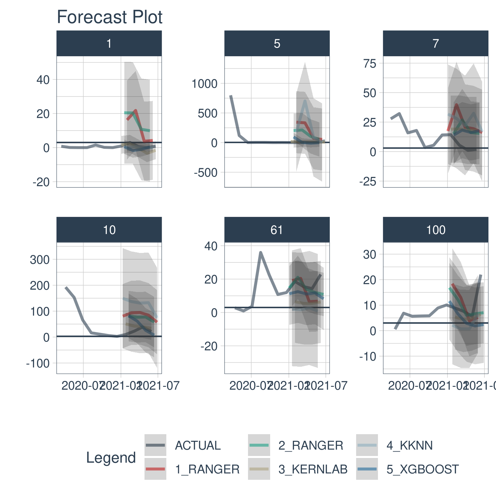
#recipe without  death

```r
rec_obj2 <-
    recipe(shrunk_ae ~ ., data = training(splits)) %>%
    #step_rm(year,month,day)%>%
    step_rm(zip3)%>%
    step_rm( claims , class, shrinkage, ae,smoothed_deaths, ihme_deaths, zip_deaths)%>%
    #step_rm(adverse)%>%
    step_mutate(client = droplevels(client)) %>%
    step_timeseries_signature(date) %>%
    step_rm(date)%>%
    step_dummy(all_nominal_predictors(), one_hot = TRUE)%>%
     step_zv(all_predictors()) %>%
    step_normalize(all_predictors(), -all_nominal())

summary(prep(rec_obj2))
```

```
## # A tibble: 542 × 4
##    variable type    role      source  
##    <chr>    <chr>   <chr>     <chr>   
##  1 size     numeric predictor original
##  2 volume   numeric predictor original
##  3 avg_qx   numeric predictor original
##  4 avg_age  numeric predictor original
##  5 per_male numeric predictor original
##  6 expected numeric predictor original
##  7 nohs     numeric predictor original
##  8 hs       numeric predictor original
##  9 college  numeric predictor original
## 10 bachelor numeric predictor original
## # … with 532 more rows
```

```r
bake(prep(rec_obj2),training(splits))
```

```
## # A tibble: 20,664 × 542
##      size  volume  avg_qx avg_age per_male expected   nohs     hs college
##     <dbl>   <dbl>   <dbl>   <dbl>    <dbl>    <dbl>  <dbl>  <dbl>   <dbl>
##  1  2.90   1.72    0.678   -0.381   1.02     1.77   -0.497  0.580 -0.381 
##  2  0.413  0.510  -0.0730   0.258   0.0165   0.534  -0.506  0.578 -0.383 
##  3 -0.467 -0.0758  1.53     0.476   1.10     0.193  -0.816 -0.351 -1.65  
##  4  0.985  1.07   -0.318   -1.15    0.689    1.01   -0.232 -0.435 -2.03  
##  5 -0.263  0.259  -0.329    0.466   0.620    0.149  -1.24  -0.663 -1.97  
##  6 -0.636  0.477   0.320    1.64   -1.34     0.481   0.801  1.03  -0.548 
##  7  0.708  0.873  -0.549   -0.895  -0.797    0.781  -1.41   0.416 -0.0875
##  8 -0.361  0.469  -0.577    0.553  -0.118    0.360  -0.602  1.85   0.580 
##  9 -0.623 -0.0567  0.885   -0.329   0.656    0.0470 -1.22   0.485 -0.511 
## 10 -0.995 -1.60   -0.442    0.177   1.29    -1.59   -0.618  0.983  0.122 
## # … with 20,654 more rows, and 533 more variables: bachelor <dbl>,
## #   R_birth <dbl>, R_death <dbl>, unemp <dbl>, poverty <dbl>,
## #   per_dem <dbl>, hes <dbl>, hes_uns <dbl>, str_hes <dbl>, svi <dbl>,
## #   cvac <dbl>, income <dbl>, POP <dbl>, density <dbl>, shrunk_ae <dbl>,
## #   date_index.num <dbl>, date_half <dbl>, date_quarter <dbl>,
## #   date_month <dbl>, date_month.xts <dbl>, date_day <dbl>,
## #   date_mday <dbl>, date_qday <dbl>, date_yday <dbl>, date_mweek <dbl>,
## #   date_week <dbl>, date_week.iso <dbl>, date_week2 <dbl>,
## #   date_week3 <dbl>, date_week4 <dbl>, date_mday7 <dbl>,
## #   client_X1 <dbl>, client_X10 <dbl>, client_X100 <dbl>,
## #   client_X101 <dbl>, client_X102 <dbl>, client_X103 <dbl>,
## #   client_X104 <dbl>, client_X105 <dbl>, client_X106 <dbl>,
## #   client_X107 <dbl>, client_X108 <dbl>, client_X109 <dbl>,
## #   client_X11 <dbl>, client_X110 <dbl>, client_X111 <dbl>,
## #   client_X112 <dbl>, client_X113 <dbl>, client_X114 <dbl>,
## #   client_X115 <dbl>, client_X116 <dbl>, client_X117 <dbl>,
## #   client_X118 <dbl>, client_X119 <dbl>, client_X12 <dbl>,
## #   client_X120 <dbl>, client_X121 <dbl>, client_X122 <dbl>,
## #   client_X123 <dbl>, client_X124 <dbl>, client_X125 <dbl>,
## #   client_X126 <dbl>, client_X127 <dbl>, client_X128 <dbl>,
## #   client_X129 <dbl>, client_X13 <dbl>, client_X130 <dbl>,
## #   client_X131 <dbl>, client_X132 <dbl>, client_X133 <dbl>,
## #   client_X134 <dbl>, client_X135 <dbl>, client_X136 <dbl>,
## #   client_X137 <dbl>, client_X139 <dbl>, client_X14 <dbl>,
## #   client_X140 <dbl>, client_X141 <dbl>, client_X143 <dbl>,
## #   client_X144 <dbl>, client_X145 <dbl>, client_X147 <dbl>,
## #   client_X148 <dbl>, client_X149 <dbl>, client_X15 <dbl>,
## #   client_X150 <dbl>, client_X151 <dbl>, client_X152 <dbl>,
## #   client_X153 <dbl>, client_X154 <dbl>, client_X155 <dbl>,
## #   client_X156 <dbl>, client_X157 <dbl>, client_X158 <dbl>,
## #   client_X159 <dbl>, client_X16 <dbl>, client_X160 <dbl>,
## #   client_X161 <dbl>, client_X162 <dbl>, client_X163 <dbl>, …
```
# workflow without  death

```r
wflw_rf2 <- workflow() %>%
    add_model(
        forest_spec
    ) %>%
    add_recipe(rec_obj2) %>%
    fit(data = training(splits))

wflw_tunedrf2 <- workflow() %>%
    add_model(
        tuned_forest_spec
    ) %>%
    add_recipe(rec_obj2) %>%
    fit(data = training(splits))

wflw_svmrbf2 <- workflow() %>%
    add_model(
        svm_rbf_spec
    ) %>%
    add_recipe(rec_obj2) %>%
    fit(data = training(splits))

wflw_knnspec2 <- workflow() %>%
    add_model(
        knn_spec
    ) %>%
    add_recipe(rec_obj2) %>%
    fit(data = training(splits))  

wflw_xgboost2 <- workflow() %>%
    add_model(
        xgboost_spec
    ) %>%
    add_recipe(rec_obj2) %>%
    fit(data = training(splits))  
```
Create a Modeltime Table

```r
model_tbl2 <- modeltime_table(
    wflw_rf2,
    wflw_tunedrf2,
    wflw_svmrbf2,
    wflw_knnspec2,
    wflw_xgboost2
)
model_tbl2
```

```
## # Modeltime Table
## # A tibble: 5 × 3
##   .model_id .model     .model_desc
##       <int> <list>     <chr>      
## 1         1 <workflow> RANGER     
## 2         2 <workflow> RANGER     
## 3         3 <workflow> KERNLAB    
## 4         4 <workflow> KKNN       
## 5         5 <workflow> XGBOOST
```

#Calibrate by client

```r
calib_tbl2 <- model_tbl2 %>%
    modeltime_calibrate(
      new_data = testing(splits), 
      id       = "client"
    )

calib_tbl2
```

```
## # Modeltime Table
## # A tibble: 5 × 5
##   .model_id .model     .model_desc .type .calibration_data    
##       <int> <list>     <chr>       <chr> <list>               
## 1         1 <workflow> RANGER      Test  <tibble [12,792 × 5]>
## 2         2 <workflow> RANGER      Test  <tibble [12,792 × 5]>
## 3         3 <workflow> KERNLAB     Test  <tibble [12,792 × 5]>
## 4         4 <workflow> KKNN        Test  <tibble [12,792 × 5]>
## 5         5 <workflow> XGBOOST     Test  <tibble [12,792 × 5]>
```

Measure Accuracy on validation data

```r
#global error
calib_tbl2 %>% 
    modeltime_accuracy(acc_by_id = FALSE) %>% 
    table_modeltime_accuracy(.interactive = FALSE)
```

<!--html_preserve--><div id="hscbtjgvzr" style="overflow-x:auto;overflow-y:auto;width:auto;height:auto;">
<style>html {
  font-family: -apple-system, BlinkMacSystemFont, 'Segoe UI', Roboto, Oxygen, Ubuntu, Cantarell, 'Helvetica Neue', 'Fira Sans', 'Droid Sans', Arial, sans-serif;
}

#hscbtjgvzr .gt_table {
  display: table;
  border-collapse: collapse;
  margin-left: auto;
  margin-right: auto;
  color: #333333;
  font-size: 16px;
  font-weight: normal;
  font-style: normal;
  background-color: #FFFFFF;
  width: auto;
  border-top-style: solid;
  border-top-width: 2px;
  border-top-color: #A8A8A8;
  border-right-style: none;
  border-right-width: 2px;
  border-right-color: #D3D3D3;
  border-bottom-style: solid;
  border-bottom-width: 2px;
  border-bottom-color: #A8A8A8;
  border-left-style: none;
  border-left-width: 2px;
  border-left-color: #D3D3D3;
}

#hscbtjgvzr .gt_heading {
  background-color: #FFFFFF;
  text-align: center;
  border-bottom-color: #FFFFFF;
  border-left-style: none;
  border-left-width: 1px;
  border-left-color: #D3D3D3;
  border-right-style: none;
  border-right-width: 1px;
  border-right-color: #D3D3D3;
}

#hscbtjgvzr .gt_title {
  color: #333333;
  font-size: 125%;
  font-weight: initial;
  padding-top: 4px;
  padding-bottom: 4px;
  border-bottom-color: #FFFFFF;
  border-bottom-width: 0;
}

#hscbtjgvzr .gt_subtitle {
  color: #333333;
  font-size: 85%;
  font-weight: initial;
  padding-top: 0;
  padding-bottom: 4px;
  border-top-color: #FFFFFF;
  border-top-width: 0;
}

#hscbtjgvzr .gt_bottom_border {
  border-bottom-style: solid;
  border-bottom-width: 2px;
  border-bottom-color: #D3D3D3;
}

#hscbtjgvzr .gt_col_headings {
  border-top-style: solid;
  border-top-width: 2px;
  border-top-color: #D3D3D3;
  border-bottom-style: solid;
  border-bottom-width: 2px;
  border-bottom-color: #D3D3D3;
  border-left-style: none;
  border-left-width: 1px;
  border-left-color: #D3D3D3;
  border-right-style: none;
  border-right-width: 1px;
  border-right-color: #D3D3D3;
}

#hscbtjgvzr .gt_col_heading {
  color: #333333;
  background-color: #FFFFFF;
  font-size: 100%;
  font-weight: normal;
  text-transform: inherit;
  border-left-style: none;
  border-left-width: 1px;
  border-left-color: #D3D3D3;
  border-right-style: none;
  border-right-width: 1px;
  border-right-color: #D3D3D3;
  vertical-align: bottom;
  padding-top: 5px;
  padding-bottom: 6px;
  padding-left: 5px;
  padding-right: 5px;
  overflow-x: hidden;
}

#hscbtjgvzr .gt_column_spanner_outer {
  color: #333333;
  background-color: #FFFFFF;
  font-size: 100%;
  font-weight: normal;
  text-transform: inherit;
  padding-top: 0;
  padding-bottom: 0;
  padding-left: 4px;
  padding-right: 4px;
}

#hscbtjgvzr .gt_column_spanner_outer:first-child {
  padding-left: 0;
}

#hscbtjgvzr .gt_column_spanner_outer:last-child {
  padding-right: 0;
}

#hscbtjgvzr .gt_column_spanner {
  border-bottom-style: solid;
  border-bottom-width: 2px;
  border-bottom-color: #D3D3D3;
  vertical-align: bottom;
  padding-top: 5px;
  padding-bottom: 6px;
  overflow-x: hidden;
  display: inline-block;
  width: 100%;
}

#hscbtjgvzr .gt_group_heading {
  padding: 8px;
  color: #333333;
  background-color: #FFFFFF;
  font-size: 100%;
  font-weight: initial;
  text-transform: inherit;
  border-top-style: solid;
  border-top-width: 2px;
  border-top-color: #D3D3D3;
  border-bottom-style: solid;
  border-bottom-width: 2px;
  border-bottom-color: #D3D3D3;
  border-left-style: none;
  border-left-width: 1px;
  border-left-color: #D3D3D3;
  border-right-style: none;
  border-right-width: 1px;
  border-right-color: #D3D3D3;
  vertical-align: middle;
}

#hscbtjgvzr .gt_empty_group_heading {
  padding: 0.5px;
  color: #333333;
  background-color: #FFFFFF;
  font-size: 100%;
  font-weight: initial;
  border-top-style: solid;
  border-top-width: 2px;
  border-top-color: #D3D3D3;
  border-bottom-style: solid;
  border-bottom-width: 2px;
  border-bottom-color: #D3D3D3;
  vertical-align: middle;
}

#hscbtjgvzr .gt_from_md > :first-child {
  margin-top: 0;
}

#hscbtjgvzr .gt_from_md > :last-child {
  margin-bottom: 0;
}

#hscbtjgvzr .gt_row {
  padding-top: 8px;
  padding-bottom: 8px;
  padding-left: 5px;
  padding-right: 5px;
  margin: 10px;
  border-top-style: solid;
  border-top-width: 1px;
  border-top-color: #D3D3D3;
  border-left-style: none;
  border-left-width: 1px;
  border-left-color: #D3D3D3;
  border-right-style: none;
  border-right-width: 1px;
  border-right-color: #D3D3D3;
  vertical-align: middle;
  overflow-x: hidden;
}

#hscbtjgvzr .gt_stub {
  color: #333333;
  background-color: #FFFFFF;
  font-size: 100%;
  font-weight: initial;
  text-transform: inherit;
  border-right-style: solid;
  border-right-width: 2px;
  border-right-color: #D3D3D3;
  padding-left: 12px;
}

#hscbtjgvzr .gt_summary_row {
  color: #333333;
  background-color: #FFFFFF;
  text-transform: inherit;
  padding-top: 8px;
  padding-bottom: 8px;
  padding-left: 5px;
  padding-right: 5px;
}

#hscbtjgvzr .gt_first_summary_row {
  padding-top: 8px;
  padding-bottom: 8px;
  padding-left: 5px;
  padding-right: 5px;
  border-top-style: solid;
  border-top-width: 2px;
  border-top-color: #D3D3D3;
}

#hscbtjgvzr .gt_grand_summary_row {
  color: #333333;
  background-color: #FFFFFF;
  text-transform: inherit;
  padding-top: 8px;
  padding-bottom: 8px;
  padding-left: 5px;
  padding-right: 5px;
}

#hscbtjgvzr .gt_first_grand_summary_row {
  padding-top: 8px;
  padding-bottom: 8px;
  padding-left: 5px;
  padding-right: 5px;
  border-top-style: double;
  border-top-width: 6px;
  border-top-color: #D3D3D3;
}

#hscbtjgvzr .gt_striped {
  background-color: rgba(128, 128, 128, 0.05);
}

#hscbtjgvzr .gt_table_body {
  border-top-style: solid;
  border-top-width: 2px;
  border-top-color: #D3D3D3;
  border-bottom-style: solid;
  border-bottom-width: 2px;
  border-bottom-color: #D3D3D3;
}

#hscbtjgvzr .gt_footnotes {
  color: #333333;
  background-color: #FFFFFF;
  border-bottom-style: none;
  border-bottom-width: 2px;
  border-bottom-color: #D3D3D3;
  border-left-style: none;
  border-left-width: 2px;
  border-left-color: #D3D3D3;
  border-right-style: none;
  border-right-width: 2px;
  border-right-color: #D3D3D3;
}

#hscbtjgvzr .gt_footnote {
  margin: 0px;
  font-size: 90%;
  padding: 4px;
}

#hscbtjgvzr .gt_sourcenotes {
  color: #333333;
  background-color: #FFFFFF;
  border-bottom-style: none;
  border-bottom-width: 2px;
  border-bottom-color: #D3D3D3;
  border-left-style: none;
  border-left-width: 2px;
  border-left-color: #D3D3D3;
  border-right-style: none;
  border-right-width: 2px;
  border-right-color: #D3D3D3;
}

#hscbtjgvzr .gt_sourcenote {
  font-size: 90%;
  padding: 4px;
}

#hscbtjgvzr .gt_left {
  text-align: left;
}

#hscbtjgvzr .gt_center {
  text-align: center;
}

#hscbtjgvzr .gt_right {
  text-align: right;
  font-variant-numeric: tabular-nums;
}

#hscbtjgvzr .gt_font_normal {
  font-weight: normal;
}

#hscbtjgvzr .gt_font_bold {
  font-weight: bold;
}

#hscbtjgvzr .gt_font_italic {
  font-style: italic;
}

#hscbtjgvzr .gt_super {
  font-size: 65%;
}

#hscbtjgvzr .gt_footnote_marks {
  font-style: italic;
  font-weight: normal;
  font-size: 65%;
}
</style>
<table class="gt_table">
  <thead class="gt_header">
    <tr>
      <th colspan="9" class="gt_heading gt_title gt_font_normal gt_bottom_border" style>Accuracy Table</th>
    </tr>
    
  </thead>
  <thead class="gt_col_headings">
    <tr>
      <th class="gt_col_heading gt_columns_bottom_border gt_right" rowspan="1" colspan="1">.model_id</th>
      <th class="gt_col_heading gt_columns_bottom_border gt_left" rowspan="1" colspan="1">.model_desc</th>
      <th class="gt_col_heading gt_columns_bottom_border gt_left" rowspan="1" colspan="1">.type</th>
      <th class="gt_col_heading gt_columns_bottom_border gt_right" rowspan="1" colspan="1">mae</th>
      <th class="gt_col_heading gt_columns_bottom_border gt_right" rowspan="1" colspan="1">mape</th>
      <th class="gt_col_heading gt_columns_bottom_border gt_right" rowspan="1" colspan="1">mase</th>
      <th class="gt_col_heading gt_columns_bottom_border gt_right" rowspan="1" colspan="1">smape</th>
      <th class="gt_col_heading gt_columns_bottom_border gt_right" rowspan="1" colspan="1">rmse</th>
      <th class="gt_col_heading gt_columns_bottom_border gt_right" rowspan="1" colspan="1">rsq</th>
    </tr>
  </thead>
  <tbody class="gt_table_body">
    <tr><td class="gt_row gt_right">1</td>
<td class="gt_row gt_left">RANGER</td>
<td class="gt_row gt_left">Test</td>
<td class="gt_row gt_right">10.52</td>
<td class="gt_row gt_right">Inf</td>
<td class="gt_row gt_right">1.31</td>
<td class="gt_row gt_right">86.14</td>
<td class="gt_row gt_right">32.12</td>
<td class="gt_row gt_right">0.10</td></tr>
    <tr><td class="gt_row gt_right">2</td>
<td class="gt_row gt_left">RANGER</td>
<td class="gt_row gt_left">Test</td>
<td class="gt_row gt_right">9.12</td>
<td class="gt_row gt_right">Inf</td>
<td class="gt_row gt_right">1.14</td>
<td class="gt_row gt_right">84.84</td>
<td class="gt_row gt_right">20.36</td>
<td class="gt_row gt_right">0.17</td></tr>
    <tr><td class="gt_row gt_right">3</td>
<td class="gt_row gt_left">KERNLAB</td>
<td class="gt_row gt_left">Test</td>
<td class="gt_row gt_right">6.37</td>
<td class="gt_row gt_right">Inf</td>
<td class="gt_row gt_right">0.79</td>
<td class="gt_row gt_right">91.47</td>
<td class="gt_row gt_right">11.88</td>
<td class="gt_row gt_right">0.51</td></tr>
    <tr><td class="gt_row gt_right">4</td>
<td class="gt_row gt_left">KKNN</td>
<td class="gt_row gt_left">Test</td>
<td class="gt_row gt_right">13.41</td>
<td class="gt_row gt_right">NaN</td>
<td class="gt_row gt_right">1.67</td>
<td class="gt_row gt_right">NaN</td>
<td class="gt_row gt_right">43.10</td>
<td class="gt_row gt_right">0.08</td></tr>
    <tr><td class="gt_row gt_right">5</td>
<td class="gt_row gt_left">XGBOOST</td>
<td class="gt_row gt_left">Test</td>
<td class="gt_row gt_right">6.30</td>
<td class="gt_row gt_right">Inf</td>
<td class="gt_row gt_right">0.79</td>
<td class="gt_row gt_right">81.47</td>
<td class="gt_row gt_right">12.48</td>
<td class="gt_row gt_right">0.45</td></tr>
  </tbody>
  
  
</table>
</div><!--/html_preserve-->

```r
#local error for each client
calib_tbl2 %>% 
    modeltime_accuracy(acc_by_id = TRUE) %>% 
    table_modeltime_accuracy(.interactive = FALSE)
```

```
## Warning: A correlation computation is required, but `truth` is constant
## and has 0 standard deviation, resulting in a divide by 0 error. `NA` will
## be returned.

## Warning: A correlation computation is required, but `truth` is constant
## and has 0 standard deviation, resulting in a divide by 0 error. `NA` will
## be returned.

## Warning: A correlation computation is required, but `truth` is constant
## and has 0 standard deviation, resulting in a divide by 0 error. `NA` will
## be returned.

## Warning: A correlation computation is required, but `truth` is constant
## and has 0 standard deviation, resulting in a divide by 0 error. `NA` will
## be returned.

## Warning: A correlation computation is required, but `truth` is constant
## and has 0 standard deviation, resulting in a divide by 0 error. `NA` will
## be returned.

## Warning: A correlation computation is required, but `truth` is constant
## and has 0 standard deviation, resulting in a divide by 0 error. `NA` will
## be returned.

## Warning: A correlation computation is required, but `truth` is constant
## and has 0 standard deviation, resulting in a divide by 0 error. `NA` will
## be returned.

## Warning: A correlation computation is required, but `truth` is constant
## and has 0 standard deviation, resulting in a divide by 0 error. `NA` will
## be returned.

## Warning: A correlation computation is required, but `truth` is constant
## and has 0 standard deviation, resulting in a divide by 0 error. `NA` will
## be returned.

## Warning: A correlation computation is required, but `truth` is constant
## and has 0 standard deviation, resulting in a divide by 0 error. `NA` will
## be returned.

## Warning: A correlation computation is required, but `truth` is constant
## and has 0 standard deviation, resulting in a divide by 0 error. `NA` will
## be returned.

## Warning: A correlation computation is required, but `truth` is constant
## and has 0 standard deviation, resulting in a divide by 0 error. `NA` will
## be returned.

## Warning: A correlation computation is required, but `truth` is constant
## and has 0 standard deviation, resulting in a divide by 0 error. `NA` will
## be returned.

## Warning: A correlation computation is required, but `truth` is constant
## and has 0 standard deviation, resulting in a divide by 0 error. `NA` will
## be returned.

## Warning: A correlation computation is required, but `truth` is constant
## and has 0 standard deviation, resulting in a divide by 0 error. `NA` will
## be returned.

## Warning: A correlation computation is required, but `truth` is constant
## and has 0 standard deviation, resulting in a divide by 0 error. `NA` will
## be returned.

## Warning: A correlation computation is required, but `truth` is constant
## and has 0 standard deviation, resulting in a divide by 0 error. `NA` will
## be returned.

## Warning: A correlation computation is required, but `truth` is constant
## and has 0 standard deviation, resulting in a divide by 0 error. `NA` will
## be returned.

## Warning: A correlation computation is required, but `truth` is constant
## and has 0 standard deviation, resulting in a divide by 0 error. `NA` will
## be returned.

## Warning: A correlation computation is required, but `truth` is constant
## and has 0 standard deviation, resulting in a divide by 0 error. `NA` will
## be returned.

## Warning: A correlation computation is required, but `truth` is constant
## and has 0 standard deviation, resulting in a divide by 0 error. `NA` will
## be returned.

## Warning: A correlation computation is required, but `truth` is constant
## and has 0 standard deviation, resulting in a divide by 0 error. `NA` will
## be returned.

## Warning: A correlation computation is required, but `truth` is constant
## and has 0 standard deviation, resulting in a divide by 0 error. `NA` will
## be returned.

## Warning: A correlation computation is required, but `truth` is constant
## and has 0 standard deviation, resulting in a divide by 0 error. `NA` will
## be returned.

## Warning: A correlation computation is required, but `truth` is constant
## and has 0 standard deviation, resulting in a divide by 0 error. `NA` will
## be returned.

## Warning: A correlation computation is required, but `truth` is constant
## and has 0 standard deviation, resulting in a divide by 0 error. `NA` will
## be returned.

## Warning: A correlation computation is required, but `truth` is constant
## and has 0 standard deviation, resulting in a divide by 0 error. `NA` will
## be returned.

## Warning: A correlation computation is required, but `truth` is constant
## and has 0 standard deviation, resulting in a divide by 0 error. `NA` will
## be returned.

## Warning: A correlation computation is required, but `truth` is constant
## and has 0 standard deviation, resulting in a divide by 0 error. `NA` will
## be returned.

## Warning: A correlation computation is required, but `truth` is constant
## and has 0 standard deviation, resulting in a divide by 0 error. `NA` will
## be returned.

## Warning: A correlation computation is required, but `truth` is constant
## and has 0 standard deviation, resulting in a divide by 0 error. `NA` will
## be returned.

## Warning: A correlation computation is required, but `truth` is constant
## and has 0 standard deviation, resulting in a divide by 0 error. `NA` will
## be returned.

## Warning: A correlation computation is required, but `truth` is constant
## and has 0 standard deviation, resulting in a divide by 0 error. `NA` will
## be returned.

## Warning: A correlation computation is required, but `truth` is constant
## and has 0 standard deviation, resulting in a divide by 0 error. `NA` will
## be returned.

## Warning: A correlation computation is required, but `truth` is constant
## and has 0 standard deviation, resulting in a divide by 0 error. `NA` will
## be returned.

## Warning: A correlation computation is required, but `truth` is constant
## and has 0 standard deviation, resulting in a divide by 0 error. `NA` will
## be returned.
```

```
## Warning: A correlation computation is required, but `estimate` is constant
## and has 0 standard deviation, resulting in a divide by 0 error. `NA` will
## be returned.

## Warning: A correlation computation is required, but `estimate` is constant
## and has 0 standard deviation, resulting in a divide by 0 error. `NA` will
## be returned.

## Warning: A correlation computation is required, but `estimate` is constant
## and has 0 standard deviation, resulting in a divide by 0 error. `NA` will
## be returned.

## Warning: A correlation computation is required, but `estimate` is constant
## and has 0 standard deviation, resulting in a divide by 0 error. `NA` will
## be returned.

## Warning: A correlation computation is required, but `estimate` is constant
## and has 0 standard deviation, resulting in a divide by 0 error. `NA` will
## be returned.
```

```
## Warning: A correlation computation is required, but `truth` is constant
## and has 0 standard deviation, resulting in a divide by 0 error. `NA` will
## be returned.

## Warning: A correlation computation is required, but `truth` is constant
## and has 0 standard deviation, resulting in a divide by 0 error. `NA` will
## be returned.
```

```
## Warning: A correlation computation is required, but `estimate` is constant
## and has 0 standard deviation, resulting in a divide by 0 error. `NA` will
## be returned.
```

```
## Warning: A correlation computation is required, but `truth` is constant
## and has 0 standard deviation, resulting in a divide by 0 error. `NA` will
## be returned.
```

```
## Warning: A correlation computation is required, but `estimate` is constant
## and has 0 standard deviation, resulting in a divide by 0 error. `NA` will
## be returned.

## Warning: A correlation computation is required, but `estimate` is constant
## and has 0 standard deviation, resulting in a divide by 0 error. `NA` will
## be returned.

## Warning: A correlation computation is required, but `estimate` is constant
## and has 0 standard deviation, resulting in a divide by 0 error. `NA` will
## be returned.
```

```
## Warning: A correlation computation is required, but `truth` is constant
## and has 0 standard deviation, resulting in a divide by 0 error. `NA` will
## be returned.

## Warning: A correlation computation is required, but `truth` is constant
## and has 0 standard deviation, resulting in a divide by 0 error. `NA` will
## be returned.

## Warning: A correlation computation is required, but `truth` is constant
## and has 0 standard deviation, resulting in a divide by 0 error. `NA` will
## be returned.
```

```
## Warning: A correlation computation is required, but `estimate` is constant
## and has 0 standard deviation, resulting in a divide by 0 error. `NA` will
## be returned.
```

```
## Warning: A correlation computation is required, but `truth` is constant
## and has 0 standard deviation, resulting in a divide by 0 error. `NA` will
## be returned.
```

```
## Warning: A correlation computation is required, but `estimate` is constant
## and has 0 standard deviation, resulting in a divide by 0 error. `NA` will
## be returned.

## Warning: A correlation computation is required, but `estimate` is constant
## and has 0 standard deviation, resulting in a divide by 0 error. `NA` will
## be returned.
```

```
## Warning: A correlation computation is required, but `truth` is constant
## and has 0 standard deviation, resulting in a divide by 0 error. `NA` will
## be returned.
```

```
## Warning: A correlation computation is required, but `estimate` is constant
## and has 0 standard deviation, resulting in a divide by 0 error. `NA` will
## be returned.

## Warning: A correlation computation is required, but `estimate` is constant
## and has 0 standard deviation, resulting in a divide by 0 error. `NA` will
## be returned.

## Warning: A correlation computation is required, but `estimate` is constant
## and has 0 standard deviation, resulting in a divide by 0 error. `NA` will
## be returned.

## Warning: A correlation computation is required, but `estimate` is constant
## and has 0 standard deviation, resulting in a divide by 0 error. `NA` will
## be returned.
```

```
## Warning: A correlation computation is required, but `truth` is constant
## and has 0 standard deviation, resulting in a divide by 0 error. `NA` will
## be returned.

## Warning: A correlation computation is required, but `truth` is constant
## and has 0 standard deviation, resulting in a divide by 0 error. `NA` will
## be returned.

## Warning: A correlation computation is required, but `truth` is constant
## and has 0 standard deviation, resulting in a divide by 0 error. `NA` will
## be returned.
```

```
## Warning: A correlation computation is required, but `estimate` is constant
## and has 0 standard deviation, resulting in a divide by 0 error. `NA` will
## be returned.
```

```
## Warning: A correlation computation is required, but `estimate` is constant
## and has 0 standard deviation, resulting in a divide by 0 error. `NA` will
## be returned.
```

```
## Warning: A correlation computation is required, but `estimate` is constant
## and has 0 standard deviation, resulting in a divide by 0 error. `NA` will
## be returned.
```

```
## Warning: A correlation computation is required, but `truth` is constant
## and has 0 standard deviation, resulting in a divide by 0 error. `NA` will
## be returned.

## Warning: A correlation computation is required, but `truth` is constant
## and has 0 standard deviation, resulting in a divide by 0 error. `NA` will
## be returned.
```

```
## Warning: A correlation computation is required, but `estimate` is constant
## and has 0 standard deviation, resulting in a divide by 0 error. `NA` will
## be returned.
```

```
## Warning: A correlation computation is required, but `estimate` is constant
## and has 0 standard deviation, resulting in a divide by 0 error. `NA` will
## be returned.
```

```
## Warning: A correlation computation is required, but `truth` is constant
## and has 0 standard deviation, resulting in a divide by 0 error. `NA` will
## be returned.
```

```
## Warning: A correlation computation is required, but `estimate` is constant
## and has 0 standard deviation, resulting in a divide by 0 error. `NA` will
## be returned.
```

```
## Warning: A correlation computation is required, but `truth` is constant
## and has 0 standard deviation, resulting in a divide by 0 error. `NA` will
## be returned.
```

```
## Warning: A correlation computation is required, but `estimate` is constant
## and has 0 standard deviation, resulting in a divide by 0 error. `NA` will
## be returned.
```

```
## Warning: A correlation computation is required, but `estimate` is constant
## and has 0 standard deviation, resulting in a divide by 0 error. `NA` will
## be returned.
```

```
## Warning: A correlation computation is required, but `truth` is constant
## and has 0 standard deviation, resulting in a divide by 0 error. `NA` will
## be returned.

## Warning: A correlation computation is required, but `truth` is constant
## and has 0 standard deviation, resulting in a divide by 0 error. `NA` will
## be returned.

## Warning: A correlation computation is required, but `truth` is constant
## and has 0 standard deviation, resulting in a divide by 0 error. `NA` will
## be returned.
```

```
## Warning: A correlation computation is required, but `estimate` is constant
## and has 0 standard deviation, resulting in a divide by 0 error. `NA` will
## be returned.
```

```
## Warning: A correlation computation is required, but `estimate` is constant
## and has 0 standard deviation, resulting in a divide by 0 error. `NA` will
## be returned.
```

```
## Warning: A correlation computation is required, but `truth` is constant
## and has 0 standard deviation, resulting in a divide by 0 error. `NA` will
## be returned.
```

```
## Warning: A correlation computation is required, but `estimate` is constant
## and has 0 standard deviation, resulting in a divide by 0 error. `NA` will
## be returned.
```

```
## Warning: A correlation computation is required, but `estimate` is constant
## and has 0 standard deviation, resulting in a divide by 0 error. `NA` will
## be returned.
```

```
## Warning: A correlation computation is required, but `estimate` is constant
## and has 0 standard deviation, resulting in a divide by 0 error. `NA` will
## be returned.
```

<!--html_preserve--><div id="ejekyttgts" style="overflow-x:auto;overflow-y:auto;width:auto;height:auto;">
<style>html {
  font-family: -apple-system, BlinkMacSystemFont, 'Segoe UI', Roboto, Oxygen, Ubuntu, Cantarell, 'Helvetica Neue', 'Fira Sans', 'Droid Sans', Arial, sans-serif;
}

#ejekyttgts .gt_table {
  display: table;
  border-collapse: collapse;
  margin-left: auto;
  margin-right: auto;
  color: #333333;
  font-size: 16px;
  font-weight: normal;
  font-style: normal;
  background-color: #FFFFFF;
  width: auto;
  border-top-style: solid;
  border-top-width: 2px;
  border-top-color: #A8A8A8;
  border-right-style: none;
  border-right-width: 2px;
  border-right-color: #D3D3D3;
  border-bottom-style: solid;
  border-bottom-width: 2px;
  border-bottom-color: #A8A8A8;
  border-left-style: none;
  border-left-width: 2px;
  border-left-color: #D3D3D3;
}

#ejekyttgts .gt_heading {
  background-color: #FFFFFF;
  text-align: center;
  border-bottom-color: #FFFFFF;
  border-left-style: none;
  border-left-width: 1px;
  border-left-color: #D3D3D3;
  border-right-style: none;
  border-right-width: 1px;
  border-right-color: #D3D3D3;
}

#ejekyttgts .gt_title {
  color: #333333;
  font-size: 125%;
  font-weight: initial;
  padding-top: 4px;
  padding-bottom: 4px;
  border-bottom-color: #FFFFFF;
  border-bottom-width: 0;
}

#ejekyttgts .gt_subtitle {
  color: #333333;
  font-size: 85%;
  font-weight: initial;
  padding-top: 0;
  padding-bottom: 4px;
  border-top-color: #FFFFFF;
  border-top-width: 0;
}

#ejekyttgts .gt_bottom_border {
  border-bottom-style: solid;
  border-bottom-width: 2px;
  border-bottom-color: #D3D3D3;
}

#ejekyttgts .gt_col_headings {
  border-top-style: solid;
  border-top-width: 2px;
  border-top-color: #D3D3D3;
  border-bottom-style: solid;
  border-bottom-width: 2px;
  border-bottom-color: #D3D3D3;
  border-left-style: none;
  border-left-width: 1px;
  border-left-color: #D3D3D3;
  border-right-style: none;
  border-right-width: 1px;
  border-right-color: #D3D3D3;
}

#ejekyttgts .gt_col_heading {
  color: #333333;
  background-color: #FFFFFF;
  font-size: 100%;
  font-weight: normal;
  text-transform: inherit;
  border-left-style: none;
  border-left-width: 1px;
  border-left-color: #D3D3D3;
  border-right-style: none;
  border-right-width: 1px;
  border-right-color: #D3D3D3;
  vertical-align: bottom;
  padding-top: 5px;
  padding-bottom: 6px;
  padding-left: 5px;
  padding-right: 5px;
  overflow-x: hidden;
}

#ejekyttgts .gt_column_spanner_outer {
  color: #333333;
  background-color: #FFFFFF;
  font-size: 100%;
  font-weight: normal;
  text-transform: inherit;
  padding-top: 0;
  padding-bottom: 0;
  padding-left: 4px;
  padding-right: 4px;
}

#ejekyttgts .gt_column_spanner_outer:first-child {
  padding-left: 0;
}

#ejekyttgts .gt_column_spanner_outer:last-child {
  padding-right: 0;
}

#ejekyttgts .gt_column_spanner {
  border-bottom-style: solid;
  border-bottom-width: 2px;
  border-bottom-color: #D3D3D3;
  vertical-align: bottom;
  padding-top: 5px;
  padding-bottom: 6px;
  overflow-x: hidden;
  display: inline-block;
  width: 100%;
}

#ejekyttgts .gt_group_heading {
  padding: 8px;
  color: #333333;
  background-color: #FFFFFF;
  font-size: 100%;
  font-weight: initial;
  text-transform: inherit;
  border-top-style: solid;
  border-top-width: 2px;
  border-top-color: #D3D3D3;
  border-bottom-style: solid;
  border-bottom-width: 2px;
  border-bottom-color: #D3D3D3;
  border-left-style: none;
  border-left-width: 1px;
  border-left-color: #D3D3D3;
  border-right-style: none;
  border-right-width: 1px;
  border-right-color: #D3D3D3;
  vertical-align: middle;
}

#ejekyttgts .gt_empty_group_heading {
  padding: 0.5px;
  color: #333333;
  background-color: #FFFFFF;
  font-size: 100%;
  font-weight: initial;
  border-top-style: solid;
  border-top-width: 2px;
  border-top-color: #D3D3D3;
  border-bottom-style: solid;
  border-bottom-width: 2px;
  border-bottom-color: #D3D3D3;
  vertical-align: middle;
}

#ejekyttgts .gt_from_md > :first-child {
  margin-top: 0;
}

#ejekyttgts .gt_from_md > :last-child {
  margin-bottom: 0;
}

#ejekyttgts .gt_row {
  padding-top: 8px;
  padding-bottom: 8px;
  padding-left: 5px;
  padding-right: 5px;
  margin: 10px;
  border-top-style: solid;
  border-top-width: 1px;
  border-top-color: #D3D3D3;
  border-left-style: none;
  border-left-width: 1px;
  border-left-color: #D3D3D3;
  border-right-style: none;
  border-right-width: 1px;
  border-right-color: #D3D3D3;
  vertical-align: middle;
  overflow-x: hidden;
}

#ejekyttgts .gt_stub {
  color: #333333;
  background-color: #FFFFFF;
  font-size: 100%;
  font-weight: initial;
  text-transform: inherit;
  border-right-style: solid;
  border-right-width: 2px;
  border-right-color: #D3D3D3;
  padding-left: 12px;
}

#ejekyttgts .gt_summary_row {
  color: #333333;
  background-color: #FFFFFF;
  text-transform: inherit;
  padding-top: 8px;
  padding-bottom: 8px;
  padding-left: 5px;
  padding-right: 5px;
}

#ejekyttgts .gt_first_summary_row {
  padding-top: 8px;
  padding-bottom: 8px;
  padding-left: 5px;
  padding-right: 5px;
  border-top-style: solid;
  border-top-width: 2px;
  border-top-color: #D3D3D3;
}

#ejekyttgts .gt_grand_summary_row {
  color: #333333;
  background-color: #FFFFFF;
  text-transform: inherit;
  padding-top: 8px;
  padding-bottom: 8px;
  padding-left: 5px;
  padding-right: 5px;
}

#ejekyttgts .gt_first_grand_summary_row {
  padding-top: 8px;
  padding-bottom: 8px;
  padding-left: 5px;
  padding-right: 5px;
  border-top-style: double;
  border-top-width: 6px;
  border-top-color: #D3D3D3;
}

#ejekyttgts .gt_striped {
  background-color: rgba(128, 128, 128, 0.05);
}

#ejekyttgts .gt_table_body {
  border-top-style: solid;
  border-top-width: 2px;
  border-top-color: #D3D3D3;
  border-bottom-style: solid;
  border-bottom-width: 2px;
  border-bottom-color: #D3D3D3;
}

#ejekyttgts .gt_footnotes {
  color: #333333;
  background-color: #FFFFFF;
  border-bottom-style: none;
  border-bottom-width: 2px;
  border-bottom-color: #D3D3D3;
  border-left-style: none;
  border-left-width: 2px;
  border-left-color: #D3D3D3;
  border-right-style: none;
  border-right-width: 2px;
  border-right-color: #D3D3D3;
}

#ejekyttgts .gt_footnote {
  margin: 0px;
  font-size: 90%;
  padding: 4px;
}

#ejekyttgts .gt_sourcenotes {
  color: #333333;
  background-color: #FFFFFF;
  border-bottom-style: none;
  border-bottom-width: 2px;
  border-bottom-color: #D3D3D3;
  border-left-style: none;
  border-left-width: 2px;
  border-left-color: #D3D3D3;
  border-right-style: none;
  border-right-width: 2px;
  border-right-color: #D3D3D3;
}

#ejekyttgts .gt_sourcenote {
  font-size: 90%;
  padding: 4px;
}

#ejekyttgts .gt_left {
  text-align: left;
}

#ejekyttgts .gt_center {
  text-align: center;
}

#ejekyttgts .gt_right {
  text-align: right;
  font-variant-numeric: tabular-nums;
}

#ejekyttgts .gt_font_normal {
  font-weight: normal;
}

#ejekyttgts .gt_font_bold {
  font-weight: bold;
}

#ejekyttgts .gt_font_italic {
  font-style: italic;
}

#ejekyttgts .gt_super {
  font-size: 65%;
}

#ejekyttgts .gt_footnote_marks {
  font-style: italic;
  font-weight: normal;
  font-size: 65%;
}
</style>
<table class="gt_table">
  <thead class="gt_header">
    <tr>
      <th colspan="10" class="gt_heading gt_title gt_font_normal gt_bottom_border" style>Accuracy Table</th>
    </tr>
    
  </thead>
  <thead class="gt_col_headings">
    <tr>
      <th class="gt_col_heading gt_columns_bottom_border gt_right" rowspan="1" colspan="1">.model_id</th>
      <th class="gt_col_heading gt_columns_bottom_border gt_left" rowspan="1" colspan="1">.model_desc</th>
      <th class="gt_col_heading gt_columns_bottom_border gt_left" rowspan="1" colspan="1">.type</th>
      <th class="gt_col_heading gt_columns_bottom_border gt_center" rowspan="1" colspan="1">client</th>
      <th class="gt_col_heading gt_columns_bottom_border gt_right" rowspan="1" colspan="1">mae</th>
      <th class="gt_col_heading gt_columns_bottom_border gt_right" rowspan="1" colspan="1">mape</th>
      <th class="gt_col_heading gt_columns_bottom_border gt_right" rowspan="1" colspan="1">mase</th>
      <th class="gt_col_heading gt_columns_bottom_border gt_right" rowspan="1" colspan="1">smape</th>
      <th class="gt_col_heading gt_columns_bottom_border gt_right" rowspan="1" colspan="1">rmse</th>
      <th class="gt_col_heading gt_columns_bottom_border gt_right" rowspan="1" colspan="1">rsq</th>
    </tr>
  </thead>
  <tbody class="gt_table_body">
    <tr><td class="gt_row gt_right">1</td>
<td class="gt_row gt_left">RANGER</td>
<td class="gt_row gt_left">Test</td>
<td class="gt_row gt_center">1</td>
<td class="gt_row gt_right">2.67</td>
<td class="gt_row gt_right">Inf</td>
<td class="gt_row gt_right">8.38</td>
<td class="gt_row gt_right">132.51</td>
<td class="gt_row gt_right">2.83</td>
<td class="gt_row gt_right">0.01</td></tr>
    <tr><td class="gt_row gt_right">1</td>
<td class="gt_row gt_left">RANGER</td>
<td class="gt_row gt_left">Test</td>
<td class="gt_row gt_center">10</td>
<td class="gt_row gt_right">60.93</td>
<td class="gt_row gt_right">337.44</td>
<td class="gt_row gt_right">18.49</td>
<td class="gt_row gt_right">111.69</td>
<td class="gt_row gt_right">61.89</td>
<td class="gt_row gt_right">0.44</td></tr>
    <tr><td class="gt_row gt_right">1</td>
<td class="gt_row gt_left">RANGER</td>
<td class="gt_row gt_left">Test</td>
<td class="gt_row gt_center">100</td>
<td class="gt_row gt_right">5.23</td>
<td class="gt_row gt_right">43.14</td>
<td class="gt_row gt_right">2.76</td>
<td class="gt_row gt_right">59.03</td>
<td class="gt_row gt_right">6.83</td>
<td class="gt_row gt_right">0.52</td></tr>
    <tr><td class="gt_row gt_right">1</td>
<td class="gt_row gt_left">RANGER</td>
<td class="gt_row gt_left">Test</td>
<td class="gt_row gt_center">101</td>
<td class="gt_row gt_right">3.99</td>
<td class="gt_row gt_right">149.31</td>
<td class="gt_row gt_right">3.08</td>
<td class="gt_row gt_right">78.39</td>
<td class="gt_row gt_right">4.59</td>
<td class="gt_row gt_right">0.13</td></tr>
    <tr><td class="gt_row gt_right">1</td>
<td class="gt_row gt_left">RANGER</td>
<td class="gt_row gt_left">Test</td>
<td class="gt_row gt_center">102</td>
<td class="gt_row gt_right">2.57</td>
<td class="gt_row gt_right">Inf</td>
<td class="gt_row gt_right">Inf</td>
<td class="gt_row gt_right">200.00</td>
<td class="gt_row gt_right">2.58</td>
<td class="gt_row gt_right">NA</td></tr>
    <tr><td class="gt_row gt_right">1</td>
<td class="gt_row gt_left">RANGER</td>
<td class="gt_row gt_left">Test</td>
<td class="gt_row gt_center">103</td>
<td class="gt_row gt_right">1.58</td>
<td class="gt_row gt_right">161.63</td>
<td class="gt_row gt_right">1.83</td>
<td class="gt_row gt_right">74.54</td>
<td class="gt_row gt_right">2.22</td>
<td class="gt_row gt_right">0.20</td></tr>
    <tr><td class="gt_row gt_right">1</td>
<td class="gt_row gt_left">RANGER</td>
<td class="gt_row gt_left">Test</td>
<td class="gt_row gt_center">104</td>
<td class="gt_row gt_right">263.05</td>
<td class="gt_row gt_right">Inf</td>
<td class="gt_row gt_right">125.87</td>
<td class="gt_row gt_right">173.54</td>
<td class="gt_row gt_right">311.51</td>
<td class="gt_row gt_right">0.39</td></tr>
    <tr><td class="gt_row gt_right">1</td>
<td class="gt_row gt_left">RANGER</td>
<td class="gt_row gt_left">Test</td>
<td class="gt_row gt_center">105</td>
<td class="gt_row gt_right">25.05</td>
<td class="gt_row gt_right">261.03</td>
<td class="gt_row gt_right">13.43</td>
<td class="gt_row gt_right">103.58</td>
<td class="gt_row gt_right">27.88</td>
<td class="gt_row gt_right">0.12</td></tr>
    <tr><td class="gt_row gt_right">1</td>
<td class="gt_row gt_left">RANGER</td>
<td class="gt_row gt_left">Test</td>
<td class="gt_row gt_center">106</td>
<td class="gt_row gt_right">14.23</td>
<td class="gt_row gt_right">70.09</td>
<td class="gt_row gt_right">5.63</td>
<td class="gt_row gt_right">53.82</td>
<td class="gt_row gt_right">16.03</td>
<td class="gt_row gt_right">0.15</td></tr>
    <tr><td class="gt_row gt_right">1</td>
<td class="gt_row gt_left">RANGER</td>
<td class="gt_row gt_left">Test</td>
<td class="gt_row gt_center">107</td>
<td class="gt_row gt_right">4.27</td>
<td class="gt_row gt_right">53.14</td>
<td class="gt_row gt_right">2.23</td>
<td class="gt_row gt_right">78.29</td>
<td class="gt_row gt_right">6.49</td>
<td class="gt_row gt_right">0.66</td></tr>
    <tr><td class="gt_row gt_right">1</td>
<td class="gt_row gt_left">RANGER</td>
<td class="gt_row gt_left">Test</td>
<td class="gt_row gt_center">108</td>
<td class="gt_row gt_right">12.69</td>
<td class="gt_row gt_right">63.44</td>
<td class="gt_row gt_right">4.59</td>
<td class="gt_row gt_right">87.99</td>
<td class="gt_row gt_right">16.27</td>
<td class="gt_row gt_right">0.33</td></tr>
    <tr><td class="gt_row gt_right">1</td>
<td class="gt_row gt_left">RANGER</td>
<td class="gt_row gt_left">Test</td>
<td class="gt_row gt_center">109</td>
<td class="gt_row gt_right">2.88</td>
<td class="gt_row gt_right">45.45</td>
<td class="gt_row gt_right">2.16</td>
<td class="gt_row gt_right">54.32</td>
<td class="gt_row gt_right">4.50</td>
<td class="gt_row gt_right">0.18</td></tr>
    <tr><td class="gt_row gt_right">1</td>
<td class="gt_row gt_left">RANGER</td>
<td class="gt_row gt_left">Test</td>
<td class="gt_row gt_center">11</td>
<td class="gt_row gt_right">5.52</td>
<td class="gt_row gt_right">74.08</td>
<td class="gt_row gt_right">2.14</td>
<td class="gt_row gt_right">61.47</td>
<td class="gt_row gt_right">9.18</td>
<td class="gt_row gt_right">0.04</td></tr>
    <tr><td class="gt_row gt_right">1</td>
<td class="gt_row gt_left">RANGER</td>
<td class="gt_row gt_left">Test</td>
<td class="gt_row gt_center">110</td>
<td class="gt_row gt_right">2.78</td>
<td class="gt_row gt_right">31.68</td>
<td class="gt_row gt_right">2.63</td>
<td class="gt_row gt_right">40.38</td>
<td class="gt_row gt_right">3.65</td>
<td class="gt_row gt_right">0.00</td></tr>
    <tr><td class="gt_row gt_right">1</td>
<td class="gt_row gt_left">RANGER</td>
<td class="gt_row gt_left">Test</td>
<td class="gt_row gt_center">111</td>
<td class="gt_row gt_right">2.97</td>
<td class="gt_row gt_right">36.18</td>
<td class="gt_row gt_right">1.62</td>
<td class="gt_row gt_right">34.48</td>
<td class="gt_row gt_right">4.47</td>
<td class="gt_row gt_right">0.00</td></tr>
    <tr><td class="gt_row gt_right">1</td>
<td class="gt_row gt_left">RANGER</td>
<td class="gt_row gt_left">Test</td>
<td class="gt_row gt_center">112</td>
<td class="gt_row gt_right">4.53</td>
<td class="gt_row gt_right">55.78</td>
<td class="gt_row gt_right">3.25</td>
<td class="gt_row gt_right">83.05</td>
<td class="gt_row gt_right">5.71</td>
<td class="gt_row gt_right">0.11</td></tr>
    <tr><td class="gt_row gt_right">1</td>
<td class="gt_row gt_left">RANGER</td>
<td class="gt_row gt_left">Test</td>
<td class="gt_row gt_center">113</td>
<td class="gt_row gt_right">8.12</td>
<td class="gt_row gt_right">58.22</td>
<td class="gt_row gt_right">5.35</td>
<td class="gt_row gt_right">39.70</td>
<td class="gt_row gt_right">10.50</td>
<td class="gt_row gt_right">0.02</td></tr>
    <tr><td class="gt_row gt_right">1</td>
<td class="gt_row gt_left">RANGER</td>
<td class="gt_row gt_left">Test</td>
<td class="gt_row gt_center">114</td>
<td class="gt_row gt_right">17.27</td>
<td class="gt_row gt_right">52.65</td>
<td class="gt_row gt_right">3.06</td>
<td class="gt_row gt_right">73.21</td>
<td class="gt_row gt_right">18.65</td>
<td class="gt_row gt_right">0.04</td></tr>
    <tr><td class="gt_row gt_right">1</td>
<td class="gt_row gt_left">RANGER</td>
<td class="gt_row gt_left">Test</td>
<td class="gt_row gt_center">115</td>
<td class="gt_row gt_right">4.23</td>
<td class="gt_row gt_right">113.38</td>
<td class="gt_row gt_right">2.18</td>
<td class="gt_row gt_right">84.68</td>
<td class="gt_row gt_right">6.00</td>
<td class="gt_row gt_right">0.21</td></tr>
    <tr><td class="gt_row gt_right">1</td>
<td class="gt_row gt_left">RANGER</td>
<td class="gt_row gt_left">Test</td>
<td class="gt_row gt_center">116</td>
<td class="gt_row gt_right">2.52</td>
<td class="gt_row gt_right">48.20</td>
<td class="gt_row gt_right">1.95</td>
<td class="gt_row gt_right">66.56</td>
<td class="gt_row gt_right">3.33</td>
<td class="gt_row gt_right">0.00</td></tr>
    <tr><td class="gt_row gt_right">1</td>
<td class="gt_row gt_left">RANGER</td>
<td class="gt_row gt_left">Test</td>
<td class="gt_row gt_center">117</td>
<td class="gt_row gt_right">2.70</td>
<td class="gt_row gt_right">42.16</td>
<td class="gt_row gt_right">1.72</td>
<td class="gt_row gt_right">42.32</td>
<td class="gt_row gt_right">3.36</td>
<td class="gt_row gt_right">0.72</td></tr>
    <tr><td class="gt_row gt_right">1</td>
<td class="gt_row gt_left">RANGER</td>
<td class="gt_row gt_left">Test</td>
<td class="gt_row gt_center">118</td>
<td class="gt_row gt_right">4.30</td>
<td class="gt_row gt_right">51.44</td>
<td class="gt_row gt_right">2.98</td>
<td class="gt_row gt_right">55.77</td>
<td class="gt_row gt_right">5.96</td>
<td class="gt_row gt_right">0.02</td></tr>
    <tr><td class="gt_row gt_right">1</td>
<td class="gt_row gt_left">RANGER</td>
<td class="gt_row gt_left">Test</td>
<td class="gt_row gt_center">119</td>
<td class="gt_row gt_right">1.15</td>
<td class="gt_row gt_right">157.26</td>
<td class="gt_row gt_right">2.10</td>
<td class="gt_row gt_right">58.03</td>
<td class="gt_row gt_right">1.43</td>
<td class="gt_row gt_right">0.01</td></tr>
    <tr><td class="gt_row gt_right">1</td>
<td class="gt_row gt_left">RANGER</td>
<td class="gt_row gt_left">Test</td>
<td class="gt_row gt_center">12</td>
<td class="gt_row gt_right">1.88</td>
<td class="gt_row gt_right">Inf</td>
<td class="gt_row gt_right">32.66</td>
<td class="gt_row gt_right">174.35</td>
<td class="gt_row gt_right">1.89</td>
<td class="gt_row gt_right">0.14</td></tr>
    <tr><td class="gt_row gt_right">1</td>
<td class="gt_row gt_left">RANGER</td>
<td class="gt_row gt_left">Test</td>
<td class="gt_row gt_center">120</td>
<td class="gt_row gt_right">0.71</td>
<td class="gt_row gt_right">37.96</td>
<td class="gt_row gt_right">1.25</td>
<td class="gt_row gt_right">31.62</td>
<td class="gt_row gt_right">0.85</td>
<td class="gt_row gt_right">0.02</td></tr>
    <tr><td class="gt_row gt_right">1</td>
<td class="gt_row gt_left">RANGER</td>
<td class="gt_row gt_left">Test</td>
<td class="gt_row gt_center">121</td>
<td class="gt_row gt_right">8.21</td>
<td class="gt_row gt_right">58.88</td>
<td class="gt_row gt_right">4.46</td>
<td class="gt_row gt_right">85.47</td>
<td class="gt_row gt_right">9.18</td>
<td class="gt_row gt_right">0.08</td></tr>
    <tr><td class="gt_row gt_right">1</td>
<td class="gt_row gt_left">RANGER</td>
<td class="gt_row gt_left">Test</td>
<td class="gt_row gt_center">122</td>
<td class="gt_row gt_right">7.25</td>
<td class="gt_row gt_right">65.34</td>
<td class="gt_row gt_right">1.57</td>
<td class="gt_row gt_right">52.53</td>
<td class="gt_row gt_right">8.79</td>
<td class="gt_row gt_right">0.29</td></tr>
    <tr><td class="gt_row gt_right">1</td>
<td class="gt_row gt_left">RANGER</td>
<td class="gt_row gt_left">Test</td>
<td class="gt_row gt_center">123</td>
<td class="gt_row gt_right">2.48</td>
<td class="gt_row gt_right">63.07</td>
<td class="gt_row gt_right">2.72</td>
<td class="gt_row gt_right">79.98</td>
<td class="gt_row gt_right">3.01</td>
<td class="gt_row gt_right">0.09</td></tr>
    <tr><td class="gt_row gt_right">1</td>
<td class="gt_row gt_left">RANGER</td>
<td class="gt_row gt_left">Test</td>
<td class="gt_row gt_center">124</td>
<td class="gt_row gt_right">33.61</td>
<td class="gt_row gt_right">66.92</td>
<td class="gt_row gt_right">3.89</td>
<td class="gt_row gt_right">103.59</td>
<td class="gt_row gt_right">41.90</td>
<td class="gt_row gt_right">0.36</td></tr>
    <tr><td class="gt_row gt_right">1</td>
<td class="gt_row gt_left">RANGER</td>
<td class="gt_row gt_left">Test</td>
<td class="gt_row gt_center">125</td>
<td class="gt_row gt_right">2.70</td>
<td class="gt_row gt_right">Inf</td>
<td class="gt_row gt_right">Inf</td>
<td class="gt_row gt_right">200.00</td>
<td class="gt_row gt_right">2.71</td>
<td class="gt_row gt_right">NA</td></tr>
    <tr><td class="gt_row gt_right">1</td>
<td class="gt_row gt_left">RANGER</td>
<td class="gt_row gt_left">Test</td>
<td class="gt_row gt_center">126</td>
<td class="gt_row gt_right">5.56</td>
<td class="gt_row gt_right">Inf</td>
<td class="gt_row gt_right">Inf</td>
<td class="gt_row gt_right">200.00</td>
<td class="gt_row gt_right">5.57</td>
<td class="gt_row gt_right">NA</td></tr>
    <tr><td class="gt_row gt_right">1</td>
<td class="gt_row gt_left">RANGER</td>
<td class="gt_row gt_left">Test</td>
<td class="gt_row gt_center">127</td>
<td class="gt_row gt_right">3.71</td>
<td class="gt_row gt_right">59.94</td>
<td class="gt_row gt_right">2.78</td>
<td class="gt_row gt_right">82.37</td>
<td class="gt_row gt_right">4.75</td>
<td class="gt_row gt_right">0.07</td></tr>
    <tr><td class="gt_row gt_right">1</td>
<td class="gt_row gt_left">RANGER</td>
<td class="gt_row gt_left">Test</td>
<td class="gt_row gt_center">128</td>
<td class="gt_row gt_right">7.26</td>
<td class="gt_row gt_right">65.67</td>
<td class="gt_row gt_right">3.27</td>
<td class="gt_row gt_right">100.96</td>
<td class="gt_row gt_right">8.93</td>
<td class="gt_row gt_right">0.09</td></tr>
    <tr><td class="gt_row gt_right">1</td>
<td class="gt_row gt_left">RANGER</td>
<td class="gt_row gt_left">Test</td>
<td class="gt_row gt_center">129</td>
<td class="gt_row gt_right">6.97</td>
<td class="gt_row gt_right">186.73</td>
<td class="gt_row gt_right">4.55</td>
<td class="gt_row gt_right">82.08</td>
<td class="gt_row gt_right">7.91</td>
<td class="gt_row gt_right">0.45</td></tr>
    <tr><td class="gt_row gt_right">1</td>
<td class="gt_row gt_left">RANGER</td>
<td class="gt_row gt_left">Test</td>
<td class="gt_row gt_center">13</td>
<td class="gt_row gt_right">2.84</td>
<td class="gt_row gt_right">85.01</td>
<td class="gt_row gt_right">2.18</td>
<td class="gt_row gt_right">54.98</td>
<td class="gt_row gt_right">3.49</td>
<td class="gt_row gt_right">0.55</td></tr>
    <tr><td class="gt_row gt_right">1</td>
<td class="gt_row gt_left">RANGER</td>
<td class="gt_row gt_left">Test</td>
<td class="gt_row gt_center">130</td>
<td class="gt_row gt_right">3.63</td>
<td class="gt_row gt_right">53.79</td>
<td class="gt_row gt_right">2.38</td>
<td class="gt_row gt_right">76.86</td>
<td class="gt_row gt_right">4.25</td>
<td class="gt_row gt_right">0.06</td></tr>
    <tr><td class="gt_row gt_right">1</td>
<td class="gt_row gt_left">RANGER</td>
<td class="gt_row gt_left">Test</td>
<td class="gt_row gt_center">131</td>
<td class="gt_row gt_right">2.25</td>
<td class="gt_row gt_right">51.38</td>
<td class="gt_row gt_right">2.60</td>
<td class="gt_row gt_right">48.69</td>
<td class="gt_row gt_right">2.79</td>
<td class="gt_row gt_right">0.06</td></tr>
    <tr><td class="gt_row gt_right">1</td>
<td class="gt_row gt_left">RANGER</td>
<td class="gt_row gt_left">Test</td>
<td class="gt_row gt_center">132</td>
<td class="gt_row gt_right">3.31</td>
<td class="gt_row gt_right">62.33</td>
<td class="gt_row gt_right">4.52</td>
<td class="gt_row gt_right">92.87</td>
<td class="gt_row gt_right">3.60</td>
<td class="gt_row gt_right">0.00</td></tr>
    <tr><td class="gt_row gt_right">1</td>
<td class="gt_row gt_left">RANGER</td>
<td class="gt_row gt_left">Test</td>
<td class="gt_row gt_center">133</td>
<td class="gt_row gt_right">10.65</td>
<td class="gt_row gt_right">53.15</td>
<td class="gt_row gt_right">3.77</td>
<td class="gt_row gt_right">78.60</td>
<td class="gt_row gt_right">12.62</td>
<td class="gt_row gt_right">0.40</td></tr>
    <tr><td class="gt_row gt_right">1</td>
<td class="gt_row gt_left">RANGER</td>
<td class="gt_row gt_left">Test</td>
<td class="gt_row gt_center">134</td>
<td class="gt_row gt_right">1.85</td>
<td class="gt_row gt_right">Inf</td>
<td class="gt_row gt_right">4.23</td>
<td class="gt_row gt_right">88.49</td>
<td class="gt_row gt_right">2.31</td>
<td class="gt_row gt_right">0.10</td></tr>
    <tr><td class="gt_row gt_right">1</td>
<td class="gt_row gt_left">RANGER</td>
<td class="gt_row gt_left">Test</td>
<td class="gt_row gt_center">135</td>
<td class="gt_row gt_right">4.61</td>
<td class="gt_row gt_right">145.04</td>
<td class="gt_row gt_right">3.86</td>
<td class="gt_row gt_right">89.20</td>
<td class="gt_row gt_right">5.30</td>
<td class="gt_row gt_right">0.14</td></tr>
    <tr><td class="gt_row gt_right">1</td>
<td class="gt_row gt_left">RANGER</td>
<td class="gt_row gt_left">Test</td>
<td class="gt_row gt_center">136</td>
<td class="gt_row gt_right">1.22</td>
<td class="gt_row gt_right">1288.85</td>
<td class="gt_row gt_right">3.76</td>
<td class="gt_row gt_right">99.74</td>
<td class="gt_row gt_right">1.31</td>
<td class="gt_row gt_right">0.04</td></tr>
    <tr><td class="gt_row gt_right">1</td>
<td class="gt_row gt_left">RANGER</td>
<td class="gt_row gt_left">Test</td>
<td class="gt_row gt_center">137</td>
<td class="gt_row gt_right">0.73</td>
<td class="gt_row gt_right">306.56</td>
<td class="gt_row gt_right">4.04</td>
<td class="gt_row gt_right">93.99</td>
<td class="gt_row gt_right">0.80</td>
<td class="gt_row gt_right">0.10</td></tr>
    <tr><td class="gt_row gt_right">1</td>
<td class="gt_row gt_left">RANGER</td>
<td class="gt_row gt_left">Test</td>
<td class="gt_row gt_center">139</td>
<td class="gt_row gt_right">9.75</td>
<td class="gt_row gt_right">84.70</td>
<td class="gt_row gt_right">3.47</td>
<td class="gt_row gt_right">81.96</td>
<td class="gt_row gt_right">14.11</td>
<td class="gt_row gt_right">0.62</td></tr>
    <tr><td class="gt_row gt_right">1</td>
<td class="gt_row gt_left">RANGER</td>
<td class="gt_row gt_left">Test</td>
<td class="gt_row gt_center">14</td>
<td class="gt_row gt_right">4.51</td>
<td class="gt_row gt_right">41.37</td>
<td class="gt_row gt_right">1.60</td>
<td class="gt_row gt_right">35.56</td>
<td class="gt_row gt_right">5.42</td>
<td class="gt_row gt_right">0.50</td></tr>
    <tr><td class="gt_row gt_right">1</td>
<td class="gt_row gt_left">RANGER</td>
<td class="gt_row gt_left">Test</td>
<td class="gt_row gt_center">140</td>
<td class="gt_row gt_right">4.04</td>
<td class="gt_row gt_right">Inf</td>
<td class="gt_row gt_right">4.11</td>
<td class="gt_row gt_right">123.04</td>
<td class="gt_row gt_right">4.33</td>
<td class="gt_row gt_right">0.02</td></tr>
    <tr><td class="gt_row gt_right">1</td>
<td class="gt_row gt_left">RANGER</td>
<td class="gt_row gt_left">Test</td>
<td class="gt_row gt_center">141</td>
<td class="gt_row gt_right">2.23</td>
<td class="gt_row gt_right">38.94</td>
<td class="gt_row gt_right">2.13</td>
<td class="gt_row gt_right">52.16</td>
<td class="gt_row gt_right">2.89</td>
<td class="gt_row gt_right">0.05</td></tr>
    <tr><td class="gt_row gt_right">1</td>
<td class="gt_row gt_left">RANGER</td>
<td class="gt_row gt_left">Test</td>
<td class="gt_row gt_center">143</td>
<td class="gt_row gt_right">2.49</td>
<td class="gt_row gt_right">Inf</td>
<td class="gt_row gt_right">203.95</td>
<td class="gt_row gt_right">195.07</td>
<td class="gt_row gt_right">2.59</td>
<td class="gt_row gt_right">0.07</td></tr>
    <tr><td class="gt_row gt_right">1</td>
<td class="gt_row gt_left">RANGER</td>
<td class="gt_row gt_left">Test</td>
<td class="gt_row gt_center">144</td>
<td class="gt_row gt_right">23.24</td>
<td class="gt_row gt_right">73.27</td>
<td class="gt_row gt_right">3.64</td>
<td class="gt_row gt_right">123.77</td>
<td class="gt_row gt_right">33.12</td>
<td class="gt_row gt_right">0.17</td></tr>
    <tr><td class="gt_row gt_right">1</td>
<td class="gt_row gt_left">RANGER</td>
<td class="gt_row gt_left">Test</td>
<td class="gt_row gt_center">145</td>
<td class="gt_row gt_right">23.08</td>
<td class="gt_row gt_right">44.84</td>
<td class="gt_row gt_right">5.04</td>
<td class="gt_row gt_right">53.26</td>
<td class="gt_row gt_right">26.13</td>
<td class="gt_row gt_right">0.00</td></tr>
    <tr><td class="gt_row gt_right">1</td>
<td class="gt_row gt_left">RANGER</td>
<td class="gt_row gt_left">Test</td>
<td class="gt_row gt_center">147</td>
<td class="gt_row gt_right">1.69</td>
<td class="gt_row gt_right">Inf</td>
<td class="gt_row gt_right">3.14</td>
<td class="gt_row gt_right">139.05</td>
<td class="gt_row gt_right">2.04</td>
<td class="gt_row gt_right">0.08</td></tr>
    <tr><td class="gt_row gt_right">1</td>
<td class="gt_row gt_left">RANGER</td>
<td class="gt_row gt_left">Test</td>
<td class="gt_row gt_center">148</td>
<td class="gt_row gt_right">1.36</td>
<td class="gt_row gt_right">45.55</td>
<td class="gt_row gt_right">1.80</td>
<td class="gt_row gt_right">58.42</td>
<td class="gt_row gt_right">1.59</td>
<td class="gt_row gt_right">0.53</td></tr>
    <tr><td class="gt_row gt_right">1</td>
<td class="gt_row gt_left">RANGER</td>
<td class="gt_row gt_left">Test</td>
<td class="gt_row gt_center">149</td>
<td class="gt_row gt_right">2.54</td>
<td class="gt_row gt_right">65.08</td>
<td class="gt_row gt_right">2.15</td>
<td class="gt_row gt_right">64.15</td>
<td class="gt_row gt_right">3.30</td>
<td class="gt_row gt_right">0.00</td></tr>
    <tr><td class="gt_row gt_right">1</td>
<td class="gt_row gt_left">RANGER</td>
<td class="gt_row gt_left">Test</td>
<td class="gt_row gt_center">15</td>
<td class="gt_row gt_right">6.72</td>
<td class="gt_row gt_right">243.50</td>
<td class="gt_row gt_right">3.19</td>
<td class="gt_row gt_right">100.74</td>
<td class="gt_row gt_right">9.15</td>
<td class="gt_row gt_right">0.02</td></tr>
    <tr><td class="gt_row gt_right">1</td>
<td class="gt_row gt_left">RANGER</td>
<td class="gt_row gt_left">Test</td>
<td class="gt_row gt_center">150</td>
<td class="gt_row gt_right">3.13</td>
<td class="gt_row gt_right">58.65</td>
<td class="gt_row gt_right">3.01</td>
<td class="gt_row gt_right">45.61</td>
<td class="gt_row gt_right">4.03</td>
<td class="gt_row gt_right">0.01</td></tr>
    <tr><td class="gt_row gt_right">1</td>
<td class="gt_row gt_left">RANGER</td>
<td class="gt_row gt_left">Test</td>
<td class="gt_row gt_center">151</td>
<td class="gt_row gt_right">3.99</td>
<td class="gt_row gt_right">Inf</td>
<td class="gt_row gt_right">3.71</td>
<td class="gt_row gt_right">156.68</td>
<td class="gt_row gt_right">4.65</td>
<td class="gt_row gt_right">0.53</td></tr>
    <tr><td class="gt_row gt_right">1</td>
<td class="gt_row gt_left">RANGER</td>
<td class="gt_row gt_left">Test</td>
<td class="gt_row gt_center">152</td>
<td class="gt_row gt_right">2.20</td>
<td class="gt_row gt_right">43.44</td>
<td class="gt_row gt_right">1.65</td>
<td class="gt_row gt_right">44.46</td>
<td class="gt_row gt_right">2.78</td>
<td class="gt_row gt_right">0.12</td></tr>
    <tr><td class="gt_row gt_right">1</td>
<td class="gt_row gt_left">RANGER</td>
<td class="gt_row gt_left">Test</td>
<td class="gt_row gt_center">153</td>
<td class="gt_row gt_right">3.92</td>
<td class="gt_row gt_right">46.05</td>
<td class="gt_row gt_right">2.02</td>
<td class="gt_row gt_right">32.93</td>
<td class="gt_row gt_right">4.40</td>
<td class="gt_row gt_right">0.87</td></tr>
    <tr><td class="gt_row gt_right">1</td>
<td class="gt_row gt_left">RANGER</td>
<td class="gt_row gt_left">Test</td>
<td class="gt_row gt_center">154</td>
<td class="gt_row gt_right">6.46</td>
<td class="gt_row gt_right">63.14</td>
<td class="gt_row gt_right">5.05</td>
<td class="gt_row gt_right">96.90</td>
<td class="gt_row gt_right">7.68</td>
<td class="gt_row gt_right">0.43</td></tr>
    <tr><td class="gt_row gt_right">1</td>
<td class="gt_row gt_left">RANGER</td>
<td class="gt_row gt_left">Test</td>
<td class="gt_row gt_center">155</td>
<td class="gt_row gt_right">3.51</td>
<td class="gt_row gt_right">62.86</td>
<td class="gt_row gt_right">2.62</td>
<td class="gt_row gt_right">84.90</td>
<td class="gt_row gt_right">4.36</td>
<td class="gt_row gt_right">0.02</td></tr>
    <tr><td class="gt_row gt_right">1</td>
<td class="gt_row gt_left">RANGER</td>
<td class="gt_row gt_left">Test</td>
<td class="gt_row gt_center">156</td>
<td class="gt_row gt_right">13.70</td>
<td class="gt_row gt_right">974.40</td>
<td class="gt_row gt_right">2.87</td>
<td class="gt_row gt_right">69.55</td>
<td class="gt_row gt_right">17.19</td>
<td class="gt_row gt_right">0.07</td></tr>
    <tr><td class="gt_row gt_right">1</td>
<td class="gt_row gt_left">RANGER</td>
<td class="gt_row gt_left">Test</td>
<td class="gt_row gt_center">157</td>
<td class="gt_row gt_right">4.22</td>
<td class="gt_row gt_right">47.68</td>
<td class="gt_row gt_right">3.80</td>
<td class="gt_row gt_right">67.43</td>
<td class="gt_row gt_right">5.11</td>
<td class="gt_row gt_right">0.40</td></tr>
    <tr><td class="gt_row gt_right">1</td>
<td class="gt_row gt_left">RANGER</td>
<td class="gt_row gt_left">Test</td>
<td class="gt_row gt_center">158</td>
<td class="gt_row gt_right">5.15</td>
<td class="gt_row gt_right">73.71</td>
<td class="gt_row gt_right">2.29</td>
<td class="gt_row gt_right">65.35</td>
<td class="gt_row gt_right">6.66</td>
<td class="gt_row gt_right">0.51</td></tr>
    <tr><td class="gt_row gt_right">1</td>
<td class="gt_row gt_left">RANGER</td>
<td class="gt_row gt_left">Test</td>
<td class="gt_row gt_center">159</td>
<td class="gt_row gt_right">1.88</td>
<td class="gt_row gt_right">Inf</td>
<td class="gt_row gt_right">16.51</td>
<td class="gt_row gt_right">186.14</td>
<td class="gt_row gt_right">1.92</td>
<td class="gt_row gt_right">0.03</td></tr>
    <tr><td class="gt_row gt_right">1</td>
<td class="gt_row gt_left">RANGER</td>
<td class="gt_row gt_left">Test</td>
<td class="gt_row gt_center">16</td>
<td class="gt_row gt_right">1.92</td>
<td class="gt_row gt_right">Inf</td>
<td class="gt_row gt_right">11.24</td>
<td class="gt_row gt_right">144.77</td>
<td class="gt_row gt_right">2.07</td>
<td class="gt_row gt_right">0.01</td></tr>
    <tr><td class="gt_row gt_right">1</td>
<td class="gt_row gt_left">RANGER</td>
<td class="gt_row gt_left">Test</td>
<td class="gt_row gt_center">160</td>
<td class="gt_row gt_right">1.33</td>
<td class="gt_row gt_right">1309.08</td>
<td class="gt_row gt_right">4.51</td>
<td class="gt_row gt_right">93.56</td>
<td class="gt_row gt_right">1.45</td>
<td class="gt_row gt_right">0.01</td></tr>
    <tr><td class="gt_row gt_right">1</td>
<td class="gt_row gt_left">RANGER</td>
<td class="gt_row gt_left">Test</td>
<td class="gt_row gt_center">161</td>
<td class="gt_row gt_right">1.96</td>
<td class="gt_row gt_right">Inf</td>
<td class="gt_row gt_right">3.96</td>
<td class="gt_row gt_right">133.12</td>
<td class="gt_row gt_right">2.28</td>
<td class="gt_row gt_right">0.11</td></tr>
    <tr><td class="gt_row gt_right">1</td>
<td class="gt_row gt_left">RANGER</td>
<td class="gt_row gt_left">Test</td>
<td class="gt_row gt_center">162</td>
<td class="gt_row gt_right">4.25</td>
<td class="gt_row gt_right">232.72</td>
<td class="gt_row gt_right">3.00</td>
<td class="gt_row gt_right">93.57</td>
<td class="gt_row gt_right">5.02</td>
<td class="gt_row gt_right">0.09</td></tr>
    <tr><td class="gt_row gt_right">1</td>
<td class="gt_row gt_left">RANGER</td>
<td class="gt_row gt_left">Test</td>
<td class="gt_row gt_center">163</td>
<td class="gt_row gt_right">5.12</td>
<td class="gt_row gt_right">Inf</td>
<td class="gt_row gt_right">3383.26</td>
<td class="gt_row gt_right">199.90</td>
<td class="gt_row gt_right">5.14</td>
<td class="gt_row gt_right">0.11</td></tr>
    <tr><td class="gt_row gt_right">1</td>
<td class="gt_row gt_left">RANGER</td>
<td class="gt_row gt_left">Test</td>
<td class="gt_row gt_center">164</td>
<td class="gt_row gt_right">3.81</td>
<td class="gt_row gt_right">Inf</td>
<td class="gt_row gt_right">2.65</td>
<td class="gt_row gt_right">91.02</td>
<td class="gt_row gt_right">4.85</td>
<td class="gt_row gt_right">0.13</td></tr>
    <tr><td class="gt_row gt_right">1</td>
<td class="gt_row gt_left">RANGER</td>
<td class="gt_row gt_left">Test</td>
<td class="gt_row gt_center">165</td>
<td class="gt_row gt_right">4.87</td>
<td class="gt_row gt_right">65.96</td>
<td class="gt_row gt_right">3.61</td>
<td class="gt_row gt_right">95.45</td>
<td class="gt_row gt_right">6.37</td>
<td class="gt_row gt_right">0.11</td></tr>
    <tr><td class="gt_row gt_right">1</td>
<td class="gt_row gt_left">RANGER</td>
<td class="gt_row gt_left">Test</td>
<td class="gt_row gt_center">166</td>
<td class="gt_row gt_right">3.70</td>
<td class="gt_row gt_right">190.28</td>
<td class="gt_row gt_right">3.97</td>
<td class="gt_row gt_right">86.56</td>
<td class="gt_row gt_right">4.73</td>
<td class="gt_row gt_right">0.19</td></tr>
    <tr><td class="gt_row gt_right">1</td>
<td class="gt_row gt_left">RANGER</td>
<td class="gt_row gt_left">Test</td>
<td class="gt_row gt_center">167</td>
<td class="gt_row gt_right">3.45</td>
<td class="gt_row gt_right">126.01</td>
<td class="gt_row gt_right">1.82</td>
<td class="gt_row gt_right">64.51</td>
<td class="gt_row gt_right">3.84</td>
<td class="gt_row gt_right">0.12</td></tr>
    <tr><td class="gt_row gt_right">1</td>
<td class="gt_row gt_left">RANGER</td>
<td class="gt_row gt_left">Test</td>
<td class="gt_row gt_center">168</td>
<td class="gt_row gt_right">1.19</td>
<td class="gt_row gt_right">Inf</td>
<td class="gt_row gt_right">7.80</td>
<td class="gt_row gt_right">168.88</td>
<td class="gt_row gt_right">1.21</td>
<td class="gt_row gt_right">0.25</td></tr>
    <tr><td class="gt_row gt_right">1</td>
<td class="gt_row gt_left">RANGER</td>
<td class="gt_row gt_left">Test</td>
<td class="gt_row gt_center">169</td>
<td class="gt_row gt_right">3.50</td>
<td class="gt_row gt_right">159.66</td>
<td class="gt_row gt_right">4.27</td>
<td class="gt_row gt_right">82.81</td>
<td class="gt_row gt_right">4.49</td>
<td class="gt_row gt_right">0.03</td></tr>
    <tr><td class="gt_row gt_right">1</td>
<td class="gt_row gt_left">RANGER</td>
<td class="gt_row gt_left">Test</td>
<td class="gt_row gt_center">17</td>
<td class="gt_row gt_right">5.44</td>
<td class="gt_row gt_right">775.14</td>
<td class="gt_row gt_right">4.57</td>
<td class="gt_row gt_right">114.34</td>
<td class="gt_row gt_right">6.37</td>
<td class="gt_row gt_right">0.15</td></tr>
    <tr><td class="gt_row gt_right">1</td>
<td class="gt_row gt_left">RANGER</td>
<td class="gt_row gt_left">Test</td>
<td class="gt_row gt_center">170</td>
<td class="gt_row gt_right">15.06</td>
<td class="gt_row gt_right">55.68</td>
<td class="gt_row gt_right">4.36</td>
<td class="gt_row gt_right">45.53</td>
<td class="gt_row gt_right">17.76</td>
<td class="gt_row gt_right">0.09</td></tr>
    <tr><td class="gt_row gt_right">1</td>
<td class="gt_row gt_left">RANGER</td>
<td class="gt_row gt_left">Test</td>
<td class="gt_row gt_center">171</td>
<td class="gt_row gt_right">2.61</td>
<td class="gt_row gt_right">168.67</td>
<td class="gt_row gt_right">2.51</td>
<td class="gt_row gt_right">84.06</td>
<td class="gt_row gt_right">3.54</td>
<td class="gt_row gt_right">0.05</td></tr>
    <tr><td class="gt_row gt_right">1</td>
<td class="gt_row gt_left">RANGER</td>
<td class="gt_row gt_left">Test</td>
<td class="gt_row gt_center">172</td>
<td class="gt_row gt_right">9.80</td>
<td class="gt_row gt_right">27.85</td>
<td class="gt_row gt_right">2.27</td>
<td class="gt_row gt_right">31.70</td>
<td class="gt_row gt_right">11.64</td>
<td class="gt_row gt_right">0.51</td></tr>
    <tr><td class="gt_row gt_right">1</td>
<td class="gt_row gt_left">RANGER</td>
<td class="gt_row gt_left">Test</td>
<td class="gt_row gt_center">173</td>
<td class="gt_row gt_right">4.55</td>
<td class="gt_row gt_right">47.54</td>
<td class="gt_row gt_right">2.43</td>
<td class="gt_row gt_right">68.48</td>
<td class="gt_row gt_right">6.10</td>
<td class="gt_row gt_right">0.22</td></tr>
    <tr><td class="gt_row gt_right">1</td>
<td class="gt_row gt_left">RANGER</td>
<td class="gt_row gt_left">Test</td>
<td class="gt_row gt_center">174</td>
<td class="gt_row gt_right">7.49</td>
<td class="gt_row gt_right">50.47</td>
<td class="gt_row gt_right">4.17</td>
<td class="gt_row gt_right">72.07</td>
<td class="gt_row gt_right">8.85</td>
<td class="gt_row gt_right">0.30</td></tr>
    <tr><td class="gt_row gt_right">1</td>
<td class="gt_row gt_left">RANGER</td>
<td class="gt_row gt_left">Test</td>
<td class="gt_row gt_center">175</td>
<td class="gt_row gt_right">1.19</td>
<td class="gt_row gt_right">211.04</td>
<td class="gt_row gt_right">5.81</td>
<td class="gt_row gt_right">90.87</td>
<td class="gt_row gt_right">1.24</td>
<td class="gt_row gt_right">0.07</td></tr>
    <tr><td class="gt_row gt_right">1</td>
<td class="gt_row gt_left">RANGER</td>
<td class="gt_row gt_left">Test</td>
<td class="gt_row gt_center">176</td>
<td class="gt_row gt_right">2.51</td>
<td class="gt_row gt_right">Inf</td>
<td class="gt_row gt_right">2.43</td>
<td class="gt_row gt_right">108.87</td>
<td class="gt_row gt_right">3.57</td>
<td class="gt_row gt_right">0.04</td></tr>
    <tr><td class="gt_row gt_right">1</td>
<td class="gt_row gt_left">RANGER</td>
<td class="gt_row gt_left">Test</td>
<td class="gt_row gt_center">177</td>
<td class="gt_row gt_right">1.54</td>
<td class="gt_row gt_right">105.04</td>
<td class="gt_row gt_right">2.57</td>
<td class="gt_row gt_right">65.11</td>
<td class="gt_row gt_right">2.37</td>
<td class="gt_row gt_right">0.44</td></tr>
    <tr><td class="gt_row gt_right">1</td>
<td class="gt_row gt_left">RANGER</td>
<td class="gt_row gt_left">Test</td>
<td class="gt_row gt_center">178</td>
<td class="gt_row gt_right">2.51</td>
<td class="gt_row gt_right">44.06</td>
<td class="gt_row gt_right">3.22</td>
<td class="gt_row gt_right">58.62</td>
<td class="gt_row gt_right">3.53</td>
<td class="gt_row gt_right">0.03</td></tr>
    <tr><td class="gt_row gt_right">1</td>
<td class="gt_row gt_left">RANGER</td>
<td class="gt_row gt_left">Test</td>
<td class="gt_row gt_center">179</td>
<td class="gt_row gt_right">1.91</td>
<td class="gt_row gt_right">64.70</td>
<td class="gt_row gt_right">2.01</td>
<td class="gt_row gt_right">50.46</td>
<td class="gt_row gt_right">2.50</td>
<td class="gt_row gt_right">0.01</td></tr>
    <tr><td class="gt_row gt_right">1</td>
<td class="gt_row gt_left">RANGER</td>
<td class="gt_row gt_left">Test</td>
<td class="gt_row gt_center">18</td>
<td class="gt_row gt_right">7.05</td>
<td class="gt_row gt_right">Inf</td>
<td class="gt_row gt_right">4.86</td>
<td class="gt_row gt_right">122.95</td>
<td class="gt_row gt_right">9.67</td>
<td class="gt_row gt_right">0.10</td></tr>
    <tr><td class="gt_row gt_right">1</td>
<td class="gt_row gt_left">RANGER</td>
<td class="gt_row gt_left">Test</td>
<td class="gt_row gt_center">180</td>
<td class="gt_row gt_right">2.19</td>
<td class="gt_row gt_right">43.63</td>
<td class="gt_row gt_right">2.23</td>
<td class="gt_row gt_right">51.73</td>
<td class="gt_row gt_right">2.98</td>
<td class="gt_row gt_right">0.24</td></tr>
    <tr><td class="gt_row gt_right">1</td>
<td class="gt_row gt_left">RANGER</td>
<td class="gt_row gt_left">Test</td>
<td class="gt_row gt_center">181</td>
<td class="gt_row gt_right">6.14</td>
<td class="gt_row gt_right">80.62</td>
<td class="gt_row gt_right">4.26</td>
<td class="gt_row gt_right">66.95</td>
<td class="gt_row gt_right">7.01</td>
<td class="gt_row gt_right">0.52</td></tr>
    <tr><td class="gt_row gt_right">1</td>
<td class="gt_row gt_left">RANGER</td>
<td class="gt_row gt_left">Test</td>
<td class="gt_row gt_center">182</td>
<td class="gt_row gt_right">18.42</td>
<td class="gt_row gt_right">395.90</td>
<td class="gt_row gt_right">8.55</td>
<td class="gt_row gt_right">111.61</td>
<td class="gt_row gt_right">18.83</td>
<td class="gt_row gt_right">0.16</td></tr>
    <tr><td class="gt_row gt_right">1</td>
<td class="gt_row gt_left">RANGER</td>
<td class="gt_row gt_left">Test</td>
<td class="gt_row gt_center">183</td>
<td class="gt_row gt_right">11.08</td>
<td class="gt_row gt_right">46.54</td>
<td class="gt_row gt_right">3.72</td>
<td class="gt_row gt_right">57.45</td>
<td class="gt_row gt_right">15.06</td>
<td class="gt_row gt_right">0.32</td></tr>
    <tr><td class="gt_row gt_right">1</td>
<td class="gt_row gt_left">RANGER</td>
<td class="gt_row gt_left">Test</td>
<td class="gt_row gt_center">184</td>
<td class="gt_row gt_right">34.58</td>
<td class="gt_row gt_right">63.33</td>
<td class="gt_row gt_right">4.83</td>
<td class="gt_row gt_right">101.58</td>
<td class="gt_row gt_right">43.09</td>
<td class="gt_row gt_right">0.61</td></tr>
    <tr><td class="gt_row gt_right">1</td>
<td class="gt_row gt_left">RANGER</td>
<td class="gt_row gt_left">Test</td>
<td class="gt_row gt_center">185</td>
<td class="gt_row gt_right">2.14</td>
<td class="gt_row gt_right">61.60</td>
<td class="gt_row gt_right">2.29</td>
<td class="gt_row gt_right">46.62</td>
<td class="gt_row gt_right">2.43</td>
<td class="gt_row gt_right">0.06</td></tr>
    <tr><td class="gt_row gt_right">1</td>
<td class="gt_row gt_left">RANGER</td>
<td class="gt_row gt_left">Test</td>
<td class="gt_row gt_center">186</td>
<td class="gt_row gt_right">8.71</td>
<td class="gt_row gt_right">57.98</td>
<td class="gt_row gt_right">7.08</td>
<td class="gt_row gt_right">86.85</td>
<td class="gt_row gt_right">10.76</td>
<td class="gt_row gt_right">0.14</td></tr>
    <tr><td class="gt_row gt_right">1</td>
<td class="gt_row gt_left">RANGER</td>
<td class="gt_row gt_left">Test</td>
<td class="gt_row gt_center">187</td>
<td class="gt_row gt_right">1.19</td>
<td class="gt_row gt_right">1477.23</td>
<td class="gt_row gt_right">3.67</td>
<td class="gt_row gt_right">82.48</td>
<td class="gt_row gt_right">1.44</td>
<td class="gt_row gt_right">0.02</td></tr>
    <tr><td class="gt_row gt_right">1</td>
<td class="gt_row gt_left">RANGER</td>
<td class="gt_row gt_left">Test</td>
<td class="gt_row gt_center">188</td>
<td class="gt_row gt_right">0.71</td>
<td class="gt_row gt_right">76.60</td>
<td class="gt_row gt_right">2.26</td>
<td class="gt_row gt_right">44.68</td>
<td class="gt_row gt_right">0.86</td>
<td class="gt_row gt_right">0.20</td></tr>
    <tr><td class="gt_row gt_right">1</td>
<td class="gt_row gt_left">RANGER</td>
<td class="gt_row gt_left">Test</td>
<td class="gt_row gt_center">189</td>
<td class="gt_row gt_right">2.17</td>
<td class="gt_row gt_right">204.23</td>
<td class="gt_row gt_right">1.59</td>
<td class="gt_row gt_right">47.62</td>
<td class="gt_row gt_right">2.55</td>
<td class="gt_row gt_right">0.17</td></tr>
    <tr><td class="gt_row gt_right">1</td>
<td class="gt_row gt_left">RANGER</td>
<td class="gt_row gt_left">Test</td>
<td class="gt_row gt_center">19</td>
<td class="gt_row gt_right">2.08</td>
<td class="gt_row gt_right">37.92</td>
<td class="gt_row gt_right">2.01</td>
<td class="gt_row gt_right">33.12</td>
<td class="gt_row gt_right">2.37</td>
<td class="gt_row gt_right">0.24</td></tr>
    <tr><td class="gt_row gt_right">1</td>
<td class="gt_row gt_left">RANGER</td>
<td class="gt_row gt_left">Test</td>
<td class="gt_row gt_center">190</td>
<td class="gt_row gt_right">3.32</td>
<td class="gt_row gt_right">44.79</td>
<td class="gt_row gt_right">2.52</td>
<td class="gt_row gt_right">63.35</td>
<td class="gt_row gt_right">4.91</td>
<td class="gt_row gt_right">0.09</td></tr>
    <tr><td class="gt_row gt_right">1</td>
<td class="gt_row gt_left">RANGER</td>
<td class="gt_row gt_left">Test</td>
<td class="gt_row gt_center">191</td>
<td class="gt_row gt_right">5.24</td>
<td class="gt_row gt_right">73.35</td>
<td class="gt_row gt_right">2.38</td>
<td class="gt_row gt_right">78.47</td>
<td class="gt_row gt_right">6.54</td>
<td class="gt_row gt_right">0.03</td></tr>
    <tr><td class="gt_row gt_right">1</td>
<td class="gt_row gt_left">RANGER</td>
<td class="gt_row gt_left">Test</td>
<td class="gt_row gt_center">192</td>
<td class="gt_row gt_right">11.25</td>
<td class="gt_row gt_right">51.31</td>
<td class="gt_row gt_right">3.48</td>
<td class="gt_row gt_right">76.45</td>
<td class="gt_row gt_right">20.24</td>
<td class="gt_row gt_right">0.01</td></tr>
    <tr><td class="gt_row gt_right">1</td>
<td class="gt_row gt_left">RANGER</td>
<td class="gt_row gt_left">Test</td>
<td class="gt_row gt_center">193</td>
<td class="gt_row gt_right">2.67</td>
<td class="gt_row gt_right">96.84</td>
<td class="gt_row gt_right">2.06</td>
<td class="gt_row gt_right">55.36</td>
<td class="gt_row gt_right">3.01</td>
<td class="gt_row gt_right">0.34</td></tr>
    <tr><td class="gt_row gt_right">1</td>
<td class="gt_row gt_left">RANGER</td>
<td class="gt_row gt_left">Test</td>
<td class="gt_row gt_center">194</td>
<td class="gt_row gt_right">31.64</td>
<td class="gt_row gt_right">74.25</td>
<td class="gt_row gt_right">5.76</td>
<td class="gt_row gt_right">50.64</td>
<td class="gt_row gt_right">34.65</td>
<td class="gt_row gt_right">0.48</td></tr>
    <tr><td class="gt_row gt_right">1</td>
<td class="gt_row gt_left">RANGER</td>
<td class="gt_row gt_left">Test</td>
<td class="gt_row gt_center">195</td>
<td class="gt_row gt_right">17.56</td>
<td class="gt_row gt_right">41.18</td>
<td class="gt_row gt_right">5.68</td>
<td class="gt_row gt_right">55.76</td>
<td class="gt_row gt_right">21.62</td>
<td class="gt_row gt_right">0.19</td></tr>
    <tr><td class="gt_row gt_right">1</td>
<td class="gt_row gt_left">RANGER</td>
<td class="gt_row gt_left">Test</td>
<td class="gt_row gt_center">196</td>
<td class="gt_row gt_right">3.59</td>
<td class="gt_row gt_right">41.92</td>
<td class="gt_row gt_right">1.87</td>
<td class="gt_row gt_right">34.83</td>
<td class="gt_row gt_right">4.49</td>
<td class="gt_row gt_right">0.39</td></tr>
    <tr><td class="gt_row gt_right">1</td>
<td class="gt_row gt_left">RANGER</td>
<td class="gt_row gt_left">Test</td>
<td class="gt_row gt_center">197</td>
<td class="gt_row gt_right">1.52</td>
<td class="gt_row gt_right">47.14</td>
<td class="gt_row gt_right">2.22</td>
<td class="gt_row gt_right">48.46</td>
<td class="gt_row gt_right">2.03</td>
<td class="gt_row gt_right">0.23</td></tr>
    <tr><td class="gt_row gt_right">1</td>
<td class="gt_row gt_left">RANGER</td>
<td class="gt_row gt_left">Test</td>
<td class="gt_row gt_center">198</td>
<td class="gt_row gt_right">1.31</td>
<td class="gt_row gt_right">Inf</td>
<td class="gt_row gt_right">2.41</td>
<td class="gt_row gt_right">109.24</td>
<td class="gt_row gt_right">1.95</td>
<td class="gt_row gt_right">0.22</td></tr>
    <tr><td class="gt_row gt_right">1</td>
<td class="gt_row gt_left">RANGER</td>
<td class="gt_row gt_left">Test</td>
<td class="gt_row gt_center">199</td>
<td class="gt_row gt_right">1.59</td>
<td class="gt_row gt_right">38.29</td>
<td class="gt_row gt_right">1.62</td>
<td class="gt_row gt_right">45.15</td>
<td class="gt_row gt_right">2.12</td>
<td class="gt_row gt_right">0.00</td></tr>
    <tr><td class="gt_row gt_right">1</td>
<td class="gt_row gt_left">RANGER</td>
<td class="gt_row gt_left">Test</td>
<td class="gt_row gt_center">2</td>
<td class="gt_row gt_right">3.06</td>
<td class="gt_row gt_right">59.47</td>
<td class="gt_row gt_right">2.63</td>
<td class="gt_row gt_right">44.08</td>
<td class="gt_row gt_right">3.70</td>
<td class="gt_row gt_right">0.05</td></tr>
    <tr><td class="gt_row gt_right">1</td>
<td class="gt_row gt_left">RANGER</td>
<td class="gt_row gt_left">Test</td>
<td class="gt_row gt_center">20</td>
<td class="gt_row gt_right">2.90</td>
<td class="gt_row gt_right">Inf</td>
<td class="gt_row gt_right">6.43</td>
<td class="gt_row gt_right">137.93</td>
<td class="gt_row gt_right">3.17</td>
<td class="gt_row gt_right">0.65</td></tr>
    <tr><td class="gt_row gt_right">1</td>
<td class="gt_row gt_left">RANGER</td>
<td class="gt_row gt_left">Test</td>
<td class="gt_row gt_center">201</td>
<td class="gt_row gt_right">4.88</td>
<td class="gt_row gt_right">43.30</td>
<td class="gt_row gt_right">2.32</td>
<td class="gt_row gt_right">51.45</td>
<td class="gt_row gt_right">5.85</td>
<td class="gt_row gt_right">0.01</td></tr>
    <tr><td class="gt_row gt_right">1</td>
<td class="gt_row gt_left">RANGER</td>
<td class="gt_row gt_left">Test</td>
<td class="gt_row gt_center">202</td>
<td class="gt_row gt_right">14.89</td>
<td class="gt_row gt_right">Inf</td>
<td class="gt_row gt_right">2.95</td>
<td class="gt_row gt_right">160.85</td>
<td class="gt_row gt_right">22.70</td>
<td class="gt_row gt_right">0.02</td></tr>
    <tr><td class="gt_row gt_right">1</td>
<td class="gt_row gt_left">RANGER</td>
<td class="gt_row gt_left">Test</td>
<td class="gt_row gt_center">203</td>
<td class="gt_row gt_right">3.01</td>
<td class="gt_row gt_right">Inf</td>
<td class="gt_row gt_right">2.74</td>
<td class="gt_row gt_right">120.02</td>
<td class="gt_row gt_right">3.92</td>
<td class="gt_row gt_right">0.12</td></tr>
    <tr><td class="gt_row gt_right">1</td>
<td class="gt_row gt_left">RANGER</td>
<td class="gt_row gt_left">Test</td>
<td class="gt_row gt_center">204</td>
<td class="gt_row gt_right">1.96</td>
<td class="gt_row gt_right">1715.97</td>
<td class="gt_row gt_right">4.91</td>
<td class="gt_row gt_right">111.86</td>
<td class="gt_row gt_right">2.23</td>
<td class="gt_row gt_right">0.09</td></tr>
    <tr><td class="gt_row gt_right">1</td>
<td class="gt_row gt_left">RANGER</td>
<td class="gt_row gt_left">Test</td>
<td class="gt_row gt_center">205</td>
<td class="gt_row gt_right">3.92</td>
<td class="gt_row gt_right">48.74</td>
<td class="gt_row gt_right">2.65</td>
<td class="gt_row gt_right">70.41</td>
<td class="gt_row gt_right">5.65</td>
<td class="gt_row gt_right">0.44</td></tr>
    <tr><td class="gt_row gt_right">1</td>
<td class="gt_row gt_left">RANGER</td>
<td class="gt_row gt_left">Test</td>
<td class="gt_row gt_center">206</td>
<td class="gt_row gt_right">1.36</td>
<td class="gt_row gt_right">97.87</td>
<td class="gt_row gt_right">2.51</td>
<td class="gt_row gt_right">60.43</td>
<td class="gt_row gt_right">1.93</td>
<td class="gt_row gt_right">0.00</td></tr>
    <tr><td class="gt_row gt_right">1</td>
<td class="gt_row gt_left">RANGER</td>
<td class="gt_row gt_left">Test</td>
<td class="gt_row gt_center">207</td>
<td class="gt_row gt_right">2.23</td>
<td class="gt_row gt_right">57.76</td>
<td class="gt_row gt_right">4.38</td>
<td class="gt_row gt_right">63.34</td>
<td class="gt_row gt_right">3.37</td>
<td class="gt_row gt_right">0.07</td></tr>
    <tr><td class="gt_row gt_right">1</td>
<td class="gt_row gt_left">RANGER</td>
<td class="gt_row gt_left">Test</td>
<td class="gt_row gt_center">208</td>
<td class="gt_row gt_right">0.87</td>
<td class="gt_row gt_right">868.23</td>
<td class="gt_row gt_right">2.95</td>
<td class="gt_row gt_right">80.83</td>
<td class="gt_row gt_right">1.03</td>
<td class="gt_row gt_right">0.40</td></tr>
    <tr><td class="gt_row gt_right">1</td>
<td class="gt_row gt_left">RANGER</td>
<td class="gt_row gt_left">Test</td>
<td class="gt_row gt_center">209</td>
<td class="gt_row gt_right">3.56</td>
<td class="gt_row gt_right">336.03</td>
<td class="gt_row gt_right">1.91</td>
<td class="gt_row gt_right">60.08</td>
<td class="gt_row gt_right">4.44</td>
<td class="gt_row gt_right">0.34</td></tr>
    <tr><td class="gt_row gt_right">1</td>
<td class="gt_row gt_left">RANGER</td>
<td class="gt_row gt_left">Test</td>
<td class="gt_row gt_center">21</td>
<td class="gt_row gt_right">5.68</td>
<td class="gt_row gt_right">1840.86</td>
<td class="gt_row gt_right">2.18</td>
<td class="gt_row gt_right">76.34</td>
<td class="gt_row gt_right">6.75</td>
<td class="gt_row gt_right">0.00</td></tr>
    <tr><td class="gt_row gt_right">1</td>
<td class="gt_row gt_left">RANGER</td>
<td class="gt_row gt_left">Test</td>
<td class="gt_row gt_center">210</td>
<td class="gt_row gt_right">23.71</td>
<td class="gt_row gt_right">761.55</td>
<td class="gt_row gt_right">12.91</td>
<td class="gt_row gt_right">139.47</td>
<td class="gt_row gt_right">28.63</td>
<td class="gt_row gt_right">0.81</td></tr>
    <tr><td class="gt_row gt_right">1</td>
<td class="gt_row gt_left">RANGER</td>
<td class="gt_row gt_left">Test</td>
<td class="gt_row gt_center">211</td>
<td class="gt_row gt_right">3.90</td>
<td class="gt_row gt_right">Inf</td>
<td class="gt_row gt_right">Inf</td>
<td class="gt_row gt_right">200.00</td>
<td class="gt_row gt_right">4.33</td>
<td class="gt_row gt_right">NA</td></tr>
    <tr><td class="gt_row gt_right">1</td>
<td class="gt_row gt_left">RANGER</td>
<td class="gt_row gt_left">Test</td>
<td class="gt_row gt_center">212</td>
<td class="gt_row gt_right">2.07</td>
<td class="gt_row gt_right">53.09</td>
<td class="gt_row gt_right">1.35</td>
<td class="gt_row gt_right">40.31</td>
<td class="gt_row gt_right">2.49</td>
<td class="gt_row gt_right">0.43</td></tr>
    <tr><td class="gt_row gt_right">1</td>
<td class="gt_row gt_left">RANGER</td>
<td class="gt_row gt_left">Test</td>
<td class="gt_row gt_center">213</td>
<td class="gt_row gt_right">2.59</td>
<td class="gt_row gt_right">72.27</td>
<td class="gt_row gt_right">2.55</td>
<td class="gt_row gt_right">49.71</td>
<td class="gt_row gt_right">3.56</td>
<td class="gt_row gt_right">0.01</td></tr>
    <tr><td class="gt_row gt_right">1</td>
<td class="gt_row gt_left">RANGER</td>
<td class="gt_row gt_left">Test</td>
<td class="gt_row gt_center">214</td>
<td class="gt_row gt_right">19.87</td>
<td class="gt_row gt_right">74.97</td>
<td class="gt_row gt_right">5.27</td>
<td class="gt_row gt_right">59.79</td>
<td class="gt_row gt_right">22.23</td>
<td class="gt_row gt_right">0.01</td></tr>
    <tr><td class="gt_row gt_right">1</td>
<td class="gt_row gt_left">RANGER</td>
<td class="gt_row gt_left">Test</td>
<td class="gt_row gt_center">215</td>
<td class="gt_row gt_right">0.72</td>
<td class="gt_row gt_right">210.56</td>
<td class="gt_row gt_right">2.32</td>
<td class="gt_row gt_right">66.06</td>
<td class="gt_row gt_right">0.86</td>
<td class="gt_row gt_right">0.22</td></tr>
    <tr><td class="gt_row gt_right">1</td>
<td class="gt_row gt_left">RANGER</td>
<td class="gt_row gt_left">Test</td>
<td class="gt_row gt_center">216</td>
<td class="gt_row gt_right">1.74</td>
<td class="gt_row gt_right">Inf</td>
<td class="gt_row gt_right">48.45</td>
<td class="gt_row gt_right">184.25</td>
<td class="gt_row gt_right">1.75</td>
<td class="gt_row gt_right">0.55</td></tr>
    <tr><td class="gt_row gt_right">1</td>
<td class="gt_row gt_left">RANGER</td>
<td class="gt_row gt_left">Test</td>
<td class="gt_row gt_center">217</td>
<td class="gt_row gt_right">9.47</td>
<td class="gt_row gt_right">107.88</td>
<td class="gt_row gt_right">5.35</td>
<td class="gt_row gt_right">117.02</td>
<td class="gt_row gt_right">12.30</td>
<td class="gt_row gt_right">0.24</td></tr>
    <tr><td class="gt_row gt_right">1</td>
<td class="gt_row gt_left">RANGER</td>
<td class="gt_row gt_left">Test</td>
<td class="gt_row gt_center">218</td>
<td class="gt_row gt_right">5.01</td>
<td class="gt_row gt_right">84.91</td>
<td class="gt_row gt_right">2.40</td>
<td class="gt_row gt_right">76.58</td>
<td class="gt_row gt_right">5.96</td>
<td class="gt_row gt_right">0.13</td></tr>
    <tr><td class="gt_row gt_right">1</td>
<td class="gt_row gt_left">RANGER</td>
<td class="gt_row gt_left">Test</td>
<td class="gt_row gt_center">219</td>
<td class="gt_row gt_right">5.64</td>
<td class="gt_row gt_right">Inf</td>
<td class="gt_row gt_right">2.72</td>
<td class="gt_row gt_right">114.81</td>
<td class="gt_row gt_right">7.41</td>
<td class="gt_row gt_right">0.07</td></tr>
    <tr><td class="gt_row gt_right">1</td>
<td class="gt_row gt_left">RANGER</td>
<td class="gt_row gt_left">Test</td>
<td class="gt_row gt_center">22</td>
<td class="gt_row gt_right">10.18</td>
<td class="gt_row gt_right">65.84</td>
<td class="gt_row gt_right">4.83</td>
<td class="gt_row gt_right">103.10</td>
<td class="gt_row gt_right">12.08</td>
<td class="gt_row gt_right">0.03</td></tr>
    <tr><td class="gt_row gt_right">1</td>
<td class="gt_row gt_left">RANGER</td>
<td class="gt_row gt_left">Test</td>
<td class="gt_row gt_center">220</td>
<td class="gt_row gt_right">1.96</td>
<td class="gt_row gt_right">21.48</td>
<td class="gt_row gt_right">1.96</td>
<td class="gt_row gt_right">23.43</td>
<td class="gt_row gt_right">2.50</td>
<td class="gt_row gt_right">0.11</td></tr>
    <tr><td class="gt_row gt_right">1</td>
<td class="gt_row gt_left">RANGER</td>
<td class="gt_row gt_left">Test</td>
<td class="gt_row gt_center">221</td>
<td class="gt_row gt_right">108.24</td>
<td class="gt_row gt_right">394.76</td>
<td class="gt_row gt_right">15.81</td>
<td class="gt_row gt_right">115.99</td>
<td class="gt_row gt_right">110.50</td>
<td class="gt_row gt_right">0.39</td></tr>
    <tr><td class="gt_row gt_right">1</td>
<td class="gt_row gt_left">RANGER</td>
<td class="gt_row gt_left">Test</td>
<td class="gt_row gt_center">222</td>
<td class="gt_row gt_right">4.38</td>
<td class="gt_row gt_right">65.93</td>
<td class="gt_row gt_right">2.23</td>
<td class="gt_row gt_right">42.35</td>
<td class="gt_row gt_right">5.13</td>
<td class="gt_row gt_right">0.20</td></tr>
    <tr><td class="gt_row gt_right">1</td>
<td class="gt_row gt_left">RANGER</td>
<td class="gt_row gt_left">Test</td>
<td class="gt_row gt_center">223</td>
<td class="gt_row gt_right">5.16</td>
<td class="gt_row gt_right">Inf</td>
<td class="gt_row gt_right">Inf</td>
<td class="gt_row gt_right">200.00</td>
<td class="gt_row gt_right">5.55</td>
<td class="gt_row gt_right">NA</td></tr>
    <tr><td class="gt_row gt_right">1</td>
<td class="gt_row gt_left">RANGER</td>
<td class="gt_row gt_left">Test</td>
<td class="gt_row gt_center">224</td>
<td class="gt_row gt_right">1.28</td>
<td class="gt_row gt_right">80.73</td>
<td class="gt_row gt_right">1.60</td>
<td class="gt_row gt_right">53.47</td>
<td class="gt_row gt_right">1.64</td>
<td class="gt_row gt_right">0.01</td></tr>
    <tr><td class="gt_row gt_right">1</td>
<td class="gt_row gt_left">RANGER</td>
<td class="gt_row gt_left">Test</td>
<td class="gt_row gt_center">225</td>
<td class="gt_row gt_right">3.10</td>
<td class="gt_row gt_right">49.77</td>
<td class="gt_row gt_right">3.66</td>
<td class="gt_row gt_right">46.88</td>
<td class="gt_row gt_right">4.02</td>
<td class="gt_row gt_right">0.00</td></tr>
    <tr><td class="gt_row gt_right">1</td>
<td class="gt_row gt_left">RANGER</td>
<td class="gt_row gt_left">Test</td>
<td class="gt_row gt_center">226</td>
<td class="gt_row gt_right">8.47</td>
<td class="gt_row gt_right">42.52</td>
<td class="gt_row gt_right">3.99</td>
<td class="gt_row gt_right">41.66</td>
<td class="gt_row gt_right">10.38</td>
<td class="gt_row gt_right">0.00</td></tr>
    <tr><td class="gt_row gt_right">1</td>
<td class="gt_row gt_left">RANGER</td>
<td class="gt_row gt_left">Test</td>
<td class="gt_row gt_center">227</td>
<td class="gt_row gt_right">4.06</td>
<td class="gt_row gt_right">24.32</td>
<td class="gt_row gt_right">1.83</td>
<td class="gt_row gt_right">27.86</td>
<td class="gt_row gt_right">5.07</td>
<td class="gt_row gt_right">0.58</td></tr>
    <tr><td class="gt_row gt_right">1</td>
<td class="gt_row gt_left">RANGER</td>
<td class="gt_row gt_left">Test</td>
<td class="gt_row gt_center">228</td>
<td class="gt_row gt_right">3.15</td>
<td class="gt_row gt_right">42.92</td>
<td class="gt_row gt_right">2.45</td>
<td class="gt_row gt_right">58.89</td>
<td class="gt_row gt_right">4.15</td>
<td class="gt_row gt_right">0.53</td></tr>
    <tr><td class="gt_row gt_right">1</td>
<td class="gt_row gt_left">RANGER</td>
<td class="gt_row gt_left">Test</td>
<td class="gt_row gt_center">229</td>
<td class="gt_row gt_right">4.82</td>
<td class="gt_row gt_right">56.39</td>
<td class="gt_row gt_right">2.16</td>
<td class="gt_row gt_right">49.58</td>
<td class="gt_row gt_right">7.59</td>
<td class="gt_row gt_right">0.14</td></tr>
    <tr><td class="gt_row gt_right">1</td>
<td class="gt_row gt_left">RANGER</td>
<td class="gt_row gt_left">Test</td>
<td class="gt_row gt_center">23</td>
<td class="gt_row gt_right">4.34</td>
<td class="gt_row gt_right">48.62</td>
<td class="gt_row gt_right">4.08</td>
<td class="gt_row gt_right">71.04</td>
<td class="gt_row gt_right">6.02</td>
<td class="gt_row gt_right">0.62</td></tr>
    <tr><td class="gt_row gt_right">1</td>
<td class="gt_row gt_left">RANGER</td>
<td class="gt_row gt_left">Test</td>
<td class="gt_row gt_center">230</td>
<td class="gt_row gt_right">1.77</td>
<td class="gt_row gt_right">35.29</td>
<td class="gt_row gt_right">2.41</td>
<td class="gt_row gt_right">44.71</td>
<td class="gt_row gt_right">2.18</td>
<td class="gt_row gt_right">0.01</td></tr>
    <tr><td class="gt_row gt_right">1</td>
<td class="gt_row gt_left">RANGER</td>
<td class="gt_row gt_left">Test</td>
<td class="gt_row gt_center">231</td>
<td class="gt_row gt_right">2.43</td>
<td class="gt_row gt_right">117.54</td>
<td class="gt_row gt_right">2.88</td>
<td class="gt_row gt_right">78.68</td>
<td class="gt_row gt_right">3.00</td>
<td class="gt_row gt_right">0.08</td></tr>
    <tr><td class="gt_row gt_right">1</td>
<td class="gt_row gt_left">RANGER</td>
<td class="gt_row gt_left">Test</td>
<td class="gt_row gt_center">232</td>
<td class="gt_row gt_right">4.88</td>
<td class="gt_row gt_right">61.30</td>
<td class="gt_row gt_right">2.93</td>
<td class="gt_row gt_right">65.27</td>
<td class="gt_row gt_right">5.46</td>
<td class="gt_row gt_right">0.02</td></tr>
    <tr><td class="gt_row gt_right">1</td>
<td class="gt_row gt_left">RANGER</td>
<td class="gt_row gt_left">Test</td>
<td class="gt_row gt_center">233</td>
<td class="gt_row gt_right">5.08</td>
<td class="gt_row gt_right">52.46</td>
<td class="gt_row gt_right">2.04</td>
<td class="gt_row gt_right">50.19</td>
<td class="gt_row gt_right">5.85</td>
<td class="gt_row gt_right">0.01</td></tr>
    <tr><td class="gt_row gt_right">1</td>
<td class="gt_row gt_left">RANGER</td>
<td class="gt_row gt_left">Test</td>
<td class="gt_row gt_center">234</td>
<td class="gt_row gt_right">3.45</td>
<td class="gt_row gt_right">890.80</td>
<td class="gt_row gt_right">2.38</td>
<td class="gt_row gt_right">95.57</td>
<td class="gt_row gt_right">4.32</td>
<td class="gt_row gt_right">0.08</td></tr>
    <tr><td class="gt_row gt_right">1</td>
<td class="gt_row gt_left">RANGER</td>
<td class="gt_row gt_left">Test</td>
<td class="gt_row gt_center">235</td>
<td class="gt_row gt_right">1.51</td>
<td class="gt_row gt_right">52.89</td>
<td class="gt_row gt_right">1.53</td>
<td class="gt_row gt_right">48.22</td>
<td class="gt_row gt_right">2.06</td>
<td class="gt_row gt_right">0.26</td></tr>
    <tr><td class="gt_row gt_right">1</td>
<td class="gt_row gt_left">RANGER</td>
<td class="gt_row gt_left">Test</td>
<td class="gt_row gt_center">236</td>
<td class="gt_row gt_right">12.38</td>
<td class="gt_row gt_right">37.42</td>
<td class="gt_row gt_right">4.38</td>
<td class="gt_row gt_right">47.35</td>
<td class="gt_row gt_right">13.66</td>
<td class="gt_row gt_right">0.04</td></tr>
    <tr><td class="gt_row gt_right">1</td>
<td class="gt_row gt_left">RANGER</td>
<td class="gt_row gt_left">Test</td>
<td class="gt_row gt_center">237</td>
<td class="gt_row gt_right">21.25</td>
<td class="gt_row gt_right">Inf</td>
<td class="gt_row gt_right">20.46</td>
<td class="gt_row gt_right">165.81</td>
<td class="gt_row gt_right">23.83</td>
<td class="gt_row gt_right">0.09</td></tr>
    <tr><td class="gt_row gt_right">1</td>
<td class="gt_row gt_left">RANGER</td>
<td class="gt_row gt_left">Test</td>
<td class="gt_row gt_center">238</td>
<td class="gt_row gt_right">14.50</td>
<td class="gt_row gt_right">Inf</td>
<td class="gt_row gt_right">2.82</td>
<td class="gt_row gt_right">108.86</td>
<td class="gt_row gt_right">21.68</td>
<td class="gt_row gt_right">0.17</td></tr>
    <tr><td class="gt_row gt_right">1</td>
<td class="gt_row gt_left">RANGER</td>
<td class="gt_row gt_left">Test</td>
<td class="gt_row gt_center">239</td>
<td class="gt_row gt_right">23.65</td>
<td class="gt_row gt_right">136.22</td>
<td class="gt_row gt_right">3.60</td>
<td class="gt_row gt_right">83.56</td>
<td class="gt_row gt_right">31.86</td>
<td class="gt_row gt_right">0.42</td></tr>
    <tr><td class="gt_row gt_right">1</td>
<td class="gt_row gt_left">RANGER</td>
<td class="gt_row gt_left">Test</td>
<td class="gt_row gt_center">24</td>
<td class="gt_row gt_right">3.03</td>
<td class="gt_row gt_right">51.99</td>
<td class="gt_row gt_right">2.67</td>
<td class="gt_row gt_right">34.71</td>
<td class="gt_row gt_right">3.43</td>
<td class="gt_row gt_right">0.82</td></tr>
    <tr><td class="gt_row gt_right">1</td>
<td class="gt_row gt_left">RANGER</td>
<td class="gt_row gt_left">Test</td>
<td class="gt_row gt_center">240</td>
<td class="gt_row gt_right">1.95</td>
<td class="gt_row gt_right">67.08</td>
<td class="gt_row gt_right">1.81</td>
<td class="gt_row gt_right">49.47</td>
<td class="gt_row gt_right">2.55</td>
<td class="gt_row gt_right">0.12</td></tr>
    <tr><td class="gt_row gt_right">1</td>
<td class="gt_row gt_left">RANGER</td>
<td class="gt_row gt_left">Test</td>
<td class="gt_row gt_center">241</td>
<td class="gt_row gt_right">2.20</td>
<td class="gt_row gt_right">Inf</td>
<td class="gt_row gt_right">265.48</td>
<td class="gt_row gt_right">196.28</td>
<td class="gt_row gt_right">2.24</td>
<td class="gt_row gt_right">0.02</td></tr>
    <tr><td class="gt_row gt_right">1</td>
<td class="gt_row gt_left">RANGER</td>
<td class="gt_row gt_left">Test</td>
<td class="gt_row gt_center">242</td>
<td class="gt_row gt_right">3.23</td>
<td class="gt_row gt_right">55.49</td>
<td class="gt_row gt_right">2.23</td>
<td class="gt_row gt_right">51.91</td>
<td class="gt_row gt_right">5.03</td>
<td class="gt_row gt_right">0.04</td></tr>
    <tr><td class="gt_row gt_right">1</td>
<td class="gt_row gt_left">RANGER</td>
<td class="gt_row gt_left">Test</td>
<td class="gt_row gt_center">243</td>
<td class="gt_row gt_right">6.51</td>
<td class="gt_row gt_right">52.53</td>
<td class="gt_row gt_right">2.34</td>
<td class="gt_row gt_right">62.60</td>
<td class="gt_row gt_right">8.68</td>
<td class="gt_row gt_right">0.42</td></tr>
    <tr><td class="gt_row gt_right">1</td>
<td class="gt_row gt_left">RANGER</td>
<td class="gt_row gt_left">Test</td>
<td class="gt_row gt_center">244</td>
<td class="gt_row gt_right">3.58</td>
<td class="gt_row gt_right">145.67</td>
<td class="gt_row gt_right">3.76</td>
<td class="gt_row gt_right">64.88</td>
<td class="gt_row gt_right">4.03</td>
<td class="gt_row gt_right">0.20</td></tr>
    <tr><td class="gt_row gt_right">1</td>
<td class="gt_row gt_left">RANGER</td>
<td class="gt_row gt_left">Test</td>
<td class="gt_row gt_center">245</td>
<td class="gt_row gt_right">1.26</td>
<td class="gt_row gt_right">Inf</td>
<td class="gt_row gt_right">2.36</td>
<td class="gt_row gt_right">93.37</td>
<td class="gt_row gt_right">1.57</td>
<td class="gt_row gt_right">0.15</td></tr>
    <tr><td class="gt_row gt_right">1</td>
<td class="gt_row gt_left">RANGER</td>
<td class="gt_row gt_left">Test</td>
<td class="gt_row gt_center">246</td>
<td class="gt_row gt_right">6.98</td>
<td class="gt_row gt_right">38.39</td>
<td class="gt_row gt_right">2.27</td>
<td class="gt_row gt_right">34.14</td>
<td class="gt_row gt_right">9.17</td>
<td class="gt_row gt_right">0.14</td></tr>
    <tr><td class="gt_row gt_right">1</td>
<td class="gt_row gt_left">RANGER</td>
<td class="gt_row gt_left">Test</td>
<td class="gt_row gt_center">247</td>
<td class="gt_row gt_right">14.60</td>
<td class="gt_row gt_right">37.18</td>
<td class="gt_row gt_right">3.84</td>
<td class="gt_row gt_right">47.67</td>
<td class="gt_row gt_right">16.21</td>
<td class="gt_row gt_right">0.61</td></tr>
    <tr><td class="gt_row gt_right">1</td>
<td class="gt_row gt_left">RANGER</td>
<td class="gt_row gt_left">Test</td>
<td class="gt_row gt_center">248</td>
<td class="gt_row gt_right">5.47</td>
<td class="gt_row gt_right">57.58</td>
<td class="gt_row gt_right">3.49</td>
<td class="gt_row gt_right">37.39</td>
<td class="gt_row gt_right">7.39</td>
<td class="gt_row gt_right">0.49</td></tr>
    <tr><td class="gt_row gt_right">1</td>
<td class="gt_row gt_left">RANGER</td>
<td class="gt_row gt_left">Test</td>
<td class="gt_row gt_center">249</td>
<td class="gt_row gt_right">7.74</td>
<td class="gt_row gt_right">923.30</td>
<td class="gt_row gt_right">2.57</td>
<td class="gt_row gt_right">74.95</td>
<td class="gt_row gt_right">9.09</td>
<td class="gt_row gt_right">0.65</td></tr>
    <tr><td class="gt_row gt_right">1</td>
<td class="gt_row gt_left">RANGER</td>
<td class="gt_row gt_left">Test</td>
<td class="gt_row gt_center">25</td>
<td class="gt_row gt_right">1.02</td>
<td class="gt_row gt_right">1277.13</td>
<td class="gt_row gt_right">3.26</td>
<td class="gt_row gt_right">90.96</td>
<td class="gt_row gt_right">1.14</td>
<td class="gt_row gt_right">0.12</td></tr>
    <tr><td class="gt_row gt_right">1</td>
<td class="gt_row gt_left">RANGER</td>
<td class="gt_row gt_left">Test</td>
<td class="gt_row gt_center">250</td>
<td class="gt_row gt_right">26.01</td>
<td class="gt_row gt_right">474.00</td>
<td class="gt_row gt_right">28.48</td>
<td class="gt_row gt_right">121.04</td>
<td class="gt_row gt_right">32.31</td>
<td class="gt_row gt_right">0.21</td></tr>
    <tr><td class="gt_row gt_right">1</td>
<td class="gt_row gt_left">RANGER</td>
<td class="gt_row gt_left">Test</td>
<td class="gt_row gt_center">251</td>
<td class="gt_row gt_right">3.13</td>
<td class="gt_row gt_right">198.40</td>
<td class="gt_row gt_right">2.36</td>
<td class="gt_row gt_right">62.65</td>
<td class="gt_row gt_right">4.07</td>
<td class="gt_row gt_right">0.05</td></tr>
    <tr><td class="gt_row gt_right">1</td>
<td class="gt_row gt_left">RANGER</td>
<td class="gt_row gt_left">Test</td>
<td class="gt_row gt_center">252</td>
<td class="gt_row gt_right">6.84</td>
<td class="gt_row gt_right">230.99</td>
<td class="gt_row gt_right">7.67</td>
<td class="gt_row gt_right">86.25</td>
<td class="gt_row gt_right">8.18</td>
<td class="gt_row gt_right">0.02</td></tr>
    <tr><td class="gt_row gt_right">1</td>
<td class="gt_row gt_left">RANGER</td>
<td class="gt_row gt_left">Test</td>
<td class="gt_row gt_center">253</td>
<td class="gt_row gt_right">1.41</td>
<td class="gt_row gt_right">39.00</td>
<td class="gt_row gt_right">1.48</td>
<td class="gt_row gt_right">39.60</td>
<td class="gt_row gt_right">1.90</td>
<td class="gt_row gt_right">0.12</td></tr>
    <tr><td class="gt_row gt_right">1</td>
<td class="gt_row gt_left">RANGER</td>
<td class="gt_row gt_left">Test</td>
<td class="gt_row gt_center">254</td>
<td class="gt_row gt_right">2.67</td>
<td class="gt_row gt_right">65.07</td>
<td class="gt_row gt_right">2.63</td>
<td class="gt_row gt_right">68.72</td>
<td class="gt_row gt_right">3.54</td>
<td class="gt_row gt_right">0.13</td></tr>
    <tr><td class="gt_row gt_right">1</td>
<td class="gt_row gt_left">RANGER</td>
<td class="gt_row gt_left">Test</td>
<td class="gt_row gt_center">255</td>
<td class="gt_row gt_right">10.76</td>
<td class="gt_row gt_right">43.61</td>
<td class="gt_row gt_right">2.66</td>
<td class="gt_row gt_right">62.14</td>
<td class="gt_row gt_right">16.51</td>
<td class="gt_row gt_right">0.08</td></tr>
    <tr><td class="gt_row gt_right">1</td>
<td class="gt_row gt_left">RANGER</td>
<td class="gt_row gt_left">Test</td>
<td class="gt_row gt_center">256</td>
<td class="gt_row gt_right">2.23</td>
<td class="gt_row gt_right">44.72</td>
<td class="gt_row gt_right">2.78</td>
<td class="gt_row gt_right">49.79</td>
<td class="gt_row gt_right">2.78</td>
<td class="gt_row gt_right">0.13</td></tr>
    <tr><td class="gt_row gt_right">1</td>
<td class="gt_row gt_left">RANGER</td>
<td class="gt_row gt_left">Test</td>
<td class="gt_row gt_center">257</td>
<td class="gt_row gt_right">19.58</td>
<td class="gt_row gt_right">206.23</td>
<td class="gt_row gt_right">12.19</td>
<td class="gt_row gt_right">76.00</td>
<td class="gt_row gt_right">23.93</td>
<td class="gt_row gt_right">0.50</td></tr>
    <tr><td class="gt_row gt_right">1</td>
<td class="gt_row gt_left">RANGER</td>
<td class="gt_row gt_left">Test</td>
<td class="gt_row gt_center">258</td>
<td class="gt_row gt_right">12.06</td>
<td class="gt_row gt_right">55.64</td>
<td class="gt_row gt_right">4.77</td>
<td class="gt_row gt_right">83.16</td>
<td class="gt_row gt_right">13.93</td>
<td class="gt_row gt_right">0.27</td></tr>
    <tr><td class="gt_row gt_right">1</td>
<td class="gt_row gt_left">RANGER</td>
<td class="gt_row gt_left">Test</td>
<td class="gt_row gt_center">259</td>
<td class="gt_row gt_right">3.88</td>
<td class="gt_row gt_right">77.76</td>
<td class="gt_row gt_right">2.68</td>
<td class="gt_row gt_right">74.37</td>
<td class="gt_row gt_right">5.18</td>
<td class="gt_row gt_right">0.54</td></tr>
    <tr><td class="gt_row gt_right">1</td>
<td class="gt_row gt_left">RANGER</td>
<td class="gt_row gt_left">Test</td>
<td class="gt_row gt_center">26</td>
<td class="gt_row gt_right">2.06</td>
<td class="gt_row gt_right">42.22</td>
<td class="gt_row gt_right">2.00</td>
<td class="gt_row gt_right">32.82</td>
<td class="gt_row gt_right">2.45</td>
<td class="gt_row gt_right">0.19</td></tr>
    <tr><td class="gt_row gt_right">1</td>
<td class="gt_row gt_left">RANGER</td>
<td class="gt_row gt_left">Test</td>
<td class="gt_row gt_center">260</td>
<td class="gt_row gt_right">6.48</td>
<td class="gt_row gt_right">1981.08</td>
<td class="gt_row gt_right">2.78</td>
<td class="gt_row gt_right">95.49</td>
<td class="gt_row gt_right">8.43</td>
<td class="gt_row gt_right">0.01</td></tr>
    <tr><td class="gt_row gt_right">1</td>
<td class="gt_row gt_left">RANGER</td>
<td class="gt_row gt_left">Test</td>
<td class="gt_row gt_center">261</td>
<td class="gt_row gt_right">3.22</td>
<td class="gt_row gt_right">Inf</td>
<td class="gt_row gt_right">4.20</td>
<td class="gt_row gt_right">99.60</td>
<td class="gt_row gt_right">3.77</td>
<td class="gt_row gt_right">0.02</td></tr>
    <tr><td class="gt_row gt_right">1</td>
<td class="gt_row gt_left">RANGER</td>
<td class="gt_row gt_left">Test</td>
<td class="gt_row gt_center">262</td>
<td class="gt_row gt_right">6.80</td>
<td class="gt_row gt_right">224.11</td>
<td class="gt_row gt_right">5.51</td>
<td class="gt_row gt_right">82.42</td>
<td class="gt_row gt_right">8.27</td>
<td class="gt_row gt_right">0.00</td></tr>
    <tr><td class="gt_row gt_right">1</td>
<td class="gt_row gt_left">RANGER</td>
<td class="gt_row gt_left">Test</td>
<td class="gt_row gt_center">263</td>
<td class="gt_row gt_right">7.36</td>
<td class="gt_row gt_right">Inf</td>
<td class="gt_row gt_right">2.23</td>
<td class="gt_row gt_right">91.00</td>
<td class="gt_row gt_right">8.80</td>
<td class="gt_row gt_right">0.01</td></tr>
    <tr><td class="gt_row gt_right">1</td>
<td class="gt_row gt_left">RANGER</td>
<td class="gt_row gt_left">Test</td>
<td class="gt_row gt_center">264</td>
<td class="gt_row gt_right">0.66</td>
<td class="gt_row gt_right">84.22</td>
<td class="gt_row gt_right">1.70</td>
<td class="gt_row gt_right">48.66</td>
<td class="gt_row gt_right">0.84</td>
<td class="gt_row gt_right">0.27</td></tr>
    <tr><td class="gt_row gt_right">1</td>
<td class="gt_row gt_left">RANGER</td>
<td class="gt_row gt_left">Test</td>
<td class="gt_row gt_center">265</td>
<td class="gt_row gt_right">1.17</td>
<td class="gt_row gt_right">Inf</td>
<td class="gt_row gt_right">2.20</td>
<td class="gt_row gt_right">90.39</td>
<td class="gt_row gt_right">1.36</td>
<td class="gt_row gt_right">0.01</td></tr>
    <tr><td class="gt_row gt_right">1</td>
<td class="gt_row gt_left">RANGER</td>
<td class="gt_row gt_left">Test</td>
<td class="gt_row gt_center">266</td>
<td class="gt_row gt_right">1.18</td>
<td class="gt_row gt_right">5892.28</td>
<td class="gt_row gt_right">7.19</td>
<td class="gt_row gt_right">112.95</td>
<td class="gt_row gt_right">1.38</td>
<td class="gt_row gt_right">0.38</td></tr>
    <tr><td class="gt_row gt_right">1</td>
<td class="gt_row gt_left">RANGER</td>
<td class="gt_row gt_left">Test</td>
<td class="gt_row gt_center">267</td>
<td class="gt_row gt_right">3.49</td>
<td class="gt_row gt_right">45.59</td>
<td class="gt_row gt_right">2.49</td>
<td class="gt_row gt_right">64.56</td>
<td class="gt_row gt_right">5.62</td>
<td class="gt_row gt_right">0.12</td></tr>
    <tr><td class="gt_row gt_right">1</td>
<td class="gt_row gt_left">RANGER</td>
<td class="gt_row gt_left">Test</td>
<td class="gt_row gt_center">268</td>
<td class="gt_row gt_right">5.87</td>
<td class="gt_row gt_right">205.28</td>
<td class="gt_row gt_right">4.06</td>
<td class="gt_row gt_right">76.06</td>
<td class="gt_row gt_right">7.25</td>
<td class="gt_row gt_right">0.22</td></tr>
    <tr><td class="gt_row gt_right">1</td>
<td class="gt_row gt_left">RANGER</td>
<td class="gt_row gt_left">Test</td>
<td class="gt_row gt_center">269</td>
<td class="gt_row gt_right">2.31</td>
<td class="gt_row gt_right">59.59</td>
<td class="gt_row gt_right">2.66</td>
<td class="gt_row gt_right">55.38</td>
<td class="gt_row gt_right">2.65</td>
<td class="gt_row gt_right">0.54</td></tr>
    <tr><td class="gt_row gt_right">1</td>
<td class="gt_row gt_left">RANGER</td>
<td class="gt_row gt_left">Test</td>
<td class="gt_row gt_center">27</td>
<td class="gt_row gt_right">9.34</td>
<td class="gt_row gt_right">Inf</td>
<td class="gt_row gt_right">Inf</td>
<td class="gt_row gt_right">200.00</td>
<td class="gt_row gt_right">9.81</td>
<td class="gt_row gt_right">NA</td></tr>
    <tr><td class="gt_row gt_right">1</td>
<td class="gt_row gt_left">RANGER</td>
<td class="gt_row gt_left">Test</td>
<td class="gt_row gt_center">270</td>
<td class="gt_row gt_right">1.79</td>
<td class="gt_row gt_right">Inf</td>
<td class="gt_row gt_right">7.12</td>
<td class="gt_row gt_right">139.25</td>
<td class="gt_row gt_right">1.93</td>
<td class="gt_row gt_right">0.02</td></tr>
    <tr><td class="gt_row gt_right">1</td>
<td class="gt_row gt_left">RANGER</td>
<td class="gt_row gt_left">Test</td>
<td class="gt_row gt_center">271</td>
<td class="gt_row gt_right">5.68</td>
<td class="gt_row gt_right">128.54</td>
<td class="gt_row gt_right">2.66</td>
<td class="gt_row gt_right">89.27</td>
<td class="gt_row gt_right">6.47</td>
<td class="gt_row gt_right">0.01</td></tr>
    <tr><td class="gt_row gt_right">1</td>
<td class="gt_row gt_left">RANGER</td>
<td class="gt_row gt_left">Test</td>
<td class="gt_row gt_center">272</td>
<td class="gt_row gt_right">12.33</td>
<td class="gt_row gt_right">82.96</td>
<td class="gt_row gt_right">3.61</td>
<td class="gt_row gt_right">50.53</td>
<td class="gt_row gt_right">15.03</td>
<td class="gt_row gt_right">0.01</td></tr>
    <tr><td class="gt_row gt_right">1</td>
<td class="gt_row gt_left">RANGER</td>
<td class="gt_row gt_left">Test</td>
<td class="gt_row gt_center">273</td>
<td class="gt_row gt_right">1.71</td>
<td class="gt_row gt_right">Inf</td>
<td class="gt_row gt_right">7.61</td>
<td class="gt_row gt_right">150.79</td>
<td class="gt_row gt_right">1.87</td>
<td class="gt_row gt_right">0.03</td></tr>
    <tr><td class="gt_row gt_right">1</td>
<td class="gt_row gt_left">RANGER</td>
<td class="gt_row gt_left">Test</td>
<td class="gt_row gt_center">274</td>
<td class="gt_row gt_right">2.01</td>
<td class="gt_row gt_right">76.67</td>
<td class="gt_row gt_right">2.64</td>
<td class="gt_row gt_right">82.00</td>
<td class="gt_row gt_right">2.54</td>
<td class="gt_row gt_right">0.02</td></tr>
    <tr><td class="gt_row gt_right">1</td>
<td class="gt_row gt_left">RANGER</td>
<td class="gt_row gt_left">Test</td>
<td class="gt_row gt_center">275</td>
<td class="gt_row gt_right">2.93</td>
<td class="gt_row gt_right">1661.80</td>
<td class="gt_row gt_right">9.09</td>
<td class="gt_row gt_right">124.90</td>
<td class="gt_row gt_right">3.06</td>
<td class="gt_row gt_right">0.23</td></tr>
    <tr><td class="gt_row gt_right">1</td>
<td class="gt_row gt_left">RANGER</td>
<td class="gt_row gt_left">Test</td>
<td class="gt_row gt_center">276</td>
<td class="gt_row gt_right">8.38</td>
<td class="gt_row gt_right">51.58</td>
<td class="gt_row gt_right">4.52</td>
<td class="gt_row gt_right">39.99</td>
<td class="gt_row gt_right">10.76</td>
<td class="gt_row gt_right">0.02</td></tr>
    <tr><td class="gt_row gt_right">1</td>
<td class="gt_row gt_left">RANGER</td>
<td class="gt_row gt_left">Test</td>
<td class="gt_row gt_center">277</td>
<td class="gt_row gt_right">7.15</td>
<td class="gt_row gt_right">59.60</td>
<td class="gt_row gt_right">2.07</td>
<td class="gt_row gt_right">67.99</td>
<td class="gt_row gt_right">9.44</td>
<td class="gt_row gt_right">0.19</td></tr>
    <tr><td class="gt_row gt_right">1</td>
<td class="gt_row gt_left">RANGER</td>
<td class="gt_row gt_left">Test</td>
<td class="gt_row gt_center">278</td>
<td class="gt_row gt_right">69.91</td>
<td class="gt_row gt_right">73.66</td>
<td class="gt_row gt_right">7.46</td>
<td class="gt_row gt_right">69.26</td>
<td class="gt_row gt_right">76.04</td>
<td class="gt_row gt_right">0.88</td></tr>
    <tr><td class="gt_row gt_right">1</td>
<td class="gt_row gt_left">RANGER</td>
<td class="gt_row gt_left">Test</td>
<td class="gt_row gt_center">279</td>
<td class="gt_row gt_right">1.03</td>
<td class="gt_row gt_right">1707.71</td>
<td class="gt_row gt_right">5.22</td>
<td class="gt_row gt_right">134.81</td>
<td class="gt_row gt_right">1.04</td>
<td class="gt_row gt_right">0.23</td></tr>
    <tr><td class="gt_row gt_right">1</td>
<td class="gt_row gt_left">RANGER</td>
<td class="gt_row gt_left">Test</td>
<td class="gt_row gt_center">28</td>
<td class="gt_row gt_right">7.35</td>
<td class="gt_row gt_right">166.15</td>
<td class="gt_row gt_right">3.48</td>
<td class="gt_row gt_right">68.47</td>
<td class="gt_row gt_right">8.51</td>
<td class="gt_row gt_right">0.01</td></tr>
    <tr><td class="gt_row gt_right">1</td>
<td class="gt_row gt_left">RANGER</td>
<td class="gt_row gt_left">Test</td>
<td class="gt_row gt_center">280</td>
<td class="gt_row gt_right">7.91</td>
<td class="gt_row gt_right">71.62</td>
<td class="gt_row gt_right">3.27</td>
<td class="gt_row gt_right">115.18</td>
<td class="gt_row gt_right">8.87</td>
<td class="gt_row gt_right">0.17</td></tr>
    <tr><td class="gt_row gt_right">1</td>
<td class="gt_row gt_left">RANGER</td>
<td class="gt_row gt_left">Test</td>
<td class="gt_row gt_center">281</td>
<td class="gt_row gt_right">1.83</td>
<td class="gt_row gt_right">51.24</td>
<td class="gt_row gt_right">2.39</td>
<td class="gt_row gt_right">46.39</td>
<td class="gt_row gt_right">2.35</td>
<td class="gt_row gt_right">0.10</td></tr>
    <tr><td class="gt_row gt_right">1</td>
<td class="gt_row gt_left">RANGER</td>
<td class="gt_row gt_left">Test</td>
<td class="gt_row gt_center">282</td>
<td class="gt_row gt_right">5.32</td>
<td class="gt_row gt_right">54.78</td>
<td class="gt_row gt_right">3.66</td>
<td class="gt_row gt_right">79.15</td>
<td class="gt_row gt_right">6.42</td>
<td class="gt_row gt_right">0.09</td></tr>
    <tr><td class="gt_row gt_right">1</td>
<td class="gt_row gt_left">RANGER</td>
<td class="gt_row gt_left">Test</td>
<td class="gt_row gt_center">283</td>
<td class="gt_row gt_right">6.60</td>
<td class="gt_row gt_right">63.08</td>
<td class="gt_row gt_right">2.96</td>
<td class="gt_row gt_right">97.51</td>
<td class="gt_row gt_right">7.89</td>
<td class="gt_row gt_right">0.40</td></tr>
    <tr><td class="gt_row gt_right">1</td>
<td class="gt_row gt_left">RANGER</td>
<td class="gt_row gt_left">Test</td>
<td class="gt_row gt_center">284</td>
<td class="gt_row gt_right">10.78</td>
<td class="gt_row gt_right">73.70</td>
<td class="gt_row gt_right">3.39</td>
<td class="gt_row gt_right">121.88</td>
<td class="gt_row gt_right">13.21</td>
<td class="gt_row gt_right">0.04</td></tr>
    <tr><td class="gt_row gt_right">1</td>
<td class="gt_row gt_left">RANGER</td>
<td class="gt_row gt_left">Test</td>
<td class="gt_row gt_center">285</td>
<td class="gt_row gt_right">5.13</td>
<td class="gt_row gt_right">64.10</td>
<td class="gt_row gt_right">3.15</td>
<td class="gt_row gt_right">80.35</td>
<td class="gt_row gt_right">6.16</td>
<td class="gt_row gt_right">0.21</td></tr>
    <tr><td class="gt_row gt_right">1</td>
<td class="gt_row gt_left">RANGER</td>
<td class="gt_row gt_left">Test</td>
<td class="gt_row gt_center">286</td>
<td class="gt_row gt_right">1.92</td>
<td class="gt_row gt_right">40.47</td>
<td class="gt_row gt_right">2.14</td>
<td class="gt_row gt_right">51.04</td>
<td class="gt_row gt_right">2.20</td>
<td class="gt_row gt_right">0.12</td></tr>
    <tr><td class="gt_row gt_right">1</td>
<td class="gt_row gt_left">RANGER</td>
<td class="gt_row gt_left">Test</td>
<td class="gt_row gt_center">287</td>
<td class="gt_row gt_right">2.79</td>
<td class="gt_row gt_right">Inf</td>
<td class="gt_row gt_right">8.69</td>
<td class="gt_row gt_right">160.23</td>
<td class="gt_row gt_right">2.99</td>
<td class="gt_row gt_right">0.26</td></tr>
    <tr><td class="gt_row gt_right">1</td>
<td class="gt_row gt_left">RANGER</td>
<td class="gt_row gt_left">Test</td>
<td class="gt_row gt_center">288</td>
<td class="gt_row gt_right">2.74</td>
<td class="gt_row gt_right">125.30</td>
<td class="gt_row gt_right">4.71</td>
<td class="gt_row gt_right">61.86</td>
<td class="gt_row gt_right">3.24</td>
<td class="gt_row gt_right">0.54</td></tr>
    <tr><td class="gt_row gt_right">1</td>
<td class="gt_row gt_left">RANGER</td>
<td class="gt_row gt_left">Test</td>
<td class="gt_row gt_center">289</td>
<td class="gt_row gt_right">7.06</td>
<td class="gt_row gt_right">61.99</td>
<td class="gt_row gt_right">5.25</td>
<td class="gt_row gt_right">91.54</td>
<td class="gt_row gt_right">7.64</td>
<td class="gt_row gt_right">0.24</td></tr>
    <tr><td class="gt_row gt_right">1</td>
<td class="gt_row gt_left">RANGER</td>
<td class="gt_row gt_left">Test</td>
<td class="gt_row gt_center">29</td>
<td class="gt_row gt_right">2.34</td>
<td class="gt_row gt_right">Inf</td>
<td class="gt_row gt_right">3.51</td>
<td class="gt_row gt_right">84.37</td>
<td class="gt_row gt_right">2.87</td>
<td class="gt_row gt_right">0.26</td></tr>
    <tr><td class="gt_row gt_right">1</td>
<td class="gt_row gt_left">RANGER</td>
<td class="gt_row gt_left">Test</td>
<td class="gt_row gt_center">290</td>
<td class="gt_row gt_right">5.54</td>
<td class="gt_row gt_right">62.98</td>
<td class="gt_row gt_right">4.58</td>
<td class="gt_row gt_right">95.87</td>
<td class="gt_row gt_right">6.59</td>
<td class="gt_row gt_right">0.00</td></tr>
    <tr><td class="gt_row gt_right">1</td>
<td class="gt_row gt_left">RANGER</td>
<td class="gt_row gt_left">Test</td>
<td class="gt_row gt_center">291</td>
<td class="gt_row gt_right">12.94</td>
<td class="gt_row gt_right">Inf</td>
<td class="gt_row gt_right">2.47</td>
<td class="gt_row gt_right">95.57</td>
<td class="gt_row gt_right">18.01</td>
<td class="gt_row gt_right">0.33</td></tr>
    <tr><td class="gt_row gt_right">1</td>
<td class="gt_row gt_left">RANGER</td>
<td class="gt_row gt_left">Test</td>
<td class="gt_row gt_center">292</td>
<td class="gt_row gt_right">2.38</td>
<td class="gt_row gt_right">54.13</td>
<td class="gt_row gt_right">2.51</td>
<td class="gt_row gt_right">78.20</td>
<td class="gt_row gt_right">2.83</td>
<td class="gt_row gt_right">0.01</td></tr>
    <tr><td class="gt_row gt_right">1</td>
<td class="gt_row gt_left">RANGER</td>
<td class="gt_row gt_left">Test</td>
<td class="gt_row gt_center">293</td>
<td class="gt_row gt_right">16.58</td>
<td class="gt_row gt_right">170.23</td>
<td class="gt_row gt_right">2.37</td>
<td class="gt_row gt_right">78.34</td>
<td class="gt_row gt_right">19.04</td>
<td class="gt_row gt_right">0.01</td></tr>
    <tr><td class="gt_row gt_right">1</td>
<td class="gt_row gt_left">RANGER</td>
<td class="gt_row gt_left">Test</td>
<td class="gt_row gt_center">294</td>
<td class="gt_row gt_right">1.15</td>
<td class="gt_row gt_right">Inf</td>
<td class="gt_row gt_right">16.30</td>
<td class="gt_row gt_right">169.03</td>
<td class="gt_row gt_right">1.21</td>
<td class="gt_row gt_right">0.01</td></tr>
    <tr><td class="gt_row gt_right">1</td>
<td class="gt_row gt_left">RANGER</td>
<td class="gt_row gt_left">Test</td>
<td class="gt_row gt_center">295</td>
<td class="gt_row gt_right">2.93</td>
<td class="gt_row gt_right">Inf</td>
<td class="gt_row gt_right">2.44</td>
<td class="gt_row gt_right">114.61</td>
<td class="gt_row gt_right">4.29</td>
<td class="gt_row gt_right">0.18</td></tr>
    <tr><td class="gt_row gt_right">1</td>
<td class="gt_row gt_left">RANGER</td>
<td class="gt_row gt_left">Test</td>
<td class="gt_row gt_center">296</td>
<td class="gt_row gt_right">4.52</td>
<td class="gt_row gt_right">Inf</td>
<td class="gt_row gt_right">31.94</td>
<td class="gt_row gt_right">173.69</td>
<td class="gt_row gt_right">4.55</td>
<td class="gt_row gt_right">0.06</td></tr>
    <tr><td class="gt_row gt_right">1</td>
<td class="gt_row gt_left">RANGER</td>
<td class="gt_row gt_left">Test</td>
<td class="gt_row gt_center">297</td>
<td class="gt_row gt_right">17.13</td>
<td class="gt_row gt_right">55.48</td>
<td class="gt_row gt_right">4.30</td>
<td class="gt_row gt_right">78.68</td>
<td class="gt_row gt_right">20.49</td>
<td class="gt_row gt_right">0.01</td></tr>
    <tr><td class="gt_row gt_right">1</td>
<td class="gt_row gt_left">RANGER</td>
<td class="gt_row gt_left">Test</td>
<td class="gt_row gt_center">298</td>
<td class="gt_row gt_right">68.55</td>
<td class="gt_row gt_right">76.95</td>
<td class="gt_row gt_right">5.51</td>
<td class="gt_row gt_right">128.04</td>
<td class="gt_row gt_right">78.60</td>
<td class="gt_row gt_right">0.07</td></tr>
    <tr><td class="gt_row gt_right">1</td>
<td class="gt_row gt_left">RANGER</td>
<td class="gt_row gt_left">Test</td>
<td class="gt_row gt_center">299</td>
<td class="gt_row gt_right">1.94</td>
<td class="gt_row gt_right">108.59</td>
<td class="gt_row gt_right">3.75</td>
<td class="gt_row gt_right">79.71</td>
<td class="gt_row gt_right">2.73</td>
<td class="gt_row gt_right">0.19</td></tr>
    <tr><td class="gt_row gt_right">1</td>
<td class="gt_row gt_left">RANGER</td>
<td class="gt_row gt_left">Test</td>
<td class="gt_row gt_center">3</td>
<td class="gt_row gt_right">1.43</td>
<td class="gt_row gt_right">510.43</td>
<td class="gt_row gt_right">2.43</td>
<td class="gt_row gt_right">96.40</td>
<td class="gt_row gt_right">1.66</td>
<td class="gt_row gt_right">0.35</td></tr>
    <tr><td class="gt_row gt_right">1</td>
<td class="gt_row gt_left">RANGER</td>
<td class="gt_row gt_left">Test</td>
<td class="gt_row gt_center">30</td>
<td class="gt_row gt_right">1.28</td>
<td class="gt_row gt_right">41.40</td>
<td class="gt_row gt_right">1.54</td>
<td class="gt_row gt_right">38.36</td>
<td class="gt_row gt_right">1.58</td>
<td class="gt_row gt_right">0.30</td></tr>
    <tr><td class="gt_row gt_right">1</td>
<td class="gt_row gt_left">RANGER</td>
<td class="gt_row gt_left">Test</td>
<td class="gt_row gt_center">300</td>
<td class="gt_row gt_right">12.64</td>
<td class="gt_row gt_right">70.44</td>
<td class="gt_row gt_right">4.67</td>
<td class="gt_row gt_right">111.40</td>
<td class="gt_row gt_right">13.78</td>
<td class="gt_row gt_right">0.23</td></tr>
    <tr><td class="gt_row gt_right">1</td>
<td class="gt_row gt_left">RANGER</td>
<td class="gt_row gt_left">Test</td>
<td class="gt_row gt_center">301</td>
<td class="gt_row gt_right">1.05</td>
<td class="gt_row gt_right">Inf</td>
<td class="gt_row gt_right">6.25</td>
<td class="gt_row gt_right">153.34</td>
<td class="gt_row gt_right">1.26</td>
<td class="gt_row gt_right">0.25</td></tr>
    <tr><td class="gt_row gt_right">1</td>
<td class="gt_row gt_left">RANGER</td>
<td class="gt_row gt_left">Test</td>
<td class="gt_row gt_center">302</td>
<td class="gt_row gt_right">3.27</td>
<td class="gt_row gt_right">502.41</td>
<td class="gt_row gt_right">2.84</td>
<td class="gt_row gt_right">82.21</td>
<td class="gt_row gt_right">3.62</td>
<td class="gt_row gt_right">0.02</td></tr>
    <tr><td class="gt_row gt_right">1</td>
<td class="gt_row gt_left">RANGER</td>
<td class="gt_row gt_left">Test</td>
<td class="gt_row gt_center">303</td>
<td class="gt_row gt_right">35.56</td>
<td class="gt_row gt_right">60.23</td>
<td class="gt_row gt_right">5.69</td>
<td class="gt_row gt_right">99.80</td>
<td class="gt_row gt_right">44.68</td>
<td class="gt_row gt_right">0.54</td></tr>
    <tr><td class="gt_row gt_right">1</td>
<td class="gt_row gt_left">RANGER</td>
<td class="gt_row gt_left">Test</td>
<td class="gt_row gt_center">304</td>
<td class="gt_row gt_right">5.35</td>
<td class="gt_row gt_right">42.53</td>
<td class="gt_row gt_right">2.67</td>
<td class="gt_row gt_right">55.19</td>
<td class="gt_row gt_right">8.02</td>
<td class="gt_row gt_right">0.24</td></tr>
    <tr><td class="gt_row gt_right">1</td>
<td class="gt_row gt_left">RANGER</td>
<td class="gt_row gt_left">Test</td>
<td class="gt_row gt_center">305</td>
<td class="gt_row gt_right">5.49</td>
<td class="gt_row gt_right">440.36</td>
<td class="gt_row gt_right">3.60</td>
<td class="gt_row gt_right">108.11</td>
<td class="gt_row gt_right">5.97</td>
<td class="gt_row gt_right">0.32</td></tr>
    <tr><td class="gt_row gt_right">1</td>
<td class="gt_row gt_left">RANGER</td>
<td class="gt_row gt_left">Test</td>
<td class="gt_row gt_center">306</td>
<td class="gt_row gt_right">5.10</td>
<td class="gt_row gt_right">43.36</td>
<td class="gt_row gt_right">2.90</td>
<td class="gt_row gt_right">55.24</td>
<td class="gt_row gt_right">7.10</td>
<td class="gt_row gt_right">0.02</td></tr>
    <tr><td class="gt_row gt_right">1</td>
<td class="gt_row gt_left">RANGER</td>
<td class="gt_row gt_left">Test</td>
<td class="gt_row gt_center">307</td>
<td class="gt_row gt_right">4.41</td>
<td class="gt_row gt_right">51.99</td>
<td class="gt_row gt_right">2.82</td>
<td class="gt_row gt_right">50.17</td>
<td class="gt_row gt_right">5.77</td>
<td class="gt_row gt_right">0.00</td></tr>
    <tr><td class="gt_row gt_right">1</td>
<td class="gt_row gt_left">RANGER</td>
<td class="gt_row gt_left">Test</td>
<td class="gt_row gt_center">308</td>
<td class="gt_row gt_right">4.53</td>
<td class="gt_row gt_right">66.40</td>
<td class="gt_row gt_right">5.02</td>
<td class="gt_row gt_right">62.30</td>
<td class="gt_row gt_right">5.49</td>
<td class="gt_row gt_right">0.08</td></tr>
    <tr><td class="gt_row gt_right">1</td>
<td class="gt_row gt_left">RANGER</td>
<td class="gt_row gt_left">Test</td>
<td class="gt_row gt_center">309</td>
<td class="gt_row gt_right">8.55</td>
<td class="gt_row gt_right">58.58</td>
<td class="gt_row gt_right">2.45</td>
<td class="gt_row gt_right">80.12</td>
<td class="gt_row gt_right">15.32</td>
<td class="gt_row gt_right">0.24</td></tr>
    <tr><td class="gt_row gt_right">1</td>
<td class="gt_row gt_left">RANGER</td>
<td class="gt_row gt_left">Test</td>
<td class="gt_row gt_center">31</td>
<td class="gt_row gt_right">2.00</td>
<td class="gt_row gt_right">27.32</td>
<td class="gt_row gt_right">1.61</td>
<td class="gt_row gt_right">26.68</td>
<td class="gt_row gt_right">2.46</td>
<td class="gt_row gt_right">0.22</td></tr>
    <tr><td class="gt_row gt_right">1</td>
<td class="gt_row gt_left">RANGER</td>
<td class="gt_row gt_left">Test</td>
<td class="gt_row gt_center">310</td>
<td class="gt_row gt_right">41.57</td>
<td class="gt_row gt_right">639.36</td>
<td class="gt_row gt_right">23.59</td>
<td class="gt_row gt_right">122.02</td>
<td class="gt_row gt_right">49.26</td>
<td class="gt_row gt_right">0.35</td></tr>
    <tr><td class="gt_row gt_right">1</td>
<td class="gt_row gt_left">RANGER</td>
<td class="gt_row gt_left">Test</td>
<td class="gt_row gt_center">312</td>
<td class="gt_row gt_right">34.23</td>
<td class="gt_row gt_right">86.69</td>
<td class="gt_row gt_right">5.90</td>
<td class="gt_row gt_right">56.60</td>
<td class="gt_row gt_right">37.11</td>
<td class="gt_row gt_right">0.41</td></tr>
    <tr><td class="gt_row gt_right">1</td>
<td class="gt_row gt_left">RANGER</td>
<td class="gt_row gt_left">Test</td>
<td class="gt_row gt_center">313</td>
<td class="gt_row gt_right">1.98</td>
<td class="gt_row gt_right">109.17</td>
<td class="gt_row gt_right">3.53</td>
<td class="gt_row gt_right">62.09</td>
<td class="gt_row gt_right">2.20</td>
<td class="gt_row gt_right">0.03</td></tr>
    <tr><td class="gt_row gt_right">1</td>
<td class="gt_row gt_left">RANGER</td>
<td class="gt_row gt_left">Test</td>
<td class="gt_row gt_center">314</td>
<td class="gt_row gt_right">69.41</td>
<td class="gt_row gt_right">333.32</td>
<td class="gt_row gt_right">20.94</td>
<td class="gt_row gt_right">120.64</td>
<td class="gt_row gt_right">70.65</td>
<td class="gt_row gt_right">0.28</td></tr>
    <tr><td class="gt_row gt_right">1</td>
<td class="gt_row gt_left">RANGER</td>
<td class="gt_row gt_left">Test</td>
<td class="gt_row gt_center">315</td>
<td class="gt_row gt_right">3.72</td>
<td class="gt_row gt_right">Inf</td>
<td class="gt_row gt_right">3.78</td>
<td class="gt_row gt_right">190.76</td>
<td class="gt_row gt_right">5.70</td>
<td class="gt_row gt_right">0.08</td></tr>
    <tr><td class="gt_row gt_right">1</td>
<td class="gt_row gt_left">RANGER</td>
<td class="gt_row gt_left">Test</td>
<td class="gt_row gt_center">316</td>
<td class="gt_row gt_right">2.90</td>
<td class="gt_row gt_right">62.17</td>
<td class="gt_row gt_right">2.03</td>
<td class="gt_row gt_right">54.83</td>
<td class="gt_row gt_right">3.49</td>
<td class="gt_row gt_right">0.16</td></tr>
    <tr><td class="gt_row gt_right">1</td>
<td class="gt_row gt_left">RANGER</td>
<td class="gt_row gt_left">Test</td>
<td class="gt_row gt_center">317</td>
<td class="gt_row gt_right">1.28</td>
<td class="gt_row gt_right">Inf</td>
<td class="gt_row gt_right">3.40</td>
<td class="gt_row gt_right">103.99</td>
<td class="gt_row gt_right">1.38</td>
<td class="gt_row gt_right">0.51</td></tr>
    <tr><td class="gt_row gt_right">1</td>
<td class="gt_row gt_left">RANGER</td>
<td class="gt_row gt_left">Test</td>
<td class="gt_row gt_center">318</td>
<td class="gt_row gt_right">12.01</td>
<td class="gt_row gt_right">39.89</td>
<td class="gt_row gt_right">5.06</td>
<td class="gt_row gt_right">52.51</td>
<td class="gt_row gt_right">14.47</td>
<td class="gt_row gt_right">0.40</td></tr>
    <tr><td class="gt_row gt_right">1</td>
<td class="gt_row gt_left">RANGER</td>
<td class="gt_row gt_left">Test</td>
<td class="gt_row gt_center">319</td>
<td class="gt_row gt_right">4.61</td>
<td class="gt_row gt_right">24.38</td>
<td class="gt_row gt_right">2.19</td>
<td class="gt_row gt_right">28.95</td>
<td class="gt_row gt_right">5.95</td>
<td class="gt_row gt_right">0.63</td></tr>
    <tr><td class="gt_row gt_right">1</td>
<td class="gt_row gt_left">RANGER</td>
<td class="gt_row gt_left">Test</td>
<td class="gt_row gt_center">32</td>
<td class="gt_row gt_right">2.16</td>
<td class="gt_row gt_right">310.72</td>
<td class="gt_row gt_right">5.57</td>
<td class="gt_row gt_right">100.47</td>
<td class="gt_row gt_right">2.28</td>
<td class="gt_row gt_right">0.12</td></tr>
    <tr><td class="gt_row gt_right">1</td>
<td class="gt_row gt_left">RANGER</td>
<td class="gt_row gt_left">Test</td>
<td class="gt_row gt_center">320</td>
<td class="gt_row gt_right">12.46</td>
<td class="gt_row gt_right">65.38</td>
<td class="gt_row gt_right">5.96</td>
<td class="gt_row gt_right">98.57</td>
<td class="gt_row gt_right">13.18</td>
<td class="gt_row gt_right">0.10</td></tr>
    <tr><td class="gt_row gt_right">1</td>
<td class="gt_row gt_left">RANGER</td>
<td class="gt_row gt_left">Test</td>
<td class="gt_row gt_center">321</td>
<td class="gt_row gt_right">4.60</td>
<td class="gt_row gt_right">Inf</td>
<td class="gt_row gt_right">19.87</td>
<td class="gt_row gt_right">163.47</td>
<td class="gt_row gt_right">4.66</td>
<td class="gt_row gt_right">0.16</td></tr>
    <tr><td class="gt_row gt_right">1</td>
<td class="gt_row gt_left">RANGER</td>
<td class="gt_row gt_left">Test</td>
<td class="gt_row gt_center">322</td>
<td class="gt_row gt_right">1.53</td>
<td class="gt_row gt_right">67.90</td>
<td class="gt_row gt_right">1.65</td>
<td class="gt_row gt_right">47.12</td>
<td class="gt_row gt_right">2.01</td>
<td class="gt_row gt_right">0.00</td></tr>
    <tr><td class="gt_row gt_right">1</td>
<td class="gt_row gt_left">RANGER</td>
<td class="gt_row gt_left">Test</td>
<td class="gt_row gt_center">323</td>
<td class="gt_row gt_right">6.56</td>
<td class="gt_row gt_right">71.70</td>
<td class="gt_row gt_right">3.63</td>
<td class="gt_row gt_right">115.44</td>
<td class="gt_row gt_right">7.60</td>
<td class="gt_row gt_right">0.07</td></tr>
    <tr><td class="gt_row gt_right">1</td>
<td class="gt_row gt_left">RANGER</td>
<td class="gt_row gt_left">Test</td>
<td class="gt_row gt_center">324</td>
<td class="gt_row gt_right">4.00</td>
<td class="gt_row gt_right">567.33</td>
<td class="gt_row gt_right">2.58</td>
<td class="gt_row gt_right">73.16</td>
<td class="gt_row gt_right">4.56</td>
<td class="gt_row gt_right">0.86</td></tr>
    <tr><td class="gt_row gt_right">1</td>
<td class="gt_row gt_left">RANGER</td>
<td class="gt_row gt_left">Test</td>
<td class="gt_row gt_center">325</td>
<td class="gt_row gt_right">1.64</td>
<td class="gt_row gt_right">Inf</td>
<td class="gt_row gt_right">177.08</td>
<td class="gt_row gt_right">195.63</td>
<td class="gt_row gt_right">1.66</td>
<td class="gt_row gt_right">0.01</td></tr>
    <tr><td class="gt_row gt_right">1</td>
<td class="gt_row gt_left">RANGER</td>
<td class="gt_row gt_left">Test</td>
<td class="gt_row gt_center">326</td>
<td class="gt_row gt_right">5.61</td>
<td class="gt_row gt_right">57.01</td>
<td class="gt_row gt_right">4.14</td>
<td class="gt_row gt_right">68.47</td>
<td class="gt_row gt_right">6.96</td>
<td class="gt_row gt_right">0.55</td></tr>
    <tr><td class="gt_row gt_right">1</td>
<td class="gt_row gt_left">RANGER</td>
<td class="gt_row gt_left">Test</td>
<td class="gt_row gt_center">327</td>
<td class="gt_row gt_right">4.13</td>
<td class="gt_row gt_right">45.43</td>
<td class="gt_row gt_right">3.41</td>
<td class="gt_row gt_right">65.03</td>
<td class="gt_row gt_right">6.29</td>
<td class="gt_row gt_right">0.03</td></tr>
    <tr><td class="gt_row gt_right">1</td>
<td class="gt_row gt_left">RANGER</td>
<td class="gt_row gt_left">Test</td>
<td class="gt_row gt_center">328</td>
<td class="gt_row gt_right">2.11</td>
<td class="gt_row gt_right">31.24</td>
<td class="gt_row gt_right">1.73</td>
<td class="gt_row gt_right">38.33</td>
<td class="gt_row gt_right">2.73</td>
<td class="gt_row gt_right">0.26</td></tr>
    <tr><td class="gt_row gt_right">1</td>
<td class="gt_row gt_left">RANGER</td>
<td class="gt_row gt_left">Test</td>
<td class="gt_row gt_center">329</td>
<td class="gt_row gt_right">4.02</td>
<td class="gt_row gt_right">54.76</td>
<td class="gt_row gt_right">2.33</td>
<td class="gt_row gt_right">75.51</td>
<td class="gt_row gt_right">4.63</td>
<td class="gt_row gt_right">0.12</td></tr>
    <tr><td class="gt_row gt_right">1</td>
<td class="gt_row gt_left">RANGER</td>
<td class="gt_row gt_left">Test</td>
<td class="gt_row gt_center">33</td>
<td class="gt_row gt_right">2.07</td>
<td class="gt_row gt_right">64.63</td>
<td class="gt_row gt_right">2.20</td>
<td class="gt_row gt_right">46.01</td>
<td class="gt_row gt_right">2.47</td>
<td class="gt_row gt_right">0.60</td></tr>
    <tr><td class="gt_row gt_right">1</td>
<td class="gt_row gt_left">RANGER</td>
<td class="gt_row gt_left">Test</td>
<td class="gt_row gt_center">330</td>
<td class="gt_row gt_right">3.11</td>
<td class="gt_row gt_right">Inf</td>
<td class="gt_row gt_right">Inf</td>
<td class="gt_row gt_right">200.00</td>
<td class="gt_row gt_right">3.20</td>
<td class="gt_row gt_right">NA</td></tr>
    <tr><td class="gt_row gt_right">1</td>
<td class="gt_row gt_left">RANGER</td>
<td class="gt_row gt_left">Test</td>
<td class="gt_row gt_center">331</td>
<td class="gt_row gt_right">3.34</td>
<td class="gt_row gt_right">61.28</td>
<td class="gt_row gt_right">2.60</td>
<td class="gt_row gt_right">63.54</td>
<td class="gt_row gt_right">4.37</td>
<td class="gt_row gt_right">0.04</td></tr>
    <tr><td class="gt_row gt_right">1</td>
<td class="gt_row gt_left">RANGER</td>
<td class="gt_row gt_left">Test</td>
<td class="gt_row gt_center">332</td>
<td class="gt_row gt_right">5.60</td>
<td class="gt_row gt_right">78.35</td>
<td class="gt_row gt_right">2.44</td>
<td class="gt_row gt_right">58.41</td>
<td class="gt_row gt_right">6.71</td>
<td class="gt_row gt_right">0.04</td></tr>
    <tr><td class="gt_row gt_right">1</td>
<td class="gt_row gt_left">RANGER</td>
<td class="gt_row gt_left">Test</td>
<td class="gt_row gt_center">333</td>
<td class="gt_row gt_right">3.27</td>
<td class="gt_row gt_right">49.02</td>
<td class="gt_row gt_right">2.78</td>
<td class="gt_row gt_right">70.96</td>
<td class="gt_row gt_right">4.19</td>
<td class="gt_row gt_right">0.08</td></tr>
    <tr><td class="gt_row gt_right">1</td>
<td class="gt_row gt_left">RANGER</td>
<td class="gt_row gt_left">Test</td>
<td class="gt_row gt_center">334</td>
<td class="gt_row gt_right">150.05</td>
<td class="gt_row gt_right">410.43</td>
<td class="gt_row gt_right">37.77</td>
<td class="gt_row gt_right">125.62</td>
<td class="gt_row gt_right">152.12</td>
<td class="gt_row gt_right">0.28</td></tr>
    <tr><td class="gt_row gt_right">1</td>
<td class="gt_row gt_left">RANGER</td>
<td class="gt_row gt_left">Test</td>
<td class="gt_row gt_center">335</td>
<td class="gt_row gt_right">3.40</td>
<td class="gt_row gt_right">96.83</td>
<td class="gt_row gt_right">3.10</td>
<td class="gt_row gt_right">55.45</td>
<td class="gt_row gt_right">4.61</td>
<td class="gt_row gt_right">0.00</td></tr>
    <tr><td class="gt_row gt_right">1</td>
<td class="gt_row gt_left">RANGER</td>
<td class="gt_row gt_left">Test</td>
<td class="gt_row gt_center">336</td>
<td class="gt_row gt_right">1.63</td>
<td class="gt_row gt_right">1344.22</td>
<td class="gt_row gt_right">19.29</td>
<td class="gt_row gt_right">156.52</td>
<td class="gt_row gt_right">1.64</td>
<td class="gt_row gt_right">0.00</td></tr>
    <tr><td class="gt_row gt_right">1</td>
<td class="gt_row gt_left">RANGER</td>
<td class="gt_row gt_left">Test</td>
<td class="gt_row gt_center">337</td>
<td class="gt_row gt_right">26.79</td>
<td class="gt_row gt_right">45.26</td>
<td class="gt_row gt_right">3.35</td>
<td class="gt_row gt_right">56.89</td>
<td class="gt_row gt_right">31.72</td>
<td class="gt_row gt_right">0.02</td></tr>
    <tr><td class="gt_row gt_right">1</td>
<td class="gt_row gt_left">RANGER</td>
<td class="gt_row gt_left">Test</td>
<td class="gt_row gt_center">338</td>
<td class="gt_row gt_right">5.26</td>
<td class="gt_row gt_right">246.92</td>
<td class="gt_row gt_right">3.78</td>
<td class="gt_row gt_right">107.04</td>
<td class="gt_row gt_right">6.29</td>
<td class="gt_row gt_right">0.21</td></tr>
    <tr><td class="gt_row gt_right">1</td>
<td class="gt_row gt_left">RANGER</td>
<td class="gt_row gt_left">Test</td>
<td class="gt_row gt_center">339</td>
<td class="gt_row gt_right">2.04</td>
<td class="gt_row gt_right">38.57</td>
<td class="gt_row gt_right">2.27</td>
<td class="gt_row gt_right">52.53</td>
<td class="gt_row gt_right">2.77</td>
<td class="gt_row gt_right">0.05</td></tr>
    <tr><td class="gt_row gt_right">1</td>
<td class="gt_row gt_left">RANGER</td>
<td class="gt_row gt_left">Test</td>
<td class="gt_row gt_center">34</td>
<td class="gt_row gt_right">4.56</td>
<td class="gt_row gt_right">88.54</td>
<td class="gt_row gt_right">4.83</td>
<td class="gt_row gt_right">66.76</td>
<td class="gt_row gt_right">6.08</td>
<td class="gt_row gt_right">0.09</td></tr>
    <tr><td class="gt_row gt_right">1</td>
<td class="gt_row gt_left">RANGER</td>
<td class="gt_row gt_left">Test</td>
<td class="gt_row gt_center">340</td>
<td class="gt_row gt_right">11.55</td>
<td class="gt_row gt_right">61.24</td>
<td class="gt_row gt_right">3.19</td>
<td class="gt_row gt_right">91.47</td>
<td class="gt_row gt_right">13.58</td>
<td class="gt_row gt_right">0.52</td></tr>
    <tr><td class="gt_row gt_right">1</td>
<td class="gt_row gt_left">RANGER</td>
<td class="gt_row gt_left">Test</td>
<td class="gt_row gt_center">341</td>
<td class="gt_row gt_right">1.80</td>
<td class="gt_row gt_right">52.13</td>
<td class="gt_row gt_right">1.68</td>
<td class="gt_row gt_right">34.45</td>
<td class="gt_row gt_right">2.19</td>
<td class="gt_row gt_right">0.41</td></tr>
    <tr><td class="gt_row gt_right">1</td>
<td class="gt_row gt_left">RANGER</td>
<td class="gt_row gt_left">Test</td>
<td class="gt_row gt_center">342</td>
<td class="gt_row gt_right">1.66</td>
<td class="gt_row gt_right">45.89</td>
<td class="gt_row gt_right">1.44</td>
<td class="gt_row gt_right">38.14</td>
<td class="gt_row gt_right">1.90</td>
<td class="gt_row gt_right">0.00</td></tr>
    <tr><td class="gt_row gt_right">1</td>
<td class="gt_row gt_left">RANGER</td>
<td class="gt_row gt_left">Test</td>
<td class="gt_row gt_center">343</td>
<td class="gt_row gt_right">3.47</td>
<td class="gt_row gt_right">54.53</td>
<td class="gt_row gt_right">2.98</td>
<td class="gt_row gt_right">79.44</td>
<td class="gt_row gt_right">4.69</td>
<td class="gt_row gt_right">0.59</td></tr>
    <tr><td class="gt_row gt_right">1</td>
<td class="gt_row gt_left">RANGER</td>
<td class="gt_row gt_left">Test</td>
<td class="gt_row gt_center">344</td>
<td class="gt_row gt_right">2.62</td>
<td class="gt_row gt_right">69.75</td>
<td class="gt_row gt_right">2.36</td>
<td class="gt_row gt_right">80.00</td>
<td class="gt_row gt_right">3.66</td>
<td class="gt_row gt_right">0.01</td></tr>
    <tr><td class="gt_row gt_right">1</td>
<td class="gt_row gt_left">RANGER</td>
<td class="gt_row gt_left">Test</td>
<td class="gt_row gt_center">345</td>
<td class="gt_row gt_right">5.15</td>
<td class="gt_row gt_right">279.03</td>
<td class="gt_row gt_right">2.46</td>
<td class="gt_row gt_right">78.79</td>
<td class="gt_row gt_right">5.88</td>
<td class="gt_row gt_right">0.00</td></tr>
    <tr><td class="gt_row gt_right">1</td>
<td class="gt_row gt_left">RANGER</td>
<td class="gt_row gt_left">Test</td>
<td class="gt_row gt_center">346</td>
<td class="gt_row gt_right">1.26</td>
<td class="gt_row gt_right">84.76</td>
<td class="gt_row gt_right">2.38</td>
<td class="gt_row gt_right">49.69</td>
<td class="gt_row gt_right">1.47</td>
<td class="gt_row gt_right">0.00</td></tr>
    <tr><td class="gt_row gt_right">1</td>
<td class="gt_row gt_left">RANGER</td>
<td class="gt_row gt_left">Test</td>
<td class="gt_row gt_center">347</td>
<td class="gt_row gt_right">5.77</td>
<td class="gt_row gt_right">52.19</td>
<td class="gt_row gt_right">3.26</td>
<td class="gt_row gt_right">52.11</td>
<td class="gt_row gt_right">6.84</td>
<td class="gt_row gt_right">0.00</td></tr>
    <tr><td class="gt_row gt_right">1</td>
<td class="gt_row gt_left">RANGER</td>
<td class="gt_row gt_left">Test</td>
<td class="gt_row gt_center">348</td>
<td class="gt_row gt_right">3.55</td>
<td class="gt_row gt_right">54.46</td>
<td class="gt_row gt_right">2.50</td>
<td class="gt_row gt_right">83.98</td>
<td class="gt_row gt_right">4.85</td>
<td class="gt_row gt_right">0.08</td></tr>
    <tr><td class="gt_row gt_right">1</td>
<td class="gt_row gt_left">RANGER</td>
<td class="gt_row gt_left">Test</td>
<td class="gt_row gt_center">349</td>
<td class="gt_row gt_right">5.24</td>
<td class="gt_row gt_right">231.38</td>
<td class="gt_row gt_right">5.72</td>
<td class="gt_row gt_right">86.42</td>
<td class="gt_row gt_right">5.89</td>
<td class="gt_row gt_right">0.25</td></tr>
    <tr><td class="gt_row gt_right">1</td>
<td class="gt_row gt_left">RANGER</td>
<td class="gt_row gt_left">Test</td>
<td class="gt_row gt_center">35</td>
<td class="gt_row gt_right">2.84</td>
<td class="gt_row gt_right">43.57</td>
<td class="gt_row gt_right">2.44</td>
<td class="gt_row gt_right">54.75</td>
<td class="gt_row gt_right">4.26</td>
<td class="gt_row gt_right">0.27</td></tr>
    <tr><td class="gt_row gt_right">1</td>
<td class="gt_row gt_left">RANGER</td>
<td class="gt_row gt_left">Test</td>
<td class="gt_row gt_center">350</td>
<td class="gt_row gt_right">2.41</td>
<td class="gt_row gt_right">799.48</td>
<td class="gt_row gt_right">2.98</td>
<td class="gt_row gt_right">94.06</td>
<td class="gt_row gt_right">3.25</td>
<td class="gt_row gt_right">0.12</td></tr>
    <tr><td class="gt_row gt_right">1</td>
<td class="gt_row gt_left">RANGER</td>
<td class="gt_row gt_left">Test</td>
<td class="gt_row gt_center">351</td>
<td class="gt_row gt_right">10.57</td>
<td class="gt_row gt_right">70.47</td>
<td class="gt_row gt_right">4.72</td>
<td class="gt_row gt_right">112.18</td>
<td class="gt_row gt_right">12.09</td>
<td class="gt_row gt_right">0.00</td></tr>
    <tr><td class="gt_row gt_right">1</td>
<td class="gt_row gt_left">RANGER</td>
<td class="gt_row gt_left">Test</td>
<td class="gt_row gt_center">352</td>
<td class="gt_row gt_right">6.77</td>
<td class="gt_row gt_right">7376.82</td>
<td class="gt_row gt_right">7.24</td>
<td class="gt_row gt_right">135.03</td>
<td class="gt_row gt_right">7.28</td>
<td class="gt_row gt_right">0.59</td></tr>
    <tr><td class="gt_row gt_right">1</td>
<td class="gt_row gt_left">RANGER</td>
<td class="gt_row gt_left">Test</td>
<td class="gt_row gt_center">353</td>
<td class="gt_row gt_right">1.04</td>
<td class="gt_row gt_right">208.95</td>
<td class="gt_row gt_right">4.41</td>
<td class="gt_row gt_right">77.33</td>
<td class="gt_row gt_right">1.17</td>
<td class="gt_row gt_right">0.21</td></tr>
    <tr><td class="gt_row gt_right">1</td>
<td class="gt_row gt_left">RANGER</td>
<td class="gt_row gt_left">Test</td>
<td class="gt_row gt_center">354</td>
<td class="gt_row gt_right">7.88</td>
<td class="gt_row gt_right">53.98</td>
<td class="gt_row gt_right">2.46</td>
<td class="gt_row gt_right">34.64</td>
<td class="gt_row gt_right">10.80</td>
<td class="gt_row gt_right">0.17</td></tr>
    <tr><td class="gt_row gt_right">1</td>
<td class="gt_row gt_left">RANGER</td>
<td class="gt_row gt_left">Test</td>
<td class="gt_row gt_center">355</td>
<td class="gt_row gt_right">4.08</td>
<td class="gt_row gt_right">127.79</td>
<td class="gt_row gt_right">1.84</td>
<td class="gt_row gt_right">61.24</td>
<td class="gt_row gt_right">5.38</td>
<td class="gt_row gt_right">0.19</td></tr>
    <tr><td class="gt_row gt_right">1</td>
<td class="gt_row gt_left">RANGER</td>
<td class="gt_row gt_left">Test</td>
<td class="gt_row gt_center">356</td>
<td class="gt_row gt_right">4.96</td>
<td class="gt_row gt_right">97.41</td>
<td class="gt_row gt_right">2.81</td>
<td class="gt_row gt_right">80.20</td>
<td class="gt_row gt_right">7.11</td>
<td class="gt_row gt_right">0.10</td></tr>
    <tr><td class="gt_row gt_right">1</td>
<td class="gt_row gt_left">RANGER</td>
<td class="gt_row gt_left">Test</td>
<td class="gt_row gt_center">357</td>
<td class="gt_row gt_right">186.04</td>
<td class="gt_row gt_right">Inf</td>
<td class="gt_row gt_right">708.69</td>
<td class="gt_row gt_right">195.64</td>
<td class="gt_row gt_right">218.29</td>
<td class="gt_row gt_right">0.14</td></tr>
    <tr><td class="gt_row gt_right">1</td>
<td class="gt_row gt_left">RANGER</td>
<td class="gt_row gt_left">Test</td>
<td class="gt_row gt_center">358</td>
<td class="gt_row gt_right">7.53</td>
<td class="gt_row gt_right">34.44</td>
<td class="gt_row gt_right">2.78</td>
<td class="gt_row gt_right">44.12</td>
<td class="gt_row gt_right">9.23</td>
<td class="gt_row gt_right">0.01</td></tr>
    <tr><td class="gt_row gt_right">1</td>
<td class="gt_row gt_left">RANGER</td>
<td class="gt_row gt_left">Test</td>
<td class="gt_row gt_center">359</td>
<td class="gt_row gt_right">2.67</td>
<td class="gt_row gt_right">Inf</td>
<td class="gt_row gt_right">3.77</td>
<td class="gt_row gt_right">106.11</td>
<td class="gt_row gt_right">3.05</td>
<td class="gt_row gt_right">0.14</td></tr>
    <tr><td class="gt_row gt_right">1</td>
<td class="gt_row gt_left">RANGER</td>
<td class="gt_row gt_left">Test</td>
<td class="gt_row gt_center">36</td>
<td class="gt_row gt_right">1.22</td>
<td class="gt_row gt_right">33.67</td>
<td class="gt_row gt_right">1.46</td>
<td class="gt_row gt_right">37.04</td>
<td class="gt_row gt_right">1.51</td>
<td class="gt_row gt_right">0.11</td></tr>
    <tr><td class="gt_row gt_right">1</td>
<td class="gt_row gt_left">RANGER</td>
<td class="gt_row gt_left">Test</td>
<td class="gt_row gt_center">360</td>
<td class="gt_row gt_right">1.15</td>
<td class="gt_row gt_right">256.92</td>
<td class="gt_row gt_right">5.95</td>
<td class="gt_row gt_right">89.27</td>
<td class="gt_row gt_right">1.23</td>
<td class="gt_row gt_right">0.10</td></tr>
    <tr><td class="gt_row gt_right">1</td>
<td class="gt_row gt_left">RANGER</td>
<td class="gt_row gt_left">Test</td>
<td class="gt_row gt_center">361</td>
<td class="gt_row gt_right">7.45</td>
<td class="gt_row gt_right">56.44</td>
<td class="gt_row gt_right">3.53</td>
<td class="gt_row gt_right">82.45</td>
<td class="gt_row gt_right">11.27</td>
<td class="gt_row gt_right">0.05</td></tr>
    <tr><td class="gt_row gt_right">1</td>
<td class="gt_row gt_left">RANGER</td>
<td class="gt_row gt_left">Test</td>
<td class="gt_row gt_center">362</td>
<td class="gt_row gt_right">1.85</td>
<td class="gt_row gt_right">87.85</td>
<td class="gt_row gt_right">1.99</td>
<td class="gt_row gt_right">75.16</td>
<td class="gt_row gt_right">2.50</td>
<td class="gt_row gt_right">0.04</td></tr>
    <tr><td class="gt_row gt_right">1</td>
<td class="gt_row gt_left">RANGER</td>
<td class="gt_row gt_left">Test</td>
<td class="gt_row gt_center">363</td>
<td class="gt_row gt_right">12.43</td>
<td class="gt_row gt_right">163.67</td>
<td class="gt_row gt_right">2.85</td>
<td class="gt_row gt_right">139.88</td>
<td class="gt_row gt_right">16.93</td>
<td class="gt_row gt_right">0.02</td></tr>
    <tr><td class="gt_row gt_right">1</td>
<td class="gt_row gt_left">RANGER</td>
<td class="gt_row gt_left">Test</td>
<td class="gt_row gt_center">364</td>
<td class="gt_row gt_right">2.67</td>
<td class="gt_row gt_right">79.99</td>
<td class="gt_row gt_right">2.07</td>
<td class="gt_row gt_right">75.80</td>
<td class="gt_row gt_right">3.34</td>
<td class="gt_row gt_right">0.00</td></tr>
    <tr><td class="gt_row gt_right">1</td>
<td class="gt_row gt_left">RANGER</td>
<td class="gt_row gt_left">Test</td>
<td class="gt_row gt_center">365</td>
<td class="gt_row gt_right">262.30</td>
<td class="gt_row gt_right">6699.73</td>
<td class="gt_row gt_right">205.22</td>
<td class="gt_row gt_right">189.21</td>
<td class="gt_row gt_right">308.55</td>
<td class="gt_row gt_right">0.04</td></tr>
    <tr><td class="gt_row gt_right">1</td>
<td class="gt_row gt_left">RANGER</td>
<td class="gt_row gt_left">Test</td>
<td class="gt_row gt_center">366</td>
<td class="gt_row gt_right">3.57</td>
<td class="gt_row gt_right">48.95</td>
<td class="gt_row gt_right">3.39</td>
<td class="gt_row gt_right">55.57</td>
<td class="gt_row gt_right">4.44</td>
<td class="gt_row gt_right">0.01</td></tr>
    <tr><td class="gt_row gt_right">1</td>
<td class="gt_row gt_left">RANGER</td>
<td class="gt_row gt_left">Test</td>
<td class="gt_row gt_center">367</td>
<td class="gt_row gt_right">6.96</td>
<td class="gt_row gt_right">Inf</td>
<td class="gt_row gt_right">13.95</td>
<td class="gt_row gt_right">156.71</td>
<td class="gt_row gt_right">7.41</td>
<td class="gt_row gt_right">0.10</td></tr>
    <tr><td class="gt_row gt_right">1</td>
<td class="gt_row gt_left">RANGER</td>
<td class="gt_row gt_left">Test</td>
<td class="gt_row gt_center">368</td>
<td class="gt_row gt_right">6.62</td>
<td class="gt_row gt_right">48.87</td>
<td class="gt_row gt_right">3.35</td>
<td class="gt_row gt_right">67.97</td>
<td class="gt_row gt_right">8.57</td>
<td class="gt_row gt_right">0.31</td></tr>
    <tr><td class="gt_row gt_right">1</td>
<td class="gt_row gt_left">RANGER</td>
<td class="gt_row gt_left">Test</td>
<td class="gt_row gt_center">369</td>
<td class="gt_row gt_right">35.42</td>
<td class="gt_row gt_right">76.57</td>
<td class="gt_row gt_right">7.16</td>
<td class="gt_row gt_right">52.96</td>
<td class="gt_row gt_right">39.33</td>
<td class="gt_row gt_right">0.17</td></tr>
    <tr><td class="gt_row gt_right">1</td>
<td class="gt_row gt_left">RANGER</td>
<td class="gt_row gt_left">Test</td>
<td class="gt_row gt_center">37</td>
<td class="gt_row gt_right">1.75</td>
<td class="gt_row gt_right">115.99</td>
<td class="gt_row gt_right">2.53</td>
<td class="gt_row gt_right">64.05</td>
<td class="gt_row gt_right">2.30</td>
<td class="gt_row gt_right">0.16</td></tr>
    <tr><td class="gt_row gt_right">1</td>
<td class="gt_row gt_left">RANGER</td>
<td class="gt_row gt_left">Test</td>
<td class="gt_row gt_center">370</td>
<td class="gt_row gt_right">5.07</td>
<td class="gt_row gt_right">398.86</td>
<td class="gt_row gt_right">3.04</td>
<td class="gt_row gt_right">84.54</td>
<td class="gt_row gt_right">5.81</td>
<td class="gt_row gt_right">0.16</td></tr>
    <tr><td class="gt_row gt_right">1</td>
<td class="gt_row gt_left">RANGER</td>
<td class="gt_row gt_left">Test</td>
<td class="gt_row gt_center">371</td>
<td class="gt_row gt_right">2.98</td>
<td class="gt_row gt_right">92.47</td>
<td class="gt_row gt_right">3.84</td>
<td class="gt_row gt_right">58.83</td>
<td class="gt_row gt_right">3.16</td>
<td class="gt_row gt_right">0.53</td></tr>
    <tr><td class="gt_row gt_right">1</td>
<td class="gt_row gt_left">RANGER</td>
<td class="gt_row gt_left">Test</td>
<td class="gt_row gt_center">372</td>
<td class="gt_row gt_right">5.82</td>
<td class="gt_row gt_right">Inf</td>
<td class="gt_row gt_right">2.62</td>
<td class="gt_row gt_right">151.95</td>
<td class="gt_row gt_right">9.04</td>
<td class="gt_row gt_right">0.08</td></tr>
    <tr><td class="gt_row gt_right">1</td>
<td class="gt_row gt_left">RANGER</td>
<td class="gt_row gt_left">Test</td>
<td class="gt_row gt_center">373</td>
<td class="gt_row gt_right">2.99</td>
<td class="gt_row gt_right">44.20</td>
<td class="gt_row gt_right">3.29</td>
<td class="gt_row gt_right">51.21</td>
<td class="gt_row gt_right">3.70</td>
<td class="gt_row gt_right">0.19</td></tr>
    <tr><td class="gt_row gt_right">1</td>
<td class="gt_row gt_left">RANGER</td>
<td class="gt_row gt_left">Test</td>
<td class="gt_row gt_center">374</td>
<td class="gt_row gt_right">1.89</td>
<td class="gt_row gt_right">Inf</td>
<td class="gt_row gt_right">6.41</td>
<td class="gt_row gt_right">122.14</td>
<td class="gt_row gt_right">2.10</td>
<td class="gt_row gt_right">0.13</td></tr>
    <tr><td class="gt_row gt_right">1</td>
<td class="gt_row gt_left">RANGER</td>
<td class="gt_row gt_left">Test</td>
<td class="gt_row gt_center">375</td>
<td class="gt_row gt_right">3.06</td>
<td class="gt_row gt_right">67.55</td>
<td class="gt_row gt_right">1.98</td>
<td class="gt_row gt_right">61.44</td>
<td class="gt_row gt_right">4.55</td>
<td class="gt_row gt_right">0.04</td></tr>
    <tr><td class="gt_row gt_right">1</td>
<td class="gt_row gt_left">RANGER</td>
<td class="gt_row gt_left">Test</td>
<td class="gt_row gt_center">376</td>
<td class="gt_row gt_right">2.43</td>
<td class="gt_row gt_right">33.45</td>
<td class="gt_row gt_right">1.70</td>
<td class="gt_row gt_right">30.87</td>
<td class="gt_row gt_right">3.11</td>
<td class="gt_row gt_right">0.27</td></tr>
    <tr><td class="gt_row gt_right">1</td>
<td class="gt_row gt_left">RANGER</td>
<td class="gt_row gt_left">Test</td>
<td class="gt_row gt_center">377</td>
<td class="gt_row gt_right">3.81</td>
<td class="gt_row gt_right">165.54</td>
<td class="gt_row gt_right">2.70</td>
<td class="gt_row gt_right">61.22</td>
<td class="gt_row gt_right">4.73</td>
<td class="gt_row gt_right">0.56</td></tr>
    <tr><td class="gt_row gt_right">1</td>
<td class="gt_row gt_left">RANGER</td>
<td class="gt_row gt_left">Test</td>
<td class="gt_row gt_center">378</td>
<td class="gt_row gt_right">7.98</td>
<td class="gt_row gt_right">80.08</td>
<td class="gt_row gt_right">4.14</td>
<td class="gt_row gt_right">52.99</td>
<td class="gt_row gt_right">9.69</td>
<td class="gt_row gt_right">0.25</td></tr>
    <tr><td class="gt_row gt_right">1</td>
<td class="gt_row gt_left">RANGER</td>
<td class="gt_row gt_left">Test</td>
<td class="gt_row gt_center">379</td>
<td class="gt_row gt_right">8.48</td>
<td class="gt_row gt_right">29.49</td>
<td class="gt_row gt_right">3.33</td>
<td class="gt_row gt_right">32.70</td>
<td class="gt_row gt_right">9.65</td>
<td class="gt_row gt_right">0.07</td></tr>
    <tr><td class="gt_row gt_right">1</td>
<td class="gt_row gt_left">RANGER</td>
<td class="gt_row gt_left">Test</td>
<td class="gt_row gt_center">38</td>
<td class="gt_row gt_right">3.88</td>
<td class="gt_row gt_right">47.32</td>
<td class="gt_row gt_right">2.21</td>
<td class="gt_row gt_right">61.19</td>
<td class="gt_row gt_right">4.67</td>
<td class="gt_row gt_right">0.00</td></tr>
    <tr><td class="gt_row gt_right">1</td>
<td class="gt_row gt_left">RANGER</td>
<td class="gt_row gt_left">Test</td>
<td class="gt_row gt_center">380</td>
<td class="gt_row gt_right">2.91</td>
<td class="gt_row gt_right">213.49</td>
<td class="gt_row gt_right">2.30</td>
<td class="gt_row gt_right">84.42</td>
<td class="gt_row gt_right">3.73</td>
<td class="gt_row gt_right">0.06</td></tr>
    <tr><td class="gt_row gt_right">1</td>
<td class="gt_row gt_left">RANGER</td>
<td class="gt_row gt_left">Test</td>
<td class="gt_row gt_center">381</td>
<td class="gt_row gt_right">20.45</td>
<td class="gt_row gt_right">67.27</td>
<td class="gt_row gt_right">6.85</td>
<td class="gt_row gt_right">93.82</td>
<td class="gt_row gt_right">24.63</td>
<td class="gt_row gt_right">0.61</td></tr>
    <tr><td class="gt_row gt_right">1</td>
<td class="gt_row gt_left">RANGER</td>
<td class="gt_row gt_left">Test</td>
<td class="gt_row gt_center">382</td>
<td class="gt_row gt_right">64.93</td>
<td class="gt_row gt_right">4393.44</td>
<td class="gt_row gt_right">28.49</td>
<td class="gt_row gt_right">159.47</td>
<td class="gt_row gt_right">68.00</td>
<td class="gt_row gt_right">0.24</td></tr>
    <tr><td class="gt_row gt_right">1</td>
<td class="gt_row gt_left">RANGER</td>
<td class="gt_row gt_left">Test</td>
<td class="gt_row gt_center">383</td>
<td class="gt_row gt_right">1.76</td>
<td class="gt_row gt_right">68.56</td>
<td class="gt_row gt_right">2.77</td>
<td class="gt_row gt_right">51.40</td>
<td class="gt_row gt_right">2.32</td>
<td class="gt_row gt_right">0.70</td></tr>
    <tr><td class="gt_row gt_right">1</td>
<td class="gt_row gt_left">RANGER</td>
<td class="gt_row gt_left">Test</td>
<td class="gt_row gt_center">384</td>
<td class="gt_row gt_right">3.49</td>
<td class="gt_row gt_right">363.72</td>
<td class="gt_row gt_right">2.10</td>
<td class="gt_row gt_right">65.68</td>
<td class="gt_row gt_right">4.32</td>
<td class="gt_row gt_right">0.01</td></tr>
    <tr><td class="gt_row gt_right">1</td>
<td class="gt_row gt_left">RANGER</td>
<td class="gt_row gt_left">Test</td>
<td class="gt_row gt_center">385</td>
<td class="gt_row gt_right">6.07</td>
<td class="gt_row gt_right">56.55</td>
<td class="gt_row gt_right">4.10</td>
<td class="gt_row gt_right">82.49</td>
<td class="gt_row gt_right">7.02</td>
<td class="gt_row gt_right">0.00</td></tr>
    <tr><td class="gt_row gt_right">1</td>
<td class="gt_row gt_left">RANGER</td>
<td class="gt_row gt_left">Test</td>
<td class="gt_row gt_center">386</td>
<td class="gt_row gt_right">6.74</td>
<td class="gt_row gt_right">38.84</td>
<td class="gt_row gt_right">2.56</td>
<td class="gt_row gt_right">33.68</td>
<td class="gt_row gt_right">7.62</td>
<td class="gt_row gt_right">0.48</td></tr>
    <tr><td class="gt_row gt_right">1</td>
<td class="gt_row gt_left">RANGER</td>
<td class="gt_row gt_left">Test</td>
<td class="gt_row gt_center">387</td>
<td class="gt_row gt_right">2.72</td>
<td class="gt_row gt_right">107.58</td>
<td class="gt_row gt_right">2.08</td>
<td class="gt_row gt_right">67.59</td>
<td class="gt_row gt_right">4.20</td>
<td class="gt_row gt_right">0.57</td></tr>
    <tr><td class="gt_row gt_right">1</td>
<td class="gt_row gt_left">RANGER</td>
<td class="gt_row gt_left">Test</td>
<td class="gt_row gt_center">388</td>
<td class="gt_row gt_right">5.92</td>
<td class="gt_row gt_right">57.71</td>
<td class="gt_row gt_right">2.82</td>
<td class="gt_row gt_right">73.68</td>
<td class="gt_row gt_right">6.94</td>
<td class="gt_row gt_right">0.22</td></tr>
    <tr><td class="gt_row gt_right">1</td>
<td class="gt_row gt_left">RANGER</td>
<td class="gt_row gt_left">Test</td>
<td class="gt_row gt_center">389</td>
<td class="gt_row gt_right">48.89</td>
<td class="gt_row gt_right">410.93</td>
<td class="gt_row gt_right">15.14</td>
<td class="gt_row gt_right">127.99</td>
<td class="gt_row gt_right">50.44</td>
<td class="gt_row gt_right">0.39</td></tr>
    <tr><td class="gt_row gt_right">1</td>
<td class="gt_row gt_left">RANGER</td>
<td class="gt_row gt_left">Test</td>
<td class="gt_row gt_center">39</td>
<td class="gt_row gt_right">1.42</td>
<td class="gt_row gt_right">Inf</td>
<td class="gt_row gt_right">8.32</td>
<td class="gt_row gt_right">123.25</td>
<td class="gt_row gt_right">1.50</td>
<td class="gt_row gt_right">0.02</td></tr>
    <tr><td class="gt_row gt_right">1</td>
<td class="gt_row gt_left">RANGER</td>
<td class="gt_row gt_left">Test</td>
<td class="gt_row gt_center">390</td>
<td class="gt_row gt_right">22.84</td>
<td class="gt_row gt_right">55.90</td>
<td class="gt_row gt_right">3.83</td>
<td class="gt_row gt_right">39.95</td>
<td class="gt_row gt_right">25.68</td>
<td class="gt_row gt_right">0.70</td></tr>
    <tr><td class="gt_row gt_right">1</td>
<td class="gt_row gt_left">RANGER</td>
<td class="gt_row gt_left">Test</td>
<td class="gt_row gt_center">391</td>
<td class="gt_row gt_right">6.68</td>
<td class="gt_row gt_right">Inf</td>
<td class="gt_row gt_right">Inf</td>
<td class="gt_row gt_right">200.00</td>
<td class="gt_row gt_right">7.76</td>
<td class="gt_row gt_right">NA</td></tr>
    <tr><td class="gt_row gt_right">1</td>
<td class="gt_row gt_left">RANGER</td>
<td class="gt_row gt_left">Test</td>
<td class="gt_row gt_center">392</td>
<td class="gt_row gt_right">5.12</td>
<td class="gt_row gt_right">5927.53</td>
<td class="gt_row gt_right">15.51</td>
<td class="gt_row gt_right">147.20</td>
<td class="gt_row gt_right">5.19</td>
<td class="gt_row gt_right">0.21</td></tr>
    <tr><td class="gt_row gt_right">1</td>
<td class="gt_row gt_left">RANGER</td>
<td class="gt_row gt_left">Test</td>
<td class="gt_row gt_center">393</td>
<td class="gt_row gt_right">4.00</td>
<td class="gt_row gt_right">62.17</td>
<td class="gt_row gt_right">3.18</td>
<td class="gt_row gt_right">71.17</td>
<td class="gt_row gt_right">4.73</td>
<td class="gt_row gt_right">0.22</td></tr>
    <tr><td class="gt_row gt_right">1</td>
<td class="gt_row gt_left">RANGER</td>
<td class="gt_row gt_left">Test</td>
<td class="gt_row gt_center">394</td>
<td class="gt_row gt_right">3.70</td>
<td class="gt_row gt_right">188.43</td>
<td class="gt_row gt_right">6.50</td>
<td class="gt_row gt_right">88.58</td>
<td class="gt_row gt_right">3.93</td>
<td class="gt_row gt_right">0.35</td></tr>
    <tr><td class="gt_row gt_right">1</td>
<td class="gt_row gt_left">RANGER</td>
<td class="gt_row gt_left">Test</td>
<td class="gt_row gt_center">395</td>
<td class="gt_row gt_right">2.55</td>
<td class="gt_row gt_right">Inf</td>
<td class="gt_row gt_right">2.25</td>
<td class="gt_row gt_right">62.70</td>
<td class="gt_row gt_right">3.25</td>
<td class="gt_row gt_right">0.46</td></tr>
    <tr><td class="gt_row gt_right">1</td>
<td class="gt_row gt_left">RANGER</td>
<td class="gt_row gt_left">Test</td>
<td class="gt_row gt_center">396</td>
<td class="gt_row gt_right">6.63</td>
<td class="gt_row gt_right">Inf</td>
<td class="gt_row gt_right">3.54</td>
<td class="gt_row gt_right">161.57</td>
<td class="gt_row gt_right">9.19</td>
<td class="gt_row gt_right">0.24</td></tr>
    <tr><td class="gt_row gt_right">1</td>
<td class="gt_row gt_left">RANGER</td>
<td class="gt_row gt_left">Test</td>
<td class="gt_row gt_center">397</td>
<td class="gt_row gt_right">8.56</td>
<td class="gt_row gt_right">62.15</td>
<td class="gt_row gt_right">4.89</td>
<td class="gt_row gt_right">49.78</td>
<td class="gt_row gt_right">9.59</td>
<td class="gt_row gt_right">0.45</td></tr>
    <tr><td class="gt_row gt_right">1</td>
<td class="gt_row gt_left">RANGER</td>
<td class="gt_row gt_left">Test</td>
<td class="gt_row gt_center">398</td>
<td class="gt_row gt_right">1.97</td>
<td class="gt_row gt_right">Inf</td>
<td class="gt_row gt_right">4.42</td>
<td class="gt_row gt_right">128.05</td>
<td class="gt_row gt_right">2.10</td>
<td class="gt_row gt_right">0.23</td></tr>
    <tr><td class="gt_row gt_right">1</td>
<td class="gt_row gt_left">RANGER</td>
<td class="gt_row gt_left">Test</td>
<td class="gt_row gt_center">399</td>
<td class="gt_row gt_right">5.75</td>
<td class="gt_row gt_right">Inf</td>
<td class="gt_row gt_right">Inf</td>
<td class="gt_row gt_right">200.00</td>
<td class="gt_row gt_right">5.75</td>
<td class="gt_row gt_right">NA</td></tr>
    <tr><td class="gt_row gt_right">1</td>
<td class="gt_row gt_left">RANGER</td>
<td class="gt_row gt_left">Test</td>
<td class="gt_row gt_center">4</td>
<td class="gt_row gt_right">1.78</td>
<td class="gt_row gt_right">374.22</td>
<td class="gt_row gt_right">2.33</td>
<td class="gt_row gt_right">82.95</td>
<td class="gt_row gt_right">2.37</td>
<td class="gt_row gt_right">0.36</td></tr>
    <tr><td class="gt_row gt_right">1</td>
<td class="gt_row gt_left">RANGER</td>
<td class="gt_row gt_left">Test</td>
<td class="gt_row gt_center">40</td>
<td class="gt_row gt_right">17.21</td>
<td class="gt_row gt_right">49.52</td>
<td class="gt_row gt_right">7.21</td>
<td class="gt_row gt_right">67.80</td>
<td class="gt_row gt_right">19.30</td>
<td class="gt_row gt_right">0.31</td></tr>
    <tr><td class="gt_row gt_right">1</td>
<td class="gt_row gt_left">RANGER</td>
<td class="gt_row gt_left">Test</td>
<td class="gt_row gt_center">400</td>
<td class="gt_row gt_right">5.54</td>
<td class="gt_row gt_right">46.77</td>
<td class="gt_row gt_right">4.37</td>
<td class="gt_row gt_right">64.77</td>
<td class="gt_row gt_right">6.40</td>
<td class="gt_row gt_right">0.34</td></tr>
    <tr><td class="gt_row gt_right">1</td>
<td class="gt_row gt_left">RANGER</td>
<td class="gt_row gt_left">Test</td>
<td class="gt_row gt_center">401</td>
<td class="gt_row gt_right">3.65</td>
<td class="gt_row gt_right">Inf</td>
<td class="gt_row gt_right">3.17</td>
<td class="gt_row gt_right">117.49</td>
<td class="gt_row gt_right">4.86</td>
<td class="gt_row gt_right">0.24</td></tr>
    <tr><td class="gt_row gt_right">1</td>
<td class="gt_row gt_left">RANGER</td>
<td class="gt_row gt_left">Test</td>
<td class="gt_row gt_center">402</td>
<td class="gt_row gt_right">7.28</td>
<td class="gt_row gt_right">Inf</td>
<td class="gt_row gt_right">20.53</td>
<td class="gt_row gt_right">153.96</td>
<td class="gt_row gt_right">7.78</td>
<td class="gt_row gt_right">0.00</td></tr>
    <tr><td class="gt_row gt_right">1</td>
<td class="gt_row gt_left">RANGER</td>
<td class="gt_row gt_left">Test</td>
<td class="gt_row gt_center">403</td>
<td class="gt_row gt_right">1.23</td>
<td class="gt_row gt_right">94.43</td>
<td class="gt_row gt_right">2.15</td>
<td class="gt_row gt_right">55.60</td>
<td class="gt_row gt_right">1.38</td>
<td class="gt_row gt_right">0.07</td></tr>
    <tr><td class="gt_row gt_right">1</td>
<td class="gt_row gt_left">RANGER</td>
<td class="gt_row gt_left">Test</td>
<td class="gt_row gt_center">404</td>
<td class="gt_row gt_right">2.44</td>
<td class="gt_row gt_right">44.84</td>
<td class="gt_row gt_right">2.82</td>
<td class="gt_row gt_right">60.04</td>
<td class="gt_row gt_right">2.95</td>
<td class="gt_row gt_right">0.25</td></tr>
    <tr><td class="gt_row gt_right">1</td>
<td class="gt_row gt_left">RANGER</td>
<td class="gt_row gt_left">Test</td>
<td class="gt_row gt_center">405</td>
<td class="gt_row gt_right">8.67</td>
<td class="gt_row gt_right">341.08</td>
<td class="gt_row gt_right">4.49</td>
<td class="gt_row gt_right">121.93</td>
<td class="gt_row gt_right">9.73</td>
<td class="gt_row gt_right">0.85</td></tr>
    <tr><td class="gt_row gt_right">1</td>
<td class="gt_row gt_left">RANGER</td>
<td class="gt_row gt_left">Test</td>
<td class="gt_row gt_center">406</td>
<td class="gt_row gt_right">24.93</td>
<td class="gt_row gt_right">62.74</td>
<td class="gt_row gt_right">5.78</td>
<td class="gt_row gt_right">96.19</td>
<td class="gt_row gt_right">28.67</td>
<td class="gt_row gt_right">0.15</td></tr>
    <tr><td class="gt_row gt_right">1</td>
<td class="gt_row gt_left">RANGER</td>
<td class="gt_row gt_left">Test</td>
<td class="gt_row gt_center">407</td>
<td class="gt_row gt_right">4.56</td>
<td class="gt_row gt_right">325.93</td>
<td class="gt_row gt_right">6.57</td>
<td class="gt_row gt_right">86.99</td>
<td class="gt_row gt_right">5.30</td>
<td class="gt_row gt_right">0.48</td></tr>
    <tr><td class="gt_row gt_right">1</td>
<td class="gt_row gt_left">RANGER</td>
<td class="gt_row gt_left">Test</td>
<td class="gt_row gt_center">408</td>
<td class="gt_row gt_right">6.87</td>
<td class="gt_row gt_right">30.38</td>
<td class="gt_row gt_right">1.92</td>
<td class="gt_row gt_right">33.33</td>
<td class="gt_row gt_right">8.70</td>
<td class="gt_row gt_right">0.13</td></tr>
    <tr><td class="gt_row gt_right">1</td>
<td class="gt_row gt_left">RANGER</td>
<td class="gt_row gt_left">Test</td>
<td class="gt_row gt_center">409</td>
<td class="gt_row gt_right">6.95</td>
<td class="gt_row gt_right">62.11</td>
<td class="gt_row gt_right">4.49</td>
<td class="gt_row gt_right">91.49</td>
<td class="gt_row gt_right">7.23</td>
<td class="gt_row gt_right">0.01</td></tr>
    <tr><td class="gt_row gt_right">1</td>
<td class="gt_row gt_left">RANGER</td>
<td class="gt_row gt_left">Test</td>
<td class="gt_row gt_center">41</td>
<td class="gt_row gt_right">7.03</td>
<td class="gt_row gt_right">74.17</td>
<td class="gt_row gt_right">3.64</td>
<td class="gt_row gt_right">82.66</td>
<td class="gt_row gt_right">8.61</td>
<td class="gt_row gt_right">0.55</td></tr>
    <tr><td class="gt_row gt_right">1</td>
<td class="gt_row gt_left">RANGER</td>
<td class="gt_row gt_left">Test</td>
<td class="gt_row gt_center">410</td>
<td class="gt_row gt_right">19.23</td>
<td class="gt_row gt_right">217.10</td>
<td class="gt_row gt_right">10.35</td>
<td class="gt_row gt_right">86.05</td>
<td class="gt_row gt_right">22.76</td>
<td class="gt_row gt_right">0.40</td></tr>
    <tr><td class="gt_row gt_right">1</td>
<td class="gt_row gt_left">RANGER</td>
<td class="gt_row gt_left">Test</td>
<td class="gt_row gt_center">411</td>
<td class="gt_row gt_right">3.24</td>
<td class="gt_row gt_right">594.55</td>
<td class="gt_row gt_right">3.51</td>
<td class="gt_row gt_right">86.93</td>
<td class="gt_row gt_right">3.53</td>
<td class="gt_row gt_right">0.69</td></tr>
    <tr><td class="gt_row gt_right">1</td>
<td class="gt_row gt_left">RANGER</td>
<td class="gt_row gt_left">Test</td>
<td class="gt_row gt_center">412</td>
<td class="gt_row gt_right">0.79</td>
<td class="gt_row gt_right">Inf</td>
<td class="gt_row gt_right">10.91</td>
<td class="gt_row gt_right">159.17</td>
<td class="gt_row gt_right">0.84</td>
<td class="gt_row gt_right">0.34</td></tr>
    <tr><td class="gt_row gt_right">1</td>
<td class="gt_row gt_left">RANGER</td>
<td class="gt_row gt_left">Test</td>
<td class="gt_row gt_center">413</td>
<td class="gt_row gt_right">4.89</td>
<td class="gt_row gt_right">44.28</td>
<td class="gt_row gt_right">2.00</td>
<td class="gt_row gt_right">55.19</td>
<td class="gt_row gt_right">5.90</td>
<td class="gt_row gt_right">0.15</td></tr>
    <tr><td class="gt_row gt_right">1</td>
<td class="gt_row gt_left">RANGER</td>
<td class="gt_row gt_left">Test</td>
<td class="gt_row gt_center">414</td>
<td class="gt_row gt_right">6.67</td>
<td class="gt_row gt_right">58.01</td>
<td class="gt_row gt_right">5.73</td>
<td class="gt_row gt_right">82.58</td>
<td class="gt_row gt_right">6.97</td>
<td class="gt_row gt_right">0.33</td></tr>
    <tr><td class="gt_row gt_right">1</td>
<td class="gt_row gt_left">RANGER</td>
<td class="gt_row gt_left">Test</td>
<td class="gt_row gt_center">415</td>
<td class="gt_row gt_right">2.62</td>
<td class="gt_row gt_right">68.62</td>
<td class="gt_row gt_right">2.47</td>
<td class="gt_row gt_right">58.72</td>
<td class="gt_row gt_right">2.93</td>
<td class="gt_row gt_right">0.33</td></tr>
    <tr><td class="gt_row gt_right">1</td>
<td class="gt_row gt_left">RANGER</td>
<td class="gt_row gt_left">Test</td>
<td class="gt_row gt_center">416</td>
<td class="gt_row gt_right">5.37</td>
<td class="gt_row gt_right">Inf</td>
<td class="gt_row gt_right">Inf</td>
<td class="gt_row gt_right">200.00</td>
<td class="gt_row gt_right">5.44</td>
<td class="gt_row gt_right">NA</td></tr>
    <tr><td class="gt_row gt_right">1</td>
<td class="gt_row gt_left">RANGER</td>
<td class="gt_row gt_left">Test</td>
<td class="gt_row gt_center">417</td>
<td class="gt_row gt_right">9.90</td>
<td class="gt_row gt_right">53.46</td>
<td class="gt_row gt_right">5.47</td>
<td class="gt_row gt_right">78.45</td>
<td class="gt_row gt_right">11.87</td>
<td class="gt_row gt_right">0.54</td></tr>
    <tr><td class="gt_row gt_right">1</td>
<td class="gt_row gt_left">RANGER</td>
<td class="gt_row gt_left">Test</td>
<td class="gt_row gt_center">418</td>
<td class="gt_row gt_right">19.09</td>
<td class="gt_row gt_right">Inf</td>
<td class="gt_row gt_right">2.69</td>
<td class="gt_row gt_right">166.44</td>
<td class="gt_row gt_right">32.79</td>
<td class="gt_row gt_right">0.13</td></tr>
    <tr><td class="gt_row gt_right">1</td>
<td class="gt_row gt_left">RANGER</td>
<td class="gt_row gt_left">Test</td>
<td class="gt_row gt_center">419</td>
<td class="gt_row gt_right">1.22</td>
<td class="gt_row gt_right">70.88</td>
<td class="gt_row gt_right">2.39</td>
<td class="gt_row gt_right">61.55</td>
<td class="gt_row gt_right">1.48</td>
<td class="gt_row gt_right">0.03</td></tr>
    <tr><td class="gt_row gt_right">1</td>
<td class="gt_row gt_left">RANGER</td>
<td class="gt_row gt_left">Test</td>
<td class="gt_row gt_center">42</td>
<td class="gt_row gt_right">25.55</td>
<td class="gt_row gt_right">1938.86</td>
<td class="gt_row gt_right">4.81</td>
<td class="gt_row gt_right">136.48</td>
<td class="gt_row gt_right">32.68</td>
<td class="gt_row gt_right">0.84</td></tr>
    <tr><td class="gt_row gt_right">1</td>
<td class="gt_row gt_left">RANGER</td>
<td class="gt_row gt_left">Test</td>
<td class="gt_row gt_center">420</td>
<td class="gt_row gt_right">3.14</td>
<td class="gt_row gt_right">52.66</td>
<td class="gt_row gt_right">2.48</td>
<td class="gt_row gt_right">41.76</td>
<td class="gt_row gt_right">3.78</td>
<td class="gt_row gt_right">0.13</td></tr>
    <tr><td class="gt_row gt_right">1</td>
<td class="gt_row gt_left">RANGER</td>
<td class="gt_row gt_left">Test</td>
<td class="gt_row gt_center">421</td>
<td class="gt_row gt_right">18.57</td>
<td class="gt_row gt_right">53.00</td>
<td class="gt_row gt_right">3.06</td>
<td class="gt_row gt_right">76.15</td>
<td class="gt_row gt_right">21.71</td>
<td class="gt_row gt_right">0.17</td></tr>
    <tr><td class="gt_row gt_right">1</td>
<td class="gt_row gt_left">RANGER</td>
<td class="gt_row gt_left">Test</td>
<td class="gt_row gt_center">422</td>
<td class="gt_row gt_right">1.38</td>
<td class="gt_row gt_right">526.38</td>
<td class="gt_row gt_right">5.30</td>
<td class="gt_row gt_right">103.02</td>
<td class="gt_row gt_right">1.50</td>
<td class="gt_row gt_right">0.00</td></tr>
    <tr><td class="gt_row gt_right">1</td>
<td class="gt_row gt_left">RANGER</td>
<td class="gt_row gt_left">Test</td>
<td class="gt_row gt_center">423</td>
<td class="gt_row gt_right">5.36</td>
<td class="gt_row gt_right">686.84</td>
<td class="gt_row gt_right">5.51</td>
<td class="gt_row gt_right">93.64</td>
<td class="gt_row gt_right">5.93</td>
<td class="gt_row gt_right">0.08</td></tr>
    <tr><td class="gt_row gt_right">1</td>
<td class="gt_row gt_left">RANGER</td>
<td class="gt_row gt_left">Test</td>
<td class="gt_row gt_center">424</td>
<td class="gt_row gt_right">3.18</td>
<td class="gt_row gt_right">51.24</td>
<td class="gt_row gt_right">4.54</td>
<td class="gt_row gt_right">70.54</td>
<td class="gt_row gt_right">3.44</td>
<td class="gt_row gt_right">0.04</td></tr>
    <tr><td class="gt_row gt_right">1</td>
<td class="gt_row gt_left">RANGER</td>
<td class="gt_row gt_left">Test</td>
<td class="gt_row gt_center">425</td>
<td class="gt_row gt_right">3.55</td>
<td class="gt_row gt_right">44.02</td>
<td class="gt_row gt_right">3.65</td>
<td class="gt_row gt_right">60.61</td>
<td class="gt_row gt_right">4.32</td>
<td class="gt_row gt_right">0.17</td></tr>
    <tr><td class="gt_row gt_right">1</td>
<td class="gt_row gt_left">RANGER</td>
<td class="gt_row gt_left">Test</td>
<td class="gt_row gt_center">426</td>
<td class="gt_row gt_right">5.39</td>
<td class="gt_row gt_right">Inf</td>
<td class="gt_row gt_right">2.35</td>
<td class="gt_row gt_right">122.01</td>
<td class="gt_row gt_right">6.94</td>
<td class="gt_row gt_right">0.13</td></tr>
    <tr><td class="gt_row gt_right">1</td>
<td class="gt_row gt_left">RANGER</td>
<td class="gt_row gt_left">Test</td>
<td class="gt_row gt_center">427</td>
<td class="gt_row gt_right">4.53</td>
<td class="gt_row gt_right">Inf</td>
<td class="gt_row gt_right">3.08</td>
<td class="gt_row gt_right">107.27</td>
<td class="gt_row gt_right">5.07</td>
<td class="gt_row gt_right">0.12</td></tr>
    <tr><td class="gt_row gt_right">1</td>
<td class="gt_row gt_left">RANGER</td>
<td class="gt_row gt_left">Test</td>
<td class="gt_row gt_center">428</td>
<td class="gt_row gt_right">3.55</td>
<td class="gt_row gt_right">148.03</td>
<td class="gt_row gt_right">2.29</td>
<td class="gt_row gt_right">64.29</td>
<td class="gt_row gt_right">4.06</td>
<td class="gt_row gt_right">0.01</td></tr>
    <tr><td class="gt_row gt_right">1</td>
<td class="gt_row gt_left">RANGER</td>
<td class="gt_row gt_left">Test</td>
<td class="gt_row gt_center">429</td>
<td class="gt_row gt_right">4.71</td>
<td class="gt_row gt_right">Inf</td>
<td class="gt_row gt_right">4.61</td>
<td class="gt_row gt_right">122.26</td>
<td class="gt_row gt_right">5.17</td>
<td class="gt_row gt_right">0.25</td></tr>
    <tr><td class="gt_row gt_right">1</td>
<td class="gt_row gt_left">RANGER</td>
<td class="gt_row gt_left">Test</td>
<td class="gt_row gt_center">43</td>
<td class="gt_row gt_right">5.39</td>
<td class="gt_row gt_right">140.82</td>
<td class="gt_row gt_right">4.98</td>
<td class="gt_row gt_right">74.00</td>
<td class="gt_row gt_right">6.53</td>
<td class="gt_row gt_right">0.05</td></tr>
    <tr><td class="gt_row gt_right">1</td>
<td class="gt_row gt_left">RANGER</td>
<td class="gt_row gt_left">Test</td>
<td class="gt_row gt_center">430</td>
<td class="gt_row gt_right">2.31</td>
<td class="gt_row gt_right">45.16</td>
<td class="gt_row gt_right">2.46</td>
<td class="gt_row gt_right">50.76</td>
<td class="gt_row gt_right">3.45</td>
<td class="gt_row gt_right">0.04</td></tr>
    <tr><td class="gt_row gt_right">1</td>
<td class="gt_row gt_left">RANGER</td>
<td class="gt_row gt_left">Test</td>
<td class="gt_row gt_center">431</td>
<td class="gt_row gt_right">5.93</td>
<td class="gt_row gt_right">69.99</td>
<td class="gt_row gt_right">3.28</td>
<td class="gt_row gt_right">111.95</td>
<td class="gt_row gt_right">7.21</td>
<td class="gt_row gt_right">0.01</td></tr>
    <tr><td class="gt_row gt_right">1</td>
<td class="gt_row gt_left">RANGER</td>
<td class="gt_row gt_left">Test</td>
<td class="gt_row gt_center">432</td>
<td class="gt_row gt_right">1.47</td>
<td class="gt_row gt_right">44.46</td>
<td class="gt_row gt_right">1.62</td>
<td class="gt_row gt_right">44.57</td>
<td class="gt_row gt_right">1.88</td>
<td class="gt_row gt_right">0.00</td></tr>
    <tr><td class="gt_row gt_right">1</td>
<td class="gt_row gt_left">RANGER</td>
<td class="gt_row gt_left">Test</td>
<td class="gt_row gt_center">433</td>
<td class="gt_row gt_right">4.62</td>
<td class="gt_row gt_right">2232.21</td>
<td class="gt_row gt_right">31.82</td>
<td class="gt_row gt_right">167.60</td>
<td class="gt_row gt_right">4.64</td>
<td class="gt_row gt_right">0.00</td></tr>
    <tr><td class="gt_row gt_right">1</td>
<td class="gt_row gt_left">RANGER</td>
<td class="gt_row gt_left">Test</td>
<td class="gt_row gt_center">434</td>
<td class="gt_row gt_right">4.95</td>
<td class="gt_row gt_right">51.60</td>
<td class="gt_row gt_right">2.02</td>
<td class="gt_row gt_right">46.30</td>
<td class="gt_row gt_right">6.18</td>
<td class="gt_row gt_right">0.42</td></tr>
    <tr><td class="gt_row gt_right">1</td>
<td class="gt_row gt_left">RANGER</td>
<td class="gt_row gt_left">Test</td>
<td class="gt_row gt_center">435</td>
<td class="gt_row gt_right">7.06</td>
<td class="gt_row gt_right">27.36</td>
<td class="gt_row gt_right">2.34</td>
<td class="gt_row gt_right">33.08</td>
<td class="gt_row gt_right">9.11</td>
<td class="gt_row gt_right">0.75</td></tr>
    <tr><td class="gt_row gt_right">1</td>
<td class="gt_row gt_left">RANGER</td>
<td class="gt_row gt_left">Test</td>
<td class="gt_row gt_center">436</td>
<td class="gt_row gt_right">3.80</td>
<td class="gt_row gt_right">Inf</td>
<td class="gt_row gt_right">2.71</td>
<td class="gt_row gt_right">90.32</td>
<td class="gt_row gt_right">5.65</td>
<td class="gt_row gt_right">0.19</td></tr>
    <tr><td class="gt_row gt_right">1</td>
<td class="gt_row gt_left">RANGER</td>
<td class="gt_row gt_left">Test</td>
<td class="gt_row gt_center">438</td>
<td class="gt_row gt_right">6.32</td>
<td class="gt_row gt_right">50.89</td>
<td class="gt_row gt_right">2.93</td>
<td class="gt_row gt_right">77.48</td>
<td class="gt_row gt_right">8.89</td>
<td class="gt_row gt_right">0.22</td></tr>
    <tr><td class="gt_row gt_right">1</td>
<td class="gt_row gt_left">RANGER</td>
<td class="gt_row gt_left">Test</td>
<td class="gt_row gt_center">439</td>
<td class="gt_row gt_right">7.58</td>
<td class="gt_row gt_right">1267.42</td>
<td class="gt_row gt_right">5.27</td>
<td class="gt_row gt_right">113.72</td>
<td class="gt_row gt_right">8.02</td>
<td class="gt_row gt_right">0.01</td></tr>
    <tr><td class="gt_row gt_right">1</td>
<td class="gt_row gt_left">RANGER</td>
<td class="gt_row gt_left">Test</td>
<td class="gt_row gt_center">44</td>
<td class="gt_row gt_right">5.77</td>
<td class="gt_row gt_right">Inf</td>
<td class="gt_row gt_right">4.47</td>
<td class="gt_row gt_right">128.01</td>
<td class="gt_row gt_right">6.46</td>
<td class="gt_row gt_right">0.11</td></tr>
    <tr><td class="gt_row gt_right">1</td>
<td class="gt_row gt_left">RANGER</td>
<td class="gt_row gt_left">Test</td>
<td class="gt_row gt_center">440</td>
<td class="gt_row gt_right">80.14</td>
<td class="gt_row gt_right">64.91</td>
<td class="gt_row gt_right">7.23</td>
<td class="gt_row gt_right">62.30</td>
<td class="gt_row gt_right">89.65</td>
<td class="gt_row gt_right">0.72</td></tr>
    <tr><td class="gt_row gt_right">1</td>
<td class="gt_row gt_left">RANGER</td>
<td class="gt_row gt_left">Test</td>
<td class="gt_row gt_center">441</td>
<td class="gt_row gt_right">5.91</td>
<td class="gt_row gt_right">89.97</td>
<td class="gt_row gt_right">5.69</td>
<td class="gt_row gt_right">58.54</td>
<td class="gt_row gt_right">6.79</td>
<td class="gt_row gt_right">0.61</td></tr>
    <tr><td class="gt_row gt_right">1</td>
<td class="gt_row gt_left">RANGER</td>
<td class="gt_row gt_left">Test</td>
<td class="gt_row gt_center">442</td>
<td class="gt_row gt_right">3.26</td>
<td class="gt_row gt_right">40.25</td>
<td class="gt_row gt_right">2.60</td>
<td class="gt_row gt_right">51.86</td>
<td class="gt_row gt_right">4.02</td>
<td class="gt_row gt_right">0.60</td></tr>
    <tr><td class="gt_row gt_right">1</td>
<td class="gt_row gt_left">RANGER</td>
<td class="gt_row gt_left">Test</td>
<td class="gt_row gt_center">443</td>
<td class="gt_row gt_right">36.04</td>
<td class="gt_row gt_right">156.88</td>
<td class="gt_row gt_right">5.13</td>
<td class="gt_row gt_right">74.04</td>
<td class="gt_row gt_right">38.72</td>
<td class="gt_row gt_right">0.45</td></tr>
    <tr><td class="gt_row gt_right">1</td>
<td class="gt_row gt_left">RANGER</td>
<td class="gt_row gt_left">Test</td>
<td class="gt_row gt_center">444</td>
<td class="gt_row gt_right">1.80</td>
<td class="gt_row gt_right">47.95</td>
<td class="gt_row gt_right">3.13</td>
<td class="gt_row gt_right">66.65</td>
<td class="gt_row gt_right">2.20</td>
<td class="gt_row gt_right">0.10</td></tr>
    <tr><td class="gt_row gt_right">1</td>
<td class="gt_row gt_left">RANGER</td>
<td class="gt_row gt_left">Test</td>
<td class="gt_row gt_center">445</td>
<td class="gt_row gt_right">5.12</td>
<td class="gt_row gt_right">20.92</td>
<td class="gt_row gt_right">1.67</td>
<td class="gt_row gt_right">24.34</td>
<td class="gt_row gt_right">6.15</td>
<td class="gt_row gt_right">0.28</td></tr>
    <tr><td class="gt_row gt_right">1</td>
<td class="gt_row gt_left">RANGER</td>
<td class="gt_row gt_left">Test</td>
<td class="gt_row gt_center">447</td>
<td class="gt_row gt_right">74.83</td>
<td class="gt_row gt_right">63.91</td>
<td class="gt_row gt_right">7.90</td>
<td class="gt_row gt_right">61.36</td>
<td class="gt_row gt_right">84.38</td>
<td class="gt_row gt_right">0.75</td></tr>
    <tr><td class="gt_row gt_right">1</td>
<td class="gt_row gt_left">RANGER</td>
<td class="gt_row gt_left">Test</td>
<td class="gt_row gt_center">448</td>
<td class="gt_row gt_right">2.45</td>
<td class="gt_row gt_right">Inf</td>
<td class="gt_row gt_right">2.71</td>
<td class="gt_row gt_right">124.86</td>
<td class="gt_row gt_right">2.89</td>
<td class="gt_row gt_right">0.03</td></tr>
    <tr><td class="gt_row gt_right">1</td>
<td class="gt_row gt_left">RANGER</td>
<td class="gt_row gt_left">Test</td>
<td class="gt_row gt_center">449</td>
<td class="gt_row gt_right">4.53</td>
<td class="gt_row gt_right">1176.68</td>
<td class="gt_row gt_right">33.56</td>
<td class="gt_row gt_right">160.57</td>
<td class="gt_row gt_right">4.55</td>
<td class="gt_row gt_right">0.08</td></tr>
    <tr><td class="gt_row gt_right">1</td>
<td class="gt_row gt_left">RANGER</td>
<td class="gt_row gt_left">Test</td>
<td class="gt_row gt_center">45</td>
<td class="gt_row gt_right">2.81</td>
<td class="gt_row gt_right">72.54</td>
<td class="gt_row gt_right">2.30</td>
<td class="gt_row gt_right">58.06</td>
<td class="gt_row gt_right">3.68</td>
<td class="gt_row gt_right">0.07</td></tr>
    <tr><td class="gt_row gt_right">1</td>
<td class="gt_row gt_left">RANGER</td>
<td class="gt_row gt_left">Test</td>
<td class="gt_row gt_center">450</td>
<td class="gt_row gt_right">1.27</td>
<td class="gt_row gt_right">124.92</td>
<td class="gt_row gt_right">2.28</td>
<td class="gt_row gt_right">54.37</td>
<td class="gt_row gt_right">1.57</td>
<td class="gt_row gt_right">0.00</td></tr>
    <tr><td class="gt_row gt_right">1</td>
<td class="gt_row gt_left">RANGER</td>
<td class="gt_row gt_left">Test</td>
<td class="gt_row gt_center">451</td>
<td class="gt_row gt_right">14.23</td>
<td class="gt_row gt_right">53.08</td>
<td class="gt_row gt_right">6.64</td>
<td class="gt_row gt_right">73.58</td>
<td class="gt_row gt_right">15.48</td>
<td class="gt_row gt_right">0.51</td></tr>
    <tr><td class="gt_row gt_right">1</td>
<td class="gt_row gt_left">RANGER</td>
<td class="gt_row gt_left">Test</td>
<td class="gt_row gt_center">452</td>
<td class="gt_row gt_right">5.24</td>
<td class="gt_row gt_right">73.01</td>
<td class="gt_row gt_right">3.36</td>
<td class="gt_row gt_right">120.91</td>
<td class="gt_row gt_right">6.07</td>
<td class="gt_row gt_right">0.43</td></tr>
    <tr><td class="gt_row gt_right">1</td>
<td class="gt_row gt_left">RANGER</td>
<td class="gt_row gt_left">Test</td>
<td class="gt_row gt_center">453</td>
<td class="gt_row gt_right">2.55</td>
<td class="gt_row gt_right">48.93</td>
<td class="gt_row gt_right">2.67</td>
<td class="gt_row gt_right">70.66</td>
<td class="gt_row gt_right">3.33</td>
<td class="gt_row gt_right">0.04</td></tr>
    <tr><td class="gt_row gt_right">1</td>
<td class="gt_row gt_left">RANGER</td>
<td class="gt_row gt_left">Test</td>
<td class="gt_row gt_center">454</td>
<td class="gt_row gt_right">124.59</td>
<td class="gt_row gt_right">501.32</td>
<td class="gt_row gt_right">29.59</td>
<td class="gt_row gt_right">126.18</td>
<td class="gt_row gt_right">126.56</td>
<td class="gt_row gt_right">0.33</td></tr>
    <tr><td class="gt_row gt_right">1</td>
<td class="gt_row gt_left">RANGER</td>
<td class="gt_row gt_left">Test</td>
<td class="gt_row gt_center">455</td>
<td class="gt_row gt_right">6.06</td>
<td class="gt_row gt_right">44.59</td>
<td class="gt_row gt_right">2.46</td>
<td class="gt_row gt_right">29.17</td>
<td class="gt_row gt_right">8.61</td>
<td class="gt_row gt_right">0.01</td></tr>
    <tr><td class="gt_row gt_right">1</td>
<td class="gt_row gt_left">RANGER</td>
<td class="gt_row gt_left">Test</td>
<td class="gt_row gt_center">456</td>
<td class="gt_row gt_right">4.02</td>
<td class="gt_row gt_right">137.10</td>
<td class="gt_row gt_right">1.98</td>
<td class="gt_row gt_right">62.77</td>
<td class="gt_row gt_right">5.34</td>
<td class="gt_row gt_right">0.01</td></tr>
    <tr><td class="gt_row gt_right">1</td>
<td class="gt_row gt_left">RANGER</td>
<td class="gt_row gt_left">Test</td>
<td class="gt_row gt_center">457</td>
<td class="gt_row gt_right">2.23</td>
<td class="gt_row gt_right">72.01</td>
<td class="gt_row gt_right">2.14</td>
<td class="gt_row gt_right">42.09</td>
<td class="gt_row gt_right">2.92</td>
<td class="gt_row gt_right">0.01</td></tr>
    <tr><td class="gt_row gt_right">1</td>
<td class="gt_row gt_left">RANGER</td>
<td class="gt_row gt_left">Test</td>
<td class="gt_row gt_center">458</td>
<td class="gt_row gt_right">4.93</td>
<td class="gt_row gt_right">51.14</td>
<td class="gt_row gt_right">2.15</td>
<td class="gt_row gt_right">48.65</td>
<td class="gt_row gt_right">5.93</td>
<td class="gt_row gt_right">0.01</td></tr>
    <tr><td class="gt_row gt_right">1</td>
<td class="gt_row gt_left">RANGER</td>
<td class="gt_row gt_left">Test</td>
<td class="gt_row gt_center">459</td>
<td class="gt_row gt_right">62.91</td>
<td class="gt_row gt_right">484.69</td>
<td class="gt_row gt_right">18.98</td>
<td class="gt_row gt_right">121.93</td>
<td class="gt_row gt_right">64.10</td>
<td class="gt_row gt_right">0.27</td></tr>
    <tr><td class="gt_row gt_right">1</td>
<td class="gt_row gt_left">RANGER</td>
<td class="gt_row gt_left">Test</td>
<td class="gt_row gt_center">46</td>
<td class="gt_row gt_right">1.17</td>
<td class="gt_row gt_right">Inf</td>
<td class="gt_row gt_right">2.78</td>
<td class="gt_row gt_right">126.24</td>
<td class="gt_row gt_right">1.48</td>
<td class="gt_row gt_right">0.31</td></tr>
    <tr><td class="gt_row gt_right">1</td>
<td class="gt_row gt_left">RANGER</td>
<td class="gt_row gt_left">Test</td>
<td class="gt_row gt_center">460</td>
<td class="gt_row gt_right">3.23</td>
<td class="gt_row gt_right">97.02</td>
<td class="gt_row gt_right">2.85</td>
<td class="gt_row gt_right">54.93</td>
<td class="gt_row gt_right">3.70</td>
<td class="gt_row gt_right">0.09</td></tr>
    <tr><td class="gt_row gt_right">1</td>
<td class="gt_row gt_left">RANGER</td>
<td class="gt_row gt_left">Test</td>
<td class="gt_row gt_center">461</td>
<td class="gt_row gt_right">5.57</td>
<td class="gt_row gt_right">409.09</td>
<td class="gt_row gt_right">4.84</td>
<td class="gt_row gt_right">93.34</td>
<td class="gt_row gt_right">6.48</td>
<td class="gt_row gt_right">0.22</td></tr>
    <tr><td class="gt_row gt_right">1</td>
<td class="gt_row gt_left">RANGER</td>
<td class="gt_row gt_left">Test</td>
<td class="gt_row gt_center">462</td>
<td class="gt_row gt_right">15.70</td>
<td class="gt_row gt_right">45.13</td>
<td class="gt_row gt_right">2.45</td>
<td class="gt_row gt_right">58.63</td>
<td class="gt_row gt_right">22.11</td>
<td class="gt_row gt_right">0.43</td></tr>
    <tr><td class="gt_row gt_right">1</td>
<td class="gt_row gt_left">RANGER</td>
<td class="gt_row gt_left">Test</td>
<td class="gt_row gt_center">463</td>
<td class="gt_row gt_right">3.57</td>
<td class="gt_row gt_right">45.35</td>
<td class="gt_row gt_right">2.84</td>
<td class="gt_row gt_right">63.79</td>
<td class="gt_row gt_right">4.73</td>
<td class="gt_row gt_right">0.11</td></tr>
    <tr><td class="gt_row gt_right">1</td>
<td class="gt_row gt_left">RANGER</td>
<td class="gt_row gt_left">Test</td>
<td class="gt_row gt_center">464</td>
<td class="gt_row gt_right">25.64</td>
<td class="gt_row gt_right">59.05</td>
<td class="gt_row gt_right">3.87</td>
<td class="gt_row gt_right">61.08</td>
<td class="gt_row gt_right">28.40</td>
<td class="gt_row gt_right">0.38</td></tr>
    <tr><td class="gt_row gt_right">1</td>
<td class="gt_row gt_left">RANGER</td>
<td class="gt_row gt_left">Test</td>
<td class="gt_row gt_center">465</td>
<td class="gt_row gt_right">10.66</td>
<td class="gt_row gt_right">Inf</td>
<td class="gt_row gt_right">7.23</td>
<td class="gt_row gt_right">146.44</td>
<td class="gt_row gt_right">11.74</td>
<td class="gt_row gt_right">0.21</td></tr>
    <tr><td class="gt_row gt_right">1</td>
<td class="gt_row gt_left">RANGER</td>
<td class="gt_row gt_left">Test</td>
<td class="gt_row gt_center">466</td>
<td class="gt_row gt_right">3.91</td>
<td class="gt_row gt_right">55.83</td>
<td class="gt_row gt_right">4.17</td>
<td class="gt_row gt_right">83.93</td>
<td class="gt_row gt_right">4.70</td>
<td class="gt_row gt_right">0.41</td></tr>
    <tr><td class="gt_row gt_right">1</td>
<td class="gt_row gt_left">RANGER</td>
<td class="gt_row gt_left">Test</td>
<td class="gt_row gt_center">467</td>
<td class="gt_row gt_right">4.98</td>
<td class="gt_row gt_right">35.60</td>
<td class="gt_row gt_right">2.31</td>
<td class="gt_row gt_right">39.96</td>
<td class="gt_row gt_right">6.45</td>
<td class="gt_row gt_right">0.01</td></tr>
    <tr><td class="gt_row gt_right">1</td>
<td class="gt_row gt_left">RANGER</td>
<td class="gt_row gt_left">Test</td>
<td class="gt_row gt_center">468</td>
<td class="gt_row gt_right">9.88</td>
<td class="gt_row gt_right">233.72</td>
<td class="gt_row gt_right">10.69</td>
<td class="gt_row gt_right">93.31</td>
<td class="gt_row gt_right">10.65</td>
<td class="gt_row gt_right">0.49</td></tr>
    <tr><td class="gt_row gt_right">1</td>
<td class="gt_row gt_left">RANGER</td>
<td class="gt_row gt_left">Test</td>
<td class="gt_row gt_center">469</td>
<td class="gt_row gt_right">10.19</td>
<td class="gt_row gt_right">146.87</td>
<td class="gt_row gt_right">3.32</td>
<td class="gt_row gt_right">101.46</td>
<td class="gt_row gt_right">12.43</td>
<td class="gt_row gt_right">0.07</td></tr>
    <tr><td class="gt_row gt_right">1</td>
<td class="gt_row gt_left">RANGER</td>
<td class="gt_row gt_left">Test</td>
<td class="gt_row gt_center">47</td>
<td class="gt_row gt_right">2.90</td>
<td class="gt_row gt_right">24.07</td>
<td class="gt_row gt_right">1.85</td>
<td class="gt_row gt_right">25.96</td>
<td class="gt_row gt_right">3.81</td>
<td class="gt_row gt_right">0.34</td></tr>
    <tr><td class="gt_row gt_right">1</td>
<td class="gt_row gt_left">RANGER</td>
<td class="gt_row gt_left">Test</td>
<td class="gt_row gt_center">470</td>
<td class="gt_row gt_right">3.73</td>
<td class="gt_row gt_right">51.25</td>
<td class="gt_row gt_right">2.33</td>
<td class="gt_row gt_right">63.88</td>
<td class="gt_row gt_right">4.98</td>
<td class="gt_row gt_right">0.28</td></tr>
    <tr><td class="gt_row gt_right">1</td>
<td class="gt_row gt_left">RANGER</td>
<td class="gt_row gt_left">Test</td>
<td class="gt_row gt_center">471</td>
<td class="gt_row gt_right">31.40</td>
<td class="gt_row gt_right">44.20</td>
<td class="gt_row gt_right">5.35</td>
<td class="gt_row gt_right">57.51</td>
<td class="gt_row gt_right">38.80</td>
<td class="gt_row gt_right">0.02</td></tr>
    <tr><td class="gt_row gt_right">1</td>
<td class="gt_row gt_left">RANGER</td>
<td class="gt_row gt_left">Test</td>
<td class="gt_row gt_center">472</td>
<td class="gt_row gt_right">1.92</td>
<td class="gt_row gt_right">282.79</td>
<td class="gt_row gt_right">6.32</td>
<td class="gt_row gt_right">103.40</td>
<td class="gt_row gt_right">2.05</td>
<td class="gt_row gt_right">0.14</td></tr>
    <tr><td class="gt_row gt_right">1</td>
<td class="gt_row gt_left">RANGER</td>
<td class="gt_row gt_left">Test</td>
<td class="gt_row gt_center">473</td>
<td class="gt_row gt_right">9.19</td>
<td class="gt_row gt_right">61.18</td>
<td class="gt_row gt_right">2.89</td>
<td class="gt_row gt_right">85.84</td>
<td class="gt_row gt_right">10.87</td>
<td class="gt_row gt_right">0.04</td></tr>
    <tr><td class="gt_row gt_right">1</td>
<td class="gt_row gt_left">RANGER</td>
<td class="gt_row gt_left">Test</td>
<td class="gt_row gt_center">474</td>
<td class="gt_row gt_right">14.13</td>
<td class="gt_row gt_right">57.48</td>
<td class="gt_row gt_right">3.32</td>
<td class="gt_row gt_right">85.06</td>
<td class="gt_row gt_right">17.57</td>
<td class="gt_row gt_right">0.16</td></tr>
    <tr><td class="gt_row gt_right">1</td>
<td class="gt_row gt_left">RANGER</td>
<td class="gt_row gt_left">Test</td>
<td class="gt_row gt_center">475</td>
<td class="gt_row gt_right">1.20</td>
<td class="gt_row gt_right">57.35</td>
<td class="gt_row gt_right">2.39</td>
<td class="gt_row gt_right">45.17</td>
<td class="gt_row gt_right">1.41</td>
<td class="gt_row gt_right">0.84</td></tr>
    <tr><td class="gt_row gt_right">1</td>
<td class="gt_row gt_left">RANGER</td>
<td class="gt_row gt_left">Test</td>
<td class="gt_row gt_center">476</td>
<td class="gt_row gt_right">1.77</td>
<td class="gt_row gt_right">Inf</td>
<td class="gt_row gt_right">Inf</td>
<td class="gt_row gt_right">200.00</td>
<td class="gt_row gt_right">1.83</td>
<td class="gt_row gt_right">NA</td></tr>
    <tr><td class="gt_row gt_right">1</td>
<td class="gt_row gt_left">RANGER</td>
<td class="gt_row gt_left">Test</td>
<td class="gt_row gt_center">477</td>
<td class="gt_row gt_right">3.45</td>
<td class="gt_row gt_right">38.56</td>
<td class="gt_row gt_right">2.37</td>
<td class="gt_row gt_right">50.80</td>
<td class="gt_row gt_right">4.51</td>
<td class="gt_row gt_right">0.50</td></tr>
    <tr><td class="gt_row gt_right">1</td>
<td class="gt_row gt_left">RANGER</td>
<td class="gt_row gt_left">Test</td>
<td class="gt_row gt_center">478</td>
<td class="gt_row gt_right">4.63</td>
<td class="gt_row gt_right">Inf</td>
<td class="gt_row gt_right">2.82</td>
<td class="gt_row gt_right">103.56</td>
<td class="gt_row gt_right">6.85</td>
<td class="gt_row gt_right">0.30</td></tr>
    <tr><td class="gt_row gt_right">1</td>
<td class="gt_row gt_left">RANGER</td>
<td class="gt_row gt_left">Test</td>
<td class="gt_row gt_center">479</td>
<td class="gt_row gt_right">8.19</td>
<td class="gt_row gt_right">Inf</td>
<td class="gt_row gt_right">3.67</td>
<td class="gt_row gt_right">123.03</td>
<td class="gt_row gt_right">10.18</td>
<td class="gt_row gt_right">0.42</td></tr>
    <tr><td class="gt_row gt_right">1</td>
<td class="gt_row gt_left">RANGER</td>
<td class="gt_row gt_left">Test</td>
<td class="gt_row gt_center">48</td>
<td class="gt_row gt_right">1.67</td>
<td class="gt_row gt_right">Inf</td>
<td class="gt_row gt_right">12.33</td>
<td class="gt_row gt_right">151.70</td>
<td class="gt_row gt_right">1.77</td>
<td class="gt_row gt_right">0.09</td></tr>
    <tr><td class="gt_row gt_right">1</td>
<td class="gt_row gt_left">RANGER</td>
<td class="gt_row gt_left">Test</td>
<td class="gt_row gt_center">480</td>
<td class="gt_row gt_right">2.81</td>
<td class="gt_row gt_right">39.84</td>
<td class="gt_row gt_right">3.81</td>
<td class="gt_row gt_right">48.79</td>
<td class="gt_row gt_right">3.33</td>
<td class="gt_row gt_right">0.04</td></tr>
    <tr><td class="gt_row gt_right">1</td>
<td class="gt_row gt_left">RANGER</td>
<td class="gt_row gt_left">Test</td>
<td class="gt_row gt_center">481</td>
<td class="gt_row gt_right">3.44</td>
<td class="gt_row gt_right">577.67</td>
<td class="gt_row gt_right">1.74</td>
<td class="gt_row gt_right">58.27</td>
<td class="gt_row gt_right">4.34</td>
<td class="gt_row gt_right">0.57</td></tr>
    <tr><td class="gt_row gt_right">1</td>
<td class="gt_row gt_left">RANGER</td>
<td class="gt_row gt_left">Test</td>
<td class="gt_row gt_center">482</td>
<td class="gt_row gt_right">12.54</td>
<td class="gt_row gt_right">Inf</td>
<td class="gt_row gt_right">39.03</td>
<td class="gt_row gt_right">177.32</td>
<td class="gt_row gt_right">12.65</td>
<td class="gt_row gt_right">0.01</td></tr>
    <tr><td class="gt_row gt_right">1</td>
<td class="gt_row gt_left">RANGER</td>
<td class="gt_row gt_left">Test</td>
<td class="gt_row gt_center">483</td>
<td class="gt_row gt_right">2.28</td>
<td class="gt_row gt_right">1107.24</td>
<td class="gt_row gt_right">15.87</td>
<td class="gt_row gt_right">146.53</td>
<td class="gt_row gt_right">2.36</td>
<td class="gt_row gt_right">0.31</td></tr>
    <tr><td class="gt_row gt_right">1</td>
<td class="gt_row gt_left">RANGER</td>
<td class="gt_row gt_left">Test</td>
<td class="gt_row gt_center">484</td>
<td class="gt_row gt_right">2.08</td>
<td class="gt_row gt_right">64.17</td>
<td class="gt_row gt_right">2.13</td>
<td class="gt_row gt_right">54.07</td>
<td class="gt_row gt_right">2.78</td>
<td class="gt_row gt_right">0.11</td></tr>
    <tr><td class="gt_row gt_right">1</td>
<td class="gt_row gt_left">RANGER</td>
<td class="gt_row gt_left">Test</td>
<td class="gt_row gt_center">485</td>
<td class="gt_row gt_right">1.87</td>
<td class="gt_row gt_right">339.61</td>
<td class="gt_row gt_right">2.55</td>
<td class="gt_row gt_right">68.40</td>
<td class="gt_row gt_right">2.19</td>
<td class="gt_row gt_right">0.48</td></tr>
    <tr><td class="gt_row gt_right">1</td>
<td class="gt_row gt_left">RANGER</td>
<td class="gt_row gt_left">Test</td>
<td class="gt_row gt_center">486</td>
<td class="gt_row gt_right">35.88</td>
<td class="gt_row gt_right">160.76</td>
<td class="gt_row gt_right">6.31</td>
<td class="gt_row gt_right">73.36</td>
<td class="gt_row gt_right">39.25</td>
<td class="gt_row gt_right">0.22</td></tr>
    <tr><td class="gt_row gt_right">1</td>
<td class="gt_row gt_left">RANGER</td>
<td class="gt_row gt_left">Test</td>
<td class="gt_row gt_center">487</td>
<td class="gt_row gt_right">8.41</td>
<td class="gt_row gt_right">275.14</td>
<td class="gt_row gt_right">5.23</td>
<td class="gt_row gt_right">82.14</td>
<td class="gt_row gt_right">9.09</td>
<td class="gt_row gt_right">0.08</td></tr>
    <tr><td class="gt_row gt_right">1</td>
<td class="gt_row gt_left">RANGER</td>
<td class="gt_row gt_left">Test</td>
<td class="gt_row gt_center">488</td>
<td class="gt_row gt_right">61.56</td>
<td class="gt_row gt_right">477.58</td>
<td class="gt_row gt_right">32.44</td>
<td class="gt_row gt_right">128.53</td>
<td class="gt_row gt_right">62.81</td>
<td class="gt_row gt_right">0.10</td></tr>
    <tr><td class="gt_row gt_right">1</td>
<td class="gt_row gt_left">RANGER</td>
<td class="gt_row gt_left">Test</td>
<td class="gt_row gt_center">489</td>
<td class="gt_row gt_right">3.91</td>
<td class="gt_row gt_right">113.96</td>
<td class="gt_row gt_right">3.78</td>
<td class="gt_row gt_right">64.98</td>
<td class="gt_row gt_right">4.40</td>
<td class="gt_row gt_right">0.11</td></tr>
    <tr><td class="gt_row gt_right">1</td>
<td class="gt_row gt_left">RANGER</td>
<td class="gt_row gt_left">Test</td>
<td class="gt_row gt_center">49</td>
<td class="gt_row gt_right">1.68</td>
<td class="gt_row gt_right">75.84</td>
<td class="gt_row gt_right">2.19</td>
<td class="gt_row gt_right">75.26</td>
<td class="gt_row gt_right">2.16</td>
<td class="gt_row gt_right">0.01</td></tr>
    <tr><td class="gt_row gt_right">1</td>
<td class="gt_row gt_left">RANGER</td>
<td class="gt_row gt_left">Test</td>
<td class="gt_row gt_center">490</td>
<td class="gt_row gt_right">2.20</td>
<td class="gt_row gt_right">Inf</td>
<td class="gt_row gt_right">9.64</td>
<td class="gt_row gt_right">138.90</td>
<td class="gt_row gt_right">2.34</td>
<td class="gt_row gt_right">0.00</td></tr>
    <tr><td class="gt_row gt_right">1</td>
<td class="gt_row gt_left">RANGER</td>
<td class="gt_row gt_left">Test</td>
<td class="gt_row gt_center">491</td>
<td class="gt_row gt_right">3.08</td>
<td class="gt_row gt_right">96.47</td>
<td class="gt_row gt_right">2.27</td>
<td class="gt_row gt_right">51.08</td>
<td class="gt_row gt_right">3.91</td>
<td class="gt_row gt_right">0.35</td></tr>
    <tr><td class="gt_row gt_right">1</td>
<td class="gt_row gt_left">RANGER</td>
<td class="gt_row gt_left">Test</td>
<td class="gt_row gt_center">492</td>
<td class="gt_row gt_right">4.36</td>
<td class="gt_row gt_right">20.20</td>
<td class="gt_row gt_right">1.72</td>
<td class="gt_row gt_right">21.04</td>
<td class="gt_row gt_right">5.67</td>
<td class="gt_row gt_right">0.60</td></tr>
    <tr><td class="gt_row gt_right">1</td>
<td class="gt_row gt_left">RANGER</td>
<td class="gt_row gt_left">Test</td>
<td class="gt_row gt_center">493</td>
<td class="gt_row gt_right">2.24</td>
<td class="gt_row gt_right">57.87</td>
<td class="gt_row gt_right">2.58</td>
<td class="gt_row gt_right">57.40</td>
<td class="gt_row gt_right">3.19</td>
<td class="gt_row gt_right">0.28</td></tr>
    <tr><td class="gt_row gt_right">1</td>
<td class="gt_row gt_left">RANGER</td>
<td class="gt_row gt_left">Test</td>
<td class="gt_row gt_center">494</td>
<td class="gt_row gt_right">3.94</td>
<td class="gt_row gt_right">51.92</td>
<td class="gt_row gt_right">3.40</td>
<td class="gt_row gt_right">74.23</td>
<td class="gt_row gt_right">4.48</td>
<td class="gt_row gt_right">0.23</td></tr>
    <tr><td class="gt_row gt_right">1</td>
<td class="gt_row gt_left">RANGER</td>
<td class="gt_row gt_left">Test</td>
<td class="gt_row gt_center">495</td>
<td class="gt_row gt_right">1.35</td>
<td class="gt_row gt_right">Inf</td>
<td class="gt_row gt_right">2.14</td>
<td class="gt_row gt_right">96.49</td>
<td class="gt_row gt_right">1.60</td>
<td class="gt_row gt_right">0.16</td></tr>
    <tr><td class="gt_row gt_right">1</td>
<td class="gt_row gt_left">RANGER</td>
<td class="gt_row gt_left">Test</td>
<td class="gt_row gt_center">496</td>
<td class="gt_row gt_right">11.56</td>
<td class="gt_row gt_right">Inf</td>
<td class="gt_row gt_right">60.54</td>
<td class="gt_row gt_right">183.79</td>
<td class="gt_row gt_right">11.94</td>
<td class="gt_row gt_right">0.11</td></tr>
    <tr><td class="gt_row gt_right">1</td>
<td class="gt_row gt_left">RANGER</td>
<td class="gt_row gt_left">Test</td>
<td class="gt_row gt_center">497</td>
<td class="gt_row gt_right">7.53</td>
<td class="gt_row gt_right">459.06</td>
<td class="gt_row gt_right">2.83</td>
<td class="gt_row gt_right">100.78</td>
<td class="gt_row gt_right">9.23</td>
<td class="gt_row gt_right">0.01</td></tr>
    <tr><td class="gt_row gt_right">1</td>
<td class="gt_row gt_left">RANGER</td>
<td class="gt_row gt_left">Test</td>
<td class="gt_row gt_center">498</td>
<td class="gt_row gt_right">2.10</td>
<td class="gt_row gt_right">Inf</td>
<td class="gt_row gt_right">45.81</td>
<td class="gt_row gt_right">179.68</td>
<td class="gt_row gt_right">2.15</td>
<td class="gt_row gt_right">0.25</td></tr>
    <tr><td class="gt_row gt_right">1</td>
<td class="gt_row gt_left">RANGER</td>
<td class="gt_row gt_left">Test</td>
<td class="gt_row gt_center">499</td>
<td class="gt_row gt_right">26.09</td>
<td class="gt_row gt_right">4179.03</td>
<td class="gt_row gt_right">26.21</td>
<td class="gt_row gt_right">156.70</td>
<td class="gt_row gt_right">32.08</td>
<td class="gt_row gt_right">0.16</td></tr>
    <tr><td class="gt_row gt_right">1</td>
<td class="gt_row gt_left">RANGER</td>
<td class="gt_row gt_left">Test</td>
<td class="gt_row gt_center">5</td>
<td class="gt_row gt_right">244.69</td>
<td class="gt_row gt_right">Inf</td>
<td class="gt_row gt_right">144.82</td>
<td class="gt_row gt_right">174.56</td>
<td class="gt_row gt_right">292.25</td>
<td class="gt_row gt_right">0.44</td></tr>
    <tr><td class="gt_row gt_right">1</td>
<td class="gt_row gt_left">RANGER</td>
<td class="gt_row gt_left">Test</td>
<td class="gt_row gt_center">50</td>
<td class="gt_row gt_right">6.76</td>
<td class="gt_row gt_right">Inf</td>
<td class="gt_row gt_right">7.33</td>
<td class="gt_row gt_right">148.24</td>
<td class="gt_row gt_right">7.21</td>
<td class="gt_row gt_right">0.01</td></tr>
    <tr><td class="gt_row gt_right">1</td>
<td class="gt_row gt_left">RANGER</td>
<td class="gt_row gt_left">Test</td>
<td class="gt_row gt_center">500</td>
<td class="gt_row gt_right">4.54</td>
<td class="gt_row gt_right">54.99</td>
<td class="gt_row gt_right">3.80</td>
<td class="gt_row gt_right">40.18</td>
<td class="gt_row gt_right">5.62</td>
<td class="gt_row gt_right">0.10</td></tr>
    <tr><td class="gt_row gt_right">1</td>
<td class="gt_row gt_left">RANGER</td>
<td class="gt_row gt_left">Test</td>
<td class="gt_row gt_center">51</td>
<td class="gt_row gt_right">38.14</td>
<td class="gt_row gt_right">1207.39</td>
<td class="gt_row gt_right">33.76</td>
<td class="gt_row gt_right">136.84</td>
<td class="gt_row gt_right">44.81</td>
<td class="gt_row gt_right">0.49</td></tr>
    <tr><td class="gt_row gt_right">1</td>
<td class="gt_row gt_left">RANGER</td>
<td class="gt_row gt_left">Test</td>
<td class="gt_row gt_center">52</td>
<td class="gt_row gt_right">2.78</td>
<td class="gt_row gt_right">24.82</td>
<td class="gt_row gt_right">1.43</td>
<td class="gt_row gt_right">29.27</td>
<td class="gt_row gt_right">3.91</td>
<td class="gt_row gt_right">0.27</td></tr>
    <tr><td class="gt_row gt_right">1</td>
<td class="gt_row gt_left">RANGER</td>
<td class="gt_row gt_left">Test</td>
<td class="gt_row gt_center">53</td>
<td class="gt_row gt_right">10.48</td>
<td class="gt_row gt_right">38.06</td>
<td class="gt_row gt_right">2.06</td>
<td class="gt_row gt_right">46.72</td>
<td class="gt_row gt_right">13.25</td>
<td class="gt_row gt_right">0.13</td></tr>
    <tr><td class="gt_row gt_right">1</td>
<td class="gt_row gt_left">RANGER</td>
<td class="gt_row gt_left">Test</td>
<td class="gt_row gt_center">54</td>
<td class="gt_row gt_right">2.86</td>
<td class="gt_row gt_right">46.37</td>
<td class="gt_row gt_right">2.44</td>
<td class="gt_row gt_right">35.15</td>
<td class="gt_row gt_right">3.14</td>
<td class="gt_row gt_right">0.07</td></tr>
    <tr><td class="gt_row gt_right">1</td>
<td class="gt_row gt_left">RANGER</td>
<td class="gt_row gt_left">Test</td>
<td class="gt_row gt_center">55</td>
<td class="gt_row gt_right">1.98</td>
<td class="gt_row gt_right">58.59</td>
<td class="gt_row gt_right">2.20</td>
<td class="gt_row gt_right">53.46</td>
<td class="gt_row gt_right">2.74</td>
<td class="gt_row gt_right">0.23</td></tr>
    <tr><td class="gt_row gt_right">1</td>
<td class="gt_row gt_left">RANGER</td>
<td class="gt_row gt_left">Test</td>
<td class="gt_row gt_center">56</td>
<td class="gt_row gt_right">3.58</td>
<td class="gt_row gt_right">50.48</td>
<td class="gt_row gt_right">2.27</td>
<td class="gt_row gt_right">56.04</td>
<td class="gt_row gt_right">4.87</td>
<td class="gt_row gt_right">0.34</td></tr>
    <tr><td class="gt_row gt_right">1</td>
<td class="gt_row gt_left">RANGER</td>
<td class="gt_row gt_left">Test</td>
<td class="gt_row gt_center">57</td>
<td class="gt_row gt_right">2.56</td>
<td class="gt_row gt_right">51.27</td>
<td class="gt_row gt_right">2.04</td>
<td class="gt_row gt_right">48.02</td>
<td class="gt_row gt_right">3.04</td>
<td class="gt_row gt_right">0.06</td></tr>
    <tr><td class="gt_row gt_right">1</td>
<td class="gt_row gt_left">RANGER</td>
<td class="gt_row gt_left">Test</td>
<td class="gt_row gt_center">58</td>
<td class="gt_row gt_right">117.85</td>
<td class="gt_row gt_right">393.27</td>
<td class="gt_row gt_right">33.69</td>
<td class="gt_row gt_right">117.91</td>
<td class="gt_row gt_right">120.42</td>
<td class="gt_row gt_right">0.15</td></tr>
    <tr><td class="gt_row gt_right">1</td>
<td class="gt_row gt_left">RANGER</td>
<td class="gt_row gt_left">Test</td>
<td class="gt_row gt_center">59</td>
<td class="gt_row gt_right">66.87</td>
<td class="gt_row gt_right">484.02</td>
<td class="gt_row gt_right">15.97</td>
<td class="gt_row gt_right">124.41</td>
<td class="gt_row gt_right">68.85</td>
<td class="gt_row gt_right">0.08</td></tr>
    <tr><td class="gt_row gt_right">1</td>
<td class="gt_row gt_left">RANGER</td>
<td class="gt_row gt_left">Test</td>
<td class="gt_row gt_center">6</td>
<td class="gt_row gt_right">38.25</td>
<td class="gt_row gt_right">68.54</td>
<td class="gt_row gt_right">4.95</td>
<td class="gt_row gt_right">112.64</td>
<td class="gt_row gt_right">44.48</td>
<td class="gt_row gt_right">0.69</td></tr>
    <tr><td class="gt_row gt_right">1</td>
<td class="gt_row gt_left">RANGER</td>
<td class="gt_row gt_left">Test</td>
<td class="gt_row gt_center">60</td>
<td class="gt_row gt_right">5.87</td>
<td class="gt_row gt_right">416.80</td>
<td class="gt_row gt_right">1.95</td>
<td class="gt_row gt_right">85.04</td>
<td class="gt_row gt_right">7.92</td>
<td class="gt_row gt_right">0.15</td></tr>
    <tr><td class="gt_row gt_right">1</td>
<td class="gt_row gt_left">RANGER</td>
<td class="gt_row gt_left">Test</td>
<td class="gt_row gt_center">61</td>
<td class="gt_row gt_right">11.77</td>
<td class="gt_row gt_right">61.49</td>
<td class="gt_row gt_right">4.35</td>
<td class="gt_row gt_right">89.61</td>
<td class="gt_row gt_right">12.14</td>
<td class="gt_row gt_right">0.00</td></tr>
    <tr><td class="gt_row gt_right">1</td>
<td class="gt_row gt_left">RANGER</td>
<td class="gt_row gt_left">Test</td>
<td class="gt_row gt_center">62</td>
<td class="gt_row gt_right">2.69</td>
<td class="gt_row gt_right">Inf</td>
<td class="gt_row gt_right">24.37</td>
<td class="gt_row gt_right">167.33</td>
<td class="gt_row gt_right">2.85</td>
<td class="gt_row gt_right">0.11</td></tr>
    <tr><td class="gt_row gt_right">1</td>
<td class="gt_row gt_left">RANGER</td>
<td class="gt_row gt_left">Test</td>
<td class="gt_row gt_center">63</td>
<td class="gt_row gt_right">37.40</td>
<td class="gt_row gt_right">153.34</td>
<td class="gt_row gt_right">9.04</td>
<td class="gt_row gt_right">80.36</td>
<td class="gt_row gt_right">39.72</td>
<td class="gt_row gt_right">0.28</td></tr>
    <tr><td class="gt_row gt_right">1</td>
<td class="gt_row gt_left">RANGER</td>
<td class="gt_row gt_left">Test</td>
<td class="gt_row gt_center">64</td>
<td class="gt_row gt_right">5.75</td>
<td class="gt_row gt_right">45.31</td>
<td class="gt_row gt_right">3.24</td>
<td class="gt_row gt_right">65.07</td>
<td class="gt_row gt_right">8.63</td>
<td class="gt_row gt_right">0.03</td></tr>
    <tr><td class="gt_row gt_right">1</td>
<td class="gt_row gt_left">RANGER</td>
<td class="gt_row gt_left">Test</td>
<td class="gt_row gt_center">65</td>
<td class="gt_row gt_right">4.81</td>
<td class="gt_row gt_right">Inf</td>
<td class="gt_row gt_right">10.08</td>
<td class="gt_row gt_right">149.15</td>
<td class="gt_row gt_right">5.35</td>
<td class="gt_row gt_right">0.17</td></tr>
    <tr><td class="gt_row gt_right">1</td>
<td class="gt_row gt_left">RANGER</td>
<td class="gt_row gt_left">Test</td>
<td class="gt_row gt_center">66</td>
<td class="gt_row gt_right">5.53</td>
<td class="gt_row gt_right">91.77</td>
<td class="gt_row gt_right">3.35</td>
<td class="gt_row gt_right">66.54</td>
<td class="gt_row gt_right">6.95</td>
<td class="gt_row gt_right">0.10</td></tr>
    <tr><td class="gt_row gt_right">1</td>
<td class="gt_row gt_left">RANGER</td>
<td class="gt_row gt_left">Test</td>
<td class="gt_row gt_center">67</td>
<td class="gt_row gt_right">2.21</td>
<td class="gt_row gt_right">Inf</td>
<td class="gt_row gt_right">4.78</td>
<td class="gt_row gt_right">102.15</td>
<td class="gt_row gt_right">2.53</td>
<td class="gt_row gt_right">0.14</td></tr>
    <tr><td class="gt_row gt_right">1</td>
<td class="gt_row gt_left">RANGER</td>
<td class="gt_row gt_left">Test</td>
<td class="gt_row gt_center">68</td>
<td class="gt_row gt_right">8.42</td>
<td class="gt_row gt_right">66.75</td>
<td class="gt_row gt_right">3.52</td>
<td class="gt_row gt_right">100.67</td>
<td class="gt_row gt_right">9.29</td>
<td class="gt_row gt_right">0.15</td></tr>
    <tr><td class="gt_row gt_right">1</td>
<td class="gt_row gt_left">RANGER</td>
<td class="gt_row gt_left">Test</td>
<td class="gt_row gt_center">69</td>
<td class="gt_row gt_right">3.74</td>
<td class="gt_row gt_right">139.10</td>
<td class="gt_row gt_right">2.36</td>
<td class="gt_row gt_right">104.92</td>
<td class="gt_row gt_right">5.61</td>
<td class="gt_row gt_right">0.10</td></tr>
    <tr><td class="gt_row gt_right">1</td>
<td class="gt_row gt_left">RANGER</td>
<td class="gt_row gt_left">Test</td>
<td class="gt_row gt_center">7</td>
<td class="gt_row gt_right">13.22</td>
<td class="gt_row gt_right">921.21</td>
<td class="gt_row gt_right">11.19</td>
<td class="gt_row gt_right">114.19</td>
<td class="gt_row gt_right">14.26</td>
<td class="gt_row gt_right">0.10</td></tr>
    <tr><td class="gt_row gt_right">1</td>
<td class="gt_row gt_left">RANGER</td>
<td class="gt_row gt_left">Test</td>
<td class="gt_row gt_center">70</td>
<td class="gt_row gt_right">1.96</td>
<td class="gt_row gt_right">34.33</td>
<td class="gt_row gt_right">2.13</td>
<td class="gt_row gt_right">38.44</td>
<td class="gt_row gt_right">2.61</td>
<td class="gt_row gt_right">0.00</td></tr>
    <tr><td class="gt_row gt_right">1</td>
<td class="gt_row gt_left">RANGER</td>
<td class="gt_row gt_left">Test</td>
<td class="gt_row gt_center">71</td>
<td class="gt_row gt_right">2.76</td>
<td class="gt_row gt_right">41.19</td>
<td class="gt_row gt_right">1.79</td>
<td class="gt_row gt_right">33.22</td>
<td class="gt_row gt_right">3.14</td>
<td class="gt_row gt_right">0.35</td></tr>
    <tr><td class="gt_row gt_right">1</td>
<td class="gt_row gt_left">RANGER</td>
<td class="gt_row gt_left">Test</td>
<td class="gt_row gt_center">73</td>
<td class="gt_row gt_right">3.28</td>
<td class="gt_row gt_right">69.64</td>
<td class="gt_row gt_right">2.79</td>
<td class="gt_row gt_right">44.80</td>
<td class="gt_row gt_right">4.00</td>
<td class="gt_row gt_right">0.10</td></tr>
    <tr><td class="gt_row gt_right">1</td>
<td class="gt_row gt_left">RANGER</td>
<td class="gt_row gt_left">Test</td>
<td class="gt_row gt_center">74</td>
<td class="gt_row gt_right">3.60</td>
<td class="gt_row gt_right">39.13</td>
<td class="gt_row gt_right">1.51</td>
<td class="gt_row gt_right">44.54</td>
<td class="gt_row gt_right">5.11</td>
<td class="gt_row gt_right">0.01</td></tr>
    <tr><td class="gt_row gt_right">1</td>
<td class="gt_row gt_left">RANGER</td>
<td class="gt_row gt_left">Test</td>
<td class="gt_row gt_center">75</td>
<td class="gt_row gt_right">16.19</td>
<td class="gt_row gt_right">52.43</td>
<td class="gt_row gt_right">4.41</td>
<td class="gt_row gt_right">73.73</td>
<td class="gt_row gt_right">18.21</td>
<td class="gt_row gt_right">0.22</td></tr>
    <tr><td class="gt_row gt_right">1</td>
<td class="gt_row gt_left">RANGER</td>
<td class="gt_row gt_left">Test</td>
<td class="gt_row gt_center">76</td>
<td class="gt_row gt_right">6.74</td>
<td class="gt_row gt_right">131.99</td>
<td class="gt_row gt_right">6.15</td>
<td class="gt_row gt_right">66.71</td>
<td class="gt_row gt_right">8.63</td>
<td class="gt_row gt_right">0.03</td></tr>
    <tr><td class="gt_row gt_right">1</td>
<td class="gt_row gt_left">RANGER</td>
<td class="gt_row gt_left">Test</td>
<td class="gt_row gt_center">77</td>
<td class="gt_row gt_right">17.16</td>
<td class="gt_row gt_right">89.67</td>
<td class="gt_row gt_right">4.10</td>
<td class="gt_row gt_right">58.08</td>
<td class="gt_row gt_right">20.31</td>
<td class="gt_row gt_right">0.00</td></tr>
    <tr><td class="gt_row gt_right">1</td>
<td class="gt_row gt_left">RANGER</td>
<td class="gt_row gt_left">Test</td>
<td class="gt_row gt_center">78</td>
<td class="gt_row gt_right">2.86</td>
<td class="gt_row gt_right">Inf</td>
<td class="gt_row gt_right">3.30</td>
<td class="gt_row gt_right">152.09</td>
<td class="gt_row gt_right">3.64</td>
<td class="gt_row gt_right">0.23</td></tr>
    <tr><td class="gt_row gt_right">1</td>
<td class="gt_row gt_left">RANGER</td>
<td class="gt_row gt_left">Test</td>
<td class="gt_row gt_center">79</td>
<td class="gt_row gt_right">1.44</td>
<td class="gt_row gt_right">Inf</td>
<td class="gt_row gt_right">14.13</td>
<td class="gt_row gt_right">155.96</td>
<td class="gt_row gt_right">1.55</td>
<td class="gt_row gt_right">0.00</td></tr>
    <tr><td class="gt_row gt_right">1</td>
<td class="gt_row gt_left">RANGER</td>
<td class="gt_row gt_left">Test</td>
<td class="gt_row gt_center">8</td>
<td class="gt_row gt_right">2.49</td>
<td class="gt_row gt_right">Inf</td>
<td class="gt_row gt_right">2.09</td>
<td class="gt_row gt_right">74.63</td>
<td class="gt_row gt_right">3.31</td>
<td class="gt_row gt_right">0.31</td></tr>
    <tr><td class="gt_row gt_right">1</td>
<td class="gt_row gt_left">RANGER</td>
<td class="gt_row gt_left">Test</td>
<td class="gt_row gt_center">80</td>
<td class="gt_row gt_right">2.72</td>
<td class="gt_row gt_right">Inf</td>
<td class="gt_row gt_right">4.28</td>
<td class="gt_row gt_right">122.59</td>
<td class="gt_row gt_right">3.54</td>
<td class="gt_row gt_right">0.08</td></tr>
    <tr><td class="gt_row gt_right">1</td>
<td class="gt_row gt_left">RANGER</td>
<td class="gt_row gt_left">Test</td>
<td class="gt_row gt_center">81</td>
<td class="gt_row gt_right">15.28</td>
<td class="gt_row gt_right">73.41</td>
<td class="gt_row gt_right">6.00</td>
<td class="gt_row gt_right">56.90</td>
<td class="gt_row gt_right">16.62</td>
<td class="gt_row gt_right">0.03</td></tr>
    <tr><td class="gt_row gt_right">1</td>
<td class="gt_row gt_left">RANGER</td>
<td class="gt_row gt_left">Test</td>
<td class="gt_row gt_center">82</td>
<td class="gt_row gt_right">2.44</td>
<td class="gt_row gt_right">85.57</td>
<td class="gt_row gt_right">2.62</td>
<td class="gt_row gt_right">49.55</td>
<td class="gt_row gt_right">2.90</td>
<td class="gt_row gt_right">0.20</td></tr>
    <tr><td class="gt_row gt_right">1</td>
<td class="gt_row gt_left">RANGER</td>
<td class="gt_row gt_left">Test</td>
<td class="gt_row gt_center">83</td>
<td class="gt_row gt_right">0.95</td>
<td class="gt_row gt_right">Inf</td>
<td class="gt_row gt_right">2.71</td>
<td class="gt_row gt_right">108.34</td>
<td class="gt_row gt_right">1.19</td>
<td class="gt_row gt_right">0.32</td></tr>
    <tr><td class="gt_row gt_right">1</td>
<td class="gt_row gt_left">RANGER</td>
<td class="gt_row gt_left">Test</td>
<td class="gt_row gt_center">84</td>
<td class="gt_row gt_right">1.24</td>
<td class="gt_row gt_right">Inf</td>
<td class="gt_row gt_right">16.45</td>
<td class="gt_row gt_right">158.21</td>
<td class="gt_row gt_right">1.33</td>
<td class="gt_row gt_right">0.04</td></tr>
    <tr><td class="gt_row gt_right">1</td>
<td class="gt_row gt_left">RANGER</td>
<td class="gt_row gt_left">Test</td>
<td class="gt_row gt_center">85</td>
<td class="gt_row gt_right">1.94</td>
<td class="gt_row gt_right">Inf</td>
<td class="gt_row gt_right">8.99</td>
<td class="gt_row gt_right">127.22</td>
<td class="gt_row gt_right">2.01</td>
<td class="gt_row gt_right">0.02</td></tr>
    <tr><td class="gt_row gt_right">1</td>
<td class="gt_row gt_left">RANGER</td>
<td class="gt_row gt_left">Test</td>
<td class="gt_row gt_center">86</td>
<td class="gt_row gt_right">1.05</td>
<td class="gt_row gt_right">56.21</td>
<td class="gt_row gt_right">2.01</td>
<td class="gt_row gt_right">40.26</td>
<td class="gt_row gt_right">1.25</td>
<td class="gt_row gt_right">0.18</td></tr>
    <tr><td class="gt_row gt_right">1</td>
<td class="gt_row gt_left">RANGER</td>
<td class="gt_row gt_left">Test</td>
<td class="gt_row gt_center">87</td>
<td class="gt_row gt_right">3.97</td>
<td class="gt_row gt_right">112.99</td>
<td class="gt_row gt_right">3.71</td>
<td class="gt_row gt_right">64.29</td>
<td class="gt_row gt_right">4.36</td>
<td class="gt_row gt_right">0.17</td></tr>
    <tr><td class="gt_row gt_right">1</td>
<td class="gt_row gt_left">RANGER</td>
<td class="gt_row gt_left">Test</td>
<td class="gt_row gt_center">88</td>
<td class="gt_row gt_right">1.22</td>
<td class="gt_row gt_right">249.32</td>
<td class="gt_row gt_right">4.65</td>
<td class="gt_row gt_right">87.70</td>
<td class="gt_row gt_right">1.34</td>
<td class="gt_row gt_right">0.12</td></tr>
    <tr><td class="gt_row gt_right">1</td>
<td class="gt_row gt_left">RANGER</td>
<td class="gt_row gt_left">Test</td>
<td class="gt_row gt_center">89</td>
<td class="gt_row gt_right">2.66</td>
<td class="gt_row gt_right">49.35</td>
<td class="gt_row gt_right">3.24</td>
<td class="gt_row gt_right">40.89</td>
<td class="gt_row gt_right">3.02</td>
<td class="gt_row gt_right">0.01</td></tr>
    <tr><td class="gt_row gt_right">1</td>
<td class="gt_row gt_left">RANGER</td>
<td class="gt_row gt_left">Test</td>
<td class="gt_row gt_center">9</td>
<td class="gt_row gt_right">0.95</td>
<td class="gt_row gt_right">36.95</td>
<td class="gt_row gt_right">1.25</td>
<td class="gt_row gt_right">32.37</td>
<td class="gt_row gt_right">1.18</td>
<td class="gt_row gt_right">0.14</td></tr>
    <tr><td class="gt_row gt_right">1</td>
<td class="gt_row gt_left">RANGER</td>
<td class="gt_row gt_left">Test</td>
<td class="gt_row gt_center">90</td>
<td class="gt_row gt_right">6.01</td>
<td class="gt_row gt_right">54.90</td>
<td class="gt_row gt_right">2.45</td>
<td class="gt_row gt_right">41.94</td>
<td class="gt_row gt_right">6.73</td>
<td class="gt_row gt_right">0.81</td></tr>
    <tr><td class="gt_row gt_right">1</td>
<td class="gt_row gt_left">RANGER</td>
<td class="gt_row gt_left">Test</td>
<td class="gt_row gt_center">91</td>
<td class="gt_row gt_right">3.45</td>
<td class="gt_row gt_right">Inf</td>
<td class="gt_row gt_right">2.86</td>
<td class="gt_row gt_right">119.31</td>
<td class="gt_row gt_right">4.35</td>
<td class="gt_row gt_right">0.27</td></tr>
    <tr><td class="gt_row gt_right">1</td>
<td class="gt_row gt_left">RANGER</td>
<td class="gt_row gt_left">Test</td>
<td class="gt_row gt_center">92</td>
<td class="gt_row gt_right">1.84</td>
<td class="gt_row gt_right">65.48</td>
<td class="gt_row gt_right">1.67</td>
<td class="gt_row gt_right">34.15</td>
<td class="gt_row gt_right">2.51</td>
<td class="gt_row gt_right">0.33</td></tr>
    <tr><td class="gt_row gt_right">1</td>
<td class="gt_row gt_left">RANGER</td>
<td class="gt_row gt_left">Test</td>
<td class="gt_row gt_center">93</td>
<td class="gt_row gt_right">6.16</td>
<td class="gt_row gt_right">92.71</td>
<td class="gt_row gt_right">5.36</td>
<td class="gt_row gt_right">69.26</td>
<td class="gt_row gt_right">7.38</td>
<td class="gt_row gt_right">0.19</td></tr>
    <tr><td class="gt_row gt_right">1</td>
<td class="gt_row gt_left">RANGER</td>
<td class="gt_row gt_left">Test</td>
<td class="gt_row gt_center">94</td>
<td class="gt_row gt_right">0.93</td>
<td class="gt_row gt_right">36.38</td>
<td class="gt_row gt_right">1.79</td>
<td class="gt_row gt_right">34.57</td>
<td class="gt_row gt_right">1.24</td>
<td class="gt_row gt_right">0.55</td></tr>
    <tr><td class="gt_row gt_right">1</td>
<td class="gt_row gt_left">RANGER</td>
<td class="gt_row gt_left">Test</td>
<td class="gt_row gt_center">95</td>
<td class="gt_row gt_right">13.03</td>
<td class="gt_row gt_right">36.13</td>
<td class="gt_row gt_right">2.34</td>
<td class="gt_row gt_right">47.19</td>
<td class="gt_row gt_right">17.78</td>
<td class="gt_row gt_right">0.61</td></tr>
    <tr><td class="gt_row gt_right">1</td>
<td class="gt_row gt_left">RANGER</td>
<td class="gt_row gt_left">Test</td>
<td class="gt_row gt_center">96</td>
<td class="gt_row gt_right">1.07</td>
<td class="gt_row gt_right">58.90</td>
<td class="gt_row gt_right">1.99</td>
<td class="gt_row gt_right">47.43</td>
<td class="gt_row gt_right">1.29</td>
<td class="gt_row gt_right">0.03</td></tr>
    <tr><td class="gt_row gt_right">1</td>
<td class="gt_row gt_left">RANGER</td>
<td class="gt_row gt_left">Test</td>
<td class="gt_row gt_center">97</td>
<td class="gt_row gt_right">0.97</td>
<td class="gt_row gt_right">271.77</td>
<td class="gt_row gt_right">3.88</td>
<td class="gt_row gt_right">87.74</td>
<td class="gt_row gt_right">1.04</td>
<td class="gt_row gt_right">0.15</td></tr>
    <tr><td class="gt_row gt_right">1</td>
<td class="gt_row gt_left">RANGER</td>
<td class="gt_row gt_left">Test</td>
<td class="gt_row gt_center">98</td>
<td class="gt_row gt_right">5.76</td>
<td class="gt_row gt_right">75.40</td>
<td class="gt_row gt_right">3.08</td>
<td class="gt_row gt_right">78.06</td>
<td class="gt_row gt_right">7.34</td>
<td class="gt_row gt_right">0.49</td></tr>
    <tr><td class="gt_row gt_right">1</td>
<td class="gt_row gt_left">RANGER</td>
<td class="gt_row gt_left">Test</td>
<td class="gt_row gt_center">99</td>
<td class="gt_row gt_right">5.23</td>
<td class="gt_row gt_right">Inf</td>
<td class="gt_row gt_right">55.29</td>
<td class="gt_row gt_right">183.15</td>
<td class="gt_row gt_right">5.24</td>
<td class="gt_row gt_right">0.00</td></tr>
    <tr><td class="gt_row gt_right">2</td>
<td class="gt_row gt_left">RANGER</td>
<td class="gt_row gt_left">Test</td>
<td class="gt_row gt_center">1</td>
<td class="gt_row gt_right">8.01</td>
<td class="gt_row gt_right">Inf</td>
<td class="gt_row gt_right">25.11</td>
<td class="gt_row gt_right">167.10</td>
<td class="gt_row gt_right">8.07</td>
<td class="gt_row gt_right">0.09</td></tr>
    <tr><td class="gt_row gt_right">2</td>
<td class="gt_row gt_left">RANGER</td>
<td class="gt_row gt_left">Test</td>
<td class="gt_row gt_center">10</td>
<td class="gt_row gt_right">46.24</td>
<td class="gt_row gt_right">271.24</td>
<td class="gt_row gt_right">14.04</td>
<td class="gt_row gt_right">98.93</td>
<td class="gt_row gt_right">47.14</td>
<td class="gt_row gt_right">0.39</td></tr>
    <tr><td class="gt_row gt_right">2</td>
<td class="gt_row gt_left">RANGER</td>
<td class="gt_row gt_left">Test</td>
<td class="gt_row gt_center">100</td>
<td class="gt_row gt_right">4.17</td>
<td class="gt_row gt_right">35.39</td>
<td class="gt_row gt_right">2.20</td>
<td class="gt_row gt_right">41.86</td>
<td class="gt_row gt_right">5.79</td>
<td class="gt_row gt_right">0.35</td></tr>
    <tr><td class="gt_row gt_right">2</td>
<td class="gt_row gt_left">RANGER</td>
<td class="gt_row gt_left">Test</td>
<td class="gt_row gt_center">101</td>
<td class="gt_row gt_right">5.12</td>
<td class="gt_row gt_right">231.56</td>
<td class="gt_row gt_right">3.95</td>
<td class="gt_row gt_right">91.41</td>
<td class="gt_row gt_right">5.50</td>
<td class="gt_row gt_right">0.09</td></tr>
    <tr><td class="gt_row gt_right">2</td>
<td class="gt_row gt_left">RANGER</td>
<td class="gt_row gt_left">Test</td>
<td class="gt_row gt_center">102</td>
<td class="gt_row gt_right">6.47</td>
<td class="gt_row gt_right">Inf</td>
<td class="gt_row gt_right">Inf</td>
<td class="gt_row gt_right">200.00</td>
<td class="gt_row gt_right">6.48</td>
<td class="gt_row gt_right">NA</td></tr>
    <tr><td class="gt_row gt_right">2</td>
<td class="gt_row gt_left">RANGER</td>
<td class="gt_row gt_left">Test</td>
<td class="gt_row gt_center">103</td>
<td class="gt_row gt_right">2.10</td>
<td class="gt_row gt_right">337.99</td>
<td class="gt_row gt_right">2.43</td>
<td class="gt_row gt_right">86.02</td>
<td class="gt_row gt_right">2.37</td>
<td class="gt_row gt_right">0.01</td></tr>
    <tr><td class="gt_row gt_right">2</td>
<td class="gt_row gt_left">RANGER</td>
<td class="gt_row gt_left">Test</td>
<td class="gt_row gt_center">104</td>
<td class="gt_row gt_right">141.08</td>
<td class="gt_row gt_right">Inf</td>
<td class="gt_row gt_right">67.51</td>
<td class="gt_row gt_right">172.66</td>
<td class="gt_row gt_right">158.22</td>
<td class="gt_row gt_right">0.40</td></tr>
    <tr><td class="gt_row gt_right">2</td>
<td class="gt_row gt_left">RANGER</td>
<td class="gt_row gt_left">Test</td>
<td class="gt_row gt_center">105</td>
<td class="gt_row gt_right">15.28</td>
<td class="gt_row gt_right">161.09</td>
<td class="gt_row gt_right">8.19</td>
<td class="gt_row gt_right">82.93</td>
<td class="gt_row gt_right">16.63</td>
<td class="gt_row gt_right">0.11</td></tr>
    <tr><td class="gt_row gt_right">2</td>
<td class="gt_row gt_left">RANGER</td>
<td class="gt_row gt_left">Test</td>
<td class="gt_row gt_center">106</td>
<td class="gt_row gt_right">7.11</td>
<td class="gt_row gt_right">35.42</td>
<td class="gt_row gt_right">2.81</td>
<td class="gt_row gt_right">33.19</td>
<td class="gt_row gt_right">7.70</td>
<td class="gt_row gt_right">0.13</td></tr>
    <tr><td class="gt_row gt_right">2</td>
<td class="gt_row gt_left">RANGER</td>
<td class="gt_row gt_left">Test</td>
<td class="gt_row gt_center">107</td>
<td class="gt_row gt_right">3.51</td>
<td class="gt_row gt_right">42.54</td>
<td class="gt_row gt_right">1.84</td>
<td class="gt_row gt_right">52.89</td>
<td class="gt_row gt_right">5.93</td>
<td class="gt_row gt_right">0.20</td></tr>
    <tr><td class="gt_row gt_right">2</td>
<td class="gt_row gt_left">RANGER</td>
<td class="gt_row gt_left">Test</td>
<td class="gt_row gt_center">108</td>
<td class="gt_row gt_right">9.70</td>
<td class="gt_row gt_right">55.98</td>
<td class="gt_row gt_right">3.50</td>
<td class="gt_row gt_right">59.62</td>
<td class="gt_row gt_right">12.83</td>
<td class="gt_row gt_right">0.40</td></tr>
    <tr><td class="gt_row gt_right">2</td>
<td class="gt_row gt_left">RANGER</td>
<td class="gt_row gt_left">Test</td>
<td class="gt_row gt_center">109</td>
<td class="gt_row gt_right">2.96</td>
<td class="gt_row gt_right">70.84</td>
<td class="gt_row gt_right">2.22</td>
<td class="gt_row gt_right">56.56</td>
<td class="gt_row gt_right">3.85</td>
<td class="gt_row gt_right">0.16</td></tr>
    <tr><td class="gt_row gt_right">2</td>
<td class="gt_row gt_left">RANGER</td>
<td class="gt_row gt_left">Test</td>
<td class="gt_row gt_center">11</td>
<td class="gt_row gt_right">5.86</td>
<td class="gt_row gt_right">107.52</td>
<td class="gt_row gt_right">2.27</td>
<td class="gt_row gt_right">67.86</td>
<td class="gt_row gt_right">8.62</td>
<td class="gt_row gt_right">0.46</td></tr>
    <tr><td class="gt_row gt_right">2</td>
<td class="gt_row gt_left">RANGER</td>
<td class="gt_row gt_left">Test</td>
<td class="gt_row gt_center">110</td>
<td class="gt_row gt_right">1.94</td>
<td class="gt_row gt_right">25.31</td>
<td class="gt_row gt_right">1.84</td>
<td class="gt_row gt_right">24.46</td>
<td class="gt_row gt_right">2.45</td>
<td class="gt_row gt_right">0.02</td></tr>
    <tr><td class="gt_row gt_right">2</td>
<td class="gt_row gt_left">RANGER</td>
<td class="gt_row gt_left">Test</td>
<td class="gt_row gt_center">111</td>
<td class="gt_row gt_right">3.70</td>
<td class="gt_row gt_right">36.24</td>
<td class="gt_row gt_right">2.02</td>
<td class="gt_row gt_right">44.20</td>
<td class="gt_row gt_right">5.29</td>
<td class="gt_row gt_right">0.01</td></tr>
    <tr><td class="gt_row gt_right">2</td>
<td class="gt_row gt_left">RANGER</td>
<td class="gt_row gt_left">Test</td>
<td class="gt_row gt_center">112</td>
<td class="gt_row gt_right">3.52</td>
<td class="gt_row gt_right">43.68</td>
<td class="gt_row gt_right">2.53</td>
<td class="gt_row gt_right">56.12</td>
<td class="gt_row gt_right">4.72</td>
<td class="gt_row gt_right">0.35</td></tr>
    <tr><td class="gt_row gt_right">2</td>
<td class="gt_row gt_left">RANGER</td>
<td class="gt_row gt_left">Test</td>
<td class="gt_row gt_center">113</td>
<td class="gt_row gt_right">3.69</td>
<td class="gt_row gt_right">27.23</td>
<td class="gt_row gt_right">2.43</td>
<td class="gt_row gt_right">23.19</td>
<td class="gt_row gt_right">4.41</td>
<td class="gt_row gt_right">0.02</td></tr>
    <tr><td class="gt_row gt_right">2</td>
<td class="gt_row gt_left">RANGER</td>
<td class="gt_row gt_left">Test</td>
<td class="gt_row gt_center">114</td>
<td class="gt_row gt_right">16.22</td>
<td class="gt_row gt_right">49.10</td>
<td class="gt_row gt_right">2.87</td>
<td class="gt_row gt_right">66.53</td>
<td class="gt_row gt_right">17.77</td>
<td class="gt_row gt_right">0.01</td></tr>
    <tr><td class="gt_row gt_right">2</td>
<td class="gt_row gt_left">RANGER</td>
<td class="gt_row gt_left">Test</td>
<td class="gt_row gt_center">115</td>
<td class="gt_row gt_right">4.34</td>
<td class="gt_row gt_right">212.21</td>
<td class="gt_row gt_right">2.24</td>
<td class="gt_row gt_right">82.65</td>
<td class="gt_row gt_right">5.27</td>
<td class="gt_row gt_right">0.21</td></tr>
    <tr><td class="gt_row gt_right">2</td>
<td class="gt_row gt_left">RANGER</td>
<td class="gt_row gt_left">Test</td>
<td class="gt_row gt_center">116</td>
<td class="gt_row gt_right">2.04</td>
<td class="gt_row gt_right">59.74</td>
<td class="gt_row gt_right">1.58</td>
<td class="gt_row gt_right">49.23</td>
<td class="gt_row gt_right">2.43</td>
<td class="gt_row gt_right">0.06</td></tr>
    <tr><td class="gt_row gt_right">2</td>
<td class="gt_row gt_left">RANGER</td>
<td class="gt_row gt_left">Test</td>
<td class="gt_row gt_center">117</td>
<td class="gt_row gt_right">2.04</td>
<td class="gt_row gt_right">67.53</td>
<td class="gt_row gt_right">1.30</td>
<td class="gt_row gt_right">37.79</td>
<td class="gt_row gt_right">2.58</td>
<td class="gt_row gt_right">0.78</td></tr>
    <tr><td class="gt_row gt_right">2</td>
<td class="gt_row gt_left">RANGER</td>
<td class="gt_row gt_left">Test</td>
<td class="gt_row gt_center">118</td>
<td class="gt_row gt_right">4.14</td>
<td class="gt_row gt_right">76.47</td>
<td class="gt_row gt_right">2.88</td>
<td class="gt_row gt_right">53.38</td>
<td class="gt_row gt_right">5.00</td>
<td class="gt_row gt_right">0.00</td></tr>
    <tr><td class="gt_row gt_right">2</td>
<td class="gt_row gt_left">RANGER</td>
<td class="gt_row gt_left">Test</td>
<td class="gt_row gt_center">119</td>
<td class="gt_row gt_right">1.78</td>
<td class="gt_row gt_right">255.07</td>
<td class="gt_row gt_right">3.26</td>
<td class="gt_row gt_right">73.79</td>
<td class="gt_row gt_right">2.03</td>
<td class="gt_row gt_right">0.01</td></tr>
    <tr><td class="gt_row gt_right">2</td>
<td class="gt_row gt_left">RANGER</td>
<td class="gt_row gt_left">Test</td>
<td class="gt_row gt_center">12</td>
<td class="gt_row gt_right">5.13</td>
<td class="gt_row gt_right">Inf</td>
<td class="gt_row gt_right">89.41</td>
<td class="gt_row gt_right">189.37</td>
<td class="gt_row gt_right">5.14</td>
<td class="gt_row gt_right">0.01</td></tr>
    <tr><td class="gt_row gt_right">2</td>
<td class="gt_row gt_left">RANGER</td>
<td class="gt_row gt_left">Test</td>
<td class="gt_row gt_center">120</td>
<td class="gt_row gt_right">1.33</td>
<td class="gt_row gt_right">82.66</td>
<td class="gt_row gt_right">2.35</td>
<td class="gt_row gt_right">49.75</td>
<td class="gt_row gt_right">1.53</td>
<td class="gt_row gt_right">0.01</td></tr>
    <tr><td class="gt_row gt_right">2</td>
<td class="gt_row gt_left">RANGER</td>
<td class="gt_row gt_left">Test</td>
<td class="gt_row gt_center">121</td>
<td class="gt_row gt_right">6.33</td>
<td class="gt_row gt_right">42.37</td>
<td class="gt_row gt_right">3.44</td>
<td class="gt_row gt_right">56.89</td>
<td class="gt_row gt_right">7.71</td>
<td class="gt_row gt_right">0.07</td></tr>
    <tr><td class="gt_row gt_right">2</td>
<td class="gt_row gt_left">RANGER</td>
<td class="gt_row gt_left">Test</td>
<td class="gt_row gt_center">122</td>
<td class="gt_row gt_right">7.09</td>
<td class="gt_row gt_right">72.47</td>
<td class="gt_row gt_right">1.53</td>
<td class="gt_row gt_right">48.55</td>
<td class="gt_row gt_right">9.25</td>
<td class="gt_row gt_right">0.26</td></tr>
    <tr><td class="gt_row gt_right">2</td>
<td class="gt_row gt_left">RANGER</td>
<td class="gt_row gt_left">Test</td>
<td class="gt_row gt_center">123</td>
<td class="gt_row gt_right">1.51</td>
<td class="gt_row gt_right">57.05</td>
<td class="gt_row gt_right">1.65</td>
<td class="gt_row gt_right">40.54</td>
<td class="gt_row gt_right">2.08</td>
<td class="gt_row gt_right">0.14</td></tr>
    <tr><td class="gt_row gt_right">2</td>
<td class="gt_row gt_left">RANGER</td>
<td class="gt_row gt_left">Test</td>
<td class="gt_row gt_center">124</td>
<td class="gt_row gt_right">30.94</td>
<td class="gt_row gt_right">61.84</td>
<td class="gt_row gt_right">3.58</td>
<td class="gt_row gt_right">89.70</td>
<td class="gt_row gt_right">39.16</td>
<td class="gt_row gt_right">0.44</td></tr>
    <tr><td class="gt_row gt_right">2</td>
<td class="gt_row gt_left">RANGER</td>
<td class="gt_row gt_left">Test</td>
<td class="gt_row gt_center">125</td>
<td class="gt_row gt_right">7.74</td>
<td class="gt_row gt_right">Inf</td>
<td class="gt_row gt_right">Inf</td>
<td class="gt_row gt_right">200.00</td>
<td class="gt_row gt_right">7.75</td>
<td class="gt_row gt_right">NA</td></tr>
    <tr><td class="gt_row gt_right">2</td>
<td class="gt_row gt_left">RANGER</td>
<td class="gt_row gt_left">Test</td>
<td class="gt_row gt_center">126</td>
<td class="gt_row gt_right">16.12</td>
<td class="gt_row gt_right">Inf</td>
<td class="gt_row gt_right">Inf</td>
<td class="gt_row gt_right">200.00</td>
<td class="gt_row gt_right">16.13</td>
<td class="gt_row gt_right">NA</td></tr>
    <tr><td class="gt_row gt_right">2</td>
<td class="gt_row gt_left">RANGER</td>
<td class="gt_row gt_left">Test</td>
<td class="gt_row gt_center">127</td>
<td class="gt_row gt_right">2.91</td>
<td class="gt_row gt_right">61.23</td>
<td class="gt_row gt_right">2.18</td>
<td class="gt_row gt_right">58.14</td>
<td class="gt_row gt_right">3.78</td>
<td class="gt_row gt_right">0.03</td></tr>
    <tr><td class="gt_row gt_right">2</td>
<td class="gt_row gt_left">RANGER</td>
<td class="gt_row gt_left">Test</td>
<td class="gt_row gt_center">128</td>
<td class="gt_row gt_right">6.13</td>
<td class="gt_row gt_right">51.93</td>
<td class="gt_row gt_right">2.76</td>
<td class="gt_row gt_right">74.77</td>
<td class="gt_row gt_right">8.05</td>
<td class="gt_row gt_right">0.12</td></tr>
    <tr><td class="gt_row gt_right">2</td>
<td class="gt_row gt_left">RANGER</td>
<td class="gt_row gt_left">Test</td>
<td class="gt_row gt_center">129</td>
<td class="gt_row gt_right">5.04</td>
<td class="gt_row gt_right">135.63</td>
<td class="gt_row gt_right">3.29</td>
<td class="gt_row gt_right">69.71</td>
<td class="gt_row gt_right">5.56</td>
<td class="gt_row gt_right">0.44</td></tr>
    <tr><td class="gt_row gt_right">2</td>
<td class="gt_row gt_left">RANGER</td>
<td class="gt_row gt_left">Test</td>
<td class="gt_row gt_center">13</td>
<td class="gt_row gt_right">3.30</td>
<td class="gt_row gt_right">131.62</td>
<td class="gt_row gt_right">2.54</td>
<td class="gt_row gt_right">62.78</td>
<td class="gt_row gt_right">3.76</td>
<td class="gt_row gt_right">0.61</td></tr>
    <tr><td class="gt_row gt_right">2</td>
<td class="gt_row gt_left">RANGER</td>
<td class="gt_row gt_left">Test</td>
<td class="gt_row gt_center">130</td>
<td class="gt_row gt_right">2.77</td>
<td class="gt_row gt_right">46.04</td>
<td class="gt_row gt_right">1.82</td>
<td class="gt_row gt_right">52.30</td>
<td class="gt_row gt_right">3.22</td>
<td class="gt_row gt_right">0.05</td></tr>
    <tr><td class="gt_row gt_right">2</td>
<td class="gt_row gt_left">RANGER</td>
<td class="gt_row gt_left">Test</td>
<td class="gt_row gt_center">131</td>
<td class="gt_row gt_right">3.19</td>
<td class="gt_row gt_right">116.86</td>
<td class="gt_row gt_right">3.68</td>
<td class="gt_row gt_right">51.71</td>
<td class="gt_row gt_right">4.17</td>
<td class="gt_row gt_right">0.01</td></tr>
    <tr><td class="gt_row gt_right">2</td>
<td class="gt_row gt_left">RANGER</td>
<td class="gt_row gt_left">Test</td>
<td class="gt_row gt_center">132</td>
<td class="gt_row gt_right">1.74</td>
<td class="gt_row gt_right">31.09</td>
<td class="gt_row gt_right">2.38</td>
<td class="gt_row gt_right">37.87</td>
<td class="gt_row gt_right">2.12</td>
<td class="gt_row gt_right">0.09</td></tr>
    <tr><td class="gt_row gt_right">2</td>
<td class="gt_row gt_left">RANGER</td>
<td class="gt_row gt_left">Test</td>
<td class="gt_row gt_center">133</td>
<td class="gt_row gt_right">10.54</td>
<td class="gt_row gt_right">53.05</td>
<td class="gt_row gt_right">3.73</td>
<td class="gt_row gt_right">76.95</td>
<td class="gt_row gt_right">12.22</td>
<td class="gt_row gt_right">0.42</td></tr>
    <tr><td class="gt_row gt_right">2</td>
<td class="gt_row gt_left">RANGER</td>
<td class="gt_row gt_left">Test</td>
<td class="gt_row gt_center">134</td>
<td class="gt_row gt_right">8.10</td>
<td class="gt_row gt_right">Inf</td>
<td class="gt_row gt_right">18.48</td>
<td class="gt_row gt_right">148.34</td>
<td class="gt_row gt_right">8.20</td>
<td class="gt_row gt_right">0.00</td></tr>
    <tr><td class="gt_row gt_right">2</td>
<td class="gt_row gt_left">RANGER</td>
<td class="gt_row gt_left">Test</td>
<td class="gt_row gt_center">135</td>
<td class="gt_row gt_right">4.40</td>
<td class="gt_row gt_right">216.07</td>
<td class="gt_row gt_right">3.69</td>
<td class="gt_row gt_right">83.21</td>
<td class="gt_row gt_right">4.67</td>
<td class="gt_row gt_right">0.16</td></tr>
    <tr><td class="gt_row gt_right">2</td>
<td class="gt_row gt_left">RANGER</td>
<td class="gt_row gt_left">Test</td>
<td class="gt_row gt_center">136</td>
<td class="gt_row gt_right">4.63</td>
<td class="gt_row gt_right">4002.44</td>
<td class="gt_row gt_right">14.26</td>
<td class="gt_row gt_right">146.12</td>
<td class="gt_row gt_right">4.72</td>
<td class="gt_row gt_right">0.04</td></tr>
    <tr><td class="gt_row gt_right">2</td>
<td class="gt_row gt_left">RANGER</td>
<td class="gt_row gt_left">Test</td>
<td class="gt_row gt_center">137</td>
<td class="gt_row gt_right">3.93</td>
<td class="gt_row gt_right">1389.55</td>
<td class="gt_row gt_right">21.80</td>
<td class="gt_row gt_right">159.47</td>
<td class="gt_row gt_right">3.95</td>
<td class="gt_row gt_right">0.05</td></tr>
    <tr><td class="gt_row gt_right">2</td>
<td class="gt_row gt_left">RANGER</td>
<td class="gt_row gt_left">Test</td>
<td class="gt_row gt_center">139</td>
<td class="gt_row gt_right">9.97</td>
<td class="gt_row gt_right">100.31</td>
<td class="gt_row gt_right">3.55</td>
<td class="gt_row gt_right">83.50</td>
<td class="gt_row gt_right">14.28</td>
<td class="gt_row gt_right">0.06</td></tr>
    <tr><td class="gt_row gt_right">2</td>
<td class="gt_row gt_left">RANGER</td>
<td class="gt_row gt_left">Test</td>
<td class="gt_row gt_center">14</td>
<td class="gt_row gt_right">5.04</td>
<td class="gt_row gt_right">53.98</td>
<td class="gt_row gt_right">1.79</td>
<td class="gt_row gt_right">38.25</td>
<td class="gt_row gt_right">6.10</td>
<td class="gt_row gt_right">0.53</td></tr>
    <tr><td class="gt_row gt_right">2</td>
<td class="gt_row gt_left">RANGER</td>
<td class="gt_row gt_left">Test</td>
<td class="gt_row gt_center">140</td>
<td class="gt_row gt_right">4.63</td>
<td class="gt_row gt_right">Inf</td>
<td class="gt_row gt_right">4.71</td>
<td class="gt_row gt_right">118.11</td>
<td class="gt_row gt_right">5.17</td>
<td class="gt_row gt_right">0.00</td></tr>
    <tr><td class="gt_row gt_right">2</td>
<td class="gt_row gt_left">RANGER</td>
<td class="gt_row gt_left">Test</td>
<td class="gt_row gt_center">141</td>
<td class="gt_row gt_right">1.84</td>
<td class="gt_row gt_right">42.88</td>
<td class="gt_row gt_right">1.76</td>
<td class="gt_row gt_right">41.96</td>
<td class="gt_row gt_right">2.22</td>
<td class="gt_row gt_right">0.00</td></tr>
    <tr><td class="gt_row gt_right">2</td>
<td class="gt_row gt_left">RANGER</td>
<td class="gt_row gt_left">Test</td>
<td class="gt_row gt_center">143</td>
<td class="gt_row gt_right">6.12</td>
<td class="gt_row gt_right">Inf</td>
<td class="gt_row gt_right">501.69</td>
<td class="gt_row gt_right">198.18</td>
<td class="gt_row gt_right">6.13</td>
<td class="gt_row gt_right">0.12</td></tr>
    <tr><td class="gt_row gt_right">2</td>
<td class="gt_row gt_left">RANGER</td>
<td class="gt_row gt_left">Test</td>
<td class="gt_row gt_center">144</td>
<td class="gt_row gt_right">21.17</td>
<td class="gt_row gt_right">60.60</td>
<td class="gt_row gt_right">3.32</td>
<td class="gt_row gt_right">94.91</td>
<td class="gt_row gt_right">31.84</td>
<td class="gt_row gt_right">0.53</td></tr>
    <tr><td class="gt_row gt_right">2</td>
<td class="gt_row gt_left">RANGER</td>
<td class="gt_row gt_left">Test</td>
<td class="gt_row gt_center">145</td>
<td class="gt_row gt_right">20.53</td>
<td class="gt_row gt_right">41.38</td>
<td class="gt_row gt_right">4.48</td>
<td class="gt_row gt_right">45.78</td>
<td class="gt_row gt_right">23.35</td>
<td class="gt_row gt_right">0.03</td></tr>
    <tr><td class="gt_row gt_right">2</td>
<td class="gt_row gt_left">RANGER</td>
<td class="gt_row gt_left">Test</td>
<td class="gt_row gt_center">147</td>
<td class="gt_row gt_right">2.76</td>
<td class="gt_row gt_right">Inf</td>
<td class="gt_row gt_right">5.13</td>
<td class="gt_row gt_right">127.78</td>
<td class="gt_row gt_right">3.22</td>
<td class="gt_row gt_right">0.24</td></tr>
    <tr><td class="gt_row gt_right">2</td>
<td class="gt_row gt_left">RANGER</td>
<td class="gt_row gt_left">Test</td>
<td class="gt_row gt_center">148</td>
<td class="gt_row gt_right">0.87</td>
<td class="gt_row gt_right">44.58</td>
<td class="gt_row gt_right">1.15</td>
<td class="gt_row gt_right">34.18</td>
<td class="gt_row gt_right">1.06</td>
<td class="gt_row gt_right">0.60</td></tr>
    <tr><td class="gt_row gt_right">2</td>
<td class="gt_row gt_left">RANGER</td>
<td class="gt_row gt_left">Test</td>
<td class="gt_row gt_center">149</td>
<td class="gt_row gt_right">2.31</td>
<td class="gt_row gt_right">85.71</td>
<td class="gt_row gt_right">1.96</td>
<td class="gt_row gt_right">57.27</td>
<td class="gt_row gt_right">2.85</td>
<td class="gt_row gt_right">0.01</td></tr>
    <tr><td class="gt_row gt_right">2</td>
<td class="gt_row gt_left">RANGER</td>
<td class="gt_row gt_left">Test</td>
<td class="gt_row gt_center">15</td>
<td class="gt_row gt_right">6.73</td>
<td class="gt_row gt_right">323.60</td>
<td class="gt_row gt_right">3.20</td>
<td class="gt_row gt_right">99.32</td>
<td class="gt_row gt_right">8.63</td>
<td class="gt_row gt_right">0.02</td></tr>
    <tr><td class="gt_row gt_right">2</td>
<td class="gt_row gt_left">RANGER</td>
<td class="gt_row gt_left">Test</td>
<td class="gt_row gt_center">150</td>
<td class="gt_row gt_right">3.88</td>
<td class="gt_row gt_right">87.90</td>
<td class="gt_row gt_right">3.73</td>
<td class="gt_row gt_right">57.82</td>
<td class="gt_row gt_right">4.20</td>
<td class="gt_row gt_right">0.00</td></tr>
    <tr><td class="gt_row gt_right">2</td>
<td class="gt_row gt_left">RANGER</td>
<td class="gt_row gt_left">Test</td>
<td class="gt_row gt_center">151</td>
<td class="gt_row gt_right">4.41</td>
<td class="gt_row gt_right">Inf</td>
<td class="gt_row gt_right">4.10</td>
<td class="gt_row gt_right">127.62</td>
<td class="gt_row gt_right">4.94</td>
<td class="gt_row gt_right">0.66</td></tr>
    <tr><td class="gt_row gt_right">2</td>
<td class="gt_row gt_left">RANGER</td>
<td class="gt_row gt_left">Test</td>
<td class="gt_row gt_center">152</td>
<td class="gt_row gt_right">1.93</td>
<td class="gt_row gt_right">51.75</td>
<td class="gt_row gt_right">1.44</td>
<td class="gt_row gt_right">36.44</td>
<td class="gt_row gt_right">2.37</td>
<td class="gt_row gt_right">0.16</td></tr>
    <tr><td class="gt_row gt_right">2</td>
<td class="gt_row gt_left">RANGER</td>
<td class="gt_row gt_left">Test</td>
<td class="gt_row gt_center">153</td>
<td class="gt_row gt_right">4.64</td>
<td class="gt_row gt_right">39.45</td>
<td class="gt_row gt_right">2.38</td>
<td class="gt_row gt_right">38.01</td>
<td class="gt_row gt_right">5.54</td>
<td class="gt_row gt_right">0.87</td></tr>
    <tr><td class="gt_row gt_right">2</td>
<td class="gt_row gt_left">RANGER</td>
<td class="gt_row gt_left">Test</td>
<td class="gt_row gt_center">154</td>
<td class="gt_row gt_right">5.04</td>
<td class="gt_row gt_right">45.15</td>
<td class="gt_row gt_right">3.94</td>
<td class="gt_row gt_right">62.98</td>
<td class="gt_row gt_right">6.44</td>
<td class="gt_row gt_right">0.02</td></tr>
    <tr><td class="gt_row gt_right">2</td>
<td class="gt_row gt_left">RANGER</td>
<td class="gt_row gt_left">Test</td>
<td class="gt_row gt_center">155</td>
<td class="gt_row gt_right">2.74</td>
<td class="gt_row gt_right">71.92</td>
<td class="gt_row gt_right">2.04</td>
<td class="gt_row gt_right">60.97</td>
<td class="gt_row gt_right">3.34</td>
<td class="gt_row gt_right">0.00</td></tr>
    <tr><td class="gt_row gt_right">2</td>
<td class="gt_row gt_left">RANGER</td>
<td class="gt_row gt_left">Test</td>
<td class="gt_row gt_center">156</td>
<td class="gt_row gt_right">16.05</td>
<td class="gt_row gt_right">1172.47</td>
<td class="gt_row gt_right">3.36</td>
<td class="gt_row gt_right">74.46</td>
<td class="gt_row gt_right">19.71</td>
<td class="gt_row gt_right">0.54</td></tr>
    <tr><td class="gt_row gt_right">2</td>
<td class="gt_row gt_left">RANGER</td>
<td class="gt_row gt_left">Test</td>
<td class="gt_row gt_center">157</td>
<td class="gt_row gt_right">2.69</td>
<td class="gt_row gt_right">35.31</td>
<td class="gt_row gt_right">2.42</td>
<td class="gt_row gt_right">36.77</td>
<td class="gt_row gt_right">3.22</td>
<td class="gt_row gt_right">0.14</td></tr>
    <tr><td class="gt_row gt_right">2</td>
<td class="gt_row gt_left">RANGER</td>
<td class="gt_row gt_left">Test</td>
<td class="gt_row gt_center">158</td>
<td class="gt_row gt_right">4.92</td>
<td class="gt_row gt_right">84.88</td>
<td class="gt_row gt_right">2.19</td>
<td class="gt_row gt_right">63.79</td>
<td class="gt_row gt_right">6.01</td>
<td class="gt_row gt_right">0.56</td></tr>
    <tr><td class="gt_row gt_right">2</td>
<td class="gt_row gt_left">RANGER</td>
<td class="gt_row gt_left">Test</td>
<td class="gt_row gt_center">159</td>
<td class="gt_row gt_right">6.27</td>
<td class="gt_row gt_right">Inf</td>
<td class="gt_row gt_right">55.09</td>
<td class="gt_row gt_right">188.86</td>
<td class="gt_row gt_right">6.53</td>
<td class="gt_row gt_right">0.10</td></tr>
    <tr><td class="gt_row gt_right">2</td>
<td class="gt_row gt_left">RANGER</td>
<td class="gt_row gt_left">Test</td>
<td class="gt_row gt_center">16</td>
<td class="gt_row gt_right">3.06</td>
<td class="gt_row gt_right">Inf</td>
<td class="gt_row gt_right">17.88</td>
<td class="gt_row gt_right">151.32</td>
<td class="gt_row gt_right">3.28</td>
<td class="gt_row gt_right">0.28</td></tr>
    <tr><td class="gt_row gt_right">2</td>
<td class="gt_row gt_left">RANGER</td>
<td class="gt_row gt_left">Test</td>
<td class="gt_row gt_center">160</td>
<td class="gt_row gt_right">3.88</td>
<td class="gt_row gt_right">2989.28</td>
<td class="gt_row gt_right">13.15</td>
<td class="gt_row gt_right">133.70</td>
<td class="gt_row gt_right">3.98</td>
<td class="gt_row gt_right">0.01</td></tr>
    <tr><td class="gt_row gt_right">2</td>
<td class="gt_row gt_left">RANGER</td>
<td class="gt_row gt_left">Test</td>
<td class="gt_row gt_center">161</td>
<td class="gt_row gt_right">5.10</td>
<td class="gt_row gt_right">Inf</td>
<td class="gt_row gt_right">10.33</td>
<td class="gt_row gt_right">144.06</td>
<td class="gt_row gt_right">5.49</td>
<td class="gt_row gt_right">0.32</td></tr>
    <tr><td class="gt_row gt_right">2</td>
<td class="gt_row gt_left">RANGER</td>
<td class="gt_row gt_left">Test</td>
<td class="gt_row gt_center">162</td>
<td class="gt_row gt_right">4.50</td>
<td class="gt_row gt_right">405.44</td>
<td class="gt_row gt_right">3.18</td>
<td class="gt_row gt_right">88.01</td>
<td class="gt_row gt_right">5.04</td>
<td class="gt_row gt_right">0.20</td></tr>
    <tr><td class="gt_row gt_right">2</td>
<td class="gt_row gt_left">RANGER</td>
<td class="gt_row gt_left">Test</td>
<td class="gt_row gt_center">163</td>
<td class="gt_row gt_right">13.59</td>
<td class="gt_row gt_right">Inf</td>
<td class="gt_row gt_right">8974.91</td>
<td class="gt_row gt_right">199.96</td>
<td class="gt_row gt_right">13.60</td>
<td class="gt_row gt_right">0.06</td></tr>
    <tr><td class="gt_row gt_right">2</td>
<td class="gt_row gt_left">RANGER</td>
<td class="gt_row gt_left">Test</td>
<td class="gt_row gt_center">164</td>
<td class="gt_row gt_right">4.89</td>
<td class="gt_row gt_right">Inf</td>
<td class="gt_row gt_right">3.40</td>
<td class="gt_row gt_right">99.87</td>
<td class="gt_row gt_right">5.79</td>
<td class="gt_row gt_right">0.12</td></tr>
    <tr><td class="gt_row gt_right">2</td>
<td class="gt_row gt_left">RANGER</td>
<td class="gt_row gt_left">Test</td>
<td class="gt_row gt_center">165</td>
<td class="gt_row gt_right">3.99</td>
<td class="gt_row gt_right">61.98</td>
<td class="gt_row gt_right">2.95</td>
<td class="gt_row gt_right">67.58</td>
<td class="gt_row gt_right">5.47</td>
<td class="gt_row gt_right">0.52</td></tr>
    <tr><td class="gt_row gt_right">2</td>
<td class="gt_row gt_left">RANGER</td>
<td class="gt_row gt_left">Test</td>
<td class="gt_row gt_center">166</td>
<td class="gt_row gt_right">3.57</td>
<td class="gt_row gt_right">218.81</td>
<td class="gt_row gt_right">3.82</td>
<td class="gt_row gt_right">82.29</td>
<td class="gt_row gt_right">4.29</td>
<td class="gt_row gt_right">0.08</td></tr>
    <tr><td class="gt_row gt_right">2</td>
<td class="gt_row gt_left">RANGER</td>
<td class="gt_row gt_left">Test</td>
<td class="gt_row gt_center">167</td>
<td class="gt_row gt_right">3.53</td>
<td class="gt_row gt_right">127.06</td>
<td class="gt_row gt_right">1.86</td>
<td class="gt_row gt_right">65.61</td>
<td class="gt_row gt_right">3.96</td>
<td class="gt_row gt_right">0.06</td></tr>
    <tr><td class="gt_row gt_right">2</td>
<td class="gt_row gt_left">RANGER</td>
<td class="gt_row gt_left">Test</td>
<td class="gt_row gt_center">168</td>
<td class="gt_row gt_right">4.20</td>
<td class="gt_row gt_right">Inf</td>
<td class="gt_row gt_right">27.60</td>
<td class="gt_row gt_right">176.27</td>
<td class="gt_row gt_right">4.30</td>
<td class="gt_row gt_right">0.13</td></tr>
    <tr><td class="gt_row gt_right">2</td>
<td class="gt_row gt_left">RANGER</td>
<td class="gt_row gt_left">Test</td>
<td class="gt_row gt_center">169</td>
<td class="gt_row gt_right">4.05</td>
<td class="gt_row gt_right">220.52</td>
<td class="gt_row gt_right">4.94</td>
<td class="gt_row gt_right">89.96</td>
<td class="gt_row gt_right">4.64</td>
<td class="gt_row gt_right">0.01</td></tr>
    <tr><td class="gt_row gt_right">2</td>
<td class="gt_row gt_left">RANGER</td>
<td class="gt_row gt_left">Test</td>
<td class="gt_row gt_center">17</td>
<td class="gt_row gt_right">4.90</td>
<td class="gt_row gt_right">571.34</td>
<td class="gt_row gt_right">4.12</td>
<td class="gt_row gt_right">111.34</td>
<td class="gt_row gt_right">6.00</td>
<td class="gt_row gt_right">0.08</td></tr>
    <tr><td class="gt_row gt_right">2</td>
<td class="gt_row gt_left">RANGER</td>
<td class="gt_row gt_left">Test</td>
<td class="gt_row gt_center">170</td>
<td class="gt_row gt_right">8.76</td>
<td class="gt_row gt_right">30.54</td>
<td class="gt_row gt_right">2.53</td>
<td class="gt_row gt_right">32.53</td>
<td class="gt_row gt_right">9.80</td>
<td class="gt_row gt_right">0.09</td></tr>
    <tr><td class="gt_row gt_right">2</td>
<td class="gt_row gt_left">RANGER</td>
<td class="gt_row gt_left">Test</td>
<td class="gt_row gt_center">171</td>
<td class="gt_row gt_right">2.32</td>
<td class="gt_row gt_right">314.85</td>
<td class="gt_row gt_right">2.24</td>
<td class="gt_row gt_right">66.61</td>
<td class="gt_row gt_right">3.15</td>
<td class="gt_row gt_right">0.38</td></tr>
    <tr><td class="gt_row gt_right">2</td>
<td class="gt_row gt_left">RANGER</td>
<td class="gt_row gt_left">Test</td>
<td class="gt_row gt_center">172</td>
<td class="gt_row gt_right">11.22</td>
<td class="gt_row gt_right">27.56</td>
<td class="gt_row gt_right">2.59</td>
<td class="gt_row gt_right">34.51</td>
<td class="gt_row gt_right">14.45</td>
<td class="gt_row gt_right">0.52</td></tr>
    <tr><td class="gt_row gt_right">2</td>
<td class="gt_row gt_left">RANGER</td>
<td class="gt_row gt_left">Test</td>
<td class="gt_row gt_center">173</td>
<td class="gt_row gt_right">3.95</td>
<td class="gt_row gt_right">40.99</td>
<td class="gt_row gt_right">2.11</td>
<td class="gt_row gt_right">53.25</td>
<td class="gt_row gt_right">5.53</td>
<td class="gt_row gt_right">0.02</td></tr>
    <tr><td class="gt_row gt_right">2</td>
<td class="gt_row gt_left">RANGER</td>
<td class="gt_row gt_left">Test</td>
<td class="gt_row gt_center">174</td>
<td class="gt_row gt_right">6.95</td>
<td class="gt_row gt_right">46.71</td>
<td class="gt_row gt_right">3.88</td>
<td class="gt_row gt_right">64.64</td>
<td class="gt_row gt_right">8.25</td>
<td class="gt_row gt_right">0.12</td></tr>
    <tr><td class="gt_row gt_right">2</td>
<td class="gt_row gt_left">RANGER</td>
<td class="gt_row gt_left">Test</td>
<td class="gt_row gt_center">175</td>
<td class="gt_row gt_right">4.13</td>
<td class="gt_row gt_right">675.97</td>
<td class="gt_row gt_right">20.13</td>
<td class="gt_row gt_right">146.83</td>
<td class="gt_row gt_right">4.16</td>
<td class="gt_row gt_right">0.12</td></tr>
    <tr><td class="gt_row gt_right">2</td>
<td class="gt_row gt_left">RANGER</td>
<td class="gt_row gt_left">Test</td>
<td class="gt_row gt_center">176</td>
<td class="gt_row gt_right">2.06</td>
<td class="gt_row gt_right">Inf</td>
<td class="gt_row gt_right">1.99</td>
<td class="gt_row gt_right">77.98</td>
<td class="gt_row gt_right">2.67</td>
<td class="gt_row gt_right">0.45</td></tr>
    <tr><td class="gt_row gt_right">2</td>
<td class="gt_row gt_left">RANGER</td>
<td class="gt_row gt_left">Test</td>
<td class="gt_row gt_center">177</td>
<td class="gt_row gt_right">2.68</td>
<td class="gt_row gt_right">258.97</td>
<td class="gt_row gt_right">4.47</td>
<td class="gt_row gt_right">93.78</td>
<td class="gt_row gt_right">2.90</td>
<td class="gt_row gt_right">0.15</td></tr>
    <tr><td class="gt_row gt_right">2</td>
<td class="gt_row gt_left">RANGER</td>
<td class="gt_row gt_left">Test</td>
<td class="gt_row gt_center">178</td>
<td class="gt_row gt_right">2.07</td>
<td class="gt_row gt_right">54.42</td>
<td class="gt_row gt_right">2.66</td>
<td class="gt_row gt_right">42.99</td>
<td class="gt_row gt_right">2.60</td>
<td class="gt_row gt_right">0.04</td></tr>
    <tr><td class="gt_row gt_right">2</td>
<td class="gt_row gt_left">RANGER</td>
<td class="gt_row gt_left">Test</td>
<td class="gt_row gt_center">179</td>
<td class="gt_row gt_right">2.01</td>
<td class="gt_row gt_right">93.05</td>
<td class="gt_row gt_right">2.12</td>
<td class="gt_row gt_right">50.68</td>
<td class="gt_row gt_right">2.49</td>
<td class="gt_row gt_right">0.09</td></tr>
    <tr><td class="gt_row gt_right">2</td>
<td class="gt_row gt_left">RANGER</td>
<td class="gt_row gt_left">Test</td>
<td class="gt_row gt_center">18</td>
<td class="gt_row gt_right">7.07</td>
<td class="gt_row gt_right">Inf</td>
<td class="gt_row gt_right">4.87</td>
<td class="gt_row gt_right">119.67</td>
<td class="gt_row gt_right">9.40</td>
<td class="gt_row gt_right">0.09</td></tr>
    <tr><td class="gt_row gt_right">2</td>
<td class="gt_row gt_left">RANGER</td>
<td class="gt_row gt_left">Test</td>
<td class="gt_row gt_center">180</td>
<td class="gt_row gt_right">2.35</td>
<td class="gt_row gt_right">69.07</td>
<td class="gt_row gt_right">2.39</td>
<td class="gt_row gt_right">57.35</td>
<td class="gt_row gt_right">2.65</td>
<td class="gt_row gt_right">0.08</td></tr>
    <tr><td class="gt_row gt_right">2</td>
<td class="gt_row gt_left">RANGER</td>
<td class="gt_row gt_left">Test</td>
<td class="gt_row gt_center">181</td>
<td class="gt_row gt_right">5.24</td>
<td class="gt_row gt_right">72.14</td>
<td class="gt_row gt_right">3.63</td>
<td class="gt_row gt_right">56.40</td>
<td class="gt_row gt_right">6.04</td>
<td class="gt_row gt_right">0.40</td></tr>
    <tr><td class="gt_row gt_right">2</td>
<td class="gt_row gt_left">RANGER</td>
<td class="gt_row gt_left">Test</td>
<td class="gt_row gt_center">182</td>
<td class="gt_row gt_right">15.05</td>
<td class="gt_row gt_right">346.60</td>
<td class="gt_row gt_right">6.99</td>
<td class="gt_row gt_right">101.83</td>
<td class="gt_row gt_right">15.63</td>
<td class="gt_row gt_right">0.04</td></tr>
    <tr><td class="gt_row gt_right">2</td>
<td class="gt_row gt_left">RANGER</td>
<td class="gt_row gt_left">Test</td>
<td class="gt_row gt_center">183</td>
<td class="gt_row gt_right">10.40</td>
<td class="gt_row gt_right">41.29</td>
<td class="gt_row gt_right">3.49</td>
<td class="gt_row gt_right">52.54</td>
<td class="gt_row gt_right">14.49</td>
<td class="gt_row gt_right">0.23</td></tr>
    <tr><td class="gt_row gt_right">2</td>
<td class="gt_row gt_left">RANGER</td>
<td class="gt_row gt_left">Test</td>
<td class="gt_row gt_center">184</td>
<td class="gt_row gt_right">33.20</td>
<td class="gt_row gt_right">58.47</td>
<td class="gt_row gt_right">4.64</td>
<td class="gt_row gt_right">95.02</td>
<td class="gt_row gt_right">41.89</td>
<td class="gt_row gt_right">0.70</td></tr>
    <tr><td class="gt_row gt_right">2</td>
<td class="gt_row gt_left">RANGER</td>
<td class="gt_row gt_left">Test</td>
<td class="gt_row gt_center">185</td>
<td class="gt_row gt_right">1.22</td>
<td class="gt_row gt_right">40.38</td>
<td class="gt_row gt_right">1.30</td>
<td class="gt_row gt_right">30.17</td>
<td class="gt_row gt_right">1.47</td>
<td class="gt_row gt_right">0.00</td></tr>
    <tr><td class="gt_row gt_right">2</td>
<td class="gt_row gt_left">RANGER</td>
<td class="gt_row gt_left">Test</td>
<td class="gt_row gt_center">186</td>
<td class="gt_row gt_right">7.46</td>
<td class="gt_row gt_right">46.38</td>
<td class="gt_row gt_right">6.06</td>
<td class="gt_row gt_right">66.73</td>
<td class="gt_row gt_right">9.78</td>
<td class="gt_row gt_right">0.21</td></tr>
    <tr><td class="gt_row gt_right">2</td>
<td class="gt_row gt_left">RANGER</td>
<td class="gt_row gt_left">Test</td>
<td class="gt_row gt_center">187</td>
<td class="gt_row gt_right">6.57</td>
<td class="gt_row gt_right">5261.34</td>
<td class="gt_row gt_right">20.35</td>
<td class="gt_row gt_right">143.29</td>
<td class="gt_row gt_right">6.93</td>
<td class="gt_row gt_right">0.06</td></tr>
    <tr><td class="gt_row gt_right">2</td>
<td class="gt_row gt_left">RANGER</td>
<td class="gt_row gt_left">Test</td>
<td class="gt_row gt_center">188</td>
<td class="gt_row gt_right">2.94</td>
<td class="gt_row gt_right">264.94</td>
<td class="gt_row gt_right">9.32</td>
<td class="gt_row gt_right">100.91</td>
<td class="gt_row gt_right">3.01</td>
<td class="gt_row gt_right">0.07</td></tr>
    <tr><td class="gt_row gt_right">2</td>
<td class="gt_row gt_left">RANGER</td>
<td class="gt_row gt_left">Test</td>
<td class="gt_row gt_center">189</td>
<td class="gt_row gt_right">2.82</td>
<td class="gt_row gt_right">286.56</td>
<td class="gt_row gt_right">2.07</td>
<td class="gt_row gt_right">53.51</td>
<td class="gt_row gt_right">3.51</td>
<td class="gt_row gt_right">0.13</td></tr>
    <tr><td class="gt_row gt_right">2</td>
<td class="gt_row gt_left">RANGER</td>
<td class="gt_row gt_left">Test</td>
<td class="gt_row gt_center">19</td>
<td class="gt_row gt_right">2.29</td>
<td class="gt_row gt_right">49.40</td>
<td class="gt_row gt_right">2.20</td>
<td class="gt_row gt_right">35.53</td>
<td class="gt_row gt_right">2.61</td>
<td class="gt_row gt_right">0.30</td></tr>
    <tr><td class="gt_row gt_right">2</td>
<td class="gt_row gt_left">RANGER</td>
<td class="gt_row gt_left">Test</td>
<td class="gt_row gt_center">190</td>
<td class="gt_row gt_right">2.81</td>
<td class="gt_row gt_right">42.11</td>
<td class="gt_row gt_right">2.13</td>
<td class="gt_row gt_right">48.46</td>
<td class="gt_row gt_right">4.27</td>
<td class="gt_row gt_right">0.04</td></tr>
    <tr><td class="gt_row gt_right">2</td>
<td class="gt_row gt_left">RANGER</td>
<td class="gt_row gt_left">Test</td>
<td class="gt_row gt_center">191</td>
<td class="gt_row gt_right">4.55</td>
<td class="gt_row gt_right">101.01</td>
<td class="gt_row gt_right">2.06</td>
<td class="gt_row gt_right">65.50</td>
<td class="gt_row gt_right">5.36</td>
<td class="gt_row gt_right">0.02</td></tr>
    <tr><td class="gt_row gt_right">2</td>
<td class="gt_row gt_left">RANGER</td>
<td class="gt_row gt_left">Test</td>
<td class="gt_row gt_center">192</td>
<td class="gt_row gt_right">10.72</td>
<td class="gt_row gt_right">46.83</td>
<td class="gt_row gt_right">3.32</td>
<td class="gt_row gt_right">66.80</td>
<td class="gt_row gt_right">19.99</td>
<td class="gt_row gt_right">0.14</td></tr>
    <tr><td class="gt_row gt_right">2</td>
<td class="gt_row gt_left">RANGER</td>
<td class="gt_row gt_left">Test</td>
<td class="gt_row gt_center">193</td>
<td class="gt_row gt_right">3.09</td>
<td class="gt_row gt_right">126.50</td>
<td class="gt_row gt_right">2.38</td>
<td class="gt_row gt_right">59.85</td>
<td class="gt_row gt_right">3.44</td>
<td class="gt_row gt_right">0.38</td></tr>
    <tr><td class="gt_row gt_right">2</td>
<td class="gt_row gt_left">RANGER</td>
<td class="gt_row gt_left">Test</td>
<td class="gt_row gt_center">194</td>
<td class="gt_row gt_right">19.94</td>
<td class="gt_row gt_right">53.75</td>
<td class="gt_row gt_right">3.63</td>
<td class="gt_row gt_right">38.15</td>
<td class="gt_row gt_right">23.31</td>
<td class="gt_row gt_right">0.46</td></tr>
    <tr><td class="gt_row gt_right">2</td>
<td class="gt_row gt_left">RANGER</td>
<td class="gt_row gt_left">Test</td>
<td class="gt_row gt_center">195</td>
<td class="gt_row gt_right">18.43</td>
<td class="gt_row gt_right">44.76</td>
<td class="gt_row gt_right">5.97</td>
<td class="gt_row gt_right">59.80</td>
<td class="gt_row gt_right">21.49</td>
<td class="gt_row gt_right">0.11</td></tr>
    <tr><td class="gt_row gt_right">2</td>
<td class="gt_row gt_left">RANGER</td>
<td class="gt_row gt_left">Test</td>
<td class="gt_row gt_center">196</td>
<td class="gt_row gt_right">3.98</td>
<td class="gt_row gt_right">51.39</td>
<td class="gt_row gt_right">2.08</td>
<td class="gt_row gt_right">38.70</td>
<td class="gt_row gt_right">4.43</td>
<td class="gt_row gt_right">0.37</td></tr>
    <tr><td class="gt_row gt_right">2</td>
<td class="gt_row gt_left">RANGER</td>
<td class="gt_row gt_left">Test</td>
<td class="gt_row gt_center">197</td>
<td class="gt_row gt_right">1.50</td>
<td class="gt_row gt_right">69.77</td>
<td class="gt_row gt_right">2.20</td>
<td class="gt_row gt_right">45.86</td>
<td class="gt_row gt_right">1.80</td>
<td class="gt_row gt_right">0.23</td></tr>
    <tr><td class="gt_row gt_right">2</td>
<td class="gt_row gt_left">RANGER</td>
<td class="gt_row gt_left">Test</td>
<td class="gt_row gt_center">198</td>
<td class="gt_row gt_right">3.10</td>
<td class="gt_row gt_right">Inf</td>
<td class="gt_row gt_right">5.69</td>
<td class="gt_row gt_right">134.44</td>
<td class="gt_row gt_right">3.19</td>
<td class="gt_row gt_right">0.19</td></tr>
    <tr><td class="gt_row gt_right">2</td>
<td class="gt_row gt_left">RANGER</td>
<td class="gt_row gt_left">Test</td>
<td class="gt_row gt_center">199</td>
<td class="gt_row gt_right">2.79</td>
<td class="gt_row gt_right">108.45</td>
<td class="gt_row gt_right">2.85</td>
<td class="gt_row gt_right">59.39</td>
<td class="gt_row gt_right">3.14</td>
<td class="gt_row gt_right">0.02</td></tr>
    <tr><td class="gt_row gt_right">2</td>
<td class="gt_row gt_left">RANGER</td>
<td class="gt_row gt_left">Test</td>
<td class="gt_row gt_center">2</td>
<td class="gt_row gt_right">2.95</td>
<td class="gt_row gt_right">60.02</td>
<td class="gt_row gt_right">2.54</td>
<td class="gt_row gt_right">42.74</td>
<td class="gt_row gt_right">3.56</td>
<td class="gt_row gt_right">0.12</td></tr>
    <tr><td class="gt_row gt_right">2</td>
<td class="gt_row gt_left">RANGER</td>
<td class="gt_row gt_left">Test</td>
<td class="gt_row gt_center">20</td>
<td class="gt_row gt_right">5.49</td>
<td class="gt_row gt_right">Inf</td>
<td class="gt_row gt_right">12.16</td>
<td class="gt_row gt_right">129.61</td>
<td class="gt_row gt_right">6.54</td>
<td class="gt_row gt_right">0.74</td></tr>
    <tr><td class="gt_row gt_right">2</td>
<td class="gt_row gt_left">RANGER</td>
<td class="gt_row gt_left">Test</td>
<td class="gt_row gt_center">201</td>
<td class="gt_row gt_right">5.09</td>
<td class="gt_row gt_right">42.25</td>
<td class="gt_row gt_right">2.42</td>
<td class="gt_row gt_right">53.71</td>
<td class="gt_row gt_right">6.23</td>
<td class="gt_row gt_right">0.00</td></tr>
    <tr><td class="gt_row gt_right">2</td>
<td class="gt_row gt_left">RANGER</td>
<td class="gt_row gt_left">Test</td>
<td class="gt_row gt_center">202</td>
<td class="gt_row gt_right">17.56</td>
<td class="gt_row gt_right">Inf</td>
<td class="gt_row gt_right">3.48</td>
<td class="gt_row gt_right">151.88</td>
<td class="gt_row gt_right">21.82</td>
<td class="gt_row gt_right">0.04</td></tr>
    <tr><td class="gt_row gt_right">2</td>
<td class="gt_row gt_left">RANGER</td>
<td class="gt_row gt_left">Test</td>
<td class="gt_row gt_center">203</td>
<td class="gt_row gt_right">3.05</td>
<td class="gt_row gt_right">Inf</td>
<td class="gt_row gt_right">2.77</td>
<td class="gt_row gt_right">107.08</td>
<td class="gt_row gt_right">3.51</td>
<td class="gt_row gt_right">0.00</td></tr>
    <tr><td class="gt_row gt_right">2</td>
<td class="gt_row gt_left">RANGER</td>
<td class="gt_row gt_left">Test</td>
<td class="gt_row gt_center">204</td>
<td class="gt_row gt_right">8.32</td>
<td class="gt_row gt_right">6062.52</td>
<td class="gt_row gt_right">20.80</td>
<td class="gt_row gt_right">157.41</td>
<td class="gt_row gt_right">8.76</td>
<td class="gt_row gt_right">0.14</td></tr>
    <tr><td class="gt_row gt_right">2</td>
<td class="gt_row gt_left">RANGER</td>
<td class="gt_row gt_left">Test</td>
<td class="gt_row gt_center">205</td>
<td class="gt_row gt_right">3.44</td>
<td class="gt_row gt_right">65.74</td>
<td class="gt_row gt_right">2.33</td>
<td class="gt_row gt_right">59.06</td>
<td class="gt_row gt_right">4.60</td>
<td class="gt_row gt_right">0.46</td></tr>
    <tr><td class="gt_row gt_right">2</td>
<td class="gt_row gt_left">RANGER</td>
<td class="gt_row gt_left">Test</td>
<td class="gt_row gt_center">206</td>
<td class="gt_row gt_right">2.58</td>
<td class="gt_row gt_right">252.33</td>
<td class="gt_row gt_right">4.78</td>
<td class="gt_row gt_right">87.86</td>
<td class="gt_row gt_right">2.75</td>
<td class="gt_row gt_right">0.01</td></tr>
    <tr><td class="gt_row gt_right">2</td>
<td class="gt_row gt_left">RANGER</td>
<td class="gt_row gt_left">Test</td>
<td class="gt_row gt_center">207</td>
<td class="gt_row gt_right">2.58</td>
<td class="gt_row gt_right">126.70</td>
<td class="gt_row gt_right">5.07</td>
<td class="gt_row gt_right">72.81</td>
<td class="gt_row gt_right">2.88</td>
<td class="gt_row gt_right">0.03</td></tr>
    <tr><td class="gt_row gt_right">2</td>
<td class="gt_row gt_left">RANGER</td>
<td class="gt_row gt_left">Test</td>
<td class="gt_row gt_center">208</td>
<td class="gt_row gt_right">2.33</td>
<td class="gt_row gt_right">1731.91</td>
<td class="gt_row gt_right">7.86</td>
<td class="gt_row gt_right">119.12</td>
<td class="gt_row gt_right">2.41</td>
<td class="gt_row gt_right">0.30</td></tr>
    <tr><td class="gt_row gt_right">2</td>
<td class="gt_row gt_left">RANGER</td>
<td class="gt_row gt_left">Test</td>
<td class="gt_row gt_center">209</td>
<td class="gt_row gt_right">3.60</td>
<td class="gt_row gt_right">316.30</td>
<td class="gt_row gt_right">1.93</td>
<td class="gt_row gt_right">62.47</td>
<td class="gt_row gt_right">4.33</td>
<td class="gt_row gt_right">0.42</td></tr>
    <tr><td class="gt_row gt_right">2</td>
<td class="gt_row gt_left">RANGER</td>
<td class="gt_row gt_left">Test</td>
<td class="gt_row gt_center">21</td>
<td class="gt_row gt_right">5.43</td>
<td class="gt_row gt_right">2024.59</td>
<td class="gt_row gt_right">2.09</td>
<td class="gt_row gt_right">70.64</td>
<td class="gt_row gt_right">6.62</td>
<td class="gt_row gt_right">0.01</td></tr>
    <tr><td class="gt_row gt_right">2</td>
<td class="gt_row gt_left">RANGER</td>
<td class="gt_row gt_left">Test</td>
<td class="gt_row gt_center">210</td>
<td class="gt_row gt_right">12.09</td>
<td class="gt_row gt_right">847.88</td>
<td class="gt_row gt_right">6.58</td>
<td class="gt_row gt_right">118.54</td>
<td class="gt_row gt_right">12.50</td>
<td class="gt_row gt_right">0.81</td></tr>
    <tr><td class="gt_row gt_right">2</td>
<td class="gt_row gt_left">RANGER</td>
<td class="gt_row gt_left">Test</td>
<td class="gt_row gt_center">211</td>
<td class="gt_row gt_right">11.62</td>
<td class="gt_row gt_right">Inf</td>
<td class="gt_row gt_right">Inf</td>
<td class="gt_row gt_right">200.00</td>
<td class="gt_row gt_right">12.44</td>
<td class="gt_row gt_right">NA</td></tr>
    <tr><td class="gt_row gt_right">2</td>
<td class="gt_row gt_left">RANGER</td>
<td class="gt_row gt_left">Test</td>
<td class="gt_row gt_center">212</td>
<td class="gt_row gt_right">2.72</td>
<td class="gt_row gt_right">95.09</td>
<td class="gt_row gt_right">1.77</td>
<td class="gt_row gt_right">48.76</td>
<td class="gt_row gt_right">3.29</td>
<td class="gt_row gt_right">0.44</td></tr>
    <tr><td class="gt_row gt_right">2</td>
<td class="gt_row gt_left">RANGER</td>
<td class="gt_row gt_left">Test</td>
<td class="gt_row gt_center">213</td>
<td class="gt_row gt_right">3.63</td>
<td class="gt_row gt_right">127.35</td>
<td class="gt_row gt_right">3.58</td>
<td class="gt_row gt_right">62.78</td>
<td class="gt_row gt_right">3.88</td>
<td class="gt_row gt_right">0.20</td></tr>
    <tr><td class="gt_row gt_right">2</td>
<td class="gt_row gt_left">RANGER</td>
<td class="gt_row gt_left">Test</td>
<td class="gt_row gt_center">214</td>
<td class="gt_row gt_right">10.36</td>
<td class="gt_row gt_right">38.76</td>
<td class="gt_row gt_right">2.75</td>
<td class="gt_row gt_right">37.79</td>
<td class="gt_row gt_right">13.72</td>
<td class="gt_row gt_right">0.01</td></tr>
    <tr><td class="gt_row gt_right">2</td>
<td class="gt_row gt_left">RANGER</td>
<td class="gt_row gt_left">Test</td>
<td class="gt_row gt_center">215</td>
<td class="gt_row gt_right">2.39</td>
<td class="gt_row gt_right">565.12</td>
<td class="gt_row gt_right">7.69</td>
<td class="gt_row gt_right">113.50</td>
<td class="gt_row gt_right">2.46</td>
<td class="gt_row gt_right">0.23</td></tr>
    <tr><td class="gt_row gt_right">2</td>
<td class="gt_row gt_left">RANGER</td>
<td class="gt_row gt_left">Test</td>
<td class="gt_row gt_center">216</td>
<td class="gt_row gt_right">5.12</td>
<td class="gt_row gt_right">Inf</td>
<td class="gt_row gt_right">142.29</td>
<td class="gt_row gt_right">193.07</td>
<td class="gt_row gt_right">5.12</td>
<td class="gt_row gt_right">0.30</td></tr>
    <tr><td class="gt_row gt_right">2</td>
<td class="gt_row gt_left">RANGER</td>
<td class="gt_row gt_left">Test</td>
<td class="gt_row gt_center">217</td>
<td class="gt_row gt_right">8.84</td>
<td class="gt_row gt_right">149.52</td>
<td class="gt_row gt_right">4.99</td>
<td class="gt_row gt_right">105.54</td>
<td class="gt_row gt_right">11.24</td>
<td class="gt_row gt_right">0.26</td></tr>
    <tr><td class="gt_row gt_right">2</td>
<td class="gt_row gt_left">RANGER</td>
<td class="gt_row gt_left">Test</td>
<td class="gt_row gt_center">218</td>
<td class="gt_row gt_right">4.20</td>
<td class="gt_row gt_right">142.04</td>
<td class="gt_row gt_right">2.01</td>
<td class="gt_row gt_right">55.90</td>
<td class="gt_row gt_right">4.85</td>
<td class="gt_row gt_right">0.23</td></tr>
    <tr><td class="gt_row gt_right">2</td>
<td class="gt_row gt_left">RANGER</td>
<td class="gt_row gt_left">Test</td>
<td class="gt_row gt_center">219</td>
<td class="gt_row gt_right">5.15</td>
<td class="gt_row gt_right">Inf</td>
<td class="gt_row gt_right">2.49</td>
<td class="gt_row gt_right">92.17</td>
<td class="gt_row gt_right">6.53</td>
<td class="gt_row gt_right">0.29</td></tr>
    <tr><td class="gt_row gt_right">2</td>
<td class="gt_row gt_left">RANGER</td>
<td class="gt_row gt_left">Test</td>
<td class="gt_row gt_center">22</td>
<td class="gt_row gt_right">9.24</td>
<td class="gt_row gt_right">57.32</td>
<td class="gt_row gt_right">4.38</td>
<td class="gt_row gt_right">86.43</td>
<td class="gt_row gt_right">11.27</td>
<td class="gt_row gt_right">0.05</td></tr>
    <tr><td class="gt_row gt_right">2</td>
<td class="gt_row gt_left">RANGER</td>
<td class="gt_row gt_left">Test</td>
<td class="gt_row gt_center">220</td>
<td class="gt_row gt_right">2.32</td>
<td class="gt_row gt_right">30.03</td>
<td class="gt_row gt_right">2.32</td>
<td class="gt_row gt_right">25.29</td>
<td class="gt_row gt_right">2.55</td>
<td class="gt_row gt_right">0.09</td></tr>
    <tr><td class="gt_row gt_right">2</td>
<td class="gt_row gt_left">RANGER</td>
<td class="gt_row gt_left">Test</td>
<td class="gt_row gt_center">221</td>
<td class="gt_row gt_right">67.73</td>
<td class="gt_row gt_right">268.01</td>
<td class="gt_row gt_right">9.90</td>
<td class="gt_row gt_right">94.98</td>
<td class="gt_row gt_right">70.13</td>
<td class="gt_row gt_right">0.35</td></tr>
    <tr><td class="gt_row gt_right">2</td>
<td class="gt_row gt_left">RANGER</td>
<td class="gt_row gt_left">Test</td>
<td class="gt_row gt_center">222</td>
<td class="gt_row gt_right">3.74</td>
<td class="gt_row gt_right">56.11</td>
<td class="gt_row gt_right">1.90</td>
<td class="gt_row gt_right">38.06</td>
<td class="gt_row gt_right">4.43</td>
<td class="gt_row gt_right">0.47</td></tr>
    <tr><td class="gt_row gt_right">2</td>
<td class="gt_row gt_left">RANGER</td>
<td class="gt_row gt_left">Test</td>
<td class="gt_row gt_center">223</td>
<td class="gt_row gt_right">6.98</td>
<td class="gt_row gt_right">Inf</td>
<td class="gt_row gt_right">Inf</td>
<td class="gt_row gt_right">200.00</td>
<td class="gt_row gt_right">7.24</td>
<td class="gt_row gt_right">NA</td></tr>
    <tr><td class="gt_row gt_right">2</td>
<td class="gt_row gt_left">RANGER</td>
<td class="gt_row gt_left">Test</td>
<td class="gt_row gt_center">224</td>
<td class="gt_row gt_right">3.25</td>
<td class="gt_row gt_right">261.21</td>
<td class="gt_row gt_right">4.06</td>
<td class="gt_row gt_right">85.79</td>
<td class="gt_row gt_right">3.65</td>
<td class="gt_row gt_right">0.27</td></tr>
    <tr><td class="gt_row gt_right">2</td>
<td class="gt_row gt_left">RANGER</td>
<td class="gt_row gt_left">Test</td>
<td class="gt_row gt_center">225</td>
<td class="gt_row gt_right">3.58</td>
<td class="gt_row gt_right">71.43</td>
<td class="gt_row gt_right">4.22</td>
<td class="gt_row gt_right">54.09</td>
<td class="gt_row gt_right">3.98</td>
<td class="gt_row gt_right">0.00</td></tr>
    <tr><td class="gt_row gt_right">2</td>
<td class="gt_row gt_left">RANGER</td>
<td class="gt_row gt_left">Test</td>
<td class="gt_row gt_center">226</td>
<td class="gt_row gt_right">6.06</td>
<td class="gt_row gt_right">33.10</td>
<td class="gt_row gt_right">2.85</td>
<td class="gt_row gt_right">32.59</td>
<td class="gt_row gt_right">7.91</td>
<td class="gt_row gt_right">0.01</td></tr>
    <tr><td class="gt_row gt_right">2</td>
<td class="gt_row gt_left">RANGER</td>
<td class="gt_row gt_left">Test</td>
<td class="gt_row gt_center">227</td>
<td class="gt_row gt_right">5.69</td>
<td class="gt_row gt_right">32.85</td>
<td class="gt_row gt_right">2.56</td>
<td class="gt_row gt_right">37.18</td>
<td class="gt_row gt_right">6.58</td>
<td class="gt_row gt_right">0.56</td></tr>
    <tr><td class="gt_row gt_right">2</td>
<td class="gt_row gt_left">RANGER</td>
<td class="gt_row gt_left">Test</td>
<td class="gt_row gt_center">228</td>
<td class="gt_row gt_right">2.01</td>
<td class="gt_row gt_right">42.53</td>
<td class="gt_row gt_right">1.56</td>
<td class="gt_row gt_right">35.95</td>
<td class="gt_row gt_right">2.42</td>
<td class="gt_row gt_right">0.69</td></tr>
    <tr><td class="gt_row gt_right">2</td>
<td class="gt_row gt_left">RANGER</td>
<td class="gt_row gt_left">Test</td>
<td class="gt_row gt_center">229</td>
<td class="gt_row gt_right">5.12</td>
<td class="gt_row gt_right">47.33</td>
<td class="gt_row gt_right">2.29</td>
<td class="gt_row gt_right">54.81</td>
<td class="gt_row gt_right">7.47</td>
<td class="gt_row gt_right">0.12</td></tr>
    <tr><td class="gt_row gt_right">2</td>
<td class="gt_row gt_left">RANGER</td>
<td class="gt_row gt_left">Test</td>
<td class="gt_row gt_center">23</td>
<td class="gt_row gt_right">3.92</td>
<td class="gt_row gt_right">61.66</td>
<td class="gt_row gt_right">3.68</td>
<td class="gt_row gt_right">63.32</td>
<td class="gt_row gt_right">5.14</td>
<td class="gt_row gt_right">0.14</td></tr>
    <tr><td class="gt_row gt_right">2</td>
<td class="gt_row gt_left">RANGER</td>
<td class="gt_row gt_left">Test</td>
<td class="gt_row gt_center">230</td>
<td class="gt_row gt_right">0.98</td>
<td class="gt_row gt_right">23.33</td>
<td class="gt_row gt_right">1.34</td>
<td class="gt_row gt_right">21.20</td>
<td class="gt_row gt_right">1.27</td>
<td class="gt_row gt_right">0.17</td></tr>
    <tr><td class="gt_row gt_right">2</td>
<td class="gt_row gt_left">RANGER</td>
<td class="gt_row gt_left">Test</td>
<td class="gt_row gt_center">231</td>
<td class="gt_row gt_right">2.04</td>
<td class="gt_row gt_right">146.82</td>
<td class="gt_row gt_right">2.42</td>
<td class="gt_row gt_right">62.99</td>
<td class="gt_row gt_right">2.56</td>
<td class="gt_row gt_right">0.27</td></tr>
    <tr><td class="gt_row gt_right">2</td>
<td class="gt_row gt_left">RANGER</td>
<td class="gt_row gt_left">Test</td>
<td class="gt_row gt_center">232</td>
<td class="gt_row gt_right">3.75</td>
<td class="gt_row gt_right">62.63</td>
<td class="gt_row gt_right">2.25</td>
<td class="gt_row gt_right">46.03</td>
<td class="gt_row gt_right">4.21</td>
<td class="gt_row gt_right">0.03</td></tr>
    <tr><td class="gt_row gt_right">2</td>
<td class="gt_row gt_left">RANGER</td>
<td class="gt_row gt_left">Test</td>
<td class="gt_row gt_center">233</td>
<td class="gt_row gt_right">4.24</td>
<td class="gt_row gt_right">38.44</td>
<td class="gt_row gt_right">1.71</td>
<td class="gt_row gt_right">39.76</td>
<td class="gt_row gt_right">4.98</td>
<td class="gt_row gt_right">0.01</td></tr>
    <tr><td class="gt_row gt_right">2</td>
<td class="gt_row gt_left">RANGER</td>
<td class="gt_row gt_left">Test</td>
<td class="gt_row gt_center">234</td>
<td class="gt_row gt_right">5.04</td>
<td class="gt_row gt_right">2084.87</td>
<td class="gt_row gt_right">3.47</td>
<td class="gt_row gt_right">105.69</td>
<td class="gt_row gt_right">5.44</td>
<td class="gt_row gt_right">0.00</td></tr>
    <tr><td class="gt_row gt_right">2</td>
<td class="gt_row gt_left">RANGER</td>
<td class="gt_row gt_left">Test</td>
<td class="gt_row gt_center">235</td>
<td class="gt_row gt_right">1.99</td>
<td class="gt_row gt_right">110.19</td>
<td class="gt_row gt_right">2.01</td>
<td class="gt_row gt_right">58.10</td>
<td class="gt_row gt_right">2.26</td>
<td class="gt_row gt_right">0.12</td></tr>
    <tr><td class="gt_row gt_right">2</td>
<td class="gt_row gt_left">RANGER</td>
<td class="gt_row gt_left">Test</td>
<td class="gt_row gt_center">236</td>
<td class="gt_row gt_right">13.10</td>
<td class="gt_row gt_right">39.90</td>
<td class="gt_row gt_right">4.63</td>
<td class="gt_row gt_right">50.83</td>
<td class="gt_row gt_right">14.16</td>
<td class="gt_row gt_right">0.00</td></tr>
    <tr><td class="gt_row gt_right">2</td>
<td class="gt_row gt_left">RANGER</td>
<td class="gt_row gt_left">Test</td>
<td class="gt_row gt_center">237</td>
<td class="gt_row gt_right">20.88</td>
<td class="gt_row gt_right">Inf</td>
<td class="gt_row gt_right">20.10</td>
<td class="gt_row gt_right">165.44</td>
<td class="gt_row gt_right">22.81</td>
<td class="gt_row gt_right">0.05</td></tr>
    <tr><td class="gt_row gt_right">2</td>
<td class="gt_row gt_left">RANGER</td>
<td class="gt_row gt_left">Test</td>
<td class="gt_row gt_center">238</td>
<td class="gt_row gt_right">14.88</td>
<td class="gt_row gt_right">Inf</td>
<td class="gt_row gt_right">2.90</td>
<td class="gt_row gt_right">108.11</td>
<td class="gt_row gt_right">20.28</td>
<td class="gt_row gt_right">0.34</td></tr>
    <tr><td class="gt_row gt_right">2</td>
<td class="gt_row gt_left">RANGER</td>
<td class="gt_row gt_left">Test</td>
<td class="gt_row gt_center">239</td>
<td class="gt_row gt_right">22.35</td>
<td class="gt_row gt_right">122.15</td>
<td class="gt_row gt_right">3.40</td>
<td class="gt_row gt_right">79.19</td>
<td class="gt_row gt_right">30.17</td>
<td class="gt_row gt_right">0.36</td></tr>
    <tr><td class="gt_row gt_right">2</td>
<td class="gt_row gt_left">RANGER</td>
<td class="gt_row gt_left">Test</td>
<td class="gt_row gt_center">24</td>
<td class="gt_row gt_right">2.60</td>
<td class="gt_row gt_right">40.36</td>
<td class="gt_row gt_right">2.30</td>
<td class="gt_row gt_right">31.35</td>
<td class="gt_row gt_right">3.24</td>
<td class="gt_row gt_right">0.78</td></tr>
    <tr><td class="gt_row gt_right">2</td>
<td class="gt_row gt_left">RANGER</td>
<td class="gt_row gt_left">Test</td>
<td class="gt_row gt_center">240</td>
<td class="gt_row gt_right">1.75</td>
<td class="gt_row gt_right">86.82</td>
<td class="gt_row gt_right">1.62</td>
<td class="gt_row gt_right">43.37</td>
<td class="gt_row gt_right">2.28</td>
<td class="gt_row gt_right">0.16</td></tr>
    <tr><td class="gt_row gt_right">2</td>
<td class="gt_row gt_left">RANGER</td>
<td class="gt_row gt_left">Test</td>
<td class="gt_row gt_center">241</td>
<td class="gt_row gt_right">6.40</td>
<td class="gt_row gt_right">Inf</td>
<td class="gt_row gt_right">772.40</td>
<td class="gt_row gt_right">198.79</td>
<td class="gt_row gt_right">6.41</td>
<td class="gt_row gt_right">0.02</td></tr>
    <tr><td class="gt_row gt_right">2</td>
<td class="gt_row gt_left">RANGER</td>
<td class="gt_row gt_left">Test</td>
<td class="gt_row gt_center">242</td>
<td class="gt_row gt_right">3.00</td>
<td class="gt_row gt_right">49.09</td>
<td class="gt_row gt_right">2.08</td>
<td class="gt_row gt_right">47.92</td>
<td class="gt_row gt_right">4.90</td>
<td class="gt_row gt_right">0.01</td></tr>
    <tr><td class="gt_row gt_right">2</td>
<td class="gt_row gt_left">RANGER</td>
<td class="gt_row gt_left">Test</td>
<td class="gt_row gt_center">243</td>
<td class="gt_row gt_right">6.42</td>
<td class="gt_row gt_right">58.66</td>
<td class="gt_row gt_right">2.30</td>
<td class="gt_row gt_right">62.46</td>
<td class="gt_row gt_right">8.40</td>
<td class="gt_row gt_right">0.42</td></tr>
    <tr><td class="gt_row gt_right">2</td>
<td class="gt_row gt_left">RANGER</td>
<td class="gt_row gt_left">Test</td>
<td class="gt_row gt_center">244</td>
<td class="gt_row gt_right">4.23</td>
<td class="gt_row gt_right">154.89</td>
<td class="gt_row gt_right">4.45</td>
<td class="gt_row gt_right">71.28</td>
<td class="gt_row gt_right">4.57</td>
<td class="gt_row gt_right">0.24</td></tr>
    <tr><td class="gt_row gt_right">2</td>
<td class="gt_row gt_left">RANGER</td>
<td class="gt_row gt_left">Test</td>
<td class="gt_row gt_center">245</td>
<td class="gt_row gt_right">1.79</td>
<td class="gt_row gt_right">Inf</td>
<td class="gt_row gt_right">3.35</td>
<td class="gt_row gt_right">90.48</td>
<td class="gt_row gt_right">2.05</td>
<td class="gt_row gt_right">0.10</td></tr>
    <tr><td class="gt_row gt_right">2</td>
<td class="gt_row gt_left">RANGER</td>
<td class="gt_row gt_left">Test</td>
<td class="gt_row gt_center">246</td>
<td class="gt_row gt_right">7.06</td>
<td class="gt_row gt_right">37.68</td>
<td class="gt_row gt_right">2.30</td>
<td class="gt_row gt_right">35.03</td>
<td class="gt_row gt_right">8.53</td>
<td class="gt_row gt_right">0.16</td></tr>
    <tr><td class="gt_row gt_right">2</td>
<td class="gt_row gt_left">RANGER</td>
<td class="gt_row gt_left">Test</td>
<td class="gt_row gt_center">247</td>
<td class="gt_row gt_right">18.69</td>
<td class="gt_row gt_right">49.04</td>
<td class="gt_row gt_right">4.92</td>
<td class="gt_row gt_right">65.96</td>
<td class="gt_row gt_right">19.59</td>
<td class="gt_row gt_right">0.18</td></tr>
    <tr><td class="gt_row gt_right">2</td>
<td class="gt_row gt_left">RANGER</td>
<td class="gt_row gt_left">Test</td>
<td class="gt_row gt_center">248</td>
<td class="gt_row gt_right">4.80</td>
<td class="gt_row gt_right">49.24</td>
<td class="gt_row gt_right">3.07</td>
<td class="gt_row gt_right">35.78</td>
<td class="gt_row gt_right">5.71</td>
<td class="gt_row gt_right">0.44</td></tr>
    <tr><td class="gt_row gt_right">2</td>
<td class="gt_row gt_left">RANGER</td>
<td class="gt_row gt_left">Test</td>
<td class="gt_row gt_center">249</td>
<td class="gt_row gt_right">7.07</td>
<td class="gt_row gt_right">1042.06</td>
<td class="gt_row gt_right">2.35</td>
<td class="gt_row gt_right">72.24</td>
<td class="gt_row gt_right">8.82</td>
<td class="gt_row gt_right">0.65</td></tr>
    <tr><td class="gt_row gt_right">2</td>
<td class="gt_row gt_left">RANGER</td>
<td class="gt_row gt_left">Test</td>
<td class="gt_row gt_center">25</td>
<td class="gt_row gt_right">2.43</td>
<td class="gt_row gt_right">2593.80</td>
<td class="gt_row gt_right">7.76</td>
<td class="gt_row gt_right">121.96</td>
<td class="gt_row gt_right">2.56</td>
<td class="gt_row gt_right">0.03</td></tr>
    <tr><td class="gt_row gt_right">2</td>
<td class="gt_row gt_left">RANGER</td>
<td class="gt_row gt_left">Test</td>
<td class="gt_row gt_center">250</td>
<td class="gt_row gt_right">12.75</td>
<td class="gt_row gt_right">278.93</td>
<td class="gt_row gt_right">13.96</td>
<td class="gt_row gt_right">102.31</td>
<td class="gt_row gt_right">14.06</td>
<td class="gt_row gt_right">0.18</td></tr>
    <tr><td class="gt_row gt_right">2</td>
<td class="gt_row gt_left">RANGER</td>
<td class="gt_row gt_left">Test</td>
<td class="gt_row gt_center">251</td>
<td class="gt_row gt_right">3.21</td>
<td class="gt_row gt_right">197.55</td>
<td class="gt_row gt_right">2.42</td>
<td class="gt_row gt_right">65.11</td>
<td class="gt_row gt_right">4.01</td>
<td class="gt_row gt_right">0.05</td></tr>
    <tr><td class="gt_row gt_right">2</td>
<td class="gt_row gt_left">RANGER</td>
<td class="gt_row gt_left">Test</td>
<td class="gt_row gt_center">252</td>
<td class="gt_row gt_right">8.92</td>
<td class="gt_row gt_right">317.26</td>
<td class="gt_row gt_right">10.00</td>
<td class="gt_row gt_right">101.76</td>
<td class="gt_row gt_right">9.58</td>
<td class="gt_row gt_right">0.00</td></tr>
    <tr><td class="gt_row gt_right">2</td>
<td class="gt_row gt_left">RANGER</td>
<td class="gt_row gt_left">Test</td>
<td class="gt_row gt_center">253</td>
<td class="gt_row gt_right">1.32</td>
<td class="gt_row gt_right">41.74</td>
<td class="gt_row gt_right">1.38</td>
<td class="gt_row gt_right">36.29</td>
<td class="gt_row gt_right">1.71</td>
<td class="gt_row gt_right">0.13</td></tr>
    <tr><td class="gt_row gt_right">2</td>
<td class="gt_row gt_left">RANGER</td>
<td class="gt_row gt_left">Test</td>
<td class="gt_row gt_center">254</td>
<td class="gt_row gt_right">2.41</td>
<td class="gt_row gt_right">85.56</td>
<td class="gt_row gt_right">2.37</td>
<td class="gt_row gt_right">60.41</td>
<td class="gt_row gt_right">2.94</td>
<td class="gt_row gt_right">0.14</td></tr>
    <tr><td class="gt_row gt_right">2</td>
<td class="gt_row gt_left">RANGER</td>
<td class="gt_row gt_left">Test</td>
<td class="gt_row gt_center">255</td>
<td class="gt_row gt_right">10.11</td>
<td class="gt_row gt_right">41.57</td>
<td class="gt_row gt_right">2.50</td>
<td class="gt_row gt_right">55.45</td>
<td class="gt_row gt_right">15.85</td>
<td class="gt_row gt_right">0.08</td></tr>
    <tr><td class="gt_row gt_right">2</td>
<td class="gt_row gt_left">RANGER</td>
<td class="gt_row gt_left">Test</td>
<td class="gt_row gt_center">256</td>
<td class="gt_row gt_right">2.59</td>
<td class="gt_row gt_right">90.18</td>
<td class="gt_row gt_right">3.23</td>
<td class="gt_row gt_right">51.02</td>
<td class="gt_row gt_right">3.10</td>
<td class="gt_row gt_right">0.42</td></tr>
    <tr><td class="gt_row gt_right">2</td>
<td class="gt_row gt_left">RANGER</td>
<td class="gt_row gt_left">Test</td>
<td class="gt_row gt_center">257</td>
<td class="gt_row gt_right">9.34</td>
<td class="gt_row gt_right">107.15</td>
<td class="gt_row gt_right">5.82</td>
<td class="gt_row gt_right">51.38</td>
<td class="gt_row gt_right">12.40</td>
<td class="gt_row gt_right">0.51</td></tr>
    <tr><td class="gt_row gt_right">2</td>
<td class="gt_row gt_left">RANGER</td>
<td class="gt_row gt_left">Test</td>
<td class="gt_row gt_center">258</td>
<td class="gt_row gt_right">11.74</td>
<td class="gt_row gt_right">54.56</td>
<td class="gt_row gt_right">4.65</td>
<td class="gt_row gt_right">79.09</td>
<td class="gt_row gt_right">13.30</td>
<td class="gt_row gt_right">0.35</td></tr>
    <tr><td class="gt_row gt_right">2</td>
<td class="gt_row gt_left">RANGER</td>
<td class="gt_row gt_left">Test</td>
<td class="gt_row gt_center">259</td>
<td class="gt_row gt_right">3.39</td>
<td class="gt_row gt_right">116.78</td>
<td class="gt_row gt_right">2.34</td>
<td class="gt_row gt_right">61.03</td>
<td class="gt_row gt_right">4.51</td>
<td class="gt_row gt_right">0.24</td></tr>
    <tr><td class="gt_row gt_right">2</td>
<td class="gt_row gt_left">RANGER</td>
<td class="gt_row gt_left">Test</td>
<td class="gt_row gt_center">26</td>
<td class="gt_row gt_right">1.92</td>
<td class="gt_row gt_right">39.45</td>
<td class="gt_row gt_right">1.86</td>
<td class="gt_row gt_right">30.92</td>
<td class="gt_row gt_right">2.27</td>
<td class="gt_row gt_right">0.22</td></tr>
    <tr><td class="gt_row gt_right">2</td>
<td class="gt_row gt_left">RANGER</td>
<td class="gt_row gt_left">Test</td>
<td class="gt_row gt_center">260</td>
<td class="gt_row gt_right">6.47</td>
<td class="gt_row gt_right">3345.05</td>
<td class="gt_row gt_right">2.78</td>
<td class="gt_row gt_right">85.52</td>
<td class="gt_row gt_right">7.63</td>
<td class="gt_row gt_right">0.07</td></tr>
    <tr><td class="gt_row gt_right">2</td>
<td class="gt_row gt_left">RANGER</td>
<td class="gt_row gt_left">Test</td>
<td class="gt_row gt_center">261</td>
<td class="gt_row gt_right">5.26</td>
<td class="gt_row gt_right">Inf</td>
<td class="gt_row gt_right">6.86</td>
<td class="gt_row gt_right">109.63</td>
<td class="gt_row gt_right">6.14</td>
<td class="gt_row gt_right">0.01</td></tr>
    <tr><td class="gt_row gt_right">2</td>
<td class="gt_row gt_left">RANGER</td>
<td class="gt_row gt_left">Test</td>
<td class="gt_row gt_center">262</td>
<td class="gt_row gt_right">9.31</td>
<td class="gt_row gt_right">327.93</td>
<td class="gt_row gt_right">7.55</td>
<td class="gt_row gt_right">99.72</td>
<td class="gt_row gt_right">9.81</td>
<td class="gt_row gt_right">0.00</td></tr>
    <tr><td class="gt_row gt_right">2</td>
<td class="gt_row gt_left">RANGER</td>
<td class="gt_row gt_left">Test</td>
<td class="gt_row gt_center">263</td>
<td class="gt_row gt_right">8.08</td>
<td class="gt_row gt_right">Inf</td>
<td class="gt_row gt_right">2.44</td>
<td class="gt_row gt_right">86.03</td>
<td class="gt_row gt_right">9.60</td>
<td class="gt_row gt_right">0.33</td></tr>
    <tr><td class="gt_row gt_right">2</td>
<td class="gt_row gt_left">RANGER</td>
<td class="gt_row gt_left">Test</td>
<td class="gt_row gt_center">264</td>
<td class="gt_row gt_right">1.80</td>
<td class="gt_row gt_right">217.66</td>
<td class="gt_row gt_right">4.62</td>
<td class="gt_row gt_right">88.08</td>
<td class="gt_row gt_right">1.89</td>
<td class="gt_row gt_right">0.23</td></tr>
    <tr><td class="gt_row gt_right">2</td>
<td class="gt_row gt_left">RANGER</td>
<td class="gt_row gt_left">Test</td>
<td class="gt_row gt_center">265</td>
<td class="gt_row gt_right">1.67</td>
<td class="gt_row gt_right">Inf</td>
<td class="gt_row gt_right">3.12</td>
<td class="gt_row gt_right">86.47</td>
<td class="gt_row gt_right">2.08</td>
<td class="gt_row gt_right">0.05</td></tr>
    <tr><td class="gt_row gt_right">2</td>
<td class="gt_row gt_left">RANGER</td>
<td class="gt_row gt_left">Test</td>
<td class="gt_row gt_center">266</td>
<td class="gt_row gt_right">2.97</td>
<td class="gt_row gt_right">11120.92</td>
<td class="gt_row gt_right">18.07</td>
<td class="gt_row gt_right">152.56</td>
<td class="gt_row gt_right">3.05</td>
<td class="gt_row gt_right">0.25</td></tr>
    <tr><td class="gt_row gt_right">2</td>
<td class="gt_row gt_left">RANGER</td>
<td class="gt_row gt_left">Test</td>
<td class="gt_row gt_center">267</td>
<td class="gt_row gt_right">3.25</td>
<td class="gt_row gt_right">60.57</td>
<td class="gt_row gt_right">2.32</td>
<td class="gt_row gt_right">59.47</td>
<td class="gt_row gt_right">4.96</td>
<td class="gt_row gt_right">0.13</td></tr>
    <tr><td class="gt_row gt_right">2</td>
<td class="gt_row gt_left">RANGER</td>
<td class="gt_row gt_left">Test</td>
<td class="gt_row gt_center">268</td>
<td class="gt_row gt_right">10.16</td>
<td class="gt_row gt_right">306.88</td>
<td class="gt_row gt_right">7.01</td>
<td class="gt_row gt_right">103.94</td>
<td class="gt_row gt_right">10.45</td>
<td class="gt_row gt_right">0.49</td></tr>
    <tr><td class="gt_row gt_right">2</td>
<td class="gt_row gt_left">RANGER</td>
<td class="gt_row gt_left">Test</td>
<td class="gt_row gt_center">269</td>
<td class="gt_row gt_right">1.71</td>
<td class="gt_row gt_right">43.47</td>
<td class="gt_row gt_right">1.97</td>
<td class="gt_row gt_right">40.06</td>
<td class="gt_row gt_right">2.12</td>
<td class="gt_row gt_right">0.53</td></tr>
    <tr><td class="gt_row gt_right">2</td>
<td class="gt_row gt_left">RANGER</td>
<td class="gt_row gt_left">Test</td>
<td class="gt_row gt_center">27</td>
<td class="gt_row gt_right">13.82</td>
<td class="gt_row gt_right">Inf</td>
<td class="gt_row gt_right">Inf</td>
<td class="gt_row gt_right">200.00</td>
<td class="gt_row gt_right">14.42</td>
<td class="gt_row gt_right">NA</td></tr>
    <tr><td class="gt_row gt_right">2</td>
<td class="gt_row gt_left">RANGER</td>
<td class="gt_row gt_left">Test</td>
<td class="gt_row gt_center">270</td>
<td class="gt_row gt_right">2.31</td>
<td class="gt_row gt_right">Inf</td>
<td class="gt_row gt_right">9.19</td>
<td class="gt_row gt_right">141.97</td>
<td class="gt_row gt_right">2.46</td>
<td class="gt_row gt_right">0.01</td></tr>
    <tr><td class="gt_row gt_right">2</td>
<td class="gt_row gt_left">RANGER</td>
<td class="gt_row gt_left">Test</td>
<td class="gt_row gt_center">271</td>
<td class="gt_row gt_right">4.02</td>
<td class="gt_row gt_right">228.44</td>
<td class="gt_row gt_right">1.88</td>
<td class="gt_row gt_right">54.82</td>
<td class="gt_row gt_right">4.81</td>
<td class="gt_row gt_right">0.01</td></tr>
    <tr><td class="gt_row gt_right">2</td>
<td class="gt_row gt_left">RANGER</td>
<td class="gt_row gt_left">Test</td>
<td class="gt_row gt_center">272</td>
<td class="gt_row gt_right">6.84</td>
<td class="gt_row gt_right">47.99</td>
<td class="gt_row gt_right">2.00</td>
<td class="gt_row gt_right">34.65</td>
<td class="gt_row gt_right">8.34</td>
<td class="gt_row gt_right">0.00</td></tr>
    <tr><td class="gt_row gt_right">2</td>
<td class="gt_row gt_left">RANGER</td>
<td class="gt_row gt_left">Test</td>
<td class="gt_row gt_center">273</td>
<td class="gt_row gt_right">5.88</td>
<td class="gt_row gt_right">Inf</td>
<td class="gt_row gt_right">26.12</td>
<td class="gt_row gt_right">164.81</td>
<td class="gt_row gt_right">6.03</td>
<td class="gt_row gt_right">0.42</td></tr>
    <tr><td class="gt_row gt_right">2</td>
<td class="gt_row gt_left">RANGER</td>
<td class="gt_row gt_left">Test</td>
<td class="gt_row gt_center">274</td>
<td class="gt_row gt_right">1.68</td>
<td class="gt_row gt_right">132.35</td>
<td class="gt_row gt_right">2.21</td>
<td class="gt_row gt_right">62.56</td>
<td class="gt_row gt_right">1.94</td>
<td class="gt_row gt_right">0.06</td></tr>
    <tr><td class="gt_row gt_right">2</td>
<td class="gt_row gt_left">RANGER</td>
<td class="gt_row gt_left">Test</td>
<td class="gt_row gt_center">275</td>
<td class="gt_row gt_right">5.95</td>
<td class="gt_row gt_right">2799.07</td>
<td class="gt_row gt_right">18.42</td>
<td class="gt_row gt_right">153.10</td>
<td class="gt_row gt_right">5.99</td>
<td class="gt_row gt_right">0.09</td></tr>
    <tr><td class="gt_row gt_right">2</td>
<td class="gt_row gt_left">RANGER</td>
<td class="gt_row gt_left">Test</td>
<td class="gt_row gt_center">276</td>
<td class="gt_row gt_right">4.78</td>
<td class="gt_row gt_right">32.47</td>
<td class="gt_row gt_right">2.57</td>
<td class="gt_row gt_right">28.53</td>
<td class="gt_row gt_right">5.41</td>
<td class="gt_row gt_right">0.03</td></tr>
    <tr><td class="gt_row gt_right">2</td>
<td class="gt_row gt_left">RANGER</td>
<td class="gt_row gt_left">Test</td>
<td class="gt_row gt_center">277</td>
<td class="gt_row gt_right">6.70</td>
<td class="gt_row gt_right">66.70</td>
<td class="gt_row gt_right">1.94</td>
<td class="gt_row gt_right">61.83</td>
<td class="gt_row gt_right">8.84</td>
<td class="gt_row gt_right">0.04</td></tr>
    <tr><td class="gt_row gt_right">2</td>
<td class="gt_row gt_left">RANGER</td>
<td class="gt_row gt_left">Test</td>
<td class="gt_row gt_center">278</td>
<td class="gt_row gt_right">65.77</td>
<td class="gt_row gt_right">58.21</td>
<td class="gt_row gt_right">7.02</td>
<td class="gt_row gt_right">66.50</td>
<td class="gt_row gt_right">75.12</td>
<td class="gt_row gt_right">0.89</td></tr>
    <tr><td class="gt_row gt_right">2</td>
<td class="gt_row gt_left">RANGER</td>
<td class="gt_row gt_left">Test</td>
<td class="gt_row gt_center">279</td>
<td class="gt_row gt_right">4.61</td>
<td class="gt_row gt_right">7512.92</td>
<td class="gt_row gt_right">23.47</td>
<td class="gt_row gt_right">168.27</td>
<td class="gt_row gt_right">4.69</td>
<td class="gt_row gt_right">0.00</td></tr>
    <tr><td class="gt_row gt_right">2</td>
<td class="gt_row gt_left">RANGER</td>
<td class="gt_row gt_left">Test</td>
<td class="gt_row gt_center">28</td>
<td class="gt_row gt_right">4.50</td>
<td class="gt_row gt_right">91.34</td>
<td class="gt_row gt_right">2.13</td>
<td class="gt_row gt_right">51.67</td>
<td class="gt_row gt_right">5.61</td>
<td class="gt_row gt_right">0.04</td></tr>
    <tr><td class="gt_row gt_right">2</td>
<td class="gt_row gt_left">RANGER</td>
<td class="gt_row gt_left">Test</td>
<td class="gt_row gt_center">280</td>
<td class="gt_row gt_right">6.60</td>
<td class="gt_row gt_right">57.63</td>
<td class="gt_row gt_right">2.72</td>
<td class="gt_row gt_right">84.86</td>
<td class="gt_row gt_right">7.65</td>
<td class="gt_row gt_right">0.02</td></tr>
    <tr><td class="gt_row gt_right">2</td>
<td class="gt_row gt_left">RANGER</td>
<td class="gt_row gt_left">Test</td>
<td class="gt_row gt_center">281</td>
<td class="gt_row gt_right">3.30</td>
<td class="gt_row gt_right">141.38</td>
<td class="gt_row gt_right">4.30</td>
<td class="gt_row gt_right">65.16</td>
<td class="gt_row gt_right">3.78</td>
<td class="gt_row gt_right">0.02</td></tr>
    <tr><td class="gt_row gt_right">2</td>
<td class="gt_row gt_left">RANGER</td>
<td class="gt_row gt_left">Test</td>
<td class="gt_row gt_center">282</td>
<td class="gt_row gt_right">4.32</td>
<td class="gt_row gt_right">42.12</td>
<td class="gt_row gt_right">2.97</td>
<td class="gt_row gt_right">56.84</td>
<td class="gt_row gt_right">5.54</td>
<td class="gt_row gt_right">0.17</td></tr>
    <tr><td class="gt_row gt_right">2</td>
<td class="gt_row gt_left">RANGER</td>
<td class="gt_row gt_left">Test</td>
<td class="gt_row gt_center">283</td>
<td class="gt_row gt_right">5.84</td>
<td class="gt_row gt_right">53.93</td>
<td class="gt_row gt_right">2.61</td>
<td class="gt_row gt_right">77.77</td>
<td class="gt_row gt_right">7.24</td>
<td class="gt_row gt_right">0.22</td></tr>
    <tr><td class="gt_row gt_right">2</td>
<td class="gt_row gt_left">RANGER</td>
<td class="gt_row gt_left">Test</td>
<td class="gt_row gt_center">284</td>
<td class="gt_row gt_right">9.68</td>
<td class="gt_row gt_right">61.72</td>
<td class="gt_row gt_right">3.04</td>
<td class="gt_row gt_right">97.25</td>
<td class="gt_row gt_right">12.33</td>
<td class="gt_row gt_right">0.04</td></tr>
    <tr><td class="gt_row gt_right">2</td>
<td class="gt_row gt_left">RANGER</td>
<td class="gt_row gt_left">Test</td>
<td class="gt_row gt_center">285</td>
<td class="gt_row gt_right">3.75</td>
<td class="gt_row gt_right">85.41</td>
<td class="gt_row gt_right">2.30</td>
<td class="gt_row gt_right">51.66</td>
<td class="gt_row gt_right">4.32</td>
<td class="gt_row gt_right">0.22</td></tr>
    <tr><td class="gt_row gt_right">2</td>
<td class="gt_row gt_left">RANGER</td>
<td class="gt_row gt_left">Test</td>
<td class="gt_row gt_center">286</td>
<td class="gt_row gt_right">1.17</td>
<td class="gt_row gt_right">27.14</td>
<td class="gt_row gt_right">1.30</td>
<td class="gt_row gt_right">27.61</td>
<td class="gt_row gt_right">1.44</td>
<td class="gt_row gt_right">0.24</td></tr>
    <tr><td class="gt_row gt_right">2</td>
<td class="gt_row gt_left">RANGER</td>
<td class="gt_row gt_left">Test</td>
<td class="gt_row gt_center">287</td>
<td class="gt_row gt_right">6.58</td>
<td class="gt_row gt_right">Inf</td>
<td class="gt_row gt_right">20.53</td>
<td class="gt_row gt_right">168.47</td>
<td class="gt_row gt_right">6.86</td>
<td class="gt_row gt_right">0.18</td></tr>
    <tr><td class="gt_row gt_right">2</td>
<td class="gt_row gt_left">RANGER</td>
<td class="gt_row gt_left">Test</td>
<td class="gt_row gt_center">288</td>
<td class="gt_row gt_right">2.72</td>
<td class="gt_row gt_right">125.54</td>
<td class="gt_row gt_right">4.67</td>
<td class="gt_row gt_right">61.85</td>
<td class="gt_row gt_right">3.18</td>
<td class="gt_row gt_right">0.55</td></tr>
    <tr><td class="gt_row gt_right">2</td>
<td class="gt_row gt_left">RANGER</td>
<td class="gt_row gt_left">Test</td>
<td class="gt_row gt_center">289</td>
<td class="gt_row gt_right">4.76</td>
<td class="gt_row gt_right">38.39</td>
<td class="gt_row gt_right">3.54</td>
<td class="gt_row gt_right">50.66</td>
<td class="gt_row gt_right">5.64</td>
<td class="gt_row gt_right">0.12</td></tr>
    <tr><td class="gt_row gt_right">2</td>
<td class="gt_row gt_left">RANGER</td>
<td class="gt_row gt_left">Test</td>
<td class="gt_row gt_center">29</td>
<td class="gt_row gt_right">3.04</td>
<td class="gt_row gt_right">Inf</td>
<td class="gt_row gt_right">4.56</td>
<td class="gt_row gt_right">91.94</td>
<td class="gt_row gt_right">3.50</td>
<td class="gt_row gt_right">0.20</td></tr>
    <tr><td class="gt_row gt_right">2</td>
<td class="gt_row gt_left">RANGER</td>
<td class="gt_row gt_left">Test</td>
<td class="gt_row gt_center">290</td>
<td class="gt_row gt_right">4.42</td>
<td class="gt_row gt_right">46.24</td>
<td class="gt_row gt_right">3.66</td>
<td class="gt_row gt_right">65.69</td>
<td class="gt_row gt_right">5.70</td>
<td class="gt_row gt_right">0.02</td></tr>
    <tr><td class="gt_row gt_right">2</td>
<td class="gt_row gt_left">RANGER</td>
<td class="gt_row gt_left">Test</td>
<td class="gt_row gt_center">291</td>
<td class="gt_row gt_right">11.89</td>
<td class="gt_row gt_right">Inf</td>
<td class="gt_row gt_right">2.27</td>
<td class="gt_row gt_right">84.39</td>
<td class="gt_row gt_right">16.55</td>
<td class="gt_row gt_right">0.08</td></tr>
    <tr><td class="gt_row gt_right">2</td>
<td class="gt_row gt_left">RANGER</td>
<td class="gt_row gt_left">Test</td>
<td class="gt_row gt_center">292</td>
<td class="gt_row gt_right">1.45</td>
<td class="gt_row gt_right">52.14</td>
<td class="gt_row gt_right">1.53</td>
<td class="gt_row gt_right">41.22</td>
<td class="gt_row gt_right">1.68</td>
<td class="gt_row gt_right">0.07</td></tr>
    <tr><td class="gt_row gt_right">2</td>
<td class="gt_row gt_left">RANGER</td>
<td class="gt_row gt_left">Test</td>
<td class="gt_row gt_center">293</td>
<td class="gt_row gt_right">16.30</td>
<td class="gt_row gt_right">163.99</td>
<td class="gt_row gt_right">2.33</td>
<td class="gt_row gt_right">78.15</td>
<td class="gt_row gt_right">18.39</td>
<td class="gt_row gt_right">0.00</td></tr>
    <tr><td class="gt_row gt_right">2</td>
<td class="gt_row gt_left">RANGER</td>
<td class="gt_row gt_left">Test</td>
<td class="gt_row gt_center">294</td>
<td class="gt_row gt_right">4.18</td>
<td class="gt_row gt_right">Inf</td>
<td class="gt_row gt_right">59.24</td>
<td class="gt_row gt_right">186.10</td>
<td class="gt_row gt_right">4.21</td>
<td class="gt_row gt_right">0.04</td></tr>
    <tr><td class="gt_row gt_right">2</td>
<td class="gt_row gt_left">RANGER</td>
<td class="gt_row gt_left">Test</td>
<td class="gt_row gt_center">295</td>
<td class="gt_row gt_right">2.84</td>
<td class="gt_row gt_right">Inf</td>
<td class="gt_row gt_right">2.36</td>
<td class="gt_row gt_right">99.50</td>
<td class="gt_row gt_right">3.58</td>
<td class="gt_row gt_right">0.00</td></tr>
    <tr><td class="gt_row gt_right">2</td>
<td class="gt_row gt_left">RANGER</td>
<td class="gt_row gt_left">Test</td>
<td class="gt_row gt_center">296</td>
<td class="gt_row gt_right">12.61</td>
<td class="gt_row gt_right">Inf</td>
<td class="gt_row gt_right">89.14</td>
<td class="gt_row gt_right">189.16</td>
<td class="gt_row gt_right">12.64</td>
<td class="gt_row gt_right">0.05</td></tr>
    <tr><td class="gt_row gt_right">2</td>
<td class="gt_row gt_left">RANGER</td>
<td class="gt_row gt_left">Test</td>
<td class="gt_row gt_center">297</td>
<td class="gt_row gt_right">16.14</td>
<td class="gt_row gt_right">61.98</td>
<td class="gt_row gt_right">4.05</td>
<td class="gt_row gt_right">73.62</td>
<td class="gt_row gt_right">18.37</td>
<td class="gt_row gt_right">0.04</td></tr>
    <tr><td class="gt_row gt_right">2</td>
<td class="gt_row gt_left">RANGER</td>
<td class="gt_row gt_left">Test</td>
<td class="gt_row gt_center">298</td>
<td class="gt_row gt_right">66.29</td>
<td class="gt_row gt_right">73.58</td>
<td class="gt_row gt_right">5.33</td>
<td class="gt_row gt_right">119.72</td>
<td class="gt_row gt_right">76.49</td>
<td class="gt_row gt_right">0.13</td></tr>
    <tr><td class="gt_row gt_right">2</td>
<td class="gt_row gt_left">RANGER</td>
<td class="gt_row gt_left">Test</td>
<td class="gt_row gt_center">299</td>
<td class="gt_row gt_right">2.13</td>
<td class="gt_row gt_right">202.25</td>
<td class="gt_row gt_right">4.13</td>
<td class="gt_row gt_right">82.30</td>
<td class="gt_row gt_right">2.42</td>
<td class="gt_row gt_right">0.13</td></tr>
    <tr><td class="gt_row gt_right">2</td>
<td class="gt_row gt_left">RANGER</td>
<td class="gt_row gt_left">Test</td>
<td class="gt_row gt_center">3</td>
<td class="gt_row gt_right">2.70</td>
<td class="gt_row gt_right">1879.52</td>
<td class="gt_row gt_right">4.57</td>
<td class="gt_row gt_right">100.42</td>
<td class="gt_row gt_right">3.12</td>
<td class="gt_row gt_right">0.02</td></tr>
    <tr><td class="gt_row gt_right">2</td>
<td class="gt_row gt_left">RANGER</td>
<td class="gt_row gt_left">Test</td>
<td class="gt_row gt_center">30</td>
<td class="gt_row gt_right">1.33</td>
<td class="gt_row gt_right">57.51</td>
<td class="gt_row gt_right">1.60</td>
<td class="gt_row gt_right">40.04</td>
<td class="gt_row gt_right">1.55</td>
<td class="gt_row gt_right">0.56</td></tr>
    <tr><td class="gt_row gt_right">2</td>
<td class="gt_row gt_left">RANGER</td>
<td class="gt_row gt_left">Test</td>
<td class="gt_row gt_center">300</td>
<td class="gt_row gt_right">12.06</td>
<td class="gt_row gt_right">67.02</td>
<td class="gt_row gt_right">4.46</td>
<td class="gt_row gt_right">103.06</td>
<td class="gt_row gt_right">13.17</td>
<td class="gt_row gt_right">0.28</td></tr>
    <tr><td class="gt_row gt_right">2</td>
<td class="gt_row gt_left">RANGER</td>
<td class="gt_row gt_left">Test</td>
<td class="gt_row gt_center">301</td>
<td class="gt_row gt_right">2.36</td>
<td class="gt_row gt_right">Inf</td>
<td class="gt_row gt_right">14.04</td>
<td class="gt_row gt_right">152.53</td>
<td class="gt_row gt_right">2.51</td>
<td class="gt_row gt_right">0.43</td></tr>
    <tr><td class="gt_row gt_right">2</td>
<td class="gt_row gt_left">RANGER</td>
<td class="gt_row gt_left">Test</td>
<td class="gt_row gt_center">302</td>
<td class="gt_row gt_right">3.50</td>
<td class="gt_row gt_right">580.10</td>
<td class="gt_row gt_right">3.05</td>
<td class="gt_row gt_right">81.44</td>
<td class="gt_row gt_right">3.99</td>
<td class="gt_row gt_right">0.01</td></tr>
    <tr><td class="gt_row gt_right">2</td>
<td class="gt_row gt_left">RANGER</td>
<td class="gt_row gt_left">Test</td>
<td class="gt_row gt_center">303</td>
<td class="gt_row gt_right">35.55</td>
<td class="gt_row gt_right">63.09</td>
<td class="gt_row gt_right">5.69</td>
<td class="gt_row gt_right">100.33</td>
<td class="gt_row gt_right">43.37</td>
<td class="gt_row gt_right">0.54</td></tr>
    <tr><td class="gt_row gt_right">2</td>
<td class="gt_row gt_left">RANGER</td>
<td class="gt_row gt_left">Test</td>
<td class="gt_row gt_center">304</td>
<td class="gt_row gt_right">4.75</td>
<td class="gt_row gt_right">47.68</td>
<td class="gt_row gt_right">2.37</td>
<td class="gt_row gt_right">46.97</td>
<td class="gt_row gt_right">6.90</td>
<td class="gt_row gt_right">0.18</td></tr>
    <tr><td class="gt_row gt_right">2</td>
<td class="gt_row gt_left">RANGER</td>
<td class="gt_row gt_left">Test</td>
<td class="gt_row gt_center">305</td>
<td class="gt_row gt_right">5.48</td>
<td class="gt_row gt_right">434.94</td>
<td class="gt_row gt_right">3.59</td>
<td class="gt_row gt_right">108.78</td>
<td class="gt_row gt_right">5.89</td>
<td class="gt_row gt_right">0.31</td></tr>
    <tr><td class="gt_row gt_right">2</td>
<td class="gt_row gt_left">RANGER</td>
<td class="gt_row gt_left">Test</td>
<td class="gt_row gt_center">306</td>
<td class="gt_row gt_right">4.78</td>
<td class="gt_row gt_right">40.02</td>
<td class="gt_row gt_right">2.72</td>
<td class="gt_row gt_right">49.87</td>
<td class="gt_row gt_right">6.91</td>
<td class="gt_row gt_right">0.30</td></tr>
    <tr><td class="gt_row gt_right">2</td>
<td class="gt_row gt_left">RANGER</td>
<td class="gt_row gt_left">Test</td>
<td class="gt_row gt_center">307</td>
<td class="gt_row gt_right">3.72</td>
<td class="gt_row gt_right">55.18</td>
<td class="gt_row gt_right">2.37</td>
<td class="gt_row gt_right">42.99</td>
<td class="gt_row gt_right">4.82</td>
<td class="gt_row gt_right">0.00</td></tr>
    <tr><td class="gt_row gt_right">2</td>
<td class="gt_row gt_left">RANGER</td>
<td class="gt_row gt_left">Test</td>
<td class="gt_row gt_center">308</td>
<td class="gt_row gt_right">4.41</td>
<td class="gt_row gt_right">81.46</td>
<td class="gt_row gt_right">4.88</td>
<td class="gt_row gt_right">59.57</td>
<td class="gt_row gt_right">4.89</td>
<td class="gt_row gt_right">0.15</td></tr>
    <tr><td class="gt_row gt_right">2</td>
<td class="gt_row gt_left">RANGER</td>
<td class="gt_row gt_left">Test</td>
<td class="gt_row gt_center">309</td>
<td class="gt_row gt_right">8.33</td>
<td class="gt_row gt_right">73.51</td>
<td class="gt_row gt_right">2.39</td>
<td class="gt_row gt_right">77.72</td>
<td class="gt_row gt_right">14.89</td>
<td class="gt_row gt_right">0.45</td></tr>
    <tr><td class="gt_row gt_right">2</td>
<td class="gt_row gt_left">RANGER</td>
<td class="gt_row gt_left">Test</td>
<td class="gt_row gt_center">31</td>
<td class="gt_row gt_right">1.87</td>
<td class="gt_row gt_right">25.32</td>
<td class="gt_row gt_right">1.50</td>
<td class="gt_row gt_right">24.05</td>
<td class="gt_row gt_right">2.39</td>
<td class="gt_row gt_right">0.23</td></tr>
    <tr><td class="gt_row gt_right">2</td>
<td class="gt_row gt_left">RANGER</td>
<td class="gt_row gt_left">Test</td>
<td class="gt_row gt_center">310</td>
<td class="gt_row gt_right">21.65</td>
<td class="gt_row gt_right">332.67</td>
<td class="gt_row gt_right">12.28</td>
<td class="gt_row gt_right">102.86</td>
<td class="gt_row gt_right">24.86</td>
<td class="gt_row gt_right">0.34</td></tr>
    <tr><td class="gt_row gt_right">2</td>
<td class="gt_row gt_left">RANGER</td>
<td class="gt_row gt_left">Test</td>
<td class="gt_row gt_center">312</td>
<td class="gt_row gt_right">22.30</td>
<td class="gt_row gt_right">62.98</td>
<td class="gt_row gt_right">3.85</td>
<td class="gt_row gt_right">43.78</td>
<td class="gt_row gt_right">24.78</td>
<td class="gt_row gt_right">0.43</td></tr>
    <tr><td class="gt_row gt_right">2</td>
<td class="gt_row gt_left">RANGER</td>
<td class="gt_row gt_left">Test</td>
<td class="gt_row gt_center">313</td>
<td class="gt_row gt_right">8.10</td>
<td class="gt_row gt_right">396.85</td>
<td class="gt_row gt_right">14.44</td>
<td class="gt_row gt_right">126.42</td>
<td class="gt_row gt_right">8.15</td>
<td class="gt_row gt_right">0.08</td></tr>
    <tr><td class="gt_row gt_right">2</td>
<td class="gt_row gt_left">RANGER</td>
<td class="gt_row gt_left">Test</td>
<td class="gt_row gt_center">314</td>
<td class="gt_row gt_right">51.84</td>
<td class="gt_row gt_right">256.17</td>
<td class="gt_row gt_right">15.64</td>
<td class="gt_row gt_right">107.14</td>
<td class="gt_row gt_right">52.42</td>
<td class="gt_row gt_right">0.18</td></tr>
    <tr><td class="gt_row gt_right">2</td>
<td class="gt_row gt_left">RANGER</td>
<td class="gt_row gt_left">Test</td>
<td class="gt_row gt_center">315</td>
<td class="gt_row gt_right">5.60</td>
<td class="gt_row gt_right">Inf</td>
<td class="gt_row gt_right">5.70</td>
<td class="gt_row gt_right">171.50</td>
<td class="gt_row gt_right">5.85</td>
<td class="gt_row gt_right">0.05</td></tr>
    <tr><td class="gt_row gt_right">2</td>
<td class="gt_row gt_left">RANGER</td>
<td class="gt_row gt_left">Test</td>
<td class="gt_row gt_center">316</td>
<td class="gt_row gt_right">2.03</td>
<td class="gt_row gt_right">84.62</td>
<td class="gt_row gt_right">1.42</td>
<td class="gt_row gt_right">35.10</td>
<td class="gt_row gt_right">2.60</td>
<td class="gt_row gt_right">0.27</td></tr>
    <tr><td class="gt_row gt_right">2</td>
<td class="gt_row gt_left">RANGER</td>
<td class="gt_row gt_left">Test</td>
<td class="gt_row gt_center">317</td>
<td class="gt_row gt_right">5.41</td>
<td class="gt_row gt_right">Inf</td>
<td class="gt_row gt_right">14.36</td>
<td class="gt_row gt_right">148.55</td>
<td class="gt_row gt_right">5.52</td>
<td class="gt_row gt_right">0.31</td></tr>
    <tr><td class="gt_row gt_right">2</td>
<td class="gt_row gt_left">RANGER</td>
<td class="gt_row gt_left">Test</td>
<td class="gt_row gt_center">318</td>
<td class="gt_row gt_right">11.21</td>
<td class="gt_row gt_right">37.17</td>
<td class="gt_row gt_right">4.73</td>
<td class="gt_row gt_right">47.89</td>
<td class="gt_row gt_right">13.58</td>
<td class="gt_row gt_right">0.35</td></tr>
    <tr><td class="gt_row gt_right">2</td>
<td class="gt_row gt_left">RANGER</td>
<td class="gt_row gt_left">Test</td>
<td class="gt_row gt_center">319</td>
<td class="gt_row gt_right">6.23</td>
<td class="gt_row gt_right">35.94</td>
<td class="gt_row gt_right">2.96</td>
<td class="gt_row gt_right">40.90</td>
<td class="gt_row gt_right">7.39</td>
<td class="gt_row gt_right">0.68</td></tr>
    <tr><td class="gt_row gt_right">2</td>
<td class="gt_row gt_left">RANGER</td>
<td class="gt_row gt_left">Test</td>
<td class="gt_row gt_center">32</td>
<td class="gt_row gt_right">5.64</td>
<td class="gt_row gt_right">811.95</td>
<td class="gt_row gt_right">14.53</td>
<td class="gt_row gt_right">135.07</td>
<td class="gt_row gt_right">5.90</td>
<td class="gt_row gt_right">0.13</td></tr>
    <tr><td class="gt_row gt_right">2</td>
<td class="gt_row gt_left">RANGER</td>
<td class="gt_row gt_left">Test</td>
<td class="gt_row gt_center">320</td>
<td class="gt_row gt_right">10.57</td>
<td class="gt_row gt_right">55.28</td>
<td class="gt_row gt_right">5.05</td>
<td class="gt_row gt_right">77.38</td>
<td class="gt_row gt_right">11.23</td>
<td class="gt_row gt_right">0.47</td></tr>
    <tr><td class="gt_row gt_right">2</td>
<td class="gt_row gt_left">RANGER</td>
<td class="gt_row gt_left">Test</td>
<td class="gt_row gt_center">321</td>
<td class="gt_row gt_right">11.78</td>
<td class="gt_row gt_right">Inf</td>
<td class="gt_row gt_right">50.83</td>
<td class="gt_row gt_right">182.51</td>
<td class="gt_row gt_right">11.81</td>
<td class="gt_row gt_right">0.24</td></tr>
    <tr><td class="gt_row gt_right">2</td>
<td class="gt_row gt_left">RANGER</td>
<td class="gt_row gt_left">Test</td>
<td class="gt_row gt_center">322</td>
<td class="gt_row gt_right">2.90</td>
<td class="gt_row gt_right">155.19</td>
<td class="gt_row gt_right">3.13</td>
<td class="gt_row gt_right">68.46</td>
<td class="gt_row gt_right">3.19</td>
<td class="gt_row gt_right">0.09</td></tr>
    <tr><td class="gt_row gt_right">2</td>
<td class="gt_row gt_left">RANGER</td>
<td class="gt_row gt_left">Test</td>
<td class="gt_row gt_center">323</td>
<td class="gt_row gt_right">5.25</td>
<td class="gt_row gt_right">52.10</td>
<td class="gt_row gt_right">2.90</td>
<td class="gt_row gt_right">76.97</td>
<td class="gt_row gt_right">6.47</td>
<td class="gt_row gt_right">0.35</td></tr>
    <tr><td class="gt_row gt_right">2</td>
<td class="gt_row gt_left">RANGER</td>
<td class="gt_row gt_left">Test</td>
<td class="gt_row gt_center">324</td>
<td class="gt_row gt_right">7.72</td>
<td class="gt_row gt_right">1073.95</td>
<td class="gt_row gt_right">4.98</td>
<td class="gt_row gt_right">94.48</td>
<td class="gt_row gt_right">8.64</td>
<td class="gt_row gt_right">0.82</td></tr>
    <tr><td class="gt_row gt_right">2</td>
<td class="gt_row gt_left">RANGER</td>
<td class="gt_row gt_left">Test</td>
<td class="gt_row gt_center">325</td>
<td class="gt_row gt_right">4.92</td>
<td class="gt_row gt_right">Inf</td>
<td class="gt_row gt_right">531.95</td>
<td class="gt_row gt_right">198.55</td>
<td class="gt_row gt_right">4.93</td>
<td class="gt_row gt_right">0.23</td></tr>
    <tr><td class="gt_row gt_right">2</td>
<td class="gt_row gt_left">RANGER</td>
<td class="gt_row gt_left">Test</td>
<td class="gt_row gt_center">326</td>
<td class="gt_row gt_right">4.96</td>
<td class="gt_row gt_right">51.31</td>
<td class="gt_row gt_right">3.66</td>
<td class="gt_row gt_right">58.06</td>
<td class="gt_row gt_right">6.22</td>
<td class="gt_row gt_right">0.50</td></tr>
    <tr><td class="gt_row gt_right">2</td>
<td class="gt_row gt_left">RANGER</td>
<td class="gt_row gt_left">Test</td>
<td class="gt_row gt_center">327</td>
<td class="gt_row gt_right">3.40</td>
<td class="gt_row gt_right">43.93</td>
<td class="gt_row gt_right">2.80</td>
<td class="gt_row gt_right">47.95</td>
<td class="gt_row gt_right">5.38</td>
<td class="gt_row gt_right">0.16</td></tr>
    <tr><td class="gt_row gt_right">2</td>
<td class="gt_row gt_left">RANGER</td>
<td class="gt_row gt_left">Test</td>
<td class="gt_row gt_center">328</td>
<td class="gt_row gt_right">2.29</td>
<td class="gt_row gt_right">49.07</td>
<td class="gt_row gt_right">1.87</td>
<td class="gt_row gt_right">36.88</td>
<td class="gt_row gt_right">2.59</td>
<td class="gt_row gt_right">0.01</td></tr>
    <tr><td class="gt_row gt_right">2</td>
<td class="gt_row gt_left">RANGER</td>
<td class="gt_row gt_left">Test</td>
<td class="gt_row gt_center">329</td>
<td class="gt_row gt_right">3.47</td>
<td class="gt_row gt_right">46.38</td>
<td class="gt_row gt_right">2.01</td>
<td class="gt_row gt_right">59.45</td>
<td class="gt_row gt_right">4.19</td>
<td class="gt_row gt_right">0.06</td></tr>
    <tr><td class="gt_row gt_right">2</td>
<td class="gt_row gt_left">RANGER</td>
<td class="gt_row gt_left">Test</td>
<td class="gt_row gt_center">33</td>
<td class="gt_row gt_right">2.58</td>
<td class="gt_row gt_right">92.11</td>
<td class="gt_row gt_right">2.75</td>
<td class="gt_row gt_right">55.07</td>
<td class="gt_row gt_right">2.82</td>
<td class="gt_row gt_right">0.56</td></tr>
    <tr><td class="gt_row gt_right">2</td>
<td class="gt_row gt_left">RANGER</td>
<td class="gt_row gt_left">Test</td>
<td class="gt_row gt_center">330</td>
<td class="gt_row gt_right">8.12</td>
<td class="gt_row gt_right">Inf</td>
<td class="gt_row gt_right">Inf</td>
<td class="gt_row gt_right">200.00</td>
<td class="gt_row gt_right">8.19</td>
<td class="gt_row gt_right">NA</td></tr>
    <tr><td class="gt_row gt_right">2</td>
<td class="gt_row gt_left">RANGER</td>
<td class="gt_row gt_left">Test</td>
<td class="gt_row gt_center">331</td>
<td class="gt_row gt_right">3.09</td>
<td class="gt_row gt_right">97.33</td>
<td class="gt_row gt_right">2.40</td>
<td class="gt_row gt_right">55.29</td>
<td class="gt_row gt_right">3.68</td>
<td class="gt_row gt_right">0.16</td></tr>
    <tr><td class="gt_row gt_right">2</td>
<td class="gt_row gt_left">RANGER</td>
<td class="gt_row gt_left">Test</td>
<td class="gt_row gt_center">332</td>
<td class="gt_row gt_right">5.15</td>
<td class="gt_row gt_right">111.28</td>
<td class="gt_row gt_right">2.25</td>
<td class="gt_row gt_right">53.76</td>
<td class="gt_row gt_right">5.95</td>
<td class="gt_row gt_right">0.04</td></tr>
    <tr><td class="gt_row gt_right">2</td>
<td class="gt_row gt_left">RANGER</td>
<td class="gt_row gt_left">Test</td>
<td class="gt_row gt_center">333</td>
<td class="gt_row gt_right">2.46</td>
<td class="gt_row gt_right">39.40</td>
<td class="gt_row gt_right">2.09</td>
<td class="gt_row gt_right">46.55</td>
<td class="gt_row gt_right">3.32</td>
<td class="gt_row gt_right">0.21</td></tr>
    <tr><td class="gt_row gt_right">2</td>
<td class="gt_row gt_left">RANGER</td>
<td class="gt_row gt_left">Test</td>
<td class="gt_row gt_center">334</td>
<td class="gt_row gt_right">86.09</td>
<td class="gt_row gt_right">247.71</td>
<td class="gt_row gt_right">21.67</td>
<td class="gt_row gt_right">99.93</td>
<td class="gt_row gt_right">87.43</td>
<td class="gt_row gt_right">0.27</td></tr>
    <tr><td class="gt_row gt_right">2</td>
<td class="gt_row gt_left">RANGER</td>
<td class="gt_row gt_left">Test</td>
<td class="gt_row gt_center">335</td>
<td class="gt_row gt_right">4.28</td>
<td class="gt_row gt_right">133.73</td>
<td class="gt_row gt_right">3.90</td>
<td class="gt_row gt_right">68.69</td>
<td class="gt_row gt_right">4.86</td>
<td class="gt_row gt_right">0.02</td></tr>
    <tr><td class="gt_row gt_right">2</td>
<td class="gt_row gt_left">RANGER</td>
<td class="gt_row gt_left">Test</td>
<td class="gt_row gt_center">336</td>
<td class="gt_row gt_right">4.73</td>
<td class="gt_row gt_right">3660.73</td>
<td class="gt_row gt_right">56.05</td>
<td class="gt_row gt_right">182.36</td>
<td class="gt_row gt_right">4.74</td>
<td class="gt_row gt_right">0.33</td></tr>
    <tr><td class="gt_row gt_right">2</td>
<td class="gt_row gt_left">RANGER</td>
<td class="gt_row gt_left">Test</td>
<td class="gt_row gt_center">337</td>
<td class="gt_row gt_right">25.16</td>
<td class="gt_row gt_right">45.26</td>
<td class="gt_row gt_right">3.15</td>
<td class="gt_row gt_right">52.29</td>
<td class="gt_row gt_right">29.36</td>
<td class="gt_row gt_right">0.07</td></tr>
    <tr><td class="gt_row gt_right">2</td>
<td class="gt_row gt_left">RANGER</td>
<td class="gt_row gt_left">Test</td>
<td class="gt_row gt_center">338</td>
<td class="gt_row gt_right">6.48</td>
<td class="gt_row gt_right">583.56</td>
<td class="gt_row gt_right">4.66</td>
<td class="gt_row gt_right">104.89</td>
<td class="gt_row gt_right">6.93</td>
<td class="gt_row gt_right">0.27</td></tr>
    <tr><td class="gt_row gt_right">2</td>
<td class="gt_row gt_left">RANGER</td>
<td class="gt_row gt_left">Test</td>
<td class="gt_row gt_center">339</td>
<td class="gt_row gt_right">1.85</td>
<td class="gt_row gt_right">48.50</td>
<td class="gt_row gt_right">2.06</td>
<td class="gt_row gt_right">40.31</td>
<td class="gt_row gt_right">2.03</td>
<td class="gt_row gt_right">0.00</td></tr>
    <tr><td class="gt_row gt_right">2</td>
<td class="gt_row gt_left">RANGER</td>
<td class="gt_row gt_left">Test</td>
<td class="gt_row gt_center">34</td>
<td class="gt_row gt_right">5.25</td>
<td class="gt_row gt_right">127.79</td>
<td class="gt_row gt_right">5.56</td>
<td class="gt_row gt_right">75.97</td>
<td class="gt_row gt_right">5.93</td>
<td class="gt_row gt_right">0.19</td></tr>
    <tr><td class="gt_row gt_right">2</td>
<td class="gt_row gt_left">RANGER</td>
<td class="gt_row gt_left">Test</td>
<td class="gt_row gt_center">340</td>
<td class="gt_row gt_right">10.24</td>
<td class="gt_row gt_right">52.28</td>
<td class="gt_row gt_right">2.82</td>
<td class="gt_row gt_right">73.89</td>
<td class="gt_row gt_right">12.56</td>
<td class="gt_row gt_right">0.39</td></tr>
    <tr><td class="gt_row gt_right">2</td>
<td class="gt_row gt_left">RANGER</td>
<td class="gt_row gt_left">Test</td>
<td class="gt_row gt_center">341</td>
<td class="gt_row gt_right">1.93</td>
<td class="gt_row gt_right">58.23</td>
<td class="gt_row gt_right">1.80</td>
<td class="gt_row gt_right">36.72</td>
<td class="gt_row gt_right">2.33</td>
<td class="gt_row gt_right">0.41</td></tr>
    <tr><td class="gt_row gt_right">2</td>
<td class="gt_row gt_left">RANGER</td>
<td class="gt_row gt_left">Test</td>
<td class="gt_row gt_center">342</td>
<td class="gt_row gt_right">3.38</td>
<td class="gt_row gt_right">111.82</td>
<td class="gt_row gt_right">2.92</td>
<td class="gt_row gt_right">61.27</td>
<td class="gt_row gt_right">3.85</td>
<td class="gt_row gt_right">0.02</td></tr>
    <tr><td class="gt_row gt_right">2</td>
<td class="gt_row gt_left">RANGER</td>
<td class="gt_row gt_left">Test</td>
<td class="gt_row gt_center">343</td>
<td class="gt_row gt_right">2.48</td>
<td class="gt_row gt_right">34.88</td>
<td class="gt_row gt_right">2.14</td>
<td class="gt_row gt_right">44.12</td>
<td class="gt_row gt_right">3.87</td>
<td class="gt_row gt_right">0.59</td></tr>
    <tr><td class="gt_row gt_right">2</td>
<td class="gt_row gt_left">RANGER</td>
<td class="gt_row gt_left">Test</td>
<td class="gt_row gt_center">344</td>
<td class="gt_row gt_right">2.07</td>
<td class="gt_row gt_right">102.90</td>
<td class="gt_row gt_right">1.87</td>
<td class="gt_row gt_right">52.34</td>
<td class="gt_row gt_right">2.77</td>
<td class="gt_row gt_right">0.00</td></tr>
    <tr><td class="gt_row gt_right">2</td>
<td class="gt_row gt_left">RANGER</td>
<td class="gt_row gt_left">Test</td>
<td class="gt_row gt_center">345</td>
<td class="gt_row gt_right">6.13</td>
<td class="gt_row gt_right">539.52</td>
<td class="gt_row gt_right">2.94</td>
<td class="gt_row gt_right">72.79</td>
<td class="gt_row gt_right">8.44</td>
<td class="gt_row gt_right">0.03</td></tr>
    <tr><td class="gt_row gt_right">2</td>
<td class="gt_row gt_left">RANGER</td>
<td class="gt_row gt_left">Test</td>
<td class="gt_row gt_center">346</td>
<td class="gt_row gt_right">1.78</td>
<td class="gt_row gt_right">125.43</td>
<td class="gt_row gt_right">3.36</td>
<td class="gt_row gt_right">62.54</td>
<td class="gt_row gt_right">1.99</td>
<td class="gt_row gt_right">0.02</td></tr>
    <tr><td class="gt_row gt_right">2</td>
<td class="gt_row gt_left">RANGER</td>
<td class="gt_row gt_left">Test</td>
<td class="gt_row gt_center">347</td>
<td class="gt_row gt_right">5.72</td>
<td class="gt_row gt_right">49.54</td>
<td class="gt_row gt_right">3.24</td>
<td class="gt_row gt_right">51.52</td>
<td class="gt_row gt_right">6.93</td>
<td class="gt_row gt_right">0.05</td></tr>
    <tr><td class="gt_row gt_right">2</td>
<td class="gt_row gt_left">RANGER</td>
<td class="gt_row gt_left">Test</td>
<td class="gt_row gt_center">348</td>
<td class="gt_row gt_right">2.73</td>
<td class="gt_row gt_right">63.33</td>
<td class="gt_row gt_right">1.93</td>
<td class="gt_row gt_right">57.44</td>
<td class="gt_row gt_right">3.61</td>
<td class="gt_row gt_right">0.02</td></tr>
    <tr><td class="gt_row gt_right">2</td>
<td class="gt_row gt_left">RANGER</td>
<td class="gt_row gt_left">Test</td>
<td class="gt_row gt_center">349</td>
<td class="gt_row gt_right">4.59</td>
<td class="gt_row gt_right">215.82</td>
<td class="gt_row gt_right">5.00</td>
<td class="gt_row gt_right">84.29</td>
<td class="gt_row gt_right">4.94</td>
<td class="gt_row gt_right">0.27</td></tr>
    <tr><td class="gt_row gt_right">2</td>
<td class="gt_row gt_left">RANGER</td>
<td class="gt_row gt_left">Test</td>
<td class="gt_row gt_center">35</td>
<td class="gt_row gt_right">2.58</td>
<td class="gt_row gt_right">48.50</td>
<td class="gt_row gt_right">2.22</td>
<td class="gt_row gt_right">49.02</td>
<td class="gt_row gt_right">3.60</td>
<td class="gt_row gt_right">0.02</td></tr>
    <tr><td class="gt_row gt_right">2</td>
<td class="gt_row gt_left">RANGER</td>
<td class="gt_row gt_left">Test</td>
<td class="gt_row gt_center">350</td>
<td class="gt_row gt_right">2.47</td>
<td class="gt_row gt_right">1027.11</td>
<td class="gt_row gt_right">3.05</td>
<td class="gt_row gt_right">90.18</td>
<td class="gt_row gt_right">3.14</td>
<td class="gt_row gt_right">0.05</td></tr>
    <tr><td class="gt_row gt_right">2</td>
<td class="gt_row gt_left">RANGER</td>
<td class="gt_row gt_left">Test</td>
<td class="gt_row gt_center">351</td>
<td class="gt_row gt_right">9.42</td>
<td class="gt_row gt_right">61.65</td>
<td class="gt_row gt_right">4.21</td>
<td class="gt_row gt_right">92.35</td>
<td class="gt_row gt_right">10.98</td>
<td class="gt_row gt_right">0.38</td></tr>
    <tr><td class="gt_row gt_right">2</td>
<td class="gt_row gt_left">RANGER</td>
<td class="gt_row gt_left">Test</td>
<td class="gt_row gt_center">352</td>
<td class="gt_row gt_right">6.79</td>
<td class="gt_row gt_right">7705.26</td>
<td class="gt_row gt_right">7.26</td>
<td class="gt_row gt_right">131.53</td>
<td class="gt_row gt_right">7.40</td>
<td class="gt_row gt_right">0.52</td></tr>
    <tr><td class="gt_row gt_right">2</td>
<td class="gt_row gt_left">RANGER</td>
<td class="gt_row gt_left">Test</td>
<td class="gt_row gt_center">353</td>
<td class="gt_row gt_right">2.70</td>
<td class="gt_row gt_right">461.03</td>
<td class="gt_row gt_right">11.43</td>
<td class="gt_row gt_right">120.89</td>
<td class="gt_row gt_right">2.74</td>
<td class="gt_row gt_right">0.02</td></tr>
    <tr><td class="gt_row gt_right">2</td>
<td class="gt_row gt_left">RANGER</td>
<td class="gt_row gt_left">Test</td>
<td class="gt_row gt_center">354</td>
<td class="gt_row gt_right">4.90</td>
<td class="gt_row gt_right">35.23</td>
<td class="gt_row gt_right">1.53</td>
<td class="gt_row gt_right">26.15</td>
<td class="gt_row gt_right">6.55</td>
<td class="gt_row gt_right">0.12</td></tr>
    <tr><td class="gt_row gt_right">2</td>
<td class="gt_row gt_left">RANGER</td>
<td class="gt_row gt_left">Test</td>
<td class="gt_row gt_center">355</td>
<td class="gt_row gt_right">5.91</td>
<td class="gt_row gt_right">215.44</td>
<td class="gt_row gt_right">2.66</td>
<td class="gt_row gt_right">75.93</td>
<td class="gt_row gt_right">6.95</td>
<td class="gt_row gt_right">0.19</td></tr>
    <tr><td class="gt_row gt_right">2</td>
<td class="gt_row gt_left">RANGER</td>
<td class="gt_row gt_left">Test</td>
<td class="gt_row gt_center">356</td>
<td class="gt_row gt_right">6.08</td>
<td class="gt_row gt_right">242.13</td>
<td class="gt_row gt_right">3.44</td>
<td class="gt_row gt_right">91.33</td>
<td class="gt_row gt_right">7.01</td>
<td class="gt_row gt_right">0.55</td></tr>
    <tr><td class="gt_row gt_right">2</td>
<td class="gt_row gt_left">RANGER</td>
<td class="gt_row gt_left">Test</td>
<td class="gt_row gt_center">357</td>
<td class="gt_row gt_right">109.39</td>
<td class="gt_row gt_right">Inf</td>
<td class="gt_row gt_right">416.70</td>
<td class="gt_row gt_right">195.83</td>
<td class="gt_row gt_right">121.70</td>
<td class="gt_row gt_right">0.15</td></tr>
    <tr><td class="gt_row gt_right">2</td>
<td class="gt_row gt_left">RANGER</td>
<td class="gt_row gt_left">Test</td>
<td class="gt_row gt_center">358</td>
<td class="gt_row gt_right">8.21</td>
<td class="gt_row gt_right">38.42</td>
<td class="gt_row gt_right">3.03</td>
<td class="gt_row gt_right">48.76</td>
<td class="gt_row gt_right">9.52</td>
<td class="gt_row gt_right">0.01</td></tr>
    <tr><td class="gt_row gt_right">2</td>
<td class="gt_row gt_left">RANGER</td>
<td class="gt_row gt_left">Test</td>
<td class="gt_row gt_center">359</td>
<td class="gt_row gt_right">7.74</td>
<td class="gt_row gt_right">Inf</td>
<td class="gt_row gt_right">10.92</td>
<td class="gt_row gt_right">144.00</td>
<td class="gt_row gt_right">8.14</td>
<td class="gt_row gt_right">0.18</td></tr>
    <tr><td class="gt_row gt_right">2</td>
<td class="gt_row gt_left">RANGER</td>
<td class="gt_row gt_left">Test</td>
<td class="gt_row gt_center">36</td>
<td class="gt_row gt_right">1.36</td>
<td class="gt_row gt_right">51.05</td>
<td class="gt_row gt_right">1.63</td>
<td class="gt_row gt_right">37.02</td>
<td class="gt_row gt_right">1.55</td>
<td class="gt_row gt_right">0.00</td></tr>
    <tr><td class="gt_row gt_right">2</td>
<td class="gt_row gt_left">RANGER</td>
<td class="gt_row gt_left">Test</td>
<td class="gt_row gt_center">360</td>
<td class="gt_row gt_right">3.15</td>
<td class="gt_row gt_right">612.19</td>
<td class="gt_row gt_right">16.33</td>
<td class="gt_row gt_right">135.99</td>
<td class="gt_row gt_right">3.17</td>
<td class="gt_row gt_right">0.00</td></tr>
    <tr><td class="gt_row gt_right">2</td>
<td class="gt_row gt_left">RANGER</td>
<td class="gt_row gt_left">Test</td>
<td class="gt_row gt_center">361</td>
<td class="gt_row gt_right">7.15</td>
<td class="gt_row gt_right">85.15</td>
<td class="gt_row gt_right">3.39</td>
<td class="gt_row gt_right">79.39</td>
<td class="gt_row gt_right">10.01</td>
<td class="gt_row gt_right">0.09</td></tr>
    <tr><td class="gt_row gt_right">2</td>
<td class="gt_row gt_left">RANGER</td>
<td class="gt_row gt_left">Test</td>
<td class="gt_row gt_center">362</td>
<td class="gt_row gt_right">1.82</td>
<td class="gt_row gt_right">188.42</td>
<td class="gt_row gt_right">1.97</td>
<td class="gt_row gt_right">70.11</td>
<td class="gt_row gt_right">2.09</td>
<td class="gt_row gt_right">0.15</td></tr>
    <tr><td class="gt_row gt_right">2</td>
<td class="gt_row gt_left">RANGER</td>
<td class="gt_row gt_left">Test</td>
<td class="gt_row gt_center">363</td>
<td class="gt_row gt_right">11.73</td>
<td class="gt_row gt_right">268.40</td>
<td class="gt_row gt_right">2.69</td>
<td class="gt_row gt_right">124.92</td>
<td class="gt_row gt_right">15.71</td>
<td class="gt_row gt_right">0.06</td></tr>
    <tr><td class="gt_row gt_right">2</td>
<td class="gt_row gt_left">RANGER</td>
<td class="gt_row gt_left">Test</td>
<td class="gt_row gt_center">364</td>
<td class="gt_row gt_right">2.18</td>
<td class="gt_row gt_right">122.06</td>
<td class="gt_row gt_right">1.69</td>
<td class="gt_row gt_right">58.19</td>
<td class="gt_row gt_right">2.60</td>
<td class="gt_row gt_right">0.02</td></tr>
    <tr><td class="gt_row gt_right">2</td>
<td class="gt_row gt_left">RANGER</td>
<td class="gt_row gt_left">Test</td>
<td class="gt_row gt_center">365</td>
<td class="gt_row gt_right">145.12</td>
<td class="gt_row gt_right">3769.66</td>
<td class="gt_row gt_right">113.54</td>
<td class="gt_row gt_right">186.21</td>
<td class="gt_row gt_right">159.94</td>
<td class="gt_row gt_right">0.06</td></tr>
    <tr><td class="gt_row gt_right">2</td>
<td class="gt_row gt_left">RANGER</td>
<td class="gt_row gt_left">Test</td>
<td class="gt_row gt_center">366</td>
<td class="gt_row gt_right">2.70</td>
<td class="gt_row gt_right">60.89</td>
<td class="gt_row gt_right">2.56</td>
<td class="gt_row gt_right">40.96</td>
<td class="gt_row gt_right">3.04</td>
<td class="gt_row gt_right">0.56</td></tr>
    <tr><td class="gt_row gt_right">2</td>
<td class="gt_row gt_left">RANGER</td>
<td class="gt_row gt_left">Test</td>
<td class="gt_row gt_center">367</td>
<td class="gt_row gt_right">9.74</td>
<td class="gt_row gt_right">Inf</td>
<td class="gt_row gt_right">19.50</td>
<td class="gt_row gt_right">165.32</td>
<td class="gt_row gt_right">9.86</td>
<td class="gt_row gt_right">0.01</td></tr>
    <tr><td class="gt_row gt_right">2</td>
<td class="gt_row gt_left">RANGER</td>
<td class="gt_row gt_left">Test</td>
<td class="gt_row gt_center">368</td>
<td class="gt_row gt_right">6.57</td>
<td class="gt_row gt_right">47.76</td>
<td class="gt_row gt_right">3.33</td>
<td class="gt_row gt_right">67.16</td>
<td class="gt_row gt_right">8.53</td>
<td class="gt_row gt_right">0.11</td></tr>
    <tr><td class="gt_row gt_right">2</td>
<td class="gt_row gt_left">RANGER</td>
<td class="gt_row gt_left">Test</td>
<td class="gt_row gt_center">369</td>
<td class="gt_row gt_right">22.46</td>
<td class="gt_row gt_right">51.96</td>
<td class="gt_row gt_right">4.54</td>
<td class="gt_row gt_right">39.61</td>
<td class="gt_row gt_right">23.61</td>
<td class="gt_row gt_right">0.16</td></tr>
    <tr><td class="gt_row gt_right">2</td>
<td class="gt_row gt_left">RANGER</td>
<td class="gt_row gt_left">Test</td>
<td class="gt_row gt_center">37</td>
<td class="gt_row gt_right">2.51</td>
<td class="gt_row gt_right">311.96</td>
<td class="gt_row gt_right">3.64</td>
<td class="gt_row gt_right">71.50</td>
<td class="gt_row gt_right">2.86</td>
<td class="gt_row gt_right">0.48</td></tr>
    <tr><td class="gt_row gt_right">2</td>
<td class="gt_row gt_left">RANGER</td>
<td class="gt_row gt_left">Test</td>
<td class="gt_row gt_center">370</td>
<td class="gt_row gt_right">5.29</td>
<td class="gt_row gt_right">474.72</td>
<td class="gt_row gt_right">3.17</td>
<td class="gt_row gt_right">86.35</td>
<td class="gt_row gt_right">5.87</td>
<td class="gt_row gt_right">0.13</td></tr>
    <tr><td class="gt_row gt_right">2</td>
<td class="gt_row gt_left">RANGER</td>
<td class="gt_row gt_left">Test</td>
<td class="gt_row gt_center">371</td>
<td class="gt_row gt_right">4.20</td>
<td class="gt_row gt_right">134.10</td>
<td class="gt_row gt_right">5.42</td>
<td class="gt_row gt_right">73.80</td>
<td class="gt_row gt_right">4.34</td>
<td class="gt_row gt_right">0.44</td></tr>
    <tr><td class="gt_row gt_right">2</td>
<td class="gt_row gt_left">RANGER</td>
<td class="gt_row gt_left">Test</td>
<td class="gt_row gt_center">372</td>
<td class="gt_row gt_right">5.64</td>
<td class="gt_row gt_right">Inf</td>
<td class="gt_row gt_right">2.54</td>
<td class="gt_row gt_right">137.43</td>
<td class="gt_row gt_right">8.17</td>
<td class="gt_row gt_right">0.07</td></tr>
    <tr><td class="gt_row gt_right">2</td>
<td class="gt_row gt_left">RANGER</td>
<td class="gt_row gt_left">Test</td>
<td class="gt_row gt_center">373</td>
<td class="gt_row gt_right">2.76</td>
<td class="gt_row gt_right">76.54</td>
<td class="gt_row gt_right">3.03</td>
<td class="gt_row gt_right">44.44</td>
<td class="gt_row gt_right">3.42</td>
<td class="gt_row gt_right">0.01</td></tr>
    <tr><td class="gt_row gt_right">2</td>
<td class="gt_row gt_left">RANGER</td>
<td class="gt_row gt_left">Test</td>
<td class="gt_row gt_center">374</td>
<td class="gt_row gt_right">8.79</td>
<td class="gt_row gt_right">Inf</td>
<td class="gt_row gt_right">29.91</td>
<td class="gt_row gt_right">171.90</td>
<td class="gt_row gt_right">9.12</td>
<td class="gt_row gt_right">0.11</td></tr>
    <tr><td class="gt_row gt_right">2</td>
<td class="gt_row gt_left">RANGER</td>
<td class="gt_row gt_left">Test</td>
<td class="gt_row gt_center">375</td>
<td class="gt_row gt_right">3.09</td>
<td class="gt_row gt_right">105.67</td>
<td class="gt_row gt_right">2.00</td>
<td class="gt_row gt_right">61.19</td>
<td class="gt_row gt_right">4.07</td>
<td class="gt_row gt_right">0.04</td></tr>
    <tr><td class="gt_row gt_right">2</td>
<td class="gt_row gt_left">RANGER</td>
<td class="gt_row gt_left">Test</td>
<td class="gt_row gt_center">376</td>
<td class="gt_row gt_right">2.33</td>
<td class="gt_row gt_right">30.46</td>
<td class="gt_row gt_right">1.63</td>
<td class="gt_row gt_right">28.99</td>
<td class="gt_row gt_right">3.17</td>
<td class="gt_row gt_right">0.28</td></tr>
    <tr><td class="gt_row gt_right">2</td>
<td class="gt_row gt_left">RANGER</td>
<td class="gt_row gt_left">Test</td>
<td class="gt_row gt_center">377</td>
<td class="gt_row gt_right">3.24</td>
<td class="gt_row gt_right">233.32</td>
<td class="gt_row gt_right">2.30</td>
<td class="gt_row gt_right">53.32</td>
<td class="gt_row gt_right">3.66</td>
<td class="gt_row gt_right">0.52</td></tr>
    <tr><td class="gt_row gt_right">2</td>
<td class="gt_row gt_left">RANGER</td>
<td class="gt_row gt_left">Test</td>
<td class="gt_row gt_center">378</td>
<td class="gt_row gt_right">5.88</td>
<td class="gt_row gt_right">68.86</td>
<td class="gt_row gt_right">3.05</td>
<td class="gt_row gt_right">47.28</td>
<td class="gt_row gt_right">6.37</td>
<td class="gt_row gt_right">0.27</td></tr>
    <tr><td class="gt_row gt_right">2</td>
<td class="gt_row gt_left">RANGER</td>
<td class="gt_row gt_left">Test</td>
<td class="gt_row gt_center">379</td>
<td class="gt_row gt_right">9.99</td>
<td class="gt_row gt_right">33.50</td>
<td class="gt_row gt_right">3.93</td>
<td class="gt_row gt_right">42.08</td>
<td class="gt_row gt_right">11.71</td>
<td class="gt_row gt_right">0.12</td></tr>
    <tr><td class="gt_row gt_right">2</td>
<td class="gt_row gt_left">RANGER</td>
<td class="gt_row gt_left">Test</td>
<td class="gt_row gt_center">38</td>
<td class="gt_row gt_right">2.76</td>
<td class="gt_row gt_right">37.80</td>
<td class="gt_row gt_right">1.58</td>
<td class="gt_row gt_right">38.62</td>
<td class="gt_row gt_right">3.57</td>
<td class="gt_row gt_right">0.03</td></tr>
    <tr><td class="gt_row gt_right">2</td>
<td class="gt_row gt_left">RANGER</td>
<td class="gt_row gt_left">Test</td>
<td class="gt_row gt_center">380</td>
<td class="gt_row gt_right">5.42</td>
<td class="gt_row gt_right">669.73</td>
<td class="gt_row gt_right">4.27</td>
<td class="gt_row gt_right">99.38</td>
<td class="gt_row gt_right">6.29</td>
<td class="gt_row gt_right">0.23</td></tr>
    <tr><td class="gt_row gt_right">2</td>
<td class="gt_row gt_left">RANGER</td>
<td class="gt_row gt_left">Test</td>
<td class="gt_row gt_center">381</td>
<td class="gt_row gt_right">18.94</td>
<td class="gt_row gt_right">58.72</td>
<td class="gt_row gt_right">6.35</td>
<td class="gt_row gt_right">83.47</td>
<td class="gt_row gt_right">23.28</td>
<td class="gt_row gt_right">0.54</td></tr>
    <tr><td class="gt_row gt_right">2</td>
<td class="gt_row gt_left">RANGER</td>
<td class="gt_row gt_left">Test</td>
<td class="gt_row gt_center">382</td>
<td class="gt_row gt_right">48.55</td>
<td class="gt_row gt_right">3105.49</td>
<td class="gt_row gt_right">21.30</td>
<td class="gt_row gt_right">152.84</td>
<td class="gt_row gt_right">49.48</td>
<td class="gt_row gt_right">0.25</td></tr>
    <tr><td class="gt_row gt_right">2</td>
<td class="gt_row gt_left">RANGER</td>
<td class="gt_row gt_left">Test</td>
<td class="gt_row gt_center">383</td>
<td class="gt_row gt_right">3.25</td>
<td class="gt_row gt_right">213.68</td>
<td class="gt_row gt_right">5.11</td>
<td class="gt_row gt_right">75.81</td>
<td class="gt_row gt_right">3.67</td>
<td class="gt_row gt_right">0.28</td></tr>
    <tr><td class="gt_row gt_right">2</td>
<td class="gt_row gt_left">RANGER</td>
<td class="gt_row gt_left">Test</td>
<td class="gt_row gt_center">384</td>
<td class="gt_row gt_right">3.74</td>
<td class="gt_row gt_right">462.16</td>
<td class="gt_row gt_right">2.25</td>
<td class="gt_row gt_right">64.66</td>
<td class="gt_row gt_right">4.77</td>
<td class="gt_row gt_right">0.00</td></tr>
    <tr><td class="gt_row gt_right">2</td>
<td class="gt_row gt_left">RANGER</td>
<td class="gt_row gt_left">Test</td>
<td class="gt_row gt_center">385</td>
<td class="gt_row gt_right">4.32</td>
<td class="gt_row gt_right">36.13</td>
<td class="gt_row gt_right">2.92</td>
<td class="gt_row gt_right">48.88</td>
<td class="gt_row gt_right">5.53</td>
<td class="gt_row gt_right">0.01</td></tr>
    <tr><td class="gt_row gt_right">2</td>
<td class="gt_row gt_left">RANGER</td>
<td class="gt_row gt_left">Test</td>
<td class="gt_row gt_center">386</td>
<td class="gt_row gt_right">7.59</td>
<td class="gt_row gt_right">38.05</td>
<td class="gt_row gt_right">2.88</td>
<td class="gt_row gt_right">37.08</td>
<td class="gt_row gt_right">9.24</td>
<td class="gt_row gt_right">0.38</td></tr>
    <tr><td class="gt_row gt_right">2</td>
<td class="gt_row gt_left">RANGER</td>
<td class="gt_row gt_left">Test</td>
<td class="gt_row gt_center">387</td>
<td class="gt_row gt_right">3.50</td>
<td class="gt_row gt_right">217.76</td>
<td class="gt_row gt_right">2.68</td>
<td class="gt_row gt_right">82.67</td>
<td class="gt_row gt_right">4.41</td>
<td class="gt_row gt_right">0.58</td></tr>
    <tr><td class="gt_row gt_right">2</td>
<td class="gt_row gt_left">RANGER</td>
<td class="gt_row gt_left">Test</td>
<td class="gt_row gt_center">388</td>
<td class="gt_row gt_right">4.38</td>
<td class="gt_row gt_right">39.43</td>
<td class="gt_row gt_right">2.09</td>
<td class="gt_row gt_right">48.96</td>
<td class="gt_row gt_right">5.61</td>
<td class="gt_row gt_right">0.22</td></tr>
    <tr><td class="gt_row gt_right">2</td>
<td class="gt_row gt_left">RANGER</td>
<td class="gt_row gt_left">Test</td>
<td class="gt_row gt_center">389</td>
<td class="gt_row gt_right">34.93</td>
<td class="gt_row gt_right">311.32</td>
<td class="gt_row gt_right">10.82</td>
<td class="gt_row gt_right">113.63</td>
<td class="gt_row gt_right">35.47</td>
<td class="gt_row gt_right">0.36</td></tr>
    <tr><td class="gt_row gt_right">2</td>
<td class="gt_row gt_left">RANGER</td>
<td class="gt_row gt_left">Test</td>
<td class="gt_row gt_center">39</td>
<td class="gt_row gt_right">4.51</td>
<td class="gt_row gt_right">Inf</td>
<td class="gt_row gt_right">26.48</td>
<td class="gt_row gt_right">165.37</td>
<td class="gt_row gt_right">4.54</td>
<td class="gt_row gt_right">0.24</td></tr>
    <tr><td class="gt_row gt_right">2</td>
<td class="gt_row gt_left">RANGER</td>
<td class="gt_row gt_left">Test</td>
<td class="gt_row gt_center">390</td>
<td class="gt_row gt_right">16.68</td>
<td class="gt_row gt_right">42.65</td>
<td class="gt_row gt_right">2.79</td>
<td class="gt_row gt_right">32.60</td>
<td class="gt_row gt_right">19.01</td>
<td class="gt_row gt_right">0.65</td></tr>
    <tr><td class="gt_row gt_right">2</td>
<td class="gt_row gt_left">RANGER</td>
<td class="gt_row gt_left">Test</td>
<td class="gt_row gt_center">391</td>
<td class="gt_row gt_right">15.58</td>
<td class="gt_row gt_right">Inf</td>
<td class="gt_row gt_right">Inf</td>
<td class="gt_row gt_right">200.00</td>
<td class="gt_row gt_right">17.19</td>
<td class="gt_row gt_right">NA</td></tr>
    <tr><td class="gt_row gt_right">2</td>
<td class="gt_row gt_left">RANGER</td>
<td class="gt_row gt_left">Test</td>
<td class="gt_row gt_center">392</td>
<td class="gt_row gt_right">9.38</td>
<td class="gt_row gt_right">9439.09</td>
<td class="gt_row gt_right">28.42</td>
<td class="gt_row gt_right">165.62</td>
<td class="gt_row gt_right">9.41</td>
<td class="gt_row gt_right">0.36</td></tr>
    <tr><td class="gt_row gt_right">2</td>
<td class="gt_row gt_left">RANGER</td>
<td class="gt_row gt_left">Test</td>
<td class="gt_row gt_center">393</td>
<td class="gt_row gt_right">3.07</td>
<td class="gt_row gt_right">93.16</td>
<td class="gt_row gt_right">2.44</td>
<td class="gt_row gt_right">49.34</td>
<td class="gt_row gt_right">3.63</td>
<td class="gt_row gt_right">0.04</td></tr>
    <tr><td class="gt_row gt_right">2</td>
<td class="gt_row gt_left">RANGER</td>
<td class="gt_row gt_left">Test</td>
<td class="gt_row gt_center">394</td>
<td class="gt_row gt_right">4.18</td>
<td class="gt_row gt_right">216.27</td>
<td class="gt_row gt_right">7.35</td>
<td class="gt_row gt_right">95.20</td>
<td class="gt_row gt_right">4.37</td>
<td class="gt_row gt_right">0.34</td></tr>
    <tr><td class="gt_row gt_right">2</td>
<td class="gt_row gt_left">RANGER</td>
<td class="gt_row gt_left">Test</td>
<td class="gt_row gt_center">395</td>
<td class="gt_row gt_right">3.78</td>
<td class="gt_row gt_right">Inf</td>
<td class="gt_row gt_right">3.34</td>
<td class="gt_row gt_right">73.20</td>
<td class="gt_row gt_right">4.47</td>
<td class="gt_row gt_right">0.09</td></tr>
    <tr><td class="gt_row gt_right">2</td>
<td class="gt_row gt_left">RANGER</td>
<td class="gt_row gt_left">Test</td>
<td class="gt_row gt_center">396</td>
<td class="gt_row gt_right">6.16</td>
<td class="gt_row gt_right">Inf</td>
<td class="gt_row gt_right">3.29</td>
<td class="gt_row gt_right">132.31</td>
<td class="gt_row gt_right">8.31</td>
<td class="gt_row gt_right">0.13</td></tr>
    <tr><td class="gt_row gt_right">2</td>
<td class="gt_row gt_left">RANGER</td>
<td class="gt_row gt_left">Test</td>
<td class="gt_row gt_center">397</td>
<td class="gt_row gt_right">6.05</td>
<td class="gt_row gt_right">38.24</td>
<td class="gt_row gt_right">3.46</td>
<td class="gt_row gt_right">40.32</td>
<td class="gt_row gt_right">6.85</td>
<td class="gt_row gt_right">0.49</td></tr>
    <tr><td class="gt_row gt_right">2</td>
<td class="gt_row gt_left">RANGER</td>
<td class="gt_row gt_left">Test</td>
<td class="gt_row gt_center">398</td>
<td class="gt_row gt_right">3.07</td>
<td class="gt_row gt_right">Inf</td>
<td class="gt_row gt_right">6.89</td>
<td class="gt_row gt_right">129.74</td>
<td class="gt_row gt_right">3.40</td>
<td class="gt_row gt_right">0.44</td></tr>
    <tr><td class="gt_row gt_right">2</td>
<td class="gt_row gt_left">RANGER</td>
<td class="gt_row gt_left">Test</td>
<td class="gt_row gt_center">399</td>
<td class="gt_row gt_right">16.34</td>
<td class="gt_row gt_right">Inf</td>
<td class="gt_row gt_right">Inf</td>
<td class="gt_row gt_right">200.00</td>
<td class="gt_row gt_right">16.36</td>
<td class="gt_row gt_right">NA</td></tr>
    <tr><td class="gt_row gt_right">2</td>
<td class="gt_row gt_left">RANGER</td>
<td class="gt_row gt_left">Test</td>
<td class="gt_row gt_center">4</td>
<td class="gt_row gt_right">1.80</td>
<td class="gt_row gt_right">688.11</td>
<td class="gt_row gt_right">2.36</td>
<td class="gt_row gt_right">75.43</td>
<td class="gt_row gt_right">2.16</td>
<td class="gt_row gt_right">0.25</td></tr>
    <tr><td class="gt_row gt_right">2</td>
<td class="gt_row gt_left">RANGER</td>
<td class="gt_row gt_left">Test</td>
<td class="gt_row gt_center">40</td>
<td class="gt_row gt_right">15.91</td>
<td class="gt_row gt_right">45.46</td>
<td class="gt_row gt_right">6.67</td>
<td class="gt_row gt_right">60.70</td>
<td class="gt_row gt_right">18.02</td>
<td class="gt_row gt_right">0.37</td></tr>
    <tr><td class="gt_row gt_right">2</td>
<td class="gt_row gt_left">RANGER</td>
<td class="gt_row gt_left">Test</td>
<td class="gt_row gt_center">400</td>
<td class="gt_row gt_right">4.53</td>
<td class="gt_row gt_right">39.70</td>
<td class="gt_row gt_right">3.57</td>
<td class="gt_row gt_right">48.46</td>
<td class="gt_row gt_right">5.32</td>
<td class="gt_row gt_right">0.06</td></tr>
    <tr><td class="gt_row gt_right">2</td>
<td class="gt_row gt_left">RANGER</td>
<td class="gt_row gt_left">Test</td>
<td class="gt_row gt_center">401</td>
<td class="gt_row gt_right">5.09</td>
<td class="gt_row gt_right">Inf</td>
<td class="gt_row gt_right">4.43</td>
<td class="gt_row gt_right">116.00</td>
<td class="gt_row gt_right">5.41</td>
<td class="gt_row gt_right">0.15</td></tr>
    <tr><td class="gt_row gt_right">2</td>
<td class="gt_row gt_left">RANGER</td>
<td class="gt_row gt_left">Test</td>
<td class="gt_row gt_center">402</td>
<td class="gt_row gt_right">6.49</td>
<td class="gt_row gt_right">Inf</td>
<td class="gt_row gt_right">18.30</td>
<td class="gt_row gt_right">152.92</td>
<td class="gt_row gt_right">6.75</td>
<td class="gt_row gt_right">0.01</td></tr>
    <tr><td class="gt_row gt_right">2</td>
<td class="gt_row gt_left">RANGER</td>
<td class="gt_row gt_left">Test</td>
<td class="gt_row gt_center">403</td>
<td class="gt_row gt_right">3.11</td>
<td class="gt_row gt_right">227.35</td>
<td class="gt_row gt_right">5.42</td>
<td class="gt_row gt_right">91.66</td>
<td class="gt_row gt_right">3.27</td>
<td class="gt_row gt_right">0.21</td></tr>
    <tr><td class="gt_row gt_right">2</td>
<td class="gt_row gt_left">RANGER</td>
<td class="gt_row gt_left">Test</td>
<td class="gt_row gt_center">404</td>
<td class="gt_row gt_right">1.79</td>
<td class="gt_row gt_right">67.42</td>
<td class="gt_row gt_right">2.07</td>
<td class="gt_row gt_right">39.62</td>
<td class="gt_row gt_right">2.25</td>
<td class="gt_row gt_right">0.11</td></tr>
    <tr><td class="gt_row gt_right">2</td>
<td class="gt_row gt_left">RANGER</td>
<td class="gt_row gt_left">Test</td>
<td class="gt_row gt_center">405</td>
<td class="gt_row gt_right">7.29</td>
<td class="gt_row gt_right">226.88</td>
<td class="gt_row gt_right">3.78</td>
<td class="gt_row gt_right">111.00</td>
<td class="gt_row gt_right">9.03</td>
<td class="gt_row gt_right">0.85</td></tr>
    <tr><td class="gt_row gt_right">2</td>
<td class="gt_row gt_left">RANGER</td>
<td class="gt_row gt_left">Test</td>
<td class="gt_row gt_center">406</td>
<td class="gt_row gt_right">25.38</td>
<td class="gt_row gt_right">64.47</td>
<td class="gt_row gt_right">5.89</td>
<td class="gt_row gt_right">98.92</td>
<td class="gt_row gt_right">28.86</td>
<td class="gt_row gt_right">0.27</td></tr>
    <tr><td class="gt_row gt_right">2</td>
<td class="gt_row gt_left">RANGER</td>
<td class="gt_row gt_left">Test</td>
<td class="gt_row gt_center">407</td>
<td class="gt_row gt_right">5.02</td>
<td class="gt_row gt_right">324.44</td>
<td class="gt_row gt_right">7.24</td>
<td class="gt_row gt_right">94.05</td>
<td class="gt_row gt_right">5.41</td>
<td class="gt_row gt_right">0.33</td></tr>
    <tr><td class="gt_row gt_right">2</td>
<td class="gt_row gt_left">RANGER</td>
<td class="gt_row gt_left">Test</td>
<td class="gt_row gt_center">408</td>
<td class="gt_row gt_right">7.88</td>
<td class="gt_row gt_right">32.44</td>
<td class="gt_row gt_right">2.21</td>
<td class="gt_row gt_right">40.57</td>
<td class="gt_row gt_right">9.99</td>
<td class="gt_row gt_right">0.14</td></tr>
    <tr><td class="gt_row gt_right">2</td>
<td class="gt_row gt_left">RANGER</td>
<td class="gt_row gt_left">Test</td>
<td class="gt_row gt_center">409</td>
<td class="gt_row gt_right">4.50</td>
<td class="gt_row gt_right">39.06</td>
<td class="gt_row gt_right">2.91</td>
<td class="gt_row gt_right">49.98</td>
<td class="gt_row gt_right">4.92</td>
<td class="gt_row gt_right">0.00</td></tr>
    <tr><td class="gt_row gt_right">2</td>
<td class="gt_row gt_left">RANGER</td>
<td class="gt_row gt_left">Test</td>
<td class="gt_row gt_center">41</td>
<td class="gt_row gt_right">7.14</td>
<td class="gt_row gt_right">73.64</td>
<td class="gt_row gt_right">3.69</td>
<td class="gt_row gt_right">84.25</td>
<td class="gt_row gt_right">8.78</td>
<td class="gt_row gt_right">0.63</td></tr>
    <tr><td class="gt_row gt_right">2</td>
<td class="gt_row gt_left">RANGER</td>
<td class="gt_row gt_left">Test</td>
<td class="gt_row gt_center">410</td>
<td class="gt_row gt_right">13.20</td>
<td class="gt_row gt_right">144.19</td>
<td class="gt_row gt_right">7.10</td>
<td class="gt_row gt_right">74.20</td>
<td class="gt_row gt_right">14.65</td>
<td class="gt_row gt_right">0.32</td></tr>
    <tr><td class="gt_row gt_right">2</td>
<td class="gt_row gt_left">RANGER</td>
<td class="gt_row gt_left">Test</td>
<td class="gt_row gt_center">411</td>
<td class="gt_row gt_right">4.97</td>
<td class="gt_row gt_right">959.19</td>
<td class="gt_row gt_right">5.39</td>
<td class="gt_row gt_right">103.12</td>
<td class="gt_row gt_right">5.23</td>
<td class="gt_row gt_right">0.69</td></tr>
    <tr><td class="gt_row gt_right">2</td>
<td class="gt_row gt_left">RANGER</td>
<td class="gt_row gt_left">Test</td>
<td class="gt_row gt_center">412</td>
<td class="gt_row gt_right">2.63</td>
<td class="gt_row gt_right">Inf</td>
<td class="gt_row gt_right">36.27</td>
<td class="gt_row gt_right">180.34</td>
<td class="gt_row gt_right">2.65</td>
<td class="gt_row gt_right">0.32</td></tr>
    <tr><td class="gt_row gt_right">2</td>
<td class="gt_row gt_left">RANGER</td>
<td class="gt_row gt_left">Test</td>
<td class="gt_row gt_center">413</td>
<td class="gt_row gt_right">5.19</td>
<td class="gt_row gt_right">44.87</td>
<td class="gt_row gt_right">2.13</td>
<td class="gt_row gt_right">58.60</td>
<td class="gt_row gt_right">6.37</td>
<td class="gt_row gt_right">0.12</td></tr>
    <tr><td class="gt_row gt_right">2</td>
<td class="gt_row gt_left">RANGER</td>
<td class="gt_row gt_left">Test</td>
<td class="gt_row gt_center">414</td>
<td class="gt_row gt_right">3.86</td>
<td class="gt_row gt_right">31.68</td>
<td class="gt_row gt_right">3.32</td>
<td class="gt_row gt_right">39.07</td>
<td class="gt_row gt_right">4.41</td>
<td class="gt_row gt_right">0.27</td></tr>
    <tr><td class="gt_row gt_right">2</td>
<td class="gt_row gt_left">RANGER</td>
<td class="gt_row gt_left">Test</td>
<td class="gt_row gt_center">415</td>
<td class="gt_row gt_right">2.03</td>
<td class="gt_row gt_right">72.66</td>
<td class="gt_row gt_right">1.91</td>
<td class="gt_row gt_right">43.79</td>
<td class="gt_row gt_right">2.49</td>
<td class="gt_row gt_right">0.25</td></tr>
    <tr><td class="gt_row gt_right">2</td>
<td class="gt_row gt_left">RANGER</td>
<td class="gt_row gt_left">Test</td>
<td class="gt_row gt_center">416</td>
<td class="gt_row gt_right">13.93</td>
<td class="gt_row gt_right">Inf</td>
<td class="gt_row gt_right">Inf</td>
<td class="gt_row gt_right">200.00</td>
<td class="gt_row gt_right">13.95</td>
<td class="gt_row gt_right">NA</td></tr>
    <tr><td class="gt_row gt_right">2</td>
<td class="gt_row gt_left">RANGER</td>
<td class="gt_row gt_left">Test</td>
<td class="gt_row gt_center">417</td>
<td class="gt_row gt_right">9.31</td>
<td class="gt_row gt_right">49.33</td>
<td class="gt_row gt_right">5.15</td>
<td class="gt_row gt_right">71.58</td>
<td class="gt_row gt_right">11.29</td>
<td class="gt_row gt_right">0.59</td></tr>
    <tr><td class="gt_row gt_right">2</td>
<td class="gt_row gt_left">RANGER</td>
<td class="gt_row gt_left">Test</td>
<td class="gt_row gt_center">418</td>
<td class="gt_row gt_right">20.60</td>
<td class="gt_row gt_right">Inf</td>
<td class="gt_row gt_right">2.90</td>
<td class="gt_row gt_right">155.94</td>
<td class="gt_row gt_right">30.14</td>
<td class="gt_row gt_right">0.12</td></tr>
    <tr><td class="gt_row gt_right">2</td>
<td class="gt_row gt_left">RANGER</td>
<td class="gt_row gt_left">Test</td>
<td class="gt_row gt_center">419</td>
<td class="gt_row gt_right">1.78</td>
<td class="gt_row gt_right">190.75</td>
<td class="gt_row gt_right">3.49</td>
<td class="gt_row gt_right">67.61</td>
<td class="gt_row gt_right">2.13</td>
<td class="gt_row gt_right">0.00</td></tr>
    <tr><td class="gt_row gt_right">2</td>
<td class="gt_row gt_left">RANGER</td>
<td class="gt_row gt_left">Test</td>
<td class="gt_row gt_center">42</td>
<td class="gt_row gt_right">22.94</td>
<td class="gt_row gt_right">1480.55</td>
<td class="gt_row gt_right">4.32</td>
<td class="gt_row gt_right">129.14</td>
<td class="gt_row gt_right">32.36</td>
<td class="gt_row gt_right">0.74</td></tr>
    <tr><td class="gt_row gt_right">2</td>
<td class="gt_row gt_left">RANGER</td>
<td class="gt_row gt_left">Test</td>
<td class="gt_row gt_center">420</td>
<td class="gt_row gt_right">3.81</td>
<td class="gt_row gt_right">76.98</td>
<td class="gt_row gt_right">3.00</td>
<td class="gt_row gt_right">49.87</td>
<td class="gt_row gt_right">4.12</td>
<td class="gt_row gt_right">0.17</td></tr>
    <tr><td class="gt_row gt_right">2</td>
<td class="gt_row gt_left">RANGER</td>
<td class="gt_row gt_left">Test</td>
<td class="gt_row gt_center">421</td>
<td class="gt_row gt_right">16.96</td>
<td class="gt_row gt_right">48.34</td>
<td class="gt_row gt_right">2.80</td>
<td class="gt_row gt_right">66.85</td>
<td class="gt_row gt_right">19.82</td>
<td class="gt_row gt_right">0.12</td></tr>
    <tr><td class="gt_row gt_right">2</td>
<td class="gt_row gt_left">RANGER</td>
<td class="gt_row gt_left">Test</td>
<td class="gt_row gt_center">422</td>
<td class="gt_row gt_right">5.27</td>
<td class="gt_row gt_right">1617.07</td>
<td class="gt_row gt_right">20.19</td>
<td class="gt_row gt_right">155.70</td>
<td class="gt_row gt_right">5.30</td>
<td class="gt_row gt_right">0.01</td></tr>
    <tr><td class="gt_row gt_right">2</td>
<td class="gt_row gt_left">RANGER</td>
<td class="gt_row gt_left">Test</td>
<td class="gt_row gt_center">423</td>
<td class="gt_row gt_right">8.64</td>
<td class="gt_row gt_right">883.04</td>
<td class="gt_row gt_right">8.87</td>
<td class="gt_row gt_right">113.85</td>
<td class="gt_row gt_right">8.99</td>
<td class="gt_row gt_right">0.18</td></tr>
    <tr><td class="gt_row gt_right">2</td>
<td class="gt_row gt_left">RANGER</td>
<td class="gt_row gt_left">Test</td>
<td class="gt_row gt_center">424</td>
<td class="gt_row gt_right">1.19</td>
<td class="gt_row gt_right">19.88</td>
<td class="gt_row gt_right">1.71</td>
<td class="gt_row gt_right">20.69</td>
<td class="gt_row gt_right">1.45</td>
<td class="gt_row gt_right">0.12</td></tr>
    <tr><td class="gt_row gt_right">2</td>
<td class="gt_row gt_left">RANGER</td>
<td class="gt_row gt_left">Test</td>
<td class="gt_row gt_center">425</td>
<td class="gt_row gt_right">3.41</td>
<td class="gt_row gt_right">58.59</td>
<td class="gt_row gt_right">3.51</td>
<td class="gt_row gt_right">44.02</td>
<td class="gt_row gt_right">3.86</td>
<td class="gt_row gt_right">0.31</td></tr>
    <tr><td class="gt_row gt_right">2</td>
<td class="gt_row gt_left">RANGER</td>
<td class="gt_row gt_left">Test</td>
<td class="gt_row gt_center">426</td>
<td class="gt_row gt_right">4.01</td>
<td class="gt_row gt_right">Inf</td>
<td class="gt_row gt_right">1.75</td>
<td class="gt_row gt_right">71.27</td>
<td class="gt_row gt_right">5.50</td>
<td class="gt_row gt_right">0.28</td></tr>
    <tr><td class="gt_row gt_right">2</td>
<td class="gt_row gt_left">RANGER</td>
<td class="gt_row gt_left">Test</td>
<td class="gt_row gt_center">427</td>
<td class="gt_row gt_right">5.41</td>
<td class="gt_row gt_right">Inf</td>
<td class="gt_row gt_right">3.68</td>
<td class="gt_row gt_right">109.54</td>
<td class="gt_row gt_right">5.84</td>
<td class="gt_row gt_right">0.62</td></tr>
    <tr><td class="gt_row gt_right">2</td>
<td class="gt_row gt_left">RANGER</td>
<td class="gt_row gt_left">Test</td>
<td class="gt_row gt_center">428</td>
<td class="gt_row gt_right">3.59</td>
<td class="gt_row gt_right">161.69</td>
<td class="gt_row gt_right">2.32</td>
<td class="gt_row gt_right">63.18</td>
<td class="gt_row gt_right">4.08</td>
<td class="gt_row gt_right">0.02</td></tr>
    <tr><td class="gt_row gt_right">2</td>
<td class="gt_row gt_left">RANGER</td>
<td class="gt_row gt_left">Test</td>
<td class="gt_row gt_center">429</td>
<td class="gt_row gt_right">4.69</td>
<td class="gt_row gt_right">Inf</td>
<td class="gt_row gt_right">4.59</td>
<td class="gt_row gt_right">122.25</td>
<td class="gt_row gt_right">5.08</td>
<td class="gt_row gt_right">0.38</td></tr>
    <tr><td class="gt_row gt_right">2</td>
<td class="gt_row gt_left">RANGER</td>
<td class="gt_row gt_left">Test</td>
<td class="gt_row gt_center">43</td>
<td class="gt_row gt_right">5.70</td>
<td class="gt_row gt_right">159.03</td>
<td class="gt_row gt_right">5.27</td>
<td class="gt_row gt_right">79.79</td>
<td class="gt_row gt_right">6.26</td>
<td class="gt_row gt_right">0.04</td></tr>
    <tr><td class="gt_row gt_right">2</td>
<td class="gt_row gt_left">RANGER</td>
<td class="gt_row gt_left">Test</td>
<td class="gt_row gt_center">430</td>
<td class="gt_row gt_right">2.11</td>
<td class="gt_row gt_right">50.25</td>
<td class="gt_row gt_right">2.25</td>
<td class="gt_row gt_right">45.82</td>
<td class="gt_row gt_right">3.00</td>
<td class="gt_row gt_right">0.33</td></tr>
    <tr><td class="gt_row gt_right">2</td>
<td class="gt_row gt_left">RANGER</td>
<td class="gt_row gt_left">Test</td>
<td class="gt_row gt_center">431</td>
<td class="gt_row gt_right">4.53</td>
<td class="gt_row gt_right">48.63</td>
<td class="gt_row gt_right">2.50</td>
<td class="gt_row gt_right">69.08</td>
<td class="gt_row gt_right">5.98</td>
<td class="gt_row gt_right">0.20</td></tr>
    <tr><td class="gt_row gt_right">2</td>
<td class="gt_row gt_left">RANGER</td>
<td class="gt_row gt_left">Test</td>
<td class="gt_row gt_center">432</td>
<td class="gt_row gt_right">1.91</td>
<td class="gt_row gt_right">89.42</td>
<td class="gt_row gt_right">2.12</td>
<td class="gt_row gt_right">51.57</td>
<td class="gt_row gt_right">2.21</td>
<td class="gt_row gt_right">0.00</td></tr>
    <tr><td class="gt_row gt_right">2</td>
<td class="gt_row gt_left">RANGER</td>
<td class="gt_row gt_left">Test</td>
<td class="gt_row gt_center">433</td>
<td class="gt_row gt_right">12.28</td>
<td class="gt_row gt_right">5830.12</td>
<td class="gt_row gt_right">84.58</td>
<td class="gt_row gt_right">186.11</td>
<td class="gt_row gt_right">12.31</td>
<td class="gt_row gt_right">0.17</td></tr>
    <tr><td class="gt_row gt_right">2</td>
<td class="gt_row gt_left">RANGER</td>
<td class="gt_row gt_left">Test</td>
<td class="gt_row gt_center">434</td>
<td class="gt_row gt_right">5.84</td>
<td class="gt_row gt_right">74.46</td>
<td class="gt_row gt_right">2.38</td>
<td class="gt_row gt_right">54.51</td>
<td class="gt_row gt_right">6.51</td>
<td class="gt_row gt_right">0.13</td></tr>
    <tr><td class="gt_row gt_right">2</td>
<td class="gt_row gt_left">RANGER</td>
<td class="gt_row gt_left">Test</td>
<td class="gt_row gt_center">435</td>
<td class="gt_row gt_right">9.47</td>
<td class="gt_row gt_right">34.68</td>
<td class="gt_row gt_right">3.15</td>
<td class="gt_row gt_right">44.90</td>
<td class="gt_row gt_right">12.27</td>
<td class="gt_row gt_right">0.76</td></tr>
    <tr><td class="gt_row gt_right">2</td>
<td class="gt_row gt_left">RANGER</td>
<td class="gt_row gt_left">Test</td>
<td class="gt_row gt_center">436</td>
<td class="gt_row gt_right">3.31</td>
<td class="gt_row gt_right">Inf</td>
<td class="gt_row gt_right">2.36</td>
<td class="gt_row gt_right">70.31</td>
<td class="gt_row gt_right">4.86</td>
<td class="gt_row gt_right">0.20</td></tr>
    <tr><td class="gt_row gt_right">2</td>
<td class="gt_row gt_left">RANGER</td>
<td class="gt_row gt_left">Test</td>
<td class="gt_row gt_center">438</td>
<td class="gt_row gt_right">5.28</td>
<td class="gt_row gt_right">41.95</td>
<td class="gt_row gt_right">2.45</td>
<td class="gt_row gt_right">57.49</td>
<td class="gt_row gt_right">7.88</td>
<td class="gt_row gt_right">0.07</td></tr>
    <tr><td class="gt_row gt_right">2</td>
<td class="gt_row gt_left">RANGER</td>
<td class="gt_row gt_left">Test</td>
<td class="gt_row gt_center">439</td>
<td class="gt_row gt_right">9.40</td>
<td class="gt_row gt_right">2115.89</td>
<td class="gt_row gt_right">6.53</td>
<td class="gt_row gt_right">118.77</td>
<td class="gt_row gt_right">9.99</td>
<td class="gt_row gt_right">0.08</td></tr>
    <tr><td class="gt_row gt_right">2</td>
<td class="gt_row gt_left">RANGER</td>
<td class="gt_row gt_left">Test</td>
<td class="gt_row gt_center">44</td>
<td class="gt_row gt_right">10.52</td>
<td class="gt_row gt_right">Inf</td>
<td class="gt_row gt_right">8.15</td>
<td class="gt_row gt_right">150.81</td>
<td class="gt_row gt_right">10.69</td>
<td class="gt_row gt_right">0.01</td></tr>
    <tr><td class="gt_row gt_right">2</td>
<td class="gt_row gt_left">RANGER</td>
<td class="gt_row gt_left">Test</td>
<td class="gt_row gt_center">440</td>
<td class="gt_row gt_right">74.41</td>
<td class="gt_row gt_right">48.86</td>
<td class="gt_row gt_right">6.72</td>
<td class="gt_row gt_right">58.80</td>
<td class="gt_row gt_right">90.55</td>
<td class="gt_row gt_right">0.70</td></tr>
    <tr><td class="gt_row gt_right">2</td>
<td class="gt_row gt_left">RANGER</td>
<td class="gt_row gt_left">Test</td>
<td class="gt_row gt_center">441</td>
<td class="gt_row gt_right">3.46</td>
<td class="gt_row gt_right">65.02</td>
<td class="gt_row gt_right">3.33</td>
<td class="gt_row gt_right">45.84</td>
<td class="gt_row gt_right">3.72</td>
<td class="gt_row gt_right">0.62</td></tr>
    <tr><td class="gt_row gt_right">2</td>
<td class="gt_row gt_left">RANGER</td>
<td class="gt_row gt_left">Test</td>
<td class="gt_row gt_center">442</td>
<td class="gt_row gt_right">2.86</td>
<td class="gt_row gt_right">36.91</td>
<td class="gt_row gt_right">2.28</td>
<td class="gt_row gt_right">42.19</td>
<td class="gt_row gt_right">3.77</td>
<td class="gt_row gt_right">0.18</td></tr>
    <tr><td class="gt_row gt_right">2</td>
<td class="gt_row gt_left">RANGER</td>
<td class="gt_row gt_left">Test</td>
<td class="gt_row gt_center">443</td>
<td class="gt_row gt_right">25.70</td>
<td class="gt_row gt_right">133.41</td>
<td class="gt_row gt_right">3.66</td>
<td class="gt_row gt_right">62.09</td>
<td class="gt_row gt_right">28.48</td>
<td class="gt_row gt_right">0.45</td></tr>
    <tr><td class="gt_row gt_right">2</td>
<td class="gt_row gt_left">RANGER</td>
<td class="gt_row gt_left">Test</td>
<td class="gt_row gt_center">444</td>
<td class="gt_row gt_right">1.02</td>
<td class="gt_row gt_right">28.42</td>
<td class="gt_row gt_right">1.77</td>
<td class="gt_row gt_right">30.36</td>
<td class="gt_row gt_right">1.34</td>
<td class="gt_row gt_right">0.23</td></tr>
    <tr><td class="gt_row gt_right">2</td>
<td class="gt_row gt_left">RANGER</td>
<td class="gt_row gt_left">Test</td>
<td class="gt_row gt_center">445</td>
<td class="gt_row gt_right">8.81</td>
<td class="gt_row gt_right">35.73</td>
<td class="gt_row gt_right">2.87</td>
<td class="gt_row gt_right">44.44</td>
<td class="gt_row gt_right">9.54</td>
<td class="gt_row gt_right">0.23</td></tr>
    <tr><td class="gt_row gt_right">2</td>
<td class="gt_row gt_left">RANGER</td>
<td class="gt_row gt_left">Test</td>
<td class="gt_row gt_center">447</td>
<td class="gt_row gt_right">68.81</td>
<td class="gt_row gt_right">48.70</td>
<td class="gt_row gt_right">7.26</td>
<td class="gt_row gt_right">57.52</td>
<td class="gt_row gt_right">82.97</td>
<td class="gt_row gt_right">0.71</td></tr>
    <tr><td class="gt_row gt_right">2</td>
<td class="gt_row gt_left">RANGER</td>
<td class="gt_row gt_left">Test</td>
<td class="gt_row gt_center">448</td>
<td class="gt_row gt_right">2.73</td>
<td class="gt_row gt_right">Inf</td>
<td class="gt_row gt_right">3.01</td>
<td class="gt_row gt_right">109.17</td>
<td class="gt_row gt_right">3.07</td>
<td class="gt_row gt_right">0.11</td></tr>
    <tr><td class="gt_row gt_right">2</td>
<td class="gt_row gt_left">RANGER</td>
<td class="gt_row gt_left">Test</td>
<td class="gt_row gt_center">449</td>
<td class="gt_row gt_right">9.61</td>
<td class="gt_row gt_right">2521.83</td>
<td class="gt_row gt_right">71.17</td>
<td class="gt_row gt_right">178.77</td>
<td class="gt_row gt_right">9.62</td>
<td class="gt_row gt_right">0.00</td></tr>
    <tr><td class="gt_row gt_right">2</td>
<td class="gt_row gt_left">RANGER</td>
<td class="gt_row gt_left">Test</td>
<td class="gt_row gt_center">45</td>
<td class="gt_row gt_right">2.53</td>
<td class="gt_row gt_right">65.45</td>
<td class="gt_row gt_right">2.07</td>
<td class="gt_row gt_right">52.87</td>
<td class="gt_row gt_right">3.42</td>
<td class="gt_row gt_right">0.06</td></tr>
    <tr><td class="gt_row gt_right">2</td>
<td class="gt_row gt_left">RANGER</td>
<td class="gt_row gt_left">Test</td>
<td class="gt_row gt_center">450</td>
<td class="gt_row gt_right">1.16</td>
<td class="gt_row gt_right">142.95</td>
<td class="gt_row gt_right">2.09</td>
<td class="gt_row gt_right">48.47</td>
<td class="gt_row gt_right">1.57</td>
<td class="gt_row gt_right">0.06</td></tr>
    <tr><td class="gt_row gt_right">2</td>
<td class="gt_row gt_left">RANGER</td>
<td class="gt_row gt_left">Test</td>
<td class="gt_row gt_center">451</td>
<td class="gt_row gt_right">12.26</td>
<td class="gt_row gt_right">43.44</td>
<td class="gt_row gt_right">5.72</td>
<td class="gt_row gt_right">58.06</td>
<td class="gt_row gt_right">14.32</td>
<td class="gt_row gt_right">0.03</td></tr>
    <tr><td class="gt_row gt_right">2</td>
<td class="gt_row gt_left">RANGER</td>
<td class="gt_row gt_left">Test</td>
<td class="gt_row gt_center">452</td>
<td class="gt_row gt_right">3.80</td>
<td class="gt_row gt_right">52.63</td>
<td class="gt_row gt_right">2.44</td>
<td class="gt_row gt_right">70.95</td>
<td class="gt_row gt_right">4.68</td>
<td class="gt_row gt_right">0.01</td></tr>
    <tr><td class="gt_row gt_right">2</td>
<td class="gt_row gt_left">RANGER</td>
<td class="gt_row gt_left">Test</td>
<td class="gt_row gt_center">453</td>
<td class="gt_row gt_right">1.80</td>
<td class="gt_row gt_right">34.84</td>
<td class="gt_row gt_right">1.88</td>
<td class="gt_row gt_right">41.50</td>
<td class="gt_row gt_right">2.47</td>
<td class="gt_row gt_right">0.19</td></tr>
    <tr><td class="gt_row gt_right">2</td>
<td class="gt_row gt_left">RANGER</td>
<td class="gt_row gt_left">Test</td>
<td class="gt_row gt_center">454</td>
<td class="gt_row gt_right">78.58</td>
<td class="gt_row gt_right">339.01</td>
<td class="gt_row gt_right">18.66</td>
<td class="gt_row gt_right">105.39</td>
<td class="gt_row gt_right">79.97</td>
<td class="gt_row gt_right">0.32</td></tr>
    <tr><td class="gt_row gt_right">2</td>
<td class="gt_row gt_left">RANGER</td>
<td class="gt_row gt_left">Test</td>
<td class="gt_row gt_center">455</td>
<td class="gt_row gt_right">4.26</td>
<td class="gt_row gt_right">26.68</td>
<td class="gt_row gt_right">1.73</td>
<td class="gt_row gt_right">23.71</td>
<td class="gt_row gt_right">5.56</td>
<td class="gt_row gt_right">0.00</td></tr>
    <tr><td class="gt_row gt_right">2</td>
<td class="gt_row gt_left">RANGER</td>
<td class="gt_row gt_left">Test</td>
<td class="gt_row gt_center">456</td>
<td class="gt_row gt_right">4.39</td>
<td class="gt_row gt_right">180.19</td>
<td class="gt_row gt_right">2.16</td>
<td class="gt_row gt_right">65.52</td>
<td class="gt_row gt_right">5.45</td>
<td class="gt_row gt_right">0.06</td></tr>
    <tr><td class="gt_row gt_right">2</td>
<td class="gt_row gt_left">RANGER</td>
<td class="gt_row gt_left">Test</td>
<td class="gt_row gt_center">457</td>
<td class="gt_row gt_right">2.42</td>
<td class="gt_row gt_right">78.08</td>
<td class="gt_row gt_right">2.33</td>
<td class="gt_row gt_right">45.19</td>
<td class="gt_row gt_right">3.08</td>
<td class="gt_row gt_right">0.02</td></tr>
    <tr><td class="gt_row gt_right">2</td>
<td class="gt_row gt_left">RANGER</td>
<td class="gt_row gt_left">Test</td>
<td class="gt_row gt_center">458</td>
<td class="gt_row gt_right">4.61</td>
<td class="gt_row gt_right">53.32</td>
<td class="gt_row gt_right">2.01</td>
<td class="gt_row gt_right">44.50</td>
<td class="gt_row gt_right">5.30</td>
<td class="gt_row gt_right">0.01</td></tr>
    <tr><td class="gt_row gt_right">2</td>
<td class="gt_row gt_left">RANGER</td>
<td class="gt_row gt_left">Test</td>
<td class="gt_row gt_center">459</td>
<td class="gt_row gt_right">48.59</td>
<td class="gt_row gt_right">392.75</td>
<td class="gt_row gt_right">14.66</td>
<td class="gt_row gt_right">110.30</td>
<td class="gt_row gt_right">49.33</td>
<td class="gt_row gt_right">0.23</td></tr>
    <tr><td class="gt_row gt_right">2</td>
<td class="gt_row gt_left">RANGER</td>
<td class="gt_row gt_left">Test</td>
<td class="gt_row gt_center">46</td>
<td class="gt_row gt_right">2.64</td>
<td class="gt_row gt_right">Inf</td>
<td class="gt_row gt_right">6.31</td>
<td class="gt_row gt_right">134.49</td>
<td class="gt_row gt_right">2.85</td>
<td class="gt_row gt_right">0.01</td></tr>
    <tr><td class="gt_row gt_right">2</td>
<td class="gt_row gt_left">RANGER</td>
<td class="gt_row gt_left">Test</td>
<td class="gt_row gt_center">460</td>
<td class="gt_row gt_right">3.20</td>
<td class="gt_row gt_right">102.40</td>
<td class="gt_row gt_right">2.82</td>
<td class="gt_row gt_right">53.62</td>
<td class="gt_row gt_right">3.68</td>
<td class="gt_row gt_right">0.05</td></tr>
    <tr><td class="gt_row gt_right">2</td>
<td class="gt_row gt_left">RANGER</td>
<td class="gt_row gt_left">Test</td>
<td class="gt_row gt_center">461</td>
<td class="gt_row gt_right">5.70</td>
<td class="gt_row gt_right">416.29</td>
<td class="gt_row gt_right">4.95</td>
<td class="gt_row gt_right">96.16</td>
<td class="gt_row gt_right">6.60</td>
<td class="gt_row gt_right">0.20</td></tr>
    <tr><td class="gt_row gt_right">2</td>
<td class="gt_row gt_left">RANGER</td>
<td class="gt_row gt_left">Test</td>
<td class="gt_row gt_center">462</td>
<td class="gt_row gt_right">14.82</td>
<td class="gt_row gt_right">44.98</td>
<td class="gt_row gt_right">2.32</td>
<td class="gt_row gt_right">54.14</td>
<td class="gt_row gt_right">20.81</td>
<td class="gt_row gt_right">0.48</td></tr>
    <tr><td class="gt_row gt_right">2</td>
<td class="gt_row gt_left">RANGER</td>
<td class="gt_row gt_left">Test</td>
<td class="gt_row gt_center">463</td>
<td class="gt_row gt_right">3.31</td>
<td class="gt_row gt_right">44.78</td>
<td class="gt_row gt_right">2.63</td>
<td class="gt_row gt_right">57.32</td>
<td class="gt_row gt_right">4.37</td>
<td class="gt_row gt_right">0.28</td></tr>
    <tr><td class="gt_row gt_right">2</td>
<td class="gt_row gt_left">RANGER</td>
<td class="gt_row gt_left">Test</td>
<td class="gt_row gt_center">464</td>
<td class="gt_row gt_right">28.84</td>
<td class="gt_row gt_right">58.05</td>
<td class="gt_row gt_right">4.36</td>
<td class="gt_row gt_right">70.94</td>
<td class="gt_row gt_right">32.58</td>
<td class="gt_row gt_right">0.36</td></tr>
    <tr><td class="gt_row gt_right">2</td>
<td class="gt_row gt_left">RANGER</td>
<td class="gt_row gt_left">Test</td>
<td class="gt_row gt_center">465</td>
<td class="gt_row gt_right">11.86</td>
<td class="gt_row gt_right">Inf</td>
<td class="gt_row gt_right">8.04</td>
<td class="gt_row gt_right">146.43</td>
<td class="gt_row gt_right">13.14</td>
<td class="gt_row gt_right">0.17</td></tr>
    <tr><td class="gt_row gt_right">2</td>
<td class="gt_row gt_left">RANGER</td>
<td class="gt_row gt_left">Test</td>
<td class="gt_row gt_center">466</td>
<td class="gt_row gt_right">2.74</td>
<td class="gt_row gt_right">42.66</td>
<td class="gt_row gt_right">2.93</td>
<td class="gt_row gt_right">50.55</td>
<td class="gt_row gt_right">3.44</td>
<td class="gt_row gt_right">0.29</td></tr>
    <tr><td class="gt_row gt_right">2</td>
<td class="gt_row gt_left">RANGER</td>
<td class="gt_row gt_left">Test</td>
<td class="gt_row gt_center">467</td>
<td class="gt_row gt_right">5.66</td>
<td class="gt_row gt_right">38.41</td>
<td class="gt_row gt_right">2.63</td>
<td class="gt_row gt_right">47.45</td>
<td class="gt_row gt_right">7.16</td>
<td class="gt_row gt_right">0.01</td></tr>
    <tr><td class="gt_row gt_right">2</td>
<td class="gt_row gt_left">RANGER</td>
<td class="gt_row gt_left">Test</td>
<td class="gt_row gt_center">468</td>
<td class="gt_row gt_right">4.46</td>
<td class="gt_row gt_right">116.40</td>
<td class="gt_row gt_right">4.82</td>
<td class="gt_row gt_right">59.46</td>
<td class="gt_row gt_right">5.37</td>
<td class="gt_row gt_right">0.51</td></tr>
    <tr><td class="gt_row gt_right">2</td>
<td class="gt_row gt_left">RANGER</td>
<td class="gt_row gt_left">Test</td>
<td class="gt_row gt_center">469</td>
<td class="gt_row gt_right">8.16</td>
<td class="gt_row gt_right">193.87</td>
<td class="gt_row gt_right">2.66</td>
<td class="gt_row gt_right">76.73</td>
<td class="gt_row gt_right">9.67</td>
<td class="gt_row gt_right">0.38</td></tr>
    <tr><td class="gt_row gt_right">2</td>
<td class="gt_row gt_left">RANGER</td>
<td class="gt_row gt_left">Test</td>
<td class="gt_row gt_center">47</td>
<td class="gt_row gt_right">2.67</td>
<td class="gt_row gt_right">27.35</td>
<td class="gt_row gt_right">1.70</td>
<td class="gt_row gt_right">23.75</td>
<td class="gt_row gt_right">3.26</td>
<td class="gt_row gt_right">0.37</td></tr>
    <tr><td class="gt_row gt_right">2</td>
<td class="gt_row gt_left">RANGER</td>
<td class="gt_row gt_left">Test</td>
<td class="gt_row gt_center">470</td>
<td class="gt_row gt_right">3.50</td>
<td class="gt_row gt_right">49.74</td>
<td class="gt_row gt_right">2.18</td>
<td class="gt_row gt_right">58.37</td>
<td class="gt_row gt_right">4.67</td>
<td class="gt_row gt_right">0.33</td></tr>
    <tr><td class="gt_row gt_right">2</td>
<td class="gt_row gt_left">RANGER</td>
<td class="gt_row gt_left">Test</td>
<td class="gt_row gt_center">471</td>
<td class="gt_row gt_right">30.00</td>
<td class="gt_row gt_right">42.86</td>
<td class="gt_row gt_right">5.11</td>
<td class="gt_row gt_right">53.87</td>
<td class="gt_row gt_right">37.09</td>
<td class="gt_row gt_right">0.07</td></tr>
    <tr><td class="gt_row gt_right">2</td>
<td class="gt_row gt_left">RANGER</td>
<td class="gt_row gt_left">Test</td>
<td class="gt_row gt_center">472</td>
<td class="gt_row gt_right">5.26</td>
<td class="gt_row gt_right">717.60</td>
<td class="gt_row gt_right">17.29</td>
<td class="gt_row gt_right">146.46</td>
<td class="gt_row gt_right">5.31</td>
<td class="gt_row gt_right">0.09</td></tr>
    <tr><td class="gt_row gt_right">2</td>
<td class="gt_row gt_left">RANGER</td>
<td class="gt_row gt_left">Test</td>
<td class="gt_row gt_center">473</td>
<td class="gt_row gt_right">7.88</td>
<td class="gt_row gt_right">53.55</td>
<td class="gt_row gt_right">2.47</td>
<td class="gt_row gt_right">67.35</td>
<td class="gt_row gt_right">9.46</td>
<td class="gt_row gt_right">0.03</td></tr>
    <tr><td class="gt_row gt_right">2</td>
<td class="gt_row gt_left">RANGER</td>
<td class="gt_row gt_left">Test</td>
<td class="gt_row gt_center">474</td>
<td class="gt_row gt_right">13.50</td>
<td class="gt_row gt_right">53.12</td>
<td class="gt_row gt_right">3.17</td>
<td class="gt_row gt_right">77.05</td>
<td class="gt_row gt_right">17.30</td>
<td class="gt_row gt_right">0.10</td></tr>
    <tr><td class="gt_row gt_right">2</td>
<td class="gt_row gt_left">RANGER</td>
<td class="gt_row gt_left">Test</td>
<td class="gt_row gt_center">475</td>
<td class="gt_row gt_right">3.43</td>
<td class="gt_row gt_right">216.83</td>
<td class="gt_row gt_right">6.81</td>
<td class="gt_row gt_right">84.01</td>
<td class="gt_row gt_right">3.61</td>
<td class="gt_row gt_right">0.66</td></tr>
    <tr><td class="gt_row gt_right">2</td>
<td class="gt_row gt_left">RANGER</td>
<td class="gt_row gt_left">Test</td>
<td class="gt_row gt_center">476</td>
<td class="gt_row gt_right">4.72</td>
<td class="gt_row gt_right">Inf</td>
<td class="gt_row gt_right">Inf</td>
<td class="gt_row gt_right">200.00</td>
<td class="gt_row gt_right">4.80</td>
<td class="gt_row gt_right">NA</td></tr>
    <tr><td class="gt_row gt_right">2</td>
<td class="gt_row gt_left">RANGER</td>
<td class="gt_row gt_left">Test</td>
<td class="gt_row gt_center">477</td>
<td class="gt_row gt_right">3.68</td>
<td class="gt_row gt_right">40.98</td>
<td class="gt_row gt_right">2.53</td>
<td class="gt_row gt_right">55.64</td>
<td class="gt_row gt_right">4.72</td>
<td class="gt_row gt_right">0.61</td></tr>
    <tr><td class="gt_row gt_right">2</td>
<td class="gt_row gt_left">RANGER</td>
<td class="gt_row gt_left">Test</td>
<td class="gt_row gt_center">478</td>
<td class="gt_row gt_right">4.81</td>
<td class="gt_row gt_right">Inf</td>
<td class="gt_row gt_right">2.93</td>
<td class="gt_row gt_right">106.24</td>
<td class="gt_row gt_right">6.37</td>
<td class="gt_row gt_right">0.61</td></tr>
    <tr><td class="gt_row gt_right">2</td>
<td class="gt_row gt_left">RANGER</td>
<td class="gt_row gt_left">Test</td>
<td class="gt_row gt_center">479</td>
<td class="gt_row gt_right">8.30</td>
<td class="gt_row gt_right">Inf</td>
<td class="gt_row gt_right">3.72</td>
<td class="gt_row gt_right">120.60</td>
<td class="gt_row gt_right">9.95</td>
<td class="gt_row gt_right">0.38</td></tr>
    <tr><td class="gt_row gt_right">2</td>
<td class="gt_row gt_left">RANGER</td>
<td class="gt_row gt_left">Test</td>
<td class="gt_row gt_center">48</td>
<td class="gt_row gt_right">2.74</td>
<td class="gt_row gt_right">Inf</td>
<td class="gt_row gt_right">20.27</td>
<td class="gt_row gt_right">159.24</td>
<td class="gt_row gt_right">2.88</td>
<td class="gt_row gt_right">0.25</td></tr>
    <tr><td class="gt_row gt_right">2</td>
<td class="gt_row gt_left">RANGER</td>
<td class="gt_row gt_left">Test</td>
<td class="gt_row gt_center">480</td>
<td class="gt_row gt_right">2.94</td>
<td class="gt_row gt_right">64.61</td>
<td class="gt_row gt_right">3.99</td>
<td class="gt_row gt_right">41.55</td>
<td class="gt_row gt_right">3.51</td>
<td class="gt_row gt_right">0.31</td></tr>
    <tr><td class="gt_row gt_right">2</td>
<td class="gt_row gt_left">RANGER</td>
<td class="gt_row gt_left">Test</td>
<td class="gt_row gt_center">481</td>
<td class="gt_row gt_right">3.48</td>
<td class="gt_row gt_right">464.37</td>
<td class="gt_row gt_right">1.76</td>
<td class="gt_row gt_right">60.92</td>
<td class="gt_row gt_right">4.27</td>
<td class="gt_row gt_right">0.78</td></tr>
    <tr><td class="gt_row gt_right">2</td>
<td class="gt_row gt_left">RANGER</td>
<td class="gt_row gt_left">Test</td>
<td class="gt_row gt_center">482</td>
<td class="gt_row gt_right">20.51</td>
<td class="gt_row gt_right">Inf</td>
<td class="gt_row gt_right">63.86</td>
<td class="gt_row gt_right">185.46</td>
<td class="gt_row gt_right">20.59</td>
<td class="gt_row gt_right">0.11</td></tr>
    <tr><td class="gt_row gt_right">2</td>
<td class="gt_row gt_left">RANGER</td>
<td class="gt_row gt_left">Test</td>
<td class="gt_row gt_center">483</td>
<td class="gt_row gt_right">8.11</td>
<td class="gt_row gt_right">3701.26</td>
<td class="gt_row gt_right">56.45</td>
<td class="gt_row gt_right">179.94</td>
<td class="gt_row gt_right">8.28</td>
<td class="gt_row gt_right">0.18</td></tr>
    <tr><td class="gt_row gt_right">2</td>
<td class="gt_row gt_left">RANGER</td>
<td class="gt_row gt_left">Test</td>
<td class="gt_row gt_center">484</td>
<td class="gt_row gt_right">2.42</td>
<td class="gt_row gt_right">95.18</td>
<td class="gt_row gt_right">2.48</td>
<td class="gt_row gt_right">61.39</td>
<td class="gt_row gt_right">2.79</td>
<td class="gt_row gt_right">0.00</td></tr>
    <tr><td class="gt_row gt_right">2</td>
<td class="gt_row gt_left">RANGER</td>
<td class="gt_row gt_left">Test</td>
<td class="gt_row gt_center">485</td>
<td class="gt_row gt_right">3.82</td>
<td class="gt_row gt_right">574.68</td>
<td class="gt_row gt_right">5.21</td>
<td class="gt_row gt_right">95.84</td>
<td class="gt_row gt_right">4.05</td>
<td class="gt_row gt_right">0.49</td></tr>
    <tr><td class="gt_row gt_right">2</td>
<td class="gt_row gt_left">RANGER</td>
<td class="gt_row gt_left">Test</td>
<td class="gt_row gt_center">486</td>
<td class="gt_row gt_right">25.25</td>
<td class="gt_row gt_right">132.10</td>
<td class="gt_row gt_right">4.44</td>
<td class="gt_row gt_right">61.20</td>
<td class="gt_row gt_right">28.94</td>
<td class="gt_row gt_right">0.20</td></tr>
    <tr><td class="gt_row gt_right">2</td>
<td class="gt_row gt_left">RANGER</td>
<td class="gt_row gt_left">Test</td>
<td class="gt_row gt_center">487</td>
<td class="gt_row gt_right">7.57</td>
<td class="gt_row gt_right">243.44</td>
<td class="gt_row gt_right">4.70</td>
<td class="gt_row gt_right">78.06</td>
<td class="gt_row gt_right">8.30</td>
<td class="gt_row gt_right">0.08</td></tr>
    <tr><td class="gt_row gt_right">2</td>
<td class="gt_row gt_left">RANGER</td>
<td class="gt_row gt_left">Test</td>
<td class="gt_row gt_center">488</td>
<td class="gt_row gt_right">50.16</td>
<td class="gt_row gt_right">399.74</td>
<td class="gt_row gt_right">26.43</td>
<td class="gt_row gt_right">119.68</td>
<td class="gt_row gt_right">50.77</td>
<td class="gt_row gt_right">0.07</td></tr>
    <tr><td class="gt_row gt_right">2</td>
<td class="gt_row gt_left">RANGER</td>
<td class="gt_row gt_left">Test</td>
<td class="gt_row gt_center">489</td>
<td class="gt_row gt_right">3.85</td>
<td class="gt_row gt_right">113.68</td>
<td class="gt_row gt_right">3.72</td>
<td class="gt_row gt_right">64.60</td>
<td class="gt_row gt_right">4.34</td>
<td class="gt_row gt_right">0.17</td></tr>
    <tr><td class="gt_row gt_right">2</td>
<td class="gt_row gt_left">RANGER</td>
<td class="gt_row gt_left">Test</td>
<td class="gt_row gt_center">49</td>
<td class="gt_row gt_right">1.52</td>
<td class="gt_row gt_right">150.37</td>
<td class="gt_row gt_right">1.97</td>
<td class="gt_row gt_right">64.68</td>
<td class="gt_row gt_right">1.66</td>
<td class="gt_row gt_right">0.19</td></tr>
    <tr><td class="gt_row gt_right">2</td>
<td class="gt_row gt_left">RANGER</td>
<td class="gt_row gt_left">Test</td>
<td class="gt_row gt_center">490</td>
<td class="gt_row gt_right">4.07</td>
<td class="gt_row gt_right">Inf</td>
<td class="gt_row gt_right">17.88</td>
<td class="gt_row gt_right">156.66</td>
<td class="gt_row gt_right">4.15</td>
<td class="gt_row gt_right">0.02</td></tr>
    <tr><td class="gt_row gt_right">2</td>
<td class="gt_row gt_left">RANGER</td>
<td class="gt_row gt_left">Test</td>
<td class="gt_row gt_center">491</td>
<td class="gt_row gt_right">3.43</td>
<td class="gt_row gt_right">110.80</td>
<td class="gt_row gt_right">2.53</td>
<td class="gt_row gt_right">55.87</td>
<td class="gt_row gt_right">4.23</td>
<td class="gt_row gt_right">0.30</td></tr>
    <tr><td class="gt_row gt_right">2</td>
<td class="gt_row gt_left">RANGER</td>
<td class="gt_row gt_left">Test</td>
<td class="gt_row gt_center">492</td>
<td class="gt_row gt_right">5.43</td>
<td class="gt_row gt_right">22.54</td>
<td class="gt_row gt_right">2.14</td>
<td class="gt_row gt_right">23.90</td>
<td class="gt_row gt_right">6.68</td>
<td class="gt_row gt_right">0.62</td></tr>
    <tr><td class="gt_row gt_right">2</td>
<td class="gt_row gt_left">RANGER</td>
<td class="gt_row gt_left">Test</td>
<td class="gt_row gt_center">493</td>
<td class="gt_row gt_right">2.43</td>
<td class="gt_row gt_right">94.17</td>
<td class="gt_row gt_right">2.80</td>
<td class="gt_row gt_right">62.59</td>
<td class="gt_row gt_right">2.82</td>
<td class="gt_row gt_right">0.00</td></tr>
    <tr><td class="gt_row gt_right">2</td>
<td class="gt_row gt_left">RANGER</td>
<td class="gt_row gt_left">Test</td>
<td class="gt_row gt_center">494</td>
<td class="gt_row gt_right">3.27</td>
<td class="gt_row gt_right">42.34</td>
<td class="gt_row gt_right">2.82</td>
<td class="gt_row gt_right">56.76</td>
<td class="gt_row gt_right">3.82</td>
<td class="gt_row gt_right">0.09</td></tr>
    <tr><td class="gt_row gt_right">2</td>
<td class="gt_row gt_left">RANGER</td>
<td class="gt_row gt_left">Test</td>
<td class="gt_row gt_center">495</td>
<td class="gt_row gt_right">2.16</td>
<td class="gt_row gt_right">Inf</td>
<td class="gt_row gt_right">3.43</td>
<td class="gt_row gt_right">99.73</td>
<td class="gt_row gt_right">2.51</td>
<td class="gt_row gt_right">0.04</td></tr>
    <tr><td class="gt_row gt_right">2</td>
<td class="gt_row gt_left">RANGER</td>
<td class="gt_row gt_left">Test</td>
<td class="gt_row gt_center">496</td>
<td class="gt_row gt_right">20.17</td>
<td class="gt_row gt_right">Inf</td>
<td class="gt_row gt_right">105.66</td>
<td class="gt_row gt_right">190.01</td>
<td class="gt_row gt_right">20.44</td>
<td class="gt_row gt_right">0.13</td></tr>
    <tr><td class="gt_row gt_right">2</td>
<td class="gt_row gt_left">RANGER</td>
<td class="gt_row gt_left">Test</td>
<td class="gt_row gt_center">497</td>
<td class="gt_row gt_right">8.59</td>
<td class="gt_row gt_right">897.52</td>
<td class="gt_row gt_right">3.23</td>
<td class="gt_row gt_right">94.68</td>
<td class="gt_row gt_right">10.27</td>
<td class="gt_row gt_right">0.11</td></tr>
    <tr><td class="gt_row gt_right">2</td>
<td class="gt_row gt_left">RANGER</td>
<td class="gt_row gt_left">Test</td>
<td class="gt_row gt_center">498</td>
<td class="gt_row gt_right">6.88</td>
<td class="gt_row gt_right">Inf</td>
<td class="gt_row gt_right">149.79</td>
<td class="gt_row gt_right">192.32</td>
<td class="gt_row gt_right">6.92</td>
<td class="gt_row gt_right">0.53</td></tr>
    <tr><td class="gt_row gt_right">2</td>
<td class="gt_row gt_left">RANGER</td>
<td class="gt_row gt_left">Test</td>
<td class="gt_row gt_center">499</td>
<td class="gt_row gt_right">13.59</td>
<td class="gt_row gt_right">2427.99</td>
<td class="gt_row gt_right">13.65</td>
<td class="gt_row gt_right">143.67</td>
<td class="gt_row gt_right">15.09</td>
<td class="gt_row gt_right">0.12</td></tr>
    <tr><td class="gt_row gt_right">2</td>
<td class="gt_row gt_left">RANGER</td>
<td class="gt_row gt_left">Test</td>
<td class="gt_row gt_center">5</td>
<td class="gt_row gt_right">134.09</td>
<td class="gt_row gt_right">Inf</td>
<td class="gt_row gt_right">79.37</td>
<td class="gt_row gt_right">175.07</td>
<td class="gt_row gt_right">151.15</td>
<td class="gt_row gt_right">0.43</td></tr>
    <tr><td class="gt_row gt_right">2</td>
<td class="gt_row gt_left">RANGER</td>
<td class="gt_row gt_left">Test</td>
<td class="gt_row gt_center">50</td>
<td class="gt_row gt_right">8.08</td>
<td class="gt_row gt_right">Inf</td>
<td class="gt_row gt_right">8.77</td>
<td class="gt_row gt_right">156.79</td>
<td class="gt_row gt_right">8.24</td>
<td class="gt_row gt_right">0.17</td></tr>
    <tr><td class="gt_row gt_right">2</td>
<td class="gt_row gt_left">RANGER</td>
<td class="gt_row gt_left">Test</td>
<td class="gt_row gt_center">500</td>
<td class="gt_row gt_right">2.15</td>
<td class="gt_row gt_right">28.39</td>
<td class="gt_row gt_right">1.80</td>
<td class="gt_row gt_right">23.51</td>
<td class="gt_row gt_right">2.70</td>
<td class="gt_row gt_right">0.10</td></tr>
    <tr><td class="gt_row gt_right">2</td>
<td class="gt_row gt_left">RANGER</td>
<td class="gt_row gt_left">Test</td>
<td class="gt_row gt_center">51</td>
<td class="gt_row gt_right">20.51</td>
<td class="gt_row gt_right">644.61</td>
<td class="gt_row gt_right">18.15</td>
<td class="gt_row gt_right">122.53</td>
<td class="gt_row gt_right">23.42</td>
<td class="gt_row gt_right">0.49</td></tr>
    <tr><td class="gt_row gt_right">2</td>
<td class="gt_row gt_left">RANGER</td>
<td class="gt_row gt_left">Test</td>
<td class="gt_row gt_center">52</td>
<td class="gt_row gt_right">2.22</td>
<td class="gt_row gt_right">22.81</td>
<td class="gt_row gt_right">1.14</td>
<td class="gt_row gt_right">23.33</td>
<td class="gt_row gt_right">3.05</td>
<td class="gt_row gt_right">0.37</td></tr>
    <tr><td class="gt_row gt_right">2</td>
<td class="gt_row gt_left">RANGER</td>
<td class="gt_row gt_left">Test</td>
<td class="gt_row gt_center">53</td>
<td class="gt_row gt_right">9.99</td>
<td class="gt_row gt_right">38.34</td>
<td class="gt_row gt_right">1.96</td>
<td class="gt_row gt_right">44.23</td>
<td class="gt_row gt_right">12.80</td>
<td class="gt_row gt_right">0.11</td></tr>
    <tr><td class="gt_row gt_right">2</td>
<td class="gt_row gt_left">RANGER</td>
<td class="gt_row gt_left">Test</td>
<td class="gt_row gt_center">54</td>
<td class="gt_row gt_right">1.86</td>
<td class="gt_row gt_right">29.87</td>
<td class="gt_row gt_right">1.59</td>
<td class="gt_row gt_right">25.37</td>
<td class="gt_row gt_right">2.32</td>
<td class="gt_row gt_right">0.18</td></tr>
    <tr><td class="gt_row gt_right">2</td>
<td class="gt_row gt_left">RANGER</td>
<td class="gt_row gt_left">Test</td>
<td class="gt_row gt_center">55</td>
<td class="gt_row gt_right">1.87</td>
<td class="gt_row gt_right">72.79</td>
<td class="gt_row gt_right">2.08</td>
<td class="gt_row gt_right">50.00</td>
<td class="gt_row gt_right">2.32</td>
<td class="gt_row gt_right">0.26</td></tr>
    <tr><td class="gt_row gt_right">2</td>
<td class="gt_row gt_left">RANGER</td>
<td class="gt_row gt_left">Test</td>
<td class="gt_row gt_center">56</td>
<td class="gt_row gt_right">3.54</td>
<td class="gt_row gt_right">95.98</td>
<td class="gt_row gt_right">2.24</td>
<td class="gt_row gt_right">50.81</td>
<td class="gt_row gt_right">4.24</td>
<td class="gt_row gt_right">0.14</td></tr>
    <tr><td class="gt_row gt_right">2</td>
<td class="gt_row gt_left">RANGER</td>
<td class="gt_row gt_left">Test</td>
<td class="gt_row gt_center">57</td>
<td class="gt_row gt_right">3.48</td>
<td class="gt_row gt_right">101.60</td>
<td class="gt_row gt_right">2.77</td>
<td class="gt_row gt_right">57.68</td>
<td class="gt_row gt_right">3.93</td>
<td class="gt_row gt_right">0.03</td></tr>
    <tr><td class="gt_row gt_right">2</td>
<td class="gt_row gt_left">RANGER</td>
<td class="gt_row gt_left">Test</td>
<td class="gt_row gt_center">58</td>
<td class="gt_row gt_right">71.71</td>
<td class="gt_row gt_right">254.40</td>
<td class="gt_row gt_right">20.50</td>
<td class="gt_row gt_right">95.17</td>
<td class="gt_row gt_right">73.34</td>
<td class="gt_row gt_right">0.17</td></tr>
    <tr><td class="gt_row gt_right">2</td>
<td class="gt_row gt_left">RANGER</td>
<td class="gt_row gt_left">Test</td>
<td class="gt_row gt_center">59</td>
<td class="gt_row gt_right">50.30</td>
<td class="gt_row gt_right">382.54</td>
<td class="gt_row gt_right">12.01</td>
<td class="gt_row gt_right">112.06</td>
<td class="gt_row gt_right">52.07</td>
<td class="gt_row gt_right">0.03</td></tr>
    <tr><td class="gt_row gt_right">2</td>
<td class="gt_row gt_left">RANGER</td>
<td class="gt_row gt_left">Test</td>
<td class="gt_row gt_center">6</td>
<td class="gt_row gt_right">34.78</td>
<td class="gt_row gt_right">62.33</td>
<td class="gt_row gt_right">4.50</td>
<td class="gt_row gt_right">96.32</td>
<td class="gt_row gt_right">40.54</td>
<td class="gt_row gt_right">0.49</td></tr>
    <tr><td class="gt_row gt_right">2</td>
<td class="gt_row gt_left">RANGER</td>
<td class="gt_row gt_left">Test</td>
<td class="gt_row gt_center">60</td>
<td class="gt_row gt_right">5.91</td>
<td class="gt_row gt_right">653.55</td>
<td class="gt_row gt_right">1.96</td>
<td class="gt_row gt_right">79.05</td>
<td class="gt_row gt_right">7.68</td>
<td class="gt_row gt_right">0.12</td></tr>
    <tr><td class="gt_row gt_right">2</td>
<td class="gt_row gt_left">RANGER</td>
<td class="gt_row gt_left">Test</td>
<td class="gt_row gt_center">61</td>
<td class="gt_row gt_right">8.03</td>
<td class="gt_row gt_right">41.24</td>
<td class="gt_row gt_right">2.97</td>
<td class="gt_row gt_right">52.94</td>
<td class="gt_row gt_right">8.54</td>
<td class="gt_row gt_right">0.02</td></tr>
    <tr><td class="gt_row gt_right">2</td>
<td class="gt_row gt_left">RANGER</td>
<td class="gt_row gt_left">Test</td>
<td class="gt_row gt_center">62</td>
<td class="gt_row gt_right">5.04</td>
<td class="gt_row gt_right">Inf</td>
<td class="gt_row gt_right">45.63</td>
<td class="gt_row gt_right">181.16</td>
<td class="gt_row gt_right">5.08</td>
<td class="gt_row gt_right">0.14</td></tr>
    <tr><td class="gt_row gt_right">2</td>
<td class="gt_row gt_left">RANGER</td>
<td class="gt_row gt_left">Test</td>
<td class="gt_row gt_center">63</td>
<td class="gt_row gt_right">22.47</td>
<td class="gt_row gt_right">101.01</td>
<td class="gt_row gt_right">5.43</td>
<td class="gt_row gt_right">60.01</td>
<td class="gt_row gt_right">23.85</td>
<td class="gt_row gt_right">0.28</td></tr>
    <tr><td class="gt_row gt_right">2</td>
<td class="gt_row gt_left">RANGER</td>
<td class="gt_row gt_left">Test</td>
<td class="gt_row gt_center">64</td>
<td class="gt_row gt_right">4.83</td>
<td class="gt_row gt_right">37.66</td>
<td class="gt_row gt_right">2.72</td>
<td class="gt_row gt_right">48.25</td>
<td class="gt_row gt_right">7.76</td>
<td class="gt_row gt_right">0.03</td></tr>
    <tr><td class="gt_row gt_right">2</td>
<td class="gt_row gt_left">RANGER</td>
<td class="gt_row gt_left">Test</td>
<td class="gt_row gt_center">65</td>
<td class="gt_row gt_right">4.85</td>
<td class="gt_row gt_right">Inf</td>
<td class="gt_row gt_right">10.16</td>
<td class="gt_row gt_right">148.62</td>
<td class="gt_row gt_right">5.12</td>
<td class="gt_row gt_right">0.05</td></tr>
    <tr><td class="gt_row gt_right">2</td>
<td class="gt_row gt_left">RANGER</td>
<td class="gt_row gt_left">Test</td>
<td class="gt_row gt_center">66</td>
<td class="gt_row gt_right">5.01</td>
<td class="gt_row gt_right">94.31</td>
<td class="gt_row gt_right">3.03</td>
<td class="gt_row gt_right">59.26</td>
<td class="gt_row gt_right">6.38</td>
<td class="gt_row gt_right">0.14</td></tr>
    <tr><td class="gt_row gt_right">2</td>
<td class="gt_row gt_left">RANGER</td>
<td class="gt_row gt_left">Test</td>
<td class="gt_row gt_center">67</td>
<td class="gt_row gt_right">7.29</td>
<td class="gt_row gt_right">Inf</td>
<td class="gt_row gt_right">15.75</td>
<td class="gt_row gt_right">147.88</td>
<td class="gt_row gt_right">7.42</td>
<td class="gt_row gt_right">0.14</td></tr>
    <tr><td class="gt_row gt_right">2</td>
<td class="gt_row gt_left">RANGER</td>
<td class="gt_row gt_left">Test</td>
<td class="gt_row gt_center">68</td>
<td class="gt_row gt_right">7.60</td>
<td class="gt_row gt_right">60.83</td>
<td class="gt_row gt_right">3.17</td>
<td class="gt_row gt_right">85.89</td>
<td class="gt_row gt_right">8.47</td>
<td class="gt_row gt_right">0.20</td></tr>
    <tr><td class="gt_row gt_right">2</td>
<td class="gt_row gt_left">RANGER</td>
<td class="gt_row gt_left">Test</td>
<td class="gt_row gt_center">69</td>
<td class="gt_row gt_right">3.49</td>
<td class="gt_row gt_right">323.24</td>
<td class="gt_row gt_right">2.20</td>
<td class="gt_row gt_right">95.29</td>
<td class="gt_row gt_right">4.64</td>
<td class="gt_row gt_right">0.26</td></tr>
    <tr><td class="gt_row gt_right">2</td>
<td class="gt_row gt_left">RANGER</td>
<td class="gt_row gt_left">Test</td>
<td class="gt_row gt_center">7</td>
<td class="gt_row gt_right">9.84</td>
<td class="gt_row gt_right">695.20</td>
<td class="gt_row gt_right">8.33</td>
<td class="gt_row gt_right">103.92</td>
<td class="gt_row gt_right">10.64</td>
<td class="gt_row gt_right">0.12</td></tr>
    <tr><td class="gt_row gt_right">2</td>
<td class="gt_row gt_left">RANGER</td>
<td class="gt_row gt_left">Test</td>
<td class="gt_row gt_center">70</td>
<td class="gt_row gt_right">2.90</td>
<td class="gt_row gt_right">74.43</td>
<td class="gt_row gt_right">3.16</td>
<td class="gt_row gt_right">44.41</td>
<td class="gt_row gt_right">3.61</td>
<td class="gt_row gt_right">0.00</td></tr>
    <tr><td class="gt_row gt_right">2</td>
<td class="gt_row gt_left">RANGER</td>
<td class="gt_row gt_left">Test</td>
<td class="gt_row gt_center">71</td>
<td class="gt_row gt_right">3.40</td>
<td class="gt_row gt_right">62.58</td>
<td class="gt_row gt_right">2.20</td>
<td class="gt_row gt_right">38.36</td>
<td class="gt_row gt_right">4.39</td>
<td class="gt_row gt_right">0.09</td></tr>
    <tr><td class="gt_row gt_right">2</td>
<td class="gt_row gt_left">RANGER</td>
<td class="gt_row gt_left">Test</td>
<td class="gt_row gt_center">73</td>
<td class="gt_row gt_right">3.97</td>
<td class="gt_row gt_right">87.12</td>
<td class="gt_row gt_right">3.37</td>
<td class="gt_row gt_right">52.07</td>
<td class="gt_row gt_right">4.51</td>
<td class="gt_row gt_right">0.00</td></tr>
    <tr><td class="gt_row gt_right">2</td>
<td class="gt_row gt_left">RANGER</td>
<td class="gt_row gt_left">Test</td>
<td class="gt_row gt_center">74</td>
<td class="gt_row gt_right">3.37</td>
<td class="gt_row gt_right">42.19</td>
<td class="gt_row gt_right">1.41</td>
<td class="gt_row gt_right">40.56</td>
<td class="gt_row gt_right">4.54</td>
<td class="gt_row gt_right">0.01</td></tr>
    <tr><td class="gt_row gt_right">2</td>
<td class="gt_row gt_left">RANGER</td>
<td class="gt_row gt_left">Test</td>
<td class="gt_row gt_center">75</td>
<td class="gt_row gt_right">14.85</td>
<td class="gt_row gt_right">48.50</td>
<td class="gt_row gt_right">4.04</td>
<td class="gt_row gt_right">65.41</td>
<td class="gt_row gt_right">16.49</td>
<td class="gt_row gt_right">0.22</td></tr>
    <tr><td class="gt_row gt_right">2</td>
<td class="gt_row gt_left">RANGER</td>
<td class="gt_row gt_left">Test</td>
<td class="gt_row gt_center">76</td>
<td class="gt_row gt_right">8.09</td>
<td class="gt_row gt_right">164.09</td>
<td class="gt_row gt_right">7.39</td>
<td class="gt_row gt_right">80.69</td>
<td class="gt_row gt_right">8.70</td>
<td class="gt_row gt_right">0.02</td></tr>
    <tr><td class="gt_row gt_right">2</td>
<td class="gt_row gt_left">RANGER</td>
<td class="gt_row gt_left">Test</td>
<td class="gt_row gt_center">77</td>
<td class="gt_row gt_right">10.62</td>
<td class="gt_row gt_right">52.18</td>
<td class="gt_row gt_right">2.53</td>
<td class="gt_row gt_right">43.71</td>
<td class="gt_row gt_right">13.55</td>
<td class="gt_row gt_right">0.00</td></tr>
    <tr><td class="gt_row gt_right">2</td>
<td class="gt_row gt_left">RANGER</td>
<td class="gt_row gt_left">Test</td>
<td class="gt_row gt_center">78</td>
<td class="gt_row gt_right">4.68</td>
<td class="gt_row gt_right">Inf</td>
<td class="gt_row gt_right">5.40</td>
<td class="gt_row gt_right">145.29</td>
<td class="gt_row gt_right">4.92</td>
<td class="gt_row gt_right">0.18</td></tr>
    <tr><td class="gt_row gt_right">2</td>
<td class="gt_row gt_left">RANGER</td>
<td class="gt_row gt_left">Test</td>
<td class="gt_row gt_center">79</td>
<td class="gt_row gt_right">7.39</td>
<td class="gt_row gt_right">Inf</td>
<td class="gt_row gt_right">72.70</td>
<td class="gt_row gt_right">186.67</td>
<td class="gt_row gt_right">7.68</td>
<td class="gt_row gt_right">0.00</td></tr>
    <tr><td class="gt_row gt_right">2</td>
<td class="gt_row gt_left">RANGER</td>
<td class="gt_row gt_left">Test</td>
<td class="gt_row gt_center">8</td>
<td class="gt_row gt_right">3.25</td>
<td class="gt_row gt_right">Inf</td>
<td class="gt_row gt_right">2.73</td>
<td class="gt_row gt_right">84.55</td>
<td class="gt_row gt_right">3.76</td>
<td class="gt_row gt_right">0.41</td></tr>
    <tr><td class="gt_row gt_right">2</td>
<td class="gt_row gt_left">RANGER</td>
<td class="gt_row gt_left">Test</td>
<td class="gt_row gt_center">80</td>
<td class="gt_row gt_right">4.19</td>
<td class="gt_row gt_right">Inf</td>
<td class="gt_row gt_right">6.61</td>
<td class="gt_row gt_right">132.69</td>
<td class="gt_row gt_right">4.51</td>
<td class="gt_row gt_right">0.00</td></tr>
    <tr><td class="gt_row gt_right">2</td>
<td class="gt_row gt_left">RANGER</td>
<td class="gt_row gt_left">Test</td>
<td class="gt_row gt_center">81</td>
<td class="gt_row gt_right">7.31</td>
<td class="gt_row gt_right">35.65</td>
<td class="gt_row gt_right">2.87</td>
<td class="gt_row gt_right">34.58</td>
<td class="gt_row gt_right">8.31</td>
<td class="gt_row gt_right">0.02</td></tr>
    <tr><td class="gt_row gt_right">2</td>
<td class="gt_row gt_left">RANGER</td>
<td class="gt_row gt_left">Test</td>
<td class="gt_row gt_center">82</td>
<td class="gt_row gt_right">2.98</td>
<td class="gt_row gt_right">105.77</td>
<td class="gt_row gt_right">3.20</td>
<td class="gt_row gt_right">57.17</td>
<td class="gt_row gt_right">3.47</td>
<td class="gt_row gt_right">0.33</td></tr>
    <tr><td class="gt_row gt_right">2</td>
<td class="gt_row gt_left">RANGER</td>
<td class="gt_row gt_left">Test</td>
<td class="gt_row gt_center">83</td>
<td class="gt_row gt_right">3.34</td>
<td class="gt_row gt_right">Inf</td>
<td class="gt_row gt_right">9.59</td>
<td class="gt_row gt_right">141.66</td>
<td class="gt_row gt_right">3.53</td>
<td class="gt_row gt_right">0.43</td></tr>
    <tr><td class="gt_row gt_right">2</td>
<td class="gt_row gt_left">RANGER</td>
<td class="gt_row gt_left">Test</td>
<td class="gt_row gt_center">84</td>
<td class="gt_row gt_right">5.22</td>
<td class="gt_row gt_right">Inf</td>
<td class="gt_row gt_right">68.98</td>
<td class="gt_row gt_right">182.59</td>
<td class="gt_row gt_right">5.26</td>
<td class="gt_row gt_right">0.11</td></tr>
    <tr><td class="gt_row gt_right">2</td>
<td class="gt_row gt_left">RANGER</td>
<td class="gt_row gt_left">Test</td>
<td class="gt_row gt_center">85</td>
<td class="gt_row gt_right">6.48</td>
<td class="gt_row gt_right">Inf</td>
<td class="gt_row gt_right">30.04</td>
<td class="gt_row gt_right">168.33</td>
<td class="gt_row gt_right">6.50</td>
<td class="gt_row gt_right">0.21</td></tr>
    <tr><td class="gt_row gt_right">2</td>
<td class="gt_row gt_left">RANGER</td>
<td class="gt_row gt_left">Test</td>
<td class="gt_row gt_center">86</td>
<td class="gt_row gt_right">1.11</td>
<td class="gt_row gt_right">65.56</td>
<td class="gt_row gt_right">2.11</td>
<td class="gt_row gt_right">40.02</td>
<td class="gt_row gt_right">1.37</td>
<td class="gt_row gt_right">0.10</td></tr>
    <tr><td class="gt_row gt_right">2</td>
<td class="gt_row gt_left">RANGER</td>
<td class="gt_row gt_left">Test</td>
<td class="gt_row gt_center">87</td>
<td class="gt_row gt_right">3.60</td>
<td class="gt_row gt_right">112.27</td>
<td class="gt_row gt_right">3.36</td>
<td class="gt_row gt_right">58.12</td>
<td class="gt_row gt_right">4.14</td>
<td class="gt_row gt_right">0.08</td></tr>
    <tr><td class="gt_row gt_right">2</td>
<td class="gt_row gt_left">RANGER</td>
<td class="gt_row gt_left">Test</td>
<td class="gt_row gt_center">88</td>
<td class="gt_row gt_right">4.25</td>
<td class="gt_row gt_right">733.96</td>
<td class="gt_row gt_right">16.18</td>
<td class="gt_row gt_right">143.09</td>
<td class="gt_row gt_right">4.28</td>
<td class="gt_row gt_right">0.01</td></tr>
    <tr><td class="gt_row gt_right">2</td>
<td class="gt_row gt_left">RANGER</td>
<td class="gt_row gt_left">Test</td>
<td class="gt_row gt_center">89</td>
<td class="gt_row gt_right">3.24</td>
<td class="gt_row gt_right">68.62</td>
<td class="gt_row gt_right">3.95</td>
<td class="gt_row gt_right">48.09</td>
<td class="gt_row gt_right">3.49</td>
<td class="gt_row gt_right">0.01</td></tr>
    <tr><td class="gt_row gt_right">2</td>
<td class="gt_row gt_left">RANGER</td>
<td class="gt_row gt_left">Test</td>
<td class="gt_row gt_center">9</td>
<td class="gt_row gt_right">1.04</td>
<td class="gt_row gt_right">48.89</td>
<td class="gt_row gt_right">1.37</td>
<td class="gt_row gt_right">34.55</td>
<td class="gt_row gt_right">1.27</td>
<td class="gt_row gt_right">0.11</td></tr>
    <tr><td class="gt_row gt_right">2</td>
<td class="gt_row gt_left">RANGER</td>
<td class="gt_row gt_left">Test</td>
<td class="gt_row gt_center">90</td>
<td class="gt_row gt_right">7.18</td>
<td class="gt_row gt_right">49.55</td>
<td class="gt_row gt_right">2.93</td>
<td class="gt_row gt_right">46.35</td>
<td class="gt_row gt_right">9.09</td>
<td class="gt_row gt_right">0.81</td></tr>
    <tr><td class="gt_row gt_right">2</td>
<td class="gt_row gt_left">RANGER</td>
<td class="gt_row gt_left">Test</td>
<td class="gt_row gt_center">91</td>
<td class="gt_row gt_right">4.13</td>
<td class="gt_row gt_right">Inf</td>
<td class="gt_row gt_right">3.42</td>
<td class="gt_row gt_right">118.84</td>
<td class="gt_row gt_right">5.03</td>
<td class="gt_row gt_right">0.31</td></tr>
    <tr><td class="gt_row gt_right">2</td>
<td class="gt_row gt_left">RANGER</td>
<td class="gt_row gt_left">Test</td>
<td class="gt_row gt_center">92</td>
<td class="gt_row gt_right">2.28</td>
<td class="gt_row gt_right">79.64</td>
<td class="gt_row gt_right">2.07</td>
<td class="gt_row gt_right">41.65</td>
<td class="gt_row gt_right">2.78</td>
<td class="gt_row gt_right">0.40</td></tr>
    <tr><td class="gt_row gt_right">2</td>
<td class="gt_row gt_left">RANGER</td>
<td class="gt_row gt_left">Test</td>
<td class="gt_row gt_center">93</td>
<td class="gt_row gt_right">4.89</td>
<td class="gt_row gt_right">55.08</td>
<td class="gt_row gt_right">4.25</td>
<td class="gt_row gt_right">55.03</td>
<td class="gt_row gt_right">7.14</td>
<td class="gt_row gt_right">0.14</td></tr>
    <tr><td class="gt_row gt_right">2</td>
<td class="gt_row gt_left">RANGER</td>
<td class="gt_row gt_left">Test</td>
<td class="gt_row gt_center">94</td>
<td class="gt_row gt_right">2.99</td>
<td class="gt_row gt_right">157.70</td>
<td class="gt_row gt_right">5.73</td>
<td class="gt_row gt_right">78.86</td>
<td class="gt_row gt_right">3.15</td>
<td class="gt_row gt_right">0.54</td></tr>
    <tr><td class="gt_row gt_right">2</td>
<td class="gt_row gt_left">RANGER</td>
<td class="gt_row gt_left">Test</td>
<td class="gt_row gt_center">95</td>
<td class="gt_row gt_right">14.03</td>
<td class="gt_row gt_right">38.54</td>
<td class="gt_row gt_right">2.52</td>
<td class="gt_row gt_right">51.27</td>
<td class="gt_row gt_right">19.32</td>
<td class="gt_row gt_right">0.56</td></tr>
    <tr><td class="gt_row gt_right">2</td>
<td class="gt_row gt_left">RANGER</td>
<td class="gt_row gt_left">Test</td>
<td class="gt_row gt_center">96</td>
<td class="gt_row gt_right">3.21</td>
<td class="gt_row gt_right">222.23</td>
<td class="gt_row gt_right">5.96</td>
<td class="gt_row gt_right">91.59</td>
<td class="gt_row gt_right">3.42</td>
<td class="gt_row gt_right">0.21</td></tr>
    <tr><td class="gt_row gt_right">2</td>
<td class="gt_row gt_left">RANGER</td>
<td class="gt_row gt_left">Test</td>
<td class="gt_row gt_center">97</td>
<td class="gt_row gt_right">3.19</td>
<td class="gt_row gt_right">807.70</td>
<td class="gt_row gt_right">12.82</td>
<td class="gt_row gt_right">133.83</td>
<td class="gt_row gt_right">3.26</td>
<td class="gt_row gt_right">0.38</td></tr>
    <tr><td class="gt_row gt_right">2</td>
<td class="gt_row gt_left">RANGER</td>
<td class="gt_row gt_left">Test</td>
<td class="gt_row gt_center">98</td>
<td class="gt_row gt_right">5.53</td>
<td class="gt_row gt_right">89.91</td>
<td class="gt_row gt_right">2.96</td>
<td class="gt_row gt_right">74.04</td>
<td class="gt_row gt_right">6.88</td>
<td class="gt_row gt_right">0.12</td></tr>
    <tr><td class="gt_row gt_right">2</td>
<td class="gt_row gt_left">RANGER</td>
<td class="gt_row gt_left">Test</td>
<td class="gt_row gt_center">99</td>
<td class="gt_row gt_right">12.46</td>
<td class="gt_row gt_right">Inf</td>
<td class="gt_row gt_right">131.76</td>
<td class="gt_row gt_right">192.41</td>
<td class="gt_row gt_right">12.50</td>
<td class="gt_row gt_right">0.00</td></tr>
    <tr><td class="gt_row gt_right">3</td>
<td class="gt_row gt_left">KERNLAB</td>
<td class="gt_row gt_left">Test</td>
<td class="gt_row gt_center">1</td>
<td class="gt_row gt_right">1.84</td>
<td class="gt_row gt_right">Inf</td>
<td class="gt_row gt_right">5.76</td>
<td class="gt_row gt_right">118.31</td>
<td class="gt_row gt_right">2.08</td>
<td class="gt_row gt_right">0.06</td></tr>
    <tr><td class="gt_row gt_right">3</td>
<td class="gt_row gt_left">KERNLAB</td>
<td class="gt_row gt_left">Test</td>
<td class="gt_row gt_center">10</td>
<td class="gt_row gt_right">15.62</td>
<td class="gt_row gt_right">122.12</td>
<td class="gt_row gt_right">4.74</td>
<td class="gt_row gt_right">52.80</td>
<td class="gt_row gt_right">19.97</td>
<td class="gt_row gt_right">0.15</td></tr>
    <tr><td class="gt_row gt_right">3</td>
<td class="gt_row gt_left">KERNLAB</td>
<td class="gt_row gt_left">Test</td>
<td class="gt_row gt_center">100</td>
<td class="gt_row gt_right">5.69</td>
<td class="gt_row gt_right">50.95</td>
<td class="gt_row gt_right">3.00</td>
<td class="gt_row gt_right">71.89</td>
<td class="gt_row gt_right">6.98</td>
<td class="gt_row gt_right">0.34</td></tr>
    <tr><td class="gt_row gt_right">3</td>
<td class="gt_row gt_left">KERNLAB</td>
<td class="gt_row gt_left">Test</td>
<td class="gt_row gt_center">101</td>
<td class="gt_row gt_right">3.19</td>
<td class="gt_row gt_right">129.60</td>
<td class="gt_row gt_right">2.46</td>
<td class="gt_row gt_right">70.26</td>
<td class="gt_row gt_right">3.95</td>
<td class="gt_row gt_right">0.10</td></tr>
    <tr><td class="gt_row gt_right">3</td>
<td class="gt_row gt_left">KERNLAB</td>
<td class="gt_row gt_left">Test</td>
<td class="gt_row gt_center">102</td>
<td class="gt_row gt_right">1.61</td>
<td class="gt_row gt_right">Inf</td>
<td class="gt_row gt_right">Inf</td>
<td class="gt_row gt_right">200.00</td>
<td class="gt_row gt_right">1.78</td>
<td class="gt_row gt_right">NA</td></tr>
    <tr><td class="gt_row gt_right">3</td>
<td class="gt_row gt_left">KERNLAB</td>
<td class="gt_row gt_left">Test</td>
<td class="gt_row gt_center">103</td>
<td class="gt_row gt_right">3.15</td>
<td class="gt_row gt_right">314.65</td>
<td class="gt_row gt_right">3.65</td>
<td class="gt_row gt_right">149.47</td>
<td class="gt_row gt_right">3.76</td>
<td class="gt_row gt_right">0.11</td></tr>
    <tr><td class="gt_row gt_right">3</td>
<td class="gt_row gt_left">KERNLAB</td>
<td class="gt_row gt_left">Test</td>
<td class="gt_row gt_center">104</td>
<td class="gt_row gt_right">16.54</td>
<td class="gt_row gt_right">Inf</td>
<td class="gt_row gt_right">7.91</td>
<td class="gt_row gt_right">150.67</td>
<td class="gt_row gt_right">16.99</td>
<td class="gt_row gt_right">0.57</td></tr>
    <tr><td class="gt_row gt_right">3</td>
<td class="gt_row gt_left">KERNLAB</td>
<td class="gt_row gt_left">Test</td>
<td class="gt_row gt_center">105</td>
<td class="gt_row gt_right">6.77</td>
<td class="gt_row gt_right">70.18</td>
<td class="gt_row gt_right">3.63</td>
<td class="gt_row gt_right">52.13</td>
<td class="gt_row gt_right">7.38</td>
<td class="gt_row gt_right">0.33</td></tr>
    <tr><td class="gt_row gt_right">3</td>
<td class="gt_row gt_left">KERNLAB</td>
<td class="gt_row gt_left">Test</td>
<td class="gt_row gt_center">106</td>
<td class="gt_row gt_right">9.21</td>
<td class="gt_row gt_right">42.87</td>
<td class="gt_row gt_right">3.64</td>
<td class="gt_row gt_right">55.24</td>
<td class="gt_row gt_right">9.72</td>
<td class="gt_row gt_right">0.40</td></tr>
    <tr><td class="gt_row gt_right">3</td>
<td class="gt_row gt_left">KERNLAB</td>
<td class="gt_row gt_left">Test</td>
<td class="gt_row gt_center">107</td>
<td class="gt_row gt_right">4.95</td>
<td class="gt_row gt_right">77.34</td>
<td class="gt_row gt_right">2.59</td>
<td class="gt_row gt_right">121.55</td>
<td class="gt_row gt_right">6.71</td>
<td class="gt_row gt_right">0.15</td></tr>
    <tr><td class="gt_row gt_right">3</td>
<td class="gt_row gt_left">KERNLAB</td>
<td class="gt_row gt_left">Test</td>
<td class="gt_row gt_center">108</td>
<td class="gt_row gt_right">12.99</td>
<td class="gt_row gt_right">69.94</td>
<td class="gt_row gt_right">4.70</td>
<td class="gt_row gt_right">90.80</td>
<td class="gt_row gt_right">16.55</td>
<td class="gt_row gt_right">0.50</td></tr>
    <tr><td class="gt_row gt_right">3</td>
<td class="gt_row gt_left">KERNLAB</td>
<td class="gt_row gt_left">Test</td>
<td class="gt_row gt_center">109</td>
<td class="gt_row gt_right">3.23</td>
<td class="gt_row gt_right">57.80</td>
<td class="gt_row gt_right">2.42</td>
<td class="gt_row gt_right">62.63</td>
<td class="gt_row gt_right">4.79</td>
<td class="gt_row gt_right">0.41</td></tr>
    <tr><td class="gt_row gt_right">3</td>
<td class="gt_row gt_left">KERNLAB</td>
<td class="gt_row gt_left">Test</td>
<td class="gt_row gt_center">11</td>
<td class="gt_row gt_right">6.16</td>
<td class="gt_row gt_right">84.82</td>
<td class="gt_row gt_right">2.39</td>
<td class="gt_row gt_right">69.87</td>
<td class="gt_row gt_right">9.68</td>
<td class="gt_row gt_right">0.03</td></tr>
    <tr><td class="gt_row gt_right">3</td>
<td class="gt_row gt_left">KERNLAB</td>
<td class="gt_row gt_left">Test</td>
<td class="gt_row gt_center">110</td>
<td class="gt_row gt_right">4.73</td>
<td class="gt_row gt_right">60.77</td>
<td class="gt_row gt_right">4.48</td>
<td class="gt_row gt_right">91.32</td>
<td class="gt_row gt_right">5.16</td>
<td class="gt_row gt_right">0.27</td></tr>
    <tr><td class="gt_row gt_right">3</td>
<td class="gt_row gt_left">KERNLAB</td>
<td class="gt_row gt_left">Test</td>
<td class="gt_row gt_center">111</td>
<td class="gt_row gt_right">2.63</td>
<td class="gt_row gt_right">30.70</td>
<td class="gt_row gt_right">1.43</td>
<td class="gt_row gt_right">29.83</td>
<td class="gt_row gt_right">4.01</td>
<td class="gt_row gt_right">0.15</td></tr>
    <tr><td class="gt_row gt_right">3</td>
<td class="gt_row gt_left">KERNLAB</td>
<td class="gt_row gt_left">Test</td>
<td class="gt_row gt_center">112</td>
<td class="gt_row gt_right">4.70</td>
<td class="gt_row gt_right">65.78</td>
<td class="gt_row gt_right">3.37</td>
<td class="gt_row gt_right">106.97</td>
<td class="gt_row gt_right">5.48</td>
<td class="gt_row gt_right">0.36</td></tr>
    <tr><td class="gt_row gt_right">3</td>
<td class="gt_row gt_left">KERNLAB</td>
<td class="gt_row gt_left">Test</td>
<td class="gt_row gt_center">113</td>
<td class="gt_row gt_right">2.42</td>
<td class="gt_row gt_right">18.33</td>
<td class="gt_row gt_right">1.59</td>
<td class="gt_row gt_right">16.34</td>
<td class="gt_row gt_right">2.92</td>
<td class="gt_row gt_right">0.25</td></tr>
    <tr><td class="gt_row gt_right">3</td>
<td class="gt_row gt_left">KERNLAB</td>
<td class="gt_row gt_left">Test</td>
<td class="gt_row gt_center">114</td>
<td class="gt_row gt_right">15.03</td>
<td class="gt_row gt_right">44.96</td>
<td class="gt_row gt_right">2.66</td>
<td class="gt_row gt_right">60.06</td>
<td class="gt_row gt_right">16.78</td>
<td class="gt_row gt_right">0.01</td></tr>
    <tr><td class="gt_row gt_right">3</td>
<td class="gt_row gt_left">KERNLAB</td>
<td class="gt_row gt_left">Test</td>
<td class="gt_row gt_center">115</td>
<td class="gt_row gt_right">5.13</td>
<td class="gt_row gt_right">91.23</td>
<td class="gt_row gt_right">2.65</td>
<td class="gt_row gt_right">131.79</td>
<td class="gt_row gt_right">7.74</td>
<td class="gt_row gt_right">0.11</td></tr>
    <tr><td class="gt_row gt_right">3</td>
<td class="gt_row gt_left">KERNLAB</td>
<td class="gt_row gt_left">Test</td>
<td class="gt_row gt_center">116</td>
<td class="gt_row gt_right">2.71</td>
<td class="gt_row gt_right">69.81</td>
<td class="gt_row gt_right">2.10</td>
<td class="gt_row gt_right">96.02</td>
<td class="gt_row gt_right">3.28</td>
<td class="gt_row gt_right">0.06</td></tr>
    <tr><td class="gt_row gt_right">3</td>
<td class="gt_row gt_left">KERNLAB</td>
<td class="gt_row gt_left">Test</td>
<td class="gt_row gt_center">117</td>
<td class="gt_row gt_right">4.99</td>
<td class="gt_row gt_right">66.06</td>
<td class="gt_row gt_right">3.17</td>
<td class="gt_row gt_right">87.39</td>
<td class="gt_row gt_right">6.17</td>
<td class="gt_row gt_right">0.13</td></tr>
    <tr><td class="gt_row gt_right">3</td>
<td class="gt_row gt_left">KERNLAB</td>
<td class="gt_row gt_left">Test</td>
<td class="gt_row gt_center">118</td>
<td class="gt_row gt_right">4.67</td>
<td class="gt_row gt_right">53.48</td>
<td class="gt_row gt_right">3.24</td>
<td class="gt_row gt_right">68.53</td>
<td class="gt_row gt_right">6.11</td>
<td class="gt_row gt_right">0.22</td></tr>
    <tr><td class="gt_row gt_right">3</td>
<td class="gt_row gt_left">KERNLAB</td>
<td class="gt_row gt_left">Test</td>
<td class="gt_row gt_center">119</td>
<td class="gt_row gt_right">1.51</td>
<td class="gt_row gt_right">163.14</td>
<td class="gt_row gt_right">2.76</td>
<td class="gt_row gt_right">79.20</td>
<td class="gt_row gt_right">1.80</td>
<td class="gt_row gt_right">0.06</td></tr>
    <tr><td class="gt_row gt_right">3</td>
<td class="gt_row gt_left">KERNLAB</td>
<td class="gt_row gt_left">Test</td>
<td class="gt_row gt_center">12</td>
<td class="gt_row gt_right">1.02</td>
<td class="gt_row gt_right">Inf</td>
<td class="gt_row gt_right">17.78</td>
<td class="gt_row gt_right">168.01</td>
<td class="gt_row gt_right">1.30</td>
<td class="gt_row gt_right">0.21</td></tr>
    <tr><td class="gt_row gt_right">3</td>
<td class="gt_row gt_left">KERNLAB</td>
<td class="gt_row gt_left">Test</td>
<td class="gt_row gt_center">120</td>
<td class="gt_row gt_right">1.02</td>
<td class="gt_row gt_right">54.93</td>
<td class="gt_row gt_right">1.80</td>
<td class="gt_row gt_right">38.98</td>
<td class="gt_row gt_right">1.29</td>
<td class="gt_row gt_right">0.21</td></tr>
    <tr><td class="gt_row gt_right">3</td>
<td class="gt_row gt_left">KERNLAB</td>
<td class="gt_row gt_left">Test</td>
<td class="gt_row gt_center">121</td>
<td class="gt_row gt_right">7.57</td>
<td class="gt_row gt_right">54.65</td>
<td class="gt_row gt_right">4.11</td>
<td class="gt_row gt_right">78.64</td>
<td class="gt_row gt_right">8.55</td>
<td class="gt_row gt_right">0.15</td></tr>
    <tr><td class="gt_row gt_right">3</td>
<td class="gt_row gt_left">KERNLAB</td>
<td class="gt_row gt_left">Test</td>
<td class="gt_row gt_center">122</td>
<td class="gt_row gt_right">7.31</td>
<td class="gt_row gt_right">79.98</td>
<td class="gt_row gt_right">1.58</td>
<td class="gt_row gt_right">50.44</td>
<td class="gt_row gt_right">9.33</td>
<td class="gt_row gt_right">0.17</td></tr>
    <tr><td class="gt_row gt_right">3</td>
<td class="gt_row gt_left">KERNLAB</td>
<td class="gt_row gt_left">Test</td>
<td class="gt_row gt_center">123</td>
<td class="gt_row gt_right">3.23</td>
<td class="gt_row gt_right">73.55</td>
<td class="gt_row gt_right">3.54</td>
<td class="gt_row gt_right">120.54</td>
<td class="gt_row gt_right">4.12</td>
<td class="gt_row gt_right">0.05</td></tr>
    <tr><td class="gt_row gt_right">3</td>
<td class="gt_row gt_left">KERNLAB</td>
<td class="gt_row gt_left">Test</td>
<td class="gt_row gt_center">124</td>
<td class="gt_row gt_right">35.71</td>
<td class="gt_row gt_right">71.80</td>
<td class="gt_row gt_right">4.14</td>
<td class="gt_row gt_right">115.66</td>
<td class="gt_row gt_right">43.77</td>
<td class="gt_row gt_right">0.55</td></tr>
    <tr><td class="gt_row gt_right">3</td>
<td class="gt_row gt_left">KERNLAB</td>
<td class="gt_row gt_left">Test</td>
<td class="gt_row gt_center">125</td>
<td class="gt_row gt_right">2.32</td>
<td class="gt_row gt_right">Inf</td>
<td class="gt_row gt_right">Inf</td>
<td class="gt_row gt_right">200.00</td>
<td class="gt_row gt_right">2.57</td>
<td class="gt_row gt_right">NA</td></tr>
    <tr><td class="gt_row gt_right">3</td>
<td class="gt_row gt_left">KERNLAB</td>
<td class="gt_row gt_left">Test</td>
<td class="gt_row gt_center">126</td>
<td class="gt_row gt_right">2.23</td>
<td class="gt_row gt_right">Inf</td>
<td class="gt_row gt_right">Inf</td>
<td class="gt_row gt_right">200.00</td>
<td class="gt_row gt_right">2.43</td>
<td class="gt_row gt_right">NA</td></tr>
    <tr><td class="gt_row gt_right">3</td>
<td class="gt_row gt_left">KERNLAB</td>
<td class="gt_row gt_left">Test</td>
<td class="gt_row gt_center">127</td>
<td class="gt_row gt_right">4.24</td>
<td class="gt_row gt_right">71.97</td>
<td class="gt_row gt_right">3.18</td>
<td class="gt_row gt_right">100.26</td>
<td class="gt_row gt_right">5.55</td>
<td class="gt_row gt_right">0.43</td></tr>
    <tr><td class="gt_row gt_right">3</td>
<td class="gt_row gt_left">KERNLAB</td>
<td class="gt_row gt_left">Test</td>
<td class="gt_row gt_center">128</td>
<td class="gt_row gt_right">6.74</td>
<td class="gt_row gt_right">58.83</td>
<td class="gt_row gt_right">3.04</td>
<td class="gt_row gt_right">90.06</td>
<td class="gt_row gt_right">8.96</td>
<td class="gt_row gt_right">0.17</td></tr>
    <tr><td class="gt_row gt_right">3</td>
<td class="gt_row gt_left">KERNLAB</td>
<td class="gt_row gt_left">Test</td>
<td class="gt_row gt_center">129</td>
<td class="gt_row gt_right">3.43</td>
<td class="gt_row gt_right">79.70</td>
<td class="gt_row gt_right">2.24</td>
<td class="gt_row gt_right">55.56</td>
<td class="gt_row gt_right">3.78</td>
<td class="gt_row gt_right">0.07</td></tr>
    <tr><td class="gt_row gt_right">3</td>
<td class="gt_row gt_left">KERNLAB</td>
<td class="gt_row gt_left">Test</td>
<td class="gt_row gt_center">13</td>
<td class="gt_row gt_right">4.01</td>
<td class="gt_row gt_right">99.63</td>
<td class="gt_row gt_right">3.09</td>
<td class="gt_row gt_right">74.66</td>
<td class="gt_row gt_right">4.97</td>
<td class="gt_row gt_right">0.01</td></tr>
    <tr><td class="gt_row gt_right">3</td>
<td class="gt_row gt_left">KERNLAB</td>
<td class="gt_row gt_left">Test</td>
<td class="gt_row gt_center">130</td>
<td class="gt_row gt_right">4.46</td>
<td class="gt_row gt_right">71.53</td>
<td class="gt_row gt_right">2.93</td>
<td class="gt_row gt_right">115.70</td>
<td class="gt_row gt_right">5.00</td>
<td class="gt_row gt_right">0.12</td></tr>
    <tr><td class="gt_row gt_right">3</td>
<td class="gt_row gt_left">KERNLAB</td>
<td class="gt_row gt_left">Test</td>
<td class="gt_row gt_center">131</td>
<td class="gt_row gt_right">1.77</td>
<td class="gt_row gt_right">28.08</td>
<td class="gt_row gt_right">2.04</td>
<td class="gt_row gt_right">35.21</td>
<td class="gt_row gt_right">2.61</td>
<td class="gt_row gt_right">0.21</td></tr>
    <tr><td class="gt_row gt_right">3</td>
<td class="gt_row gt_left">KERNLAB</td>
<td class="gt_row gt_left">Test</td>
<td class="gt_row gt_center">132</td>
<td class="gt_row gt_right">2.94</td>
<td class="gt_row gt_right">57.39</td>
<td class="gt_row gt_right">4.02</td>
<td class="gt_row gt_right">83.44</td>
<td class="gt_row gt_right">3.29</td>
<td class="gt_row gt_right">0.01</td></tr>
    <tr><td class="gt_row gt_right">3</td>
<td class="gt_row gt_left">KERNLAB</td>
<td class="gt_row gt_left">Test</td>
<td class="gt_row gt_center">133</td>
<td class="gt_row gt_right">8.97</td>
<td class="gt_row gt_right">44.08</td>
<td class="gt_row gt_right">3.17</td>
<td class="gt_row gt_right">61.27</td>
<td class="gt_row gt_right">11.15</td>
<td class="gt_row gt_right">0.37</td></tr>
    <tr><td class="gt_row gt_right">3</td>
<td class="gt_row gt_left">KERNLAB</td>
<td class="gt_row gt_left">Test</td>
<td class="gt_row gt_center">134</td>
<td class="gt_row gt_right">1.82</td>
<td class="gt_row gt_right">Inf</td>
<td class="gt_row gt_right">4.15</td>
<td class="gt_row gt_right">111.50</td>
<td class="gt_row gt_right">2.12</td>
<td class="gt_row gt_right">0.20</td></tr>
    <tr><td class="gt_row gt_right">3</td>
<td class="gt_row gt_left">KERNLAB</td>
<td class="gt_row gt_left">Test</td>
<td class="gt_row gt_center">135</td>
<td class="gt_row gt_right">4.72</td>
<td class="gt_row gt_right">223.07</td>
<td class="gt_row gt_right">3.96</td>
<td class="gt_row gt_right">90.91</td>
<td class="gt_row gt_right">5.15</td>
<td class="gt_row gt_right">0.00</td></tr>
    <tr><td class="gt_row gt_right">3</td>
<td class="gt_row gt_left">KERNLAB</td>
<td class="gt_row gt_left">Test</td>
<td class="gt_row gt_center">136</td>
<td class="gt_row gt_right">1.17</td>
<td class="gt_row gt_right">1702.00</td>
<td class="gt_row gt_right">3.60</td>
<td class="gt_row gt_right">110.11</td>
<td class="gt_row gt_right">1.35</td>
<td class="gt_row gt_right">0.19</td></tr>
    <tr><td class="gt_row gt_right">3</td>
<td class="gt_row gt_left">KERNLAB</td>
<td class="gt_row gt_left">Test</td>
<td class="gt_row gt_center">137</td>
<td class="gt_row gt_right">1.83</td>
<td class="gt_row gt_right">688.34</td>
<td class="gt_row gt_right">10.18</td>
<td class="gt_row gt_right">141.80</td>
<td class="gt_row gt_right">2.02</td>
<td class="gt_row gt_right">0.06</td></tr>
    <tr><td class="gt_row gt_right">3</td>
<td class="gt_row gt_left">KERNLAB</td>
<td class="gt_row gt_left">Test</td>
<td class="gt_row gt_center">139</td>
<td class="gt_row gt_right">9.76</td>
<td class="gt_row gt_right">80.87</td>
<td class="gt_row gt_right">3.48</td>
<td class="gt_row gt_right">82.51</td>
<td class="gt_row gt_right">14.08</td>
<td class="gt_row gt_right">0.33</td></tr>
    <tr><td class="gt_row gt_right">3</td>
<td class="gt_row gt_left">KERNLAB</td>
<td class="gt_row gt_left">Test</td>
<td class="gt_row gt_center">14</td>
<td class="gt_row gt_right">5.33</td>
<td class="gt_row gt_right">62.73</td>
<td class="gt_row gt_right">1.89</td>
<td class="gt_row gt_right">39.49</td>
<td class="gt_row gt_right">6.56</td>
<td class="gt_row gt_right">0.36</td></tr>
    <tr><td class="gt_row gt_right">3</td>
<td class="gt_row gt_left">KERNLAB</td>
<td class="gt_row gt_left">Test</td>
<td class="gt_row gt_center">140</td>
<td class="gt_row gt_right">3.19</td>
<td class="gt_row gt_right">Inf</td>
<td class="gt_row gt_right">3.25</td>
<td class="gt_row gt_right">120.55</td>
<td class="gt_row gt_right">3.92</td>
<td class="gt_row gt_right">0.04</td></tr>
    <tr><td class="gt_row gt_right">3</td>
<td class="gt_row gt_left">KERNLAB</td>
<td class="gt_row gt_left">Test</td>
<td class="gt_row gt_center">141</td>
<td class="gt_row gt_right">2.40</td>
<td class="gt_row gt_right">48.28</td>
<td class="gt_row gt_right">2.29</td>
<td class="gt_row gt_right">72.42</td>
<td class="gt_row gt_right">3.04</td>
<td class="gt_row gt_right">0.08</td></tr>
    <tr><td class="gt_row gt_right">3</td>
<td class="gt_row gt_left">KERNLAB</td>
<td class="gt_row gt_left">Test</td>
<td class="gt_row gt_center">143</td>
<td class="gt_row gt_right">3.50</td>
<td class="gt_row gt_right">Inf</td>
<td class="gt_row gt_right">287.20</td>
<td class="gt_row gt_right">197.18</td>
<td class="gt_row gt_right">3.72</td>
<td class="gt_row gt_right">0.00</td></tr>
    <tr><td class="gt_row gt_right">3</td>
<td class="gt_row gt_left">KERNLAB</td>
<td class="gt_row gt_left">Test</td>
<td class="gt_row gt_center">144</td>
<td class="gt_row gt_right">24.40</td>
<td class="gt_row gt_right">90.40</td>
<td class="gt_row gt_right">3.82</td>
<td class="gt_row gt_right">165.50</td>
<td class="gt_row gt_right">32.79</td>
<td class="gt_row gt_right">0.66</td></tr>
    <tr><td class="gt_row gt_right">3</td>
<td class="gt_row gt_left">KERNLAB</td>
<td class="gt_row gt_left">Test</td>
<td class="gt_row gt_center">145</td>
<td class="gt_row gt_right">24.91</td>
<td class="gt_row gt_right">46.78</td>
<td class="gt_row gt_right">5.44</td>
<td class="gt_row gt_right">58.67</td>
<td class="gt_row gt_right">27.91</td>
<td class="gt_row gt_right">0.00</td></tr>
    <tr><td class="gt_row gt_right">3</td>
<td class="gt_row gt_left">KERNLAB</td>
<td class="gt_row gt_left">Test</td>
<td class="gt_row gt_center">147</td>
<td class="gt_row gt_right">2.20</td>
<td class="gt_row gt_right">Inf</td>
<td class="gt_row gt_right">4.09</td>
<td class="gt_row gt_right">157.75</td>
<td class="gt_row gt_right">2.95</td>
<td class="gt_row gt_right">0.35</td></tr>
    <tr><td class="gt_row gt_right">3</td>
<td class="gt_row gt_left">KERNLAB</td>
<td class="gt_row gt_left">Test</td>
<td class="gt_row gt_center">148</td>
<td class="gt_row gt_right">2.60</td>
<td class="gt_row gt_right">105.28</td>
<td class="gt_row gt_right">3.43</td>
<td class="gt_row gt_right">153.19</td>
<td class="gt_row gt_right">2.82</td>
<td class="gt_row gt_right">0.39</td></tr>
    <tr><td class="gt_row gt_right">3</td>
<td class="gt_row gt_left">KERNLAB</td>
<td class="gt_row gt_left">Test</td>
<td class="gt_row gt_center">149</td>
<td class="gt_row gt_right">2.48</td>
<td class="gt_row gt_right">69.88</td>
<td class="gt_row gt_right">2.10</td>
<td class="gt_row gt_right">63.48</td>
<td class="gt_row gt_right">3.58</td>
<td class="gt_row gt_right">0.12</td></tr>
    <tr><td class="gt_row gt_right">3</td>
<td class="gt_row gt_left">KERNLAB</td>
<td class="gt_row gt_left">Test</td>
<td class="gt_row gt_center">15</td>
<td class="gt_row gt_right">9.26</td>
<td class="gt_row gt_right">422.64</td>
<td class="gt_row gt_right">4.40</td>
<td class="gt_row gt_right">142.26</td>
<td class="gt_row gt_right">11.40</td>
<td class="gt_row gt_right">0.56</td></tr>
    <tr><td class="gt_row gt_right">3</td>
<td class="gt_row gt_left">KERNLAB</td>
<td class="gt_row gt_left">Test</td>
<td class="gt_row gt_center">150</td>
<td class="gt_row gt_right">2.81</td>
<td class="gt_row gt_right">57.25</td>
<td class="gt_row gt_right">2.70</td>
<td class="gt_row gt_right">44.22</td>
<td class="gt_row gt_right">3.45</td>
<td class="gt_row gt_right">0.00</td></tr>
    <tr><td class="gt_row gt_right">3</td>
<td class="gt_row gt_left">KERNLAB</td>
<td class="gt_row gt_left">Test</td>
<td class="gt_row gt_center">151</td>
<td class="gt_row gt_right">2.51</td>
<td class="gt_row gt_right">Inf</td>
<td class="gt_row gt_right">2.33</td>
<td class="gt_row gt_right">128.55</td>
<td class="gt_row gt_right">3.51</td>
<td class="gt_row gt_right">0.49</td></tr>
    <tr><td class="gt_row gt_right">3</td>
<td class="gt_row gt_left">KERNLAB</td>
<td class="gt_row gt_left">Test</td>
<td class="gt_row gt_center">152</td>
<td class="gt_row gt_right">3.70</td>
<td class="gt_row gt_right">75.24</td>
<td class="gt_row gt_right">2.77</td>
<td class="gt_row gt_right">89.18</td>
<td class="gt_row gt_right">4.53</td>
<td class="gt_row gt_right">0.41</td></tr>
    <tr><td class="gt_row gt_right">3</td>
<td class="gt_row gt_left">KERNLAB</td>
<td class="gt_row gt_left">Test</td>
<td class="gt_row gt_center">153</td>
<td class="gt_row gt_right">5.37</td>
<td class="gt_row gt_right">65.04</td>
<td class="gt_row gt_right">2.76</td>
<td class="gt_row gt_right">44.51</td>
<td class="gt_row gt_right">6.18</td>
<td class="gt_row gt_right">0.02</td></tr>
    <tr><td class="gt_row gt_right">3</td>
<td class="gt_row gt_left">KERNLAB</td>
<td class="gt_row gt_left">Test</td>
<td class="gt_row gt_center">154</td>
<td class="gt_row gt_right">7.25</td>
<td class="gt_row gt_right">68.60</td>
<td class="gt_row gt_right">5.67</td>
<td class="gt_row gt_right">118.63</td>
<td class="gt_row gt_right">8.93</td>
<td class="gt_row gt_right">0.15</td></tr>
    <tr><td class="gt_row gt_right">3</td>
<td class="gt_row gt_left">KERNLAB</td>
<td class="gt_row gt_left">Test</td>
<td class="gt_row gt_center">155</td>
<td class="gt_row gt_right">3.12</td>
<td class="gt_row gt_right">65.14</td>
<td class="gt_row gt_right">2.33</td>
<td class="gt_row gt_right">78.64</td>
<td class="gt_row gt_right">3.79</td>
<td class="gt_row gt_right">0.05</td></tr>
    <tr><td class="gt_row gt_right">3</td>
<td class="gt_row gt_left">KERNLAB</td>
<td class="gt_row gt_left">Test</td>
<td class="gt_row gt_center">156</td>
<td class="gt_row gt_right">12.25</td>
<td class="gt_row gt_right">551.10</td>
<td class="gt_row gt_right">2.57</td>
<td class="gt_row gt_right">74.99</td>
<td class="gt_row gt_right">13.67</td>
<td class="gt_row gt_right">0.00</td></tr>
    <tr><td class="gt_row gt_right">3</td>
<td class="gt_row gt_left">KERNLAB</td>
<td class="gt_row gt_left">Test</td>
<td class="gt_row gt_center">157</td>
<td class="gt_row gt_right">4.82</td>
<td class="gt_row gt_right">53.85</td>
<td class="gt_row gt_right">4.34</td>
<td class="gt_row gt_right">82.26</td>
<td class="gt_row gt_right">5.98</td>
<td class="gt_row gt_right">0.73</td></tr>
    <tr><td class="gt_row gt_right">3</td>
<td class="gt_row gt_left">KERNLAB</td>
<td class="gt_row gt_left">Test</td>
<td class="gt_row gt_center">158</td>
<td class="gt_row gt_right">6.33</td>
<td class="gt_row gt_right">76.67</td>
<td class="gt_row gt_right">2.82</td>
<td class="gt_row gt_right">84.24</td>
<td class="gt_row gt_right">8.37</td>
<td class="gt_row gt_right">0.32</td></tr>
    <tr><td class="gt_row gt_right">3</td>
<td class="gt_row gt_left">KERNLAB</td>
<td class="gt_row gt_left">Test</td>
<td class="gt_row gt_center">159</td>
<td class="gt_row gt_right">0.95</td>
<td class="gt_row gt_right">Inf</td>
<td class="gt_row gt_right">8.34</td>
<td class="gt_row gt_right">185.35</td>
<td class="gt_row gt_right">1.18</td>
<td class="gt_row gt_right">0.17</td></tr>
    <tr><td class="gt_row gt_right">3</td>
<td class="gt_row gt_left">KERNLAB</td>
<td class="gt_row gt_left">Test</td>
<td class="gt_row gt_center">16</td>
<td class="gt_row gt_right">1.78</td>
<td class="gt_row gt_right">Inf</td>
<td class="gt_row gt_right">10.37</td>
<td class="gt_row gt_right">153.47</td>
<td class="gt_row gt_right">2.03</td>
<td class="gt_row gt_right">0.04</td></tr>
    <tr><td class="gt_row gt_right">3</td>
<td class="gt_row gt_left">KERNLAB</td>
<td class="gt_row gt_left">Test</td>
<td class="gt_row gt_center">160</td>
<td class="gt_row gt_right">0.68</td>
<td class="gt_row gt_right">392.97</td>
<td class="gt_row gt_right">2.31</td>
<td class="gt_row gt_right">75.72</td>
<td class="gt_row gt_right">0.80</td>
<td class="gt_row gt_right">0.50</td></tr>
    <tr><td class="gt_row gt_right">3</td>
<td class="gt_row gt_left">KERNLAB</td>
<td class="gt_row gt_left">Test</td>
<td class="gt_row gt_center">161</td>
<td class="gt_row gt_right">2.26</td>
<td class="gt_row gt_right">Inf</td>
<td class="gt_row gt_right">4.58</td>
<td class="gt_row gt_right">148.50</td>
<td class="gt_row gt_right">2.62</td>
<td class="gt_row gt_right">0.00</td></tr>
    <tr><td class="gt_row gt_right">3</td>
<td class="gt_row gt_left">KERNLAB</td>
<td class="gt_row gt_left">Test</td>
<td class="gt_row gt_center">162</td>
<td class="gt_row gt_right">4.59</td>
<td class="gt_row gt_right">314.71</td>
<td class="gt_row gt_right">3.24</td>
<td class="gt_row gt_right">95.54</td>
<td class="gt_row gt_right">5.16</td>
<td class="gt_row gt_right">0.26</td></tr>
    <tr><td class="gt_row gt_right">3</td>
<td class="gt_row gt_left">KERNLAB</td>
<td class="gt_row gt_left">Test</td>
<td class="gt_row gt_center">163</td>
<td class="gt_row gt_right">2.21</td>
<td class="gt_row gt_right">Inf</td>
<td class="gt_row gt_right">1457.16</td>
<td class="gt_row gt_right">199.78</td>
<td class="gt_row gt_right">2.40</td>
<td class="gt_row gt_right">0.01</td></tr>
    <tr><td class="gt_row gt_right">3</td>
<td class="gt_row gt_left">KERNLAB</td>
<td class="gt_row gt_left">Test</td>
<td class="gt_row gt_center">164</td>
<td class="gt_row gt_right">3.57</td>
<td class="gt_row gt_right">Inf</td>
<td class="gt_row gt_right">2.48</td>
<td class="gt_row gt_right">92.51</td>
<td class="gt_row gt_right">4.34</td>
<td class="gt_row gt_right">0.19</td></tr>
    <tr><td class="gt_row gt_right">3</td>
<td class="gt_row gt_left">KERNLAB</td>
<td class="gt_row gt_left">Test</td>
<td class="gt_row gt_center">165</td>
<td class="gt_row gt_right">5.53</td>
<td class="gt_row gt_right">88.99</td>
<td class="gt_row gt_right">4.09</td>
<td class="gt_row gt_right">113.78</td>
<td class="gt_row gt_right">7.06</td>
<td class="gt_row gt_right">0.40</td></tr>
    <tr><td class="gt_row gt_right">3</td>
<td class="gt_row gt_left">KERNLAB</td>
<td class="gt_row gt_left">Test</td>
<td class="gt_row gt_center">166</td>
<td class="gt_row gt_right">4.16</td>
<td class="gt_row gt_right">268.74</td>
<td class="gt_row gt_right">4.46</td>
<td class="gt_row gt_right">90.79</td>
<td class="gt_row gt_right">4.81</td>
<td class="gt_row gt_right">0.09</td></tr>
    <tr><td class="gt_row gt_right">3</td>
<td class="gt_row gt_left">KERNLAB</td>
<td class="gt_row gt_left">Test</td>
<td class="gt_row gt_center">167</td>
<td class="gt_row gt_right">3.38</td>
<td class="gt_row gt_right">151.47</td>
<td class="gt_row gt_right">1.79</td>
<td class="gt_row gt_right">61.84</td>
<td class="gt_row gt_right">4.02</td>
<td class="gt_row gt_right">0.11</td></tr>
    <tr><td class="gt_row gt_right">3</td>
<td class="gt_row gt_left">KERNLAB</td>
<td class="gt_row gt_left">Test</td>
<td class="gt_row gt_center">168</td>
<td class="gt_row gt_right">1.29</td>
<td class="gt_row gt_right">Inf</td>
<td class="gt_row gt_right">8.47</td>
<td class="gt_row gt_right">161.63</td>
<td class="gt_row gt_right">1.46</td>
<td class="gt_row gt_right">0.23</td></tr>
    <tr><td class="gt_row gt_right">3</td>
<td class="gt_row gt_left">KERNLAB</td>
<td class="gt_row gt_left">Test</td>
<td class="gt_row gt_center">169</td>
<td class="gt_row gt_right">4.69</td>
<td class="gt_row gt_right">187.39</td>
<td class="gt_row gt_right">5.72</td>
<td class="gt_row gt_right">116.55</td>
<td class="gt_row gt_right">5.90</td>
<td class="gt_row gt_right">0.24</td></tr>
    <tr><td class="gt_row gt_right">3</td>
<td class="gt_row gt_left">KERNLAB</td>
<td class="gt_row gt_left">Test</td>
<td class="gt_row gt_center">17</td>
<td class="gt_row gt_right">5.56</td>
<td class="gt_row gt_right">612.56</td>
<td class="gt_row gt_right">4.67</td>
<td class="gt_row gt_right">123.14</td>
<td class="gt_row gt_right">6.72</td>
<td class="gt_row gt_right">0.19</td></tr>
    <tr><td class="gt_row gt_right">3</td>
<td class="gt_row gt_left">KERNLAB</td>
<td class="gt_row gt_left">Test</td>
<td class="gt_row gt_center">170</td>
<td class="gt_row gt_right">13.04</td>
<td class="gt_row gt_right">40.55</td>
<td class="gt_row gt_right">3.77</td>
<td class="gt_row gt_right">52.34</td>
<td class="gt_row gt_right">14.73</td>
<td class="gt_row gt_right">0.19</td></tr>
    <tr><td class="gt_row gt_right">3</td>
<td class="gt_row gt_left">KERNLAB</td>
<td class="gt_row gt_left">Test</td>
<td class="gt_row gt_center">171</td>
<td class="gt_row gt_right">2.21</td>
<td class="gt_row gt_right">77.43</td>
<td class="gt_row gt_right">2.13</td>
<td class="gt_row gt_right">84.97</td>
<td class="gt_row gt_right">3.01</td>
<td class="gt_row gt_right">0.52</td></tr>
    <tr><td class="gt_row gt_right">3</td>
<td class="gt_row gt_left">KERNLAB</td>
<td class="gt_row gt_left">Test</td>
<td class="gt_row gt_center">172</td>
<td class="gt_row gt_right">25.03</td>
<td class="gt_row gt_right">61.31</td>
<td class="gt_row gt_right">5.78</td>
<td class="gt_row gt_right">91.71</td>
<td class="gt_row gt_right">28.40</td>
<td class="gt_row gt_right">0.00</td></tr>
    <tr><td class="gt_row gt_right">3</td>
<td class="gt_row gt_left">KERNLAB</td>
<td class="gt_row gt_left">Test</td>
<td class="gt_row gt_center">173</td>
<td class="gt_row gt_right">4.09</td>
<td class="gt_row gt_right">44.49</td>
<td class="gt_row gt_right">2.18</td>
<td class="gt_row gt_right">62.14</td>
<td class="gt_row gt_right">5.40</td>
<td class="gt_row gt_right">0.46</td></tr>
    <tr><td class="gt_row gt_right">3</td>
<td class="gt_row gt_left">KERNLAB</td>
<td class="gt_row gt_left">Test</td>
<td class="gt_row gt_center">174</td>
<td class="gt_row gt_right">6.94</td>
<td class="gt_row gt_right">46.93</td>
<td class="gt_row gt_right">3.87</td>
<td class="gt_row gt_right">64.49</td>
<td class="gt_row gt_right">8.63</td>
<td class="gt_row gt_right">0.56</td></tr>
    <tr><td class="gt_row gt_right">3</td>
<td class="gt_row gt_left">KERNLAB</td>
<td class="gt_row gt_left">Test</td>
<td class="gt_row gt_center">175</td>
<td class="gt_row gt_right">1.05</td>
<td class="gt_row gt_right">199.46</td>
<td class="gt_row gt_right">5.12</td>
<td class="gt_row gt_right">125.18</td>
<td class="gt_row gt_right">1.30</td>
<td class="gt_row gt_right">0.01</td></tr>
    <tr><td class="gt_row gt_right">3</td>
<td class="gt_row gt_left">KERNLAB</td>
<td class="gt_row gt_left">Test</td>
<td class="gt_row gt_center">176</td>
<td class="gt_row gt_right">3.21</td>
<td class="gt_row gt_right">Inf</td>
<td class="gt_row gt_right">3.11</td>
<td class="gt_row gt_right">127.37</td>
<td class="gt_row gt_right">4.28</td>
<td class="gt_row gt_right">0.39</td></tr>
    <tr><td class="gt_row gt_right">3</td>
<td class="gt_row gt_left">KERNLAB</td>
<td class="gt_row gt_left">Test</td>
<td class="gt_row gt_center">177</td>
<td class="gt_row gt_right">2.37</td>
<td class="gt_row gt_right">114.92</td>
<td class="gt_row gt_right">3.95</td>
<td class="gt_row gt_right">116.23</td>
<td class="gt_row gt_right">3.47</td>
<td class="gt_row gt_right">0.04</td></tr>
    <tr><td class="gt_row gt_right">3</td>
<td class="gt_row gt_left">KERNLAB</td>
<td class="gt_row gt_left">Test</td>
<td class="gt_row gt_center">178</td>
<td class="gt_row gt_right">2.55</td>
<td class="gt_row gt_right">55.28</td>
<td class="gt_row gt_right">3.29</td>
<td class="gt_row gt_right">81.88</td>
<td class="gt_row gt_right">3.12</td>
<td class="gt_row gt_right">0.65</td></tr>
    <tr><td class="gt_row gt_right">3</td>
<td class="gt_row gt_left">KERNLAB</td>
<td class="gt_row gt_left">Test</td>
<td class="gt_row gt_center">179</td>
<td class="gt_row gt_right">2.53</td>
<td class="gt_row gt_right">64.32</td>
<td class="gt_row gt_right">2.66</td>
<td class="gt_row gt_right">93.79</td>
<td class="gt_row gt_right">3.57</td>
<td class="gt_row gt_right">0.01</td></tr>
    <tr><td class="gt_row gt_right">3</td>
<td class="gt_row gt_left">KERNLAB</td>
<td class="gt_row gt_left">Test</td>
<td class="gt_row gt_center">18</td>
<td class="gt_row gt_right">8.08</td>
<td class="gt_row gt_right">Inf</td>
<td class="gt_row gt_right">5.57</td>
<td class="gt_row gt_right">138.75</td>
<td class="gt_row gt_right">10.80</td>
<td class="gt_row gt_right">0.29</td></tr>
    <tr><td class="gt_row gt_right">3</td>
<td class="gt_row gt_left">KERNLAB</td>
<td class="gt_row gt_left">Test</td>
<td class="gt_row gt_center">180</td>
<td class="gt_row gt_right">2.83</td>
<td class="gt_row gt_right">63.28</td>
<td class="gt_row gt_right">2.88</td>
<td class="gt_row gt_right">81.69</td>
<td class="gt_row gt_right">3.63</td>
<td class="gt_row gt_right">0.03</td></tr>
    <tr><td class="gt_row gt_right">3</td>
<td class="gt_row gt_left">KERNLAB</td>
<td class="gt_row gt_left">Test</td>
<td class="gt_row gt_center">181</td>
<td class="gt_row gt_right">5.90</td>
<td class="gt_row gt_right">79.88</td>
<td class="gt_row gt_right">4.09</td>
<td class="gt_row gt_right">65.41</td>
<td class="gt_row gt_right">6.56</td>
<td class="gt_row gt_right">0.14</td></tr>
    <tr><td class="gt_row gt_right">3</td>
<td class="gt_row gt_left">KERNLAB</td>
<td class="gt_row gt_left">Test</td>
<td class="gt_row gt_center">182</td>
<td class="gt_row gt_right">7.43</td>
<td class="gt_row gt_right">183.77</td>
<td class="gt_row gt_right">3.45</td>
<td class="gt_row gt_right">72.21</td>
<td class="gt_row gt_right">8.19</td>
<td class="gt_row gt_right">0.40</td></tr>
    <tr><td class="gt_row gt_right">3</td>
<td class="gt_row gt_left">KERNLAB</td>
<td class="gt_row gt_left">Test</td>
<td class="gt_row gt_center">183</td>
<td class="gt_row gt_right">10.33</td>
<td class="gt_row gt_right">47.02</td>
<td class="gt_row gt_right">3.46</td>
<td class="gt_row gt_right">52.64</td>
<td class="gt_row gt_right">13.50</td>
<td class="gt_row gt_right">0.05</td></tr>
    <tr><td class="gt_row gt_right">3</td>
<td class="gt_row gt_left">KERNLAB</td>
<td class="gt_row gt_left">Test</td>
<td class="gt_row gt_center">184</td>
<td class="gt_row gt_right">28.99</td>
<td class="gt_row gt_right">60.36</td>
<td class="gt_row gt_right">4.05</td>
<td class="gt_row gt_right">76.64</td>
<td class="gt_row gt_right">35.58</td>
<td class="gt_row gt_right">0.70</td></tr>
    <tr><td class="gt_row gt_right">3</td>
<td class="gt_row gt_left">KERNLAB</td>
<td class="gt_row gt_left">Test</td>
<td class="gt_row gt_center">185</td>
<td class="gt_row gt_right">2.73</td>
<td class="gt_row gt_right">86.57</td>
<td class="gt_row gt_right">2.91</td>
<td class="gt_row gt_right">52.43</td>
<td class="gt_row gt_right">3.21</td>
<td class="gt_row gt_right">0.07</td></tr>
    <tr><td class="gt_row gt_right">3</td>
<td class="gt_row gt_left">KERNLAB</td>
<td class="gt_row gt_left">Test</td>
<td class="gt_row gt_center">186</td>
<td class="gt_row gt_right">7.45</td>
<td class="gt_row gt_right">43.41</td>
<td class="gt_row gt_right">6.05</td>
<td class="gt_row gt_right">66.93</td>
<td class="gt_row gt_right">10.36</td>
<td class="gt_row gt_right">0.38</td></tr>
    <tr><td class="gt_row gt_right">3</td>
<td class="gt_row gt_left">KERNLAB</td>
<td class="gt_row gt_left">Test</td>
<td class="gt_row gt_center">187</td>
<td class="gt_row gt_right">1.77</td>
<td class="gt_row gt_right">2625.20</td>
<td class="gt_row gt_right">5.48</td>
<td class="gt_row gt_right">93.91</td>
<td class="gt_row gt_right">2.08</td>
<td class="gt_row gt_right">0.10</td></tr>
    <tr><td class="gt_row gt_right">3</td>
<td class="gt_row gt_left">KERNLAB</td>
<td class="gt_row gt_left">Test</td>
<td class="gt_row gt_center">188</td>
<td class="gt_row gt_right">1.10</td>
<td class="gt_row gt_right">89.01</td>
<td class="gt_row gt_right">3.49</td>
<td class="gt_row gt_right">75.82</td>
<td class="gt_row gt_right">1.28</td>
<td class="gt_row gt_right">0.19</td></tr>
    <tr><td class="gt_row gt_right">3</td>
<td class="gt_row gt_left">KERNLAB</td>
<td class="gt_row gt_left">Test</td>
<td class="gt_row gt_center">189</td>
<td class="gt_row gt_right">2.22</td>
<td class="gt_row gt_right">152.03</td>
<td class="gt_row gt_right">1.63</td>
<td class="gt_row gt_right">53.45</td>
<td class="gt_row gt_right">2.54</td>
<td class="gt_row gt_right">0.04</td></tr>
    <tr><td class="gt_row gt_right">3</td>
<td class="gt_row gt_left">KERNLAB</td>
<td class="gt_row gt_left">Test</td>
<td class="gt_row gt_center">19</td>
<td class="gt_row gt_right">2.41</td>
<td class="gt_row gt_right">48.84</td>
<td class="gt_row gt_right">2.32</td>
<td class="gt_row gt_right">37.62</td>
<td class="gt_row gt_right">2.76</td>
<td class="gt_row gt_right">0.00</td></tr>
    <tr><td class="gt_row gt_right">3</td>
<td class="gt_row gt_left">KERNLAB</td>
<td class="gt_row gt_left">Test</td>
<td class="gt_row gt_center">190</td>
<td class="gt_row gt_right">4.09</td>
<td class="gt_row gt_right">68.13</td>
<td class="gt_row gt_right">3.10</td>
<td class="gt_row gt_right">94.53</td>
<td class="gt_row gt_right">5.51</td>
<td class="gt_row gt_right">0.04</td></tr>
    <tr><td class="gt_row gt_right">3</td>
<td class="gt_row gt_left">KERNLAB</td>
<td class="gt_row gt_left">Test</td>
<td class="gt_row gt_center">191</td>
<td class="gt_row gt_right">5.87</td>
<td class="gt_row gt_right">73.68</td>
<td class="gt_row gt_right">2.66</td>
<td class="gt_row gt_right">91.81</td>
<td class="gt_row gt_right">7.39</td>
<td class="gt_row gt_right">0.09</td></tr>
    <tr><td class="gt_row gt_right">3</td>
<td class="gt_row gt_left">KERNLAB</td>
<td class="gt_row gt_left">Test</td>
<td class="gt_row gt_center">192</td>
<td class="gt_row gt_right">11.28</td>
<td class="gt_row gt_right">53.62</td>
<td class="gt_row gt_right">3.49</td>
<td class="gt_row gt_right">82.77</td>
<td class="gt_row gt_right">19.57</td>
<td class="gt_row gt_right">0.44</td></tr>
    <tr><td class="gt_row gt_right">3</td>
<td class="gt_row gt_left">KERNLAB</td>
<td class="gt_row gt_left">Test</td>
<td class="gt_row gt_center">193</td>
<td class="gt_row gt_right">2.91</td>
<td class="gt_row gt_right">96.62</td>
<td class="gt_row gt_right">2.25</td>
<td class="gt_row gt_right">61.14</td>
<td class="gt_row gt_right">3.81</td>
<td class="gt_row gt_right">0.06</td></tr>
    <tr><td class="gt_row gt_right">3</td>
<td class="gt_row gt_left">KERNLAB</td>
<td class="gt_row gt_left">Test</td>
<td class="gt_row gt_center">194</td>
<td class="gt_row gt_right">18.90</td>
<td class="gt_row gt_right">51.44</td>
<td class="gt_row gt_right">3.44</td>
<td class="gt_row gt_right">36.90</td>
<td class="gt_row gt_right">22.28</td>
<td class="gt_row gt_right">0.44</td></tr>
    <tr><td class="gt_row gt_right">3</td>
<td class="gt_row gt_left">KERNLAB</td>
<td class="gt_row gt_left">Test</td>
<td class="gt_row gt_center">195</td>
<td class="gt_row gt_right">16.93</td>
<td class="gt_row gt_right">39.23</td>
<td class="gt_row gt_right">5.48</td>
<td class="gt_row gt_right">53.17</td>
<td class="gt_row gt_right">21.33</td>
<td class="gt_row gt_right">0.20</td></tr>
    <tr><td class="gt_row gt_right">3</td>
<td class="gt_row gt_left">KERNLAB</td>
<td class="gt_row gt_left">Test</td>
<td class="gt_row gt_center">196</td>
<td class="gt_row gt_right">3.49</td>
<td class="gt_row gt_right">42.18</td>
<td class="gt_row gt_right">1.82</td>
<td class="gt_row gt_right">33.48</td>
<td class="gt_row gt_right">4.35</td>
<td class="gt_row gt_right">0.39</td></tr>
    <tr><td class="gt_row gt_right">3</td>
<td class="gt_row gt_left">KERNLAB</td>
<td class="gt_row gt_left">Test</td>
<td class="gt_row gt_center">197</td>
<td class="gt_row gt_right">1.61</td>
<td class="gt_row gt_right">59.59</td>
<td class="gt_row gt_right">2.36</td>
<td class="gt_row gt_right">61.43</td>
<td class="gt_row gt_right">2.00</td>
<td class="gt_row gt_right">0.14</td></tr>
    <tr><td class="gt_row gt_right">3</td>
<td class="gt_row gt_left">KERNLAB</td>
<td class="gt_row gt_left">Test</td>
<td class="gt_row gt_center">198</td>
<td class="gt_row gt_right">1.27</td>
<td class="gt_row gt_right">Inf</td>
<td class="gt_row gt_right">2.34</td>
<td class="gt_row gt_right">112.77</td>
<td class="gt_row gt_right">1.71</td>
<td class="gt_row gt_right">0.30</td></tr>
    <tr><td class="gt_row gt_right">3</td>
<td class="gt_row gt_left">KERNLAB</td>
<td class="gt_row gt_left">Test</td>
<td class="gt_row gt_center">199</td>
<td class="gt_row gt_right">1.97</td>
<td class="gt_row gt_right">51.99</td>
<td class="gt_row gt_right">2.01</td>
<td class="gt_row gt_right">60.63</td>
<td class="gt_row gt_right">2.68</td>
<td class="gt_row gt_right">0.19</td></tr>
    <tr><td class="gt_row gt_right">3</td>
<td class="gt_row gt_left">KERNLAB</td>
<td class="gt_row gt_left">Test</td>
<td class="gt_row gt_center">2</td>
<td class="gt_row gt_right">2.49</td>
<td class="gt_row gt_right">45.16</td>
<td class="gt_row gt_right">2.14</td>
<td class="gt_row gt_right">36.47</td>
<td class="gt_row gt_right">3.59</td>
<td class="gt_row gt_right">0.02</td></tr>
    <tr><td class="gt_row gt_right">3</td>
<td class="gt_row gt_left">KERNLAB</td>
<td class="gt_row gt_left">Test</td>
<td class="gt_row gt_center">20</td>
<td class="gt_row gt_right">1.94</td>
<td class="gt_row gt_right">Inf</td>
<td class="gt_row gt_right">4.29</td>
<td class="gt_row gt_right">118.74</td>
<td class="gt_row gt_right">2.26</td>
<td class="gt_row gt_right">0.16</td></tr>
    <tr><td class="gt_row gt_right">3</td>
<td class="gt_row gt_left">KERNLAB</td>
<td class="gt_row gt_left">Test</td>
<td class="gt_row gt_center">201</td>
<td class="gt_row gt_right">4.93</td>
<td class="gt_row gt_right">47.19</td>
<td class="gt_row gt_right">2.34</td>
<td class="gt_row gt_right">52.99</td>
<td class="gt_row gt_right">5.81</td>
<td class="gt_row gt_right">0.01</td></tr>
    <tr><td class="gt_row gt_right">3</td>
<td class="gt_row gt_left">KERNLAB</td>
<td class="gt_row gt_left">Test</td>
<td class="gt_row gt_center">202</td>
<td class="gt_row gt_right">13.11</td>
<td class="gt_row gt_right">Inf</td>
<td class="gt_row gt_right">2.60</td>
<td class="gt_row gt_right">169.63</td>
<td class="gt_row gt_right">24.18</td>
<td class="gt_row gt_right">0.00</td></tr>
    <tr><td class="gt_row gt_right">3</td>
<td class="gt_row gt_left">KERNLAB</td>
<td class="gt_row gt_left">Test</td>
<td class="gt_row gt_center">203</td>
<td class="gt_row gt_right">2.91</td>
<td class="gt_row gt_right">Inf</td>
<td class="gt_row gt_right">2.64</td>
<td class="gt_row gt_right">132.52</td>
<td class="gt_row gt_right">3.91</td>
<td class="gt_row gt_right">0.24</td></tr>
    <tr><td class="gt_row gt_right">3</td>
<td class="gt_row gt_left">KERNLAB</td>
<td class="gt_row gt_left">Test</td>
<td class="gt_row gt_center">204</td>
<td class="gt_row gt_right">1.60</td>
<td class="gt_row gt_right">1835.06</td>
<td class="gt_row gt_right">4.00</td>
<td class="gt_row gt_right">99.56</td>
<td class="gt_row gt_right">1.93</td>
<td class="gt_row gt_right">0.03</td></tr>
    <tr><td class="gt_row gt_right">3</td>
<td class="gt_row gt_left">KERNLAB</td>
<td class="gt_row gt_left">Test</td>
<td class="gt_row gt_center">205</td>
<td class="gt_row gt_right">4.45</td>
<td class="gt_row gt_right">73.09</td>
<td class="gt_row gt_right">3.01</td>
<td class="gt_row gt_right">111.34</td>
<td class="gt_row gt_right">5.84</td>
<td class="gt_row gt_right">0.33</td></tr>
    <tr><td class="gt_row gt_right">3</td>
<td class="gt_row gt_left">KERNLAB</td>
<td class="gt_row gt_left">Test</td>
<td class="gt_row gt_center">206</td>
<td class="gt_row gt_right">2.45</td>
<td class="gt_row gt_right">157.94</td>
<td class="gt_row gt_right">4.54</td>
<td class="gt_row gt_right">120.04</td>
<td class="gt_row gt_right">3.05</td>
<td class="gt_row gt_right">0.18</td></tr>
    <tr><td class="gt_row gt_right">3</td>
<td class="gt_row gt_left">KERNLAB</td>
<td class="gt_row gt_left">Test</td>
<td class="gt_row gt_center">207</td>
<td class="gt_row gt_right">2.83</td>
<td class="gt_row gt_right">85.67</td>
<td class="gt_row gt_right">5.57</td>
<td class="gt_row gt_right">98.41</td>
<td class="gt_row gt_right">3.71</td>
<td class="gt_row gt_right">0.05</td></tr>
    <tr><td class="gt_row gt_right">3</td>
<td class="gt_row gt_left">KERNLAB</td>
<td class="gt_row gt_left">Test</td>
<td class="gt_row gt_center">208</td>
<td class="gt_row gt_right">1.43</td>
<td class="gt_row gt_right">1581.80</td>
<td class="gt_row gt_right">4.84</td>
<td class="gt_row gt_right">101.50</td>
<td class="gt_row gt_right">1.74</td>
<td class="gt_row gt_right">0.02</td></tr>
    <tr><td class="gt_row gt_right">3</td>
<td class="gt_row gt_left">KERNLAB</td>
<td class="gt_row gt_left">Test</td>
<td class="gt_row gt_center">209</td>
<td class="gt_row gt_right">3.84</td>
<td class="gt_row gt_right">405.35</td>
<td class="gt_row gt_right">2.06</td>
<td class="gt_row gt_right">60.42</td>
<td class="gt_row gt_right">4.92</td>
<td class="gt_row gt_right">0.02</td></tr>
    <tr><td class="gt_row gt_right">3</td>
<td class="gt_row gt_left">KERNLAB</td>
<td class="gt_row gt_left">Test</td>
<td class="gt_row gt_center">21</td>
<td class="gt_row gt_right">6.10</td>
<td class="gt_row gt_right">1055.77</td>
<td class="gt_row gt_right">2.34</td>
<td class="gt_row gt_right">89.03</td>
<td class="gt_row gt_right">7.34</td>
<td class="gt_row gt_right">0.21</td></tr>
    <tr><td class="gt_row gt_right">3</td>
<td class="gt_row gt_left">KERNLAB</td>
<td class="gt_row gt_left">Test</td>
<td class="gt_row gt_center">210</td>
<td class="gt_row gt_right">4.91</td>
<td class="gt_row gt_right">276.03</td>
<td class="gt_row gt_right">2.67</td>
<td class="gt_row gt_right">99.71</td>
<td class="gt_row gt_right">6.05</td>
<td class="gt_row gt_right">0.54</td></tr>
    <tr><td class="gt_row gt_right">3</td>
<td class="gt_row gt_left">KERNLAB</td>
<td class="gt_row gt_left">Test</td>
<td class="gt_row gt_center">211</td>
<td class="gt_row gt_right">2.54</td>
<td class="gt_row gt_right">Inf</td>
<td class="gt_row gt_right">Inf</td>
<td class="gt_row gt_right">200.00</td>
<td class="gt_row gt_right">2.65</td>
<td class="gt_row gt_right">NA</td></tr>
    <tr><td class="gt_row gt_right">3</td>
<td class="gt_row gt_left">KERNLAB</td>
<td class="gt_row gt_left">Test</td>
<td class="gt_row gt_center">212</td>
<td class="gt_row gt_right">3.23</td>
<td class="gt_row gt_right">67.28</td>
<td class="gt_row gt_right">2.10</td>
<td class="gt_row gt_right">67.99</td>
<td class="gt_row gt_right">3.90</td>
<td class="gt_row gt_right">0.01</td></tr>
    <tr><td class="gt_row gt_right">3</td>
<td class="gt_row gt_left">KERNLAB</td>
<td class="gt_row gt_left">Test</td>
<td class="gt_row gt_center">213</td>
<td class="gt_row gt_right">3.06</td>
<td class="gt_row gt_right">101.21</td>
<td class="gt_row gt_right">3.02</td>
<td class="gt_row gt_right">55.50</td>
<td class="gt_row gt_right">3.79</td>
<td class="gt_row gt_right">0.01</td></tr>
    <tr><td class="gt_row gt_right">3</td>
<td class="gt_row gt_left">KERNLAB</td>
<td class="gt_row gt_left">Test</td>
<td class="gt_row gt_center">214</td>
<td class="gt_row gt_right">14.78</td>
<td class="gt_row gt_right">45.32</td>
<td class="gt_row gt_right">3.92</td>
<td class="gt_row gt_right">61.57</td>
<td class="gt_row gt_right">17.58</td>
<td class="gt_row gt_right">0.38</td></tr>
    <tr><td class="gt_row gt_right">3</td>
<td class="gt_row gt_left">KERNLAB</td>
<td class="gt_row gt_left">Test</td>
<td class="gt_row gt_center">215</td>
<td class="gt_row gt_right">1.11</td>
<td class="gt_row gt_right">375.29</td>
<td class="gt_row gt_right">3.56</td>
<td class="gt_row gt_right">78.85</td>
<td class="gt_row gt_right">1.41</td>
<td class="gt_row gt_right">0.01</td></tr>
    <tr><td class="gt_row gt_right">3</td>
<td class="gt_row gt_left">KERNLAB</td>
<td class="gt_row gt_left">Test</td>
<td class="gt_row gt_center">216</td>
<td class="gt_row gt_right">1.94</td>
<td class="gt_row gt_right">Inf</td>
<td class="gt_row gt_right">54.01</td>
<td class="gt_row gt_right">188.34</td>
<td class="gt_row gt_right">2.13</td>
<td class="gt_row gt_right">0.30</td></tr>
    <tr><td class="gt_row gt_right">3</td>
<td class="gt_row gt_left">KERNLAB</td>
<td class="gt_row gt_left">Test</td>
<td class="gt_row gt_center">217</td>
<td class="gt_row gt_right">11.07</td>
<td class="gt_row gt_right">143.55</td>
<td class="gt_row gt_right">6.25</td>
<td class="gt_row gt_right">146.62</td>
<td class="gt_row gt_right">14.15</td>
<td class="gt_row gt_right">0.66</td></tr>
    <tr><td class="gt_row gt_right">3</td>
<td class="gt_row gt_left">KERNLAB</td>
<td class="gt_row gt_left">Test</td>
<td class="gt_row gt_center">218</td>
<td class="gt_row gt_right">5.14</td>
<td class="gt_row gt_right">58.16</td>
<td class="gt_row gt_right">2.46</td>
<td class="gt_row gt_right">82.63</td>
<td class="gt_row gt_right">6.13</td>
<td class="gt_row gt_right">0.44</td></tr>
    <tr><td class="gt_row gt_right">3</td>
<td class="gt_row gt_left">KERNLAB</td>
<td class="gt_row gt_left">Test</td>
<td class="gt_row gt_center">219</td>
<td class="gt_row gt_right">5.47</td>
<td class="gt_row gt_right">Inf</td>
<td class="gt_row gt_right">2.64</td>
<td class="gt_row gt_right">125.15</td>
<td class="gt_row gt_right">7.39</td>
<td class="gt_row gt_right">0.30</td></tr>
    <tr><td class="gt_row gt_right">3</td>
<td class="gt_row gt_left">KERNLAB</td>
<td class="gt_row gt_left">Test</td>
<td class="gt_row gt_center">22</td>
<td class="gt_row gt_right">9.07</td>
<td class="gt_row gt_right">54.29</td>
<td class="gt_row gt_right">4.31</td>
<td class="gt_row gt_right">84.17</td>
<td class="gt_row gt_right">11.61</td>
<td class="gt_row gt_right">0.27</td></tr>
    <tr><td class="gt_row gt_right">3</td>
<td class="gt_row gt_left">KERNLAB</td>
<td class="gt_row gt_left">Test</td>
<td class="gt_row gt_center">220</td>
<td class="gt_row gt_right">2.46</td>
<td class="gt_row gt_right">25.58</td>
<td class="gt_row gt_right">2.46</td>
<td class="gt_row gt_right">33.15</td>
<td class="gt_row gt_right">3.47</td>
<td class="gt_row gt_right">0.31</td></tr>
    <tr><td class="gt_row gt_right">3</td>
<td class="gt_row gt_left">KERNLAB</td>
<td class="gt_row gt_left">Test</td>
<td class="gt_row gt_center">221</td>
<td class="gt_row gt_right">21.02</td>
<td class="gt_row gt_right">72.69</td>
<td class="gt_row gt_right">3.07</td>
<td class="gt_row gt_right">52.34</td>
<td class="gt_row gt_right">25.46</td>
<td class="gt_row gt_right">0.34</td></tr>
    <tr><td class="gt_row gt_right">3</td>
<td class="gt_row gt_left">KERNLAB</td>
<td class="gt_row gt_left">Test</td>
<td class="gt_row gt_center">222</td>
<td class="gt_row gt_right">4.68</td>
<td class="gt_row gt_right">64.77</td>
<td class="gt_row gt_right">2.38</td>
<td class="gt_row gt_right">43.34</td>
<td class="gt_row gt_right">5.34</td>
<td class="gt_row gt_right">0.18</td></tr>
    <tr><td class="gt_row gt_right">3</td>
<td class="gt_row gt_left">KERNLAB</td>
<td class="gt_row gt_left">Test</td>
<td class="gt_row gt_center">223</td>
<td class="gt_row gt_right">3.69</td>
<td class="gt_row gt_right">Inf</td>
<td class="gt_row gt_right">Inf</td>
<td class="gt_row gt_right">200.00</td>
<td class="gt_row gt_right">3.70</td>
<td class="gt_row gt_right">NA</td></tr>
    <tr><td class="gt_row gt_right">3</td>
<td class="gt_row gt_left">KERNLAB</td>
<td class="gt_row gt_left">Test</td>
<td class="gt_row gt_center">224</td>
<td class="gt_row gt_right">1.31</td>
<td class="gt_row gt_right">95.05</td>
<td class="gt_row gt_right">1.64</td>
<td class="gt_row gt_right">51.99</td>
<td class="gt_row gt_right">1.59</td>
<td class="gt_row gt_right">0.28</td></tr>
    <tr><td class="gt_row gt_right">3</td>
<td class="gt_row gt_left">KERNLAB</td>
<td class="gt_row gt_left">Test</td>
<td class="gt_row gt_center">225</td>
<td class="gt_row gt_right">3.02</td>
<td class="gt_row gt_right">48.16</td>
<td class="gt_row gt_right">3.56</td>
<td class="gt_row gt_right">43.89</td>
<td class="gt_row gt_right">3.90</td>
<td class="gt_row gt_right">0.03</td></tr>
    <tr><td class="gt_row gt_right">3</td>
<td class="gt_row gt_left">KERNLAB</td>
<td class="gt_row gt_left">Test</td>
<td class="gt_row gt_center">226</td>
<td class="gt_row gt_right">5.57</td>
<td class="gt_row gt_right">27.30</td>
<td class="gt_row gt_right">2.62</td>
<td class="gt_row gt_right">29.23</td>
<td class="gt_row gt_right">7.92</td>
<td class="gt_row gt_right">0.04</td></tr>
    <tr><td class="gt_row gt_right">3</td>
<td class="gt_row gt_left">KERNLAB</td>
<td class="gt_row gt_left">Test</td>
<td class="gt_row gt_center">227</td>
<td class="gt_row gt_right">4.06</td>
<td class="gt_row gt_right">34.50</td>
<td class="gt_row gt_right">1.83</td>
<td class="gt_row gt_right">26.64</td>
<td class="gt_row gt_right">4.89</td>
<td class="gt_row gt_right">0.49</td></tr>
    <tr><td class="gt_row gt_right">3</td>
<td class="gt_row gt_left">KERNLAB</td>
<td class="gt_row gt_left">Test</td>
<td class="gt_row gt_center">228</td>
<td class="gt_row gt_right">3.53</td>
<td class="gt_row gt_right">53.80</td>
<td class="gt_row gt_right">2.74</td>
<td class="gt_row gt_right">66.77</td>
<td class="gt_row gt_right">4.52</td>
<td class="gt_row gt_right">0.69</td></tr>
    <tr><td class="gt_row gt_right">3</td>
<td class="gt_row gt_left">KERNLAB</td>
<td class="gt_row gt_left">Test</td>
<td class="gt_row gt_center">229</td>
<td class="gt_row gt_right">5.44</td>
<td class="gt_row gt_right">45.62</td>
<td class="gt_row gt_right">2.44</td>
<td class="gt_row gt_right">59.36</td>
<td class="gt_row gt_right">7.93</td>
<td class="gt_row gt_right">0.36</td></tr>
    <tr><td class="gt_row gt_right">3</td>
<td class="gt_row gt_left">KERNLAB</td>
<td class="gt_row gt_left">Test</td>
<td class="gt_row gt_center">23</td>
<td class="gt_row gt_right">5.21</td>
<td class="gt_row gt_right">73.47</td>
<td class="gt_row gt_right">4.89</td>
<td class="gt_row gt_right">103.88</td>
<td class="gt_row gt_right">6.78</td>
<td class="gt_row gt_right">0.09</td></tr>
    <tr><td class="gt_row gt_right">3</td>
<td class="gt_row gt_left">KERNLAB</td>
<td class="gt_row gt_left">Test</td>
<td class="gt_row gt_center">230</td>
<td class="gt_row gt_right">2.17</td>
<td class="gt_row gt_right">48.43</td>
<td class="gt_row gt_right">2.95</td>
<td class="gt_row gt_right">70.89</td>
<td class="gt_row gt_right">2.43</td>
<td class="gt_row gt_right">0.40</td></tr>
    <tr><td class="gt_row gt_right">3</td>
<td class="gt_row gt_left">KERNLAB</td>
<td class="gt_row gt_left">Test</td>
<td class="gt_row gt_center">231</td>
<td class="gt_row gt_right">3.21</td>
<td class="gt_row gt_right">118.85</td>
<td class="gt_row gt_right">3.81</td>
<td class="gt_row gt_right">118.71</td>
<td class="gt_row gt_right">4.08</td>
<td class="gt_row gt_right">0.12</td></tr>
    <tr><td class="gt_row gt_right">3</td>
<td class="gt_row gt_left">KERNLAB</td>
<td class="gt_row gt_left">Test</td>
<td class="gt_row gt_center">232</td>
<td class="gt_row gt_right">5.04</td>
<td class="gt_row gt_right">58.44</td>
<td class="gt_row gt_right">3.03</td>
<td class="gt_row gt_right">67.58</td>
<td class="gt_row gt_right">5.70</td>
<td class="gt_row gt_right">0.04</td></tr>
    <tr><td class="gt_row gt_right">3</td>
<td class="gt_row gt_left">KERNLAB</td>
<td class="gt_row gt_left">Test</td>
<td class="gt_row gt_center">233</td>
<td class="gt_row gt_right">5.59</td>
<td class="gt_row gt_right">43.32</td>
<td class="gt_row gt_right">2.25</td>
<td class="gt_row gt_right">56.42</td>
<td class="gt_row gt_right">6.60</td>
<td class="gt_row gt_right">0.01</td></tr>
    <tr><td class="gt_row gt_right">3</td>
<td class="gt_row gt_left">KERNLAB</td>
<td class="gt_row gt_left">Test</td>
<td class="gt_row gt_center">234</td>
<td class="gt_row gt_right">3.68</td>
<td class="gt_row gt_right">739.25</td>
<td class="gt_row gt_right">2.53</td>
<td class="gt_row gt_right">108.36</td>
<td class="gt_row gt_right">4.77</td>
<td class="gt_row gt_right">0.00</td></tr>
    <tr><td class="gt_row gt_right">3</td>
<td class="gt_row gt_left">KERNLAB</td>
<td class="gt_row gt_left">Test</td>
<td class="gt_row gt_center">235</td>
<td class="gt_row gt_right">2.55</td>
<td class="gt_row gt_right">81.13</td>
<td class="gt_row gt_right">2.58</td>
<td class="gt_row gt_right">103.83</td>
<td class="gt_row gt_right">3.27</td>
<td class="gt_row gt_right">0.04</td></tr>
    <tr><td class="gt_row gt_right">3</td>
<td class="gt_row gt_left">KERNLAB</td>
<td class="gt_row gt_left">Test</td>
<td class="gt_row gt_center">236</td>
<td class="gt_row gt_right">11.85</td>
<td class="gt_row gt_right">35.16</td>
<td class="gt_row gt_right">4.19</td>
<td class="gt_row gt_right">45.12</td>
<td class="gt_row gt_right">13.79</td>
<td class="gt_row gt_right">0.21</td></tr>
    <tr><td class="gt_row gt_right">3</td>
<td class="gt_row gt_left">KERNLAB</td>
<td class="gt_row gt_left">Test</td>
<td class="gt_row gt_center">237</td>
<td class="gt_row gt_right">4.71</td>
<td class="gt_row gt_right">Inf</td>
<td class="gt_row gt_right">4.53</td>
<td class="gt_row gt_right">144.41</td>
<td class="gt_row gt_right">5.16</td>
<td class="gt_row gt_right">0.06</td></tr>
    <tr><td class="gt_row gt_right">3</td>
<td class="gt_row gt_left">KERNLAB</td>
<td class="gt_row gt_left">Test</td>
<td class="gt_row gt_center">238</td>
<td class="gt_row gt_right">14.99</td>
<td class="gt_row gt_right">Inf</td>
<td class="gt_row gt_right">2.92</td>
<td class="gt_row gt_right">112.01</td>
<td class="gt_row gt_right">22.60</td>
<td class="gt_row gt_right">0.51</td></tr>
    <tr><td class="gt_row gt_right">3</td>
<td class="gt_row gt_left">KERNLAB</td>
<td class="gt_row gt_left">Test</td>
<td class="gt_row gt_center">239</td>
<td class="gt_row gt_right">22.86</td>
<td class="gt_row gt_right">60.32</td>
<td class="gt_row gt_right">3.48</td>
<td class="gt_row gt_right">87.89</td>
<td class="gt_row gt_right">31.98</td>
<td class="gt_row gt_right">0.17</td></tr>
    <tr><td class="gt_row gt_right">3</td>
<td class="gt_row gt_left">KERNLAB</td>
<td class="gt_row gt_left">Test</td>
<td class="gt_row gt_center">24</td>
<td class="gt_row gt_right">4.14</td>
<td class="gt_row gt_right">68.11</td>
<td class="gt_row gt_right">3.66</td>
<td class="gt_row gt_right">48.44</td>
<td class="gt_row gt_right">4.68</td>
<td class="gt_row gt_right">0.55</td></tr>
    <tr><td class="gt_row gt_right">3</td>
<td class="gt_row gt_left">KERNLAB</td>
<td class="gt_row gt_left">Test</td>
<td class="gt_row gt_center">240</td>
<td class="gt_row gt_right">2.76</td>
<td class="gt_row gt_right">95.08</td>
<td class="gt_row gt_right">2.55</td>
<td class="gt_row gt_right">78.52</td>
<td class="gt_row gt_right">3.17</td>
<td class="gt_row gt_right">0.01</td></tr>
    <tr><td class="gt_row gt_right">3</td>
<td class="gt_row gt_left">KERNLAB</td>
<td class="gt_row gt_left">Test</td>
<td class="gt_row gt_center">241</td>
<td class="gt_row gt_right">2.40</td>
<td class="gt_row gt_right">Inf</td>
<td class="gt_row gt_right">289.33</td>
<td class="gt_row gt_right">197.06</td>
<td class="gt_row gt_right">2.55</td>
<td class="gt_row gt_right">0.01</td></tr>
    <tr><td class="gt_row gt_right">3</td>
<td class="gt_row gt_left">KERNLAB</td>
<td class="gt_row gt_left">Test</td>
<td class="gt_row gt_center">242</td>
<td class="gt_row gt_right">3.04</td>
<td class="gt_row gt_right">58.28</td>
<td class="gt_row gt_right">2.10</td>
<td class="gt_row gt_right">49.63</td>
<td class="gt_row gt_right">4.63</td>
<td class="gt_row gt_right">0.01</td></tr>
    <tr><td class="gt_row gt_right">3</td>
<td class="gt_row gt_left">KERNLAB</td>
<td class="gt_row gt_left">Test</td>
<td class="gt_row gt_center">243</td>
<td class="gt_row gt_right">7.32</td>
<td class="gt_row gt_right">60.00</td>
<td class="gt_row gt_right">2.62</td>
<td class="gt_row gt_right">72.84</td>
<td class="gt_row gt_right">9.76</td>
<td class="gt_row gt_right">0.02</td></tr>
    <tr><td class="gt_row gt_right">3</td>
<td class="gt_row gt_left">KERNLAB</td>
<td class="gt_row gt_left">Test</td>
<td class="gt_row gt_center">244</td>
<td class="gt_row gt_right">4.31</td>
<td class="gt_row gt_right">193.19</td>
<td class="gt_row gt_right">4.52</td>
<td class="gt_row gt_right">70.07</td>
<td class="gt_row gt_right">4.98</td>
<td class="gt_row gt_right">0.01</td></tr>
    <tr><td class="gt_row gt_right">3</td>
<td class="gt_row gt_left">KERNLAB</td>
<td class="gt_row gt_left">Test</td>
<td class="gt_row gt_center">245</td>
<td class="gt_row gt_right">1.88</td>
<td class="gt_row gt_right">Inf</td>
<td class="gt_row gt_right">3.52</td>
<td class="gt_row gt_right">135.22</td>
<td class="gt_row gt_right">2.33</td>
<td class="gt_row gt_right">0.01</td></tr>
    <tr><td class="gt_row gt_right">3</td>
<td class="gt_row gt_left">KERNLAB</td>
<td class="gt_row gt_left">Test</td>
<td class="gt_row gt_center">246</td>
<td class="gt_row gt_right">6.57</td>
<td class="gt_row gt_right">34.30</td>
<td class="gt_row gt_right">2.14</td>
<td class="gt_row gt_right">32.22</td>
<td class="gt_row gt_right">8.12</td>
<td class="gt_row gt_right">0.27</td></tr>
    <tr><td class="gt_row gt_right">3</td>
<td class="gt_row gt_left">KERNLAB</td>
<td class="gt_row gt_left">Test</td>
<td class="gt_row gt_center">247</td>
<td class="gt_row gt_right">11.74</td>
<td class="gt_row gt_right">29.77</td>
<td class="gt_row gt_right">3.09</td>
<td class="gt_row gt_right">36.31</td>
<td class="gt_row gt_right">13.28</td>
<td class="gt_row gt_right">0.50</td></tr>
    <tr><td class="gt_row gt_right">3</td>
<td class="gt_row gt_left">KERNLAB</td>
<td class="gt_row gt_left">Test</td>
<td class="gt_row gt_center">248</td>
<td class="gt_row gt_right">6.53</td>
<td class="gt_row gt_right">63.95</td>
<td class="gt_row gt_right">4.17</td>
<td class="gt_row gt_right">45.46</td>
<td class="gt_row gt_right">7.08</td>
<td class="gt_row gt_right">0.00</td></tr>
    <tr><td class="gt_row gt_right">3</td>
<td class="gt_row gt_left">KERNLAB</td>
<td class="gt_row gt_left">Test</td>
<td class="gt_row gt_center">249</td>
<td class="gt_row gt_right">7.77</td>
<td class="gt_row gt_right">1065.49</td>
<td class="gt_row gt_right">2.58</td>
<td class="gt_row gt_right">74.78</td>
<td class="gt_row gt_right">9.68</td>
<td class="gt_row gt_right">0.64</td></tr>
    <tr><td class="gt_row gt_right">3</td>
<td class="gt_row gt_left">KERNLAB</td>
<td class="gt_row gt_left">Test</td>
<td class="gt_row gt_center">25</td>
<td class="gt_row gt_right">1.55</td>
<td class="gt_row gt_right">485.64</td>
<td class="gt_row gt_right">4.94</td>
<td class="gt_row gt_right">155.27</td>
<td class="gt_row gt_right">1.83</td>
<td class="gt_row gt_right">0.02</td></tr>
    <tr><td class="gt_row gt_right">3</td>
<td class="gt_row gt_left">KERNLAB</td>
<td class="gt_row gt_left">Test</td>
<td class="gt_row gt_center">250</td>
<td class="gt_row gt_right">2.23</td>
<td class="gt_row gt_right">63.00</td>
<td class="gt_row gt_right">2.44</td>
<td class="gt_row gt_right">38.25</td>
<td class="gt_row gt_right">2.82</td>
<td class="gt_row gt_right">0.29</td></tr>
    <tr><td class="gt_row gt_right">3</td>
<td class="gt_row gt_left">KERNLAB</td>
<td class="gt_row gt_left">Test</td>
<td class="gt_row gt_center">251</td>
<td class="gt_row gt_right">3.48</td>
<td class="gt_row gt_right">212.46</td>
<td class="gt_row gt_right">2.63</td>
<td class="gt_row gt_right">68.97</td>
<td class="gt_row gt_right">4.18</td>
<td class="gt_row gt_right">0.03</td></tr>
    <tr><td class="gt_row gt_right">3</td>
<td class="gt_row gt_left">KERNLAB</td>
<td class="gt_row gt_left">Test</td>
<td class="gt_row gt_center">252</td>
<td class="gt_row gt_right">4.96</td>
<td class="gt_row gt_right">175.34</td>
<td class="gt_row gt_right">5.56</td>
<td class="gt_row gt_right">76.75</td>
<td class="gt_row gt_right">5.40</td>
<td class="gt_row gt_right">0.15</td></tr>
    <tr><td class="gt_row gt_right">3</td>
<td class="gt_row gt_left">KERNLAB</td>
<td class="gt_row gt_left">Test</td>
<td class="gt_row gt_center">253</td>
<td class="gt_row gt_right">0.98</td>
<td class="gt_row gt_right">32.31</td>
<td class="gt_row gt_right">1.02</td>
<td class="gt_row gt_right">27.14</td>
<td class="gt_row gt_right">1.34</td>
<td class="gt_row gt_right">0.33</td></tr>
    <tr><td class="gt_row gt_right">3</td>
<td class="gt_row gt_left">KERNLAB</td>
<td class="gt_row gt_left">Test</td>
<td class="gt_row gt_center">254</td>
<td class="gt_row gt_right">3.06</td>
<td class="gt_row gt_right">52.26</td>
<td class="gt_row gt_right">3.01</td>
<td class="gt_row gt_right">81.48</td>
<td class="gt_row gt_right">4.51</td>
<td class="gt_row gt_right">0.19</td></tr>
    <tr><td class="gt_row gt_right">3</td>
<td class="gt_row gt_left">KERNLAB</td>
<td class="gt_row gt_left">Test</td>
<td class="gt_row gt_center">255</td>
<td class="gt_row gt_right">11.04</td>
<td class="gt_row gt_right">50.79</td>
<td class="gt_row gt_right">2.73</td>
<td class="gt_row gt_right">73.23</td>
<td class="gt_row gt_right">15.85</td>
<td class="gt_row gt_right">0.43</td></tr>
    <tr><td class="gt_row gt_right">3</td>
<td class="gt_row gt_left">KERNLAB</td>
<td class="gt_row gt_left">Test</td>
<td class="gt_row gt_center">256</td>
<td class="gt_row gt_right">2.44</td>
<td class="gt_row gt_right">55.16</td>
<td class="gt_row gt_right">3.04</td>
<td class="gt_row gt_right">55.03</td>
<td class="gt_row gt_right">3.00</td>
<td class="gt_row gt_right">0.37</td></tr>
    <tr><td class="gt_row gt_right">3</td>
<td class="gt_row gt_left">KERNLAB</td>
<td class="gt_row gt_left">Test</td>
<td class="gt_row gt_center">257</td>
<td class="gt_row gt_right">6.45</td>
<td class="gt_row gt_right">60.91</td>
<td class="gt_row gt_right">4.02</td>
<td class="gt_row gt_right">44.66</td>
<td class="gt_row gt_right">7.09</td>
<td class="gt_row gt_right">0.10</td></tr>
    <tr><td class="gt_row gt_right">3</td>
<td class="gt_row gt_left">KERNLAB</td>
<td class="gt_row gt_left">Test</td>
<td class="gt_row gt_center">258</td>
<td class="gt_row gt_right">10.61</td>
<td class="gt_row gt_right">48.13</td>
<td class="gt_row gt_right">4.20</td>
<td class="gt_row gt_right">69.29</td>
<td class="gt_row gt_right">12.71</td>
<td class="gt_row gt_right">0.21</td></tr>
    <tr><td class="gt_row gt_right">3</td>
<td class="gt_row gt_left">KERNLAB</td>
<td class="gt_row gt_left">Test</td>
<td class="gt_row gt_center">259</td>
<td class="gt_row gt_right">4.48</td>
<td class="gt_row gt_right">98.01</td>
<td class="gt_row gt_right">3.09</td>
<td class="gt_row gt_right">98.02</td>
<td class="gt_row gt_right">5.40</td>
<td class="gt_row gt_right">0.15</td></tr>
    <tr><td class="gt_row gt_right">3</td>
<td class="gt_row gt_left">KERNLAB</td>
<td class="gt_row gt_left">Test</td>
<td class="gt_row gt_center">26</td>
<td class="gt_row gt_right">2.42</td>
<td class="gt_row gt_right">53.81</td>
<td class="gt_row gt_right">2.35</td>
<td class="gt_row gt_right">37.02</td>
<td class="gt_row gt_right">3.02</td>
<td class="gt_row gt_right">0.04</td></tr>
    <tr><td class="gt_row gt_right">3</td>
<td class="gt_row gt_left">KERNLAB</td>
<td class="gt_row gt_left">Test</td>
<td class="gt_row gt_center">260</td>
<td class="gt_row gt_right">6.34</td>
<td class="gt_row gt_right">751.25</td>
<td class="gt_row gt_right">2.72</td>
<td class="gt_row gt_right">101.25</td>
<td class="gt_row gt_right">9.79</td>
<td class="gt_row gt_right">0.08</td></tr>
    <tr><td class="gt_row gt_right">3</td>
<td class="gt_row gt_left">KERNLAB</td>
<td class="gt_row gt_left">Test</td>
<td class="gt_row gt_center">261</td>
<td class="gt_row gt_right">2.53</td>
<td class="gt_row gt_right">Inf</td>
<td class="gt_row gt_right">3.30</td>
<td class="gt_row gt_right">107.70</td>
<td class="gt_row gt_right">3.13</td>
<td class="gt_row gt_right">0.00</td></tr>
    <tr><td class="gt_row gt_right">3</td>
<td class="gt_row gt_left">KERNLAB</td>
<td class="gt_row gt_left">Test</td>
<td class="gt_row gt_center">262</td>
<td class="gt_row gt_right">5.63</td>
<td class="gt_row gt_right">199.44</td>
<td class="gt_row gt_right">4.56</td>
<td class="gt_row gt_right">78.04</td>
<td class="gt_row gt_right">6.31</td>
<td class="gt_row gt_right">0.02</td></tr>
    <tr><td class="gt_row gt_right">3</td>
<td class="gt_row gt_left">KERNLAB</td>
<td class="gt_row gt_left">Test</td>
<td class="gt_row gt_center">263</td>
<td class="gt_row gt_right">8.23</td>
<td class="gt_row gt_right">Inf</td>
<td class="gt_row gt_right">2.49</td>
<td class="gt_row gt_right">113.49</td>
<td class="gt_row gt_right">9.43</td>
<td class="gt_row gt_right">0.07</td></tr>
    <tr><td class="gt_row gt_right">3</td>
<td class="gt_row gt_left">KERNLAB</td>
<td class="gt_row gt_left">Test</td>
<td class="gt_row gt_center">264</td>
<td class="gt_row gt_right">1.01</td>
<td class="gt_row gt_right">107.05</td>
<td class="gt_row gt_right">2.59</td>
<td class="gt_row gt_right">116.44</td>
<td class="gt_row gt_right">1.25</td>
<td class="gt_row gt_right">0.56</td></tr>
    <tr><td class="gt_row gt_right">3</td>
<td class="gt_row gt_left">KERNLAB</td>
<td class="gt_row gt_left">Test</td>
<td class="gt_row gt_center">265</td>
<td class="gt_row gt_right">1.44</td>
<td class="gt_row gt_right">Inf</td>
<td class="gt_row gt_right">2.70</td>
<td class="gt_row gt_right">112.81</td>
<td class="gt_row gt_right">1.85</td>
<td class="gt_row gt_right">0.01</td></tr>
    <tr><td class="gt_row gt_right">3</td>
<td class="gt_row gt_left">KERNLAB</td>
<td class="gt_row gt_left">Test</td>
<td class="gt_row gt_center">266</td>
<td class="gt_row gt_right">1.00</td>
<td class="gt_row gt_right">2648.32</td>
<td class="gt_row gt_right">6.12</td>
<td class="gt_row gt_right">124.81</td>
<td class="gt_row gt_right">1.21</td>
<td class="gt_row gt_right">0.07</td></tr>
    <tr><td class="gt_row gt_right">3</td>
<td class="gt_row gt_left">KERNLAB</td>
<td class="gt_row gt_left">Test</td>
<td class="gt_row gt_center">267</td>
<td class="gt_row gt_right">3.66</td>
<td class="gt_row gt_right">59.25</td>
<td class="gt_row gt_right">2.61</td>
<td class="gt_row gt_right">83.75</td>
<td class="gt_row gt_right">5.31</td>
<td class="gt_row gt_right">0.31</td></tr>
    <tr><td class="gt_row gt_right">3</td>
<td class="gt_row gt_left">KERNLAB</td>
<td class="gt_row gt_left">Test</td>
<td class="gt_row gt_center">268</td>
<td class="gt_row gt_right">4.29</td>
<td class="gt_row gt_right">132.88</td>
<td class="gt_row gt_right">2.97</td>
<td class="gt_row gt_right">68.72</td>
<td class="gt_row gt_right">4.93</td>
<td class="gt_row gt_right">0.20</td></tr>
    <tr><td class="gt_row gt_right">3</td>
<td class="gt_row gt_left">KERNLAB</td>
<td class="gt_row gt_left">Test</td>
<td class="gt_row gt_center">269</td>
<td class="gt_row gt_right">2.70</td>
<td class="gt_row gt_right">69.27</td>
<td class="gt_row gt_right">3.11</td>
<td class="gt_row gt_right">71.34</td>
<td class="gt_row gt_right">3.08</td>
<td class="gt_row gt_right">0.39</td></tr>
    <tr><td class="gt_row gt_right">3</td>
<td class="gt_row gt_left">KERNLAB</td>
<td class="gt_row gt_left">Test</td>
<td class="gt_row gt_center">27</td>
<td class="gt_row gt_right">3.63</td>
<td class="gt_row gt_right">Inf</td>
<td class="gt_row gt_right">Inf</td>
<td class="gt_row gt_right">200.00</td>
<td class="gt_row gt_right">3.78</td>
<td class="gt_row gt_right">NA</td></tr>
    <tr><td class="gt_row gt_right">3</td>
<td class="gt_row gt_left">KERNLAB</td>
<td class="gt_row gt_left">Test</td>
<td class="gt_row gt_center">270</td>
<td class="gt_row gt_right">2.07</td>
<td class="gt_row gt_right">Inf</td>
<td class="gt_row gt_right">8.25</td>
<td class="gt_row gt_right">146.96</td>
<td class="gt_row gt_right">2.39</td>
<td class="gt_row gt_right">0.07</td></tr>
    <tr><td class="gt_row gt_right">3</td>
<td class="gt_row gt_left">KERNLAB</td>
<td class="gt_row gt_left">Test</td>
<td class="gt_row gt_center">271</td>
<td class="gt_row gt_right">5.71</td>
<td class="gt_row gt_right">71.88</td>
<td class="gt_row gt_right">2.67</td>
<td class="gt_row gt_right">92.85</td>
<td class="gt_row gt_right">7.26</td>
<td class="gt_row gt_right">0.01</td></tr>
    <tr><td class="gt_row gt_right">3</td>
<td class="gt_row gt_left">KERNLAB</td>
<td class="gt_row gt_left">Test</td>
<td class="gt_row gt_center">272</td>
<td class="gt_row gt_right">6.78</td>
<td class="gt_row gt_right">45.33</td>
<td class="gt_row gt_right">1.98</td>
<td class="gt_row gt_right">34.71</td>
<td class="gt_row gt_right">7.68</td>
<td class="gt_row gt_right">0.03</td></tr>
    <tr><td class="gt_row gt_right">3</td>
<td class="gt_row gt_left">KERNLAB</td>
<td class="gt_row gt_left">Test</td>
<td class="gt_row gt_center">273</td>
<td class="gt_row gt_right">1.95</td>
<td class="gt_row gt_right">Inf</td>
<td class="gt_row gt_right">8.67</td>
<td class="gt_row gt_right">156.06</td>
<td class="gt_row gt_right">2.24</td>
<td class="gt_row gt_right">0.00</td></tr>
    <tr><td class="gt_row gt_right">3</td>
<td class="gt_row gt_left">KERNLAB</td>
<td class="gt_row gt_left">Test</td>
<td class="gt_row gt_center">274</td>
<td class="gt_row gt_right">2.46</td>
<td class="gt_row gt_right">102.83</td>
<td class="gt_row gt_right">3.24</td>
<td class="gt_row gt_right">137.88</td>
<td class="gt_row gt_right">3.08</td>
<td class="gt_row gt_right">0.12</td></tr>
    <tr><td class="gt_row gt_right">3</td>
<td class="gt_row gt_left">KERNLAB</td>
<td class="gt_row gt_left">Test</td>
<td class="gt_row gt_center">275</td>
<td class="gt_row gt_right">1.68</td>
<td class="gt_row gt_right">910.72</td>
<td class="gt_row gt_right">5.19</td>
<td class="gt_row gt_right">103.85</td>
<td class="gt_row gt_right">1.87</td>
<td class="gt_row gt_right">0.03</td></tr>
    <tr><td class="gt_row gt_right">3</td>
<td class="gt_row gt_left">KERNLAB</td>
<td class="gt_row gt_left">Test</td>
<td class="gt_row gt_center">276</td>
<td class="gt_row gt_right">4.48</td>
<td class="gt_row gt_right">32.07</td>
<td class="gt_row gt_right">2.42</td>
<td class="gt_row gt_right">27.12</td>
<td class="gt_row gt_right">5.01</td>
<td class="gt_row gt_right">0.14</td></tr>
    <tr><td class="gt_row gt_right">3</td>
<td class="gt_row gt_left">KERNLAB</td>
<td class="gt_row gt_left">Test</td>
<td class="gt_row gt_center">277</td>
<td class="gt_row gt_right">7.36</td>
<td class="gt_row gt_right">59.74</td>
<td class="gt_row gt_right">2.13</td>
<td class="gt_row gt_right">76.24</td>
<td class="gt_row gt_right">9.39</td>
<td class="gt_row gt_right">0.29</td></tr>
    <tr><td class="gt_row gt_right">3</td>
<td class="gt_row gt_left">KERNLAB</td>
<td class="gt_row gt_left">Test</td>
<td class="gt_row gt_center">278</td>
<td class="gt_row gt_right">55.41</td>
<td class="gt_row gt_right">56.76</td>
<td class="gt_row gt_right">5.91</td>
<td class="gt_row gt_right">53.99</td>
<td class="gt_row gt_right">60.97</td>
<td class="gt_row gt_right">0.47</td></tr>
    <tr><td class="gt_row gt_right">3</td>
<td class="gt_row gt_left">KERNLAB</td>
<td class="gt_row gt_left">Test</td>
<td class="gt_row gt_center">279</td>
<td class="gt_row gt_right">1.50</td>
<td class="gt_row gt_right">2817.10</td>
<td class="gt_row gt_right">7.63</td>
<td class="gt_row gt_right">148.88</td>
<td class="gt_row gt_right">1.65</td>
<td class="gt_row gt_right">0.23</td></tr>
    <tr><td class="gt_row gt_right">3</td>
<td class="gt_row gt_left">KERNLAB</td>
<td class="gt_row gt_left">Test</td>
<td class="gt_row gt_center">28</td>
<td class="gt_row gt_right">4.77</td>
<td class="gt_row gt_right">100.53</td>
<td class="gt_row gt_right">2.26</td>
<td class="gt_row gt_right">53.48</td>
<td class="gt_row gt_right">5.60</td>
<td class="gt_row gt_right">0.03</td></tr>
    <tr><td class="gt_row gt_right">3</td>
<td class="gt_row gt_left">KERNLAB</td>
<td class="gt_row gt_left">Test</td>
<td class="gt_row gt_center">280</td>
<td class="gt_row gt_right">6.79</td>
<td class="gt_row gt_right">60.63</td>
<td class="gt_row gt_right">2.80</td>
<td class="gt_row gt_right">91.48</td>
<td class="gt_row gt_right">7.73</td>
<td class="gt_row gt_right">0.07</td></tr>
    <tr><td class="gt_row gt_right">3</td>
<td class="gt_row gt_left">KERNLAB</td>
<td class="gt_row gt_left">Test</td>
<td class="gt_row gt_center">281</td>
<td class="gt_row gt_right">2.20</td>
<td class="gt_row gt_right">59.65</td>
<td class="gt_row gt_right">2.87</td>
<td class="gt_row gt_right">61.32</td>
<td class="gt_row gt_right">2.70</td>
<td class="gt_row gt_right">0.00</td></tr>
    <tr><td class="gt_row gt_right">3</td>
<td class="gt_row gt_left">KERNLAB</td>
<td class="gt_row gt_left">Test</td>
<td class="gt_row gt_center">282</td>
<td class="gt_row gt_right">5.34</td>
<td class="gt_row gt_right">61.27</td>
<td class="gt_row gt_right">3.67</td>
<td class="gt_row gt_right">93.71</td>
<td class="gt_row gt_right">6.04</td>
<td class="gt_row gt_right">0.43</td></tr>
    <tr><td class="gt_row gt_right">3</td>
<td class="gt_row gt_left">KERNLAB</td>
<td class="gt_row gt_left">Test</td>
<td class="gt_row gt_center">283</td>
<td class="gt_row gt_right">6.69</td>
<td class="gt_row gt_right">63.08</td>
<td class="gt_row gt_right">3.00</td>
<td class="gt_row gt_right">98.26</td>
<td class="gt_row gt_right">8.34</td>
<td class="gt_row gt_right">0.34</td></tr>
    <tr><td class="gt_row gt_right">3</td>
<td class="gt_row gt_left">KERNLAB</td>
<td class="gt_row gt_left">Test</td>
<td class="gt_row gt_center">284</td>
<td class="gt_row gt_right">10.61</td>
<td class="gt_row gt_right">71.03</td>
<td class="gt_row gt_right">3.34</td>
<td class="gt_row gt_right">121.38</td>
<td class="gt_row gt_right">13.20</td>
<td class="gt_row gt_right">0.01</td></tr>
    <tr><td class="gt_row gt_right">3</td>
<td class="gt_row gt_left">KERNLAB</td>
<td class="gt_row gt_left">Test</td>
<td class="gt_row gt_center">285</td>
<td class="gt_row gt_right">5.46</td>
<td class="gt_row gt_right">66.76</td>
<td class="gt_row gt_right">3.35</td>
<td class="gt_row gt_right">100.45</td>
<td class="gt_row gt_right">6.24</td>
<td class="gt_row gt_right">0.41</td></tr>
    <tr><td class="gt_row gt_right">3</td>
<td class="gt_row gt_left">KERNLAB</td>
<td class="gt_row gt_left">Test</td>
<td class="gt_row gt_center">286</td>
<td class="gt_row gt_right">3.45</td>
<td class="gt_row gt_right">78.71</td>
<td class="gt_row gt_right">3.83</td>
<td class="gt_row gt_right">127.85</td>
<td class="gt_row gt_right">3.76</td>
<td class="gt_row gt_right">0.18</td></tr>
    <tr><td class="gt_row gt_right">3</td>
<td class="gt_row gt_left">KERNLAB</td>
<td class="gt_row gt_left">Test</td>
<td class="gt_row gt_center">287</td>
<td class="gt_row gt_right">2.34</td>
<td class="gt_row gt_right">Inf</td>
<td class="gt_row gt_right">7.30</td>
<td class="gt_row gt_right">162.49</td>
<td class="gt_row gt_right">2.82</td>
<td class="gt_row gt_right">0.04</td></tr>
    <tr><td class="gt_row gt_right">3</td>
<td class="gt_row gt_left">KERNLAB</td>
<td class="gt_row gt_left">Test</td>
<td class="gt_row gt_center">288</td>
<td class="gt_row gt_right">3.61</td>
<td class="gt_row gt_right">189.98</td>
<td class="gt_row gt_right">6.21</td>
<td class="gt_row gt_right">69.84</td>
<td class="gt_row gt_right">4.47</td>
<td class="gt_row gt_right">0.00</td></tr>
    <tr><td class="gt_row gt_right">3</td>
<td class="gt_row gt_left">KERNLAB</td>
<td class="gt_row gt_left">Test</td>
<td class="gt_row gt_center">289</td>
<td class="gt_row gt_right">6.49</td>
<td class="gt_row gt_right">57.18</td>
<td class="gt_row gt_right">4.83</td>
<td class="gt_row gt_right">83.30</td>
<td class="gt_row gt_right">7.09</td>
<td class="gt_row gt_right">0.20</td></tr>
    <tr><td class="gt_row gt_right">3</td>
<td class="gt_row gt_left">KERNLAB</td>
<td class="gt_row gt_left">Test</td>
<td class="gt_row gt_center">29</td>
<td class="gt_row gt_right">3.12</td>
<td class="gt_row gt_right">Inf</td>
<td class="gt_row gt_right">4.69</td>
<td class="gt_row gt_right">107.07</td>
<td class="gt_row gt_right">3.64</td>
<td class="gt_row gt_right">0.41</td></tr>
    <tr><td class="gt_row gt_right">3</td>
<td class="gt_row gt_left">KERNLAB</td>
<td class="gt_row gt_left">Test</td>
<td class="gt_row gt_center">290</td>
<td class="gt_row gt_right">6.12</td>
<td class="gt_row gt_right">68.37</td>
<td class="gt_row gt_right">5.07</td>
<td class="gt_row gt_right">116.98</td>
<td class="gt_row gt_right">7.70</td>
<td class="gt_row gt_right">0.28</td></tr>
    <tr><td class="gt_row gt_right">3</td>
<td class="gt_row gt_left">KERNLAB</td>
<td class="gt_row gt_left">Test</td>
<td class="gt_row gt_center">291</td>
<td class="gt_row gt_right">13.29</td>
<td class="gt_row gt_right">Inf</td>
<td class="gt_row gt_right">2.54</td>
<td class="gt_row gt_right">100.40</td>
<td class="gt_row gt_right">18.53</td>
<td class="gt_row gt_right">0.60</td></tr>
    <tr><td class="gt_row gt_right">3</td>
<td class="gt_row gt_left">KERNLAB</td>
<td class="gt_row gt_left">Test</td>
<td class="gt_row gt_center">292</td>
<td class="gt_row gt_right">2.61</td>
<td class="gt_row gt_right">69.13</td>
<td class="gt_row gt_right">2.75</td>
<td class="gt_row gt_right">107.93</td>
<td class="gt_row gt_right">2.94</td>
<td class="gt_row gt_right">0.33</td></tr>
    <tr><td class="gt_row gt_right">3</td>
<td class="gt_row gt_left">KERNLAB</td>
<td class="gt_row gt_left">Test</td>
<td class="gt_row gt_center">293</td>
<td class="gt_row gt_right">14.86</td>
<td class="gt_row gt_right">86.98</td>
<td class="gt_row gt_right">2.13</td>
<td class="gt_row gt_right">79.14</td>
<td class="gt_row gt_right">19.05</td>
<td class="gt_row gt_right">0.02</td></tr>
    <tr><td class="gt_row gt_right">3</td>
<td class="gt_row gt_left">KERNLAB</td>
<td class="gt_row gt_left">Test</td>
<td class="gt_row gt_center">294</td>
<td class="gt_row gt_right">1.87</td>
<td class="gt_row gt_right">Inf</td>
<td class="gt_row gt_right">26.44</td>
<td class="gt_row gt_right">176.48</td>
<td class="gt_row gt_right">2.08</td>
<td class="gt_row gt_right">0.01</td></tr>
    <tr><td class="gt_row gt_right">3</td>
<td class="gt_row gt_left">KERNLAB</td>
<td class="gt_row gt_left">Test</td>
<td class="gt_row gt_center">295</td>
<td class="gt_row gt_right">3.56</td>
<td class="gt_row gt_right">Inf</td>
<td class="gt_row gt_right">2.97</td>
<td class="gt_row gt_right">145.05</td>
<td class="gt_row gt_right">5.00</td>
<td class="gt_row gt_right">0.20</td></tr>
    <tr><td class="gt_row gt_right">3</td>
<td class="gt_row gt_left">KERNLAB</td>
<td class="gt_row gt_left">Test</td>
<td class="gt_row gt_center">296</td>
<td class="gt_row gt_right">2.04</td>
<td class="gt_row gt_right">Inf</td>
<td class="gt_row gt_right">14.43</td>
<td class="gt_row gt_right">157.57</td>
<td class="gt_row gt_right">2.26</td>
<td class="gt_row gt_right">0.14</td></tr>
    <tr><td class="gt_row gt_right">3</td>
<td class="gt_row gt_left">KERNLAB</td>
<td class="gt_row gt_left">Test</td>
<td class="gt_row gt_center">297</td>
<td class="gt_row gt_right">18.86</td>
<td class="gt_row gt_right">58.73</td>
<td class="gt_row gt_right">4.74</td>
<td class="gt_row gt_right">90.81</td>
<td class="gt_row gt_right">22.57</td>
<td class="gt_row gt_right">0.00</td></tr>
    <tr><td class="gt_row gt_right">3</td>
<td class="gt_row gt_left">KERNLAB</td>
<td class="gt_row gt_left">Test</td>
<td class="gt_row gt_center">298</td>
<td class="gt_row gt_right">66.16</td>
<td class="gt_row gt_right">73.48</td>
<td class="gt_row gt_right">5.32</td>
<td class="gt_row gt_right">119.63</td>
<td class="gt_row gt_right">76.58</td>
<td class="gt_row gt_right">0.05</td></tr>
    <tr><td class="gt_row gt_right">3</td>
<td class="gt_row gt_left">KERNLAB</td>
<td class="gt_row gt_left">Test</td>
<td class="gt_row gt_center">299</td>
<td class="gt_row gt_right">3.21</td>
<td class="gt_row gt_right">155.72</td>
<td class="gt_row gt_right">6.22</td>
<td class="gt_row gt_right">154.32</td>
<td class="gt_row gt_right">4.16</td>
<td class="gt_row gt_right">0.16</td></tr>
    <tr><td class="gt_row gt_right">3</td>
<td class="gt_row gt_left">KERNLAB</td>
<td class="gt_row gt_left">Test</td>
<td class="gt_row gt_center">3</td>
<td class="gt_row gt_right">2.22</td>
<td class="gt_row gt_right">1147.04</td>
<td class="gt_row gt_right">3.75</td>
<td class="gt_row gt_right">125.69</td>
<td class="gt_row gt_right">2.46</td>
<td class="gt_row gt_right">0.27</td></tr>
    <tr><td class="gt_row gt_right">3</td>
<td class="gt_row gt_left">KERNLAB</td>
<td class="gt_row gt_left">Test</td>
<td class="gt_row gt_center">30</td>
<td class="gt_row gt_right">1.44</td>
<td class="gt_row gt_right">62.28</td>
<td class="gt_row gt_right">1.73</td>
<td class="gt_row gt_right">41.34</td>
<td class="gt_row gt_right">1.76</td>
<td class="gt_row gt_right">0.00</td></tr>
    <tr><td class="gt_row gt_right">3</td>
<td class="gt_row gt_left">KERNLAB</td>
<td class="gt_row gt_left">Test</td>
<td class="gt_row gt_center">300</td>
<td class="gt_row gt_right">10.58</td>
<td class="gt_row gt_right">57.05</td>
<td class="gt_row gt_right">3.91</td>
<td class="gt_row gt_right">84.63</td>
<td class="gt_row gt_right">12.16</td>
<td class="gt_row gt_right">0.15</td></tr>
    <tr><td class="gt_row gt_right">3</td>
<td class="gt_row gt_left">KERNLAB</td>
<td class="gt_row gt_left">Test</td>
<td class="gt_row gt_center">301</td>
<td class="gt_row gt_right">1.71</td>
<td class="gt_row gt_right">Inf</td>
<td class="gt_row gt_right">10.19</td>
<td class="gt_row gt_right">176.30</td>
<td class="gt_row gt_right">1.98</td>
<td class="gt_row gt_right">0.07</td></tr>
    <tr><td class="gt_row gt_right">3</td>
<td class="gt_row gt_left">KERNLAB</td>
<td class="gt_row gt_left">Test</td>
<td class="gt_row gt_center">302</td>
<td class="gt_row gt_right">3.10</td>
<td class="gt_row gt_right">318.20</td>
<td class="gt_row gt_right">2.70</td>
<td class="gt_row gt_right">89.62</td>
<td class="gt_row gt_right">3.42</td>
<td class="gt_row gt_right">0.08</td></tr>
    <tr><td class="gt_row gt_right">3</td>
<td class="gt_row gt_left">KERNLAB</td>
<td class="gt_row gt_left">Test</td>
<td class="gt_row gt_center">303</td>
<td class="gt_row gt_right">29.12</td>
<td class="gt_row gt_right">47.36</td>
<td class="gt_row gt_right">4.66</td>
<td class="gt_row gt_right">70.62</td>
<td class="gt_row gt_right">38.08</td>
<td class="gt_row gt_right">0.63</td></tr>
    <tr><td class="gt_row gt_right">3</td>
<td class="gt_row gt_left">KERNLAB</td>
<td class="gt_row gt_left">Test</td>
<td class="gt_row gt_center">304</td>
<td class="gt_row gt_right">5.30</td>
<td class="gt_row gt_right">43.34</td>
<td class="gt_row gt_right">2.64</td>
<td class="gt_row gt_right">54.16</td>
<td class="gt_row gt_right">8.15</td>
<td class="gt_row gt_right">0.55</td></tr>
    <tr><td class="gt_row gt_right">3</td>
<td class="gt_row gt_left">KERNLAB</td>
<td class="gt_row gt_left">Test</td>
<td class="gt_row gt_center">305</td>
<td class="gt_row gt_right">6.82</td>
<td class="gt_row gt_right">601.61</td>
<td class="gt_row gt_right">4.46</td>
<td class="gt_row gt_right">114.92</td>
<td class="gt_row gt_right">7.28</td>
<td class="gt_row gt_right">0.11</td></tr>
    <tr><td class="gt_row gt_right">3</td>
<td class="gt_row gt_left">KERNLAB</td>
<td class="gt_row gt_left">Test</td>
<td class="gt_row gt_center">306</td>
<td class="gt_row gt_right">4.71</td>
<td class="gt_row gt_right">34.94</td>
<td class="gt_row gt_right">2.68</td>
<td class="gt_row gt_right">48.09</td>
<td class="gt_row gt_right">7.57</td>
<td class="gt_row gt_right">0.08</td></tr>
    <tr><td class="gt_row gt_right">3</td>
<td class="gt_row gt_left">KERNLAB</td>
<td class="gt_row gt_left">Test</td>
<td class="gt_row gt_center">307</td>
<td class="gt_row gt_right">4.26</td>
<td class="gt_row gt_right">47.12</td>
<td class="gt_row gt_right">2.72</td>
<td class="gt_row gt_right">49.63</td>
<td class="gt_row gt_right">5.87</td>
<td class="gt_row gt_right">0.01</td></tr>
    <tr><td class="gt_row gt_right">3</td>
<td class="gt_row gt_left">KERNLAB</td>
<td class="gt_row gt_left">Test</td>
<td class="gt_row gt_center">308</td>
<td class="gt_row gt_right">4.86</td>
<td class="gt_row gt_right">70.52</td>
<td class="gt_row gt_right">5.38</td>
<td class="gt_row gt_right">69.02</td>
<td class="gt_row gt_right">5.78</td>
<td class="gt_row gt_right">0.07</td></tr>
    <tr><td class="gt_row gt_right">3</td>
<td class="gt_row gt_left">KERNLAB</td>
<td class="gt_row gt_left">Test</td>
<td class="gt_row gt_center">309</td>
<td class="gt_row gt_right">9.25</td>
<td class="gt_row gt_right">91.57</td>
<td class="gt_row gt_right">2.65</td>
<td class="gt_row gt_right">99.53</td>
<td class="gt_row gt_right">15.69</td>
<td class="gt_row gt_right">0.18</td></tr>
    <tr><td class="gt_row gt_right">3</td>
<td class="gt_row gt_left">KERNLAB</td>
<td class="gt_row gt_left">Test</td>
<td class="gt_row gt_center">31</td>
<td class="gt_row gt_right">2.05</td>
<td class="gt_row gt_right">27.00</td>
<td class="gt_row gt_right">1.65</td>
<td class="gt_row gt_right">26.47</td>
<td class="gt_row gt_right">2.56</td>
<td class="gt_row gt_right">0.18</td></tr>
    <tr><td class="gt_row gt_right">3</td>
<td class="gt_row gt_left">KERNLAB</td>
<td class="gt_row gt_left">Test</td>
<td class="gt_row gt_center">310</td>
<td class="gt_row gt_right">5.31</td>
<td class="gt_row gt_right">75.97</td>
<td class="gt_row gt_right">3.01</td>
<td class="gt_row gt_right">50.66</td>
<td class="gt_row gt_right">5.90</td>
<td class="gt_row gt_right">0.18</td></tr>
    <tr><td class="gt_row gt_right">3</td>
<td class="gt_row gt_left">KERNLAB</td>
<td class="gt_row gt_left">Test</td>
<td class="gt_row gt_center">312</td>
<td class="gt_row gt_right">23.51</td>
<td class="gt_row gt_right">66.89</td>
<td class="gt_row gt_right">4.05</td>
<td class="gt_row gt_right">45.47</td>
<td class="gt_row gt_right">26.03</td>
<td class="gt_row gt_right">0.32</td></tr>
    <tr><td class="gt_row gt_right">3</td>
<td class="gt_row gt_left">KERNLAB</td>
<td class="gt_row gt_left">Test</td>
<td class="gt_row gt_center">313</td>
<td class="gt_row gt_right">1.35</td>
<td class="gt_row gt_right">60.38</td>
<td class="gt_row gt_right">2.40</td>
<td class="gt_row gt_right">68.73</td>
<td class="gt_row gt_right">1.57</td>
<td class="gt_row gt_right">0.00</td></tr>
    <tr><td class="gt_row gt_right">3</td>
<td class="gt_row gt_left">KERNLAB</td>
<td class="gt_row gt_left">Test</td>
<td class="gt_row gt_center">314</td>
<td class="gt_row gt_right">12.02</td>
<td class="gt_row gt_right">72.27</td>
<td class="gt_row gt_right">3.63</td>
<td class="gt_row gt_right">43.70</td>
<td class="gt_row gt_right">15.53</td>
<td class="gt_row gt_right">0.28</td></tr>
    <tr><td class="gt_row gt_right">3</td>
<td class="gt_row gt_left">KERNLAB</td>
<td class="gt_row gt_left">Test</td>
<td class="gt_row gt_center">315</td>
<td class="gt_row gt_right">3.57</td>
<td class="gt_row gt_right">Inf</td>
<td class="gt_row gt_right">3.64</td>
<td class="gt_row gt_right">180.71</td>
<td class="gt_row gt_right">5.06</td>
<td class="gt_row gt_right">0.21</td></tr>
    <tr><td class="gt_row gt_right">3</td>
<td class="gt_row gt_left">KERNLAB</td>
<td class="gt_row gt_left">Test</td>
<td class="gt_row gt_center">316</td>
<td class="gt_row gt_right">2.33</td>
<td class="gt_row gt_right">71.15</td>
<td class="gt_row gt_right">1.63</td>
<td class="gt_row gt_right">41.81</td>
<td class="gt_row gt_right">2.99</td>
<td class="gt_row gt_right">0.01</td></tr>
    <tr><td class="gt_row gt_right">3</td>
<td class="gt_row gt_left">KERNLAB</td>
<td class="gt_row gt_left">Test</td>
<td class="gt_row gt_center">317</td>
<td class="gt_row gt_right">1.47</td>
<td class="gt_row gt_right">Inf</td>
<td class="gt_row gt_right">3.90</td>
<td class="gt_row gt_right">117.01</td>
<td class="gt_row gt_right">1.72</td>
<td class="gt_row gt_right">0.18</td></tr>
    <tr><td class="gt_row gt_right">3</td>
<td class="gt_row gt_left">KERNLAB</td>
<td class="gt_row gt_left">Test</td>
<td class="gt_row gt_center">318</td>
<td class="gt_row gt_right">16.09</td>
<td class="gt_row gt_right">54.38</td>
<td class="gt_row gt_right">6.78</td>
<td class="gt_row gt_right">80.11</td>
<td class="gt_row gt_right">18.49</td>
<td class="gt_row gt_right">0.25</td></tr>
    <tr><td class="gt_row gt_right">3</td>
<td class="gt_row gt_left">KERNLAB</td>
<td class="gt_row gt_left">Test</td>
<td class="gt_row gt_center">319</td>
<td class="gt_row gt_right">7.65</td>
<td class="gt_row gt_right">42.16</td>
<td class="gt_row gt_right">3.63</td>
<td class="gt_row gt_right">52.43</td>
<td class="gt_row gt_right">9.15</td>
<td class="gt_row gt_right">0.19</td></tr>
    <tr><td class="gt_row gt_right">3</td>
<td class="gt_row gt_left">KERNLAB</td>
<td class="gt_row gt_left">Test</td>
<td class="gt_row gt_center">32</td>
<td class="gt_row gt_right">2.23</td>
<td class="gt_row gt_right">298.13</td>
<td class="gt_row gt_right">5.74</td>
<td class="gt_row gt_right">99.72</td>
<td class="gt_row gt_right">2.46</td>
<td class="gt_row gt_right">0.01</td></tr>
    <tr><td class="gt_row gt_right">3</td>
<td class="gt_row gt_left">KERNLAB</td>
<td class="gt_row gt_left">Test</td>
<td class="gt_row gt_center">320</td>
<td class="gt_row gt_right">11.74</td>
<td class="gt_row gt_right">60.60</td>
<td class="gt_row gt_right">5.61</td>
<td class="gt_row gt_right">90.25</td>
<td class="gt_row gt_right">12.74</td>
<td class="gt_row gt_right">0.23</td></tr>
    <tr><td class="gt_row gt_right">3</td>
<td class="gt_row gt_left">KERNLAB</td>
<td class="gt_row gt_left">Test</td>
<td class="gt_row gt_center">321</td>
<td class="gt_row gt_right">1.45</td>
<td class="gt_row gt_right">Inf</td>
<td class="gt_row gt_right">6.25</td>
<td class="gt_row gt_right">147.28</td>
<td class="gt_row gt_right">1.61</td>
<td class="gt_row gt_right">0.02</td></tr>
    <tr><td class="gt_row gt_right">3</td>
<td class="gt_row gt_left">KERNLAB</td>
<td class="gt_row gt_left">Test</td>
<td class="gt_row gt_center">322</td>
<td class="gt_row gt_right">1.95</td>
<td class="gt_row gt_right">75.64</td>
<td class="gt_row gt_right">2.11</td>
<td class="gt_row gt_right">70.59</td>
<td class="gt_row gt_right">2.34</td>
<td class="gt_row gt_right">0.08</td></tr>
    <tr><td class="gt_row gt_right">3</td>
<td class="gt_row gt_left">KERNLAB</td>
<td class="gt_row gt_left">Test</td>
<td class="gt_row gt_center">323</td>
<td class="gt_row gt_right">7.36</td>
<td class="gt_row gt_right">83.15</td>
<td class="gt_row gt_right">4.07</td>
<td class="gt_row gt_right">144.83</td>
<td class="gt_row gt_right">8.39</td>
<td class="gt_row gt_right">0.00</td></tr>
    <tr><td class="gt_row gt_right">3</td>
<td class="gt_row gt_left">KERNLAB</td>
<td class="gt_row gt_left">Test</td>
<td class="gt_row gt_center">324</td>
<td class="gt_row gt_right">3.46</td>
<td class="gt_row gt_right">453.78</td>
<td class="gt_row gt_right">2.23</td>
<td class="gt_row gt_right">68.02</td>
<td class="gt_row gt_right">4.12</td>
<td class="gt_row gt_right">0.70</td></tr>
    <tr><td class="gt_row gt_right">3</td>
<td class="gt_row gt_left">KERNLAB</td>
<td class="gt_row gt_left">Test</td>
<td class="gt_row gt_center">325</td>
<td class="gt_row gt_right">2.49</td>
<td class="gt_row gt_right">Inf</td>
<td class="gt_row gt_right">269.03</td>
<td class="gt_row gt_right">197.31</td>
<td class="gt_row gt_right">2.70</td>
<td class="gt_row gt_right">0.00</td></tr>
    <tr><td class="gt_row gt_right">3</td>
<td class="gt_row gt_left">KERNLAB</td>
<td class="gt_row gt_left">Test</td>
<td class="gt_row gt_center">326</td>
<td class="gt_row gt_right">5.63</td>
<td class="gt_row gt_right">66.90</td>
<td class="gt_row gt_right">4.15</td>
<td class="gt_row gt_right">66.83</td>
<td class="gt_row gt_right">6.67</td>
<td class="gt_row gt_right">0.44</td></tr>
    <tr><td class="gt_row gt_right">3</td>
<td class="gt_row gt_left">KERNLAB</td>
<td class="gt_row gt_left">Test</td>
<td class="gt_row gt_center">327</td>
<td class="gt_row gt_right">5.09</td>
<td class="gt_row gt_right">74.82</td>
<td class="gt_row gt_right">4.20</td>
<td class="gt_row gt_right">89.09</td>
<td class="gt_row gt_right">6.92</td>
<td class="gt_row gt_right">0.29</td></tr>
    <tr><td class="gt_row gt_right">3</td>
<td class="gt_row gt_left">KERNLAB</td>
<td class="gt_row gt_left">Test</td>
<td class="gt_row gt_center">328</td>
<td class="gt_row gt_right">1.92</td>
<td class="gt_row gt_right">33.54</td>
<td class="gt_row gt_right">1.57</td>
<td class="gt_row gt_right">36.26</td>
<td class="gt_row gt_right">2.29</td>
<td class="gt_row gt_right">0.13</td></tr>
    <tr><td class="gt_row gt_right">3</td>
<td class="gt_row gt_left">KERNLAB</td>
<td class="gt_row gt_left">Test</td>
<td class="gt_row gt_center">329</td>
<td class="gt_row gt_right">3.76</td>
<td class="gt_row gt_right">50.13</td>
<td class="gt_row gt_right">2.18</td>
<td class="gt_row gt_right">68.87</td>
<td class="gt_row gt_right">4.49</td>
<td class="gt_row gt_right">0.10</td></tr>
    <tr><td class="gt_row gt_right">3</td>
<td class="gt_row gt_left">KERNLAB</td>
<td class="gt_row gt_left">Test</td>
<td class="gt_row gt_center">33</td>
<td class="gt_row gt_right">2.98</td>
<td class="gt_row gt_right">95.05</td>
<td class="gt_row gt_right">3.17</td>
<td class="gt_row gt_right">63.81</td>
<td class="gt_row gt_right">3.45</td>
<td class="gt_row gt_right">0.03</td></tr>
    <tr><td class="gt_row gt_right">3</td>
<td class="gt_row gt_left">KERNLAB</td>
<td class="gt_row gt_left">Test</td>
<td class="gt_row gt_center">330</td>
<td class="gt_row gt_right">2.08</td>
<td class="gt_row gt_right">Inf</td>
<td class="gt_row gt_right">Inf</td>
<td class="gt_row gt_right">200.00</td>
<td class="gt_row gt_right">2.26</td>
<td class="gt_row gt_right">NA</td></tr>
    <tr><td class="gt_row gt_right">3</td>
<td class="gt_row gt_left">KERNLAB</td>
<td class="gt_row gt_left">Test</td>
<td class="gt_row gt_center">331</td>
<td class="gt_row gt_right">3.30</td>
<td class="gt_row gt_right">73.34</td>
<td class="gt_row gt_right">2.57</td>
<td class="gt_row gt_right">61.29</td>
<td class="gt_row gt_right">4.39</td>
<td class="gt_row gt_right">0.22</td></tr>
    <tr><td class="gt_row gt_right">3</td>
<td class="gt_row gt_left">KERNLAB</td>
<td class="gt_row gt_left">Test</td>
<td class="gt_row gt_center">332</td>
<td class="gt_row gt_right">6.34</td>
<td class="gt_row gt_right">75.18</td>
<td class="gt_row gt_right">2.76</td>
<td class="gt_row gt_right">66.95</td>
<td class="gt_row gt_right">7.85</td>
<td class="gt_row gt_right">0.02</td></tr>
    <tr><td class="gt_row gt_right">3</td>
<td class="gt_row gt_left">KERNLAB</td>
<td class="gt_row gt_left">Test</td>
<td class="gt_row gt_center">333</td>
<td class="gt_row gt_right">3.75</td>
<td class="gt_row gt_right">59.36</td>
<td class="gt_row gt_right">3.19</td>
<td class="gt_row gt_right">88.77</td>
<td class="gt_row gt_right">4.90</td>
<td class="gt_row gt_right">0.32</td></tr>
    <tr><td class="gt_row gt_right">3</td>
<td class="gt_row gt_left">KERNLAB</td>
<td class="gt_row gt_left">Test</td>
<td class="gt_row gt_center">334</td>
<td class="gt_row gt_right">18.03</td>
<td class="gt_row gt_right">53.93</td>
<td class="gt_row gt_right">4.54</td>
<td class="gt_row gt_right">41.00</td>
<td class="gt_row gt_right">20.83</td>
<td class="gt_row gt_right">0.44</td></tr>
    <tr><td class="gt_row gt_right">3</td>
<td class="gt_row gt_left">KERNLAB</td>
<td class="gt_row gt_left">Test</td>
<td class="gt_row gt_center">335</td>
<td class="gt_row gt_right">3.58</td>
<td class="gt_row gt_right">113.67</td>
<td class="gt_row gt_right">3.26</td>
<td class="gt_row gt_right">60.00</td>
<td class="gt_row gt_right">4.30</td>
<td class="gt_row gt_right">0.02</td></tr>
    <tr><td class="gt_row gt_right">3</td>
<td class="gt_row gt_left">KERNLAB</td>
<td class="gt_row gt_left">Test</td>
<td class="gt_row gt_center">336</td>
<td class="gt_row gt_right">1.12</td>
<td class="gt_row gt_right">918.11</td>
<td class="gt_row gt_right">13.25</td>
<td class="gt_row gt_right">138.16</td>
<td class="gt_row gt_right">1.47</td>
<td class="gt_row gt_right">0.14</td></tr>
    <tr><td class="gt_row gt_right">3</td>
<td class="gt_row gt_left">KERNLAB</td>
<td class="gt_row gt_left">Test</td>
<td class="gt_row gt_center">337</td>
<td class="gt_row gt_right">32.67</td>
<td class="gt_row gt_right">51.80</td>
<td class="gt_row gt_right">4.09</td>
<td class="gt_row gt_right">75.03</td>
<td class="gt_row gt_right">38.31</td>
<td class="gt_row gt_right">0.09</td></tr>
    <tr><td class="gt_row gt_right">3</td>
<td class="gt_row gt_left">KERNLAB</td>
<td class="gt_row gt_left">Test</td>
<td class="gt_row gt_center">338</td>
<td class="gt_row gt_right">4.50</td>
<td class="gt_row gt_right">113.47</td>
<td class="gt_row gt_right">3.23</td>
<td class="gt_row gt_right">90.97</td>
<td class="gt_row gt_right">5.81</td>
<td class="gt_row gt_right">0.42</td></tr>
    <tr><td class="gt_row gt_right">3</td>
<td class="gt_row gt_left">KERNLAB</td>
<td class="gt_row gt_left">Test</td>
<td class="gt_row gt_center">339</td>
<td class="gt_row gt_right">2.39</td>
<td class="gt_row gt_right">48.36</td>
<td class="gt_row gt_right">2.66</td>
<td class="gt_row gt_right">68.10</td>
<td class="gt_row gt_right">3.11</td>
<td class="gt_row gt_right">0.02</td></tr>
    <tr><td class="gt_row gt_right">3</td>
<td class="gt_row gt_left">KERNLAB</td>
<td class="gt_row gt_left">Test</td>
<td class="gt_row gt_center">34</td>
<td class="gt_row gt_right">4.78</td>
<td class="gt_row gt_right">89.68</td>
<td class="gt_row gt_right">5.07</td>
<td class="gt_row gt_right">71.08</td>
<td class="gt_row gt_right">6.42</td>
<td class="gt_row gt_right">0.06</td></tr>
    <tr><td class="gt_row gt_right">3</td>
<td class="gt_row gt_left">KERNLAB</td>
<td class="gt_row gt_left">Test</td>
<td class="gt_row gt_center">340</td>
<td class="gt_row gt_right">10.66</td>
<td class="gt_row gt_right">57.24</td>
<td class="gt_row gt_right">2.94</td>
<td class="gt_row gt_right">83.03</td>
<td class="gt_row gt_right">12.51</td>
<td class="gt_row gt_right">0.53</td></tr>
    <tr><td class="gt_row gt_right">3</td>
<td class="gt_row gt_left">KERNLAB</td>
<td class="gt_row gt_left">Test</td>
<td class="gt_row gt_center">341</td>
<td class="gt_row gt_right">2.79</td>
<td class="gt_row gt_right">66.40</td>
<td class="gt_row gt_right">2.61</td>
<td class="gt_row gt_right">52.42</td>
<td class="gt_row gt_right">3.15</td>
<td class="gt_row gt_right">0.10</td></tr>
    <tr><td class="gt_row gt_right">3</td>
<td class="gt_row gt_left">KERNLAB</td>
<td class="gt_row gt_left">Test</td>
<td class="gt_row gt_center">342</td>
<td class="gt_row gt_right">1.94</td>
<td class="gt_row gt_right">54.88</td>
<td class="gt_row gt_right">1.68</td>
<td class="gt_row gt_right">43.79</td>
<td class="gt_row gt_right">2.33</td>
<td class="gt_row gt_right">0.00</td></tr>
    <tr><td class="gt_row gt_right">3</td>
<td class="gt_row gt_left">KERNLAB</td>
<td class="gt_row gt_left">Test</td>
<td class="gt_row gt_center">343</td>
<td class="gt_row gt_right">3.31</td>
<td class="gt_row gt_right">62.41</td>
<td class="gt_row gt_right">2.85</td>
<td class="gt_row gt_right">94.66</td>
<td class="gt_row gt_right">4.08</td>
<td class="gt_row gt_right">0.68</td></tr>
    <tr><td class="gt_row gt_right">3</td>
<td class="gt_row gt_left">KERNLAB</td>
<td class="gt_row gt_left">Test</td>
<td class="gt_row gt_center">344</td>
<td class="gt_row gt_right">4.80</td>
<td class="gt_row gt_right">123.25</td>
<td class="gt_row gt_right">4.33</td>
<td class="gt_row gt_right">164.58</td>
<td class="gt_row gt_right">5.79</td>
<td class="gt_row gt_right">0.09</td></tr>
    <tr><td class="gt_row gt_right">3</td>
<td class="gt_row gt_left">KERNLAB</td>
<td class="gt_row gt_left">Test</td>
<td class="gt_row gt_center">345</td>
<td class="gt_row gt_right">5.25</td>
<td class="gt_row gt_right">180.26</td>
<td class="gt_row gt_right">2.51</td>
<td class="gt_row gt_right">87.13</td>
<td class="gt_row gt_right">6.64</td>
<td class="gt_row gt_right">0.11</td></tr>
    <tr><td class="gt_row gt_right">3</td>
<td class="gt_row gt_left">KERNLAB</td>
<td class="gt_row gt_left">Test</td>
<td class="gt_row gt_center">346</td>
<td class="gt_row gt_right">2.11</td>
<td class="gt_row gt_right">136.72</td>
<td class="gt_row gt_right">3.99</td>
<td class="gt_row gt_right">74.29</td>
<td class="gt_row gt_right">2.46</td>
<td class="gt_row gt_right">0.04</td></tr>
    <tr><td class="gt_row gt_right">3</td>
<td class="gt_row gt_left">KERNLAB</td>
<td class="gt_row gt_left">Test</td>
<td class="gt_row gt_center">347</td>
<td class="gt_row gt_right">5.43</td>
<td class="gt_row gt_right">48.11</td>
<td class="gt_row gt_right">3.07</td>
<td class="gt_row gt_right">48.70</td>
<td class="gt_row gt_right">6.54</td>
<td class="gt_row gt_right">0.34</td></tr>
    <tr><td class="gt_row gt_right">3</td>
<td class="gt_row gt_left">KERNLAB</td>
<td class="gt_row gt_left">Test</td>
<td class="gt_row gt_center">348</td>
<td class="gt_row gt_right">4.29</td>
<td class="gt_row gt_right">76.55</td>
<td class="gt_row gt_right">3.02</td>
<td class="gt_row gt_right">128.52</td>
<td class="gt_row gt_right">5.76</td>
<td class="gt_row gt_right">0.08</td></tr>
    <tr><td class="gt_row gt_right">3</td>
<td class="gt_row gt_left">KERNLAB</td>
<td class="gt_row gt_left">Test</td>
<td class="gt_row gt_center">349</td>
<td class="gt_row gt_right">3.63</td>
<td class="gt_row gt_right">184.74</td>
<td class="gt_row gt_right">3.95</td>
<td class="gt_row gt_right">74.08</td>
<td class="gt_row gt_right">4.02</td>
<td class="gt_row gt_right">0.23</td></tr>
    <tr><td class="gt_row gt_right">3</td>
<td class="gt_row gt_left">KERNLAB</td>
<td class="gt_row gt_left">Test</td>
<td class="gt_row gt_center">35</td>
<td class="gt_row gt_right">2.54</td>
<td class="gt_row gt_right">43.90</td>
<td class="gt_row gt_right">2.18</td>
<td class="gt_row gt_right">47.38</td>
<td class="gt_row gt_right">3.67</td>
<td class="gt_row gt_right">0.07</td></tr>
    <tr><td class="gt_row gt_right">3</td>
<td class="gt_row gt_left">KERNLAB</td>
<td class="gt_row gt_left">Test</td>
<td class="gt_row gt_center">350</td>
<td class="gt_row gt_right">3.02</td>
<td class="gt_row gt_right">786.23</td>
<td class="gt_row gt_right">3.73</td>
<td class="gt_row gt_right">137.06</td>
<td class="gt_row gt_right">4.21</td>
<td class="gt_row gt_right">0.25</td></tr>
    <tr><td class="gt_row gt_right">3</td>
<td class="gt_row gt_left">KERNLAB</td>
<td class="gt_row gt_left">Test</td>
<td class="gt_row gt_center">351</td>
<td class="gt_row gt_right">11.90</td>
<td class="gt_row gt_right">74.84</td>
<td class="gt_row gt_right">5.32</td>
<td class="gt_row gt_right">134.09</td>
<td class="gt_row gt_right">14.31</td>
<td class="gt_row gt_right">0.45</td></tr>
    <tr><td class="gt_row gt_right">3</td>
<td class="gt_row gt_left">KERNLAB</td>
<td class="gt_row gt_left">Test</td>
<td class="gt_row gt_center">352</td>
<td class="gt_row gt_right">5.37</td>
<td class="gt_row gt_right">6458.19</td>
<td class="gt_row gt_right">5.74</td>
<td class="gt_row gt_right">126.29</td>
<td class="gt_row gt_right">5.76</td>
<td class="gt_row gt_right">0.61</td></tr>
    <tr><td class="gt_row gt_right">3</td>
<td class="gt_row gt_left">KERNLAB</td>
<td class="gt_row gt_left">Test</td>
<td class="gt_row gt_center">353</td>
<td class="gt_row gt_right">0.88</td>
<td class="gt_row gt_right">118.66</td>
<td class="gt_row gt_right">3.71</td>
<td class="gt_row gt_right">81.23</td>
<td class="gt_row gt_right">1.05</td>
<td class="gt_row gt_right">0.46</td></tr>
    <tr><td class="gt_row gt_right">3</td>
<td class="gt_row gt_left">KERNLAB</td>
<td class="gt_row gt_left">Test</td>
<td class="gt_row gt_center">354</td>
<td class="gt_row gt_right">7.66</td>
<td class="gt_row gt_right">54.39</td>
<td class="gt_row gt_right">2.39</td>
<td class="gt_row gt_right">37.52</td>
<td class="gt_row gt_right">9.11</td>
<td class="gt_row gt_right">0.01</td></tr>
    <tr><td class="gt_row gt_right">3</td>
<td class="gt_row gt_left">KERNLAB</td>
<td class="gt_row gt_left">Test</td>
<td class="gt_row gt_center">355</td>
<td class="gt_row gt_right">4.31</td>
<td class="gt_row gt_right">75.20</td>
<td class="gt_row gt_right">1.94</td>
<td class="gt_row gt_right">68.88</td>
<td class="gt_row gt_right">6.64</td>
<td class="gt_row gt_right">0.03</td></tr>
    <tr><td class="gt_row gt_right">3</td>
<td class="gt_row gt_left">KERNLAB</td>
<td class="gt_row gt_left">Test</td>
<td class="gt_row gt_center">356</td>
<td class="gt_row gt_right">4.84</td>
<td class="gt_row gt_right">111.58</td>
<td class="gt_row gt_right">2.74</td>
<td class="gt_row gt_right">78.79</td>
<td class="gt_row gt_right">6.65</td>
<td class="gt_row gt_right">0.09</td></tr>
    <tr><td class="gt_row gt_right">3</td>
<td class="gt_row gt_left">KERNLAB</td>
<td class="gt_row gt_left">Test</td>
<td class="gt_row gt_center">357</td>
<td class="gt_row gt_right">10.01</td>
<td class="gt_row gt_right">Inf</td>
<td class="gt_row gt_right">38.14</td>
<td class="gt_row gt_right">184.78</td>
<td class="gt_row gt_right">10.53</td>
<td class="gt_row gt_right">0.36</td></tr>
    <tr><td class="gt_row gt_right">3</td>
<td class="gt_row gt_left">KERNLAB</td>
<td class="gt_row gt_left">Test</td>
<td class="gt_row gt_center">358</td>
<td class="gt_row gt_right">9.55</td>
<td class="gt_row gt_right">44.91</td>
<td class="gt_row gt_right">3.53</td>
<td class="gt_row gt_right">61.96</td>
<td class="gt_row gt_right">11.22</td>
<td class="gt_row gt_right">0.01</td></tr>
    <tr><td class="gt_row gt_right">3</td>
<td class="gt_row gt_left">KERNLAB</td>
<td class="gt_row gt_left">Test</td>
<td class="gt_row gt_center">359</td>
<td class="gt_row gt_right">1.96</td>
<td class="gt_row gt_right">Inf</td>
<td class="gt_row gt_right">2.77</td>
<td class="gt_row gt_right">101.00</td>
<td class="gt_row gt_right">2.37</td>
<td class="gt_row gt_right">0.01</td></tr>
    <tr><td class="gt_row gt_right">3</td>
<td class="gt_row gt_left">KERNLAB</td>
<td class="gt_row gt_left">Test</td>
<td class="gt_row gt_center">36</td>
<td class="gt_row gt_right">1.55</td>
<td class="gt_row gt_right">50.14</td>
<td class="gt_row gt_right">1.86</td>
<td class="gt_row gt_right">50.44</td>
<td class="gt_row gt_right">1.89</td>
<td class="gt_row gt_right">0.05</td></tr>
    <tr><td class="gt_row gt_right">3</td>
<td class="gt_row gt_left">KERNLAB</td>
<td class="gt_row gt_left">Test</td>
<td class="gt_row gt_center">360</td>
<td class="gt_row gt_right">1.39</td>
<td class="gt_row gt_right">231.23</td>
<td class="gt_row gt_right">7.22</td>
<td class="gt_row gt_right">97.17</td>
<td class="gt_row gt_right">1.71</td>
<td class="gt_row gt_right">0.21</td></tr>
    <tr><td class="gt_row gt_right">3</td>
<td class="gt_row gt_left">KERNLAB</td>
<td class="gt_row gt_left">Test</td>
<td class="gt_row gt_center">361</td>
<td class="gt_row gt_right">8.78</td>
<td class="gt_row gt_right">85.51</td>
<td class="gt_row gt_right">4.16</td>
<td class="gt_row gt_right">115.03</td>
<td class="gt_row gt_right">12.44</td>
<td class="gt_row gt_right">0.40</td></tr>
    <tr><td class="gt_row gt_right">3</td>
<td class="gt_row gt_left">KERNLAB</td>
<td class="gt_row gt_left">Test</td>
<td class="gt_row gt_center">362</td>
<td class="gt_row gt_right">3.35</td>
<td class="gt_row gt_right">173.70</td>
<td class="gt_row gt_right">3.61</td>
<td class="gt_row gt_right">156.87</td>
<td class="gt_row gt_right">4.18</td>
<td class="gt_row gt_right">0.42</td></tr>
    <tr><td class="gt_row gt_right">3</td>
<td class="gt_row gt_left">KERNLAB</td>
<td class="gt_row gt_left">Test</td>
<td class="gt_row gt_center">363</td>
<td class="gt_row gt_right">11.99</td>
<td class="gt_row gt_right">123.63</td>
<td class="gt_row gt_right">2.75</td>
<td class="gt_row gt_right">121.91</td>
<td class="gt_row gt_right">17.16</td>
<td class="gt_row gt_right">0.10</td></tr>
    <tr><td class="gt_row gt_right">3</td>
<td class="gt_row gt_left">KERNLAB</td>
<td class="gt_row gt_left">Test</td>
<td class="gt_row gt_center">364</td>
<td class="gt_row gt_right">3.80</td>
<td class="gt_row gt_right">102.94</td>
<td class="gt_row gt_right">2.95</td>
<td class="gt_row gt_right">125.64</td>
<td class="gt_row gt_right">4.84</td>
<td class="gt_row gt_right">0.20</td></tr>
    <tr><td class="gt_row gt_right">3</td>
<td class="gt_row gt_left">KERNLAB</td>
<td class="gt_row gt_left">Test</td>
<td class="gt_row gt_center">365</td>
<td class="gt_row gt_right">6.87</td>
<td class="gt_row gt_right">194.71</td>
<td class="gt_row gt_right">5.38</td>
<td class="gt_row gt_right">90.75</td>
<td class="gt_row gt_right">7.11</td>
<td class="gt_row gt_right">0.25</td></tr>
    <tr><td class="gt_row gt_right">3</td>
<td class="gt_row gt_left">KERNLAB</td>
<td class="gt_row gt_left">Test</td>
<td class="gt_row gt_center">366</td>
<td class="gt_row gt_right">3.30</td>
<td class="gt_row gt_right">53.28</td>
<td class="gt_row gt_right">3.13</td>
<td class="gt_row gt_right">50.48</td>
<td class="gt_row gt_right">4.23</td>
<td class="gt_row gt_right">0.15</td></tr>
    <tr><td class="gt_row gt_right">3</td>
<td class="gt_row gt_left">KERNLAB</td>
<td class="gt_row gt_left">Test</td>
<td class="gt_row gt_center">367</td>
<td class="gt_row gt_right">5.57</td>
<td class="gt_row gt_right">Inf</td>
<td class="gt_row gt_right">11.15</td>
<td class="gt_row gt_right">145.62</td>
<td class="gt_row gt_right">5.97</td>
<td class="gt_row gt_right">0.00</td></tr>
    <tr><td class="gt_row gt_right">3</td>
<td class="gt_row gt_left">KERNLAB</td>
<td class="gt_row gt_left">Test</td>
<td class="gt_row gt_center">368</td>
<td class="gt_row gt_right">6.07</td>
<td class="gt_row gt_right">47.67</td>
<td class="gt_row gt_right">3.07</td>
<td class="gt_row gt_right">62.98</td>
<td class="gt_row gt_right">7.47</td>
<td class="gt_row gt_right">0.33</td></tr>
    <tr><td class="gt_row gt_right">3</td>
<td class="gt_row gt_left">KERNLAB</td>
<td class="gt_row gt_left">Test</td>
<td class="gt_row gt_center">369</td>
<td class="gt_row gt_right">24.51</td>
<td class="gt_row gt_right">59.59</td>
<td class="gt_row gt_right">4.96</td>
<td class="gt_row gt_right">42.58</td>
<td class="gt_row gt_right">26.53</td>
<td class="gt_row gt_right">0.17</td></tr>
    <tr><td class="gt_row gt_right">3</td>
<td class="gt_row gt_left">KERNLAB</td>
<td class="gt_row gt_left">Test</td>
<td class="gt_row gt_center">37</td>
<td class="gt_row gt_right">2.30</td>
<td class="gt_row gt_right">210.84</td>
<td class="gt_row gt_right">3.33</td>
<td class="gt_row gt_right">80.51</td>
<td class="gt_row gt_right">3.00</td>
<td class="gt_row gt_right">0.69</td></tr>
    <tr><td class="gt_row gt_right">3</td>
<td class="gt_row gt_left">KERNLAB</td>
<td class="gt_row gt_left">Test</td>
<td class="gt_row gt_center">370</td>
<td class="gt_row gt_right">6.36</td>
<td class="gt_row gt_right">604.68</td>
<td class="gt_row gt_right">3.82</td>
<td class="gt_row gt_right">100.98</td>
<td class="gt_row gt_right">7.01</td>
<td class="gt_row gt_right">0.69</td></tr>
    <tr><td class="gt_row gt_right">3</td>
<td class="gt_row gt_left">KERNLAB</td>
<td class="gt_row gt_left">Test</td>
<td class="gt_row gt_center">371</td>
<td class="gt_row gt_right">1.34</td>
<td class="gt_row gt_right">30.30</td>
<td class="gt_row gt_right">1.72</td>
<td class="gt_row gt_right">27.88</td>
<td class="gt_row gt_right">2.03</td>
<td class="gt_row gt_right">0.53</td></tr>
    <tr><td class="gt_row gt_right">3</td>
<td class="gt_row gt_left">KERNLAB</td>
<td class="gt_row gt_left">Test</td>
<td class="gt_row gt_center">372</td>
<td class="gt_row gt_right">7.06</td>
<td class="gt_row gt_right">Inf</td>
<td class="gt_row gt_right">3.17</td>
<td class="gt_row gt_right">198.14</td>
<td class="gt_row gt_right">10.11</td>
<td class="gt_row gt_right">0.00</td></tr>
    <tr><td class="gt_row gt_right">3</td>
<td class="gt_row gt_left">KERNLAB</td>
<td class="gt_row gt_left">Test</td>
<td class="gt_row gt_center">373</td>
<td class="gt_row gt_right">3.23</td>
<td class="gt_row gt_right">51.28</td>
<td class="gt_row gt_right">3.55</td>
<td class="gt_row gt_right">57.12</td>
<td class="gt_row gt_right">3.96</td>
<td class="gt_row gt_right">0.08</td></tr>
    <tr><td class="gt_row gt_right">3</td>
<td class="gt_row gt_left">KERNLAB</td>
<td class="gt_row gt_left">Test</td>
<td class="gt_row gt_center">374</td>
<td class="gt_row gt_right">1.90</td>
<td class="gt_row gt_right">Inf</td>
<td class="gt_row gt_right">6.46</td>
<td class="gt_row gt_right">116.80</td>
<td class="gt_row gt_right">2.19</td>
<td class="gt_row gt_right">0.00</td></tr>
    <tr><td class="gt_row gt_right">3</td>
<td class="gt_row gt_left">KERNLAB</td>
<td class="gt_row gt_left">Test</td>
<td class="gt_row gt_center">375</td>
<td class="gt_row gt_right">3.97</td>
<td class="gt_row gt_right">77.54</td>
<td class="gt_row gt_right">2.57</td>
<td class="gt_row gt_right">105.48</td>
<td class="gt_row gt_right">5.67</td>
<td class="gt_row gt_right">0.03</td></tr>
    <tr><td class="gt_row gt_right">3</td>
<td class="gt_row gt_left">KERNLAB</td>
<td class="gt_row gt_left">Test</td>
<td class="gt_row gt_center">376</td>
<td class="gt_row gt_right">2.61</td>
<td class="gt_row gt_right">33.54</td>
<td class="gt_row gt_right">1.82</td>
<td class="gt_row gt_right">32.13</td>
<td class="gt_row gt_right">3.54</td>
<td class="gt_row gt_right">0.07</td></tr>
    <tr><td class="gt_row gt_right">3</td>
<td class="gt_row gt_left">KERNLAB</td>
<td class="gt_row gt_left">Test</td>
<td class="gt_row gt_center">377</td>
<td class="gt_row gt_right">6.01</td>
<td class="gt_row gt_right">178.71</td>
<td class="gt_row gt_right">4.26</td>
<td class="gt_row gt_right">103.47</td>
<td class="gt_row gt_right">6.99</td>
<td class="gt_row gt_right">0.04</td></tr>
    <tr><td class="gt_row gt_right">3</td>
<td class="gt_row gt_left">KERNLAB</td>
<td class="gt_row gt_left">Test</td>
<td class="gt_row gt_center">378</td>
<td class="gt_row gt_right">6.76</td>
<td class="gt_row gt_right">81.48</td>
<td class="gt_row gt_right">3.51</td>
<td class="gt_row gt_right">52.12</td>
<td class="gt_row gt_right">7.38</td>
<td class="gt_row gt_right">0.26</td></tr>
    <tr><td class="gt_row gt_right">3</td>
<td class="gt_row gt_left">KERNLAB</td>
<td class="gt_row gt_left">Test</td>
<td class="gt_row gt_center">379</td>
<td class="gt_row gt_right">8.38</td>
<td class="gt_row gt_right">27.26</td>
<td class="gt_row gt_right">3.29</td>
<td class="gt_row gt_right">33.30</td>
<td class="gt_row gt_right">10.31</td>
<td class="gt_row gt_right">0.06</td></tr>
    <tr><td class="gt_row gt_right">3</td>
<td class="gt_row gt_left">KERNLAB</td>
<td class="gt_row gt_left">Test</td>
<td class="gt_row gt_center">38</td>
<td class="gt_row gt_right">4.65</td>
<td class="gt_row gt_right">61.96</td>
<td class="gt_row gt_right">2.65</td>
<td class="gt_row gt_right">83.00</td>
<td class="gt_row gt_right">5.52</td>
<td class="gt_row gt_right">0.09</td></tr>
    <tr><td class="gt_row gt_right">3</td>
<td class="gt_row gt_left">KERNLAB</td>
<td class="gt_row gt_left">Test</td>
<td class="gt_row gt_center">380</td>
<td class="gt_row gt_right">3.24</td>
<td class="gt_row gt_right">217.33</td>
<td class="gt_row gt_right">2.56</td>
<td class="gt_row gt_right">93.73</td>
<td class="gt_row gt_right">4.42</td>
<td class="gt_row gt_right">0.46</td></tr>
    <tr><td class="gt_row gt_right">3</td>
<td class="gt_row gt_left">KERNLAB</td>
<td class="gt_row gt_left">Test</td>
<td class="gt_row gt_center">381</td>
<td class="gt_row gt_right">19.62</td>
<td class="gt_row gt_right">66.49</td>
<td class="gt_row gt_right">6.58</td>
<td class="gt_row gt_right">87.14</td>
<td class="gt_row gt_right">23.83</td>
<td class="gt_row gt_right">0.63</td></tr>
    <tr><td class="gt_row gt_right">3</td>
<td class="gt_row gt_left">KERNLAB</td>
<td class="gt_row gt_left">Test</td>
<td class="gt_row gt_center">382</td>
<td class="gt_row gt_right">23.83</td>
<td class="gt_row gt_right">1537.33</td>
<td class="gt_row gt_right">10.45</td>
<td class="gt_row gt_right">128.31</td>
<td class="gt_row gt_right">24.41</td>
<td class="gt_row gt_right">0.22</td></tr>
    <tr><td class="gt_row gt_right">3</td>
<td class="gt_row gt_left">KERNLAB</td>
<td class="gt_row gt_left">Test</td>
<td class="gt_row gt_center">383</td>
<td class="gt_row gt_right">2.63</td>
<td class="gt_row gt_right">126.59</td>
<td class="gt_row gt_right">4.13</td>
<td class="gt_row gt_right">77.40</td>
<td class="gt_row gt_right">2.90</td>
<td class="gt_row gt_right">0.08</td></tr>
    <tr><td class="gt_row gt_right">3</td>
<td class="gt_row gt_left">KERNLAB</td>
<td class="gt_row gt_left">Test</td>
<td class="gt_row gt_center">384</td>
<td class="gt_row gt_right">3.71</td>
<td class="gt_row gt_right">318.50</td>
<td class="gt_row gt_right">2.24</td>
<td class="gt_row gt_right">71.84</td>
<td class="gt_row gt_right">4.43</td>
<td class="gt_row gt_right">0.36</td></tr>
    <tr><td class="gt_row gt_right">3</td>
<td class="gt_row gt_left">KERNLAB</td>
<td class="gt_row gt_left">Test</td>
<td class="gt_row gt_center">385</td>
<td class="gt_row gt_right">5.73</td>
<td class="gt_row gt_right">54.82</td>
<td class="gt_row gt_right">3.88</td>
<td class="gt_row gt_right">81.30</td>
<td class="gt_row gt_right">6.77</td>
<td class="gt_row gt_right">0.02</td></tr>
    <tr><td class="gt_row gt_right">3</td>
<td class="gt_row gt_left">KERNLAB</td>
<td class="gt_row gt_left">Test</td>
<td class="gt_row gt_center">386</td>
<td class="gt_row gt_right">8.76</td>
<td class="gt_row gt_right">56.69</td>
<td class="gt_row gt_right">3.32</td>
<td class="gt_row gt_right">43.32</td>
<td class="gt_row gt_right">9.55</td>
<td class="gt_row gt_right">0.40</td></tr>
    <tr><td class="gt_row gt_right">3</td>
<td class="gt_row gt_left">KERNLAB</td>
<td class="gt_row gt_left">Test</td>
<td class="gt_row gt_center">387</td>
<td class="gt_row gt_right">3.23</td>
<td class="gt_row gt_right">167.01</td>
<td class="gt_row gt_right">2.47</td>
<td class="gt_row gt_right">78.43</td>
<td class="gt_row gt_right">4.47</td>
<td class="gt_row gt_right">0.20</td></tr>
    <tr><td class="gt_row gt_right">3</td>
<td class="gt_row gt_left">KERNLAB</td>
<td class="gt_row gt_left">Test</td>
<td class="gt_row gt_center">388</td>
<td class="gt_row gt_right">5.10</td>
<td class="gt_row gt_right">46.61</td>
<td class="gt_row gt_right">2.43</td>
<td class="gt_row gt_right">60.44</td>
<td class="gt_row gt_right">6.40</td>
<td class="gt_row gt_right">0.37</td></tr>
    <tr><td class="gt_row gt_right">3</td>
<td class="gt_row gt_left">KERNLAB</td>
<td class="gt_row gt_left">Test</td>
<td class="gt_row gt_center">389</td>
<td class="gt_row gt_right">19.06</td>
<td class="gt_row gt_right">194.28</td>
<td class="gt_row gt_right">5.90</td>
<td class="gt_row gt_right">84.33</td>
<td class="gt_row gt_right">20.98</td>
<td class="gt_row gt_right">0.25</td></tr>
    <tr><td class="gt_row gt_right">3</td>
<td class="gt_row gt_left">KERNLAB</td>
<td class="gt_row gt_left">Test</td>
<td class="gt_row gt_center">39</td>
<td class="gt_row gt_right">1.03</td>
<td class="gt_row gt_right">Inf</td>
<td class="gt_row gt_right">6.06</td>
<td class="gt_row gt_right">125.52</td>
<td class="gt_row gt_right">1.44</td>
<td class="gt_row gt_right">0.01</td></tr>
    <tr><td class="gt_row gt_right">3</td>
<td class="gt_row gt_left">KERNLAB</td>
<td class="gt_row gt_left">Test</td>
<td class="gt_row gt_center">390</td>
<td class="gt_row gt_right">16.30</td>
<td class="gt_row gt_right">32.08</td>
<td class="gt_row gt_right">2.73</td>
<td class="gt_row gt_right">31.01</td>
<td class="gt_row gt_right">20.23</td>
<td class="gt_row gt_right">0.41</td></tr>
    <tr><td class="gt_row gt_right">3</td>
<td class="gt_row gt_left">KERNLAB</td>
<td class="gt_row gt_left">Test</td>
<td class="gt_row gt_center">391</td>
<td class="gt_row gt_right">2.58</td>
<td class="gt_row gt_right">Inf</td>
<td class="gt_row gt_right">Inf</td>
<td class="gt_row gt_right">200.00</td>
<td class="gt_row gt_right">2.67</td>
<td class="gt_row gt_right">NA</td></tr>
    <tr><td class="gt_row gt_right">3</td>
<td class="gt_row gt_left">KERNLAB</td>
<td class="gt_row gt_left">Test</td>
<td class="gt_row gt_center">392</td>
<td class="gt_row gt_right">2.36</td>
<td class="gt_row gt_right">3777.93</td>
<td class="gt_row gt_right">7.16</td>
<td class="gt_row gt_right">111.97</td>
<td class="gt_row gt_right">2.71</td>
<td class="gt_row gt_right">0.01</td></tr>
    <tr><td class="gt_row gt_right">3</td>
<td class="gt_row gt_left">KERNLAB</td>
<td class="gt_row gt_left">Test</td>
<td class="gt_row gt_center">393</td>
<td class="gt_row gt_right">3.87</td>
<td class="gt_row gt_right">65.61</td>
<td class="gt_row gt_right">3.08</td>
<td class="gt_row gt_right">70.13</td>
<td class="gt_row gt_right">4.56</td>
<td class="gt_row gt_right">0.02</td></tr>
    <tr><td class="gt_row gt_right">3</td>
<td class="gt_row gt_left">KERNLAB</td>
<td class="gt_row gt_left">Test</td>
<td class="gt_row gt_center">394</td>
<td class="gt_row gt_right">2.25</td>
<td class="gt_row gt_right">133.46</td>
<td class="gt_row gt_right">3.95</td>
<td class="gt_row gt_right">68.81</td>
<td class="gt_row gt_right">2.56</td>
<td class="gt_row gt_right">0.04</td></tr>
    <tr><td class="gt_row gt_right">3</td>
<td class="gt_row gt_left">KERNLAB</td>
<td class="gt_row gt_left">Test</td>
<td class="gt_row gt_center">395</td>
<td class="gt_row gt_right">2.60</td>
<td class="gt_row gt_right">Inf</td>
<td class="gt_row gt_right">2.30</td>
<td class="gt_row gt_right">60.89</td>
<td class="gt_row gt_right">3.13</td>
<td class="gt_row gt_right">0.07</td></tr>
    <tr><td class="gt_row gt_right">3</td>
<td class="gt_row gt_left">KERNLAB</td>
<td class="gt_row gt_left">Test</td>
<td class="gt_row gt_center">396</td>
<td class="gt_row gt_right">6.55</td>
<td class="gt_row gt_right">Inf</td>
<td class="gt_row gt_right">3.50</td>
<td class="gt_row gt_right">167.96</td>
<td class="gt_row gt_right">9.27</td>
<td class="gt_row gt_right">0.25</td></tr>
    <tr><td class="gt_row gt_right">3</td>
<td class="gt_row gt_left">KERNLAB</td>
<td class="gt_row gt_left">Test</td>
<td class="gt_row gt_center">397</td>
<td class="gt_row gt_right">5.16</td>
<td class="gt_row gt_right">35.48</td>
<td class="gt_row gt_right">2.95</td>
<td class="gt_row gt_right">33.42</td>
<td class="gt_row gt_right">5.71</td>
<td class="gt_row gt_right">0.14</td></tr>
    <tr><td class="gt_row gt_right">3</td>
<td class="gt_row gt_left">KERNLAB</td>
<td class="gt_row gt_left">Test</td>
<td class="gt_row gt_center">398</td>
<td class="gt_row gt_right">3.31</td>
<td class="gt_row gt_right">Inf</td>
<td class="gt_row gt_right">7.43</td>
<td class="gt_row gt_right">178.47</td>
<td class="gt_row gt_right">3.57</td>
<td class="gt_row gt_right">0.37</td></tr>
    <tr><td class="gt_row gt_right">3</td>
<td class="gt_row gt_left">KERNLAB</td>
<td class="gt_row gt_left">Test</td>
<td class="gt_row gt_center">399</td>
<td class="gt_row gt_right">2.38</td>
<td class="gt_row gt_right">Inf</td>
<td class="gt_row gt_right">Inf</td>
<td class="gt_row gt_right">200.00</td>
<td class="gt_row gt_right">2.59</td>
<td class="gt_row gt_right">NA</td></tr>
    <tr><td class="gt_row gt_right">3</td>
<td class="gt_row gt_left">KERNLAB</td>
<td class="gt_row gt_left">Test</td>
<td class="gt_row gt_center">4</td>
<td class="gt_row gt_right">2.37</td>
<td class="gt_row gt_right">277.51</td>
<td class="gt_row gt_right">3.09</td>
<td class="gt_row gt_right">130.85</td>
<td class="gt_row gt_right">3.25</td>
<td class="gt_row gt_right">0.03</td></tr>
    <tr><td class="gt_row gt_right">3</td>
<td class="gt_row gt_left">KERNLAB</td>
<td class="gt_row gt_left">Test</td>
<td class="gt_row gt_center">40</td>
<td class="gt_row gt_right">21.87</td>
<td class="gt_row gt_right">64.20</td>
<td class="gt_row gt_right">9.16</td>
<td class="gt_row gt_right">97.64</td>
<td class="gt_row gt_right">23.80</td>
<td class="gt_row gt_right">0.09</td></tr>
    <tr><td class="gt_row gt_right">3</td>
<td class="gt_row gt_left">KERNLAB</td>
<td class="gt_row gt_left">Test</td>
<td class="gt_row gt_center">400</td>
<td class="gt_row gt_right">5.30</td>
<td class="gt_row gt_right">46.61</td>
<td class="gt_row gt_right">4.18</td>
<td class="gt_row gt_right">62.57</td>
<td class="gt_row gt_right">5.97</td>
<td class="gt_row gt_right">0.54</td></tr>
    <tr><td class="gt_row gt_right">3</td>
<td class="gt_row gt_left">KERNLAB</td>
<td class="gt_row gt_left">Test</td>
<td class="gt_row gt_center">401</td>
<td class="gt_row gt_right">4.02</td>
<td class="gt_row gt_right">Inf</td>
<td class="gt_row gt_right">3.50</td>
<td class="gt_row gt_right">141.03</td>
<td class="gt_row gt_right">6.34</td>
<td class="gt_row gt_right">0.11</td></tr>
    <tr><td class="gt_row gt_right">3</td>
<td class="gt_row gt_left">KERNLAB</td>
<td class="gt_row gt_left">Test</td>
<td class="gt_row gt_center">402</td>
<td class="gt_row gt_right">7.43</td>
<td class="gt_row gt_right">Inf</td>
<td class="gt_row gt_right">20.96</td>
<td class="gt_row gt_right">158.53</td>
<td class="gt_row gt_right">7.58</td>
<td class="gt_row gt_right">0.03</td></tr>
    <tr><td class="gt_row gt_right">3</td>
<td class="gt_row gt_left">KERNLAB</td>
<td class="gt_row gt_left">Test</td>
<td class="gt_row gt_center">403</td>
<td class="gt_row gt_right">0.97</td>
<td class="gt_row gt_right">63.08</td>
<td class="gt_row gt_right">1.69</td>
<td class="gt_row gt_right">44.26</td>
<td class="gt_row gt_right">1.26</td>
<td class="gt_row gt_right">0.22</td></tr>
    <tr><td class="gt_row gt_right">3</td>
<td class="gt_row gt_left">KERNLAB</td>
<td class="gt_row gt_left">Test</td>
<td class="gt_row gt_center">404</td>
<td class="gt_row gt_right">3.08</td>
<td class="gt_row gt_right">67.59</td>
<td class="gt_row gt_right">3.56</td>
<td class="gt_row gt_right">92.32</td>
<td class="gt_row gt_right">3.43</td>
<td class="gt_row gt_right">0.00</td></tr>
    <tr><td class="gt_row gt_right">3</td>
<td class="gt_row gt_left">KERNLAB</td>
<td class="gt_row gt_left">Test</td>
<td class="gt_row gt_center">405</td>
<td class="gt_row gt_right">7.06</td>
<td class="gt_row gt_right">214.73</td>
<td class="gt_row gt_right">3.66</td>
<td class="gt_row gt_right">108.01</td>
<td class="gt_row gt_right">8.80</td>
<td class="gt_row gt_right">0.55</td></tr>
    <tr><td class="gt_row gt_right">3</td>
<td class="gt_row gt_left">KERNLAB</td>
<td class="gt_row gt_left">Test</td>
<td class="gt_row gt_center">406</td>
<td class="gt_row gt_right">24.12</td>
<td class="gt_row gt_right">59.86</td>
<td class="gt_row gt_right">5.59</td>
<td class="gt_row gt_right">91.24</td>
<td class="gt_row gt_right">28.25</td>
<td class="gt_row gt_right">0.18</td></tr>
    <tr><td class="gt_row gt_right">3</td>
<td class="gt_row gt_left">KERNLAB</td>
<td class="gt_row gt_left">Test</td>
<td class="gt_row gt_center">407</td>
<td class="gt_row gt_right">4.31</td>
<td class="gt_row gt_right">313.02</td>
<td class="gt_row gt_right">6.21</td>
<td class="gt_row gt_right">84.36</td>
<td class="gt_row gt_right">5.13</td>
<td class="gt_row gt_right">0.50</td></tr>
    <tr><td class="gt_row gt_right">3</td>
<td class="gt_row gt_left">KERNLAB</td>
<td class="gt_row gt_left">Test</td>
<td class="gt_row gt_center">408</td>
<td class="gt_row gt_right">6.70</td>
<td class="gt_row gt_right">28.13</td>
<td class="gt_row gt_right">1.87</td>
<td class="gt_row gt_right">32.92</td>
<td class="gt_row gt_right">9.10</td>
<td class="gt_row gt_right">0.42</td></tr>
    <tr><td class="gt_row gt_right">3</td>
<td class="gt_row gt_left">KERNLAB</td>
<td class="gt_row gt_left">Test</td>
<td class="gt_row gt_center">409</td>
<td class="gt_row gt_right">5.92</td>
<td class="gt_row gt_right">52.16</td>
<td class="gt_row gt_right">3.82</td>
<td class="gt_row gt_right">74.93</td>
<td class="gt_row gt_right">6.45</td>
<td class="gt_row gt_right">0.00</td></tr>
    <tr><td class="gt_row gt_right">3</td>
<td class="gt_row gt_left">KERNLAB</td>
<td class="gt_row gt_left">Test</td>
<td class="gt_row gt_center">41</td>
<td class="gt_row gt_right">7.16</td>
<td class="gt_row gt_right">60.30</td>
<td class="gt_row gt_right">3.70</td>
<td class="gt_row gt_right">89.33</td>
<td class="gt_row gt_right">8.86</td>
<td class="gt_row gt_right">0.33</td></tr>
    <tr><td class="gt_row gt_right">3</td>
<td class="gt_row gt_left">KERNLAB</td>
<td class="gt_row gt_left">Test</td>
<td class="gt_row gt_center">410</td>
<td class="gt_row gt_right">15.41</td>
<td class="gt_row gt_right">158.75</td>
<td class="gt_row gt_right">8.29</td>
<td class="gt_row gt_right">81.98</td>
<td class="gt_row gt_right">16.14</td>
<td class="gt_row gt_right">0.15</td></tr>
    <tr><td class="gt_row gt_right">3</td>
<td class="gt_row gt_left">KERNLAB</td>
<td class="gt_row gt_left">Test</td>
<td class="gt_row gt_center">411</td>
<td class="gt_row gt_right">3.30</td>
<td class="gt_row gt_right">644.76</td>
<td class="gt_row gt_right">3.57</td>
<td class="gt_row gt_right">88.49</td>
<td class="gt_row gt_right">3.67</td>
<td class="gt_row gt_right">0.67</td></tr>
    <tr><td class="gt_row gt_right">3</td>
<td class="gt_row gt_left">KERNLAB</td>
<td class="gt_row gt_left">Test</td>
<td class="gt_row gt_center">412</td>
<td class="gt_row gt_right">1.52</td>
<td class="gt_row gt_right">Inf</td>
<td class="gt_row gt_right">20.97</td>
<td class="gt_row gt_right">200.00</td>
<td class="gt_row gt_right">1.91</td>
<td class="gt_row gt_right">0.42</td></tr>
    <tr><td class="gt_row gt_right">3</td>
<td class="gt_row gt_left">KERNLAB</td>
<td class="gt_row gt_left">Test</td>
<td class="gt_row gt_center">413</td>
<td class="gt_row gt_right">5.07</td>
<td class="gt_row gt_right">51.41</td>
<td class="gt_row gt_right">2.08</td>
<td class="gt_row gt_right">62.64</td>
<td class="gt_row gt_right">6.46</td>
<td class="gt_row gt_right">0.00</td></tr>
    <tr><td class="gt_row gt_right">3</td>
<td class="gt_row gt_left">KERNLAB</td>
<td class="gt_row gt_left">Test</td>
<td class="gt_row gt_center">414</td>
<td class="gt_row gt_right">6.18</td>
<td class="gt_row gt_right">54.47</td>
<td class="gt_row gt_right">5.31</td>
<td class="gt_row gt_right">77.25</td>
<td class="gt_row gt_right">6.52</td>
<td class="gt_row gt_right">0.28</td></tr>
    <tr><td class="gt_row gt_right">3</td>
<td class="gt_row gt_left">KERNLAB</td>
<td class="gt_row gt_left">Test</td>
<td class="gt_row gt_center">415</td>
<td class="gt_row gt_right">3.25</td>
<td class="gt_row gt_right">82.47</td>
<td class="gt_row gt_right">3.06</td>
<td class="gt_row gt_right">76.29</td>
<td class="gt_row gt_right">3.69</td>
<td class="gt_row gt_right">0.41</td></tr>
    <tr><td class="gt_row gt_right">3</td>
<td class="gt_row gt_left">KERNLAB</td>
<td class="gt_row gt_left">Test</td>
<td class="gt_row gt_center">416</td>
<td class="gt_row gt_right">2.30</td>
<td class="gt_row gt_right">Inf</td>
<td class="gt_row gt_right">Inf</td>
<td class="gt_row gt_right">200.00</td>
<td class="gt_row gt_right">2.49</td>
<td class="gt_row gt_right">NA</td></tr>
    <tr><td class="gt_row gt_right">3</td>
<td class="gt_row gt_left">KERNLAB</td>
<td class="gt_row gt_left">Test</td>
<td class="gt_row gt_center">417</td>
<td class="gt_row gt_right">8.99</td>
<td class="gt_row gt_right">49.57</td>
<td class="gt_row gt_right">4.97</td>
<td class="gt_row gt_right">67.38</td>
<td class="gt_row gt_right">10.87</td>
<td class="gt_row gt_right">0.53</td></tr>
    <tr><td class="gt_row gt_right">3</td>
<td class="gt_row gt_left">KERNLAB</td>
<td class="gt_row gt_left">Test</td>
<td class="gt_row gt_center">418</td>
<td class="gt_row gt_right">18.95</td>
<td class="gt_row gt_right">Inf</td>
<td class="gt_row gt_right">2.67</td>
<td class="gt_row gt_right">167.41</td>
<td class="gt_row gt_right">33.84</td>
<td class="gt_row gt_right">0.32</td></tr>
    <tr><td class="gt_row gt_right">3</td>
<td class="gt_row gt_left">KERNLAB</td>
<td class="gt_row gt_left">Test</td>
<td class="gt_row gt_center">419</td>
<td class="gt_row gt_right">2.53</td>
<td class="gt_row gt_right">145.37</td>
<td class="gt_row gt_right">4.98</td>
<td class="gt_row gt_right">148.92</td>
<td class="gt_row gt_right">2.92</td>
<td class="gt_row gt_right">0.02</td></tr>
    <tr><td class="gt_row gt_right">3</td>
<td class="gt_row gt_left">KERNLAB</td>
<td class="gt_row gt_left">Test</td>
<td class="gt_row gt_center">42</td>
<td class="gt_row gt_right">22.53</td>
<td class="gt_row gt_right">1264.13</td>
<td class="gt_row gt_right">4.24</td>
<td class="gt_row gt_right">128.12</td>
<td class="gt_row gt_right">32.26</td>
<td class="gt_row gt_right">0.34</td></tr>
    <tr><td class="gt_row gt_right">3</td>
<td class="gt_row gt_left">KERNLAB</td>
<td class="gt_row gt_left">Test</td>
<td class="gt_row gt_center">420</td>
<td class="gt_row gt_right">3.01</td>
<td class="gt_row gt_right">61.76</td>
<td class="gt_row gt_right">2.38</td>
<td class="gt_row gt_right">41.51</td>
<td class="gt_row gt_right">3.54</td>
<td class="gt_row gt_right">0.16</td></tr>
    <tr><td class="gt_row gt_right">3</td>
<td class="gt_row gt_left">KERNLAB</td>
<td class="gt_row gt_left">Test</td>
<td class="gt_row gt_center">421</td>
<td class="gt_row gt_right">19.36</td>
<td class="gt_row gt_right">55.44</td>
<td class="gt_row gt_right">3.19</td>
<td class="gt_row gt_right">81.47</td>
<td class="gt_row gt_right">22.64</td>
<td class="gt_row gt_right">0.14</td></tr>
    <tr><td class="gt_row gt_right">3</td>
<td class="gt_row gt_left">KERNLAB</td>
<td class="gt_row gt_left">Test</td>
<td class="gt_row gt_center">422</td>
<td class="gt_row gt_right">1.58</td>
<td class="gt_row gt_right">534.32</td>
<td class="gt_row gt_right">6.05</td>
<td class="gt_row gt_right">117.78</td>
<td class="gt_row gt_right">1.72</td>
<td class="gt_row gt_right">0.15</td></tr>
    <tr><td class="gt_row gt_right">3</td>
<td class="gt_row gt_left">KERNLAB</td>
<td class="gt_row gt_left">Test</td>
<td class="gt_row gt_center">423</td>
<td class="gt_row gt_right">3.87</td>
<td class="gt_row gt_right">590.52</td>
<td class="gt_row gt_right">3.98</td>
<td class="gt_row gt_right">77.87</td>
<td class="gt_row gt_right">4.56</td>
<td class="gt_row gt_right">0.03</td></tr>
    <tr><td class="gt_row gt_right">3</td>
<td class="gt_row gt_left">KERNLAB</td>
<td class="gt_row gt_left">Test</td>
<td class="gt_row gt_center">424</td>
<td class="gt_row gt_right">4.26</td>
<td class="gt_row gt_right">73.11</td>
<td class="gt_row gt_right">6.09</td>
<td class="gt_row gt_right">121.48</td>
<td class="gt_row gt_right">4.64</td>
<td class="gt_row gt_right">0.11</td></tr>
    <tr><td class="gt_row gt_right">3</td>
<td class="gt_row gt_left">KERNLAB</td>
<td class="gt_row gt_left">Test</td>
<td class="gt_row gt_center">425</td>
<td class="gt_row gt_right">3.92</td>
<td class="gt_row gt_right">52.82</td>
<td class="gt_row gt_right">4.03</td>
<td class="gt_row gt_right">75.38</td>
<td class="gt_row gt_right">4.35</td>
<td class="gt_row gt_right">0.34</td></tr>
    <tr><td class="gt_row gt_right">3</td>
<td class="gt_row gt_left">KERNLAB</td>
<td class="gt_row gt_left">Test</td>
<td class="gt_row gt_center">426</td>
<td class="gt_row gt_right">4.85</td>
<td class="gt_row gt_right">Inf</td>
<td class="gt_row gt_right">2.11</td>
<td class="gt_row gt_right">108.60</td>
<td class="gt_row gt_right">6.30</td>
<td class="gt_row gt_right">0.09</td></tr>
    <tr><td class="gt_row gt_right">3</td>
<td class="gt_row gt_left">KERNLAB</td>
<td class="gt_row gt_left">Test</td>
<td class="gt_row gt_center">427</td>
<td class="gt_row gt_right">4.74</td>
<td class="gt_row gt_right">Inf</td>
<td class="gt_row gt_right">3.22</td>
<td class="gt_row gt_right">122.63</td>
<td class="gt_row gt_right">5.96</td>
<td class="gt_row gt_right">0.26</td></tr>
    <tr><td class="gt_row gt_right">3</td>
<td class="gt_row gt_left">KERNLAB</td>
<td class="gt_row gt_left">Test</td>
<td class="gt_row gt_center">428</td>
<td class="gt_row gt_right">3.31</td>
<td class="gt_row gt_right">109.00</td>
<td class="gt_row gt_right">2.13</td>
<td class="gt_row gt_right">62.60</td>
<td class="gt_row gt_right">3.96</td>
<td class="gt_row gt_right">0.10</td></tr>
    <tr><td class="gt_row gt_right">3</td>
<td class="gt_row gt_left">KERNLAB</td>
<td class="gt_row gt_left">Test</td>
<td class="gt_row gt_center">429</td>
<td class="gt_row gt_right">5.46</td>
<td class="gt_row gt_right">Inf</td>
<td class="gt_row gt_right">5.34</td>
<td class="gt_row gt_right">121.24</td>
<td class="gt_row gt_right">6.13</td>
<td class="gt_row gt_right">0.09</td></tr>
    <tr><td class="gt_row gt_right">3</td>
<td class="gt_row gt_left">KERNLAB</td>
<td class="gt_row gt_left">Test</td>
<td class="gt_row gt_center">43</td>
<td class="gt_row gt_right">4.99</td>
<td class="gt_row gt_right">133.10</td>
<td class="gt_row gt_right">4.61</td>
<td class="gt_row gt_right">73.21</td>
<td class="gt_row gt_right">5.57</td>
<td class="gt_row gt_right">0.01</td></tr>
    <tr><td class="gt_row gt_right">3</td>
<td class="gt_row gt_left">KERNLAB</td>
<td class="gt_row gt_left">Test</td>
<td class="gt_row gt_center">430</td>
<td class="gt_row gt_right">2.61</td>
<td class="gt_row gt_right">54.65</td>
<td class="gt_row gt_right">2.78</td>
<td class="gt_row gt_right">82.33</td>
<td class="gt_row gt_right">3.43</td>
<td class="gt_row gt_right">0.47</td></tr>
    <tr><td class="gt_row gt_right">3</td>
<td class="gt_row gt_left">KERNLAB</td>
<td class="gt_row gt_left">Test</td>
<td class="gt_row gt_center">431</td>
<td class="gt_row gt_right">5.38</td>
<td class="gt_row gt_right">60.08</td>
<td class="gt_row gt_right">2.98</td>
<td class="gt_row gt_right">96.32</td>
<td class="gt_row gt_right">7.30</td>
<td class="gt_row gt_right">0.16</td></tr>
    <tr><td class="gt_row gt_right">3</td>
<td class="gt_row gt_left">KERNLAB</td>
<td class="gt_row gt_left">Test</td>
<td class="gt_row gt_center">432</td>
<td class="gt_row gt_right">2.17</td>
<td class="gt_row gt_right">61.69</td>
<td class="gt_row gt_right">2.40</td>
<td class="gt_row gt_right">87.59</td>
<td class="gt_row gt_right">2.77</td>
<td class="gt_row gt_right">0.01</td></tr>
    <tr><td class="gt_row gt_right">3</td>
<td class="gt_row gt_left">KERNLAB</td>
<td class="gt_row gt_left">Test</td>
<td class="gt_row gt_center">433</td>
<td class="gt_row gt_right">1.87</td>
<td class="gt_row gt_right">1117.56</td>
<td class="gt_row gt_right">12.85</td>
<td class="gt_row gt_right">135.74</td>
<td class="gt_row gt_right">2.07</td>
<td class="gt_row gt_right">0.01</td></tr>
    <tr><td class="gt_row gt_right">3</td>
<td class="gt_row gt_left">KERNLAB</td>
<td class="gt_row gt_left">Test</td>
<td class="gt_row gt_center">434</td>
<td class="gt_row gt_right">6.08</td>
<td class="gt_row gt_right">68.50</td>
<td class="gt_row gt_right">2.48</td>
<td class="gt_row gt_right">57.49</td>
<td class="gt_row gt_right">6.92</td>
<td class="gt_row gt_right">0.05</td></tr>
    <tr><td class="gt_row gt_right">3</td>
<td class="gt_row gt_left">KERNLAB</td>
<td class="gt_row gt_left">Test</td>
<td class="gt_row gt_center">435</td>
<td class="gt_row gt_right">7.89</td>
<td class="gt_row gt_right">32.92</td>
<td class="gt_row gt_right">2.62</td>
<td class="gt_row gt_right">36.25</td>
<td class="gt_row gt_right">9.94</td>
<td class="gt_row gt_right">0.68</td></tr>
    <tr><td class="gt_row gt_right">3</td>
<td class="gt_row gt_left">KERNLAB</td>
<td class="gt_row gt_left">Test</td>
<td class="gt_row gt_center">436</td>
<td class="gt_row gt_right">3.72</td>
<td class="gt_row gt_right">Inf</td>
<td class="gt_row gt_right">2.65</td>
<td class="gt_row gt_right">82.66</td>
<td class="gt_row gt_right">5.54</td>
<td class="gt_row gt_right">0.28</td></tr>
    <tr><td class="gt_row gt_right">3</td>
<td class="gt_row gt_left">KERNLAB</td>
<td class="gt_row gt_left">Test</td>
<td class="gt_row gt_center">438</td>
<td class="gt_row gt_right">5.60</td>
<td class="gt_row gt_right">43.97</td>
<td class="gt_row gt_right">2.60</td>
<td class="gt_row gt_right">62.02</td>
<td class="gt_row gt_right">8.53</td>
<td class="gt_row gt_right">0.55</td></tr>
    <tr><td class="gt_row gt_right">3</td>
<td class="gt_row gt_left">KERNLAB</td>
<td class="gt_row gt_left">Test</td>
<td class="gt_row gt_center">439</td>
<td class="gt_row gt_right">4.27</td>
<td class="gt_row gt_right">573.92</td>
<td class="gt_row gt_right">2.97</td>
<td class="gt_row gt_right">89.84</td>
<td class="gt_row gt_right">5.77</td>
<td class="gt_row gt_right">0.04</td></tr>
    <tr><td class="gt_row gt_right">3</td>
<td class="gt_row gt_left">KERNLAB</td>
<td class="gt_row gt_left">Test</td>
<td class="gt_row gt_center">44</td>
<td class="gt_row gt_right">3.33</td>
<td class="gt_row gt_right">Inf</td>
<td class="gt_row gt_right">2.58</td>
<td class="gt_row gt_right">105.86</td>
<td class="gt_row gt_right">5.20</td>
<td class="gt_row gt_right">0.08</td></tr>
    <tr><td class="gt_row gt_right">3</td>
<td class="gt_row gt_left">KERNLAB</td>
<td class="gt_row gt_left">Test</td>
<td class="gt_row gt_center">440</td>
<td class="gt_row gt_right">65.58</td>
<td class="gt_row gt_right">48.17</td>
<td class="gt_row gt_right">5.92</td>
<td class="gt_row gt_right">50.35</td>
<td class="gt_row gt_right">76.10</td>
<td class="gt_row gt_right">0.17</td></tr>
    <tr><td class="gt_row gt_right">3</td>
<td class="gt_row gt_left">KERNLAB</td>
<td class="gt_row gt_left">Test</td>
<td class="gt_row gt_center">441</td>
<td class="gt_row gt_right">2.55</td>
<td class="gt_row gt_right">39.00</td>
<td class="gt_row gt_right">2.45</td>
<td class="gt_row gt_right">36.39</td>
<td class="gt_row gt_right">3.04</td>
<td class="gt_row gt_right">0.03</td></tr>
    <tr><td class="gt_row gt_right">3</td>
<td class="gt_row gt_left">KERNLAB</td>
<td class="gt_row gt_left">Test</td>
<td class="gt_row gt_center">442</td>
<td class="gt_row gt_right">2.87</td>
<td class="gt_row gt_right">38.04</td>
<td class="gt_row gt_right">2.29</td>
<td class="gt_row gt_right">48.28</td>
<td class="gt_row gt_right">3.43</td>
<td class="gt_row gt_right">0.58</td></tr>
    <tr><td class="gt_row gt_right">3</td>
<td class="gt_row gt_left">KERNLAB</td>
<td class="gt_row gt_left">Test</td>
<td class="gt_row gt_center">443</td>
<td class="gt_row gt_right">15.83</td>
<td class="gt_row gt_right">93.90</td>
<td class="gt_row gt_right">2.25</td>
<td class="gt_row gt_right">46.77</td>
<td class="gt_row gt_right">19.73</td>
<td class="gt_row gt_right">0.42</td></tr>
    <tr><td class="gt_row gt_right">3</td>
<td class="gt_row gt_left">KERNLAB</td>
<td class="gt_row gt_left">Test</td>
<td class="gt_row gt_center">444</td>
<td class="gt_row gt_right">3.02</td>
<td class="gt_row gt_right">100.57</td>
<td class="gt_row gt_right">5.25</td>
<td class="gt_row gt_right">151.57</td>
<td class="gt_row gt_right">3.24</td>
<td class="gt_row gt_right">0.43</td></tr>
    <tr><td class="gt_row gt_right">3</td>
<td class="gt_row gt_left">KERNLAB</td>
<td class="gt_row gt_left">Test</td>
<td class="gt_row gt_center">445</td>
<td class="gt_row gt_right">3.77</td>
<td class="gt_row gt_right">15.21</td>
<td class="gt_row gt_right">1.23</td>
<td class="gt_row gt_right">16.58</td>
<td class="gt_row gt_right">4.64</td>
<td class="gt_row gt_right">0.20</td></tr>
    <tr><td class="gt_row gt_right">3</td>
<td class="gt_row gt_left">KERNLAB</td>
<td class="gt_row gt_left">Test</td>
<td class="gt_row gt_center">447</td>
<td class="gt_row gt_right">56.65</td>
<td class="gt_row gt_right">49.78</td>
<td class="gt_row gt_right">5.98</td>
<td class="gt_row gt_right">45.36</td>
<td class="gt_row gt_right">63.89</td>
<td class="gt_row gt_right">0.18</td></tr>
    <tr><td class="gt_row gt_right">3</td>
<td class="gt_row gt_left">KERNLAB</td>
<td class="gt_row gt_left">Test</td>
<td class="gt_row gt_center">448</td>
<td class="gt_row gt_right">2.82</td>
<td class="gt_row gt_right">Inf</td>
<td class="gt_row gt_right">3.11</td>
<td class="gt_row gt_right">149.93</td>
<td class="gt_row gt_right">3.64</td>
<td class="gt_row gt_right">0.04</td></tr>
    <tr><td class="gt_row gt_right">3</td>
<td class="gt_row gt_left">KERNLAB</td>
<td class="gt_row gt_left">Test</td>
<td class="gt_row gt_center">449</td>
<td class="gt_row gt_right">2.63</td>
<td class="gt_row gt_right">826.48</td>
<td class="gt_row gt_right">19.51</td>
<td class="gt_row gt_right">132.30</td>
<td class="gt_row gt_right">2.86</td>
<td class="gt_row gt_right">0.68</td></tr>
    <tr><td class="gt_row gt_right">3</td>
<td class="gt_row gt_left">KERNLAB</td>
<td class="gt_row gt_left">Test</td>
<td class="gt_row gt_center">45</td>
<td class="gt_row gt_right">3.02</td>
<td class="gt_row gt_right">84.49</td>
<td class="gt_row gt_right">2.47</td>
<td class="gt_row gt_right">62.99</td>
<td class="gt_row gt_right">3.86</td>
<td class="gt_row gt_right">0.07</td></tr>
    <tr><td class="gt_row gt_right">3</td>
<td class="gt_row gt_left">KERNLAB</td>
<td class="gt_row gt_left">Test</td>
<td class="gt_row gt_center">450</td>
<td class="gt_row gt_right">2.36</td>
<td class="gt_row gt_right">137.20</td>
<td class="gt_row gt_right">4.22</td>
<td class="gt_row gt_right">123.66</td>
<td class="gt_row gt_right">2.85</td>
<td class="gt_row gt_right">0.02</td></tr>
    <tr><td class="gt_row gt_right">3</td>
<td class="gt_row gt_left">KERNLAB</td>
<td class="gt_row gt_left">Test</td>
<td class="gt_row gt_center">451</td>
<td class="gt_row gt_right">14.33</td>
<td class="gt_row gt_right">53.34</td>
<td class="gt_row gt_right">6.69</td>
<td class="gt_row gt_right">74.53</td>
<td class="gt_row gt_right">15.65</td>
<td class="gt_row gt_right">0.32</td></tr>
    <tr><td class="gt_row gt_right">3</td>
<td class="gt_row gt_left">KERNLAB</td>
<td class="gt_row gt_left">Test</td>
<td class="gt_row gt_center">452</td>
<td class="gt_row gt_right">5.80</td>
<td class="gt_row gt_right">90.79</td>
<td class="gt_row gt_right">3.72</td>
<td class="gt_row gt_right">156.16</td>
<td class="gt_row gt_right">6.40</td>
<td class="gt_row gt_right">0.18</td></tr>
    <tr><td class="gt_row gt_right">3</td>
<td class="gt_row gt_left">KERNLAB</td>
<td class="gt_row gt_left">Test</td>
<td class="gt_row gt_center">453</td>
<td class="gt_row gt_right">3.16</td>
<td class="gt_row gt_right">82.22</td>
<td class="gt_row gt_right">3.32</td>
<td class="gt_row gt_right">129.18</td>
<td class="gt_row gt_right">3.55</td>
<td class="gt_row gt_right">0.44</td></tr>
    <tr><td class="gt_row gt_right">3</td>
<td class="gt_row gt_left">KERNLAB</td>
<td class="gt_row gt_left">Test</td>
<td class="gt_row gt_center">454</td>
<td class="gt_row gt_right">19.01</td>
<td class="gt_row gt_right">109.21</td>
<td class="gt_row gt_right">4.52</td>
<td class="gt_row gt_right">49.02</td>
<td class="gt_row gt_right">23.58</td>
<td class="gt_row gt_right">0.48</td></tr>
    <tr><td class="gt_row gt_right">3</td>
<td class="gt_row gt_left">KERNLAB</td>
<td class="gt_row gt_left">Test</td>
<td class="gt_row gt_center">455</td>
<td class="gt_row gt_right">3.82</td>
<td class="gt_row gt_right">25.10</td>
<td class="gt_row gt_right">1.55</td>
<td class="gt_row gt_right">21.29</td>
<td class="gt_row gt_right">4.93</td>
<td class="gt_row gt_right">0.06</td></tr>
    <tr><td class="gt_row gt_right">3</td>
<td class="gt_row gt_left">KERNLAB</td>
<td class="gt_row gt_left">Test</td>
<td class="gt_row gt_center">456</td>
<td class="gt_row gt_right">4.43</td>
<td class="gt_row gt_right">110.84</td>
<td class="gt_row gt_right">2.18</td>
<td class="gt_row gt_right">72.67</td>
<td class="gt_row gt_right">5.64</td>
<td class="gt_row gt_right">0.00</td></tr>
    <tr><td class="gt_row gt_right">3</td>
<td class="gt_row gt_left">KERNLAB</td>
<td class="gt_row gt_left">Test</td>
<td class="gt_row gt_center">457</td>
<td class="gt_row gt_right">2.04</td>
<td class="gt_row gt_right">62.68</td>
<td class="gt_row gt_right">1.96</td>
<td class="gt_row gt_right">41.78</td>
<td class="gt_row gt_right">2.47</td>
<td class="gt_row gt_right">0.03</td></tr>
    <tr><td class="gt_row gt_right">3</td>
<td class="gt_row gt_left">KERNLAB</td>
<td class="gt_row gt_left">Test</td>
<td class="gt_row gt_center">458</td>
<td class="gt_row gt_right">4.59</td>
<td class="gt_row gt_right">40.22</td>
<td class="gt_row gt_right">2.00</td>
<td class="gt_row gt_right">50.74</td>
<td class="gt_row gt_right">6.17</td>
<td class="gt_row gt_right">0.05</td></tr>
    <tr><td class="gt_row gt_right">3</td>
<td class="gt_row gt_left">KERNLAB</td>
<td class="gt_row gt_left">Test</td>
<td class="gt_row gt_center">459</td>
<td class="gt_row gt_right">15.59</td>
<td class="gt_row gt_right">179.37</td>
<td class="gt_row gt_right">4.70</td>
<td class="gt_row gt_right">58.76</td>
<td class="gt_row gt_right">19.83</td>
<td class="gt_row gt_right">0.39</td></tr>
    <tr><td class="gt_row gt_right">3</td>
<td class="gt_row gt_left">KERNLAB</td>
<td class="gt_row gt_left">Test</td>
<td class="gt_row gt_center">46</td>
<td class="gt_row gt_right">1.92</td>
<td class="gt_row gt_right">Inf</td>
<td class="gt_row gt_right">4.58</td>
<td class="gt_row gt_right">170.62</td>
<td class="gt_row gt_right">2.22</td>
<td class="gt_row gt_right">0.42</td></tr>
    <tr><td class="gt_row gt_right">3</td>
<td class="gt_row gt_left">KERNLAB</td>
<td class="gt_row gt_left">Test</td>
<td class="gt_row gt_center">460</td>
<td class="gt_row gt_right">2.33</td>
<td class="gt_row gt_right">53.60</td>
<td class="gt_row gt_right">2.06</td>
<td class="gt_row gt_right">42.83</td>
<td class="gt_row gt_right">2.86</td>
<td class="gt_row gt_right">0.18</td></tr>
    <tr><td class="gt_row gt_right">3</td>
<td class="gt_row gt_left">KERNLAB</td>
<td class="gt_row gt_left">Test</td>
<td class="gt_row gt_center">461</td>
<td class="gt_row gt_right">5.64</td>
<td class="gt_row gt_right">414.72</td>
<td class="gt_row gt_right">4.90</td>
<td class="gt_row gt_right">96.58</td>
<td class="gt_row gt_right">6.56</td>
<td class="gt_row gt_right">0.38</td></tr>
    <tr><td class="gt_row gt_right">3</td>
<td class="gt_row gt_left">KERNLAB</td>
<td class="gt_row gt_left">Test</td>
<td class="gt_row gt_center">462</td>
<td class="gt_row gt_right">17.40</td>
<td class="gt_row gt_right">48.02</td>
<td class="gt_row gt_right">2.72</td>
<td class="gt_row gt_right">68.48</td>
<td class="gt_row gt_right">24.58</td>
<td class="gt_row gt_right">0.56</td></tr>
    <tr><td class="gt_row gt_right">3</td>
<td class="gt_row gt_left">KERNLAB</td>
<td class="gt_row gt_left">Test</td>
<td class="gt_row gt_center">463</td>
<td class="gt_row gt_right">3.26</td>
<td class="gt_row gt_right">50.97</td>
<td class="gt_row gt_right">2.60</td>
<td class="gt_row gt_right">58.60</td>
<td class="gt_row gt_right">4.12</td>
<td class="gt_row gt_right">0.02</td></tr>
    <tr><td class="gt_row gt_right">3</td>
<td class="gt_row gt_left">KERNLAB</td>
<td class="gt_row gt_left">Test</td>
<td class="gt_row gt_center">464</td>
<td class="gt_row gt_right">25.11</td>
<td class="gt_row gt_right">58.55</td>
<td class="gt_row gt_right">3.79</td>
<td class="gt_row gt_right">59.63</td>
<td class="gt_row gt_right">27.71</td>
<td class="gt_row gt_right">0.04</td></tr>
    <tr><td class="gt_row gt_right">3</td>
<td class="gt_row gt_left">KERNLAB</td>
<td class="gt_row gt_left">Test</td>
<td class="gt_row gt_center">465</td>
<td class="gt_row gt_right">7.96</td>
<td class="gt_row gt_right">Inf</td>
<td class="gt_row gt_right">5.40</td>
<td class="gt_row gt_right">141.88</td>
<td class="gt_row gt_right">8.94</td>
<td class="gt_row gt_right">0.22</td></tr>
    <tr><td class="gt_row gt_right">3</td>
<td class="gt_row gt_left">KERNLAB</td>
<td class="gt_row gt_left">Test</td>
<td class="gt_row gt_center">466</td>
<td class="gt_row gt_right">4.17</td>
<td class="gt_row gt_right">69.19</td>
<td class="gt_row gt_right">4.46</td>
<td class="gt_row gt_right">109.86</td>
<td class="gt_row gt_right">4.56</td>
<td class="gt_row gt_right">0.52</td></tr>
    <tr><td class="gt_row gt_right">3</td>
<td class="gt_row gt_left">KERNLAB</td>
<td class="gt_row gt_left">Test</td>
<td class="gt_row gt_center">467</td>
<td class="gt_row gt_right">5.22</td>
<td class="gt_row gt_right">39.48</td>
<td class="gt_row gt_right">2.42</td>
<td class="gt_row gt_right">44.31</td>
<td class="gt_row gt_right">6.29</td>
<td class="gt_row gt_right">0.10</td></tr>
    <tr><td class="gt_row gt_right">3</td>
<td class="gt_row gt_left">KERNLAB</td>
<td class="gt_row gt_left">Test</td>
<td class="gt_row gt_center">468</td>
<td class="gt_row gt_right">7.92</td>
<td class="gt_row gt_right">185.55</td>
<td class="gt_row gt_right">8.56</td>
<td class="gt_row gt_right">83.87</td>
<td class="gt_row gt_right">8.49</td>
<td class="gt_row gt_right">0.07</td></tr>
    <tr><td class="gt_row gt_right">3</td>
<td class="gt_row gt_left">KERNLAB</td>
<td class="gt_row gt_left">Test</td>
<td class="gt_row gt_center">469</td>
<td class="gt_row gt_right">11.10</td>
<td class="gt_row gt_right">129.96</td>
<td class="gt_row gt_right">3.62</td>
<td class="gt_row gt_right">119.57</td>
<td class="gt_row gt_right">13.53</td>
<td class="gt_row gt_right">0.01</td></tr>
    <tr><td class="gt_row gt_right">3</td>
<td class="gt_row gt_left">KERNLAB</td>
<td class="gt_row gt_left">Test</td>
<td class="gt_row gt_center">47</td>
<td class="gt_row gt_right">5.09</td>
<td class="gt_row gt_right">38.62</td>
<td class="gt_row gt_right">3.25</td>
<td class="gt_row gt_right">52.52</td>
<td class="gt_row gt_right">6.77</td>
<td class="gt_row gt_right">0.29</td></tr>
    <tr><td class="gt_row gt_right">3</td>
<td class="gt_row gt_left">KERNLAB</td>
<td class="gt_row gt_left">Test</td>
<td class="gt_row gt_center">470</td>
<td class="gt_row gt_right">4.27</td>
<td class="gt_row gt_right">68.36</td>
<td class="gt_row gt_right">2.66</td>
<td class="gt_row gt_right">76.83</td>
<td class="gt_row gt_right">5.30</td>
<td class="gt_row gt_right">0.32</td></tr>
    <tr><td class="gt_row gt_right">3</td>
<td class="gt_row gt_left">KERNLAB</td>
<td class="gt_row gt_left">Test</td>
<td class="gt_row gt_center">471</td>
<td class="gt_row gt_right">32.77</td>
<td class="gt_row gt_right">45.39</td>
<td class="gt_row gt_right">5.58</td>
<td class="gt_row gt_right">61.04</td>
<td class="gt_row gt_right">40.08</td>
<td class="gt_row gt_right">0.00</td></tr>
    <tr><td class="gt_row gt_right">3</td>
<td class="gt_row gt_left">KERNLAB</td>
<td class="gt_row gt_left">Test</td>
<td class="gt_row gt_center">472</td>
<td class="gt_row gt_right">1.90</td>
<td class="gt_row gt_right">249.43</td>
<td class="gt_row gt_right">6.23</td>
<td class="gt_row gt_right">103.44</td>
<td class="gt_row gt_right">2.09</td>
<td class="gt_row gt_right">0.22</td></tr>
    <tr><td class="gt_row gt_right">3</td>
<td class="gt_row gt_left">KERNLAB</td>
<td class="gt_row gt_left">Test</td>
<td class="gt_row gt_center">473</td>
<td class="gt_row gt_right">8.54</td>
<td class="gt_row gt_right">61.65</td>
<td class="gt_row gt_right">2.68</td>
<td class="gt_row gt_right">76.83</td>
<td class="gt_row gt_right">10.30</td>
<td class="gt_row gt_right">0.16</td></tr>
    <tr><td class="gt_row gt_right">3</td>
<td class="gt_row gt_left">KERNLAB</td>
<td class="gt_row gt_left">Test</td>
<td class="gt_row gt_center">474</td>
<td class="gt_row gt_right">12.73</td>
<td class="gt_row gt_right">51.98</td>
<td class="gt_row gt_right">2.99</td>
<td class="gt_row gt_right">73.52</td>
<td class="gt_row gt_right">15.97</td>
<td class="gt_row gt_right">0.26</td></tr>
    <tr><td class="gt_row gt_right">3</td>
<td class="gt_row gt_left">KERNLAB</td>
<td class="gt_row gt_left">Test</td>
<td class="gt_row gt_center">475</td>
<td class="gt_row gt_right">2.24</td>
<td class="gt_row gt_right">122.63</td>
<td class="gt_row gt_right">4.45</td>
<td class="gt_row gt_right">83.32</td>
<td class="gt_row gt_right">2.44</td>
<td class="gt_row gt_right">0.25</td></tr>
    <tr><td class="gt_row gt_right">3</td>
<td class="gt_row gt_left">KERNLAB</td>
<td class="gt_row gt_left">Test</td>
<td class="gt_row gt_center">476</td>
<td class="gt_row gt_right">0.97</td>
<td class="gt_row gt_right">Inf</td>
<td class="gt_row gt_right">Inf</td>
<td class="gt_row gt_right">200.00</td>
<td class="gt_row gt_right">1.21</td>
<td class="gt_row gt_right">NA</td></tr>
    <tr><td class="gt_row gt_right">3</td>
<td class="gt_row gt_left">KERNLAB</td>
<td class="gt_row gt_left">Test</td>
<td class="gt_row gt_center">477</td>
<td class="gt_row gt_right">3.78</td>
<td class="gt_row gt_right">47.87</td>
<td class="gt_row gt_right">2.60</td>
<td class="gt_row gt_right">56.58</td>
<td class="gt_row gt_right">4.72</td>
<td class="gt_row gt_right">0.45</td></tr>
    <tr><td class="gt_row gt_right">3</td>
<td class="gt_row gt_left">KERNLAB</td>
<td class="gt_row gt_left">Test</td>
<td class="gt_row gt_center">478</td>
<td class="gt_row gt_right">4.30</td>
<td class="gt_row gt_right">Inf</td>
<td class="gt_row gt_right">2.62</td>
<td class="gt_row gt_right">117.80</td>
<td class="gt_row gt_right">6.33</td>
<td class="gt_row gt_right">0.39</td></tr>
    <tr><td class="gt_row gt_right">3</td>
<td class="gt_row gt_left">KERNLAB</td>
<td class="gt_row gt_left">Test</td>
<td class="gt_row gt_center">479</td>
<td class="gt_row gt_right">7.37</td>
<td class="gt_row gt_right">Inf</td>
<td class="gt_row gt_right">3.30</td>
<td class="gt_row gt_right">118.95</td>
<td class="gt_row gt_right">9.44</td>
<td class="gt_row gt_right">0.39</td></tr>
    <tr><td class="gt_row gt_right">3</td>
<td class="gt_row gt_left">KERNLAB</td>
<td class="gt_row gt_left">Test</td>
<td class="gt_row gt_center">48</td>
<td class="gt_row gt_right">1.57</td>
<td class="gt_row gt_right">Inf</td>
<td class="gt_row gt_right">11.61</td>
<td class="gt_row gt_right">172.87</td>
<td class="gt_row gt_right">1.78</td>
<td class="gt_row gt_right">0.06</td></tr>
    <tr><td class="gt_row gt_right">3</td>
<td class="gt_row gt_left">KERNLAB</td>
<td class="gt_row gt_left">Test</td>
<td class="gt_row gt_center">480</td>
<td class="gt_row gt_right">2.47</td>
<td class="gt_row gt_right">37.23</td>
<td class="gt_row gt_right">3.36</td>
<td class="gt_row gt_right">45.34</td>
<td class="gt_row gt_right">2.74</td>
<td class="gt_row gt_right">0.54</td></tr>
    <tr><td class="gt_row gt_right">3</td>
<td class="gt_row gt_left">KERNLAB</td>
<td class="gt_row gt_left">Test</td>
<td class="gt_row gt_center">481</td>
<td class="gt_row gt_right">4.02</td>
<td class="gt_row gt_right">725.63</td>
<td class="gt_row gt_right">2.03</td>
<td class="gt_row gt_right">62.41</td>
<td class="gt_row gt_right">5.13</td>
<td class="gt_row gt_right">0.07</td></tr>
    <tr><td class="gt_row gt_right">3</td>
<td class="gt_row gt_left">KERNLAB</td>
<td class="gt_row gt_left">Test</td>
<td class="gt_row gt_center">482</td>
<td class="gt_row gt_right">1.82</td>
<td class="gt_row gt_right">Inf</td>
<td class="gt_row gt_right">5.68</td>
<td class="gt_row gt_right">137.51</td>
<td class="gt_row gt_right">2.05</td>
<td class="gt_row gt_right">0.01</td></tr>
    <tr><td class="gt_row gt_right">3</td>
<td class="gt_row gt_left">KERNLAB</td>
<td class="gt_row gt_left">Test</td>
<td class="gt_row gt_center">483</td>
<td class="gt_row gt_right">3.02</td>
<td class="gt_row gt_right">1311.22</td>
<td class="gt_row gt_right">21.02</td>
<td class="gt_row gt_right">156.30</td>
<td class="gt_row gt_right">3.14</td>
<td class="gt_row gt_right">0.04</td></tr>
    <tr><td class="gt_row gt_right">3</td>
<td class="gt_row gt_left">KERNLAB</td>
<td class="gt_row gt_left">Test</td>
<td class="gt_row gt_center">484</td>
<td class="gt_row gt_right">1.92</td>
<td class="gt_row gt_right">76.67</td>
<td class="gt_row gt_right">1.97</td>
<td class="gt_row gt_right">50.28</td>
<td class="gt_row gt_right">2.39</td>
<td class="gt_row gt_right">0.27</td></tr>
    <tr><td class="gt_row gt_right">3</td>
<td class="gt_row gt_left">KERNLAB</td>
<td class="gt_row gt_left">Test</td>
<td class="gt_row gt_center">485</td>
<td class="gt_row gt_right">2.21</td>
<td class="gt_row gt_right">389.65</td>
<td class="gt_row gt_right">3.01</td>
<td class="gt_row gt_right">70.90</td>
<td class="gt_row gt_right">2.70</td>
<td class="gt_row gt_right">0.05</td></tr>
    <tr><td class="gt_row gt_right">3</td>
<td class="gt_row gt_left">KERNLAB</td>
<td class="gt_row gt_left">Test</td>
<td class="gt_row gt_center">486</td>
<td class="gt_row gt_right">19.80</td>
<td class="gt_row gt_right">108.57</td>
<td class="gt_row gt_right">3.48</td>
<td class="gt_row gt_right">53.38</td>
<td class="gt_row gt_right">23.57</td>
<td class="gt_row gt_right">0.42</td></tr>
    <tr><td class="gt_row gt_right">3</td>
<td class="gt_row gt_left">KERNLAB</td>
<td class="gt_row gt_left">Test</td>
<td class="gt_row gt_center">487</td>
<td class="gt_row gt_right">7.58</td>
<td class="gt_row gt_right">249.67</td>
<td class="gt_row gt_right">4.71</td>
<td class="gt_row gt_right">77.24</td>
<td class="gt_row gt_right">8.42</td>
<td class="gt_row gt_right">0.00</td></tr>
    <tr><td class="gt_row gt_right">3</td>
<td class="gt_row gt_left">KERNLAB</td>
<td class="gt_row gt_left">Test</td>
<td class="gt_row gt_center">488</td>
<td class="gt_row gt_right">15.91</td>
<td class="gt_row gt_right">162.06</td>
<td class="gt_row gt_right">8.39</td>
<td class="gt_row gt_right">64.97</td>
<td class="gt_row gt_right">18.42</td>
<td class="gt_row gt_right">0.43</td></tr>
    <tr><td class="gt_row gt_right">3</td>
<td class="gt_row gt_left">KERNLAB</td>
<td class="gt_row gt_left">Test</td>
<td class="gt_row gt_center">489</td>
<td class="gt_row gt_right">4.20</td>
<td class="gt_row gt_right">120.20</td>
<td class="gt_row gt_right">4.06</td>
<td class="gt_row gt_right">68.77</td>
<td class="gt_row gt_right">4.58</td>
<td class="gt_row gt_right">0.00</td></tr>
    <tr><td class="gt_row gt_right">3</td>
<td class="gt_row gt_left">KERNLAB</td>
<td class="gt_row gt_left">Test</td>
<td class="gt_row gt_center">49</td>
<td class="gt_row gt_right">1.52</td>
<td class="gt_row gt_right">86.53</td>
<td class="gt_row gt_right">1.98</td>
<td class="gt_row gt_right">90.69</td>
<td class="gt_row gt_right">1.93</td>
<td class="gt_row gt_right">0.33</td></tr>
    <tr><td class="gt_row gt_right">3</td>
<td class="gt_row gt_left">KERNLAB</td>
<td class="gt_row gt_left">Test</td>
<td class="gt_row gt_center">490</td>
<td class="gt_row gt_right">1.73</td>
<td class="gt_row gt_right">Inf</td>
<td class="gt_row gt_right">7.57</td>
<td class="gt_row gt_right">136.97</td>
<td class="gt_row gt_right">2.01</td>
<td class="gt_row gt_right">0.00</td></tr>
    <tr><td class="gt_row gt_right">3</td>
<td class="gt_row gt_left">KERNLAB</td>
<td class="gt_row gt_left">Test</td>
<td class="gt_row gt_center">491</td>
<td class="gt_row gt_right">3.72</td>
<td class="gt_row gt_right">120.01</td>
<td class="gt_row gt_right">2.74</td>
<td class="gt_row gt_right">59.93</td>
<td class="gt_row gt_right">4.29</td>
<td class="gt_row gt_right">0.49</td></tr>
    <tr><td class="gt_row gt_right">3</td>
<td class="gt_row gt_left">KERNLAB</td>
<td class="gt_row gt_left">Test</td>
<td class="gt_row gt_center">492</td>
<td class="gt_row gt_right">5.20</td>
<td class="gt_row gt_right">25.19</td>
<td class="gt_row gt_right">2.05</td>
<td class="gt_row gt_right">22.59</td>
<td class="gt_row gt_right">6.55</td>
<td class="gt_row gt_right">0.34</td></tr>
    <tr><td class="gt_row gt_right">3</td>
<td class="gt_row gt_left">KERNLAB</td>
<td class="gt_row gt_left">Test</td>
<td class="gt_row gt_center">493</td>
<td class="gt_row gt_right">1.61</td>
<td class="gt_row gt_right">36.51</td>
<td class="gt_row gt_right">1.85</td>
<td class="gt_row gt_right">43.01</td>
<td class="gt_row gt_right">2.40</td>
<td class="gt_row gt_right">0.59</td></tr>
    <tr><td class="gt_row gt_right">3</td>
<td class="gt_row gt_left">KERNLAB</td>
<td class="gt_row gt_left">Test</td>
<td class="gt_row gt_center">494</td>
<td class="gt_row gt_right">3.73</td>
<td class="gt_row gt_right">51.93</td>
<td class="gt_row gt_right">3.23</td>
<td class="gt_row gt_right">71.72</td>
<td class="gt_row gt_right">4.20</td>
<td class="gt_row gt_right">0.03</td></tr>
    <tr><td class="gt_row gt_right">3</td>
<td class="gt_row gt_left">KERNLAB</td>
<td class="gt_row gt_left">Test</td>
<td class="gt_row gt_center">495</td>
<td class="gt_row gt_right">1.57</td>
<td class="gt_row gt_right">Inf</td>
<td class="gt_row gt_right">2.49</td>
<td class="gt_row gt_right">131.14</td>
<td class="gt_row gt_right">1.89</td>
<td class="gt_row gt_right">0.15</td></tr>
    <tr><td class="gt_row gt_right">3</td>
<td class="gt_row gt_left">KERNLAB</td>
<td class="gt_row gt_left">Test</td>
<td class="gt_row gt_center">496</td>
<td class="gt_row gt_right">2.06</td>
<td class="gt_row gt_right">Inf</td>
<td class="gt_row gt_right">10.79</td>
<td class="gt_row gt_right">165.16</td>
<td class="gt_row gt_right">2.42</td>
<td class="gt_row gt_right">0.02</td></tr>
    <tr><td class="gt_row gt_right">3</td>
<td class="gt_row gt_left">KERNLAB</td>
<td class="gt_row gt_left">Test</td>
<td class="gt_row gt_center">497</td>
<td class="gt_row gt_right">7.43</td>
<td class="gt_row gt_right">299.97</td>
<td class="gt_row gt_right">2.79</td>
<td class="gt_row gt_right">105.14</td>
<td class="gt_row gt_right">10.50</td>
<td class="gt_row gt_right">0.59</td></tr>
    <tr><td class="gt_row gt_right">3</td>
<td class="gt_row gt_left">KERNLAB</td>
<td class="gt_row gt_left">Test</td>
<td class="gt_row gt_center">498</td>
<td class="gt_row gt_right">2.02</td>
<td class="gt_row gt_right">Inf</td>
<td class="gt_row gt_right">43.88</td>
<td class="gt_row gt_right">185.47</td>
<td class="gt_row gt_right">2.20</td>
<td class="gt_row gt_right">0.23</td></tr>
    <tr><td class="gt_row gt_right">3</td>
<td class="gt_row gt_left">KERNLAB</td>
<td class="gt_row gt_left">Test</td>
<td class="gt_row gt_center">499</td>
<td class="gt_row gt_right">4.83</td>
<td class="gt_row gt_right">566.18</td>
<td class="gt_row gt_right">4.85</td>
<td class="gt_row gt_right">118.21</td>
<td class="gt_row gt_right">5.90</td>
<td class="gt_row gt_right">0.17</td></tr>
    <tr><td class="gt_row gt_right">3</td>
<td class="gt_row gt_left">KERNLAB</td>
<td class="gt_row gt_left">Test</td>
<td class="gt_row gt_center">5</td>
<td class="gt_row gt_right">9.66</td>
<td class="gt_row gt_right">Inf</td>
<td class="gt_row gt_right">5.72</td>
<td class="gt_row gt_right">130.83</td>
<td class="gt_row gt_right">10.94</td>
<td class="gt_row gt_right">0.71</td></tr>
    <tr><td class="gt_row gt_right">3</td>
<td class="gt_row gt_left">KERNLAB</td>
<td class="gt_row gt_left">Test</td>
<td class="gt_row gt_center">50</td>
<td class="gt_row gt_right">5.19</td>
<td class="gt_row gt_right">Inf</td>
<td class="gt_row gt_right">5.64</td>
<td class="gt_row gt_right">143.26</td>
<td class="gt_row gt_right">5.68</td>
<td class="gt_row gt_right">0.03</td></tr>
    <tr><td class="gt_row gt_right">3</td>
<td class="gt_row gt_left">KERNLAB</td>
<td class="gt_row gt_left">Test</td>
<td class="gt_row gt_center">500</td>
<td class="gt_row gt_right">1.94</td>
<td class="gt_row gt_right">21.08</td>
<td class="gt_row gt_right">1.62</td>
<td class="gt_row gt_right">22.42</td>
<td class="gt_row gt_right">2.35</td>
<td class="gt_row gt_right">0.12</td></tr>
    <tr><td class="gt_row gt_right">3</td>
<td class="gt_row gt_left">KERNLAB</td>
<td class="gt_row gt_left">Test</td>
<td class="gt_row gt_center">51</td>
<td class="gt_row gt_right">6.87</td>
<td class="gt_row gt_right">194.82</td>
<td class="gt_row gt_right">6.09</td>
<td class="gt_row gt_right">87.31</td>
<td class="gt_row gt_right">7.11</td>
<td class="gt_row gt_right">0.50</td></tr>
    <tr><td class="gt_row gt_right">3</td>
<td class="gt_row gt_left">KERNLAB</td>
<td class="gt_row gt_left">Test</td>
<td class="gt_row gt_center">52</td>
<td class="gt_row gt_right">3.74</td>
<td class="gt_row gt_right">35.00</td>
<td class="gt_row gt_right">1.92</td>
<td class="gt_row gt_right">43.00</td>
<td class="gt_row gt_right">4.83</td>
<td class="gt_row gt_right">0.07</td></tr>
    <tr><td class="gt_row gt_right">3</td>
<td class="gt_row gt_left">KERNLAB</td>
<td class="gt_row gt_left">Test</td>
<td class="gt_row gt_center">53</td>
<td class="gt_row gt_right">14.38</td>
<td class="gt_row gt_right">50.75</td>
<td class="gt_row gt_right">2.82</td>
<td class="gt_row gt_right">72.21</td>
<td class="gt_row gt_right">16.99</td>
<td class="gt_row gt_right">0.19</td></tr>
    <tr><td class="gt_row gt_right">3</td>
<td class="gt_row gt_left">KERNLAB</td>
<td class="gt_row gt_left">Test</td>
<td class="gt_row gt_center">54</td>
<td class="gt_row gt_right">3.57</td>
<td class="gt_row gt_right">58.48</td>
<td class="gt_row gt_right">3.06</td>
<td class="gt_row gt_right">41.12</td>
<td class="gt_row gt_right">3.98</td>
<td class="gt_row gt_right">0.30</td></tr>
    <tr><td class="gt_row gt_right">3</td>
<td class="gt_row gt_left">KERNLAB</td>
<td class="gt_row gt_left">Test</td>
<td class="gt_row gt_center">55</td>
<td class="gt_row gt_right">1.77</td>
<td class="gt_row gt_right">50.06</td>
<td class="gt_row gt_right">1.97</td>
<td class="gt_row gt_right">55.72</td>
<td class="gt_row gt_right">2.21</td>
<td class="gt_row gt_right">0.58</td></tr>
    <tr><td class="gt_row gt_right">3</td>
<td class="gt_row gt_left">KERNLAB</td>
<td class="gt_row gt_left">Test</td>
<td class="gt_row gt_center">56</td>
<td class="gt_row gt_right">3.71</td>
<td class="gt_row gt_right">52.25</td>
<td class="gt_row gt_right">2.35</td>
<td class="gt_row gt_right">61.29</td>
<td class="gt_row gt_right">4.97</td>
<td class="gt_row gt_right">0.02</td></tr>
    <tr><td class="gt_row gt_right">3</td>
<td class="gt_row gt_left">KERNLAB</td>
<td class="gt_row gt_left">Test</td>
<td class="gt_row gt_center">57</td>
<td class="gt_row gt_right">2.85</td>
<td class="gt_row gt_right">51.60</td>
<td class="gt_row gt_right">2.26</td>
<td class="gt_row gt_right">60.63</td>
<td class="gt_row gt_right">3.66</td>
<td class="gt_row gt_right">0.00</td></tr>
    <tr><td class="gt_row gt_right">3</td>
<td class="gt_row gt_left">KERNLAB</td>
<td class="gt_row gt_left">Test</td>
<td class="gt_row gt_center">58</td>
<td class="gt_row gt_right">15.63</td>
<td class="gt_row gt_right">69.92</td>
<td class="gt_row gt_right">4.47</td>
<td class="gt_row gt_right">40.68</td>
<td class="gt_row gt_right">19.39</td>
<td class="gt_row gt_right">0.34</td></tr>
    <tr><td class="gt_row gt_right">3</td>
<td class="gt_row gt_left">KERNLAB</td>
<td class="gt_row gt_left">Test</td>
<td class="gt_row gt_center">59</td>
<td class="gt_row gt_right">18.06</td>
<td class="gt_row gt_right">165.68</td>
<td class="gt_row gt_right">4.31</td>
<td class="gt_row gt_right">68.29</td>
<td class="gt_row gt_right">21.30</td>
<td class="gt_row gt_right">0.54</td></tr>
    <tr><td class="gt_row gt_right">3</td>
<td class="gt_row gt_left">KERNLAB</td>
<td class="gt_row gt_left">Test</td>
<td class="gt_row gt_center">6</td>
<td class="gt_row gt_right">40.44</td>
<td class="gt_row gt_right">74.47</td>
<td class="gt_row gt_right">5.24</td>
<td class="gt_row gt_right">125.27</td>
<td class="gt_row gt_right">46.29</td>
<td class="gt_row gt_right">0.59</td></tr>
    <tr><td class="gt_row gt_right">3</td>
<td class="gt_row gt_left">KERNLAB</td>
<td class="gt_row gt_left">Test</td>
<td class="gt_row gt_center">60</td>
<td class="gt_row gt_right">6.20</td>
<td class="gt_row gt_right">367.13</td>
<td class="gt_row gt_right">2.06</td>
<td class="gt_row gt_right">93.60</td>
<td class="gt_row gt_right">8.23</td>
<td class="gt_row gt_right">0.06</td></tr>
    <tr><td class="gt_row gt_right">3</td>
<td class="gt_row gt_left">KERNLAB</td>
<td class="gt_row gt_left">Test</td>
<td class="gt_row gt_center">61</td>
<td class="gt_row gt_right">14.06</td>
<td class="gt_row gt_right">74.25</td>
<td class="gt_row gt_right">5.20</td>
<td class="gt_row gt_right">119.94</td>
<td class="gt_row gt_right">14.40</td>
<td class="gt_row gt_right">0.03</td></tr>
    <tr><td class="gt_row gt_right">3</td>
<td class="gt_row gt_left">KERNLAB</td>
<td class="gt_row gt_left">Test</td>
<td class="gt_row gt_center">62</td>
<td class="gt_row gt_right">3.31</td>
<td class="gt_row gt_right">Inf</td>
<td class="gt_row gt_right">29.92</td>
<td class="gt_row gt_right">167.50</td>
<td class="gt_row gt_right">3.52</td>
<td class="gt_row gt_right">0.00</td></tr>
    <tr><td class="gt_row gt_right">3</td>
<td class="gt_row gt_left">KERNLAB</td>
<td class="gt_row gt_left">Test</td>
<td class="gt_row gt_center">63</td>
<td class="gt_row gt_right">14.42</td>
<td class="gt_row gt_right">75.36</td>
<td class="gt_row gt_right">3.49</td>
<td class="gt_row gt_right">44.44</td>
<td class="gt_row gt_right">17.49</td>
<td class="gt_row gt_right">0.15</td></tr>
    <tr><td class="gt_row gt_right">3</td>
<td class="gt_row gt_left">KERNLAB</td>
<td class="gt_row gt_left">Test</td>
<td class="gt_row gt_center">64</td>
<td class="gt_row gt_right">7.28</td>
<td class="gt_row gt_right">62.24</td>
<td class="gt_row gt_right">4.09</td>
<td class="gt_row gt_right">100.23</td>
<td class="gt_row gt_right">10.33</td>
<td class="gt_row gt_right">0.30</td></tr>
    <tr><td class="gt_row gt_right">3</td>
<td class="gt_row gt_left">KERNLAB</td>
<td class="gt_row gt_left">Test</td>
<td class="gt_row gt_center">65</td>
<td class="gt_row gt_right">3.78</td>
<td class="gt_row gt_right">Inf</td>
<td class="gt_row gt_right">7.92</td>
<td class="gt_row gt_right">144.29</td>
<td class="gt_row gt_right">4.28</td>
<td class="gt_row gt_right">0.00</td></tr>
    <tr><td class="gt_row gt_right">3</td>
<td class="gt_row gt_left">KERNLAB</td>
<td class="gt_row gt_left">Test</td>
<td class="gt_row gt_center">66</td>
<td class="gt_row gt_right">5.29</td>
<td class="gt_row gt_right">96.98</td>
<td class="gt_row gt_right">3.20</td>
<td class="gt_row gt_right">62.67</td>
<td class="gt_row gt_right">6.66</td>
<td class="gt_row gt_right">0.14</td></tr>
    <tr><td class="gt_row gt_right">3</td>
<td class="gt_row gt_left">KERNLAB</td>
<td class="gt_row gt_left">Test</td>
<td class="gt_row gt_center">67</td>
<td class="gt_row gt_right">1.74</td>
<td class="gt_row gt_right">Inf</td>
<td class="gt_row gt_right">3.76</td>
<td class="gt_row gt_right">94.40</td>
<td class="gt_row gt_right">2.09</td>
<td class="gt_row gt_right">0.13</td></tr>
    <tr><td class="gt_row gt_right">3</td>
<td class="gt_row gt_left">KERNLAB</td>
<td class="gt_row gt_left">Test</td>
<td class="gt_row gt_center">68</td>
<td class="gt_row gt_right">7.80</td>
<td class="gt_row gt_right">60.50</td>
<td class="gt_row gt_right">3.26</td>
<td class="gt_row gt_right">89.35</td>
<td class="gt_row gt_right">9.02</td>
<td class="gt_row gt_right">0.23</td></tr>
    <tr><td class="gt_row gt_right">3</td>
<td class="gt_row gt_left">KERNLAB</td>
<td class="gt_row gt_left">Test</td>
<td class="gt_row gt_center">69</td>
<td class="gt_row gt_right">4.95</td>
<td class="gt_row gt_right">218.76</td>
<td class="gt_row gt_right">3.12</td>
<td class="gt_row gt_right">157.46</td>
<td class="gt_row gt_right">6.93</td>
<td class="gt_row gt_right">0.27</td></tr>
    <tr><td class="gt_row gt_right">3</td>
<td class="gt_row gt_left">KERNLAB</td>
<td class="gt_row gt_left">Test</td>
<td class="gt_row gt_center">7</td>
<td class="gt_row gt_right">12.24</td>
<td class="gt_row gt_right">836.22</td>
<td class="gt_row gt_right">10.36</td>
<td class="gt_row gt_right">112.22</td>
<td class="gt_row gt_right">13.07</td>
<td class="gt_row gt_right">0.16</td></tr>
    <tr><td class="gt_row gt_right">3</td>
<td class="gt_row gt_left">KERNLAB</td>
<td class="gt_row gt_left">Test</td>
<td class="gt_row gt_center">70</td>
<td class="gt_row gt_right">2.28</td>
<td class="gt_row gt_right">38.35</td>
<td class="gt_row gt_right">2.48</td>
<td class="gt_row gt_right">49.98</td>
<td class="gt_row gt_right">3.05</td>
<td class="gt_row gt_right">0.01</td></tr>
    <tr><td class="gt_row gt_right">3</td>
<td class="gt_row gt_left">KERNLAB</td>
<td class="gt_row gt_left">Test</td>
<td class="gt_row gt_center">71</td>
<td class="gt_row gt_right">2.75</td>
<td class="gt_row gt_right">31.96</td>
<td class="gt_row gt_right">1.78</td>
<td class="gt_row gt_right">31.18</td>
<td class="gt_row gt_right">3.28</td>
<td class="gt_row gt_right">0.42</td></tr>
    <tr><td class="gt_row gt_right">3</td>
<td class="gt_row gt_left">KERNLAB</td>
<td class="gt_row gt_left">Test</td>
<td class="gt_row gt_center">73</td>
<td class="gt_row gt_right">2.36</td>
<td class="gt_row gt_right">50.54</td>
<td class="gt_row gt_right">2.01</td>
<td class="gt_row gt_right">35.78</td>
<td class="gt_row gt_right">3.03</td>
<td class="gt_row gt_right">0.00</td></tr>
    <tr><td class="gt_row gt_right">3</td>
<td class="gt_row gt_left">KERNLAB</td>
<td class="gt_row gt_left">Test</td>
<td class="gt_row gt_center">74</td>
<td class="gt_row gt_right">3.77</td>
<td class="gt_row gt_right">37.24</td>
<td class="gt_row gt_right">1.58</td>
<td class="gt_row gt_right">46.58</td>
<td class="gt_row gt_right">5.43</td>
<td class="gt_row gt_right">0.07</td></tr>
    <tr><td class="gt_row gt_right">3</td>
<td class="gt_row gt_left">KERNLAB</td>
<td class="gt_row gt_left">Test</td>
<td class="gt_row gt_center">75</td>
<td class="gt_row gt_right">14.47</td>
<td class="gt_row gt_right">46.34</td>
<td class="gt_row gt_right">3.94</td>
<td class="gt_row gt_right">62.83</td>
<td class="gt_row gt_right">16.56</td>
<td class="gt_row gt_right">0.17</td></tr>
    <tr><td class="gt_row gt_right">3</td>
<td class="gt_row gt_left">KERNLAB</td>
<td class="gt_row gt_left">Test</td>
<td class="gt_row gt_center">76</td>
<td class="gt_row gt_right">5.14</td>
<td class="gt_row gt_right">108.58</td>
<td class="gt_row gt_right">4.69</td>
<td class="gt_row gt_right">59.71</td>
<td class="gt_row gt_right">6.13</td>
<td class="gt_row gt_right">0.01</td></tr>
    <tr><td class="gt_row gt_right">3</td>
<td class="gt_row gt_left">KERNLAB</td>
<td class="gt_row gt_left">Test</td>
<td class="gt_row gt_center">77</td>
<td class="gt_row gt_right">10.82</td>
<td class="gt_row gt_right">38.03</td>
<td class="gt_row gt_right">2.58</td>
<td class="gt_row gt_right">47.08</td>
<td class="gt_row gt_right">13.83</td>
<td class="gt_row gt_right">0.16</td></tr>
    <tr><td class="gt_row gt_right">3</td>
<td class="gt_row gt_left">KERNLAB</td>
<td class="gt_row gt_left">Test</td>
<td class="gt_row gt_center">78</td>
<td class="gt_row gt_right">2.80</td>
<td class="gt_row gt_right">Inf</td>
<td class="gt_row gt_right">3.23</td>
<td class="gt_row gt_right">162.74</td>
<td class="gt_row gt_right">4.58</td>
<td class="gt_row gt_right">0.06</td></tr>
    <tr><td class="gt_row gt_right">3</td>
<td class="gt_row gt_left">KERNLAB</td>
<td class="gt_row gt_left">Test</td>
<td class="gt_row gt_center">79</td>
<td class="gt_row gt_right">2.31</td>
<td class="gt_row gt_right">Inf</td>
<td class="gt_row gt_right">22.77</td>
<td class="gt_row gt_right">169.27</td>
<td class="gt_row gt_right">2.46</td>
<td class="gt_row gt_right">0.01</td></tr>
    <tr><td class="gt_row gt_right">3</td>
<td class="gt_row gt_left">KERNLAB</td>
<td class="gt_row gt_left">Test</td>
<td class="gt_row gt_center">8</td>
<td class="gt_row gt_right">3.54</td>
<td class="gt_row gt_right">Inf</td>
<td class="gt_row gt_right">2.98</td>
<td class="gt_row gt_right">116.05</td>
<td class="gt_row gt_right">4.77</td>
<td class="gt_row gt_right">0.45</td></tr>
    <tr><td class="gt_row gt_right">3</td>
<td class="gt_row gt_left">KERNLAB</td>
<td class="gt_row gt_left">Test</td>
<td class="gt_row gt_center">80</td>
<td class="gt_row gt_right">4.17</td>
<td class="gt_row gt_right">Inf</td>
<td class="gt_row gt_right">6.58</td>
<td class="gt_row gt_right">181.01</td>
<td class="gt_row gt_right">5.26</td>
<td class="gt_row gt_right">0.30</td></tr>
    <tr><td class="gt_row gt_right">3</td>
<td class="gt_row gt_left">KERNLAB</td>
<td class="gt_row gt_left">Test</td>
<td class="gt_row gt_center">81</td>
<td class="gt_row gt_right">8.59</td>
<td class="gt_row gt_right">37.12</td>
<td class="gt_row gt_right">3.37</td>
<td class="gt_row gt_right">46.53</td>
<td class="gt_row gt_right">9.28</td>
<td class="gt_row gt_right">0.09</td></tr>
    <tr><td class="gt_row gt_right">3</td>
<td class="gt_row gt_left">KERNLAB</td>
<td class="gt_row gt_left">Test</td>
<td class="gt_row gt_center">82</td>
<td class="gt_row gt_right">2.29</td>
<td class="gt_row gt_right">67.63</td>
<td class="gt_row gt_right">2.46</td>
<td class="gt_row gt_right">49.43</td>
<td class="gt_row gt_right">2.61</td>
<td class="gt_row gt_right">0.08</td></tr>
    <tr><td class="gt_row gt_right">3</td>
<td class="gt_row gt_left">KERNLAB</td>
<td class="gt_row gt_left">Test</td>
<td class="gt_row gt_center">83</td>
<td class="gt_row gt_right">1.42</td>
<td class="gt_row gt_right">Inf</td>
<td class="gt_row gt_right">4.07</td>
<td class="gt_row gt_right">127.82</td>
<td class="gt_row gt_right">1.62</td>
<td class="gt_row gt_right">0.04</td></tr>
    <tr><td class="gt_row gt_right">3</td>
<td class="gt_row gt_left">KERNLAB</td>
<td class="gt_row gt_left">Test</td>
<td class="gt_row gt_center">84</td>
<td class="gt_row gt_right">1.59</td>
<td class="gt_row gt_right">Inf</td>
<td class="gt_row gt_right">20.96</td>
<td class="gt_row gt_right">161.59</td>
<td class="gt_row gt_right">1.82</td>
<td class="gt_row gt_right">0.01</td></tr>
    <tr><td class="gt_row gt_right">3</td>
<td class="gt_row gt_left">KERNLAB</td>
<td class="gt_row gt_left">Test</td>
<td class="gt_row gt_center">85</td>
<td class="gt_row gt_right">2.01</td>
<td class="gt_row gt_right">Inf</td>
<td class="gt_row gt_right">9.31</td>
<td class="gt_row gt_right">136.21</td>
<td class="gt_row gt_right">2.21</td>
<td class="gt_row gt_right">0.06</td></tr>
    <tr><td class="gt_row gt_right">3</td>
<td class="gt_row gt_left">KERNLAB</td>
<td class="gt_row gt_left">Test</td>
<td class="gt_row gt_center">86</td>
<td class="gt_row gt_right">1.22</td>
<td class="gt_row gt_right">53.46</td>
<td class="gt_row gt_right">2.33</td>
<td class="gt_row gt_right">43.44</td>
<td class="gt_row gt_right">1.44</td>
<td class="gt_row gt_right">0.05</td></tr>
    <tr><td class="gt_row gt_right">3</td>
<td class="gt_row gt_left">KERNLAB</td>
<td class="gt_row gt_left">Test</td>
<td class="gt_row gt_center">87</td>
<td class="gt_row gt_right">3.17</td>
<td class="gt_row gt_right">85.27</td>
<td class="gt_row gt_right">2.96</td>
<td class="gt_row gt_right">54.26</td>
<td class="gt_row gt_right">3.75</td>
<td class="gt_row gt_right">0.00</td></tr>
    <tr><td class="gt_row gt_right">3</td>
<td class="gt_row gt_left">KERNLAB</td>
<td class="gt_row gt_left">Test</td>
<td class="gt_row gt_center">88</td>
<td class="gt_row gt_right">1.07</td>
<td class="gt_row gt_right">172.78</td>
<td class="gt_row gt_right">4.06</td>
<td class="gt_row gt_right">83.21</td>
<td class="gt_row gt_right">1.53</td>
<td class="gt_row gt_right">0.12</td></tr>
    <tr><td class="gt_row gt_right">3</td>
<td class="gt_row gt_left">KERNLAB</td>
<td class="gt_row gt_left">Test</td>
<td class="gt_row gt_center">89</td>
<td class="gt_row gt_right">2.24</td>
<td class="gt_row gt_right">39.53</td>
<td class="gt_row gt_right">2.73</td>
<td class="gt_row gt_right">34.60</td>
<td class="gt_row gt_right">2.79</td>
<td class="gt_row gt_right">0.10</td></tr>
    <tr><td class="gt_row gt_right">3</td>
<td class="gt_row gt_left">KERNLAB</td>
<td class="gt_row gt_left">Test</td>
<td class="gt_row gt_center">9</td>
<td class="gt_row gt_right">2.08</td>
<td class="gt_row gt_right">77.71</td>
<td class="gt_row gt_right">2.74</td>
<td class="gt_row gt_right">74.18</td>
<td class="gt_row gt_right">2.33</td>
<td class="gt_row gt_right">0.00</td></tr>
    <tr><td class="gt_row gt_right">3</td>
<td class="gt_row gt_left">KERNLAB</td>
<td class="gt_row gt_left">Test</td>
<td class="gt_row gt_center">90</td>
<td class="gt_row gt_right">8.81</td>
<td class="gt_row gt_right">92.04</td>
<td class="gt_row gt_right">3.59</td>
<td class="gt_row gt_right">57.68</td>
<td class="gt_row gt_right">9.53</td>
<td class="gt_row gt_right">0.54</td></tr>
    <tr><td class="gt_row gt_right">3</td>
<td class="gt_row gt_left">KERNLAB</td>
<td class="gt_row gt_left">Test</td>
<td class="gt_row gt_center">91</td>
<td class="gt_row gt_right">3.18</td>
<td class="gt_row gt_right">Inf</td>
<td class="gt_row gt_right">2.64</td>
<td class="gt_row gt_right">118.35</td>
<td class="gt_row gt_right">4.08</td>
<td class="gt_row gt_right">0.08</td></tr>
    <tr><td class="gt_row gt_right">3</td>
<td class="gt_row gt_left">KERNLAB</td>
<td class="gt_row gt_left">Test</td>
<td class="gt_row gt_center">92</td>
<td class="gt_row gt_right">2.44</td>
<td class="gt_row gt_right">79.00</td>
<td class="gt_row gt_right">2.21</td>
<td class="gt_row gt_right">44.12</td>
<td class="gt_row gt_right">2.82</td>
<td class="gt_row gt_right">0.08</td></tr>
    <tr><td class="gt_row gt_right">3</td>
<td class="gt_row gt_left">KERNLAB</td>
<td class="gt_row gt_left">Test</td>
<td class="gt_row gt_center">93</td>
<td class="gt_row gt_right">6.16</td>
<td class="gt_row gt_right">98.29</td>
<td class="gt_row gt_right">5.36</td>
<td class="gt_row gt_right">67.61</td>
<td class="gt_row gt_right">7.24</td>
<td class="gt_row gt_right">0.02</td></tr>
    <tr><td class="gt_row gt_right">3</td>
<td class="gt_row gt_left">KERNLAB</td>
<td class="gt_row gt_left">Test</td>
<td class="gt_row gt_center">94</td>
<td class="gt_row gt_right">1.59</td>
<td class="gt_row gt_right">93.35</td>
<td class="gt_row gt_right">3.04</td>
<td class="gt_row gt_right">57.75</td>
<td class="gt_row gt_right">1.86</td>
<td class="gt_row gt_right">0.02</td></tr>
    <tr><td class="gt_row gt_right">3</td>
<td class="gt_row gt_left">KERNLAB</td>
<td class="gt_row gt_left">Test</td>
<td class="gt_row gt_center">95</td>
<td class="gt_row gt_right">13.41</td>
<td class="gt_row gt_right">37.74</td>
<td class="gt_row gt_right">2.41</td>
<td class="gt_row gt_right">49.19</td>
<td class="gt_row gt_right">18.23</td>
<td class="gt_row gt_right">0.56</td></tr>
    <tr><td class="gt_row gt_right">3</td>
<td class="gt_row gt_left">KERNLAB</td>
<td class="gt_row gt_left">Test</td>
<td class="gt_row gt_center">96</td>
<td class="gt_row gt_right">1.78</td>
<td class="gt_row gt_right">110.98</td>
<td class="gt_row gt_right">3.29</td>
<td class="gt_row gt_right">74.60</td>
<td class="gt_row gt_right">2.14</td>
<td class="gt_row gt_right">0.71</td></tr>
    <tr><td class="gt_row gt_right">3</td>
<td class="gt_row gt_left">KERNLAB</td>
<td class="gt_row gt_left">Test</td>
<td class="gt_row gt_center">97</td>
<td class="gt_row gt_right">1.82</td>
<td class="gt_row gt_right">399.75</td>
<td class="gt_row gt_right">7.32</td>
<td class="gt_row gt_right">165.41</td>
<td class="gt_row gt_right">2.07</td>
<td class="gt_row gt_right">0.38</td></tr>
    <tr><td class="gt_row gt_right">3</td>
<td class="gt_row gt_left">KERNLAB</td>
<td class="gt_row gt_left">Test</td>
<td class="gt_row gt_center">98</td>
<td class="gt_row gt_right">6.05</td>
<td class="gt_row gt_right">83.50</td>
<td class="gt_row gt_right">3.23</td>
<td class="gt_row gt_right">83.84</td>
<td class="gt_row gt_right">7.59</td>
<td class="gt_row gt_right">0.00</td></tr>
    <tr><td class="gt_row gt_right">3</td>
<td class="gt_row gt_left">KERNLAB</td>
<td class="gt_row gt_left">Test</td>
<td class="gt_row gt_center">99</td>
<td class="gt_row gt_right">2.55</td>
<td class="gt_row gt_right">Inf</td>
<td class="gt_row gt_right">27.00</td>
<td class="gt_row gt_right">155.57</td>
<td class="gt_row gt_right">2.78</td>
<td class="gt_row gt_right">0.00</td></tr>
    <tr><td class="gt_row gt_right">4</td>
<td class="gt_row gt_left">KKNN</td>
<td class="gt_row gt_left">Test</td>
<td class="gt_row gt_center">1</td>
<td class="gt_row gt_right">0.72</td>
<td class="gt_row gt_right">Inf</td>
<td class="gt_row gt_right">2.26</td>
<td class="gt_row gt_right">124.63</td>
<td class="gt_row gt_right">1.15</td>
<td class="gt_row gt_right">0.04</td></tr>
    <tr><td class="gt_row gt_right">4</td>
<td class="gt_row gt_left">KKNN</td>
<td class="gt_row gt_left">Test</td>
<td class="gt_row gt_center">10</td>
<td class="gt_row gt_right">107.97</td>
<td class="gt_row gt_right">628.38</td>
<td class="gt_row gt_right">32.77</td>
<td class="gt_row gt_right">131.97</td>
<td class="gt_row gt_right">115.50</td>
<td class="gt_row gt_right">0.02</td></tr>
    <tr><td class="gt_row gt_right">4</td>
<td class="gt_row gt_left">KKNN</td>
<td class="gt_row gt_left">Test</td>
<td class="gt_row gt_center">100</td>
<td class="gt_row gt_right">6.82</td>
<td class="gt_row gt_right">66.94</td>
<td class="gt_row gt_right">3.60</td>
<td class="gt_row gt_right">106.47</td>
<td class="gt_row gt_right">7.74</td>
<td class="gt_row gt_right">0.40</td></tr>
    <tr><td class="gt_row gt_right">4</td>
<td class="gt_row gt_left">KKNN</td>
<td class="gt_row gt_left">Test</td>
<td class="gt_row gt_center">101</td>
<td class="gt_row gt_right">4.26</td>
<td class="gt_row gt_right">100.48</td>
<td class="gt_row gt_right">3.29</td>
<td class="gt_row gt_right">103.58</td>
<td class="gt_row gt_right">6.08</td>
<td class="gt_row gt_right">0.13</td></tr>
    <tr><td class="gt_row gt_right">4</td>
<td class="gt_row gt_left">KKNN</td>
<td class="gt_row gt_left">Test</td>
<td class="gt_row gt_center">102</td>
<td class="gt_row gt_right">0.53</td>
<td class="gt_row gt_right">NaN</td>
<td class="gt_row gt_right">NaN</td>
<td class="gt_row gt_right">NaN</td>
<td class="gt_row gt_right">0.96</td>
<td class="gt_row gt_right">NA</td></tr>
    <tr><td class="gt_row gt_right">4</td>
<td class="gt_row gt_left">KKNN</td>
<td class="gt_row gt_left">Test</td>
<td class="gt_row gt_center">103</td>
<td class="gt_row gt_right">2.39</td>
<td class="gt_row gt_right">98.94</td>
<td class="gt_row gt_right">2.77</td>
<td class="gt_row gt_right">196.08</td>
<td class="gt_row gt_right">3.26</td>
<td class="gt_row gt_right">0.02</td></tr>
    <tr><td class="gt_row gt_right">4</td>
<td class="gt_row gt_left">KKNN</td>
<td class="gt_row gt_left">Test</td>
<td class="gt_row gt_center">104</td>
<td class="gt_row gt_right">278.10</td>
<td class="gt_row gt_right">Inf</td>
<td class="gt_row gt_right">133.07</td>
<td class="gt_row gt_right">170.65</td>
<td class="gt_row gt_right">384.71</td>
<td class="gt_row gt_right">0.25</td></tr>
    <tr><td class="gt_row gt_right">4</td>
<td class="gt_row gt_left">KKNN</td>
<td class="gt_row gt_left">Test</td>
<td class="gt_row gt_center">105</td>
<td class="gt_row gt_right">31.45</td>
<td class="gt_row gt_right">352.92</td>
<td class="gt_row gt_right">16.86</td>
<td class="gt_row gt_right">114.87</td>
<td class="gt_row gt_right">37.82</td>
<td class="gt_row gt_right">0.34</td></tr>
    <tr><td class="gt_row gt_right">4</td>
<td class="gt_row gt_left">KKNN</td>
<td class="gt_row gt_left">Test</td>
<td class="gt_row gt_center">106</td>
<td class="gt_row gt_right">13.07</td>
<td class="gt_row gt_right">66.35</td>
<td class="gt_row gt_right">5.17</td>
<td class="gt_row gt_right">67.18</td>
<td class="gt_row gt_right">15.45</td>
<td class="gt_row gt_right">0.15</td></tr>
    <tr><td class="gt_row gt_right">4</td>
<td class="gt_row gt_left">KKNN</td>
<td class="gt_row gt_left">Test</td>
<td class="gt_row gt_center">107</td>
<td class="gt_row gt_right">4.50</td>
<td class="gt_row gt_right">65.75</td>
<td class="gt_row gt_right">2.36</td>
<td class="gt_row gt_right">103.35</td>
<td class="gt_row gt_right">6.27</td>
<td class="gt_row gt_right">0.25</td></tr>
    <tr><td class="gt_row gt_right">4</td>
<td class="gt_row gt_left">KKNN</td>
<td class="gt_row gt_left">Test</td>
<td class="gt_row gt_center">108</td>
<td class="gt_row gt_right">14.31</td>
<td class="gt_row gt_right">67.46</td>
<td class="gt_row gt_right">5.17</td>
<td class="gt_row gt_right">111.96</td>
<td class="gt_row gt_right">17.89</td>
<td class="gt_row gt_right">0.00</td></tr>
    <tr><td class="gt_row gt_right">4</td>
<td class="gt_row gt_left">KKNN</td>
<td class="gt_row gt_left">Test</td>
<td class="gt_row gt_center">109</td>
<td class="gt_row gt_right">4.02</td>
<td class="gt_row gt_right">61.80</td>
<td class="gt_row gt_right">3.02</td>
<td class="gt_row gt_right">99.74</td>
<td class="gt_row gt_right">5.59</td>
<td class="gt_row gt_right">0.15</td></tr>
    <tr><td class="gt_row gt_right">4</td>
<td class="gt_row gt_left">KKNN</td>
<td class="gt_row gt_left">Test</td>
<td class="gt_row gt_center">11</td>
<td class="gt_row gt_right">5.47</td>
<td class="gt_row gt_right">63.88</td>
<td class="gt_row gt_right">2.12</td>
<td class="gt_row gt_right">72.27</td>
<td class="gt_row gt_right">9.35</td>
<td class="gt_row gt_right">0.11</td></tr>
    <tr><td class="gt_row gt_right">4</td>
<td class="gt_row gt_left">KKNN</td>
<td class="gt_row gt_left">Test</td>
<td class="gt_row gt_center">110</td>
<td class="gt_row gt_right">4.90</td>
<td class="gt_row gt_right">66.05</td>
<td class="gt_row gt_right">4.64</td>
<td class="gt_row gt_right">102.11</td>
<td class="gt_row gt_right">5.11</td>
<td class="gt_row gt_right">0.64</td></tr>
    <tr><td class="gt_row gt_right">4</td>
<td class="gt_row gt_left">KKNN</td>
<td class="gt_row gt_left">Test</td>
<td class="gt_row gt_center">111</td>
<td class="gt_row gt_right">4.89</td>
<td class="gt_row gt_right">66.84</td>
<td class="gt_row gt_right">2.66</td>
<td class="gt_row gt_right">48.57</td>
<td class="gt_row gt_right">5.55</td>
<td class="gt_row gt_right">0.08</td></tr>
    <tr><td class="gt_row gt_right">4</td>
<td class="gt_row gt_left">KKNN</td>
<td class="gt_row gt_left">Test</td>
<td class="gt_row gt_center">112</td>
<td class="gt_row gt_right">6.21</td>
<td class="gt_row gt_right">84.91</td>
<td class="gt_row gt_right">4.45</td>
<td class="gt_row gt_right">151.78</td>
<td class="gt_row gt_right">7.24</td>
<td class="gt_row gt_right">0.14</td></tr>
    <tr><td class="gt_row gt_right">4</td>
<td class="gt_row gt_left">KKNN</td>
<td class="gt_row gt_left">Test</td>
<td class="gt_row gt_center">113</td>
<td class="gt_row gt_right">22.78</td>
<td class="gt_row gt_right">151.23</td>
<td class="gt_row gt_right">15.01</td>
<td class="gt_row gt_right">84.38</td>
<td class="gt_row gt_right">25.60</td>
<td class="gt_row gt_right">0.25</td></tr>
    <tr><td class="gt_row gt_right">4</td>
<td class="gt_row gt_left">KKNN</td>
<td class="gt_row gt_left">Test</td>
<td class="gt_row gt_center">114</td>
<td class="gt_row gt_right">16.62</td>
<td class="gt_row gt_right">50.21</td>
<td class="gt_row gt_right">2.94</td>
<td class="gt_row gt_right">69.93</td>
<td class="gt_row gt_right">18.39</td>
<td class="gt_row gt_right">0.00</td></tr>
    <tr><td class="gt_row gt_right">4</td>
<td class="gt_row gt_left">KKNN</td>
<td class="gt_row gt_left">Test</td>
<td class="gt_row gt_center">115</td>
<td class="gt_row gt_right">5.56</td>
<td class="gt_row gt_right">94.97</td>
<td class="gt_row gt_right">2.87</td>
<td class="gt_row gt_right">184.67</td>
<td class="gt_row gt_right">7.65</td>
<td class="gt_row gt_right">0.02</td></tr>
    <tr><td class="gt_row gt_right">4</td>
<td class="gt_row gt_left">KKNN</td>
<td class="gt_row gt_left">Test</td>
<td class="gt_row gt_center">116</td>
<td class="gt_row gt_right">4.26</td>
<td class="gt_row gt_right">96.43</td>
<td class="gt_row gt_right">3.30</td>
<td class="gt_row gt_right">189.01</td>
<td class="gt_row gt_right">4.88</td>
<td class="gt_row gt_right">0.11</td></tr>
    <tr><td class="gt_row gt_right">4</td>
<td class="gt_row gt_left">KKNN</td>
<td class="gt_row gt_left">Test</td>
<td class="gt_row gt_center">117</td>
<td class="gt_row gt_right">6.45</td>
<td class="gt_row gt_right">90.49</td>
<td class="gt_row gt_right">4.10</td>
<td class="gt_row gt_right">166.57</td>
<td class="gt_row gt_right">7.34</td>
<td class="gt_row gt_right">0.52</td></tr>
    <tr><td class="gt_row gt_right">4</td>
<td class="gt_row gt_left">KKNN</td>
<td class="gt_row gt_left">Test</td>
<td class="gt_row gt_center">118</td>
<td class="gt_row gt_right">5.75</td>
<td class="gt_row gt_right">62.08</td>
<td class="gt_row gt_right">3.99</td>
<td class="gt_row gt_right">100.36</td>
<td class="gt_row gt_right">7.76</td>
<td class="gt_row gt_right">0.02</td></tr>
    <tr><td class="gt_row gt_right">4</td>
<td class="gt_row gt_left">KKNN</td>
<td class="gt_row gt_left">Test</td>
<td class="gt_row gt_center">119</td>
<td class="gt_row gt_right">2.05</td>
<td class="gt_row gt_right">120.25</td>
<td class="gt_row gt_right">3.76</td>
<td class="gt_row gt_right">167.03</td>
<td class="gt_row gt_right">2.41</td>
<td class="gt_row gt_right">0.03</td></tr>
    <tr><td class="gt_row gt_right">4</td>
<td class="gt_row gt_left">KKNN</td>
<td class="gt_row gt_left">Test</td>
<td class="gt_row gt_center">12</td>
<td class="gt_row gt_right">0.89</td>
<td class="gt_row gt_right">Inf</td>
<td class="gt_row gt_right">15.43</td>
<td class="gt_row gt_right">145.24</td>
<td class="gt_row gt_right">1.01</td>
<td class="gt_row gt_right">0.07</td></tr>
    <tr><td class="gt_row gt_right">4</td>
<td class="gt_row gt_left">KKNN</td>
<td class="gt_row gt_left">Test</td>
<td class="gt_row gt_center">120</td>
<td class="gt_row gt_right">1.67</td>
<td class="gt_row gt_right">70.32</td>
<td class="gt_row gt_right">2.95</td>
<td class="gt_row gt_right">88.00</td>
<td class="gt_row gt_right">2.03</td>
<td class="gt_row gt_right">0.03</td></tr>
    <tr><td class="gt_row gt_right">4</td>
<td class="gt_row gt_left">KKNN</td>
<td class="gt_row gt_left">Test</td>
<td class="gt_row gt_center">121</td>
<td class="gt_row gt_right">10.08</td>
<td class="gt_row gt_right">74.78</td>
<td class="gt_row gt_right">5.47</td>
<td class="gt_row gt_right">127.09</td>
<td class="gt_row gt_right">11.20</td>
<td class="gt_row gt_right">0.01</td></tr>
    <tr><td class="gt_row gt_right">4</td>
<td class="gt_row gt_left">KKNN</td>
<td class="gt_row gt_left">Test</td>
<td class="gt_row gt_center">122</td>
<td class="gt_row gt_right">10.16</td>
<td class="gt_row gt_right">159.18</td>
<td class="gt_row gt_right">2.20</td>
<td class="gt_row gt_right">69.56</td>
<td class="gt_row gt_right">11.93</td>
<td class="gt_row gt_right">0.03</td></tr>
    <tr><td class="gt_row gt_right">4</td>
<td class="gt_row gt_left">KKNN</td>
<td class="gt_row gt_left">Test</td>
<td class="gt_row gt_center">123</td>
<td class="gt_row gt_right">3.87</td>
<td class="gt_row gt_right">96.88</td>
<td class="gt_row gt_right">4.24</td>
<td class="gt_row gt_right">188.48</td>
<td class="gt_row gt_right">4.30</td>
<td class="gt_row gt_right">0.01</td></tr>
    <tr><td class="gt_row gt_right">4</td>
<td class="gt_row gt_left">KKNN</td>
<td class="gt_row gt_left">Test</td>
<td class="gt_row gt_center">124</td>
<td class="gt_row gt_right">36.59</td>
<td class="gt_row gt_right">71.13</td>
<td class="gt_row gt_right">4.24</td>
<td class="gt_row gt_right">120.14</td>
<td class="gt_row gt_right">45.54</td>
<td class="gt_row gt_right">0.36</td></tr>
    <tr><td class="gt_row gt_right">4</td>
<td class="gt_row gt_left">KKNN</td>
<td class="gt_row gt_left">Test</td>
<td class="gt_row gt_center">125</td>
<td class="gt_row gt_right">0.51</td>
<td class="gt_row gt_right">Inf</td>
<td class="gt_row gt_right">Inf</td>
<td class="gt_row gt_right">200.00</td>
<td class="gt_row gt_right">0.72</td>
<td class="gt_row gt_right">NA</td></tr>
    <tr><td class="gt_row gt_right">4</td>
<td class="gt_row gt_left">KKNN</td>
<td class="gt_row gt_left">Test</td>
<td class="gt_row gt_center">126</td>
<td class="gt_row gt_right">0.01</td>
<td class="gt_row gt_right">NaN</td>
<td class="gt_row gt_right">NaN</td>
<td class="gt_row gt_right">NaN</td>
<td class="gt_row gt_right">0.02</td>
<td class="gt_row gt_right">NA</td></tr>
    <tr><td class="gt_row gt_right">4</td>
<td class="gt_row gt_left">KKNN</td>
<td class="gt_row gt_left">Test</td>
<td class="gt_row gt_center">127</td>
<td class="gt_row gt_right">4.73</td>
<td class="gt_row gt_right">74.00</td>
<td class="gt_row gt_right">3.55</td>
<td class="gt_row gt_right">128.35</td>
<td class="gt_row gt_right">5.83</td>
<td class="gt_row gt_right">0.33</td></tr>
    <tr><td class="gt_row gt_right">4</td>
<td class="gt_row gt_left">KKNN</td>
<td class="gt_row gt_left">Test</td>
<td class="gt_row gt_center">128</td>
<td class="gt_row gt_right">7.87</td>
<td class="gt_row gt_right">73.43</td>
<td class="gt_row gt_right">3.55</td>
<td class="gt_row gt_right">118.80</td>
<td class="gt_row gt_right">9.37</td>
<td class="gt_row gt_right">0.01</td></tr>
    <tr><td class="gt_row gt_right">4</td>
<td class="gt_row gt_left">KKNN</td>
<td class="gt_row gt_left">Test</td>
<td class="gt_row gt_center">129</td>
<td class="gt_row gt_right">6.59</td>
<td class="gt_row gt_right">191.72</td>
<td class="gt_row gt_right">4.31</td>
<td class="gt_row gt_right">76.05</td>
<td class="gt_row gt_right">8.77</td>
<td class="gt_row gt_right">0.18</td></tr>
    <tr><td class="gt_row gt_right">4</td>
<td class="gt_row gt_left">KKNN</td>
<td class="gt_row gt_left">Test</td>
<td class="gt_row gt_center">13</td>
<td class="gt_row gt_right">3.29</td>
<td class="gt_row gt_right">49.35</td>
<td class="gt_row gt_right">2.54</td>
<td class="gt_row gt_right">57.23</td>
<td class="gt_row gt_right">4.73</td>
<td class="gt_row gt_right">0.17</td></tr>
    <tr><td class="gt_row gt_right">4</td>
<td class="gt_row gt_left">KKNN</td>
<td class="gt_row gt_left">Test</td>
<td class="gt_row gt_center">130</td>
<td class="gt_row gt_right">4.38</td>
<td class="gt_row gt_right">68.54</td>
<td class="gt_row gt_right">2.87</td>
<td class="gt_row gt_right">110.39</td>
<td class="gt_row gt_right">5.01</td>
<td class="gt_row gt_right">0.05</td></tr>
    <tr><td class="gt_row gt_right">4</td>
<td class="gt_row gt_left">KKNN</td>
<td class="gt_row gt_left">Test</td>
<td class="gt_row gt_center">131</td>
<td class="gt_row gt_right">2.22</td>
<td class="gt_row gt_right">40.47</td>
<td class="gt_row gt_right">2.56</td>
<td class="gt_row gt_right">49.55</td>
<td class="gt_row gt_right">2.98</td>
<td class="gt_row gt_right">0.01</td></tr>
    <tr><td class="gt_row gt_right">4</td>
<td class="gt_row gt_left">KKNN</td>
<td class="gt_row gt_left">Test</td>
<td class="gt_row gt_center">132</td>
<td class="gt_row gt_right">4.28</td>
<td class="gt_row gt_right">83.43</td>
<td class="gt_row gt_right">5.84</td>
<td class="gt_row gt_right">144.06</td>
<td class="gt_row gt_right">4.49</td>
<td class="gt_row gt_right">0.08</td></tr>
    <tr><td class="gt_row gt_right">4</td>
<td class="gt_row gt_left">KKNN</td>
<td class="gt_row gt_left">Test</td>
<td class="gt_row gt_center">133</td>
<td class="gt_row gt_right">11.80</td>
<td class="gt_row gt_right">59.67</td>
<td class="gt_row gt_right">4.17</td>
<td class="gt_row gt_right">95.44</td>
<td class="gt_row gt_right">13.98</td>
<td class="gt_row gt_right">0.21</td></tr>
    <tr><td class="gt_row gt_right">4</td>
<td class="gt_row gt_left">KKNN</td>
<td class="gt_row gt_left">Test</td>
<td class="gt_row gt_center">134</td>
<td class="gt_row gt_right">1.10</td>
<td class="gt_row gt_right">Inf</td>
<td class="gt_row gt_right">2.50</td>
<td class="gt_row gt_right">88.01</td>
<td class="gt_row gt_right">1.32</td>
<td class="gt_row gt_right">0.15</td></tr>
    <tr><td class="gt_row gt_right">4</td>
<td class="gt_row gt_left">KKNN</td>
<td class="gt_row gt_left">Test</td>
<td class="gt_row gt_center">135</td>
<td class="gt_row gt_right">4.32</td>
<td class="gt_row gt_right">127.48</td>
<td class="gt_row gt_right">3.62</td>
<td class="gt_row gt_right">91.66</td>
<td class="gt_row gt_right">5.66</td>
<td class="gt_row gt_right">0.05</td></tr>
    <tr><td class="gt_row gt_right">4</td>
<td class="gt_row gt_left">KKNN</td>
<td class="gt_row gt_left">Test</td>
<td class="gt_row gt_center">136</td>
<td class="gt_row gt_right">0.77</td>
<td class="gt_row gt_right">243.46</td>
<td class="gt_row gt_right">2.37</td>
<td class="gt_row gt_right">96.67</td>
<td class="gt_row gt_right">1.15</td>
<td class="gt_row gt_right">0.01</td></tr>
    <tr><td class="gt_row gt_right">4</td>
<td class="gt_row gt_left">KKNN</td>
<td class="gt_row gt_left">Test</td>
<td class="gt_row gt_center">137</td>
<td class="gt_row gt_right">0.39</td>
<td class="gt_row gt_right">63.64</td>
<td class="gt_row gt_right">2.16</td>
<td class="gt_row gt_right">85.71</td>
<td class="gt_row gt_right">0.54</td>
<td class="gt_row gt_right">0.13</td></tr>
    <tr><td class="gt_row gt_right">4</td>
<td class="gt_row gt_left">KKNN</td>
<td class="gt_row gt_left">Test</td>
<td class="gt_row gt_center">139</td>
<td class="gt_row gt_right">9.64</td>
<td class="gt_row gt_right">68.78</td>
<td class="gt_row gt_right">3.43</td>
<td class="gt_row gt_right">86.22</td>
<td class="gt_row gt_right">13.66</td>
<td class="gt_row gt_right">0.53</td></tr>
    <tr><td class="gt_row gt_right">4</td>
<td class="gt_row gt_left">KKNN</td>
<td class="gt_row gt_left">Test</td>
<td class="gt_row gt_center">14</td>
<td class="gt_row gt_right">10.95</td>
<td class="gt_row gt_right">119.74</td>
<td class="gt_row gt_right">3.88</td>
<td class="gt_row gt_right">54.56</td>
<td class="gt_row gt_right">14.40</td>
<td class="gt_row gt_right">0.20</td></tr>
    <tr><td class="gt_row gt_right">4</td>
<td class="gt_row gt_left">KKNN</td>
<td class="gt_row gt_left">Test</td>
<td class="gt_row gt_center">140</td>
<td class="gt_row gt_right">3.24</td>
<td class="gt_row gt_right">Inf</td>
<td class="gt_row gt_right">3.29</td>
<td class="gt_row gt_right">139.96</td>
<td class="gt_row gt_right">4.49</td>
<td class="gt_row gt_right">0.01</td></tr>
    <tr><td class="gt_row gt_right">4</td>
<td class="gt_row gt_left">KKNN</td>
<td class="gt_row gt_left">Test</td>
<td class="gt_row gt_center">141</td>
<td class="gt_row gt_right">3.01</td>
<td class="gt_row gt_right">61.28</td>
<td class="gt_row gt_right">2.87</td>
<td class="gt_row gt_right">94.87</td>
<td class="gt_row gt_right">3.61</td>
<td class="gt_row gt_right">0.03</td></tr>
    <tr><td class="gt_row gt_right">4</td>
<td class="gt_row gt_left">KKNN</td>
<td class="gt_row gt_left">Test</td>
<td class="gt_row gt_center">143</td>
<td class="gt_row gt_right">4.31</td>
<td class="gt_row gt_right">NaN</td>
<td class="gt_row gt_right">353.33</td>
<td class="gt_row gt_right">NaN</td>
<td class="gt_row gt_right">5.37</td>
<td class="gt_row gt_right">0.01</td></tr>
    <tr><td class="gt_row gt_right">4</td>
<td class="gt_row gt_left">KKNN</td>
<td class="gt_row gt_left">Test</td>
<td class="gt_row gt_center">144</td>
<td class="gt_row gt_right">26.52</td>
<td class="gt_row gt_right">99.64</td>
<td class="gt_row gt_right">4.16</td>
<td class="gt_row gt_right">198.59</td>
<td class="gt_row gt_right">35.15</td>
<td class="gt_row gt_right">0.56</td></tr>
    <tr><td class="gt_row gt_right">4</td>
<td class="gt_row gt_left">KKNN</td>
<td class="gt_row gt_left">Test</td>
<td class="gt_row gt_center">145</td>
<td class="gt_row gt_right">39.45</td>
<td class="gt_row gt_right">73.49</td>
<td class="gt_row gt_right">8.61</td>
<td class="gt_row gt_right">121.78</td>
<td class="gt_row gt_right">43.03</td>
<td class="gt_row gt_right">0.01</td></tr>
    <tr><td class="gt_row gt_right">4</td>
<td class="gt_row gt_left">KKNN</td>
<td class="gt_row gt_left">Test</td>
<td class="gt_row gt_center">147</td>
<td class="gt_row gt_right">1.55</td>
<td class="gt_row gt_right">NaN</td>
<td class="gt_row gt_right">2.88</td>
<td class="gt_row gt_right">NaN</td>
<td class="gt_row gt_right">2.60</td>
<td class="gt_row gt_right">NA</td></tr>
    <tr><td class="gt_row gt_right">4</td>
<td class="gt_row gt_left">KKNN</td>
<td class="gt_row gt_left">Test</td>
<td class="gt_row gt_center">148</td>
<td class="gt_row gt_right">1.88</td>
<td class="gt_row gt_right">68.85</td>
<td class="gt_row gt_right">2.49</td>
<td class="gt_row gt_right">116.61</td>
<td class="gt_row gt_right">2.15</td>
<td class="gt_row gt_right">0.36</td></tr>
    <tr><td class="gt_row gt_right">4</td>
<td class="gt_row gt_left">KKNN</td>
<td class="gt_row gt_left">Test</td>
<td class="gt_row gt_center">149</td>
<td class="gt_row gt_right">2.72</td>
<td class="gt_row gt_right">61.69</td>
<td class="gt_row gt_right">2.31</td>
<td class="gt_row gt_right">71.07</td>
<td class="gt_row gt_right">3.65</td>
<td class="gt_row gt_right">0.00</td></tr>
    <tr><td class="gt_row gt_right">4</td>
<td class="gt_row gt_left">KKNN</td>
<td class="gt_row gt_left">Test</td>
<td class="gt_row gt_center">15</td>
<td class="gt_row gt_right">8.30</td>
<td class="gt_row gt_right">96.46</td>
<td class="gt_row gt_right">3.94</td>
<td class="gt_row gt_right">180.76</td>
<td class="gt_row gt_right">11.65</td>
<td class="gt_row gt_right">0.21</td></tr>
    <tr><td class="gt_row gt_right">4</td>
<td class="gt_row gt_left">KKNN</td>
<td class="gt_row gt_left">Test</td>
<td class="gt_row gt_center">150</td>
<td class="gt_row gt_right">4.61</td>
<td class="gt_row gt_right">81.80</td>
<td class="gt_row gt_right">4.43</td>
<td class="gt_row gt_right">107.64</td>
<td class="gt_row gt_right">5.56</td>
<td class="gt_row gt_right">0.01</td></tr>
    <tr><td class="gt_row gt_right">4</td>
<td class="gt_row gt_left">KKNN</td>
<td class="gt_row gt_left">Test</td>
<td class="gt_row gt_center">151</td>
<td class="gt_row gt_right">3.23</td>
<td class="gt_row gt_right">NaN</td>
<td class="gt_row gt_right">3.00</td>
<td class="gt_row gt_right">NaN</td>
<td class="gt_row gt_right">4.94</td>
<td class="gt_row gt_right">0.19</td></tr>
    <tr><td class="gt_row gt_right">4</td>
<td class="gt_row gt_left">KKNN</td>
<td class="gt_row gt_left">Test</td>
<td class="gt_row gt_center">152</td>
<td class="gt_row gt_right">3.42</td>
<td class="gt_row gt_right">54.89</td>
<td class="gt_row gt_right">2.56</td>
<td class="gt_row gt_right">83.57</td>
<td class="gt_row gt_right">4.29</td>
<td class="gt_row gt_right">0.18</td></tr>
    <tr><td class="gt_row gt_right">4</td>
<td class="gt_row gt_left">KKNN</td>
<td class="gt_row gt_left">Test</td>
<td class="gt_row gt_center">153</td>
<td class="gt_row gt_right">7.28</td>
<td class="gt_row gt_right">52.56</td>
<td class="gt_row gt_right">3.74</td>
<td class="gt_row gt_right">47.49</td>
<td class="gt_row gt_right">9.79</td>
<td class="gt_row gt_right">0.49</td></tr>
    <tr><td class="gt_row gt_right">4</td>
<td class="gt_row gt_left">KKNN</td>
<td class="gt_row gt_left">Test</td>
<td class="gt_row gt_center">154</td>
<td class="gt_row gt_right">8.53</td>
<td class="gt_row gt_right">92.08</td>
<td class="gt_row gt_right">6.67</td>
<td class="gt_row gt_right">172.70</td>
<td class="gt_row gt_right">9.58</td>
<td class="gt_row gt_right">0.00</td></tr>
    <tr><td class="gt_row gt_right">4</td>
<td class="gt_row gt_left">KKNN</td>
<td class="gt_row gt_left">Test</td>
<td class="gt_row gt_center">155</td>
<td class="gt_row gt_right">4.43</td>
<td class="gt_row gt_right">84.62</td>
<td class="gt_row gt_right">3.31</td>
<td class="gt_row gt_right">131.14</td>
<td class="gt_row gt_right">5.19</td>
<td class="gt_row gt_right">0.02</td></tr>
    <tr><td class="gt_row gt_right">4</td>
<td class="gt_row gt_left">KKNN</td>
<td class="gt_row gt_left">Test</td>
<td class="gt_row gt_center">156</td>
<td class="gt_row gt_right">15.39</td>
<td class="gt_row gt_right">297.04</td>
<td class="gt_row gt_right">3.23</td>
<td class="gt_row gt_right">112.14</td>
<td class="gt_row gt_right">18.99</td>
<td class="gt_row gt_right">0.01</td></tr>
    <tr><td class="gt_row gt_right">4</td>
<td class="gt_row gt_left">KKNN</td>
<td class="gt_row gt_left">Test</td>
<td class="gt_row gt_center">157</td>
<td class="gt_row gt_right">4.91</td>
<td class="gt_row gt_right">57.00</td>
<td class="gt_row gt_right">4.42</td>
<td class="gt_row gt_right">85.90</td>
<td class="gt_row gt_right">5.83</td>
<td class="gt_row gt_right">0.15</td></tr>
    <tr><td class="gt_row gt_right">4</td>
<td class="gt_row gt_left">KKNN</td>
<td class="gt_row gt_left">Test</td>
<td class="gt_row gt_center">158</td>
<td class="gt_row gt_right">7.46</td>
<td class="gt_row gt_right">88.38</td>
<td class="gt_row gt_right">3.33</td>
<td class="gt_row gt_right">108.70</td>
<td class="gt_row gt_right">9.64</td>
<td class="gt_row gt_right">0.41</td></tr>
    <tr><td class="gt_row gt_right">4</td>
<td class="gt_row gt_left">KKNN</td>
<td class="gt_row gt_left">Test</td>
<td class="gt_row gt_center">159</td>
<td class="gt_row gt_right">0.21</td>
<td class="gt_row gt_right">NaN</td>
<td class="gt_row gt_right">1.82</td>
<td class="gt_row gt_right">NaN</td>
<td class="gt_row gt_right">0.72</td>
<td class="gt_row gt_right">NA</td></tr>
    <tr><td class="gt_row gt_right">4</td>
<td class="gt_row gt_left">KKNN</td>
<td class="gt_row gt_left">Test</td>
<td class="gt_row gt_center">16</td>
<td class="gt_row gt_right">2.48</td>
<td class="gt_row gt_right">Inf</td>
<td class="gt_row gt_right">14.46</td>
<td class="gt_row gt_right">140.94</td>
<td class="gt_row gt_right">3.16</td>
<td class="gt_row gt_right">0.09</td></tr>
    <tr><td class="gt_row gt_right">4</td>
<td class="gt_row gt_left">KKNN</td>
<td class="gt_row gt_left">Test</td>
<td class="gt_row gt_center">160</td>
<td class="gt_row gt_right">0.80</td>
<td class="gt_row gt_right">262.22</td>
<td class="gt_row gt_right">2.73</td>
<td class="gt_row gt_right">101.40</td>
<td class="gt_row gt_right">1.06</td>
<td class="gt_row gt_right">0.09</td></tr>
    <tr><td class="gt_row gt_right">4</td>
<td class="gt_row gt_left">KKNN</td>
<td class="gt_row gt_left">Test</td>
<td class="gt_row gt_center">161</td>
<td class="gt_row gt_right">1.69</td>
<td class="gt_row gt_right">Inf</td>
<td class="gt_row gt_right">3.41</td>
<td class="gt_row gt_right">172.97</td>
<td class="gt_row gt_right">2.71</td>
<td class="gt_row gt_right">0.02</td></tr>
    <tr><td class="gt_row gt_right">4</td>
<td class="gt_row gt_left">KKNN</td>
<td class="gt_row gt_left">Test</td>
<td class="gt_row gt_center">162</td>
<td class="gt_row gt_right">4.61</td>
<td class="gt_row gt_right">249.80</td>
<td class="gt_row gt_right">3.26</td>
<td class="gt_row gt_right">101.34</td>
<td class="gt_row gt_right">5.59</td>
<td class="gt_row gt_right">0.12</td></tr>
    <tr><td class="gt_row gt_right">4</td>
<td class="gt_row gt_left">KKNN</td>
<td class="gt_row gt_left">Test</td>
<td class="gt_row gt_center">163</td>
<td class="gt_row gt_right">0.00</td>
<td class="gt_row gt_right">NaN</td>
<td class="gt_row gt_right">0.96</td>
<td class="gt_row gt_right">NaN</td>
<td class="gt_row gt_right">0.01</td>
<td class="gt_row gt_right">NA</td></tr>
    <tr><td class="gt_row gt_right">4</td>
<td class="gt_row gt_left">KKNN</td>
<td class="gt_row gt_left">Test</td>
<td class="gt_row gt_center">164</td>
<td class="gt_row gt_right">4.01</td>
<td class="gt_row gt_right">Inf</td>
<td class="gt_row gt_right">2.79</td>
<td class="gt_row gt_right">119.05</td>
<td class="gt_row gt_right">5.67</td>
<td class="gt_row gt_right">0.16</td></tr>
    <tr><td class="gt_row gt_right">4</td>
<td class="gt_row gt_left">KKNN</td>
<td class="gt_row gt_left">Test</td>
<td class="gt_row gt_center">165</td>
<td class="gt_row gt_right">6.29</td>
<td class="gt_row gt_right">87.07</td>
<td class="gt_row gt_right">4.65</td>
<td class="gt_row gt_right">165.86</td>
<td class="gt_row gt_right">7.69</td>
<td class="gt_row gt_right">0.18</td></tr>
    <tr><td class="gt_row gt_right">4</td>
<td class="gt_row gt_left">KKNN</td>
<td class="gt_row gt_left">Test</td>
<td class="gt_row gt_center">166</td>
<td class="gt_row gt_right">3.56</td>
<td class="gt_row gt_right">171.85</td>
<td class="gt_row gt_right">3.82</td>
<td class="gt_row gt_right">83.56</td>
<td class="gt_row gt_right">4.79</td>
<td class="gt_row gt_right">0.00</td></tr>
    <tr><td class="gt_row gt_right">4</td>
<td class="gt_row gt_left">KKNN</td>
<td class="gt_row gt_left">Test</td>
<td class="gt_row gt_center">167</td>
<td class="gt_row gt_right">3.72</td>
<td class="gt_row gt_right">169.77</td>
<td class="gt_row gt_right">1.96</td>
<td class="gt_row gt_right">65.28</td>
<td class="gt_row gt_right">4.34</td>
<td class="gt_row gt_right">0.21</td></tr>
    <tr><td class="gt_row gt_right">4</td>
<td class="gt_row gt_left">KKNN</td>
<td class="gt_row gt_left">Test</td>
<td class="gt_row gt_center">168</td>
<td class="gt_row gt_right">0.47</td>
<td class="gt_row gt_right">Inf</td>
<td class="gt_row gt_right">3.12</td>
<td class="gt_row gt_right">167.90</td>
<td class="gt_row gt_right">0.93</td>
<td class="gt_row gt_right">0.00</td></tr>
    <tr><td class="gt_row gt_right">4</td>
<td class="gt_row gt_left">KKNN</td>
<td class="gt_row gt_left">Test</td>
<td class="gt_row gt_center">169</td>
<td class="gt_row gt_right">2.96</td>
<td class="gt_row gt_right">121.35</td>
<td class="gt_row gt_right">3.62</td>
<td class="gt_row gt_right">67.85</td>
<td class="gt_row gt_right">4.16</td>
<td class="gt_row gt_right">0.12</td></tr>
    <tr><td class="gt_row gt_right">4</td>
<td class="gt_row gt_left">KKNN</td>
<td class="gt_row gt_left">Test</td>
<td class="gt_row gt_center">17</td>
<td class="gt_row gt_right">4.99</td>
<td class="gt_row gt_right">1344.47</td>
<td class="gt_row gt_right">4.20</td>
<td class="gt_row gt_right">97.05</td>
<td class="gt_row gt_right">6.75</td>
<td class="gt_row gt_right">0.12</td></tr>
    <tr><td class="gt_row gt_right">4</td>
<td class="gt_row gt_left">KKNN</td>
<td class="gt_row gt_left">Test</td>
<td class="gt_row gt_center">170</td>
<td class="gt_row gt_right">21.19</td>
<td class="gt_row gt_right">80.87</td>
<td class="gt_row gt_right">6.13</td>
<td class="gt_row gt_right">52.20</td>
<td class="gt_row gt_right">29.89</td>
<td class="gt_row gt_right">0.00</td></tr>
    <tr><td class="gt_row gt_right">4</td>
<td class="gt_row gt_left">KKNN</td>
<td class="gt_row gt_left">Test</td>
<td class="gt_row gt_center">171</td>
<td class="gt_row gt_right">3.81</td>
<td class="gt_row gt_right">98.68</td>
<td class="gt_row gt_right">3.68</td>
<td class="gt_row gt_right">195.14</td>
<td class="gt_row gt_right">4.70</td>
<td class="gt_row gt_right">0.41</td></tr>
    <tr><td class="gt_row gt_right">4</td>
<td class="gt_row gt_left">KKNN</td>
<td class="gt_row gt_left">Test</td>
<td class="gt_row gt_center">172</td>
<td class="gt_row gt_right">21.80</td>
<td class="gt_row gt_right">59.65</td>
<td class="gt_row gt_right">5.04</td>
<td class="gt_row gt_right">64.15</td>
<td class="gt_row gt_right">24.97</td>
<td class="gt_row gt_right">0.09</td></tr>
    <tr><td class="gt_row gt_right">4</td>
<td class="gt_row gt_left">KKNN</td>
<td class="gt_row gt_left">Test</td>
<td class="gt_row gt_center">173</td>
<td class="gt_row gt_right">5.45</td>
<td class="gt_row gt_right">67.50</td>
<td class="gt_row gt_right">2.91</td>
<td class="gt_row gt_right">109.53</td>
<td class="gt_row gt_right">6.79</td>
<td class="gt_row gt_right">0.15</td></tr>
    <tr><td class="gt_row gt_right">4</td>
<td class="gt_row gt_left">KKNN</td>
<td class="gt_row gt_left">Test</td>
<td class="gt_row gt_center">174</td>
<td class="gt_row gt_right">11.04</td>
<td class="gt_row gt_right">80.03</td>
<td class="gt_row gt_right">6.15</td>
<td class="gt_row gt_right">137.84</td>
<td class="gt_row gt_right">12.06</td>
<td class="gt_row gt_right">0.12</td></tr>
    <tr><td class="gt_row gt_right">4</td>
<td class="gt_row gt_left">KKNN</td>
<td class="gt_row gt_left">Test</td>
<td class="gt_row gt_center">175</td>
<td class="gt_row gt_right">0.21</td>
<td class="gt_row gt_right">37.84</td>
<td class="gt_row gt_right">1.00</td>
<td class="gt_row gt_right">30.34</td>
<td class="gt_row gt_right">0.26</td>
<td class="gt_row gt_right">0.27</td></tr>
    <tr><td class="gt_row gt_right">4</td>
<td class="gt_row gt_left">KKNN</td>
<td class="gt_row gt_left">Test</td>
<td class="gt_row gt_center">176</td>
<td class="gt_row gt_right">3.13</td>
<td class="gt_row gt_right">NaN</td>
<td class="gt_row gt_right">3.02</td>
<td class="gt_row gt_right">NaN</td>
<td class="gt_row gt_right">4.23</td>
<td class="gt_row gt_right">NA</td></tr>
    <tr><td class="gt_row gt_right">4</td>
<td class="gt_row gt_left">KKNN</td>
<td class="gt_row gt_left">Test</td>
<td class="gt_row gt_center">177</td>
<td class="gt_row gt_right">1.73</td>
<td class="gt_row gt_right">62.02</td>
<td class="gt_row gt_right">2.88</td>
<td class="gt_row gt_right">78.09</td>
<td class="gt_row gt_right">2.89</td>
<td class="gt_row gt_right">0.03</td></tr>
    <tr><td class="gt_row gt_right">4</td>
<td class="gt_row gt_left">KKNN</td>
<td class="gt_row gt_left">Test</td>
<td class="gt_row gt_center">178</td>
<td class="gt_row gt_right">3.40</td>
<td class="gt_row gt_right">63.97</td>
<td class="gt_row gt_right">4.38</td>
<td class="gt_row gt_right">100.32</td>
<td class="gt_row gt_right">4.27</td>
<td class="gt_row gt_right">0.06</td></tr>
    <tr><td class="gt_row gt_right">4</td>
<td class="gt_row gt_left">KKNN</td>
<td class="gt_row gt_left">Test</td>
<td class="gt_row gt_center">179</td>
<td class="gt_row gt_right">2.53</td>
<td class="gt_row gt_right">81.00</td>
<td class="gt_row gt_right">2.67</td>
<td class="gt_row gt_right">73.26</td>
<td class="gt_row gt_right">3.16</td>
<td class="gt_row gt_right">0.00</td></tr>
    <tr><td class="gt_row gt_right">4</td>
<td class="gt_row gt_left">KKNN</td>
<td class="gt_row gt_left">Test</td>
<td class="gt_row gt_center">18</td>
<td class="gt_row gt_right">7.36</td>
<td class="gt_row gt_right">Inf</td>
<td class="gt_row gt_right">5.07</td>
<td class="gt_row gt_right">126.16</td>
<td class="gt_row gt_right">10.38</td>
<td class="gt_row gt_right">0.08</td></tr>
    <tr><td class="gt_row gt_right">4</td>
<td class="gt_row gt_left">KKNN</td>
<td class="gt_row gt_left">Test</td>
<td class="gt_row gt_center">180</td>
<td class="gt_row gt_right">2.52</td>
<td class="gt_row gt_right">53.42</td>
<td class="gt_row gt_right">2.56</td>
<td class="gt_row gt_right">77.17</td>
<td class="gt_row gt_right">3.15</td>
<td class="gt_row gt_right">0.53</td></tr>
    <tr><td class="gt_row gt_right">4</td>
<td class="gt_row gt_left">KKNN</td>
<td class="gt_row gt_left">Test</td>
<td class="gt_row gt_center">181</td>
<td class="gt_row gt_right">6.73</td>
<td class="gt_row gt_right">93.53</td>
<td class="gt_row gt_right">4.67</td>
<td class="gt_row gt_right">80.00</td>
<td class="gt_row gt_right">7.63</td>
<td class="gt_row gt_right">0.09</td></tr>
    <tr><td class="gt_row gt_right">4</td>
<td class="gt_row gt_left">KKNN</td>
<td class="gt_row gt_left">Test</td>
<td class="gt_row gt_center">182</td>
<td class="gt_row gt_right">28.66</td>
<td class="gt_row gt_right">492.90</td>
<td class="gt_row gt_right">13.31</td>
<td class="gt_row gt_right">131.55</td>
<td class="gt_row gt_right">29.61</td>
<td class="gt_row gt_right">0.49</td></tr>
    <tr><td class="gt_row gt_right">4</td>
<td class="gt_row gt_left">KKNN</td>
<td class="gt_row gt_left">Test</td>
<td class="gt_row gt_center">183</td>
<td class="gt_row gt_right">13.40</td>
<td class="gt_row gt_right">58.41</td>
<td class="gt_row gt_right">4.49</td>
<td class="gt_row gt_right">80.87</td>
<td class="gt_row gt_right">16.95</td>
<td class="gt_row gt_right">0.04</td></tr>
    <tr><td class="gt_row gt_right">4</td>
<td class="gt_row gt_left">KKNN</td>
<td class="gt_row gt_left">Test</td>
<td class="gt_row gt_center">184</td>
<td class="gt_row gt_right">41.21</td>
<td class="gt_row gt_right">82.07</td>
<td class="gt_row gt_right">5.75</td>
<td class="gt_row gt_right">147.35</td>
<td class="gt_row gt_right">49.01</td>
<td class="gt_row gt_right">0.33</td></tr>
    <tr><td class="gt_row gt_right">4</td>
<td class="gt_row gt_left">KKNN</td>
<td class="gt_row gt_left">Test</td>
<td class="gt_row gt_center">185</td>
<td class="gt_row gt_right">5.76</td>
<td class="gt_row gt_right">169.89</td>
<td class="gt_row gt_right">6.15</td>
<td class="gt_row gt_right">84.63</td>
<td class="gt_row gt_right">6.59</td>
<td class="gt_row gt_right">0.02</td></tr>
    <tr><td class="gt_row gt_right">4</td>
<td class="gt_row gt_left">KKNN</td>
<td class="gt_row gt_left">Test</td>
<td class="gt_row gt_center">186</td>
<td class="gt_row gt_right">10.40</td>
<td class="gt_row gt_right">73.88</td>
<td class="gt_row gt_right">8.45</td>
<td class="gt_row gt_right">121.47</td>
<td class="gt_row gt_right">12.15</td>
<td class="gt_row gt_right">0.02</td></tr>
    <tr><td class="gt_row gt_right">4</td>
<td class="gt_row gt_left">KKNN</td>
<td class="gt_row gt_left">Test</td>
<td class="gt_row gt_center">187</td>
<td class="gt_row gt_right">0.76</td>
<td class="gt_row gt_right">1212.12</td>
<td class="gt_row gt_right">2.35</td>
<td class="gt_row gt_right">64.01</td>
<td class="gt_row gt_right">1.10</td>
<td class="gt_row gt_right">0.24</td></tr>
    <tr><td class="gt_row gt_right">4</td>
<td class="gt_row gt_left">KKNN</td>
<td class="gt_row gt_left">Test</td>
<td class="gt_row gt_center">188</td>
<td class="gt_row gt_right">0.66</td>
<td class="gt_row gt_right">42.88</td>
<td class="gt_row gt_right">2.10</td>
<td class="gt_row gt_right">45.17</td>
<td class="gt_row gt_right">0.84</td>
<td class="gt_row gt_right">0.03</td></tr>
    <tr><td class="gt_row gt_right">4</td>
<td class="gt_row gt_left">KKNN</td>
<td class="gt_row gt_left">Test</td>
<td class="gt_row gt_center">189</td>
<td class="gt_row gt_right">3.21</td>
<td class="gt_row gt_right">117.93</td>
<td class="gt_row gt_right">2.36</td>
<td class="gt_row gt_right">85.63</td>
<td class="gt_row gt_right">3.75</td>
<td class="gt_row gt_right">0.00</td></tr>
    <tr><td class="gt_row gt_right">4</td>
<td class="gt_row gt_left">KKNN</td>
<td class="gt_row gt_left">Test</td>
<td class="gt_row gt_center">19</td>
<td class="gt_row gt_right">2.57</td>
<td class="gt_row gt_right">51.00</td>
<td class="gt_row gt_right">2.47</td>
<td class="gt_row gt_right">39.08</td>
<td class="gt_row gt_right">2.89</td>
<td class="gt_row gt_right">0.01</td></tr>
    <tr><td class="gt_row gt_right">4</td>
<td class="gt_row gt_left">KKNN</td>
<td class="gt_row gt_left">Test</td>
<td class="gt_row gt_center">190</td>
<td class="gt_row gt_right">4.47</td>
<td class="gt_row gt_right">71.24</td>
<td class="gt_row gt_right">3.39</td>
<td class="gt_row gt_right">118.39</td>
<td class="gt_row gt_right">5.91</td>
<td class="gt_row gt_right">0.01</td></tr>
    <tr><td class="gt_row gt_right">4</td>
<td class="gt_row gt_left">KKNN</td>
<td class="gt_row gt_left">Test</td>
<td class="gt_row gt_center">191</td>
<td class="gt_row gt_right">6.49</td>
<td class="gt_row gt_right">71.92</td>
<td class="gt_row gt_right">2.94</td>
<td class="gt_row gt_right">121.36</td>
<td class="gt_row gt_right">8.12</td>
<td class="gt_row gt_right">0.04</td></tr>
    <tr><td class="gt_row gt_right">4</td>
<td class="gt_row gt_left">KKNN</td>
<td class="gt_row gt_left">Test</td>
<td class="gt_row gt_center">192</td>
<td class="gt_row gt_right">13.57</td>
<td class="gt_row gt_right">81.35</td>
<td class="gt_row gt_right">4.20</td>
<td class="gt_row gt_right">138.58</td>
<td class="gt_row gt_right">20.98</td>
<td class="gt_row gt_right">0.84</td></tr>
    <tr><td class="gt_row gt_right">4</td>
<td class="gt_row gt_left">KKNN</td>
<td class="gt_row gt_left">Test</td>
<td class="gt_row gt_center">193</td>
<td class="gt_row gt_right">2.55</td>
<td class="gt_row gt_right">56.49</td>
<td class="gt_row gt_right">1.97</td>
<td class="gt_row gt_right">52.89</td>
<td class="gt_row gt_right">3.79</td>
<td class="gt_row gt_right">0.04</td></tr>
    <tr><td class="gt_row gt_right">4</td>
<td class="gt_row gt_left">KKNN</td>
<td class="gt_row gt_left">Test</td>
<td class="gt_row gt_center">194</td>
<td class="gt_row gt_right">61.97</td>
<td class="gt_row gt_right">124.66</td>
<td class="gt_row gt_right">11.28</td>
<td class="gt_row gt_right">70.09</td>
<td class="gt_row gt_right">71.40</td>
<td class="gt_row gt_right">0.58</td></tr>
    <tr><td class="gt_row gt_right">4</td>
<td class="gt_row gt_left">KKNN</td>
<td class="gt_row gt_left">Test</td>
<td class="gt_row gt_center">195</td>
<td class="gt_row gt_right">21.45</td>
<td class="gt_row gt_right">52.41</td>
<td class="gt_row gt_right">6.94</td>
<td class="gt_row gt_right">77.24</td>
<td class="gt_row gt_right">25.30</td>
<td class="gt_row gt_right">0.04</td></tr>
    <tr><td class="gt_row gt_right">4</td>
<td class="gt_row gt_left">KKNN</td>
<td class="gt_row gt_left">Test</td>
<td class="gt_row gt_center">196</td>
<td class="gt_row gt_right">5.76</td>
<td class="gt_row gt_right">73.47</td>
<td class="gt_row gt_right">3.01</td>
<td class="gt_row gt_right">51.77</td>
<td class="gt_row gt_right">7.19</td>
<td class="gt_row gt_right">0.31</td></tr>
    <tr><td class="gt_row gt_right">4</td>
<td class="gt_row gt_left">KKNN</td>
<td class="gt_row gt_left">Test</td>
<td class="gt_row gt_center">197</td>
<td class="gt_row gt_right">1.88</td>
<td class="gt_row gt_right">52.04</td>
<td class="gt_row gt_right">2.75</td>
<td class="gt_row gt_right">69.60</td>
<td class="gt_row gt_right">2.31</td>
<td class="gt_row gt_right">0.42</td></tr>
    <tr><td class="gt_row gt_right">4</td>
<td class="gt_row gt_left">KKNN</td>
<td class="gt_row gt_left">Test</td>
<td class="gt_row gt_center">198</td>
<td class="gt_row gt_right">1.35</td>
<td class="gt_row gt_right">NaN</td>
<td class="gt_row gt_right">2.47</td>
<td class="gt_row gt_right">NaN</td>
<td class="gt_row gt_right">2.40</td>
<td class="gt_row gt_right">0.36</td></tr>
    <tr><td class="gt_row gt_right">4</td>
<td class="gt_row gt_left">KKNN</td>
<td class="gt_row gt_left">Test</td>
<td class="gt_row gt_center">199</td>
<td class="gt_row gt_right">2.90</td>
<td class="gt_row gt_right">66.63</td>
<td class="gt_row gt_right">2.96</td>
<td class="gt_row gt_right">110.01</td>
<td class="gt_row gt_right">3.41</td>
<td class="gt_row gt_right">0.04</td></tr>
    <tr><td class="gt_row gt_right">4</td>
<td class="gt_row gt_left">KKNN</td>
<td class="gt_row gt_left">Test</td>
<td class="gt_row gt_center">2</td>
<td class="gt_row gt_right">4.76</td>
<td class="gt_row gt_right">101.00</td>
<td class="gt_row gt_right">4.09</td>
<td class="gt_row gt_right">63.86</td>
<td class="gt_row gt_right">5.81</td>
<td class="gt_row gt_right">0.00</td></tr>
    <tr><td class="gt_row gt_right">4</td>
<td class="gt_row gt_left">KKNN</td>
<td class="gt_row gt_left">Test</td>
<td class="gt_row gt_center">20</td>
<td class="gt_row gt_right">1.38</td>
<td class="gt_row gt_right">Inf</td>
<td class="gt_row gt_right">3.05</td>
<td class="gt_row gt_right">136.69</td>
<td class="gt_row gt_right">1.87</td>
<td class="gt_row gt_right">0.00</td></tr>
    <tr><td class="gt_row gt_right">4</td>
<td class="gt_row gt_left">KKNN</td>
<td class="gt_row gt_left">Test</td>
<td class="gt_row gt_center">201</td>
<td class="gt_row gt_right">7.12</td>
<td class="gt_row gt_right">62.64</td>
<td class="gt_row gt_right">3.38</td>
<td class="gt_row gt_right">97.88</td>
<td class="gt_row gt_right">8.17</td>
<td class="gt_row gt_right">0.11</td></tr>
    <tr><td class="gt_row gt_right">4</td>
<td class="gt_row gt_left">KKNN</td>
<td class="gt_row gt_left">Test</td>
<td class="gt_row gt_center">202</td>
<td class="gt_row gt_right">13.24</td>
<td class="gt_row gt_right">NaN</td>
<td class="gt_row gt_right">2.62</td>
<td class="gt_row gt_right">NaN</td>
<td class="gt_row gt_right">24.78</td>
<td class="gt_row gt_right">NA</td></tr>
    <tr><td class="gt_row gt_right">4</td>
<td class="gt_row gt_left">KKNN</td>
<td class="gt_row gt_left">Test</td>
<td class="gt_row gt_center">203</td>
<td class="gt_row gt_right">3.25</td>
<td class="gt_row gt_right">NaN</td>
<td class="gt_row gt_right">2.96</td>
<td class="gt_row gt_right">NaN</td>
<td class="gt_row gt_right">4.65</td>
<td class="gt_row gt_right">0.06</td></tr>
    <tr><td class="gt_row gt_right">4</td>
<td class="gt_row gt_left">KKNN</td>
<td class="gt_row gt_left">Test</td>
<td class="gt_row gt_center">204</td>
<td class="gt_row gt_right">0.99</td>
<td class="gt_row gt_right">78.81</td>
<td class="gt_row gt_right">2.48</td>
<td class="gt_row gt_right">139.82</td>
<td class="gt_row gt_right">1.42</td>
<td class="gt_row gt_right">0.01</td></tr>
    <tr><td class="gt_row gt_right">4</td>
<td class="gt_row gt_left">KKNN</td>
<td class="gt_row gt_left">Test</td>
<td class="gt_row gt_center">205</td>
<td class="gt_row gt_right">4.29</td>
<td class="gt_row gt_right">64.82</td>
<td class="gt_row gt_right">2.90</td>
<td class="gt_row gt_right">100.77</td>
<td class="gt_row gt_right">5.69</td>
<td class="gt_row gt_right">0.39</td></tr>
    <tr><td class="gt_row gt_right">4</td>
<td class="gt_row gt_left">KKNN</td>
<td class="gt_row gt_left">Test</td>
<td class="gt_row gt_center">206</td>
<td class="gt_row gt_right">1.96</td>
<td class="gt_row gt_right">87.39</td>
<td class="gt_row gt_right">3.64</td>
<td class="gt_row gt_right">113.94</td>
<td class="gt_row gt_right">2.65</td>
<td class="gt_row gt_right">0.14</td></tr>
    <tr><td class="gt_row gt_right">4</td>
<td class="gt_row gt_left">KKNN</td>
<td class="gt_row gt_left">Test</td>
<td class="gt_row gt_center">207</td>
<td class="gt_row gt_right">3.12</td>
<td class="gt_row gt_right">77.94</td>
<td class="gt_row gt_right">6.13</td>
<td class="gt_row gt_right">133.69</td>
<td class="gt_row gt_right">4.22</td>
<td class="gt_row gt_right">0.00</td></tr>
    <tr><td class="gt_row gt_right">4</td>
<td class="gt_row gt_left">KKNN</td>
<td class="gt_row gt_left">Test</td>
<td class="gt_row gt_center">208</td>
<td class="gt_row gt_right">0.61</td>
<td class="gt_row gt_right">123.04</td>
<td class="gt_row gt_right">2.07</td>
<td class="gt_row gt_right">98.48</td>
<td class="gt_row gt_right">0.80</td>
<td class="gt_row gt_right">0.39</td></tr>
    <tr><td class="gt_row gt_right">4</td>
<td class="gt_row gt_left">KKNN</td>
<td class="gt_row gt_left">Test</td>
<td class="gt_row gt_center">209</td>
<td class="gt_row gt_right">6.53</td>
<td class="gt_row gt_right">573.89</td>
<td class="gt_row gt_right">3.50</td>
<td class="gt_row gt_right">78.76</td>
<td class="gt_row gt_right">7.55</td>
<td class="gt_row gt_right">0.04</td></tr>
    <tr><td class="gt_row gt_right">4</td>
<td class="gt_row gt_left">KKNN</td>
<td class="gt_row gt_left">Test</td>
<td class="gt_row gt_center">21</td>
<td class="gt_row gt_right">6.99</td>
<td class="gt_row gt_right">1079.26</td>
<td class="gt_row gt_right">2.69</td>
<td class="gt_row gt_right">112.91</td>
<td class="gt_row gt_right">8.23</td>
<td class="gt_row gt_right">0.02</td></tr>
    <tr><td class="gt_row gt_right">4</td>
<td class="gt_row gt_left">KKNN</td>
<td class="gt_row gt_left">Test</td>
<td class="gt_row gt_center">210</td>
<td class="gt_row gt_right">19.15</td>
<td class="gt_row gt_right">239.31</td>
<td class="gt_row gt_right">10.43</td>
<td class="gt_row gt_right">106.54</td>
<td class="gt_row gt_right">38.35</td>
<td class="gt_row gt_right">0.23</td></tr>
    <tr><td class="gt_row gt_right">4</td>
<td class="gt_row gt_left">KKNN</td>
<td class="gt_row gt_left">Test</td>
<td class="gt_row gt_center">211</td>
<td class="gt_row gt_right">0.00</td>
<td class="gt_row gt_right">NaN</td>
<td class="gt_row gt_right">NaN</td>
<td class="gt_row gt_right">NaN</td>
<td class="gt_row gt_right">0.00</td>
<td class="gt_row gt_right">NA</td></tr>
    <tr><td class="gt_row gt_right">4</td>
<td class="gt_row gt_left">KKNN</td>
<td class="gt_row gt_left">Test</td>
<td class="gt_row gt_center">212</td>
<td class="gt_row gt_right">4.10</td>
<td class="gt_row gt_right">63.34</td>
<td class="gt_row gt_right">2.67</td>
<td class="gt_row gt_right">100.51</td>
<td class="gt_row gt_right">4.96</td>
<td class="gt_row gt_right">0.10</td></tr>
    <tr><td class="gt_row gt_right">4</td>
<td class="gt_row gt_left">KKNN</td>
<td class="gt_row gt_left">Test</td>
<td class="gt_row gt_center">213</td>
<td class="gt_row gt_right">4.96</td>
<td class="gt_row gt_right">131.34</td>
<td class="gt_row gt_right">4.88</td>
<td class="gt_row gt_right">96.21</td>
<td class="gt_row gt_right">6.17</td>
<td class="gt_row gt_right">0.05</td></tr>
    <tr><td class="gt_row gt_right">4</td>
<td class="gt_row gt_left">KKNN</td>
<td class="gt_row gt_left">Test</td>
<td class="gt_row gt_center">214</td>
<td class="gt_row gt_right">28.50</td>
<td class="gt_row gt_right">106.34</td>
<td class="gt_row gt_right">7.56</td>
<td class="gt_row gt_right">82.03</td>
<td class="gt_row gt_right">34.68</td>
<td class="gt_row gt_right">0.05</td></tr>
    <tr><td class="gt_row gt_right">4</td>
<td class="gt_row gt_left">KKNN</td>
<td class="gt_row gt_left">Test</td>
<td class="gt_row gt_center">215</td>
<td class="gt_row gt_right">1.03</td>
<td class="gt_row gt_right">174.93</td>
<td class="gt_row gt_right">3.31</td>
<td class="gt_row gt_right">105.52</td>
<td class="gt_row gt_right">1.13</td>
<td class="gt_row gt_right">0.01</td></tr>
    <tr><td class="gt_row gt_right">4</td>
<td class="gt_row gt_left">KKNN</td>
<td class="gt_row gt_left">Test</td>
<td class="gt_row gt_center">216</td>
<td class="gt_row gt_right">0.57</td>
<td class="gt_row gt_right">Inf</td>
<td class="gt_row gt_right">15.84</td>
<td class="gt_row gt_right">176.76</td>
<td class="gt_row gt_right">0.67</td>
<td class="gt_row gt_right">0.54</td></tr>
    <tr><td class="gt_row gt_right">4</td>
<td class="gt_row gt_left">KKNN</td>
<td class="gt_row gt_left">Test</td>
<td class="gt_row gt_center">217</td>
<td class="gt_row gt_right">10.54</td>
<td class="gt_row gt_right">81.22</td>
<td class="gt_row gt_right">5.95</td>
<td class="gt_row gt_right">146.74</td>
<td class="gt_row gt_right">13.49</td>
<td class="gt_row gt_right">0.09</td></tr>
    <tr><td class="gt_row gt_right">4</td>
<td class="gt_row gt_left">KKNN</td>
<td class="gt_row gt_left">Test</td>
<td class="gt_row gt_center">218</td>
<td class="gt_row gt_right">7.31</td>
<td class="gt_row gt_right">88.46</td>
<td class="gt_row gt_right">3.50</td>
<td class="gt_row gt_right">161.23</td>
<td class="gt_row gt_right">8.25</td>
<td class="gt_row gt_right">0.20</td></tr>
    <tr><td class="gt_row gt_right">4</td>
<td class="gt_row gt_left">KKNN</td>
<td class="gt_row gt_left">Test</td>
<td class="gt_row gt_center">219</td>
<td class="gt_row gt_right">6.84</td>
<td class="gt_row gt_right">NaN</td>
<td class="gt_row gt_right">3.30</td>
<td class="gt_row gt_right">NaN</td>
<td class="gt_row gt_right">8.86</td>
<td class="gt_row gt_right">0.03</td></tr>
    <tr><td class="gt_row gt_right">4</td>
<td class="gt_row gt_left">KKNN</td>
<td class="gt_row gt_left">Test</td>
<td class="gt_row gt_center">22</td>
<td class="gt_row gt_right">12.60</td>
<td class="gt_row gt_right">87.75</td>
<td class="gt_row gt_right">5.98</td>
<td class="gt_row gt_right">161.81</td>
<td class="gt_row gt_right">14.29</td>
<td class="gt_row gt_right">0.02</td></tr>
    <tr><td class="gt_row gt_right">4</td>
<td class="gt_row gt_left">KKNN</td>
<td class="gt_row gt_left">Test</td>
<td class="gt_row gt_center">220</td>
<td class="gt_row gt_right">6.19</td>
<td class="gt_row gt_right">70.85</td>
<td class="gt_row gt_right">6.19</td>
<td class="gt_row gt_right">116.28</td>
<td class="gt_row gt_right">6.70</td>
<td class="gt_row gt_right">0.18</td></tr>
    <tr><td class="gt_row gt_right">4</td>
<td class="gt_row gt_left">KKNN</td>
<td class="gt_row gt_left">Test</td>
<td class="gt_row gt_center">221</td>
<td class="gt_row gt_right">164.51</td>
<td class="gt_row gt_right">645.57</td>
<td class="gt_row gt_right">24.04</td>
<td class="gt_row gt_right">124.82</td>
<td class="gt_row gt_right">183.20</td>
<td class="gt_row gt_right">0.03</td></tr>
    <tr><td class="gt_row gt_right">4</td>
<td class="gt_row gt_left">KKNN</td>
<td class="gt_row gt_left">Test</td>
<td class="gt_row gt_center">222</td>
<td class="gt_row gt_right">4.82</td>
<td class="gt_row gt_right">51.04</td>
<td class="gt_row gt_right">2.45</td>
<td class="gt_row gt_right">40.83</td>
<td class="gt_row gt_right">5.48</td>
<td class="gt_row gt_right">0.41</td></tr>
    <tr><td class="gt_row gt_right">4</td>
<td class="gt_row gt_left">KKNN</td>
<td class="gt_row gt_left">Test</td>
<td class="gt_row gt_center">223</td>
<td class="gt_row gt_right">3.70</td>
<td class="gt_row gt_right">Inf</td>
<td class="gt_row gt_right">Inf</td>
<td class="gt_row gt_right">200.00</td>
<td class="gt_row gt_right">5.45</td>
<td class="gt_row gt_right">NA</td></tr>
    <tr><td class="gt_row gt_right">4</td>
<td class="gt_row gt_left">KKNN</td>
<td class="gt_row gt_left">Test</td>
<td class="gt_row gt_center">224</td>
<td class="gt_row gt_right">1.64</td>
<td class="gt_row gt_right">62.28</td>
<td class="gt_row gt_right">2.05</td>
<td class="gt_row gt_right">100.48</td>
<td class="gt_row gt_right">2.01</td>
<td class="gt_row gt_right">0.33</td></tr>
    <tr><td class="gt_row gt_right">4</td>
<td class="gt_row gt_left">KKNN</td>
<td class="gt_row gt_left">Test</td>
<td class="gt_row gt_center">225</td>
<td class="gt_row gt_right">3.97</td>
<td class="gt_row gt_right">55.69</td>
<td class="gt_row gt_right">4.69</td>
<td class="gt_row gt_right">85.80</td>
<td class="gt_row gt_right">5.61</td>
<td class="gt_row gt_right">0.00</td></tr>
    <tr><td class="gt_row gt_right">4</td>
<td class="gt_row gt_left">KKNN</td>
<td class="gt_row gt_left">Test</td>
<td class="gt_row gt_center">226</td>
<td class="gt_row gt_right">9.85</td>
<td class="gt_row gt_right">52.45</td>
<td class="gt_row gt_right">4.64</td>
<td class="gt_row gt_right">52.22</td>
<td class="gt_row gt_right">11.75</td>
<td class="gt_row gt_right">0.07</td></tr>
    <tr><td class="gt_row gt_right">4</td>
<td class="gt_row gt_left">KKNN</td>
<td class="gt_row gt_left">Test</td>
<td class="gt_row gt_center">227</td>
<td class="gt_row gt_right">7.16</td>
<td class="gt_row gt_right">52.20</td>
<td class="gt_row gt_right">3.22</td>
<td class="gt_row gt_right">39.00</td>
<td class="gt_row gt_right">8.95</td>
<td class="gt_row gt_right">0.38</td></tr>
    <tr><td class="gt_row gt_right">4</td>
<td class="gt_row gt_left">KKNN</td>
<td class="gt_row gt_left">Test</td>
<td class="gt_row gt_center">228</td>
<td class="gt_row gt_right">3.51</td>
<td class="gt_row gt_right">56.14</td>
<td class="gt_row gt_right">2.72</td>
<td class="gt_row gt_right">78.34</td>
<td class="gt_row gt_right">4.26</td>
<td class="gt_row gt_right">0.26</td></tr>
    <tr><td class="gt_row gt_right">4</td>
<td class="gt_row gt_left">KKNN</td>
<td class="gt_row gt_left">Test</td>
<td class="gt_row gt_center">229</td>
<td class="gt_row gt_right">7.42</td>
<td class="gt_row gt_right">76.60</td>
<td class="gt_row gt_right">3.33</td>
<td class="gt_row gt_right">77.62</td>
<td class="gt_row gt_right">9.79</td>
<td class="gt_row gt_right">0.04</td></tr>
    <tr><td class="gt_row gt_right">4</td>
<td class="gt_row gt_left">KKNN</td>
<td class="gt_row gt_left">Test</td>
<td class="gt_row gt_center">23</td>
<td class="gt_row gt_right">5.71</td>
<td class="gt_row gt_right">76.43</td>
<td class="gt_row gt_right">5.37</td>
<td class="gt_row gt_right">128.30</td>
<td class="gt_row gt_right">7.32</td>
<td class="gt_row gt_right">0.02</td></tr>
    <tr><td class="gt_row gt_right">4</td>
<td class="gt_row gt_left">KKNN</td>
<td class="gt_row gt_left">Test</td>
<td class="gt_row gt_center">230</td>
<td class="gt_row gt_right">2.58</td>
<td class="gt_row gt_right">53.90</td>
<td class="gt_row gt_right">3.50</td>
<td class="gt_row gt_right">76.76</td>
<td class="gt_row gt_right">2.89</td>
<td class="gt_row gt_right">0.01</td></tr>
    <tr><td class="gt_row gt_right">4</td>
<td class="gt_row gt_left">KKNN</td>
<td class="gt_row gt_left">Test</td>
<td class="gt_row gt_center">231</td>
<td class="gt_row gt_right">2.79</td>
<td class="gt_row gt_right">114.36</td>
<td class="gt_row gt_right">3.31</td>
<td class="gt_row gt_right">100.98</td>
<td class="gt_row gt_right">3.33</td>
<td class="gt_row gt_right">0.00</td></tr>
    <tr><td class="gt_row gt_right">4</td>
<td class="gt_row gt_left">KKNN</td>
<td class="gt_row gt_left">Test</td>
<td class="gt_row gt_center">232</td>
<td class="gt_row gt_right">5.16</td>
<td class="gt_row gt_right">61.73</td>
<td class="gt_row gt_right">3.10</td>
<td class="gt_row gt_right">81.04</td>
<td class="gt_row gt_right">5.78</td>
<td class="gt_row gt_right">0.14</td></tr>
    <tr><td class="gt_row gt_right">4</td>
<td class="gt_row gt_left">KKNN</td>
<td class="gt_row gt_left">Test</td>
<td class="gt_row gt_center">233</td>
<td class="gt_row gt_right">8.67</td>
<td class="gt_row gt_right">76.00</td>
<td class="gt_row gt_right">3.48</td>
<td class="gt_row gt_right">94.15</td>
<td class="gt_row gt_right">9.41</td>
<td class="gt_row gt_right">0.20</td></tr>
    <tr><td class="gt_row gt_right">4</td>
<td class="gt_row gt_left">KKNN</td>
<td class="gt_row gt_left">Test</td>
<td class="gt_row gt_center">234</td>
<td class="gt_row gt_right">3.60</td>
<td class="gt_row gt_right">99.89</td>
<td class="gt_row gt_right">2.48</td>
<td class="gt_row gt_right">153.84</td>
<td class="gt_row gt_right">5.29</td>
<td class="gt_row gt_right">0.65</td></tr>
    <tr><td class="gt_row gt_right">4</td>
<td class="gt_row gt_left">KKNN</td>
<td class="gt_row gt_left">Test</td>
<td class="gt_row gt_center">235</td>
<td class="gt_row gt_right">2.59</td>
<td class="gt_row gt_right">73.17</td>
<td class="gt_row gt_right">2.62</td>
<td class="gt_row gt_right">125.54</td>
<td class="gt_row gt_right">3.22</td>
<td class="gt_row gt_right">0.07</td></tr>
    <tr><td class="gt_row gt_right">4</td>
<td class="gt_row gt_left">KKNN</td>
<td class="gt_row gt_left">Test</td>
<td class="gt_row gt_center">236</td>
<td class="gt_row gt_right">17.36</td>
<td class="gt_row gt_right">54.13</td>
<td class="gt_row gt_right">6.14</td>
<td class="gt_row gt_right">75.25</td>
<td class="gt_row gt_right">18.10</td>
<td class="gt_row gt_right">0.10</td></tr>
    <tr><td class="gt_row gt_right">4</td>
<td class="gt_row gt_left">KKNN</td>
<td class="gt_row gt_left">Test</td>
<td class="gt_row gt_center">237</td>
<td class="gt_row gt_right">13.60</td>
<td class="gt_row gt_right">Inf</td>
<td class="gt_row gt_right">13.09</td>
<td class="gt_row gt_right">154.40</td>
<td class="gt_row gt_right">16.22</td>
<td class="gt_row gt_right">0.54</td></tr>
    <tr><td class="gt_row gt_right">4</td>
<td class="gt_row gt_left">KKNN</td>
<td class="gt_row gt_left">Test</td>
<td class="gt_row gt_center">238</td>
<td class="gt_row gt_right">17.05</td>
<td class="gt_row gt_right">Inf</td>
<td class="gt_row gt_right">3.32</td>
<td class="gt_row gt_right">129.59</td>
<td class="gt_row gt_right">24.25</td>
<td class="gt_row gt_right">0.32</td></tr>
    <tr><td class="gt_row gt_right">4</td>
<td class="gt_row gt_left">KKNN</td>
<td class="gt_row gt_left">Test</td>
<td class="gt_row gt_center">239</td>
<td class="gt_row gt_right">26.67</td>
<td class="gt_row gt_right">120.00</td>
<td class="gt_row gt_right">4.06</td>
<td class="gt_row gt_right">104.14</td>
<td class="gt_row gt_right">34.38</td>
<td class="gt_row gt_right">0.54</td></tr>
    <tr><td class="gt_row gt_right">4</td>
<td class="gt_row gt_left">KKNN</td>
<td class="gt_row gt_left">Test</td>
<td class="gt_row gt_center">24</td>
<td class="gt_row gt_right">5.41</td>
<td class="gt_row gt_right">54.60</td>
<td class="gt_row gt_right">4.77</td>
<td class="gt_row gt_right">55.47</td>
<td class="gt_row gt_right">7.00</td>
<td class="gt_row gt_right">0.22</td></tr>
    <tr><td class="gt_row gt_right">4</td>
<td class="gt_row gt_left">KKNN</td>
<td class="gt_row gt_left">Test</td>
<td class="gt_row gt_center">240</td>
<td class="gt_row gt_right">3.85</td>
<td class="gt_row gt_right">81.38</td>
<td class="gt_row gt_right">3.56</td>
<td class="gt_row gt_right">143.02</td>
<td class="gt_row gt_right">4.52</td>
<td class="gt_row gt_right">0.01</td></tr>
    <tr><td class="gt_row gt_right">4</td>
<td class="gt_row gt_left">KKNN</td>
<td class="gt_row gt_left">Test</td>
<td class="gt_row gt_center">241</td>
<td class="gt_row gt_right">0.06</td>
<td class="gt_row gt_right">NaN</td>
<td class="gt_row gt_right">7.04</td>
<td class="gt_row gt_right">NaN</td>
<td class="gt_row gt_right">0.09</td>
<td class="gt_row gt_right">0.06</td></tr>
    <tr><td class="gt_row gt_right">4</td>
<td class="gt_row gt_left">KKNN</td>
<td class="gt_row gt_left">Test</td>
<td class="gt_row gt_center">242</td>
<td class="gt_row gt_right">3.89</td>
<td class="gt_row gt_right">78.23</td>
<td class="gt_row gt_right">2.69</td>
<td class="gt_row gt_right">63.42</td>
<td class="gt_row gt_right">5.39</td>
<td class="gt_row gt_right">0.00</td></tr>
    <tr><td class="gt_row gt_right">4</td>
<td class="gt_row gt_left">KKNN</td>
<td class="gt_row gt_left">Test</td>
<td class="gt_row gt_center">243</td>
<td class="gt_row gt_right">7.39</td>
<td class="gt_row gt_right">50.25</td>
<td class="gt_row gt_right">2.65</td>
<td class="gt_row gt_right">73.63</td>
<td class="gt_row gt_right">10.21</td>
<td class="gt_row gt_right">0.08</td></tr>
    <tr><td class="gt_row gt_right">4</td>
<td class="gt_row gt_left">KKNN</td>
<td class="gt_row gt_left">Test</td>
<td class="gt_row gt_center">244</td>
<td class="gt_row gt_right">5.52</td>
<td class="gt_row gt_right">227.62</td>
<td class="gt_row gt_right">5.80</td>
<td class="gt_row gt_right">79.81</td>
<td class="gt_row gt_right">6.10</td>
<td class="gt_row gt_right">0.04</td></tr>
    <tr><td class="gt_row gt_right">4</td>
<td class="gt_row gt_left">KKNN</td>
<td class="gt_row gt_left">Test</td>
<td class="gt_row gt_center">245</td>
<td class="gt_row gt_right">1.75</td>
<td class="gt_row gt_right">NaN</td>
<td class="gt_row gt_right">3.28</td>
<td class="gt_row gt_right">NaN</td>
<td class="gt_row gt_right">2.30</td>
<td class="gt_row gt_right">NA</td></tr>
    <tr><td class="gt_row gt_right">4</td>
<td class="gt_row gt_left">KKNN</td>
<td class="gt_row gt_left">Test</td>
<td class="gt_row gt_center">246</td>
<td class="gt_row gt_right">10.83</td>
<td class="gt_row gt_right">54.70</td>
<td class="gt_row gt_right">3.52</td>
<td class="gt_row gt_right">49.27</td>
<td class="gt_row gt_right">12.56</td>
<td class="gt_row gt_right">0.32</td></tr>
    <tr><td class="gt_row gt_right">4</td>
<td class="gt_row gt_left">KKNN</td>
<td class="gt_row gt_left">Test</td>
<td class="gt_row gt_center">247</td>
<td class="gt_row gt_right">11.46</td>
<td class="gt_row gt_right">28.83</td>
<td class="gt_row gt_right">3.02</td>
<td class="gt_row gt_right">35.66</td>
<td class="gt_row gt_right">13.61</td>
<td class="gt_row gt_right">0.36</td></tr>
    <tr><td class="gt_row gt_right">4</td>
<td class="gt_row gt_left">KKNN</td>
<td class="gt_row gt_left">Test</td>
<td class="gt_row gt_center">248</td>
<td class="gt_row gt_right">12.26</td>
<td class="gt_row gt_right">120.02</td>
<td class="gt_row gt_right">7.84</td>
<td class="gt_row gt_right">75.62</td>
<td class="gt_row gt_right">13.80</td>
<td class="gt_row gt_right">0.13</td></tr>
    <tr><td class="gt_row gt_right">4</td>
<td class="gt_row gt_left">KKNN</td>
<td class="gt_row gt_left">Test</td>
<td class="gt_row gt_center">249</td>
<td class="gt_row gt_right">9.57</td>
<td class="gt_row gt_right">504.13</td>
<td class="gt_row gt_right">3.18</td>
<td class="gt_row gt_right">79.36</td>
<td class="gt_row gt_right">13.45</td>
<td class="gt_row gt_right">0.46</td></tr>
    <tr><td class="gt_row gt_right">4</td>
<td class="gt_row gt_left">KKNN</td>
<td class="gt_row gt_left">Test</td>
<td class="gt_row gt_center">25</td>
<td class="gt_row gt_right">1.04</td>
<td class="gt_row gt_right">151.91</td>
<td class="gt_row gt_right">3.32</td>
<td class="gt_row gt_right">172.64</td>
<td class="gt_row gt_right">1.27</td>
<td class="gt_row gt_right">0.11</td></tr>
    <tr><td class="gt_row gt_right">4</td>
<td class="gt_row gt_left">KKNN</td>
<td class="gt_row gt_left">Test</td>
<td class="gt_row gt_center">250</td>
<td class="gt_row gt_right">20.06</td>
<td class="gt_row gt_right">436.01</td>
<td class="gt_row gt_right">21.96</td>
<td class="gt_row gt_right">69.62</td>
<td class="gt_row gt_right">40.36</td>
<td class="gt_row gt_right">0.02</td></tr>
    <tr><td class="gt_row gt_right">4</td>
<td class="gt_row gt_left">KKNN</td>
<td class="gt_row gt_left">Test</td>
<td class="gt_row gt_center">251</td>
<td class="gt_row gt_right">4.57</td>
<td class="gt_row gt_right">251.20</td>
<td class="gt_row gt_right">3.45</td>
<td class="gt_row gt_right">74.11</td>
<td class="gt_row gt_right">5.83</td>
<td class="gt_row gt_right">0.02</td></tr>
    <tr><td class="gt_row gt_right">4</td>
<td class="gt_row gt_left">KKNN</td>
<td class="gt_row gt_left">Test</td>
<td class="gt_row gt_center">252</td>
<td class="gt_row gt_right">8.10</td>
<td class="gt_row gt_right">227.41</td>
<td class="gt_row gt_right">9.08</td>
<td class="gt_row gt_right">82.28</td>
<td class="gt_row gt_right">11.05</td>
<td class="gt_row gt_right">0.01</td></tr>
    <tr><td class="gt_row gt_right">4</td>
<td class="gt_row gt_left">KKNN</td>
<td class="gt_row gt_left">Test</td>
<td class="gt_row gt_center">253</td>
<td class="gt_row gt_right">2.16</td>
<td class="gt_row gt_right">60.42</td>
<td class="gt_row gt_right">2.25</td>
<td class="gt_row gt_right">63.58</td>
<td class="gt_row gt_right">2.74</td>
<td class="gt_row gt_right">0.25</td></tr>
    <tr><td class="gt_row gt_right">4</td>
<td class="gt_row gt_left">KKNN</td>
<td class="gt_row gt_left">Test</td>
<td class="gt_row gt_center">254</td>
<td class="gt_row gt_right">3.14</td>
<td class="gt_row gt_right">66.01</td>
<td class="gt_row gt_right">3.08</td>
<td class="gt_row gt_right">85.06</td>
<td class="gt_row gt_right">4.32</td>
<td class="gt_row gt_right">0.15</td></tr>
    <tr><td class="gt_row gt_right">4</td>
<td class="gt_row gt_left">KKNN</td>
<td class="gt_row gt_left">Test</td>
<td class="gt_row gt_center">255</td>
<td class="gt_row gt_right">17.19</td>
<td class="gt_row gt_right">94.87</td>
<td class="gt_row gt_right">4.26</td>
<td class="gt_row gt_right">182.14</td>
<td class="gt_row gt_right">21.45</td>
<td class="gt_row gt_right">0.08</td></tr>
    <tr><td class="gt_row gt_right">4</td>
<td class="gt_row gt_left">KKNN</td>
<td class="gt_row gt_left">Test</td>
<td class="gt_row gt_center">256</td>
<td class="gt_row gt_right">3.70</td>
<td class="gt_row gt_right">68.26</td>
<td class="gt_row gt_right">4.61</td>
<td class="gt_row gt_right">111.27</td>
<td class="gt_row gt_right">4.47</td>
<td class="gt_row gt_right">0.14</td></tr>
    <tr><td class="gt_row gt_right">4</td>
<td class="gt_row gt_left">KKNN</td>
<td class="gt_row gt_left">Test</td>
<td class="gt_row gt_center">257</td>
<td class="gt_row gt_right">50.71</td>
<td class="gt_row gt_right">426.90</td>
<td class="gt_row gt_right">31.58</td>
<td class="gt_row gt_right">119.41</td>
<td class="gt_row gt_right">56.88</td>
<td class="gt_row gt_right">0.00</td></tr>
    <tr><td class="gt_row gt_right">4</td>
<td class="gt_row gt_left">KKNN</td>
<td class="gt_row gt_left">Test</td>
<td class="gt_row gt_center">258</td>
<td class="gt_row gt_right">13.99</td>
<td class="gt_row gt_right">65.35</td>
<td class="gt_row gt_right">5.54</td>
<td class="gt_row gt_right">108.55</td>
<td class="gt_row gt_right">16.30</td>
<td class="gt_row gt_right">0.23</td></tr>
    <tr><td class="gt_row gt_right">4</td>
<td class="gt_row gt_left">KKNN</td>
<td class="gt_row gt_left">Test</td>
<td class="gt_row gt_center">259</td>
<td class="gt_row gt_right">5.32</td>
<td class="gt_row gt_right">84.92</td>
<td class="gt_row gt_right">3.67</td>
<td class="gt_row gt_right">153.47</td>
<td class="gt_row gt_right">6.38</td>
<td class="gt_row gt_right">0.69</td></tr>
    <tr><td class="gt_row gt_right">4</td>
<td class="gt_row gt_left">KKNN</td>
<td class="gt_row gt_left">Test</td>
<td class="gt_row gt_center">26</td>
<td class="gt_row gt_right">4.01</td>
<td class="gt_row gt_right">76.71</td>
<td class="gt_row gt_right">3.90</td>
<td class="gt_row gt_right">51.13</td>
<td class="gt_row gt_right">4.75</td>
<td class="gt_row gt_right">0.08</td></tr>
    <tr><td class="gt_row gt_right">4</td>
<td class="gt_row gt_left">KKNN</td>
<td class="gt_row gt_left">Test</td>
<td class="gt_row gt_center">260</td>
<td class="gt_row gt_right">7.76</td>
<td class="gt_row gt_right">629.47</td>
<td class="gt_row gt_right">3.33</td>
<td class="gt_row gt_right">147.85</td>
<td class="gt_row gt_right">10.46</td>
<td class="gt_row gt_right">0.00</td></tr>
    <tr><td class="gt_row gt_right">4</td>
<td class="gt_row gt_left">KKNN</td>
<td class="gt_row gt_left">Test</td>
<td class="gt_row gt_center">261</td>
<td class="gt_row gt_right">3.19</td>
<td class="gt_row gt_right">Inf</td>
<td class="gt_row gt_right">4.15</td>
<td class="gt_row gt_right">154.97</td>
<td class="gt_row gt_right">3.68</td>
<td class="gt_row gt_right">0.18</td></tr>
    <tr><td class="gt_row gt_right">4</td>
<td class="gt_row gt_left">KKNN</td>
<td class="gt_row gt_left">Test</td>
<td class="gt_row gt_center">262</td>
<td class="gt_row gt_right">8.76</td>
<td class="gt_row gt_right">264.83</td>
<td class="gt_row gt_right">7.10</td>
<td class="gt_row gt_right">88.78</td>
<td class="gt_row gt_right">11.14</td>
<td class="gt_row gt_right">0.01</td></tr>
    <tr><td class="gt_row gt_right">4</td>
<td class="gt_row gt_left">KKNN</td>
<td class="gt_row gt_left">Test</td>
<td class="gt_row gt_center">263</td>
<td class="gt_row gt_right">8.78</td>
<td class="gt_row gt_right">NaN</td>
<td class="gt_row gt_right">2.65</td>
<td class="gt_row gt_right">NaN</td>
<td class="gt_row gt_right">11.82</td>
<td class="gt_row gt_right">0.16</td></tr>
    <tr><td class="gt_row gt_right">4</td>
<td class="gt_row gt_left">KKNN</td>
<td class="gt_row gt_left">Test</td>
<td class="gt_row gt_center">264</td>
<td class="gt_row gt_right">0.76</td>
<td class="gt_row gt_right">53.82</td>
<td class="gt_row gt_right">1.94</td>
<td class="gt_row gt_right">65.49</td>
<td class="gt_row gt_right">0.97</td>
<td class="gt_row gt_right">0.12</td></tr>
    <tr><td class="gt_row gt_right">4</td>
<td class="gt_row gt_left">KKNN</td>
<td class="gt_row gt_left">Test</td>
<td class="gt_row gt_center">265</td>
<td class="gt_row gt_right">1.66</td>
<td class="gt_row gt_right">NaN</td>
<td class="gt_row gt_right">3.10</td>
<td class="gt_row gt_right">NaN</td>
<td class="gt_row gt_right">2.16</td>
<td class="gt_row gt_right">0.04</td></tr>
    <tr><td class="gt_row gt_right">4</td>
<td class="gt_row gt_left">KKNN</td>
<td class="gt_row gt_left">Test</td>
<td class="gt_row gt_center">266</td>
<td class="gt_row gt_right">0.45</td>
<td class="gt_row gt_right">2818.08</td>
<td class="gt_row gt_right">2.76</td>
<td class="gt_row gt_right">118.33</td>
<td class="gt_row gt_right">0.59</td>
<td class="gt_row gt_right">0.00</td></tr>
    <tr><td class="gt_row gt_right">4</td>
<td class="gt_row gt_left">KKNN</td>
<td class="gt_row gt_left">Test</td>
<td class="gt_row gt_center">267</td>
<td class="gt_row gt_right">4.37</td>
<td class="gt_row gt_right">73.03</td>
<td class="gt_row gt_right">3.12</td>
<td class="gt_row gt_right">118.91</td>
<td class="gt_row gt_right">6.12</td>
<td class="gt_row gt_right">0.37</td></tr>
    <tr><td class="gt_row gt_right">4</td>
<td class="gt_row gt_left">KKNN</td>
<td class="gt_row gt_left">Test</td>
<td class="gt_row gt_center">268</td>
<td class="gt_row gt_right">5.57</td>
<td class="gt_row gt_right">131.30</td>
<td class="gt_row gt_right">3.85</td>
<td class="gt_row gt_right">89.99</td>
<td class="gt_row gt_right">7.60</td>
<td class="gt_row gt_right">0.08</td></tr>
    <tr><td class="gt_row gt_right">4</td>
<td class="gt_row gt_left">KKNN</td>
<td class="gt_row gt_left">Test</td>
<td class="gt_row gt_center">269</td>
<td class="gt_row gt_right">2.97</td>
<td class="gt_row gt_right">86.65</td>
<td class="gt_row gt_right">3.42</td>
<td class="gt_row gt_right">74.03</td>
<td class="gt_row gt_right">3.44</td>
<td class="gt_row gt_right">0.22</td></tr>
    <tr><td class="gt_row gt_right">4</td>
<td class="gt_row gt_left">KKNN</td>
<td class="gt_row gt_left">Test</td>
<td class="gt_row gt_center">27</td>
<td class="gt_row gt_right">3.80</td>
<td class="gt_row gt_right">Inf</td>
<td class="gt_row gt_right">Inf</td>
<td class="gt_row gt_right">200.00</td>
<td class="gt_row gt_right">6.63</td>
<td class="gt_row gt_right">NA</td></tr>
    <tr><td class="gt_row gt_right">4</td>
<td class="gt_row gt_left">KKNN</td>
<td class="gt_row gt_left">Test</td>
<td class="gt_row gt_center">270</td>
<td class="gt_row gt_right">1.50</td>
<td class="gt_row gt_right">Inf</td>
<td class="gt_row gt_right">5.98</td>
<td class="gt_row gt_right">136.68</td>
<td class="gt_row gt_right">2.05</td>
<td class="gt_row gt_right">0.11</td></tr>
    <tr><td class="gt_row gt_right">4</td>
<td class="gt_row gt_left">KKNN</td>
<td class="gt_row gt_left">Test</td>
<td class="gt_row gt_center">271</td>
<td class="gt_row gt_right">8.09</td>
<td class="gt_row gt_right">105.01</td>
<td class="gt_row gt_right">3.78</td>
<td class="gt_row gt_right">168.83</td>
<td class="gt_row gt_right">9.14</td>
<td class="gt_row gt_right">0.02</td></tr>
    <tr><td class="gt_row gt_right">4</td>
<td class="gt_row gt_left">KKNN</td>
<td class="gt_row gt_left">Test</td>
<td class="gt_row gt_center">272</td>
<td class="gt_row gt_right">24.99</td>
<td class="gt_row gt_right">158.92</td>
<td class="gt_row gt_right">7.31</td>
<td class="gt_row gt_right">81.42</td>
<td class="gt_row gt_right">28.24</td>
<td class="gt_row gt_right">0.00</td></tr>
    <tr><td class="gt_row gt_right">4</td>
<td class="gt_row gt_left">KKNN</td>
<td class="gt_row gt_left">Test</td>
<td class="gt_row gt_center">273</td>
<td class="gt_row gt_right">1.00</td>
<td class="gt_row gt_right">NaN</td>
<td class="gt_row gt_right">4.42</td>
<td class="gt_row gt_right">NaN</td>
<td class="gt_row gt_right">1.98</td>
<td class="gt_row gt_right">NA</td></tr>
    <tr><td class="gt_row gt_right">4</td>
<td class="gt_row gt_left">KKNN</td>
<td class="gt_row gt_left">Test</td>
<td class="gt_row gt_center">274</td>
<td class="gt_row gt_right">2.55</td>
<td class="gt_row gt_right">82.29</td>
<td class="gt_row gt_right">3.36</td>
<td class="gt_row gt_right">131.28</td>
<td class="gt_row gt_right">3.11</td>
<td class="gt_row gt_right">0.10</td></tr>
    <tr><td class="gt_row gt_right">4</td>
<td class="gt_row gt_left">KKNN</td>
<td class="gt_row gt_left">Test</td>
<td class="gt_row gt_center">275</td>
<td class="gt_row gt_right">1.17</td>
<td class="gt_row gt_right">791.65</td>
<td class="gt_row gt_right">3.61</td>
<td class="gt_row gt_right">104.06</td>
<td class="gt_row gt_right">1.34</td>
<td class="gt_row gt_right">0.00</td></tr>
    <tr><td class="gt_row gt_right">4</td>
<td class="gt_row gt_left">KKNN</td>
<td class="gt_row gt_left">Test</td>
<td class="gt_row gt_center">276</td>
<td class="gt_row gt_right">15.99</td>
<td class="gt_row gt_right">109.16</td>
<td class="gt_row gt_right">8.61</td>
<td class="gt_row gt_right">65.08</td>
<td class="gt_row gt_right">20.95</td>
<td class="gt_row gt_right">0.04</td></tr>
    <tr><td class="gt_row gt_right">4</td>
<td class="gt_row gt_left">KKNN</td>
<td class="gt_row gt_left">Test</td>
<td class="gt_row gt_center">277</td>
<td class="gt_row gt_right">9.71</td>
<td class="gt_row gt_right">81.77</td>
<td class="gt_row gt_right">2.81</td>
<td class="gt_row gt_right">113.20</td>
<td class="gt_row gt_right">12.21</td>
<td class="gt_row gt_right">0.19</td></tr>
    <tr><td class="gt_row gt_right">4</td>
<td class="gt_row gt_left">KKNN</td>
<td class="gt_row gt_left">Test</td>
<td class="gt_row gt_center">278</td>
<td class="gt_row gt_right">88.74</td>
<td class="gt_row gt_right">98.90</td>
<td class="gt_row gt_right">9.47</td>
<td class="gt_row gt_right">91.83</td>
<td class="gt_row gt_right">96.44</td>
<td class="gt_row gt_right">0.56</td></tr>
    <tr><td class="gt_row gt_right">4</td>
<td class="gt_row gt_left">KKNN</td>
<td class="gt_row gt_left">Test</td>
<td class="gt_row gt_center">279</td>
<td class="gt_row gt_right">0.46</td>
<td class="gt_row gt_right">133.68</td>
<td class="gt_row gt_right">2.35</td>
<td class="gt_row gt_right">126.33</td>
<td class="gt_row gt_right">0.87</td>
<td class="gt_row gt_right">0.41</td></tr>
    <tr><td class="gt_row gt_right">4</td>
<td class="gt_row gt_left">KKNN</td>
<td class="gt_row gt_left">Test</td>
<td class="gt_row gt_center">28</td>
<td class="gt_row gt_right">13.97</td>
<td class="gt_row gt_right">274.42</td>
<td class="gt_row gt_right">6.62</td>
<td class="gt_row gt_right">87.07</td>
<td class="gt_row gt_right">16.52</td>
<td class="gt_row gt_right">0.19</td></tr>
    <tr><td class="gt_row gt_right">4</td>
<td class="gt_row gt_left">KKNN</td>
<td class="gt_row gt_left">Test</td>
<td class="gt_row gt_center">280</td>
<td class="gt_row gt_right">8.31</td>
<td class="gt_row gt_right">74.98</td>
<td class="gt_row gt_right">3.43</td>
<td class="gt_row gt_right">126.46</td>
<td class="gt_row gt_right">9.36</td>
<td class="gt_row gt_right">0.12</td></tr>
    <tr><td class="gt_row gt_right">4</td>
<td class="gt_row gt_left">KKNN</td>
<td class="gt_row gt_left">Test</td>
<td class="gt_row gt_center">281</td>
<td class="gt_row gt_right">3.68</td>
<td class="gt_row gt_right">81.27</td>
<td class="gt_row gt_right">4.79</td>
<td class="gt_row gt_right">144.64</td>
<td class="gt_row gt_right">4.31</td>
<td class="gt_row gt_right">0.00</td></tr>
    <tr><td class="gt_row gt_right">4</td>
<td class="gt_row gt_left">KKNN</td>
<td class="gt_row gt_left">Test</td>
<td class="gt_row gt_center">282</td>
<td class="gt_row gt_right">7.37</td>
<td class="gt_row gt_right">81.99</td>
<td class="gt_row gt_right">5.07</td>
<td class="gt_row gt_right">140.27</td>
<td class="gt_row gt_right">8.26</td>
<td class="gt_row gt_right">0.04</td></tr>
    <tr><td class="gt_row gt_right">4</td>
<td class="gt_row gt_left">KKNN</td>
<td class="gt_row gt_left">Test</td>
<td class="gt_row gt_center">283</td>
<td class="gt_row gt_right">7.70</td>
<td class="gt_row gt_right">77.23</td>
<td class="gt_row gt_right">3.45</td>
<td class="gt_row gt_right">132.71</td>
<td class="gt_row gt_right">8.99</td>
<td class="gt_row gt_right">0.00</td></tr>
    <tr><td class="gt_row gt_right">4</td>
<td class="gt_row gt_left">KKNN</td>
<td class="gt_row gt_left">Test</td>
<td class="gt_row gt_center">284</td>
<td class="gt_row gt_right">12.55</td>
<td class="gt_row gt_right">93.15</td>
<td class="gt_row gt_right">3.94</td>
<td class="gt_row gt_right">175.16</td>
<td class="gt_row gt_right">14.67</td>
<td class="gt_row gt_right">0.00</td></tr>
    <tr><td class="gt_row gt_right">4</td>
<td class="gt_row gt_left">KKNN</td>
<td class="gt_row gt_left">Test</td>
<td class="gt_row gt_center">285</td>
<td class="gt_row gt_right">7.46</td>
<td class="gt_row gt_right">89.08</td>
<td class="gt_row gt_right">4.58</td>
<td class="gt_row gt_right">163.06</td>
<td class="gt_row gt_right">8.41</td>
<td class="gt_row gt_right">0.02</td></tr>
    <tr><td class="gt_row gt_right">4</td>
<td class="gt_row gt_left">KKNN</td>
<td class="gt_row gt_left">Test</td>
<td class="gt_row gt_center">286</td>
<td class="gt_row gt_right">2.69</td>
<td class="gt_row gt_right">56.71</td>
<td class="gt_row gt_right">2.99</td>
<td class="gt_row gt_right">83.14</td>
<td class="gt_row gt_right">2.99</td>
<td class="gt_row gt_right">0.16</td></tr>
    <tr><td class="gt_row gt_right">4</td>
<td class="gt_row gt_left">KKNN</td>
<td class="gt_row gt_left">Test</td>
<td class="gt_row gt_center">287</td>
<td class="gt_row gt_right">1.05</td>
<td class="gt_row gt_right">NaN</td>
<td class="gt_row gt_right">3.28</td>
<td class="gt_row gt_right">NaN</td>
<td class="gt_row gt_right">2.36</td>
<td class="gt_row gt_right">NA</td></tr>
    <tr><td class="gt_row gt_right">4</td>
<td class="gt_row gt_left">KKNN</td>
<td class="gt_row gt_left">Test</td>
<td class="gt_row gt_center">288</td>
<td class="gt_row gt_right">3.59</td>
<td class="gt_row gt_right">154.57</td>
<td class="gt_row gt_right">6.17</td>
<td class="gt_row gt_right">71.78</td>
<td class="gt_row gt_right">4.00</td>
<td class="gt_row gt_right">0.02</td></tr>
    <tr><td class="gt_row gt_right">4</td>
<td class="gt_row gt_left">KKNN</td>
<td class="gt_row gt_left">Test</td>
<td class="gt_row gt_center">289</td>
<td class="gt_row gt_right">9.10</td>
<td class="gt_row gt_right">82.10</td>
<td class="gt_row gt_right">6.77</td>
<td class="gt_row gt_right">141.25</td>
<td class="gt_row gt_right">9.63</td>
<td class="gt_row gt_right">0.03</td></tr>
    <tr><td class="gt_row gt_right">4</td>
<td class="gt_row gt_left">KKNN</td>
<td class="gt_row gt_left">Test</td>
<td class="gt_row gt_center">29</td>
<td class="gt_row gt_right">2.32</td>
<td class="gt_row gt_right">Inf</td>
<td class="gt_row gt_right">3.48</td>
<td class="gt_row gt_right">107.34</td>
<td class="gt_row gt_right">2.82</td>
<td class="gt_row gt_right">0.01</td></tr>
    <tr><td class="gt_row gt_right">4</td>
<td class="gt_row gt_left">KKNN</td>
<td class="gt_row gt_left">Test</td>
<td class="gt_row gt_center">290</td>
<td class="gt_row gt_right">7.10</td>
<td class="gt_row gt_right">85.71</td>
<td class="gt_row gt_right">5.88</td>
<td class="gt_row gt_right">152.27</td>
<td class="gt_row gt_right">7.99</td>
<td class="gt_row gt_right">0.12</td></tr>
    <tr><td class="gt_row gt_right">4</td>
<td class="gt_row gt_left">KKNN</td>
<td class="gt_row gt_left">Test</td>
<td class="gt_row gt_center">291</td>
<td class="gt_row gt_right">15.02</td>
<td class="gt_row gt_right">Inf</td>
<td class="gt_row gt_right">2.87</td>
<td class="gt_row gt_right">134.03</td>
<td class="gt_row gt_right">20.11</td>
<td class="gt_row gt_right">0.20</td></tr>
    <tr><td class="gt_row gt_right">4</td>
<td class="gt_row gt_left">KKNN</td>
<td class="gt_row gt_left">Test</td>
<td class="gt_row gt_center">292</td>
<td class="gt_row gt_right">3.26</td>
<td class="gt_row gt_right">78.16</td>
<td class="gt_row gt_right">3.44</td>
<td class="gt_row gt_right">134.53</td>
<td class="gt_row gt_right">3.70</td>
<td class="gt_row gt_right">0.35</td></tr>
    <tr><td class="gt_row gt_right">4</td>
<td class="gt_row gt_left">KKNN</td>
<td class="gt_row gt_left">Test</td>
<td class="gt_row gt_center">293</td>
<td class="gt_row gt_right">13.96</td>
<td class="gt_row gt_right">93.04</td>
<td class="gt_row gt_right">2.00</td>
<td class="gt_row gt_right">80.03</td>
<td class="gt_row gt_right">16.89</td>
<td class="gt_row gt_right">0.16</td></tr>
    <tr><td class="gt_row gt_right">4</td>
<td class="gt_row gt_left">KKNN</td>
<td class="gt_row gt_left">Test</td>
<td class="gt_row gt_center">294</td>
<td class="gt_row gt_right">0.63</td>
<td class="gt_row gt_right">Inf</td>
<td class="gt_row gt_right">8.91</td>
<td class="gt_row gt_right">169.96</td>
<td class="gt_row gt_right">0.69</td>
<td class="gt_row gt_right">0.04</td></tr>
    <tr><td class="gt_row gt_right">4</td>
<td class="gt_row gt_left">KKNN</td>
<td class="gt_row gt_left">Test</td>
<td class="gt_row gt_center">295</td>
<td class="gt_row gt_right">3.24</td>
<td class="gt_row gt_right">Inf</td>
<td class="gt_row gt_right">2.69</td>
<td class="gt_row gt_right">149.56</td>
<td class="gt_row gt_right">4.63</td>
<td class="gt_row gt_right">0.00</td></tr>
    <tr><td class="gt_row gt_right">4</td>
<td class="gt_row gt_left">KKNN</td>
<td class="gt_row gt_left">Test</td>
<td class="gt_row gt_center">296</td>
<td class="gt_row gt_right">0.41</td>
<td class="gt_row gt_right">Inf</td>
<td class="gt_row gt_right">2.90</td>
<td class="gt_row gt_right">165.86</td>
<td class="gt_row gt_right">0.58</td>
<td class="gt_row gt_right">0.04</td></tr>
    <tr><td class="gt_row gt_right">4</td>
<td class="gt_row gt_left">KKNN</td>
<td class="gt_row gt_left">Test</td>
<td class="gt_row gt_center">297</td>
<td class="gt_row gt_right">22.77</td>
<td class="gt_row gt_right">79.01</td>
<td class="gt_row gt_right">5.72</td>
<td class="gt_row gt_right">134.89</td>
<td class="gt_row gt_right">25.91</td>
<td class="gt_row gt_right">0.04</td></tr>
    <tr><td class="gt_row gt_right">4</td>
<td class="gt_row gt_left">KKNN</td>
<td class="gt_row gt_left">Test</td>
<td class="gt_row gt_center">298</td>
<td class="gt_row gt_right">73.26</td>
<td class="gt_row gt_right">83.29</td>
<td class="gt_row gt_right">5.89</td>
<td class="gt_row gt_right">145.85</td>
<td class="gt_row gt_right">83.63</td>
<td class="gt_row gt_right">0.21</td></tr>
    <tr><td class="gt_row gt_right">4</td>
<td class="gt_row gt_left">KKNN</td>
<td class="gt_row gt_left">Test</td>
<td class="gt_row gt_center">299</td>
<td class="gt_row gt_right">2.43</td>
<td class="gt_row gt_right">102.33</td>
<td class="gt_row gt_right">4.71</td>
<td class="gt_row gt_right">132.29</td>
<td class="gt_row gt_right">3.33</td>
<td class="gt_row gt_right">0.10</td></tr>
    <tr><td class="gt_row gt_right">4</td>
<td class="gt_row gt_left">KKNN</td>
<td class="gt_row gt_left">Test</td>
<td class="gt_row gt_center">3</td>
<td class="gt_row gt_right">1.32</td>
<td class="gt_row gt_right">151.96</td>
<td class="gt_row gt_right">2.23</td>
<td class="gt_row gt_right">93.28</td>
<td class="gt_row gt_right">1.82</td>
<td class="gt_row gt_right">0.17</td></tr>
    <tr><td class="gt_row gt_right">4</td>
<td class="gt_row gt_left">KKNN</td>
<td class="gt_row gt_left">Test</td>
<td class="gt_row gt_center">30</td>
<td class="gt_row gt_right">0.65</td>
<td class="gt_row gt_right">17.83</td>
<td class="gt_row gt_right">0.78</td>
<td class="gt_row gt_right">19.98</td>
<td class="gt_row gt_right">1.23</td>
<td class="gt_row gt_right">0.50</td></tr>
    <tr><td class="gt_row gt_right">4</td>
<td class="gt_row gt_left">KKNN</td>
<td class="gt_row gt_left">Test</td>
<td class="gt_row gt_center">300</td>
<td class="gt_row gt_right">14.44</td>
<td class="gt_row gt_right">81.71</td>
<td class="gt_row gt_right">5.34</td>
<td class="gt_row gt_right">140.95</td>
<td class="gt_row gt_right">15.52</td>
<td class="gt_row gt_right">0.16</td></tr>
    <tr><td class="gt_row gt_right">4</td>
<td class="gt_row gt_left">KKNN</td>
<td class="gt_row gt_left">Test</td>
<td class="gt_row gt_center">301</td>
<td class="gt_row gt_right">0.74</td>
<td class="gt_row gt_right">NaN</td>
<td class="gt_row gt_right">4.42</td>
<td class="gt_row gt_right">NaN</td>
<td class="gt_row gt_right">1.48</td>
<td class="gt_row gt_right">NA</td></tr>
    <tr><td class="gt_row gt_right">4</td>
<td class="gt_row gt_left">KKNN</td>
<td class="gt_row gt_left">Test</td>
<td class="gt_row gt_center">302</td>
<td class="gt_row gt_right">3.21</td>
<td class="gt_row gt_right">269.03</td>
<td class="gt_row gt_right">2.79</td>
<td class="gt_row gt_right">94.69</td>
<td class="gt_row gt_right">3.67</td>
<td class="gt_row gt_right">0.31</td></tr>
    <tr><td class="gt_row gt_right">4</td>
<td class="gt_row gt_left">KKNN</td>
<td class="gt_row gt_left">Test</td>
<td class="gt_row gt_center">303</td>
<td class="gt_row gt_right">42.36</td>
<td class="gt_row gt_right">77.35</td>
<td class="gt_row gt_right">6.78</td>
<td class="gt_row gt_right">142.52</td>
<td class="gt_row gt_right">50.74</td>
<td class="gt_row gt_right">0.32</td></tr>
    <tr><td class="gt_row gt_right">4</td>
<td class="gt_row gt_left">KKNN</td>
<td class="gt_row gt_left">Test</td>
<td class="gt_row gt_center">304</td>
<td class="gt_row gt_right">6.03</td>
<td class="gt_row gt_right">53.19</td>
<td class="gt_row gt_right">3.01</td>
<td class="gt_row gt_right">66.22</td>
<td class="gt_row gt_right">9.01</td>
<td class="gt_row gt_right">0.47</td></tr>
    <tr><td class="gt_row gt_right">4</td>
<td class="gt_row gt_left">KKNN</td>
<td class="gt_row gt_left">Test</td>
<td class="gt_row gt_center">305</td>
<td class="gt_row gt_right">8.30</td>
<td class="gt_row gt_right">637.51</td>
<td class="gt_row gt_right">5.43</td>
<td class="gt_row gt_right">122.01</td>
<td class="gt_row gt_right">8.89</td>
<td class="gt_row gt_right">0.14</td></tr>
    <tr><td class="gt_row gt_right">4</td>
<td class="gt_row gt_left">KKNN</td>
<td class="gt_row gt_left">Test</td>
<td class="gt_row gt_center">306</td>
<td class="gt_row gt_right">6.47</td>
<td class="gt_row gt_right">59.60</td>
<td class="gt_row gt_right">3.69</td>
<td class="gt_row gt_right">83.37</td>
<td class="gt_row gt_right">8.11</td>
<td class="gt_row gt_right">0.00</td></tr>
    <tr><td class="gt_row gt_right">4</td>
<td class="gt_row gt_left">KKNN</td>
<td class="gt_row gt_left">Test</td>
<td class="gt_row gt_center">307</td>
<td class="gt_row gt_right">7.12</td>
<td class="gt_row gt_right">72.19</td>
<td class="gt_row gt_right">4.55</td>
<td class="gt_row gt_right">88.69</td>
<td class="gt_row gt_right">8.58</td>
<td class="gt_row gt_right">0.01</td></tr>
    <tr><td class="gt_row gt_right">4</td>
<td class="gt_row gt_left">KKNN</td>
<td class="gt_row gt_left">Test</td>
<td class="gt_row gt_center">308</td>
<td class="gt_row gt_right">6.75</td>
<td class="gt_row gt_right">76.34</td>
<td class="gt_row gt_right">7.48</td>
<td class="gt_row gt_right">126.72</td>
<td class="gt_row gt_right">8.29</td>
<td class="gt_row gt_right">0.06</td></tr>
    <tr><td class="gt_row gt_right">4</td>
<td class="gt_row gt_left">KKNN</td>
<td class="gt_row gt_left">Test</td>
<td class="gt_row gt_center">309</td>
<td class="gt_row gt_right">8.62</td>
<td class="gt_row gt_right">65.89</td>
<td class="gt_row gt_right">2.47</td>
<td class="gt_row gt_right">98.74</td>
<td class="gt_row gt_right">15.26</td>
<td class="gt_row gt_right">0.03</td></tr>
    <tr><td class="gt_row gt_right">4</td>
<td class="gt_row gt_left">KKNN</td>
<td class="gt_row gt_left">Test</td>
<td class="gt_row gt_center">31</td>
<td class="gt_row gt_right">3.42</td>
<td class="gt_row gt_right">45.55</td>
<td class="gt_row gt_right">2.75</td>
<td class="gt_row gt_right">44.25</td>
<td class="gt_row gt_right">3.88</td>
<td class="gt_row gt_right">0.01</td></tr>
    <tr><td class="gt_row gt_right">4</td>
<td class="gt_row gt_left">KKNN</td>
<td class="gt_row gt_left">Test</td>
<td class="gt_row gt_center">310</td>
<td class="gt_row gt_right">51.12</td>
<td class="gt_row gt_right">900.54</td>
<td class="gt_row gt_right">29.01</td>
<td class="gt_row gt_right">119.14</td>
<td class="gt_row gt_right">70.03</td>
<td class="gt_row gt_right">0.45</td></tr>
    <tr><td class="gt_row gt_right">4</td>
<td class="gt_row gt_left">KKNN</td>
<td class="gt_row gt_left">Test</td>
<td class="gt_row gt_center">312</td>
<td class="gt_row gt_right">60.93</td>
<td class="gt_row gt_right">135.85</td>
<td class="gt_row gt_right">10.51</td>
<td class="gt_row gt_right">71.68</td>
<td class="gt_row gt_right">71.36</td>
<td class="gt_row gt_right">0.45</td></tr>
    <tr><td class="gt_row gt_right">4</td>
<td class="gt_row gt_left">KKNN</td>
<td class="gt_row gt_left">Test</td>
<td class="gt_row gt_center">313</td>
<td class="gt_row gt_right">1.54</td>
<td class="gt_row gt_right">59.18</td>
<td class="gt_row gt_right">2.74</td>
<td class="gt_row gt_right">87.25</td>
<td class="gt_row gt_right">1.83</td>
<td class="gt_row gt_right">0.04</td></tr>
    <tr><td class="gt_row gt_right">4</td>
<td class="gt_row gt_left">KKNN</td>
<td class="gt_row gt_left">Test</td>
<td class="gt_row gt_center">314</td>
<td class="gt_row gt_right">128.30</td>
<td class="gt_row gt_right">631.98</td>
<td class="gt_row gt_right">38.71</td>
<td class="gt_row gt_right">141.78</td>
<td class="gt_row gt_right">138.06</td>
<td class="gt_row gt_right">0.01</td></tr>
    <tr><td class="gt_row gt_right">4</td>
<td class="gt_row gt_left">KKNN</td>
<td class="gt_row gt_left">Test</td>
<td class="gt_row gt_center">315</td>
<td class="gt_row gt_right">2.71</td>
<td class="gt_row gt_right">NaN</td>
<td class="gt_row gt_right">2.75</td>
<td class="gt_row gt_right">NaN</td>
<td class="gt_row gt_right">5.84</td>
<td class="gt_row gt_right">0.40</td></tr>
    <tr><td class="gt_row gt_right">4</td>
<td class="gt_row gt_left">KKNN</td>
<td class="gt_row gt_left">Test</td>
<td class="gt_row gt_center">316</td>
<td class="gt_row gt_right">3.46</td>
<td class="gt_row gt_right">67.99</td>
<td class="gt_row gt_right">2.42</td>
<td class="gt_row gt_right">76.32</td>
<td class="gt_row gt_right">4.10</td>
<td class="gt_row gt_right">0.04</td></tr>
    <tr><td class="gt_row gt_right">4</td>
<td class="gt_row gt_left">KKNN</td>
<td class="gt_row gt_left">Test</td>
<td class="gt_row gt_center">317</td>
<td class="gt_row gt_right">1.10</td>
<td class="gt_row gt_right">NaN</td>
<td class="gt_row gt_right">2.92</td>
<td class="gt_row gt_right">NaN</td>
<td class="gt_row gt_right">1.62</td>
<td class="gt_row gt_right">0.30</td></tr>
    <tr><td class="gt_row gt_right">4</td>
<td class="gt_row gt_left">KKNN</td>
<td class="gt_row gt_left">Test</td>
<td class="gt_row gt_center">318</td>
<td class="gt_row gt_right">20.24</td>
<td class="gt_row gt_right">71.39</td>
<td class="gt_row gt_right">8.53</td>
<td class="gt_row gt_right">116.18</td>
<td class="gt_row gt_right">22.36</td>
<td class="gt_row gt_right">0.29</td></tr>
    <tr><td class="gt_row gt_right">4</td>
<td class="gt_row gt_left">KKNN</td>
<td class="gt_row gt_left">Test</td>
<td class="gt_row gt_center">319</td>
<td class="gt_row gt_right">8.05</td>
<td class="gt_row gt_right">47.18</td>
<td class="gt_row gt_right">3.82</td>
<td class="gt_row gt_right">64.61</td>
<td class="gt_row gt_right">9.61</td>
<td class="gt_row gt_right">0.13</td></tr>
    <tr><td class="gt_row gt_right">4</td>
<td class="gt_row gt_left">KKNN</td>
<td class="gt_row gt_left">Test</td>
<td class="gt_row gt_center">32</td>
<td class="gt_row gt_right">1.39</td>
<td class="gt_row gt_right">93.21</td>
<td class="gt_row gt_right">3.59</td>
<td class="gt_row gt_right">81.29</td>
<td class="gt_row gt_right">2.19</td>
<td class="gt_row gt_right">0.14</td></tr>
    <tr><td class="gt_row gt_right">4</td>
<td class="gt_row gt_left">KKNN</td>
<td class="gt_row gt_left">Test</td>
<td class="gt_row gt_center">320</td>
<td class="gt_row gt_right">14.71</td>
<td class="gt_row gt_right">77.82</td>
<td class="gt_row gt_right">7.03</td>
<td class="gt_row gt_right">130.37</td>
<td class="gt_row gt_right">15.44</td>
<td class="gt_row gt_right">0.06</td></tr>
    <tr><td class="gt_row gt_right">4</td>
<td class="gt_row gt_left">KKNN</td>
<td class="gt_row gt_left">Test</td>
<td class="gt_row gt_center">321</td>
<td class="gt_row gt_right">0.62</td>
<td class="gt_row gt_right">NaN</td>
<td class="gt_row gt_right">2.69</td>
<td class="gt_row gt_right">NaN</td>
<td class="gt_row gt_right">0.99</td>
<td class="gt_row gt_right">0.24</td></tr>
    <tr><td class="gt_row gt_right">4</td>
<td class="gt_row gt_left">KKNN</td>
<td class="gt_row gt_left">Test</td>
<td class="gt_row gt_center">322</td>
<td class="gt_row gt_right">2.02</td>
<td class="gt_row gt_right">55.31</td>
<td class="gt_row gt_right">2.18</td>
<td class="gt_row gt_right">67.18</td>
<td class="gt_row gt_right">2.59</td>
<td class="gt_row gt_right">0.05</td></tr>
    <tr><td class="gt_row gt_right">4</td>
<td class="gt_row gt_left">KKNN</td>
<td class="gt_row gt_left">Test</td>
<td class="gt_row gt_center">323</td>
<td class="gt_row gt_right">7.72</td>
<td class="gt_row gt_right">89.47</td>
<td class="gt_row gt_right">4.27</td>
<td class="gt_row gt_right">163.61</td>
<td class="gt_row gt_right">8.62</td>
<td class="gt_row gt_right">0.01</td></tr>
    <tr><td class="gt_row gt_right">4</td>
<td class="gt_row gt_left">KKNN</td>
<td class="gt_row gt_left">Test</td>
<td class="gt_row gt_center">324</td>
<td class="gt_row gt_right">3.49</td>
<td class="gt_row gt_right">318.18</td>
<td class="gt_row gt_right">2.25</td>
<td class="gt_row gt_right">69.34</td>
<td class="gt_row gt_right">4.48</td>
<td class="gt_row gt_right">0.61</td></tr>
    <tr><td class="gt_row gt_right">4</td>
<td class="gt_row gt_left">KKNN</td>
<td class="gt_row gt_left">Test</td>
<td class="gt_row gt_center">325</td>
<td class="gt_row gt_right">0.10</td>
<td class="gt_row gt_right">NaN</td>
<td class="gt_row gt_right">11.29</td>
<td class="gt_row gt_right">NaN</td>
<td class="gt_row gt_right">0.25</td>
<td class="gt_row gt_right">0.02</td></tr>
    <tr><td class="gt_row gt_right">4</td>
<td class="gt_row gt_left">KKNN</td>
<td class="gt_row gt_left">Test</td>
<td class="gt_row gt_center">326</td>
<td class="gt_row gt_right">7.90</td>
<td class="gt_row gt_right">79.87</td>
<td class="gt_row gt_right">5.83</td>
<td class="gt_row gt_right">119.60</td>
<td class="gt_row gt_right">9.19</td>
<td class="gt_row gt_right">0.30</td></tr>
    <tr><td class="gt_row gt_right">4</td>
<td class="gt_row gt_left">KKNN</td>
<td class="gt_row gt_left">Test</td>
<td class="gt_row gt_center">327</td>
<td class="gt_row gt_right">5.99</td>
<td class="gt_row gt_right">80.83</td>
<td class="gt_row gt_right">4.94</td>
<td class="gt_row gt_right">142.92</td>
<td class="gt_row gt_right">7.86</td>
<td class="gt_row gt_right">0.07</td></tr>
    <tr><td class="gt_row gt_right">4</td>
<td class="gt_row gt_left">KKNN</td>
<td class="gt_row gt_left">Test</td>
<td class="gt_row gt_center">328</td>
<td class="gt_row gt_right">3.43</td>
<td class="gt_row gt_right">54.74</td>
<td class="gt_row gt_right">2.81</td>
<td class="gt_row gt_right">77.95</td>
<td class="gt_row gt_right">3.93</td>
<td class="gt_row gt_right">0.15</td></tr>
    <tr><td class="gt_row gt_right">4</td>
<td class="gt_row gt_left">KKNN</td>
<td class="gt_row gt_left">Test</td>
<td class="gt_row gt_center">329</td>
<td class="gt_row gt_right">3.80</td>
<td class="gt_row gt_right">60.61</td>
<td class="gt_row gt_right">2.20</td>
<td class="gt_row gt_right">85.75</td>
<td class="gt_row gt_right">4.16</td>
<td class="gt_row gt_right">0.26</td></tr>
    <tr><td class="gt_row gt_right">4</td>
<td class="gt_row gt_left">KKNN</td>
<td class="gt_row gt_left">Test</td>
<td class="gt_row gt_center">33</td>
<td class="gt_row gt_right">2.63</td>
<td class="gt_row gt_right">53.09</td>
<td class="gt_row gt_right">2.80</td>
<td class="gt_row gt_right">55.76</td>
<td class="gt_row gt_right">3.61</td>
<td class="gt_row gt_right">0.07</td></tr>
    <tr><td class="gt_row gt_right">4</td>
<td class="gt_row gt_left">KKNN</td>
<td class="gt_row gt_left">Test</td>
<td class="gt_row gt_center">330</td>
<td class="gt_row gt_right">0.00</td>
<td class="gt_row gt_right">NaN</td>
<td class="gt_row gt_right">NaN</td>
<td class="gt_row gt_right">NaN</td>
<td class="gt_row gt_right">0.00</td>
<td class="gt_row gt_right">NA</td></tr>
    <tr><td class="gt_row gt_right">4</td>
<td class="gt_row gt_left">KKNN</td>
<td class="gt_row gt_left">Test</td>
<td class="gt_row gt_center">331</td>
<td class="gt_row gt_right">4.03</td>
<td class="gt_row gt_right">51.33</td>
<td class="gt_row gt_right">3.13</td>
<td class="gt_row gt_right">80.16</td>
<td class="gt_row gt_right">5.49</td>
<td class="gt_row gt_right">0.05</td></tr>
    <tr><td class="gt_row gt_right">4</td>
<td class="gt_row gt_left">KKNN</td>
<td class="gt_row gt_left">Test</td>
<td class="gt_row gt_center">332</td>
<td class="gt_row gt_right">9.59</td>
<td class="gt_row gt_right">110.34</td>
<td class="gt_row gt_right">4.18</td>
<td class="gt_row gt_right">102.68</td>
<td class="gt_row gt_right">11.17</td>
<td class="gt_row gt_right">0.02</td></tr>
    <tr><td class="gt_row gt_right">4</td>
<td class="gt_row gt_left">KKNN</td>
<td class="gt_row gt_left">Test</td>
<td class="gt_row gt_center">333</td>
<td class="gt_row gt_right">4.71</td>
<td class="gt_row gt_right">82.25</td>
<td class="gt_row gt_right">4.01</td>
<td class="gt_row gt_right">142.41</td>
<td class="gt_row gt_right">5.34</td>
<td class="gt_row gt_right">0.11</td></tr>
    <tr><td class="gt_row gt_right">4</td>
<td class="gt_row gt_left">KKNN</td>
<td class="gt_row gt_left">Test</td>
<td class="gt_row gt_center">334</td>
<td class="gt_row gt_right">291.09</td>
<td class="gt_row gt_right">824.69</td>
<td class="gt_row gt_right">73.27</td>
<td class="gt_row gt_right">147.83</td>
<td class="gt_row gt_right">310.74</td>
<td class="gt_row gt_right">0.01</td></tr>
    <tr><td class="gt_row gt_right">4</td>
<td class="gt_row gt_left">KKNN</td>
<td class="gt_row gt_left">Test</td>
<td class="gt_row gt_center">335</td>
<td class="gt_row gt_right">4.56</td>
<td class="gt_row gt_right">122.08</td>
<td class="gt_row gt_right">4.16</td>
<td class="gt_row gt_right">68.98</td>
<td class="gt_row gt_right">6.32</td>
<td class="gt_row gt_right">0.01</td></tr>
    <tr><td class="gt_row gt_right">4</td>
<td class="gt_row gt_left">KKNN</td>
<td class="gt_row gt_left">Test</td>
<td class="gt_row gt_center">336</td>
<td class="gt_row gt_right">0.41</td>
<td class="gt_row gt_right">439.51</td>
<td class="gt_row gt_right">4.89</td>
<td class="gt_row gt_right">97.27</td>
<td class="gt_row gt_right">0.47</td>
<td class="gt_row gt_right">0.04</td></tr>
    <tr><td class="gt_row gt_right">4</td>
<td class="gt_row gt_left">KKNN</td>
<td class="gt_row gt_left">Test</td>
<td class="gt_row gt_center">337</td>
<td class="gt_row gt_right">41.04</td>
<td class="gt_row gt_right">70.29</td>
<td class="gt_row gt_right">5.14</td>
<td class="gt_row gt_right">115.79</td>
<td class="gt_row gt_right">47.00</td>
<td class="gt_row gt_right">0.01</td></tr>
    <tr><td class="gt_row gt_right">4</td>
<td class="gt_row gt_left">KKNN</td>
<td class="gt_row gt_left">Test</td>
<td class="gt_row gt_center">338</td>
<td class="gt_row gt_right">5.36</td>
<td class="gt_row gt_right">89.40</td>
<td class="gt_row gt_right">3.85</td>
<td class="gt_row gt_right">102.51</td>
<td class="gt_row gt_right">7.56</td>
<td class="gt_row gt_right">0.09</td></tr>
    <tr><td class="gt_row gt_right">4</td>
<td class="gt_row gt_left">KKNN</td>
<td class="gt_row gt_left">Test</td>
<td class="gt_row gt_center">339</td>
<td class="gt_row gt_right">3.80</td>
<td class="gt_row gt_right">86.53</td>
<td class="gt_row gt_right">4.23</td>
<td class="gt_row gt_right">158.32</td>
<td class="gt_row gt_right">4.20</td>
<td class="gt_row gt_right">0.13</td></tr>
    <tr><td class="gt_row gt_right">4</td>
<td class="gt_row gt_left">KKNN</td>
<td class="gt_row gt_left">Test</td>
<td class="gt_row gt_center">34</td>
<td class="gt_row gt_right">5.79</td>
<td class="gt_row gt_right">117.11</td>
<td class="gt_row gt_right">6.13</td>
<td class="gt_row gt_right">84.71</td>
<td class="gt_row gt_right">7.62</td>
<td class="gt_row gt_right">0.14</td></tr>
    <tr><td class="gt_row gt_right">4</td>
<td class="gt_row gt_left">KKNN</td>
<td class="gt_row gt_left">Test</td>
<td class="gt_row gt_center">340</td>
<td class="gt_row gt_right">13.86</td>
<td class="gt_row gt_right">78.79</td>
<td class="gt_row gt_right">3.82</td>
<td class="gt_row gt_right">136.27</td>
<td class="gt_row gt_right">15.40</td>
<td class="gt_row gt_right">0.37</td></tr>
    <tr><td class="gt_row gt_right">4</td>
<td class="gt_row gt_left">KKNN</td>
<td class="gt_row gt_left">Test</td>
<td class="gt_row gt_center">341</td>
<td class="gt_row gt_right">2.60</td>
<td class="gt_row gt_right">65.70</td>
<td class="gt_row gt_right">2.43</td>
<td class="gt_row gt_right">47.56</td>
<td class="gt_row gt_right">3.07</td>
<td class="gt_row gt_right">0.05</td></tr>
    <tr><td class="gt_row gt_right">4</td>
<td class="gt_row gt_left">KKNN</td>
<td class="gt_row gt_left">Test</td>
<td class="gt_row gt_center">342</td>
<td class="gt_row gt_right">2.55</td>
<td class="gt_row gt_right">51.04</td>
<td class="gt_row gt_right">2.20</td>
<td class="gt_row gt_right">73.04</td>
<td class="gt_row gt_right">3.19</td>
<td class="gt_row gt_right">0.06</td></tr>
    <tr><td class="gt_row gt_right">4</td>
<td class="gt_row gt_left">KKNN</td>
<td class="gt_row gt_left">Test</td>
<td class="gt_row gt_center">343</td>
<td class="gt_row gt_right">4.06</td>
<td class="gt_row gt_right">72.07</td>
<td class="gt_row gt_right">3.50</td>
<td class="gt_row gt_right">117.36</td>
<td class="gt_row gt_right">5.13</td>
<td class="gt_row gt_right">0.21</td></tr>
    <tr><td class="gt_row gt_right">4</td>
<td class="gt_row gt_left">KKNN</td>
<td class="gt_row gt_left">Test</td>
<td class="gt_row gt_center">344</td>
<td class="gt_row gt_right">3.18</td>
<td class="gt_row gt_right">74.29</td>
<td class="gt_row gt_right">2.87</td>
<td class="gt_row gt_right">115.27</td>
<td class="gt_row gt_right">4.25</td>
<td class="gt_row gt_right">0.09</td></tr>
    <tr><td class="gt_row gt_right">4</td>
<td class="gt_row gt_left">KKNN</td>
<td class="gt_row gt_left">Test</td>
<td class="gt_row gt_center">345</td>
<td class="gt_row gt_right">5.75</td>
<td class="gt_row gt_right">106.14</td>
<td class="gt_row gt_right">2.75</td>
<td class="gt_row gt_right">97.76</td>
<td class="gt_row gt_right">7.74</td>
<td class="gt_row gt_right">0.00</td></tr>
    <tr><td class="gt_row gt_right">4</td>
<td class="gt_row gt_left">KKNN</td>
<td class="gt_row gt_left">Test</td>
<td class="gt_row gt_center">346</td>
<td class="gt_row gt_right">1.86</td>
<td class="gt_row gt_right">113.06</td>
<td class="gt_row gt_right">3.51</td>
<td class="gt_row gt_right">77.28</td>
<td class="gt_row gt_right">2.01</td>
<td class="gt_row gt_right">0.00</td></tr>
    <tr><td class="gt_row gt_right">4</td>
<td class="gt_row gt_left">KKNN</td>
<td class="gt_row gt_left">Test</td>
<td class="gt_row gt_center">347</td>
<td class="gt_row gt_right">6.50</td>
<td class="gt_row gt_right">67.11</td>
<td class="gt_row gt_right">3.68</td>
<td class="gt_row gt_right">58.36</td>
<td class="gt_row gt_right">7.38</td>
<td class="gt_row gt_right">0.11</td></tr>
    <tr><td class="gt_row gt_right">4</td>
<td class="gt_row gt_left">KKNN</td>
<td class="gt_row gt_left">Test</td>
<td class="gt_row gt_center">348</td>
<td class="gt_row gt_right">4.49</td>
<td class="gt_row gt_right">79.93</td>
<td class="gt_row gt_right">3.17</td>
<td class="gt_row gt_right">139.47</td>
<td class="gt_row gt_right">5.67</td>
<td class="gt_row gt_right">0.32</td></tr>
    <tr><td class="gt_row gt_right">4</td>
<td class="gt_row gt_left">KKNN</td>
<td class="gt_row gt_left">Test</td>
<td class="gt_row gt_center">349</td>
<td class="gt_row gt_right">8.40</td>
<td class="gt_row gt_right">381.81</td>
<td class="gt_row gt_right">9.17</td>
<td class="gt_row gt_right">92.79</td>
<td class="gt_row gt_right">11.57</td>
<td class="gt_row gt_right">0.00</td></tr>
    <tr><td class="gt_row gt_right">4</td>
<td class="gt_row gt_left">KKNN</td>
<td class="gt_row gt_left">Test</td>
<td class="gt_row gt_center">35</td>
<td class="gt_row gt_right">3.70</td>
<td class="gt_row gt_right">62.84</td>
<td class="gt_row gt_right">3.18</td>
<td class="gt_row gt_right">82.10</td>
<td class="gt_row gt_right">5.14</td>
<td class="gt_row gt_right">0.28</td></tr>
    <tr><td class="gt_row gt_right">4</td>
<td class="gt_row gt_left">KKNN</td>
<td class="gt_row gt_left">Test</td>
<td class="gt_row gt_center">350</td>
<td class="gt_row gt_right">2.68</td>
<td class="gt_row gt_right">885.00</td>
<td class="gt_row gt_right">3.31</td>
<td class="gt_row gt_right">102.80</td>
<td class="gt_row gt_right">3.41</td>
<td class="gt_row gt_right">0.09</td></tr>
    <tr><td class="gt_row gt_right">4</td>
<td class="gt_row gt_left">KKNN</td>
<td class="gt_row gt_left">Test</td>
<td class="gt_row gt_center">351</td>
<td class="gt_row gt_right">12.85</td>
<td class="gt_row gt_right">90.87</td>
<td class="gt_row gt_right">5.74</td>
<td class="gt_row gt_right">167.27</td>
<td class="gt_row gt_right">14.04</td>
<td class="gt_row gt_right">0.17</td></tr>
    <tr><td class="gt_row gt_right">4</td>
<td class="gt_row gt_left">KKNN</td>
<td class="gt_row gt_left">Test</td>
<td class="gt_row gt_center">352</td>
<td class="gt_row gt_right">7.55</td>
<td class="gt_row gt_right">6758.02</td>
<td class="gt_row gt_right">8.08</td>
<td class="gt_row gt_right">137.60</td>
<td class="gt_row gt_right">8.67</td>
<td class="gt_row gt_right">0.43</td></tr>
    <tr><td class="gt_row gt_right">4</td>
<td class="gt_row gt_left">KKNN</td>
<td class="gt_row gt_left">Test</td>
<td class="gt_row gt_center">353</td>
<td class="gt_row gt_right">0.65</td>
<td class="gt_row gt_right">131.22</td>
<td class="gt_row gt_right">2.77</td>
<td class="gt_row gt_right">62.57</td>
<td class="gt_row gt_right">0.76</td>
<td class="gt_row gt_right">0.26</td></tr>
    <tr><td class="gt_row gt_right">4</td>
<td class="gt_row gt_left">KKNN</td>
<td class="gt_row gt_left">Test</td>
<td class="gt_row gt_center">354</td>
<td class="gt_row gt_right">22.86</td>
<td class="gt_row gt_right">144.17</td>
<td class="gt_row gt_right">7.13</td>
<td class="gt_row gt_right">75.49</td>
<td class="gt_row gt_right">26.77</td>
<td class="gt_row gt_right">0.06</td></tr>
    <tr><td class="gt_row gt_right">4</td>
<td class="gt_row gt_left">KKNN</td>
<td class="gt_row gt_left">Test</td>
<td class="gt_row gt_center">355</td>
<td class="gt_row gt_right">4.01</td>
<td class="gt_row gt_right">48.46</td>
<td class="gt_row gt_right">1.81</td>
<td class="gt_row gt_right">59.93</td>
<td class="gt_row gt_right">6.99</td>
<td class="gt_row gt_right">0.00</td></tr>
    <tr><td class="gt_row gt_right">4</td>
<td class="gt_row gt_left">KKNN</td>
<td class="gt_row gt_left">Test</td>
<td class="gt_row gt_center">356</td>
<td class="gt_row gt_right">5.04</td>
<td class="gt_row gt_right">73.02</td>
<td class="gt_row gt_right">2.85</td>
<td class="gt_row gt_right">76.99</td>
<td class="gt_row gt_right">7.79</td>
<td class="gt_row gt_right">0.01</td></tr>
    <tr><td class="gt_row gt_right">4</td>
<td class="gt_row gt_left">KKNN</td>
<td class="gt_row gt_left">Test</td>
<td class="gt_row gt_center">357</td>
<td class="gt_row gt_right">140.00</td>
<td class="gt_row gt_right">Inf</td>
<td class="gt_row gt_right">533.32</td>
<td class="gt_row gt_right">189.82</td>
<td class="gt_row gt_right">196.95</td>
<td class="gt_row gt_right">0.08</td></tr>
    <tr><td class="gt_row gt_right">4</td>
<td class="gt_row gt_left">KKNN</td>
<td class="gt_row gt_left">Test</td>
<td class="gt_row gt_center">358</td>
<td class="gt_row gt_right">11.47</td>
<td class="gt_row gt_right">58.97</td>
<td class="gt_row gt_right">4.23</td>
<td class="gt_row gt_right">89.74</td>
<td class="gt_row gt_right">12.62</td>
<td class="gt_row gt_right">0.20</td></tr>
    <tr><td class="gt_row gt_right">4</td>
<td class="gt_row gt_left">KKNN</td>
<td class="gt_row gt_left">Test</td>
<td class="gt_row gt_center">359</td>
<td class="gt_row gt_right">1.68</td>
<td class="gt_row gt_right">NaN</td>
<td class="gt_row gt_right">2.36</td>
<td class="gt_row gt_right">NaN</td>
<td class="gt_row gt_right">2.42</td>
<td class="gt_row gt_right">0.40</td></tr>
    <tr><td class="gt_row gt_right">4</td>
<td class="gt_row gt_left">KKNN</td>
<td class="gt_row gt_left">Test</td>
<td class="gt_row gt_center">36</td>
<td class="gt_row gt_right">1.78</td>
<td class="gt_row gt_right">45.89</td>
<td class="gt_row gt_right">2.14</td>
<td class="gt_row gt_right">68.08</td>
<td class="gt_row gt_right">2.22</td>
<td class="gt_row gt_right">0.04</td></tr>
    <tr><td class="gt_row gt_right">4</td>
<td class="gt_row gt_left">KKNN</td>
<td class="gt_row gt_left">Test</td>
<td class="gt_row gt_center">360</td>
<td class="gt_row gt_right">0.66</td>
<td class="gt_row gt_right">161.73</td>
<td class="gt_row gt_right">3.42</td>
<td class="gt_row gt_right">78.34</td>
<td class="gt_row gt_right">0.88</td>
<td class="gt_row gt_right">0.22</td></tr>
    <tr><td class="gt_row gt_right">4</td>
<td class="gt_row gt_left">KKNN</td>
<td class="gt_row gt_left">Test</td>
<td class="gt_row gt_center">361</td>
<td class="gt_row gt_right">9.68</td>
<td class="gt_row gt_right">97.21</td>
<td class="gt_row gt_right">4.59</td>
<td class="gt_row gt_right">190.25</td>
<td class="gt_row gt_right">13.08</td>
<td class="gt_row gt_right">0.15</td></tr>
    <tr><td class="gt_row gt_right">4</td>
<td class="gt_row gt_left">KKNN</td>
<td class="gt_row gt_left">Test</td>
<td class="gt_row gt_center">362</td>
<td class="gt_row gt_right">2.47</td>
<td class="gt_row gt_right">77.30</td>
<td class="gt_row gt_right">2.67</td>
<td class="gt_row gt_right">133.06</td>
<td class="gt_row gt_right">3.19</td>
<td class="gt_row gt_right">0.00</td></tr>
    <tr><td class="gt_row gt_right">4</td>
<td class="gt_row gt_left">KKNN</td>
<td class="gt_row gt_left">Test</td>
<td class="gt_row gt_center">363</td>
<td class="gt_row gt_right">12.74</td>
<td class="gt_row gt_right">100.96</td>
<td class="gt_row gt_right">2.92</td>
<td class="gt_row gt_right">147.31</td>
<td class="gt_row gt_right">17.41</td>
<td class="gt_row gt_right">0.10</td></tr>
    <tr><td class="gt_row gt_right">4</td>
<td class="gt_row gt_left">KKNN</td>
<td class="gt_row gt_left">Test</td>
<td class="gt_row gt_center">364</td>
<td class="gt_row gt_right">3.28</td>
<td class="gt_row gt_right">74.32</td>
<td class="gt_row gt_right">2.54</td>
<td class="gt_row gt_right">129.29</td>
<td class="gt_row gt_right">4.15</td>
<td class="gt_row gt_right">0.08</td></tr>
    <tr><td class="gt_row gt_right">4</td>
<td class="gt_row gt_left">KKNN</td>
<td class="gt_row gt_left">Test</td>
<td class="gt_row gt_center">365</td>
<td class="gt_row gt_right">275.45</td>
<td class="gt_row gt_right">7503.04</td>
<td class="gt_row gt_right">215.50</td>
<td class="gt_row gt_right">168.64</td>
<td class="gt_row gt_right">388.87</td>
<td class="gt_row gt_right">0.00</td></tr>
    <tr><td class="gt_row gt_right">4</td>
<td class="gt_row gt_left">KKNN</td>
<td class="gt_row gt_left">Test</td>
<td class="gt_row gt_center">366</td>
<td class="gt_row gt_right">4.02</td>
<td class="gt_row gt_right">53.37</td>
<td class="gt_row gt_right">3.81</td>
<td class="gt_row gt_right">67.43</td>
<td class="gt_row gt_right">5.02</td>
<td class="gt_row gt_right">0.01</td></tr>
    <tr><td class="gt_row gt_right">4</td>
<td class="gt_row gt_left">KKNN</td>
<td class="gt_row gt_left">Test</td>
<td class="gt_row gt_center">367</td>
<td class="gt_row gt_right">11.49</td>
<td class="gt_row gt_right">Inf</td>
<td class="gt_row gt_right">23.02</td>
<td class="gt_row gt_right">145.81</td>
<td class="gt_row gt_right">14.18</td>
<td class="gt_row gt_right">0.01</td></tr>
    <tr><td class="gt_row gt_right">4</td>
<td class="gt_row gt_left">KKNN</td>
<td class="gt_row gt_left">Test</td>
<td class="gt_row gt_center">368</td>
<td class="gt_row gt_right">7.51</td>
<td class="gt_row gt_right">59.72</td>
<td class="gt_row gt_right">3.80</td>
<td class="gt_row gt_right">83.17</td>
<td class="gt_row gt_right">9.38</td>
<td class="gt_row gt_right">0.23</td></tr>
    <tr><td class="gt_row gt_right">4</td>
<td class="gt_row gt_left">KKNN</td>
<td class="gt_row gt_left">Test</td>
<td class="gt_row gt_center">369</td>
<td class="gt_row gt_right">65.76</td>
<td class="gt_row gt_right">138.02</td>
<td class="gt_row gt_right">13.30</td>
<td class="gt_row gt_right">68.95</td>
<td class="gt_row gt_right">83.59</td>
<td class="gt_row gt_right">0.14</td></tr>
    <tr><td class="gt_row gt_right">4</td>
<td class="gt_row gt_left">KKNN</td>
<td class="gt_row gt_left">Test</td>
<td class="gt_row gt_center">37</td>
<td class="gt_row gt_right">2.52</td>
<td class="gt_row gt_right">69.48</td>
<td class="gt_row gt_right">3.64</td>
<td class="gt_row gt_right">109.03</td>
<td class="gt_row gt_right">3.09</td>
<td class="gt_row gt_right">0.78</td></tr>
    <tr><td class="gt_row gt_right">4</td>
<td class="gt_row gt_left">KKNN</td>
<td class="gt_row gt_left">Test</td>
<td class="gt_row gt_center">370</td>
<td class="gt_row gt_right">4.02</td>
<td class="gt_row gt_right">209.79</td>
<td class="gt_row gt_right">2.41</td>
<td class="gt_row gt_right">69.27</td>
<td class="gt_row gt_right">5.32</td>
<td class="gt_row gt_right">0.32</td></tr>
    <tr><td class="gt_row gt_right">4</td>
<td class="gt_row gt_left">KKNN</td>
<td class="gt_row gt_left">Test</td>
<td class="gt_row gt_center">371</td>
<td class="gt_row gt_right">2.54</td>
<td class="gt_row gt_right">74.29</td>
<td class="gt_row gt_right">3.28</td>
<td class="gt_row gt_right">50.87</td>
<td class="gt_row gt_right">2.74</td>
<td class="gt_row gt_right">0.52</td></tr>
    <tr><td class="gt_row gt_right">4</td>
<td class="gt_row gt_left">KKNN</td>
<td class="gt_row gt_left">Test</td>
<td class="gt_row gt_center">372</td>
<td class="gt_row gt_right">6.16</td>
<td class="gt_row gt_right">NaN</td>
<td class="gt_row gt_right">2.77</td>
<td class="gt_row gt_right">NaN</td>
<td class="gt_row gt_right">9.78</td>
<td class="gt_row gt_right">0.00</td></tr>
    <tr><td class="gt_row gt_right">4</td>
<td class="gt_row gt_left">KKNN</td>
<td class="gt_row gt_left">Test</td>
<td class="gt_row gt_center">373</td>
<td class="gt_row gt_right">4.25</td>
<td class="gt_row gt_right">57.20</td>
<td class="gt_row gt_right">4.67</td>
<td class="gt_row gt_right">88.51</td>
<td class="gt_row gt_right">5.14</td>
<td class="gt_row gt_right">0.00</td></tr>
    <tr><td class="gt_row gt_right">4</td>
<td class="gt_row gt_left">KKNN</td>
<td class="gt_row gt_left">Test</td>
<td class="gt_row gt_center">374</td>
<td class="gt_row gt_right">0.76</td>
<td class="gt_row gt_right">Inf</td>
<td class="gt_row gt_right">2.59</td>
<td class="gt_row gt_right">114.12</td>
<td class="gt_row gt_right">0.95</td>
<td class="gt_row gt_right">0.00</td></tr>
    <tr><td class="gt_row gt_right">4</td>
<td class="gt_row gt_left">KKNN</td>
<td class="gt_row gt_left">Test</td>
<td class="gt_row gt_center">375</td>
<td class="gt_row gt_right">3.17</td>
<td class="gt_row gt_right">59.86</td>
<td class="gt_row gt_right">2.05</td>
<td class="gt_row gt_right">76.22</td>
<td class="gt_row gt_right">4.73</td>
<td class="gt_row gt_right">0.14</td></tr>
    <tr><td class="gt_row gt_right">4</td>
<td class="gt_row gt_left">KKNN</td>
<td class="gt_row gt_left">Test</td>
<td class="gt_row gt_center">376</td>
<td class="gt_row gt_right">3.35</td>
<td class="gt_row gt_right">46.13</td>
<td class="gt_row gt_right">2.34</td>
<td class="gt_row gt_right">44.66</td>
<td class="gt_row gt_right">4.17</td>
<td class="gt_row gt_right">0.08</td></tr>
    <tr><td class="gt_row gt_right">4</td>
<td class="gt_row gt_left">KKNN</td>
<td class="gt_row gt_left">Test</td>
<td class="gt_row gt_center">377</td>
<td class="gt_row gt_right">5.68</td>
<td class="gt_row gt_right">71.56</td>
<td class="gt_row gt_right">4.03</td>
<td class="gt_row gt_right">89.43</td>
<td class="gt_row gt_right">7.17</td>
<td class="gt_row gt_right">0.22</td></tr>
    <tr><td class="gt_row gt_right">4</td>
<td class="gt_row gt_left">KKNN</td>
<td class="gt_row gt_left">Test</td>
<td class="gt_row gt_center">378</td>
<td class="gt_row gt_right">11.12</td>
<td class="gt_row gt_right">110.49</td>
<td class="gt_row gt_right">5.77</td>
<td class="gt_row gt_right">59.08</td>
<td class="gt_row gt_right">16.22</td>
<td class="gt_row gt_right">0.13</td></tr>
    <tr><td class="gt_row gt_right">4</td>
<td class="gt_row gt_left">KKNN</td>
<td class="gt_row gt_left">Test</td>
<td class="gt_row gt_center">379</td>
<td class="gt_row gt_right">15.16</td>
<td class="gt_row gt_right">56.93</td>
<td class="gt_row gt_right">5.96</td>
<td class="gt_row gt_right">59.25</td>
<td class="gt_row gt_right">17.95</td>
<td class="gt_row gt_right">0.00</td></tr>
    <tr><td class="gt_row gt_right">4</td>
<td class="gt_row gt_left">KKNN</td>
<td class="gt_row gt_left">Test</td>
<td class="gt_row gt_center">38</td>
<td class="gt_row gt_right">5.55</td>
<td class="gt_row gt_right">68.55</td>
<td class="gt_row gt_right">3.16</td>
<td class="gt_row gt_right">109.29</td>
<td class="gt_row gt_right">6.26</td>
<td class="gt_row gt_right">0.07</td></tr>
    <tr><td class="gt_row gt_right">4</td>
<td class="gt_row gt_left">KKNN</td>
<td class="gt_row gt_left">Test</td>
<td class="gt_row gt_center">380</td>
<td class="gt_row gt_right">4.04</td>
<td class="gt_row gt_right">99.61</td>
<td class="gt_row gt_right">3.19</td>
<td class="gt_row gt_right">198.49</td>
<td class="gt_row gt_right">5.45</td>
<td class="gt_row gt_right">0.43</td></tr>
    <tr><td class="gt_row gt_right">4</td>
<td class="gt_row gt_left">KKNN</td>
<td class="gt_row gt_left">Test</td>
<td class="gt_row gt_center">381</td>
<td class="gt_row gt_right">23.83</td>
<td class="gt_row gt_right">83.26</td>
<td class="gt_row gt_right">7.99</td>
<td class="gt_row gt_right">122.68</td>
<td class="gt_row gt_right">27.44</td>
<td class="gt_row gt_right">0.36</td></tr>
    <tr><td class="gt_row gt_right">4</td>
<td class="gt_row gt_left">KKNN</td>
<td class="gt_row gt_left">Test</td>
<td class="gt_row gt_center">382</td>
<td class="gt_row gt_right">107.01</td>
<td class="gt_row gt_right">6636.85</td>
<td class="gt_row gt_right">46.95</td>
<td class="gt_row gt_right">165.11</td>
<td class="gt_row gt_right">118.35</td>
<td class="gt_row gt_right">0.05</td></tr>
    <tr><td class="gt_row gt_right">4</td>
<td class="gt_row gt_left">KKNN</td>
<td class="gt_row gt_left">Test</td>
<td class="gt_row gt_center">383</td>
<td class="gt_row gt_right">2.27</td>
<td class="gt_row gt_right">51.50</td>
<td class="gt_row gt_right">3.57</td>
<td class="gt_row gt_right">67.15</td>
<td class="gt_row gt_right">3.28</td>
<td class="gt_row gt_right">0.05</td></tr>
    <tr><td class="gt_row gt_right">4</td>
<td class="gt_row gt_left">KKNN</td>
<td class="gt_row gt_left">Test</td>
<td class="gt_row gt_center">384</td>
<td class="gt_row gt_right">4.44</td>
<td class="gt_row gt_right">302.07</td>
<td class="gt_row gt_right">2.67</td>
<td class="gt_row gt_right">86.41</td>
<td class="gt_row gt_right">4.97</td>
<td class="gt_row gt_right">0.04</td></tr>
    <tr><td class="gt_row gt_right">4</td>
<td class="gt_row gt_left">KKNN</td>
<td class="gt_row gt_left">Test</td>
<td class="gt_row gt_center">385</td>
<td class="gt_row gt_right">7.56</td>
<td class="gt_row gt_right">73.12</td>
<td class="gt_row gt_right">5.11</td>
<td class="gt_row gt_right">118.83</td>
<td class="gt_row gt_right">8.44</td>
<td class="gt_row gt_right">0.10</td></tr>
    <tr><td class="gt_row gt_right">4</td>
<td class="gt_row gt_left">KKNN</td>
<td class="gt_row gt_left">Test</td>
<td class="gt_row gt_center">386</td>
<td class="gt_row gt_right">7.65</td>
<td class="gt_row gt_right">57.58</td>
<td class="gt_row gt_right">2.90</td>
<td class="gt_row gt_right">45.29</td>
<td class="gt_row gt_right">9.58</td>
<td class="gt_row gt_right">0.41</td></tr>
    <tr><td class="gt_row gt_right">4</td>
<td class="gt_row gt_left">KKNN</td>
<td class="gt_row gt_left">Test</td>
<td class="gt_row gt_center">387</td>
<td class="gt_row gt_right">3.13</td>
<td class="gt_row gt_right">82.40</td>
<td class="gt_row gt_right">2.39</td>
<td class="gt_row gt_right">150.68</td>
<td class="gt_row gt_right">4.68</td>
<td class="gt_row gt_right">0.45</td></tr>
    <tr><td class="gt_row gt_right">4</td>
<td class="gt_row gt_left">KKNN</td>
<td class="gt_row gt_left">Test</td>
<td class="gt_row gt_center">388</td>
<td class="gt_row gt_right">8.82</td>
<td class="gt_row gt_right">99.62</td>
<td class="gt_row gt_right">4.21</td>
<td class="gt_row gt_right">117.35</td>
<td class="gt_row gt_right">9.77</td>
<td class="gt_row gt_right">0.24</td></tr>
    <tr><td class="gt_row gt_right">4</td>
<td class="gt_row gt_left">KKNN</td>
<td class="gt_row gt_left">Test</td>
<td class="gt_row gt_center">389</td>
<td class="gt_row gt_right">70.93</td>
<td class="gt_row gt_right">628.89</td>
<td class="gt_row gt_right">21.96</td>
<td class="gt_row gt_right">130.72</td>
<td class="gt_row gt_right">77.86</td>
<td class="gt_row gt_right">0.03</td></tr>
    <tr><td class="gt_row gt_right">4</td>
<td class="gt_row gt_left">KKNN</td>
<td class="gt_row gt_left">Test</td>
<td class="gt_row gt_center">39</td>
<td class="gt_row gt_right">0.99</td>
<td class="gt_row gt_right">Inf</td>
<td class="gt_row gt_right">5.79</td>
<td class="gt_row gt_right">114.75</td>
<td class="gt_row gt_right">1.75</td>
<td class="gt_row gt_right">0.01</td></tr>
    <tr><td class="gt_row gt_right">4</td>
<td class="gt_row gt_left">KKNN</td>
<td class="gt_row gt_left">Test</td>
<td class="gt_row gt_center">390</td>
<td class="gt_row gt_right">44.64</td>
<td class="gt_row gt_right">85.86</td>
<td class="gt_row gt_right">7.48</td>
<td class="gt_row gt_right">56.99</td>
<td class="gt_row gt_right">51.43</td>
<td class="gt_row gt_right">0.73</td></tr>
    <tr><td class="gt_row gt_right">4</td>
<td class="gt_row gt_left">KKNN</td>
<td class="gt_row gt_left">Test</td>
<td class="gt_row gt_center">391</td>
<td class="gt_row gt_right">0.00</td>
<td class="gt_row gt_right">NaN</td>
<td class="gt_row gt_right">NaN</td>
<td class="gt_row gt_right">NaN</td>
<td class="gt_row gt_right">0.00</td>
<td class="gt_row gt_right">NA</td></tr>
    <tr><td class="gt_row gt_right">4</td>
<td class="gt_row gt_left">KKNN</td>
<td class="gt_row gt_left">Test</td>
<td class="gt_row gt_center">392</td>
<td class="gt_row gt_right">2.14</td>
<td class="gt_row gt_right">3677.82</td>
<td class="gt_row gt_right">6.48</td>
<td class="gt_row gt_right">92.78</td>
<td class="gt_row gt_right">2.79</td>
<td class="gt_row gt_right">0.03</td></tr>
    <tr><td class="gt_row gt_right">4</td>
<td class="gt_row gt_left">KKNN</td>
<td class="gt_row gt_left">Test</td>
<td class="gt_row gt_center">393</td>
<td class="gt_row gt_right">5.20</td>
<td class="gt_row gt_right">67.02</td>
<td class="gt_row gt_right">4.14</td>
<td class="gt_row gt_right">106.86</td>
<td class="gt_row gt_right">6.20</td>
<td class="gt_row gt_right">0.01</td></tr>
    <tr><td class="gt_row gt_right">4</td>
<td class="gt_row gt_left">KKNN</td>
<td class="gt_row gt_left">Test</td>
<td class="gt_row gt_center">394</td>
<td class="gt_row gt_right">1.41</td>
<td class="gt_row gt_right">55.12</td>
<td class="gt_row gt_right">2.48</td>
<td class="gt_row gt_right">38.72</td>
<td class="gt_row gt_right">1.95</td>
<td class="gt_row gt_right">0.73</td></tr>
    <tr><td class="gt_row gt_right">4</td>
<td class="gt_row gt_left">KKNN</td>
<td class="gt_row gt_left">Test</td>
<td class="gt_row gt_center">395</td>
<td class="gt_row gt_right">3.15</td>
<td class="gt_row gt_right">Inf</td>
<td class="gt_row gt_right">2.78</td>
<td class="gt_row gt_right">92.71</td>
<td class="gt_row gt_right">3.81</td>
<td class="gt_row gt_right">0.11</td></tr>
    <tr><td class="gt_row gt_right">4</td>
<td class="gt_row gt_left">KKNN</td>
<td class="gt_row gt_left">Test</td>
<td class="gt_row gt_center">396</td>
<td class="gt_row gt_right">6.86</td>
<td class="gt_row gt_right">Inf</td>
<td class="gt_row gt_right">3.66</td>
<td class="gt_row gt_right">175.35</td>
<td class="gt_row gt_right">9.86</td>
<td class="gt_row gt_right">0.02</td></tr>
    <tr><td class="gt_row gt_right">4</td>
<td class="gt_row gt_left">KKNN</td>
<td class="gt_row gt_left">Test</td>
<td class="gt_row gt_center">397</td>
<td class="gt_row gt_right">14.66</td>
<td class="gt_row gt_right">110.34</td>
<td class="gt_row gt_right">8.38</td>
<td class="gt_row gt_right">75.17</td>
<td class="gt_row gt_right">18.28</td>
<td class="gt_row gt_right">0.18</td></tr>
    <tr><td class="gt_row gt_right">4</td>
<td class="gt_row gt_left">KKNN</td>
<td class="gt_row gt_left">Test</td>
<td class="gt_row gt_center">398</td>
<td class="gt_row gt_right">1.68</td>
<td class="gt_row gt_right">NaN</td>
<td class="gt_row gt_right">3.77</td>
<td class="gt_row gt_right">NaN</td>
<td class="gt_row gt_right">2.69</td>
<td class="gt_row gt_right">0.03</td></tr>
    <tr><td class="gt_row gt_right">4</td>
<td class="gt_row gt_left">KKNN</td>
<td class="gt_row gt_left">Test</td>
<td class="gt_row gt_center">399</td>
<td class="gt_row gt_right">0.05</td>
<td class="gt_row gt_right">NaN</td>
<td class="gt_row gt_right">NaN</td>
<td class="gt_row gt_right">NaN</td>
<td class="gt_row gt_right">0.14</td>
<td class="gt_row gt_right">NA</td></tr>
    <tr><td class="gt_row gt_right">4</td>
<td class="gt_row gt_left">KKNN</td>
<td class="gt_row gt_left">Test</td>
<td class="gt_row gt_center">4</td>
<td class="gt_row gt_right">2.44</td>
<td class="gt_row gt_right">252.84</td>
<td class="gt_row gt_right">3.20</td>
<td class="gt_row gt_right">150.07</td>
<td class="gt_row gt_right">3.16</td>
<td class="gt_row gt_right">0.01</td></tr>
    <tr><td class="gt_row gt_right">4</td>
<td class="gt_row gt_left">KKNN</td>
<td class="gt_row gt_left">Test</td>
<td class="gt_row gt_center">40</td>
<td class="gt_row gt_right">26.44</td>
<td class="gt_row gt_right">79.23</td>
<td class="gt_row gt_right">11.08</td>
<td class="gt_row gt_right">133.85</td>
<td class="gt_row gt_right">28.16</td>
<td class="gt_row gt_right">0.18</td></tr>
    <tr><td class="gt_row gt_right">4</td>
<td class="gt_row gt_left">KKNN</td>
<td class="gt_row gt_left">Test</td>
<td class="gt_row gt_center">400</td>
<td class="gt_row gt_right">6.65</td>
<td class="gt_row gt_right">62.45</td>
<td class="gt_row gt_right">5.24</td>
<td class="gt_row gt_right">95.94</td>
<td class="gt_row gt_right">7.39</td>
<td class="gt_row gt_right">0.25</td></tr>
    <tr><td class="gt_row gt_right">4</td>
<td class="gt_row gt_left">KKNN</td>
<td class="gt_row gt_left">Test</td>
<td class="gt_row gt_center">401</td>
<td class="gt_row gt_right">3.91</td>
<td class="gt_row gt_right">Inf</td>
<td class="gt_row gt_right">3.39</td>
<td class="gt_row gt_right">150.18</td>
<td class="gt_row gt_right">5.62</td>
<td class="gt_row gt_right">0.04</td></tr>
    <tr><td class="gt_row gt_right">4</td>
<td class="gt_row gt_left">KKNN</td>
<td class="gt_row gt_left">Test</td>
<td class="gt_row gt_center">402</td>
<td class="gt_row gt_right">9.95</td>
<td class="gt_row gt_right">Inf</td>
<td class="gt_row gt_right">28.09</td>
<td class="gt_row gt_right">159.31</td>
<td class="gt_row gt_right">11.48</td>
<td class="gt_row gt_right">0.02</td></tr>
    <tr><td class="gt_row gt_right">4</td>
<td class="gt_row gt_left">KKNN</td>
<td class="gt_row gt_left">Test</td>
<td class="gt_row gt_center">403</td>
<td class="gt_row gt_right">1.14</td>
<td class="gt_row gt_right">65.39</td>
<td class="gt_row gt_right">1.98</td>
<td class="gt_row gt_right">58.11</td>
<td class="gt_row gt_right">1.42</td>
<td class="gt_row gt_right">0.03</td></tr>
    <tr><td class="gt_row gt_right">4</td>
<td class="gt_row gt_left">KKNN</td>
<td class="gt_row gt_left">Test</td>
<td class="gt_row gt_center">404</td>
<td class="gt_row gt_right">3.08</td>
<td class="gt_row gt_right">64.09</td>
<td class="gt_row gt_right">3.55</td>
<td class="gt_row gt_right">95.33</td>
<td class="gt_row gt_right">3.38</td>
<td class="gt_row gt_right">0.79</td></tr>
    <tr><td class="gt_row gt_right">4</td>
<td class="gt_row gt_left">KKNN</td>
<td class="gt_row gt_left">Test</td>
<td class="gt_row gt_center">405</td>
<td class="gt_row gt_right">9.42</td>
<td class="gt_row gt_right">448.08</td>
<td class="gt_row gt_right">4.88</td>
<td class="gt_row gt_right">120.25</td>
<td class="gt_row gt_right">11.02</td>
<td class="gt_row gt_right">0.50</td></tr>
    <tr><td class="gt_row gt_right">4</td>
<td class="gt_row gt_left">KKNN</td>
<td class="gt_row gt_left">Test</td>
<td class="gt_row gt_center">406</td>
<td class="gt_row gt_right">30.08</td>
<td class="gt_row gt_right">79.55</td>
<td class="gt_row gt_right">6.98</td>
<td class="gt_row gt_right">137.06</td>
<td class="gt_row gt_right">33.49</td>
<td class="gt_row gt_right">0.04</td></tr>
    <tr><td class="gt_row gt_right">4</td>
<td class="gt_row gt_left">KKNN</td>
<td class="gt_row gt_left">Test</td>
<td class="gt_row gt_center">407</td>
<td class="gt_row gt_right">6.97</td>
<td class="gt_row gt_right">464.93</td>
<td class="gt_row gt_right">10.06</td>
<td class="gt_row gt_right">102.52</td>
<td class="gt_row gt_right">7.97</td>
<td class="gt_row gt_right">0.32</td></tr>
    <tr><td class="gt_row gt_right">4</td>
<td class="gt_row gt_left">KKNN</td>
<td class="gt_row gt_left">Test</td>
<td class="gt_row gt_center">408</td>
<td class="gt_row gt_right">11.53</td>
<td class="gt_row gt_right">61.09</td>
<td class="gt_row gt_right">3.23</td>
<td class="gt_row gt_right">50.33</td>
<td class="gt_row gt_right">14.07</td>
<td class="gt_row gt_right">0.29</td></tr>
    <tr><td class="gt_row gt_right">4</td>
<td class="gt_row gt_left">KKNN</td>
<td class="gt_row gt_left">Test</td>
<td class="gt_row gt_center">409</td>
<td class="gt_row gt_right">9.15</td>
<td class="gt_row gt_right">82.72</td>
<td class="gt_row gt_right">5.91</td>
<td class="gt_row gt_right">143.79</td>
<td class="gt_row gt_right">9.40</td>
<td class="gt_row gt_right">0.01</td></tr>
    <tr><td class="gt_row gt_right">4</td>
<td class="gt_row gt_left">KKNN</td>
<td class="gt_row gt_left">Test</td>
<td class="gt_row gt_center">41</td>
<td class="gt_row gt_right">7.16</td>
<td class="gt_row gt_right">72.58</td>
<td class="gt_row gt_right">3.71</td>
<td class="gt_row gt_right">86.00</td>
<td class="gt_row gt_right">8.71</td>
<td class="gt_row gt_right">0.35</td></tr>
    <tr><td class="gt_row gt_right">4</td>
<td class="gt_row gt_left">KKNN</td>
<td class="gt_row gt_left">Test</td>
<td class="gt_row gt_center">410</td>
<td class="gt_row gt_right">31.67</td>
<td class="gt_row gt_right">328.56</td>
<td class="gt_row gt_right">17.04</td>
<td class="gt_row gt_right">108.72</td>
<td class="gt_row gt_right">35.16</td>
<td class="gt_row gt_right">0.01</td></tr>
    <tr><td class="gt_row gt_right">4</td>
<td class="gt_row gt_left">KKNN</td>
<td class="gt_row gt_left">Test</td>
<td class="gt_row gt_center">411</td>
<td class="gt_row gt_right">2.45</td>
<td class="gt_row gt_right">418.59</td>
<td class="gt_row gt_right">2.65</td>
<td class="gt_row gt_right">70.31</td>
<td class="gt_row gt_right">3.26</td>
<td class="gt_row gt_right">0.52</td></tr>
    <tr><td class="gt_row gt_right">4</td>
<td class="gt_row gt_left">KKNN</td>
<td class="gt_row gt_left">Test</td>
<td class="gt_row gt_center">412</td>
<td class="gt_row gt_right">0.19</td>
<td class="gt_row gt_right">NaN</td>
<td class="gt_row gt_right">2.62</td>
<td class="gt_row gt_right">NaN</td>
<td class="gt_row gt_right">0.36</td>
<td class="gt_row gt_right">NA</td></tr>
    <tr><td class="gt_row gt_right">4</td>
<td class="gt_row gt_left">KKNN</td>
<td class="gt_row gt_left">Test</td>
<td class="gt_row gt_center">413</td>
<td class="gt_row gt_right">5.56</td>
<td class="gt_row gt_right">51.77</td>
<td class="gt_row gt_right">2.27</td>
<td class="gt_row gt_right">72.91</td>
<td class="gt_row gt_right">6.76</td>
<td class="gt_row gt_right">0.08</td></tr>
    <tr><td class="gt_row gt_right">4</td>
<td class="gt_row gt_left">KKNN</td>
<td class="gt_row gt_left">Test</td>
<td class="gt_row gt_center">414</td>
<td class="gt_row gt_right">9.19</td>
<td class="gt_row gt_right">81.67</td>
<td class="gt_row gt_right">7.89</td>
<td class="gt_row gt_right">140.59</td>
<td class="gt_row gt_right">9.44</td>
<td class="gt_row gt_right">0.18</td></tr>
    <tr><td class="gt_row gt_right">4</td>
<td class="gt_row gt_left">KKNN</td>
<td class="gt_row gt_left">Test</td>
<td class="gt_row gt_center">415</td>
<td class="gt_row gt_right">3.43</td>
<td class="gt_row gt_right">66.82</td>
<td class="gt_row gt_right">3.23</td>
<td class="gt_row gt_right">84.83</td>
<td class="gt_row gt_right">3.90</td>
<td class="gt_row gt_right">0.16</td></tr>
    <tr><td class="gt_row gt_right">4</td>
<td class="gt_row gt_left">KKNN</td>
<td class="gt_row gt_left">Test</td>
<td class="gt_row gt_center">416</td>
<td class="gt_row gt_right">0.00</td>
<td class="gt_row gt_right">NaN</td>
<td class="gt_row gt_right">NaN</td>
<td class="gt_row gt_right">NaN</td>
<td class="gt_row gt_right">0.00</td>
<td class="gt_row gt_right">NA</td></tr>
    <tr><td class="gt_row gt_right">4</td>
<td class="gt_row gt_left">KKNN</td>
<td class="gt_row gt_left">Test</td>
<td class="gt_row gt_center">417</td>
<td class="gt_row gt_right">11.86</td>
<td class="gt_row gt_right">64.67</td>
<td class="gt_row gt_right">6.56</td>
<td class="gt_row gt_right">104.84</td>
<td class="gt_row gt_right">14.10</td>
<td class="gt_row gt_right">0.67</td></tr>
    <tr><td class="gt_row gt_right">4</td>
<td class="gt_row gt_left">KKNN</td>
<td class="gt_row gt_left">Test</td>
<td class="gt_row gt_center">418</td>
<td class="gt_row gt_right">18.62</td>
<td class="gt_row gt_right">NaN</td>
<td class="gt_row gt_right">2.62</td>
<td class="gt_row gt_right">NaN</td>
<td class="gt_row gt_right">34.88</td>
<td class="gt_row gt_right">0.04</td></tr>
    <tr><td class="gt_row gt_right">4</td>
<td class="gt_row gt_left">KKNN</td>
<td class="gt_row gt_left">Test</td>
<td class="gt_row gt_center">419</td>
<td class="gt_row gt_right">2.19</td>
<td class="gt_row gt_right">95.14</td>
<td class="gt_row gt_right">4.31</td>
<td class="gt_row gt_right">183.21</td>
<td class="gt_row gt_right">2.55</td>
<td class="gt_row gt_right">0.11</td></tr>
    <tr><td class="gt_row gt_right">4</td>
<td class="gt_row gt_left">KKNN</td>
<td class="gt_row gt_left">Test</td>
<td class="gt_row gt_center">42</td>
<td class="gt_row gt_right">31.05</td>
<td class="gt_row gt_right">1833.61</td>
<td class="gt_row gt_right">5.84</td>
<td class="gt_row gt_right">148.71</td>
<td class="gt_row gt_right">35.86</td>
<td class="gt_row gt_right">0.45</td></tr>
    <tr><td class="gt_row gt_right">4</td>
<td class="gt_row gt_left">KKNN</td>
<td class="gt_row gt_left">Test</td>
<td class="gt_row gt_center">420</td>
<td class="gt_row gt_right">4.05</td>
<td class="gt_row gt_right">53.05</td>
<td class="gt_row gt_right">3.19</td>
<td class="gt_row gt_right">50.31</td>
<td class="gt_row gt_right">5.52</td>
<td class="gt_row gt_right">0.05</td></tr>
    <tr><td class="gt_row gt_right">4</td>
<td class="gt_row gt_left">KKNN</td>
<td class="gt_row gt_left">Test</td>
<td class="gt_row gt_center">421</td>
<td class="gt_row gt_right">21.39</td>
<td class="gt_row gt_right">63.22</td>
<td class="gt_row gt_right">3.53</td>
<td class="gt_row gt_right">96.24</td>
<td class="gt_row gt_right">24.37</td>
<td class="gt_row gt_right">0.06</td></tr>
    <tr><td class="gt_row gt_right">4</td>
<td class="gt_row gt_left">KKNN</td>
<td class="gt_row gt_left">Test</td>
<td class="gt_row gt_center">422</td>
<td class="gt_row gt_right">0.47</td>
<td class="gt_row gt_right">106.94</td>
<td class="gt_row gt_right">1.80</td>
<td class="gt_row gt_right">67.10</td>
<td class="gt_row gt_right">0.62</td>
<td class="gt_row gt_right">0.08</td></tr>
    <tr><td class="gt_row gt_right">4</td>
<td class="gt_row gt_left">KKNN</td>
<td class="gt_row gt_left">Test</td>
<td class="gt_row gt_center">423</td>
<td class="gt_row gt_right">2.70</td>
<td class="gt_row gt_right">362.39</td>
<td class="gt_row gt_right">2.78</td>
<td class="gt_row gt_right">76.93</td>
<td class="gt_row gt_right">3.21</td>
<td class="gt_row gt_right">0.02</td></tr>
    <tr><td class="gt_row gt_right">4</td>
<td class="gt_row gt_left">KKNN</td>
<td class="gt_row gt_left">Test</td>
<td class="gt_row gt_center">424</td>
<td class="gt_row gt_right">5.04</td>
<td class="gt_row gt_right">84.58</td>
<td class="gt_row gt_right">7.20</td>
<td class="gt_row gt_right">147.38</td>
<td class="gt_row gt_right">5.21</td>
<td class="gt_row gt_right">0.02</td></tr>
    <tr><td class="gt_row gt_right">4</td>
<td class="gt_row gt_left">KKNN</td>
<td class="gt_row gt_left">Test</td>
<td class="gt_row gt_center">425</td>
<td class="gt_row gt_right">4.89</td>
<td class="gt_row gt_right">66.67</td>
<td class="gt_row gt_right">5.03</td>
<td class="gt_row gt_right">104.72</td>
<td class="gt_row gt_right">5.36</td>
<td class="gt_row gt_right">0.11</td></tr>
    <tr><td class="gt_row gt_right">4</td>
<td class="gt_row gt_left">KKNN</td>
<td class="gt_row gt_left">Test</td>
<td class="gt_row gt_center">426</td>
<td class="gt_row gt_right">6.53</td>
<td class="gt_row gt_right">NaN</td>
<td class="gt_row gt_right">2.84</td>
<td class="gt_row gt_right">NaN</td>
<td class="gt_row gt_right">7.99</td>
<td class="gt_row gt_right">NA</td></tr>
    <tr><td class="gt_row gt_right">4</td>
<td class="gt_row gt_left">KKNN</td>
<td class="gt_row gt_left">Test</td>
<td class="gt_row gt_center">427</td>
<td class="gt_row gt_right">5.56</td>
<td class="gt_row gt_right">Inf</td>
<td class="gt_row gt_right">3.78</td>
<td class="gt_row gt_right">181.30</td>
<td class="gt_row gt_right">7.03</td>
<td class="gt_row gt_right">0.12</td></tr>
    <tr><td class="gt_row gt_right">4</td>
<td class="gt_row gt_left">KKNN</td>
<td class="gt_row gt_left">Test</td>
<td class="gt_row gt_center">428</td>
<td class="gt_row gt_right">4.23</td>
<td class="gt_row gt_right">133.31</td>
<td class="gt_row gt_right">2.73</td>
<td class="gt_row gt_right">81.38</td>
<td class="gt_row gt_right">5.05</td>
<td class="gt_row gt_right">0.08</td></tr>
    <tr><td class="gt_row gt_right">4</td>
<td class="gt_row gt_left">KKNN</td>
<td class="gt_row gt_left">Test</td>
<td class="gt_row gt_center">429</td>
<td class="gt_row gt_right">7.21</td>
<td class="gt_row gt_right">Inf</td>
<td class="gt_row gt_right">7.05</td>
<td class="gt_row gt_right">125.68</td>
<td class="gt_row gt_right">8.56</td>
<td class="gt_row gt_right">0.01</td></tr>
    <tr><td class="gt_row gt_right">4</td>
<td class="gt_row gt_left">KKNN</td>
<td class="gt_row gt_left">Test</td>
<td class="gt_row gt_center">43</td>
<td class="gt_row gt_right">6.52</td>
<td class="gt_row gt_right">170.66</td>
<td class="gt_row gt_right">6.02</td>
<td class="gt_row gt_right">69.85</td>
<td class="gt_row gt_right">9.25</td>
<td class="gt_row gt_right">0.01</td></tr>
    <tr><td class="gt_row gt_right">4</td>
<td class="gt_row gt_left">KKNN</td>
<td class="gt_row gt_left">Test</td>
<td class="gt_row gt_center">430</td>
<td class="gt_row gt_right">2.63</td>
<td class="gt_row gt_right">49.23</td>
<td class="gt_row gt_right">2.80</td>
<td class="gt_row gt_right">69.02</td>
<td class="gt_row gt_right">3.54</td>
<td class="gt_row gt_right">0.55</td></tr>
    <tr><td class="gt_row gt_right">4</td>
<td class="gt_row gt_left">KKNN</td>
<td class="gt_row gt_left">Test</td>
<td class="gt_row gt_center">431</td>
<td class="gt_row gt_right">7.59</td>
<td class="gt_row gt_right">98.74</td>
<td class="gt_row gt_right">4.20</td>
<td class="gt_row gt_right">195.27</td>
<td class="gt_row gt_right">8.61</td>
<td class="gt_row gt_right">0.02</td></tr>
    <tr><td class="gt_row gt_right">4</td>
<td class="gt_row gt_left">KKNN</td>
<td class="gt_row gt_left">Test</td>
<td class="gt_row gt_center">432</td>
<td class="gt_row gt_right">2.40</td>
<td class="gt_row gt_right">57.64</td>
<td class="gt_row gt_right">2.65</td>
<td class="gt_row gt_right">91.62</td>
<td class="gt_row gt_right">3.03</td>
<td class="gt_row gt_right">0.13</td></tr>
    <tr><td class="gt_row gt_right">4</td>
<td class="gt_row gt_left">KKNN</td>
<td class="gt_row gt_left">Test</td>
<td class="gt_row gt_center">433</td>
<td class="gt_row gt_right">0.67</td>
<td class="gt_row gt_right">251.23</td>
<td class="gt_row gt_right">4.60</td>
<td class="gt_row gt_right">89.32</td>
<td class="gt_row gt_right">0.77</td>
<td class="gt_row gt_right">0.38</td></tr>
    <tr><td class="gt_row gt_right">4</td>
<td class="gt_row gt_left">KKNN</td>
<td class="gt_row gt_left">Test</td>
<td class="gt_row gt_center">434</td>
<td class="gt_row gt_right">6.65</td>
<td class="gt_row gt_right">92.37</td>
<td class="gt_row gt_right">2.72</td>
<td class="gt_row gt_right">68.85</td>
<td class="gt_row gt_right">8.24</td>
<td class="gt_row gt_right">0.01</td></tr>
    <tr><td class="gt_row gt_right">4</td>
<td class="gt_row gt_left">KKNN</td>
<td class="gt_row gt_left">Test</td>
<td class="gt_row gt_center">435</td>
<td class="gt_row gt_right">7.23</td>
<td class="gt_row gt_right">43.60</td>
<td class="gt_row gt_right">2.40</td>
<td class="gt_row gt_right">43.64</td>
<td class="gt_row gt_right">8.30</td>
<td class="gt_row gt_right">0.50</td></tr>
    <tr><td class="gt_row gt_right">4</td>
<td class="gt_row gt_left">KKNN</td>
<td class="gt_row gt_left">Test</td>
<td class="gt_row gt_center">436</td>
<td class="gt_row gt_right">4.91</td>
<td class="gt_row gt_right">NaN</td>
<td class="gt_row gt_right">3.50</td>
<td class="gt_row gt_right">NaN</td>
<td class="gt_row gt_right">6.73</td>
<td class="gt_row gt_right">0.08</td></tr>
    <tr><td class="gt_row gt_right">4</td>
<td class="gt_row gt_left">KKNN</td>
<td class="gt_row gt_left">Test</td>
<td class="gt_row gt_center">438</td>
<td class="gt_row gt_right">7.65</td>
<td class="gt_row gt_right">68.92</td>
<td class="gt_row gt_right">3.55</td>
<td class="gt_row gt_right">113.10</td>
<td class="gt_row gt_right">10.10</td>
<td class="gt_row gt_right">0.36</td></tr>
    <tr><td class="gt_row gt_right">4</td>
<td class="gt_row gt_left">KKNN</td>
<td class="gt_row gt_left">Test</td>
<td class="gt_row gt_center">439</td>
<td class="gt_row gt_right">6.10</td>
<td class="gt_row gt_right">324.50</td>
<td class="gt_row gt_right">4.24</td>
<td class="gt_row gt_right">125.21</td>
<td class="gt_row gt_right">8.34</td>
<td class="gt_row gt_right">0.04</td></tr>
    <tr><td class="gt_row gt_right">4</td>
<td class="gt_row gt_left">KKNN</td>
<td class="gt_row gt_left">Test</td>
<td class="gt_row gt_center">44</td>
<td class="gt_row gt_right">3.24</td>
<td class="gt_row gt_right">Inf</td>
<td class="gt_row gt_right">2.51</td>
<td class="gt_row gt_right">190.49</td>
<td class="gt_row gt_right">5.57</td>
<td class="gt_row gt_right">0.36</td></tr>
    <tr><td class="gt_row gt_right">4</td>
<td class="gt_row gt_left">KKNN</td>
<td class="gt_row gt_left">Test</td>
<td class="gt_row gt_center">440</td>
<td class="gt_row gt_right">99.57</td>
<td class="gt_row gt_right">89.82</td>
<td class="gt_row gt_right">8.99</td>
<td class="gt_row gt_right">78.33</td>
<td class="gt_row gt_right">110.15</td>
<td class="gt_row gt_right">0.36</td></tr>
    <tr><td class="gt_row gt_right">4</td>
<td class="gt_row gt_left">KKNN</td>
<td class="gt_row gt_left">Test</td>
<td class="gt_row gt_center">441</td>
<td class="gt_row gt_right">7.13</td>
<td class="gt_row gt_right">94.94</td>
<td class="gt_row gt_right">6.86</td>
<td class="gt_row gt_right">50.65</td>
<td class="gt_row gt_right">11.23</td>
<td class="gt_row gt_right">0.16</td></tr>
    <tr><td class="gt_row gt_right">4</td>
<td class="gt_row gt_left">KKNN</td>
<td class="gt_row gt_left">Test</td>
<td class="gt_row gt_center">442</td>
<td class="gt_row gt_right">3.85</td>
<td class="gt_row gt_right">52.83</td>
<td class="gt_row gt_right">3.07</td>
<td class="gt_row gt_right">76.39</td>
<td class="gt_row gt_right">4.32</td>
<td class="gt_row gt_right">0.56</td></tr>
    <tr><td class="gt_row gt_right">4</td>
<td class="gt_row gt_left">KKNN</td>
<td class="gt_row gt_left">Test</td>
<td class="gt_row gt_center">443</td>
<td class="gt_row gt_right">47.50</td>
<td class="gt_row gt_right">167.66</td>
<td class="gt_row gt_right">6.76</td>
<td class="gt_row gt_right">74.30</td>
<td class="gt_row gt_right">60.91</td>
<td class="gt_row gt_right">0.35</td></tr>
    <tr><td class="gt_row gt_right">4</td>
<td class="gt_row gt_left">KKNN</td>
<td class="gt_row gt_left">Test</td>
<td class="gt_row gt_center">444</td>
<td class="gt_row gt_right">2.82</td>
<td class="gt_row gt_right">82.56</td>
<td class="gt_row gt_right">4.91</td>
<td class="gt_row gt_right">142.44</td>
<td class="gt_row gt_right">3.13</td>
<td class="gt_row gt_right">0.13</td></tr>
    <tr><td class="gt_row gt_right">4</td>
<td class="gt_row gt_left">KKNN</td>
<td class="gt_row gt_left">Test</td>
<td class="gt_row gt_center">445</td>
<td class="gt_row gt_right">7.16</td>
<td class="gt_row gt_right">30.38</td>
<td class="gt_row gt_right">2.33</td>
<td class="gt_row gt_right">31.98</td>
<td class="gt_row gt_right">8.60</td>
<td class="gt_row gt_right">0.23</td></tr>
    <tr><td class="gt_row gt_right">4</td>
<td class="gt_row gt_left">KKNN</td>
<td class="gt_row gt_left">Test</td>
<td class="gt_row gt_center">447</td>
<td class="gt_row gt_right">94.22</td>
<td class="gt_row gt_right">90.98</td>
<td class="gt_row gt_right">9.94</td>
<td class="gt_row gt_right">79.09</td>
<td class="gt_row gt_right">103.08</td>
<td class="gt_row gt_right">0.35</td></tr>
    <tr><td class="gt_row gt_right">4</td>
<td class="gt_row gt_left">KKNN</td>
<td class="gt_row gt_left">Test</td>
<td class="gt_row gt_center">448</td>
<td class="gt_row gt_right">2.74</td>
<td class="gt_row gt_right">Inf</td>
<td class="gt_row gt_right">3.02</td>
<td class="gt_row gt_right">124.55</td>
<td class="gt_row gt_right">3.38</td>
<td class="gt_row gt_right">0.00</td></tr>
    <tr><td class="gt_row gt_right">4</td>
<td class="gt_row gt_left">KKNN</td>
<td class="gt_row gt_left">Test</td>
<td class="gt_row gt_center">449</td>
<td class="gt_row gt_right">0.41</td>
<td class="gt_row gt_right">159.73</td>
<td class="gt_row gt_right">3.05</td>
<td class="gt_row gt_right">60.48</td>
<td class="gt_row gt_right">0.53</td>
<td class="gt_row gt_right">0.49</td></tr>
    <tr><td class="gt_row gt_right">4</td>
<td class="gt_row gt_left">KKNN</td>
<td class="gt_row gt_left">Test</td>
<td class="gt_row gt_center">45</td>
<td class="gt_row gt_right">2.93</td>
<td class="gt_row gt_right">85.63</td>
<td class="gt_row gt_right">2.40</td>
<td class="gt_row gt_right">61.99</td>
<td class="gt_row gt_right">3.86</td>
<td class="gt_row gt_right">0.06</td></tr>
    <tr><td class="gt_row gt_right">4</td>
<td class="gt_row gt_left">KKNN</td>
<td class="gt_row gt_left">Test</td>
<td class="gt_row gt_center">450</td>
<td class="gt_row gt_right">1.48</td>
<td class="gt_row gt_right">137.55</td>
<td class="gt_row gt_right">2.64</td>
<td class="gt_row gt_right">68.72</td>
<td class="gt_row gt_right">1.80</td>
<td class="gt_row gt_right">0.05</td></tr>
    <tr><td class="gt_row gt_right">4</td>
<td class="gt_row gt_left">KKNN</td>
<td class="gt_row gt_left">Test</td>
<td class="gt_row gt_center">451</td>
<td class="gt_row gt_right">18.57</td>
<td class="gt_row gt_right">71.84</td>
<td class="gt_row gt_right">8.66</td>
<td class="gt_row gt_right">114.60</td>
<td class="gt_row gt_right">19.42</td>
<td class="gt_row gt_right">0.41</td></tr>
    <tr><td class="gt_row gt_right">4</td>
<td class="gt_row gt_left">KKNN</td>
<td class="gt_row gt_left">Test</td>
<td class="gt_row gt_center">452</td>
<td class="gt_row gt_right">6.31</td>
<td class="gt_row gt_right">95.43</td>
<td class="gt_row gt_right">4.05</td>
<td class="gt_row gt_right">184.08</td>
<td class="gt_row gt_right">7.02</td>
<td class="gt_row gt_right">0.08</td></tr>
    <tr><td class="gt_row gt_right">4</td>
<td class="gt_row gt_left">KKNN</td>
<td class="gt_row gt_left">Test</td>
<td class="gt_row gt_center">453</td>
<td class="gt_row gt_right">3.53</td>
<td class="gt_row gt_right">78.18</td>
<td class="gt_row gt_right">3.70</td>
<td class="gt_row gt_right">130.81</td>
<td class="gt_row gt_right">4.13</td>
<td class="gt_row gt_right">0.02</td></tr>
    <tr><td class="gt_row gt_right">4</td>
<td class="gt_row gt_left">KKNN</td>
<td class="gt_row gt_left">Test</td>
<td class="gt_row gt_center">454</td>
<td class="gt_row gt_right">210.49</td>
<td class="gt_row gt_right">904.63</td>
<td class="gt_row gt_right">49.99</td>
<td class="gt_row gt_right">142.77</td>
<td class="gt_row gt_right">224.61</td>
<td class="gt_row gt_right">0.00</td></tr>
    <tr><td class="gt_row gt_right">4</td>
<td class="gt_row gt_left">KKNN</td>
<td class="gt_row gt_left">Test</td>
<td class="gt_row gt_center">455</td>
<td class="gt_row gt_right">15.90</td>
<td class="gt_row gt_right">106.05</td>
<td class="gt_row gt_right">6.45</td>
<td class="gt_row gt_right">58.68</td>
<td class="gt_row gt_right">19.05</td>
<td class="gt_row gt_right">0.00</td></tr>
    <tr><td class="gt_row gt_right">4</td>
<td class="gt_row gt_left">KKNN</td>
<td class="gt_row gt_left">Test</td>
<td class="gt_row gt_center">456</td>
<td class="gt_row gt_right">4.85</td>
<td class="gt_row gt_right">75.23</td>
<td class="gt_row gt_right">2.39</td>
<td class="gt_row gt_right">83.33</td>
<td class="gt_row gt_right">6.77</td>
<td class="gt_row gt_right">0.24</td></tr>
    <tr><td class="gt_row gt_right">4</td>
<td class="gt_row gt_left">KKNN</td>
<td class="gt_row gt_left">Test</td>
<td class="gt_row gt_center">457</td>
<td class="gt_row gt_right">2.90</td>
<td class="gt_row gt_right">91.22</td>
<td class="gt_row gt_right">2.79</td>
<td class="gt_row gt_right">53.60</td>
<td class="gt_row gt_right">3.80</td>
<td class="gt_row gt_right">0.01</td></tr>
    <tr><td class="gt_row gt_right">4</td>
<td class="gt_row gt_left">KKNN</td>
<td class="gt_row gt_left">Test</td>
<td class="gt_row gt_center">458</td>
<td class="gt_row gt_right">5.75</td>
<td class="gt_row gt_right">59.78</td>
<td class="gt_row gt_right">2.50</td>
<td class="gt_row gt_right">74.54</td>
<td class="gt_row gt_right">6.73</td>
<td class="gt_row gt_right">0.01</td></tr>
    <tr><td class="gt_row gt_right">4</td>
<td class="gt_row gt_left">KKNN</td>
<td class="gt_row gt_left">Test</td>
<td class="gt_row gt_center">459</td>
<td class="gt_row gt_right">98.22</td>
<td class="gt_row gt_right">820.67</td>
<td class="gt_row gt_right">29.63</td>
<td class="gt_row gt_right">133.42</td>
<td class="gt_row gt_right">107.58</td>
<td class="gt_row gt_right">0.00</td></tr>
    <tr><td class="gt_row gt_right">4</td>
<td class="gt_row gt_left">KKNN</td>
<td class="gt_row gt_left">Test</td>
<td class="gt_row gt_center">46</td>
<td class="gt_row gt_right">1.14</td>
<td class="gt_row gt_right">NaN</td>
<td class="gt_row gt_right">2.72</td>
<td class="gt_row gt_right">NaN</td>
<td class="gt_row gt_right">1.90</td>
<td class="gt_row gt_right">NA</td></tr>
    <tr><td class="gt_row gt_right">4</td>
<td class="gt_row gt_left">KKNN</td>
<td class="gt_row gt_left">Test</td>
<td class="gt_row gt_center">460</td>
<td class="gt_row gt_right">3.21</td>
<td class="gt_row gt_right">87.10</td>
<td class="gt_row gt_right">2.83</td>
<td class="gt_row gt_right">58.67</td>
<td class="gt_row gt_right">3.54</td>
<td class="gt_row gt_right">0.02</td></tr>
    <tr><td class="gt_row gt_right">4</td>
<td class="gt_row gt_left">KKNN</td>
<td class="gt_row gt_left">Test</td>
<td class="gt_row gt_center">461</td>
<td class="gt_row gt_right">7.80</td>
<td class="gt_row gt_right">590.83</td>
<td class="gt_row gt_right">6.77</td>
<td class="gt_row gt_right">96.78</td>
<td class="gt_row gt_right">9.93</td>
<td class="gt_row gt_right">0.01</td></tr>
    <tr><td class="gt_row gt_right">4</td>
<td class="gt_row gt_left">KKNN</td>
<td class="gt_row gt_left">Test</td>
<td class="gt_row gt_center">462</td>
<td class="gt_row gt_right">23.08</td>
<td class="gt_row gt_right">73.67</td>
<td class="gt_row gt_right">3.61</td>
<td class="gt_row gt_right">121.91</td>
<td class="gt_row gt_right">28.53</td>
<td class="gt_row gt_right">0.00</td></tr>
    <tr><td class="gt_row gt_right">4</td>
<td class="gt_row gt_left">KKNN</td>
<td class="gt_row gt_left">Test</td>
<td class="gt_row gt_center">463</td>
<td class="gt_row gt_right">4.39</td>
<td class="gt_row gt_right">62.02</td>
<td class="gt_row gt_right">3.49</td>
<td class="gt_row gt_right">99.70</td>
<td class="gt_row gt_right">5.49</td>
<td class="gt_row gt_right">0.04</td></tr>
    <tr><td class="gt_row gt_right">4</td>
<td class="gt_row gt_left">KKNN</td>
<td class="gt_row gt_left">Test</td>
<td class="gt_row gt_center">464</td>
<td class="gt_row gt_right">26.42</td>
<td class="gt_row gt_right">59.91</td>
<td class="gt_row gt_right">3.99</td>
<td class="gt_row gt_right">63.63</td>
<td class="gt_row gt_right">29.45</td>
<td class="gt_row gt_right">0.00</td></tr>
    <tr><td class="gt_row gt_right">4</td>
<td class="gt_row gt_left">KKNN</td>
<td class="gt_row gt_left">Test</td>
<td class="gt_row gt_center">465</td>
<td class="gt_row gt_right">15.21</td>
<td class="gt_row gt_right">Inf</td>
<td class="gt_row gt_right">10.32</td>
<td class="gt_row gt_right">152.92</td>
<td class="gt_row gt_right">18.23</td>
<td class="gt_row gt_right">0.00</td></tr>
    <tr><td class="gt_row gt_right">4</td>
<td class="gt_row gt_left">KKNN</td>
<td class="gt_row gt_left">Test</td>
<td class="gt_row gt_center">466</td>
<td class="gt_row gt_right">4.81</td>
<td class="gt_row gt_right">73.56</td>
<td class="gt_row gt_right">5.14</td>
<td class="gt_row gt_right">122.50</td>
<td class="gt_row gt_right">5.50</td>
<td class="gt_row gt_right">0.07</td></tr>
    <tr><td class="gt_row gt_right">4</td>
<td class="gt_row gt_left">KKNN</td>
<td class="gt_row gt_left">Test</td>
<td class="gt_row gt_center">467</td>
<td class="gt_row gt_right">8.91</td>
<td class="gt_row gt_right">66.64</td>
<td class="gt_row gt_right">4.14</td>
<td class="gt_row gt_right">100.75</td>
<td class="gt_row gt_right">10.02</td>
<td class="gt_row gt_right">0.01</td></tr>
    <tr><td class="gt_row gt_right">4</td>
<td class="gt_row gt_left">KKNN</td>
<td class="gt_row gt_left">Test</td>
<td class="gt_row gt_center">468</td>
<td class="gt_row gt_right">18.27</td>
<td class="gt_row gt_right">406.89</td>
<td class="gt_row gt_right">19.75</td>
<td class="gt_row gt_right">115.42</td>
<td class="gt_row gt_right">20.40</td>
<td class="gt_row gt_right">0.06</td></tr>
    <tr><td class="gt_row gt_right">4</td>
<td class="gt_row gt_left">KKNN</td>
<td class="gt_row gt_left">Test</td>
<td class="gt_row gt_center">469</td>
<td class="gt_row gt_right">12.35</td>
<td class="gt_row gt_right">125.57</td>
<td class="gt_row gt_right">4.03</td>
<td class="gt_row gt_right">160.56</td>
<td class="gt_row gt_right">14.72</td>
<td class="gt_row gt_right">0.01</td></tr>
    <tr><td class="gt_row gt_right">4</td>
<td class="gt_row gt_left">KKNN</td>
<td class="gt_row gt_left">Test</td>
<td class="gt_row gt_center">47</td>
<td class="gt_row gt_right">5.92</td>
<td class="gt_row gt_right">50.98</td>
<td class="gt_row gt_right">3.78</td>
<td class="gt_row gt_right">71.38</td>
<td class="gt_row gt_right">6.85</td>
<td class="gt_row gt_right">0.06</td></tr>
    <tr><td class="gt_row gt_right">4</td>
<td class="gt_row gt_left">KKNN</td>
<td class="gt_row gt_left">Test</td>
<td class="gt_row gt_center">470</td>
<td class="gt_row gt_right">4.52</td>
<td class="gt_row gt_right">61.91</td>
<td class="gt_row gt_right">2.82</td>
<td class="gt_row gt_right">93.94</td>
<td class="gt_row gt_right">5.70</td>
<td class="gt_row gt_right">0.00</td></tr>
    <tr><td class="gt_row gt_right">4</td>
<td class="gt_row gt_left">KKNN</td>
<td class="gt_row gt_left">Test</td>
<td class="gt_row gt_center">471</td>
<td class="gt_row gt_right">49.60</td>
<td class="gt_row gt_right">74.10</td>
<td class="gt_row gt_right">8.44</td>
<td class="gt_row gt_right">126.83</td>
<td class="gt_row gt_right">57.79</td>
<td class="gt_row gt_right">0.03</td></tr>
    <tr><td class="gt_row gt_right">4</td>
<td class="gt_row gt_left">KKNN</td>
<td class="gt_row gt_left">Test</td>
<td class="gt_row gt_center">472</td>
<td class="gt_row gt_right">0.73</td>
<td class="gt_row gt_right">83.11</td>
<td class="gt_row gt_right">2.40</td>
<td class="gt_row gt_right">59.80</td>
<td class="gt_row gt_right">0.95</td>
<td class="gt_row gt_right">0.08</td></tr>
    <tr><td class="gt_row gt_right">4</td>
<td class="gt_row gt_left">KKNN</td>
<td class="gt_row gt_left">Test</td>
<td class="gt_row gt_center">473</td>
<td class="gt_row gt_right">10.77</td>
<td class="gt_row gt_right">71.21</td>
<td class="gt_row gt_right">3.38</td>
<td class="gt_row gt_right">120.66</td>
<td class="gt_row gt_right">12.91</td>
<td class="gt_row gt_right">0.02</td></tr>
    <tr><td class="gt_row gt_right">4</td>
<td class="gt_row gt_left">KKNN</td>
<td class="gt_row gt_left">Test</td>
<td class="gt_row gt_center">474</td>
<td class="gt_row gt_right">18.11</td>
<td class="gt_row gt_right">80.74</td>
<td class="gt_row gt_right">4.26</td>
<td class="gt_row gt_right">144.26</td>
<td class="gt_row gt_right">20.87</td>
<td class="gt_row gt_right">0.11</td></tr>
    <tr><td class="gt_row gt_right">4</td>
<td class="gt_row gt_left">KKNN</td>
<td class="gt_row gt_left">Test</td>
<td class="gt_row gt_center">475</td>
<td class="gt_row gt_right">2.52</td>
<td class="gt_row gt_right">74.08</td>
<td class="gt_row gt_right">5.01</td>
<td class="gt_row gt_right">123.16</td>
<td class="gt_row gt_right">3.10</td>
<td class="gt_row gt_right">0.00</td></tr>
    <tr><td class="gt_row gt_right">4</td>
<td class="gt_row gt_left">KKNN</td>
<td class="gt_row gt_left">Test</td>
<td class="gt_row gt_center">476</td>
<td class="gt_row gt_right">0.00</td>
<td class="gt_row gt_right">NaN</td>
<td class="gt_row gt_right">NaN</td>
<td class="gt_row gt_right">NaN</td>
<td class="gt_row gt_right">0.00</td>
<td class="gt_row gt_right">NA</td></tr>
    <tr><td class="gt_row gt_right">4</td>
<td class="gt_row gt_left">KKNN</td>
<td class="gt_row gt_left">Test</td>
<td class="gt_row gt_center">477</td>
<td class="gt_row gt_right">3.40</td>
<td class="gt_row gt_right">38.96</td>
<td class="gt_row gt_right">2.34</td>
<td class="gt_row gt_right">50.94</td>
<td class="gt_row gt_right">4.52</td>
<td class="gt_row gt_right">0.09</td></tr>
    <tr><td class="gt_row gt_right">4</td>
<td class="gt_row gt_left">KKNN</td>
<td class="gt_row gt_left">Test</td>
<td class="gt_row gt_center">478</td>
<td class="gt_row gt_right">4.77</td>
<td class="gt_row gt_right">Inf</td>
<td class="gt_row gt_right">2.91</td>
<td class="gt_row gt_right">111.22</td>
<td class="gt_row gt_right">7.24</td>
<td class="gt_row gt_right">0.04</td></tr>
    <tr><td class="gt_row gt_right">4</td>
<td class="gt_row gt_left">KKNN</td>
<td class="gt_row gt_left">Test</td>
<td class="gt_row gt_center">479</td>
<td class="gt_row gt_right">7.63</td>
<td class="gt_row gt_right">Inf</td>
<td class="gt_row gt_right">3.41</td>
<td class="gt_row gt_right">117.10</td>
<td class="gt_row gt_right">9.17</td>
<td class="gt_row gt_right">0.32</td></tr>
    <tr><td class="gt_row gt_right">4</td>
<td class="gt_row gt_left">KKNN</td>
<td class="gt_row gt_left">Test</td>
<td class="gt_row gt_center">48</td>
<td class="gt_row gt_right">1.74</td>
<td class="gt_row gt_right">Inf</td>
<td class="gt_row gt_right">12.87</td>
<td class="gt_row gt_right">155.12</td>
<td class="gt_row gt_right">2.09</td>
<td class="gt_row gt_right">0.04</td></tr>
    <tr><td class="gt_row gt_right">4</td>
<td class="gt_row gt_left">KKNN</td>
<td class="gt_row gt_left">Test</td>
<td class="gt_row gt_center">480</td>
<td class="gt_row gt_right">4.72</td>
<td class="gt_row gt_right">70.56</td>
<td class="gt_row gt_right">6.41</td>
<td class="gt_row gt_right">112.11</td>
<td class="gt_row gt_right">5.06</td>
<td class="gt_row gt_right">0.45</td></tr>
    <tr><td class="gt_row gt_right">4</td>
<td class="gt_row gt_left">KKNN</td>
<td class="gt_row gt_left">Test</td>
<td class="gt_row gt_center">481</td>
<td class="gt_row gt_right">5.11</td>
<td class="gt_row gt_right">1307.26</td>
<td class="gt_row gt_right">2.59</td>
<td class="gt_row gt_right">67.27</td>
<td class="gt_row gt_right">7.25</td>
<td class="gt_row gt_right">0.00</td></tr>
    <tr><td class="gt_row gt_right">4</td>
<td class="gt_row gt_left">KKNN</td>
<td class="gt_row gt_left">Test</td>
<td class="gt_row gt_center">482</td>
<td class="gt_row gt_right">0.87</td>
<td class="gt_row gt_right">NaN</td>
<td class="gt_row gt_right">2.71</td>
<td class="gt_row gt_right">NaN</td>
<td class="gt_row gt_right">1.32</td>
<td class="gt_row gt_right">NA</td></tr>
    <tr><td class="gt_row gt_right">4</td>
<td class="gt_row gt_left">KKNN</td>
<td class="gt_row gt_left">Test</td>
<td class="gt_row gt_center">483</td>
<td class="gt_row gt_right">1.42</td>
<td class="gt_row gt_right">637.46</td>
<td class="gt_row gt_right">9.87</td>
<td class="gt_row gt_right">126.04</td>
<td class="gt_row gt_right">1.55</td>
<td class="gt_row gt_right">0.01</td></tr>
    <tr><td class="gt_row gt_right">4</td>
<td class="gt_row gt_left">KKNN</td>
<td class="gt_row gt_left">Test</td>
<td class="gt_row gt_center">484</td>
<td class="gt_row gt_right">2.08</td>
<td class="gt_row gt_right">66.13</td>
<td class="gt_row gt_right">2.14</td>
<td class="gt_row gt_right">58.87</td>
<td class="gt_row gt_right">2.71</td>
<td class="gt_row gt_right">0.17</td></tr>
    <tr><td class="gt_row gt_right">4</td>
<td class="gt_row gt_left">KKNN</td>
<td class="gt_row gt_left">Test</td>
<td class="gt_row gt_center">485</td>
<td class="gt_row gt_right">1.43</td>
<td class="gt_row gt_right">57.10</td>
<td class="gt_row gt_right">1.95</td>
<td class="gt_row gt_right">90.46</td>
<td class="gt_row gt_right">1.85</td>
<td class="gt_row gt_right">0.50</td></tr>
    <tr><td class="gt_row gt_right">4</td>
<td class="gt_row gt_left">KKNN</td>
<td class="gt_row gt_left">Test</td>
<td class="gt_row gt_center">486</td>
<td class="gt_row gt_right">51.07</td>
<td class="gt_row gt_right">166.35</td>
<td class="gt_row gt_right">8.98</td>
<td class="gt_row gt_right">79.44</td>
<td class="gt_row gt_right">60.90</td>
<td class="gt_row gt_right">0.41</td></tr>
    <tr><td class="gt_row gt_right">4</td>
<td class="gt_row gt_left">KKNN</td>
<td class="gt_row gt_left">Test</td>
<td class="gt_row gt_center">487</td>
<td class="gt_row gt_right">7.13</td>
<td class="gt_row gt_right">230.54</td>
<td class="gt_row gt_right">4.43</td>
<td class="gt_row gt_right">74.25</td>
<td class="gt_row gt_right">8.11</td>
<td class="gt_row gt_right">0.00</td></tr>
    <tr><td class="gt_row gt_right">4</td>
<td class="gt_row gt_left">KKNN</td>
<td class="gt_row gt_left">Test</td>
<td class="gt_row gt_center">488</td>
<td class="gt_row gt_right">82.66</td>
<td class="gt_row gt_right">710.62</td>
<td class="gt_row gt_right">43.57</td>
<td class="gt_row gt_right">133.44</td>
<td class="gt_row gt_right">90.63</td>
<td class="gt_row gt_right">0.05</td></tr>
    <tr><td class="gt_row gt_right">4</td>
<td class="gt_row gt_left">KKNN</td>
<td class="gt_row gt_left">Test</td>
<td class="gt_row gt_center">489</td>
<td class="gt_row gt_right">8.37</td>
<td class="gt_row gt_right">224.21</td>
<td class="gt_row gt_right">8.09</td>
<td class="gt_row gt_right">91.27</td>
<td class="gt_row gt_right">10.23</td>
<td class="gt_row gt_right">0.00</td></tr>
    <tr><td class="gt_row gt_right">4</td>
<td class="gt_row gt_left">KKNN</td>
<td class="gt_row gt_left">Test</td>
<td class="gt_row gt_center">49</td>
<td class="gt_row gt_right">2.36</td>
<td class="gt_row gt_right">79.75</td>
<td class="gt_row gt_right">3.07</td>
<td class="gt_row gt_right">140.37</td>
<td class="gt_row gt_right">2.91</td>
<td class="gt_row gt_right">0.05</td></tr>
    <tr><td class="gt_row gt_right">4</td>
<td class="gt_row gt_left">KKNN</td>
<td class="gt_row gt_left">Test</td>
<td class="gt_row gt_center">490</td>
<td class="gt_row gt_right">2.74</td>
<td class="gt_row gt_right">Inf</td>
<td class="gt_row gt_right">12.01</td>
<td class="gt_row gt_right">149.80</td>
<td class="gt_row gt_right">3.08</td>
<td class="gt_row gt_right">0.04</td></tr>
    <tr><td class="gt_row gt_right">4</td>
<td class="gt_row gt_left">KKNN</td>
<td class="gt_row gt_left">Test</td>
<td class="gt_row gt_center">491</td>
<td class="gt_row gt_right">5.92</td>
<td class="gt_row gt_right">156.96</td>
<td class="gt_row gt_right">4.37</td>
<td class="gt_row gt_right">70.84</td>
<td class="gt_row gt_right">7.32</td>
<td class="gt_row gt_right">0.16</td></tr>
    <tr><td class="gt_row gt_right">4</td>
<td class="gt_row gt_left">KKNN</td>
<td class="gt_row gt_left">Test</td>
<td class="gt_row gt_center">492</td>
<td class="gt_row gt_right">15.00</td>
<td class="gt_row gt_right">75.22</td>
<td class="gt_row gt_right">5.92</td>
<td class="gt_row gt_right">57.73</td>
<td class="gt_row gt_right">16.89</td>
<td class="gt_row gt_right">0.33</td></tr>
    <tr><td class="gt_row gt_right">4</td>
<td class="gt_row gt_left">KKNN</td>
<td class="gt_row gt_left">Test</td>
<td class="gt_row gt_center">493</td>
<td class="gt_row gt_right">2.37</td>
<td class="gt_row gt_right">45.99</td>
<td class="gt_row gt_right">2.73</td>
<td class="gt_row gt_right">62.64</td>
<td class="gt_row gt_right">3.66</td>
<td class="gt_row gt_right">0.05</td></tr>
    <tr><td class="gt_row gt_right">4</td>
<td class="gt_row gt_left">KKNN</td>
<td class="gt_row gt_left">Test</td>
<td class="gt_row gt_center">494</td>
<td class="gt_row gt_right">5.27</td>
<td class="gt_row gt_right">72.08</td>
<td class="gt_row gt_right">4.56</td>
<td class="gt_row gt_right">120.18</td>
<td class="gt_row gt_right">5.77</td>
<td class="gt_row gt_right">0.14</td></tr>
    <tr><td class="gt_row gt_right">4</td>
<td class="gt_row gt_left">KKNN</td>
<td class="gt_row gt_left">Test</td>
<td class="gt_row gt_center">495</td>
<td class="gt_row gt_right">1.42</td>
<td class="gt_row gt_right">NaN</td>
<td class="gt_row gt_right">2.26</td>
<td class="gt_row gt_right">NaN</td>
<td class="gt_row gt_right">1.98</td>
<td class="gt_row gt_right">0.37</td></tr>
    <tr><td class="gt_row gt_right">4</td>
<td class="gt_row gt_left">KKNN</td>
<td class="gt_row gt_left">Test</td>
<td class="gt_row gt_center">496</td>
<td class="gt_row gt_right">0.54</td>
<td class="gt_row gt_right">NaN</td>
<td class="gt_row gt_right">2.83</td>
<td class="gt_row gt_right">NaN</td>
<td class="gt_row gt_right">1.30</td>
<td class="gt_row gt_right">NA</td></tr>
    <tr><td class="gt_row gt_right">4</td>
<td class="gt_row gt_left">KKNN</td>
<td class="gt_row gt_left">Test</td>
<td class="gt_row gt_center">497</td>
<td class="gt_row gt_right">7.69</td>
<td class="gt_row gt_right">171.10</td>
<td class="gt_row gt_right">2.89</td>
<td class="gt_row gt_right">113.87</td>
<td class="gt_row gt_right">11.59</td>
<td class="gt_row gt_right">0.14</td></tr>
    <tr><td class="gt_row gt_right">4</td>
<td class="gt_row gt_left">KKNN</td>
<td class="gt_row gt_left">Test</td>
<td class="gt_row gt_center">498</td>
<td class="gt_row gt_right">1.38</td>
<td class="gt_row gt_right">Inf</td>
<td class="gt_row gt_right">29.99</td>
<td class="gt_row gt_right">162.69</td>
<td class="gt_row gt_right">1.58</td>
<td class="gt_row gt_right">0.23</td></tr>
    <tr><td class="gt_row gt_right">4</td>
<td class="gt_row gt_left">KKNN</td>
<td class="gt_row gt_left">Test</td>
<td class="gt_row gt_center">499</td>
<td class="gt_row gt_right">20.63</td>
<td class="gt_row gt_right">6417.46</td>
<td class="gt_row gt_right">20.72</td>
<td class="gt_row gt_right">103.57</td>
<td class="gt_row gt_right">41.24</td>
<td class="gt_row gt_right">0.04</td></tr>
    <tr><td class="gt_row gt_right">4</td>
<td class="gt_row gt_left">KKNN</td>
<td class="gt_row gt_left">Test</td>
<td class="gt_row gt_center">5</td>
<td class="gt_row gt_right">239.25</td>
<td class="gt_row gt_right">Inf</td>
<td class="gt_row gt_right">141.61</td>
<td class="gt_row gt_right">179.19</td>
<td class="gt_row gt_right">331.77</td>
<td class="gt_row gt_right">0.17</td></tr>
    <tr><td class="gt_row gt_right">4</td>
<td class="gt_row gt_left">KKNN</td>
<td class="gt_row gt_left">Test</td>
<td class="gt_row gt_center">50</td>
<td class="gt_row gt_right">10.60</td>
<td class="gt_row gt_right">Inf</td>
<td class="gt_row gt_right">11.50</td>
<td class="gt_row gt_right">150.59</td>
<td class="gt_row gt_right">12.55</td>
<td class="gt_row gt_right">0.07</td></tr>
    <tr><td class="gt_row gt_right">4</td>
<td class="gt_row gt_left">KKNN</td>
<td class="gt_row gt_left">Test</td>
<td class="gt_row gt_center">500</td>
<td class="gt_row gt_right">6.75</td>
<td class="gt_row gt_right">88.74</td>
<td class="gt_row gt_right">5.65</td>
<td class="gt_row gt_right">69.52</td>
<td class="gt_row gt_right">9.48</td>
<td class="gt_row gt_right">0.00</td></tr>
    <tr><td class="gt_row gt_right">4</td>
<td class="gt_row gt_left">KKNN</td>
<td class="gt_row gt_left">Test</td>
<td class="gt_row gt_center">51</td>
<td class="gt_row gt_right">42.06</td>
<td class="gt_row gt_right">1547.05</td>
<td class="gt_row gt_right">37.23</td>
<td class="gt_row gt_right">144.57</td>
<td class="gt_row gt_right">55.58</td>
<td class="gt_row gt_right">0.50</td></tr>
    <tr><td class="gt_row gt_right">4</td>
<td class="gt_row gt_left">KKNN</td>
<td class="gt_row gt_left">Test</td>
<td class="gt_row gt_center">52</td>
<td class="gt_row gt_right">2.83</td>
<td class="gt_row gt_right">26.06</td>
<td class="gt_row gt_right">1.45</td>
<td class="gt_row gt_right">30.10</td>
<td class="gt_row gt_right">3.95</td>
<td class="gt_row gt_right">0.04</td></tr>
    <tr><td class="gt_row gt_right">4</td>
<td class="gt_row gt_left">KKNN</td>
<td class="gt_row gt_left">Test</td>
<td class="gt_row gt_center">53</td>
<td class="gt_row gt_right">13.04</td>
<td class="gt_row gt_right">45.92</td>
<td class="gt_row gt_right">2.56</td>
<td class="gt_row gt_right">68.35</td>
<td class="gt_row gt_right">16.48</td>
<td class="gt_row gt_right">0.00</td></tr>
    <tr><td class="gt_row gt_right">4</td>
<td class="gt_row gt_left">KKNN</td>
<td class="gt_row gt_left">Test</td>
<td class="gt_row gt_center">54</td>
<td class="gt_row gt_right">2.68</td>
<td class="gt_row gt_right">35.81</td>
<td class="gt_row gt_right">2.29</td>
<td class="gt_row gt_right">28.92</td>
<td class="gt_row gt_right">3.33</td>
<td class="gt_row gt_right">0.43</td></tr>
    <tr><td class="gt_row gt_right">4</td>
<td class="gt_row gt_left">KKNN</td>
<td class="gt_row gt_left">Test</td>
<td class="gt_row gt_center">55</td>
<td class="gt_row gt_right">2.13</td>
<td class="gt_row gt_right">59.89</td>
<td class="gt_row gt_right">2.37</td>
<td class="gt_row gt_right">58.41</td>
<td class="gt_row gt_right">3.11</td>
<td class="gt_row gt_right">0.29</td></tr>
    <tr><td class="gt_row gt_right">4</td>
<td class="gt_row gt_left">KKNN</td>
<td class="gt_row gt_left">Test</td>
<td class="gt_row gt_center">56</td>
<td class="gt_row gt_right">5.82</td>
<td class="gt_row gt_right">75.62</td>
<td class="gt_row gt_right">3.69</td>
<td class="gt_row gt_right">128.01</td>
<td class="gt_row gt_right">7.19</td>
<td class="gt_row gt_right">0.10</td></tr>
    <tr><td class="gt_row gt_right">4</td>
<td class="gt_row gt_left">KKNN</td>
<td class="gt_row gt_left">Test</td>
<td class="gt_row gt_center">57</td>
<td class="gt_row gt_right">3.66</td>
<td class="gt_row gt_right">59.91</td>
<td class="gt_row gt_right">2.91</td>
<td class="gt_row gt_right">85.19</td>
<td class="gt_row gt_right">4.66</td>
<td class="gt_row gt_right">0.12</td></tr>
    <tr><td class="gt_row gt_right">4</td>
<td class="gt_row gt_left">KKNN</td>
<td class="gt_row gt_left">Test</td>
<td class="gt_row gt_center">58</td>
<td class="gt_row gt_right">192.26</td>
<td class="gt_row gt_right">681.52</td>
<td class="gt_row gt_right">54.96</td>
<td class="gt_row gt_right">133.78</td>
<td class="gt_row gt_right">207.30</td>
<td class="gt_row gt_right">0.01</td></tr>
    <tr><td class="gt_row gt_right">4</td>
<td class="gt_row gt_left">KKNN</td>
<td class="gt_row gt_left">Test</td>
<td class="gt_row gt_center">59</td>
<td class="gt_row gt_right">110.99</td>
<td class="gt_row gt_right">838.22</td>
<td class="gt_row gt_right">26.51</td>
<td class="gt_row gt_right">139.73</td>
<td class="gt_row gt_right">119.49</td>
<td class="gt_row gt_right">0.02</td></tr>
    <tr><td class="gt_row gt_right">4</td>
<td class="gt_row gt_left">KKNN</td>
<td class="gt_row gt_left">Test</td>
<td class="gt_row gt_center">6</td>
<td class="gt_row gt_right">40.63</td>
<td class="gt_row gt_right">74.69</td>
<td class="gt_row gt_right">5.26</td>
<td class="gt_row gt_right">129.82</td>
<td class="gt_row gt_right">47.02</td>
<td class="gt_row gt_right">0.12</td></tr>
    <tr><td class="gt_row gt_right">4</td>
<td class="gt_row gt_left">KKNN</td>
<td class="gt_row gt_left">Test</td>
<td class="gt_row gt_center">60</td>
<td class="gt_row gt_right">6.76</td>
<td class="gt_row gt_right">204.56</td>
<td class="gt_row gt_right">2.24</td>
<td class="gt_row gt_right">126.68</td>
<td class="gt_row gt_right">8.56</td>
<td class="gt_row gt_right">0.31</td></tr>
    <tr><td class="gt_row gt_right">4</td>
<td class="gt_row gt_left">KKNN</td>
<td class="gt_row gt_left">Test</td>
<td class="gt_row gt_center">61</td>
<td class="gt_row gt_right">17.01</td>
<td class="gt_row gt_right">90.11</td>
<td class="gt_row gt_right">6.29</td>
<td class="gt_row gt_right">164.36</td>
<td class="gt_row gt_right">17.28</td>
<td class="gt_row gt_right">0.01</td></tr>
    <tr><td class="gt_row gt_right">4</td>
<td class="gt_row gt_left">KKNN</td>
<td class="gt_row gt_left">Test</td>
<td class="gt_row gt_center">62</td>
<td class="gt_row gt_right">5.54</td>
<td class="gt_row gt_right">Inf</td>
<td class="gt_row gt_right">50.09</td>
<td class="gt_row gt_right">168.04</td>
<td class="gt_row gt_right">6.70</td>
<td class="gt_row gt_right">0.02</td></tr>
    <tr><td class="gt_row gt_right">4</td>
<td class="gt_row gt_left">KKNN</td>
<td class="gt_row gt_left">Test</td>
<td class="gt_row gt_center">63</td>
<td class="gt_row gt_right">74.48</td>
<td class="gt_row gt_right">322.25</td>
<td class="gt_row gt_right">18.01</td>
<td class="gt_row gt_right">108.65</td>
<td class="gt_row gt_right">81.83</td>
<td class="gt_row gt_right">0.01</td></tr>
    <tr><td class="gt_row gt_right">4</td>
<td class="gt_row gt_left">KKNN</td>
<td class="gt_row gt_left">Test</td>
<td class="gt_row gt_center">64</td>
<td class="gt_row gt_right">7.34</td>
<td class="gt_row gt_right">67.18</td>
<td class="gt_row gt_right">4.13</td>
<td class="gt_row gt_right">109.63</td>
<td class="gt_row gt_right">9.73</td>
<td class="gt_row gt_right">0.02</td></tr>
    <tr><td class="gt_row gt_right">4</td>
<td class="gt_row gt_left">KKNN</td>
<td class="gt_row gt_left">Test</td>
<td class="gt_row gt_center">65</td>
<td class="gt_row gt_right">7.46</td>
<td class="gt_row gt_right">Inf</td>
<td class="gt_row gt_right">15.65</td>
<td class="gt_row gt_right">146.57</td>
<td class="gt_row gt_right">10.06</td>
<td class="gt_row gt_right">0.05</td></tr>
    <tr><td class="gt_row gt_right">4</td>
<td class="gt_row gt_left">KKNN</td>
<td class="gt_row gt_left">Test</td>
<td class="gt_row gt_center">66</td>
<td class="gt_row gt_right">6.12</td>
<td class="gt_row gt_right">91.31</td>
<td class="gt_row gt_right">3.71</td>
<td class="gt_row gt_right">72.23</td>
<td class="gt_row gt_right">8.09</td>
<td class="gt_row gt_right">0.04</td></tr>
    <tr><td class="gt_row gt_right">4</td>
<td class="gt_row gt_left">KKNN</td>
<td class="gt_row gt_left">Test</td>
<td class="gt_row gt_center">67</td>
<td class="gt_row gt_right">1.26</td>
<td class="gt_row gt_right">Inf</td>
<td class="gt_row gt_right">2.71</td>
<td class="gt_row gt_right">135.51</td>
<td class="gt_row gt_right">1.61</td>
<td class="gt_row gt_right">0.00</td></tr>
    <tr><td class="gt_row gt_right">4</td>
<td class="gt_row gt_left">KKNN</td>
<td class="gt_row gt_left">Test</td>
<td class="gt_row gt_center">68</td>
<td class="gt_row gt_right">10.09</td>
<td class="gt_row gt_right">80.36</td>
<td class="gt_row gt_right">4.21</td>
<td class="gt_row gt_right">137.96</td>
<td class="gt_row gt_right">10.97</td>
<td class="gt_row gt_right">0.08</td></tr>
    <tr><td class="gt_row gt_right">4</td>
<td class="gt_row gt_left">KKNN</td>
<td class="gt_row gt_left">Test</td>
<td class="gt_row gt_center">69</td>
<td class="gt_row gt_right">4.42</td>
<td class="gt_row gt_right">100.00</td>
<td class="gt_row gt_right">2.79</td>
<td class="gt_row gt_right">200.00</td>
<td class="gt_row gt_right">6.36</td>
<td class="gt_row gt_right">NA</td></tr>
    <tr><td class="gt_row gt_right">4</td>
<td class="gt_row gt_left">KKNN</td>
<td class="gt_row gt_left">Test</td>
<td class="gt_row gt_center">7</td>
<td class="gt_row gt_right">19.88</td>
<td class="gt_row gt_right">1413.97</td>
<td class="gt_row gt_right">16.83</td>
<td class="gt_row gt_right">128.03</td>
<td class="gt_row gt_right">21.29</td>
<td class="gt_row gt_right">0.01</td></tr>
    <tr><td class="gt_row gt_right">4</td>
<td class="gt_row gt_left">KKNN</td>
<td class="gt_row gt_left">Test</td>
<td class="gt_row gt_center">70</td>
<td class="gt_row gt_right">2.67</td>
<td class="gt_row gt_right">45.15</td>
<td class="gt_row gt_right">2.91</td>
<td class="gt_row gt_right">58.98</td>
<td class="gt_row gt_right">3.37</td>
<td class="gt_row gt_right">0.02</td></tr>
    <tr><td class="gt_row gt_right">4</td>
<td class="gt_row gt_left">KKNN</td>
<td class="gt_row gt_left">Test</td>
<td class="gt_row gt_center">71</td>
<td class="gt_row gt_right">2.57</td>
<td class="gt_row gt_right">32.40</td>
<td class="gt_row gt_right">1.67</td>
<td class="gt_row gt_right">32.08</td>
<td class="gt_row gt_right">3.02</td>
<td class="gt_row gt_right">0.47</td></tr>
    <tr><td class="gt_row gt_right">4</td>
<td class="gt_row gt_left">KKNN</td>
<td class="gt_row gt_left">Test</td>
<td class="gt_row gt_center">73</td>
<td class="gt_row gt_right">4.03</td>
<td class="gt_row gt_right">74.13</td>
<td class="gt_row gt_right">3.42</td>
<td class="gt_row gt_right">72.62</td>
<td class="gt_row gt_right">4.51</td>
<td class="gt_row gt_right">0.00</td></tr>
    <tr><td class="gt_row gt_right">4</td>
<td class="gt_row gt_left">KKNN</td>
<td class="gt_row gt_left">Test</td>
<td class="gt_row gt_center">74</td>
<td class="gt_row gt_right">4.30</td>
<td class="gt_row gt_right">44.71</td>
<td class="gt_row gt_right">1.80</td>
<td class="gt_row gt_right">60.82</td>
<td class="gt_row gt_right">5.87</td>
<td class="gt_row gt_right">0.03</td></tr>
    <tr><td class="gt_row gt_right">4</td>
<td class="gt_row gt_left">KKNN</td>
<td class="gt_row gt_left">Test</td>
<td class="gt_row gt_center">75</td>
<td class="gt_row gt_right">16.00</td>
<td class="gt_row gt_right">51.38</td>
<td class="gt_row gt_right">4.35</td>
<td class="gt_row gt_right">74.13</td>
<td class="gt_row gt_right">18.49</td>
<td class="gt_row gt_right">0.09</td></tr>
    <tr><td class="gt_row gt_right">4</td>
<td class="gt_row gt_left">KKNN</td>
<td class="gt_row gt_left">Test</td>
<td class="gt_row gt_center">76</td>
<td class="gt_row gt_right">11.50</td>
<td class="gt_row gt_right">224.92</td>
<td class="gt_row gt_right">10.50</td>
<td class="gt_row gt_right">85.94</td>
<td class="gt_row gt_right">15.96</td>
<td class="gt_row gt_right">0.01</td></tr>
    <tr><td class="gt_row gt_right">4</td>
<td class="gt_row gt_left">KKNN</td>
<td class="gt_row gt_left">Test</td>
<td class="gt_row gt_center">77</td>
<td class="gt_row gt_right">20.62</td>
<td class="gt_row gt_right">125.71</td>
<td class="gt_row gt_right">4.92</td>
<td class="gt_row gt_right">77.98</td>
<td class="gt_row gt_right">28.08</td>
<td class="gt_row gt_right">0.03</td></tr>
    <tr><td class="gt_row gt_right">4</td>
<td class="gt_row gt_left">KKNN</td>
<td class="gt_row gt_left">Test</td>
<td class="gt_row gt_center">78</td>
<td class="gt_row gt_right">2.26</td>
<td class="gt_row gt_right">NaN</td>
<td class="gt_row gt_right">2.61</td>
<td class="gt_row gt_right">NaN</td>
<td class="gt_row gt_right">4.22</td>
<td class="gt_row gt_right">NA</td></tr>
    <tr><td class="gt_row gt_right">4</td>
<td class="gt_row gt_left">KKNN</td>
<td class="gt_row gt_left">Test</td>
<td class="gt_row gt_center">79</td>
<td class="gt_row gt_right">0.28</td>
<td class="gt_row gt_right">NaN</td>
<td class="gt_row gt_right">2.79</td>
<td class="gt_row gt_right">NaN</td>
<td class="gt_row gt_right">0.50</td>
<td class="gt_row gt_right">0.04</td></tr>
    <tr><td class="gt_row gt_right">4</td>
<td class="gt_row gt_left">KKNN</td>
<td class="gt_row gt_left">Test</td>
<td class="gt_row gt_center">8</td>
<td class="gt_row gt_right">3.37</td>
<td class="gt_row gt_right">Inf</td>
<td class="gt_row gt_right">2.84</td>
<td class="gt_row gt_right">124.22</td>
<td class="gt_row gt_right">4.61</td>
<td class="gt_row gt_right">0.00</td></tr>
    <tr><td class="gt_row gt_right">4</td>
<td class="gt_row gt_left">KKNN</td>
<td class="gt_row gt_left">Test</td>
<td class="gt_row gt_center">80</td>
<td class="gt_row gt_right">2.36</td>
<td class="gt_row gt_right">NaN</td>
<td class="gt_row gt_right">3.73</td>
<td class="gt_row gt_right">NaN</td>
<td class="gt_row gt_right">4.29</td>
<td class="gt_row gt_right">0.09</td></tr>
    <tr><td class="gt_row gt_right">4</td>
<td class="gt_row gt_left">KKNN</td>
<td class="gt_row gt_left">Test</td>
<td class="gt_row gt_center">81</td>
<td class="gt_row gt_right">16.03</td>
<td class="gt_row gt_right">77.65</td>
<td class="gt_row gt_right">6.29</td>
<td class="gt_row gt_right">62.27</td>
<td class="gt_row gt_right">19.80</td>
<td class="gt_row gt_right">0.04</td></tr>
    <tr><td class="gt_row gt_right">4</td>
<td class="gt_row gt_left">KKNN</td>
<td class="gt_row gt_left">Test</td>
<td class="gt_row gt_center">82</td>
<td class="gt_row gt_right">2.89</td>
<td class="gt_row gt_right">101.00</td>
<td class="gt_row gt_right">3.09</td>
<td class="gt_row gt_right">56.52</td>
<td class="gt_row gt_right">3.38</td>
<td class="gt_row gt_right">0.01</td></tr>
    <tr><td class="gt_row gt_right">4</td>
<td class="gt_row gt_left">KKNN</td>
<td class="gt_row gt_left">Test</td>
<td class="gt_row gt_center">83</td>
<td class="gt_row gt_right">0.97</td>
<td class="gt_row gt_right">NaN</td>
<td class="gt_row gt_right">2.78</td>
<td class="gt_row gt_right">NaN</td>
<td class="gt_row gt_right">1.57</td>
<td class="gt_row gt_right">0.00</td></tr>
    <tr><td class="gt_row gt_right">4</td>
<td class="gt_row gt_left">KKNN</td>
<td class="gt_row gt_left">Test</td>
<td class="gt_row gt_center">84</td>
<td class="gt_row gt_right">0.94</td>
<td class="gt_row gt_right">Inf</td>
<td class="gt_row gt_right">12.41</td>
<td class="gt_row gt_right">159.00</td>
<td class="gt_row gt_right">1.11</td>
<td class="gt_row gt_right">0.06</td></tr>
    <tr><td class="gt_row gt_right">4</td>
<td class="gt_row gt_left">KKNN</td>
<td class="gt_row gt_left">Test</td>
<td class="gt_row gt_center">85</td>
<td class="gt_row gt_right">0.84</td>
<td class="gt_row gt_right">Inf</td>
<td class="gt_row gt_right">3.90</td>
<td class="gt_row gt_right">91.82</td>
<td class="gt_row gt_right">1.08</td>
<td class="gt_row gt_right">0.01</td></tr>
    <tr><td class="gt_row gt_right">4</td>
<td class="gt_row gt_left">KKNN</td>
<td class="gt_row gt_left">Test</td>
<td class="gt_row gt_center">86</td>
<td class="gt_row gt_right">1.81</td>
<td class="gt_row gt_right">83.60</td>
<td class="gt_row gt_right">3.46</td>
<td class="gt_row gt_right">77.68</td>
<td class="gt_row gt_right">2.02</td>
<td class="gt_row gt_right">0.36</td></tr>
    <tr><td class="gt_row gt_right">4</td>
<td class="gt_row gt_left">KKNN</td>
<td class="gt_row gt_left">Test</td>
<td class="gt_row gt_center">87</td>
<td class="gt_row gt_right">4.68</td>
<td class="gt_row gt_right">129.87</td>
<td class="gt_row gt_right">4.38</td>
<td class="gt_row gt_right">76.39</td>
<td class="gt_row gt_right">5.28</td>
<td class="gt_row gt_right">0.28</td></tr>
    <tr><td class="gt_row gt_right">4</td>
<td class="gt_row gt_left">KKNN</td>
<td class="gt_row gt_left">Test</td>
<td class="gt_row gt_center">88</td>
<td class="gt_row gt_right">1.27</td>
<td class="gt_row gt_right">253.78</td>
<td class="gt_row gt_right">4.84</td>
<td class="gt_row gt_right">93.81</td>
<td class="gt_row gt_right">1.46</td>
<td class="gt_row gt_right">0.39</td></tr>
    <tr><td class="gt_row gt_right">4</td>
<td class="gt_row gt_left">KKNN</td>
<td class="gt_row gt_left">Test</td>
<td class="gt_row gt_center">89</td>
<td class="gt_row gt_right">3.12</td>
<td class="gt_row gt_right">41.00</td>
<td class="gt_row gt_right">3.81</td>
<td class="gt_row gt_right">52.61</td>
<td class="gt_row gt_right">4.36</td>
<td class="gt_row gt_right">0.02</td></tr>
    <tr><td class="gt_row gt_right">4</td>
<td class="gt_row gt_left">KKNN</td>
<td class="gt_row gt_left">Test</td>
<td class="gt_row gt_center">9</td>
<td class="gt_row gt_right">2.17</td>
<td class="gt_row gt_right">63.02</td>
<td class="gt_row gt_right">2.85</td>
<td class="gt_row gt_right">104.06</td>
<td class="gt_row gt_right">2.62</td>
<td class="gt_row gt_right">0.14</td></tr>
    <tr><td class="gt_row gt_right">4</td>
<td class="gt_row gt_left">KKNN</td>
<td class="gt_row gt_left">Test</td>
<td class="gt_row gt_center">90</td>
<td class="gt_row gt_right">7.74</td>
<td class="gt_row gt_right">97.85</td>
<td class="gt_row gt_right">3.15</td>
<td class="gt_row gt_right">48.85</td>
<td class="gt_row gt_right">10.54</td>
<td class="gt_row gt_right">0.43</td></tr>
    <tr><td class="gt_row gt_right">4</td>
<td class="gt_row gt_left">KKNN</td>
<td class="gt_row gt_left">Test</td>
<td class="gt_row gt_center">91</td>
<td class="gt_row gt_right">3.62</td>
<td class="gt_row gt_right">Inf</td>
<td class="gt_row gt_right">3.00</td>
<td class="gt_row gt_right">154.84</td>
<td class="gt_row gt_right">4.80</td>
<td class="gt_row gt_right">0.07</td></tr>
    <tr><td class="gt_row gt_right">4</td>
<td class="gt_row gt_left">KKNN</td>
<td class="gt_row gt_left">Test</td>
<td class="gt_row gt_center">92</td>
<td class="gt_row gt_right">2.67</td>
<td class="gt_row gt_right">77.39</td>
<td class="gt_row gt_right">2.43</td>
<td class="gt_row gt_right">47.05</td>
<td class="gt_row gt_right">3.48</td>
<td class="gt_row gt_right">0.08</td></tr>
    <tr><td class="gt_row gt_right">4</td>
<td class="gt_row gt_left">KKNN</td>
<td class="gt_row gt_left">Test</td>
<td class="gt_row gt_center">93</td>
<td class="gt_row gt_right">6.40</td>
<td class="gt_row gt_right">118.33</td>
<td class="gt_row gt_right">5.57</td>
<td class="gt_row gt_right">65.41</td>
<td class="gt_row gt_right">7.48</td>
<td class="gt_row gt_right">0.05</td></tr>
    <tr><td class="gt_row gt_right">4</td>
<td class="gt_row gt_left">KKNN</td>
<td class="gt_row gt_left">Test</td>
<td class="gt_row gt_center">94</td>
<td class="gt_row gt_right">1.99</td>
<td class="gt_row gt_right">75.92</td>
<td class="gt_row gt_right">3.82</td>
<td class="gt_row gt_right">90.90</td>
<td class="gt_row gt_right">2.35</td>
<td class="gt_row gt_right">0.06</td></tr>
    <tr><td class="gt_row gt_right">4</td>
<td class="gt_row gt_left">KKNN</td>
<td class="gt_row gt_left">Test</td>
<td class="gt_row gt_center">95</td>
<td class="gt_row gt_right">13.96</td>
<td class="gt_row gt_right">47.58</td>
<td class="gt_row gt_right">2.51</td>
<td class="gt_row gt_right">68.84</td>
<td class="gt_row gt_right">16.94</td>
<td class="gt_row gt_right">0.55</td></tr>
    <tr><td class="gt_row gt_right">4</td>
<td class="gt_row gt_left">KKNN</td>
<td class="gt_row gt_left">Test</td>
<td class="gt_row gt_center">96</td>
<td class="gt_row gt_right">1.81</td>
<td class="gt_row gt_right">79.97</td>
<td class="gt_row gt_right">3.35</td>
<td class="gt_row gt_right">137.70</td>
<td class="gt_row gt_right">2.10</td>
<td class="gt_row gt_right">0.59</td></tr>
    <tr><td class="gt_row gt_right">4</td>
<td class="gt_row gt_left">KKNN</td>
<td class="gt_row gt_left">Test</td>
<td class="gt_row gt_center">97</td>
<td class="gt_row gt_right">0.92</td>
<td class="gt_row gt_right">139.46</td>
<td class="gt_row gt_right">3.70</td>
<td class="gt_row gt_right">126.77</td>
<td class="gt_row gt_right">1.15</td>
<td class="gt_row gt_right">0.10</td></tr>
    <tr><td class="gt_row gt_right">4</td>
<td class="gt_row gt_left">KKNN</td>
<td class="gt_row gt_left">Test</td>
<td class="gt_row gt_center">98</td>
<td class="gt_row gt_right">7.02</td>
<td class="gt_row gt_right">72.39</td>
<td class="gt_row gt_right">3.76</td>
<td class="gt_row gt_right">118.36</td>
<td class="gt_row gt_right">8.93</td>
<td class="gt_row gt_right">0.03</td></tr>
    <tr><td class="gt_row gt_right">4</td>
<td class="gt_row gt_left">KKNN</td>
<td class="gt_row gt_left">Test</td>
<td class="gt_row gt_center">99</td>
<td class="gt_row gt_right">1.27</td>
<td class="gt_row gt_right">Inf</td>
<td class="gt_row gt_right">13.43</td>
<td class="gt_row gt_right">141.19</td>
<td class="gt_row gt_right">1.46</td>
<td class="gt_row gt_right">0.00</td></tr>
    <tr><td class="gt_row gt_right">5</td>
<td class="gt_row gt_left">XGBOOST</td>
<td class="gt_row gt_left">Test</td>
<td class="gt_row gt_center">1</td>
<td class="gt_row gt_right">1.16</td>
<td class="gt_row gt_right">Inf</td>
<td class="gt_row gt_right">3.64</td>
<td class="gt_row gt_right">187.01</td>
<td class="gt_row gt_right">1.47</td>
<td class="gt_row gt_right">0.03</td></tr>
    <tr><td class="gt_row gt_right">5</td>
<td class="gt_row gt_left">XGBOOST</td>
<td class="gt_row gt_left">Test</td>
<td class="gt_row gt_center">10</td>
<td class="gt_row gt_right">19.46</td>
<td class="gt_row gt_right">67.04</td>
<td class="gt_row gt_right">5.91</td>
<td class="gt_row gt_right">108.01</td>
<td class="gt_row gt_right">22.52</td>
<td class="gt_row gt_right">0.04</td></tr>
    <tr><td class="gt_row gt_right">5</td>
<td class="gt_row gt_left">XGBOOST</td>
<td class="gt_row gt_left">Test</td>
<td class="gt_row gt_center">100</td>
<td class="gt_row gt_right">4.31</td>
<td class="gt_row gt_right">52.08</td>
<td class="gt_row gt_right">2.28</td>
<td class="gt_row gt_right">43.83</td>
<td class="gt_row gt_right">4.97</td>
<td class="gt_row gt_right">0.56</td></tr>
    <tr><td class="gt_row gt_right">5</td>
<td class="gt_row gt_left">XGBOOST</td>
<td class="gt_row gt_left">Test</td>
<td class="gt_row gt_center">101</td>
<td class="gt_row gt_right">7.34</td>
<td class="gt_row gt_right">356.86</td>
<td class="gt_row gt_right">5.67</td>
<td class="gt_row gt_right">105.44</td>
<td class="gt_row gt_right">7.84</td>
<td class="gt_row gt_right">0.14</td></tr>
    <tr><td class="gt_row gt_right">5</td>
<td class="gt_row gt_left">XGBOOST</td>
<td class="gt_row gt_left">Test</td>
<td class="gt_row gt_center">102</td>
<td class="gt_row gt_right">1.64</td>
<td class="gt_row gt_right">Inf</td>
<td class="gt_row gt_right">Inf</td>
<td class="gt_row gt_right">200.00</td>
<td class="gt_row gt_right">1.64</td>
<td class="gt_row gt_right">NA</td></tr>
    <tr><td class="gt_row gt_right">5</td>
<td class="gt_row gt_left">XGBOOST</td>
<td class="gt_row gt_left">Test</td>
<td class="gt_row gt_center">103</td>
<td class="gt_row gt_right">3.89</td>
<td class="gt_row gt_right">675.06</td>
<td class="gt_row gt_right">4.50</td>
<td class="gt_row gt_right">106.58</td>
<td class="gt_row gt_right">4.26</td>
<td class="gt_row gt_right">0.00</td></tr>
    <tr><td class="gt_row gt_right">5</td>
<td class="gt_row gt_left">XGBOOST</td>
<td class="gt_row gt_left">Test</td>
<td class="gt_row gt_center">104</td>
<td class="gt_row gt_right">6.29</td>
<td class="gt_row gt_right">Inf</td>
<td class="gt_row gt_right">3.01</td>
<td class="gt_row gt_right">116.98</td>
<td class="gt_row gt_right">12.30</td>
<td class="gt_row gt_right">0.04</td></tr>
    <tr><td class="gt_row gt_right">5</td>
<td class="gt_row gt_left">XGBOOST</td>
<td class="gt_row gt_left">Test</td>
<td class="gt_row gt_center">105</td>
<td class="gt_row gt_right">4.88</td>
<td class="gt_row gt_right">31.03</td>
<td class="gt_row gt_right">2.62</td>
<td class="gt_row gt_right">40.45</td>
<td class="gt_row gt_right">7.27</td>
<td class="gt_row gt_right">0.17</td></tr>
    <tr><td class="gt_row gt_right">5</td>
<td class="gt_row gt_left">XGBOOST</td>
<td class="gt_row gt_left">Test</td>
<td class="gt_row gt_center">106</td>
<td class="gt_row gt_right">8.71</td>
<td class="gt_row gt_right">39.86</td>
<td class="gt_row gt_right">3.45</td>
<td class="gt_row gt_right">50.82</td>
<td class="gt_row gt_right">9.44</td>
<td class="gt_row gt_right">0.29</td></tr>
    <tr><td class="gt_row gt_right">5</td>
<td class="gt_row gt_left">XGBOOST</td>
<td class="gt_row gt_left">Test</td>
<td class="gt_row gt_center">107</td>
<td class="gt_row gt_right">3.31</td>
<td class="gt_row gt_right">51.77</td>
<td class="gt_row gt_right">1.73</td>
<td class="gt_row gt_right">48.67</td>
<td class="gt_row gt_right">5.43</td>
<td class="gt_row gt_right">0.01</td></tr>
    <tr><td class="gt_row gt_right">5</td>
<td class="gt_row gt_left">XGBOOST</td>
<td class="gt_row gt_left">Test</td>
<td class="gt_row gt_center">108</td>
<td class="gt_row gt_right">8.48</td>
<td class="gt_row gt_right">58.58</td>
<td class="gt_row gt_right">3.06</td>
<td class="gt_row gt_right">50.05</td>
<td class="gt_row gt_right">11.70</td>
<td class="gt_row gt_right">0.12</td></tr>
    <tr><td class="gt_row gt_right">5</td>
<td class="gt_row gt_left">XGBOOST</td>
<td class="gt_row gt_left">Test</td>
<td class="gt_row gt_center">109</td>
<td class="gt_row gt_right">2.83</td>
<td class="gt_row gt_right">72.21</td>
<td class="gt_row gt_right">2.12</td>
<td class="gt_row gt_right">54.17</td>
<td class="gt_row gt_right">3.63</td>
<td class="gt_row gt_right">0.06</td></tr>
    <tr><td class="gt_row gt_right">5</td>
<td class="gt_row gt_left">XGBOOST</td>
<td class="gt_row gt_left">Test</td>
<td class="gt_row gt_center">11</td>
<td class="gt_row gt_right">14.81</td>
<td class="gt_row gt_right">468.06</td>
<td class="gt_row gt_right">5.74</td>
<td class="gt_row gt_right">110.96</td>
<td class="gt_row gt_right">15.87</td>
<td class="gt_row gt_right">0.00</td></tr>
    <tr><td class="gt_row gt_right">5</td>
<td class="gt_row gt_left">XGBOOST</td>
<td class="gt_row gt_left">Test</td>
<td class="gt_row gt_center">110</td>
<td class="gt_row gt_right">2.61</td>
<td class="gt_row gt_right">29.06</td>
<td class="gt_row gt_right">2.47</td>
<td class="gt_row gt_right">36.63</td>
<td class="gt_row gt_right">3.53</td>
<td class="gt_row gt_right">0.10</td></tr>
    <tr><td class="gt_row gt_right">5</td>
<td class="gt_row gt_left">XGBOOST</td>
<td class="gt_row gt_left">Test</td>
<td class="gt_row gt_center">111</td>
<td class="gt_row gt_right">3.50</td>
<td class="gt_row gt_right">42.48</td>
<td class="gt_row gt_right">1.91</td>
<td class="gt_row gt_right">41.51</td>
<td class="gt_row gt_right">4.72</td>
<td class="gt_row gt_right">0.11</td></tr>
    <tr><td class="gt_row gt_right">5</td>
<td class="gt_row gt_left">XGBOOST</td>
<td class="gt_row gt_left">Test</td>
<td class="gt_row gt_center">112</td>
<td class="gt_row gt_right">2.78</td>
<td class="gt_row gt_right">48.57</td>
<td class="gt_row gt_right">2.00</td>
<td class="gt_row gt_right">41.77</td>
<td class="gt_row gt_right">3.69</td>
<td class="gt_row gt_right">0.50</td></tr>
    <tr><td class="gt_row gt_right">5</td>
<td class="gt_row gt_left">XGBOOST</td>
<td class="gt_row gt_left">Test</td>
<td class="gt_row gt_center">113</td>
<td class="gt_row gt_right">2.82</td>
<td class="gt_row gt_right">21.69</td>
<td class="gt_row gt_right">1.86</td>
<td class="gt_row gt_right">18.96</td>
<td class="gt_row gt_right">3.36</td>
<td class="gt_row gt_right">0.12</td></tr>
    <tr><td class="gt_row gt_right">5</td>
<td class="gt_row gt_left">XGBOOST</td>
<td class="gt_row gt_left">Test</td>
<td class="gt_row gt_center">114</td>
<td class="gt_row gt_right">17.05</td>
<td class="gt_row gt_right">51.89</td>
<td class="gt_row gt_right">3.02</td>
<td class="gt_row gt_right">71.42</td>
<td class="gt_row gt_right">18.49</td>
<td class="gt_row gt_right">0.04</td></tr>
    <tr><td class="gt_row gt_right">5</td>
<td class="gt_row gt_left">XGBOOST</td>
<td class="gt_row gt_left">Test</td>
<td class="gt_row gt_center">115</td>
<td class="gt_row gt_right">4.73</td>
<td class="gt_row gt_right">261.15</td>
<td class="gt_row gt_right">2.44</td>
<td class="gt_row gt_right">85.21</td>
<td class="gt_row gt_right">5.53</td>
<td class="gt_row gt_right">0.26</td></tr>
    <tr><td class="gt_row gt_right">5</td>
<td class="gt_row gt_left">XGBOOST</td>
<td class="gt_row gt_left">Test</td>
<td class="gt_row gt_center">116</td>
<td class="gt_row gt_right">4.92</td>
<td class="gt_row gt_right">193.83</td>
<td class="gt_row gt_right">3.81</td>
<td class="gt_row gt_right">80.10</td>
<td class="gt_row gt_right">5.44</td>
<td class="gt_row gt_right">0.02</td></tr>
    <tr><td class="gt_row gt_right">5</td>
<td class="gt_row gt_left">XGBOOST</td>
<td class="gt_row gt_left">Test</td>
<td class="gt_row gt_center">117</td>
<td class="gt_row gt_right">4.88</td>
<td class="gt_row gt_right">63.84</td>
<td class="gt_row gt_right">3.10</td>
<td class="gt_row gt_right">84.37</td>
<td class="gt_row gt_right">5.93</td>
<td class="gt_row gt_right">0.37</td></tr>
    <tr><td class="gt_row gt_right">5</td>
<td class="gt_row gt_left">XGBOOST</td>
<td class="gt_row gt_left">Test</td>
<td class="gt_row gt_center">118</td>
<td class="gt_row gt_right">4.15</td>
<td class="gt_row gt_right">81.36</td>
<td class="gt_row gt_right">2.88</td>
<td class="gt_row gt_right">53.49</td>
<td class="gt_row gt_right">4.90</td>
<td class="gt_row gt_right">0.03</td></tr>
    <tr><td class="gt_row gt_right">5</td>
<td class="gt_row gt_left">XGBOOST</td>
<td class="gt_row gt_left">Test</td>
<td class="gt_row gt_center">119</td>
<td class="gt_row gt_right">3.76</td>
<td class="gt_row gt_right">465.93</td>
<td class="gt_row gt_right">6.89</td>
<td class="gt_row gt_right">105.78</td>
<td class="gt_row gt_right">3.89</td>
<td class="gt_row gt_right">0.02</td></tr>
    <tr><td class="gt_row gt_right">5</td>
<td class="gt_row gt_left">XGBOOST</td>
<td class="gt_row gt_left">Test</td>
<td class="gt_row gt_center">12</td>
<td class="gt_row gt_right">0.26</td>
<td class="gt_row gt_right">Inf</td>
<td class="gt_row gt_right">4.46</td>
<td class="gt_row gt_right">132.97</td>
<td class="gt_row gt_right">0.29</td>
<td class="gt_row gt_right">0.04</td></tr>
    <tr><td class="gt_row gt_right">5</td>
<td class="gt_row gt_left">XGBOOST</td>
<td class="gt_row gt_left">Test</td>
<td class="gt_row gt_center">120</td>
<td class="gt_row gt_right">2.25</td>
<td class="gt_row gt_right">126.64</td>
<td class="gt_row gt_right">3.97</td>
<td class="gt_row gt_right">69.75</td>
<td class="gt_row gt_right">2.38</td>
<td class="gt_row gt_right">0.08</td></tr>
    <tr><td class="gt_row gt_right">5</td>
<td class="gt_row gt_left">XGBOOST</td>
<td class="gt_row gt_left">Test</td>
<td class="gt_row gt_center">121</td>
<td class="gt_row gt_right">3.66</td>
<td class="gt_row gt_right">24.96</td>
<td class="gt_row gt_right">1.99</td>
<td class="gt_row gt_right">27.56</td>
<td class="gt_row gt_right">4.85</td>
<td class="gt_row gt_right">0.00</td></tr>
    <tr><td class="gt_row gt_right">5</td>
<td class="gt_row gt_left">XGBOOST</td>
<td class="gt_row gt_left">Test</td>
<td class="gt_row gt_center">122</td>
<td class="gt_row gt_right">7.45</td>
<td class="gt_row gt_right">86.45</td>
<td class="gt_row gt_right">1.61</td>
<td class="gt_row gt_right">51.10</td>
<td class="gt_row gt_right">9.23</td>
<td class="gt_row gt_right">0.16</td></tr>
    <tr><td class="gt_row gt_right">5</td>
<td class="gt_row gt_left">XGBOOST</td>
<td class="gt_row gt_left">Test</td>
<td class="gt_row gt_center">123</td>
<td class="gt_row gt_right">1.92</td>
<td class="gt_row gt_right">57.17</td>
<td class="gt_row gt_right">2.10</td>
<td class="gt_row gt_right">55.45</td>
<td class="gt_row gt_right">2.47</td>
<td class="gt_row gt_right">0.01</td></tr>
    <tr><td class="gt_row gt_right">5</td>
<td class="gt_row gt_left">XGBOOST</td>
<td class="gt_row gt_left">Test</td>
<td class="gt_row gt_center">124</td>
<td class="gt_row gt_right">36.14</td>
<td class="gt_row gt_right">71.77</td>
<td class="gt_row gt_right">4.19</td>
<td class="gt_row gt_right">118.54</td>
<td class="gt_row gt_right">44.16</td>
<td class="gt_row gt_right">0.20</td></tr>
    <tr><td class="gt_row gt_right">5</td>
<td class="gt_row gt_left">XGBOOST</td>
<td class="gt_row gt_left">Test</td>
<td class="gt_row gt_center">125</td>
<td class="gt_row gt_right">2.00</td>
<td class="gt_row gt_right">Inf</td>
<td class="gt_row gt_right">Inf</td>
<td class="gt_row gt_right">200.00</td>
<td class="gt_row gt_right">2.00</td>
<td class="gt_row gt_right">NA</td></tr>
    <tr><td class="gt_row gt_right">5</td>
<td class="gt_row gt_left">XGBOOST</td>
<td class="gt_row gt_left">Test</td>
<td class="gt_row gt_center">126</td>
<td class="gt_row gt_right">1.39</td>
<td class="gt_row gt_right">Inf</td>
<td class="gt_row gt_right">Inf</td>
<td class="gt_row gt_right">200.00</td>
<td class="gt_row gt_right">1.40</td>
<td class="gt_row gt_right">NA</td></tr>
    <tr><td class="gt_row gt_right">5</td>
<td class="gt_row gt_left">XGBOOST</td>
<td class="gt_row gt_left">Test</td>
<td class="gt_row gt_center">127</td>
<td class="gt_row gt_right">2.75</td>
<td class="gt_row gt_right">71.17</td>
<td class="gt_row gt_right">2.06</td>
<td class="gt_row gt_right">54.72</td>
<td class="gt_row gt_right">3.35</td>
<td class="gt_row gt_right">0.19</td></tr>
    <tr><td class="gt_row gt_right">5</td>
<td class="gt_row gt_left">XGBOOST</td>
<td class="gt_row gt_left">Test</td>
<td class="gt_row gt_center">128</td>
<td class="gt_row gt_right">4.04</td>
<td class="gt_row gt_right">33.29</td>
<td class="gt_row gt_right">1.82</td>
<td class="gt_row gt_right">39.69</td>
<td class="gt_row gt_right">6.01</td>
<td class="gt_row gt_right">0.01</td></tr>
    <tr><td class="gt_row gt_right">5</td>
<td class="gt_row gt_left">XGBOOST</td>
<td class="gt_row gt_left">Test</td>
<td class="gt_row gt_center">129</td>
<td class="gt_row gt_right">2.59</td>
<td class="gt_row gt_right">49.05</td>
<td class="gt_row gt_right">1.69</td>
<td class="gt_row gt_right">43.78</td>
<td class="gt_row gt_right">3.43</td>
<td class="gt_row gt_right">0.00</td></tr>
    <tr><td class="gt_row gt_right">5</td>
<td class="gt_row gt_left">XGBOOST</td>
<td class="gt_row gt_left">Test</td>
<td class="gt_row gt_center">13</td>
<td class="gt_row gt_right">4.24</td>
<td class="gt_row gt_right">67.38</td>
<td class="gt_row gt_right">3.27</td>
<td class="gt_row gt_right">78.66</td>
<td class="gt_row gt_right">5.73</td>
<td class="gt_row gt_right">0.17</td></tr>
    <tr><td class="gt_row gt_right">5</td>
<td class="gt_row gt_left">XGBOOST</td>
<td class="gt_row gt_left">Test</td>
<td class="gt_row gt_center">130</td>
<td class="gt_row gt_right">2.14</td>
<td class="gt_row gt_right">46.72</td>
<td class="gt_row gt_right">1.40</td>
<td class="gt_row gt_right">38.67</td>
<td class="gt_row gt_right">2.54</td>
<td class="gt_row gt_right">0.03</td></tr>
    <tr><td class="gt_row gt_right">5</td>
<td class="gt_row gt_left">XGBOOST</td>
<td class="gt_row gt_left">Test</td>
<td class="gt_row gt_center">131</td>
<td class="gt_row gt_right">1.69</td>
<td class="gt_row gt_right">47.25</td>
<td class="gt_row gt_right">1.95</td>
<td class="gt_row gt_right">35.27</td>
<td class="gt_row gt_right">2.15</td>
<td class="gt_row gt_right">0.10</td></tr>
    <tr><td class="gt_row gt_right">5</td>
<td class="gt_row gt_left">XGBOOST</td>
<td class="gt_row gt_left">Test</td>
<td class="gt_row gt_center">132</td>
<td class="gt_row gt_right">1.34</td>
<td class="gt_row gt_right">25.52</td>
<td class="gt_row gt_right">1.83</td>
<td class="gt_row gt_right">27.55</td>
<td class="gt_row gt_right">1.68</td>
<td class="gt_row gt_right">0.21</td></tr>
    <tr><td class="gt_row gt_right">5</td>
<td class="gt_row gt_left">XGBOOST</td>
<td class="gt_row gt_left">Test</td>
<td class="gt_row gt_center">133</td>
<td class="gt_row gt_right">5.99</td>
<td class="gt_row gt_right">30.39</td>
<td class="gt_row gt_right">2.12</td>
<td class="gt_row gt_right">35.62</td>
<td class="gt_row gt_right">7.48</td>
<td class="gt_row gt_right">0.05</td></tr>
    <tr><td class="gt_row gt_right">5</td>
<td class="gt_row gt_left">XGBOOST</td>
<td class="gt_row gt_left">Test</td>
<td class="gt_row gt_center">134</td>
<td class="gt_row gt_right">1.16</td>
<td class="gt_row gt_right">Inf</td>
<td class="gt_row gt_right">2.65</td>
<td class="gt_row gt_right">82.91</td>
<td class="gt_row gt_right">1.26</td>
<td class="gt_row gt_right">0.02</td></tr>
    <tr><td class="gt_row gt_right">5</td>
<td class="gt_row gt_left">XGBOOST</td>
<td class="gt_row gt_left">Test</td>
<td class="gt_row gt_center">135</td>
<td class="gt_row gt_right">5.20</td>
<td class="gt_row gt_right">172.32</td>
<td class="gt_row gt_right">4.35</td>
<td class="gt_row gt_right">100.70</td>
<td class="gt_row gt_right">5.71</td>
<td class="gt_row gt_right">0.03</td></tr>
    <tr><td class="gt_row gt_right">5</td>
<td class="gt_row gt_left">XGBOOST</td>
<td class="gt_row gt_left">Test</td>
<td class="gt_row gt_center">136</td>
<td class="gt_row gt_right">1.43</td>
<td class="gt_row gt_right">1385.86</td>
<td class="gt_row gt_right">4.40</td>
<td class="gt_row gt_right">104.95</td>
<td class="gt_row gt_right">1.53</td>
<td class="gt_row gt_right">0.03</td></tr>
    <tr><td class="gt_row gt_right">5</td>
<td class="gt_row gt_left">XGBOOST</td>
<td class="gt_row gt_left">Test</td>
<td class="gt_row gt_center">137</td>
<td class="gt_row gt_right">0.31</td>
<td class="gt_row gt_right">118.39</td>
<td class="gt_row gt_right">1.70</td>
<td class="gt_row gt_right">58.36</td>
<td class="gt_row gt_right">0.39</td>
<td class="gt_row gt_right">0.09</td></tr>
    <tr><td class="gt_row gt_right">5</td>
<td class="gt_row gt_left">XGBOOST</td>
<td class="gt_row gt_left">Test</td>
<td class="gt_row gt_center">139</td>
<td class="gt_row gt_right">10.10</td>
<td class="gt_row gt_right">80.71</td>
<td class="gt_row gt_right">3.60</td>
<td class="gt_row gt_right">84.53</td>
<td class="gt_row gt_right">14.93</td>
<td class="gt_row gt_right">NA</td></tr>
    <tr><td class="gt_row gt_right">5</td>
<td class="gt_row gt_left">XGBOOST</td>
<td class="gt_row gt_left">Test</td>
<td class="gt_row gt_center">14</td>
<td class="gt_row gt_right">5.40</td>
<td class="gt_row gt_right">66.28</td>
<td class="gt_row gt_right">1.91</td>
<td class="gt_row gt_right">40.51</td>
<td class="gt_row gt_right">6.76</td>
<td class="gt_row gt_right">0.22</td></tr>
    <tr><td class="gt_row gt_right">5</td>
<td class="gt_row gt_left">XGBOOST</td>
<td class="gt_row gt_left">Test</td>
<td class="gt_row gt_center">140</td>
<td class="gt_row gt_right">5.69</td>
<td class="gt_row gt_right">Inf</td>
<td class="gt_row gt_right">5.79</td>
<td class="gt_row gt_right">119.30</td>
<td class="gt_row gt_right">6.52</td>
<td class="gt_row gt_right">0.13</td></tr>
    <tr><td class="gt_row gt_right">5</td>
<td class="gt_row gt_left">XGBOOST</td>
<td class="gt_row gt_left">Test</td>
<td class="gt_row gt_center">141</td>
<td class="gt_row gt_right">1.92</td>
<td class="gt_row gt_right">65.61</td>
<td class="gt_row gt_right">1.83</td>
<td class="gt_row gt_right">41.36</td>
<td class="gt_row gt_right">2.25</td>
<td class="gt_row gt_right">0.06</td></tr>
    <tr><td class="gt_row gt_right">5</td>
<td class="gt_row gt_left">XGBOOST</td>
<td class="gt_row gt_left">Test</td>
<td class="gt_row gt_center">143</td>
<td class="gt_row gt_right">0.95</td>
<td class="gt_row gt_right">Inf</td>
<td class="gt_row gt_right">77.86</td>
<td class="gt_row gt_right">191.72</td>
<td class="gt_row gt_right">0.97</td>
<td class="gt_row gt_right">0.09</td></tr>
    <tr><td class="gt_row gt_right">5</td>
<td class="gt_row gt_left">XGBOOST</td>
<td class="gt_row gt_left">Test</td>
<td class="gt_row gt_center">144</td>
<td class="gt_row gt_right">20.75</td>
<td class="gt_row gt_right">59.44</td>
<td class="gt_row gt_right">3.25</td>
<td class="gt_row gt_right">92.66</td>
<td class="gt_row gt_right">31.06</td>
<td class="gt_row gt_right">0.03</td></tr>
    <tr><td class="gt_row gt_right">5</td>
<td class="gt_row gt_left">XGBOOST</td>
<td class="gt_row gt_left">Test</td>
<td class="gt_row gt_center">145</td>
<td class="gt_row gt_right">27.11</td>
<td class="gt_row gt_right">50.16</td>
<td class="gt_row gt_right">5.92</td>
<td class="gt_row gt_right">65.36</td>
<td class="gt_row gt_right">29.98</td>
<td class="gt_row gt_right">0.14</td></tr>
    <tr><td class="gt_row gt_right">5</td>
<td class="gt_row gt_left">XGBOOST</td>
<td class="gt_row gt_left">Test</td>
<td class="gt_row gt_center">147</td>
<td class="gt_row gt_right">2.63</td>
<td class="gt_row gt_right">Inf</td>
<td class="gt_row gt_right">4.88</td>
<td class="gt_row gt_right">134.50</td>
<td class="gt_row gt_right">2.79</td>
<td class="gt_row gt_right">0.08</td></tr>
    <tr><td class="gt_row gt_right">5</td>
<td class="gt_row gt_left">XGBOOST</td>
<td class="gt_row gt_left">Test</td>
<td class="gt_row gt_center">148</td>
<td class="gt_row gt_right">1.26</td>
<td class="gt_row gt_right">77.82</td>
<td class="gt_row gt_right">1.66</td>
<td class="gt_row gt_right">44.59</td>
<td class="gt_row gt_right">1.50</td>
<td class="gt_row gt_right">0.38</td></tr>
    <tr><td class="gt_row gt_right">5</td>
<td class="gt_row gt_left">XGBOOST</td>
<td class="gt_row gt_left">Test</td>
<td class="gt_row gt_center">149</td>
<td class="gt_row gt_right">2.28</td>
<td class="gt_row gt_right">100.20</td>
<td class="gt_row gt_right">1.93</td>
<td class="gt_row gt_right">55.46</td>
<td class="gt_row gt_right">2.82</td>
<td class="gt_row gt_right">0.05</td></tr>
    <tr><td class="gt_row gt_right">5</td>
<td class="gt_row gt_left">XGBOOST</td>
<td class="gt_row gt_left">Test</td>
<td class="gt_row gt_center">15</td>
<td class="gt_row gt_right">11.09</td>
<td class="gt_row gt_right">1090.66</td>
<td class="gt_row gt_right">5.27</td>
<td class="gt_row gt_right">104.21</td>
<td class="gt_row gt_right">12.40</td>
<td class="gt_row gt_right">0.14</td></tr>
    <tr><td class="gt_row gt_right">5</td>
<td class="gt_row gt_left">XGBOOST</td>
<td class="gt_row gt_left">Test</td>
<td class="gt_row gt_center">150</td>
<td class="gt_row gt_right">6.04</td>
<td class="gt_row gt_right">149.00</td>
<td class="gt_row gt_right">5.81</td>
<td class="gt_row gt_right">76.53</td>
<td class="gt_row gt_right">6.49</td>
<td class="gt_row gt_right">0.01</td></tr>
    <tr><td class="gt_row gt_right">5</td>
<td class="gt_row gt_left">XGBOOST</td>
<td class="gt_row gt_left">Test</td>
<td class="gt_row gt_center">151</td>
<td class="gt_row gt_right">3.37</td>
<td class="gt_row gt_right">Inf</td>
<td class="gt_row gt_right">3.13</td>
<td class="gt_row gt_right">127.31</td>
<td class="gt_row gt_right">3.80</td>
<td class="gt_row gt_right">0.01</td></tr>
    <tr><td class="gt_row gt_right">5</td>
<td class="gt_row gt_left">XGBOOST</td>
<td class="gt_row gt_left">Test</td>
<td class="gt_row gt_center">152</td>
<td class="gt_row gt_right">3.51</td>
<td class="gt_row gt_right">101.28</td>
<td class="gt_row gt_right">2.63</td>
<td class="gt_row gt_right">54.70</td>
<td class="gt_row gt_right">4.00</td>
<td class="gt_row gt_right">0.05</td></tr>
    <tr><td class="gt_row gt_right">5</td>
<td class="gt_row gt_left">XGBOOST</td>
<td class="gt_row gt_left">Test</td>
<td class="gt_row gt_center">153</td>
<td class="gt_row gt_right">5.34</td>
<td class="gt_row gt_right">65.30</td>
<td class="gt_row gt_right">2.75</td>
<td class="gt_row gt_right">44.02</td>
<td class="gt_row gt_right">6.46</td>
<td class="gt_row gt_right">0.00</td></tr>
    <tr><td class="gt_row gt_right">5</td>
<td class="gt_row gt_left">XGBOOST</td>
<td class="gt_row gt_left">Test</td>
<td class="gt_row gt_center">154</td>
<td class="gt_row gt_right">3.92</td>
<td class="gt_row gt_right">61.94</td>
<td class="gt_row gt_right">3.07</td>
<td class="gt_row gt_right">45.53</td>
<td class="gt_row gt_right">4.31</td>
<td class="gt_row gt_right">0.00</td></tr>
    <tr><td class="gt_row gt_right">5</td>
<td class="gt_row gt_left">XGBOOST</td>
<td class="gt_row gt_left">Test</td>
<td class="gt_row gt_center">155</td>
<td class="gt_row gt_right">2.54</td>
<td class="gt_row gt_right">78.93</td>
<td class="gt_row gt_right">1.90</td>
<td class="gt_row gt_right">55.69</td>
<td class="gt_row gt_right">3.07</td>
<td class="gt_row gt_right">0.01</td></tr>
    <tr><td class="gt_row gt_right">5</td>
<td class="gt_row gt_left">XGBOOST</td>
<td class="gt_row gt_left">Test</td>
<td class="gt_row gt_center">156</td>
<td class="gt_row gt_right">11.56</td>
<td class="gt_row gt_right">567.20</td>
<td class="gt_row gt_right">2.42</td>
<td class="gt_row gt_right">71.29</td>
<td class="gt_row gt_right">13.14</td>
<td class="gt_row gt_right">0.07</td></tr>
    <tr><td class="gt_row gt_right">5</td>
<td class="gt_row gt_left">XGBOOST</td>
<td class="gt_row gt_left">Test</td>
<td class="gt_row gt_center">157</td>
<td class="gt_row gt_right">3.53</td>
<td class="gt_row gt_right">42.18</td>
<td class="gt_row gt_right">3.18</td>
<td class="gt_row gt_right">51.66</td>
<td class="gt_row gt_right">4.30</td>
<td class="gt_row gt_right">0.57</td></tr>
    <tr><td class="gt_row gt_right">5</td>
<td class="gt_row gt_left">XGBOOST</td>
<td class="gt_row gt_left">Test</td>
<td class="gt_row gt_center">158</td>
<td class="gt_row gt_right">6.55</td>
<td class="gt_row gt_right">60.33</td>
<td class="gt_row gt_right">2.92</td>
<td class="gt_row gt_right">87.53</td>
<td class="gt_row gt_right">8.84</td>
<td class="gt_row gt_right">0.23</td></tr>
    <tr><td class="gt_row gt_right">5</td>
<td class="gt_row gt_left">XGBOOST</td>
<td class="gt_row gt_left">Test</td>
<td class="gt_row gt_center">159</td>
<td class="gt_row gt_right">0.90</td>
<td class="gt_row gt_right">Inf</td>
<td class="gt_row gt_right">7.91</td>
<td class="gt_row gt_right">200.00</td>
<td class="gt_row gt_right">1.21</td>
<td class="gt_row gt_right">0.03</td></tr>
    <tr><td class="gt_row gt_right">5</td>
<td class="gt_row gt_left">XGBOOST</td>
<td class="gt_row gt_left">Test</td>
<td class="gt_row gt_center">16</td>
<td class="gt_row gt_right">3.30</td>
<td class="gt_row gt_right">Inf</td>
<td class="gt_row gt_right">19.30</td>
<td class="gt_row gt_right">147.96</td>
<td class="gt_row gt_right">3.68</td>
<td class="gt_row gt_right">0.10</td></tr>
    <tr><td class="gt_row gt_right">5</td>
<td class="gt_row gt_left">XGBOOST</td>
<td class="gt_row gt_left">Test</td>
<td class="gt_row gt_center">160</td>
<td class="gt_row gt_right">1.37</td>
<td class="gt_row gt_right">1387.72</td>
<td class="gt_row gt_right">4.66</td>
<td class="gt_row gt_right">93.51</td>
<td class="gt_row gt_right">1.54</td>
<td class="gt_row gt_right">0.02</td></tr>
    <tr><td class="gt_row gt_right">5</td>
<td class="gt_row gt_left">XGBOOST</td>
<td class="gt_row gt_left">Test</td>
<td class="gt_row gt_center">161</td>
<td class="gt_row gt_right">1.70</td>
<td class="gt_row gt_right">Inf</td>
<td class="gt_row gt_right">3.45</td>
<td class="gt_row gt_right">186.90</td>
<td class="gt_row gt_right">2.87</td>
<td class="gt_row gt_right">0.06</td></tr>
    <tr><td class="gt_row gt_right">5</td>
<td class="gt_row gt_left">XGBOOST</td>
<td class="gt_row gt_left">Test</td>
<td class="gt_row gt_center">162</td>
<td class="gt_row gt_right">4.21</td>
<td class="gt_row gt_right">145.16</td>
<td class="gt_row gt_right">2.97</td>
<td class="gt_row gt_right">95.16</td>
<td class="gt_row gt_right">5.46</td>
<td class="gt_row gt_right">0.06</td></tr>
    <tr><td class="gt_row gt_right">5</td>
<td class="gt_row gt_left">XGBOOST</td>
<td class="gt_row gt_left">Test</td>
<td class="gt_row gt_center">163</td>
<td class="gt_row gt_right">1.59</td>
<td class="gt_row gt_right">Inf</td>
<td class="gt_row gt_right">1051.53</td>
<td class="gt_row gt_right">199.73</td>
<td class="gt_row gt_right">1.74</td>
<td class="gt_row gt_right">0.02</td></tr>
    <tr><td class="gt_row gt_right">5</td>
<td class="gt_row gt_left">XGBOOST</td>
<td class="gt_row gt_left">Test</td>
<td class="gt_row gt_center">164</td>
<td class="gt_row gt_right">5.43</td>
<td class="gt_row gt_right">Inf</td>
<td class="gt_row gt_right">3.78</td>
<td class="gt_row gt_right">105.64</td>
<td class="gt_row gt_right">6.26</td>
<td class="gt_row gt_right">0.40</td></tr>
    <tr><td class="gt_row gt_right">5</td>
<td class="gt_row gt_left">XGBOOST</td>
<td class="gt_row gt_left">Test</td>
<td class="gt_row gt_center">165</td>
<td class="gt_row gt_right">3.38</td>
<td class="gt_row gt_right">84.26</td>
<td class="gt_row gt_right">2.50</td>
<td class="gt_row gt_right">54.68</td>
<td class="gt_row gt_right">4.35</td>
<td class="gt_row gt_right">0.24</td></tr>
    <tr><td class="gt_row gt_right">5</td>
<td class="gt_row gt_left">XGBOOST</td>
<td class="gt_row gt_left">Test</td>
<td class="gt_row gt_center">166</td>
<td class="gt_row gt_right">4.71</td>
<td class="gt_row gt_right">411.62</td>
<td class="gt_row gt_right">5.05</td>
<td class="gt_row gt_right">90.39</td>
<td class="gt_row gt_right">5.16</td>
<td class="gt_row gt_right">0.04</td></tr>
    <tr><td class="gt_row gt_right">5</td>
<td class="gt_row gt_left">XGBOOST</td>
<td class="gt_row gt_left">Test</td>
<td class="gt_row gt_center">167</td>
<td class="gt_row gt_right">3.74</td>
<td class="gt_row gt_right">82.94</td>
<td class="gt_row gt_right">1.97</td>
<td class="gt_row gt_right">72.57</td>
<td class="gt_row gt_right">4.59</td>
<td class="gt_row gt_right">0.12</td></tr>
    <tr><td class="gt_row gt_right">5</td>
<td class="gt_row gt_left">XGBOOST</td>
<td class="gt_row gt_left">Test</td>
<td class="gt_row gt_center">168</td>
<td class="gt_row gt_right">0.50</td>
<td class="gt_row gt_right">Inf</td>
<td class="gt_row gt_right">3.25</td>
<td class="gt_row gt_right">161.30</td>
<td class="gt_row gt_right">0.96</td>
<td class="gt_row gt_right">0.01</td></tr>
    <tr><td class="gt_row gt_right">5</td>
<td class="gt_row gt_left">XGBOOST</td>
<td class="gt_row gt_left">Test</td>
<td class="gt_row gt_center">169</td>
<td class="gt_row gt_right">8.33</td>
<td class="gt_row gt_right">524.89</td>
<td class="gt_row gt_right">10.17</td>
<td class="gt_row gt_right">117.84</td>
<td class="gt_row gt_right">8.83</td>
<td class="gt_row gt_right">0.04</td></tr>
    <tr><td class="gt_row gt_right">5</td>
<td class="gt_row gt_left">XGBOOST</td>
<td class="gt_row gt_left">Test</td>
<td class="gt_row gt_center">17</td>
<td class="gt_row gt_right">5.38</td>
<td class="gt_row gt_right">790.59</td>
<td class="gt_row gt_right">4.53</td>
<td class="gt_row gt_right">112.43</td>
<td class="gt_row gt_right">5.91</td>
<td class="gt_row gt_right">0.10</td></tr>
    <tr><td class="gt_row gt_right">5</td>
<td class="gt_row gt_left">XGBOOST</td>
<td class="gt_row gt_left">Test</td>
<td class="gt_row gt_center">170</td>
<td class="gt_row gt_right">11.71</td>
<td class="gt_row gt_right">35.40</td>
<td class="gt_row gt_right">3.39</td>
<td class="gt_row gt_right">44.86</td>
<td class="gt_row gt_right">13.83</td>
<td class="gt_row gt_right">0.01</td></tr>
    <tr><td class="gt_row gt_right">5</td>
<td class="gt_row gt_left">XGBOOST</td>
<td class="gt_row gt_left">Test</td>
<td class="gt_row gt_center">171</td>
<td class="gt_row gt_right">2.49</td>
<td class="gt_row gt_right">394.09</td>
<td class="gt_row gt_right">2.40</td>
<td class="gt_row gt_right">67.39</td>
<td class="gt_row gt_right">3.05</td>
<td class="gt_row gt_right">0.00</td></tr>
    <tr><td class="gt_row gt_right">5</td>
<td class="gt_row gt_left">XGBOOST</td>
<td class="gt_row gt_left">Test</td>
<td class="gt_row gt_center">172</td>
<td class="gt_row gt_right">23.87</td>
<td class="gt_row gt_right">57.98</td>
<td class="gt_row gt_right">5.51</td>
<td class="gt_row gt_right">84.90</td>
<td class="gt_row gt_right">27.30</td>
<td class="gt_row gt_right">0.00</td></tr>
    <tr><td class="gt_row gt_right">5</td>
<td class="gt_row gt_left">XGBOOST</td>
<td class="gt_row gt_left">Test</td>
<td class="gt_row gt_center">173</td>
<td class="gt_row gt_right">3.57</td>
<td class="gt_row gt_right">59.71</td>
<td class="gt_row gt_right">1.91</td>
<td class="gt_row gt_right">47.63</td>
<td class="gt_row gt_right">4.38</td>
<td class="gt_row gt_right">0.02</td></tr>
    <tr><td class="gt_row gt_right">5</td>
<td class="gt_row gt_left">XGBOOST</td>
<td class="gt_row gt_left">Test</td>
<td class="gt_row gt_center">174</td>
<td class="gt_row gt_right">3.82</td>
<td class="gt_row gt_right">35.94</td>
<td class="gt_row gt_right">2.13</td>
<td class="gt_row gt_right">29.42</td>
<td class="gt_row gt_right">4.55</td>
<td class="gt_row gt_right">0.00</td></tr>
    <tr><td class="gt_row gt_right">5</td>
<td class="gt_row gt_left">XGBOOST</td>
<td class="gt_row gt_left">Test</td>
<td class="gt_row gt_center">175</td>
<td class="gt_row gt_right">0.70</td>
<td class="gt_row gt_right">90.64</td>
<td class="gt_row gt_right">3.40</td>
<td class="gt_row gt_right">158.53</td>
<td class="gt_row gt_right">0.79</td>
<td class="gt_row gt_right">0.00</td></tr>
    <tr><td class="gt_row gt_right">5</td>
<td class="gt_row gt_left">XGBOOST</td>
<td class="gt_row gt_left">Test</td>
<td class="gt_row gt_center">176</td>
<td class="gt_row gt_right">2.56</td>
<td class="gt_row gt_right">Inf</td>
<td class="gt_row gt_right">2.48</td>
<td class="gt_row gt_right">108.40</td>
<td class="gt_row gt_right">3.43</td>
<td class="gt_row gt_right">0.02</td></tr>
    <tr><td class="gt_row gt_right">5</td>
<td class="gt_row gt_left">XGBOOST</td>
<td class="gt_row gt_left">Test</td>
<td class="gt_row gt_center">177</td>
<td class="gt_row gt_right">3.65</td>
<td class="gt_row gt_right">371.81</td>
<td class="gt_row gt_right">6.08</td>
<td class="gt_row gt_right">106.26</td>
<td class="gt_row gt_right">3.83</td>
<td class="gt_row gt_right">0.00</td></tr>
    <tr><td class="gt_row gt_right">5</td>
<td class="gt_row gt_left">XGBOOST</td>
<td class="gt_row gt_left">Test</td>
<td class="gt_row gt_center">178</td>
<td class="gt_row gt_right">1.84</td>
<td class="gt_row gt_right">42.87</td>
<td class="gt_row gt_right">2.36</td>
<td class="gt_row gt_right">37.99</td>
<td class="gt_row gt_right">2.66</td>
<td class="gt_row gt_right">0.71</td></tr>
    <tr><td class="gt_row gt_right">5</td>
<td class="gt_row gt_left">XGBOOST</td>
<td class="gt_row gt_left">Test</td>
<td class="gt_row gt_center">179</td>
<td class="gt_row gt_right">8.39</td>
<td class="gt_row gt_right">361.40</td>
<td class="gt_row gt_right">8.85</td>
<td class="gt_row gt_right">107.48</td>
<td class="gt_row gt_right">8.73</td>
<td class="gt_row gt_right">0.03</td></tr>
    <tr><td class="gt_row gt_right">5</td>
<td class="gt_row gt_left">XGBOOST</td>
<td class="gt_row gt_left">Test</td>
<td class="gt_row gt_center">18</td>
<td class="gt_row gt_right">11.70</td>
<td class="gt_row gt_right">Inf</td>
<td class="gt_row gt_right">8.06</td>
<td class="gt_row gt_right">124.74</td>
<td class="gt_row gt_right">12.53</td>
<td class="gt_row gt_right">0.08</td></tr>
    <tr><td class="gt_row gt_right">5</td>
<td class="gt_row gt_left">XGBOOST</td>
<td class="gt_row gt_left">Test</td>
<td class="gt_row gt_center">180</td>
<td class="gt_row gt_right">2.72</td>
<td class="gt_row gt_right">110.77</td>
<td class="gt_row gt_right">2.77</td>
<td class="gt_row gt_right">62.52</td>
<td class="gt_row gt_right">2.96</td>
<td class="gt_row gt_right">0.24</td></tr>
    <tr><td class="gt_row gt_right">5</td>
<td class="gt_row gt_left">XGBOOST</td>
<td class="gt_row gt_left">Test</td>
<td class="gt_row gt_center">181</td>
<td class="gt_row gt_right">4.70</td>
<td class="gt_row gt_right">68.58</td>
<td class="gt_row gt_right">3.26</td>
<td class="gt_row gt_right">50.80</td>
<td class="gt_row gt_right">5.47</td>
<td class="gt_row gt_right">0.20</td></tr>
    <tr><td class="gt_row gt_right">5</td>
<td class="gt_row gt_left">XGBOOST</td>
<td class="gt_row gt_left">Test</td>
<td class="gt_row gt_center">182</td>
<td class="gt_row gt_right">4.03</td>
<td class="gt_row gt_right">61.65</td>
<td class="gt_row gt_right">1.87</td>
<td class="gt_row gt_right">56.44</td>
<td class="gt_row gt_right">5.07</td>
<td class="gt_row gt_right">0.01</td></tr>
    <tr><td class="gt_row gt_right">5</td>
<td class="gt_row gt_left">XGBOOST</td>
<td class="gt_row gt_left">Test</td>
<td class="gt_row gt_center">183</td>
<td class="gt_row gt_right">9.53</td>
<td class="gt_row gt_right">40.07</td>
<td class="gt_row gt_right">3.19</td>
<td class="gt_row gt_right">46.81</td>
<td class="gt_row gt_right">13.20</td>
<td class="gt_row gt_right">0.08</td></tr>
    <tr><td class="gt_row gt_right">5</td>
<td class="gt_row gt_left">XGBOOST</td>
<td class="gt_row gt_left">Test</td>
<td class="gt_row gt_center">184</td>
<td class="gt_row gt_right">27.94</td>
<td class="gt_row gt_right">50.78</td>
<td class="gt_row gt_right">3.90</td>
<td class="gt_row gt_right">71.85</td>
<td class="gt_row gt_right">35.71</td>
<td class="gt_row gt_right">0.01</td></tr>
    <tr><td class="gt_row gt_right">5</td>
<td class="gt_row gt_left">XGBOOST</td>
<td class="gt_row gt_left">Test</td>
<td class="gt_row gt_center">185</td>
<td class="gt_row gt_right">3.52</td>
<td class="gt_row gt_right">110.20</td>
<td class="gt_row gt_right">3.76</td>
<td class="gt_row gt_right">59.32</td>
<td class="gt_row gt_right">4.32</td>
<td class="gt_row gt_right">0.02</td></tr>
    <tr><td class="gt_row gt_right">5</td>
<td class="gt_row gt_left">XGBOOST</td>
<td class="gt_row gt_left">Test</td>
<td class="gt_row gt_center">186</td>
<td class="gt_row gt_right">5.28</td>
<td class="gt_row gt_right">40.64</td>
<td class="gt_row gt_right">4.29</td>
<td class="gt_row gt_right">40.17</td>
<td class="gt_row gt_right">6.22</td>
<td class="gt_row gt_right">0.09</td></tr>
    <tr><td class="gt_row gt_right">5</td>
<td class="gt_row gt_left">XGBOOST</td>
<td class="gt_row gt_left">Test</td>
<td class="gt_row gt_center">187</td>
<td class="gt_row gt_right">1.08</td>
<td class="gt_row gt_right">745.51</td>
<td class="gt_row gt_right">3.34</td>
<td class="gt_row gt_right">92.83</td>
<td class="gt_row gt_right">1.30</td>
<td class="gt_row gt_right">0.00</td></tr>
    <tr><td class="gt_row gt_right">5</td>
<td class="gt_row gt_left">XGBOOST</td>
<td class="gt_row gt_left">Test</td>
<td class="gt_row gt_center">188</td>
<td class="gt_row gt_right">2.29</td>
<td class="gt_row gt_right">214.01</td>
<td class="gt_row gt_right">7.28</td>
<td class="gt_row gt_right">89.51</td>
<td class="gt_row gt_right">2.39</td>
<td class="gt_row gt_right">0.29</td></tr>
    <tr><td class="gt_row gt_right">5</td>
<td class="gt_row gt_left">XGBOOST</td>
<td class="gt_row gt_left">Test</td>
<td class="gt_row gt_center">189</td>
<td class="gt_row gt_right">2.24</td>
<td class="gt_row gt_right">243.34</td>
<td class="gt_row gt_right">1.65</td>
<td class="gt_row gt_right">47.08</td>
<td class="gt_row gt_right">2.86</td>
<td class="gt_row gt_right">0.01</td></tr>
    <tr><td class="gt_row gt_right">5</td>
<td class="gt_row gt_left">XGBOOST</td>
<td class="gt_row gt_left">Test</td>
<td class="gt_row gt_center">19</td>
<td class="gt_row gt_right">3.29</td>
<td class="gt_row gt_right">42.53</td>
<td class="gt_row gt_right">3.17</td>
<td class="gt_row gt_right">54.28</td>
<td class="gt_row gt_right">3.98</td>
<td class="gt_row gt_right">0.02</td></tr>
    <tr><td class="gt_row gt_right">5</td>
<td class="gt_row gt_left">XGBOOST</td>
<td class="gt_row gt_left">Test</td>
<td class="gt_row gt_center">190</td>
<td class="gt_row gt_right">3.43</td>
<td class="gt_row gt_right">89.50</td>
<td class="gt_row gt_right">2.60</td>
<td class="gt_row gt_right">59.87</td>
<td class="gt_row gt_right">3.89</td>
<td class="gt_row gt_right">0.00</td></tr>
    <tr><td class="gt_row gt_right">5</td>
<td class="gt_row gt_left">XGBOOST</td>
<td class="gt_row gt_left">Test</td>
<td class="gt_row gt_center">191</td>
<td class="gt_row gt_right">5.45</td>
<td class="gt_row gt_right">70.76</td>
<td class="gt_row gt_right">2.48</td>
<td class="gt_row gt_right">82.23</td>
<td class="gt_row gt_right">6.88</td>
<td class="gt_row gt_right">NA</td></tr>
    <tr><td class="gt_row gt_right">5</td>
<td class="gt_row gt_left">XGBOOST</td>
<td class="gt_row gt_left">Test</td>
<td class="gt_row gt_center">192</td>
<td class="gt_row gt_right">9.69</td>
<td class="gt_row gt_right">44.18</td>
<td class="gt_row gt_right">3.00</td>
<td class="gt_row gt_right">54.51</td>
<td class="gt_row gt_right">18.92</td>
<td class="gt_row gt_right">0.23</td></tr>
    <tr><td class="gt_row gt_right">5</td>
<td class="gt_row gt_left">XGBOOST</td>
<td class="gt_row gt_left">Test</td>
<td class="gt_row gt_center">193</td>
<td class="gt_row gt_right">3.47</td>
<td class="gt_row gt_right">65.25</td>
<td class="gt_row gt_right">2.67</td>
<td class="gt_row gt_right">77.71</td>
<td class="gt_row gt_right">4.59</td>
<td class="gt_row gt_right">0.00</td></tr>
    <tr><td class="gt_row gt_right">5</td>
<td class="gt_row gt_left">XGBOOST</td>
<td class="gt_row gt_left">Test</td>
<td class="gt_row gt_center">194</td>
<td class="gt_row gt_right">22.11</td>
<td class="gt_row gt_right">61.76</td>
<td class="gt_row gt_right">4.02</td>
<td class="gt_row gt_right">41.13</td>
<td class="gt_row gt_right">26.78</td>
<td class="gt_row gt_right">0.07</td></tr>
    <tr><td class="gt_row gt_right">5</td>
<td class="gt_row gt_left">XGBOOST</td>
<td class="gt_row gt_left">Test</td>
<td class="gt_row gt_center">195</td>
<td class="gt_row gt_right">9.67</td>
<td class="gt_row gt_right">20.83</td>
<td class="gt_row gt_right">3.13</td>
<td class="gt_row gt_right">25.04</td>
<td class="gt_row gt_right">14.01</td>
<td class="gt_row gt_right">0.10</td></tr>
    <tr><td class="gt_row gt_right">5</td>
<td class="gt_row gt_left">XGBOOST</td>
<td class="gt_row gt_left">Test</td>
<td class="gt_row gt_center">196</td>
<td class="gt_row gt_right">4.85</td>
<td class="gt_row gt_right">67.99</td>
<td class="gt_row gt_right">2.53</td>
<td class="gt_row gt_right">45.13</td>
<td class="gt_row gt_right">5.32</td>
<td class="gt_row gt_right">0.14</td></tr>
    <tr><td class="gt_row gt_right">5</td>
<td class="gt_row gt_left">XGBOOST</td>
<td class="gt_row gt_left">Test</td>
<td class="gt_row gt_center">197</td>
<td class="gt_row gt_right">2.04</td>
<td class="gt_row gt_right">102.97</td>
<td class="gt_row gt_right">2.99</td>
<td class="gt_row gt_right">56.89</td>
<td class="gt_row gt_right">2.28</td>
<td class="gt_row gt_right">0.69</td></tr>
    <tr><td class="gt_row gt_right">5</td>
<td class="gt_row gt_left">XGBOOST</td>
<td class="gt_row gt_left">Test</td>
<td class="gt_row gt_center">198</td>
<td class="gt_row gt_right">1.84</td>
<td class="gt_row gt_right">Inf</td>
<td class="gt_row gt_right">3.38</td>
<td class="gt_row gt_right">115.58</td>
<td class="gt_row gt_right">2.23</td>
<td class="gt_row gt_right">0.26</td></tr>
    <tr><td class="gt_row gt_right">5</td>
<td class="gt_row gt_left">XGBOOST</td>
<td class="gt_row gt_left">Test</td>
<td class="gt_row gt_center">199</td>
<td class="gt_row gt_right">1.90</td>
<td class="gt_row gt_right">45.06</td>
<td class="gt_row gt_right">1.94</td>
<td class="gt_row gt_right">55.90</td>
<td class="gt_row gt_right">2.36</td>
<td class="gt_row gt_right">0.00</td></tr>
    <tr><td class="gt_row gt_right">5</td>
<td class="gt_row gt_left">XGBOOST</td>
<td class="gt_row gt_left">Test</td>
<td class="gt_row gt_center">2</td>
<td class="gt_row gt_right">2.54</td>
<td class="gt_row gt_right">46.36</td>
<td class="gt_row gt_right">2.19</td>
<td class="gt_row gt_right">37.40</td>
<td class="gt_row gt_right">3.60</td>
<td class="gt_row gt_right">0.02</td></tr>
    <tr><td class="gt_row gt_right">5</td>
<td class="gt_row gt_left">XGBOOST</td>
<td class="gt_row gt_left">Test</td>
<td class="gt_row gt_center">20</td>
<td class="gt_row gt_right">1.68</td>
<td class="gt_row gt_right">Inf</td>
<td class="gt_row gt_right">3.72</td>
<td class="gt_row gt_right">132.78</td>
<td class="gt_row gt_right">1.85</td>
<td class="gt_row gt_right">0.80</td></tr>
    <tr><td class="gt_row gt_right">5</td>
<td class="gt_row gt_left">XGBOOST</td>
<td class="gt_row gt_left">Test</td>
<td class="gt_row gt_center">201</td>
<td class="gt_row gt_right">4.06</td>
<td class="gt_row gt_right">56.30</td>
<td class="gt_row gt_right">1.93</td>
<td class="gt_row gt_right">39.72</td>
<td class="gt_row gt_right">4.87</td>
<td class="gt_row gt_right">0.13</td></tr>
    <tr><td class="gt_row gt_right">5</td>
<td class="gt_row gt_left">XGBOOST</td>
<td class="gt_row gt_left">Test</td>
<td class="gt_row gt_center">202</td>
<td class="gt_row gt_right">12.98</td>
<td class="gt_row gt_right">Inf</td>
<td class="gt_row gt_right">2.57</td>
<td class="gt_row gt_right">169.94</td>
<td class="gt_row gt_right">23.96</td>
<td class="gt_row gt_right">0.02</td></tr>
    <tr><td class="gt_row gt_right">5</td>
<td class="gt_row gt_left">XGBOOST</td>
<td class="gt_row gt_left">Test</td>
<td class="gt_row gt_center">203</td>
<td class="gt_row gt_right">3.61</td>
<td class="gt_row gt_right">Inf</td>
<td class="gt_row gt_right">3.28</td>
<td class="gt_row gt_right">99.49</td>
<td class="gt_row gt_right">4.11</td>
<td class="gt_row gt_right">0.00</td></tr>
    <tr><td class="gt_row gt_right">5</td>
<td class="gt_row gt_left">XGBOOST</td>
<td class="gt_row gt_left">Test</td>
<td class="gt_row gt_center">204</td>
<td class="gt_row gt_right">0.91</td>
<td class="gt_row gt_right">582.65</td>
<td class="gt_row gt_right">2.28</td>
<td class="gt_row gt_right">99.38</td>
<td class="gt_row gt_right">1.08</td>
<td class="gt_row gt_right">0.25</td></tr>
    <tr><td class="gt_row gt_right">5</td>
<td class="gt_row gt_left">XGBOOST</td>
<td class="gt_row gt_left">Test</td>
<td class="gt_row gt_center">205</td>
<td class="gt_row gt_right">3.53</td>
<td class="gt_row gt_right">57.67</td>
<td class="gt_row gt_right">2.39</td>
<td class="gt_row gt_right">59.53</td>
<td class="gt_row gt_right">5.07</td>
<td class="gt_row gt_right">0.24</td></tr>
    <tr><td class="gt_row gt_right">5</td>
<td class="gt_row gt_left">XGBOOST</td>
<td class="gt_row gt_left">Test</td>
<td class="gt_row gt_center">206</td>
<td class="gt_row gt_right">4.36</td>
<td class="gt_row gt_right">430.23</td>
<td class="gt_row gt_right">8.09</td>
<td class="gt_row gt_right">108.03</td>
<td class="gt_row gt_right">4.69</td>
<td class="gt_row gt_right">0.11</td></tr>
    <tr><td class="gt_row gt_right">5</td>
<td class="gt_row gt_left">XGBOOST</td>
<td class="gt_row gt_left">Test</td>
<td class="gt_row gt_center">207</td>
<td class="gt_row gt_right">2.88</td>
<td class="gt_row gt_right">155.32</td>
<td class="gt_row gt_right">5.66</td>
<td class="gt_row gt_right">77.54</td>
<td class="gt_row gt_right">3.07</td>
<td class="gt_row gt_right">0.01</td></tr>
    <tr><td class="gt_row gt_right">5</td>
<td class="gt_row gt_left">XGBOOST</td>
<td class="gt_row gt_left">Test</td>
<td class="gt_row gt_center">208</td>
<td class="gt_row gt_right">2.40</td>
<td class="gt_row gt_right">1783.13</td>
<td class="gt_row gt_right">8.11</td>
<td class="gt_row gt_right">119.99</td>
<td class="gt_row gt_right">2.50</td>
<td class="gt_row gt_right">0.00</td></tr>
    <tr><td class="gt_row gt_right">5</td>
<td class="gt_row gt_left">XGBOOST</td>
<td class="gt_row gt_left">Test</td>
<td class="gt_row gt_center">209</td>
<td class="gt_row gt_right">3.40</td>
<td class="gt_row gt_right">146.36</td>
<td class="gt_row gt_right">1.82</td>
<td class="gt_row gt_right">71.26</td>
<td class="gt_row gt_right">4.11</td>
<td class="gt_row gt_right">0.03</td></tr>
    <tr><td class="gt_row gt_right">5</td>
<td class="gt_row gt_left">XGBOOST</td>
<td class="gt_row gt_left">Test</td>
<td class="gt_row gt_center">21</td>
<td class="gt_row gt_right">5.79</td>
<td class="gt_row gt_right">1102.61</td>
<td class="gt_row gt_right">2.22</td>
<td class="gt_row gt_right">83.61</td>
<td class="gt_row gt_right">6.97</td>
<td class="gt_row gt_right">0.01</td></tr>
    <tr><td class="gt_row gt_right">5</td>
<td class="gt_row gt_left">XGBOOST</td>
<td class="gt_row gt_left">Test</td>
<td class="gt_row gt_center">210</td>
<td class="gt_row gt_right">4.57</td>
<td class="gt_row gt_right">415.04</td>
<td class="gt_row gt_right">2.49</td>
<td class="gt_row gt_right">87.47</td>
<td class="gt_row gt_right">5.11</td>
<td class="gt_row gt_right">NA</td></tr>
    <tr><td class="gt_row gt_right">5</td>
<td class="gt_row gt_left">XGBOOST</td>
<td class="gt_row gt_left">Test</td>
<td class="gt_row gt_center">211</td>
<td class="gt_row gt_right">0.42</td>
<td class="gt_row gt_right">Inf</td>
<td class="gt_row gt_right">Inf</td>
<td class="gt_row gt_right">200.00</td>
<td class="gt_row gt_right">0.60</td>
<td class="gt_row gt_right">NA</td></tr>
    <tr><td class="gt_row gt_right">5</td>
<td class="gt_row gt_left">XGBOOST</td>
<td class="gt_row gt_left">Test</td>
<td class="gt_row gt_center">212</td>
<td class="gt_row gt_right">3.55</td>
<td class="gt_row gt_right">58.53</td>
<td class="gt_row gt_right">2.31</td>
<td class="gt_row gt_right">75.32</td>
<td class="gt_row gt_right">4.38</td>
<td class="gt_row gt_right">0.39</td></tr>
    <tr><td class="gt_row gt_right">5</td>
<td class="gt_row gt_left">XGBOOST</td>
<td class="gt_row gt_left">Test</td>
<td class="gt_row gt_center">213</td>
<td class="gt_row gt_right">2.87</td>
<td class="gt_row gt_right">56.51</td>
<td class="gt_row gt_right">2.83</td>
<td class="gt_row gt_right">57.85</td>
<td class="gt_row gt_right">4.08</td>
<td class="gt_row gt_right">0.00</td></tr>
    <tr><td class="gt_row gt_right">5</td>
<td class="gt_row gt_left">XGBOOST</td>
<td class="gt_row gt_left">Test</td>
<td class="gt_row gt_center">214</td>
<td class="gt_row gt_right">15.54</td>
<td class="gt_row gt_right">48.26</td>
<td class="gt_row gt_right">4.12</td>
<td class="gt_row gt_right">66.28</td>
<td class="gt_row gt_right">17.98</td>
<td class="gt_row gt_right">0.38</td></tr>
    <tr><td class="gt_row gt_right">5</td>
<td class="gt_row gt_left">XGBOOST</td>
<td class="gt_row gt_left">Test</td>
<td class="gt_row gt_center">215</td>
<td class="gt_row gt_right">1.10</td>
<td class="gt_row gt_right">344.64</td>
<td class="gt_row gt_right">3.54</td>
<td class="gt_row gt_right">80.03</td>
<td class="gt_row gt_right">1.25</td>
<td class="gt_row gt_right">0.00</td></tr>
    <tr><td class="gt_row gt_right">5</td>
<td class="gt_row gt_left">XGBOOST</td>
<td class="gt_row gt_left">Test</td>
<td class="gt_row gt_center">216</td>
<td class="gt_row gt_right">1.27</td>
<td class="gt_row gt_right">Inf</td>
<td class="gt_row gt_right">35.19</td>
<td class="gt_row gt_right">176.11</td>
<td class="gt_row gt_right">1.29</td>
<td class="gt_row gt_right">0.35</td></tr>
    <tr><td class="gt_row gt_right">5</td>
<td class="gt_row gt_left">XGBOOST</td>
<td class="gt_row gt_left">Test</td>
<td class="gt_row gt_center">217</td>
<td class="gt_row gt_right">7.93</td>
<td class="gt_row gt_right">238.38</td>
<td class="gt_row gt_right">4.48</td>
<td class="gt_row gt_right">92.20</td>
<td class="gt_row gt_right">9.15</td>
<td class="gt_row gt_right">0.04</td></tr>
    <tr><td class="gt_row gt_right">5</td>
<td class="gt_row gt_left">XGBOOST</td>
<td class="gt_row gt_left">Test</td>
<td class="gt_row gt_center">218</td>
<td class="gt_row gt_right">3.45</td>
<td class="gt_row gt_right">106.95</td>
<td class="gt_row gt_right">1.65</td>
<td class="gt_row gt_right">49.50</td>
<td class="gt_row gt_right">3.95</td>
<td class="gt_row gt_right">0.21</td></tr>
    <tr><td class="gt_row gt_right">5</td>
<td class="gt_row gt_left">XGBOOST</td>
<td class="gt_row gt_left">Test</td>
<td class="gt_row gt_center">219</td>
<td class="gt_row gt_right">5.19</td>
<td class="gt_row gt_right">Inf</td>
<td class="gt_row gt_right">2.51</td>
<td class="gt_row gt_right">100.79</td>
<td class="gt_row gt_right">6.71</td>
<td class="gt_row gt_right">0.00</td></tr>
    <tr><td class="gt_row gt_right">5</td>
<td class="gt_row gt_left">XGBOOST</td>
<td class="gt_row gt_left">Test</td>
<td class="gt_row gt_center">22</td>
<td class="gt_row gt_right">5.75</td>
<td class="gt_row gt_right">41.80</td>
<td class="gt_row gt_right">2.73</td>
<td class="gt_row gt_right">42.97</td>
<td class="gt_row gt_right">7.29</td>
<td class="gt_row gt_right">0.02</td></tr>
    <tr><td class="gt_row gt_right">5</td>
<td class="gt_row gt_left">XGBOOST</td>
<td class="gt_row gt_left">Test</td>
<td class="gt_row gt_center">220</td>
<td class="gt_row gt_right">1.23</td>
<td class="gt_row gt_right">14.47</td>
<td class="gt_row gt_right">1.23</td>
<td class="gt_row gt_right">14.24</td>
<td class="gt_row gt_right">1.55</td>
<td class="gt_row gt_right">0.00</td></tr>
    <tr><td class="gt_row gt_right">5</td>
<td class="gt_row gt_left">XGBOOST</td>
<td class="gt_row gt_left">Test</td>
<td class="gt_row gt_center">221</td>
<td class="gt_row gt_right">34.79</td>
<td class="gt_row gt_right">73.17</td>
<td class="gt_row gt_right">5.08</td>
<td class="gt_row gt_right">122.25</td>
<td class="gt_row gt_right">41.37</td>
<td class="gt_row gt_right">0.00</td></tr>
    <tr><td class="gt_row gt_right">5</td>
<td class="gt_row gt_left">XGBOOST</td>
<td class="gt_row gt_left">Test</td>
<td class="gt_row gt_center">222</td>
<td class="gt_row gt_right">11.30</td>
<td class="gt_row gt_right">163.89</td>
<td class="gt_row gt_right">5.74</td>
<td class="gt_row gt_right">75.63</td>
<td class="gt_row gt_right">12.07</td>
<td class="gt_row gt_right">0.31</td></tr>
    <tr><td class="gt_row gt_right">5</td>
<td class="gt_row gt_left">XGBOOST</td>
<td class="gt_row gt_left">Test</td>
<td class="gt_row gt_center">223</td>
<td class="gt_row gt_right">4.51</td>
<td class="gt_row gt_right">Inf</td>
<td class="gt_row gt_right">Inf</td>
<td class="gt_row gt_right">200.00</td>
<td class="gt_row gt_right">4.52</td>
<td class="gt_row gt_right">NA</td></tr>
    <tr><td class="gt_row gt_right">5</td>
<td class="gt_row gt_left">XGBOOST</td>
<td class="gt_row gt_left">Test</td>
<td class="gt_row gt_center">224</td>
<td class="gt_row gt_right">1.74</td>
<td class="gt_row gt_right">56.97</td>
<td class="gt_row gt_right">2.17</td>
<td class="gt_row gt_right">82.89</td>
<td class="gt_row gt_right">2.31</td>
<td class="gt_row gt_right">0.34</td></tr>
    <tr><td class="gt_row gt_right">5</td>
<td class="gt_row gt_left">XGBOOST</td>
<td class="gt_row gt_left">Test</td>
<td class="gt_row gt_center">225</td>
<td class="gt_row gt_right">4.62</td>
<td class="gt_row gt_right">110.35</td>
<td class="gt_row gt_right">5.45</td>
<td class="gt_row gt_right">64.23</td>
<td class="gt_row gt_right">4.95</td>
<td class="gt_row gt_right">0.02</td></tr>
    <tr><td class="gt_row gt_right">5</td>
<td class="gt_row gt_left">XGBOOST</td>
<td class="gt_row gt_left">Test</td>
<td class="gt_row gt_center">226</td>
<td class="gt_row gt_right">8.17</td>
<td class="gt_row gt_right">54.40</td>
<td class="gt_row gt_right">3.85</td>
<td class="gt_row gt_right">42.04</td>
<td class="gt_row gt_right">8.93</td>
<td class="gt_row gt_right">0.01</td></tr>
    <tr><td class="gt_row gt_right">5</td>
<td class="gt_row gt_left">XGBOOST</td>
<td class="gt_row gt_left">Test</td>
<td class="gt_row gt_center">227</td>
<td class="gt_row gt_right">4.83</td>
<td class="gt_row gt_right">37.02</td>
<td class="gt_row gt_right">2.17</td>
<td class="gt_row gt_right">31.03</td>
<td class="gt_row gt_right">5.77</td>
<td class="gt_row gt_right">0.29</td></tr>
    <tr><td class="gt_row gt_right">5</td>
<td class="gt_row gt_left">XGBOOST</td>
<td class="gt_row gt_left">Test</td>
<td class="gt_row gt_center">228</td>
<td class="gt_row gt_right">3.60</td>
<td class="gt_row gt_right">48.12</td>
<td class="gt_row gt_right">2.79</td>
<td class="gt_row gt_right">70.69</td>
<td class="gt_row gt_right">4.70</td>
<td class="gt_row gt_right">0.17</td></tr>
    <tr><td class="gt_row gt_right">5</td>
<td class="gt_row gt_left">XGBOOST</td>
<td class="gt_row gt_left">Test</td>
<td class="gt_row gt_center">229</td>
<td class="gt_row gt_right">4.60</td>
<td class="gt_row gt_right">47.58</td>
<td class="gt_row gt_right">2.06</td>
<td class="gt_row gt_right">47.79</td>
<td class="gt_row gt_right">6.58</td>
<td class="gt_row gt_right">0.61</td></tr>
    <tr><td class="gt_row gt_right">5</td>
<td class="gt_row gt_left">XGBOOST</td>
<td class="gt_row gt_left">Test</td>
<td class="gt_row gt_center">23</td>
<td class="gt_row gt_right">3.89</td>
<td class="gt_row gt_right">68.29</td>
<td class="gt_row gt_right">3.65</td>
<td class="gt_row gt_right">63.00</td>
<td class="gt_row gt_right">4.96</td>
<td class="gt_row gt_right">0.01</td></tr>
    <tr><td class="gt_row gt_right">5</td>
<td class="gt_row gt_left">XGBOOST</td>
<td class="gt_row gt_left">Test</td>
<td class="gt_row gt_center">230</td>
<td class="gt_row gt_right">1.00</td>
<td class="gt_row gt_right">21.64</td>
<td class="gt_row gt_right">1.36</td>
<td class="gt_row gt_right">21.47</td>
<td class="gt_row gt_right">1.40</td>
<td class="gt_row gt_right">0.49</td></tr>
    <tr><td class="gt_row gt_right">5</td>
<td class="gt_row gt_left">XGBOOST</td>
<td class="gt_row gt_left">Test</td>
<td class="gt_row gt_center">231</td>
<td class="gt_row gt_right">2.43</td>
<td class="gt_row gt_right">232.01</td>
<td class="gt_row gt_right">2.89</td>
<td class="gt_row gt_right">66.07</td>
<td class="gt_row gt_right">3.02</td>
<td class="gt_row gt_right">0.04</td></tr>
    <tr><td class="gt_row gt_right">5</td>
<td class="gt_row gt_left">XGBOOST</td>
<td class="gt_row gt_left">Test</td>
<td class="gt_row gt_center">232</td>
<td class="gt_row gt_right">5.21</td>
<td class="gt_row gt_right">60.01</td>
<td class="gt_row gt_right">3.13</td>
<td class="gt_row gt_right">70.49</td>
<td class="gt_row gt_right">5.89</td>
<td class="gt_row gt_right">0.10</td></tr>
    <tr><td class="gt_row gt_right">5</td>
<td class="gt_row gt_left">XGBOOST</td>
<td class="gt_row gt_left">Test</td>
<td class="gt_row gt_center">233</td>
<td class="gt_row gt_right">6.18</td>
<td class="gt_row gt_right">47.26</td>
<td class="gt_row gt_right">2.48</td>
<td class="gt_row gt_right">64.55</td>
<td class="gt_row gt_right">7.25</td>
<td class="gt_row gt_right">0.13</td></tr>
    <tr><td class="gt_row gt_right">5</td>
<td class="gt_row gt_left">XGBOOST</td>
<td class="gt_row gt_left">Test</td>
<td class="gt_row gt_center">234</td>
<td class="gt_row gt_right">3.08</td>
<td class="gt_row gt_right">610.45</td>
<td class="gt_row gt_right">2.12</td>
<td class="gt_row gt_right">88.03</td>
<td class="gt_row gt_right">4.21</td>
<td class="gt_row gt_right">0.39</td></tr>
    <tr><td class="gt_row gt_right">5</td>
<td class="gt_row gt_left">XGBOOST</td>
<td class="gt_row gt_left">Test</td>
<td class="gt_row gt_center">235</td>
<td class="gt_row gt_right">3.23</td>
<td class="gt_row gt_right">181.51</td>
<td class="gt_row gt_right">3.27</td>
<td class="gt_row gt_right">76.40</td>
<td class="gt_row gt_right">3.49</td>
<td class="gt_row gt_right">0.04</td></tr>
    <tr><td class="gt_row gt_right">5</td>
<td class="gt_row gt_left">XGBOOST</td>
<td class="gt_row gt_left">Test</td>
<td class="gt_row gt_center">236</td>
<td class="gt_row gt_right">4.38</td>
<td class="gt_row gt_right">12.83</td>
<td class="gt_row gt_right">1.55</td>
<td class="gt_row gt_right">13.74</td>
<td class="gt_row gt_right">5.98</td>
<td class="gt_row gt_right">0.00</td></tr>
    <tr><td class="gt_row gt_right">5</td>
<td class="gt_row gt_left">XGBOOST</td>
<td class="gt_row gt_left">Test</td>
<td class="gt_row gt_center">237</td>
<td class="gt_row gt_right">3.86</td>
<td class="gt_row gt_right">Inf</td>
<td class="gt_row gt_right">3.71</td>
<td class="gt_row gt_right">143.02</td>
<td class="gt_row gt_right">4.34</td>
<td class="gt_row gt_right">0.05</td></tr>
    <tr><td class="gt_row gt_right">5</td>
<td class="gt_row gt_left">XGBOOST</td>
<td class="gt_row gt_left">Test</td>
<td class="gt_row gt_center">238</td>
<td class="gt_row gt_right">14.90</td>
<td class="gt_row gt_right">Inf</td>
<td class="gt_row gt_right">2.90</td>
<td class="gt_row gt_right">107.18</td>
<td class="gt_row gt_right">21.87</td>
<td class="gt_row gt_right">0.48</td></tr>
    <tr><td class="gt_row gt_right">5</td>
<td class="gt_row gt_left">XGBOOST</td>
<td class="gt_row gt_left">Test</td>
<td class="gt_row gt_center">239</td>
<td class="gt_row gt_right">23.04</td>
<td class="gt_row gt_right">59.92</td>
<td class="gt_row gt_right">3.51</td>
<td class="gt_row gt_right">89.47</td>
<td class="gt_row gt_right">32.23</td>
<td class="gt_row gt_right">0.35</td></tr>
    <tr><td class="gt_row gt_right">5</td>
<td class="gt_row gt_left">XGBOOST</td>
<td class="gt_row gt_left">Test</td>
<td class="gt_row gt_center">24</td>
<td class="gt_row gt_right">7.77</td>
<td class="gt_row gt_right">143.12</td>
<td class="gt_row gt_right">6.86</td>
<td class="gt_row gt_right">66.30</td>
<td class="gt_row gt_right">8.66</td>
<td class="gt_row gt_right">0.11</td></tr>
    <tr><td class="gt_row gt_right">5</td>
<td class="gt_row gt_left">XGBOOST</td>
<td class="gt_row gt_left">Test</td>
<td class="gt_row gt_center">240</td>
<td class="gt_row gt_right">5.15</td>
<td class="gt_row gt_right">249.79</td>
<td class="gt_row gt_right">4.77</td>
<td class="gt_row gt_right">82.03</td>
<td class="gt_row gt_right">5.62</td>
<td class="gt_row gt_right">0.10</td></tr>
    <tr><td class="gt_row gt_right">5</td>
<td class="gt_row gt_left">XGBOOST</td>
<td class="gt_row gt_left">Test</td>
<td class="gt_row gt_center">241</td>
<td class="gt_row gt_right">1.51</td>
<td class="gt_row gt_right">Inf</td>
<td class="gt_row gt_right">182.84</td>
<td class="gt_row gt_right">195.43</td>
<td class="gt_row gt_right">1.52</td>
<td class="gt_row gt_right">0.08</td></tr>
    <tr><td class="gt_row gt_right">5</td>
<td class="gt_row gt_left">XGBOOST</td>
<td class="gt_row gt_left">Test</td>
<td class="gt_row gt_center">242</td>
<td class="gt_row gt_right">3.78</td>
<td class="gt_row gt_right">99.50</td>
<td class="gt_row gt_right">2.62</td>
<td class="gt_row gt_right">59.56</td>
<td class="gt_row gt_right">4.51</td>
<td class="gt_row gt_right">0.24</td></tr>
    <tr><td class="gt_row gt_right">5</td>
<td class="gt_row gt_left">XGBOOST</td>
<td class="gt_row gt_left">Test</td>
<td class="gt_row gt_center">243</td>
<td class="gt_row gt_right">9.05</td>
<td class="gt_row gt_right">65.11</td>
<td class="gt_row gt_right">3.25</td>
<td class="gt_row gt_right">104.27</td>
<td class="gt_row gt_right">11.65</td>
<td class="gt_row gt_right">0.02</td></tr>
    <tr><td class="gt_row gt_right">5</td>
<td class="gt_row gt_left">XGBOOST</td>
<td class="gt_row gt_left">Test</td>
<td class="gt_row gt_center">244</td>
<td class="gt_row gt_right">2.73</td>
<td class="gt_row gt_right">62.41</td>
<td class="gt_row gt_right">2.86</td>
<td class="gt_row gt_right">67.56</td>
<td class="gt_row gt_right">3.47</td>
<td class="gt_row gt_right">0.12</td></tr>
    <tr><td class="gt_row gt_right">5</td>
<td class="gt_row gt_left">XGBOOST</td>
<td class="gt_row gt_left">Test</td>
<td class="gt_row gt_center">245</td>
<td class="gt_row gt_right">1.54</td>
<td class="gt_row gt_right">Inf</td>
<td class="gt_row gt_right">2.89</td>
<td class="gt_row gt_right">85.29</td>
<td class="gt_row gt_right">1.81</td>
<td class="gt_row gt_right">0.02</td></tr>
    <tr><td class="gt_row gt_right">5</td>
<td class="gt_row gt_left">XGBOOST</td>
<td class="gt_row gt_left">Test</td>
<td class="gt_row gt_center">246</td>
<td class="gt_row gt_right">6.44</td>
<td class="gt_row gt_right">36.51</td>
<td class="gt_row gt_right">2.10</td>
<td class="gt_row gt_right">32.72</td>
<td class="gt_row gt_right">8.10</td>
<td class="gt_row gt_right">0.20</td></tr>
    <tr><td class="gt_row gt_right">5</td>
<td class="gt_row gt_left">XGBOOST</td>
<td class="gt_row gt_left">Test</td>
<td class="gt_row gt_center">247</td>
<td class="gt_row gt_right">12.55</td>
<td class="gt_row gt_right">32.01</td>
<td class="gt_row gt_right">3.30</td>
<td class="gt_row gt_right">39.92</td>
<td class="gt_row gt_right">14.36</td>
<td class="gt_row gt_right">0.15</td></tr>
    <tr><td class="gt_row gt_right">5</td>
<td class="gt_row gt_left">XGBOOST</td>
<td class="gt_row gt_left">Test</td>
<td class="gt_row gt_center">248</td>
<td class="gt_row gt_right">2.28</td>
<td class="gt_row gt_right">21.48</td>
<td class="gt_row gt_right">1.46</td>
<td class="gt_row gt_right">20.49</td>
<td class="gt_row gt_right">2.70</td>
<td class="gt_row gt_right">0.47</td></tr>
    <tr><td class="gt_row gt_right">5</td>
<td class="gt_row gt_left">XGBOOST</td>
<td class="gt_row gt_left">Test</td>
<td class="gt_row gt_center">249</td>
<td class="gt_row gt_right">9.81</td>
<td class="gt_row gt_right">1425.72</td>
<td class="gt_row gt_right">3.26</td>
<td class="gt_row gt_right">79.67</td>
<td class="gt_row gt_right">12.03</td>
<td class="gt_row gt_right">0.29</td></tr>
    <tr><td class="gt_row gt_right">5</td>
<td class="gt_row gt_left">XGBOOST</td>
<td class="gt_row gt_left">Test</td>
<td class="gt_row gt_center">25</td>
<td class="gt_row gt_right">3.08</td>
<td class="gt_row gt_right">3145.18</td>
<td class="gt_row gt_right">9.84</td>
<td class="gt_row gt_right">131.34</td>
<td class="gt_row gt_right">3.18</td>
<td class="gt_row gt_right">0.01</td></tr>
    <tr><td class="gt_row gt_right">5</td>
<td class="gt_row gt_left">XGBOOST</td>
<td class="gt_row gt_left">Test</td>
<td class="gt_row gt_center">250</td>
<td class="gt_row gt_right">3.81</td>
<td class="gt_row gt_right">114.31</td>
<td class="gt_row gt_right">4.17</td>
<td class="gt_row gt_right">55.61</td>
<td class="gt_row gt_right">4.28</td>
<td class="gt_row gt_right">NA</td></tr>
    <tr><td class="gt_row gt_right">5</td>
<td class="gt_row gt_left">XGBOOST</td>
<td class="gt_row gt_left">Test</td>
<td class="gt_row gt_center">251</td>
<td class="gt_row gt_right">2.68</td>
<td class="gt_row gt_right">76.07</td>
<td class="gt_row gt_right">2.03</td>
<td class="gt_row gt_right">64.52</td>
<td class="gt_row gt_right">3.62</td>
<td class="gt_row gt_right">0.08</td></tr>
    <tr><td class="gt_row gt_right">5</td>
<td class="gt_row gt_left">XGBOOST</td>
<td class="gt_row gt_left">Test</td>
<td class="gt_row gt_center">252</td>
<td class="gt_row gt_right">4.82</td>
<td class="gt_row gt_right">174.74</td>
<td class="gt_row gt_right">5.41</td>
<td class="gt_row gt_right">76.81</td>
<td class="gt_row gt_right">5.20</td>
<td class="gt_row gt_right">0.00</td></tr>
    <tr><td class="gt_row gt_right">5</td>
<td class="gt_row gt_left">XGBOOST</td>
<td class="gt_row gt_left">Test</td>
<td class="gt_row gt_center">253</td>
<td class="gt_row gt_right">1.97</td>
<td class="gt_row gt_right">75.39</td>
<td class="gt_row gt_right">2.06</td>
<td class="gt_row gt_right">48.47</td>
<td class="gt_row gt_right">2.29</td>
<td class="gt_row gt_right">0.44</td></tr>
    <tr><td class="gt_row gt_right">5</td>
<td class="gt_row gt_left">XGBOOST</td>
<td class="gt_row gt_left">Test</td>
<td class="gt_row gt_center">254</td>
<td class="gt_row gt_right">2.69</td>
<td class="gt_row gt_right">148.03</td>
<td class="gt_row gt_right">2.64</td>
<td class="gt_row gt_right">60.62</td>
<td class="gt_row gt_right">3.07</td>
<td class="gt_row gt_right">0.07</td></tr>
    <tr><td class="gt_row gt_right">5</td>
<td class="gt_row gt_left">XGBOOST</td>
<td class="gt_row gt_left">Test</td>
<td class="gt_row gt_center">255</td>
<td class="gt_row gt_right">11.47</td>
<td class="gt_row gt_right">90.63</td>
<td class="gt_row gt_right">2.84</td>
<td class="gt_row gt_right">61.50</td>
<td class="gt_row gt_right">13.27</td>
<td class="gt_row gt_right">NA</td></tr>
    <tr><td class="gt_row gt_right">5</td>
<td class="gt_row gt_left">XGBOOST</td>
<td class="gt_row gt_left">Test</td>
<td class="gt_row gt_center">256</td>
<td class="gt_row gt_right">2.19</td>
<td class="gt_row gt_right">40.79</td>
<td class="gt_row gt_right">2.73</td>
<td class="gt_row gt_right">48.33</td>
<td class="gt_row gt_right">2.80</td>
<td class="gt_row gt_right">0.05</td></tr>
    <tr><td class="gt_row gt_right">5</td>
<td class="gt_row gt_left">XGBOOST</td>
<td class="gt_row gt_left">Test</td>
<td class="gt_row gt_center">257</td>
<td class="gt_row gt_right">12.91</td>
<td class="gt_row gt_right">119.08</td>
<td class="gt_row gt_right">8.04</td>
<td class="gt_row gt_right">72.04</td>
<td class="gt_row gt_right">15.46</td>
<td class="gt_row gt_right">0.40</td></tr>
    <tr><td class="gt_row gt_right">5</td>
<td class="gt_row gt_left">XGBOOST</td>
<td class="gt_row gt_left">Test</td>
<td class="gt_row gt_center">258</td>
<td class="gt_row gt_right">7.61</td>
<td class="gt_row gt_right">34.91</td>
<td class="gt_row gt_right">3.01</td>
<td class="gt_row gt_right">43.32</td>
<td class="gt_row gt_right">9.03</td>
<td class="gt_row gt_right">0.02</td></tr>
    <tr><td class="gt_row gt_right">5</td>
<td class="gt_row gt_left">XGBOOST</td>
<td class="gt_row gt_left">Test</td>
<td class="gt_row gt_center">259</td>
<td class="gt_row gt_right">3.41</td>
<td class="gt_row gt_right">133.31</td>
<td class="gt_row gt_right">2.36</td>
<td class="gt_row gt_right">60.33</td>
<td class="gt_row gt_right">4.54</td>
<td class="gt_row gt_right">0.19</td></tr>
    <tr><td class="gt_row gt_right">5</td>
<td class="gt_row gt_left">XGBOOST</td>
<td class="gt_row gt_left">Test</td>
<td class="gt_row gt_center">26</td>
<td class="gt_row gt_right">2.49</td>
<td class="gt_row gt_right">33.59</td>
<td class="gt_row gt_right">2.42</td>
<td class="gt_row gt_right">43.53</td>
<td class="gt_row gt_right">3.29</td>
<td class="gt_row gt_right">0.11</td></tr>
    <tr><td class="gt_row gt_right">5</td>
<td class="gt_row gt_left">XGBOOST</td>
<td class="gt_row gt_left">Test</td>
<td class="gt_row gt_center">260</td>
<td class="gt_row gt_right">6.39</td>
<td class="gt_row gt_right">2664.90</td>
<td class="gt_row gt_right">2.74</td>
<td class="gt_row gt_right">88.02</td>
<td class="gt_row gt_right">7.99</td>
<td class="gt_row gt_right">0.05</td></tr>
    <tr><td class="gt_row gt_right">5</td>
<td class="gt_row gt_left">XGBOOST</td>
<td class="gt_row gt_left">Test</td>
<td class="gt_row gt_center">261</td>
<td class="gt_row gt_right">7.94</td>
<td class="gt_row gt_right">Inf</td>
<td class="gt_row gt_right">10.36</td>
<td class="gt_row gt_right">126.02</td>
<td class="gt_row gt_right">8.45</td>
<td class="gt_row gt_right">0.03</td></tr>
    <tr><td class="gt_row gt_right">5</td>
<td class="gt_row gt_left">XGBOOST</td>
<td class="gt_row gt_left">Test</td>
<td class="gt_row gt_center">262</td>
<td class="gt_row gt_right">5.30</td>
<td class="gt_row gt_right">210.47</td>
<td class="gt_row gt_right">4.30</td>
<td class="gt_row gt_right">75.52</td>
<td class="gt_row gt_right">5.99</td>
<td class="gt_row gt_right">0.02</td></tr>
    <tr><td class="gt_row gt_right">5</td>
<td class="gt_row gt_left">XGBOOST</td>
<td class="gt_row gt_left">Test</td>
<td class="gt_row gt_center">263</td>
<td class="gt_row gt_right">8.22</td>
<td class="gt_row gt_right">Inf</td>
<td class="gt_row gt_right">2.48</td>
<td class="gt_row gt_right">90.58</td>
<td class="gt_row gt_right">9.46</td>
<td class="gt_row gt_right">0.01</td></tr>
    <tr><td class="gt_row gt_right">5</td>
<td class="gt_row gt_left">XGBOOST</td>
<td class="gt_row gt_left">Test</td>
<td class="gt_row gt_center">264</td>
<td class="gt_row gt_right">3.11</td>
<td class="gt_row gt_right">362.00</td>
<td class="gt_row gt_right">7.98</td>
<td class="gt_row gt_right">112.08</td>
<td class="gt_row gt_right">3.23</td>
<td class="gt_row gt_right">0.04</td></tr>
    <tr><td class="gt_row gt_right">5</td>
<td class="gt_row gt_left">XGBOOST</td>
<td class="gt_row gt_left">Test</td>
<td class="gt_row gt_center">265</td>
<td class="gt_row gt_right">1.24</td>
<td class="gt_row gt_right">Inf</td>
<td class="gt_row gt_right">2.32</td>
<td class="gt_row gt_right">84.32</td>
<td class="gt_row gt_right">1.43</td>
<td class="gt_row gt_right">0.03</td></tr>
    <tr><td class="gt_row gt_right">5</td>
<td class="gt_row gt_left">XGBOOST</td>
<td class="gt_row gt_left">Test</td>
<td class="gt_row gt_center">266</td>
<td class="gt_row gt_right">1.45</td>
<td class="gt_row gt_right">5486.98</td>
<td class="gt_row gt_right">8.85</td>
<td class="gt_row gt_right">129.54</td>
<td class="gt_row gt_right">1.51</td>
<td class="gt_row gt_right">0.00</td></tr>
    <tr><td class="gt_row gt_right">5</td>
<td class="gt_row gt_left">XGBOOST</td>
<td class="gt_row gt_left">Test</td>
<td class="gt_row gt_center">267</td>
<td class="gt_row gt_right">3.37</td>
<td class="gt_row gt_right">70.77</td>
<td class="gt_row gt_right">2.40</td>
<td class="gt_row gt_right">62.68</td>
<td class="gt_row gt_right">4.93</td>
<td class="gt_row gt_right">0.45</td></tr>
    <tr><td class="gt_row gt_right">5</td>
<td class="gt_row gt_left">XGBOOST</td>
<td class="gt_row gt_left">Test</td>
<td class="gt_row gt_center">268</td>
<td class="gt_row gt_right">4.20</td>
<td class="gt_row gt_right">148.72</td>
<td class="gt_row gt_right">2.90</td>
<td class="gt_row gt_right">64.57</td>
<td class="gt_row gt_right">5.01</td>
<td class="gt_row gt_right">0.02</td></tr>
    <tr><td class="gt_row gt_right">5</td>
<td class="gt_row gt_left">XGBOOST</td>
<td class="gt_row gt_left">Test</td>
<td class="gt_row gt_center">269</td>
<td class="gt_row gt_right">2.01</td>
<td class="gt_row gt_right">65.65</td>
<td class="gt_row gt_right">2.32</td>
<td class="gt_row gt_right">43.63</td>
<td class="gt_row gt_right">2.26</td>
<td class="gt_row gt_right">0.25</td></tr>
    <tr><td class="gt_row gt_right">5</td>
<td class="gt_row gt_left">XGBOOST</td>
<td class="gt_row gt_left">Test</td>
<td class="gt_row gt_center">27</td>
<td class="gt_row gt_right">4.37</td>
<td class="gt_row gt_right">Inf</td>
<td class="gt_row gt_right">Inf</td>
<td class="gt_row gt_right">200.00</td>
<td class="gt_row gt_right">4.43</td>
<td class="gt_row gt_right">NA</td></tr>
    <tr><td class="gt_row gt_right">5</td>
<td class="gt_row gt_left">XGBOOST</td>
<td class="gt_row gt_left">Test</td>
<td class="gt_row gt_center">270</td>
<td class="gt_row gt_right">5.29</td>
<td class="gt_row gt_right">Inf</td>
<td class="gt_row gt_right">21.05</td>
<td class="gt_row gt_right">157.35</td>
<td class="gt_row gt_right">5.49</td>
<td class="gt_row gt_right">0.15</td></tr>
    <tr><td class="gt_row gt_right">5</td>
<td class="gt_row gt_left">XGBOOST</td>
<td class="gt_row gt_left">Test</td>
<td class="gt_row gt_center">271</td>
<td class="gt_row gt_right">12.38</td>
<td class="gt_row gt_right">582.30</td>
<td class="gt_row gt_right">5.79</td>
<td class="gt_row gt_right">90.98</td>
<td class="gt_row gt_right">13.22</td>
<td class="gt_row gt_right">0.02</td></tr>
    <tr><td class="gt_row gt_right">5</td>
<td class="gt_row gt_left">XGBOOST</td>
<td class="gt_row gt_left">Test</td>
<td class="gt_row gt_center">272</td>
<td class="gt_row gt_right">9.54</td>
<td class="gt_row gt_right">51.23</td>
<td class="gt_row gt_right">2.79</td>
<td class="gt_row gt_right">70.57</td>
<td class="gt_row gt_right">10.61</td>
<td class="gt_row gt_right">0.18</td></tr>
    <tr><td class="gt_row gt_right">5</td>
<td class="gt_row gt_left">XGBOOST</td>
<td class="gt_row gt_left">Test</td>
<td class="gt_row gt_center">273</td>
<td class="gt_row gt_right">1.77</td>
<td class="gt_row gt_right">Inf</td>
<td class="gt_row gt_right">7.86</td>
<td class="gt_row gt_right">200.00</td>
<td class="gt_row gt_right">2.49</td>
<td class="gt_row gt_right">0.07</td></tr>
    <tr><td class="gt_row gt_right">5</td>
<td class="gt_row gt_left">XGBOOST</td>
<td class="gt_row gt_left">Test</td>
<td class="gt_row gt_center">274</td>
<td class="gt_row gt_right">1.92</td>
<td class="gt_row gt_right">185.21</td>
<td class="gt_row gt_right">2.53</td>
<td class="gt_row gt_right">65.51</td>
<td class="gt_row gt_right">2.19</td>
<td class="gt_row gt_right">0.17</td></tr>
    <tr><td class="gt_row gt_right">5</td>
<td class="gt_row gt_left">XGBOOST</td>
<td class="gt_row gt_left">Test</td>
<td class="gt_row gt_center">275</td>
<td class="gt_row gt_right">1.78</td>
<td class="gt_row gt_right">1171.17</td>
<td class="gt_row gt_right">5.50</td>
<td class="gt_row gt_right">104.52</td>
<td class="gt_row gt_right">1.94</td>
<td class="gt_row gt_right">0.00</td></tr>
    <tr><td class="gt_row gt_right">5</td>
<td class="gt_row gt_left">XGBOOST</td>
<td class="gt_row gt_left">Test</td>
<td class="gt_row gt_center">276</td>
<td class="gt_row gt_right">7.81</td>
<td class="gt_row gt_right">59.38</td>
<td class="gt_row gt_right">4.21</td>
<td class="gt_row gt_right">42.07</td>
<td class="gt_row gt_right">8.91</td>
<td class="gt_row gt_right">0.00</td></tr>
    <tr><td class="gt_row gt_right">5</td>
<td class="gt_row gt_left">XGBOOST</td>
<td class="gt_row gt_left">Test</td>
<td class="gt_row gt_center">277</td>
<td class="gt_row gt_right">8.23</td>
<td class="gt_row gt_right">144.58</td>
<td class="gt_row gt_right">2.38</td>
<td class="gt_row gt_right">66.20</td>
<td class="gt_row gt_right">9.19</td>
<td class="gt_row gt_right">0.69</td></tr>
    <tr><td class="gt_row gt_right">5</td>
<td class="gt_row gt_left">XGBOOST</td>
<td class="gt_row gt_left">Test</td>
<td class="gt_row gt_center">278</td>
<td class="gt_row gt_right">62.46</td>
<td class="gt_row gt_right">48.90</td>
<td class="gt_row gt_right">6.66</td>
<td class="gt_row gt_right">62.11</td>
<td class="gt_row gt_right">74.43</td>
<td class="gt_row gt_right">0.15</td></tr>
    <tr><td class="gt_row gt_right">5</td>
<td class="gt_row gt_left">XGBOOST</td>
<td class="gt_row gt_left">Test</td>
<td class="gt_row gt_center">279</td>
<td class="gt_row gt_right">1.26</td>
<td class="gt_row gt_right">1929.23</td>
<td class="gt_row gt_right">6.41</td>
<td class="gt_row gt_right">143.94</td>
<td class="gt_row gt_right">1.28</td>
<td class="gt_row gt_right">0.07</td></tr>
    <tr><td class="gt_row gt_right">5</td>
<td class="gt_row gt_left">XGBOOST</td>
<td class="gt_row gt_left">Test</td>
<td class="gt_row gt_center">28</td>
<td class="gt_row gt_right">4.98</td>
<td class="gt_row gt_right">103.53</td>
<td class="gt_row gt_right">2.36</td>
<td class="gt_row gt_right">55.96</td>
<td class="gt_row gt_right">5.73</td>
<td class="gt_row gt_right">0.01</td></tr>
    <tr><td class="gt_row gt_right">5</td>
<td class="gt_row gt_left">XGBOOST</td>
<td class="gt_row gt_left">Test</td>
<td class="gt_row gt_center">280</td>
<td class="gt_row gt_right">6.00</td>
<td class="gt_row gt_right">51.61</td>
<td class="gt_row gt_right">2.48</td>
<td class="gt_row gt_right">72.99</td>
<td class="gt_row gt_right">7.10</td>
<td class="gt_row gt_right">0.08</td></tr>
    <tr><td class="gt_row gt_right">5</td>
<td class="gt_row gt_left">XGBOOST</td>
<td class="gt_row gt_left">Test</td>
<td class="gt_row gt_center">281</td>
<td class="gt_row gt_right">2.16</td>
<td class="gt_row gt_right">53.66</td>
<td class="gt_row gt_right">2.81</td>
<td class="gt_row gt_right">57.32</td>
<td class="gt_row gt_right">2.69</td>
<td class="gt_row gt_right">0.02</td></tr>
    <tr><td class="gt_row gt_right">5</td>
<td class="gt_row gt_left">XGBOOST</td>
<td class="gt_row gt_left">Test</td>
<td class="gt_row gt_center">282</td>
<td class="gt_row gt_right">3.43</td>
<td class="gt_row gt_right">47.63</td>
<td class="gt_row gt_right">2.36</td>
<td class="gt_row gt_right">39.16</td>
<td class="gt_row gt_right">3.79</td>
<td class="gt_row gt_right">0.03</td></tr>
    <tr><td class="gt_row gt_right">5</td>
<td class="gt_row gt_left">XGBOOST</td>
<td class="gt_row gt_left">Test</td>
<td class="gt_row gt_center">283</td>
<td class="gt_row gt_right">4.22</td>
<td class="gt_row gt_right">45.83</td>
<td class="gt_row gt_right">1.89</td>
<td class="gt_row gt_right">49.12</td>
<td class="gt_row gt_right">5.49</td>
<td class="gt_row gt_right">0.09</td></tr>
    <tr><td class="gt_row gt_right">5</td>
<td class="gt_row gt_left">XGBOOST</td>
<td class="gt_row gt_left">Test</td>
<td class="gt_row gt_center">284</td>
<td class="gt_row gt_right">7.56</td>
<td class="gt_row gt_right">46.45</td>
<td class="gt_row gt_right">2.38</td>
<td class="gt_row gt_right">62.91</td>
<td class="gt_row gt_right">10.26</td>
<td class="gt_row gt_right">0.12</td></tr>
    <tr><td class="gt_row gt_right">5</td>
<td class="gt_row gt_left">XGBOOST</td>
<td class="gt_row gt_left">Test</td>
<td class="gt_row gt_center">285</td>
<td class="gt_row gt_right">3.46</td>
<td class="gt_row gt_right">65.00</td>
<td class="gt_row gt_right">2.12</td>
<td class="gt_row gt_right">49.32</td>
<td class="gt_row gt_right">3.96</td>
<td class="gt_row gt_right">0.42</td></tr>
    <tr><td class="gt_row gt_right">5</td>
<td class="gt_row gt_left">XGBOOST</td>
<td class="gt_row gt_left">Test</td>
<td class="gt_row gt_center">286</td>
<td class="gt_row gt_right">1.40</td>
<td class="gt_row gt_right">44.80</td>
<td class="gt_row gt_right">1.55</td>
<td class="gt_row gt_right">31.84</td>
<td class="gt_row gt_right">1.69</td>
<td class="gt_row gt_right">0.08</td></tr>
    <tr><td class="gt_row gt_right">5</td>
<td class="gt_row gt_left">XGBOOST</td>
<td class="gt_row gt_left">Test</td>
<td class="gt_row gt_center">287</td>
<td class="gt_row gt_right">2.35</td>
<td class="gt_row gt_right">Inf</td>
<td class="gt_row gt_right">7.32</td>
<td class="gt_row gt_right">159.93</td>
<td class="gt_row gt_right">2.59</td>
<td class="gt_row gt_right">0.03</td></tr>
    <tr><td class="gt_row gt_right">5</td>
<td class="gt_row gt_left">XGBOOST</td>
<td class="gt_row gt_left">Test</td>
<td class="gt_row gt_center">288</td>
<td class="gt_row gt_right">2.74</td>
<td class="gt_row gt_right">94.32</td>
<td class="gt_row gt_right">4.70</td>
<td class="gt_row gt_right">64.45</td>
<td class="gt_row gt_right">3.01</td>
<td class="gt_row gt_right">0.00</td></tr>
    <tr><td class="gt_row gt_right">5</td>
<td class="gt_row gt_left">XGBOOST</td>
<td class="gt_row gt_left">Test</td>
<td class="gt_row gt_center">289</td>
<td class="gt_row gt_right">3.69</td>
<td class="gt_row gt_right">30.51</td>
<td class="gt_row gt_right">2.75</td>
<td class="gt_row gt_right">36.26</td>
<td class="gt_row gt_right">4.48</td>
<td class="gt_row gt_right">0.07</td></tr>
    <tr><td class="gt_row gt_right">5</td>
<td class="gt_row gt_left">XGBOOST</td>
<td class="gt_row gt_left">Test</td>
<td class="gt_row gt_center">29</td>
<td class="gt_row gt_right">8.05</td>
<td class="gt_row gt_right">Inf</td>
<td class="gt_row gt_right">12.10</td>
<td class="gt_row gt_right">129.27</td>
<td class="gt_row gt_right">8.40</td>
<td class="gt_row gt_right">0.11</td></tr>
    <tr><td class="gt_row gt_right">5</td>
<td class="gt_row gt_left">XGBOOST</td>
<td class="gt_row gt_left">Test</td>
<td class="gt_row gt_center">290</td>
<td class="gt_row gt_right">2.63</td>
<td class="gt_row gt_right">36.85</td>
<td class="gt_row gt_right">2.17</td>
<td class="gt_row gt_right">32.74</td>
<td class="gt_row gt_right">3.26</td>
<td class="gt_row gt_right">0.35</td></tr>
    <tr><td class="gt_row gt_right">5</td>
<td class="gt_row gt_left">XGBOOST</td>
<td class="gt_row gt_left">Test</td>
<td class="gt_row gt_center">291</td>
<td class="gt_row gt_right">11.91</td>
<td class="gt_row gt_right">Inf</td>
<td class="gt_row gt_right">2.27</td>
<td class="gt_row gt_right">84.51</td>
<td class="gt_row gt_right">16.73</td>
<td class="gt_row gt_right">0.03</td></tr>
    <tr><td class="gt_row gt_right">5</td>
<td class="gt_row gt_left">XGBOOST</td>
<td class="gt_row gt_left">Test</td>
<td class="gt_row gt_center">292</td>
<td class="gt_row gt_right">1.38</td>
<td class="gt_row gt_right">56.77</td>
<td class="gt_row gt_right">1.46</td>
<td class="gt_row gt_right">39.17</td>
<td class="gt_row gt_right">1.61</td>
<td class="gt_row gt_right">0.18</td></tr>
    <tr><td class="gt_row gt_right">5</td>
<td class="gt_row gt_left">XGBOOST</td>
<td class="gt_row gt_left">Test</td>
<td class="gt_row gt_center">293</td>
<td class="gt_row gt_right">16.23</td>
<td class="gt_row gt_right">63.39</td>
<td class="gt_row gt_right">2.32</td>
<td class="gt_row gt_right">88.25</td>
<td class="gt_row gt_right">22.13</td>
<td class="gt_row gt_right">0.04</td></tr>
    <tr><td class="gt_row gt_right">5</td>
<td class="gt_row gt_left">XGBOOST</td>
<td class="gt_row gt_left">Test</td>
<td class="gt_row gt_center">294</td>
<td class="gt_row gt_right">0.61</td>
<td class="gt_row gt_right">Inf</td>
<td class="gt_row gt_right">8.70</td>
<td class="gt_row gt_right">166.98</td>
<td class="gt_row gt_right">0.66</td>
<td class="gt_row gt_right">0.11</td></tr>
    <tr><td class="gt_row gt_right">5</td>
<td class="gt_row gt_left">XGBOOST</td>
<td class="gt_row gt_left">Test</td>
<td class="gt_row gt_center">295</td>
<td class="gt_row gt_right">2.87</td>
<td class="gt_row gt_right">Inf</td>
<td class="gt_row gt_right">2.39</td>
<td class="gt_row gt_right">98.78</td>
<td class="gt_row gt_right">3.53</td>
<td class="gt_row gt_right">0.08</td></tr>
    <tr><td class="gt_row gt_right">5</td>
<td class="gt_row gt_left">XGBOOST</td>
<td class="gt_row gt_left">Test</td>
<td class="gt_row gt_center">296</td>
<td class="gt_row gt_right">0.86</td>
<td class="gt_row gt_right">Inf</td>
<td class="gt_row gt_right">6.10</td>
<td class="gt_row gt_right">120.30</td>
<td class="gt_row gt_right">0.95</td>
<td class="gt_row gt_right">0.00</td></tr>
    <tr><td class="gt_row gt_right">5</td>
<td class="gt_row gt_left">XGBOOST</td>
<td class="gt_row gt_left">Test</td>
<td class="gt_row gt_center">297</td>
<td class="gt_row gt_right">18.77</td>
<td class="gt_row gt_right">66.29</td>
<td class="gt_row gt_right">4.71</td>
<td class="gt_row gt_right">90.76</td>
<td class="gt_row gt_right">21.98</td>
<td class="gt_row gt_right">0.38</td></tr>
    <tr><td class="gt_row gt_right">5</td>
<td class="gt_row gt_left">XGBOOST</td>
<td class="gt_row gt_left">Test</td>
<td class="gt_row gt_center">298</td>
<td class="gt_row gt_right">58.31</td>
<td class="gt_row gt_right">61.77</td>
<td class="gt_row gt_right">4.68</td>
<td class="gt_row gt_right">94.51</td>
<td class="gt_row gt_right">69.42</td>
<td class="gt_row gt_right">0.00</td></tr>
    <tr><td class="gt_row gt_right">5</td>
<td class="gt_row gt_left">XGBOOST</td>
<td class="gt_row gt_left">Test</td>
<td class="gt_row gt_center">299</td>
<td class="gt_row gt_right">2.02</td>
<td class="gt_row gt_right">204.10</td>
<td class="gt_row gt_right">3.91</td>
<td class="gt_row gt_right">78.88</td>
<td class="gt_row gt_right">2.26</td>
<td class="gt_row gt_right">0.18</td></tr>
    <tr><td class="gt_row gt_right">5</td>
<td class="gt_row gt_left">XGBOOST</td>
<td class="gt_row gt_left">Test</td>
<td class="gt_row gt_center">3</td>
<td class="gt_row gt_right">1.60</td>
<td class="gt_row gt_right">174.69</td>
<td class="gt_row gt_right">2.71</td>
<td class="gt_row gt_right">114.32</td>
<td class="gt_row gt_right">2.14</td>
<td class="gt_row gt_right">0.18</td></tr>
    <tr><td class="gt_row gt_right">5</td>
<td class="gt_row gt_left">XGBOOST</td>
<td class="gt_row gt_left">Test</td>
<td class="gt_row gt_center">30</td>
<td class="gt_row gt_right">2.35</td>
<td class="gt_row gt_right">116.38</td>
<td class="gt_row gt_right">2.82</td>
<td class="gt_row gt_right">57.23</td>
<td class="gt_row gt_right">2.76</td>
<td class="gt_row gt_right">0.01</td></tr>
    <tr><td class="gt_row gt_right">5</td>
<td class="gt_row gt_left">XGBOOST</td>
<td class="gt_row gt_left">Test</td>
<td class="gt_row gt_center">300</td>
<td class="gt_row gt_right">4.95</td>
<td class="gt_row gt_right">27.00</td>
<td class="gt_row gt_right">1.83</td>
<td class="gt_row gt_right">30.08</td>
<td class="gt_row gt_right">6.16</td>
<td class="gt_row gt_right">0.08</td></tr>
    <tr><td class="gt_row gt_right">5</td>
<td class="gt_row gt_left">XGBOOST</td>
<td class="gt_row gt_left">Test</td>
<td class="gt_row gt_center">301</td>
<td class="gt_row gt_right">1.13</td>
<td class="gt_row gt_right">Inf</td>
<td class="gt_row gt_right">6.72</td>
<td class="gt_row gt_right">140.09</td>
<td class="gt_row gt_right">1.40</td>
<td class="gt_row gt_right">0.18</td></tr>
    <tr><td class="gt_row gt_right">5</td>
<td class="gt_row gt_left">XGBOOST</td>
<td class="gt_row gt_left">Test</td>
<td class="gt_row gt_center">302</td>
<td class="gt_row gt_right">2.99</td>
<td class="gt_row gt_right">193.62</td>
<td class="gt_row gt_right">2.61</td>
<td class="gt_row gt_right">89.86</td>
<td class="gt_row gt_right">3.65</td>
<td class="gt_row gt_right">0.10</td></tr>
    <tr><td class="gt_row gt_right">5</td>
<td class="gt_row gt_left">XGBOOST</td>
<td class="gt_row gt_left">Test</td>
<td class="gt_row gt_center">303</td>
<td class="gt_row gt_right">26.52</td>
<td class="gt_row gt_right">43.60</td>
<td class="gt_row gt_right">4.25</td>
<td class="gt_row gt_right">61.50</td>
<td class="gt_row gt_right">34.58</td>
<td class="gt_row gt_right">0.20</td></tr>
    <tr><td class="gt_row gt_right">5</td>
<td class="gt_row gt_left">XGBOOST</td>
<td class="gt_row gt_left">Test</td>
<td class="gt_row gt_center">304</td>
<td class="gt_row gt_right">5.21</td>
<td class="gt_row gt_right">45.43</td>
<td class="gt_row gt_right">2.60</td>
<td class="gt_row gt_right">53.43</td>
<td class="gt_row gt_right">7.74</td>
<td class="gt_row gt_right">0.43</td></tr>
    <tr><td class="gt_row gt_right">5</td>
<td class="gt_row gt_left">XGBOOST</td>
<td class="gt_row gt_left">Test</td>
<td class="gt_row gt_center">305</td>
<td class="gt_row gt_right">3.96</td>
<td class="gt_row gt_right">96.03</td>
<td class="gt_row gt_right">2.59</td>
<td class="gt_row gt_right">87.53</td>
<td class="gt_row gt_right">6.49</td>
<td class="gt_row gt_right">0.10</td></tr>
    <tr><td class="gt_row gt_right">5</td>
<td class="gt_row gt_left">XGBOOST</td>
<td class="gt_row gt_left">Test</td>
<td class="gt_row gt_center">306</td>
<td class="gt_row gt_right">4.89</td>
<td class="gt_row gt_right">70.66</td>
<td class="gt_row gt_right">2.78</td>
<td class="gt_row gt_right">49.41</td>
<td class="gt_row gt_right">5.72</td>
<td class="gt_row gt_right">0.01</td></tr>
    <tr><td class="gt_row gt_right">5</td>
<td class="gt_row gt_left">XGBOOST</td>
<td class="gt_row gt_left">Test</td>
<td class="gt_row gt_center">307</td>
<td class="gt_row gt_right">5.01</td>
<td class="gt_row gt_right">99.00</td>
<td class="gt_row gt_right">3.20</td>
<td class="gt_row gt_right">52.31</td>
<td class="gt_row gt_right">5.67</td>
<td class="gt_row gt_right">0.00</td></tr>
    <tr><td class="gt_row gt_right">5</td>
<td class="gt_row gt_left">XGBOOST</td>
<td class="gt_row gt_left">Test</td>
<td class="gt_row gt_center">308</td>
<td class="gt_row gt_right">4.40</td>
<td class="gt_row gt_right">105.74</td>
<td class="gt_row gt_right">4.87</td>
<td class="gt_row gt_right">57.46</td>
<td class="gt_row gt_right">4.81</td>
<td class="gt_row gt_right">0.00</td></tr>
    <tr><td class="gt_row gt_right">5</td>
<td class="gt_row gt_left">XGBOOST</td>
<td class="gt_row gt_left">Test</td>
<td class="gt_row gt_center">309</td>
<td class="gt_row gt_right">8.65</td>
<td class="gt_row gt_right">135.02</td>
<td class="gt_row gt_right">2.48</td>
<td class="gt_row gt_right">87.09</td>
<td class="gt_row gt_right">14.20</td>
<td class="gt_row gt_right">0.14</td></tr>
    <tr><td class="gt_row gt_right">5</td>
<td class="gt_row gt_left">XGBOOST</td>
<td class="gt_row gt_left">Test</td>
<td class="gt_row gt_center">31</td>
<td class="gt_row gt_right">3.37</td>
<td class="gt_row gt_right">37.64</td>
<td class="gt_row gt_right">2.71</td>
<td class="gt_row gt_right">48.92</td>
<td class="gt_row gt_right">4.20</td>
<td class="gt_row gt_right">0.11</td></tr>
    <tr><td class="gt_row gt_right">5</td>
<td class="gt_row gt_left">XGBOOST</td>
<td class="gt_row gt_left">Test</td>
<td class="gt_row gt_center">310</td>
<td class="gt_row gt_right">5.15</td>
<td class="gt_row gt_right">50.00</td>
<td class="gt_row gt_right">2.92</td>
<td class="gt_row gt_right">69.43</td>
<td class="gt_row gt_right">6.39</td>
<td class="gt_row gt_right">0.08</td></tr>
    <tr><td class="gt_row gt_right">5</td>
<td class="gt_row gt_left">XGBOOST</td>
<td class="gt_row gt_left">Test</td>
<td class="gt_row gt_center">312</td>
<td class="gt_row gt_right">27.66</td>
<td class="gt_row gt_right">80.27</td>
<td class="gt_row gt_right">4.77</td>
<td class="gt_row gt_right">50.70</td>
<td class="gt_row gt_right">31.12</td>
<td class="gt_row gt_right">0.00</td></tr>
    <tr><td class="gt_row gt_right">5</td>
<td class="gt_row gt_left">XGBOOST</td>
<td class="gt_row gt_left">Test</td>
<td class="gt_row gt_center">313</td>
<td class="gt_row gt_right">1.27</td>
<td class="gt_row gt_right">71.90</td>
<td class="gt_row gt_right">2.27</td>
<td class="gt_row gt_right">46.29</td>
<td class="gt_row gt_right">1.46</td>
<td class="gt_row gt_right">0.00</td></tr>
    <tr><td class="gt_row gt_right">5</td>
<td class="gt_row gt_left">XGBOOST</td>
<td class="gt_row gt_left">Test</td>
<td class="gt_row gt_center">314</td>
<td class="gt_row gt_right">14.14</td>
<td class="gt_row gt_right">59.32</td>
<td class="gt_row gt_right">4.27</td>
<td class="gt_row gt_right">85.87</td>
<td class="gt_row gt_right">15.44</td>
<td class="gt_row gt_right">0.33</td></tr>
    <tr><td class="gt_row gt_right">5</td>
<td class="gt_row gt_left">XGBOOST</td>
<td class="gt_row gt_left">Test</td>
<td class="gt_row gt_center">315</td>
<td class="gt_row gt_right">3.01</td>
<td class="gt_row gt_right">Inf</td>
<td class="gt_row gt_right">3.06</td>
<td class="gt_row gt_right">200.00</td>
<td class="gt_row gt_right">6.28</td>
<td class="gt_row gt_right">0.44</td></tr>
    <tr><td class="gt_row gt_right">5</td>
<td class="gt_row gt_left">XGBOOST</td>
<td class="gt_row gt_left">Test</td>
<td class="gt_row gt_center">316</td>
<td class="gt_row gt_right">3.25</td>
<td class="gt_row gt_right">62.62</td>
<td class="gt_row gt_right">2.27</td>
<td class="gt_row gt_right">63.56</td>
<td class="gt_row gt_right">3.86</td>
<td class="gt_row gt_right">0.04</td></tr>
    <tr><td class="gt_row gt_right">5</td>
<td class="gt_row gt_left">XGBOOST</td>
<td class="gt_row gt_left">Test</td>
<td class="gt_row gt_center">317</td>
<td class="gt_row gt_right">1.08</td>
<td class="gt_row gt_right">Inf</td>
<td class="gt_row gt_right">2.86</td>
<td class="gt_row gt_right">103.15</td>
<td class="gt_row gt_right">1.38</td>
<td class="gt_row gt_right">0.39</td></tr>
    <tr><td class="gt_row gt_right">5</td>
<td class="gt_row gt_left">XGBOOST</td>
<td class="gt_row gt_left">Test</td>
<td class="gt_row gt_center">318</td>
<td class="gt_row gt_right">12.25</td>
<td class="gt_row gt_right">41.39</td>
<td class="gt_row gt_right">5.16</td>
<td class="gt_row gt_right">54.17</td>
<td class="gt_row gt_right">14.20</td>
<td class="gt_row gt_right">0.00</td></tr>
    <tr><td class="gt_row gt_right">5</td>
<td class="gt_row gt_left">XGBOOST</td>
<td class="gt_row gt_left">Test</td>
<td class="gt_row gt_center">319</td>
<td class="gt_row gt_right">6.40</td>
<td class="gt_row gt_right">40.83</td>
<td class="gt_row gt_right">3.04</td>
<td class="gt_row gt_right">42.63</td>
<td class="gt_row gt_right">7.19</td>
<td class="gt_row gt_right">0.07</td></tr>
    <tr><td class="gt_row gt_right">5</td>
<td class="gt_row gt_left">XGBOOST</td>
<td class="gt_row gt_left">Test</td>
<td class="gt_row gt_center">32</td>
<td class="gt_row gt_right">2.98</td>
<td class="gt_row gt_right">452.25</td>
<td class="gt_row gt_right">7.68</td>
<td class="gt_row gt_right">112.03</td>
<td class="gt_row gt_right">3.22</td>
<td class="gt_row gt_right">0.06</td></tr>
    <tr><td class="gt_row gt_right">5</td>
<td class="gt_row gt_left">XGBOOST</td>
<td class="gt_row gt_left">Test</td>
<td class="gt_row gt_center">320</td>
<td class="gt_row gt_right">9.05</td>
<td class="gt_row gt_right">46.19</td>
<td class="gt_row gt_right">4.33</td>
<td class="gt_row gt_right">61.73</td>
<td class="gt_row gt_right">9.95</td>
<td class="gt_row gt_right">NA</td></tr>
    <tr><td class="gt_row gt_right">5</td>
<td class="gt_row gt_left">XGBOOST</td>
<td class="gt_row gt_left">Test</td>
<td class="gt_row gt_center">321</td>
<td class="gt_row gt_right">0.79</td>
<td class="gt_row gt_right">Inf</td>
<td class="gt_row gt_right">3.40</td>
<td class="gt_row gt_right">135.45</td>
<td class="gt_row gt_right">0.88</td>
<td class="gt_row gt_right">0.08</td></tr>
    <tr><td class="gt_row gt_right">5</td>
<td class="gt_row gt_left">XGBOOST</td>
<td class="gt_row gt_left">Test</td>
<td class="gt_row gt_center">322</td>
<td class="gt_row gt_right">1.94</td>
<td class="gt_row gt_right">115.71</td>
<td class="gt_row gt_right">2.10</td>
<td class="gt_row gt_right">53.39</td>
<td class="gt_row gt_right">2.32</td>
<td class="gt_row gt_right">0.12</td></tr>
    <tr><td class="gt_row gt_right">5</td>
<td class="gt_row gt_left">XGBOOST</td>
<td class="gt_row gt_left">Test</td>
<td class="gt_row gt_center">323</td>
<td class="gt_row gt_right">4.98</td>
<td class="gt_row gt_right">48.48</td>
<td class="gt_row gt_right">2.75</td>
<td class="gt_row gt_right">70.32</td>
<td class="gt_row gt_right">6.24</td>
<td class="gt_row gt_right">0.16</td></tr>
    <tr><td class="gt_row gt_right">5</td>
<td class="gt_row gt_left">XGBOOST</td>
<td class="gt_row gt_left">Test</td>
<td class="gt_row gt_center">324</td>
<td class="gt_row gt_right">5.61</td>
<td class="gt_row gt_right">857.60</td>
<td class="gt_row gt_right">3.62</td>
<td class="gt_row gt_right">83.51</td>
<td class="gt_row gt_right">6.47</td>
<td class="gt_row gt_right">0.45</td></tr>
    <tr><td class="gt_row gt_right">5</td>
<td class="gt_row gt_left">XGBOOST</td>
<td class="gt_row gt_left">Test</td>
<td class="gt_row gt_center">325</td>
<td class="gt_row gt_right">0.94</td>
<td class="gt_row gt_right">Inf</td>
<td class="gt_row gt_right">102.06</td>
<td class="gt_row gt_right">194.05</td>
<td class="gt_row gt_right">0.97</td>
<td class="gt_row gt_right">0.08</td></tr>
    <tr><td class="gt_row gt_right">5</td>
<td class="gt_row gt_left">XGBOOST</td>
<td class="gt_row gt_left">Test</td>
<td class="gt_row gt_center">326</td>
<td class="gt_row gt_right">4.03</td>
<td class="gt_row gt_right">56.29</td>
<td class="gt_row gt_right">2.97</td>
<td class="gt_row gt_right">45.19</td>
<td class="gt_row gt_right">4.67</td>
<td class="gt_row gt_right">0.05</td></tr>
    <tr><td class="gt_row gt_right">5</td>
<td class="gt_row gt_left">XGBOOST</td>
<td class="gt_row gt_left">Test</td>
<td class="gt_row gt_center">327</td>
<td class="gt_row gt_right">4.68</td>
<td class="gt_row gt_right">108.93</td>
<td class="gt_row gt_right">3.86</td>
<td class="gt_row gt_right">64.64</td>
<td class="gt_row gt_right">5.34</td>
<td class="gt_row gt_right">0.09</td></tr>
    <tr><td class="gt_row gt_right">5</td>
<td class="gt_row gt_left">XGBOOST</td>
<td class="gt_row gt_left">Test</td>
<td class="gt_row gt_center">328</td>
<td class="gt_row gt_right">1.76</td>
<td class="gt_row gt_right">26.74</td>
<td class="gt_row gt_right">1.44</td>
<td class="gt_row gt_right">30.25</td>
<td class="gt_row gt_right">2.37</td>
<td class="gt_row gt_right">0.27</td></tr>
    <tr><td class="gt_row gt_right">5</td>
<td class="gt_row gt_left">XGBOOST</td>
<td class="gt_row gt_left">Test</td>
<td class="gt_row gt_center">329</td>
<td class="gt_row gt_right">3.20</td>
<td class="gt_row gt_right">43.82</td>
<td class="gt_row gt_right">1.86</td>
<td class="gt_row gt_right">53.21</td>
<td class="gt_row gt_right">3.91</td>
<td class="gt_row gt_right">0.10</td></tr>
    <tr><td class="gt_row gt_right">5</td>
<td class="gt_row gt_left">XGBOOST</td>
<td class="gt_row gt_left">Test</td>
<td class="gt_row gt_center">33</td>
<td class="gt_row gt_right">3.16</td>
<td class="gt_row gt_right">52.37</td>
<td class="gt_row gt_right">3.36</td>
<td class="gt_row gt_right">70.03</td>
<td class="gt_row gt_right">4.28</td>
<td class="gt_row gt_right">0.21</td></tr>
    <tr><td class="gt_row gt_right">5</td>
<td class="gt_row gt_left">XGBOOST</td>
<td class="gt_row gt_left">Test</td>
<td class="gt_row gt_center">330</td>
<td class="gt_row gt_right">0.71</td>
<td class="gt_row gt_right">Inf</td>
<td class="gt_row gt_right">Inf</td>
<td class="gt_row gt_right">200.00</td>
<td class="gt_row gt_right">0.92</td>
<td class="gt_row gt_right">NA</td></tr>
    <tr><td class="gt_row gt_right">5</td>
<td class="gt_row gt_left">XGBOOST</td>
<td class="gt_row gt_left">Test</td>
<td class="gt_row gt_center">331</td>
<td class="gt_row gt_right">3.11</td>
<td class="gt_row gt_right">90.63</td>
<td class="gt_row gt_right">2.41</td>
<td class="gt_row gt_right">55.88</td>
<td class="gt_row gt_right">3.72</td>
<td class="gt_row gt_right">0.03</td></tr>
    <tr><td class="gt_row gt_right">5</td>
<td class="gt_row gt_left">XGBOOST</td>
<td class="gt_row gt_left">Test</td>
<td class="gt_row gt_center">332</td>
<td class="gt_row gt_right">6.30</td>
<td class="gt_row gt_right">106.74</td>
<td class="gt_row gt_right">2.74</td>
<td class="gt_row gt_right">64.34</td>
<td class="gt_row gt_right">6.83</td>
<td class="gt_row gt_right">0.03</td></tr>
    <tr><td class="gt_row gt_right">5</td>
<td class="gt_row gt_left">XGBOOST</td>
<td class="gt_row gt_left">Test</td>
<td class="gt_row gt_center">333</td>
<td class="gt_row gt_right">2.23</td>
<td class="gt_row gt_right">55.99</td>
<td class="gt_row gt_right">1.90</td>
<td class="gt_row gt_right">40.90</td>
<td class="gt_row gt_right">2.58</td>
<td class="gt_row gt_right">0.31</td></tr>
    <tr><td class="gt_row gt_right">5</td>
<td class="gt_row gt_left">XGBOOST</td>
<td class="gt_row gt_left">Test</td>
<td class="gt_row gt_center">334</td>
<td class="gt_row gt_right">32.13</td>
<td class="gt_row gt_right">62.91</td>
<td class="gt_row gt_right">8.09</td>
<td class="gt_row gt_right">97.31</td>
<td class="gt_row gt_right">36.82</td>
<td class="gt_row gt_right">0.01</td></tr>
    <tr><td class="gt_row gt_right">5</td>
<td class="gt_row gt_left">XGBOOST</td>
<td class="gt_row gt_left">Test</td>
<td class="gt_row gt_center">335</td>
<td class="gt_row gt_right">6.93</td>
<td class="gt_row gt_right">220.85</td>
<td class="gt_row gt_right">6.32</td>
<td class="gt_row gt_right">89.90</td>
<td class="gt_row gt_right">7.41</td>
<td class="gt_row gt_right">0.03</td></tr>
    <tr><td class="gt_row gt_right">5</td>
<td class="gt_row gt_left">XGBOOST</td>
<td class="gt_row gt_left">Test</td>
<td class="gt_row gt_center">336</td>
<td class="gt_row gt_right">0.21</td>
<td class="gt_row gt_right">117.74</td>
<td class="gt_row gt_right">2.53</td>
<td class="gt_row gt_right">83.32</td>
<td class="gt_row gt_right">0.29</td>
<td class="gt_row gt_right">0.01</td></tr>
    <tr><td class="gt_row gt_right">5</td>
<td class="gt_row gt_left">XGBOOST</td>
<td class="gt_row gt_left">Test</td>
<td class="gt_row gt_center">337</td>
<td class="gt_row gt_right">31.28</td>
<td class="gt_row gt_right">50.10</td>
<td class="gt_row gt_right">3.92</td>
<td class="gt_row gt_right">69.87</td>
<td class="gt_row gt_right">36.82</td>
<td class="gt_row gt_right">0.06</td></tr>
    <tr><td class="gt_row gt_right">5</td>
<td class="gt_row gt_left">XGBOOST</td>
<td class="gt_row gt_left">Test</td>
<td class="gt_row gt_center">338</td>
<td class="gt_row gt_right">5.32</td>
<td class="gt_row gt_right">479.21</td>
<td class="gt_row gt_right">3.82</td>
<td class="gt_row gt_right">96.80</td>
<td class="gt_row gt_right">5.68</td>
<td class="gt_row gt_right">0.25</td></tr>
    <tr><td class="gt_row gt_right">5</td>
<td class="gt_row gt_left">XGBOOST</td>
<td class="gt_row gt_left">Test</td>
<td class="gt_row gt_center">339</td>
<td class="gt_row gt_right">2.81</td>
<td class="gt_row gt_right">83.56</td>
<td class="gt_row gt_right">3.13</td>
<td class="gt_row gt_right">54.79</td>
<td class="gt_row gt_right">3.07</td>
<td class="gt_row gt_right">0.13</td></tr>
    <tr><td class="gt_row gt_right">5</td>
<td class="gt_row gt_left">XGBOOST</td>
<td class="gt_row gt_left">Test</td>
<td class="gt_row gt_center">34</td>
<td class="gt_row gt_right">4.52</td>
<td class="gt_row gt_right">90.28</td>
<td class="gt_row gt_right">4.79</td>
<td class="gt_row gt_right">67.52</td>
<td class="gt_row gt_right">5.72</td>
<td class="gt_row gt_right">NA</td></tr>
    <tr><td class="gt_row gt_right">5</td>
<td class="gt_row gt_left">XGBOOST</td>
<td class="gt_row gt_left">Test</td>
<td class="gt_row gt_center">340</td>
<td class="gt_row gt_right">6.66</td>
<td class="gt_row gt_right">34.91</td>
<td class="gt_row gt_right">1.84</td>
<td class="gt_row gt_right">40.10</td>
<td class="gt_row gt_right">9.76</td>
<td class="gt_row gt_right">0.06</td></tr>
    <tr><td class="gt_row gt_right">5</td>
<td class="gt_row gt_left">XGBOOST</td>
<td class="gt_row gt_left">Test</td>
<td class="gt_row gt_center">341</td>
<td class="gt_row gt_right">3.00</td>
<td class="gt_row gt_right">48.48</td>
<td class="gt_row gt_right">2.81</td>
<td class="gt_row gt_right">58.15</td>
<td class="gt_row gt_right">3.78</td>
<td class="gt_row gt_right">0.38</td></tr>
    <tr><td class="gt_row gt_right">5</td>
<td class="gt_row gt_left">XGBOOST</td>
<td class="gt_row gt_left">Test</td>
<td class="gt_row gt_center">342</td>
<td class="gt_row gt_right">3.43</td>
<td class="gt_row gt_right">112.26</td>
<td class="gt_row gt_right">2.97</td>
<td class="gt_row gt_right">62.07</td>
<td class="gt_row gt_right">3.85</td>
<td class="gt_row gt_right">0.21</td></tr>
    <tr><td class="gt_row gt_right">5</td>
<td class="gt_row gt_left">XGBOOST</td>
<td class="gt_row gt_left">Test</td>
<td class="gt_row gt_center">343</td>
<td class="gt_row gt_right">2.62</td>
<td class="gt_row gt_right">60.32</td>
<td class="gt_row gt_right">2.25</td>
<td class="gt_row gt_right">48.27</td>
<td class="gt_row gt_right">3.35</td>
<td class="gt_row gt_right">0.79</td></tr>
    <tr><td class="gt_row gt_right">5</td>
<td class="gt_row gt_left">XGBOOST</td>
<td class="gt_row gt_left">Test</td>
<td class="gt_row gt_center">344</td>
<td class="gt_row gt_right">1.98</td>
<td class="gt_row gt_right">90.23</td>
<td class="gt_row gt_right">1.79</td>
<td class="gt_row gt_right">50.44</td>
<td class="gt_row gt_right">2.81</td>
<td class="gt_row gt_right">0.15</td></tr>
    <tr><td class="gt_row gt_right">5</td>
<td class="gt_row gt_left">XGBOOST</td>
<td class="gt_row gt_left">Test</td>
<td class="gt_row gt_center">345</td>
<td class="gt_row gt_right">4.69</td>
<td class="gt_row gt_right">167.52</td>
<td class="gt_row gt_right">2.25</td>
<td class="gt_row gt_right">77.65</td>
<td class="gt_row gt_right">6.08</td>
<td class="gt_row gt_right">0.00</td></tr>
    <tr><td class="gt_row gt_right">5</td>
<td class="gt_row gt_left">XGBOOST</td>
<td class="gt_row gt_left">Test</td>
<td class="gt_row gt_center">346</td>
<td class="gt_row gt_right">5.44</td>
<td class="gt_row gt_right">330.19</td>
<td class="gt_row gt_right">10.28</td>
<td class="gt_row gt_right">111.71</td>
<td class="gt_row gt_right">5.54</td>
<td class="gt_row gt_right">0.21</td></tr>
    <tr><td class="gt_row gt_right">5</td>
<td class="gt_row gt_left">XGBOOST</td>
<td class="gt_row gt_left">Test</td>
<td class="gt_row gt_center">347</td>
<td class="gt_row gt_right">5.93</td>
<td class="gt_row gt_right">47.06</td>
<td class="gt_row gt_right">3.35</td>
<td class="gt_row gt_right">53.47</td>
<td class="gt_row gt_right">7.39</td>
<td class="gt_row gt_right">NA</td></tr>
    <tr><td class="gt_row gt_right">5</td>
<td class="gt_row gt_left">XGBOOST</td>
<td class="gt_row gt_left">Test</td>
<td class="gt_row gt_center">348</td>
<td class="gt_row gt_right">2.78</td>
<td class="gt_row gt_right">76.89</td>
<td class="gt_row gt_right">1.96</td>
<td class="gt_row gt_right">58.51</td>
<td class="gt_row gt_right">3.38</td>
<td class="gt_row gt_right">0.01</td></tr>
    <tr><td class="gt_row gt_right">5</td>
<td class="gt_row gt_left">XGBOOST</td>
<td class="gt_row gt_left">Test</td>
<td class="gt_row gt_center">349</td>
<td class="gt_row gt_right">2.60</td>
<td class="gt_row gt_right">108.06</td>
<td class="gt_row gt_right">2.83</td>
<td class="gt_row gt_right">63.21</td>
<td class="gt_row gt_right">2.95</td>
<td class="gt_row gt_right">0.08</td></tr>
    <tr><td class="gt_row gt_right">5</td>
<td class="gt_row gt_left">XGBOOST</td>
<td class="gt_row gt_left">Test</td>
<td class="gt_row gt_center">35</td>
<td class="gt_row gt_right">2.64</td>
<td class="gt_row gt_right">58.38</td>
<td class="gt_row gt_right">2.27</td>
<td class="gt_row gt_right">50.24</td>
<td class="gt_row gt_right">3.48</td>
<td class="gt_row gt_right">0.70</td></tr>
    <tr><td class="gt_row gt_right">5</td>
<td class="gt_row gt_left">XGBOOST</td>
<td class="gt_row gt_left">Test</td>
<td class="gt_row gt_center">350</td>
<td class="gt_row gt_right">3.24</td>
<td class="gt_row gt_right">1446.53</td>
<td class="gt_row gt_right">4.00</td>
<td class="gt_row gt_right">99.67</td>
<td class="gt_row gt_right">3.65</td>
<td class="gt_row gt_right">0.11</td></tr>
    <tr><td class="gt_row gt_right">5</td>
<td class="gt_row gt_left">XGBOOST</td>
<td class="gt_row gt_left">Test</td>
<td class="gt_row gt_center">351</td>
<td class="gt_row gt_right">9.86</td>
<td class="gt_row gt_right">98.67</td>
<td class="gt_row gt_right">4.41</td>
<td class="gt_row gt_right">57.85</td>
<td class="gt_row gt_right">10.84</td>
<td class="gt_row gt_right">0.31</td></tr>
    <tr><td class="gt_row gt_right">5</td>
<td class="gt_row gt_left">XGBOOST</td>
<td class="gt_row gt_left">Test</td>
<td class="gt_row gt_center">352</td>
<td class="gt_row gt_right">2.75</td>
<td class="gt_row gt_right">2120.38</td>
<td class="gt_row gt_right">2.95</td>
<td class="gt_row gt_right">113.72</td>
<td class="gt_row gt_right">3.55</td>
<td class="gt_row gt_right">0.11</td></tr>
    <tr><td class="gt_row gt_right">5</td>
<td class="gt_row gt_left">XGBOOST</td>
<td class="gt_row gt_left">Test</td>
<td class="gt_row gt_center">353</td>
<td class="gt_row gt_right">2.45</td>
<td class="gt_row gt_right">427.18</td>
<td class="gt_row gt_right">10.41</td>
<td class="gt_row gt_right">116.71</td>
<td class="gt_row gt_right">2.49</td>
<td class="gt_row gt_right">0.23</td></tr>
    <tr><td class="gt_row gt_right">5</td>
<td class="gt_row gt_left">XGBOOST</td>
<td class="gt_row gt_left">Test</td>
<td class="gt_row gt_center">354</td>
<td class="gt_row gt_right">7.64</td>
<td class="gt_row gt_right">55.28</td>
<td class="gt_row gt_right">2.38</td>
<td class="gt_row gt_right">36.32</td>
<td class="gt_row gt_right">9.67</td>
<td class="gt_row gt_right">0.24</td></tr>
    <tr><td class="gt_row gt_right">5</td>
<td class="gt_row gt_left">XGBOOST</td>
<td class="gt_row gt_left">Test</td>
<td class="gt_row gt_center">355</td>
<td class="gt_row gt_right">4.56</td>
<td class="gt_row gt_right">55.45</td>
<td class="gt_row gt_right">2.05</td>
<td class="gt_row gt_right">74.43</td>
<td class="gt_row gt_right">7.30</td>
<td class="gt_row gt_right">0.03</td></tr>
    <tr><td class="gt_row gt_right">5</td>
<td class="gt_row gt_left">XGBOOST</td>
<td class="gt_row gt_left">Test</td>
<td class="gt_row gt_center">356</td>
<td class="gt_row gt_right">5.28</td>
<td class="gt_row gt_right">76.49</td>
<td class="gt_row gt_right">2.98</td>
<td class="gt_row gt_right">85.45</td>
<td class="gt_row gt_right">7.76</td>
<td class="gt_row gt_right">0.05</td></tr>
    <tr><td class="gt_row gt_right">5</td>
<td class="gt_row gt_left">XGBOOST</td>
<td class="gt_row gt_left">Test</td>
<td class="gt_row gt_center">357</td>
<td class="gt_row gt_right">2.13</td>
<td class="gt_row gt_right">Inf</td>
<td class="gt_row gt_right">8.11</td>
<td class="gt_row gt_right">200.00</td>
<td class="gt_row gt_right">2.98</td>
<td class="gt_row gt_right">0.00</td></tr>
    <tr><td class="gt_row gt_right">5</td>
<td class="gt_row gt_left">XGBOOST</td>
<td class="gt_row gt_left">Test</td>
<td class="gt_row gt_center">358</td>
<td class="gt_row gt_right">4.44</td>
<td class="gt_row gt_right">29.64</td>
<td class="gt_row gt_right">1.64</td>
<td class="gt_row gt_right">24.35</td>
<td class="gt_row gt_right">5.54</td>
<td class="gt_row gt_right">0.02</td></tr>
    <tr><td class="gt_row gt_right">5</td>
<td class="gt_row gt_left">XGBOOST</td>
<td class="gt_row gt_left">Test</td>
<td class="gt_row gt_center">359</td>
<td class="gt_row gt_right">1.49</td>
<td class="gt_row gt_right">Inf</td>
<td class="gt_row gt_right">2.10</td>
<td class="gt_row gt_right">98.64</td>
<td class="gt_row gt_right">1.96</td>
<td class="gt_row gt_right">0.14</td></tr>
    <tr><td class="gt_row gt_right">5</td>
<td class="gt_row gt_left">XGBOOST</td>
<td class="gt_row gt_left">Test</td>
<td class="gt_row gt_center">36</td>
<td class="gt_row gt_right">1.87</td>
<td class="gt_row gt_right">71.74</td>
<td class="gt_row gt_right">2.24</td>
<td class="gt_row gt_right">46.28</td>
<td class="gt_row gt_right">2.14</td>
<td class="gt_row gt_right">0.05</td></tr>
    <tr><td class="gt_row gt_right">5</td>
<td class="gt_row gt_left">XGBOOST</td>
<td class="gt_row gt_left">Test</td>
<td class="gt_row gt_center">360</td>
<td class="gt_row gt_right">2.94</td>
<td class="gt_row gt_right">573.33</td>
<td class="gt_row gt_right">15.25</td>
<td class="gt_row gt_right">133.24</td>
<td class="gt_row gt_right">2.96</td>
<td class="gt_row gt_right">0.11</td></tr>
    <tr><td class="gt_row gt_right">5</td>
<td class="gt_row gt_left">XGBOOST</td>
<td class="gt_row gt_left">Test</td>
<td class="gt_row gt_center">361</td>
<td class="gt_row gt_right">9.04</td>
<td class="gt_row gt_right">247.11</td>
<td class="gt_row gt_right">4.28</td>
<td class="gt_row gt_right">89.67</td>
<td class="gt_row gt_right">9.64</td>
<td class="gt_row gt_right">0.04</td></tr>
    <tr><td class="gt_row gt_right">5</td>
<td class="gt_row gt_left">XGBOOST</td>
<td class="gt_row gt_left">Test</td>
<td class="gt_row gt_center">362</td>
<td class="gt_row gt_right">2.14</td>
<td class="gt_row gt_right">282.33</td>
<td class="gt_row gt_right">2.31</td>
<td class="gt_row gt_right">72.90</td>
<td class="gt_row gt_right">2.47</td>
<td class="gt_row gt_right">0.28</td></tr>
    <tr><td class="gt_row gt_right">5</td>
<td class="gt_row gt_left">XGBOOST</td>
<td class="gt_row gt_left">Test</td>
<td class="gt_row gt_center">363</td>
<td class="gt_row gt_right">11.27</td>
<td class="gt_row gt_right">259.44</td>
<td class="gt_row gt_right">2.58</td>
<td class="gt_row gt_right">115.11</td>
<td class="gt_row gt_right">15.54</td>
<td class="gt_row gt_right">0.04</td></tr>
    <tr><td class="gt_row gt_right">5</td>
<td class="gt_row gt_left">XGBOOST</td>
<td class="gt_row gt_left">Test</td>
<td class="gt_row gt_center">364</td>
<td class="gt_row gt_right">2.19</td>
<td class="gt_row gt_right">141.80</td>
<td class="gt_row gt_right">1.70</td>
<td class="gt_row gt_right">57.03</td>
<td class="gt_row gt_right">2.59</td>
<td class="gt_row gt_right">0.04</td></tr>
    <tr><td class="gt_row gt_right">5</td>
<td class="gt_row gt_left">XGBOOST</td>
<td class="gt_row gt_left">Test</td>
<td class="gt_row gt_center">365</td>
<td class="gt_row gt_right">3.77</td>
<td class="gt_row gt_right">80.69</td>
<td class="gt_row gt_right">2.95</td>
<td class="gt_row gt_right">138.92</td>
<td class="gt_row gt_right">4.21</td>
<td class="gt_row gt_right">0.10</td></tr>
    <tr><td class="gt_row gt_right">5</td>
<td class="gt_row gt_left">XGBOOST</td>
<td class="gt_row gt_left">Test</td>
<td class="gt_row gt_center">366</td>
<td class="gt_row gt_right">3.98</td>
<td class="gt_row gt_right">49.15</td>
<td class="gt_row gt_right">3.78</td>
<td class="gt_row gt_right">63.80</td>
<td class="gt_row gt_right">4.95</td>
<td class="gt_row gt_right">0.15</td></tr>
    <tr><td class="gt_row gt_right">5</td>
<td class="gt_row gt_left">XGBOOST</td>
<td class="gt_row gt_left">Test</td>
<td class="gt_row gt_center">367</td>
<td class="gt_row gt_right">7.73</td>
<td class="gt_row gt_right">Inf</td>
<td class="gt_row gt_right">15.49</td>
<td class="gt_row gt_right">158.22</td>
<td class="gt_row gt_right">8.95</td>
<td class="gt_row gt_right">0.05</td></tr>
    <tr><td class="gt_row gt_right">5</td>
<td class="gt_row gt_left">XGBOOST</td>
<td class="gt_row gt_left">Test</td>
<td class="gt_row gt_center">368</td>
<td class="gt_row gt_right">4.68</td>
<td class="gt_row gt_right">55.23</td>
<td class="gt_row gt_right">2.37</td>
<td class="gt_row gt_right">40.45</td>
<td class="gt_row gt_right">5.84</td>
<td class="gt_row gt_right">0.69</td></tr>
    <tr><td class="gt_row gt_right">5</td>
<td class="gt_row gt_left">XGBOOST</td>
<td class="gt_row gt_left">Test</td>
<td class="gt_row gt_center">369</td>
<td class="gt_row gt_right">37.49</td>
<td class="gt_row gt_right">89.94</td>
<td class="gt_row gt_right">7.58</td>
<td class="gt_row gt_right">57.42</td>
<td class="gt_row gt_right">39.86</td>
<td class="gt_row gt_right">0.09</td></tr>
    <tr><td class="gt_row gt_right">5</td>
<td class="gt_row gt_left">XGBOOST</td>
<td class="gt_row gt_left">Test</td>
<td class="gt_row gt_center">37</td>
<td class="gt_row gt_right">1.96</td>
<td class="gt_row gt_right">111.33</td>
<td class="gt_row gt_right">2.84</td>
<td class="gt_row gt_right">73.08</td>
<td class="gt_row gt_right">2.54</td>
<td class="gt_row gt_right">0.28</td></tr>
    <tr><td class="gt_row gt_right">5</td>
<td class="gt_row gt_left">XGBOOST</td>
<td class="gt_row gt_left">Test</td>
<td class="gt_row gt_center">370</td>
<td class="gt_row gt_right">4.51</td>
<td class="gt_row gt_right">886.25</td>
<td class="gt_row gt_right">2.71</td>
<td class="gt_row gt_right">64.51</td>
<td class="gt_row gt_right">5.75</td>
<td class="gt_row gt_right">0.42</td></tr>
    <tr><td class="gt_row gt_right">5</td>
<td class="gt_row gt_left">XGBOOST</td>
<td class="gt_row gt_left">Test</td>
<td class="gt_row gt_center">371</td>
<td class="gt_row gt_right">4.06</td>
<td class="gt_row gt_right">126.47</td>
<td class="gt_row gt_right">5.24</td>
<td class="gt_row gt_right">72.51</td>
<td class="gt_row gt_right">4.20</td>
<td class="gt_row gt_right">0.06</td></tr>
    <tr><td class="gt_row gt_right">5</td>
<td class="gt_row gt_left">XGBOOST</td>
<td class="gt_row gt_left">Test</td>
<td class="gt_row gt_center">372</td>
<td class="gt_row gt_right">6.01</td>
<td class="gt_row gt_right">Inf</td>
<td class="gt_row gt_right">2.70</td>
<td class="gt_row gt_right">143.99</td>
<td class="gt_row gt_right">8.54</td>
<td class="gt_row gt_right">0.13</td></tr>
    <tr><td class="gt_row gt_right">5</td>
<td class="gt_row gt_left">XGBOOST</td>
<td class="gt_row gt_left">Test</td>
<td class="gt_row gt_center">373</td>
<td class="gt_row gt_right">4.12</td>
<td class="gt_row gt_right">54.41</td>
<td class="gt_row gt_right">4.53</td>
<td class="gt_row gt_right">81.59</td>
<td class="gt_row gt_right">5.08</td>
<td class="gt_row gt_right">0.09</td></tr>
    <tr><td class="gt_row gt_right">5</td>
<td class="gt_row gt_left">XGBOOST</td>
<td class="gt_row gt_left">Test</td>
<td class="gt_row gt_center">374</td>
<td class="gt_row gt_right">0.92</td>
<td class="gt_row gt_right">Inf</td>
<td class="gt_row gt_right">3.14</td>
<td class="gt_row gt_right">99.99</td>
<td class="gt_row gt_right">1.05</td>
<td class="gt_row gt_right">0.00</td></tr>
    <tr><td class="gt_row gt_right">5</td>
<td class="gt_row gt_left">XGBOOST</td>
<td class="gt_row gt_left">Test</td>
<td class="gt_row gt_center">375</td>
<td class="gt_row gt_right">4.22</td>
<td class="gt_row gt_right">189.13</td>
<td class="gt_row gt_right">2.73</td>
<td class="gt_row gt_right">73.52</td>
<td class="gt_row gt_right">4.71</td>
<td class="gt_row gt_right">0.00</td></tr>
    <tr><td class="gt_row gt_right">5</td>
<td class="gt_row gt_left">XGBOOST</td>
<td class="gt_row gt_left">Test</td>
<td class="gt_row gt_center">376</td>
<td class="gt_row gt_right">4.76</td>
<td class="gt_row gt_right">54.46</td>
<td class="gt_row gt_right">3.32</td>
<td class="gt_row gt_right">78.82</td>
<td class="gt_row gt_right">5.95</td>
<td class="gt_row gt_right">0.14</td></tr>
    <tr><td class="gt_row gt_right">5</td>
<td class="gt_row gt_left">XGBOOST</td>
<td class="gt_row gt_left">Test</td>
<td class="gt_row gt_center">377</td>
<td class="gt_row gt_right">7.08</td>
<td class="gt_row gt_right">88.72</td>
<td class="gt_row gt_right">5.03</td>
<td class="gt_row gt_right">128.10</td>
<td class="gt_row gt_right">8.63</td>
<td class="gt_row gt_right">0.07</td></tr>
    <tr><td class="gt_row gt_right">5</td>
<td class="gt_row gt_left">XGBOOST</td>
<td class="gt_row gt_left">Test</td>
<td class="gt_row gt_center">378</td>
<td class="gt_row gt_right">9.71</td>
<td class="gt_row gt_right">114.39</td>
<td class="gt_row gt_right">5.03</td>
<td class="gt_row gt_right">65.77</td>
<td class="gt_row gt_right">10.54</td>
<td class="gt_row gt_right">0.07</td></tr>
    <tr><td class="gt_row gt_right">5</td>
<td class="gt_row gt_left">XGBOOST</td>
<td class="gt_row gt_left">Test</td>
<td class="gt_row gt_center">379</td>
<td class="gt_row gt_right">6.84</td>
<td class="gt_row gt_right">21.51</td>
<td class="gt_row gt_right">2.69</td>
<td class="gt_row gt_right">25.46</td>
<td class="gt_row gt_right">9.05</td>
<td class="gt_row gt_right">0.05</td></tr>
    <tr><td class="gt_row gt_right">5</td>
<td class="gt_row gt_left">XGBOOST</td>
<td class="gt_row gt_left">Test</td>
<td class="gt_row gt_center">38</td>
<td class="gt_row gt_right">4.50</td>
<td class="gt_row gt_right">88.02</td>
<td class="gt_row gt_right">2.56</td>
<td class="gt_row gt_right">51.29</td>
<td class="gt_row gt_right">5.11</td>
<td class="gt_row gt_right">0.14</td></tr>
    <tr><td class="gt_row gt_right">5</td>
<td class="gt_row gt_left">XGBOOST</td>
<td class="gt_row gt_left">Test</td>
<td class="gt_row gt_center">380</td>
<td class="gt_row gt_right">3.23</td>
<td class="gt_row gt_right">223.09</td>
<td class="gt_row gt_right">2.55</td>
<td class="gt_row gt_right">112.38</td>
<td class="gt_row gt_right">4.07</td>
<td class="gt_row gt_right">0.03</td></tr>
    <tr><td class="gt_row gt_right">5</td>
<td class="gt_row gt_left">XGBOOST</td>
<td class="gt_row gt_left">Test</td>
<td class="gt_row gt_center">381</td>
<td class="gt_row gt_right">12.53</td>
<td class="gt_row gt_right">53.30</td>
<td class="gt_row gt_right">4.20</td>
<td class="gt_row gt_right">47.39</td>
<td class="gt_row gt_right">15.50</td>
<td class="gt_row gt_right">0.02</td></tr>
    <tr><td class="gt_row gt_right">5</td>
<td class="gt_row gt_left">XGBOOST</td>
<td class="gt_row gt_left">Test</td>
<td class="gt_row gt_center">382</td>
<td class="gt_row gt_right">15.03</td>
<td class="gt_row gt_right">1148.35</td>
<td class="gt_row gt_right">6.59</td>
<td class="gt_row gt_right">100.29</td>
<td class="gt_row gt_right">19.32</td>
<td class="gt_row gt_right">0.18</td></tr>
    <tr><td class="gt_row gt_right">5</td>
<td class="gt_row gt_left">XGBOOST</td>
<td class="gt_row gt_left">Test</td>
<td class="gt_row gt_center">383</td>
<td class="gt_row gt_right">2.17</td>
<td class="gt_row gt_right">64.69</td>
<td class="gt_row gt_right">3.41</td>
<td class="gt_row gt_right">64.55</td>
<td class="gt_row gt_right">2.95</td>
<td class="gt_row gt_right">0.06</td></tr>
    <tr><td class="gt_row gt_right">5</td>
<td class="gt_row gt_left">XGBOOST</td>
<td class="gt_row gt_left">Test</td>
<td class="gt_row gt_center">384</td>
<td class="gt_row gt_right">4.09</td>
<td class="gt_row gt_right">170.93</td>
<td class="gt_row gt_right">2.46</td>
<td class="gt_row gt_right">89.98</td>
<td class="gt_row gt_right">4.84</td>
<td class="gt_row gt_right">0.01</td></tr>
    <tr><td class="gt_row gt_right">5</td>
<td class="gt_row gt_left">XGBOOST</td>
<td class="gt_row gt_left">Test</td>
<td class="gt_row gt_center">385</td>
<td class="gt_row gt_right">3.30</td>
<td class="gt_row gt_right">35.11</td>
<td class="gt_row gt_right">2.23</td>
<td class="gt_row gt_right">35.39</td>
<td class="gt_row gt_right">3.78</td>
<td class="gt_row gt_right">0.03</td></tr>
    <tr><td class="gt_row gt_right">5</td>
<td class="gt_row gt_left">XGBOOST</td>
<td class="gt_row gt_left">Test</td>
<td class="gt_row gt_center">386</td>
<td class="gt_row gt_right">9.44</td>
<td class="gt_row gt_right">58.65</td>
<td class="gt_row gt_right">3.58</td>
<td class="gt_row gt_right">46.25</td>
<td class="gt_row gt_right">10.24</td>
<td class="gt_row gt_right">0.10</td></tr>
    <tr><td class="gt_row gt_right">5</td>
<td class="gt_row gt_left">XGBOOST</td>
<td class="gt_row gt_left">Test</td>
<td class="gt_row gt_center">387</td>
<td class="gt_row gt_right">3.82</td>
<td class="gt_row gt_right">235.91</td>
<td class="gt_row gt_right">2.92</td>
<td class="gt_row gt_right">87.16</td>
<td class="gt_row gt_right">4.75</td>
<td class="gt_row gt_right">0.51</td></tr>
    <tr><td class="gt_row gt_right">5</td>
<td class="gt_row gt_left">XGBOOST</td>
<td class="gt_row gt_left">Test</td>
<td class="gt_row gt_center">388</td>
<td class="gt_row gt_right">4.60</td>
<td class="gt_row gt_right">45.20</td>
<td class="gt_row gt_right">2.19</td>
<td class="gt_row gt_right">50.72</td>
<td class="gt_row gt_right">5.64</td>
<td class="gt_row gt_right">0.22</td></tr>
    <tr><td class="gt_row gt_right">5</td>
<td class="gt_row gt_left">XGBOOST</td>
<td class="gt_row gt_left">Test</td>
<td class="gt_row gt_center">389</td>
<td class="gt_row gt_right">6.12</td>
<td class="gt_row gt_right">53.29</td>
<td class="gt_row gt_right">1.90</td>
<td class="gt_row gt_right">41.64</td>
<td class="gt_row gt_right">7.07</td>
<td class="gt_row gt_right">0.35</td></tr>
    <tr><td class="gt_row gt_right">5</td>
<td class="gt_row gt_left">XGBOOST</td>
<td class="gt_row gt_left">Test</td>
<td class="gt_row gt_center">39</td>
<td class="gt_row gt_right">0.63</td>
<td class="gt_row gt_right">Inf</td>
<td class="gt_row gt_right">3.72</td>
<td class="gt_row gt_right">189.85</td>
<td class="gt_row gt_right">0.73</td>
<td class="gt_row gt_right">0.04</td></tr>
    <tr><td class="gt_row gt_right">5</td>
<td class="gt_row gt_left">XGBOOST</td>
<td class="gt_row gt_left">Test</td>
<td class="gt_row gt_center">390</td>
<td class="gt_row gt_right">20.59</td>
<td class="gt_row gt_right">49.10</td>
<td class="gt_row gt_right">3.45</td>
<td class="gt_row gt_right">38.72</td>
<td class="gt_row gt_right">22.61</td>
<td class="gt_row gt_right">0.13</td></tr>
    <tr><td class="gt_row gt_right">5</td>
<td class="gt_row gt_left">XGBOOST</td>
<td class="gt_row gt_left">Test</td>
<td class="gt_row gt_center">391</td>
<td class="gt_row gt_right">0.80</td>
<td class="gt_row gt_right">Inf</td>
<td class="gt_row gt_right">Inf</td>
<td class="gt_row gt_right">200.00</td>
<td class="gt_row gt_right">0.87</td>
<td class="gt_row gt_right">NA</td></tr>
    <tr><td class="gt_row gt_right">5</td>
<td class="gt_row gt_left">XGBOOST</td>
<td class="gt_row gt_left">Test</td>
<td class="gt_row gt_center">392</td>
<td class="gt_row gt_right">2.31</td>
<td class="gt_row gt_right">3434.85</td>
<td class="gt_row gt_right">7.01</td>
<td class="gt_row gt_right">113.55</td>
<td class="gt_row gt_right">2.57</td>
<td class="gt_row gt_right">0.01</td></tr>
    <tr><td class="gt_row gt_right">5</td>
<td class="gt_row gt_left">XGBOOST</td>
<td class="gt_row gt_left">Test</td>
<td class="gt_row gt_center">393</td>
<td class="gt_row gt_right">4.17</td>
<td class="gt_row gt_right">61.58</td>
<td class="gt_row gt_right">3.32</td>
<td class="gt_row gt_right">74.82</td>
<td class="gt_row gt_right">4.99</td>
<td class="gt_row gt_right">0.03</td></tr>
    <tr><td class="gt_row gt_right">5</td>
<td class="gt_row gt_left">XGBOOST</td>
<td class="gt_row gt_left">Test</td>
<td class="gt_row gt_center">394</td>
<td class="gt_row gt_right">1.24</td>
<td class="gt_row gt_right">65.99</td>
<td class="gt_row gt_right">2.18</td>
<td class="gt_row gt_right">47.85</td>
<td class="gt_row gt_right">1.36</td>
<td class="gt_row gt_right">0.21</td></tr>
    <tr><td class="gt_row gt_right">5</td>
<td class="gt_row gt_left">XGBOOST</td>
<td class="gt_row gt_left">Test</td>
<td class="gt_row gt_center">395</td>
<td class="gt_row gt_right">2.78</td>
<td class="gt_row gt_right">Inf</td>
<td class="gt_row gt_right">2.45</td>
<td class="gt_row gt_right">68.99</td>
<td class="gt_row gt_right">3.57</td>
<td class="gt_row gt_right">0.04</td></tr>
    <tr><td class="gt_row gt_right">5</td>
<td class="gt_row gt_left">XGBOOST</td>
<td class="gt_row gt_left">Test</td>
<td class="gt_row gt_center">396</td>
<td class="gt_row gt_right">6.23</td>
<td class="gt_row gt_right">Inf</td>
<td class="gt_row gt_right">3.33</td>
<td class="gt_row gt_right">135.76</td>
<td class="gt_row gt_right">8.53</td>
<td class="gt_row gt_right">0.64</td></tr>
    <tr><td class="gt_row gt_right">5</td>
<td class="gt_row gt_left">XGBOOST</td>
<td class="gt_row gt_left">Test</td>
<td class="gt_row gt_center">397</td>
<td class="gt_row gt_right">7.01</td>
<td class="gt_row gt_right">49.38</td>
<td class="gt_row gt_right">4.01</td>
<td class="gt_row gt_right">42.16</td>
<td class="gt_row gt_right">8.15</td>
<td class="gt_row gt_right">0.33</td></tr>
    <tr><td class="gt_row gt_right">5</td>
<td class="gt_row gt_left">XGBOOST</td>
<td class="gt_row gt_left">Test</td>
<td class="gt_row gt_center">398</td>
<td class="gt_row gt_right">5.07</td>
<td class="gt_row gt_right">Inf</td>
<td class="gt_row gt_right">11.38</td>
<td class="gt_row gt_right">140.87</td>
<td class="gt_row gt_right">5.38</td>
<td class="gt_row gt_right">0.34</td></tr>
    <tr><td class="gt_row gt_right">5</td>
<td class="gt_row gt_left">XGBOOST</td>
<td class="gt_row gt_left">Test</td>
<td class="gt_row gt_center">399</td>
<td class="gt_row gt_right">1.55</td>
<td class="gt_row gt_right">Inf</td>
<td class="gt_row gt_right">Inf</td>
<td class="gt_row gt_right">200.00</td>
<td class="gt_row gt_right">1.55</td>
<td class="gt_row gt_right">NA</td></tr>
    <tr><td class="gt_row gt_right">5</td>
<td class="gt_row gt_left">XGBOOST</td>
<td class="gt_row gt_left">Test</td>
<td class="gt_row gt_center">4</td>
<td class="gt_row gt_right">4.73</td>
<td class="gt_row gt_right">1835.92</td>
<td class="gt_row gt_right">6.18</td>
<td class="gt_row gt_right">106.39</td>
<td class="gt_row gt_right">5.17</td>
<td class="gt_row gt_right">0.15</td></tr>
    <tr><td class="gt_row gt_right">5</td>
<td class="gt_row gt_left">XGBOOST</td>
<td class="gt_row gt_left">Test</td>
<td class="gt_row gt_center">40</td>
<td class="gt_row gt_right">15.16</td>
<td class="gt_row gt_right">44.00</td>
<td class="gt_row gt_right">6.35</td>
<td class="gt_row gt_right">57.01</td>
<td class="gt_row gt_right">17.01</td>
<td class="gt_row gt_right">0.02</td></tr>
    <tr><td class="gt_row gt_right">5</td>
<td class="gt_row gt_left">XGBOOST</td>
<td class="gt_row gt_left">Test</td>
<td class="gt_row gt_center">400</td>
<td class="gt_row gt_right">3.28</td>
<td class="gt_row gt_right">43.72</td>
<td class="gt_row gt_right">2.59</td>
<td class="gt_row gt_right">33.62</td>
<td class="gt_row gt_right">3.76</td>
<td class="gt_row gt_right">0.22</td></tr>
    <tr><td class="gt_row gt_right">5</td>
<td class="gt_row gt_left">XGBOOST</td>
<td class="gt_row gt_left">Test</td>
<td class="gt_row gt_center">401</td>
<td class="gt_row gt_right">3.79</td>
<td class="gt_row gt_right">Inf</td>
<td class="gt_row gt_right">3.29</td>
<td class="gt_row gt_right">117.95</td>
<td class="gt_row gt_right">4.80</td>
<td class="gt_row gt_right">0.03</td></tr>
    <tr><td class="gt_row gt_right">5</td>
<td class="gt_row gt_left">XGBOOST</td>
<td class="gt_row gt_left">Test</td>
<td class="gt_row gt_center">402</td>
<td class="gt_row gt_right">2.27</td>
<td class="gt_row gt_right">Inf</td>
<td class="gt_row gt_right">6.40</td>
<td class="gt_row gt_right">117.36</td>
<td class="gt_row gt_right">2.42</td>
<td class="gt_row gt_right">0.01</td></tr>
    <tr><td class="gt_row gt_right">5</td>
<td class="gt_row gt_left">XGBOOST</td>
<td class="gt_row gt_left">Test</td>
<td class="gt_row gt_center">403</td>
<td class="gt_row gt_right">2.05</td>
<td class="gt_row gt_right">162.00</td>
<td class="gt_row gt_right">3.58</td>
<td class="gt_row gt_right">73.71</td>
<td class="gt_row gt_right">2.30</td>
<td class="gt_row gt_right">0.15</td></tr>
    <tr><td class="gt_row gt_right">5</td>
<td class="gt_row gt_left">XGBOOST</td>
<td class="gt_row gt_left">Test</td>
<td class="gt_row gt_center">404</td>
<td class="gt_row gt_right">3.22</td>
<td class="gt_row gt_right">58.77</td>
<td class="gt_row gt_right">3.72</td>
<td class="gt_row gt_right">89.40</td>
<td class="gt_row gt_right">3.75</td>
<td class="gt_row gt_right">0.50</td></tr>
    <tr><td class="gt_row gt_right">5</td>
<td class="gt_row gt_left">XGBOOST</td>
<td class="gt_row gt_left">Test</td>
<td class="gt_row gt_center">405</td>
<td class="gt_row gt_right">7.01</td>
<td class="gt_row gt_right">255.38</td>
<td class="gt_row gt_right">3.63</td>
<td class="gt_row gt_right">105.75</td>
<td class="gt_row gt_right">8.18</td>
<td class="gt_row gt_right">0.21</td></tr>
    <tr><td class="gt_row gt_right">5</td>
<td class="gt_row gt_left">XGBOOST</td>
<td class="gt_row gt_left">Test</td>
<td class="gt_row gt_center">406</td>
<td class="gt_row gt_right">12.94</td>
<td class="gt_row gt_right">32.28</td>
<td class="gt_row gt_right">3.00</td>
<td class="gt_row gt_right">37.14</td>
<td class="gt_row gt_right">16.04</td>
<td class="gt_row gt_right">0.00</td></tr>
    <tr><td class="gt_row gt_right">5</td>
<td class="gt_row gt_left">XGBOOST</td>
<td class="gt_row gt_left">Test</td>
<td class="gt_row gt_center">407</td>
<td class="gt_row gt_right">4.17</td>
<td class="gt_row gt_right">275.40</td>
<td class="gt_row gt_right">6.01</td>
<td class="gt_row gt_right">86.64</td>
<td class="gt_row gt_right">4.55</td>
<td class="gt_row gt_right">0.00</td></tr>
    <tr><td class="gt_row gt_right">5</td>
<td class="gt_row gt_left">XGBOOST</td>
<td class="gt_row gt_left">Test</td>
<td class="gt_row gt_center">408</td>
<td class="gt_row gt_right">5.54</td>
<td class="gt_row gt_right">24.36</td>
<td class="gt_row gt_right">1.55</td>
<td class="gt_row gt_right">26.28</td>
<td class="gt_row gt_right">7.14</td>
<td class="gt_row gt_right">0.10</td></tr>
    <tr><td class="gt_row gt_right">5</td>
<td class="gt_row gt_left">XGBOOST</td>
<td class="gt_row gt_left">Test</td>
<td class="gt_row gt_center">409</td>
<td class="gt_row gt_right">2.06</td>
<td class="gt_row gt_right">17.11</td>
<td class="gt_row gt_right">1.33</td>
<td class="gt_row gt_right">19.24</td>
<td class="gt_row gt_right">2.63</td>
<td class="gt_row gt_right">0.02</td></tr>
    <tr><td class="gt_row gt_right">5</td>
<td class="gt_row gt_left">XGBOOST</td>
<td class="gt_row gt_left">Test</td>
<td class="gt_row gt_center">41</td>
<td class="gt_row gt_right">5.80</td>
<td class="gt_row gt_right">151.42</td>
<td class="gt_row gt_right">3.00</td>
<td class="gt_row gt_right">63.34</td>
<td class="gt_row gt_right">6.41</td>
<td class="gt_row gt_right">0.25</td></tr>
    <tr><td class="gt_row gt_right">5</td>
<td class="gt_row gt_left">XGBOOST</td>
<td class="gt_row gt_left">Test</td>
<td class="gt_row gt_center">410</td>
<td class="gt_row gt_right">3.88</td>
<td class="gt_row gt_right">25.48</td>
<td class="gt_row gt_right">2.09</td>
<td class="gt_row gt_right">30.49</td>
<td class="gt_row gt_right">6.18</td>
<td class="gt_row gt_right">0.12</td></tr>
    <tr><td class="gt_row gt_right">5</td>
<td class="gt_row gt_left">XGBOOST</td>
<td class="gt_row gt_left">Test</td>
<td class="gt_row gt_center">411</td>
<td class="gt_row gt_right">8.27</td>
<td class="gt_row gt_right">1616.11</td>
<td class="gt_row gt_right">8.97</td>
<td class="gt_row gt_right">121.26</td>
<td class="gt_row gt_right">8.56</td>
<td class="gt_row gt_right">0.52</td></tr>
    <tr><td class="gt_row gt_right">5</td>
<td class="gt_row gt_left">XGBOOST</td>
<td class="gt_row gt_left">Test</td>
<td class="gt_row gt_center">412</td>
<td class="gt_row gt_right">1.55</td>
<td class="gt_row gt_right">Inf</td>
<td class="gt_row gt_right">21.46</td>
<td class="gt_row gt_right">167.91</td>
<td class="gt_row gt_right">1.59</td>
<td class="gt_row gt_right">0.05</td></tr>
    <tr><td class="gt_row gt_right">5</td>
<td class="gt_row gt_left">XGBOOST</td>
<td class="gt_row gt_left">Test</td>
<td class="gt_row gt_center">413</td>
<td class="gt_row gt_right">14.83</td>
<td class="gt_row gt_right">188.03</td>
<td class="gt_row gt_right">6.07</td>
<td class="gt_row gt_right">86.74</td>
<td class="gt_row gt_right">15.41</td>
<td class="gt_row gt_right">0.00</td></tr>
    <tr><td class="gt_row gt_right">5</td>
<td class="gt_row gt_left">XGBOOST</td>
<td class="gt_row gt_left">Test</td>
<td class="gt_row gt_center">414</td>
<td class="gt_row gt_right">2.60</td>
<td class="gt_row gt_right">21.62</td>
<td class="gt_row gt_right">2.23</td>
<td class="gt_row gt_right">23.99</td>
<td class="gt_row gt_right">3.14</td>
<td class="gt_row gt_right">0.27</td></tr>
    <tr><td class="gt_row gt_right">5</td>
<td class="gt_row gt_left">XGBOOST</td>
<td class="gt_row gt_left">Test</td>
<td class="gt_row gt_center">415</td>
<td class="gt_row gt_right">3.16</td>
<td class="gt_row gt_right">129.15</td>
<td class="gt_row gt_right">2.97</td>
<td class="gt_row gt_right">54.13</td>
<td class="gt_row gt_right">3.86</td>
<td class="gt_row gt_right">0.00</td></tr>
    <tr><td class="gt_row gt_right">5</td>
<td class="gt_row gt_left">XGBOOST</td>
<td class="gt_row gt_left">Test</td>
<td class="gt_row gt_center">416</td>
<td class="gt_row gt_right">0.67</td>
<td class="gt_row gt_right">Inf</td>
<td class="gt_row gt_right">Inf</td>
<td class="gt_row gt_right">200.00</td>
<td class="gt_row gt_right">0.72</td>
<td class="gt_row gt_right">NA</td></tr>
    <tr><td class="gt_row gt_right">5</td>
<td class="gt_row gt_left">XGBOOST</td>
<td class="gt_row gt_left">Test</td>
<td class="gt_row gt_center">417</td>
<td class="gt_row gt_right">6.41</td>
<td class="gt_row gt_right">33.88</td>
<td class="gt_row gt_right">3.54</td>
<td class="gt_row gt_right">42.26</td>
<td class="gt_row gt_right">8.15</td>
<td class="gt_row gt_right">0.04</td></tr>
    <tr><td class="gt_row gt_right">5</td>
<td class="gt_row gt_left">XGBOOST</td>
<td class="gt_row gt_left">Test</td>
<td class="gt_row gt_center">418</td>
<td class="gt_row gt_right">19.19</td>
<td class="gt_row gt_right">Inf</td>
<td class="gt_row gt_right">2.70</td>
<td class="gt_row gt_right">165.48</td>
<td class="gt_row gt_right">32.96</td>
<td class="gt_row gt_right">0.13</td></tr>
    <tr><td class="gt_row gt_right">5</td>
<td class="gt_row gt_left">XGBOOST</td>
<td class="gt_row gt_left">Test</td>
<td class="gt_row gt_center">419</td>
<td class="gt_row gt_right">2.90</td>
<td class="gt_row gt_right">286.72</td>
<td class="gt_row gt_right">5.71</td>
<td class="gt_row gt_right">85.62</td>
<td class="gt_row gt_right">3.27</td>
<td class="gt_row gt_right">0.47</td></tr>
    <tr><td class="gt_row gt_right">5</td>
<td class="gt_row gt_left">XGBOOST</td>
<td class="gt_row gt_left">Test</td>
<td class="gt_row gt_center">42</td>
<td class="gt_row gt_right">19.37</td>
<td class="gt_row gt_right">873.79</td>
<td class="gt_row gt_right">3.65</td>
<td class="gt_row gt_right">109.69</td>
<td class="gt_row gt_right">31.53</td>
<td class="gt_row gt_right">0.39</td></tr>
    <tr><td class="gt_row gt_right">5</td>
<td class="gt_row gt_left">XGBOOST</td>
<td class="gt_row gt_left">Test</td>
<td class="gt_row gt_center">420</td>
<td class="gt_row gt_right">5.41</td>
<td class="gt_row gt_right">120.79</td>
<td class="gt_row gt_right">4.26</td>
<td class="gt_row gt_right">62.26</td>
<td class="gt_row gt_right">5.99</td>
<td class="gt_row gt_right">0.06</td></tr>
    <tr><td class="gt_row gt_right">5</td>
<td class="gt_row gt_left">XGBOOST</td>
<td class="gt_row gt_left">Test</td>
<td class="gt_row gt_center">421</td>
<td class="gt_row gt_right">14.64</td>
<td class="gt_row gt_right">40.68</td>
<td class="gt_row gt_right">2.41</td>
<td class="gt_row gt_right">53.87</td>
<td class="gt_row gt_right">17.83</td>
<td class="gt_row gt_right">0.08</td></tr>
    <tr><td class="gt_row gt_right">5</td>
<td class="gt_row gt_left">XGBOOST</td>
<td class="gt_row gt_left">Test</td>
<td class="gt_row gt_center">422</td>
<td class="gt_row gt_right">0.94</td>
<td class="gt_row gt_right">354.62</td>
<td class="gt_row gt_right">3.62</td>
<td class="gt_row gt_right">88.73</td>
<td class="gt_row gt_right">1.03</td>
<td class="gt_row gt_right">0.01</td></tr>
    <tr><td class="gt_row gt_right">5</td>
<td class="gt_row gt_left">XGBOOST</td>
<td class="gt_row gt_left">Test</td>
<td class="gt_row gt_center">423</td>
<td class="gt_row gt_right">5.25</td>
<td class="gt_row gt_right">687.49</td>
<td class="gt_row gt_right">5.39</td>
<td class="gt_row gt_right">92.33</td>
<td class="gt_row gt_right">5.82</td>
<td class="gt_row gt_right">0.02</td></tr>
    <tr><td class="gt_row gt_right">5</td>
<td class="gt_row gt_left">XGBOOST</td>
<td class="gt_row gt_left">Test</td>
<td class="gt_row gt_center">424</td>
<td class="gt_row gt_right">1.12</td>
<td class="gt_row gt_right">21.04</td>
<td class="gt_row gt_right">1.60</td>
<td class="gt_row gt_right">19.23</td>
<td class="gt_row gt_right">1.40</td>
<td class="gt_row gt_right">0.08</td></tr>
    <tr><td class="gt_row gt_right">5</td>
<td class="gt_row gt_left">XGBOOST</td>
<td class="gt_row gt_left">Test</td>
<td class="gt_row gt_center">425</td>
<td class="gt_row gt_right">1.83</td>
<td class="gt_row gt_right">24.53</td>
<td class="gt_row gt_right">1.88</td>
<td class="gt_row gt_right">26.27</td>
<td class="gt_row gt_right">2.30</td>
<td class="gt_row gt_right">0.43</td></tr>
    <tr><td class="gt_row gt_right">5</td>
<td class="gt_row gt_left">XGBOOST</td>
<td class="gt_row gt_left">Test</td>
<td class="gt_row gt_center">426</td>
<td class="gt_row gt_right">3.82</td>
<td class="gt_row gt_right">Inf</td>
<td class="gt_row gt_right">1.66</td>
<td class="gt_row gt_right">69.01</td>
<td class="gt_row gt_right">5.23</td>
<td class="gt_row gt_right">0.21</td></tr>
    <tr><td class="gt_row gt_right">5</td>
<td class="gt_row gt_left">XGBOOST</td>
<td class="gt_row gt_left">Test</td>
<td class="gt_row gt_center">427</td>
<td class="gt_row gt_right">4.06</td>
<td class="gt_row gt_right">Inf</td>
<td class="gt_row gt_right">2.76</td>
<td class="gt_row gt_right">108.76</td>
<td class="gt_row gt_right">5.02</td>
<td class="gt_row gt_right">0.26</td></tr>
    <tr><td class="gt_row gt_right">5</td>
<td class="gt_row gt_left">XGBOOST</td>
<td class="gt_row gt_left">Test</td>
<td class="gt_row gt_center">428</td>
<td class="gt_row gt_right">3.56</td>
<td class="gt_row gt_right">77.47</td>
<td class="gt_row gt_right">2.30</td>
<td class="gt_row gt_right">68.42</td>
<td class="gt_row gt_right">4.80</td>
<td class="gt_row gt_right">0.02</td></tr>
    <tr><td class="gt_row gt_right">5</td>
<td class="gt_row gt_left">XGBOOST</td>
<td class="gt_row gt_left">Test</td>
<td class="gt_row gt_center">429</td>
<td class="gt_row gt_right">3.40</td>
<td class="gt_row gt_right">Inf</td>
<td class="gt_row gt_right">3.32</td>
<td class="gt_row gt_right">118.95</td>
<td class="gt_row gt_right">3.95</td>
<td class="gt_row gt_right">0.13</td></tr>
    <tr><td class="gt_row gt_right">5</td>
<td class="gt_row gt_left">XGBOOST</td>
<td class="gt_row gt_left">Test</td>
<td class="gt_row gt_center">43</td>
<td class="gt_row gt_right">10.32</td>
<td class="gt_row gt_right">311.56</td>
<td class="gt_row gt_right">9.53</td>
<td class="gt_row gt_right">105.52</td>
<td class="gt_row gt_right">10.97</td>
<td class="gt_row gt_right">0.05</td></tr>
    <tr><td class="gt_row gt_right">5</td>
<td class="gt_row gt_left">XGBOOST</td>
<td class="gt_row gt_left">Test</td>
<td class="gt_row gt_center">430</td>
<td class="gt_row gt_right">2.73</td>
<td class="gt_row gt_right">89.18</td>
<td class="gt_row gt_right">2.90</td>
<td class="gt_row gt_right">57.90</td>
<td class="gt_row gt_right">3.10</td>
<td class="gt_row gt_right">0.68</td></tr>
    <tr><td class="gt_row gt_right">5</td>
<td class="gt_row gt_left">XGBOOST</td>
<td class="gt_row gt_left">Test</td>
<td class="gt_row gt_center">431</td>
<td class="gt_row gt_right">3.40</td>
<td class="gt_row gt_right">40.06</td>
<td class="gt_row gt_right">1.88</td>
<td class="gt_row gt_right">45.15</td>
<td class="gt_row gt_right">4.78</td>
<td class="gt_row gt_right">0.02</td></tr>
    <tr><td class="gt_row gt_right">5</td>
<td class="gt_row gt_left">XGBOOST</td>
<td class="gt_row gt_left">Test</td>
<td class="gt_row gt_center">432</td>
<td class="gt_row gt_right">3.04</td>
<td class="gt_row gt_right">140.04</td>
<td class="gt_row gt_right">3.37</td>
<td class="gt_row gt_right">68.34</td>
<td class="gt_row gt_right">3.37</td>
<td class="gt_row gt_right">0.15</td></tr>
    <tr><td class="gt_row gt_right">5</td>
<td class="gt_row gt_left">XGBOOST</td>
<td class="gt_row gt_left">Test</td>
<td class="gt_row gt_center">433</td>
<td class="gt_row gt_right">1.04</td>
<td class="gt_row gt_right">561.42</td>
<td class="gt_row gt_right">7.18</td>
<td class="gt_row gt_right">111.91</td>
<td class="gt_row gt_right">1.09</td>
<td class="gt_row gt_right">0.02</td></tr>
    <tr><td class="gt_row gt_right">5</td>
<td class="gt_row gt_left">XGBOOST</td>
<td class="gt_row gt_left">Test</td>
<td class="gt_row gt_center">434</td>
<td class="gt_row gt_right">6.43</td>
<td class="gt_row gt_right">56.22</td>
<td class="gt_row gt_right">2.63</td>
<td class="gt_row gt_right">60.42</td>
<td class="gt_row gt_right">8.07</td>
<td class="gt_row gt_right">0.22</td></tr>
    <tr><td class="gt_row gt_right">5</td>
<td class="gt_row gt_left">XGBOOST</td>
<td class="gt_row gt_left">Test</td>
<td class="gt_row gt_center">435</td>
<td class="gt_row gt_right">8.18</td>
<td class="gt_row gt_right">54.01</td>
<td class="gt_row gt_right">2.72</td>
<td class="gt_row gt_right">39.39</td>
<td class="gt_row gt_right">9.35</td>
<td class="gt_row gt_right">0.36</td></tr>
    <tr><td class="gt_row gt_right">5</td>
<td class="gt_row gt_left">XGBOOST</td>
<td class="gt_row gt_left">Test</td>
<td class="gt_row gt_center">436</td>
<td class="gt_row gt_right">3.25</td>
<td class="gt_row gt_right">Inf</td>
<td class="gt_row gt_right">2.32</td>
<td class="gt_row gt_right">68.79</td>
<td class="gt_row gt_right">4.72</td>
<td class="gt_row gt_right">0.08</td></tr>
    <tr><td class="gt_row gt_right">5</td>
<td class="gt_row gt_left">XGBOOST</td>
<td class="gt_row gt_left">Test</td>
<td class="gt_row gt_center">438</td>
<td class="gt_row gt_right">4.47</td>
<td class="gt_row gt_right">50.00</td>
<td class="gt_row gt_right">2.07</td>
<td class="gt_row gt_right">46.63</td>
<td class="gt_row gt_right">6.29</td>
<td class="gt_row gt_right">0.07</td></tr>
    <tr><td class="gt_row gt_right">5</td>
<td class="gt_row gt_left">XGBOOST</td>
<td class="gt_row gt_left">Test</td>
<td class="gt_row gt_center">439</td>
<td class="gt_row gt_right">17.30</td>
<td class="gt_row gt_right">3195.41</td>
<td class="gt_row gt_right">12.02</td>
<td class="gt_row gt_right">141.01</td>
<td class="gt_row gt_right">18.02</td>
<td class="gt_row gt_right">0.04</td></tr>
    <tr><td class="gt_row gt_right">5</td>
<td class="gt_row gt_left">XGBOOST</td>
<td class="gt_row gt_left">Test</td>
<td class="gt_row gt_center">44</td>
<td class="gt_row gt_right">3.33</td>
<td class="gt_row gt_right">Inf</td>
<td class="gt_row gt_right">2.58</td>
<td class="gt_row gt_right">109.31</td>
<td class="gt_row gt_right">5.37</td>
<td class="gt_row gt_right">0.01</td></tr>
    <tr><td class="gt_row gt_right">5</td>
<td class="gt_row gt_left">XGBOOST</td>
<td class="gt_row gt_left">Test</td>
<td class="gt_row gt_center">440</td>
<td class="gt_row gt_right">70.36</td>
<td class="gt_row gt_right">42.45</td>
<td class="gt_row gt_right">6.35</td>
<td class="gt_row gt_right">54.24</td>
<td class="gt_row gt_right">90.00</td>
<td class="gt_row gt_right">0.04</td></tr>
    <tr><td class="gt_row gt_right">5</td>
<td class="gt_row gt_left">XGBOOST</td>
<td class="gt_row gt_left">Test</td>
<td class="gt_row gt_center">441</td>
<td class="gt_row gt_right">2.92</td>
<td class="gt_row gt_right">33.55</td>
<td class="gt_row gt_right">2.81</td>
<td class="gt_row gt_right">43.46</td>
<td class="gt_row gt_right">4.05</td>
<td class="gt_row gt_right">0.02</td></tr>
    <tr><td class="gt_row gt_right">5</td>
<td class="gt_row gt_left">XGBOOST</td>
<td class="gt_row gt_left">Test</td>
<td class="gt_row gt_center">442</td>
<td class="gt_row gt_right">2.99</td>
<td class="gt_row gt_right">58.22</td>
<td class="gt_row gt_right">2.38</td>
<td class="gt_row gt_right">39.45</td>
<td class="gt_row gt_right">3.66</td>
<td class="gt_row gt_right">0.44</td></tr>
    <tr><td class="gt_row gt_right">5</td>
<td class="gt_row gt_left">XGBOOST</td>
<td class="gt_row gt_left">Test</td>
<td class="gt_row gt_center">443</td>
<td class="gt_row gt_right">29.95</td>
<td class="gt_row gt_right">166.12</td>
<td class="gt_row gt_right">4.26</td>
<td class="gt_row gt_right">66.63</td>
<td class="gt_row gt_right">34.80</td>
<td class="gt_row gt_right">0.14</td></tr>
    <tr><td class="gt_row gt_right">5</td>
<td class="gt_row gt_left">XGBOOST</td>
<td class="gt_row gt_left">Test</td>
<td class="gt_row gt_center">444</td>
<td class="gt_row gt_right">1.64</td>
<td class="gt_row gt_right">65.52</td>
<td class="gt_row gt_right">2.85</td>
<td class="gt_row gt_right">45.15</td>
<td class="gt_row gt_right">1.84</td>
<td class="gt_row gt_right">0.16</td></tr>
    <tr><td class="gt_row gt_right">5</td>
<td class="gt_row gt_left">XGBOOST</td>
<td class="gt_row gt_left">Test</td>
<td class="gt_row gt_center">445</td>
<td class="gt_row gt_right">3.04</td>
<td class="gt_row gt_right">12.47</td>
<td class="gt_row gt_right">0.99</td>
<td class="gt_row gt_right">12.93</td>
<td class="gt_row gt_right">4.00</td>
<td class="gt_row gt_right">0.20</td></tr>
    <tr><td class="gt_row gt_right">5</td>
<td class="gt_row gt_left">XGBOOST</td>
<td class="gt_row gt_left">Test</td>
<td class="gt_row gt_center">447</td>
<td class="gt_row gt_right">64.70</td>
<td class="gt_row gt_right">42.02</td>
<td class="gt_row gt_right">6.83</td>
<td class="gt_row gt_right">52.93</td>
<td class="gt_row gt_right">81.22</td>
<td class="gt_row gt_right">0.00</td></tr>
    <tr><td class="gt_row gt_right">5</td>
<td class="gt_row gt_left">XGBOOST</td>
<td class="gt_row gt_left">Test</td>
<td class="gt_row gt_center">448</td>
<td class="gt_row gt_right">2.52</td>
<td class="gt_row gt_right">Inf</td>
<td class="gt_row gt_right">2.78</td>
<td class="gt_row gt_right">126.88</td>
<td class="gt_row gt_right">2.99</td>
<td class="gt_row gt_right">0.01</td></tr>
    <tr><td class="gt_row gt_right">5</td>
<td class="gt_row gt_left">XGBOOST</td>
<td class="gt_row gt_left">Test</td>
<td class="gt_row gt_center">449</td>
<td class="gt_row gt_right">2.04</td>
<td class="gt_row gt_right">719.89</td>
<td class="gt_row gt_right">15.07</td>
<td class="gt_row gt_right">124.50</td>
<td class="gt_row gt_right">2.26</td>
<td class="gt_row gt_right">0.30</td></tr>
    <tr><td class="gt_row gt_right">5</td>
<td class="gt_row gt_left">XGBOOST</td>
<td class="gt_row gt_left">Test</td>
<td class="gt_row gt_center">45</td>
<td class="gt_row gt_right">3.37</td>
<td class="gt_row gt_right">138.50</td>
<td class="gt_row gt_right">2.76</td>
<td class="gt_row gt_right">62.28</td>
<td class="gt_row gt_right">3.82</td>
<td class="gt_row gt_right">0.00</td></tr>
    <tr><td class="gt_row gt_right">5</td>
<td class="gt_row gt_left">XGBOOST</td>
<td class="gt_row gt_left">Test</td>
<td class="gt_row gt_center">450</td>
<td class="gt_row gt_right">3.29</td>
<td class="gt_row gt_right">303.08</td>
<td class="gt_row gt_right">5.89</td>
<td class="gt_row gt_right">84.54</td>
<td class="gt_row gt_right">3.54</td>
<td class="gt_row gt_right">0.09</td></tr>
    <tr><td class="gt_row gt_right">5</td>
<td class="gt_row gt_left">XGBOOST</td>
<td class="gt_row gt_left">Test</td>
<td class="gt_row gt_center">451</td>
<td class="gt_row gt_right">11.95</td>
<td class="gt_row gt_right">42.40</td>
<td class="gt_row gt_right">5.58</td>
<td class="gt_row gt_right">56.08</td>
<td class="gt_row gt_right">13.98</td>
<td class="gt_row gt_right">0.09</td></tr>
    <tr><td class="gt_row gt_right">5</td>
<td class="gt_row gt_left">XGBOOST</td>
<td class="gt_row gt_left">Test</td>
<td class="gt_row gt_center">452</td>
<td class="gt_row gt_right">3.72</td>
<td class="gt_row gt_right">51.83</td>
<td class="gt_row gt_right">2.39</td>
<td class="gt_row gt_right">68.65</td>
<td class="gt_row gt_right">4.60</td>
<td class="gt_row gt_right">0.01</td></tr>
    <tr><td class="gt_row gt_right">5</td>
<td class="gt_row gt_left">XGBOOST</td>
<td class="gt_row gt_left">Test</td>
<td class="gt_row gt_center">453</td>
<td class="gt_row gt_right">2.01</td>
<td class="gt_row gt_right">62.89</td>
<td class="gt_row gt_right">2.10</td>
<td class="gt_row gt_right">47.34</td>
<td class="gt_row gt_right">2.19</td>
<td class="gt_row gt_right">0.02</td></tr>
    <tr><td class="gt_row gt_right">5</td>
<td class="gt_row gt_left">XGBOOST</td>
<td class="gt_row gt_left">Test</td>
<td class="gt_row gt_center">454</td>
<td class="gt_row gt_right">31.78</td>
<td class="gt_row gt_right">74.09</td>
<td class="gt_row gt_right">7.55</td>
<td class="gt_row gt_right">125.45</td>
<td class="gt_row gt_right">36.43</td>
<td class="gt_row gt_right">0.05</td></tr>
    <tr><td class="gt_row gt_right">5</td>
<td class="gt_row gt_left">XGBOOST</td>
<td class="gt_row gt_left">Test</td>
<td class="gt_row gt_center">455</td>
<td class="gt_row gt_right">6.74</td>
<td class="gt_row gt_right">36.62</td>
<td class="gt_row gt_right">2.74</td>
<td class="gt_row gt_right">42.13</td>
<td class="gt_row gt_right">7.78</td>
<td class="gt_row gt_right">0.02</td></tr>
    <tr><td class="gt_row gt_right">5</td>
<td class="gt_row gt_left">XGBOOST</td>
<td class="gt_row gt_left">Test</td>
<td class="gt_row gt_center">456</td>
<td class="gt_row gt_right">4.44</td>
<td class="gt_row gt_right">88.33</td>
<td class="gt_row gt_right">2.19</td>
<td class="gt_row gt_right">73.92</td>
<td class="gt_row gt_right">6.02</td>
<td class="gt_row gt_right">0.27</td></tr>
    <tr><td class="gt_row gt_right">5</td>
<td class="gt_row gt_left">XGBOOST</td>
<td class="gt_row gt_left">Test</td>
<td class="gt_row gt_center">457</td>
<td class="gt_row gt_right">1.77</td>
<td class="gt_row gt_right">33.34</td>
<td class="gt_row gt_right">1.70</td>
<td class="gt_row gt_right">40.13</td>
<td class="gt_row gt_right">2.37</td>
<td class="gt_row gt_right">0.01</td></tr>
    <tr><td class="gt_row gt_right">5</td>
<td class="gt_row gt_left">XGBOOST</td>
<td class="gt_row gt_left">Test</td>
<td class="gt_row gt_center">458</td>
<td class="gt_row gt_right">6.52</td>
<td class="gt_row gt_right">93.38</td>
<td class="gt_row gt_right">2.84</td>
<td class="gt_row gt_right">57.07</td>
<td class="gt_row gt_right">7.18</td>
<td class="gt_row gt_right">0.18</td></tr>
    <tr><td class="gt_row gt_right">5</td>
<td class="gt_row gt_left">XGBOOST</td>
<td class="gt_row gt_left">Test</td>
<td class="gt_row gt_center">459</td>
<td class="gt_row gt_right">15.22</td>
<td class="gt_row gt_right">70.07</td>
<td class="gt_row gt_right">4.59</td>
<td class="gt_row gt_right">102.21</td>
<td class="gt_row gt_right">17.24</td>
<td class="gt_row gt_right">0.12</td></tr>
    <tr><td class="gt_row gt_right">5</td>
<td class="gt_row gt_left">XGBOOST</td>
<td class="gt_row gt_left">Test</td>
<td class="gt_row gt_center">46</td>
<td class="gt_row gt_right">1.02</td>
<td class="gt_row gt_right">Inf</td>
<td class="gt_row gt_right">2.43</td>
<td class="gt_row gt_right">119.95</td>
<td class="gt_row gt_right">1.17</td>
<td class="gt_row gt_right">0.77</td></tr>
    <tr><td class="gt_row gt_right">5</td>
<td class="gt_row gt_left">XGBOOST</td>
<td class="gt_row gt_left">Test</td>
<td class="gt_row gt_center">460</td>
<td class="gt_row gt_right">2.83</td>
<td class="gt_row gt_right">83.17</td>
<td class="gt_row gt_right">2.50</td>
<td class="gt_row gt_right">50.08</td>
<td class="gt_row gt_right">3.18</td>
<td class="gt_row gt_right">0.00</td></tr>
    <tr><td class="gt_row gt_right">5</td>
<td class="gt_row gt_left">XGBOOST</td>
<td class="gt_row gt_left">Test</td>
<td class="gt_row gt_center">461</td>
<td class="gt_row gt_right">5.07</td>
<td class="gt_row gt_right">173.96</td>
<td class="gt_row gt_right">4.41</td>
<td class="gt_row gt_right">88.46</td>
<td class="gt_row gt_right">7.98</td>
<td class="gt_row gt_right">0.13</td></tr>
    <tr><td class="gt_row gt_right">5</td>
<td class="gt_row gt_left">XGBOOST</td>
<td class="gt_row gt_left">Test</td>
<td class="gt_row gt_center">462</td>
<td class="gt_row gt_right">13.57</td>
<td class="gt_row gt_right">46.23</td>
<td class="gt_row gt_right">2.12</td>
<td class="gt_row gt_right">48.57</td>
<td class="gt_row gt_right">18.82</td>
<td class="gt_row gt_right">0.12</td></tr>
    <tr><td class="gt_row gt_right">5</td>
<td class="gt_row gt_left">XGBOOST</td>
<td class="gt_row gt_left">Test</td>
<td class="gt_row gt_center">463</td>
<td class="gt_row gt_right">2.88</td>
<td class="gt_row gt_right">56.80</td>
<td class="gt_row gt_right">2.30</td>
<td class="gt_row gt_right">48.78</td>
<td class="gt_row gt_right">3.42</td>
<td class="gt_row gt_right">0.06</td></tr>
    <tr><td class="gt_row gt_right">5</td>
<td class="gt_row gt_left">XGBOOST</td>
<td class="gt_row gt_left">Test</td>
<td class="gt_row gt_center">464</td>
<td class="gt_row gt_right">26.89</td>
<td class="gt_row gt_right">57.50</td>
<td class="gt_row gt_right">4.06</td>
<td class="gt_row gt_right">64.84</td>
<td class="gt_row gt_right">30.09</td>
<td class="gt_row gt_right">0.14</td></tr>
    <tr><td class="gt_row gt_right">5</td>
<td class="gt_row gt_left">XGBOOST</td>
<td class="gt_row gt_left">Test</td>
<td class="gt_row gt_center">465</td>
<td class="gt_row gt_right">19.94</td>
<td class="gt_row gt_right">Inf</td>
<td class="gt_row gt_right">13.52</td>
<td class="gt_row gt_right">159.46</td>
<td class="gt_row gt_right">20.65</td>
<td class="gt_row gt_right">0.13</td></tr>
    <tr><td class="gt_row gt_right">5</td>
<td class="gt_row gt_left">XGBOOST</td>
<td class="gt_row gt_left">Test</td>
<td class="gt_row gt_center">466</td>
<td class="gt_row gt_right">2.28</td>
<td class="gt_row gt_right">43.51</td>
<td class="gt_row gt_right">2.43</td>
<td class="gt_row gt_right">40.28</td>
<td class="gt_row gt_right">2.80</td>
<td class="gt_row gt_right">0.29</td></tr>
    <tr><td class="gt_row gt_right">5</td>
<td class="gt_row gt_left">XGBOOST</td>
<td class="gt_row gt_left">Test</td>
<td class="gt_row gt_center">467</td>
<td class="gt_row gt_right">5.80</td>
<td class="gt_row gt_right">58.44</td>
<td class="gt_row gt_right">2.69</td>
<td class="gt_row gt_right">40.84</td>
<td class="gt_row gt_right">6.56</td>
<td class="gt_row gt_right">0.26</td></tr>
    <tr><td class="gt_row gt_right">5</td>
<td class="gt_row gt_left">XGBOOST</td>
<td class="gt_row gt_left">Test</td>
<td class="gt_row gt_center">468</td>
<td class="gt_row gt_right">5.79</td>
<td class="gt_row gt_right">137.09</td>
<td class="gt_row gt_right">6.25</td>
<td class="gt_row gt_right">71.41</td>
<td class="gt_row gt_right">6.17</td>
<td class="gt_row gt_right">0.02</td></tr>
    <tr><td class="gt_row gt_right">5</td>
<td class="gt_row gt_left">XGBOOST</td>
<td class="gt_row gt_left">Test</td>
<td class="gt_row gt_center">469</td>
<td class="gt_row gt_right">8.21</td>
<td class="gt_row gt_right">232.28</td>
<td class="gt_row gt_right">2.68</td>
<td class="gt_row gt_right">75.24</td>
<td class="gt_row gt_right">9.64</td>
<td class="gt_row gt_right">0.09</td></tr>
    <tr><td class="gt_row gt_right">5</td>
<td class="gt_row gt_left">XGBOOST</td>
<td class="gt_row gt_left">Test</td>
<td class="gt_row gt_center">47</td>
<td class="gt_row gt_right">3.82</td>
<td class="gt_row gt_right">39.64</td>
<td class="gt_row gt_right">2.44</td>
<td class="gt_row gt_right">33.16</td>
<td class="gt_row gt_right">4.45</td>
<td class="gt_row gt_right">0.12</td></tr>
    <tr><td class="gt_row gt_right">5</td>
<td class="gt_row gt_left">XGBOOST</td>
<td class="gt_row gt_left">Test</td>
<td class="gt_row gt_center">470</td>
<td class="gt_row gt_right">4.18</td>
<td class="gt_row gt_right">108.26</td>
<td class="gt_row gt_right">2.61</td>
<td class="gt_row gt_right">57.66</td>
<td class="gt_row gt_right">4.67</td>
<td class="gt_row gt_right">0.23</td></tr>
    <tr><td class="gt_row gt_right">5</td>
<td class="gt_row gt_left">XGBOOST</td>
<td class="gt_row gt_left">Test</td>
<td class="gt_row gt_center">471</td>
<td class="gt_row gt_right">37.31</td>
<td class="gt_row gt_right">51.45</td>
<td class="gt_row gt_right">6.35</td>
<td class="gt_row gt_right">73.48</td>
<td class="gt_row gt_right">44.59</td>
<td class="gt_row gt_right">0.12</td></tr>
    <tr><td class="gt_row gt_right">5</td>
<td class="gt_row gt_left">XGBOOST</td>
<td class="gt_row gt_left">Test</td>
<td class="gt_row gt_center">472</td>
<td class="gt_row gt_right">1.19</td>
<td class="gt_row gt_right">178.83</td>
<td class="gt_row gt_right">3.92</td>
<td class="gt_row gt_right">83.30</td>
<td class="gt_row gt_right">1.27</td>
<td class="gt_row gt_right">NA</td></tr>
    <tr><td class="gt_row gt_right">5</td>
<td class="gt_row gt_left">XGBOOST</td>
<td class="gt_row gt_left">Test</td>
<td class="gt_row gt_center">473</td>
<td class="gt_row gt_right">5.15</td>
<td class="gt_row gt_right">61.50</td>
<td class="gt_row gt_right">1.62</td>
<td class="gt_row gt_right">39.34</td>
<td class="gt_row gt_right">6.20</td>
<td class="gt_row gt_right">0.06</td></tr>
    <tr><td class="gt_row gt_right">5</td>
<td class="gt_row gt_left">XGBOOST</td>
<td class="gt_row gt_left">Test</td>
<td class="gt_row gt_center">474</td>
<td class="gt_row gt_right">8.60</td>
<td class="gt_row gt_right">30.05</td>
<td class="gt_row gt_right">2.02</td>
<td class="gt_row gt_right">37.65</td>
<td class="gt_row gt_right">13.15</td>
<td class="gt_row gt_right">NA</td></tr>
    <tr><td class="gt_row gt_right">5</td>
<td class="gt_row gt_left">XGBOOST</td>
<td class="gt_row gt_left">Test</td>
<td class="gt_row gt_center">475</td>
<td class="gt_row gt_right">1.67</td>
<td class="gt_row gt_right">81.44</td>
<td class="gt_row gt_right">3.32</td>
<td class="gt_row gt_right">61.93</td>
<td class="gt_row gt_right">1.83</td>
<td class="gt_row gt_right">0.26</td></tr>
    <tr><td class="gt_row gt_right">5</td>
<td class="gt_row gt_left">XGBOOST</td>
<td class="gt_row gt_left">Test</td>
<td class="gt_row gt_center">476</td>
<td class="gt_row gt_right">1.17</td>
<td class="gt_row gt_right">Inf</td>
<td class="gt_row gt_right">Inf</td>
<td class="gt_row gt_right">200.00</td>
<td class="gt_row gt_right">1.23</td>
<td class="gt_row gt_right">NA</td></tr>
    <tr><td class="gt_row gt_right">5</td>
<td class="gt_row gt_left">XGBOOST</td>
<td class="gt_row gt_left">Test</td>
<td class="gt_row gt_center">477</td>
<td class="gt_row gt_right">2.34</td>
<td class="gt_row gt_right">36.31</td>
<td class="gt_row gt_right">1.61</td>
<td class="gt_row gt_right">31.00</td>
<td class="gt_row gt_right">2.95</td>
<td class="gt_row gt_right">0.27</td></tr>
    <tr><td class="gt_row gt_right">5</td>
<td class="gt_row gt_left">XGBOOST</td>
<td class="gt_row gt_left">Test</td>
<td class="gt_row gt_center">478</td>
<td class="gt_row gt_right">4.88</td>
<td class="gt_row gt_right">Inf</td>
<td class="gt_row gt_right">2.97</td>
<td class="gt_row gt_right">103.50</td>
<td class="gt_row gt_right">5.78</td>
<td class="gt_row gt_right">0.02</td></tr>
    <tr><td class="gt_row gt_right">5</td>
<td class="gt_row gt_left">XGBOOST</td>
<td class="gt_row gt_left">Test</td>
<td class="gt_row gt_center">479</td>
<td class="gt_row gt_right">7.98</td>
<td class="gt_row gt_right">Inf</td>
<td class="gt_row gt_right">3.57</td>
<td class="gt_row gt_right">121.20</td>
<td class="gt_row gt_right">9.88</td>
<td class="gt_row gt_right">0.52</td></tr>
    <tr><td class="gt_row gt_right">5</td>
<td class="gt_row gt_left">XGBOOST</td>
<td class="gt_row gt_left">Test</td>
<td class="gt_row gt_center">48</td>
<td class="gt_row gt_right">2.49</td>
<td class="gt_row gt_right">Inf</td>
<td class="gt_row gt_right">18.45</td>
<td class="gt_row gt_right">153.86</td>
<td class="gt_row gt_right">2.72</td>
<td class="gt_row gt_right">0.09</td></tr>
    <tr><td class="gt_row gt_right">5</td>
<td class="gt_row gt_left">XGBOOST</td>
<td class="gt_row gt_left">Test</td>
<td class="gt_row gt_center">480</td>
<td class="gt_row gt_right">1.70</td>
<td class="gt_row gt_right">30.45</td>
<td class="gt_row gt_right">2.31</td>
<td class="gt_row gt_right">27.62</td>
<td class="gt_row gt_right">1.98</td>
<td class="gt_row gt_right">0.42</td></tr>
    <tr><td class="gt_row gt_right">5</td>
<td class="gt_row gt_left">XGBOOST</td>
<td class="gt_row gt_left">Test</td>
<td class="gt_row gt_center">481</td>
<td class="gt_row gt_right">5.43</td>
<td class="gt_row gt_right">354.08</td>
<td class="gt_row gt_right">2.75</td>
<td class="gt_row gt_right">92.76</td>
<td class="gt_row gt_right">6.47</td>
<td class="gt_row gt_right">0.37</td></tr>
    <tr><td class="gt_row gt_right">5</td>
<td class="gt_row gt_left">XGBOOST</td>
<td class="gt_row gt_left">Test</td>
<td class="gt_row gt_center">482</td>
<td class="gt_row gt_right">1.34</td>
<td class="gt_row gt_right">Inf</td>
<td class="gt_row gt_right">4.18</td>
<td class="gt_row gt_right">112.71</td>
<td class="gt_row gt_right">1.66</td>
<td class="gt_row gt_right">0.01</td></tr>
    <tr><td class="gt_row gt_right">5</td>
<td class="gt_row gt_left">XGBOOST</td>
<td class="gt_row gt_left">Test</td>
<td class="gt_row gt_center">483</td>
<td class="gt_row gt_right">0.66</td>
<td class="gt_row gt_right">350.73</td>
<td class="gt_row gt_right">4.59</td>
<td class="gt_row gt_right">96.29</td>
<td class="gt_row gt_right">0.72</td>
<td class="gt_row gt_right">0.00</td></tr>
    <tr><td class="gt_row gt_right">5</td>
<td class="gt_row gt_left">XGBOOST</td>
<td class="gt_row gt_left">Test</td>
<td class="gt_row gt_center">484</td>
<td class="gt_row gt_right">2.56</td>
<td class="gt_row gt_right">109.91</td>
<td class="gt_row gt_right">2.63</td>
<td class="gt_row gt_right">63.62</td>
<td class="gt_row gt_right">2.88</td>
<td class="gt_row gt_right">0.49</td></tr>
    <tr><td class="gt_row gt_right">5</td>
<td class="gt_row gt_left">XGBOOST</td>
<td class="gt_row gt_left">Test</td>
<td class="gt_row gt_center">485</td>
<td class="gt_row gt_right">6.60</td>
<td class="gt_row gt_right">992.75</td>
<td class="gt_row gt_right">9.01</td>
<td class="gt_row gt_right">117.23</td>
<td class="gt_row gt_right">6.98</td>
<td class="gt_row gt_right">0.01</td></tr>
    <tr><td class="gt_row gt_right">5</td>
<td class="gt_row gt_left">XGBOOST</td>
<td class="gt_row gt_left">Test</td>
<td class="gt_row gt_center">486</td>
<td class="gt_row gt_right">21.31</td>
<td class="gt_row gt_right">117.70</td>
<td class="gt_row gt_right">3.75</td>
<td class="gt_row gt_right">55.56</td>
<td class="gt_row gt_right">25.34</td>
<td class="gt_row gt_right">0.01</td></tr>
    <tr><td class="gt_row gt_right">5</td>
<td class="gt_row gt_left">XGBOOST</td>
<td class="gt_row gt_left">Test</td>
<td class="gt_row gt_center">487</td>
<td class="gt_row gt_right">7.35</td>
<td class="gt_row gt_right">234.62</td>
<td class="gt_row gt_right">4.57</td>
<td class="gt_row gt_right">76.87</td>
<td class="gt_row gt_right">8.14</td>
<td class="gt_row gt_right">NA</td></tr>
    <tr><td class="gt_row gt_right">5</td>
<td class="gt_row gt_left">XGBOOST</td>
<td class="gt_row gt_left">Test</td>
<td class="gt_row gt_center">488</td>
<td class="gt_row gt_right">14.21</td>
<td class="gt_row gt_right">77.36</td>
<td class="gt_row gt_right">7.49</td>
<td class="gt_row gt_right">130.37</td>
<td class="gt_row gt_right">15.43</td>
<td class="gt_row gt_right">0.01</td></tr>
    <tr><td class="gt_row gt_right">5</td>
<td class="gt_row gt_left">XGBOOST</td>
<td class="gt_row gt_left">Test</td>
<td class="gt_row gt_center">489</td>
<td class="gt_row gt_right">2.25</td>
<td class="gt_row gt_right">68.54</td>
<td class="gt_row gt_right">2.18</td>
<td class="gt_row gt_right">46.34</td>
<td class="gt_row gt_right">2.51</td>
<td class="gt_row gt_right">0.16</td></tr>
    <tr><td class="gt_row gt_right">5</td>
<td class="gt_row gt_left">XGBOOST</td>
<td class="gt_row gt_left">Test</td>
<td class="gt_row gt_center">49</td>
<td class="gt_row gt_right">2.76</td>
<td class="gt_row gt_right">312.83</td>
<td class="gt_row gt_right">3.59</td>
<td class="gt_row gt_right">81.50</td>
<td class="gt_row gt_right">3.18</td>
<td class="gt_row gt_right">0.00</td></tr>
    <tr><td class="gt_row gt_right">5</td>
<td class="gt_row gt_left">XGBOOST</td>
<td class="gt_row gt_left">Test</td>
<td class="gt_row gt_center">490</td>
<td class="gt_row gt_right">3.90</td>
<td class="gt_row gt_right">Inf</td>
<td class="gt_row gt_right">17.11</td>
<td class="gt_row gt_right">155.45</td>
<td class="gt_row gt_right">3.98</td>
<td class="gt_row gt_right">0.01</td></tr>
    <tr><td class="gt_row gt_right">5</td>
<td class="gt_row gt_left">XGBOOST</td>
<td class="gt_row gt_left">Test</td>
<td class="gt_row gt_center">491</td>
<td class="gt_row gt_right">2.58</td>
<td class="gt_row gt_right">56.34</td>
<td class="gt_row gt_right">1.90</td>
<td class="gt_row gt_right">48.51</td>
<td class="gt_row gt_right">3.18</td>
<td class="gt_row gt_right">0.25</td></tr>
    <tr><td class="gt_row gt_right">5</td>
<td class="gt_row gt_left">XGBOOST</td>
<td class="gt_row gt_left">Test</td>
<td class="gt_row gt_center">492</td>
<td class="gt_row gt_right">5.28</td>
<td class="gt_row gt_right">29.68</td>
<td class="gt_row gt_right">2.08</td>
<td class="gt_row gt_right">23.97</td>
<td class="gt_row gt_right">6.51</td>
<td class="gt_row gt_right">0.43</td></tr>
    <tr><td class="gt_row gt_right">5</td>
<td class="gt_row gt_left">XGBOOST</td>
<td class="gt_row gt_left">Test</td>
<td class="gt_row gt_center">493</td>
<td class="gt_row gt_right">2.51</td>
<td class="gt_row gt_right">97.56</td>
<td class="gt_row gt_right">2.89</td>
<td class="gt_row gt_right">64.40</td>
<td class="gt_row gt_right">2.85</td>
<td class="gt_row gt_right">0.14</td></tr>
    <tr><td class="gt_row gt_right">5</td>
<td class="gt_row gt_left">XGBOOST</td>
<td class="gt_row gt_left">Test</td>
<td class="gt_row gt_center">494</td>
<td class="gt_row gt_right">1.53</td>
<td class="gt_row gt_right">23.57</td>
<td class="gt_row gt_right">1.32</td>
<td class="gt_row gt_right">22.68</td>
<td class="gt_row gt_right">1.76</td>
<td class="gt_row gt_right">0.47</td></tr>
    <tr><td class="gt_row gt_right">5</td>
<td class="gt_row gt_left">XGBOOST</td>
<td class="gt_row gt_left">Test</td>
<td class="gt_row gt_center">495</td>
<td class="gt_row gt_right">1.73</td>
<td class="gt_row gt_right">Inf</td>
<td class="gt_row gt_right">2.75</td>
<td class="gt_row gt_right">95.39</td>
<td class="gt_row gt_right">1.95</td>
<td class="gt_row gt_right">0.19</td></tr>
    <tr><td class="gt_row gt_right">5</td>
<td class="gt_row gt_left">XGBOOST</td>
<td class="gt_row gt_left">Test</td>
<td class="gt_row gt_center">496</td>
<td class="gt_row gt_right">1.30</td>
<td class="gt_row gt_right">Inf</td>
<td class="gt_row gt_right">6.82</td>
<td class="gt_row gt_right">164.17</td>
<td class="gt_row gt_right">1.41</td>
<td class="gt_row gt_right">0.10</td></tr>
    <tr><td class="gt_row gt_right">5</td>
<td class="gt_row gt_left">XGBOOST</td>
<td class="gt_row gt_left">Test</td>
<td class="gt_row gt_center">497</td>
<td class="gt_row gt_right">6.79</td>
<td class="gt_row gt_right">280.97</td>
<td class="gt_row gt_right">2.55</td>
<td class="gt_row gt_right">95.88</td>
<td class="gt_row gt_right">9.85</td>
<td class="gt_row gt_right">0.03</td></tr>
    <tr><td class="gt_row gt_right">5</td>
<td class="gt_row gt_left">XGBOOST</td>
<td class="gt_row gt_left">Test</td>
<td class="gt_row gt_center">498</td>
<td class="gt_row gt_right">0.72</td>
<td class="gt_row gt_right">Inf</td>
<td class="gt_row gt_right">15.73</td>
<td class="gt_row gt_right">200.00</td>
<td class="gt_row gt_right">0.78</td>
<td class="gt_row gt_right">0.00</td></tr>
    <tr><td class="gt_row gt_right">5</td>
<td class="gt_row gt_left">XGBOOST</td>
<td class="gt_row gt_left">Test</td>
<td class="gt_row gt_center">499</td>
<td class="gt_row gt_right">10.34</td>
<td class="gt_row gt_right">1796.68</td>
<td class="gt_row gt_right">10.38</td>
<td class="gt_row gt_right">136.72</td>
<td class="gt_row gt_right">10.95</td>
<td class="gt_row gt_right">NA</td></tr>
    <tr><td class="gt_row gt_right">5</td>
<td class="gt_row gt_left">XGBOOST</td>
<td class="gt_row gt_left">Test</td>
<td class="gt_row gt_center">5</td>
<td class="gt_row gt_right">5.12</td>
<td class="gt_row gt_right">Inf</td>
<td class="gt_row gt_right">3.03</td>
<td class="gt_row gt_right">196.75</td>
<td class="gt_row gt_right">9.25</td>
<td class="gt_row gt_right">0.15</td></tr>
    <tr><td class="gt_row gt_right">5</td>
<td class="gt_row gt_left">XGBOOST</td>
<td class="gt_row gt_left">Test</td>
<td class="gt_row gt_center">50</td>
<td class="gt_row gt_right">4.51</td>
<td class="gt_row gt_right">Inf</td>
<td class="gt_row gt_right">4.89</td>
<td class="gt_row gt_right">138.56</td>
<td class="gt_row gt_right">5.55</td>
<td class="gt_row gt_right">0.07</td></tr>
    <tr><td class="gt_row gt_right">5</td>
<td class="gt_row gt_left">XGBOOST</td>
<td class="gt_row gt_left">Test</td>
<td class="gt_row gt_center">500</td>
<td class="gt_row gt_right">2.61</td>
<td class="gt_row gt_right">26.25</td>
<td class="gt_row gt_right">2.18</td>
<td class="gt_row gt_right">31.73</td>
<td class="gt_row gt_right">3.26</td>
<td class="gt_row gt_right">0.06</td></tr>
    <tr><td class="gt_row gt_right">5</td>
<td class="gt_row gt_left">XGBOOST</td>
<td class="gt_row gt_left">Test</td>
<td class="gt_row gt_center">51</td>
<td class="gt_row gt_right">2.51</td>
<td class="gt_row gt_right">48.51</td>
<td class="gt_row gt_right">2.22</td>
<td class="gt_row gt_right">43.48</td>
<td class="gt_row gt_right">3.98</td>
<td class="gt_row gt_right">0.09</td></tr>
    <tr><td class="gt_row gt_right">5</td>
<td class="gt_row gt_left">XGBOOST</td>
<td class="gt_row gt_left">Test</td>
<td class="gt_row gt_center">52</td>
<td class="gt_row gt_right">3.00</td>
<td class="gt_row gt_right">28.28</td>
<td class="gt_row gt_right">1.54</td>
<td class="gt_row gt_right">32.21</td>
<td class="gt_row gt_right">4.04</td>
<td class="gt_row gt_right">0.05</td></tr>
    <tr><td class="gt_row gt_right">5</td>
<td class="gt_row gt_left">XGBOOST</td>
<td class="gt_row gt_left">Test</td>
<td class="gt_row gt_center">53</td>
<td class="gt_row gt_right">14.14</td>
<td class="gt_row gt_right">49.87</td>
<td class="gt_row gt_right">2.78</td>
<td class="gt_row gt_right">70.38</td>
<td class="gt_row gt_right">16.72</td>
<td class="gt_row gt_right">0.19</td></tr>
    <tr><td class="gt_row gt_right">5</td>
<td class="gt_row gt_left">XGBOOST</td>
<td class="gt_row gt_left">Test</td>
<td class="gt_row gt_center">54</td>
<td class="gt_row gt_right">6.14</td>
<td class="gt_row gt_right">99.77</td>
<td class="gt_row gt_right">5.25</td>
<td class="gt_row gt_right">59.86</td>
<td class="gt_row gt_right">6.45</td>
<td class="gt_row gt_right">0.39</td></tr>
    <tr><td class="gt_row gt_right">5</td>
<td class="gt_row gt_left">XGBOOST</td>
<td class="gt_row gt_left">Test</td>
<td class="gt_row gt_center">55</td>
<td class="gt_row gt_right">2.44</td>
<td class="gt_row gt_right">117.88</td>
<td class="gt_row gt_right">2.72</td>
<td class="gt_row gt_right">59.73</td>
<td class="gt_row gt_right">2.79</td>
<td class="gt_row gt_right">0.63</td></tr>
    <tr><td class="gt_row gt_right">5</td>
<td class="gt_row gt_left">XGBOOST</td>
<td class="gt_row gt_left">Test</td>
<td class="gt_row gt_center">56</td>
<td class="gt_row gt_right">4.04</td>
<td class="gt_row gt_right">51.12</td>
<td class="gt_row gt_right">2.56</td>
<td class="gt_row gt_right">66.31</td>
<td class="gt_row gt_right">5.48</td>
<td class="gt_row gt_right">0.08</td></tr>
    <tr><td class="gt_row gt_right">5</td>
<td class="gt_row gt_left">XGBOOST</td>
<td class="gt_row gt_left">Test</td>
<td class="gt_row gt_center">57</td>
<td class="gt_row gt_right">3.03</td>
<td class="gt_row gt_right">85.17</td>
<td class="gt_row gt_right">2.41</td>
<td class="gt_row gt_right">53.02</td>
<td class="gt_row gt_right">3.34</td>
<td class="gt_row gt_right">0.08</td></tr>
    <tr><td class="gt_row gt_right">5</td>
<td class="gt_row gt_left">XGBOOST</td>
<td class="gt_row gt_left">Test</td>
<td class="gt_row gt_center">58</td>
<td class="gt_row gt_right">33.40</td>
<td class="gt_row gt_right">70.72</td>
<td class="gt_row gt_right">9.55</td>
<td class="gt_row gt_right">116.69</td>
<td class="gt_row gt_right">37.34</td>
<td class="gt_row gt_right">0.07</td></tr>
    <tr><td class="gt_row gt_right">5</td>
<td class="gt_row gt_left">XGBOOST</td>
<td class="gt_row gt_left">Test</td>
<td class="gt_row gt_center">59</td>
<td class="gt_row gt_right">15.82</td>
<td class="gt_row gt_right">61.64</td>
<td class="gt_row gt_right">3.78</td>
<td class="gt_row gt_right">95.57</td>
<td class="gt_row gt_right">19.77</td>
<td class="gt_row gt_right">0.41</td></tr>
    <tr><td class="gt_row gt_right">5</td>
<td class="gt_row gt_left">XGBOOST</td>
<td class="gt_row gt_left">Test</td>
<td class="gt_row gt_center">6</td>
<td class="gt_row gt_right">34.00</td>
<td class="gt_row gt_right">60.96</td>
<td class="gt_row gt_right">4.40</td>
<td class="gt_row gt_right">92.98</td>
<td class="gt_row gt_right">39.69</td>
<td class="gt_row gt_right">0.00</td></tr>
    <tr><td class="gt_row gt_right">5</td>
<td class="gt_row gt_left">XGBOOST</td>
<td class="gt_row gt_left">Test</td>
<td class="gt_row gt_center">60</td>
<td class="gt_row gt_right">5.96</td>
<td class="gt_row gt_right">367.66</td>
<td class="gt_row gt_right">1.98</td>
<td class="gt_row gt_right">87.51</td>
<td class="gt_row gt_right">8.09</td>
<td class="gt_row gt_right">0.61</td></tr>
    <tr><td class="gt_row gt_right">5</td>
<td class="gt_row gt_left">XGBOOST</td>
<td class="gt_row gt_left">Test</td>
<td class="gt_row gt_center">61</td>
<td class="gt_row gt_right">8.07</td>
<td class="gt_row gt_right">41.28</td>
<td class="gt_row gt_right">2.98</td>
<td class="gt_row gt_right">53.21</td>
<td class="gt_row gt_right">8.66</td>
<td class="gt_row gt_right">0.06</td></tr>
    <tr><td class="gt_row gt_right">5</td>
<td class="gt_row gt_left">XGBOOST</td>
<td class="gt_row gt_left">Test</td>
<td class="gt_row gt_center">62</td>
<td class="gt_row gt_right">0.64</td>
<td class="gt_row gt_right">Inf</td>
<td class="gt_row gt_right">5.77</td>
<td class="gt_row gt_right">143.74</td>
<td class="gt_row gt_right">0.72</td>
<td class="gt_row gt_right">0.07</td></tr>
    <tr><td class="gt_row gt_right">5</td>
<td class="gt_row gt_left">XGBOOST</td>
<td class="gt_row gt_left">Test</td>
<td class="gt_row gt_center">63</td>
<td class="gt_row gt_right">11.36</td>
<td class="gt_row gt_right">36.96</td>
<td class="gt_row gt_right">2.75</td>
<td class="gt_row gt_right">45.46</td>
<td class="gt_row gt_right">13.21</td>
<td class="gt_row gt_right">0.17</td></tr>
    <tr><td class="gt_row gt_right">5</td>
<td class="gt_row gt_left">XGBOOST</td>
<td class="gt_row gt_left">Test</td>
<td class="gt_row gt_center">64</td>
<td class="gt_row gt_right">7.98</td>
<td class="gt_row gt_right">123.54</td>
<td class="gt_row gt_right">4.49</td>
<td class="gt_row gt_right">69.21</td>
<td class="gt_row gt_right">8.54</td>
<td class="gt_row gt_right">0.06</td></tr>
    <tr><td class="gt_row gt_right">5</td>
<td class="gt_row gt_left">XGBOOST</td>
<td class="gt_row gt_left">Test</td>
<td class="gt_row gt_center">65</td>
<td class="gt_row gt_right">6.68</td>
<td class="gt_row gt_right">Inf</td>
<td class="gt_row gt_right">14.01</td>
<td class="gt_row gt_right">149.15</td>
<td class="gt_row gt_right">7.51</td>
<td class="gt_row gt_right">0.09</td></tr>
    <tr><td class="gt_row gt_right">5</td>
<td class="gt_row gt_left">XGBOOST</td>
<td class="gt_row gt_left">Test</td>
<td class="gt_row gt_center">66</td>
<td class="gt_row gt_right">5.96</td>
<td class="gt_row gt_right">123.91</td>
<td class="gt_row gt_right">3.61</td>
<td class="gt_row gt_right">66.66</td>
<td class="gt_row gt_right">6.68</td>
<td class="gt_row gt_right">0.03</td></tr>
    <tr><td class="gt_row gt_right">5</td>
<td class="gt_row gt_left">XGBOOST</td>
<td class="gt_row gt_left">Test</td>
<td class="gt_row gt_center">67</td>
<td class="gt_row gt_right">1.35</td>
<td class="gt_row gt_right">Inf</td>
<td class="gt_row gt_right">2.91</td>
<td class="gt_row gt_right">84.74</td>
<td class="gt_row gt_right">1.74</td>
<td class="gt_row gt_right">0.25</td></tr>
    <tr><td class="gt_row gt_right">5</td>
<td class="gt_row gt_left">XGBOOST</td>
<td class="gt_row gt_left">Test</td>
<td class="gt_row gt_center">68</td>
<td class="gt_row gt_right">4.60</td>
<td class="gt_row gt_right">43.20</td>
<td class="gt_row gt_right">1.92</td>
<td class="gt_row gt_right">43.94</td>
<td class="gt_row gt_right">5.52</td>
<td class="gt_row gt_right">0.00</td></tr>
    <tr><td class="gt_row gt_right">5</td>
<td class="gt_row gt_left">XGBOOST</td>
<td class="gt_row gt_left">Test</td>
<td class="gt_row gt_center">69</td>
<td class="gt_row gt_right">3.73</td>
<td class="gt_row gt_right">421.30</td>
<td class="gt_row gt_right">2.35</td>
<td class="gt_row gt_right">98.07</td>
<td class="gt_row gt_right">4.63</td>
<td class="gt_row gt_right">0.20</td></tr>
    <tr><td class="gt_row gt_right">5</td>
<td class="gt_row gt_left">XGBOOST</td>
<td class="gt_row gt_left">Test</td>
<td class="gt_row gt_center">7</td>
<td class="gt_row gt_right">8.25</td>
<td class="gt_row gt_right">586.06</td>
<td class="gt_row gt_right">6.98</td>
<td class="gt_row gt_right">97.54</td>
<td class="gt_row gt_right">8.97</td>
<td class="gt_row gt_right">NA</td></tr>
    <tr><td class="gt_row gt_right">5</td>
<td class="gt_row gt_left">XGBOOST</td>
<td class="gt_row gt_left">Test</td>
<td class="gt_row gt_center">70</td>
<td class="gt_row gt_right">1.70</td>
<td class="gt_row gt_right">28.80</td>
<td class="gt_row gt_right">1.85</td>
<td class="gt_row gt_right">32.12</td>
<td class="gt_row gt_right">2.46</td>
<td class="gt_row gt_right">0.00</td></tr>
    <tr><td class="gt_row gt_right">5</td>
<td class="gt_row gt_left">XGBOOST</td>
<td class="gt_row gt_left">Test</td>
<td class="gt_row gt_center">71</td>
<td class="gt_row gt_right">3.38</td>
<td class="gt_row gt_right">51.60</td>
<td class="gt_row gt_right">2.19</td>
<td class="gt_row gt_right">39.36</td>
<td class="gt_row gt_right">3.73</td>
<td class="gt_row gt_right">0.02</td></tr>
    <tr><td class="gt_row gt_right">5</td>
<td class="gt_row gt_left">XGBOOST</td>
<td class="gt_row gt_left">Test</td>
<td class="gt_row gt_center">73</td>
<td class="gt_row gt_right">2.10</td>
<td class="gt_row gt_right">39.41</td>
<td class="gt_row gt_right">1.78</td>
<td class="gt_row gt_right">33.13</td>
<td class="gt_row gt_right">2.44</td>
<td class="gt_row gt_right">0.22</td></tr>
    <tr><td class="gt_row gt_right">5</td>
<td class="gt_row gt_left">XGBOOST</td>
<td class="gt_row gt_left">Test</td>
<td class="gt_row gt_center">74</td>
<td class="gt_row gt_right">3.66</td>
<td class="gt_row gt_right">36.48</td>
<td class="gt_row gt_right">1.53</td>
<td class="gt_row gt_right">44.77</td>
<td class="gt_row gt_right">5.27</td>
<td class="gt_row gt_right">0.02</td></tr>
    <tr><td class="gt_row gt_right">5</td>
<td class="gt_row gt_left">XGBOOST</td>
<td class="gt_row gt_left">Test</td>
<td class="gt_row gt_center">75</td>
<td class="gt_row gt_right">15.05</td>
<td class="gt_row gt_right">48.99</td>
<td class="gt_row gt_right">4.09</td>
<td class="gt_row gt_right">66.46</td>
<td class="gt_row gt_right">16.76</td>
<td class="gt_row gt_right">0.08</td></tr>
    <tr><td class="gt_row gt_right">5</td>
<td class="gt_row gt_left">XGBOOST</td>
<td class="gt_row gt_left">Test</td>
<td class="gt_row gt_center">76</td>
<td class="gt_row gt_right">9.74</td>
<td class="gt_row gt_right">192.59</td>
<td class="gt_row gt_right">8.89</td>
<td class="gt_row gt_right">86.50</td>
<td class="gt_row gt_right">11.20</td>
<td class="gt_row gt_right">0.01</td></tr>
    <tr><td class="gt_row gt_right">5</td>
<td class="gt_row gt_left">XGBOOST</td>
<td class="gt_row gt_left">Test</td>
<td class="gt_row gt_center">77</td>
<td class="gt_row gt_right">14.01</td>
<td class="gt_row gt_right">47.63</td>
<td class="gt_row gt_right">3.34</td>
<td class="gt_row gt_right">67.53</td>
<td class="gt_row gt_right">17.30</td>
<td class="gt_row gt_right">0.24</td></tr>
    <tr><td class="gt_row gt_right">5</td>
<td class="gt_row gt_left">XGBOOST</td>
<td class="gt_row gt_left">Test</td>
<td class="gt_row gt_center">78</td>
<td class="gt_row gt_right">3.15</td>
<td class="gt_row gt_right">Inf</td>
<td class="gt_row gt_right">3.64</td>
<td class="gt_row gt_right">150.61</td>
<td class="gt_row gt_right">3.63</td>
<td class="gt_row gt_right">0.02</td></tr>
    <tr><td class="gt_row gt_right">5</td>
<td class="gt_row gt_left">XGBOOST</td>
<td class="gt_row gt_left">Test</td>
<td class="gt_row gt_center">79</td>
<td class="gt_row gt_right">0.65</td>
<td class="gt_row gt_right">Inf</td>
<td class="gt_row gt_right">6.41</td>
<td class="gt_row gt_right">138.59</td>
<td class="gt_row gt_right">0.74</td>
<td class="gt_row gt_right">0.00</td></tr>
    <tr><td class="gt_row gt_right">5</td>
<td class="gt_row gt_left">XGBOOST</td>
<td class="gt_row gt_left">Test</td>
<td class="gt_row gt_center">8</td>
<td class="gt_row gt_right">3.08</td>
<td class="gt_row gt_right">Inf</td>
<td class="gt_row gt_right">2.59</td>
<td class="gt_row gt_right">98.08</td>
<td class="gt_row gt_right">4.13</td>
<td class="gt_row gt_right">0.22</td></tr>
    <tr><td class="gt_row gt_right">5</td>
<td class="gt_row gt_left">XGBOOST</td>
<td class="gt_row gt_left">Test</td>
<td class="gt_row gt_center">80</td>
<td class="gt_row gt_right">6.85</td>
<td class="gt_row gt_right">Inf</td>
<td class="gt_row gt_right">10.80</td>
<td class="gt_row gt_right">143.49</td>
<td class="gt_row gt_right">7.22</td>
<td class="gt_row gt_right">0.11</td></tr>
    <tr><td class="gt_row gt_right">5</td>
<td class="gt_row gt_left">XGBOOST</td>
<td class="gt_row gt_left">Test</td>
<td class="gt_row gt_center">81</td>
<td class="gt_row gt_right">14.19</td>
<td class="gt_row gt_right">62.76</td>
<td class="gt_row gt_right">5.57</td>
<td class="gt_row gt_right">92.69</td>
<td class="gt_row gt_right">14.81</td>
<td class="gt_row gt_right">0.24</td></tr>
    <tr><td class="gt_row gt_right">5</td>
<td class="gt_row gt_left">XGBOOST</td>
<td class="gt_row gt_left">Test</td>
<td class="gt_row gt_center">82</td>
<td class="gt_row gt_right">2.89</td>
<td class="gt_row gt_right">101.97</td>
<td class="gt_row gt_right">3.09</td>
<td class="gt_row gt_right">56.34</td>
<td class="gt_row gt_right">3.30</td>
<td class="gt_row gt_right">0.01</td></tr>
    <tr><td class="gt_row gt_right">5</td>
<td class="gt_row gt_left">XGBOOST</td>
<td class="gt_row gt_left">Test</td>
<td class="gt_row gt_center">83</td>
<td class="gt_row gt_right">0.98</td>
<td class="gt_row gt_right">Inf</td>
<td class="gt_row gt_right">2.82</td>
<td class="gt_row gt_right">148.10</td>
<td class="gt_row gt_right">1.51</td>
<td class="gt_row gt_right">0.03</td></tr>
    <tr><td class="gt_row gt_right">5</td>
<td class="gt_row gt_left">XGBOOST</td>
<td class="gt_row gt_left">Test</td>
<td class="gt_row gt_center">84</td>
<td class="gt_row gt_right">0.35</td>
<td class="gt_row gt_right">Inf</td>
<td class="gt_row gt_right">4.64</td>
<td class="gt_row gt_right">167.55</td>
<td class="gt_row gt_right">0.53</td>
<td class="gt_row gt_right">0.16</td></tr>
    <tr><td class="gt_row gt_right">5</td>
<td class="gt_row gt_left">XGBOOST</td>
<td class="gt_row gt_left">Test</td>
<td class="gt_row gt_center">85</td>
<td class="gt_row gt_right">1.99</td>
<td class="gt_row gt_right">Inf</td>
<td class="gt_row gt_right">9.23</td>
<td class="gt_row gt_right">129.73</td>
<td class="gt_row gt_right">2.03</td>
<td class="gt_row gt_right">0.32</td></tr>
    <tr><td class="gt_row gt_right">5</td>
<td class="gt_row gt_left">XGBOOST</td>
<td class="gt_row gt_left">Test</td>
<td class="gt_row gt_center">86</td>
<td class="gt_row gt_right">2.12</td>
<td class="gt_row gt_right">112.75</td>
<td class="gt_row gt_right">4.03</td>
<td class="gt_row gt_right">61.31</td>
<td class="gt_row gt_right">2.35</td>
<td class="gt_row gt_right">0.01</td></tr>
    <tr><td class="gt_row gt_right">5</td>
<td class="gt_row gt_left">XGBOOST</td>
<td class="gt_row gt_left">Test</td>
<td class="gt_row gt_center">87</td>
<td class="gt_row gt_right">4.75</td>
<td class="gt_row gt_right">160.04</td>
<td class="gt_row gt_right">4.44</td>
<td class="gt_row gt_right">66.55</td>
<td class="gt_row gt_right">5.69</td>
<td class="gt_row gt_right">0.06</td></tr>
    <tr><td class="gt_row gt_right">5</td>
<td class="gt_row gt_left">XGBOOST</td>
<td class="gt_row gt_left">Test</td>
<td class="gt_row gt_center">88</td>
<td class="gt_row gt_right">0.44</td>
<td class="gt_row gt_right">85.58</td>
<td class="gt_row gt_right">1.68</td>
<td class="gt_row gt_right">51.02</td>
<td class="gt_row gt_right">0.50</td>
<td class="gt_row gt_right">0.09</td></tr>
    <tr><td class="gt_row gt_right">5</td>
<td class="gt_row gt_left">XGBOOST</td>
<td class="gt_row gt_left">Test</td>
<td class="gt_row gt_center">89</td>
<td class="gt_row gt_right">3.96</td>
<td class="gt_row gt_right">90.18</td>
<td class="gt_row gt_right">4.82</td>
<td class="gt_row gt_right">54.80</td>
<td class="gt_row gt_right">4.43</td>
<td class="gt_row gt_right">0.02</td></tr>
    <tr><td class="gt_row gt_right">5</td>
<td class="gt_row gt_left">XGBOOST</td>
<td class="gt_row gt_left">Test</td>
<td class="gt_row gt_center">9</td>
<td class="gt_row gt_right">5.81</td>
<td class="gt_row gt_right">233.86</td>
<td class="gt_row gt_right">7.64</td>
<td class="gt_row gt_right">100.34</td>
<td class="gt_row gt_right">5.93</td>
<td class="gt_row gt_right">0.32</td></tr>
    <tr><td class="gt_row gt_right">5</td>
<td class="gt_row gt_left">XGBOOST</td>
<td class="gt_row gt_left">Test</td>
<td class="gt_row gt_center">90</td>
<td class="gt_row gt_right">9.80</td>
<td class="gt_row gt_right">103.36</td>
<td class="gt_row gt_right">3.99</td>
<td class="gt_row gt_right">62.43</td>
<td class="gt_row gt_right">10.54</td>
<td class="gt_row gt_right">0.43</td></tr>
    <tr><td class="gt_row gt_right">5</td>
<td class="gt_row gt_left">XGBOOST</td>
<td class="gt_row gt_left">Test</td>
<td class="gt_row gt_center">91</td>
<td class="gt_row gt_right">2.94</td>
<td class="gt_row gt_right">Inf</td>
<td class="gt_row gt_right">2.44</td>
<td class="gt_row gt_right">118.67</td>
<td class="gt_row gt_right">3.95</td>
<td class="gt_row gt_right">0.02</td></tr>
    <tr><td class="gt_row gt_right">5</td>
<td class="gt_row gt_left">XGBOOST</td>
<td class="gt_row gt_left">Test</td>
<td class="gt_row gt_center">92</td>
<td class="gt_row gt_right">2.23</td>
<td class="gt_row gt_right">73.55</td>
<td class="gt_row gt_right">2.02</td>
<td class="gt_row gt_right">41.39</td>
<td class="gt_row gt_right">2.58</td>
<td class="gt_row gt_right">0.04</td></tr>
    <tr><td class="gt_row gt_right">5</td>
<td class="gt_row gt_left">XGBOOST</td>
<td class="gt_row gt_left">Test</td>
<td class="gt_row gt_center">93</td>
<td class="gt_row gt_right">7.31</td>
<td class="gt_row gt_right">137.98</td>
<td class="gt_row gt_right">6.36</td>
<td class="gt_row gt_right">77.84</td>
<td class="gt_row gt_right">7.72</td>
<td class="gt_row gt_right">0.18</td></tr>
    <tr><td class="gt_row gt_right">5</td>
<td class="gt_row gt_left">XGBOOST</td>
<td class="gt_row gt_left">Test</td>
<td class="gt_row gt_center">94</td>
<td class="gt_row gt_right">1.12</td>
<td class="gt_row gt_right">45.40</td>
<td class="gt_row gt_right">2.14</td>
<td class="gt_row gt_right">42.00</td>
<td class="gt_row gt_right">1.47</td>
<td class="gt_row gt_right">0.14</td></tr>
    <tr><td class="gt_row gt_right">5</td>
<td class="gt_row gt_left">XGBOOST</td>
<td class="gt_row gt_left">Test</td>
<td class="gt_row gt_center">95</td>
<td class="gt_row gt_right">12.53</td>
<td class="gt_row gt_right">34.61</td>
<td class="gt_row gt_right">2.25</td>
<td class="gt_row gt_right">43.13</td>
<td class="gt_row gt_right">18.07</td>
<td class="gt_row gt_right">0.25</td></tr>
    <tr><td class="gt_row gt_right">5</td>
<td class="gt_row gt_left">XGBOOST</td>
<td class="gt_row gt_left">Test</td>
<td class="gt_row gt_center">96</td>
<td class="gt_row gt_right">0.95</td>
<td class="gt_row gt_right">37.88</td>
<td class="gt_row gt_right">1.77</td>
<td class="gt_row gt_right">42.41</td>
<td class="gt_row gt_right">1.43</td>
<td class="gt_row gt_right">0.03</td></tr>
    <tr><td class="gt_row gt_right">5</td>
<td class="gt_row gt_left">XGBOOST</td>
<td class="gt_row gt_left">Test</td>
<td class="gt_row gt_center">97</td>
<td class="gt_row gt_right">1.48</td>
<td class="gt_row gt_right">439.37</td>
<td class="gt_row gt_right">5.93</td>
<td class="gt_row gt_right">102.62</td>
<td class="gt_row gt_right">1.61</td>
<td class="gt_row gt_right">0.14</td></tr>
    <tr><td class="gt_row gt_right">5</td>
<td class="gt_row gt_left">XGBOOST</td>
<td class="gt_row gt_left">Test</td>
<td class="gt_row gt_center">98</td>
<td class="gt_row gt_right">4.94</td>
<td class="gt_row gt_right">133.40</td>
<td class="gt_row gt_right">2.64</td>
<td class="gt_row gt_right">63.97</td>
<td class="gt_row gt_right">5.69</td>
<td class="gt_row gt_right">0.11</td></tr>
    <tr><td class="gt_row gt_right">5</td>
<td class="gt_row gt_left">XGBOOST</td>
<td class="gt_row gt_left">Test</td>
<td class="gt_row gt_center">99</td>
<td class="gt_row gt_right">2.35</td>
<td class="gt_row gt_right">Inf</td>
<td class="gt_row gt_right">24.81</td>
<td class="gt_row gt_right">167.16</td>
<td class="gt_row gt_right">2.36</td>
<td class="gt_row gt_right">0.04</td></tr>
  </tbody>
  
  
</table>
</div><!--/html_preserve-->
validate the  Test Data
conf_by_id : produce confidence interval estimates by an ID feature.
#all results

```r
result2 <- calib_tbl2 %>%
    modeltime_forecast(
        new_data    = testing(splits),
        actual_data = bind_rows(training(splits), testing(splits)),
        conf_by_id  = TRUE
    ) 
result2
```

```
## # A tibble: 97,416 × 8
##    .model_id .model_desc .key   .index     .value .conf_lo .conf_hi client
##        <int> <chr>       <fct>  <date>      <dbl>    <dbl>    <dbl> <fct> 
##  1        NA ACTUAL      actual 2020-03-15 0.703        NA       NA 397   
##  2        NA ACTUAL      actual 2020-03-15 2.57         NA       NA 275   
##  3        NA ACTUAL      actual 2020-03-15 0.773        NA       NA 1     
##  4        NA ACTUAL      actual 2020-03-15 0.238        NA       NA 248   
##  5        NA ACTUAL      actual 2020-03-15 0            NA       NA 359   
##  6        NA ACTUAL      actual 2020-03-15 0.0724       NA       NA 125   
##  7        NA ACTUAL      actual 2020-03-15 1.42         NA       NA 322   
##  8        NA ACTUAL      actual 2020-03-15 0            NA       NA 148   
##  9        NA ACTUAL      actual 2020-03-15 0.0687       NA       NA 102   
## 10        NA ACTUAL      actual 2020-03-15 0            NA       NA 8     
## # … with 97,406 more rows
```

```r
result2 %>%
    group_by(client) %>%
    filter(client == c( "1", "5", "7","10", "61","100"))%>%
    plot_modeltime_forecast(
        .facet_ncol  = 3,
        .interactive = FALSE,
        .title = "Forecast Plot",
        .line_alpha = 0.6,
        .line_size = 1,
        .y_intercept = 3.0
    )
```

```
## Warning in max(ids, na.rm = TRUE): no non-missing arguments to max;
## returning -Inf

## Warning in max(ids, na.rm = TRUE): no non-missing arguments to max;
## returning -Inf

## Warning in max(ids, na.rm = TRUE): no non-missing arguments to max;
## returning -Inf

## Warning in max(ids, na.rm = TRUE): no non-missing arguments to max;
## returning -Inf

## Warning in max(ids, na.rm = TRUE): no non-missing arguments to max;
## returning -Inf

## Warning in max(ids, na.rm = TRUE): no non-missing arguments to max;
## returning -Inf
```

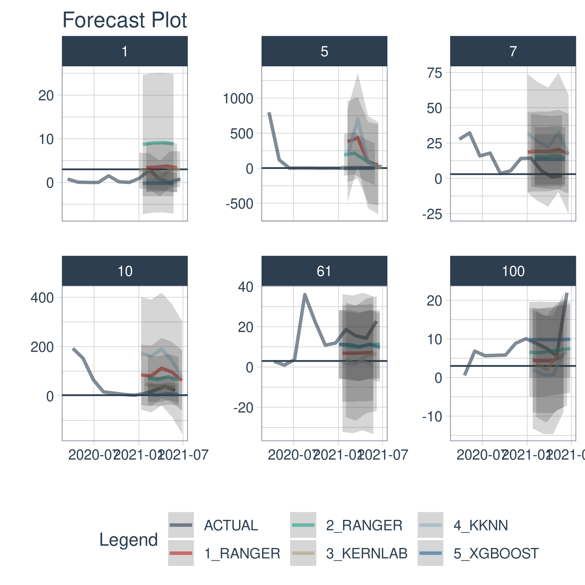


```r
actual <- clients %>%
  select(date, client, shrunk_ae)
```

#plot sens, spec, accuracy, j_index
#result : with IHME death
#result1: with zip death
#result2: without death

Classify whether the client is adverse or not adverse: shrunk_ae > 2.5.
plot sens, spec,j_index, accuracy
Xgboost has biggest j_index. K-nearest neighbors has good sens, and worst spec while svm has bad sens and good spec.

Calculate the predicted total claim every week and every client for half year.
K-nearest neighbors catch the trend for every week total claim.

Currently, we use the predicting shrunk_ae as predicting result for each model. 
Possible future improvement: 1. use confident interval to find a better predict shrunk_ae 
2. combine different model's results to get final result. 3.Compared the result with weekly death into account, we can add predicted death data as one predictor.


```r
threshold = 2.5
```


```r
predresult <- result %>%
  select(-.model_desc, -.conf_lo, -.conf_hi, -.key) %>%
  rename(model = .model_id, value = .value, date= .index)%>%
  relocate(model, value, .after = client)%>%
  pivot_wider(names_from = model, values_from =value)%>%
  rename(actual = "NA", rf = "1", rf_tuned = "2", svm_rbd = "3", knn = "4", xgboost = "5" )%>%
  drop_na()%>%
  mutate(obs =  ifelse(actual > threshold  , TRUE, FALSE))%>%
  mutate(rf_pred=  ifelse(rf > threshold ,TRUE, FALSE))%>%
  mutate(rftuned_pred=  ifelse(rf_tuned > threshold ,TRUE, FALSE))%>%
  mutate(svm_pred=  ifelse(svm_rbd > threshold ,TRUE, FALSE))%>%
  mutate(knn_pred=  ifelse(knn > threshold ,TRUE, FALSE))%>%
  mutate(xgboost_pred=  ifelse(xgboost > threshold ,TRUE, FALSE))%>%
  mutate(obs = as.factor(obs), rf_pred = as.factor(rf_pred), rftuned_pred = as.factor(rftuned_pred), 
         svm_pred = as.factor(svm_pred),knn_pred=as.factor(knn_pred), xgboost_pred = as.factor(xgboost_pred))

conf<-predresult%>%
  group_by(date) %>%
  summarize(sens_rf = sens_vec(obs, rf_pred), 
            sens_rftuned = sens_vec(obs, rftuned_pred),
            sens_svm = sens_vec(obs, svm_pred),
            sens_knn = sens_vec(obs, knn_pred),
            sens_xgboost = sens_vec(obs, xgboost_pred),
            spec_rf = spec_vec(obs, rf_pred), 
            spec_rftuned = spec_vec(obs, rftuned_pred),
            spec_svm = spec_vec(obs, svm_pred),
            spec_knn = spec_vec(obs, knn_pred),
            spec_xgboost = spec_vec(obs, xgboost_pred),
            jindex_rf = j_index_vec(obs, rf_pred),
            jindex_rftuned = j_index_vec(obs, rftuned_pred),
            jindex_svm = j_index_vec(obs, svm_pred),
            jindex_knn = j_index_vec(obs, knn_pred),
            jindex_xgboost = j_index_vec(obs, xgboost_pred),
            acc_rf = accuracy_vec(obs, rf_pred), 
            acc_rftuned = accuracy_vec(obs, rftuned_pred),
            acc_svm = accuracy_vec(obs, svm_pred),
            acc_knn = accuracy_vec(obs, knn_pred),
            acc_xgboost = accuracy_vec(obs, xgboost_pred))

conf%>%
  pivot_longer(sens_rf:sens_xgboost, names_to = "metric", values_to = "value")%>%
  ggplot(aes(x = date, y = value, color = metric)) + geom_line()
```

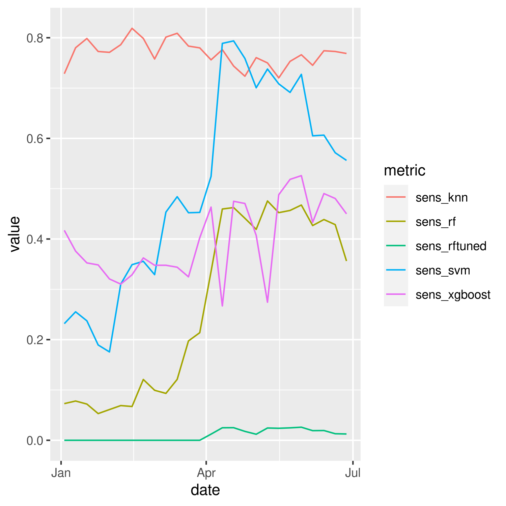

```r
conf%>%
  pivot_longer(spec_rf:spec_xgboost, names_to = "metric", values_to = "value")%>%
  ggplot(aes(x = date, y = value, color = metric)) + geom_line()
```


```r
conf%>%
  pivot_longer(jindex_rf:jindex_xgboost, names_to = "metric", values_to = "value")%>%
  ggplot(aes(x = date, y = value, color = metric)) + geom_line()
```

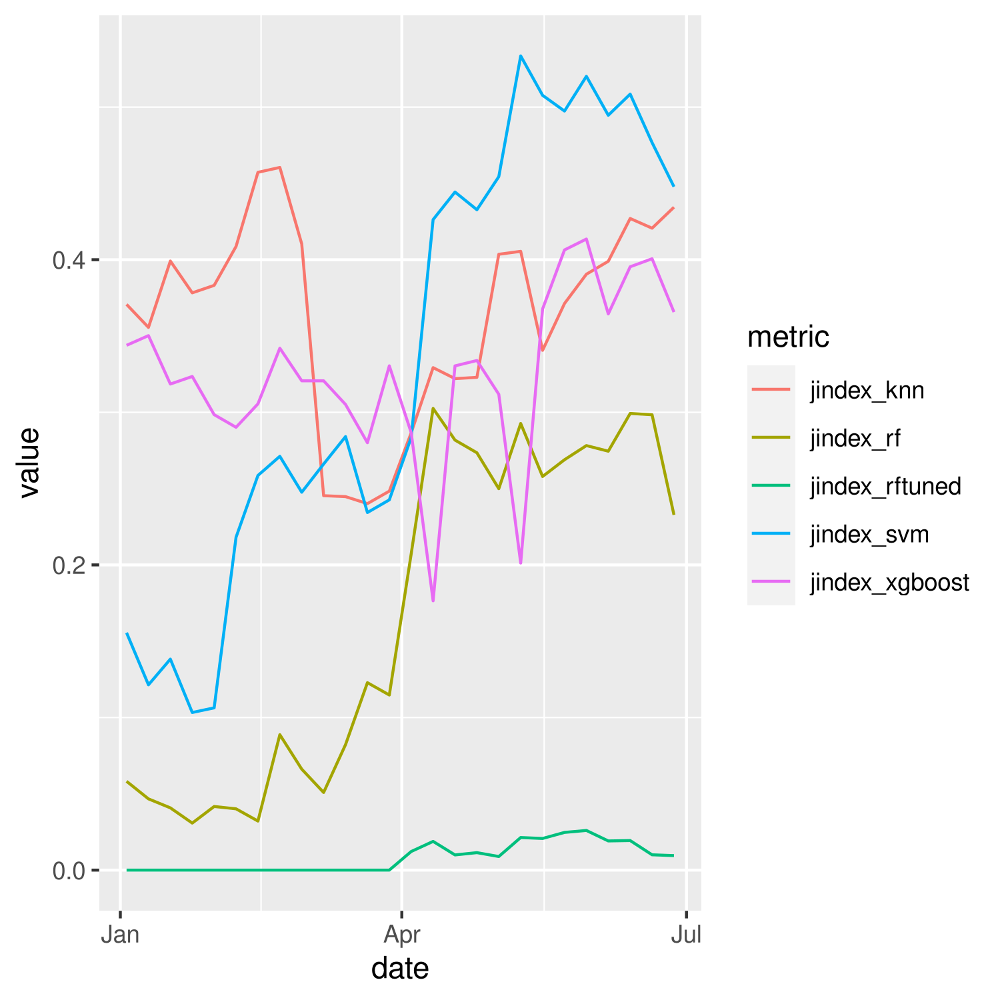

```r
conf%>%
  pivot_longer(acc_rf:acc_xgboost, names_to = "metric", values_to = "value")%>%
  ggplot(aes(x = date, y = value, color = metric)) + geom_line()
```

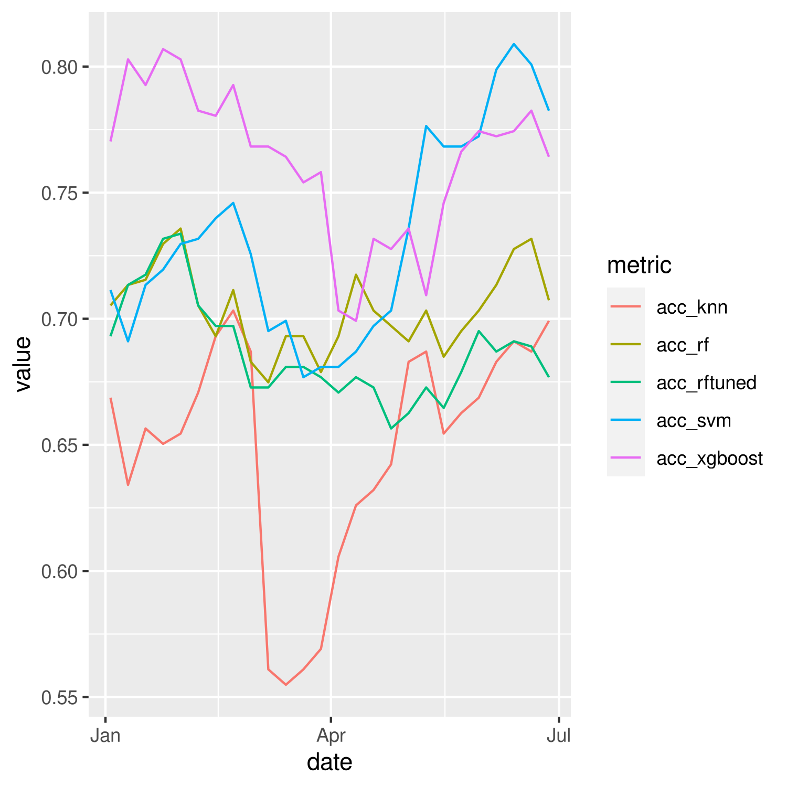


```r
predresult1 <- result1 %>%
  select(-.model_desc, -.conf_lo, -.conf_hi, -.key) %>%
  rename(model = .model_id, value = .value, date= .index)%>%
  relocate(model, value, .after = client)%>%
  pivot_wider(names_from = model, values_from =value)%>%
  rename(actual = "NA", rf = "1", rf_tuned = "2", svm_rbd = "3", knn = "4", xgboost = "5" )%>%
  drop_na()%>%
  mutate(obs =  ifelse(actual > threshold , TRUE, FALSE))%>%
  mutate(rf_pred=  ifelse(rf > threshold ,TRUE, FALSE))%>%
  mutate(rftuned_pred=  ifelse(rf_tuned > threshold ,TRUE, FALSE))%>%
  mutate(svm_pred=  ifelse(svm_rbd > threshold ,TRUE, FALSE))%>%
  mutate(knn_pred=  ifelse(knn > threshold ,TRUE, FALSE))%>%
  mutate(xgboost_pred=  ifelse(xgboost > threshold ,TRUE, FALSE))%>%
  mutate(obs = as.factor(obs), rf_pred = as.factor(rf_pred), rftuned_pred = as.factor(rftuned_pred), 
         svm_pred = as.factor(svm_pred),knn_pred=as.factor(knn_pred), xgboost_pred = as.factor(xgboost_pred))

conf1<-predresult1%>%
  group_by(date) %>%
  summarize(sens_rf = sens_vec(obs, rf_pred), sens_rftuned = sens_vec(obs, rftuned_pred),
            sens_svm = sens_vec(obs, svm_pred),sens_knn = sens_vec(obs, knn_pred),
            sens_xgboost = sens_vec(obs, xgboost_pred),
            spec_rf = spec_vec(obs, rf_pred), spec_rftuned = spec_vec(obs, rftuned_pred),
            spec_svm = spec_vec(obs, svm_pred),spec_knn = spec_vec(obs, knn_pred),
            spec_xgboost = spec_vec(obs, xgboost_pred),
            jindex_rf = j_index_vec(obs, rf_pred), jindex_rftuned = j_index_vec(obs, rftuned_pred),
            jindex_svm = j_index_vec(obs, svm_pred),jindex_knn = j_index_vec(obs, knn_pred),
            jindex_xgboost = j_index_vec(obs, xgboost_pred),
            acc_rf = accuracy_vec(obs, rf_pred), acc_rftuned = accuracy_vec(obs, rftuned_pred),
            acc_svm = accuracy_vec(obs, svm_pred),acc_knn = accuracy_vec(obs, knn_pred),
            acc_xgboost = accuracy_vec(obs, xgboost_pred))

conf1%>%
  pivot_longer(sens_rf:sens_xgboost, names_to = "metric", values_to = "value")%>%
  ggplot(aes(x = date, y = value, color = metric)) + geom_line()
```

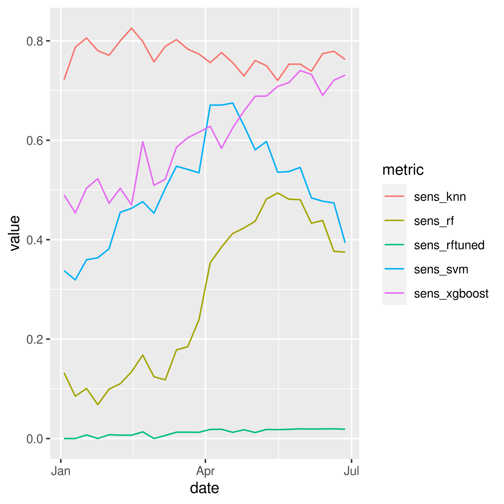

```r
conf1%>%
  pivot_longer(spec_rf:spec_xgboost, names_to = "metric", values_to = "value")%>%
  ggplot(aes(x = date, y = value, color = metric)) + geom_line()
```

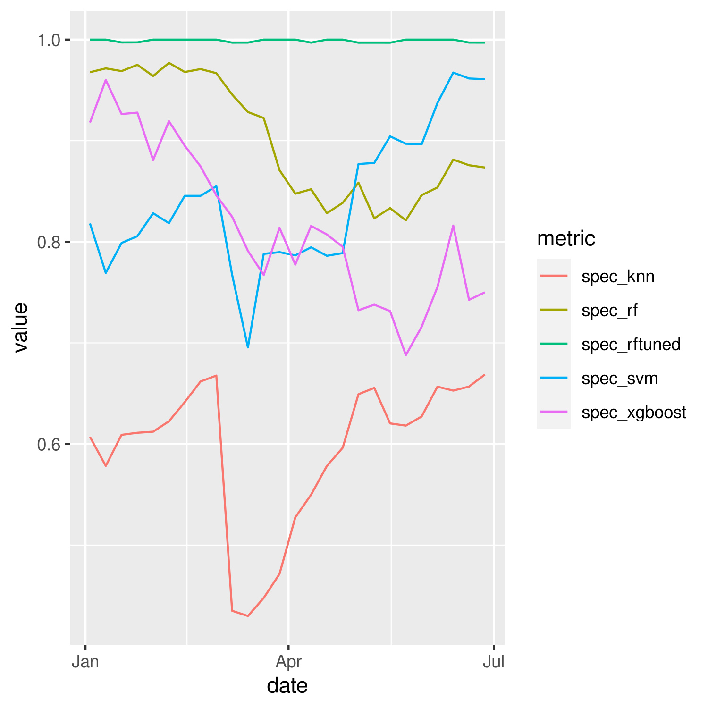

```r
conf1%>%
  pivot_longer(jindex_rf:jindex_xgboost, names_to = "metric", values_to = "value")%>%
  ggplot(aes(x = date, y = value, color = metric)) + geom_line()
```

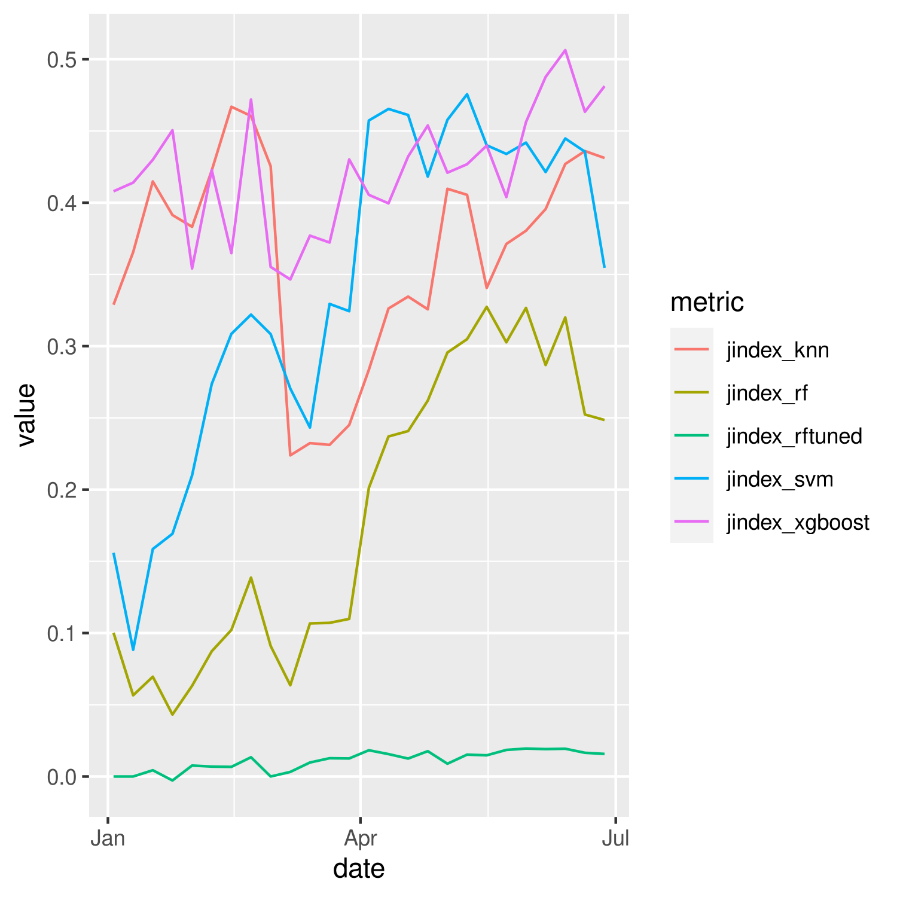

```r
conf1%>%
  pivot_longer(acc_rf:acc_xgboost, names_to = "metric", values_to = "value")%>%
  ggplot(aes(x = date, y = value, color = metric)) + geom_line()
```

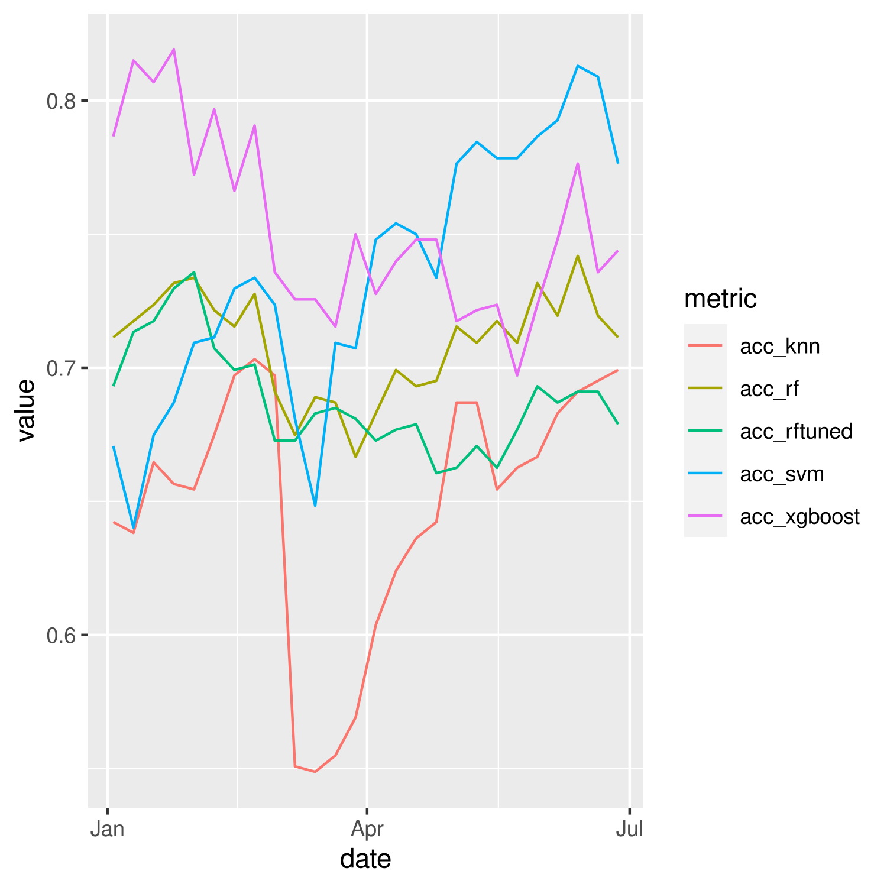

```r
predresult2 <- result2 %>%
  select(-.model_desc, -.conf_lo, -.conf_hi, -.key) %>%
  rename(model = .model_id, value = .value, date= .index)%>%
  relocate(model, value, .after = client)%>%
  pivot_wider(names_from = model, values_from =value)%>%
  rename(actual = "NA", rf = "1", rf_tuned = "2", svm_rbd = "3", knn = "4", xgboost = "5" )%>%
  drop_na()%>%
  mutate(obs =  ifelse(actual > threshold , TRUE, FALSE))%>%
  mutate(rf_pred=  ifelse(rf > threshold ,TRUE, FALSE))%>%
  mutate(rftuned_pred=  ifelse(rf_tuned > threshold ,TRUE, FALSE))%>%
  mutate(svm_pred=  ifelse(svm_rbd > threshold ,TRUE, FALSE))%>%
  mutate(knn_pred=  ifelse(knn > threshold ,TRUE, FALSE))%>%
  mutate(xgboost_pred=  ifelse(xgboost > threshold ,TRUE, FALSE))%>%
  mutate(obs = as.factor(obs), rf_pred = as.factor(rf_pred), rftuned_pred = as.factor(rftuned_pred), 
         svm_pred = as.factor(svm_pred),knn_pred=as.factor(knn_pred), xgboost_pred = as.factor(xgboost_pred))

conf2<-predresult2%>%
  group_by(date) %>%
  summarize(sens_rf = sens_vec(obs, rf_pred), sens_rftuned = sens_vec(obs, rftuned_pred),
            sens_svm = sens_vec(obs, svm_pred),sens_knn = sens_vec(obs, knn_pred),
            sens_xgboost = sens_vec(obs, xgboost_pred),
            spec_rf = spec_vec(obs, rf_pred), spec_rftuned = spec_vec(obs, rftuned_pred),
            spec_svm = spec_vec(obs, svm_pred),spec_knn = spec_vec(obs, knn_pred),
            spec_xgboost = spec_vec(obs, xgboost_pred),
            jindex_rf = j_index_vec(obs, rf_pred), jindex_rftuned = j_index_vec(obs, rftuned_pred),
            jindex_svm = j_index_vec(obs, svm_pred),jindex_knn = j_index_vec(obs, knn_pred),
            jindex_xgboost = j_index_vec(obs, xgboost_pred),
            acc_rf = accuracy_vec(obs, rf_pred), acc_rftuned = accuracy_vec(obs, rftuned_pred),
            acc_svm = accuracy_vec(obs, svm_pred),acc_knn = accuracy_vec(obs, knn_pred),
            acc_xgboost = accuracy_vec(obs, xgboost_pred))

conf2%>%
  pivot_longer(sens_rf:sens_xgboost, names_to = "metric", values_to = "value")%>%
  ggplot(aes(x = date, y = value, color = metric)) + geom_line()
```

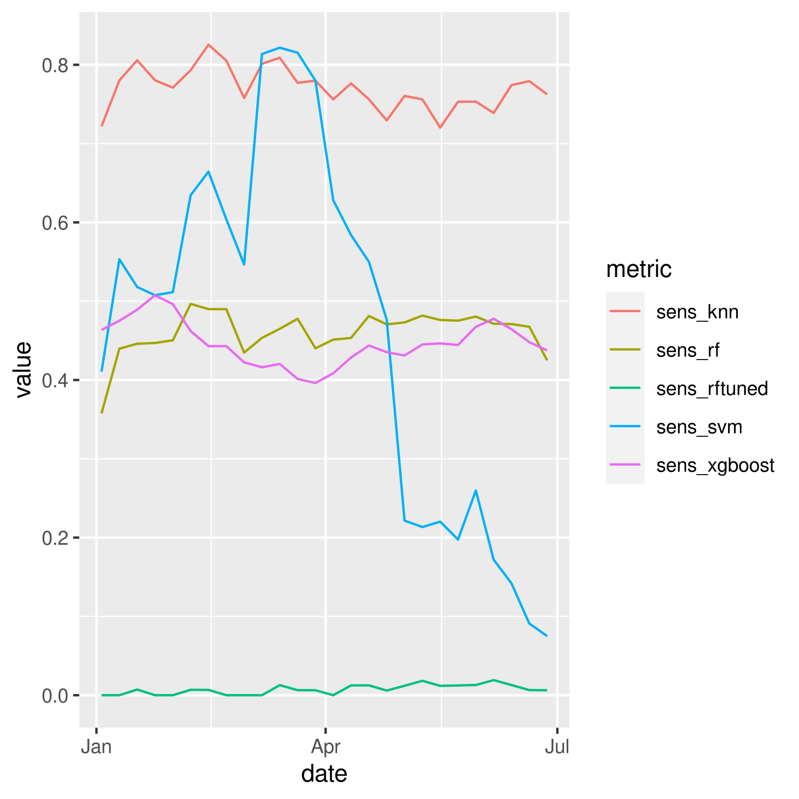

```r
conf2%>%
  pivot_longer(spec_rf:spec_xgboost, names_to = "metric", values_to = "value")%>%
  ggplot(aes(x = date, y = value, color = metric)) + geom_line()
```

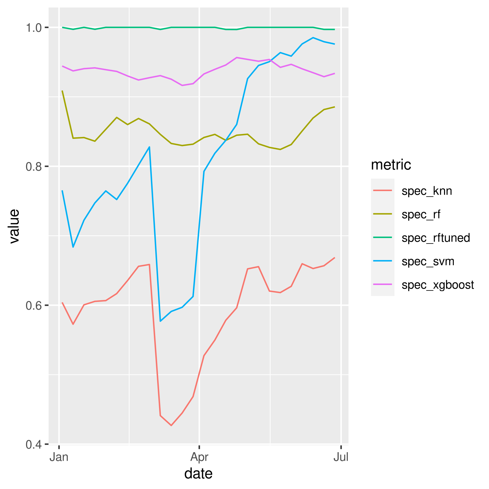

```r
conf2%>%
  pivot_longer(jindex_rf:jindex_xgboost, names_to = "metric", values_to = "value")%>%
  ggplot(aes(x = date, y = value, color = metric)) + geom_line()
```

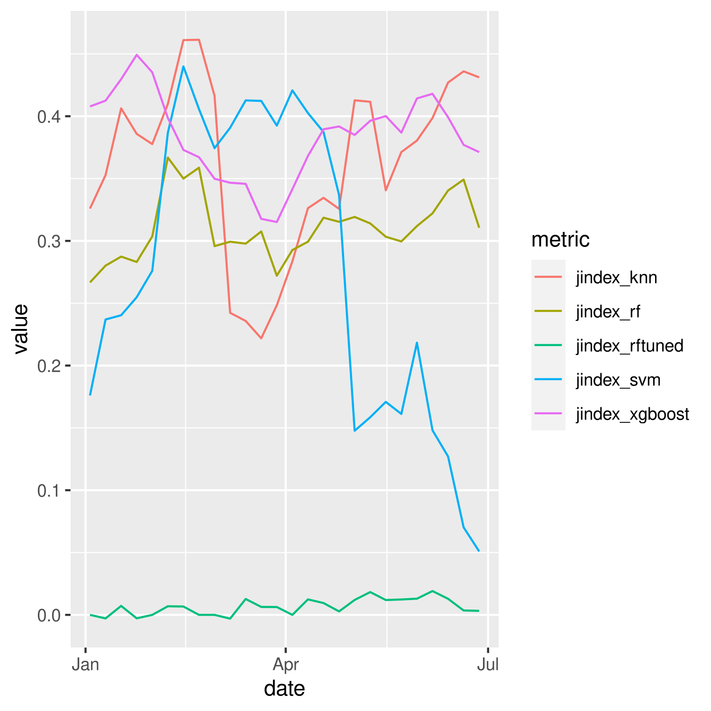

```r
conf2%>%
  pivot_longer(acc_rf:acc_xgboost, names_to = "metric", values_to = "value")%>%
  ggplot(aes(x = date, y = value, color = metric)) + geom_line()
```

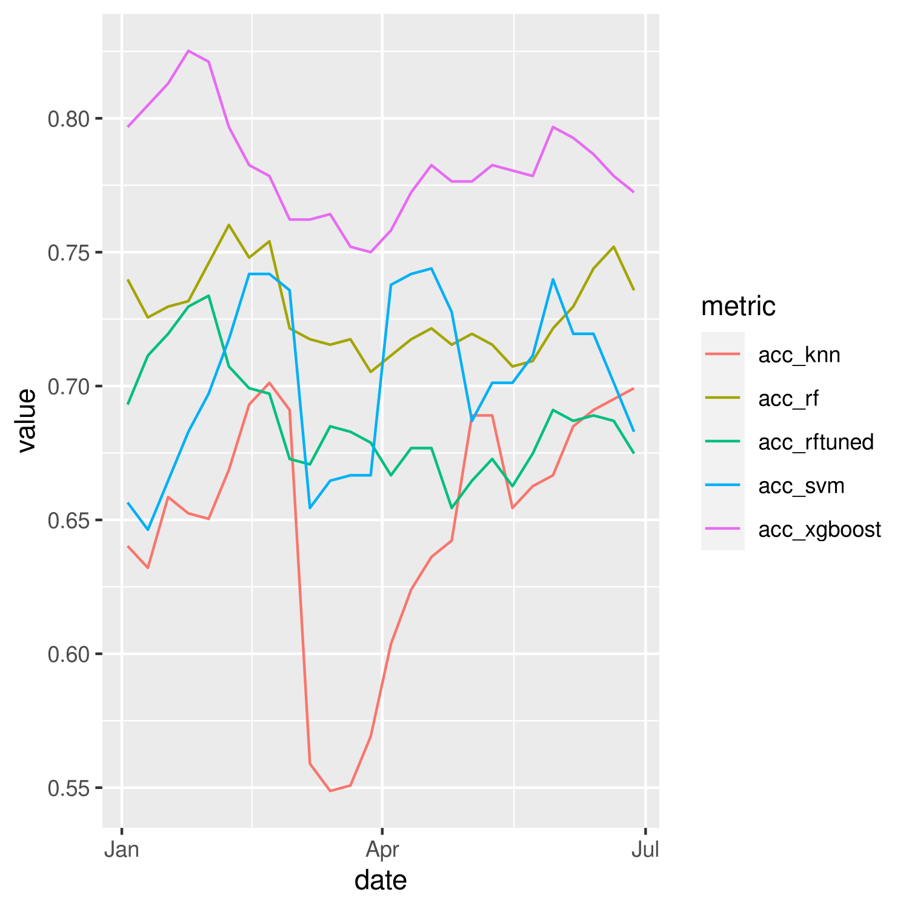

What to calculate claim

```r
claim <- read_feather("data/processed_data_20_12_23.feather")%>%
  select(date, client, claims, expected, shrinkage,volume)
```

```r
predclaim <-
predresult %>%
  inner_join(claim, by = c("date", "client"))%>%
  mutate(rf = rf/shrinkage *(expected /52.18),
         rf_tuned = rf_tuned/shrinkage*(expected /52.18),
         svm_rbd = svm_rbd /shrinkage*(expected /52.18),
         knn = knn/shrinkage*(expected /52.18),
         xgboost= xgboost/shrinkage*(expected / 52.18))%>%
  select(date, client, claims,expected, rf, rf_tuned,svm_rbd,knn,xgboost)

predclaim%>%
  group_by(date)%>%
  summarise(expected = sum(expected)/52.18,
        claims = sum(claims),
          rf =sum(rf) ,
         rf_tuned = sum(rf_tuned),
         svm_rbd = sum(svm_rbd) ,
         knn = sum(knn),
         xgboost= sum(xgboost))%>%
  pivot_longer(expected:xgboost, names_to = "metric", values_to = "value")%>%
  ggplot(aes(x = date, y = value, color = metric)) + geom_line()
```

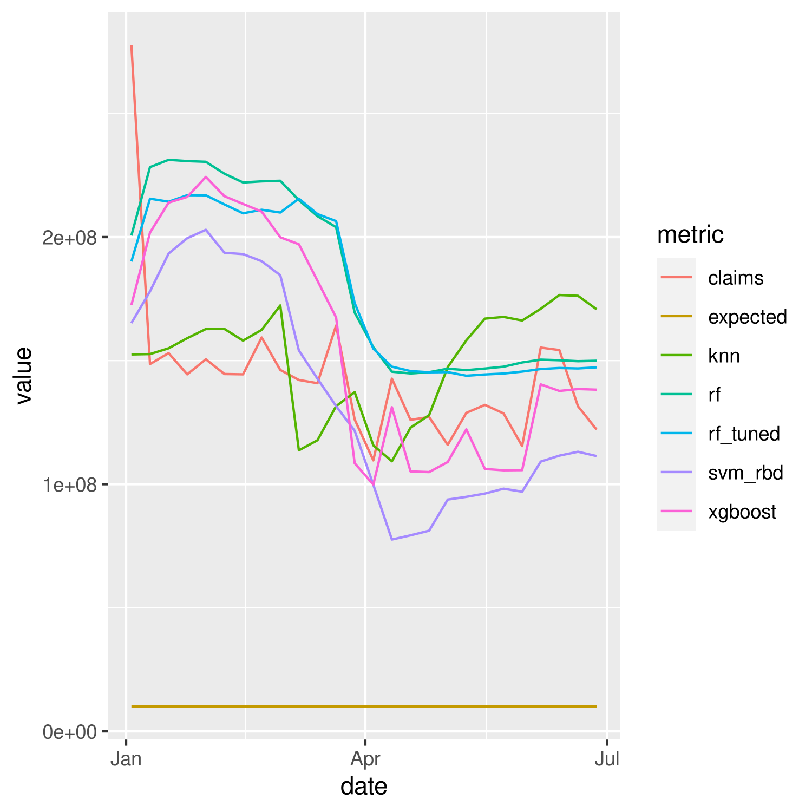

```r
predclaim1 <-
predresult1 %>%
  inner_join(claim, by = c("date", "client"))%>%
  mutate(rf = rf/shrinkage *(expected /52.18),
         rf_tuned = rf_tuned/shrinkage*(expected /52.18),
         svm_rbd = svm_rbd /shrinkage*(expected /52.18),
         knn = knn/shrinkage*(expected /52.18),
         xgboost= xgboost/shrinkage*(expected / 52.18))%>%
  select(date, client, claims,expected, rf, rf_tuned,svm_rbd,knn,xgboost)

predclaim1%>%
  group_by(date)%>%
  summarise(expected = sum(expected)/52.18,
        claims = sum(claims),
          rf =sum(rf) ,
         rf_tuned = sum(rf_tuned),
         svm_rbd = sum(svm_rbd) ,
         knn = sum(knn),
         xgboost= sum(xgboost))%>%
  pivot_longer(expected:xgboost, names_to = "metric", values_to = "value")%>%
  ggplot(aes(x = date, y = value, color = metric)) + geom_line()
```

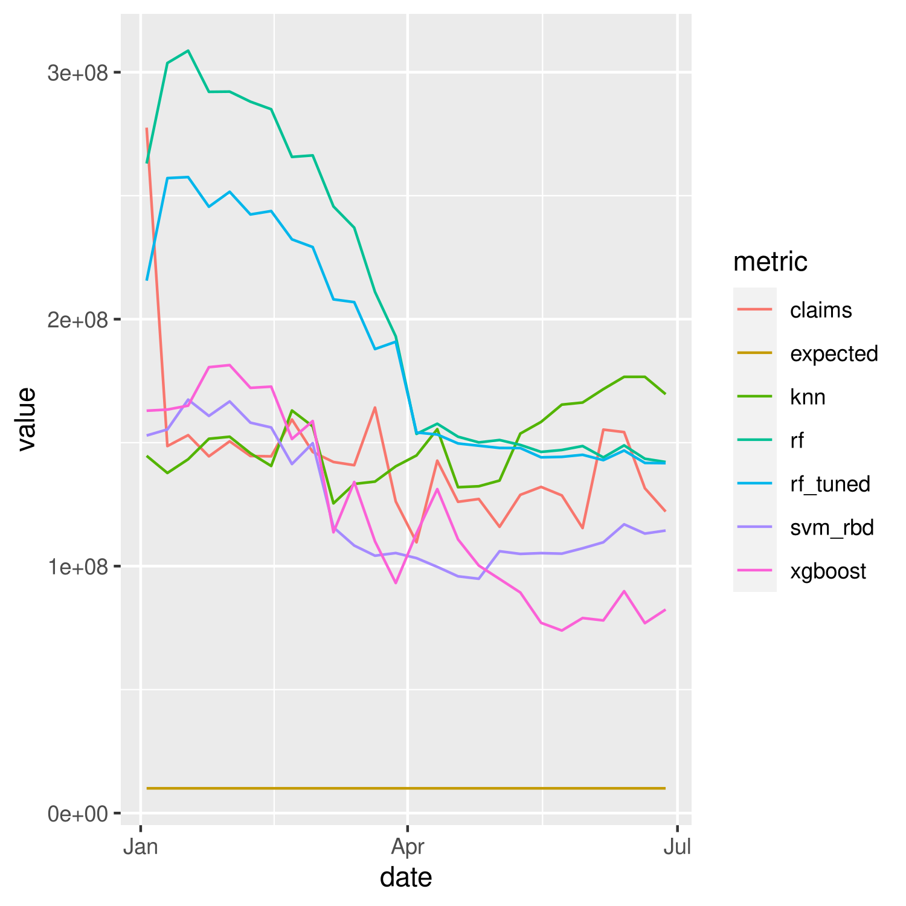

```r
predclaim2 <-
predresult2 %>%
  inner_join(claim, by = c("date", "client"))%>%
  mutate(rf = rf/shrinkage *(expected /52.18),
         rf_tuned = rf_tuned/shrinkage*(expected /52.18),
         svm_rbd = svm_rbd /shrinkage*(expected /52.18),
         knn = knn/shrinkage*(expected /52.18),
         xgboost= xgboost/shrinkage*(expected / 52.18))%>%
  select(date, client, claims,expected, rf, rf_tuned,svm_rbd,knn,xgboost)

predclaim2%>%
  group_by(date)%>%
  summarise(expected = sum(expected)/52.18,
        claims = sum(claims),
          rf =sum(rf) ,
         rf_tuned = sum(rf_tuned),
         svm_rbd = sum(svm_rbd) ,
         knn = sum(knn),
         xgboost= sum(xgboost))%>%
  pivot_longer(expected:xgboost, names_to = "metric", values_to = "value")%>%
  ggplot(aes(x = date, y = value, color = metric)) + geom_line()
```

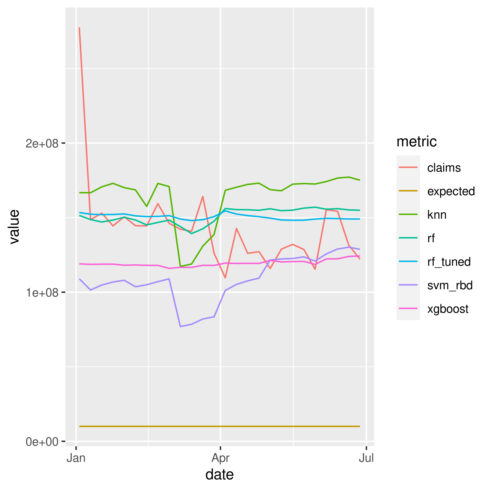


```r
predclaim%>%
  #mutate(client = as.numeric(client))%>%
  filter(client == c(1:50))%>%
  group_by(client)%>%
  summarise(expected = sum(expected)/52.18,
        claims = sum(claims),
          rf =sum(rf) ,
         rf_tuned = sum(rf_tuned),
         svm_rbd = sum(svm_rbd) ,
         knn = sum(knn),
         xgboost= sum(xgboost))%>%
  pivot_longer(claims:xgboost, names_to = "metric", values_to = "value")%>%
  ggplot(aes(x = client, y = log(value), color = metric)) + geom_point(alpha = 0.5)
```

```
## Warning in client == c(1:50): longer object length is not a multiple of
## shorter object length
```

```
## Warning in log(value): NaNs produced

## Warning in log(value): NaNs produced
```

```
## Warning: Removed 7 rows containing missing values (geom_point).
```

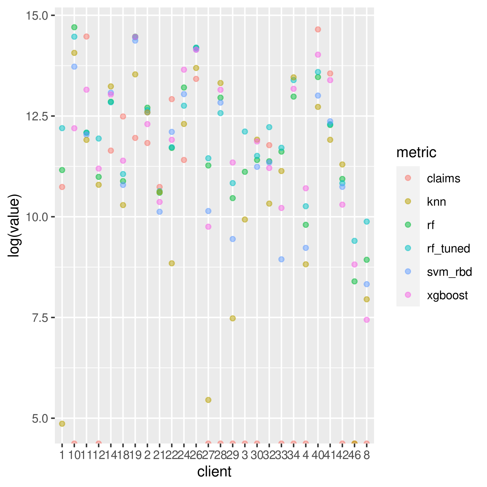
