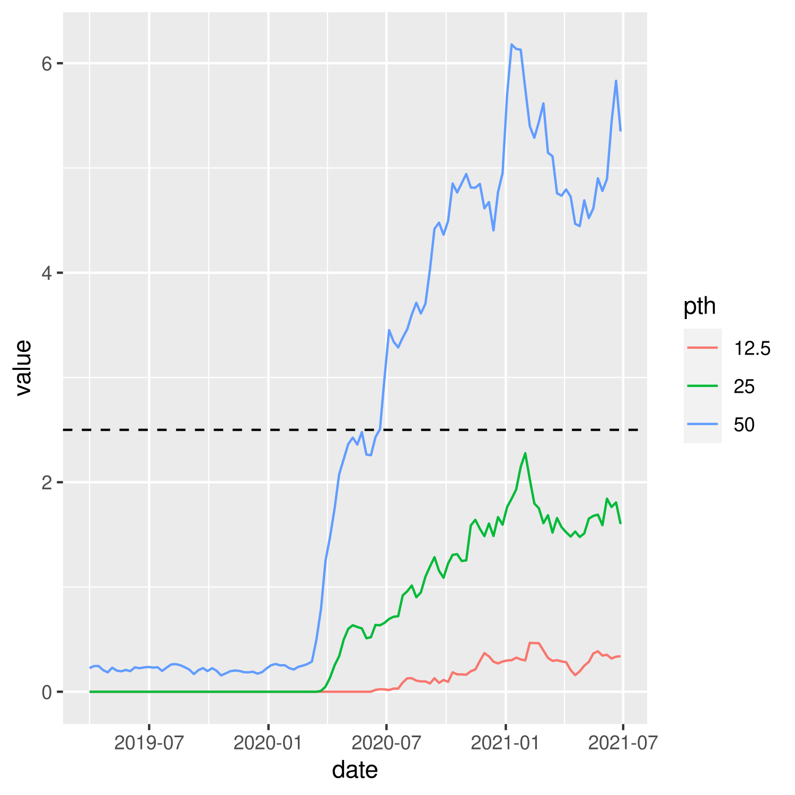
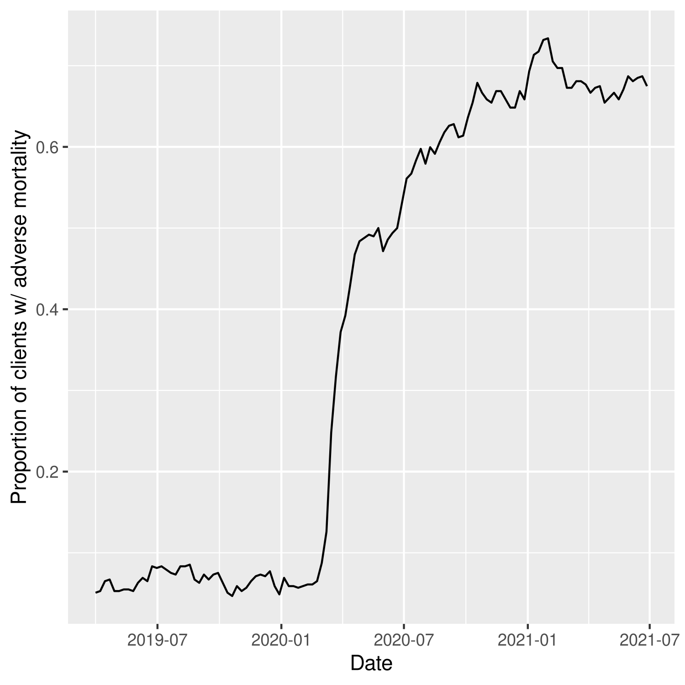
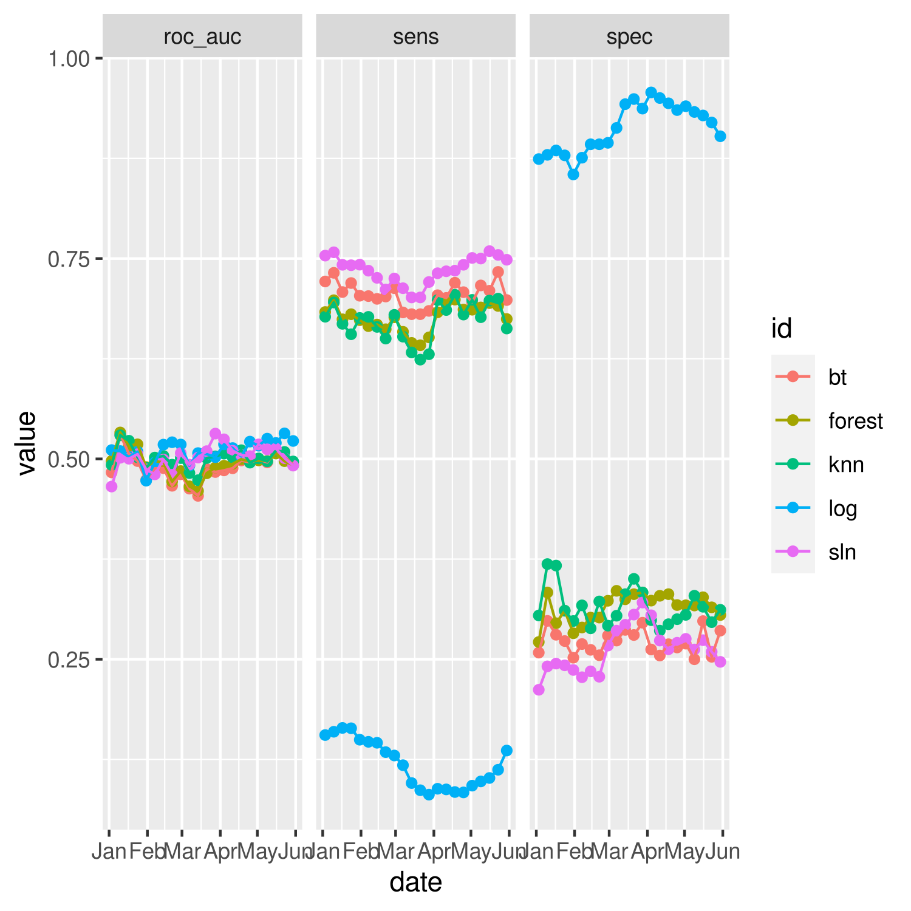
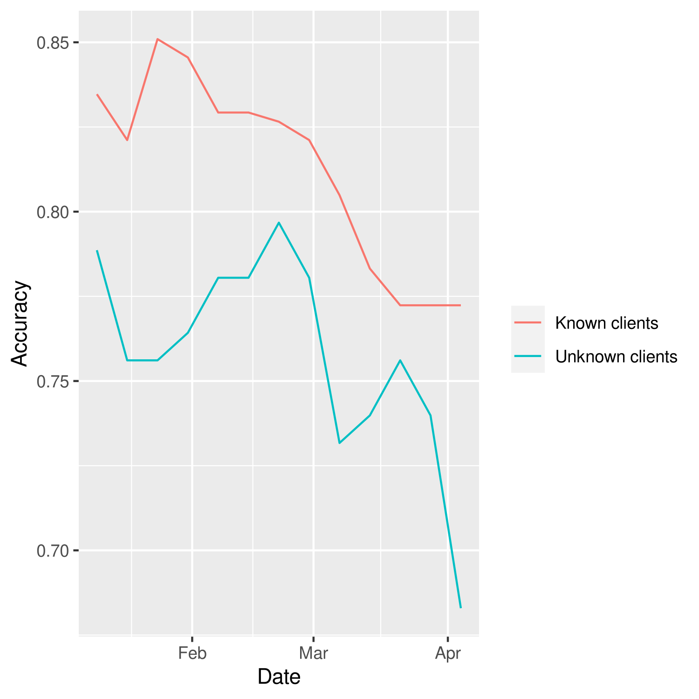
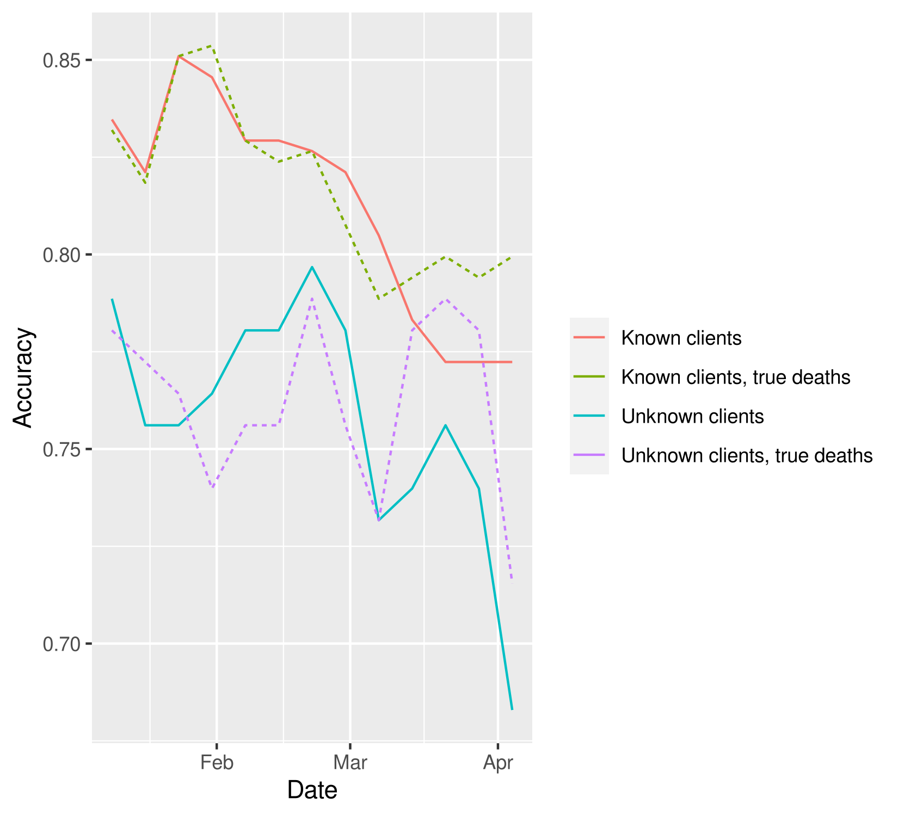
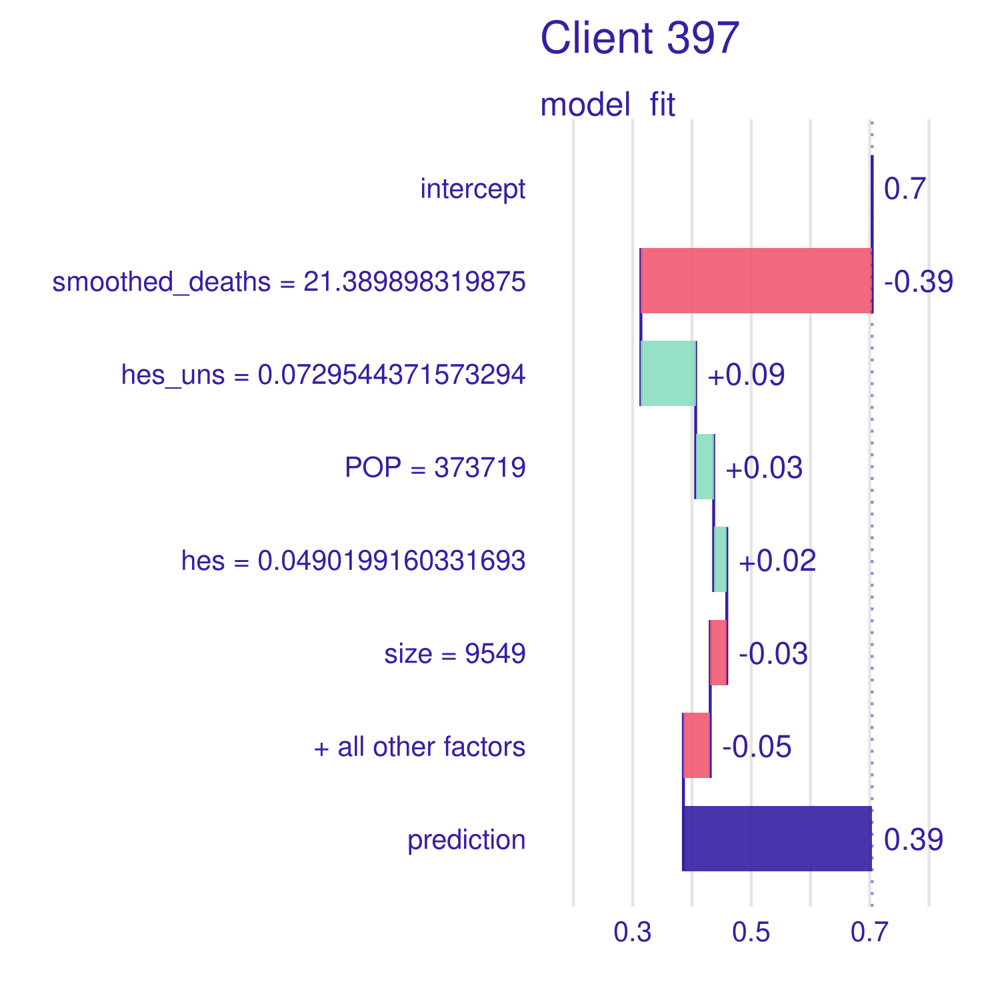
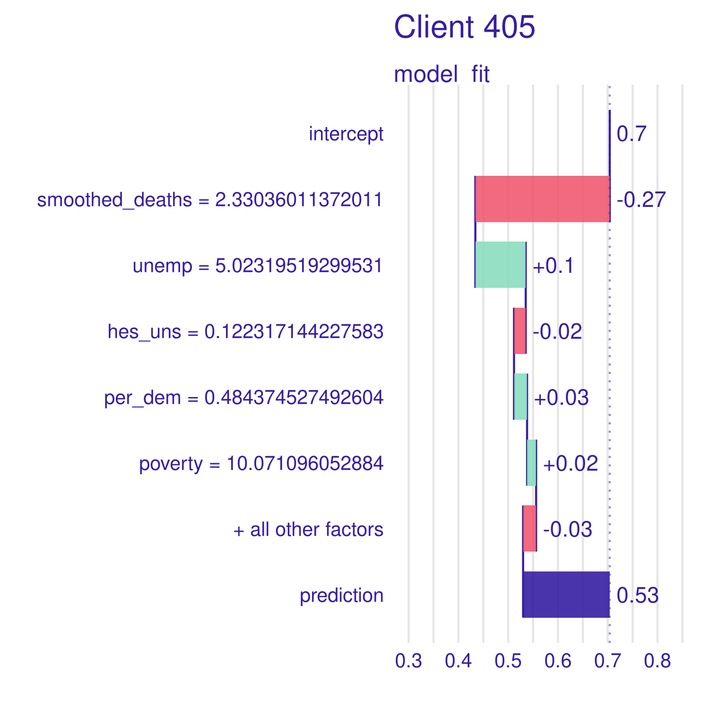
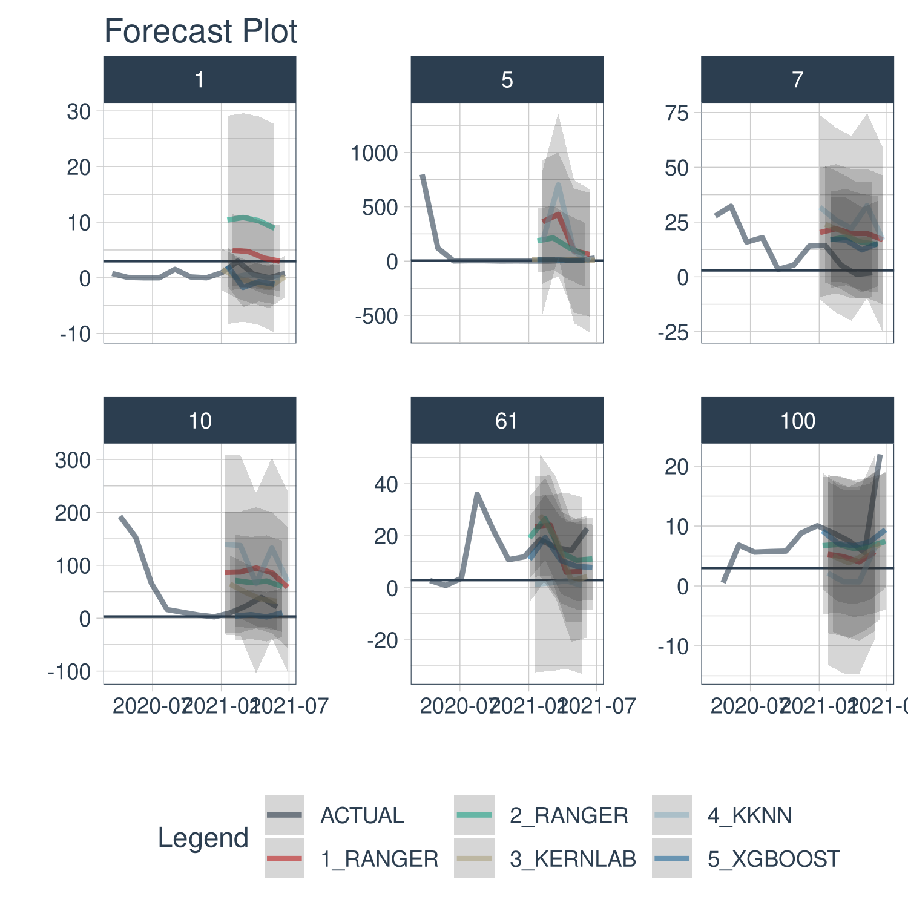
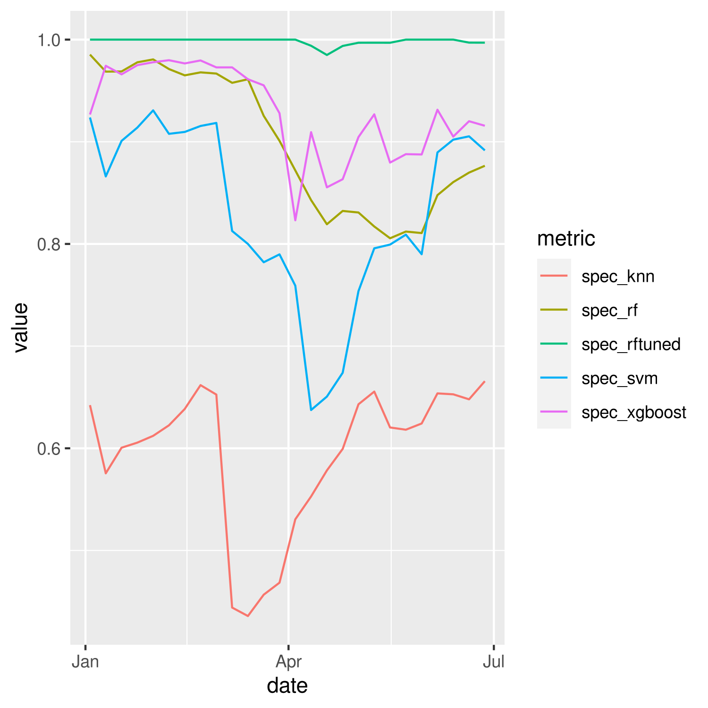
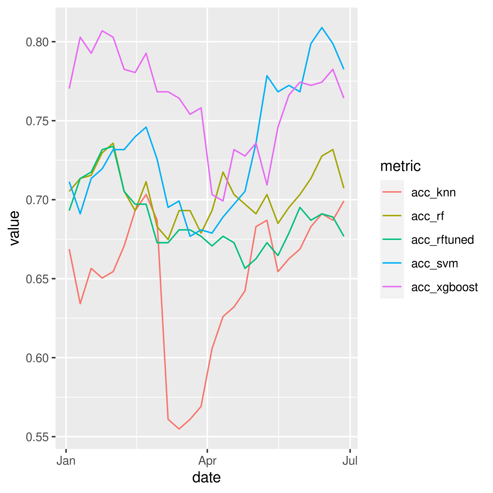

# FINAL PRESENTATION

## Data loading and boring stuff
No need to talk about this.
Please download the latest version of `data/processed_data_20_12_23.feather` from Google Drive.

```r
library(tidyverse)
library(tidymodels)
library(probably)
library(themis)
library(feather)
library(magrittr)
library(skimr)
library(vip)
library(ggbeeswarm)
library(finetune)
library(lubridate)
library(glue)
library(slider)
library(tsibble)
library(fable)

weekly_data <-
  read_feather("data/processed_data_20_12_23.feather") %>%
  select(-ae_2021, -ae_2020, -ae_2019,
         -actual_2021, -actual_2020, -actual_2019, -adverse,
         -STATE_NAME, -shrinkage,  -dep_var) 

yearly_data <-
  read_feather("data/processed_data_20_12_23.feather") %>%
  group_by(client) %>%
  slice(1) %>%
  select(-date, -claims, -zip_deaths, -smoothed_ae, -shrunk_ae,
         -class, -smoothed_deaths,
         -hes, -hes_uns, -str_hes, -ae, -dep_var, -shrinkage, -STATE_NAME, -ihme_deaths)
```

```
## Error in UseMethod("slice"): no applicable method for 'slice' applied to an object of class "c('grouped_df', 'tbl_df', 'tbl', 'data.frame')"
```

Make figure background transparent

```r
theme_update(plot.background = element_rect(fill = "transparent", colour = NA))
```


# Introduction
AEs changing in 2019, 2020, copy paste from pres2

We explain how we choose the threshold for adverse and not

```r
weekly_data %>%
  ungroup() %>%
  group_by(date) %>%
  summarize(
      `12.5` = quantile(shrunk_ae, 0.125),
      `25` = quantile(shrunk_ae, 0.25),
      `50` = quantile(shrunk_ae, 0.50)
  ) %>%
  pivot_longer(-date, names_to = "pth", values_to = "value") %>%
  ggplot(aes(x = date, y = value, color = pth)) +
  geom_line() +
  geom_hline(yintercept = 2.5, linetype = "dashed")
```



How many clients are adverse each week?

```r
weekly_data %>%
  group_by(date) %>%
  summarize(prop_adverse = sum(class == "Adverse") / n()) %>%
  ggplot(aes(x = date, y = prop_adverse)) + geom_line() +
  labs(y = "Proportion of clients w/ adverse mortality", x = "Date")
```


# "Baseline" stuff
Can maybe also copy paste some things from pres 2.

This is trained on known COVID-19 data.

* Why? It can be used as is in a future pandemic.
* Why not? Future pandemics may have different target mortality compared to COVID19.

# Time stuff

* Why? This model is more reactive than the previous one. It's trained on current pandemic data. It can be updated with time.
* Why not? This will be very bad early on in the pandemic (lack of data) and bad when forecasting is hard.

## Boring stuff 


```r
train <-
  weekly_data %>%
  filter(date <= "2021-01-01")

test <-
  weekly_data %>%
  filter(date > "2021-01-01" & date <= "2021-06-01")
```


```r
forecast <-
  weekly_data %>%
  filter(date >= "2020-03-15" & date <= "2021-01-01") %>%
  as_tsibble(index = date, key = client) %>%
  model(arima = ARIMA(smoothed_deaths)) %>%
  forecast(h = "6 months")
```

```
## Warning in sqrt(diag(best$var.coef)): NaNs produced

## Warning in sqrt(diag(best$var.coef)): NaNs produced
```


```r
forecasted_test <-
  forecast %>%
  as_tibble() %>%
  select(client, date, .mean) %>%
  right_join(test, by = c("client", "date")) %>%
  select(-smoothed_deaths) %>%
  rename(smoothed_deaths = .mean)
```


## Model selection
Looking at performance every day for 3 months in the future. 


Creating a common recipe for all models. 


```r
common_recipe <-
  recipe(class ~ ., data = weekly_data) %>%
  step_rm(client, zip3, claims, smoothed_ae, shrunk_ae,  ae, zip_deaths, ihme_deaths, date) %>%
  step_zv(all_predictors()) %>%
  step_log(volume, POP) %>%
  step_normalize(all_predictors())
```


```r
forest_spec <-
  rand_forest(trees = 1000) %>%
  set_engine("ranger", num.threads = 8, seed = 123456789) %>%
  set_mode("classification")

log_spec <- 
  logistic_reg(
  mode = "classification",
  engine = "glm")

svm_lin_spec <-
  svm_linear() %>%
  set_engine("LiblineaR") %>%
  set_mode("classification")

knn_spec <-
  nearest_neighbor() %>%
  set_engine("kknn") %>%
  set_mode("classification")

sln_spec <-
  mlp(activation = "relu", hidden_units = 6, epochs = 100) %>%
  set_engine("keras", verbose=0) %>%
  set_mode("classification")


bt_spec <- boost_tree(
  mode = "classification",
  engine = "xgboost",
  trees = 100)
```


```r
bt_wf <-
  workflow() %>%
  add_recipe(common_recipe) %>%
  add_model(bt_spec)

log_wf <-
  workflow() %>%
  add_recipe(common_recipe) %>%
  add_model(log_spec)

forest_wf <-
  workflow() %>%
  add_recipe(common_recipe) %>%
  add_model(forest_spec)

svm_lin_wf <-
  workflow() %>%
  add_recipe(common_recipe) %>%
  add_model(svm_lin_spec)

knn_wf <-
  workflow() %>%
  add_recipe(common_recipe) %>%
  add_model(knn_spec)

sln_wf <-
  workflow() %>%
  add_recipe(common_recipe) %>%
  add_model(sln_spec)
```


```r
wflows <- tribble(~wflow ,
                  sln_wf,
                  knn_wf, log_wf, forest_wf, bt_wf)
 


wflows <-
  wflows %>%
  mutate(wflows_fit = map(wflow, ~ fit(.x, train))) 
```

```
## [12:03:47] WARNING: amalgamation/../src/learner.cc:1095: Starting in XGBoost 1.3.0, the default evaluation metric used with the objective 'binary:logistic' was changed from 'error' to 'logloss'. Explicitly set eval_metric if you'd like to restore the old behavior.
```

```r
wflows <-
  wflows %>%
  mutate(
    class_predict = map(wflows_fit, ~ predict(.x, forecasted_test)),  
    prob_predict = map(wflows_fit, ~ predict(.x, forecasted_test, type = "prob")))
```


```r
wflows %>%
  bind_cols(tribble(~id, "sln", "knn", "log", "forest", "bt")) %>%
  select(-wflow, -wflows_fit) %>%
  mutate(prob_predict = map(prob_predict, ~ bind_cols(.x, test %>% select(date, class)))) %>%
  unnest(c(class_predict, prob_predict)) %>%
  group_by(id, date) %>%
  summarize(
            sens = sens_vec(class, .pred_class),
            spec = spec_vec(class, .pred_class),
            roc_auc = roc_auc_vec(class, .pred_Adverse), .groups = "keep") %>%
  pivot_longer(sens:roc_auc, names_to = "metric", values_to = "value") %>%
  ungroup() %>%
  ggplot(aes(x = date, y = value, color = id)) +
  geom_point() +
  geom_line() +
  facet_wrap( ~ metric)
```



```r
wflows_cheat <-
  wflows %>%
  mutate(
    class_predict = map(wflows_fit, ~ predict(.x, test)),  
    prob_predict = map(wflows_fit, ~ predict(.x, test, type = "prob")))
```

```
## Error: Problem with `mutate()` column `class_predict`.
## ℹ `class_predict = map(wflows_fit, ~predict(.x, test))`.
## ✖ 'what' must be a function or character string
```

```r
wflows_cheat %>%
  bind_cols(tribble(~id, "sln", "knn", "log", "forest", "bt")) %>%
  select(-wflow, -wflows_fit) %>%
  mutate(prob_predict = map(prob_predict, ~ bind_cols(.x, test %>% select(date, class)))) %>%
  unnest(c(class_predict, prob_predict)) %>%
  group_by(id, date) %>%
  summarize(
            sens = sens_vec(class, .pred_class),
            spec = spec_vec(class, .pred_class),
            roc_auc = roc_auc_vec(class, .pred_Adverse), .groups = "keep") %>%
  pivot_longer(sens:roc_auc, names_to = "metric", values_to = "value") %>%
  ungroup() %>%
  ggplot(aes(x = date, y = value, color = id)) +
  geom_point() +
  geom_line() +
  facet_wrap( ~ metric)
```


## Training on part of the data (forecasted smoothed deaths + IHME)
Testing on known clients and unknown clients.

We first split our clients into testing and training.

```r
set.seed(1213)
training_clients <-
  weekly_data %>%
  nest_by(client) %>%
  ungroup() %>%
  slice_sample(prop = 3/4) %>%
  pull(client)

testing_clients <-
  weekly_data %>%
  filter(!client %in% training_clients) %>%
  pull(client) %>%
  unique()
```

The training clients are "known"; they will be what the model will be trained on.
The testing clients are "unknown"; they will represent brand new clients.

### Case study: Jan 2021

We will also define a training and testing date. For training, we use every date before Jan 1st 2021, and we test on Jan 2nd - Apr 1st.

```r
start <- ceiling_date(ymd("2021-01-01"), unit = "week")
end <- ceiling_date(ymd("2021-04-01"), unit = "week")
```

Next we tune a boosted tree model to the training clients. For tuning purposes, we divide the training dates into analysis and assessment dates. The analysis dates will be all dated before Oct 1st, and assessment will be Jan 1st.


```r
analys <- ceiling_date(ymd("2020-10-01"), unit = "week")
assess <- start
```

To assess the performance of our model, we split the training clients into analysis and assessment.
We could (should?) also do cross-validation.

```r
set.seed(123)
ana_clients <-
  training_clients %>%
  sample(length(.) * 3 / 4)

ana_idx <-
  weekly_data %>%
  rownames_to_column() %>%
  filter(client %in% ana_clients & date <= analys) %>%
  pull(rowname) %>% as.integer()

ass_idx <-
  weekly_data %>%
  rownames_to_column() %>%
  filter(client %in% training_clients) %>%
  filter(!client %in% ana_clients & date == assess) %>%
  pull(rowname) %>%
  as.integer()

spl <- make_splits(list(analysis = ana_idx, assessment = ass_idx), data = weekly_data)
resmpl <- manual_rset(list(spl), c("foo"))
```

We describe our model. We use XGBoost

```r
xgboost_recipe <-
  recipe(formula = class ~ ., data = weekly_data) %>%
  step_rm(zip3, date, client, claims, zip_deaths, smoothed_ae, shrunk_ae, ae) %>%
  step_zv(all_predictors())

xgboost_spec <-
  boost_tree(trees = tune(), tree_depth = tune(), learn_rate = tune()) %>%
  set_mode("classification") %>%
  set_engine("xgboost", nthread = 8)

xgboost_workflow <-
  workflow() %>%
  add_recipe(xgboost_recipe) %>%
  add_model(xgboost_spec)
```

Now we tune! We use simulated annealing to find a set of parameters that maximizes `roc_auc`.

```r
set.seed(98324)
res_grd <-
  xgboost_workflow %>%
  tune_grid(
    resamples = resmpl,
    grid = 10,
    metrics = metric_set(roc_auc, sens, spec, j_index, yardstick::accuracy),
    control = control_grid(verbose = TRUE))
## i foo: preprocessor 1/1
## ✓ foo: preprocessor 1/1
## i foo: preprocessor 1/1, model 1/10
## ✓ foo: preprocessor 1/1, model 1/10
## i foo: preprocessor 1/1, model 1/10 (predictions)
## i foo: preprocessor 1/1
## ✓ foo: preprocessor 1/1
## i foo: preprocessor 1/1, model 2/10
## ✓ foo: preprocessor 1/1, model 2/10
## i foo: preprocessor 1/1, model 2/10 (predictions)
## i foo: preprocessor 1/1
## ✓ foo: preprocessor 1/1
## i foo: preprocessor 1/1, model 3/10
## ✓ foo: preprocessor 1/1, model 3/10
## i foo: preprocessor 1/1, model 3/10 (predictions)
## i foo: preprocessor 1/1
## ✓ foo: preprocessor 1/1
## i foo: preprocessor 1/1, model 4/10
## ✓ foo: preprocessor 1/1, model 4/10
## i foo: preprocessor 1/1, model 4/10 (predictions)
## i foo: preprocessor 1/1
## ✓ foo: preprocessor 1/1
## i foo: preprocessor 1/1, model 5/10
## ✓ foo: preprocessor 1/1, model 5/10
## i foo: preprocessor 1/1, model 5/10 (predictions)
## i foo: preprocessor 1/1
## ✓ foo: preprocessor 1/1
## i foo: preprocessor 1/1, model 6/10
## ✓ foo: preprocessor 1/1, model 6/10
## i foo: preprocessor 1/1, model 6/10 (predictions)
## i foo: preprocessor 1/1
## ✓ foo: preprocessor 1/1
## i foo: preprocessor 1/1, model 7/10
## ✓ foo: preprocessor 1/1, model 7/10
## i foo: preprocessor 1/1, model 7/10 (predictions)
## i foo: preprocessor 1/1
## ✓ foo: preprocessor 1/1
## i foo: preprocessor 1/1, model 8/10
## ✓ foo: preprocessor 1/1, model 8/10
## i foo: preprocessor 1/1, model 8/10 (predictions)
## i foo: preprocessor 1/1
## ✓ foo: preprocessor 1/1
## i foo: preprocessor 1/1, model 9/10
## ✓ foo: preprocessor 1/1, model 9/10
## i foo: preprocessor 1/1, model 9/10 (predictions)
## i foo: preprocessor 1/1
## ✓ foo: preprocessor 1/1
## i foo: preprocessor 1/1, model 10/10
## ✓ foo: preprocessor 1/1, model 10/10
## i foo: preprocessor 1/1, model 10/10 (predictions)

res <-
  xgboost_workflow %>%
  tune_sim_anneal(
      resamples = resmpl,
      iter = 20,
      initial = res_grd,
      metrics = metric_set(roc_auc, sens, spec, j_index, yardstick::accuracy))
## Optimizing roc_auc
## Initial best: 0.78996
##  1 ◯ accept suboptimal  roc_auc=0.74385
##  2 ◯ accept suboptimal  roc_auc=0.69237
##  3 ◯ accept suboptimal  roc_auc=0.66214
##  4 + better suboptimal  roc_auc=0.67367
##  5 ◯ accept suboptimal  roc_auc=0.67188
##  6 ─ discard suboptimal roc_auc=0.6647
##  7 ◯ accept suboptimal  roc_auc=0.6583
##  8 ✖ restart from best  roc_auc=0.66342
##  9 ◯ accept suboptimal  roc_auc=0.76537
## 10 ─ discard suboptimal roc_auc=0.74129
## 11 ─ discard suboptimal roc_auc=0.71875
## 12 ◯ accept suboptimal  roc_auc=0.74027
## 13 ♥ new best           roc_auc=0.80328
## 14 ─ discard suboptimal roc_auc=0.76383
## 15 ─ discard suboptimal roc_auc=0.78151
## 16 ─ discard suboptimal roc_auc=0.771
## 17 ─ discard suboptimal roc_auc=0.76076
## 18 ─ discard suboptimal roc_auc=0.78381
## 19 ♥ new best           roc_auc=0.81916
## 20 ─ discard suboptimal roc_auc=0.7687
```

The best parameter values are

```r
res %>% show_best(metric = "roc_auc")
```

```
## # A tibble: 5 × 10
##   trees tree_depth learn_rate .metric .estimator  mean     n std_err
##   <int>      <int>      <dbl> <chr>   <chr>      <dbl> <int>   <dbl>
## 1  1939          2   0.00552  roc_auc binary     0.819     1      NA
## 2  1807          4   0.00273  roc_auc binary     0.803     1      NA
## 3  1701          7   0.000408 roc_auc binary     0.790     1      NA
## 4  1703          5   0.000617 roc_auc binary     0.784     1      NA
## 5  2000          5   0.000264 roc_auc binary     0.782     1      NA
## # … with 2 more variables: .config <chr>, .iter <int>
```

```r
best_parms <- res %>% select_best(metric = "roc_auc")

best_parms <- tribble(
        ~trees, ~tree_depth, ~learn_rate,
        517, 10, 0.001312986874346298)

best_parms <- tribble(
          ~trees, ~tree_depth, ~learn_rate,
          138, 6, 0.07662993111378884)

best_parms <- tribble(
          ~trees, ~tree_depth, ~learn_rate,
          1939,2,0.005523512626608967)
```

We apply these parameters to our workflow

```r
final_wf <- xgboost_workflow %>% finalize_workflow(best_parms)
```

We now need to forecast 3 months worth of `smoothed_deaths`.

```r
forecast <-
  weekly_data %>%
  filter(date >= "2020-03-15" & date <= start) %>%
  as_tsibble(index = date, key = client) %>%
  model(arima = ARIMA(smoothed_deaths)) %>%
  forecast(h = "4 months")
```

```
## Warning in sqrt(diag(best$var.coef)): NaNs produced

## Warning in sqrt(diag(best$var.coef)): NaNs produced

## Warning in sqrt(diag(best$var.coef)): NaNs produced

## Warning in sqrt(diag(best$var.coef)): NaNs produced

## Warning in sqrt(diag(best$var.coef)): NaNs produced
```


```r
future <-
  forecast %>%
  as_tibble() %>%
  select(client, date, .mean) %>%
  rename(smoothed_deaths = .mean)

forecast_data <-
  weekly_data %>%
  rows_update(future, by = c("date","client"))
```


We define our training 

```r
train <-
  weekly_data %>%
  filter(client %in% training_clients & date <= start)
```

We will have several version of the testing set. Some of them will be known or unknown, some will be forecasted and true.

```r
test_known_true <-
  weekly_data %>%
  filter(client %in% training_clients) %>%
  filter(date > start & date <= end)

test_unknown_true <-
  weekly_data %>%
  filter(!client %in% training_clients) %>%
  filter(date > start & date <= end)

test_known_fore <-
  forecast_data %>%
  filter(client %in% training_clients) %>%
  filter(date > start & date <= end)

test_unknown_fore <-
  forecast_data %>%
  filter(!client %in% training_clients) %>%
  filter(date > start & date <= end)
```

Train the workflow

```r
trained_wf <-
  final_wf %>%
  fit(train)
```

```
## [21:35:48] WARNING: amalgamation/../src/learner.cc:1095: Starting in XGBoost 1.3.0, the default evaluation metric used with the objective 'binary:logistic' was changed from 'error' to 'logloss'. Explicitly set eval_metric if you'd like to restore the old behavior.
```

Look at results one by one

```r
tests <-
  tribble(
    ~id, ~set,
    # "known true", test_known_true,
    # "unknown true", test_unknown_true,
    "Known clients", test_known_fore,
    "Unknown clients", test_unknown_fore)

tests %>%
  mutate(set = map(set, ~ bind_cols(.x, trained_wf %>% predict(.x)))) %>%
  unnest(set) %>%
  group_by(id, date) %>%
  summarize(
      Accuracy = yardstick::accuracy_vec(class, .pred_class),
      Sensitivity = yardstick::sens_vec(class, .pred_class),
      Specificity = yardstick::spec_vec(class, .pred_class)) %>%
  ungroup() %>%
  pivot_longer(Accuracy:Specificity, names_to = "metric", values_to = "value") %>%
  filter(metric == "Accuracy") %>%
  ggplot(aes(x = date, y = value, color = id)) + geom_line() +
  labs(x = "Date", y = "Accuracy", color = "")
```

```
## `summarise()` has grouped output by 'id'. You can override using the `.groups` argument.
```



```r
tests <-
  tribble(
    ~id, ~set,
    "Known clients, true deaths", test_known_true,
    "Unknown clients, true deaths", test_unknown_true,
    "Known clients", test_known_fore,
    "Unknown clients", test_unknown_fore)

tests %>%
  mutate(set = map(set, ~ bind_cols(.x, trained_wf %>% predict(.x)))) %>%
  unnest(set) %>%
  group_by(id, date) %>%
  summarize(
      Accuracy = yardstick::accuracy_vec(class, .pred_class),
      Sensitivity = yardstick::sens_vec(class, .pred_class),
      Specificity = yardstick::spec_vec(class, .pred_class)) %>%
  ungroup() %>%
  pivot_longer(Accuracy:Specificity, names_to = "metric", values_to = "value") %>%
  filter(metric == "Accuracy") %>%
  ggplot(aes(x = date, y = value, color = id)) + geom_line(aes(linetype = str_detect(id, "true"))) +
  labs(x = "Date", y = "Accuracy", color = "") + guides(linetype = "none")
```

```
## `summarise()` has grouped output by 'id'. You can override using the `.groups` argument.
```



### Explaining outcomes
Use DALEX

```r
library(DALEX)
library(DALEXtra)

model <-
  trained_wf %>%
  extract_fit_parsnip()

recipe <-
  trained_wf %>%
  extract_recipe(estimated = TRUE)

exp <- explain(model, recipe %>% bake(train))
```

```
## Preparation of a new explainer is initiated
##   -> model label       :  model_fit  (  default  )
##   -> data              :  34317  rows  26  cols 
##   -> data              :  tibble converted into a data.frame 
##   -> target variable   :  not specified! (  WARNING  )
##   -> predict function  :  yhat.model_fit  will be used (  default  )
##   -> predicted values  :  No value for predict function target column. (  default  )
##   -> model_info        :  package parsnip , ver. 0.1.7 , task classification (  default  ) 
##   -> model_info        :  Model info detected classification task but 'y' is a NULL .  (  WARNING  )
##   -> model_info        :  By deafult classification tasks supports only numercical 'y' parameter. 
##   -> model_info        :  Consider changing to numerical vector with 0 and 1 values.
##   -> model_info        :  Otherwise I will not be able to calculate residuals or loss function.
##   -> predicted values  :  the predict_function returns an error when executed (  WARNING  ) 
##   -> residual function :  difference between y and yhat (  default  )
##   A new explainer has been created! 
```

```r
test_obs <-
  test_unknown_fore %>%
  filter(date == end, client == 397)

exp %>%
predict_parts(recipe %>% bake(test_obs) %>% select(-class)) %>%
  plot(digits = 2, max_features = 5, title = "Client 397")
```



```r
test_obs <-
  test_known_fore %>%
  filter(date == end, client == 405)

exp %>%
predict_parts(recipe %>% bake(test_obs) %>% select(-class)) %>%
  plot(digits = 2, max_features = 5, title = "Client 405")
```




### Case study: June 2020

## Predicting AE as a time-series
with IHME death vs with  zip death vs without death 

Train global model for all clients.

Target: shrunk_ae (AE after shrunk).
Predictors: data before covid-19 (based on the zip code where the company is located (such as poverty, education, unemployment levels) and characteristics of the company (such as the average age of its employees).
Data pre-processing: log(POP), log(volume),log(expected) and normalize all predictors

Split: Train set(2020-03-15 - 2020-12-27), Test set (2021-01-03- 2021-06-27).
Model: random forest, tuned random forest, Radial basis function support vector machines, K-nearest neighbors, Xgboost. 
Outcome: predicting shrunk_ae, confident interval for each client every day.

Performance: 
Plot the predict result for each client, pick several to present, 
The confident interval can cover the exact shrunk_ae

Classify whether the client is adverse or not adverse: shrunk_ae > 2.5.
plot sens, spec,j_index, accuracy
Xgboost has biggest j_index. K-nearest neighbors has good sens, and worst spec while svm has bad sens and good spec.

Calculate the predicted total claim every week and every client for half year.
K-nearest neighbors, Xgboost, svm can catch the trend for every week total claim.

For client, the result is not good since it is a global model for all clients

Currently, we use the predicting shrunk_ae as predicting result for each model. 
Possible future improvement: 1. use confident interval to find a better predict shrunk_ae 
2. combine different model's results to get final result. 3.Compared the result with weekly death into account, we can add predicted death data as one predictor.
 


## Common data

```r
library(tidyverse)
library(tidymodels)
library(modeltime)
library(timetk)
library(probably)
library(themis)
library(feather)
library(magrittr)
library(skimr)
library(vip)
library(dplyr)
library(lubridate)
```


Get weeklydata 

```r
clients<-read_feather("data/processed_data_20_12_23.feather")%>%
  select(-ae_2021, -ae_2020, -ae_2019,
         -actual_2021, -actual_2020, -actual_2019, -adverse,
         -STATE_NAME, -dep_var, -smoothed_ae)%>%
  filter(date >= "2020-03-15")%>%
  mutate(client = as.factor(client))%>%
  mutate(POP=log(POP))%>%
  mutate(volume = log(volume))%>%
  mutate(expected = log(expected))
```

Train global model for all clients.

Target: shrunk_ae (AE after shrunk).
Predictors: data before covid-19 (based on the zip code where the company is located (such as poverty, education, unemployment levels) and characteristics of the company (such as the average age of its employees).
Data pre-processing: log(POP), log(volume),log(expected) and normalize all predictors
Split: Train set(2020-03-15 - 2020-12-27), Test set (2021-01-03- 2021-06-27).

split

```r
  set.seed(1234)
  splits <-  clients %>% time_series_split(initial = "6 months", assess = "6 months", date_var = date, cumulative = TRUE)
```

```
## Data is not ordered by the 'date_var'. Resamples will be arranged by `date`.
```

```
## Overlapping Timestamps Detected. Processing overlapping time series together using sliding windows.
```

```r
  train = training(splits)
  test = testing(splits)
```

We now gather our recipes and models.
Model: random forest, tuned random forest, Radial basis function support vector machines, K-nearest neighbors, Xgboost. 
Outcome: predicting shrunk_ae, confident interval for each client every day.


#recipe with ihme death data

```r
rec_obj <-
    recipe(shrunk_ae ~ ., data = training(splits)) %>%
    #step_rm(year,month,day)%>%
    step_rm(zip3)%>%
    step_rm( claims , class, shrinkage, ae,zip_deaths, smoothed_deaths)%>%
    #step_rm(adverse)%>%
    step_mutate(client = droplevels(client)) %>%
    step_timeseries_signature(date) %>%
    step_rm(date)%>%
    step_dummy(all_nominal_predictors(), one_hot = TRUE)%>%
     step_zv(all_predictors()) %>%
    step_normalize(all_predictors(), -all_nominal())
```

#engine

```r
forest_spec <-
  rand_forest(trees = 1000) %>%
  set_engine("ranger", num.threads = 8, seed = 123456789) %>%
  #set_mode("classification") %>%
  set_mode("regression")%>%
  set_engine("ranger", num.threads = 8, importance = "impurity", seed = 123)
tuned_forest_spec <-
  rand_forest(trees = 1000, mtry = 12, min_n = 21) %>%
  #set_mode("classification") %>%
  set_mode("regression")%>%
  set_engine("ranger", num.threads = 8, importance = "impurity", seed = 123)
svm_rbf_spec <-
  svm_rbf() %>%
  set_engine("kernlab") %>%
  #set_mode("classification")
  set_mode("regression")
knn_spec <-
  nearest_neighbor() %>%
  set_engine("kknn") %>%
  #set_mode("classification")
  set_mode("regression")
xgboost_spec <-
  boost_tree(trees = 100) %>%
  set_engine("xgboost") %>%
  #set_mode("classification")
  set_mode("regression")
```

# workflow with ihme death data

```r
wflw_rf <- workflow() %>%
    add_model(
        forest_spec
    ) %>%
    add_recipe(rec_obj) %>%
    fit(data = training(splits))

wflw_tunedrf <- workflow() %>%
    add_model(
        tuned_forest_spec
    ) %>%
    add_recipe(rec_obj) %>%
    fit(data = training(splits))

wflw_svmrbf <- workflow() %>%
    add_model(
        svm_rbf_spec
    ) %>%
    add_recipe(rec_obj) %>%
    fit(data = training(splits))

wflw_knnspec <- workflow() %>%
    add_model(
        knn_spec
    ) %>%
    add_recipe(rec_obj) %>%
    fit(data = training(splits))  

wflw_xgboost <- workflow() %>%
    add_model(
        xgboost_spec
    ) %>%
    add_recipe(rec_obj) %>%
    fit(data = training(splits))  
```
Create a Modeltime Table

```r
model_tbl <- modeltime_table(
    wflw_rf,
    wflw_tunedrf,
    wflw_svmrbf,
    wflw_knnspec,
    wflw_xgboost
)
```

#Calibrate by client

```r
calib_tbl <- model_tbl %>%
    modeltime_calibrate(
      new_data = testing(splits), 
      id       = "client"
    )
```

Measure Accuracy on validation data

```r
#global error
calib_tbl %>% 
    modeltime_accuracy(acc_by_id = FALSE) # %>% 
```

```
## # A tibble: 5 × 9
##   .model_id .model_desc .type   mae  mape  mase smape  rmse    rsq
##       <int> <chr>       <chr> <dbl> <dbl> <dbl> <dbl> <dbl>  <dbl>
## 1         1 RANGER      Test  11.6    Inf 1.44   88.7  31.5 0.113 
## 2         2 RANGER      Test  10.3    Inf 1.29   88.4  20.8 0.176 
## 3         3 KERNLAB     Test   7.41   Inf 0.925  95.0  12.4 0.466 
## 4         4 KKNN        Test  12.4    NaN 1.55  NaN    39.4 0.0762
## 5         5 XGBOOST     Test   7.13   Inf 0.891  85.9  15.3 0.545
```

```r
    # table_modeltime_accuracy(.interactive = FALSE)
```

```r
#local error for each client
calib_tbl %>% 
    modeltime_accuracy(acc_by_id = TRUE) %>% 
    table_modeltime_accuracy(.interactive = FALSE)
```

```
## Warning: A correlation computation is required, but `truth` is constant
## and has 0 standard deviation, resulting in a divide by 0 error. `NA` will
## be returned.

## Warning: A correlation computation is required, but `truth` is constant
## and has 0 standard deviation, resulting in a divide by 0 error. `NA` will
## be returned.

## Warning: A correlation computation is required, but `truth` is constant
## and has 0 standard deviation, resulting in a divide by 0 error. `NA` will
## be returned.

## Warning: A correlation computation is required, but `truth` is constant
## and has 0 standard deviation, resulting in a divide by 0 error. `NA` will
## be returned.

## Warning: A correlation computation is required, but `truth` is constant
## and has 0 standard deviation, resulting in a divide by 0 error. `NA` will
## be returned.

## Warning: A correlation computation is required, but `truth` is constant
## and has 0 standard deviation, resulting in a divide by 0 error. `NA` will
## be returned.

## Warning: A correlation computation is required, but `truth` is constant
## and has 0 standard deviation, resulting in a divide by 0 error. `NA` will
## be returned.

## Warning: A correlation computation is required, but `truth` is constant
## and has 0 standard deviation, resulting in a divide by 0 error. `NA` will
## be returned.

## Warning: A correlation computation is required, but `truth` is constant
## and has 0 standard deviation, resulting in a divide by 0 error. `NA` will
## be returned.

## Warning: A correlation computation is required, but `truth` is constant
## and has 0 standard deviation, resulting in a divide by 0 error. `NA` will
## be returned.

## Warning: A correlation computation is required, but `truth` is constant
## and has 0 standard deviation, resulting in a divide by 0 error. `NA` will
## be returned.

## Warning: A correlation computation is required, but `truth` is constant
## and has 0 standard deviation, resulting in a divide by 0 error. `NA` will
## be returned.

## Warning: A correlation computation is required, but `truth` is constant
## and has 0 standard deviation, resulting in a divide by 0 error. `NA` will
## be returned.

## Warning: A correlation computation is required, but `truth` is constant
## and has 0 standard deviation, resulting in a divide by 0 error. `NA` will
## be returned.

## Warning: A correlation computation is required, but `truth` is constant
## and has 0 standard deviation, resulting in a divide by 0 error. `NA` will
## be returned.

## Warning: A correlation computation is required, but `truth` is constant
## and has 0 standard deviation, resulting in a divide by 0 error. `NA` will
## be returned.

## Warning: A correlation computation is required, but `truth` is constant
## and has 0 standard deviation, resulting in a divide by 0 error. `NA` will
## be returned.

## Warning: A correlation computation is required, but `truth` is constant
## and has 0 standard deviation, resulting in a divide by 0 error. `NA` will
## be returned.

## Warning: A correlation computation is required, but `truth` is constant
## and has 0 standard deviation, resulting in a divide by 0 error. `NA` will
## be returned.

## Warning: A correlation computation is required, but `truth` is constant
## and has 0 standard deviation, resulting in a divide by 0 error. `NA` will
## be returned.

## Warning: A correlation computation is required, but `truth` is constant
## and has 0 standard deviation, resulting in a divide by 0 error. `NA` will
## be returned.

## Warning: A correlation computation is required, but `truth` is constant
## and has 0 standard deviation, resulting in a divide by 0 error. `NA` will
## be returned.

## Warning: A correlation computation is required, but `truth` is constant
## and has 0 standard deviation, resulting in a divide by 0 error. `NA` will
## be returned.

## Warning: A correlation computation is required, but `truth` is constant
## and has 0 standard deviation, resulting in a divide by 0 error. `NA` will
## be returned.

## Warning: A correlation computation is required, but `truth` is constant
## and has 0 standard deviation, resulting in a divide by 0 error. `NA` will
## be returned.

## Warning: A correlation computation is required, but `truth` is constant
## and has 0 standard deviation, resulting in a divide by 0 error. `NA` will
## be returned.

## Warning: A correlation computation is required, but `truth` is constant
## and has 0 standard deviation, resulting in a divide by 0 error. `NA` will
## be returned.

## Warning: A correlation computation is required, but `truth` is constant
## and has 0 standard deviation, resulting in a divide by 0 error. `NA` will
## be returned.

## Warning: A correlation computation is required, but `truth` is constant
## and has 0 standard deviation, resulting in a divide by 0 error. `NA` will
## be returned.

## Warning: A correlation computation is required, but `truth` is constant
## and has 0 standard deviation, resulting in a divide by 0 error. `NA` will
## be returned.

## Warning: A correlation computation is required, but `truth` is constant
## and has 0 standard deviation, resulting in a divide by 0 error. `NA` will
## be returned.

## Warning: A correlation computation is required, but `truth` is constant
## and has 0 standard deviation, resulting in a divide by 0 error. `NA` will
## be returned.

## Warning: A correlation computation is required, but `truth` is constant
## and has 0 standard deviation, resulting in a divide by 0 error. `NA` will
## be returned.

## Warning: A correlation computation is required, but `truth` is constant
## and has 0 standard deviation, resulting in a divide by 0 error. `NA` will
## be returned.

## Warning: A correlation computation is required, but `truth` is constant
## and has 0 standard deviation, resulting in a divide by 0 error. `NA` will
## be returned.

## Warning: A correlation computation is required, but `truth` is constant
## and has 0 standard deviation, resulting in a divide by 0 error. `NA` will
## be returned.
```

```
## Warning: A correlation computation is required, but `estimate` is constant
## and has 0 standard deviation, resulting in a divide by 0 error. `NA` will
## be returned.

## Warning: A correlation computation is required, but `estimate` is constant
## and has 0 standard deviation, resulting in a divide by 0 error. `NA` will
## be returned.

## Warning: A correlation computation is required, but `estimate` is constant
## and has 0 standard deviation, resulting in a divide by 0 error. `NA` will
## be returned.

## Warning: A correlation computation is required, but `estimate` is constant
## and has 0 standard deviation, resulting in a divide by 0 error. `NA` will
## be returned.

## Warning: A correlation computation is required, but `estimate` is constant
## and has 0 standard deviation, resulting in a divide by 0 error. `NA` will
## be returned.
```

```
## Warning: A correlation computation is required, but `truth` is constant
## and has 0 standard deviation, resulting in a divide by 0 error. `NA` will
## be returned.

## Warning: A correlation computation is required, but `truth` is constant
## and has 0 standard deviation, resulting in a divide by 0 error. `NA` will
## be returned.
```

```
## Warning: A correlation computation is required, but `estimate` is constant
## and has 0 standard deviation, resulting in a divide by 0 error. `NA` will
## be returned.
```

```
## Warning: A correlation computation is required, but `truth` is constant
## and has 0 standard deviation, resulting in a divide by 0 error. `NA` will
## be returned.
```

```
## Warning: A correlation computation is required, but `estimate` is constant
## and has 0 standard deviation, resulting in a divide by 0 error. `NA` will
## be returned.

## Warning: A correlation computation is required, but `estimate` is constant
## and has 0 standard deviation, resulting in a divide by 0 error. `NA` will
## be returned.

## Warning: A correlation computation is required, but `estimate` is constant
## and has 0 standard deviation, resulting in a divide by 0 error. `NA` will
## be returned.
```

```
## Warning: A correlation computation is required, but `truth` is constant
## and has 0 standard deviation, resulting in a divide by 0 error. `NA` will
## be returned.

## Warning: A correlation computation is required, but `truth` is constant
## and has 0 standard deviation, resulting in a divide by 0 error. `NA` will
## be returned.

## Warning: A correlation computation is required, but `truth` is constant
## and has 0 standard deviation, resulting in a divide by 0 error. `NA` will
## be returned.
```

```
## Warning: A correlation computation is required, but `estimate` is constant
## and has 0 standard deviation, resulting in a divide by 0 error. `NA` will
## be returned.
```

```
## Warning: A correlation computation is required, but `truth` is constant
## and has 0 standard deviation, resulting in a divide by 0 error. `NA` will
## be returned.
```

```
## Warning: A correlation computation is required, but `estimate` is constant
## and has 0 standard deviation, resulting in a divide by 0 error. `NA` will
## be returned.

## Warning: A correlation computation is required, but `estimate` is constant
## and has 0 standard deviation, resulting in a divide by 0 error. `NA` will
## be returned.
```

```
## Warning: A correlation computation is required, but `truth` is constant
## and has 0 standard deviation, resulting in a divide by 0 error. `NA` will
## be returned.
```

```
## Warning: A correlation computation is required, but `estimate` is constant
## and has 0 standard deviation, resulting in a divide by 0 error. `NA` will
## be returned.

## Warning: A correlation computation is required, but `estimate` is constant
## and has 0 standard deviation, resulting in a divide by 0 error. `NA` will
## be returned.

## Warning: A correlation computation is required, but `estimate` is constant
## and has 0 standard deviation, resulting in a divide by 0 error. `NA` will
## be returned.

## Warning: A correlation computation is required, but `estimate` is constant
## and has 0 standard deviation, resulting in a divide by 0 error. `NA` will
## be returned.
```

```
## Warning: A correlation computation is required, but `truth` is constant
## and has 0 standard deviation, resulting in a divide by 0 error. `NA` will
## be returned.

## Warning: A correlation computation is required, but `truth` is constant
## and has 0 standard deviation, resulting in a divide by 0 error. `NA` will
## be returned.

## Warning: A correlation computation is required, but `truth` is constant
## and has 0 standard deviation, resulting in a divide by 0 error. `NA` will
## be returned.

## Warning: A correlation computation is required, but `truth` is constant
## and has 0 standard deviation, resulting in a divide by 0 error. `NA` will
## be returned.

## Warning: A correlation computation is required, but `truth` is constant
## and has 0 standard deviation, resulting in a divide by 0 error. `NA` will
## be returned.

## Warning: A correlation computation is required, but `truth` is constant
## and has 0 standard deviation, resulting in a divide by 0 error. `NA` will
## be returned.

## Warning: A correlation computation is required, but `truth` is constant
## and has 0 standard deviation, resulting in a divide by 0 error. `NA` will
## be returned.

## Warning: A correlation computation is required, but `truth` is constant
## and has 0 standard deviation, resulting in a divide by 0 error. `NA` will
## be returned.

## Warning: A correlation computation is required, but `truth` is constant
## and has 0 standard deviation, resulting in a divide by 0 error. `NA` will
## be returned.

## Warning: A correlation computation is required, but `truth` is constant
## and has 0 standard deviation, resulting in a divide by 0 error. `NA` will
## be returned.

## Warning: A correlation computation is required, but `truth` is constant
## and has 0 standard deviation, resulting in a divide by 0 error. `NA` will
## be returned.
```

<!--html_preserve--><div id="awvzjvtthy" style="overflow-x:auto;overflow-y:auto;width:auto;height:auto;">
<style>html {
  font-family: -apple-system, BlinkMacSystemFont, 'Segoe UI', Roboto, Oxygen, Ubuntu, Cantarell, 'Helvetica Neue', 'Fira Sans', 'Droid Sans', Arial, sans-serif;
}

#awvzjvtthy .gt_table {
  display: table;
  border-collapse: collapse;
  margin-left: auto;
  margin-right: auto;
  color: #333333;
  font-size: 16px;
  font-weight: normal;
  font-style: normal;
  background-color: #FFFFFF;
  width: auto;
  border-top-style: solid;
  border-top-width: 2px;
  border-top-color: #A8A8A8;
  border-right-style: none;
  border-right-width: 2px;
  border-right-color: #D3D3D3;
  border-bottom-style: solid;
  border-bottom-width: 2px;
  border-bottom-color: #A8A8A8;
  border-left-style: none;
  border-left-width: 2px;
  border-left-color: #D3D3D3;
}

#awvzjvtthy .gt_heading {
  background-color: #FFFFFF;
  text-align: center;
  border-bottom-color: #FFFFFF;
  border-left-style: none;
  border-left-width: 1px;
  border-left-color: #D3D3D3;
  border-right-style: none;
  border-right-width: 1px;
  border-right-color: #D3D3D3;
}

#awvzjvtthy .gt_title {
  color: #333333;
  font-size: 125%;
  font-weight: initial;
  padding-top: 4px;
  padding-bottom: 4px;
  border-bottom-color: #FFFFFF;
  border-bottom-width: 0;
}

#awvzjvtthy .gt_subtitle {
  color: #333333;
  font-size: 85%;
  font-weight: initial;
  padding-top: 0;
  padding-bottom: 4px;
  border-top-color: #FFFFFF;
  border-top-width: 0;
}

#awvzjvtthy .gt_bottom_border {
  border-bottom-style: solid;
  border-bottom-width: 2px;
  border-bottom-color: #D3D3D3;
}

#awvzjvtthy .gt_col_headings {
  border-top-style: solid;
  border-top-width: 2px;
  border-top-color: #D3D3D3;
  border-bottom-style: solid;
  border-bottom-width: 2px;
  border-bottom-color: #D3D3D3;
  border-left-style: none;
  border-left-width: 1px;
  border-left-color: #D3D3D3;
  border-right-style: none;
  border-right-width: 1px;
  border-right-color: #D3D3D3;
}

#awvzjvtthy .gt_col_heading {
  color: #333333;
  background-color: #FFFFFF;
  font-size: 100%;
  font-weight: normal;
  text-transform: inherit;
  border-left-style: none;
  border-left-width: 1px;
  border-left-color: #D3D3D3;
  border-right-style: none;
  border-right-width: 1px;
  border-right-color: #D3D3D3;
  vertical-align: bottom;
  padding-top: 5px;
  padding-bottom: 6px;
  padding-left: 5px;
  padding-right: 5px;
  overflow-x: hidden;
}

#awvzjvtthy .gt_column_spanner_outer {
  color: #333333;
  background-color: #FFFFFF;
  font-size: 100%;
  font-weight: normal;
  text-transform: inherit;
  padding-top: 0;
  padding-bottom: 0;
  padding-left: 4px;
  padding-right: 4px;
}

#awvzjvtthy .gt_column_spanner_outer:first-child {
  padding-left: 0;
}

#awvzjvtthy .gt_column_spanner_outer:last-child {
  padding-right: 0;
}

#awvzjvtthy .gt_column_spanner {
  border-bottom-style: solid;
  border-bottom-width: 2px;
  border-bottom-color: #D3D3D3;
  vertical-align: bottom;
  padding-top: 5px;
  padding-bottom: 6px;
  overflow-x: hidden;
  display: inline-block;
  width: 100%;
}

#awvzjvtthy .gt_group_heading {
  padding: 8px;
  color: #333333;
  background-color: #FFFFFF;
  font-size: 100%;
  font-weight: initial;
  text-transform: inherit;
  border-top-style: solid;
  border-top-width: 2px;
  border-top-color: #D3D3D3;
  border-bottom-style: solid;
  border-bottom-width: 2px;
  border-bottom-color: #D3D3D3;
  border-left-style: none;
  border-left-width: 1px;
  border-left-color: #D3D3D3;
  border-right-style: none;
  border-right-width: 1px;
  border-right-color: #D3D3D3;
  vertical-align: middle;
}

#awvzjvtthy .gt_empty_group_heading {
  padding: 0.5px;
  color: #333333;
  background-color: #FFFFFF;
  font-size: 100%;
  font-weight: initial;
  border-top-style: solid;
  border-top-width: 2px;
  border-top-color: #D3D3D3;
  border-bottom-style: solid;
  border-bottom-width: 2px;
  border-bottom-color: #D3D3D3;
  vertical-align: middle;
}

#awvzjvtthy .gt_from_md > :first-child {
  margin-top: 0;
}

#awvzjvtthy .gt_from_md > :last-child {
  margin-bottom: 0;
}

#awvzjvtthy .gt_row {
  padding-top: 8px;
  padding-bottom: 8px;
  padding-left: 5px;
  padding-right: 5px;
  margin: 10px;
  border-top-style: solid;
  border-top-width: 1px;
  border-top-color: #D3D3D3;
  border-left-style: none;
  border-left-width: 1px;
  border-left-color: #D3D3D3;
  border-right-style: none;
  border-right-width: 1px;
  border-right-color: #D3D3D3;
  vertical-align: middle;
  overflow-x: hidden;
}

#awvzjvtthy .gt_stub {
  color: #333333;
  background-color: #FFFFFF;
  font-size: 100%;
  font-weight: initial;
  text-transform: inherit;
  border-right-style: solid;
  border-right-width: 2px;
  border-right-color: #D3D3D3;
  padding-left: 12px;
}

#awvzjvtthy .gt_summary_row {
  color: #333333;
  background-color: #FFFFFF;
  text-transform: inherit;
  padding-top: 8px;
  padding-bottom: 8px;
  padding-left: 5px;
  padding-right: 5px;
}

#awvzjvtthy .gt_first_summary_row {
  padding-top: 8px;
  padding-bottom: 8px;
  padding-left: 5px;
  padding-right: 5px;
  border-top-style: solid;
  border-top-width: 2px;
  border-top-color: #D3D3D3;
}

#awvzjvtthy .gt_grand_summary_row {
  color: #333333;
  background-color: #FFFFFF;
  text-transform: inherit;
  padding-top: 8px;
  padding-bottom: 8px;
  padding-left: 5px;
  padding-right: 5px;
}

#awvzjvtthy .gt_first_grand_summary_row {
  padding-top: 8px;
  padding-bottom: 8px;
  padding-left: 5px;
  padding-right: 5px;
  border-top-style: double;
  border-top-width: 6px;
  border-top-color: #D3D3D3;
}

#awvzjvtthy .gt_striped {
  background-color: rgba(128, 128, 128, 0.05);
}

#awvzjvtthy .gt_table_body {
  border-top-style: solid;
  border-top-width: 2px;
  border-top-color: #D3D3D3;
  border-bottom-style: solid;
  border-bottom-width: 2px;
  border-bottom-color: #D3D3D3;
}

#awvzjvtthy .gt_footnotes {
  color: #333333;
  background-color: #FFFFFF;
  border-bottom-style: none;
  border-bottom-width: 2px;
  border-bottom-color: #D3D3D3;
  border-left-style: none;
  border-left-width: 2px;
  border-left-color: #D3D3D3;
  border-right-style: none;
  border-right-width: 2px;
  border-right-color: #D3D3D3;
}

#awvzjvtthy .gt_footnote {
  margin: 0px;
  font-size: 90%;
  padding: 4px;
}

#awvzjvtthy .gt_sourcenotes {
  color: #333333;
  background-color: #FFFFFF;
  border-bottom-style: none;
  border-bottom-width: 2px;
  border-bottom-color: #D3D3D3;
  border-left-style: none;
  border-left-width: 2px;
  border-left-color: #D3D3D3;
  border-right-style: none;
  border-right-width: 2px;
  border-right-color: #D3D3D3;
}

#awvzjvtthy .gt_sourcenote {
  font-size: 90%;
  padding: 4px;
}

#awvzjvtthy .gt_left {
  text-align: left;
}

#awvzjvtthy .gt_center {
  text-align: center;
}

#awvzjvtthy .gt_right {
  text-align: right;
  font-variant-numeric: tabular-nums;
}

#awvzjvtthy .gt_font_normal {
  font-weight: normal;
}

#awvzjvtthy .gt_font_bold {
  font-weight: bold;
}

#awvzjvtthy .gt_font_italic {
  font-style: italic;
}

#awvzjvtthy .gt_super {
  font-size: 65%;
}

#awvzjvtthy .gt_footnote_marks {
  font-style: italic;
  font-weight: normal;
  font-size: 65%;
}
</style>
<table class="gt_table">
  <thead class="gt_header">
    <tr>
      <th colspan="10" class="gt_heading gt_title gt_font_normal gt_bottom_border" style>Accuracy Table</th>
    </tr>
    
  </thead>
  <thead class="gt_col_headings">
    <tr>
      <th class="gt_col_heading gt_columns_bottom_border gt_right" rowspan="1" colspan="1">.model_id</th>
      <th class="gt_col_heading gt_columns_bottom_border gt_left" rowspan="1" colspan="1">.model_desc</th>
      <th class="gt_col_heading gt_columns_bottom_border gt_left" rowspan="1" colspan="1">.type</th>
      <th class="gt_col_heading gt_columns_bottom_border gt_center" rowspan="1" colspan="1">client</th>
      <th class="gt_col_heading gt_columns_bottom_border gt_right" rowspan="1" colspan="1">mae</th>
      <th class="gt_col_heading gt_columns_bottom_border gt_right" rowspan="1" colspan="1">mape</th>
      <th class="gt_col_heading gt_columns_bottom_border gt_right" rowspan="1" colspan="1">mase</th>
      <th class="gt_col_heading gt_columns_bottom_border gt_right" rowspan="1" colspan="1">smape</th>
      <th class="gt_col_heading gt_columns_bottom_border gt_right" rowspan="1" colspan="1">rmse</th>
      <th class="gt_col_heading gt_columns_bottom_border gt_right" rowspan="1" colspan="1">rsq</th>
    </tr>
  </thead>
  <tbody class="gt_table_body">
    <tr><td class="gt_row gt_right">1</td>
<td class="gt_row gt_left">RANGER</td>
<td class="gt_row gt_left">Test</td>
<td class="gt_row gt_center">1</td>
<td class="gt_row gt_right">3.14</td>
<td class="gt_row gt_right">Inf</td>
<td class="gt_row gt_right">9.87</td>
<td class="gt_row gt_right">141.23</td>
<td class="gt_row gt_right">3.25</td>
<td class="gt_row gt_right">0.35</td></tr>
    <tr><td class="gt_row gt_right">1</td>
<td class="gt_row gt_left">RANGER</td>
<td class="gt_row gt_left">Test</td>
<td class="gt_row gt_center">10</td>
<td class="gt_row gt_right">56.49</td>
<td class="gt_row gt_right">329.76</td>
<td class="gt_row gt_right">17.15</td>
<td class="gt_row gt_right">107.62</td>
<td class="gt_row gt_right">57.82</td>
<td class="gt_row gt_right">0.13</td></tr>
    <tr><td class="gt_row gt_right">1</td>
<td class="gt_row gt_left">RANGER</td>
<td class="gt_row gt_left">Test</td>
<td class="gt_row gt_center">100</td>
<td class="gt_row gt_right">5.06</td>
<td class="gt_row gt_right">41.52</td>
<td class="gt_row gt_right">2.67</td>
<td class="gt_row gt_right">56.02</td>
<td class="gt_row gt_right">6.67</td>
<td class="gt_row gt_right">0.54</td></tr>
    <tr><td class="gt_row gt_right">1</td>
<td class="gt_row gt_left">RANGER</td>
<td class="gt_row gt_left">Test</td>
<td class="gt_row gt_center">101</td>
<td class="gt_row gt_right">3.98</td>
<td class="gt_row gt_right">166.71</td>
<td class="gt_row gt_right">3.08</td>
<td class="gt_row gt_right">78.45</td>
<td class="gt_row gt_right">4.45</td>
<td class="gt_row gt_right">0.25</td></tr>
    <tr><td class="gt_row gt_right">1</td>
<td class="gt_row gt_left">RANGER</td>
<td class="gt_row gt_left">Test</td>
<td class="gt_row gt_center">102</td>
<td class="gt_row gt_right">2.46</td>
<td class="gt_row gt_right">Inf</td>
<td class="gt_row gt_right">Inf</td>
<td class="gt_row gt_right">200.00</td>
<td class="gt_row gt_right">2.51</td>
<td class="gt_row gt_right">NA</td></tr>
    <tr><td class="gt_row gt_right">1</td>
<td class="gt_row gt_left">RANGER</td>
<td class="gt_row gt_left">Test</td>
<td class="gt_row gt_center">103</td>
<td class="gt_row gt_right">1.34</td>
<td class="gt_row gt_right">157.19</td>
<td class="gt_row gt_right">1.55</td>
<td class="gt_row gt_right">65.94</td>
<td class="gt_row gt_right">1.78</td>
<td class="gt_row gt_right">0.48</td></tr>
    <tr><td class="gt_row gt_right">1</td>
<td class="gt_row gt_left">RANGER</td>
<td class="gt_row gt_left">Test</td>
<td class="gt_row gt_center">104</td>
<td class="gt_row gt_right">258.80</td>
<td class="gt_row gt_right">Inf</td>
<td class="gt_row gt_right">123.84</td>
<td class="gt_row gt_right">176.15</td>
<td class="gt_row gt_right">301.82</td>
<td class="gt_row gt_right">0.39</td></tr>
    <tr><td class="gt_row gt_right">1</td>
<td class="gt_row gt_left">RANGER</td>
<td class="gt_row gt_left">Test</td>
<td class="gt_row gt_center">105</td>
<td class="gt_row gt_right">27.27</td>
<td class="gt_row gt_right">283.44</td>
<td class="gt_row gt_right">14.62</td>
<td class="gt_row gt_right">106.04</td>
<td class="gt_row gt_right">30.48</td>
<td class="gt_row gt_right">0.08</td></tr>
    <tr><td class="gt_row gt_right">1</td>
<td class="gt_row gt_left">RANGER</td>
<td class="gt_row gt_left">Test</td>
<td class="gt_row gt_center">106</td>
<td class="gt_row gt_right">17.27</td>
<td class="gt_row gt_right">83.98</td>
<td class="gt_row gt_right">6.83</td>
<td class="gt_row gt_right">54.49</td>
<td class="gt_row gt_right">20.91</td>
<td class="gt_row gt_right">0.11</td></tr>
    <tr><td class="gt_row gt_right">1</td>
<td class="gt_row gt_left">RANGER</td>
<td class="gt_row gt_left">Test</td>
<td class="gt_row gt_center">107</td>
<td class="gt_row gt_right">4.16</td>
<td class="gt_row gt_right">50.24</td>
<td class="gt_row gt_right">2.18</td>
<td class="gt_row gt_right">72.89</td>
<td class="gt_row gt_right">6.52</td>
<td class="gt_row gt_right">0.09</td></tr>
    <tr><td class="gt_row gt_right">1</td>
<td class="gt_row gt_left">RANGER</td>
<td class="gt_row gt_left">Test</td>
<td class="gt_row gt_center">108</td>
<td class="gt_row gt_right">9.53</td>
<td class="gt_row gt_right">50.09</td>
<td class="gt_row gt_right">3.45</td>
<td class="gt_row gt_right">61.79</td>
<td class="gt_row gt_right">11.92</td>
<td class="gt_row gt_right">0.67</td></tr>
    <tr><td class="gt_row gt_right">1</td>
<td class="gt_row gt_left">RANGER</td>
<td class="gt_row gt_left">Test</td>
<td class="gt_row gt_center">109</td>
<td class="gt_row gt_right">3.06</td>
<td class="gt_row gt_right">61.74</td>
<td class="gt_row gt_right">2.30</td>
<td class="gt_row gt_right">59.94</td>
<td class="gt_row gt_right">4.31</td>
<td class="gt_row gt_right">0.27</td></tr>
    <tr><td class="gt_row gt_right">1</td>
<td class="gt_row gt_left">RANGER</td>
<td class="gt_row gt_left">Test</td>
<td class="gt_row gt_center">11</td>
<td class="gt_row gt_right">5.28</td>
<td class="gt_row gt_right">85.18</td>
<td class="gt_row gt_right">2.05</td>
<td class="gt_row gt_right">60.54</td>
<td class="gt_row gt_right">8.23</td>
<td class="gt_row gt_right">0.57</td></tr>
    <tr><td class="gt_row gt_right">1</td>
<td class="gt_row gt_left">RANGER</td>
<td class="gt_row gt_left">Test</td>
<td class="gt_row gt_center">110</td>
<td class="gt_row gt_right">3.03</td>
<td class="gt_row gt_right">36.62</td>
<td class="gt_row gt_right">2.87</td>
<td class="gt_row gt_right">43.36</td>
<td class="gt_row gt_right">3.86</td>
<td class="gt_row gt_right">0.16</td></tr>
    <tr><td class="gt_row gt_right">1</td>
<td class="gt_row gt_left">RANGER</td>
<td class="gt_row gt_left">Test</td>
<td class="gt_row gt_center">111</td>
<td class="gt_row gt_right">2.64</td>
<td class="gt_row gt_right">35.23</td>
<td class="gt_row gt_right">1.44</td>
<td class="gt_row gt_right">31.05</td>
<td class="gt_row gt_right">3.40</td>
<td class="gt_row gt_right">0.51</td></tr>
    <tr><td class="gt_row gt_right">1</td>
<td class="gt_row gt_left">RANGER</td>
<td class="gt_row gt_left">Test</td>
<td class="gt_row gt_center">112</td>
<td class="gt_row gt_right">4.11</td>
<td class="gt_row gt_right">48.12</td>
<td class="gt_row gt_right">2.95</td>
<td class="gt_row gt_right">70.38</td>
<td class="gt_row gt_right">5.51</td>
<td class="gt_row gt_right">0.04</td></tr>
    <tr><td class="gt_row gt_right">1</td>
<td class="gt_row gt_left">RANGER</td>
<td class="gt_row gt_left">Test</td>
<td class="gt_row gt_center">113</td>
<td class="gt_row gt_right">8.05</td>
<td class="gt_row gt_right">58.02</td>
<td class="gt_row gt_right">5.31</td>
<td class="gt_row gt_right">41.36</td>
<td class="gt_row gt_right">9.58</td>
<td class="gt_row gt_right">0.07</td></tr>
    <tr><td class="gt_row gt_right">1</td>
<td class="gt_row gt_left">RANGER</td>
<td class="gt_row gt_left">Test</td>
<td class="gt_row gt_center">114</td>
<td class="gt_row gt_right">11.95</td>
<td class="gt_row gt_right">36.27</td>
<td class="gt_row gt_right">2.12</td>
<td class="gt_row gt_right">44.51</td>
<td class="gt_row gt_right">14.89</td>
<td class="gt_row gt_right">0.02</td></tr>
    <tr><td class="gt_row gt_right">1</td>
<td class="gt_row gt_left">RANGER</td>
<td class="gt_row gt_left">Test</td>
<td class="gt_row gt_center">115</td>
<td class="gt_row gt_right">4.47</td>
<td class="gt_row gt_right">146.07</td>
<td class="gt_row gt_right">2.31</td>
<td class="gt_row gt_right">89.48</td>
<td class="gt_row gt_right">6.02</td>
<td class="gt_row gt_right">0.18</td></tr>
    <tr><td class="gt_row gt_right">1</td>
<td class="gt_row gt_left">RANGER</td>
<td class="gt_row gt_left">Test</td>
<td class="gt_row gt_center">116</td>
<td class="gt_row gt_right">2.36</td>
<td class="gt_row gt_right">45.20</td>
<td class="gt_row gt_right">1.83</td>
<td class="gt_row gt_right">61.58</td>
<td class="gt_row gt_right">3.18</td>
<td class="gt_row gt_right">0.06</td></tr>
    <tr><td class="gt_row gt_right">1</td>
<td class="gt_row gt_left">RANGER</td>
<td class="gt_row gt_left">Test</td>
<td class="gt_row gt_center">117</td>
<td class="gt_row gt_right">8.06</td>
<td class="gt_row gt_right">109.93</td>
<td class="gt_row gt_right">5.12</td>
<td class="gt_row gt_right">63.54</td>
<td class="gt_row gt_right">10.79</td>
<td class="gt_row gt_right">0.48</td></tr>
    <tr><td class="gt_row gt_right">1</td>
<td class="gt_row gt_left">RANGER</td>
<td class="gt_row gt_left">Test</td>
<td class="gt_row gt_center">118</td>
<td class="gt_row gt_right">4.44</td>
<td class="gt_row gt_right">58.45</td>
<td class="gt_row gt_right">3.09</td>
<td class="gt_row gt_right">57.79</td>
<td class="gt_row gt_right">6.09</td>
<td class="gt_row gt_right">0.09</td></tr>
    <tr><td class="gt_row gt_right">1</td>
<td class="gt_row gt_left">RANGER</td>
<td class="gt_row gt_left">Test</td>
<td class="gt_row gt_center">119</td>
<td class="gt_row gt_right">1.50</td>
<td class="gt_row gt_right">231.93</td>
<td class="gt_row gt_right">2.74</td>
<td class="gt_row gt_right">67.64</td>
<td class="gt_row gt_right">1.78</td>
<td class="gt_row gt_right">0.49</td></tr>
    <tr><td class="gt_row gt_right">1</td>
<td class="gt_row gt_left">RANGER</td>
<td class="gt_row gt_left">Test</td>
<td class="gt_row gt_center">12</td>
<td class="gt_row gt_right">3.19</td>
<td class="gt_row gt_right">Inf</td>
<td class="gt_row gt_right">55.56</td>
<td class="gt_row gt_right">182.53</td>
<td class="gt_row gt_right">3.49</td>
<td class="gt_row gt_right">0.03</td></tr>
    <tr><td class="gt_row gt_right">1</td>
<td class="gt_row gt_left">RANGER</td>
<td class="gt_row gt_left">Test</td>
<td class="gt_row gt_center">120</td>
<td class="gt_row gt_right">1.99</td>
<td class="gt_row gt_right">122.26</td>
<td class="gt_row gt_right">3.52</td>
<td class="gt_row gt_right">63.31</td>
<td class="gt_row gt_right">2.40</td>
<td class="gt_row gt_right">0.34</td></tr>
    <tr><td class="gt_row gt_right">1</td>
<td class="gt_row gt_left">RANGER</td>
<td class="gt_row gt_left">Test</td>
<td class="gt_row gt_center">121</td>
<td class="gt_row gt_right">7.01</td>
<td class="gt_row gt_right">47.96</td>
<td class="gt_row gt_right">3.81</td>
<td class="gt_row gt_right">66.73</td>
<td class="gt_row gt_right">8.42</td>
<td class="gt_row gt_right">0.04</td></tr>
    <tr><td class="gt_row gt_right">1</td>
<td class="gt_row gt_left">RANGER</td>
<td class="gt_row gt_left">Test</td>
<td class="gt_row gt_center">122</td>
<td class="gt_row gt_right">7.24</td>
<td class="gt_row gt_right">84.77</td>
<td class="gt_row gt_right">1.57</td>
<td class="gt_row gt_right">49.36</td>
<td class="gt_row gt_right">9.03</td>
<td class="gt_row gt_right">0.14</td></tr>
    <tr><td class="gt_row gt_right">1</td>
<td class="gt_row gt_left">RANGER</td>
<td class="gt_row gt_left">Test</td>
<td class="gt_row gt_center">123</td>
<td class="gt_row gt_right">2.04</td>
<td class="gt_row gt_right">62.00</td>
<td class="gt_row gt_right">2.23</td>
<td class="gt_row gt_right">60.72</td>
<td class="gt_row gt_right">2.55</td>
<td class="gt_row gt_right">0.00</td></tr>
    <tr><td class="gt_row gt_right">1</td>
<td class="gt_row gt_left">RANGER</td>
<td class="gt_row gt_left">Test</td>
<td class="gt_row gt_center">124</td>
<td class="gt_row gt_right">27.56</td>
<td class="gt_row gt_right">58.77</td>
<td class="gt_row gt_right">3.19</td>
<td class="gt_row gt_right">77.76</td>
<td class="gt_row gt_right">36.54</td>
<td class="gt_row gt_right">0.01</td></tr>
    <tr><td class="gt_row gt_right">1</td>
<td class="gt_row gt_left">RANGER</td>
<td class="gt_row gt_left">Test</td>
<td class="gt_row gt_center">125</td>
<td class="gt_row gt_right">3.23</td>
<td class="gt_row gt_right">Inf</td>
<td class="gt_row gt_right">Inf</td>
<td class="gt_row gt_right">200.00</td>
<td class="gt_row gt_right">3.39</td>
<td class="gt_row gt_right">NA</td></tr>
    <tr><td class="gt_row gt_right">1</td>
<td class="gt_row gt_left">RANGER</td>
<td class="gt_row gt_left">Test</td>
<td class="gt_row gt_center">126</td>
<td class="gt_row gt_right">5.77</td>
<td class="gt_row gt_right">Inf</td>
<td class="gt_row gt_right">Inf</td>
<td class="gt_row gt_right">200.00</td>
<td class="gt_row gt_right">5.83</td>
<td class="gt_row gt_right">NA</td></tr>
    <tr><td class="gt_row gt_right">1</td>
<td class="gt_row gt_left">RANGER</td>
<td class="gt_row gt_left">Test</td>
<td class="gt_row gt_center">127</td>
<td class="gt_row gt_right">3.02</td>
<td class="gt_row gt_right">70.72</td>
<td class="gt_row gt_right">2.27</td>
<td class="gt_row gt_right">66.16</td>
<td class="gt_row gt_right">3.56</td>
<td class="gt_row gt_right">0.19</td></tr>
    <tr><td class="gt_row gt_right">1</td>
<td class="gt_row gt_left">RANGER</td>
<td class="gt_row gt_left">Test</td>
<td class="gt_row gt_center">128</td>
<td class="gt_row gt_right">6.91</td>
<td class="gt_row gt_right">60.09</td>
<td class="gt_row gt_right">3.12</td>
<td class="gt_row gt_right">92.37</td>
<td class="gt_row gt_right">8.66</td>
<td class="gt_row gt_right">0.03</td></tr>
    <tr><td class="gt_row gt_right">1</td>
<td class="gt_row gt_left">RANGER</td>
<td class="gt_row gt_left">Test</td>
<td class="gt_row gt_center">129</td>
<td class="gt_row gt_right">12.69</td>
<td class="gt_row gt_right">351.24</td>
<td class="gt_row gt_right">8.29</td>
<td class="gt_row gt_right">97.94</td>
<td class="gt_row gt_right">15.70</td>
<td class="gt_row gt_right">0.36</td></tr>
    <tr><td class="gt_row gt_right">1</td>
<td class="gt_row gt_left">RANGER</td>
<td class="gt_row gt_left">Test</td>
<td class="gt_row gt_center">13</td>
<td class="gt_row gt_right">8.56</td>
<td class="gt_row gt_right">153.41</td>
<td class="gt_row gt_right">6.59</td>
<td class="gt_row gt_right">81.83</td>
<td class="gt_row gt_right">10.71</td>
<td class="gt_row gt_right">0.82</td></tr>
    <tr><td class="gt_row gt_right">1</td>
<td class="gt_row gt_left">RANGER</td>
<td class="gt_row gt_left">Test</td>
<td class="gt_row gt_center">130</td>
<td class="gt_row gt_right">3.10</td>
<td class="gt_row gt_right">46.37</td>
<td class="gt_row gt_right">2.04</td>
<td class="gt_row gt_right">60.71</td>
<td class="gt_row gt_right">3.74</td>
<td class="gt_row gt_right">0.00</td></tr>
    <tr><td class="gt_row gt_right">1</td>
<td class="gt_row gt_left">RANGER</td>
<td class="gt_row gt_left">Test</td>
<td class="gt_row gt_center">131</td>
<td class="gt_row gt_right">2.19</td>
<td class="gt_row gt_right">67.57</td>
<td class="gt_row gt_right">2.53</td>
<td class="gt_row gt_right">46.05</td>
<td class="gt_row gt_right">2.70</td>
<td class="gt_row gt_right">0.02</td></tr>
    <tr><td class="gt_row gt_right">1</td>
<td class="gt_row gt_left">RANGER</td>
<td class="gt_row gt_left">Test</td>
<td class="gt_row gt_center">132</td>
<td class="gt_row gt_right">2.18</td>
<td class="gt_row gt_right">41.06</td>
<td class="gt_row gt_right">2.97</td>
<td class="gt_row gt_right">56.15</td>
<td class="gt_row gt_right">2.64</td>
<td class="gt_row gt_right">0.10</td></tr>
    <tr><td class="gt_row gt_right">1</td>
<td class="gt_row gt_left">RANGER</td>
<td class="gt_row gt_left">Test</td>
<td class="gt_row gt_center">133</td>
<td class="gt_row gt_right">9.57</td>
<td class="gt_row gt_right">47.95</td>
<td class="gt_row gt_right">3.38</td>
<td class="gt_row gt_right">67.15</td>
<td class="gt_row gt_right">11.20</td>
<td class="gt_row gt_right">0.09</td></tr>
    <tr><td class="gt_row gt_right">1</td>
<td class="gt_row gt_left">RANGER</td>
<td class="gt_row gt_left">Test</td>
<td class="gt_row gt_center">134</td>
<td class="gt_row gt_right">9.87</td>
<td class="gt_row gt_right">Inf</td>
<td class="gt_row gt_right">22.54</td>
<td class="gt_row gt_right">115.02</td>
<td class="gt_row gt_right">13.52</td>
<td class="gt_row gt_right">0.14</td></tr>
    <tr><td class="gt_row gt_right">1</td>
<td class="gt_row gt_left">RANGER</td>
<td class="gt_row gt_left">Test</td>
<td class="gt_row gt_center">135</td>
<td class="gt_row gt_right">5.01</td>
<td class="gt_row gt_right">219.61</td>
<td class="gt_row gt_right">4.19</td>
<td class="gt_row gt_right">95.50</td>
<td class="gt_row gt_right">5.36</td>
<td class="gt_row gt_right">0.06</td></tr>
    <tr><td class="gt_row gt_right">1</td>
<td class="gt_row gt_left">RANGER</td>
<td class="gt_row gt_left">Test</td>
<td class="gt_row gt_center">136</td>
<td class="gt_row gt_right">8.44</td>
<td class="gt_row gt_right">2519.32</td>
<td class="gt_row gt_right">25.97</td>
<td class="gt_row gt_right">145.15</td>
<td class="gt_row gt_right">11.14</td>
<td class="gt_row gt_right">0.02</td></tr>
    <tr><td class="gt_row gt_right">1</td>
<td class="gt_row gt_left">RANGER</td>
<td class="gt_row gt_left">Test</td>
<td class="gt_row gt_center">137</td>
<td class="gt_row gt_right">10.95</td>
<td class="gt_row gt_right">2519.36</td>
<td class="gt_row gt_right">60.77</td>
<td class="gt_row gt_right">156.17</td>
<td class="gt_row gt_right">15.03</td>
<td class="gt_row gt_right">0.11</td></tr>
    <tr><td class="gt_row gt_right">1</td>
<td class="gt_row gt_left">RANGER</td>
<td class="gt_row gt_left">Test</td>
<td class="gt_row gt_center">139</td>
<td class="gt_row gt_right">10.26</td>
<td class="gt_row gt_right">105.80</td>
<td class="gt_row gt_right">3.65</td>
<td class="gt_row gt_right">87.28</td>
<td class="gt_row gt_right">14.32</td>
<td class="gt_row gt_right">0.01</td></tr>
    <tr><td class="gt_row gt_right">1</td>
<td class="gt_row gt_left">RANGER</td>
<td class="gt_row gt_left">Test</td>
<td class="gt_row gt_center">14</td>
<td class="gt_row gt_right">4.76</td>
<td class="gt_row gt_right">59.87</td>
<td class="gt_row gt_right">1.69</td>
<td class="gt_row gt_right">36.52</td>
<td class="gt_row gt_right">5.83</td>
<td class="gt_row gt_right">0.43</td></tr>
    <tr><td class="gt_row gt_right">1</td>
<td class="gt_row gt_left">RANGER</td>
<td class="gt_row gt_left">Test</td>
<td class="gt_row gt_center">140</td>
<td class="gt_row gt_right">4.41</td>
<td class="gt_row gt_right">Inf</td>
<td class="gt_row gt_right">4.49</td>
<td class="gt_row gt_right">123.61</td>
<td class="gt_row gt_right">4.84</td>
<td class="gt_row gt_right">0.01</td></tr>
    <tr><td class="gt_row gt_right">1</td>
<td class="gt_row gt_left">RANGER</td>
<td class="gt_row gt_left">Test</td>
<td class="gt_row gt_center">141</td>
<td class="gt_row gt_right">1.95</td>
<td class="gt_row gt_right">40.88</td>
<td class="gt_row gt_right">1.86</td>
<td class="gt_row gt_right">45.36</td>
<td class="gt_row gt_right">2.42</td>
<td class="gt_row gt_right">0.05</td></tr>
    <tr><td class="gt_row gt_right">1</td>
<td class="gt_row gt_left">RANGER</td>
<td class="gt_row gt_left">Test</td>
<td class="gt_row gt_center">143</td>
<td class="gt_row gt_right">13.73</td>
<td class="gt_row gt_right">Inf</td>
<td class="gt_row gt_right">1125.94</td>
<td class="gt_row gt_right">199.46</td>
<td class="gt_row gt_right">17.64</td>
<td class="gt_row gt_right">0.08</td></tr>
    <tr><td class="gt_row gt_right">1</td>
<td class="gt_row gt_left">RANGER</td>
<td class="gt_row gt_left">Test</td>
<td class="gt_row gt_center">144</td>
<td class="gt_row gt_right">23.17</td>
<td class="gt_row gt_right">72.34</td>
<td class="gt_row gt_right">3.63</td>
<td class="gt_row gt_right">121.46</td>
<td class="gt_row gt_right">33.23</td>
<td class="gt_row gt_right">0.35</td></tr>
    <tr><td class="gt_row gt_right">1</td>
<td class="gt_row gt_left">RANGER</td>
<td class="gt_row gt_left">Test</td>
<td class="gt_row gt_center">145</td>
<td class="gt_row gt_right">23.87</td>
<td class="gt_row gt_right">50.89</td>
<td class="gt_row gt_right">5.21</td>
<td class="gt_row gt_right">54.28</td>
<td class="gt_row gt_right">27.11</td>
<td class="gt_row gt_right">0.84</td></tr>
    <tr><td class="gt_row gt_right">1</td>
<td class="gt_row gt_left">RANGER</td>
<td class="gt_row gt_left">Test</td>
<td class="gt_row gt_center">147</td>
<td class="gt_row gt_right">2.46</td>
<td class="gt_row gt_right">Inf</td>
<td class="gt_row gt_right">4.56</td>
<td class="gt_row gt_right">136.91</td>
<td class="gt_row gt_right">2.93</td>
<td class="gt_row gt_right">0.05</td></tr>
    <tr><td class="gt_row gt_right">1</td>
<td class="gt_row gt_left">RANGER</td>
<td class="gt_row gt_left">Test</td>
<td class="gt_row gt_center">148</td>
<td class="gt_row gt_right">1.28</td>
<td class="gt_row gt_right">43.40</td>
<td class="gt_row gt_right">1.69</td>
<td class="gt_row gt_right">53.07</td>
<td class="gt_row gt_right">1.52</td>
<td class="gt_row gt_right">0.44</td></tr>
    <tr><td class="gt_row gt_right">1</td>
<td class="gt_row gt_left">RANGER</td>
<td class="gt_row gt_left">Test</td>
<td class="gt_row gt_center">149</td>
<td class="gt_row gt_right">3.04</td>
<td class="gt_row gt_right">135.87</td>
<td class="gt_row gt_right">2.57</td>
<td class="gt_row gt_right">71.86</td>
<td class="gt_row gt_right">3.45</td>
<td class="gt_row gt_right">0.04</td></tr>
    <tr><td class="gt_row gt_right">1</td>
<td class="gt_row gt_left">RANGER</td>
<td class="gt_row gt_left">Test</td>
<td class="gt_row gt_center">15</td>
<td class="gt_row gt_right">5.86</td>
<td class="gt_row gt_right">242.36</td>
<td class="gt_row gt_right">2.78</td>
<td class="gt_row gt_right">87.93</td>
<td class="gt_row gt_right">7.98</td>
<td class="gt_row gt_right">0.80</td></tr>
    <tr><td class="gt_row gt_right">1</td>
<td class="gt_row gt_left">RANGER</td>
<td class="gt_row gt_left">Test</td>
<td class="gt_row gt_center">150</td>
<td class="gt_row gt_right">3.07</td>
<td class="gt_row gt_right">64.43</td>
<td class="gt_row gt_right">2.95</td>
<td class="gt_row gt_right">45.38</td>
<td class="gt_row gt_right">3.73</td>
<td class="gt_row gt_right">0.05</td></tr>
    <tr><td class="gt_row gt_right">1</td>
<td class="gt_row gt_left">RANGER</td>
<td class="gt_row gt_left">Test</td>
<td class="gt_row gt_center">151</td>
<td class="gt_row gt_right">4.85</td>
<td class="gt_row gt_right">Inf</td>
<td class="gt_row gt_right">4.51</td>
<td class="gt_row gt_right">162.15</td>
<td class="gt_row gt_right">5.30</td>
<td class="gt_row gt_right">0.66</td></tr>
    <tr><td class="gt_row gt_right">1</td>
<td class="gt_row gt_left">RANGER</td>
<td class="gt_row gt_left">Test</td>
<td class="gt_row gt_center">152</td>
<td class="gt_row gt_right">1.70</td>
<td class="gt_row gt_right">35.25</td>
<td class="gt_row gt_right">1.27</td>
<td class="gt_row gt_right">33.18</td>
<td class="gt_row gt_right">2.13</td>
<td class="gt_row gt_right">0.19</td></tr>
    <tr><td class="gt_row gt_right">1</td>
<td class="gt_row gt_left">RANGER</td>
<td class="gt_row gt_left">Test</td>
<td class="gt_row gt_center">153</td>
<td class="gt_row gt_right">3.73</td>
<td class="gt_row gt_right">47.97</td>
<td class="gt_row gt_right">1.92</td>
<td class="gt_row gt_right">32.99</td>
<td class="gt_row gt_right">4.21</td>
<td class="gt_row gt_right">0.86</td></tr>
    <tr><td class="gt_row gt_right">1</td>
<td class="gt_row gt_left">RANGER</td>
<td class="gt_row gt_left">Test</td>
<td class="gt_row gt_center">154</td>
<td class="gt_row gt_right">6.08</td>
<td class="gt_row gt_right">60.63</td>
<td class="gt_row gt_right">4.76</td>
<td class="gt_row gt_right">89.95</td>
<td class="gt_row gt_right">7.13</td>
<td class="gt_row gt_right">0.78</td></tr>
    <tr><td class="gt_row gt_right">1</td>
<td class="gt_row gt_left">RANGER</td>
<td class="gt_row gt_left">Test</td>
<td class="gt_row gt_center">155</td>
<td class="gt_row gt_right">2.98</td>
<td class="gt_row gt_right">54.86</td>
<td class="gt_row gt_right">2.23</td>
<td class="gt_row gt_right">67.57</td>
<td class="gt_row gt_right">3.76</td>
<td class="gt_row gt_right">0.11</td></tr>
    <tr><td class="gt_row gt_right">1</td>
<td class="gt_row gt_left">RANGER</td>
<td class="gt_row gt_left">Test</td>
<td class="gt_row gt_center">156</td>
<td class="gt_row gt_right">18.58</td>
<td class="gt_row gt_right">1473.18</td>
<td class="gt_row gt_right">3.89</td>
<td class="gt_row gt_right">78.21</td>
<td class="gt_row gt_right">22.82</td>
<td class="gt_row gt_right">0.54</td></tr>
    <tr><td class="gt_row gt_right">1</td>
<td class="gt_row gt_left">RANGER</td>
<td class="gt_row gt_left">Test</td>
<td class="gt_row gt_center">157</td>
<td class="gt_row gt_right">3.06</td>
<td class="gt_row gt_right">35.27</td>
<td class="gt_row gt_right">2.76</td>
<td class="gt_row gt_right">45.32</td>
<td class="gt_row gt_right">3.76</td>
<td class="gt_row gt_right">0.43</td></tr>
    <tr><td class="gt_row gt_right">1</td>
<td class="gt_row gt_left">RANGER</td>
<td class="gt_row gt_left">Test</td>
<td class="gt_row gt_center">158</td>
<td class="gt_row gt_right">6.55</td>
<td class="gt_row gt_right">147.01</td>
<td class="gt_row gt_right">2.92</td>
<td class="gt_row gt_right">62.89</td>
<td class="gt_row gt_right">8.74</td>
<td class="gt_row gt_right">0.31</td></tr>
    <tr><td class="gt_row gt_right">1</td>
<td class="gt_row gt_left">RANGER</td>
<td class="gt_row gt_left">Test</td>
<td class="gt_row gt_center">159</td>
<td class="gt_row gt_right">3.06</td>
<td class="gt_row gt_right">Inf</td>
<td class="gt_row gt_right">26.94</td>
<td class="gt_row gt_right">187.68</td>
<td class="gt_row gt_right">3.46</td>
<td class="gt_row gt_right">0.08</td></tr>
    <tr><td class="gt_row gt_right">1</td>
<td class="gt_row gt_left">RANGER</td>
<td class="gt_row gt_left">Test</td>
<td class="gt_row gt_center">16</td>
<td class="gt_row gt_right">2.02</td>
<td class="gt_row gt_right">Inf</td>
<td class="gt_row gt_right">11.83</td>
<td class="gt_row gt_right">146.06</td>
<td class="gt_row gt_right">2.17</td>
<td class="gt_row gt_right">0.17</td></tr>
    <tr><td class="gt_row gt_right">1</td>
<td class="gt_row gt_left">RANGER</td>
<td class="gt_row gt_left">Test</td>
<td class="gt_row gt_center">160</td>
<td class="gt_row gt_right">6.63</td>
<td class="gt_row gt_right">6126.14</td>
<td class="gt_row gt_right">22.49</td>
<td class="gt_row gt_right">125.48</td>
<td class="gt_row gt_right">8.64</td>
<td class="gt_row gt_right">0.28</td></tr>
    <tr><td class="gt_row gt_right">1</td>
<td class="gt_row gt_left">RANGER</td>
<td class="gt_row gt_left">Test</td>
<td class="gt_row gt_center">161</td>
<td class="gt_row gt_right">9.25</td>
<td class="gt_row gt_right">Inf</td>
<td class="gt_row gt_right">18.71</td>
<td class="gt_row gt_right">173.18</td>
<td class="gt_row gt_right">11.93</td>
<td class="gt_row gt_right">0.59</td></tr>
    <tr><td class="gt_row gt_right">1</td>
<td class="gt_row gt_left">RANGER</td>
<td class="gt_row gt_left">Test</td>
<td class="gt_row gt_center">162</td>
<td class="gt_row gt_right">8.90</td>
<td class="gt_row gt_right">764.05</td>
<td class="gt_row gt_right">6.29</td>
<td class="gt_row gt_right">94.62</td>
<td class="gt_row gt_right">11.98</td>
<td class="gt_row gt_right">0.09</td></tr>
    <tr><td class="gt_row gt_right">1</td>
<td class="gt_row gt_left">RANGER</td>
<td class="gt_row gt_left">Test</td>
<td class="gt_row gt_center">163</td>
<td class="gt_row gt_right">14.47</td>
<td class="gt_row gt_right">Inf</td>
<td class="gt_row gt_right">9556.37</td>
<td class="gt_row gt_right">199.96</td>
<td class="gt_row gt_right">17.78</td>
<td class="gt_row gt_right">0.00</td></tr>
    <tr><td class="gt_row gt_right">1</td>
<td class="gt_row gt_left">RANGER</td>
<td class="gt_row gt_left">Test</td>
<td class="gt_row gt_center">164</td>
<td class="gt_row gt_right">3.82</td>
<td class="gt_row gt_right">Inf</td>
<td class="gt_row gt_right">2.66</td>
<td class="gt_row gt_right">91.96</td>
<td class="gt_row gt_right">4.72</td>
<td class="gt_row gt_right">0.25</td></tr>
    <tr><td class="gt_row gt_right">1</td>
<td class="gt_row gt_left">RANGER</td>
<td class="gt_row gt_left">Test</td>
<td class="gt_row gt_center">165</td>
<td class="gt_row gt_right">4.62</td>
<td class="gt_row gt_right">63.61</td>
<td class="gt_row gt_right">3.42</td>
<td class="gt_row gt_right">90.01</td>
<td class="gt_row gt_right">5.99</td>
<td class="gt_row gt_right">0.44</td></tr>
    <tr><td class="gt_row gt_right">1</td>
<td class="gt_row gt_left">RANGER</td>
<td class="gt_row gt_left">Test</td>
<td class="gt_row gt_center">166</td>
<td class="gt_row gt_right">3.06</td>
<td class="gt_row gt_right">179.02</td>
<td class="gt_row gt_right">3.28</td>
<td class="gt_row gt_right">73.53</td>
<td class="gt_row gt_right">3.81</td>
<td class="gt_row gt_right">0.53</td></tr>
    <tr><td class="gt_row gt_right">1</td>
<td class="gt_row gt_left">RANGER</td>
<td class="gt_row gt_left">Test</td>
<td class="gt_row gt_center">167</td>
<td class="gt_row gt_right">10.00</td>
<td class="gt_row gt_right">241.30</td>
<td class="gt_row gt_right">5.28</td>
<td class="gt_row gt_right">99.60</td>
<td class="gt_row gt_right">11.53</td>
<td class="gt_row gt_right">0.21</td></tr>
    <tr><td class="gt_row gt_right">1</td>
<td class="gt_row gt_left">RANGER</td>
<td class="gt_row gt_left">Test</td>
<td class="gt_row gt_center">168</td>
<td class="gt_row gt_right">11.03</td>
<td class="gt_row gt_right">Inf</td>
<td class="gt_row gt_right">72.48</td>
<td class="gt_row gt_right">182.41</td>
<td class="gt_row gt_right">14.98</td>
<td class="gt_row gt_right">0.08</td></tr>
    <tr><td class="gt_row gt_right">1</td>
<td class="gt_row gt_left">RANGER</td>
<td class="gt_row gt_left">Test</td>
<td class="gt_row gt_center">169</td>
<td class="gt_row gt_right">2.60</td>
<td class="gt_row gt_right">155.00</td>
<td class="gt_row gt_right">3.17</td>
<td class="gt_row gt_right">70.81</td>
<td class="gt_row gt_right">3.12</td>
<td class="gt_row gt_right">0.79</td></tr>
    <tr><td class="gt_row gt_right">1</td>
<td class="gt_row gt_left">RANGER</td>
<td class="gt_row gt_left">Test</td>
<td class="gt_row gt_center">17</td>
<td class="gt_row gt_right">4.25</td>
<td class="gt_row gt_right">588.04</td>
<td class="gt_row gt_right">3.58</td>
<td class="gt_row gt_right">100.24</td>
<td class="gt_row gt_right">5.09</td>
<td class="gt_row gt_right">0.64</td></tr>
    <tr><td class="gt_row gt_right">1</td>
<td class="gt_row gt_left">RANGER</td>
<td class="gt_row gt_left">Test</td>
<td class="gt_row gt_center">170</td>
<td class="gt_row gt_right">17.83</td>
<td class="gt_row gt_right">63.72</td>
<td class="gt_row gt_right">5.16</td>
<td class="gt_row gt_right">47.13</td>
<td class="gt_row gt_right">21.15</td>
<td class="gt_row gt_right">0.13</td></tr>
    <tr><td class="gt_row gt_right">1</td>
<td class="gt_row gt_left">RANGER</td>
<td class="gt_row gt_left">Test</td>
<td class="gt_row gt_center">171</td>
<td class="gt_row gt_right">2.62</td>
<td class="gt_row gt_right">209.25</td>
<td class="gt_row gt_right">2.52</td>
<td class="gt_row gt_right">82.78</td>
<td class="gt_row gt_right">3.52</td>
<td class="gt_row gt_right">0.11</td></tr>
    <tr><td class="gt_row gt_right">1</td>
<td class="gt_row gt_left">RANGER</td>
<td class="gt_row gt_left">Test</td>
<td class="gt_row gt_center">172</td>
<td class="gt_row gt_right">10.37</td>
<td class="gt_row gt_right">29.13</td>
<td class="gt_row gt_right">2.40</td>
<td class="gt_row gt_right">29.25</td>
<td class="gt_row gt_right">12.51</td>
<td class="gt_row gt_right">0.58</td></tr>
    <tr><td class="gt_row gt_right">1</td>
<td class="gt_row gt_left">RANGER</td>
<td class="gt_row gt_left">Test</td>
<td class="gt_row gt_center">173</td>
<td class="gt_row gt_right">4.17</td>
<td class="gt_row gt_right">42.65</td>
<td class="gt_row gt_right">2.23</td>
<td class="gt_row gt_right">57.92</td>
<td class="gt_row gt_right">5.96</td>
<td class="gt_row gt_right">0.05</td></tr>
    <tr><td class="gt_row gt_right">1</td>
<td class="gt_row gt_left">RANGER</td>
<td class="gt_row gt_left">Test</td>
<td class="gt_row gt_center">174</td>
<td class="gt_row gt_right">7.38</td>
<td class="gt_row gt_right">50.70</td>
<td class="gt_row gt_right">4.12</td>
<td class="gt_row gt_right">71.31</td>
<td class="gt_row gt_right">8.53</td>
<td class="gt_row gt_right">0.05</td></tr>
    <tr><td class="gt_row gt_right">1</td>
<td class="gt_row gt_left">RANGER</td>
<td class="gt_row gt_left">Test</td>
<td class="gt_row gt_center">175</td>
<td class="gt_row gt_right">2.53</td>
<td class="gt_row gt_right">409.88</td>
<td class="gt_row gt_right">12.33</td>
<td class="gt_row gt_right">114.65</td>
<td class="gt_row gt_right">3.01</td>
<td class="gt_row gt_right">0.00</td></tr>
    <tr><td class="gt_row gt_right">1</td>
<td class="gt_row gt_left">RANGER</td>
<td class="gt_row gt_left">Test</td>
<td class="gt_row gt_center">176</td>
<td class="gt_row gt_right">2.00</td>
<td class="gt_row gt_right">Inf</td>
<td class="gt_row gt_right">1.93</td>
<td class="gt_row gt_right">83.83</td>
<td class="gt_row gt_right">2.65</td>
<td class="gt_row gt_right">0.22</td></tr>
    <tr><td class="gt_row gt_right">1</td>
<td class="gt_row gt_left">RANGER</td>
<td class="gt_row gt_left">Test</td>
<td class="gt_row gt_center">177</td>
<td class="gt_row gt_right">1.55</td>
<td class="gt_row gt_right">123.93</td>
<td class="gt_row gt_right">2.59</td>
<td class="gt_row gt_right">65.39</td>
<td class="gt_row gt_right">2.23</td>
<td class="gt_row gt_right">0.45</td></tr>
    <tr><td class="gt_row gt_right">1</td>
<td class="gt_row gt_left">RANGER</td>
<td class="gt_row gt_left">Test</td>
<td class="gt_row gt_center">178</td>
<td class="gt_row gt_right">2.53</td>
<td class="gt_row gt_right">51.89</td>
<td class="gt_row gt_right">3.26</td>
<td class="gt_row gt_right">58.06</td>
<td class="gt_row gt_right">3.48</td>
<td class="gt_row gt_right">0.31</td></tr>
    <tr><td class="gt_row gt_right">1</td>
<td class="gt_row gt_left">RANGER</td>
<td class="gt_row gt_left">Test</td>
<td class="gt_row gt_center">179</td>
<td class="gt_row gt_right">1.87</td>
<td class="gt_row gt_right">73.92</td>
<td class="gt_row gt_right">1.97</td>
<td class="gt_row gt_right">49.81</td>
<td class="gt_row gt_right">2.24</td>
<td class="gt_row gt_right">0.16</td></tr>
    <tr><td class="gt_row gt_right">1</td>
<td class="gt_row gt_left">RANGER</td>
<td class="gt_row gt_left">Test</td>
<td class="gt_row gt_center">18</td>
<td class="gt_row gt_right">5.74</td>
<td class="gt_row gt_right">Inf</td>
<td class="gt_row gt_right">3.96</td>
<td class="gt_row gt_right">107.81</td>
<td class="gt_row gt_right">7.45</td>
<td class="gt_row gt_right">0.75</td></tr>
    <tr><td class="gt_row gt_right">1</td>
<td class="gt_row gt_left">RANGER</td>
<td class="gt_row gt_left">Test</td>
<td class="gt_row gt_center">180</td>
<td class="gt_row gt_right">2.35</td>
<td class="gt_row gt_right">54.03</td>
<td class="gt_row gt_right">2.39</td>
<td class="gt_row gt_right">56.92</td>
<td class="gt_row gt_right">2.84</td>
<td class="gt_row gt_right">0.13</td></tr>
    <tr><td class="gt_row gt_right">1</td>
<td class="gt_row gt_left">RANGER</td>
<td class="gt_row gt_left">Test</td>
<td class="gt_row gt_center">181</td>
<td class="gt_row gt_right">4.42</td>
<td class="gt_row gt_right">62.08</td>
<td class="gt_row gt_right">3.06</td>
<td class="gt_row gt_right">47.54</td>
<td class="gt_row gt_right">5.39</td>
<td class="gt_row gt_right">0.04</td></tr>
    <tr><td class="gt_row gt_right">1</td>
<td class="gt_row gt_left">RANGER</td>
<td class="gt_row gt_left">Test</td>
<td class="gt_row gt_center">182</td>
<td class="gt_row gt_right">16.16</td>
<td class="gt_row gt_right">367.03</td>
<td class="gt_row gt_right">7.50</td>
<td class="gt_row gt_right">105.04</td>
<td class="gt_row gt_right">16.68</td>
<td class="gt_row gt_right">0.13</td></tr>
    <tr><td class="gt_row gt_right">1</td>
<td class="gt_row gt_left">RANGER</td>
<td class="gt_row gt_left">Test</td>
<td class="gt_row gt_center">183</td>
<td class="gt_row gt_right">10.10</td>
<td class="gt_row gt_right">41.55</td>
<td class="gt_row gt_right">3.39</td>
<td class="gt_row gt_right">50.77</td>
<td class="gt_row gt_right">13.87</td>
<td class="gt_row gt_right">0.01</td></tr>
    <tr><td class="gt_row gt_right">1</td>
<td class="gt_row gt_left">RANGER</td>
<td class="gt_row gt_left">Test</td>
<td class="gt_row gt_center">184</td>
<td class="gt_row gt_right">25.85</td>
<td class="gt_row gt_right">50.51</td>
<td class="gt_row gt_right">3.61</td>
<td class="gt_row gt_right">69.18</td>
<td class="gt_row gt_right">31.75</td>
<td class="gt_row gt_right">0.28</td></tr>
    <tr><td class="gt_row gt_right">1</td>
<td class="gt_row gt_left">RANGER</td>
<td class="gt_row gt_left">Test</td>
<td class="gt_row gt_center">185</td>
<td class="gt_row gt_right">1.74</td>
<td class="gt_row gt_right">56.30</td>
<td class="gt_row gt_right">1.86</td>
<td class="gt_row gt_right">39.59</td>
<td class="gt_row gt_right">2.00</td>
<td class="gt_row gt_right">0.03</td></tr>
    <tr><td class="gt_row gt_right">1</td>
<td class="gt_row gt_left">RANGER</td>
<td class="gt_row gt_left">Test</td>
<td class="gt_row gt_center">186</td>
<td class="gt_row gt_right">8.05</td>
<td class="gt_row gt_right">54.40</td>
<td class="gt_row gt_right">6.54</td>
<td class="gt_row gt_right">77.80</td>
<td class="gt_row gt_right">9.84</td>
<td class="gt_row gt_right">0.61</td></tr>
    <tr><td class="gt_row gt_right">1</td>
<td class="gt_row gt_left">RANGER</td>
<td class="gt_row gt_left">Test</td>
<td class="gt_row gt_center">187</td>
<td class="gt_row gt_right">1.84</td>
<td class="gt_row gt_right">1759.49</td>
<td class="gt_row gt_right">5.69</td>
<td class="gt_row gt_right">92.94</td>
<td class="gt_row gt_right">2.25</td>
<td class="gt_row gt_right">0.23</td></tr>
    <tr><td class="gt_row gt_right">1</td>
<td class="gt_row gt_left">RANGER</td>
<td class="gt_row gt_left">Test</td>
<td class="gt_row gt_center">188</td>
<td class="gt_row gt_right">1.17</td>
<td class="gt_row gt_right">110.71</td>
<td class="gt_row gt_right">3.70</td>
<td class="gt_row gt_right">60.96</td>
<td class="gt_row gt_right">1.28</td>
<td class="gt_row gt_right">0.08</td></tr>
    <tr><td class="gt_row gt_right">1</td>
<td class="gt_row gt_left">RANGER</td>
<td class="gt_row gt_left">Test</td>
<td class="gt_row gt_center">189</td>
<td class="gt_row gt_right">3.95</td>
<td class="gt_row gt_right">456.14</td>
<td class="gt_row gt_right">2.90</td>
<td class="gt_row gt_right">62.60</td>
<td class="gt_row gt_right">5.17</td>
<td class="gt_row gt_right">0.32</td></tr>
    <tr><td class="gt_row gt_right">1</td>
<td class="gt_row gt_left">RANGER</td>
<td class="gt_row gt_left">Test</td>
<td class="gt_row gt_center">19</td>
<td class="gt_row gt_right">7.50</td>
<td class="gt_row gt_right">104.52</td>
<td class="gt_row gt_right">7.23</td>
<td class="gt_row gt_right">65.60</td>
<td class="gt_row gt_right">9.13</td>
<td class="gt_row gt_right">0.52</td></tr>
    <tr><td class="gt_row gt_right">1</td>
<td class="gt_row gt_left">RANGER</td>
<td class="gt_row gt_left">Test</td>
<td class="gt_row gt_center">190</td>
<td class="gt_row gt_right">2.46</td>
<td class="gt_row gt_right">32.93</td>
<td class="gt_row gt_right">1.87</td>
<td class="gt_row gt_right">41.80</td>
<td class="gt_row gt_right">3.86</td>
<td class="gt_row gt_right">0.56</td></tr>
    <tr><td class="gt_row gt_right">1</td>
<td class="gt_row gt_left">RANGER</td>
<td class="gt_row gt_left">Test</td>
<td class="gt_row gt_center">191</td>
<td class="gt_row gt_right">5.02</td>
<td class="gt_row gt_right">78.94</td>
<td class="gt_row gt_right">2.28</td>
<td class="gt_row gt_right">74.40</td>
<td class="gt_row gt_right">6.20</td>
<td class="gt_row gt_right">0.01</td></tr>
    <tr><td class="gt_row gt_right">1</td>
<td class="gt_row gt_left">RANGER</td>
<td class="gt_row gt_left">Test</td>
<td class="gt_row gt_center">192</td>
<td class="gt_row gt_right">11.15</td>
<td class="gt_row gt_right">51.49</td>
<td class="gt_row gt_right">3.45</td>
<td class="gt_row gt_right">74.97</td>
<td class="gt_row gt_right">20.20</td>
<td class="gt_row gt_right">0.01</td></tr>
    <tr><td class="gt_row gt_right">1</td>
<td class="gt_row gt_left">RANGER</td>
<td class="gt_row gt_left">Test</td>
<td class="gt_row gt_center">193</td>
<td class="gt_row gt_right">7.69</td>
<td class="gt_row gt_right">182.76</td>
<td class="gt_row gt_right">5.93</td>
<td class="gt_row gt_right">85.70</td>
<td class="gt_row gt_right">9.38</td>
<td class="gt_row gt_right">0.52</td></tr>
    <tr><td class="gt_row gt_right">1</td>
<td class="gt_row gt_left">RANGER</td>
<td class="gt_row gt_left">Test</td>
<td class="gt_row gt_center">194</td>
<td class="gt_row gt_right">32.11</td>
<td class="gt_row gt_right">75.58</td>
<td class="gt_row gt_right">5.84</td>
<td class="gt_row gt_right">52.05</td>
<td class="gt_row gt_right">33.82</td>
<td class="gt_row gt_right">0.66</td></tr>
    <tr><td class="gt_row gt_right">1</td>
<td class="gt_row gt_left">RANGER</td>
<td class="gt_row gt_left">Test</td>
<td class="gt_row gt_center">195</td>
<td class="gt_row gt_right">16.79</td>
<td class="gt_row gt_right">39.53</td>
<td class="gt_row gt_right">5.44</td>
<td class="gt_row gt_right">52.42</td>
<td class="gt_row gt_right">20.55</td>
<td class="gt_row gt_right">0.05</td></tr>
    <tr><td class="gt_row gt_right">1</td>
<td class="gt_row gt_left">RANGER</td>
<td class="gt_row gt_left">Test</td>
<td class="gt_row gt_center">196</td>
<td class="gt_row gt_right">3.75</td>
<td class="gt_row gt_right">52.59</td>
<td class="gt_row gt_right">1.96</td>
<td class="gt_row gt_right">36.55</td>
<td class="gt_row gt_right">4.41</td>
<td class="gt_row gt_right">0.44</td></tr>
    <tr><td class="gt_row gt_right">1</td>
<td class="gt_row gt_left">RANGER</td>
<td class="gt_row gt_left">Test</td>
<td class="gt_row gt_center">197</td>
<td class="gt_row gt_right">2.06</td>
<td class="gt_row gt_right">74.83</td>
<td class="gt_row gt_right">3.02</td>
<td class="gt_row gt_right">58.12</td>
<td class="gt_row gt_right">2.43</td>
<td class="gt_row gt_right">0.00</td></tr>
    <tr><td class="gt_row gt_right">1</td>
<td class="gt_row gt_left">RANGER</td>
<td class="gt_row gt_left">Test</td>
<td class="gt_row gt_center">198</td>
<td class="gt_row gt_right">1.92</td>
<td class="gt_row gt_right">Inf</td>
<td class="gt_row gt_right">3.52</td>
<td class="gt_row gt_right">121.54</td>
<td class="gt_row gt_right">2.47</td>
<td class="gt_row gt_right">0.06</td></tr>
    <tr><td class="gt_row gt_right">1</td>
<td class="gt_row gt_left">RANGER</td>
<td class="gt_row gt_left">Test</td>
<td class="gt_row gt_center">199</td>
<td class="gt_row gt_right">9.02</td>
<td class="gt_row gt_right">265.68</td>
<td class="gt_row gt_right">9.19</td>
<td class="gt_row gt_right">90.53</td>
<td class="gt_row gt_right">12.11</td>
<td class="gt_row gt_right">0.01</td></tr>
    <tr><td class="gt_row gt_right">1</td>
<td class="gt_row gt_left">RANGER</td>
<td class="gt_row gt_left">Test</td>
<td class="gt_row gt_center">2</td>
<td class="gt_row gt_right">3.33</td>
<td class="gt_row gt_right">65.94</td>
<td class="gt_row gt_right">2.87</td>
<td class="gt_row gt_right">46.50</td>
<td class="gt_row gt_right">3.94</td>
<td class="gt_row gt_right">0.06</td></tr>
    <tr><td class="gt_row gt_right">1</td>
<td class="gt_row gt_left">RANGER</td>
<td class="gt_row gt_left">Test</td>
<td class="gt_row gt_center">20</td>
<td class="gt_row gt_right">10.15</td>
<td class="gt_row gt_right">Inf</td>
<td class="gt_row gt_right">22.50</td>
<td class="gt_row gt_right">142.17</td>
<td class="gt_row gt_right">13.18</td>
<td class="gt_row gt_right">0.58</td></tr>
    <tr><td class="gt_row gt_right">1</td>
<td class="gt_row gt_left">RANGER</td>
<td class="gt_row gt_left">Test</td>
<td class="gt_row gt_center">201</td>
<td class="gt_row gt_right">4.27</td>
<td class="gt_row gt_right">36.36</td>
<td class="gt_row gt_right">2.03</td>
<td class="gt_row gt_right">43.67</td>
<td class="gt_row gt_right">5.36</td>
<td class="gt_row gt_right">0.12</td></tr>
    <tr><td class="gt_row gt_right">1</td>
<td class="gt_row gt_left">RANGER</td>
<td class="gt_row gt_left">Test</td>
<td class="gt_row gt_center">202</td>
<td class="gt_row gt_right">15.87</td>
<td class="gt_row gt_right">Inf</td>
<td class="gt_row gt_right">3.14</td>
<td class="gt_row gt_right">162.22</td>
<td class="gt_row gt_right">23.24</td>
<td class="gt_row gt_right">0.12</td></tr>
    <tr><td class="gt_row gt_right">1</td>
<td class="gt_row gt_left">RANGER</td>
<td class="gt_row gt_left">Test</td>
<td class="gt_row gt_center">203</td>
<td class="gt_row gt_right">3.09</td>
<td class="gt_row gt_right">Inf</td>
<td class="gt_row gt_right">2.80</td>
<td class="gt_row gt_right">118.78</td>
<td class="gt_row gt_right">3.84</td>
<td class="gt_row gt_right">0.01</td></tr>
    <tr><td class="gt_row gt_right">1</td>
<td class="gt_row gt_left">RANGER</td>
<td class="gt_row gt_left">Test</td>
<td class="gt_row gt_center">204</td>
<td class="gt_row gt_right">3.67</td>
<td class="gt_row gt_right">2825.53</td>
<td class="gt_row gt_right">9.17</td>
<td class="gt_row gt_right">126.75</td>
<td class="gt_row gt_right">4.34</td>
<td class="gt_row gt_right">0.07</td></tr>
    <tr><td class="gt_row gt_right">1</td>
<td class="gt_row gt_left">RANGER</td>
<td class="gt_row gt_left">Test</td>
<td class="gt_row gt_center">205</td>
<td class="gt_row gt_right">3.77</td>
<td class="gt_row gt_right">49.27</td>
<td class="gt_row gt_right">2.55</td>
<td class="gt_row gt_right">65.77</td>
<td class="gt_row gt_right">5.49</td>
<td class="gt_row gt_right">0.57</td></tr>
    <tr><td class="gt_row gt_right">1</td>
<td class="gt_row gt_left">RANGER</td>
<td class="gt_row gt_left">Test</td>
<td class="gt_row gt_center">206</td>
<td class="gt_row gt_right">1.18</td>
<td class="gt_row gt_right">103.33</td>
<td class="gt_row gt_right">2.19</td>
<td class="gt_row gt_right">55.00</td>
<td class="gt_row gt_right">1.51</td>
<td class="gt_row gt_right">0.64</td></tr>
    <tr><td class="gt_row gt_right">1</td>
<td class="gt_row gt_left">RANGER</td>
<td class="gt_row gt_left">Test</td>
<td class="gt_row gt_center">207</td>
<td class="gt_row gt_right">1.66</td>
<td class="gt_row gt_right">50.63</td>
<td class="gt_row gt_right">3.26</td>
<td class="gt_row gt_right">46.70</td>
<td class="gt_row gt_right">2.37</td>
<td class="gt_row gt_right">0.79</td></tr>
    <tr><td class="gt_row gt_right">1</td>
<td class="gt_row gt_left">RANGER</td>
<td class="gt_row gt_left">Test</td>
<td class="gt_row gt_center">208</td>
<td class="gt_row gt_right">2.34</td>
<td class="gt_row gt_right">972.65</td>
<td class="gt_row gt_right">7.89</td>
<td class="gt_row gt_right">118.81</td>
<td class="gt_row gt_right">2.70</td>
<td class="gt_row gt_right">0.09</td></tr>
    <tr><td class="gt_row gt_right">1</td>
<td class="gt_row gt_left">RANGER</td>
<td class="gt_row gt_left">Test</td>
<td class="gt_row gt_center">209</td>
<td class="gt_row gt_right">10.65</td>
<td class="gt_row gt_right">947.71</td>
<td class="gt_row gt_right">5.71</td>
<td class="gt_row gt_right">88.27</td>
<td class="gt_row gt_right">13.75</td>
<td class="gt_row gt_right">0.29</td></tr>
    <tr><td class="gt_row gt_right">1</td>
<td class="gt_row gt_left">RANGER</td>
<td class="gt_row gt_left">Test</td>
<td class="gt_row gt_center">21</td>
<td class="gt_row gt_right">6.32</td>
<td class="gt_row gt_right">2403.73</td>
<td class="gt_row gt_right">2.43</td>
<td class="gt_row gt_right">72.93</td>
<td class="gt_row gt_right">8.32</td>
<td class="gt_row gt_right">0.02</td></tr>
    <tr><td class="gt_row gt_right">1</td>
<td class="gt_row gt_left">RANGER</td>
<td class="gt_row gt_left">Test</td>
<td class="gt_row gt_center">210</td>
<td class="gt_row gt_right">23.71</td>
<td class="gt_row gt_right">1028.12</td>
<td class="gt_row gt_right">12.91</td>
<td class="gt_row gt_right">143.47</td>
<td class="gt_row gt_right">26.76</td>
<td class="gt_row gt_right">0.81</td></tr>
    <tr><td class="gt_row gt_right">1</td>
<td class="gt_row gt_left">RANGER</td>
<td class="gt_row gt_left">Test</td>
<td class="gt_row gt_center">211</td>
<td class="gt_row gt_right">13.74</td>
<td class="gt_row gt_right">Inf</td>
<td class="gt_row gt_right">Inf</td>
<td class="gt_row gt_right">200.00</td>
<td class="gt_row gt_right">17.69</td>
<td class="gt_row gt_right">NA</td></tr>
    <tr><td class="gt_row gt_right">1</td>
<td class="gt_row gt_left">RANGER</td>
<td class="gt_row gt_left">Test</td>
<td class="gt_row gt_center">212</td>
<td class="gt_row gt_right">8.22</td>
<td class="gt_row gt_right">149.57</td>
<td class="gt_row gt_right">5.34</td>
<td class="gt_row gt_right">73.29</td>
<td class="gt_row gt_right">10.71</td>
<td class="gt_row gt_right">0.43</td></tr>
    <tr><td class="gt_row gt_right">1</td>
<td class="gt_row gt_left">RANGER</td>
<td class="gt_row gt_left">Test</td>
<td class="gt_row gt_center">213</td>
<td class="gt_row gt_right">8.61</td>
<td class="gt_row gt_right">195.06</td>
<td class="gt_row gt_right">8.47</td>
<td class="gt_row gt_right">77.13</td>
<td class="gt_row gt_right">11.73</td>
<td class="gt_row gt_right">0.31</td></tr>
    <tr><td class="gt_row gt_right">1</td>
<td class="gt_row gt_left">RANGER</td>
<td class="gt_row gt_left">Test</td>
<td class="gt_row gt_center">214</td>
<td class="gt_row gt_right">23.01</td>
<td class="gt_row gt_right">86.71</td>
<td class="gt_row gt_right">6.10</td>
<td class="gt_row gt_right">61.70</td>
<td class="gt_row gt_right">25.73</td>
<td class="gt_row gt_right">0.00</td></tr>
    <tr><td class="gt_row gt_right">1</td>
<td class="gt_row gt_left">RANGER</td>
<td class="gt_row gt_left">Test</td>
<td class="gt_row gt_center">215</td>
<td class="gt_row gt_right">0.94</td>
<td class="gt_row gt_right">223.94</td>
<td class="gt_row gt_right">3.04</td>
<td class="gt_row gt_right">75.08</td>
<td class="gt_row gt_right">1.06</td>
<td class="gt_row gt_right">0.37</td></tr>
    <tr><td class="gt_row gt_right">1</td>
<td class="gt_row gt_left">RANGER</td>
<td class="gt_row gt_left">Test</td>
<td class="gt_row gt_center">216</td>
<td class="gt_row gt_right">9.44</td>
<td class="gt_row gt_right">Inf</td>
<td class="gt_row gt_right">262.60</td>
<td class="gt_row gt_right">185.53</td>
<td class="gt_row gt_right">12.09</td>
<td class="gt_row gt_right">0.25</td></tr>
    <tr><td class="gt_row gt_right">1</td>
<td class="gt_row gt_left">RANGER</td>
<td class="gt_row gt_left">Test</td>
<td class="gt_row gt_center">217</td>
<td class="gt_row gt_right">8.72</td>
<td class="gt_row gt_right">94.62</td>
<td class="gt_row gt_right">4.93</td>
<td class="gt_row gt_right">105.86</td>
<td class="gt_row gt_right">11.27</td>
<td class="gt_row gt_right">0.62</td></tr>
    <tr><td class="gt_row gt_right">1</td>
<td class="gt_row gt_left">RANGER</td>
<td class="gt_row gt_left">Test</td>
<td class="gt_row gt_center">218</td>
<td class="gt_row gt_right">5.24</td>
<td class="gt_row gt_right">112.95</td>
<td class="gt_row gt_right">2.51</td>
<td class="gt_row gt_right">77.82</td>
<td class="gt_row gt_right">5.91</td>
<td class="gt_row gt_right">0.07</td></tr>
    <tr><td class="gt_row gt_right">1</td>
<td class="gt_row gt_left">RANGER</td>
<td class="gt_row gt_left">Test</td>
<td class="gt_row gt_center">219</td>
<td class="gt_row gt_right">5.93</td>
<td class="gt_row gt_right">Inf</td>
<td class="gt_row gt_right">2.86</td>
<td class="gt_row gt_right">114.88</td>
<td class="gt_row gt_right">7.39</td>
<td class="gt_row gt_right">0.19</td></tr>
    <tr><td class="gt_row gt_right">1</td>
<td class="gt_row gt_left">RANGER</td>
<td class="gt_row gt_left">Test</td>
<td class="gt_row gt_center">22</td>
<td class="gt_row gt_right">8.61</td>
<td class="gt_row gt_right">59.12</td>
<td class="gt_row gt_right">4.09</td>
<td class="gt_row gt_right">85.39</td>
<td class="gt_row gt_right">9.75</td>
<td class="gt_row gt_right">0.77</td></tr>
    <tr><td class="gt_row gt_right">1</td>
<td class="gt_row gt_left">RANGER</td>
<td class="gt_row gt_left">Test</td>
<td class="gt_row gt_center">220</td>
<td class="gt_row gt_right">2.84</td>
<td class="gt_row gt_right">35.76</td>
<td class="gt_row gt_right">2.83</td>
<td class="gt_row gt_right">30.33</td>
<td class="gt_row gt_right">3.46</td>
<td class="gt_row gt_right">0.11</td></tr>
    <tr><td class="gt_row gt_right">1</td>
<td class="gt_row gt_left">RANGER</td>
<td class="gt_row gt_left">Test</td>
<td class="gt_row gt_center">221</td>
<td class="gt_row gt_right">95.77</td>
<td class="gt_row gt_right">375.43</td>
<td class="gt_row gt_right">13.99</td>
<td class="gt_row gt_right">109.19</td>
<td class="gt_row gt_right">99.68</td>
<td class="gt_row gt_right">0.04</td></tr>
    <tr><td class="gt_row gt_right">1</td>
<td class="gt_row gt_left">RANGER</td>
<td class="gt_row gt_left">Test</td>
<td class="gt_row gt_center">222</td>
<td class="gt_row gt_right">4.27</td>
<td class="gt_row gt_right">65.53</td>
<td class="gt_row gt_right">2.17</td>
<td class="gt_row gt_right">41.66</td>
<td class="gt_row gt_right">4.99</td>
<td class="gt_row gt_right">0.38</td></tr>
    <tr><td class="gt_row gt_right">1</td>
<td class="gt_row gt_left">RANGER</td>
<td class="gt_row gt_left">Test</td>
<td class="gt_row gt_center">223</td>
<td class="gt_row gt_right">6.33</td>
<td class="gt_row gt_right">Inf</td>
<td class="gt_row gt_right">Inf</td>
<td class="gt_row gt_right">200.00</td>
<td class="gt_row gt_right">7.11</td>
<td class="gt_row gt_right">NA</td></tr>
    <tr><td class="gt_row gt_right">1</td>
<td class="gt_row gt_left">RANGER</td>
<td class="gt_row gt_left">Test</td>
<td class="gt_row gt_center">224</td>
<td class="gt_row gt_right">8.96</td>
<td class="gt_row gt_right">740.67</td>
<td class="gt_row gt_right">11.19</td>
<td class="gt_row gt_right">104.35</td>
<td class="gt_row gt_right">12.05</td>
<td class="gt_row gt_right">0.22</td></tr>
    <tr><td class="gt_row gt_right">1</td>
<td class="gt_row gt_left">RANGER</td>
<td class="gt_row gt_left">Test</td>
<td class="gt_row gt_center">225</td>
<td class="gt_row gt_right">2.26</td>
<td class="gt_row gt_right">46.84</td>
<td class="gt_row gt_right">2.67</td>
<td class="gt_row gt_right">36.07</td>
<td class="gt_row gt_right">2.72</td>
<td class="gt_row gt_right">0.69</td></tr>
    <tr><td class="gt_row gt_right">1</td>
<td class="gt_row gt_left">RANGER</td>
<td class="gt_row gt_left">Test</td>
<td class="gt_row gt_center">226</td>
<td class="gt_row gt_right">7.24</td>
<td class="gt_row gt_right">42.23</td>
<td class="gt_row gt_right">3.41</td>
<td class="gt_row gt_right">36.93</td>
<td class="gt_row gt_right">8.03</td>
<td class="gt_row gt_right">0.09</td></tr>
    <tr><td class="gt_row gt_right">1</td>
<td class="gt_row gt_left">RANGER</td>
<td class="gt_row gt_left">Test</td>
<td class="gt_row gt_center">227</td>
<td class="gt_row gt_right">3.84</td>
<td class="gt_row gt_right">26.97</td>
<td class="gt_row gt_right">1.73</td>
<td class="gt_row gt_right">25.97</td>
<td class="gt_row gt_right">4.65</td>
<td class="gt_row gt_right">0.52</td></tr>
    <tr><td class="gt_row gt_right">1</td>
<td class="gt_row gt_left">RANGER</td>
<td class="gt_row gt_left">Test</td>
<td class="gt_row gt_center">228</td>
<td class="gt_row gt_right">6.19</td>
<td class="gt_row gt_right">103.79</td>
<td class="gt_row gt_right">4.81</td>
<td class="gt_row gt_right">56.38</td>
<td class="gt_row gt_right">8.70</td>
<td class="gt_row gt_right">0.34</td></tr>
    <tr><td class="gt_row gt_right">1</td>
<td class="gt_row gt_left">RANGER</td>
<td class="gt_row gt_left">Test</td>
<td class="gt_row gt_center">229</td>
<td class="gt_row gt_right">5.02</td>
<td class="gt_row gt_right">59.17</td>
<td class="gt_row gt_right">2.25</td>
<td class="gt_row gt_right">52.22</td>
<td class="gt_row gt_right">7.71</td>
<td class="gt_row gt_right">0.15</td></tr>
    <tr><td class="gt_row gt_right">1</td>
<td class="gt_row gt_left">RANGER</td>
<td class="gt_row gt_left">Test</td>
<td class="gt_row gt_center">23</td>
<td class="gt_row gt_right">3.29</td>
<td class="gt_row gt_right">38.74</td>
<td class="gt_row gt_right">3.09</td>
<td class="gt_row gt_right">49.85</td>
<td class="gt_row gt_right">4.53</td>
<td class="gt_row gt_right">0.78</td></tr>
    <tr><td class="gt_row gt_right">1</td>
<td class="gt_row gt_left">RANGER</td>
<td class="gt_row gt_left">Test</td>
<td class="gt_row gt_center">230</td>
<td class="gt_row gt_right">1.81</td>
<td class="gt_row gt_right">40.17</td>
<td class="gt_row gt_right">2.45</td>
<td class="gt_row gt_right">42.43</td>
<td class="gt_row gt_right">2.23</td>
<td class="gt_row gt_right">0.12</td></tr>
    <tr><td class="gt_row gt_right">1</td>
<td class="gt_row gt_left">RANGER</td>
<td class="gt_row gt_left">Test</td>
<td class="gt_row gt_center">231</td>
<td class="gt_row gt_right">1.72</td>
<td class="gt_row gt_right">97.77</td>
<td class="gt_row gt_right">2.04</td>
<td class="gt_row gt_right">57.43</td>
<td class="gt_row gt_right">2.13</td>
<td class="gt_row gt_right">0.70</td></tr>
    <tr><td class="gt_row gt_right">1</td>
<td class="gt_row gt_left">RANGER</td>
<td class="gt_row gt_left">Test</td>
<td class="gt_row gt_center">232</td>
<td class="gt_row gt_right">5.05</td>
<td class="gt_row gt_right">72.08</td>
<td class="gt_row gt_right">3.03</td>
<td class="gt_row gt_right">66.94</td>
<td class="gt_row gt_right">5.42</td>
<td class="gt_row gt_right">0.08</td></tr>
    <tr><td class="gt_row gt_right">1</td>
<td class="gt_row gt_left">RANGER</td>
<td class="gt_row gt_left">Test</td>
<td class="gt_row gt_center">233</td>
<td class="gt_row gt_right">9.24</td>
<td class="gt_row gt_right">102.18</td>
<td class="gt_row gt_right">3.71</td>
<td class="gt_row gt_right">63.64</td>
<td class="gt_row gt_right">10.75</td>
<td class="gt_row gt_right">0.00</td></tr>
    <tr><td class="gt_row gt_right">1</td>
<td class="gt_row gt_left">RANGER</td>
<td class="gt_row gt_left">Test</td>
<td class="gt_row gt_center">234</td>
<td class="gt_row gt_right">3.71</td>
<td class="gt_row gt_right">1420.24</td>
<td class="gt_row gt_right">2.56</td>
<td class="gt_row gt_right">94.19</td>
<td class="gt_row gt_right">4.50</td>
<td class="gt_row gt_right">0.00</td></tr>
    <tr><td class="gt_row gt_right">1</td>
<td class="gt_row gt_left">RANGER</td>
<td class="gt_row gt_left">Test</td>
<td class="gt_row gt_center">235</td>
<td class="gt_row gt_right">1.75</td>
<td class="gt_row gt_right">75.90</td>
<td class="gt_row gt_right">1.77</td>
<td class="gt_row gt_right">51.71</td>
<td class="gt_row gt_right">2.06</td>
<td class="gt_row gt_right">0.30</td></tr>
    <tr><td class="gt_row gt_right">1</td>
<td class="gt_row gt_left">RANGER</td>
<td class="gt_row gt_left">Test</td>
<td class="gt_row gt_center">236</td>
<td class="gt_row gt_right">12.07</td>
<td class="gt_row gt_right">36.55</td>
<td class="gt_row gt_right">4.27</td>
<td class="gt_row gt_right">45.85</td>
<td class="gt_row gt_right">13.26</td>
<td class="gt_row gt_right">0.00</td></tr>
    <tr><td class="gt_row gt_right">1</td>
<td class="gt_row gt_left">RANGER</td>
<td class="gt_row gt_left">Test</td>
<td class="gt_row gt_center">237</td>
<td class="gt_row gt_right">28.43</td>
<td class="gt_row gt_right">Inf</td>
<td class="gt_row gt_right">27.37</td>
<td class="gt_row gt_right">169.14</td>
<td class="gt_row gt_right">32.73</td>
<td class="gt_row gt_right">0.01</td></tr>
    <tr><td class="gt_row gt_right">1</td>
<td class="gt_row gt_left">RANGER</td>
<td class="gt_row gt_left">Test</td>
<td class="gt_row gt_center">238</td>
<td class="gt_row gt_right">15.05</td>
<td class="gt_row gt_right">Inf</td>
<td class="gt_row gt_right">2.93</td>
<td class="gt_row gt_right">109.65</td>
<td class="gt_row gt_right">21.26</td>
<td class="gt_row gt_right">0.24</td></tr>
    <tr><td class="gt_row gt_right">1</td>
<td class="gt_row gt_left">RANGER</td>
<td class="gt_row gt_left">Test</td>
<td class="gt_row gt_center">239</td>
<td class="gt_row gt_right">27.27</td>
<td class="gt_row gt_right">165.48</td>
<td class="gt_row gt_right">4.16</td>
<td class="gt_row gt_right">90.32</td>
<td class="gt_row gt_right">33.54</td>
<td class="gt_row gt_right">0.31</td></tr>
    <tr><td class="gt_row gt_right">1</td>
<td class="gt_row gt_left">RANGER</td>
<td class="gt_row gt_left">Test</td>
<td class="gt_row gt_center">24</td>
<td class="gt_row gt_right">3.10</td>
<td class="gt_row gt_right">54.56</td>
<td class="gt_row gt_right">2.74</td>
<td class="gt_row gt_right">35.60</td>
<td class="gt_row gt_right">3.49</td>
<td class="gt_row gt_right">0.83</td></tr>
    <tr><td class="gt_row gt_right">1</td>
<td class="gt_row gt_left">RANGER</td>
<td class="gt_row gt_left">Test</td>
<td class="gt_row gt_center">240</td>
<td class="gt_row gt_right">1.57</td>
<td class="gt_row gt_right">57.76</td>
<td class="gt_row gt_right">1.45</td>
<td class="gt_row gt_right">39.50</td>
<td class="gt_row gt_right">2.23</td>
<td class="gt_row gt_right">0.17</td></tr>
    <tr><td class="gt_row gt_right">1</td>
<td class="gt_row gt_left">RANGER</td>
<td class="gt_row gt_left">Test</td>
<td class="gt_row gt_center">241</td>
<td class="gt_row gt_right">10.94</td>
<td class="gt_row gt_right">Inf</td>
<td class="gt_row gt_right">1320.87</td>
<td class="gt_row gt_right">199.54</td>
<td class="gt_row gt_right">13.56</td>
<td class="gt_row gt_right">0.12</td></tr>
    <tr><td class="gt_row gt_right">1</td>
<td class="gt_row gt_left">RANGER</td>
<td class="gt_row gt_left">Test</td>
<td class="gt_row gt_center">242</td>
<td class="gt_row gt_right">2.95</td>
<td class="gt_row gt_right">51.01</td>
<td class="gt_row gt_right">2.04</td>
<td class="gt_row gt_right">47.15</td>
<td class="gt_row gt_right">4.64</td>
<td class="gt_row gt_right">0.03</td></tr>
    <tr><td class="gt_row gt_right">1</td>
<td class="gt_row gt_left">RANGER</td>
<td class="gt_row gt_left">Test</td>
<td class="gt_row gt_center">243</td>
<td class="gt_row gt_right">4.19</td>
<td class="gt_row gt_right">70.89</td>
<td class="gt_row gt_right">1.50</td>
<td class="gt_row gt_right">42.63</td>
<td class="gt_row gt_right">6.17</td>
<td class="gt_row gt_right">0.53</td></tr>
    <tr><td class="gt_row gt_right">1</td>
<td class="gt_row gt_left">RANGER</td>
<td class="gt_row gt_left">Test</td>
<td class="gt_row gt_center">244</td>
<td class="gt_row gt_right">12.31</td>
<td class="gt_row gt_right">291.49</td>
<td class="gt_row gt_right">12.92</td>
<td class="gt_row gt_right">106.37</td>
<td class="gt_row gt_right">15.05</td>
<td class="gt_row gt_right">0.37</td></tr>
    <tr><td class="gt_row gt_right">1</td>
<td class="gt_row gt_left">RANGER</td>
<td class="gt_row gt_left">Test</td>
<td class="gt_row gt_center">245</td>
<td class="gt_row gt_right">1.12</td>
<td class="gt_row gt_right">Inf</td>
<td class="gt_row gt_right">2.10</td>
<td class="gt_row gt_right">86.72</td>
<td class="gt_row gt_right">1.35</td>
<td class="gt_row gt_right">0.31</td></tr>
    <tr><td class="gt_row gt_right">1</td>
<td class="gt_row gt_left">RANGER</td>
<td class="gt_row gt_left">Test</td>
<td class="gt_row gt_center">246</td>
<td class="gt_row gt_right">5.63</td>
<td class="gt_row gt_right">35.57</td>
<td class="gt_row gt_right">1.83</td>
<td class="gt_row gt_right">28.94</td>
<td class="gt_row gt_right">6.89</td>
<td class="gt_row gt_right">0.51</td></tr>
    <tr><td class="gt_row gt_right">1</td>
<td class="gt_row gt_left">RANGER</td>
<td class="gt_row gt_left">Test</td>
<td class="gt_row gt_center">247</td>
<td class="gt_row gt_right">12.98</td>
<td class="gt_row gt_right">33.37</td>
<td class="gt_row gt_right">3.42</td>
<td class="gt_row gt_right">41.23</td>
<td class="gt_row gt_right">14.22</td>
<td class="gt_row gt_right">0.00</td></tr>
    <tr><td class="gt_row gt_right">1</td>
<td class="gt_row gt_left">RANGER</td>
<td class="gt_row gt_left">Test</td>
<td class="gt_row gt_center">248</td>
<td class="gt_row gt_right">5.20</td>
<td class="gt_row gt_right">54.34</td>
<td class="gt_row gt_right">3.32</td>
<td class="gt_row gt_right">37.16</td>
<td class="gt_row gt_right">6.61</td>
<td class="gt_row gt_right">0.41</td></tr>
    <tr><td class="gt_row gt_right">1</td>
<td class="gt_row gt_left">RANGER</td>
<td class="gt_row gt_left">Test</td>
<td class="gt_row gt_center">249</td>
<td class="gt_row gt_right">9.45</td>
<td class="gt_row gt_right">1011.40</td>
<td class="gt_row gt_right">3.14</td>
<td class="gt_row gt_right">81.83</td>
<td class="gt_row gt_right">10.84</td>
<td class="gt_row gt_right">0.55</td></tr>
    <tr><td class="gt_row gt_right">1</td>
<td class="gt_row gt_left">RANGER</td>
<td class="gt_row gt_left">Test</td>
<td class="gt_row gt_center">25</td>
<td class="gt_row gt_right">1.31</td>
<td class="gt_row gt_right">1222.16</td>
<td class="gt_row gt_right">4.20</td>
<td class="gt_row gt_right">99.95</td>
<td class="gt_row gt_right">1.45</td>
<td class="gt_row gt_right">0.43</td></tr>
    <tr><td class="gt_row gt_right">1</td>
<td class="gt_row gt_left">RANGER</td>
<td class="gt_row gt_left">Test</td>
<td class="gt_row gt_center">250</td>
<td class="gt_row gt_right">24.90</td>
<td class="gt_row gt_right">471.73</td>
<td class="gt_row gt_right">27.27</td>
<td class="gt_row gt_right">125.74</td>
<td class="gt_row gt_right">29.49</td>
<td class="gt_row gt_right">0.21</td></tr>
    <tr><td class="gt_row gt_right">1</td>
<td class="gt_row gt_left">RANGER</td>
<td class="gt_row gt_left">Test</td>
<td class="gt_row gt_center">251</td>
<td class="gt_row gt_right">9.38</td>
<td class="gt_row gt_right">500.56</td>
<td class="gt_row gt_right">7.08</td>
<td class="gt_row gt_right">89.82</td>
<td class="gt_row gt_right">12.17</td>
<td class="gt_row gt_right">0.17</td></tr>
    <tr><td class="gt_row gt_right">1</td>
<td class="gt_row gt_left">RANGER</td>
<td class="gt_row gt_left">Test</td>
<td class="gt_row gt_center">252</td>
<td class="gt_row gt_right">7.46</td>
<td class="gt_row gt_right">250.54</td>
<td class="gt_row gt_right">8.36</td>
<td class="gt_row gt_right">93.55</td>
<td class="gt_row gt_right">8.24</td>
<td class="gt_row gt_right">0.14</td></tr>
    <tr><td class="gt_row gt_right">1</td>
<td class="gt_row gt_left">RANGER</td>
<td class="gt_row gt_left">Test</td>
<td class="gt_row gt_center">253</td>
<td class="gt_row gt_right">1.45</td>
<td class="gt_row gt_right">40.44</td>
<td class="gt_row gt_right">1.51</td>
<td class="gt_row gt_right">40.81</td>
<td class="gt_row gt_right">1.98</td>
<td class="gt_row gt_right">0.09</td></tr>
    <tr><td class="gt_row gt_right">1</td>
<td class="gt_row gt_left">RANGER</td>
<td class="gt_row gt_left">Test</td>
<td class="gt_row gt_center">254</td>
<td class="gt_row gt_right">2.70</td>
<td class="gt_row gt_right">88.62</td>
<td class="gt_row gt_right">2.65</td>
<td class="gt_row gt_right">69.22</td>
<td class="gt_row gt_right">3.36</td>
<td class="gt_row gt_right">0.29</td></tr>
    <tr><td class="gt_row gt_right">1</td>
<td class="gt_row gt_left">RANGER</td>
<td class="gt_row gt_left">Test</td>
<td class="gt_row gt_center">255</td>
<td class="gt_row gt_right">11.19</td>
<td class="gt_row gt_right">49.65</td>
<td class="gt_row gt_right">2.77</td>
<td class="gt_row gt_right">65.86</td>
<td class="gt_row gt_right">16.75</td>
<td class="gt_row gt_right">0.21</td></tr>
    <tr><td class="gt_row gt_right">1</td>
<td class="gt_row gt_left">RANGER</td>
<td class="gt_row gt_left">Test</td>
<td class="gt_row gt_center">256</td>
<td class="gt_row gt_right">9.35</td>
<td class="gt_row gt_right">222.27</td>
<td class="gt_row gt_right">11.65</td>
<td class="gt_row gt_right">81.28</td>
<td class="gt_row gt_right">12.65</td>
<td class="gt_row gt_right">0.06</td></tr>
    <tr><td class="gt_row gt_right">1</td>
<td class="gt_row gt_left">RANGER</td>
<td class="gt_row gt_left">Test</td>
<td class="gt_row gt_center">257</td>
<td class="gt_row gt_right">17.84</td>
<td class="gt_row gt_right">169.06</td>
<td class="gt_row gt_right">11.11</td>
<td class="gt_row gt_right">76.70</td>
<td class="gt_row gt_right">19.31</td>
<td class="gt_row gt_right">0.01</td></tr>
    <tr><td class="gt_row gt_right">1</td>
<td class="gt_row gt_left">RANGER</td>
<td class="gt_row gt_left">Test</td>
<td class="gt_row gt_center">258</td>
<td class="gt_row gt_right">10.93</td>
<td class="gt_row gt_right">49.85</td>
<td class="gt_row gt_right">4.33</td>
<td class="gt_row gt_right">71.10</td>
<td class="gt_row gt_right">12.68</td>
<td class="gt_row gt_right">0.33</td></tr>
    <tr><td class="gt_row gt_right">1</td>
<td class="gt_row gt_left">RANGER</td>
<td class="gt_row gt_left">Test</td>
<td class="gt_row gt_center">259</td>
<td class="gt_row gt_right">2.93</td>
<td class="gt_row gt_right">62.00</td>
<td class="gt_row gt_right">2.02</td>
<td class="gt_row gt_right">50.56</td>
<td class="gt_row gt_right">4.70</td>
<td class="gt_row gt_right">0.21</td></tr>
    <tr><td class="gt_row gt_right">1</td>
<td class="gt_row gt_left">RANGER</td>
<td class="gt_row gt_left">Test</td>
<td class="gt_row gt_center">26</td>
<td class="gt_row gt_right">8.22</td>
<td class="gt_row gt_right">142.18</td>
<td class="gt_row gt_right">8.00</td>
<td class="gt_row gt_right">67.08</td>
<td class="gt_row gt_right">10.74</td>
<td class="gt_row gt_right">0.28</td></tr>
    <tr><td class="gt_row gt_right">1</td>
<td class="gt_row gt_left">RANGER</td>
<td class="gt_row gt_left">Test</td>
<td class="gt_row gt_center">260</td>
<td class="gt_row gt_right">7.12</td>
<td class="gt_row gt_right">3570.08</td>
<td class="gt_row gt_right">3.06</td>
<td class="gt_row gt_right">91.13</td>
<td class="gt_row gt_right">8.40</td>
<td class="gt_row gt_right">0.00</td></tr>
    <tr><td class="gt_row gt_right">1</td>
<td class="gt_row gt_left">RANGER</td>
<td class="gt_row gt_left">Test</td>
<td class="gt_row gt_center">261</td>
<td class="gt_row gt_right">4.08</td>
<td class="gt_row gt_right">Inf</td>
<td class="gt_row gt_right">5.33</td>
<td class="gt_row gt_right">102.81</td>
<td class="gt_row gt_right">5.10</td>
<td class="gt_row gt_right">0.03</td></tr>
    <tr><td class="gt_row gt_right">1</td>
<td class="gt_row gt_left">RANGER</td>
<td class="gt_row gt_left">Test</td>
<td class="gt_row gt_center">262</td>
<td class="gt_row gt_right">8.65</td>
<td class="gt_row gt_right">299.79</td>
<td class="gt_row gt_right">7.01</td>
<td class="gt_row gt_right">95.24</td>
<td class="gt_row gt_right">9.49</td>
<td class="gt_row gt_right">0.01</td></tr>
    <tr><td class="gt_row gt_right">1</td>
<td class="gt_row gt_left">RANGER</td>
<td class="gt_row gt_left">Test</td>
<td class="gt_row gt_center">263</td>
<td class="gt_row gt_right">14.76</td>
<td class="gt_row gt_right">Inf</td>
<td class="gt_row gt_right">4.46</td>
<td class="gt_row gt_right">97.53</td>
<td class="gt_row gt_right">18.25</td>
<td class="gt_row gt_right">0.52</td></tr>
    <tr><td class="gt_row gt_right">1</td>
<td class="gt_row gt_left">RANGER</td>
<td class="gt_row gt_left">Test</td>
<td class="gt_row gt_center">264</td>
<td class="gt_row gt_right">1.15</td>
<td class="gt_row gt_right">144.20</td>
<td class="gt_row gt_right">2.95</td>
<td class="gt_row gt_right">67.38</td>
<td class="gt_row gt_right">1.38</td>
<td class="gt_row gt_right">0.02</td></tr>
    <tr><td class="gt_row gt_right">1</td>
<td class="gt_row gt_left">RANGER</td>
<td class="gt_row gt_left">Test</td>
<td class="gt_row gt_center">265</td>
<td class="gt_row gt_right">1.33</td>
<td class="gt_row gt_right">Inf</td>
<td class="gt_row gt_right">2.49</td>
<td class="gt_row gt_right">90.80</td>
<td class="gt_row gt_right">1.53</td>
<td class="gt_row gt_right">0.09</td></tr>
    <tr><td class="gt_row gt_right">1</td>
<td class="gt_row gt_left">RANGER</td>
<td class="gt_row gt_left">Test</td>
<td class="gt_row gt_center">266</td>
<td class="gt_row gt_right">1.41</td>
<td class="gt_row gt_right">7541.32</td>
<td class="gt_row gt_right">8.58</td>
<td class="gt_row gt_right">111.43</td>
<td class="gt_row gt_right">1.75</td>
<td class="gt_row gt_right">0.49</td></tr>
    <tr><td class="gt_row gt_right">1</td>
<td class="gt_row gt_left">RANGER</td>
<td class="gt_row gt_left">Test</td>
<td class="gt_row gt_center">267</td>
<td class="gt_row gt_right">3.89</td>
<td class="gt_row gt_right">74.10</td>
<td class="gt_row gt_right">2.78</td>
<td class="gt_row gt_right">73.97</td>
<td class="gt_row gt_right">5.76</td>
<td class="gt_row gt_right">0.27</td></tr>
    <tr><td class="gt_row gt_right">1</td>
<td class="gt_row gt_left">RANGER</td>
<td class="gt_row gt_left">Test</td>
<td class="gt_row gt_center">268</td>
<td class="gt_row gt_right">7.17</td>
<td class="gt_row gt_right">226.19</td>
<td class="gt_row gt_right">4.95</td>
<td class="gt_row gt_right">87.26</td>
<td class="gt_row gt_right">7.99</td>
<td class="gt_row gt_right">0.00</td></tr>
    <tr><td class="gt_row gt_right">1</td>
<td class="gt_row gt_left">RANGER</td>
<td class="gt_row gt_left">Test</td>
<td class="gt_row gt_center">269</td>
<td class="gt_row gt_right">1.56</td>
<td class="gt_row gt_right">39.26</td>
<td class="gt_row gt_right">1.80</td>
<td class="gt_row gt_right">36.60</td>
<td class="gt_row gt_right">1.97</td>
<td class="gt_row gt_right">0.00</td></tr>
    <tr><td class="gt_row gt_right">1</td>
<td class="gt_row gt_left">RANGER</td>
<td class="gt_row gt_left">Test</td>
<td class="gt_row gt_center">27</td>
<td class="gt_row gt_right">12.14</td>
<td class="gt_row gt_right">Inf</td>
<td class="gt_row gt_right">Inf</td>
<td class="gt_row gt_right">200.00</td>
<td class="gt_row gt_right">13.57</td>
<td class="gt_row gt_right">NA</td></tr>
    <tr><td class="gt_row gt_right">1</td>
<td class="gt_row gt_left">RANGER</td>
<td class="gt_row gt_left">Test</td>
<td class="gt_row gt_center">270</td>
<td class="gt_row gt_right">1.80</td>
<td class="gt_row gt_right">Inf</td>
<td class="gt_row gt_right">7.17</td>
<td class="gt_row gt_right">138.33</td>
<td class="gt_row gt_right">1.95</td>
<td class="gt_row gt_right">0.60</td></tr>
    <tr><td class="gt_row gt_right">1</td>
<td class="gt_row gt_left">RANGER</td>
<td class="gt_row gt_left">Test</td>
<td class="gt_row gt_center">271</td>
<td class="gt_row gt_right">5.51</td>
<td class="gt_row gt_right">227.82</td>
<td class="gt_row gt_right">2.58</td>
<td class="gt_row gt_right">81.47</td>
<td class="gt_row gt_right">6.01</td>
<td class="gt_row gt_right">0.03</td></tr>
    <tr><td class="gt_row gt_right">1</td>
<td class="gt_row gt_left">RANGER</td>
<td class="gt_row gt_left">Test</td>
<td class="gt_row gt_center">272</td>
<td class="gt_row gt_right">12.44</td>
<td class="gt_row gt_right">84.36</td>
<td class="gt_row gt_right">3.64</td>
<td class="gt_row gt_right">53.13</td>
<td class="gt_row gt_right">14.26</td>
<td class="gt_row gt_right">0.01</td></tr>
    <tr><td class="gt_row gt_right">1</td>
<td class="gt_row gt_left">RANGER</td>
<td class="gt_row gt_left">Test</td>
<td class="gt_row gt_center">273</td>
<td class="gt_row gt_right">10.22</td>
<td class="gt_row gt_right">Inf</td>
<td class="gt_row gt_right">45.39</td>
<td class="gt_row gt_right">183.33</td>
<td class="gt_row gt_right">13.52</td>
<td class="gt_row gt_right">0.31</td></tr>
    <tr><td class="gt_row gt_right">1</td>
<td class="gt_row gt_left">RANGER</td>
<td class="gt_row gt_left">Test</td>
<td class="gt_row gt_center">274</td>
<td class="gt_row gt_right">2.43</td>
<td class="gt_row gt_right">144.44</td>
<td class="gt_row gt_right">3.20</td>
<td class="gt_row gt_right">97.87</td>
<td class="gt_row gt_right">2.63</td>
<td class="gt_row gt_right">0.27</td></tr>
    <tr><td class="gt_row gt_right">1</td>
<td class="gt_row gt_left">RANGER</td>
<td class="gt_row gt_left">Test</td>
<td class="gt_row gt_center">275</td>
<td class="gt_row gt_right">3.41</td>
<td class="gt_row gt_right">2039.35</td>
<td class="gt_row gt_right">10.55</td>
<td class="gt_row gt_right">128.43</td>
<td class="gt_row gt_right">3.62</td>
<td class="gt_row gt_right">0.47</td></tr>
    <tr><td class="gt_row gt_right">1</td>
<td class="gt_row gt_left">RANGER</td>
<td class="gt_row gt_left">Test</td>
<td class="gt_row gt_center">276</td>
<td class="gt_row gt_right">8.00</td>
<td class="gt_row gt_right">55.02</td>
<td class="gt_row gt_right">4.31</td>
<td class="gt_row gt_right">39.89</td>
<td class="gt_row gt_right">9.84</td>
<td class="gt_row gt_right">0.06</td></tr>
    <tr><td class="gt_row gt_right">1</td>
<td class="gt_row gt_left">RANGER</td>
<td class="gt_row gt_left">Test</td>
<td class="gt_row gt_center">277</td>
<td class="gt_row gt_right">7.03</td>
<td class="gt_row gt_right">68.87</td>
<td class="gt_row gt_right">2.03</td>
<td class="gt_row gt_right">65.29</td>
<td class="gt_row gt_right">9.38</td>
<td class="gt_row gt_right">0.18</td></tr>
    <tr><td class="gt_row gt_right">1</td>
<td class="gt_row gt_left">RANGER</td>
<td class="gt_row gt_left">Test</td>
<td class="gt_row gt_center">278</td>
<td class="gt_row gt_right">58.47</td>
<td class="gt_row gt_right">64.03</td>
<td class="gt_row gt_right">6.24</td>
<td class="gt_row gt_right">57.03</td>
<td class="gt_row gt_right">62.67</td>
<td class="gt_row gt_right">0.15</td></tr>
    <tr><td class="gt_row gt_right">1</td>
<td class="gt_row gt_left">RANGER</td>
<td class="gt_row gt_left">Test</td>
<td class="gt_row gt_center">279</td>
<td class="gt_row gt_right">9.59</td>
<td class="gt_row gt_right">16011.13</td>
<td class="gt_row gt_right">48.80</td>
<td class="gt_row gt_right">161.11</td>
<td class="gt_row gt_right">12.98</td>
<td class="gt_row gt_right">0.14</td></tr>
    <tr><td class="gt_row gt_right">1</td>
<td class="gt_row gt_left">RANGER</td>
<td class="gt_row gt_left">Test</td>
<td class="gt_row gt_center">28</td>
<td class="gt_row gt_right">5.92</td>
<td class="gt_row gt_right">135.49</td>
<td class="gt_row gt_right">2.81</td>
<td class="gt_row gt_right">61.20</td>
<td class="gt_row gt_right">6.81</td>
<td class="gt_row gt_right">0.28</td></tr>
    <tr><td class="gt_row gt_right">1</td>
<td class="gt_row gt_left">RANGER</td>
<td class="gt_row gt_left">Test</td>
<td class="gt_row gt_center">280</td>
<td class="gt_row gt_right">6.70</td>
<td class="gt_row gt_right">58.84</td>
<td class="gt_row gt_right">2.76</td>
<td class="gt_row gt_right">88.84</td>
<td class="gt_row gt_right">7.93</td>
<td class="gt_row gt_right">0.05</td></tr>
    <tr><td class="gt_row gt_right">1</td>
<td class="gt_row gt_left">RANGER</td>
<td class="gt_row gt_left">Test</td>
<td class="gt_row gt_center">281</td>
<td class="gt_row gt_right">10.83</td>
<td class="gt_row gt_right">458.31</td>
<td class="gt_row gt_right">14.10</td>
<td class="gt_row gt_right">102.36</td>
<td class="gt_row gt_right">14.00</td>
<td class="gt_row gt_right">0.33</td></tr>
    <tr><td class="gt_row gt_right">1</td>
<td class="gt_row gt_left">RANGER</td>
<td class="gt_row gt_left">Test</td>
<td class="gt_row gt_center">282</td>
<td class="gt_row gt_right">4.59</td>
<td class="gt_row gt_right">42.36</td>
<td class="gt_row gt_right">3.16</td>
<td class="gt_row gt_right">61.02</td>
<td class="gt_row gt_right">6.25</td>
<td class="gt_row gt_right">0.65</td></tr>
    <tr><td class="gt_row gt_right">1</td>
<td class="gt_row gt_left">RANGER</td>
<td class="gt_row gt_left">Test</td>
<td class="gt_row gt_center">283</td>
<td class="gt_row gt_right">5.61</td>
<td class="gt_row gt_right">55.55</td>
<td class="gt_row gt_right">2.52</td>
<td class="gt_row gt_right">79.72</td>
<td class="gt_row gt_right">6.67</td>
<td class="gt_row gt_right">0.37</td></tr>
    <tr><td class="gt_row gt_right">1</td>
<td class="gt_row gt_left">RANGER</td>
<td class="gt_row gt_left">Test</td>
<td class="gt_row gt_center">284</td>
<td class="gt_row gt_right">10.59</td>
<td class="gt_row gt_right">72.60</td>
<td class="gt_row gt_right">3.33</td>
<td class="gt_row gt_right">119.36</td>
<td class="gt_row gt_right">12.98</td>
<td class="gt_row gt_right">0.03</td></tr>
    <tr><td class="gt_row gt_right">1</td>
<td class="gt_row gt_left">RANGER</td>
<td class="gt_row gt_left">Test</td>
<td class="gt_row gt_center">285</td>
<td class="gt_row gt_right">5.28</td>
<td class="gt_row gt_right">91.99</td>
<td class="gt_row gt_right">3.24</td>
<td class="gt_row gt_right">81.21</td>
<td class="gt_row gt_right">6.03</td>
<td class="gt_row gt_right">0.27</td></tr>
    <tr><td class="gt_row gt_right">1</td>
<td class="gt_row gt_left">RANGER</td>
<td class="gt_row gt_left">Test</td>
<td class="gt_row gt_center">286</td>
<td class="gt_row gt_right">1.44</td>
<td class="gt_row gt_right">28.86</td>
<td class="gt_row gt_right">1.59</td>
<td class="gt_row gt_right">34.78</td>
<td class="gt_row gt_right">1.81</td>
<td class="gt_row gt_right">0.27</td></tr>
    <tr><td class="gt_row gt_right">1</td>
<td class="gt_row gt_left">RANGER</td>
<td class="gt_row gt_left">Test</td>
<td class="gt_row gt_center">287</td>
<td class="gt_row gt_right">9.92</td>
<td class="gt_row gt_right">Inf</td>
<td class="gt_row gt_right">30.95</td>
<td class="gt_row gt_right">182.18</td>
<td class="gt_row gt_right">12.57</td>
<td class="gt_row gt_right">0.20</td></tr>
    <tr><td class="gt_row gt_right">1</td>
<td class="gt_row gt_left">RANGER</td>
<td class="gt_row gt_left">Test</td>
<td class="gt_row gt_center">288</td>
<td class="gt_row gt_right">9.28</td>
<td class="gt_row gt_right">223.11</td>
<td class="gt_row gt_right">15.95</td>
<td class="gt_row gt_right">102.60</td>
<td class="gt_row gt_right">10.76</td>
<td class="gt_row gt_right">0.87</td></tr>
    <tr><td class="gt_row gt_right">1</td>
<td class="gt_row gt_left">RANGER</td>
<td class="gt_row gt_left">Test</td>
<td class="gt_row gt_center">289</td>
<td class="gt_row gt_right">6.60</td>
<td class="gt_row gt_right">56.73</td>
<td class="gt_row gt_right">4.91</td>
<td class="gt_row gt_right">78.50</td>
<td class="gt_row gt_right">7.46</td>
<td class="gt_row gt_right">0.50</td></tr>
    <tr><td class="gt_row gt_right">1</td>
<td class="gt_row gt_left">RANGER</td>
<td class="gt_row gt_left">Test</td>
<td class="gt_row gt_center">29</td>
<td class="gt_row gt_right">2.46</td>
<td class="gt_row gt_right">Inf</td>
<td class="gt_row gt_right">3.70</td>
<td class="gt_row gt_right">84.43</td>
<td class="gt_row gt_right">2.80</td>
<td class="gt_row gt_right">0.56</td></tr>
    <tr><td class="gt_row gt_right">1</td>
<td class="gt_row gt_left">RANGER</td>
<td class="gt_row gt_left">Test</td>
<td class="gt_row gt_center">290</td>
<td class="gt_row gt_right">4.96</td>
<td class="gt_row gt_right">57.97</td>
<td class="gt_row gt_right">4.11</td>
<td class="gt_row gt_right">83.99</td>
<td class="gt_row gt_right">5.75</td>
<td class="gt_row gt_right">0.62</td></tr>
    <tr><td class="gt_row gt_right">1</td>
<td class="gt_row gt_left">RANGER</td>
<td class="gt_row gt_left">Test</td>
<td class="gt_row gt_center">291</td>
<td class="gt_row gt_right">12.00</td>
<td class="gt_row gt_right">Inf</td>
<td class="gt_row gt_right">2.29</td>
<td class="gt_row gt_right">87.17</td>
<td class="gt_row gt_right">16.40</td>
<td class="gt_row gt_right">0.02</td></tr>
    <tr><td class="gt_row gt_right">1</td>
<td class="gt_row gt_left">RANGER</td>
<td class="gt_row gt_left">Test</td>
<td class="gt_row gt_center">292</td>
<td class="gt_row gt_right">1.99</td>
<td class="gt_row gt_right">43.62</td>
<td class="gt_row gt_right">2.10</td>
<td class="gt_row gt_right">60.41</td>
<td class="gt_row gt_right">2.54</td>
<td class="gt_row gt_right">0.00</td></tr>
    <tr><td class="gt_row gt_right">1</td>
<td class="gt_row gt_left">RANGER</td>
<td class="gt_row gt_left">Test</td>
<td class="gt_row gt_center">293</td>
<td class="gt_row gt_right">19.86</td>
<td class="gt_row gt_right">220.52</td>
<td class="gt_row gt_right">2.84</td>
<td class="gt_row gt_right">82.42</td>
<td class="gt_row gt_right">23.35</td>
<td class="gt_row gt_right">0.00</td></tr>
    <tr><td class="gt_row gt_right">1</td>
<td class="gt_row gt_left">RANGER</td>
<td class="gt_row gt_left">Test</td>
<td class="gt_row gt_center">294</td>
<td class="gt_row gt_right">10.93</td>
<td class="gt_row gt_right">Inf</td>
<td class="gt_row gt_right">154.73</td>
<td class="gt_row gt_right">195.90</td>
<td class="gt_row gt_right">14.71</td>
<td class="gt_row gt_right">0.11</td></tr>
    <tr><td class="gt_row gt_right">1</td>
<td class="gt_row gt_left">RANGER</td>
<td class="gt_row gt_left">Test</td>
<td class="gt_row gt_center">295</td>
<td class="gt_row gt_right">3.06</td>
<td class="gt_row gt_right">Inf</td>
<td class="gt_row gt_right">2.55</td>
<td class="gt_row gt_right">98.75</td>
<td class="gt_row gt_right">3.91</td>
<td class="gt_row gt_right">0.00</td></tr>
    <tr><td class="gt_row gt_right">1</td>
<td class="gt_row gt_left">RANGER</td>
<td class="gt_row gt_left">Test</td>
<td class="gt_row gt_center">296</td>
<td class="gt_row gt_right">13.56</td>
<td class="gt_row gt_right">Inf</td>
<td class="gt_row gt_right">95.80</td>
<td class="gt_row gt_right">181.08</td>
<td class="gt_row gt_right">16.65</td>
<td class="gt_row gt_right">0.04</td></tr>
    <tr><td class="gt_row gt_right">1</td>
<td class="gt_row gt_left">RANGER</td>
<td class="gt_row gt_left">Test</td>
<td class="gt_row gt_center">297</td>
<td class="gt_row gt_right">17.07</td>
<td class="gt_row gt_right">105.93</td>
<td class="gt_row gt_right">4.29</td>
<td class="gt_row gt_right">76.29</td>
<td class="gt_row gt_right">18.42</td>
<td class="gt_row gt_right">0.04</td></tr>
    <tr><td class="gt_row gt_right">1</td>
<td class="gt_row gt_left">RANGER</td>
<td class="gt_row gt_left">Test</td>
<td class="gt_row gt_center">298</td>
<td class="gt_row gt_right">60.00</td>
<td class="gt_row gt_right">61.99</td>
<td class="gt_row gt_right">4.82</td>
<td class="gt_row gt_right">99.47</td>
<td class="gt_row gt_right">72.91</td>
<td class="gt_row gt_right">0.16</td></tr>
    <tr><td class="gt_row gt_right">1</td>
<td class="gt_row gt_left">RANGER</td>
<td class="gt_row gt_left">Test</td>
<td class="gt_row gt_center">299</td>
<td class="gt_row gt_right">1.46</td>
<td class="gt_row gt_right">89.26</td>
<td class="gt_row gt_right">2.83</td>
<td class="gt_row gt_right">59.12</td>
<td class="gt_row gt_right">2.10</td>
<td class="gt_row gt_right">0.71</td></tr>
    <tr><td class="gt_row gt_right">1</td>
<td class="gt_row gt_left">RANGER</td>
<td class="gt_row gt_left">Test</td>
<td class="gt_row gt_center">3</td>
<td class="gt_row gt_right">9.27</td>
<td class="gt_row gt_right">1691.19</td>
<td class="gt_row gt_right">15.68</td>
<td class="gt_row gt_right">122.93</td>
<td class="gt_row gt_right">12.82</td>
<td class="gt_row gt_right">0.46</td></tr>
    <tr><td class="gt_row gt_right">1</td>
<td class="gt_row gt_left">RANGER</td>
<td class="gt_row gt_left">Test</td>
<td class="gt_row gt_center">30</td>
<td class="gt_row gt_right">1.85</td>
<td class="gt_row gt_right">66.21</td>
<td class="gt_row gt_right">2.22</td>
<td class="gt_row gt_right">49.41</td>
<td class="gt_row gt_right">2.18</td>
<td class="gt_row gt_right">0.00</td></tr>
    <tr><td class="gt_row gt_right">1</td>
<td class="gt_row gt_left">RANGER</td>
<td class="gt_row gt_left">Test</td>
<td class="gt_row gt_center">300</td>
<td class="gt_row gt_right">11.72</td>
<td class="gt_row gt_right">64.53</td>
<td class="gt_row gt_right">4.33</td>
<td class="gt_row gt_right">98.53</td>
<td class="gt_row gt_right">12.91</td>
<td class="gt_row gt_right">0.12</td></tr>
    <tr><td class="gt_row gt_right">1</td>
<td class="gt_row gt_left">RANGER</td>
<td class="gt_row gt_left">Test</td>
<td class="gt_row gt_center">301</td>
<td class="gt_row gt_right">1.13</td>
<td class="gt_row gt_right">Inf</td>
<td class="gt_row gt_right">6.71</td>
<td class="gt_row gt_right">151.45</td>
<td class="gt_row gt_right">1.26</td>
<td class="gt_row gt_right">0.44</td></tr>
    <tr><td class="gt_row gt_right">1</td>
<td class="gt_row gt_left">RANGER</td>
<td class="gt_row gt_left">Test</td>
<td class="gt_row gt_center">302</td>
<td class="gt_row gt_right">9.78</td>
<td class="gt_row gt_right">1524.29</td>
<td class="gt_row gt_right">8.51</td>
<td class="gt_row gt_right">108.48</td>
<td class="gt_row gt_right">12.17</td>
<td class="gt_row gt_right">0.00</td></tr>
    <tr><td class="gt_row gt_right">1</td>
<td class="gt_row gt_left">RANGER</td>
<td class="gt_row gt_left">Test</td>
<td class="gt_row gt_center">303</td>
<td class="gt_row gt_right">27.06</td>
<td class="gt_row gt_right">45.57</td>
<td class="gt_row gt_right">4.33</td>
<td class="gt_row gt_right">66.46</td>
<td class="gt_row gt_right">35.31</td>
<td class="gt_row gt_right">0.03</td></tr>
    <tr><td class="gt_row gt_right">1</td>
<td class="gt_row gt_left">RANGER</td>
<td class="gt_row gt_left">Test</td>
<td class="gt_row gt_center">304</td>
<td class="gt_row gt_right">5.16</td>
<td class="gt_row gt_right">46.09</td>
<td class="gt_row gt_right">2.57</td>
<td class="gt_row gt_right">52.74</td>
<td class="gt_row gt_right">7.57</td>
<td class="gt_row gt_right">0.31</td></tr>
    <tr><td class="gt_row gt_right">1</td>
<td class="gt_row gt_left">RANGER</td>
<td class="gt_row gt_left">Test</td>
<td class="gt_row gt_center">305</td>
<td class="gt_row gt_right">11.30</td>
<td class="gt_row gt_right">766.53</td>
<td class="gt_row gt_right">7.40</td>
<td class="gt_row gt_right">125.83</td>
<td class="gt_row gt_right">13.44</td>
<td class="gt_row gt_right">0.44</td></tr>
    <tr><td class="gt_row gt_right">1</td>
<td class="gt_row gt_left">RANGER</td>
<td class="gt_row gt_left">Test</td>
<td class="gt_row gt_center">306</td>
<td class="gt_row gt_right">4.68</td>
<td class="gt_row gt_right">43.65</td>
<td class="gt_row gt_right">2.67</td>
<td class="gt_row gt_right">50.39</td>
<td class="gt_row gt_right">6.29</td>
<td class="gt_row gt_right">0.27</td></tr>
    <tr><td class="gt_row gt_right">1</td>
<td class="gt_row gt_left">RANGER</td>
<td class="gt_row gt_left">Test</td>
<td class="gt_row gt_center">307</td>
<td class="gt_row gt_right">3.93</td>
<td class="gt_row gt_right">50.74</td>
<td class="gt_row gt_right">2.51</td>
<td class="gt_row gt_right">44.85</td>
<td class="gt_row gt_right">4.84</td>
<td class="gt_row gt_right">0.05</td></tr>
    <tr><td class="gt_row gt_right">1</td>
<td class="gt_row gt_left">RANGER</td>
<td class="gt_row gt_left">Test</td>
<td class="gt_row gt_center">308</td>
<td class="gt_row gt_right">2.69</td>
<td class="gt_row gt_right">46.85</td>
<td class="gt_row gt_right">2.97</td>
<td class="gt_row gt_right">37.22</td>
<td class="gt_row gt_right">3.16</td>
<td class="gt_row gt_right">0.79</td></tr>
    <tr><td class="gt_row gt_right">1</td>
<td class="gt_row gt_left">RANGER</td>
<td class="gt_row gt_left">Test</td>
<td class="gt_row gt_center">309</td>
<td class="gt_row gt_right">8.43</td>
<td class="gt_row gt_right">58.65</td>
<td class="gt_row gt_right">2.42</td>
<td class="gt_row gt_right">78.57</td>
<td class="gt_row gt_right">15.16</td>
<td class="gt_row gt_right">0.23</td></tr>
    <tr><td class="gt_row gt_right">1</td>
<td class="gt_row gt_left">RANGER</td>
<td class="gt_row gt_left">Test</td>
<td class="gt_row gt_center">31</td>
<td class="gt_row gt_right">7.23</td>
<td class="gt_row gt_right">90.72</td>
<td class="gt_row gt_right">5.82</td>
<td class="gt_row gt_right">54.30</td>
<td class="gt_row gt_right">9.34</td>
<td class="gt_row gt_right">0.51</td></tr>
    <tr><td class="gt_row gt_right">1</td>
<td class="gt_row gt_left">RANGER</td>
<td class="gt_row gt_left">Test</td>
<td class="gt_row gt_center">310</td>
<td class="gt_row gt_right">41.72</td>
<td class="gt_row gt_right">641.46</td>
<td class="gt_row gt_right">23.67</td>
<td class="gt_row gt_right">122.03</td>
<td class="gt_row gt_right">49.51</td>
<td class="gt_row gt_right">0.34</td></tr>
    <tr><td class="gt_row gt_right">1</td>
<td class="gt_row gt_left">RANGER</td>
<td class="gt_row gt_left">Test</td>
<td class="gt_row gt_center">312</td>
<td class="gt_row gt_right">34.23</td>
<td class="gt_row gt_right">88.64</td>
<td class="gt_row gt_right">5.90</td>
<td class="gt_row gt_right">57.49</td>
<td class="gt_row gt_right">36.26</td>
<td class="gt_row gt_right">0.56</td></tr>
    <tr><td class="gt_row gt_right">1</td>
<td class="gt_row gt_left">RANGER</td>
<td class="gt_row gt_left">Test</td>
<td class="gt_row gt_center">313</td>
<td class="gt_row gt_right">12.02</td>
<td class="gt_row gt_right">498.11</td>
<td class="gt_row gt_right">21.43</td>
<td class="gt_row gt_right">118.55</td>
<td class="gt_row gt_right">15.58</td>
<td class="gt_row gt_right">0.30</td></tr>
    <tr><td class="gt_row gt_right">1</td>
<td class="gt_row gt_left">RANGER</td>
<td class="gt_row gt_left">Test</td>
<td class="gt_row gt_center">314</td>
<td class="gt_row gt_right">66.23</td>
<td class="gt_row gt_right">327.84</td>
<td class="gt_row gt_right">19.98</td>
<td class="gt_row gt_right">118.11</td>
<td class="gt_row gt_right">67.43</td>
<td class="gt_row gt_right">0.03</td></tr>
    <tr><td class="gt_row gt_right">1</td>
<td class="gt_row gt_left">RANGER</td>
<td class="gt_row gt_left">Test</td>
<td class="gt_row gt_center">315</td>
<td class="gt_row gt_right">12.72</td>
<td class="gt_row gt_right">Inf</td>
<td class="gt_row gt_right">12.95</td>
<td class="gt_row gt_right">187.66</td>
<td class="gt_row gt_right">15.19</td>
<td class="gt_row gt_right">0.25</td></tr>
    <tr><td class="gt_row gt_right">1</td>
<td class="gt_row gt_left">RANGER</td>
<td class="gt_row gt_left">Test</td>
<td class="gt_row gt_center">316</td>
<td class="gt_row gt_right">8.49</td>
<td class="gt_row gt_right">267.47</td>
<td class="gt_row gt_right">5.94</td>
<td class="gt_row gt_right">68.37</td>
<td class="gt_row gt_right">11.45</td>
<td class="gt_row gt_right">0.17</td></tr>
    <tr><td class="gt_row gt_right">1</td>
<td class="gt_row gt_left">RANGER</td>
<td class="gt_row gt_left">Test</td>
<td class="gt_row gt_center">317</td>
<td class="gt_row gt_right">10.46</td>
<td class="gt_row gt_right">Inf</td>
<td class="gt_row gt_right">27.79</td>
<td class="gt_row gt_right">130.71</td>
<td class="gt_row gt_right">14.06</td>
<td class="gt_row gt_right">0.38</td></tr>
    <tr><td class="gt_row gt_right">1</td>
<td class="gt_row gt_left">RANGER</td>
<td class="gt_row gt_left">Test</td>
<td class="gt_row gt_center">318</td>
<td class="gt_row gt_right">13.07</td>
<td class="gt_row gt_right">47.21</td>
<td class="gt_row gt_right">5.51</td>
<td class="gt_row gt_right">58.16</td>
<td class="gt_row gt_right">14.97</td>
<td class="gt_row gt_right">0.47</td></tr>
    <tr><td class="gt_row gt_right">1</td>
<td class="gt_row gt_left">RANGER</td>
<td class="gt_row gt_left">Test</td>
<td class="gt_row gt_center">319</td>
<td class="gt_row gt_right">2.92</td>
<td class="gt_row gt_right">19.89</td>
<td class="gt_row gt_right">1.38</td>
<td class="gt_row gt_right">19.69</td>
<td class="gt_row gt_right">3.60</td>
<td class="gt_row gt_right">0.70</td></tr>
    <tr><td class="gt_row gt_right">1</td>
<td class="gt_row gt_left">RANGER</td>
<td class="gt_row gt_left">Test</td>
<td class="gt_row gt_center">32</td>
<td class="gt_row gt_right">2.96</td>
<td class="gt_row gt_right">424.73</td>
<td class="gt_row gt_right">7.63</td>
<td class="gt_row gt_right">108.77</td>
<td class="gt_row gt_right">3.35</td>
<td class="gt_row gt_right">0.33</td></tr>
    <tr><td class="gt_row gt_right">1</td>
<td class="gt_row gt_left">RANGER</td>
<td class="gt_row gt_left">Test</td>
<td class="gt_row gt_center">320</td>
<td class="gt_row gt_right">10.85</td>
<td class="gt_row gt_right">58.26</td>
<td class="gt_row gt_right">5.19</td>
<td class="gt_row gt_right">82.78</td>
<td class="gt_row gt_right">11.20</td>
<td class="gt_row gt_right">0.67</td></tr>
    <tr><td class="gt_row gt_right">1</td>
<td class="gt_row gt_left">RANGER</td>
<td class="gt_row gt_left">Test</td>
<td class="gt_row gt_center">321</td>
<td class="gt_row gt_right">13.28</td>
<td class="gt_row gt_right">Inf</td>
<td class="gt_row gt_right">57.28</td>
<td class="gt_row gt_right">176.31</td>
<td class="gt_row gt_right">16.47</td>
<td class="gt_row gt_right">0.00</td></tr>
    <tr><td class="gt_row gt_right">1</td>
<td class="gt_row gt_left">RANGER</td>
<td class="gt_row gt_left">Test</td>
<td class="gt_row gt_center">322</td>
<td class="gt_row gt_right">1.81</td>
<td class="gt_row gt_right">79.00</td>
<td class="gt_row gt_right">1.96</td>
<td class="gt_row gt_right">53.50</td>
<td class="gt_row gt_right">2.23</td>
<td class="gt_row gt_right">0.01</td></tr>
    <tr><td class="gt_row gt_right">1</td>
<td class="gt_row gt_left">RANGER</td>
<td class="gt_row gt_left">Test</td>
<td class="gt_row gt_center">323</td>
<td class="gt_row gt_right">6.28</td>
<td class="gt_row gt_right">69.11</td>
<td class="gt_row gt_right">3.47</td>
<td class="gt_row gt_right">108.45</td>
<td class="gt_row gt_right">7.27</td>
<td class="gt_row gt_right">0.34</td></tr>
    <tr><td class="gt_row gt_right">1</td>
<td class="gt_row gt_left">RANGER</td>
<td class="gt_row gt_left">Test</td>
<td class="gt_row gt_center">324</td>
<td class="gt_row gt_right">5.72</td>
<td class="gt_row gt_right">842.60</td>
<td class="gt_row gt_right">3.69</td>
<td class="gt_row gt_right">83.85</td>
<td class="gt_row gt_right">6.62</td>
<td class="gt_row gt_right">0.66</td></tr>
    <tr><td class="gt_row gt_right">1</td>
<td class="gt_row gt_left">RANGER</td>
<td class="gt_row gt_left">Test</td>
<td class="gt_row gt_center">325</td>
<td class="gt_row gt_right">12.09</td>
<td class="gt_row gt_right">Inf</td>
<td class="gt_row gt_right">1305.76</td>
<td class="gt_row gt_right">199.57</td>
<td class="gt_row gt_right">16.19</td>
<td class="gt_row gt_right">0.06</td></tr>
    <tr><td class="gt_row gt_right">1</td>
<td class="gt_row gt_left">RANGER</td>
<td class="gt_row gt_left">Test</td>
<td class="gt_row gt_center">326</td>
<td class="gt_row gt_right">5.11</td>
<td class="gt_row gt_right">51.11</td>
<td class="gt_row gt_right">3.77</td>
<td class="gt_row gt_right">61.08</td>
<td class="gt_row gt_right">6.39</td>
<td class="gt_row gt_right">0.04</td></tr>
    <tr><td class="gt_row gt_right">1</td>
<td class="gt_row gt_left">RANGER</td>
<td class="gt_row gt_left">Test</td>
<td class="gt_row gt_center">327</td>
<td class="gt_row gt_right">2.73</td>
<td class="gt_row gt_right">30.94</td>
<td class="gt_row gt_right">2.25</td>
<td class="gt_row gt_right">37.16</td>
<td class="gt_row gt_right">4.65</td>
<td class="gt_row gt_right">0.43</td></tr>
    <tr><td class="gt_row gt_right">1</td>
<td class="gt_row gt_left">RANGER</td>
<td class="gt_row gt_left">Test</td>
<td class="gt_row gt_center">328</td>
<td class="gt_row gt_right">10.11</td>
<td class="gt_row gt_right">203.52</td>
<td class="gt_row gt_right">8.27</td>
<td class="gt_row gt_right">85.98</td>
<td class="gt_row gt_right">12.91</td>
<td class="gt_row gt_right">0.16</td></tr>
    <tr><td class="gt_row gt_right">1</td>
<td class="gt_row gt_left">RANGER</td>
<td class="gt_row gt_left">Test</td>
<td class="gt_row gt_center">329</td>
<td class="gt_row gt_right">3.79</td>
<td class="gt_row gt_right">55.43</td>
<td class="gt_row gt_right">2.20</td>
<td class="gt_row gt_right">71.39</td>
<td class="gt_row gt_right">4.34</td>
<td class="gt_row gt_right">0.01</td></tr>
    <tr><td class="gt_row gt_right">1</td>
<td class="gt_row gt_left">RANGER</td>
<td class="gt_row gt_left">Test</td>
<td class="gt_row gt_center">33</td>
<td class="gt_row gt_right">7.79</td>
<td class="gt_row gt_right">158.45</td>
<td class="gt_row gt_right">8.28</td>
<td class="gt_row gt_right">81.83</td>
<td class="gt_row gt_right">9.79</td>
<td class="gt_row gt_right">0.73</td></tr>
    <tr><td class="gt_row gt_right">1</td>
<td class="gt_row gt_left">RANGER</td>
<td class="gt_row gt_left">Test</td>
<td class="gt_row gt_center">330</td>
<td class="gt_row gt_right">11.77</td>
<td class="gt_row gt_right">Inf</td>
<td class="gt_row gt_right">Inf</td>
<td class="gt_row gt_right">200.00</td>
<td class="gt_row gt_right">14.71</td>
<td class="gt_row gt_right">NA</td></tr>
    <tr><td class="gt_row gt_right">1</td>
<td class="gt_row gt_left">RANGER</td>
<td class="gt_row gt_left">Test</td>
<td class="gt_row gt_center">331</td>
<td class="gt_row gt_right">3.61</td>
<td class="gt_row gt_right">104.51</td>
<td class="gt_row gt_right">2.81</td>
<td class="gt_row gt_right">66.32</td>
<td class="gt_row gt_right">4.27</td>
<td class="gt_row gt_right">0.09</td></tr>
    <tr><td class="gt_row gt_right">1</td>
<td class="gt_row gt_left">RANGER</td>
<td class="gt_row gt_left">Test</td>
<td class="gt_row gt_center">332</td>
<td class="gt_row gt_right">6.01</td>
<td class="gt_row gt_right">108.76</td>
<td class="gt_row gt_right">2.62</td>
<td class="gt_row gt_right">61.39</td>
<td class="gt_row gt_right">6.89</td>
<td class="gt_row gt_right">0.01</td></tr>
    <tr><td class="gt_row gt_right">1</td>
<td class="gt_row gt_left">RANGER</td>
<td class="gt_row gt_left">Test</td>
<td class="gt_row gt_center">333</td>
<td class="gt_row gt_right">3.03</td>
<td class="gt_row gt_right">46.39</td>
<td class="gt_row gt_right">2.58</td>
<td class="gt_row gt_right">63.89</td>
<td class="gt_row gt_right">3.91</td>
<td class="gt_row gt_right">0.01</td></tr>
    <tr><td class="gt_row gt_right">1</td>
<td class="gt_row gt_left">RANGER</td>
<td class="gt_row gt_left">Test</td>
<td class="gt_row gt_center">334</td>
<td class="gt_row gt_right">140.01</td>
<td class="gt_row gt_right">398.01</td>
<td class="gt_row gt_right">35.24</td>
<td class="gt_row gt_right">121.70</td>
<td class="gt_row gt_right">142.91</td>
<td class="gt_row gt_right">0.01</td></tr>
    <tr><td class="gt_row gt_right">1</td>
<td class="gt_row gt_left">RANGER</td>
<td class="gt_row gt_left">Test</td>
<td class="gt_row gt_center">335</td>
<td class="gt_row gt_right">3.56</td>
<td class="gt_row gt_right">110.15</td>
<td class="gt_row gt_right">3.24</td>
<td class="gt_row gt_right">58.67</td>
<td class="gt_row gt_right">4.61</td>
<td class="gt_row gt_right">0.01</td></tr>
    <tr><td class="gt_row gt_right">1</td>
<td class="gt_row gt_left">RANGER</td>
<td class="gt_row gt_left">Test</td>
<td class="gt_row gt_center">336</td>
<td class="gt_row gt_right">3.03</td>
<td class="gt_row gt_right">2176.93</td>
<td class="gt_row gt_right">35.86</td>
<td class="gt_row gt_right">171.69</td>
<td class="gt_row gt_right">3.36</td>
<td class="gt_row gt_right">0.19</td></tr>
    <tr><td class="gt_row gt_right">1</td>
<td class="gt_row gt_left">RANGER</td>
<td class="gt_row gt_left">Test</td>
<td class="gt_row gt_center">337</td>
<td class="gt_row gt_right">29.07</td>
<td class="gt_row gt_right">54.82</td>
<td class="gt_row gt_right">3.64</td>
<td class="gt_row gt_right">62.38</td>
<td class="gt_row gt_right">33.40</td>
<td class="gt_row gt_right">0.71</td></tr>
    <tr><td class="gt_row gt_right">1</td>
<td class="gt_row gt_left">RANGER</td>
<td class="gt_row gt_left">Test</td>
<td class="gt_row gt_center">338</td>
<td class="gt_row gt_right">6.30</td>
<td class="gt_row gt_right">427.68</td>
<td class="gt_row gt_right">4.52</td>
<td class="gt_row gt_right">111.89</td>
<td class="gt_row gt_right">7.04</td>
<td class="gt_row gt_right">0.10</td></tr>
    <tr><td class="gt_row gt_right">1</td>
<td class="gt_row gt_left">RANGER</td>
<td class="gt_row gt_left">Test</td>
<td class="gt_row gt_center">339</td>
<td class="gt_row gt_right">1.70</td>
<td class="gt_row gt_right">31.13</td>
<td class="gt_row gt_right">1.90</td>
<td class="gt_row gt_right">40.18</td>
<td class="gt_row gt_right">2.49</td>
<td class="gt_row gt_right">0.00</td></tr>
    <tr><td class="gt_row gt_right">1</td>
<td class="gt_row gt_left">RANGER</td>
<td class="gt_row gt_left">Test</td>
<td class="gt_row gt_center">34</td>
<td class="gt_row gt_right">4.45</td>
<td class="gt_row gt_right">91.15</td>
<td class="gt_row gt_right">4.72</td>
<td class="gt_row gt_right">65.72</td>
<td class="gt_row gt_right">5.68</td>
<td class="gt_row gt_right">0.01</td></tr>
    <tr><td class="gt_row gt_right">1</td>
<td class="gt_row gt_left">RANGER</td>
<td class="gt_row gt_left">Test</td>
<td class="gt_row gt_center">340</td>
<td class="gt_row gt_right">10.94</td>
<td class="gt_row gt_right">55.43</td>
<td class="gt_row gt_right">3.02</td>
<td class="gt_row gt_right">81.76</td>
<td class="gt_row gt_right">13.42</td>
<td class="gt_row gt_right">0.01</td></tr>
    <tr><td class="gt_row gt_right">1</td>
<td class="gt_row gt_left">RANGER</td>
<td class="gt_row gt_left">Test</td>
<td class="gt_row gt_center">341</td>
<td class="gt_row gt_right">8.02</td>
<td class="gt_row gt_right">161.82</td>
<td class="gt_row gt_right">7.49</td>
<td class="gt_row gt_right">70.40</td>
<td class="gt_row gt_right">10.58</td>
<td class="gt_row gt_right">0.25</td></tr>
    <tr><td class="gt_row gt_right">1</td>
<td class="gt_row gt_left">RANGER</td>
<td class="gt_row gt_left">Test</td>
<td class="gt_row gt_center">342</td>
<td class="gt_row gt_right">2.03</td>
<td class="gt_row gt_right">63.28</td>
<td class="gt_row gt_right">1.75</td>
<td class="gt_row gt_right">43.91</td>
<td class="gt_row gt_right">2.37</td>
<td class="gt_row gt_right">0.02</td></tr>
    <tr><td class="gt_row gt_right">1</td>
<td class="gt_row gt_left">RANGER</td>
<td class="gt_row gt_left">Test</td>
<td class="gt_row gt_center">343</td>
<td class="gt_row gt_right">3.20</td>
<td class="gt_row gt_right">45.16</td>
<td class="gt_row gt_right">2.75</td>
<td class="gt_row gt_right">66.54</td>
<td class="gt_row gt_right">4.65</td>
<td class="gt_row gt_right">0.00</td></tr>
    <tr><td class="gt_row gt_right">1</td>
<td class="gt_row gt_left">RANGER</td>
<td class="gt_row gt_left">Test</td>
<td class="gt_row gt_center">344</td>
<td class="gt_row gt_right">2.41</td>
<td class="gt_row gt_right">62.01</td>
<td class="gt_row gt_right">2.18</td>
<td class="gt_row gt_right">68.48</td>
<td class="gt_row gt_right">3.61</td>
<td class="gt_row gt_right">0.24</td></tr>
    <tr><td class="gt_row gt_right">1</td>
<td class="gt_row gt_left">RANGER</td>
<td class="gt_row gt_left">Test</td>
<td class="gt_row gt_center">345</td>
<td class="gt_row gt_right">4.94</td>
<td class="gt_row gt_right">366.30</td>
<td class="gt_row gt_right">2.36</td>
<td class="gt_row gt_right">71.84</td>
<td class="gt_row gt_right">6.15</td>
<td class="gt_row gt_right">0.03</td></tr>
    <tr><td class="gt_row gt_right">1</td>
<td class="gt_row gt_left">RANGER</td>
<td class="gt_row gt_left">Test</td>
<td class="gt_row gt_center">346</td>
<td class="gt_row gt_right">1.37</td>
<td class="gt_row gt_right">100.87</td>
<td class="gt_row gt_right">2.60</td>
<td class="gt_row gt_right">52.26</td>
<td class="gt_row gt_right">1.68</td>
<td class="gt_row gt_right">0.25</td></tr>
    <tr><td class="gt_row gt_right">1</td>
<td class="gt_row gt_left">RANGER</td>
<td class="gt_row gt_left">Test</td>
<td class="gt_row gt_center">347</td>
<td class="gt_row gt_right">5.57</td>
<td class="gt_row gt_right">52.19</td>
<td class="gt_row gt_right">3.15</td>
<td class="gt_row gt_right">50.34</td>
<td class="gt_row gt_right">6.50</td>
<td class="gt_row gt_right">0.03</td></tr>
    <tr><td class="gt_row gt_right">1</td>
<td class="gt_row gt_left">RANGER</td>
<td class="gt_row gt_left">Test</td>
<td class="gt_row gt_center">348</td>
<td class="gt_row gt_right">3.31</td>
<td class="gt_row gt_right">58.57</td>
<td class="gt_row gt_right">2.33</td>
<td class="gt_row gt_right">76.65</td>
<td class="gt_row gt_right">4.40</td>
<td class="gt_row gt_right">0.00</td></tr>
    <tr><td class="gt_row gt_right">1</td>
<td class="gt_row gt_left">RANGER</td>
<td class="gt_row gt_left">Test</td>
<td class="gt_row gt_center">349</td>
<td class="gt_row gt_right">5.75</td>
<td class="gt_row gt_right">245.64</td>
<td class="gt_row gt_right">6.28</td>
<td class="gt_row gt_right">89.97</td>
<td class="gt_row gt_right">6.48</td>
<td class="gt_row gt_right">0.23</td></tr>
    <tr><td class="gt_row gt_right">1</td>
<td class="gt_row gt_left">RANGER</td>
<td class="gt_row gt_left">Test</td>
<td class="gt_row gt_center">35</td>
<td class="gt_row gt_right">2.83</td>
<td class="gt_row gt_right">48.98</td>
<td class="gt_row gt_right">2.44</td>
<td class="gt_row gt_right">54.11</td>
<td class="gt_row gt_right">4.22</td>
<td class="gt_row gt_right">0.18</td></tr>
    <tr><td class="gt_row gt_right">1</td>
<td class="gt_row gt_left">RANGER</td>
<td class="gt_row gt_left">Test</td>
<td class="gt_row gt_center">350</td>
<td class="gt_row gt_right">2.33</td>
<td class="gt_row gt_right">814.59</td>
<td class="gt_row gt_right">2.89</td>
<td class="gt_row gt_right">91.53</td>
<td class="gt_row gt_right">3.02</td>
<td class="gt_row gt_right">0.19</td></tr>
    <tr><td class="gt_row gt_right">1</td>
<td class="gt_row gt_left">RANGER</td>
<td class="gt_row gt_left">Test</td>
<td class="gt_row gt_center">351</td>
<td class="gt_row gt_right">9.76</td>
<td class="gt_row gt_right">66.31</td>
<td class="gt_row gt_right">4.36</td>
<td class="gt_row gt_right">101.10</td>
<td class="gt_row gt_right">10.94</td>
<td class="gt_row gt_right">0.71</td></tr>
    <tr><td class="gt_row gt_right">1</td>
<td class="gt_row gt_left">RANGER</td>
<td class="gt_row gt_left">Test</td>
<td class="gt_row gt_center">352</td>
<td class="gt_row gt_right">13.53</td>
<td class="gt_row gt_right">16485.93</td>
<td class="gt_row gt_right">14.47</td>
<td class="gt_row gt_right">144.14</td>
<td class="gt_row gt_right">16.28</td>
<td class="gt_row gt_right">0.33</td></tr>
    <tr><td class="gt_row gt_right">1</td>
<td class="gt_row gt_left">RANGER</td>
<td class="gt_row gt_left">Test</td>
<td class="gt_row gt_center">353</td>
<td class="gt_row gt_right">1.46</td>
<td class="gt_row gt_right">267.25</td>
<td class="gt_row gt_right">6.19</td>
<td class="gt_row gt_right">90.27</td>
<td class="gt_row gt_right">1.65</td>
<td class="gt_row gt_right">0.16</td></tr>
    <tr><td class="gt_row gt_right">1</td>
<td class="gt_row gt_left">RANGER</td>
<td class="gt_row gt_left">Test</td>
<td class="gt_row gt_center">354</td>
<td class="gt_row gt_right">8.29</td>
<td class="gt_row gt_right">58.76</td>
<td class="gt_row gt_right">2.58</td>
<td class="gt_row gt_right">38.58</td>
<td class="gt_row gt_right">10.21</td>
<td class="gt_row gt_right">0.17</td></tr>
    <tr><td class="gt_row gt_right">1</td>
<td class="gt_row gt_left">RANGER</td>
<td class="gt_row gt_left">Test</td>
<td class="gt_row gt_center">355</td>
<td class="gt_row gt_right">8.29</td>
<td class="gt_row gt_right">281.62</td>
<td class="gt_row gt_right">3.74</td>
<td class="gt_row gt_right">76.41</td>
<td class="gt_row gt_right">11.19</td>
<td class="gt_row gt_right">0.34</td></tr>
    <tr><td class="gt_row gt_right">1</td>
<td class="gt_row gt_left">RANGER</td>
<td class="gt_row gt_left">Test</td>
<td class="gt_row gt_center">356</td>
<td class="gt_row gt_right">14.99</td>
<td class="gt_row gt_right">685.16</td>
<td class="gt_row gt_right">8.47</td>
<td class="gt_row gt_right">134.89</td>
<td class="gt_row gt_right">16.94</td>
<td class="gt_row gt_right">0.54</td></tr>
    <tr><td class="gt_row gt_right">1</td>
<td class="gt_row gt_left">RANGER</td>
<td class="gt_row gt_left">Test</td>
<td class="gt_row gt_center">357</td>
<td class="gt_row gt_right">188.19</td>
<td class="gt_row gt_right">Inf</td>
<td class="gt_row gt_right">716.88</td>
<td class="gt_row gt_right">196.12</td>
<td class="gt_row gt_right">218.24</td>
<td class="gt_row gt_right">0.15</td></tr>
    <tr><td class="gt_row gt_right">1</td>
<td class="gt_row gt_left">RANGER</td>
<td class="gt_row gt_left">Test</td>
<td class="gt_row gt_center">358</td>
<td class="gt_row gt_right">7.20</td>
<td class="gt_row gt_right">33.19</td>
<td class="gt_row gt_right">2.66</td>
<td class="gt_row gt_right">41.60</td>
<td class="gt_row gt_right">8.74</td>
<td class="gt_row gt_right">0.03</td></tr>
    <tr><td class="gt_row gt_right">1</td>
<td class="gt_row gt_left">RANGER</td>
<td class="gt_row gt_left">Test</td>
<td class="gt_row gt_center">359</td>
<td class="gt_row gt_right">2.77</td>
<td class="gt_row gt_right">Inf</td>
<td class="gt_row gt_right">3.91</td>
<td class="gt_row gt_right">104.94</td>
<td class="gt_row gt_right">3.23</td>
<td class="gt_row gt_right">0.09</td></tr>
    <tr><td class="gt_row gt_right">1</td>
<td class="gt_row gt_left">RANGER</td>
<td class="gt_row gt_left">Test</td>
<td class="gt_row gt_center">36</td>
<td class="gt_row gt_right">0.93</td>
<td class="gt_row gt_right">28.76</td>
<td class="gt_row gt_right">1.11</td>
<td class="gt_row gt_right">27.02</td>
<td class="gt_row gt_right">1.16</td>
<td class="gt_row gt_right">0.14</td></tr>
    <tr><td class="gt_row gt_right">1</td>
<td class="gt_row gt_left">RANGER</td>
<td class="gt_row gt_left">Test</td>
<td class="gt_row gt_center">360</td>
<td class="gt_row gt_right">1.46</td>
<td class="gt_row gt_right">305.76</td>
<td class="gt_row gt_right">7.60</td>
<td class="gt_row gt_right">100.17</td>
<td class="gt_row gt_right">1.55</td>
<td class="gt_row gt_right">0.01</td></tr>
    <tr><td class="gt_row gt_right">1</td>
<td class="gt_row gt_left">RANGER</td>
<td class="gt_row gt_left">Test</td>
<td class="gt_row gt_center">361</td>
<td class="gt_row gt_right">5.67</td>
<td class="gt_row gt_right">46.69</td>
<td class="gt_row gt_right">2.69</td>
<td class="gt_row gt_right">56.84</td>
<td class="gt_row gt_right">8.69</td>
<td class="gt_row gt_right">0.71</td></tr>
    <tr><td class="gt_row gt_right">1</td>
<td class="gt_row gt_left">RANGER</td>
<td class="gt_row gt_left">Test</td>
<td class="gt_row gt_center">362</td>
<td class="gt_row gt_right">1.69</td>
<td class="gt_row gt_right">92.71</td>
<td class="gt_row gt_right">1.83</td>
<td class="gt_row gt_right">68.33</td>
<td class="gt_row gt_right">2.25</td>
<td class="gt_row gt_right">0.09</td></tr>
    <tr><td class="gt_row gt_right">1</td>
<td class="gt_row gt_left">RANGER</td>
<td class="gt_row gt_left">Test</td>
<td class="gt_row gt_center">363</td>
<td class="gt_row gt_right">12.92</td>
<td class="gt_row gt_right">264.25</td>
<td class="gt_row gt_right">2.96</td>
<td class="gt_row gt_right">152.72</td>
<td class="gt_row gt_right">16.72</td>
<td class="gt_row gt_right">0.02</td></tr>
    <tr><td class="gt_row gt_right">1</td>
<td class="gt_row gt_left">RANGER</td>
<td class="gt_row gt_left">Test</td>
<td class="gt_row gt_center">364</td>
<td class="gt_row gt_right">2.48</td>
<td class="gt_row gt_right">82.65</td>
<td class="gt_row gt_right">1.93</td>
<td class="gt_row gt_right">69.59</td>
<td class="gt_row gt_right">3.06</td>
<td class="gt_row gt_right">0.02</td></tr>
    <tr><td class="gt_row gt_right">1</td>
<td class="gt_row gt_left">RANGER</td>
<td class="gt_row gt_left">Test</td>
<td class="gt_row gt_center">365</td>
<td class="gt_row gt_right">267.60</td>
<td class="gt_row gt_right">6891.28</td>
<td class="gt_row gt_right">209.37</td>
<td class="gt_row gt_right">190.41</td>
<td class="gt_row gt_right">310.12</td>
<td class="gt_row gt_right">0.04</td></tr>
    <tr><td class="gt_row gt_right">1</td>
<td class="gt_row gt_left">RANGER</td>
<td class="gt_row gt_left">Test</td>
<td class="gt_row gt_center">366</td>
<td class="gt_row gt_right">8.87</td>
<td class="gt_row gt_right">135.86</td>
<td class="gt_row gt_right">8.41</td>
<td class="gt_row gt_right">73.83</td>
<td class="gt_row gt_right">11.25</td>
<td class="gt_row gt_right">0.06</td></tr>
    <tr><td class="gt_row gt_right">1</td>
<td class="gt_row gt_left">RANGER</td>
<td class="gt_row gt_left">Test</td>
<td class="gt_row gt_center">367</td>
<td class="gt_row gt_right">7.35</td>
<td class="gt_row gt_right">Inf</td>
<td class="gt_row gt_right">14.72</td>
<td class="gt_row gt_right">156.49</td>
<td class="gt_row gt_right">7.73</td>
<td class="gt_row gt_right">0.03</td></tr>
    <tr><td class="gt_row gt_right">1</td>
<td class="gt_row gt_left">RANGER</td>
<td class="gt_row gt_left">Test</td>
<td class="gt_row gt_center">368</td>
<td class="gt_row gt_right">5.95</td>
<td class="gt_row gt_right">42.68</td>
<td class="gt_row gt_right">3.02</td>
<td class="gt_row gt_right">57.97</td>
<td class="gt_row gt_right">8.25</td>
<td class="gt_row gt_right">0.20</td></tr>
    <tr><td class="gt_row gt_right">1</td>
<td class="gt_row gt_left">RANGER</td>
<td class="gt_row gt_left">Test</td>
<td class="gt_row gt_center">369</td>
<td class="gt_row gt_right">34.85</td>
<td class="gt_row gt_right">76.98</td>
<td class="gt_row gt_right">7.05</td>
<td class="gt_row gt_right">53.02</td>
<td class="gt_row gt_right">38.02</td>
<td class="gt_row gt_right">0.24</td></tr>
    <tr><td class="gt_row gt_right">1</td>
<td class="gt_row gt_left">RANGER</td>
<td class="gt_row gt_left">Test</td>
<td class="gt_row gt_center">37</td>
<td class="gt_row gt_right">8.03</td>
<td class="gt_row gt_right">365.32</td>
<td class="gt_row gt_right">11.62</td>
<td class="gt_row gt_right">100.38</td>
<td class="gt_row gt_right">10.86</td>
<td class="gt_row gt_right">0.09</td></tr>
    <tr><td class="gt_row gt_right">1</td>
<td class="gt_row gt_left">RANGER</td>
<td class="gt_row gt_left">Test</td>
<td class="gt_row gt_center">370</td>
<td class="gt_row gt_right">4.33</td>
<td class="gt_row gt_right">399.39</td>
<td class="gt_row gt_right">2.60</td>
<td class="gt_row gt_right">73.54</td>
<td class="gt_row gt_right">4.91</td>
<td class="gt_row gt_right">0.67</td></tr>
    <tr><td class="gt_row gt_right">1</td>
<td class="gt_row gt_left">RANGER</td>
<td class="gt_row gt_left">Test</td>
<td class="gt_row gt_center">371</td>
<td class="gt_row gt_right">3.01</td>
<td class="gt_row gt_right">92.07</td>
<td class="gt_row gt_right">3.88</td>
<td class="gt_row gt_right">59.46</td>
<td class="gt_row gt_right">3.17</td>
<td class="gt_row gt_right">0.68</td></tr>
    <tr><td class="gt_row gt_right">1</td>
<td class="gt_row gt_left">RANGER</td>
<td class="gt_row gt_left">Test</td>
<td class="gt_row gt_center">372</td>
<td class="gt_row gt_right">5.48</td>
<td class="gt_row gt_right">Inf</td>
<td class="gt_row gt_right">2.46</td>
<td class="gt_row gt_right">140.77</td>
<td class="gt_row gt_right">8.79</td>
<td class="gt_row gt_right">0.19</td></tr>
    <tr><td class="gt_row gt_right">1</td>
<td class="gt_row gt_left">RANGER</td>
<td class="gt_row gt_left">Test</td>
<td class="gt_row gt_center">373</td>
<td class="gt_row gt_right">9.70</td>
<td class="gt_row gt_right">243.74</td>
<td class="gt_row gt_right">10.65</td>
<td class="gt_row gt_right">86.82</td>
<td class="gt_row gt_right">12.25</td>
<td class="gt_row gt_right">0.16</td></tr>
    <tr><td class="gt_row gt_right">1</td>
<td class="gt_row gt_left">RANGER</td>
<td class="gt_row gt_left">Test</td>
<td class="gt_row gt_center">374</td>
<td class="gt_row gt_right">3.23</td>
<td class="gt_row gt_right">Inf</td>
<td class="gt_row gt_right">11.00</td>
<td class="gt_row gt_right">138.99</td>
<td class="gt_row gt_right">3.67</td>
<td class="gt_row gt_right">0.18</td></tr>
    <tr><td class="gt_row gt_right">1</td>
<td class="gt_row gt_left">RANGER</td>
<td class="gt_row gt_left">Test</td>
<td class="gt_row gt_center">375</td>
<td class="gt_row gt_right">2.02</td>
<td class="gt_row gt_right">64.77</td>
<td class="gt_row gt_right">1.31</td>
<td class="gt_row gt_right">44.58</td>
<td class="gt_row gt_right">2.52</td>
<td class="gt_row gt_right">0.77</td></tr>
    <tr><td class="gt_row gt_right">1</td>
<td class="gt_row gt_left">RANGER</td>
<td class="gt_row gt_left">Test</td>
<td class="gt_row gt_center">376</td>
<td class="gt_row gt_right">7.40</td>
<td class="gt_row gt_right">115.65</td>
<td class="gt_row gt_right">5.17</td>
<td class="gt_row gt_right">53.09</td>
<td class="gt_row gt_right">10.39</td>
<td class="gt_row gt_right">0.25</td></tr>
    <tr><td class="gt_row gt_right">1</td>
<td class="gt_row gt_left">RANGER</td>
<td class="gt_row gt_left">Test</td>
<td class="gt_row gt_center">377</td>
<td class="gt_row gt_right">7.98</td>
<td class="gt_row gt_right">233.81</td>
<td class="gt_row gt_right">5.67</td>
<td class="gt_row gt_right">75.50</td>
<td class="gt_row gt_right">10.10</td>
<td class="gt_row gt_right">0.38</td></tr>
    <tr><td class="gt_row gt_right">1</td>
<td class="gt_row gt_left">RANGER</td>
<td class="gt_row gt_left">Test</td>
<td class="gt_row gt_center">378</td>
<td class="gt_row gt_right">9.20</td>
<td class="gt_row gt_right">99.30</td>
<td class="gt_row gt_right">4.77</td>
<td class="gt_row gt_right">60.96</td>
<td class="gt_row gt_right">10.46</td>
<td class="gt_row gt_right">0.27</td></tr>
    <tr><td class="gt_row gt_right">1</td>
<td class="gt_row gt_left">RANGER</td>
<td class="gt_row gt_left">Test</td>
<td class="gt_row gt_center">379</td>
<td class="gt_row gt_right">7.27</td>
<td class="gt_row gt_right">24.64</td>
<td class="gt_row gt_right">2.86</td>
<td class="gt_row gt_right">26.94</td>
<td class="gt_row gt_right">8.66</td>
<td class="gt_row gt_right">0.02</td></tr>
    <tr><td class="gt_row gt_right">1</td>
<td class="gt_row gt_left">RANGER</td>
<td class="gt_row gt_left">Test</td>
<td class="gt_row gt_center">38</td>
<td class="gt_row gt_right">2.78</td>
<td class="gt_row gt_right">34.62</td>
<td class="gt_row gt_right">1.59</td>
<td class="gt_row gt_right">42.05</td>
<td class="gt_row gt_right">3.64</td>
<td class="gt_row gt_right">0.17</td></tr>
    <tr><td class="gt_row gt_right">1</td>
<td class="gt_row gt_left">RANGER</td>
<td class="gt_row gt_left">Test</td>
<td class="gt_row gt_center">380</td>
<td class="gt_row gt_right">9.84</td>
<td class="gt_row gt_right">827.36</td>
<td class="gt_row gt_right">7.76</td>
<td class="gt_row gt_right">108.39</td>
<td class="gt_row gt_right">13.29</td>
<td class="gt_row gt_right">0.00</td></tr>
    <tr><td class="gt_row gt_right">1</td>
<td class="gt_row gt_left">RANGER</td>
<td class="gt_row gt_left">Test</td>
<td class="gt_row gt_center">381</td>
<td class="gt_row gt_right">12.50</td>
<td class="gt_row gt_right">46.82</td>
<td class="gt_row gt_right">4.19</td>
<td class="gt_row gt_right">53.11</td>
<td class="gt_row gt_right">14.25</td>
<td class="gt_row gt_right">0.66</td></tr>
    <tr><td class="gt_row gt_right">1</td>
<td class="gt_row gt_left">RANGER</td>
<td class="gt_row gt_left">Test</td>
<td class="gt_row gt_center">382</td>
<td class="gt_row gt_right">63.93</td>
<td class="gt_row gt_right">4249.17</td>
<td class="gt_row gt_right">28.05</td>
<td class="gt_row gt_right">160.09</td>
<td class="gt_row gt_right">65.94</td>
<td class="gt_row gt_right">0.23</td></tr>
    <tr><td class="gt_row gt_right">1</td>
<td class="gt_row gt_left">RANGER</td>
<td class="gt_row gt_left">Test</td>
<td class="gt_row gt_center">383</td>
<td class="gt_row gt_right">6.53</td>
<td class="gt_row gt_right">170.22</td>
<td class="gt_row gt_right">10.26</td>
<td class="gt_row gt_right">80.89</td>
<td class="gt_row gt_right">8.63</td>
<td class="gt_row gt_right">0.81</td></tr>
    <tr><td class="gt_row gt_right">1</td>
<td class="gt_row gt_left">RANGER</td>
<td class="gt_row gt_left">Test</td>
<td class="gt_row gt_center">384</td>
<td class="gt_row gt_right">9.80</td>
<td class="gt_row gt_right">1221.42</td>
<td class="gt_row gt_right">5.90</td>
<td class="gt_row gt_right">80.64</td>
<td class="gt_row gt_right">13.37</td>
<td class="gt_row gt_right">0.02</td></tr>
    <tr><td class="gt_row gt_right">1</td>
<td class="gt_row gt_left">RANGER</td>
<td class="gt_row gt_left">Test</td>
<td class="gt_row gt_center">385</td>
<td class="gt_row gt_right">5.95</td>
<td class="gt_row gt_right">53.36</td>
<td class="gt_row gt_right">4.02</td>
<td class="gt_row gt_right">78.77</td>
<td class="gt_row gt_right">7.09</td>
<td class="gt_row gt_right">0.46</td></tr>
    <tr><td class="gt_row gt_right">1</td>
<td class="gt_row gt_left">RANGER</td>
<td class="gt_row gt_left">Test</td>
<td class="gt_row gt_center">386</td>
<td class="gt_row gt_right">7.49</td>
<td class="gt_row gt_right">45.04</td>
<td class="gt_row gt_right">2.84</td>
<td class="gt_row gt_right">37.62</td>
<td class="gt_row gt_right">8.20</td>
<td class="gt_row gt_right">0.61</td></tr>
    <tr><td class="gt_row gt_right">1</td>
<td class="gt_row gt_left">RANGER</td>
<td class="gt_row gt_left">Test</td>
<td class="gt_row gt_center">387</td>
<td class="gt_row gt_right">4.05</td>
<td class="gt_row gt_right">263.90</td>
<td class="gt_row gt_right">3.10</td>
<td class="gt_row gt_right">87.71</td>
<td class="gt_row gt_right">5.10</td>
<td class="gt_row gt_right">0.03</td></tr>
    <tr><td class="gt_row gt_right">1</td>
<td class="gt_row gt_left">RANGER</td>
<td class="gt_row gt_left">Test</td>
<td class="gt_row gt_center">388</td>
<td class="gt_row gt_right">5.02</td>
<td class="gt_row gt_right">47.78</td>
<td class="gt_row gt_right">2.39</td>
<td class="gt_row gt_right">57.83</td>
<td class="gt_row gt_right">6.25</td>
<td class="gt_row gt_right">0.48</td></tr>
    <tr><td class="gt_row gt_right">1</td>
<td class="gt_row gt_left">RANGER</td>
<td class="gt_row gt_left">Test</td>
<td class="gt_row gt_center">389</td>
<td class="gt_row gt_right">47.89</td>
<td class="gt_row gt_right">413.26</td>
<td class="gt_row gt_right">14.83</td>
<td class="gt_row gt_right">127.69</td>
<td class="gt_row gt_right">48.71</td>
<td class="gt_row gt_right">0.38</td></tr>
    <tr><td class="gt_row gt_right">1</td>
<td class="gt_row gt_left">RANGER</td>
<td class="gt_row gt_left">Test</td>
<td class="gt_row gt_center">39</td>
<td class="gt_row gt_right">2.74</td>
<td class="gt_row gt_right">Inf</td>
<td class="gt_row gt_right">16.05</td>
<td class="gt_row gt_right">139.28</td>
<td class="gt_row gt_right">3.12</td>
<td class="gt_row gt_right">0.13</td></tr>
    <tr><td class="gt_row gt_right">1</td>
<td class="gt_row gt_left">RANGER</td>
<td class="gt_row gt_left">Test</td>
<td class="gt_row gt_center">390</td>
<td class="gt_row gt_right">24.35</td>
<td class="gt_row gt_right">59.99</td>
<td class="gt_row gt_right">4.08</td>
<td class="gt_row gt_right">43.13</td>
<td class="gt_row gt_right">26.15</td>
<td class="gt_row gt_right">0.83</td></tr>
    <tr><td class="gt_row gt_right">1</td>
<td class="gt_row gt_left">RANGER</td>
<td class="gt_row gt_left">Test</td>
<td class="gt_row gt_center">391</td>
<td class="gt_row gt_right">8.19</td>
<td class="gt_row gt_right">Inf</td>
<td class="gt_row gt_right">Inf</td>
<td class="gt_row gt_right">200.00</td>
<td class="gt_row gt_right">9.51</td>
<td class="gt_row gt_right">NA</td></tr>
    <tr><td class="gt_row gt_right">1</td>
<td class="gt_row gt_left">RANGER</td>
<td class="gt_row gt_left">Test</td>
<td class="gt_row gt_center">392</td>
<td class="gt_row gt_right">6.50</td>
<td class="gt_row gt_right">6274.05</td>
<td class="gt_row gt_right">19.70</td>
<td class="gt_row gt_right">156.39</td>
<td class="gt_row gt_right">6.57</td>
<td class="gt_row gt_right">0.45</td></tr>
    <tr><td class="gt_row gt_right">1</td>
<td class="gt_row gt_left">RANGER</td>
<td class="gt_row gt_left">Test</td>
<td class="gt_row gt_center">393</td>
<td class="gt_row gt_right">11.57</td>
<td class="gt_row gt_right">359.27</td>
<td class="gt_row gt_right">9.21</td>
<td class="gt_row gt_right">110.52</td>
<td class="gt_row gt_right">13.54</td>
<td class="gt_row gt_right">0.56</td></tr>
    <tr><td class="gt_row gt_right">1</td>
<td class="gt_row gt_left">RANGER</td>
<td class="gt_row gt_left">Test</td>
<td class="gt_row gt_center">394</td>
<td class="gt_row gt_right">11.45</td>
<td class="gt_row gt_right">529.58</td>
<td class="gt_row gt_right">20.13</td>
<td class="gt_row gt_right">120.50</td>
<td class="gt_row gt_right">14.53</td>
<td class="gt_row gt_right">0.03</td></tr>
    <tr><td class="gt_row gt_right">1</td>
<td class="gt_row gt_left">RANGER</td>
<td class="gt_row gt_left">Test</td>
<td class="gt_row gt_center">395</td>
<td class="gt_row gt_right">12.17</td>
<td class="gt_row gt_right">Inf</td>
<td class="gt_row gt_right">10.75</td>
<td class="gt_row gt_right">112.27</td>
<td class="gt_row gt_right">15.32</td>
<td class="gt_row gt_right">0.61</td></tr>
    <tr><td class="gt_row gt_right">1</td>
<td class="gt_row gt_left">RANGER</td>
<td class="gt_row gt_left">Test</td>
<td class="gt_row gt_center">396</td>
<td class="gt_row gt_right">6.80</td>
<td class="gt_row gt_right">Inf</td>
<td class="gt_row gt_right">3.63</td>
<td class="gt_row gt_right">161.43</td>
<td class="gt_row gt_right">9.21</td>
<td class="gt_row gt_right">0.31</td></tr>
    <tr><td class="gt_row gt_right">1</td>
<td class="gt_row gt_left">RANGER</td>
<td class="gt_row gt_left">Test</td>
<td class="gt_row gt_center">397</td>
<td class="gt_row gt_right">7.17</td>
<td class="gt_row gt_right">52.14</td>
<td class="gt_row gt_right">4.10</td>
<td class="gt_row gt_right">42.68</td>
<td class="gt_row gt_right">8.08</td>
<td class="gt_row gt_right">0.31</td></tr>
    <tr><td class="gt_row gt_right">1</td>
<td class="gt_row gt_left">RANGER</td>
<td class="gt_row gt_left">Test</td>
<td class="gt_row gt_center">398</td>
<td class="gt_row gt_right">2.62</td>
<td class="gt_row gt_right">Inf</td>
<td class="gt_row gt_right">5.88</td>
<td class="gt_row gt_right">131.57</td>
<td class="gt_row gt_right">2.97</td>
<td class="gt_row gt_right">0.53</td></tr>
    <tr><td class="gt_row gt_right">1</td>
<td class="gt_row gt_left">RANGER</td>
<td class="gt_row gt_left">Test</td>
<td class="gt_row gt_center">399</td>
<td class="gt_row gt_right">6.37</td>
<td class="gt_row gt_right">Inf</td>
<td class="gt_row gt_right">Inf</td>
<td class="gt_row gt_right">200.00</td>
<td class="gt_row gt_right">6.41</td>
<td class="gt_row gt_right">NA</td></tr>
    <tr><td class="gt_row gt_right">1</td>
<td class="gt_row gt_left">RANGER</td>
<td class="gt_row gt_left">Test</td>
<td class="gt_row gt_center">4</td>
<td class="gt_row gt_right">1.72</td>
<td class="gt_row gt_right">419.82</td>
<td class="gt_row gt_right">2.25</td>
<td class="gt_row gt_right">79.64</td>
<td class="gt_row gt_right">2.20</td>
<td class="gt_row gt_right">0.08</td></tr>
    <tr><td class="gt_row gt_right">1</td>
<td class="gt_row gt_left">RANGER</td>
<td class="gt_row gt_left">Test</td>
<td class="gt_row gt_center">40</td>
<td class="gt_row gt_right">16.98</td>
<td class="gt_row gt_right">49.13</td>
<td class="gt_row gt_right">7.11</td>
<td class="gt_row gt_right">66.10</td>
<td class="gt_row gt_right">19.32</td>
<td class="gt_row gt_right">0.53</td></tr>
    <tr><td class="gt_row gt_right">1</td>
<td class="gt_row gt_left">RANGER</td>
<td class="gt_row gt_left">Test</td>
<td class="gt_row gt_center">400</td>
<td class="gt_row gt_right">4.80</td>
<td class="gt_row gt_right">38.69</td>
<td class="gt_row gt_right">3.79</td>
<td class="gt_row gt_right">52.14</td>
<td class="gt_row gt_right">5.90</td>
<td class="gt_row gt_right">0.00</td></tr>
    <tr><td class="gt_row gt_right">1</td>
<td class="gt_row gt_left">RANGER</td>
<td class="gt_row gt_left">Test</td>
<td class="gt_row gt_center">401</td>
<td class="gt_row gt_right">9.48</td>
<td class="gt_row gt_right">Inf</td>
<td class="gt_row gt_right">8.24</td>
<td class="gt_row gt_right">116.56</td>
<td class="gt_row gt_right">12.10</td>
<td class="gt_row gt_right">0.13</td></tr>
    <tr><td class="gt_row gt_right">1</td>
<td class="gt_row gt_left">RANGER</td>
<td class="gt_row gt_left">Test</td>
<td class="gt_row gt_center">402</td>
<td class="gt_row gt_right">14.98</td>
<td class="gt_row gt_right">Inf</td>
<td class="gt_row gt_right">42.26</td>
<td class="gt_row gt_right">166.05</td>
<td class="gt_row gt_right">17.79</td>
<td class="gt_row gt_right">0.02</td></tr>
    <tr><td class="gt_row gt_right">1</td>
<td class="gt_row gt_left">RANGER</td>
<td class="gt_row gt_left">Test</td>
<td class="gt_row gt_center">403</td>
<td class="gt_row gt_right">1.86</td>
<td class="gt_row gt_right">147.85</td>
<td class="gt_row gt_right">3.25</td>
<td class="gt_row gt_right">69.32</td>
<td class="gt_row gt_right">2.14</td>
<td class="gt_row gt_right">0.32</td></tr>
    <tr><td class="gt_row gt_right">1</td>
<td class="gt_row gt_left">RANGER</td>
<td class="gt_row gt_left">Test</td>
<td class="gt_row gt_center">404</td>
<td class="gt_row gt_right">7.83</td>
<td class="gt_row gt_right">166.06</td>
<td class="gt_row gt_right">9.04</td>
<td class="gt_row gt_right">85.47</td>
<td class="gt_row gt_right">9.91</td>
<td class="gt_row gt_right">0.13</td></tr>
    <tr><td class="gt_row gt_right">1</td>
<td class="gt_row gt_left">RANGER</td>
<td class="gt_row gt_left">Test</td>
<td class="gt_row gt_center">405</td>
<td class="gt_row gt_right">8.81</td>
<td class="gt_row gt_right">341.17</td>
<td class="gt_row gt_right">4.56</td>
<td class="gt_row gt_right">123.79</td>
<td class="gt_row gt_right">9.86</td>
<td class="gt_row gt_right">0.84</td></tr>
    <tr><td class="gt_row gt_right">1</td>
<td class="gt_row gt_left">RANGER</td>
<td class="gt_row gt_left">Test</td>
<td class="gt_row gt_center">406</td>
<td class="gt_row gt_right">23.58</td>
<td class="gt_row gt_right">58.28</td>
<td class="gt_row gt_right">5.47</td>
<td class="gt_row gt_right">87.81</td>
<td class="gt_row gt_right">27.56</td>
<td class="gt_row gt_right">0.19</td></tr>
    <tr><td class="gt_row gt_right">1</td>
<td class="gt_row gt_left">RANGER</td>
<td class="gt_row gt_left">Test</td>
<td class="gt_row gt_center">407</td>
<td class="gt_row gt_right">4.82</td>
<td class="gt_row gt_right">322.84</td>
<td class="gt_row gt_right">6.95</td>
<td class="gt_row gt_right">91.20</td>
<td class="gt_row gt_right">5.36</td>
<td class="gt_row gt_right">0.49</td></tr>
    <tr><td class="gt_row gt_right">1</td>
<td class="gt_row gt_left">RANGER</td>
<td class="gt_row gt_left">Test</td>
<td class="gt_row gt_center">408</td>
<td class="gt_row gt_right">7.03</td>
<td class="gt_row gt_right">30.67</td>
<td class="gt_row gt_right">1.97</td>
<td class="gt_row gt_right">34.56</td>
<td class="gt_row gt_right">8.89</td>
<td class="gt_row gt_right">0.10</td></tr>
    <tr><td class="gt_row gt_right">1</td>
<td class="gt_row gt_left">RANGER</td>
<td class="gt_row gt_left">Test</td>
<td class="gt_row gt_center">409</td>
<td class="gt_row gt_right">5.70</td>
<td class="gt_row gt_right">51.59</td>
<td class="gt_row gt_right">3.68</td>
<td class="gt_row gt_right">71.89</td>
<td class="gt_row gt_right">6.08</td>
<td class="gt_row gt_right">0.15</td></tr>
    <tr><td class="gt_row gt_right">1</td>
<td class="gt_row gt_left">RANGER</td>
<td class="gt_row gt_left">Test</td>
<td class="gt_row gt_center">41</td>
<td class="gt_row gt_right">7.03</td>
<td class="gt_row gt_right">78.30</td>
<td class="gt_row gt_right">3.64</td>
<td class="gt_row gt_right">83.09</td>
<td class="gt_row gt_right">8.55</td>
<td class="gt_row gt_right">0.14</td></tr>
    <tr><td class="gt_row gt_right">1</td>
<td class="gt_row gt_left">RANGER</td>
<td class="gt_row gt_left">Test</td>
<td class="gt_row gt_center">410</td>
<td class="gt_row gt_right">19.51</td>
<td class="gt_row gt_right">209.50</td>
<td class="gt_row gt_right">10.50</td>
<td class="gt_row gt_right">90.75</td>
<td class="gt_row gt_right">21.25</td>
<td class="gt_row gt_right">0.29</td></tr>
    <tr><td class="gt_row gt_right">1</td>
<td class="gt_row gt_left">RANGER</td>
<td class="gt_row gt_left">Test</td>
<td class="gt_row gt_center">411</td>
<td class="gt_row gt_right">3.85</td>
<td class="gt_row gt_right">748.02</td>
<td class="gt_row gt_right">4.18</td>
<td class="gt_row gt_right">93.59</td>
<td class="gt_row gt_right">4.07</td>
<td class="gt_row gt_right">0.76</td></tr>
    <tr><td class="gt_row gt_right">1</td>
<td class="gt_row gt_left">RANGER</td>
<td class="gt_row gt_left">Test</td>
<td class="gt_row gt_center">412</td>
<td class="gt_row gt_right">0.61</td>
<td class="gt_row gt_right">Inf</td>
<td class="gt_row gt_right">8.38</td>
<td class="gt_row gt_right">153.60</td>
<td class="gt_row gt_right">0.63</td>
<td class="gt_row gt_right">0.69</td></tr>
    <tr><td class="gt_row gt_right">1</td>
<td class="gt_row gt_left">RANGER</td>
<td class="gt_row gt_left">Test</td>
<td class="gt_row gt_center">413</td>
<td class="gt_row gt_right">4.07</td>
<td class="gt_row gt_right">35.62</td>
<td class="gt_row gt_right">1.66</td>
<td class="gt_row gt_right">42.45</td>
<td class="gt_row gt_right">5.15</td>
<td class="gt_row gt_right">0.44</td></tr>
    <tr><td class="gt_row gt_right">1</td>
<td class="gt_row gt_left">RANGER</td>
<td class="gt_row gt_left">Test</td>
<td class="gt_row gt_center">414</td>
<td class="gt_row gt_right">5.84</td>
<td class="gt_row gt_right">48.72</td>
<td class="gt_row gt_right">5.02</td>
<td class="gt_row gt_right">66.57</td>
<td class="gt_row gt_right">6.53</td>
<td class="gt_row gt_right">0.45</td></tr>
    <tr><td class="gt_row gt_right">1</td>
<td class="gt_row gt_left">RANGER</td>
<td class="gt_row gt_left">Test</td>
<td class="gt_row gt_center">415</td>
<td class="gt_row gt_right">2.42</td>
<td class="gt_row gt_right">62.96</td>
<td class="gt_row gt_right">2.28</td>
<td class="gt_row gt_right">50.46</td>
<td class="gt_row gt_right">2.65</td>
<td class="gt_row gt_right">0.05</td></tr>
    <tr><td class="gt_row gt_right">1</td>
<td class="gt_row gt_left">RANGER</td>
<td class="gt_row gt_left">Test</td>
<td class="gt_row gt_center">416</td>
<td class="gt_row gt_right">6.05</td>
<td class="gt_row gt_right">Inf</td>
<td class="gt_row gt_right">Inf</td>
<td class="gt_row gt_right">200.00</td>
<td class="gt_row gt_right">6.24</td>
<td class="gt_row gt_right">NA</td></tr>
    <tr><td class="gt_row gt_right">1</td>
<td class="gt_row gt_left">RANGER</td>
<td class="gt_row gt_left">Test</td>
<td class="gt_row gt_center">417</td>
<td class="gt_row gt_right">8.72</td>
<td class="gt_row gt_right">45.72</td>
<td class="gt_row gt_right">4.82</td>
<td class="gt_row gt_right">64.66</td>
<td class="gt_row gt_right">10.82</td>
<td class="gt_row gt_right">0.58</td></tr>
    <tr><td class="gt_row gt_right">1</td>
<td class="gt_row gt_left">RANGER</td>
<td class="gt_row gt_left">Test</td>
<td class="gt_row gt_center">418</td>
<td class="gt_row gt_right">20.66</td>
<td class="gt_row gt_right">Inf</td>
<td class="gt_row gt_right">2.91</td>
<td class="gt_row gt_right">165.62</td>
<td class="gt_row gt_right">32.54</td>
<td class="gt_row gt_right">0.01</td></tr>
    <tr><td class="gt_row gt_right">1</td>
<td class="gt_row gt_left">RANGER</td>
<td class="gt_row gt_left">Test</td>
<td class="gt_row gt_center">419</td>
<td class="gt_row gt_right">1.13</td>
<td class="gt_row gt_right">85.53</td>
<td class="gt_row gt_right">2.23</td>
<td class="gt_row gt_right">56.28</td>
<td class="gt_row gt_right">1.27</td>
<td class="gt_row gt_right">0.24</td></tr>
    <tr><td class="gt_row gt_right">1</td>
<td class="gt_row gt_left">RANGER</td>
<td class="gt_row gt_left">Test</td>
<td class="gt_row gt_center">42</td>
<td class="gt_row gt_right">25.63</td>
<td class="gt_row gt_right">1981.33</td>
<td class="gt_row gt_right">4.82</td>
<td class="gt_row gt_right">136.62</td>
<td class="gt_row gt_right">33.25</td>
<td class="gt_row gt_right">0.82</td></tr>
    <tr><td class="gt_row gt_right">1</td>
<td class="gt_row gt_left">RANGER</td>
<td class="gt_row gt_left">Test</td>
<td class="gt_row gt_center">420</td>
<td class="gt_row gt_right">3.07</td>
<td class="gt_row gt_right">57.86</td>
<td class="gt_row gt_right">2.43</td>
<td class="gt_row gt_right">41.25</td>
<td class="gt_row gt_right">3.54</td>
<td class="gt_row gt_right">0.23</td></tr>
    <tr><td class="gt_row gt_right">1</td>
<td class="gt_row gt_left">RANGER</td>
<td class="gt_row gt_left">Test</td>
<td class="gt_row gt_center">421</td>
<td class="gt_row gt_right">10.58</td>
<td class="gt_row gt_right">34.81</td>
<td class="gt_row gt_right">1.74</td>
<td class="gt_row gt_right">40.69</td>
<td class="gt_row gt_right">12.57</td>
<td class="gt_row gt_right">0.28</td></tr>
    <tr><td class="gt_row gt_right">1</td>
<td class="gt_row gt_left">RANGER</td>
<td class="gt_row gt_left">Test</td>
<td class="gt_row gt_center">422</td>
<td class="gt_row gt_right">9.55</td>
<td class="gt_row gt_right">3505.29</td>
<td class="gt_row gt_right">36.61</td>
<td class="gt_row gt_right">142.83</td>
<td class="gt_row gt_right">12.64</td>
<td class="gt_row gt_right">0.07</td></tr>
    <tr><td class="gt_row gt_right">1</td>
<td class="gt_row gt_left">RANGER</td>
<td class="gt_row gt_left">Test</td>
<td class="gt_row gt_center">423</td>
<td class="gt_row gt_right">6.83</td>
<td class="gt_row gt_right">690.39</td>
<td class="gt_row gt_right">7.02</td>
<td class="gt_row gt_right">105.82</td>
<td class="gt_row gt_right">6.96</td>
<td class="gt_row gt_right">0.75</td></tr>
    <tr><td class="gt_row gt_right">1</td>
<td class="gt_row gt_left">RANGER</td>
<td class="gt_row gt_left">Test</td>
<td class="gt_row gt_center">424</td>
<td class="gt_row gt_right">2.93</td>
<td class="gt_row gt_right">46.94</td>
<td class="gt_row gt_right">4.19</td>
<td class="gt_row gt_right">64.83</td>
<td class="gt_row gt_right">3.31</td>
<td class="gt_row gt_right">0.02</td></tr>
    <tr><td class="gt_row gt_right">1</td>
<td class="gt_row gt_left">RANGER</td>
<td class="gt_row gt_left">Test</td>
<td class="gt_row gt_center">425</td>
<td class="gt_row gt_right">3.30</td>
<td class="gt_row gt_right">43.92</td>
<td class="gt_row gt_right">3.39</td>
<td class="gt_row gt_right">54.96</td>
<td class="gt_row gt_right">4.08</td>
<td class="gt_row gt_right">0.21</td></tr>
    <tr><td class="gt_row gt_right">1</td>
<td class="gt_row gt_left">RANGER</td>
<td class="gt_row gt_left">Test</td>
<td class="gt_row gt_center">426</td>
<td class="gt_row gt_right">5.10</td>
<td class="gt_row gt_right">Inf</td>
<td class="gt_row gt_right">2.22</td>
<td class="gt_row gt_right">106.84</td>
<td class="gt_row gt_right">6.81</td>
<td class="gt_row gt_right">0.37</td></tr>
    <tr><td class="gt_row gt_right">1</td>
<td class="gt_row gt_left">RANGER</td>
<td class="gt_row gt_left">Test</td>
<td class="gt_row gt_center">427</td>
<td class="gt_row gt_right">3.97</td>
<td class="gt_row gt_right">Inf</td>
<td class="gt_row gt_right">2.70</td>
<td class="gt_row gt_right">101.48</td>
<td class="gt_row gt_right">4.35</td>
<td class="gt_row gt_right">0.60</td></tr>
    <tr><td class="gt_row gt_right">1</td>
<td class="gt_row gt_left">RANGER</td>
<td class="gt_row gt_left">Test</td>
<td class="gt_row gt_center">428</td>
<td class="gt_row gt_right">9.00</td>
<td class="gt_row gt_right">264.91</td>
<td class="gt_row gt_right">5.81</td>
<td class="gt_row gt_right">88.92</td>
<td class="gt_row gt_right">11.09</td>
<td class="gt_row gt_right">0.29</td></tr>
    <tr><td class="gt_row gt_right">1</td>
<td class="gt_row gt_left">RANGER</td>
<td class="gt_row gt_left">Test</td>
<td class="gt_row gt_center">429</td>
<td class="gt_row gt_right">11.81</td>
<td class="gt_row gt_right">Inf</td>
<td class="gt_row gt_right">11.55</td>
<td class="gt_row gt_right">155.05</td>
<td class="gt_row gt_right">13.26</td>
<td class="gt_row gt_right">0.70</td></tr>
    <tr><td class="gt_row gt_right">1</td>
<td class="gt_row gt_left">RANGER</td>
<td class="gt_row gt_left">Test</td>
<td class="gt_row gt_center">43</td>
<td class="gt_row gt_right">5.20</td>
<td class="gt_row gt_right">142.91</td>
<td class="gt_row gt_right">4.80</td>
<td class="gt_row gt_right">72.65</td>
<td class="gt_row gt_right">6.19</td>
<td class="gt_row gt_right">0.01</td></tr>
    <tr><td class="gt_row gt_right">1</td>
<td class="gt_row gt_left">RANGER</td>
<td class="gt_row gt_left">Test</td>
<td class="gt_row gt_center">430</td>
<td class="gt_row gt_right">2.77</td>
<td class="gt_row gt_right">73.62</td>
<td class="gt_row gt_right">2.95</td>
<td class="gt_row gt_right">61.62</td>
<td class="gt_row gt_right">3.64</td>
<td class="gt_row gt_right">0.24</td></tr>
    <tr><td class="gt_row gt_right">1</td>
<td class="gt_row gt_left">RANGER</td>
<td class="gt_row gt_left">Test</td>
<td class="gt_row gt_center">431</td>
<td class="gt_row gt_right">5.24</td>
<td class="gt_row gt_right">59.81</td>
<td class="gt_row gt_right">2.90</td>
<td class="gt_row gt_right">91.51</td>
<td class="gt_row gt_right">6.54</td>
<td class="gt_row gt_right">0.01</td></tr>
    <tr><td class="gt_row gt_right">1</td>
<td class="gt_row gt_left">RANGER</td>
<td class="gt_row gt_left">Test</td>
<td class="gt_row gt_center">432</td>
<td class="gt_row gt_right">1.36</td>
<td class="gt_row gt_right">45.85</td>
<td class="gt_row gt_right">1.51</td>
<td class="gt_row gt_right">42.70</td>
<td class="gt_row gt_right">1.60</td>
<td class="gt_row gt_right">0.17</td></tr>
    <tr><td class="gt_row gt_right">1</td>
<td class="gt_row gt_left">RANGER</td>
<td class="gt_row gt_left">Test</td>
<td class="gt_row gt_center">433</td>
<td class="gt_row gt_right">14.02</td>
<td class="gt_row gt_right">4629.54</td>
<td class="gt_row gt_right">96.57</td>
<td class="gt_row gt_right">180.58</td>
<td class="gt_row gt_right">17.15</td>
<td class="gt_row gt_right">0.01</td></tr>
    <tr><td class="gt_row gt_right">1</td>
<td class="gt_row gt_left">RANGER</td>
<td class="gt_row gt_left">Test</td>
<td class="gt_row gt_center">434</td>
<td class="gt_row gt_right">7.04</td>
<td class="gt_row gt_right">94.47</td>
<td class="gt_row gt_right">2.88</td>
<td class="gt_row gt_right">64.30</td>
<td class="gt_row gt_right">7.79</td>
<td class="gt_row gt_right">0.16</td></tr>
    <tr><td class="gt_row gt_right">1</td>
<td class="gt_row gt_left">RANGER</td>
<td class="gt_row gt_left">Test</td>
<td class="gt_row gt_center">435</td>
<td class="gt_row gt_right">7.35</td>
<td class="gt_row gt_right">30.93</td>
<td class="gt_row gt_right">2.44</td>
<td class="gt_row gt_right">34.15</td>
<td class="gt_row gt_right">9.09</td>
<td class="gt_row gt_right">0.73</td></tr>
    <tr><td class="gt_row gt_right">1</td>
<td class="gt_row gt_left">RANGER</td>
<td class="gt_row gt_left">Test</td>
<td class="gt_row gt_center">436</td>
<td class="gt_row gt_right">3.50</td>
<td class="gt_row gt_right">Inf</td>
<td class="gt_row gt_right">2.49</td>
<td class="gt_row gt_right">79.61</td>
<td class="gt_row gt_right">4.34</td>
<td class="gt_row gt_right">0.18</td></tr>
    <tr><td class="gt_row gt_right">1</td>
<td class="gt_row gt_left">RANGER</td>
<td class="gt_row gt_left">Test</td>
<td class="gt_row gt_center">438</td>
<td class="gt_row gt_right">6.05</td>
<td class="gt_row gt_right">49.86</td>
<td class="gt_row gt_right">2.81</td>
<td class="gt_row gt_right">72.67</td>
<td class="gt_row gt_right">8.52</td>
<td class="gt_row gt_right">0.14</td></tr>
    <tr><td class="gt_row gt_right">1</td>
<td class="gt_row gt_left">RANGER</td>
<td class="gt_row gt_left">Test</td>
<td class="gt_row gt_center">439</td>
<td class="gt_row gt_right">9.19</td>
<td class="gt_row gt_right">1741.82</td>
<td class="gt_row gt_right">6.39</td>
<td class="gt_row gt_right">117.56</td>
<td class="gt_row gt_right">9.83</td>
<td class="gt_row gt_right">0.07</td></tr>
    <tr><td class="gt_row gt_right">1</td>
<td class="gt_row gt_left">RANGER</td>
<td class="gt_row gt_left">Test</td>
<td class="gt_row gt_center">44</td>
<td class="gt_row gt_right">8.56</td>
<td class="gt_row gt_right">Inf</td>
<td class="gt_row gt_right">6.63</td>
<td class="gt_row gt_right">146.96</td>
<td class="gt_row gt_right">8.82</td>
<td class="gt_row gt_right">0.01</td></tr>
    <tr><td class="gt_row gt_right">1</td>
<td class="gt_row gt_left">RANGER</td>
<td class="gt_row gt_left">Test</td>
<td class="gt_row gt_center">440</td>
<td class="gt_row gt_right">67.11</td>
<td class="gt_row gt_right">56.26</td>
<td class="gt_row gt_right">6.06</td>
<td class="gt_row gt_right">51.23</td>
<td class="gt_row gt_right">74.32</td>
<td class="gt_row gt_right">0.08</td></tr>
    <tr><td class="gt_row gt_right">1</td>
<td class="gt_row gt_left">RANGER</td>
<td class="gt_row gt_left">Test</td>
<td class="gt_row gt_center">441</td>
<td class="gt_row gt_right">10.50</td>
<td class="gt_row gt_right">149.70</td>
<td class="gt_row gt_right">10.11</td>
<td class="gt_row gt_right">80.35</td>
<td class="gt_row gt_right">12.27</td>
<td class="gt_row gt_right">0.64</td></tr>
    <tr><td class="gt_row gt_right">1</td>
<td class="gt_row gt_left">RANGER</td>
<td class="gt_row gt_left">Test</td>
<td class="gt_row gt_center">442</td>
<td class="gt_row gt_right">2.96</td>
<td class="gt_row gt_right">38.17</td>
<td class="gt_row gt_right">2.36</td>
<td class="gt_row gt_right">44.36</td>
<td class="gt_row gt_right">3.85</td>
<td class="gt_row gt_right">0.08</td></tr>
    <tr><td class="gt_row gt_right">1</td>
<td class="gt_row gt_left">RANGER</td>
<td class="gt_row gt_left">Test</td>
<td class="gt_row gt_center">443</td>
<td class="gt_row gt_right">37.24</td>
<td class="gt_row gt_right">165.46</td>
<td class="gt_row gt_right">5.30</td>
<td class="gt_row gt_right">76.25</td>
<td class="gt_row gt_right">38.98</td>
<td class="gt_row gt_right">0.57</td></tr>
    <tr><td class="gt_row gt_right">1</td>
<td class="gt_row gt_left">RANGER</td>
<td class="gt_row gt_left">Test</td>
<td class="gt_row gt_center">444</td>
<td class="gt_row gt_right">1.76</td>
<td class="gt_row gt_right">46.96</td>
<td class="gt_row gt_right">3.07</td>
<td class="gt_row gt_right">62.56</td>
<td class="gt_row gt_right">2.21</td>
<td class="gt_row gt_right">0.37</td></tr>
    <tr><td class="gt_row gt_right">1</td>
<td class="gt_row gt_left">RANGER</td>
<td class="gt_row gt_left">Test</td>
<td class="gt_row gt_center">445</td>
<td class="gt_row gt_right">5.45</td>
<td class="gt_row gt_right">22.10</td>
<td class="gt_row gt_right">1.77</td>
<td class="gt_row gt_right">25.82</td>
<td class="gt_row gt_right">6.42</td>
<td class="gt_row gt_right">0.28</td></tr>
    <tr><td class="gt_row gt_right">1</td>
<td class="gt_row gt_left">RANGER</td>
<td class="gt_row gt_left">Test</td>
<td class="gt_row gt_center">447</td>
<td class="gt_row gt_right">61.99</td>
<td class="gt_row gt_right">55.18</td>
<td class="gt_row gt_right">6.54</td>
<td class="gt_row gt_right">49.85</td>
<td class="gt_row gt_right">69.09</td>
<td class="gt_row gt_right">0.13</td></tr>
    <tr><td class="gt_row gt_right">1</td>
<td class="gt_row gt_left">RANGER</td>
<td class="gt_row gt_left">Test</td>
<td class="gt_row gt_center">448</td>
<td class="gt_row gt_right">2.47</td>
<td class="gt_row gt_right">Inf</td>
<td class="gt_row gt_right">2.73</td>
<td class="gt_row gt_right">124.20</td>
<td class="gt_row gt_right">2.95</td>
<td class="gt_row gt_right">0.00</td></tr>
    <tr><td class="gt_row gt_right">1</td>
<td class="gt_row gt_left">RANGER</td>
<td class="gt_row gt_left">Test</td>
<td class="gt_row gt_center">449</td>
<td class="gt_row gt_right">5.60</td>
<td class="gt_row gt_right">1323.05</td>
<td class="gt_row gt_right">41.46</td>
<td class="gt_row gt_right">164.13</td>
<td class="gt_row gt_right">6.03</td>
<td class="gt_row gt_right">0.02</td></tr>
    <tr><td class="gt_row gt_right">1</td>
<td class="gt_row gt_left">RANGER</td>
<td class="gt_row gt_left">Test</td>
<td class="gt_row gt_center">45</td>
<td class="gt_row gt_right">2.40</td>
<td class="gt_row gt_right">64.68</td>
<td class="gt_row gt_right">1.97</td>
<td class="gt_row gt_right">50.56</td>
<td class="gt_row gt_right">3.08</td>
<td class="gt_row gt_right">0.09</td></tr>
    <tr><td class="gt_row gt_right">1</td>
<td class="gt_row gt_left">RANGER</td>
<td class="gt_row gt_left">Test</td>
<td class="gt_row gt_center">450</td>
<td class="gt_row gt_right">0.94</td>
<td class="gt_row gt_right">107.12</td>
<td class="gt_row gt_right">1.68</td>
<td class="gt_row gt_right">43.04</td>
<td class="gt_row gt_right">1.19</td>
<td class="gt_row gt_right">0.65</td></tr>
    <tr><td class="gt_row gt_right">1</td>
<td class="gt_row gt_left">RANGER</td>
<td class="gt_row gt_left">Test</td>
<td class="gt_row gt_center">451</td>
<td class="gt_row gt_right">13.87</td>
<td class="gt_row gt_right">54.69</td>
<td class="gt_row gt_right">6.47</td>
<td class="gt_row gt_right">59.56</td>
<td class="gt_row gt_right">15.22</td>
<td class="gt_row gt_right">0.32</td></tr>
    <tr><td class="gt_row gt_right">1</td>
<td class="gt_row gt_left">RANGER</td>
<td class="gt_row gt_left">Test</td>
<td class="gt_row gt_center">452</td>
<td class="gt_row gt_right">5.00</td>
<td class="gt_row gt_right">68.57</td>
<td class="gt_row gt_right">3.21</td>
<td class="gt_row gt_right">109.95</td>
<td class="gt_row gt_right">5.96</td>
<td class="gt_row gt_right">0.58</td></tr>
    <tr><td class="gt_row gt_right">1</td>
<td class="gt_row gt_left">RANGER</td>
<td class="gt_row gt_left">Test</td>
<td class="gt_row gt_center">453</td>
<td class="gt_row gt_right">2.42</td>
<td class="gt_row gt_right">43.11</td>
<td class="gt_row gt_right">2.54</td>
<td class="gt_row gt_right">63.15</td>
<td class="gt_row gt_right">3.35</td>
<td class="gt_row gt_right">0.31</td></tr>
    <tr><td class="gt_row gt_right">1</td>
<td class="gt_row gt_left">RANGER</td>
<td class="gt_row gt_left">Test</td>
<td class="gt_row gt_center">454</td>
<td class="gt_row gt_right">110.68</td>
<td class="gt_row gt_right">477.71</td>
<td class="gt_row gt_right">26.29</td>
<td class="gt_row gt_right">119.63</td>
<td class="gt_row gt_right">113.76</td>
<td class="gt_row gt_right">0.00</td></tr>
    <tr><td class="gt_row gt_right">1</td>
<td class="gt_row gt_left">RANGER</td>
<td class="gt_row gt_left">Test</td>
<td class="gt_row gt_center">455</td>
<td class="gt_row gt_right">5.85</td>
<td class="gt_row gt_right">41.66</td>
<td class="gt_row gt_right">2.38</td>
<td class="gt_row gt_right">29.96</td>
<td class="gt_row gt_right">7.57</td>
<td class="gt_row gt_right">0.08</td></tr>
    <tr><td class="gt_row gt_right">1</td>
<td class="gt_row gt_left">RANGER</td>
<td class="gt_row gt_left">Test</td>
<td class="gt_row gt_center">456</td>
<td class="gt_row gt_right">9.70</td>
<td class="gt_row gt_right">259.16</td>
<td class="gt_row gt_right">4.78</td>
<td class="gt_row gt_right">88.91</td>
<td class="gt_row gt_right">11.72</td>
<td class="gt_row gt_right">0.05</td></tr>
    <tr><td class="gt_row gt_right">1</td>
<td class="gt_row gt_left">RANGER</td>
<td class="gt_row gt_left">Test</td>
<td class="gt_row gt_center">457</td>
<td class="gt_row gt_right">9.94</td>
<td class="gt_row gt_right">247.81</td>
<td class="gt_row gt_right">9.57</td>
<td class="gt_row gt_right">83.21</td>
<td class="gt_row gt_right">13.03</td>
<td class="gt_row gt_right">0.17</td></tr>
    <tr><td class="gt_row gt_right">1</td>
<td class="gt_row gt_left">RANGER</td>
<td class="gt_row gt_left">Test</td>
<td class="gt_row gt_center">458</td>
<td class="gt_row gt_right">4.32</td>
<td class="gt_row gt_right">50.70</td>
<td class="gt_row gt_right">1.88</td>
<td class="gt_row gt_right">41.85</td>
<td class="gt_row gt_right">5.02</td>
<td class="gt_row gt_right">0.07</td></tr>
    <tr><td class="gt_row gt_right">1</td>
<td class="gt_row gt_left">RANGER</td>
<td class="gt_row gt_left">Test</td>
<td class="gt_row gt_center">459</td>
<td class="gt_row gt_right">59.81</td>
<td class="gt_row gt_right">484.68</td>
<td class="gt_row gt_right">18.04</td>
<td class="gt_row gt_right">118.87</td>
<td class="gt_row gt_right">61.24</td>
<td class="gt_row gt_right">0.02</td></tr>
    <tr><td class="gt_row gt_right">1</td>
<td class="gt_row gt_left">RANGER</td>
<td class="gt_row gt_left">Test</td>
<td class="gt_row gt_center">46</td>
<td class="gt_row gt_right">2.08</td>
<td class="gt_row gt_right">Inf</td>
<td class="gt_row gt_right">4.98</td>
<td class="gt_row gt_right">142.76</td>
<td class="gt_row gt_right">2.58</td>
<td class="gt_row gt_right">0.01</td></tr>
    <tr><td class="gt_row gt_right">1</td>
<td class="gt_row gt_left">RANGER</td>
<td class="gt_row gt_left">Test</td>
<td class="gt_row gt_center">460</td>
<td class="gt_row gt_right">3.53</td>
<td class="gt_row gt_right">115.03</td>
<td class="gt_row gt_right">3.11</td>
<td class="gt_row gt_right">56.79</td>
<td class="gt_row gt_right">4.23</td>
<td class="gt_row gt_right">0.10</td></tr>
    <tr><td class="gt_row gt_right">1</td>
<td class="gt_row gt_left">RANGER</td>
<td class="gt_row gt_left">Test</td>
<td class="gt_row gt_center">461</td>
<td class="gt_row gt_right">9.06</td>
<td class="gt_row gt_right">567.34</td>
<td class="gt_row gt_right">7.87</td>
<td class="gt_row gt_right">102.91</td>
<td class="gt_row gt_right">11.42</td>
<td class="gt_row gt_right">0.43</td></tr>
    <tr><td class="gt_row gt_right">1</td>
<td class="gt_row gt_left">RANGER</td>
<td class="gt_row gt_left">Test</td>
<td class="gt_row gt_center">462</td>
<td class="gt_row gt_right">15.01</td>
<td class="gt_row gt_right">45.85</td>
<td class="gt_row gt_right">2.35</td>
<td class="gt_row gt_right">54.78</td>
<td class="gt_row gt_right">21.61</td>
<td class="gt_row gt_right">0.07</td></tr>
    <tr><td class="gt_row gt_right">1</td>
<td class="gt_row gt_left">RANGER</td>
<td class="gt_row gt_left">Test</td>
<td class="gt_row gt_center">463</td>
<td class="gt_row gt_right">3.56</td>
<td class="gt_row gt_right">45.45</td>
<td class="gt_row gt_right">2.83</td>
<td class="gt_row gt_right">63.92</td>
<td class="gt_row gt_right">4.67</td>
<td class="gt_row gt_right">0.66</td></tr>
    <tr><td class="gt_row gt_right">1</td>
<td class="gt_row gt_left">RANGER</td>
<td class="gt_row gt_left">Test</td>
<td class="gt_row gt_center">464</td>
<td class="gt_row gt_right">20.13</td>
<td class="gt_row gt_right">48.16</td>
<td class="gt_row gt_right">3.04</td>
<td class="gt_row gt_right">46.94</td>
<td class="gt_row gt_right">23.41</td>
<td class="gt_row gt_right">0.22</td></tr>
    <tr><td class="gt_row gt_right">1</td>
<td class="gt_row gt_left">RANGER</td>
<td class="gt_row gt_left">Test</td>
<td class="gt_row gt_center">465</td>
<td class="gt_row gt_right">13.68</td>
<td class="gt_row gt_right">Inf</td>
<td class="gt_row gt_right">9.27</td>
<td class="gt_row gt_right">151.56</td>
<td class="gt_row gt_right">14.70</td>
<td class="gt_row gt_right">0.07</td></tr>
    <tr><td class="gt_row gt_right">1</td>
<td class="gt_row gt_left">RANGER</td>
<td class="gt_row gt_left">Test</td>
<td class="gt_row gt_center">466</td>
<td class="gt_row gt_right">3.77</td>
<td class="gt_row gt_right">53.70</td>
<td class="gt_row gt_right">4.03</td>
<td class="gt_row gt_right">79.20</td>
<td class="gt_row gt_right">4.62</td>
<td class="gt_row gt_right">0.62</td></tr>
    <tr><td class="gt_row gt_right">1</td>
<td class="gt_row gt_left">RANGER</td>
<td class="gt_row gt_left">Test</td>
<td class="gt_row gt_center">467</td>
<td class="gt_row gt_right">4.92</td>
<td class="gt_row gt_right">32.86</td>
<td class="gt_row gt_right">2.29</td>
<td class="gt_row gt_right">38.75</td>
<td class="gt_row gt_right">6.82</td>
<td class="gt_row gt_right">0.25</td></tr>
    <tr><td class="gt_row gt_right">1</td>
<td class="gt_row gt_left">RANGER</td>
<td class="gt_row gt_left">Test</td>
<td class="gt_row gt_center">468</td>
<td class="gt_row gt_right">8.92</td>
<td class="gt_row gt_right">206.26</td>
<td class="gt_row gt_right">9.64</td>
<td class="gt_row gt_right">89.54</td>
<td class="gt_row gt_right">9.44</td>
<td class="gt_row gt_right">0.08</td></tr>
    <tr><td class="gt_row gt_right">1</td>
<td class="gt_row gt_left">RANGER</td>
<td class="gt_row gt_left">Test</td>
<td class="gt_row gt_center">469</td>
<td class="gt_row gt_right">7.55</td>
<td class="gt_row gt_right">125.51</td>
<td class="gt_row gt_right">2.46</td>
<td class="gt_row gt_right">72.67</td>
<td class="gt_row gt_right">9.67</td>
<td class="gt_row gt_right">0.27</td></tr>
    <tr><td class="gt_row gt_right">1</td>
<td class="gt_row gt_left">RANGER</td>
<td class="gt_row gt_left">Test</td>
<td class="gt_row gt_center">47</td>
<td class="gt_row gt_right">2.42</td>
<td class="gt_row gt_right">22.93</td>
<td class="gt_row gt_right">1.54</td>
<td class="gt_row gt_right">22.36</td>
<td class="gt_row gt_right">2.89</td>
<td class="gt_row gt_right">0.50</td></tr>
    <tr><td class="gt_row gt_right">1</td>
<td class="gt_row gt_left">RANGER</td>
<td class="gt_row gt_left">Test</td>
<td class="gt_row gt_center">470</td>
<td class="gt_row gt_right">3.12</td>
<td class="gt_row gt_right">46.18</td>
<td class="gt_row gt_right">1.94</td>
<td class="gt_row gt_right">50.88</td>
<td class="gt_row gt_right">4.08</td>
<td class="gt_row gt_right">0.38</td></tr>
    <tr><td class="gt_row gt_right">1</td>
<td class="gt_row gt_left">RANGER</td>
<td class="gt_row gt_left">Test</td>
<td class="gt_row gt_center">471</td>
<td class="gt_row gt_right">32.79</td>
<td class="gt_row gt_right">49.24</td>
<td class="gt_row gt_right">5.58</td>
<td class="gt_row gt_right">60.19</td>
<td class="gt_row gt_right">40.83</td>
<td class="gt_row gt_right">0.85</td></tr>
    <tr><td class="gt_row gt_right">1</td>
<td class="gt_row gt_left">RANGER</td>
<td class="gt_row gt_left">Test</td>
<td class="gt_row gt_center">472</td>
<td class="gt_row gt_right">2.49</td>
<td class="gt_row gt_right">363.56</td>
<td class="gt_row gt_right">8.17</td>
<td class="gt_row gt_right">113.21</td>
<td class="gt_row gt_right">2.66</td>
<td class="gt_row gt_right">0.01</td></tr>
    <tr><td class="gt_row gt_right">1</td>
<td class="gt_row gt_left">RANGER</td>
<td class="gt_row gt_left">Test</td>
<td class="gt_row gt_center">473</td>
<td class="gt_row gt_right">7.53</td>
<td class="gt_row gt_right">49.98</td>
<td class="gt_row gt_right">2.37</td>
<td class="gt_row gt_right">65.65</td>
<td class="gt_row gt_right">9.15</td>
<td class="gt_row gt_right">0.10</td></tr>
    <tr><td class="gt_row gt_right">1</td>
<td class="gt_row gt_left">RANGER</td>
<td class="gt_row gt_left">Test</td>
<td class="gt_row gt_center">474</td>
<td class="gt_row gt_right">13.37</td>
<td class="gt_row gt_right">50.76</td>
<td class="gt_row gt_right">3.14</td>
<td class="gt_row gt_right">75.07</td>
<td class="gt_row gt_right">17.63</td>
<td class="gt_row gt_right">0.11</td></tr>
    <tr><td class="gt_row gt_right">1</td>
<td class="gt_row gt_left">RANGER</td>
<td class="gt_row gt_left">Test</td>
<td class="gt_row gt_center">475</td>
<td class="gt_row gt_right">7.85</td>
<td class="gt_row gt_right">211.24</td>
<td class="gt_row gt_right">15.58</td>
<td class="gt_row gt_right">92.13</td>
<td class="gt_row gt_right">10.57</td>
<td class="gt_row gt_right">0.88</td></tr>
    <tr><td class="gt_row gt_right">1</td>
<td class="gt_row gt_left">RANGER</td>
<td class="gt_row gt_left">Test</td>
<td class="gt_row gt_center">476</td>
<td class="gt_row gt_right">2.12</td>
<td class="gt_row gt_right">Inf</td>
<td class="gt_row gt_right">Inf</td>
<td class="gt_row gt_right">200.00</td>
<td class="gt_row gt_right">2.34</td>
<td class="gt_row gt_right">NA</td></tr>
    <tr><td class="gt_row gt_right">1</td>
<td class="gt_row gt_left">RANGER</td>
<td class="gt_row gt_left">Test</td>
<td class="gt_row gt_center">477</td>
<td class="gt_row gt_right">3.18</td>
<td class="gt_row gt_right">35.54</td>
<td class="gt_row gt_right">2.19</td>
<td class="gt_row gt_right">46.01</td>
<td class="gt_row gt_right">4.13</td>
<td class="gt_row gt_right">0.09</td></tr>
    <tr><td class="gt_row gt_right">1</td>
<td class="gt_row gt_left">RANGER</td>
<td class="gt_row gt_left">Test</td>
<td class="gt_row gt_center">478</td>
<td class="gt_row gt_right">4.76</td>
<td class="gt_row gt_right">Inf</td>
<td class="gt_row gt_right">2.90</td>
<td class="gt_row gt_right">104.91</td>
<td class="gt_row gt_right">6.90</td>
<td class="gt_row gt_right">0.67</td></tr>
    <tr><td class="gt_row gt_right">1</td>
<td class="gt_row gt_left">RANGER</td>
<td class="gt_row gt_left">Test</td>
<td class="gt_row gt_center">479</td>
<td class="gt_row gt_right">8.54</td>
<td class="gt_row gt_right">Inf</td>
<td class="gt_row gt_right">3.82</td>
<td class="gt_row gt_right">123.38</td>
<td class="gt_row gt_right">10.38</td>
<td class="gt_row gt_right">0.28</td></tr>
    <tr><td class="gt_row gt_right">1</td>
<td class="gt_row gt_left">RANGER</td>
<td class="gt_row gt_left">Test</td>
<td class="gt_row gt_center">48</td>
<td class="gt_row gt_right">1.94</td>
<td class="gt_row gt_right">Inf</td>
<td class="gt_row gt_right">14.37</td>
<td class="gt_row gt_right">154.79</td>
<td class="gt_row gt_right">2.12</td>
<td class="gt_row gt_right">0.26</td></tr>
    <tr><td class="gt_row gt_right">1</td>
<td class="gt_row gt_left">RANGER</td>
<td class="gt_row gt_left">Test</td>
<td class="gt_row gt_center">480</td>
<td class="gt_row gt_right">3.02</td>
<td class="gt_row gt_right">51.70</td>
<td class="gt_row gt_right">4.10</td>
<td class="gt_row gt_right">50.55</td>
<td class="gt_row gt_right">3.48</td>
<td class="gt_row gt_right">0.24</td></tr>
    <tr><td class="gt_row gt_right">1</td>
<td class="gt_row gt_left">RANGER</td>
<td class="gt_row gt_left">Test</td>
<td class="gt_row gt_center">481</td>
<td class="gt_row gt_right">7.42</td>
<td class="gt_row gt_right">638.48</td>
<td class="gt_row gt_right">3.76</td>
<td class="gt_row gt_right">77.54</td>
<td class="gt_row gt_right">9.11</td>
<td class="gt_row gt_right">0.46</td></tr>
    <tr><td class="gt_row gt_right">1</td>
<td class="gt_row gt_left">RANGER</td>
<td class="gt_row gt_left">Test</td>
<td class="gt_row gt_center">482</td>
<td class="gt_row gt_right">12.40</td>
<td class="gt_row gt_right">Inf</td>
<td class="gt_row gt_right">38.59</td>
<td class="gt_row gt_right">175.75</td>
<td class="gt_row gt_right">12.57</td>
<td class="gt_row gt_right">0.26</td></tr>
    <tr><td class="gt_row gt_right">1</td>
<td class="gt_row gt_left">RANGER</td>
<td class="gt_row gt_left">Test</td>
<td class="gt_row gt_center">483</td>
<td class="gt_row gt_right">3.50</td>
<td class="gt_row gt_right">1818.05</td>
<td class="gt_row gt_right">24.36</td>
<td class="gt_row gt_right">155.71</td>
<td class="gt_row gt_right">3.79</td>
<td class="gt_row gt_right">0.37</td></tr>
    <tr><td class="gt_row gt_right">1</td>
<td class="gt_row gt_left">RANGER</td>
<td class="gt_row gt_left">Test</td>
<td class="gt_row gt_center">484</td>
<td class="gt_row gt_right">3.02</td>
<td class="gt_row gt_right">99.60</td>
<td class="gt_row gt_right">3.10</td>
<td class="gt_row gt_right">71.08</td>
<td class="gt_row gt_right">3.42</td>
<td class="gt_row gt_right">0.01</td></tr>
    <tr><td class="gt_row gt_right">1</td>
<td class="gt_row gt_left">RANGER</td>
<td class="gt_row gt_left">Test</td>
<td class="gt_row gt_center">485</td>
<td class="gt_row gt_right">7.90</td>
<td class="gt_row gt_right">646.92</td>
<td class="gt_row gt_right">10.78</td>
<td class="gt_row gt_right">116.38</td>
<td class="gt_row gt_right">9.63</td>
<td class="gt_row gt_right">0.05</td></tr>
    <tr><td class="gt_row gt_right">1</td>
<td class="gt_row gt_left">RANGER</td>
<td class="gt_row gt_left">Test</td>
<td class="gt_row gt_center">486</td>
<td class="gt_row gt_right">35.90</td>
<td class="gt_row gt_right">161.43</td>
<td class="gt_row gt_right">6.31</td>
<td class="gt_row gt_right">74.36</td>
<td class="gt_row gt_right">38.21</td>
<td class="gt_row gt_right">0.45</td></tr>
    <tr><td class="gt_row gt_right">1</td>
<td class="gt_row gt_left">RANGER</td>
<td class="gt_row gt_left">Test</td>
<td class="gt_row gt_center">487</td>
<td class="gt_row gt_right">8.88</td>
<td class="gt_row gt_right">288.27</td>
<td class="gt_row gt_right">5.51</td>
<td class="gt_row gt_right">84.28</td>
<td class="gt_row gt_right">9.55</td>
<td class="gt_row gt_right">0.40</td></tr>
    <tr><td class="gt_row gt_right">1</td>
<td class="gt_row gt_left">RANGER</td>
<td class="gt_row gt_left">Test</td>
<td class="gt_row gt_center">488</td>
<td class="gt_row gt_right">59.12</td>
<td class="gt_row gt_right">479.73</td>
<td class="gt_row gt_right">31.16</td>
<td class="gt_row gt_right">126.16</td>
<td class="gt_row gt_right">60.37</td>
<td class="gt_row gt_right">0.00</td></tr>
    <tr><td class="gt_row gt_right">1</td>
<td class="gt_row gt_left">RANGER</td>
<td class="gt_row gt_left">Test</td>
<td class="gt_row gt_center">489</td>
<td class="gt_row gt_right">12.46</td>
<td class="gt_row gt_right">356.39</td>
<td class="gt_row gt_right">12.05</td>
<td class="gt_row gt_right">99.44</td>
<td class="gt_row gt_right">16.00</td>
<td class="gt_row gt_right">0.08</td></tr>
    <tr><td class="gt_row gt_right">1</td>
<td class="gt_row gt_left">RANGER</td>
<td class="gt_row gt_left">Test</td>
<td class="gt_row gt_center">49</td>
<td class="gt_row gt_right">1.62</td>
<td class="gt_row gt_right">89.86</td>
<td class="gt_row gt_right">2.11</td>
<td class="gt_row gt_right">71.21</td>
<td class="gt_row gt_right">2.04</td>
<td class="gt_row gt_right">0.00</td></tr>
    <tr><td class="gt_row gt_right">1</td>
<td class="gt_row gt_left">RANGER</td>
<td class="gt_row gt_left">Test</td>
<td class="gt_row gt_center">490</td>
<td class="gt_row gt_right">2.68</td>
<td class="gt_row gt_right">Inf</td>
<td class="gt_row gt_right">11.77</td>
<td class="gt_row gt_right">146.61</td>
<td class="gt_row gt_right">2.75</td>
<td class="gt_row gt_right">0.39</td></tr>
    <tr><td class="gt_row gt_right">1</td>
<td class="gt_row gt_left">RANGER</td>
<td class="gt_row gt_left">Test</td>
<td class="gt_row gt_center">491</td>
<td class="gt_row gt_right">11.47</td>
<td class="gt_row gt_right">255.59</td>
<td class="gt_row gt_right">8.46</td>
<td class="gt_row gt_right">88.12</td>
<td class="gt_row gt_right">14.68</td>
<td class="gt_row gt_right">0.28</td></tr>
    <tr><td class="gt_row gt_right">1</td>
<td class="gt_row gt_left">RANGER</td>
<td class="gt_row gt_left">Test</td>
<td class="gt_row gt_center">492</td>
<td class="gt_row gt_right">4.60</td>
<td class="gt_row gt_right">26.27</td>
<td class="gt_row gt_right">1.81</td>
<td class="gt_row gt_right">22.13</td>
<td class="gt_row gt_right">5.73</td>
<td class="gt_row gt_right">0.48</td></tr>
    <tr><td class="gt_row gt_right">1</td>
<td class="gt_row gt_left">RANGER</td>
<td class="gt_row gt_left">Test</td>
<td class="gt_row gt_center">493</td>
<td class="gt_row gt_right">3.74</td>
<td class="gt_row gt_right">137.21</td>
<td class="gt_row gt_right">4.30</td>
<td class="gt_row gt_right">88.34</td>
<td class="gt_row gt_right">4.15</td>
<td class="gt_row gt_right">0.44</td></tr>
    <tr><td class="gt_row gt_right">1</td>
<td class="gt_row gt_left">RANGER</td>
<td class="gt_row gt_left">Test</td>
<td class="gt_row gt_center">494</td>
<td class="gt_row gt_right">3.60</td>
<td class="gt_row gt_right">47.43</td>
<td class="gt_row gt_right">3.11</td>
<td class="gt_row gt_right">65.68</td>
<td class="gt_row gt_right">4.13</td>
<td class="gt_row gt_right">0.00</td></tr>
    <tr><td class="gt_row gt_right">1</td>
<td class="gt_row gt_left">RANGER</td>
<td class="gt_row gt_left">Test</td>
<td class="gt_row gt_center">495</td>
<td class="gt_row gt_right">1.66</td>
<td class="gt_row gt_right">Inf</td>
<td class="gt_row gt_right">2.63</td>
<td class="gt_row gt_right">98.66</td>
<td class="gt_row gt_right">1.95</td>
<td class="gt_row gt_right">0.00</td></tr>
    <tr><td class="gt_row gt_right">1</td>
<td class="gt_row gt_left">RANGER</td>
<td class="gt_row gt_left">Test</td>
<td class="gt_row gt_center">496</td>
<td class="gt_row gt_right">11.20</td>
<td class="gt_row gt_right">Inf</td>
<td class="gt_row gt_right">58.69</td>
<td class="gt_row gt_right">186.63</td>
<td class="gt_row gt_right">11.30</td>
<td class="gt_row gt_right">0.21</td></tr>
    <tr><td class="gt_row gt_right">1</td>
<td class="gt_row gt_left">RANGER</td>
<td class="gt_row gt_left">Test</td>
<td class="gt_row gt_center">497</td>
<td class="gt_row gt_right">7.87</td>
<td class="gt_row gt_right">672.62</td>
<td class="gt_row gt_right">2.96</td>
<td class="gt_row gt_right">96.22</td>
<td class="gt_row gt_right">9.16</td>
<td class="gt_row gt_right">0.07</td></tr>
    <tr><td class="gt_row gt_right">1</td>
<td class="gt_row gt_left">RANGER</td>
<td class="gt_row gt_left">Test</td>
<td class="gt_row gt_center">498</td>
<td class="gt_row gt_right">11.57</td>
<td class="gt_row gt_right">Inf</td>
<td class="gt_row gt_right">251.75</td>
<td class="gt_row gt_right">179.91</td>
<td class="gt_row gt_right">15.23</td>
<td class="gt_row gt_right">0.27</td></tr>
    <tr><td class="gt_row gt_right">1</td>
<td class="gt_row gt_left">RANGER</td>
<td class="gt_row gt_left">Test</td>
<td class="gt_row gt_center">499</td>
<td class="gt_row gt_right">25.75</td>
<td class="gt_row gt_right">4204.88</td>
<td class="gt_row gt_right">25.86</td>
<td class="gt_row gt_right">160.34</td>
<td class="gt_row gt_right">29.89</td>
<td class="gt_row gt_right">0.14</td></tr>
    <tr><td class="gt_row gt_right">1</td>
<td class="gt_row gt_left">RANGER</td>
<td class="gt_row gt_left">Test</td>
<td class="gt_row gt_center">5</td>
<td class="gt_row gt_right">246.48</td>
<td class="gt_row gt_right">Inf</td>
<td class="gt_row gt_right">145.88</td>
<td class="gt_row gt_right">178.84</td>
<td class="gt_row gt_right">288.15</td>
<td class="gt_row gt_right">0.43</td></tr>
    <tr><td class="gt_row gt_right">1</td>
<td class="gt_row gt_left">RANGER</td>
<td class="gt_row gt_left">Test</td>
<td class="gt_row gt_center">50</td>
<td class="gt_row gt_right">8.86</td>
<td class="gt_row gt_right">Inf</td>
<td class="gt_row gt_right">9.61</td>
<td class="gt_row gt_right">159.74</td>
<td class="gt_row gt_right">9.11</td>
<td class="gt_row gt_right">0.05</td></tr>
    <tr><td class="gt_row gt_right">1</td>
<td class="gt_row gt_left">RANGER</td>
<td class="gt_row gt_left">Test</td>
<td class="gt_row gt_center">500</td>
<td class="gt_row gt_right">8.18</td>
<td class="gt_row gt_right">94.17</td>
<td class="gt_row gt_right">6.85</td>
<td class="gt_row gt_right">53.86</td>
<td class="gt_row gt_right">10.66</td>
<td class="gt_row gt_right">0.17</td></tr>
    <tr><td class="gt_row gt_right">1</td>
<td class="gt_row gt_left">RANGER</td>
<td class="gt_row gt_left">Test</td>
<td class="gt_row gt_center">51</td>
<td class="gt_row gt_right">38.61</td>
<td class="gt_row gt_right">1233.51</td>
<td class="gt_row gt_right">34.18</td>
<td class="gt_row gt_right">136.12</td>
<td class="gt_row gt_right">45.69</td>
<td class="gt_row gt_right">0.50</td></tr>
    <tr><td class="gt_row gt_right">1</td>
<td class="gt_row gt_left">RANGER</td>
<td class="gt_row gt_left">Test</td>
<td class="gt_row gt_center">52</td>
<td class="gt_row gt_right">1.72</td>
<td class="gt_row gt_right">16.21</td>
<td class="gt_row gt_right">0.88</td>
<td class="gt_row gt_right">17.54</td>
<td class="gt_row gt_right">2.77</td>
<td class="gt_row gt_right">0.44</td></tr>
    <tr><td class="gt_row gt_right">1</td>
<td class="gt_row gt_left">RANGER</td>
<td class="gt_row gt_left">Test</td>
<td class="gt_row gt_center">53</td>
<td class="gt_row gt_right">14.01</td>
<td class="gt_row gt_right">65.44</td>
<td class="gt_row gt_right">2.75</td>
<td class="gt_row gt_right">56.97</td>
<td class="gt_row gt_right">16.76</td>
<td class="gt_row gt_right">0.10</td></tr>
    <tr><td class="gt_row gt_right">1</td>
<td class="gt_row gt_left">RANGER</td>
<td class="gt_row gt_left">Test</td>
<td class="gt_row gt_center">54</td>
<td class="gt_row gt_right">2.42</td>
<td class="gt_row gt_right">43.53</td>
<td class="gt_row gt_right">2.07</td>
<td class="gt_row gt_right">31.13</td>
<td class="gt_row gt_right">2.84</td>
<td class="gt_row gt_right">0.59</td></tr>
    <tr><td class="gt_row gt_right">1</td>
<td class="gt_row gt_left">RANGER</td>
<td class="gt_row gt_left">Test</td>
<td class="gt_row gt_center">55</td>
<td class="gt_row gt_right">3.20</td>
<td class="gt_row gt_right">130.29</td>
<td class="gt_row gt_right">3.56</td>
<td class="gt_row gt_right">78.76</td>
<td class="gt_row gt_right">3.61</td>
<td class="gt_row gt_right">0.67</td></tr>
    <tr><td class="gt_row gt_right">1</td>
<td class="gt_row gt_left">RANGER</td>
<td class="gt_row gt_left">Test</td>
<td class="gt_row gt_center">56</td>
<td class="gt_row gt_right">11.57</td>
<td class="gt_row gt_right">295.62</td>
<td class="gt_row gt_right">7.33</td>
<td class="gt_row gt_right">95.77</td>
<td class="gt_row gt_right">14.18</td>
<td class="gt_row gt_right">0.23</td></tr>
    <tr><td class="gt_row gt_right">1</td>
<td class="gt_row gt_left">RANGER</td>
<td class="gt_row gt_left">Test</td>
<td class="gt_row gt_center">57</td>
<td class="gt_row gt_right">2.55</td>
<td class="gt_row gt_right">59.40</td>
<td class="gt_row gt_right">2.03</td>
<td class="gt_row gt_right">47.75</td>
<td class="gt_row gt_right">2.86</td>
<td class="gt_row gt_right">0.06</td></tr>
    <tr><td class="gt_row gt_right">1</td>
<td class="gt_row gt_left">RANGER</td>
<td class="gt_row gt_left">Test</td>
<td class="gt_row gt_center">58</td>
<td class="gt_row gt_right">104.88</td>
<td class="gt_row gt_right">368.25</td>
<td class="gt_row gt_right">29.98</td>
<td class="gt_row gt_right">111.90</td>
<td class="gt_row gt_right">107.78</td>
<td class="gt_row gt_right">0.00</td></tr>
    <tr><td class="gt_row gt_right">1</td>
<td class="gt_row gt_left">RANGER</td>
<td class="gt_row gt_left">Test</td>
<td class="gt_row gt_center">59</td>
<td class="gt_row gt_right">62.31</td>
<td class="gt_row gt_right">476.74</td>
<td class="gt_row gt_right">14.88</td>
<td class="gt_row gt_right">120.32</td>
<td class="gt_row gt_right">64.74</td>
<td class="gt_row gt_right">0.01</td></tr>
    <tr><td class="gt_row gt_right">1</td>
<td class="gt_row gt_left">RANGER</td>
<td class="gt_row gt_left">Test</td>
<td class="gt_row gt_center">6</td>
<td class="gt_row gt_right">29.08</td>
<td class="gt_row gt_right">55.57</td>
<td class="gt_row gt_right">3.77</td>
<td class="gt_row gt_right">81.16</td>
<td class="gt_row gt_right">32.94</td>
<td class="gt_row gt_right">0.49</td></tr>
    <tr><td class="gt_row gt_right">1</td>
<td class="gt_row gt_left">RANGER</td>
<td class="gt_row gt_left">Test</td>
<td class="gt_row gt_center">60</td>
<td class="gt_row gt_right">6.03</td>
<td class="gt_row gt_right">578.33</td>
<td class="gt_row gt_right">2.00</td>
<td class="gt_row gt_right">82.50</td>
<td class="gt_row gt_right">8.00</td>
<td class="gt_row gt_right">0.03</td></tr>
    <tr><td class="gt_row gt_right">1</td>
<td class="gt_row gt_left">RANGER</td>
<td class="gt_row gt_left">Test</td>
<td class="gt_row gt_center">61</td>
<td class="gt_row gt_right">8.39</td>
<td class="gt_row gt_right">44.41</td>
<td class="gt_row gt_right">3.10</td>
<td class="gt_row gt_right">59.35</td>
<td class="gt_row gt_right">9.72</td>
<td class="gt_row gt_right">0.00</td></tr>
    <tr><td class="gt_row gt_right">1</td>
<td class="gt_row gt_left">RANGER</td>
<td class="gt_row gt_left">Test</td>
<td class="gt_row gt_center">62</td>
<td class="gt_row gt_right">12.15</td>
<td class="gt_row gt_right">Inf</td>
<td class="gt_row gt_right">109.91</td>
<td class="gt_row gt_right">194.47</td>
<td class="gt_row gt_right">15.48</td>
<td class="gt_row gt_right">0.46</td></tr>
    <tr><td class="gt_row gt_right">1</td>
<td class="gt_row gt_left">RANGER</td>
<td class="gt_row gt_left">Test</td>
<td class="gt_row gt_center">63</td>
<td class="gt_row gt_right">35.46</td>
<td class="gt_row gt_right">151.06</td>
<td class="gt_row gt_right">8.57</td>
<td class="gt_row gt_right">78.55</td>
<td class="gt_row gt_right">37.34</td>
<td class="gt_row gt_right">0.16</td></tr>
    <tr><td class="gt_row gt_right">1</td>
<td class="gt_row gt_left">RANGER</td>
<td class="gt_row gt_left">Test</td>
<td class="gt_row gt_center">64</td>
<td class="gt_row gt_right">4.55</td>
<td class="gt_row gt_right">37.97</td>
<td class="gt_row gt_right">2.56</td>
<td class="gt_row gt_right">49.26</td>
<td class="gt_row gt_right">6.55</td>
<td class="gt_row gt_right">0.83</td></tr>
    <tr><td class="gt_row gt_right">1</td>
<td class="gt_row gt_left">RANGER</td>
<td class="gt_row gt_left">Test</td>
<td class="gt_row gt_center">65</td>
<td class="gt_row gt_right">4.37</td>
<td class="gt_row gt_right">Inf</td>
<td class="gt_row gt_right">9.17</td>
<td class="gt_row gt_right">143.53</td>
<td class="gt_row gt_right">4.82</td>
<td class="gt_row gt_right">0.48</td></tr>
    <tr><td class="gt_row gt_right">1</td>
<td class="gt_row gt_left">RANGER</td>
<td class="gt_row gt_left">Test</td>
<td class="gt_row gt_center">66</td>
<td class="gt_row gt_right">4.87</td>
<td class="gt_row gt_right">84.81</td>
<td class="gt_row gt_right">2.95</td>
<td class="gt_row gt_right">57.68</td>
<td class="gt_row gt_right">6.25</td>
<td class="gt_row gt_right">0.01</td></tr>
    <tr><td class="gt_row gt_right">1</td>
<td class="gt_row gt_left">RANGER</td>
<td class="gt_row gt_left">Test</td>
<td class="gt_row gt_center">67</td>
<td class="gt_row gt_right">2.58</td>
<td class="gt_row gt_right">Inf</td>
<td class="gt_row gt_right">5.57</td>
<td class="gt_row gt_right">110.26</td>
<td class="gt_row gt_right">2.79</td>
<td class="gt_row gt_right">0.22</td></tr>
    <tr><td class="gt_row gt_right">1</td>
<td class="gt_row gt_left">RANGER</td>
<td class="gt_row gt_left">Test</td>
<td class="gt_row gt_center">68</td>
<td class="gt_row gt_right">7.69</td>
<td class="gt_row gt_right">71.31</td>
<td class="gt_row gt_right">3.21</td>
<td class="gt_row gt_right">89.39</td>
<td class="gt_row gt_right">8.40</td>
<td class="gt_row gt_right">0.04</td></tr>
    <tr><td class="gt_row gt_right">1</td>
<td class="gt_row gt_left">RANGER</td>
<td class="gt_row gt_left">Test</td>
<td class="gt_row gt_center">69</td>
<td class="gt_row gt_right">3.48</td>
<td class="gt_row gt_right">206.61</td>
<td class="gt_row gt_right">2.19</td>
<td class="gt_row gt_right">95.18</td>
<td class="gt_row gt_right">5.11</td>
<td class="gt_row gt_right">0.04</td></tr>
    <tr><td class="gt_row gt_right">1</td>
<td class="gt_row gt_left">RANGER</td>
<td class="gt_row gt_left">Test</td>
<td class="gt_row gt_center">7</td>
<td class="gt_row gt_right">14.03</td>
<td class="gt_row gt_right">914.07</td>
<td class="gt_row gt_right">11.88</td>
<td class="gt_row gt_right">117.56</td>
<td class="gt_row gt_right">14.89</td>
<td class="gt_row gt_right">0.10</td></tr>
    <tr><td class="gt_row gt_right">1</td>
<td class="gt_row gt_left">RANGER</td>
<td class="gt_row gt_left">Test</td>
<td class="gt_row gt_center">70</td>
<td class="gt_row gt_right">2.18</td>
<td class="gt_row gt_right">48.40</td>
<td class="gt_row gt_right">2.38</td>
<td class="gt_row gt_right">42.42</td>
<td class="gt_row gt_right">2.52</td>
<td class="gt_row gt_right">0.02</td></tr>
    <tr><td class="gt_row gt_right">1</td>
<td class="gt_row gt_left">RANGER</td>
<td class="gt_row gt_left">Test</td>
<td class="gt_row gt_center">71</td>
<td class="gt_row gt_right">3.19</td>
<td class="gt_row gt_right">52.05</td>
<td class="gt_row gt_right">2.06</td>
<td class="gt_row gt_right">36.98</td>
<td class="gt_row gt_right">3.69</td>
<td class="gt_row gt_right">0.16</td></tr>
    <tr><td class="gt_row gt_right">1</td>
<td class="gt_row gt_left">RANGER</td>
<td class="gt_row gt_left">Test</td>
<td class="gt_row gt_center">73</td>
<td class="gt_row gt_right">4.55</td>
<td class="gt_row gt_right">102.57</td>
<td class="gt_row gt_right">3.87</td>
<td class="gt_row gt_right">52.98</td>
<td class="gt_row gt_right">5.85</td>
<td class="gt_row gt_right">0.00</td></tr>
    <tr><td class="gt_row gt_right">1</td>
<td class="gt_row gt_left">RANGER</td>
<td class="gt_row gt_left">Test</td>
<td class="gt_row gt_center">74</td>
<td class="gt_row gt_right">3.44</td>
<td class="gt_row gt_right">40.02</td>
<td class="gt_row gt_right">1.44</td>
<td class="gt_row gt_right">42.48</td>
<td class="gt_row gt_right">4.83</td>
<td class="gt_row gt_right">0.00</td></tr>
    <tr><td class="gt_row gt_right">1</td>
<td class="gt_row gt_left">RANGER</td>
<td class="gt_row gt_left">Test</td>
<td class="gt_row gt_center">75</td>
<td class="gt_row gt_right">8.35</td>
<td class="gt_row gt_right">29.94</td>
<td class="gt_row gt_right">2.27</td>
<td class="gt_row gt_right">35.47</td>
<td class="gt_row gt_right">9.66</td>
<td class="gt_row gt_right">0.36</td></tr>
    <tr><td class="gt_row gt_right">1</td>
<td class="gt_row gt_left">RANGER</td>
<td class="gt_row gt_left">Test</td>
<td class="gt_row gt_center">76</td>
<td class="gt_row gt_right">7.65</td>
<td class="gt_row gt_right">149.92</td>
<td class="gt_row gt_right">6.98</td>
<td class="gt_row gt_right">76.03</td>
<td class="gt_row gt_right">8.69</td>
<td class="gt_row gt_right">0.02</td></tr>
    <tr><td class="gt_row gt_right">1</td>
<td class="gt_row gt_left">RANGER</td>
<td class="gt_row gt_left">Test</td>
<td class="gt_row gt_center">77</td>
<td class="gt_row gt_right">19.53</td>
<td class="gt_row gt_right">100.56</td>
<td class="gt_row gt_right">4.66</td>
<td class="gt_row gt_right">60.56</td>
<td class="gt_row gt_right">22.85</td>
<td class="gt_row gt_right">0.00</td></tr>
    <tr><td class="gt_row gt_right">1</td>
<td class="gt_row gt_left">RANGER</td>
<td class="gt_row gt_left">Test</td>
<td class="gt_row gt_center">78</td>
<td class="gt_row gt_right">3.29</td>
<td class="gt_row gt_right">Inf</td>
<td class="gt_row gt_right">3.80</td>
<td class="gt_row gt_right">152.12</td>
<td class="gt_row gt_right">3.95</td>
<td class="gt_row gt_right">0.18</td></tr>
    <tr><td class="gt_row gt_right">1</td>
<td class="gt_row gt_left">RANGER</td>
<td class="gt_row gt_left">Test</td>
<td class="gt_row gt_center">79</td>
<td class="gt_row gt_right">2.64</td>
<td class="gt_row gt_right">Inf</td>
<td class="gt_row gt_right">26.02</td>
<td class="gt_row gt_right">161.87</td>
<td class="gt_row gt_right">3.09</td>
<td class="gt_row gt_right">0.07</td></tr>
    <tr><td class="gt_row gt_right">1</td>
<td class="gt_row gt_left">RANGER</td>
<td class="gt_row gt_left">Test</td>
<td class="gt_row gt_center">8</td>
<td class="gt_row gt_right">2.60</td>
<td class="gt_row gt_right">Inf</td>
<td class="gt_row gt_right">2.18</td>
<td class="gt_row gt_right">72.01</td>
<td class="gt_row gt_right">3.42</td>
<td class="gt_row gt_right">0.15</td></tr>
    <tr><td class="gt_row gt_right">1</td>
<td class="gt_row gt_left">RANGER</td>
<td class="gt_row gt_left">Test</td>
<td class="gt_row gt_center">80</td>
<td class="gt_row gt_right">2.23</td>
<td class="gt_row gt_right">Inf</td>
<td class="gt_row gt_right">3.52</td>
<td class="gt_row gt_right">116.94</td>
<td class="gt_row gt_right">2.55</td>
<td class="gt_row gt_right">0.85</td></tr>
    <tr><td class="gt_row gt_right">1</td>
<td class="gt_row gt_left">RANGER</td>
<td class="gt_row gt_left">Test</td>
<td class="gt_row gt_center">81</td>
<td class="gt_row gt_right">17.55</td>
<td class="gt_row gt_right">83.92</td>
<td class="gt_row gt_right">6.89</td>
<td class="gt_row gt_right">56.73</td>
<td class="gt_row gt_right">20.15</td>
<td class="gt_row gt_right">0.02</td></tr>
    <tr><td class="gt_row gt_right">1</td>
<td class="gt_row gt_left">RANGER</td>
<td class="gt_row gt_left">Test</td>
<td class="gt_row gt_center">82</td>
<td class="gt_row gt_right">2.78</td>
<td class="gt_row gt_right">93.57</td>
<td class="gt_row gt_right">2.98</td>
<td class="gt_row gt_right">52.88</td>
<td class="gt_row gt_right">3.35</td>
<td class="gt_row gt_right">0.25</td></tr>
    <tr><td class="gt_row gt_right">1</td>
<td class="gt_row gt_left">RANGER</td>
<td class="gt_row gt_left">Test</td>
<td class="gt_row gt_center">83</td>
<td class="gt_row gt_right">11.06</td>
<td class="gt_row gt_right">Inf</td>
<td class="gt_row gt_right">31.69</td>
<td class="gt_row gt_right">138.75</td>
<td class="gt_row gt_right">15.16</td>
<td class="gt_row gt_right">0.36</td></tr>
    <tr><td class="gt_row gt_right">1</td>
<td class="gt_row gt_left">RANGER</td>
<td class="gt_row gt_left">Test</td>
<td class="gt_row gt_center">84</td>
<td class="gt_row gt_right">12.41</td>
<td class="gt_row gt_right">Inf</td>
<td class="gt_row gt_right">163.97</td>
<td class="gt_row gt_right">195.05</td>
<td class="gt_row gt_right">16.70</td>
<td class="gt_row gt_right">0.24</td></tr>
    <tr><td class="gt_row gt_right">1</td>
<td class="gt_row gt_left">RANGER</td>
<td class="gt_row gt_left">Test</td>
<td class="gt_row gt_center">85</td>
<td class="gt_row gt_right">9.71</td>
<td class="gt_row gt_right">Inf</td>
<td class="gt_row gt_right">45.01</td>
<td class="gt_row gt_right">172.13</td>
<td class="gt_row gt_right">12.25</td>
<td class="gt_row gt_right">0.48</td></tr>
    <tr><td class="gt_row gt_right">1</td>
<td class="gt_row gt_left">RANGER</td>
<td class="gt_row gt_left">Test</td>
<td class="gt_row gt_center">86</td>
<td class="gt_row gt_right">1.55</td>
<td class="gt_row gt_right">84.81</td>
<td class="gt_row gt_right">2.96</td>
<td class="gt_row gt_right">51.33</td>
<td class="gt_row gt_right">1.89</td>
<td class="gt_row gt_right">0.07</td></tr>
    <tr><td class="gt_row gt_right">1</td>
<td class="gt_row gt_left">RANGER</td>
<td class="gt_row gt_left">Test</td>
<td class="gt_row gt_center">87</td>
<td class="gt_row gt_right">4.28</td>
<td class="gt_row gt_right">130.75</td>
<td class="gt_row gt_right">4.00</td>
<td class="gt_row gt_right">66.18</td>
<td class="gt_row gt_right">4.87</td>
<td class="gt_row gt_right">0.14</td></tr>
    <tr><td class="gt_row gt_right">1</td>
<td class="gt_row gt_left">RANGER</td>
<td class="gt_row gt_left">Test</td>
<td class="gt_row gt_center">88</td>
<td class="gt_row gt_right">2.55</td>
<td class="gt_row gt_right">429.26</td>
<td class="gt_row gt_right">9.71</td>
<td class="gt_row gt_right">114.82</td>
<td class="gt_row gt_right">2.93</td>
<td class="gt_row gt_right">0.00</td></tr>
    <tr><td class="gt_row gt_right">1</td>
<td class="gt_row gt_left">RANGER</td>
<td class="gt_row gt_left">Test</td>
<td class="gt_row gt_center">89</td>
<td class="gt_row gt_right">1.99</td>
<td class="gt_row gt_right">42.59</td>
<td class="gt_row gt_right">2.43</td>
<td class="gt_row gt_right">32.38</td>
<td class="gt_row gt_right">2.25</td>
<td class="gt_row gt_right">0.77</td></tr>
    <tr><td class="gt_row gt_right">1</td>
<td class="gt_row gt_left">RANGER</td>
<td class="gt_row gt_left">Test</td>
<td class="gt_row gt_center">9</td>
<td class="gt_row gt_right">0.86</td>
<td class="gt_row gt_right">36.49</td>
<td class="gt_row gt_right">1.13</td>
<td class="gt_row gt_right">30.10</td>
<td class="gt_row gt_right">1.08</td>
<td class="gt_row gt_right">0.25</td></tr>
    <tr><td class="gt_row gt_right">1</td>
<td class="gt_row gt_left">RANGER</td>
<td class="gt_row gt_left">Test</td>
<td class="gt_row gt_center">90</td>
<td class="gt_row gt_right">7.34</td>
<td class="gt_row gt_right">74.18</td>
<td class="gt_row gt_right">2.99</td>
<td class="gt_row gt_right">50.21</td>
<td class="gt_row gt_right">8.09</td>
<td class="gt_row gt_right">0.84</td></tr>
    <tr><td class="gt_row gt_right">1</td>
<td class="gt_row gt_left">RANGER</td>
<td class="gt_row gt_left">Test</td>
<td class="gt_row gt_center">91</td>
<td class="gt_row gt_right">4.58</td>
<td class="gt_row gt_right">Inf</td>
<td class="gt_row gt_right">3.80</td>
<td class="gt_row gt_right">118.93</td>
<td class="gt_row gt_right">5.66</td>
<td class="gt_row gt_right">0.36</td></tr>
    <tr><td class="gt_row gt_right">1</td>
<td class="gt_row gt_left">RANGER</td>
<td class="gt_row gt_left">Test</td>
<td class="gt_row gt_center">92</td>
<td class="gt_row gt_right">2.21</td>
<td class="gt_row gt_right">71.59</td>
<td class="gt_row gt_right">2.01</td>
<td class="gt_row gt_right">38.31</td>
<td class="gt_row gt_right">2.81</td>
<td class="gt_row gt_right">0.40</td></tr>
    <tr><td class="gt_row gt_right">1</td>
<td class="gt_row gt_left">RANGER</td>
<td class="gt_row gt_left">Test</td>
<td class="gt_row gt_center">93</td>
<td class="gt_row gt_right">5.39</td>
<td class="gt_row gt_right">83.75</td>
<td class="gt_row gt_right">4.69</td>
<td class="gt_row gt_right">62.49</td>
<td class="gt_row gt_right">6.36</td>
<td class="gt_row gt_right">0.36</td></tr>
    <tr><td class="gt_row gt_right">1</td>
<td class="gt_row gt_left">RANGER</td>
<td class="gt_row gt_left">Test</td>
<td class="gt_row gt_center">94</td>
<td class="gt_row gt_right">8.35</td>
<td class="gt_row gt_right">268.06</td>
<td class="gt_row gt_right">15.99</td>
<td class="gt_row gt_right">87.12</td>
<td class="gt_row gt_right">11.58</td>
<td class="gt_row gt_right">0.56</td></tr>
    <tr><td class="gt_row gt_right">1</td>
<td class="gt_row gt_left">RANGER</td>
<td class="gt_row gt_left">Test</td>
<td class="gt_row gt_center">95</td>
<td class="gt_row gt_right">13.48</td>
<td class="gt_row gt_right">37.66</td>
<td class="gt_row gt_right">2.42</td>
<td class="gt_row gt_right">49.45</td>
<td class="gt_row gt_right">18.31</td>
<td class="gt_row gt_right">0.58</td></tr>
    <tr><td class="gt_row gt_right">1</td>
<td class="gt_row gt_left">RANGER</td>
<td class="gt_row gt_left">Test</td>
<td class="gt_row gt_center">96</td>
<td class="gt_row gt_right">8.49</td>
<td class="gt_row gt_right">503.61</td>
<td class="gt_row gt_right">15.76</td>
<td class="gt_row gt_right">93.58</td>
<td class="gt_row gt_right">11.95</td>
<td class="gt_row gt_right">0.03</td></tr>
    <tr><td class="gt_row gt_right">1</td>
<td class="gt_row gt_left">RANGER</td>
<td class="gt_row gt_left">Test</td>
<td class="gt_row gt_center">97</td>
<td class="gt_row gt_right">1.12</td>
<td class="gt_row gt_right">310.28</td>
<td class="gt_row gt_right">4.51</td>
<td class="gt_row gt_right">93.52</td>
<td class="gt_row gt_right">1.22</td>
<td class="gt_row gt_right">0.57</td></tr>
    <tr><td class="gt_row gt_right">1</td>
<td class="gt_row gt_left">RANGER</td>
<td class="gt_row gt_left">Test</td>
<td class="gt_row gt_center">98</td>
<td class="gt_row gt_right">4.02</td>
<td class="gt_row gt_right">60.08</td>
<td class="gt_row gt_right">2.15</td>
<td class="gt_row gt_right">54.62</td>
<td class="gt_row gt_right">4.95</td>
<td class="gt_row gt_right">0.78</td></tr>
    <tr><td class="gt_row gt_right">1</td>
<td class="gt_row gt_left">RANGER</td>
<td class="gt_row gt_left">Test</td>
<td class="gt_row gt_center">99</td>
<td class="gt_row gt_right">6.09</td>
<td class="gt_row gt_right">Inf</td>
<td class="gt_row gt_right">64.35</td>
<td class="gt_row gt_right">185.20</td>
<td class="gt_row gt_right">6.15</td>
<td class="gt_row gt_right">0.00</td></tr>
    <tr><td class="gt_row gt_right">2</td>
<td class="gt_row gt_left">RANGER</td>
<td class="gt_row gt_left">Test</td>
<td class="gt_row gt_center">1</td>
<td class="gt_row gt_right">9.39</td>
<td class="gt_row gt_right">Inf</td>
<td class="gt_row gt_right">29.47</td>
<td class="gt_row gt_right">171.93</td>
<td class="gt_row gt_right">9.47</td>
<td class="gt_row gt_right">0.15</td></tr>
    <tr><td class="gt_row gt_right">2</td>
<td class="gt_row gt_left">RANGER</td>
<td class="gt_row gt_left">Test</td>
<td class="gt_row gt_center">10</td>
<td class="gt_row gt_right">42.39</td>
<td class="gt_row gt_right">254.76</td>
<td class="gt_row gt_right">12.87</td>
<td class="gt_row gt_right">94.65</td>
<td class="gt_row gt_right">43.66</td>
<td class="gt_row gt_right">0.20</td></tr>
    <tr><td class="gt_row gt_right">2</td>
<td class="gt_row gt_left">RANGER</td>
<td class="gt_row gt_left">Test</td>
<td class="gt_row gt_center">100</td>
<td class="gt_row gt_right">4.23</td>
<td class="gt_row gt_right">36.66</td>
<td class="gt_row gt_right">2.23</td>
<td class="gt_row gt_right">42.95</td>
<td class="gt_row gt_right">5.77</td>
<td class="gt_row gt_right">0.34</td></tr>
    <tr><td class="gt_row gt_right">2</td>
<td class="gt_row gt_left">RANGER</td>
<td class="gt_row gt_left">Test</td>
<td class="gt_row gt_center">101</td>
<td class="gt_row gt_right">5.45</td>
<td class="gt_row gt_right">261.26</td>
<td class="gt_row gt_right">4.21</td>
<td class="gt_row gt_right">93.62</td>
<td class="gt_row gt_right">5.85</td>
<td class="gt_row gt_right">0.28</td></tr>
    <tr><td class="gt_row gt_right">2</td>
<td class="gt_row gt_left">RANGER</td>
<td class="gt_row gt_left">Test</td>
<td class="gt_row gt_center">102</td>
<td class="gt_row gt_right">6.36</td>
<td class="gt_row gt_right">Inf</td>
<td class="gt_row gt_right">Inf</td>
<td class="gt_row gt_right">200.00</td>
<td class="gt_row gt_right">6.40</td>
<td class="gt_row gt_right">NA</td></tr>
    <tr><td class="gt_row gt_right">2</td>
<td class="gt_row gt_left">RANGER</td>
<td class="gt_row gt_left">Test</td>
<td class="gt_row gt_center">103</td>
<td class="gt_row gt_right">2.05</td>
<td class="gt_row gt_right">330.51</td>
<td class="gt_row gt_right">2.38</td>
<td class="gt_row gt_right">85.32</td>
<td class="gt_row gt_right">2.27</td>
<td class="gt_row gt_right">0.34</td></tr>
    <tr><td class="gt_row gt_right">2</td>
<td class="gt_row gt_left">RANGER</td>
<td class="gt_row gt_left">Test</td>
<td class="gt_row gt_center">104</td>
<td class="gt_row gt_right">143.89</td>
<td class="gt_row gt_right">Inf</td>
<td class="gt_row gt_right">68.85</td>
<td class="gt_row gt_right">172.03</td>
<td class="gt_row gt_right">163.01</td>
<td class="gt_row gt_right">0.39</td></tr>
    <tr><td class="gt_row gt_right">2</td>
<td class="gt_row gt_left">RANGER</td>
<td class="gt_row gt_left">Test</td>
<td class="gt_row gt_center">105</td>
<td class="gt_row gt_right">19.58</td>
<td class="gt_row gt_right">200.47</td>
<td class="gt_row gt_right">10.49</td>
<td class="gt_row gt_right">92.60</td>
<td class="gt_row gt_right">21.66</td>
<td class="gt_row gt_right">0.04</td></tr>
    <tr><td class="gt_row gt_right">2</td>
<td class="gt_row gt_left">RANGER</td>
<td class="gt_row gt_left">Test</td>
<td class="gt_row gt_center">106</td>
<td class="gt_row gt_right">11.22</td>
<td class="gt_row gt_right">54.69</td>
<td class="gt_row gt_right">4.44</td>
<td class="gt_row gt_right">42.20</td>
<td class="gt_row gt_right">13.27</td>
<td class="gt_row gt_right">0.06</td></tr>
    <tr><td class="gt_row gt_right">2</td>
<td class="gt_row gt_left">RANGER</td>
<td class="gt_row gt_left">Test</td>
<td class="gt_row gt_center">107</td>
<td class="gt_row gt_right">3.42</td>
<td class="gt_row gt_right">43.99</td>
<td class="gt_row gt_right">1.79</td>
<td class="gt_row gt_right">50.18</td>
<td class="gt_row gt_right">5.90</td>
<td class="gt_row gt_right">0.13</td></tr>
    <tr><td class="gt_row gt_right">2</td>
<td class="gt_row gt_left">RANGER</td>
<td class="gt_row gt_left">Test</td>
<td class="gt_row gt_center">108</td>
<td class="gt_row gt_right">7.56</td>
<td class="gt_row gt_right">48.30</td>
<td class="gt_row gt_right">2.73</td>
<td class="gt_row gt_right">45.57</td>
<td class="gt_row gt_right">10.13</td>
<td class="gt_row gt_right">0.63</td></tr>
    <tr><td class="gt_row gt_right">2</td>
<td class="gt_row gt_left">RANGER</td>
<td class="gt_row gt_left">Test</td>
<td class="gt_row gt_center">109</td>
<td class="gt_row gt_right">3.18</td>
<td class="gt_row gt_right">90.38</td>
<td class="gt_row gt_right">2.39</td>
<td class="gt_row gt_right">59.97</td>
<td class="gt_row gt_right">3.83</td>
<td class="gt_row gt_right">0.11</td></tr>
    <tr><td class="gt_row gt_right">2</td>
<td class="gt_row gt_left">RANGER</td>
<td class="gt_row gt_left">Test</td>
<td class="gt_row gt_center">11</td>
<td class="gt_row gt_right">5.70</td>
<td class="gt_row gt_right">108.66</td>
<td class="gt_row gt_right">2.21</td>
<td class="gt_row gt_right">65.88</td>
<td class="gt_row gt_right">8.33</td>
<td class="gt_row gt_right">0.23</td></tr>
    <tr><td class="gt_row gt_right">2</td>
<td class="gt_row gt_left">RANGER</td>
<td class="gt_row gt_left">Test</td>
<td class="gt_row gt_center">110</td>
<td class="gt_row gt_right">3.09</td>
<td class="gt_row gt_right">42.81</td>
<td class="gt_row gt_right">2.92</td>
<td class="gt_row gt_right">36.86</td>
<td class="gt_row gt_right">3.56</td>
<td class="gt_row gt_right">0.21</td></tr>
    <tr><td class="gt_row gt_right">2</td>
<td class="gt_row gt_left">RANGER</td>
<td class="gt_row gt_left">Test</td>
<td class="gt_row gt_center">111</td>
<td class="gt_row gt_right">3.36</td>
<td class="gt_row gt_right">32.94</td>
<td class="gt_row gt_right">1.83</td>
<td class="gt_row gt_right">39.64</td>
<td class="gt_row gt_right">4.64</td>
<td class="gt_row gt_right">0.56</td></tr>
    <tr><td class="gt_row gt_right">2</td>
<td class="gt_row gt_left">RANGER</td>
<td class="gt_row gt_left">Test</td>
<td class="gt_row gt_center">112</td>
<td class="gt_row gt_right">3.38</td>
<td class="gt_row gt_right">42.11</td>
<td class="gt_row gt_right">2.43</td>
<td class="gt_row gt_right">52.65</td>
<td class="gt_row gt_right">4.61</td>
<td class="gt_row gt_right">0.00</td></tr>
    <tr><td class="gt_row gt_right">2</td>
<td class="gt_row gt_left">RANGER</td>
<td class="gt_row gt_left">Test</td>
<td class="gt_row gt_center">113</td>
<td class="gt_row gt_right">3.29</td>
<td class="gt_row gt_right">24.98</td>
<td class="gt_row gt_right">2.17</td>
<td class="gt_row gt_right">21.01</td>
<td class="gt_row gt_right">4.06</td>
<td class="gt_row gt_right">0.07</td></tr>
    <tr><td class="gt_row gt_right">2</td>
<td class="gt_row gt_left">RANGER</td>
<td class="gt_row gt_left">Test</td>
<td class="gt_row gt_center">114</td>
<td class="gt_row gt_right">10.76</td>
<td class="gt_row gt_right">31.96</td>
<td class="gt_row gt_right">1.91</td>
<td class="gt_row gt_right">41.22</td>
<td class="gt_row gt_right">14.44</td>
<td class="gt_row gt_right">0.02</td></tr>
    <tr><td class="gt_row gt_right">2</td>
<td class="gt_row gt_left">RANGER</td>
<td class="gt_row gt_left">Test</td>
<td class="gt_row gt_center">115</td>
<td class="gt_row gt_right">4.37</td>
<td class="gt_row gt_right">219.22</td>
<td class="gt_row gt_right">2.25</td>
<td class="gt_row gt_right">82.62</td>
<td class="gt_row gt_right">5.29</td>
<td class="gt_row gt_right">0.12</td></tr>
    <tr><td class="gt_row gt_right">2</td>
<td class="gt_row gt_left">RANGER</td>
<td class="gt_row gt_left">Test</td>
<td class="gt_row gt_center">116</td>
<td class="gt_row gt_right">1.94</td>
<td class="gt_row gt_right">57.11</td>
<td class="gt_row gt_right">1.50</td>
<td class="gt_row gt_right">46.65</td>
<td class="gt_row gt_right">2.39</td>
<td class="gt_row gt_right">0.00</td></tr>
    <tr><td class="gt_row gt_right">2</td>
<td class="gt_row gt_left">RANGER</td>
<td class="gt_row gt_left">Test</td>
<td class="gt_row gt_center">117</td>
<td class="gt_row gt_right">8.30</td>
<td class="gt_row gt_right">143.50</td>
<td class="gt_row gt_right">5.27</td>
<td class="gt_row gt_right">71.13</td>
<td class="gt_row gt_right">10.69</td>
<td class="gt_row gt_right">0.52</td></tr>
    <tr><td class="gt_row gt_right">2</td>
<td class="gt_row gt_left">RANGER</td>
<td class="gt_row gt_left">Test</td>
<td class="gt_row gt_center">118</td>
<td class="gt_row gt_right">4.39</td>
<td class="gt_row gt_right">80.88</td>
<td class="gt_row gt_right">3.05</td>
<td class="gt_row gt_right">56.09</td>
<td class="gt_row gt_right">5.28</td>
<td class="gt_row gt_right">0.29</td></tr>
    <tr><td class="gt_row gt_right">2</td>
<td class="gt_row gt_left">RANGER</td>
<td class="gt_row gt_left">Test</td>
<td class="gt_row gt_center">119</td>
<td class="gt_row gt_right">1.91</td>
<td class="gt_row gt_right">295.50</td>
<td class="gt_row gt_right">3.50</td>
<td class="gt_row gt_right">75.01</td>
<td class="gt_row gt_right">2.23</td>
<td class="gt_row gt_right">0.54</td></tr>
    <tr><td class="gt_row gt_right">2</td>
<td class="gt_row gt_left">RANGER</td>
<td class="gt_row gt_left">Test</td>
<td class="gt_row gt_center">12</td>
<td class="gt_row gt_right">5.78</td>
<td class="gt_row gt_right">Inf</td>
<td class="gt_row gt_right">100.66</td>
<td class="gt_row gt_right">190.58</td>
<td class="gt_row gt_right">5.83</td>
<td class="gt_row gt_right">0.04</td></tr>
    <tr><td class="gt_row gt_right">2</td>
<td class="gt_row gt_left">RANGER</td>
<td class="gt_row gt_left">Test</td>
<td class="gt_row gt_center">120</td>
<td class="gt_row gt_right">2.34</td>
<td class="gt_row gt_right">148.37</td>
<td class="gt_row gt_right">4.14</td>
<td class="gt_row gt_right">66.75</td>
<td class="gt_row gt_right">2.87</td>
<td class="gt_row gt_right">0.35</td></tr>
    <tr><td class="gt_row gt_right">2</td>
<td class="gt_row gt_left">RANGER</td>
<td class="gt_row gt_left">Test</td>
<td class="gt_row gt_center">121</td>
<td class="gt_row gt_right">6.07</td>
<td class="gt_row gt_right">39.61</td>
<td class="gt_row gt_right">3.29</td>
<td class="gt_row gt_right">53.71</td>
<td class="gt_row gt_right">7.71</td>
<td class="gt_row gt_right">0.14</td></tr>
    <tr><td class="gt_row gt_right">2</td>
<td class="gt_row gt_left">RANGER</td>
<td class="gt_row gt_left">Test</td>
<td class="gt_row gt_center">122</td>
<td class="gt_row gt_right">7.59</td>
<td class="gt_row gt_right">86.29</td>
<td class="gt_row gt_right">1.64</td>
<td class="gt_row gt_right">51.80</td>
<td class="gt_row gt_right">9.50</td>
<td class="gt_row gt_right">0.09</td></tr>
    <tr><td class="gt_row gt_right">2</td>
<td class="gt_row gt_left">RANGER</td>
<td class="gt_row gt_left">Test</td>
<td class="gt_row gt_center">123</td>
<td class="gt_row gt_right">1.53</td>
<td class="gt_row gt_right">68.83</td>
<td class="gt_row gt_right">1.67</td>
<td class="gt_row gt_right">39.77</td>
<td class="gt_row gt_right">1.93</td>
<td class="gt_row gt_right">0.00</td></tr>
    <tr><td class="gt_row gt_right">2</td>
<td class="gt_row gt_left">RANGER</td>
<td class="gt_row gt_left">Test</td>
<td class="gt_row gt_center">124</td>
<td class="gt_row gt_right">25.77</td>
<td class="gt_row gt_right">56.01</td>
<td class="gt_row gt_right">2.98</td>
<td class="gt_row gt_right">68.96</td>
<td class="gt_row gt_right">34.41</td>
<td class="gt_row gt_right">0.00</td></tr>
    <tr><td class="gt_row gt_right">2</td>
<td class="gt_row gt_left">RANGER</td>
<td class="gt_row gt_left">Test</td>
<td class="gt_row gt_center">125</td>
<td class="gt_row gt_right">7.01</td>
<td class="gt_row gt_right">Inf</td>
<td class="gt_row gt_right">Inf</td>
<td class="gt_row gt_right">200.00</td>
<td class="gt_row gt_right">7.03</td>
<td class="gt_row gt_right">NA</td></tr>
    <tr><td class="gt_row gt_right">2</td>
<td class="gt_row gt_left">RANGER</td>
<td class="gt_row gt_left">Test</td>
<td class="gt_row gt_center">126</td>
<td class="gt_row gt_right">16.49</td>
<td class="gt_row gt_right">Inf</td>
<td class="gt_row gt_right">Inf</td>
<td class="gt_row gt_right">200.00</td>
<td class="gt_row gt_right">16.50</td>
<td class="gt_row gt_right">NA</td></tr>
    <tr><td class="gt_row gt_right">2</td>
<td class="gt_row gt_left">RANGER</td>
<td class="gt_row gt_left">Test</td>
<td class="gt_row gt_center">127</td>
<td class="gt_row gt_right">2.50</td>
<td class="gt_row gt_right">68.53</td>
<td class="gt_row gt_right">1.87</td>
<td class="gt_row gt_right">50.33</td>
<td class="gt_row gt_right">3.02</td>
<td class="gt_row gt_right">0.26</td></tr>
    <tr><td class="gt_row gt_right">2</td>
<td class="gt_row gt_left">RANGER</td>
<td class="gt_row gt_left">Test</td>
<td class="gt_row gt_center">128</td>
<td class="gt_row gt_right">5.80</td>
<td class="gt_row gt_right">47.86</td>
<td class="gt_row gt_right">2.62</td>
<td class="gt_row gt_right">68.41</td>
<td class="gt_row gt_right">7.73</td>
<td class="gt_row gt_right">0.04</td></tr>
    <tr><td class="gt_row gt_right">2</td>
<td class="gt_row gt_left">RANGER</td>
<td class="gt_row gt_left">Test</td>
<td class="gt_row gt_center">129</td>
<td class="gt_row gt_right">10.99</td>
<td class="gt_row gt_right">305.91</td>
<td class="gt_row gt_right">7.18</td>
<td class="gt_row gt_right">93.47</td>
<td class="gt_row gt_right">13.52</td>
<td class="gt_row gt_right">0.35</td></tr>
    <tr><td class="gt_row gt_right">2</td>
<td class="gt_row gt_left">RANGER</td>
<td class="gt_row gt_left">Test</td>
<td class="gt_row gt_center">13</td>
<td class="gt_row gt_right">9.01</td>
<td class="gt_row gt_right">199.93</td>
<td class="gt_row gt_right">6.94</td>
<td class="gt_row gt_right">92.93</td>
<td class="gt_row gt_right">10.42</td>
<td class="gt_row gt_right">0.82</td></tr>
    <tr><td class="gt_row gt_right">2</td>
<td class="gt_row gt_left">RANGER</td>
<td class="gt_row gt_left">Test</td>
<td class="gt_row gt_center">130</td>
<td class="gt_row gt_right">2.51</td>
<td class="gt_row gt_right">43.90</td>
<td class="gt_row gt_right">1.65</td>
<td class="gt_row gt_right">46.42</td>
<td class="gt_row gt_right">2.97</td>
<td class="gt_row gt_right">0.00</td></tr>
    <tr><td class="gt_row gt_right">2</td>
<td class="gt_row gt_left">RANGER</td>
<td class="gt_row gt_left">Test</td>
<td class="gt_row gt_center">131</td>
<td class="gt_row gt_right">3.29</td>
<td class="gt_row gt_right">123.65</td>
<td class="gt_row gt_right">3.80</td>
<td class="gt_row gt_right">50.90</td>
<td class="gt_row gt_right">4.48</td>
<td class="gt_row gt_right">0.02</td></tr>
    <tr><td class="gt_row gt_right">2</td>
<td class="gt_row gt_left">RANGER</td>
<td class="gt_row gt_left">Test</td>
<td class="gt_row gt_center">132</td>
<td class="gt_row gt_right">1.32</td>
<td class="gt_row gt_right">23.35</td>
<td class="gt_row gt_right">1.81</td>
<td class="gt_row gt_right">27.55</td>
<td class="gt_row gt_right">1.82</td>
<td class="gt_row gt_right">0.05</td></tr>
    <tr><td class="gt_row gt_right">2</td>
<td class="gt_row gt_left">RANGER</td>
<td class="gt_row gt_left">Test</td>
<td class="gt_row gt_center">133</td>
<td class="gt_row gt_right">9.80</td>
<td class="gt_row gt_right">49.52</td>
<td class="gt_row gt_right">3.47</td>
<td class="gt_row gt_right">69.65</td>
<td class="gt_row gt_right">11.28</td>
<td class="gt_row gt_right">0.04</td></tr>
    <tr><td class="gt_row gt_right">2</td>
<td class="gt_row gt_left">RANGER</td>
<td class="gt_row gt_left">Test</td>
<td class="gt_row gt_center">134</td>
<td class="gt_row gt_right">13.62</td>
<td class="gt_row gt_right">Inf</td>
<td class="gt_row gt_right">31.09</td>
<td class="gt_row gt_right">155.30</td>
<td class="gt_row gt_right">15.26</td>
<td class="gt_row gt_right">0.11</td></tr>
    <tr><td class="gt_row gt_right">2</td>
<td class="gt_row gt_left">RANGER</td>
<td class="gt_row gt_left">Test</td>
<td class="gt_row gt_center">135</td>
<td class="gt_row gt_right">4.70</td>
<td class="gt_row gt_right">292.15</td>
<td class="gt_row gt_right">3.94</td>
<td class="gt_row gt_right">84.57</td>
<td class="gt_row gt_right">4.89</td>
<td class="gt_row gt_right">0.42</td></tr>
    <tr><td class="gt_row gt_right">2</td>
<td class="gt_row gt_left">RANGER</td>
<td class="gt_row gt_left">Test</td>
<td class="gt_row gt_center">136</td>
<td class="gt_row gt_right">11.34</td>
<td class="gt_row gt_right">4987.99</td>
<td class="gt_row gt_right">34.91</td>
<td class="gt_row gt_right">162.67</td>
<td class="gt_row gt_right">13.47</td>
<td class="gt_row gt_right">0.02</td></tr>
    <tr><td class="gt_row gt_right">2</td>
<td class="gt_row gt_left">RANGER</td>
<td class="gt_row gt_left">Test</td>
<td class="gt_row gt_center">137</td>
<td class="gt_row gt_right">11.72</td>
<td class="gt_row gt_right">3051.58</td>
<td class="gt_row gt_right">65.02</td>
<td class="gt_row gt_right">177.89</td>
<td class="gt_row gt_right">14.22</td>
<td class="gt_row gt_right">0.10</td></tr>
    <tr><td class="gt_row gt_right">2</td>
<td class="gt_row gt_left">RANGER</td>
<td class="gt_row gt_left">Test</td>
<td class="gt_row gt_center">139</td>
<td class="gt_row gt_right">10.04</td>
<td class="gt_row gt_right">99.21</td>
<td class="gt_row gt_right">3.57</td>
<td class="gt_row gt_right">84.21</td>
<td class="gt_row gt_right">14.39</td>
<td class="gt_row gt_right">0.11</td></tr>
    <tr><td class="gt_row gt_right">2</td>
<td class="gt_row gt_left">RANGER</td>
<td class="gt_row gt_left">Test</td>
<td class="gt_row gt_center">14</td>
<td class="gt_row gt_right">5.52</td>
<td class="gt_row gt_right">67.24</td>
<td class="gt_row gt_right">1.96</td>
<td class="gt_row gt_right">40.98</td>
<td class="gt_row gt_right">6.64</td>
<td class="gt_row gt_right">0.42</td></tr>
    <tr><td class="gt_row gt_right">2</td>
<td class="gt_row gt_left">RANGER</td>
<td class="gt_row gt_left">Test</td>
<td class="gt_row gt_center">140</td>
<td class="gt_row gt_right">5.18</td>
<td class="gt_row gt_right">Inf</td>
<td class="gt_row gt_right">5.27</td>
<td class="gt_row gt_right">120.70</td>
<td class="gt_row gt_right">5.86</td>
<td class="gt_row gt_right">0.00</td></tr>
    <tr><td class="gt_row gt_right">2</td>
<td class="gt_row gt_left">RANGER</td>
<td class="gt_row gt_left">Test</td>
<td class="gt_row gt_center">141</td>
<td class="gt_row gt_right">1.82</td>
<td class="gt_row gt_right">45.84</td>
<td class="gt_row gt_right">1.74</td>
<td class="gt_row gt_right">41.78</td>
<td class="gt_row gt_right">2.14</td>
<td class="gt_row gt_right">0.01</td></tr>
    <tr><td class="gt_row gt_right">2</td>
<td class="gt_row gt_left">RANGER</td>
<td class="gt_row gt_left">Test</td>
<td class="gt_row gt_center">143</td>
<td class="gt_row gt_right">14.40</td>
<td class="gt_row gt_right">Inf</td>
<td class="gt_row gt_right">1181.40</td>
<td class="gt_row gt_right">199.46</td>
<td class="gt_row gt_right">16.91</td>
<td class="gt_row gt_right">0.09</td></tr>
    <tr><td class="gt_row gt_right">2</td>
<td class="gt_row gt_left">RANGER</td>
<td class="gt_row gt_left">Test</td>
<td class="gt_row gt_center">144</td>
<td class="gt_row gt_right">20.95</td>
<td class="gt_row gt_right">60.44</td>
<td class="gt_row gt_right">3.28</td>
<td class="gt_row gt_right">92.48</td>
<td class="gt_row gt_right">31.71</td>
<td class="gt_row gt_right">0.44</td></tr>
    <tr><td class="gt_row gt_right">2</td>
<td class="gt_row gt_left">RANGER</td>
<td class="gt_row gt_left">Test</td>
<td class="gt_row gt_center">145</td>
<td class="gt_row gt_right">21.47</td>
<td class="gt_row gt_right">45.65</td>
<td class="gt_row gt_right">4.69</td>
<td class="gt_row gt_right">47.88</td>
<td class="gt_row gt_right">24.19</td>
<td class="gt_row gt_right">0.84</td></tr>
    <tr><td class="gt_row gt_right">2</td>
<td class="gt_row gt_left">RANGER</td>
<td class="gt_row gt_left">Test</td>
<td class="gt_row gt_center">147</td>
<td class="gt_row gt_right">3.10</td>
<td class="gt_row gt_right">Inf</td>
<td class="gt_row gt_right">5.76</td>
<td class="gt_row gt_right">127.64</td>
<td class="gt_row gt_right">3.72</td>
<td class="gt_row gt_right">0.00</td></tr>
    <tr><td class="gt_row gt_right">2</td>
<td class="gt_row gt_left">RANGER</td>
<td class="gt_row gt_left">Test</td>
<td class="gt_row gt_center">148</td>
<td class="gt_row gt_right">0.93</td>
<td class="gt_row gt_right">47.13</td>
<td class="gt_row gt_right">1.23</td>
<td class="gt_row gt_right">36.19</td>
<td class="gt_row gt_right">1.13</td>
<td class="gt_row gt_right">0.45</td></tr>
    <tr><td class="gt_row gt_right">2</td>
<td class="gt_row gt_left">RANGER</td>
<td class="gt_row gt_left">Test</td>
<td class="gt_row gt_center">149</td>
<td class="gt_row gt_right">2.57</td>
<td class="gt_row gt_right">128.34</td>
<td class="gt_row gt_right">2.18</td>
<td class="gt_row gt_right">59.55</td>
<td class="gt_row gt_right">3.05</td>
<td class="gt_row gt_right">0.00</td></tr>
    <tr><td class="gt_row gt_right">2</td>
<td class="gt_row gt_left">RANGER</td>
<td class="gt_row gt_left">Test</td>
<td class="gt_row gt_center">15</td>
<td class="gt_row gt_right">6.20</td>
<td class="gt_row gt_right">328.45</td>
<td class="gt_row gt_right">2.95</td>
<td class="gt_row gt_right">91.85</td>
<td class="gt_row gt_right">7.96</td>
<td class="gt_row gt_right">0.77</td></tr>
    <tr><td class="gt_row gt_right">2</td>
<td class="gt_row gt_left">RANGER</td>
<td class="gt_row gt_left">Test</td>
<td class="gt_row gt_center">150</td>
<td class="gt_row gt_right">3.96</td>
<td class="gt_row gt_right">96.02</td>
<td class="gt_row gt_right">3.80</td>
<td class="gt_row gt_right">58.69</td>
<td class="gt_row gt_right">4.29</td>
<td class="gt_row gt_right">0.13</td></tr>
    <tr><td class="gt_row gt_right">2</td>
<td class="gt_row gt_left">RANGER</td>
<td class="gt_row gt_left">Test</td>
<td class="gt_row gt_center">151</td>
<td class="gt_row gt_right">4.48</td>
<td class="gt_row gt_right">Inf</td>
<td class="gt_row gt_right">4.16</td>
<td class="gt_row gt_right">130.37</td>
<td class="gt_row gt_right">4.96</td>
<td class="gt_row gt_right">0.64</td></tr>
    <tr><td class="gt_row gt_right">2</td>
<td class="gt_row gt_left">RANGER</td>
<td class="gt_row gt_left">Test</td>
<td class="gt_row gt_center">152</td>
<td class="gt_row gt_right">1.82</td>
<td class="gt_row gt_right">53.13</td>
<td class="gt_row gt_right">1.37</td>
<td class="gt_row gt_right">34.44</td>
<td class="gt_row gt_right">2.24</td>
<td class="gt_row gt_right">0.29</td></tr>
    <tr><td class="gt_row gt_right">2</td>
<td class="gt_row gt_left">RANGER</td>
<td class="gt_row gt_left">Test</td>
<td class="gt_row gt_center">153</td>
<td class="gt_row gt_right">4.22</td>
<td class="gt_row gt_right">37.60</td>
<td class="gt_row gt_right">2.17</td>
<td class="gt_row gt_right">34.84</td>
<td class="gt_row gt_right">5.07</td>
<td class="gt_row gt_right">0.83</td></tr>
    <tr><td class="gt_row gt_right">2</td>
<td class="gt_row gt_left">RANGER</td>
<td class="gt_row gt_left">Test</td>
<td class="gt_row gt_center">154</td>
<td class="gt_row gt_right">4.69</td>
<td class="gt_row gt_right">42.41</td>
<td class="gt_row gt_right">3.67</td>
<td class="gt_row gt_right">57.30</td>
<td class="gt_row gt_right">5.95</td>
<td class="gt_row gt_right">0.80</td></tr>
    <tr><td class="gt_row gt_right">2</td>
<td class="gt_row gt_left">RANGER</td>
<td class="gt_row gt_left">Test</td>
<td class="gt_row gt_center">155</td>
<td class="gt_row gt_right">2.39</td>
<td class="gt_row gt_right">70.13</td>
<td class="gt_row gt_right">1.78</td>
<td class="gt_row gt_right">53.51</td>
<td class="gt_row gt_right">2.85</td>
<td class="gt_row gt_right">0.23</td></tr>
    <tr><td class="gt_row gt_right">2</td>
<td class="gt_row gt_left">RANGER</td>
<td class="gt_row gt_left">Test</td>
<td class="gt_row gt_center">156</td>
<td class="gt_row gt_right">17.41</td>
<td class="gt_row gt_right">1359.66</td>
<td class="gt_row gt_right">3.65</td>
<td class="gt_row gt_right">76.26</td>
<td class="gt_row gt_right">21.50</td>
<td class="gt_row gt_right">0.63</td></tr>
    <tr><td class="gt_row gt_right">2</td>
<td class="gt_row gt_left">RANGER</td>
<td class="gt_row gt_left">Test</td>
<td class="gt_row gt_center">157</td>
<td class="gt_row gt_right">1.75</td>
<td class="gt_row gt_right">23.88</td>
<td class="gt_row gt_right">1.57</td>
<td class="gt_row gt_right">23.31</td>
<td class="gt_row gt_right">2.17</td>
<td class="gt_row gt_right">0.47</td></tr>
    <tr><td class="gt_row gt_right">2</td>
<td class="gt_row gt_left">RANGER</td>
<td class="gt_row gt_left">Test</td>
<td class="gt_row gt_center">158</td>
<td class="gt_row gt_right">6.39</td>
<td class="gt_row gt_right">150.42</td>
<td class="gt_row gt_right">2.85</td>
<td class="gt_row gt_right">63.45</td>
<td class="gt_row gt_right">8.39</td>
<td class="gt_row gt_right">0.34</td></tr>
    <tr><td class="gt_row gt_right">2</td>
<td class="gt_row gt_left">RANGER</td>
<td class="gt_row gt_left">Test</td>
<td class="gt_row gt_center">159</td>
<td class="gt_row gt_right">5.84</td>
<td class="gt_row gt_right">Inf</td>
<td class="gt_row gt_right">51.37</td>
<td class="gt_row gt_right">188.93</td>
<td class="gt_row gt_right">6.08</td>
<td class="gt_row gt_right">0.06</td></tr>
    <tr><td class="gt_row gt_right">2</td>
<td class="gt_row gt_left">RANGER</td>
<td class="gt_row gt_left">Test</td>
<td class="gt_row gt_center">16</td>
<td class="gt_row gt_right">2.81</td>
<td class="gt_row gt_right">Inf</td>
<td class="gt_row gt_right">16.42</td>
<td class="gt_row gt_right">149.82</td>
<td class="gt_row gt_right">3.03</td>
<td class="gt_row gt_right">0.27</td></tr>
    <tr><td class="gt_row gt_right">2</td>
<td class="gt_row gt_left">RANGER</td>
<td class="gt_row gt_left">Test</td>
<td class="gt_row gt_center">160</td>
<td class="gt_row gt_right">8.67</td>
<td class="gt_row gt_right">7219.28</td>
<td class="gt_row gt_right">29.41</td>
<td class="gt_row gt_right">146.90</td>
<td class="gt_row gt_right">10.21</td>
<td class="gt_row gt_right">0.28</td></tr>
    <tr><td class="gt_row gt_right">2</td>
<td class="gt_row gt_left">RANGER</td>
<td class="gt_row gt_left">Test</td>
<td class="gt_row gt_center">161</td>
<td class="gt_row gt_right">12.22</td>
<td class="gt_row gt_right">Inf</td>
<td class="gt_row gt_right">24.72</td>
<td class="gt_row gt_right">175.34</td>
<td class="gt_row gt_right">13.68</td>
<td class="gt_row gt_right">0.56</td></tr>
    <tr><td class="gt_row gt_right">2</td>
<td class="gt_row gt_left">RANGER</td>
<td class="gt_row gt_left">Test</td>
<td class="gt_row gt_center">162</td>
<td class="gt_row gt_right">9.81</td>
<td class="gt_row gt_right">861.72</td>
<td class="gt_row gt_right">6.93</td>
<td class="gt_row gt_right">96.97</td>
<td class="gt_row gt_right">12.97</td>
<td class="gt_row gt_right">0.11</td></tr>
    <tr><td class="gt_row gt_right">2</td>
<td class="gt_row gt_left">RANGER</td>
<td class="gt_row gt_left">Test</td>
<td class="gt_row gt_center">163</td>
<td class="gt_row gt_right">21.23</td>
<td class="gt_row gt_right">Inf</td>
<td class="gt_row gt_right">14021.65</td>
<td class="gt_row gt_right">199.97</td>
<td class="gt_row gt_right">22.96</td>
<td class="gt_row gt_right">0.00</td></tr>
    <tr><td class="gt_row gt_right">2</td>
<td class="gt_row gt_left">RANGER</td>
<td class="gt_row gt_left">Test</td>
<td class="gt_row gt_center">164</td>
<td class="gt_row gt_right">5.58</td>
<td class="gt_row gt_right">Inf</td>
<td class="gt_row gt_right">3.88</td>
<td class="gt_row gt_right">107.38</td>
<td class="gt_row gt_right">6.24</td>
<td class="gt_row gt_right">0.37</td></tr>
    <tr><td class="gt_row gt_right">2</td>
<td class="gt_row gt_left">RANGER</td>
<td class="gt_row gt_left">Test</td>
<td class="gt_row gt_center">165</td>
<td class="gt_row gt_right">3.73</td>
<td class="gt_row gt_right">58.07</td>
<td class="gt_row gt_right">2.76</td>
<td class="gt_row gt_right">61.96</td>
<td class="gt_row gt_right">5.17</td>
<td class="gt_row gt_right">0.24</td></tr>
    <tr><td class="gt_row gt_right">2</td>
<td class="gt_row gt_left">RANGER</td>
<td class="gt_row gt_left">Test</td>
<td class="gt_row gt_center">166</td>
<td class="gt_row gt_right">3.32</td>
<td class="gt_row gt_right">221.11</td>
<td class="gt_row gt_right">3.56</td>
<td class="gt_row gt_right">78.21</td>
<td class="gt_row gt_right">3.81</td>
<td class="gt_row gt_right">0.71</td></tr>
    <tr><td class="gt_row gt_right">2</td>
<td class="gt_row gt_left">RANGER</td>
<td class="gt_row gt_left">Test</td>
<td class="gt_row gt_center">167</td>
<td class="gt_row gt_right">9.87</td>
<td class="gt_row gt_right">238.14</td>
<td class="gt_row gt_right">5.21</td>
<td class="gt_row gt_right">99.71</td>
<td class="gt_row gt_right">11.35</td>
<td class="gt_row gt_right">0.20</td></tr>
    <tr><td class="gt_row gt_right">2</td>
<td class="gt_row gt_left">RANGER</td>
<td class="gt_row gt_left">Test</td>
<td class="gt_row gt_center">168</td>
<td class="gt_row gt_right">11.95</td>
<td class="gt_row gt_right">Inf</td>
<td class="gt_row gt_right">78.51</td>
<td class="gt_row gt_right">181.30</td>
<td class="gt_row gt_right">14.64</td>
<td class="gt_row gt_right">0.07</td></tr>
    <tr><td class="gt_row gt_right">2</td>
<td class="gt_row gt_left">RANGER</td>
<td class="gt_row gt_left">Test</td>
<td class="gt_row gt_center">169</td>
<td class="gt_row gt_right">3.71</td>
<td class="gt_row gt_right">224.08</td>
<td class="gt_row gt_right">4.54</td>
<td class="gt_row gt_right">86.08</td>
<td class="gt_row gt_right">4.16</td>
<td class="gt_row gt_right">0.71</td></tr>
    <tr><td class="gt_row gt_right">2</td>
<td class="gt_row gt_left">RANGER</td>
<td class="gt_row gt_left">Test</td>
<td class="gt_row gt_center">17</td>
<td class="gt_row gt_right">4.47</td>
<td class="gt_row gt_right">548.68</td>
<td class="gt_row gt_right">3.76</td>
<td class="gt_row gt_right">105.15</td>
<td class="gt_row gt_right">5.33</td>
<td class="gt_row gt_right">0.85</td></tr>
    <tr><td class="gt_row gt_right">2</td>
<td class="gt_row gt_left">RANGER</td>
<td class="gt_row gt_left">Test</td>
<td class="gt_row gt_center">170</td>
<td class="gt_row gt_right">9.79</td>
<td class="gt_row gt_right">36.59</td>
<td class="gt_row gt_right">2.83</td>
<td class="gt_row gt_right">33.24</td>
<td class="gt_row gt_right">11.99</td>
<td class="gt_row gt_right">0.14</td></tr>
    <tr><td class="gt_row gt_right">2</td>
<td class="gt_row gt_left">RANGER</td>
<td class="gt_row gt_left">Test</td>
<td class="gt_row gt_center">171</td>
<td class="gt_row gt_right">2.39</td>
<td class="gt_row gt_right">319.12</td>
<td class="gt_row gt_right">2.30</td>
<td class="gt_row gt_right">68.19</td>
<td class="gt_row gt_right">3.27</td>
<td class="gt_row gt_right">0.36</td></tr>
    <tr><td class="gt_row gt_right">2</td>
<td class="gt_row gt_left">RANGER</td>
<td class="gt_row gt_left">Test</td>
<td class="gt_row gt_center">172</td>
<td class="gt_row gt_right">7.25</td>
<td class="gt_row gt_right">18.60</td>
<td class="gt_row gt_right">1.68</td>
<td class="gt_row gt_right">22.70</td>
<td class="gt_row gt_right">10.28</td>
<td class="gt_row gt_right">0.65</td></tr>
    <tr><td class="gt_row gt_right">2</td>
<td class="gt_row gt_left">RANGER</td>
<td class="gt_row gt_left">Test</td>
<td class="gt_row gt_center">173</td>
<td class="gt_row gt_right">3.97</td>
<td class="gt_row gt_right">43.74</td>
<td class="gt_row gt_right">2.12</td>
<td class="gt_row gt_right">53.30</td>
<td class="gt_row gt_right">5.65</td>
<td class="gt_row gt_right">0.23</td></tr>
    <tr><td class="gt_row gt_right">2</td>
<td class="gt_row gt_left">RANGER</td>
<td class="gt_row gt_left">Test</td>
<td class="gt_row gt_center">174</td>
<td class="gt_row gt_right">6.56</td>
<td class="gt_row gt_right">44.16</td>
<td class="gt_row gt_right">3.66</td>
<td class="gt_row gt_right">59.70</td>
<td class="gt_row gt_right">7.77</td>
<td class="gt_row gt_right">0.13</td></tr>
    <tr><td class="gt_row gt_right">2</td>
<td class="gt_row gt_left">RANGER</td>
<td class="gt_row gt_left">Test</td>
<td class="gt_row gt_center">175</td>
<td class="gt_row gt_right">5.10</td>
<td class="gt_row gt_right">822.47</td>
<td class="gt_row gt_right">24.84</td>
<td class="gt_row gt_right">153.22</td>
<td class="gt_row gt_right">5.25</td>
<td class="gt_row gt_right">0.01</td></tr>
    <tr><td class="gt_row gt_right">2</td>
<td class="gt_row gt_left">RANGER</td>
<td class="gt_row gt_left">Test</td>
<td class="gt_row gt_center">176</td>
<td class="gt_row gt_right">2.14</td>
<td class="gt_row gt_right">Inf</td>
<td class="gt_row gt_right">2.07</td>
<td class="gt_row gt_right">78.71</td>
<td class="gt_row gt_right">2.67</td>
<td class="gt_row gt_right">0.12</td></tr>
    <tr><td class="gt_row gt_right">2</td>
<td class="gt_row gt_left">RANGER</td>
<td class="gt_row gt_left">Test</td>
<td class="gt_row gt_center">177</td>
<td class="gt_row gt_right">2.76</td>
<td class="gt_row gt_right">277.39</td>
<td class="gt_row gt_right">4.60</td>
<td class="gt_row gt_right">94.61</td>
<td class="gt_row gt_right">2.94</td>
<td class="gt_row gt_right">0.54</td></tr>
    <tr><td class="gt_row gt_right">2</td>
<td class="gt_row gt_left">RANGER</td>
<td class="gt_row gt_left">Test</td>
<td class="gt_row gt_center">178</td>
<td class="gt_row gt_right">3.07</td>
<td class="gt_row gt_right">92.18</td>
<td class="gt_row gt_right">3.95</td>
<td class="gt_row gt_right">57.89</td>
<td class="gt_row gt_right">3.58</td>
<td class="gt_row gt_right">0.32</td></tr>
    <tr><td class="gt_row gt_right">2</td>
<td class="gt_row gt_left">RANGER</td>
<td class="gt_row gt_left">Test</td>
<td class="gt_row gt_center">179</td>
<td class="gt_row gt_right">2.23</td>
<td class="gt_row gt_right">112.19</td>
<td class="gt_row gt_right">2.36</td>
<td class="gt_row gt_right">53.76</td>
<td class="gt_row gt_right">2.71</td>
<td class="gt_row gt_right">0.00</td></tr>
    <tr><td class="gt_row gt_right">2</td>
<td class="gt_row gt_left">RANGER</td>
<td class="gt_row gt_left">Test</td>
<td class="gt_row gt_center">18</td>
<td class="gt_row gt_right">6.25</td>
<td class="gt_row gt_right">Inf</td>
<td class="gt_row gt_right">4.31</td>
<td class="gt_row gt_right">111.68</td>
<td class="gt_row gt_right">7.78</td>
<td class="gt_row gt_right">0.78</td></tr>
    <tr><td class="gt_row gt_right">2</td>
<td class="gt_row gt_left">RANGER</td>
<td class="gt_row gt_left">Test</td>
<td class="gt_row gt_center">180</td>
<td class="gt_row gt_right">2.37</td>
<td class="gt_row gt_right">69.92</td>
<td class="gt_row gt_right">2.41</td>
<td class="gt_row gt_right">57.66</td>
<td class="gt_row gt_right">2.65</td>
<td class="gt_row gt_right">0.06</td></tr>
    <tr><td class="gt_row gt_right">2</td>
<td class="gt_row gt_left">RANGER</td>
<td class="gt_row gt_left">Test</td>
<td class="gt_row gt_center">181</td>
<td class="gt_row gt_right">4.10</td>
<td class="gt_row gt_right">59.98</td>
<td class="gt_row gt_right">2.85</td>
<td class="gt_row gt_right">44.91</td>
<td class="gt_row gt_right">4.83</td>
<td class="gt_row gt_right">0.41</td></tr>
    <tr><td class="gt_row gt_right">2</td>
<td class="gt_row gt_left">RANGER</td>
<td class="gt_row gt_left">Test</td>
<td class="gt_row gt_center">182</td>
<td class="gt_row gt_right">15.92</td>
<td class="gt_row gt_right">370.17</td>
<td class="gt_row gt_right">7.39</td>
<td class="gt_row gt_right">104.03</td>
<td class="gt_row gt_right">16.54</td>
<td class="gt_row gt_right">0.04</td></tr>
    <tr><td class="gt_row gt_right">2</td>
<td class="gt_row gt_left">RANGER</td>
<td class="gt_row gt_left">Test</td>
<td class="gt_row gt_center">183</td>
<td class="gt_row gt_right">9.94</td>
<td class="gt_row gt_right">38.60</td>
<td class="gt_row gt_right">3.33</td>
<td class="gt_row gt_right">49.39</td>
<td class="gt_row gt_right">13.87</td>
<td class="gt_row gt_right">0.28</td></tr>
    <tr><td class="gt_row gt_right">2</td>
<td class="gt_row gt_left">RANGER</td>
<td class="gt_row gt_left">Test</td>
<td class="gt_row gt_center">184</td>
<td class="gt_row gt_right">25.89</td>
<td class="gt_row gt_right">48.43</td>
<td class="gt_row gt_right">3.62</td>
<td class="gt_row gt_right">68.03</td>
<td class="gt_row gt_right">32.17</td>
<td class="gt_row gt_right">0.43</td></tr>
    <tr><td class="gt_row gt_right">2</td>
<td class="gt_row gt_left">RANGER</td>
<td class="gt_row gt_left">Test</td>
<td class="gt_row gt_center">185</td>
<td class="gt_row gt_right">1.12</td>
<td class="gt_row gt_right">37.52</td>
<td class="gt_row gt_right">1.19</td>
<td class="gt_row gt_right">27.88</td>
<td class="gt_row gt_right">1.38</td>
<td class="gt_row gt_right">0.04</td></tr>
    <tr><td class="gt_row gt_right">2</td>
<td class="gt_row gt_left">RANGER</td>
<td class="gt_row gt_left">Test</td>
<td class="gt_row gt_center">186</td>
<td class="gt_row gt_right">7.22</td>
<td class="gt_row gt_right">45.71</td>
<td class="gt_row gt_right">5.86</td>
<td class="gt_row gt_right">63.98</td>
<td class="gt_row gt_right">9.32</td>
<td class="gt_row gt_right">0.30</td></tr>
    <tr><td class="gt_row gt_right">2</td>
<td class="gt_row gt_left">RANGER</td>
<td class="gt_row gt_left">Test</td>
<td class="gt_row gt_center">187</td>
<td class="gt_row gt_right">6.75</td>
<td class="gt_row gt_right">5211.57</td>
<td class="gt_row gt_right">20.88</td>
<td class="gt_row gt_right">144.49</td>
<td class="gt_row gt_right">7.13</td>
<td class="gt_row gt_right">0.08</td></tr>
    <tr><td class="gt_row gt_right">2</td>
<td class="gt_row gt_left">RANGER</td>
<td class="gt_row gt_left">Test</td>
<td class="gt_row gt_center">188</td>
<td class="gt_row gt_right">3.49</td>
<td class="gt_row gt_right">298.71</td>
<td class="gt_row gt_right">11.07</td>
<td class="gt_row gt_right">108.93</td>
<td class="gt_row gt_right">3.59</td>
<td class="gt_row gt_right">0.10</td></tr>
    <tr><td class="gt_row gt_right">2</td>
<td class="gt_row gt_left">RANGER</td>
<td class="gt_row gt_left">Test</td>
<td class="gt_row gt_center">189</td>
<td class="gt_row gt_right">4.02</td>
<td class="gt_row gt_right">479.55</td>
<td class="gt_row gt_right">2.95</td>
<td class="gt_row gt_right">61.30</td>
<td class="gt_row gt_right">5.35</td>
<td class="gt_row gt_right">0.38</td></tr>
    <tr><td class="gt_row gt_right">2</td>
<td class="gt_row gt_left">RANGER</td>
<td class="gt_row gt_left">Test</td>
<td class="gt_row gt_center">19</td>
<td class="gt_row gt_right">7.35</td>
<td class="gt_row gt_right">111.06</td>
<td class="gt_row gt_right">7.09</td>
<td class="gt_row gt_right">67.31</td>
<td class="gt_row gt_right">8.64</td>
<td class="gt_row gt_right">0.53</td></tr>
    <tr><td class="gt_row gt_right">2</td>
<td class="gt_row gt_left">RANGER</td>
<td class="gt_row gt_left">Test</td>
<td class="gt_row gt_center">190</td>
<td class="gt_row gt_right">2.32</td>
<td class="gt_row gt_right">35.69</td>
<td class="gt_row gt_right">1.76</td>
<td class="gt_row gt_right">38.69</td>
<td class="gt_row gt_right">3.59</td>
<td class="gt_row gt_right">0.62</td></tr>
    <tr><td class="gt_row gt_right">2</td>
<td class="gt_row gt_left">RANGER</td>
<td class="gt_row gt_left">Test</td>
<td class="gt_row gt_center">191</td>
<td class="gt_row gt_right">4.33</td>
<td class="gt_row gt_right">107.59</td>
<td class="gt_row gt_right">1.97</td>
<td class="gt_row gt_right">61.81</td>
<td class="gt_row gt_right">5.23</td>
<td class="gt_row gt_right">0.00</td></tr>
    <tr><td class="gt_row gt_right">2</td>
<td class="gt_row gt_left">RANGER</td>
<td class="gt_row gt_left">Test</td>
<td class="gt_row gt_center">192</td>
<td class="gt_row gt_right">10.46</td>
<td class="gt_row gt_right">45.70</td>
<td class="gt_row gt_right">3.24</td>
<td class="gt_row gt_right">63.51</td>
<td class="gt_row gt_right">19.81</td>
<td class="gt_row gt_right">0.05</td></tr>
    <tr><td class="gt_row gt_right">2</td>
<td class="gt_row gt_left">RANGER</td>
<td class="gt_row gt_left">Test</td>
<td class="gt_row gt_center">193</td>
<td class="gt_row gt_right">8.22</td>
<td class="gt_row gt_right">204.24</td>
<td class="gt_row gt_right">6.34</td>
<td class="gt_row gt_right">88.86</td>
<td class="gt_row gt_right">9.92</td>
<td class="gt_row gt_right">0.54</td></tr>
    <tr><td class="gt_row gt_right">2</td>
<td class="gt_row gt_left">RANGER</td>
<td class="gt_row gt_left">Test</td>
<td class="gt_row gt_center">194</td>
<td class="gt_row gt_right">20.24</td>
<td class="gt_row gt_right">54.65</td>
<td class="gt_row gt_right">3.68</td>
<td class="gt_row gt_right">38.65</td>
<td class="gt_row gt_right">23.57</td>
<td class="gt_row gt_right">0.60</td></tr>
    <tr><td class="gt_row gt_right">2</td>
<td class="gt_row gt_left">RANGER</td>
<td class="gt_row gt_left">Test</td>
<td class="gt_row gt_center">195</td>
<td class="gt_row gt_right">19.47</td>
<td class="gt_row gt_right">47.40</td>
<td class="gt_row gt_right">6.30</td>
<td class="gt_row gt_right">64.51</td>
<td class="gt_row gt_right">22.61</td>
<td class="gt_row gt_right">0.05</td></tr>
    <tr><td class="gt_row gt_right">2</td>
<td class="gt_row gt_left">RANGER</td>
<td class="gt_row gt_left">Test</td>
<td class="gt_row gt_center">196</td>
<td class="gt_row gt_right">4.33</td>
<td class="gt_row gt_right">63.48</td>
<td class="gt_row gt_right">2.26</td>
<td class="gt_row gt_right">41.46</td>
<td class="gt_row gt_right">4.84</td>
<td class="gt_row gt_right">0.44</td></tr>
    <tr><td class="gt_row gt_right">2</td>
<td class="gt_row gt_left">RANGER</td>
<td class="gt_row gt_left">Test</td>
<td class="gt_row gt_center">197</td>
<td class="gt_row gt_right">2.10</td>
<td class="gt_row gt_right">90.26</td>
<td class="gt_row gt_right">3.08</td>
<td class="gt_row gt_right">57.83</td>
<td class="gt_row gt_right">2.36</td>
<td class="gt_row gt_right">0.00</td></tr>
    <tr><td class="gt_row gt_right">2</td>
<td class="gt_row gt_left">RANGER</td>
<td class="gt_row gt_left">Test</td>
<td class="gt_row gt_center">198</td>
<td class="gt_row gt_right">4.25</td>
<td class="gt_row gt_right">Inf</td>
<td class="gt_row gt_right">7.80</td>
<td class="gt_row gt_right">140.95</td>
<td class="gt_row gt_right">4.53</td>
<td class="gt_row gt_right">0.10</td></tr>
    <tr><td class="gt_row gt_right">2</td>
<td class="gt_row gt_left">RANGER</td>
<td class="gt_row gt_left">Test</td>
<td class="gt_row gt_center">199</td>
<td class="gt_row gt_right">10.74</td>
<td class="gt_row gt_right">338.69</td>
<td class="gt_row gt_right">10.95</td>
<td class="gt_row gt_right">99.09</td>
<td class="gt_row gt_right">13.87</td>
<td class="gt_row gt_right">0.01</td></tr>
    <tr><td class="gt_row gt_right">2</td>
<td class="gt_row gt_left">RANGER</td>
<td class="gt_row gt_left">Test</td>
<td class="gt_row gt_center">2</td>
<td class="gt_row gt_right">3.24</td>
<td class="gt_row gt_right">65.60</td>
<td class="gt_row gt_right">2.79</td>
<td class="gt_row gt_right">45.50</td>
<td class="gt_row gt_right">3.77</td>
<td class="gt_row gt_right">0.11</td></tr>
    <tr><td class="gt_row gt_right">2</td>
<td class="gt_row gt_left">RANGER</td>
<td class="gt_row gt_left">Test</td>
<td class="gt_row gt_center">20</td>
<td class="gt_row gt_right">12.74</td>
<td class="gt_row gt_right">Inf</td>
<td class="gt_row gt_right">28.24</td>
<td class="gt_row gt_right">131.65</td>
<td class="gt_row gt_right">16.69</td>
<td class="gt_row gt_right">0.58</td></tr>
    <tr><td class="gt_row gt_right">2</td>
<td class="gt_row gt_left">RANGER</td>
<td class="gt_row gt_left">Test</td>
<td class="gt_row gt_center">201</td>
<td class="gt_row gt_right">4.64</td>
<td class="gt_row gt_right">39.39</td>
<td class="gt_row gt_right">2.21</td>
<td class="gt_row gt_right">47.69</td>
<td class="gt_row gt_right">5.68</td>
<td class="gt_row gt_right">0.12</td></tr>
    <tr><td class="gt_row gt_right">2</td>
<td class="gt_row gt_left">RANGER</td>
<td class="gt_row gt_left">Test</td>
<td class="gt_row gt_center">202</td>
<td class="gt_row gt_right">18.55</td>
<td class="gt_row gt_right">Inf</td>
<td class="gt_row gt_right">3.67</td>
<td class="gt_row gt_right">150.38</td>
<td class="gt_row gt_right">22.23</td>
<td class="gt_row gt_right">0.06</td></tr>
    <tr><td class="gt_row gt_right">2</td>
<td class="gt_row gt_left">RANGER</td>
<td class="gt_row gt_left">Test</td>
<td class="gt_row gt_center">203</td>
<td class="gt_row gt_right">3.14</td>
<td class="gt_row gt_right">Inf</td>
<td class="gt_row gt_right">2.85</td>
<td class="gt_row gt_right">108.48</td>
<td class="gt_row gt_right">3.59</td>
<td class="gt_row gt_right">0.02</td></tr>
    <tr><td class="gt_row gt_right">2</td>
<td class="gt_row gt_left">RANGER</td>
<td class="gt_row gt_left">Test</td>
<td class="gt_row gt_center">204</td>
<td class="gt_row gt_right">8.32</td>
<td class="gt_row gt_right">6005.31</td>
<td class="gt_row gt_right">20.80</td>
<td class="gt_row gt_right">156.30</td>
<td class="gt_row gt_right">8.88</td>
<td class="gt_row gt_right">0.13</td></tr>
    <tr><td class="gt_row gt_right">2</td>
<td class="gt_row gt_left">RANGER</td>
<td class="gt_row gt_left">Test</td>
<td class="gt_row gt_center">205</td>
<td class="gt_row gt_right">3.35</td>
<td class="gt_row gt_right">61.48</td>
<td class="gt_row gt_right">2.27</td>
<td class="gt_row gt_right">56.99</td>
<td class="gt_row gt_right">4.61</td>
<td class="gt_row gt_right">0.58</td></tr>
    <tr><td class="gt_row gt_right">2</td>
<td class="gt_row gt_left">RANGER</td>
<td class="gt_row gt_left">Test</td>
<td class="gt_row gt_center">206</td>
<td class="gt_row gt_right">2.54</td>
<td class="gt_row gt_right">250.61</td>
<td class="gt_row gt_right">4.71</td>
<td class="gt_row gt_right">87.04</td>
<td class="gt_row gt_right">2.70</td>
<td class="gt_row gt_right">0.50</td></tr>
    <tr><td class="gt_row gt_right">2</td>
<td class="gt_row gt_left">RANGER</td>
<td class="gt_row gt_left">Test</td>
<td class="gt_row gt_center">207</td>
<td class="gt_row gt_right">2.32</td>
<td class="gt_row gt_right">133.30</td>
<td class="gt_row gt_right">4.56</td>
<td class="gt_row gt_right">67.59</td>
<td class="gt_row gt_right">2.47</td>
<td class="gt_row gt_right">0.74</td></tr>
    <tr><td class="gt_row gt_right">2</td>
<td class="gt_row gt_left">RANGER</td>
<td class="gt_row gt_left">Test</td>
<td class="gt_row gt_center">208</td>
<td class="gt_row gt_right">3.38</td>
<td class="gt_row gt_right">1743.60</td>
<td class="gt_row gt_right">11.42</td>
<td class="gt_row gt_right">134.59</td>
<td class="gt_row gt_right">3.60</td>
<td class="gt_row gt_right">0.06</td></tr>
    <tr><td class="gt_row gt_right">2</td>
<td class="gt_row gt_left">RANGER</td>
<td class="gt_row gt_left">Test</td>
<td class="gt_row gt_center">209</td>
<td class="gt_row gt_right">10.45</td>
<td class="gt_row gt_right">895.19</td>
<td class="gt_row gt_right">5.60</td>
<td class="gt_row gt_right">91.30</td>
<td class="gt_row gt_right">13.18</td>
<td class="gt_row gt_right">0.29</td></tr>
    <tr><td class="gt_row gt_right">2</td>
<td class="gt_row gt_left">RANGER</td>
<td class="gt_row gt_left">Test</td>
<td class="gt_row gt_center">21</td>
<td class="gt_row gt_right">5.91</td>
<td class="gt_row gt_right">2357.69</td>
<td class="gt_row gt_right">2.27</td>
<td class="gt_row gt_right">68.74</td>
<td class="gt_row gt_right">7.97</td>
<td class="gt_row gt_right">0.01</td></tr>
    <tr><td class="gt_row gt_right">2</td>
<td class="gt_row gt_left">RANGER</td>
<td class="gt_row gt_left">Test</td>
<td class="gt_row gt_center">210</td>
<td class="gt_row gt_right">10.96</td>
<td class="gt_row gt_right">878.59</td>
<td class="gt_row gt_right">5.97</td>
<td class="gt_row gt_right">114.16</td>
<td class="gt_row gt_right">11.29</td>
<td class="gt_row gt_right">0.77</td></tr>
    <tr><td class="gt_row gt_right">2</td>
<td class="gt_row gt_left">RANGER</td>
<td class="gt_row gt_left">Test</td>
<td class="gt_row gt_center">211</td>
<td class="gt_row gt_right">20.38</td>
<td class="gt_row gt_right">Inf</td>
<td class="gt_row gt_right">Inf</td>
<td class="gt_row gt_right">200.00</td>
<td class="gt_row gt_right">24.06</td>
<td class="gt_row gt_right">NA</td></tr>
    <tr><td class="gt_row gt_right">2</td>
<td class="gt_row gt_left">RANGER</td>
<td class="gt_row gt_left">Test</td>
<td class="gt_row gt_center">212</td>
<td class="gt_row gt_right">9.30</td>
<td class="gt_row gt_right">192.64</td>
<td class="gt_row gt_right">6.05</td>
<td class="gt_row gt_right">83.18</td>
<td class="gt_row gt_right">11.70</td>
<td class="gt_row gt_right">0.43</td></tr>
    <tr><td class="gt_row gt_right">2</td>
<td class="gt_row gt_left">RANGER</td>
<td class="gt_row gt_left">Test</td>
<td class="gt_row gt_center">213</td>
<td class="gt_row gt_right">10.54</td>
<td class="gt_row gt_right">253.75</td>
<td class="gt_row gt_right">10.38</td>
<td class="gt_row gt_right">93.13</td>
<td class="gt_row gt_right">13.21</td>
<td class="gt_row gt_right">0.30</td></tr>
    <tr><td class="gt_row gt_right">2</td>
<td class="gt_row gt_left">RANGER</td>
<td class="gt_row gt_left">Test</td>
<td class="gt_row gt_center">214</td>
<td class="gt_row gt_right">13.00</td>
<td class="gt_row gt_right">48.54</td>
<td class="gt_row gt_right">3.45</td>
<td class="gt_row gt_right">42.95</td>
<td class="gt_row gt_right">15.82</td>
<td class="gt_row gt_right">0.00</td></tr>
    <tr><td class="gt_row gt_right">2</td>
<td class="gt_row gt_left">RANGER</td>
<td class="gt_row gt_left">Test</td>
<td class="gt_row gt_center">215</td>
<td class="gt_row gt_right">2.55</td>
<td class="gt_row gt_right">564.86</td>
<td class="gt_row gt_right">8.21</td>
<td class="gt_row gt_right">116.42</td>
<td class="gt_row gt_right">2.63</td>
<td class="gt_row gt_right">0.26</td></tr>
    <tr><td class="gt_row gt_right">2</td>
<td class="gt_row gt_left">RANGER</td>
<td class="gt_row gt_left">Test</td>
<td class="gt_row gt_center">216</td>
<td class="gt_row gt_right">12.14</td>
<td class="gt_row gt_right">Inf</td>
<td class="gt_row gt_right">337.57</td>
<td class="gt_row gt_right">193.27</td>
<td class="gt_row gt_right">14.03</td>
<td class="gt_row gt_right">0.24</td></tr>
    <tr><td class="gt_row gt_right">2</td>
<td class="gt_row gt_left">RANGER</td>
<td class="gt_row gt_left">Test</td>
<td class="gt_row gt_center">217</td>
<td class="gt_row gt_right">8.46</td>
<td class="gt_row gt_right">142.94</td>
<td class="gt_row gt_right">4.78</td>
<td class="gt_row gt_right">100.06</td>
<td class="gt_row gt_right">10.77</td>
<td class="gt_row gt_right">0.43</td></tr>
    <tr><td class="gt_row gt_right">2</td>
<td class="gt_row gt_left">RANGER</td>
<td class="gt_row gt_left">Test</td>
<td class="gt_row gt_center">218</td>
<td class="gt_row gt_right">5.06</td>
<td class="gt_row gt_right">168.21</td>
<td class="gt_row gt_right">2.42</td>
<td class="gt_row gt_right">62.68</td>
<td class="gt_row gt_right">5.96</td>
<td class="gt_row gt_right">0.18</td></tr>
    <tr><td class="gt_row gt_right">2</td>
<td class="gt_row gt_left">RANGER</td>
<td class="gt_row gt_left">Test</td>
<td class="gt_row gt_center">219</td>
<td class="gt_row gt_right">5.39</td>
<td class="gt_row gt_right">Inf</td>
<td class="gt_row gt_right">2.60</td>
<td class="gt_row gt_right">92.73</td>
<td class="gt_row gt_right">6.65</td>
<td class="gt_row gt_right">0.18</td></tr>
    <tr><td class="gt_row gt_right">2</td>
<td class="gt_row gt_left">RANGER</td>
<td class="gt_row gt_left">Test</td>
<td class="gt_row gt_center">22</td>
<td class="gt_row gt_right">7.69</td>
<td class="gt_row gt_right">49.69</td>
<td class="gt_row gt_right">3.65</td>
<td class="gt_row gt_right">68.96</td>
<td class="gt_row gt_right">9.15</td>
<td class="gt_row gt_right">0.61</td></tr>
    <tr><td class="gt_row gt_right">2</td>
<td class="gt_row gt_left">RANGER</td>
<td class="gt_row gt_left">Test</td>
<td class="gt_row gt_center">220</td>
<td class="gt_row gt_right">3.74</td>
<td class="gt_row gt_right">48.23</td>
<td class="gt_row gt_right">3.73</td>
<td class="gt_row gt_right">34.89</td>
<td class="gt_row gt_right">4.69</td>
<td class="gt_row gt_right">0.01</td></tr>
    <tr><td class="gt_row gt_right">2</td>
<td class="gt_row gt_left">RANGER</td>
<td class="gt_row gt_left">Test</td>
<td class="gt_row gt_center">221</td>
<td class="gt_row gt_right">65.66</td>
<td class="gt_row gt_right">266.05</td>
<td class="gt_row gt_right">9.59</td>
<td class="gt_row gt_right">93.16</td>
<td class="gt_row gt_right">68.92</td>
<td class="gt_row gt_right">0.13</td></tr>
    <tr><td class="gt_row gt_right">2</td>
<td class="gt_row gt_left">RANGER</td>
<td class="gt_row gt_left">Test</td>
<td class="gt_row gt_center">222</td>
<td class="gt_row gt_right">3.78</td>
<td class="gt_row gt_right">56.61</td>
<td class="gt_row gt_right">1.92</td>
<td class="gt_row gt_right">38.30</td>
<td class="gt_row gt_right">4.49</td>
<td class="gt_row gt_right">0.28</td></tr>
    <tr><td class="gt_row gt_right">2</td>
<td class="gt_row gt_left">RANGER</td>
<td class="gt_row gt_left">Test</td>
<td class="gt_row gt_center">223</td>
<td class="gt_row gt_right">7.05</td>
<td class="gt_row gt_right">Inf</td>
<td class="gt_row gt_right">Inf</td>
<td class="gt_row gt_right">200.00</td>
<td class="gt_row gt_right">7.36</td>
<td class="gt_row gt_right">NA</td></tr>
    <tr><td class="gt_row gt_right">2</td>
<td class="gt_row gt_left">RANGER</td>
<td class="gt_row gt_left">Test</td>
<td class="gt_row gt_center">224</td>
<td class="gt_row gt_right">11.00</td>
<td class="gt_row gt_right">918.22</td>
<td class="gt_row gt_right">13.74</td>
<td class="gt_row gt_right">113.22</td>
<td class="gt_row gt_right">14.42</td>
<td class="gt_row gt_right">0.24</td></tr>
    <tr><td class="gt_row gt_right">2</td>
<td class="gt_row gt_left">RANGER</td>
<td class="gt_row gt_left">Test</td>
<td class="gt_row gt_center">225</td>
<td class="gt_row gt_right">3.37</td>
<td class="gt_row gt_right">73.44</td>
<td class="gt_row gt_right">3.98</td>
<td class="gt_row gt_right">51.64</td>
<td class="gt_row gt_right">3.63</td>
<td class="gt_row gt_right">0.60</td></tr>
    <tr><td class="gt_row gt_right">2</td>
<td class="gt_row gt_left">RANGER</td>
<td class="gt_row gt_left">Test</td>
<td class="gt_row gt_center">226</td>
<td class="gt_row gt_right">5.91</td>
<td class="gt_row gt_right">37.91</td>
<td class="gt_row gt_right">2.78</td>
<td class="gt_row gt_right">32.17</td>
<td class="gt_row gt_right">7.02</td>
<td class="gt_row gt_right">0.38</td></tr>
    <tr><td class="gt_row gt_right">2</td>
<td class="gt_row gt_left">RANGER</td>
<td class="gt_row gt_left">Test</td>
<td class="gt_row gt_center">227</td>
<td class="gt_row gt_right">5.56</td>
<td class="gt_row gt_right">35.98</td>
<td class="gt_row gt_right">2.50</td>
<td class="gt_row gt_right">36.21</td>
<td class="gt_row gt_right">6.30</td>
<td class="gt_row gt_right">0.36</td></tr>
    <tr><td class="gt_row gt_right">2</td>
<td class="gt_row gt_left">RANGER</td>
<td class="gt_row gt_left">Test</td>
<td class="gt_row gt_center">228</td>
<td class="gt_row gt_right">7.85</td>
<td class="gt_row gt_right">141.16</td>
<td class="gt_row gt_right">6.10</td>
<td class="gt_row gt_right">67.75</td>
<td class="gt_row gt_right">10.65</td>
<td class="gt_row gt_right">0.33</td></tr>
    <tr><td class="gt_row gt_right">2</td>
<td class="gt_row gt_left">RANGER</td>
<td class="gt_row gt_left">Test</td>
<td class="gt_row gt_center">229</td>
<td class="gt_row gt_right">5.07</td>
<td class="gt_row gt_right">48.57</td>
<td class="gt_row gt_right">2.27</td>
<td class="gt_row gt_right">54.22</td>
<td class="gt_row gt_right">7.37</td>
<td class="gt_row gt_right">0.09</td></tr>
    <tr><td class="gt_row gt_right">2</td>
<td class="gt_row gt_left">RANGER</td>
<td class="gt_row gt_left">Test</td>
<td class="gt_row gt_center">23</td>
<td class="gt_row gt_right">3.24</td>
<td class="gt_row gt_right">51.59</td>
<td class="gt_row gt_right">3.04</td>
<td class="gt_row gt_right">51.63</td>
<td class="gt_row gt_right">4.18</td>
<td class="gt_row gt_right">0.79</td></tr>
    <tr><td class="gt_row gt_right">2</td>
<td class="gt_row gt_left">RANGER</td>
<td class="gt_row gt_left">Test</td>
<td class="gt_row gt_center">230</td>
<td class="gt_row gt_right">1.67</td>
<td class="gt_row gt_right">41.11</td>
<td class="gt_row gt_right">2.27</td>
<td class="gt_row gt_right">33.21</td>
<td class="gt_row gt_right">2.00</td>
<td class="gt_row gt_right">0.15</td></tr>
    <tr><td class="gt_row gt_right">2</td>
<td class="gt_row gt_left">RANGER</td>
<td class="gt_row gt_left">Test</td>
<td class="gt_row gt_center">231</td>
<td class="gt_row gt_right">1.77</td>
<td class="gt_row gt_right">132.58</td>
<td class="gt_row gt_right">2.10</td>
<td class="gt_row gt_right">57.53</td>
<td class="gt_row gt_right">2.16</td>
<td class="gt_row gt_right">0.80</td></tr>
    <tr><td class="gt_row gt_right">2</td>
<td class="gt_row gt_left">RANGER</td>
<td class="gt_row gt_left">Test</td>
<td class="gt_row gt_center">232</td>
<td class="gt_row gt_right">4.25</td>
<td class="gt_row gt_right">80.28</td>
<td class="gt_row gt_right">2.55</td>
<td class="gt_row gt_right">50.83</td>
<td class="gt_row gt_right">4.82</td>
<td class="gt_row gt_right">0.06</td></tr>
    <tr><td class="gt_row gt_right">2</td>
<td class="gt_row gt_left">RANGER</td>
<td class="gt_row gt_left">Test</td>
<td class="gt_row gt_center">233</td>
<td class="gt_row gt_right">6.59</td>
<td class="gt_row gt_right">74.78</td>
<td class="gt_row gt_right">2.65</td>
<td class="gt_row gt_right">50.46</td>
<td class="gt_row gt_right">7.90</td>
<td class="gt_row gt_right">0.00</td></tr>
    <tr><td class="gt_row gt_right">2</td>
<td class="gt_row gt_left">RANGER</td>
<td class="gt_row gt_left">Test</td>
<td class="gt_row gt_center">234</td>
<td class="gt_row gt_right">5.24</td>
<td class="gt_row gt_right">2282.59</td>
<td class="gt_row gt_right">3.61</td>
<td class="gt_row gt_right">105.86</td>
<td class="gt_row gt_right">5.75</td>
<td class="gt_row gt_right">0.03</td></tr>
    <tr><td class="gt_row gt_right">2</td>
<td class="gt_row gt_left">RANGER</td>
<td class="gt_row gt_left">Test</td>
<td class="gt_row gt_center">235</td>
<td class="gt_row gt_right">3.09</td>
<td class="gt_row gt_right">149.81</td>
<td class="gt_row gt_right">3.13</td>
<td class="gt_row gt_right">71.72</td>
<td class="gt_row gt_right">3.53</td>
<td class="gt_row gt_right">0.31</td></tr>
    <tr><td class="gt_row gt_right">2</td>
<td class="gt_row gt_left">RANGER</td>
<td class="gt_row gt_left">Test</td>
<td class="gt_row gt_center">236</td>
<td class="gt_row gt_right">13.29</td>
<td class="gt_row gt_right">40.66</td>
<td class="gt_row gt_right">4.70</td>
<td class="gt_row gt_right">51.87</td>
<td class="gt_row gt_right">14.27</td>
<td class="gt_row gt_right">0.10</td></tr>
    <tr><td class="gt_row gt_right">2</td>
<td class="gt_row gt_left">RANGER</td>
<td class="gt_row gt_left">Test</td>
<td class="gt_row gt_center">237</td>
<td class="gt_row gt_right">27.81</td>
<td class="gt_row gt_right">Inf</td>
<td class="gt_row gt_right">26.77</td>
<td class="gt_row gt_right">168.37</td>
<td class="gt_row gt_right">31.44</td>
<td class="gt_row gt_right">0.00</td></tr>
    <tr><td class="gt_row gt_right">2</td>
<td class="gt_row gt_left">RANGER</td>
<td class="gt_row gt_left">Test</td>
<td class="gt_row gt_center">238</td>
<td class="gt_row gt_right">15.02</td>
<td class="gt_row gt_right">Inf</td>
<td class="gt_row gt_right">2.92</td>
<td class="gt_row gt_right">107.80</td>
<td class="gt_row gt_right">20.18</td>
<td class="gt_row gt_right">0.29</td></tr>
    <tr><td class="gt_row gt_right">2</td>
<td class="gt_row gt_left">RANGER</td>
<td class="gt_row gt_left">Test</td>
<td class="gt_row gt_center">239</td>
<td class="gt_row gt_right">25.94</td>
<td class="gt_row gt_right">154.06</td>
<td class="gt_row gt_right">3.95</td>
<td class="gt_row gt_right">85.77</td>
<td class="gt_row gt_right">32.28</td>
<td class="gt_row gt_right">0.24</td></tr>
    <tr><td class="gt_row gt_right">2</td>
<td class="gt_row gt_left">RANGER</td>
<td class="gt_row gt_left">Test</td>
<td class="gt_row gt_center">24</td>
<td class="gt_row gt_right">2.37</td>
<td class="gt_row gt_right">37.83</td>
<td class="gt_row gt_right">2.09</td>
<td class="gt_row gt_right">28.91</td>
<td class="gt_row gt_right">2.97</td>
<td class="gt_row gt_right">0.77</td></tr>
    <tr><td class="gt_row gt_right">2</td>
<td class="gt_row gt_left">RANGER</td>
<td class="gt_row gt_left">Test</td>
<td class="gt_row gt_center">240</td>
<td class="gt_row gt_right">2.32</td>
<td class="gt_row gt_right">101.84</td>
<td class="gt_row gt_right">2.15</td>
<td class="gt_row gt_right">52.12</td>
<td class="gt_row gt_right">2.74</td>
<td class="gt_row gt_right">0.08</td></tr>
    <tr><td class="gt_row gt_right">2</td>
<td class="gt_row gt_left">RANGER</td>
<td class="gt_row gt_left">Test</td>
<td class="gt_row gt_center">241</td>
<td class="gt_row gt_right">13.94</td>
<td class="gt_row gt_right">Inf</td>
<td class="gt_row gt_right">1683.39</td>
<td class="gt_row gt_right">199.59</td>
<td class="gt_row gt_right">15.75</td>
<td class="gt_row gt_right">0.11</td></tr>
    <tr><td class="gt_row gt_right">2</td>
<td class="gt_row gt_left">RANGER</td>
<td class="gt_row gt_left">Test</td>
<td class="gt_row gt_center">242</td>
<td class="gt_row gt_right">2.84</td>
<td class="gt_row gt_right">48.43</td>
<td class="gt_row gt_right">1.96</td>
<td class="gt_row gt_right">45.22</td>
<td class="gt_row gt_right">4.61</td>
<td class="gt_row gt_right">0.19</td></tr>
    <tr><td class="gt_row gt_right">2</td>
<td class="gt_row gt_left">RANGER</td>
<td class="gt_row gt_left">Test</td>
<td class="gt_row gt_center">243</td>
<td class="gt_row gt_right">4.21</td>
<td class="gt_row gt_right">74.17</td>
<td class="gt_row gt_right">1.51</td>
<td class="gt_row gt_right">43.04</td>
<td class="gt_row gt_right">6.05</td>
<td class="gt_row gt_right">0.55</td></tr>
    <tr><td class="gt_row gt_right">2</td>
<td class="gt_row gt_left">RANGER</td>
<td class="gt_row gt_left">Test</td>
<td class="gt_row gt_center">244</td>
<td class="gt_row gt_right">11.59</td>
<td class="gt_row gt_right">277.56</td>
<td class="gt_row gt_right">12.17</td>
<td class="gt_row gt_right">105.04</td>
<td class="gt_row gt_right">14.00</td>
<td class="gt_row gt_right">0.36</td></tr>
    <tr><td class="gt_row gt_right">2</td>
<td class="gt_row gt_left">RANGER</td>
<td class="gt_row gt_left">Test</td>
<td class="gt_row gt_center">245</td>
<td class="gt_row gt_right">2.33</td>
<td class="gt_row gt_right">Inf</td>
<td class="gt_row gt_right">4.35</td>
<td class="gt_row gt_right">99.26</td>
<td class="gt_row gt_right">2.58</td>
<td class="gt_row gt_right">0.38</td></tr>
    <tr><td class="gt_row gt_right">2</td>
<td class="gt_row gt_left">RANGER</td>
<td class="gt_row gt_left">Test</td>
<td class="gt_row gt_center">246</td>
<td class="gt_row gt_right">7.16</td>
<td class="gt_row gt_right">42.34</td>
<td class="gt_row gt_right">2.33</td>
<td class="gt_row gt_right">35.69</td>
<td class="gt_row gt_right">7.98</td>
<td class="gt_row gt_right">0.38</td></tr>
    <tr><td class="gt_row gt_right">2</td>
<td class="gt_row gt_left">RANGER</td>
<td class="gt_row gt_left">Test</td>
<td class="gt_row gt_center">247</td>
<td class="gt_row gt_right">18.54</td>
<td class="gt_row gt_right">48.90</td>
<td class="gt_row gt_right">4.88</td>
<td class="gt_row gt_right">65.51</td>
<td class="gt_row gt_right">19.33</td>
<td class="gt_row gt_right">0.05</td></tr>
    <tr><td class="gt_row gt_right">2</td>
<td class="gt_row gt_left">RANGER</td>
<td class="gt_row gt_left">Test</td>
<td class="gt_row gt_center">248</td>
<td class="gt_row gt_right">6.75</td>
<td class="gt_row gt_right">65.33</td>
<td class="gt_row gt_right">4.31</td>
<td class="gt_row gt_right">47.29</td>
<td class="gt_row gt_right">7.02</td>
<td class="gt_row gt_right">0.06</td></tr>
    <tr><td class="gt_row gt_right">2</td>
<td class="gt_row gt_left">RANGER</td>
<td class="gt_row gt_left">Test</td>
<td class="gt_row gt_center">249</td>
<td class="gt_row gt_right">8.73</td>
<td class="gt_row gt_right">1296.28</td>
<td class="gt_row gt_right">2.90</td>
<td class="gt_row gt_right">76.67</td>
<td class="gt_row gt_right">10.93</td>
<td class="gt_row gt_right">0.16</td></tr>
    <tr><td class="gt_row gt_right">2</td>
<td class="gt_row gt_left">RANGER</td>
<td class="gt_row gt_left">Test</td>
<td class="gt_row gt_center">25</td>
<td class="gt_row gt_right">2.69</td>
<td class="gt_row gt_right">2567.02</td>
<td class="gt_row gt_right">8.59</td>
<td class="gt_row gt_right">127.47</td>
<td class="gt_row gt_right">2.77</td>
<td class="gt_row gt_right">0.25</td></tr>
    <tr><td class="gt_row gt_right">2</td>
<td class="gt_row gt_left">RANGER</td>
<td class="gt_row gt_left">Test</td>
<td class="gt_row gt_center">250</td>
<td class="gt_row gt_right">12.52</td>
<td class="gt_row gt_right">282.85</td>
<td class="gt_row gt_right">13.71</td>
<td class="gt_row gt_right">102.44</td>
<td class="gt_row gt_right">13.64</td>
<td class="gt_row gt_right">0.13</td></tr>
    <tr><td class="gt_row gt_right">2</td>
<td class="gt_row gt_left">RANGER</td>
<td class="gt_row gt_left">Test</td>
<td class="gt_row gt_center">251</td>
<td class="gt_row gt_right">9.52</td>
<td class="gt_row gt_right">497.86</td>
<td class="gt_row gt_right">7.18</td>
<td class="gt_row gt_right">92.32</td>
<td class="gt_row gt_right">12.19</td>
<td class="gt_row gt_right">0.19</td></tr>
    <tr><td class="gt_row gt_right">2</td>
<td class="gt_row gt_left">RANGER</td>
<td class="gt_row gt_left">Test</td>
<td class="gt_row gt_center">252</td>
<td class="gt_row gt_right">10.30</td>
<td class="gt_row gt_right">342.54</td>
<td class="gt_row gt_right">11.54</td>
<td class="gt_row gt_right">109.43</td>
<td class="gt_row gt_right">10.54</td>
<td class="gt_row gt_right">0.66</td></tr>
    <tr><td class="gt_row gt_right">2</td>
<td class="gt_row gt_left">RANGER</td>
<td class="gt_row gt_left">Test</td>
<td class="gt_row gt_center">253</td>
<td class="gt_row gt_right">1.38</td>
<td class="gt_row gt_right">45.73</td>
<td class="gt_row gt_right">1.44</td>
<td class="gt_row gt_right">37.36</td>
<td class="gt_row gt_right">1.79</td>
<td class="gt_row gt_right">0.06</td></tr>
    <tr><td class="gt_row gt_right">2</td>
<td class="gt_row gt_left">RANGER</td>
<td class="gt_row gt_left">Test</td>
<td class="gt_row gt_center">254</td>
<td class="gt_row gt_right">2.42</td>
<td class="gt_row gt_right">101.28</td>
<td class="gt_row gt_right">2.38</td>
<td class="gt_row gt_right">59.46</td>
<td class="gt_row gt_right">2.91</td>
<td class="gt_row gt_right">0.20</td></tr>
    <tr><td class="gt_row gt_right">2</td>
<td class="gt_row gt_left">RANGER</td>
<td class="gt_row gt_left">Test</td>
<td class="gt_row gt_center">255</td>
<td class="gt_row gt_right">10.57</td>
<td class="gt_row gt_right">47.67</td>
<td class="gt_row gt_right">2.62</td>
<td class="gt_row gt_right">59.46</td>
<td class="gt_row gt_right">16.12</td>
<td class="gt_row gt_right">0.37</td></tr>
    <tr><td class="gt_row gt_right">2</td>
<td class="gt_row gt_left">RANGER</td>
<td class="gt_row gt_left">Test</td>
<td class="gt_row gt_center">256</td>
<td class="gt_row gt_right">10.71</td>
<td class="gt_row gt_right">269.90</td>
<td class="gt_row gt_right">13.34</td>
<td class="gt_row gt_right">91.27</td>
<td class="gt_row gt_right">13.91</td>
<td class="gt_row gt_right">0.08</td></tr>
    <tr><td class="gt_row gt_right">2</td>
<td class="gt_row gt_left">RANGER</td>
<td class="gt_row gt_left">Test</td>
<td class="gt_row gt_center">257</td>
<td class="gt_row gt_right">8.81</td>
<td class="gt_row gt_right">97.65</td>
<td class="gt_row gt_right">5.49</td>
<td class="gt_row gt_right">50.44</td>
<td class="gt_row gt_right">10.99</td>
<td class="gt_row gt_right">0.00</td></tr>
    <tr><td class="gt_row gt_right">2</td>
<td class="gt_row gt_left">RANGER</td>
<td class="gt_row gt_left">Test</td>
<td class="gt_row gt_center">258</td>
<td class="gt_row gt_right">11.04</td>
<td class="gt_row gt_right">51.16</td>
<td class="gt_row gt_right">4.37</td>
<td class="gt_row gt_right">72.43</td>
<td class="gt_row gt_right">12.57</td>
<td class="gt_row gt_right">0.09</td></tr>
    <tr><td class="gt_row gt_right">2</td>
<td class="gt_row gt_left">RANGER</td>
<td class="gt_row gt_left">Test</td>
<td class="gt_row gt_center">259</td>
<td class="gt_row gt_right">3.02</td>
<td class="gt_row gt_right">103.38</td>
<td class="gt_row gt_right">2.09</td>
<td class="gt_row gt_right">54.93</td>
<td class="gt_row gt_right">4.35</td>
<td class="gt_row gt_right">0.22</td></tr>
    <tr><td class="gt_row gt_right">2</td>
<td class="gt_row gt_left">RANGER</td>
<td class="gt_row gt_left">Test</td>
<td class="gt_row gt_center">26</td>
<td class="gt_row gt_right">7.68</td>
<td class="gt_row gt_right">133.19</td>
<td class="gt_row gt_right">7.47</td>
<td class="gt_row gt_right">64.71</td>
<td class="gt_row gt_right">10.05</td>
<td class="gt_row gt_right">0.29</td></tr>
    <tr><td class="gt_row gt_right">2</td>
<td class="gt_row gt_left">RANGER</td>
<td class="gt_row gt_left">Test</td>
<td class="gt_row gt_center">260</td>
<td class="gt_row gt_right">6.74</td>
<td class="gt_row gt_right">4168.95</td>
<td class="gt_row gt_right">2.89</td>
<td class="gt_row gt_right">82.54</td>
<td class="gt_row gt_right">8.13</td>
<td class="gt_row gt_right">0.02</td></tr>
    <tr><td class="gt_row gt_right">2</td>
<td class="gt_row gt_left">RANGER</td>
<td class="gt_row gt_left">Test</td>
<td class="gt_row gt_center">261</td>
<td class="gt_row gt_right">5.86</td>
<td class="gt_row gt_right">Inf</td>
<td class="gt_row gt_right">7.64</td>
<td class="gt_row gt_right">112.01</td>
<td class="gt_row gt_right">6.94</td>
<td class="gt_row gt_right">0.02</td></tr>
    <tr><td class="gt_row gt_right">2</td>
<td class="gt_row gt_left">RANGER</td>
<td class="gt_row gt_left">Test</td>
<td class="gt_row gt_center">262</td>
<td class="gt_row gt_right">10.59</td>
<td class="gt_row gt_right">382.64</td>
<td class="gt_row gt_right">8.58</td>
<td class="gt_row gt_right">104.61</td>
<td class="gt_row gt_right">11.17</td>
<td class="gt_row gt_right">0.09</td></tr>
    <tr><td class="gt_row gt_right">2</td>
<td class="gt_row gt_left">RANGER</td>
<td class="gt_row gt_left">Test</td>
<td class="gt_row gt_center">263</td>
<td class="gt_row gt_right">15.16</td>
<td class="gt_row gt_right">Inf</td>
<td class="gt_row gt_right">4.58</td>
<td class="gt_row gt_right">94.74</td>
<td class="gt_row gt_right">19.06</td>
<td class="gt_row gt_right">0.50</td></tr>
    <tr><td class="gt_row gt_right">2</td>
<td class="gt_row gt_left">RANGER</td>
<td class="gt_row gt_left">Test</td>
<td class="gt_row gt_center">264</td>
<td class="gt_row gt_right">2.11</td>
<td class="gt_row gt_right">255.31</td>
<td class="gt_row gt_right">5.40</td>
<td class="gt_row gt_right">94.23</td>
<td class="gt_row gt_right">2.24</td>
<td class="gt_row gt_right">0.01</td></tr>
    <tr><td class="gt_row gt_right">2</td>
<td class="gt_row gt_left">RANGER</td>
<td class="gt_row gt_left">Test</td>
<td class="gt_row gt_center">265</td>
<td class="gt_row gt_right">2.04</td>
<td class="gt_row gt_right">Inf</td>
<td class="gt_row gt_right">3.82</td>
<td class="gt_row gt_right">90.46</td>
<td class="gt_row gt_right">2.52</td>
<td class="gt_row gt_right">0.10</td></tr>
    <tr><td class="gt_row gt_right">2</td>
<td class="gt_row gt_left">RANGER</td>
<td class="gt_row gt_left">Test</td>
<td class="gt_row gt_center">266</td>
<td class="gt_row gt_right">3.30</td>
<td class="gt_row gt_right">13558.86</td>
<td class="gt_row gt_right">20.11</td>
<td class="gt_row gt_right">153.09</td>
<td class="gt_row gt_right">3.47</td>
<td class="gt_row gt_right">0.33</td></tr>
    <tr><td class="gt_row gt_right">2</td>
<td class="gt_row gt_left">RANGER</td>
<td class="gt_row gt_left">Test</td>
<td class="gt_row gt_center">267</td>
<td class="gt_row gt_right">4.08</td>
<td class="gt_row gt_right">97.42</td>
<td class="gt_row gt_right">2.92</td>
<td class="gt_row gt_right">75.48</td>
<td class="gt_row gt_right">5.37</td>
<td class="gt_row gt_right">0.24</td></tr>
    <tr><td class="gt_row gt_right">2</td>
<td class="gt_row gt_left">RANGER</td>
<td class="gt_row gt_left">Test</td>
<td class="gt_row gt_center">268</td>
<td class="gt_row gt_right">11.25</td>
<td class="gt_row gt_right">317.30</td>
<td class="gt_row gt_right">7.77</td>
<td class="gt_row gt_right">109.04</td>
<td class="gt_row gt_right">11.45</td>
<td class="gt_row gt_right">0.52</td></tr>
    <tr><td class="gt_row gt_right">2</td>
<td class="gt_row gt_left">RANGER</td>
<td class="gt_row gt_left">Test</td>
<td class="gt_row gt_center">269</td>
<td class="gt_row gt_right">1.40</td>
<td class="gt_row gt_right">37.71</td>
<td class="gt_row gt_right">1.61</td>
<td class="gt_row gt_right">32.62</td>
<td class="gt_row gt_right">1.69</td>
<td class="gt_row gt_right">0.08</td></tr>
    <tr><td class="gt_row gt_right">2</td>
<td class="gt_row gt_left">RANGER</td>
<td class="gt_row gt_left">Test</td>
<td class="gt_row gt_center">27</td>
<td class="gt_row gt_right">16.44</td>
<td class="gt_row gt_right">Inf</td>
<td class="gt_row gt_right">Inf</td>
<td class="gt_row gt_right">200.00</td>
<td class="gt_row gt_right">17.56</td>
<td class="gt_row gt_right">NA</td></tr>
    <tr><td class="gt_row gt_right">2</td>
<td class="gt_row gt_left">RANGER</td>
<td class="gt_row gt_left">Test</td>
<td class="gt_row gt_center">270</td>
<td class="gt_row gt_right">2.36</td>
<td class="gt_row gt_right">Inf</td>
<td class="gt_row gt_right">9.40</td>
<td class="gt_row gt_right">141.84</td>
<td class="gt_row gt_right">2.54</td>
<td class="gt_row gt_right">0.69</td></tr>
    <tr><td class="gt_row gt_right">2</td>
<td class="gt_row gt_left">RANGER</td>
<td class="gt_row gt_left">Test</td>
<td class="gt_row gt_center">271</td>
<td class="gt_row gt_right">4.19</td>
<td class="gt_row gt_right">256.68</td>
<td class="gt_row gt_right">1.96</td>
<td class="gt_row gt_right">55.68</td>
<td class="gt_row gt_right">5.11</td>
<td class="gt_row gt_right">0.02</td></tr>
    <tr><td class="gt_row gt_right">2</td>
<td class="gt_row gt_left">RANGER</td>
<td class="gt_row gt_left">Test</td>
<td class="gt_row gt_center">272</td>
<td class="gt_row gt_right">7.61</td>
<td class="gt_row gt_right">52.40</td>
<td class="gt_row gt_right">2.23</td>
<td class="gt_row gt_right">38.12</td>
<td class="gt_row gt_right">8.72</td>
<td class="gt_row gt_right">0.01</td></tr>
    <tr><td class="gt_row gt_right">2</td>
<td class="gt_row gt_left">RANGER</td>
<td class="gt_row gt_left">Test</td>
<td class="gt_row gt_center">273</td>
<td class="gt_row gt_right">12.70</td>
<td class="gt_row gt_right">Inf</td>
<td class="gt_row gt_right">56.42</td>
<td class="gt_row gt_right">184.08</td>
<td class="gt_row gt_right">14.68</td>
<td class="gt_row gt_right">0.30</td></tr>
    <tr><td class="gt_row gt_right">2</td>
<td class="gt_row gt_left">RANGER</td>
<td class="gt_row gt_left">Test</td>
<td class="gt_row gt_center">274</td>
<td class="gt_row gt_right">2.00</td>
<td class="gt_row gt_right">184.59</td>
<td class="gt_row gt_right">2.62</td>
<td class="gt_row gt_right">67.88</td>
<td class="gt_row gt_right">2.33</td>
<td class="gt_row gt_right">0.12</td></tr>
    <tr><td class="gt_row gt_right">2</td>
<td class="gt_row gt_left">RANGER</td>
<td class="gt_row gt_left">Test</td>
<td class="gt_row gt_center">275</td>
<td class="gt_row gt_right">6.17</td>
<td class="gt_row gt_right">3038.58</td>
<td class="gt_row gt_right">19.10</td>
<td class="gt_row gt_right">153.26</td>
<td class="gt_row gt_right">6.24</td>
<td class="gt_row gt_right">0.18</td></tr>
    <tr><td class="gt_row gt_right">2</td>
<td class="gt_row gt_left">RANGER</td>
<td class="gt_row gt_left">Test</td>
<td class="gt_row gt_center">276</td>
<td class="gt_row gt_right">5.02</td>
<td class="gt_row gt_right">36.59</td>
<td class="gt_row gt_right">2.70</td>
<td class="gt_row gt_right">30.14</td>
<td class="gt_row gt_right">5.58</td>
<td class="gt_row gt_right">0.04</td></tr>
    <tr><td class="gt_row gt_right">2</td>
<td class="gt_row gt_left">RANGER</td>
<td class="gt_row gt_left">Test</td>
<td class="gt_row gt_center">277</td>
<td class="gt_row gt_right">6.69</td>
<td class="gt_row gt_right">70.70</td>
<td class="gt_row gt_right">1.94</td>
<td class="gt_row gt_right">60.99</td>
<td class="gt_row gt_right">9.00</td>
<td class="gt_row gt_right">0.19</td></tr>
    <tr><td class="gt_row gt_right">2</td>
<td class="gt_row gt_left">RANGER</td>
<td class="gt_row gt_left">Test</td>
<td class="gt_row gt_center">278</td>
<td class="gt_row gt_right">58.82</td>
<td class="gt_row gt_right">53.14</td>
<td class="gt_row gt_right">6.28</td>
<td class="gt_row gt_right">58.32</td>
<td class="gt_row gt_right">66.05</td>
<td class="gt_row gt_right">0.04</td></tr>
    <tr><td class="gt_row gt_right">2</td>
<td class="gt_row gt_left">RANGER</td>
<td class="gt_row gt_left">Test</td>
<td class="gt_row gt_center">279</td>
<td class="gt_row gt_right">11.74</td>
<td class="gt_row gt_right">19512.90</td>
<td class="gt_row gt_right">59.75</td>
<td class="gt_row gt_right">173.63</td>
<td class="gt_row gt_right">14.21</td>
<td class="gt_row gt_right">0.14</td></tr>
    <tr><td class="gt_row gt_right">2</td>
<td class="gt_row gt_left">RANGER</td>
<td class="gt_row gt_left">Test</td>
<td class="gt_row gt_center">28</td>
<td class="gt_row gt_right">4.08</td>
<td class="gt_row gt_right">80.34</td>
<td class="gt_row gt_right">1.93</td>
<td class="gt_row gt_right">48.31</td>
<td class="gt_row gt_right">5.07</td>
<td class="gt_row gt_right">0.14</td></tr>
    <tr><td class="gt_row gt_right">2</td>
<td class="gt_row gt_left">RANGER</td>
<td class="gt_row gt_left">Test</td>
<td class="gt_row gt_center">280</td>
<td class="gt_row gt_right">5.73</td>
<td class="gt_row gt_right">49.34</td>
<td class="gt_row gt_right">2.37</td>
<td class="gt_row gt_right">69.37</td>
<td class="gt_row gt_right">7.04</td>
<td class="gt_row gt_right">0.05</td></tr>
    <tr><td class="gt_row gt_right">2</td>
<td class="gt_row gt_left">RANGER</td>
<td class="gt_row gt_left">Test</td>
<td class="gt_row gt_center">281</td>
<td class="gt_row gt_right">11.63</td>
<td class="gt_row gt_right">508.40</td>
<td class="gt_row gt_right">15.14</td>
<td class="gt_row gt_right">97.26</td>
<td class="gt_row gt_right">15.33</td>
<td class="gt_row gt_right">0.32</td></tr>
    <tr><td class="gt_row gt_right">2</td>
<td class="gt_row gt_left">RANGER</td>
<td class="gt_row gt_left">Test</td>
<td class="gt_row gt_center">282</td>
<td class="gt_row gt_right">4.05</td>
<td class="gt_row gt_right">37.17</td>
<td class="gt_row gt_right">2.79</td>
<td class="gt_row gt_right">50.69</td>
<td class="gt_row gt_right">5.56</td>
<td class="gt_row gt_right">0.50</td></tr>
    <tr><td class="gt_row gt_right">2</td>
<td class="gt_row gt_left">RANGER</td>
<td class="gt_row gt_left">Test</td>
<td class="gt_row gt_center">283</td>
<td class="gt_row gt_right">5.16</td>
<td class="gt_row gt_right">49.69</td>
<td class="gt_row gt_right">2.31</td>
<td class="gt_row gt_right">66.50</td>
<td class="gt_row gt_right">6.34</td>
<td class="gt_row gt_right">0.23</td></tr>
    <tr><td class="gt_row gt_right">2</td>
<td class="gt_row gt_left">RANGER</td>
<td class="gt_row gt_left">Test</td>
<td class="gt_row gt_center">284</td>
<td class="gt_row gt_right">9.58</td>
<td class="gt_row gt_right">61.38</td>
<td class="gt_row gt_right">3.01</td>
<td class="gt_row gt_right">95.83</td>
<td class="gt_row gt_right">12.19</td>
<td class="gt_row gt_right">0.03</td></tr>
    <tr><td class="gt_row gt_right">2</td>
<td class="gt_row gt_left">RANGER</td>
<td class="gt_row gt_left">Test</td>
<td class="gt_row gt_center">285</td>
<td class="gt_row gt_right">4.48</td>
<td class="gt_row gt_right">107.31</td>
<td class="gt_row gt_right">2.75</td>
<td class="gt_row gt_right">58.91</td>
<td class="gt_row gt_right">5.15</td>
<td class="gt_row gt_right">0.37</td></tr>
    <tr><td class="gt_row gt_right">2</td>
<td class="gt_row gt_left">RANGER</td>
<td class="gt_row gt_left">Test</td>
<td class="gt_row gt_center">286</td>
<td class="gt_row gt_right">1.20</td>
<td class="gt_row gt_right">27.79</td>
<td class="gt_row gt_right">1.33</td>
<td class="gt_row gt_right">28.36</td>
<td class="gt_row gt_right">1.46</td>
<td class="gt_row gt_right">0.10</td></tr>
    <tr><td class="gt_row gt_right">2</td>
<td class="gt_row gt_left">RANGER</td>
<td class="gt_row gt_left">Test</td>
<td class="gt_row gt_center">287</td>
<td class="gt_row gt_right">14.07</td>
<td class="gt_row gt_right">Inf</td>
<td class="gt_row gt_right">43.87</td>
<td class="gt_row gt_right">184.54</td>
<td class="gt_row gt_right">16.12</td>
<td class="gt_row gt_right">0.17</td></tr>
    <tr><td class="gt_row gt_right">2</td>
<td class="gt_row gt_left">RANGER</td>
<td class="gt_row gt_left">Test</td>
<td class="gt_row gt_center">288</td>
<td class="gt_row gt_right">9.00</td>
<td class="gt_row gt_right">220.14</td>
<td class="gt_row gt_right">15.47</td>
<td class="gt_row gt_right">101.65</td>
<td class="gt_row gt_right">10.41</td>
<td class="gt_row gt_right">0.86</td></tr>
    <tr><td class="gt_row gt_right">2</td>
<td class="gt_row gt_left">RANGER</td>
<td class="gt_row gt_left">Test</td>
<td class="gt_row gt_center">289</td>
<td class="gt_row gt_right">4.93</td>
<td class="gt_row gt_right">43.83</td>
<td class="gt_row gt_right">3.67</td>
<td class="gt_row gt_right">50.77</td>
<td class="gt_row gt_right">5.79</td>
<td class="gt_row gt_right">0.59</td></tr>
    <tr><td class="gt_row gt_right">2</td>
<td class="gt_row gt_left">RANGER</td>
<td class="gt_row gt_left">Test</td>
<td class="gt_row gt_center">29</td>
<td class="gt_row gt_right">3.37</td>
<td class="gt_row gt_right">Inf</td>
<td class="gt_row gt_right">5.06</td>
<td class="gt_row gt_right">97.05</td>
<td class="gt_row gt_right">3.62</td>
<td class="gt_row gt_right">0.52</td></tr>
    <tr><td class="gt_row gt_right">2</td>
<td class="gt_row gt_left">RANGER</td>
<td class="gt_row gt_left">Test</td>
<td class="gt_row gt_center">290</td>
<td class="gt_row gt_right">3.96</td>
<td class="gt_row gt_right">41.72</td>
<td class="gt_row gt_right">3.28</td>
<td class="gt_row gt_right">56.97</td>
<td class="gt_row gt_right">5.05</td>
<td class="gt_row gt_right">0.53</td></tr>
    <tr><td class="gt_row gt_right">2</td>
<td class="gt_row gt_left">RANGER</td>
<td class="gt_row gt_left">Test</td>
<td class="gt_row gt_center">291</td>
<td class="gt_row gt_right">11.32</td>
<td class="gt_row gt_right">Inf</td>
<td class="gt_row gt_right">2.16</td>
<td class="gt_row gt_right">79.40</td>
<td class="gt_row gt_right">15.62</td>
<td class="gt_row gt_right">0.17</td></tr>
    <tr><td class="gt_row gt_right">2</td>
<td class="gt_row gt_left">RANGER</td>
<td class="gt_row gt_left">Test</td>
<td class="gt_row gt_center">292</td>
<td class="gt_row gt_right">1.45</td>
<td class="gt_row gt_right">50.61</td>
<td class="gt_row gt_right">1.53</td>
<td class="gt_row gt_right">41.54</td>
<td class="gt_row gt_right">1.66</td>
<td class="gt_row gt_right">0.01</td></tr>
    <tr><td class="gt_row gt_right">2</td>
<td class="gt_row gt_left">RANGER</td>
<td class="gt_row gt_left">Test</td>
<td class="gt_row gt_center">293</td>
<td class="gt_row gt_right">21.01</td>
<td class="gt_row gt_right">232.37</td>
<td class="gt_row gt_right">3.00</td>
<td class="gt_row gt_right">85.34</td>
<td class="gt_row gt_right">24.43</td>
<td class="gt_row gt_right">0.02</td></tr>
    <tr><td class="gt_row gt_right">2</td>
<td class="gt_row gt_left">RANGER</td>
<td class="gt_row gt_left">Test</td>
<td class="gt_row gt_center">294</td>
<td class="gt_row gt_right">12.29</td>
<td class="gt_row gt_right">Inf</td>
<td class="gt_row gt_right">174.08</td>
<td class="gt_row gt_right">196.17</td>
<td class="gt_row gt_right">14.79</td>
<td class="gt_row gt_right">0.12</td></tr>
    <tr><td class="gt_row gt_right">2</td>
<td class="gt_row gt_left">RANGER</td>
<td class="gt_row gt_left">Test</td>
<td class="gt_row gt_center">295</td>
<td class="gt_row gt_right">3.02</td>
<td class="gt_row gt_right">Inf</td>
<td class="gt_row gt_right">2.51</td>
<td class="gt_row gt_right">94.38</td>
<td class="gt_row gt_right">3.67</td>
<td class="gt_row gt_right">0.01</td></tr>
    <tr><td class="gt_row gt_right">2</td>
<td class="gt_row gt_left">RANGER</td>
<td class="gt_row gt_left">Test</td>
<td class="gt_row gt_center">296</td>
<td class="gt_row gt_right">19.74</td>
<td class="gt_row gt_right">Inf</td>
<td class="gt_row gt_right">139.52</td>
<td class="gt_row gt_right">191.15</td>
<td class="gt_row gt_right">21.13</td>
<td class="gt_row gt_right">0.04</td></tr>
    <tr><td class="gt_row gt_right">2</td>
<td class="gt_row gt_left">RANGER</td>
<td class="gt_row gt_left">Test</td>
<td class="gt_row gt_center">297</td>
<td class="gt_row gt_right">16.11</td>
<td class="gt_row gt_right">96.61</td>
<td class="gt_row gt_right">4.05</td>
<td class="gt_row gt_right">71.31</td>
<td class="gt_row gt_right">17.19</td>
<td class="gt_row gt_right">0.03</td></tr>
    <tr><td class="gt_row gt_right">2</td>
<td class="gt_row gt_left">RANGER</td>
<td class="gt_row gt_left">Test</td>
<td class="gt_row gt_center">298</td>
<td class="gt_row gt_right">59.15</td>
<td class="gt_row gt_right">61.24</td>
<td class="gt_row gt_right">4.75</td>
<td class="gt_row gt_right">97.21</td>
<td class="gt_row gt_right">71.74</td>
<td class="gt_row gt_right">0.11</td></tr>
    <tr><td class="gt_row gt_right">2</td>
<td class="gt_row gt_left">RANGER</td>
<td class="gt_row gt_left">Test</td>
<td class="gt_row gt_center">299</td>
<td class="gt_row gt_right">2.00</td>
<td class="gt_row gt_right">199.92</td>
<td class="gt_row gt_right">3.87</td>
<td class="gt_row gt_right">79.22</td>
<td class="gt_row gt_right">2.16</td>
<td class="gt_row gt_right">0.67</td></tr>
    <tr><td class="gt_row gt_right">2</td>
<td class="gt_row gt_left">RANGER</td>
<td class="gt_row gt_left">Test</td>
<td class="gt_row gt_center">3</td>
<td class="gt_row gt_right">10.34</td>
<td class="gt_row gt_right">2787.82</td>
<td class="gt_row gt_right">17.48</td>
<td class="gt_row gt_right">145.45</td>
<td class="gt_row gt_right">12.59</td>
<td class="gt_row gt_right">0.45</td></tr>
    <tr><td class="gt_row gt_right">2</td>
<td class="gt_row gt_left">RANGER</td>
<td class="gt_row gt_left">Test</td>
<td class="gt_row gt_center">30</td>
<td class="gt_row gt_right">2.02</td>
<td class="gt_row gt_right">83.50</td>
<td class="gt_row gt_right">2.43</td>
<td class="gt_row gt_right">52.83</td>
<td class="gt_row gt_right">2.30</td>
<td class="gt_row gt_right">0.00</td></tr>
    <tr><td class="gt_row gt_right">2</td>
<td class="gt_row gt_left">RANGER</td>
<td class="gt_row gt_left">Test</td>
<td class="gt_row gt_center">300</td>
<td class="gt_row gt_right">11.50</td>
<td class="gt_row gt_right">63.16</td>
<td class="gt_row gt_right">4.25</td>
<td class="gt_row gt_right">95.31</td>
<td class="gt_row gt_right">12.69</td>
<td class="gt_row gt_right">0.20</td></tr>
    <tr><td class="gt_row gt_right">2</td>
<td class="gt_row gt_left">RANGER</td>
<td class="gt_row gt_left">Test</td>
<td class="gt_row gt_center">301</td>
<td class="gt_row gt_right">2.44</td>
<td class="gt_row gt_right">Inf</td>
<td class="gt_row gt_right">14.50</td>
<td class="gt_row gt_right">153.91</td>
<td class="gt_row gt_right">2.60</td>
<td class="gt_row gt_right">0.45</td></tr>
    <tr><td class="gt_row gt_right">2</td>
<td class="gt_row gt_left">RANGER</td>
<td class="gt_row gt_left">Test</td>
<td class="gt_row gt_center">302</td>
<td class="gt_row gt_right">10.07</td>
<td class="gt_row gt_right">1533.82</td>
<td class="gt_row gt_right">8.77</td>
<td class="gt_row gt_right">107.33</td>
<td class="gt_row gt_right">12.57</td>
<td class="gt_row gt_right">0.01</td></tr>
    <tr><td class="gt_row gt_right">2</td>
<td class="gt_row gt_left">RANGER</td>
<td class="gt_row gt_left">Test</td>
<td class="gt_row gt_center">303</td>
<td class="gt_row gt_right">27.79</td>
<td class="gt_row gt_right">49.01</td>
<td class="gt_row gt_right">4.45</td>
<td class="gt_row gt_right">70.16</td>
<td class="gt_row gt_right">35.12</td>
<td class="gt_row gt_right">0.11</td></tr>
    <tr><td class="gt_row gt_right">2</td>
<td class="gt_row gt_left">RANGER</td>
<td class="gt_row gt_left">Test</td>
<td class="gt_row gt_center">304</td>
<td class="gt_row gt_right">4.90</td>
<td class="gt_row gt_right">56.77</td>
<td class="gt_row gt_right">2.45</td>
<td class="gt_row gt_right">48.95</td>
<td class="gt_row gt_right">6.48</td>
<td class="gt_row gt_right">0.10</td></tr>
    <tr><td class="gt_row gt_right">2</td>
<td class="gt_row gt_left">RANGER</td>
<td class="gt_row gt_left">Test</td>
<td class="gt_row gt_center">305</td>
<td class="gt_row gt_right">10.40</td>
<td class="gt_row gt_right">731.42</td>
<td class="gt_row gt_right">6.81</td>
<td class="gt_row gt_right">123.91</td>
<td class="gt_row gt_right">12.22</td>
<td class="gt_row gt_right">0.46</td></tr>
    <tr><td class="gt_row gt_right">2</td>
<td class="gt_row gt_left">RANGER</td>
<td class="gt_row gt_left">Test</td>
<td class="gt_row gt_center">306</td>
<td class="gt_row gt_right">4.61</td>
<td class="gt_row gt_right">40.72</td>
<td class="gt_row gt_right">2.62</td>
<td class="gt_row gt_right">47.92</td>
<td class="gt_row gt_right">6.51</td>
<td class="gt_row gt_right">0.41</td></tr>
    <tr><td class="gt_row gt_right">2</td>
<td class="gt_row gt_left">RANGER</td>
<td class="gt_row gt_left">Test</td>
<td class="gt_row gt_center">307</td>
<td class="gt_row gt_right">3.53</td>
<td class="gt_row gt_right">59.96</td>
<td class="gt_row gt_right">2.25</td>
<td class="gt_row gt_right">41.00</td>
<td class="gt_row gt_right">4.37</td>
<td class="gt_row gt_right">0.12</td></tr>
    <tr><td class="gt_row gt_right">2</td>
<td class="gt_row gt_left">RANGER</td>
<td class="gt_row gt_left">Test</td>
<td class="gt_row gt_center">308</td>
<td class="gt_row gt_right">3.61</td>
<td class="gt_row gt_right">73.23</td>
<td class="gt_row gt_right">3.99</td>
<td class="gt_row gt_right">49.91</td>
<td class="gt_row gt_right">3.92</td>
<td class="gt_row gt_right">0.57</td></tr>
    <tr><td class="gt_row gt_right">2</td>
<td class="gt_row gt_left">RANGER</td>
<td class="gt_row gt_left">Test</td>
<td class="gt_row gt_center">309</td>
<td class="gt_row gt_right">8.38</td>
<td class="gt_row gt_right">76.58</td>
<td class="gt_row gt_right">2.40</td>
<td class="gt_row gt_right">78.70</td>
<td class="gt_row gt_right">14.93</td>
<td class="gt_row gt_right">0.05</td></tr>
    <tr><td class="gt_row gt_right">2</td>
<td class="gt_row gt_left">RANGER</td>
<td class="gt_row gt_left">Test</td>
<td class="gt_row gt_center">31</td>
<td class="gt_row gt_right">6.56</td>
<td class="gt_row gt_right">82.53</td>
<td class="gt_row gt_right">5.28</td>
<td class="gt_row gt_right">50.23</td>
<td class="gt_row gt_right">8.52</td>
<td class="gt_row gt_right">0.54</td></tr>
    <tr><td class="gt_row gt_right">2</td>
<td class="gt_row gt_left">RANGER</td>
<td class="gt_row gt_left">Test</td>
<td class="gt_row gt_center">310</td>
<td class="gt_row gt_right">21.81</td>
<td class="gt_row gt_right">336.34</td>
<td class="gt_row gt_right">12.38</td>
<td class="gt_row gt_right">103.40</td>
<td class="gt_row gt_right">24.98</td>
<td class="gt_row gt_right">0.37</td></tr>
    <tr><td class="gt_row gt_right">2</td>
<td class="gt_row gt_left">RANGER</td>
<td class="gt_row gt_left">Test</td>
<td class="gt_row gt_center">312</td>
<td class="gt_row gt_right">23.47</td>
<td class="gt_row gt_right">67.06</td>
<td class="gt_row gt_right">4.05</td>
<td class="gt_row gt_right">45.42</td>
<td class="gt_row gt_right">26.29</td>
<td class="gt_row gt_right">0.53</td></tr>
    <tr><td class="gt_row gt_right">2</td>
<td class="gt_row gt_left">RANGER</td>
<td class="gt_row gt_left">Test</td>
<td class="gt_row gt_center">313</td>
<td class="gt_row gt_right">16.41</td>
<td class="gt_row gt_right">725.36</td>
<td class="gt_row gt_right">29.25</td>
<td class="gt_row gt_right">149.95</td>
<td class="gt_row gt_right">18.18</td>
<td class="gt_row gt_right">0.28</td></tr>
    <tr><td class="gt_row gt_right">2</td>
<td class="gt_row gt_left">RANGER</td>
<td class="gt_row gt_left">Test</td>
<td class="gt_row gt_center">314</td>
<td class="gt_row gt_right">49.62</td>
<td class="gt_row gt_right">247.61</td>
<td class="gt_row gt_right">14.97</td>
<td class="gt_row gt_right">104.86</td>
<td class="gt_row gt_right">50.34</td>
<td class="gt_row gt_right">0.06</td></tr>
    <tr><td class="gt_row gt_right">2</td>
<td class="gt_row gt_left">RANGER</td>
<td class="gt_row gt_left">Test</td>
<td class="gt_row gt_center">315</td>
<td class="gt_row gt_right">13.53</td>
<td class="gt_row gt_right">Inf</td>
<td class="gt_row gt_right">13.77</td>
<td class="gt_row gt_right">172.16</td>
<td class="gt_row gt_right">15.75</td>
<td class="gt_row gt_right">0.25</td></tr>
    <tr><td class="gt_row gt_right">2</td>
<td class="gt_row gt_left">RANGER</td>
<td class="gt_row gt_left">Test</td>
<td class="gt_row gt_center">316</td>
<td class="gt_row gt_right">9.05</td>
<td class="gt_row gt_right">284.91</td>
<td class="gt_row gt_right">6.33</td>
<td class="gt_row gt_right">67.55</td>
<td class="gt_row gt_right">12.23</td>
<td class="gt_row gt_right">0.19</td></tr>
    <tr><td class="gt_row gt_right">2</td>
<td class="gt_row gt_left">RANGER</td>
<td class="gt_row gt_left">Test</td>
<td class="gt_row gt_center">317</td>
<td class="gt_row gt_right">12.37</td>
<td class="gt_row gt_right">Inf</td>
<td class="gt_row gt_right">32.88</td>
<td class="gt_row gt_right">155.70</td>
<td class="gt_row gt_right">14.65</td>
<td class="gt_row gt_right">0.34</td></tr>
    <tr><td class="gt_row gt_right">2</td>
<td class="gt_row gt_left">RANGER</td>
<td class="gt_row gt_left">Test</td>
<td class="gt_row gt_center">318</td>
<td class="gt_row gt_right">11.55</td>
<td class="gt_row gt_right">41.19</td>
<td class="gt_row gt_right">4.87</td>
<td class="gt_row gt_right">49.47</td>
<td class="gt_row gt_right">13.33</td>
<td class="gt_row gt_right">0.43</td></tr>
    <tr><td class="gt_row gt_right">2</td>
<td class="gt_row gt_left">RANGER</td>
<td class="gt_row gt_left">Test</td>
<td class="gt_row gt_center">319</td>
<td class="gt_row gt_right">3.12</td>
<td class="gt_row gt_right">21.92</td>
<td class="gt_row gt_right">1.48</td>
<td class="gt_row gt_right">21.26</td>
<td class="gt_row gt_right">3.67</td>
<td class="gt_row gt_right">0.67</td></tr>
    <tr><td class="gt_row gt_right">2</td>
<td class="gt_row gt_left">RANGER</td>
<td class="gt_row gt_left">Test</td>
<td class="gt_row gt_center">32</td>
<td class="gt_row gt_right">6.11</td>
<td class="gt_row gt_right">853.53</td>
<td class="gt_row gt_right">15.76</td>
<td class="gt_row gt_right">138.03</td>
<td class="gt_row gt_right">6.42</td>
<td class="gt_row gt_right">0.14</td></tr>
    <tr><td class="gt_row gt_right">2</td>
<td class="gt_row gt_left">RANGER</td>
<td class="gt_row gt_left">Test</td>
<td class="gt_row gt_center">320</td>
<td class="gt_row gt_right">9.15</td>
<td class="gt_row gt_right">48.77</td>
<td class="gt_row gt_right">4.37</td>
<td class="gt_row gt_right">65.02</td>
<td class="gt_row gt_right">9.54</td>
<td class="gt_row gt_right">0.73</td></tr>
    <tr><td class="gt_row gt_right">2</td>
<td class="gt_row gt_left">RANGER</td>
<td class="gt_row gt_left">Test</td>
<td class="gt_row gt_center">321</td>
<td class="gt_row gt_right">19.40</td>
<td class="gt_row gt_right">Inf</td>
<td class="gt_row gt_right">83.71</td>
<td class="gt_row gt_right">187.32</td>
<td class="gt_row gt_right">20.84</td>
<td class="gt_row gt_right">0.00</td></tr>
    <tr><td class="gt_row gt_right">2</td>
<td class="gt_row gt_left">RANGER</td>
<td class="gt_row gt_left">Test</td>
<td class="gt_row gt_center">322</td>
<td class="gt_row gt_right">3.36</td>
<td class="gt_row gt_right">171.21</td>
<td class="gt_row gt_right">3.63</td>
<td class="gt_row gt_right">73.64</td>
<td class="gt_row gt_right">3.75</td>
<td class="gt_row gt_right">0.03</td></tr>
    <tr><td class="gt_row gt_right">2</td>
<td class="gt_row gt_left">RANGER</td>
<td class="gt_row gt_left">Test</td>
<td class="gt_row gt_center">323</td>
<td class="gt_row gt_right">4.87</td>
<td class="gt_row gt_right">48.29</td>
<td class="gt_row gt_right">2.69</td>
<td class="gt_row gt_right">69.11</td>
<td class="gt_row gt_right">6.07</td>
<td class="gt_row gt_right">0.19</td></tr>
    <tr><td class="gt_row gt_right">2</td>
<td class="gt_row gt_left">RANGER</td>
<td class="gt_row gt_left">Test</td>
<td class="gt_row gt_center">324</td>
<td class="gt_row gt_right">9.00</td>
<td class="gt_row gt_right">1292.46</td>
<td class="gt_row gt_right">5.80</td>
<td class="gt_row gt_right">98.23</td>
<td class="gt_row gt_right">10.28</td>
<td class="gt_row gt_right">0.00</td></tr>
    <tr><td class="gt_row gt_right">2</td>
<td class="gt_row gt_left">RANGER</td>
<td class="gt_row gt_left">Test</td>
<td class="gt_row gt_center">325</td>
<td class="gt_row gt_right">12.53</td>
<td class="gt_row gt_right">Inf</td>
<td class="gt_row gt_right">1353.44</td>
<td class="gt_row gt_right">199.56</td>
<td class="gt_row gt_right">15.10</td>
<td class="gt_row gt_right">0.06</td></tr>
    <tr><td class="gt_row gt_right">2</td>
<td class="gt_row gt_left">RANGER</td>
<td class="gt_row gt_left">Test</td>
<td class="gt_row gt_center">326</td>
<td class="gt_row gt_right">4.51</td>
<td class="gt_row gt_right">48.73</td>
<td class="gt_row gt_right">3.33</td>
<td class="gt_row gt_right">51.93</td>
<td class="gt_row gt_right">5.59</td>
<td class="gt_row gt_right">0.03</td></tr>
    <tr><td class="gt_row gt_right">2</td>
<td class="gt_row gt_left">RANGER</td>
<td class="gt_row gt_left">Test</td>
<td class="gt_row gt_center">327</td>
<td class="gt_row gt_right">2.85</td>
<td class="gt_row gt_right">38.28</td>
<td class="gt_row gt_right">2.35</td>
<td class="gt_row gt_right">39.02</td>
<td class="gt_row gt_right">4.65</td>
<td class="gt_row gt_right">0.51</td></tr>
    <tr><td class="gt_row gt_right">2</td>
<td class="gt_row gt_left">RANGER</td>
<td class="gt_row gt_left">Test</td>
<td class="gt_row gt_center">328</td>
<td class="gt_row gt_right">10.41</td>
<td class="gt_row gt_right">218.24</td>
<td class="gt_row gt_right">8.51</td>
<td class="gt_row gt_right">79.48</td>
<td class="gt_row gt_right">13.74</td>
<td class="gt_row gt_right">0.15</td></tr>
    <tr><td class="gt_row gt_right">2</td>
<td class="gt_row gt_left">RANGER</td>
<td class="gt_row gt_left">Test</td>
<td class="gt_row gt_center">329</td>
<td class="gt_row gt_right">3.33</td>
<td class="gt_row gt_right">50.86</td>
<td class="gt_row gt_right">1.93</td>
<td class="gt_row gt_right">56.58</td>
<td class="gt_row gt_right">3.90</td>
<td class="gt_row gt_right">0.03</td></tr>
    <tr><td class="gt_row gt_right">2</td>
<td class="gt_row gt_left">RANGER</td>
<td class="gt_row gt_left">Test</td>
<td class="gt_row gt_center">33</td>
<td class="gt_row gt_right">8.31</td>
<td class="gt_row gt_right">180.34</td>
<td class="gt_row gt_right">8.83</td>
<td class="gt_row gt_right">89.04</td>
<td class="gt_row gt_right">10.05</td>
<td class="gt_row gt_right">0.74</td></tr>
    <tr><td class="gt_row gt_right">2</td>
<td class="gt_row gt_left">RANGER</td>
<td class="gt_row gt_left">Test</td>
<td class="gt_row gt_center">330</td>
<td class="gt_row gt_right">15.78</td>
<td class="gt_row gt_right">Inf</td>
<td class="gt_row gt_right">Inf</td>
<td class="gt_row gt_right">200.00</td>
<td class="gt_row gt_right">17.64</td>
<td class="gt_row gt_right">NA</td></tr>
    <tr><td class="gt_row gt_right">2</td>
<td class="gt_row gt_left">RANGER</td>
<td class="gt_row gt_left">Test</td>
<td class="gt_row gt_center">331</td>
<td class="gt_row gt_right">3.25</td>
<td class="gt_row gt_right">128.61</td>
<td class="gt_row gt_right">2.52</td>
<td class="gt_row gt_right">54.62</td>
<td class="gt_row gt_right">4.09</td>
<td class="gt_row gt_right">0.00</td></tr>
    <tr><td class="gt_row gt_right">2</td>
<td class="gt_row gt_left">RANGER</td>
<td class="gt_row gt_left">Test</td>
<td class="gt_row gt_center">332</td>
<td class="gt_row gt_right">5.45</td>
<td class="gt_row gt_right">133.61</td>
<td class="gt_row gt_right">2.38</td>
<td class="gt_row gt_right">54.56</td>
<td class="gt_row gt_right">6.49</td>
<td class="gt_row gt_right">0.00</td></tr>
    <tr><td class="gt_row gt_right">2</td>
<td class="gt_row gt_left">RANGER</td>
<td class="gt_row gt_left">Test</td>
<td class="gt_row gt_center">333</td>
<td class="gt_row gt_right">2.35</td>
<td class="gt_row gt_right">42.51</td>
<td class="gt_row gt_right">2.00</td>
<td class="gt_row gt_right">44.30</td>
<td class="gt_row gt_right">2.98</td>
<td class="gt_row gt_right">0.01</td></tr>
    <tr><td class="gt_row gt_right">2</td>
<td class="gt_row gt_left">RANGER</td>
<td class="gt_row gt_left">Test</td>
<td class="gt_row gt_center">334</td>
<td class="gt_row gt_right">84.21</td>
<td class="gt_row gt_right">245.91</td>
<td class="gt_row gt_right">21.20</td>
<td class="gt_row gt_right">98.48</td>
<td class="gt_row gt_right">86.23</td>
<td class="gt_row gt_right">0.05</td></tr>
    <tr><td class="gt_row gt_right">2</td>
<td class="gt_row gt_left">RANGER</td>
<td class="gt_row gt_left">Test</td>
<td class="gt_row gt_center">335</td>
<td class="gt_row gt_right">4.71</td>
<td class="gt_row gt_right">153.82</td>
<td class="gt_row gt_right">4.30</td>
<td class="gt_row gt_right">72.82</td>
<td class="gt_row gt_right">5.33</td>
<td class="gt_row gt_right">0.02</td></tr>
    <tr><td class="gt_row gt_right">2</td>
<td class="gt_row gt_left">RANGER</td>
<td class="gt_row gt_left">Test</td>
<td class="gt_row gt_center">336</td>
<td class="gt_row gt_right">5.54</td>
<td class="gt_row gt_right">4115.60</td>
<td class="gt_row gt_right">65.67</td>
<td class="gt_row gt_right">184.83</td>
<td class="gt_row gt_right">5.64</td>
<td class="gt_row gt_right">0.25</td></tr>
    <tr><td class="gt_row gt_right">2</td>
<td class="gt_row gt_left">RANGER</td>
<td class="gt_row gt_left">Test</td>
<td class="gt_row gt_center">337</td>
<td class="gt_row gt_right">26.93</td>
<td class="gt_row gt_right">50.47</td>
<td class="gt_row gt_right">3.37</td>
<td class="gt_row gt_right">56.72</td>
<td class="gt_row gt_right">30.96</td>
<td class="gt_row gt_right">0.59</td></tr>
    <tr><td class="gt_row gt_right">2</td>
<td class="gt_row gt_left">RANGER</td>
<td class="gt_row gt_left">Test</td>
<td class="gt_row gt_center">338</td>
<td class="gt_row gt_right">7.13</td>
<td class="gt_row gt_right">655.32</td>
<td class="gt_row gt_right">5.12</td>
<td class="gt_row gt_right">107.74</td>
<td class="gt_row gt_right">7.76</td>
<td class="gt_row gt_right">0.24</td></tr>
    <tr><td class="gt_row gt_right">2</td>
<td class="gt_row gt_left">RANGER</td>
<td class="gt_row gt_left">Test</td>
<td class="gt_row gt_center">339</td>
<td class="gt_row gt_right">1.95</td>
<td class="gt_row gt_right">53.22</td>
<td class="gt_row gt_right">2.18</td>
<td class="gt_row gt_right">41.51</td>
<td class="gt_row gt_right">2.19</td>
<td class="gt_row gt_right">0.02</td></tr>
    <tr><td class="gt_row gt_right">2</td>
<td class="gt_row gt_left">RANGER</td>
<td class="gt_row gt_left">Test</td>
<td class="gt_row gt_center">34</td>
<td class="gt_row gt_right">4.88</td>
<td class="gt_row gt_right">129.29</td>
<td class="gt_row gt_right">5.17</td>
<td class="gt_row gt_right">72.50</td>
<td class="gt_row gt_right">5.20</td>
<td class="gt_row gt_right">0.70</td></tr>
    <tr><td class="gt_row gt_right">2</td>
<td class="gt_row gt_left">RANGER</td>
<td class="gt_row gt_left">Test</td>
<td class="gt_row gt_center">340</td>
<td class="gt_row gt_right">9.79</td>
<td class="gt_row gt_right">49.62</td>
<td class="gt_row gt_right">2.70</td>
<td class="gt_row gt_right">68.50</td>
<td class="gt_row gt_right">12.33</td>
<td class="gt_row gt_right">0.01</td></tr>
    <tr><td class="gt_row gt_right">2</td>
<td class="gt_row gt_left">RANGER</td>
<td class="gt_row gt_left">Test</td>
<td class="gt_row gt_center">341</td>
<td class="gt_row gt_right">8.32</td>
<td class="gt_row gt_right">169.87</td>
<td class="gt_row gt_right">7.77</td>
<td class="gt_row gt_right">73.43</td>
<td class="gt_row gt_right">10.81</td>
<td class="gt_row gt_right">0.26</td></tr>
    <tr><td class="gt_row gt_right">2</td>
<td class="gt_row gt_left">RANGER</td>
<td class="gt_row gt_left">Test</td>
<td class="gt_row gt_center">342</td>
<td class="gt_row gt_right">3.19</td>
<td class="gt_row gt_right">105.51</td>
<td class="gt_row gt_right">2.75</td>
<td class="gt_row gt_right">59.13</td>
<td class="gt_row gt_right">3.64</td>
<td class="gt_row gt_right">0.02</td></tr>
    <tr><td class="gt_row gt_right">2</td>
<td class="gt_row gt_left">RANGER</td>
<td class="gt_row gt_left">Test</td>
<td class="gt_row gt_center">343</td>
<td class="gt_row gt_right">2.64</td>
<td class="gt_row gt_right">40.67</td>
<td class="gt_row gt_right">2.28</td>
<td class="gt_row gt_right">48.74</td>
<td class="gt_row gt_right">3.90</td>
<td class="gt_row gt_right">0.00</td></tr>
    <tr><td class="gt_row gt_right">2</td>
<td class="gt_row gt_left">RANGER</td>
<td class="gt_row gt_left">Test</td>
<td class="gt_row gt_center">344</td>
<td class="gt_row gt_right">2.14</td>
<td class="gt_row gt_right">105.39</td>
<td class="gt_row gt_right">1.94</td>
<td class="gt_row gt_right">54.05</td>
<td class="gt_row gt_right">2.81</td>
<td class="gt_row gt_right">0.03</td></tr>
    <tr><td class="gt_row gt_right">2</td>
<td class="gt_row gt_left">RANGER</td>
<td class="gt_row gt_left">Test</td>
<td class="gt_row gt_center">345</td>
<td class="gt_row gt_right">6.16</td>
<td class="gt_row gt_right">513.14</td>
<td class="gt_row gt_right">2.95</td>
<td class="gt_row gt_right">74.31</td>
<td class="gt_row gt_right">8.17</td>
<td class="gt_row gt_right">0.08</td></tr>
    <tr><td class="gt_row gt_right">2</td>
<td class="gt_row gt_left">RANGER</td>
<td class="gt_row gt_left">Test</td>
<td class="gt_row gt_center">346</td>
<td class="gt_row gt_right">1.91</td>
<td class="gt_row gt_right">132.91</td>
<td class="gt_row gt_right">3.61</td>
<td class="gt_row gt_right">64.87</td>
<td class="gt_row gt_right">2.14</td>
<td class="gt_row gt_right">0.22</td></tr>
    <tr><td class="gt_row gt_right">2</td>
<td class="gt_row gt_left">RANGER</td>
<td class="gt_row gt_left">Test</td>
<td class="gt_row gt_center">347</td>
<td class="gt_row gt_right">5.34</td>
<td class="gt_row gt_right">49.72</td>
<td class="gt_row gt_right">3.02</td>
<td class="gt_row gt_right">48.12</td>
<td class="gt_row gt_right">6.27</td>
<td class="gt_row gt_right">0.12</td></tr>
    <tr><td class="gt_row gt_right">2</td>
<td class="gt_row gt_left">RANGER</td>
<td class="gt_row gt_left">Test</td>
<td class="gt_row gt_center">348</td>
<td class="gt_row gt_right">2.81</td>
<td class="gt_row gt_right">75.08</td>
<td class="gt_row gt_right">1.98</td>
<td class="gt_row gt_right">59.35</td>
<td class="gt_row gt_right">3.40</td>
<td class="gt_row gt_right">0.03</td></tr>
    <tr><td class="gt_row gt_right">2</td>
<td class="gt_row gt_left">RANGER</td>
<td class="gt_row gt_left">Test</td>
<td class="gt_row gt_center">349</td>
<td class="gt_row gt_right">5.00</td>
<td class="gt_row gt_right">220.99</td>
<td class="gt_row gt_right">5.45</td>
<td class="gt_row gt_right">87.27</td>
<td class="gt_row gt_right">5.44</td>
<td class="gt_row gt_right">0.29</td></tr>
    <tr><td class="gt_row gt_right">2</td>
<td class="gt_row gt_left">RANGER</td>
<td class="gt_row gt_left">Test</td>
<td class="gt_row gt_center">35</td>
<td class="gt_row gt_right">2.71</td>
<td class="gt_row gt_right">56.43</td>
<td class="gt_row gt_right">2.33</td>
<td class="gt_row gt_right">51.18</td>
<td class="gt_row gt_right">3.72</td>
<td class="gt_row gt_right">0.11</td></tr>
    <tr><td class="gt_row gt_right">2</td>
<td class="gt_row gt_left">RANGER</td>
<td class="gt_row gt_left">Test</td>
<td class="gt_row gt_center">350</td>
<td class="gt_row gt_right">2.45</td>
<td class="gt_row gt_right">1036.19</td>
<td class="gt_row gt_right">3.02</td>
<td class="gt_row gt_right">89.38</td>
<td class="gt_row gt_right">3.09</td>
<td class="gt_row gt_right">0.19</td></tr>
    <tr><td class="gt_row gt_right">2</td>
<td class="gt_row gt_left">RANGER</td>
<td class="gt_row gt_left">Test</td>
<td class="gt_row gt_center">351</td>
<td class="gt_row gt_right">8.35</td>
<td class="gt_row gt_right">55.33</td>
<td class="gt_row gt_right">3.73</td>
<td class="gt_row gt_right">78.76</td>
<td class="gt_row gt_right">9.66</td>
<td class="gt_row gt_right">0.61</td></tr>
    <tr><td class="gt_row gt_right">2</td>
<td class="gt_row gt_left">RANGER</td>
<td class="gt_row gt_left">Test</td>
<td class="gt_row gt_center">352</td>
<td class="gt_row gt_right">13.50</td>
<td class="gt_row gt_right">16771.00</td>
<td class="gt_row gt_right">14.44</td>
<td class="gt_row gt_right">141.17</td>
<td class="gt_row gt_right">16.38</td>
<td class="gt_row gt_right">0.30</td></tr>
    <tr><td class="gt_row gt_right">2</td>
<td class="gt_row gt_left">RANGER</td>
<td class="gt_row gt_left">Test</td>
<td class="gt_row gt_center">353</td>
<td class="gt_row gt_right">2.76</td>
<td class="gt_row gt_right">466.98</td>
<td class="gt_row gt_right">11.69</td>
<td class="gt_row gt_right">120.91</td>
<td class="gt_row gt_right">2.85</td>
<td class="gt_row gt_right">0.13</td></tr>
    <tr><td class="gt_row gt_right">2</td>
<td class="gt_row gt_left">RANGER</td>
<td class="gt_row gt_left">Test</td>
<td class="gt_row gt_center">354</td>
<td class="gt_row gt_right">6.18</td>
<td class="gt_row gt_right">43.87</td>
<td class="gt_row gt_right">1.93</td>
<td class="gt_row gt_right">31.70</td>
<td class="gt_row gt_right">7.69</td>
<td class="gt_row gt_right">0.07</td></tr>
    <tr><td class="gt_row gt_right">2</td>
<td class="gt_row gt_left">RANGER</td>
<td class="gt_row gt_left">Test</td>
<td class="gt_row gt_center">355</td>
<td class="gt_row gt_right">10.96</td>
<td class="gt_row gt_right">346.05</td>
<td class="gt_row gt_right">4.94</td>
<td class="gt_row gt_right">91.37</td>
<td class="gt_row gt_right">13.80</td>
<td class="gt_row gt_right">0.35</td></tr>
    <tr><td class="gt_row gt_right">2</td>
<td class="gt_row gt_left">RANGER</td>
<td class="gt_row gt_left">Test</td>
<td class="gt_row gt_center">356</td>
<td class="gt_row gt_right">14.51</td>
<td class="gt_row gt_right">723.61</td>
<td class="gt_row gt_right">8.21</td>
<td class="gt_row gt_right">117.85</td>
<td class="gt_row gt_right">17.08</td>
<td class="gt_row gt_right">0.56</td></tr>
    <tr><td class="gt_row gt_right">2</td>
<td class="gt_row gt_left">RANGER</td>
<td class="gt_row gt_left">Test</td>
<td class="gt_row gt_center">357</td>
<td class="gt_row gt_right">107.68</td>
<td class="gt_row gt_right">Inf</td>
<td class="gt_row gt_right">410.18</td>
<td class="gt_row gt_right">196.07</td>
<td class="gt_row gt_right">118.91</td>
<td class="gt_row gt_right">0.14</td></tr>
    <tr><td class="gt_row gt_right">2</td>
<td class="gt_row gt_left">RANGER</td>
<td class="gt_row gt_left">Test</td>
<td class="gt_row gt_center">358</td>
<td class="gt_row gt_right">7.66</td>
<td class="gt_row gt_right">36.34</td>
<td class="gt_row gt_right">2.83</td>
<td class="gt_row gt_right">44.71</td>
<td class="gt_row gt_right">8.80</td>
<td class="gt_row gt_right">0.10</td></tr>
    <tr><td class="gt_row gt_right">2</td>
<td class="gt_row gt_left">RANGER</td>
<td class="gt_row gt_left">Test</td>
<td class="gt_row gt_center">359</td>
<td class="gt_row gt_right">8.64</td>
<td class="gt_row gt_right">Inf</td>
<td class="gt_row gt_right">12.19</td>
<td class="gt_row gt_right">145.32</td>
<td class="gt_row gt_right">9.35</td>
<td class="gt_row gt_right">0.16</td></tr>
    <tr><td class="gt_row gt_right">2</td>
<td class="gt_row gt_left">RANGER</td>
<td class="gt_row gt_left">Test</td>
<td class="gt_row gt_center">36</td>
<td class="gt_row gt_right">2.40</td>
<td class="gt_row gt_right">79.56</td>
<td class="gt_row gt_right">2.88</td>
<td class="gt_row gt_right">52.75</td>
<td class="gt_row gt_right">2.78</td>
<td class="gt_row gt_right">0.08</td></tr>
    <tr><td class="gt_row gt_right">2</td>
<td class="gt_row gt_left">RANGER</td>
<td class="gt_row gt_left">Test</td>
<td class="gt_row gt_center">360</td>
<td class="gt_row gt_right">3.34</td>
<td class="gt_row gt_right">642.63</td>
<td class="gt_row gt_right">17.35</td>
<td class="gt_row gt_right">138.28</td>
<td class="gt_row gt_right">3.38</td>
<td class="gt_row gt_right">0.01</td></tr>
    <tr><td class="gt_row gt_right">2</td>
<td class="gt_row gt_left">RANGER</td>
<td class="gt_row gt_left">Test</td>
<td class="gt_row gt_center">361</td>
<td class="gt_row gt_right">5.87</td>
<td class="gt_row gt_right">81.68</td>
<td class="gt_row gt_right">2.78</td>
<td class="gt_row gt_right">65.11</td>
<td class="gt_row gt_right">8.00</td>
<td class="gt_row gt_right">0.63</td></tr>
    <tr><td class="gt_row gt_right">2</td>
<td class="gt_row gt_left">RANGER</td>
<td class="gt_row gt_left">Test</td>
<td class="gt_row gt_center">362</td>
<td class="gt_row gt_right">1.74</td>
<td class="gt_row gt_right">191.39</td>
<td class="gt_row gt_right">1.88</td>
<td class="gt_row gt_right">67.33</td>
<td class="gt_row gt_right">1.98</td>
<td class="gt_row gt_right">0.10</td></tr>
    <tr><td class="gt_row gt_right">2</td>
<td class="gt_row gt_left">RANGER</td>
<td class="gt_row gt_left">Test</td>
<td class="gt_row gt_center">363</td>
<td class="gt_row gt_right">12.26</td>
<td class="gt_row gt_right">370.99</td>
<td class="gt_row gt_right">2.81</td>
<td class="gt_row gt_right">131.54</td>
<td class="gt_row gt_right">15.72</td>
<td class="gt_row gt_right">0.02</td></tr>
    <tr><td class="gt_row gt_right">2</td>
<td class="gt_row gt_left">RANGER</td>
<td class="gt_row gt_left">Test</td>
<td class="gt_row gt_center">364</td>
<td class="gt_row gt_right">2.10</td>
<td class="gt_row gt_right">114.90</td>
<td class="gt_row gt_right">1.63</td>
<td class="gt_row gt_right">56.80</td>
<td class="gt_row gt_right">2.48</td>
<td class="gt_row gt_right">0.16</td></tr>
    <tr><td class="gt_row gt_right">2</td>
<td class="gt_row gt_left">RANGER</td>
<td class="gt_row gt_left">Test</td>
<td class="gt_row gt_center">365</td>
<td class="gt_row gt_right">147.36</td>
<td class="gt_row gt_right">3853.90</td>
<td class="gt_row gt_right">115.29</td>
<td class="gt_row gt_right">186.39</td>
<td class="gt_row gt_right">162.52</td>
<td class="gt_row gt_right">0.04</td></tr>
    <tr><td class="gt_row gt_right">2</td>
<td class="gt_row gt_left">RANGER</td>
<td class="gt_row gt_left">Test</td>
<td class="gt_row gt_center">366</td>
<td class="gt_row gt_right">8.91</td>
<td class="gt_row gt_right">151.01</td>
<td class="gt_row gt_right">8.45</td>
<td class="gt_row gt_right">72.26</td>
<td class="gt_row gt_right">11.46</td>
<td class="gt_row gt_right">0.08</td></tr>
    <tr><td class="gt_row gt_right">2</td>
<td class="gt_row gt_left">RANGER</td>
<td class="gt_row gt_left">Test</td>
<td class="gt_row gt_center">367</td>
<td class="gt_row gt_right">10.68</td>
<td class="gt_row gt_right">Inf</td>
<td class="gt_row gt_right">21.39</td>
<td class="gt_row gt_right">166.04</td>
<td class="gt_row gt_right">10.92</td>
<td class="gt_row gt_right">0.20</td></tr>
    <tr><td class="gt_row gt_right">2</td>
<td class="gt_row gt_left">RANGER</td>
<td class="gt_row gt_left">Test</td>
<td class="gt_row gt_center">368</td>
<td class="gt_row gt_right">6.39</td>
<td class="gt_row gt_right">45.59</td>
<td class="gt_row gt_right">3.24</td>
<td class="gt_row gt_right">64.07</td>
<td class="gt_row gt_right">8.51</td>
<td class="gt_row gt_right">0.18</td></tr>
    <tr><td class="gt_row gt_right">2</td>
<td class="gt_row gt_left">RANGER</td>
<td class="gt_row gt_left">Test</td>
<td class="gt_row gt_center">369</td>
<td class="gt_row gt_right">24.56</td>
<td class="gt_row gt_right">57.56</td>
<td class="gt_row gt_right">4.96</td>
<td class="gt_row gt_right">42.45</td>
<td class="gt_row gt_right">25.87</td>
<td class="gt_row gt_right">0.20</td></tr>
    <tr><td class="gt_row gt_right">2</td>
<td class="gt_row gt_left">RANGER</td>
<td class="gt_row gt_left">Test</td>
<td class="gt_row gt_center">37</td>
<td class="gt_row gt_right">10.19</td>
<td class="gt_row gt_right">564.12</td>
<td class="gt_row gt_right">14.75</td>
<td class="gt_row gt_right">112.65</td>
<td class="gt_row gt_right">13.19</td>
<td class="gt_row gt_right">0.10</td></tr>
    <tr><td class="gt_row gt_right">2</td>
<td class="gt_row gt_left">RANGER</td>
<td class="gt_row gt_left">Test</td>
<td class="gt_row gt_center">370</td>
<td class="gt_row gt_right">4.80</td>
<td class="gt_row gt_right">454.65</td>
<td class="gt_row gt_right">2.88</td>
<td class="gt_row gt_right">79.46</td>
<td class="gt_row gt_right">5.31</td>
<td class="gt_row gt_right">0.52</td></tr>
    <tr><td class="gt_row gt_right">2</td>
<td class="gt_row gt_left">RANGER</td>
<td class="gt_row gt_left">Test</td>
<td class="gt_row gt_center">371</td>
<td class="gt_row gt_right">4.60</td>
<td class="gt_row gt_right">149.07</td>
<td class="gt_row gt_right">5.93</td>
<td class="gt_row gt_right">77.61</td>
<td class="gt_row gt_right">4.78</td>
<td class="gt_row gt_right">0.14</td></tr>
    <tr><td class="gt_row gt_right">2</td>
<td class="gt_row gt_left">RANGER</td>
<td class="gt_row gt_left">Test</td>
<td class="gt_row gt_center">372</td>
<td class="gt_row gt_right">5.53</td>
<td class="gt_row gt_right">Inf</td>
<td class="gt_row gt_right">2.49</td>
<td class="gt_row gt_right">135.87</td>
<td class="gt_row gt_right">8.02</td>
<td class="gt_row gt_right">0.07</td></tr>
    <tr><td class="gt_row gt_right">2</td>
<td class="gt_row gt_left">RANGER</td>
<td class="gt_row gt_left">Test</td>
<td class="gt_row gt_center">373</td>
<td class="gt_row gt_right">9.99</td>
<td class="gt_row gt_right">263.25</td>
<td class="gt_row gt_right">10.98</td>
<td class="gt_row gt_right">78.12</td>
<td class="gt_row gt_right">13.19</td>
<td class="gt_row gt_right">0.13</td></tr>
    <tr><td class="gt_row gt_right">2</td>
<td class="gt_row gt_left">RANGER</td>
<td class="gt_row gt_left">Test</td>
<td class="gt_row gt_center">374</td>
<td class="gt_row gt_right">8.89</td>
<td class="gt_row gt_right">Inf</td>
<td class="gt_row gt_right">30.25</td>
<td class="gt_row gt_right">171.98</td>
<td class="gt_row gt_right">9.27</td>
<td class="gt_row gt_right">0.10</td></tr>
    <tr><td class="gt_row gt_right">2</td>
<td class="gt_row gt_left">RANGER</td>
<td class="gt_row gt_left">Test</td>
<td class="gt_row gt_center">375</td>
<td class="gt_row gt_right">2.58</td>
<td class="gt_row gt_right">107.23</td>
<td class="gt_row gt_right">1.67</td>
<td class="gt_row gt_right">54.37</td>
<td class="gt_row gt_right">3.01</td>
<td class="gt_row gt_right">0.74</td></tr>
    <tr><td class="gt_row gt_right">2</td>
<td class="gt_row gt_left">RANGER</td>
<td class="gt_row gt_left">Test</td>
<td class="gt_row gt_center">376</td>
<td class="gt_row gt_right">6.81</td>
<td class="gt_row gt_right">107.41</td>
<td class="gt_row gt_right">4.75</td>
<td class="gt_row gt_right">50.15</td>
<td class="gt_row gt_right">9.68</td>
<td class="gt_row gt_right">0.26</td></tr>
    <tr><td class="gt_row gt_right">2</td>
<td class="gt_row gt_left">RANGER</td>
<td class="gt_row gt_left">Test</td>
<td class="gt_row gt_center">377</td>
<td class="gt_row gt_right">8.06</td>
<td class="gt_row gt_right">298.15</td>
<td class="gt_row gt_right">5.72</td>
<td class="gt_row gt_right">74.91</td>
<td class="gt_row gt_right">10.23</td>
<td class="gt_row gt_right">0.38</td></tr>
    <tr><td class="gt_row gt_right">2</td>
<td class="gt_row gt_left">RANGER</td>
<td class="gt_row gt_left">Test</td>
<td class="gt_row gt_center">378</td>
<td class="gt_row gt_right">6.83</td>
<td class="gt_row gt_right">82.53</td>
<td class="gt_row gt_right">3.54</td>
<td class="gt_row gt_right">52.72</td>
<td class="gt_row gt_right">7.46</td>
<td class="gt_row gt_right">0.28</td></tr>
    <tr><td class="gt_row gt_right">2</td>
<td class="gt_row gt_left">RANGER</td>
<td class="gt_row gt_left">Test</td>
<td class="gt_row gt_center">379</td>
<td class="gt_row gt_right">9.00</td>
<td class="gt_row gt_right">28.99</td>
<td class="gt_row gt_right">3.54</td>
<td class="gt_row gt_right">36.10</td>
<td class="gt_row gt_right">11.18</td>
<td class="gt_row gt_right">0.00</td></tr>
    <tr><td class="gt_row gt_right">2</td>
<td class="gt_row gt_left">RANGER</td>
<td class="gt_row gt_left">Test</td>
<td class="gt_row gt_center">38</td>
<td class="gt_row gt_right">2.30</td>
<td class="gt_row gt_right">34.21</td>
<td class="gt_row gt_right">1.31</td>
<td class="gt_row gt_right">32.31</td>
<td class="gt_row gt_right">3.02</td>
<td class="gt_row gt_right">0.10</td></tr>
    <tr><td class="gt_row gt_right">2</td>
<td class="gt_row gt_left">RANGER</td>
<td class="gt_row gt_left">Test</td>
<td class="gt_row gt_center">380</td>
<td class="gt_row gt_right">12.46</td>
<td class="gt_row gt_right">1150.67</td>
<td class="gt_row gt_right">9.83</td>
<td class="gt_row gt_right">115.30</td>
<td class="gt_row gt_right">16.22</td>
<td class="gt_row gt_right">0.01</td></tr>
    <tr><td class="gt_row gt_right">2</td>
<td class="gt_row gt_left">RANGER</td>
<td class="gt_row gt_left">Test</td>
<td class="gt_row gt_center">381</td>
<td class="gt_row gt_right">12.07</td>
<td class="gt_row gt_right">41.86</td>
<td class="gt_row gt_right">4.05</td>
<td class="gt_row gt_right">50.66</td>
<td class="gt_row gt_right">14.10</td>
<td class="gt_row gt_right">0.76</td></tr>
    <tr><td class="gt_row gt_right">2</td>
<td class="gt_row gt_left">RANGER</td>
<td class="gt_row gt_left">Test</td>
<td class="gt_row gt_center">382</td>
<td class="gt_row gt_right">46.96</td>
<td class="gt_row gt_right">3031.50</td>
<td class="gt_row gt_right">20.60</td>
<td class="gt_row gt_right">151.80</td>
<td class="gt_row gt_right">47.83</td>
<td class="gt_row gt_right">0.27</td></tr>
    <tr><td class="gt_row gt_right">2</td>
<td class="gt_row gt_left">RANGER</td>
<td class="gt_row gt_left">Test</td>
<td class="gt_row gt_center">383</td>
<td class="gt_row gt_right">9.22</td>
<td class="gt_row gt_right">326.04</td>
<td class="gt_row gt_right">14.50</td>
<td class="gt_row gt_right">115.20</td>
<td class="gt_row gt_right">10.39</td>
<td class="gt_row gt_right">0.82</td></tr>
    <tr><td class="gt_row gt_right">2</td>
<td class="gt_row gt_left">RANGER</td>
<td class="gt_row gt_left">Test</td>
<td class="gt_row gt_center">384</td>
<td class="gt_row gt_right">10.22</td>
<td class="gt_row gt_right">1266.95</td>
<td class="gt_row gt_right">6.16</td>
<td class="gt_row gt_right">82.28</td>
<td class="gt_row gt_right">13.79</td>
<td class="gt_row gt_right">0.01</td></tr>
    <tr><td class="gt_row gt_right">2</td>
<td class="gt_row gt_left">RANGER</td>
<td class="gt_row gt_left">Test</td>
<td class="gt_row gt_center">385</td>
<td class="gt_row gt_right">4.33</td>
<td class="gt_row gt_right">37.78</td>
<td class="gt_row gt_right">2.93</td>
<td class="gt_row gt_right">49.22</td>
<td class="gt_row gt_right">5.42</td>
<td class="gt_row gt_right">0.47</td></tr>
    <tr><td class="gt_row gt_right">2</td>
<td class="gt_row gt_left">RANGER</td>
<td class="gt_row gt_left">Test</td>
<td class="gt_row gt_center">386</td>
<td class="gt_row gt_right">7.91</td>
<td class="gt_row gt_right">41.47</td>
<td class="gt_row gt_right">3.00</td>
<td class="gt_row gt_right">39.01</td>
<td class="gt_row gt_right">9.45</td>
<td class="gt_row gt_right">0.57</td></tr>
    <tr><td class="gt_row gt_right">2</td>
<td class="gt_row gt_left">RANGER</td>
<td class="gt_row gt_left">Test</td>
<td class="gt_row gt_center">387</td>
<td class="gt_row gt_right">4.59</td>
<td class="gt_row gt_right">316.15</td>
<td class="gt_row gt_right">3.51</td>
<td class="gt_row gt_right">94.44</td>
<td class="gt_row gt_right">5.44</td>
<td class="gt_row gt_right">0.23</td></tr>
    <tr><td class="gt_row gt_right">2</td>
<td class="gt_row gt_left">RANGER</td>
<td class="gt_row gt_left">Test</td>
<td class="gt_row gt_center">388</td>
<td class="gt_row gt_right">4.27</td>
<td class="gt_row gt_right">38.97</td>
<td class="gt_row gt_right">2.04</td>
<td class="gt_row gt_right">47.23</td>
<td class="gt_row gt_right">5.57</td>
<td class="gt_row gt_right">0.53</td></tr>
    <tr><td class="gt_row gt_right">2</td>
<td class="gt_row gt_left">RANGER</td>
<td class="gt_row gt_left">Test</td>
<td class="gt_row gt_center">389</td>
<td class="gt_row gt_right">34.41</td>
<td class="gt_row gt_right">310.70</td>
<td class="gt_row gt_right">10.66</td>
<td class="gt_row gt_right">112.99</td>
<td class="gt_row gt_right">34.89</td>
<td class="gt_row gt_right">0.38</td></tr>
    <tr><td class="gt_row gt_right">2</td>
<td class="gt_row gt_left">RANGER</td>
<td class="gt_row gt_left">Test</td>
<td class="gt_row gt_center">39</td>
<td class="gt_row gt_right">5.28</td>
<td class="gt_row gt_right">Inf</td>
<td class="gt_row gt_right">31.00</td>
<td class="gt_row gt_right">167.74</td>
<td class="gt_row gt_right">5.43</td>
<td class="gt_row gt_right">0.19</td></tr>
    <tr><td class="gt_row gt_right">2</td>
<td class="gt_row gt_left">RANGER</td>
<td class="gt_row gt_left">Test</td>
<td class="gt_row gt_center">390</td>
<td class="gt_row gt_right">18.99</td>
<td class="gt_row gt_right">48.84</td>
<td class="gt_row gt_right">3.18</td>
<td class="gt_row gt_right">36.46</td>
<td class="gt_row gt_right">21.10</td>
<td class="gt_row gt_right">0.79</td></tr>
    <tr><td class="gt_row gt_right">2</td>
<td class="gt_row gt_left">RANGER</td>
<td class="gt_row gt_left">Test</td>
<td class="gt_row gt_center">391</td>
<td class="gt_row gt_right">16.36</td>
<td class="gt_row gt_right">Inf</td>
<td class="gt_row gt_right">Inf</td>
<td class="gt_row gt_right">200.00</td>
<td class="gt_row gt_right">17.89</td>
<td class="gt_row gt_right">NA</td></tr>
    <tr><td class="gt_row gt_right">2</td>
<td class="gt_row gt_left">RANGER</td>
<td class="gt_row gt_left">Test</td>
<td class="gt_row gt_center">392</td>
<td class="gt_row gt_right">11.24</td>
<td class="gt_row gt_right">10131.15</td>
<td class="gt_row gt_right">34.06</td>
<td class="gt_row gt_right">170.50</td>
<td class="gt_row gt_right">11.36</td>
<td class="gt_row gt_right">0.23</td></tr>
    <tr><td class="gt_row gt_right">2</td>
<td class="gt_row gt_left">RANGER</td>
<td class="gt_row gt_left">Test</td>
<td class="gt_row gt_center">393</td>
<td class="gt_row gt_right">11.09</td>
<td class="gt_row gt_right">373.51</td>
<td class="gt_row gt_right">8.83</td>
<td class="gt_row gt_right">86.90</td>
<td class="gt_row gt_right">14.32</td>
<td class="gt_row gt_right">0.52</td></tr>
    <tr><td class="gt_row gt_right">2</td>
<td class="gt_row gt_left">RANGER</td>
<td class="gt_row gt_left">Test</td>
<td class="gt_row gt_center">394</td>
<td class="gt_row gt_right">11.42</td>
<td class="gt_row gt_right">533.31</td>
<td class="gt_row gt_right">20.07</td>
<td class="gt_row gt_right">124.10</td>
<td class="gt_row gt_right">14.17</td>
<td class="gt_row gt_right">0.04</td></tr>
    <tr><td class="gt_row gt_right">2</td>
<td class="gt_row gt_left">RANGER</td>
<td class="gt_row gt_left">Test</td>
<td class="gt_row gt_center">395</td>
<td class="gt_row gt_right">12.07</td>
<td class="gt_row gt_right">Inf</td>
<td class="gt_row gt_right">10.67</td>
<td class="gt_row gt_right">96.41</td>
<td class="gt_row gt_right">16.18</td>
<td class="gt_row gt_right">0.59</td></tr>
    <tr><td class="gt_row gt_right">2</td>
<td class="gt_row gt_left">RANGER</td>
<td class="gt_row gt_left">Test</td>
<td class="gt_row gt_center">396</td>
<td class="gt_row gt_right">6.24</td>
<td class="gt_row gt_right">Inf</td>
<td class="gt_row gt_right">3.33</td>
<td class="gt_row gt_right">132.42</td>
<td class="gt_row gt_right">8.34</td>
<td class="gt_row gt_right">0.19</td></tr>
    <tr><td class="gt_row gt_right">2</td>
<td class="gt_row gt_left">RANGER</td>
<td class="gt_row gt_left">Test</td>
<td class="gt_row gt_center">397</td>
<td class="gt_row gt_right">5.47</td>
<td class="gt_row gt_right">34.69</td>
<td class="gt_row gt_right">3.12</td>
<td class="gt_row gt_right">36.03</td>
<td class="gt_row gt_right">6.18</td>
<td class="gt_row gt_right">0.29</td></tr>
    <tr><td class="gt_row gt_right">2</td>
<td class="gt_row gt_left">RANGER</td>
<td class="gt_row gt_left">Test</td>
<td class="gt_row gt_center">398</td>
<td class="gt_row gt_right">3.45</td>
<td class="gt_row gt_right">Inf</td>
<td class="gt_row gt_right">7.73</td>
<td class="gt_row gt_right">134.79</td>
<td class="gt_row gt_right">3.76</td>
<td class="gt_row gt_right">0.49</td></tr>
    <tr><td class="gt_row gt_right">2</td>
<td class="gt_row gt_left">RANGER</td>
<td class="gt_row gt_left">Test</td>
<td class="gt_row gt_center">399</td>
<td class="gt_row gt_right">16.53</td>
<td class="gt_row gt_right">Inf</td>
<td class="gt_row gt_right">Inf</td>
<td class="gt_row gt_right">200.00</td>
<td class="gt_row gt_right">16.54</td>
<td class="gt_row gt_right">NA</td></tr>
    <tr><td class="gt_row gt_right">2</td>
<td class="gt_row gt_left">RANGER</td>
<td class="gt_row gt_left">Test</td>
<td class="gt_row gt_center">4</td>
<td class="gt_row gt_right">1.89</td>
<td class="gt_row gt_right">708.00</td>
<td class="gt_row gt_right">2.47</td>
<td class="gt_row gt_right">76.73</td>
<td class="gt_row gt_right">2.22</td>
<td class="gt_row gt_right">0.04</td></tr>
    <tr><td class="gt_row gt_right">2</td>
<td class="gt_row gt_left">RANGER</td>
<td class="gt_row gt_left">Test</td>
<td class="gt_row gt_center">40</td>
<td class="gt_row gt_right">15.49</td>
<td class="gt_row gt_right">44.30</td>
<td class="gt_row gt_right">6.49</td>
<td class="gt_row gt_right">58.22</td>
<td class="gt_row gt_right">17.67</td>
<td class="gt_row gt_right">0.57</td></tr>
    <tr><td class="gt_row gt_right">2</td>
<td class="gt_row gt_left">RANGER</td>
<td class="gt_row gt_left">Test</td>
<td class="gt_row gt_center">400</td>
<td class="gt_row gt_right">4.57</td>
<td class="gt_row gt_right">41.60</td>
<td class="gt_row gt_right">3.60</td>
<td class="gt_row gt_right">49.20</td>
<td class="gt_row gt_right">5.35</td>
<td class="gt_row gt_right">0.18</td></tr>
    <tr><td class="gt_row gt_right">2</td>
<td class="gt_row gt_left">RANGER</td>
<td class="gt_row gt_left">Test</td>
<td class="gt_row gt_center">401</td>
<td class="gt_row gt_right">10.90</td>
<td class="gt_row gt_right">Inf</td>
<td class="gt_row gt_right">9.47</td>
<td class="gt_row gt_right">118.15</td>
<td class="gt_row gt_right">13.81</td>
<td class="gt_row gt_right">0.10</td></tr>
    <tr><td class="gt_row gt_right">2</td>
<td class="gt_row gt_left">RANGER</td>
<td class="gt_row gt_left">Test</td>
<td class="gt_row gt_center">402</td>
<td class="gt_row gt_right">13.84</td>
<td class="gt_row gt_right">Inf</td>
<td class="gt_row gt_right">39.05</td>
<td class="gt_row gt_right">166.22</td>
<td class="gt_row gt_right">16.33</td>
<td class="gt_row gt_right">0.03</td></tr>
    <tr><td class="gt_row gt_right">2</td>
<td class="gt_row gt_left">RANGER</td>
<td class="gt_row gt_left">Test</td>
<td class="gt_row gt_center">403</td>
<td class="gt_row gt_right">3.96</td>
<td class="gt_row gt_right">298.87</td>
<td class="gt_row gt_right">6.90</td>
<td class="gt_row gt_right">99.81</td>
<td class="gt_row gt_right">4.33</td>
<td class="gt_row gt_right">0.35</td></tr>
    <tr><td class="gt_row gt_right">2</td>
<td class="gt_row gt_left">RANGER</td>
<td class="gt_row gt_left">Test</td>
<td class="gt_row gt_center">404</td>
<td class="gt_row gt_right">8.22</td>
<td class="gt_row gt_right">197.28</td>
<td class="gt_row gt_right">9.50</td>
<td class="gt_row gt_right">81.27</td>
<td class="gt_row gt_right">10.68</td>
<td class="gt_row gt_right">0.14</td></tr>
    <tr><td class="gt_row gt_right">2</td>
<td class="gt_row gt_left">RANGER</td>
<td class="gt_row gt_left">Test</td>
<td class="gt_row gt_center">405</td>
<td class="gt_row gt_right">7.58</td>
<td class="gt_row gt_right">244.63</td>
<td class="gt_row gt_right">3.92</td>
<td class="gt_row gt_right">114.25</td>
<td class="gt_row gt_right">9.18</td>
<td class="gt_row gt_right">0.75</td></tr>
    <tr><td class="gt_row gt_right">2</td>
<td class="gt_row gt_left">RANGER</td>
<td class="gt_row gt_left">Test</td>
<td class="gt_row gt_center">406</td>
<td class="gt_row gt_right">24.70</td>
<td class="gt_row gt_right">62.12</td>
<td class="gt_row gt_right">5.73</td>
<td class="gt_row gt_right">94.90</td>
<td class="gt_row gt_right">28.30</td>
<td class="gt_row gt_right">0.12</td></tr>
    <tr><td class="gt_row gt_right">2</td>
<td class="gt_row gt_left">RANGER</td>
<td class="gt_row gt_left">Test</td>
<td class="gt_row gt_center">407</td>
<td class="gt_row gt_right">4.79</td>
<td class="gt_row gt_right">311.72</td>
<td class="gt_row gt_right">6.90</td>
<td class="gt_row gt_right">92.05</td>
<td class="gt_row gt_right">5.19</td>
<td class="gt_row gt_right">0.27</td></tr>
    <tr><td class="gt_row gt_right">2</td>
<td class="gt_row gt_left">RANGER</td>
<td class="gt_row gt_left">Test</td>
<td class="gt_row gt_center">408</td>
<td class="gt_row gt_right">7.35</td>
<td class="gt_row gt_right">30.25</td>
<td class="gt_row gt_right">2.06</td>
<td class="gt_row gt_right">37.13</td>
<td class="gt_row gt_right">9.31</td>
<td class="gt_row gt_right">0.01</td></tr>
    <tr><td class="gt_row gt_right">2</td>
<td class="gt_row gt_left">RANGER</td>
<td class="gt_row gt_left">Test</td>
<td class="gt_row gt_center">409</td>
<td class="gt_row gt_right">3.51</td>
<td class="gt_row gt_right">30.77</td>
<td class="gt_row gt_right">2.27</td>
<td class="gt_row gt_right">38.01</td>
<td class="gt_row gt_right">4.07</td>
<td class="gt_row gt_right">0.11</td></tr>
    <tr><td class="gt_row gt_right">2</td>
<td class="gt_row gt_left">RANGER</td>
<td class="gt_row gt_left">Test</td>
<td class="gt_row gt_center">41</td>
<td class="gt_row gt_right">7.08</td>
<td class="gt_row gt_right">79.25</td>
<td class="gt_row gt_right">3.66</td>
<td class="gt_row gt_right">83.59</td>
<td class="gt_row gt_right">8.64</td>
<td class="gt_row gt_right">0.02</td></tr>
    <tr><td class="gt_row gt_right">2</td>
<td class="gt_row gt_left">RANGER</td>
<td class="gt_row gt_left">Test</td>
<td class="gt_row gt_center">410</td>
<td class="gt_row gt_right">13.94</td>
<td class="gt_row gt_right">149.07</td>
<td class="gt_row gt_right">7.50</td>
<td class="gt_row gt_right">77.21</td>
<td class="gt_row gt_right">15.08</td>
<td class="gt_row gt_right">0.17</td></tr>
    <tr><td class="gt_row gt_right">2</td>
<td class="gt_row gt_left">RANGER</td>
<td class="gt_row gt_left">Test</td>
<td class="gt_row gt_center">411</td>
<td class="gt_row gt_right">5.68</td>
<td class="gt_row gt_right">1138.99</td>
<td class="gt_row gt_right">6.15</td>
<td class="gt_row gt_right">107.69</td>
<td class="gt_row gt_right">5.95</td>
<td class="gt_row gt_right">0.68</td></tr>
    <tr><td class="gt_row gt_right">2</td>
<td class="gt_row gt_left">RANGER</td>
<td class="gt_row gt_left">Test</td>
<td class="gt_row gt_center">412</td>
<td class="gt_row gt_right">2.48</td>
<td class="gt_row gt_right">Inf</td>
<td class="gt_row gt_right">34.16</td>
<td class="gt_row gt_right">179.78</td>
<td class="gt_row gt_right">2.50</td>
<td class="gt_row gt_right">0.51</td></tr>
    <tr><td class="gt_row gt_right">2</td>
<td class="gt_row gt_left">RANGER</td>
<td class="gt_row gt_left">Test</td>
<td class="gt_row gt_center">413</td>
<td class="gt_row gt_right">4.74</td>
<td class="gt_row gt_right">40.54</td>
<td class="gt_row gt_right">1.94</td>
<td class="gt_row gt_right">51.67</td>
<td class="gt_row gt_right">5.92</td>
<td class="gt_row gt_right">0.33</td></tr>
    <tr><td class="gt_row gt_right">2</td>
<td class="gt_row gt_left">RANGER</td>
<td class="gt_row gt_left">Test</td>
<td class="gt_row gt_center">414</td>
<td class="gt_row gt_right">3.93</td>
<td class="gt_row gt_right">33.06</td>
<td class="gt_row gt_right">3.38</td>
<td class="gt_row gt_right">38.96</td>
<td class="gt_row gt_right">4.55</td>
<td class="gt_row gt_right">0.37</td></tr>
    <tr><td class="gt_row gt_right">2</td>
<td class="gt_row gt_left">RANGER</td>
<td class="gt_row gt_left">Test</td>
<td class="gt_row gt_center">415</td>
<td class="gt_row gt_right">2.11</td>
<td class="gt_row gt_right">75.19</td>
<td class="gt_row gt_right">1.99</td>
<td class="gt_row gt_right">43.45</td>
<td class="gt_row gt_right">2.44</td>
<td class="gt_row gt_right">0.08</td></tr>
    <tr><td class="gt_row gt_right">2</td>
<td class="gt_row gt_left">RANGER</td>
<td class="gt_row gt_left">Test</td>
<td class="gt_row gt_center">416</td>
<td class="gt_row gt_right">13.92</td>
<td class="gt_row gt_right">Inf</td>
<td class="gt_row gt_right">Inf</td>
<td class="gt_row gt_right">200.00</td>
<td class="gt_row gt_right">14.01</td>
<td class="gt_row gt_right">NA</td></tr>
    <tr><td class="gt_row gt_right">2</td>
<td class="gt_row gt_left">RANGER</td>
<td class="gt_row gt_left">Test</td>
<td class="gt_row gt_center">417</td>
<td class="gt_row gt_right">8.62</td>
<td class="gt_row gt_right">45.45</td>
<td class="gt_row gt_right">4.76</td>
<td class="gt_row gt_right">63.87</td>
<td class="gt_row gt_right">10.60</td>
<td class="gt_row gt_right">0.19</td></tr>
    <tr><td class="gt_row gt_right">2</td>
<td class="gt_row gt_left">RANGER</td>
<td class="gt_row gt_left">Test</td>
<td class="gt_row gt_center">418</td>
<td class="gt_row gt_right">21.19</td>
<td class="gt_row gt_right">Inf</td>
<td class="gt_row gt_right">2.98</td>
<td class="gt_row gt_right">155.41</td>
<td class="gt_row gt_right">30.17</td>
<td class="gt_row gt_right">0.03</td></tr>
    <tr><td class="gt_row gt_right">2</td>
<td class="gt_row gt_left">RANGER</td>
<td class="gt_row gt_left">Test</td>
<td class="gt_row gt_center">419</td>
<td class="gt_row gt_right">1.90</td>
<td class="gt_row gt_right">191.74</td>
<td class="gt_row gt_right">3.73</td>
<td class="gt_row gt_right">70.43</td>
<td class="gt_row gt_right">2.19</td>
<td class="gt_row gt_right">0.20</td></tr>
    <tr><td class="gt_row gt_right">2</td>
<td class="gt_row gt_left">RANGER</td>
<td class="gt_row gt_left">Test</td>
<td class="gt_row gt_center">42</td>
<td class="gt_row gt_right">24.56</td>
<td class="gt_row gt_right">1879.32</td>
<td class="gt_row gt_right">4.62</td>
<td class="gt_row gt_right">133.53</td>
<td class="gt_row gt_right">33.00</td>
<td class="gt_row gt_right">0.65</td></tr>
    <tr><td class="gt_row gt_right">2</td>
<td class="gt_row gt_left">RANGER</td>
<td class="gt_row gt_left">Test</td>
<td class="gt_row gt_center">420</td>
<td class="gt_row gt_right">4.02</td>
<td class="gt_row gt_right">87.35</td>
<td class="gt_row gt_right">3.17</td>
<td class="gt_row gt_right">51.70</td>
<td class="gt_row gt_right">4.43</td>
<td class="gt_row gt_right">0.25</td></tr>
    <tr><td class="gt_row gt_right">2</td>
<td class="gt_row gt_left">RANGER</td>
<td class="gt_row gt_left">Test</td>
<td class="gt_row gt_center">421</td>
<td class="gt_row gt_right">10.95</td>
<td class="gt_row gt_right">33.85</td>
<td class="gt_row gt_right">1.80</td>
<td class="gt_row gt_right">40.89</td>
<td class="gt_row gt_right">12.84</td>
<td class="gt_row gt_right">0.30</td></tr>
    <tr><td class="gt_row gt_right">2</td>
<td class="gt_row gt_left">RANGER</td>
<td class="gt_row gt_left">Test</td>
<td class="gt_row gt_center">422</td>
<td class="gt_row gt_right">13.19</td>
<td class="gt_row gt_right">4478.64</td>
<td class="gt_row gt_right">50.58</td>
<td class="gt_row gt_right">169.93</td>
<td class="gt_row gt_right">15.41</td>
<td class="gt_row gt_right">0.06</td></tr>
    <tr><td class="gt_row gt_right">2</td>
<td class="gt_row gt_left">RANGER</td>
<td class="gt_row gt_left">Test</td>
<td class="gt_row gt_center">423</td>
<td class="gt_row gt_right">9.60</td>
<td class="gt_row gt_right">858.64</td>
<td class="gt_row gt_right">9.87</td>
<td class="gt_row gt_right">118.43</td>
<td class="gt_row gt_right">10.02</td>
<td class="gt_row gt_right">0.37</td></tr>
    <tr><td class="gt_row gt_right">2</td>
<td class="gt_row gt_left">RANGER</td>
<td class="gt_row gt_left">Test</td>
<td class="gt_row gt_center">424</td>
<td class="gt_row gt_right">1.20</td>
<td class="gt_row gt_right">21.51</td>
<td class="gt_row gt_right">1.72</td>
<td class="gt_row gt_right">20.80</td>
<td class="gt_row gt_right">1.47</td>
<td class="gt_row gt_right">0.00</td></tr>
    <tr><td class="gt_row gt_right">2</td>
<td class="gt_row gt_left">RANGER</td>
<td class="gt_row gt_left">Test</td>
<td class="gt_row gt_center">425</td>
<td class="gt_row gt_right">3.41</td>
<td class="gt_row gt_right">57.56</td>
<td class="gt_row gt_right">3.50</td>
<td class="gt_row gt_right">44.23</td>
<td class="gt_row gt_right">3.95</td>
<td class="gt_row gt_right">0.29</td></tr>
    <tr><td class="gt_row gt_right">2</td>
<td class="gt_row gt_left">RANGER</td>
<td class="gt_row gt_left">Test</td>
<td class="gt_row gt_center">426</td>
<td class="gt_row gt_right">4.35</td>
<td class="gt_row gt_right">Inf</td>
<td class="gt_row gt_right">1.90</td>
<td class="gt_row gt_right">74.22</td>
<td class="gt_row gt_right">5.70</td>
<td class="gt_row gt_right">0.42</td></tr>
    <tr><td class="gt_row gt_right">2</td>
<td class="gt_row gt_left">RANGER</td>
<td class="gt_row gt_left">Test</td>
<td class="gt_row gt_center">427</td>
<td class="gt_row gt_right">5.55</td>
<td class="gt_row gt_right">Inf</td>
<td class="gt_row gt_right">3.78</td>
<td class="gt_row gt_right">110.66</td>
<td class="gt_row gt_right">6.08</td>
<td class="gt_row gt_right">0.69</td></tr>
    <tr><td class="gt_row gt_right">2</td>
<td class="gt_row gt_left">RANGER</td>
<td class="gt_row gt_left">Test</td>
<td class="gt_row gt_center">428</td>
<td class="gt_row gt_right">8.81</td>
<td class="gt_row gt_right">274.04</td>
<td class="gt_row gt_right">5.68</td>
<td class="gt_row gt_right">87.04</td>
<td class="gt_row gt_right">10.86</td>
<td class="gt_row gt_right">0.29</td></tr>
    <tr><td class="gt_row gt_right">2</td>
<td class="gt_row gt_left">RANGER</td>
<td class="gt_row gt_left">Test</td>
<td class="gt_row gt_center">429</td>
<td class="gt_row gt_right">11.22</td>
<td class="gt_row gt_right">Inf</td>
<td class="gt_row gt_right">10.97</td>
<td class="gt_row gt_right">153.50</td>
<td class="gt_row gt_right">12.56</td>
<td class="gt_row gt_right">0.72</td></tr>
    <tr><td class="gt_row gt_right">2</td>
<td class="gt_row gt_left">RANGER</td>
<td class="gt_row gt_left">Test</td>
<td class="gt_row gt_center">43</td>
<td class="gt_row gt_right">5.73</td>
<td class="gt_row gt_right">168.37</td>
<td class="gt_row gt_right">5.29</td>
<td class="gt_row gt_right">80.30</td>
<td class="gt_row gt_right">6.20</td>
<td class="gt_row gt_right">0.01</td></tr>
    <tr><td class="gt_row gt_right">2</td>
<td class="gt_row gt_left">RANGER</td>
<td class="gt_row gt_left">Test</td>
<td class="gt_row gt_center">430</td>
<td class="gt_row gt_right">2.66</td>
<td class="gt_row gt_right">80.22</td>
<td class="gt_row gt_right">2.84</td>
<td class="gt_row gt_right">56.33</td>
<td class="gt_row gt_right">3.44</td>
<td class="gt_row gt_right">0.22</td></tr>
    <tr><td class="gt_row gt_right">2</td>
<td class="gt_row gt_left">RANGER</td>
<td class="gt_row gt_left">Test</td>
<td class="gt_row gt_center">431</td>
<td class="gt_row gt_right">4.43</td>
<td class="gt_row gt_right">49.42</td>
<td class="gt_row gt_right">2.45</td>
<td class="gt_row gt_right">67.89</td>
<td class="gt_row gt_right">5.74</td>
<td class="gt_row gt_right">0.07</td></tr>
    <tr><td class="gt_row gt_right">2</td>
<td class="gt_row gt_left">RANGER</td>
<td class="gt_row gt_left">Test</td>
<td class="gt_row gt_center">432</td>
<td class="gt_row gt_right">1.80</td>
<td class="gt_row gt_right">84.12</td>
<td class="gt_row gt_right">1.98</td>
<td class="gt_row gt_right">49.37</td>
<td class="gt_row gt_right">2.11</td>
<td class="gt_row gt_right">0.06</td></tr>
    <tr><td class="gt_row gt_right">2</td>
<td class="gt_row gt_left">RANGER</td>
<td class="gt_row gt_left">Test</td>
<td class="gt_row gt_center">433</td>
<td class="gt_row gt_right">20.06</td>
<td class="gt_row gt_right">7828.22</td>
<td class="gt_row gt_right">138.19</td>
<td class="gt_row gt_right">190.08</td>
<td class="gt_row gt_right">21.53</td>
<td class="gt_row gt_right">0.00</td></tr>
    <tr><td class="gt_row gt_right">2</td>
<td class="gt_row gt_left">RANGER</td>
<td class="gt_row gt_left">Test</td>
<td class="gt_row gt_center">434</td>
<td class="gt_row gt_right">7.81</td>
<td class="gt_row gt_right">111.50</td>
<td class="gt_row gt_right">3.19</td>
<td class="gt_row gt_right">68.16</td>
<td class="gt_row gt_right">8.39</td>
<td class="gt_row gt_right">0.50</td></tr>
    <tr><td class="gt_row gt_right">2</td>
<td class="gt_row gt_left">RANGER</td>
<td class="gt_row gt_left">Test</td>
<td class="gt_row gt_center">435</td>
<td class="gt_row gt_right">9.74</td>
<td class="gt_row gt_right">37.94</td>
<td class="gt_row gt_right">3.24</td>
<td class="gt_row gt_right">46.31</td>
<td class="gt_row gt_right">12.43</td>
<td class="gt_row gt_right">0.37</td></tr>
    <tr><td class="gt_row gt_right">2</td>
<td class="gt_row gt_left">RANGER</td>
<td class="gt_row gt_left">Test</td>
<td class="gt_row gt_center">436</td>
<td class="gt_row gt_right">3.09</td>
<td class="gt_row gt_right">Inf</td>
<td class="gt_row gt_right">2.21</td>
<td class="gt_row gt_right">63.43</td>
<td class="gt_row gt_right">4.09</td>
<td class="gt_row gt_right">0.19</td></tr>
    <tr><td class="gt_row gt_right">2</td>
<td class="gt_row gt_left">RANGER</td>
<td class="gt_row gt_left">Test</td>
<td class="gt_row gt_center">438</td>
<td class="gt_row gt_right">5.24</td>
<td class="gt_row gt_right">43.97</td>
<td class="gt_row gt_right">2.43</td>
<td class="gt_row gt_right">57.32</td>
<td class="gt_row gt_right">7.64</td>
<td class="gt_row gt_right">0.02</td></tr>
    <tr><td class="gt_row gt_right">2</td>
<td class="gt_row gt_left">RANGER</td>
<td class="gt_row gt_left">Test</td>
<td class="gt_row gt_center">439</td>
<td class="gt_row gt_right">10.32</td>
<td class="gt_row gt_right">2314.36</td>
<td class="gt_row gt_right">7.17</td>
<td class="gt_row gt_right">121.23</td>
<td class="gt_row gt_right">11.07</td>
<td class="gt_row gt_right">0.03</td></tr>
    <tr><td class="gt_row gt_right">2</td>
<td class="gt_row gt_left">RANGER</td>
<td class="gt_row gt_left">Test</td>
<td class="gt_row gt_center">44</td>
<td class="gt_row gt_right">12.88</td>
<td class="gt_row gt_right">Inf</td>
<td class="gt_row gt_right">9.98</td>
<td class="gt_row gt_right">158.04</td>
<td class="gt_row gt_right">13.32</td>
<td class="gt_row gt_right">0.00</td></tr>
    <tr><td class="gt_row gt_right">2</td>
<td class="gt_row gt_left">RANGER</td>
<td class="gt_row gt_left">Test</td>
<td class="gt_row gt_center">440</td>
<td class="gt_row gt_right">69.65</td>
<td class="gt_row gt_right">46.83</td>
<td class="gt_row gt_right">6.29</td>
<td class="gt_row gt_right">54.17</td>
<td class="gt_row gt_right">83.60</td>
<td class="gt_row gt_right">0.05</td></tr>
    <tr><td class="gt_row gt_right">2</td>
<td class="gt_row gt_left">RANGER</td>
<td class="gt_row gt_left">Test</td>
<td class="gt_row gt_center">441</td>
<td class="gt_row gt_right">7.86</td>
<td class="gt_row gt_right">118.83</td>
<td class="gt_row gt_right">7.57</td>
<td class="gt_row gt_right">70.78</td>
<td class="gt_row gt_right">8.91</td>
<td class="gt_row gt_right">0.64</td></tr>
    <tr><td class="gt_row gt_right">2</td>
<td class="gt_row gt_left">RANGER</td>
<td class="gt_row gt_left">Test</td>
<td class="gt_row gt_center">442</td>
<td class="gt_row gt_right">3.11</td>
<td class="gt_row gt_right">42.78</td>
<td class="gt_row gt_right">2.48</td>
<td class="gt_row gt_right">45.95</td>
<td class="gt_row gt_right">3.91</td>
<td class="gt_row gt_right">0.26</td></tr>
    <tr><td class="gt_row gt_right">2</td>
<td class="gt_row gt_left">RANGER</td>
<td class="gt_row gt_left">Test</td>
<td class="gt_row gt_center">443</td>
<td class="gt_row gt_right">27.86</td>
<td class="gt_row gt_right">144.46</td>
<td class="gt_row gt_right">3.96</td>
<td class="gt_row gt_right">64.93</td>
<td class="gt_row gt_right">30.75</td>
<td class="gt_row gt_right">0.49</td></tr>
    <tr><td class="gt_row gt_right">2</td>
<td class="gt_row gt_left">RANGER</td>
<td class="gt_row gt_left">Test</td>
<td class="gt_row gt_center">444</td>
<td class="gt_row gt_right">1.18</td>
<td class="gt_row gt_right">36.72</td>
<td class="gt_row gt_right">2.06</td>
<td class="gt_row gt_right">35.38</td>
<td class="gt_row gt_right">1.48</td>
<td class="gt_row gt_right">0.20</td></tr>
    <tr><td class="gt_row gt_right">2</td>
<td class="gt_row gt_left">RANGER</td>
<td class="gt_row gt_left">Test</td>
<td class="gt_row gt_center">445</td>
<td class="gt_row gt_right">7.99</td>
<td class="gt_row gt_right">32.19</td>
<td class="gt_row gt_right">2.60</td>
<td class="gt_row gt_right">39.13</td>
<td class="gt_row gt_right">8.73</td>
<td class="gt_row gt_right">0.44</td></tr>
    <tr><td class="gt_row gt_right">2</td>
<td class="gt_row gt_left">RANGER</td>
<td class="gt_row gt_left">Test</td>
<td class="gt_row gt_center">447</td>
<td class="gt_row gt_right">64.30</td>
<td class="gt_row gt_right">46.04</td>
<td class="gt_row gt_right">6.78</td>
<td class="gt_row gt_right">52.98</td>
<td class="gt_row gt_right">76.72</td>
<td class="gt_row gt_right">0.02</td></tr>
    <tr><td class="gt_row gt_right">2</td>
<td class="gt_row gt_left">RANGER</td>
<td class="gt_row gt_left">Test</td>
<td class="gt_row gt_center">448</td>
<td class="gt_row gt_right">2.95</td>
<td class="gt_row gt_right">Inf</td>
<td class="gt_row gt_right">3.25</td>
<td class="gt_row gt_right">107.79</td>
<td class="gt_row gt_right">3.44</td>
<td class="gt_row gt_right">0.18</td></tr>
    <tr><td class="gt_row gt_right">2</td>
<td class="gt_row gt_left">RANGER</td>
<td class="gt_row gt_left">Test</td>
<td class="gt_row gt_center">449</td>
<td class="gt_row gt_right">10.62</td>
<td class="gt_row gt_right">2707.83</td>
<td class="gt_row gt_right">78.60</td>
<td class="gt_row gt_right">180.56</td>
<td class="gt_row gt_right">10.68</td>
<td class="gt_row gt_right">0.02</td></tr>
    <tr><td class="gt_row gt_right">2</td>
<td class="gt_row gt_left">RANGER</td>
<td class="gt_row gt_left">Test</td>
<td class="gt_row gt_center">45</td>
<td class="gt_row gt_right">2.33</td>
<td class="gt_row gt_right">62.91</td>
<td class="gt_row gt_right">1.91</td>
<td class="gt_row gt_right">49.18</td>
<td class="gt_row gt_right">3.07</td>
<td class="gt_row gt_right">0.34</td></tr>
    <tr><td class="gt_row gt_right">2</td>
<td class="gt_row gt_left">RANGER</td>
<td class="gt_row gt_left">Test</td>
<td class="gt_row gt_center">450</td>
<td class="gt_row gt_right">1.30</td>
<td class="gt_row gt_right">150.27</td>
<td class="gt_row gt_right">2.33</td>
<td class="gt_row gt_right">52.17</td>
<td class="gt_row gt_right">1.60</td>
<td class="gt_row gt_right">0.60</td></tr>
    <tr><td class="gt_row gt_right">2</td>
<td class="gt_row gt_left">RANGER</td>
<td class="gt_row gt_left">Test</td>
<td class="gt_row gt_center">451</td>
<td class="gt_row gt_right">12.30</td>
<td class="gt_row gt_right">47.30</td>
<td class="gt_row gt_right">5.74</td>
<td class="gt_row gt_right">53.19</td>
<td class="gt_row gt_right">14.11</td>
<td class="gt_row gt_right">0.34</td></tr>
    <tr><td class="gt_row gt_right">2</td>
<td class="gt_row gt_left">RANGER</td>
<td class="gt_row gt_left">Test</td>
<td class="gt_row gt_center">452</td>
<td class="gt_row gt_right">3.84</td>
<td class="gt_row gt_right">52.51</td>
<td class="gt_row gt_right">2.46</td>
<td class="gt_row gt_right">71.48</td>
<td class="gt_row gt_right">4.78</td>
<td class="gt_row gt_right">0.37</td></tr>
    <tr><td class="gt_row gt_right">2</td>
<td class="gt_row gt_left">RANGER</td>
<td class="gt_row gt_left">Test</td>
<td class="gt_row gt_center">453</td>
<td class="gt_row gt_right">2.02</td>
<td class="gt_row gt_right">42.34</td>
<td class="gt_row gt_right">2.12</td>
<td class="gt_row gt_right">48.09</td>
<td class="gt_row gt_right">2.59</td>
<td class="gt_row gt_right">0.24</td></tr>
    <tr><td class="gt_row gt_right">2</td>
<td class="gt_row gt_left">RANGER</td>
<td class="gt_row gt_left">Test</td>
<td class="gt_row gt_center">454</td>
<td class="gt_row gt_right">75.32</td>
<td class="gt_row gt_right">331.27</td>
<td class="gt_row gt_right">17.89</td>
<td class="gt_row gt_right">103.05</td>
<td class="gt_row gt_right">77.32</td>
<td class="gt_row gt_right">0.09</td></tr>
    <tr><td class="gt_row gt_right">2</td>
<td class="gt_row gt_left">RANGER</td>
<td class="gt_row gt_left">Test</td>
<td class="gt_row gt_center">455</td>
<td class="gt_row gt_right">4.18</td>
<td class="gt_row gt_right">25.45</td>
<td class="gt_row gt_right">1.70</td>
<td class="gt_row gt_right">23.27</td>
<td class="gt_row gt_right">5.56</td>
<td class="gt_row gt_right">0.12</td></tr>
    <tr><td class="gt_row gt_right">2</td>
<td class="gt_row gt_left">RANGER</td>
<td class="gt_row gt_left">Test</td>
<td class="gt_row gt_center">456</td>
<td class="gt_row gt_right">10.40</td>
<td class="gt_row gt_right">300.41</td>
<td class="gt_row gt_right">5.12</td>
<td class="gt_row gt_right">93.70</td>
<td class="gt_row gt_right">12.16</td>
<td class="gt_row gt_right">0.04</td></tr>
    <tr><td class="gt_row gt_right">2</td>
<td class="gt_row gt_left">RANGER</td>
<td class="gt_row gt_left">Test</td>
<td class="gt_row gt_center">457</td>
<td class="gt_row gt_right">9.73</td>
<td class="gt_row gt_right">241.87</td>
<td class="gt_row gt_right">9.37</td>
<td class="gt_row gt_right">85.16</td>
<td class="gt_row gt_right">12.54</td>
<td class="gt_row gt_right">0.20</td></tr>
    <tr><td class="gt_row gt_right">2</td>
<td class="gt_row gt_left">RANGER</td>
<td class="gt_row gt_left">Test</td>
<td class="gt_row gt_center">458</td>
<td class="gt_row gt_right">4.56</td>
<td class="gt_row gt_right">59.31</td>
<td class="gt_row gt_right">1.99</td>
<td class="gt_row gt_right">43.69</td>
<td class="gt_row gt_right">5.21</td>
<td class="gt_row gt_right">0.07</td></tr>
    <tr><td class="gt_row gt_right">2</td>
<td class="gt_row gt_left">RANGER</td>
<td class="gt_row gt_left">Test</td>
<td class="gt_row gt_center">459</td>
<td class="gt_row gt_right">46.40</td>
<td class="gt_row gt_right">383.09</td>
<td class="gt_row gt_right">14.00</td>
<td class="gt_row gt_right">107.74</td>
<td class="gt_row gt_right">47.45</td>
<td class="gt_row gt_right">0.03</td></tr>
    <tr><td class="gt_row gt_right">2</td>
<td class="gt_row gt_left">RANGER</td>
<td class="gt_row gt_left">Test</td>
<td class="gt_row gt_center">46</td>
<td class="gt_row gt_right">3.92</td>
<td class="gt_row gt_right">Inf</td>
<td class="gt_row gt_right">9.36</td>
<td class="gt_row gt_right">141.02</td>
<td class="gt_row gt_right">4.51</td>
<td class="gt_row gt_right">0.06</td></tr>
    <tr><td class="gt_row gt_right">2</td>
<td class="gt_row gt_left">RANGER</td>
<td class="gt_row gt_left">Test</td>
<td class="gt_row gt_center">460</td>
<td class="gt_row gt_right">3.62</td>
<td class="gt_row gt_right">121.33</td>
<td class="gt_row gt_right">3.19</td>
<td class="gt_row gt_right">56.75</td>
<td class="gt_row gt_right">4.34</td>
<td class="gt_row gt_right">0.07</td></tr>
    <tr><td class="gt_row gt_right">2</td>
<td class="gt_row gt_left">RANGER</td>
<td class="gt_row gt_left">Test</td>
<td class="gt_row gt_center">461</td>
<td class="gt_row gt_right">8.47</td>
<td class="gt_row gt_right">548.16</td>
<td class="gt_row gt_right">7.36</td>
<td class="gt_row gt_right">102.03</td>
<td class="gt_row gt_right">10.65</td>
<td class="gt_row gt_right">0.41</td></tr>
    <tr><td class="gt_row gt_right">2</td>
<td class="gt_row gt_left">RANGER</td>
<td class="gt_row gt_left">Test</td>
<td class="gt_row gt_center">462</td>
<td class="gt_row gt_right">14.35</td>
<td class="gt_row gt_right">44.24</td>
<td class="gt_row gt_right">2.24</td>
<td class="gt_row gt_right">51.62</td>
<td class="gt_row gt_right">20.40</td>
<td class="gt_row gt_right">0.02</td></tr>
    <tr><td class="gt_row gt_right">2</td>
<td class="gt_row gt_left">RANGER</td>
<td class="gt_row gt_left">Test</td>
<td class="gt_row gt_center">463</td>
<td class="gt_row gt_right">2.94</td>
<td class="gt_row gt_right">41.26</td>
<td class="gt_row gt_right">2.34</td>
<td class="gt_row gt_right">49.12</td>
<td class="gt_row gt_right">3.91</td>
<td class="gt_row gt_right">0.32</td></tr>
    <tr><td class="gt_row gt_right">2</td>
<td class="gt_row gt_left">RANGER</td>
<td class="gt_row gt_left">Test</td>
<td class="gt_row gt_center">464</td>
<td class="gt_row gt_right">23.18</td>
<td class="gt_row gt_right">47.34</td>
<td class="gt_row gt_right">3.50</td>
<td class="gt_row gt_right">54.60</td>
<td class="gt_row gt_right">27.32</td>
<td class="gt_row gt_right">0.18</td></tr>
    <tr><td class="gt_row gt_right">2</td>
<td class="gt_row gt_left">RANGER</td>
<td class="gt_row gt_left">Test</td>
<td class="gt_row gt_center">465</td>
<td class="gt_row gt_right">13.13</td>
<td class="gt_row gt_right">Inf</td>
<td class="gt_row gt_right">8.90</td>
<td class="gt_row gt_right">148.76</td>
<td class="gt_row gt_right">14.51</td>
<td class="gt_row gt_right">0.09</td></tr>
    <tr><td class="gt_row gt_right">2</td>
<td class="gt_row gt_left">RANGER</td>
<td class="gt_row gt_left">Test</td>
<td class="gt_row gt_center">466</td>
<td class="gt_row gt_right">2.78</td>
<td class="gt_row gt_right">45.03</td>
<td class="gt_row gt_right">2.97</td>
<td class="gt_row gt_right">51.40</td>
<td class="gt_row gt_right">3.49</td>
<td class="gt_row gt_right">0.52</td></tr>
    <tr><td class="gt_row gt_right">2</td>
<td class="gt_row gt_left">RANGER</td>
<td class="gt_row gt_left">Test</td>
<td class="gt_row gt_center">467</td>
<td class="gt_row gt_right">5.42</td>
<td class="gt_row gt_right">34.63</td>
<td class="gt_row gt_right">2.51</td>
<td class="gt_row gt_right">44.21</td>
<td class="gt_row gt_right">7.40</td>
<td class="gt_row gt_right">0.38</td></tr>
    <tr><td class="gt_row gt_right">2</td>
<td class="gt_row gt_left">RANGER</td>
<td class="gt_row gt_left">Test</td>
<td class="gt_row gt_center">468</td>
<td class="gt_row gt_right">4.54</td>
<td class="gt_row gt_right">113.53</td>
<td class="gt_row gt_right">4.91</td>
<td class="gt_row gt_right">61.07</td>
<td class="gt_row gt_right">5.15</td>
<td class="gt_row gt_right">0.12</td></tr>
    <tr><td class="gt_row gt_right">2</td>
<td class="gt_row gt_left">RANGER</td>
<td class="gt_row gt_left">Test</td>
<td class="gt_row gt_center">469</td>
<td class="gt_row gt_right">7.16</td>
<td class="gt_row gt_right">201.21</td>
<td class="gt_row gt_right">2.34</td>
<td class="gt_row gt_right">68.22</td>
<td class="gt_row gt_right">8.45</td>
<td class="gt_row gt_right">0.17</td></tr>
    <tr><td class="gt_row gt_right">2</td>
<td class="gt_row gt_left">RANGER</td>
<td class="gt_row gt_left">Test</td>
<td class="gt_row gt_center">47</td>
<td class="gt_row gt_right">3.05</td>
<td class="gt_row gt_right">31.54</td>
<td class="gt_row gt_right">1.94</td>
<td class="gt_row gt_right">25.58</td>
<td class="gt_row gt_right">4.02</td>
<td class="gt_row gt_right">0.26</td></tr>
    <tr><td class="gt_row gt_right">2</td>
<td class="gt_row gt_left">RANGER</td>
<td class="gt_row gt_left">Test</td>
<td class="gt_row gt_center">470</td>
<td class="gt_row gt_right">2.85</td>
<td class="gt_row gt_right">45.07</td>
<td class="gt_row gt_right">1.78</td>
<td class="gt_row gt_right">45.47</td>
<td class="gt_row gt_right">3.76</td>
<td class="gt_row gt_right">0.41</td></tr>
    <tr><td class="gt_row gt_right">2</td>
<td class="gt_row gt_left">RANGER</td>
<td class="gt_row gt_left">Test</td>
<td class="gt_row gt_center">471</td>
<td class="gt_row gt_right">31.37</td>
<td class="gt_row gt_right">46.72</td>
<td class="gt_row gt_right">5.34</td>
<td class="gt_row gt_right">56.97</td>
<td class="gt_row gt_right">38.41</td>
<td class="gt_row gt_right">0.77</td></tr>
    <tr><td class="gt_row gt_right">2</td>
<td class="gt_row gt_left">RANGER</td>
<td class="gt_row gt_left">Test</td>
<td class="gt_row gt_center">472</td>
<td class="gt_row gt_right">5.90</td>
<td class="gt_row gt_right">813.43</td>
<td class="gt_row gt_right">19.40</td>
<td class="gt_row gt_right">149.92</td>
<td class="gt_row gt_right">6.02</td>
<td class="gt_row gt_right">0.02</td></tr>
    <tr><td class="gt_row gt_right">2</td>
<td class="gt_row gt_left">RANGER</td>
<td class="gt_row gt_left">Test</td>
<td class="gt_row gt_center">473</td>
<td class="gt_row gt_right">6.81</td>
<td class="gt_row gt_right">46.82</td>
<td class="gt_row gt_right">2.14</td>
<td class="gt_row gt_right">56.55</td>
<td class="gt_row gt_right">8.28</td>
<td class="gt_row gt_right">0.15</td></tr>
    <tr><td class="gt_row gt_right">2</td>
<td class="gt_row gt_left">RANGER</td>
<td class="gt_row gt_left">Test</td>
<td class="gt_row gt_center">474</td>
<td class="gt_row gt_right">12.47</td>
<td class="gt_row gt_right">45.69</td>
<td class="gt_row gt_right">2.93</td>
<td class="gt_row gt_right">66.24</td>
<td class="gt_row gt_right">17.09</td>
<td class="gt_row gt_right">0.44</td></tr>
    <tr><td class="gt_row gt_right">2</td>
<td class="gt_row gt_left">RANGER</td>
<td class="gt_row gt_left">Test</td>
<td class="gt_row gt_center">475</td>
<td class="gt_row gt_right">10.40</td>
<td class="gt_row gt_right">364.78</td>
<td class="gt_row gt_right">20.64</td>
<td class="gt_row gt_right">125.46</td>
<td class="gt_row gt_right">12.28</td>
<td class="gt_row gt_right">0.89</td></tr>
    <tr><td class="gt_row gt_right">2</td>
<td class="gt_row gt_left">RANGER</td>
<td class="gt_row gt_left">Test</td>
<td class="gt_row gt_center">476</td>
<td class="gt_row gt_right">4.68</td>
<td class="gt_row gt_right">Inf</td>
<td class="gt_row gt_right">Inf</td>
<td class="gt_row gt_right">200.00</td>
<td class="gt_row gt_right">4.78</td>
<td class="gt_row gt_right">NA</td></tr>
    <tr><td class="gt_row gt_right">2</td>
<td class="gt_row gt_left">RANGER</td>
<td class="gt_row gt_left">Test</td>
<td class="gt_row gt_center">477</td>
<td class="gt_row gt_right">3.02</td>
<td class="gt_row gt_right">33.98</td>
<td class="gt_row gt_right">2.08</td>
<td class="gt_row gt_right">43.53</td>
<td class="gt_row gt_right">3.96</td>
<td class="gt_row gt_right">0.12</td></tr>
    <tr><td class="gt_row gt_right">2</td>
<td class="gt_row gt_left">RANGER</td>
<td class="gt_row gt_left">Test</td>
<td class="gt_row gt_center">478</td>
<td class="gt_row gt_right">5.11</td>
<td class="gt_row gt_right">Inf</td>
<td class="gt_row gt_right">3.12</td>
<td class="gt_row gt_right">110.31</td>
<td class="gt_row gt_right">6.44</td>
<td class="gt_row gt_right">0.57</td></tr>
    <tr><td class="gt_row gt_right">2</td>
<td class="gt_row gt_left">RANGER</td>
<td class="gt_row gt_left">Test</td>
<td class="gt_row gt_center">479</td>
<td class="gt_row gt_right">8.92</td>
<td class="gt_row gt_right">Inf</td>
<td class="gt_row gt_right">3.99</td>
<td class="gt_row gt_right">123.45</td>
<td class="gt_row gt_right">10.52</td>
<td class="gt_row gt_right">0.28</td></tr>
    <tr><td class="gt_row gt_right">2</td>
<td class="gt_row gt_left">RANGER</td>
<td class="gt_row gt_left">Test</td>
<td class="gt_row gt_center">48</td>
<td class="gt_row gt_right">2.97</td>
<td class="gt_row gt_right">Inf</td>
<td class="gt_row gt_right">21.99</td>
<td class="gt_row gt_right">162.66</td>
<td class="gt_row gt_right">3.09</td>
<td class="gt_row gt_right">0.33</td></tr>
    <tr><td class="gt_row gt_right">2</td>
<td class="gt_row gt_left">RANGER</td>
<td class="gt_row gt_left">Test</td>
<td class="gt_row gt_center">480</td>
<td class="gt_row gt_right">3.63</td>
<td class="gt_row gt_right">77.93</td>
<td class="gt_row gt_right">4.93</td>
<td class="gt_row gt_right">48.01</td>
<td class="gt_row gt_right">4.31</td>
<td class="gt_row gt_right">0.35</td></tr>
    <tr><td class="gt_row gt_right">2</td>
<td class="gt_row gt_left">RANGER</td>
<td class="gt_row gt_left">Test</td>
<td class="gt_row gt_center">481</td>
<td class="gt_row gt_right">7.39</td>
<td class="gt_row gt_right">550.55</td>
<td class="gt_row gt_right">3.74</td>
<td class="gt_row gt_right">78.72</td>
<td class="gt_row gt_right">9.03</td>
<td class="gt_row gt_right">0.49</td></tr>
    <tr><td class="gt_row gt_right">2</td>
<td class="gt_row gt_left">RANGER</td>
<td class="gt_row gt_left">Test</td>
<td class="gt_row gt_center">482</td>
<td class="gt_row gt_right">23.00</td>
<td class="gt_row gt_right">Inf</td>
<td class="gt_row gt_right">71.60</td>
<td class="gt_row gt_right">186.28</td>
<td class="gt_row gt_right">23.07</td>
<td class="gt_row gt_right">0.12</td></tr>
    <tr><td class="gt_row gt_right">2</td>
<td class="gt_row gt_left">RANGER</td>
<td class="gt_row gt_left">Test</td>
<td class="gt_row gt_center">483</td>
<td class="gt_row gt_right">8.52</td>
<td class="gt_row gt_right">3950.71</td>
<td class="gt_row gt_right">59.30</td>
<td class="gt_row gt_right">180.43</td>
<td class="gt_row gt_right">8.74</td>
<td class="gt_row gt_right">0.23</td></tr>
    <tr><td class="gt_row gt_right">2</td>
<td class="gt_row gt_left">RANGER</td>
<td class="gt_row gt_left">Test</td>
<td class="gt_row gt_center">484</td>
<td class="gt_row gt_right">3.06</td>
<td class="gt_row gt_right">114.45</td>
<td class="gt_row gt_right">3.15</td>
<td class="gt_row gt_right">72.43</td>
<td class="gt_row gt_right">3.33</td>
<td class="gt_row gt_right">0.04</td></tr>
    <tr><td class="gt_row gt_right">2</td>
<td class="gt_row gt_left">RANGER</td>
<td class="gt_row gt_left">Test</td>
<td class="gt_row gt_center">485</td>
<td class="gt_row gt_right">9.05</td>
<td class="gt_row gt_right">835.89</td>
<td class="gt_row gt_right">12.35</td>
<td class="gt_row gt_right">124.62</td>
<td class="gt_row gt_right">10.62</td>
<td class="gt_row gt_right">0.02</td></tr>
    <tr><td class="gt_row gt_right">2</td>
<td class="gt_row gt_left">RANGER</td>
<td class="gt_row gt_left">Test</td>
<td class="gt_row gt_center">486</td>
<td class="gt_row gt_right">26.23</td>
<td class="gt_row gt_right">136.43</td>
<td class="gt_row gt_right">4.61</td>
<td class="gt_row gt_right">62.58</td>
<td class="gt_row gt_right">29.82</td>
<td class="gt_row gt_right">0.35</td></tr>
    <tr><td class="gt_row gt_right">2</td>
<td class="gt_row gt_left">RANGER</td>
<td class="gt_row gt_left">Test</td>
<td class="gt_row gt_center">487</td>
<td class="gt_row gt_right">7.66</td>
<td class="gt_row gt_right">242.27</td>
<td class="gt_row gt_right">4.76</td>
<td class="gt_row gt_right">78.66</td>
<td class="gt_row gt_right">8.35</td>
<td class="gt_row gt_right">0.23</td></tr>
    <tr><td class="gt_row gt_right">2</td>
<td class="gt_row gt_left">RANGER</td>
<td class="gt_row gt_left">Test</td>
<td class="gt_row gt_center">488</td>
<td class="gt_row gt_right">47.37</td>
<td class="gt_row gt_right">385.47</td>
<td class="gt_row gt_right">24.97</td>
<td class="gt_row gt_right">116.80</td>
<td class="gt_row gt_right">48.06</td>
<td class="gt_row gt_right">0.00</td></tr>
    <tr><td class="gt_row gt_right">2</td>
<td class="gt_row gt_left">RANGER</td>
<td class="gt_row gt_left">Test</td>
<td class="gt_row gt_center">489</td>
<td class="gt_row gt_right">11.02</td>
<td class="gt_row gt_right">317.31</td>
<td class="gt_row gt_right">10.65</td>
<td class="gt_row gt_right">95.61</td>
<td class="gt_row gt_right">14.11</td>
<td class="gt_row gt_right">0.09</td></tr>
    <tr><td class="gt_row gt_right">2</td>
<td class="gt_row gt_left">RANGER</td>
<td class="gt_row gt_left">Test</td>
<td class="gt_row gt_center">49</td>
<td class="gt_row gt_right">1.59</td>
<td class="gt_row gt_right">161.91</td>
<td class="gt_row gt_right">2.07</td>
<td class="gt_row gt_right">66.30</td>
<td class="gt_row gt_right">1.76</td>
<td class="gt_row gt_right">0.02</td></tr>
    <tr><td class="gt_row gt_right">2</td>
<td class="gt_row gt_left">RANGER</td>
<td class="gt_row gt_left">Test</td>
<td class="gt_row gt_center">490</td>
<td class="gt_row gt_right">4.15</td>
<td class="gt_row gt_right">Inf</td>
<td class="gt_row gt_right">18.21</td>
<td class="gt_row gt_right">157.95</td>
<td class="gt_row gt_right">4.22</td>
<td class="gt_row gt_right">0.20</td></tr>
    <tr><td class="gt_row gt_right">2</td>
<td class="gt_row gt_left">RANGER</td>
<td class="gt_row gt_left">Test</td>
<td class="gt_row gt_center">491</td>
<td class="gt_row gt_right">10.45</td>
<td class="gt_row gt_right">240.96</td>
<td class="gt_row gt_right">7.71</td>
<td class="gt_row gt_right">88.35</td>
<td class="gt_row gt_right">13.01</td>
<td class="gt_row gt_right">0.28</td></tr>
    <tr><td class="gt_row gt_right">2</td>
<td class="gt_row gt_left">RANGER</td>
<td class="gt_row gt_left">Test</td>
<td class="gt_row gt_center">492</td>
<td class="gt_row gt_right">5.67</td>
<td class="gt_row gt_right">25.24</td>
<td class="gt_row gt_right">2.24</td>
<td class="gt_row gt_right">25.05</td>
<td class="gt_row gt_right">6.76</td>
<td class="gt_row gt_right">0.49</td></tr>
    <tr><td class="gt_row gt_right">2</td>
<td class="gt_row gt_left">RANGER</td>
<td class="gt_row gt_left">Test</td>
<td class="gt_row gt_center">493</td>
<td class="gt_row gt_right">3.43</td>
<td class="gt_row gt_right">145.59</td>
<td class="gt_row gt_right">3.95</td>
<td class="gt_row gt_right">79.86</td>
<td class="gt_row gt_right">3.72</td>
<td class="gt_row gt_right">0.47</td></tr>
    <tr><td class="gt_row gt_right">2</td>
<td class="gt_row gt_left">RANGER</td>
<td class="gt_row gt_left">Test</td>
<td class="gt_row gt_center">494</td>
<td class="gt_row gt_right">3.08</td>
<td class="gt_row gt_right">39.85</td>
<td class="gt_row gt_right">2.66</td>
<td class="gt_row gt_right">52.27</td>
<td class="gt_row gt_right">3.61</td>
<td class="gt_row gt_right">0.01</td></tr>
    <tr><td class="gt_row gt_right">2</td>
<td class="gt_row gt_left">RANGER</td>
<td class="gt_row gt_left">Test</td>
<td class="gt_row gt_center">495</td>
<td class="gt_row gt_right">2.53</td>
<td class="gt_row gt_right">Inf</td>
<td class="gt_row gt_right">4.02</td>
<td class="gt_row gt_right">105.39</td>
<td class="gt_row gt_right">2.87</td>
<td class="gt_row gt_right">0.01</td></tr>
    <tr><td class="gt_row gt_right">2</td>
<td class="gt_row gt_left">RANGER</td>
<td class="gt_row gt_left">Test</td>
<td class="gt_row gt_center">496</td>
<td class="gt_row gt_right">21.58</td>
<td class="gt_row gt_right">Inf</td>
<td class="gt_row gt_right">113.01</td>
<td class="gt_row gt_right">191.63</td>
<td class="gt_row gt_right">21.64</td>
<td class="gt_row gt_right">0.05</td></tr>
    <tr><td class="gt_row gt_right">2</td>
<td class="gt_row gt_left">RANGER</td>
<td class="gt_row gt_left">Test</td>
<td class="gt_row gt_center">497</td>
<td class="gt_row gt_right">8.28</td>
<td class="gt_row gt_right">863.55</td>
<td class="gt_row gt_right">3.11</td>
<td class="gt_row gt_right">94.17</td>
<td class="gt_row gt_right">9.91</td>
<td class="gt_row gt_right">0.22</td></tr>
    <tr><td class="gt_row gt_right">2</td>
<td class="gt_row gt_left">RANGER</td>
<td class="gt_row gt_left">Test</td>
<td class="gt_row gt_center">498</td>
<td class="gt_row gt_right">13.69</td>
<td class="gt_row gt_right">Inf</td>
<td class="gt_row gt_right">297.95</td>
<td class="gt_row gt_right">191.70</td>
<td class="gt_row gt_right">16.00</td>
<td class="gt_row gt_right">0.27</td></tr>
    <tr><td class="gt_row gt_right">2</td>
<td class="gt_row gt_left">RANGER</td>
<td class="gt_row gt_left">Test</td>
<td class="gt_row gt_center">499</td>
<td class="gt_row gt_right">13.39</td>
<td class="gt_row gt_right">2442.27</td>
<td class="gt_row gt_right">13.45</td>
<td class="gt_row gt_right">143.52</td>
<td class="gt_row gt_right">14.63</td>
<td class="gt_row gt_right">0.10</td></tr>
    <tr><td class="gt_row gt_right">2</td>
<td class="gt_row gt_left">RANGER</td>
<td class="gt_row gt_left">Test</td>
<td class="gt_row gt_center">5</td>
<td class="gt_row gt_right">133.08</td>
<td class="gt_row gt_right">Inf</td>
<td class="gt_row gt_right">78.77</td>
<td class="gt_row gt_right">175.65</td>
<td class="gt_row gt_right">149.19</td>
<td class="gt_row gt_right">0.42</td></tr>
    <tr><td class="gt_row gt_right">2</td>
<td class="gt_row gt_left">RANGER</td>
<td class="gt_row gt_left">Test</td>
<td class="gt_row gt_center">50</td>
<td class="gt_row gt_right">8.54</td>
<td class="gt_row gt_right">Inf</td>
<td class="gt_row gt_right">9.27</td>
<td class="gt_row gt_right">160.80</td>
<td class="gt_row gt_right">8.70</td>
<td class="gt_row gt_right">0.07</td></tr>
    <tr><td class="gt_row gt_right">2</td>
<td class="gt_row gt_left">RANGER</td>
<td class="gt_row gt_left">Test</td>
<td class="gt_row gt_center">500</td>
<td class="gt_row gt_right">7.04</td>
<td class="gt_row gt_right">80.65</td>
<td class="gt_row gt_right">5.90</td>
<td class="gt_row gt_right">51.04</td>
<td class="gt_row gt_right">8.89</td>
<td class="gt_row gt_right">0.17</td></tr>
    <tr><td class="gt_row gt_right">2</td>
<td class="gt_row gt_left">RANGER</td>
<td class="gt_row gt_left">Test</td>
<td class="gt_row gt_center">51</td>
<td class="gt_row gt_right">20.75</td>
<td class="gt_row gt_right">651.44</td>
<td class="gt_row gt_right">18.36</td>
<td class="gt_row gt_right">123.77</td>
<td class="gt_row gt_right">23.49</td>
<td class="gt_row gt_right">0.54</td></tr>
    <tr><td class="gt_row gt_right">2</td>
<td class="gt_row gt_left">RANGER</td>
<td class="gt_row gt_left">Test</td>
<td class="gt_row gt_center">52</td>
<td class="gt_row gt_right">1.83</td>
<td class="gt_row gt_right">20.50</td>
<td class="gt_row gt_right">0.94</td>
<td class="gt_row gt_right">19.25</td>
<td class="gt_row gt_right">2.67</td>
<td class="gt_row gt_right">0.38</td></tr>
    <tr><td class="gt_row gt_right">2</td>
<td class="gt_row gt_left">RANGER</td>
<td class="gt_row gt_left">Test</td>
<td class="gt_row gt_center">53</td>
<td class="gt_row gt_right">12.09</td>
<td class="gt_row gt_right">55.37</td>
<td class="gt_row gt_right">2.37</td>
<td class="gt_row gt_right">50.14</td>
<td class="gt_row gt_right">14.81</td>
<td class="gt_row gt_right">0.08</td></tr>
    <tr><td class="gt_row gt_right">2</td>
<td class="gt_row gt_left">RANGER</td>
<td class="gt_row gt_left">Test</td>
<td class="gt_row gt_center">54</td>
<td class="gt_row gt_right">1.67</td>
<td class="gt_row gt_right">30.03</td>
<td class="gt_row gt_right">1.43</td>
<td class="gt_row gt_right">22.92</td>
<td class="gt_row gt_right">2.22</td>
<td class="gt_row gt_right">0.33</td></tr>
    <tr><td class="gt_row gt_right">2</td>
<td class="gt_row gt_left">RANGER</td>
<td class="gt_row gt_left">Test</td>
<td class="gt_row gt_center">55</td>
<td class="gt_row gt_right">2.90</td>
<td class="gt_row gt_right">129.63</td>
<td class="gt_row gt_right">3.22</td>
<td class="gt_row gt_right">68.53</td>
<td class="gt_row gt_right">3.30</td>
<td class="gt_row gt_right">0.55</td></tr>
    <tr><td class="gt_row gt_right">2</td>
<td class="gt_row gt_left">RANGER</td>
<td class="gt_row gt_left">Test</td>
<td class="gt_row gt_center">56</td>
<td class="gt_row gt_right">11.80</td>
<td class="gt_row gt_right">321.30</td>
<td class="gt_row gt_right">7.48</td>
<td class="gt_row gt_right">86.30</td>
<td class="gt_row gt_right">15.06</td>
<td class="gt_row gt_right">0.21</td></tr>
    <tr><td class="gt_row gt_right">2</td>
<td class="gt_row gt_left">RANGER</td>
<td class="gt_row gt_left">Test</td>
<td class="gt_row gt_center">57</td>
<td class="gt_row gt_right">3.45</td>
<td class="gt_row gt_right">99.85</td>
<td class="gt_row gt_right">2.74</td>
<td class="gt_row gt_right">57.16</td>
<td class="gt_row gt_right">3.92</td>
<td class="gt_row gt_right">0.04</td></tr>
    <tr><td class="gt_row gt_right">2</td>
<td class="gt_row gt_left">RANGER</td>
<td class="gt_row gt_left">Test</td>
<td class="gt_row gt_center">58</td>
<td class="gt_row gt_right">69.27</td>
<td class="gt_row gt_right">251.19</td>
<td class="gt_row gt_right">19.80</td>
<td class="gt_row gt_right">93.20</td>
<td class="gt_row gt_right">71.41</td>
<td class="gt_row gt_right">0.03</td></tr>
    <tr><td class="gt_row gt_right">2</td>
<td class="gt_row gt_left">RANGER</td>
<td class="gt_row gt_left">Test</td>
<td class="gt_row gt_center">59</td>
<td class="gt_row gt_right">47.16</td>
<td class="gt_row gt_right">366.82</td>
<td class="gt_row gt_right">11.26</td>
<td class="gt_row gt_right">108.76</td>
<td class="gt_row gt_right">49.29</td>
<td class="gt_row gt_right">0.00</td></tr>
    <tr><td class="gt_row gt_right">2</td>
<td class="gt_row gt_left">RANGER</td>
<td class="gt_row gt_left">Test</td>
<td class="gt_row gt_center">6</td>
<td class="gt_row gt_right">26.98</td>
<td class="gt_row gt_right">50.14</td>
<td class="gt_row gt_right">3.49</td>
<td class="gt_row gt_right">70.52</td>
<td class="gt_row gt_right">31.02</td>
<td class="gt_row gt_right">0.55</td></tr>
    <tr><td class="gt_row gt_right">2</td>
<td class="gt_row gt_left">RANGER</td>
<td class="gt_row gt_left">Test</td>
<td class="gt_row gt_center">60</td>
<td class="gt_row gt_right">6.12</td>
<td class="gt_row gt_right">736.24</td>
<td class="gt_row gt_right">2.03</td>
<td class="gt_row gt_right">79.39</td>
<td class="gt_row gt_right">8.01</td>
<td class="gt_row gt_right">0.16</td></tr>
    <tr><td class="gt_row gt_right">2</td>
<td class="gt_row gt_left">RANGER</td>
<td class="gt_row gt_left">Test</td>
<td class="gt_row gt_center">61</td>
<td class="gt_row gt_right">7.47</td>
<td class="gt_row gt_right">39.82</td>
<td class="gt_row gt_right">2.76</td>
<td class="gt_row gt_right">42.50</td>
<td class="gt_row gt_right">7.97</td>
<td class="gt_row gt_right">0.00</td></tr>
    <tr><td class="gt_row gt_right">2</td>
<td class="gt_row gt_left">RANGER</td>
<td class="gt_row gt_left">Test</td>
<td class="gt_row gt_center">62</td>
<td class="gt_row gt_right">12.88</td>
<td class="gt_row gt_right">Inf</td>
<td class="gt_row gt_right">116.56</td>
<td class="gt_row gt_right">194.60</td>
<td class="gt_row gt_right">15.29</td>
<td class="gt_row gt_right">0.45</td></tr>
    <tr><td class="gt_row gt_right">2</td>
<td class="gt_row gt_left">RANGER</td>
<td class="gt_row gt_left">Test</td>
<td class="gt_row gt_center">63</td>
<td class="gt_row gt_right">21.05</td>
<td class="gt_row gt_right">96.90</td>
<td class="gt_row gt_right">5.09</td>
<td class="gt_row gt_right">57.62</td>
<td class="gt_row gt_right">22.54</td>
<td class="gt_row gt_right">0.23</td></tr>
    <tr><td class="gt_row gt_right">2</td>
<td class="gt_row gt_left">RANGER</td>
<td class="gt_row gt_left">Test</td>
<td class="gt_row gt_center">64</td>
<td class="gt_row gt_right">4.04</td>
<td class="gt_row gt_right">32.80</td>
<td class="gt_row gt_right">2.27</td>
<td class="gt_row gt_right">38.66</td>
<td class="gt_row gt_right">6.45</td>
<td class="gt_row gt_right">0.65</td></tr>
    <tr><td class="gt_row gt_right">2</td>
<td class="gt_row gt_left">RANGER</td>
<td class="gt_row gt_left">Test</td>
<td class="gt_row gt_center">65</td>
<td class="gt_row gt_right">4.65</td>
<td class="gt_row gt_right">Inf</td>
<td class="gt_row gt_right">9.75</td>
<td class="gt_row gt_right">145.50</td>
<td class="gt_row gt_right">5.04</td>
<td class="gt_row gt_right">0.67</td></tr>
    <tr><td class="gt_row gt_right">2</td>
<td class="gt_row gt_left">RANGER</td>
<td class="gt_row gt_left">Test</td>
<td class="gt_row gt_center">66</td>
<td class="gt_row gt_right">4.53</td>
<td class="gt_row gt_right">89.14</td>
<td class="gt_row gt_right">2.74</td>
<td class="gt_row gt_right">54.33</td>
<td class="gt_row gt_right">5.71</td>
<td class="gt_row gt_right">0.01</td></tr>
    <tr><td class="gt_row gt_right">2</td>
<td class="gt_row gt_left">RANGER</td>
<td class="gt_row gt_left">Test</td>
<td class="gt_row gt_center">67</td>
<td class="gt_row gt_right">7.58</td>
<td class="gt_row gt_right">Inf</td>
<td class="gt_row gt_right">16.36</td>
<td class="gt_row gt_right">150.29</td>
<td class="gt_row gt_right">7.65</td>
<td class="gt_row gt_right">0.18</td></tr>
    <tr><td class="gt_row gt_right">2</td>
<td class="gt_row gt_left">RANGER</td>
<td class="gt_row gt_left">Test</td>
<td class="gt_row gt_center">68</td>
<td class="gt_row gt_right">6.87</td>
<td class="gt_row gt_right">65.25</td>
<td class="gt_row gt_right">2.87</td>
<td class="gt_row gt_right">74.50</td>
<td class="gt_row gt_right">7.58</td>
<td class="gt_row gt_right">0.06</td></tr>
    <tr><td class="gt_row gt_right">2</td>
<td class="gt_row gt_left">RANGER</td>
<td class="gt_row gt_left">Test</td>
<td class="gt_row gt_center">69</td>
<td class="gt_row gt_right">3.53</td>
<td class="gt_row gt_right">387.84</td>
<td class="gt_row gt_right">2.23</td>
<td class="gt_row gt_right">94.57</td>
<td class="gt_row gt_right">4.48</td>
<td class="gt_row gt_right">0.09</td></tr>
    <tr><td class="gt_row gt_right">2</td>
<td class="gt_row gt_left">RANGER</td>
<td class="gt_row gt_left">Test</td>
<td class="gt_row gt_center">7</td>
<td class="gt_row gt_right">10.32</td>
<td class="gt_row gt_right">694.63</td>
<td class="gt_row gt_right">8.73</td>
<td class="gt_row gt_right">106.08</td>
<td class="gt_row gt_right">11.10</td>
<td class="gt_row gt_right">0.12</td></tr>
    <tr><td class="gt_row gt_right">2</td>
<td class="gt_row gt_left">RANGER</td>
<td class="gt_row gt_left">Test</td>
<td class="gt_row gt_center">70</td>
<td class="gt_row gt_right">3.71</td>
<td class="gt_row gt_right">96.08</td>
<td class="gt_row gt_right">4.03</td>
<td class="gt_row gt_right">49.34</td>
<td class="gt_row gt_right">4.96</td>
<td class="gt_row gt_right">0.00</td></tr>
    <tr><td class="gt_row gt_right">2</td>
<td class="gt_row gt_left">RANGER</td>
<td class="gt_row gt_left">Test</td>
<td class="gt_row gt_center">71</td>
<td class="gt_row gt_right">4.63</td>
<td class="gt_row gt_right">79.14</td>
<td class="gt_row gt_right">3.00</td>
<td class="gt_row gt_right">46.49</td>
<td class="gt_row gt_right">5.69</td>
<td class="gt_row gt_right">0.01</td></tr>
    <tr><td class="gt_row gt_right">2</td>
<td class="gt_row gt_left">RANGER</td>
<td class="gt_row gt_left">Test</td>
<td class="gt_row gt_center">73</td>
<td class="gt_row gt_right">5.56</td>
<td class="gt_row gt_right">120.11</td>
<td class="gt_row gt_right">4.72</td>
<td class="gt_row gt_right">62.39</td>
<td class="gt_row gt_right">6.59</td>
<td class="gt_row gt_right">0.01</td></tr>
    <tr><td class="gt_row gt_right">2</td>
<td class="gt_row gt_left">RANGER</td>
<td class="gt_row gt_left">Test</td>
<td class="gt_row gt_center">74</td>
<td class="gt_row gt_right">3.52</td>
<td class="gt_row gt_right">48.62</td>
<td class="gt_row gt_right">1.48</td>
<td class="gt_row gt_right">42.35</td>
<td class="gt_row gt_right">4.52</td>
<td class="gt_row gt_right">0.00</td></tr>
    <tr><td class="gt_row gt_right">2</td>
<td class="gt_row gt_left">RANGER</td>
<td class="gt_row gt_left">Test</td>
<td class="gt_row gt_center">75</td>
<td class="gt_row gt_right">8.42</td>
<td class="gt_row gt_right">29.24</td>
<td class="gt_row gt_right">2.29</td>
<td class="gt_row gt_right">35.87</td>
<td class="gt_row gt_right">10.00</td>
<td class="gt_row gt_right">0.37</td></tr>
    <tr><td class="gt_row gt_right">2</td>
<td class="gt_row gt_left">RANGER</td>
<td class="gt_row gt_left">Test</td>
<td class="gt_row gt_center">76</td>
<td class="gt_row gt_right">9.71</td>
<td class="gt_row gt_right">187.71</td>
<td class="gt_row gt_right">8.87</td>
<td class="gt_row gt_right">90.13</td>
<td class="gt_row gt_right">9.88</td>
<td class="gt_row gt_right">0.49</td></tr>
    <tr><td class="gt_row gt_right">2</td>
<td class="gt_row gt_left">RANGER</td>
<td class="gt_row gt_left">Test</td>
<td class="gt_row gt_center">77</td>
<td class="gt_row gt_right">13.98</td>
<td class="gt_row gt_right">70.08</td>
<td class="gt_row gt_right">3.34</td>
<td class="gt_row gt_right">50.64</td>
<td class="gt_row gt_right">16.75</td>
<td class="gt_row gt_right">0.00</td></tr>
    <tr><td class="gt_row gt_right">2</td>
<td class="gt_row gt_left">RANGER</td>
<td class="gt_row gt_left">Test</td>
<td class="gt_row gt_center">78</td>
<td class="gt_row gt_right">4.76</td>
<td class="gt_row gt_right">Inf</td>
<td class="gt_row gt_right">5.49</td>
<td class="gt_row gt_right">144.49</td>
<td class="gt_row gt_right">5.05</td>
<td class="gt_row gt_right">0.11</td></tr>
    <tr><td class="gt_row gt_right">2</td>
<td class="gt_row gt_left">RANGER</td>
<td class="gt_row gt_left">Test</td>
<td class="gt_row gt_center">79</td>
<td class="gt_row gt_right">7.45</td>
<td class="gt_row gt_right">Inf</td>
<td class="gt_row gt_right">73.31</td>
<td class="gt_row gt_right">186.44</td>
<td class="gt_row gt_right">7.75</td>
<td class="gt_row gt_right">0.01</td></tr>
    <tr><td class="gt_row gt_right">2</td>
<td class="gt_row gt_left">RANGER</td>
<td class="gt_row gt_left">Test</td>
<td class="gt_row gt_center">8</td>
<td class="gt_row gt_right">3.26</td>
<td class="gt_row gt_right">Inf</td>
<td class="gt_row gt_right">2.74</td>
<td class="gt_row gt_right">81.63</td>
<td class="gt_row gt_right">4.07</td>
<td class="gt_row gt_right">0.29</td></tr>
    <tr><td class="gt_row gt_right">2</td>
<td class="gt_row gt_left">RANGER</td>
<td class="gt_row gt_left">Test</td>
<td class="gt_row gt_center">80</td>
<td class="gt_row gt_right">4.14</td>
<td class="gt_row gt_right">Inf</td>
<td class="gt_row gt_right">6.53</td>
<td class="gt_row gt_right">132.25</td>
<td class="gt_row gt_right">4.39</td>
<td class="gt_row gt_right">0.87</td></tr>
    <tr><td class="gt_row gt_right">2</td>
<td class="gt_row gt_left">RANGER</td>
<td class="gt_row gt_left">Test</td>
<td class="gt_row gt_center">81</td>
<td class="gt_row gt_right">10.94</td>
<td class="gt_row gt_right">52.60</td>
<td class="gt_row gt_right">4.29</td>
<td class="gt_row gt_right">42.69</td>
<td class="gt_row gt_right">12.41</td>
<td class="gt_row gt_right">0.02</td></tr>
    <tr><td class="gt_row gt_right">2</td>
<td class="gt_row gt_left">RANGER</td>
<td class="gt_row gt_left">Test</td>
<td class="gt_row gt_center">82</td>
<td class="gt_row gt_right">3.32</td>
<td class="gt_row gt_right">109.40</td>
<td class="gt_row gt_right">3.56</td>
<td class="gt_row gt_right">60.07</td>
<td class="gt_row gt_right">3.81</td>
<td class="gt_row gt_right">0.37</td></tr>
    <tr><td class="gt_row gt_right">2</td>
<td class="gt_row gt_left">RANGER</td>
<td class="gt_row gt_left">Test</td>
<td class="gt_row gt_center">83</td>
<td class="gt_row gt_right">11.30</td>
<td class="gt_row gt_right">Inf</td>
<td class="gt_row gt_right">32.38</td>
<td class="gt_row gt_right">147.67</td>
<td class="gt_row gt_right">14.46</td>
<td class="gt_row gt_right">0.37</td></tr>
    <tr><td class="gt_row gt_right">2</td>
<td class="gt_row gt_left">RANGER</td>
<td class="gt_row gt_left">Test</td>
<td class="gt_row gt_center">84</td>
<td class="gt_row gt_right">13.05</td>
<td class="gt_row gt_right">Inf</td>
<td class="gt_row gt_right">172.44</td>
<td class="gt_row gt_right">194.68</td>
<td class="gt_row gt_right">15.53</td>
<td class="gt_row gt_right">0.23</td></tr>
    <tr><td class="gt_row gt_right">2</td>
<td class="gt_row gt_left">RANGER</td>
<td class="gt_row gt_left">Test</td>
<td class="gt_row gt_center">85</td>
<td class="gt_row gt_right">13.20</td>
<td class="gt_row gt_right">Inf</td>
<td class="gt_row gt_right">61.17</td>
<td class="gt_row gt_right">182.62</td>
<td class="gt_row gt_right">15.03</td>
<td class="gt_row gt_right">0.48</td></tr>
    <tr><td class="gt_row gt_right">2</td>
<td class="gt_row gt_left">RANGER</td>
<td class="gt_row gt_left">Test</td>
<td class="gt_row gt_center">86</td>
<td class="gt_row gt_right">1.84</td>
<td class="gt_row gt_right">102.90</td>
<td class="gt_row gt_right">3.50</td>
<td class="gt_row gt_right">53.89</td>
<td class="gt_row gt_right">2.28</td>
<td class="gt_row gt_right">0.05</td></tr>
    <tr><td class="gt_row gt_right">2</td>
<td class="gt_row gt_left">RANGER</td>
<td class="gt_row gt_left">Test</td>
<td class="gt_row gt_center">87</td>
<td class="gt_row gt_right">4.07</td>
<td class="gt_row gt_right">129.35</td>
<td class="gt_row gt_right">3.81</td>
<td class="gt_row gt_right">62.25</td>
<td class="gt_row gt_right">4.74</td>
<td class="gt_row gt_right">0.05</td></tr>
    <tr><td class="gt_row gt_right">2</td>
<td class="gt_row gt_left">RANGER</td>
<td class="gt_row gt_left">Test</td>
<td class="gt_row gt_center">88</td>
<td class="gt_row gt_right">5.02</td>
<td class="gt_row gt_right">832.13</td>
<td class="gt_row gt_right">19.12</td>
<td class="gt_row gt_right">148.81</td>
<td class="gt_row gt_right">5.13</td>
<td class="gt_row gt_right">0.01</td></tr>
    <tr><td class="gt_row gt_right">2</td>
<td class="gt_row gt_left">RANGER</td>
<td class="gt_row gt_left">Test</td>
<td class="gt_row gt_center">89</td>
<td class="gt_row gt_right">2.98</td>
<td class="gt_row gt_right">66.55</td>
<td class="gt_row gt_right">3.63</td>
<td class="gt_row gt_right">45.20</td>
<td class="gt_row gt_right">3.31</td>
<td class="gt_row gt_right">0.71</td></tr>
    <tr><td class="gt_row gt_right">2</td>
<td class="gt_row gt_left">RANGER</td>
<td class="gt_row gt_left">Test</td>
<td class="gt_row gt_center">9</td>
<td class="gt_row gt_right">1.20</td>
<td class="gt_row gt_right">57.36</td>
<td class="gt_row gt_right">1.58</td>
<td class="gt_row gt_right">38.57</td>
<td class="gt_row gt_right">1.39</td>
<td class="gt_row gt_right">0.08</td></tr>
    <tr><td class="gt_row gt_right">2</td>
<td class="gt_row gt_left">RANGER</td>
<td class="gt_row gt_left">Test</td>
<td class="gt_row gt_center">90</td>
<td class="gt_row gt_right">8.49</td>
<td class="gt_row gt_right">70.69</td>
<td class="gt_row gt_right">3.46</td>
<td class="gt_row gt_right">55.52</td>
<td class="gt_row gt_right">9.98</td>
<td class="gt_row gt_right">0.41</td></tr>
    <tr><td class="gt_row gt_right">2</td>
<td class="gt_row gt_left">RANGER</td>
<td class="gt_row gt_left">Test</td>
<td class="gt_row gt_center">91</td>
<td class="gt_row gt_right">4.67</td>
<td class="gt_row gt_right">Inf</td>
<td class="gt_row gt_right">3.88</td>
<td class="gt_row gt_right">118.96</td>
<td class="gt_row gt_right">5.75</td>
<td class="gt_row gt_right">0.34</td></tr>
    <tr><td class="gt_row gt_right">2</td>
<td class="gt_row gt_left">RANGER</td>
<td class="gt_row gt_left">Test</td>
<td class="gt_row gt_center">92</td>
<td class="gt_row gt_right">2.45</td>
<td class="gt_row gt_right">79.53</td>
<td class="gt_row gt_right">2.22</td>
<td class="gt_row gt_right">43.03</td>
<td class="gt_row gt_right">2.89</td>
<td class="gt_row gt_right">0.50</td></tr>
    <tr><td class="gt_row gt_right">2</td>
<td class="gt_row gt_left">RANGER</td>
<td class="gt_row gt_left">Test</td>
<td class="gt_row gt_center">93</td>
<td class="gt_row gt_right">4.57</td>
<td class="gt_row gt_right">50.59</td>
<td class="gt_row gt_right">3.98</td>
<td class="gt_row gt_right">50.90</td>
<td class="gt_row gt_right">6.82</td>
<td class="gt_row gt_right">0.26</td></tr>
    <tr><td class="gt_row gt_right">2</td>
<td class="gt_row gt_left">RANGER</td>
<td class="gt_row gt_left">Test</td>
<td class="gt_row gt_center">94</td>
<td class="gt_row gt_right">10.11</td>
<td class="gt_row gt_right">369.58</td>
<td class="gt_row gt_right">19.36</td>
<td class="gt_row gt_right">119.89</td>
<td class="gt_row gt_right">12.42</td>
<td class="gt_row gt_right">0.56</td></tr>
    <tr><td class="gt_row gt_right">2</td>
<td class="gt_row gt_left">RANGER</td>
<td class="gt_row gt_left">Test</td>
<td class="gt_row gt_center">95</td>
<td class="gt_row gt_right">13.49</td>
<td class="gt_row gt_right">36.39</td>
<td class="gt_row gt_right">2.42</td>
<td class="gt_row gt_right">47.98</td>
<td class="gt_row gt_right">18.99</td>
<td class="gt_row gt_right">0.62</td></tr>
    <tr><td class="gt_row gt_right">2</td>
<td class="gt_row gt_left">RANGER</td>
<td class="gt_row gt_left">Test</td>
<td class="gt_row gt_center">96</td>
<td class="gt_row gt_right">10.82</td>
<td class="gt_row gt_right">648.82</td>
<td class="gt_row gt_right">20.07</td>
<td class="gt_row gt_right">126.12</td>
<td class="gt_row gt_right">13.62</td>
<td class="gt_row gt_right">0.04</td></tr>
    <tr><td class="gt_row gt_right">2</td>
<td class="gt_row gt_left">RANGER</td>
<td class="gt_row gt_left">Test</td>
<td class="gt_row gt_center">97</td>
<td class="gt_row gt_right">3.92</td>
<td class="gt_row gt_right">901.96</td>
<td class="gt_row gt_right">15.76</td>
<td class="gt_row gt_right">143.09</td>
<td class="gt_row gt_right">3.96</td>
<td class="gt_row gt_right">0.56</td></tr>
    <tr><td class="gt_row gt_right">2</td>
<td class="gt_row gt_left">RANGER</td>
<td class="gt_row gt_left">Test</td>
<td class="gt_row gt_center">98</td>
<td class="gt_row gt_right">3.89</td>
<td class="gt_row gt_right">77.02</td>
<td class="gt_row gt_right">2.08</td>
<td class="gt_row gt_right">52.87</td>
<td class="gt_row gt_right">4.79</td>
<td class="gt_row gt_right">0.65</td></tr>
    <tr><td class="gt_row gt_right">2</td>
<td class="gt_row gt_left">RANGER</td>
<td class="gt_row gt_left">Test</td>
<td class="gt_row gt_center">99</td>
<td class="gt_row gt_right">12.87</td>
<td class="gt_row gt_right">Inf</td>
<td class="gt_row gt_right">136.08</td>
<td class="gt_row gt_right">192.76</td>
<td class="gt_row gt_right">12.91</td>
<td class="gt_row gt_right">0.04</td></tr>
    <tr><td class="gt_row gt_right">3</td>
<td class="gt_row gt_left">KERNLAB</td>
<td class="gt_row gt_left">Test</td>
<td class="gt_row gt_center">1</td>
<td class="gt_row gt_right">1.72</td>
<td class="gt_row gt_right">Inf</td>
<td class="gt_row gt_right">5.39</td>
<td class="gt_row gt_right">169.79</td>
<td class="gt_row gt_right">1.90</td>
<td class="gt_row gt_right">0.06</td></tr>
    <tr><td class="gt_row gt_right">3</td>
<td class="gt_row gt_left">KERNLAB</td>
<td class="gt_row gt_left">Test</td>
<td class="gt_row gt_center">10</td>
<td class="gt_row gt_right">20.83</td>
<td class="gt_row gt_right">162.13</td>
<td class="gt_row gt_right">6.32</td>
<td class="gt_row gt_right">59.83</td>
<td class="gt_row gt_right">27.53</td>
<td class="gt_row gt_right">0.29</td></tr>
    <tr><td class="gt_row gt_right">3</td>
<td class="gt_row gt_left">KERNLAB</td>
<td class="gt_row gt_left">Test</td>
<td class="gt_row gt_center">100</td>
<td class="gt_row gt_right">4.99</td>
<td class="gt_row gt_right">42.57</td>
<td class="gt_row gt_right">2.64</td>
<td class="gt_row gt_right">56.61</td>
<td class="gt_row gt_right">6.39</td>
<td class="gt_row gt_right">0.58</td></tr>
    <tr><td class="gt_row gt_right">3</td>
<td class="gt_row gt_left">KERNLAB</td>
<td class="gt_row gt_left">Test</td>
<td class="gt_row gt_center">101</td>
<td class="gt_row gt_right">2.99</td>
<td class="gt_row gt_right">136.74</td>
<td class="gt_row gt_right">2.31</td>
<td class="gt_row gt_right">68.02</td>
<td class="gt_row gt_right">3.51</td>
<td class="gt_row gt_right">0.42</td></tr>
    <tr><td class="gt_row gt_right">3</td>
<td class="gt_row gt_left">KERNLAB</td>
<td class="gt_row gt_left">Test</td>
<td class="gt_row gt_center">102</td>
<td class="gt_row gt_right">0.51</td>
<td class="gt_row gt_right">Inf</td>
<td class="gt_row gt_right">Inf</td>
<td class="gt_row gt_right">200.00</td>
<td class="gt_row gt_right">0.69</td>
<td class="gt_row gt_right">NA</td></tr>
    <tr><td class="gt_row gt_right">3</td>
<td class="gt_row gt_left">KERNLAB</td>
<td class="gt_row gt_left">Test</td>
<td class="gt_row gt_center">103</td>
<td class="gt_row gt_right">2.32</td>
<td class="gt_row gt_right">213.07</td>
<td class="gt_row gt_right">2.68</td>
<td class="gt_row gt_right">126.53</td>
<td class="gt_row gt_right">2.89</td>
<td class="gt_row gt_right">0.00</td></tr>
    <tr><td class="gt_row gt_right">3</td>
<td class="gt_row gt_left">KERNLAB</td>
<td class="gt_row gt_left">Test</td>
<td class="gt_row gt_center">104</td>
<td class="gt_row gt_right">17.43</td>
<td class="gt_row gt_right">Inf</td>
<td class="gt_row gt_right">8.34</td>
<td class="gt_row gt_right">151.21</td>
<td class="gt_row gt_right">18.03</td>
<td class="gt_row gt_right">0.47</td></tr>
    <tr><td class="gt_row gt_right">3</td>
<td class="gt_row gt_left">KERNLAB</td>
<td class="gt_row gt_left">Test</td>
<td class="gt_row gt_center">105</td>
<td class="gt_row gt_right">13.16</td>
<td class="gt_row gt_right">122.45</td>
<td class="gt_row gt_right">7.05</td>
<td class="gt_row gt_right">75.92</td>
<td class="gt_row gt_right">14.56</td>
<td class="gt_row gt_right">0.00</td></tr>
    <tr><td class="gt_row gt_right">3</td>
<td class="gt_row gt_left">KERNLAB</td>
<td class="gt_row gt_left">Test</td>
<td class="gt_row gt_center">106</td>
<td class="gt_row gt_right">8.06</td>
<td class="gt_row gt_right">38.35</td>
<td class="gt_row gt_right">3.19</td>
<td class="gt_row gt_right">45.88</td>
<td class="gt_row gt_right">9.16</td>
<td class="gt_row gt_right">0.03</td></tr>
    <tr><td class="gt_row gt_right">3</td>
<td class="gt_row gt_left">KERNLAB</td>
<td class="gt_row gt_left">Test</td>
<td class="gt_row gt_center">107</td>
<td class="gt_row gt_right">4.14</td>
<td class="gt_row gt_right">56.06</td>
<td class="gt_row gt_right">2.17</td>
<td class="gt_row gt_right">73.44</td>
<td class="gt_row gt_right">6.46</td>
<td class="gt_row gt_right">0.03</td></tr>
    <tr><td class="gt_row gt_right">3</td>
<td class="gt_row gt_left">KERNLAB</td>
<td class="gt_row gt_left">Test</td>
<td class="gt_row gt_center">108</td>
<td class="gt_row gt_right">10.31</td>
<td class="gt_row gt_right">55.35</td>
<td class="gt_row gt_right">3.73</td>
<td class="gt_row gt_right">70.97</td>
<td class="gt_row gt_right">12.34</td>
<td class="gt_row gt_right">0.64</td></tr>
    <tr><td class="gt_row gt_right">3</td>
<td class="gt_row gt_left">KERNLAB</td>
<td class="gt_row gt_left">Test</td>
<td class="gt_row gt_center">109</td>
<td class="gt_row gt_right">3.57</td>
<td class="gt_row gt_right">84.49</td>
<td class="gt_row gt_right">2.68</td>
<td class="gt_row gt_right">69.53</td>
<td class="gt_row gt_right">4.61</td>
<td class="gt_row gt_right">0.38</td></tr>
    <tr><td class="gt_row gt_right">3</td>
<td class="gt_row gt_left">KERNLAB</td>
<td class="gt_row gt_left">Test</td>
<td class="gt_row gt_center">11</td>
<td class="gt_row gt_right">5.59</td>
<td class="gt_row gt_right">79.17</td>
<td class="gt_row gt_right">2.17</td>
<td class="gt_row gt_right">63.35</td>
<td class="gt_row gt_right">8.89</td>
<td class="gt_row gt_right">0.07</td></tr>
    <tr><td class="gt_row gt_right">3</td>
<td class="gt_row gt_left">KERNLAB</td>
<td class="gt_row gt_left">Test</td>
<td class="gt_row gt_center">110</td>
<td class="gt_row gt_right">4.64</td>
<td class="gt_row gt_right">57.83</td>
<td class="gt_row gt_right">4.39</td>
<td class="gt_row gt_right">86.31</td>
<td class="gt_row gt_right">5.27</td>
<td class="gt_row gt_right">0.01</td></tr>
    <tr><td class="gt_row gt_right">3</td>
<td class="gt_row gt_left">KERNLAB</td>
<td class="gt_row gt_left">Test</td>
<td class="gt_row gt_center">111</td>
<td class="gt_row gt_right">2.44</td>
<td class="gt_row gt_right">35.77</td>
<td class="gt_row gt_right">1.33</td>
<td class="gt_row gt_right">29.14</td>
<td class="gt_row gt_right">3.20</td>
<td class="gt_row gt_right">0.54</td></tr>
    <tr><td class="gt_row gt_right">3</td>
<td class="gt_row gt_left">KERNLAB</td>
<td class="gt_row gt_left">Test</td>
<td class="gt_row gt_center">112</td>
<td class="gt_row gt_right">4.51</td>
<td class="gt_row gt_right">60.31</td>
<td class="gt_row gt_right">3.24</td>
<td class="gt_row gt_right">91.13</td>
<td class="gt_row gt_right">5.38</td>
<td class="gt_row gt_right">0.48</td></tr>
    <tr><td class="gt_row gt_right">3</td>
<td class="gt_row gt_left">KERNLAB</td>
<td class="gt_row gt_left">Test</td>
<td class="gt_row gt_center">113</td>
<td class="gt_row gt_right">2.14</td>
<td class="gt_row gt_right">16.69</td>
<td class="gt_row gt_right">1.41</td>
<td class="gt_row gt_right">14.68</td>
<td class="gt_row gt_right">2.70</td>
<td class="gt_row gt_right">0.56</td></tr>
    <tr><td class="gt_row gt_right">3</td>
<td class="gt_row gt_left">KERNLAB</td>
<td class="gt_row gt_left">Test</td>
<td class="gt_row gt_center">114</td>
<td class="gt_row gt_right">11.14</td>
<td class="gt_row gt_right">33.05</td>
<td class="gt_row gt_right">1.97</td>
<td class="gt_row gt_right">42.69</td>
<td class="gt_row gt_right">14.89</td>
<td class="gt_row gt_right">0.02</td></tr>
    <tr><td class="gt_row gt_right">3</td>
<td class="gt_row gt_left">KERNLAB</td>
<td class="gt_row gt_left">Test</td>
<td class="gt_row gt_center">115</td>
<td class="gt_row gt_right">5.13</td>
<td class="gt_row gt_right">84.47</td>
<td class="gt_row gt_right">2.65</td>
<td class="gt_row gt_right">118.70</td>
<td class="gt_row gt_right">7.69</td>
<td class="gt_row gt_right">0.22</td></tr>
    <tr><td class="gt_row gt_right">3</td>
<td class="gt_row gt_left">KERNLAB</td>
<td class="gt_row gt_left">Test</td>
<td class="gt_row gt_center">116</td>
<td class="gt_row gt_right">2.55</td>
<td class="gt_row gt_right">59.52</td>
<td class="gt_row gt_right">1.98</td>
<td class="gt_row gt_right">73.16</td>
<td class="gt_row gt_right">3.22</td>
<td class="gt_row gt_right">0.02</td></tr>
    <tr><td class="gt_row gt_right">3</td>
<td class="gt_row gt_left">KERNLAB</td>
<td class="gt_row gt_left">Test</td>
<td class="gt_row gt_center">117</td>
<td class="gt_row gt_right">7.13</td>
<td class="gt_row gt_right">98.99</td>
<td class="gt_row gt_right">4.52</td>
<td class="gt_row gt_right">105.40</td>
<td class="gt_row gt_right">8.62</td>
<td class="gt_row gt_right">0.43</td></tr>
    <tr><td class="gt_row gt_right">3</td>
<td class="gt_row gt_left">KERNLAB</td>
<td class="gt_row gt_left">Test</td>
<td class="gt_row gt_center">118</td>
<td class="gt_row gt_right">5.15</td>
<td class="gt_row gt_right">66.00</td>
<td class="gt_row gt_right">3.58</td>
<td class="gt_row gt_right">73.19</td>
<td class="gt_row gt_right">6.71</td>
<td class="gt_row gt_right">0.06</td></tr>
    <tr><td class="gt_row gt_right">3</td>
<td class="gt_row gt_left">KERNLAB</td>
<td class="gt_row gt_left">Test</td>
<td class="gt_row gt_center">119</td>
<td class="gt_row gt_right">1.94</td>
<td class="gt_row gt_right">310.56</td>
<td class="gt_row gt_right">3.55</td>
<td class="gt_row gt_right">76.07</td>
<td class="gt_row gt_right">2.30</td>
<td class="gt_row gt_right">0.50</td></tr>
    <tr><td class="gt_row gt_right">3</td>
<td class="gt_row gt_left">KERNLAB</td>
<td class="gt_row gt_left">Test</td>
<td class="gt_row gt_center">12</td>
<td class="gt_row gt_right">1.53</td>
<td class="gt_row gt_right">Inf</td>
<td class="gt_row gt_right">26.61</td>
<td class="gt_row gt_right">174.74</td>
<td class="gt_row gt_right">2.06</td>
<td class="gt_row gt_right">0.05</td></tr>
    <tr><td class="gt_row gt_right">3</td>
<td class="gt_row gt_left">KERNLAB</td>
<td class="gt_row gt_left">Test</td>
<td class="gt_row gt_center">120</td>
<td class="gt_row gt_right">1.79</td>
<td class="gt_row gt_right">107.93</td>
<td class="gt_row gt_right">3.16</td>
<td class="gt_row gt_right">59.98</td>
<td class="gt_row gt_right">2.06</td>
<td class="gt_row gt_right">0.19</td></tr>
    <tr><td class="gt_row gt_right">3</td>
<td class="gt_row gt_left">KERNLAB</td>
<td class="gt_row gt_left">Test</td>
<td class="gt_row gt_center">121</td>
<td class="gt_row gt_right">7.18</td>
<td class="gt_row gt_right">50.92</td>
<td class="gt_row gt_right">3.90</td>
<td class="gt_row gt_right">70.68</td>
<td class="gt_row gt_right">8.26</td>
<td class="gt_row gt_right">0.09</td></tr>
    <tr><td class="gt_row gt_right">3</td>
<td class="gt_row gt_left">KERNLAB</td>
<td class="gt_row gt_left">Test</td>
<td class="gt_row gt_center">122</td>
<td class="gt_row gt_right">7.51</td>
<td class="gt_row gt_right">87.84</td>
<td class="gt_row gt_right">1.63</td>
<td class="gt_row gt_right">50.66</td>
<td class="gt_row gt_right">9.68</td>
<td class="gt_row gt_right">0.03</td></tr>
    <tr><td class="gt_row gt_right">3</td>
<td class="gt_row gt_left">KERNLAB</td>
<td class="gt_row gt_left">Test</td>
<td class="gt_row gt_center">123</td>
<td class="gt_row gt_right">4.37</td>
<td class="gt_row gt_right">127.64</td>
<td class="gt_row gt_right">4.78</td>
<td class="gt_row gt_right">155.23</td>
<td class="gt_row gt_right">4.79</td>
<td class="gt_row gt_right">0.01</td></tr>
    <tr><td class="gt_row gt_right">3</td>
<td class="gt_row gt_left">KERNLAB</td>
<td class="gt_row gt_left">Test</td>
<td class="gt_row gt_center">124</td>
<td class="gt_row gt_right">29.36</td>
<td class="gt_row gt_right">63.96</td>
<td class="gt_row gt_right">3.40</td>
<td class="gt_row gt_right">89.78</td>
<td class="gt_row gt_right">38.42</td>
<td class="gt_row gt_right">0.01</td></tr>
    <tr><td class="gt_row gt_right">3</td>
<td class="gt_row gt_left">KERNLAB</td>
<td class="gt_row gt_left">Test</td>
<td class="gt_row gt_center">125</td>
<td class="gt_row gt_right">2.48</td>
<td class="gt_row gt_right">Inf</td>
<td class="gt_row gt_right">Inf</td>
<td class="gt_row gt_right">200.00</td>
<td class="gt_row gt_right">2.66</td>
<td class="gt_row gt_right">NA</td></tr>
    <tr><td class="gt_row gt_right">3</td>
<td class="gt_row gt_left">KERNLAB</td>
<td class="gt_row gt_left">Test</td>
<td class="gt_row gt_center">126</td>
<td class="gt_row gt_right">2.39</td>
<td class="gt_row gt_right">Inf</td>
<td class="gt_row gt_right">Inf</td>
<td class="gt_row gt_right">200.00</td>
<td class="gt_row gt_right">2.98</td>
<td class="gt_row gt_right">NA</td></tr>
    <tr><td class="gt_row gt_right">3</td>
<td class="gt_row gt_left">KERNLAB</td>
<td class="gt_row gt_left">Test</td>
<td class="gt_row gt_center">127</td>
<td class="gt_row gt_right">3.81</td>
<td class="gt_row gt_right">74.88</td>
<td class="gt_row gt_right">2.85</td>
<td class="gt_row gt_right">85.06</td>
<td class="gt_row gt_right">4.72</td>
<td class="gt_row gt_right">0.26</td></tr>
    <tr><td class="gt_row gt_right">3</td>
<td class="gt_row gt_left">KERNLAB</td>
<td class="gt_row gt_left">Test</td>
<td class="gt_row gt_center">128</td>
<td class="gt_row gt_right">6.14</td>
<td class="gt_row gt_right">50.70</td>
<td class="gt_row gt_right">2.77</td>
<td class="gt_row gt_right">75.82</td>
<td class="gt_row gt_right">8.26</td>
<td class="gt_row gt_right">0.14</td></tr>
    <tr><td class="gt_row gt_right">3</td>
<td class="gt_row gt_left">KERNLAB</td>
<td class="gt_row gt_left">Test</td>
<td class="gt_row gt_center">129</td>
<td class="gt_row gt_right">12.13</td>
<td class="gt_row gt_right">305.37</td>
<td class="gt_row gt_right">7.93</td>
<td class="gt_row gt_right">108.00</td>
<td class="gt_row gt_right">14.57</td>
<td class="gt_row gt_right">0.30</td></tr>
    <tr><td class="gt_row gt_right">3</td>
<td class="gt_row gt_left">KERNLAB</td>
<td class="gt_row gt_left">Test</td>
<td class="gt_row gt_center">13</td>
<td class="gt_row gt_right">6.18</td>
<td class="gt_row gt_right">79.47</td>
<td class="gt_row gt_right">4.76</td>
<td class="gt_row gt_right">55.93</td>
<td class="gt_row gt_right">8.67</td>
<td class="gt_row gt_right">0.82</td></tr>
    <tr><td class="gt_row gt_right">3</td>
<td class="gt_row gt_left">KERNLAB</td>
<td class="gt_row gt_left">Test</td>
<td class="gt_row gt_center">130</td>
<td class="gt_row gt_right">3.83</td>
<td class="gt_row gt_right">59.98</td>
<td class="gt_row gt_right">2.51</td>
<td class="gt_row gt_right">94.95</td>
<td class="gt_row gt_right">4.47</td>
<td class="gt_row gt_right">0.07</td></tr>
    <tr><td class="gt_row gt_right">3</td>
<td class="gt_row gt_left">KERNLAB</td>
<td class="gt_row gt_left">Test</td>
<td class="gt_row gt_center">131</td>
<td class="gt_row gt_right">1.69</td>
<td class="gt_row gt_right">38.32</td>
<td class="gt_row gt_right">1.95</td>
<td class="gt_row gt_right">37.28</td>
<td class="gt_row gt_right">1.99</td>
<td class="gt_row gt_right">0.55</td></tr>
    <tr><td class="gt_row gt_right">3</td>
<td class="gt_row gt_left">KERNLAB</td>
<td class="gt_row gt_left">Test</td>
<td class="gt_row gt_center">132</td>
<td class="gt_row gt_right">3.89</td>
<td class="gt_row gt_right">79.21</td>
<td class="gt_row gt_right">5.31</td>
<td class="gt_row gt_right">118.66</td>
<td class="gt_row gt_right">4.31</td>
<td class="gt_row gt_right">0.07</td></tr>
    <tr><td class="gt_row gt_right">3</td>
<td class="gt_row gt_left">KERNLAB</td>
<td class="gt_row gt_left">Test</td>
<td class="gt_row gt_center">133</td>
<td class="gt_row gt_right">8.04</td>
<td class="gt_row gt_right">40.17</td>
<td class="gt_row gt_right">2.84</td>
<td class="gt_row gt_right">52.60</td>
<td class="gt_row gt_right">9.78</td>
<td class="gt_row gt_right">0.09</td></tr>
    <tr><td class="gt_row gt_right">3</td>
<td class="gt_row gt_left">KERNLAB</td>
<td class="gt_row gt_left">Test</td>
<td class="gt_row gt_center">134</td>
<td class="gt_row gt_right">10.37</td>
<td class="gt_row gt_right">Inf</td>
<td class="gt_row gt_right">23.68</td>
<td class="gt_row gt_right">171.89</td>
<td class="gt_row gt_right">13.79</td>
<td class="gt_row gt_right">0.20</td></tr>
    <tr><td class="gt_row gt_right">3</td>
<td class="gt_row gt_left">KERNLAB</td>
<td class="gt_row gt_left">Test</td>
<td class="gt_row gt_center">135</td>
<td class="gt_row gt_right">5.35</td>
<td class="gt_row gt_right">353.51</td>
<td class="gt_row gt_right">4.48</td>
<td class="gt_row gt_right">92.52</td>
<td class="gt_row gt_right">5.64</td>
<td class="gt_row gt_right">0.58</td></tr>
    <tr><td class="gt_row gt_right">3</td>
<td class="gt_row gt_left">KERNLAB</td>
<td class="gt_row gt_left">Test</td>
<td class="gt_row gt_center">136</td>
<td class="gt_row gt_right">10.04</td>
<td class="gt_row gt_right">2413.68</td>
<td class="gt_row gt_right">30.91</td>
<td class="gt_row gt_right">191.02</td>
<td class="gt_row gt_right">13.01</td>
<td class="gt_row gt_right">0.01</td></tr>
    <tr><td class="gt_row gt_right">3</td>
<td class="gt_row gt_left">KERNLAB</td>
<td class="gt_row gt_left">Test</td>
<td class="gt_row gt_center">137</td>
<td class="gt_row gt_right">10.32</td>
<td class="gt_row gt_right">2273.12</td>
<td class="gt_row gt_right">57.27</td>
<td class="gt_row gt_right">192.59</td>
<td class="gt_row gt_right">13.98</td>
<td class="gt_row gt_right">0.12</td></tr>
    <tr><td class="gt_row gt_right">3</td>
<td class="gt_row gt_left">KERNLAB</td>
<td class="gt_row gt_left">Test</td>
<td class="gt_row gt_center">139</td>
<td class="gt_row gt_right">10.17</td>
<td class="gt_row gt_right">88.32</td>
<td class="gt_row gt_right">3.62</td>
<td class="gt_row gt_right">88.19</td>
<td class="gt_row gt_right">14.30</td>
<td class="gt_row gt_right">0.25</td></tr>
    <tr><td class="gt_row gt_right">3</td>
<td class="gt_row gt_left">KERNLAB</td>
<td class="gt_row gt_left">Test</td>
<td class="gt_row gt_center">14</td>
<td class="gt_row gt_right">5.95</td>
<td class="gt_row gt_right">71.05</td>
<td class="gt_row gt_right">2.11</td>
<td class="gt_row gt_right">43.05</td>
<td class="gt_row gt_right">7.18</td>
<td class="gt_row gt_right">0.10</td></tr>
    <tr><td class="gt_row gt_right">3</td>
<td class="gt_row gt_left">KERNLAB</td>
<td class="gt_row gt_left">Test</td>
<td class="gt_row gt_center">140</td>
<td class="gt_row gt_right">3.47</td>
<td class="gt_row gt_right">Inf</td>
<td class="gt_row gt_right">3.53</td>
<td class="gt_row gt_right">122.75</td>
<td class="gt_row gt_right">3.90</td>
<td class="gt_row gt_right">0.07</td></tr>
    <tr><td class="gt_row gt_right">3</td>
<td class="gt_row gt_left">KERNLAB</td>
<td class="gt_row gt_left">Test</td>
<td class="gt_row gt_center">141</td>
<td class="gt_row gt_right">1.92</td>
<td class="gt_row gt_right">33.84</td>
<td class="gt_row gt_right">1.83</td>
<td class="gt_row gt_right">44.92</td>
<td class="gt_row gt_right">2.60</td>
<td class="gt_row gt_right">0.14</td></tr>
    <tr><td class="gt_row gt_right">3</td>
<td class="gt_row gt_left">KERNLAB</td>
<td class="gt_row gt_left">Test</td>
<td class="gt_row gt_center">143</td>
<td class="gt_row gt_right">11.08</td>
<td class="gt_row gt_right">Inf</td>
<td class="gt_row gt_right">908.68</td>
<td class="gt_row gt_right">199.36</td>
<td class="gt_row gt_right">15.31</td>
<td class="gt_row gt_right">0.07</td></tr>
    <tr><td class="gt_row gt_right">3</td>
<td class="gt_row gt_left">KERNLAB</td>
<td class="gt_row gt_left">Test</td>
<td class="gt_row gt_center">144</td>
<td class="gt_row gt_right">23.63</td>
<td class="gt_row gt_right">80.45</td>
<td class="gt_row gt_right">3.70</td>
<td class="gt_row gt_right">138.30</td>
<td class="gt_row gt_right">32.72</td>
<td class="gt_row gt_right">0.60</td></tr>
    <tr><td class="gt_row gt_right">3</td>
<td class="gt_row gt_left">KERNLAB</td>
<td class="gt_row gt_left">Test</td>
<td class="gt_row gt_center">145</td>
<td class="gt_row gt_right">27.90</td>
<td class="gt_row gt_right">55.17</td>
<td class="gt_row gt_right">6.09</td>
<td class="gt_row gt_right">67.27</td>
<td class="gt_row gt_right">31.15</td>
<td class="gt_row gt_right">0.87</td></tr>
    <tr><td class="gt_row gt_right">3</td>
<td class="gt_row gt_left">KERNLAB</td>
<td class="gt_row gt_left">Test</td>
<td class="gt_row gt_center">147</td>
<td class="gt_row gt_right">2.32</td>
<td class="gt_row gt_right">Inf</td>
<td class="gt_row gt_right">4.30</td>
<td class="gt_row gt_right">172.41</td>
<td class="gt_row gt_right">2.92</td>
<td class="gt_row gt_right">0.69</td></tr>
    <tr><td class="gt_row gt_right">3</td>
<td class="gt_row gt_left">KERNLAB</td>
<td class="gt_row gt_left">Test</td>
<td class="gt_row gt_center">148</td>
<td class="gt_row gt_right">2.64</td>
<td class="gt_row gt_right">107.36</td>
<td class="gt_row gt_right">3.49</td>
<td class="gt_row gt_right">163.62</td>
<td class="gt_row gt_right">2.78</td>
<td class="gt_row gt_right">0.52</td></tr>
    <tr><td class="gt_row gt_right">3</td>
<td class="gt_row gt_left">KERNLAB</td>
<td class="gt_row gt_left">Test</td>
<td class="gt_row gt_center">149</td>
<td class="gt_row gt_right">2.50</td>
<td class="gt_row gt_right">105.23</td>
<td class="gt_row gt_right">2.12</td>
<td class="gt_row gt_right">60.38</td>
<td class="gt_row gt_right">3.12</td>
<td class="gt_row gt_right">0.10</td></tr>
    <tr><td class="gt_row gt_right">3</td>
<td class="gt_row gt_left">KERNLAB</td>
<td class="gt_row gt_left">Test</td>
<td class="gt_row gt_center">15</td>
<td class="gt_row gt_right">7.49</td>
<td class="gt_row gt_right">333.84</td>
<td class="gt_row gt_right">3.56</td>
<td class="gt_row gt_right">112.11</td>
<td class="gt_row gt_right">9.57</td>
<td class="gt_row gt_right">0.05</td></tr>
    <tr><td class="gt_row gt_right">3</td>
<td class="gt_row gt_left">KERNLAB</td>
<td class="gt_row gt_left">Test</td>
<td class="gt_row gt_center">150</td>
<td class="gt_row gt_right">2.22</td>
<td class="gt_row gt_right">49.01</td>
<td class="gt_row gt_right">2.13</td>
<td class="gt_row gt_right">35.50</td>
<td class="gt_row gt_right">2.78</td>
<td class="gt_row gt_right">0.17</td></tr>
    <tr><td class="gt_row gt_right">3</td>
<td class="gt_row gt_left">KERNLAB</td>
<td class="gt_row gt_left">Test</td>
<td class="gt_row gt_center">151</td>
<td class="gt_row gt_right">3.36</td>
<td class="gt_row gt_right">Inf</td>
<td class="gt_row gt_right">3.12</td>
<td class="gt_row gt_right">148.60</td>
<td class="gt_row gt_right">4.09</td>
<td class="gt_row gt_right">0.00</td></tr>
    <tr><td class="gt_row gt_right">3</td>
<td class="gt_row gt_left">KERNLAB</td>
<td class="gt_row gt_left">Test</td>
<td class="gt_row gt_center">152</td>
<td class="gt_row gt_right">2.69</td>
<td class="gt_row gt_right">54.64</td>
<td class="gt_row gt_right">2.01</td>
<td class="gt_row gt_right">61.12</td>
<td class="gt_row gt_right">3.09</td>
<td class="gt_row gt_right">0.02</td></tr>
    <tr><td class="gt_row gt_right">3</td>
<td class="gt_row gt_left">KERNLAB</td>
<td class="gt_row gt_left">Test</td>
<td class="gt_row gt_center">153</td>
<td class="gt_row gt_right">3.95</td>
<td class="gt_row gt_right">43.47</td>
<td class="gt_row gt_right">2.03</td>
<td class="gt_row gt_right">33.90</td>
<td class="gt_row gt_right">4.52</td>
<td class="gt_row gt_right">0.51</td></tr>
    <tr><td class="gt_row gt_right">3</td>
<td class="gt_row gt_left">KERNLAB</td>
<td class="gt_row gt_left">Test</td>
<td class="gt_row gt_center">154</td>
<td class="gt_row gt_right">6.40</td>
<td class="gt_row gt_right">62.82</td>
<td class="gt_row gt_right">5.01</td>
<td class="gt_row gt_right">99.86</td>
<td class="gt_row gt_right">7.73</td>
<td class="gt_row gt_right">0.02</td></tr>
    <tr><td class="gt_row gt_right">3</td>
<td class="gt_row gt_left">KERNLAB</td>
<td class="gt_row gt_left">Test</td>
<td class="gt_row gt_center">155</td>
<td class="gt_row gt_right">4.99</td>
<td class="gt_row gt_right">133.29</td>
<td class="gt_row gt_right">3.73</td>
<td class="gt_row gt_right">152.11</td>
<td class="gt_row gt_right">5.59</td>
<td class="gt_row gt_right">0.17</td></tr>
    <tr><td class="gt_row gt_right">3</td>
<td class="gt_row gt_left">KERNLAB</td>
<td class="gt_row gt_left">Test</td>
<td class="gt_row gt_center">156</td>
<td class="gt_row gt_right">15.31</td>
<td class="gt_row gt_right">996.94</td>
<td class="gt_row gt_right">3.21</td>
<td class="gt_row gt_right">82.28</td>
<td class="gt_row gt_right">17.09</td>
<td class="gt_row gt_right">0.53</td></tr>
    <tr><td class="gt_row gt_right">3</td>
<td class="gt_row gt_left">KERNLAB</td>
<td class="gt_row gt_left">Test</td>
<td class="gt_row gt_center">157</td>
<td class="gt_row gt_right">3.96</td>
<td class="gt_row gt_right">46.37</td>
<td class="gt_row gt_right">3.57</td>
<td class="gt_row gt_right">64.49</td>
<td class="gt_row gt_right">4.82</td>
<td class="gt_row gt_right">0.00</td></tr>
    <tr><td class="gt_row gt_right">3</td>
<td class="gt_row gt_left">KERNLAB</td>
<td class="gt_row gt_left">Test</td>
<td class="gt_row gt_center">158</td>
<td class="gt_row gt_right">6.96</td>
<td class="gt_row gt_right">123.91</td>
<td class="gt_row gt_right">3.10</td>
<td class="gt_row gt_right">76.39</td>
<td class="gt_row gt_right">8.96</td>
<td class="gt_row gt_right">0.30</td></tr>
    <tr><td class="gt_row gt_right">3</td>
<td class="gt_row gt_left">KERNLAB</td>
<td class="gt_row gt_left">Test</td>
<td class="gt_row gt_center">159</td>
<td class="gt_row gt_right">1.57</td>
<td class="gt_row gt_right">Inf</td>
<td class="gt_row gt_right">13.83</td>
<td class="gt_row gt_right">195.03</td>
<td class="gt_row gt_right">1.84</td>
<td class="gt_row gt_right">0.00</td></tr>
    <tr><td class="gt_row gt_right">3</td>
<td class="gt_row gt_left">KERNLAB</td>
<td class="gt_row gt_left">Test</td>
<td class="gt_row gt_center">16</td>
<td class="gt_row gt_right">1.71</td>
<td class="gt_row gt_right">Inf</td>
<td class="gt_row gt_right">9.97</td>
<td class="gt_row gt_right">140.10</td>
<td class="gt_row gt_right">1.90</td>
<td class="gt_row gt_right">0.00</td></tr>
    <tr><td class="gt_row gt_right">3</td>
<td class="gt_row gt_left">KERNLAB</td>
<td class="gt_row gt_left">Test</td>
<td class="gt_row gt_center">160</td>
<td class="gt_row gt_right">8.97</td>
<td class="gt_row gt_right">5852.23</td>
<td class="gt_row gt_right">30.44</td>
<td class="gt_row gt_right">189.04</td>
<td class="gt_row gt_right">11.08</td>
<td class="gt_row gt_right">0.24</td></tr>
    <tr><td class="gt_row gt_right">3</td>
<td class="gt_row gt_left">KERNLAB</td>
<td class="gt_row gt_left">Test</td>
<td class="gt_row gt_center">161</td>
<td class="gt_row gt_right">8.61</td>
<td class="gt_row gt_right">Inf</td>
<td class="gt_row gt_right">17.42</td>
<td class="gt_row gt_right">173.91</td>
<td class="gt_row gt_right">11.55</td>
<td class="gt_row gt_right">0.69</td></tr>
    <tr><td class="gt_row gt_right">3</td>
<td class="gt_row gt_left">KERNLAB</td>
<td class="gt_row gt_left">Test</td>
<td class="gt_row gt_center">162</td>
<td class="gt_row gt_right">9.48</td>
<td class="gt_row gt_right">794.51</td>
<td class="gt_row gt_right">6.70</td>
<td class="gt_row gt_right">100.66</td>
<td class="gt_row gt_right">12.98</td>
<td class="gt_row gt_right">0.10</td></tr>
    <tr><td class="gt_row gt_right">3</td>
<td class="gt_row gt_left">KERNLAB</td>
<td class="gt_row gt_left">Test</td>
<td class="gt_row gt_center">163</td>
<td class="gt_row gt_right">10.58</td>
<td class="gt_row gt_right">Inf</td>
<td class="gt_row gt_right">6986.22</td>
<td class="gt_row gt_right">199.95</td>
<td class="gt_row gt_right">14.46</td>
<td class="gt_row gt_right">0.00</td></tr>
    <tr><td class="gt_row gt_right">3</td>
<td class="gt_row gt_left">KERNLAB</td>
<td class="gt_row gt_left">Test</td>
<td class="gt_row gt_center">164</td>
<td class="gt_row gt_right">3.50</td>
<td class="gt_row gt_right">Inf</td>
<td class="gt_row gt_right">2.44</td>
<td class="gt_row gt_right">93.53</td>
<td class="gt_row gt_right">4.18</td>
<td class="gt_row gt_right">0.35</td></tr>
    <tr><td class="gt_row gt_right">3</td>
<td class="gt_row gt_left">KERNLAB</td>
<td class="gt_row gt_left">Test</td>
<td class="gt_row gt_center">165</td>
<td class="gt_row gt_right">5.17</td>
<td class="gt_row gt_right">87.15</td>
<td class="gt_row gt_right">3.83</td>
<td class="gt_row gt_right">106.72</td>
<td class="gt_row gt_right">6.46</td>
<td class="gt_row gt_right">0.09</td></tr>
    <tr><td class="gt_row gt_right">3</td>
<td class="gt_row gt_left">KERNLAB</td>
<td class="gt_row gt_left">Test</td>
<td class="gt_row gt_center">166</td>
<td class="gt_row gt_right">2.71</td>
<td class="gt_row gt_right">193.62</td>
<td class="gt_row gt_right">2.90</td>
<td class="gt_row gt_right">68.29</td>
<td class="gt_row gt_right">3.08</td>
<td class="gt_row gt_right">0.73</td></tr>
    <tr><td class="gt_row gt_right">3</td>
<td class="gt_row gt_left">KERNLAB</td>
<td class="gt_row gt_left">Test</td>
<td class="gt_row gt_center">167</td>
<td class="gt_row gt_right">10.16</td>
<td class="gt_row gt_right">217.99</td>
<td class="gt_row gt_right">5.37</td>
<td class="gt_row gt_right">95.60</td>
<td class="gt_row gt_right">12.31</td>
<td class="gt_row gt_right">0.23</td></tr>
    <tr><td class="gt_row gt_right">3</td>
<td class="gt_row gt_left">KERNLAB</td>
<td class="gt_row gt_left">Test</td>
<td class="gt_row gt_center">168</td>
<td class="gt_row gt_right">10.07</td>
<td class="gt_row gt_right">Inf</td>
<td class="gt_row gt_right">66.17</td>
<td class="gt_row gt_right">196.17</td>
<td class="gt_row gt_right">13.44</td>
<td class="gt_row gt_right">0.06</td></tr>
    <tr><td class="gt_row gt_right">3</td>
<td class="gt_row gt_left">KERNLAB</td>
<td class="gt_row gt_left">Test</td>
<td class="gt_row gt_center">169</td>
<td class="gt_row gt_right">1.62</td>
<td class="gt_row gt_right">75.05</td>
<td class="gt_row gt_right">1.98</td>
<td class="gt_row gt_right">47.41</td>
<td class="gt_row gt_right">2.32</td>
<td class="gt_row gt_right">0.76</td></tr>
    <tr><td class="gt_row gt_right">3</td>
<td class="gt_row gt_left">KERNLAB</td>
<td class="gt_row gt_left">Test</td>
<td class="gt_row gt_center">17</td>
<td class="gt_row gt_right">3.24</td>
<td class="gt_row gt_right">384.25</td>
<td class="gt_row gt_right">2.72</td>
<td class="gt_row gt_right">88.20</td>
<td class="gt_row gt_right">3.83</td>
<td class="gt_row gt_right">0.87</td></tr>
    <tr><td class="gt_row gt_right">3</td>
<td class="gt_row gt_left">KERNLAB</td>
<td class="gt_row gt_left">Test</td>
<td class="gt_row gt_center">170</td>
<td class="gt_row gt_right">9.64</td>
<td class="gt_row gt_right">33.01</td>
<td class="gt_row gt_right">2.79</td>
<td class="gt_row gt_right">40.06</td>
<td class="gt_row gt_right">10.96</td>
<td class="gt_row gt_right">0.26</td></tr>
    <tr><td class="gt_row gt_right">3</td>
<td class="gt_row gt_left">KERNLAB</td>
<td class="gt_row gt_left">Test</td>
<td class="gt_row gt_center">171</td>
<td class="gt_row gt_right">2.24</td>
<td class="gt_row gt_right">132.27</td>
<td class="gt_row gt_right">2.16</td>
<td class="gt_row gt_right">73.71</td>
<td class="gt_row gt_right">3.00</td>
<td class="gt_row gt_right">0.24</td></tr>
    <tr><td class="gt_row gt_right">3</td>
<td class="gt_row gt_left">KERNLAB</td>
<td class="gt_row gt_left">Test</td>
<td class="gt_row gt_center">172</td>
<td class="gt_row gt_right">18.57</td>
<td class="gt_row gt_right">50.20</td>
<td class="gt_row gt_right">4.29</td>
<td class="gt_row gt_right">68.76</td>
<td class="gt_row gt_right">19.74</td>
<td class="gt_row gt_right">0.79</td></tr>
    <tr><td class="gt_row gt_right">3</td>
<td class="gt_row gt_left">KERNLAB</td>
<td class="gt_row gt_left">Test</td>
<td class="gt_row gt_center">173</td>
<td class="gt_row gt_right">3.80</td>
<td class="gt_row gt_right">39.79</td>
<td class="gt_row gt_right">2.03</td>
<td class="gt_row gt_right">51.66</td>
<td class="gt_row gt_right">5.34</td>
<td class="gt_row gt_right">0.12</td></tr>
    <tr><td class="gt_row gt_right">3</td>
<td class="gt_row gt_left">KERNLAB</td>
<td class="gt_row gt_left">Test</td>
<td class="gt_row gt_center">174</td>
<td class="gt_row gt_right">6.39</td>
<td class="gt_row gt_right">43.59</td>
<td class="gt_row gt_right">3.56</td>
<td class="gt_row gt_right">57.42</td>
<td class="gt_row gt_right">7.80</td>
<td class="gt_row gt_right">0.27</td></tr>
    <tr><td class="gt_row gt_right">3</td>
<td class="gt_row gt_left">KERNLAB</td>
<td class="gt_row gt_left">Test</td>
<td class="gt_row gt_center">175</td>
<td class="gt_row gt_right">1.53</td>
<td class="gt_row gt_right">217.76</td>
<td class="gt_row gt_right">7.47</td>
<td class="gt_row gt_right">147.01</td>
<td class="gt_row gt_right">1.72</td>
<td class="gt_row gt_right">0.00</td></tr>
    <tr><td class="gt_row gt_right">3</td>
<td class="gt_row gt_left">KERNLAB</td>
<td class="gt_row gt_left">Test</td>
<td class="gt_row gt_center">176</td>
<td class="gt_row gt_right">3.59</td>
<td class="gt_row gt_right">Inf</td>
<td class="gt_row gt_right">3.47</td>
<td class="gt_row gt_right">153.75</td>
<td class="gt_row gt_right">4.05</td>
<td class="gt_row gt_right">0.13</td></tr>
    <tr><td class="gt_row gt_right">3</td>
<td class="gt_row gt_left">KERNLAB</td>
<td class="gt_row gt_left">Test</td>
<td class="gt_row gt_center">177</td>
<td class="gt_row gt_right">1.42</td>
<td class="gt_row gt_right">63.64</td>
<td class="gt_row gt_right">2.36</td>
<td class="gt_row gt_right">70.82</td>
<td class="gt_row gt_right">2.13</td>
<td class="gt_row gt_right">0.32</td></tr>
    <tr><td class="gt_row gt_right">3</td>
<td class="gt_row gt_left">KERNLAB</td>
<td class="gt_row gt_left">Test</td>
<td class="gt_row gt_center">178</td>
<td class="gt_row gt_right">4.05</td>
<td class="gt_row gt_right">86.29</td>
<td class="gt_row gt_right">5.21</td>
<td class="gt_row gt_right">134.49</td>
<td class="gt_row gt_right">4.80</td>
<td class="gt_row gt_right">0.01</td></tr>
    <tr><td class="gt_row gt_right">3</td>
<td class="gt_row gt_left">KERNLAB</td>
<td class="gt_row gt_left">Test</td>
<td class="gt_row gt_center">179</td>
<td class="gt_row gt_right">2.01</td>
<td class="gt_row gt_right">49.96</td>
<td class="gt_row gt_right">2.12</td>
<td class="gt_row gt_right">61.20</td>
<td class="gt_row gt_right">2.92</td>
<td class="gt_row gt_right">0.07</td></tr>
    <tr><td class="gt_row gt_right">3</td>
<td class="gt_row gt_left">KERNLAB</td>
<td class="gt_row gt_left">Test</td>
<td class="gt_row gt_center">18</td>
<td class="gt_row gt_right">4.96</td>
<td class="gt_row gt_right">Inf</td>
<td class="gt_row gt_right">3.42</td>
<td class="gt_row gt_right">103.79</td>
<td class="gt_row gt_right">6.94</td>
<td class="gt_row gt_right">0.75</td></tr>
    <tr><td class="gt_row gt_right">3</td>
<td class="gt_row gt_left">KERNLAB</td>
<td class="gt_row gt_left">Test</td>
<td class="gt_row gt_center">180</td>
<td class="gt_row gt_right">2.72</td>
<td class="gt_row gt_right">55.40</td>
<td class="gt_row gt_right">2.77</td>
<td class="gt_row gt_right">80.38</td>
<td class="gt_row gt_right">3.41</td>
<td class="gt_row gt_right">0.09</td></tr>
    <tr><td class="gt_row gt_right">3</td>
<td class="gt_row gt_left">KERNLAB</td>
<td class="gt_row gt_left">Test</td>
<td class="gt_row gt_center">181</td>
<td class="gt_row gt_right">4.16</td>
<td class="gt_row gt_right">61.86</td>
<td class="gt_row gt_right">2.89</td>
<td class="gt_row gt_right">45.67</td>
<td class="gt_row gt_right">4.92</td>
<td class="gt_row gt_right">0.23</td></tr>
    <tr><td class="gt_row gt_right">3</td>
<td class="gt_row gt_left">KERNLAB</td>
<td class="gt_row gt_left">Test</td>
<td class="gt_row gt_center">182</td>
<td class="gt_row gt_right">8.07</td>
<td class="gt_row gt_right">197.93</td>
<td class="gt_row gt_right">3.75</td>
<td class="gt_row gt_right">71.24</td>
<td class="gt_row gt_right">9.41</td>
<td class="gt_row gt_right">0.12</td></tr>
    <tr><td class="gt_row gt_right">3</td>
<td class="gt_row gt_left">KERNLAB</td>
<td class="gt_row gt_left">Test</td>
<td class="gt_row gt_center">183</td>
<td class="gt_row gt_right">8.55</td>
<td class="gt_row gt_right">38.63</td>
<td class="gt_row gt_right">2.86</td>
<td class="gt_row gt_right">41.76</td>
<td class="gt_row gt_right">11.29</td>
<td class="gt_row gt_right">0.43</td></tr>
    <tr><td class="gt_row gt_right">3</td>
<td class="gt_row gt_left">KERNLAB</td>
<td class="gt_row gt_left">Test</td>
<td class="gt_row gt_center">184</td>
<td class="gt_row gt_right">21.07</td>
<td class="gt_row gt_right">46.83</td>
<td class="gt_row gt_right">2.94</td>
<td class="gt_row gt_right">53.23</td>
<td class="gt_row gt_right">25.53</td>
<td class="gt_row gt_right">0.43</td></tr>
    <tr><td class="gt_row gt_right">3</td>
<td class="gt_row gt_left">KERNLAB</td>
<td class="gt_row gt_left">Test</td>
<td class="gt_row gt_center">185</td>
<td class="gt_row gt_right">2.70</td>
<td class="gt_row gt_right">86.93</td>
<td class="gt_row gt_right">2.89</td>
<td class="gt_row gt_right">50.62</td>
<td class="gt_row gt_right">3.23</td>
<td class="gt_row gt_right">0.01</td></tr>
    <tr><td class="gt_row gt_right">3</td>
<td class="gt_row gt_left">KERNLAB</td>
<td class="gt_row gt_left">Test</td>
<td class="gt_row gt_center">186</td>
<td class="gt_row gt_right">6.54</td>
<td class="gt_row gt_right">39.33</td>
<td class="gt_row gt_right">5.31</td>
<td class="gt_row gt_right">55.10</td>
<td class="gt_row gt_right">8.89</td>
<td class="gt_row gt_right">0.01</td></tr>
    <tr><td class="gt_row gt_right">3</td>
<td class="gt_row gt_left">KERNLAB</td>
<td class="gt_row gt_left">Test</td>
<td class="gt_row gt_center">187</td>
<td class="gt_row gt_right">2.36</td>
<td class="gt_row gt_right">2037.16</td>
<td class="gt_row gt_right">7.31</td>
<td class="gt_row gt_right">109.32</td>
<td class="gt_row gt_right">2.57</td>
<td class="gt_row gt_right">0.43</td></tr>
    <tr><td class="gt_row gt_right">3</td>
<td class="gt_row gt_left">KERNLAB</td>
<td class="gt_row gt_left">Test</td>
<td class="gt_row gt_center">188</td>
<td class="gt_row gt_right">3.30</td>
<td class="gt_row gt_right">299.21</td>
<td class="gt_row gt_right">10.47</td>
<td class="gt_row gt_right">183.39</td>
<td class="gt_row gt_right">3.70</td>
<td class="gt_row gt_right">0.30</td></tr>
    <tr><td class="gt_row gt_right">3</td>
<td class="gt_row gt_left">KERNLAB</td>
<td class="gt_row gt_left">Test</td>
<td class="gt_row gt_center">189</td>
<td class="gt_row gt_right">4.47</td>
<td class="gt_row gt_right">497.37</td>
<td class="gt_row gt_right">3.28</td>
<td class="gt_row gt_right">76.62</td>
<td class="gt_row gt_right">5.99</td>
<td class="gt_row gt_right">0.40</td></tr>
    <tr><td class="gt_row gt_right">3</td>
<td class="gt_row gt_left">KERNLAB</td>
<td class="gt_row gt_left">Test</td>
<td class="gt_row gt_center">19</td>
<td class="gt_row gt_right">7.57</td>
<td class="gt_row gt_right">94.09</td>
<td class="gt_row gt_right">7.30</td>
<td class="gt_row gt_right">59.04</td>
<td class="gt_row gt_right">9.91</td>
<td class="gt_row gt_right">0.62</td></tr>
    <tr><td class="gt_row gt_right">3</td>
<td class="gt_row gt_left">KERNLAB</td>
<td class="gt_row gt_left">Test</td>
<td class="gt_row gt_center">190</td>
<td class="gt_row gt_right">2.14</td>
<td class="gt_row gt_right">46.60</td>
<td class="gt_row gt_right">1.62</td>
<td class="gt_row gt_right">66.70</td>
<td class="gt_row gt_right">2.87</td>
<td class="gt_row gt_right">0.65</td></tr>
    <tr><td class="gt_row gt_right">3</td>
<td class="gt_row gt_left">KERNLAB</td>
<td class="gt_row gt_left">Test</td>
<td class="gt_row gt_center">191</td>
<td class="gt_row gt_right">5.66</td>
<td class="gt_row gt_right">78.10</td>
<td class="gt_row gt_right">2.57</td>
<td class="gt_row gt_right">90.04</td>
<td class="gt_row gt_right">6.93</td>
<td class="gt_row gt_right">0.00</td></tr>
    <tr><td class="gt_row gt_right">3</td>
<td class="gt_row gt_left">KERNLAB</td>
<td class="gt_row gt_left">Test</td>
<td class="gt_row gt_center">192</td>
<td class="gt_row gt_right">10.46</td>
<td class="gt_row gt_right">46.47</td>
<td class="gt_row gt_right">3.24</td>
<td class="gt_row gt_right">66.39</td>
<td class="gt_row gt_right">19.20</td>
<td class="gt_row gt_right">0.53</td></tr>
    <tr><td class="gt_row gt_right">3</td>
<td class="gt_row gt_left">KERNLAB</td>
<td class="gt_row gt_left">Test</td>
<td class="gt_row gt_center">193</td>
<td class="gt_row gt_right">6.91</td>
<td class="gt_row gt_right">114.75</td>
<td class="gt_row gt_right">5.33</td>
<td class="gt_row gt_right">77.97</td>
<td class="gt_row gt_right">9.10</td>
<td class="gt_row gt_right">0.60</td></tr>
    <tr><td class="gt_row gt_right">3</td>
<td class="gt_row gt_left">KERNLAB</td>
<td class="gt_row gt_left">Test</td>
<td class="gt_row gt_center">194</td>
<td class="gt_row gt_right">20.64</td>
<td class="gt_row gt_right">55.54</td>
<td class="gt_row gt_right">3.76</td>
<td class="gt_row gt_right">39.29</td>
<td class="gt_row gt_right">23.91</td>
<td class="gt_row gt_right">0.16</td></tr>
    <tr><td class="gt_row gt_right">3</td>
<td class="gt_row gt_left">KERNLAB</td>
<td class="gt_row gt_left">Test</td>
<td class="gt_row gt_center">195</td>
<td class="gt_row gt_right">16.16</td>
<td class="gt_row gt_right">37.61</td>
<td class="gt_row gt_right">5.23</td>
<td class="gt_row gt_right">49.86</td>
<td class="gt_row gt_right">20.20</td>
<td class="gt_row gt_right">0.06</td></tr>
    <tr><td class="gt_row gt_right">3</td>
<td class="gt_row gt_left">KERNLAB</td>
<td class="gt_row gt_left">Test</td>
<td class="gt_row gt_center">196</td>
<td class="gt_row gt_right">3.58</td>
<td class="gt_row gt_right">49.43</td>
<td class="gt_row gt_right">1.87</td>
<td class="gt_row gt_right">34.50</td>
<td class="gt_row gt_right">4.48</td>
<td class="gt_row gt_right">0.37</td></tr>
    <tr><td class="gt_row gt_right">3</td>
<td class="gt_row gt_left">KERNLAB</td>
<td class="gt_row gt_left">Test</td>
<td class="gt_row gt_center">197</td>
<td class="gt_row gt_right">1.05</td>
<td class="gt_row gt_right">35.39</td>
<td class="gt_row gt_right">1.54</td>
<td class="gt_row gt_right">30.99</td>
<td class="gt_row gt_right">1.52</td>
<td class="gt_row gt_right">0.50</td></tr>
    <tr><td class="gt_row gt_right">3</td>
<td class="gt_row gt_left">KERNLAB</td>
<td class="gt_row gt_left">Test</td>
<td class="gt_row gt_center">198</td>
<td class="gt_row gt_right">1.79</td>
<td class="gt_row gt_right">Inf</td>
<td class="gt_row gt_right">3.29</td>
<td class="gt_row gt_right">122.08</td>
<td class="gt_row gt_right">2.29</td>
<td class="gt_row gt_right">0.02</td></tr>
    <tr><td class="gt_row gt_right">3</td>
<td class="gt_row gt_left">KERNLAB</td>
<td class="gt_row gt_left">Test</td>
<td class="gt_row gt_center">199</td>
<td class="gt_row gt_right">8.89</td>
<td class="gt_row gt_right">265.14</td>
<td class="gt_row gt_right">9.06</td>
<td class="gt_row gt_right">123.57</td>
<td class="gt_row gt_right">11.61</td>
<td class="gt_row gt_right">0.00</td></tr>
    <tr><td class="gt_row gt_right">3</td>
<td class="gt_row gt_left">KERNLAB</td>
<td class="gt_row gt_left">Test</td>
<td class="gt_row gt_center">2</td>
<td class="gt_row gt_right">2.75</td>
<td class="gt_row gt_right">50.86</td>
<td class="gt_row gt_right">2.37</td>
<td class="gt_row gt_right">39.95</td>
<td class="gt_row gt_right">3.48</td>
<td class="gt_row gt_right">0.09</td></tr>
    <tr><td class="gt_row gt_right">3</td>
<td class="gt_row gt_left">KERNLAB</td>
<td class="gt_row gt_left">Test</td>
<td class="gt_row gt_center">20</td>
<td class="gt_row gt_right">10.90</td>
<td class="gt_row gt_right">Inf</td>
<td class="gt_row gt_right">24.17</td>
<td class="gt_row gt_right">180.07</td>
<td class="gt_row gt_right">13.99</td>
<td class="gt_row gt_right">0.53</td></tr>
    <tr><td class="gt_row gt_right">3</td>
<td class="gt_row gt_left">KERNLAB</td>
<td class="gt_row gt_left">Test</td>
<td class="gt_row gt_center">201</td>
<td class="gt_row gt_right">4.28</td>
<td class="gt_row gt_right">39.44</td>
<td class="gt_row gt_right">2.03</td>
<td class="gt_row gt_right">44.22</td>
<td class="gt_row gt_right">5.12</td>
<td class="gt_row gt_right">0.07</td></tr>
    <tr><td class="gt_row gt_right">3</td>
<td class="gt_row gt_left">KERNLAB</td>
<td class="gt_row gt_left">Test</td>
<td class="gt_row gt_center">202</td>
<td class="gt_row gt_right">13.49</td>
<td class="gt_row gt_right">Inf</td>
<td class="gt_row gt_right">2.67</td>
<td class="gt_row gt_right">172.78</td>
<td class="gt_row gt_right">24.31</td>
<td class="gt_row gt_right">0.25</td></tr>
    <tr><td class="gt_row gt_right">3</td>
<td class="gt_row gt_left">KERNLAB</td>
<td class="gt_row gt_left">Test</td>
<td class="gt_row gt_center">203</td>
<td class="gt_row gt_right">2.63</td>
<td class="gt_row gt_right">Inf</td>
<td class="gt_row gt_right">2.39</td>
<td class="gt_row gt_right">115.38</td>
<td class="gt_row gt_right">3.73</td>
<td class="gt_row gt_right">0.08</td></tr>
    <tr><td class="gt_row gt_right">3</td>
<td class="gt_row gt_left">KERNLAB</td>
<td class="gt_row gt_left">Test</td>
<td class="gt_row gt_center">204</td>
<td class="gt_row gt_right">2.62</td>
<td class="gt_row gt_right">2352.29</td>
<td class="gt_row gt_right">6.55</td>
<td class="gt_row gt_right">120.27</td>
<td class="gt_row gt_right">2.99</td>
<td class="gt_row gt_right">0.00</td></tr>
    <tr><td class="gt_row gt_right">3</td>
<td class="gt_row gt_left">KERNLAB</td>
<td class="gt_row gt_left">Test</td>
<td class="gt_row gt_center">205</td>
<td class="gt_row gt_right">4.43</td>
<td class="gt_row gt_right">69.60</td>
<td class="gt_row gt_right">3.00</td>
<td class="gt_row gt_right">111.64</td>
<td class="gt_row gt_right">5.80</td>
<td class="gt_row gt_right">0.43</td></tr>
    <tr><td class="gt_row gt_right">3</td>
<td class="gt_row gt_left">KERNLAB</td>
<td class="gt_row gt_left">Test</td>
<td class="gt_row gt_center">206</td>
<td class="gt_row gt_right">1.81</td>
<td class="gt_row gt_right">127.18</td>
<td class="gt_row gt_right">3.35</td>
<td class="gt_row gt_right">99.94</td>
<td class="gt_row gt_right">2.15</td>
<td class="gt_row gt_right">0.03</td></tr>
    <tr><td class="gt_row gt_right">3</td>
<td class="gt_row gt_left">KERNLAB</td>
<td class="gt_row gt_left">Test</td>
<td class="gt_row gt_center">207</td>
<td class="gt_row gt_right">2.00</td>
<td class="gt_row gt_right">50.94</td>
<td class="gt_row gt_right">3.93</td>
<td class="gt_row gt_right">54.76</td>
<td class="gt_row gt_right">2.81</td>
<td class="gt_row gt_right">0.23</td></tr>
    <tr><td class="gt_row gt_right">3</td>
<td class="gt_row gt_left">KERNLAB</td>
<td class="gt_row gt_left">Test</td>
<td class="gt_row gt_center">208</td>
<td class="gt_row gt_right">1.72</td>
<td class="gt_row gt_right">1268.57</td>
<td class="gt_row gt_right">5.80</td>
<td class="gt_row gt_right">106.60</td>
<td class="gt_row gt_right">1.83</td>
<td class="gt_row gt_right">0.34</td></tr>
    <tr><td class="gt_row gt_right">3</td>
<td class="gt_row gt_left">KERNLAB</td>
<td class="gt_row gt_left">Test</td>
<td class="gt_row gt_center">209</td>
<td class="gt_row gt_right">11.56</td>
<td class="gt_row gt_right">997.45</td>
<td class="gt_row gt_right">6.20</td>
<td class="gt_row gt_right">90.40</td>
<td class="gt_row gt_right">14.93</td>
<td class="gt_row gt_right">0.20</td></tr>
    <tr><td class="gt_row gt_right">3</td>
<td class="gt_row gt_left">KERNLAB</td>
<td class="gt_row gt_left">Test</td>
<td class="gt_row gt_center">21</td>
<td class="gt_row gt_right">7.93</td>
<td class="gt_row gt_right">2072.98</td>
<td class="gt_row gt_right">3.05</td>
<td class="gt_row gt_right">94.34</td>
<td class="gt_row gt_right">9.43</td>
<td class="gt_row gt_right">0.20</td></tr>
    <tr><td class="gt_row gt_right">3</td>
<td class="gt_row gt_left">KERNLAB</td>
<td class="gt_row gt_left">Test</td>
<td class="gt_row gt_center">210</td>
<td class="gt_row gt_right">3.47</td>
<td class="gt_row gt_right">192.06</td>
<td class="gt_row gt_right">1.89</td>
<td class="gt_row gt_right">72.08</td>
<td class="gt_row gt_right">4.39</td>
<td class="gt_row gt_right">0.66</td></tr>
    <tr><td class="gt_row gt_right">3</td>
<td class="gt_row gt_left">KERNLAB</td>
<td class="gt_row gt_left">Test</td>
<td class="gt_row gt_center">211</td>
<td class="gt_row gt_right">10.21</td>
<td class="gt_row gt_right">Inf</td>
<td class="gt_row gt_right">Inf</td>
<td class="gt_row gt_right">200.00</td>
<td class="gt_row gt_right">14.37</td>
<td class="gt_row gt_right">NA</td></tr>
    <tr><td class="gt_row gt_right">3</td>
<td class="gt_row gt_left">KERNLAB</td>
<td class="gt_row gt_left">Test</td>
<td class="gt_row gt_center">212</td>
<td class="gt_row gt_right">8.25</td>
<td class="gt_row gt_right">128.72</td>
<td class="gt_row gt_right">5.37</td>
<td class="gt_row gt_right">93.41</td>
<td class="gt_row gt_right">10.26</td>
<td class="gt_row gt_right">0.43</td></tr>
    <tr><td class="gt_row gt_right">3</td>
<td class="gt_row gt_left">KERNLAB</td>
<td class="gt_row gt_left">Test</td>
<td class="gt_row gt_center">213</td>
<td class="gt_row gt_right">9.05</td>
<td class="gt_row gt_right">186.20</td>
<td class="gt_row gt_right">8.91</td>
<td class="gt_row gt_right">84.05</td>
<td class="gt_row gt_right">12.40</td>
<td class="gt_row gt_right">0.30</td></tr>
    <tr><td class="gt_row gt_right">3</td>
<td class="gt_row gt_left">KERNLAB</td>
<td class="gt_row gt_left">Test</td>
<td class="gt_row gt_center">214</td>
<td class="gt_row gt_right">11.53</td>
<td class="gt_row gt_right">40.64</td>
<td class="gt_row gt_right">3.06</td>
<td class="gt_row gt_right">49.81</td>
<td class="gt_row gt_right">14.87</td>
<td class="gt_row gt_right">0.01</td></tr>
    <tr><td class="gt_row gt_right">3</td>
<td class="gt_row gt_left">KERNLAB</td>
<td class="gt_row gt_left">Test</td>
<td class="gt_row gt_center">215</td>
<td class="gt_row gt_right">0.86</td>
<td class="gt_row gt_right">180.56</td>
<td class="gt_row gt_right">2.77</td>
<td class="gt_row gt_right">77.59</td>
<td class="gt_row gt_right">1.00</td>
<td class="gt_row gt_right">0.52</td></tr>
    <tr><td class="gt_row gt_right">3</td>
<td class="gt_row gt_left">KERNLAB</td>
<td class="gt_row gt_left">Test</td>
<td class="gt_row gt_center">216</td>
<td class="gt_row gt_right">9.91</td>
<td class="gt_row gt_right">Inf</td>
<td class="gt_row gt_right">275.58</td>
<td class="gt_row gt_right">200.00</td>
<td class="gt_row gt_right">13.32</td>
<td class="gt_row gt_right">0.24</td></tr>
    <tr><td class="gt_row gt_right">3</td>
<td class="gt_row gt_left">KERNLAB</td>
<td class="gt_row gt_left">Test</td>
<td class="gt_row gt_center">217</td>
<td class="gt_row gt_right">9.53</td>
<td class="gt_row gt_right">126.36</td>
<td class="gt_row gt_right">5.38</td>
<td class="gt_row gt_right">128.78</td>
<td class="gt_row gt_right">12.15</td>
<td class="gt_row gt_right">0.02</td></tr>
    <tr><td class="gt_row gt_right">3</td>
<td class="gt_row gt_left">KERNLAB</td>
<td class="gt_row gt_left">Test</td>
<td class="gt_row gt_center">218</td>
<td class="gt_row gt_right">5.21</td>
<td class="gt_row gt_right">62.15</td>
<td class="gt_row gt_right">2.49</td>
<td class="gt_row gt_right">82.13</td>
<td class="gt_row gt_right">6.24</td>
<td class="gt_row gt_right">0.39</td></tr>
    <tr><td class="gt_row gt_right">3</td>
<td class="gt_row gt_left">KERNLAB</td>
<td class="gt_row gt_left">Test</td>
<td class="gt_row gt_center">219</td>
<td class="gt_row gt_right">5.51</td>
<td class="gt_row gt_right">Inf</td>
<td class="gt_row gt_right">2.66</td>
<td class="gt_row gt_right">112.79</td>
<td class="gt_row gt_right">7.07</td>
<td class="gt_row gt_right">0.01</td></tr>
    <tr><td class="gt_row gt_right">3</td>
<td class="gt_row gt_left">KERNLAB</td>
<td class="gt_row gt_left">Test</td>
<td class="gt_row gt_center">22</td>
<td class="gt_row gt_right">7.39</td>
<td class="gt_row gt_right">52.16</td>
<td class="gt_row gt_right">3.51</td>
<td class="gt_row gt_right">72.61</td>
<td class="gt_row gt_right">8.24</td>
<td class="gt_row gt_right">0.76</td></tr>
    <tr><td class="gt_row gt_right">3</td>
<td class="gt_row gt_left">KERNLAB</td>
<td class="gt_row gt_left">Test</td>
<td class="gt_row gt_center">220</td>
<td class="gt_row gt_right">4.23</td>
<td class="gt_row gt_right">50.28</td>
<td class="gt_row gt_right">4.23</td>
<td class="gt_row gt_right">48.64</td>
<td class="gt_row gt_right">4.98</td>
<td class="gt_row gt_right">0.14</td></tr>
    <tr><td class="gt_row gt_right">3</td>
<td class="gt_row gt_left">KERNLAB</td>
<td class="gt_row gt_left">Test</td>
<td class="gt_row gt_center">221</td>
<td class="gt_row gt_right">26.95</td>
<td class="gt_row gt_right">103.83</td>
<td class="gt_row gt_right">3.94</td>
<td class="gt_row gt_right">63.19</td>
<td class="gt_row gt_right">31.42</td>
<td class="gt_row gt_right">0.53</td></tr>
    <tr><td class="gt_row gt_right">3</td>
<td class="gt_row gt_left">KERNLAB</td>
<td class="gt_row gt_left">Test</td>
<td class="gt_row gt_center">222</td>
<td class="gt_row gt_right">4.49</td>
<td class="gt_row gt_right">66.30</td>
<td class="gt_row gt_right">2.28</td>
<td class="gt_row gt_right">42.76</td>
<td class="gt_row gt_right">5.05</td>
<td class="gt_row gt_right">0.46</td></tr>
    <tr><td class="gt_row gt_right">3</td>
<td class="gt_row gt_left">KERNLAB</td>
<td class="gt_row gt_left">Test</td>
<td class="gt_row gt_center">223</td>
<td class="gt_row gt_right">4.16</td>
<td class="gt_row gt_right">Inf</td>
<td class="gt_row gt_right">Inf</td>
<td class="gt_row gt_right">200.00</td>
<td class="gt_row gt_right">4.43</td>
<td class="gt_row gt_right">NA</td></tr>
    <tr><td class="gt_row gt_right">3</td>
<td class="gt_row gt_left">KERNLAB</td>
<td class="gt_row gt_left">Test</td>
<td class="gt_row gt_center">224</td>
<td class="gt_row gt_right">10.62</td>
<td class="gt_row gt_right">807.98</td>
<td class="gt_row gt_right">13.26</td>
<td class="gt_row gt_right">140.29</td>
<td class="gt_row gt_right">13.84</td>
<td class="gt_row gt_right">0.19</td></tr>
    <tr><td class="gt_row gt_right">3</td>
<td class="gt_row gt_left">KERNLAB</td>
<td class="gt_row gt_left">Test</td>
<td class="gt_row gt_center">225</td>
<td class="gt_row gt_right">2.10</td>
<td class="gt_row gt_right">44.97</td>
<td class="gt_row gt_right">2.48</td>
<td class="gt_row gt_right">34.74</td>
<td class="gt_row gt_right">2.41</td>
<td class="gt_row gt_right">0.77</td></tr>
    <tr><td class="gt_row gt_right">3</td>
<td class="gt_row gt_left">KERNLAB</td>
<td class="gt_row gt_left">Test</td>
<td class="gt_row gt_center">226</td>
<td class="gt_row gt_right">4.16</td>
<td class="gt_row gt_right">23.72</td>
<td class="gt_row gt_right">1.96</td>
<td class="gt_row gt_right">22.40</td>
<td class="gt_row gt_right">5.26</td>
<td class="gt_row gt_right">0.79</td></tr>
    <tr><td class="gt_row gt_right">3</td>
<td class="gt_row gt_left">KERNLAB</td>
<td class="gt_row gt_left">Test</td>
<td class="gt_row gt_center">227</td>
<td class="gt_row gt_right">4.79</td>
<td class="gt_row gt_right">41.45</td>
<td class="gt_row gt_right">2.16</td>
<td class="gt_row gt_right">30.56</td>
<td class="gt_row gt_right">5.78</td>
<td class="gt_row gt_right">0.12</td></tr>
    <tr><td class="gt_row gt_right">3</td>
<td class="gt_row gt_left">KERNLAB</td>
<td class="gt_row gt_left">Test</td>
<td class="gt_row gt_center">228</td>
<td class="gt_row gt_right">7.03</td>
<td class="gt_row gt_right">129.32</td>
<td class="gt_row gt_right">5.46</td>
<td class="gt_row gt_right">81.63</td>
<td class="gt_row gt_right">9.92</td>
<td class="gt_row gt_right">0.22</td></tr>
    <tr><td class="gt_row gt_right">3</td>
<td class="gt_row gt_left">KERNLAB</td>
<td class="gt_row gt_left">Test</td>
<td class="gt_row gt_center">229</td>
<td class="gt_row gt_right">5.40</td>
<td class="gt_row gt_right">52.88</td>
<td class="gt_row gt_right">2.42</td>
<td class="gt_row gt_right">58.95</td>
<td class="gt_row gt_right">7.78</td>
<td class="gt_row gt_right">0.19</td></tr>
    <tr><td class="gt_row gt_right">3</td>
<td class="gt_row gt_left">KERNLAB</td>
<td class="gt_row gt_left">Test</td>
<td class="gt_row gt_center">23</td>
<td class="gt_row gt_right">2.81</td>
<td class="gt_row gt_right">51.99</td>
<td class="gt_row gt_right">2.64</td>
<td class="gt_row gt_right">77.94</td>
<td class="gt_row gt_right">3.23</td>
<td class="gt_row gt_right">0.90</td></tr>
    <tr><td class="gt_row gt_right">3</td>
<td class="gt_row gt_left">KERNLAB</td>
<td class="gt_row gt_left">Test</td>
<td class="gt_row gt_center">230</td>
<td class="gt_row gt_right">1.83</td>
<td class="gt_row gt_right">38.56</td>
<td class="gt_row gt_right">2.49</td>
<td class="gt_row gt_right">51.01</td>
<td class="gt_row gt_right">2.13</td>
<td class="gt_row gt_right">0.34</td></tr>
    <tr><td class="gt_row gt_right">3</td>
<td class="gt_row gt_left">KERNLAB</td>
<td class="gt_row gt_left">Test</td>
<td class="gt_row gt_center">231</td>
<td class="gt_row gt_right">2.11</td>
<td class="gt_row gt_right">83.04</td>
<td class="gt_row gt_right">2.51</td>
<td class="gt_row gt_right">75.00</td>
<td class="gt_row gt_right">2.66</td>
<td class="gt_row gt_right">0.38</td></tr>
    <tr><td class="gt_row gt_right">3</td>
<td class="gt_row gt_left">KERNLAB</td>
<td class="gt_row gt_left">Test</td>
<td class="gt_row gt_center">232</td>
<td class="gt_row gt_right">5.37</td>
<td class="gt_row gt_right">69.68</td>
<td class="gt_row gt_right">3.23</td>
<td class="gt_row gt_right">73.90</td>
<td class="gt_row gt_right">5.94</td>
<td class="gt_row gt_right">0.10</td></tr>
    <tr><td class="gt_row gt_right">3</td>
<td class="gt_row gt_left">KERNLAB</td>
<td class="gt_row gt_left">Test</td>
<td class="gt_row gt_center">233</td>
<td class="gt_row gt_right">9.23</td>
<td class="gt_row gt_right">92.43</td>
<td class="gt_row gt_right">3.71</td>
<td class="gt_row gt_right">80.86</td>
<td class="gt_row gt_right">9.74</td>
<td class="gt_row gt_right">0.04</td></tr>
    <tr><td class="gt_row gt_right">3</td>
<td class="gt_row gt_left">KERNLAB</td>
<td class="gt_row gt_left">Test</td>
<td class="gt_row gt_center">234</td>
<td class="gt_row gt_right">3.75</td>
<td class="gt_row gt_right">1000.02</td>
<td class="gt_row gt_right">2.58</td>
<td class="gt_row gt_right">103.30</td>
<td class="gt_row gt_right">4.71</td>
<td class="gt_row gt_right">0.00</td></tr>
    <tr><td class="gt_row gt_right">3</td>
<td class="gt_row gt_left">KERNLAB</td>
<td class="gt_row gt_left">Test</td>
<td class="gt_row gt_center">235</td>
<td class="gt_row gt_right">3.20</td>
<td class="gt_row gt_right">124.56</td>
<td class="gt_row gt_right">3.24</td>
<td class="gt_row gt_right">144.89</td>
<td class="gt_row gt_right">3.66</td>
<td class="gt_row gt_right">0.36</td></tr>
    <tr><td class="gt_row gt_right">3</td>
<td class="gt_row gt_left">KERNLAB</td>
<td class="gt_row gt_left">Test</td>
<td class="gt_row gt_center">236</td>
<td class="gt_row gt_right">10.95</td>
<td class="gt_row gt_right">32.54</td>
<td class="gt_row gt_right">3.87</td>
<td class="gt_row gt_right">40.64</td>
<td class="gt_row gt_right">12.61</td>
<td class="gt_row gt_right">0.10</td></tr>
    <tr><td class="gt_row gt_right">3</td>
<td class="gt_row gt_left">KERNLAB</td>
<td class="gt_row gt_left">Test</td>
<td class="gt_row gt_center">237</td>
<td class="gt_row gt_right">10.99</td>
<td class="gt_row gt_right">Inf</td>
<td class="gt_row gt_right">10.58</td>
<td class="gt_row gt_right">129.71</td>
<td class="gt_row gt_right">15.75</td>
<td class="gt_row gt_right">0.06</td></tr>
    <tr><td class="gt_row gt_right">3</td>
<td class="gt_row gt_left">KERNLAB</td>
<td class="gt_row gt_left">Test</td>
<td class="gt_row gt_center">238</td>
<td class="gt_row gt_right">15.49</td>
<td class="gt_row gt_right">Inf</td>
<td class="gt_row gt_right">3.01</td>
<td class="gt_row gt_right">113.51</td>
<td class="gt_row gt_right">22.45</td>
<td class="gt_row gt_right">0.59</td></tr>
    <tr><td class="gt_row gt_right">3</td>
<td class="gt_row gt_left">KERNLAB</td>
<td class="gt_row gt_left">Test</td>
<td class="gt_row gt_center">239</td>
<td class="gt_row gt_right">21.05</td>
<td class="gt_row gt_right">72.87</td>
<td class="gt_row gt_right">3.21</td>
<td class="gt_row gt_right">80.15</td>
<td class="gt_row gt_right">30.96</td>
<td class="gt_row gt_right">0.09</td></tr>
    <tr><td class="gt_row gt_right">3</td>
<td class="gt_row gt_left">KERNLAB</td>
<td class="gt_row gt_left">Test</td>
<td class="gt_row gt_center">24</td>
<td class="gt_row gt_right">2.19</td>
<td class="gt_row gt_right">39.20</td>
<td class="gt_row gt_right">1.94</td>
<td class="gt_row gt_right">27.73</td>
<td class="gt_row gt_right">2.77</td>
<td class="gt_row gt_right">0.59</td></tr>
    <tr><td class="gt_row gt_right">3</td>
<td class="gt_row gt_left">KERNLAB</td>
<td class="gt_row gt_left">Test</td>
<td class="gt_row gt_center">240</td>
<td class="gt_row gt_right">1.68</td>
<td class="gt_row gt_right">65.24</td>
<td class="gt_row gt_right">1.56</td>
<td class="gt_row gt_right">44.02</td>
<td class="gt_row gt_right">2.12</td>
<td class="gt_row gt_right">0.32</td></tr>
    <tr><td class="gt_row gt_right">3</td>
<td class="gt_row gt_left">KERNLAB</td>
<td class="gt_row gt_left">Test</td>
<td class="gt_row gt_center">241</td>
<td class="gt_row gt_right">10.38</td>
<td class="gt_row gt_right">Inf</td>
<td class="gt_row gt_right">1253.97</td>
<td class="gt_row gt_right">199.52</td>
<td class="gt_row gt_right">14.59</td>
<td class="gt_row gt_right">0.09</td></tr>
    <tr><td class="gt_row gt_right">3</td>
<td class="gt_row gt_left">KERNLAB</td>
<td class="gt_row gt_left">Test</td>
<td class="gt_row gt_center">242</td>
<td class="gt_row gt_right">2.62</td>
<td class="gt_row gt_right">54.41</td>
<td class="gt_row gt_right">1.81</td>
<td class="gt_row gt_right">42.83</td>
<td class="gt_row gt_right">3.97</td>
<td class="gt_row gt_right">0.25</td></tr>
    <tr><td class="gt_row gt_right">3</td>
<td class="gt_row gt_left">KERNLAB</td>
<td class="gt_row gt_left">Test</td>
<td class="gt_row gt_center">243</td>
<td class="gt_row gt_right">4.82</td>
<td class="gt_row gt_right">71.19</td>
<td class="gt_row gt_right">1.73</td>
<td class="gt_row gt_right">59.65</td>
<td class="gt_row gt_right">6.22</td>
<td class="gt_row gt_right">0.62</td></tr>
    <tr><td class="gt_row gt_right">3</td>
<td class="gt_row gt_left">KERNLAB</td>
<td class="gt_row gt_left">Test</td>
<td class="gt_row gt_center">244</td>
<td class="gt_row gt_right">11.22</td>
<td class="gt_row gt_right">266.11</td>
<td class="gt_row gt_right">11.78</td>
<td class="gt_row gt_right">101.78</td>
<td class="gt_row gt_right">13.83</td>
<td class="gt_row gt_right">0.41</td></tr>
    <tr><td class="gt_row gt_right">3</td>
<td class="gt_row gt_left">KERNLAB</td>
<td class="gt_row gt_left">Test</td>
<td class="gt_row gt_center">245</td>
<td class="gt_row gt_right">0.87</td>
<td class="gt_row gt_right">Inf</td>
<td class="gt_row gt_right">1.62</td>
<td class="gt_row gt_right">81.55</td>
<td class="gt_row gt_right">1.15</td>
<td class="gt_row gt_right">0.45</td></tr>
    <tr><td class="gt_row gt_right">3</td>
<td class="gt_row gt_left">KERNLAB</td>
<td class="gt_row gt_left">Test</td>
<td class="gt_row gt_center">246</td>
<td class="gt_row gt_right">5.50</td>
<td class="gt_row gt_right">28.77</td>
<td class="gt_row gt_right">1.79</td>
<td class="gt_row gt_right">27.32</td>
<td class="gt_row gt_right">6.54</td>
<td class="gt_row gt_right">0.73</td></tr>
    <tr><td class="gt_row gt_right">3</td>
<td class="gt_row gt_left">KERNLAB</td>
<td class="gt_row gt_left">Test</td>
<td class="gt_row gt_center">247</td>
<td class="gt_row gt_right">10.65</td>
<td class="gt_row gt_right">27.09</td>
<td class="gt_row gt_right">2.80</td>
<td class="gt_row gt_right">32.46</td>
<td class="gt_row gt_right">12.07</td>
<td class="gt_row gt_right">0.00</td></tr>
    <tr><td class="gt_row gt_right">3</td>
<td class="gt_row gt_left">KERNLAB</td>
<td class="gt_row gt_left">Test</td>
<td class="gt_row gt_center">248</td>
<td class="gt_row gt_right">6.06</td>
<td class="gt_row gt_right">58.10</td>
<td class="gt_row gt_right">3.87</td>
<td class="gt_row gt_right">42.67</td>
<td class="gt_row gt_right">6.55</td>
<td class="gt_row gt_right">0.14</td></tr>
    <tr><td class="gt_row gt_right">3</td>
<td class="gt_row gt_left">KERNLAB</td>
<td class="gt_row gt_left">Test</td>
<td class="gt_row gt_center">249</td>
<td class="gt_row gt_right">8.22</td>
<td class="gt_row gt_right">1121.76</td>
<td class="gt_row gt_right">2.73</td>
<td class="gt_row gt_right">76.44</td>
<td class="gt_row gt_right">10.12</td>
<td class="gt_row gt_right">0.46</td></tr>
    <tr><td class="gt_row gt_right">3</td>
<td class="gt_row gt_left">KERNLAB</td>
<td class="gt_row gt_left">Test</td>
<td class="gt_row gt_center">25</td>
<td class="gt_row gt_right">1.09</td>
<td class="gt_row gt_right">861.75</td>
<td class="gt_row gt_right">3.49</td>
<td class="gt_row gt_right">131.68</td>
<td class="gt_row gt_right">1.19</td>
<td class="gt_row gt_right">0.23</td></tr>
    <tr><td class="gt_row gt_right">3</td>
<td class="gt_row gt_left">KERNLAB</td>
<td class="gt_row gt_left">Test</td>
<td class="gt_row gt_center">250</td>
<td class="gt_row gt_right">2.01</td>
<td class="gt_row gt_right">59.51</td>
<td class="gt_row gt_right">2.20</td>
<td class="gt_row gt_right">35.88</td>
<td class="gt_row gt_right">2.44</td>
<td class="gt_row gt_right">0.49</td></tr>
    <tr><td class="gt_row gt_right">3</td>
<td class="gt_row gt_left">KERNLAB</td>
<td class="gt_row gt_left">Test</td>
<td class="gt_row gt_center">251</td>
<td class="gt_row gt_right">8.96</td>
<td class="gt_row gt_right">460.30</td>
<td class="gt_row gt_right">6.76</td>
<td class="gt_row gt_right">87.05</td>
<td class="gt_row gt_right">11.76</td>
<td class="gt_row gt_right">0.23</td></tr>
    <tr><td class="gt_row gt_right">3</td>
<td class="gt_row gt_left">KERNLAB</td>
<td class="gt_row gt_left">Test</td>
<td class="gt_row gt_center">252</td>
<td class="gt_row gt_right">3.61</td>
<td class="gt_row gt_right">110.97</td>
<td class="gt_row gt_right">4.05</td>
<td class="gt_row gt_right">62.38</td>
<td class="gt_row gt_right">3.82</td>
<td class="gt_row gt_right">0.87</td></tr>
    <tr><td class="gt_row gt_right">3</td>
<td class="gt_row gt_left">KERNLAB</td>
<td class="gt_row gt_left">Test</td>
<td class="gt_row gt_center">253</td>
<td class="gt_row gt_right">1.38</td>
<td class="gt_row gt_right">46.75</td>
<td class="gt_row gt_right">1.44</td>
<td class="gt_row gt_right">37.75</td>
<td class="gt_row gt_right">1.69</td>
<td class="gt_row gt_right">0.06</td></tr>
    <tr><td class="gt_row gt_right">3</td>
<td class="gt_row gt_left">KERNLAB</td>
<td class="gt_row gt_left">Test</td>
<td class="gt_row gt_center">254</td>
<td class="gt_row gt_right">3.21</td>
<td class="gt_row gt_right">90.46</td>
<td class="gt_row gt_right">3.15</td>
<td class="gt_row gt_right">91.15</td>
<td class="gt_row gt_right">4.14</td>
<td class="gt_row gt_right">0.30</td></tr>
    <tr><td class="gt_row gt_right">3</td>
<td class="gt_row gt_left">KERNLAB</td>
<td class="gt_row gt_left">Test</td>
<td class="gt_row gt_center">255</td>
<td class="gt_row gt_right">11.28</td>
<td class="gt_row gt_right">53.67</td>
<td class="gt_row gt_right">2.79</td>
<td class="gt_row gt_right">67.32</td>
<td class="gt_row gt_right">16.55</td>
<td class="gt_row gt_right">0.10</td></tr>
    <tr><td class="gt_row gt_right">3</td>
<td class="gt_row gt_left">KERNLAB</td>
<td class="gt_row gt_left">Test</td>
<td class="gt_row gt_center">256</td>
<td class="gt_row gt_right">9.79</td>
<td class="gt_row gt_right">232.81</td>
<td class="gt_row gt_right">12.18</td>
<td class="gt_row gt_right">91.04</td>
<td class="gt_row gt_right">13.35</td>
<td class="gt_row gt_right">0.04</td></tr>
    <tr><td class="gt_row gt_right">3</td>
<td class="gt_row gt_left">KERNLAB</td>
<td class="gt_row gt_left">Test</td>
<td class="gt_row gt_center">257</td>
<td class="gt_row gt_right">4.24</td>
<td class="gt_row gt_right">39.21</td>
<td class="gt_row gt_right">2.64</td>
<td class="gt_row gt_right">31.49</td>
<td class="gt_row gt_right">4.83</td>
<td class="gt_row gt_right">0.46</td></tr>
    <tr><td class="gt_row gt_right">3</td>
<td class="gt_row gt_left">KERNLAB</td>
<td class="gt_row gt_left">Test</td>
<td class="gt_row gt_center">258</td>
<td class="gt_row gt_right">9.60</td>
<td class="gt_row gt_right">42.96</td>
<td class="gt_row gt_right">3.80</td>
<td class="gt_row gt_right">59.37</td>
<td class="gt_row gt_right">11.67</td>
<td class="gt_row gt_right">0.26</td></tr>
    <tr><td class="gt_row gt_right">3</td>
<td class="gt_row gt_left">KERNLAB</td>
<td class="gt_row gt_left">Test</td>
<td class="gt_row gt_center">259</td>
<td class="gt_row gt_right">2.99</td>
<td class="gt_row gt_right">57.13</td>
<td class="gt_row gt_right">2.07</td>
<td class="gt_row gt_right">54.92</td>
<td class="gt_row gt_right">4.50</td>
<td class="gt_row gt_right">0.42</td></tr>
    <tr><td class="gt_row gt_right">3</td>
<td class="gt_row gt_left">KERNLAB</td>
<td class="gt_row gt_left">Test</td>
<td class="gt_row gt_center">26</td>
<td class="gt_row gt_right">8.85</td>
<td class="gt_row gt_right">148.01</td>
<td class="gt_row gt_right">8.61</td>
<td class="gt_row gt_right">66.62</td>
<td class="gt_row gt_right">11.99</td>
<td class="gt_row gt_right">0.30</td></tr>
    <tr><td class="gt_row gt_right">3</td>
<td class="gt_row gt_left">KERNLAB</td>
<td class="gt_row gt_left">Test</td>
<td class="gt_row gt_center">260</td>
<td class="gt_row gt_right">6.88</td>
<td class="gt_row gt_right">1595.26</td>
<td class="gt_row gt_right">2.95</td>
<td class="gt_row gt_right">105.99</td>
<td class="gt_row gt_right">9.38</td>
<td class="gt_row gt_right">0.50</td></tr>
    <tr><td class="gt_row gt_right">3</td>
<td class="gt_row gt_left">KERNLAB</td>
<td class="gt_row gt_left">Test</td>
<td class="gt_row gt_center">261</td>
<td class="gt_row gt_right">2.55</td>
<td class="gt_row gt_right">Inf</td>
<td class="gt_row gt_right">3.33</td>
<td class="gt_row gt_right">108.18</td>
<td class="gt_row gt_right">2.88</td>
<td class="gt_row gt_right">0.00</td></tr>
    <tr><td class="gt_row gt_right">3</td>
<td class="gt_row gt_left">KERNLAB</td>
<td class="gt_row gt_left">Test</td>
<td class="gt_row gt_center">262</td>
<td class="gt_row gt_right">6.10</td>
<td class="gt_row gt_right">209.53</td>
<td class="gt_row gt_right">4.94</td>
<td class="gt_row gt_right">81.17</td>
<td class="gt_row gt_right">6.70</td>
<td class="gt_row gt_right">0.00</td></tr>
    <tr><td class="gt_row gt_right">3</td>
<td class="gt_row gt_left">KERNLAB</td>
<td class="gt_row gt_left">Test</td>
<td class="gt_row gt_center">263</td>
<td class="gt_row gt_right">15.82</td>
<td class="gt_row gt_right">Inf</td>
<td class="gt_row gt_right">4.78</td>
<td class="gt_row gt_right">121.98</td>
<td class="gt_row gt_right">17.98</td>
<td class="gt_row gt_right">0.58</td></tr>
    <tr><td class="gt_row gt_right">3</td>
<td class="gt_row gt_left">KERNLAB</td>
<td class="gt_row gt_left">Test</td>
<td class="gt_row gt_center">264</td>
<td class="gt_row gt_right">1.69</td>
<td class="gt_row gt_right">187.85</td>
<td class="gt_row gt_right">4.34</td>
<td class="gt_row gt_right">137.76</td>
<td class="gt_row gt_right">1.92</td>
<td class="gt_row gt_right">0.00</td></tr>
    <tr><td class="gt_row gt_right">3</td>
<td class="gt_row gt_left">KERNLAB</td>
<td class="gt_row gt_left">Test</td>
<td class="gt_row gt_center">265</td>
<td class="gt_row gt_right">1.76</td>
<td class="gt_row gt_right">Inf</td>
<td class="gt_row gt_right">3.30</td>
<td class="gt_row gt_right">116.23</td>
<td class="gt_row gt_right">1.97</td>
<td class="gt_row gt_right">0.12</td></tr>
    <tr><td class="gt_row gt_right">3</td>
<td class="gt_row gt_left">KERNLAB</td>
<td class="gt_row gt_left">Test</td>
<td class="gt_row gt_center">266</td>
<td class="gt_row gt_right">1.17</td>
<td class="gt_row gt_right">2996.27</td>
<td class="gt_row gt_right">7.10</td>
<td class="gt_row gt_right">142.91</td>
<td class="gt_row gt_right">1.32</td>
<td class="gt_row gt_right">0.25</td></tr>
    <tr><td class="gt_row gt_right">3</td>
<td class="gt_row gt_left">KERNLAB</td>
<td class="gt_row gt_left">Test</td>
<td class="gt_row gt_center">267</td>
<td class="gt_row gt_right">3.61</td>
<td class="gt_row gt_right">57.97</td>
<td class="gt_row gt_right">2.58</td>
<td class="gt_row gt_right">73.31</td>
<td class="gt_row gt_right">5.38</td>
<td class="gt_row gt_right">0.05</td></tr>
    <tr><td class="gt_row gt_right">3</td>
<td class="gt_row gt_left">KERNLAB</td>
<td class="gt_row gt_left">Test</td>
<td class="gt_row gt_center">268</td>
<td class="gt_row gt_right">3.41</td>
<td class="gt_row gt_right">92.43</td>
<td class="gt_row gt_right">2.35</td>
<td class="gt_row gt_right">57.15</td>
<td class="gt_row gt_right">3.85</td>
<td class="gt_row gt_right">0.08</td></tr>
    <tr><td class="gt_row gt_right">3</td>
<td class="gt_row gt_left">KERNLAB</td>
<td class="gt_row gt_left">Test</td>
<td class="gt_row gt_center">269</td>
<td class="gt_row gt_right">2.85</td>
<td class="gt_row gt_right">62.85</td>
<td class="gt_row gt_right">3.29</td>
<td class="gt_row gt_right">93.87</td>
<td class="gt_row gt_right">3.32</td>
<td class="gt_row gt_right">0.04</td></tr>
    <tr><td class="gt_row gt_right">3</td>
<td class="gt_row gt_left">KERNLAB</td>
<td class="gt_row gt_left">Test</td>
<td class="gt_row gt_center">27</td>
<td class="gt_row gt_right">4.15</td>
<td class="gt_row gt_right">Inf</td>
<td class="gt_row gt_right">Inf</td>
<td class="gt_row gt_right">200.00</td>
<td class="gt_row gt_right">4.36</td>
<td class="gt_row gt_right">NA</td></tr>
    <tr><td class="gt_row gt_right">3</td>
<td class="gt_row gt_left">KERNLAB</td>
<td class="gt_row gt_left">Test</td>
<td class="gt_row gt_center">270</td>
<td class="gt_row gt_right">1.75</td>
<td class="gt_row gt_right">Inf</td>
<td class="gt_row gt_right">6.99</td>
<td class="gt_row gt_right">137.15</td>
<td class="gt_row gt_right">1.93</td>
<td class="gt_row gt_right">0.69</td></tr>
    <tr><td class="gt_row gt_right">3</td>
<td class="gt_row gt_left">KERNLAB</td>
<td class="gt_row gt_left">Test</td>
<td class="gt_row gt_center">271</td>
<td class="gt_row gt_right">5.85</td>
<td class="gt_row gt_right">82.10</td>
<td class="gt_row gt_right">2.74</td>
<td class="gt_row gt_right">93.29</td>
<td class="gt_row gt_right">7.13</td>
<td class="gt_row gt_right">0.03</td></tr>
    <tr><td class="gt_row gt_right">3</td>
<td class="gt_row gt_left">KERNLAB</td>
<td class="gt_row gt_left">Test</td>
<td class="gt_row gt_center">272</td>
<td class="gt_row gt_right">5.74</td>
<td class="gt_row gt_right">34.88</td>
<td class="gt_row gt_right">1.68</td>
<td class="gt_row gt_right">30.30</td>
<td class="gt_row gt_right">6.71</td>
<td class="gt_row gt_right">0.03</td></tr>
    <tr><td class="gt_row gt_right">3</td>
<td class="gt_row gt_left">KERNLAB</td>
<td class="gt_row gt_left">Test</td>
<td class="gt_row gt_center">273</td>
<td class="gt_row gt_right">9.53</td>
<td class="gt_row gt_right">Inf</td>
<td class="gt_row gt_right">42.32</td>
<td class="gt_row gt_right">182.32</td>
<td class="gt_row gt_right">12.87</td>
<td class="gt_row gt_right">0.30</td></tr>
    <tr><td class="gt_row gt_right">3</td>
<td class="gt_row gt_left">KERNLAB</td>
<td class="gt_row gt_left">Test</td>
<td class="gt_row gt_center">274</td>
<td class="gt_row gt_right">3.09</td>
<td class="gt_row gt_right">115.95</td>
<td class="gt_row gt_right">4.06</td>
<td class="gt_row gt_right">177.24</td>
<td class="gt_row gt_right">3.63</td>
<td class="gt_row gt_right">0.03</td></tr>
    <tr><td class="gt_row gt_right">3</td>
<td class="gt_row gt_left">KERNLAB</td>
<td class="gt_row gt_left">Test</td>
<td class="gt_row gt_center">275</td>
<td class="gt_row gt_right">1.46</td>
<td class="gt_row gt_right">1131.66</td>
<td class="gt_row gt_right">4.51</td>
<td class="gt_row gt_right">115.43</td>
<td class="gt_row gt_right">1.77</td>
<td class="gt_row gt_right">0.32</td></tr>
    <tr><td class="gt_row gt_right">3</td>
<td class="gt_row gt_left">KERNLAB</td>
<td class="gt_row gt_left">Test</td>
<td class="gt_row gt_center">276</td>
<td class="gt_row gt_right">4.33</td>
<td class="gt_row gt_right">32.82</td>
<td class="gt_row gt_right">2.33</td>
<td class="gt_row gt_right">26.68</td>
<td class="gt_row gt_right">4.91</td>
<td class="gt_row gt_right">0.39</td></tr>
    <tr><td class="gt_row gt_right">3</td>
<td class="gt_row gt_left">KERNLAB</td>
<td class="gt_row gt_left">Test</td>
<td class="gt_row gt_center">277</td>
<td class="gt_row gt_right">7.65</td>
<td class="gt_row gt_right">71.08</td>
<td class="gt_row gt_right">2.21</td>
<td class="gt_row gt_right">73.14</td>
<td class="gt_row gt_right">9.88</td>
<td class="gt_row gt_right">0.08</td></tr>
    <tr><td class="gt_row gt_right">3</td>
<td class="gt_row gt_left">KERNLAB</td>
<td class="gt_row gt_left">Test</td>
<td class="gt_row gt_center">278</td>
<td class="gt_row gt_right">45.65</td>
<td class="gt_row gt_right">48.79</td>
<td class="gt_row gt_right">4.87</td>
<td class="gt_row gt_right">44.48</td>
<td class="gt_row gt_right">49.24</td>
<td class="gt_row gt_right">0.67</td></tr>
    <tr><td class="gt_row gt_right">3</td>
<td class="gt_row gt_left">KERNLAB</td>
<td class="gt_row gt_left">Test</td>
<td class="gt_row gt_center">279</td>
<td class="gt_row gt_right">10.50</td>
<td class="gt_row gt_right">15303.40</td>
<td class="gt_row gt_right">53.48</td>
<td class="gt_row gt_right">195.92</td>
<td class="gt_row gt_right">13.83</td>
<td class="gt_row gt_right">0.11</td></tr>
    <tr><td class="gt_row gt_right">3</td>
<td class="gt_row gt_left">KERNLAB</td>
<td class="gt_row gt_left">Test</td>
<td class="gt_row gt_center">28</td>
<td class="gt_row gt_right">4.46</td>
<td class="gt_row gt_right">98.17</td>
<td class="gt_row gt_right">2.12</td>
<td class="gt_row gt_right">51.59</td>
<td class="gt_row gt_right">5.19</td>
<td class="gt_row gt_right">0.47</td></tr>
    <tr><td class="gt_row gt_right">3</td>
<td class="gt_row gt_left">KERNLAB</td>
<td class="gt_row gt_left">Test</td>
<td class="gt_row gt_center">280</td>
<td class="gt_row gt_right">6.01</td>
<td class="gt_row gt_right">52.98</td>
<td class="gt_row gt_right">2.48</td>
<td class="gt_row gt_right">74.26</td>
<td class="gt_row gt_right">7.04</td>
<td class="gt_row gt_right">0.02</td></tr>
    <tr><td class="gt_row gt_right">3</td>
<td class="gt_row gt_left">KERNLAB</td>
<td class="gt_row gt_left">Test</td>
<td class="gt_row gt_center">281</td>
<td class="gt_row gt_right">11.57</td>
<td class="gt_row gt_right">462.01</td>
<td class="gt_row gt_right">15.06</td>
<td class="gt_row gt_right">156.37</td>
<td class="gt_row gt_right">13.89</td>
<td class="gt_row gt_right">0.37</td></tr>
    <tr><td class="gt_row gt_right">3</td>
<td class="gt_row gt_left">KERNLAB</td>
<td class="gt_row gt_left">Test</td>
<td class="gt_row gt_center">282</td>
<td class="gt_row gt_right">4.60</td>
<td class="gt_row gt_right">45.27</td>
<td class="gt_row gt_right">3.16</td>
<td class="gt_row gt_right">63.63</td>
<td class="gt_row gt_right">5.99</td>
<td class="gt_row gt_right">0.01</td></tr>
    <tr><td class="gt_row gt_right">3</td>
<td class="gt_row gt_left">KERNLAB</td>
<td class="gt_row gt_left">Test</td>
<td class="gt_row gt_center">283</td>
<td class="gt_row gt_right">6.20</td>
<td class="gt_row gt_right">56.22</td>
<td class="gt_row gt_right">2.78</td>
<td class="gt_row gt_right">85.85</td>
<td class="gt_row gt_right">7.82</td>
<td class="gt_row gt_right">0.14</td></tr>
    <tr><td class="gt_row gt_right">3</td>
<td class="gt_row gt_left">KERNLAB</td>
<td class="gt_row gt_left">Test</td>
<td class="gt_row gt_center">284</td>
<td class="gt_row gt_right">10.41</td>
<td class="gt_row gt_right">71.38</td>
<td class="gt_row gt_right">3.27</td>
<td class="gt_row gt_right">117.50</td>
<td class="gt_row gt_right">12.80</td>
<td class="gt_row gt_right">0.04</td></tr>
    <tr><td class="gt_row gt_right">3</td>
<td class="gt_row gt_left">KERNLAB</td>
<td class="gt_row gt_left">Test</td>
<td class="gt_row gt_center">285</td>
<td class="gt_row gt_right">5.58</td>
<td class="gt_row gt_right">65.95</td>
<td class="gt_row gt_right">3.42</td>
<td class="gt_row gt_right">97.18</td>
<td class="gt_row gt_right">6.43</td>
<td class="gt_row gt_right">0.42</td></tr>
    <tr><td class="gt_row gt_right">3</td>
<td class="gt_row gt_left">KERNLAB</td>
<td class="gt_row gt_left">Test</td>
<td class="gt_row gt_center">286</td>
<td class="gt_row gt_right">2.89</td>
<td class="gt_row gt_right">68.48</td>
<td class="gt_row gt_right">3.21</td>
<td class="gt_row gt_right">113.08</td>
<td class="gt_row gt_right">3.06</td>
<td class="gt_row gt_right">0.49</td></tr>
    <tr><td class="gt_row gt_right">3</td>
<td class="gt_row gt_left">KERNLAB</td>
<td class="gt_row gt_left">Test</td>
<td class="gt_row gt_center">287</td>
<td class="gt_row gt_right">9.18</td>
<td class="gt_row gt_right">Inf</td>
<td class="gt_row gt_right">28.62</td>
<td class="gt_row gt_right">181.62</td>
<td class="gt_row gt_right">12.97</td>
<td class="gt_row gt_right">0.16</td></tr>
    <tr><td class="gt_row gt_right">3</td>
<td class="gt_row gt_left">KERNLAB</td>
<td class="gt_row gt_left">Test</td>
<td class="gt_row gt_center">288</td>
<td class="gt_row gt_right">10.47</td>
<td class="gt_row gt_right">230.92</td>
<td class="gt_row gt_right">17.99</td>
<td class="gt_row gt_right">103.67</td>
<td class="gt_row gt_right">12.69</td>
<td class="gt_row gt_right">0.93</td></tr>
    <tr><td class="gt_row gt_right">3</td>
<td class="gt_row gt_left">KERNLAB</td>
<td class="gt_row gt_left">Test</td>
<td class="gt_row gt_center">289</td>
<td class="gt_row gt_right">8.05</td>
<td class="gt_row gt_right">72.07</td>
<td class="gt_row gt_right">5.99</td>
<td class="gt_row gt_right">101.68</td>
<td class="gt_row gt_right">8.96</td>
<td class="gt_row gt_right">0.65</td></tr>
    <tr><td class="gt_row gt_right">3</td>
<td class="gt_row gt_left">KERNLAB</td>
<td class="gt_row gt_left">Test</td>
<td class="gt_row gt_center">29</td>
<td class="gt_row gt_right">2.03</td>
<td class="gt_row gt_right">Inf</td>
<td class="gt_row gt_right">3.04</td>
<td class="gt_row gt_right">97.19</td>
<td class="gt_row gt_right">2.32</td>
<td class="gt_row gt_right">0.60</td></tr>
    <tr><td class="gt_row gt_right">3</td>
<td class="gt_row gt_left">KERNLAB</td>
<td class="gt_row gt_left">Test</td>
<td class="gt_row gt_center">290</td>
<td class="gt_row gt_right">4.91</td>
<td class="gt_row gt_right">58.09</td>
<td class="gt_row gt_right">4.07</td>
<td class="gt_row gt_right">87.94</td>
<td class="gt_row gt_right">5.69</td>
<td class="gt_row gt_right">0.15</td></tr>
    <tr><td class="gt_row gt_right">3</td>
<td class="gt_row gt_left">KERNLAB</td>
<td class="gt_row gt_left">Test</td>
<td class="gt_row gt_center">291</td>
<td class="gt_row gt_right">12.41</td>
<td class="gt_row gt_right">Inf</td>
<td class="gt_row gt_right">2.37</td>
<td class="gt_row gt_right">92.82</td>
<td class="gt_row gt_right">16.92</td>
<td class="gt_row gt_right">0.01</td></tr>
    <tr><td class="gt_row gt_right">3</td>
<td class="gt_row gt_left">KERNLAB</td>
<td class="gt_row gt_left">Test</td>
<td class="gt_row gt_center">292</td>
<td class="gt_row gt_right">2.68</td>
<td class="gt_row gt_right">75.40</td>
<td class="gt_row gt_right">2.83</td>
<td class="gt_row gt_right">124.39</td>
<td class="gt_row gt_right">2.91</td>
<td class="gt_row gt_right">0.52</td></tr>
    <tr><td class="gt_row gt_right">3</td>
<td class="gt_row gt_left">KERNLAB</td>
<td class="gt_row gt_left">Test</td>
<td class="gt_row gt_center">293</td>
<td class="gt_row gt_right">18.41</td>
<td class="gt_row gt_right">149.97</td>
<td class="gt_row gt_right">2.63</td>
<td class="gt_row gt_right">90.01</td>
<td class="gt_row gt_right">21.54</td>
<td class="gt_row gt_right">0.11</td></tr>
    <tr><td class="gt_row gt_right">3</td>
<td class="gt_row gt_left">KERNLAB</td>
<td class="gt_row gt_left">Test</td>
<td class="gt_row gt_center">294</td>
<td class="gt_row gt_right">9.79</td>
<td class="gt_row gt_right">Inf</td>
<td class="gt_row gt_right">138.63</td>
<td class="gt_row gt_right">195.57</td>
<td class="gt_row gt_right">13.54</td>
<td class="gt_row gt_right">0.10</td></tr>
    <tr><td class="gt_row gt_right">3</td>
<td class="gt_row gt_left">KERNLAB</td>
<td class="gt_row gt_left">Test</td>
<td class="gt_row gt_center">295</td>
<td class="gt_row gt_right">5.28</td>
<td class="gt_row gt_right">Inf</td>
<td class="gt_row gt_right">4.40</td>
<td class="gt_row gt_right">183.79</td>
<td class="gt_row gt_right">5.77</td>
<td class="gt_row gt_right">0.01</td></tr>
    <tr><td class="gt_row gt_right">3</td>
<td class="gt_row gt_left">KERNLAB</td>
<td class="gt_row gt_left">Test</td>
<td class="gt_row gt_center">296</td>
<td class="gt_row gt_right">10.06</td>
<td class="gt_row gt_right">Inf</td>
<td class="gt_row gt_right">71.06</td>
<td class="gt_row gt_right">184.25</td>
<td class="gt_row gt_right">13.86</td>
<td class="gt_row gt_right">0.04</td></tr>
    <tr><td class="gt_row gt_right">3</td>
<td class="gt_row gt_left">KERNLAB</td>
<td class="gt_row gt_left">Test</td>
<td class="gt_row gt_center">297</td>
<td class="gt_row gt_right">19.87</td>
<td class="gt_row gt_right">102.86</td>
<td class="gt_row gt_right">4.99</td>
<td class="gt_row gt_right">98.25</td>
<td class="gt_row gt_right">20.65</td>
<td class="gt_row gt_right">0.06</td></tr>
    <tr><td class="gt_row gt_right">3</td>
<td class="gt_row gt_left">KERNLAB</td>
<td class="gt_row gt_left">Test</td>
<td class="gt_row gt_center">298</td>
<td class="gt_row gt_right">58.22</td>
<td class="gt_row gt_right">59.74</td>
<td class="gt_row gt_right">4.68</td>
<td class="gt_row gt_right">94.79</td>
<td class="gt_row gt_right">71.50</td>
<td class="gt_row gt_right">0.14</td></tr>
    <tr><td class="gt_row gt_right">3</td>
<td class="gt_row gt_left">KERNLAB</td>
<td class="gt_row gt_left">Test</td>
<td class="gt_row gt_center">299</td>
<td class="gt_row gt_right">2.37</td>
<td class="gt_row gt_right">150.32</td>
<td class="gt_row gt_right">4.59</td>
<td class="gt_row gt_right">140.35</td>
<td class="gt_row gt_right">2.72</td>
<td class="gt_row gt_right">0.51</td></tr>
    <tr><td class="gt_row gt_right">3</td>
<td class="gt_row gt_left">KERNLAB</td>
<td class="gt_row gt_left">Test</td>
<td class="gt_row gt_center">3</td>
<td class="gt_row gt_right">9.27</td>
<td class="gt_row gt_right">1254.63</td>
<td class="gt_row gt_right">15.68</td>
<td class="gt_row gt_right">160.45</td>
<td class="gt_row gt_right">12.44</td>
<td class="gt_row gt_right">0.50</td></tr>
    <tr><td class="gt_row gt_right">3</td>
<td class="gt_row gt_left">KERNLAB</td>
<td class="gt_row gt_left">Test</td>
<td class="gt_row gt_center">30</td>
<td class="gt_row gt_right">1.77</td>
<td class="gt_row gt_right">73.84</td>
<td class="gt_row gt_right">2.12</td>
<td class="gt_row gt_right">49.78</td>
<td class="gt_row gt_right">2.02</td>
<td class="gt_row gt_right">0.02</td></tr>
    <tr><td class="gt_row gt_right">3</td>
<td class="gt_row gt_left">KERNLAB</td>
<td class="gt_row gt_left">Test</td>
<td class="gt_row gt_center">300</td>
<td class="gt_row gt_right">9.75</td>
<td class="gt_row gt_right">51.07</td>
<td class="gt_row gt_right">3.60</td>
<td class="gt_row gt_right">74.81</td>
<td class="gt_row gt_right">11.48</td>
<td class="gt_row gt_right">0.17</td></tr>
    <tr><td class="gt_row gt_right">3</td>
<td class="gt_row gt_left">KERNLAB</td>
<td class="gt_row gt_left">Test</td>
<td class="gt_row gt_center">301</td>
<td class="gt_row gt_right">1.27</td>
<td class="gt_row gt_right">Inf</td>
<td class="gt_row gt_right">7.53</td>
<td class="gt_row gt_right">180.41</td>
<td class="gt_row gt_right">1.61</td>
<td class="gt_row gt_right">0.00</td></tr>
    <tr><td class="gt_row gt_right">3</td>
<td class="gt_row gt_left">KERNLAB</td>
<td class="gt_row gt_left">Test</td>
<td class="gt_row gt_center">302</td>
<td class="gt_row gt_right">9.24</td>
<td class="gt_row gt_right">1264.60</td>
<td class="gt_row gt_right">8.04</td>
<td class="gt_row gt_right">139.72</td>
<td class="gt_row gt_right">11.57</td>
<td class="gt_row gt_right">0.02</td></tr>
    <tr><td class="gt_row gt_right">3</td>
<td class="gt_row gt_left">KERNLAB</td>
<td class="gt_row gt_left">Test</td>
<td class="gt_row gt_center">303</td>
<td class="gt_row gt_right">21.94</td>
<td class="gt_row gt_right">37.68</td>
<td class="gt_row gt_right">3.51</td>
<td class="gt_row gt_right">50.33</td>
<td class="gt_row gt_right">30.17</td>
<td class="gt_row gt_right">0.10</td></tr>
    <tr><td class="gt_row gt_right">3</td>
<td class="gt_row gt_left">KERNLAB</td>
<td class="gt_row gt_left">Test</td>
<td class="gt_row gt_center">304</td>
<td class="gt_row gt_right">5.41</td>
<td class="gt_row gt_right">52.82</td>
<td class="gt_row gt_right">2.70</td>
<td class="gt_row gt_right">55.41</td>
<td class="gt_row gt_right">7.65</td>
<td class="gt_row gt_right">0.22</td></tr>
    <tr><td class="gt_row gt_right">3</td>
<td class="gt_row gt_left">KERNLAB</td>
<td class="gt_row gt_left">Test</td>
<td class="gt_row gt_center">305</td>
<td class="gt_row gt_right">11.20</td>
<td class="gt_row gt_right">763.60</td>
<td class="gt_row gt_right">7.33</td>
<td class="gt_row gt_right">125.77</td>
<td class="gt_row gt_right">13.18</td>
<td class="gt_row gt_right">0.47</td></tr>
    <tr><td class="gt_row gt_right">3</td>
<td class="gt_row gt_left">KERNLAB</td>
<td class="gt_row gt_left">Test</td>
<td class="gt_row gt_center">306</td>
<td class="gt_row gt_right">4.04</td>
<td class="gt_row gt_right">36.49</td>
<td class="gt_row gt_right">2.30</td>
<td class="gt_row gt_right">40.37</td>
<td class="gt_row gt_right">5.89</td>
<td class="gt_row gt_right">0.44</td></tr>
    <tr><td class="gt_row gt_right">3</td>
<td class="gt_row gt_left">KERNLAB</td>
<td class="gt_row gt_left">Test</td>
<td class="gt_row gt_center">307</td>
<td class="gt_row gt_right">3.98</td>
<td class="gt_row gt_right">49.15</td>
<td class="gt_row gt_right">2.54</td>
<td class="gt_row gt_right">46.60</td>
<td class="gt_row gt_right">5.00</td>
<td class="gt_row gt_right">0.04</td></tr>
    <tr><td class="gt_row gt_right">3</td>
<td class="gt_row gt_left">KERNLAB</td>
<td class="gt_row gt_left">Test</td>
<td class="gt_row gt_center">308</td>
<td class="gt_row gt_right">2.73</td>
<td class="gt_row gt_right">44.00</td>
<td class="gt_row gt_right">3.02</td>
<td class="gt_row gt_right">37.90</td>
<td class="gt_row gt_right">3.20</td>
<td class="gt_row gt_right">0.70</td></tr>
    <tr><td class="gt_row gt_right">3</td>
<td class="gt_row gt_left">KERNLAB</td>
<td class="gt_row gt_left">Test</td>
<td class="gt_row gt_center">309</td>
<td class="gt_row gt_right">8.76</td>
<td class="gt_row gt_right">76.66</td>
<td class="gt_row gt_right">2.51</td>
<td class="gt_row gt_right">88.84</td>
<td class="gt_row gt_right">15.30</td>
<td class="gt_row gt_right">0.00</td></tr>
    <tr><td class="gt_row gt_right">3</td>
<td class="gt_row gt_left">KERNLAB</td>
<td class="gt_row gt_left">Test</td>
<td class="gt_row gt_center">31</td>
<td class="gt_row gt_right">7.98</td>
<td class="gt_row gt_right">97.41</td>
<td class="gt_row gt_right">6.41</td>
<td class="gt_row gt_right">63.51</td>
<td class="gt_row gt_right">10.03</td>
<td class="gt_row gt_right">0.61</td></tr>
    <tr><td class="gt_row gt_right">3</td>
<td class="gt_row gt_left">KERNLAB</td>
<td class="gt_row gt_left">Test</td>
<td class="gt_row gt_center">310</td>
<td class="gt_row gt_right">6.34</td>
<td class="gt_row gt_right">92.09</td>
<td class="gt_row gt_right">3.60</td>
<td class="gt_row gt_right">56.29</td>
<td class="gt_row gt_right">7.15</td>
<td class="gt_row gt_right">0.18</td></tr>
    <tr><td class="gt_row gt_right">3</td>
<td class="gt_row gt_left">KERNLAB</td>
<td class="gt_row gt_left">Test</td>
<td class="gt_row gt_center">312</td>
<td class="gt_row gt_right">23.67</td>
<td class="gt_row gt_right">67.06</td>
<td class="gt_row gt_right">4.08</td>
<td class="gt_row gt_right">45.62</td>
<td class="gt_row gt_right">26.11</td>
<td class="gt_row gt_right">0.15</td></tr>
    <tr><td class="gt_row gt_right">3</td>
<td class="gt_row gt_left">KERNLAB</td>
<td class="gt_row gt_left">Test</td>
<td class="gt_row gt_center">313</td>
<td class="gt_row gt_right">9.45</td>
<td class="gt_row gt_right">373.27</td>
<td class="gt_row gt_right">16.85</td>
<td class="gt_row gt_right">152.63</td>
<td class="gt_row gt_right">12.20</td>
<td class="gt_row gt_right">0.37</td></tr>
    <tr><td class="gt_row gt_right">3</td>
<td class="gt_row gt_left">KERNLAB</td>
<td class="gt_row gt_left">Test</td>
<td class="gt_row gt_center">314</td>
<td class="gt_row gt_right">16.84</td>
<td class="gt_row gt_right">103.68</td>
<td class="gt_row gt_right">5.08</td>
<td class="gt_row gt_right">51.13</td>
<td class="gt_row gt_right">23.48</td>
<td class="gt_row gt_right">0.43</td></tr>
    <tr><td class="gt_row gt_right">3</td>
<td class="gt_row gt_left">KERNLAB</td>
<td class="gt_row gt_left">Test</td>
<td class="gt_row gt_center">315</td>
<td class="gt_row gt_right">13.33</td>
<td class="gt_row gt_right">Inf</td>
<td class="gt_row gt_right">13.56</td>
<td class="gt_row gt_right">200.00</td>
<td class="gt_row gt_right">15.65</td>
<td class="gt_row gt_right">0.23</td></tr>
    <tr><td class="gt_row gt_right">3</td>
<td class="gt_row gt_left">KERNLAB</td>
<td class="gt_row gt_left">Test</td>
<td class="gt_row gt_center">316</td>
<td class="gt_row gt_right">9.01</td>
<td class="gt_row gt_right">260.88</td>
<td class="gt_row gt_right">6.31</td>
<td class="gt_row gt_right">83.76</td>
<td class="gt_row gt_right">11.51</td>
<td class="gt_row gt_right">0.21</td></tr>
    <tr><td class="gt_row gt_right">3</td>
<td class="gt_row gt_left">KERNLAB</td>
<td class="gt_row gt_left">Test</td>
<td class="gt_row gt_center">317</td>
<td class="gt_row gt_right">11.03</td>
<td class="gt_row gt_right">Inf</td>
<td class="gt_row gt_right">29.30</td>
<td class="gt_row gt_right">192.35</td>
<td class="gt_row gt_right">14.03</td>
<td class="gt_row gt_right">0.37</td></tr>
    <tr><td class="gt_row gt_right">3</td>
<td class="gt_row gt_left">KERNLAB</td>
<td class="gt_row gt_left">Test</td>
<td class="gt_row gt_center">318</td>
<td class="gt_row gt_right">16.84</td>
<td class="gt_row gt_right">60.76</td>
<td class="gt_row gt_right">7.10</td>
<td class="gt_row gt_right">84.39</td>
<td class="gt_row gt_right">18.65</td>
<td class="gt_row gt_right">0.40</td></tr>
    <tr><td class="gt_row gt_right">3</td>
<td class="gt_row gt_left">KERNLAB</td>
<td class="gt_row gt_left">Test</td>
<td class="gt_row gt_center">319</td>
<td class="gt_row gt_right">4.26</td>
<td class="gt_row gt_right">25.17</td>
<td class="gt_row gt_right">2.02</td>
<td class="gt_row gt_right">25.80</td>
<td class="gt_row gt_right">5.15</td>
<td class="gt_row gt_right">0.75</td></tr>
    <tr><td class="gt_row gt_right">3</td>
<td class="gt_row gt_left">KERNLAB</td>
<td class="gt_row gt_left">Test</td>
<td class="gt_row gt_center">32</td>
<td class="gt_row gt_right">2.05</td>
<td class="gt_row gt_right">313.12</td>
<td class="gt_row gt_right">5.28</td>
<td class="gt_row gt_right">97.05</td>
<td class="gt_row gt_right">2.21</td>
<td class="gt_row gt_right">0.66</td></tr>
    <tr><td class="gt_row gt_right">3</td>
<td class="gt_row gt_left">KERNLAB</td>
<td class="gt_row gt_left">Test</td>
<td class="gt_row gt_center">320</td>
<td class="gt_row gt_right">10.47</td>
<td class="gt_row gt_right">57.68</td>
<td class="gt_row gt_right">5.01</td>
<td class="gt_row gt_right">82.90</td>
<td class="gt_row gt_right">10.72</td>
<td class="gt_row gt_right">0.70</td></tr>
    <tr><td class="gt_row gt_right">3</td>
<td class="gt_row gt_left">KERNLAB</td>
<td class="gt_row gt_left">Test</td>
<td class="gt_row gt_center">321</td>
<td class="gt_row gt_right">10.18</td>
<td class="gt_row gt_right">Inf</td>
<td class="gt_row gt_right">43.91</td>
<td class="gt_row gt_right">192.76</td>
<td class="gt_row gt_right">13.39</td>
<td class="gt_row gt_right">0.00</td></tr>
    <tr><td class="gt_row gt_right">3</td>
<td class="gt_row gt_left">KERNLAB</td>
<td class="gt_row gt_left">Test</td>
<td class="gt_row gt_center">322</td>
<td class="gt_row gt_right">2.00</td>
<td class="gt_row gt_right">61.15</td>
<td class="gt_row gt_right">2.16</td>
<td class="gt_row gt_right">71.46</td>
<td class="gt_row gt_right">2.40</td>
<td class="gt_row gt_right">0.40</td></tr>
    <tr><td class="gt_row gt_right">3</td>
<td class="gt_row gt_left">KERNLAB</td>
<td class="gt_row gt_left">Test</td>
<td class="gt_row gt_center">323</td>
<td class="gt_row gt_right">6.77</td>
<td class="gt_row gt_right">78.30</td>
<td class="gt_row gt_right">3.74</td>
<td class="gt_row gt_right">131.58</td>
<td class="gt_row gt_right">7.57</td>
<td class="gt_row gt_right">0.35</td></tr>
    <tr><td class="gt_row gt_right">3</td>
<td class="gt_row gt_left">KERNLAB</td>
<td class="gt_row gt_left">Test</td>
<td class="gt_row gt_center">324</td>
<td class="gt_row gt_right">5.08</td>
<td class="gt_row gt_right">551.34</td>
<td class="gt_row gt_right">3.28</td>
<td class="gt_row gt_right">79.81</td>
<td class="gt_row gt_right">5.89</td>
<td class="gt_row gt_right">0.04</td></tr>
    <tr><td class="gt_row gt_right">3</td>
<td class="gt_row gt_left">KERNLAB</td>
<td class="gt_row gt_left">Test</td>
<td class="gt_row gt_center">325</td>
<td class="gt_row gt_right">10.95</td>
<td class="gt_row gt_right">Inf</td>
<td class="gt_row gt_right">1182.83</td>
<td class="gt_row gt_right">199.56</td>
<td class="gt_row gt_right">15.48</td>
<td class="gt_row gt_right">0.06</td></tr>
    <tr><td class="gt_row gt_right">3</td>
<td class="gt_row gt_left">KERNLAB</td>
<td class="gt_row gt_left">Test</td>
<td class="gt_row gt_center">326</td>
<td class="gt_row gt_right">4.92</td>
<td class="gt_row gt_right">59.78</td>
<td class="gt_row gt_right">3.63</td>
<td class="gt_row gt_right">56.67</td>
<td class="gt_row gt_right">5.93</td>
<td class="gt_row gt_right">0.12</td></tr>
    <tr><td class="gt_row gt_right">3</td>
<td class="gt_row gt_left">KERNLAB</td>
<td class="gt_row gt_left">Test</td>
<td class="gt_row gt_center">327</td>
<td class="gt_row gt_right">3.69</td>
<td class="gt_row gt_right">51.17</td>
<td class="gt_row gt_right">3.04</td>
<td class="gt_row gt_right">57.92</td>
<td class="gt_row gt_right">5.30</td>
<td class="gt_row gt_right">0.22</td></tr>
    <tr><td class="gt_row gt_right">3</td>
<td class="gt_row gt_left">KERNLAB</td>
<td class="gt_row gt_left">Test</td>
<td class="gt_row gt_center">328</td>
<td class="gt_row gt_right">10.00</td>
<td class="gt_row gt_right">196.29</td>
<td class="gt_row gt_right">8.18</td>
<td class="gt_row gt_right">97.54</td>
<td class="gt_row gt_right">12.33</td>
<td class="gt_row gt_right">0.17</td></tr>
    <tr><td class="gt_row gt_right">3</td>
<td class="gt_row gt_left">KERNLAB</td>
<td class="gt_row gt_left">Test</td>
<td class="gt_row gt_center">329</td>
<td class="gt_row gt_right">3.36</td>
<td class="gt_row gt_right">47.23</td>
<td class="gt_row gt_right">1.95</td>
<td class="gt_row gt_right">57.49</td>
<td class="gt_row gt_right">4.05</td>
<td class="gt_row gt_right">0.01</td></tr>
    <tr><td class="gt_row gt_right">3</td>
<td class="gt_row gt_left">KERNLAB</td>
<td class="gt_row gt_left">Test</td>
<td class="gt_row gt_center">33</td>
<td class="gt_row gt_right">6.82</td>
<td class="gt_row gt_right">112.02</td>
<td class="gt_row gt_right">7.25</td>
<td class="gt_row gt_right">86.34</td>
<td class="gt_row gt_right">8.88</td>
<td class="gt_row gt_right">0.80</td></tr>
    <tr><td class="gt_row gt_right">3</td>
<td class="gt_row gt_left">KERNLAB</td>
<td class="gt_row gt_left">Test</td>
<td class="gt_row gt_center">330</td>
<td class="gt_row gt_right">10.31</td>
<td class="gt_row gt_right">Inf</td>
<td class="gt_row gt_right">Inf</td>
<td class="gt_row gt_right">200.00</td>
<td class="gt_row gt_right">14.04</td>
<td class="gt_row gt_right">NA</td></tr>
    <tr><td class="gt_row gt_right">3</td>
<td class="gt_row gt_left">KERNLAB</td>
<td class="gt_row gt_left">Test</td>
<td class="gt_row gt_center">331</td>
<td class="gt_row gt_right">3.78</td>
<td class="gt_row gt_right">109.65</td>
<td class="gt_row gt_right">2.94</td>
<td class="gt_row gt_right">67.43</td>
<td class="gt_row gt_right">4.54</td>
<td class="gt_row gt_right">0.50</td></tr>
    <tr><td class="gt_row gt_right">3</td>
<td class="gt_row gt_left">KERNLAB</td>
<td class="gt_row gt_left">Test</td>
<td class="gt_row gt_center">332</td>
<td class="gt_row gt_right">6.69</td>
<td class="gt_row gt_right">87.10</td>
<td class="gt_row gt_right">2.91</td>
<td class="gt_row gt_right">72.17</td>
<td class="gt_row gt_right">8.18</td>
<td class="gt_row gt_right">0.24</td></tr>
    <tr><td class="gt_row gt_right">3</td>
<td class="gt_row gt_left">KERNLAB</td>
<td class="gt_row gt_left">Test</td>
<td class="gt_row gt_center">333</td>
<td class="gt_row gt_right">3.42</td>
<td class="gt_row gt_right">55.54</td>
<td class="gt_row gt_right">2.91</td>
<td class="gt_row gt_right">77.71</td>
<td class="gt_row gt_right">4.30</td>
<td class="gt_row gt_right">0.21</td></tr>
    <tr><td class="gt_row gt_right">3</td>
<td class="gt_row gt_left">KERNLAB</td>
<td class="gt_row gt_left">Test</td>
<td class="gt_row gt_center">334</td>
<td class="gt_row gt_right">23.62</td>
<td class="gt_row gt_right">74.60</td>
<td class="gt_row gt_right">5.95</td>
<td class="gt_row gt_right">50.37</td>
<td class="gt_row gt_right">27.65</td>
<td class="gt_row gt_right">0.62</td></tr>
    <tr><td class="gt_row gt_right">3</td>
<td class="gt_row gt_left">KERNLAB</td>
<td class="gt_row gt_left">Test</td>
<td class="gt_row gt_center">335</td>
<td class="gt_row gt_right">3.52</td>
<td class="gt_row gt_right">118.50</td>
<td class="gt_row gt_right">3.21</td>
<td class="gt_row gt_right">59.88</td>
<td class="gt_row gt_right">4.30</td>
<td class="gt_row gt_right">0.07</td></tr>
    <tr><td class="gt_row gt_right">3</td>
<td class="gt_row gt_left">KERNLAB</td>
<td class="gt_row gt_left">Test</td>
<td class="gt_row gt_center">336</td>
<td class="gt_row gt_right">1.45</td>
<td class="gt_row gt_right">885.36</td>
<td class="gt_row gt_right">17.22</td>
<td class="gt_row gt_right">170.25</td>
<td class="gt_row gt_right">1.79</td>
<td class="gt_row gt_right">0.09</td></tr>
    <tr><td class="gt_row gt_right">3</td>
<td class="gt_row gt_left">KERNLAB</td>
<td class="gt_row gt_left">Test</td>
<td class="gt_row gt_center">337</td>
<td class="gt_row gt_right">34.63</td>
<td class="gt_row gt_right">59.35</td>
<td class="gt_row gt_right">4.34</td>
<td class="gt_row gt_right">80.88</td>
<td class="gt_row gt_right">39.84</td>
<td class="gt_row gt_right">0.66</td></tr>
    <tr><td class="gt_row gt_right">3</td>
<td class="gt_row gt_left">KERNLAB</td>
<td class="gt_row gt_left">Test</td>
<td class="gt_row gt_center">338</td>
<td class="gt_row gt_right">4.37</td>
<td class="gt_row gt_right">133.38</td>
<td class="gt_row gt_right">3.14</td>
<td class="gt_row gt_right">89.88</td>
<td class="gt_row gt_right">5.67</td>
<td class="gt_row gt_right">0.78</td></tr>
    <tr><td class="gt_row gt_right">3</td>
<td class="gt_row gt_left">KERNLAB</td>
<td class="gt_row gt_left">Test</td>
<td class="gt_row gt_center">339</td>
<td class="gt_row gt_right">1.86</td>
<td class="gt_row gt_right">39.03</td>
<td class="gt_row gt_right">2.07</td>
<td class="gt_row gt_right">48.02</td>
<td class="gt_row gt_right">2.37</td>
<td class="gt_row gt_right">0.04</td></tr>
    <tr><td class="gt_row gt_right">3</td>
<td class="gt_row gt_left">KERNLAB</td>
<td class="gt_row gt_left">Test</td>
<td class="gt_row gt_center">34</td>
<td class="gt_row gt_right">5.04</td>
<td class="gt_row gt_right">85.57</td>
<td class="gt_row gt_right">5.35</td>
<td class="gt_row gt_right">99.09</td>
<td class="gt_row gt_right">6.73</td>
<td class="gt_row gt_right">0.09</td></tr>
    <tr><td class="gt_row gt_right">3</td>
<td class="gt_row gt_left">KERNLAB</td>
<td class="gt_row gt_left">Test</td>
<td class="gt_row gt_center">340</td>
<td class="gt_row gt_right">10.64</td>
<td class="gt_row gt_right">53.39</td>
<td class="gt_row gt_right">2.94</td>
<td class="gt_row gt_right">79.55</td>
<td class="gt_row gt_right">13.44</td>
<td class="gt_row gt_right">0.02</td></tr>
    <tr><td class="gt_row gt_right">3</td>
<td class="gt_row gt_left">KERNLAB</td>
<td class="gt_row gt_left">Test</td>
<td class="gt_row gt_center">341</td>
<td class="gt_row gt_right">8.62</td>
<td class="gt_row gt_right">155.03</td>
<td class="gt_row gt_right">8.06</td>
<td class="gt_row gt_right">84.64</td>
<td class="gt_row gt_right">10.98</td>
<td class="gt_row gt_right">0.25</td></tr>
    <tr><td class="gt_row gt_right">3</td>
<td class="gt_row gt_left">KERNLAB</td>
<td class="gt_row gt_left">Test</td>
<td class="gt_row gt_center">342</td>
<td class="gt_row gt_right">1.88</td>
<td class="gt_row gt_right">55.14</td>
<td class="gt_row gt_right">1.62</td>
<td class="gt_row gt_right">41.31</td>
<td class="gt_row gt_right">2.24</td>
<td class="gt_row gt_right">0.02</td></tr>
    <tr><td class="gt_row gt_right">3</td>
<td class="gt_row gt_left">KERNLAB</td>
<td class="gt_row gt_left">Test</td>
<td class="gt_row gt_center">343</td>
<td class="gt_row gt_right">3.29</td>
<td class="gt_row gt_right">57.20</td>
<td class="gt_row gt_right">2.83</td>
<td class="gt_row gt_right">83.03</td>
<td class="gt_row gt_right">4.17</td>
<td class="gt_row gt_right">0.73</td></tr>
    <tr><td class="gt_row gt_right">3</td>
<td class="gt_row gt_left">KERNLAB</td>
<td class="gt_row gt_left">Test</td>
<td class="gt_row gt_center">344</td>
<td class="gt_row gt_right">4.61</td>
<td class="gt_row gt_right">114.57</td>
<td class="gt_row gt_right">4.16</td>
<td class="gt_row gt_right">176.51</td>
<td class="gt_row gt_right">5.70</td>
<td class="gt_row gt_right">0.37</td></tr>
    <tr><td class="gt_row gt_right">3</td>
<td class="gt_row gt_left">KERNLAB</td>
<td class="gt_row gt_left">Test</td>
<td class="gt_row gt_center">345</td>
<td class="gt_row gt_right">5.49</td>
<td class="gt_row gt_right">253.84</td>
<td class="gt_row gt_right">2.63</td>
<td class="gt_row gt_right">85.70</td>
<td class="gt_row gt_right">6.54</td>
<td class="gt_row gt_right">0.11</td></tr>
    <tr><td class="gt_row gt_right">3</td>
<td class="gt_row gt_left">KERNLAB</td>
<td class="gt_row gt_left">Test</td>
<td class="gt_row gt_center">346</td>
<td class="gt_row gt_right">1.69</td>
<td class="gt_row gt_right">125.88</td>
<td class="gt_row gt_right">3.19</td>
<td class="gt_row gt_right">57.71</td>
<td class="gt_row gt_right">2.11</td>
<td class="gt_row gt_right">0.06</td></tr>
    <tr><td class="gt_row gt_right">3</td>
<td class="gt_row gt_left">KERNLAB</td>
<td class="gt_row gt_left">Test</td>
<td class="gt_row gt_center">347</td>
<td class="gt_row gt_right">5.73</td>
<td class="gt_row gt_right">42.28</td>
<td class="gt_row gt_right">3.24</td>
<td class="gt_row gt_right">54.78</td>
<td class="gt_row gt_right">7.41</td>
<td class="gt_row gt_right">0.27</td></tr>
    <tr><td class="gt_row gt_right">3</td>
<td class="gt_row gt_left">KERNLAB</td>
<td class="gt_row gt_left">Test</td>
<td class="gt_row gt_center">348</td>
<td class="gt_row gt_right">3.77</td>
<td class="gt_row gt_right">61.22</td>
<td class="gt_row gt_right">2.66</td>
<td class="gt_row gt_right">99.13</td>
<td class="gt_row gt_right">5.17</td>
<td class="gt_row gt_right">0.09</td></tr>
    <tr><td class="gt_row gt_right">3</td>
<td class="gt_row gt_left">KERNLAB</td>
<td class="gt_row gt_left">Test</td>
<td class="gt_row gt_center">349</td>
<td class="gt_row gt_right">4.56</td>
<td class="gt_row gt_right">205.70</td>
<td class="gt_row gt_right">4.98</td>
<td class="gt_row gt_right">83.67</td>
<td class="gt_row gt_right">4.92</td>
<td class="gt_row gt_right">0.40</td></tr>
    <tr><td class="gt_row gt_right">3</td>
<td class="gt_row gt_left">KERNLAB</td>
<td class="gt_row gt_left">Test</td>
<td class="gt_row gt_center">35</td>
<td class="gt_row gt_right">2.46</td>
<td class="gt_row gt_right">46.56</td>
<td class="gt_row gt_right">2.11</td>
<td class="gt_row gt_right">45.55</td>
<td class="gt_row gt_right">3.51</td>
<td class="gt_row gt_right">0.03</td></tr>
    <tr><td class="gt_row gt_right">3</td>
<td class="gt_row gt_left">KERNLAB</td>
<td class="gt_row gt_left">Test</td>
<td class="gt_row gt_center">350</td>
<td class="gt_row gt_right">2.71</td>
<td class="gt_row gt_right">726.00</td>
<td class="gt_row gt_right">3.36</td>
<td class="gt_row gt_right">117.34</td>
<td class="gt_row gt_right">3.75</td>
<td class="gt_row gt_right">0.01</td></tr>
    <tr><td class="gt_row gt_right">3</td>
<td class="gt_row gt_left">KERNLAB</td>
<td class="gt_row gt_left">Test</td>
<td class="gt_row gt_center">351</td>
<td class="gt_row gt_right">9.77</td>
<td class="gt_row gt_right">66.39</td>
<td class="gt_row gt_right">4.37</td>
<td class="gt_row gt_right">106.50</td>
<td class="gt_row gt_right">10.92</td>
<td class="gt_row gt_right">0.34</td></tr>
    <tr><td class="gt_row gt_right">3</td>
<td class="gt_row gt_left">KERNLAB</td>
<td class="gt_row gt_left">Test</td>
<td class="gt_row gt_center">352</td>
<td class="gt_row gt_right">12.80</td>
<td class="gt_row gt_right">16128.88</td>
<td class="gt_row gt_right">13.69</td>
<td class="gt_row gt_right">154.43</td>
<td class="gt_row gt_right">15.45</td>
<td class="gt_row gt_right">0.28</td></tr>
    <tr><td class="gt_row gt_right">3</td>
<td class="gt_row gt_left">KERNLAB</td>
<td class="gt_row gt_left">Test</td>
<td class="gt_row gt_center">353</td>
<td class="gt_row gt_right">1.40</td>
<td class="gt_row gt_right">225.13</td>
<td class="gt_row gt_right">5.93</td>
<td class="gt_row gt_right">99.55</td>
<td class="gt_row gt_right">1.73</td>
<td class="gt_row gt_right">0.00</td></tr>
    <tr><td class="gt_row gt_right">3</td>
<td class="gt_row gt_left">KERNLAB</td>
<td class="gt_row gt_left">Test</td>
<td class="gt_row gt_center">354</td>
<td class="gt_row gt_right">7.95</td>
<td class="gt_row gt_right">54.77</td>
<td class="gt_row gt_right">2.48</td>
<td class="gt_row gt_right">38.15</td>
<td class="gt_row gt_right">9.60</td>
<td class="gt_row gt_right">0.00</td></tr>
    <tr><td class="gt_row gt_right">3</td>
<td class="gt_row gt_left">KERNLAB</td>
<td class="gt_row gt_left">Test</td>
<td class="gt_row gt_center">355</td>
<td class="gt_row gt_right">6.22</td>
<td class="gt_row gt_right">202.77</td>
<td class="gt_row gt_right">2.80</td>
<td class="gt_row gt_right">77.63</td>
<td class="gt_row gt_right">8.32</td>
<td class="gt_row gt_right">0.47</td></tr>
    <tr><td class="gt_row gt_right">3</td>
<td class="gt_row gt_left">KERNLAB</td>
<td class="gt_row gt_left">Test</td>
<td class="gt_row gt_center">356</td>
<td class="gt_row gt_right">15.48</td>
<td class="gt_row gt_right">636.16</td>
<td class="gt_row gt_right">8.75</td>
<td class="gt_row gt_right">158.58</td>
<td class="gt_row gt_right">16.92</td>
<td class="gt_row gt_right">0.54</td></tr>
    <tr><td class="gt_row gt_right">3</td>
<td class="gt_row gt_left">KERNLAB</td>
<td class="gt_row gt_left">Test</td>
<td class="gt_row gt_center">357</td>
<td class="gt_row gt_right">11.30</td>
<td class="gt_row gt_right">Inf</td>
<td class="gt_row gt_right">43.06</td>
<td class="gt_row gt_right">185.02</td>
<td class="gt_row gt_right">12.02</td>
<td class="gt_row gt_right">0.25</td></tr>
    <tr><td class="gt_row gt_right">3</td>
<td class="gt_row gt_left">KERNLAB</td>
<td class="gt_row gt_left">Test</td>
<td class="gt_row gt_center">358</td>
<td class="gt_row gt_right">9.37</td>
<td class="gt_row gt_right">44.17</td>
<td class="gt_row gt_right">3.46</td>
<td class="gt_row gt_right">59.46</td>
<td class="gt_row gt_right">10.67</td>
<td class="gt_row gt_right">0.12</td></tr>
    <tr><td class="gt_row gt_right">3</td>
<td class="gt_row gt_left">KERNLAB</td>
<td class="gt_row gt_left">Test</td>
<td class="gt_row gt_center">359</td>
<td class="gt_row gt_right">3.03</td>
<td class="gt_row gt_right">Inf</td>
<td class="gt_row gt_right">4.27</td>
<td class="gt_row gt_right">199.15</td>
<td class="gt_row gt_right">3.73</td>
<td class="gt_row gt_right">0.10</td></tr>
    <tr><td class="gt_row gt_right">3</td>
<td class="gt_row gt_left">KERNLAB</td>
<td class="gt_row gt_left">Test</td>
<td class="gt_row gt_center">36</td>
<td class="gt_row gt_right">1.53</td>
<td class="gt_row gt_right">45.10</td>
<td class="gt_row gt_right">1.83</td>
<td class="gt_row gt_right">49.70</td>
<td class="gt_row gt_right">1.80</td>
<td class="gt_row gt_right">0.01</td></tr>
    <tr><td class="gt_row gt_right">3</td>
<td class="gt_row gt_left">KERNLAB</td>
<td class="gt_row gt_left">Test</td>
<td class="gt_row gt_center">360</td>
<td class="gt_row gt_right">1.90</td>
<td class="gt_row gt_right">279.08</td>
<td class="gt_row gt_right">9.85</td>
<td class="gt_row gt_right">122.08</td>
<td class="gt_row gt_right">2.20</td>
<td class="gt_row gt_right">0.15</td></tr>
    <tr><td class="gt_row gt_right">3</td>
<td class="gt_row gt_left">KERNLAB</td>
<td class="gt_row gt_left">Test</td>
<td class="gt_row gt_center">361</td>
<td class="gt_row gt_right">6.57</td>
<td class="gt_row gt_right">66.56</td>
<td class="gt_row gt_right">3.11</td>
<td class="gt_row gt_right">97.47</td>
<td class="gt_row gt_right">8.92</td>
<td class="gt_row gt_right">0.64</td></tr>
    <tr><td class="gt_row gt_right">3</td>
<td class="gt_row gt_left">KERNLAB</td>
<td class="gt_row gt_left">Test</td>
<td class="gt_row gt_center">362</td>
<td class="gt_row gt_right">3.24</td>
<td class="gt_row gt_right">146.86</td>
<td class="gt_row gt_right">3.49</td>
<td class="gt_row gt_right">160.14</td>
<td class="gt_row gt_right">4.05</td>
<td class="gt_row gt_right">0.45</td></tr>
    <tr><td class="gt_row gt_right">3</td>
<td class="gt_row gt_left">KERNLAB</td>
<td class="gt_row gt_left">Test</td>
<td class="gt_row gt_center">363</td>
<td class="gt_row gt_right">14.36</td>
<td class="gt_row gt_right">465.66</td>
<td class="gt_row gt_right">3.29</td>
<td class="gt_row gt_right">171.88</td>
<td class="gt_row gt_right">17.24</td>
<td class="gt_row gt_right">0.09</td></tr>
    <tr><td class="gt_row gt_right">3</td>
<td class="gt_row gt_left">KERNLAB</td>
<td class="gt_row gt_left">Test</td>
<td class="gt_row gt_center">364</td>
<td class="gt_row gt_right">3.57</td>
<td class="gt_row gt_right">83.82</td>
<td class="gt_row gt_right">2.76</td>
<td class="gt_row gt_right">120.02</td>
<td class="gt_row gt_right">4.50</td>
<td class="gt_row gt_right">0.06</td></tr>
    <tr><td class="gt_row gt_right">3</td>
<td class="gt_row gt_left">KERNLAB</td>
<td class="gt_row gt_left">Test</td>
<td class="gt_row gt_center">365</td>
<td class="gt_row gt_right">7.62</td>
<td class="gt_row gt_right">214.88</td>
<td class="gt_row gt_right">5.96</td>
<td class="gt_row gt_right">93.97</td>
<td class="gt_row gt_right">8.12</td>
<td class="gt_row gt_right">0.09</td></tr>
    <tr><td class="gt_row gt_right">3</td>
<td class="gt_row gt_left">KERNLAB</td>
<td class="gt_row gt_left">Test</td>
<td class="gt_row gt_center">366</td>
<td class="gt_row gt_right">8.70</td>
<td class="gt_row gt_right">132.69</td>
<td class="gt_row gt_right">8.25</td>
<td class="gt_row gt_right">75.59</td>
<td class="gt_row gt_right">11.45</td>
<td class="gt_row gt_right">0.03</td></tr>
    <tr><td class="gt_row gt_right">3</td>
<td class="gt_row gt_left">KERNLAB</td>
<td class="gt_row gt_left">Test</td>
<td class="gt_row gt_center">367</td>
<td class="gt_row gt_right">5.71</td>
<td class="gt_row gt_right">Inf</td>
<td class="gt_row gt_right">11.45</td>
<td class="gt_row gt_right">143.13</td>
<td class="gt_row gt_right">6.26</td>
<td class="gt_row gt_right">0.12</td></tr>
    <tr><td class="gt_row gt_right">3</td>
<td class="gt_row gt_left">KERNLAB</td>
<td class="gt_row gt_left">Test</td>
<td class="gt_row gt_center">368</td>
<td class="gt_row gt_right">5.71</td>
<td class="gt_row gt_right">42.70</td>
<td class="gt_row gt_right">2.89</td>
<td class="gt_row gt_right">55.78</td>
<td class="gt_row gt_right">7.31</td>
<td class="gt_row gt_right">0.74</td></tr>
    <tr><td class="gt_row gt_right">3</td>
<td class="gt_row gt_left">KERNLAB</td>
<td class="gt_row gt_left">Test</td>
<td class="gt_row gt_center">369</td>
<td class="gt_row gt_right">23.26</td>
<td class="gt_row gt_right">57.30</td>
<td class="gt_row gt_right">4.70</td>
<td class="gt_row gt_right">40.84</td>
<td class="gt_row gt_right">25.64</td>
<td class="gt_row gt_right">0.29</td></tr>
    <tr><td class="gt_row gt_right">3</td>
<td class="gt_row gt_left">KERNLAB</td>
<td class="gt_row gt_left">Test</td>
<td class="gt_row gt_center">37</td>
<td class="gt_row gt_right">8.30</td>
<td class="gt_row gt_right">327.17</td>
<td class="gt_row gt_right">12.02</td>
<td class="gt_row gt_right">135.25</td>
<td class="gt_row gt_right">11.17</td>
<td class="gt_row gt_right">0.04</td></tr>
    <tr><td class="gt_row gt_right">3</td>
<td class="gt_row gt_left">KERNLAB</td>
<td class="gt_row gt_left">Test</td>
<td class="gt_row gt_center">370</td>
<td class="gt_row gt_right">4.84</td>
<td class="gt_row gt_right">514.76</td>
<td class="gt_row gt_right">2.90</td>
<td class="gt_row gt_right">79.43</td>
<td class="gt_row gt_right">5.36</td>
<td class="gt_row gt_right">0.12</td></tr>
    <tr><td class="gt_row gt_right">3</td>
<td class="gt_row gt_left">KERNLAB</td>
<td class="gt_row gt_left">Test</td>
<td class="gt_row gt_center">371</td>
<td class="gt_row gt_right">1.83</td>
<td class="gt_row gt_right">47.11</td>
<td class="gt_row gt_right">2.36</td>
<td class="gt_row gt_right">36.65</td>
<td class="gt_row gt_right">2.53</td>
<td class="gt_row gt_right">0.21</td></tr>
    <tr><td class="gt_row gt_right">3</td>
<td class="gt_row gt_left">KERNLAB</td>
<td class="gt_row gt_left">Test</td>
<td class="gt_row gt_center">372</td>
<td class="gt_row gt_right">7.21</td>
<td class="gt_row gt_right">Inf</td>
<td class="gt_row gt_right">3.24</td>
<td class="gt_row gt_right">198.45</td>
<td class="gt_row gt_right">10.24</td>
<td class="gt_row gt_right">0.08</td></tr>
    <tr><td class="gt_row gt_right">3</td>
<td class="gt_row gt_left">KERNLAB</td>
<td class="gt_row gt_left">Test</td>
<td class="gt_row gt_center">373</td>
<td class="gt_row gt_right">10.76</td>
<td class="gt_row gt_right">265.85</td>
<td class="gt_row gt_right">11.82</td>
<td class="gt_row gt_right">115.46</td>
<td class="gt_row gt_right">13.07</td>
<td class="gt_row gt_right">0.21</td></tr>
    <tr><td class="gt_row gt_right">3</td>
<td class="gt_row gt_left">KERNLAB</td>
<td class="gt_row gt_left">Test</td>
<td class="gt_row gt_center">374</td>
<td class="gt_row gt_right">2.65</td>
<td class="gt_row gt_right">Inf</td>
<td class="gt_row gt_right">9.02</td>
<td class="gt_row gt_right">133.77</td>
<td class="gt_row gt_right">2.86</td>
<td class="gt_row gt_right">0.22</td></tr>
    <tr><td class="gt_row gt_right">3</td>
<td class="gt_row gt_left">KERNLAB</td>
<td class="gt_row gt_left">Test</td>
<td class="gt_row gt_center">375</td>
<td class="gt_row gt_right">2.70</td>
<td class="gt_row gt_right">58.60</td>
<td class="gt_row gt_right">1.75</td>
<td class="gt_row gt_right">93.45</td>
<td class="gt_row gt_right">3.12</td>
<td class="gt_row gt_right">0.79</td></tr>
    <tr><td class="gt_row gt_right">3</td>
<td class="gt_row gt_left">KERNLAB</td>
<td class="gt_row gt_left">Test</td>
<td class="gt_row gt_center">376</td>
<td class="gt_row gt_right">8.14</td>
<td class="gt_row gt_right">127.58</td>
<td class="gt_row gt_right">5.68</td>
<td class="gt_row gt_right">74.33</td>
<td class="gt_row gt_right">10.56</td>
<td class="gt_row gt_right">0.24</td></tr>
    <tr><td class="gt_row gt_right">3</td>
<td class="gt_row gt_left">KERNLAB</td>
<td class="gt_row gt_left">Test</td>
<td class="gt_row gt_center">377</td>
<td class="gt_row gt_right">6.68</td>
<td class="gt_row gt_right">86.37</td>
<td class="gt_row gt_right">4.74</td>
<td class="gt_row gt_right">98.93</td>
<td class="gt_row gt_right">8.44</td>
<td class="gt_row gt_right">0.36</td></tr>
    <tr><td class="gt_row gt_right">3</td>
<td class="gt_row gt_left">KERNLAB</td>
<td class="gt_row gt_left">Test</td>
<td class="gt_row gt_center">378</td>
<td class="gt_row gt_right">6.99</td>
<td class="gt_row gt_right">85.05</td>
<td class="gt_row gt_right">3.62</td>
<td class="gt_row gt_right">53.47</td>
<td class="gt_row gt_right">7.66</td>
<td class="gt_row gt_right">0.34</td></tr>
    <tr><td class="gt_row gt_right">3</td>
<td class="gt_row gt_left">KERNLAB</td>
<td class="gt_row gt_left">Test</td>
<td class="gt_row gt_center">379</td>
<td class="gt_row gt_right">10.54</td>
<td class="gt_row gt_right">34.44</td>
<td class="gt_row gt_right">4.14</td>
<td class="gt_row gt_right">44.46</td>
<td class="gt_row gt_right">12.78</td>
<td class="gt_row gt_right">0.03</td></tr>
    <tr><td class="gt_row gt_right">3</td>
<td class="gt_row gt_left">KERNLAB</td>
<td class="gt_row gt_left">Test</td>
<td class="gt_row gt_center">38</td>
<td class="gt_row gt_right">4.13</td>
<td class="gt_row gt_right">51.47</td>
<td class="gt_row gt_right">2.35</td>
<td class="gt_row gt_right">78.30</td>
<td class="gt_row gt_right">5.22</td>
<td class="gt_row gt_right">0.07</td></tr>
    <tr><td class="gt_row gt_right">3</td>
<td class="gt_row gt_left">KERNLAB</td>
<td class="gt_row gt_left">Test</td>
<td class="gt_row gt_center">380</td>
<td class="gt_row gt_right">10.21</td>
<td class="gt_row gt_right">821.13</td>
<td class="gt_row gt_right">8.06</td>
<td class="gt_row gt_right">155.63</td>
<td class="gt_row gt_right">13.89</td>
<td class="gt_row gt_right">0.00</td></tr>
    <tr><td class="gt_row gt_right">3</td>
<td class="gt_row gt_left">KERNLAB</td>
<td class="gt_row gt_left">Test</td>
<td class="gt_row gt_center">381</td>
<td class="gt_row gt_right">11.18</td>
<td class="gt_row gt_right">43.90</td>
<td class="gt_row gt_right">3.75</td>
<td class="gt_row gt_right">48.17</td>
<td class="gt_row gt_right">12.39</td>
<td class="gt_row gt_right">0.74</td></tr>
    <tr><td class="gt_row gt_right">3</td>
<td class="gt_row gt_left">KERNLAB</td>
<td class="gt_row gt_left">Test</td>
<td class="gt_row gt_center">382</td>
<td class="gt_row gt_right">25.68</td>
<td class="gt_row gt_right">1559.11</td>
<td class="gt_row gt_right">11.26</td>
<td class="gt_row gt_right">131.91</td>
<td class="gt_row gt_right">26.11</td>
<td class="gt_row gt_right">0.37</td></tr>
    <tr><td class="gt_row gt_right">3</td>
<td class="gt_row gt_left">KERNLAB</td>
<td class="gt_row gt_left">Test</td>
<td class="gt_row gt_center">383</td>
<td class="gt_row gt_right">6.94</td>
<td class="gt_row gt_right">149.01</td>
<td class="gt_row gt_right">10.91</td>
<td class="gt_row gt_right">93.40</td>
<td class="gt_row gt_right">9.44</td>
<td class="gt_row gt_right">0.92</td></tr>
    <tr><td class="gt_row gt_right">3</td>
<td class="gt_row gt_left">KERNLAB</td>
<td class="gt_row gt_left">Test</td>
<td class="gt_row gt_center">384</td>
<td class="gt_row gt_right">10.19</td>
<td class="gt_row gt_right">1270.53</td>
<td class="gt_row gt_right">6.14</td>
<td class="gt_row gt_right">99.13</td>
<td class="gt_row gt_right">13.50</td>
<td class="gt_row gt_right">0.03</td></tr>
    <tr><td class="gt_row gt_right">3</td>
<td class="gt_row gt_left">KERNLAB</td>
<td class="gt_row gt_left">Test</td>
<td class="gt_row gt_center">385</td>
<td class="gt_row gt_right">5.25</td>
<td class="gt_row gt_right">45.06</td>
<td class="gt_row gt_right">3.55</td>
<td class="gt_row gt_right">66.10</td>
<td class="gt_row gt_right">6.60</td>
<td class="gt_row gt_right">0.14</td></tr>
    <tr><td class="gt_row gt_right">3</td>
<td class="gt_row gt_left">KERNLAB</td>
<td class="gt_row gt_left">Test</td>
<td class="gt_row gt_center">386</td>
<td class="gt_row gt_right">9.14</td>
<td class="gt_row gt_right">58.93</td>
<td class="gt_row gt_right">3.47</td>
<td class="gt_row gt_right">44.81</td>
<td class="gt_row gt_right">9.98</td>
<td class="gt_row gt_right">0.27</td></tr>
    <tr><td class="gt_row gt_right">3</td>
<td class="gt_row gt_left">KERNLAB</td>
<td class="gt_row gt_left">Test</td>
<td class="gt_row gt_center">387</td>
<td class="gt_row gt_right">4.37</td>
<td class="gt_row gt_right">276.74</td>
<td class="gt_row gt_right">3.34</td>
<td class="gt_row gt_right">94.62</td>
<td class="gt_row gt_right">5.43</td>
<td class="gt_row gt_right">0.08</td></tr>
    <tr><td class="gt_row gt_right">3</td>
<td class="gt_row gt_left">KERNLAB</td>
<td class="gt_row gt_left">Test</td>
<td class="gt_row gt_center">388</td>
<td class="gt_row gt_right">4.98</td>
<td class="gt_row gt_right">47.67</td>
<td class="gt_row gt_right">2.38</td>
<td class="gt_row gt_right">57.84</td>
<td class="gt_row gt_right">6.28</td>
<td class="gt_row gt_right">0.53</td></tr>
    <tr><td class="gt_row gt_right">3</td>
<td class="gt_row gt_left">KERNLAB</td>
<td class="gt_row gt_left">Test</td>
<td class="gt_row gt_center">389</td>
<td class="gt_row gt_right">20.97</td>
<td class="gt_row gt_right">216.51</td>
<td class="gt_row gt_right">6.49</td>
<td class="gt_row gt_right">87.56</td>
<td class="gt_row gt_right">23.41</td>
<td class="gt_row gt_right">0.38</td></tr>
    <tr><td class="gt_row gt_right">3</td>
<td class="gt_row gt_left">KERNLAB</td>
<td class="gt_row gt_left">Test</td>
<td class="gt_row gt_center">39</td>
<td class="gt_row gt_right">1.82</td>
<td class="gt_row gt_right">Inf</td>
<td class="gt_row gt_right">10.66</td>
<td class="gt_row gt_right">168.77</td>
<td class="gt_row gt_right">2.16</td>
<td class="gt_row gt_right">0.35</td></tr>
    <tr><td class="gt_row gt_right">3</td>
<td class="gt_row gt_left">KERNLAB</td>
<td class="gt_row gt_left">Test</td>
<td class="gt_row gt_center">390</td>
<td class="gt_row gt_right">18.00</td>
<td class="gt_row gt_right">36.16</td>
<td class="gt_row gt_right">3.02</td>
<td class="gt_row gt_right">34.22</td>
<td class="gt_row gt_right">21.16</td>
<td class="gt_row gt_right">0.02</td></tr>
    <tr><td class="gt_row gt_right">3</td>
<td class="gt_row gt_left">KERNLAB</td>
<td class="gt_row gt_left">Test</td>
<td class="gt_row gt_center">391</td>
<td class="gt_row gt_right">3.54</td>
<td class="gt_row gt_right">Inf</td>
<td class="gt_row gt_right">Inf</td>
<td class="gt_row gt_right">200.00</td>
<td class="gt_row gt_right">3.75</td>
<td class="gt_row gt_right">NA</td></tr>
    <tr><td class="gt_row gt_right">3</td>
<td class="gt_row gt_left">KERNLAB</td>
<td class="gt_row gt_left">Test</td>
<td class="gt_row gt_center">392</td>
<td class="gt_row gt_right">1.74</td>
<td class="gt_row gt_right">921.99</td>
<td class="gt_row gt_right">5.28</td>
<td class="gt_row gt_right">92.12</td>
<td class="gt_row gt_right">2.63</td>
<td class="gt_row gt_right">0.56</td></tr>
    <tr><td class="gt_row gt_right">3</td>
<td class="gt_row gt_left">KERNLAB</td>
<td class="gt_row gt_left">Test</td>
<td class="gt_row gt_center">393</td>
<td class="gt_row gt_right">12.08</td>
<td class="gt_row gt_right">366.25</td>
<td class="gt_row gt_right">9.61</td>
<td class="gt_row gt_right">129.60</td>
<td class="gt_row gt_right">14.04</td>
<td class="gt_row gt_right">0.54</td></tr>
    <tr><td class="gt_row gt_right">3</td>
<td class="gt_row gt_left">KERNLAB</td>
<td class="gt_row gt_left">Test</td>
<td class="gt_row gt_center">394</td>
<td class="gt_row gt_right">10.08</td>
<td class="gt_row gt_right">456.17</td>
<td class="gt_row gt_right">17.72</td>
<td class="gt_row gt_right">91.81</td>
<td class="gt_row gt_right">14.18</td>
<td class="gt_row gt_right">0.01</td></tr>
    <tr><td class="gt_row gt_right">3</td>
<td class="gt_row gt_left">KERNLAB</td>
<td class="gt_row gt_left">Test</td>
<td class="gt_row gt_center">395</td>
<td class="gt_row gt_right">13.02</td>
<td class="gt_row gt_right">Inf</td>
<td class="gt_row gt_right">11.51</td>
<td class="gt_row gt_right">136.67</td>
<td class="gt_row gt_right">15.81</td>
<td class="gt_row gt_right">0.58</td></tr>
    <tr><td class="gt_row gt_right">3</td>
<td class="gt_row gt_left">KERNLAB</td>
<td class="gt_row gt_left">Test</td>
<td class="gt_row gt_center">396</td>
<td class="gt_row gt_right">6.76</td>
<td class="gt_row gt_right">Inf</td>
<td class="gt_row gt_right">3.61</td>
<td class="gt_row gt_right">173.82</td>
<td class="gt_row gt_right">9.03</td>
<td class="gt_row gt_right">0.18</td></tr>
    <tr><td class="gt_row gt_right">3</td>
<td class="gt_row gt_left">KERNLAB</td>
<td class="gt_row gt_left">Test</td>
<td class="gt_row gt_center">397</td>
<td class="gt_row gt_right">4.27</td>
<td class="gt_row gt_right">29.42</td>
<td class="gt_row gt_right">2.44</td>
<td class="gt_row gt_right">27.98</td>
<td class="gt_row gt_right">4.73</td>
<td class="gt_row gt_right">0.03</td></tr>
    <tr><td class="gt_row gt_right">3</td>
<td class="gt_row gt_left">KERNLAB</td>
<td class="gt_row gt_left">Test</td>
<td class="gt_row gt_center">398</td>
<td class="gt_row gt_right">1.70</td>
<td class="gt_row gt_right">Inf</td>
<td class="gt_row gt_right">3.82</td>
<td class="gt_row gt_right">110.74</td>
<td class="gt_row gt_right">2.09</td>
<td class="gt_row gt_right">0.26</td></tr>
    <tr><td class="gt_row gt_right">3</td>
<td class="gt_row gt_left">KERNLAB</td>
<td class="gt_row gt_left">Test</td>
<td class="gt_row gt_center">399</td>
<td class="gt_row gt_right">1.50</td>
<td class="gt_row gt_right">Inf</td>
<td class="gt_row gt_right">Inf</td>
<td class="gt_row gt_right">200.00</td>
<td class="gt_row gt_right">1.68</td>
<td class="gt_row gt_right">NA</td></tr>
    <tr><td class="gt_row gt_right">3</td>
<td class="gt_row gt_left">KERNLAB</td>
<td class="gt_row gt_left">Test</td>
<td class="gt_row gt_center">4</td>
<td class="gt_row gt_right">1.34</td>
<td class="gt_row gt_right">75.26</td>
<td class="gt_row gt_right">1.75</td>
<td class="gt_row gt_right">62.24</td>
<td class="gt_row gt_right">2.35</td>
<td class="gt_row gt_right">0.14</td></tr>
    <tr><td class="gt_row gt_right">3</td>
<td class="gt_row gt_left">KERNLAB</td>
<td class="gt_row gt_left">Test</td>
<td class="gt_row gt_center">40</td>
<td class="gt_row gt_right">20.83</td>
<td class="gt_row gt_right">59.65</td>
<td class="gt_row gt_right">8.72</td>
<td class="gt_row gt_right">90.12</td>
<td class="gt_row gt_right">23.50</td>
<td class="gt_row gt_right">0.56</td></tr>
    <tr><td class="gt_row gt_right">3</td>
<td class="gt_row gt_left">KERNLAB</td>
<td class="gt_row gt_left">Test</td>
<td class="gt_row gt_center">400</td>
<td class="gt_row gt_right">5.00</td>
<td class="gt_row gt_right">41.28</td>
<td class="gt_row gt_right">3.94</td>
<td class="gt_row gt_right">55.59</td>
<td class="gt_row gt_right">5.91</td>
<td class="gt_row gt_right">0.33</td></tr>
    <tr><td class="gt_row gt_right">3</td>
<td class="gt_row gt_left">KERNLAB</td>
<td class="gt_row gt_left">Test</td>
<td class="gt_row gt_center">401</td>
<td class="gt_row gt_right">10.28</td>
<td class="gt_row gt_right">Inf</td>
<td class="gt_row gt_right">8.94</td>
<td class="gt_row gt_right">173.09</td>
<td class="gt_row gt_right">12.56</td>
<td class="gt_row gt_right">0.20</td></tr>
    <tr><td class="gt_row gt_right">3</td>
<td class="gt_row gt_left">KERNLAB</td>
<td class="gt_row gt_left">Test</td>
<td class="gt_row gt_center">402</td>
<td class="gt_row gt_right">13.82</td>
<td class="gt_row gt_right">Inf</td>
<td class="gt_row gt_right">38.99</td>
<td class="gt_row gt_right">159.87</td>
<td class="gt_row gt_right">17.18</td>
<td class="gt_row gt_right">0.04</td></tr>
    <tr><td class="gt_row gt_right">3</td>
<td class="gt_row gt_left">KERNLAB</td>
<td class="gt_row gt_left">Test</td>
<td class="gt_row gt_center">403</td>
<td class="gt_row gt_right">2.50</td>
<td class="gt_row gt_right">100.82</td>
<td class="gt_row gt_right">4.36</td>
<td class="gt_row gt_right">119.62</td>
<td class="gt_row gt_right">3.58</td>
<td class="gt_row gt_right">0.30</td></tr>
    <tr><td class="gt_row gt_right">3</td>
<td class="gt_row gt_left">KERNLAB</td>
<td class="gt_row gt_left">Test</td>
<td class="gt_row gt_center">404</td>
<td class="gt_row gt_right">8.59</td>
<td class="gt_row gt_right">173.32</td>
<td class="gt_row gt_right">9.92</td>
<td class="gt_row gt_right">135.48</td>
<td class="gt_row gt_right">10.06</td>
<td class="gt_row gt_right">0.18</td></tr>
    <tr><td class="gt_row gt_right">3</td>
<td class="gt_row gt_left">KERNLAB</td>
<td class="gt_row gt_left">Test</td>
<td class="gt_row gt_center">405</td>
<td class="gt_row gt_right">8.28</td>
<td class="gt_row gt_right">284.08</td>
<td class="gt_row gt_right">4.29</td>
<td class="gt_row gt_right">121.34</td>
<td class="gt_row gt_right">9.57</td>
<td class="gt_row gt_right">0.62</td></tr>
    <tr><td class="gt_row gt_right">3</td>
<td class="gt_row gt_left">KERNLAB</td>
<td class="gt_row gt_left">Test</td>
<td class="gt_row gt_center">406</td>
<td class="gt_row gt_right">23.13</td>
<td class="gt_row gt_right">56.83</td>
<td class="gt_row gt_right">5.36</td>
<td class="gt_row gt_right">85.10</td>
<td class="gt_row gt_right">27.49</td>
<td class="gt_row gt_right">0.29</td></tr>
    <tr><td class="gt_row gt_right">3</td>
<td class="gt_row gt_left">KERNLAB</td>
<td class="gt_row gt_left">Test</td>
<td class="gt_row gt_center">407</td>
<td class="gt_row gt_right">4.29</td>
<td class="gt_row gt_right">302.12</td>
<td class="gt_row gt_right">6.18</td>
<td class="gt_row gt_right">84.32</td>
<td class="gt_row gt_right">5.04</td>
<td class="gt_row gt_right">0.31</td></tr>
    <tr><td class="gt_row gt_right">3</td>
<td class="gt_row gt_left">KERNLAB</td>
<td class="gt_row gt_left">Test</td>
<td class="gt_row gt_center">408</td>
<td class="gt_row gt_right">6.55</td>
<td class="gt_row gt_right">27.95</td>
<td class="gt_row gt_right">1.83</td>
<td class="gt_row gt_right">31.89</td>
<td class="gt_row gt_right">8.71</td>
<td class="gt_row gt_right">0.27</td></tr>
    <tr><td class="gt_row gt_right">3</td>
<td class="gt_row gt_left">KERNLAB</td>
<td class="gt_row gt_left">Test</td>
<td class="gt_row gt_center">409</td>
<td class="gt_row gt_right">4.95</td>
<td class="gt_row gt_right">45.25</td>
<td class="gt_row gt_right">3.19</td>
<td class="gt_row gt_right">62.56</td>
<td class="gt_row gt_right">5.55</td>
<td class="gt_row gt_right">0.13</td></tr>
    <tr><td class="gt_row gt_right">3</td>
<td class="gt_row gt_left">KERNLAB</td>
<td class="gt_row gt_left">Test</td>
<td class="gt_row gt_center">41</td>
<td class="gt_row gt_right">6.75</td>
<td class="gt_row gt_right">70.00</td>
<td class="gt_row gt_right">3.49</td>
<td class="gt_row gt_right">83.54</td>
<td class="gt_row gt_right">8.04</td>
<td class="gt_row gt_right">0.55</td></tr>
    <tr><td class="gt_row gt_right">3</td>
<td class="gt_row gt_left">KERNLAB</td>
<td class="gt_row gt_left">Test</td>
<td class="gt_row gt_center">410</td>
<td class="gt_row gt_right">13.76</td>
<td class="gt_row gt_right">139.47</td>
<td class="gt_row gt_right">7.41</td>
<td class="gt_row gt_right">76.83</td>
<td class="gt_row gt_right">14.46</td>
<td class="gt_row gt_right">0.29</td></tr>
    <tr><td class="gt_row gt_right">3</td>
<td class="gt_row gt_left">KERNLAB</td>
<td class="gt_row gt_left">Test</td>
<td class="gt_row gt_center">411</td>
<td class="gt_row gt_right">3.84</td>
<td class="gt_row gt_right">785.06</td>
<td class="gt_row gt_right">4.16</td>
<td class="gt_row gt_right">93.86</td>
<td class="gt_row gt_right">4.16</td>
<td class="gt_row gt_right">0.78</td></tr>
    <tr><td class="gt_row gt_right">3</td>
<td class="gt_row gt_left">KERNLAB</td>
<td class="gt_row gt_left">Test</td>
<td class="gt_row gt_center">412</td>
<td class="gt_row gt_right">1.88</td>
<td class="gt_row gt_right">Inf</td>
<td class="gt_row gt_right">25.95</td>
<td class="gt_row gt_right">200.00</td>
<td class="gt_row gt_right">2.17</td>
<td class="gt_row gt_right">0.43</td></tr>
    <tr><td class="gt_row gt_right">3</td>
<td class="gt_row gt_left">KERNLAB</td>
<td class="gt_row gt_left">Test</td>
<td class="gt_row gt_center">413</td>
<td class="gt_row gt_right">3.88</td>
<td class="gt_row gt_right">37.51</td>
<td class="gt_row gt_right">1.59</td>
<td class="gt_row gt_right">41.62</td>
<td class="gt_row gt_right">5.05</td>
<td class="gt_row gt_right">0.09</td></tr>
    <tr><td class="gt_row gt_right">3</td>
<td class="gt_row gt_left">KERNLAB</td>
<td class="gt_row gt_left">Test</td>
<td class="gt_row gt_center">414</td>
<td class="gt_row gt_right">6.43</td>
<td class="gt_row gt_right">55.12</td>
<td class="gt_row gt_right">5.52</td>
<td class="gt_row gt_right">74.18</td>
<td class="gt_row gt_right">7.22</td>
<td class="gt_row gt_right">0.42</td></tr>
    <tr><td class="gt_row gt_right">3</td>
<td class="gt_row gt_left">KERNLAB</td>
<td class="gt_row gt_left">Test</td>
<td class="gt_row gt_center">415</td>
<td class="gt_row gt_right">3.59</td>
<td class="gt_row gt_right">65.90</td>
<td class="gt_row gt_right">3.38</td>
<td class="gt_row gt_right">75.31</td>
<td class="gt_row gt_right">4.20</td>
<td class="gt_row gt_right">0.08</td></tr>
    <tr><td class="gt_row gt_right">3</td>
<td class="gt_row gt_left">KERNLAB</td>
<td class="gt_row gt_left">Test</td>
<td class="gt_row gt_center">416</td>
<td class="gt_row gt_right">2.43</td>
<td class="gt_row gt_right">Inf</td>
<td class="gt_row gt_right">Inf</td>
<td class="gt_row gt_right">200.00</td>
<td class="gt_row gt_right">3.08</td>
<td class="gt_row gt_right">NA</td></tr>
    <tr><td class="gt_row gt_right">3</td>
<td class="gt_row gt_left">KERNLAB</td>
<td class="gt_row gt_left">Test</td>
<td class="gt_row gt_center">417</td>
<td class="gt_row gt_right">7.87</td>
<td class="gt_row gt_right">42.43</td>
<td class="gt_row gt_right">4.35</td>
<td class="gt_row gt_right">55.57</td>
<td class="gt_row gt_right">9.95</td>
<td class="gt_row gt_right">0.66</td></tr>
    <tr><td class="gt_row gt_right">3</td>
<td class="gt_row gt_left">KERNLAB</td>
<td class="gt_row gt_left">Test</td>
<td class="gt_row gt_center">418</td>
<td class="gt_row gt_right">19.84</td>
<td class="gt_row gt_right">Inf</td>
<td class="gt_row gt_right">2.79</td>
<td class="gt_row gt_right">170.02</td>
<td class="gt_row gt_right">33.65</td>
<td class="gt_row gt_right">0.20</td></tr>
    <tr><td class="gt_row gt_right">3</td>
<td class="gt_row gt_left">KERNLAB</td>
<td class="gt_row gt_left">Test</td>
<td class="gt_row gt_center">419</td>
<td class="gt_row gt_right">1.49</td>
<td class="gt_row gt_right">106.85</td>
<td class="gt_row gt_right">2.93</td>
<td class="gt_row gt_right">101.50</td>
<td class="gt_row gt_right">1.92</td>
<td class="gt_row gt_right">0.22</td></tr>
    <tr><td class="gt_row gt_right">3</td>
<td class="gt_row gt_left">KERNLAB</td>
<td class="gt_row gt_left">Test</td>
<td class="gt_row gt_center">42</td>
<td class="gt_row gt_right">23.90</td>
<td class="gt_row gt_right">1453.41</td>
<td class="gt_row gt_right">4.50</td>
<td class="gt_row gt_right">132.31</td>
<td class="gt_row gt_right">33.16</td>
<td class="gt_row gt_right">0.41</td></tr>
    <tr><td class="gt_row gt_right">3</td>
<td class="gt_row gt_left">KERNLAB</td>
<td class="gt_row gt_left">Test</td>
<td class="gt_row gt_center">420</td>
<td class="gt_row gt_right">3.07</td>
<td class="gt_row gt_right">68.23</td>
<td class="gt_row gt_right">2.42</td>
<td class="gt_row gt_right">42.45</td>
<td class="gt_row gt_right">3.53</td>
<td class="gt_row gt_right">0.29</td></tr>
    <tr><td class="gt_row gt_right">3</td>
<td class="gt_row gt_left">KERNLAB</td>
<td class="gt_row gt_left">Test</td>
<td class="gt_row gt_center">421</td>
<td class="gt_row gt_right">12.78</td>
<td class="gt_row gt_right">39.04</td>
<td class="gt_row gt_right">2.11</td>
<td class="gt_row gt_right">50.94</td>
<td class="gt_row gt_right">15.10</td>
<td class="gt_row gt_right">0.31</td></tr>
    <tr><td class="gt_row gt_right">3</td>
<td class="gt_row gt_left">KERNLAB</td>
<td class="gt_row gt_left">Test</td>
<td class="gt_row gt_center">422</td>
<td class="gt_row gt_right">9.99</td>
<td class="gt_row gt_right">3397.79</td>
<td class="gt_row gt_right">38.30</td>
<td class="gt_row gt_right">192.34</td>
<td class="gt_row gt_right">13.27</td>
<td class="gt_row gt_right">0.04</td></tr>
    <tr><td class="gt_row gt_right">3</td>
<td class="gt_row gt_left">KERNLAB</td>
<td class="gt_row gt_left">Test</td>
<td class="gt_row gt_center">423</td>
<td class="gt_row gt_right">5.27</td>
<td class="gt_row gt_right">459.22</td>
<td class="gt_row gt_right">5.42</td>
<td class="gt_row gt_right">90.02</td>
<td class="gt_row gt_right">6.02</td>
<td class="gt_row gt_right">0.75</td></tr>
    <tr><td class="gt_row gt_right">3</td>
<td class="gt_row gt_left">KERNLAB</td>
<td class="gt_row gt_left">Test</td>
<td class="gt_row gt_center">424</td>
<td class="gt_row gt_right">3.72</td>
<td class="gt_row gt_right">61.38</td>
<td class="gt_row gt_right">5.32</td>
<td class="gt_row gt_right">98.04</td>
<td class="gt_row gt_right">4.10</td>
<td class="gt_row gt_right">0.02</td></tr>
    <tr><td class="gt_row gt_right">3</td>
<td class="gt_row gt_left">KERNLAB</td>
<td class="gt_row gt_left">Test</td>
<td class="gt_row gt_center">425</td>
<td class="gt_row gt_right">3.41</td>
<td class="gt_row gt_right">44.36</td>
<td class="gt_row gt_right">3.51</td>
<td class="gt_row gt_right">60.27</td>
<td class="gt_row gt_right">3.94</td>
<td class="gt_row gt_right">0.12</td></tr>
    <tr><td class="gt_row gt_right">3</td>
<td class="gt_row gt_left">KERNLAB</td>
<td class="gt_row gt_left">Test</td>
<td class="gt_row gt_center">426</td>
<td class="gt_row gt_right">5.12</td>
<td class="gt_row gt_right">Inf</td>
<td class="gt_row gt_right">2.23</td>
<td class="gt_row gt_right">108.17</td>
<td class="gt_row gt_right">6.74</td>
<td class="gt_row gt_right">0.27</td></tr>
    <tr><td class="gt_row gt_right">3</td>
<td class="gt_row gt_left">KERNLAB</td>
<td class="gt_row gt_left">Test</td>
<td class="gt_row gt_center">427</td>
<td class="gt_row gt_right">3.71</td>
<td class="gt_row gt_right">Inf</td>
<td class="gt_row gt_right">2.52</td>
<td class="gt_row gt_right">101.45</td>
<td class="gt_row gt_right">4.30</td>
<td class="gt_row gt_right">0.46</td></tr>
    <tr><td class="gt_row gt_right">3</td>
<td class="gt_row gt_left">KERNLAB</td>
<td class="gt_row gt_left">Test</td>
<td class="gt_row gt_center">428</td>
<td class="gt_row gt_right">8.82</td>
<td class="gt_row gt_right">207.82</td>
<td class="gt_row gt_right">5.69</td>
<td class="gt_row gt_right">91.94</td>
<td class="gt_row gt_right">10.92</td>
<td class="gt_row gt_right">0.38</td></tr>
    <tr><td class="gt_row gt_right">3</td>
<td class="gt_row gt_left">KERNLAB</td>
<td class="gt_row gt_left">Test</td>
<td class="gt_row gt_center">429</td>
<td class="gt_row gt_right">11.75</td>
<td class="gt_row gt_right">Inf</td>
<td class="gt_row gt_right">11.49</td>
<td class="gt_row gt_right">155.64</td>
<td class="gt_row gt_right">13.71</td>
<td class="gt_row gt_right">0.79</td></tr>
    <tr><td class="gt_row gt_right">3</td>
<td class="gt_row gt_left">KERNLAB</td>
<td class="gt_row gt_left">Test</td>
<td class="gt_row gt_center">43</td>
<td class="gt_row gt_right">4.44</td>
<td class="gt_row gt_right">126.24</td>
<td class="gt_row gt_right">4.10</td>
<td class="gt_row gt_right">67.93</td>
<td class="gt_row gt_right">5.00</td>
<td class="gt_row gt_right">0.08</td></tr>
    <tr><td class="gt_row gt_right">3</td>
<td class="gt_row gt_left">KERNLAB</td>
<td class="gt_row gt_left">Test</td>
<td class="gt_row gt_center">430</td>
<td class="gt_row gt_right">2.21</td>
<td class="gt_row gt_right">47.81</td>
<td class="gt_row gt_right">2.35</td>
<td class="gt_row gt_right">50.33</td>
<td class="gt_row gt_right">2.97</td>
<td class="gt_row gt_right">0.24</td></tr>
    <tr><td class="gt_row gt_right">3</td>
<td class="gt_row gt_left">KERNLAB</td>
<td class="gt_row gt_left">Test</td>
<td class="gt_row gt_center">431</td>
<td class="gt_row gt_right">4.72</td>
<td class="gt_row gt_right">51.81</td>
<td class="gt_row gt_right">2.61</td>
<td class="gt_row gt_right">75.22</td>
<td class="gt_row gt_right">6.27</td>
<td class="gt_row gt_right">0.01</td></tr>
    <tr><td class="gt_row gt_right">3</td>
<td class="gt_row gt_left">KERNLAB</td>
<td class="gt_row gt_left">Test</td>
<td class="gt_row gt_center">432</td>
<td class="gt_row gt_right">1.91</td>
<td class="gt_row gt_right">50.30</td>
<td class="gt_row gt_right">2.11</td>
<td class="gt_row gt_right">66.53</td>
<td class="gt_row gt_right">2.49</td>
<td class="gt_row gt_right">0.00</td></tr>
    <tr><td class="gt_row gt_right">3</td>
<td class="gt_row gt_left">KERNLAB</td>
<td class="gt_row gt_left">Test</td>
<td class="gt_row gt_center">433</td>
<td class="gt_row gt_right">10.48</td>
<td class="gt_row gt_right">2680.90</td>
<td class="gt_row gt_right">72.19</td>
<td class="gt_row gt_right">184.34</td>
<td class="gt_row gt_right">14.28</td>
<td class="gt_row gt_right">0.01</td></tr>
    <tr><td class="gt_row gt_right">3</td>
<td class="gt_row gt_left">KERNLAB</td>
<td class="gt_row gt_left">Test</td>
<td class="gt_row gt_center">434</td>
<td class="gt_row gt_right">9.51</td>
<td class="gt_row gt_right">127.99</td>
<td class="gt_row gt_right">3.88</td>
<td class="gt_row gt_right">82.89</td>
<td class="gt_row gt_right">10.41</td>
<td class="gt_row gt_right">0.40</td></tr>
    <tr><td class="gt_row gt_right">3</td>
<td class="gt_row gt_left">KERNLAB</td>
<td class="gt_row gt_left">Test</td>
<td class="gt_row gt_center">435</td>
<td class="gt_row gt_right">8.41</td>
<td class="gt_row gt_right">37.66</td>
<td class="gt_row gt_right">2.80</td>
<td class="gt_row gt_right">39.52</td>
<td class="gt_row gt_right">10.12</td>
<td class="gt_row gt_right">0.53</td></tr>
    <tr><td class="gt_row gt_right">3</td>
<td class="gt_row gt_left">KERNLAB</td>
<td class="gt_row gt_left">Test</td>
<td class="gt_row gt_center">436</td>
<td class="gt_row gt_right">3.46</td>
<td class="gt_row gt_right">Inf</td>
<td class="gt_row gt_right">2.47</td>
<td class="gt_row gt_right">75.14</td>
<td class="gt_row gt_right">4.60</td>
<td class="gt_row gt_right">0.06</td></tr>
    <tr><td class="gt_row gt_right">3</td>
<td class="gt_row gt_left">KERNLAB</td>
<td class="gt_row gt_left">Test</td>
<td class="gt_row gt_center">438</td>
<td class="gt_row gt_right">5.57</td>
<td class="gt_row gt_right">51.07</td>
<td class="gt_row gt_right">2.59</td>
<td class="gt_row gt_right">62.46</td>
<td class="gt_row gt_right">7.94</td>
<td class="gt_row gt_right">0.24</td></tr>
    <tr><td class="gt_row gt_right">3</td>
<td class="gt_row gt_left">KERNLAB</td>
<td class="gt_row gt_left">Test</td>
<td class="gt_row gt_center">439</td>
<td class="gt_row gt_right">4.08</td>
<td class="gt_row gt_right">701.80</td>
<td class="gt_row gt_right">2.84</td>
<td class="gt_row gt_right">85.41</td>
<td class="gt_row gt_right">5.28</td>
<td class="gt_row gt_right">0.02</td></tr>
    <tr><td class="gt_row gt_right">3</td>
<td class="gt_row gt_left">KERNLAB</td>
<td class="gt_row gt_left">Test</td>
<td class="gt_row gt_center">44</td>
<td class="gt_row gt_right">4.84</td>
<td class="gt_row gt_right">Inf</td>
<td class="gt_row gt_right">3.75</td>
<td class="gt_row gt_right">116.16</td>
<td class="gt_row gt_right">7.04</td>
<td class="gt_row gt_right">0.03</td></tr>
    <tr><td class="gt_row gt_right">3</td>
<td class="gt_row gt_left">KERNLAB</td>
<td class="gt_row gt_left">Test</td>
<td class="gt_row gt_center">440</td>
<td class="gt_row gt_right">55.52</td>
<td class="gt_row gt_right">41.98</td>
<td class="gt_row gt_right">5.01</td>
<td class="gt_row gt_right">42.02</td>
<td class="gt_row gt_right">63.61</td>
<td class="gt_row gt_right">0.86</td></tr>
    <tr><td class="gt_row gt_right">3</td>
<td class="gt_row gt_left">KERNLAB</td>
<td class="gt_row gt_left">Test</td>
<td class="gt_row gt_center">441</td>
<td class="gt_row gt_right">6.97</td>
<td class="gt_row gt_right">88.00</td>
<td class="gt_row gt_right">6.71</td>
<td class="gt_row gt_right">52.64</td>
<td class="gt_row gt_right">9.46</td>
<td class="gt_row gt_right">0.69</td></tr>
    <tr><td class="gt_row gt_right">3</td>
<td class="gt_row gt_left">KERNLAB</td>
<td class="gt_row gt_left">Test</td>
<td class="gt_row gt_center">442</td>
<td class="gt_row gt_right">2.46</td>
<td class="gt_row gt_right">29.17</td>
<td class="gt_row gt_right">1.96</td>
<td class="gt_row gt_right">35.91</td>
<td class="gt_row gt_right">3.33</td>
<td class="gt_row gt_right">0.42</td></tr>
    <tr><td class="gt_row gt_right">3</td>
<td class="gt_row gt_left">KERNLAB</td>
<td class="gt_row gt_left">Test</td>
<td class="gt_row gt_center">443</td>
<td class="gt_row gt_right">15.97</td>
<td class="gt_row gt_right">96.24</td>
<td class="gt_row gt_right">2.27</td>
<td class="gt_row gt_right">46.84</td>
<td class="gt_row gt_right">20.32</td>
<td class="gt_row gt_right">0.17</td></tr>
    <tr><td class="gt_row gt_right">3</td>
<td class="gt_row gt_left">KERNLAB</td>
<td class="gt_row gt_left">Test</td>
<td class="gt_row gt_center">444</td>
<td class="gt_row gt_right">3.16</td>
<td class="gt_row gt_right">94.08</td>
<td class="gt_row gt_right">5.49</td>
<td class="gt_row gt_right">150.68</td>
<td class="gt_row gt_right">3.52</td>
<td class="gt_row gt_right">0.03</td></tr>
    <tr><td class="gt_row gt_right">3</td>
<td class="gt_row gt_left">KERNLAB</td>
<td class="gt_row gt_left">Test</td>
<td class="gt_row gt_center">445</td>
<td class="gt_row gt_right">3.29</td>
<td class="gt_row gt_right">13.36</td>
<td class="gt_row gt_right">1.07</td>
<td class="gt_row gt_right">14.13</td>
<td class="gt_row gt_right">4.10</td>
<td class="gt_row gt_right">0.25</td></tr>
    <tr><td class="gt_row gt_right">3</td>
<td class="gt_row gt_left">KERNLAB</td>
<td class="gt_row gt_left">Test</td>
<td class="gt_row gt_center">447</td>
<td class="gt_row gt_right">46.45</td>
<td class="gt_row gt_right">43.03</td>
<td class="gt_row gt_right">4.90</td>
<td class="gt_row gt_right">37.36</td>
<td class="gt_row gt_right">52.37</td>
<td class="gt_row gt_right">0.84</td></tr>
    <tr><td class="gt_row gt_right">3</td>
<td class="gt_row gt_left">KERNLAB</td>
<td class="gt_row gt_left">Test</td>
<td class="gt_row gt_center">448</td>
<td class="gt_row gt_right">2.98</td>
<td class="gt_row gt_right">Inf</td>
<td class="gt_row gt_right">3.29</td>
<td class="gt_row gt_right">139.83</td>
<td class="gt_row gt_right">3.44</td>
<td class="gt_row gt_right">0.40</td></tr>
    <tr><td class="gt_row gt_right">3</td>
<td class="gt_row gt_left">KERNLAB</td>
<td class="gt_row gt_left">Test</td>
<td class="gt_row gt_center">449</td>
<td class="gt_row gt_right">2.12</td>
<td class="gt_row gt_right">389.84</td>
<td class="gt_row gt_right">15.67</td>
<td class="gt_row gt_right">182.95</td>
<td class="gt_row gt_right">2.80</td>
<td class="gt_row gt_right">0.13</td></tr>
    <tr><td class="gt_row gt_right">3</td>
<td class="gt_row gt_left">KERNLAB</td>
<td class="gt_row gt_left">Test</td>
<td class="gt_row gt_center">45</td>
<td class="gt_row gt_right">2.18</td>
<td class="gt_row gt_right">70.97</td>
<td class="gt_row gt_right">1.78</td>
<td class="gt_row gt_right">46.82</td>
<td class="gt_row gt_right">2.66</td>
<td class="gt_row gt_right">0.31</td></tr>
    <tr><td class="gt_row gt_right">3</td>
<td class="gt_row gt_left">KERNLAB</td>
<td class="gt_row gt_left">Test</td>
<td class="gt_row gt_center">450</td>
<td class="gt_row gt_right">1.22</td>
<td class="gt_row gt_right">72.55</td>
<td class="gt_row gt_right">2.19</td>
<td class="gt_row gt_right">75.26</td>
<td class="gt_row gt_right">1.50</td>
<td class="gt_row gt_right">0.50</td></tr>
    <tr><td class="gt_row gt_right">3</td>
<td class="gt_row gt_left">KERNLAB</td>
<td class="gt_row gt_left">Test</td>
<td class="gt_row gt_center">451</td>
<td class="gt_row gt_right">14.28</td>
<td class="gt_row gt_right">55.00</td>
<td class="gt_row gt_right">6.66</td>
<td class="gt_row gt_right">65.63</td>
<td class="gt_row gt_right">15.96</td>
<td class="gt_row gt_right">0.30</td></tr>
    <tr><td class="gt_row gt_right">3</td>
<td class="gt_row gt_left">KERNLAB</td>
<td class="gt_row gt_left">Test</td>
<td class="gt_row gt_center">452</td>
<td class="gt_row gt_right">5.83</td>
<td class="gt_row gt_right">82.69</td>
<td class="gt_row gt_right">3.74</td>
<td class="gt_row gt_right">146.53</td>
<td class="gt_row gt_right">6.76</td>
<td class="gt_row gt_right">0.27</td></tr>
    <tr><td class="gt_row gt_right">3</td>
<td class="gt_row gt_left">KERNLAB</td>
<td class="gt_row gt_left">Test</td>
<td class="gt_row gt_center">453</td>
<td class="gt_row gt_right">2.93</td>
<td class="gt_row gt_right">64.43</td>
<td class="gt_row gt_right">3.08</td>
<td class="gt_row gt_right">103.54</td>
<td class="gt_row gt_right">3.70</td>
<td class="gt_row gt_right">0.01</td></tr>
    <tr><td class="gt_row gt_right">3</td>
<td class="gt_row gt_left">KERNLAB</td>
<td class="gt_row gt_left">Test</td>
<td class="gt_row gt_center">454</td>
<td class="gt_row gt_right">25.06</td>
<td class="gt_row gt_right">134.80</td>
<td class="gt_row gt_right">5.95</td>
<td class="gt_row gt_right">59.68</td>
<td class="gt_row gt_right">29.90</td>
<td class="gt_row gt_right">0.68</td></tr>
    <tr><td class="gt_row gt_right">3</td>
<td class="gt_row gt_left">KERNLAB</td>
<td class="gt_row gt_left">Test</td>
<td class="gt_row gt_center">455</td>
<td class="gt_row gt_right">4.72</td>
<td class="gt_row gt_right">26.39</td>
<td class="gt_row gt_right">1.92</td>
<td class="gt_row gt_right">26.57</td>
<td class="gt_row gt_right">6.05</td>
<td class="gt_row gt_right">0.01</td></tr>
    <tr><td class="gt_row gt_right">3</td>
<td class="gt_row gt_left">KERNLAB</td>
<td class="gt_row gt_left">Test</td>
<td class="gt_row gt_center">456</td>
<td class="gt_row gt_right">7.72</td>
<td class="gt_row gt_right">163.97</td>
<td class="gt_row gt_right">3.80</td>
<td class="gt_row gt_right">84.75</td>
<td class="gt_row gt_right">9.28</td>
<td class="gt_row gt_right">0.09</td></tr>
    <tr><td class="gt_row gt_right">3</td>
<td class="gt_row gt_left">KERNLAB</td>
<td class="gt_row gt_left">Test</td>
<td class="gt_row gt_center">457</td>
<td class="gt_row gt_right">9.70</td>
<td class="gt_row gt_right">228.97</td>
<td class="gt_row gt_right">9.34</td>
<td class="gt_row gt_right">88.47</td>
<td class="gt_row gt_right">12.75</td>
<td class="gt_row gt_right">0.24</td></tr>
    <tr><td class="gt_row gt_right">3</td>
<td class="gt_row gt_left">KERNLAB</td>
<td class="gt_row gt_left">Test</td>
<td class="gt_row gt_center">458</td>
<td class="gt_row gt_right">3.90</td>
<td class="gt_row gt_right">33.02</td>
<td class="gt_row gt_right">1.70</td>
<td class="gt_row gt_right">40.48</td>
<td class="gt_row gt_right">5.43</td>
<td class="gt_row gt_right">0.28</td></tr>
    <tr><td class="gt_row gt_right">3</td>
<td class="gt_row gt_left">KERNLAB</td>
<td class="gt_row gt_left">Test</td>
<td class="gt_row gt_center">459</td>
<td class="gt_row gt_right">20.36</td>
<td class="gt_row gt_right">239.30</td>
<td class="gt_row gt_right">6.14</td>
<td class="gt_row gt_right">63.72</td>
<td class="gt_row gt_right">27.89</td>
<td class="gt_row gt_right">0.56</td></tr>
    <tr><td class="gt_row gt_right">3</td>
<td class="gt_row gt_left">KERNLAB</td>
<td class="gt_row gt_left">Test</td>
<td class="gt_row gt_center">46</td>
<td class="gt_row gt_right">3.15</td>
<td class="gt_row gt_right">Inf</td>
<td class="gt_row gt_right">7.53</td>
<td class="gt_row gt_right">183.11</td>
<td class="gt_row gt_right">3.74</td>
<td class="gt_row gt_right">0.04</td></tr>
    <tr><td class="gt_row gt_right">3</td>
<td class="gt_row gt_left">KERNLAB</td>
<td class="gt_row gt_left">Test</td>
<td class="gt_row gt_center">460</td>
<td class="gt_row gt_right">2.65</td>
<td class="gt_row gt_right">71.57</td>
<td class="gt_row gt_right">2.33</td>
<td class="gt_row gt_right">47.10</td>
<td class="gt_row gt_right">3.18</td>
<td class="gt_row gt_right">0.01</td></tr>
    <tr><td class="gt_row gt_right">3</td>
<td class="gt_row gt_left">KERNLAB</td>
<td class="gt_row gt_left">Test</td>
<td class="gt_row gt_center">461</td>
<td class="gt_row gt_right">7.72</td>
<td class="gt_row gt_right">425.32</td>
<td class="gt_row gt_right">6.71</td>
<td class="gt_row gt_right">85.47</td>
<td class="gt_row gt_right">10.66</td>
<td class="gt_row gt_right">0.45</td></tr>
    <tr><td class="gt_row gt_right">3</td>
<td class="gt_row gt_left">KERNLAB</td>
<td class="gt_row gt_left">Test</td>
<td class="gt_row gt_center">462</td>
<td class="gt_row gt_right">16.40</td>
<td class="gt_row gt_right">48.12</td>
<td class="gt_row gt_right">2.56</td>
<td class="gt_row gt_right">62.21</td>
<td class="gt_row gt_right">23.40</td>
<td class="gt_row gt_right">0.15</td></tr>
    <tr><td class="gt_row gt_right">3</td>
<td class="gt_row gt_left">KERNLAB</td>
<td class="gt_row gt_left">Test</td>
<td class="gt_row gt_center">463</td>
<td class="gt_row gt_right">2.43</td>
<td class="gt_row gt_right">41.09</td>
<td class="gt_row gt_right">1.93</td>
<td class="gt_row gt_right">40.88</td>
<td class="gt_row gt_right">3.11</td>
<td class="gt_row gt_right">0.48</td></tr>
    <tr><td class="gt_row gt_right">3</td>
<td class="gt_row gt_left">KERNLAB</td>
<td class="gt_row gt_left">Test</td>
<td class="gt_row gt_center">464</td>
<td class="gt_row gt_right">16.70</td>
<td class="gt_row gt_right">42.34</td>
<td class="gt_row gt_right">2.52</td>
<td class="gt_row gt_right">39.94</td>
<td class="gt_row gt_right">21.03</td>
<td class="gt_row gt_right">0.21</td></tr>
    <tr><td class="gt_row gt_right">3</td>
<td class="gt_row gt_left">KERNLAB</td>
<td class="gt_row gt_left">Test</td>
<td class="gt_row gt_center">465</td>
<td class="gt_row gt_right">8.61</td>
<td class="gt_row gt_right">Inf</td>
<td class="gt_row gt_right">5.84</td>
<td class="gt_row gt_right">144.16</td>
<td class="gt_row gt_right">9.50</td>
<td class="gt_row gt_right">0.33</td></tr>
    <tr><td class="gt_row gt_right">3</td>
<td class="gt_row gt_left">KERNLAB</td>
<td class="gt_row gt_left">Test</td>
<td class="gt_row gt_center">466</td>
<td class="gt_row gt_right">3.98</td>
<td class="gt_row gt_right">60.71</td>
<td class="gt_row gt_right">4.25</td>
<td class="gt_row gt_right">92.10</td>
<td class="gt_row gt_right">4.66</td>
<td class="gt_row gt_right">0.00</td></tr>
    <tr><td class="gt_row gt_right">3</td>
<td class="gt_row gt_left">KERNLAB</td>
<td class="gt_row gt_left">Test</td>
<td class="gt_row gt_center">467</td>
<td class="gt_row gt_right">5.85</td>
<td class="gt_row gt_right">42.55</td>
<td class="gt_row gt_right">2.72</td>
<td class="gt_row gt_right">46.47</td>
<td class="gt_row gt_right">7.18</td>
<td class="gt_row gt_right">0.23</td></tr>
    <tr><td class="gt_row gt_right">3</td>
<td class="gt_row gt_left">KERNLAB</td>
<td class="gt_row gt_left">Test</td>
<td class="gt_row gt_center">468</td>
<td class="gt_row gt_right">8.80</td>
<td class="gt_row gt_right">196.72</td>
<td class="gt_row gt_right">9.52</td>
<td class="gt_row gt_right">89.74</td>
<td class="gt_row gt_right">9.14</td>
<td class="gt_row gt_right">0.05</td></tr>
    <tr><td class="gt_row gt_right">3</td>
<td class="gt_row gt_left">KERNLAB</td>
<td class="gt_row gt_left">Test</td>
<td class="gt_row gt_center">469</td>
<td class="gt_row gt_right">9.26</td>
<td class="gt_row gt_right">80.70</td>
<td class="gt_row gt_right">3.02</td>
<td class="gt_row gt_right">102.00</td>
<td class="gt_row gt_right">11.76</td>
<td class="gt_row gt_right">0.30</td></tr>
    <tr><td class="gt_row gt_right">3</td>
<td class="gt_row gt_left">KERNLAB</td>
<td class="gt_row gt_left">Test</td>
<td class="gt_row gt_center">47</td>
<td class="gt_row gt_right">4.57</td>
<td class="gt_row gt_right">35.08</td>
<td class="gt_row gt_right">2.92</td>
<td class="gt_row gt_right">45.30</td>
<td class="gt_row gt_right">5.94</td>
<td class="gt_row gt_right">0.01</td></tr>
    <tr><td class="gt_row gt_right">3</td>
<td class="gt_row gt_left">KERNLAB</td>
<td class="gt_row gt_left">Test</td>
<td class="gt_row gt_center">470</td>
<td class="gt_row gt_right">2.76</td>
<td class="gt_row gt_right">50.07</td>
<td class="gt_row gt_right">1.72</td>
<td class="gt_row gt_right">48.26</td>
<td class="gt_row gt_right">3.38</td>
<td class="gt_row gt_right">0.38</td></tr>
    <tr><td class="gt_row gt_right">3</td>
<td class="gt_row gt_left">KERNLAB</td>
<td class="gt_row gt_left">Test</td>
<td class="gt_row gt_center">471</td>
<td class="gt_row gt_right">34.25</td>
<td class="gt_row gt_right">51.45</td>
<td class="gt_row gt_right">5.83</td>
<td class="gt_row gt_right">64.21</td>
<td class="gt_row gt_right">41.22</td>
<td class="gt_row gt_right">0.71</td></tr>
    <tr><td class="gt_row gt_right">3</td>
<td class="gt_row gt_left">KERNLAB</td>
<td class="gt_row gt_left">Test</td>
<td class="gt_row gt_center">472</td>
<td class="gt_row gt_right">2.80</td>
<td class="gt_row gt_right">299.00</td>
<td class="gt_row gt_right">9.19</td>
<td class="gt_row gt_right">183.56</td>
<td class="gt_row gt_right">3.43</td>
<td class="gt_row gt_right">0.04</td></tr>
    <tr><td class="gt_row gt_right">3</td>
<td class="gt_row gt_left">KERNLAB</td>
<td class="gt_row gt_left">Test</td>
<td class="gt_row gt_center">473</td>
<td class="gt_row gt_right">5.95</td>
<td class="gt_row gt_right">41.53</td>
<td class="gt_row gt_right">1.87</td>
<td class="gt_row gt_right">50.96</td>
<td class="gt_row gt_right">8.10</td>
<td class="gt_row gt_right">0.08</td></tr>
    <tr><td class="gt_row gt_right">3</td>
<td class="gt_row gt_left">KERNLAB</td>
<td class="gt_row gt_left">Test</td>
<td class="gt_row gt_center">474</td>
<td class="gt_row gt_right">12.09</td>
<td class="gt_row gt_right">44.57</td>
<td class="gt_row gt_right">2.84</td>
<td class="gt_row gt_right">63.45</td>
<td class="gt_row gt_right">16.66</td>
<td class="gt_row gt_right">0.21</td></tr>
    <tr><td class="gt_row gt_right">3</td>
<td class="gt_row gt_left">KERNLAB</td>
<td class="gt_row gt_left">Test</td>
<td class="gt_row gt_center">475</td>
<td class="gt_row gt_right">8.00</td>
<td class="gt_row gt_right">197.70</td>
<td class="gt_row gt_right">15.87</td>
<td class="gt_row gt_right">120.77</td>
<td class="gt_row gt_right">11.02</td>
<td class="gt_row gt_right">0.86</td></tr>
    <tr><td class="gt_row gt_right">3</td>
<td class="gt_row gt_left">KERNLAB</td>
<td class="gt_row gt_left">Test</td>
<td class="gt_row gt_center">476</td>
<td class="gt_row gt_right">0.70</td>
<td class="gt_row gt_right">Inf</td>
<td class="gt_row gt_right">Inf</td>
<td class="gt_row gt_right">200.00</td>
<td class="gt_row gt_right">0.93</td>
<td class="gt_row gt_right">NA</td></tr>
    <tr><td class="gt_row gt_right">3</td>
<td class="gt_row gt_left">KERNLAB</td>
<td class="gt_row gt_left">Test</td>
<td class="gt_row gt_center">477</td>
<td class="gt_row gt_right">3.42</td>
<td class="gt_row gt_right">43.07</td>
<td class="gt_row gt_right">2.36</td>
<td class="gt_row gt_right">51.28</td>
<td class="gt_row gt_right">4.24</td>
<td class="gt_row gt_right">0.00</td></tr>
    <tr><td class="gt_row gt_right">3</td>
<td class="gt_row gt_left">KERNLAB</td>
<td class="gt_row gt_left">Test</td>
<td class="gt_row gt_center">478</td>
<td class="gt_row gt_right">4.73</td>
<td class="gt_row gt_right">Inf</td>
<td class="gt_row gt_right">2.88</td>
<td class="gt_row gt_right">107.75</td>
<td class="gt_row gt_right">6.87</td>
<td class="gt_row gt_right">0.05</td></tr>
    <tr><td class="gt_row gt_right">3</td>
<td class="gt_row gt_left">KERNLAB</td>
<td class="gt_row gt_left">Test</td>
<td class="gt_row gt_center">479</td>
<td class="gt_row gt_right">7.96</td>
<td class="gt_row gt_right">Inf</td>
<td class="gt_row gt_right">3.56</td>
<td class="gt_row gt_right">121.71</td>
<td class="gt_row gt_right">9.68</td>
<td class="gt_row gt_right">0.01</td></tr>
    <tr><td class="gt_row gt_right">3</td>
<td class="gt_row gt_left">KERNLAB</td>
<td class="gt_row gt_left">Test</td>
<td class="gt_row gt_center">48</td>
<td class="gt_row gt_right">0.89</td>
<td class="gt_row gt_right">Inf</td>
<td class="gt_row gt_right">6.58</td>
<td class="gt_row gt_right">144.67</td>
<td class="gt_row gt_right">1.09</td>
<td class="gt_row gt_right">0.55</td></tr>
    <tr><td class="gt_row gt_right">3</td>
<td class="gt_row gt_left">KERNLAB</td>
<td class="gt_row gt_left">Test</td>
<td class="gt_row gt_center">480</td>
<td class="gt_row gt_right">2.33</td>
<td class="gt_row gt_right">35.03</td>
<td class="gt_row gt_right">3.16</td>
<td class="gt_row gt_right">40.68</td>
<td class="gt_row gt_right">2.66</td>
<td class="gt_row gt_right">0.39</td></tr>
    <tr><td class="gt_row gt_right">3</td>
<td class="gt_row gt_left">KERNLAB</td>
<td class="gt_row gt_left">Test</td>
<td class="gt_row gt_center">481</td>
<td class="gt_row gt_right">7.95</td>
<td class="gt_row gt_right">571.77</td>
<td class="gt_row gt_right">4.03</td>
<td class="gt_row gt_right">78.47</td>
<td class="gt_row gt_right">10.15</td>
<td class="gt_row gt_right">0.38</td></tr>
    <tr><td class="gt_row gt_right">3</td>
<td class="gt_row gt_left">KERNLAB</td>
<td class="gt_row gt_left">Test</td>
<td class="gt_row gt_center">482</td>
<td class="gt_row gt_right">3.09</td>
<td class="gt_row gt_right">Inf</td>
<td class="gt_row gt_right">9.62</td>
<td class="gt_row gt_right">200.00</td>
<td class="gt_row gt_right">3.58</td>
<td class="gt_row gt_right">0.29</td></tr>
    <tr><td class="gt_row gt_right">3</td>
<td class="gt_row gt_left">KERNLAB</td>
<td class="gt_row gt_left">Test</td>
<td class="gt_row gt_center">483</td>
<td class="gt_row gt_right">3.74</td>
<td class="gt_row gt_right">1916.07</td>
<td class="gt_row gt_right">26.03</td>
<td class="gt_row gt_right">158.95</td>
<td class="gt_row gt_right">3.96</td>
<td class="gt_row gt_right">0.28</td></tr>
    <tr><td class="gt_row gt_right">3</td>
<td class="gt_row gt_left">KERNLAB</td>
<td class="gt_row gt_left">Test</td>
<td class="gt_row gt_center">484</td>
<td class="gt_row gt_right">2.15</td>
<td class="gt_row gt_right">82.70</td>
<td class="gt_row gt_right">2.21</td>
<td class="gt_row gt_right">56.06</td>
<td class="gt_row gt_right">2.43</td>
<td class="gt_row gt_right">0.34</td></tr>
    <tr><td class="gt_row gt_right">3</td>
<td class="gt_row gt_left">KERNLAB</td>
<td class="gt_row gt_left">Test</td>
<td class="gt_row gt_center">485</td>
<td class="gt_row gt_right">9.25</td>
<td class="gt_row gt_right">592.81</td>
<td class="gt_row gt_right">12.62</td>
<td class="gt_row gt_right">115.36</td>
<td class="gt_row gt_right">12.10</td>
<td class="gt_row gt_right">0.04</td></tr>
    <tr><td class="gt_row gt_right">3</td>
<td class="gt_row gt_left">KERNLAB</td>
<td class="gt_row gt_left">Test</td>
<td class="gt_row gt_center">486</td>
<td class="gt_row gt_right">19.00</td>
<td class="gt_row gt_right">104.91</td>
<td class="gt_row gt_right">3.34</td>
<td class="gt_row gt_right">52.06</td>
<td class="gt_row gt_right">22.73</td>
<td class="gt_row gt_right">0.39</td></tr>
    <tr><td class="gt_row gt_right">3</td>
<td class="gt_row gt_left">KERNLAB</td>
<td class="gt_row gt_left">Test</td>
<td class="gt_row gt_center">487</td>
<td class="gt_row gt_right">7.40</td>
<td class="gt_row gt_right">240.05</td>
<td class="gt_row gt_right">4.59</td>
<td class="gt_row gt_right">77.20</td>
<td class="gt_row gt_right">7.92</td>
<td class="gt_row gt_right">0.64</td></tr>
    <tr><td class="gt_row gt_right">3</td>
<td class="gt_row gt_left">KERNLAB</td>
<td class="gt_row gt_left">Test</td>
<td class="gt_row gt_center">488</td>
<td class="gt_row gt_right">20.54</td>
<td class="gt_row gt_right">221.87</td>
<td class="gt_row gt_right">10.82</td>
<td class="gt_row gt_right">69.68</td>
<td class="gt_row gt_right">26.25</td>
<td class="gt_row gt_right">0.51</td></tr>
    <tr><td class="gt_row gt_right">3</td>
<td class="gt_row gt_left">KERNLAB</td>
<td class="gt_row gt_left">Test</td>
<td class="gt_row gt_center">489</td>
<td class="gt_row gt_right">11.81</td>
<td class="gt_row gt_right">335.46</td>
<td class="gt_row gt_right">11.41</td>
<td class="gt_row gt_right">96.53</td>
<td class="gt_row gt_right">15.48</td>
<td class="gt_row gt_right">0.08</td></tr>
    <tr><td class="gt_row gt_right">3</td>
<td class="gt_row gt_left">KERNLAB</td>
<td class="gt_row gt_left">Test</td>
<td class="gt_row gt_center">49</td>
<td class="gt_row gt_right">1.99</td>
<td class="gt_row gt_right">86.97</td>
<td class="gt_row gt_right">2.59</td>
<td class="gt_row gt_right">130.80</td>
<td class="gt_row gt_right">2.38</td>
<td class="gt_row gt_right">0.38</td></tr>
    <tr><td class="gt_row gt_right">3</td>
<td class="gt_row gt_left">KERNLAB</td>
<td class="gt_row gt_left">Test</td>
<td class="gt_row gt_center">490</td>
<td class="gt_row gt_right">1.82</td>
<td class="gt_row gt_right">Inf</td>
<td class="gt_row gt_right">8.01</td>
<td class="gt_row gt_right">133.82</td>
<td class="gt_row gt_right">2.03</td>
<td class="gt_row gt_right">0.00</td></tr>
    <tr><td class="gt_row gt_right">3</td>
<td class="gt_row gt_left">KERNLAB</td>
<td class="gt_row gt_left">Test</td>
<td class="gt_row gt_center">491</td>
<td class="gt_row gt_right">10.44</td>
<td class="gt_row gt_right">223.27</td>
<td class="gt_row gt_right">7.70</td>
<td class="gt_row gt_right">81.40</td>
<td class="gt_row gt_right">13.65</td>
<td class="gt_row gt_right">0.36</td></tr>
    <tr><td class="gt_row gt_right">3</td>
<td class="gt_row gt_left">KERNLAB</td>
<td class="gt_row gt_left">Test</td>
<td class="gt_row gt_center">492</td>
<td class="gt_row gt_right">5.52</td>
<td class="gt_row gt_right">27.60</td>
<td class="gt_row gt_right">2.18</td>
<td class="gt_row gt_right">24.08</td>
<td class="gt_row gt_right">6.84</td>
<td class="gt_row gt_right">0.23</td></tr>
    <tr><td class="gt_row gt_right">3</td>
<td class="gt_row gt_left">KERNLAB</td>
<td class="gt_row gt_left">Test</td>
<td class="gt_row gt_center">493</td>
<td class="gt_row gt_right">2.13</td>
<td class="gt_row gt_right">65.17</td>
<td class="gt_row gt_right">2.45</td>
<td class="gt_row gt_right">53.58</td>
<td class="gt_row gt_right">2.83</td>
<td class="gt_row gt_right">0.04</td></tr>
    <tr><td class="gt_row gt_right">3</td>
<td class="gt_row gt_left">KERNLAB</td>
<td class="gt_row gt_left">Test</td>
<td class="gt_row gt_center">494</td>
<td class="gt_row gt_right">3.44</td>
<td class="gt_row gt_right">47.56</td>
<td class="gt_row gt_right">2.97</td>
<td class="gt_row gt_right">62.13</td>
<td class="gt_row gt_right">3.84</td>
<td class="gt_row gt_right">0.02</td></tr>
    <tr><td class="gt_row gt_right">3</td>
<td class="gt_row gt_left">KERNLAB</td>
<td class="gt_row gt_left">Test</td>
<td class="gt_row gt_center">495</td>
<td class="gt_row gt_right">1.16</td>
<td class="gt_row gt_right">Inf</td>
<td class="gt_row gt_right">1.84</td>
<td class="gt_row gt_right">92.63</td>
<td class="gt_row gt_right">1.48</td>
<td class="gt_row gt_right">0.20</td></tr>
    <tr><td class="gt_row gt_right">3</td>
<td class="gt_row gt_left">KERNLAB</td>
<td class="gt_row gt_left">Test</td>
<td class="gt_row gt_center">496</td>
<td class="gt_row gt_right">1.25</td>
<td class="gt_row gt_right">Inf</td>
<td class="gt_row gt_right">6.57</td>
<td class="gt_row gt_right">169.64</td>
<td class="gt_row gt_right">1.53</td>
<td class="gt_row gt_right">0.79</td></tr>
    <tr><td class="gt_row gt_right">3</td>
<td class="gt_row gt_left">KERNLAB</td>
<td class="gt_row gt_left">Test</td>
<td class="gt_row gt_center">497</td>
<td class="gt_row gt_right">7.70</td>
<td class="gt_row gt_right">402.76</td>
<td class="gt_row gt_right">2.89</td>
<td class="gt_row gt_right">104.57</td>
<td class="gt_row gt_right">10.29</td>
<td class="gt_row gt_right">0.15</td></tr>
    <tr><td class="gt_row gt_right">3</td>
<td class="gt_row gt_left">KERNLAB</td>
<td class="gt_row gt_left">Test</td>
<td class="gt_row gt_center">498</td>
<td class="gt_row gt_right">10.78</td>
<td class="gt_row gt_right">Inf</td>
<td class="gt_row gt_right">234.61</td>
<td class="gt_row gt_right">194.64</td>
<td class="gt_row gt_right">14.82</td>
<td class="gt_row gt_right">0.23</td></tr>
    <tr><td class="gt_row gt_right">3</td>
<td class="gt_row gt_left">KERNLAB</td>
<td class="gt_row gt_left">Test</td>
<td class="gt_row gt_center">499</td>
<td class="gt_row gt_right">4.13</td>
<td class="gt_row gt_right">643.27</td>
<td class="gt_row gt_right">4.15</td>
<td class="gt_row gt_right">106.06</td>
<td class="gt_row gt_right">4.85</td>
<td class="gt_row gt_right">0.49</td></tr>
    <tr><td class="gt_row gt_right">3</td>
<td class="gt_row gt_left">KERNLAB</td>
<td class="gt_row gt_left">Test</td>
<td class="gt_row gt_center">5</td>
<td class="gt_row gt_right">10.64</td>
<td class="gt_row gt_right">Inf</td>
<td class="gt_row gt_right">6.30</td>
<td class="gt_row gt_right">130.70</td>
<td class="gt_row gt_right">12.09</td>
<td class="gt_row gt_right">0.64</td></tr>
    <tr><td class="gt_row gt_right">3</td>
<td class="gt_row gt_left">KERNLAB</td>
<td class="gt_row gt_left">Test</td>
<td class="gt_row gt_center">50</td>
<td class="gt_row gt_right">5.60</td>
<td class="gt_row gt_right">Inf</td>
<td class="gt_row gt_right">6.08</td>
<td class="gt_row gt_right">152.43</td>
<td class="gt_row gt_right">5.93</td>
<td class="gt_row gt_right">0.02</td></tr>
    <tr><td class="gt_row gt_right">3</td>
<td class="gt_row gt_left">KERNLAB</td>
<td class="gt_row gt_left">Test</td>
<td class="gt_row gt_center">500</td>
<td class="gt_row gt_right">8.69</td>
<td class="gt_row gt_right">95.86</td>
<td class="gt_row gt_right">7.28</td>
<td class="gt_row gt_right">74.00</td>
<td class="gt_row gt_right">10.30</td>
<td class="gt_row gt_right">0.19</td></tr>
    <tr><td class="gt_row gt_right">3</td>
<td class="gt_row gt_left">KERNLAB</td>
<td class="gt_row gt_left">Test</td>
<td class="gt_row gt_center">51</td>
<td class="gt_row gt_right">7.88</td>
<td class="gt_row gt_right">229.20</td>
<td class="gt_row gt_right">6.98</td>
<td class="gt_row gt_right">92.32</td>
<td class="gt_row gt_right">8.32</td>
<td class="gt_row gt_right">0.49</td></tr>
    <tr><td class="gt_row gt_right">3</td>
<td class="gt_row gt_left">KERNLAB</td>
<td class="gt_row gt_left">Test</td>
<td class="gt_row gt_center">52</td>
<td class="gt_row gt_right">3.34</td>
<td class="gt_row gt_right">32.16</td>
<td class="gt_row gt_right">1.72</td>
<td class="gt_row gt_right">38.72</td>
<td class="gt_row gt_right">4.27</td>
<td class="gt_row gt_right">0.22</td></tr>
    <tr><td class="gt_row gt_right">3</td>
<td class="gt_row gt_left">KERNLAB</td>
<td class="gt_row gt_left">Test</td>
<td class="gt_row gt_center">53</td>
<td class="gt_row gt_right">15.08</td>
<td class="gt_row gt_right">64.23</td>
<td class="gt_row gt_right">2.96</td>
<td class="gt_row gt_right">73.20</td>
<td class="gt_row gt_right">17.27</td>
<td class="gt_row gt_right">0.12</td></tr>
    <tr><td class="gt_row gt_right">3</td>
<td class="gt_row gt_left">KERNLAB</td>
<td class="gt_row gt_left">Test</td>
<td class="gt_row gt_center">54</td>
<td class="gt_row gt_right">3.92</td>
<td class="gt_row gt_right">64.85</td>
<td class="gt_row gt_right">3.35</td>
<td class="gt_row gt_right">44.20</td>
<td class="gt_row gt_right">4.23</td>
<td class="gt_row gt_right">0.68</td></tr>
    <tr><td class="gt_row gt_right">3</td>
<td class="gt_row gt_left">KERNLAB</td>
<td class="gt_row gt_left">Test</td>
<td class="gt_row gt_center">55</td>
<td class="gt_row gt_right">2.04</td>
<td class="gt_row gt_right">69.28</td>
<td class="gt_row gt_right">2.27</td>
<td class="gt_row gt_right">57.49</td>
<td class="gt_row gt_right">2.50</td>
<td class="gt_row gt_right">0.07</td></tr>
    <tr><td class="gt_row gt_right">3</td>
<td class="gt_row gt_left">KERNLAB</td>
<td class="gt_row gt_left">Test</td>
<td class="gt_row gt_center">56</td>
<td class="gt_row gt_right">10.67</td>
<td class="gt_row gt_right">253.47</td>
<td class="gt_row gt_right">6.76</td>
<td class="gt_row gt_right">109.26</td>
<td class="gt_row gt_right">12.61</td>
<td class="gt_row gt_right">0.24</td></tr>
    <tr><td class="gt_row gt_right">3</td>
<td class="gt_row gt_left">KERNLAB</td>
<td class="gt_row gt_left">Test</td>
<td class="gt_row gt_center">57</td>
<td class="gt_row gt_right">2.39</td>
<td class="gt_row gt_right">39.40</td>
<td class="gt_row gt_right">1.90</td>
<td class="gt_row gt_right">44.78</td>
<td class="gt_row gt_right">3.32</td>
<td class="gt_row gt_right">0.01</td></tr>
    <tr><td class="gt_row gt_right">3</td>
<td class="gt_row gt_left">KERNLAB</td>
<td class="gt_row gt_left">Test</td>
<td class="gt_row gt_center">58</td>
<td class="gt_row gt_right">20.27</td>
<td class="gt_row gt_right">92.66</td>
<td class="gt_row gt_right">5.79</td>
<td class="gt_row gt_right">48.07</td>
<td class="gt_row gt_right">25.82</td>
<td class="gt_row gt_right">0.44</td></tr>
    <tr><td class="gt_row gt_right">3</td>
<td class="gt_row gt_left">KERNLAB</td>
<td class="gt_row gt_left">Test</td>
<td class="gt_row gt_center">59</td>
<td class="gt_row gt_right">23.38</td>
<td class="gt_row gt_right">225.23</td>
<td class="gt_row gt_right">5.58</td>
<td class="gt_row gt_right">74.45</td>
<td class="gt_row gt_right">29.48</td>
<td class="gt_row gt_right">0.66</td></tr>
    <tr><td class="gt_row gt_right">3</td>
<td class="gt_row gt_left">KERNLAB</td>
<td class="gt_row gt_left">Test</td>
<td class="gt_row gt_center">6</td>
<td class="gt_row gt_right">30.59</td>
<td class="gt_row gt_right">61.77</td>
<td class="gt_row gt_right">3.96</td>
<td class="gt_row gt_right">94.18</td>
<td class="gt_row gt_right">33.88</td>
<td class="gt_row gt_right">0.51</td></tr>
    <tr><td class="gt_row gt_right">3</td>
<td class="gt_row gt_left">KERNLAB</td>
<td class="gt_row gt_left">Test</td>
<td class="gt_row gt_center">60</td>
<td class="gt_row gt_right">6.49</td>
<td class="gt_row gt_right">602.78</td>
<td class="gt_row gt_right">2.15</td>
<td class="gt_row gt_right">89.60</td>
<td class="gt_row gt_right">8.40</td>
<td class="gt_row gt_right">0.07</td></tr>
    <tr><td class="gt_row gt_right">3</td>
<td class="gt_row gt_left">KERNLAB</td>
<td class="gt_row gt_left">Test</td>
<td class="gt_row gt_center">61</td>
<td class="gt_row gt_right">10.37</td>
<td class="gt_row gt_right">54.73</td>
<td class="gt_row gt_right">3.83</td>
<td class="gt_row gt_right">79.85</td>
<td class="gt_row gt_right">11.84</td>
<td class="gt_row gt_right">0.01</td></tr>
    <tr><td class="gt_row gt_right">3</td>
<td class="gt_row gt_left">KERNLAB</td>
<td class="gt_row gt_left">Test</td>
<td class="gt_row gt_center">62</td>
<td class="gt_row gt_right">11.21</td>
<td class="gt_row gt_right">Inf</td>
<td class="gt_row gt_right">101.43</td>
<td class="gt_row gt_right">193.65</td>
<td class="gt_row gt_right">15.41</td>
<td class="gt_row gt_right">0.56</td></tr>
    <tr><td class="gt_row gt_right">3</td>
<td class="gt_row gt_left">KERNLAB</td>
<td class="gt_row gt_left">Test</td>
<td class="gt_row gt_center">63</td>
<td class="gt_row gt_right">14.63</td>
<td class="gt_row gt_right">78.68</td>
<td class="gt_row gt_right">3.54</td>
<td class="gt_row gt_right">44.28</td>
<td class="gt_row gt_right">18.73</td>
<td class="gt_row gt_right">0.40</td></tr>
    <tr><td class="gt_row gt_right">3</td>
<td class="gt_row gt_left">KERNLAB</td>
<td class="gt_row gt_left">Test</td>
<td class="gt_row gt_center">64</td>
<td class="gt_row gt_right">5.18</td>
<td class="gt_row gt_right">48.38</td>
<td class="gt_row gt_right">2.92</td>
<td class="gt_row gt_right">70.05</td>
<td class="gt_row gt_right">6.74</td>
<td class="gt_row gt_right">0.69</td></tr>
    <tr><td class="gt_row gt_right">3</td>
<td class="gt_row gt_left">KERNLAB</td>
<td class="gt_row gt_left">Test</td>
<td class="gt_row gt_center">65</td>
<td class="gt_row gt_right">1.48</td>
<td class="gt_row gt_right">Inf</td>
<td class="gt_row gt_right">3.10</td>
<td class="gt_row gt_right">131.67</td>
<td class="gt_row gt_right">1.71</td>
<td class="gt_row gt_right">0.88</td></tr>
    <tr><td class="gt_row gt_right">3</td>
<td class="gt_row gt_left">KERNLAB</td>
<td class="gt_row gt_left">Test</td>
<td class="gt_row gt_center">66</td>
<td class="gt_row gt_right">4.54</td>
<td class="gt_row gt_right">84.80</td>
<td class="gt_row gt_right">2.75</td>
<td class="gt_row gt_right">54.76</td>
<td class="gt_row gt_right">5.77</td>
<td class="gt_row gt_right">0.00</td></tr>
    <tr><td class="gt_row gt_right">3</td>
<td class="gt_row gt_left">KERNLAB</td>
<td class="gt_row gt_left">Test</td>
<td class="gt_row gt_center">67</td>
<td class="gt_row gt_right">1.38</td>
<td class="gt_row gt_right">Inf</td>
<td class="gt_row gt_right">2.99</td>
<td class="gt_row gt_right">117.80</td>
<td class="gt_row gt_right">1.64</td>
<td class="gt_row gt_right">0.03</td></tr>
    <tr><td class="gt_row gt_right">3</td>
<td class="gt_row gt_left">KERNLAB</td>
<td class="gt_row gt_left">Test</td>
<td class="gt_row gt_center">68</td>
<td class="gt_row gt_right">7.77</td>
<td class="gt_row gt_right">79.52</td>
<td class="gt_row gt_right">3.24</td>
<td class="gt_row gt_right">89.28</td>
<td class="gt_row gt_right">8.92</td>
<td class="gt_row gt_right">0.16</td></tr>
    <tr><td class="gt_row gt_right">3</td>
<td class="gt_row gt_left">KERNLAB</td>
<td class="gt_row gt_left">Test</td>
<td class="gt_row gt_center">69</td>
<td class="gt_row gt_right">4.69</td>
<td class="gt_row gt_right">158.32</td>
<td class="gt_row gt_right">2.95</td>
<td class="gt_row gt_right">160.14</td>
<td class="gt_row gt_right">6.68</td>
<td class="gt_row gt_right">0.22</td></tr>
    <tr><td class="gt_row gt_right">3</td>
<td class="gt_row gt_left">KERNLAB</td>
<td class="gt_row gt_left">Test</td>
<td class="gt_row gt_center">7</td>
<td class="gt_row gt_right">12.85</td>
<td class="gt_row gt_right">786.28</td>
<td class="gt_row gt_right">10.87</td>
<td class="gt_row gt_right">115.73</td>
<td class="gt_row gt_right">13.36</td>
<td class="gt_row gt_right">0.56</td></tr>
    <tr><td class="gt_row gt_right">3</td>
<td class="gt_row gt_left">KERNLAB</td>
<td class="gt_row gt_left">Test</td>
<td class="gt_row gt_center">70</td>
<td class="gt_row gt_right">2.04</td>
<td class="gt_row gt_right">36.70</td>
<td class="gt_row gt_right">2.22</td>
<td class="gt_row gt_right">43.23</td>
<td class="gt_row gt_right">2.53</td>
<td class="gt_row gt_right">0.20</td></tr>
    <tr><td class="gt_row gt_right">3</td>
<td class="gt_row gt_left">KERNLAB</td>
<td class="gt_row gt_left">Test</td>
<td class="gt_row gt_center">71</td>
<td class="gt_row gt_right">2.71</td>
<td class="gt_row gt_right">29.09</td>
<td class="gt_row gt_right">1.76</td>
<td class="gt_row gt_right">30.20</td>
<td class="gt_row gt_right">3.50</td>
<td class="gt_row gt_right">0.24</td></tr>
    <tr><td class="gt_row gt_right">3</td>
<td class="gt_row gt_left">KERNLAB</td>
<td class="gt_row gt_left">Test</td>
<td class="gt_row gt_center">73</td>
<td class="gt_row gt_right">3.72</td>
<td class="gt_row gt_right">84.29</td>
<td class="gt_row gt_right">3.16</td>
<td class="gt_row gt_right">40.94</td>
<td class="gt_row gt_right">6.03</td>
<td class="gt_row gt_right">0.01</td></tr>
    <tr><td class="gt_row gt_right">3</td>
<td class="gt_row gt_left">KERNLAB</td>
<td class="gt_row gt_left">Test</td>
<td class="gt_row gt_center">74</td>
<td class="gt_row gt_right">3.56</td>
<td class="gt_row gt_right">37.82</td>
<td class="gt_row gt_right">1.49</td>
<td class="gt_row gt_right">43.71</td>
<td class="gt_row gt_right">4.97</td>
<td class="gt_row gt_right">0.02</td></tr>
    <tr><td class="gt_row gt_right">3</td>
<td class="gt_row gt_left">KERNLAB</td>
<td class="gt_row gt_left">Test</td>
<td class="gt_row gt_center">75</td>
<td class="gt_row gt_right">8.98</td>
<td class="gt_row gt_right">32.41</td>
<td class="gt_row gt_right">2.44</td>
<td class="gt_row gt_right">39.21</td>
<td class="gt_row gt_right">10.20</td>
<td class="gt_row gt_right">0.38</td></tr>
    <tr><td class="gt_row gt_right">3</td>
<td class="gt_row gt_left">KERNLAB</td>
<td class="gt_row gt_left">Test</td>
<td class="gt_row gt_center">76</td>
<td class="gt_row gt_right">4.94</td>
<td class="gt_row gt_right">94.52</td>
<td class="gt_row gt_right">4.51</td>
<td class="gt_row gt_right">57.75</td>
<td class="gt_row gt_right">5.39</td>
<td class="gt_row gt_right">0.51</td></tr>
    <tr><td class="gt_row gt_right">3</td>
<td class="gt_row gt_left">KERNLAB</td>
<td class="gt_row gt_left">Test</td>
<td class="gt_row gt_center">77</td>
<td class="gt_row gt_right">11.68</td>
<td class="gt_row gt_right">48.63</td>
<td class="gt_row gt_right">2.79</td>
<td class="gt_row gt_right">51.94</td>
<td class="gt_row gt_right">14.51</td>
<td class="gt_row gt_right">0.01</td></tr>
    <tr><td class="gt_row gt_right">3</td>
<td class="gt_row gt_left">KERNLAB</td>
<td class="gt_row gt_left">Test</td>
<td class="gt_row gt_center">78</td>
<td class="gt_row gt_right">2.92</td>
<td class="gt_row gt_right">Inf</td>
<td class="gt_row gt_right">3.37</td>
<td class="gt_row gt_right">171.19</td>
<td class="gt_row gt_right">4.46</td>
<td class="gt_row gt_right">0.36</td></tr>
    <tr><td class="gt_row gt_right">3</td>
<td class="gt_row gt_left">KERNLAB</td>
<td class="gt_row gt_left">Test</td>
<td class="gt_row gt_center">79</td>
<td class="gt_row gt_right">3.10</td>
<td class="gt_row gt_right">Inf</td>
<td class="gt_row gt_right">30.50</td>
<td class="gt_row gt_right">165.44</td>
<td class="gt_row gt_right">3.42</td>
<td class="gt_row gt_right">0.36</td></tr>
    <tr><td class="gt_row gt_right">3</td>
<td class="gt_row gt_left">KERNLAB</td>
<td class="gt_row gt_left">Test</td>
<td class="gt_row gt_center">8</td>
<td class="gt_row gt_right">3.58</td>
<td class="gt_row gt_right">Inf</td>
<td class="gt_row gt_right">3.01</td>
<td class="gt_row gt_right">126.07</td>
<td class="gt_row gt_right">4.85</td>
<td class="gt_row gt_right">0.12</td></tr>
    <tr><td class="gt_row gt_right">3</td>
<td class="gt_row gt_left">KERNLAB</td>
<td class="gt_row gt_left">Test</td>
<td class="gt_row gt_center">80</td>
<td class="gt_row gt_right">1.64</td>
<td class="gt_row gt_right">Inf</td>
<td class="gt_row gt_right">2.59</td>
<td class="gt_row gt_right">128.46</td>
<td class="gt_row gt_right">2.16</td>
<td class="gt_row gt_right">0.64</td></tr>
    <tr><td class="gt_row gt_right">3</td>
<td class="gt_row gt_left">KERNLAB</td>
<td class="gt_row gt_left">Test</td>
<td class="gt_row gt_center">81</td>
<td class="gt_row gt_right">9.16</td>
<td class="gt_row gt_right">43.34</td>
<td class="gt_row gt_right">3.60</td>
<td class="gt_row gt_right">48.36</td>
<td class="gt_row gt_right">9.94</td>
<td class="gt_row gt_right">0.01</td></tr>
    <tr><td class="gt_row gt_right">3</td>
<td class="gt_row gt_left">KERNLAB</td>
<td class="gt_row gt_left">Test</td>
<td class="gt_row gt_center">82</td>
<td class="gt_row gt_right">2.21</td>
<td class="gt_row gt_right">71.30</td>
<td class="gt_row gt_right">2.36</td>
<td class="gt_row gt_right">47.29</td>
<td class="gt_row gt_right">2.47</td>
<td class="gt_row gt_right">0.34</td></tr>
    <tr><td class="gt_row gt_right">3</td>
<td class="gt_row gt_left">KERNLAB</td>
<td class="gt_row gt_left">Test</td>
<td class="gt_row gt_center">83</td>
<td class="gt_row gt_right">11.38</td>
<td class="gt_row gt_right">Inf</td>
<td class="gt_row gt_right">32.62</td>
<td class="gt_row gt_right">194.79</td>
<td class="gt_row gt_right">14.47</td>
<td class="gt_row gt_right">0.39</td></tr>
    <tr><td class="gt_row gt_right">3</td>
<td class="gt_row gt_left">KERNLAB</td>
<td class="gt_row gt_left">Test</td>
<td class="gt_row gt_center">84</td>
<td class="gt_row gt_right">10.44</td>
<td class="gt_row gt_right">Inf</td>
<td class="gt_row gt_right">137.94</td>
<td class="gt_row gt_right">194.08</td>
<td class="gt_row gt_right">14.19</td>
<td class="gt_row gt_right">0.23</td></tr>
    <tr><td class="gt_row gt_right">3</td>
<td class="gt_row gt_left">KERNLAB</td>
<td class="gt_row gt_left">Test</td>
<td class="gt_row gt_center">85</td>
<td class="gt_row gt_right">9.23</td>
<td class="gt_row gt_right">Inf</td>
<td class="gt_row gt_right">42.79</td>
<td class="gt_row gt_right">166.04</td>
<td class="gt_row gt_right">12.96</td>
<td class="gt_row gt_right">0.52</td></tr>
    <tr><td class="gt_row gt_right">3</td>
<td class="gt_row gt_left">KERNLAB</td>
<td class="gt_row gt_left">Test</td>
<td class="gt_row gt_center">86</td>
<td class="gt_row gt_right">1.27</td>
<td class="gt_row gt_right">63.57</td>
<td class="gt_row gt_right">2.42</td>
<td class="gt_row gt_right">43.52</td>
<td class="gt_row gt_right">1.49</td>
<td class="gt_row gt_right">0.01</td></tr>
    <tr><td class="gt_row gt_right">3</td>
<td class="gt_row gt_left">KERNLAB</td>
<td class="gt_row gt_left">Test</td>
<td class="gt_row gt_center">87</td>
<td class="gt_row gt_right">3.46</td>
<td class="gt_row gt_right">101.04</td>
<td class="gt_row gt_right">3.24</td>
<td class="gt_row gt_right">57.17</td>
<td class="gt_row gt_right">3.98</td>
<td class="gt_row gt_right">0.08</td></tr>
    <tr><td class="gt_row gt_right">3</td>
<td class="gt_row gt_left">KERNLAB</td>
<td class="gt_row gt_left">Test</td>
<td class="gt_row gt_center">88</td>
<td class="gt_row gt_right">1.69</td>
<td class="gt_row gt_right">276.46</td>
<td class="gt_row gt_right">6.43</td>
<td class="gt_row gt_right">118.05</td>
<td class="gt_row gt_right">2.15</td>
<td class="gt_row gt_right">0.07</td></tr>
    <tr><td class="gt_row gt_right">3</td>
<td class="gt_row gt_left">KERNLAB</td>
<td class="gt_row gt_left">Test</td>
<td class="gt_row gt_center">89</td>
<td class="gt_row gt_right">1.64</td>
<td class="gt_row gt_right">33.31</td>
<td class="gt_row gt_right">2.00</td>
<td class="gt_row gt_right">27.00</td>
<td class="gt_row gt_right">1.80</td>
<td class="gt_row gt_right">0.86</td></tr>
    <tr><td class="gt_row gt_right">3</td>
<td class="gt_row gt_left">KERNLAB</td>
<td class="gt_row gt_left">Test</td>
<td class="gt_row gt_center">9</td>
<td class="gt_row gt_right">1.46</td>
<td class="gt_row gt_right">54.62</td>
<td class="gt_row gt_right">1.92</td>
<td class="gt_row gt_right">43.59</td>
<td class="gt_row gt_right">1.77</td>
<td class="gt_row gt_right">0.00</td></tr>
    <tr><td class="gt_row gt_right">3</td>
<td class="gt_row gt_left">KERNLAB</td>
<td class="gt_row gt_left">Test</td>
<td class="gt_row gt_center">90</td>
<td class="gt_row gt_right">9.62</td>
<td class="gt_row gt_right">103.28</td>
<td class="gt_row gt_right">3.92</td>
<td class="gt_row gt_right">61.42</td>
<td class="gt_row gt_right">10.33</td>
<td class="gt_row gt_right">0.38</td></tr>
    <tr><td class="gt_row gt_right">3</td>
<td class="gt_row gt_left">KERNLAB</td>
<td class="gt_row gt_left">Test</td>
<td class="gt_row gt_center">91</td>
<td class="gt_row gt_right">4.12</td>
<td class="gt_row gt_right">Inf</td>
<td class="gt_row gt_right">3.42</td>
<td class="gt_row gt_right">119.93</td>
<td class="gt_row gt_right">5.05</td>
<td class="gt_row gt_right">0.44</td></tr>
    <tr><td class="gt_row gt_right">3</td>
<td class="gt_row gt_left">KERNLAB</td>
<td class="gt_row gt_left">Test</td>
<td class="gt_row gt_center">92</td>
<td class="gt_row gt_right">2.31</td>
<td class="gt_row gt_right">75.40</td>
<td class="gt_row gt_right">2.10</td>
<td class="gt_row gt_right">42.11</td>
<td class="gt_row gt_right">2.69</td>
<td class="gt_row gt_right">0.54</td></tr>
    <tr><td class="gt_row gt_right">3</td>
<td class="gt_row gt_left">KERNLAB</td>
<td class="gt_row gt_left">Test</td>
<td class="gt_row gt_center">93</td>
<td class="gt_row gt_right">5.12</td>
<td class="gt_row gt_right">85.57</td>
<td class="gt_row gt_right">4.45</td>
<td class="gt_row gt_right">59.79</td>
<td class="gt_row gt_right">5.84</td>
<td class="gt_row gt_right">0.41</td></tr>
    <tr><td class="gt_row gt_right">3</td>
<td class="gt_row gt_left">KERNLAB</td>
<td class="gt_row gt_left">Test</td>
<td class="gt_row gt_center">94</td>
<td class="gt_row gt_right">8.54</td>
<td class="gt_row gt_right">259.07</td>
<td class="gt_row gt_right">16.35</td>
<td class="gt_row gt_right">114.53</td>
<td class="gt_row gt_right">11.69</td>
<td class="gt_row gt_right">0.67</td></tr>
    <tr><td class="gt_row gt_right">3</td>
<td class="gt_row gt_left">KERNLAB</td>
<td class="gt_row gt_left">Test</td>
<td class="gt_row gt_center">95</td>
<td class="gt_row gt_right">13.37</td>
<td class="gt_row gt_right">37.04</td>
<td class="gt_row gt_right">2.40</td>
<td class="gt_row gt_right">48.22</td>
<td class="gt_row gt_right">18.50</td>
<td class="gt_row gt_right">0.45</td></tr>
    <tr><td class="gt_row gt_right">3</td>
<td class="gt_row gt_left">KERNLAB</td>
<td class="gt_row gt_left">Test</td>
<td class="gt_row gt_center">96</td>
<td class="gt_row gt_right">8.82</td>
<td class="gt_row gt_right">520.19</td>
<td class="gt_row gt_right">16.36</td>
<td class="gt_row gt_right">144.27</td>
<td class="gt_row gt_right">12.03</td>
<td class="gt_row gt_right">0.00</td></tr>
    <tr><td class="gt_row gt_right">3</td>
<td class="gt_row gt_left">KERNLAB</td>
<td class="gt_row gt_left">Test</td>
<td class="gt_row gt_center">97</td>
<td class="gt_row gt_right">1.10</td>
<td class="gt_row gt_right">332.85</td>
<td class="gt_row gt_right">4.42</td>
<td class="gt_row gt_right">106.60</td>
<td class="gt_row gt_right">1.34</td>
<td class="gt_row gt_right">0.01</td></tr>
    <tr><td class="gt_row gt_right">3</td>
<td class="gt_row gt_left">KERNLAB</td>
<td class="gt_row gt_left">Test</td>
<td class="gt_row gt_center">98</td>
<td class="gt_row gt_right">3.61</td>
<td class="gt_row gt_right">48.96</td>
<td class="gt_row gt_right">1.93</td>
<td class="gt_row gt_right">57.45</td>
<td class="gt_row gt_right">4.42</td>
<td class="gt_row gt_right">0.72</td></tr>
    <tr><td class="gt_row gt_right">3</td>
<td class="gt_row gt_left">KERNLAB</td>
<td class="gt_row gt_left">Test</td>
<td class="gt_row gt_center">99</td>
<td class="gt_row gt_right">1.78</td>
<td class="gt_row gt_right">Inf</td>
<td class="gt_row gt_right">18.81</td>
<td class="gt_row gt_right">161.44</td>
<td class="gt_row gt_right">2.32</td>
<td class="gt_row gt_right">0.07</td></tr>
    <tr><td class="gt_row gt_right">4</td>
<td class="gt_row gt_left">KKNN</td>
<td class="gt_row gt_left">Test</td>
<td class="gt_row gt_center">1</td>
<td class="gt_row gt_right">0.72</td>
<td class="gt_row gt_right">Inf</td>
<td class="gt_row gt_right">2.25</td>
<td class="gt_row gt_right">124.43</td>
<td class="gt_row gt_right">1.14</td>
<td class="gt_row gt_right">0.05</td></tr>
    <tr><td class="gt_row gt_right">4</td>
<td class="gt_row gt_left">KKNN</td>
<td class="gt_row gt_left">Test</td>
<td class="gt_row gt_center">10</td>
<td class="gt_row gt_right">77.89</td>
<td class="gt_row gt_right">489.10</td>
<td class="gt_row gt_right">23.64</td>
<td class="gt_row gt_right">115.66</td>
<td class="gt_row gt_right">86.09</td>
<td class="gt_row gt_right">0.17</td></tr>
    <tr><td class="gt_row gt_right">4</td>
<td class="gt_row gt_left">KKNN</td>
<td class="gt_row gt_left">Test</td>
<td class="gt_row gt_center">100</td>
<td class="gt_row gt_right">6.82</td>
<td class="gt_row gt_right">66.94</td>
<td class="gt_row gt_right">3.60</td>
<td class="gt_row gt_right">106.46</td>
<td class="gt_row gt_right">7.74</td>
<td class="gt_row gt_right">0.40</td></tr>
    <tr><td class="gt_row gt_right">4</td>
<td class="gt_row gt_left">KKNN</td>
<td class="gt_row gt_left">Test</td>
<td class="gt_row gt_center">101</td>
<td class="gt_row gt_right">4.26</td>
<td class="gt_row gt_right">100.48</td>
<td class="gt_row gt_right">3.29</td>
<td class="gt_row gt_right">103.59</td>
<td class="gt_row gt_right">6.08</td>
<td class="gt_row gt_right">0.13</td></tr>
    <tr><td class="gt_row gt_right">4</td>
<td class="gt_row gt_left">KKNN</td>
<td class="gt_row gt_left">Test</td>
<td class="gt_row gt_center">102</td>
<td class="gt_row gt_right">0.53</td>
<td class="gt_row gt_right">NaN</td>
<td class="gt_row gt_right">NaN</td>
<td class="gt_row gt_right">NaN</td>
<td class="gt_row gt_right">0.96</td>
<td class="gt_row gt_right">NA</td></tr>
    <tr><td class="gt_row gt_right">4</td>
<td class="gt_row gt_left">KKNN</td>
<td class="gt_row gt_left">Test</td>
<td class="gt_row gt_center">103</td>
<td class="gt_row gt_right">2.39</td>
<td class="gt_row gt_right">98.94</td>
<td class="gt_row gt_right">2.77</td>
<td class="gt_row gt_right">196.08</td>
<td class="gt_row gt_right">3.26</td>
<td class="gt_row gt_right">0.02</td></tr>
    <tr><td class="gt_row gt_right">4</td>
<td class="gt_row gt_left">KKNN</td>
<td class="gt_row gt_left">Test</td>
<td class="gt_row gt_center">104</td>
<td class="gt_row gt_right">281.89</td>
<td class="gt_row gt_right">Inf</td>
<td class="gt_row gt_right">134.89</td>
<td class="gt_row gt_right">170.66</td>
<td class="gt_row gt_right">386.34</td>
<td class="gt_row gt_right">0.26</td></tr>
    <tr><td class="gt_row gt_right">4</td>
<td class="gt_row gt_left">KKNN</td>
<td class="gt_row gt_left">Test</td>
<td class="gt_row gt_center">105</td>
<td class="gt_row gt_right">27.28</td>
<td class="gt_row gt_right">316.78</td>
<td class="gt_row gt_right">14.62</td>
<td class="gt_row gt_right">105.80</td>
<td class="gt_row gt_right">34.23</td>
<td class="gt_row gt_right">0.40</td></tr>
    <tr><td class="gt_row gt_right">4</td>
<td class="gt_row gt_left">KKNN</td>
<td class="gt_row gt_left">Test</td>
<td class="gt_row gt_center">106</td>
<td class="gt_row gt_right">11.79</td>
<td class="gt_row gt_right">59.56</td>
<td class="gt_row gt_right">4.66</td>
<td class="gt_row gt_right">64.42</td>
<td class="gt_row gt_right">14.09</td>
<td class="gt_row gt_right">0.18</td></tr>
    <tr><td class="gt_row gt_right">4</td>
<td class="gt_row gt_left">KKNN</td>
<td class="gt_row gt_left">Test</td>
<td class="gt_row gt_center">107</td>
<td class="gt_row gt_right">4.50</td>
<td class="gt_row gt_right">65.75</td>
<td class="gt_row gt_right">2.36</td>
<td class="gt_row gt_right">103.35</td>
<td class="gt_row gt_right">6.27</td>
<td class="gt_row gt_right">0.25</td></tr>
    <tr><td class="gt_row gt_right">4</td>
<td class="gt_row gt_left">KKNN</td>
<td class="gt_row gt_left">Test</td>
<td class="gt_row gt_center">108</td>
<td class="gt_row gt_right">14.29</td>
<td class="gt_row gt_right">67.45</td>
<td class="gt_row gt_right">5.16</td>
<td class="gt_row gt_right">112.05</td>
<td class="gt_row gt_right">17.84</td>
<td class="gt_row gt_right">0.01</td></tr>
    <tr><td class="gt_row gt_right">4</td>
<td class="gt_row gt_left">KKNN</td>
<td class="gt_row gt_left">Test</td>
<td class="gt_row gt_center">109</td>
<td class="gt_row gt_right">4.02</td>
<td class="gt_row gt_right">61.93</td>
<td class="gt_row gt_right">3.02</td>
<td class="gt_row gt_right">99.84</td>
<td class="gt_row gt_right">5.59</td>
<td class="gt_row gt_right">0.15</td></tr>
    <tr><td class="gt_row gt_right">4</td>
<td class="gt_row gt_left">KKNN</td>
<td class="gt_row gt_left">Test</td>
<td class="gt_row gt_center">11</td>
<td class="gt_row gt_right">5.47</td>
<td class="gt_row gt_right">63.89</td>
<td class="gt_row gt_right">2.12</td>
<td class="gt_row gt_right">72.28</td>
<td class="gt_row gt_right">9.35</td>
<td class="gt_row gt_right">0.11</td></tr>
    <tr><td class="gt_row gt_right">4</td>
<td class="gt_row gt_left">KKNN</td>
<td class="gt_row gt_left">Test</td>
<td class="gt_row gt_center">110</td>
<td class="gt_row gt_right">4.90</td>
<td class="gt_row gt_right">66.05</td>
<td class="gt_row gt_right">4.64</td>
<td class="gt_row gt_right">102.11</td>
<td class="gt_row gt_right">5.11</td>
<td class="gt_row gt_right">0.64</td></tr>
    <tr><td class="gt_row gt_right">4</td>
<td class="gt_row gt_left">KKNN</td>
<td class="gt_row gt_left">Test</td>
<td class="gt_row gt_center">111</td>
<td class="gt_row gt_right">4.84</td>
<td class="gt_row gt_right">66.66</td>
<td class="gt_row gt_right">2.64</td>
<td class="gt_row gt_right">48.23</td>
<td class="gt_row gt_right">5.43</td>
<td class="gt_row gt_right">0.13</td></tr>
    <tr><td class="gt_row gt_right">4</td>
<td class="gt_row gt_left">KKNN</td>
<td class="gt_row gt_left">Test</td>
<td class="gt_row gt_center">112</td>
<td class="gt_row gt_right">6.21</td>
<td class="gt_row gt_right">84.91</td>
<td class="gt_row gt_right">4.45</td>
<td class="gt_row gt_right">151.78</td>
<td class="gt_row gt_right">7.24</td>
<td class="gt_row gt_right">0.14</td></tr>
    <tr><td class="gt_row gt_right">4</td>
<td class="gt_row gt_left">KKNN</td>
<td class="gt_row gt_left">Test</td>
<td class="gt_row gt_center">113</td>
<td class="gt_row gt_right">22.81</td>
<td class="gt_row gt_right">151.62</td>
<td class="gt_row gt_right">15.03</td>
<td class="gt_row gt_right">85.84</td>
<td class="gt_row gt_right">25.56</td>
<td class="gt_row gt_right">0.25</td></tr>
    <tr><td class="gt_row gt_right">4</td>
<td class="gt_row gt_left">KKNN</td>
<td class="gt_row gt_left">Test</td>
<td class="gt_row gt_center">114</td>
<td class="gt_row gt_right">16.22</td>
<td class="gt_row gt_right">48.84</td>
<td class="gt_row gt_right">2.87</td>
<td class="gt_row gt_right">67.54</td>
<td class="gt_row gt_right">18.09</td>
<td class="gt_row gt_right">0.01</td></tr>
    <tr><td class="gt_row gt_right">4</td>
<td class="gt_row gt_left">KKNN</td>
<td class="gt_row gt_left">Test</td>
<td class="gt_row gt_center">115</td>
<td class="gt_row gt_right">5.56</td>
<td class="gt_row gt_right">94.97</td>
<td class="gt_row gt_right">2.87</td>
<td class="gt_row gt_right">184.67</td>
<td class="gt_row gt_right">7.65</td>
<td class="gt_row gt_right">0.02</td></tr>
    <tr><td class="gt_row gt_right">4</td>
<td class="gt_row gt_left">KKNN</td>
<td class="gt_row gt_left">Test</td>
<td class="gt_row gt_center">116</td>
<td class="gt_row gt_right">4.26</td>
<td class="gt_row gt_right">96.43</td>
<td class="gt_row gt_right">3.30</td>
<td class="gt_row gt_right">189.01</td>
<td class="gt_row gt_right">4.88</td>
<td class="gt_row gt_right">0.11</td></tr>
    <tr><td class="gt_row gt_right">4</td>
<td class="gt_row gt_left">KKNN</td>
<td class="gt_row gt_left">Test</td>
<td class="gt_row gt_center">117</td>
<td class="gt_row gt_right">6.56</td>
<td class="gt_row gt_right">91.64</td>
<td class="gt_row gt_right">4.16</td>
<td class="gt_row gt_right">170.30</td>
<td class="gt_row gt_right">7.46</td>
<td class="gt_row gt_right">0.44</td></tr>
    <tr><td class="gt_row gt_right">4</td>
<td class="gt_row gt_left">KKNN</td>
<td class="gt_row gt_left">Test</td>
<td class="gt_row gt_center">118</td>
<td class="gt_row gt_right">5.75</td>
<td class="gt_row gt_right">62.08</td>
<td class="gt_row gt_right">3.99</td>
<td class="gt_row gt_right">100.36</td>
<td class="gt_row gt_right">7.76</td>
<td class="gt_row gt_right">0.02</td></tr>
    <tr><td class="gt_row gt_right">4</td>
<td class="gt_row gt_left">KKNN</td>
<td class="gt_row gt_left">Test</td>
<td class="gt_row gt_center">119</td>
<td class="gt_row gt_right">2.05</td>
<td class="gt_row gt_right">120.25</td>
<td class="gt_row gt_right">3.76</td>
<td class="gt_row gt_right">167.03</td>
<td class="gt_row gt_right">2.41</td>
<td class="gt_row gt_right">0.03</td></tr>
    <tr><td class="gt_row gt_right">4</td>
<td class="gt_row gt_left">KKNN</td>
<td class="gt_row gt_left">Test</td>
<td class="gt_row gt_center">12</td>
<td class="gt_row gt_right">0.89</td>
<td class="gt_row gt_right">Inf</td>
<td class="gt_row gt_right">15.44</td>
<td class="gt_row gt_right">145.24</td>
<td class="gt_row gt_right">1.01</td>
<td class="gt_row gt_right">0.07</td></tr>
    <tr><td class="gt_row gt_right">4</td>
<td class="gt_row gt_left">KKNN</td>
<td class="gt_row gt_left">Test</td>
<td class="gt_row gt_center">120</td>
<td class="gt_row gt_right">1.67</td>
<td class="gt_row gt_right">70.32</td>
<td class="gt_row gt_right">2.95</td>
<td class="gt_row gt_right">88.00</td>
<td class="gt_row gt_right">2.03</td>
<td class="gt_row gt_right">0.03</td></tr>
    <tr><td class="gt_row gt_right">4</td>
<td class="gt_row gt_left">KKNN</td>
<td class="gt_row gt_left">Test</td>
<td class="gt_row gt_center">121</td>
<td class="gt_row gt_right">10.08</td>
<td class="gt_row gt_right">74.78</td>
<td class="gt_row gt_right">5.47</td>
<td class="gt_row gt_right">127.10</td>
<td class="gt_row gt_right">11.20</td>
<td class="gt_row gt_right">0.01</td></tr>
    <tr><td class="gt_row gt_right">4</td>
<td class="gt_row gt_left">KKNN</td>
<td class="gt_row gt_left">Test</td>
<td class="gt_row gt_center">122</td>
<td class="gt_row gt_right">10.15</td>
<td class="gt_row gt_right">159.11</td>
<td class="gt_row gt_right">2.20</td>
<td class="gt_row gt_right">69.47</td>
<td class="gt_row gt_right">11.92</td>
<td class="gt_row gt_right">0.03</td></tr>
    <tr><td class="gt_row gt_right">4</td>
<td class="gt_row gt_left">KKNN</td>
<td class="gt_row gt_left">Test</td>
<td class="gt_row gt_center">123</td>
<td class="gt_row gt_right">3.88</td>
<td class="gt_row gt_right">97.07</td>
<td class="gt_row gt_right">4.25</td>
<td class="gt_row gt_right">189.09</td>
<td class="gt_row gt_right">4.31</td>
<td class="gt_row gt_right">0.02</td></tr>
    <tr><td class="gt_row gt_right">4</td>
<td class="gt_row gt_left">KKNN</td>
<td class="gt_row gt_left">Test</td>
<td class="gt_row gt_center">124</td>
<td class="gt_row gt_right">35.94</td>
<td class="gt_row gt_right">70.80</td>
<td class="gt_row gt_right">4.16</td>
<td class="gt_row gt_right">115.96</td>
<td class="gt_row gt_right">44.88</td>
<td class="gt_row gt_right">0.50</td></tr>
    <tr><td class="gt_row gt_right">4</td>
<td class="gt_row gt_left">KKNN</td>
<td class="gt_row gt_left">Test</td>
<td class="gt_row gt_center">125</td>
<td class="gt_row gt_right">0.51</td>
<td class="gt_row gt_right">Inf</td>
<td class="gt_row gt_right">Inf</td>
<td class="gt_row gt_right">200.00</td>
<td class="gt_row gt_right">0.72</td>
<td class="gt_row gt_right">NA</td></tr>
    <tr><td class="gt_row gt_right">4</td>
<td class="gt_row gt_left">KKNN</td>
<td class="gt_row gt_left">Test</td>
<td class="gt_row gt_center">126</td>
<td class="gt_row gt_right">0.01</td>
<td class="gt_row gt_right">NaN</td>
<td class="gt_row gt_right">NaN</td>
<td class="gt_row gt_right">NaN</td>
<td class="gt_row gt_right">0.02</td>
<td class="gt_row gt_right">NA</td></tr>
    <tr><td class="gt_row gt_right">4</td>
<td class="gt_row gt_left">KKNN</td>
<td class="gt_row gt_left">Test</td>
<td class="gt_row gt_center">127</td>
<td class="gt_row gt_right">4.73</td>
<td class="gt_row gt_right">74.00</td>
<td class="gt_row gt_right">3.55</td>
<td class="gt_row gt_right">128.35</td>
<td class="gt_row gt_right">5.83</td>
<td class="gt_row gt_right">0.33</td></tr>
    <tr><td class="gt_row gt_right">4</td>
<td class="gt_row gt_left">KKNN</td>
<td class="gt_row gt_left">Test</td>
<td class="gt_row gt_center">128</td>
<td class="gt_row gt_right">7.86</td>
<td class="gt_row gt_right">73.36</td>
<td class="gt_row gt_right">3.54</td>
<td class="gt_row gt_right">118.68</td>
<td class="gt_row gt_right">9.37</td>
<td class="gt_row gt_right">0.01</td></tr>
    <tr><td class="gt_row gt_right">4</td>
<td class="gt_row gt_left">KKNN</td>
<td class="gt_row gt_left">Test</td>
<td class="gt_row gt_center">129</td>
<td class="gt_row gt_right">5.72</td>
<td class="gt_row gt_right">166.21</td>
<td class="gt_row gt_right">3.73</td>
<td class="gt_row gt_right">68.41</td>
<td class="gt_row gt_right">7.88</td>
<td class="gt_row gt_right">0.13</td></tr>
    <tr><td class="gt_row gt_right">4</td>
<td class="gt_row gt_left">KKNN</td>
<td class="gt_row gt_left">Test</td>
<td class="gt_row gt_center">13</td>
<td class="gt_row gt_right">3.67</td>
<td class="gt_row gt_right">53.15</td>
<td class="gt_row gt_right">2.83</td>
<td class="gt_row gt_right">64.29</td>
<td class="gt_row gt_right">5.20</td>
<td class="gt_row gt_right">0.07</td></tr>
    <tr><td class="gt_row gt_right">4</td>
<td class="gt_row gt_left">KKNN</td>
<td class="gt_row gt_left">Test</td>
<td class="gt_row gt_center">130</td>
<td class="gt_row gt_right">4.38</td>
<td class="gt_row gt_right">68.54</td>
<td class="gt_row gt_right">2.87</td>
<td class="gt_row gt_right">110.41</td>
<td class="gt_row gt_right">5.01</td>
<td class="gt_row gt_right">0.05</td></tr>
    <tr><td class="gt_row gt_right">4</td>
<td class="gt_row gt_left">KKNN</td>
<td class="gt_row gt_left">Test</td>
<td class="gt_row gt_center">131</td>
<td class="gt_row gt_right">2.23</td>
<td class="gt_row gt_right">40.50</td>
<td class="gt_row gt_right">2.57</td>
<td class="gt_row gt_right">49.60</td>
<td class="gt_row gt_right">2.99</td>
<td class="gt_row gt_right">0.00</td></tr>
    <tr><td class="gt_row gt_right">4</td>
<td class="gt_row gt_left">KKNN</td>
<td class="gt_row gt_left">Test</td>
<td class="gt_row gt_center">132</td>
<td class="gt_row gt_right">4.26</td>
<td class="gt_row gt_right">83.04</td>
<td class="gt_row gt_right">5.81</td>
<td class="gt_row gt_right">142.89</td>
<td class="gt_row gt_right">4.47</td>
<td class="gt_row gt_right">0.09</td></tr>
    <tr><td class="gt_row gt_right">4</td>
<td class="gt_row gt_left">KKNN</td>
<td class="gt_row gt_left">Test</td>
<td class="gt_row gt_center">133</td>
<td class="gt_row gt_right">11.80</td>
<td class="gt_row gt_right">59.63</td>
<td class="gt_row gt_right">4.17</td>
<td class="gt_row gt_right">95.35</td>
<td class="gt_row gt_right">13.97</td>
<td class="gt_row gt_right">0.21</td></tr>
    <tr><td class="gt_row gt_right">4</td>
<td class="gt_row gt_left">KKNN</td>
<td class="gt_row gt_left">Test</td>
<td class="gt_row gt_center">134</td>
<td class="gt_row gt_right">1.07</td>
<td class="gt_row gt_right">Inf</td>
<td class="gt_row gt_right">2.44</td>
<td class="gt_row gt_right">87.28</td>
<td class="gt_row gt_right">1.32</td>
<td class="gt_row gt_right">0.25</td></tr>
    <tr><td class="gt_row gt_right">4</td>
<td class="gt_row gt_left">KKNN</td>
<td class="gt_row gt_left">Test</td>
<td class="gt_row gt_center">135</td>
<td class="gt_row gt_right">4.35</td>
<td class="gt_row gt_right">131.23</td>
<td class="gt_row gt_right">3.64</td>
<td class="gt_row gt_right">92.42</td>
<td class="gt_row gt_right">5.67</td>
<td class="gt_row gt_right">0.04</td></tr>
    <tr><td class="gt_row gt_right">4</td>
<td class="gt_row gt_left">KKNN</td>
<td class="gt_row gt_left">Test</td>
<td class="gt_row gt_center">136</td>
<td class="gt_row gt_right">0.77</td>
<td class="gt_row gt_right">243.34</td>
<td class="gt_row gt_right">2.38</td>
<td class="gt_row gt_right">97.61</td>
<td class="gt_row gt_right">1.15</td>
<td class="gt_row gt_right">0.01</td></tr>
    <tr><td class="gt_row gt_right">4</td>
<td class="gt_row gt_left">KKNN</td>
<td class="gt_row gt_left">Test</td>
<td class="gt_row gt_center">137</td>
<td class="gt_row gt_right">0.39</td>
<td class="gt_row gt_right">63.75</td>
<td class="gt_row gt_right">2.15</td>
<td class="gt_row gt_right">85.91</td>
<td class="gt_row gt_right">0.54</td>
<td class="gt_row gt_right">0.12</td></tr>
    <tr><td class="gt_row gt_right">4</td>
<td class="gt_row gt_left">KKNN</td>
<td class="gt_row gt_left">Test</td>
<td class="gt_row gt_center">139</td>
<td class="gt_row gt_right">9.64</td>
<td class="gt_row gt_right">68.78</td>
<td class="gt_row gt_right">3.43</td>
<td class="gt_row gt_right">86.22</td>
<td class="gt_row gt_right">13.66</td>
<td class="gt_row gt_right">0.53</td></tr>
    <tr><td class="gt_row gt_right">4</td>
<td class="gt_row gt_left">KKNN</td>
<td class="gt_row gt_left">Test</td>
<td class="gt_row gt_center">14</td>
<td class="gt_row gt_right">10.92</td>
<td class="gt_row gt_right">119.61</td>
<td class="gt_row gt_right">3.87</td>
<td class="gt_row gt_right">54.39</td>
<td class="gt_row gt_right">14.39</td>
<td class="gt_row gt_right">0.20</td></tr>
    <tr><td class="gt_row gt_right">4</td>
<td class="gt_row gt_left">KKNN</td>
<td class="gt_row gt_left">Test</td>
<td class="gt_row gt_center">140</td>
<td class="gt_row gt_right">3.24</td>
<td class="gt_row gt_right">Inf</td>
<td class="gt_row gt_right">3.29</td>
<td class="gt_row gt_right">139.96</td>
<td class="gt_row gt_right">4.49</td>
<td class="gt_row gt_right">0.01</td></tr>
    <tr><td class="gt_row gt_right">4</td>
<td class="gt_row gt_left">KKNN</td>
<td class="gt_row gt_left">Test</td>
<td class="gt_row gt_center">141</td>
<td class="gt_row gt_right">3.01</td>
<td class="gt_row gt_right">61.28</td>
<td class="gt_row gt_right">2.87</td>
<td class="gt_row gt_right">94.88</td>
<td class="gt_row gt_right">3.61</td>
<td class="gt_row gt_right">0.03</td></tr>
    <tr><td class="gt_row gt_right">4</td>
<td class="gt_row gt_left">KKNN</td>
<td class="gt_row gt_left">Test</td>
<td class="gt_row gt_center">143</td>
<td class="gt_row gt_right">4.66</td>
<td class="gt_row gt_right">NaN</td>
<td class="gt_row gt_right">382.63</td>
<td class="gt_row gt_right">NaN</td>
<td class="gt_row gt_right">5.67</td>
<td class="gt_row gt_right">0.01</td></tr>
    <tr><td class="gt_row gt_right">4</td>
<td class="gt_row gt_left">KKNN</td>
<td class="gt_row gt_left">Test</td>
<td class="gt_row gt_center">144</td>
<td class="gt_row gt_right">26.52</td>
<td class="gt_row gt_right">99.64</td>
<td class="gt_row gt_right">4.16</td>
<td class="gt_row gt_right">198.58</td>
<td class="gt_row gt_right">35.15</td>
<td class="gt_row gt_right">0.56</td></tr>
    <tr><td class="gt_row gt_right">4</td>
<td class="gt_row gt_left">KKNN</td>
<td class="gt_row gt_left">Test</td>
<td class="gt_row gt_center">145</td>
<td class="gt_row gt_right">40.05</td>
<td class="gt_row gt_right">74.71</td>
<td class="gt_row gt_right">8.74</td>
<td class="gt_row gt_right">122.99</td>
<td class="gt_row gt_right">43.42</td>
<td class="gt_row gt_right">0.00</td></tr>
    <tr><td class="gt_row gt_right">4</td>
<td class="gt_row gt_left">KKNN</td>
<td class="gt_row gt_left">Test</td>
<td class="gt_row gt_center">147</td>
<td class="gt_row gt_right">1.55</td>
<td class="gt_row gt_right">NaN</td>
<td class="gt_row gt_right">2.88</td>
<td class="gt_row gt_right">NaN</td>
<td class="gt_row gt_right">2.60</td>
<td class="gt_row gt_right">NA</td></tr>
    <tr><td class="gt_row gt_right">4</td>
<td class="gt_row gt_left">KKNN</td>
<td class="gt_row gt_left">Test</td>
<td class="gt_row gt_center">148</td>
<td class="gt_row gt_right">1.88</td>
<td class="gt_row gt_right">68.85</td>
<td class="gt_row gt_right">2.49</td>
<td class="gt_row gt_right">116.61</td>
<td class="gt_row gt_right">2.15</td>
<td class="gt_row gt_right">0.36</td></tr>
    <tr><td class="gt_row gt_right">4</td>
<td class="gt_row gt_left">KKNN</td>
<td class="gt_row gt_left">Test</td>
<td class="gt_row gt_center">149</td>
<td class="gt_row gt_right">2.72</td>
<td class="gt_row gt_right">61.69</td>
<td class="gt_row gt_right">2.31</td>
<td class="gt_row gt_right">71.07</td>
<td class="gt_row gt_right">3.65</td>
<td class="gt_row gt_right">0.00</td></tr>
    <tr><td class="gt_row gt_right">4</td>
<td class="gt_row gt_left">KKNN</td>
<td class="gt_row gt_left">Test</td>
<td class="gt_row gt_center">15</td>
<td class="gt_row gt_right">8.30</td>
<td class="gt_row gt_right">96.46</td>
<td class="gt_row gt_right">3.94</td>
<td class="gt_row gt_right">180.76</td>
<td class="gt_row gt_right">11.65</td>
<td class="gt_row gt_right">0.21</td></tr>
    <tr><td class="gt_row gt_right">4</td>
<td class="gt_row gt_left">KKNN</td>
<td class="gt_row gt_left">Test</td>
<td class="gt_row gt_center">150</td>
<td class="gt_row gt_right">4.61</td>
<td class="gt_row gt_right">81.78</td>
<td class="gt_row gt_right">4.43</td>
<td class="gt_row gt_right">107.58</td>
<td class="gt_row gt_right">5.55</td>
<td class="gt_row gt_right">0.01</td></tr>
    <tr><td class="gt_row gt_right">4</td>
<td class="gt_row gt_left">KKNN</td>
<td class="gt_row gt_left">Test</td>
<td class="gt_row gt_center">151</td>
<td class="gt_row gt_right">3.23</td>
<td class="gt_row gt_right">NaN</td>
<td class="gt_row gt_right">3.00</td>
<td class="gt_row gt_right">NaN</td>
<td class="gt_row gt_right">4.94</td>
<td class="gt_row gt_right">0.19</td></tr>
    <tr><td class="gt_row gt_right">4</td>
<td class="gt_row gt_left">KKNN</td>
<td class="gt_row gt_left">Test</td>
<td class="gt_row gt_center">152</td>
<td class="gt_row gt_right">3.39</td>
<td class="gt_row gt_right">53.83</td>
<td class="gt_row gt_right">2.53</td>
<td class="gt_row gt_right">82.28</td>
<td class="gt_row gt_right">4.27</td>
<td class="gt_row gt_right">0.16</td></tr>
    <tr><td class="gt_row gt_right">4</td>
<td class="gt_row gt_left">KKNN</td>
<td class="gt_row gt_left">Test</td>
<td class="gt_row gt_center">153</td>
<td class="gt_row gt_right">7.42</td>
<td class="gt_row gt_right">54.42</td>
<td class="gt_row gt_right">3.81</td>
<td class="gt_row gt_right">51.44</td>
<td class="gt_row gt_right">9.86</td>
<td class="gt_row gt_right">0.49</td></tr>
    <tr><td class="gt_row gt_right">4</td>
<td class="gt_row gt_left">KKNN</td>
<td class="gt_row gt_left">Test</td>
<td class="gt_row gt_center">154</td>
<td class="gt_row gt_right">8.53</td>
<td class="gt_row gt_right">92.08</td>
<td class="gt_row gt_right">6.67</td>
<td class="gt_row gt_right">172.70</td>
<td class="gt_row gt_right">9.58</td>
<td class="gt_row gt_right">0.00</td></tr>
    <tr><td class="gt_row gt_right">4</td>
<td class="gt_row gt_left">KKNN</td>
<td class="gt_row gt_left">Test</td>
<td class="gt_row gt_center">155</td>
<td class="gt_row gt_right">4.21</td>
<td class="gt_row gt_right">110.62</td>
<td class="gt_row gt_right">3.15</td>
<td class="gt_row gt_right">109.37</td>
<td class="gt_row gt_right">4.89</td>
<td class="gt_row gt_right">0.17</td></tr>
    <tr><td class="gt_row gt_right">4</td>
<td class="gt_row gt_left">KKNN</td>
<td class="gt_row gt_left">Test</td>
<td class="gt_row gt_center">156</td>
<td class="gt_row gt_right">15.88</td>
<td class="gt_row gt_right">331.87</td>
<td class="gt_row gt_right">3.33</td>
<td class="gt_row gt_right">116.92</td>
<td class="gt_row gt_right">19.23</td>
<td class="gt_row gt_right">0.02</td></tr>
    <tr><td class="gt_row gt_right">4</td>
<td class="gt_row gt_left">KKNN</td>
<td class="gt_row gt_left">Test</td>
<td class="gt_row gt_center">157</td>
<td class="gt_row gt_right">4.90</td>
<td class="gt_row gt_right">56.94</td>
<td class="gt_row gt_right">4.42</td>
<td class="gt_row gt_right">85.81</td>
<td class="gt_row gt_right">5.83</td>
<td class="gt_row gt_right">0.15</td></tr>
    <tr><td class="gt_row gt_right">4</td>
<td class="gt_row gt_left">KKNN</td>
<td class="gt_row gt_left">Test</td>
<td class="gt_row gt_center">158</td>
<td class="gt_row gt_right">7.37</td>
<td class="gt_row gt_right">87.99</td>
<td class="gt_row gt_right">3.29</td>
<td class="gt_row gt_right">106.19</td>
<td class="gt_row gt_right">9.54</td>
<td class="gt_row gt_right">0.42</td></tr>
    <tr><td class="gt_row gt_right">4</td>
<td class="gt_row gt_left">KKNN</td>
<td class="gt_row gt_left">Test</td>
<td class="gt_row gt_center">159</td>
<td class="gt_row gt_right">0.21</td>
<td class="gt_row gt_right">NaN</td>
<td class="gt_row gt_right">1.82</td>
<td class="gt_row gt_right">NaN</td>
<td class="gt_row gt_right">0.72</td>
<td class="gt_row gt_right">NA</td></tr>
    <tr><td class="gt_row gt_right">4</td>
<td class="gt_row gt_left">KKNN</td>
<td class="gt_row gt_left">Test</td>
<td class="gt_row gt_center">16</td>
<td class="gt_row gt_right">2.48</td>
<td class="gt_row gt_right">Inf</td>
<td class="gt_row gt_right">14.46</td>
<td class="gt_row gt_right">140.94</td>
<td class="gt_row gt_right">3.16</td>
<td class="gt_row gt_right">0.09</td></tr>
    <tr><td class="gt_row gt_right">4</td>
<td class="gt_row gt_left">KKNN</td>
<td class="gt_row gt_left">Test</td>
<td class="gt_row gt_center">160</td>
<td class="gt_row gt_right">0.80</td>
<td class="gt_row gt_right">267.07</td>
<td class="gt_row gt_right">2.73</td>
<td class="gt_row gt_right">101.73</td>
<td class="gt_row gt_right">1.05</td>
<td class="gt_row gt_right">0.09</td></tr>
    <tr><td class="gt_row gt_right">4</td>
<td class="gt_row gt_left">KKNN</td>
<td class="gt_row gt_left">Test</td>
<td class="gt_row gt_center">161</td>
<td class="gt_row gt_right">1.64</td>
<td class="gt_row gt_right">Inf</td>
<td class="gt_row gt_right">3.31</td>
<td class="gt_row gt_right">167.56</td>
<td class="gt_row gt_right">2.66</td>
<td class="gt_row gt_right">0.00</td></tr>
    <tr><td class="gt_row gt_right">4</td>
<td class="gt_row gt_left">KKNN</td>
<td class="gt_row gt_left">Test</td>
<td class="gt_row gt_center">162</td>
<td class="gt_row gt_right">4.50</td>
<td class="gt_row gt_right">229.09</td>
<td class="gt_row gt_right">3.18</td>
<td class="gt_row gt_right">99.14</td>
<td class="gt_row gt_right">5.64</td>
<td class="gt_row gt_right">0.09</td></tr>
    <tr><td class="gt_row gt_right">4</td>
<td class="gt_row gt_left">KKNN</td>
<td class="gt_row gt_left">Test</td>
<td class="gt_row gt_center">163</td>
<td class="gt_row gt_right">0.00</td>
<td class="gt_row gt_right">NaN</td>
<td class="gt_row gt_right">0.96</td>
<td class="gt_row gt_right">NaN</td>
<td class="gt_row gt_right">0.01</td>
<td class="gt_row gt_right">NA</td></tr>
    <tr><td class="gt_row gt_right">4</td>
<td class="gt_row gt_left">KKNN</td>
<td class="gt_row gt_left">Test</td>
<td class="gt_row gt_center">164</td>
<td class="gt_row gt_right">4.01</td>
<td class="gt_row gt_right">Inf</td>
<td class="gt_row gt_right">2.79</td>
<td class="gt_row gt_right">119.05</td>
<td class="gt_row gt_right">5.67</td>
<td class="gt_row gt_right">0.16</td></tr>
    <tr><td class="gt_row gt_right">4</td>
<td class="gt_row gt_left">KKNN</td>
<td class="gt_row gt_left">Test</td>
<td class="gt_row gt_center">165</td>
<td class="gt_row gt_right">6.29</td>
<td class="gt_row gt_right">87.07</td>
<td class="gt_row gt_right">4.65</td>
<td class="gt_row gt_right">165.86</td>
<td class="gt_row gt_right">7.69</td>
<td class="gt_row gt_right">0.18</td></tr>
    <tr><td class="gt_row gt_right">4</td>
<td class="gt_row gt_left">KKNN</td>
<td class="gt_row gt_left">Test</td>
<td class="gt_row gt_center">166</td>
<td class="gt_row gt_right">3.55</td>
<td class="gt_row gt_right">171.77</td>
<td class="gt_row gt_right">3.81</td>
<td class="gt_row gt_right">83.33</td>
<td class="gt_row gt_right">4.77</td>
<td class="gt_row gt_right">0.00</td></tr>
    <tr><td class="gt_row gt_right">4</td>
<td class="gt_row gt_left">KKNN</td>
<td class="gt_row gt_left">Test</td>
<td class="gt_row gt_center">167</td>
<td class="gt_row gt_right">3.79</td>
<td class="gt_row gt_right">170.64</td>
<td class="gt_row gt_right">2.00</td>
<td class="gt_row gt_right">66.21</td>
<td class="gt_row gt_right">4.36</td>
<td class="gt_row gt_right">0.14</td></tr>
    <tr><td class="gt_row gt_right">4</td>
<td class="gt_row gt_left">KKNN</td>
<td class="gt_row gt_left">Test</td>
<td class="gt_row gt_center">168</td>
<td class="gt_row gt_right">0.47</td>
<td class="gt_row gt_right">Inf</td>
<td class="gt_row gt_right">3.10</td>
<td class="gt_row gt_right">170.46</td>
<td class="gt_row gt_right">0.93</td>
<td class="gt_row gt_right">0.00</td></tr>
    <tr><td class="gt_row gt_right">4</td>
<td class="gt_row gt_left">KKNN</td>
<td class="gt_row gt_left">Test</td>
<td class="gt_row gt_center">169</td>
<td class="gt_row gt_right">2.98</td>
<td class="gt_row gt_right">122.29</td>
<td class="gt_row gt_right">3.65</td>
<td class="gt_row gt_right">68.36</td>
<td class="gt_row gt_right">4.16</td>
<td class="gt_row gt_right">0.12</td></tr>
    <tr><td class="gt_row gt_right">4</td>
<td class="gt_row gt_left">KKNN</td>
<td class="gt_row gt_left">Test</td>
<td class="gt_row gt_center">17</td>
<td class="gt_row gt_right">4.86</td>
<td class="gt_row gt_right">1304.44</td>
<td class="gt_row gt_right">4.09</td>
<td class="gt_row gt_right">96.51</td>
<td class="gt_row gt_right">6.55</td>
<td class="gt_row gt_right">0.15</td></tr>
    <tr><td class="gt_row gt_right">4</td>
<td class="gt_row gt_left">KKNN</td>
<td class="gt_row gt_left">Test</td>
<td class="gt_row gt_center">170</td>
<td class="gt_row gt_right">20.43</td>
<td class="gt_row gt_right">77.10</td>
<td class="gt_row gt_right">5.91</td>
<td class="gt_row gt_right">53.20</td>
<td class="gt_row gt_right">28.00</td>
<td class="gt_row gt_right">0.02</td></tr>
    <tr><td class="gt_row gt_right">4</td>
<td class="gt_row gt_left">KKNN</td>
<td class="gt_row gt_left">Test</td>
<td class="gt_row gt_center">171</td>
<td class="gt_row gt_right">3.81</td>
<td class="gt_row gt_right">98.68</td>
<td class="gt_row gt_right">3.68</td>
<td class="gt_row gt_right">195.14</td>
<td class="gt_row gt_right">4.70</td>
<td class="gt_row gt_right">0.41</td></tr>
    <tr><td class="gt_row gt_right">4</td>
<td class="gt_row gt_left">KKNN</td>
<td class="gt_row gt_left">Test</td>
<td class="gt_row gt_center">172</td>
<td class="gt_row gt_right">22.45</td>
<td class="gt_row gt_right">59.93</td>
<td class="gt_row gt_right">5.19</td>
<td class="gt_row gt_right">68.36</td>
<td class="gt_row gt_right">26.13</td>
<td class="gt_row gt_right">0.02</td></tr>
    <tr><td class="gt_row gt_right">4</td>
<td class="gt_row gt_left">KKNN</td>
<td class="gt_row gt_left">Test</td>
<td class="gt_row gt_center">173</td>
<td class="gt_row gt_right">5.45</td>
<td class="gt_row gt_right">67.50</td>
<td class="gt_row gt_right">2.91</td>
<td class="gt_row gt_right">109.53</td>
<td class="gt_row gt_right">6.79</td>
<td class="gt_row gt_right">0.15</td></tr>
    <tr><td class="gt_row gt_right">4</td>
<td class="gt_row gt_left">KKNN</td>
<td class="gt_row gt_left">Test</td>
<td class="gt_row gt_center">174</td>
<td class="gt_row gt_right">11.04</td>
<td class="gt_row gt_right">80.03</td>
<td class="gt_row gt_right">6.15</td>
<td class="gt_row gt_right">137.84</td>
<td class="gt_row gt_right">12.06</td>
<td class="gt_row gt_right">0.12</td></tr>
    <tr><td class="gt_row gt_right">4</td>
<td class="gt_row gt_left">KKNN</td>
<td class="gt_row gt_left">Test</td>
<td class="gt_row gt_center">175</td>
<td class="gt_row gt_right">0.21</td>
<td class="gt_row gt_right">37.87</td>
<td class="gt_row gt_right">1.01</td>
<td class="gt_row gt_right">30.37</td>
<td class="gt_row gt_right">0.26</td>
<td class="gt_row gt_right">0.27</td></tr>
    <tr><td class="gt_row gt_right">4</td>
<td class="gt_row gt_left">KKNN</td>
<td class="gt_row gt_left">Test</td>
<td class="gt_row gt_center">176</td>
<td class="gt_row gt_right">3.13</td>
<td class="gt_row gt_right">NaN</td>
<td class="gt_row gt_right">3.02</td>
<td class="gt_row gt_right">NaN</td>
<td class="gt_row gt_right">4.23</td>
<td class="gt_row gt_right">NA</td></tr>
    <tr><td class="gt_row gt_right">4</td>
<td class="gt_row gt_left">KKNN</td>
<td class="gt_row gt_left">Test</td>
<td class="gt_row gt_center">177</td>
<td class="gt_row gt_right">1.73</td>
<td class="gt_row gt_right">62.42</td>
<td class="gt_row gt_right">2.88</td>
<td class="gt_row gt_right">78.24</td>
<td class="gt_row gt_right">2.89</td>
<td class="gt_row gt_right">0.03</td></tr>
    <tr><td class="gt_row gt_right">4</td>
<td class="gt_row gt_left">KKNN</td>
<td class="gt_row gt_left">Test</td>
<td class="gt_row gt_center">178</td>
<td class="gt_row gt_right">3.41</td>
<td class="gt_row gt_right">64.10</td>
<td class="gt_row gt_right">4.39</td>
<td class="gt_row gt_right">100.70</td>
<td class="gt_row gt_right">4.28</td>
<td class="gt_row gt_right">0.05</td></tr>
    <tr><td class="gt_row gt_right">4</td>
<td class="gt_row gt_left">KKNN</td>
<td class="gt_row gt_left">Test</td>
<td class="gt_row gt_center">179</td>
<td class="gt_row gt_right">2.53</td>
<td class="gt_row gt_right">81.00</td>
<td class="gt_row gt_right">2.67</td>
<td class="gt_row gt_right">73.25</td>
<td class="gt_row gt_right">3.16</td>
<td class="gt_row gt_right">0.00</td></tr>
    <tr><td class="gt_row gt_right">4</td>
<td class="gt_row gt_left">KKNN</td>
<td class="gt_row gt_left">Test</td>
<td class="gt_row gt_center">18</td>
<td class="gt_row gt_right">7.36</td>
<td class="gt_row gt_right">Inf</td>
<td class="gt_row gt_right">5.07</td>
<td class="gt_row gt_right">126.16</td>
<td class="gt_row gt_right">10.36</td>
<td class="gt_row gt_right">0.08</td></tr>
    <tr><td class="gt_row gt_right">4</td>
<td class="gt_row gt_left">KKNN</td>
<td class="gt_row gt_left">Test</td>
<td class="gt_row gt_center">180</td>
<td class="gt_row gt_right">2.52</td>
<td class="gt_row gt_right">53.36</td>
<td class="gt_row gt_right">2.56</td>
<td class="gt_row gt_right">77.09</td>
<td class="gt_row gt_right">3.15</td>
<td class="gt_row gt_right">0.53</td></tr>
    <tr><td class="gt_row gt_right">4</td>
<td class="gt_row gt_left">KKNN</td>
<td class="gt_row gt_left">Test</td>
<td class="gt_row gt_center">181</td>
<td class="gt_row gt_right">6.73</td>
<td class="gt_row gt_right">93.54</td>
<td class="gt_row gt_right">4.67</td>
<td class="gt_row gt_right">80.01</td>
<td class="gt_row gt_right">7.63</td>
<td class="gt_row gt_right">0.09</td></tr>
    <tr><td class="gt_row gt_right">4</td>
<td class="gt_row gt_left">KKNN</td>
<td class="gt_row gt_left">Test</td>
<td class="gt_row gt_center">182</td>
<td class="gt_row gt_right">20.98</td>
<td class="gt_row gt_right">398.00</td>
<td class="gt_row gt_right">9.74</td>
<td class="gt_row gt_right">116.40</td>
<td class="gt_row gt_right">22.01</td>
<td class="gt_row gt_right">0.21</td></tr>
    <tr><td class="gt_row gt_right">4</td>
<td class="gt_row gt_left">KKNN</td>
<td class="gt_row gt_left">Test</td>
<td class="gt_row gt_center">183</td>
<td class="gt_row gt_right">13.40</td>
<td class="gt_row gt_right">58.41</td>
<td class="gt_row gt_right">4.49</td>
<td class="gt_row gt_right">80.87</td>
<td class="gt_row gt_right">16.95</td>
<td class="gt_row gt_right">0.04</td></tr>
    <tr><td class="gt_row gt_right">4</td>
<td class="gt_row gt_left">KKNN</td>
<td class="gt_row gt_left">Test</td>
<td class="gt_row gt_center">184</td>
<td class="gt_row gt_right">40.32</td>
<td class="gt_row gt_right">79.41</td>
<td class="gt_row gt_right">5.63</td>
<td class="gt_row gt_right">140.54</td>
<td class="gt_row gt_right">48.11</td>
<td class="gt_row gt_right">0.29</td></tr>
    <tr><td class="gt_row gt_right">4</td>
<td class="gt_row gt_left">KKNN</td>
<td class="gt_row gt_left">Test</td>
<td class="gt_row gt_center">185</td>
<td class="gt_row gt_right">5.76</td>
<td class="gt_row gt_right">169.97</td>
<td class="gt_row gt_right">6.15</td>
<td class="gt_row gt_right">84.65</td>
<td class="gt_row gt_right">6.59</td>
<td class="gt_row gt_right">0.02</td></tr>
    <tr><td class="gt_row gt_right">4</td>
<td class="gt_row gt_left">KKNN</td>
<td class="gt_row gt_left">Test</td>
<td class="gt_row gt_center">186</td>
<td class="gt_row gt_right">10.40</td>
<td class="gt_row gt_right">73.88</td>
<td class="gt_row gt_right">8.45</td>
<td class="gt_row gt_right">121.48</td>
<td class="gt_row gt_right">12.15</td>
<td class="gt_row gt_right">0.02</td></tr>
    <tr><td class="gt_row gt_right">4</td>
<td class="gt_row gt_left">KKNN</td>
<td class="gt_row gt_left">Test</td>
<td class="gt_row gt_center">187</td>
<td class="gt_row gt_right">0.76</td>
<td class="gt_row gt_right">1211.83</td>
<td class="gt_row gt_right">2.34</td>
<td class="gt_row gt_right">63.78</td>
<td class="gt_row gt_right">1.10</td>
<td class="gt_row gt_right">0.24</td></tr>
    <tr><td class="gt_row gt_right">4</td>
<td class="gt_row gt_left">KKNN</td>
<td class="gt_row gt_left">Test</td>
<td class="gt_row gt_center">188</td>
<td class="gt_row gt_right">0.65</td>
<td class="gt_row gt_right">40.31</td>
<td class="gt_row gt_right">2.07</td>
<td class="gt_row gt_right">44.20</td>
<td class="gt_row gt_right">0.83</td>
<td class="gt_row gt_right">0.05</td></tr>
    <tr><td class="gt_row gt_right">4</td>
<td class="gt_row gt_left">KKNN</td>
<td class="gt_row gt_left">Test</td>
<td class="gt_row gt_center">189</td>
<td class="gt_row gt_right">3.36</td>
<td class="gt_row gt_right">131.41</td>
<td class="gt_row gt_right">2.47</td>
<td class="gt_row gt_right">90.59</td>
<td class="gt_row gt_right">3.88</td>
<td class="gt_row gt_right">0.00</td></tr>
    <tr><td class="gt_row gt_right">4</td>
<td class="gt_row gt_left">KKNN</td>
<td class="gt_row gt_left">Test</td>
<td class="gt_row gt_center">19</td>
<td class="gt_row gt_right">2.61</td>
<td class="gt_row gt_right">50.91</td>
<td class="gt_row gt_right">2.52</td>
<td class="gt_row gt_right">39.74</td>
<td class="gt_row gt_right">2.97</td>
<td class="gt_row gt_right">0.01</td></tr>
    <tr><td class="gt_row gt_right">4</td>
<td class="gt_row gt_left">KKNN</td>
<td class="gt_row gt_left">Test</td>
<td class="gt_row gt_center">190</td>
<td class="gt_row gt_right">4.47</td>
<td class="gt_row gt_right">71.13</td>
<td class="gt_row gt_right">3.38</td>
<td class="gt_row gt_right">117.97</td>
<td class="gt_row gt_right">5.90</td>
<td class="gt_row gt_right">0.01</td></tr>
    <tr><td class="gt_row gt_right">4</td>
<td class="gt_row gt_left">KKNN</td>
<td class="gt_row gt_left">Test</td>
<td class="gt_row gt_center">191</td>
<td class="gt_row gt_right">6.49</td>
<td class="gt_row gt_right">71.96</td>
<td class="gt_row gt_right">2.95</td>
<td class="gt_row gt_right">121.62</td>
<td class="gt_row gt_right">8.13</td>
<td class="gt_row gt_right">0.04</td></tr>
    <tr><td class="gt_row gt_right">4</td>
<td class="gt_row gt_left">KKNN</td>
<td class="gt_row gt_left">Test</td>
<td class="gt_row gt_center">192</td>
<td class="gt_row gt_right">13.57</td>
<td class="gt_row gt_right">81.38</td>
<td class="gt_row gt_right">4.20</td>
<td class="gt_row gt_right">138.67</td>
<td class="gt_row gt_right">20.98</td>
<td class="gt_row gt_right">0.84</td></tr>
    <tr><td class="gt_row gt_right">4</td>
<td class="gt_row gt_left">KKNN</td>
<td class="gt_row gt_left">Test</td>
<td class="gt_row gt_center">193</td>
<td class="gt_row gt_right">2.73</td>
<td class="gt_row gt_right">59.44</td>
<td class="gt_row gt_right">2.11</td>
<td class="gt_row gt_right">57.42</td>
<td class="gt_row gt_right">4.00</td>
<td class="gt_row gt_right">0.00</td></tr>
    <tr><td class="gt_row gt_right">4</td>
<td class="gt_row gt_left">KKNN</td>
<td class="gt_row gt_left">Test</td>
<td class="gt_row gt_center">194</td>
<td class="gt_row gt_right">62.02</td>
<td class="gt_row gt_right">124.84</td>
<td class="gt_row gt_right">11.29</td>
<td class="gt_row gt_right">70.20</td>
<td class="gt_row gt_right">71.27</td>
<td class="gt_row gt_right">0.58</td></tr>
    <tr><td class="gt_row gt_right">4</td>
<td class="gt_row gt_left">KKNN</td>
<td class="gt_row gt_left">Test</td>
<td class="gt_row gt_center">195</td>
<td class="gt_row gt_right">21.45</td>
<td class="gt_row gt_right">52.41</td>
<td class="gt_row gt_right">6.94</td>
<td class="gt_row gt_right">77.24</td>
<td class="gt_row gt_right">25.30</td>
<td class="gt_row gt_right">0.04</td></tr>
    <tr><td class="gt_row gt_right">4</td>
<td class="gt_row gt_left">KKNN</td>
<td class="gt_row gt_left">Test</td>
<td class="gt_row gt_center">196</td>
<td class="gt_row gt_right">5.72</td>
<td class="gt_row gt_right">73.18</td>
<td class="gt_row gt_right">2.99</td>
<td class="gt_row gt_right">51.31</td>
<td class="gt_row gt_right">7.15</td>
<td class="gt_row gt_right">0.32</td></tr>
    <tr><td class="gt_row gt_right">4</td>
<td class="gt_row gt_left">KKNN</td>
<td class="gt_row gt_left">Test</td>
<td class="gt_row gt_center">197</td>
<td class="gt_row gt_right">1.88</td>
<td class="gt_row gt_right">52.04</td>
<td class="gt_row gt_right">2.75</td>
<td class="gt_row gt_right">69.60</td>
<td class="gt_row gt_right">2.31</td>
<td class="gt_row gt_right">0.42</td></tr>
    <tr><td class="gt_row gt_right">4</td>
<td class="gt_row gt_left">KKNN</td>
<td class="gt_row gt_left">Test</td>
<td class="gt_row gt_center">198</td>
<td class="gt_row gt_right">1.35</td>
<td class="gt_row gt_right">NaN</td>
<td class="gt_row gt_right">2.47</td>
<td class="gt_row gt_right">NaN</td>
<td class="gt_row gt_right">2.40</td>
<td class="gt_row gt_right">0.36</td></tr>
    <tr><td class="gt_row gt_right">4</td>
<td class="gt_row gt_left">KKNN</td>
<td class="gt_row gt_left">Test</td>
<td class="gt_row gt_center">199</td>
<td class="gt_row gt_right">2.88</td>
<td class="gt_row gt_right">65.84</td>
<td class="gt_row gt_right">2.94</td>
<td class="gt_row gt_right">108.62</td>
<td class="gt_row gt_right">3.40</td>
<td class="gt_row gt_right">0.06</td></tr>
    <tr><td class="gt_row gt_right">4</td>
<td class="gt_row gt_left">KKNN</td>
<td class="gt_row gt_left">Test</td>
<td class="gt_row gt_center">2</td>
<td class="gt_row gt_right">4.76</td>
<td class="gt_row gt_right">101.00</td>
<td class="gt_row gt_right">4.09</td>
<td class="gt_row gt_right">63.86</td>
<td class="gt_row gt_right">5.81</td>
<td class="gt_row gt_right">0.00</td></tr>
    <tr><td class="gt_row gt_right">4</td>
<td class="gt_row gt_left">KKNN</td>
<td class="gt_row gt_left">Test</td>
<td class="gt_row gt_center">20</td>
<td class="gt_row gt_right">1.38</td>
<td class="gt_row gt_right">Inf</td>
<td class="gt_row gt_right">3.06</td>
<td class="gt_row gt_right">136.71</td>
<td class="gt_row gt_right">1.87</td>
<td class="gt_row gt_right">0.00</td></tr>
    <tr><td class="gt_row gt_right">4</td>
<td class="gt_row gt_left">KKNN</td>
<td class="gt_row gt_left">Test</td>
<td class="gt_row gt_center">201</td>
<td class="gt_row gt_right">7.12</td>
<td class="gt_row gt_right">62.64</td>
<td class="gt_row gt_right">3.38</td>
<td class="gt_row gt_right">97.88</td>
<td class="gt_row gt_right">8.17</td>
<td class="gt_row gt_right">0.11</td></tr>
    <tr><td class="gt_row gt_right">4</td>
<td class="gt_row gt_left">KKNN</td>
<td class="gt_row gt_left">Test</td>
<td class="gt_row gt_center">202</td>
<td class="gt_row gt_right">13.24</td>
<td class="gt_row gt_right">NaN</td>
<td class="gt_row gt_right">2.62</td>
<td class="gt_row gt_right">NaN</td>
<td class="gt_row gt_right">24.78</td>
<td class="gt_row gt_right">NA</td></tr>
    <tr><td class="gt_row gt_right">4</td>
<td class="gt_row gt_left">KKNN</td>
<td class="gt_row gt_left">Test</td>
<td class="gt_row gt_center">203</td>
<td class="gt_row gt_right">3.25</td>
<td class="gt_row gt_right">NaN</td>
<td class="gt_row gt_right">2.95</td>
<td class="gt_row gt_right">NaN</td>
<td class="gt_row gt_right">4.65</td>
<td class="gt_row gt_right">0.06</td></tr>
    <tr><td class="gt_row gt_right">4</td>
<td class="gt_row gt_left">KKNN</td>
<td class="gt_row gt_left">Test</td>
<td class="gt_row gt_center">204</td>
<td class="gt_row gt_right">0.99</td>
<td class="gt_row gt_right">78.76</td>
<td class="gt_row gt_right">2.48</td>
<td class="gt_row gt_right">139.66</td>
<td class="gt_row gt_right">1.42</td>
<td class="gt_row gt_right">0.01</td></tr>
    <tr><td class="gt_row gt_right">4</td>
<td class="gt_row gt_left">KKNN</td>
<td class="gt_row gt_left">Test</td>
<td class="gt_row gt_center">205</td>
<td class="gt_row gt_right">4.29</td>
<td class="gt_row gt_right">64.82</td>
<td class="gt_row gt_right">2.90</td>
<td class="gt_row gt_right">100.78</td>
<td class="gt_row gt_right">5.69</td>
<td class="gt_row gt_right">0.39</td></tr>
    <tr><td class="gt_row gt_right">4</td>
<td class="gt_row gt_left">KKNN</td>
<td class="gt_row gt_left">Test</td>
<td class="gt_row gt_center">206</td>
<td class="gt_row gt_right">1.96</td>
<td class="gt_row gt_right">87.37</td>
<td class="gt_row gt_right">3.63</td>
<td class="gt_row gt_right">113.85</td>
<td class="gt_row gt_right">2.65</td>
<td class="gt_row gt_right">0.14</td></tr>
    <tr><td class="gt_row gt_right">4</td>
<td class="gt_row gt_left">KKNN</td>
<td class="gt_row gt_left">Test</td>
<td class="gt_row gt_center">207</td>
<td class="gt_row gt_right">3.12</td>
<td class="gt_row gt_right">77.94</td>
<td class="gt_row gt_right">6.13</td>
<td class="gt_row gt_right">133.69</td>
<td class="gt_row gt_right">4.22</td>
<td class="gt_row gt_right">0.00</td></tr>
    <tr><td class="gt_row gt_right">4</td>
<td class="gt_row gt_left">KKNN</td>
<td class="gt_row gt_left">Test</td>
<td class="gt_row gt_center">208</td>
<td class="gt_row gt_right">0.61</td>
<td class="gt_row gt_right">123.04</td>
<td class="gt_row gt_right">2.07</td>
<td class="gt_row gt_right">98.48</td>
<td class="gt_row gt_right">0.80</td>
<td class="gt_row gt_right">0.39</td></tr>
    <tr><td class="gt_row gt_right">4</td>
<td class="gt_row gt_left">KKNN</td>
<td class="gt_row gt_left">Test</td>
<td class="gt_row gt_center">209</td>
<td class="gt_row gt_right">6.30</td>
<td class="gt_row gt_right">559.72</td>
<td class="gt_row gt_right">3.38</td>
<td class="gt_row gt_right">77.54</td>
<td class="gt_row gt_right">7.31</td>
<td class="gt_row gt_right">0.02</td></tr>
    <tr><td class="gt_row gt_right">4</td>
<td class="gt_row gt_left">KKNN</td>
<td class="gt_row gt_left">Test</td>
<td class="gt_row gt_center">21</td>
<td class="gt_row gt_right">7.02</td>
<td class="gt_row gt_right">1049.20</td>
<td class="gt_row gt_right">2.70</td>
<td class="gt_row gt_right">115.80</td>
<td class="gt_row gt_right">8.29</td>
<td class="gt_row gt_right">0.02</td></tr>
    <tr><td class="gt_row gt_right">4</td>
<td class="gt_row gt_left">KKNN</td>
<td class="gt_row gt_left">Test</td>
<td class="gt_row gt_center">210</td>
<td class="gt_row gt_right">19.34</td>
<td class="gt_row gt_right">240.83</td>
<td class="gt_row gt_right">10.53</td>
<td class="gt_row gt_right">108.91</td>
<td class="gt_row gt_right">38.37</td>
<td class="gt_row gt_right">0.22</td></tr>
    <tr><td class="gt_row gt_right">4</td>
<td class="gt_row gt_left">KKNN</td>
<td class="gt_row gt_left">Test</td>
<td class="gt_row gt_center">211</td>
<td class="gt_row gt_right">0.00</td>
<td class="gt_row gt_right">NaN</td>
<td class="gt_row gt_right">NaN</td>
<td class="gt_row gt_right">NaN</td>
<td class="gt_row gt_right">0.00</td>
<td class="gt_row gt_right">NA</td></tr>
    <tr><td class="gt_row gt_right">4</td>
<td class="gt_row gt_left">KKNN</td>
<td class="gt_row gt_left">Test</td>
<td class="gt_row gt_center">212</td>
<td class="gt_row gt_right">3.91</td>
<td class="gt_row gt_right">61.77</td>
<td class="gt_row gt_right">2.54</td>
<td class="gt_row gt_right">95.74</td>
<td class="gt_row gt_right">4.71</td>
<td class="gt_row gt_right">0.22</td></tr>
    <tr><td class="gt_row gt_right">4</td>
<td class="gt_row gt_left">KKNN</td>
<td class="gt_row gt_left">Test</td>
<td class="gt_row gt_center">213</td>
<td class="gt_row gt_right">4.80</td>
<td class="gt_row gt_right">128.96</td>
<td class="gt_row gt_right">4.72</td>
<td class="gt_row gt_right">89.14</td>
<td class="gt_row gt_right">6.02</td>
<td class="gt_row gt_right">0.05</td></tr>
    <tr><td class="gt_row gt_right">4</td>
<td class="gt_row gt_left">KKNN</td>
<td class="gt_row gt_left">Test</td>
<td class="gt_row gt_center">214</td>
<td class="gt_row gt_right">27.14</td>
<td class="gt_row gt_right">97.00</td>
<td class="gt_row gt_right">7.20</td>
<td class="gt_row gt_right">83.12</td>
<td class="gt_row gt_right">32.17</td>
<td class="gt_row gt_right">0.07</td></tr>
    <tr><td class="gt_row gt_right">4</td>
<td class="gt_row gt_left">KKNN</td>
<td class="gt_row gt_left">Test</td>
<td class="gt_row gt_center">215</td>
<td class="gt_row gt_right">1.02</td>
<td class="gt_row gt_right">174.20</td>
<td class="gt_row gt_right">3.28</td>
<td class="gt_row gt_right">104.17</td>
<td class="gt_row gt_right">1.13</td>
<td class="gt_row gt_right">0.01</td></tr>
    <tr><td class="gt_row gt_right">4</td>
<td class="gt_row gt_left">KKNN</td>
<td class="gt_row gt_left">Test</td>
<td class="gt_row gt_center">216</td>
<td class="gt_row gt_right">0.55</td>
<td class="gt_row gt_right">Inf</td>
<td class="gt_row gt_right">15.42</td>
<td class="gt_row gt_right">176.81</td>
<td class="gt_row gt_right">0.66</td>
<td class="gt_row gt_right">0.55</td></tr>
    <tr><td class="gt_row gt_right">4</td>
<td class="gt_row gt_left">KKNN</td>
<td class="gt_row gt_left">Test</td>
<td class="gt_row gt_center">217</td>
<td class="gt_row gt_right">10.54</td>
<td class="gt_row gt_right">81.22</td>
<td class="gt_row gt_right">5.95</td>
<td class="gt_row gt_right">146.74</td>
<td class="gt_row gt_right">13.49</td>
<td class="gt_row gt_right">0.09</td></tr>
    <tr><td class="gt_row gt_right">4</td>
<td class="gt_row gt_left">KKNN</td>
<td class="gt_row gt_left">Test</td>
<td class="gt_row gt_center">218</td>
<td class="gt_row gt_right">7.31</td>
<td class="gt_row gt_right">88.46</td>
<td class="gt_row gt_right">3.50</td>
<td class="gt_row gt_right">161.23</td>
<td class="gt_row gt_right">8.25</td>
<td class="gt_row gt_right">0.20</td></tr>
    <tr><td class="gt_row gt_right">4</td>
<td class="gt_row gt_left">KKNN</td>
<td class="gt_row gt_left">Test</td>
<td class="gt_row gt_center">219</td>
<td class="gt_row gt_right">6.84</td>
<td class="gt_row gt_right">NaN</td>
<td class="gt_row gt_right">3.30</td>
<td class="gt_row gt_right">NaN</td>
<td class="gt_row gt_right">8.86</td>
<td class="gt_row gt_right">0.03</td></tr>
    <tr><td class="gt_row gt_right">4</td>
<td class="gt_row gt_left">KKNN</td>
<td class="gt_row gt_left">Test</td>
<td class="gt_row gt_center">22</td>
<td class="gt_row gt_right">12.61</td>
<td class="gt_row gt_right">88.27</td>
<td class="gt_row gt_right">5.98</td>
<td class="gt_row gt_right">162.69</td>
<td class="gt_row gt_right">14.23</td>
<td class="gt_row gt_right">0.00</td></tr>
    <tr><td class="gt_row gt_right">4</td>
<td class="gt_row gt_left">KKNN</td>
<td class="gt_row gt_left">Test</td>
<td class="gt_row gt_center">220</td>
<td class="gt_row gt_right">6.20</td>
<td class="gt_row gt_right">70.73</td>
<td class="gt_row gt_right">6.19</td>
<td class="gt_row gt_right">115.90</td>
<td class="gt_row gt_right">6.71</td>
<td class="gt_row gt_right">0.23</td></tr>
    <tr><td class="gt_row gt_right">4</td>
<td class="gt_row gt_left">KKNN</td>
<td class="gt_row gt_left">Test</td>
<td class="gt_row gt_center">221</td>
<td class="gt_row gt_right">98.77</td>
<td class="gt_row gt_right">447.59</td>
<td class="gt_row gt_right">14.43</td>
<td class="gt_row gt_right">100.38</td>
<td class="gt_row gt_right">118.81</td>
<td class="gt_row gt_right">0.24</td></tr>
    <tr><td class="gt_row gt_right">4</td>
<td class="gt_row gt_left">KKNN</td>
<td class="gt_row gt_left">Test</td>
<td class="gt_row gt_center">222</td>
<td class="gt_row gt_right">4.82</td>
<td class="gt_row gt_right">51.04</td>
<td class="gt_row gt_right">2.45</td>
<td class="gt_row gt_right">40.83</td>
<td class="gt_row gt_right">5.48</td>
<td class="gt_row gt_right">0.41</td></tr>
    <tr><td class="gt_row gt_right">4</td>
<td class="gt_row gt_left">KKNN</td>
<td class="gt_row gt_left">Test</td>
<td class="gt_row gt_center">223</td>
<td class="gt_row gt_right">3.67</td>
<td class="gt_row gt_right">Inf</td>
<td class="gt_row gt_right">Inf</td>
<td class="gt_row gt_right">200.00</td>
<td class="gt_row gt_right">5.44</td>
<td class="gt_row gt_right">NA</td></tr>
    <tr><td class="gt_row gt_right">4</td>
<td class="gt_row gt_left">KKNN</td>
<td class="gt_row gt_left">Test</td>
<td class="gt_row gt_center">224</td>
<td class="gt_row gt_right">1.51</td>
<td class="gt_row gt_right">52.62</td>
<td class="gt_row gt_right">1.88</td>
<td class="gt_row gt_right">84.24</td>
<td class="gt_row gt_right">1.97</td>
<td class="gt_row gt_right">0.25</td></tr>
    <tr><td class="gt_row gt_right">4</td>
<td class="gt_row gt_left">KKNN</td>
<td class="gt_row gt_left">Test</td>
<td class="gt_row gt_center">225</td>
<td class="gt_row gt_right">3.97</td>
<td class="gt_row gt_right">55.69</td>
<td class="gt_row gt_right">4.69</td>
<td class="gt_row gt_right">85.80</td>
<td class="gt_row gt_right">5.61</td>
<td class="gt_row gt_right">0.00</td></tr>
    <tr><td class="gt_row gt_right">4</td>
<td class="gt_row gt_left">KKNN</td>
<td class="gt_row gt_left">Test</td>
<td class="gt_row gt_center">226</td>
<td class="gt_row gt_right">9.72</td>
<td class="gt_row gt_right">51.83</td>
<td class="gt_row gt_right">4.58</td>
<td class="gt_row gt_right">51.59</td>
<td class="gt_row gt_right">11.61</td>
<td class="gt_row gt_right">0.08</td></tr>
    <tr><td class="gt_row gt_right">4</td>
<td class="gt_row gt_left">KKNN</td>
<td class="gt_row gt_left">Test</td>
<td class="gt_row gt_center">227</td>
<td class="gt_row gt_right">7.14</td>
<td class="gt_row gt_right">52.10</td>
<td class="gt_row gt_right">3.21</td>
<td class="gt_row gt_right">38.86</td>
<td class="gt_row gt_right">8.94</td>
<td class="gt_row gt_right">0.38</td></tr>
    <tr><td class="gt_row gt_right">4</td>
<td class="gt_row gt_left">KKNN</td>
<td class="gt_row gt_left">Test</td>
<td class="gt_row gt_center">228</td>
<td class="gt_row gt_right">3.69</td>
<td class="gt_row gt_right">58.97</td>
<td class="gt_row gt_right">2.87</td>
<td class="gt_row gt_right">84.45</td>
<td class="gt_row gt_right">4.48</td>
<td class="gt_row gt_right">0.17</td></tr>
    <tr><td class="gt_row gt_right">4</td>
<td class="gt_row gt_left">KKNN</td>
<td class="gt_row gt_left">Test</td>
<td class="gt_row gt_center">229</td>
<td class="gt_row gt_right">7.32</td>
<td class="gt_row gt_right">75.63</td>
<td class="gt_row gt_right">3.28</td>
<td class="gt_row gt_right">76.01</td>
<td class="gt_row gt_right">9.74</td>
<td class="gt_row gt_right">0.04</td></tr>
    <tr><td class="gt_row gt_right">4</td>
<td class="gt_row gt_left">KKNN</td>
<td class="gt_row gt_left">Test</td>
<td class="gt_row gt_center">23</td>
<td class="gt_row gt_right">5.73</td>
<td class="gt_row gt_right">76.55</td>
<td class="gt_row gt_right">5.38</td>
<td class="gt_row gt_right">128.72</td>
<td class="gt_row gt_right">7.34</td>
<td class="gt_row gt_right">0.03</td></tr>
    <tr><td class="gt_row gt_right">4</td>
<td class="gt_row gt_left">KKNN</td>
<td class="gt_row gt_left">Test</td>
<td class="gt_row gt_center">230</td>
<td class="gt_row gt_right">2.58</td>
<td class="gt_row gt_right">53.90</td>
<td class="gt_row gt_right">3.50</td>
<td class="gt_row gt_right">76.76</td>
<td class="gt_row gt_right">2.89</td>
<td class="gt_row gt_right">0.01</td></tr>
    <tr><td class="gt_row gt_right">4</td>
<td class="gt_row gt_left">KKNN</td>
<td class="gt_row gt_left">Test</td>
<td class="gt_row gt_center">231</td>
<td class="gt_row gt_right">2.79</td>
<td class="gt_row gt_right">114.36</td>
<td class="gt_row gt_right">3.31</td>
<td class="gt_row gt_right">100.97</td>
<td class="gt_row gt_right">3.33</td>
<td class="gt_row gt_right">0.00</td></tr>
    <tr><td class="gt_row gt_right">4</td>
<td class="gt_row gt_left">KKNN</td>
<td class="gt_row gt_left">Test</td>
<td class="gt_row gt_center">232</td>
<td class="gt_row gt_right">5.18</td>
<td class="gt_row gt_right">62.12</td>
<td class="gt_row gt_right">3.11</td>
<td class="gt_row gt_right">81.51</td>
<td class="gt_row gt_right">5.80</td>
<td class="gt_row gt_right">0.14</td></tr>
    <tr><td class="gt_row gt_right">4</td>
<td class="gt_row gt_left">KKNN</td>
<td class="gt_row gt_left">Test</td>
<td class="gt_row gt_center">233</td>
<td class="gt_row gt_right">8.76</td>
<td class="gt_row gt_right">73.43</td>
<td class="gt_row gt_right">3.52</td>
<td class="gt_row gt_right">99.14</td>
<td class="gt_row gt_right">9.69</td>
<td class="gt_row gt_right">0.25</td></tr>
    <tr><td class="gt_row gt_right">4</td>
<td class="gt_row gt_left">KKNN</td>
<td class="gt_row gt_left">Test</td>
<td class="gt_row gt_center">234</td>
<td class="gt_row gt_right">3.60</td>
<td class="gt_row gt_right">99.96</td>
<td class="gt_row gt_right">2.48</td>
<td class="gt_row gt_right">154.13</td>
<td class="gt_row gt_right">5.29</td>
<td class="gt_row gt_right">0.65</td></tr>
    <tr><td class="gt_row gt_right">4</td>
<td class="gt_row gt_left">KKNN</td>
<td class="gt_row gt_left">Test</td>
<td class="gt_row gt_center">235</td>
<td class="gt_row gt_right">2.59</td>
<td class="gt_row gt_right">73.39</td>
<td class="gt_row gt_right">2.62</td>
<td class="gt_row gt_right">125.78</td>
<td class="gt_row gt_right">3.21</td>
<td class="gt_row gt_right">0.10</td></tr>
    <tr><td class="gt_row gt_right">4</td>
<td class="gt_row gt_left">KKNN</td>
<td class="gt_row gt_left">Test</td>
<td class="gt_row gt_center">236</td>
<td class="gt_row gt_right">17.36</td>
<td class="gt_row gt_right">54.13</td>
<td class="gt_row gt_right">6.14</td>
<td class="gt_row gt_right">75.25</td>
<td class="gt_row gt_right">18.10</td>
<td class="gt_row gt_right">0.10</td></tr>
    <tr><td class="gt_row gt_right">4</td>
<td class="gt_row gt_left">KKNN</td>
<td class="gt_row gt_left">Test</td>
<td class="gt_row gt_center">237</td>
<td class="gt_row gt_right">11.74</td>
<td class="gt_row gt_right">Inf</td>
<td class="gt_row gt_right">11.30</td>
<td class="gt_row gt_right">155.69</td>
<td class="gt_row gt_right">14.26</td>
<td class="gt_row gt_right">0.71</td></tr>
    <tr><td class="gt_row gt_right">4</td>
<td class="gt_row gt_left">KKNN</td>
<td class="gt_row gt_left">Test</td>
<td class="gt_row gt_center">238</td>
<td class="gt_row gt_right">17.03</td>
<td class="gt_row gt_right">Inf</td>
<td class="gt_row gt_right">3.31</td>
<td class="gt_row gt_right">129.43</td>
<td class="gt_row gt_right">24.24</td>
<td class="gt_row gt_right">0.32</td></tr>
    <tr><td class="gt_row gt_right">4</td>
<td class="gt_row gt_left">KKNN</td>
<td class="gt_row gt_left">Test</td>
<td class="gt_row gt_center">239</td>
<td class="gt_row gt_right">27.42</td>
<td class="gt_row gt_right">119.70</td>
<td class="gt_row gt_right">4.18</td>
<td class="gt_row gt_right">110.70</td>
<td class="gt_row gt_right">34.83</td>
<td class="gt_row gt_right">0.54</td></tr>
    <tr><td class="gt_row gt_right">4</td>
<td class="gt_row gt_left">KKNN</td>
<td class="gt_row gt_left">Test</td>
<td class="gt_row gt_center">24</td>
<td class="gt_row gt_right">5.58</td>
<td class="gt_row gt_right">55.77</td>
<td class="gt_row gt_right">4.93</td>
<td class="gt_row gt_right">58.26</td>
<td class="gt_row gt_right">7.11</td>
<td class="gt_row gt_right">0.22</td></tr>
    <tr><td class="gt_row gt_right">4</td>
<td class="gt_row gt_left">KKNN</td>
<td class="gt_row gt_left">Test</td>
<td class="gt_row gt_center">240</td>
<td class="gt_row gt_right">3.85</td>
<td class="gt_row gt_right">81.38</td>
<td class="gt_row gt_right">3.56</td>
<td class="gt_row gt_right">143.04</td>
<td class="gt_row gt_right">4.52</td>
<td class="gt_row gt_right">0.01</td></tr>
    <tr><td class="gt_row gt_right">4</td>
<td class="gt_row gt_left">KKNN</td>
<td class="gt_row gt_left">Test</td>
<td class="gt_row gt_center">241</td>
<td class="gt_row gt_right">0.09</td>
<td class="gt_row gt_right">NaN</td>
<td class="gt_row gt_right">10.34</td>
<td class="gt_row gt_right">NaN</td>
<td class="gt_row gt_right">0.14</td>
<td class="gt_row gt_right">0.14</td></tr>
    <tr><td class="gt_row gt_right">4</td>
<td class="gt_row gt_left">KKNN</td>
<td class="gt_row gt_left">Test</td>
<td class="gt_row gt_center">242</td>
<td class="gt_row gt_right">3.88</td>
<td class="gt_row gt_right">78.17</td>
<td class="gt_row gt_right">2.69</td>
<td class="gt_row gt_right">63.29</td>
<td class="gt_row gt_right">5.38</td>
<td class="gt_row gt_right">0.00</td></tr>
    <tr><td class="gt_row gt_right">4</td>
<td class="gt_row gt_left">KKNN</td>
<td class="gt_row gt_left">Test</td>
<td class="gt_row gt_center">243</td>
<td class="gt_row gt_right">7.68</td>
<td class="gt_row gt_right">52.42</td>
<td class="gt_row gt_right">2.76</td>
<td class="gt_row gt_right">78.14</td>
<td class="gt_row gt_right">10.55</td>
<td class="gt_row gt_right">0.03</td></tr>
    <tr><td class="gt_row gt_right">4</td>
<td class="gt_row gt_left">KKNN</td>
<td class="gt_row gt_left">Test</td>
<td class="gt_row gt_center">244</td>
<td class="gt_row gt_right">5.41</td>
<td class="gt_row gt_right">226.10</td>
<td class="gt_row gt_right">5.68</td>
<td class="gt_row gt_right">78.77</td>
<td class="gt_row gt_right">6.03</td>
<td class="gt_row gt_right">0.02</td></tr>
    <tr><td class="gt_row gt_right">4</td>
<td class="gt_row gt_left">KKNN</td>
<td class="gt_row gt_left">Test</td>
<td class="gt_row gt_center">245</td>
<td class="gt_row gt_right">1.75</td>
<td class="gt_row gt_right">NaN</td>
<td class="gt_row gt_right">3.28</td>
<td class="gt_row gt_right">NaN</td>
<td class="gt_row gt_right">2.30</td>
<td class="gt_row gt_right">NA</td></tr>
    <tr><td class="gt_row gt_right">4</td>
<td class="gt_row gt_left">KKNN</td>
<td class="gt_row gt_left">Test</td>
<td class="gt_row gt_center">246</td>
<td class="gt_row gt_right">10.82</td>
<td class="gt_row gt_right">54.90</td>
<td class="gt_row gt_right">3.52</td>
<td class="gt_row gt_right">49.40</td>
<td class="gt_row gt_right">12.46</td>
<td class="gt_row gt_right">0.32</td></tr>
    <tr><td class="gt_row gt_right">4</td>
<td class="gt_row gt_left">KKNN</td>
<td class="gt_row gt_left">Test</td>
<td class="gt_row gt_center">247</td>
<td class="gt_row gt_right">11.50</td>
<td class="gt_row gt_right">28.92</td>
<td class="gt_row gt_right">3.03</td>
<td class="gt_row gt_right">35.79</td>
<td class="gt_row gt_right">13.65</td>
<td class="gt_row gt_right">0.38</td></tr>
    <tr><td class="gt_row gt_right">4</td>
<td class="gt_row gt_left">KKNN</td>
<td class="gt_row gt_left">Test</td>
<td class="gt_row gt_center">248</td>
<td class="gt_row gt_right">12.10</td>
<td class="gt_row gt_right">118.71</td>
<td class="gt_row gt_right">7.73</td>
<td class="gt_row gt_right">76.27</td>
<td class="gt_row gt_right">13.62</td>
<td class="gt_row gt_right">0.14</td></tr>
    <tr><td class="gt_row gt_right">4</td>
<td class="gt_row gt_left">KKNN</td>
<td class="gt_row gt_left">Test</td>
<td class="gt_row gt_center">249</td>
<td class="gt_row gt_right">9.58</td>
<td class="gt_row gt_right">504.17</td>
<td class="gt_row gt_right">3.18</td>
<td class="gt_row gt_right">79.40</td>
<td class="gt_row gt_right">13.46</td>
<td class="gt_row gt_right">0.46</td></tr>
    <tr><td class="gt_row gt_right">4</td>
<td class="gt_row gt_left">KKNN</td>
<td class="gt_row gt_left">Test</td>
<td class="gt_row gt_center">25</td>
<td class="gt_row gt_right">1.04</td>
<td class="gt_row gt_right">151.91</td>
<td class="gt_row gt_right">3.32</td>
<td class="gt_row gt_right">172.64</td>
<td class="gt_row gt_right">1.27</td>
<td class="gt_row gt_right">0.11</td></tr>
    <tr><td class="gt_row gt_right">4</td>
<td class="gt_row gt_left">KKNN</td>
<td class="gt_row gt_left">Test</td>
<td class="gt_row gt_center">250</td>
<td class="gt_row gt_right">19.88</td>
<td class="gt_row gt_right">434.00</td>
<td class="gt_row gt_right">21.77</td>
<td class="gt_row gt_right">68.17</td>
<td class="gt_row gt_right">40.35</td>
<td class="gt_row gt_right">0.02</td></tr>
    <tr><td class="gt_row gt_right">4</td>
<td class="gt_row gt_left">KKNN</td>
<td class="gt_row gt_left">Test</td>
<td class="gt_row gt_center">251</td>
<td class="gt_row gt_right">4.46</td>
<td class="gt_row gt_right">229.30</td>
<td class="gt_row gt_right">3.37</td>
<td class="gt_row gt_right">75.75</td>
<td class="gt_row gt_right">5.62</td>
<td class="gt_row gt_right">0.06</td></tr>
    <tr><td class="gt_row gt_right">4</td>
<td class="gt_row gt_left">KKNN</td>
<td class="gt_row gt_left">Test</td>
<td class="gt_row gt_center">252</td>
<td class="gt_row gt_right">8.16</td>
<td class="gt_row gt_right">230.27</td>
<td class="gt_row gt_right">9.15</td>
<td class="gt_row gt_right">82.80</td>
<td class="gt_row gt_right">11.04</td>
<td class="gt_row gt_right">0.01</td></tr>
    <tr><td class="gt_row gt_right">4</td>
<td class="gt_row gt_left">KKNN</td>
<td class="gt_row gt_left">Test</td>
<td class="gt_row gt_center">253</td>
<td class="gt_row gt_right">2.16</td>
<td class="gt_row gt_right">60.77</td>
<td class="gt_row gt_right">2.26</td>
<td class="gt_row gt_right">63.76</td>
<td class="gt_row gt_right">2.74</td>
<td class="gt_row gt_right">0.25</td></tr>
    <tr><td class="gt_row gt_right">4</td>
<td class="gt_row gt_left">KKNN</td>
<td class="gt_row gt_left">Test</td>
<td class="gt_row gt_center">254</td>
<td class="gt_row gt_right">3.15</td>
<td class="gt_row gt_right">67.51</td>
<td class="gt_row gt_right">3.09</td>
<td class="gt_row gt_right">85.93</td>
<td class="gt_row gt_right">4.32</td>
<td class="gt_row gt_right">0.16</td></tr>
    <tr><td class="gt_row gt_right">4</td>
<td class="gt_row gt_left">KKNN</td>
<td class="gt_row gt_left">Test</td>
<td class="gt_row gt_center">255</td>
<td class="gt_row gt_right">17.35</td>
<td class="gt_row gt_right">95.65</td>
<td class="gt_row gt_right">4.29</td>
<td class="gt_row gt_right">184.44</td>
<td class="gt_row gt_right">21.61</td>
<td class="gt_row gt_right">0.09</td></tr>
    <tr><td class="gt_row gt_right">4</td>
<td class="gt_row gt_left">KKNN</td>
<td class="gt_row gt_left">Test</td>
<td class="gt_row gt_center">256</td>
<td class="gt_row gt_right">3.55</td>
<td class="gt_row gt_right">65.73</td>
<td class="gt_row gt_right">4.42</td>
<td class="gt_row gt_right">104.62</td>
<td class="gt_row gt_right">4.31</td>
<td class="gt_row gt_right">0.05</td></tr>
    <tr><td class="gt_row gt_right">4</td>
<td class="gt_row gt_left">KKNN</td>
<td class="gt_row gt_left">Test</td>
<td class="gt_row gt_center">257</td>
<td class="gt_row gt_right">39.40</td>
<td class="gt_row gt_right">329.18</td>
<td class="gt_row gt_right">24.54</td>
<td class="gt_row gt_right">110.77</td>
<td class="gt_row gt_right">45.70</td>
<td class="gt_row gt_right">0.01</td></tr>
    <tr><td class="gt_row gt_right">4</td>
<td class="gt_row gt_left">KKNN</td>
<td class="gt_row gt_left">Test</td>
<td class="gt_row gt_center">258</td>
<td class="gt_row gt_right">13.99</td>
<td class="gt_row gt_right">65.32</td>
<td class="gt_row gt_right">5.54</td>
<td class="gt_row gt_right">108.48</td>
<td class="gt_row gt_right">16.29</td>
<td class="gt_row gt_right">0.23</td></tr>
    <tr><td class="gt_row gt_right">4</td>
<td class="gt_row gt_left">KKNN</td>
<td class="gt_row gt_left">Test</td>
<td class="gt_row gt_center">259</td>
<td class="gt_row gt_right">5.32</td>
<td class="gt_row gt_right">84.92</td>
<td class="gt_row gt_right">3.67</td>
<td class="gt_row gt_right">153.47</td>
<td class="gt_row gt_right">6.38</td>
<td class="gt_row gt_right">0.69</td></tr>
    <tr><td class="gt_row gt_right">4</td>
<td class="gt_row gt_left">KKNN</td>
<td class="gt_row gt_left">Test</td>
<td class="gt_row gt_center">26</td>
<td class="gt_row gt_right">3.85</td>
<td class="gt_row gt_right">71.54</td>
<td class="gt_row gt_right">3.75</td>
<td class="gt_row gt_right">50.73</td>
<td class="gt_row gt_right">4.42</td>
<td class="gt_row gt_right">0.04</td></tr>
    <tr><td class="gt_row gt_right">4</td>
<td class="gt_row gt_left">KKNN</td>
<td class="gt_row gt_left">Test</td>
<td class="gt_row gt_center">260</td>
<td class="gt_row gt_right">7.75</td>
<td class="gt_row gt_right">626.78</td>
<td class="gt_row gt_right">3.33</td>
<td class="gt_row gt_right">147.79</td>
<td class="gt_row gt_right">10.46</td>
<td class="gt_row gt_right">0.00</td></tr>
    <tr><td class="gt_row gt_right">4</td>
<td class="gt_row gt_left">KKNN</td>
<td class="gt_row gt_left">Test</td>
<td class="gt_row gt_center">261</td>
<td class="gt_row gt_right">3.19</td>
<td class="gt_row gt_right">Inf</td>
<td class="gt_row gt_right">4.15</td>
<td class="gt_row gt_right">154.97</td>
<td class="gt_row gt_right">3.68</td>
<td class="gt_row gt_right">0.18</td></tr>
    <tr><td class="gt_row gt_right">4</td>
<td class="gt_row gt_left">KKNN</td>
<td class="gt_row gt_left">Test</td>
<td class="gt_row gt_center">262</td>
<td class="gt_row gt_right">8.78</td>
<td class="gt_row gt_right">265.04</td>
<td class="gt_row gt_right">7.12</td>
<td class="gt_row gt_right">89.19</td>
<td class="gt_row gt_right">11.10</td>
<td class="gt_row gt_right">0.01</td></tr>
    <tr><td class="gt_row gt_right">4</td>
<td class="gt_row gt_left">KKNN</td>
<td class="gt_row gt_left">Test</td>
<td class="gt_row gt_center">263</td>
<td class="gt_row gt_right">9.28</td>
<td class="gt_row gt_right">NaN</td>
<td class="gt_row gt_right">2.80</td>
<td class="gt_row gt_right">NaN</td>
<td class="gt_row gt_right">11.95</td>
<td class="gt_row gt_right">0.07</td></tr>
    <tr><td class="gt_row gt_right">4</td>
<td class="gt_row gt_left">KKNN</td>
<td class="gt_row gt_left">Test</td>
<td class="gt_row gt_center">264</td>
<td class="gt_row gt_right">0.76</td>
<td class="gt_row gt_right">54.36</td>
<td class="gt_row gt_right">1.94</td>
<td class="gt_row gt_right">65.78</td>
<td class="gt_row gt_right">0.97</td>
<td class="gt_row gt_right">0.11</td></tr>
    <tr><td class="gt_row gt_right">4</td>
<td class="gt_row gt_left">KKNN</td>
<td class="gt_row gt_left">Test</td>
<td class="gt_row gt_center">265</td>
<td class="gt_row gt_right">1.66</td>
<td class="gt_row gt_right">NaN</td>
<td class="gt_row gt_right">3.10</td>
<td class="gt_row gt_right">NaN</td>
<td class="gt_row gt_right">2.16</td>
<td class="gt_row gt_right">0.04</td></tr>
    <tr><td class="gt_row gt_right">4</td>
<td class="gt_row gt_left">KKNN</td>
<td class="gt_row gt_left">Test</td>
<td class="gt_row gt_center">266</td>
<td class="gt_row gt_right">0.46</td>
<td class="gt_row gt_right">2864.79</td>
<td class="gt_row gt_right">2.80</td>
<td class="gt_row gt_right">118.92</td>
<td class="gt_row gt_right">0.59</td>
<td class="gt_row gt_right">0.00</td></tr>
    <tr><td class="gt_row gt_right">4</td>
<td class="gt_row gt_left">KKNN</td>
<td class="gt_row gt_left">Test</td>
<td class="gt_row gt_center">267</td>
<td class="gt_row gt_right">4.37</td>
<td class="gt_row gt_right">73.03</td>
<td class="gt_row gt_right">3.12</td>
<td class="gt_row gt_right">118.91</td>
<td class="gt_row gt_right">6.12</td>
<td class="gt_row gt_right">0.37</td></tr>
    <tr><td class="gt_row gt_right">4</td>
<td class="gt_row gt_left">KKNN</td>
<td class="gt_row gt_left">Test</td>
<td class="gt_row gt_center">268</td>
<td class="gt_row gt_right">5.62</td>
<td class="gt_row gt_right">135.45</td>
<td class="gt_row gt_right">3.88</td>
<td class="gt_row gt_right">90.65</td>
<td class="gt_row gt_right">7.61</td>
<td class="gt_row gt_right">0.08</td></tr>
    <tr><td class="gt_row gt_right">4</td>
<td class="gt_row gt_left">KKNN</td>
<td class="gt_row gt_left">Test</td>
<td class="gt_row gt_center">269</td>
<td class="gt_row gt_right">2.93</td>
<td class="gt_row gt_right">85.71</td>
<td class="gt_row gt_right">3.38</td>
<td class="gt_row gt_right">73.47</td>
<td class="gt_row gt_right">3.41</td>
<td class="gt_row gt_right">0.21</td></tr>
    <tr><td class="gt_row gt_right">4</td>
<td class="gt_row gt_left">KKNN</td>
<td class="gt_row gt_left">Test</td>
<td class="gt_row gt_center">27</td>
<td class="gt_row gt_right">3.80</td>
<td class="gt_row gt_right">Inf</td>
<td class="gt_row gt_right">Inf</td>
<td class="gt_row gt_right">200.00</td>
<td class="gt_row gt_right">6.63</td>
<td class="gt_row gt_right">NA</td></tr>
    <tr><td class="gt_row gt_right">4</td>
<td class="gt_row gt_left">KKNN</td>
<td class="gt_row gt_left">Test</td>
<td class="gt_row gt_center">270</td>
<td class="gt_row gt_right">1.50</td>
<td class="gt_row gt_right">Inf</td>
<td class="gt_row gt_right">5.98</td>
<td class="gt_row gt_right">136.73</td>
<td class="gt_row gt_right">2.05</td>
<td class="gt_row gt_right">0.11</td></tr>
    <tr><td class="gt_row gt_right">4</td>
<td class="gt_row gt_left">KKNN</td>
<td class="gt_row gt_left">Test</td>
<td class="gt_row gt_center">271</td>
<td class="gt_row gt_right">8.09</td>
<td class="gt_row gt_right">105.01</td>
<td class="gt_row gt_right">3.78</td>
<td class="gt_row gt_right">168.85</td>
<td class="gt_row gt_right">9.14</td>
<td class="gt_row gt_right">0.02</td></tr>
    <tr><td class="gt_row gt_right">4</td>
<td class="gt_row gt_left">KKNN</td>
<td class="gt_row gt_left">Test</td>
<td class="gt_row gt_center">272</td>
<td class="gt_row gt_right">24.04</td>
<td class="gt_row gt_right">151.70</td>
<td class="gt_row gt_right">7.03</td>
<td class="gt_row gt_right">81.77</td>
<td class="gt_row gt_right">27.08</td>
<td class="gt_row gt_right">0.02</td></tr>
    <tr><td class="gt_row gt_right">4</td>
<td class="gt_row gt_left">KKNN</td>
<td class="gt_row gt_left">Test</td>
<td class="gt_row gt_center">273</td>
<td class="gt_row gt_right">1.00</td>
<td class="gt_row gt_right">NaN</td>
<td class="gt_row gt_right">4.42</td>
<td class="gt_row gt_right">NaN</td>
<td class="gt_row gt_right">1.98</td>
<td class="gt_row gt_right">NA</td></tr>
    <tr><td class="gt_row gt_right">4</td>
<td class="gt_row gt_left">KKNN</td>
<td class="gt_row gt_left">Test</td>
<td class="gt_row gt_center">274</td>
<td class="gt_row gt_right">2.55</td>
<td class="gt_row gt_right">82.29</td>
<td class="gt_row gt_right">3.36</td>
<td class="gt_row gt_right">131.28</td>
<td class="gt_row gt_right">3.11</td>
<td class="gt_row gt_right">0.10</td></tr>
    <tr><td class="gt_row gt_right">4</td>
<td class="gt_row gt_left">KKNN</td>
<td class="gt_row gt_left">Test</td>
<td class="gt_row gt_center">275</td>
<td class="gt_row gt_right">1.21</td>
<td class="gt_row gt_right">795.08</td>
<td class="gt_row gt_right">3.74</td>
<td class="gt_row gt_right">106.38</td>
<td class="gt_row gt_right">1.36</td>
<td class="gt_row gt_right">0.00</td></tr>
    <tr><td class="gt_row gt_right">4</td>
<td class="gt_row gt_left">KKNN</td>
<td class="gt_row gt_left">Test</td>
<td class="gt_row gt_center">276</td>
<td class="gt_row gt_right">15.99</td>
<td class="gt_row gt_right">109.13</td>
<td class="gt_row gt_right">8.61</td>
<td class="gt_row gt_right">65.05</td>
<td class="gt_row gt_right">20.95</td>
<td class="gt_row gt_right">0.04</td></tr>
    <tr><td class="gt_row gt_right">4</td>
<td class="gt_row gt_left">KKNN</td>
<td class="gt_row gt_left">Test</td>
<td class="gt_row gt_center">277</td>
<td class="gt_row gt_right">9.77</td>
<td class="gt_row gt_right">82.37</td>
<td class="gt_row gt_right">2.83</td>
<td class="gt_row gt_right">114.25</td>
<td class="gt_row gt_right">12.28</td>
<td class="gt_row gt_right">0.21</td></tr>
    <tr><td class="gt_row gt_right">4</td>
<td class="gt_row gt_left">KKNN</td>
<td class="gt_row gt_left">Test</td>
<td class="gt_row gt_center">278</td>
<td class="gt_row gt_right">82.67</td>
<td class="gt_row gt_right">94.66</td>
<td class="gt_row gt_right">8.82</td>
<td class="gt_row gt_right">84.17</td>
<td class="gt_row gt_right">90.10</td>
<td class="gt_row gt_right">0.43</td></tr>
    <tr><td class="gt_row gt_right">4</td>
<td class="gt_row gt_left">KKNN</td>
<td class="gt_row gt_left">Test</td>
<td class="gt_row gt_center">279</td>
<td class="gt_row gt_right">0.46</td>
<td class="gt_row gt_right">137.68</td>
<td class="gt_row gt_right">2.36</td>
<td class="gt_row gt_right">123.80</td>
<td class="gt_row gt_right">0.88</td>
<td class="gt_row gt_right">0.37</td></tr>
    <tr><td class="gt_row gt_right">4</td>
<td class="gt_row gt_left">KKNN</td>
<td class="gt_row gt_left">Test</td>
<td class="gt_row gt_center">28</td>
<td class="gt_row gt_right">13.95</td>
<td class="gt_row gt_right">273.09</td>
<td class="gt_row gt_right">6.61</td>
<td class="gt_row gt_right">87.06</td>
<td class="gt_row gt_right">16.47</td>
<td class="gt_row gt_right">0.20</td></tr>
    <tr><td class="gt_row gt_right">4</td>
<td class="gt_row gt_left">KKNN</td>
<td class="gt_row gt_left">Test</td>
<td class="gt_row gt_center">280</td>
<td class="gt_row gt_right">8.31</td>
<td class="gt_row gt_right">74.98</td>
<td class="gt_row gt_right">3.43</td>
<td class="gt_row gt_right">126.46</td>
<td class="gt_row gt_right">9.36</td>
<td class="gt_row gt_right">0.12</td></tr>
    <tr><td class="gt_row gt_right">4</td>
<td class="gt_row gt_left">KKNN</td>
<td class="gt_row gt_left">Test</td>
<td class="gt_row gt_center">281</td>
<td class="gt_row gt_right">3.68</td>
<td class="gt_row gt_right">81.61</td>
<td class="gt_row gt_right">4.79</td>
<td class="gt_row gt_right">145.07</td>
<td class="gt_row gt_right">4.31</td>
<td class="gt_row gt_right">0.00</td></tr>
    <tr><td class="gt_row gt_right">4</td>
<td class="gt_row gt_left">KKNN</td>
<td class="gt_row gt_left">Test</td>
<td class="gt_row gt_center">282</td>
<td class="gt_row gt_right">7.37</td>
<td class="gt_row gt_right">81.98</td>
<td class="gt_row gt_right">5.07</td>
<td class="gt_row gt_right">140.26</td>
<td class="gt_row gt_right">8.26</td>
<td class="gt_row gt_right">0.04</td></tr>
    <tr><td class="gt_row gt_right">4</td>
<td class="gt_row gt_left">KKNN</td>
<td class="gt_row gt_left">Test</td>
<td class="gt_row gt_center">283</td>
<td class="gt_row gt_right">7.70</td>
<td class="gt_row gt_right">77.23</td>
<td class="gt_row gt_right">3.45</td>
<td class="gt_row gt_right">132.71</td>
<td class="gt_row gt_right">8.99</td>
<td class="gt_row gt_right">0.00</td></tr>
    <tr><td class="gt_row gt_right">4</td>
<td class="gt_row gt_left">KKNN</td>
<td class="gt_row gt_left">Test</td>
<td class="gt_row gt_center">284</td>
<td class="gt_row gt_right">12.55</td>
<td class="gt_row gt_right">93.15</td>
<td class="gt_row gt_right">3.94</td>
<td class="gt_row gt_right">175.16</td>
<td class="gt_row gt_right">14.67</td>
<td class="gt_row gt_right">0.00</td></tr>
    <tr><td class="gt_row gt_right">4</td>
<td class="gt_row gt_left">KKNN</td>
<td class="gt_row gt_left">Test</td>
<td class="gt_row gt_center">285</td>
<td class="gt_row gt_right">7.46</td>
<td class="gt_row gt_right">89.08</td>
<td class="gt_row gt_right">4.58</td>
<td class="gt_row gt_right">163.05</td>
<td class="gt_row gt_right">8.41</td>
<td class="gt_row gt_right">0.02</td></tr>
    <tr><td class="gt_row gt_right">4</td>
<td class="gt_row gt_left">KKNN</td>
<td class="gt_row gt_left">Test</td>
<td class="gt_row gt_center">286</td>
<td class="gt_row gt_right">2.69</td>
<td class="gt_row gt_right">56.72</td>
<td class="gt_row gt_right">2.99</td>
<td class="gt_row gt_right">83.17</td>
<td class="gt_row gt_right">2.99</td>
<td class="gt_row gt_right">0.16</td></tr>
    <tr><td class="gt_row gt_right">4</td>
<td class="gt_row gt_left">KKNN</td>
<td class="gt_row gt_left">Test</td>
<td class="gt_row gt_center">287</td>
<td class="gt_row gt_right">1.05</td>
<td class="gt_row gt_right">NaN</td>
<td class="gt_row gt_right">3.28</td>
<td class="gt_row gt_right">NaN</td>
<td class="gt_row gt_right">2.36</td>
<td class="gt_row gt_right">NA</td></tr>
    <tr><td class="gt_row gt_right">4</td>
<td class="gt_row gt_left">KKNN</td>
<td class="gt_row gt_left">Test</td>
<td class="gt_row gt_center">288</td>
<td class="gt_row gt_right">3.62</td>
<td class="gt_row gt_right">154.25</td>
<td class="gt_row gt_right">6.22</td>
<td class="gt_row gt_right">72.74</td>
<td class="gt_row gt_right">4.02</td>
<td class="gt_row gt_right">0.01</td></tr>
    <tr><td class="gt_row gt_right">4</td>
<td class="gt_row gt_left">KKNN</td>
<td class="gt_row gt_left">Test</td>
<td class="gt_row gt_center">289</td>
<td class="gt_row gt_right">9.10</td>
<td class="gt_row gt_right">81.69</td>
<td class="gt_row gt_right">6.77</td>
<td class="gt_row gt_right">140.51</td>
<td class="gt_row gt_right">9.65</td>
<td class="gt_row gt_right">0.01</td></tr>
    <tr><td class="gt_row gt_right">4</td>
<td class="gt_row gt_left">KKNN</td>
<td class="gt_row gt_left">Test</td>
<td class="gt_row gt_center">29</td>
<td class="gt_row gt_right">2.22</td>
<td class="gt_row gt_right">Inf</td>
<td class="gt_row gt_right">3.34</td>
<td class="gt_row gt_right">106.49</td>
<td class="gt_row gt_right">2.68</td>
<td class="gt_row gt_right">0.00</td></tr>
    <tr><td class="gt_row gt_right">4</td>
<td class="gt_row gt_left">KKNN</td>
<td class="gt_row gt_left">Test</td>
<td class="gt_row gt_center">290</td>
<td class="gt_row gt_right">7.10</td>
<td class="gt_row gt_right">85.71</td>
<td class="gt_row gt_right">5.88</td>
<td class="gt_row gt_right">152.27</td>
<td class="gt_row gt_right">7.99</td>
<td class="gt_row gt_right">0.12</td></tr>
    <tr><td class="gt_row gt_right">4</td>
<td class="gt_row gt_left">KKNN</td>
<td class="gt_row gt_left">Test</td>
<td class="gt_row gt_center">291</td>
<td class="gt_row gt_right">15.02</td>
<td class="gt_row gt_right">Inf</td>
<td class="gt_row gt_right">2.87</td>
<td class="gt_row gt_right">134.03</td>
<td class="gt_row gt_right">20.11</td>
<td class="gt_row gt_right">0.20</td></tr>
    <tr><td class="gt_row gt_right">4</td>
<td class="gt_row gt_left">KKNN</td>
<td class="gt_row gt_left">Test</td>
<td class="gt_row gt_center">292</td>
<td class="gt_row gt_right">3.26</td>
<td class="gt_row gt_right">78.15</td>
<td class="gt_row gt_right">3.44</td>
<td class="gt_row gt_right">134.50</td>
<td class="gt_row gt_right">3.70</td>
<td class="gt_row gt_right">0.35</td></tr>
    <tr><td class="gt_row gt_right">4</td>
<td class="gt_row gt_left">KKNN</td>
<td class="gt_row gt_left">Test</td>
<td class="gt_row gt_center">293</td>
<td class="gt_row gt_right">12.73</td>
<td class="gt_row gt_right">71.75</td>
<td class="gt_row gt_right">1.82</td>
<td class="gt_row gt_right">73.75</td>
<td class="gt_row gt_right">16.29</td>
<td class="gt_row gt_right">0.28</td></tr>
    <tr><td class="gt_row gt_right">4</td>
<td class="gt_row gt_left">KKNN</td>
<td class="gt_row gt_left">Test</td>
<td class="gt_row gt_center">294</td>
<td class="gt_row gt_right">0.62</td>
<td class="gt_row gt_right">Inf</td>
<td class="gt_row gt_right">8.82</td>
<td class="gt_row gt_right">167.73</td>
<td class="gt_row gt_right">0.68</td>
<td class="gt_row gt_right">0.00</td></tr>
    <tr><td class="gt_row gt_right">4</td>
<td class="gt_row gt_left">KKNN</td>
<td class="gt_row gt_left">Test</td>
<td class="gt_row gt_center">295</td>
<td class="gt_row gt_right">3.27</td>
<td class="gt_row gt_right">Inf</td>
<td class="gt_row gt_right">2.72</td>
<td class="gt_row gt_right">149.67</td>
<td class="gt_row gt_right">4.62</td>
<td class="gt_row gt_right">0.02</td></tr>
    <tr><td class="gt_row gt_right">4</td>
<td class="gt_row gt_left">KKNN</td>
<td class="gt_row gt_left">Test</td>
<td class="gt_row gt_center">296</td>
<td class="gt_row gt_right">0.41</td>
<td class="gt_row gt_right">Inf</td>
<td class="gt_row gt_right">2.90</td>
<td class="gt_row gt_right">164.69</td>
<td class="gt_row gt_right">0.55</td>
<td class="gt_row gt_right">0.02</td></tr>
    <tr><td class="gt_row gt_right">4</td>
<td class="gt_row gt_left">KKNN</td>
<td class="gt_row gt_left">Test</td>
<td class="gt_row gt_center">297</td>
<td class="gt_row gt_right">22.40</td>
<td class="gt_row gt_right">75.95</td>
<td class="gt_row gt_right">5.63</td>
<td class="gt_row gt_right">128.68</td>
<td class="gt_row gt_right">25.69</td>
<td class="gt_row gt_right">0.01</td></tr>
    <tr><td class="gt_row gt_right">4</td>
<td class="gt_row gt_left">KKNN</td>
<td class="gt_row gt_left">Test</td>
<td class="gt_row gt_center">298</td>
<td class="gt_row gt_right">72.34</td>
<td class="gt_row gt_right">81.66</td>
<td class="gt_row gt_right">5.81</td>
<td class="gt_row gt_right">141.27</td>
<td class="gt_row gt_right">82.97</td>
<td class="gt_row gt_right">0.32</td></tr>
    <tr><td class="gt_row gt_right">4</td>
<td class="gt_row gt_left">KKNN</td>
<td class="gt_row gt_left">Test</td>
<td class="gt_row gt_center">299</td>
<td class="gt_row gt_right">2.42</td>
<td class="gt_row gt_right">102.20</td>
<td class="gt_row gt_right">4.70</td>
<td class="gt_row gt_right">131.92</td>
<td class="gt_row gt_right">3.31</td>
<td class="gt_row gt_right">0.09</td></tr>
    <tr><td class="gt_row gt_right">4</td>
<td class="gt_row gt_left">KKNN</td>
<td class="gt_row gt_left">Test</td>
<td class="gt_row gt_center">3</td>
<td class="gt_row gt_right">1.33</td>
<td class="gt_row gt_right">138.57</td>
<td class="gt_row gt_right">2.24</td>
<td class="gt_row gt_right">92.65</td>
<td class="gt_row gt_right">1.82</td>
<td class="gt_row gt_right">0.21</td></tr>
    <tr><td class="gt_row gt_right">4</td>
<td class="gt_row gt_left">KKNN</td>
<td class="gt_row gt_left">Test</td>
<td class="gt_row gt_center">30</td>
<td class="gt_row gt_right">0.65</td>
<td class="gt_row gt_right">17.83</td>
<td class="gt_row gt_right">0.78</td>
<td class="gt_row gt_right">19.98</td>
<td class="gt_row gt_right">1.23</td>
<td class="gt_row gt_right">0.50</td></tr>
    <tr><td class="gt_row gt_right">4</td>
<td class="gt_row gt_left">KKNN</td>
<td class="gt_row gt_left">Test</td>
<td class="gt_row gt_center">300</td>
<td class="gt_row gt_right">14.49</td>
<td class="gt_row gt_right">82.06</td>
<td class="gt_row gt_right">5.36</td>
<td class="gt_row gt_right">141.69</td>
<td class="gt_row gt_right">15.55</td>
<td class="gt_row gt_right">0.17</td></tr>
    <tr><td class="gt_row gt_right">4</td>
<td class="gt_row gt_left">KKNN</td>
<td class="gt_row gt_left">Test</td>
<td class="gt_row gt_center">301</td>
<td class="gt_row gt_right">0.74</td>
<td class="gt_row gt_right">NaN</td>
<td class="gt_row gt_right">4.42</td>
<td class="gt_row gt_right">NaN</td>
<td class="gt_row gt_right">1.48</td>
<td class="gt_row gt_right">NA</td></tr>
    <tr><td class="gt_row gt_right">4</td>
<td class="gt_row gt_left">KKNN</td>
<td class="gt_row gt_left">Test</td>
<td class="gt_row gt_center">302</td>
<td class="gt_row gt_right">3.19</td>
<td class="gt_row gt_right">243.00</td>
<td class="gt_row gt_right">2.78</td>
<td class="gt_row gt_right">95.02</td>
<td class="gt_row gt_right">3.66</td>
<td class="gt_row gt_right">0.27</td></tr>
    <tr><td class="gt_row gt_right">4</td>
<td class="gt_row gt_left">KKNN</td>
<td class="gt_row gt_left">Test</td>
<td class="gt_row gt_center">303</td>
<td class="gt_row gt_right">41.12</td>
<td class="gt_row gt_right">74.01</td>
<td class="gt_row gt_right">6.58</td>
<td class="gt_row gt_right">133.76</td>
<td class="gt_row gt_right">49.72</td>
<td class="gt_row gt_right">0.33</td></tr>
    <tr><td class="gt_row gt_right">4</td>
<td class="gt_row gt_left">KKNN</td>
<td class="gt_row gt_left">Test</td>
<td class="gt_row gt_center">304</td>
<td class="gt_row gt_right">6.03</td>
<td class="gt_row gt_right">53.16</td>
<td class="gt_row gt_right">3.01</td>
<td class="gt_row gt_right">66.19</td>
<td class="gt_row gt_right">9.01</td>
<td class="gt_row gt_right">0.47</td></tr>
    <tr><td class="gt_row gt_right">4</td>
<td class="gt_row gt_left">KKNN</td>
<td class="gt_row gt_left">Test</td>
<td class="gt_row gt_center">305</td>
<td class="gt_row gt_right">8.17</td>
<td class="gt_row gt_right">608.41</td>
<td class="gt_row gt_right">5.35</td>
<td class="gt_row gt_right">123.24</td>
<td class="gt_row gt_right">8.69</td>
<td class="gt_row gt_right">0.05</td></tr>
    <tr><td class="gt_row gt_right">4</td>
<td class="gt_row gt_left">KKNN</td>
<td class="gt_row gt_left">Test</td>
<td class="gt_row gt_center">306</td>
<td class="gt_row gt_right">6.49</td>
<td class="gt_row gt_right">59.73</td>
<td class="gt_row gt_right">3.70</td>
<td class="gt_row gt_right">83.68</td>
<td class="gt_row gt_right">8.14</td>
<td class="gt_row gt_right">0.01</td></tr>
    <tr><td class="gt_row gt_right">4</td>
<td class="gt_row gt_left">KKNN</td>
<td class="gt_row gt_left">Test</td>
<td class="gt_row gt_center">307</td>
<td class="gt_row gt_right">7.13</td>
<td class="gt_row gt_right">72.20</td>
<td class="gt_row gt_right">4.55</td>
<td class="gt_row gt_right">88.71</td>
<td class="gt_row gt_right">8.58</td>
<td class="gt_row gt_right">0.01</td></tr>
    <tr><td class="gt_row gt_right">4</td>
<td class="gt_row gt_left">KKNN</td>
<td class="gt_row gt_left">Test</td>
<td class="gt_row gt_center">308</td>
<td class="gt_row gt_right">6.75</td>
<td class="gt_row gt_right">76.34</td>
<td class="gt_row gt_right">7.48</td>
<td class="gt_row gt_right">126.72</td>
<td class="gt_row gt_right">8.29</td>
<td class="gt_row gt_right">0.06</td></tr>
    <tr><td class="gt_row gt_right">4</td>
<td class="gt_row gt_left">KKNN</td>
<td class="gt_row gt_left">Test</td>
<td class="gt_row gt_center">309</td>
<td class="gt_row gt_right">8.62</td>
<td class="gt_row gt_right">65.89</td>
<td class="gt_row gt_right">2.47</td>
<td class="gt_row gt_right">98.74</td>
<td class="gt_row gt_right">15.26</td>
<td class="gt_row gt_right">0.03</td></tr>
    <tr><td class="gt_row gt_right">4</td>
<td class="gt_row gt_left">KKNN</td>
<td class="gt_row gt_left">Test</td>
<td class="gt_row gt_center">31</td>
<td class="gt_row gt_right">3.37</td>
<td class="gt_row gt_right">43.00</td>
<td class="gt_row gt_right">2.71</td>
<td class="gt_row gt_right">44.53</td>
<td class="gt_row gt_right">4.08</td>
<td class="gt_row gt_right">0.00</td></tr>
    <tr><td class="gt_row gt_right">4</td>
<td class="gt_row gt_left">KKNN</td>
<td class="gt_row gt_left">Test</td>
<td class="gt_row gt_center">310</td>
<td class="gt_row gt_right">51.85</td>
<td class="gt_row gt_right">910.35</td>
<td class="gt_row gt_right">29.42</td>
<td class="gt_row gt_right">120.25</td>
<td class="gt_row gt_right">70.34</td>
<td class="gt_row gt_right">0.47</td></tr>
    <tr><td class="gt_row gt_right">4</td>
<td class="gt_row gt_left">KKNN</td>
<td class="gt_row gt_left">Test</td>
<td class="gt_row gt_center">312</td>
<td class="gt_row gt_right">60.91</td>
<td class="gt_row gt_right">136.04</td>
<td class="gt_row gt_right">10.51</td>
<td class="gt_row gt_right">71.72</td>
<td class="gt_row gt_right">71.23</td>
<td class="gt_row gt_right">0.44</td></tr>
    <tr><td class="gt_row gt_right">4</td>
<td class="gt_row gt_left">KKNN</td>
<td class="gt_row gt_left">Test</td>
<td class="gt_row gt_center">313</td>
<td class="gt_row gt_right">1.58</td>
<td class="gt_row gt_right">60.89</td>
<td class="gt_row gt_right">2.82</td>
<td class="gt_row gt_right">91.31</td>
<td class="gt_row gt_right">1.87</td>
<td class="gt_row gt_right">0.05</td></tr>
    <tr><td class="gt_row gt_right">4</td>
<td class="gt_row gt_left">KKNN</td>
<td class="gt_row gt_left">Test</td>
<td class="gt_row gt_center">314</td>
<td class="gt_row gt_right">89.03</td>
<td class="gt_row gt_right">467.79</td>
<td class="gt_row gt_right">26.86</td>
<td class="gt_row gt_right">124.33</td>
<td class="gt_row gt_right">97.99</td>
<td class="gt_row gt_right">0.21</td></tr>
    <tr><td class="gt_row gt_right">4</td>
<td class="gt_row gt_left">KKNN</td>
<td class="gt_row gt_left">Test</td>
<td class="gt_row gt_center">315</td>
<td class="gt_row gt_right">2.71</td>
<td class="gt_row gt_right">NaN</td>
<td class="gt_row gt_right">2.76</td>
<td class="gt_row gt_right">NaN</td>
<td class="gt_row gt_right">5.84</td>
<td class="gt_row gt_right">0.39</td></tr>
    <tr><td class="gt_row gt_right">4</td>
<td class="gt_row gt_left">KKNN</td>
<td class="gt_row gt_left">Test</td>
<td class="gt_row gt_center">316</td>
<td class="gt_row gt_right">3.52</td>
<td class="gt_row gt_right">67.15</td>
<td class="gt_row gt_right">2.46</td>
<td class="gt_row gt_right">78.20</td>
<td class="gt_row gt_right">4.20</td>
<td class="gt_row gt_right">0.03</td></tr>
    <tr><td class="gt_row gt_right">4</td>
<td class="gt_row gt_left">KKNN</td>
<td class="gt_row gt_left">Test</td>
<td class="gt_row gt_center">317</td>
<td class="gt_row gt_right">1.12</td>
<td class="gt_row gt_right">NaN</td>
<td class="gt_row gt_right">2.98</td>
<td class="gt_row gt_right">NaN</td>
<td class="gt_row gt_right">1.63</td>
<td class="gt_row gt_right">0.05</td></tr>
    <tr><td class="gt_row gt_right">4</td>
<td class="gt_row gt_left">KKNN</td>
<td class="gt_row gt_left">Test</td>
<td class="gt_row gt_center">318</td>
<td class="gt_row gt_right">20.68</td>
<td class="gt_row gt_right">73.82</td>
<td class="gt_row gt_right">8.72</td>
<td class="gt_row gt_right">119.84</td>
<td class="gt_row gt_right">22.57</td>
<td class="gt_row gt_right">0.32</td></tr>
    <tr><td class="gt_row gt_right">4</td>
<td class="gt_row gt_left">KKNN</td>
<td class="gt_row gt_left">Test</td>
<td class="gt_row gt_center">319</td>
<td class="gt_row gt_right">8.52</td>
<td class="gt_row gt_right">48.96</td>
<td class="gt_row gt_right">4.04</td>
<td class="gt_row gt_right">70.86</td>
<td class="gt_row gt_right">10.50</td>
<td class="gt_row gt_right">0.07</td></tr>
    <tr><td class="gt_row gt_right">4</td>
<td class="gt_row gt_left">KKNN</td>
<td class="gt_row gt_left">Test</td>
<td class="gt_row gt_center">32</td>
<td class="gt_row gt_right">1.39</td>
<td class="gt_row gt_right">93.18</td>
<td class="gt_row gt_right">3.59</td>
<td class="gt_row gt_right">81.22</td>
<td class="gt_row gt_right">2.19</td>
<td class="gt_row gt_right">0.13</td></tr>
    <tr><td class="gt_row gt_right">4</td>
<td class="gt_row gt_left">KKNN</td>
<td class="gt_row gt_left">Test</td>
<td class="gt_row gt_center">320</td>
<td class="gt_row gt_right">14.55</td>
<td class="gt_row gt_right">77.19</td>
<td class="gt_row gt_right">6.96</td>
<td class="gt_row gt_right">128.50</td>
<td class="gt_row gt_right">15.22</td>
<td class="gt_row gt_right">0.00</td></tr>
    <tr><td class="gt_row gt_right">4</td>
<td class="gt_row gt_left">KKNN</td>
<td class="gt_row gt_left">Test</td>
<td class="gt_row gt_center">321</td>
<td class="gt_row gt_right">0.63</td>
<td class="gt_row gt_right">NaN</td>
<td class="gt_row gt_right">2.70</td>
<td class="gt_row gt_right">NaN</td>
<td class="gt_row gt_right">0.99</td>
<td class="gt_row gt_right">0.00</td></tr>
    <tr><td class="gt_row gt_right">4</td>
<td class="gt_row gt_left">KKNN</td>
<td class="gt_row gt_left">Test</td>
<td class="gt_row gt_center">322</td>
<td class="gt_row gt_right">2.02</td>
<td class="gt_row gt_right">55.31</td>
<td class="gt_row gt_right">2.18</td>
<td class="gt_row gt_right">67.18</td>
<td class="gt_row gt_right">2.59</td>
<td class="gt_row gt_right">0.05</td></tr>
    <tr><td class="gt_row gt_right">4</td>
<td class="gt_row gt_left">KKNN</td>
<td class="gt_row gt_left">Test</td>
<td class="gt_row gt_center">323</td>
<td class="gt_row gt_right">7.72</td>
<td class="gt_row gt_right">89.52</td>
<td class="gt_row gt_right">4.27</td>
<td class="gt_row gt_right">163.76</td>
<td class="gt_row gt_right">8.62</td>
<td class="gt_row gt_right">0.01</td></tr>
    <tr><td class="gt_row gt_right">4</td>
<td class="gt_row gt_left">KKNN</td>
<td class="gt_row gt_left">Test</td>
<td class="gt_row gt_center">324</td>
<td class="gt_row gt_right">3.55</td>
<td class="gt_row gt_right">320.15</td>
<td class="gt_row gt_right">2.29</td>
<td class="gt_row gt_right">69.86</td>
<td class="gt_row gt_right">4.55</td>
<td class="gt_row gt_right">0.60</td></tr>
    <tr><td class="gt_row gt_right">4</td>
<td class="gt_row gt_left">KKNN</td>
<td class="gt_row gt_left">Test</td>
<td class="gt_row gt_center">325</td>
<td class="gt_row gt_right">0.31</td>
<td class="gt_row gt_right">NaN</td>
<td class="gt_row gt_right">33.00</td>
<td class="gt_row gt_right">NaN</td>
<td class="gt_row gt_right">0.67</td>
<td class="gt_row gt_right">0.17</td></tr>
    <tr><td class="gt_row gt_right">4</td>
<td class="gt_row gt_left">KKNN</td>
<td class="gt_row gt_left">Test</td>
<td class="gt_row gt_center">326</td>
<td class="gt_row gt_right">7.90</td>
<td class="gt_row gt_right">79.87</td>
<td class="gt_row gt_right">5.83</td>
<td class="gt_row gt_right">119.60</td>
<td class="gt_row gt_right">9.19</td>
<td class="gt_row gt_right">0.30</td></tr>
    <tr><td class="gt_row gt_right">4</td>
<td class="gt_row gt_left">KKNN</td>
<td class="gt_row gt_left">Test</td>
<td class="gt_row gt_center">327</td>
<td class="gt_row gt_right">5.99</td>
<td class="gt_row gt_right">80.80</td>
<td class="gt_row gt_right">4.94</td>
<td class="gt_row gt_right">142.83</td>
<td class="gt_row gt_right">7.85</td>
<td class="gt_row gt_right">0.07</td></tr>
    <tr><td class="gt_row gt_right">4</td>
<td class="gt_row gt_left">KKNN</td>
<td class="gt_row gt_left">Test</td>
<td class="gt_row gt_center">328</td>
<td class="gt_row gt_right">3.39</td>
<td class="gt_row gt_right">53.36</td>
<td class="gt_row gt_right">2.78</td>
<td class="gt_row gt_right">76.21</td>
<td class="gt_row gt_right">3.94</td>
<td class="gt_row gt_right">0.05</td></tr>
    <tr><td class="gt_row gt_right">4</td>
<td class="gt_row gt_left">KKNN</td>
<td class="gt_row gt_left">Test</td>
<td class="gt_row gt_center">329</td>
<td class="gt_row gt_right">3.80</td>
<td class="gt_row gt_right">60.61</td>
<td class="gt_row gt_right">2.20</td>
<td class="gt_row gt_right">85.75</td>
<td class="gt_row gt_right">4.16</td>
<td class="gt_row gt_right">0.26</td></tr>
    <tr><td class="gt_row gt_right">4</td>
<td class="gt_row gt_left">KKNN</td>
<td class="gt_row gt_left">Test</td>
<td class="gt_row gt_center">33</td>
<td class="gt_row gt_right">2.72</td>
<td class="gt_row gt_right">54.93</td>
<td class="gt_row gt_right">2.89</td>
<td class="gt_row gt_right">57.98</td>
<td class="gt_row gt_right">3.68</td>
<td class="gt_row gt_right">0.03</td></tr>
    <tr><td class="gt_row gt_right">4</td>
<td class="gt_row gt_left">KKNN</td>
<td class="gt_row gt_left">Test</td>
<td class="gt_row gt_center">330</td>
<td class="gt_row gt_right">0.00</td>
<td class="gt_row gt_right">NaN</td>
<td class="gt_row gt_right">NaN</td>
<td class="gt_row gt_right">NaN</td>
<td class="gt_row gt_right">0.00</td>
<td class="gt_row gt_right">NA</td></tr>
    <tr><td class="gt_row gt_right">4</td>
<td class="gt_row gt_left">KKNN</td>
<td class="gt_row gt_left">Test</td>
<td class="gt_row gt_center">331</td>
<td class="gt_row gt_right">4.03</td>
<td class="gt_row gt_right">51.46</td>
<td class="gt_row gt_right">3.13</td>
<td class="gt_row gt_right">80.31</td>
<td class="gt_row gt_right">5.49</td>
<td class="gt_row gt_right">0.05</td></tr>
    <tr><td class="gt_row gt_right">4</td>
<td class="gt_row gt_left">KKNN</td>
<td class="gt_row gt_left">Test</td>
<td class="gt_row gt_center">332</td>
<td class="gt_row gt_right">9.58</td>
<td class="gt_row gt_right">110.27</td>
<td class="gt_row gt_right">4.18</td>
<td class="gt_row gt_right">102.51</td>
<td class="gt_row gt_right">11.17</td>
<td class="gt_row gt_right">0.02</td></tr>
    <tr><td class="gt_row gt_right">4</td>
<td class="gt_row gt_left">KKNN</td>
<td class="gt_row gt_left">Test</td>
<td class="gt_row gt_center">333</td>
<td class="gt_row gt_right">4.71</td>
<td class="gt_row gt_right">82.28</td>
<td class="gt_row gt_right">4.01</td>
<td class="gt_row gt_right">142.47</td>
<td class="gt_row gt_right">5.34</td>
<td class="gt_row gt_right">0.11</td></tr>
    <tr><td class="gt_row gt_right">4</td>
<td class="gt_row gt_left">KKNN</td>
<td class="gt_row gt_left">Test</td>
<td class="gt_row gt_center">334</td>
<td class="gt_row gt_right">202.95</td>
<td class="gt_row gt_right">622.55</td>
<td class="gt_row gt_right">51.09</td>
<td class="gt_row gt_right">130.65</td>
<td class="gt_row gt_right">222.51</td>
<td class="gt_row gt_right">0.34</td></tr>
    <tr><td class="gt_row gt_right">4</td>
<td class="gt_row gt_left">KKNN</td>
<td class="gt_row gt_left">Test</td>
<td class="gt_row gt_center">335</td>
<td class="gt_row gt_right">4.56</td>
<td class="gt_row gt_right">122.09</td>
<td class="gt_row gt_right">4.16</td>
<td class="gt_row gt_right">68.99</td>
<td class="gt_row gt_right">6.32</td>
<td class="gt_row gt_right">0.01</td></tr>
    <tr><td class="gt_row gt_right">4</td>
<td class="gt_row gt_left">KKNN</td>
<td class="gt_row gt_left">Test</td>
<td class="gt_row gt_center">336</td>
<td class="gt_row gt_right">0.41</td>
<td class="gt_row gt_right">439.82</td>
<td class="gt_row gt_right">4.90</td>
<td class="gt_row gt_right">97.44</td>
<td class="gt_row gt_right">0.47</td>
<td class="gt_row gt_right">0.04</td></tr>
    <tr><td class="gt_row gt_right">4</td>
<td class="gt_row gt_left">KKNN</td>
<td class="gt_row gt_left">Test</td>
<td class="gt_row gt_center">337</td>
<td class="gt_row gt_right">41.17</td>
<td class="gt_row gt_right">69.45</td>
<td class="gt_row gt_right">5.16</td>
<td class="gt_row gt_right">115.11</td>
<td class="gt_row gt_right">47.34</td>
<td class="gt_row gt_right">0.00</td></tr>
    <tr><td class="gt_row gt_right">4</td>
<td class="gt_row gt_left">KKNN</td>
<td class="gt_row gt_left">Test</td>
<td class="gt_row gt_center">338</td>
<td class="gt_row gt_right">5.36</td>
<td class="gt_row gt_right">89.39</td>
<td class="gt_row gt_right">3.85</td>
<td class="gt_row gt_right">102.49</td>
<td class="gt_row gt_right">7.56</td>
<td class="gt_row gt_right">0.08</td></tr>
    <tr><td class="gt_row gt_right">4</td>
<td class="gt_row gt_left">KKNN</td>
<td class="gt_row gt_left">Test</td>
<td class="gt_row gt_center">339</td>
<td class="gt_row gt_right">3.80</td>
<td class="gt_row gt_right">86.51</td>
<td class="gt_row gt_right">4.23</td>
<td class="gt_row gt_right">158.25</td>
<td class="gt_row gt_right">4.20</td>
<td class="gt_row gt_right">0.13</td></tr>
    <tr><td class="gt_row gt_right">4</td>
<td class="gt_row gt_left">KKNN</td>
<td class="gt_row gt_left">Test</td>
<td class="gt_row gt_center">34</td>
<td class="gt_row gt_right">6.11</td>
<td class="gt_row gt_right">148.98</td>
<td class="gt_row gt_right">6.47</td>
<td class="gt_row gt_right">87.43</td>
<td class="gt_row gt_right">7.10</td>
<td class="gt_row gt_right">0.16</td></tr>
    <tr><td class="gt_row gt_right">4</td>
<td class="gt_row gt_left">KKNN</td>
<td class="gt_row gt_left">Test</td>
<td class="gt_row gt_center">340</td>
<td class="gt_row gt_right">13.92</td>
<td class="gt_row gt_right">78.96</td>
<td class="gt_row gt_right">3.84</td>
<td class="gt_row gt_right">136.72</td>
<td class="gt_row gt_right">15.50</td>
<td class="gt_row gt_right">0.33</td></tr>
    <tr><td class="gt_row gt_right">4</td>
<td class="gt_row gt_left">KKNN</td>
<td class="gt_row gt_left">Test</td>
<td class="gt_row gt_center">341</td>
<td class="gt_row gt_right">2.62</td>
<td class="gt_row gt_right">65.30</td>
<td class="gt_row gt_right">2.45</td>
<td class="gt_row gt_right">47.97</td>
<td class="gt_row gt_right">3.14</td>
<td class="gt_row gt_right">0.08</td></tr>
    <tr><td class="gt_row gt_right">4</td>
<td class="gt_row gt_left">KKNN</td>
<td class="gt_row gt_left">Test</td>
<td class="gt_row gt_center">342</td>
<td class="gt_row gt_right">2.55</td>
<td class="gt_row gt_right">51.04</td>
<td class="gt_row gt_right">2.20</td>
<td class="gt_row gt_right">73.04</td>
<td class="gt_row gt_right">3.19</td>
<td class="gt_row gt_right">0.06</td></tr>
    <tr><td class="gt_row gt_right">4</td>
<td class="gt_row gt_left">KKNN</td>
<td class="gt_row gt_left">Test</td>
<td class="gt_row gt_center">343</td>
<td class="gt_row gt_right">4.06</td>
<td class="gt_row gt_right">72.07</td>
<td class="gt_row gt_right">3.50</td>
<td class="gt_row gt_right">117.36</td>
<td class="gt_row gt_right">5.13</td>
<td class="gt_row gt_right">0.21</td></tr>
    <tr><td class="gt_row gt_right">4</td>
<td class="gt_row gt_left">KKNN</td>
<td class="gt_row gt_left">Test</td>
<td class="gt_row gt_center">344</td>
<td class="gt_row gt_right">3.18</td>
<td class="gt_row gt_right">74.29</td>
<td class="gt_row gt_right">2.87</td>
<td class="gt_row gt_right">115.27</td>
<td class="gt_row gt_right">4.25</td>
<td class="gt_row gt_right">0.09</td></tr>
    <tr><td class="gt_row gt_right">4</td>
<td class="gt_row gt_left">KKNN</td>
<td class="gt_row gt_left">Test</td>
<td class="gt_row gt_center">345</td>
<td class="gt_row gt_right">5.80</td>
<td class="gt_row gt_right">110.54</td>
<td class="gt_row gt_right">2.77</td>
<td class="gt_row gt_right">98.95</td>
<td class="gt_row gt_right">7.75</td>
<td class="gt_row gt_right">0.01</td></tr>
    <tr><td class="gt_row gt_right">4</td>
<td class="gt_row gt_left">KKNN</td>
<td class="gt_row gt_left">Test</td>
<td class="gt_row gt_center">346</td>
<td class="gt_row gt_right">1.86</td>
<td class="gt_row gt_right">113.07</td>
<td class="gt_row gt_right">3.51</td>
<td class="gt_row gt_right">77.29</td>
<td class="gt_row gt_right">2.01</td>
<td class="gt_row gt_right">0.00</td></tr>
    <tr><td class="gt_row gt_right">4</td>
<td class="gt_row gt_left">KKNN</td>
<td class="gt_row gt_left">Test</td>
<td class="gt_row gt_center">347</td>
<td class="gt_row gt_right">6.77</td>
<td class="gt_row gt_right">66.63</td>
<td class="gt_row gt_right">3.83</td>
<td class="gt_row gt_right">61.16</td>
<td class="gt_row gt_right">7.82</td>
<td class="gt_row gt_right">0.19</td></tr>
    <tr><td class="gt_row gt_right">4</td>
<td class="gt_row gt_left">KKNN</td>
<td class="gt_row gt_left">Test</td>
<td class="gt_row gt_center">348</td>
<td class="gt_row gt_right">4.49</td>
<td class="gt_row gt_right">79.94</td>
<td class="gt_row gt_right">3.17</td>
<td class="gt_row gt_right">139.50</td>
<td class="gt_row gt_right">5.67</td>
<td class="gt_row gt_right">0.32</td></tr>
    <tr><td class="gt_row gt_right">4</td>
<td class="gt_row gt_left">KKNN</td>
<td class="gt_row gt_left">Test</td>
<td class="gt_row gt_center">349</td>
<td class="gt_row gt_right">8.40</td>
<td class="gt_row gt_right">381.81</td>
<td class="gt_row gt_right">9.17</td>
<td class="gt_row gt_right">92.79</td>
<td class="gt_row gt_right">11.57</td>
<td class="gt_row gt_right">0.00</td></tr>
    <tr><td class="gt_row gt_right">4</td>
<td class="gt_row gt_left">KKNN</td>
<td class="gt_row gt_left">Test</td>
<td class="gt_row gt_center">35</td>
<td class="gt_row gt_right">3.70</td>
<td class="gt_row gt_right">62.84</td>
<td class="gt_row gt_right">3.18</td>
<td class="gt_row gt_right">82.10</td>
<td class="gt_row gt_right">5.14</td>
<td class="gt_row gt_right">0.28</td></tr>
    <tr><td class="gt_row gt_right">4</td>
<td class="gt_row gt_left">KKNN</td>
<td class="gt_row gt_left">Test</td>
<td class="gt_row gt_center">350</td>
<td class="gt_row gt_right">2.68</td>
<td class="gt_row gt_right">885.00</td>
<td class="gt_row gt_right">3.31</td>
<td class="gt_row gt_right">102.80</td>
<td class="gt_row gt_right">3.41</td>
<td class="gt_row gt_right">0.09</td></tr>
    <tr><td class="gt_row gt_right">4</td>
<td class="gt_row gt_left">KKNN</td>
<td class="gt_row gt_left">Test</td>
<td class="gt_row gt_center">351</td>
<td class="gt_row gt_right">12.81</td>
<td class="gt_row gt_right">90.68</td>
<td class="gt_row gt_right">5.72</td>
<td class="gt_row gt_right">166.61</td>
<td class="gt_row gt_right">13.98</td>
<td class="gt_row gt_right">0.24</td></tr>
    <tr><td class="gt_row gt_right">4</td>
<td class="gt_row gt_left">KKNN</td>
<td class="gt_row gt_left">Test</td>
<td class="gt_row gt_center">352</td>
<td class="gt_row gt_right">6.76</td>
<td class="gt_row gt_right">5938.44</td>
<td class="gt_row gt_right">7.24</td>
<td class="gt_row gt_right">132.20</td>
<td class="gt_row gt_right">7.97</td>
<td class="gt_row gt_right">0.36</td></tr>
    <tr><td class="gt_row gt_right">4</td>
<td class="gt_row gt_left">KKNN</td>
<td class="gt_row gt_left">Test</td>
<td class="gt_row gt_center">353</td>
<td class="gt_row gt_right">0.65</td>
<td class="gt_row gt_right">130.85</td>
<td class="gt_row gt_right">2.77</td>
<td class="gt_row gt_right">62.48</td>
<td class="gt_row gt_right">0.76</td>
<td class="gt_row gt_right">0.26</td></tr>
    <tr><td class="gt_row gt_right">4</td>
<td class="gt_row gt_left">KKNN</td>
<td class="gt_row gt_left">Test</td>
<td class="gt_row gt_center">354</td>
<td class="gt_row gt_right">22.85</td>
<td class="gt_row gt_right">144.38</td>
<td class="gt_row gt_right">7.12</td>
<td class="gt_row gt_right">75.64</td>
<td class="gt_row gt_right">26.70</td>
<td class="gt_row gt_right">0.06</td></tr>
    <tr><td class="gt_row gt_right">4</td>
<td class="gt_row gt_left">KKNN</td>
<td class="gt_row gt_left">Test</td>
<td class="gt_row gt_center">355</td>
<td class="gt_row gt_right">4.05</td>
<td class="gt_row gt_right">48.74</td>
<td class="gt_row gt_right">1.83</td>
<td class="gt_row gt_right">60.71</td>
<td class="gt_row gt_right">7.06</td>
<td class="gt_row gt_right">0.00</td></tr>
    <tr><td class="gt_row gt_right">4</td>
<td class="gt_row gt_left">KKNN</td>
<td class="gt_row gt_left">Test</td>
<td class="gt_row gt_center">356</td>
<td class="gt_row gt_right">5.01</td>
<td class="gt_row gt_right">71.06</td>
<td class="gt_row gt_right">2.83</td>
<td class="gt_row gt_right">76.39</td>
<td class="gt_row gt_right">7.79</td>
<td class="gt_row gt_right">0.00</td></tr>
    <tr><td class="gt_row gt_right">4</td>
<td class="gt_row gt_left">KKNN</td>
<td class="gt_row gt_left">Test</td>
<td class="gt_row gt_center">357</td>
<td class="gt_row gt_right">141.97</td>
<td class="gt_row gt_right">Inf</td>
<td class="gt_row gt_right">540.79</td>
<td class="gt_row gt_right">189.82</td>
<td class="gt_row gt_right">197.77</td>
<td class="gt_row gt_right">0.08</td></tr>
    <tr><td class="gt_row gt_right">4</td>
<td class="gt_row gt_left">KKNN</td>
<td class="gt_row gt_left">Test</td>
<td class="gt_row gt_center">358</td>
<td class="gt_row gt_right">11.46</td>
<td class="gt_row gt_right">58.95</td>
<td class="gt_row gt_right">4.23</td>
<td class="gt_row gt_right">89.69</td>
<td class="gt_row gt_right">12.61</td>
<td class="gt_row gt_right">0.20</td></tr>
    <tr><td class="gt_row gt_right">4</td>
<td class="gt_row gt_left">KKNN</td>
<td class="gt_row gt_left">Test</td>
<td class="gt_row gt_center">359</td>
<td class="gt_row gt_right">1.67</td>
<td class="gt_row gt_right">NaN</td>
<td class="gt_row gt_right">2.36</td>
<td class="gt_row gt_right">NaN</td>
<td class="gt_row gt_right">2.42</td>
<td class="gt_row gt_right">0.40</td></tr>
    <tr><td class="gt_row gt_right">4</td>
<td class="gt_row gt_left">KKNN</td>
<td class="gt_row gt_left">Test</td>
<td class="gt_row gt_center">36</td>
<td class="gt_row gt_right">1.78</td>
<td class="gt_row gt_right">45.89</td>
<td class="gt_row gt_right">2.14</td>
<td class="gt_row gt_right">68.08</td>
<td class="gt_row gt_right">2.22</td>
<td class="gt_row gt_right">0.04</td></tr>
    <tr><td class="gt_row gt_right">4</td>
<td class="gt_row gt_left">KKNN</td>
<td class="gt_row gt_left">Test</td>
<td class="gt_row gt_center">360</td>
<td class="gt_row gt_right">0.66</td>
<td class="gt_row gt_right">162.31</td>
<td class="gt_row gt_right">3.45</td>
<td class="gt_row gt_right">79.25</td>
<td class="gt_row gt_right">0.89</td>
<td class="gt_row gt_right">0.23</td></tr>
    <tr><td class="gt_row gt_right">4</td>
<td class="gt_row gt_left">KKNN</td>
<td class="gt_row gt_left">Test</td>
<td class="gt_row gt_center">361</td>
<td class="gt_row gt_right">9.69</td>
<td class="gt_row gt_right">99.38</td>
<td class="gt_row gt_right">4.59</td>
<td class="gt_row gt_right">197.73</td>
<td class="gt_row gt_right">13.01</td>
<td class="gt_row gt_right">0.06</td></tr>
    <tr><td class="gt_row gt_right">4</td>
<td class="gt_row gt_left">KKNN</td>
<td class="gt_row gt_left">Test</td>
<td class="gt_row gt_center">362</td>
<td class="gt_row gt_right">2.47</td>
<td class="gt_row gt_right">77.30</td>
<td class="gt_row gt_right">2.67</td>
<td class="gt_row gt_right">133.06</td>
<td class="gt_row gt_right">3.19</td>
<td class="gt_row gt_right">0.00</td></tr>
    <tr><td class="gt_row gt_right">4</td>
<td class="gt_row gt_left">KKNN</td>
<td class="gt_row gt_left">Test</td>
<td class="gt_row gt_center">363</td>
<td class="gt_row gt_right">12.77</td>
<td class="gt_row gt_right">94.61</td>
<td class="gt_row gt_right">2.92</td>
<td class="gt_row gt_right">150.10</td>
<td class="gt_row gt_right">17.42</td>
<td class="gt_row gt_right">0.16</td></tr>
    <tr><td class="gt_row gt_right">4</td>
<td class="gt_row gt_left">KKNN</td>
<td class="gt_row gt_left">Test</td>
<td class="gt_row gt_center">364</td>
<td class="gt_row gt_right">3.28</td>
<td class="gt_row gt_right">74.32</td>
<td class="gt_row gt_right">2.54</td>
<td class="gt_row gt_right">129.29</td>
<td class="gt_row gt_right">4.15</td>
<td class="gt_row gt_right">0.08</td></tr>
    <tr><td class="gt_row gt_right">4</td>
<td class="gt_row gt_left">KKNN</td>
<td class="gt_row gt_left">Test</td>
<td class="gt_row gt_center">365</td>
<td class="gt_row gt_right">279.32</td>
<td class="gt_row gt_right">7570.51</td>
<td class="gt_row gt_right">218.54</td>
<td class="gt_row gt_right">168.96</td>
<td class="gt_row gt_right">390.49</td>
<td class="gt_row gt_right">0.00</td></tr>
    <tr><td class="gt_row gt_right">4</td>
<td class="gt_row gt_left">KKNN</td>
<td class="gt_row gt_left">Test</td>
<td class="gt_row gt_center">366</td>
<td class="gt_row gt_right">4.12</td>
<td class="gt_row gt_right">55.21</td>
<td class="gt_row gt_right">3.91</td>
<td class="gt_row gt_right">69.97</td>
<td class="gt_row gt_right">5.03</td>
<td class="gt_row gt_right">0.03</td></tr>
    <tr><td class="gt_row gt_right">4</td>
<td class="gt_row gt_left">KKNN</td>
<td class="gt_row gt_left">Test</td>
<td class="gt_row gt_center">367</td>
<td class="gt_row gt_right">11.49</td>
<td class="gt_row gt_right">Inf</td>
<td class="gt_row gt_right">23.02</td>
<td class="gt_row gt_right">145.81</td>
<td class="gt_row gt_right">14.18</td>
<td class="gt_row gt_right">0.01</td></tr>
    <tr><td class="gt_row gt_right">4</td>
<td class="gt_row gt_left">KKNN</td>
<td class="gt_row gt_left">Test</td>
<td class="gt_row gt_center">368</td>
<td class="gt_row gt_right">7.51</td>
<td class="gt_row gt_right">59.72</td>
<td class="gt_row gt_right">3.80</td>
<td class="gt_row gt_right">83.17</td>
<td class="gt_row gt_right">9.38</td>
<td class="gt_row gt_right">0.23</td></tr>
    <tr><td class="gt_row gt_right">4</td>
<td class="gt_row gt_left">KKNN</td>
<td class="gt_row gt_left">Test</td>
<td class="gt_row gt_center">369</td>
<td class="gt_row gt_right">65.76</td>
<td class="gt_row gt_right">138.13</td>
<td class="gt_row gt_right">13.30</td>
<td class="gt_row gt_right">69.10</td>
<td class="gt_row gt_right">83.25</td>
<td class="gt_row gt_right">0.14</td></tr>
    <tr><td class="gt_row gt_right">4</td>
<td class="gt_row gt_left">KKNN</td>
<td class="gt_row gt_left">Test</td>
<td class="gt_row gt_center">37</td>
<td class="gt_row gt_right">2.58</td>
<td class="gt_row gt_right">71.58</td>
<td class="gt_row gt_right">3.73</td>
<td class="gt_row gt_right">114.00</td>
<td class="gt_row gt_right">3.15</td>
<td class="gt_row gt_right">0.79</td></tr>
    <tr><td class="gt_row gt_right">4</td>
<td class="gt_row gt_left">KKNN</td>
<td class="gt_row gt_left">Test</td>
<td class="gt_row gt_center">370</td>
<td class="gt_row gt_right">4.05</td>
<td class="gt_row gt_right">210.03</td>
<td class="gt_row gt_right">2.43</td>
<td class="gt_row gt_right">69.69</td>
<td class="gt_row gt_right">5.35</td>
<td class="gt_row gt_right">0.32</td></tr>
    <tr><td class="gt_row gt_right">4</td>
<td class="gt_row gt_left">KKNN</td>
<td class="gt_row gt_left">Test</td>
<td class="gt_row gt_center">371</td>
<td class="gt_row gt_right">2.53</td>
<td class="gt_row gt_right">73.70</td>
<td class="gt_row gt_right">3.26</td>
<td class="gt_row gt_right">50.70</td>
<td class="gt_row gt_right">2.72</td>
<td class="gt_row gt_right">0.53</td></tr>
    <tr><td class="gt_row gt_right">4</td>
<td class="gt_row gt_left">KKNN</td>
<td class="gt_row gt_left">Test</td>
<td class="gt_row gt_center">372</td>
<td class="gt_row gt_right">6.16</td>
<td class="gt_row gt_right">NaN</td>
<td class="gt_row gt_right">2.77</td>
<td class="gt_row gt_right">NaN</td>
<td class="gt_row gt_right">9.78</td>
<td class="gt_row gt_right">0.00</td></tr>
    <tr><td class="gt_row gt_right">4</td>
<td class="gt_row gt_left">KKNN</td>
<td class="gt_row gt_left">Test</td>
<td class="gt_row gt_center">373</td>
<td class="gt_row gt_right">4.24</td>
<td class="gt_row gt_right">57.29</td>
<td class="gt_row gt_right">4.65</td>
<td class="gt_row gt_right">88.13</td>
<td class="gt_row gt_right">5.10</td>
<td class="gt_row gt_right">0.02</td></tr>
    <tr><td class="gt_row gt_right">4</td>
<td class="gt_row gt_left">KKNN</td>
<td class="gt_row gt_left">Test</td>
<td class="gt_row gt_center">374</td>
<td class="gt_row gt_right">0.75</td>
<td class="gt_row gt_right">Inf</td>
<td class="gt_row gt_right">2.56</td>
<td class="gt_row gt_right">112.81</td>
<td class="gt_row gt_right">0.94</td>
<td class="gt_row gt_right">0.00</td></tr>
    <tr><td class="gt_row gt_right">4</td>
<td class="gt_row gt_left">KKNN</td>
<td class="gt_row gt_left">Test</td>
<td class="gt_row gt_center">375</td>
<td class="gt_row gt_right">3.17</td>
<td class="gt_row gt_right">59.64</td>
<td class="gt_row gt_right">2.05</td>
<td class="gt_row gt_right">75.78</td>
<td class="gt_row gt_right">4.73</td>
<td class="gt_row gt_right">0.13</td></tr>
    <tr><td class="gt_row gt_right">4</td>
<td class="gt_row gt_left">KKNN</td>
<td class="gt_row gt_left">Test</td>
<td class="gt_row gt_center">376</td>
<td class="gt_row gt_right">3.27</td>
<td class="gt_row gt_right">41.64</td>
<td class="gt_row gt_right">2.28</td>
<td class="gt_row gt_right">43.77</td>
<td class="gt_row gt_right">4.35</td>
<td class="gt_row gt_right">0.05</td></tr>
    <tr><td class="gt_row gt_right">4</td>
<td class="gt_row gt_left">KKNN</td>
<td class="gt_row gt_left">Test</td>
<td class="gt_row gt_center">377</td>
<td class="gt_row gt_right">5.68</td>
<td class="gt_row gt_right">74.11</td>
<td class="gt_row gt_right">4.03</td>
<td class="gt_row gt_right">90.36</td>
<td class="gt_row gt_right">7.14</td>
<td class="gt_row gt_right">0.25</td></tr>
    <tr><td class="gt_row gt_right">4</td>
<td class="gt_row gt_left">KKNN</td>
<td class="gt_row gt_left">Test</td>
<td class="gt_row gt_center">378</td>
<td class="gt_row gt_right">11.10</td>
<td class="gt_row gt_right">110.36</td>
<td class="gt_row gt_right">5.76</td>
<td class="gt_row gt_right">58.95</td>
<td class="gt_row gt_right">16.22</td>
<td class="gt_row gt_right">0.13</td></tr>
    <tr><td class="gt_row gt_right">4</td>
<td class="gt_row gt_left">KKNN</td>
<td class="gt_row gt_left">Test</td>
<td class="gt_row gt_center">379</td>
<td class="gt_row gt_right">14.67</td>
<td class="gt_row gt_right">57.61</td>
<td class="gt_row gt_right">5.77</td>
<td class="gt_row gt_right">53.67</td>
<td class="gt_row gt_right">17.39</td>
<td class="gt_row gt_right">0.00</td></tr>
    <tr><td class="gt_row gt_right">4</td>
<td class="gt_row gt_left">KKNN</td>
<td class="gt_row gt_left">Test</td>
<td class="gt_row gt_center">38</td>
<td class="gt_row gt_right">5.54</td>
<td class="gt_row gt_right">70.13</td>
<td class="gt_row gt_right">3.16</td>
<td class="gt_row gt_right">111.27</td>
<td class="gt_row gt_right">6.15</td>
<td class="gt_row gt_right">0.27</td></tr>
    <tr><td class="gt_row gt_right">4</td>
<td class="gt_row gt_left">KKNN</td>
<td class="gt_row gt_left">Test</td>
<td class="gt_row gt_center">380</td>
<td class="gt_row gt_right">4.05</td>
<td class="gt_row gt_right">99.83</td>
<td class="gt_row gt_right">3.19</td>
<td class="gt_row gt_right">199.33</td>
<td class="gt_row gt_right">5.46</td>
<td class="gt_row gt_right">0.46</td></tr>
    <tr><td class="gt_row gt_right">4</td>
<td class="gt_row gt_left">KKNN</td>
<td class="gt_row gt_left">Test</td>
<td class="gt_row gt_center">381</td>
<td class="gt_row gt_right">23.18</td>
<td class="gt_row gt_right">81.34</td>
<td class="gt_row gt_right">7.77</td>
<td class="gt_row gt_right">118.03</td>
<td class="gt_row gt_right">26.59</td>
<td class="gt_row gt_right">0.24</td></tr>
    <tr><td class="gt_row gt_right">4</td>
<td class="gt_row gt_left">KKNN</td>
<td class="gt_row gt_left">Test</td>
<td class="gt_row gt_center">382</td>
<td class="gt_row gt_right">98.93</td>
<td class="gt_row gt_right">6513.60</td>
<td class="gt_row gt_right">43.40</td>
<td class="gt_row gt_right">160.02</td>
<td class="gt_row gt_right">112.55</td>
<td class="gt_row gt_right">0.11</td></tr>
    <tr><td class="gt_row gt_right">4</td>
<td class="gt_row gt_left">KKNN</td>
<td class="gt_row gt_left">Test</td>
<td class="gt_row gt_center">383</td>
<td class="gt_row gt_right">2.32</td>
<td class="gt_row gt_right">52.59</td>
<td class="gt_row gt_right">3.64</td>
<td class="gt_row gt_right">69.51</td>
<td class="gt_row gt_right">3.34</td>
<td class="gt_row gt_right">0.09</td></tr>
    <tr><td class="gt_row gt_right">4</td>
<td class="gt_row gt_left">KKNN</td>
<td class="gt_row gt_left">Test</td>
<td class="gt_row gt_center">384</td>
<td class="gt_row gt_right">4.16</td>
<td class="gt_row gt_right">254.56</td>
<td class="gt_row gt_right">2.51</td>
<td class="gt_row gt_right">83.40</td>
<td class="gt_row gt_right">4.77</td>
<td class="gt_row gt_right">0.00</td></tr>
    <tr><td class="gt_row gt_right">4</td>
<td class="gt_row gt_left">KKNN</td>
<td class="gt_row gt_left">Test</td>
<td class="gt_row gt_center">385</td>
<td class="gt_row gt_right">7.55</td>
<td class="gt_row gt_right">72.95</td>
<td class="gt_row gt_right">5.10</td>
<td class="gt_row gt_right">118.46</td>
<td class="gt_row gt_right">8.43</td>
<td class="gt_row gt_right">0.11</td></tr>
    <tr><td class="gt_row gt_right">4</td>
<td class="gt_row gt_left">KKNN</td>
<td class="gt_row gt_left">Test</td>
<td class="gt_row gt_center">386</td>
<td class="gt_row gt_right">7.65</td>
<td class="gt_row gt_right">57.58</td>
<td class="gt_row gt_right">2.90</td>
<td class="gt_row gt_right">45.29</td>
<td class="gt_row gt_right">9.58</td>
<td class="gt_row gt_right">0.41</td></tr>
    <tr><td class="gt_row gt_right">4</td>
<td class="gt_row gt_left">KKNN</td>
<td class="gt_row gt_left">Test</td>
<td class="gt_row gt_center">387</td>
<td class="gt_row gt_right">3.13</td>
<td class="gt_row gt_right">82.43</td>
<td class="gt_row gt_right">2.39</td>
<td class="gt_row gt_right">150.81</td>
<td class="gt_row gt_right">4.68</td>
<td class="gt_row gt_right">0.45</td></tr>
    <tr><td class="gt_row gt_right">4</td>
<td class="gt_row gt_left">KKNN</td>
<td class="gt_row gt_left">Test</td>
<td class="gt_row gt_center">388</td>
<td class="gt_row gt_right">8.82</td>
<td class="gt_row gt_right">99.62</td>
<td class="gt_row gt_right">4.21</td>
<td class="gt_row gt_right">117.40</td>
<td class="gt_row gt_right">9.78</td>
<td class="gt_row gt_right">0.24</td></tr>
    <tr><td class="gt_row gt_right">4</td>
<td class="gt_row gt_left">KKNN</td>
<td class="gt_row gt_left">Test</td>
<td class="gt_row gt_center">389</td>
<td class="gt_row gt_right">64.72</td>
<td class="gt_row gt_right">565.20</td>
<td class="gt_row gt_right">20.04</td>
<td class="gt_row gt_right">125.88</td>
<td class="gt_row gt_right">71.94</td>
<td class="gt_row gt_right">0.07</td></tr>
    <tr><td class="gt_row gt_right">4</td>
<td class="gt_row gt_left">KKNN</td>
<td class="gt_row gt_left">Test</td>
<td class="gt_row gt_center">39</td>
<td class="gt_row gt_right">0.99</td>
<td class="gt_row gt_right">Inf</td>
<td class="gt_row gt_right">5.79</td>
<td class="gt_row gt_right">114.75</td>
<td class="gt_row gt_right">1.75</td>
<td class="gt_row gt_right">0.01</td></tr>
    <tr><td class="gt_row gt_right">4</td>
<td class="gt_row gt_left">KKNN</td>
<td class="gt_row gt_left">Test</td>
<td class="gt_row gt_center">390</td>
<td class="gt_row gt_right">44.60</td>
<td class="gt_row gt_right">85.95</td>
<td class="gt_row gt_right">7.47</td>
<td class="gt_row gt_right">57.05</td>
<td class="gt_row gt_right">51.22</td>
<td class="gt_row gt_right">0.74</td></tr>
    <tr><td class="gt_row gt_right">4</td>
<td class="gt_row gt_left">KKNN</td>
<td class="gt_row gt_left">Test</td>
<td class="gt_row gt_center">391</td>
<td class="gt_row gt_right">0.00</td>
<td class="gt_row gt_right">NaN</td>
<td class="gt_row gt_right">NaN</td>
<td class="gt_row gt_right">NaN</td>
<td class="gt_row gt_right">0.00</td>
<td class="gt_row gt_right">NA</td></tr>
    <tr><td class="gt_row gt_right">4</td>
<td class="gt_row gt_left">KKNN</td>
<td class="gt_row gt_left">Test</td>
<td class="gt_row gt_center">392</td>
<td class="gt_row gt_right">2.11</td>
<td class="gt_row gt_right">3633.34</td>
<td class="gt_row gt_right">6.39</td>
<td class="gt_row gt_right">91.94</td>
<td class="gt_row gt_right">2.76</td>
<td class="gt_row gt_right">0.04</td></tr>
    <tr><td class="gt_row gt_right">4</td>
<td class="gt_row gt_left">KKNN</td>
<td class="gt_row gt_left">Test</td>
<td class="gt_row gt_center">393</td>
<td class="gt_row gt_right">5.16</td>
<td class="gt_row gt_right">68.00</td>
<td class="gt_row gt_right">4.11</td>
<td class="gt_row gt_right">105.43</td>
<td class="gt_row gt_right">6.15</td>
<td class="gt_row gt_right">0.04</td></tr>
    <tr><td class="gt_row gt_right">4</td>
<td class="gt_row gt_left">KKNN</td>
<td class="gt_row gt_left">Test</td>
<td class="gt_row gt_center">394</td>
<td class="gt_row gt_right">1.13</td>
<td class="gt_row gt_right">42.54</td>
<td class="gt_row gt_right">1.99</td>
<td class="gt_row gt_right">33.76</td>
<td class="gt_row gt_right">1.54</td>
<td class="gt_row gt_right">0.79</td></tr>
    <tr><td class="gt_row gt_right">4</td>
<td class="gt_row gt_left">KKNN</td>
<td class="gt_row gt_left">Test</td>
<td class="gt_row gt_center">395</td>
<td class="gt_row gt_right">3.10</td>
<td class="gt_row gt_right">Inf</td>
<td class="gt_row gt_right">2.74</td>
<td class="gt_row gt_right">89.88</td>
<td class="gt_row gt_right">3.75</td>
<td class="gt_row gt_right">0.14</td></tr>
    <tr><td class="gt_row gt_right">4</td>
<td class="gt_row gt_left">KKNN</td>
<td class="gt_row gt_left">Test</td>
<td class="gt_row gt_center">396</td>
<td class="gt_row gt_right">6.86</td>
<td class="gt_row gt_right">Inf</td>
<td class="gt_row gt_right">3.66</td>
<td class="gt_row gt_right">175.35</td>
<td class="gt_row gt_right">9.86</td>
<td class="gt_row gt_right">0.02</td></tr>
    <tr><td class="gt_row gt_right">4</td>
<td class="gt_row gt_left">KKNN</td>
<td class="gt_row gt_left">Test</td>
<td class="gt_row gt_center">397</td>
<td class="gt_row gt_right">14.51</td>
<td class="gt_row gt_right">109.33</td>
<td class="gt_row gt_right">8.29</td>
<td class="gt_row gt_right">74.80</td>
<td class="gt_row gt_right">18.09</td>
<td class="gt_row gt_right">0.19</td></tr>
    <tr><td class="gt_row gt_right">4</td>
<td class="gt_row gt_left">KKNN</td>
<td class="gt_row gt_left">Test</td>
<td class="gt_row gt_center">398</td>
<td class="gt_row gt_right">1.68</td>
<td class="gt_row gt_right">NaN</td>
<td class="gt_row gt_right">3.77</td>
<td class="gt_row gt_right">NaN</td>
<td class="gt_row gt_right">2.69</td>
<td class="gt_row gt_right">0.03</td></tr>
    <tr><td class="gt_row gt_right">4</td>
<td class="gt_row gt_left">KKNN</td>
<td class="gt_row gt_left">Test</td>
<td class="gt_row gt_center">399</td>
<td class="gt_row gt_right">0.14</td>
<td class="gt_row gt_right">NaN</td>
<td class="gt_row gt_right">NaN</td>
<td class="gt_row gt_right">NaN</td>
<td class="gt_row gt_right">0.26</td>
<td class="gt_row gt_right">NA</td></tr>
    <tr><td class="gt_row gt_right">4</td>
<td class="gt_row gt_left">KKNN</td>
<td class="gt_row gt_left">Test</td>
<td class="gt_row gt_center">4</td>
<td class="gt_row gt_right">2.45</td>
<td class="gt_row gt_right">252.91</td>
<td class="gt_row gt_right">3.20</td>
<td class="gt_row gt_right">150.28</td>
<td class="gt_row gt_right">3.16</td>
<td class="gt_row gt_right">0.01</td></tr>
    <tr><td class="gt_row gt_right">4</td>
<td class="gt_row gt_left">KKNN</td>
<td class="gt_row gt_left">Test</td>
<td class="gt_row gt_center">40</td>
<td class="gt_row gt_right">26.54</td>
<td class="gt_row gt_right">78.54</td>
<td class="gt_row gt_right">11.12</td>
<td class="gt_row gt_right">134.33</td>
<td class="gt_row gt_right">28.40</td>
<td class="gt_row gt_right">0.31</td></tr>
    <tr><td class="gt_row gt_right">4</td>
<td class="gt_row gt_left">KKNN</td>
<td class="gt_row gt_left">Test</td>
<td class="gt_row gt_center">400</td>
<td class="gt_row gt_right">6.65</td>
<td class="gt_row gt_right">62.45</td>
<td class="gt_row gt_right">5.24</td>
<td class="gt_row gt_right">95.95</td>
<td class="gt_row gt_right">7.39</td>
<td class="gt_row gt_right">0.25</td></tr>
    <tr><td class="gt_row gt_right">4</td>
<td class="gt_row gt_left">KKNN</td>
<td class="gt_row gt_left">Test</td>
<td class="gt_row gt_center">401</td>
<td class="gt_row gt_right">3.88</td>
<td class="gt_row gt_right">Inf</td>
<td class="gt_row gt_right">3.37</td>
<td class="gt_row gt_right">148.77</td>
<td class="gt_row gt_right">5.61</td>
<td class="gt_row gt_right">0.06</td></tr>
    <tr><td class="gt_row gt_right">4</td>
<td class="gt_row gt_left">KKNN</td>
<td class="gt_row gt_left">Test</td>
<td class="gt_row gt_center">402</td>
<td class="gt_row gt_right">8.92</td>
<td class="gt_row gt_right">Inf</td>
<td class="gt_row gt_right">25.15</td>
<td class="gt_row gt_right">155.69</td>
<td class="gt_row gt_right">10.44</td>
<td class="gt_row gt_right">0.04</td></tr>
    <tr><td class="gt_row gt_right">4</td>
<td class="gt_row gt_left">KKNN</td>
<td class="gt_row gt_left">Test</td>
<td class="gt_row gt_center">403</td>
<td class="gt_row gt_right">1.31</td>
<td class="gt_row gt_right">67.62</td>
<td class="gt_row gt_right">2.28</td>
<td class="gt_row gt_right">69.91</td>
<td class="gt_row gt_right">1.62</td>
<td class="gt_row gt_right">0.21</td></tr>
    <tr><td class="gt_row gt_right">4</td>
<td class="gt_row gt_left">KKNN</td>
<td class="gt_row gt_left">Test</td>
<td class="gt_row gt_center">404</td>
<td class="gt_row gt_right">3.03</td>
<td class="gt_row gt_right">62.87</td>
<td class="gt_row gt_right">3.50</td>
<td class="gt_row gt_right">92.81</td>
<td class="gt_row gt_right">3.34</td>
<td class="gt_row gt_right">0.75</td></tr>
    <tr><td class="gt_row gt_right">4</td>
<td class="gt_row gt_left">KKNN</td>
<td class="gt_row gt_left">Test</td>
<td class="gt_row gt_center">405</td>
<td class="gt_row gt_right">9.49</td>
<td class="gt_row gt_right">451.30</td>
<td class="gt_row gt_right">4.91</td>
<td class="gt_row gt_right">121.57</td>
<td class="gt_row gt_right">11.03</td>
<td class="gt_row gt_right">0.54</td></tr>
    <tr><td class="gt_row gt_right">4</td>
<td class="gt_row gt_left">KKNN</td>
<td class="gt_row gt_left">Test</td>
<td class="gt_row gt_center">406</td>
<td class="gt_row gt_right">30.06</td>
<td class="gt_row gt_right">78.85</td>
<td class="gt_row gt_right">6.97</td>
<td class="gt_row gt_right">135.73</td>
<td class="gt_row gt_right">33.54</td>
<td class="gt_row gt_right">0.07</td></tr>
    <tr><td class="gt_row gt_right">4</td>
<td class="gt_row gt_left">KKNN</td>
<td class="gt_row gt_left">Test</td>
<td class="gt_row gt_center">407</td>
<td class="gt_row gt_right">6.97</td>
<td class="gt_row gt_right">464.98</td>
<td class="gt_row gt_right">10.06</td>
<td class="gt_row gt_right">102.54</td>
<td class="gt_row gt_right">7.97</td>
<td class="gt_row gt_right">0.32</td></tr>
    <tr><td class="gt_row gt_right">4</td>
<td class="gt_row gt_left">KKNN</td>
<td class="gt_row gt_left">Test</td>
<td class="gt_row gt_center">408</td>
<td class="gt_row gt_right">11.53</td>
<td class="gt_row gt_right">61.08</td>
<td class="gt_row gt_right">3.23</td>
<td class="gt_row gt_right">50.32</td>
<td class="gt_row gt_right">14.07</td>
<td class="gt_row gt_right">0.29</td></tr>
    <tr><td class="gt_row gt_right">4</td>
<td class="gt_row gt_left">KKNN</td>
<td class="gt_row gt_left">Test</td>
<td class="gt_row gt_center">409</td>
<td class="gt_row gt_right">9.15</td>
<td class="gt_row gt_right">82.76</td>
<td class="gt_row gt_right">5.90</td>
<td class="gt_row gt_right">143.61</td>
<td class="gt_row gt_right">9.38</td>
<td class="gt_row gt_right">0.01</td></tr>
    <tr><td class="gt_row gt_right">4</td>
<td class="gt_row gt_left">KKNN</td>
<td class="gt_row gt_left">Test</td>
<td class="gt_row gt_center">41</td>
<td class="gt_row gt_right">7.17</td>
<td class="gt_row gt_right">72.52</td>
<td class="gt_row gt_right">3.71</td>
<td class="gt_row gt_right">86.08</td>
<td class="gt_row gt_right">8.73</td>
<td class="gt_row gt_right">0.33</td></tr>
    <tr><td class="gt_row gt_right">4</td>
<td class="gt_row gt_left">KKNN</td>
<td class="gt_row gt_left">Test</td>
<td class="gt_row gt_center">410</td>
<td class="gt_row gt_right">30.74</td>
<td class="gt_row gt_right">320.54</td>
<td class="gt_row gt_right">16.54</td>
<td class="gt_row gt_right">109.30</td>
<td class="gt_row gt_right">34.22</td>
<td class="gt_row gt_right">0.03</td></tr>
    <tr><td class="gt_row gt_right">4</td>
<td class="gt_row gt_left">KKNN</td>
<td class="gt_row gt_left">Test</td>
<td class="gt_row gt_center">411</td>
<td class="gt_row gt_right">2.45</td>
<td class="gt_row gt_right">418.57</td>
<td class="gt_row gt_right">2.65</td>
<td class="gt_row gt_right">70.30</td>
<td class="gt_row gt_right">3.26</td>
<td class="gt_row gt_right">0.52</td></tr>
    <tr><td class="gt_row gt_right">4</td>
<td class="gt_row gt_left">KKNN</td>
<td class="gt_row gt_left">Test</td>
<td class="gt_row gt_center">412</td>
<td class="gt_row gt_right">0.19</td>
<td class="gt_row gt_right">NaN</td>
<td class="gt_row gt_right">2.62</td>
<td class="gt_row gt_right">NaN</td>
<td class="gt_row gt_right">0.36</td>
<td class="gt_row gt_right">NA</td></tr>
    <tr><td class="gt_row gt_right">4</td>
<td class="gt_row gt_left">KKNN</td>
<td class="gt_row gt_left">Test</td>
<td class="gt_row gt_center">413</td>
<td class="gt_row gt_right">5.54</td>
<td class="gt_row gt_right">51.55</td>
<td class="gt_row gt_right">2.27</td>
<td class="gt_row gt_right">72.59</td>
<td class="gt_row gt_right">6.74</td>
<td class="gt_row gt_right">0.08</td></tr>
    <tr><td class="gt_row gt_right">4</td>
<td class="gt_row gt_left">KKNN</td>
<td class="gt_row gt_left">Test</td>
<td class="gt_row gt_center">414</td>
<td class="gt_row gt_right">9.20</td>
<td class="gt_row gt_right">81.42</td>
<td class="gt_row gt_right">7.90</td>
<td class="gt_row gt_right">139.72</td>
<td class="gt_row gt_right">9.47</td>
<td class="gt_row gt_right">0.12</td></tr>
    <tr><td class="gt_row gt_right">4</td>
<td class="gt_row gt_left">KKNN</td>
<td class="gt_row gt_left">Test</td>
<td class="gt_row gt_center">415</td>
<td class="gt_row gt_right">3.33</td>
<td class="gt_row gt_right">61.80</td>
<td class="gt_row gt_right">3.13</td>
<td class="gt_row gt_right">82.09</td>
<td class="gt_row gt_right">3.88</td>
<td class="gt_row gt_right">0.01</td></tr>
    <tr><td class="gt_row gt_right">4</td>
<td class="gt_row gt_left">KKNN</td>
<td class="gt_row gt_left">Test</td>
<td class="gt_row gt_center">416</td>
<td class="gt_row gt_right">0.00</td>
<td class="gt_row gt_right">NaN</td>
<td class="gt_row gt_right">NaN</td>
<td class="gt_row gt_right">NaN</td>
<td class="gt_row gt_right">0.00</td>
<td class="gt_row gt_right">NA</td></tr>
    <tr><td class="gt_row gt_right">4</td>
<td class="gt_row gt_left">KKNN</td>
<td class="gt_row gt_left">Test</td>
<td class="gt_row gt_center">417</td>
<td class="gt_row gt_right">11.86</td>
<td class="gt_row gt_right">64.66</td>
<td class="gt_row gt_right">6.56</td>
<td class="gt_row gt_right">104.82</td>
<td class="gt_row gt_right">14.09</td>
<td class="gt_row gt_right">0.67</td></tr>
    <tr><td class="gt_row gt_right">4</td>
<td class="gt_row gt_left">KKNN</td>
<td class="gt_row gt_left">Test</td>
<td class="gt_row gt_center">418</td>
<td class="gt_row gt_right">18.62</td>
<td class="gt_row gt_right">NaN</td>
<td class="gt_row gt_right">2.62</td>
<td class="gt_row gt_right">NaN</td>
<td class="gt_row gt_right">34.88</td>
<td class="gt_row gt_right">0.04</td></tr>
    <tr><td class="gt_row gt_right">4</td>
<td class="gt_row gt_left">KKNN</td>
<td class="gt_row gt_left">Test</td>
<td class="gt_row gt_center">419</td>
<td class="gt_row gt_right">2.19</td>
<td class="gt_row gt_right">95.14</td>
<td class="gt_row gt_right">4.31</td>
<td class="gt_row gt_right">183.21</td>
<td class="gt_row gt_right">2.55</td>
<td class="gt_row gt_right">0.11</td></tr>
    <tr><td class="gt_row gt_right">4</td>
<td class="gt_row gt_left">KKNN</td>
<td class="gt_row gt_left">Test</td>
<td class="gt_row gt_center">42</td>
<td class="gt_row gt_right">31.05</td>
<td class="gt_row gt_right">1816.09</td>
<td class="gt_row gt_right">5.84</td>
<td class="gt_row gt_right">148.74</td>
<td class="gt_row gt_right">35.87</td>
<td class="gt_row gt_right">0.44</td></tr>
    <tr><td class="gt_row gt_right">4</td>
<td class="gt_row gt_left">KKNN</td>
<td class="gt_row gt_left">Test</td>
<td class="gt_row gt_center">420</td>
<td class="gt_row gt_right">4.05</td>
<td class="gt_row gt_right">53.06</td>
<td class="gt_row gt_right">3.19</td>
<td class="gt_row gt_right">50.31</td>
<td class="gt_row gt_right">5.52</td>
<td class="gt_row gt_right">0.05</td></tr>
    <tr><td class="gt_row gt_right">4</td>
<td class="gt_row gt_left">KKNN</td>
<td class="gt_row gt_left">Test</td>
<td class="gt_row gt_center">421</td>
<td class="gt_row gt_right">21.35</td>
<td class="gt_row gt_right">63.24</td>
<td class="gt_row gt_right">3.52</td>
<td class="gt_row gt_right">96.10</td>
<td class="gt_row gt_right">24.25</td>
<td class="gt_row gt_right">0.03</td></tr>
    <tr><td class="gt_row gt_right">4</td>
<td class="gt_row gt_left">KKNN</td>
<td class="gt_row gt_left">Test</td>
<td class="gt_row gt_center">422</td>
<td class="gt_row gt_right">0.47</td>
<td class="gt_row gt_right">116.50</td>
<td class="gt_row gt_right">1.82</td>
<td class="gt_row gt_right">67.75</td>
<td class="gt_row gt_right">0.62</td>
<td class="gt_row gt_right">0.08</td></tr>
    <tr><td class="gt_row gt_right">4</td>
<td class="gt_row gt_left">KKNN</td>
<td class="gt_row gt_left">Test</td>
<td class="gt_row gt_center">423</td>
<td class="gt_row gt_right">2.31</td>
<td class="gt_row gt_right">341.71</td>
<td class="gt_row gt_right">2.37</td>
<td class="gt_row gt_right">71.74</td>
<td class="gt_row gt_right">2.82</td>
<td class="gt_row gt_right">0.13</td></tr>
    <tr><td class="gt_row gt_right">4</td>
<td class="gt_row gt_left">KKNN</td>
<td class="gt_row gt_left">Test</td>
<td class="gt_row gt_center">424</td>
<td class="gt_row gt_right">5.04</td>
<td class="gt_row gt_right">84.59</td>
<td class="gt_row gt_right">7.20</td>
<td class="gt_row gt_right">147.41</td>
<td class="gt_row gt_right">5.21</td>
<td class="gt_row gt_right">0.02</td></tr>
    <tr><td class="gt_row gt_right">4</td>
<td class="gt_row gt_left">KKNN</td>
<td class="gt_row gt_left">Test</td>
<td class="gt_row gt_center">425</td>
<td class="gt_row gt_right">4.89</td>
<td class="gt_row gt_right">66.57</td>
<td class="gt_row gt_right">5.03</td>
<td class="gt_row gt_right">104.44</td>
<td class="gt_row gt_right">5.35</td>
<td class="gt_row gt_right">0.12</td></tr>
    <tr><td class="gt_row gt_right">4</td>
<td class="gt_row gt_left">KKNN</td>
<td class="gt_row gt_left">Test</td>
<td class="gt_row gt_center">426</td>
<td class="gt_row gt_right">6.53</td>
<td class="gt_row gt_right">NaN</td>
<td class="gt_row gt_right">2.84</td>
<td class="gt_row gt_right">NaN</td>
<td class="gt_row gt_right">7.99</td>
<td class="gt_row gt_right">NA</td></tr>
    <tr><td class="gt_row gt_right">4</td>
<td class="gt_row gt_left">KKNN</td>
<td class="gt_row gt_left">Test</td>
<td class="gt_row gt_center">427</td>
<td class="gt_row gt_right">5.56</td>
<td class="gt_row gt_right">Inf</td>
<td class="gt_row gt_right">3.78</td>
<td class="gt_row gt_right">181.30</td>
<td class="gt_row gt_right">7.03</td>
<td class="gt_row gt_right">0.12</td></tr>
    <tr><td class="gt_row gt_right">4</td>
<td class="gt_row gt_left">KKNN</td>
<td class="gt_row gt_left">Test</td>
<td class="gt_row gt_center">428</td>
<td class="gt_row gt_right">4.26</td>
<td class="gt_row gt_right">132.18</td>
<td class="gt_row gt_right">2.75</td>
<td class="gt_row gt_right">82.45</td>
<td class="gt_row gt_right">5.13</td>
<td class="gt_row gt_right">0.12</td></tr>
    <tr><td class="gt_row gt_right">4</td>
<td class="gt_row gt_left">KKNN</td>
<td class="gt_row gt_left">Test</td>
<td class="gt_row gt_center">429</td>
<td class="gt_row gt_right">6.96</td>
<td class="gt_row gt_right">Inf</td>
<td class="gt_row gt_right">6.81</td>
<td class="gt_row gt_right">124.26</td>
<td class="gt_row gt_right">8.35</td>
<td class="gt_row gt_right">0.03</td></tr>
    <tr><td class="gt_row gt_right">4</td>
<td class="gt_row gt_left">KKNN</td>
<td class="gt_row gt_left">Test</td>
<td class="gt_row gt_center">43</td>
<td class="gt_row gt_right">6.52</td>
<td class="gt_row gt_right">170.66</td>
<td class="gt_row gt_right">6.02</td>
<td class="gt_row gt_right">69.85</td>
<td class="gt_row gt_right">9.25</td>
<td class="gt_row gt_right">0.01</td></tr>
    <tr><td class="gt_row gt_right">4</td>
<td class="gt_row gt_left">KKNN</td>
<td class="gt_row gt_left">Test</td>
<td class="gt_row gt_center">430</td>
<td class="gt_row gt_right">2.63</td>
<td class="gt_row gt_right">49.23</td>
<td class="gt_row gt_right">2.80</td>
<td class="gt_row gt_right">69.02</td>
<td class="gt_row gt_right">3.54</td>
<td class="gt_row gt_right">0.55</td></tr>
    <tr><td class="gt_row gt_right">4</td>
<td class="gt_row gt_left">KKNN</td>
<td class="gt_row gt_left">Test</td>
<td class="gt_row gt_center">431</td>
<td class="gt_row gt_right">7.59</td>
<td class="gt_row gt_right">98.74</td>
<td class="gt_row gt_right">4.20</td>
<td class="gt_row gt_right">195.27</td>
<td class="gt_row gt_right">8.61</td>
<td class="gt_row gt_right">0.02</td></tr>
    <tr><td class="gt_row gt_right">4</td>
<td class="gt_row gt_left">KKNN</td>
<td class="gt_row gt_left">Test</td>
<td class="gt_row gt_center">432</td>
<td class="gt_row gt_right">2.40</td>
<td class="gt_row gt_right">57.64</td>
<td class="gt_row gt_right">2.65</td>
<td class="gt_row gt_right">91.62</td>
<td class="gt_row gt_right">3.03</td>
<td class="gt_row gt_right">0.13</td></tr>
    <tr><td class="gt_row gt_right">4</td>
<td class="gt_row gt_left">KKNN</td>
<td class="gt_row gt_left">Test</td>
<td class="gt_row gt_center">433</td>
<td class="gt_row gt_right">0.72</td>
<td class="gt_row gt_right">264.27</td>
<td class="gt_row gt_right">4.96</td>
<td class="gt_row gt_right">94.11</td>
<td class="gt_row gt_right">0.80</td>
<td class="gt_row gt_right">0.42</td></tr>
    <tr><td class="gt_row gt_right">4</td>
<td class="gt_row gt_left">KKNN</td>
<td class="gt_row gt_left">Test</td>
<td class="gt_row gt_center">434</td>
<td class="gt_row gt_right">6.95</td>
<td class="gt_row gt_right">102.86</td>
<td class="gt_row gt_right">2.84</td>
<td class="gt_row gt_right">70.13</td>
<td class="gt_row gt_right">8.61</td>
<td class="gt_row gt_right">0.00</td></tr>
    <tr><td class="gt_row gt_right">4</td>
<td class="gt_row gt_left">KKNN</td>
<td class="gt_row gt_left">Test</td>
<td class="gt_row gt_center">435</td>
<td class="gt_row gt_right">7.19</td>
<td class="gt_row gt_right">43.46</td>
<td class="gt_row gt_right">2.39</td>
<td class="gt_row gt_right">43.40</td>
<td class="gt_row gt_right">8.25</td>
<td class="gt_row gt_right">0.51</td></tr>
    <tr><td class="gt_row gt_right">4</td>
<td class="gt_row gt_left">KKNN</td>
<td class="gt_row gt_left">Test</td>
<td class="gt_row gt_center">436</td>
<td class="gt_row gt_right">4.91</td>
<td class="gt_row gt_right">NaN</td>
<td class="gt_row gt_right">3.50</td>
<td class="gt_row gt_right">NaN</td>
<td class="gt_row gt_right">6.73</td>
<td class="gt_row gt_right">0.08</td></tr>
    <tr><td class="gt_row gt_right">4</td>
<td class="gt_row gt_left">KKNN</td>
<td class="gt_row gt_left">Test</td>
<td class="gt_row gt_center">438</td>
<td class="gt_row gt_right">7.65</td>
<td class="gt_row gt_right">68.82</td>
<td class="gt_row gt_right">3.55</td>
<td class="gt_row gt_right">112.87</td>
<td class="gt_row gt_right">10.10</td>
<td class="gt_row gt_right">0.36</td></tr>
    <tr><td class="gt_row gt_right">4</td>
<td class="gt_row gt_left">KKNN</td>
<td class="gt_row gt_left">Test</td>
<td class="gt_row gt_center">439</td>
<td class="gt_row gt_right">6.05</td>
<td class="gt_row gt_right">324.23</td>
<td class="gt_row gt_right">4.21</td>
<td class="gt_row gt_right">124.36</td>
<td class="gt_row gt_right">8.26</td>
<td class="gt_row gt_right">0.03</td></tr>
    <tr><td class="gt_row gt_right">4</td>
<td class="gt_row gt_left">KKNN</td>
<td class="gt_row gt_left">Test</td>
<td class="gt_row gt_center">44</td>
<td class="gt_row gt_right">2.96</td>
<td class="gt_row gt_right">Inf</td>
<td class="gt_row gt_right">2.29</td>
<td class="gt_row gt_right">183.26</td>
<td class="gt_row gt_right">5.52</td>
<td class="gt_row gt_right">0.32</td></tr>
    <tr><td class="gt_row gt_right">4</td>
<td class="gt_row gt_left">KKNN</td>
<td class="gt_row gt_left">Test</td>
<td class="gt_row gt_center">440</td>
<td class="gt_row gt_right">92.70</td>
<td class="gt_row gt_right">86.07</td>
<td class="gt_row gt_right">8.37</td>
<td class="gt_row gt_right">71.77</td>
<td class="gt_row gt_right">102.87</td>
<td class="gt_row gt_right">0.25</td></tr>
    <tr><td class="gt_row gt_right">4</td>
<td class="gt_row gt_left">KKNN</td>
<td class="gt_row gt_left">Test</td>
<td class="gt_row gt_center">441</td>
<td class="gt_row gt_right">6.74</td>
<td class="gt_row gt_right">85.55</td>
<td class="gt_row gt_right">6.49</td>
<td class="gt_row gt_right">53.24</td>
<td class="gt_row gt_right">10.06</td>
<td class="gt_row gt_right">0.08</td></tr>
    <tr><td class="gt_row gt_right">4</td>
<td class="gt_row gt_left">KKNN</td>
<td class="gt_row gt_left">Test</td>
<td class="gt_row gt_center">442</td>
<td class="gt_row gt_right">3.85</td>
<td class="gt_row gt_right">52.83</td>
<td class="gt_row gt_right">3.07</td>
<td class="gt_row gt_right">76.40</td>
<td class="gt_row gt_right">4.32</td>
<td class="gt_row gt_right">0.56</td></tr>
    <tr><td class="gt_row gt_right">4</td>
<td class="gt_row gt_left">KKNN</td>
<td class="gt_row gt_left">Test</td>
<td class="gt_row gt_center">443</td>
<td class="gt_row gt_right">47.48</td>
<td class="gt_row gt_right">167.89</td>
<td class="gt_row gt_right">6.76</td>
<td class="gt_row gt_right">74.45</td>
<td class="gt_row gt_right">60.60</td>
<td class="gt_row gt_right">0.35</td></tr>
    <tr><td class="gt_row gt_right">4</td>
<td class="gt_row gt_left">KKNN</td>
<td class="gt_row gt_left">Test</td>
<td class="gt_row gt_center">444</td>
<td class="gt_row gt_right">2.83</td>
<td class="gt_row gt_right">82.58</td>
<td class="gt_row gt_right">4.91</td>
<td class="gt_row gt_right">142.47</td>
<td class="gt_row gt_right">3.13</td>
<td class="gt_row gt_right">0.13</td></tr>
    <tr><td class="gt_row gt_right">4</td>
<td class="gt_row gt_left">KKNN</td>
<td class="gt_row gt_left">Test</td>
<td class="gt_row gt_center">445</td>
<td class="gt_row gt_right">7.14</td>
<td class="gt_row gt_right">30.33</td>
<td class="gt_row gt_right">2.33</td>
<td class="gt_row gt_right">31.92</td>
<td class="gt_row gt_right">8.59</td>
<td class="gt_row gt_right">0.23</td></tr>
    <tr><td class="gt_row gt_right">4</td>
<td class="gt_row gt_left">KKNN</td>
<td class="gt_row gt_left">Test</td>
<td class="gt_row gt_center">447</td>
<td class="gt_row gt_right">87.43</td>
<td class="gt_row gt_right">87.14</td>
<td class="gt_row gt_right">9.23</td>
<td class="gt_row gt_right">72.10</td>
<td class="gt_row gt_right">95.88</td>
<td class="gt_row gt_right">0.24</td></tr>
    <tr><td class="gt_row gt_right">4</td>
<td class="gt_row gt_left">KKNN</td>
<td class="gt_row gt_left">Test</td>
<td class="gt_row gt_center">448</td>
<td class="gt_row gt_right">2.74</td>
<td class="gt_row gt_right">Inf</td>
<td class="gt_row gt_right">3.02</td>
<td class="gt_row gt_right">124.55</td>
<td class="gt_row gt_right">3.38</td>
<td class="gt_row gt_right">0.00</td></tr>
    <tr><td class="gt_row gt_right">4</td>
<td class="gt_row gt_left">KKNN</td>
<td class="gt_row gt_left">Test</td>
<td class="gt_row gt_center">449</td>
<td class="gt_row gt_right">0.44</td>
<td class="gt_row gt_right">167.45</td>
<td class="gt_row gt_right">3.28</td>
<td class="gt_row gt_right">63.04</td>
<td class="gt_row gt_right">0.54</td>
<td class="gt_row gt_right">0.35</td></tr>
    <tr><td class="gt_row gt_right">4</td>
<td class="gt_row gt_left">KKNN</td>
<td class="gt_row gt_left">Test</td>
<td class="gt_row gt_center">45</td>
<td class="gt_row gt_right">2.91</td>
<td class="gt_row gt_right">85.43</td>
<td class="gt_row gt_right">2.39</td>
<td class="gt_row gt_right">61.59</td>
<td class="gt_row gt_right">3.82</td>
<td class="gt_row gt_right">0.07</td></tr>
    <tr><td class="gt_row gt_right">4</td>
<td class="gt_row gt_left">KKNN</td>
<td class="gt_row gt_left">Test</td>
<td class="gt_row gt_center">450</td>
<td class="gt_row gt_right">1.47</td>
<td class="gt_row gt_right">137.37</td>
<td class="gt_row gt_right">2.63</td>
<td class="gt_row gt_right">68.31</td>
<td class="gt_row gt_right">1.79</td>
<td class="gt_row gt_right">0.06</td></tr>
    <tr><td class="gt_row gt_right">4</td>
<td class="gt_row gt_left">KKNN</td>
<td class="gt_row gt_left">Test</td>
<td class="gt_row gt_center">451</td>
<td class="gt_row gt_right">18.02</td>
<td class="gt_row gt_right">68.89</td>
<td class="gt_row gt_right">8.41</td>
<td class="gt_row gt_right">108.44</td>
<td class="gt_row gt_right">19.09</td>
<td class="gt_row gt_right">0.26</td></tr>
    <tr><td class="gt_row gt_right">4</td>
<td class="gt_row gt_left">KKNN</td>
<td class="gt_row gt_left">Test</td>
<td class="gt_row gt_center">452</td>
<td class="gt_row gt_right">6.31</td>
<td class="gt_row gt_right">95.43</td>
<td class="gt_row gt_right">4.05</td>
<td class="gt_row gt_right">184.08</td>
<td class="gt_row gt_right">7.02</td>
<td class="gt_row gt_right">0.08</td></tr>
    <tr><td class="gt_row gt_right">4</td>
<td class="gt_row gt_left">KKNN</td>
<td class="gt_row gt_left">Test</td>
<td class="gt_row gt_center">453</td>
<td class="gt_row gt_right">3.53</td>
<td class="gt_row gt_right">78.17</td>
<td class="gt_row gt_right">3.70</td>
<td class="gt_row gt_right">130.77</td>
<td class="gt_row gt_right">4.13</td>
<td class="gt_row gt_right">0.02</td></tr>
    <tr><td class="gt_row gt_right">4</td>
<td class="gt_row gt_left">KKNN</td>
<td class="gt_row gt_left">Test</td>
<td class="gt_row gt_center">454</td>
<td class="gt_row gt_right">150.77</td>
<td class="gt_row gt_right">706.50</td>
<td class="gt_row gt_right">35.81</td>
<td class="gt_row gt_right">126.76</td>
<td class="gt_row gt_right">165.56</td>
<td class="gt_row gt_right">0.25</td></tr>
    <tr><td class="gt_row gt_right">4</td>
<td class="gt_row gt_left">KKNN</td>
<td class="gt_row gt_left">Test</td>
<td class="gt_row gt_center">455</td>
<td class="gt_row gt_right">16.42</td>
<td class="gt_row gt_right">108.04</td>
<td class="gt_row gt_right">6.67</td>
<td class="gt_row gt_right">60.16</td>
<td class="gt_row gt_right">19.46</td>
<td class="gt_row gt_right">0.00</td></tr>
    <tr><td class="gt_row gt_right">4</td>
<td class="gt_row gt_left">KKNN</td>
<td class="gt_row gt_left">Test</td>
<td class="gt_row gt_center">456</td>
<td class="gt_row gt_right">4.90</td>
<td class="gt_row gt_right">74.74</td>
<td class="gt_row gt_right">2.41</td>
<td class="gt_row gt_right">84.34</td>
<td class="gt_row gt_right">6.83</td>
<td class="gt_row gt_right">0.26</td></tr>
    <tr><td class="gt_row gt_right">4</td>
<td class="gt_row gt_left">KKNN</td>
<td class="gt_row gt_left">Test</td>
<td class="gt_row gt_center">457</td>
<td class="gt_row gt_right">2.87</td>
<td class="gt_row gt_right">90.73</td>
<td class="gt_row gt_right">2.76</td>
<td class="gt_row gt_right">52.74</td>
<td class="gt_row gt_right">3.78</td>
<td class="gt_row gt_right">0.02</td></tr>
    <tr><td class="gt_row gt_right">4</td>
<td class="gt_row gt_left">KKNN</td>
<td class="gt_row gt_left">Test</td>
<td class="gt_row gt_center">458</td>
<td class="gt_row gt_right">5.74</td>
<td class="gt_row gt_right">59.73</td>
<td class="gt_row gt_right">2.50</td>
<td class="gt_row gt_right">74.43</td>
<td class="gt_row gt_right">6.72</td>
<td class="gt_row gt_right">0.01</td></tr>
    <tr><td class="gt_row gt_right">4</td>
<td class="gt_row gt_left">KKNN</td>
<td class="gt_row gt_left">Test</td>
<td class="gt_row gt_center">459</td>
<td class="gt_row gt_right">65.04</td>
<td class="gt_row gt_right">595.49</td>
<td class="gt_row gt_right">19.62</td>
<td class="gt_row gt_right">113.89</td>
<td class="gt_row gt_right">73.89</td>
<td class="gt_row gt_right">0.15</td></tr>
    <tr><td class="gt_row gt_right">4</td>
<td class="gt_row gt_left">KKNN</td>
<td class="gt_row gt_left">Test</td>
<td class="gt_row gt_center">46</td>
<td class="gt_row gt_right">1.14</td>
<td class="gt_row gt_right">NaN</td>
<td class="gt_row gt_right">2.72</td>
<td class="gt_row gt_right">NaN</td>
<td class="gt_row gt_right">1.90</td>
<td class="gt_row gt_right">NA</td></tr>
    <tr><td class="gt_row gt_right">4</td>
<td class="gt_row gt_left">KKNN</td>
<td class="gt_row gt_left">Test</td>
<td class="gt_row gt_center">460</td>
<td class="gt_row gt_right">3.21</td>
<td class="gt_row gt_right">87.10</td>
<td class="gt_row gt_right">2.83</td>
<td class="gt_row gt_right">58.67</td>
<td class="gt_row gt_right">3.54</td>
<td class="gt_row gt_right">0.02</td></tr>
    <tr><td class="gt_row gt_right">4</td>
<td class="gt_row gt_left">KKNN</td>
<td class="gt_row gt_left">Test</td>
<td class="gt_row gt_center">461</td>
<td class="gt_row gt_right">8.20</td>
<td class="gt_row gt_right">581.79</td>
<td class="gt_row gt_right">7.13</td>
<td class="gt_row gt_right">105.87</td>
<td class="gt_row gt_right">10.08</td>
<td class="gt_row gt_right">0.07</td></tr>
    <tr><td class="gt_row gt_right">4</td>
<td class="gt_row gt_left">KKNN</td>
<td class="gt_row gt_left">Test</td>
<td class="gt_row gt_center">462</td>
<td class="gt_row gt_right">23.14</td>
<td class="gt_row gt_right">73.94</td>
<td class="gt_row gt_right">3.62</td>
<td class="gt_row gt_right">122.92</td>
<td class="gt_row gt_right">28.59</td>
<td class="gt_row gt_right">0.00</td></tr>
    <tr><td class="gt_row gt_right">4</td>
<td class="gt_row gt_left">KKNN</td>
<td class="gt_row gt_left">Test</td>
<td class="gt_row gt_center">463</td>
<td class="gt_row gt_right">4.41</td>
<td class="gt_row gt_right">62.23</td>
<td class="gt_row gt_right">3.51</td>
<td class="gt_row gt_right">100.12</td>
<td class="gt_row gt_right">5.50</td>
<td class="gt_row gt_right">0.04</td></tr>
    <tr><td class="gt_row gt_right">4</td>
<td class="gt_row gt_left">KKNN</td>
<td class="gt_row gt_left">Test</td>
<td class="gt_row gt_center">464</td>
<td class="gt_row gt_right">26.26</td>
<td class="gt_row gt_right">58.92</td>
<td class="gt_row gt_right">3.97</td>
<td class="gt_row gt_right">63.20</td>
<td class="gt_row gt_right">29.34</td>
<td class="gt_row gt_right">0.00</td></tr>
    <tr><td class="gt_row gt_right">4</td>
<td class="gt_row gt_left">KKNN</td>
<td class="gt_row gt_left">Test</td>
<td class="gt_row gt_center">465</td>
<td class="gt_row gt_right">15.30</td>
<td class="gt_row gt_right">Inf</td>
<td class="gt_row gt_right">10.37</td>
<td class="gt_row gt_right">153.34</td>
<td class="gt_row gt_right">18.27</td>
<td class="gt_row gt_right">0.00</td></tr>
    <tr><td class="gt_row gt_right">4</td>
<td class="gt_row gt_left">KKNN</td>
<td class="gt_row gt_left">Test</td>
<td class="gt_row gt_center">466</td>
<td class="gt_row gt_right">4.81</td>
<td class="gt_row gt_right">73.54</td>
<td class="gt_row gt_right">5.14</td>
<td class="gt_row gt_right">122.47</td>
<td class="gt_row gt_right">5.50</td>
<td class="gt_row gt_right">0.07</td></tr>
    <tr><td class="gt_row gt_right">4</td>
<td class="gt_row gt_left">KKNN</td>
<td class="gt_row gt_left">Test</td>
<td class="gt_row gt_center">467</td>
<td class="gt_row gt_right">8.96</td>
<td class="gt_row gt_right">66.39</td>
<td class="gt_row gt_right">4.16</td>
<td class="gt_row gt_right">101.41</td>
<td class="gt_row gt_right">10.07</td>
<td class="gt_row gt_right">0.01</td></tr>
    <tr><td class="gt_row gt_right">4</td>
<td class="gt_row gt_left">KKNN</td>
<td class="gt_row gt_left">Test</td>
<td class="gt_row gt_center">468</td>
<td class="gt_row gt_right">18.26</td>
<td class="gt_row gt_right">406.72</td>
<td class="gt_row gt_right">19.74</td>
<td class="gt_row gt_right">115.41</td>
<td class="gt_row gt_right">20.39</td>
<td class="gt_row gt_right">0.06</td></tr>
    <tr><td class="gt_row gt_right">4</td>
<td class="gt_row gt_left">KKNN</td>
<td class="gt_row gt_left">Test</td>
<td class="gt_row gt_center">469</td>
<td class="gt_row gt_right">12.32</td>
<td class="gt_row gt_right">125.12</td>
<td class="gt_row gt_right">4.02</td>
<td class="gt_row gt_right">160.12</td>
<td class="gt_row gt_right">14.70</td>
<td class="gt_row gt_right">0.01</td></tr>
    <tr><td class="gt_row gt_right">4</td>
<td class="gt_row gt_left">KKNN</td>
<td class="gt_row gt_left">Test</td>
<td class="gt_row gt_center">47</td>
<td class="gt_row gt_right">5.92</td>
<td class="gt_row gt_right">50.98</td>
<td class="gt_row gt_right">3.78</td>
<td class="gt_row gt_right">71.38</td>
<td class="gt_row gt_right">6.85</td>
<td class="gt_row gt_right">0.06</td></tr>
    <tr><td class="gt_row gt_right">4</td>
<td class="gt_row gt_left">KKNN</td>
<td class="gt_row gt_left">Test</td>
<td class="gt_row gt_center">470</td>
<td class="gt_row gt_right">4.54</td>
<td class="gt_row gt_right">62.68</td>
<td class="gt_row gt_right">2.83</td>
<td class="gt_row gt_right">95.20</td>
<td class="gt_row gt_right">5.71</td>
<td class="gt_row gt_right">0.01</td></tr>
    <tr><td class="gt_row gt_right">4</td>
<td class="gt_row gt_left">KKNN</td>
<td class="gt_row gt_left">Test</td>
<td class="gt_row gt_center">471</td>
<td class="gt_row gt_right">49.33</td>
<td class="gt_row gt_right">71.99</td>
<td class="gt_row gt_right">8.40</td>
<td class="gt_row gt_right">123.68</td>
<td class="gt_row gt_right">57.89</td>
<td class="gt_row gt_right">0.07</td></tr>
    <tr><td class="gt_row gt_right">4</td>
<td class="gt_row gt_left">KKNN</td>
<td class="gt_row gt_left">Test</td>
<td class="gt_row gt_center">472</td>
<td class="gt_row gt_right">0.50</td>
<td class="gt_row gt_right">44.11</td>
<td class="gt_row gt_right">1.65</td>
<td class="gt_row gt_right">46.20</td>
<td class="gt_row gt_right">0.79</td>
<td class="gt_row gt_right">0.16</td></tr>
    <tr><td class="gt_row gt_right">4</td>
<td class="gt_row gt_left">KKNN</td>
<td class="gt_row gt_left">Test</td>
<td class="gt_row gt_center">473</td>
<td class="gt_row gt_right">10.78</td>
<td class="gt_row gt_right">71.34</td>
<td class="gt_row gt_right">3.39</td>
<td class="gt_row gt_right">120.49</td>
<td class="gt_row gt_right">12.89</td>
<td class="gt_row gt_right">0.02</td></tr>
    <tr><td class="gt_row gt_right">4</td>
<td class="gt_row gt_left">KKNN</td>
<td class="gt_row gt_left">Test</td>
<td class="gt_row gt_center">474</td>
<td class="gt_row gt_right">18.20</td>
<td class="gt_row gt_right">81.02</td>
<td class="gt_row gt_right">4.28</td>
<td class="gt_row gt_right">144.60</td>
<td class="gt_row gt_right">20.96</td>
<td class="gt_row gt_right">0.11</td></tr>
    <tr><td class="gt_row gt_right">4</td>
<td class="gt_row gt_left">KKNN</td>
<td class="gt_row gt_left">Test</td>
<td class="gt_row gt_center">475</td>
<td class="gt_row gt_right">2.53</td>
<td class="gt_row gt_right">74.26</td>
<td class="gt_row gt_right">5.02</td>
<td class="gt_row gt_right">124.43</td>
<td class="gt_row gt_right">3.10</td>
<td class="gt_row gt_right">0.00</td></tr>
    <tr><td class="gt_row gt_right">4</td>
<td class="gt_row gt_left">KKNN</td>
<td class="gt_row gt_left">Test</td>
<td class="gt_row gt_center">476</td>
<td class="gt_row gt_right">0.00</td>
<td class="gt_row gt_right">NaN</td>
<td class="gt_row gt_right">NaN</td>
<td class="gt_row gt_right">NaN</td>
<td class="gt_row gt_right">0.00</td>
<td class="gt_row gt_right">NA</td></tr>
    <tr><td class="gt_row gt_right">4</td>
<td class="gt_row gt_left">KKNN</td>
<td class="gt_row gt_left">Test</td>
<td class="gt_row gt_center">477</td>
<td class="gt_row gt_right">3.41</td>
<td class="gt_row gt_right">38.95</td>
<td class="gt_row gt_right">2.35</td>
<td class="gt_row gt_right">50.94</td>
<td class="gt_row gt_right">4.53</td>
<td class="gt_row gt_right">0.09</td></tr>
    <tr><td class="gt_row gt_right">4</td>
<td class="gt_row gt_left">KKNN</td>
<td class="gt_row gt_left">Test</td>
<td class="gt_row gt_center">478</td>
<td class="gt_row gt_right">4.78</td>
<td class="gt_row gt_right">Inf</td>
<td class="gt_row gt_right">2.91</td>
<td class="gt_row gt_right">111.24</td>
<td class="gt_row gt_right">7.24</td>
<td class="gt_row gt_right">0.05</td></tr>
    <tr><td class="gt_row gt_right">4</td>
<td class="gt_row gt_left">KKNN</td>
<td class="gt_row gt_left">Test</td>
<td class="gt_row gt_center">479</td>
<td class="gt_row gt_right">7.63</td>
<td class="gt_row gt_right">Inf</td>
<td class="gt_row gt_right">3.41</td>
<td class="gt_row gt_right">117.10</td>
<td class="gt_row gt_right">9.17</td>
<td class="gt_row gt_right">0.32</td></tr>
    <tr><td class="gt_row gt_right">4</td>
<td class="gt_row gt_left">KKNN</td>
<td class="gt_row gt_left">Test</td>
<td class="gt_row gt_center">48</td>
<td class="gt_row gt_right">1.75</td>
<td class="gt_row gt_right">Inf</td>
<td class="gt_row gt_right">12.93</td>
<td class="gt_row gt_right">155.23</td>
<td class="gt_row gt_right">2.10</td>
<td class="gt_row gt_right">0.03</td></tr>
    <tr><td class="gt_row gt_right">4</td>
<td class="gt_row gt_left">KKNN</td>
<td class="gt_row gt_left">Test</td>
<td class="gt_row gt_center">480</td>
<td class="gt_row gt_right">4.72</td>
<td class="gt_row gt_right">70.54</td>
<td class="gt_row gt_right">6.41</td>
<td class="gt_row gt_right">112.06</td>
<td class="gt_row gt_right">5.06</td>
<td class="gt_row gt_right">0.46</td></tr>
    <tr><td class="gt_row gt_right">4</td>
<td class="gt_row gt_left">KKNN</td>
<td class="gt_row gt_left">Test</td>
<td class="gt_row gt_center">481</td>
<td class="gt_row gt_right">5.67</td>
<td class="gt_row gt_right">1312.65</td>
<td class="gt_row gt_right">2.87</td>
<td class="gt_row gt_right">75.77</td>
<td class="gt_row gt_right">7.61</td>
<td class="gt_row gt_right">0.00</td></tr>
    <tr><td class="gt_row gt_right">4</td>
<td class="gt_row gt_left">KKNN</td>
<td class="gt_row gt_left">Test</td>
<td class="gt_row gt_center">482</td>
<td class="gt_row gt_right">0.87</td>
<td class="gt_row gt_right">NaN</td>
<td class="gt_row gt_right">2.71</td>
<td class="gt_row gt_right">NaN</td>
<td class="gt_row gt_right">1.32</td>
<td class="gt_row gt_right">NA</td></tr>
    <tr><td class="gt_row gt_right">4</td>
<td class="gt_row gt_left">KKNN</td>
<td class="gt_row gt_left">Test</td>
<td class="gt_row gt_center">483</td>
<td class="gt_row gt_right">1.42</td>
<td class="gt_row gt_right">636.06</td>
<td class="gt_row gt_right">9.85</td>
<td class="gt_row gt_right">126.01</td>
<td class="gt_row gt_right">1.54</td>
<td class="gt_row gt_right">0.01</td></tr>
    <tr><td class="gt_row gt_right">4</td>
<td class="gt_row gt_left">KKNN</td>
<td class="gt_row gt_left">Test</td>
<td class="gt_row gt_center">484</td>
<td class="gt_row gt_right">2.08</td>
<td class="gt_row gt_right">66.13</td>
<td class="gt_row gt_right">2.14</td>
<td class="gt_row gt_right">58.87</td>
<td class="gt_row gt_right">2.71</td>
<td class="gt_row gt_right">0.17</td></tr>
    <tr><td class="gt_row gt_right">4</td>
<td class="gt_row gt_left">KKNN</td>
<td class="gt_row gt_left">Test</td>
<td class="gt_row gt_center">485</td>
<td class="gt_row gt_right">1.16</td>
<td class="gt_row gt_right">47.96</td>
<td class="gt_row gt_right">1.59</td>
<td class="gt_row gt_right">72.87</td>
<td class="gt_row gt_right">1.63</td>
<td class="gt_row gt_right">0.53</td></tr>
    <tr><td class="gt_row gt_right">4</td>
<td class="gt_row gt_left">KKNN</td>
<td class="gt_row gt_left">Test</td>
<td class="gt_row gt_center">486</td>
<td class="gt_row gt_right">50.95</td>
<td class="gt_row gt_right">166.02</td>
<td class="gt_row gt_right">8.96</td>
<td class="gt_row gt_right">79.42</td>
<td class="gt_row gt_right">60.64</td>
<td class="gt_row gt_right">0.41</td></tr>
    <tr><td class="gt_row gt_right">4</td>
<td class="gt_row gt_left">KKNN</td>
<td class="gt_row gt_left">Test</td>
<td class="gt_row gt_center">487</td>
<td class="gt_row gt_right">7.11</td>
<td class="gt_row gt_right">230.48</td>
<td class="gt_row gt_right">4.42</td>
<td class="gt_row gt_right">74.16</td>
<td class="gt_row gt_right">8.10</td>
<td class="gt_row gt_right">0.00</td></tr>
    <tr><td class="gt_row gt_right">4</td>
<td class="gt_row gt_left">KKNN</td>
<td class="gt_row gt_left">Test</td>
<td class="gt_row gt_center">488</td>
<td class="gt_row gt_right">54.14</td>
<td class="gt_row gt_right">493.77</td>
<td class="gt_row gt_right">28.53</td>
<td class="gt_row gt_right">114.56</td>
<td class="gt_row gt_right">60.65</td>
<td class="gt_row gt_right">0.34</td></tr>
    <tr><td class="gt_row gt_right">4</td>
<td class="gt_row gt_left">KKNN</td>
<td class="gt_row gt_left">Test</td>
<td class="gt_row gt_center">489</td>
<td class="gt_row gt_right">8.21</td>
<td class="gt_row gt_right">224.55</td>
<td class="gt_row gt_right">7.94</td>
<td class="gt_row gt_right">91.90</td>
<td class="gt_row gt_right">9.94</td>
<td class="gt_row gt_right">0.02</td></tr>
    <tr><td class="gt_row gt_right">4</td>
<td class="gt_row gt_left">KKNN</td>
<td class="gt_row gt_left">Test</td>
<td class="gt_row gt_center">49</td>
<td class="gt_row gt_right">2.36</td>
<td class="gt_row gt_right">79.75</td>
<td class="gt_row gt_right">3.07</td>
<td class="gt_row gt_right">140.37</td>
<td class="gt_row gt_right">2.91</td>
<td class="gt_row gt_right">0.05</td></tr>
    <tr><td class="gt_row gt_right">4</td>
<td class="gt_row gt_left">KKNN</td>
<td class="gt_row gt_left">Test</td>
<td class="gt_row gt_center">490</td>
<td class="gt_row gt_right">2.74</td>
<td class="gt_row gt_right">Inf</td>
<td class="gt_row gt_right">12.01</td>
<td class="gt_row gt_right">149.80</td>
<td class="gt_row gt_right">3.08</td>
<td class="gt_row gt_right">0.04</td></tr>
    <tr><td class="gt_row gt_right">4</td>
<td class="gt_row gt_left">KKNN</td>
<td class="gt_row gt_left">Test</td>
<td class="gt_row gt_center">491</td>
<td class="gt_row gt_right">5.50</td>
<td class="gt_row gt_right">144.63</td>
<td class="gt_row gt_right">4.05</td>
<td class="gt_row gt_right">69.02</td>
<td class="gt_row gt_right">6.78</td>
<td class="gt_row gt_right">0.10</td></tr>
    <tr><td class="gt_row gt_right">4</td>
<td class="gt_row gt_left">KKNN</td>
<td class="gt_row gt_left">Test</td>
<td class="gt_row gt_center">492</td>
<td class="gt_row gt_right">15.02</td>
<td class="gt_row gt_right">75.31</td>
<td class="gt_row gt_right">5.93</td>
<td class="gt_row gt_right">57.81</td>
<td class="gt_row gt_right">16.90</td>
<td class="gt_row gt_right">0.33</td></tr>
    <tr><td class="gt_row gt_right">4</td>
<td class="gt_row gt_left">KKNN</td>
<td class="gt_row gt_left">Test</td>
<td class="gt_row gt_center">493</td>
<td class="gt_row gt_right">2.37</td>
<td class="gt_row gt_right">45.99</td>
<td class="gt_row gt_right">2.73</td>
<td class="gt_row gt_right">62.64</td>
<td class="gt_row gt_right">3.66</td>
<td class="gt_row gt_right">0.05</td></tr>
    <tr><td class="gt_row gt_right">4</td>
<td class="gt_row gt_left">KKNN</td>
<td class="gt_row gt_left">Test</td>
<td class="gt_row gt_center">494</td>
<td class="gt_row gt_right">5.27</td>
<td class="gt_row gt_right">72.08</td>
<td class="gt_row gt_right">4.56</td>
<td class="gt_row gt_right">120.18</td>
<td class="gt_row gt_right">5.77</td>
<td class="gt_row gt_right">0.14</td></tr>
    <tr><td class="gt_row gt_right">4</td>
<td class="gt_row gt_left">KKNN</td>
<td class="gt_row gt_left">Test</td>
<td class="gt_row gt_center">495</td>
<td class="gt_row gt_right">1.42</td>
<td class="gt_row gt_right">NaN</td>
<td class="gt_row gt_right">2.26</td>
<td class="gt_row gt_right">NaN</td>
<td class="gt_row gt_right">1.98</td>
<td class="gt_row gt_right">0.37</td></tr>
    <tr><td class="gt_row gt_right">4</td>
<td class="gt_row gt_left">KKNN</td>
<td class="gt_row gt_left">Test</td>
<td class="gt_row gt_center">496</td>
<td class="gt_row gt_right">0.54</td>
<td class="gt_row gt_right">NaN</td>
<td class="gt_row gt_right">2.83</td>
<td class="gt_row gt_right">NaN</td>
<td class="gt_row gt_right">1.30</td>
<td class="gt_row gt_right">NA</td></tr>
    <tr><td class="gt_row gt_right">4</td>
<td class="gt_row gt_left">KKNN</td>
<td class="gt_row gt_left">Test</td>
<td class="gt_row gt_center">497</td>
<td class="gt_row gt_right">7.72</td>
<td class="gt_row gt_right">175.33</td>
<td class="gt_row gt_right">2.90</td>
<td class="gt_row gt_right">114.41</td>
<td class="gt_row gt_right">11.60</td>
<td class="gt_row gt_right">0.15</td></tr>
    <tr><td class="gt_row gt_right">4</td>
<td class="gt_row gt_left">KKNN</td>
<td class="gt_row gt_left">Test</td>
<td class="gt_row gt_center">498</td>
<td class="gt_row gt_right">1.30</td>
<td class="gt_row gt_right">Inf</td>
<td class="gt_row gt_right">28.20</td>
<td class="gt_row gt_right">163.26</td>
<td class="gt_row gt_right">1.48</td>
<td class="gt_row gt_right">0.18</td></tr>
    <tr><td class="gt_row gt_right">4</td>
<td class="gt_row gt_left">KKNN</td>
<td class="gt_row gt_left">Test</td>
<td class="gt_row gt_center">499</td>
<td class="gt_row gt_right">20.64</td>
<td class="gt_row gt_right">6417.46</td>
<td class="gt_row gt_right">20.73</td>
<td class="gt_row gt_right">103.85</td>
<td class="gt_row gt_right">41.24</td>
<td class="gt_row gt_right">0.04</td></tr>
    <tr><td class="gt_row gt_right">4</td>
<td class="gt_row gt_left">KKNN</td>
<td class="gt_row gt_left">Test</td>
<td class="gt_row gt_center">5</td>
<td class="gt_row gt_right">242.56</td>
<td class="gt_row gt_right">Inf</td>
<td class="gt_row gt_right">143.57</td>
<td class="gt_row gt_right">179.19</td>
<td class="gt_row gt_right">333.19</td>
<td class="gt_row gt_right">0.18</td></tr>
    <tr><td class="gt_row gt_right">4</td>
<td class="gt_row gt_left">KKNN</td>
<td class="gt_row gt_left">Test</td>
<td class="gt_row gt_center">50</td>
<td class="gt_row gt_right">10.61</td>
<td class="gt_row gt_right">Inf</td>
<td class="gt_row gt_right">11.52</td>
<td class="gt_row gt_right">150.71</td>
<td class="gt_row gt_right">12.59</td>
<td class="gt_row gt_right">0.06</td></tr>
    <tr><td class="gt_row gt_right">4</td>
<td class="gt_row gt_left">KKNN</td>
<td class="gt_row gt_left">Test</td>
<td class="gt_row gt_center">500</td>
<td class="gt_row gt_right">6.97</td>
<td class="gt_row gt_right">89.60</td>
<td class="gt_row gt_right">5.84</td>
<td class="gt_row gt_right">78.69</td>
<td class="gt_row gt_right">8.79</td>
<td class="gt_row gt_right">0.02</td></tr>
    <tr><td class="gt_row gt_right">4</td>
<td class="gt_row gt_left">KKNN</td>
<td class="gt_row gt_left">Test</td>
<td class="gt_row gt_center">51</td>
<td class="gt_row gt_right">42.60</td>
<td class="gt_row gt_right">1563.16</td>
<td class="gt_row gt_right">37.71</td>
<td class="gt_row gt_right">145.30</td>
<td class="gt_row gt_right">55.83</td>
<td class="gt_row gt_right">0.52</td></tr>
    <tr><td class="gt_row gt_right">4</td>
<td class="gt_row gt_left">KKNN</td>
<td class="gt_row gt_left">Test</td>
<td class="gt_row gt_center">52</td>
<td class="gt_row gt_right">2.83</td>
<td class="gt_row gt_right">26.05</td>
<td class="gt_row gt_right">1.45</td>
<td class="gt_row gt_right">30.09</td>
<td class="gt_row gt_right">3.95</td>
<td class="gt_row gt_right">0.04</td></tr>
    <tr><td class="gt_row gt_right">4</td>
<td class="gt_row gt_left">KKNN</td>
<td class="gt_row gt_left">Test</td>
<td class="gt_row gt_center">53</td>
<td class="gt_row gt_right">13.86</td>
<td class="gt_row gt_right">49.63</td>
<td class="gt_row gt_right">2.72</td>
<td class="gt_row gt_right">74.89</td>
<td class="gt_row gt_right">17.16</td>
<td class="gt_row gt_right">0.00</td></tr>
    <tr><td class="gt_row gt_right">4</td>
<td class="gt_row gt_left">KKNN</td>
<td class="gt_row gt_left">Test</td>
<td class="gt_row gt_center">54</td>
<td class="gt_row gt_right">2.68</td>
<td class="gt_row gt_right">35.81</td>
<td class="gt_row gt_right">2.29</td>
<td class="gt_row gt_right">28.92</td>
<td class="gt_row gt_right">3.33</td>
<td class="gt_row gt_right">0.43</td></tr>
    <tr><td class="gt_row gt_right">4</td>
<td class="gt_row gt_left">KKNN</td>
<td class="gt_row gt_left">Test</td>
<td class="gt_row gt_center">55</td>
<td class="gt_row gt_right">2.13</td>
<td class="gt_row gt_right">59.89</td>
<td class="gt_row gt_right">2.37</td>
<td class="gt_row gt_right">58.41</td>
<td class="gt_row gt_right">3.11</td>
<td class="gt_row gt_right">0.29</td></tr>
    <tr><td class="gt_row gt_right">4</td>
<td class="gt_row gt_left">KKNN</td>
<td class="gt_row gt_left">Test</td>
<td class="gt_row gt_center">56</td>
<td class="gt_row gt_right">5.76</td>
<td class="gt_row gt_right">73.71</td>
<td class="gt_row gt_right">3.65</td>
<td class="gt_row gt_right">124.36</td>
<td class="gt_row gt_right">7.16</td>
<td class="gt_row gt_right">0.16</td></tr>
    <tr><td class="gt_row gt_right">4</td>
<td class="gt_row gt_left">KKNN</td>
<td class="gt_row gt_left">Test</td>
<td class="gt_row gt_center">57</td>
<td class="gt_row gt_right">3.66</td>
<td class="gt_row gt_right">59.91</td>
<td class="gt_row gt_right">2.91</td>
<td class="gt_row gt_right">85.19</td>
<td class="gt_row gt_right">4.66</td>
<td class="gt_row gt_right">0.12</td></tr>
    <tr><td class="gt_row gt_right">4</td>
<td class="gt_row gt_left">KKNN</td>
<td class="gt_row gt_left">Test</td>
<td class="gt_row gt_center">58</td>
<td class="gt_row gt_right">133.92</td>
<td class="gt_row gt_right">509.85</td>
<td class="gt_row gt_right">38.28</td>
<td class="gt_row gt_right">116.54</td>
<td class="gt_row gt_right">148.03</td>
<td class="gt_row gt_right">0.20</td></tr>
    <tr><td class="gt_row gt_right">4</td>
<td class="gt_row gt_left">KKNN</td>
<td class="gt_row gt_left">Test</td>
<td class="gt_row gt_center">59</td>
<td class="gt_row gt_right">81.58</td>
<td class="gt_row gt_right">674.11</td>
<td class="gt_row gt_right">19.48</td>
<td class="gt_row gt_right">124.96</td>
<td class="gt_row gt_right">90.46</td>
<td class="gt_row gt_right">0.11</td></tr>
    <tr><td class="gt_row gt_right">4</td>
<td class="gt_row gt_left">KKNN</td>
<td class="gt_row gt_left">Test</td>
<td class="gt_row gt_center">6</td>
<td class="gt_row gt_right">39.67</td>
<td class="gt_row gt_right">73.19</td>
<td class="gt_row gt_right">5.14</td>
<td class="gt_row gt_right">125.49</td>
<td class="gt_row gt_right">45.85</td>
<td class="gt_row gt_right">0.05</td></tr>
    <tr><td class="gt_row gt_right">4</td>
<td class="gt_row gt_left">KKNN</td>
<td class="gt_row gt_left">Test</td>
<td class="gt_row gt_center">60</td>
<td class="gt_row gt_right">6.75</td>
<td class="gt_row gt_right">213.76</td>
<td class="gt_row gt_right">2.24</td>
<td class="gt_row gt_right">126.36</td>
<td class="gt_row gt_right">8.56</td>
<td class="gt_row gt_right">0.31</td></tr>
    <tr><td class="gt_row gt_right">4</td>
<td class="gt_row gt_left">KKNN</td>
<td class="gt_row gt_left">Test</td>
<td class="gt_row gt_center">61</td>
<td class="gt_row gt_right">16.81</td>
<td class="gt_row gt_right">88.90</td>
<td class="gt_row gt_right">6.21</td>
<td class="gt_row gt_right">160.97</td>
<td class="gt_row gt_right">17.12</td>
<td class="gt_row gt_right">0.03</td></tr>
    <tr><td class="gt_row gt_right">4</td>
<td class="gt_row gt_left">KKNN</td>
<td class="gt_row gt_left">Test</td>
<td class="gt_row gt_center">62</td>
<td class="gt_row gt_right">5.87</td>
<td class="gt_row gt_right">Inf</td>
<td class="gt_row gt_right">53.14</td>
<td class="gt_row gt_right">175.77</td>
<td class="gt_row gt_right">6.88</td>
<td class="gt_row gt_right">0.01</td></tr>
    <tr><td class="gt_row gt_right">4</td>
<td class="gt_row gt_left">KKNN</td>
<td class="gt_row gt_left">Test</td>
<td class="gt_row gt_center">63</td>
<td class="gt_row gt_right">68.22</td>
<td class="gt_row gt_right">293.03</td>
<td class="gt_row gt_right">16.50</td>
<td class="gt_row gt_right">104.08</td>
<td class="gt_row gt_right">75.47</td>
<td class="gt_row gt_right">0.00</td></tr>
    <tr><td class="gt_row gt_right">4</td>
<td class="gt_row gt_left">KKNN</td>
<td class="gt_row gt_left">Test</td>
<td class="gt_row gt_center">64</td>
<td class="gt_row gt_right">7.31</td>
<td class="gt_row gt_right">67.34</td>
<td class="gt_row gt_right">4.11</td>
<td class="gt_row gt_right">109.82</td>
<td class="gt_row gt_right">9.62</td>
<td class="gt_row gt_right">0.06</td></tr>
    <tr><td class="gt_row gt_right">4</td>
<td class="gt_row gt_left">KKNN</td>
<td class="gt_row gt_left">Test</td>
<td class="gt_row gt_center">65</td>
<td class="gt_row gt_right">7.50</td>
<td class="gt_row gt_right">Inf</td>
<td class="gt_row gt_right">15.72</td>
<td class="gt_row gt_right">145.99</td>
<td class="gt_row gt_right">10.10</td>
<td class="gt_row gt_right">0.04</td></tr>
    <tr><td class="gt_row gt_right">4</td>
<td class="gt_row gt_left">KKNN</td>
<td class="gt_row gt_left">Test</td>
<td class="gt_row gt_center">66</td>
<td class="gt_row gt_right">6.12</td>
<td class="gt_row gt_right">91.31</td>
<td class="gt_row gt_right">3.70</td>
<td class="gt_row gt_right">72.22</td>
<td class="gt_row gt_right">8.08</td>
<td class="gt_row gt_right">0.04</td></tr>
    <tr><td class="gt_row gt_right">4</td>
<td class="gt_row gt_left">KKNN</td>
<td class="gt_row gt_left">Test</td>
<td class="gt_row gt_center">67</td>
<td class="gt_row gt_right">1.26</td>
<td class="gt_row gt_right">Inf</td>
<td class="gt_row gt_right">2.71</td>
<td class="gt_row gt_right">135.32</td>
<td class="gt_row gt_right">1.61</td>
<td class="gt_row gt_right">0.00</td></tr>
    <tr><td class="gt_row gt_right">4</td>
<td class="gt_row gt_left">KKNN</td>
<td class="gt_row gt_left">Test</td>
<td class="gt_row gt_center">68</td>
<td class="gt_row gt_right">10.14</td>
<td class="gt_row gt_right">80.71</td>
<td class="gt_row gt_right">4.23</td>
<td class="gt_row gt_right">138.80</td>
<td class="gt_row gt_right">11.01</td>
<td class="gt_row gt_right">0.22</td></tr>
    <tr><td class="gt_row gt_right">4</td>
<td class="gt_row gt_left">KKNN</td>
<td class="gt_row gt_left">Test</td>
<td class="gt_row gt_center">69</td>
<td class="gt_row gt_right">4.42</td>
<td class="gt_row gt_right">100.00</td>
<td class="gt_row gt_right">2.79</td>
<td class="gt_row gt_right">200.00</td>
<td class="gt_row gt_right">6.36</td>
<td class="gt_row gt_right">NA</td></tr>
    <tr><td class="gt_row gt_right">4</td>
<td class="gt_row gt_left">KKNN</td>
<td class="gt_row gt_left">Test</td>
<td class="gt_row gt_center">7</td>
<td class="gt_row gt_right">19.91</td>
<td class="gt_row gt_right">1414.17</td>
<td class="gt_row gt_right">16.85</td>
<td class="gt_row gt_right">128.13</td>
<td class="gt_row gt_right">21.30</td>
<td class="gt_row gt_right">0.01</td></tr>
    <tr><td class="gt_row gt_right">4</td>
<td class="gt_row gt_left">KKNN</td>
<td class="gt_row gt_left">Test</td>
<td class="gt_row gt_center">70</td>
<td class="gt_row gt_right">2.67</td>
<td class="gt_row gt_right">45.10</td>
<td class="gt_row gt_right">2.90</td>
<td class="gt_row gt_right">58.86</td>
<td class="gt_row gt_right">3.36</td>
<td class="gt_row gt_right">0.02</td></tr>
    <tr><td class="gt_row gt_right">4</td>
<td class="gt_row gt_left">KKNN</td>
<td class="gt_row gt_left">Test</td>
<td class="gt_row gt_center">71</td>
<td class="gt_row gt_right">2.57</td>
<td class="gt_row gt_right">32.61</td>
<td class="gt_row gt_right">1.67</td>
<td class="gt_row gt_right">32.09</td>
<td class="gt_row gt_right">3.03</td>
<td class="gt_row gt_right">0.46</td></tr>
    <tr><td class="gt_row gt_right">4</td>
<td class="gt_row gt_left">KKNN</td>
<td class="gt_row gt_left">Test</td>
<td class="gt_row gt_center">73</td>
<td class="gt_row gt_right">4.05</td>
<td class="gt_row gt_right">76.70</td>
<td class="gt_row gt_right">3.44</td>
<td class="gt_row gt_right">72.97</td>
<td class="gt_row gt_right">4.50</td>
<td class="gt_row gt_right">0.01</td></tr>
    <tr><td class="gt_row gt_right">4</td>
<td class="gt_row gt_left">KKNN</td>
<td class="gt_row gt_left">Test</td>
<td class="gt_row gt_center">74</td>
<td class="gt_row gt_right">4.30</td>
<td class="gt_row gt_right">44.71</td>
<td class="gt_row gt_right">1.80</td>
<td class="gt_row gt_right">60.82</td>
<td class="gt_row gt_right">5.87</td>
<td class="gt_row gt_right">0.03</td></tr>
    <tr><td class="gt_row gt_right">4</td>
<td class="gt_row gt_left">KKNN</td>
<td class="gt_row gt_left">Test</td>
<td class="gt_row gt_center">75</td>
<td class="gt_row gt_right">15.80</td>
<td class="gt_row gt_right">50.94</td>
<td class="gt_row gt_right">4.30</td>
<td class="gt_row gt_right">72.65</td>
<td class="gt_row gt_right">18.12</td>
<td class="gt_row gt_right">0.05</td></tr>
    <tr><td class="gt_row gt_right">4</td>
<td class="gt_row gt_left">KKNN</td>
<td class="gt_row gt_left">Test</td>
<td class="gt_row gt_center">76</td>
<td class="gt_row gt_right">11.53</td>
<td class="gt_row gt_right">225.03</td>
<td class="gt_row gt_right">10.52</td>
<td class="gt_row gt_right">86.51</td>
<td class="gt_row gt_right">15.87</td>
<td class="gt_row gt_right">0.01</td></tr>
    <tr><td class="gt_row gt_right">4</td>
<td class="gt_row gt_left">KKNN</td>
<td class="gt_row gt_left">Test</td>
<td class="gt_row gt_center">77</td>
<td class="gt_row gt_right">20.17</td>
<td class="gt_row gt_right">121.77</td>
<td class="gt_row gt_right">4.81</td>
<td class="gt_row gt_right">81.50</td>
<td class="gt_row gt_right">26.69</td>
<td class="gt_row gt_right">0.05</td></tr>
    <tr><td class="gt_row gt_right">4</td>
<td class="gt_row gt_left">KKNN</td>
<td class="gt_row gt_left">Test</td>
<td class="gt_row gt_center">78</td>
<td class="gt_row gt_right">2.26</td>
<td class="gt_row gt_right">NaN</td>
<td class="gt_row gt_right">2.61</td>
<td class="gt_row gt_right">NaN</td>
<td class="gt_row gt_right">4.22</td>
<td class="gt_row gt_right">NA</td></tr>
    <tr><td class="gt_row gt_right">4</td>
<td class="gt_row gt_left">KKNN</td>
<td class="gt_row gt_left">Test</td>
<td class="gt_row gt_center">79</td>
<td class="gt_row gt_right">0.28</td>
<td class="gt_row gt_right">NaN</td>
<td class="gt_row gt_right">2.79</td>
<td class="gt_row gt_right">NaN</td>
<td class="gt_row gt_right">0.50</td>
<td class="gt_row gt_right">0.04</td></tr>
    <tr><td class="gt_row gt_right">4</td>
<td class="gt_row gt_left">KKNN</td>
<td class="gt_row gt_left">Test</td>
<td class="gt_row gt_center">8</td>
<td class="gt_row gt_right">3.36</td>
<td class="gt_row gt_right">Inf</td>
<td class="gt_row gt_right">2.83</td>
<td class="gt_row gt_right">124.02</td>
<td class="gt_row gt_right">4.60</td>
<td class="gt_row gt_right">0.00</td></tr>
    <tr><td class="gt_row gt_right">4</td>
<td class="gt_row gt_left">KKNN</td>
<td class="gt_row gt_left">Test</td>
<td class="gt_row gt_center">80</td>
<td class="gt_row gt_right">2.33</td>
<td class="gt_row gt_right">NaN</td>
<td class="gt_row gt_right">3.67</td>
<td class="gt_row gt_right">NaN</td>
<td class="gt_row gt_right">4.23</td>
<td class="gt_row gt_right">0.36</td></tr>
    <tr><td class="gt_row gt_right">4</td>
<td class="gt_row gt_left">KKNN</td>
<td class="gt_row gt_left">Test</td>
<td class="gt_row gt_center">81</td>
<td class="gt_row gt_right">14.59</td>
<td class="gt_row gt_right">68.84</td>
<td class="gt_row gt_right">5.73</td>
<td class="gt_row gt_right">60.48</td>
<td class="gt_row gt_right">17.68</td>
<td class="gt_row gt_right">0.06</td></tr>
    <tr><td class="gt_row gt_right">4</td>
<td class="gt_row gt_left">KKNN</td>
<td class="gt_row gt_left">Test</td>
<td class="gt_row gt_center">82</td>
<td class="gt_row gt_right">2.89</td>
<td class="gt_row gt_right">101.00</td>
<td class="gt_row gt_right">3.09</td>
<td class="gt_row gt_right">56.52</td>
<td class="gt_row gt_right">3.38</td>
<td class="gt_row gt_right">0.01</td></tr>
    <tr><td class="gt_row gt_right">4</td>
<td class="gt_row gt_left">KKNN</td>
<td class="gt_row gt_left">Test</td>
<td class="gt_row gt_center">83</td>
<td class="gt_row gt_right">0.97</td>
<td class="gt_row gt_right">NaN</td>
<td class="gt_row gt_right">2.79</td>
<td class="gt_row gt_right">NaN</td>
<td class="gt_row gt_right">1.58</td>
<td class="gt_row gt_right">0.09</td></tr>
    <tr><td class="gt_row gt_right">4</td>
<td class="gt_row gt_left">KKNN</td>
<td class="gt_row gt_left">Test</td>
<td class="gt_row gt_center">84</td>
<td class="gt_row gt_right">1.00</td>
<td class="gt_row gt_right">Inf</td>
<td class="gt_row gt_right">13.20</td>
<td class="gt_row gt_right">160.30</td>
<td class="gt_row gt_right">1.16</td>
<td class="gt_row gt_right">0.07</td></tr>
    <tr><td class="gt_row gt_right">4</td>
<td class="gt_row gt_left">KKNN</td>
<td class="gt_row gt_left">Test</td>
<td class="gt_row gt_center">85</td>
<td class="gt_row gt_right">0.82</td>
<td class="gt_row gt_right">Inf</td>
<td class="gt_row gt_right">3.80</td>
<td class="gt_row gt_right">91.97</td>
<td class="gt_row gt_right">1.08</td>
<td class="gt_row gt_right">0.00</td></tr>
    <tr><td class="gt_row gt_right">4</td>
<td class="gt_row gt_left">KKNN</td>
<td class="gt_row gt_left">Test</td>
<td class="gt_row gt_center">86</td>
<td class="gt_row gt_right">1.81</td>
<td class="gt_row gt_right">83.60</td>
<td class="gt_row gt_right">3.46</td>
<td class="gt_row gt_right">77.68</td>
<td class="gt_row gt_right">2.02</td>
<td class="gt_row gt_right">0.36</td></tr>
    <tr><td class="gt_row gt_right">4</td>
<td class="gt_row gt_left">KKNN</td>
<td class="gt_row gt_left">Test</td>
<td class="gt_row gt_center">87</td>
<td class="gt_row gt_right">4.68</td>
<td class="gt_row gt_right">129.87</td>
<td class="gt_row gt_right">4.38</td>
<td class="gt_row gt_right">76.39</td>
<td class="gt_row gt_right">5.28</td>
<td class="gt_row gt_right">0.28</td></tr>
    <tr><td class="gt_row gt_right">4</td>
<td class="gt_row gt_left">KKNN</td>
<td class="gt_row gt_left">Test</td>
<td class="gt_row gt_center">88</td>
<td class="gt_row gt_right">1.27</td>
<td class="gt_row gt_right">253.67</td>
<td class="gt_row gt_right">4.84</td>
<td class="gt_row gt_right">93.78</td>
<td class="gt_row gt_right">1.46</td>
<td class="gt_row gt_right">0.39</td></tr>
    <tr><td class="gt_row gt_right">4</td>
<td class="gt_row gt_left">KKNN</td>
<td class="gt_row gt_left">Test</td>
<td class="gt_row gt_center">89</td>
<td class="gt_row gt_right">3.12</td>
<td class="gt_row gt_right">41.01</td>
<td class="gt_row gt_right">3.81</td>
<td class="gt_row gt_right">52.64</td>
<td class="gt_row gt_right">4.36</td>
<td class="gt_row gt_right">0.02</td></tr>
    <tr><td class="gt_row gt_right">4</td>
<td class="gt_row gt_left">KKNN</td>
<td class="gt_row gt_left">Test</td>
<td class="gt_row gt_center">9</td>
<td class="gt_row gt_right">2.17</td>
<td class="gt_row gt_right">63.02</td>
<td class="gt_row gt_right">2.85</td>
<td class="gt_row gt_right">104.06</td>
<td class="gt_row gt_right">2.62</td>
<td class="gt_row gt_right">0.14</td></tr>
    <tr><td class="gt_row gt_right">4</td>
<td class="gt_row gt_left">KKNN</td>
<td class="gt_row gt_left">Test</td>
<td class="gt_row gt_center">90</td>
<td class="gt_row gt_right">7.75</td>
<td class="gt_row gt_right">97.96</td>
<td class="gt_row gt_right">3.16</td>
<td class="gt_row gt_right">48.93</td>
<td class="gt_row gt_right">10.55</td>
<td class="gt_row gt_right">0.43</td></tr>
    <tr><td class="gt_row gt_right">4</td>
<td class="gt_row gt_left">KKNN</td>
<td class="gt_row gt_left">Test</td>
<td class="gt_row gt_center">91</td>
<td class="gt_row gt_right">3.62</td>
<td class="gt_row gt_right">Inf</td>
<td class="gt_row gt_right">3.00</td>
<td class="gt_row gt_right">154.84</td>
<td class="gt_row gt_right">4.80</td>
<td class="gt_row gt_right">0.07</td></tr>
    <tr><td class="gt_row gt_right">4</td>
<td class="gt_row gt_left">KKNN</td>
<td class="gt_row gt_left">Test</td>
<td class="gt_row gt_center">92</td>
<td class="gt_row gt_right">2.67</td>
<td class="gt_row gt_right">77.39</td>
<td class="gt_row gt_right">2.43</td>
<td class="gt_row gt_right">47.05</td>
<td class="gt_row gt_right">3.48</td>
<td class="gt_row gt_right">0.08</td></tr>
    <tr><td class="gt_row gt_right">4</td>
<td class="gt_row gt_left">KKNN</td>
<td class="gt_row gt_left">Test</td>
<td class="gt_row gt_center">93</td>
<td class="gt_row gt_right">6.37</td>
<td class="gt_row gt_right">118.13</td>
<td class="gt_row gt_right">5.54</td>
<td class="gt_row gt_right">65.17</td>
<td class="gt_row gt_right">7.47</td>
<td class="gt_row gt_right">0.05</td></tr>
    <tr><td class="gt_row gt_right">4</td>
<td class="gt_row gt_left">KKNN</td>
<td class="gt_row gt_left">Test</td>
<td class="gt_row gt_center">94</td>
<td class="gt_row gt_right">1.97</td>
<td class="gt_row gt_right">74.96</td>
<td class="gt_row gt_right">3.77</td>
<td class="gt_row gt_right">88.71</td>
<td class="gt_row gt_right">2.33</td>
<td class="gt_row gt_right">0.06</td></tr>
    <tr><td class="gt_row gt_right">4</td>
<td class="gt_row gt_left">KKNN</td>
<td class="gt_row gt_left">Test</td>
<td class="gt_row gt_center">95</td>
<td class="gt_row gt_right">13.96</td>
<td class="gt_row gt_right">47.58</td>
<td class="gt_row gt_right">2.51</td>
<td class="gt_row gt_right">68.84</td>
<td class="gt_row gt_right">16.94</td>
<td class="gt_row gt_right">0.55</td></tr>
    <tr><td class="gt_row gt_right">4</td>
<td class="gt_row gt_left">KKNN</td>
<td class="gt_row gt_left">Test</td>
<td class="gt_row gt_center">96</td>
<td class="gt_row gt_right">1.85</td>
<td class="gt_row gt_right">81.80</td>
<td class="gt_row gt_right">3.42</td>
<td class="gt_row gt_right">143.04</td>
<td class="gt_row gt_right">2.15</td>
<td class="gt_row gt_right">0.58</td></tr>
    <tr><td class="gt_row gt_right">4</td>
<td class="gt_row gt_left">KKNN</td>
<td class="gt_row gt_left">Test</td>
<td class="gt_row gt_center">97</td>
<td class="gt_row gt_right">0.92</td>
<td class="gt_row gt_right">139.55</td>
<td class="gt_row gt_right">3.71</td>
<td class="gt_row gt_right">126.99</td>
<td class="gt_row gt_right">1.15</td>
<td class="gt_row gt_right">0.11</td></tr>
    <tr><td class="gt_row gt_right">4</td>
<td class="gt_row gt_left">KKNN</td>
<td class="gt_row gt_left">Test</td>
<td class="gt_row gt_center">98</td>
<td class="gt_row gt_right">7.05</td>
<td class="gt_row gt_right">75.32</td>
<td class="gt_row gt_right">3.77</td>
<td class="gt_row gt_right">125.19</td>
<td class="gt_row gt_right">8.85</td>
<td class="gt_row gt_right">0.09</td></tr>
    <tr><td class="gt_row gt_right">4</td>
<td class="gt_row gt_left">KKNN</td>
<td class="gt_row gt_left">Test</td>
<td class="gt_row gt_center">99</td>
<td class="gt_row gt_right">1.59</td>
<td class="gt_row gt_right">Inf</td>
<td class="gt_row gt_right">16.77</td>
<td class="gt_row gt_right">148.61</td>
<td class="gt_row gt_right">1.77</td>
<td class="gt_row gt_right">0.01</td></tr>
    <tr><td class="gt_row gt_right">5</td>
<td class="gt_row gt_left">XGBOOST</td>
<td class="gt_row gt_left">Test</td>
<td class="gt_row gt_center">1</td>
<td class="gt_row gt_right">1.51</td>
<td class="gt_row gt_right">Inf</td>
<td class="gt_row gt_right">4.74</td>
<td class="gt_row gt_right">156.45</td>
<td class="gt_row gt_right">1.80</td>
<td class="gt_row gt_right">0.11</td></tr>
    <tr><td class="gt_row gt_right">5</td>
<td class="gt_row gt_left">XGBOOST</td>
<td class="gt_row gt_left">Test</td>
<td class="gt_row gt_center">10</td>
<td class="gt_row gt_right">20.65</td>
<td class="gt_row gt_right">76.01</td>
<td class="gt_row gt_right">6.27</td>
<td class="gt_row gt_right">128.25</td>
<td class="gt_row gt_right">23.39</td>
<td class="gt_row gt_right">0.12</td></tr>
    <tr><td class="gt_row gt_right">5</td>
<td class="gt_row gt_left">XGBOOST</td>
<td class="gt_row gt_left">Test</td>
<td class="gt_row gt_center">100</td>
<td class="gt_row gt_right">3.74</td>
<td class="gt_row gt_right">35.64</td>
<td class="gt_row gt_right">1.98</td>
<td class="gt_row gt_right">37.47</td>
<td class="gt_row gt_right">4.92</td>
<td class="gt_row gt_right">0.36</td></tr>
    <tr><td class="gt_row gt_right">5</td>
<td class="gt_row gt_left">XGBOOST</td>
<td class="gt_row gt_left">Test</td>
<td class="gt_row gt_center">101</td>
<td class="gt_row gt_right">6.35</td>
<td class="gt_row gt_right">294.41</td>
<td class="gt_row gt_right">4.90</td>
<td class="gt_row gt_right">99.71</td>
<td class="gt_row gt_right">6.78</td>
<td class="gt_row gt_right">0.43</td></tr>
    <tr><td class="gt_row gt_right">5</td>
<td class="gt_row gt_left">XGBOOST</td>
<td class="gt_row gt_left">Test</td>
<td class="gt_row gt_center">102</td>
<td class="gt_row gt_right">0.79</td>
<td class="gt_row gt_right">Inf</td>
<td class="gt_row gt_right">Inf</td>
<td class="gt_row gt_right">200.00</td>
<td class="gt_row gt_right">1.27</td>
<td class="gt_row gt_right">NA</td></tr>
    <tr><td class="gt_row gt_right">5</td>
<td class="gt_row gt_left">XGBOOST</td>
<td class="gt_row gt_left">Test</td>
<td class="gt_row gt_center">103</td>
<td class="gt_row gt_right">3.51</td>
<td class="gt_row gt_right">603.89</td>
<td class="gt_row gt_right">4.06</td>
<td class="gt_row gt_right">103.07</td>
<td class="gt_row gt_right">3.87</td>
<td class="gt_row gt_right">0.16</td></tr>
    <tr><td class="gt_row gt_right">5</td>
<td class="gt_row gt_left">XGBOOST</td>
<td class="gt_row gt_left">Test</td>
<td class="gt_row gt_center">104</td>
<td class="gt_row gt_right">14.28</td>
<td class="gt_row gt_right">Inf</td>
<td class="gt_row gt_right">6.83</td>
<td class="gt_row gt_right">139.04</td>
<td class="gt_row gt_right">16.33</td>
<td class="gt_row gt_right">0.24</td></tr>
    <tr><td class="gt_row gt_right">5</td>
<td class="gt_row gt_left">XGBOOST</td>
<td class="gt_row gt_left">Test</td>
<td class="gt_row gt_center">105</td>
<td class="gt_row gt_right">8.43</td>
<td class="gt_row gt_right">87.41</td>
<td class="gt_row gt_right">4.52</td>
<td class="gt_row gt_right">59.40</td>
<td class="gt_row gt_right">9.18</td>
<td class="gt_row gt_right">0.14</td></tr>
    <tr><td class="gt_row gt_right">5</td>
<td class="gt_row gt_left">XGBOOST</td>
<td class="gt_row gt_left">Test</td>
<td class="gt_row gt_center">106</td>
<td class="gt_row gt_right">7.21</td>
<td class="gt_row gt_right">34.81</td>
<td class="gt_row gt_right">2.85</td>
<td class="gt_row gt_right">35.08</td>
<td class="gt_row gt_right">8.20</td>
<td class="gt_row gt_right">0.01</td></tr>
    <tr><td class="gt_row gt_right">5</td>
<td class="gt_row gt_left">XGBOOST</td>
<td class="gt_row gt_left">Test</td>
<td class="gt_row gt_center">107</td>
<td class="gt_row gt_right">3.35</td>
<td class="gt_row gt_right">43.45</td>
<td class="gt_row gt_right">1.76</td>
<td class="gt_row gt_right">49.35</td>
<td class="gt_row gt_right">5.68</td>
<td class="gt_row gt_right">0.17</td></tr>
    <tr><td class="gt_row gt_right">5</td>
<td class="gt_row gt_left">XGBOOST</td>
<td class="gt_row gt_left">Test</td>
<td class="gt_row gt_center">108</td>
<td class="gt_row gt_right">8.71</td>
<td class="gt_row gt_right">49.75</td>
<td class="gt_row gt_right">3.15</td>
<td class="gt_row gt_right">55.84</td>
<td class="gt_row gt_right">12.43</td>
<td class="gt_row gt_right">0.12</td></tr>
    <tr><td class="gt_row gt_right">5</td>
<td class="gt_row gt_left">XGBOOST</td>
<td class="gt_row gt_left">Test</td>
<td class="gt_row gt_center">109</td>
<td class="gt_row gt_right">3.25</td>
<td class="gt_row gt_right">95.84</td>
<td class="gt_row gt_right">2.44</td>
<td class="gt_row gt_right">59.70</td>
<td class="gt_row gt_right">4.05</td>
<td class="gt_row gt_right">0.08</td></tr>
    <tr><td class="gt_row gt_right">5</td>
<td class="gt_row gt_left">XGBOOST</td>
<td class="gt_row gt_left">Test</td>
<td class="gt_row gt_center">11</td>
<td class="gt_row gt_right">12.43</td>
<td class="gt_row gt_right">386.29</td>
<td class="gt_row gt_right">4.82</td>
<td class="gt_row gt_right">104.40</td>
<td class="gt_row gt_right">13.42</td>
<td class="gt_row gt_right">0.34</td></tr>
    <tr><td class="gt_row gt_right">5</td>
<td class="gt_row gt_left">XGBOOST</td>
<td class="gt_row gt_left">Test</td>
<td class="gt_row gt_center">110</td>
<td class="gt_row gt_right">2.41</td>
<td class="gt_row gt_right">29.39</td>
<td class="gt_row gt_right">2.28</td>
<td class="gt_row gt_right">34.02</td>
<td class="gt_row gt_right">2.96</td>
<td class="gt_row gt_right">0.10</td></tr>
    <tr><td class="gt_row gt_right">5</td>
<td class="gt_row gt_left">XGBOOST</td>
<td class="gt_row gt_left">Test</td>
<td class="gt_row gt_center">111</td>
<td class="gt_row gt_right">3.34</td>
<td class="gt_row gt_right">32.80</td>
<td class="gt_row gt_right">1.82</td>
<td class="gt_row gt_right">39.40</td>
<td class="gt_row gt_right">4.74</td>
<td class="gt_row gt_right">0.13</td></tr>
    <tr><td class="gt_row gt_right">5</td>
<td class="gt_row gt_left">XGBOOST</td>
<td class="gt_row gt_left">Test</td>
<td class="gt_row gt_center">112</td>
<td class="gt_row gt_right">3.19</td>
<td class="gt_row gt_right">50.05</td>
<td class="gt_row gt_right">2.29</td>
<td class="gt_row gt_right">48.53</td>
<td class="gt_row gt_right">4.17</td>
<td class="gt_row gt_right">0.05</td></tr>
    <tr><td class="gt_row gt_right">5</td>
<td class="gt_row gt_left">XGBOOST</td>
<td class="gt_row gt_left">Test</td>
<td class="gt_row gt_center">113</td>
<td class="gt_row gt_right">6.84</td>
<td class="gt_row gt_right">46.10</td>
<td class="gt_row gt_right">4.51</td>
<td class="gt_row gt_right">34.69</td>
<td class="gt_row gt_right">8.55</td>
<td class="gt_row gt_right">0.29</td></tr>
    <tr><td class="gt_row gt_right">5</td>
<td class="gt_row gt_left">XGBOOST</td>
<td class="gt_row gt_left">Test</td>
<td class="gt_row gt_center">114</td>
<td class="gt_row gt_right">14.04</td>
<td class="gt_row gt_right">42.74</td>
<td class="gt_row gt_right">2.49</td>
<td class="gt_row gt_right">49.83</td>
<td class="gt_row gt_right">16.48</td>
<td class="gt_row gt_right">0.04</td></tr>
    <tr><td class="gt_row gt_right">5</td>
<td class="gt_row gt_left">XGBOOST</td>
<td class="gt_row gt_left">Test</td>
<td class="gt_row gt_center">115</td>
<td class="gt_row gt_right">5.31</td>
<td class="gt_row gt_right">335.51</td>
<td class="gt_row gt_right">2.74</td>
<td class="gt_row gt_right">87.58</td>
<td class="gt_row gt_right">6.28</td>
<td class="gt_row gt_right">0.12</td></tr>
    <tr><td class="gt_row gt_right">5</td>
<td class="gt_row gt_left">XGBOOST</td>
<td class="gt_row gt_left">Test</td>
<td class="gt_row gt_center">116</td>
<td class="gt_row gt_right">5.02</td>
<td class="gt_row gt_right">194.70</td>
<td class="gt_row gt_right">3.89</td>
<td class="gt_row gt_right">80.69</td>
<td class="gt_row gt_right">5.57</td>
<td class="gt_row gt_right">0.01</td></tr>
    <tr><td class="gt_row gt_right">5</td>
<td class="gt_row gt_left">XGBOOST</td>
<td class="gt_row gt_left">Test</td>
<td class="gt_row gt_center">117</td>
<td class="gt_row gt_right">4.26</td>
<td class="gt_row gt_right">57.12</td>
<td class="gt_row gt_right">2.70</td>
<td class="gt_row gt_right">60.67</td>
<td class="gt_row gt_right">5.38</td>
<td class="gt_row gt_right">0.38</td></tr>
    <tr><td class="gt_row gt_right">5</td>
<td class="gt_row gt_left">XGBOOST</td>
<td class="gt_row gt_left">Test</td>
<td class="gt_row gt_center">118</td>
<td class="gt_row gt_right">4.24</td>
<td class="gt_row gt_right">80.53</td>
<td class="gt_row gt_right">2.94</td>
<td class="gt_row gt_right">54.22</td>
<td class="gt_row gt_right">5.00</td>
<td class="gt_row gt_right">0.00</td></tr>
    <tr><td class="gt_row gt_right">5</td>
<td class="gt_row gt_left">XGBOOST</td>
<td class="gt_row gt_left">Test</td>
<td class="gt_row gt_center">119</td>
<td class="gt_row gt_right">2.51</td>
<td class="gt_row gt_right">322.16</td>
<td class="gt_row gt_right">4.60</td>
<td class="gt_row gt_right">88.29</td>
<td class="gt_row gt_right">2.67</td>
<td class="gt_row gt_right">0.16</td></tr>
    <tr><td class="gt_row gt_right">5</td>
<td class="gt_row gt_left">XGBOOST</td>
<td class="gt_row gt_left">Test</td>
<td class="gt_row gt_center">12</td>
<td class="gt_row gt_right">2.86</td>
<td class="gt_row gt_right">Inf</td>
<td class="gt_row gt_right">49.82</td>
<td class="gt_row gt_right">171.97</td>
<td class="gt_row gt_right">3.29</td>
<td class="gt_row gt_right">0.17</td></tr>
    <tr><td class="gt_row gt_right">5</td>
<td class="gt_row gt_left">XGBOOST</td>
<td class="gt_row gt_left">Test</td>
<td class="gt_row gt_center">120</td>
<td class="gt_row gt_right">2.81</td>
<td class="gt_row gt_right">161.53</td>
<td class="gt_row gt_right">4.96</td>
<td class="gt_row gt_right">77.31</td>
<td class="gt_row gt_right">3.14</td>
<td class="gt_row gt_right">0.04</td></tr>
    <tr><td class="gt_row gt_right">5</td>
<td class="gt_row gt_left">XGBOOST</td>
<td class="gt_row gt_left">Test</td>
<td class="gt_row gt_center">121</td>
<td class="gt_row gt_right">3.71</td>
<td class="gt_row gt_right">24.33</td>
<td class="gt_row gt_right">2.01</td>
<td class="gt_row gt_right">27.76</td>
<td class="gt_row gt_right">5.42</td>
<td class="gt_row gt_right">0.01</td></tr>
    <tr><td class="gt_row gt_right">5</td>
<td class="gt_row gt_left">XGBOOST</td>
<td class="gt_row gt_left">Test</td>
<td class="gt_row gt_center">122</td>
<td class="gt_row gt_right">10.37</td>
<td class="gt_row gt_right">158.71</td>
<td class="gt_row gt_right">2.24</td>
<td class="gt_row gt_right">62.95</td>
<td class="gt_row gt_right">11.64</td>
<td class="gt_row gt_right">0.00</td></tr>
    <tr><td class="gt_row gt_right">5</td>
<td class="gt_row gt_left">XGBOOST</td>
<td class="gt_row gt_left">Test</td>
<td class="gt_row gt_center">123</td>
<td class="gt_row gt_right">2.08</td>
<td class="gt_row gt_right">65.36</td>
<td class="gt_row gt_right">2.28</td>
<td class="gt_row gt_right">70.12</td>
<td class="gt_row gt_right">2.60</td>
<td class="gt_row gt_right">0.02</td></tr>
    <tr><td class="gt_row gt_right">5</td>
<td class="gt_row gt_left">XGBOOST</td>
<td class="gt_row gt_left">Test</td>
<td class="gt_row gt_center">124</td>
<td class="gt_row gt_right">38.40</td>
<td class="gt_row gt_right">79.81</td>
<td class="gt_row gt_right">4.45</td>
<td class="gt_row gt_right">137.65</td>
<td class="gt_row gt_right">45.34</td>
<td class="gt_row gt_right">0.03</td></tr>
    <tr><td class="gt_row gt_right">5</td>
<td class="gt_row gt_left">XGBOOST</td>
<td class="gt_row gt_left">Test</td>
<td class="gt_row gt_center">125</td>
<td class="gt_row gt_right">1.04</td>
<td class="gt_row gt_right">Inf</td>
<td class="gt_row gt_right">Inf</td>
<td class="gt_row gt_right">200.00</td>
<td class="gt_row gt_right">1.11</td>
<td class="gt_row gt_right">NA</td></tr>
    <tr><td class="gt_row gt_right">5</td>
<td class="gt_row gt_left">XGBOOST</td>
<td class="gt_row gt_left">Test</td>
<td class="gt_row gt_center">126</td>
<td class="gt_row gt_right">0.14</td>
<td class="gt_row gt_right">Inf</td>
<td class="gt_row gt_right">Inf</td>
<td class="gt_row gt_right">200.00</td>
<td class="gt_row gt_right">0.21</td>
<td class="gt_row gt_right">NA</td></tr>
    <tr><td class="gt_row gt_right">5</td>
<td class="gt_row gt_left">XGBOOST</td>
<td class="gt_row gt_left">Test</td>
<td class="gt_row gt_center">127</td>
<td class="gt_row gt_right">2.80</td>
<td class="gt_row gt_right">80.86</td>
<td class="gt_row gt_right">2.10</td>
<td class="gt_row gt_right">54.95</td>
<td class="gt_row gt_right">3.46</td>
<td class="gt_row gt_right">0.00</td></tr>
    <tr><td class="gt_row gt_right">5</td>
<td class="gt_row gt_left">XGBOOST</td>
<td class="gt_row gt_left">Test</td>
<td class="gt_row gt_center">128</td>
<td class="gt_row gt_right">5.40</td>
<td class="gt_row gt_right">68.07</td>
<td class="gt_row gt_right">2.43</td>
<td class="gt_row gt_right">52.34</td>
<td class="gt_row gt_right">6.48</td>
<td class="gt_row gt_right">0.00</td></tr>
    <tr><td class="gt_row gt_right">5</td>
<td class="gt_row gt_left">XGBOOST</td>
<td class="gt_row gt_left">Test</td>
<td class="gt_row gt_center">129</td>
<td class="gt_row gt_right">4.37</td>
<td class="gt_row gt_right">93.73</td>
<td class="gt_row gt_right">2.86</td>
<td class="gt_row gt_right">69.01</td>
<td class="gt_row gt_right">4.94</td>
<td class="gt_row gt_right">0.09</td></tr>
    <tr><td class="gt_row gt_right">5</td>
<td class="gt_row gt_left">XGBOOST</td>
<td class="gt_row gt_left">Test</td>
<td class="gt_row gt_center">13</td>
<td class="gt_row gt_right">6.86</td>
<td class="gt_row gt_right">102.55</td>
<td class="gt_row gt_right">5.28</td>
<td class="gt_row gt_right">64.75</td>
<td class="gt_row gt_right">9.30</td>
<td class="gt_row gt_right">0.75</td></tr>
    <tr><td class="gt_row gt_right">5</td>
<td class="gt_row gt_left">XGBOOST</td>
<td class="gt_row gt_left">Test</td>
<td class="gt_row gt_center">130</td>
<td class="gt_row gt_right">2.36</td>
<td class="gt_row gt_right">61.40</td>
<td class="gt_row gt_right">1.55</td>
<td class="gt_row gt_right">40.05</td>
<td class="gt_row gt_right">2.89</td>
<td class="gt_row gt_right">0.01</td></tr>
    <tr><td class="gt_row gt_right">5</td>
<td class="gt_row gt_left">XGBOOST</td>
<td class="gt_row gt_left">Test</td>
<td class="gt_row gt_center">131</td>
<td class="gt_row gt_right">1.13</td>
<td class="gt_row gt_right">34.84</td>
<td class="gt_row gt_right">1.31</td>
<td class="gt_row gt_right">25.95</td>
<td class="gt_row gt_right">1.46</td>
<td class="gt_row gt_right">0.59</td></tr>
    <tr><td class="gt_row gt_right">5</td>
<td class="gt_row gt_left">XGBOOST</td>
<td class="gt_row gt_left">Test</td>
<td class="gt_row gt_center">132</td>
<td class="gt_row gt_right">2.32</td>
<td class="gt_row gt_right">44.51</td>
<td class="gt_row gt_right">3.17</td>
<td class="gt_row gt_right">59.62</td>
<td class="gt_row gt_right">2.66</td>
<td class="gt_row gt_right">0.03</td></tr>
    <tr><td class="gt_row gt_right">5</td>
<td class="gt_row gt_left">XGBOOST</td>
<td class="gt_row gt_left">Test</td>
<td class="gt_row gt_center">133</td>
<td class="gt_row gt_right">8.36</td>
<td class="gt_row gt_right">41.93</td>
<td class="gt_row gt_right">2.95</td>
<td class="gt_row gt_right">56.12</td>
<td class="gt_row gt_right">9.78</td>
<td class="gt_row gt_right">0.21</td></tr>
    <tr><td class="gt_row gt_right">5</td>
<td class="gt_row gt_left">XGBOOST</td>
<td class="gt_row gt_left">Test</td>
<td class="gt_row gt_center">134</td>
<td class="gt_row gt_right">2.29</td>
<td class="gt_row gt_right">Inf</td>
<td class="gt_row gt_right">5.23</td>
<td class="gt_row gt_right">139.74</td>
<td class="gt_row gt_right">3.38</td>
<td class="gt_row gt_right">0.04</td></tr>
    <tr><td class="gt_row gt_right">5</td>
<td class="gt_row gt_left">XGBOOST</td>
<td class="gt_row gt_left">Test</td>
<td class="gt_row gt_center">135</td>
<td class="gt_row gt_right">5.09</td>
<td class="gt_row gt_right">339.73</td>
<td class="gt_row gt_right">4.26</td>
<td class="gt_row gt_right">88.57</td>
<td class="gt_row gt_right">5.27</td>
<td class="gt_row gt_right">0.53</td></tr>
    <tr><td class="gt_row gt_right">5</td>
<td class="gt_row gt_left">XGBOOST</td>
<td class="gt_row gt_left">Test</td>
<td class="gt_row gt_center">136</td>
<td class="gt_row gt_right">3.64</td>
<td class="gt_row gt_right">2239.16</td>
<td class="gt_row gt_right">11.20</td>
<td class="gt_row gt_right">168.26</td>
<td class="gt_row gt_right">4.26</td>
<td class="gt_row gt_right">0.04</td></tr>
    <tr><td class="gt_row gt_right">5</td>
<td class="gt_row gt_left">XGBOOST</td>
<td class="gt_row gt_left">Test</td>
<td class="gt_row gt_center">137</td>
<td class="gt_row gt_right">3.36</td>
<td class="gt_row gt_right">1021.29</td>
<td class="gt_row gt_right">18.67</td>
<td class="gt_row gt_right">161.91</td>
<td class="gt_row gt_right">4.33</td>
<td class="gt_row gt_right">0.00</td></tr>
    <tr><td class="gt_row gt_right">5</td>
<td class="gt_row gt_left">XGBOOST</td>
<td class="gt_row gt_left">Test</td>
<td class="gt_row gt_center">139</td>
<td class="gt_row gt_right">10.06</td>
<td class="gt_row gt_right">85.07</td>
<td class="gt_row gt_right">3.58</td>
<td class="gt_row gt_right">86.41</td>
<td class="gt_row gt_right">14.44</td>
<td class="gt_row gt_right">0.17</td></tr>
    <tr><td class="gt_row gt_right">5</td>
<td class="gt_row gt_left">XGBOOST</td>
<td class="gt_row gt_left">Test</td>
<td class="gt_row gt_center">14</td>
<td class="gt_row gt_right">5.99</td>
<td class="gt_row gt_right">77.32</td>
<td class="gt_row gt_right">2.12</td>
<td class="gt_row gt_right">43.13</td>
<td class="gt_row gt_right">7.48</td>
<td class="gt_row gt_right">0.06</td></tr>
    <tr><td class="gt_row gt_right">5</td>
<td class="gt_row gt_left">XGBOOST</td>
<td class="gt_row gt_left">Test</td>
<td class="gt_row gt_center">140</td>
<td class="gt_row gt_right">5.29</td>
<td class="gt_row gt_right">Inf</td>
<td class="gt_row gt_right">5.38</td>
<td class="gt_row gt_right">123.12</td>
<td class="gt_row gt_right">5.91</td>
<td class="gt_row gt_right">0.00</td></tr>
    <tr><td class="gt_row gt_right">5</td>
<td class="gt_row gt_left">XGBOOST</td>
<td class="gt_row gt_left">Test</td>
<td class="gt_row gt_center">141</td>
<td class="gt_row gt_right">2.18</td>
<td class="gt_row gt_right">74.25</td>
<td class="gt_row gt_right">2.08</td>
<td class="gt_row gt_right">44.70</td>
<td class="gt_row gt_right">2.60</td>
<td class="gt_row gt_right">0.40</td></tr>
    <tr><td class="gt_row gt_right">5</td>
<td class="gt_row gt_left">XGBOOST</td>
<td class="gt_row gt_left">Test</td>
<td class="gt_row gt_center">143</td>
<td class="gt_row gt_right">3.33</td>
<td class="gt_row gt_right">Inf</td>
<td class="gt_row gt_right">273.23</td>
<td class="gt_row gt_right">197.63</td>
<td class="gt_row gt_right">4.59</td>
<td class="gt_row gt_right">0.05</td></tr>
    <tr><td class="gt_row gt_right">5</td>
<td class="gt_row gt_left">XGBOOST</td>
<td class="gt_row gt_left">Test</td>
<td class="gt_row gt_center">144</td>
<td class="gt_row gt_right">20.45</td>
<td class="gt_row gt_right">57.53</td>
<td class="gt_row gt_right">3.20</td>
<td class="gt_row gt_right">88.31</td>
<td class="gt_row gt_right">31.14</td>
<td class="gt_row gt_right">0.28</td></tr>
    <tr><td class="gt_row gt_right">5</td>
<td class="gt_row gt_left">XGBOOST</td>
<td class="gt_row gt_left">Test</td>
<td class="gt_row gt_center">145</td>
<td class="gt_row gt_right">31.73</td>
<td class="gt_row gt_right">57.22</td>
<td class="gt_row gt_right">6.93</td>
<td class="gt_row gt_right">83.13</td>
<td class="gt_row gt_right">34.65</td>
<td class="gt_row gt_right">0.18</td></tr>
    <tr><td class="gt_row gt_right">5</td>
<td class="gt_row gt_left">XGBOOST</td>
<td class="gt_row gt_left">Test</td>
<td class="gt_row gt_center">147</td>
<td class="gt_row gt_right">2.60</td>
<td class="gt_row gt_right">Inf</td>
<td class="gt_row gt_right">4.84</td>
<td class="gt_row gt_right">139.21</td>
<td class="gt_row gt_right">2.72</td>
<td class="gt_row gt_right">0.43</td></tr>
    <tr><td class="gt_row gt_right">5</td>
<td class="gt_row gt_left">XGBOOST</td>
<td class="gt_row gt_left">Test</td>
<td class="gt_row gt_center">148</td>
<td class="gt_row gt_right">0.93</td>
<td class="gt_row gt_right">54.71</td>
<td class="gt_row gt_right">1.23</td>
<td class="gt_row gt_right">35.61</td>
<td class="gt_row gt_right">1.15</td>
<td class="gt_row gt_right">0.24</td></tr>
    <tr><td class="gt_row gt_right">5</td>
<td class="gt_row gt_left">XGBOOST</td>
<td class="gt_row gt_left">Test</td>
<td class="gt_row gt_center">149</td>
<td class="gt_row gt_right">2.55</td>
<td class="gt_row gt_right">120.66</td>
<td class="gt_row gt_right">2.16</td>
<td class="gt_row gt_right">58.90</td>
<td class="gt_row gt_right">3.15</td>
<td class="gt_row gt_right">0.03</td></tr>
    <tr><td class="gt_row gt_right">5</td>
<td class="gt_row gt_left">XGBOOST</td>
<td class="gt_row gt_left">Test</td>
<td class="gt_row gt_center">15</td>
<td class="gt_row gt_right">10.33</td>
<td class="gt_row gt_right">999.22</td>
<td class="gt_row gt_right">4.91</td>
<td class="gt_row gt_right">103.23</td>
<td class="gt_row gt_right">11.44</td>
<td class="gt_row gt_right">0.01</td></tr>
    <tr><td class="gt_row gt_right">5</td>
<td class="gt_row gt_left">XGBOOST</td>
<td class="gt_row gt_left">Test</td>
<td class="gt_row gt_center">150</td>
<td class="gt_row gt_right">5.00</td>
<td class="gt_row gt_right">119.69</td>
<td class="gt_row gt_right">4.81</td>
<td class="gt_row gt_right">67.96</td>
<td class="gt_row gt_right">5.37</td>
<td class="gt_row gt_right">0.40</td></tr>
    <tr><td class="gt_row gt_right">5</td>
<td class="gt_row gt_left">XGBOOST</td>
<td class="gt_row gt_left">Test</td>
<td class="gt_row gt_center">151</td>
<td class="gt_row gt_right">3.24</td>
<td class="gt_row gt_right">Inf</td>
<td class="gt_row gt_right">3.01</td>
<td class="gt_row gt_right">145.74</td>
<td class="gt_row gt_right">4.10</td>
<td class="gt_row gt_right">0.01</td></tr>
    <tr><td class="gt_row gt_right">5</td>
<td class="gt_row gt_left">XGBOOST</td>
<td class="gt_row gt_left">Test</td>
<td class="gt_row gt_center">152</td>
<td class="gt_row gt_right">2.23</td>
<td class="gt_row gt_right">61.67</td>
<td class="gt_row gt_right">1.67</td>
<td class="gt_row gt_right">39.74</td>
<td class="gt_row gt_right">2.65</td>
<td class="gt_row gt_right">0.35</td></tr>
    <tr><td class="gt_row gt_right">5</td>
<td class="gt_row gt_left">XGBOOST</td>
<td class="gt_row gt_left">Test</td>
<td class="gt_row gt_center">153</td>
<td class="gt_row gt_right">6.17</td>
<td class="gt_row gt_right">65.72</td>
<td class="gt_row gt_right">3.17</td>
<td class="gt_row gt_right">45.42</td>
<td class="gt_row gt_right">6.84</td>
<td class="gt_row gt_right">0.38</td></tr>
    <tr><td class="gt_row gt_right">5</td>
<td class="gt_row gt_left">XGBOOST</td>
<td class="gt_row gt_left">Test</td>
<td class="gt_row gt_center">154</td>
<td class="gt_row gt_right">3.56</td>
<td class="gt_row gt_right">40.42</td>
<td class="gt_row gt_right">2.78</td>
<td class="gt_row gt_right">43.10</td>
<td class="gt_row gt_right">4.43</td>
<td class="gt_row gt_right">0.24</td></tr>
    <tr><td class="gt_row gt_right">5</td>
<td class="gt_row gt_left">XGBOOST</td>
<td class="gt_row gt_left">Test</td>
<td class="gt_row gt_center">155</td>
<td class="gt_row gt_right">2.73</td>
<td class="gt_row gt_right">67.71</td>
<td class="gt_row gt_right">2.04</td>
<td class="gt_row gt_right">61.04</td>
<td class="gt_row gt_right">3.36</td>
<td class="gt_row gt_right">0.02</td></tr>
    <tr><td class="gt_row gt_right">5</td>
<td class="gt_row gt_left">XGBOOST</td>
<td class="gt_row gt_left">Test</td>
<td class="gt_row gt_center">156</td>
<td class="gt_row gt_right">6.44</td>
<td class="gt_row gt_right">112.44</td>
<td class="gt_row gt_right">1.35</td>
<td class="gt_row gt_right">49.29</td>
<td class="gt_row gt_right">8.02</td>
<td class="gt_row gt_right">0.70</td></tr>
    <tr><td class="gt_row gt_right">5</td>
<td class="gt_row gt_left">XGBOOST</td>
<td class="gt_row gt_left">Test</td>
<td class="gt_row gt_center">157</td>
<td class="gt_row gt_right">2.13</td>
<td class="gt_row gt_right">28.58</td>
<td class="gt_row gt_right">1.92</td>
<td class="gt_row gt_right">30.35</td>
<td class="gt_row gt_right">2.73</td>
<td class="gt_row gt_right">0.30</td></tr>
    <tr><td class="gt_row gt_right">5</td>
<td class="gt_row gt_left">XGBOOST</td>
<td class="gt_row gt_left">Test</td>
<td class="gt_row gt_center">158</td>
<td class="gt_row gt_right">4.78</td>
<td class="gt_row gt_right">87.46</td>
<td class="gt_row gt_right">2.13</td>
<td class="gt_row gt_right">62.66</td>
<td class="gt_row gt_right">6.65</td>
<td class="gt_row gt_right">0.19</td></tr>
    <tr><td class="gt_row gt_right">5</td>
<td class="gt_row gt_left">XGBOOST</td>
<td class="gt_row gt_left">Test</td>
<td class="gt_row gt_center">159</td>
<td class="gt_row gt_right">1.68</td>
<td class="gt_row gt_right">Inf</td>
<td class="gt_row gt_right">14.76</td>
<td class="gt_row gt_right">183.17</td>
<td class="gt_row gt_right">2.27</td>
<td class="gt_row gt_right">0.05</td></tr>
    <tr><td class="gt_row gt_right">5</td>
<td class="gt_row gt_left">XGBOOST</td>
<td class="gt_row gt_left">Test</td>
<td class="gt_row gt_center">16</td>
<td class="gt_row gt_right">2.38</td>
<td class="gt_row gt_right">Inf</td>
<td class="gt_row gt_right">13.91</td>
<td class="gt_row gt_right">146.38</td>
<td class="gt_row gt_right">2.57</td>
<td class="gt_row gt_right">0.45</td></tr>
    <tr><td class="gt_row gt_right">5</td>
<td class="gt_row gt_left">XGBOOST</td>
<td class="gt_row gt_left">Test</td>
<td class="gt_row gt_center">160</td>
<td class="gt_row gt_right">2.49</td>
<td class="gt_row gt_right">1467.90</td>
<td class="gt_row gt_right">8.46</td>
<td class="gt_row gt_right">152.06</td>
<td class="gt_row gt_right">3.04</td>
<td class="gt_row gt_right">0.20</td></tr>
    <tr><td class="gt_row gt_right">5</td>
<td class="gt_row gt_left">XGBOOST</td>
<td class="gt_row gt_left">Test</td>
<td class="gt_row gt_center">161</td>
<td class="gt_row gt_right">2.97</td>
<td class="gt_row gt_right">Inf</td>
<td class="gt_row gt_right">6.01</td>
<td class="gt_row gt_right">163.92</td>
<td class="gt_row gt_right">3.85</td>
<td class="gt_row gt_right">0.00</td></tr>
    <tr><td class="gt_row gt_right">5</td>
<td class="gt_row gt_left">XGBOOST</td>
<td class="gt_row gt_left">Test</td>
<td class="gt_row gt_center">162</td>
<td class="gt_row gt_right">5.14</td>
<td class="gt_row gt_right">426.98</td>
<td class="gt_row gt_right">3.63</td>
<td class="gt_row gt_right">84.92</td>
<td class="gt_row gt_right">6.97</td>
<td class="gt_row gt_right">0.07</td></tr>
    <tr><td class="gt_row gt_right">5</td>
<td class="gt_row gt_left">XGBOOST</td>
<td class="gt_row gt_left">Test</td>
<td class="gt_row gt_center">163</td>
<td class="gt_row gt_right">1.98</td>
<td class="gt_row gt_right">Inf</td>
<td class="gt_row gt_right">1305.17</td>
<td class="gt_row gt_right">200.00</td>
<td class="gt_row gt_right">2.19</td>
<td class="gt_row gt_right">0.01</td></tr>
    <tr><td class="gt_row gt_right">5</td>
<td class="gt_row gt_left">XGBOOST</td>
<td class="gt_row gt_left">Test</td>
<td class="gt_row gt_center">164</td>
<td class="gt_row gt_right">5.97</td>
<td class="gt_row gt_right">Inf</td>
<td class="gt_row gt_right">4.15</td>
<td class="gt_row gt_right">109.53</td>
<td class="gt_row gt_right">6.66</td>
<td class="gt_row gt_right">0.39</td></tr>
    <tr><td class="gt_row gt_right">5</td>
<td class="gt_row gt_left">XGBOOST</td>
<td class="gt_row gt_left">Test</td>
<td class="gt_row gt_center">165</td>
<td class="gt_row gt_right">3.49</td>
<td class="gt_row gt_right">83.65</td>
<td class="gt_row gt_right">2.58</td>
<td class="gt_row gt_right">56.57</td>
<td class="gt_row gt_right">4.47</td>
<td class="gt_row gt_right">0.08</td></tr>
    <tr><td class="gt_row gt_right">5</td>
<td class="gt_row gt_left">XGBOOST</td>
<td class="gt_row gt_left">Test</td>
<td class="gt_row gt_center">166</td>
<td class="gt_row gt_right">4.63</td>
<td class="gt_row gt_right">359.43</td>
<td class="gt_row gt_right">4.96</td>
<td class="gt_row gt_right">89.80</td>
<td class="gt_row gt_right">5.09</td>
<td class="gt_row gt_right">0.58</td></tr>
    <tr><td class="gt_row gt_right">5</td>
<td class="gt_row gt_left">XGBOOST</td>
<td class="gt_row gt_left">Test</td>
<td class="gt_row gt_center">167</td>
<td class="gt_row gt_right">4.66</td>
<td class="gt_row gt_right">101.80</td>
<td class="gt_row gt_right">2.46</td>
<td class="gt_row gt_right">68.82</td>
<td class="gt_row gt_right">6.01</td>
<td class="gt_row gt_right">0.15</td></tr>
    <tr><td class="gt_row gt_right">5</td>
<td class="gt_row gt_left">XGBOOST</td>
<td class="gt_row gt_left">Test</td>
<td class="gt_row gt_center">168</td>
<td class="gt_row gt_right">3.59</td>
<td class="gt_row gt_right">Inf</td>
<td class="gt_row gt_right">23.57</td>
<td class="gt_row gt_right">199.47</td>
<td class="gt_row gt_right">4.44</td>
<td class="gt_row gt_right">0.00</td></tr>
    <tr><td class="gt_row gt_right">5</td>
<td class="gt_row gt_left">XGBOOST</td>
<td class="gt_row gt_left">Test</td>
<td class="gt_row gt_center">169</td>
<td class="gt_row gt_right">9.85</td>
<td class="gt_row gt_right">583.83</td>
<td class="gt_row gt_right">12.03</td>
<td class="gt_row gt_right">125.27</td>
<td class="gt_row gt_right">10.19</td>
<td class="gt_row gt_right">0.78</td></tr>
    <tr><td class="gt_row gt_right">5</td>
<td class="gt_row gt_left">XGBOOST</td>
<td class="gt_row gt_left">Test</td>
<td class="gt_row gt_center">17</td>
<td class="gt_row gt_right">4.10</td>
<td class="gt_row gt_right">689.30</td>
<td class="gt_row gt_right">3.45</td>
<td class="gt_row gt_right">99.21</td>
<td class="gt_row gt_right">4.44</td>
<td class="gt_row gt_right">0.94</td></tr>
    <tr><td class="gt_row gt_right">5</td>
<td class="gt_row gt_left">XGBOOST</td>
<td class="gt_row gt_left">Test</td>
<td class="gt_row gt_center">170</td>
<td class="gt_row gt_right">11.08</td>
<td class="gt_row gt_right">36.30</td>
<td class="gt_row gt_right">3.21</td>
<td class="gt_row gt_right">46.29</td>
<td class="gt_row gt_right">12.40</td>
<td class="gt_row gt_right">0.27</td></tr>
    <tr><td class="gt_row gt_right">5</td>
<td class="gt_row gt_left">XGBOOST</td>
<td class="gt_row gt_left">Test</td>
<td class="gt_row gt_center">171</td>
<td class="gt_row gt_right">2.57</td>
<td class="gt_row gt_right">380.20</td>
<td class="gt_row gt_right">2.48</td>
<td class="gt_row gt_right">68.44</td>
<td class="gt_row gt_right">2.98</td>
<td class="gt_row gt_right">0.07</td></tr>
    <tr><td class="gt_row gt_right">5</td>
<td class="gt_row gt_left">XGBOOST</td>
<td class="gt_row gt_left">Test</td>
<td class="gt_row gt_center">172</td>
<td class="gt_row gt_right">15.01</td>
<td class="gt_row gt_right">39.42</td>
<td class="gt_row gt_right">3.47</td>
<td class="gt_row gt_right">51.84</td>
<td class="gt_row gt_right">17.01</td>
<td class="gt_row gt_right">0.64</td></tr>
    <tr><td class="gt_row gt_right">5</td>
<td class="gt_row gt_left">XGBOOST</td>
<td class="gt_row gt_left">Test</td>
<td class="gt_row gt_center">173</td>
<td class="gt_row gt_right">3.80</td>
<td class="gt_row gt_right">57.00</td>
<td class="gt_row gt_right">2.03</td>
<td class="gt_row gt_right">49.36</td>
<td class="gt_row gt_right">4.76</td>
<td class="gt_row gt_right">0.00</td></tr>
    <tr><td class="gt_row gt_right">5</td>
<td class="gt_row gt_left">XGBOOST</td>
<td class="gt_row gt_left">Test</td>
<td class="gt_row gt_center">174</td>
<td class="gt_row gt_right">3.16</td>
<td class="gt_row gt_right">32.90</td>
<td class="gt_row gt_right">1.76</td>
<td class="gt_row gt_right">25.31</td>
<td class="gt_row gt_right">3.85</td>
<td class="gt_row gt_right">0.56</td></tr>
    <tr><td class="gt_row gt_right">5</td>
<td class="gt_row gt_left">XGBOOST</td>
<td class="gt_row gt_left">Test</td>
<td class="gt_row gt_center">175</td>
<td class="gt_row gt_right">1.22</td>
<td class="gt_row gt_right">211.87</td>
<td class="gt_row gt_right">5.94</td>
<td class="gt_row gt_right">100.48</td>
<td class="gt_row gt_right">1.75</td>
<td class="gt_row gt_right">0.01</td></tr>
    <tr><td class="gt_row gt_right">5</td>
<td class="gt_row gt_left">XGBOOST</td>
<td class="gt_row gt_left">Test</td>
<td class="gt_row gt_center">176</td>
<td class="gt_row gt_right">2.09</td>
<td class="gt_row gt_right">Inf</td>
<td class="gt_row gt_right">2.02</td>
<td class="gt_row gt_right">81.35</td>
<td class="gt_row gt_right">2.99</td>
<td class="gt_row gt_right">0.01</td></tr>
    <tr><td class="gt_row gt_right">5</td>
<td class="gt_row gt_left">XGBOOST</td>
<td class="gt_row gt_left">Test</td>
<td class="gt_row gt_center">177</td>
<td class="gt_row gt_right">3.08</td>
<td class="gt_row gt_right">319.86</td>
<td class="gt_row gt_right">5.14</td>
<td class="gt_row gt_right">99.28</td>
<td class="gt_row gt_right">3.28</td>
<td class="gt_row gt_right">0.84</td></tr>
    <tr><td class="gt_row gt_right">5</td>
<td class="gt_row gt_left">XGBOOST</td>
<td class="gt_row gt_left">Test</td>
<td class="gt_row gt_center">178</td>
<td class="gt_row gt_right">1.90</td>
<td class="gt_row gt_right">40.09</td>
<td class="gt_row gt_right">2.45</td>
<td class="gt_row gt_right">39.50</td>
<td class="gt_row gt_right">2.76</td>
<td class="gt_row gt_right">0.01</td></tr>
    <tr><td class="gt_row gt_right">5</td>
<td class="gt_row gt_left">XGBOOST</td>
<td class="gt_row gt_left">Test</td>
<td class="gt_row gt_center">179</td>
<td class="gt_row gt_right">8.68</td>
<td class="gt_row gt_right">363.39</td>
<td class="gt_row gt_right">9.16</td>
<td class="gt_row gt_right">109.37</td>
<td class="gt_row gt_right">8.94</td>
<td class="gt_row gt_right">0.24</td></tr>
    <tr><td class="gt_row gt_right">5</td>
<td class="gt_row gt_left">XGBOOST</td>
<td class="gt_row gt_left">Test</td>
<td class="gt_row gt_center">18</td>
<td class="gt_row gt_right">6.36</td>
<td class="gt_row gt_right">Inf</td>
<td class="gt_row gt_right">4.39</td>
<td class="gt_row gt_right">107.09</td>
<td class="gt_row gt_right">7.30</td>
<td class="gt_row gt_right">0.80</td></tr>
    <tr><td class="gt_row gt_right">5</td>
<td class="gt_row gt_left">XGBOOST</td>
<td class="gt_row gt_left">Test</td>
<td class="gt_row gt_center">180</td>
<td class="gt_row gt_right">2.50</td>
<td class="gt_row gt_right">84.27</td>
<td class="gt_row gt_right">2.54</td>
<td class="gt_row gt_right">60.20</td>
<td class="gt_row gt_right">2.70</td>
<td class="gt_row gt_right">0.04</td></tr>
    <tr><td class="gt_row gt_right">5</td>
<td class="gt_row gt_left">XGBOOST</td>
<td class="gt_row gt_left">Test</td>
<td class="gt_row gt_center">181</td>
<td class="gt_row gt_right">3.83</td>
<td class="gt_row gt_right">42.88</td>
<td class="gt_row gt_right">2.66</td>
<td class="gt_row gt_right">40.97</td>
<td class="gt_row gt_right">4.93</td>
<td class="gt_row gt_right">0.47</td></tr>
    <tr><td class="gt_row gt_right">5</td>
<td class="gt_row gt_left">XGBOOST</td>
<td class="gt_row gt_left">Test</td>
<td class="gt_row gt_center">182</td>
<td class="gt_row gt_right">3.91</td>
<td class="gt_row gt_right">77.75</td>
<td class="gt_row gt_right">1.81</td>
<td class="gt_row gt_right">57.33</td>
<td class="gt_row gt_right">4.82</td>
<td class="gt_row gt_right">0.03</td></tr>
    <tr><td class="gt_row gt_right">5</td>
<td class="gt_row gt_left">XGBOOST</td>
<td class="gt_row gt_left">Test</td>
<td class="gt_row gt_center">183</td>
<td class="gt_row gt_right">8.04</td>
<td class="gt_row gt_right">34.93</td>
<td class="gt_row gt_right">2.69</td>
<td class="gt_row gt_right">38.11</td>
<td class="gt_row gt_right">11.09</td>
<td class="gt_row gt_right">0.60</td></tr>
    <tr><td class="gt_row gt_right">5</td>
<td class="gt_row gt_left">XGBOOST</td>
<td class="gt_row gt_left">Test</td>
<td class="gt_row gt_center">184</td>
<td class="gt_row gt_right">29.19</td>
<td class="gt_row gt_right">54.68</td>
<td class="gt_row gt_right">4.08</td>
<td class="gt_row gt_right">76.94</td>
<td class="gt_row gt_right">37.47</td>
<td class="gt_row gt_right">0.27</td></tr>
    <tr><td class="gt_row gt_right">5</td>
<td class="gt_row gt_left">XGBOOST</td>
<td class="gt_row gt_left">Test</td>
<td class="gt_row gt_center">185</td>
<td class="gt_row gt_right">2.75</td>
<td class="gt_row gt_right">89.71</td>
<td class="gt_row gt_right">2.93</td>
<td class="gt_row gt_right">52.36</td>
<td class="gt_row gt_right">3.13</td>
<td class="gt_row gt_right">0.01</td></tr>
    <tr><td class="gt_row gt_right">5</td>
<td class="gt_row gt_left">XGBOOST</td>
<td class="gt_row gt_left">Test</td>
<td class="gt_row gt_center">186</td>
<td class="gt_row gt_right">3.45</td>
<td class="gt_row gt_right">27.40</td>
<td class="gt_row gt_right">2.80</td>
<td class="gt_row gt_right">25.88</td>
<td class="gt_row gt_right">4.33</td>
<td class="gt_row gt_right">0.74</td></tr>
    <tr><td class="gt_row gt_right">5</td>
<td class="gt_row gt_left">XGBOOST</td>
<td class="gt_row gt_left">Test</td>
<td class="gt_row gt_center">187</td>
<td class="gt_row gt_right">1.41</td>
<td class="gt_row gt_right">1087.81</td>
<td class="gt_row gt_right">4.36</td>
<td class="gt_row gt_right">100.80</td>
<td class="gt_row gt_right">1.89</td>
<td class="gt_row gt_right">0.07</td></tr>
    <tr><td class="gt_row gt_right">5</td>
<td class="gt_row gt_left">XGBOOST</td>
<td class="gt_row gt_left">Test</td>
<td class="gt_row gt_center">188</td>
<td class="gt_row gt_right">1.96</td>
<td class="gt_row gt_right">185.77</td>
<td class="gt_row gt_right">6.21</td>
<td class="gt_row gt_right">80.11</td>
<td class="gt_row gt_right">2.18</td>
<td class="gt_row gt_right">0.06</td></tr>
    <tr><td class="gt_row gt_right">5</td>
<td class="gt_row gt_left">XGBOOST</td>
<td class="gt_row gt_left">Test</td>
<td class="gt_row gt_center">189</td>
<td class="gt_row gt_right">2.22</td>
<td class="gt_row gt_right">158.56</td>
<td class="gt_row gt_right">1.63</td>
<td class="gt_row gt_right">47.35</td>
<td class="gt_row gt_right">2.59</td>
<td class="gt_row gt_right">0.24</td></tr>
    <tr><td class="gt_row gt_right">5</td>
<td class="gt_row gt_left">XGBOOST</td>
<td class="gt_row gt_left">Test</td>
<td class="gt_row gt_center">19</td>
<td class="gt_row gt_right">7.38</td>
<td class="gt_row gt_right">93.03</td>
<td class="gt_row gt_right">7.11</td>
<td class="gt_row gt_right">69.80</td>
<td class="gt_row gt_right">9.28</td>
<td class="gt_row gt_right">0.50</td></tr>
    <tr><td class="gt_row gt_right">5</td>
<td class="gt_row gt_left">XGBOOST</td>
<td class="gt_row gt_left">Test</td>
<td class="gt_row gt_center">190</td>
<td class="gt_row gt_right">2.20</td>
<td class="gt_row gt_right">50.14</td>
<td class="gt_row gt_right">1.67</td>
<td class="gt_row gt_right">39.72</td>
<td class="gt_row gt_right">2.86</td>
<td class="gt_row gt_right">0.45</td></tr>
    <tr><td class="gt_row gt_right">5</td>
<td class="gt_row gt_left">XGBOOST</td>
<td class="gt_row gt_left">Test</td>
<td class="gt_row gt_center">191</td>
<td class="gt_row gt_right">4.43</td>
<td class="gt_row gt_right">121.60</td>
<td class="gt_row gt_right">2.01</td>
<td class="gt_row gt_right">62.16</td>
<td class="gt_row gt_right">5.38</td>
<td class="gt_row gt_right">0.00</td></tr>
    <tr><td class="gt_row gt_right">5</td>
<td class="gt_row gt_left">XGBOOST</td>
<td class="gt_row gt_left">Test</td>
<td class="gt_row gt_center">192</td>
<td class="gt_row gt_right">9.62</td>
<td class="gt_row gt_right">49.74</td>
<td class="gt_row gt_right">2.98</td>
<td class="gt_row gt_right">53.17</td>
<td class="gt_row gt_right">19.03</td>
<td class="gt_row gt_right">0.13</td></tr>
    <tr><td class="gt_row gt_right">5</td>
<td class="gt_row gt_left">XGBOOST</td>
<td class="gt_row gt_left">Test</td>
<td class="gt_row gt_center">193</td>
<td class="gt_row gt_right">7.14</td>
<td class="gt_row gt_right">125.60</td>
<td class="gt_row gt_right">5.51</td>
<td class="gt_row gt_right">81.05</td>
<td class="gt_row gt_right">9.24</td>
<td class="gt_row gt_right">0.50</td></tr>
    <tr><td class="gt_row gt_right">5</td>
<td class="gt_row gt_left">XGBOOST</td>
<td class="gt_row gt_left">Test</td>
<td class="gt_row gt_center">194</td>
<td class="gt_row gt_right">26.75</td>
<td class="gt_row gt_right">58.58</td>
<td class="gt_row gt_right">4.87</td>
<td class="gt_row gt_right">41.78</td>
<td class="gt_row gt_right">34.84</td>
<td class="gt_row gt_right">0.40</td></tr>
    <tr><td class="gt_row gt_right">5</td>
<td class="gt_row gt_left">XGBOOST</td>
<td class="gt_row gt_left">Test</td>
<td class="gt_row gt_center">195</td>
<td class="gt_row gt_right">8.57</td>
<td class="gt_row gt_right">19.86</td>
<td class="gt_row gt_right">2.77</td>
<td class="gt_row gt_right">22.36</td>
<td class="gt_row gt_right">11.76</td>
<td class="gt_row gt_right">0.17</td></tr>
    <tr><td class="gt_row gt_right">5</td>
<td class="gt_row gt_left">XGBOOST</td>
<td class="gt_row gt_left">Test</td>
<td class="gt_row gt_center">196</td>
<td class="gt_row gt_right">4.91</td>
<td class="gt_row gt_right">70.80</td>
<td class="gt_row gt_right">2.57</td>
<td class="gt_row gt_right">45.27</td>
<td class="gt_row gt_right">5.56</td>
<td class="gt_row gt_right">0.17</td></tr>
    <tr><td class="gt_row gt_right">5</td>
<td class="gt_row gt_left">XGBOOST</td>
<td class="gt_row gt_left">Test</td>
<td class="gt_row gt_center">197</td>
<td class="gt_row gt_right">2.52</td>
<td class="gt_row gt_right">121.61</td>
<td class="gt_row gt_right">3.69</td>
<td class="gt_row gt_right">63.77</td>
<td class="gt_row gt_right">2.82</td>
<td class="gt_row gt_right">0.03</td></tr>
    <tr><td class="gt_row gt_right">5</td>
<td class="gt_row gt_left">XGBOOST</td>
<td class="gt_row gt_left">Test</td>
<td class="gt_row gt_center">198</td>
<td class="gt_row gt_right">1.34</td>
<td class="gt_row gt_right">Inf</td>
<td class="gt_row gt_right">2.47</td>
<td class="gt_row gt_right">112.77</td>
<td class="gt_row gt_right">1.81</td>
<td class="gt_row gt_right">0.23</td></tr>
    <tr><td class="gt_row gt_right">5</td>
<td class="gt_row gt_left">XGBOOST</td>
<td class="gt_row gt_left">Test</td>
<td class="gt_row gt_center">199</td>
<td class="gt_row gt_right">5.89</td>
<td class="gt_row gt_right">169.71</td>
<td class="gt_row gt_right">6.00</td>
<td class="gt_row gt_right">102.82</td>
<td class="gt_row gt_right">7.11</td>
<td class="gt_row gt_right">0.00</td></tr>
    <tr><td class="gt_row gt_right">5</td>
<td class="gt_row gt_left">XGBOOST</td>
<td class="gt_row gt_left">Test</td>
<td class="gt_row gt_center">2</td>
<td class="gt_row gt_right">2.71</td>
<td class="gt_row gt_right">51.61</td>
<td class="gt_row gt_right">2.33</td>
<td class="gt_row gt_right">39.05</td>
<td class="gt_row gt_right">3.89</td>
<td class="gt_row gt_right">0.09</td></tr>
    <tr><td class="gt_row gt_right">5</td>
<td class="gt_row gt_left">XGBOOST</td>
<td class="gt_row gt_left">Test</td>
<td class="gt_row gt_center">20</td>
<td class="gt_row gt_right">8.86</td>
<td class="gt_row gt_right">Inf</td>
<td class="gt_row gt_right">19.64</td>
<td class="gt_row gt_right">165.10</td>
<td class="gt_row gt_right">11.42</td>
<td class="gt_row gt_right">0.44</td></tr>
    <tr><td class="gt_row gt_right">5</td>
<td class="gt_row gt_left">XGBOOST</td>
<td class="gt_row gt_left">Test</td>
<td class="gt_row gt_center">201</td>
<td class="gt_row gt_right">4.72</td>
<td class="gt_row gt_right">55.83</td>
<td class="gt_row gt_right">2.24</td>
<td class="gt_row gt_right">41.17</td>
<td class="gt_row gt_right">5.55</td>
<td class="gt_row gt_right">0.12</td></tr>
    <tr><td class="gt_row gt_right">5</td>
<td class="gt_row gt_left">XGBOOST</td>
<td class="gt_row gt_left">Test</td>
<td class="gt_row gt_center">202</td>
<td class="gt_row gt_right">15.30</td>
<td class="gt_row gt_right">Inf</td>
<td class="gt_row gt_right">3.03</td>
<td class="gt_row gt_right">198.66</td>
<td class="gt_row gt_right">25.75</td>
<td class="gt_row gt_right">0.05</td></tr>
    <tr><td class="gt_row gt_right">5</td>
<td class="gt_row gt_left">XGBOOST</td>
<td class="gt_row gt_left">Test</td>
<td class="gt_row gt_center">203</td>
<td class="gt_row gt_right">3.84</td>
<td class="gt_row gt_right">Inf</td>
<td class="gt_row gt_right">3.49</td>
<td class="gt_row gt_right">112.01</td>
<td class="gt_row gt_right">4.53</td>
<td class="gt_row gt_right">0.05</td></tr>
    <tr><td class="gt_row gt_right">5</td>
<td class="gt_row gt_left">XGBOOST</td>
<td class="gt_row gt_left">Test</td>
<td class="gt_row gt_center">204</td>
<td class="gt_row gt_right">1.03</td>
<td class="gt_row gt_right">808.03</td>
<td class="gt_row gt_right">2.56</td>
<td class="gt_row gt_right">91.65</td>
<td class="gt_row gt_right">1.36</td>
<td class="gt_row gt_right">0.03</td></tr>
    <tr><td class="gt_row gt_right">5</td>
<td class="gt_row gt_left">XGBOOST</td>
<td class="gt_row gt_left">Test</td>
<td class="gt_row gt_center">205</td>
<td class="gt_row gt_right">3.46</td>
<td class="gt_row gt_right">76.23</td>
<td class="gt_row gt_right">2.34</td>
<td class="gt_row gt_right">60.19</td>
<td class="gt_row gt_right">4.40</td>
<td class="gt_row gt_right">0.17</td></tr>
    <tr><td class="gt_row gt_right">5</td>
<td class="gt_row gt_left">XGBOOST</td>
<td class="gt_row gt_left">Test</td>
<td class="gt_row gt_center">206</td>
<td class="gt_row gt_right">4.71</td>
<td class="gt_row gt_right">446.26</td>
<td class="gt_row gt_right">8.73</td>
<td class="gt_row gt_right">111.64</td>
<td class="gt_row gt_right">4.92</td>
<td class="gt_row gt_right">0.49</td></tr>
    <tr><td class="gt_row gt_right">5</td>
<td class="gt_row gt_left">XGBOOST</td>
<td class="gt_row gt_left">Test</td>
<td class="gt_row gt_center">207</td>
<td class="gt_row gt_right">2.40</td>
<td class="gt_row gt_right">119.12</td>
<td class="gt_row gt_right">4.73</td>
<td class="gt_row gt_right">68.68</td>
<td class="gt_row gt_right">2.63</td>
<td class="gt_row gt_right">0.19</td></tr>
    <tr><td class="gt_row gt_right">5</td>
<td class="gt_row gt_left">XGBOOST</td>
<td class="gt_row gt_left">Test</td>
<td class="gt_row gt_center">208</td>
<td class="gt_row gt_right">3.40</td>
<td class="gt_row gt_right">2091.64</td>
<td class="gt_row gt_right">11.48</td>
<td class="gt_row gt_right">131.76</td>
<td class="gt_row gt_right">3.65</td>
<td class="gt_row gt_right">0.03</td></tr>
    <tr><td class="gt_row gt_right">5</td>
<td class="gt_row gt_left">XGBOOST</td>
<td class="gt_row gt_left">Test</td>
<td class="gt_row gt_center">209</td>
<td class="gt_row gt_right">7.22</td>
<td class="gt_row gt_right">614.52</td>
<td class="gt_row gt_right">3.87</td>
<td class="gt_row gt_right">99.62</td>
<td class="gt_row gt_right">8.38</td>
<td class="gt_row gt_right">0.35</td></tr>
    <tr><td class="gt_row gt_right">5</td>
<td class="gt_row gt_left">XGBOOST</td>
<td class="gt_row gt_left">Test</td>
<td class="gt_row gt_center">21</td>
<td class="gt_row gt_right">5.88</td>
<td class="gt_row gt_right">1437.14</td>
<td class="gt_row gt_right">2.26</td>
<td class="gt_row gt_right">79.99</td>
<td class="gt_row gt_right">6.98</td>
<td class="gt_row gt_right">0.00</td></tr>
    <tr><td class="gt_row gt_right">5</td>
<td class="gt_row gt_left">XGBOOST</td>
<td class="gt_row gt_left">Test</td>
<td class="gt_row gt_center">210</td>
<td class="gt_row gt_right">7.42</td>
<td class="gt_row gt_right">1088.73</td>
<td class="gt_row gt_right">4.04</td>
<td class="gt_row gt_right">94.27</td>
<td class="gt_row gt_right">9.04</td>
<td class="gt_row gt_right">0.28</td></tr>
    <tr><td class="gt_row gt_right">5</td>
<td class="gt_row gt_left">XGBOOST</td>
<td class="gt_row gt_left">Test</td>
<td class="gt_row gt_center">211</td>
<td class="gt_row gt_right">5.24</td>
<td class="gt_row gt_right">Inf</td>
<td class="gt_row gt_right">Inf</td>
<td class="gt_row gt_right">200.00</td>
<td class="gt_row gt_right">7.04</td>
<td class="gt_row gt_right">NA</td></tr>
    <tr><td class="gt_row gt_right">5</td>
<td class="gt_row gt_left">XGBOOST</td>
<td class="gt_row gt_left">Test</td>
<td class="gt_row gt_center">212</td>
<td class="gt_row gt_right">4.51</td>
<td class="gt_row gt_right">81.84</td>
<td class="gt_row gt_right">2.93</td>
<td class="gt_row gt_right">76.51</td>
<td class="gt_row gt_right">5.60</td>
<td class="gt_row gt_right">0.24</td></tr>
    <tr><td class="gt_row gt_right">5</td>
<td class="gt_row gt_left">XGBOOST</td>
<td class="gt_row gt_left">Test</td>
<td class="gt_row gt_center">213</td>
<td class="gt_row gt_right">3.64</td>
<td class="gt_row gt_right">83.12</td>
<td class="gt_row gt_right">3.58</td>
<td class="gt_row gt_right">68.94</td>
<td class="gt_row gt_right">4.83</td>
<td class="gt_row gt_right">0.41</td></tr>
    <tr><td class="gt_row gt_right">5</td>
<td class="gt_row gt_left">XGBOOST</td>
<td class="gt_row gt_left">Test</td>
<td class="gt_row gt_center">214</td>
<td class="gt_row gt_right">12.85</td>
<td class="gt_row gt_right">44.38</td>
<td class="gt_row gt_right">3.41</td>
<td class="gt_row gt_right">52.38</td>
<td class="gt_row gt_right">15.57</td>
<td class="gt_row gt_right">0.02</td></tr>
    <tr><td class="gt_row gt_right">5</td>
<td class="gt_row gt_left">XGBOOST</td>
<td class="gt_row gt_left">Test</td>
<td class="gt_row gt_center">215</td>
<td class="gt_row gt_right">2.05</td>
<td class="gt_row gt_right">570.38</td>
<td class="gt_row gt_right">6.61</td>
<td class="gt_row gt_right">104.30</td>
<td class="gt_row gt_right">2.24</td>
<td class="gt_row gt_right">0.05</td></tr>
    <tr><td class="gt_row gt_right">5</td>
<td class="gt_row gt_left">XGBOOST</td>
<td class="gt_row gt_left">Test</td>
<td class="gt_row gt_center">216</td>
<td class="gt_row gt_right">3.86</td>
<td class="gt_row gt_right">Inf</td>
<td class="gt_row gt_right">107.32</td>
<td class="gt_row gt_right">176.66</td>
<td class="gt_row gt_right">5.28</td>
<td class="gt_row gt_right">0.12</td></tr>
    <tr><td class="gt_row gt_right">5</td>
<td class="gt_row gt_left">XGBOOST</td>
<td class="gt_row gt_left">Test</td>
<td class="gt_row gt_center">217</td>
<td class="gt_row gt_right">7.41</td>
<td class="gt_row gt_right">232.10</td>
<td class="gt_row gt_right">4.18</td>
<td class="gt_row gt_right">87.39</td>
<td class="gt_row gt_right">8.55</td>
<td class="gt_row gt_right">0.39</td></tr>
    <tr><td class="gt_row gt_right">5</td>
<td class="gt_row gt_left">XGBOOST</td>
<td class="gt_row gt_left">Test</td>
<td class="gt_row gt_center">218</td>
<td class="gt_row gt_right">3.43</td>
<td class="gt_row gt_right">91.68</td>
<td class="gt_row gt_right">1.64</td>
<td class="gt_row gt_right">50.02</td>
<td class="gt_row gt_right">3.80</td>
<td class="gt_row gt_right">0.21</td></tr>
    <tr><td class="gt_row gt_right">5</td>
<td class="gt_row gt_left">XGBOOST</td>
<td class="gt_row gt_left">Test</td>
<td class="gt_row gt_center">219</td>
<td class="gt_row gt_right">5.02</td>
<td class="gt_row gt_right">Inf</td>
<td class="gt_row gt_right">2.42</td>
<td class="gt_row gt_right">89.84</td>
<td class="gt_row gt_right">6.17</td>
<td class="gt_row gt_right">0.16</td></tr>
    <tr><td class="gt_row gt_right">5</td>
<td class="gt_row gt_left">XGBOOST</td>
<td class="gt_row gt_left">Test</td>
<td class="gt_row gt_center">22</td>
<td class="gt_row gt_right">6.69</td>
<td class="gt_row gt_right">42.49</td>
<td class="gt_row gt_right">3.17</td>
<td class="gt_row gt_right">52.92</td>
<td class="gt_row gt_right">8.75</td>
<td class="gt_row gt_right">0.01</td></tr>
    <tr><td class="gt_row gt_right">5</td>
<td class="gt_row gt_left">XGBOOST</td>
<td class="gt_row gt_left">Test</td>
<td class="gt_row gt_center">220</td>
<td class="gt_row gt_right">2.46</td>
<td class="gt_row gt_right">26.84</td>
<td class="gt_row gt_right">2.45</td>
<td class="gt_row gt_right">32.30</td>
<td class="gt_row gt_right">3.16</td>
<td class="gt_row gt_right">0.05</td></tr>
    <tr><td class="gt_row gt_right">5</td>
<td class="gt_row gt_left">XGBOOST</td>
<td class="gt_row gt_left">Test</td>
<td class="gt_row gt_center">221</td>
<td class="gt_row gt_right">30.07</td>
<td class="gt_row gt_right">62.80</td>
<td class="gt_row gt_right">4.39</td>
<td class="gt_row gt_right">99.01</td>
<td class="gt_row gt_right">38.25</td>
<td class="gt_row gt_right">0.03</td></tr>
    <tr><td class="gt_row gt_right">5</td>
<td class="gt_row gt_left">XGBOOST</td>
<td class="gt_row gt_left">Test</td>
<td class="gt_row gt_center">222</td>
<td class="gt_row gt_right">7.61</td>
<td class="gt_row gt_right">116.01</td>
<td class="gt_row gt_right">3.87</td>
<td class="gt_row gt_right">59.46</td>
<td class="gt_row gt_right">8.67</td>
<td class="gt_row gt_right">0.19</td></tr>
    <tr><td class="gt_row gt_right">5</td>
<td class="gt_row gt_left">XGBOOST</td>
<td class="gt_row gt_left">Test</td>
<td class="gt_row gt_center">223</td>
<td class="gt_row gt_right">3.33</td>
<td class="gt_row gt_right">Inf</td>
<td class="gt_row gt_right">Inf</td>
<td class="gt_row gt_right">200.00</td>
<td class="gt_row gt_right">5.10</td>
<td class="gt_row gt_right">NA</td></tr>
    <tr><td class="gt_row gt_right">5</td>
<td class="gt_row gt_left">XGBOOST</td>
<td class="gt_row gt_left">Test</td>
<td class="gt_row gt_center">224</td>
<td class="gt_row gt_right">2.76</td>
<td class="gt_row gt_right">197.67</td>
<td class="gt_row gt_right">3.45</td>
<td class="gt_row gt_right">88.64</td>
<td class="gt_row gt_right">3.39</td>
<td class="gt_row gt_right">0.14</td></tr>
    <tr><td class="gt_row gt_right">5</td>
<td class="gt_row gt_left">XGBOOST</td>
<td class="gt_row gt_left">Test</td>
<td class="gt_row gt_center">225</td>
<td class="gt_row gt_right">4.60</td>
<td class="gt_row gt_right">116.44</td>
<td class="gt_row gt_right">5.43</td>
<td class="gt_row gt_right">62.53</td>
<td class="gt_row gt_right">5.25</td>
<td class="gt_row gt_right">0.07</td></tr>
    <tr><td class="gt_row gt_right">5</td>
<td class="gt_row gt_left">XGBOOST</td>
<td class="gt_row gt_left">Test</td>
<td class="gt_row gt_center">226</td>
<td class="gt_row gt_right">5.44</td>
<td class="gt_row gt_right">32.01</td>
<td class="gt_row gt_right">2.56</td>
<td class="gt_row gt_right">29.49</td>
<td class="gt_row gt_right">7.31</td>
<td class="gt_row gt_right">0.14</td></tr>
    <tr><td class="gt_row gt_right">5</td>
<td class="gt_row gt_left">XGBOOST</td>
<td class="gt_row gt_left">Test</td>
<td class="gt_row gt_center">227</td>
<td class="gt_row gt_right">5.15</td>
<td class="gt_row gt_right">47.09</td>
<td class="gt_row gt_right">2.32</td>
<td class="gt_row gt_right">32.08</td>
<td class="gt_row gt_right">6.51</td>
<td class="gt_row gt_right">0.00</td></tr>
    <tr><td class="gt_row gt_right">5</td>
<td class="gt_row gt_left">XGBOOST</td>
<td class="gt_row gt_left">Test</td>
<td class="gt_row gt_center">228</td>
<td class="gt_row gt_right">1.76</td>
<td class="gt_row gt_right">28.00</td>
<td class="gt_row gt_right">1.36</td>
<td class="gt_row gt_right">32.87</td>
<td class="gt_row gt_right">2.69</td>
<td class="gt_row gt_right">0.37</td></tr>
    <tr><td class="gt_row gt_right">5</td>
<td class="gt_row gt_left">XGBOOST</td>
<td class="gt_row gt_left">Test</td>
<td class="gt_row gt_center">229</td>
<td class="gt_row gt_right">4.86</td>
<td class="gt_row gt_right">51.81</td>
<td class="gt_row gt_right">2.18</td>
<td class="gt_row gt_right">50.91</td>
<td class="gt_row gt_right">6.96</td>
<td class="gt_row gt_right">0.13</td></tr>
    <tr><td class="gt_row gt_right">5</td>
<td class="gt_row gt_left">XGBOOST</td>
<td class="gt_row gt_left">Test</td>
<td class="gt_row gt_center">23</td>
<td class="gt_row gt_right">3.35</td>
<td class="gt_row gt_right">50.13</td>
<td class="gt_row gt_right">3.15</td>
<td class="gt_row gt_right">53.03</td>
<td class="gt_row gt_right">4.46</td>
<td class="gt_row gt_right">0.67</td></tr>
    <tr><td class="gt_row gt_right">5</td>
<td class="gt_row gt_left">XGBOOST</td>
<td class="gt_row gt_left">Test</td>
<td class="gt_row gt_center">230</td>
<td class="gt_row gt_right">1.59</td>
<td class="gt_row gt_right">35.87</td>
<td class="gt_row gt_right">2.15</td>
<td class="gt_row gt_right">31.87</td>
<td class="gt_row gt_right">1.87</td>
<td class="gt_row gt_right">0.02</td></tr>
    <tr><td class="gt_row gt_right">5</td>
<td class="gt_row gt_left">XGBOOST</td>
<td class="gt_row gt_left">Test</td>
<td class="gt_row gt_center">231</td>
<td class="gt_row gt_right">2.07</td>
<td class="gt_row gt_right">199.56</td>
<td class="gt_row gt_right">2.46</td>
<td class="gt_row gt_right">60.56</td>
<td class="gt_row gt_right">2.66</td>
<td class="gt_row gt_right">0.28</td></tr>
    <tr><td class="gt_row gt_right">5</td>
<td class="gt_row gt_left">XGBOOST</td>
<td class="gt_row gt_left">Test</td>
<td class="gt_row gt_center">232</td>
<td class="gt_row gt_right">5.71</td>
<td class="gt_row gt_right">105.38</td>
<td class="gt_row gt_right">3.43</td>
<td class="gt_row gt_right">66.36</td>
<td class="gt_row gt_right">6.58</td>
<td class="gt_row gt_right">0.30</td></tr>
    <tr><td class="gt_row gt_right">5</td>
<td class="gt_row gt_left">XGBOOST</td>
<td class="gt_row gt_left">Test</td>
<td class="gt_row gt_center">233</td>
<td class="gt_row gt_right">6.08</td>
<td class="gt_row gt_right">50.72</td>
<td class="gt_row gt_right">2.44</td>
<td class="gt_row gt_right">68.62</td>
<td class="gt_row gt_right">6.98</td>
<td class="gt_row gt_right">0.00</td></tr>
    <tr><td class="gt_row gt_right">5</td>
<td class="gt_row gt_left">XGBOOST</td>
<td class="gt_row gt_left">Test</td>
<td class="gt_row gt_center">234</td>
<td class="gt_row gt_right">3.81</td>
<td class="gt_row gt_right">1729.25</td>
<td class="gt_row gt_right">2.63</td>
<td class="gt_row gt_right">94.07</td>
<td class="gt_row gt_right">5.06</td>
<td class="gt_row gt_right">0.00</td></tr>
    <tr><td class="gt_row gt_right">5</td>
<td class="gt_row gt_left">XGBOOST</td>
<td class="gt_row gt_left">Test</td>
<td class="gt_row gt_center">235</td>
<td class="gt_row gt_right">3.25</td>
<td class="gt_row gt_right">169.95</td>
<td class="gt_row gt_right">3.29</td>
<td class="gt_row gt_right">77.59</td>
<td class="gt_row gt_right">3.85</td>
<td class="gt_row gt_right">0.16</td></tr>
    <tr><td class="gt_row gt_right">5</td>
<td class="gt_row gt_left">XGBOOST</td>
<td class="gt_row gt_left">Test</td>
<td class="gt_row gt_center">236</td>
<td class="gt_row gt_right">4.43</td>
<td class="gt_row gt_right">13.83</td>
<td class="gt_row gt_right">1.57</td>
<td class="gt_row gt_right">13.40</td>
<td class="gt_row gt_right">5.50</td>
<td class="gt_row gt_right">0.15</td></tr>
    <tr><td class="gt_row gt_right">5</td>
<td class="gt_row gt_left">XGBOOST</td>
<td class="gt_row gt_left">Test</td>
<td class="gt_row gt_center">237</td>
<td class="gt_row gt_right">7.55</td>
<td class="gt_row gt_right">Inf</td>
<td class="gt_row gt_right">7.27</td>
<td class="gt_row gt_right">139.87</td>
<td class="gt_row gt_right">9.97</td>
<td class="gt_row gt_right">0.01</td></tr>
    <tr><td class="gt_row gt_right">5</td>
<td class="gt_row gt_left">XGBOOST</td>
<td class="gt_row gt_left">Test</td>
<td class="gt_row gt_center">238</td>
<td class="gt_row gt_right">15.39</td>
<td class="gt_row gt_right">Inf</td>
<td class="gt_row gt_right">2.99</td>
<td class="gt_row gt_right">110.09</td>
<td class="gt_row gt_right">21.40</td>
<td class="gt_row gt_right">0.22</td></tr>
    <tr><td class="gt_row gt_right">5</td>
<td class="gt_row gt_left">XGBOOST</td>
<td class="gt_row gt_left">Test</td>
<td class="gt_row gt_center">239</td>
<td class="gt_row gt_right">20.68</td>
<td class="gt_row gt_right">64.49</td>
<td class="gt_row gt_right">3.15</td>
<td class="gt_row gt_right">74.64</td>
<td class="gt_row gt_right">30.24</td>
<td class="gt_row gt_right">0.18</td></tr>
    <tr><td class="gt_row gt_right">5</td>
<td class="gt_row gt_left">XGBOOST</td>
<td class="gt_row gt_left">Test</td>
<td class="gt_row gt_center">24</td>
<td class="gt_row gt_right">6.52</td>
<td class="gt_row gt_right">106.96</td>
<td class="gt_row gt_right">5.75</td>
<td class="gt_row gt_right">57.52</td>
<td class="gt_row gt_right">7.33</td>
<td class="gt_row gt_right">0.53</td></tr>
    <tr><td class="gt_row gt_right">5</td>
<td class="gt_row gt_left">XGBOOST</td>
<td class="gt_row gt_left">Test</td>
<td class="gt_row gt_center">240</td>
<td class="gt_row gt_right">3.80</td>
<td class="gt_row gt_right">181.64</td>
<td class="gt_row gt_right">3.52</td>
<td class="gt_row gt_right">70.46</td>
<td class="gt_row gt_right">4.10</td>
<td class="gt_row gt_right">0.15</td></tr>
    <tr><td class="gt_row gt_right">5</td>
<td class="gt_row gt_left">XGBOOST</td>
<td class="gt_row gt_left">Test</td>
<td class="gt_row gt_center">241</td>
<td class="gt_row gt_right">0.81</td>
<td class="gt_row gt_right">Inf</td>
<td class="gt_row gt_right">97.58</td>
<td class="gt_row gt_right">193.88</td>
<td class="gt_row gt_right">1.10</td>
<td class="gt_row gt_right">0.26</td></tr>
    <tr><td class="gt_row gt_right">5</td>
<td class="gt_row gt_left">XGBOOST</td>
<td class="gt_row gt_left">Test</td>
<td class="gt_row gt_center">242</td>
<td class="gt_row gt_right">3.00</td>
<td class="gt_row gt_right">70.78</td>
<td class="gt_row gt_right">2.08</td>
<td class="gt_row gt_right">46.31</td>
<td class="gt_row gt_right">3.96</td>
<td class="gt_row gt_right">0.31</td></tr>
    <tr><td class="gt_row gt_right">5</td>
<td class="gt_row gt_left">XGBOOST</td>
<td class="gt_row gt_left">Test</td>
<td class="gt_row gt_center">243</td>
<td class="gt_row gt_right">7.08</td>
<td class="gt_row gt_right">74.91</td>
<td class="gt_row gt_right">2.54</td>
<td class="gt_row gt_right">91.25</td>
<td class="gt_row gt_right">8.42</td>
<td class="gt_row gt_right">0.26</td></tr>
    <tr><td class="gt_row gt_right">5</td>
<td class="gt_row gt_left">XGBOOST</td>
<td class="gt_row gt_left">Test</td>
<td class="gt_row gt_center">244</td>
<td class="gt_row gt_right">8.91</td>
<td class="gt_row gt_right">179.35</td>
<td class="gt_row gt_right">9.35</td>
<td class="gt_row gt_right">85.91</td>
<td class="gt_row gt_right">11.61</td>
<td class="gt_row gt_right">0.37</td></tr>
    <tr><td class="gt_row gt_right">5</td>
<td class="gt_row gt_left">XGBOOST</td>
<td class="gt_row gt_left">Test</td>
<td class="gt_row gt_center">245</td>
<td class="gt_row gt_right">1.26</td>
<td class="gt_row gt_right">Inf</td>
<td class="gt_row gt_right">2.36</td>
<td class="gt_row gt_right">86.86</td>
<td class="gt_row gt_right">1.50</td>
<td class="gt_row gt_right">0.00</td></tr>
    <tr><td class="gt_row gt_right">5</td>
<td class="gt_row gt_left">XGBOOST</td>
<td class="gt_row gt_left">Test</td>
<td class="gt_row gt_center">246</td>
<td class="gt_row gt_right">8.00</td>
<td class="gt_row gt_right">45.29</td>
<td class="gt_row gt_right">2.60</td>
<td class="gt_row gt_right">39.32</td>
<td class="gt_row gt_right">9.60</td>
<td class="gt_row gt_right">0.07</td></tr>
    <tr><td class="gt_row gt_right">5</td>
<td class="gt_row gt_left">XGBOOST</td>
<td class="gt_row gt_left">Test</td>
<td class="gt_row gt_center">247</td>
<td class="gt_row gt_right">13.01</td>
<td class="gt_row gt_right">33.17</td>
<td class="gt_row gt_right">3.42</td>
<td class="gt_row gt_right">41.67</td>
<td class="gt_row gt_right">14.75</td>
<td class="gt_row gt_right">0.16</td></tr>
    <tr><td class="gt_row gt_right">5</td>
<td class="gt_row gt_left">XGBOOST</td>
<td class="gt_row gt_left">Test</td>
<td class="gt_row gt_center">248</td>
<td class="gt_row gt_right">3.44</td>
<td class="gt_row gt_right">31.47</td>
<td class="gt_row gt_right">2.20</td>
<td class="gt_row gt_right">31.40</td>
<td class="gt_row gt_right">3.87</td>
<td class="gt_row gt_right">0.18</td></tr>
    <tr><td class="gt_row gt_right">5</td>
<td class="gt_row gt_left">XGBOOST</td>
<td class="gt_row gt_left">Test</td>
<td class="gt_row gt_center">249</td>
<td class="gt_row gt_right">11.33</td>
<td class="gt_row gt_right">1397.11</td>
<td class="gt_row gt_right">3.76</td>
<td class="gt_row gt_right">85.45</td>
<td class="gt_row gt_right">13.02</td>
<td class="gt_row gt_right">0.37</td></tr>
    <tr><td class="gt_row gt_right">5</td>
<td class="gt_row gt_left">XGBOOST</td>
<td class="gt_row gt_left">Test</td>
<td class="gt_row gt_center">25</td>
<td class="gt_row gt_right">3.25</td>
<td class="gt_row gt_right">3296.92</td>
<td class="gt_row gt_right">10.40</td>
<td class="gt_row gt_right">133.78</td>
<td class="gt_row gt_right">3.40</td>
<td class="gt_row gt_right">0.17</td></tr>
    <tr><td class="gt_row gt_right">5</td>
<td class="gt_row gt_left">XGBOOST</td>
<td class="gt_row gt_left">Test</td>
<td class="gt_row gt_center">250</td>
<td class="gt_row gt_right">4.68</td>
<td class="gt_row gt_right">158.24</td>
<td class="gt_row gt_right">5.12</td>
<td class="gt_row gt_right">57.47</td>
<td class="gt_row gt_right">6.13</td>
<td class="gt_row gt_right">0.12</td></tr>
    <tr><td class="gt_row gt_right">5</td>
<td class="gt_row gt_left">XGBOOST</td>
<td class="gt_row gt_left">Test</td>
<td class="gt_row gt_center">251</td>
<td class="gt_row gt_right">4.65</td>
<td class="gt_row gt_right">283.66</td>
<td class="gt_row gt_right">3.51</td>
<td class="gt_row gt_right">75.54</td>
<td class="gt_row gt_right">6.49</td>
<td class="gt_row gt_right">0.09</td></tr>
    <tr><td class="gt_row gt_right">5</td>
<td class="gt_row gt_left">XGBOOST</td>
<td class="gt_row gt_left">Test</td>
<td class="gt_row gt_center">252</td>
<td class="gt_row gt_right">4.49</td>
<td class="gt_row gt_right">152.57</td>
<td class="gt_row gt_right">5.04</td>
<td class="gt_row gt_right">72.79</td>
<td class="gt_row gt_right">5.31</td>
<td class="gt_row gt_right">0.10</td></tr>
    <tr><td class="gt_row gt_right">5</td>
<td class="gt_row gt_left">XGBOOST</td>
<td class="gt_row gt_left">Test</td>
<td class="gt_row gt_center">253</td>
<td class="gt_row gt_right">2.07</td>
<td class="gt_row gt_right">77.57</td>
<td class="gt_row gt_right">2.16</td>
<td class="gt_row gt_right">48.97</td>
<td class="gt_row gt_right">2.50</td>
<td class="gt_row gt_right">0.05</td></tr>
    <tr><td class="gt_row gt_right">5</td>
<td class="gt_row gt_left">XGBOOST</td>
<td class="gt_row gt_left">Test</td>
<td class="gt_row gt_center">254</td>
<td class="gt_row gt_right">2.25</td>
<td class="gt_row gt_right">95.05</td>
<td class="gt_row gt_right">2.21</td>
<td class="gt_row gt_right">55.66</td>
<td class="gt_row gt_right">2.74</td>
<td class="gt_row gt_right">0.06</td></tr>
    <tr><td class="gt_row gt_right">5</td>
<td class="gt_row gt_left">XGBOOST</td>
<td class="gt_row gt_left">Test</td>
<td class="gt_row gt_center">255</td>
<td class="gt_row gt_right">11.22</td>
<td class="gt_row gt_right">74.84</td>
<td class="gt_row gt_right">2.78</td>
<td class="gt_row gt_right">60.51</td>
<td class="gt_row gt_right">15.36</td>
<td class="gt_row gt_right">0.64</td></tr>
    <tr><td class="gt_row gt_right">5</td>
<td class="gt_row gt_left">XGBOOST</td>
<td class="gt_row gt_left">Test</td>
<td class="gt_row gt_center">256</td>
<td class="gt_row gt_right">5.28</td>
<td class="gt_row gt_right">123.24</td>
<td class="gt_row gt_right">6.58</td>
<td class="gt_row gt_right">69.62</td>
<td class="gt_row gt_right">6.73</td>
<td class="gt_row gt_right">0.10</td></tr>
    <tr><td class="gt_row gt_right">5</td>
<td class="gt_row gt_left">XGBOOST</td>
<td class="gt_row gt_left">Test</td>
<td class="gt_row gt_center">257</td>
<td class="gt_row gt_right">10.83</td>
<td class="gt_row gt_right">58.50</td>
<td class="gt_row gt_right">6.75</td>
<td class="gt_row gt_right">48.74</td>
<td class="gt_row gt_right">14.41</td>
<td class="gt_row gt_right">0.54</td></tr>
    <tr><td class="gt_row gt_right">5</td>
<td class="gt_row gt_left">XGBOOST</td>
<td class="gt_row gt_left">Test</td>
<td class="gt_row gt_center">258</td>
<td class="gt_row gt_right">5.66</td>
<td class="gt_row gt_right">27.06</td>
<td class="gt_row gt_right">2.24</td>
<td class="gt_row gt_right">30.56</td>
<td class="gt_row gt_right">7.04</td>
<td class="gt_row gt_right">0.09</td></tr>
    <tr><td class="gt_row gt_right">5</td>
<td class="gt_row gt_left">XGBOOST</td>
<td class="gt_row gt_left">Test</td>
<td class="gt_row gt_center">259</td>
<td class="gt_row gt_right">3.33</td>
<td class="gt_row gt_right">118.36</td>
<td class="gt_row gt_right">2.30</td>
<td class="gt_row gt_right">59.55</td>
<td class="gt_row gt_right">4.65</td>
<td class="gt_row gt_right">0.02</td></tr>
    <tr><td class="gt_row gt_right">5</td>
<td class="gt_row gt_left">XGBOOST</td>
<td class="gt_row gt_left">Test</td>
<td class="gt_row gt_center">26</td>
<td class="gt_row gt_right">8.02</td>
<td class="gt_row gt_right">136.43</td>
<td class="gt_row gt_right">7.81</td>
<td class="gt_row gt_right">80.60</td>
<td class="gt_row gt_right">10.22</td>
<td class="gt_row gt_right">0.25</td></tr>
    <tr><td class="gt_row gt_right">5</td>
<td class="gt_row gt_left">XGBOOST</td>
<td class="gt_row gt_left">Test</td>
<td class="gt_row gt_center">260</td>
<td class="gt_row gt_right">8.75</td>
<td class="gt_row gt_right">5367.86</td>
<td class="gt_row gt_right">3.75</td>
<td class="gt_row gt_right">92.70</td>
<td class="gt_row gt_right">10.29</td>
<td class="gt_row gt_right">0.08</td></tr>
    <tr><td class="gt_row gt_right">5</td>
<td class="gt_row gt_left">XGBOOST</td>
<td class="gt_row gt_left">Test</td>
<td class="gt_row gt_center">261</td>
<td class="gt_row gt_right">6.38</td>
<td class="gt_row gt_right">Inf</td>
<td class="gt_row gt_right">8.33</td>
<td class="gt_row gt_right">114.62</td>
<td class="gt_row gt_right">7.38</td>
<td class="gt_row gt_right">0.04</td></tr>
    <tr><td class="gt_row gt_right">5</td>
<td class="gt_row gt_left">XGBOOST</td>
<td class="gt_row gt_left">Test</td>
<td class="gt_row gt_center">262</td>
<td class="gt_row gt_right">6.45</td>
<td class="gt_row gt_right">224.71</td>
<td class="gt_row gt_right">5.23</td>
<td class="gt_row gt_right">84.84</td>
<td class="gt_row gt_right">7.07</td>
<td class="gt_row gt_right">0.03</td></tr>
    <tr><td class="gt_row gt_right">5</td>
<td class="gt_row gt_left">XGBOOST</td>
<td class="gt_row gt_left">Test</td>
<td class="gt_row gt_center">263</td>
<td class="gt_row gt_right">8.40</td>
<td class="gt_row gt_right">Inf</td>
<td class="gt_row gt_right">2.54</td>
<td class="gt_row gt_right">108.81</td>
<td class="gt_row gt_right">9.67</td>
<td class="gt_row gt_right">0.00</td></tr>
    <tr><td class="gt_row gt_right">5</td>
<td class="gt_row gt_left">XGBOOST</td>
<td class="gt_row gt_left">Test</td>
<td class="gt_row gt_center">264</td>
<td class="gt_row gt_right">2.32</td>
<td class="gt_row gt_right">276.47</td>
<td class="gt_row gt_right">5.96</td>
<td class="gt_row gt_right">96.13</td>
<td class="gt_row gt_right">2.61</td>
<td class="gt_row gt_right">0.06</td></tr>
    <tr><td class="gt_row gt_right">5</td>
<td class="gt_row gt_left">XGBOOST</td>
<td class="gt_row gt_left">Test</td>
<td class="gt_row gt_center">265</td>
<td class="gt_row gt_right">1.58</td>
<td class="gt_row gt_right">Inf</td>
<td class="gt_row gt_right">2.95</td>
<td class="gt_row gt_right">88.04</td>
<td class="gt_row gt_right">1.86</td>
<td class="gt_row gt_right">0.07</td></tr>
    <tr><td class="gt_row gt_right">5</td>
<td class="gt_row gt_left">XGBOOST</td>
<td class="gt_row gt_left">Test</td>
<td class="gt_row gt_center">266</td>
<td class="gt_row gt_right">2.68</td>
<td class="gt_row gt_right">8696.93</td>
<td class="gt_row gt_right">16.29</td>
<td class="gt_row gt_right">152.16</td>
<td class="gt_row gt_right">2.72</td>
<td class="gt_row gt_right">0.17</td></tr>
    <tr><td class="gt_row gt_right">5</td>
<td class="gt_row gt_left">XGBOOST</td>
<td class="gt_row gt_left">Test</td>
<td class="gt_row gt_center">267</td>
<td class="gt_row gt_right">4.07</td>
<td class="gt_row gt_right">103.79</td>
<td class="gt_row gt_right">2.91</td>
<td class="gt_row gt_right">75.44</td>
<td class="gt_row gt_right">5.20</td>
<td class="gt_row gt_right">0.18</td></tr>
    <tr><td class="gt_row gt_right">5</td>
<td class="gt_row gt_left">XGBOOST</td>
<td class="gt_row gt_left">Test</td>
<td class="gt_row gt_center">268</td>
<td class="gt_row gt_right">5.70</td>
<td class="gt_row gt_right">189.27</td>
<td class="gt_row gt_right">3.93</td>
<td class="gt_row gt_right">81.41</td>
<td class="gt_row gt_right">6.73</td>
<td class="gt_row gt_right">0.46</td></tr>
    <tr><td class="gt_row gt_right">5</td>
<td class="gt_row gt_left">XGBOOST</td>
<td class="gt_row gt_left">Test</td>
<td class="gt_row gt_center">269</td>
<td class="gt_row gt_right">2.37</td>
<td class="gt_row gt_right">71.35</td>
<td class="gt_row gt_right">2.74</td>
<td class="gt_row gt_right">47.97</td>
<td class="gt_row gt_right">2.67</td>
<td class="gt_row gt_right">0.13</td></tr>
    <tr><td class="gt_row gt_right">5</td>
<td class="gt_row gt_left">XGBOOST</td>
<td class="gt_row gt_left">Test</td>
<td class="gt_row gt_center">27</td>
<td class="gt_row gt_right">3.77</td>
<td class="gt_row gt_right">Inf</td>
<td class="gt_row gt_right">Inf</td>
<td class="gt_row gt_right">200.00</td>
<td class="gt_row gt_right">3.89</td>
<td class="gt_row gt_right">NA</td></tr>
    <tr><td class="gt_row gt_right">5</td>
<td class="gt_row gt_left">XGBOOST</td>
<td class="gt_row gt_left">Test</td>
<td class="gt_row gt_center">270</td>
<td class="gt_row gt_right">3.52</td>
<td class="gt_row gt_right">Inf</td>
<td class="gt_row gt_right">14.04</td>
<td class="gt_row gt_right">150.33</td>
<td class="gt_row gt_right">3.73</td>
<td class="gt_row gt_right">0.41</td></tr>
    <tr><td class="gt_row gt_right">5</td>
<td class="gt_row gt_left">XGBOOST</td>
<td class="gt_row gt_left">Test</td>
<td class="gt_row gt_center">271</td>
<td class="gt_row gt_right">13.01</td>
<td class="gt_row gt_right">594.91</td>
<td class="gt_row gt_right">6.09</td>
<td class="gt_row gt_right">93.55</td>
<td class="gt_row gt_right">13.71</td>
<td class="gt_row gt_right">0.09</td></tr>
    <tr><td class="gt_row gt_right">5</td>
<td class="gt_row gt_left">XGBOOST</td>
<td class="gt_row gt_left">Test</td>
<td class="gt_row gt_center">272</td>
<td class="gt_row gt_right">7.97</td>
<td class="gt_row gt_right">40.59</td>
<td class="gt_row gt_right">2.33</td>
<td class="gt_row gt_right">60.79</td>
<td class="gt_row gt_right">11.05</td>
<td class="gt_row gt_right">0.11</td></tr>
    <tr><td class="gt_row gt_right">5</td>
<td class="gt_row gt_left">XGBOOST</td>
<td class="gt_row gt_left">Test</td>
<td class="gt_row gt_center">273</td>
<td class="gt_row gt_right">10.85</td>
<td class="gt_row gt_right">Inf</td>
<td class="gt_row gt_right">48.18</td>
<td class="gt_row gt_right">184.41</td>
<td class="gt_row gt_right">14.08</td>
<td class="gt_row gt_right">0.34</td></tr>
    <tr><td class="gt_row gt_right">5</td>
<td class="gt_row gt_left">XGBOOST</td>
<td class="gt_row gt_left">Test</td>
<td class="gt_row gt_center">274</td>
<td class="gt_row gt_right">1.72</td>
<td class="gt_row gt_right">124.75</td>
<td class="gt_row gt_right">2.26</td>
<td class="gt_row gt_right">64.61</td>
<td class="gt_row gt_right">2.02</td>
<td class="gt_row gt_right">0.06</td></tr>
    <tr><td class="gt_row gt_right">5</td>
<td class="gt_row gt_left">XGBOOST</td>
<td class="gt_row gt_left">Test</td>
<td class="gt_row gt_center">275</td>
<td class="gt_row gt_right">1.36</td>
<td class="gt_row gt_right">631.59</td>
<td class="gt_row gt_right">4.21</td>
<td class="gt_row gt_right">98.25</td>
<td class="gt_row gt_right">1.69</td>
<td class="gt_row gt_right">0.01</td></tr>
    <tr><td class="gt_row gt_right">5</td>
<td class="gt_row gt_left">XGBOOST</td>
<td class="gt_row gt_left">Test</td>
<td class="gt_row gt_center">276</td>
<td class="gt_row gt_right">7.71</td>
<td class="gt_row gt_right">57.17</td>
<td class="gt_row gt_right">4.15</td>
<td class="gt_row gt_right">40.76</td>
<td class="gt_row gt_right">9.18</td>
<td class="gt_row gt_right">0.00</td></tr>
    <tr><td class="gt_row gt_right">5</td>
<td class="gt_row gt_left">XGBOOST</td>
<td class="gt_row gt_left">Test</td>
<td class="gt_row gt_center">277</td>
<td class="gt_row gt_right">7.94</td>
<td class="gt_row gt_right">144.00</td>
<td class="gt_row gt_right">2.30</td>
<td class="gt_row gt_right">63.04</td>
<td class="gt_row gt_right">9.27</td>
<td class="gt_row gt_right">0.13</td></tr>
    <tr><td class="gt_row gt_right">5</td>
<td class="gt_row gt_left">XGBOOST</td>
<td class="gt_row gt_left">Test</td>
<td class="gt_row gt_center">278</td>
<td class="gt_row gt_right">70.64</td>
<td class="gt_row gt_right">53.18</td>
<td class="gt_row gt_right">7.54</td>
<td class="gt_row gt_right">46.46</td>
<td class="gt_row gt_right">87.94</td>
<td class="gt_row gt_right">0.74</td></tr>
    <tr><td class="gt_row gt_right">5</td>
<td class="gt_row gt_left">XGBOOST</td>
<td class="gt_row gt_left">Test</td>
<td class="gt_row gt_center">279</td>
<td class="gt_row gt_right">1.63</td>
<td class="gt_row gt_right">1554.80</td>
<td class="gt_row gt_right">8.30</td>
<td class="gt_row gt_right">191.86</td>
<td class="gt_row gt_right">1.93</td>
<td class="gt_row gt_right">0.00</td></tr>
    <tr><td class="gt_row gt_right">5</td>
<td class="gt_row gt_left">XGBOOST</td>
<td class="gt_row gt_left">Test</td>
<td class="gt_row gt_center">28</td>
<td class="gt_row gt_right">6.04</td>
<td class="gt_row gt_right">128.85</td>
<td class="gt_row gt_right">2.86</td>
<td class="gt_row gt_right">60.79</td>
<td class="gt_row gt_right">7.22</td>
<td class="gt_row gt_right">0.40</td></tr>
    <tr><td class="gt_row gt_right">5</td>
<td class="gt_row gt_left">XGBOOST</td>
<td class="gt_row gt_left">Test</td>
<td class="gt_row gt_center">280</td>
<td class="gt_row gt_right">5.65</td>
<td class="gt_row gt_right">47.52</td>
<td class="gt_row gt_right">2.33</td>
<td class="gt_row gt_right">67.01</td>
<td class="gt_row gt_right">6.96</td>
<td class="gt_row gt_right">0.05</td></tr>
    <tr><td class="gt_row gt_right">5</td>
<td class="gt_row gt_left">XGBOOST</td>
<td class="gt_row gt_left">Test</td>
<td class="gt_row gt_center">281</td>
<td class="gt_row gt_right">10.64</td>
<td class="gt_row gt_right">439.91</td>
<td class="gt_row gt_right">13.86</td>
<td class="gt_row gt_right">116.25</td>
<td class="gt_row gt_right">13.34</td>
<td class="gt_row gt_right">0.33</td></tr>
    <tr><td class="gt_row gt_right">5</td>
<td class="gt_row gt_left">XGBOOST</td>
<td class="gt_row gt_left">Test</td>
<td class="gt_row gt_center">282</td>
<td class="gt_row gt_right">4.82</td>
<td class="gt_row gt_right">69.03</td>
<td class="gt_row gt_right">3.32</td>
<td class="gt_row gt_right">51.13</td>
<td class="gt_row gt_right">5.45</td>
<td class="gt_row gt_right">0.36</td></tr>
    <tr><td class="gt_row gt_right">5</td>
<td class="gt_row gt_left">XGBOOST</td>
<td class="gt_row gt_left">Test</td>
<td class="gt_row gt_center">283</td>
<td class="gt_row gt_right">3.81</td>
<td class="gt_row gt_right">45.08</td>
<td class="gt_row gt_right">1.71</td>
<td class="gt_row gt_right">43.78</td>
<td class="gt_row gt_right">4.88</td>
<td class="gt_row gt_right">0.25</td></tr>
    <tr><td class="gt_row gt_right">5</td>
<td class="gt_row gt_left">XGBOOST</td>
<td class="gt_row gt_left">Test</td>
<td class="gt_row gt_center">284</td>
<td class="gt_row gt_right">6.93</td>
<td class="gt_row gt_right">49.15</td>
<td class="gt_row gt_right">2.18</td>
<td class="gt_row gt_right">56.16</td>
<td class="gt_row gt_right">9.23</td>
<td class="gt_row gt_right">0.00</td></tr>
    <tr><td class="gt_row gt_right">5</td>
<td class="gt_row gt_left">XGBOOST</td>
<td class="gt_row gt_left">Test</td>
<td class="gt_row gt_center">285</td>
<td class="gt_row gt_right">3.03</td>
<td class="gt_row gt_right">70.37</td>
<td class="gt_row gt_right">1.86</td>
<td class="gt_row gt_right">43.08</td>
<td class="gt_row gt_right">3.57</td>
<td class="gt_row gt_right">0.18</td></tr>
    <tr><td class="gt_row gt_right">5</td>
<td class="gt_row gt_left">XGBOOST</td>
<td class="gt_row gt_left">Test</td>
<td class="gt_row gt_center">286</td>
<td class="gt_row gt_right">1.35</td>
<td class="gt_row gt_right">42.19</td>
<td class="gt_row gt_right">1.50</td>
<td class="gt_row gt_right">30.44</td>
<td class="gt_row gt_right">1.71</td>
<td class="gt_row gt_right">0.04</td></tr>
    <tr><td class="gt_row gt_right">5</td>
<td class="gt_row gt_left">XGBOOST</td>
<td class="gt_row gt_left">Test</td>
<td class="gt_row gt_center">287</td>
<td class="gt_row gt_right">3.42</td>
<td class="gt_row gt_right">Inf</td>
<td class="gt_row gt_right">10.67</td>
<td class="gt_row gt_right">178.95</td>
<td class="gt_row gt_right">5.25</td>
<td class="gt_row gt_right">0.23</td></tr>
    <tr><td class="gt_row gt_right">5</td>
<td class="gt_row gt_left">XGBOOST</td>
<td class="gt_row gt_left">Test</td>
<td class="gt_row gt_center">288</td>
<td class="gt_row gt_right">8.13</td>
<td class="gt_row gt_right">159.88</td>
<td class="gt_row gt_right">13.98</td>
<td class="gt_row gt_right">85.97</td>
<td class="gt_row gt_right">10.59</td>
<td class="gt_row gt_right">0.87</td></tr>
    <tr><td class="gt_row gt_right">5</td>
<td class="gt_row gt_left">XGBOOST</td>
<td class="gt_row gt_left">Test</td>
<td class="gt_row gt_center">289</td>
<td class="gt_row gt_right">4.63</td>
<td class="gt_row gt_right">39.87</td>
<td class="gt_row gt_right">3.45</td>
<td class="gt_row gt_right">48.68</td>
<td class="gt_row gt_right">5.53</td>
<td class="gt_row gt_right">0.04</td></tr>
    <tr><td class="gt_row gt_right">5</td>
<td class="gt_row gt_left">XGBOOST</td>
<td class="gt_row gt_left">Test</td>
<td class="gt_row gt_center">29</td>
<td class="gt_row gt_right">6.64</td>
<td class="gt_row gt_right">Inf</td>
<td class="gt_row gt_right">9.97</td>
<td class="gt_row gt_right">122.62</td>
<td class="gt_row gt_right">6.96</td>
<td class="gt_row gt_right">0.41</td></tr>
    <tr><td class="gt_row gt_right">5</td>
<td class="gt_row gt_left">XGBOOST</td>
<td class="gt_row gt_left">Test</td>
<td class="gt_row gt_center">290</td>
<td class="gt_row gt_right">2.44</td>
<td class="gt_row gt_right">36.99</td>
<td class="gt_row gt_right">2.02</td>
<td class="gt_row gt_right">31.10</td>
<td class="gt_row gt_right">2.83</td>
<td class="gt_row gt_right">0.59</td></tr>
    <tr><td class="gt_row gt_right">5</td>
<td class="gt_row gt_left">XGBOOST</td>
<td class="gt_row gt_left">Test</td>
<td class="gt_row gt_center">291</td>
<td class="gt_row gt_right">12.40</td>
<td class="gt_row gt_right">Inf</td>
<td class="gt_row gt_right">2.37</td>
<td class="gt_row gt_right">92.43</td>
<td class="gt_row gt_right">17.25</td>
<td class="gt_row gt_right">0.01</td></tr>
    <tr><td class="gt_row gt_right">5</td>
<td class="gt_row gt_left">XGBOOST</td>
<td class="gt_row gt_left">Test</td>
<td class="gt_row gt_center">292</td>
<td class="gt_row gt_right">1.27</td>
<td class="gt_row gt_right">47.19</td>
<td class="gt_row gt_right">1.34</td>
<td class="gt_row gt_right">36.44</td>
<td class="gt_row gt_right">1.48</td>
<td class="gt_row gt_right">0.29</td></tr>
    <tr><td class="gt_row gt_right">5</td>
<td class="gt_row gt_left">XGBOOST</td>
<td class="gt_row gt_left">Test</td>
<td class="gt_row gt_center">293</td>
<td class="gt_row gt_right">15.85</td>
<td class="gt_row gt_right">106.34</td>
<td class="gt_row gt_right">2.27</td>
<td class="gt_row gt_right">82.69</td>
<td class="gt_row gt_right">20.46</td>
<td class="gt_row gt_right">0.11</td></tr>
    <tr><td class="gt_row gt_right">5</td>
<td class="gt_row gt_left">XGBOOST</td>
<td class="gt_row gt_left">Test</td>
<td class="gt_row gt_center">294</td>
<td class="gt_row gt_right">2.58</td>
<td class="gt_row gt_right">Inf</td>
<td class="gt_row gt_right">36.56</td>
<td class="gt_row gt_right">200.00</td>
<td class="gt_row gt_right">3.55</td>
<td class="gt_row gt_right">0.11</td></tr>
    <tr><td class="gt_row gt_right">5</td>
<td class="gt_row gt_left">XGBOOST</td>
<td class="gt_row gt_left">Test</td>
<td class="gt_row gt_center">295</td>
<td class="gt_row gt_right">2.92</td>
<td class="gt_row gt_right">Inf</td>
<td class="gt_row gt_right">2.43</td>
<td class="gt_row gt_right">108.97</td>
<td class="gt_row gt_right">4.03</td>
<td class="gt_row gt_right">0.00</td></tr>
    <tr><td class="gt_row gt_right">5</td>
<td class="gt_row gt_left">XGBOOST</td>
<td class="gt_row gt_left">Test</td>
<td class="gt_row gt_center">296</td>
<td class="gt_row gt_right">1.49</td>
<td class="gt_row gt_right">Inf</td>
<td class="gt_row gt_right">10.52</td>
<td class="gt_row gt_right">196.51</td>
<td class="gt_row gt_right">1.65</td>
<td class="gt_row gt_right">0.02</td></tr>
    <tr><td class="gt_row gt_right">5</td>
<td class="gt_row gt_left">XGBOOST</td>
<td class="gt_row gt_left">Test</td>
<td class="gt_row gt_center">297</td>
<td class="gt_row gt_right">22.73</td>
<td class="gt_row gt_right">159.92</td>
<td class="gt_row gt_right">5.71</td>
<td class="gt_row gt_right">91.43</td>
<td class="gt_row gt_right">26.62</td>
<td class="gt_row gt_right">0.11</td></tr>
    <tr><td class="gt_row gt_right">5</td>
<td class="gt_row gt_left">XGBOOST</td>
<td class="gt_row gt_left">Test</td>
<td class="gt_row gt_center">298</td>
<td class="gt_row gt_right">62.03</td>
<td class="gt_row gt_right">67.28</td>
<td class="gt_row gt_right">4.98</td>
<td class="gt_row gt_right">106.05</td>
<td class="gt_row gt_right">72.53</td>
<td class="gt_row gt_right">0.00</td></tr>
    <tr><td class="gt_row gt_right">5</td>
<td class="gt_row gt_left">XGBOOST</td>
<td class="gt_row gt_left">Test</td>
<td class="gt_row gt_center">299</td>
<td class="gt_row gt_right">1.96</td>
<td class="gt_row gt_right">207.38</td>
<td class="gt_row gt_right">3.80</td>
<td class="gt_row gt_right">78.01</td>
<td class="gt_row gt_right">2.08</td>
<td class="gt_row gt_right">0.55</td></tr>
    <tr><td class="gt_row gt_right">5</td>
<td class="gt_row gt_left">XGBOOST</td>
<td class="gt_row gt_left">Test</td>
<td class="gt_row gt_center">3</td>
<td class="gt_row gt_right">3.71</td>
<td class="gt_row gt_right">674.81</td>
<td class="gt_row gt_right">6.27</td>
<td class="gt_row gt_right">162.45</td>
<td class="gt_row gt_right">5.24</td>
<td class="gt_row gt_right">0.00</td></tr>
    <tr><td class="gt_row gt_right">5</td>
<td class="gt_row gt_left">XGBOOST</td>
<td class="gt_row gt_left">Test</td>
<td class="gt_row gt_center">30</td>
<td class="gt_row gt_right">2.67</td>
<td class="gt_row gt_right">124.37</td>
<td class="gt_row gt_right">3.21</td>
<td class="gt_row gt_right">62.16</td>
<td class="gt_row gt_right">3.02</td>
<td class="gt_row gt_right">0.03</td></tr>
    <tr><td class="gt_row gt_right">5</td>
<td class="gt_row gt_left">XGBOOST</td>
<td class="gt_row gt_left">Test</td>
<td class="gt_row gt_center">300</td>
<td class="gt_row gt_right">6.59</td>
<td class="gt_row gt_right">34.67</td>
<td class="gt_row gt_right">2.44</td>
<td class="gt_row gt_right">43.14</td>
<td class="gt_row gt_right">7.80</td>
<td class="gt_row gt_right">0.05</td></tr>
    <tr><td class="gt_row gt_right">5</td>
<td class="gt_row gt_left">XGBOOST</td>
<td class="gt_row gt_left">Test</td>
<td class="gt_row gt_center">301</td>
<td class="gt_row gt_right">1.04</td>
<td class="gt_row gt_right">Inf</td>
<td class="gt_row gt_right">6.18</td>
<td class="gt_row gt_right">176.40</td>
<td class="gt_row gt_right">1.51</td>
<td class="gt_row gt_right">0.26</td></tr>
    <tr><td class="gt_row gt_right">5</td>
<td class="gt_row gt_left">XGBOOST</td>
<td class="gt_row gt_left">Test</td>
<td class="gt_row gt_center">302</td>
<td class="gt_row gt_right">5.52</td>
<td class="gt_row gt_right">966.93</td>
<td class="gt_row gt_right">4.80</td>
<td class="gt_row gt_right">99.86</td>
<td class="gt_row gt_right">7.02</td>
<td class="gt_row gt_right">0.00</td></tr>
    <tr><td class="gt_row gt_right">5</td>
<td class="gt_row gt_left">XGBOOST</td>
<td class="gt_row gt_left">Test</td>
<td class="gt_row gt_center">303</td>
<td class="gt_row gt_right">27.80</td>
<td class="gt_row gt_right">47.27</td>
<td class="gt_row gt_right">4.45</td>
<td class="gt_row gt_right">67.95</td>
<td class="gt_row gt_right">36.28</td>
<td class="gt_row gt_right">0.01</td></tr>
    <tr><td class="gt_row gt_right">5</td>
<td class="gt_row gt_left">XGBOOST</td>
<td class="gt_row gt_left">Test</td>
<td class="gt_row gt_center">304</td>
<td class="gt_row gt_right">5.91</td>
<td class="gt_row gt_right">64.33</td>
<td class="gt_row gt_right">2.95</td>
<td class="gt_row gt_right">63.18</td>
<td class="gt_row gt_right">7.68</td>
<td class="gt_row gt_right">0.03</td></tr>
    <tr><td class="gt_row gt_right">5</td>
<td class="gt_row gt_left">XGBOOST</td>
<td class="gt_row gt_left">Test</td>
<td class="gt_row gt_center">305</td>
<td class="gt_row gt_right">3.94</td>
<td class="gt_row gt_right">297.72</td>
<td class="gt_row gt_right">2.58</td>
<td class="gt_row gt_right">75.64</td>
<td class="gt_row gt_right">5.88</td>
<td class="gt_row gt_right">0.28</td></tr>
    <tr><td class="gt_row gt_right">5</td>
<td class="gt_row gt_left">XGBOOST</td>
<td class="gt_row gt_left">Test</td>
<td class="gt_row gt_center">306</td>
<td class="gt_row gt_right">4.09</td>
<td class="gt_row gt_right">70.63</td>
<td class="gt_row gt_right">2.33</td>
<td class="gt_row gt_right">40.72</td>
<td class="gt_row gt_right">5.29</td>
<td class="gt_row gt_right">0.29</td></tr>
    <tr><td class="gt_row gt_right">5</td>
<td class="gt_row gt_left">XGBOOST</td>
<td class="gt_row gt_left">Test</td>
<td class="gt_row gt_center">307</td>
<td class="gt_row gt_right">3.57</td>
<td class="gt_row gt_right">67.74</td>
<td class="gt_row gt_right">2.28</td>
<td class="gt_row gt_right">41.15</td>
<td class="gt_row gt_right">4.33</td>
<td class="gt_row gt_right">0.27</td></tr>
    <tr><td class="gt_row gt_right">5</td>
<td class="gt_row gt_left">XGBOOST</td>
<td class="gt_row gt_left">Test</td>
<td class="gt_row gt_center">308</td>
<td class="gt_row gt_right">3.64</td>
<td class="gt_row gt_right">100.88</td>
<td class="gt_row gt_right">4.03</td>
<td class="gt_row gt_right">49.51</td>
<td class="gt_row gt_right">4.55</td>
<td class="gt_row gt_right">0.42</td></tr>
    <tr><td class="gt_row gt_right">5</td>
<td class="gt_row gt_left">XGBOOST</td>
<td class="gt_row gt_left">Test</td>
<td class="gt_row gt_center">309</td>
<td class="gt_row gt_right">8.48</td>
<td class="gt_row gt_right">124.67</td>
<td class="gt_row gt_right">2.43</td>
<td class="gt_row gt_right">85.01</td>
<td class="gt_row gt_right">14.11</td>
<td class="gt_row gt_right">0.05</td></tr>
    <tr><td class="gt_row gt_right">5</td>
<td class="gt_row gt_left">XGBOOST</td>
<td class="gt_row gt_left">Test</td>
<td class="gt_row gt_center">31</td>
<td class="gt_row gt_right">7.48</td>
<td class="gt_row gt_right">97.85</td>
<td class="gt_row gt_right">6.02</td>
<td class="gt_row gt_right">77.60</td>
<td class="gt_row gt_right">8.87</td>
<td class="gt_row gt_right">0.52</td></tr>
    <tr><td class="gt_row gt_right">5</td>
<td class="gt_row gt_left">XGBOOST</td>
<td class="gt_row gt_left">Test</td>
<td class="gt_row gt_center">310</td>
<td class="gt_row gt_right">5.00</td>
<td class="gt_row gt_right">71.55</td>
<td class="gt_row gt_right">2.84</td>
<td class="gt_row gt_right">50.05</td>
<td class="gt_row gt_right">6.03</td>
<td class="gt_row gt_right">0.39</td></tr>
    <tr><td class="gt_row gt_right">5</td>
<td class="gt_row gt_left">XGBOOST</td>
<td class="gt_row gt_left">Test</td>
<td class="gt_row gt_center">312</td>
<td class="gt_row gt_right">28.55</td>
<td class="gt_row gt_right">67.44</td>
<td class="gt_row gt_right">4.92</td>
<td class="gt_row gt_right">47.90</td>
<td class="gt_row gt_right">32.66</td>
<td class="gt_row gt_right">0.62</td></tr>
    <tr><td class="gt_row gt_right">5</td>
<td class="gt_row gt_left">XGBOOST</td>
<td class="gt_row gt_left">Test</td>
<td class="gt_row gt_center">313</td>
<td class="gt_row gt_right">3.93</td>
<td class="gt_row gt_right">162.06</td>
<td class="gt_row gt_right">7.00</td>
<td class="gt_row gt_right">72.49</td>
<td class="gt_row gt_right">5.41</td>
<td class="gt_row gt_right">0.29</td></tr>
    <tr><td class="gt_row gt_right">5</td>
<td class="gt_row gt_left">XGBOOST</td>
<td class="gt_row gt_left">Test</td>
<td class="gt_row gt_center">314</td>
<td class="gt_row gt_right">15.63</td>
<td class="gt_row gt_right">61.27</td>
<td class="gt_row gt_right">4.72</td>
<td class="gt_row gt_right">99.01</td>
<td class="gt_row gt_right">18.43</td>
<td class="gt_row gt_right">0.16</td></tr>
    <tr><td class="gt_row gt_right">5</td>
<td class="gt_row gt_left">XGBOOST</td>
<td class="gt_row gt_left">Test</td>
<td class="gt_row gt_center">315</td>
<td class="gt_row gt_right">4.69</td>
<td class="gt_row gt_right">Inf</td>
<td class="gt_row gt_right">4.77</td>
<td class="gt_row gt_right">200.00</td>
<td class="gt_row gt_right">6.97</td>
<td class="gt_row gt_right">0.03</td></tr>
    <tr><td class="gt_row gt_right">5</td>
<td class="gt_row gt_left">XGBOOST</td>
<td class="gt_row gt_left">Test</td>
<td class="gt_row gt_center">316</td>
<td class="gt_row gt_right">4.80</td>
<td class="gt_row gt_right">184.97</td>
<td class="gt_row gt_right">3.36</td>
<td class="gt_row gt_right">78.52</td>
<td class="gt_row gt_right">5.92</td>
<td class="gt_row gt_right">0.09</td></tr>
    <tr><td class="gt_row gt_right">5</td>
<td class="gt_row gt_left">XGBOOST</td>
<td class="gt_row gt_left">Test</td>
<td class="gt_row gt_center">317</td>
<td class="gt_row gt_right">3.99</td>
<td class="gt_row gt_right">Inf</td>
<td class="gt_row gt_right">10.60</td>
<td class="gt_row gt_right">161.99</td>
<td class="gt_row gt_right">4.77</td>
<td class="gt_row gt_right">0.15</td></tr>
    <tr><td class="gt_row gt_right">5</td>
<td class="gt_row gt_left">XGBOOST</td>
<td class="gt_row gt_left">Test</td>
<td class="gt_row gt_center">318</td>
<td class="gt_row gt_right">12.60</td>
<td class="gt_row gt_right">49.61</td>
<td class="gt_row gt_right">5.31</td>
<td class="gt_row gt_right">52.37</td>
<td class="gt_row gt_right">14.55</td>
<td class="gt_row gt_right">0.06</td></tr>
    <tr><td class="gt_row gt_right">5</td>
<td class="gt_row gt_left">XGBOOST</td>
<td class="gt_row gt_left">Test</td>
<td class="gt_row gt_center">319</td>
<td class="gt_row gt_right">5.44</td>
<td class="gt_row gt_right">38.91</td>
<td class="gt_row gt_right">2.58</td>
<td class="gt_row gt_right">36.29</td>
<td class="gt_row gt_right">5.90</td>
<td class="gt_row gt_right">0.22</td></tr>
    <tr><td class="gt_row gt_right">5</td>
<td class="gt_row gt_left">XGBOOST</td>
<td class="gt_row gt_left">Test</td>
<td class="gt_row gt_center">32</td>
<td class="gt_row gt_right">2.80</td>
<td class="gt_row gt_right">428.80</td>
<td class="gt_row gt_right">7.21</td>
<td class="gt_row gt_right">108.39</td>
<td class="gt_row gt_right">3.11</td>
<td class="gt_row gt_right">0.05</td></tr>
    <tr><td class="gt_row gt_right">5</td>
<td class="gt_row gt_left">XGBOOST</td>
<td class="gt_row gt_left">Test</td>
<td class="gt_row gt_center">320</td>
<td class="gt_row gt_right">10.56</td>
<td class="gt_row gt_right">57.91</td>
<td class="gt_row gt_right">5.05</td>
<td class="gt_row gt_right">83.66</td>
<td class="gt_row gt_right">10.87</td>
<td class="gt_row gt_right">0.61</td></tr>
    <tr><td class="gt_row gt_right">5</td>
<td class="gt_row gt_left">XGBOOST</td>
<td class="gt_row gt_left">Test</td>
<td class="gt_row gt_center">321</td>
<td class="gt_row gt_right">2.09</td>
<td class="gt_row gt_right">Inf</td>
<td class="gt_row gt_right">9.00</td>
<td class="gt_row gt_right">194.05</td>
<td class="gt_row gt_right">2.38</td>
<td class="gt_row gt_right">0.01</td></tr>
    <tr><td class="gt_row gt_right">5</td>
<td class="gt_row gt_left">XGBOOST</td>
<td class="gt_row gt_left">Test</td>
<td class="gt_row gt_center">322</td>
<td class="gt_row gt_right">1.40</td>
<td class="gt_row gt_right">86.88</td>
<td class="gt_row gt_right">1.51</td>
<td class="gt_row gt_right">42.77</td>
<td class="gt_row gt_right">1.75</td>
<td class="gt_row gt_right">0.24</td></tr>
    <tr><td class="gt_row gt_right">5</td>
<td class="gt_row gt_left">XGBOOST</td>
<td class="gt_row gt_left">Test</td>
<td class="gt_row gt_center">323</td>
<td class="gt_row gt_right">5.08</td>
<td class="gt_row gt_right">50.08</td>
<td class="gt_row gt_right">2.81</td>
<td class="gt_row gt_right">72.37</td>
<td class="gt_row gt_right">6.35</td>
<td class="gt_row gt_right">0.11</td></tr>
    <tr><td class="gt_row gt_right">5</td>
<td class="gt_row gt_left">XGBOOST</td>
<td class="gt_row gt_left">Test</td>
<td class="gt_row gt_center">324</td>
<td class="gt_row gt_right">5.58</td>
<td class="gt_row gt_right">801.91</td>
<td class="gt_row gt_right">3.60</td>
<td class="gt_row gt_right">85.38</td>
<td class="gt_row gt_right">6.49</td>
<td class="gt_row gt_right">0.31</td></tr>
    <tr><td class="gt_row gt_right">5</td>
<td class="gt_row gt_left">XGBOOST</td>
<td class="gt_row gt_left">Test</td>
<td class="gt_row gt_center">325</td>
<td class="gt_row gt_right">2.07</td>
<td class="gt_row gt_right">Inf</td>
<td class="gt_row gt_right">223.15</td>
<td class="gt_row gt_right">200.00</td>
<td class="gt_row gt_right">3.07</td>
<td class="gt_row gt_right">0.09</td></tr>
    <tr><td class="gt_row gt_right">5</td>
<td class="gt_row gt_left">XGBOOST</td>
<td class="gt_row gt_left">Test</td>
<td class="gt_row gt_center">326</td>
<td class="gt_row gt_right">4.48</td>
<td class="gt_row gt_right">69.37</td>
<td class="gt_row gt_right">3.30</td>
<td class="gt_row gt_right">47.09</td>
<td class="gt_row gt_right">5.41</td>
<td class="gt_row gt_right">0.15</td></tr>
    <tr><td class="gt_row gt_right">5</td>
<td class="gt_row gt_left">XGBOOST</td>
<td class="gt_row gt_left">Test</td>
<td class="gt_row gt_center">327</td>
<td class="gt_row gt_right">4.29</td>
<td class="gt_row gt_right">97.70</td>
<td class="gt_row gt_right">3.54</td>
<td class="gt_row gt_right">59.80</td>
<td class="gt_row gt_right">4.96</td>
<td class="gt_row gt_right">0.22</td></tr>
    <tr><td class="gt_row gt_right">5</td>
<td class="gt_row gt_left">XGBOOST</td>
<td class="gt_row gt_left">Test</td>
<td class="gt_row gt_center">328</td>
<td class="gt_row gt_right">10.25</td>
<td class="gt_row gt_right">207.70</td>
<td class="gt_row gt_right">8.39</td>
<td class="gt_row gt_right">87.09</td>
<td class="gt_row gt_right">13.07</td>
<td class="gt_row gt_right">0.17</td></tr>
    <tr><td class="gt_row gt_right">5</td>
<td class="gt_row gt_left">XGBOOST</td>
<td class="gt_row gt_left">Test</td>
<td class="gt_row gt_center">329</td>
<td class="gt_row gt_right">3.33</td>
<td class="gt_row gt_right">44.42</td>
<td class="gt_row gt_right">1.93</td>
<td class="gt_row gt_right">56.23</td>
<td class="gt_row gt_right">4.07</td>
<td class="gt_row gt_right">0.07</td></tr>
    <tr><td class="gt_row gt_right">5</td>
<td class="gt_row gt_left">XGBOOST</td>
<td class="gt_row gt_left">Test</td>
<td class="gt_row gt_center">33</td>
<td class="gt_row gt_right">3.61</td>
<td class="gt_row gt_right">67.57</td>
<td class="gt_row gt_right">3.84</td>
<td class="gt_row gt_right">55.99</td>
<td class="gt_row gt_right">4.90</td>
<td class="gt_row gt_right">0.38</td></tr>
    <tr><td class="gt_row gt_right">5</td>
<td class="gt_row gt_left">XGBOOST</td>
<td class="gt_row gt_left">Test</td>
<td class="gt_row gt_center">330</td>
<td class="gt_row gt_right">4.37</td>
<td class="gt_row gt_right">Inf</td>
<td class="gt_row gt_right">Inf</td>
<td class="gt_row gt_right">200.00</td>
<td class="gt_row gt_right">5.52</td>
<td class="gt_row gt_right">NA</td></tr>
    <tr><td class="gt_row gt_right">5</td>
<td class="gt_row gt_left">XGBOOST</td>
<td class="gt_row gt_left">Test</td>
<td class="gt_row gt_center">331</td>
<td class="gt_row gt_right">4.72</td>
<td class="gt_row gt_right">186.11</td>
<td class="gt_row gt_right">3.67</td>
<td class="gt_row gt_right">67.78</td>
<td class="gt_row gt_right">5.85</td>
<td class="gt_row gt_right">0.24</td></tr>
    <tr><td class="gt_row gt_right">5</td>
<td class="gt_row gt_left">XGBOOST</td>
<td class="gt_row gt_left">Test</td>
<td class="gt_row gt_center">332</td>
<td class="gt_row gt_right">6.29</td>
<td class="gt_row gt_right">114.36</td>
<td class="gt_row gt_right">2.74</td>
<td class="gt_row gt_right">62.10</td>
<td class="gt_row gt_right">7.13</td>
<td class="gt_row gt_right">0.01</td></tr>
    <tr><td class="gt_row gt_right">5</td>
<td class="gt_row gt_left">XGBOOST</td>
<td class="gt_row gt_left">Test</td>
<td class="gt_row gt_center">333</td>
<td class="gt_row gt_right">5.13</td>
<td class="gt_row gt_right">140.54</td>
<td class="gt_row gt_right">4.36</td>
<td class="gt_row gt_right">64.75</td>
<td class="gt_row gt_right">6.36</td>
<td class="gt_row gt_right">0.00</td></tr>
    <tr><td class="gt_row gt_right">5</td>
<td class="gt_row gt_left">XGBOOST</td>
<td class="gt_row gt_left">Test</td>
<td class="gt_row gt_center">334</td>
<td class="gt_row gt_right">31.08</td>
<td class="gt_row gt_right">65.77</td>
<td class="gt_row gt_right">7.82</td>
<td class="gt_row gt_right">81.22</td>
<td class="gt_row gt_right">34.74</td>
<td class="gt_row gt_right">0.06</td></tr>
    <tr><td class="gt_row gt_right">5</td>
<td class="gt_row gt_left">XGBOOST</td>
<td class="gt_row gt_left">Test</td>
<td class="gt_row gt_center">335</td>
<td class="gt_row gt_right">6.25</td>
<td class="gt_row gt_right">189.88</td>
<td class="gt_row gt_right">5.70</td>
<td class="gt_row gt_right">84.76</td>
<td class="gt_row gt_right">6.82</td>
<td class="gt_row gt_right">0.08</td></tr>
    <tr><td class="gt_row gt_right">5</td>
<td class="gt_row gt_left">XGBOOST</td>
<td class="gt_row gt_left">Test</td>
<td class="gt_row gt_center">336</td>
<td class="gt_row gt_right">1.85</td>
<td class="gt_row gt_right">1311.50</td>
<td class="gt_row gt_right">21.89</td>
<td class="gt_row gt_right">167.77</td>
<td class="gt_row gt_right">2.36</td>
<td class="gt_row gt_right">0.05</td></tr>
    <tr><td class="gt_row gt_right">5</td>
<td class="gt_row gt_left">XGBOOST</td>
<td class="gt_row gt_left">Test</td>
<td class="gt_row gt_center">337</td>
<td class="gt_row gt_right">34.06</td>
<td class="gt_row gt_right">60.72</td>
<td class="gt_row gt_right">4.26</td>
<td class="gt_row gt_right">88.95</td>
<td class="gt_row gt_right">37.57</td>
<td class="gt_row gt_right">0.61</td></tr>
    <tr><td class="gt_row gt_right">5</td>
<td class="gt_row gt_left">XGBOOST</td>
<td class="gt_row gt_left">Test</td>
<td class="gt_row gt_center">338</td>
<td class="gt_row gt_right">5.04</td>
<td class="gt_row gt_right">429.88</td>
<td class="gt_row gt_right">3.62</td>
<td class="gt_row gt_right">96.05</td>
<td class="gt_row gt_right">5.46</td>
<td class="gt_row gt_right">0.15</td></tr>
    <tr><td class="gt_row gt_right">5</td>
<td class="gt_row gt_left">XGBOOST</td>
<td class="gt_row gt_left">Test</td>
<td class="gt_row gt_center">339</td>
<td class="gt_row gt_right">1.55</td>
<td class="gt_row gt_right">31.54</td>
<td class="gt_row gt_right">1.72</td>
<td class="gt_row gt_right">33.82</td>
<td class="gt_row gt_right">2.13</td>
<td class="gt_row gt_right">0.10</td></tr>
    <tr><td class="gt_row gt_right">5</td>
<td class="gt_row gt_left">XGBOOST</td>
<td class="gt_row gt_left">Test</td>
<td class="gt_row gt_center">34</td>
<td class="gt_row gt_right">4.42</td>
<td class="gt_row gt_right">74.83</td>
<td class="gt_row gt_right">4.69</td>
<td class="gt_row gt_right">63.29</td>
<td class="gt_row gt_right">6.46</td>
<td class="gt_row gt_right">0.19</td></tr>
    <tr><td class="gt_row gt_right">5</td>
<td class="gt_row gt_left">XGBOOST</td>
<td class="gt_row gt_left">Test</td>
<td class="gt_row gt_center">340</td>
<td class="gt_row gt_right">9.22</td>
<td class="gt_row gt_right">48.80</td>
<td class="gt_row gt_right">2.54</td>
<td class="gt_row gt_right">62.87</td>
<td class="gt_row gt_right">12.28</td>
<td class="gt_row gt_right">0.36</td></tr>
    <tr><td class="gt_row gt_right">5</td>
<td class="gt_row gt_left">XGBOOST</td>
<td class="gt_row gt_left">Test</td>
<td class="gt_row gt_center">341</td>
<td class="gt_row gt_right">8.18</td>
<td class="gt_row gt_right">147.49</td>
<td class="gt_row gt_right">7.64</td>
<td class="gt_row gt_right">82.37</td>
<td class="gt_row gt_right">10.37</td>
<td class="gt_row gt_right">0.22</td></tr>
    <tr><td class="gt_row gt_right">5</td>
<td class="gt_row gt_left">XGBOOST</td>
<td class="gt_row gt_left">Test</td>
<td class="gt_row gt_center">342</td>
<td class="gt_row gt_right">3.34</td>
<td class="gt_row gt_right">104.39</td>
<td class="gt_row gt_right">2.88</td>
<td class="gt_row gt_right">59.96</td>
<td class="gt_row gt_right">3.80</td>
<td class="gt_row gt_right">0.01</td></tr>
    <tr><td class="gt_row gt_right">5</td>
<td class="gt_row gt_left">XGBOOST</td>
<td class="gt_row gt_left">Test</td>
<td class="gt_row gt_center">343</td>
<td class="gt_row gt_right">2.35</td>
<td class="gt_row gt_right">36.09</td>
<td class="gt_row gt_right">2.02</td>
<td class="gt_row gt_right">41.44</td>
<td class="gt_row gt_right">3.60</td>
<td class="gt_row gt_right">0.25</td></tr>
    <tr><td class="gt_row gt_right">5</td>
<td class="gt_row gt_left">XGBOOST</td>
<td class="gt_row gt_left">Test</td>
<td class="gt_row gt_center">344</td>
<td class="gt_row gt_right">2.57</td>
<td class="gt_row gt_right">63.05</td>
<td class="gt_row gt_right">2.32</td>
<td class="gt_row gt_right">76.34</td>
<td class="gt_row gt_right">3.75</td>
<td class="gt_row gt_right">0.04</td></tr>
    <tr><td class="gt_row gt_right">5</td>
<td class="gt_row gt_left">XGBOOST</td>
<td class="gt_row gt_left">Test</td>
<td class="gt_row gt_center">345</td>
<td class="gt_row gt_right">5.60</td>
<td class="gt_row gt_right">295.67</td>
<td class="gt_row gt_right">2.68</td>
<td class="gt_row gt_right">84.84</td>
<td class="gt_row gt_right">6.53</td>
<td class="gt_row gt_right">0.00</td></tr>
    <tr><td class="gt_row gt_right">5</td>
<td class="gt_row gt_left">XGBOOST</td>
<td class="gt_row gt_left">Test</td>
<td class="gt_row gt_center">346</td>
<td class="gt_row gt_right">5.08</td>
<td class="gt_row gt_right">300.21</td>
<td class="gt_row gt_right">9.61</td>
<td class="gt_row gt_right">108.52</td>
<td class="gt_row gt_right">5.20</td>
<td class="gt_row gt_right">0.24</td></tr>
    <tr><td class="gt_row gt_right">5</td>
<td class="gt_row gt_left">XGBOOST</td>
<td class="gt_row gt_left">Test</td>
<td class="gt_row gt_center">347</td>
<td class="gt_row gt_right">6.07</td>
<td class="gt_row gt_right">53.06</td>
<td class="gt_row gt_right">3.44</td>
<td class="gt_row gt_right">55.16</td>
<td class="gt_row gt_right">7.16</td>
<td class="gt_row gt_right">0.02</td></tr>
    <tr><td class="gt_row gt_right">5</td>
<td class="gt_row gt_left">XGBOOST</td>
<td class="gt_row gt_left">Test</td>
<td class="gt_row gt_center">348</td>
<td class="gt_row gt_right">2.98</td>
<td class="gt_row gt_right">58.93</td>
<td class="gt_row gt_right">2.10</td>
<td class="gt_row gt_right">63.70</td>
<td class="gt_row gt_right">4.09</td>
<td class="gt_row gt_right">0.28</td></tr>
    <tr><td class="gt_row gt_right">5</td>
<td class="gt_row gt_left">XGBOOST</td>
<td class="gt_row gt_left">Test</td>
<td class="gt_row gt_center">349</td>
<td class="gt_row gt_right">3.53</td>
<td class="gt_row gt_right">177.41</td>
<td class="gt_row gt_right">3.85</td>
<td class="gt_row gt_right">72.90</td>
<td class="gt_row gt_right">4.02</td>
<td class="gt_row gt_right">0.22</td></tr>
    <tr><td class="gt_row gt_right">5</td>
<td class="gt_row gt_left">XGBOOST</td>
<td class="gt_row gt_left">Test</td>
<td class="gt_row gt_center">35</td>
<td class="gt_row gt_right">3.06</td>
<td class="gt_row gt_right">85.49</td>
<td class="gt_row gt_right">2.63</td>
<td class="gt_row gt_right">55.98</td>
<td class="gt_row gt_right">3.68</td>
<td class="gt_row gt_right">0.06</td></tr>
    <tr><td class="gt_row gt_right">5</td>
<td class="gt_row gt_left">XGBOOST</td>
<td class="gt_row gt_left">Test</td>
<td class="gt_row gt_center">350</td>
<td class="gt_row gt_right">2.54</td>
<td class="gt_row gt_right">1070.38</td>
<td class="gt_row gt_right">3.14</td>
<td class="gt_row gt_right">91.30</td>
<td class="gt_row gt_right">3.19</td>
<td class="gt_row gt_right">0.02</td></tr>
    <tr><td class="gt_row gt_right">5</td>
<td class="gt_row gt_left">XGBOOST</td>
<td class="gt_row gt_left">Test</td>
<td class="gt_row gt_center">351</td>
<td class="gt_row gt_right">6.65</td>
<td class="gt_row gt_right">65.20</td>
<td class="gt_row gt_right">2.97</td>
<td class="gt_row gt_right">43.34</td>
<td class="gt_row gt_right">7.50</td>
<td class="gt_row gt_right">0.40</td></tr>
    <tr><td class="gt_row gt_right">5</td>
<td class="gt_row gt_left">XGBOOST</td>
<td class="gt_row gt_left">Test</td>
<td class="gt_row gt_center">352</td>
<td class="gt_row gt_right">7.64</td>
<td class="gt_row gt_right">6699.43</td>
<td class="gt_row gt_right">8.17</td>
<td class="gt_row gt_right">154.14</td>
<td class="gt_row gt_right">8.86</td>
<td class="gt_row gt_right">0.21</td></tr>
    <tr><td class="gt_row gt_right">5</td>
<td class="gt_row gt_left">XGBOOST</td>
<td class="gt_row gt_left">Test</td>
<td class="gt_row gt_center">353</td>
<td class="gt_row gt_right">3.60</td>
<td class="gt_row gt_right">568.55</td>
<td class="gt_row gt_right">15.25</td>
<td class="gt_row gt_right">132.41</td>
<td class="gt_row gt_right">3.73</td>
<td class="gt_row gt_right">0.00</td></tr>
    <tr><td class="gt_row gt_right">5</td>
<td class="gt_row gt_left">XGBOOST</td>
<td class="gt_row gt_left">Test</td>
<td class="gt_row gt_center">354</td>
<td class="gt_row gt_right">8.08</td>
<td class="gt_row gt_right">56.88</td>
<td class="gt_row gt_right">2.52</td>
<td class="gt_row gt_right">38.28</td>
<td class="gt_row gt_right">9.77</td>
<td class="gt_row gt_right">0.21</td></tr>
    <tr><td class="gt_row gt_right">5</td>
<td class="gt_row gt_left">XGBOOST</td>
<td class="gt_row gt_left">Test</td>
<td class="gt_row gt_center">355</td>
<td class="gt_row gt_right">4.73</td>
<td class="gt_row gt_right">149.96</td>
<td class="gt_row gt_right">2.13</td>
<td class="gt_row gt_right">74.70</td>
<td class="gt_row gt_right">6.15</td>
<td class="gt_row gt_right">0.20</td></tr>
    <tr><td class="gt_row gt_right">5</td>
<td class="gt_row gt_left">XGBOOST</td>
<td class="gt_row gt_left">Test</td>
<td class="gt_row gt_center">356</td>
<td class="gt_row gt_right">10.67</td>
<td class="gt_row gt_right">409.56</td>
<td class="gt_row gt_right">6.03</td>
<td class="gt_row gt_right">135.12</td>
<td class="gt_row gt_right">11.62</td>
<td class="gt_row gt_right">0.56</td></tr>
    <tr><td class="gt_row gt_right">5</td>
<td class="gt_row gt_left">XGBOOST</td>
<td class="gt_row gt_left">Test</td>
<td class="gt_row gt_center">357</td>
<td class="gt_row gt_right">4.20</td>
<td class="gt_row gt_right">Inf</td>
<td class="gt_row gt_right">16.00</td>
<td class="gt_row gt_right">200.00</td>
<td class="gt_row gt_right">5.05</td>
<td class="gt_row gt_right">0.14</td></tr>
    <tr><td class="gt_row gt_right">5</td>
<td class="gt_row gt_left">XGBOOST</td>
<td class="gt_row gt_left">Test</td>
<td class="gt_row gt_center">358</td>
<td class="gt_row gt_right">6.58</td>
<td class="gt_row gt_right">32.86</td>
<td class="gt_row gt_right">2.43</td>
<td class="gt_row gt_right">37.32</td>
<td class="gt_row gt_right">7.46</td>
<td class="gt_row gt_right">0.09</td></tr>
    <tr><td class="gt_row gt_right">5</td>
<td class="gt_row gt_left">XGBOOST</td>
<td class="gt_row gt_left">Test</td>
<td class="gt_row gt_center">359</td>
<td class="gt_row gt_right">2.64</td>
<td class="gt_row gt_right">Inf</td>
<td class="gt_row gt_right">3.72</td>
<td class="gt_row gt_right">186.26</td>
<td class="gt_row gt_right">3.33</td>
<td class="gt_row gt_right">0.10</td></tr>
    <tr><td class="gt_row gt_right">5</td>
<td class="gt_row gt_left">XGBOOST</td>
<td class="gt_row gt_left">Test</td>
<td class="gt_row gt_center">36</td>
<td class="gt_row gt_right">1.22</td>
<td class="gt_row gt_right">44.05</td>
<td class="gt_row gt_right">1.47</td>
<td class="gt_row gt_right">34.15</td>
<td class="gt_row gt_right">1.45</td>
<td class="gt_row gt_right">0.07</td></tr>
    <tr><td class="gt_row gt_right">5</td>
<td class="gt_row gt_left">XGBOOST</td>
<td class="gt_row gt_left">Test</td>
<td class="gt_row gt_center">360</td>
<td class="gt_row gt_right">2.43</td>
<td class="gt_row gt_right">485.16</td>
<td class="gt_row gt_right">12.63</td>
<td class="gt_row gt_right">123.63</td>
<td class="gt_row gt_right">2.50</td>
<td class="gt_row gt_right">0.02</td></tr>
    <tr><td class="gt_row gt_right">5</td>
<td class="gt_row gt_left">XGBOOST</td>
<td class="gt_row gt_left">Test</td>
<td class="gt_row gt_center">361</td>
<td class="gt_row gt_right">7.07</td>
<td class="gt_row gt_right">152.38</td>
<td class="gt_row gt_right">3.35</td>
<td class="gt_row gt_right">79.43</td>
<td class="gt_row gt_right">8.54</td>
<td class="gt_row gt_right">0.06</td></tr>
    <tr><td class="gt_row gt_right">5</td>
<td class="gt_row gt_left">XGBOOST</td>
<td class="gt_row gt_left">Test</td>
<td class="gt_row gt_center">362</td>
<td class="gt_row gt_right">2.93</td>
<td class="gt_row gt_right">386.72</td>
<td class="gt_row gt_right">3.16</td>
<td class="gt_row gt_right">82.54</td>
<td class="gt_row gt_right">3.41</td>
<td class="gt_row gt_right">0.00</td></tr>
    <tr><td class="gt_row gt_right">5</td>
<td class="gt_row gt_left">XGBOOST</td>
<td class="gt_row gt_left">Test</td>
<td class="gt_row gt_center">363</td>
<td class="gt_row gt_right">12.53</td>
<td class="gt_row gt_right">260.64</td>
<td class="gt_row gt_right">2.87</td>
<td class="gt_row gt_right">136.50</td>
<td class="gt_row gt_right">16.55</td>
<td class="gt_row gt_right">0.11</td></tr>
    <tr><td class="gt_row gt_right">5</td>
<td class="gt_row gt_left">XGBOOST</td>
<td class="gt_row gt_left">Test</td>
<td class="gt_row gt_center">364</td>
<td class="gt_row gt_right">2.27</td>
<td class="gt_row gt_right">93.37</td>
<td class="gt_row gt_right">1.76</td>
<td class="gt_row gt_right">62.53</td>
<td class="gt_row gt_right">2.91</td>
<td class="gt_row gt_right">0.00</td></tr>
    <tr><td class="gt_row gt_right">5</td>
<td class="gt_row gt_left">XGBOOST</td>
<td class="gt_row gt_left">Test</td>
<td class="gt_row gt_center">365</td>
<td class="gt_row gt_right">15.34</td>
<td class="gt_row gt_right">449.16</td>
<td class="gt_row gt_right">12.00</td>
<td class="gt_row gt_right">118.48</td>
<td class="gt_row gt_right">18.30</td>
<td class="gt_row gt_right">0.03</td></tr>
    <tr><td class="gt_row gt_right">5</td>
<td class="gt_row gt_left">XGBOOST</td>
<td class="gt_row gt_left">Test</td>
<td class="gt_row gt_center">366</td>
<td class="gt_row gt_right">8.79</td>
<td class="gt_row gt_right">130.81</td>
<td class="gt_row gt_right">8.33</td>
<td class="gt_row gt_right">80.99</td>
<td class="gt_row gt_right">10.76</td>
<td class="gt_row gt_right">0.04</td></tr>
    <tr><td class="gt_row gt_right">5</td>
<td class="gt_row gt_left">XGBOOST</td>
<td class="gt_row gt_left">Test</td>
<td class="gt_row gt_center">367</td>
<td class="gt_row gt_right">6.38</td>
<td class="gt_row gt_right">Inf</td>
<td class="gt_row gt_right">12.78</td>
<td class="gt_row gt_right">153.09</td>
<td class="gt_row gt_right">6.63</td>
<td class="gt_row gt_right">0.03</td></tr>
    <tr><td class="gt_row gt_right">5</td>
<td class="gt_row gt_left">XGBOOST</td>
<td class="gt_row gt_left">Test</td>
<td class="gt_row gt_center">368</td>
<td class="gt_row gt_right">4.99</td>
<td class="gt_row gt_right">42.64</td>
<td class="gt_row gt_right">2.53</td>
<td class="gt_row gt_right">43.53</td>
<td class="gt_row gt_right">6.42</td>
<td class="gt_row gt_right">0.02</td></tr>
    <tr><td class="gt_row gt_right">5</td>
<td class="gt_row gt_left">XGBOOST</td>
<td class="gt_row gt_left">Test</td>
<td class="gt_row gt_center">369</td>
<td class="gt_row gt_right">41.23</td>
<td class="gt_row gt_right">88.05</td>
<td class="gt_row gt_right">8.34</td>
<td class="gt_row gt_right">56.60</td>
<td class="gt_row gt_right">51.09</td>
<td class="gt_row gt_right">0.14</td></tr>
    <tr><td class="gt_row gt_right">5</td>
<td class="gt_row gt_left">XGBOOST</td>
<td class="gt_row gt_left">Test</td>
<td class="gt_row gt_center">37</td>
<td class="gt_row gt_right">2.61</td>
<td class="gt_row gt_right">141.32</td>
<td class="gt_row gt_right">3.78</td>
<td class="gt_row gt_right">73.69</td>
<td class="gt_row gt_right">3.54</td>
<td class="gt_row gt_right">0.04</td></tr>
    <tr><td class="gt_row gt_right">5</td>
<td class="gt_row gt_left">XGBOOST</td>
<td class="gt_row gt_left">Test</td>
<td class="gt_row gt_center">370</td>
<td class="gt_row gt_right">3.64</td>
<td class="gt_row gt_right">774.49</td>
<td class="gt_row gt_right">2.19</td>
<td class="gt_row gt_right">59.31</td>
<td class="gt_row gt_right">4.69</td>
<td class="gt_row gt_right">0.49</td></tr>
    <tr><td class="gt_row gt_right">5</td>
<td class="gt_row gt_left">XGBOOST</td>
<td class="gt_row gt_left">Test</td>
<td class="gt_row gt_center">371</td>
<td class="gt_row gt_right">4.35</td>
<td class="gt_row gt_right">137.15</td>
<td class="gt_row gt_right">5.61</td>
<td class="gt_row gt_right">74.63</td>
<td class="gt_row gt_right">4.63</td>
<td class="gt_row gt_right">0.12</td></tr>
    <tr><td class="gt_row gt_right">5</td>
<td class="gt_row gt_left">XGBOOST</td>
<td class="gt_row gt_left">Test</td>
<td class="gt_row gt_center">372</td>
<td class="gt_row gt_right">6.01</td>
<td class="gt_row gt_right">Inf</td>
<td class="gt_row gt_right">2.70</td>
<td class="gt_row gt_right">143.21</td>
<td class="gt_row gt_right">8.44</td>
<td class="gt_row gt_right">0.00</td></tr>
    <tr><td class="gt_row gt_right">5</td>
<td class="gt_row gt_left">XGBOOST</td>
<td class="gt_row gt_left">Test</td>
<td class="gt_row gt_center">373</td>
<td class="gt_row gt_right">10.49</td>
<td class="gt_row gt_right">256.90</td>
<td class="gt_row gt_right">11.53</td>
<td class="gt_row gt_right">124.47</td>
<td class="gt_row gt_right">12.06</td>
<td class="gt_row gt_right">0.18</td></tr>
    <tr><td class="gt_row gt_right">5</td>
<td class="gt_row gt_left">XGBOOST</td>
<td class="gt_row gt_left">Test</td>
<td class="gt_row gt_center">374</td>
<td class="gt_row gt_right">1.10</td>
<td class="gt_row gt_right">Inf</td>
<td class="gt_row gt_right">3.73</td>
<td class="gt_row gt_right">110.62</td>
<td class="gt_row gt_right">1.51</td>
<td class="gt_row gt_right">0.01</td></tr>
    <tr><td class="gt_row gt_right">5</td>
<td class="gt_row gt_left">XGBOOST</td>
<td class="gt_row gt_left">Test</td>
<td class="gt_row gt_center">375</td>
<td class="gt_row gt_right">4.18</td>
<td class="gt_row gt_right">185.87</td>
<td class="gt_row gt_right">2.70</td>
<td class="gt_row gt_right">72.96</td>
<td class="gt_row gt_right">4.78</td>
<td class="gt_row gt_right">0.24</td></tr>
    <tr><td class="gt_row gt_right">5</td>
<td class="gt_row gt_left">XGBOOST</td>
<td class="gt_row gt_left">Test</td>
<td class="gt_row gt_center">376</td>
<td class="gt_row gt_right">7.64</td>
<td class="gt_row gt_right">119.57</td>
<td class="gt_row gt_right">5.33</td>
<td class="gt_row gt_right">79.83</td>
<td class="gt_row gt_right">9.50</td>
<td class="gt_row gt_right">0.20</td></tr>
    <tr><td class="gt_row gt_right">5</td>
<td class="gt_row gt_left">XGBOOST</td>
<td class="gt_row gt_left">Test</td>
<td class="gt_row gt_center">377</td>
<td class="gt_row gt_right">4.42</td>
<td class="gt_row gt_right">81.66</td>
<td class="gt_row gt_right">3.14</td>
<td class="gt_row gt_right">85.08</td>
<td class="gt_row gt_right">5.77</td>
<td class="gt_row gt_right">0.29</td></tr>
    <tr><td class="gt_row gt_right">5</td>
<td class="gt_row gt_left">XGBOOST</td>
<td class="gt_row gt_left">Test</td>
<td class="gt_row gt_center">378</td>
<td class="gt_row gt_right">10.73</td>
<td class="gt_row gt_right">124.22</td>
<td class="gt_row gt_right">5.56</td>
<td class="gt_row gt_right">69.34</td>
<td class="gt_row gt_right">11.74</td>
<td class="gt_row gt_right">0.07</td></tr>
    <tr><td class="gt_row gt_right">5</td>
<td class="gt_row gt_left">XGBOOST</td>
<td class="gt_row gt_left">Test</td>
<td class="gt_row gt_center">379</td>
<td class="gt_row gt_right">8.23</td>
<td class="gt_row gt_right">27.56</td>
<td class="gt_row gt_right">3.24</td>
<td class="gt_row gt_right">31.37</td>
<td class="gt_row gt_right">10.60</td>
<td class="gt_row gt_right">0.56</td></tr>
    <tr><td class="gt_row gt_right">5</td>
<td class="gt_row gt_left">XGBOOST</td>
<td class="gt_row gt_left">Test</td>
<td class="gt_row gt_center">38</td>
<td class="gt_row gt_right">3.38</td>
<td class="gt_row gt_right">63.90</td>
<td class="gt_row gt_right">1.93</td>
<td class="gt_row gt_right">41.17</td>
<td class="gt_row gt_right">4.16</td>
<td class="gt_row gt_right">0.14</td></tr>
    <tr><td class="gt_row gt_right">5</td>
<td class="gt_row gt_left">XGBOOST</td>
<td class="gt_row gt_left">Test</td>
<td class="gt_row gt_center">380</td>
<td class="gt_row gt_right">5.59</td>
<td class="gt_row gt_right">336.61</td>
<td class="gt_row gt_right">4.41</td>
<td class="gt_row gt_right">152.08</td>
<td class="gt_row gt_right">6.50</td>
<td class="gt_row gt_right">0.02</td></tr>
    <tr><td class="gt_row gt_right">5</td>
<td class="gt_row gt_left">XGBOOST</td>
<td class="gt_row gt_left">Test</td>
<td class="gt_row gt_center">381</td>
<td class="gt_row gt_right">12.63</td>
<td class="gt_row gt_right">50.76</td>
<td class="gt_row gt_right">4.23</td>
<td class="gt_row gt_right">50.84</td>
<td class="gt_row gt_right">15.03</td>
<td class="gt_row gt_right">0.19</td></tr>
    <tr><td class="gt_row gt_right">5</td>
<td class="gt_row gt_left">XGBOOST</td>
<td class="gt_row gt_left">Test</td>
<td class="gt_row gt_center">382</td>
<td class="gt_row gt_right">16.40</td>
<td class="gt_row gt_right">387.40</td>
<td class="gt_row gt_right">7.19</td>
<td class="gt_row gt_right">122.92</td>
<td class="gt_row gt_right">20.27</td>
<td class="gt_row gt_right">0.23</td></tr>
    <tr><td class="gt_row gt_right">5</td>
<td class="gt_row gt_left">XGBOOST</td>
<td class="gt_row gt_left">Test</td>
<td class="gt_row gt_center">383</td>
<td class="gt_row gt_right">1.36</td>
<td class="gt_row gt_right">59.48</td>
<td class="gt_row gt_right">2.13</td>
<td class="gt_row gt_right">43.99</td>
<td class="gt_row gt_right">1.80</td>
<td class="gt_row gt_right">0.68</td></tr>
    <tr><td class="gt_row gt_right">5</td>
<td class="gt_row gt_left">XGBOOST</td>
<td class="gt_row gt_left">Test</td>
<td class="gt_row gt_center">384</td>
<td class="gt_row gt_right">6.22</td>
<td class="gt_row gt_right">679.89</td>
<td class="gt_row gt_right">3.75</td>
<td class="gt_row gt_right">99.84</td>
<td class="gt_row gt_right">7.52</td>
<td class="gt_row gt_right">0.01</td></tr>
    <tr><td class="gt_row gt_right">5</td>
<td class="gt_row gt_left">XGBOOST</td>
<td class="gt_row gt_left">Test</td>
<td class="gt_row gt_center">385</td>
<td class="gt_row gt_right">6.01</td>
<td class="gt_row gt_right">81.95</td>
<td class="gt_row gt_right">4.06</td>
<td class="gt_row gt_right">55.48</td>
<td class="gt_row gt_right">6.90</td>
<td class="gt_row gt_right">0.44</td></tr>
    <tr><td class="gt_row gt_right">5</td>
<td class="gt_row gt_left">XGBOOST</td>
<td class="gt_row gt_left">Test</td>
<td class="gt_row gt_center">386</td>
<td class="gt_row gt_right">10.21</td>
<td class="gt_row gt_right">63.57</td>
<td class="gt_row gt_right">3.87</td>
<td class="gt_row gt_right">48.05</td>
<td class="gt_row gt_right">11.68</td>
<td class="gt_row gt_right">0.02</td></tr>
    <tr><td class="gt_row gt_right">5</td>
<td class="gt_row gt_left">XGBOOST</td>
<td class="gt_row gt_left">Test</td>
<td class="gt_row gt_center">387</td>
<td class="gt_row gt_right">3.11</td>
<td class="gt_row gt_right">135.75</td>
<td class="gt_row gt_right">2.38</td>
<td class="gt_row gt_right">76.35</td>
<td class="gt_row gt_right">4.52</td>
<td class="gt_row gt_right">0.46</td></tr>
    <tr><td class="gt_row gt_right">5</td>
<td class="gt_row gt_left">XGBOOST</td>
<td class="gt_row gt_left">Test</td>
<td class="gt_row gt_center">388</td>
<td class="gt_row gt_right">5.29</td>
<td class="gt_row gt_right">51.71</td>
<td class="gt_row gt_right">2.52</td>
<td class="gt_row gt_right">62.69</td>
<td class="gt_row gt_right">6.50</td>
<td class="gt_row gt_right">0.36</td></tr>
    <tr><td class="gt_row gt_right">5</td>
<td class="gt_row gt_left">XGBOOST</td>
<td class="gt_row gt_left">Test</td>
<td class="gt_row gt_center">389</td>
<td class="gt_row gt_right">16.89</td>
<td class="gt_row gt_right">151.01</td>
<td class="gt_row gt_right">5.23</td>
<td class="gt_row gt_right">111.78</td>
<td class="gt_row gt_right">17.92</td>
<td class="gt_row gt_right">0.14</td></tr>
    <tr><td class="gt_row gt_right">5</td>
<td class="gt_row gt_left">XGBOOST</td>
<td class="gt_row gt_left">Test</td>
<td class="gt_row gt_center">39</td>
<td class="gt_row gt_right">1.52</td>
<td class="gt_row gt_right">Inf</td>
<td class="gt_row gt_right">8.95</td>
<td class="gt_row gt_right">110.00</td>
<td class="gt_row gt_right">2.29</td>
<td class="gt_row gt_right">0.05</td></tr>
    <tr><td class="gt_row gt_right">5</td>
<td class="gt_row gt_left">XGBOOST</td>
<td class="gt_row gt_left">Test</td>
<td class="gt_row gt_center">390</td>
<td class="gt_row gt_right">17.97</td>
<td class="gt_row gt_right">37.23</td>
<td class="gt_row gt_right">3.01</td>
<td class="gt_row gt_right">29.58</td>
<td class="gt_row gt_right">23.46</td>
<td class="gt_row gt_right">0.53</td></tr>
    <tr><td class="gt_row gt_right">5</td>
<td class="gt_row gt_left">XGBOOST</td>
<td class="gt_row gt_left">Test</td>
<td class="gt_row gt_center">391</td>
<td class="gt_row gt_right">1.00</td>
<td class="gt_row gt_right">Inf</td>
<td class="gt_row gt_right">Inf</td>
<td class="gt_row gt_right">200.00</td>
<td class="gt_row gt_right">1.28</td>
<td class="gt_row gt_right">NA</td></tr>
    <tr><td class="gt_row gt_right">5</td>
<td class="gt_row gt_left">XGBOOST</td>
<td class="gt_row gt_left">Test</td>
<td class="gt_row gt_center">392</td>
<td class="gt_row gt_right">2.44</td>
<td class="gt_row gt_right">3670.62</td>
<td class="gt_row gt_right">7.38</td>
<td class="gt_row gt_right">116.22</td>
<td class="gt_row gt_right">2.85</td>
<td class="gt_row gt_right">0.27</td></tr>
    <tr><td class="gt_row gt_right">5</td>
<td class="gt_row gt_left">XGBOOST</td>
<td class="gt_row gt_left">Test</td>
<td class="gt_row gt_center">393</td>
<td class="gt_row gt_right">8.29</td>
<td class="gt_row gt_right">242.13</td>
<td class="gt_row gt_right">6.60</td>
<td class="gt_row gt_right">107.56</td>
<td class="gt_row gt_right">8.96</td>
<td class="gt_row gt_right">0.52</td></tr>
    <tr><td class="gt_row gt_right">5</td>
<td class="gt_row gt_left">XGBOOST</td>
<td class="gt_row gt_left">Test</td>
<td class="gt_row gt_center">394</td>
<td class="gt_row gt_right">6.12</td>
<td class="gt_row gt_right">274.12</td>
<td class="gt_row gt_right">10.76</td>
<td class="gt_row gt_right">96.83</td>
<td class="gt_row gt_right">7.95</td>
<td class="gt_row gt_right">0.01</td></tr>
    <tr><td class="gt_row gt_right">5</td>
<td class="gt_row gt_left">XGBOOST</td>
<td class="gt_row gt_left">Test</td>
<td class="gt_row gt_center">395</td>
<td class="gt_row gt_right">8.31</td>
<td class="gt_row gt_right">Inf</td>
<td class="gt_row gt_right">7.34</td>
<td class="gt_row gt_right">139.64</td>
<td class="gt_row gt_right">9.03</td>
<td class="gt_row gt_right">0.64</td></tr>
    <tr><td class="gt_row gt_right">5</td>
<td class="gt_row gt_left">XGBOOST</td>
<td class="gt_row gt_left">Test</td>
<td class="gt_row gt_center">396</td>
<td class="gt_row gt_right">6.21</td>
<td class="gt_row gt_right">Inf</td>
<td class="gt_row gt_right">3.32</td>
<td class="gt_row gt_right">120.74</td>
<td class="gt_row gt_right">8.06</td>
<td class="gt_row gt_right">0.12</td></tr>
    <tr><td class="gt_row gt_right">5</td>
<td class="gt_row gt_left">XGBOOST</td>
<td class="gt_row gt_left">Test</td>
<td class="gt_row gt_center">397</td>
<td class="gt_row gt_right">9.52</td>
<td class="gt_row gt_right">67.52</td>
<td class="gt_row gt_right">5.44</td>
<td class="gt_row gt_right">55.93</td>
<td class="gt_row gt_right">11.47</td>
<td class="gt_row gt_right">0.20</td></tr>
    <tr><td class="gt_row gt_right">5</td>
<td class="gt_row gt_left">XGBOOST</td>
<td class="gt_row gt_left">Test</td>
<td class="gt_row gt_center">398</td>
<td class="gt_row gt_right">4.05</td>
<td class="gt_row gt_right">Inf</td>
<td class="gt_row gt_right">9.09</td>
<td class="gt_row gt_right">140.61</td>
<td class="gt_row gt_right">4.33</td>
<td class="gt_row gt_right">0.50</td></tr>
    <tr><td class="gt_row gt_right">5</td>
<td class="gt_row gt_left">XGBOOST</td>
<td class="gt_row gt_left">Test</td>
<td class="gt_row gt_center">399</td>
<td class="gt_row gt_right">1.91</td>
<td class="gt_row gt_right">Inf</td>
<td class="gt_row gt_right">Inf</td>
<td class="gt_row gt_right">200.00</td>
<td class="gt_row gt_right">2.17</td>
<td class="gt_row gt_right">NA</td></tr>
    <tr><td class="gt_row gt_right">5</td>
<td class="gt_row gt_left">XGBOOST</td>
<td class="gt_row gt_left">Test</td>
<td class="gt_row gt_center">4</td>
<td class="gt_row gt_right">2.69</td>
<td class="gt_row gt_right">906.81</td>
<td class="gt_row gt_right">3.52</td>
<td class="gt_row gt_right">89.00</td>
<td class="gt_row gt_right">3.03</td>
<td class="gt_row gt_right">0.00</td></tr>
    <tr><td class="gt_row gt_right">5</td>
<td class="gt_row gt_left">XGBOOST</td>
<td class="gt_row gt_left">Test</td>
<td class="gt_row gt_center">40</td>
<td class="gt_row gt_right">13.82</td>
<td class="gt_row gt_right">39.75</td>
<td class="gt_row gt_right">5.79</td>
<td class="gt_row gt_right">51.15</td>
<td class="gt_row gt_right">15.65</td>
<td class="gt_row gt_right">0.31</td></tr>
    <tr><td class="gt_row gt_right">5</td>
<td class="gt_row gt_left">XGBOOST</td>
<td class="gt_row gt_left">Test</td>
<td class="gt_row gt_center">400</td>
<td class="gt_row gt_right">3.37</td>
<td class="gt_row gt_right">30.58</td>
<td class="gt_row gt_right">2.66</td>
<td class="gt_row gt_right">35.56</td>
<td class="gt_row gt_right">4.40</td>
<td class="gt_row gt_right">0.07</td></tr>
    <tr><td class="gt_row gt_right">5</td>
<td class="gt_row gt_left">XGBOOST</td>
<td class="gt_row gt_left">Test</td>
<td class="gt_row gt_center">401</td>
<td class="gt_row gt_right">5.09</td>
<td class="gt_row gt_right">Inf</td>
<td class="gt_row gt_right">4.43</td>
<td class="gt_row gt_right">117.06</td>
<td class="gt_row gt_right">6.04</td>
<td class="gt_row gt_right">0.12</td></tr>
    <tr><td class="gt_row gt_right">5</td>
<td class="gt_row gt_left">XGBOOST</td>
<td class="gt_row gt_left">Test</td>
<td class="gt_row gt_center">402</td>
<td class="gt_row gt_right">6.78</td>
<td class="gt_row gt_right">Inf</td>
<td class="gt_row gt_right">19.14</td>
<td class="gt_row gt_right">136.76</td>
<td class="gt_row gt_right">8.84</td>
<td class="gt_row gt_right">0.01</td></tr>
    <tr><td class="gt_row gt_right">5</td>
<td class="gt_row gt_left">XGBOOST</td>
<td class="gt_row gt_left">Test</td>
<td class="gt_row gt_center">403</td>
<td class="gt_row gt_right">1.68</td>
<td class="gt_row gt_right">122.66</td>
<td class="gt_row gt_right">2.93</td>
<td class="gt_row gt_right">65.81</td>
<td class="gt_row gt_right">1.93</td>
<td class="gt_row gt_right">0.14</td></tr>
    <tr><td class="gt_row gt_right">5</td>
<td class="gt_row gt_left">XGBOOST</td>
<td class="gt_row gt_left">Test</td>
<td class="gt_row gt_center">404</td>
<td class="gt_row gt_right">2.51</td>
<td class="gt_row gt_right">53.67</td>
<td class="gt_row gt_right">2.90</td>
<td class="gt_row gt_right">57.86</td>
<td class="gt_row gt_right">3.19</td>
<td class="gt_row gt_right">0.09</td></tr>
    <tr><td class="gt_row gt_right">5</td>
<td class="gt_row gt_left">XGBOOST</td>
<td class="gt_row gt_left">Test</td>
<td class="gt_row gt_center">405</td>
<td class="gt_row gt_right">7.51</td>
<td class="gt_row gt_right">275.06</td>
<td class="gt_row gt_right">3.89</td>
<td class="gt_row gt_right">110.95</td>
<td class="gt_row gt_right">8.59</td>
<td class="gt_row gt_right">0.28</td></tr>
    <tr><td class="gt_row gt_right">5</td>
<td class="gt_row gt_left">XGBOOST</td>
<td class="gt_row gt_left">Test</td>
<td class="gt_row gt_center">406</td>
<td class="gt_row gt_right">17.23</td>
<td class="gt_row gt_right">40.19</td>
<td class="gt_row gt_right">4.00</td>
<td class="gt_row gt_right">54.63</td>
<td class="gt_row gt_right">21.41</td>
<td class="gt_row gt_right">0.06</td></tr>
    <tr><td class="gt_row gt_right">5</td>
<td class="gt_row gt_left">XGBOOST</td>
<td class="gt_row gt_left">Test</td>
<td class="gt_row gt_center">407</td>
<td class="gt_row gt_right">2.57</td>
<td class="gt_row gt_right">180.17</td>
<td class="gt_row gt_right">3.71</td>
<td class="gt_row gt_right">67.79</td>
<td class="gt_row gt_right">3.15</td>
<td class="gt_row gt_right">0.05</td></tr>
    <tr><td class="gt_row gt_right">5</td>
<td class="gt_row gt_left">XGBOOST</td>
<td class="gt_row gt_left">Test</td>
<td class="gt_row gt_center">408</td>
<td class="gt_row gt_right">7.30</td>
<td class="gt_row gt_right">32.18</td>
<td class="gt_row gt_right">2.04</td>
<td class="gt_row gt_right">35.78</td>
<td class="gt_row gt_right">9.18</td>
<td class="gt_row gt_right">0.27</td></tr>
    <tr><td class="gt_row gt_right">5</td>
<td class="gt_row gt_left">XGBOOST</td>
<td class="gt_row gt_left">Test</td>
<td class="gt_row gt_center">409</td>
<td class="gt_row gt_right">4.60</td>
<td class="gt_row gt_right">39.46</td>
<td class="gt_row gt_right">2.97</td>
<td class="gt_row gt_right">52.49</td>
<td class="gt_row gt_right">5.39</td>
<td class="gt_row gt_right">0.15</td></tr>
    <tr><td class="gt_row gt_right">5</td>
<td class="gt_row gt_left">XGBOOST</td>
<td class="gt_row gt_left">Test</td>
<td class="gt_row gt_center">41</td>
<td class="gt_row gt_right">6.33</td>
<td class="gt_row gt_right">150.95</td>
<td class="gt_row gt_right">3.27</td>
<td class="gt_row gt_right">67.45</td>
<td class="gt_row gt_right">6.95</td>
<td class="gt_row gt_right">0.00</td></tr>
    <tr><td class="gt_row gt_right">5</td>
<td class="gt_row gt_left">XGBOOST</td>
<td class="gt_row gt_left">Test</td>
<td class="gt_row gt_center">410</td>
<td class="gt_row gt_right">3.54</td>
<td class="gt_row gt_right">28.61</td>
<td class="gt_row gt_right">1.91</td>
<td class="gt_row gt_right">33.38</td>
<td class="gt_row gt_right">5.06</td>
<td class="gt_row gt_right">0.26</td></tr>
    <tr><td class="gt_row gt_right">5</td>
<td class="gt_row gt_left">XGBOOST</td>
<td class="gt_row gt_left">Test</td>
<td class="gt_row gt_center">411</td>
<td class="gt_row gt_right">6.78</td>
<td class="gt_row gt_right">1183.96</td>
<td class="gt_row gt_right">7.34</td>
<td class="gt_row gt_right">115.17</td>
<td class="gt_row gt_right">7.06</td>
<td class="gt_row gt_right">0.45</td></tr>
    <tr><td class="gt_row gt_right">5</td>
<td class="gt_row gt_left">XGBOOST</td>
<td class="gt_row gt_left">Test</td>
<td class="gt_row gt_center">412</td>
<td class="gt_row gt_right">2.08</td>
<td class="gt_row gt_right">Inf</td>
<td class="gt_row gt_right">28.72</td>
<td class="gt_row gt_right">169.17</td>
<td class="gt_row gt_right">2.21</td>
<td class="gt_row gt_right">0.28</td></tr>
    <tr><td class="gt_row gt_right">5</td>
<td class="gt_row gt_left">XGBOOST</td>
<td class="gt_row gt_left">Test</td>
<td class="gt_row gt_center">413</td>
<td class="gt_row gt_right">15.95</td>
<td class="gt_row gt_right">200.50</td>
<td class="gt_row gt_right">6.53</td>
<td class="gt_row gt_right">89.95</td>
<td class="gt_row gt_right">16.57</td>
<td class="gt_row gt_right">0.00</td></tr>
    <tr><td class="gt_row gt_right">5</td>
<td class="gt_row gt_left">XGBOOST</td>
<td class="gt_row gt_left">Test</td>
<td class="gt_row gt_center">414</td>
<td class="gt_row gt_right">4.62</td>
<td class="gt_row gt_right">38.96</td>
<td class="gt_row gt_right">3.97</td>
<td class="gt_row gt_right">53.30</td>
<td class="gt_row gt_right">5.49</td>
<td class="gt_row gt_right">0.01</td></tr>
    <tr><td class="gt_row gt_right">5</td>
<td class="gt_row gt_left">XGBOOST</td>
<td class="gt_row gt_left">Test</td>
<td class="gt_row gt_center">415</td>
<td class="gt_row gt_right">2.02</td>
<td class="gt_row gt_right">70.82</td>
<td class="gt_row gt_right">1.90</td>
<td class="gt_row gt_right">44.27</td>
<td class="gt_row gt_right">2.30</td>
<td class="gt_row gt_right">0.09</td></tr>
    <tr><td class="gt_row gt_right">5</td>
<td class="gt_row gt_left">XGBOOST</td>
<td class="gt_row gt_left">Test</td>
<td class="gt_row gt_center">416</td>
<td class="gt_row gt_right">1.77</td>
<td class="gt_row gt_right">Inf</td>
<td class="gt_row gt_right">Inf</td>
<td class="gt_row gt_right">200.00</td>
<td class="gt_row gt_right">2.61</td>
<td class="gt_row gt_right">NA</td></tr>
    <tr><td class="gt_row gt_right">5</td>
<td class="gt_row gt_left">XGBOOST</td>
<td class="gt_row gt_left">Test</td>
<td class="gt_row gt_center">417</td>
<td class="gt_row gt_right">5.23</td>
<td class="gt_row gt_right">27.45</td>
<td class="gt_row gt_right">2.89</td>
<td class="gt_row gt_right">33.04</td>
<td class="gt_row gt_right">7.12</td>
<td class="gt_row gt_right">0.09</td></tr>
    <tr><td class="gt_row gt_right">5</td>
<td class="gt_row gt_left">XGBOOST</td>
<td class="gt_row gt_left">Test</td>
<td class="gt_row gt_center">418</td>
<td class="gt_row gt_right">20.82</td>
<td class="gt_row gt_right">Inf</td>
<td class="gt_row gt_right">2.93</td>
<td class="gt_row gt_right">182.84</td>
<td class="gt_row gt_right">34.94</td>
<td class="gt_row gt_right">0.15</td></tr>
    <tr><td class="gt_row gt_right">5</td>
<td class="gt_row gt_left">XGBOOST</td>
<td class="gt_row gt_left">Test</td>
<td class="gt_row gt_center">419</td>
<td class="gt_row gt_right">0.92</td>
<td class="gt_row gt_right">91.84</td>
<td class="gt_row gt_right">1.81</td>
<td class="gt_row gt_right">47.50</td>
<td class="gt_row gt_right">1.05</td>
<td class="gt_row gt_right">0.47</td></tr>
    <tr><td class="gt_row gt_right">5</td>
<td class="gt_row gt_left">XGBOOST</td>
<td class="gt_row gt_left">Test</td>
<td class="gt_row gt_center">42</td>
<td class="gt_row gt_right">21.47</td>
<td class="gt_row gt_right">981.77</td>
<td class="gt_row gt_right">4.04</td>
<td class="gt_row gt_right">120.61</td>
<td class="gt_row gt_right">32.82</td>
<td class="gt_row gt_right">0.04</td></tr>
    <tr><td class="gt_row gt_right">5</td>
<td class="gt_row gt_left">XGBOOST</td>
<td class="gt_row gt_left">Test</td>
<td class="gt_row gt_center">420</td>
<td class="gt_row gt_right">4.86</td>
<td class="gt_row gt_right">102.79</td>
<td class="gt_row gt_right">3.83</td>
<td class="gt_row gt_right">57.88</td>
<td class="gt_row gt_right">5.38</td>
<td class="gt_row gt_right">0.41</td></tr>
    <tr><td class="gt_row gt_right">5</td>
<td class="gt_row gt_left">XGBOOST</td>
<td class="gt_row gt_left">Test</td>
<td class="gt_row gt_center">421</td>
<td class="gt_row gt_right">10.46</td>
<td class="gt_row gt_right">35.19</td>
<td class="gt_row gt_right">1.72</td>
<td class="gt_row gt_right">36.95</td>
<td class="gt_row gt_right">12.63</td>
<td class="gt_row gt_right">0.18</td></tr>
    <tr><td class="gt_row gt_right">5</td>
<td class="gt_row gt_left">XGBOOST</td>
<td class="gt_row gt_left">Test</td>
<td class="gt_row gt_center">422</td>
<td class="gt_row gt_right">2.54</td>
<td class="gt_row gt_right">1035.12</td>
<td class="gt_row gt_right">9.75</td>
<td class="gt_row gt_right">137.03</td>
<td class="gt_row gt_right">3.34</td>
<td class="gt_row gt_right">0.04</td></tr>
    <tr><td class="gt_row gt_right">5</td>
<td class="gt_row gt_left">XGBOOST</td>
<td class="gt_row gt_left">Test</td>
<td class="gt_row gt_center">423</td>
<td class="gt_row gt_right">2.56</td>
<td class="gt_row gt_right">374.46</td>
<td class="gt_row gt_right">2.63</td>
<td class="gt_row gt_right">64.31</td>
<td class="gt_row gt_right">3.50</td>
<td class="gt_row gt_right">0.01</td></tr>
    <tr><td class="gt_row gt_right">5</td>
<td class="gt_row gt_left">XGBOOST</td>
<td class="gt_row gt_left">Test</td>
<td class="gt_row gt_center">424</td>
<td class="gt_row gt_right">1.47</td>
<td class="gt_row gt_right">22.91</td>
<td class="gt_row gt_right">2.10</td>
<td class="gt_row gt_right">26.00</td>
<td class="gt_row gt_right">1.82</td>
<td class="gt_row gt_right">0.00</td></tr>
    <tr><td class="gt_row gt_right">5</td>
<td class="gt_row gt_left">XGBOOST</td>
<td class="gt_row gt_left">Test</td>
<td class="gt_row gt_center">425</td>
<td class="gt_row gt_right">2.48</td>
<td class="gt_row gt_right">37.25</td>
<td class="gt_row gt_right">2.55</td>
<td class="gt_row gt_right">37.23</td>
<td class="gt_row gt_right">2.90</td>
<td class="gt_row gt_right">0.01</td></tr>
    <tr><td class="gt_row gt_right">5</td>
<td class="gt_row gt_left">XGBOOST</td>
<td class="gt_row gt_left">Test</td>
<td class="gt_row gt_center">426</td>
<td class="gt_row gt_right">4.56</td>
<td class="gt_row gt_right">Inf</td>
<td class="gt_row gt_right">1.98</td>
<td class="gt_row gt_right">77.03</td>
<td class="gt_row gt_right">5.70</td>
<td class="gt_row gt_right">0.33</td></tr>
    <tr><td class="gt_row gt_right">5</td>
<td class="gt_row gt_left">XGBOOST</td>
<td class="gt_row gt_left">Test</td>
<td class="gt_row gt_center">427</td>
<td class="gt_row gt_right">2.79</td>
<td class="gt_row gt_right">Inf</td>
<td class="gt_row gt_right">1.90</td>
<td class="gt_row gt_right">96.02</td>
<td class="gt_row gt_right">4.04</td>
<td class="gt_row gt_right">0.65</td></tr>
    <tr><td class="gt_row gt_right">5</td>
<td class="gt_row gt_left">XGBOOST</td>
<td class="gt_row gt_left">Test</td>
<td class="gt_row gt_center">428</td>
<td class="gt_row gt_right">4.10</td>
<td class="gt_row gt_right">124.41</td>
<td class="gt_row gt_right">2.64</td>
<td class="gt_row gt_right">67.81</td>
<td class="gt_row gt_right">5.66</td>
<td class="gt_row gt_right">0.26</td></tr>
    <tr><td class="gt_row gt_right">5</td>
<td class="gt_row gt_left">XGBOOST</td>
<td class="gt_row gt_left">Test</td>
<td class="gt_row gt_center">429</td>
<td class="gt_row gt_right">4.92</td>
<td class="gt_row gt_right">Inf</td>
<td class="gt_row gt_right">4.81</td>
<td class="gt_row gt_right">131.70</td>
<td class="gt_row gt_right">6.24</td>
<td class="gt_row gt_right">0.49</td></tr>
    <tr><td class="gt_row gt_right">5</td>
<td class="gt_row gt_left">XGBOOST</td>
<td class="gt_row gt_left">Test</td>
<td class="gt_row gt_center">43</td>
<td class="gt_row gt_right">7.69</td>
<td class="gt_row gt_right">222.93</td>
<td class="gt_row gt_right">7.10</td>
<td class="gt_row gt_right">92.86</td>
<td class="gt_row gt_right">8.18</td>
<td class="gt_row gt_right">0.40</td></tr>
    <tr><td class="gt_row gt_right">5</td>
<td class="gt_row gt_left">XGBOOST</td>
<td class="gt_row gt_left">Test</td>
<td class="gt_row gt_center">430</td>
<td class="gt_row gt_right">2.35</td>
<td class="gt_row gt_right">65.37</td>
<td class="gt_row gt_right">2.51</td>
<td class="gt_row gt_right">51.48</td>
<td class="gt_row gt_right">2.97</td>
<td class="gt_row gt_right">0.01</td></tr>
    <tr><td class="gt_row gt_right">5</td>
<td class="gt_row gt_left">XGBOOST</td>
<td class="gt_row gt_left">Test</td>
<td class="gt_row gt_center">431</td>
<td class="gt_row gt_right">3.50</td>
<td class="gt_row gt_right">44.33</td>
<td class="gt_row gt_right">1.94</td>
<td class="gt_row gt_right">47.67</td>
<td class="gt_row gt_right">4.69</td>
<td class="gt_row gt_right">0.04</td></tr>
    <tr><td class="gt_row gt_right">5</td>
<td class="gt_row gt_left">XGBOOST</td>
<td class="gt_row gt_left">Test</td>
<td class="gt_row gt_center">432</td>
<td class="gt_row gt_right">1.94</td>
<td class="gt_row gt_right">87.27</td>
<td class="gt_row gt_right">2.14</td>
<td class="gt_row gt_right">52.00</td>
<td class="gt_row gt_right">2.18</td>
<td class="gt_row gt_right">0.01</td></tr>
    <tr><td class="gt_row gt_right">5</td>
<td class="gt_row gt_left">XGBOOST</td>
<td class="gt_row gt_left">Test</td>
<td class="gt_row gt_center">433</td>
<td class="gt_row gt_right">1.58</td>
<td class="gt_row gt_right">562.86</td>
<td class="gt_row gt_right">10.88</td>
<td class="gt_row gt_right">194.25</td>
<td class="gt_row gt_right">1.74</td>
<td class="gt_row gt_right">0.00</td></tr>
    <tr><td class="gt_row gt_right">5</td>
<td class="gt_row gt_left">XGBOOST</td>
<td class="gt_row gt_left">Test</td>
<td class="gt_row gt_center">434</td>
<td class="gt_row gt_right">6.08</td>
<td class="gt_row gt_right">48.14</td>
<td class="gt_row gt_right">2.49</td>
<td class="gt_row gt_right">55.71</td>
<td class="gt_row gt_right">7.78</td>
<td class="gt_row gt_right">0.06</td></tr>
    <tr><td class="gt_row gt_right">5</td>
<td class="gt_row gt_left">XGBOOST</td>
<td class="gt_row gt_left">Test</td>
<td class="gt_row gt_center">435</td>
<td class="gt_row gt_right">7.76</td>
<td class="gt_row gt_right">51.80</td>
<td class="gt_row gt_right">2.58</td>
<td class="gt_row gt_right">37.60</td>
<td class="gt_row gt_right">9.14</td>
<td class="gt_row gt_right">0.42</td></tr>
    <tr><td class="gt_row gt_right">5</td>
<td class="gt_row gt_left">XGBOOST</td>
<td class="gt_row gt_left">Test</td>
<td class="gt_row gt_center">436</td>
<td class="gt_row gt_right">3.13</td>
<td class="gt_row gt_right">Inf</td>
<td class="gt_row gt_right">2.23</td>
<td class="gt_row gt_right">67.60</td>
<td class="gt_row gt_right">4.09</td>
<td class="gt_row gt_right">0.27</td></tr>
    <tr><td class="gt_row gt_right">5</td>
<td class="gt_row gt_left">XGBOOST</td>
<td class="gt_row gt_left">Test</td>
<td class="gt_row gt_center">438</td>
<td class="gt_row gt_right">6.23</td>
<td class="gt_row gt_right">100.58</td>
<td class="gt_row gt_right">2.89</td>
<td class="gt_row gt_right">59.19</td>
<td class="gt_row gt_right">7.52</td>
<td class="gt_row gt_right">0.01</td></tr>
    <tr><td class="gt_row gt_right">5</td>
<td class="gt_row gt_left">XGBOOST</td>
<td class="gt_row gt_left">Test</td>
<td class="gt_row gt_center">439</td>
<td class="gt_row gt_right">21.21</td>
<td class="gt_row gt_right">3907.39</td>
<td class="gt_row gt_right">14.74</td>
<td class="gt_row gt_right">145.46</td>
<td class="gt_row gt_right">22.44</td>
<td class="gt_row gt_right">0.44</td></tr>
    <tr><td class="gt_row gt_right">5</td>
<td class="gt_row gt_left">XGBOOST</td>
<td class="gt_row gt_left">Test</td>
<td class="gt_row gt_center">44</td>
<td class="gt_row gt_right">4.02</td>
<td class="gt_row gt_right">Inf</td>
<td class="gt_row gt_right">3.11</td>
<td class="gt_row gt_right">115.52</td>
<td class="gt_row gt_right">5.92</td>
<td class="gt_row gt_right">0.02</td></tr>
    <tr><td class="gt_row gt_right">5</td>
<td class="gt_row gt_left">XGBOOST</td>
<td class="gt_row gt_left">Test</td>
<td class="gt_row gt_center">440</td>
<td class="gt_row gt_right">111.59</td>
<td class="gt_row gt_right">68.51</td>
<td class="gt_row gt_right">10.07</td>
<td class="gt_row gt_right">50.68</td>
<td class="gt_row gt_right">143.73</td>
<td class="gt_row gt_right">0.87</td></tr>
    <tr><td class="gt_row gt_right">5</td>
<td class="gt_row gt_left">XGBOOST</td>
<td class="gt_row gt_left">Test</td>
<td class="gt_row gt_center">441</td>
<td class="gt_row gt_right">4.67</td>
<td class="gt_row gt_right">81.44</td>
<td class="gt_row gt_right">4.50</td>
<td class="gt_row gt_right">77.30</td>
<td class="gt_row gt_right">5.36</td>
<td class="gt_row gt_right">0.00</td></tr>
    <tr><td class="gt_row gt_right">5</td>
<td class="gt_row gt_left">XGBOOST</td>
<td class="gt_row gt_left">Test</td>
<td class="gt_row gt_center">442</td>
<td class="gt_row gt_right">2.84</td>
<td class="gt_row gt_right">50.42</td>
<td class="gt_row gt_right">2.27</td>
<td class="gt_row gt_right">38.10</td>
<td class="gt_row gt_right">3.41</td>
<td class="gt_row gt_right">0.00</td></tr>
    <tr><td class="gt_row gt_right">5</td>
<td class="gt_row gt_left">XGBOOST</td>
<td class="gt_row gt_left">Test</td>
<td class="gt_row gt_center">443</td>
<td class="gt_row gt_right">39.36</td>
<td class="gt_row gt_right">160.94</td>
<td class="gt_row gt_right">5.60</td>
<td class="gt_row gt_right">75.64</td>
<td class="gt_row gt_right">45.65</td>
<td class="gt_row gt_right">0.30</td></tr>
    <tr><td class="gt_row gt_right">5</td>
<td class="gt_row gt_left">XGBOOST</td>
<td class="gt_row gt_left">Test</td>
<td class="gt_row gt_center">444</td>
<td class="gt_row gt_right">1.48</td>
<td class="gt_row gt_right">58.63</td>
<td class="gt_row gt_right">2.57</td>
<td class="gt_row gt_right">41.98</td>
<td class="gt_row gt_right">1.66</td>
<td class="gt_row gt_right">0.02</td></tr>
    <tr><td class="gt_row gt_right">5</td>
<td class="gt_row gt_left">XGBOOST</td>
<td class="gt_row gt_left">Test</td>
<td class="gt_row gt_center">445</td>
<td class="gt_row gt_right">3.99</td>
<td class="gt_row gt_right">16.29</td>
<td class="gt_row gt_right">1.30</td>
<td class="gt_row gt_right">17.13</td>
<td class="gt_row gt_right">5.19</td>
<td class="gt_row gt_right">0.02</td></tr>
    <tr><td class="gt_row gt_right">5</td>
<td class="gt_row gt_left">XGBOOST</td>
<td class="gt_row gt_left">Test</td>
<td class="gt_row gt_center">447</td>
<td class="gt_row gt_right">116.09</td>
<td class="gt_row gt_right">73.12</td>
<td class="gt_row gt_right">12.25</td>
<td class="gt_row gt_right">53.74</td>
<td class="gt_row gt_right">150.44</td>
<td class="gt_row gt_right">0.86</td></tr>
    <tr><td class="gt_row gt_right">5</td>
<td class="gt_row gt_left">XGBOOST</td>
<td class="gt_row gt_left">Test</td>
<td class="gt_row gt_center">448</td>
<td class="gt_row gt_right">3.41</td>
<td class="gt_row gt_right">Inf</td>
<td class="gt_row gt_right">3.76</td>
<td class="gt_row gt_right">177.05</td>
<td class="gt_row gt_right">4.24</td>
<td class="gt_row gt_right">0.22</td></tr>
    <tr><td class="gt_row gt_right">5</td>
<td class="gt_row gt_left">XGBOOST</td>
<td class="gt_row gt_left">Test</td>
<td class="gt_row gt_center">449</td>
<td class="gt_row gt_right">2.21</td>
<td class="gt_row gt_right">490.22</td>
<td class="gt_row gt_right">16.36</td>
<td class="gt_row gt_right">196.32</td>
<td class="gt_row gt_right">2.46</td>
<td class="gt_row gt_right">0.00</td></tr>
    <tr><td class="gt_row gt_right">5</td>
<td class="gt_row gt_left">XGBOOST</td>
<td class="gt_row gt_left">Test</td>
<td class="gt_row gt_center">45</td>
<td class="gt_row gt_right">3.55</td>
<td class="gt_row gt_right">154.31</td>
<td class="gt_row gt_right">2.91</td>
<td class="gt_row gt_right">63.33</td>
<td class="gt_row gt_right">4.17</td>
<td class="gt_row gt_right">0.21</td></tr>
    <tr><td class="gt_row gt_right">5</td>
<td class="gt_row gt_left">XGBOOST</td>
<td class="gt_row gt_left">Test</td>
<td class="gt_row gt_center">450</td>
<td class="gt_row gt_right">2.35</td>
<td class="gt_row gt_right">214.56</td>
<td class="gt_row gt_right">4.21</td>
<td class="gt_row gt_right">72.32</td>
<td class="gt_row gt_right">2.52</td>
<td class="gt_row gt_right">0.52</td></tr>
    <tr><td class="gt_row gt_right">5</td>
<td class="gt_row gt_left">XGBOOST</td>
<td class="gt_row gt_left">Test</td>
<td class="gt_row gt_center">451</td>
<td class="gt_row gt_right">11.34</td>
<td class="gt_row gt_right">41.15</td>
<td class="gt_row gt_right">5.29</td>
<td class="gt_row gt_right">48.24</td>
<td class="gt_row gt_right">14.06</td>
<td class="gt_row gt_right">0.36</td></tr>
    <tr><td class="gt_row gt_right">5</td>
<td class="gt_row gt_left">XGBOOST</td>
<td class="gt_row gt_left">Test</td>
<td class="gt_row gt_center">452</td>
<td class="gt_row gt_right">3.60</td>
<td class="gt_row gt_right">51.31</td>
<td class="gt_row gt_right">2.31</td>
<td class="gt_row gt_right">65.73</td>
<td class="gt_row gt_right">4.46</td>
<td class="gt_row gt_right">0.03</td></tr>
    <tr><td class="gt_row gt_right">5</td>
<td class="gt_row gt_left">XGBOOST</td>
<td class="gt_row gt_left">Test</td>
<td class="gt_row gt_center">453</td>
<td class="gt_row gt_right">1.80</td>
<td class="gt_row gt_right">44.62</td>
<td class="gt_row gt_right">1.89</td>
<td class="gt_row gt_right">42.66</td>
<td class="gt_row gt_right">2.13</td>
<td class="gt_row gt_right">0.09</td></tr>
    <tr><td class="gt_row gt_right">5</td>
<td class="gt_row gt_left">XGBOOST</td>
<td class="gt_row gt_left">Test</td>
<td class="gt_row gt_center">454</td>
<td class="gt_row gt_right">27.31</td>
<td class="gt_row gt_right">66.90</td>
<td class="gt_row gt_right">6.49</td>
<td class="gt_row gt_right">100.81</td>
<td class="gt_row gt_right">32.01</td>
<td class="gt_row gt_right">0.00</td></tr>
    <tr><td class="gt_row gt_right">5</td>
<td class="gt_row gt_left">XGBOOST</td>
<td class="gt_row gt_left">Test</td>
<td class="gt_row gt_center">455</td>
<td class="gt_row gt_right">6.61</td>
<td class="gt_row gt_right">31.93</td>
<td class="gt_row gt_right">2.68</td>
<td class="gt_row gt_right">42.61</td>
<td class="gt_row gt_right">9.14</td>
<td class="gt_row gt_right">0.09</td></tr>
    <tr><td class="gt_row gt_right">5</td>
<td class="gt_row gt_left">XGBOOST</td>
<td class="gt_row gt_left">Test</td>
<td class="gt_row gt_center">456</td>
<td class="gt_row gt_right">5.82</td>
<td class="gt_row gt_right">167.40</td>
<td class="gt_row gt_right">2.86</td>
<td class="gt_row gt_right">72.59</td>
<td class="gt_row gt_right">7.55</td>
<td class="gt_row gt_right">0.04</td></tr>
    <tr><td class="gt_row gt_right">5</td>
<td class="gt_row gt_left">XGBOOST</td>
<td class="gt_row gt_left">Test</td>
<td class="gt_row gt_center">457</td>
<td class="gt_row gt_right">8.67</td>
<td class="gt_row gt_right">208.55</td>
<td class="gt_row gt_right">8.34</td>
<td class="gt_row gt_right">85.47</td>
<td class="gt_row gt_right">11.49</td>
<td class="gt_row gt_right">0.23</td></tr>
    <tr><td class="gt_row gt_right">5</td>
<td class="gt_row gt_left">XGBOOST</td>
<td class="gt_row gt_left">Test</td>
<td class="gt_row gt_center">458</td>
<td class="gt_row gt_right">4.59</td>
<td class="gt_row gt_right">59.77</td>
<td class="gt_row gt_right">2.00</td>
<td class="gt_row gt_right">43.33</td>
<td class="gt_row gt_right">5.41</td>
<td class="gt_row gt_right">0.04</td></tr>
    <tr><td class="gt_row gt_right">5</td>
<td class="gt_row gt_left">XGBOOST</td>
<td class="gt_row gt_left">Test</td>
<td class="gt_row gt_center">459</td>
<td class="gt_row gt_right">14.61</td>
<td class="gt_row gt_right">69.72</td>
<td class="gt_row gt_right">4.41</td>
<td class="gt_row gt_right">98.39</td>
<td class="gt_row gt_right">17.58</td>
<td class="gt_row gt_right">0.03</td></tr>
    <tr><td class="gt_row gt_right">5</td>
<td class="gt_row gt_left">XGBOOST</td>
<td class="gt_row gt_left">Test</td>
<td class="gt_row gt_center">46</td>
<td class="gt_row gt_right">2.37</td>
<td class="gt_row gt_right">Inf</td>
<td class="gt_row gt_right">5.66</td>
<td class="gt_row gt_right">138.35</td>
<td class="gt_row gt_right">2.88</td>
<td class="gt_row gt_right">0.02</td></tr>
    <tr><td class="gt_row gt_right">5</td>
<td class="gt_row gt_left">XGBOOST</td>
<td class="gt_row gt_left">Test</td>
<td class="gt_row gt_center">460</td>
<td class="gt_row gt_right">2.99</td>
<td class="gt_row gt_right">89.65</td>
<td class="gt_row gt_right">2.63</td>
<td class="gt_row gt_right">51.57</td>
<td class="gt_row gt_right">3.45</td>
<td class="gt_row gt_right">0.00</td></tr>
    <tr><td class="gt_row gt_right">5</td>
<td class="gt_row gt_left">XGBOOST</td>
<td class="gt_row gt_left">Test</td>
<td class="gt_row gt_center">461</td>
<td class="gt_row gt_right">3.99</td>
<td class="gt_row gt_right">228.55</td>
<td class="gt_row gt_right">3.47</td>
<td class="gt_row gt_right">71.49</td>
<td class="gt_row gt_right">5.77</td>
<td class="gt_row gt_right">0.42</td></tr>
    <tr><td class="gt_row gt_right">5</td>
<td class="gt_row gt_left">XGBOOST</td>
<td class="gt_row gt_left">Test</td>
<td class="gt_row gt_center">462</td>
<td class="gt_row gt_right">13.88</td>
<td class="gt_row gt_right">44.94</td>
<td class="gt_row gt_right">2.17</td>
<td class="gt_row gt_right">47.58</td>
<td class="gt_row gt_right">20.01</td>
<td class="gt_row gt_right">0.00</td></tr>
    <tr><td class="gt_row gt_right">5</td>
<td class="gt_row gt_left">XGBOOST</td>
<td class="gt_row gt_left">Test</td>
<td class="gt_row gt_center">463</td>
<td class="gt_row gt_right">4.81</td>
<td class="gt_row gt_right">111.75</td>
<td class="gt_row gt_right">3.83</td>
<td class="gt_row gt_right">76.20</td>
<td class="gt_row gt_right">5.25</td>
<td class="gt_row gt_right">0.14</td></tr>
    <tr><td class="gt_row gt_right">5</td>
<td class="gt_row gt_left">XGBOOST</td>
<td class="gt_row gt_left">Test</td>
<td class="gt_row gt_center">464</td>
<td class="gt_row gt_right">17.42</td>
<td class="gt_row gt_right">40.02</td>
<td class="gt_row gt_right">2.63</td>
<td class="gt_row gt_right">42.90</td>
<td class="gt_row gt_right">23.50</td>
<td class="gt_row gt_right">0.15</td></tr>
    <tr><td class="gt_row gt_right">5</td>
<td class="gt_row gt_left">XGBOOST</td>
<td class="gt_row gt_left">Test</td>
<td class="gt_row gt_center">465</td>
<td class="gt_row gt_right">25.33</td>
<td class="gt_row gt_right">Inf</td>
<td class="gt_row gt_right">17.17</td>
<td class="gt_row gt_right">164.39</td>
<td class="gt_row gt_right">25.97</td>
<td class="gt_row gt_right">0.07</td></tr>
    <tr><td class="gt_row gt_right">5</td>
<td class="gt_row gt_left">XGBOOST</td>
<td class="gt_row gt_left">Test</td>
<td class="gt_row gt_center">466</td>
<td class="gt_row gt_right">2.96</td>
<td class="gt_row gt_right">59.17</td>
<td class="gt_row gt_right">3.16</td>
<td class="gt_row gt_right">52.73</td>
<td class="gt_row gt_right">3.38</td>
<td class="gt_row gt_right">0.48</td></tr>
    <tr><td class="gt_row gt_right">5</td>
<td class="gt_row gt_left">XGBOOST</td>
<td class="gt_row gt_left">Test</td>
<td class="gt_row gt_center">467</td>
<td class="gt_row gt_right">10.22</td>
<td class="gt_row gt_right">97.79</td>
<td class="gt_row gt_right">4.74</td>
<td class="gt_row gt_right">58.64</td>
<td class="gt_row gt_right">12.31</td>
<td class="gt_row gt_right">0.28</td></tr>
    <tr><td class="gt_row gt_right">5</td>
<td class="gt_row gt_left">XGBOOST</td>
<td class="gt_row gt_left">Test</td>
<td class="gt_row gt_center">468</td>
<td class="gt_row gt_right">9.88</td>
<td class="gt_row gt_right">199.53</td>
<td class="gt_row gt_right">10.68</td>
<td class="gt_row gt_right">94.83</td>
<td class="gt_row gt_right">10.31</td>
<td class="gt_row gt_right">0.45</td></tr>
    <tr><td class="gt_row gt_right">5</td>
<td class="gt_row gt_left">XGBOOST</td>
<td class="gt_row gt_left">Test</td>
<td class="gt_row gt_center">469</td>
<td class="gt_row gt_right">9.91</td>
<td class="gt_row gt_right">174.64</td>
<td class="gt_row gt_right">3.23</td>
<td class="gt_row gt_right">94.36</td>
<td class="gt_row gt_right">11.78</td>
<td class="gt_row gt_right">0.00</td></tr>
    <tr><td class="gt_row gt_right">5</td>
<td class="gt_row gt_left">XGBOOST</td>
<td class="gt_row gt_left">Test</td>
<td class="gt_row gt_center">47</td>
<td class="gt_row gt_right">2.71</td>
<td class="gt_row gt_right">23.65</td>
<td class="gt_row gt_right">1.73</td>
<td class="gt_row gt_right">26.13</td>
<td class="gt_row gt_right">3.13</td>
<td class="gt_row gt_right">0.67</td></tr>
    <tr><td class="gt_row gt_right">5</td>
<td class="gt_row gt_left">XGBOOST</td>
<td class="gt_row gt_left">Test</td>
<td class="gt_row gt_center">470</td>
<td class="gt_row gt_right">3.33</td>
<td class="gt_row gt_right">83.98</td>
<td class="gt_row gt_right">2.08</td>
<td class="gt_row gt_right">49.57</td>
<td class="gt_row gt_right">3.76</td>
<td class="gt_row gt_right">0.25</td></tr>
    <tr><td class="gt_row gt_right">5</td>
<td class="gt_row gt_left">XGBOOST</td>
<td class="gt_row gt_left">Test</td>
<td class="gt_row gt_center">471</td>
<td class="gt_row gt_right">32.92</td>
<td class="gt_row gt_right">46.18</td>
<td class="gt_row gt_right">5.61</td>
<td class="gt_row gt_right">62.28</td>
<td class="gt_row gt_right">39.20</td>
<td class="gt_row gt_right">0.26</td></tr>
    <tr><td class="gt_row gt_right">5</td>
<td class="gt_row gt_left">XGBOOST</td>
<td class="gt_row gt_left">Test</td>
<td class="gt_row gt_center">472</td>
<td class="gt_row gt_right">1.09</td>
<td class="gt_row gt_right">149.34</td>
<td class="gt_row gt_right">3.58</td>
<td class="gt_row gt_right">74.35</td>
<td class="gt_row gt_right">1.42</td>
<td class="gt_row gt_right">0.00</td></tr>
    <tr><td class="gt_row gt_right">5</td>
<td class="gt_row gt_left">XGBOOST</td>
<td class="gt_row gt_left">Test</td>
<td class="gt_row gt_center">473</td>
<td class="gt_row gt_right">5.19</td>
<td class="gt_row gt_right">44.65</td>
<td class="gt_row gt_right">1.63</td>
<td class="gt_row gt_right">41.66</td>
<td class="gt_row gt_right">6.52</td>
<td class="gt_row gt_right">0.10</td></tr>
    <tr><td class="gt_row gt_right">5</td>
<td class="gt_row gt_left">XGBOOST</td>
<td class="gt_row gt_left">Test</td>
<td class="gt_row gt_center">474</td>
<td class="gt_row gt_right">11.96</td>
<td class="gt_row gt_right">52.82</td>
<td class="gt_row gt_right">2.81</td>
<td class="gt_row gt_right">55.02</td>
<td class="gt_row gt_right">15.48</td>
<td class="gt_row gt_right">0.51</td></tr>
    <tr><td class="gt_row gt_right">5</td>
<td class="gt_row gt_left">XGBOOST</td>
<td class="gt_row gt_left">Test</td>
<td class="gt_row gt_center">475</td>
<td class="gt_row gt_right">2.31</td>
<td class="gt_row gt_right">83.06</td>
<td class="gt_row gt_right">4.58</td>
<td class="gt_row gt_right">58.04</td>
<td class="gt_row gt_right">2.91</td>
<td class="gt_row gt_right">0.69</td></tr>
    <tr><td class="gt_row gt_right">5</td>
<td class="gt_row gt_left">XGBOOST</td>
<td class="gt_row gt_left">Test</td>
<td class="gt_row gt_center">476</td>
<td class="gt_row gt_right">2.63</td>
<td class="gt_row gt_right">Inf</td>
<td class="gt_row gt_right">Inf</td>
<td class="gt_row gt_right">200.00</td>
<td class="gt_row gt_right">2.67</td>
<td class="gt_row gt_right">NA</td></tr>
    <tr><td class="gt_row gt_right">5</td>
<td class="gt_row gt_left">XGBOOST</td>
<td class="gt_row gt_left">Test</td>
<td class="gt_row gt_center">477</td>
<td class="gt_row gt_right">3.05</td>
<td class="gt_row gt_right">52.70</td>
<td class="gt_row gt_right">2.10</td>
<td class="gt_row gt_right">37.39</td>
<td class="gt_row gt_right">4.10</td>
<td class="gt_row gt_right">0.30</td></tr>
    <tr><td class="gt_row gt_right">5</td>
<td class="gt_row gt_left">XGBOOST</td>
<td class="gt_row gt_left">Test</td>
<td class="gt_row gt_center">478</td>
<td class="gt_row gt_right">5.33</td>
<td class="gt_row gt_right">Inf</td>
<td class="gt_row gt_right">3.25</td>
<td class="gt_row gt_right">109.36</td>
<td class="gt_row gt_right">6.38</td>
<td class="gt_row gt_right">0.32</td></tr>
    <tr><td class="gt_row gt_right">5</td>
<td class="gt_row gt_left">XGBOOST</td>
<td class="gt_row gt_left">Test</td>
<td class="gt_row gt_center">479</td>
<td class="gt_row gt_right">8.09</td>
<td class="gt_row gt_right">Inf</td>
<td class="gt_row gt_right">3.62</td>
<td class="gt_row gt_right">120.97</td>
<td class="gt_row gt_right">9.96</td>
<td class="gt_row gt_right">0.03</td></tr>
    <tr><td class="gt_row gt_right">5</td>
<td class="gt_row gt_left">XGBOOST</td>
<td class="gt_row gt_left">Test</td>
<td class="gt_row gt_center">48</td>
<td class="gt_row gt_right">3.17</td>
<td class="gt_row gt_right">Inf</td>
<td class="gt_row gt_right">23.42</td>
<td class="gt_row gt_right">157.56</td>
<td class="gt_row gt_right">3.47</td>
<td class="gt_row gt_right">0.07</td></tr>
    <tr><td class="gt_row gt_right">5</td>
<td class="gt_row gt_left">XGBOOST</td>
<td class="gt_row gt_left">Test</td>
<td class="gt_row gt_center">480</td>
<td class="gt_row gt_right">1.83</td>
<td class="gt_row gt_right">33.10</td>
<td class="gt_row gt_right">2.48</td>
<td class="gt_row gt_right">28.74</td>
<td class="gt_row gt_right">2.18</td>
<td class="gt_row gt_right">0.10</td></tr>
    <tr><td class="gt_row gt_right">5</td>
<td class="gt_row gt_left">XGBOOST</td>
<td class="gt_row gt_left">Test</td>
<td class="gt_row gt_center">481</td>
<td class="gt_row gt_right">4.27</td>
<td class="gt_row gt_right">461.89</td>
<td class="gt_row gt_right">2.16</td>
<td class="gt_row gt_right">72.67</td>
<td class="gt_row gt_right">5.14</td>
<td class="gt_row gt_right">0.32</td></tr>
    <tr><td class="gt_row gt_right">5</td>
<td class="gt_row gt_left">XGBOOST</td>
<td class="gt_row gt_left">Test</td>
<td class="gt_row gt_center">482</td>
<td class="gt_row gt_right">1.25</td>
<td class="gt_row gt_right">Inf</td>
<td class="gt_row gt_right">3.89</td>
<td class="gt_row gt_right">125.32</td>
<td class="gt_row gt_right">1.40</td>
<td class="gt_row gt_right">0.00</td></tr>
    <tr><td class="gt_row gt_right">5</td>
<td class="gt_row gt_left">XGBOOST</td>
<td class="gt_row gt_left">Test</td>
<td class="gt_row gt_center">483</td>
<td class="gt_row gt_right">1.07</td>
<td class="gt_row gt_right">374.75</td>
<td class="gt_row gt_right">7.42</td>
<td class="gt_row gt_right">111.59</td>
<td class="gt_row gt_right">1.45</td>
<td class="gt_row gt_right">0.06</td></tr>
    <tr><td class="gt_row gt_right">5</td>
<td class="gt_row gt_left">XGBOOST</td>
<td class="gt_row gt_left">Test</td>
<td class="gt_row gt_center">484</td>
<td class="gt_row gt_right">2.94</td>
<td class="gt_row gt_right">119.32</td>
<td class="gt_row gt_right">3.02</td>
<td class="gt_row gt_right">69.67</td>
<td class="gt_row gt_right">3.26</td>
<td class="gt_row gt_right">0.06</td></tr>
    <tr><td class="gt_row gt_right">5</td>
<td class="gt_row gt_left">XGBOOST</td>
<td class="gt_row gt_left">Test</td>
<td class="gt_row gt_center">485</td>
<td class="gt_row gt_right">9.11</td>
<td class="gt_row gt_right">1037.25</td>
<td class="gt_row gt_right">12.44</td>
<td class="gt_row gt_right">131.43</td>
<td class="gt_row gt_right">9.70</td>
<td class="gt_row gt_right">0.06</td></tr>
    <tr><td class="gt_row gt_right">5</td>
<td class="gt_row gt_left">XGBOOST</td>
<td class="gt_row gt_left">Test</td>
<td class="gt_row gt_center">486</td>
<td class="gt_row gt_right">29.75</td>
<td class="gt_row gt_right">125.75</td>
<td class="gt_row gt_right">5.23</td>
<td class="gt_row gt_right">64.37</td>
<td class="gt_row gt_right">35.33</td>
<td class="gt_row gt_right">0.17</td></tr>
    <tr><td class="gt_row gt_right">5</td>
<td class="gt_row gt_left">XGBOOST</td>
<td class="gt_row gt_left">Test</td>
<td class="gt_row gt_center">487</td>
<td class="gt_row gt_right">7.62</td>
<td class="gt_row gt_right">232.84</td>
<td class="gt_row gt_right">4.73</td>
<td class="gt_row gt_right">78.58</td>
<td class="gt_row gt_right">8.19</td>
<td class="gt_row gt_right">0.40</td></tr>
    <tr><td class="gt_row gt_right">5</td>
<td class="gt_row gt_left">XGBOOST</td>
<td class="gt_row gt_left">Test</td>
<td class="gt_row gt_center">488</td>
<td class="gt_row gt_right">14.48</td>
<td class="gt_row gt_right">76.24</td>
<td class="gt_row gt_right">7.63</td>
<td class="gt_row gt_right">122.47</td>
<td class="gt_row gt_right">16.61</td>
<td class="gt_row gt_right">0.00</td></tr>
    <tr><td class="gt_row gt_right">5</td>
<td class="gt_row gt_left">XGBOOST</td>
<td class="gt_row gt_left">Test</td>
<td class="gt_row gt_center">489</td>
<td class="gt_row gt_right">7.03</td>
<td class="gt_row gt_right">201.34</td>
<td class="gt_row gt_right">6.80</td>
<td class="gt_row gt_right">82.94</td>
<td class="gt_row gt_right">8.73</td>
<td class="gt_row gt_right">0.11</td></tr>
    <tr><td class="gt_row gt_right">5</td>
<td class="gt_row gt_left">XGBOOST</td>
<td class="gt_row gt_left">Test</td>
<td class="gt_row gt_center">49</td>
<td class="gt_row gt_right">1.52</td>
<td class="gt_row gt_right">181.21</td>
<td class="gt_row gt_right">1.97</td>
<td class="gt_row gt_right">62.30</td>
<td class="gt_row gt_right">1.83</td>
<td class="gt_row gt_right">0.33</td></tr>
    <tr><td class="gt_row gt_right">5</td>
<td class="gt_row gt_left">XGBOOST</td>
<td class="gt_row gt_left">Test</td>
<td class="gt_row gt_center">490</td>
<td class="gt_row gt_right">4.20</td>
<td class="gt_row gt_right">Inf</td>
<td class="gt_row gt_right">18.43</td>
<td class="gt_row gt_right">158.16</td>
<td class="gt_row gt_right">4.32</td>
<td class="gt_row gt_right">0.02</td></tr>
    <tr><td class="gt_row gt_right">5</td>
<td class="gt_row gt_left">XGBOOST</td>
<td class="gt_row gt_left">Test</td>
<td class="gt_row gt_center">491</td>
<td class="gt_row gt_right">8.63</td>
<td class="gt_row gt_right">183.30</td>
<td class="gt_row gt_right">6.37</td>
<td class="gt_row gt_right">81.81</td>
<td class="gt_row gt_right">11.13</td>
<td class="gt_row gt_right">0.20</td></tr>
    <tr><td class="gt_row gt_right">5</td>
<td class="gt_row gt_left">XGBOOST</td>
<td class="gt_row gt_left">Test</td>
<td class="gt_row gt_center">492</td>
<td class="gt_row gt_right">4.98</td>
<td class="gt_row gt_right">27.47</td>
<td class="gt_row gt_right">1.97</td>
<td class="gt_row gt_right">22.71</td>
<td class="gt_row gt_right">6.11</td>
<td class="gt_row gt_right">0.42</td></tr>
    <tr><td class="gt_row gt_right">5</td>
<td class="gt_row gt_left">XGBOOST</td>
<td class="gt_row gt_left">Test</td>
<td class="gt_row gt_center">493</td>
<td class="gt_row gt_right">3.22</td>
<td class="gt_row gt_right">133.33</td>
<td class="gt_row gt_right">3.70</td>
<td class="gt_row gt_right">75.39</td>
<td class="gt_row gt_right">3.47</td>
<td class="gt_row gt_right">0.10</td></tr>
    <tr><td class="gt_row gt_right">5</td>
<td class="gt_row gt_left">XGBOOST</td>
<td class="gt_row gt_left">Test</td>
<td class="gt_row gt_center">494</td>
<td class="gt_row gt_right">2.05</td>
<td class="gt_row gt_right">37.37</td>
<td class="gt_row gt_right">1.77</td>
<td class="gt_row gt_right">28.86</td>
<td class="gt_row gt_right">2.51</td>
<td class="gt_row gt_right">0.04</td></tr>
    <tr><td class="gt_row gt_right">5</td>
<td class="gt_row gt_left">XGBOOST</td>
<td class="gt_row gt_left">Test</td>
<td class="gt_row gt_center">495</td>
<td class="gt_row gt_right">1.73</td>
<td class="gt_row gt_right">Inf</td>
<td class="gt_row gt_right">2.75</td>
<td class="gt_row gt_right">98.28</td>
<td class="gt_row gt_right">1.92</td>
<td class="gt_row gt_right">0.02</td></tr>
    <tr><td class="gt_row gt_right">5</td>
<td class="gt_row gt_left">XGBOOST</td>
<td class="gt_row gt_left">Test</td>
<td class="gt_row gt_center">496</td>
<td class="gt_row gt_right">2.17</td>
<td class="gt_row gt_right">Inf</td>
<td class="gt_row gt_right">11.35</td>
<td class="gt_row gt_right">169.73</td>
<td class="gt_row gt_right">2.24</td>
<td class="gt_row gt_right">0.14</td></tr>
    <tr><td class="gt_row gt_right">5</td>
<td class="gt_row gt_left">XGBOOST</td>
<td class="gt_row gt_left">Test</td>
<td class="gt_row gt_center">497</td>
<td class="gt_row gt_right">7.96</td>
<td class="gt_row gt_right">511.41</td>
<td class="gt_row gt_right">2.99</td>
<td class="gt_row gt_right">102.89</td>
<td class="gt_row gt_right">10.08</td>
<td class="gt_row gt_right">0.01</td></tr>
    <tr><td class="gt_row gt_right">5</td>
<td class="gt_row gt_left">XGBOOST</td>
<td class="gt_row gt_left">Test</td>
<td class="gt_row gt_center">498</td>
<td class="gt_row gt_right">11.52</td>
<td class="gt_row gt_right">Inf</td>
<td class="gt_row gt_right">250.66</td>
<td class="gt_row gt_right">179.38</td>
<td class="gt_row gt_right">15.24</td>
<td class="gt_row gt_right">0.18</td></tr>
    <tr><td class="gt_row gt_right">5</td>
<td class="gt_row gt_left">XGBOOST</td>
<td class="gt_row gt_left">Test</td>
<td class="gt_row gt_center">499</td>
<td class="gt_row gt_right">14.55</td>
<td class="gt_row gt_right">2341.87</td>
<td class="gt_row gt_right">14.61</td>
<td class="gt_row gt_right">143.40</td>
<td class="gt_row gt_right">15.96</td>
<td class="gt_row gt_right">0.04</td></tr>
    <tr><td class="gt_row gt_right">5</td>
<td class="gt_row gt_left">XGBOOST</td>
<td class="gt_row gt_left">Test</td>
<td class="gt_row gt_center">5</td>
<td class="gt_row gt_right">7.58</td>
<td class="gt_row gt_right">Inf</td>
<td class="gt_row gt_right">4.48</td>
<td class="gt_row gt_right">113.99</td>
<td class="gt_row gt_right">10.03</td>
<td class="gt_row gt_right">0.09</td></tr>
    <tr><td class="gt_row gt_right">5</td>
<td class="gt_row gt_left">XGBOOST</td>
<td class="gt_row gt_left">Test</td>
<td class="gt_row gt_center">50</td>
<td class="gt_row gt_right">2.90</td>
<td class="gt_row gt_right">Inf</td>
<td class="gt_row gt_right">3.14</td>
<td class="gt_row gt_right">132.87</td>
<td class="gt_row gt_right">3.78</td>
<td class="gt_row gt_right">0.45</td></tr>
    <tr><td class="gt_row gt_right">5</td>
<td class="gt_row gt_left">XGBOOST</td>
<td class="gt_row gt_left">Test</td>
<td class="gt_row gt_center">500</td>
<td class="gt_row gt_right">3.39</td>
<td class="gt_row gt_right">38.73</td>
<td class="gt_row gt_right">2.84</td>
<td class="gt_row gt_right">47.08</td>
<td class="gt_row gt_right">4.29</td>
<td class="gt_row gt_right">0.00</td></tr>
    <tr><td class="gt_row gt_right">5</td>
<td class="gt_row gt_left">XGBOOST</td>
<td class="gt_row gt_left">Test</td>
<td class="gt_row gt_center">51</td>
<td class="gt_row gt_right">3.88</td>
<td class="gt_row gt_right">107.40</td>
<td class="gt_row gt_right">3.43</td>
<td class="gt_row gt_right">60.59</td>
<td class="gt_row gt_right">4.69</td>
<td class="gt_row gt_right">0.13</td></tr>
    <tr><td class="gt_row gt_right">5</td>
<td class="gt_row gt_left">XGBOOST</td>
<td class="gt_row gt_left">Test</td>
<td class="gt_row gt_center">52</td>
<td class="gt_row gt_right">4.05</td>
<td class="gt_row gt_right">37.79</td>
<td class="gt_row gt_right">2.08</td>
<td class="gt_row gt_right">48.92</td>
<td class="gt_row gt_right">5.09</td>
<td class="gt_row gt_right">0.06</td></tr>
    <tr><td class="gt_row gt_right">5</td>
<td class="gt_row gt_left">XGBOOST</td>
<td class="gt_row gt_left">Test</td>
<td class="gt_row gt_center">53</td>
<td class="gt_row gt_right">15.98</td>
<td class="gt_row gt_right">69.66</td>
<td class="gt_row gt_right">3.14</td>
<td class="gt_row gt_right">76.87</td>
<td class="gt_row gt_right">17.98</td>
<td class="gt_row gt_right">0.11</td></tr>
    <tr><td class="gt_row gt_right">5</td>
<td class="gt_row gt_left">XGBOOST</td>
<td class="gt_row gt_left">Test</td>
<td class="gt_row gt_center">54</td>
<td class="gt_row gt_right">7.90</td>
<td class="gt_row gt_right">113.87</td>
<td class="gt_row gt_right">6.76</td>
<td class="gt_row gt_right">64.52</td>
<td class="gt_row gt_right">9.44</td>
<td class="gt_row gt_right">0.39</td></tr>
    <tr><td class="gt_row gt_right">5</td>
<td class="gt_row gt_left">XGBOOST</td>
<td class="gt_row gt_left">Test</td>
<td class="gt_row gt_center">55</td>
<td class="gt_row gt_right">3.18</td>
<td class="gt_row gt_right">161.55</td>
<td class="gt_row gt_right">3.53</td>
<td class="gt_row gt_right">68.59</td>
<td class="gt_row gt_right">3.65</td>
<td class="gt_row gt_right">0.60</td></tr>
    <tr><td class="gt_row gt_right">5</td>
<td class="gt_row gt_left">XGBOOST</td>
<td class="gt_row gt_left">Test</td>
<td class="gt_row gt_center">56</td>
<td class="gt_row gt_right">8.09</td>
<td class="gt_row gt_right">195.13</td>
<td class="gt_row gt_right">5.13</td>
<td class="gt_row gt_right">99.76</td>
<td class="gt_row gt_right">9.23</td>
<td class="gt_row gt_right">0.24</td></tr>
    <tr><td class="gt_row gt_right">5</td>
<td class="gt_row gt_left">XGBOOST</td>
<td class="gt_row gt_left">Test</td>
<td class="gt_row gt_center">57</td>
<td class="gt_row gt_right">3.12</td>
<td class="gt_row gt_right">84.37</td>
<td class="gt_row gt_right">2.48</td>
<td class="gt_row gt_right">53.83</td>
<td class="gt_row gt_right">3.40</td>
<td class="gt_row gt_right">0.08</td></tr>
    <tr><td class="gt_row gt_right">5</td>
<td class="gt_row gt_left">XGBOOST</td>
<td class="gt_row gt_left">Test</td>
<td class="gt_row gt_center">58</td>
<td class="gt_row gt_right">30.06</td>
<td class="gt_row gt_right">65.40</td>
<td class="gt_row gt_right">8.59</td>
<td class="gt_row gt_right">95.80</td>
<td class="gt_row gt_right">34.43</td>
<td class="gt_row gt_right">0.06</td></tr>
    <tr><td class="gt_row gt_right">5</td>
<td class="gt_row gt_left">XGBOOST</td>
<td class="gt_row gt_left">Test</td>
<td class="gt_row gt_center">59</td>
<td class="gt_row gt_right">16.33</td>
<td class="gt_row gt_right">67.33</td>
<td class="gt_row gt_right">3.90</td>
<td class="gt_row gt_right">92.31</td>
<td class="gt_row gt_right">20.98</td>
<td class="gt_row gt_right">0.38</td></tr>
    <tr><td class="gt_row gt_right">5</td>
<td class="gt_row gt_left">XGBOOST</td>
<td class="gt_row gt_left">Test</td>
<td class="gt_row gt_center">6</td>
<td class="gt_row gt_right">35.15</td>
<td class="gt_row gt_right">68.39</td>
<td class="gt_row gt_right">4.55</td>
<td class="gt_row gt_right">105.69</td>
<td class="gt_row gt_right">39.04</td>
<td class="gt_row gt_right">0.59</td></tr>
    <tr><td class="gt_row gt_right">5</td>
<td class="gt_row gt_left">XGBOOST</td>
<td class="gt_row gt_left">Test</td>
<td class="gt_row gt_center">60</td>
<td class="gt_row gt_right">5.99</td>
<td class="gt_row gt_right">653.75</td>
<td class="gt_row gt_right">1.99</td>
<td class="gt_row gt_right">79.91</td>
<td class="gt_row gt_right">7.70</td>
<td class="gt_row gt_right">0.07</td></tr>
    <tr><td class="gt_row gt_right">5</td>
<td class="gt_row gt_left">XGBOOST</td>
<td class="gt_row gt_left">Test</td>
<td class="gt_row gt_center">61</td>
<td class="gt_row gt_right">6.46</td>
<td class="gt_row gt_right">33.66</td>
<td class="gt_row gt_right">2.39</td>
<td class="gt_row gt_right">45.33</td>
<td class="gt_row gt_right">8.34</td>
<td class="gt_row gt_right">0.00</td></tr>
    <tr><td class="gt_row gt_right">5</td>
<td class="gt_row gt_left">XGBOOST</td>
<td class="gt_row gt_left">Test</td>
<td class="gt_row gt_center">62</td>
<td class="gt_row gt_right">2.76</td>
<td class="gt_row gt_right">Inf</td>
<td class="gt_row gt_right">25.02</td>
<td class="gt_row gt_right">196.95</td>
<td class="gt_row gt_right">3.59</td>
<td class="gt_row gt_right">0.00</td></tr>
    <tr><td class="gt_row gt_right">5</td>
<td class="gt_row gt_left">XGBOOST</td>
<td class="gt_row gt_left">Test</td>
<td class="gt_row gt_center">63</td>
<td class="gt_row gt_right">22.27</td>
<td class="gt_row gt_right">95.14</td>
<td class="gt_row gt_right">5.39</td>
<td class="gt_row gt_right">84.55</td>
<td class="gt_row gt_right">23.61</td>
<td class="gt_row gt_right">0.46</td></tr>
    <tr><td class="gt_row gt_right">5</td>
<td class="gt_row gt_left">XGBOOST</td>
<td class="gt_row gt_left">Test</td>
<td class="gt_row gt_center">64</td>
<td class="gt_row gt_right">3.74</td>
<td class="gt_row gt_right">55.13</td>
<td class="gt_row gt_right">2.11</td>
<td class="gt_row gt_right">39.73</td>
<td class="gt_row gt_right">4.50</td>
<td class="gt_row gt_right">0.82</td></tr>
    <tr><td class="gt_row gt_right">5</td>
<td class="gt_row gt_left">XGBOOST</td>
<td class="gt_row gt_left">Test</td>
<td class="gt_row gt_center">65</td>
<td class="gt_row gt_right">5.34</td>
<td class="gt_row gt_right">Inf</td>
<td class="gt_row gt_right">11.20</td>
<td class="gt_row gt_right">148.30</td>
<td class="gt_row gt_right">5.66</td>
<td class="gt_row gt_right">0.23</td></tr>
    <tr><td class="gt_row gt_right">5</td>
<td class="gt_row gt_left">XGBOOST</td>
<td class="gt_row gt_left">Test</td>
<td class="gt_row gt_center">66</td>
<td class="gt_row gt_right">5.15</td>
<td class="gt_row gt_right">114.07</td>
<td class="gt_row gt_right">3.12</td>
<td class="gt_row gt_right">59.41</td>
<td class="gt_row gt_right">6.12</td>
<td class="gt_row gt_right">0.14</td></tr>
    <tr><td class="gt_row gt_right">5</td>
<td class="gt_row gt_left">XGBOOST</td>
<td class="gt_row gt_left">Test</td>
<td class="gt_row gt_center">67</td>
<td class="gt_row gt_right">2.12</td>
<td class="gt_row gt_right">Inf</td>
<td class="gt_row gt_right">4.58</td>
<td class="gt_row gt_right">192.96</td>
<td class="gt_row gt_right">2.43</td>
<td class="gt_row gt_right">0.41</td></tr>
    <tr><td class="gt_row gt_right">5</td>
<td class="gt_row gt_left">XGBOOST</td>
<td class="gt_row gt_left">Test</td>
<td class="gt_row gt_center">68</td>
<td class="gt_row gt_right">5.85</td>
<td class="gt_row gt_right">46.83</td>
<td class="gt_row gt_right">2.44</td>
<td class="gt_row gt_right">61.03</td>
<td class="gt_row gt_right">6.78</td>
<td class="gt_row gt_right">0.16</td></tr>
    <tr><td class="gt_row gt_right">5</td>
<td class="gt_row gt_left">XGBOOST</td>
<td class="gt_row gt_left">Test</td>
<td class="gt_row gt_center">69</td>
<td class="gt_row gt_right">3.67</td>
<td class="gt_row gt_right">297.34</td>
<td class="gt_row gt_right">2.31</td>
<td class="gt_row gt_right">100.00</td>
<td class="gt_row gt_right">5.06</td>
<td class="gt_row gt_right">0.12</td></tr>
    <tr><td class="gt_row gt_right">5</td>
<td class="gt_row gt_left">XGBOOST</td>
<td class="gt_row gt_left">Test</td>
<td class="gt_row gt_center">7</td>
<td class="gt_row gt_right">9.20</td>
<td class="gt_row gt_right">580.21</td>
<td class="gt_row gt_right">7.79</td>
<td class="gt_row gt_right">103.16</td>
<td class="gt_row gt_right">9.80</td>
<td class="gt_row gt_right">0.46</td></tr>
    <tr><td class="gt_row gt_right">5</td>
<td class="gt_row gt_left">XGBOOST</td>
<td class="gt_row gt_left">Test</td>
<td class="gt_row gt_center">70</td>
<td class="gt_row gt_right">1.63</td>
<td class="gt_row gt_right">35.10</td>
<td class="gt_row gt_right">1.77</td>
<td class="gt_row gt_right">30.73</td>
<td class="gt_row gt_right">1.98</td>
<td class="gt_row gt_right">0.22</td></tr>
    <tr><td class="gt_row gt_right">5</td>
<td class="gt_row gt_left">XGBOOST</td>
<td class="gt_row gt_left">Test</td>
<td class="gt_row gt_center">71</td>
<td class="gt_row gt_right">3.63</td>
<td class="gt_row gt_right">52.82</td>
<td class="gt_row gt_right">2.35</td>
<td class="gt_row gt_right">41.39</td>
<td class="gt_row gt_right">4.20</td>
<td class="gt_row gt_right">0.00</td></tr>
    <tr><td class="gt_row gt_right">5</td>
<td class="gt_row gt_left">XGBOOST</td>
<td class="gt_row gt_left">Test</td>
<td class="gt_row gt_center">73</td>
<td class="gt_row gt_right">1.92</td>
<td class="gt_row gt_right">35.95</td>
<td class="gt_row gt_right">1.63</td>
<td class="gt_row gt_right">29.05</td>
<td class="gt_row gt_right">2.44</td>
<td class="gt_row gt_right">0.17</td></tr>
    <tr><td class="gt_row gt_right">5</td>
<td class="gt_row gt_left">XGBOOST</td>
<td class="gt_row gt_left">Test</td>
<td class="gt_row gt_center">74</td>
<td class="gt_row gt_right">3.63</td>
<td class="gt_row gt_right">41.77</td>
<td class="gt_row gt_right">1.52</td>
<td class="gt_row gt_right">43.98</td>
<td class="gt_row gt_right">4.93</td>
<td class="gt_row gt_right">0.03</td></tr>
    <tr><td class="gt_row gt_right">5</td>
<td class="gt_row gt_left">XGBOOST</td>
<td class="gt_row gt_left">Test</td>
<td class="gt_row gt_center">75</td>
<td class="gt_row gt_right">8.43</td>
<td class="gt_row gt_right">29.81</td>
<td class="gt_row gt_right">2.30</td>
<td class="gt_row gt_right">35.52</td>
<td class="gt_row gt_right">10.90</td>
<td class="gt_row gt_right">0.26</td></tr>
    <tr><td class="gt_row gt_right">5</td>
<td class="gt_row gt_left">XGBOOST</td>
<td class="gt_row gt_left">Test</td>
<td class="gt_row gt_center">76</td>
<td class="gt_row gt_right">9.65</td>
<td class="gt_row gt_right">190.99</td>
<td class="gt_row gt_right">8.82</td>
<td class="gt_row gt_right">85.79</td>
<td class="gt_row gt_right">11.31</td>
<td class="gt_row gt_right">0.07</td></tr>
    <tr><td class="gt_row gt_right">5</td>
<td class="gt_row gt_left">XGBOOST</td>
<td class="gt_row gt_left">Test</td>
<td class="gt_row gt_center">77</td>
<td class="gt_row gt_right">9.70</td>
<td class="gt_row gt_right">36.32</td>
<td class="gt_row gt_right">2.32</td>
<td class="gt_row gt_right">42.73</td>
<td class="gt_row gt_right">12.60</td>
<td class="gt_row gt_right">0.08</td></tr>
    <tr><td class="gt_row gt_right">5</td>
<td class="gt_row gt_left">XGBOOST</td>
<td class="gt_row gt_left">Test</td>
<td class="gt_row gt_center">78</td>
<td class="gt_row gt_right">4.78</td>
<td class="gt_row gt_right">Inf</td>
<td class="gt_row gt_right">5.52</td>
<td class="gt_row gt_right">146.40</td>
<td class="gt_row gt_right">5.11</td>
<td class="gt_row gt_right">0.02</td></tr>
    <tr><td class="gt_row gt_right">5</td>
<td class="gt_row gt_left">XGBOOST</td>
<td class="gt_row gt_left">Test</td>
<td class="gt_row gt_center">79</td>
<td class="gt_row gt_right">0.91</td>
<td class="gt_row gt_right">Inf</td>
<td class="gt_row gt_right">8.95</td>
<td class="gt_row gt_right">161.50</td>
<td class="gt_row gt_right">1.30</td>
<td class="gt_row gt_right">0.10</td></tr>
    <tr><td class="gt_row gt_right">5</td>
<td class="gt_row gt_left">XGBOOST</td>
<td class="gt_row gt_left">Test</td>
<td class="gt_row gt_center">8</td>
<td class="gt_row gt_right">3.77</td>
<td class="gt_row gt_right">Inf</td>
<td class="gt_row gt_right">3.17</td>
<td class="gt_row gt_right">133.53</td>
<td class="gt_row gt_right">5.14</td>
<td class="gt_row gt_right">0.13</td></tr>
    <tr><td class="gt_row gt_right">5</td>
<td class="gt_row gt_left">XGBOOST</td>
<td class="gt_row gt_left">Test</td>
<td class="gt_row gt_center">80</td>
<td class="gt_row gt_right">9.02</td>
<td class="gt_row gt_right">Inf</td>
<td class="gt_row gt_right">14.22</td>
<td class="gt_row gt_right">150.69</td>
<td class="gt_row gt_right">9.41</td>
<td class="gt_row gt_right">0.70</td></tr>
    <tr><td class="gt_row gt_right">5</td>
<td class="gt_row gt_left">XGBOOST</td>
<td class="gt_row gt_left">Test</td>
<td class="gt_row gt_center">81</td>
<td class="gt_row gt_right">8.74</td>
<td class="gt_row gt_right">42.34</td>
<td class="gt_row gt_right">3.43</td>
<td class="gt_row gt_right">45.05</td>
<td class="gt_row gt_right">9.65</td>
<td class="gt_row gt_right">0.00</td></tr>
    <tr><td class="gt_row gt_right">5</td>
<td class="gt_row gt_left">XGBOOST</td>
<td class="gt_row gt_left">Test</td>
<td class="gt_row gt_center">82</td>
<td class="gt_row gt_right">2.90</td>
<td class="gt_row gt_right">102.80</td>
<td class="gt_row gt_right">3.10</td>
<td class="gt_row gt_right">55.85</td>
<td class="gt_row gt_right">3.42</td>
<td class="gt_row gt_right">0.26</td></tr>
    <tr><td class="gt_row gt_right">5</td>
<td class="gt_row gt_left">XGBOOST</td>
<td class="gt_row gt_left">Test</td>
<td class="gt_row gt_center">83</td>
<td class="gt_row gt_right">2.83</td>
<td class="gt_row gt_right">Inf</td>
<td class="gt_row gt_right">8.11</td>
<td class="gt_row gt_right">182.67</td>
<td class="gt_row gt_right">3.51</td>
<td class="gt_row gt_right">0.22</td></tr>
    <tr><td class="gt_row gt_right">5</td>
<td class="gt_row gt_left">XGBOOST</td>
<td class="gt_row gt_left">Test</td>
<td class="gt_row gt_center">84</td>
<td class="gt_row gt_right">2.52</td>
<td class="gt_row gt_right">Inf</td>
<td class="gt_row gt_right">33.25</td>
<td class="gt_row gt_right">178.33</td>
<td class="gt_row gt_right">3.66</td>
<td class="gt_row gt_right">0.07</td></tr>
    <tr><td class="gt_row gt_right">5</td>
<td class="gt_row gt_left">XGBOOST</td>
<td class="gt_row gt_left">Test</td>
<td class="gt_row gt_center">85</td>
<td class="gt_row gt_right">4.92</td>
<td class="gt_row gt_right">Inf</td>
<td class="gt_row gt_right">22.81</td>
<td class="gt_row gt_right">146.94</td>
<td class="gt_row gt_right">6.72</td>
<td class="gt_row gt_right">0.32</td></tr>
    <tr><td class="gt_row gt_right">5</td>
<td class="gt_row gt_left">XGBOOST</td>
<td class="gt_row gt_left">Test</td>
<td class="gt_row gt_center">86</td>
<td class="gt_row gt_right">3.54</td>
<td class="gt_row gt_right">173.17</td>
<td class="gt_row gt_right">6.74</td>
<td class="gt_row gt_right">82.42</td>
<td class="gt_row gt_right">3.77</td>
<td class="gt_row gt_right">0.01</td></tr>
    <tr><td class="gt_row gt_right">5</td>
<td class="gt_row gt_left">XGBOOST</td>
<td class="gt_row gt_left">Test</td>
<td class="gt_row gt_center">87</td>
<td class="gt_row gt_right">4.39</td>
<td class="gt_row gt_right">143.18</td>
<td class="gt_row gt_right">4.10</td>
<td class="gt_row gt_right">64.29</td>
<td class="gt_row gt_right">5.24</td>
<td class="gt_row gt_right">0.11</td></tr>
    <tr><td class="gt_row gt_right">5</td>
<td class="gt_row gt_left">XGBOOST</td>
<td class="gt_row gt_left">Test</td>
<td class="gt_row gt_center">88</td>
<td class="gt_row gt_right">2.27</td>
<td class="gt_row gt_right">425.27</td>
<td class="gt_row gt_right">8.64</td>
<td class="gt_row gt_right">107.97</td>
<td class="gt_row gt_right">2.77</td>
<td class="gt_row gt_right">0.07</td></tr>
    <tr><td class="gt_row gt_right">5</td>
<td class="gt_row gt_left">XGBOOST</td>
<td class="gt_row gt_left">Test</td>
<td class="gt_row gt_center">89</td>
<td class="gt_row gt_right">3.71</td>
<td class="gt_row gt_right">85.62</td>
<td class="gt_row gt_right">4.52</td>
<td class="gt_row gt_right">51.45</td>
<td class="gt_row gt_right">4.36</td>
<td class="gt_row gt_right">0.03</td></tr>
    <tr><td class="gt_row gt_right">5</td>
<td class="gt_row gt_left">XGBOOST</td>
<td class="gt_row gt_left">Test</td>
<td class="gt_row gt_center">9</td>
<td class="gt_row gt_right">5.53</td>
<td class="gt_row gt_right">225.53</td>
<td class="gt_row gt_right">7.27</td>
<td class="gt_row gt_right">97.47</td>
<td class="gt_row gt_right">5.72</td>
<td class="gt_row gt_right">0.20</td></tr>
    <tr><td class="gt_row gt_right">5</td>
<td class="gt_row gt_left">XGBOOST</td>
<td class="gt_row gt_left">Test</td>
<td class="gt_row gt_center">90</td>
<td class="gt_row gt_right">12.03</td>
<td class="gt_row gt_right">154.27</td>
<td class="gt_row gt_right">4.90</td>
<td class="gt_row gt_right">68.43</td>
<td class="gt_row gt_right">14.16</td>
<td class="gt_row gt_right">0.01</td></tr>
    <tr><td class="gt_row gt_right">5</td>
<td class="gt_row gt_left">XGBOOST</td>
<td class="gt_row gt_left">Test</td>
<td class="gt_row gt_center">91</td>
<td class="gt_row gt_right">3.37</td>
<td class="gt_row gt_right">Inf</td>
<td class="gt_row gt_right">2.80</td>
<td class="gt_row gt_right">120.44</td>
<td class="gt_row gt_right">4.27</td>
<td class="gt_row gt_right">0.42</td></tr>
    <tr><td class="gt_row gt_right">5</td>
<td class="gt_row gt_left">XGBOOST</td>
<td class="gt_row gt_left">Test</td>
<td class="gt_row gt_center">92</td>
<td class="gt_row gt_right">2.51</td>
<td class="gt_row gt_right">81.36</td>
<td class="gt_row gt_right">2.27</td>
<td class="gt_row gt_right">44.68</td>
<td class="gt_row gt_right">2.97</td>
<td class="gt_row gt_right">0.21</td></tr>
    <tr><td class="gt_row gt_right">5</td>
<td class="gt_row gt_left">XGBOOST</td>
<td class="gt_row gt_left">Test</td>
<td class="gt_row gt_center">93</td>
<td class="gt_row gt_right">5.15</td>
<td class="gt_row gt_right">95.58</td>
<td class="gt_row gt_right">4.48</td>
<td class="gt_row gt_right">58.84</td>
<td class="gt_row gt_right">5.84</td>
<td class="gt_row gt_right">0.49</td></tr>
    <tr><td class="gt_row gt_right">5</td>
<td class="gt_row gt_left">XGBOOST</td>
<td class="gt_row gt_left">Test</td>
<td class="gt_row gt_center">94</td>
<td class="gt_row gt_right">2.16</td>
<td class="gt_row gt_right">78.39</td>
<td class="gt_row gt_right">4.13</td>
<td class="gt_row gt_right">54.89</td>
<td class="gt_row gt_right">2.80</td>
<td class="gt_row gt_right">0.47</td></tr>
    <tr><td class="gt_row gt_right">5</td>
<td class="gt_row gt_left">XGBOOST</td>
<td class="gt_row gt_left">Test</td>
<td class="gt_row gt_center">95</td>
<td class="gt_row gt_right">11.13</td>
<td class="gt_row gt_right">32.42</td>
<td class="gt_row gt_right">2.00</td>
<td class="gt_row gt_right">36.95</td>
<td class="gt_row gt_right">16.54</td>
<td class="gt_row gt_right">0.02</td></tr>
    <tr><td class="gt_row gt_right">5</td>
<td class="gt_row gt_left">XGBOOST</td>
<td class="gt_row gt_left">Test</td>
<td class="gt_row gt_center">96</td>
<td class="gt_row gt_right">2.77</td>
<td class="gt_row gt_right">162.92</td>
<td class="gt_row gt_right">5.14</td>
<td class="gt_row gt_right">74.99</td>
<td class="gt_row gt_right">3.74</td>
<td class="gt_row gt_right">0.02</td></tr>
    <tr><td class="gt_row gt_right">5</td>
<td class="gt_row gt_left">XGBOOST</td>
<td class="gt_row gt_left">Test</td>
<td class="gt_row gt_center">97</td>
<td class="gt_row gt_right">2.20</td>
<td class="gt_row gt_right">620.66</td>
<td class="gt_row gt_right">8.85</td>
<td class="gt_row gt_right">116.99</td>
<td class="gt_row gt_right">2.40</td>
<td class="gt_row gt_right">0.00</td></tr>
    <tr><td class="gt_row gt_right">5</td>
<td class="gt_row gt_left">XGBOOST</td>
<td class="gt_row gt_left">Test</td>
<td class="gt_row gt_center">98</td>
<td class="gt_row gt_right">5.21</td>
<td class="gt_row gt_right">101.47</td>
<td class="gt_row gt_right">2.79</td>
<td class="gt_row gt_right">68.74</td>
<td class="gt_row gt_right">6.40</td>
<td class="gt_row gt_right">0.01</td></tr>
    <tr><td class="gt_row gt_right">5</td>
<td class="gt_row gt_left">XGBOOST</td>
<td class="gt_row gt_left">Test</td>
<td class="gt_row gt_center">99</td>
<td class="gt_row gt_right">4.56</td>
<td class="gt_row gt_right">Inf</td>
<td class="gt_row gt_right">48.28</td>
<td class="gt_row gt_right">179.47</td>
<td class="gt_row gt_right">4.91</td>
<td class="gt_row gt_right">0.00</td></tr>
  </tbody>
  
  
</table>
</div><!--/html_preserve-->
validate the  Test Data
conf_by_id : produce confidence interval estimates by an ID feature.
#all results

```r
result <- calib_tbl %>%
    modeltime_forecast(
        new_data    = testing(splits),
        actual_data = bind_rows(training(splits), testing(splits)),
        conf_by_id  = TRUE
    ) 
```

```r
result %>%
    group_by(client) %>%
    filter(client == c( "1", "5", "7","10", "61","100"))%>%
    plot_modeltime_forecast(
        .facet_ncol  = 3,
        .interactive = FALSE,
        .title = "Forecast Plot",
        .line_alpha = 0.6,
        .line_size = 1,
        .y_intercept = 3.0
    )
```

```
## Warning in max(ids, na.rm = TRUE): no non-missing arguments to max;
## returning -Inf

## Warning in max(ids, na.rm = TRUE): no non-missing arguments to max;
## returning -Inf

## Warning in max(ids, na.rm = TRUE): no non-missing arguments to max;
## returning -Inf

## Warning in max(ids, na.rm = TRUE): no non-missing arguments to max;
## returning -Inf

## Warning in max(ids, na.rm = TRUE): no non-missing arguments to max;
## returning -Inf

## Warning in max(ids, na.rm = TRUE): no non-missing arguments to max;
## returning -Inf
```




#plot sens, spec, accuracy, j_index
#result : with IHME death

Classify whether the client is adverse or not adverse: shrunk_ae > 2.5.
plot sens, spec,j_index, accuracy
Xgboost has biggest j_index. K-nearest neighbors has good sens, and worst spec while svm has bad sens and good spec.

Calculate the predicted total claim every week and every client for half year.
K-nearest neighbors, Xgboost, svm can catch the trend for every week total claim.

For client, the result is not good since it is a global model for all clients

Currently, we use the predicting shrunk_ae as predicting result for each model. 
Possible future improvement: 1. use confident interval to find a better predict shrunk_ae 
2. combine different model's results to get final result. 3.Compared the result with weekly death into account, we can add predicted death data as one predictor.


```r
threshold <- 2.5
```


```r
predresult <- result %>%
  select(-.model_desc, -.conf_lo, -.conf_hi, -.key) %>%
  rename(model = .model_id, value = .value, date= .index)%>%
  relocate(model, value, .after = client)%>%
  pivot_wider(names_from = model, values_from =value)%>%
  rename(actual = "NA", rf = "1", rf_tuned = "2", svm_rbf = "3", knn = "4", xgboost = "5" )%>%
  drop_na()%>%
  mutate(obs =  actual > threshold)%>%
  mutate(rf_pred=  ifelse(rf > threshold ,TRUE, FALSE))%>%
  mutate(rftuned_pred=  ifelse(rf_tuned > threshold ,TRUE, FALSE))%>%
  mutate(svm_pred=  ifelse(svm_rbf > threshold ,TRUE, FALSE))%>%
  mutate(knn_pred=  ifelse(knn > threshold ,TRUE, FALSE))%>%
  mutate(xgboost_pred=  ifelse(xgboost > threshold ,TRUE, FALSE))%>%
  mutate(obs = as.factor(obs), rf_pred = as.factor(rf_pred), rftuned_pred = as.factor(rftuned_pred), 
         svm_pred = as.factor(svm_pred),knn_pred=as.factor(knn_pred), xgboost_pred = as.factor(xgboost_pred))

conf<-predresult%>%
  group_by(date) %>%
  summarize(sens_rf = sens_vec(obs, rf_pred), 
            sens_rftuned = sens_vec(obs, rftuned_pred),
            sens_svm = sens_vec(obs, svm_pred),
            sens_knn = sens_vec(obs, knn_pred),
            sens_xgboost = sens_vec(obs, xgboost_pred),
            spec_rf = spec_vec(obs, rf_pred), 
            spec_rftuned = spec_vec(obs, rftuned_pred),
            spec_svm = spec_vec(obs, svm_pred),
            spec_knn = spec_vec(obs, knn_pred),
            spec_xgboost = spec_vec(obs, xgboost_pred),
            jindex_rf = j_index_vec(obs, rf_pred),
            jindex_rftuned = j_index_vec(obs, rftuned_pred),
            jindex_svm = j_index_vec(obs, svm_pred),
            jindex_knn = j_index_vec(obs, knn_pred),
            jindex_xgboost = j_index_vec(obs, xgboost_pred),
            acc_rf = accuracy_vec(obs, rf_pred), 
            acc_rftuned = accuracy_vec(obs, rftuned_pred),
            acc_svm = accuracy_vec(obs, svm_pred),
            acc_knn = accuracy_vec(obs, knn_pred),
            acc_xgboost = accuracy_vec(obs, xgboost_pred))

conf%>%
  pivot_longer(sens_rf:sens_xgboost, names_to = "metric", values_to = "value")%>%
  ggplot(aes(x = date, y = value, color = metric)) + geom_line()
```


```r
conf%>%
  pivot_longer(spec_rf:spec_xgboost, names_to = "metric", values_to = "value")%>%
  ggplot(aes(x = date, y = value, color = metric)) + geom_line()
```



```r
conf%>%
  pivot_longer(jindex_rf:jindex_xgboost, names_to = "metric", values_to = "value")%>%
  ggplot(aes(x = date, y = value, color = metric)) + geom_line()
```


```r
conf %>%
  pivot_longer(acc_rf:acc_xgboost, names_to = "metric", values_to = "value") %>%
  ggplot(aes(x = date, y = value, color = metric)) + geom_line()
```


