# Presentation 2 script

## Data loading
No need to talk about this.
Please download the latest version of `data/simulation_data/all_persons.feather` from Google Drive.

```r
library(tidyverse)
library(tidymodels)
library(probably)
library(themis)
library(feather)
library(magrittr)
library(skimr)
library(vip)
library(ggbeeswarm)
library(finetune)
per <- read_feather("data/simulation_data/all_persons.feather")

clients <-
  per %>%
  group_by(client) %>%
  summarize(
    zip3 = first(zip3),
    size = n(),
    volume = sum(FaceAmt),
    avg_qx = mean(qx),
    avg_age = mean(Age),
    per_male = sum(Sex == "Male") / size,
    per_blue_collar = sum(collar == "blue") / size,
    expected = sum(qx * FaceAmt),
    actual_2021 = sum(FaceAmt[year == 2021], na.rm = TRUE),
    ae_2021 = actual_2021 / (expected / 2),
    actual_2020 = sum(FaceAmt[year == 2020], na.rm = TRUE),
    ae_2020 = actual_2020 / expected,
    actual_2019 = sum(FaceAmt[year == 2019], na.rm = TRUE),
    ae_2019 = actual_2019 / expected,
    adverse = as_factor(if_else(ae_2020 > 3, "ae > 3", "ae < 3"))
  ) %>%
  relocate(adverse, ae_2020, .after = zip3) %>%
  mutate(adverse = fct_relevel(adverse, c("ae > 3", "ae < 3")))


zip_data <-
  read_feather("data/data.feather") %>%
  mutate(
    density = POP / AREALAND,
    AREALAND = NULL,
    AREA = NULL,
    HU = NULL,
    vaccinated = NULL,
    per_lib = NULL,
    per_green = NULL,
    per_other = NULL,
    per_rep = NULL,
    unempl_2020 = NULL,
    deaths_covid = NULL,
    deaths_all = NULL
  ) %>%
  rename(
    unemp = unempl_2019,
    hes_uns = hes_unsure,
    str_hes = strong_hes,
    income = Median_Household_Income_2019
  )


clients %<>%
  inner_join(zip_data, by = "zip3") %>%
  drop_na()
```

We now have our full dataset. Behold!

```r
skim(clients)
```


Table: Data summary

|                         |        |
|:------------------------|:-------|
|Name                     |clients |
|Number of rows           |492     |
|Number of columns        |33      |
|_______________________  |        |
|Column type frequency:   |        |
|character                |2       |
|factor                   |1       |
|numeric                  |30      |
|________________________ |        |
|Group variables          |None    |


**Variable type: character**

|skim_variable | n_missing| complete_rate| min| max| empty| n_unique| whitespace|
|:-------------|---------:|-------------:|---:|---:|-----:|--------:|----------:|
|client        |         0|             1|   1|   3|     0|      492|          0|
|zip3          |         0|             1|   3|   3|     0|      222|          0|


**Variable type: factor**

|skim_variable | n_missing| complete_rate|ordered | n_unique|top_counts         |
|:-------------|---------:|-------------:|:-------|--------:|:------------------|
|adverse       |         0|             1|FALSE   |        2|ae : 365, ae : 127 |


**Variable type: numeric**

|skim_variable   | n_missing| complete_rate|         mean|           sd|         p0|          p25|          p50|          p75|         p100|hist  |
|:---------------|---------:|-------------:|------------:|------------:|----------:|------------:|------------:|------------:|------------:|:-----|
|ae_2020         |         0|             1|        14.96|        27.61|       0.00|         2.90|         6.34|        13.60| 2.299400e+02|▇▁▁▁▁ |
|size            |         0|             1|      2765.07|      2338.76|      50.00|      1013.00|      2113.50|      3968.25| 1.426900e+04|▇▃▁▁▁ |
|volume          |         0|             1| 430147481.25| 402860299.13| 6235075.00| 150858731.25| 334982812.50| 587328075.00| 4.349571e+09|▇▁▁▁▁ |
|avg_qx          |         0|             1|         0.00|         0.00|       0.00|         0.00|         0.00|         0.00| 0.000000e+00|▂▇▇▂▁ |
|avg_age         |         0|             1|        41.52|         2.05|      37.68|        40.10|        41.05|        42.47| 4.865000e+01|▃▇▃▁▁ |
|per_male        |         0|             1|         0.57|         0.10|       0.22|         0.50|         0.56|         0.64| 8.900000e-01|▁▃▇▅▁ |
|per_blue_collar |         0|             1|         1.00|         0.00|       1.00|         1.00|         1.00|         1.00| 1.000000e+00|▁▁▇▁▁ |
|expected        |         0|             1|   1064558.77|   1040313.34|   11604.50|    346322.94|    827888.67|   1427761.03| 1.189533e+07|▇▁▁▁▁ |
|actual_2021     |         0|             1|   7303879.17|  17390932.42|       0.00|   1018337.50|   3021187.50|   7500950.00| 2.211325e+08|▇▁▁▁▁ |
|ae_2021         |         0|             1|        14.17|        19.13|       0.00|         4.24|         7.91|        15.17| 1.457200e+02|▇▁▁▁▁ |
|actual_2020     |         0|             1|  14300179.17|  38311222.22|       0.00|   1933918.75|   4316787.50|  13739356.25| 4.280830e+08|▇▁▁▁▁ |
|actual_2019     |         0|             1|   1087581.25|   1247699.93|       0.00|    224218.75|    674962.50|   1605662.50| 1.362532e+07|▇▁▁▁▁ |
|ae_2019         |         0|             1|         0.98|         0.81|       0.00|         0.47|         0.85|         1.31| 6.290000e+00|▇▂▁▁▁ |
|nohs            |         0|             1|        11.20|         3.75|       4.00|         8.44|        10.78|        12.90| 2.165000e+01|▂▇▅▁▂ |
|hs              |         0|             1|        23.75|         7.02|      12.10|        18.90|        23.10|        27.50| 4.680000e+01|▅▇▅▂▁ |
|college         |         0|             1|        28.45|         4.83|      13.50|        25.60|        28.58|        31.56| 3.980000e+01|▁▃▇▆▂ |
|bachelor        |         0|             1|        36.62|        10.42|      14.07|        30.00|        35.36|        43.04| 6.130000e+01|▂▇▇▆▂ |
|R_birth         |         0|             1|        11.31|         1.17|       8.30|        10.50|        11.20|        12.00| 1.551000e+01|▁▇▇▂▁ |
|R_death         |         0|             1|         8.13|         1.87|       4.69|         6.80|         7.59|         9.13| 1.401000e+01|▃▇▃▂▁ |
|unemp           |         0|             1|         3.43|         0.87|       2.10|         2.80|         3.31|         3.89| 6.690000e+00|▆▇▃▁▁ |
|poverty         |         0|             1|        10.98|         3.28|       5.04|         8.73|        10.56|        13.30| 2.577000e+01|▆▇▃▁▁ |
|per_dem         |         0|             1|         0.57|         0.16|       0.16|         0.46|         0.58|         0.71| 8.600000e-01|▂▅▇▇▆ |
|hes             |         0|             1|         0.09|         0.04|       0.04|         0.06|         0.07|         0.11| 2.600000e-01|▇▃▂▁▁ |
|hes_uns         |         0|             1|         0.13|         0.05|       0.06|         0.10|         0.12|         0.17| 3.100000e-01|▇▆▅▁▁ |
|str_hes         |         0|             1|         0.05|         0.03|       0.02|         0.03|         0.04|         0.07| 1.800000e-01|▇▅▂▁▁ |
|svi             |         0|             1|         0.46|         0.19|       0.04|         0.33|         0.44|         0.59| 9.200000e-01|▂▆▇▃▂ |
|cvac            |         0|             1|         0.42|         0.21|       0.02|         0.24|         0.41|         0.53| 9.400000e-01|▃▅▇▃▁ |
|income          |         0|             1|     79056.02|     23916.16|   38621.49|     62130.76|     73570.69|     85137.47| 1.352340e+05|▃▇▅▂▂ |
|POP             |         0|             1|    785665.87|    558640.36|   33245.00|    346048.00|    771280.00|    974040.00| 2.906700e+06|▇▇▂▁▁ |
|density         |         0|             1|         0.00|         0.00|       0.00|         0.00|         0.00|         0.00| 3.000000e-02|▇▁▁▁▁ |

## How many were actually adverse?
We count how many have AE > 1 in each year

```r
clients %>%
  transmute(
    `2019` = ae_2019 > 1,
    `2020` = ae_2020 > 1,
    `2021` = ae_2021 > 1) %>%
  pivot_longer(`2019`:`2021`, names_to = "year", values_to = "adverse") %>%
  mutate(adverse = fct_rev(fct_recode(factor(adverse), `AE > 1` = "TRUE", `AE < 1` = "FALSE"))) %>%
  ggplot(aes(x = year, fill = adverse)) + geom_bar() +
  labs( x = "Year", y = "Count", fill = "Class", title = "Number of clients experiencing adverse deaths")
```


```r
  # scale_fill_manual(values = c("yellow2", "deepskyblue"))
```

Changes in actual claims from 2019 to 2021. Here each point is a company. Note the y-axis is logarithmic!!!

```r
set.seed(92929292)
clients %>%
  select(expected, actual_2019, actual_2020, actual_2021) %>%
  rename(actual_Expected = expected) %>%
  pivot_longer(everything(), names_to = "Year", values_to = "Claims") %>%
  mutate(Year = str_sub(Year, 8)) %>%
  filter(Claims > 0) %>%
  ggplot(aes(Year, Claims, color = Year)) + scale_y_log10() + geom_beeswarm(size = 0.5, priority = "random") +
  guides(color = "none") + labs(title = "Size of claims") +
  scale_color_manual(values = c("yellow3", "deepskyblue", "black", "red"))
```

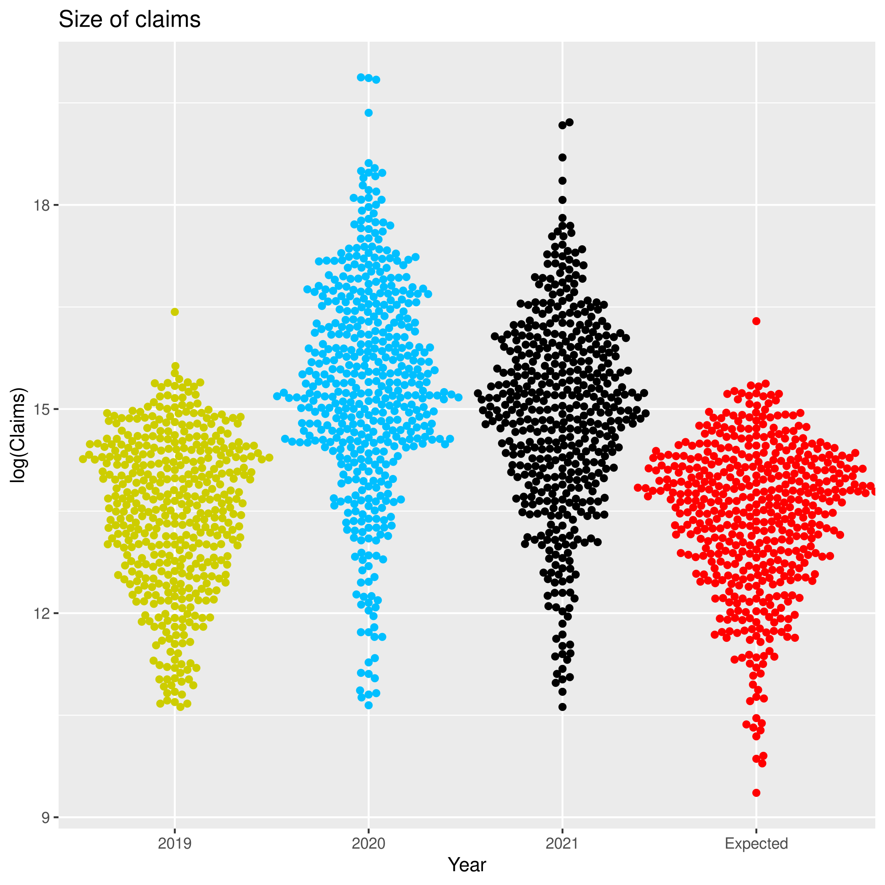


```r
ggplot(clients) +
  geom_density(aes(x = actual_2019), fill = "deepskyblue", alpha = 0.5) +
  geom_density(aes(x = expected), fill = "black", alpha = 0.5) +
  scale_x_log10()
```

```
## Warning: Transformation introduced infinite values in continuous x-axis
```

```
## Warning: Removed 47 rows containing non-finite values (stat_density).
```

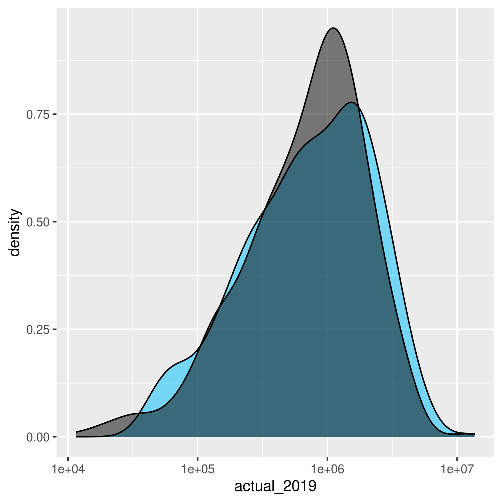

```r
  #geom_point(data=data, aes(x=client, y=expected), colour="deepskyblue")+
  #geom_point(data=data, aes(x=client, y=actual2021), color="black") +
 # scale_y_continuous(name="Actual vs Expected Claims in 2019")
```

```r
ggplot(clients) +
  geom_density(aes(x = actual_2020), fill = "deepskyblue", alpha = 0.5) +
  geom_density(aes(x = expected), fill = "black", alpha = 0.5) +
  scale_x_log10()
```

```
## Warning: Transformation introduced infinite values in continuous x-axis
```

```
## Warning: Removed 7 rows containing non-finite values (stat_density).
```

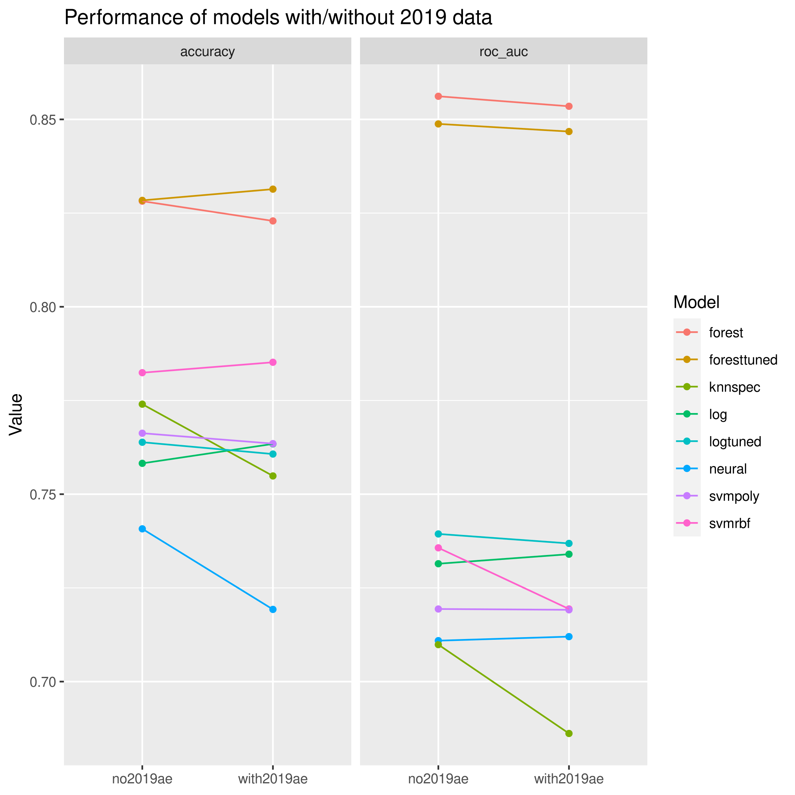

```r
ggplot(clients) +
  geom_density(aes(x = actual_2021), fill = "deepskyblue", alpha = 0.5) +
  geom_density(aes(x = expected), fill = "black", alpha = 0.5) +
  scale_x_log10()
```

```
## Warning: Transformation introduced infinite values in continuous x-axis
```

```
## Warning: Removed 23 rows containing non-finite values (stat_density).
```

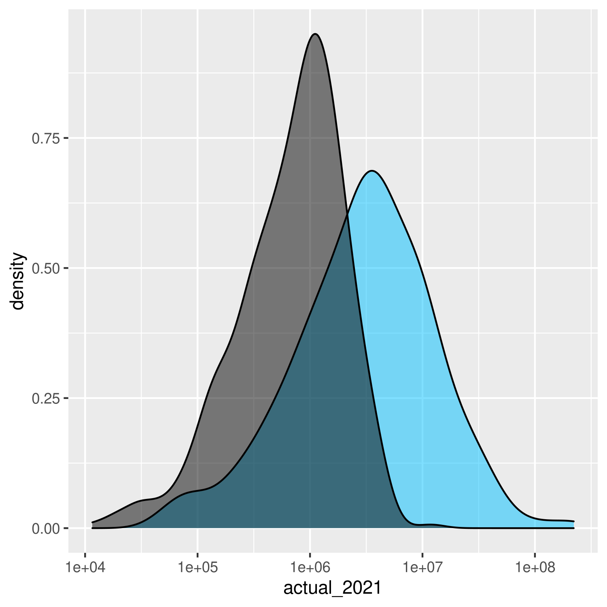
##Trying many models with and without 2019 AE as a predictor


```r
clients <-
  clients %>%
  select(
         -ae_2020, -ae_2021, -actual_2020, -actual_2019, -actual_2021,
         -hes, -hes_uns, -str_hes)


with2019_rec <-
  recipe(adverse ~ ., data = clients) %>%
  update_role(zip3, client, new_role = "ID") %>%
  step_zv(all_predictors()) %>%
  step_normalize(all_predictors(), -all_nominal())
no2019_rec <-
  with2019_rec %>%
  step_rm(ae_2019)

log_spec <-
  logistic_reg() %>%
  set_engine("glm") %>%
  set_mode("classification")
tuned_log_spec <-
  logistic_reg(penalty = 0.00118) %>%
  set_engine("glmnet") %>%
  set_mode("classification")
forest_spec <-
  rand_forest(trees = 1000) %>%
  set_mode("classification") %>%
  set_engine("ranger", num.threads = 8, importance = "impurity", seed = 123)
tuned_forest_spec <-
  rand_forest(trees = 1000, mtry = 12, min_n = 21) %>%
  set_mode("classification") %>%
  set_engine("ranger", num.threads = 8, importance = "impurity", seed = 123)
# Samara's models
sln_spec <-
  mlp() %>%
  set_engine("nnet") %>%
  set_mode("classification")
svm_rbf_spec <-
  svm_rbf() %>%
  set_engine("kernlab") %>%
  set_mode("classification")
svm_poly_spec <-
  svm_poly() %>%
  set_engine("kernlab") %>%
  set_mode("classification")
knn_spec <-
  nearest_neighbor() %>%
  set_engine("kknn") %>%
  set_mode("classification")

models <- list(log = log_spec,
               logtuned = tuned_log_spec,
               forest = forest_spec,
               foresttuned = tuned_forest_spec,
               neural = sln_spec,
               svmrbf = svm_rbf_spec,
               svmpoly = svm_poly_spec,
               knnspec = knn_spec)
recipes <- list("with2019ae" = with2019_rec,
                "no2019ae" = no2019_rec)
wflows <- workflow_set(recipes, models)
```

```r
set.seed(30308)
init <- initial_split(clients, strata = adverse)
set.seed(30308)
crossval <- vfold_cv(training(init), strata = adverse)
```


```r
fit_wflows <-
  wflows %>%
  workflow_map(fn = "fit_resamples",
               seed = 30332,
               resamples = crossval,
               control = control_resamples(save_pred = TRUE),
               metrics = metric_set(roc_auc, sens, accuracy),
               verbose = TRUE)
## i  1 of 16 resampling: with2019ae_log
## ✔  1 of 16 resampling: with2019ae_log (3.5s)
## i  2 of 16 resampling: with2019ae_logtuned
## ✔  2 of 16 resampling: with2019ae_logtuned (3.8s)
## i  3 of 16 resampling: with2019ae_forest
## ✔  3 of 16 resampling: with2019ae_forest (4.4s)
## i  4 of 16 resampling: with2019ae_foresttuned
## ✔  4 of 16 resampling: with2019ae_foresttuned (4.6s)
## i  5 of 16 resampling: with2019ae_neural
## ✔  5 of 16 resampling: with2019ae_neural (3.7s)
## i  6 of 16 resampling: with2019ae_svmrbf
## ✔  6 of 16 resampling: with2019ae_svmrbf (3.8s)
## i  7 of 16 resampling: with2019ae_svmpoly
## ✔  7 of 16 resampling: with2019ae_svmpoly (3.9s)
## i  8 of 16 resampling: with2019ae_knnspec
## ✔  8 of 16 resampling: with2019ae_knnspec (3.9s)
## i  9 of 16 resampling: no2019ae_log
## ✔  9 of 16 resampling: no2019ae_log (4s)
## i 10 of 16 resampling: no2019ae_logtuned
## ✔ 10 of 16 resampling: no2019ae_logtuned (4.3s)
## i 11 of 16 resampling: no2019ae_forest
## ✔ 11 of 16 resampling: no2019ae_forest (4.7s)
## i 12 of 16 resampling: no2019ae_foresttuned
## ✔ 12 of 16 resampling: no2019ae_foresttuned (5.2s)
## i 13 of 16 resampling: no2019ae_neural
## ✔ 13 of 16 resampling: no2019ae_neural (3.9s)
## i 14 of 16 resampling: no2019ae_svmrbf
## ✔ 14 of 16 resampling: no2019ae_svmrbf (4s)
## i 15 of 16 resampling: no2019ae_svmpoly
## ✔ 15 of 16 resampling: no2019ae_svmpoly (4.2s)
## i 16 of 16 resampling: no2019ae_knnspec
## ✔ 16 of 16 resampling: no2019ae_knnspec (3.8s)

fit_wflows %>%
  collect_metrics() %>%
  filter(.metric %in% c("roc_auc", "accuracy")) %>%
  separate(wflow_id, into = c("rec", "mod"), sep = "_", remove = FALSE) %>%
  ggplot(aes(x = rec, y = mean, color = mod, group = mod)) +
  geom_point() + geom_line() + facet_wrap(~ factor(.metric)) +
  labs(color = "Model", x = NULL, y = "Value", title = "Performance of models with/without 2019 data")
```

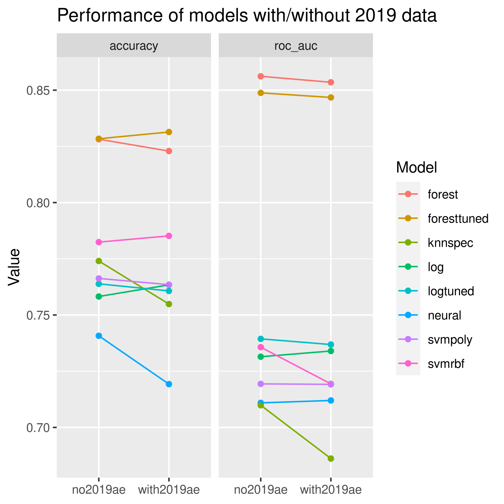


## Trying many models with many tuning parameters


```r
tune_log_spec <-
  logistic_reg(penalty = tune()) %>%
  set_engine("glmnet") %>%
  set_mode("classification")
tune_forest_spec <-
  rand_forest(trees = 1000, mtry = tune(), min_n = tune()) %>%
  set_mode("classification") %>%
  set_engine("ranger", num.threads = 8, importance = "impurity", seed = 123)
# Samara's models
tune_sln_spec <-
  mlp(hidden_units = tune(), penalty = tune(), epochs = tune()) %>%
  set_engine("nnet") %>%
  set_mode("classification")
tune_svm_rbf_spec <-
  svm_rbf(cost = tune(), rbf_sigma = tune(), margin = tune()) %>%
  set_engine("kernlab") %>%
  set_mode("classification")
# tune_svm_poly_spec <-
#   svm_poly() %>%
#   set_engine("kernlab") %>%
#   set_mode("classification")
tune_knn_spec <-
  nearest_neighbor(neighbors = tune(), dist_power = tune()) %>%
  set_engine("kknn") %>%
  set_mode("classification")

models <- list(log = tune_log_spec,
               forest = tune_forest_spec,
               sln = tune_sln_spec,
               svm = tune_svm_rbf_spec,
               knn = tune_knn_spec)
recipes <- list(no2019_rec)
wflows <- workflow_set(recipes, models)
```


```r
# make a bigger grid!
# or use something like finetune!
results <-
  wflows %>%
  workflow_map(resamples = crossval,
               grid = 10,
               metrics = metric_set(roc_auc, accuracy),
               control = control_grid(save_pred = TRUE),
               seed = 828282,
               verbose = TRUE)
## i 1 of 5 tuning:     recipe_log
## ✔ 1 of 5 tuning:     recipe_log (4.7s)
## i 2 of 5 tuning:     recipe_forest
## i Creating pre-processing data to finalize unknown parameter: mtry
## ✔ 2 of 5 tuning:     recipe_forest (42.3s)
## i 3 of 5 tuning:     recipe_sln
## ✔ 3 of 5 tuning:     recipe_sln (39.1s)
## i 4 of 5 tuning:     recipe_svm
## ✔ 4 of 5 tuning:     recipe_svm (40.3s)
## i 5 of 5 tuning:     recipe_knn
## ✔ 5 of 5 tuning:     recipe_knn (35s)
```

```r
autoplot(results)
```

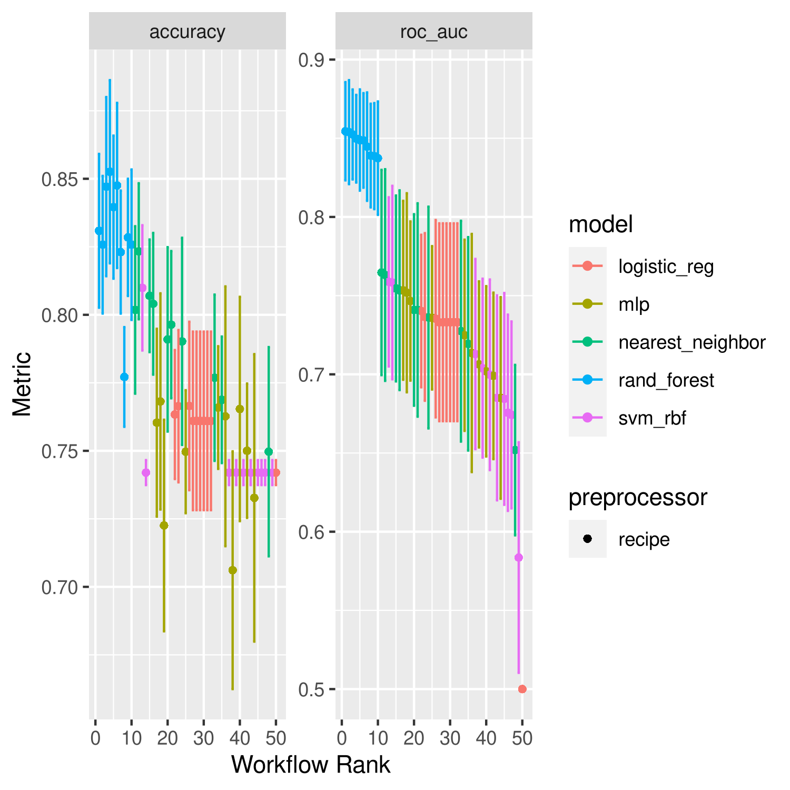

## Tuning a forest

We don't need to normalize the predictors

```r
forest_spec <-
  rand_forest(mtry = tune(), min_n = tune(), trees = 1000) %>%
  set_mode("classification") %>%
  set_engine("ranger", num.threads = 8, importance = "impurity", seed = 654)

forest_rec <-
  recipe(adverse ~ ., data = clients) %>%
  step_rm(ae_2019) %>%
  update_role(client, zip3, new_role = "ID") %>%
  step_zv(all_predictors())

forest_wflow <-
  workflow() %>%
  add_model(forest_spec) %>%
  add_recipe(no2019_rec)

forest_params <-
  forest_wflow %>%
  parameters() %>%
  update(mtry = mtry(c(1, 20)))

forest_grid <-
  grid_regular(forest_params, levels = 10)
```

```r
forest_tune <-
  forest_wflow %>%
  tune_grid(
      resamples = crossval,
      grid = forest_grid,
      metrics = metric_set(roc_auc, accuracy),
      control = control_grid(verbose = FALSE)
  )
```

```r
forest_tune %>%
  show_best(metric = "roc_auc", n = 10)
```

```
## # A tibble: 10 × 8
##     mtry min_n .metric .estimator  mean     n std_err .config             
##    <int> <int> <chr>   <chr>      <dbl> <int>   <dbl> <chr>               
##  1     9    14 roc_auc binary     0.857    10  0.0182 Preprocessor1_Model…
##  2     7     6 roc_auc binary     0.857    10  0.0166 Preprocessor1_Model…
##  3     5     6 roc_auc binary     0.856    10  0.0168 Preprocessor1_Model…
##  4     5    10 roc_auc binary     0.855    10  0.0179 Preprocessor1_Model…
##  5     3     6 roc_auc binary     0.855    10  0.0177 Preprocessor1_Model…
##  6     3    10 roc_auc binary     0.855    10  0.0170 Preprocessor1_Model…
##  7     3    14 roc_auc binary     0.855    10  0.0172 Preprocessor1_Model…
##  8     5     2 roc_auc binary     0.855    10  0.0177 Preprocessor1_Model…
##  9     7    18 roc_auc binary     0.855    10  0.0199 Preprocessor1_Model…
## 10     9    10 roc_auc binary     0.855    10  0.0180 Preprocessor1_Model…
```

```r
autoplot(forest_tune)
```

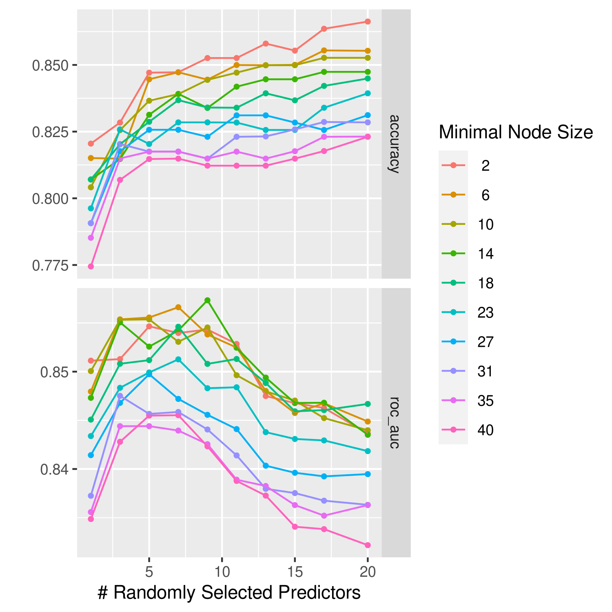

## These are our optimal parameters


```r
best_params <- list(mtry = 5, min_n = 6)
```

## Threshold the forest

use library `probably`


```r
forest_resamples <-
  forest_wflow %>%
  finalize_workflow(best_params) %>%
  fit_resamples(
      resamples = crossval,
      control = control_resamples(save_pred = TRUE)
  )

forest_resamples %>%
  select(.predictions) %>%
  unnest(.predictions) %>%
  roc_curve(adverse, `.pred_ae > 3`) %>%
  autoplot()
```

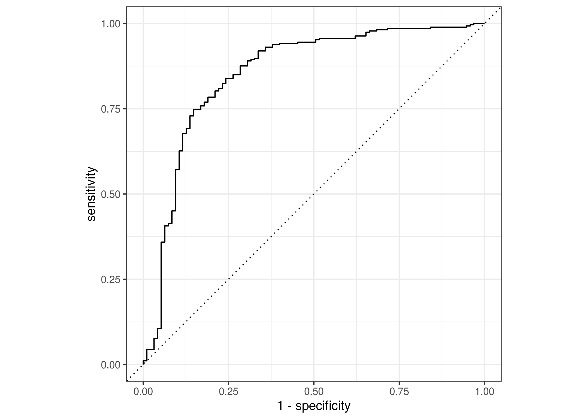

```r
forest_resamples <-
  forest_resamples %>%
  rowwise() %>%
  mutate(thr_perf = list(threshold_perf(.predictions, adverse, `.pred_ae > 3`, thresholds = seq(0.0, 1, by = 0.01))))


forest_resamples %>%
  select(thr_perf, id) %>%
  unnest(thr_perf) %>%
  group_by(.threshold, .metric) %>%
  summarize(estimate = mean(.estimate)) %>%
  filter(.metric != "distance") %>%
  ggplot(aes(x = .threshold, y = estimate, color = .metric)) + geom_line() +
  geom_vline(xintercept = 0.67, linetype = "dashed") +
  labs(x = "Threshold", y = "Estimate", color = "Metric", title = "Sensitivity and specificity by threshold")
```

```
## `summarise()` has grouped output by '.threshold'. You can override using the `.groups` argument.
```


We select 0.67 as our final threshold

```r
my_threshold <- 0.67
```


## This is our final model !!!

```r
final_fit <-
  forest_wflow %>%
  finalize_workflow(best_params) %>%
  last_fit(init)

trained_wflow <-
  final_fit %>%
  extract_workflow()

trained_recipe <-
  trained_wflow %>%
  extract_recipe(estimated = TRUE)
```


## Apply chosen threshold and compute metrics
Use `probably` to apply threshold.
Conf. matrix, accuracy, sens, spec, whatever you like


```r
final_fit %>%
  collect_metrics()
```

```
## # A tibble: 2 × 4
##   .metric  .estimator .estimate .config             
##   <chr>    <chr>          <dbl> <chr>               
## 1 accuracy binary         0.855 Preprocessor1_Model1
## 2 roc_auc  binary         0.862 Preprocessor1_Model1
```

```r
thresholded_predictions <-
  final_fit %>%
  collect_predictions() %>%
  select(-.pred_class) %>%
  mutate(class_pred =
            make_two_class_pred(
                  `.pred_ae > 3`,
                  levels = levels(clients$adverse),
                  threshold = my_threshold))

confusion_matrix <-
  thresholded_predictions %>%
  conf_mat(adverse, class_pred)

confusion_matrix %>%
  autoplot(type = "heatmap")
```

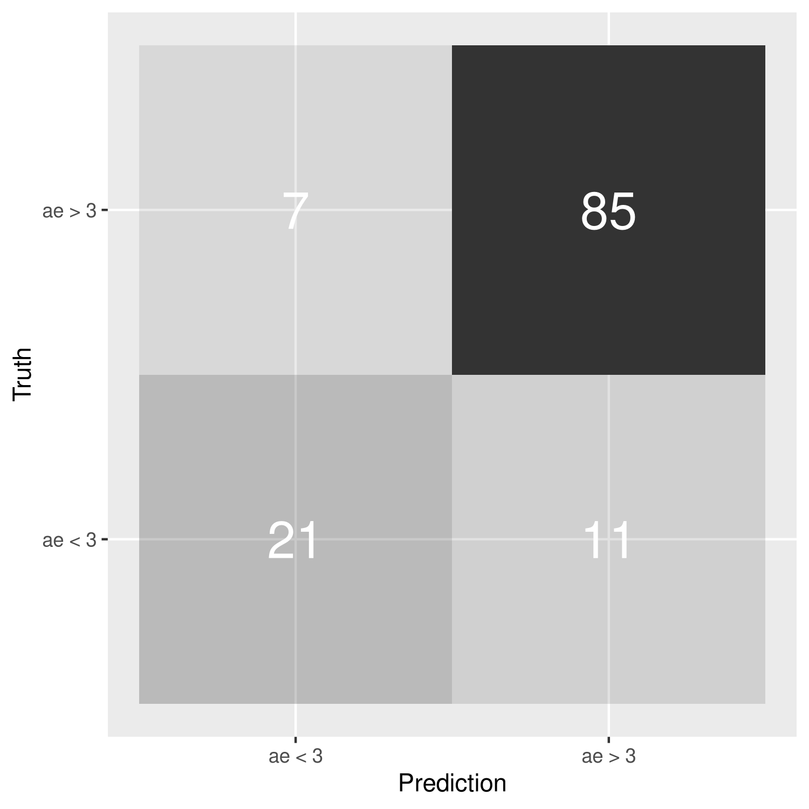

```r
confusion_matrix %>% summary()
```

```
## # A tibble: 13 × 3
##    .metric              .estimator .estimate
##    <chr>                <chr>          <dbl>
##  1 accuracy             binary         0.823
##  2 kap                  binary         0.563
##  3 sens                 binary         0.848
##  4 spec                 binary         0.75 
##  5 ppv                  binary         0.907
##  6 npv                  binary         0.632
##  7 mcc                  binary         0.567
##  8 j_index              binary         0.598
##  9 bal_accuracy         binary         0.799
## 10 detection_prevalence binary         0.694
## 11 precision            binary         0.907
## 12 recall               binary         0.848
## 13 f_meas               binary         0.876
```

# SHAP value business

```r
fulltest <- testing(init)
fulltrain <- training(init)
```

```r
fulltrain %>% slice (343)
```

```
## # A tibble: 1 × 25
##   client zip3  adverse  size    volume  avg_qx avg_age per_male
##   <chr>  <chr> <fct>   <int>     <dbl>   <dbl>   <dbl>    <dbl>
## 1 58     112   ae > 3   3582 447306925 0.00231    41.7    0.594
## # … with 17 more variables: per_blue_collar <dbl>, expected <dbl>,
## #   ae_2019 <dbl>, nohs <dbl>, hs <dbl>, college <dbl>, bachelor <dbl>,
## #   R_birth <dbl>, R_death <dbl>, unemp <dbl>, poverty <dbl>,
## #   per_dem <dbl>, svi <dbl>, cvac <dbl>, income <dbl>, POP <dbl>,
## #   density <dbl>
```

```r
fulltest %>% slice(80)
```

```
## # A tibble: 1 × 25
##   client zip3  adverse  size    volume  avg_qx avg_age per_male
##   <chr>  <chr> <fct>   <int>     <dbl>   <dbl>   <dbl>    <dbl>
## 1 412    828   ae < 3   1212 150601200 0.00169    39.6    0.483
## # … with 17 more variables: per_blue_collar <dbl>, expected <dbl>,
## #   ae_2019 <dbl>, nohs <dbl>, hs <dbl>, college <dbl>, bachelor <dbl>,
## #   R_birth <dbl>, R_death <dbl>, unemp <dbl>, poverty <dbl>,
## #   per_dem <dbl>, svi <dbl>, cvac <dbl>, income <dbl>, POP <dbl>,
## #   density <dbl>
```

Break-down profile of New York

```r
library(DALEX)
fit_parsnip <- trained_wflow %>% extract_fit_parsnip
train <- trained_recipe %>% bake(training(init))
test <- trained_recipe %>% bake(testing(init))
ex <-
  explain(
    model = fit_parsnip,
    data = train)
```

```
## Preparation of a new explainer is initiated
##   -> model label       :  model_fit  (  default  )
##   -> data              :  368  rows  23  cols 
##   -> data              :  tibble converted into a data.frame 
##   -> target variable   :  not specified! (  WARNING  )
##   -> predict function  :  yhat.model_fit  will be used (  default  )
##   -> predicted values  :  No value for predict function target column. (  default  )
##   -> model_info        :  package parsnip , ver. 0.1.7 , task classification (  default  ) 
##   -> model_info        :  Model info detected classification task but 'y' is a NULL .  (  WARNING  )
##   -> model_info        :  By deafult classification tasks supports only numercical 'y' parameter. 
##   -> model_info        :  Consider changing to numerical vector with 0 and 1 values.
##   -> model_info        :  Otherwise I will not be able to calculate residuals or loss function.
##   -> predicted values  :  numerical, min =  0.001 , mean =  0.2589597 , max =  0.94765  
##   -> residual function :  difference between y and yhat (  default  )
##   A new explainer has been created! 
```

```r
ex %>%
  predict_parts(train %>% slice(343)) %>%
  plot()
```

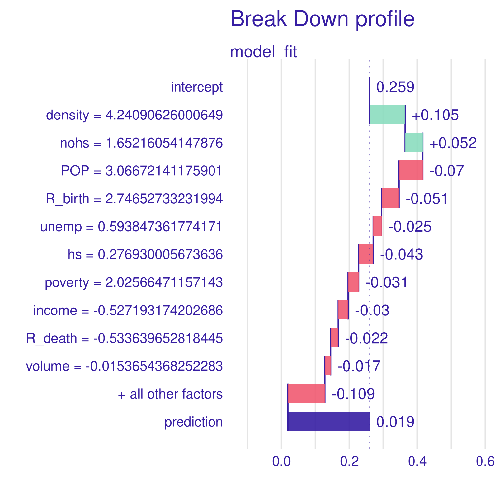

```r
fit_parsnip %>% predict(train %>% slice(343), type = "prob")
```

```
## # A tibble: 1 × 2
##   `.pred_ae > 3` `.pred_ae < 3`
##            <dbl>          <dbl>
## 1          0.981         0.0191
```

Break-down profile of NC

```r
ex %>%
  predict_parts(test %>% slice(80)) %>%
  plot()
```


```r
fit_parsnip %>% predict(test %>% slice(80), type = "prob")
```

```
## # A tibble: 1 × 2
##   `.pred_ae > 3` `.pred_ae < 3`
##            <dbl>          <dbl>
## 1          0.302          0.698
```

# FOr first one 
Shap new york

```r
shap <- predict_parts(explainer = ex,
                      new_observation = train %>% slice(343),
                                 type = "shap",
                                  B = 100)
                               
plot(shap, show_boxplots = FALSE)
```

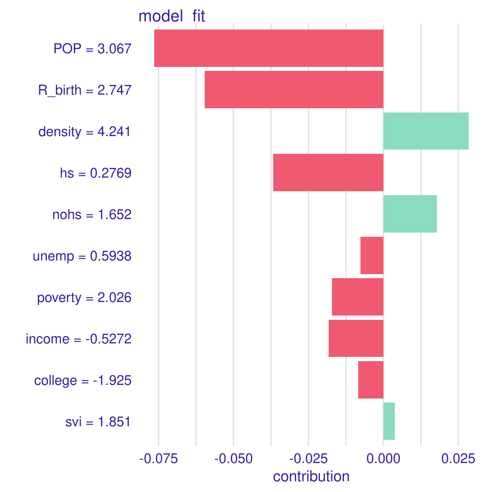

Shap NC

```r
shap <- predict_parts(explainer = ex,
                      new_observation = test %>% slice(80),
                                 type = "shap",
                                  B = 100)
                               
plot(shap, show_boxplots = FALSE)
```

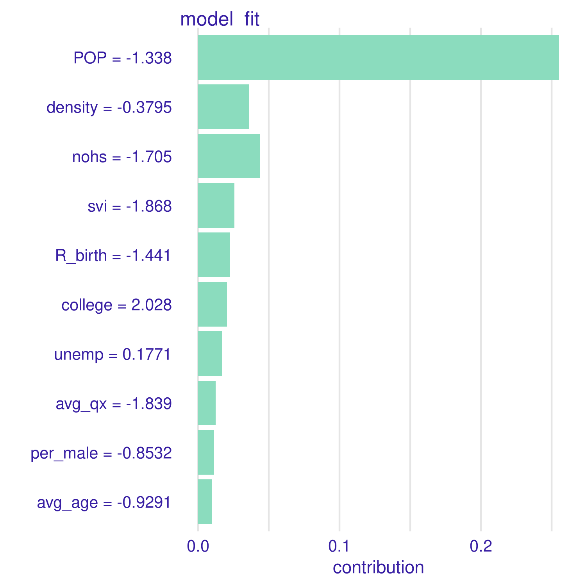


```r
trained_wflow %>%
  extract_fit_engine() %>%
  importance() %>%
  as_tibble_row() %>%
  pivot_longer(everything(), names_to = "Variable", values_to = "Importance") %>%
  slice_max(Importance, n = 10) %>%
  ggplot(aes(y = fct_reorder(factor(Variable), Importance), x = Importance, fill = fct_reorder(factor(Variable), Importance))) +
  geom_col() +
  scale_fill_brewer(palette = "Spectral") +
  guides(fill = "none") + labs(y = "Variable", x = "Importance")
```

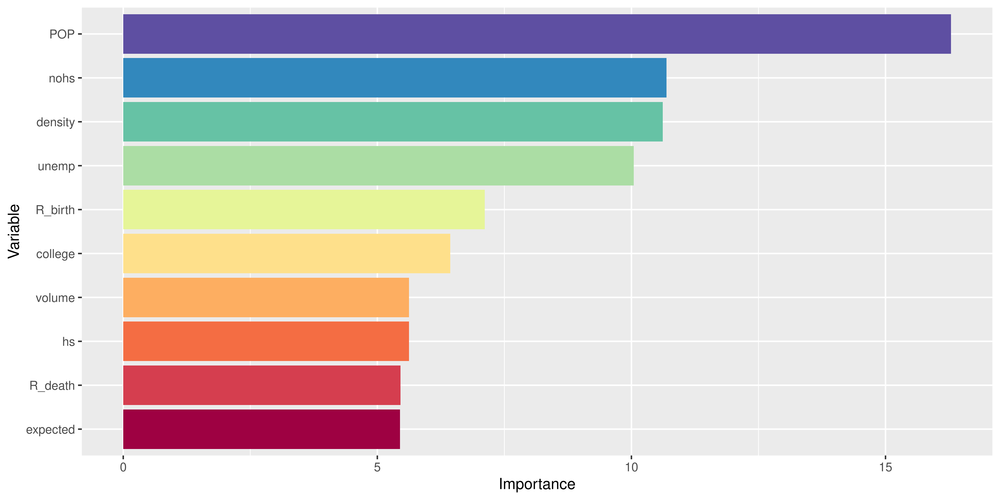
