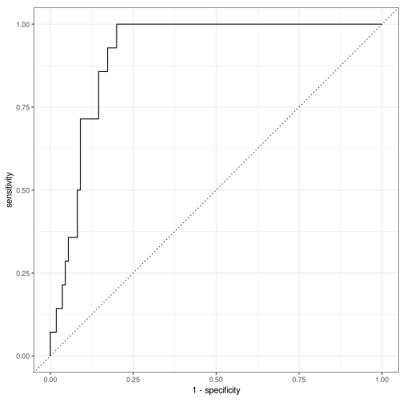
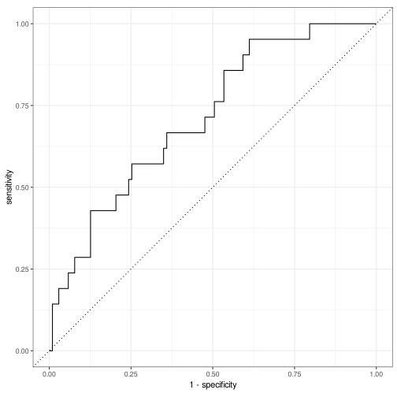
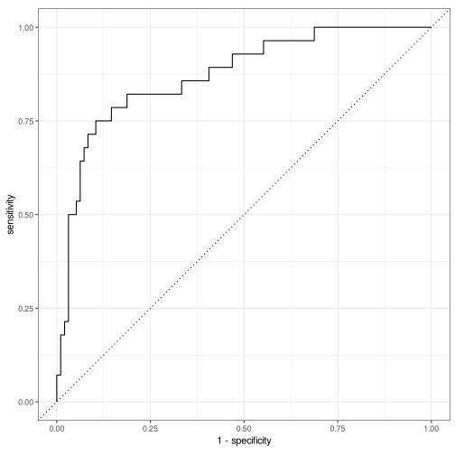
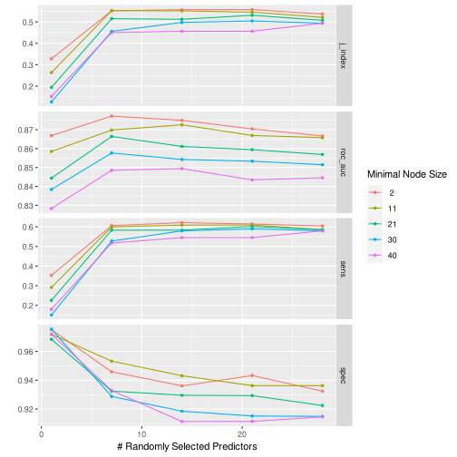

# Random forests

## Data business

Load some libraries and necessary data files

```r
library(tidyverse)
library(tidymodels)
library(feather)
library(magrittr)
library(skimr)
per <- read_feather("data/simulation_data/all_persons.feather")
```

Compute some summary statistic for each client.

```r
clients <-
  per %>%
  group_by(client) %>%
  summarize(
    zip3 = first(zip3),
    size = n(),
    volume = sum(FaceAmt),
    avg_qx = mean(qx),
    avg_age = mean(Age),
    per_male = sum(Sex == "Male") / size,
    per_blue_collar = sum(collar == "Blue") / size,
    expected = sum(qx * FaceAmt),
    actual_2020 = sum(FaceAmt[year == 2020], na.rm = TRUE),
    ae_2020 = actual_2020 / expected,
    adverse = as.factor(ae_2020 > 1.1)
  ) %>%
  relocate(adverse, ae_2020, .after = zip3)
```

We can add some demographic information based on zip3.

```r
zip_data <-
  read_feather("data/data.feather") %>%
  mutate(
    density = POP / AREALAND,
    AREALAND = NULL,
    AREA = NULL,
    HU = NULL,
    `Percent adults fully vaccinated against COVID-19 (as of 6/10/21)` = NULL,
    per_lib = NULL,
    per_green = NULL,
    per_other = NULL,
    per_rep = NULL,
    Unemployment_rate_2020 = NULL,
    PCTPOVALL_2019 = NULL,
    `Deaths involving COVID-19` = NULL,
    `Deaths from All Causes` = NULL
  ) %>%
  rename(
    nohs = `less than high school`,
    hs = `high school`,
    unemp = Unemployment_rate_2019,
    hes = `Estimated hesitant`,
    hes_uns = `Estimated hesitant or unsure`,
    str_hes = `Estimated strongly hesitant`,
    svi = `Social Vulnerability Index (SVI)`,
    cvac = `CVAC level of concern for vaccination rollout`,
    income = Median_Household_Income_2019
  )
```
There seems to be some clients with some zip codes that we cannot deal with. These are the ones

```r
clients %>%
  anti_join(zip_data, by = "zip3") %>%
  select(zip3)
```

```
## # A tibble: 5 x 1
##   zip3 
##   <chr>
## 1 969  
## 2 093  
## 3 732  
## 4 872  
## 5 004
```
These correspond to the following areas

ZIP3 | Area       |
-----|------------|
969  | Guam, Palau, Federated States of Micronesia, Northern Mariana Islands, Marshall Islands |
093  | Military bases in Iraq and Afghanistan |
732  | Not in use |
872  | Not in use |
004  | Not in use |

We ignore clients with these zip codes.

```r
clients %<>%
  inner_join(zip_data, by = "zip3")
```

We now have our full dataset. Behold!

```r
skim(clients)
```


Table: Data summary

|                         |        |
|:------------------------|:-------|
|Name                     |clients |
|Number of rows           |495     |
|Number of columns        |28      |
|_______________________  |        |
|Column type frequency:   |        |
|character                |2       |
|factor                   |1       |
|numeric                  |25      |
|________________________ |        |
|Group variables          |None    |


**Variable type: character**

|skim_variable | n_missing| complete_rate| min| max| empty| n_unique| whitespace|
|:-------------|---------:|-------------:|---:|---:|-----:|--------:|----------:|
|client        |         0|             1|   1|   3|     0|      495|          0|
|zip3          |         0|             1|   3|   3|     0|      224|          0|


**Variable type: factor**

|skim_variable | n_missing| complete_rate|ordered | n_unique|top_counts        |
|:-------------|---------:|-------------:|:-------|--------:|:-----------------|
|adverse       |         0|             1|FALSE   |        2|TRU: 449, FAL: 46 |


**Variable type: numeric**

|skim_variable   | n_missing| complete_rate|         mean|           sd|         p0|          p25|          p50|          p75|         p100|hist  |
|:---------------|---------:|-------------:|------------:|------------:|----------:|------------:|------------:|------------:|------------:|:-----|
|ae_2020         |         0|             1|        15.04|        27.39|       0.00|         2.98|         6.46|        14.03| 2.329000e+02|▇▁▁▁▁ |
|size            |         0|             1|      2779.72|      2363.16|      50.00|      1027.00|      2111.00|      3958.50| 1.427000e+04|▇▃▁▁▁ |
|volume          |         0|             1| 432334228.18| 405619498.04| 6235075.00| 152306800.00| 334370375.00| 586055025.00| 4.350904e+09|▇▁▁▁▁ |
|avg_qx          |         0|             1|         0.00|         0.00|       0.00|         0.00|         0.00|         0.00| 0.000000e+00|▁▇▇▂▁ |
|avg_age         |         0|             1|        41.56|         2.05|      37.68|        40.11|        41.11|        42.49| 4.865000e+01|▃▇▃▁▁ |
|per_male        |         0|             1|         0.57|         0.10|       0.22|         0.50|         0.57|         0.64| 8.900000e-01|▁▃▇▅▁ |
|per_blue_collar |         0|             1|         0.00|         0.00|       0.00|         0.00|         0.00|         0.00| 0.000000e+00|▁▁▇▁▁ |
|expected        |         0|             1|   1075634.02|   1054075.28|   11604.50|    353219.92|    832197.99|   1436637.06| 1.189955e+07|▇▁▁▁▁ |
|actual_2020     |         0|             1|  15378942.63|  44643400.61|       0.00|   1962875.00|   4556125.00|  13950250.00| 5.232112e+08|▇▁▁▁▁ |
|nohs            |         0|             1|        11.16|         3.78|       0.00|         8.44|        10.78|        12.88| 2.165000e+01|▁▅▇▂▂ |
|hs              |         0|             1|        23.67|         7.10|       0.00|        18.30|        23.10|        27.50| 4.680000e+01|▁▃▇▃▁ |
|college         |         0|             1|        28.34|         5.05|       0.00|        25.60|        28.58|        31.55| 3.980000e+01|▁▁▂▇▃ |
|bachelor        |         0|             1|        36.64|        10.61|       0.00|        29.98|        35.36|        43.04| 6.130000e+01|▁▂▇▆▃ |
|R_Birth         |         0|             1|        11.30|         1.28|       0.00|        10.50|        11.20|        12.00| 1.551000e+01|▁▁▁▇▂ |
|R_death         |         0|             1|         8.12|         1.90|       0.00|         6.80|         7.59|         9.10| 1.401000e+01|▁▁▇▃▁ |
|unemp           |         0|             1|         3.43|         0.89|       0.00|         2.80|         3.31|         3.89| 6.690000e+00|▁▃▇▂▁ |
|per_dem         |         0|             1|         0.57|         0.17|       0.00|         0.46|         0.58|         0.71| 8.600000e-01|▁▂▇▇▇ |
|hes             |         0|             1|         0.09|         0.04|       0.00|         0.06|         0.07|         0.11| 2.600000e-01|▃▇▃▁▁ |
|hes_uns         |         0|             1|         0.13|         0.05|       0.00|         0.10|         0.12|         0.17| 3.100000e-01|▁▇▅▂▁ |
|str_hes         |         0|             1|         0.05|         0.03|       0.00|         0.03|         0.04|         0.07| 1.800000e-01|▆▇▅▁▁ |
|svi             |         0|             1|         0.46|         0.19|       0.00|         0.33|         0.44|         0.59| 9.200000e-01|▂▅▇▃▂ |
|cvac            |         0|             1|         0.42|         0.21|       0.00|         0.24|         0.41|         0.53| 9.400000e-01|▃▃▇▃▁ |
|income          |         0|             1|     78940.42|     24119.84|       0.00|     62130.76|     73570.69|     85137.47| 1.352340e+05|▁▁▇▂▂ |
|POP             |         0|             1|    783315.84|    558192.14|       0.00|    344984.00|    760027.00|    974040.00| 2.906700e+06|▇▇▂▁▁ |
|density         |         0|             1|         0.00|         0.00|       0.00|         0.00|         0.00|         0.00| 3.000000e-02|▇▁▁▁▁ |

## First model
We will use a random forest using the tidymodels framework.

We start by creating a recipe. We won't use zip3, client ID, actual claims, or ae_2020 as predictors.

```r
ranger_recipe <-
  recipe(adverse ~ ., data = clients) %>%
  update_role(zip3, ae_2020, new_role = "diagnostic") %>%
  step_rm(actual_2020, client)
```

We use the ranger engine for our random forest. We could tune the paramters as well

```r
ranger_spec <-
  rand_forest(trees = 1000) %>%
  set_mode("classification") %>%
  set_engine("ranger")
```

Wrap the recipe and model into a workflow

```r
ranger_workflow <-
  workflow() %>%
  add_recipe(ranger_recipe) %>%
  add_model(ranger_spec)
```

Create an initial test-train split

```r
init_split <-
  clients %>%
  initial_split(strata = adverse)

clients_test <- init_split %>% testing()
clients_test %>% count(adverse)
```

```
## # A tibble: 2 x 2
##   adverse     n
##   <fct>   <int>
## 1 FALSE      21
## 2 TRUE      103
```

```r
clients_train <- init_split %>% training()
clients_train %>% count(adverse)
```

```
## # A tibble: 2 x 2
##   adverse     n
##   <fct>   <int>
## 1 FALSE      25
## 2 TRUE      346
```

Train the workflow

```r
ranger_trained <-
  ranger_workflow %>%
  fit(clients_train)
```

And we predict

```r
predictions <-
  ranger_trained %>%
  predict(clients_test)
```

Compute the confusion matrix

```r
predictions %>%
  bind_cols(clients_test %>% select(adverse)) %>%
  conf_mat(adverse, .pred_class)
```

```
##           Truth
## Prediction FALSE TRUE
##      FALSE     0    1
##      TRUE     21  102
```
It looks like the the model performs well, but it's basically predicting that all companies will have adverse deaths.

This is another way to automate computation of metrics

```r
ranger_last_fit <-
  ranger_workflow %>%
  last_fit(
    split = init_split,
    metrics = metric_set(sens, spec, roc_auc, j_index)
  )

ranger_last_fit %>% collect_metrics()
```

```
## # A tibble: 4 x 4
##   .metric .estimator .estimate .config             
##   <chr>   <chr>          <dbl> <chr>               
## 1 sens    binary       0       Preprocessor1_Model1
## 2 spec    binary       0.990   Preprocessor1_Model1
## 3 j_index binary      -0.00971 Preprocessor1_Model1
## 4 roc_auc binary       0.844   Preprocessor1_Model1
```

```r
ranger_last_fit %>%
  collect_predictions() %>%
  roc_curve(adverse, .pred_FALSE) %>%
  autoplot()
```




### Subsampling
We will make train the model for more adverse outcomes by using *subsampling*. See e.g. [here](https://www.tidymodels.org/learn/models/sub-sampling/) for a nice introduction.

```r
library(themis)
subsample_recipe <-
  ranger_recipe %>%
  step_rose(adverse)
subsample_workflow <-
  ranger_workflow %>%
  update_recipe(subsample_recipe)

subsample_last_fit <-
  subsample_workflow %>%
  last_fit(
    split = init_split,
    metrics = metric_set(sens, spec, roc_auc, j_index)
  )

subsample_last_fit %>% collect_metrics()
```

```
## # A tibble: 4 x 4
##   .metric .estimator .estimate .config             
##   <chr>   <chr>          <dbl> <chr>               
## 1 sens    binary         0.333 Preprocessor1_Model1
## 2 spec    binary         0.874 Preprocessor1_Model1
## 3 j_index binary         0.207 Preprocessor1_Model1
## 4 roc_auc binary         0.713 Preprocessor1_Model1
```

```r
subsample_last_fit %>%
  collect_predictions() %>%
  roc_curve(adverse, .pred_FALSE) %>%
  autoplot()
```



Looks a bit more balanced, but a much much worse fit....


## Changing the outcome variable
With this dataset, an AE > 1.1 is too low; there are too few clients with low AE in 2020

```r
clients$ae_2020 %>% summary()
```

```
##    Min. 1st Qu.  Median    Mean 3rd Qu.    Max. 
##   0.000   2.976   6.460  15.036  14.034 232.897
```
Let's say that a client experiences adverse deaths if AE > 3, which is about the 1st quartile

```r
clients %<>%
  mutate(adverse = as.factor(ae_2020 > 3))
```

We can apply the same workflow as before

```r
new_split <-
  clients %>%
  initial_split()

ranger_last_fit <-
  ranger_workflow %>%
  last_fit(
    split = new_split,
    metrics = metric_set(sens, spec, roc_auc, j_index)
  )

ranger_last_fit %>% collect_metrics()
```

```
## # A tibble: 4 x 4
##   .metric .estimator .estimate .config             
##   <chr>   <chr>          <dbl> <chr>               
## 1 sens    binary         0.606 Preprocessor1_Model1
## 2 spec    binary         0.912 Preprocessor1_Model1
## 3 j_index binary         0.518 Preprocessor1_Model1
## 4 roc_auc binary         0.806 Preprocessor1_Model1
```

```r
ranger_last_fit %>%
  collect_predictions() %>%
  roc_curve(adverse, .pred_FALSE) %>%
  autoplot()
```


Better!

Can we tune hyperparameters to get even better results? Let's check

```r
tune_spec <-
  ranger_spec %>%
  update(mtry = tune(), min_n = tune())

tune_workflow <-
  ranger_workflow %>%
  update_model(tune_spec)

tune_split <- initial_split(clients)
tune_resamples <-
  vfold_cv(training(tune_split))

param_grid <-
  tune_workflow %>%
  parameters() %>%
  finalize(training(tune_split)) %>%
  grid_regular(levels = 5)

tune_res <-
  tune_workflow %>%
  tune_grid(
    resamples = tune_resamples,
    grid = param_grid,
    metrics = metric_set(sens, spec, roc_auc, j_index)
  )

autoplot(tune_res)
```



For me, the best is mtry = 14, min_n = 11.

```r
best <- tibble(mtry = 14, min_n = 11)
final_wf <-
  tune_workflow %>%
  finalize_workflow(best)

final_wf_fit <-
  final_wf %>%
  last_fit(
    tune_split,
    metrics = metric_set(sens, spec, roc_auc, j_index)
    )

final_wf_fit %>%
  collect_metrics()
```

```
## # A tibble: 4 x 4
##   .metric .estimator .estimate .config             
##   <chr>   <chr>          <dbl> <chr>               
## 1 sens    binary         0.618 Preprocessor1_Model1
## 2 spec    binary         0.956 Preprocessor1_Model1
## 3 j_index binary         0.573 Preprocessor1_Model1
## 4 roc_auc binary         0.888 Preprocessor1_Model1
```
Cool stuff. How does this compare to logistic regression by month???
