Predicting Group Life Client Mortality during a Pandemic, Final Report
================
Team Outliers
August 2, 2021

-   [Final report](#final-report)
-   [Executive summary](#executive-summary)
-   [Data wrangling](#data-wrangling)
    -   [Data sources](#data-sources)
    -   [County to zip3](#county-to-zip3)
    -   [Weekly deaths & IHME forecasts](#weekly-deaths--ihme-forecasts)
    -   [Simulated client dataset](#simulated-client-dataset)
    -   [Final cleanup](#final-cleanup)
-   [Data exploration and motivation](#data-exploration-and-motivation)
-   [Long-term model](#long-term-model)
    -   [Feature engineering](#feature-engineering)
    -   [Model selection](#model-selection)
    -   [Tuning a random forest](#tuning-a-random-forest)
    -   [Thresholding](#thresholding)
    -   [Final results](#final-results)
    -   [Model explanation](#model-explanation)
-   [Short-term model](#short-term-model)
    -   [Introduction](#introduction)
    -   [Model selection](#model-selection-1)
    -   [Tuning Boosted Trees Model](#tuning-boosted-trees-model)
    -   [Explaining outcomes](#explaining-outcomes)
-   [Other modelling attempts](#other-modelling-attempts)
    -   [Read data and pre-processing](#read-data-and-pre-processing)
    -   [Create a workflow](#create-a-workflow)
    -   [Preparation for forecasting](#preparation-for-forecasting)
    -   [Predict](#predict)
    -   [Visualize clients forecast](#visualize-clients-forecast)
    -   [Plot sens, spec, accuracy](#plot-sens-spec-accuracy)
    -   [Why this model doesn’t work](#why-this-model-doesnt-work)
    -   [Possible improvement for this
        model](#possible-improvement-for-this-model)
-   [Conclusion](#conclusion)
-   [Future Directions](#future-directions)
-   [Appendices](#appendices)
    -   [Data repository](#data-repository)

# Final report

IMA Math-to-Industry Bootcamp, Securian Financial

Team members:

-   Marc Härkönen
-   Samara Chamoun
-   Shuxian Xu
-   Abba Ramadan
-   Lei Yang
-   Yuchen Cao

Mentor:

-   Douglas Armstrong

Supervisors:

-   Daniel Spirn
-   Thomas Höft

# Executive summary

As Babe Ruth once said: “Yesterday’s home runs don’t win today’s games!”

In March 2020, with the pandemic starting, the whole world fell into a
state of uncertainty about the future. Similarly to other businesses,
the insurance sector was affected by the COVID breakout as well and the
whole business landscape needs to address the changes that came along.

We are team Outliers from the Securian Financial Department of Data
Science and we think we have the resources, the expertise and the
determination to present the management team with a whole new set of
information that can help their decision making during a pandemic. With
Group Life Insurance being an important part of our company and for our
clients, there is no doubt that we should look closely at how it is
being affected by the recent events. For the past few weeks, we have
been working on a project that aims to predict Group Life mortality for
our clients during a pandemic.

One might ask how the pandemic is exactly affecting group life
insurance. As we know, life insurance guarantees payment of death
benefits. Since the COVID-19 breakout, our clients are experiencing a
higher mortality rate then usual, which has resulted in an unprecedented
increase in claims. Our primary function as data scientists is to
correctly forecast the mortality risk, and the way to do that is by
first tracking the claims performance. We classify clients as high-risk
and low-risk by using one of the most popular metrics to track claims
performance, the Actual-to-Expected ratio (AE). Observing the large
shift of the proportion of clients that are classified as high-risk from
2019 to 2020, we hypothesize that the pre-pandemic, historical AE of a
client is no longer a good predictor of the client’s performance during
a pandemic.

We aim at replacing this historical AE with a predictive one that can
help our management and sales team have better insight on the
possibility that a client experiences an Adverse mortality event during
an outbreak. We collect data from the zip codes where the companies are
located: poverty percentage, education level, unemployment rate, etc. We
then combine this information with some characteristics of the companies
such as average age of employees and some pandemic-related resources. We
then apply several machine learning models, validate the results and
build the best possible insight for proper risk-management.

We provide our management team with two models: one is long-term and the
other is short-term. Each of these models serve different purposes and
bring valuable assets to the company. The long-term model can be used at
a specific time and uses the information of some clients to predict what
can happen to other clients in different zip codes. While working on
this model, our goal was to minimize the loss of money for Securian that
can be caused by long-term adverse mortality event such as a pandemic.
On one hand, we aim at minimizing the number of clients that were
adverse and predicted otherwise. We also wanted to prevent the company
from losing clients that will perform well, so we simultaneously focused
on minimizing the number of clients that are not adverse and predicted
to be so. The strength of this model lies in understanding the
contributions of different predictors in the performance of the clients.
The management team can have better insights and clarity regarding how
each predictor contributes positively or negatively into the
classification. It is worthy to note that adding the AE2019 to the list
of predictors for this model won’t make any additional improvements.

As opposed to the long-term model, the short-term model integrates the
time factor and can react to changes during the pandemic. Not only can
the model predict the future performance of existing clients, it can
also do so for potential new clients.

Having these two models in the hands of the management team, the latter
can gain accurate and deep understanding of old and new clients
performance during a pandemic. They can use this enhanced understanding
to determine contract renewals, to negotiate with clients and most
importantly to better face the uncertainties of the future.

# Data wrangling

In this section, we describe our data gathering and tidying process. We
will be making extensive use of the `tidyverse` family of packages. A
series of scripts are used to generate tibbles, which are then saved in
a `*.feather` for fast loading. A full list of scripts with their
dependencies can be viewed in the Appendix.

``` r
library(tidyverse)
library(feather)
library(lubridate)
```

## Data sources

Our dataset consists of two parts: publicly obtained data and simulated
clients. Below we describe our publicly obtained datasets.

| Filename                                                         | Source                                                                                                                                      | Description                                                                                   |
|------------------------------------------------------------------|---------------------------------------------------------------------------------------------------------------------------------------------|-----------------------------------------------------------------------------------------------|
| `covid_deaths_usafacts.csv`                                      | [USAFacts](https://usafacts.org/visualizations/coronavirus-covid-19-spread-map/)                                                            | Cumulative weekly COVID-19 deaths by county                                                   |
| `soa_base_2017.csv`                                              | (Sent by Douglas Armstrong)                                                                                                                 | *q*<sub>*x*</sub> values by gender, age, industry                                             |
| `Population_Estimates.csv`                                       | [USDA ERS](https://www.ers.usda.gov/data-products/county-level-data-sets/download-data/)                                                    | Population estimates of the U.S., states and counties, 2019                                   |
| `COVID-19_Vaccinations_in_the_United_States_County_data.gov.csv` | [CDC](https://catalog.data.gov/dataset/covid-19-vaccinations-in-the-united-statescounty-8204e)                                              | Overall US COVID-19 Vaccine administration and vaccine equity data at county level            |
| `Education_Estimates.csv`                                        | [USDA ERS](https://www.ers.usda.gov/data-products/county-level-data-sets/download-data/)                                                    | Educational attainment for adults age 25 and older for the U.S., states and counties, 2015-19 |
| `Poverty_Estimates.csv`                                          | [USDA ERS](https://www.ers.usda.gov/data-products/county-level-data-sets/download-data/)                                                    | Poverty rates in the U.S., states and counties, 2019                                          |
| `Unemployment_Estimates.csv`                                     | [USDA ERS](https://www.ers.usda.gov/data-products/county-level-data-sets/download-data/)                                                    | Unemployment rates, 2019 and 2020; median househould income, 2019. States and counties        |
| `Vaccine_Hesitancy_for_COVID-19__County_and_local_estimates.csv` | [CDC](https://catalog.data.gov/dataset/vaccine-hesitancy-for-covid-19-county-and-local-estimates)                                           | Vaccine hesitancy estimates for COVID-19                                                      |
| `countypres_2000-2020.csv`                                       | [MIT Election Data + Science Lab](https://dataverse.harvard.edu/file.xhtml?fileId=4819117&version=9.0)                                      | Election data by county (only 2020 used)                                                      |
| `zcta_county_rel_10.txt`                                         | [US Census Bureau](https://www.census.gov/geographies/reference-files/time-series/geo/relationship-files.2010.html#par_textimage_674173622) | Zip code to county relationship file (2010)                                                   |
| `2020_12_23/reference_hospitalization_all_locs.csv`              | [IHME](http://www.healthdata.org/node/8787)                                                                                                 | COVID-19 projections **as of Dec 23 2020**                                                    |
| `state.txt`                                                      | [US Census Bureau](https://www.census.gov/library/reference/code-lists/ansi.html)                                                           | State names and FIPS codes                                                                    |

### US Census bureau

We used the US Census Bureau’s API to obtain the 2019 estimates for
population and density per county from the Census Bureau’s Population
Estimates Program (PEP). The `censusapi` package provides an R interface
to the API. Using the API requires an API key, which can be obtained
from [here](https://api.census.gov/data/key_signup.html). The following
snippet fetches the data, and saves the tibble into a file called
`pop_den.feather`. See also `data/census.R`.

``` r
library("censusapi")

Sys.setenv(CENSUS_KEY = "YOUR_KEY_HERE")

# date_code = 12 is an estimate for July 1, 2019
# total population + density
pop <- getCensus(
                 name = "pep/population",
                 vintage = 2019,
                 region = "county:*",
                 vars = c("POP", "DENSITY"),
                 DATE_CODE = 12)
pop <- tibble(pop) %>%
  select(-DATE_CODE)
write_feather(pop, "pop_den.feather")
```

## County to zip3

So far all of our public data is expressed by US county, but our
clients’ location are given as a ZIP3 code (the first three digits of a
five-digit zip code). The conversion from county to ZIP3 is nontrivial,
as some zip codes span multiple counties and some counties span multiple
zip codes.

To convert data given by county to ZIP3, we first need a ZIP3 to county
relationship table.

The relationship table contains three columns: ZIP3, County, and
Population. Each row corresponds to a pair (ZIP3,county), and the
Population column contains the population in the intersection
ZIP3 ∩ county. Then, given county-level data, we compute the
corresponding value for any given ZIP3 by taking a weighted average of
all counties intersecting that ZIP3, and weighting by the population in
ZIP3 ∩ county. This operation looks as follows in code (suppose `A`
contains some county-level data, e.g. poverty levels):

``` r
A %>%
  left_join(zip3_rel, by = "county") %>%
  group_by(zip3) %>%
  summarize(poverty = weighted.mean(poverty, population, na.rm = TRUE))
```

We note that in practice, the country is represented by a 5 digit FIPS
code. The first two digits indicate the state, and the last 3 digits
indicate the county.

The relationship table is generated by `zip3_rel.R` and can be loaded
from `zip3_rel.feather`. For an example of how it’s used, see
`wrangling.Rmd` and `deaths.R`.

## Weekly deaths & IHME forecasts

In some of our models we use weekly COVID deaths as a predictor. The
file `covid_deaths_usafacts.csv` contains this data for every day and
every county. We convert the county-level information to zip3 as above,
and convert the daily data to weekly. The library `lubridate` doesn’t
contain a type for week; we use the last day of the week instead (using
`lubridate::ceiling_date(date, unit = "week")`).

We will also be using forecasts from the Institute for Health Metrics
and Evaluation (IHME) to assist our models. These forecasts are only
given by state, so we need to convert states to ZIP3. The file
`data/state.txt` contains the state FIPS code and state name. Since some
ZIP3 codes span several states, we assign a state to each ZIP3 code by
determining which state is most represented among counties in the ZIP3.

See also `data/deaths.R` and `time.Rmd` (line 856 onwards).

## Simulated client dataset

The clients we were tasked to study were simulated by Securian
Financial. The dataset consists of 20 files called
`data/simulation_data/experience_weekly_{n}.RDS` and
`data/simulation_data/person_{n}.RDS` for $n = 1,\\dotsc, 10$. In total,
we have 500 clients and 1,382,321 individuals.

The `person_{n}.RDS` files contain information such as company, zip
code, age, face amount, gender, and collar (blue or white, but in this
dataset every indivual was blue collar). The rows in
`experience_weekly_{n}.RDS` correspond to individuals and weeks, and
contains a flag `death` that becomes 1 on the week they die. In total,
these tables contain 170,025,483 rows, but the same information can be
conveyed in 1,382,231 rows by attaching to each individual their death
date (or `NA` if they don’t die).

``` r
read_data <- function(n) {
  exp_name <- str_glue("simulation_data/experience_weekly_{n}.RDS")
  per_name <- str_glue("simulation_data/person_{n}.RDS")
  exp <- read_rds(exp_name)
  per <- read_rds(per_name)

  dies <-
    exp %>%
    filter(death > 0) %>%
    select(client, participant, week, month, year)
  aug_per <-
    per %>%
    left_join(dies, by = c("client", "participant"))

  aug_per
}

all_persons <- (1:10) %>% map_dfr(read_data)
```

We noticed that some individuals die more than once. The following
removes the multiple deaths.

``` r
all_persons <-
  all_persons %>%
  group_by(client, participant) %>%
  arrange(year, week, .by_group = TRUE) %>%
  slice_head()
```

We finally attach to each individual their yearly *q*<sub>*x*</sub>
value, and save the resuilting tibble in
`data/simultation_data/all_persons.feather`.

``` r
qx_table <- read_csv("soa_base_2017.csv")

all_persons <-
  all_persons %>%
  left_join(qx_table, by = c("Age", "Sex", "collar")) %>%
  relocate(qx, .after = collar)

write_feather(all_persons %>% ungroup(), "simulation_data/all_persons.feather")
```

The individual-level dataset is then converted to a client-level
dataset. We summarize each client by taking their ZIP3, size (number of
individuals), volume (sum of face amounts), average qx, average age, and
expected amount of claims. We also compute the amount weekly total
amount of claims.

See also `data/all_persons.r`.

## Final cleanup

Some of our clients are located in ZIP3 codes that we cannot deal with
for various reasons. They correspond to the following areas

| ZIP3 | Area                                                                                    |
|------|-----------------------------------------------------------------------------------------|
| 969  | Guam, Palau, Federated States of Micronesia, Northern Mariana Islands, Marshall Islands |
| 093  | Military bases in Iraq and Afghanistan                                                  |
| 732  | Not in use                                                                              |
| 872  | Not in use                                                                              |
| 004  | Not in use                                                                              |
| 202  | Washington DC, Government 1                                                             |
| 753  | Dallas, TX                                                                              |
| 772  | Houston, TX                                                                             |

The final two are problematic since they contained no population in
2010: one is used exclusively by a hospital, and the other is used
exclusively by a mall. Additionally, election data is not available in
Washington D.C., so we remove clients located there. In the end, we have
a total of 492 clients to work with.

The data merging is done in the file `processed_data.r` which generates
the file `data/processed_data_20_12_23.feather`. The dependency tree is
outlined in the Appendix.

After merging, this gives us a final dataset of 492 clients over 118
weeks ranging from Jan 1st 2019 to June 27th 2021. We make two separate
tibbles.

``` r
weekly_data <-
  read_feather("data/processed_data_20_12_23.feather") %>%
  select(-ae_2021, -ae_2020, -ae_2019,
         -actual_2021, -actual_2020, -actual_2019, -adverse,
         -STATE_NAME, -shrinkage,  -dep_var) %>%
  arrange(client, date)

yearly_data <-
  read_feather("data/processed_data_20_12_23.feather") %>%
  group_by(client) %>%
  slice(1) %>%
  select(-date, -claims, -zip_deaths, -smoothed_ae, -shrunk_ae,
         -class, -smoothed_deaths,
         -hes, -hes_uns, -str_hes, -ae, -dep_var, -shrinkage, -STATE_NAME, -ihme_deaths)
```

Each row in `yearly_data` corresponds to a client, and it contains the
following variables

| Variable                    | Description                                                                    |
|-----------------------------|--------------------------------------------------------------------------------|
| `zip3`                      | ZIP3 code                                                                      |
| `client`                    | client ID                                                                      |
| `size`                      | number of individuals                                                          |
| `volume`                    | sum of face values                                                             |
| `avg_qx`                    | average *q*<sub>*x*</sub>                                                      |
| `avg_age`                   | average age                                                                    |
| `per_male`                  | percentage of males                                                            |
| `per_blue_collar`           | percentage of blue collar workers                                              |
| `expected`                  | expected yearly amount of claims                                               |
| `actual_{2021, 2020, 2019}` | actual claims in {2021, 2020, 2019}                                            |
| `ae_{2021, 2020, 2019}`     | actual claims / expected claims in {2021, 2020, 2019}                          |
| `nohs`                      | percentage of zip residents without a high school diploma                      |
| `hs`                        | percentage of zip residents with only a high school diploma                    |
| `college`                   | percentage of zip residents with only a community college or associates degree |
| `bachelor`                  | percentage of zip residents with a bachelor’s degree                           |
| `R_birth`                   | birthrate in zip                                                               |
| `R_death`                   | deathrate in zip (pre-covid)                                                   |
| `unemp`                     | unemployment in zip                                                            |
| `poverty`                   | percentage of zip residents living in poverty                                  |
| `per_dem`                   | percentage of zip residents who voted Democrat in 2020                         |
| `svi`                       | Social Vulnerability Index                                                     |
| `cvac`                      | CVAC level of concern for vaccine rollout                                      |
| `income`                    | median household income in zipcode                                             |
| `POP`                       | population in zipcode                                                          |
| `density`                   | zipcode population density                                                     |
| `adverse`                   | whether or not ae_2020 \> 3                                                    |

The tibble `weekly_data` contain most of the above variables, but also
some that change weekly. Each row correspond to a pair (client,week). We
describe the ones not present above

| Variable                    | Description                                                                                                        |
|-----------------------------|--------------------------------------------------------------------------------------------------------------------|
| `date`                      | the last day of the week (`lubridate::ceiling_date(date, unit = "week")`)                                          |
| `claims`                    | claims for that client on that week ($)                                                                            |
| `zip_deaths`                | number of deaths that week in the zipcode                                                                          |
| `smoothed_ae`               | smoothed version of actual weekly AE (see the section on long-term models)                                         |
| `shrunk_ae`                 | shrunk version of smoothed weekly AE (see the section on long-term models)                                         |
| `ae`                        | actual weekly AE                                                                                                   |
| `ihme_deaths`               | IHME Covid death forecasts. **These are only available until Apr 4th 2021, and are set to 0 after this date.**     |
| `hes`, `hes_uns`, `str_hes` | percentage of the zip population that are vaccine hesitant, hesitant or unsure, and strongly hesistan respectively |

# Data exploration and motivation

Since the pandemic started, our clients’ claims increased dramatically.
In normal times, we expect an Actual-to-Expected ratio close to 1. As we
can see below, this doesn’t apply in times of pandemic.

``` r
yearly_data %>%
  ungroup() %>%
  transmute(
    `2019` = ae_2019 > 1,
    `2020` = ae_2020 > 1,
    `2021` = ae_2021 > 1) %>%
  pivot_longer(`2019`:`2021`, names_to = "year", values_to = "adverse") %>%
  mutate(adverse = fct_rev(fct_recode(factor(adverse), `AE > 1` = "TRUE", `AE < 1` = "FALSE"))) %>%
  ggplot(aes(x = year, fill = adverse)) + geom_bar() +
  labs(x = "Year", y = "Count", fill = "Class", title = "Number of clients experiencing adverse mortality")
```

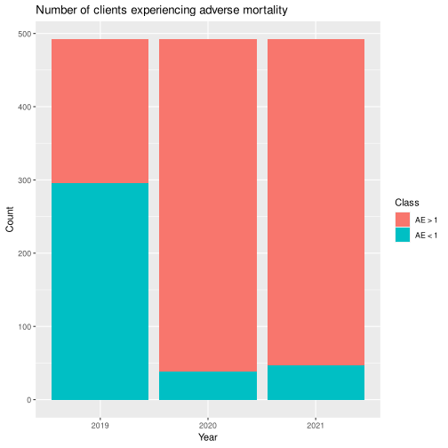<!-- -->

We plot the magnitude of claims. Each dot corresponds to a client. We
see that the expected claims look similar to the actual claims in 2019,
while things change dramatically in 2020 and 2021. Note that the
vertical axis is logarithmic! The change in the claims during a pandemic
differs by orders of magnitude compared to the expected ones.

``` r
library(ggbeeswarm)
set.seed(92929292)
yearly_data %>%
  ungroup() %>%
  select(expected, actual_2019, actual_2020, actual_2021) %>%
  rename(actual_Expected = expected) %>%
  pivot_longer(everything(), names_to = "Year", values_to = "Claims") %>%
  mutate(Year = str_sub(Year, 8)) %>%
  filter(Claims > 0) %>%
  ggplot(aes(Year, Claims, color = Year)) + scale_y_log10() + geom_beeswarm(size = 0.5, priority = "random") +
  guides(color = "none") + labs(title = "Size of claims") +
  scale_color_manual(values = c("yellow3", "deepskyblue", "black", "red"))
```

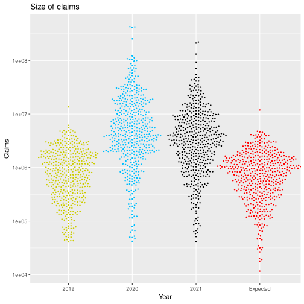<!-- -->

# Long-term model

Our first goal was to create a simple model to classify clients between
high risk or low risk. In this first model, we determine client risk
based on AE in 2020, and we will use data available before the pandemic
as predictors.

Our first task is to determine what “high risk” and “low risk” mean. To
this extent, we define “AE 2020 \> 3” as “high risk”, as this is close
the the first quartile of the AE in 2020.

``` r
summary(yearly_data %>% pull(ae_2020))
```

    ##    Min. 1st Qu.  Median    Mean 3rd Qu.    Max. 
    ##   0.000   2.896   6.342  14.961  13.595 229.937

This threshold was used to create the column `adverse` in `yearly_data`.

Thoughout this and following sections, we will be using extensively the
`tidymodels` framework. We will explain the commands as they appear.

``` r
library(tidymodels)
```

## Feature engineering

Our mentor’s hypothesis was that the AE for 2019 was not a good
predictor for client risk during a pandemic. To test this hypothesis, we
train and test a selection of models, some with 2019 AE as a predictor,
and some without.

We start with a recipe, which defines our model formulas and data
preprocessing steps. We remove all categorical predictors and all
variables that are not available before 2020. We also remove the
correlated variable `actual_2019`. We then remove zero-variance
predictors and normalize all predictors.

``` r
with2019 <-
  recipe(adverse ~ ., data = yearly_data) %>%
  step_rm(all_nominal_predictors()) %>%
  step_rm(ae_2020, ae_2021, actual_2019, actual_2020, actual_2021) %>%
  step_zv(all_predictors()) %>%
  step_normalize(all_predictors())

no2019 <-
  with2019 %>%
  step_rm(ae_2019)
```

Next, we describe our models using `parsnip` model specifications. We
will try 8 different models: logistic regression, penalized logistic
regression (penalty value chosen by initial tuning), random forest,
tuned random forest, single layer neural network, RBF support vector
machine, polynomial support vector machine, and K nearest neighbors.

``` r
log_spec <-
  logistic_reg() %>%
  set_engine("glm") %>%
  set_mode("classification")
tuned_log_spec <-
  logistic_reg(penalty = 0.00118) %>%
  set_engine("glmnet") %>%
  set_mode("classification")
forest_spec <-
  rand_forest(trees = 1000) %>%
  set_mode("classification") %>%
  set_engine("ranger", num.threads = 8, importance = "impurity", seed = 123)
tuned_forest_spec <-
  rand_forest(trees = 1000, mtry = 12, min_n = 21) %>%
  set_mode("classification") %>%
  set_engine("ranger", num.threads = 8, importance = "impurity", seed = 123)
sln_spec <-
  mlp() %>%
  set_engine("nnet") %>%
  set_mode("classification")
svm_rbf_spec <-
  svm_rbf() %>%
  set_engine("kernlab") %>%
  set_mode("classification")
svm_poly_spec <-
  svm_poly() %>%
  set_engine("kernlab") %>%
  set_mode("classification")
knn_spec <-
  nearest_neighbor() %>%
  set_engine("kknn") %>%
  set_mode("classification")
```

In `tidymodels`, the combination of a recipe and a model specification
is called a **workflow**. Training a workflow trains both the recipe
(i.e. it will learn the scaling and translation parameters for the
normalization step) and the underlying model. When a workflow is used to
predict, the trained recipe will automatically be applied to a new set
of data, and passed on to the trained model. We can also combine sets of
models and recipes into a `workflowset`. This will allow us to easily
train and test our models on the same dataset.

We first split our clients into training and testing sets.

``` r
set.seed(30308)
init <- initial_split(yearly_data, strata = adverse)
```

All of our model selection, tuning, etc. will be done using 10-fold CV
on the training set.

``` r
set.seed(30308)
crossval <- vfold_cv(training(init), strata = adverse)
```

Our workflowset will contain the 16 combinations of the 8 model
specifications and 2 recipes. We train each one on the 10
cross-validation splits, and assess the results using the area under the
ROC (`roc_auc`).

``` r
models <- list(Logistic = log_spec,
               `Penalized logistic` = tuned_log_spec,
               `Random forest` = forest_spec,
               `Tuned random forest` = tuned_forest_spec,
               `Neural net` = sln_spec,
               `RBF SVM` = svm_rbf_spec,
               `Polynomial SVM` = svm_poly_spec,
               `KNN` = knn_spec)
recipes <- list("with2019ae" = with2019,
                "no2019ae" = no2019)
wflows <- workflow_set(recipes, models)
fit_wflows <-
    wflows %>%
      workflow_map(fn = "fit_resamples",
                   seed = 30332,
                   resamples = crossval,
                   control = control_resamples(save_pred = TRUE),
                   metrics = metric_set(roc_auc, accuracy))
```

We now look at the results with and without the 2019 AE as a predictor

``` r
fit_wflows %>%
  collect_metrics() %>%
  separate(wflow_id, into = c("rec", "mod"), sep = "_", remove = FALSE) %>%
  ggplot(aes(x = rec, y = mean, color = mod, group = mod)) +
  geom_point() + geom_line() + facet_wrap(~ factor(.metric)) +
  labs(color = "Model", x = NULL, y = "Value", title = "Performance of models with/without 2019 data")
```

<!-- -->

The performance with 2019 AE as a predictor is equal or worse than not
using it. Thus in the following we use the recipe where 2019 AE is
removed. We note that the above analysis was done with models with
default hyperparameters. It is certainly possible that some methods
would have seen benefits from tuning.

## Model selection

With our data preprocessing locked in, we turn to model selection next.
We will look at five models, each with 10 different hyperparameters.

``` r
tune_log_spec <-
  logistic_reg(penalty = tune()) %>%
  set_engine("glmnet") %>%
  set_mode("classification")
tune_forest_spec <-
  rand_forest(trees = 1000, mtry = tune(), min_n = tune()) %>%
  set_mode("classification") %>%
  set_engine("ranger", num.threads = 8, importance = "impurity", seed = 123)
tune_sln_spec <-
  mlp(hidden_units = tune(), penalty = tune(), epochs = tune()) %>%
  set_engine("nnet") %>%
  set_mode("classification")
tune_svm_rbf_spec <-
  svm_rbf(cost = tune(), rbf_sigma = tune(), margin = tune()) %>%
  set_engine("kernlab") %>%
  set_mode("classification")
tune_knn_spec <-
  nearest_neighbor(neighbors = tune(), dist_power = tune()) %>%
  set_engine("kknn") %>%
  set_mode("classification")

models <- list(`Logistic` = tune_log_spec,
               `Random forest` = tune_forest_spec,
               `Neural network` = tune_sln_spec,
               `SVM RBF` = tune_svm_rbf_spec,
               `KNN` = tune_knn_spec)
recipes <- list(no2019)
wflows <- workflow_set(recipes, models)
```

For each model, the 10 tuning parameters will be automatically selected
using a latin hypercube. See the documentation of
`dials::grid_latin_hypercube` for implementation details. Again,
performance will be evaluated by 10-fold crossvalidation.

``` r
results <-
  wflows %>%
  workflow_map(resamples = crossval,
               grid = 10,
               metrics = metric_set(roc_auc, accuracy),
               control = control_grid(save_pred = TRUE),
               seed = 828282)
## i Creating pre-processing data to finalize unknown parameter: mtry
```

The results below suggest that the random forest is performing the best,
especially in terms of the area under the ROC. We will thus choose it
for further tuning.

``` r
autoplot(results)
```

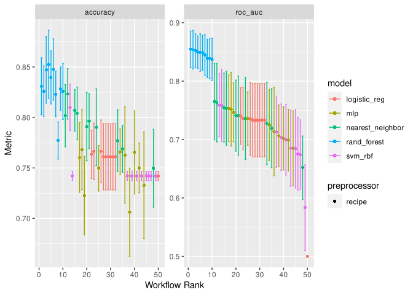<!-- -->

## Tuning a random forest

Since we’ve chosen a random forest, we no longer need to normalize our
predictors. This will make model explanation easier later on. We wrap
the recipe and model specification into a workflow.

``` r
forest_rec <-
  recipe(adverse ~ ., data = yearly_data) %>%
  step_rm(all_nominal_predictors()) %>%
  step_rm(ae_2020, ae_2021, actual_2019, actual_2020, actual_2021) %>%
  step_zv(all_predictors()) %>%
  step_rm(ae_2019)

forest_wflow <-
  workflow() %>%
  add_model(tune_forest_spec) %>%
  add_recipe(forest_rec)
```

We have two tunable hyperparameters: `min_n`, the minimal number of
datapoints required for a node to split, and `mtry`, the number of
randomly selected predictors in each tree. We fix the number of trees to
1000, and we set the tuning range of `mtry` to be between 1 and 20.
Tuning will happen on a regular, 10 x 10 grid.

``` r
forest_params <-
  forest_wflow %>%
  parameters() %>%
  update(mtry = mtry(c(1, 20)))

forest_grid <-
  grid_regular(forest_params, levels = 10)
```

``` r
forest_tune <-
  forest_wflow %>%
  tune_grid(
      resamples = crossval,
      grid = forest_grid,
      metrics = metric_set(roc_auc, accuracy)
  )
```

The tuning results are below. We choose a set of parameters whose
`roc_auc` is high. In this case, we choose `mtry = 5`, `min_n = 6`. The
command `finalize_workflow` applies these parameters and returns a tuned
workflow.

``` r
autoplot(forest_tune)
```

<!-- -->

``` r
best_params <- list(mtry = 5, min_n = 6)
final_forest <-
  forest_wflow %>%
  finalize_workflow(best_params)
```

## Thresholding

At the moment, our forest classifies each client by predicting the
probability of belonging to the “high risk” class. If that probability
is greater than 0.5, the final classification will be “high risk”, if
not, the final classification will be “low risk”.

By changing the threshold from 0.5 to something else, we can influence
the number of false positives or false negatives. This is important,
since false positives and false negatives have different financial
impacts for the insurer. For example, a false positive would unfairly
label a customer as high-risk when in reality they are not. Such a
misclassification may lead to loss of profitable clients. On the other
hand, a false negative might lead to mismanagement of risk due to
exessive claims.

We can study the effect of different thresholds using the package
`probably`. For each of our 10 cross-validation sets, we train a random
forest using the optimal parameters found above, and predict using 101
threshold values between 0 and 1. The function
`probably::threshold_perf` will compute seveal metrics, but we plot only
sensitivity, specificity, and j-index. These are averaged over the 10
crossvalidation sets.

``` r
library(probably)

forest_resamples <-
  final_forest %>%
  finalize_workflow(best_params) %>%
  fit_resamples(
      resamples = crossval,
      control = control_resamples(save_pred = TRUE)
  )

forest_resamples <-
  forest_resamples %>%
  rowwise() %>%
  mutate(thr_perf = list(threshold_perf(.predictions, adverse, `.pred_ae > 3`, thresholds = seq(0.0, 1, by = 0.01))))

my_threshold <- 0.67

forest_resamples %>%
  select(thr_perf, id) %>%
  unnest(thr_perf) %>%
  group_by(.threshold, .metric) %>%
  summarize(estimate = mean(.estimate)) %>%
  filter(.metric != "distance") %>%
  ggplot(aes(x = .threshold, y = estimate, color = .metric)) + geom_line() +
  geom_vline(xintercept = my_threshold, linetype = "dashed") +
  labs(x = "Threshold", y = "Estimate", color = "Metric", title = "Sensitivity and specificity by threshold")
```

<!-- -->

Some expertise and business intuition are required in order to determine
the desired threshold value. Due to a lack of time and resources, we
decided to choose a threshold value that would simultaneously optimize
for sensitivity and specificity. To that extent, we choose the threshold
value of 0.67, corresponding to the dotted line above.

## Final results

With all the parameters chosen, we can finally train our random forest
on the whole training set, and test it on the test set. We augment the
testing set with our predicted probabilities.

``` r
trained_forest <-
  final_forest %>%
  fit(training(init))

thresholded_predictions <-
  trained_forest %>%
  predict(testing(init), type = "prob") %>%
  mutate(class_pred =
            make_two_class_pred(
                  `.pred_ae > 3`,
                  levels = levels(yearly_data$adverse),
                  threshold = my_threshold)) %>%
  bind_cols(testing(init))
```

We can now compute a confusion matrix and some summary statistics. Note
that we have 124 clients in the testing set, of which 74% are high risk
(`ae > 3`). This is the No Information Rate. We can see that our model
is clearly doing better than just naively guessing.

``` r
confusion_matrix <-
  thresholded_predictions %>%
  conf_mat(adverse, class_pred)

confusion_matrix %>% autoplot(type = "heatmap")
```

<!-- -->

``` r
confusion_matrix %>% summary()
```

    ## # A tibble: 13 × 3
    ##    .metric              .estimator .estimate
    ##    <chr>                <chr>          <dbl>
    ##  1 accuracy             binary         0.839
    ##  2 kap                  binary         0.603
    ##  3 sens                 binary         0.859
    ##  4 spec                 binary         0.781
    ##  5 ppv                  binary         0.919
    ##  6 npv                  binary         0.658
    ##  7 mcc                  binary         0.607
    ##  8 j_index              binary         0.640
    ##  9 bal_accuracy         binary         0.820
    ## 10 detection_prevalence binary         0.694
    ## 11 precision            binary         0.919
    ## 12 recall               binary         0.859
    ## 13 f_meas               binary         0.888

## Model explanation

We pick two specific clients as examples to explain our model result. We
choose client 58 who is located in Brooklyn, New York and client 412 who
is located in Asheville, North Carolina. The first one faced adverse
mortality and the second one didn’t.

We load the `DALEX` package to plot break-down plots and to compute SHAP
values.

``` r
library(DALEX)
library(DALEXtra)
```

``` r
fit_parsnip <- trained_forest %>% extract_fit_parsnip
trained_recipe <- trained_forest %>% extract_recipe
train <- trained_recipe %>% bake(training(init))
test <- trained_recipe %>% bake(testing(init))
```

Convert to an “explainer” object for later plot

``` r
ex <-
  explain(
    model = fit_parsnip,
    data = train)
```

    ## Preparation of a new explainer is initiated
    ##   -> model label       :  model_fit  (  default  )
    ##   -> data              :  368  rows  21  cols 
    ##   -> data              :  tibble converted into a data.frame 
    ##   -> target variable   :  not specified! (  WARNING  )
    ##   -> predict function  :  yhat.model_fit  will be used (  default  )
    ##   -> predicted values  :  No value for predict function target column. (  default  )
    ##   -> model_info        :  package parsnip , ver. 0.1.7 , task classification (  default  ) 
    ##   -> model_info        :  Model info detected classification task but 'y' is a NULL .  (  WARNING  )
    ##   -> model_info        :  By deafult classification tasks supports only numercical 'y' parameter. 
    ##   -> model_info        :  Consider changing to numerical vector with 0 and 1 values.
    ##   -> model_info        :  Otherwise I will not be able to calculate residuals or loss function.
    ##   -> predicted values  :  numerical, min =  2e-04 , mean =  0.2594435 , max =  0.9503167  
    ##   -> residual function :  difference between y and yhat (  default  )
    ##   A new explainer has been created! 

Below, we have the break-down plot of the client located in New York.

``` r
ex %>%
  predict_parts(train %>% slice(343)) %>%
  plot(digits = 2, max_features = 5, title = "Client 58, New York, Brooklyn")
```

<!-- -->

The following presents the SHAP values of the client located in New
York.

``` r
shap <- predict_parts(explainer = ex,
                      new_observation = train %>% slice(343),
                                 type = "shap",
                                  B = 25)
```

``` r
plot(shap, show_boxplots = FALSE, title = "Client 58, New York, Brooklyn")
```

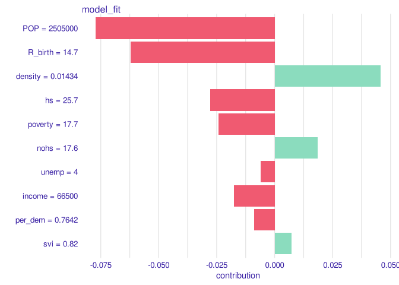<!-- -->

This is the break-down plot of the client located in NC.

``` r
ex %>%
  predict_parts(test %>% slice(80)) %>%
  plot(digits = 2, max_features = 5, title = "Client 412, North Carolina, Asheville")
```

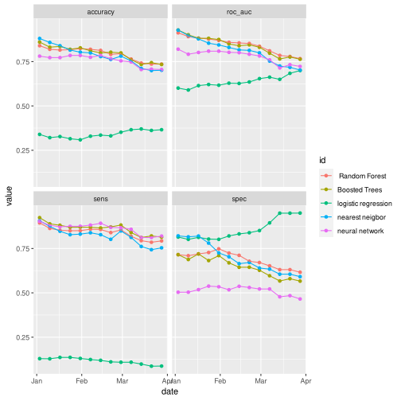<!-- -->

And those are the SHAP values of the client located in NC.

``` r
shap <- predict_parts(explainer = ex,
                      new_observation = test %>% slice(80),
                                 type = "shap",
                                  B = 25)
```

``` r
plot(shap, show_boxplots = FALSE, title = "Client 412, North Carolina, Asheville")
```

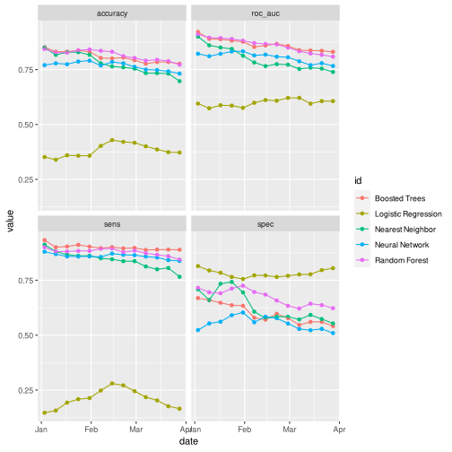<!-- -->

We can also determine which predictors contributed the most in our
model.

``` r
trained_forest %>%
  extract_fit_engine() %>%
  importance() %>%
  as_tibble_row() %>%
  pivot_longer(everything(), names_to = "Variable", values_to = "Importance") %>%
  slice_max(Importance, n = 10) %>%
  ggplot(aes(y = fct_reorder(factor(Variable), Importance), x = Importance, fill = fct_reorder(factor(Variable), Importance))) +
  geom_col() +
  scale_fill_brewer(palette = "Spectral") +
  guides(fill = "none") + labs(y = "Variable", x = "Importance")
```

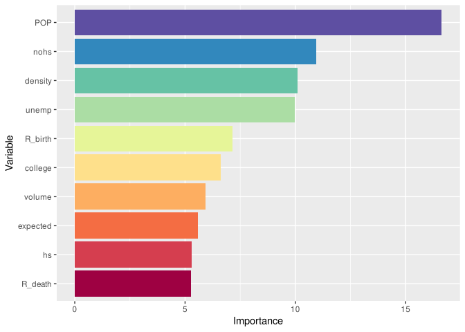<!-- -->

# Short-term model

## Introduction

Now that we have introduced the long-term model and presented its
results, we can move to the next step: adding time-dependent data. To do
this, we will be using `weekly_data` throughout this section.

We recall how we obtained `weekly_data` by describing some of the
preprocessing steps in `data/processed_data.r`. To begin with, we merged
the following 4 data sets:

1.  `data/deaths_zip3.feather`: daily covid deaths data.
2.  `data/simulation_data/all_persons.feather`: a tibble frame created
    in our data wrangling process, containing simulated data for each
    participants from our clients.
3.  `data/data.feather` : zip3 data created in data wrangling process.
4.  `data/2020_12_23/reference_hospitalization_all_locs.csv`: data from
    IHME as of Dec 23 2020

Next, we need some kind of a rolling count for AE. We could use the
“true” weekly AE for each client, but it turns out that that number is
too volatile: there are many weeks without any deaths, which means that
any deaths will lead to huge, momentary spikes. Another quantity that is
quite volatile is the weekly COVID death count .

Thus we smooth the volatile quantities by taking a weighted average in
the 13 weeks prior. The weights come from a Gaussian distribution, and
we weight recent AE numbers higher than older ones.

``` r
smoother <- function(x) { weighted.mean(x, dnorm(seq(-1, 0, length.out = length(x)), sd = 0.33)) }
sliding_smoother <-
  timetk::slidify(smoother, .period = 13, .align = "right")
```

The function `sliding_smoother` takes a vector and outputs a vector of
smoothed values.

We add smoothed AE and smoothed weekly zip deaths to the tibble
`weekly_data`.

``` r
weekly_data <-
  weekly_data %>%
  group_by(client) %>%
  mutate(smoothed_ae = sliding_smoother(ae), smoothed_deaths = sliding_smoother(zip_deaths), .before = size) %>%
  drop_na()
```

Then we shrink smoothed ae based on
log (Volume⋅average *q*<sub>*x*</sub>). This gives us some kind of a
measure of client size and mortality. The motivation for this is that
small clients that experience adverse mortality are much less impactful
as large ones. We add the shrunk, smoothed AE to `weekly_data`.

``` r
client_shrinkage <-
  weekly_data %>%
  summarize(dep_var = first(volume * avg_qx)) %>%
  mutate(shrinkage = rescale(log(dep_var), to = c(0.3, 1)))

weekly_data <-
  weekly_data %>%
  left_join(client_shrinkage, by = "client") %>%
  ungroup() %>%
  mutate(shrunk_ae = smoothed_ae * shrinkage, .after = smoothed_ae)
```

In order to choose a threshold for high and low risk classification, we
look again at quantiles.

``` r
weekly_data %>%
  ungroup() %>%
  group_by(date) %>%
  summarize(
      `12.5` = quantile(shrunk_ae, 0.125),
      `25` = quantile(shrunk_ae, 0.25),
      `50` = quantile(shrunk_ae, 0.50)
  ) %>%
  pivot_longer(-date, names_to = "pth", values_to = "shrunk_ae") %>%
  ggplot(aes(x = date, y = shrunk_ae, color = pth)) +
  geom_line() +
  geom_hline(yintercept = 2.5, linetype = "dashed")
```

<!-- -->

Based on this, we choose `smoothed shrunk AE > 2.5` as “Adverse”, which
corresponds to the dotted line above. With this choice, we have the
following proportion of adverse clients over time.

``` r
weekly_data %>%
  group_by(date) %>%
  summarize(`Percentage classified Adverse` = sum(class == "Adverse") / n()) %>%
  ggplot(aes(x = date, y = `Percentage classified Adverse`)) + geom_line()
```

<!-- -->

## Model selection

We first start by dividing our timeline into training and testing sets:
we take all the dates before January 1 2021 as our training set and all
the dates from January 1 2021 to April 1 2021 as our test set (3 months
later). Our goal is to try and use the data from our clients’
performance before January 1 to predict their performance after this
date.

``` r
train <-
  weekly_data %>%
  filter(date <= "2021-01-01")

test <-
  weekly_data %>%
  filter(date > "2021-01-01" & date <= "2021-04-01")
```

There are two mains things that set this model apart from the long-term
model introduced in the first section. First, the AE is updated weekly
as opposed to the long-term model where the AE is taken yearly. Second,
we are adding weekly deaths as one of the predictors in addition to the
variables introduced in the long-term model. Now, that we have a clear
understanding of the predictors in the short-term model, the question
that arises is how we can use the weekly deaths in the testing time
(since such information won’t be available for us in the “future”). To
solve this issue, we decided to forecast the deaths for this “future”
period: so we will use the weekly deaths from March 2020 to January 2021
and forecast the weekly deaths 3 months later. To do so, we will use the
ARIMA forecaster.

``` r
library(fable)
library(tsibble)
```

``` r
forecast <-
  weekly_data %>%
  filter(date >= "2020-03-15" & date <= "2021-01-01") %>%
  as_tsibble(index = date, key = client) %>%
  model(arima = ARIMA(smoothed_deaths)) %>%
  forecast(h = "3 months")
```

We create a new set called `forecasted_test` out of our testing set
where we replace `smoothed_deaths` by `forecasted_deaths`.

``` r
forecasted_test <-
  forecast %>%
  as_tibble() %>%
  select(client, date, .mean) %>%
  right_join(test, by = c("client", "date")) %>%
  select(-smoothed_deaths) %>%
  rename(smoothed_deaths = .mean)
```

We are ready to introduce our modeling strategy.

We first start by introducing a common recipe that we will use for all
our models. Our target variable is `class`, we use all the predictors in
`weekly_data` except for `client`, `zip3`, `claims`, `smoothed_ae`,
`shrunk_ae`, `ae`, `zip_deaths`, `ihme_deaths` and `date.` We normalize
all predictors and we apply log to both Volume of the client and
Population of the zip code.

``` r
common_recipe <-
  recipe(class ~ ., data = weekly_data) %>%
  step_rm(client, zip3, claims, smoothed_ae, shrunk_ae,  ae, zip_deaths, ihme_deaths, date) %>%
  step_zv(all_predictors()) %>%
  step_log(volume, POP) %>%
  step_normalize(all_predictors())
```

Now, that we have our recipe, we are ready to try out different models
and report the results. Let us introduce the five models and then we
will talk a little bit about each one of them.

``` r
forest_spec <-
  rand_forest(trees = 1000) %>%
  set_engine("ranger", num.threads = 8, seed = 123456789) %>%
  set_mode("classification")

log_spec <-
  logistic_reg(
  mode = "classification",
  engine = "glm")

knn_spec <-
  nearest_neighbor() %>%
  set_engine("kknn") %>%
  set_mode("classification")

sln_spec <-
  mlp(activation = "relu", hidden_units = 6, epochs = 100) %>%
  set_engine("keras", verbose=0) %>%
  set_mode("classification")


bt_spec <- boost_tree(
  mode = "classification",
  engine = "xgboost",
  trees = 100)
```

We use Random Forest (`forest`), Logistic Regression (`log`), Nearest
Neighbor (`knn`), Neural Network with single layer (`sln`) and Boosted
Trees (`bt`) respectively with default settings. For the Random Forest,
we consider 1000 trees and for the Boosted Trees, we take 100 trees. All
of these models use different engines introduced in `tidymodels`.

We then create the workflow for the five models mentioned above with the
recipe taken to be the “common recipe” and the model taken to be the
ones introduced in the previous chunk.

``` r
bt_wf <-
  workflow() %>%
  add_recipe(common_recipe) %>%
  add_model(bt_spec)

log_wf <-
  workflow() %>%
  add_recipe(common_recipe) %>%
  add_model(log_spec)

forest_wf <-
  workflow() %>%
  add_recipe(common_recipe) %>%
  add_model(forest_spec)

knn_wf <-
  workflow() %>%
  add_recipe(common_recipe) %>%
  add_model(knn_spec)

sln_wf <-
  workflow() %>%
  add_recipe(common_recipe) %>%
  add_model(sln_spec)
```

We can take each of these models and evaluate their performance
separately, but we want to find a way where we can compare their
performance through time. So, we create a tibble containing the five
different workflows, we fit out training set and we predict our
`forecasted_test.` For the prediction, we use `class_predict` to come up
with a class (this prediction will be used to calculate accuracy,
sensitivity and specificity). We also use `prob_predict` to come up with
a predicitive probability (used to calculate the `roc_auc`).

``` r
wflows <- tribble(~wflow,
                  sln_wf,
                  knn_wf, log_wf, forest_wf, bt_wf)
 


wflows <-
  wflows %>%
  mutate(wflows_fit = map(wflow, ~ fit(.x, train))) 
```

    ## [01:06:19] WARNING: amalgamation/../src/learner.cc:1095: Starting in XGBoost 1.3.0, the default evaluation metric used with the objective 'binary:logistic' was changed from 'error' to 'logloss'. Explicitly set eval_metric if you'd like to restore the old behavior.

``` r
wflows <-
  wflows %>%
  mutate(
    class_predict = map(wflows_fit, ~ predict(.x, forecasted_test)),  
    prob_predict = map(wflows_fit, ~ predict(.x, forecasted_test, type = "prob")))
```

Now that we have our prediction as a class and as a probability, we are
ready to compare the metrics for the five models.

``` r
wflows %>%
  bind_cols(tribble(~id, "Neural Network", "Nearest Neigbor", "Logistic Regression", " Random Forest", "Boosted Trees")) %>%
  select(-wflow, -wflows_fit) %>%
  mutate(prob_predict = map(prob_predict, ~ bind_cols(.x, test %>% select(date, class)))) %>%
  unnest(c(class_predict, prob_predict)) %>%
  group_by(id, date) %>%
  summarize(
            sens = sens_vec(class, .pred_class),
            spec = spec_vec(class, .pred_class),
            roc_auc = roc_auc_vec(class, .pred_Adverse),
            accuracy = accuracy_vec(class, .pred_class), .groups = "keep") %>%
  pivot_longer(sens:accuracy, names_to = "metric", values_to = "value") %>%
  ungroup() %>%
  ggplot(aes(x = date, y = value, color = id)) +
  geom_point() +
  geom_line() +
  facet_wrap( ~ metric)
```

<!-- -->

One can wonder how much our models are being affected by the forecasting
of deaths. Let’s replace `forecasted_test` by `test` and let’s see what
happens. (So, now actual deaths is used instead of forecasted deaths).
We see that the difference is not very big and our forecasting is not
affecting the models in a bad way.

``` r
wflows_cheat <-
  wflows %>%
  mutate(
    class_predict = map(wflows_fit, ~ predict(.x, test)),  
    prob_predict = map(wflows_fit, ~ predict(.x, test, type = "prob")))


wflows_cheat %>%
  bind_cols(tribble(~id, "Neural Network", "Nearest Neighbor", "Logistic Regression", "Random Forest", "Boosted Trees")) %>%
  select(-wflow, -wflows_fit) %>%
  mutate(prob_predict = map(prob_predict, ~ bind_cols(.x, test %>% select(date, class)))) %>%
  unnest(c(class_predict, prob_predict)) %>%
  group_by(id, date) %>%
  summarize(
            sens = sens_vec(class, .pred_class),
            spec = spec_vec(class, .pred_class),
            roc_auc = roc_auc_vec(class, .pred_Adverse), 
            accuracy = accuracy_vec(class, .pred_class), .groups = "keep") %>%
  pivot_longer(sens:accuracy, names_to = "metric", values_to = "value") %>%
  ungroup() %>%
  ggplot(aes(x = date, y = value, color = id)) +
  geom_point() +
  geom_line() +
  facet_wrap( ~ metric)
```

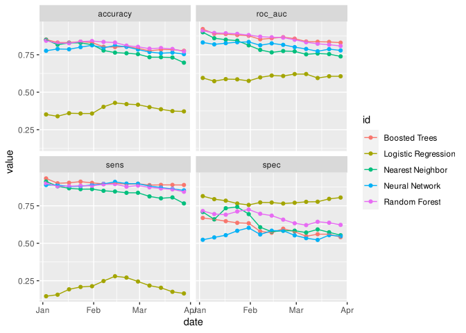<!-- -->

## Tuning Boosted Trees Model

Comparing the models above, we can see that the Boosted Trees is the
best model. So, we use it for the rest of the project, we tune it, and
we report the results.

One of our goals is to have a model that can predict clients it hasn’t
seen before. First, we split our clients into training and testing
clients. The training clients are “known”; they will be what the model
will be trained on and they represent 75% of our total. The testing
clients are “unknown”; they will represent brand new clients and they
represent 25% of our total.

``` r
set.seed(1213)
training_clients <-
  weekly_data %>%
  nest_by(client) %>%
  ungroup() %>%
  slice_sample(prop = 3/4) %>%
  pull(client)

testing_clients <-
  weekly_data %>%
  filter(!client %in% training_clients) %>%
  pull(client) %>%
  unique()
```

We next divide the dates into training and testing dates. Our training
period includes all dates before January 1 2021, and our testing period
includes the next three months (so up to April 2021).

``` r
start <- ceiling_date(ymd("2021-01-01"), unit = "week")
end <- ceiling_date(ymd("2021-04-01"), unit = "week")
```

The goal of the following is to tune the Boosted Trees to optimize
predictions of “unknown” client three months out. To do so, we divide
the training dates into analysis dates (all dates before October 1 2020)
and assessment date (week of Jan 1st 2021).

``` r
analys <- ceiling_date(ymd("2020-10-01"), unit = "week")
assess <- start
```

We then split the training clients into analysis (75% of the training or
known clients) and assessment (25% of the known clients). We will create
an `rsample` object, which requires knowledge of the row indices for the
analysis and assessment sets.

``` r
set.seed(123)
ana_clients <-
  training_clients %>%
  sample(length(.) * 3 / 4)

ana_idx <-
  weekly_data %>%
  rownames_to_column() %>%
  filter(client %in% ana_clients & date <= analys) %>%
  pull(rowname) %>%
  as.integer()

ass_idx <-
  weekly_data %>%
  rownames_to_column() %>%
  filter(client %in% training_clients) %>%
  filter(!client %in% ana_clients & date == assess) %>%
  pull(rowname) %>%
  as.integer()

spl <- make_splits(list(analysis = ana_idx, assessment = ass_idx), data = weekly_data)
resmpl <- manual_rset(list(spl), c("Manual split"))
```

Now, we define our boosted trees. We remove the following from the list
of predictors: `zip3`, `date`, `client`, `claims`, `zip_deaths`,
`smoothed_ae`, `shrunk_ae`, `ae`.

``` r
xgboost_recipe <-
  recipe(formula = class ~ ., data = weekly_data) %>%
  step_rm(zip3, date, client, claims, zip_deaths, smoothed_ae, shrunk_ae, ae) %>%
  step_zv(all_predictors())

xgboost_spec <-
  boost_tree(trees = tune(), tree_depth = tune(), learn_rate = tune()) %>%
  set_mode("classification") %>%
  set_engine("xgboost", nthread = 8)

xgboost_workflow <-
  workflow() %>%
  add_recipe(xgboost_recipe) %>%
  add_model(xgboost_spec)
```

We tuned the model using the following hyperparameters:

-   `trees`: Number of trees contained in the ensemble.
-   `tree` depth: An integer for the maximum depth of the tree
    (i.e. number of splits).
-   `learn_rate`: A number for the rate at which the boosting algorithm
    adapts from iteration-to-iteration.

We start with 10 different sets of parameters, and then finetune it
using 20 iterations of simulated annealing. We use simulated annealing
to find a set of parameters that maximizes `roc_auc`.

``` r
library(finetune)
```

``` r
set.seed(98324)
res_grd <-
  xgboost_workflow %>%
  tune_grid(
    resamples = resmpl,
    grid = 10,
    metrics = metric_set(roc_auc, sens, spec, j_index, accuracy),
    control = control_grid(verbose = TRUE))
## i Manual split: preprocessor 1/1
## ✓ Manual split: preprocessor 1/1
## i Manual split: preprocessor 1/1, model 1/10
## ✓ Manual split: preprocessor 1/1, model 1/10
## i Manual split: preprocessor 1/1, model 1/10 (predictions)
## i Manual split: preprocessor 1/1
## ✓ Manual split: preprocessor 1/1
## i Manual split: preprocessor 1/1, model 2/10
## ✓ Manual split: preprocessor 1/1, model 2/10
## i Manual split: preprocessor 1/1, model 2/10 (predictions)
## i Manual split: preprocessor 1/1
## ✓ Manual split: preprocessor 1/1
## i Manual split: preprocessor 1/1, model 3/10
## ✓ Manual split: preprocessor 1/1, model 3/10
## i Manual split: preprocessor 1/1, model 3/10 (predictions)
## i Manual split: preprocessor 1/1
## ✓ Manual split: preprocessor 1/1
## i Manual split: preprocessor 1/1, model 4/10
## ✓ Manual split: preprocessor 1/1, model 4/10
## i Manual split: preprocessor 1/1, model 4/10 (predictions)
## i Manual split: preprocessor 1/1
## ✓ Manual split: preprocessor 1/1
## i Manual split: preprocessor 1/1, model 5/10
## ✓ Manual split: preprocessor 1/1, model 5/10
## i Manual split: preprocessor 1/1, model 5/10 (predictions)
## i Manual split: preprocessor 1/1
## ✓ Manual split: preprocessor 1/1
## i Manual split: preprocessor 1/1, model 6/10
## ✓ Manual split: preprocessor 1/1, model 6/10
## i Manual split: preprocessor 1/1, model 6/10 (predictions)
## i Manual split: preprocessor 1/1
## ✓ Manual split: preprocessor 1/1
## i Manual split: preprocessor 1/1, model 7/10
## ✓ Manual split: preprocessor 1/1, model 7/10
## i Manual split: preprocessor 1/1, model 7/10 (predictions)
## i Manual split: preprocessor 1/1
## ✓ Manual split: preprocessor 1/1
## i Manual split: preprocessor 1/1, model 8/10
## ✓ Manual split: preprocessor 1/1, model 8/10
## i Manual split: preprocessor 1/1, model 8/10 (predictions)
## i Manual split: preprocessor 1/1
## ✓ Manual split: preprocessor 1/1
## i Manual split: preprocessor 1/1, model 9/10
## ✓ Manual split: preprocessor 1/1, model 9/10
## i Manual split: preprocessor 1/1, model 9/10 (predictions)
## i Manual split: preprocessor 1/1
## ✓ Manual split: preprocessor 1/1
## i Manual split: preprocessor 1/1, model 10/10
## ✓ Manual split: preprocessor 1/1, model 10/10
## i Manual split: preprocessor 1/1, model 10/10 (predictions)

res <-
  xgboost_workflow %>%
  tune_sim_anneal(
      resamples = resmpl,
      iter = 20,
      initial = res_grd,
      metrics = metric_set(roc_auc, sens, spec, j_index, accuracy))
## Optimizing roc_auc
## Initial best: 0.78996
##  1 ◯ accept suboptimal  roc_auc=0.74385
##  2 ◯ accept suboptimal  roc_auc=0.69237
##  3 ◯ accept suboptimal  roc_auc=0.66214
##  4 + better suboptimal  roc_auc=0.67367
##  5 ◯ accept suboptimal  roc_auc=0.67188
##  6 ─ discard suboptimal roc_auc=0.6647
##  7 ◯ accept suboptimal  roc_auc=0.6583
##  8 ✖ restart from best  roc_auc=0.66342
##  9 ◯ accept suboptimal  roc_auc=0.76537
## 10 ─ discard suboptimal roc_auc=0.74129
## 11 ─ discard suboptimal roc_auc=0.71875
## 12 ◯ accept suboptimal  roc_auc=0.74027
## 13 ♥ new best           roc_auc=0.80328
## 14 ─ discard suboptimal roc_auc=0.76383
## 15 ─ discard suboptimal roc_auc=0.78151
## 16 ─ discard suboptimal roc_auc=0.771
## 17 ─ discard suboptimal roc_auc=0.76076
## 18 ─ discard suboptimal roc_auc=0.78381
## 19 ♥ new best           roc_auc=0.81916
## 20 ─ discard suboptimal roc_auc=0.7687
```

The best parameters are then selected, and we apply these to our
workflow.

``` r
res %>% show_best(metric = "roc_auc")
```

    ## # A tibble: 5 × 10
    ##   trees tree_depth learn_rate .metric .estimator  mean     n std_err .config    
    ##   <int>      <int>      <dbl> <chr>   <chr>      <dbl> <int>   <dbl> <chr>      
    ## 1  1939          2   0.00552  roc_auc binary     0.819     1      NA Iter19     
    ## 2  1807          4   0.00273  roc_auc binary     0.803     1      NA Iter13     
    ## 3  1701          7   0.000408 roc_auc binary     0.790     1      NA initial_Pr…
    ## 4  1703          5   0.000617 roc_auc binary     0.784     1      NA Iter18     
    ## 5  2000          5   0.000264 roc_auc binary     0.782     1      NA Iter15     
    ## # … with 1 more variable: .iter <int>

``` r
best_parms <- res %>% select_best(metric = "roc_auc")
final_wf <- xgboost_workflow %>% finalize_workflow(best_parms)
```

We now need to forecast 3 months worth of `smoothed_deaths`.

``` r
forecast <-
  weekly_data %>%
  filter(date >= "2020-03-15" & date <= start) %>%
  as_tsibble(index = date, key = client) %>%
  model(arima = ARIMA(smoothed_deaths)) %>%
  forecast(h = "3 months")
```

We create a new data called `forecast_data` where the actual deaths are
replaced by the forecasted deaths. So, now we have `weekly_data` that
contains the `actual_deaths` and we have `forecasted_data` that contains
the `forecasted_deaths` instead.

``` r
future <-
  forecast %>%
  as_tibble() %>%
  select(client, date, .mean) %>%
  rename(smoothed_deaths = .mean)

forecast_data <-
  weekly_data %>%
  rows_update(future, by = c("date","client"))
```

Now that we have these two data sets available, we can easily define the
training set to include all known clients with dates prior to January 1
(training dates).

``` r
train <-
  weekly_data %>%
  filter(client %in% training_clients & date <= start)
```

For the purpose of comparison, we will have four types of testing sets:

-   `test_known_true`: includes all known clients with dates 3 months
    after January 1 (known clients + testing dates) using the actual
    deaths for this 3 months period.
-   `test_unknown_true`: includes all unknown clients with dates 3
    months after January 1 (unknown clients + testing dates) using the
    actual deaths for this 3 months period.
-   `test_known_fore`: includes all known clients with dates 3 months
    after January 1 (known clients + testing dates ) using the
    forecasted deaths for this 3 months period.
-   `test_unknown_fore`: includes all unknown clients with dates 3
    months after January 1 (unknown clients + testing dates) using the
    forecasted deaths for this 3 months period.

``` r
test_known_true <-
  weekly_data %>%
  filter(client %in% training_clients) %>%
  filter(date > start & date <= end)

test_unknown_true <-
  weekly_data %>%
  filter(!client %in% training_clients) %>%
  filter(date > start & date <= end)

test_known_fore <-
  forecast_data %>%
  filter(client %in% training_clients) %>%
  filter(date > start & date <= end)

test_unknown_fore <-
  forecast_data %>%
  filter(!client %in% training_clients) %>%
  filter(date > start & date <= end)
```

We train our final workflow.

``` r
trained_wf <-
  final_wf %>%
  fit(train)
```

    ## [00:49:28] WARNING: amalgamation/../src/learner.cc:1095: Starting in XGBoost 1.3.0, the default evaluation metric used with the objective 'binary:logistic' was changed from 'error' to 'logloss'. Explicitly set eval_metric if you'd like to restore the old behavior.

Now, we can create a tibble `tests` out of these 4 testing sets. We
compare the performance of our four testing sets. We can see that the
difference is not large and somehow our machine learning models have
been able to have good performance with the forecasted deaths.

``` r
tests <-
  tribble(
    ~id, ~set,
    "Known clients, true deaths", test_known_true,
    "Unknown clients, true deaths", test_unknown_true,
    "Known clients", test_known_fore,
    "Unknown clients", test_unknown_fore)

tests %>%
  mutate(set = map(set, ~ bind_cols(.x, trained_wf %>% predict(.x)))) %>%
  unnest(set) %>%
  group_by(id, date) %>%
  summarize(
      Accuracy = yardstick::accuracy_vec(class, .pred_class),
      Sensitivity = yardstick::sens_vec(class, .pred_class),
      Specificity = yardstick::spec_vec(class, .pred_class)) %>%
  ungroup() %>%
  pivot_longer(Accuracy:Specificity, names_to = "metric", values_to = "value") %>%
  filter(metric == "Accuracy") %>%
  ggplot(aes(x = date, y = value, color = id)) + geom_line(aes(linetype = str_detect(id, "true"))) +
  labs(x = "Date", y = "Accuracy", color = "") + guides(linetype = "none")
```

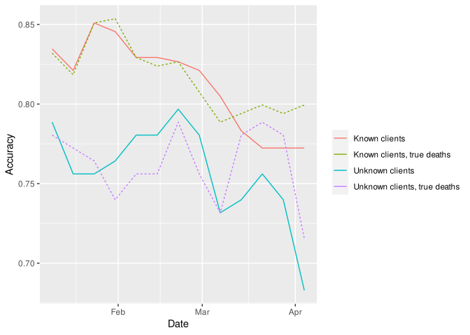<!-- -->

## Explaining outcomes

One of the most important part in any model is interpreting the result.
Model interpretability helps extracting insight and clarity regarding
how the algorithms are performing. There are several tools that can be
used to increase model transparency. Breakdown plots can be used to
visualize localized variable importance scores. For each client, we can
explain why a case receives its prediction and how each predictor
contributes either positively or negatively to the target variable. The
local interpretability enables us to pinpoint and contrast the impacts
of the factors.

We explain how much each feature contributes to the value of a single
prediction using the following. We will explain the plots after running
the code.

``` r
model <-
  trained_wf %>%
  extract_fit_parsnip()

recipe <-
  trained_wf %>%
  extract_recipe(estimated = TRUE)

exp <- explain(model, recipe %>% bake(train))
```

    ## Preparation of a new explainer is initiated
    ##   -> model label       :  model_fit  (  default  )
    ##   -> data              :  34317  rows  26  cols 
    ##   -> data              :  tibble converted into a data.frame 
    ##   -> target variable   :  not specified! (  WARNING  )
    ##   -> predict function  :  yhat.model_fit  will be used (  default  )
    ##   -> predicted values  :  No value for predict function target column. (  default  )
    ##   -> model_info        :  package parsnip , ver. 0.1.7 , task classification (  default  ) 
    ##   -> model_info        :  Model info detected classification task but 'y' is a NULL .  (  WARNING  )
    ##   -> model_info        :  By deafult classification tasks supports only numercical 'y' parameter. 
    ##   -> model_info        :  Consider changing to numerical vector with 0 and 1 values.
    ##   -> model_info        :  Otherwise I will not be able to calculate residuals or loss function.
    ##   -> predicted values  :  the predict_function returns an error when executed (  WARNING  ) 
    ##   -> residual function :  difference between y and yhat (  default  )
    ##   A new explainer has been created! 

``` r
test_obs <-
  test_unknown_fore %>%
  filter(date == end, client == 397)

exp %>%
predict_parts(recipe %>% bake(test_obs) %>% select(-class)) %>%
  plot(digits = 2, max_features = 5, title = "Client 397")
```

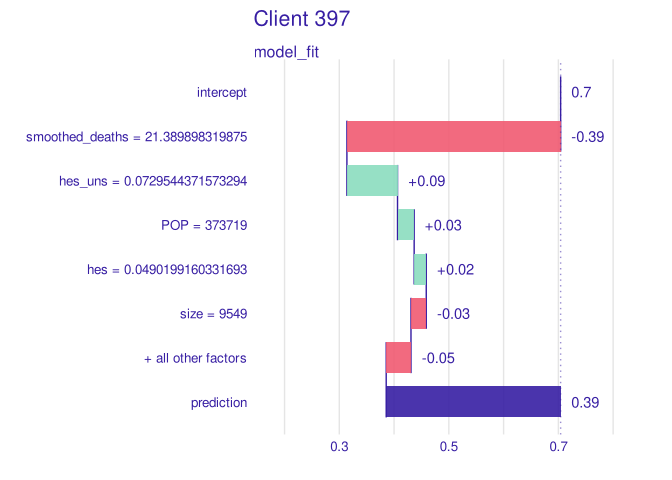<!-- -->

``` r
test_obs <-
  test_known_fore %>%
  filter(date == end, client == 405)

exp %>%
predict_parts(recipe %>% bake(test_obs) %>% select(-class)) %>%
  plot(digits = 2, max_features = 5, title = "Client 405")
```

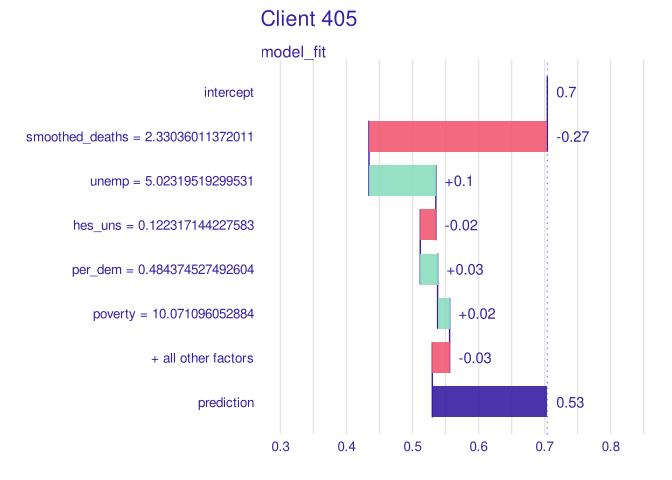<!-- -->

We use client 405 (Not Adverse) from our known clients and client 397
(Adverse) from our unknown clients. The prediction in blue is the
probability that the client is **not adverse**. For client 405, since
the prediction is 0.53 (>0.5), this client is classified as not adverse.
For client 397, since the prediction is 0.37 (\<0.5), this client is
classified as adverse. A red bar means that this predictor has caused
more mortality. In contrast, a green bar means that this predictor has
causes less mortality client. For instance, comparing clients 397 and
405, we can see that `smoothed_deaths` for client 397 is so much bigger
than the value for client 405 and hence the contribution of this
predictor to the mortality is larger for client 397 (red bar is bigger).

# Other modelling attempts

In this section, we introduce some models that we tried but did not work
as well.

We want to predict the `AE value` for each client for each week during
COVID-19. Since the weekly AE value changes dramatically, we decide to
predict the `shrunk AE`. For detail of shrunk AE, check the section on
the short-term model.

Our main package in this section is `modeltime`, a framework for time
series models and machine learning. Since we have more than 500 clients,
we have more than 500 time series. In practice, we will have more
clients. We create a global machine learning model that forecasts all
clients at once for computational efficiency.

We use data before Covid-19 (based on the zip code where the company is
located (such as poverty, education, unemployment levels) and
characteristics of the company (such as the average age of its
employees) as our predictors, and we compare results with IHME death
data/with zip death data/without death data as predictors.

Necessary package we need.

``` r
library(modeltime)
library(timetk)
```

## Read data and pre-processing

Get weeklydata from `2020-03-15` to `2021-06-27`.

``` r
clients<-read_feather("data/processed_data_20_12_23.feather")%>%
  select(-ae_2021, -ae_2020, -ae_2019,
         -actual_2021, -actual_2020, -actual_2019, -adverse,
         -STATE_NAME, -dep_var, -smoothed_ae)%>%
  filter(date >= "2020-03-15")%>%
  mutate(client = as.factor(client))
```

Split our data into two part: train set (`2020-03-15` to `2020-12-27`)
and test set (`2021-01-03` to `2021-06-27`).

``` r
  set.seed(1234)
  splits <-  clients %>% time_series_split(initial = "6 months", assess = "6 months", date_var = date, cumulative = TRUE)
  train = training(splits)
  test = testing(splits)
```

We can add feature engineering steps to get our data ready using
recipes. We remove useless variables: `zip3`, `actual`, `claims`,
`class`, `shrinkage`, `ae.` For extreme big number such as `population`,
`volume` and `expected`, we use `step_log()` to do logarithm
transformation for pre-processing. We also use
`step_mutate(client = droplevels(client))` to add ID variable,
`step_timeseries_signature()` to create a specification of a recipe step
that will convert date into many features that can aid in machine
learning with time-series data.

Here `rec_obj` is for model with `ihme_deaths`, `rec_obj1` with
`zip_deaths` and `rec_obj2` without any death data.

``` r
rec_obj_alldata <-
    recipe(shrunk_ae ~ ., data = training(splits)) %>%
    step_rm(zip3)%>%
    step_rm( claims , class, shrinkage, ae)%>%
    step_log(POP, volume, expected)%>%
    step_mutate(client = droplevels(client)) %>%
    step_timeseries_signature(date) %>%
    step_rm(date)%>%
    step_dummy(all_nominal_predictors(), one_hot = TRUE)%>%
    step_zv(all_predictors()) %>%
    step_normalize(all_predictors(), -all_nominal())
#recipe with ihme death data
rec_obj <-
    rec_obj_alldata%>%
    step_rm(zip_deaths, smoothed_deaths)
#recipe with zip death
rec_obj1 <-
    rec_obj_alldata%>%
    step_rm( ihme_deaths, smoothed_deaths)
#recipe without  death
rec_obj2 <-
    rec_obj_alldata%>%
    step_rm( smoothed_deaths, ihme_deaths, zip_deaths)
```

Here are 5 machine learning models we try in this section .
`forest_spec` is a random forest. `tuned_forest_spec` is a tuned random
forest. `svm_rbf_spec` is a radial basis function support vector
machine. `knn_spec` is K-nearest neighbors and `xgboost_spec` is
Xgboost.

``` r
forest_spec <-
  rand_forest(trees = 1000) %>%
  set_engine("ranger", num.threads = 8, seed = 123456789) %>%
  set_mode("regression")%>%
  set_engine("ranger", num.threads = 8, importance = "impurity", seed = 123)
tuned_forest_spec <-
  rand_forest(trees = 1000, mtry = 12, min_n = 21) %>%
  set_mode("regression")%>%
  set_engine("ranger", num.threads = 8, importance = "impurity", seed = 123)
svm_rbf_spec <-
  svm_rbf() %>%
  set_engine("kernlab") %>%
  set_mode("regression")
knn_spec <-
  nearest_neighbor() %>%
  set_engine("kknn") %>%
  set_mode("regression")
xgboost_spec <-
  boost_tree(trees = 100) %>%
  set_engine("xgboost") %>%
  set_mode("regression")
```

## Create a workflow

The workflow is an object that can bundle together our pre-processing,
modeling, and post-processing requests.

Workflow with IHME death data

``` r
wflw_rf <- workflow() %>%
    add_model(
        forest_spec
    ) %>%
    add_recipe(rec_obj) %>%
    fit(data = training(splits))

wflw_tunedrf <- workflow() %>%
    add_model(
        tuned_forest_spec
    ) %>%
    add_recipe(rec_obj) %>%
    fit(data = training(splits))

wflw_svmrbf <- workflow() %>%
    add_model(
        svm_rbf_spec
    ) %>%
    add_recipe(rec_obj) %>%
    fit(data = training(splits))

wflw_knnspec <- workflow() %>%
    add_model(
        knn_spec
    ) %>%
    add_recipe(rec_obj) %>%
    fit(data = training(splits))  

wflw_xgboost <- workflow() %>%
    add_model(
        xgboost_spec
    ) %>%
    add_recipe(rec_obj) %>%
    fit(data = training(splits))  
#Create a Modeltime Table (table of model)
model_tbl<- modeltime_table(
    wflw_rf,
    wflw_tunedrf,
    wflw_svmrbf,
    wflw_knnspec,
    wflw_xgboost
)
```

Workflow with zip death data

``` r
wflw_rf1 <- workflow() %>%
    add_model(
        forest_spec
    ) %>%
    add_recipe(rec_obj1) %>%
    fit(data = training(splits))

wflw_tunedrf1 <- workflow() %>%
    add_model(
        tuned_forest_spec
    ) %>%
    add_recipe(rec_obj1) %>%
    fit(data = training(splits))

wflw_svmrbf1 <- workflow() %>%
    add_model(
        svm_rbf_spec
    ) %>%
    add_recipe(rec_obj1) %>%
    fit(data = training(splits))

wflw_knnspec1 <- workflow() %>%
    add_model(
        knn_spec
    ) %>%
    add_recipe(rec_obj1) %>%
    fit(data = training(splits))

wflw_xgboost1 <- workflow() %>%
    add_model(
        xgboost_spec
    ) %>%
    add_recipe(rec_obj1) %>%
    fit(data = training(splits))  
#Create a Modeltime Table
model_tbl1 <- modeltime_table(
    wflw_rf1,
    wflw_tunedrf1,
    wflw_svmrbf1,
    wflw_knnspec1,
    wflw_xgboost1
)
```

Workflow without death

``` r
wflw_rf2 <- workflow() %>%
    add_model(
        forest_spec
    ) %>%
    add_recipe(rec_obj2) %>%
    fit(data = training(splits))

wflw_tunedrf2 <- workflow() %>%
    add_model(
        tuned_forest_spec
    ) %>%
    add_recipe(rec_obj2) %>%
    fit(data = training(splits))

wflw_svmrbf2 <- workflow() %>%
    add_model(
        svm_rbf_spec
    ) %>%
    add_recipe(rec_obj2) %>%
    fit(data = training(splits))

wflw_knnspec2 <- workflow() %>%
    add_model(
        knn_spec
    ) %>%
    add_recipe(rec_obj2) %>%
    fit(data = training(splits)) 

wflw_xgboost2 <- workflow() %>%
    add_model(
        xgboost_spec
    ) %>%
    add_recipe(rec_obj2) %>%
    fit(data = training(splits))  
#Create a Modeltime Table
model_tbl2 <- modeltime_table(
    wflw_rf2,
    wflw_tunedrf2,
    wflw_svmrbf2,
    wflw_knnspec2,
    wflw_xgboost2
)
```

For quick knit, we save the workflow here

``` r
#save the model table with IHME death data
saveRDS(model_tbl, "modelwithIHME.rds")
#save the model table with zip death data
saveRDS(model_tbl1, "modelwithzipdeath.rds")
#save the model table without death data
saveRDS(model_tbl2, "modelwithoutdeath.rds")
```

Read the saved workflow table

``` r
model_tbl <- readRDS("modelwithIHME.rds")
model_tbl1 <- readRDS("modelwithzipdeath.rds")
model_tbl2 <- readRDS("modelwithoutdeath.rds")
```

## Preparation for forecasting

Calibrate the model to testing set. It will calculate accuracy and
forecast confidence by computing predictions and residuals for testing
set.

``` r
#with IHME
calib_tbl <- model_tbl %>%
    modeltime_calibrate(
      new_data = testing(splits), 
      id       = "client"
    )
#with zip death
calib_tbl1 <- model_tbl1 %>%
    modeltime_calibrate(
      new_data = testing(splits), 
      id       = "client"
    )
#without death
calib_tbl2 <- model_tbl2 %>%
    modeltime_calibrate(
      new_data = testing(splits), 
      id       = "client"
    )
```

For quick knit, we save the calibration sets here.

``` r
#save the model table with IHME death data
saveRDS(calib_tbl, "calibwithIHME.rds")
#save the model table with zip death data
saveRDS(calib_tbl1, "calibwithzipdeath.rds")
#save the model table without death data
saveRDS(calib_tbl2, "calibwithoutdeath.rds")
```

Read the saved calibration sets.

``` r
calib_tbl <- readRDS("calibwithIHME.rds")
calib_tbl1 <- readRDS("calibwithzipdeath.rds")
calib_tbl2 <- readRDS("calibwithoutdeath.rds")
```

Here present the accuacy results. We can check the global error and
local error for each client on testing set for different models. The
accuracy metrics include:

`MAE` - Mean absolute error, `mae()`

`MAPE` - Mean absolute percentage error, `mape()`

`MASE` - Mean absolute scaled error, `mase()`

`SMAPE` - Symmetric mean absolute percentage error, `smape()`

`RMSE` - Root mean squared error, `rmse()`

`RSQ` - R-squared, `rsq()`.

Global error

``` r
#with IHME death
calib_tbl %>% 
    modeltime_accuracy(acc_by_id = FALSE)
```

    ## # A tibble: 5 × 9
    ##   .model_id .model_desc .type   mae  mape  mase smape  rmse    rsq
    ##       <int> <chr>       <chr> <dbl> <dbl> <dbl> <dbl> <dbl>  <dbl>
    ## 1         1 RANGER      Test  12.1    Inf 1.51   89.6  31.7 0.114 
    ## 2         2 RANGER      Test  10.5    Inf 1.31   88.7  20.7 0.179 
    ## 3         3 KERNLAB     Test   7.41   Inf 0.925  95.1  12.4 0.466 
    ## 4         4 KKNN        Test  12.4    NaN 1.55  NaN    39.4 0.0762
    ## 5         5 XGBOOST     Test   7.13   Inf 0.891  85.9  15.3 0.545

``` r
#with zip death
calib_tbl1 %>% 
    modeltime_accuracy(acc_by_id = FALSE)
```

    ## # A tibble: 5 × 9
    ##   .model_id .model_desc .type   mae  mape  mase smape  rmse    rsq
    ##       <int> <chr>       <chr> <dbl> <dbl> <dbl> <dbl> <dbl>  <dbl>
    ## 1         1 RANGER      Test  12.9    Inf 1.61   90.3  32.2 0.130 
    ## 2         2 RANGER      Test  10.9    Inf 1.37   88.3  21.5 0.185 
    ## 3         3 KERNLAB     Test   6.76   Inf 0.844  90.2  11.9 0.510 
    ## 4         4 KKNN        Test  12.4    NaN 1.55  NaN    39.0 0.0801
    ## 5         5 XGBOOST     Test   6.81   Inf 0.850  91.0  15.5 0.314

``` r
#without death data
calib_tbl2 %>% 
    modeltime_accuracy(acc_by_id = FALSE)
```

    ## # A tibble: 5 × 9
    ##   .model_id .model_desc .type   mae  mape  mase smape  rmse    rsq
    ##       <int> <chr>       <chr> <dbl> <dbl> <dbl> <dbl> <dbl>  <dbl>
    ## 1         1 RANGER      Test  10.5    Inf 1.31   86.0  31.2 0.112 
    ## 2         2 RANGER      Test   9.25   Inf 1.15   85.2  20.7 0.162 
    ## 3         3 KERNLAB     Test   6.37   Inf 0.795  91.5  11.9 0.513 
    ## 4         4 KKNN        Test  13.4    NaN 1.67  NaN    43.1 0.0798
    ## 5         5 XGBOOST     Test   6.30   Inf 0.787  81.5  12.5 0.450

Local error for each client

``` r
#with IHME death
calib_tbl %>% 
    modeltime_accuracy(acc_by_id = TRUE)
```

    ## # A tibble: 2,460 × 10
    ##    .model_id .model_desc .type client    mae  mape   mase smape   rmse     rsq
    ##        <int> <chr>       <chr> <fct>   <dbl> <dbl>  <dbl> <dbl>  <dbl>   <dbl>
    ##  1         1 RANGER      Test  1        4.92 Inf    15.4  156.    5.30  0.411 
    ##  2         1 RANGER      Test  10      57.3  333.   17.4  108.   58.6   0.126 
    ##  3         1 RANGER      Test  100      4.75  38.9   2.51  51.0   6.39  0.384 
    ##  4         1 RANGER      Test  101      4.30 191.    3.32  81.7   4.71  0.333 
    ##  5         1 RANGER      Test  102      2.46 Inf   Inf    200     2.50 NA     
    ##  6         1 RANGER      Test  103      1.30 155.    1.51  64.8   1.75  0.610 
    ##  7         1 RANGER      Test  104    262.   Inf   125.   173.  310.    0.385 
    ##  8         1 RANGER      Test  105     30.6  313.   16.4  109.   34.8   0.0498
    ##  9         1 RANGER      Test  106     19.4   93.9   7.67  56.7  24.2   0.0835
    ## 10         1 RANGER      Test  107      4.05  49.1   2.12  68.4   6.52  0.0691
    ## # … with 2,450 more rows

``` r
#with zip death
calib_tbl1 %>% 
    modeltime_accuracy(acc_by_id = TRUE)
```

    ## # A tibble: 2,460 × 10
    ##    .model_id .model_desc .type client    mae  mape   mase smape   rmse      rsq
    ##        <int> <chr>       <chr> <fct>   <dbl> <dbl>  <dbl> <dbl>  <dbl>    <dbl>
    ##  1         1 RANGER      Test  1       11.5  Inf    36.1  175.   13.8   0.412  
    ##  2         1 RANGER      Test  10      59.6  339.   18.1  110.   61.4   0.165  
    ##  3         1 RANGER      Test  100      6.74  68.8   3.56  61.3   8.04  0.0142 
    ##  4         1 RANGER      Test  101      5.63 219.    4.35  84.9   7.00  0.544  
    ##  5         1 RANGER      Test  102      2.12 Inf   Inf    200     2.16 NA      
    ##  6         1 RANGER      Test  103      1.67 198.    1.94  70.5   2.30  0.602  
    ##  7         1 RANGER      Test  104    240.   Inf   115.   168.  294.    0.333  
    ##  8         1 RANGER      Test  105     32.3  325.   17.3  113.   36.9   0.0476 
    ##  9         1 RANGER      Test  106     21.8  107.    8.62  64.3  26.8   0.0622 
    ## 10         1 RANGER      Test  107      3.98  49.0   2.09  68.3   6.44  0.00413
    ## # … with 2,450 more rows

``` r
#without death data
calib_tbl2 %>% 
    modeltime_accuracy(acc_by_id = TRUE)
```

    ## # A tibble: 2,460 × 10
    ##    .model_id .model_desc .type client    mae  mape   mase smape   rmse      rsq
    ##        <int> <chr>       <chr> <fct>   <dbl> <dbl>  <dbl> <dbl>  <dbl>    <dbl>
    ##  1         1 RANGER      Test  1        2.56 Inf     8.03 129.    2.79  0.314  
    ##  2         1 RANGER      Test  10      63.9  353.   19.4  114.   64.8   0.442  
    ##  3         1 RANGER      Test  100      5.20  43.4   2.75  58.8   6.74  0.476  
    ##  4         1 RANGER      Test  101      4.01 148.    3.09  78.3   4.65  0.123  
    ##  5         1 RANGER      Test  102      3.04 Inf   Inf    200     3.10 NA      
    ##  6         1 RANGER      Test  103      1.66 175.    1.92  77.5   2.28  0.00315
    ##  7         1 RANGER      Test  104    249.   Inf   119.   173.  294.    0.398  
    ##  8         1 RANGER      Test  105     24.2  253.   13.0  102.   26.9   0.124  
    ##  9         1 RANGER      Test  106     13.3   65.8   5.27  51.1  15.1   0.148  
    ## 10         1 RANGER      Test  107      4.31  53.5   2.26  79.6   6.56  0.721  
    ## # … with 2,450 more rows

## Predict

We predict the shrunk AE on testing set. Our model will provide with
predicting shrunk AE and confidence interval.

``` r
#with IHME death
result <- calib_tbl %>%
    modeltime_forecast(
        new_data    = testing(splits),
        actual_data = bind_rows(training(splits), testing(splits)),
        conf_by_id  = TRUE
    )
#with zip death
result1 <- calib_tbl1 %>%
    modeltime_forecast(
        new_data    = testing(splits),
        actual_data = bind_rows(training(splits), testing(splits)),
        conf_by_id  = TRUE
    )
#without death
result2 <- calib_tbl2 %>%
    modeltime_forecast(
        new_data    = testing(splits),
        actual_data = bind_rows(training(splits), testing(splits)),
        conf_by_id  = TRUE
    )
```

For quick knit, we save the results on testing set here.

``` r
#result with IHME death data 
saveRDS(result, "resultwithIHME.rds")
#result with zip death data
saveRDS(result1, "resultwithzipdeath.rds")
#result without death data
saveRDS(result2, "resultwithoutdeath.rds")
```

Read the results on testing set.

``` r
result <- readRDS("resultwithIHME.rds")
result1 <- readRDS("resultwithzipdeath.rds")
result2 <- readRDS("resultwithoutdeath.rds")
```

## Visualize clients forecast

We pick clients `7`, `10`, `61`, `100` as examples. We add the solid
line `threshold = 2.5` to help us to see whether this client meet
adverse mortality event. The exact AE is in the range of confidence
interval.

``` r
result %>%
    group_by(client) %>%
    filter(client %in% c("7","10", "61","100"))%>%
    plot_modeltime_forecast(
        .facet_ncol  = 2,
        .interactive = FALSE,
        .title = "Forecast Plot with IHME death ",
        .line_alpha = 0.6,
        .line_size = 1,
        .y_intercept = 2.5,
        .conf_interval_show = FALSE
    )
```

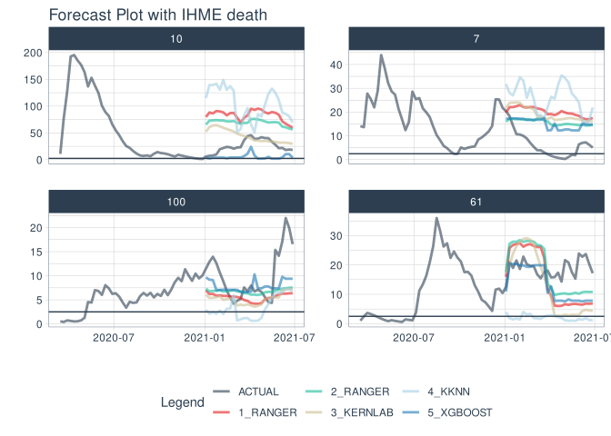<!-- -->

``` r
result1 %>%
    group_by(client) %>%
    filter(client %in% c(  "7","10", "61","100"))%>%
    plot_modeltime_forecast(
        .facet_ncol  = 2,
        .interactive = FALSE,
        .title = "Forecast Plot with zip death ",
        .line_alpha = 0.6,
        .line_size = 1,
        .y_intercept = 2.5,
        .conf_interval_show = FALSE
    )
```

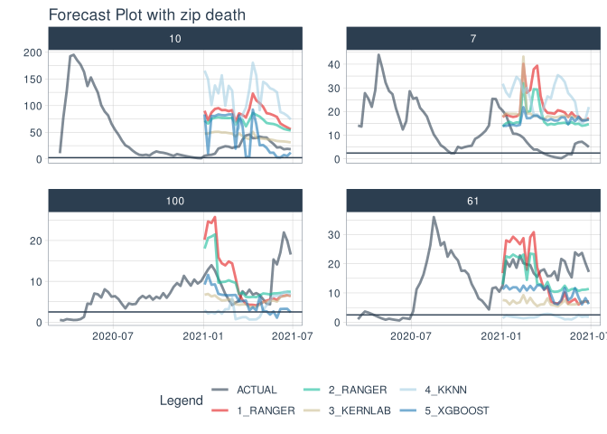<!-- -->

``` r
result2 %>%
    group_by(client) %>%
    filter(client %in% c(  "7","10", "61","100"))%>%
    plot_modeltime_forecast(
        .facet_ncol  = 2,
        .interactive = FALSE,
        .title = "Forecast Plot with zip death ",
        .line_alpha = 0.6,
        .line_size = 1,
        .y_intercept = 2.5,
        .conf_interval_show = FALSE
    )
```

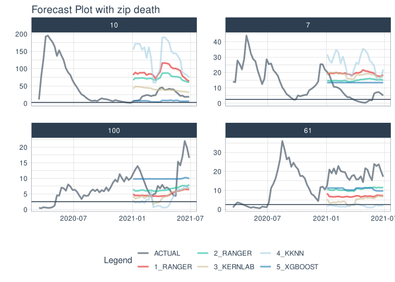<!-- -->

## Plot sens, spec, accuracy

Classify whether the client is adverse or not adverse:
`shrunk_ae > 2.5`.

We can get the following conclusions:

1.  Death data provides slight improvement for all models. The result of
    IHME Death data is almost same with zip death.

2.  Xgboost and Suppor vector machine have the best accurcy around `78%`
    for forecast 6 months.

3.  K-neasrest neighbors has good sensitivity result and bad specifity,
    while other models show the opposite.

``` r
threshold <- 2.5
```

``` r
result %>%
  select(-.model_desc, -.conf_lo, -.conf_hi, -.key) %>%
  rename(model = .model_id, value = .value, date= .index)%>%
  relocate(model, value, .after = client)%>%
  pivot_wider(names_from = model, values_from =value)%>%
  rename(actual = "NA", "Random forest" = "1", "Tuned random forest" = "2", "Support vector machines" = "3", "K-nearest neighbors" = "4", Xgboost = "5" )%>%
  drop_na()%>%
  pivot_longer("Random forest":Xgboost, names_to = "model", values_to = "predict")%>%
  relocate(model,.before = date)%>%
  mutate(obs = actual > threshold, predict_class = predict > threshold)%>%
  mutate(obs = as.factor(obs), predict_class = as.factor(predict_class))%>%
  group_by(date, model) %>%
  summarize(Sensitivity = sens_vec(obs, predict_class),
            Specifity = spec_vec(obs, predict_class),
            Accuracy = accuracy_vec(obs, predict_class),.groups = "keep")%>%
  pivot_longer(Sensitivity:Accuracy, names_to = "metric", values_to = "value") %>%
  ungroup() %>%
  ggplot(aes(x = date, y = value, color = model)) +
  geom_point() +
  geom_line() +
  facet_wrap( ~ metric)+
  ggtitle("With IHME death data")
```

<!-- -->

``` r
result1 %>%
  select(-.model_desc, -.conf_lo, -.conf_hi, -.key) %>%
  rename(model = .model_id, value = .value, date= .index)%>%
  relocate(model, value, .after = client)%>%
  pivot_wider(names_from = model, values_from =value)%>%
  rename(actual = "NA", "Random forest" = "1", "Tuned random forest" = "2", "Support vector machines" = "3", "K-nearest neighbors" = "4", Xgboost = "5" )%>%
  drop_na()%>%
  pivot_longer("Random forest":Xgboost, names_to = "model", values_to = "predict")%>%
  relocate(model,.before = date)%>%
  mutate(obs = actual > threshold, predict_class = predict > threshold)%>%
  mutate(obs = as.factor(obs), predict_class = as.factor(predict_class))%>%
  group_by(date, model) %>%
  summarize(Sensitivity = sens_vec(obs, predict_class),
            Specifity = spec_vec(obs, predict_class),
            Accuracy = accuracy_vec(obs, predict_class),.groups = "keep")%>%
  pivot_longer(Sensitivity:Accuracy, names_to = "metric", values_to = "value") %>%
  ungroup() %>%
  ggplot(aes(x = date, y = value, color = model)) +
  geom_point() +
  geom_line() +
  facet_wrap( ~ metric)+
  ggtitle("With zip death data")
```

<!-- -->

``` r
result2 %>%
  select(-.model_desc, -.conf_lo, -.conf_hi, -.key) %>%
  rename(model = .model_id, value = .value, date= .index)%>%
  relocate(model, value, .after = client)%>%
  pivot_wider(names_from = model, values_from =value)%>%
  rename(actual = "NA", "Random forest" = "1", "Tuned random forest" = "2", "Support vector machines" = "3", "K-nearest neighbors" = "4", Xgboost = "5" )%>%
  drop_na()%>%
  pivot_longer("Random forest":Xgboost, names_to = "model", values_to = "predict")%>%
  relocate(model,.before = date)%>%
  mutate(obs = actual > threshold, predict_class = predict > threshold)%>%
  mutate(obs = as.factor(obs), predict_class = as.factor(predict_class))%>%
  group_by(date, model) %>%
  summarize(Sensitivity = sens_vec(obs, predict_class),
            Specifity = spec_vec(obs, predict_class),
            Accuracy = accuracy_vec(obs, predict_class),.groups = "keep")%>%
  pivot_longer(Sensitivity:Accuracy, names_to = "metric", values_to = "value") %>%
  ungroup() %>%
  ggplot(aes(x = date, y = value, color = model)) +
  geom_point() +
  geom_line() +
  facet_wrap( ~ metric)+
  ggtitle("Without death data")
```

<!-- --> ## Calculate
predict claims

We calculate the predicted weekly claim by:

Predicted Smoothed AE = Predicted Shrunk AE/Shrinkage,

Predicted weekly Claim = Predicted Smoothed AE ⋅ (Expected Yearly Claim/52.18)

``` r
claim <- read_feather("data/processed_data_20_12_23.feather")%>%
  select(date, client, claims, expected, shrinkage,volume)
```

``` r
predclaim<-result %>%
  select(-.model_desc, -.conf_lo, -.conf_hi, -.key) %>%
  rename(model = .model_id, value = .value, date= .index)%>%
  relocate(model, value, .after = client)%>%
  pivot_wider(names_from = model, values_from =value)%>%
  rename(actual = "NA", rf = "1", rf_tuned = "2", svm_rbd = "3", knn = "4", xgboost = "5" )%>%
  drop_na()%>%
 inner_join(claim, by = c("date", "client"))%>%
  mutate(rf = rf/shrinkage *(expected /52.18),
         rf_tuned = rf_tuned/shrinkage*(expected /52.18),
         svm_rbd = svm_rbd /shrinkage*(expected /52.18),
         knn = knn/shrinkage*(expected /52.18),
         xgboost= xgboost/shrinkage*(expected / 52.18))%>%
  select(date, client, claims,expected, rf, rf_tuned,svm_rbd,knn,xgboost)

predclaim1<-result1 %>%
  select(-.model_desc, -.conf_lo, -.conf_hi, -.key) %>%
  rename(model = .model_id, value = .value, date= .index)%>%
  relocate(model, value, .after = client)%>%
  pivot_wider(names_from = model, values_from =value)%>%
  rename(actual = "NA", rf = "1", rf_tuned = "2", svm_rbd = "3", knn = "4", xgboost = "5" )%>%
  drop_na()%>%
 inner_join(claim, by = c("date", "client"))%>%
  mutate(rf = rf/shrinkage *(expected /52.18),
         rf_tuned = rf_tuned/shrinkage*(expected /52.18),
         svm_rbd = svm_rbd /shrinkage*(expected /52.18),
         knn = knn/shrinkage*(expected /52.18),
         xgboost= xgboost/shrinkage*(expected / 52.18))%>%
  select(date, client, claims,expected, rf, rf_tuned,svm_rbd,knn,xgboost)

predclaim2<-result2 %>%
  select(-.model_desc, -.conf_lo, -.conf_hi, -.key) %>%
  rename(model = .model_id, value = .value, date= .index)%>%
  relocate(model, value, .after = client)%>%
  pivot_wider(names_from = model, values_from =value)%>%
  rename(actual = "NA", rf = "1", rf_tuned = "2", svm_rbd = "3", knn = "4", xgboost = "5" )%>%
  drop_na()%>%
 inner_join(claim, by = c("date", "client"))%>%
  mutate(rf = rf/shrinkage *(expected /52.18),
         rf_tuned = rf_tuned/shrinkage*(expected /52.18),
         svm_rbd = svm_rbd /shrinkage*(expected /52.18),
         knn = knn/shrinkage*(expected /52.18),
         xgboost= xgboost/shrinkage*(expected / 52.18))%>%
  select(date, client, claims,expected, rf, rf_tuned,svm_rbd,knn,xgboost)
```

Weekly total claims vs predicted claims

We can draw the following conclusion:

1.  K-nearest neighbors, Xgboost, svm can catch the trend for every week
    total claim.

2.  Death data improve the results greatly.The zip death have the best
    result since it is the exact death of the area. And IHME death data
    result is also good. Without death data, none of 5 models can catch
    the change of claims.

``` r
predclaim%>%
  group_by(date)%>%
  summarise(expected = sum(expected)/52.18,
        claims = sum(claims),
          rf =sum(rf) ,
         rf_tuned = sum(rf_tuned),
         svm_rbd = sum(svm_rbd) ,
         knn = sum(knn),
         xgboost= sum(xgboost))%>%
   rename("Random forest" = rf, "Tuned random forest" = rf_tuned, "Support vector machines" = svm_rbd, "K-nearest neighbors" = knn, Xgboost = xgboost )%>%
  pivot_longer(expected:Xgboost, names_to = "metric", values_to = "value")%>%
  ggplot(aes(x = date, y = value, color = metric)) + geom_line()+
  ggtitle(" Weekly total claim with IHME death")
```

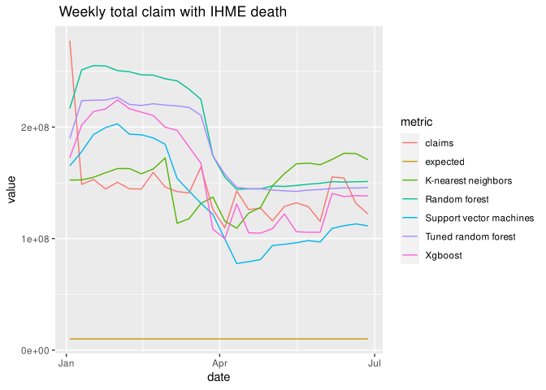<!-- -->

``` r
predclaim1%>%
  group_by(date)%>%
  summarise(expected = sum(expected)/52.18,
        claims = sum(claims),
          rf =sum(rf) ,
         rf_tuned = sum(rf_tuned),
         svm_rbd = sum(svm_rbd) ,
         knn = sum(knn),
         xgboost= sum(xgboost))%>%
   rename("Random forest" = rf, "Tuned random forest" = rf_tuned, "Support vector machines" = svm_rbd, "K-nearest neighbors" = knn, Xgboost = xgboost )%>%
  pivot_longer(expected:Xgboost, names_to = "metric", values_to = "value")%>%
  ggplot(aes(x = date, y = value, color = metric)) + geom_line()+
  ggtitle(" Weekly total claim with zip death")
```

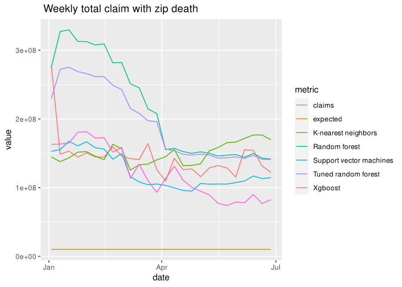<!-- -->

``` r
predclaim2%>%
  group_by(date)%>%
  summarise(expected = sum(expected)/52.18,
        claims = sum(claims),
          rf =sum(rf) ,
         rf_tuned = sum(rf_tuned),
         svm_rbd = sum(svm_rbd) ,
         knn = sum(knn),
         xgboost= sum(xgboost))%>%
   rename( "Random forest" = rf, "Tuned random forest" = rf_tuned, "Support vector machines" = svm_rbd, "K-nearest neighbors" = knn, Xgboost = xgboost )%>%
  pivot_longer(expected:Xgboost, names_to = "metric", values_to = "value")%>%
  ggplot(aes(x = date, y = value, color = metric)) + geom_line()+
  ggtitle(" Weekly total claim without death")
```

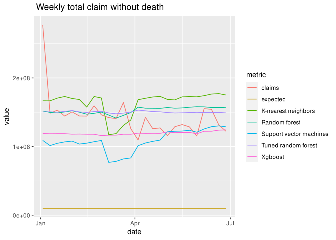<!-- -->

Half year total claims for each client vs predicted total claims

Each client, the result is not good since it is a global model for all
clients.

``` r
predclaim%>%
  filter(client %in% c(1:50))%>%
  group_by(client)%>%
  summarise(expected = sum(expected)/52.18,
        claims = sum(claims),
          rf =sum(rf) ,
         rf_tuned = sum(rf_tuned),
         svm_rbd = sum(svm_rbd) ,
         knn = sum(knn),
         xgboost= sum(xgboost))%>%
  rename("Random forest" = rf, "Tuned random forest" = rf_tuned, "Support vector machines" = svm_rbd, "K-nearest neighbors" = knn, Xgboost = xgboost )%>%
  pivot_longer(claims:Xgboost, names_to = "metric", values_to = "value")%>%
  ggplot(aes(x = client, y = value, color = metric)) + geom_point(alpha = 0.7) +
  scale_y_log10() +
  ggtitle("Total claims for 2021-01-01 to 2021-06-01 for each client with IHME death")
```

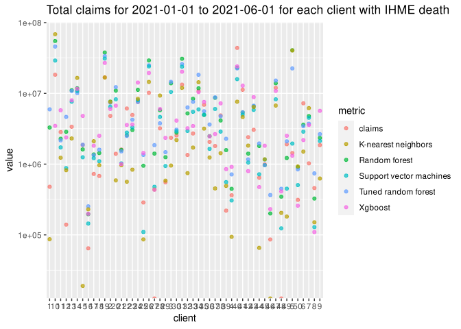<!-- -->

``` r
predclaim1%>%
  filter(client %in% c(1:50))%>%
  group_by(client)%>%
  summarise(expected = sum(expected)/52.18,
        claims = sum(claims),
          rf =sum(rf) ,
         rf_tuned = sum(rf_tuned),
         svm_rbd = sum(svm_rbd) ,
         knn = sum(knn),
         xgboost= sum(xgboost))%>%
  rename("Random forest" = rf, "Tuned random forest" = rf_tuned, "Support vector machines" = svm_rbd, "K-nearest neighbors" = knn, Xgboost = xgboost )%>%
  pivot_longer(claims:Xgboost, names_to = "metric", values_to = "value")%>%
  ggplot(aes(x = client, y = value, color = metric)) + geom_point(alpha = 0.7)+
  scale_y_log10() +
  ggtitle("Total claims for 2021-01-01 to 2021-06-01 for each client with zip death")
```

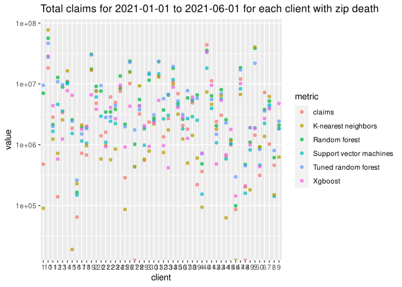<!-- -->

``` r
predclaim2%>%
  filter(client %in% c(1:50))%>%
  group_by(client)%>%
  summarise(expected = sum(expected)/52.18,
        claims = sum(claims),
          rf =sum(rf) ,
         rf_tuned = sum(rf_tuned),
         svm_rbd = sum(svm_rbd) ,
         knn = sum(knn),
         xgboost= sum(xgboost))%>%
  rename("Random forest" = rf, "Tuned random forest" = rf_tuned, "Support vector machines" = svm_rbd, "K-nearest neighbors" = knn, Xgboost = xgboost )%>%
  pivot_longer(claims:Xgboost, names_to = "metric", values_to = "value")%>%
  ggplot(aes(x = client, y = value, color = metric)) + geom_point(alpha = 0.7)+
  scale_y_log10() +
  ggtitle("Total claims for 2021-01-01 to 2021-06-01 for each client without death data")
```

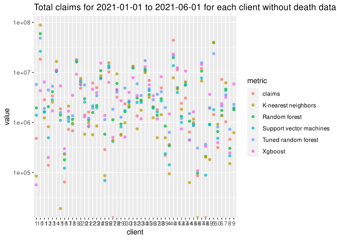<!-- -->

## Why this model doesn’t work

1.  The performance on classification of whether the client is adverse
    or not adverse is worse than our long-time and short-time model.
2.  Even this model is global for all clients, it will take much more
    time than others.
3.  It cannot predict new clients outside of the training set currently.

## Possible improvement for this model

1.  To improve accuracy, we can add feature engineering and localized
    model selection by time series identifier.
2.  We can also choose the final predicted value according to the
    confidence interval to improve our result since the exact AE is in
    the overlap of 5 models.

# Conclusion

The aim of this project is to predict Group Life Insurance Mortality
during a pandemic. We first observe that it is not sufficient to use the
pre-pandemic AE to classify clients between low-risk and high-risk
during a pandemic. Hence, we need to provide the management team with
new information that helps their decision making in such unprecedented
times. To serve this purpose, we collect data from the zip codes where
the companies are located along with some characteristics of the
companies. We present two types of models that serve valuable but
different purposes: long-term model and short-term model.

After evaluating several metrics of different machine learning models
for the long-term version, we choose the Random Forest and we tune its
hyperparameters. We aim at minimizing the proportion of adverse clients
that are incorrectly predicted as not adverse since this number causes
huge money loss for Securian. Simultaneously, we also aim at minimizing
the proportion of not adverse clients that are predicted as adverse,
since this causes clients loss and hence again money loss. After
choosing the best parameters, and choosing a threshold, we are able to
reach a sensitivity of 85%, a specificity of 78% and an accuracy of 82%.
We then use the SHAP values to increase the transparency of the model
and understand the contribution of the predictors in the classification
of our clients.

We then include the time factor in the short-term model and we aim at
using some known clients’ performance in the past to predict both known
and unknown clients’ performance three months in the future. For this
version, we use the rolling AE (updated weekly) that takes also into
account client volume, as opposed to using yearly AE in the long-term
version. We also add the weekly deaths by COVID to the list of
predictors used in the long-term model. One key step in the process is
forecasting the weekly deaths to use it in the future. For this
time-dependent version, we choose the Boosted Trees model after
comparing its performance with other known machine learning models.
After tuning it and choosing the best parameter set, we present the
accuracy of the predictions for unknown clients and compare it with the
one for the known clients.

Using this work, the management team has a strong valuable asset that
can be used in their contract renewals, their negotiations and their
risk management.

# Future Directions

The both long and short-term models above performed tremendously well.
Even though the data used to build the models are from trusted sources
as cited in the data wrangling section, the clients data is simulated
due to privacy reason. Hence, the natural future step will be to test
the models on real clients. We hope that the models would perform as
well as they did with the simulated clients.

Another direction that this project can head to is to consider
infections as lagged predictor for deaths. Note that high vaccinations
have helped averted hospitalizations and deaths. See the CDC
[report](https://www.cdc.gov/flu/about/burden-averted/2019-2020.htm). In
the beginning of the pandemic, flu vaccination rate can be used as a
proxy for future COVID vaccination rate. With this in mind models can be
build to take into account the influenza infections and its vaccination
rate. Influenza is very seasonal infection thus the forecast will of
course be seasonal, but in building the future model other infectious
disease can be taken into to account, be it seasonal or not.

As noted above, a recently updated model is naturally expected to give
even better outcomes by adding more pandemic related predictors. To be
precise, let’s consider the relationship between vaccination and cases
rate given by the CDC, check the
[link](https://covid.cdc.gov/covid-data-tracker/#vaccination-case-rate).
As expected the higher the vaccination rate the lower the cases and
eventually lower death rate. So we expect that with these new COVID-19
parameters among others will give better deaths forcast and thus better
short-term models.

# Appendices

## Data repository

The data is stored in [Google
Drive](https://drive.google.com/drive/folders/1GYzZ3FuPWtQwTF8-UPQdenm0QWL_u_HH?usp=sharing).
It contains all the files needed to generate the various datasets and
compile the `Rmd` files. Some datasets have been pre-generated for
convenience. The directory structure is meant to mimic the one in the
[GitHub repository](https://github.com/haerski/mortality).

Next, we describe the contents and dependencies of the files in the data
repository

### R scripts

`data/zip3_rel.R`: generates `data/zip3_rel.feather`. Depends on

-   `data/zcta_county_rel_10.txt`

`data/deaths.R`: generates `data/deaths_zip3.feather`. Depends on

-   `data/zip3_rel.feather`, generated by `data/zip3_rel.R`
-   `data/covid_deaths_usafacts.csv`

`data/census.R`: generates `data/pop_den.feather`.

-   Requires an API key

`data/all_persons.r`: generates
`data/simulation_data/all_persons.feather`. Depends on

-   `data/simulation_data/experience_weekly_{n}.RDS`, where n = 1,…,10
-   `data/simulation_data/person_{n}.RDS`, where n = 1,…,10
-   `data/soa_base_2017.csv`

`data/wrangling.Rmd`: generates `data/data.feather`. Depends on

-   `data/Population_Estimates.csv`
-   `data/COVID-19_Vaccinations_in_the_United_States_County_data.gov.csv`
-   `data/Provisional_COVID-19_Death_Counts_in_the_United_States_by_County.csv`
-   `data/Education_Estimates.csv`
-   `data/Poverty_Estimates.csv`
-   `data/Unemployment_Estimates.csv`
-   `data/Vaccine_Hesitancy_for_COVID-19__County_and_local_estimates.csv`
-   `data/countypres_2000-2020.csv`
-   `data/zip3_rel.feather`, generated by `data/zip3_rel.R`

`data/processed_data.r`: generates
`data/processed_data_20_12_24.feather`. Depends on

-   `data/simulation_data/all_persons.feather`, generated by
    `data/all_persons.r`
-   `data/data.feather`, generated by `data/wrangling.Rmd`
-   `data/deaths_zip3.feather`, generated by `data/deaths.R`
-   `data/state.txt`
-   `data/zcta_county_rel_10.txt`
-   `data/2020_12_23/reference_hospitalization_all_locs.csv`

### Rmd files

`report.Rmd`: this file. Depends on

-   `data/processed_data_20_12_23.feather`, generated by
    `data/processed_data.r`
-   `calibwithIHME.rds`
-   `calibwithzipdeaths.rds`
-   `calibwithoutdeaths.rds`
-   `resultwithIHME.rds`
-   `resultwithzipdeaths.rds`
-   `resultwithoutdeaths.rds`

`time.Rmd`: work on time-dependent models. Depends on

-   `data/simulation_data/all_persons.feather`, generated by
    `data/all_persons.r`
-   `data/data.feather`, generated by `data/wrangling.Rmd`
-   `data/deaths_zip3.feather`, generated by `data/deaths.R`
-   `data/state.txt`
-   `data/zcta_county_rel_10.txt`
-   `data/2020_12_23/reference_hospitalization_all_locs.csv`
-   `data/processed_data_20_12_23.feather`, generated by
    `data/processed_data.r`

`baseline_models.Rmd`: work on time-independent models. Depends on

-   `data/simulation_data/all_persons.feather`, generated by
    `data/all_persons.r`
-   `data/data.feather`, generated by `data/wrangling.Rmd`

`final.Rmd`: final presentation plots. Depends on

-   `data/processed_data_20_12_23.feather`, generated by
    `data/processed_data.r`

`presentation_2.Rmd`: technical presentation plots. Depends on

-   `data/simulation_data/all_persons.feather`, generated by
    `data/all_persons.r`
-   `data/data.feather`, generated by `data/wrangling.Rmd`

`random_forest.Rmd`: early work on random forest models

-   `data/simulation_data/all_persons.feather`, generated by
    `data/all_persons.r`
-   `data/data.feather`, generated by `data/wrangling.Rmd`
