# Executive summary

# Data wrangling

In this section, we describe our data gathering and tidying process.
We will be making extensive use of the `tidyverse` family of packages.
A series of scripts are used to generate tibbles, which are then saved in a `*.feather` for fast loading.
A full list of scripts with their dependencies can be viewed in the Appendix.

```r
library(tidyverse)
library(feather)
library(lubridate)
```

## Data sources

Our dataset consists of two parts: publicly obtained data and simulated clients.
Below we describe our publicly obtained datasets.

Filename | Source | Description
---------|--------|------------
`covid_deaths_usafacts.csv` | [USAFacts](https://usafacts.org/visualizations/coronavirus-covid-19-spread-map/) | Cumulative weekly COVID-19 deaths by county
`soa_base_2017.csv` | (Sent by Douglas Armstrong) | $q_x$ values by gender, age, industry
`Population_Estimates.csv` | USDA ERS | Population estimates of the U.S., states and counties, 2019
`COVID-19_Vaccinations_in_the_United_States_County_data.gov.csv` | ??? | ???  
`Education_Estimates.csv` | USDA ERS | Educational attainment for adults age 25 and older for the U.S., states and counties, 2015-19
`Poverty_Estimates.csv` | USDA ERS | Poverty rates in the U.S., states and counties, 2019
`Unemployment_Estimates.csv` | USDA ERS | Unemployment rates, 2019 and 2020; median househould income, 2019. States and counties
`Vaccine_Hesitancy_for_COVID-19__County_and_local_estimates.csv` | [CDC](https://catalog.data.gov/dataset/vaccine-hesitancy-for-covid-19-county-and-local-estimates) | Vaccine hesitancy estimates for COVID-19
`countypres_2000-2020.csv` | [MIT Election Data + Science Lab](https://dataverse.harvard.edu/file.xhtml?fileId=4819117&version=9.0) | Election data by county (only 2020 used)
`zcta_county_rel_10.txt` | [US Census Bureau](https://www.census.gov/geographies/reference-files/time-series/geo/relationship-files.2010.html#par_textimage_674173622) | Zip code to county relationship file (2010)
`2020_12_23/reference_hospitalization_all_locs.csv` | [IHME](http://www.healthdata.org/node/8787) | COVID-19 projections **as of Dec 23 2020**
`state.txt` | [US Census Bureau] | State names and FIPS codes


### US Census bureau
We used the US Census Bureau's API to obtain the 2019 estimates for population and density per county from the Census Bureau's Population Estimates Program (PEP).
The `censusapi` package provides an R interface to the API.
Using the API requires an API key, which can be obtained from [here](https://api.census.gov/data/key_signup.html).
The following snippet fetches the data, and saves the tibble into a file called `pop_den.feather`. See also `data/census.R`.

```r
library("censusapi")

Sys.setenv(CENSUS_KEY = "YOUR_KEY_HERE")

# date_code = 12 is an estimate for July 1, 2019
# total population + density
pop <- getCensus(
                 name = "pep/population",
                 vintage = 2019,
                 region = "county:*",
                 vars = c("POP", "DENSITY"),
                 DATE_CODE = 12)
pop <- tibble(pop) %>%
  select(-DATE_CODE)
write_feather(pop, "pop_den.feather")
```

See also `data/all_persons.r`.


## County to zip3
So far all of our public data is expressed by US county, but our clients' location are given as a ZIP3 code (the first three digit of a five-digit zip code).
The conversion from county to ZIP3 is nontrivial, as some zip codes span multiple counties and some counties span multiple zip codes.

To convert data given by county to ZIP3, we first need a ZIP3 to county relationship table.

The relationship table contains three columns: ZIP3, County, and Population. Each row will correspond to a pair $(\text{ZIP3}, \text{county})$, and the Population column will contain the population in the intersection $\text{ZIP3} \cap \text{county}$.
Then, given county-level data, we compute the corresponding value for any given ZIP3 by taking a weighted average of all counties intersecting that ZIP3, and weighting by the population in $\text{ZIP3} \cap $\text{county}$.
This operation looks as follows in code (suppose `A` contains some county-level data, e.g. poverty levels):

```r
A %>%
  left_join(zip3_rel, by = "county") %>%
  group_by(zip3) %>%
  summarize(poverty = weighted.mean(poverty, population, na.rm = TRUE))
```

We note that in practice, the country is represented by a 5 digit FIPS code.
The first two digits indicate the state, and the last 3 digits indicate the county.

The relationship table is generated by `zip3_rel.R` and can be loaded from `zip3_rel.feather`.
For an example of how it's used, see `wrangling.Rmd` and `deaths.R`.

## Weekly deaths & IHME forecasts
In some of our models we use weekly Covid deaths as a predictor.
The file `covid_deaths_usafacts.csv` contains this data for every day and every county.
We convert the county-level information to zip3 as above, and convert the daily data to weekly.
The library `lubridate` doesn't contain a type for week; we use the last day of the week instead (using `lubridate::ceiling_date(date, unit = "week")`).

We will also be using forecasts from the Institute for Health Metrics and Evaluation (IHME) to assist our models.
These forecasts are only given by state, so we need to convert states to ZIP3.
The file `data/state.txt` contains the state FIPS code and state name.
Since some ZIP3 codes span several states, we assign a state to each ZIP3 code by determining which state is most represented among counties in the ZIP3.

See also `data/deaths.R` and `time.Rmd` (line 856 onwards).

## Simulated client dataset
The clients we were tasked to study were simulated by Securian Financial.
The dataset consists of 20 files called `data/simulation_data/experience_weekly_{n}.RDS` and `data/simulation_data/person_{n}.RDS` for $n = 1,\dotsc, 10$.
In total, we have 500 clients and 1,382,321 individuals.

The `person_{n}.RDS` files contain information such as company, zip code, age, face amount, gender, and collar (blue or white, but in this dataset every indivual was blue collar).
The rows in `experience_weekly_{n}.RDS` correspond to individuals and weeks, and contains in a flag `deaths` that becomes 1 on the week they die.
In total, these tables contain 170,025,483 rows, but the same information can be conveyed in 1,382,231 rows by attaching to each individual their death date (or `NA` if they don't die).

```r
read_data <- function(n) {
  exp_name <- str_glue("simulation_data/experience_weekly_{n}.RDS")
  per_name <- str_glue("simulation_data/person_{n}.RDS")
  exp <- read_rds(exp_name)
  per <- read_rds(per_name)

  dies <-
    exp %>%
    filter(death > 0) %>%
    select(client, participant, week, month, year)
  aug_per <-
    per %>%
    left_join(dies, by = c("client", "participant"))

  aug_per
}

all_persons <- (1:10) %>% map_dfr(read_data)
```

We noticed that some individuals die more than once. This removes multiple deaths

```r
all_persons <-
  all_persons %>%
  group_by(client, participant) %>%
  arrange(year, week, .by_group = TRUE) %>%
  slice_head()
```

We finally attach to each individual their yearly $q_x$ value, and save the resuilting tibble in `data/simultation_data/all_persons.feather`.


```r
qx_table <- read_csv("soa_base_2017.csv")

all_persons <-
  all_persons %>%
  left_join(qx_table, by = c("Age", "Sex", "collar")) %>%
  relocate(qx, .after = collar)

write_feather(all_persons %>% ungroup(), "simulation_data/all_persons.feather")
```

The individual-level dataset is then converted to a client-level dataset.
We summarize each client by taking their ZIP3, size (number of individuals), volume (sum of face amounts), average qx, average age, and expected amount of claims.
We also compute the amount weekly total amount of claims.

## Final cleanup
There are some ZIP3 codes our clients are located in which we cannot deal with
They correspond to the following areas

ZIP3 | Area       |
-----|------------|
969  | Guam, Palau, Federated States of Micronesia, Northern Mariana Islands, Marshall Islands |
093  | Military bases in Iraq and Afghanistan |
732  | Not in use |
872  | Not in use |
004  | Not in use |
202  | Washington DC, Government 1 |
753  | Dallas, TX |
772  | Houston, TX |

The final two are problematic since they contained no population in 2010: one is used exclusively by a hospital, and the other is used exclusively by a mall.
Additionally, election data is not available in Washington D.C., so we remove clients located there.
In the end, we have a total of 492 clients to work with.

The data merging is done in the file `processed_data.r` which generates the file `data/processed_data_20_12_23.feather`.
The dependency tree is outlined in the Appendix.

After merging, this gives us a final dataset of 492 clients over 118 weeks ranging from Jan 1st 2019 to June 27th 2021.
We make two separate tibbles.


```r
weekly_data <-
  read_feather("data/processed_data_20_12_23.feather") %>%
  select(-ae_2021, -ae_2020, -ae_2019,
         -actual_2021, -actual_2020, -actual_2019, -adverse,
         -STATE_NAME, -shrinkage,  -dep_var) %>%
  arrange(client, date)

yearly_data <-
  read_feather("data/processed_data_20_12_23.feather") %>%
  group_by(client) %>%
  slice(1) %>%
  select(-date, -claims, -zip_deaths, -smoothed_ae, -shrunk_ae,
         -class, -smoothed_deaths,
         -hes, -hes_uns, -str_hes, -ae, -dep_var, -shrinkage, -STATE_NAME, -ihme_deaths)
```

Each row in `yearly_data` corresponds to a client, and it contains the following variables

Variable | Description
---------|------------
`zip3` | ZIP3 code
`client` | client ID
`size` | number of individuals
`volume` | sum of face values
`avg_qx` | average $q_x$
`avg_age` | average age
`per_male` | percentage of males
`per_blue_collar` | percentage of blue collar workers
`expected` | expected yearly amount of claims
`actual_{2021, 2020, 2019}` | actual claims in {2021, 2020, 2019}
`ae_{2021, 2020, 2019}` | actual claims / expected claims in {2021, 2020, 2019}
`nohs` | percentage of zip residents without a high school diploma
`hs` | percentage of zip residents with only a high school diploma
`college` | percentage of zip residents with only a community college or associates degree
`bachelor` | percentage of zip residents with a bachelor's degree
`R_birth` | birthrate in zip
`R_death` | deathrate in zip (pre-covid)
`unemp` | unemployment in zip
`poverty` | percentage of zip residents living in poverty
`per_dem` | percentage of zip residents who voted Democrat in 2020
`svi` | Social Vulnerability Index
`cvac` | CVAC level of concern for vaccine rollout
`income` | median household income in zipcode
`POP` | population in zipcode
`density` | zipcode population density
`adverse` | whether or not ae_2020 > 3

The tibble `weekly_data` contain most of the above variables, but also some that change weekly.
Each row correspond to a pair $(\text{client}, \text{week})$.
We describe the ones not present above

Variable | Description
---------|------------
`date` | the last day of the week (`lubridate::ceiling_date(date, unit = "week")`)
`claims` | claims for that client on that week (\$)
`zip_deaths` | number of deaths that week in the zipcode
`smoothed_ae` | smoothed version of actual weekly AE (see the section on long-term models)
`shrunk_ae` | shrunk version of smoothed weekly AE (see the section on long-term models)
`ae` | actual weekly AE
`ihme_deaths` | IHME Covid death forecasts. **These are only available until Apr 4th 2021, and are set to 0 after this date.**
`hes`, `hes_uns`, `str_hes` | percentage of the zip population that are vaccine hesitant, hesitant or unsure, and strongly hesistan respectively

# Data exploration and motivation
TODO: add the pictures we have in the intro of our presentations!

# Long-term model
Our first goal was to create a simple model to classify clients between high risk or low risk.
In this first model, we determine client risk based on AE in 2020, and we will use data available before the pandemic as predictors.

Our first task is to determine what "high risk" and "low risk" mean.
To this extent, we define "AE 2020 > 3" as "high risk", as the 1st quantile of the AE 2020 is close to 3

```r
summary(yearly_data %>% pull(ae_2020))
```

```
##    Min. 1st Qu.  Median    Mean 3rd Qu.    Max. 
##   0.000   2.896   6.342  14.961  13.595 229.937
```

This threshold was used to create the column `adverse` in `yearly_data`.

Thoughout this and following sections, we will be using extensively the `tidymodels` framework. We will explain the commands as they appear.

```r
library(tidymodels)
```

## Feature engineering
Our mentor's hypothesis was that the AE for 2019 was not a good predictor for client risk during a pandemic.
To test this hypothesis, we train and test a selection of models, some with 2019 AE as a predictor, and some without.

We start with a recipe, which defines our model formulas and data preprocessing steps.
We remove all categorical predictors and all variables that are not available before 2020.
We also remove the correlated variable `actual_2019`.
We then remove zero-variance predictors and normalize all predictors.

```r
with2019 <-
  recipe(adverse ~ ., data = yearly_data) %>%
  step_rm(all_nominal_predictors()) %>%
  step_rm(ae_2020, ae_2021, actual_2019, actual_2020, actual_2021) %>%
  step_zv(all_predictors()) %>%
  step_normalize(all_predictors())

no2019 <-
  with2019 %>%
  step_rm(ae_2019)
```

Next, we describe our models using `parsnip` model specifications.
We will try 8 different models: logistic regression, penalized logistic regression (penalty value chosen by initial tuning), random forest, tuned random forest, single layer neural network, RBF support vector machine, polynomial support vector machine, and K nearest neighbors.

```r
log_spec <-
  logistic_reg() %>%
  set_engine("glm") %>%
  set_mode("classification")
tuned_log_spec <-
  logistic_reg(penalty = 0.00118) %>%
  set_engine("glmnet") %>%
  set_mode("classification")
forest_spec <-
  rand_forest(trees = 1000) %>%
  set_mode("classification") %>%
  set_engine("ranger", num.threads = 8, importance = "impurity", seed = 123)
tuned_forest_spec <-
  rand_forest(trees = 1000, mtry = 12, min_n = 21) %>%
  set_mode("classification") %>%
  set_engine("ranger", num.threads = 8, importance = "impurity", seed = 123)
sln_spec <-
  mlp() %>%
  set_engine("nnet") %>%
  set_mode("classification")
svm_rbf_spec <-
  svm_rbf() %>%
  set_engine("kernlab") %>%
  set_mode("classification")
svm_poly_spec <-
  svm_poly() %>%
  set_engine("kernlab") %>%
  set_mode("classification")
knn_spec <-
  nearest_neighbor() %>%
  set_engine("kknn") %>%
  set_mode("classification")
```

In `tidymodels`, the combination of a recipe and a model specification is called a **workflow**.
Training a workflow trains both the recipe (i.e. it will learn the scaling and translation parameters for the normalization step) and the underlying model.
When a workflow is used to predict, the trained recipe will automatically be applied to a new set of data, and passed on to the trained model.
We can also combine sets of models and recipes into a `workflowset`.
This will allow us to easily train and test our models on the same dataset.

We first split our clients into training and testing sets.

```r
set.seed(30308)
init <- initial_split(yearly_data, strata = adverse)
```

All of our model selection, tuning, etc. will be done using 10-fold CV on the training set.

```r
set.seed(30308)
crossval <- vfold_cv(training(init), strata = adverse)
```

Our workflowset will contain the 16 combinations of the 8 model specifications and 2 recipes.
We train each one on the 10 cross-validation splits, and assess the results using the area under the ROC (`roc_auc`).


```r
models <- list(Logistic = log_spec,
               `Penalized logistic` = tuned_log_spec,
               `Random forest` = forest_spec,
               `Tuned random forest` = tuned_forest_spec,
               `Neural net` = sln_spec,
               `RBF SVM` = svm_rbf_spec,
               `Polynomial SVM` = svm_poly_spec,
               `KNN` = knn_spec)
recipes <- list("with2019ae" = with2019,
                "no2019ae" = no2019)
wflows <- workflow_set(recipes, models)
fit_wflows <-
    wflows %>%
      workflow_map(fn = "fit_resamples",
                   seed = 30332,
                   resamples = crossval,
                   control = control_resamples(save_pred = TRUE),
                   metrics = metric_set(roc_auc, accuracy))
```

We now look at the results with and without the 2019 AE as a predictor

```r
fit_wflows %>%
  collect_metrics() %>%
  separate(wflow_id, into = c("rec", "mod"), sep = "_", remove = FALSE) %>%
  ggplot(aes(x = rec, y = mean, color = mod, group = mod)) +
  geom_point() + geom_line() + facet_wrap(~ factor(.metric)) +
  labs(color = "Model", x = NULL, y = "Value", title = "Performance of models with/without 2019 data")
```

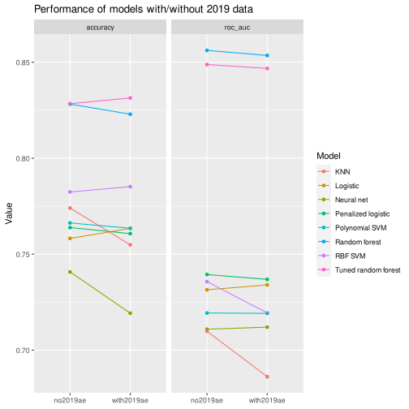

The performance with 2019 AE as a predictor is equal or worse than not using it.
Thus in the following we use the recipe where 2019 AE is removed.
We note that the above analysis was done with models with default hyperparameters.
It is certainly possible that some methods would have seen benefits from tuning.

## Model selection
With our data preprocessing locked in, we turn to model selection next.
We will look at five models, each with 10 different hyperparameters.

```r
tune_log_spec <-
  logistic_reg(penalty = tune()) %>%
  set_engine("glmnet") %>%
  set_mode("classification")
tune_forest_spec <-
  rand_forest(trees = 1000, mtry = tune(), min_n = tune()) %>%
  set_mode("classification") %>%
  set_engine("ranger", num.threads = 8, importance = "impurity", seed = 123)
tune_sln_spec <-
  mlp(hidden_units = tune(), penalty = tune(), epochs = tune()) %>%
  set_engine("nnet") %>%
  set_mode("classification")
tune_svm_rbf_spec <-
  svm_rbf(cost = tune(), rbf_sigma = tune(), margin = tune()) %>%
  set_engine("kernlab") %>%
  set_mode("classification")
tune_knn_spec <-
  nearest_neighbor(neighbors = tune(), dist_power = tune()) %>%
  set_engine("kknn") %>%
  set_mode("classification")

models <- list(`Logistic` = tune_log_spec,
               `Random forest` = tune_forest_spec,
               `Neural network` = tune_sln_spec,
               `SVM RBF` = tune_svm_rbf_spec,
               `KNN` = tune_knn_spec)
recipes <- list(no2019)
wflows <- workflow_set(recipes, models)
```

For each model, the 10 tuning parameters will be automatically selected using a latin hypercube. See the documentation of `dials::grid_latin_hypercube` for implementation details.
Again, performance will be evaluated by 10-fold crossvalidation.

```r
results <-
  wflows %>%
  workflow_map(resamples = crossval,
               grid = 10,
               metrics = metric_set(roc_auc, accuracy),
               control = control_grid(save_pred = TRUE),
               seed = 828282)
## i Creating pre-processing data to finalize unknown parameter: mtry
```

The results below suggest that the random forest is performing the best, especially in terms of the area under ROC.
We will thus choose it for further tuning.

```r
autoplot(results)
```

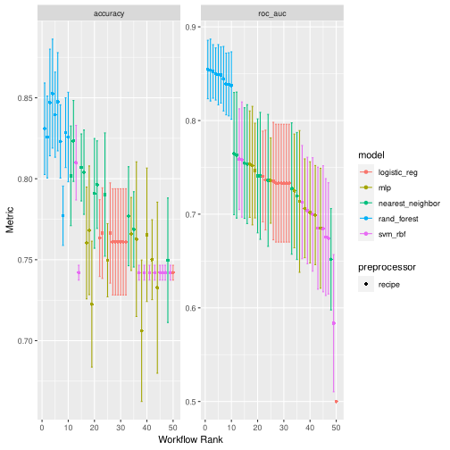

## Tuning a random forest
Since we've chosen a random forest, we no longer need to normalize our predictors.
This will make model explanation easier later on.
We wrap the recipe and model specification into a workflow.

```r
forest_rec <-
  recipe(adverse ~ ., data = yearly_data) %>%
  step_rm(all_nominal_predictors()) %>%
  step_rm(ae_2020, ae_2021, actual_2019, actual_2020, actual_2021) %>%
  step_zv(all_predictors()) %>%
  step_rm(ae_2019)

forest_wflow <-
  workflow() %>%
  add_model(tune_forest_spec) %>%
  add_recipe(forest_rec)
```

We have two tunable hyperparameters: `min_n`, the minimal number of datapoints required for a node to split, and `mtry`, the number of randomly selected predictors in each tree.
We fix the number of trees to 1000, and we set the tuning range of `mtry` to be between 1 and 20.
Tuning will happen on a regular, 10 x 10 grid.


```r
forest_params <-
  forest_wflow %>%
  parameters() %>%
  update(mtry = mtry(c(1, 20)))

forest_grid <-
  grid_regular(forest_params, levels = 10)
```

```r
forest_tune <-
  forest_wflow %>%
  tune_grid(
      resamples = crossval,
      grid = forest_grid,
      metrics = metric_set(roc_auc, accuracy)
  )
```

The tuning results are below.
We choose a set of parameters whose `roc_auc` is high. In this case, we choose `mtry = 5`, `min_n = 6`. The command `finalize_workflow` applies these parameters and returns a tuned workflow.

```r
autoplot(forest_tune)
```

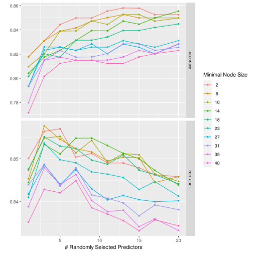

```r
best_params <- list(mtry = 5, min_n = 6)
final_forest <-
  forest_wflow %>%
  finalize_workflow(best_params)
```

## Thresholding
At the moment, our forest classifies each client by predicting the probability of belonging to the "high risk" class. If that probability is greater than 0.5, the final classification will be "high risk", if not, the final classification will be "low risk".

By changing the threshold from 0.5 to something else, we can influence the number of false positives or false negatives. This is important, since false positives and false negatives have different financial impacts for the insurer.
For example, a false positive would unfairly label a customer as high-risk when in reality they are not. Such a misclassification may lead to loss of profitable clients. On the other hand, a false negative might lead to mismanagement of risk due to exessive claims.

We can study the effect of different thresholds using the package `probably`.
For each of our 10 cross-validation sets, we train a random forest using the optimal parameters found above, and predict using 101 threshold values between 0 and 1.
The function `probably::threshold_perf` will compute seveal metrics, but we plot only sensitivity, specificity, and j-index.
These are averaged over the 10 crossvalidation sets.


```r
library(probably)

forest_resamples <-
  final_forest %>%
  finalize_workflow(best_params) %>%
  fit_resamples(
      resamples = crossval,
      control = control_resamples(save_pred = TRUE)
  )

forest_resamples <-
  forest_resamples %>%
  rowwise() %>%
  mutate(thr_perf = list(threshold_perf(.predictions, adverse, `.pred_ae > 3`, thresholds = seq(0.0, 1, by = 0.01))))

my_threshold <- 0.67

forest_resamples %>%
  select(thr_perf, id) %>%
  unnest(thr_perf) %>%
  group_by(.threshold, .metric) %>%
  summarize(estimate = mean(.estimate)) %>%
  filter(.metric != "distance") %>%
  ggplot(aes(x = .threshold, y = estimate, color = .metric)) + geom_line() +
  geom_vline(xintercept = my_threshold, linetype = "dashed") +
  labs(x = "Threshold", y = "Estimate", color = "Metric", title = "Sensitivity and specificity by threshold")
```

```
## `summarise()` has grouped output by '.threshold'. You can override using the `.groups` argument.
```

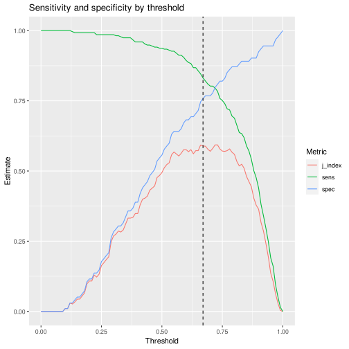

Some expertise and business intuition is required in order to determine the desired threshold value.
Due to a lack of time and resources, we decided to choose a threshold value that would simultaneously optimize for sensitivity and specificity. To that extent, we choose the threshold value of 0.67.

## Final results
With all the parameters chosen, we can finally train our random forest on the whole training set, and test it on the test set. We add to the testing set our probabilities.

```r
trained_forest <-
  final_forest %>%
  fit(training(init))

thresholded_predictions <-
  trained_forest %>%
  predict(testing(init), type = "prob") %>%
  mutate(class_pred =
            make_two_class_pred(
                  `.pred_ae > 3`,
                  levels = levels(yearly_data$adverse),
                  threshold = my_threshold)) %>%
  bind_cols(testing(init))
```

We can now compute a confusion matrix and some summary statistics. Note that we have 124 clients in the testing set, of which 74% are high risk (`ae > 3`). This is the No Information Rate.

```r
confusion_matrix <-
  thresholded_predictions %>%
  conf_mat(adverse, class_pred)

confusion_matrix %>% autoplot(type = "heatmap")
```


```r
confusion_matrix %>% summary()
```

```
## # A tibble: 13 × 3
##    .metric              .estimator .estimate
##    <chr>                <chr>          <dbl>
##  1 accuracy             binary         0.839
##  2 kap                  binary         0.603
##  3 sens                 binary         0.859
##  4 spec                 binary         0.781
##  5 ppv                  binary         0.919
##  6 npv                  binary         0.658
##  7 mcc                  binary         0.607
##  8 j_index              binary         0.640
##  9 bal_accuracy         binary         0.820
## 10 detection_prevalence binary         0.694
## 11 precision            binary         0.919
## 12 recall               binary         0.859
## 13 f_meas               binary         0.888
```

Pick two specific clients as examples to illustrate our model result. We choose client 58 who located in Brooklyn, New York and client 412 who located in Asheville, North Carolina. The first one faced adverse mortality and the second one didn't. 

Load `DALEX` package for plot break_down and SHAP value plot.

```r
library(DALEX)
fit_parsnip <- trained_forest %>% extract_fit_parsnip
trained_recipe <- trained_forest %>% extract_recipe
train <- trained_recipe %>% bake(training(init))
test <- trained_recipe %>% bake(testing(init))
```
Break-down plot of New York

```r
ex <-
  explain(
    model = fit_parsnip,
    data = train)
```

```
## Preparation of a new explainer is initiated
##   -> model label       :  model_fit  (  default  )
##   -> data              :  368  rows  21  cols 
##   -> data              :  tibble converted into a data.frame 
##   -> target variable   :  not specified! (  WARNING  )
##   -> predict function  :  yhat.model_fit  will be used (  default  )
##   -> predicted values  :  No value for predict function target column. (  default  )
##   -> model_info        :  package parsnip , ver. 0.1.7 , task classification (  default  ) 
##   -> model_info        :  Model info detected classification task but 'y' is a NULL .  (  WARNING  )
##   -> model_info        :  By deafult classification tasks supports only numercical 'y' parameter. 
##   -> model_info        :  Consider changing to numerical vector with 0 and 1 values.
##   -> model_info        :  Otherwise I will not be able to calculate residuals or loss function.
##   -> predicted values  :  numerical, min =  2e-04 , mean =  0.2594435 , max =  0.9503167  
##   -> residual function :  difference between y and yhat (  default  )
##   A new explainer has been created! 
```

```r
ex %>%
  predict_parts(train %>% slice(343)) %>%
  plot(digits = 2, max_features = 5, title = "Client 58, New York, Brooklyn")
```

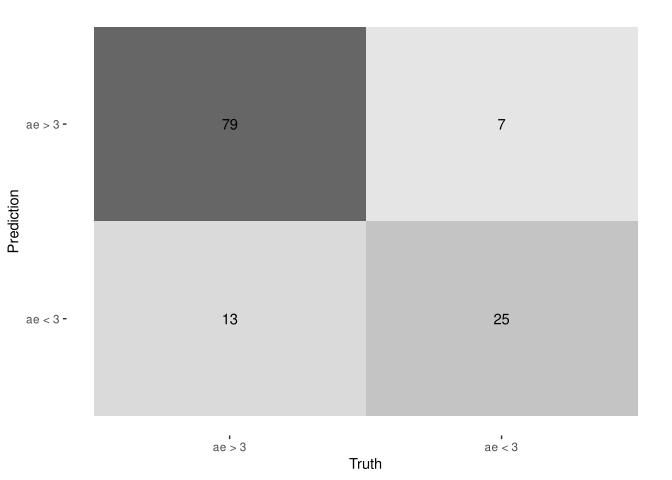
Sharp value of New York

```r
shap <- predict_parts(explainer = ex,
                      new_observation = train %>% slice(343),
                                 type = "shap",
                                  B = 25)
```

```r
plot(shap, show_boxplots = FALSE, title = "Client 58, New York, Brooklyn")
```

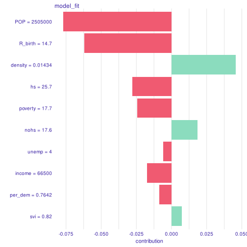
Break-down plot of NC

```r
ex %>%
  predict_parts(test %>% slice(80)) %>%
  plot(digits = 2, max_features = 5, title = "Client 412, North Carolina, Asheville")
```


Sharp Value of NC

```r
shap <- predict_parts(explainer = ex,
                      new_observation = test %>% slice(80),
                                 type = "shap",
                                  B = 25)
```

```r
plot(shap, show_boxplots = FALSE, title = "Client 412, North Carolina, Asheville")
```

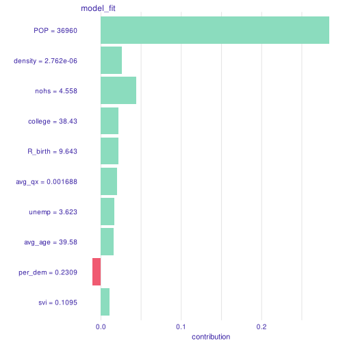
Variable importance

```r
trained_forest %>%
  extract_fit_engine() %>%
  importance() %>%
  as_tibble_row() %>%
  pivot_longer(everything(), names_to = "Variable", values_to = "Importance") %>%
  slice_max(Importance, n = 10) %>%
  ggplot(aes(y = fct_reorder(factor(Variable), Importance), x = Importance, fill = fct_reorder(factor(Variable), Importance))) +
  geom_col() +
  scale_fill_brewer(palette = "Spectral") +
  guides(fill = "none") + labs(y = "Variable", x = "Importance")
```

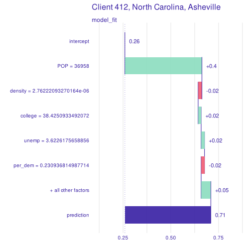


# Short-term model

## Intro

Now that we have introduced the long-term model and presented its results, we can move to the next step: integrating the time factor. To do this, we will be using the weekly_data through all this section. 


```r
weekly_data
```

```
## # A tibble: 58,056 × 35
##    zip3  date       client claims zip_deaths smoothed_ae shrunk_ae class      
##    <chr> <date>     <chr>   <dbl>      <dbl>       <dbl>     <dbl> <fct>      
##  1 018   2019-03-31 1           0          0           0         0 Not adverse
##  2 018   2019-04-07 1           0          0           0         0 Not adverse
##  3 018   2019-04-14 1           0          0           0         0 Not adverse
##  4 018   2019-04-21 1           0          0           0         0 Not adverse
##  5 018   2019-04-28 1           0          0           0         0 Not adverse
##  6 018   2019-05-05 1           0          0           0         0 Not adverse
##  7 018   2019-05-12 1           0          0           0         0 Not adverse
##  8 018   2019-05-19 1           0          0           0         0 Not adverse
##  9 018   2019-05-26 1           0          0           0         0 Not adverse
## 10 018   2019-06-02 1           0          0           0         0 Not adverse
## # … with 58,046 more rows, and 27 more variables: smoothed_deaths <dbl>,
## #   size <int>, volume <dbl>, avg_qx <dbl>, avg_age <dbl>, per_male <dbl>,
## #   per_blue_collar <dbl>, expected <dbl>, nohs <dbl>, hs <dbl>, college <dbl>,
## #   bachelor <dbl>, R_birth <dbl>, R_death <dbl>, unemp <dbl>, poverty <dbl>,
## #   per_dem <dbl>, hes <dbl>, hes_uns <dbl>, str_hes <dbl>, svi <dbl>,
## #   cvac <dbl>, income <dbl>, POP <dbl>, density <dbl>, ae <dbl>,
## #   ihme_deaths <dbl>
```

## Methods

We first start by dividing our timeline into training and testing sets: we take all the dates before January 1 2021 as our training set and all the dates from January 1 2021 to April 1 2021 as our test set (so 4 months later). Our goal is to try and use the data from our clients' performance before January 1 to predict their performance after this date. 


```r
train <-
  weekly_data %>%
  filter(date <= "2021-01-01")

test <-
  weekly_data %>%
  filter(date > "2021-01-01" & date <= "2021-04-01")
```

That are two mains things that set this model apart from the long term model introduced in the first section. First, the AE is updated weekly as opposed to the long term model where the AE is taken yearly. Second, we are adding weekly deaths as one of the predictors in addition to the variables introduced in the long term model. Now, that we have a clear understanding of the predictors in the short term model, the question that arises is how we can use the weekly deaths in the testing time (since such information won't be available for us in the "future"). To solve this issue, we decided to forecast the deaths for this "future" period: so we will use the weekly deaths from March 2020 to January 2021 and forecast the weekly deaths 4 months later. To do so, we will use the fully defaulted ARIMA forecaster. 


We will be using 

```r
library(fable)
library(tsibble)
```


```r
forecast <-
  weekly_data %>%
  filter(date >= "2020-03-15" & date <= "2021-01-01") %>%
  as_tsibble(index = date, key = client) %>%
  model(arima = ARIMA(smoothed_deaths)) %>%
  forecast(h = "4 months")
```

```
## Warning in sqrt(diag(best$var.coef)): NaNs produced

## Warning in sqrt(diag(best$var.coef)): NaNs produced
```

We create a new set called "forecasted_test" out of our testing set where we replace "smoothed_deaths" by "forecasted_deaths".


```r
forecasted_test <-
  forecast %>%
  as_tibble() %>%
  select(client, date, .mean) %>%
  right_join(test, by = c("client", "date")) %>%
  select(-smoothed_deaths) %>%
  rename(smoothed_deaths = .mean)
```

Now, the awaited part! We are ready to introduce our modeling strategy! 

We first start by introducing a common recipe that we will use for all our models. Our target variable is class, we use all the predictors in weekly_data except for client, zip3, claims, smoothed_ae, shrunk_ae, ae, zip_deaths, ihme_deaths and date. We normalize all predictors and we apply log to both Volume of the client and Population of the zip code.  

```r
common_recipe <-
  recipe(class ~ ., data = weekly_data) %>%
  step_rm(client, zip3, claims, smoothed_ae, shrunk_ae,  ae, zip_deaths, ihme_deaths, date) %>%
  step_zv(all_predictors()) %>%
  step_log(volume, POP) %>%
  step_normalize(all_predictors())
```

Now, that we have our recipe, we are ready to try out different models and report the results. Let us introduce the six models and then we will talk a little bit about each one of them. 


```r
forest_spec <-
  rand_forest(trees = 1000) %>%
  set_engine("ranger", num.threads = 8, seed = 123456789) %>%
  set_mode("classification")

log_spec <- 
  logistic_reg(
  mode = "classification",
  engine = "glm")

svm_lin_spec <-
  svm_linear() %>%
  set_engine("LiblineaR") %>%
  set_mode("classification")

knn_spec <-
  nearest_neighbor() %>%
  set_engine("kknn") %>%
  set_mode("classification")

sln_spec <-
  mlp(activation = "relu", hidden_units = 6, epochs = 100) %>%
  set_engine("keras", verbose=0) %>%
  set_mode("classification")


bt_spec <- boost_tree(
  mode = "classification",
  engine = "xgboost",
  trees = 100)
```

We use Random Forest (forest), Logistic Regression (log), SVM (linear kernel), Nearest Neighbor (knn), Neural Network with single layer (sln) and Boosted Trees (bt) respectively with the default setting. For the Random Forest, we consider 1000 trees and for the Boosted Trees, we take 100 trees. All of these models use different engines introduced in tidymodels, and they are all set to mode=classficiation. 

We then create the workflow for the six models mentioned above with the recipe taken to be the "common recipe" and the model taken to be the ones introduced in the previous chunk. 


```r
bt_wf <-
  workflow() %>%
  add_recipe(common_recipe) %>%
  add_model(bt_spec)

log_wf <-
  workflow() %>%
  add_recipe(common_recipe) %>%
  add_model(log_spec)

forest_wf <-
  workflow() %>%
  add_recipe(common_recipe) %>%
  add_model(forest_spec)

svm_lin_wf <-
  workflow() %>%
  add_recipe(common_recipe) %>%
  add_model(svm_lin_spec)

knn_wf <-
  workflow() %>%
  add_recipe(common_recipe) %>%
  add_model(knn_spec)

sln_wf <-
  workflow() %>%
  add_recipe(common_recipe) %>%
  add_model(sln_spec)
```

We can take each of these models and evaluate their performance separately, but we want to find a way where we can compare their performance through time. So, we create a tribble containing the six different workflows, we fit out training set and we predict our forecasted_test. For the prediction, we use class_predict to come up with a class (this prediction will be used to calculate accuracy, sensitivity and specificity). We also use prob_predict (by adding type="prob") to come up with a predicitive probability (used to calculate the ROC_AUC). 


```r
wflows <- tribble(~wflow ,
                  sln_wf,
                  knn_wf, log_wf, forest_wf, bt_wf)
 


wflows <-
  wflows %>%
  mutate(wflows_fit = map(wflow, ~ fit(.x, train))) 
```

```
## [14:17:31] WARNING: amalgamation/../src/learner.cc:1095: Starting in XGBoost 1.3.0, the default evaluation metric used with the objective 'binary:logistic' was changed from 'error' to 'logloss'. Explicitly set eval_metric if you'd like to restore the old behavior.
```

```r
wflows <-
  wflows %>%
  mutate(
    class_predict = map(wflows_fit, ~ predict(.x, forecasted_test)),  
    prob_predict = map(wflows_fit, ~ predict(.x, forecasted_test, type = "prob")))
```

Now that we have our prediction as a class and as a probability, we are ready to compare the metrics for the five models. 

```r
wflows %>%
  bind_cols(tribble(~id, "neural network", "nearest neigbor", "logistic regression", " Random Forest", "Boosted Trees")) %>%
  select(-wflow, -wflows_fit) %>%
  mutate(prob_predict = map(prob_predict, ~ bind_cols(.x, test %>% select(date, class)))) %>%
  unnest(c(class_predict, prob_predict)) %>%
  group_by(id, date) %>%
  summarize(
            sens = sens_vec(class, .pred_class),
            spec = spec_vec(class, .pred_class),
            roc_auc = roc_auc_vec(class, .pred_Adverse),
            accuracy = accuracy_vec(class, .pred_class), .groups = "keep") %>%
  pivot_longer(sens:accuracy, names_to = "metric", values_to = "value") %>%
  ungroup() %>%
  ggplot(aes(x = date, y = value, color = id)) +
  geom_point() +
  geom_line() +
  facet_wrap( ~ metric)
```

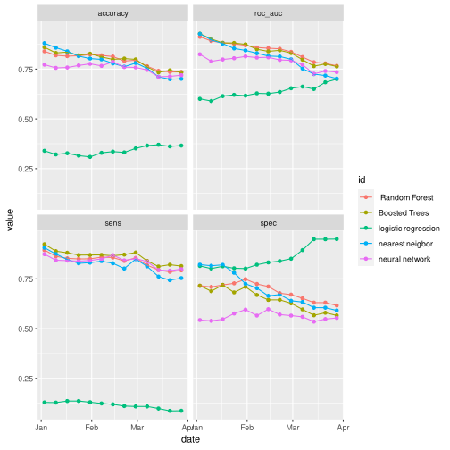
One can wonder how much our models are being affected by the forecasting of deaths. Let's replace forecasted_test by test and let's see what happens. (So, now actual deaths is used insetad of forecasted deaths).We will figure out there the difference is not very big and somehow our forecasting is not affecting the models in a bad way. 


```r
wflows_cheat <-
  wflows %>%
  mutate(
    class_predict = map(wflows_fit, ~ predict(.x, test)),  
    prob_predict = map(wflows_fit, ~ predict(.x, test, type = "prob")))


wflows_cheat %>%
  bind_cols(tribble(~id, "Neural Network", "Nearest Neighbor", "Logistic Regression", "Random Forest", "Boosted Trees")) %>%
  select(-wflow, -wflows_fit) %>%
  mutate(prob_predict = map(prob_predict, ~ bind_cols(.x, test %>% select(date, class)))) %>%
  unnest(c(class_predict, prob_predict)) %>%
  group_by(id, date) %>%
  summarize(
            sens = sens_vec(class, .pred_class),
            spec = spec_vec(class, .pred_class),
            roc_auc = roc_auc_vec(class, .pred_Adverse), 
            accuracy = accuracy_vec(class, .pred_class), .groups = "keep") %>%
  pivot_longer(sens:accuracy, names_to = "metric", values_to = "value") %>%
  ungroup() %>%
  ggplot(aes(x = date, y = value, color = id)) +
  geom_point() +
  geom_line() +
  facet_wrap( ~ metric)
```

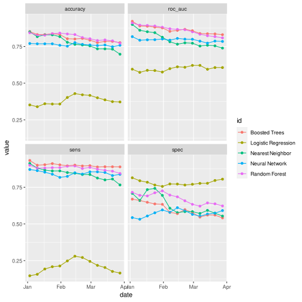


## Results

Comparing the models above, we can see that the Boosted Trees is the best model. So, we use it for the rest of the project, we tune it, and we report the results. 

First, we split our clients into training and testing clients. 
The training clients are "known"; they will be what the model will be trained on and they represent 75% of our total. 
The testing clients are "unknown"; they will represent brand new clients and they represent 25% of our total. 


```r
set.seed(1213)
training_clients <-
  weekly_data %>%
  nest_by(client) %>%
  ungroup() %>%
  slice_sample(prop = 3/4) %>%
  pull(client)

testing_clients <-
  weekly_data %>%
  filter(!client %in% training_clients) %>%
  pull(client) %>%
  unique()
```

We next divide the dates into training and testing dates. 
Our training period includes all dates before January 1 2021, and our testing period includes the next four months (so up to April 2021).  


```r
start <- ceiling_date(ymd("2021-01-01"), unit = "week")
end <- ceiling_date(ymd("2021-04-01"), unit = "week")
```

The goal of the following is to tune the Boosted Trees to optimize predictions of "unknown" client three months out.
To do so, we divide the training dates into analysis dates (all dates before October 1 2020) and assessment date (week of Jan 1st 2021). 


```r
analys <- ceiling_date(ymd("2020-10-01"), unit = "week")
assess <- start
```

We then split the training clients into analysis (75% of the training or known clients) and assessment (25% of the known clients).
We will create an `rsample` object, which requires knowledge of the row indices for the analysis and assessment sets.


```r
set.seed(123)
ana_clients <-
  training_clients %>%
  sample(length(.) * 3 / 4)

ana_idx <-
  weekly_data %>%
  rownames_to_column() %>%
  filter(client %in% ana_clients & date <= analys) %>%
  pull(rowname) %>%
  as.integer()

ass_idx <-
  weekly_data %>%
  rownames_to_column() %>%
  filter(client %in% training_clients) %>%
  filter(!client %in% ana_clients & date == assess) %>%
  pull(rowname) %>%
  as.integer()

spl <- make_splits(list(analysis = ana_idx, assessment = ass_idx), data = weekly_data)
resmpl <- manual_rset(list(spl), c("foo"))
```

Now, we define our Boosted trees model. We remove the following from the list of predictors: zip3, date, client, claims, zip_deaths, smoothed_ae, shrunk_ae, ae.


```r
xgboost_recipe <-
  recipe(formula = class ~ ., data = weekly_data) %>%
  step_rm(zip3, date, client, claims, zip_deaths, smoothed_ae, shrunk_ae, ae) %>%
  step_zv(all_predictors())

xgboost_spec <-
  boost_tree(trees = tune(), tree_depth = tune(), learn_rate = tune()) %>%
  set_mode("classification") %>%
  set_engine("xgboost", nthread = 8)

xgboost_workflow <-
  workflow() %>%
  add_recipe(xgboost_recipe) %>%
  add_model(xgboost_spec)
```


We tuned the model using the following hyperparameters: 
trees: Number of trees contained in the ensemble. 
tree depth: An integer for the maximum depth of the tree (i.e. number of splits). 
learn_rate: A number for the rate at which the boosting algorithm adapts from iteration-to-iteration. 
We start with 10 different sets of parameters, and then finetune it using 20 iterations of simulated annealing.
We use simulated annealing to find a set of parameters that maximizes `roc_auc`.


```r
library(finetune)
```

```r
set.seed(98324)
res_grd <-
  xgboost_workflow %>%
  tune_grid(
    resamples = resmpl,
    grid = 10,
    metrics = metric_set(roc_auc, sens, spec, j_index, accuracy),
    control = control_grid(verbose = TRUE))
## i foo: preprocessor 1/1
## ✓ foo: preprocessor 1/1
## i foo: preprocessor 1/1, model 1/10
## ✓ foo: preprocessor 1/1, model 1/10
## i foo: preprocessor 1/1, model 1/10 (predictions)
## i foo: preprocessor 1/1
## ✓ foo: preprocessor 1/1
## i foo: preprocessor 1/1, model 2/10
## ✓ foo: preprocessor 1/1, model 2/10
## i foo: preprocessor 1/1, model 2/10 (predictions)
## i foo: preprocessor 1/1
## ✓ foo: preprocessor 1/1
## i foo: preprocessor 1/1, model 3/10
## ✓ foo: preprocessor 1/1, model 3/10
## i foo: preprocessor 1/1, model 3/10 (predictions)
## i foo: preprocessor 1/1
## ✓ foo: preprocessor 1/1
## i foo: preprocessor 1/1, model 4/10
## ✓ foo: preprocessor 1/1, model 4/10
## i foo: preprocessor 1/1, model 4/10 (predictions)
## i foo: preprocessor 1/1
## ✓ foo: preprocessor 1/1
## i foo: preprocessor 1/1, model 5/10
## ✓ foo: preprocessor 1/1, model 5/10
## i foo: preprocessor 1/1, model 5/10 (predictions)
## i foo: preprocessor 1/1
## ✓ foo: preprocessor 1/1
## i foo: preprocessor 1/1, model 6/10
## ✓ foo: preprocessor 1/1, model 6/10
## i foo: preprocessor 1/1, model 6/10 (predictions)
## i foo: preprocessor 1/1
## ✓ foo: preprocessor 1/1
## i foo: preprocessor 1/1, model 7/10
## ✓ foo: preprocessor 1/1, model 7/10
## i foo: preprocessor 1/1, model 7/10 (predictions)
## i foo: preprocessor 1/1
## ✓ foo: preprocessor 1/1
## i foo: preprocessor 1/1, model 8/10
## ✓ foo: preprocessor 1/1, model 8/10
## i foo: preprocessor 1/1, model 8/10 (predictions)
## i foo: preprocessor 1/1
## ✓ foo: preprocessor 1/1
## i foo: preprocessor 1/1, model 9/10
## ✓ foo: preprocessor 1/1, model 9/10
## i foo: preprocessor 1/1, model 9/10 (predictions)
## i foo: preprocessor 1/1
## ✓ foo: preprocessor 1/1
## i foo: preprocessor 1/1, model 10/10
## ✓ foo: preprocessor 1/1, model 10/10
## i foo: preprocessor 1/1, model 10/10 (predictions)

res <-
  xgboost_workflow %>%
  tune_sim_anneal(
      resamples = resmpl,
      iter = 20,
      initial = res_grd,
      metrics = metric_set(roc_auc, sens, spec, j_index, accuracy))
## Optimizing roc_auc
## Initial best: 0.78996
##  1 ◯ accept suboptimal  roc_auc=0.74385
##  2 ◯ accept suboptimal  roc_auc=0.69237
##  3 ◯ accept suboptimal  roc_auc=0.66214
##  4 + better suboptimal  roc_auc=0.67367
##  5 ◯ accept suboptimal  roc_auc=0.67188
##  6 ─ discard suboptimal roc_auc=0.6647
##  7 ◯ accept suboptimal  roc_auc=0.6583
##  8 ✖ restart from best  roc_auc=0.66342
##  9 ◯ accept suboptimal  roc_auc=0.76537
## 10 ─ discard suboptimal roc_auc=0.74129
## 11 ─ discard suboptimal roc_auc=0.71875
## 12 ◯ accept suboptimal  roc_auc=0.74027
## 13 ♥ new best           roc_auc=0.80328
## 14 ─ discard suboptimal roc_auc=0.76383
## 15 ─ discard suboptimal roc_auc=0.78151
## 16 ─ discard suboptimal roc_auc=0.771
## 17 ─ discard suboptimal roc_auc=0.76076
## 18 ─ discard suboptimal roc_auc=0.78381
## 19 ♥ new best           roc_auc=0.81916
## 20 ─ discard suboptimal roc_auc=0.7687
```


```r
res %>% show_best(metric = "roc_auc")
```

```
## # A tibble: 5 × 10
##   trees tree_depth learn_rate .metric .estimator  mean     n std_err .config    
##   <int>      <int>      <dbl> <chr>   <chr>      <dbl> <int>   <dbl> <chr>      
## 1  1939          2   0.00552  roc_auc binary     0.819     1      NA Iter19     
## 2  1807          4   0.00273  roc_auc binary     0.803     1      NA Iter13     
## 3  1701          7   0.000408 roc_auc binary     0.790     1      NA initial_Pr…
## 4  1703          5   0.000617 roc_auc binary     0.784     1      NA Iter18     
## 5  2000          5   0.000264 roc_auc binary     0.782     1      NA Iter15     
## # … with 1 more variable: .iter <int>
```

```r
best_parms <- res %>% select_best(metric = "roc_auc")
```

Those are three possible choices for the best hyperparameters based on the higher "roc_auc". 

```r
best_parms <- tribble(
        ~trees, ~tree_depth, ~learn_rate,
        517, 10, 0.001312986874346298)

best_parms <- tribble(
          ~trees, ~tree_depth, ~learn_rate,
          138, 6, 0.07662993111378884)

best_parms <- tribble(
          ~trees, ~tree_depth, ~learn_rate,
          1939,2,0.005523512626608967)
```

After storing these best hyperparameters, We apply them to our workflow and we obtain our final workflow. 

```r
final_wf <- xgboost_workflow %>% finalize_workflow(best_parms)
```

We now need to forecast 4 months worth of `smoothed_deaths` usig default setting of Arima forecaster. 

```r
forecast <-
  weekly_data %>%
  filter(date >= "2020-03-15" & date <= start) %>%
  as_tsibble(index = date, key = client) %>%
  model(arima = ARIMA(smoothed_deaths)) %>%
  forecast(h = "4 months")
```

```
## Warning in sqrt(diag(best$var.coef)): NaNs produced

## Warning in sqrt(diag(best$var.coef)): NaNs produced

## Warning in sqrt(diag(best$var.coef)): NaNs produced

## Warning in sqrt(diag(best$var.coef)): NaNs produced

## Warning in sqrt(diag(best$var.coef)): NaNs produced
```
We create a new data called "forecast_data" where the actual deaths are replaced by the forecasted deaths. 
So, now we have weekly_data that contains the "actual_deaths" and we have "forecasted_data" that contains the "forecasted_deaths" instead.


```r
future <-
  forecast %>%
  as_tibble() %>%
  select(client, date, .mean) %>%
  rename(smoothed_deaths = .mean)

forecast_data <-
  weekly_data %>%
  rows_update(future, by = c("date","client"))
```

Now that we have these two data sets available, we can easily define the "train" set to include all known client with dates prior to January 1 (training dates). 

```r
train <-
  weekly_data %>%
  filter(client %in% training_clients & date <= start)
```

For the purpose of comparison, we will have four types of testing sets:
test_known_true: include all known clients with dates 4 months after January 1 (known clients + testing dates) using the actual deaths for this 4 months period. 
test_unknown_true: include all unknown clients with dates 4 months after January 1 (unknown clients + testing dates) using the actual deaths for this 4 months period. 
test_known_fore: include all known clients with dates 4 months after January 1 (known clients + testing dates ) using the forecasted deaths for this 4 months period. 
test_unknown_fore: include all unknown clients with dates 4 months after January 1 (unknown clients + testing dates) using the forecasted deaths for this 4 months period.


```r
test_known_true <-
  weekly_data %>%
  filter(client %in% training_clients) %>%
  filter(date > start & date <= end)

test_unknown_true <-
  weekly_data %>%
  filter(!client %in% training_clients) %>%
  filter(date > start & date <= end)

test_known_fore <-
  forecast_data %>%
  filter(client %in% training_clients) %>%
  filter(date > start & date <= end)

test_unknown_fore <-
  forecast_data %>%
  filter(!client %in% training_clients) %>%
  filter(date > start & date <= end)
```

We fit "train" in the final workflow. 

```r
trained_wf <-
  final_wf %>%
  fit(train)
```

```
## [14:34:13] WARNING: amalgamation/../src/learner.cc:1095: Starting in XGBoost 1.3.0, the default evaluation metric used with the objective 'binary:logistic' was changed from 'error' to 'logloss'. Explicitly set eval_metric if you'd like to restore the old behavior.
```

Now, we can create a tribble "tests" out of these 4 testing sets. First, we compare the accuracy for both known clients and unknown clients prediction for these 4 months using the forecasted deaths. 

```r
tests <-
  tribble(
    ~id, ~set,
    "Known clients", test_known_fore,
    "Unknown clients", test_unknown_fore)

tests %>%
  mutate(set = map(set, ~ bind_cols(.x, trained_wf %>% predict(.x)))) %>%
  unnest(set) %>%
  group_by(id, date) %>%
  summarize(
      Accuracy = yardstick::accuracy_vec(class, .pred_class),
      Sensitivity = yardstick::sens_vec(class, .pred_class),
      Specificity = yardstick::spec_vec(class, .pred_class)) %>%
  ungroup() %>%
  pivot_longer(Accuracy:Specificity, names_to = "metric", values_to = "value") %>%
  filter(metric == "Accuracy") %>%
  ggplot(aes(x = date, y = value, color = id)) + geom_line() +
  labs(x = "Date", y = "Accuracy", color = "")
```

```
## `summarise()` has grouped output by 'id'. You can override using the `.groups` argument.
```

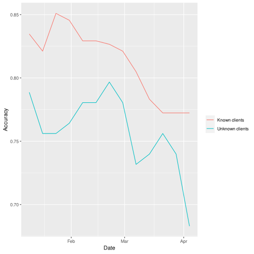
We then compare these two plots with the two we get when we replace forecasted deaths by actual deaths. We can see that the difference is not large and somehow our machine learning models have been able to have good performance with the forecasted deaths. 


```r
tests <-
  tribble(
    ~id, ~set,
    "Known clients, true deaths", test_known_true,
    "Unknown clients, true deaths", test_unknown_true,
    "Known clients", test_known_fore,
    "Unknown clients", test_unknown_fore)

tests %>%
  mutate(set = map(set, ~ bind_cols(.x, trained_wf %>% predict(.x)))) %>%
  unnest(set) %>%
  group_by(id, date) %>%
  summarize(
      Accuracy = yardstick::accuracy_vec(class, .pred_class),
      Sensitivity = yardstick::sens_vec(class, .pred_class),
      Specificity = yardstick::spec_vec(class, .pred_class)) %>%
  ungroup() %>%
  pivot_longer(Accuracy:Specificity, names_to = "metric", values_to = "value") %>%
  filter(metric == "Accuracy") %>%
  ggplot(aes(x = date, y = value, color = id)) + geom_line(aes(linetype = str_detect(id, "true"))) +
  labs(x = "Date", y = "Accuracy", color = "") + guides(linetype = "none")
```

```
## `summarise()` has grouped output by 'id'. You can override using the `.groups` argument.
```


### Explaining outcomes


One of the most important part in any model is interpreting the result. Model interpretability helps extracting insight and clarity regarding how the algorithms are performing. 
There are several tools that can be used to increase the model transparency. 
In the following, we will use the DALEX package. DALEX uses a process called breakdown to compute localized variable importance scores. For each client, we can explain why a case receives its prediction and how each predictor contributes either positively or negatively to the target variable. The local interpretability enables us to pinpoint and contrast the impacts of the factors.


We explain how much each feature contributes to the value of a single prediction using the following. We will explain the plots after running the code. 

```r
library(DALEX)
library(DALEXtra)

model <-
  trained_wf %>%
  extract_fit_parsnip()

recipe <-
  trained_wf %>%
  extract_recipe(estimated = TRUE)

exp <- explain(model, recipe %>% bake(train))
```

```
## Preparation of a new explainer is initiated
##   -> model label       :  model_fit  (  default  )
##   -> data              :  34317  rows  26  cols 
##   -> data              :  tibble converted into a data.frame 
##   -> target variable   :  not specified! (  WARNING  )
##   -> predict function  :  yhat.model_fit  will be used (  default  )
##   -> predicted values  :  No value for predict function target column. (  default  )
##   -> model_info        :  package parsnip , ver. 0.1.7 , task classification (  default  ) 
##   -> model_info        :  Model info detected classification task but 'y' is a NULL .  (  WARNING  )
##   -> model_info        :  By deafult classification tasks supports only numercical 'y' parameter. 
##   -> model_info        :  Consider changing to numerical vector with 0 and 1 values.
##   -> model_info        :  Otherwise I will not be able to calculate residuals or loss function.
##   -> predicted values  :  the predict_function returns an error when executed (  WARNING  ) 
##   -> residual function :  difference between y and yhat (  default  )
##   A new explainer has been created! 
```

```r
test_obs <-
  test_unknown_fore %>%
  filter(date == end, client == 397)

exp %>%
predict_parts(recipe %>% bake(test_obs) %>% select(-class)) %>%
  plot(digits = 2, max_features = 5, title = "Client 397")
```


```r
test_obs <-
  test_known_fore %>%
  filter(date == end, client == 405)

exp %>%
predict_parts(recipe %>% bake(test_obs) %>% select(-class)) %>%
  plot(digits = 2, max_features = 5, title = "Client 405")
```


We use client 405 (Not Adverse) from our known clients and client 397 (Adverse) from our unknown clients. 
The prediction in blue is the probability that the client is not adverse. For client 405, since the prediction is 0.53 (>0.5), this client is not adverse. For client 397, since the prediction is 0.37 (<0.5), this client is adverse. Now, a red bar means that this predictor has a negative contribution to the non-adversability of the client. And a green bar means that this predictor has  a positive contribution in the non-adversability of the client. 
For instance, comparing clients 397 and 405, we can see that smoothed_deaths for client 397 is so much bigger than the value for client 405 and hence the contribution of this predictor to the adversability is larger for client 397 (red bar is bigger). 


# Model we tried and did not work
In this section, we introduce the model we tried and did not work.

We want to predict the `AE value` for each client for each week during COVID-19. Since the weekly AE value changes dramatically, we decide to predict the `shrunk AE`. For detail of shrunk AE, check data wrangling section. 

Our main package is `Modeltime`, which consists time series models and machine learning. Since we have more than 500 clients, we have more than 500 time series. Practically, we will have more clients. We create a global machine learning model that forecasts all clients at once for computational efficiency. 

We use data before Covid-19 (based on the zip code where the company is located (such as poverty, education, unemployment levels) and characteristics of the company (such as the average age of its employees) as our predictors. And we compare results with IHME death data/with zip death data/without death data. 
Necessary package we need. 

```r
library(modeltime)
library(timetk)
```
*Read data and pre-processing*

Get weeklydata from `2020-03-15` to `2021-06-27 `. 

```r
clients<-read_feather("data/processed_data_20_12_23.feather")%>%
  select(-ae_2021, -ae_2020, -ae_2019,
         -actual_2021, -actual_2020, -actual_2019, -adverse,
         -STATE_NAME, -dep_var, -smoothed_ae)%>%
  filter(date >= "2020-03-15")%>%
  mutate(client = as.factor(client))
```

Split our data into two part: train set (`2020-03-15` to `2020-12-27`) and test set (`2021-01-03` to `2021-06-27`).

```r
  set.seed(1234)
  splits <-  clients %>% time_series_split(initial = "6 months", assess = "6 months", date_var = date, cumulative = TRUE)
```

```
## Data is not ordered by the 'date_var'. Resamples will be arranged by `date`.
```

```
## Overlapping Timestamps Detected. Processing overlapping time series together using sliding windows.
```

```r
  train = training(splits)
  test = testing(splits)
```

With recipe, we can add feature engineering steps to get our data ready.
We remove useless variables: zip3, actual claims, class, shrinkage, ae.
For extreme big number such as `population`, `volume` and `expected`, we use `step_log()`to do logarithm transformation for pre-processing.
` step_mutate(client = droplevels(client))` to add ID variable. `step_timeseries_signature()` to creates a a specification of a recipe step that will convert date into many features that can aid in machine learning with time-series data.

Here `rec_obj` is for model with `ihme_deaths`, `rec_obj1` with `zip_deaths` and `rec_obj2` without any death data.

```r
rec_obj_alldata <-
    recipe(shrunk_ae ~ ., data = training(splits)) %>%
    step_rm(zip3)%>%
    step_rm( claims , class, shrinkage, ae)%>%
    step_log(POP, volume, expected)%>%
    step_mutate(client = droplevels(client)) %>%
    step_timeseries_signature(date) %>%
    step_rm(date)%>%
    step_dummy(all_nominal_predictors(), one_hot = TRUE)%>%
    step_zv(all_predictors()) %>%
    step_normalize(all_predictors(), -all_nominal())
#recipe with ihme death data
rec_obj <-
    rec_obj_alldata%>%
    step_rm(zip_deaths, smoothed_deaths)
#recipe with zip death
rec_obj1 <-
    rec_obj_alldata%>%
    step_rm( ihme_deaths, smoothed_deaths)
#recipe without  death
rec_obj2 <-
    rec_obj_alldata%>%
    step_rm( smoothed_deaths, ihme_deaths, zip_deaths)
```
Here are 5 machine learning models we try in this section . `forest_spec` is random forest. `tuned_forest_spec` is tunded random forest. `svm_rbf_spec` is radial basis function support vector machines. `knn_spec` is K-nearest neighbors and `xgboost_spec` is Xgboost.

```r
forest_spec <-
  rand_forest(trees = 1000) %>%
  set_engine("ranger", num.threads = 8, seed = 123456789) %>%
  set_mode("regression")%>%
  set_engine("ranger", num.threads = 8, importance = "impurity", seed = 123)
tuned_forest_spec <-
  rand_forest(trees = 1000, mtry = 12, min_n = 21) %>%
  set_mode("regression")%>%
  set_engine("ranger", num.threads = 8, importance = "impurity", seed = 123)
svm_rbf_spec <-
  svm_rbf() %>%
  set_engine("kernlab") %>%
  set_mode("regression")
knn_spec <-
  nearest_neighbor() %>%
  set_engine("kknn") %>%
  set_mode("regression")
xgboost_spec <-
  boost_tree(trees = 100) %>%
  set_engine("xgboost") %>%
  set_mode("regression")
```
*Create workflow*

The workflow is an object that can bundle together our pre-processing, modeling, and post-processing requests. 

Workflow with ihme death data

```r
wflw_rf <- workflow() %>%
    add_model(
        forest_spec
    ) %>%
    add_recipe(rec_obj) %>%
    fit(data = training(splits))

wflw_tunedrf <- workflow() %>%
    add_model(
        tuned_forest_spec
    ) %>%
    add_recipe(rec_obj) %>%
    fit(data = training(splits))

wflw_svmrbf <- workflow() %>%
    add_model(
        svm_rbf_spec
    ) %>%
    add_recipe(rec_obj) %>%
    fit(data = training(splits))

wflw_knnspec <- workflow() %>%
    add_model(
        knn_spec
    ) %>%
    add_recipe(rec_obj) %>%
    fit(data = training(splits))  

wflw_xgboost <- workflow() %>%
    add_model(
        xgboost_spec
    ) %>%
    add_recipe(rec_obj) %>%
    fit(data = training(splits))  
#Create a Modeltime Table (table of model)
model_tbl<- modeltime_table(
    wflw_rf,
    wflw_tunedrf,
    wflw_svmrbf,
    wflw_knnspec,
    wflw_xgboost
)
```
Workflow with zip death data

```r
wflw_rf1 <- workflow() %>%
    add_model(
        forest_spec
    ) %>%
    add_recipe(rec_obj1) %>%
    fit(data = training(splits))

wflw_tunedrf1 <- workflow() %>%
    add_model(
        tuned_forest_spec
    ) %>%
    add_recipe(rec_obj1) %>%
    fit(data = training(splits))

wflw_svmrbf1 <- workflow() %>%
    add_model(
        svm_rbf_spec
    ) %>%
    add_recipe(rec_obj1) %>%
    fit(data = training(splits))

wflw_knnspec1 <- workflow() %>%
    add_model(
        knn_spec
    ) %>%
    add_recipe(rec_obj1) %>%
    fit(data = training(splits))

wflw_xgboost1 <- workflow() %>%
    add_model(
        xgboost_spec
    ) %>%
    add_recipe(rec_obj1) %>%
    fit(data = training(splits))  
#Create a Modeltime Table
model_tbl1 <- modeltime_table(
    wflw_rf1,
    wflw_tunedrf1,
    #wflw_neural,
    wflw_svmrbf1,
    #wflw_svmpoly,
    wflw_knnspec1,
    wflw_xgboost1
)
```
Workflow without  death

```r
wflw_rf2 <- workflow() %>%
    add_model(
        forest_spec
    ) %>%
    add_recipe(rec_obj2) %>%
    fit(data = training(splits))

wflw_tunedrf2 <- workflow() %>%
    add_model(
        tuned_forest_spec
    ) %>%
    add_recipe(rec_obj2) %>%
    fit(data = training(splits))

wflw_svmrbf2 <- workflow() %>%
    add_model(
        svm_rbf_spec
    ) %>%
    add_recipe(rec_obj2) %>%
    fit(data = training(splits))

wflw_knnspec2 <- workflow() %>%
    add_model(
        knn_spec
    ) %>%
    add_recipe(rec_obj2) %>%
    fit(data = training(splits)) 

wflw_xgboost2 <- workflow() %>%
    add_model(
        xgboost_spec
    ) %>%
    add_recipe(rec_obj2) %>%
    fit(data = training(splits))  
#Create a Modeltime Table
model_tbl2 <- modeltime_table(
    wflw_rf2,
    wflw_tunedrf2,
    wflw_svmrbf2,
    wflw_knnspec2,
    wflw_xgboost2
)
```
For quick knit, we save the workflow here

```r
#save the model table with IHME death data
saveRDS(model_tbl, "modelwithIHME.rds")
#save the model table with zip death data
saveRDS(model_tbl1, "modelwithzipdeath.rds")
#save the model table without death data
saveRDS(model_tbl2, "modelwithoutdeath.rds")
```
Read the saved workflow table

```r
model_tbl <- readRDS("modelwithIHME.rds")
model_tbl1 <- readRDS("modelwithzipdeath.rds")
model_tbl2 <- readRDS("modelwithoutdeath.rds")
```
*Preparation for forecasting*
Calibrate the model to testing set. It will calculate accuracy and forecast confidence by computing predictions and residuals for testing set.

```r
#with IHME
calib_tbl <- model_tbl %>%
    modeltime_calibrate(
      new_data = testing(splits), 
      id       = "client"
    )
#with zip death
calib_tbl1 <- model_tbl1 %>%
    modeltime_calibrate(
      new_data = testing(splits), 
      id       = "client"
    )
#without death
calib_tbl2 <- model_tbl2 %>%
    modeltime_calibrate(
      new_data = testing(splits), 
      id       = "client"
    )
```
For quick knit, we save the calibration sets here.

```r
#save the model table with IHME death data
saveRDS(calib_tbl, "calibwithIHME.rds")
#save the model table with zip death data
saveRDS(calib_tbl1, "calibwithzipdeath.rds")
#save the model table without death data
saveRDS(calib_tbl2, "calibwithoutdeath.rds")
```
Read the saved calibration sets.

```r
calib_tbl <- readRDS("calibwithIHME.rds")
calib_tbl1 <- readRDS("calibwithzipdeath.rds")
calib_tbl2 <- readRDS("calibwithoutdeath.rds")
```
Here present the accuacy results. We can check the global error and local error for each cliente on testing set for different models.
The accuracy metrics include:

`MAE` - Mean absolute error, `mae()`

`MAPE` - Mean absolute percentage error, `mape()`

`MASE` - Mean absolute scaled error, `mase()`

`SMAPE` - Symmetric mean absolute percentage error, `smape()`

`RMSE` - Root mean squared error, `rmse()`

`RSQ` - R-squared, `rsq()`.

Global error

```r
#with IHME death
calib_tbl %>% 
    modeltime_accuracy(acc_by_id = FALSE)
```

```
## # A tibble: 5 × 9
##   .model_id .model_desc .type   mae  mape  mase smape  rmse    rsq
##       <int> <chr>       <chr> <dbl> <dbl> <dbl> <dbl> <dbl>  <dbl>
## 1         1 RANGER      Test  12.1    Inf 1.51   89.6  31.7 0.114 
## 2         2 RANGER      Test  10.5    Inf 1.31   88.7  20.7 0.179 
## 3         3 KERNLAB     Test   7.41   Inf 0.925  95.1  12.4 0.466 
## 4         4 KKNN        Test  12.4    NaN 1.55  NaN    39.4 0.0762
## 5         5 XGBOOST     Test   7.13   Inf 0.891  85.9  15.3 0.545
```

```r
#with zip death
calib_tbl1 %>% 
    modeltime_accuracy(acc_by_id = FALSE)
```

```
## # A tibble: 5 × 9
##   .model_id .model_desc .type   mae  mape  mase smape  rmse    rsq
##       <int> <chr>       <chr> <dbl> <dbl> <dbl> <dbl> <dbl>  <dbl>
## 1         1 RANGER      Test  12.9    Inf 1.61   90.3  32.2 0.130 
## 2         2 RANGER      Test  10.9    Inf 1.37   88.3  21.5 0.185 
## 3         3 KERNLAB     Test   6.76   Inf 0.844  90.2  11.9 0.510 
## 4         4 KKNN        Test  12.4    NaN 1.55  NaN    39.0 0.0801
## 5         5 XGBOOST     Test   6.81   Inf 0.850  91.0  15.5 0.314
```

```r
#without death data
calib_tbl2 %>% 
    modeltime_accuracy(acc_by_id = FALSE)
```

```
## # A tibble: 5 × 9
##   .model_id .model_desc .type   mae  mape  mase smape  rmse    rsq
##       <int> <chr>       <chr> <dbl> <dbl> <dbl> <dbl> <dbl>  <dbl>
## 1         1 RANGER      Test  10.5    Inf 1.31   86.0  31.2 0.112 
## 2         2 RANGER      Test   9.25   Inf 1.15   85.2  20.7 0.162 
## 3         3 KERNLAB     Test   6.37   Inf 0.795  91.5  11.9 0.513 
## 4         4 KKNN        Test  13.4    NaN 1.67  NaN    43.1 0.0798
## 5         5 XGBOOST     Test   6.30   Inf 0.787  81.5  12.5 0.450
```
Local error for each client

```r
#with IHME death
calib_tbl %>% 
    modeltime_accuracy(acc_by_id = TRUE)
```

```
## # A tibble: 2,460 × 10
##    .model_id .model_desc .type client    mae  mape   mase smape   rmse     rsq
##        <int> <chr>       <chr> <fct>   <dbl> <dbl>  <dbl> <dbl>  <dbl>   <dbl>
##  1         1 RANGER      Test  1        4.92 Inf    15.4  156.    5.30  0.411 
##  2         1 RANGER      Test  10      57.3  333.   17.4  108.   58.6   0.126 
##  3         1 RANGER      Test  100      4.75  38.9   2.51  51.0   6.39  0.384 
##  4         1 RANGER      Test  101      4.30 191.    3.32  81.7   4.71  0.333 
##  5         1 RANGER      Test  102      2.46 Inf   Inf    200     2.50 NA     
##  6         1 RANGER      Test  103      1.30 155.    1.51  64.8   1.75  0.610 
##  7         1 RANGER      Test  104    262.   Inf   125.   173.  310.    0.385 
##  8         1 RANGER      Test  105     30.6  313.   16.4  109.   34.8   0.0498
##  9         1 RANGER      Test  106     19.4   93.9   7.67  56.7  24.2   0.0835
## 10         1 RANGER      Test  107      4.05  49.1   2.12  68.4   6.52  0.0691
## # … with 2,450 more rows
```

```r
#with zip death
calib_tbl1 %>% 
    modeltime_accuracy(acc_by_id = TRUE)
```

```
## # A tibble: 2,460 × 10
##    .model_id .model_desc .type client    mae  mape   mase smape   rmse      rsq
##        <int> <chr>       <chr> <fct>   <dbl> <dbl>  <dbl> <dbl>  <dbl>    <dbl>
##  1         1 RANGER      Test  1       11.5  Inf    36.1  175.   13.8   0.412  
##  2         1 RANGER      Test  10      59.6  339.   18.1  110.   61.4   0.165  
##  3         1 RANGER      Test  100      6.74  68.8   3.56  61.3   8.04  0.0142 
##  4         1 RANGER      Test  101      5.63 219.    4.35  84.9   7.00  0.544  
##  5         1 RANGER      Test  102      2.12 Inf   Inf    200     2.16 NA      
##  6         1 RANGER      Test  103      1.67 198.    1.94  70.5   2.30  0.602  
##  7         1 RANGER      Test  104    240.   Inf   115.   168.  294.    0.333  
##  8         1 RANGER      Test  105     32.3  325.   17.3  113.   36.9   0.0476 
##  9         1 RANGER      Test  106     21.8  107.    8.62  64.3  26.8   0.0622 
## 10         1 RANGER      Test  107      3.98  49.0   2.09  68.3   6.44  0.00413
## # … with 2,450 more rows
```

```r
#without death data
calib_tbl2 %>% 
    modeltime_accuracy(acc_by_id = TRUE)
```

```
## # A tibble: 2,460 × 10
##    .model_id .model_desc .type client    mae  mape   mase smape   rmse      rsq
##        <int> <chr>       <chr> <fct>   <dbl> <dbl>  <dbl> <dbl>  <dbl>    <dbl>
##  1         1 RANGER      Test  1        2.56 Inf     8.03 129.    2.79  0.314  
##  2         1 RANGER      Test  10      63.9  353.   19.4  114.   64.8   0.442  
##  3         1 RANGER      Test  100      5.20  43.4   2.75  58.8   6.74  0.476  
##  4         1 RANGER      Test  101      4.01 148.    3.09  78.3   4.65  0.123  
##  5         1 RANGER      Test  102      3.04 Inf   Inf    200     3.10 NA      
##  6         1 RANGER      Test  103      1.66 175.    1.92  77.5   2.28  0.00315
##  7         1 RANGER      Test  104    249.   Inf   119.   173.  294.    0.398  
##  8         1 RANGER      Test  105     24.2  253.   13.0  102.   26.9   0.124  
##  9         1 RANGER      Test  106     13.3   65.8   5.27  51.1  15.1   0.148  
## 10         1 RANGER      Test  107      4.31  53.5   2.26  79.6   6.56  0.721  
## # … with 2,450 more rows
```


*Predict*

We predict the shrunk AE on testing set. Our model will provide with predicting shrunk AE and confidence interval.  

```r
#with IHME death
result <- calib_tbl %>%
    modeltime_forecast(
        new_data    = testing(splits),
        actual_data = bind_rows(training(splits), testing(splits)),
        conf_by_id  = TRUE
    )
#with zip death
result1 <- calib_tbl1 %>%
    modeltime_forecast(
        new_data    = testing(splits),
        actual_data = bind_rows(training(splits), testing(splits)),
        conf_by_id  = TRUE
    )
#without death
result2 <- calib_tbl2 %>%
    modeltime_forecast(
        new_data    = testing(splits),
        actual_data = bind_rows(training(splits), testing(splits)),
        conf_by_id  = TRUE
    )
```
For quick knit, we save the results on testing set here.

```r
#result with IHME death data 
saveRDS(result, "resultwithIHME.rds")
#result with zip death data
saveRDS(result1, "resultwithzipdeath.rds")
#result without death data
saveRDS(result2, "resultwithoutdeath.rds")
```
Read the results on testing set.

```r
result <- readRDS("resultwithIHME.rds")
result1 <- readRDS("resultwithzipdeath.rds")
result2 <- readRDS("resultwithoutdeath.rds")
```
*Visualize clients forecast*

We pick client `1`, `5`, `7`, `10`, `61`, `100` as examples. We add the solid line `threshold = 2.5` to help us to see whether this client meet adverse mortality event.The exact AE is in the range of confidence interval. 

```r
result %>%
    group_by(client) %>%
    filter(client %in% c("7","10", "61","100"))%>%
    plot_modeltime_forecast(
        .facet_ncol  = 2,
        .interactive = FALSE,
        .title = "Forecast Plot with IHME death ",
        .line_alpha = 0.6,
        .line_size = 1,
        .y_intercept = 2.5,
        .conf_interval_show = FALSE
    )
```

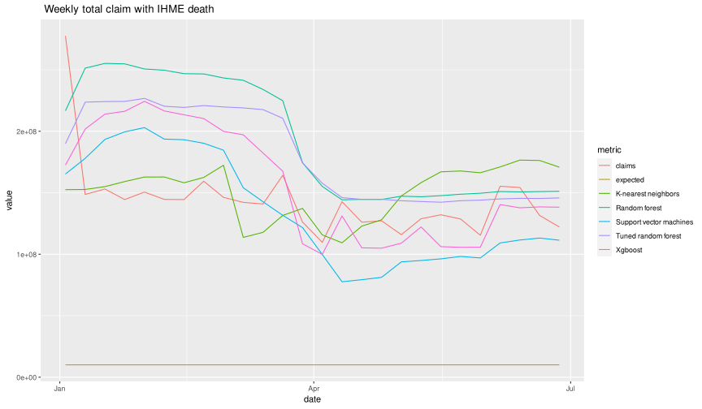

```r
result1 %>%
    group_by(client) %>%
    filter(client %in% c(  "7","10", "61","100"))%>%
    plot_modeltime_forecast(
        .facet_ncol  = 2,
        .interactive = FALSE,
        .title = "Forecast Plot with zip death ",
        .line_alpha = 0.6,
        .line_size = 1,
        .y_intercept = 2.5,
        .conf_interval_show = FALSE
    )
```

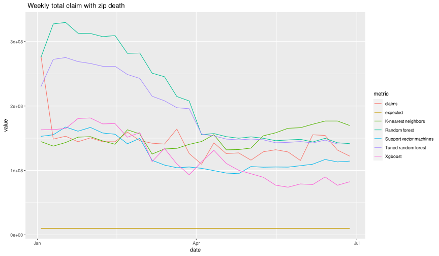

```r
result2 %>%
    group_by(client) %>%
    filter(client %in% c(  "7","10", "61","100"))%>%
    plot_modeltime_forecast(
        .facet_ncol  = 2,
        .interactive = FALSE,
        .title = "Forecast Plot with zip death ",
        .line_alpha = 0.6,
        .line_size = 1,
        .y_intercept = 2.5,
        .conf_interval_show = FALSE
    )
```


*Plot sens, spec, accuracy*

Classify whether the client is adverse or not adverse: `shrunk_ae > 2.5`.

We can get the following conclusions:

1. Death data provides slight improvement for all models. The result of  IHME Death data is almost same with zip death. 

2. Xgboost and Suppor vector machine have the best accurcy around `78%` for forecast 6 months. 

3. K-neasrest neighbors has good sensitivity result and bad specifity, while other models show the opposite. 


```r
threshold <- 2.5
```

```r
result %>%
  select(-.model_desc, -.conf_lo, -.conf_hi, -.key) %>%
  rename(model = .model_id, value = .value, date= .index)%>%
  relocate(model, value, .after = client)%>%
  pivot_wider(names_from = model, values_from =value)%>%
  rename(actual = "NA", "Random forest" = "1", "Tuned random forest" = "2", "Support vector machines" = "3", "K-nearest neighbors" = "4", Xgboost = "5" )%>%
  drop_na()%>%
  pivot_longer("Random forest":Xgboost, names_to = "model", values_to = "predict")%>%
  relocate(model,.before = date)%>%
  mutate(obs = actual > threshold, predict_class = predict > threshold)%>%
  mutate(obs = as.factor(obs), predict_class = as.factor(predict_class))%>%
  group_by(date, model) %>%
  summarize(Sensitivity = sens_vec(obs, predict_class),
            Specifity = spec_vec(obs, predict_class),
            Accuracy = accuracy_vec(obs, predict_class),.groups = "keep")%>%
  pivot_longer(Sensitivity:Accuracy, names_to = "metric", values_to = "value") %>%
  ungroup() %>%
  ggplot(aes(x = date, y = value, color = model)) +
  geom_point() +
  geom_line() +
  facet_wrap( ~ metric)+
  ggtitle("With IHME death data")
```

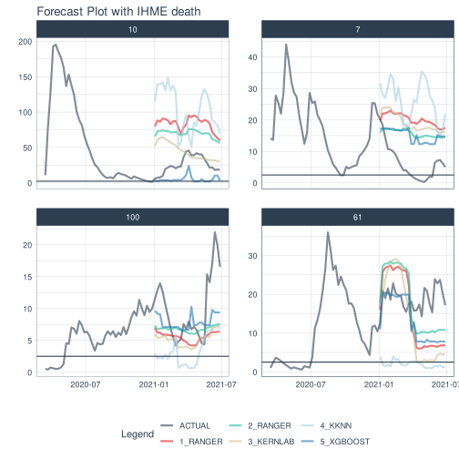

```r
result1 %>%
  select(-.model_desc, -.conf_lo, -.conf_hi, -.key) %>%
  rename(model = .model_id, value = .value, date= .index)%>%
  relocate(model, value, .after = client)%>%
  pivot_wider(names_from = model, values_from =value)%>%
  rename(actual = "NA", "Random forest" = "1", "Tuned random forest" = "2", "Support vector machines" = "3", "K-nearest neighbors" = "4", Xgboost = "5" )%>%
  drop_na()%>%
  pivot_longer("Random forest":Xgboost, names_to = "model", values_to = "predict")%>%
  relocate(model,.before = date)%>%
  mutate(obs = actual > threshold, predict_class = predict > threshold)%>%
  mutate(obs = as.factor(obs), predict_class = as.factor(predict_class))%>%
  group_by(date, model) %>%
  summarize(Sensitivity = sens_vec(obs, predict_class),
            Specifity = spec_vec(obs, predict_class),
            Accuracy = accuracy_vec(obs, predict_class),.groups = "keep")%>%
  pivot_longer(Sensitivity:Accuracy, names_to = "metric", values_to = "value") %>%
  ungroup() %>%
  ggplot(aes(x = date, y = value, color = model)) +
  geom_point() +
  geom_line() +
  facet_wrap( ~ metric)+
  ggtitle("With zip death data")
```


```r
result2 %>%
  select(-.model_desc, -.conf_lo, -.conf_hi, -.key) %>%
  rename(model = .model_id, value = .value, date= .index)%>%
  relocate(model, value, .after = client)%>%
  pivot_wider(names_from = model, values_from =value)%>%
  rename(actual = "NA", "Random forest" = "1", "Tuned random forest" = "2", "Support vector machines" = "3", "K-nearest neighbors" = "4", Xgboost = "5" )%>%
  drop_na()%>%
  pivot_longer("Random forest":Xgboost, names_to = "model", values_to = "predict")%>%
  relocate(model,.before = date)%>%
  mutate(obs = actual > threshold, predict_class = predict > threshold)%>%
  mutate(obs = as.factor(obs), predict_class = as.factor(predict_class))%>%
  group_by(date, model) %>%
  summarize(Sensitivity = sens_vec(obs, predict_class),
            Specifity = spec_vec(obs, predict_class),
            Accuracy = accuracy_vec(obs, predict_class),.groups = "keep")%>%
  pivot_longer(Sensitivity:Accuracy, names_to = "metric", values_to = "value") %>%
  ungroup() %>%
  ggplot(aes(x = date, y = value, color = model)) +
  geom_point() +
  geom_line() +
  facet_wrap( ~ metric)+
  ggtitle("Without death data")
```


*Calculate predict claims*

We calculate the predicted weekly claim by:

$$
\text{Predicted Smoothed AE} = \text{Predicted Shrunk AE} / \text{Shrinkage},
$$

$$
\text{Predicted weekly Claim} = \text{Predicted Smoothed AE} \cdot (\text{Expected Yearly Claim} /52.18 )
$$

```r
claim <- read_feather("data/processed_data_20_12_23.feather")%>%
  select(date, client, claims, expected, shrinkage,volume)
```

```r
predclaim<-result %>%
  select(-.model_desc, -.conf_lo, -.conf_hi, -.key) %>%
  rename(model = .model_id, value = .value, date= .index)%>%
  relocate(model, value, .after = client)%>%
  pivot_wider(names_from = model, values_from =value)%>%
  rename(actual = "NA", rf = "1", rf_tuned = "2", svm_rbd = "3", knn = "4", xgboost = "5" )%>%
  drop_na()%>%
 inner_join(claim, by = c("date", "client"))%>%
  mutate(rf = rf/shrinkage *(expected /52.18),
         rf_tuned = rf_tuned/shrinkage*(expected /52.18),
         svm_rbd = svm_rbd /shrinkage*(expected /52.18),
         knn = knn/shrinkage*(expected /52.18),
         xgboost= xgboost/shrinkage*(expected / 52.18))%>%
  select(date, client, claims,expected, rf, rf_tuned,svm_rbd,knn,xgboost)

predclaim1<-result1 %>%
  select(-.model_desc, -.conf_lo, -.conf_hi, -.key) %>%
  rename(model = .model_id, value = .value, date= .index)%>%
  relocate(model, value, .after = client)%>%
  pivot_wider(names_from = model, values_from =value)%>%
  rename(actual = "NA", rf = "1", rf_tuned = "2", svm_rbd = "3", knn = "4", xgboost = "5" )%>%
  drop_na()%>%
 inner_join(claim, by = c("date", "client"))%>%
  mutate(rf = rf/shrinkage *(expected /52.18),
         rf_tuned = rf_tuned/shrinkage*(expected /52.18),
         svm_rbd = svm_rbd /shrinkage*(expected /52.18),
         knn = knn/shrinkage*(expected /52.18),
         xgboost= xgboost/shrinkage*(expected / 52.18))%>%
  select(date, client, claims,expected, rf, rf_tuned,svm_rbd,knn,xgboost)

predclaim2<-result2 %>%
  select(-.model_desc, -.conf_lo, -.conf_hi, -.key) %>%
  rename(model = .model_id, value = .value, date= .index)%>%
  relocate(model, value, .after = client)%>%
  pivot_wider(names_from = model, values_from =value)%>%
  rename(actual = "NA", rf = "1", rf_tuned = "2", svm_rbd = "3", knn = "4", xgboost = "5" )%>%
  drop_na()%>%
 inner_join(claim, by = c("date", "client"))%>%
  mutate(rf = rf/shrinkage *(expected /52.18),
         rf_tuned = rf_tuned/shrinkage*(expected /52.18),
         svm_rbd = svm_rbd /shrinkage*(expected /52.18),
         knn = knn/shrinkage*(expected /52.18),
         xgboost= xgboost/shrinkage*(expected / 52.18))%>%
  select(date, client, claims,expected, rf, rf_tuned,svm_rbd,knn,xgboost)
```


Weekly total claims vs predicted claims

We can draw the following conclusion: 

1. K-nearest neighbors, Xgboost, svm can catch the trend for every week total claim.

2. Death data improve the results greatly.The zip death have the best result since it is the exact death of the area. And IHME death data result is also good. Without death data, none of 5 models can catch the change of claims.


```r
predclaim%>%
  group_by(date)%>%
  summarise(expected = sum(expected)/52.18,
        claims = sum(claims),
          rf =sum(rf) ,
         rf_tuned = sum(rf_tuned),
         svm_rbd = sum(svm_rbd) ,
         knn = sum(knn),
         xgboost= sum(xgboost))%>%
   rename("Random forest" = rf, "Tuned random forest" = rf_tuned, "Support vector machines" = svm_rbd, "K-nearest neighbors" = knn, Xgboost = xgboost )%>%
  pivot_longer(expected:Xgboost, names_to = "metric", values_to = "value")%>%
  ggplot(aes(x = date, y = value, color = metric)) + geom_line()+
  ggtitle(" Weekly total claim with IHME death")
```

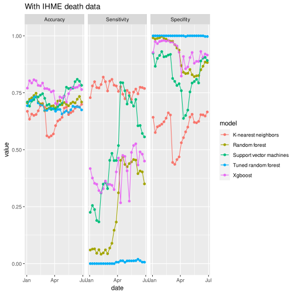

```r
predclaim1%>%
  group_by(date)%>%
  summarise(expected = sum(expected)/52.18,
        claims = sum(claims),
          rf =sum(rf) ,
         rf_tuned = sum(rf_tuned),
         svm_rbd = sum(svm_rbd) ,
         knn = sum(knn),
         xgboost= sum(xgboost))%>%
   rename("Random forest" = rf, "Tuned random forest" = rf_tuned, "Support vector machines" = svm_rbd, "K-nearest neighbors" = knn, Xgboost = xgboost )%>%
  pivot_longer(expected:Xgboost, names_to = "metric", values_to = "value")%>%
  ggplot(aes(x = date, y = value, color = metric)) + geom_line()+
  ggtitle(" Weekly total claim with zip death")
```

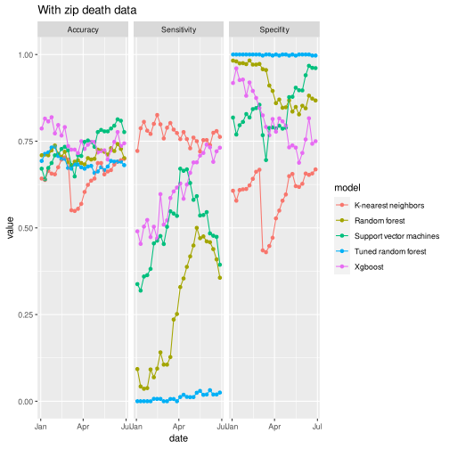

```r
predclaim2%>%
  group_by(date)%>%
  summarise(expected = sum(expected)/52.18,
        claims = sum(claims),
          rf =sum(rf) ,
         rf_tuned = sum(rf_tuned),
         svm_rbd = sum(svm_rbd) ,
         knn = sum(knn),
         xgboost= sum(xgboost))%>%
   rename( "Random forest" = rf, "Tuned random forest" = rf_tuned, "Support vector machines" = svm_rbd, "K-nearest neighbors" = knn, Xgboost = xgboost )%>%
  pivot_longer(expected:Xgboost, names_to = "metric", values_to = "value")%>%
  ggplot(aes(x = date, y = value, color = metric)) + geom_line()+
  ggtitle(" Weekly total claim without death")
```

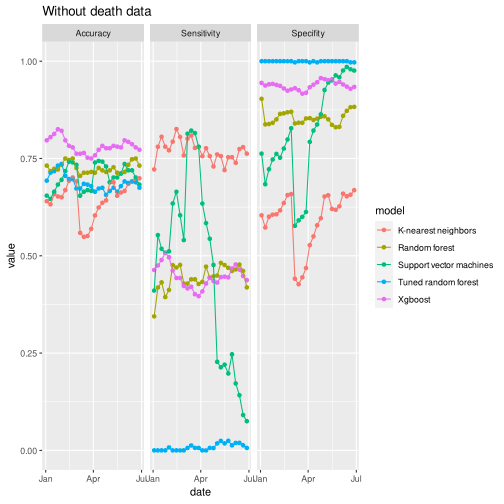
Half year total claims for each client vs predicted total claims

Each client, the result is not good since it is a global model for all clients.


```r
predclaim%>%
  filter(client %in% c(1:50))%>%
  group_by(client)%>%
  summarise(expected = sum(expected)/52.18,
        claims = sum(claims),
          rf =sum(rf) ,
         rf_tuned = sum(rf_tuned),
         svm_rbd = sum(svm_rbd) ,
         knn = sum(knn),
         xgboost= sum(xgboost))%>%
  rename("Random forest" = rf, "Tuned random forest" = rf_tuned, "Support vector machines" = svm_rbd, "K-nearest neighbors" = knn, Xgboost = xgboost )%>%
  pivot_longer(claims:Xgboost, names_to = "metric", values_to = "value")%>%
  ggplot(aes(x = client, y = value, color = metric)) + geom_point(alpha = 0.7) +
  scale_y_log10() +
  ggtitle("Total claims for 2021-01-01 to 2021-06-01 for each client with IHME death")
```

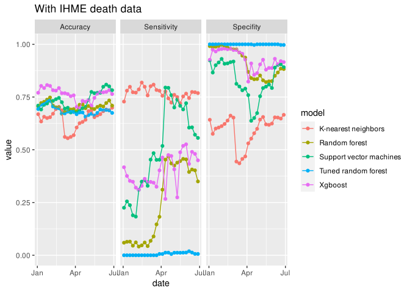

```r
predclaim1%>%
  filter(client %in% c(1:50))%>%
  group_by(client)%>%
  summarise(expected = sum(expected)/52.18,
        claims = sum(claims),
          rf =sum(rf) ,
         rf_tuned = sum(rf_tuned),
         svm_rbd = sum(svm_rbd) ,
         knn = sum(knn),
         xgboost= sum(xgboost))%>%
  rename("Random forest" = rf, "Tuned random forest" = rf_tuned, "Support vector machines" = svm_rbd, "K-nearest neighbors" = knn, Xgboost = xgboost )%>%
  pivot_longer(claims:Xgboost, names_to = "metric", values_to = "value")%>%
  ggplot(aes(x = client, y = value, color = metric)) + geom_point(alpha = 0.7)+
  scale_y_log10() +
  ggtitle("Total claims for 2021-01-01 to 2021-06-01 for each client with zip death")
```

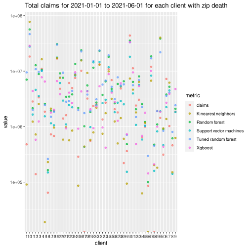

```r
predclaim2%>%
  filter(client %in% c(1:50))%>%
  group_by(client)%>%
  summarise(expected = sum(expected)/52.18,
        claims = sum(claims),
          rf =sum(rf) ,
         rf_tuned = sum(rf_tuned),
         svm_rbd = sum(svm_rbd) ,
         knn = sum(knn),
         xgboost= sum(xgboost))%>%
  rename("Random forest" = rf, "Tuned random forest" = rf_tuned, "Support vector machines" = svm_rbd, "K-nearest neighbors" = knn, Xgboost = xgboost )%>%
  pivot_longer(claims:Xgboost, names_to = "metric", values_to = "value")%>%
  ggplot(aes(x = client, y = value, color = metric)) + geom_point(alpha = 0.7)+
  scale_y_log10() +
  ggtitle("Total claims for 2021-01-01 to 2021-06-01 for each client without death data")
```

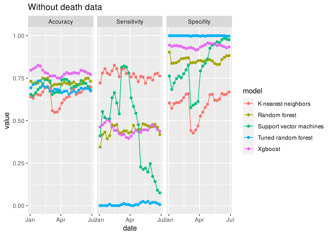

*Why this model doesn't work*

1. The performance on classification whether the client is adverse or not adverse is worse than our long-time and short-time model. 

2. Even this model is a global for all clients, it will take much more time than others.

3. It cannot predict the new client out of train set currently.

*Possible improvement for this model*

1. To improve accuracy, we can add feature engineering and localized model selection by time series identifier.

2. We can also choose the final predicted value according to the confident interval to improve our result since the exact AE is in the overlap of 5 models.
# Conclusion
# Future Directions

The models above perfumed tremendously well both long and short term. Even though the data used to build the models are from trusted sources as cited in the data wrangling section, the clients data is simulated due to privacy among others. Hence, the natural future step will be to test the models on real clients. We expect the models to perform as good as they did with the simulated clients. 

Another direction that this project can head to is to consider infections as lagged predictor for deaths. In other words, many infectious diseases contributed to the total deaths, for example in some years the US rate of the Influenza infections varies and the Influenza infections effects the respective total deaths, see the CDC [link](https://www.cdc.gov/flu/about/burden/index.html).Note that
high vaccinations have helped averted hospitalizations and deaths. See the CDC [report](https://www.cdc.gov/flu/about/burden-averted/2019-2020.htm). With this in mind models can be build to take into account the influenza infections and its vaccination rate. Influenza is very seasonal infection thus the forecast will of course be seasonal, but in building the future model other infectious disease can be taken into to account, be it seasonal or not.

As noted above, a new model  is naturally expected to give even better outcomes by adding more pandemic related predictors. To be precise, let's consider the relationship between vaccination and cases rate given by the CDC, check the [link](https://covid.cdc.gov/covid-data-tracker/#vaccination-case-rate),as expected the higher the vaccination the lower the cases and eventually lower death rate. So we expect that with these new covid-19 parameter among others will give better deaths forcast and thus better short-term model.

# Appendices

## Data repository

## R scripts

`data/zip3_rel.R`: generates `data/zip3_rel.feather`. Depends on

 * `data/zcta_county_rel_10.txt`

`data/deaths.R`: generates `data/deaths_zip3.feather`. Depends on

 * `data/zip3_rel.feather`, generated by `data/zip3_rel.R`
 * `data/covid_deaths_usafacts.csv`

`data/census.R`: generates `data/pop_den.feather`.

 * Requires an API key

`data/all_persons.r`: generates `data/simulation_data/all_persons.feather`. Depends on

 * `data/simulation_data/experience_weekly_{n}.RDS`, where n = 1,...,10
 * `data/simulation_data/person_{n}.RDS`, where n = 1,...,10
 * `data/soa_base_2017.csv`

`data/wrangling.Rmd`: generates `data/data.feather`. Depends on

 * `data/Population_Estimates.csv`
 * `data/COVID-19_Vaccinations_in_the_United_States_County_data.gov.csv`
 * `data/Provisional_COVID-19_Death_Counts_in_the_United_States_by_County.csv`
 * `data/Education_Estimates.csv`
 * `data/Poverty_Estimates.csv`
 * `data/Unemployment_Estimates.csv`
 * `data/Vaccine_Hesitancy_for_COVID-19__County_and_local_estimates.csv`
 * `data/countypres_2000-2020.csv`
 * `data/zip3_rel.feather`, generated by `data/zip3_rel.R`

`data/processed_data.r`: generates `data/processed_data_20_12_24.feather`. Depends on

 * `data/simulation_data/all_persons.feather`, generated by `data/all_persons.r`
 * `data/data.feather`, generated by `data/wrangling.Rmd`
 * `data/deaths_zip3.feather`, generated by `data/deaths.R`
 * `data/state.txt`
 * `data/zcta_county_rel_10.txt`
 * `data/2020_12_23/reference_hospitalization_all_locs.csv`

## Rmd files

`report.Rmd`: this file. Depends on

 * `data/processed_data_20_12_23.feather`, generated by `data/processed_data.r`
 * `calibwithIHME.rds`, Google Drive
 * `calibwithzipdeaths.rds`, Google Drive
 * `calibwithoutdeaths.rds`, Google Drive
 * `resultwithIHME.rds`, Google Drive
 * `resultwithzipdeaths.rds`, Google Drive
 * `resultwithoutdeaths.rds`, Google Drive

`time.Rmd`: work on time-dependent models. Depends on

 * `data/simulation_data/all_persons.feather`, generated by `data/all_persons.r`
 * `data/data.feather`, generated by `data/wrangling.Rmd`
 * `data/deaths_zip3.feather`, generated by `data/deaths.R`
 * `data/state.txt`, Google Drive
 * `data/zcta_county_rel_10.txt`, Google Drive
 * `data/2020_12_23/reference_hospitalization_all_locs.csv`, Google Drive
 * `data/process.feather`, generated by TODO

`baseline_models.Rmd`: work on time-independent models. Depends on

 * `data/simulation_data/all_persons.feather`, generated by `data/all_persons.r`
 * `data/data.feather`, generated by `data/wrangling.Rmd`

`comparing_time_models.Rmd`: work on ???? (TODO: samara). Depends on

 * `data/simulation_data/all_persons.feather`, generated by `data/all_persons.r`
 * `data/data.feather`, generated by `data/wrangling.Rmd`
 * `data/deaths_zip3.feather`, generated by `data/deaths.R`

`final.Rmd`: final presentation plots. Depends on

 * `data/processed_data_20_12_23.feather`, generated by `data/processed_data.r`

`presentation_2.Rmd`: technical presentation plots. Depends on

 * `data/simulation_data/all_persons.feather`, generated by `data/all_persons.r`
 * `data/data.feather`, generated by `data/wrangling.Rmd`

`random_forest.Rmd`: early work on random forest models

 * `data/simulation_data/all_persons.feather`, generated by `data/all_persons.r`
 * `data/data.feather`, generated by `data/wrangling.Rmd`

`logistic_regression(monthly ae).Rmd`: ??? TODO! (delete?)

`logistic_regression_attempt_1.Rmd`: ??? TODO! (delete?)

