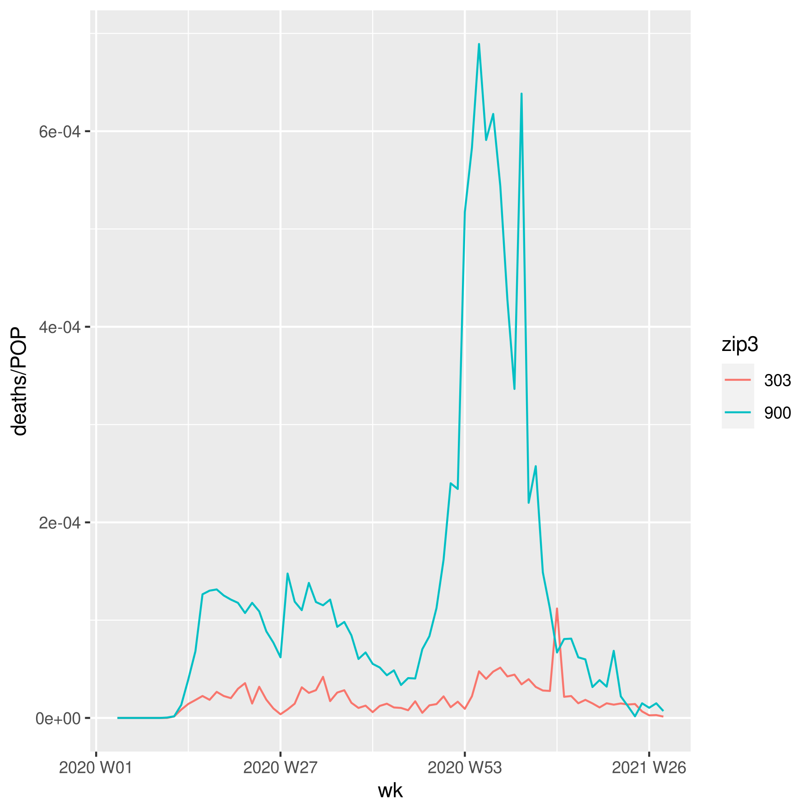

# Time-based models
Here we will look at what happens when time-dependent data is added. At the moment, we only use deaths per day per zipcode

## Data wrangling
This is going to be mostly the same as `baseline_models.Rmd`. Refer to that file for more details.
Note that here we're not extracting the AEs.

```r
library(tidyverse)
library(tidymodels)
library(feather)
# library(arrow)
library(magrittr)
library(skimr)
library(lubridate)
library(tsibble)
library(glue)
library(slider)
per <- read_feather("data/simulation_data/all_persons.feather")

clients <-
  per %>%
  group_by(client) %>%
  summarize(
    zip3 = first(zip3),
    size = n(),
    volume = sum(FaceAmt),
    avg_qx = mean(qx),
    avg_age = mean(Age),
    per_male = sum(Sex == "Male") / size,
    per_blue_collar = sum(collar == "blue") / size,
    expected = sum(qx * FaceAmt)
  )

zip_data <-
  read_feather("data/data.feather") %>%
  mutate(
    density = POP / AREALAND,
    AREALAND = NULL,
    AREA = NULL,
    HU = NULL,
    vaccinated = NULL,
    per_lib = NULL,
    per_green = NULL,
    per_other = NULL,
    per_rep = NULL,
    unempl_2020 = NULL,
    deaths_covid = NULL,
    deaths_all = NULL
  ) %>%
  rename(
    unemp = unempl_2019,
    hes_uns = hes_unsure,
    str_hes = strong_hes,
    income = Median_Household_Income_2019
  )

clients %<>%
  inner_join(zip_data, by = "zip3") %>%
  drop_na()
```

Now we have to be careful...

We take daily covid deaths and make them weekly.
Also, look at weekly deaths instead of deaths to date

```r
deaths <-
  read_feather("data/deaths_zip3.feather") %>%
  mutate(yw = yearweek(date)) %>%
  select(-date) %>%
  group_by(zip3, yw) %>%
  summarize(totdeaths = max(deaths)) %>%
  mutate(zip_deaths = totdeaths - lag(totdeaths, default = 0)) %>%
  select(-totdeaths) %>%
  ungroup()
## `summarise()` has grouped output by 'zip3'. You can override using the `.groups` argument.
```

Let's see what it looks like in Atlanta and LA. We normalize by population.

```r
deaths %>%
  left_join(zip_data, by = "zip3") %>%
  filter(zip3 %in% c("303", "900")) %>%
  ggplot(aes(x = yw, color = zip3)) +
  geom_line(aes(y = zip_deaths / POP))
```



One thing to note, there is no death data for zipcodes 202, 204, 753, 772 (which is fine, since there is no zip_data for those either).

Let's join client data and deaths (maybe not?)

```r
# clients %<>%
#   left_join(deaths, by = "zip3") %>%
#   relocate(yw, zip_deaths, .after = "zip3")
```

Next we look at the deaths only

```r
per %<>%
  drop_na() %>%
  select(-month)
```

2019 didn't have 53 weeks, so the deaths on week 53 in 2019 will be changed to death in week 1 of 2020.
I tried to do this, but then it turns out that some individuals die many times!!!
Let's fix this

```r
per %<>%
  group_by(client, participant) %>%
  arrange(year, week, by_group = TRUE) %>%
  slice_head(n = 1) %>%
  ungroup()
```

Now back to the 53 week business

```r
wk53 <-
  per %>%
  filter(year == 2019, week == 53) %>%
  mutate(year = 2020, week = 1)
per %<>%
  rows_update(wk53, by = c("client", "participant"))
```

The tibble `per` contains all the people that die and their deathweek. Everyone should die only once now! Let's convert the week and year into a yearweek object

```r
per %<>%
  nest_by(week, year) %>%
  mutate(yw = yearweek(glue("{year} w{week}")), .before = "week") %>%
  ungroup() %>%
  select(-week, -year) %>%
  unnest(cols = c(data))
```


Next, we need some kind of a rolling count for AE. Looks like the package `slider` might help.
I want actual claims per week for each client.
We note that there are 4 clients that won't have any deaths

```r
no_deaths <-
  clients %>%
  anti_join(per, by = "client") %>%
  select(client) %>%
  mutate(yw = yearweek("2019 w01"), claims = 0)
```

We compute face amount per week for each client. We also

```r
weekly_claims <-
  per %>%
  group_by(yw, client) %>%
  summarize(claims = sum(FaceAmt), .groups = "drop") %>%
  bind_rows(no_deaths) %>%
  complete(yw, client, fill = list(claims = 0))
## Error: Must group by variables found in `.data`.
## * Column `yw` is not found.
```

We now have 65,369 rows, which is 131 weeks * 499 clients.

Let's merge everything.

```r
weekly_data <-
  clients %>%
  left_join(weekly_claims, by = c("client")) %>%
  relocate(yw) %>%
  relocate(claims, .after = zip3) %>%
  left_join(deaths, by = c("yw", "zip3")) %>%
  relocate(zip_deaths, .after = claims) %>%
  mutate(zip_deaths = replace_na(zip_deaths, 0))
```

